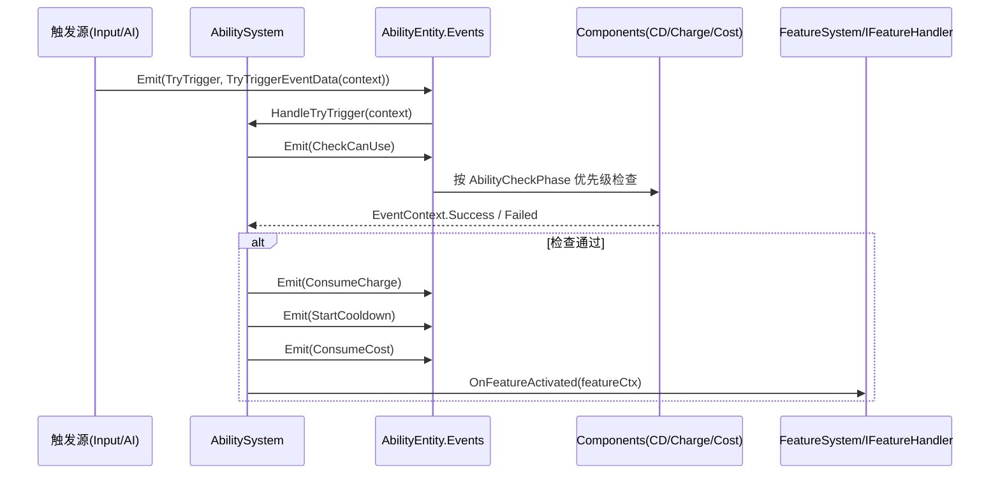

# 技能系统架构设计理念

**文档类型**：架构概念说明（唯一）  
**目标受众**：架构师、核心开发人员、AI 助手  
**最后更新**：2026-03-18

> [!NOTE]
> 本文档是技能系统的**唯一概念文档**，涵盖架构理念、目标选择设计、输入方案和 UI 设计。
> 代码实现详见 `Src/` 路径下各文件的内联注释。

---

## 1. 核心设计哲学

> [!IMPORTANT]
> **技能系统完全遵循项目 ECS 框架原则**，不引入任何外部框架的独立类概念。
> **核心思想**：Data 驱动状态，Event 驱动流程，System 驱动逻辑。

**架构一致性矩阵**：

| ECS 原则 | 技能系统实现 |
|:---|:---|
| **Scene 即 Entity** | `AbilityEntity` 继承 `Node` 实现 `IEntity`，归还对象池管理 |
| **Data 唯一数据源** | 所有技能属性（CD、伤害、范围）均通过 `DataKey` 存储，严禁组件私有状态 |
| **Component 无状态** | 组件仅负责响应事件和读写 `Data`，不持有运行时数据 |
| **EntityManager 入口** | 通过 `EntityManager.AddAbility` 创建，由关系管理器维护 Owner 关系 |
| **事件驱动通信** | 组件间解耦，通过 `Events.Emit()` 进行 "请求-响应"式交互 |

---

## 2. 核心架构：Trigger / Cast / Execute 三层分离

| 阶段 | 英文 | 职责 | 核心组件/系统 |
|:---|:---|:---|:---|
| **1. 触发层** | **Trigger** | 判断"什么时候该放"。只发出请求，不扣资源。 | `TriggerComponent` / `ActiveSkillInputComponent` |
| **2. 施法层** | **Cast** | 判断"能不能放"。冷却、消耗、目标验证。 | `AbilitySystem` (Static) |
| **3. 执行层** | **Execute** | 处理"怎么放"。生成子弹、造成伤害、应用 Buff。 | `FeatureSystem` + `IFeatureHandler` |

### 2.1 触发层 (Trigger)

- **职责**：产生"施法请求"。
- **来源**：玩家输入（`ActiveSkillInputComponent`）、AI 决策、全局事件、周期性定时器（`TriggerComponent`）。
- **关键点**：触发层 **不应该** 直接修改冷却或消耗资源，它只是一个 "Intention" (意图)。

### 2.2 施法层 (Cast)

`AbilitySystem.HandleTryTrigger()` 收到 `TryTrigger` 事件后，进入 `TryTriggerAbilityWithContext()` 流水线：

1. **CanUse** — 发送 `CheckCanUse` 事件，按 `AbilityCheckPhase` 优先级（Cooldown → Cost → TargetValidity → Custom）依次检查
2. **ConsumeCharge** — 消耗充能
3. **StartCooldown** — 启动冷却（周期性技能跳过）
4. **ConsumeCost** — 消耗魔法/能量等
5. **Execute** — 通过 `FeatureSystem.OnFeatureActivated` → `IFeatureHandler.OnActivated` 标记运行开始 → `IFeatureHandler.OnExecute` 执行具体效果

> 异步瞄准属于输入预处理：`ActiveSkillInputComponent` 点选前可调用 `AbilitySystem.CanUseAbility(ability)` 做不消耗资源的预检查；确认后由 `TargetingManager` 写入 `TargetPosition` 并发正式 `TryTrigger`。正式提交仍会再次检查 CanUse。

### 2.3 执行层 (Execute)

- **独立性**：执行逻辑不写在 `EntityManager`，统一挂到 `FeatureSystem + IFeatureHandler` 生命周期上。
- **无状态**：处理器只依赖传入的 `CastContext` 进行操作。
- **多态性**：每个技能可以有完全不同的执行逻辑。
- **命名约束**：`AbilityConfig.FeatureHandlerId` 必须直接填写完整唯一 `FeatureId`，例如 `技能.位移.冲刺`；`FeatureGroupId` 仅用于技能展示分组，不参与运行时处理器查找。

---

## 3. 目标选择设计

### 3.1 输入分流，执行自决

正式施法统一通过 `TryTrigger` 事件入口（`AbilitySystem.HandleTryTrigger`），但系统不再内置通用目标解析。Point 点选在输入阶段先完成，具体目标策略写在技能 Handler 的执行逻辑：

| 类型 | 时序模型 | 处理方式 | 正式 TryTrigger 返回值 |
|:---|:---|:---|:---|
| **Entity** (单位目标) | **同步** | Handler 在 `ExecuteAbility` 中调用 `TargetQueryEngine.QueryEntities`；无目标时自行打空或降级 | `Success` / `Failed` |
| **Point** (位置目标) | **异步输入 + 同步提交** | 输入层先点选；确认后 Handler 在 `ExecuteAbility` 中读取 `TargetPosition` | `Success` / `Failed` |
| **EntityOrPoint** | **技能自定义** | 输入层和 Handler 按技能需求约定；不要把通用分流写回 AbilitySystem | `Success` / `Failed` |
| **None** (无目标) | **同步** | Handler 在执行阶段自行处理 | `Success` / `Failed` |

**设计原则**：目标策略属于技能逻辑，不属于 `AbilitySystem`。正式流水线只通过 `TriggerResult` 枚举表达提交结果（Success / Failed）。

### 3.2 技能分类与手柄适配

| 分类 | War3 原型 | 手柄操作 |
|:---|:---|:---|
| **无目标 (Instant)** | 雷霆一击、天神下凡 | 按 X 键直接释放 |
| **单位目标 (Unit Target)** | 风暴之锤、死亡缠绕 | 按 X 键 → 技能 Handler 自动索敌（最近/最高威胁） |
| **位置目标 (Point Target)** | 暴风雪、烈焰风暴 | 按 X 键 → 进入瞄准模式 → 右摇杆控制指示器 → X 确认 / B 取消 |

### 3.3 瞄准系统 (TargetingSystem)

Point 类型技能的异步输入子系统，由输入层触发：

```
StartTargeting → 生成 TargetingIndicatorEntity → 右摇杆移动（射程限制）→ X 确认 / B 取消 → EndTargeting
```

- **TargetingManager**：瞄准状态机，管理异步流程
- **TargetingIndicatorEntity**：可视化施法点标记（War3 "马甲"模式）
- **TargetingIndicatorControlComponent**：右摇杆输入、射程限制、确认/取消处理

---

## 4. 组件职责与通信

组件不直接相互调用，而是通过事件 + 上下文模式协作（`EventContext` + `CastContext.ResponseContext`）。

### 组件职责矩阵

| 组件 | 核心职责 | 监听事件 | 发送事件 |
|:---|:---|:---|:---|
| `TriggerComponent` | 触发源管理 (手动/自动/事件/周期) | 全局事件 | `TryTrigger` |
| `CooldownComponent` | 冷却计时与检查 | `CheckCanUse` / `StartCooldown` / `ResetCooldown` | `Ready` |
| `ChargeComponent` | 充能次数管理 | `CheckCanUse` / `ConsumeCharge` | `ChargeRestored` |
| `CostComponent` | 资源消耗管理 (魔法/能量/生命值) | `CheckCanUse` / `ConsumeCost` | — |

### 通信流程图



---

## 5. 主动技能输入设计

### 5.1 设计决策

> **核心洞察**：Survivor 类游戏应尽量减少主动操作。采用 **单槽位 + LB/RB 切换** 方案。

| 按键 | 功能 |
|:---|:---|
| **LB / RB** | 切换当前选中的主动技能（左/右循环） |
| **X** | 释放当前选中技能 |

### 5.2 输入流程

`ActiveSkillInputComponent` 挂载到 `PlayerEntity`，每帧轮询输入：

1. **LB/RB** → `CycleActiveAbility()` → 更新 `GeneratedDataKey.CurrentActiveAbilityIndex` → 发送 UI 事件
2. **X** → `TryUseCurrentActiveAbility()` → 发射 `TryTrigger` 事件
   - Point 技能会先进入点选，确认点位后再发正式 `TryTrigger`
   - `AbilitySystem` 将正式提交结果写入 `CastContext.ResponseContext`，调用者读取 `TriggerResult`（`Success` / `Failed`）

### 5.3 技能筛选

通过 `EntityManager.GetManualAbilities()` 统一筛选（输入组件和 UI 共用）：
- `AbilityType != Passive`
- `AbilityTriggerMode.HasFlag(Manual)`

结果缓存在 `ActiveSkillInputComponent` 中，仅在技能增删事件时刷新，避免每帧 LINQ 分配。

---

## 6. 技能 UI 设计

### 6.1 架构

```
ActiveSkillBarUI (HBoxContainer) — 4 槽位固定布局
├── ActiveSkillSlotUI × 4
│   ├── Background
│   ├── SkillIcon
│   ├── CooldownOverlay (从上到下收缩动画)
│   ├── ChargeLabel ("2/3")
│   ├── KeyHintLabel ("X")
│   └── HighlightBorder (选中高亮)
```

### 6.2 事件驱动更新

| 事件 | 响应 |
|:---|:---|
| `Ability.Added` / `Ability.Removed` | 刷新槽位绑定 |
| `UI.ActiveSkillSelected` | 切换高亮 |
| `Ability.ChargeRestored` / `Ability.ConsumeCharge` | 更新充能显示 |
| `Ability.StartCooldown` / `Ability.Ready` | 冷却遮罩动画 |

冷却进度通过 `_Process` 轮询实现平滑动画（非事件驱动）。

---

## 7. 数据结构设计 (DataKeys)

技能配置资源统一使用 `AbilityConfig` / `ChainAbilityConfig`，并在运行时扁平化注入 `Data`。

| 分类 | DataKey | 说明 |
|:---|:---|:---|
| **基础** | `AbilityCategory` | 技能显示分类，仅用于 UI / 调试分组，不参与执行逻辑 |
| **触发** | `AbilityTriggerMode` | Manual / OnEvent / Periodic / Permanent (位掩码) |
| **目标** | `AbilityTargetSelection` | None / Entity / Point / EntityOrPoint，仅表达输入语义 |
| | `AbilityCastRange` | 施法距离或 Handler 自定义索敌/点选射程 |
| | `AbilityEffectRadius` | 效果半径或 Handler 自定义范围 |
| **冷却** | `AbilityCooldown` | 基础冷却时间 |
| **充能** | `AbilityMaxCharges` | 最大充能数 |
| | `AbilityChargeTime` | 充能回复时间 (<0 不自动回复) |
| **消耗** | `AbilityCostType` | None / Mana / Energy / Ammo / Health |
| | `AbilityCostAmount` | 消耗数量 |

---

## 8. 设计问答 (Q&A)

### Q1: 为什么执行逻辑不放在 EntityManager?
`EntityManager` 的职责是 **生命周期管理**。执行逻辑属于 **业务行为**，放入管理器会导致上帝类。

### Q2: 为什么 TriggerComponent 不直接扣冷却?
为了支持 "试图释放但失败" 的情况（被沉默、目标丢失等）。触发层只表达意图，施法层决定能否执行。

### Q3: 为什么 Point 点选不再放进 AbilitySystem?
Point 目标是异步输入，不是正式施法提交的一部分。点选前可调用 `AbilitySystem.CanUseAbility` 复用冷却、充能、资源预检查；确认点位后再发正式 `TryTrigger`，由 AbilitySystem 再次检查并消耗。

### Q4: EntityOrPoint 混合模式如何实现?
由输入层和具体 Handler 为该技能明确约定。例如输入层可按配置先进入点选，Handler 在 `ExecuteAbility` 中读取点位并自行查询实体；或者 Handler 在执行阶段先查实体，未命中时按默认方向/默认点位降级。

---

## 9. 相关代码

| 文件 | 说明 |
|:---|:---|
| `Src/ECS/Capabilities/Ability/System/AbilitySystem.cs` | 施法流水线核心 |
| `DocsAI/ECS/Capabilities/Ability/System/Usage.md` | 瞄准子系统说明（状态机与事件流） |
| `Src/ECS/Capabilities/Ability/System/EntityManager_Ability.cs` | 技能 CRUD + `GetManualAbilities()` |
| `Src/ECS/Capabilities/Ability/System/AbilityCheckPhase.cs` | 检查阶段优先级枚举 |
| `Src/ECS/Capabilities/Ability/System/TriggerResult.cs` | 触发结果枚举（Success / Failed） |
| `Src/ECS/Capabilities/Ability/System/TargetingSystem/TargetingManager.cs` | 瞄准状态机 |
| `Src/ECS/Capabilities/Ability/Component/ActiveSkillInputComponent/` | 主动技能输入 |
| `Src/ECS/UI/UI/SkillUI/ActiveSkillBarUI.cs` | 技能栏 UI |
| `Src/ECS/UI/UI/SkillUI/ActiveSkillSlotUI.cs` | 技能槽位 UI |
| `Src/ECS/Capabilities/TestSystem/System/AbilityTestService.cs` | 技能测试服务（分类分组、增删启停、视图模型） |
| `Src/ECS/Capabilities/TestSystem/System/AbilityTestModule.cs` | 运行时技能测试界面（双 Tree + PopupMenu） |
| `Src/ECS/Capabilities/Ability/Events/CastContext.cs` | 施法上下文 |
| `Data/DataKey/Ability/AbilityEnums.cs` | 枚举定义 |
