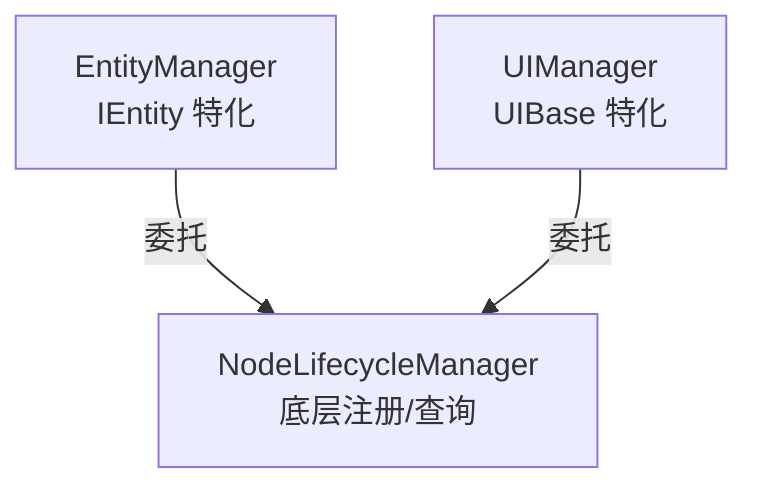

<!-- migrated-from: Src/ECS/Tools/NodeLifecycle/NodeLifecycleManager.md -->

> 迁移来源：`Src/ECS/Tools/NodeLifecycle/NodeLifecycleManager.md`
> 迁移说明：本文主体从原 `Src/ECS` 文档迁入 `DocsAI` 统一管理；原 `Src/ECS` Markdown 文件已删除。

# NodeLifecycleManager 历史迁移说明

**文档类型**：API 文档 + 使用指南  
**目标受众**：开发者  
**最后更新**：2026-01-22

---

## 概述

`NodeLifecycleManager` 现在只是 Runtime NodeLifecycle 的薄底层入口。current 文档见：

```text
DocsAI/ECS/Runtime/NodeLifecycle/README.md
Src/ECS/Runtime/NodeLifecycle/
```

**设计理念**：
- **底层抽象**：`EntityManager` 和 `UIManager` 都基于此类构建
- **职责单一**：只负责"注册表"管理，不涉及具体业务逻辑
- **关系分离**：Entity 生命周期父子关系由 `LifecycleTree` 负责，Component owner 反查由 `ComponentRegistrar` 负责，业务 owner 由各 capability service 负责

---

## 快速开始

### 注册 Node

```csharp
NodeLifecycleManager.Register(node, NodeLifecycleOwner.Entity(entityId.Value), "EntitySpawnPipeline.Spawn");
NodeLifecycleSnapshot snapshot = NodeLifecycleManager.GetSnapshot();
```

### 查询 Node

Entity、UI、Component 和 TargetSelector 查询必须走各自 owner facade，不再把 NodeLifecycle 全局扫描作为 current API 示例。

### 注销 Node

```csharp
// 通过实例注销
NodeLifecycleManager.Unregister(node);

// 通过 ID 注销
NodeLifecycleManager.Unregister(nodeId);
```

---

## API 参考

### Register

```csharp
bool Register(Node node, NodeLifecycleOwner owner, string source)
```

注册 Node 到管理器。

**参数**：
- `node`：要注册的节点
- `nodeType`：节点类型名称（如 "Enemy", "HealthBarUI"）

**返回**：是否成功注册（false 表示已存在）

---

### IsRegistered

```csharp
bool IsRegistered(string nodeId)
bool IsRegistered(Node node)
```

检查 Node 是否已注册。

---

### Unregister

```csharp
bool Unregister(Node node)
bool Unregister(string nodeId)
```

从管理器注销 Node。

**返回**：是否成功注销（false 表示不存在）

---

### GetNodeById

```csharp
Node? GetNodeById(string nodeId)
```

根据 ID 获取 Node。

---

### GetNodesByType

```csharp
internal IReadOnlyList<T> GetNodesByType<T>() where T : Node
```

按类型名称查询所有匹配的 Node。

---

### GetNodesByInterface

```csharp
internal IReadOnlyList<T> GetNodesByInterface<T>() where T : class
```

获取所有实现指定接口/基类的 Node。

---

### GetAllNodes

```csharp
internal IReadOnlyList<Node> GetAllNodes()
```

获取所有已注册的 Node。

---

### Clear

```csharp
void Clear()
```

清理所有注册（场景切换时调用）。

---

## 与 EntityManager/UIManager 的关系



- **EntityManager**：在 `NodeLifecycleManager` 基础上添加 `IEntity` 特化逻辑（Data、Events、Component、LifecycleTree）
- **UIManager**：在 `NodeLifecycleManager` 基础上添加 `UIBase` 特化逻辑（绑定、关系）

---

## 相关文档

- [EntityManager 文档](../../Entity/EntityManager.md)
- [Entity 使用说明](../../Entity/Entity使用说明.md)
