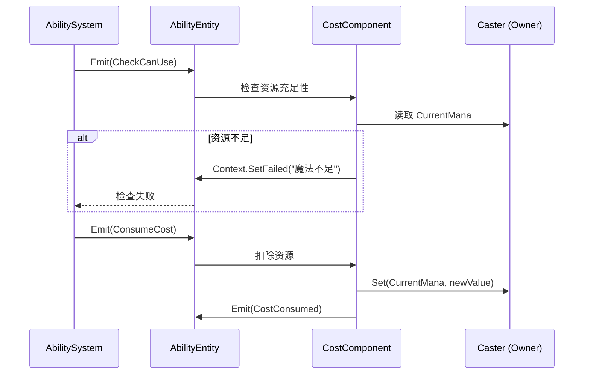

# CostComponent (消耗组件)

**文档类型**: 使用指南  
**目标受众**: 开发人员  
**最后更新**: 2026-05-02

---

## 概述

`CostComponent` 管理技能释放时的资源消耗,支持魔法、能量、弹药、生命值等多种消耗类型。

**核心特性**:
- ✅ 事件驱动,完全遵循 ECS 架构
- ✅ 无状态设计,数据存储在 `Data` 中
- ✅ 自动检查施法者资源是否充足
- ✅ 支持多种消耗类型扩展

---

## 配置方式

### 通过 DataKey 配置

在 `Data/DataNew/Ability/*AbilityData.cs` 或临时测试字典中设置以下数据键。运行时由 `EntityManager.AddAbility` / `EntityManager.Spawn` 注入 `AbilityEntity.Data`，旧 `.tres` AbilityConfig 不再作为新增运行时主入口。

```csharp
var abilityConfig = new Dictionary<string, object>
{
    [DataKey.Name] = "Fireball", // 技能名
    [DataKey.AbilityCostType] = AbilityCostType.Mana, // 消耗类型
    [DataKey.AbilityCostAmount] = 50f // 消耗数量
};
```

### 支持的消耗类型

| 消耗类型 | 资源键 | 说明 | 示例技能 |
|:---|:---|:---|:---|
| `AbilityCostType.None` | - | 无消耗 | 冲刺、翻滚 |
| `AbilityCostType.Mana` | `DataKey.CurrentMana` | 魔法值 | 火球术、冰霜新星 |
| `AbilityCostType.Energy` | `CurrentEnergy` | 能量 | 战吼、猛击 |
| `AbilityCostType.Ammo` | `CurrentAmmo` | 弹药 | 狙击、火箭炮 |
| `AbilityCostType.Health` | `DataKey.CurrentHp` | 生命值 | 血祭、狂怒 |

> [!NOTE]
> `Energy` 和 `Ammo` 系统当前为预留接口,需要未来实现对应的资源系统。

---

## 事件流程



---

## 核心接口

### 监听事件

| 事件名称 | 事件数据 | 响应逻辑 |
|:---|:---|:---|
| `CheckCanUse` | `CheckCanUseEventData` | 检查施法者资源是否充足 |
| `ConsumeCost` | `ConsumeCostEventData` | 从施法者扣除资源 |

### 发送事件

| 事件名称 | 事件数据 | 用途 |
|:---|:---|:---|
| `CostConsumed` | `CostConsumedEventData` | 通知 UI/统计系统资源已被消耗 |

---

## 使用示例

### 示例 1: 魔法消耗技能

```csharp
// 配置火球术 - 消耗 50 魔法
var fireballConfig = new Dictionary<string, object>
{
    [DataKey.Name] = "Fireball", // 技能名
    [DataKey.AbilityType] = AbilityType.Active, // 主动技能
    [DataKey.AbilityCostType] = AbilityCostType.Mana, // 消耗魔法
    [DataKey.AbilityCostAmount] = 50f, // 消耗数量
    [DataKey.AbilityCooldown] = 3f // 冷却秒数
};

EntityManager.AddAbility(player, fireballConfig);
```

**行为**:
- 释放前检查玩家是否有 ≥50 魔法
- 检查通过后扣除 50 魔法
- 发送 `CostConsumed` 事件,UI 可监听更新魔法条

### 示例 2: 生命消耗技能

```csharp
// 配置血祭 - 消耗 30% 当前生命值
var bloodRageConfig = new Dictionary<string, object>
{
    [DataKey.Name] = "BloodRage", // 技能名
    [DataKey.AbilityType] = AbilityType.Active, // 主动技能
    [DataKey.AbilityCostType] = AbilityCostType.Health, // 消耗生命
    [DataKey.AbilityCostAmount] = 30f // 固定值
};
```

**行为**:
- 释放前检查生命值是否 ≥30
- 扣除 30 点生命值
- 适合"以命换伤"类技能

### 示例 3: 无消耗技能

```csharp
// 配置冲刺 - 仅冷却,无资源消耗
var dashConfig = new Dictionary<string, object>
{
    [DataKey.Name] = "Dash", // 技能名
    [DataKey.AbilityType] = AbilityType.Active, // 主动技能
    [DataKey.AbilityCostType] = AbilityCostType.None, // 无消耗
    [DataKey.AbilityCooldown] = 8f, // 冷却秒数
    [DataKey.IsAbilityUsesCharges] = true, // 使用充能
    [DataKey.AbilityMaxCharges] = 2 // 最大充能
};
```

**行为**:
- `CostComponent` 跳过所有检查
- 仅受冷却和充能限制

---

## 设计要点

### 1. 访问施法者资源

`CostComponent` 的关键设计是访问 **施法者 (Caster)** 的资源,而非技能自身数据:

```csharp
// 通过关系管理器获取施法者
var abilityId = _entity.Data.Get<string>(DataKey.Id);
var ownerId = EntityRelationshipManager.GetParentEntitiesByChildAndType(
    abilityId, EntityRelationshipType.ENTITY_TO_ABILITY
).FirstOrDefault();
var caster = EntityManager.GetEntityById(ownerId) as IEntity;

// 读取施法者的资源
var currentMana = caster.Data.Get<float>(DataKey.CurrentMana);
```

### 2. 与其他组件的区别

| 组件 | 数据来源 | 消耗对象 |
|:---|:---|:---|
| `CooldownComponent` | `Ability.Data` | 技能冷却时间 |
| `ChargeComponent` | `Ability.Data` | 技能充能次数 |
| **`CostComponent`** | **`Caster.Data`** | **施法者资源** ⭐ |

### 3. 消耗顺序

在 `AbilitySystem.TryTriggerAbilityWithContext` 中的执行顺序:

1. **就绪检查** (`CheckCanUse`)
   - `CooldownComponent`: 是否冷却完成?
   - `ChargeComponent`: 是否有充能?
   - **`CostComponent`**: 是否有足够资源?

2. **资源消耗**
   - `ChargeComponent`: 扣除 1 次充能
   - **`CostComponent`**: 扣除资源 (魔法/能量等)
   - `CooldownComponent`: 启动冷却

3. **技能执行**

---

## 常见问题

### Q1: 如何实现百分比消耗 (如消耗 30% 最大魔法)?

**A**: 当前 `CostComponent` 仅支持固定值消耗。百分比消耗不要通过旧 `AbilityExecutor` 临时改写；按当前架构应在 DataKey / CostComponent 内显式建模，或在具体 `AbilityFeatureHandler.ExecuteAbility` 中处理技能效果，资源扣除仍由 CostComponent 流程负责。

扩展 `DataKey_Ability.cs` 时新增 `static readonly DataMeta`，不要新增普通业务 `const string`：

```csharp
public static readonly DataMeta AbilityCostPercentMode = DataRegistry.Register(
    new DataMeta
    {
        Key = nameof(AbilityCostPercentMode), // DataKey 名称
        DisplayName = "百分比消耗", // 编辑器显示名
        Category = DataCategory_Ability.Cost, // 分类
        Type = typeof(bool), // 值类型
        DefaultValue = false // 默认关闭
    });
```

在 `CostComponent` 中判断模式并计算。

### Q2: 如何实现消耗减免 (如装备 "魔法消耗 -20%")?

**A**: 类似 `CooldownReduction`，添加新的 `DataMeta`：

```csharp
public static readonly DataMeta CostReduction = DataRegistry.Register(
    new DataMeta
    {
        Key = nameof(CostReduction), // DataKey 名称
        DisplayName = "消耗减免", // 编辑器显示名
        Category = DataCategory_Attribute.Skill, // 属性分类
        Type = typeof(float), // 百分比
        DefaultValue = 0f, // 默认无减免
        MinValue = 0f, // 最小值
        MaxValue = 100f, // 最大值
        IsPercentage = true, // 0-100 百分比
        SupportModifiers = true // 支持 Modifier
    });
```

在 `CostComponent.OnConsumeCost` 中应用:

```csharp
var reduction = caster.Data.Get<float>(DataKey.CostReduction);
var finalCost = CostAmount * (1 - reduction / 100f);
```

### Q3: 如何处理资源不足时的 UI 提示?

**A**: 监听 `CheckCanUse` 失败后的上下文:

```csharp
// 在 UI 层监听
ability.Events.On<GameEventType.Ability.CheckCanUseEventData>(
    GameEventType.Ability.CheckCanUse,
    evt => {
        if (!evt.Context.Success)
        {
            ShowToast(evt.Context.FailReason); // "魔法不足"
        }
    }
);
```

---

## 相关文档

- `DocsAI/Modules/AbilitySystem.md`
- `DocsAI/Modules/Data.md`
- `DocsAI/Modules/DataAuthoring.md`
- `Src/ECS/Base/System/AbilitySystem/README.md`
- `Src/ECS/Base/Component/Ability/ChargeComponent/README.md`
- `Src/ECS/Base/Component/Ability/CooldownComponent/README.md`

---

**维护者**: 项目团队  
**文档版本**: v1.1  
**更新日期**: 2026-05-02
