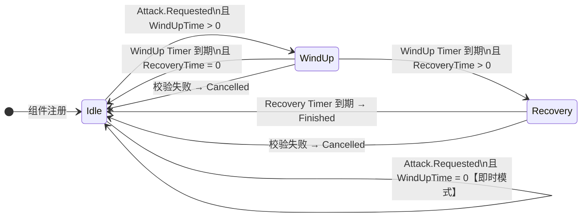

# AttackComponent — 攻击系统设计说明

> **适用范围**：本文档说明攻击系统的完整工作原理，供开发者在集成、扩展或排查问题时参考。

## 一、状态机总览

攻击流程是一个有限状态机（FSM），状态定义见 `AttackState` 枚举：



**三个状态的职责**：

| 状态 | 含义 | 可接受新攻击请求？ | 校验计时器运行？ |
|---|---|:---:|:---:|
| `Idle` | 空闲 | ✅ | ❌ |
| `WindUp` | 前摇（蓄力，未出手） | ❌ | ✅ 含距离检查 |
| `Recovery` | 后摇（已出手，硬直中） | ❌ | ✅ 仅自身/目标存活 |

---

## 二、双计时器机制

这是本系统最核心的设计。所有时间控制**完全由 Timer 驱动，不存在 `_Process`**。

### 3.1 阶段计时器（Phase Timer）

```
_phaseTimer = TimerManager.Delay(windUpTime).OnComplete(OnWindUpComplete)
_phaseTimer = TimerManager.Delay(recoveryTime).OnComplete(OnRecoveryComplete)
```

**职责**：驱动状态向前推进。  
**生命周期**：每次状态切换都 Cancel 旧的并重新启动一个。

### 3.2 校验计时器（Validation Timer）

```
_validationTimer = TimerManager.Loop(0.2f).OnLoop(ValidateAttackContext)
```

**职责**：每 0.2s 检查一次"当前攻击是否还合法"，相当于低频 `_Process`。  
**触发取消的条件**：

1. **自身死亡** → `SelfDead`
2. **自身被眩晕** → `SelfDisabled`
3. **目标对象无效**（被回收/QueueFree）→ `TargetInvalid`
4. **目标死亡** → `TargetDead`
5. **目标超出攻击范围 × 1.5**（仅在 WindUp 阶段检查）→ `TargetOutOfRange`

> **为什么后摇不检查距离？**  
> 后摇只是收招动画，伤害已经打出去了。如果此时目标逃跑，中断只会打断动画，不影响游戏结果，且对玩家体验无意义。

> **为什么是 1.5 倍容差？**  
> 防止贴脸时微小的物理偏移（0.01 px）导致攻击频繁无效化。

### 3.3 为什么不用 `_Process`

| 方案 | CPU 开销 | 代码复杂度 |
|---|---|---|
| `_Process` 每帧检查 | 每帧轮询，无论是否在攻击 | 需要 `if (_state != Idle)` 守卫 |
| **Timer 双驱动**（本方案） | **仅攻击期间有开销，Idle 时零消耗** | 闭包清晰，天然守卫 |

---

## 三、前后摇 vs 攻击间隔（核心解惑）

很多人会把“攻击间隔(AttackInterval)”和“前后摇(WindUp/Recovery)”混淆。**在系统设计中，它们是各司其职的两个独立概念，各干各的事：**

- **攻击间隔 (AttackInterval)**：由**外部系统（如 AI 的 CD 控制、玩家输入频率）**决定。它管的是“每隔多久，我才尝试发号施令要求打一次”。
- **前后摇 (WindUp + Recovery)**：由**本组件（AttackComponent内部）**自己决定。它管的是“这一个动作的武术套路，要占用我多长的时间不能干别的”。

### 时间轴示意

```text
       开始攻击            伤害判定         动作结束            下一次攻击
          │                  │                 │                  │
动作阶段： ├── 前摇(WindUp) ──┤── 后摇(Recovery) ──┤── 空闲(Idle) ────┤
          │                                                       │
CD阶段：   |<------------------ 攻击间隔 (AttackInterval) ----------------->|
```

### 关键问题：如果前后摇 != 攻击间隔会怎样？

因为组件规定，**只有在 `Idle`（空闲）状态下，才接受新的攻击要求**。所以当它们不一致时，会出现以下结果：

1. **前后摇时长 < 攻击间隔（最正常的运作情况）**
   - **表现**：一套连招打完收手了，回到了 Idle，但下一个命令还没下来（在等 CD 转好），此时单位可以走位、发呆。
   - **结果**：**实际攻击频率完全等于设定的“攻击间隔”**。

2. **前后摇时长 >= 攻击间隔（攻速溢出 / 猛男慢挥大剑）**
   - **表现**：CD 已经先转好了（AI 尝试发送攻击请求），但**上一次攻击的后摇动作还没播完**（组件还是 Recovery 状态）。
   - **结果**：因为本组件不是 Idle，所以这个**早到的攻击请求会被直接丢弃，不予理会**。
   - **结论**：**实际攻击频率会被强制拉长到“前摇 + 后摇”的时间**。这就要求配表策划必须保证：`期望攻击间隔 >= 前摇 + 后摇`，否则超出的攻速属性将毫无收益（因为你手速再快，动作没做完就是打不出下一发）。

### 特殊的“即时模式”（WindUp=0, Recovery=0）

- **表现**：一收到命令，立刻触发伤害判定命中，并瞬间回到 Idle 状态。
- **结论**：动作 0 毫秒完成，所有频率控制 100% 甩锅给“攻击间隔”。适用于 Brotato、吸血鬼幸存者这类弹幕游戏，无视僵直，纯数值互秒。

---

## 四、事件流程表

### 5.1 攻击请求到命中

```
[AI/Player]
    │ ← emit: Attack.Requested
    ▼
[AttackComponent]
    ├─ 校验失败 → 静默丢弃，无事件
    └─ 校验通过 →
        emit: Attack.Started
        ├─ WindowUp=0 → ExecuteDamage() → emit: Attack.Finished
        └─ WindUpTime>0 → [EnterWindUp]
               │
               ├─ 0.2s × n → ValidateAttackContext()
               │      └─ 失败 → emit: Unit.StopAnimationRequested
               │               emit: Attack.Cancelled
               │
               └─ WindUpTime到期 → ValidateTargetForStrike()
                      ├─ 失败 → Cancel 流程（同上）
                      └─ 成功 → ExecuteDamage() → EnterRecovery()
                                    │
                                    └─ RecoveryTime到期
                                          → emit: Attack.Finished
```

### 5.2 外部中断

```
[Buff系统/AI/位移技能]
    │ ← emit: Attack.CancelRequested
    ▼
[AttackComponent]
    → CancelAttack(ExternalCancel)
    → emit: Unit.StopAnimationRequested
    → emit: Attack.Cancelled(ExternalCancel)
```

---

## 五、关键边界条件和防御设计

### 6.1 Timer 异步 + Entity 销毁

Timer 回调是异步的。回调触发时，Entity 可能已经被 `QueueFree`（或归还对象池），字段变成野指针。

**解决方案**：
1. `OnComponentUnregistered` 里先 `CleanupTimers()`，切断 Timer 对闭包的引用
2. 每个 Timer 回调开头检查 `_data == null || _entity == null`

```csharp
private void OnWindUpComplete()
{
    // 如果 Entity 被销毁，这里 _data 和 _entity 均已被置为 null
    if (_state != AttackState.WindUp || _data == null || _entity == null) return;
    ...
}
```

### 6.2 "双重幂等"设计

`CancelAttack` 和 `CleanupTimers` 均设计为**幂等的**（多次调用不产生副作用）：

- `CancelAttack`：开头判断 `if (_state == AttackState.Idle) return`
- `Timer?.Cancel()`：`?.` 运算符保证 null 安全；Cancel 后置 null，防止二次 Cancel

### 6.3 伤害判定的三重校验

在伤害真正执行前，目标有效性被检查了三次：

| 时机 | 负责方法 |
|---|---|
| 攻击发起时（首帧） | `ValidateCanAttack()` |
| 攻击过程中（每0.2s） | `ValidateAttackContext()` |
| WindUp 到期瞬间（最终） | `ValidateTargetForStrike()` |

---

## 六、如何集成

### 场景树要求

- `AttackComponent` 节点挂在 `CharacterBody2D` 类型的 Entity 上或其子节点

### 数据初始化（DataInitComponent 或配置文件中）

```csharp
entity.Data.Set(DataKey.AttackRange, 80f);
entity.Data.Set(DataKey.AttackInterval, 1.0f);
entity.Data.Set(DataKey.FinalAttack, 20f);

// 即时模式（Roguelite 类游戏，不设置则默认 0）
// entity.Data.Set(DataKey.AttackWindUpTime, 0f);
// entity.Data.Set(DataKey.AttackRecoveryTime, 0f);

// 前后摇模式（ACT 类游戏）
entity.Data.Set(DataKey.AttackWindUpTime, 0.2f);
entity.Data.Set(DataKey.AttackRecoveryTime, 0.1f);
```

### AI 节点发起攻击

```csharp
ctx.Events.Emit(GameEventType.Attack.Requested,
    new GameEventType.Attack.RequestedEventData(target));
```

### 监听攻击结果

```csharp
// 攻击完成
_entity.Events.On<GameEventType.Attack.FinishedEventData>(
    GameEventType.Attack.Finished, e => OnAttackFinished(e.DidHit));

// 攻击被取消
_entity.Events.On<GameEventType.Attack.CancelledEventData>(
    GameEventType.Attack.Cancelled, e => OnAttackCancelled(e.Reason));
```

---

## 七、相关文件索引

| 文件 | 职责 |
|---|---|
| [AttackComponent.cs](file:///e:/Godot/Games/MyGames/复刻土豆兄弟/brotato-my/Src/ECS/Base/Component/Unit/Common/AttackComponent/AttackComponent.cs) | 状态机核心实现 |
| [GameEventType_Attack.cs](file:///e:/Godot/Games/MyGames/复刻土豆兄弟/brotato-my/Data/EventType/Unit/Attack/GameEventType_Attack.cs) | 攻击生命周期事件定义 |
| [GameEventType_Unit.cs](file:///e:/Godot/Games/MyGames/复刻土豆兄弟/brotato-my/Data/EventType/Unit/GameEventType_Unit.cs) | StopAnimationRequested 事件 |
| [DataKey_Attribute.cs](file:///e:/Godot/Games/MyGames/复刻土豆兄弟/brotato-my/Data/DataKey/Attribute/DataKey_Attribute.cs) | AttackWindUpTime / AttackRecoveryTime |
| [DataKey_Unit.cs](file:///e:/Godot/Games/MyGames/复刻土豆兄弟/brotato-my/Data/DataKey/Unit/DataKey_Unit.cs) | AttackState（状态枚举存储键） |
| [EnemyBehaviorTreeBuilder.cs](file:///e:/Godot/Games/MyGames/复刻土豆兄弟/brotato-my/Src/ECS/AI/Nodes/EnemyBehaviorTreeBuilder.cs) | AI 节点如何发起/等待攻击 |
| [UnitAnimationComponent.cs](file:///e:/Godot/Games/MyGames/复刻土豆兄弟/brotato-my/Src/ECS/Base/Component/Unit/Common/UnitAnimationComponent/UnitAnimationComponent.cs) | 监听 StopAnimation 中断动画 |
