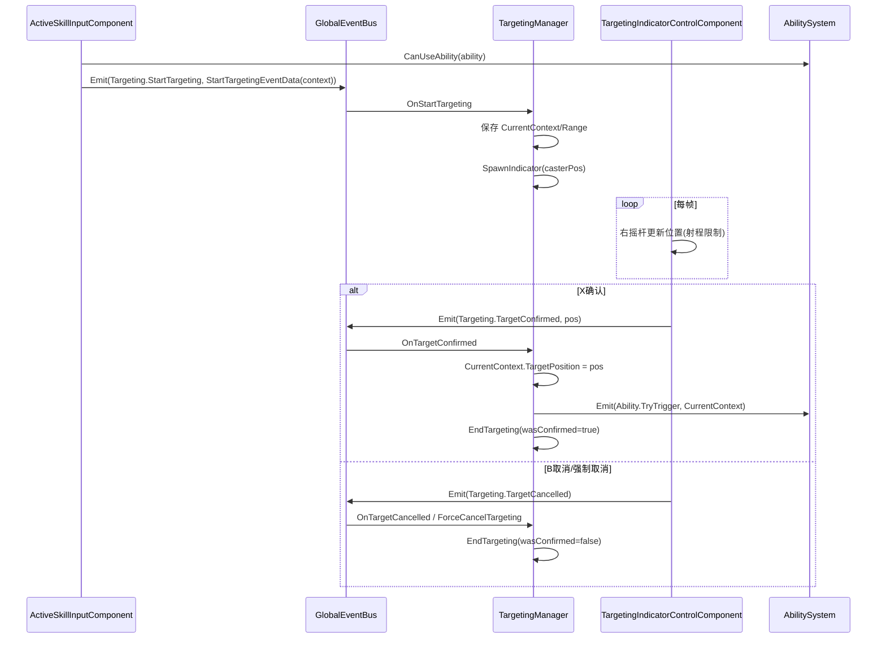

# TargetingManager 说明文档

## 概述

`TargetingManager` 是技能系统的异步点选基础设施。

它只负责“已经决定要进入点选以后”的会话管理，不负责决定某个技能到底要不要点选。当前职责：

- 接收 `Targeting.StartTargeting` 全局事件并进入瞄准态
- 生成并销毁 `TargetingIndicatorEntity`
- 响应确认（`TargetConfirmed`）与取消（`TargetCancelled`）
- 在确认时回填 `CastContext.TargetPosition` 并发正式 `Ability.TryTrigger`
- 在玩家死亡或外部强制打断时退出瞄准态

通常由输入层在识别到 `AbilityTargetSelection.Point` 且 `AbilitySystem.CanUseAbility` 预检查通过后发起 `StartTargeting`。

---

## 设计目标

1. `AbilitySystem` 不处理右摇杆输入，只负责正式施法提交。
2. 输入层决定何时点选，`TargetingManager` 负责点选会话本身。
3. 同一时刻只允许一个技能处于瞄准态。
4. 确认时回填 `CastContext.TargetPosition`，再发起正式 `TryTrigger`。

---

## 核心状态

`TargetingManager` 维护以下运行时状态：

- `IsTargeting`：是否正在瞄准
- `CurrentCaster`：当前施法者
- `CurrentAbility`：当前技能
- `CurrentContext`：挂起的 `CastContext`
- `CurrentRange`：当前技能射程
- `_currentIndicator`：当前瞄准指示器实体

`CurrentContext` 是正式提交的关键：确认时把目标点写回这个上下文，再通过技能实体事件发给 `AbilitySystem`。

---

## 事件流

---

## 与技能系统协作边界

### ActiveSkillInputComponent 负责

- 根据 `AbilityTargetSelection.Point` 决定是否进入点选
- 点选前调用 `AbilitySystem.CanUseAbility(ability)` 做不消耗资源的预检查
- 直接发 `Targeting.StartTargeting` 事件

### AbilitySystem 负责

- 正式触发入口
- 确认点位后再次做就绪检查
- 成功后的消耗、冷却、执行

### TargetingManager 负责

- 异步瞄准状态管理
- 指示器实体创建与销毁
- 确认/取消事件处理
- 确认后回填 `TargetPosition` 并发正式 `TryTrigger`

---

## 输入与指示器

- 输入组件：`TargetingIndicatorControlComponent`
  - 右摇杆：移动指示器
  - `X`：确认
  - `B`：取消
- 指示器实体：`TargetingIndicatorEntity`
  - 仅作可视化容器，业务逻辑在控制组件中

`TargetingIndicatorControlComponent` 目前不需要感知具体技能类型；它只消费 `TargetingManager` 提供的会话参数。

---

## 生命周期与初始化

`TargetingManager` 使用 `[ModuleInitializer]` + `AutoLoad.Register` 自动注册，初始化时订阅：

- `Targeting.StartTargeting`
- `Targeting.TargetConfirmed`
- `Targeting.TargetCancelled`
- `Unit.Killed`（玩家死亡时强制取消）

---

## 扩展建议

1. 合法落点校验：在确认前增加导航可达或地形阻挡检查。
2. 多模式指示器：根据输入层传入的点选元数据切换圆形、扇形、直线预览。
3. 瞄准超时：为会话增加超时自动取消。
4. 多人控制权：将全局单会话扩展为按施法者隔离的多会话。

---

## 相关代码

- `Src/ECS/Base/System/TargetingSystem/TargetingManager.cs`
- `Src/ECS/Base/Component/Unit/TargetingIndicatorControlComponent/TargetingIndicatorControlComponent.cs`
- `Src/ECS/Base/Entity/Unit/TargetingIndicator/TargetingIndicatorEntity.cs`
- `Data/EventType/Unit/Targeting/GameEventType_Targeting.cs`
- `Src/ECS/Base/System/AbilitySystem/AbilitySystem.cs`
