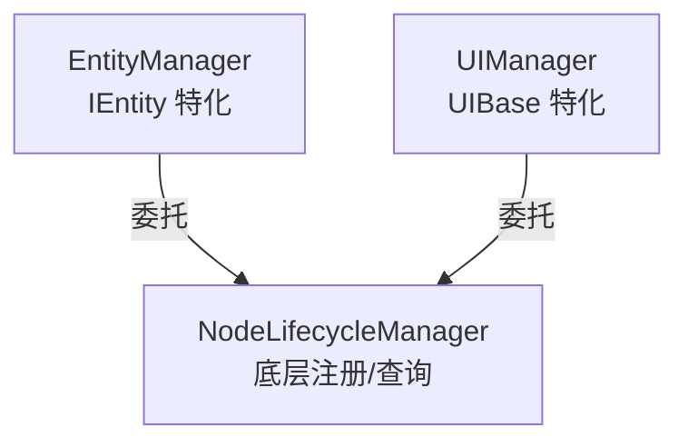

# NodeLifecycleManager - 使用指南

**文档类型**：API 文档 + 使用指南  
**目标受众**：开发者  
**最后更新**：2026-01-22

---

## 概述

`NodeLifecycleManager` 是一个通用的 Node 生命周期管理工具，提供底层的注册、查询、注销功能。

**设计理念**：
- **底层抽象**：`EntityManager` 和 `UIManager` 都基于此类构建
- **职责单一**：只负责"注册表"管理，不涉及具体业务逻辑
- **关系分离**：关系管理由 `EntityRelationshipManager` 负责

---

## 快速开始

### 注册 Node

```csharp
// 注册节点
NodeLifecycleManager.Register(node, "Enemy");

// 检查是否已注册
bool exists = NodeLifecycleManager.IsRegistered(nodeId);
```

### 查询 Node

```csharp
// 按 ID 查询
Node? node = NodeLifecycleManager.GetNodeById(nodeId);

// 按类型查询
var enemies = NodeLifecycleManager.GetNodesByType<Enemy>("Enemy");

// 按接口查询
var entities = NodeLifecycleManager.GetNodesByInterface<IEntity>();

// 获取所有节点
var allNodes = NodeLifecycleManager.GetAllNodes();
```

### 注销 Node

```csharp
// 通过实例注销
NodeLifecycleManager.Unregister(node);

// 通过 ID 注销
NodeLifecycleManager.Unregister(nodeId);
```

---

## API 参考

### Register

```csharp
bool Register(Node node, string nodeType)
```

注册 Node 到管理器。

**参数**：
- `node`：要注册的节点
- `nodeType`：节点类型名称（如 "Enemy", "HealthBarUI"）

**返回**：是否成功注册（false 表示已存在）

---

### IsRegistered

```csharp
bool IsRegistered(string nodeId)
bool IsRegistered(Node node)
```

检查 Node 是否已注册。

---

### Unregister

```csharp
bool Unregister(Node node)
bool Unregister(string nodeId)
```

从管理器注销 Node。

**返回**：是否成功注销（false 表示不存在）

---

### GetNodeById

```csharp
Node? GetNodeById(string nodeId)
```

根据 ID 获取 Node。

---

### GetNodesByType

```csharp
IEnumerable<T> GetNodesByType<T>(string nodeType) where T : Node
```

按类型名称查询所有匹配的 Node。

---

### GetNodesByInterface

```csharp
IEnumerable<T> GetNodesByInterface<T>() where T : class
```

获取所有实现指定接口/基类的 Node。

---

### GetAllNodes

```csharp
IEnumerable<Node> GetAllNodes()
```

获取所有已注册的 Node。

---

### Clear

```csharp
void Clear()
```

清理所有注册（场景切换时调用）。

---

## 与 EntityManager/UIManager 的关系



- **EntityManager**：在 `NodeLifecycleManager` 基础上添加 `IEntity` 特化逻辑（Data、Events、Component）
- **UIManager**：在 `NodeLifecycleManager` 基础上添加 `UIBase` 特化逻辑（绑定、关系）

---

## 相关文档

- [EntityManager 文档](file:///e:/Godot/Games/MyGames/复刻土豆兄弟/brotato-my/Src/ECS/Base/Entity/Core/EntityManager.md)
- [EntityRelationshipManager 文档](file:///e:/Godot/Games/MyGames/复刻土豆兄弟/brotato-my/Src/ECS/Base/Entity/Core/EntityRelationshipManager.cs)
