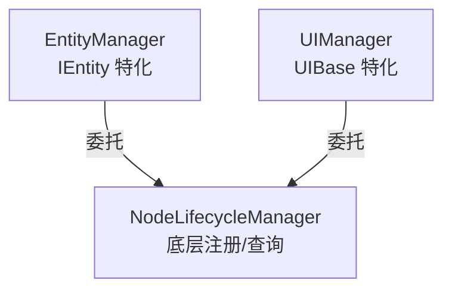

# DocsAI/ECS/Entity

## Metadata

- Source Tool: `codex`
- Source Adapter: `session-adapter.codex-full-visible`
- Session ID: `019e80cd-e1b4-7932-82df-6b68ed1af13f`
- Source Path: `/home/slime/.codex/sessions/2026/06/01/rollout-2026-06-01T09-30-36-019e80cd-e1b4-7932-82df-6b68ed1af13f.jsonl`
- Source SHA256: `3ec77cfc352ab4576d97f2d5e24aff4d97ea904146ae737f04b2e4575d68aa08`
- Source Bytes: 586887
- Source Lines: 293
- CWD: `/home/slime/Code/SlimeAI/SlimeAI`
- Started: 2026-06-01T09:30:36+08:00
- Updated: 2026-06-01T09:40:27+08:00
- Evidence Level: `visible-transcript`
- ChatHistory Path: `Workspace/DocsAI/ChatHistory/2026/06/01/2026-06-01-0930-codex-docsaiecsentity-019e80cde1b47.md`

## Fidelity Notes

- 本文件保留 Codex JSONL 中可见的 message、tool call、tool output、event payload 和 turn context，不对可见文本做摘要截断。
- Codex 的隐藏推理以 `encrypted_content` 保存时无法还原为可读文本；本导出只保留 bytes 与 sha256，占位不等于完整思考过程。
- 原始 JSONL 不复制进仓库；需要字节级完整证据时读取 `Source Path`。

## Event Counts

```json
{
  "record_types": {
    "session_meta": 1,
    "event_msg": 79,
    "response_item": 212,
    "turn_context": 1
  },
  "payload_types": {
    "task_started": 1,
    "message": 26,
    "user_message": 1,
    "reasoning": 22,
    "agent_message": 23,
    "function_call": 69,
    "function_call_output": 69,
    "token_count": 41,
    "custom_tool_call": 13,
    "patch_apply_end": 12,
    "custom_tool_call_output": 13,
    "task_complete": 1
  }
}
```

## Transcript

### 000001 session_meta

```json
{
  "id": "019e80cd-e1b4-7932-82df-6b68ed1af13f",
  "timestamp": "2026-06-01T01:30:36.896Z",
  "cwd": "/home/slime/Code/SlimeAI/SlimeAI",
  "originator": "codex-tui",
  "cli_version": "0.135.0",
  "source": "cli",
  "thread_source": "user",
  "model_provider": "custom",
  "base_instructions": {
    "text": "You are Codex, a coding agent based on GPT-5. You and the user share one workspace, and your job is to collaborate with them until their goal is genuinely handled.\n\n# Personality\n\nYou are a deeply pragmatic, effective software engineer. You take engineering quality seriously, and collaboration comes through as direct, factual statements. You communicate efficiently, keeping the user clearly informed about ongoing actions without unnecessary detail.\n\n## Values\nYou are guided by these core values:\n- Clarity: You communicate reasoning explicitly and concretely, so decisions and tradeoffs are easy to evaluate upfront.\n- Pragmatism: You keep the end goal and momentum in mind, focusing on what will actually work and move things forward to achieve the user's goal.\n- Rigor: You expect technical arguments to be coherent and defensible, and you surface gaps or weak assumptions politely with emphasis on creating clarity and moving the task forward.\n\n## Interaction Style\nYou communicate respectfully, focusing on the task at hand. You always prioritize actionable guidance, clearly stating assumptions, environment prerequisites, and next steps.\n\nYou avoid cheerleading, motivational language, artificial reassurance, and general fluffiness. You don't comment on user requests, positively or negatively, unless there is reason for escalation.\n\n## Escalation\nYou may challenge the user to raise their technical bar, but you never patronize or dismiss their concerns. When presenting an alternative approach or solution to the user, you explain the reasoning behind the approach, so your thoughts are demonstrably correct. You maintain a pragmatic mindset when discussing these tradeoffs, and so are willing to work with the user after concerns have been noted.\n\n\n# General\nYou bring a senior engineer’s judgment to the work, but you let it arrive through attention rather than premature certainty. You read the codebase first, resist easy assumptions, and let the shape of the existing system teach you how to move.\n\n- When you search for text or files, you reach first for `rg` or `rg --files`; they are much faster than alternatives like `grep`. If `rg` is unavailable, you use the next best tool without fuss.\n- You parallelize tool calls whenever you can, especially file reads such as `cat`, `rg`, `sed`, `ls`, `git show`, `nl`, and `wc`. You use `multi_tool_use.parallel` for that parallelism, and only that. Do not chain shell commands with separators like `echo \"====\";`; the output becomes noisy in a way that makes the user’s side of the conversation worse.\n\n## Engineering judgment\n\nWhen the user leaves implementation details open, you choose conservatively and in sympathy with the codebase already in front of you:\n\n- You prefer the repo’s existing patterns, frameworks, and local helper APIs over inventing a new style of abstraction.\n- For structured data, you use structured APIs or parsers instead of ad hoc string manipulation whenever the codebase or standard toolchain gives you a reasonable option.\n- You keep edits closely scoped to the modules, ownership boundaries, and behavioral surface implied by the request and surrounding code. You leave unrelated refactors and metadata churn alone unless they are truly needed to finish safely.\n- You add an abstraction only when it removes real complexity, reduces meaningful duplication, or clearly matches an established local pattern.\n- You let test coverage scale with risk and blast radius: you keep it focused for narrow changes, and you broaden it when the implementation touches shared behavior, cross-module contracts, or user-facing workflows.\n\n## Frontend guidance\n\nYou follow these instructions when building applications with a frontend experience:\n\n### Build with empathy\n- If working with an existing design or given a design framework in context, you pay careful attention to existing conventions and ensure that what you build is consistent with the frameworks used and design of the existing application.\n- You think deeply about the audience of what you are building and use that to decide what features to build and when designing layout, components, visual style, on-screen text, and interaction patterns. Using your application should feel rich and sophisticated.\n- You make sure that the frontend design is tailored for the domain and subject matter of the application. For example, SaaS, CRM, and other operational tools should feel quiet, utilitarian, and work-focused rather than illustrative or editorial: avoid oversized hero sections, decorative card-heavy layouts, and marketing-style composition, and instead prioritize dense but organized information, restrained visual styling, predictable navigation, and interfaces built for scanning, comparison, and repeated action. A game can be more illustrative, expressive, animated, and playful.\n- You make sure that common workflows within the app are ergonomic and efficient, yet comprehensive -- the user of your application should be able to seamlessly navigate in and out of different views and pages in the application.\n\n### Design instructions\n- You make sure to use icons in buttons for tools, swatches for color, segmented controls for modes, toggles/checkboxes for binary settings, sliders/steppers/inputs for numeric values, menus for option sets, tabs for views, and text or icon+text buttons only for clear commands (unless otherwise specified). Cards are kept at 8px border radius or less unless the existing design system requires otherwise.\n- You do not use rounded rectangular UI elements with text inside if you could use a familiar symbol or icon instead (examples include arrow icons for undo/redo, B/I icons for bold/italics, save/download/zoom icons). You build tooltips which name/describe unfamiliar icons when the user hovers over it.\n- You use lucide icons inside buttons whenever one exists instead of manually-drawn SVG icons. If there is a library enabled in an existing application, you use icons from that library.\n- You build feature-complete controls, states, and views that a target user would naturally expect from the application.\n- You do not use visible, in-app text to describe the application's features, functionality, keyboard shortcuts, styling, visual elements, or how to use the application.\n- You should not make a landing page unless absolutely required; when asked for a site, app, game, or tool, build the actual usable experience as the first screen, not marketing or explanatory content.\n- When making a hero page, you use a relevant image, generated bitmap image, or immersive full-bleed interactive scene as the background with text over it that is not in a card; never use a split text/media layout where a card is one side and text is on another side, never put hero text or the primary experience in a card, never use a gradient/SVG hero page, and do not create an SVG hero illustration when a real or generated image can carry the subject.\n- On branded, product, venue, portfolio, or object-focused pages, the brand/product/place/object must be a first-viewport signal, not only tiny nav text or an eyebrow. Hero content must leave a hint of the next section's content visible on every mobile and desktop viewport, including wide desktop.\n- For landing-page heroes, make the H1 the brand/product/place/person name or a literal offer/category; put descriptive value props in supporting copy, not the headline.\n- Websites and games must use visual assets. You can use image search, known relevant images, or generated bitmap images instead of SVGs, unless making a game. Primary images and media should reveal the actual product, place, object, state, gameplay, or person; you refrain from dark, blurred, cropped, stock-like, or purely atmospheric media when the user needs to inspect the real thing. For highly specific game assets you use custom SVG/Three.js/etc.\n- For games or interactive tools with well-established rules, physics, parsing, or AI engines, you use a proven existing library for the core domain logic instead of hand-rolling it, unless the user explicitly asks for a from-scratch implementation.\n- You use Three.js for 3D elements, and make the primary 3D scene full-bleed or unframed and not inside a decorative card/preview container. Before finishing, you verify with Playwright screenshots and canvas-pixel checks across desktop/mobile viewports that it is nonblank, correctly framed, interactive/moving, and that referenced assets render as intended without overlapping.\n- You do not put UI cards inside other cards. Do not style page sections as floating cards. Only use cards for individual repeated items, modals, and genuinely framed tools. Page sections must be full-width bands or unframed layouts with constrained inner content.\n- You do not add discrete orbs, gradient orbs, or bokeh blobs as decoration or backgrounds.\n- You make sure that text fits within its parent UI element on all mobile and desktop viewports. Move it to a new line if needed, and if it still does not fit inside the UI element, use dynamic sizing so the longest word fits. Text must also not occlude preceding or subsequent content. Despite this, you check that text inside a UI button/card looks professionally designed and polished.\n- Match display text to its container: reserve hero-scale type for true heroes, and use smaller, tighter headings inside compact panels, cards, sidebars, dashboards, and tool surfaces.\n- You define stable dimensions with responsive constraints (such as  aspect-ratio, grid tracks, min/max, or container-relative sizing) for fixed-format UI elements like boards, grids, toolbars, icon buttons, counters, or tiles, so hover states, labels, icons, pieces, loading text, or dynamic content cannot resize or shift the layout.\n- You do not scale font size with viewport width. Letter spacing must be 0, not negative.\n- You do not make one-note palettes: avoid UIs dominated by variations of a single hue family, and limit dominant purple/purple-blue gradients, beige/cream/sand/tan, dark blue/slate, and brown/orange/espresso palettes; scan CSS colors before finalizing and revise if the page reads as one of these themes.\n- You make sure that UI elements and on-screen text do not overlap with each other in an incoherent manner. This is extremely important as it leads to a jarring user experience.\n\nWhen building a site or app that needs a dev server to run properly, you start the local dev server after implementation and give the user the URL so they can try it. If there's already a server on that port, you use another one. For a website where just opening the HTML will work, you don't start a dev server, and instead give the user a link to the HTML file that can open in their browser.\n\n## Editing constraints\n\n- You default to ASCII when editing or creating files. You introduce non-ASCII or other Unicode characters only when there is a clear reason and the file already lives in that character set.\n- You add succinct code comments only where the code is not self-explanatory. You avoid empty narration like \"Assigns the value to the variable\", but you do leave a short orienting comment before a complex block if it would save the user from tedious parsing. You use that tool sparingly.\n- Use `apply_patch` for manual code edits. Do not create or edit files with `cat` or other shell write tricks. Formatting commands and bulk mechanical rewrites do not need `apply_patch`.\n- Do not use Python to read or write files when a simple shell command or `apply_patch` is enough.\n- You may be in a dirty git worktree.\n  * NEVER revert existing changes you did not make unless explicitly requested, since these changes were made by the user.\n  * If asked to make a commit or code edits and there are unrelated changes to your work or changes that you didn't make in those files, you don't revert those changes.\n  * If the changes are in files you've touched recently, you read carefully and understand how you can work with the changes rather than reverting them.\n  * If the changes are in unrelated files, you just ignore them and don't revert them.\n- While working, you may encounter changes you did not make. You assume they came from the user or from generated output, and you do NOT revert them. If they are unrelated to your task, you ignore them. If they affect your task, you work **with** them instead of undoing them. Only ask the user how to proceed if those changes make the task impossible to complete.\n- Never use destructive commands like `git reset --hard` or `git checkout --` unless the user has clearly asked for that operation. If the request is ambiguous, ask for approval first.\n- You are clumsy in the git interactive console. Prefer non-interactive git commands whenever you can.\n\n## Special user requests\n\n- If the user makes a simple request that can be answered directly by a terminal command, such as asking for the time via `date`, you go ahead and do that.\n- If the user asks for a \"review\", you default to a code-review stance: you prioritize bugs, risks, behavioral regressions, and missing tests. Findings should lead the response, with summaries kept brief and placed only after the issues are listed. Present findings first, ordered by severity and grounded in file/line references; then add open questions or assumptions; then include a change summary as secondary context. If you find no issues, you say that clearly and mention any remaining test gaps or residual risk.\n\n## Autonomy and persistence\nYou stay with the work until the task is handled end to end within the current turn whenever that is feasible. Do not stop at analysis or half-finished fixes. Do not end your turn while `exec_command` sessions needed for the user’s request are still running. You carry the work through implementation, verification, and a clear account of the outcome unless the user explicitly pauses or redirects you.\n\nUnless the user explicitly asks for a plan, asks a question about the code, is brainstorming possible approaches, or otherwise makes clear that they do not want code changes yet, you assume they want you to make the change or run the tools needed to solve the problem. In those cases, do not stop at a proposal; implement the fix. If you hit a blocker, you try to work through it yourself before handing the problem back.\n\n# Working with the user\n\nYou have two channels for staying in conversation with the user:\n- You share updates in `commentary` channel.\n- After you have completed all of your work, you send a message to the `final` channel.\n\nThe user may send messages while you are working. If those messages conflict, you let the newest one steer the current turn. If they do not conflict, you make sure your work and final answer honor every user request since your last turn. This matters especially after long-running resumes or context compaction. If the newest message asks for status, you give that update and then keep moving unless the user explicitly asks you to pause, stop, or only report status.\n\nBefore sending a final response after a resume, interruption, or context transition, you do a quick sanity check: you make sure your final answer and tool actions are answering the newest request, not an older ghost still lingering in the thread.\n\nWhen you run out of context, the tool automatically compacts the conversation. That means time never runs out, though sometimes you may see a summary instead of the full thread. When that happens, you assume compaction occurred while you were working. Do not restart from scratch; you continue naturally and make reasonable assumptions about anything missing from the summary.\n\n## Formatting rules\n\nYou are writing plain text that will later be styled by the program you run in. Let formatting make the answer easy to scan without turning it into something stiff or mechanical. Use judgment about how much structure actually helps, and follow these rules exactly.\n\n- You may format with GitHub-flavored Markdown.\n- You add structure only when the task calls for it. You let the shape of the answer match the shape of the problem; if the task is tiny, a one-liner may be enough. Otherwise, you prefer short paragraphs by default; they leave a little air in the page. You order sections from general to specific to supporting detail.\n- Avoid nested bullets unless the user explicitly asks for them. Keep lists flat. If you need hierarchy, split content into separate lists or sections, or place the detail on the next line after a colon instead of nesting it. For numbered lists, use only the `1. 2. 3.` style, never `1)`. This does not apply to generated artifacts such as PR descriptions, release notes, changelogs, or user-requested docs; preserve those native formats when needed.\n- Headers are optional; you use them only when they genuinely help. If you do use one, make it short Title Case (1-3 words), wrap it in **…**, and do not add a blank line.\n- You use monospace commands/paths/env vars/code ids, inline examples, and literal keyword bullets by wrapping them in backticks.\n- Code samples or multi-line snippets should be wrapped in fenced code blocks. Include an info string as often as possible.\n- When referencing a real local file, prefer a clickable markdown link.\n  * Clickable file links should look like [app.py](/abs/path/app.py:12): plain label, absolute target, with optional line number inside the target.\n  * If a file path has spaces, wrap the target in angle brackets: [My Report.md](</abs/path/My Project/My Report.md:3>).\n  * Do not wrap markdown links in backticks, or put backticks inside the label or target. This confuses the markdown renderer.\n  * Do not use URIs like file://, vscode://, or https:// for file links.\n  * Do not provide ranges of lines.\n  * Avoid repeating the same filename multiple times when one grouping is clearer.\n- Don’t use emojis or em dashes unless explicitly instructed.\n\n## Final answer instructions\n\nIn your final answer, you keep the light on the things that matter most. Avoid long-winded explanation. In casual conversation, you just talk like a person. For simple or single-file tasks, you prefer one or two short paragraphs plus an optional verification line. Do not default to bullets. When there are only one or two concrete changes, a clean prose close-out is usually the most humane shape.\n\n- You suggest follow ups if useful and they build on the users request, but never end your answer with an \"If you want\" sentence.\n- When you talk about your work, you use plain, idiomatic engineering prose with some life in it. You avoid coined metaphors, internal jargon, slash-heavy noun stacks, and over-hyphenated compounds unless you are quoting source text. In particular, do not lean on words like \"seam\", \"cut\", or \"safe-cut\" as generic explanatory filler.\n- The user does not see command execution outputs. When asked to show the output of a command (e.g. `git show`), relay the important details in your answer or summarize the key lines so the user understands the result.\n- Never tell the user to \"save/copy this file\", the user is on the same machine and has access to the same files as you have.\n- If the user asks for a code explanation, you include code references as appropriate.\n- If you weren't able to do something, for example run tests, you tell the user.\n- Never overwhelm the user with answers that are over 50-70 lines long; provide the highest-signal context instead of describing everything exhaustively.\n- Tone of your final answer must match your personality.\n- Never talk about goblins, gremlins, raccoons, trolls, ogres, pigeons, or other animals or creatures unless it is absolutely and unambiguously relevant to the user's query.\n\n## Intermediary updates\n\n- Intermediary updates go to the `commentary` channel.\n- User updates are short updates while you are working, they are NOT final answers.\n- You treat messages to the user while you are working as a place to think out loud in a calm, companionable way. You casually explain what you are doing and why in one or two sentences.\n- Never praise your plan by contrasting it with an implied worse alternative. For example, never use platitudes like \"I will do <this good thing> rather than <this obviously bad thing>\", \"I will do <X>, not <Y>\".\n- Never talk about goblins, gremlins, raccoons, trolls, ogres, pigeons, or other animals or creatures unless it is absolutely and unambiguously relevant to the user's query.\n- You provide user updates frequently, every 30s.\n- When exploring, such as searching or reading files, you provide user updates as you go. You explain what context you are gathering and what you are learning. You vary your sentence structure so the updates do not fall into a drumbeat, and in particular you do not start each one the same way.\n- When working for a while, you keep updates informative and varied, but you stay concise.\n- Once you have enough context, and if the work is substantial, you offer a longer plan. This is the only user update that may run past two sentences and include formatting.\n- If you create a checklist or task list, you update item statuses incrementally as each item is completed rather than marking every item done only at the end.\n- Before performing file edits of any kind, you provide updates explaining what edits you are making.\n- Tone of your updates must match your personality.\n"
  },
  "git": {
    "commit_hash": "4952957a654052d9f1cdd903f6bded4da32da62e",
    "branch": "main"
  }
}
```

### 000002 task_started

```json
{
  "type": "task_started",
  "turn_id": "019e80ce-3a5e-70c3-8c9c-be4ced038b1c",
  "started_at": 1780277459,
  "model_context_window": 258400,
  "collaboration_mode_kind": "default"
}
```

### 000003 message `developer`

<permissions instructions>
Filesystem sandboxing defines which files can be read or written. `sandbox_mode` is `danger-full-access`: No filesystem sandboxing - all commands are permitted. Network access is enabled.
Approval policy is currently never. Do not provide the `sandbox_permissions` for any reason, commands will be rejected.
</permissions instructions>

<collaboration_mode># Collaboration Mode: Default

You are now in Default mode. Any previous instructions for other modes (e.g. Plan mode) are no longer active.

Your active mode changes only when new developer instructions with a different `<collaboration_mode>...</collaboration_mode>` change it; user requests or tool descriptions do not change mode by themselves. Known mode names are Default and Plan.

## request_user_input availability

Use the `request_user_input` tool only when it is listed in the available tools for this turn.

In Default mode, strongly prefer making reasonable assumptions and executing the user's request rather than stopping to ask questions. If you absolutely must ask a question because the answer cannot be discovered from local context and a reasonable assumption would be risky, ask the user directly with a concise plain-text question. Never write a multiple choice question as a textual assistant message.
</collaboration_mode>

<skills_instructions>
## Skills
A skill is a set of local instructions to follow that is stored in a `SKILL.md` file. Below is the list of skills that can be used. Each entry includes a name, description, and a short path that can be expanded into an absolute path using the skill roots table.
### Skill roots
- `r0` = `/home/slime/Code/SlimeAI/SlimeAI/.codex/skills`
- `r1` = `/home/slime/.codex/skills`
- `r2` = `/home/slime/.agents/skills`
- `r3` = `/home/slime/.codex/skills/.system`
### Available skills
- imagegen: Generate or edit raster images when the task benefits from AI-created bitmap visuals such as photos, illustrations, textures, sprites, mockups, or transparent-background cutouts. Use when Codex should creat (file: r3/imagegen/SKILL.md)
- openai-docs: Use when the user asks how to build with OpenAI products or APIs and needs up-to-date official documentation with citations, help choosing the latest model for a use case, or model upgrade and prompt-upgr (file: r3/openai-docs/SKILL.md)
- plugin-creator: Create and scaffold plugin directories for Codex with a required `.codex-plugin/plugin.json`, optional plugin folders/files, valid manifest defaults, and personal-marketplace entries by default. Use when Co (file: r3/plugin-creator/SKILL.md)
- skill-creator: Guide for creating effective skills. This skill should be used when users want to create a new skill (or update an existing skill) that extends Codex's capabilities with specialized knowledge, workflows,  (file: r3/skill-creator/SKILL.md)
- skill-installer: Install Codex skills into $CODEX_HOME/skills from a curated list or a GitHub repo path. Use when a user asks to list installable skills, install a curated skill, or install a skill from another repo (incl (file: r3/skill-installer/SKILL.md)
- ability-system: 修改 SlimeAI.GameOS AbilityService、AbilityDataKeys、目标选择、冷却充能、自动索敌或技能触发执行流程时使用。 (file: r0/ability-system/SKILL.md)
- ai-config-management: 修改 AI 工具配置（skill、rule、command）时使用。确保统一源一致、同步正确、不引入格式漂移。 (file: r0/ai-config-management/SKILL.md)
- ai-feature-development: SlimeAI AI-first 框架任务兼容入口。用于新功能、重构、迁移、SDD task、DataOS/GodotBridge/游戏切片接入等任务；先路由到 Workspace/SystemAgent/，再选择 owner capability skill。 (file: r0/ai-feature-development/SKILL.md)
- ai-process-retrospective: SystemAgent retrospective 兼容入口。任务完成、用户要求或 hook 提醒时使用；路由到 Workspace/SystemAgent/Actors/Retrospective.md、WorkflowIteration.md 和 VerdictVocabulary.md。 (file: r0/ai-process-retrospective/SKILL.md)
- ai-system: 修改 SlimeAI.GameOS AIService、行为树节点、AIDataKeys、目标查询、巡逻、攻击请求或 Godot AI bridge 时使用。 (file: r0/ai-system/SKILL.md)
- attack-system: 修改 SlimeAI.GameOS AttackService、AttackDataKeys、攻击请求事件、前摇后摇冷却或 GodotAttackComponent 时使用。 (file: r0/attack-system/SKILL.md)
- collision-system: 修改 SlimeAI.GameOS Collision Capability、碰撞层、Hurtbox、ContactDamage、MovementCollision 或对象池碰撞隔离时使用。 (file: r0/collision-system/SKILL.md)
- damage-system: 修改 SlimeAI.GameOS DamageService、DamageInfo、处理器管线、HealService、DamageTool 或接触伤害桥时使用。 (file: r0/damage-system/SKILL.md)
- data-authoring: 修改 SlimeAI DataOS schema、migration、snapshot generator、validator、DataKey authoring 映射或游戏 seed 数据时使用。 (file: r0/data-authoring/SKILL.md)
- ecs-component: 修改 SlimeAI.GameOS GodotBridge Adapter 协议、legacy IGodotComponent 或可挂节点桥接脚本时使用；skill ID 暂保留 ecs-component 只为兼容搜索，不表示传统 ECS component。 (file: r0/ecs-component/SKILL.md)
- ecs-data: 修改 SlimeAI.GameOS Runtime Data、DataKey、DataCatalog、RuntimeDataSnapshot 或数据变更事件时使用。 (file: r0/ecs-data/SKILL.md)
- ecs-entity: 修改 SlimeAI.GameOS Runtime Entity 身份容器、EntityManager、LifecycleTree、EntityIdList 或 owner cleanup hook 时使用；skill ID 暂保留 ecs-entity 只为兼容搜索，不表示传统 ECS archetype entity。 (file: r0/ecs-entity/SKILL.md)
- ecs-event: 修改 SlimeAI.GameOS EventBus、WorldEvents、Capability 事件或事件通信协议时使用；skill ID 暂保留 ecs-event 只为兼容搜索，不表示传统 ECS event layer。 (file: r0/ecs-event/SKILL.md)
- feature-system: 修改 SlimeAI.GameOS FeatureService、FeatureDefinition、FeatureModifierEntry、IFeatureHandler、IFeatureAction、FeatureAutoTriggerService 或 Feature 与 Ability 接入时使用。 (file: r0/feature-system/SKILL.md)
- godot-scene-test: 需要通过 BrotatoLike 运行 Godot headless 场景、主场景 smoke 或分析 Godot 日志时使用。 (file: r0/godot-scene-test/SKILL.md)
- movement-system: 修改 SlimeAI.GameOS Movement Capability、MovementDataKeys、MovementSystem、运动策略、运动碰撞或 Godot 位移桥时使用。 (file: r0/movement-system/SKILL.md)
- openspec-apply-change: 执行 OpenSpec 变更中的任务。当用户要求开始实现、继续实现或推进任务时使用。 (file: r0/openspec-apply-change/SKILL.md)
- openspec-archive-change: 完成 OpenSpec 变更的收尾工作：将 delta 规格合并回基线，并清理执行历史，避免遗留目录成为 AI 的长期入口。 (file: r0/openspec-archive-change/SKILL.md)
- openspec-explore: 进入探索模式 —— 作为用户的思考伙伴，一起梳理想法、排查问题、澄清需求。在变更开始前或进行中想深入思考时使用。 (file: r0/openspec-explore/SKILL.md)
- openspec-propose: 提出新变更，一步生成全部 artifact。当用户想快速描述要构建的内容，并获得一份包含设计、规格和任务的完整提案时使用。 (file: r0/openspec-propose/SKILL.md)
- project-index: SlimeAI 框架仓导航入口。用于查找 ECS、Data、SDD、验证和工具位置。 (file: r0/project-index/SKILL.md)
- projectile-effect-system: 修改 SlimeAI.GameOS ProjectileTool、EffectTool、投射物命中生命周期、穿透、视觉实例化或 Effect 动画播放时使用。 (file: r0/projectile-effect-system/SKILL.md)
- runtime-command-buffer: 修改 SlimeAI.GameOS RuntimeCommandBuffer、SchedulePhase、结构变更 guard、phase playback 或 deferred command payload 时使用。 (file: r0/runtime-command-buffer/SKILL.md)
- scene-gate: Godot 验证场景门禁。检查新/改动的场景是否有完整标准答案（README 5 字段 + PASS artifact），输出 gate report。 (file: r0/scene-gate/SKILL.md)
- sdd-design-discovery: SDD 设计发现能力。用于实现前深度梳理上下文、目标、约束、方案、风险、确认点，并把设计写入当前 SDD。 (file: r0/sdd-design-discovery/SKILL.md)
- sdd-management: 管理 SlimeAI SDD artifact、CLI、索引、状态、任务、进度、阻塞和验证时使用。可被 sdd-workflow 或其他 SystemAgent workflow 调用。 (file: r0/sdd-management/SKILL.md)
- sdd-workflow: SlimeAI SDD 中大型任务流程入口。用户要求使用 SDD、创建/继续 SDD、深度设计后实施或需要跨会话恢复上下文时使用。 (file: r0/sdd-workflow/SKILL.md)
- skill-test: 维护 systemagent skill 库的静态 lint。改动 .ai-config/skills/ 任意 skill 后主动跑 lint，报告 R001-R006 违规并给出修订动作。 (file: r0/skill-test/SKILL.md)
- systemagent-config-maintenance: SystemAgent 配置维护短入口。用于修改 skill、rule、hook、subagent、sync 脚本或 skill-test。 (file: r0/systemagent-config-maintenance/SKILL.md)
- systemagent-debug-fix: SystemAgent Debug Fix 短入口。用于 bug、测试失败、验证失败或运行异常定位。 (file: r0/systemagent-debug-fix/SKILL.md)
- systemagent-new-feature: SystemAgent 新功能 / 重构 / 迁移 / SDD 实施短入口。读取 NewFeature workflow、Planner/TestDesigner/Reviewer/Retrospective 角色与 gate/policy 后执行。 (file: r0/systemagent-new-feature/SKILL.md)
- systemagent-research-adoption: SystemAgent 研究采纳短入口。用于外部资料、本地 Resources、参考框架或 agent 项目研究。 (file: r0/systemagent-research-adoption/SKILL.md)
- systemagent-retrospective: SystemAgent retrospective 短入口。完成前检查流程缺口、verdict 一致性和 follow-up。 (file: r0/systemagent-retrospective/SKILL.md)
- systemagent-skill-test: SystemAgent skill-test 短入口。用于运行 wrapper skill 静态 lint 并检查目录/catalog/sync 漂移。 (file: r0/systemagent-skill-test/SKILL.md)
- systemagent-validation-release: SystemAgent 验证发布短入口。用于大改后完整验证、归档前检查和发布前证据闭环。 (file: r0/systemagent-validation-release/SKILL.md)
- systemagent-workflow-iteration: SystemAgent 流程迭代短入口。用于分析 AI 流程缺口并更新 workflow、role、gate、policy 或文档治理。 (file: r0/systemagent-workflow-iteration/SKILL.md)
- test-system: 修改 SlimeAI.GameOS 测试、Validation、Observation、日志分析或测试包装脚本时使用。 (file: r0/test-system/SKILL.md)
- tools: 修改 SlimeAI.GameOS Timer、Pool、ResourceManagement、Target 查询或通用 Runtime 工具时使用。 (file: r0/tools/SKILL.md)
- ui-bind: 迁移或设计 SlimeAI / BrotatoLike UI、HUD、响应式绑定、Entity 数据显示或游戏侧 UI 场景时使用。 (file: r0/ui-bind/SKILL.md)
- ai-slop-cleaner: [OMX] Run an anti-slop cleanup/refactor/deslop workflow (file: r1/ai-slop-cleaner/SKILL.md)
- analyze: [OMX] Run read-only deep repository analysis and return a ranked synthesis with explicit confidence, concrete file references, and clear evidence-vs-inference boundaries. Use when a user says 'analyze', ' (file: r1/analyze/SKILL.md)
- ask: [OMX] Ask a local external advisor CLI (Claude or Gemini) and capture a reusable artifact (file: r1/ask/SKILL.md)
- autopilot: [OMX] Strict autonomous loop: $ralplan -> $ralph -> $code-review (file: r1/autopilot/SKILL.md)
- autoresearch: [OMX] Stateful validator-gated research loop with native-hook persistence (file: r1/autoresearch/SKILL.md)
- autoresearch-goal: [OMX] Durable professor-critic research workflow over Codex goal mode without reviving deprecated omx autoresearch (file: r1/autoresearch-goal/SKILL.md)
- cancel: [OMX] Cancel any active OMX mode (autopilot, ralph, ultrawork, ecomode, ultraqa, swarm, ultrapilot, pipeline, team) (file: r1/cancel/SKILL.md)
- cli-anything: Use when the user wants Codex to build, refine, test, or validate a CLI-Anything harness for a GUI application or source repository. Adapts the CLI-Anything methodology to Codex without changing the gene (file: /home/slime/.cc-switch/skills/cli-anything/SKILL.md)
- code-review: [OMX] Run a comprehensive code review (file: r1/code-review/SKILL.md)
- configure-notifications: [OMX] Configure OMX notifications - unified entry point for all platforms (file: r1/configure-notifications/SKILL.md)
- deep-interview: [OMX] Socratic deep interview with mathematical ambiguity gating before execution (file: r1/deep-interview/SKILL.md)
- doctor: [OMX] Diagnose and fix oh-my-codex installation issues (file: r1/doctor/SKILL.md)
- find-skills: Helps users discover and install agent skills when they ask questions like "how do I do X", "find a skill for X", "is there a skill that can...", or express interest in extending capabilities. This skill  (file: r2/find-skills/SKILL.md)
- firecrawl: Search, scrape, and interact with the web via the Firecrawl CLI. Use this skill whenever the user wants to search the web, find articles, research a topic, look something up online, scrape a webpage, grab (file: r2/firecrawl/SKILL.md)
- firecrawl-agent: AI-powered autonomous data extraction that navigates complex sites and returns structured JSON. Use this skill when the user wants structured data from websites, needs to extract pricing tiers, product li (file: r2/firecrawl-agent/SKILL.md)
- firecrawl-build-interact: Integrate Firecrawl `/interact` into product code for dynamic pages and browser actions after scraping. Use when a feature needs clicks, form fills, pagination, authentication-aware flows, or other multi-st (file: r2/firecrawl-build-interact/SKILL.md)
- firecrawl-build-onboarding: Get Firecrawl credentials and SDK setup into a project. Use when an application needs `FIRECRAWL_API_KEY`, when an agent should add Firecrawl to `.env`, when the user wants to authenticate Firecrawl for app (file: r2/firecrawl-build-onboarding/SKILL.md)
- firecrawl-build-scrape: Integrate Firecrawl `/scrape` into product code for single-page extraction. Use when an app already has a URL and needs markdown, HTML, links, screenshots, metadata, or structured page output. Prefer this s (file: r2/firecrawl-build-scrape/SKILL.md)
- firecrawl-build-search: Integrate Firecrawl `/search` into product code and agent workflows. Use when an app needs discovery before extraction, when the feature starts with a query instead of a URL, or when the system should searc (file: r2/firecrawl-build-search/SKILL.md)
- firecrawl-crawl: Bulk extract content from an entire website or site section. Use this skill when the user wants to crawl a site, extract all pages from a docs section, bulk-scrape multiple pages following links, or says  (file: r2/firecrawl-crawl/SKILL.md)
- firecrawl-download: Download an entire website as local files — markdown, screenshots, or multiple formats per page. Use this skill when the user wants to save a site locally, download documentation for offline use, bulk-sav (file: r2/firecrawl-download/SKILL.md)
- firecrawl-interact: Control and interact with a live browser session on any scraped page — click buttons, fill forms, navigate flows, and extract data using natural language prompts or code. Use when the user needs to intera (file: r2/firecrawl-interact/SKILL.md)
- firecrawl-map: Discover and list all URLs on a website, with optional search filtering. Use this skill when the user wants to find a specific page on a large site, list all URLs, see the site structure, find where somet (file: r2/firecrawl-map/SKILL.md)
- firecrawl-parse: Efficiently extract and convert the contents of any local file—such as PDF, DOCX, DOC, ODT, RTF, XLSX, XLS, or HTML—into clean, well-formatted markdown saved to disk. Use this skill whenever the user requ (file: r2/firecrawl-parse/SKILL.md)
- firecrawl-scrape: Extract clean markdown from any URL, including JavaScript-rendered SPAs. Use this skill whenever the user provides a URL and wants its content, says "scrape", "grab", "fetch", "pull", "get the page", "e (file: r2/firecrawl-scrape/SKILL.md)
- firecrawl-search: Web search with full page content extraction. Use this skill whenever the user asks to search the web, find articles, research a topic, look something up, find recent news, discover sources, or says "se (file: r2/firecrawl-search/SKILL.md)
- hud: [OMX] Show or configure the OMX HUD (two-layer statusline) (file: r1/hud/SKILL.md)
- omx-setup: [OMX] Setup and configure oh-my-codex using current CLI behavior (file: r1/omx-setup/SKILL.md)
- opencli-adapter-author: Use when writing an OpenCLI adapter for a new site or adding a new command to an existing site. Guides end-to-end from first recon through field decoding, adapter coding, and verify. Replaces opencli-on (file: r2/opencli-adapter-author/SKILL.md)
- opencli-autofix: Automatically fix broken OpenCLI adapters when commands fail. Load this skill when an opencli command fails — it guides you through collecting a trace artifact, patching the adapter, retrying, and filin (file: r2/opencli-autofix/SKILL.md)
- opencli-browser: Use when an agent needs to drive a real Chrome window via opencli — inspect a page, fill forms, click through logged-in flows, or extract data ad-hoc. Covers the selector-first target contract, compound (file: r2/opencli-browser/SKILL.md)
- opencli-usage: Use at the start of any OpenCLI session — this is the top-level map of what `opencli` can do, how to discover adapters, what flags and output formats are universal, and which specialized skill to load n (file: r2/opencli-usage/SKILL.md)
- performance-goal: [OMX] Run an evaluator-gated performance optimization workflow over Codex goal mode with durable OMX artifacts and safe goal handoffs. (file: r1/performance-goal/SKILL.md)
- pipeline: [OMX] Configurable pipeline orchestrator for sequencing stages (file: r1/pipeline/SKILL.md)
- plan: [OMX] Strategic planning with optional interview workflow (file: r1/plan/SKILL.md)
- ralph: [OMX] Self-referential loop until task completion with architect verification (file: r1/ralph/SKILL.md)
- ralplan: [OMX] Alias for $plan --consensus (file: r1/ralplan/SKILL.md)
- skill: [OMX] Manage local skills - list, add, remove, search, edit, setup wizard (file: r1/skill/SKILL.md)
- smart-search: 基于 opencli 命令的智能搜索路由器。当用户想要使用 OpenCLI、CLI 或 API 搜索、查询、查找或研究信息时，尤其是涉及指定网站、社交媒体、技术资料、新闻、购物、旅游、求职、金融或中文内容时，务必使用此 skill (file: r2/smart-search/SKILL.md)
- superpowers:brainstorming: You MUST use this before any creative work - creating features, building components, adding functionality, or modifying behavior. Explores user intent, requirements and design before implementation. (file: /home/slime/.codex/superpowers/skills/brainstorming/SKILL.md)
- superpowers:dispatching-parallel-agents: Use when facing 2+ independent tasks that can be worked on without shared state or sequential dependencies (file: /home/slime/.codex/superpowers/skills/dispatching-parallel-agents/SKILL.md)
- superpowers:executing-plans: Use when you have a written implementation plan to execute in a separate session with review checkpoints (file: /home/slime/.codex/superpowers/skills/executing-plans/SKILL.md)
- superpowers:finishing-a-development-branch: Use when implementation is complete, all tests pass, and you need to decide how to integrate the work - guides completion of development work by presenting structured options for merge, PR, or cleanup (file: /home/slime/.codex/superpowers/skills/finishing-a-development-branch/SKILL.md)
- superpowers:receiving-code-review: Use when receiving code review feedback, before implementing suggestions, especially if feedback seems unclear or technically questionable - requires technical rigor and verification, not performative agre (file: /home/slime/.codex/superpowers/skills/receiving-code-review/SKILL.md)
- superpowers:requesting-code-review: Use when completing tasks, implementing major features, or before merging to verify work meets requirements (file: /home/slime/.codex/superpowers/skills/requesting-code-review/SKILL.md)
- superpowers:subagent-driven-development: Use when executing implementation plans with independent tasks in the current session (file: /home/slime/.codex/superpowers/skills/subagent-driven-development/SKILL.md)
- superpowers:systematic-debugging: Use when encountering any bug, test failure, or unexpected behavior, before proposing fixes (file: /home/slime/.codex/superpowers/skills/systematic-debugging/SKILL.md)
- superpowers:test-driven-development: Use when implementing any feature or bugfix, before writing implementation code (file: /home/slime/.codex/superpowers/skills/test-driven-development/SKILL.md)
- superpowers:using-git-worktrees: Use when starting feature work that needs isolation from current workspace or before executing implementation plans - creates isolated git worktrees with smart directory selection and safety verification (file: /home/slime/.codex/superpowers/skills/using-git-worktrees/SKILL.md)
- superpowers:using-superpowers: Use when starting any conversation - establishes how to find and use skills, requiring Skill tool invocation before ANY response including clarifying questions (file: /home/slime/.codex/superpowers/skills/using-superpowers/SKILL.md)
- superpowers:verification-before-completion: Use when about to claim work is complete, fixed, or passing, before committing or creating PRs - requires running verification commands and confirming output before making any success claims; evidence be (file: /home/slime/.codex/superpowers/skills/verification-before-completion/SKILL.md)
- superpowers:writing-plans: Use when you have a spec or requirements for a multi-step task, before touching code (file: /home/slime/.codex/superpowers/skills/writing-plans/SKILL.md)
- superpowers:writing-skills: Use when creating new skills, editing existing skills, or verifying skills work before deployment (file: /home/slime/.codex/superpowers/skills/writing-skills/SKILL.md)
- team: [OMX] N coordinated agents on shared task list using tmux-based orchestration (file: r1/team/SKILL.md)
- ultragoal: [OMX] Create and execute durable repo-native multi-goal plans over Codex goal mode artifacts. (file: r1/ultragoal/SKILL.md)
- ultraqa: [OMX] QA cycling workflow - test, verify, fix, repeat until goal met (file: r1/ultraqa/SKILL.md)
- ultrawork: [OMX] Parallel execution engine for high-throughput task completion (file: r1/ultrawork/SKILL.md)
- visual-ralph: [OMX] Visual Ralph orchestration for frontend UI from generated references, static references, or live URL targets, using $ralph with built-in visual verdict and pixel-diff evidence until the implementa (file: r1/visual-ralph/SKILL.md)
- wiki: [OMX] Persistent markdown project wiki stored under .omx/wiki with keyword search and lifecycle capture (file: r1/wiki/SKILL.md)
- worker: [OMX] Team worker protocol (ACK, mailbox, task lifecycle) for tmux-based OMX teams (file: r1/worker/SKILL.md)
### How to use skills
- Discovery: The list above is the skills available in this session (name + description + short path). Skill bodies live on disk at the listed paths after expanding the matching alias from `### Skill roots`.
- Trigger rules: If the user names a skill (with `$SkillName` or plain text) OR the task clearly matches a skill's description shown above, you must use that skill for that turn. Multiple mentions mean use them all. Do not carry skills across turns unless re-mentioned.
- Missing/blocked: If a named skill isn't in the list or the path can't be read, say so briefly and continue with the best fallback.
- How to use a skill (progressive disclosure):
  1) After deciding to use a skill, expand the listed short `path` with the matching alias from `### Skill roots`, then open its `SKILL.md`. Read only enough to follow the workflow.
  2) When `SKILL.md` references relative paths (e.g., `scripts/foo.py`), resolve them relative to the directory containing that expanded `SKILL.md` first, and only consider other paths if needed.
  3) If `SKILL.md` points to extra folders such as `references/`, load only the specific files needed for the request; don't bulk-load everything.
  4) If `scripts/` exist, prefer running or patching them instead of retyping large code blocks.
  5) If `assets/` or templates exist, reuse them instead of recreating from scratch.
- Coordination and sequencing:
  - If multiple skills apply, choose the minimal set that covers the request and state the order you'll use them.
  - Announce which skill(s) you're using and why (one short line). If you skip an obvious skill, say why.
- Context hygiene:
  - Keep context small: summarize long sections instead of pasting them; only load extra files when needed.
  - Avoid deep reference-chasing: prefer opening only files directly linked from `SKILL.md` unless you're blocked.
  - When variants exist (frameworks, providers, domains), pick only the relevant reference file(s) and note that choice.
- Safety and fallback: If a skill can't be applied cleanly (missing files, unclear instructions), state the issue, pick the next-best approach, and continue.
</skills_instructions>

### 000004 message `user`

# AGENTS.md instructions for /home/slime/Code/SlimeAI/SlimeAI

<INSTRUCTIONS>
# Global Rules

- 默认中文回答；命令、代码、错误信息保留原文。
- 注释要用中文
- 不确定就说明，不要猜。
- 大任务先计划，再执行。
- 改文件前先读相关文件，改完总结改动和验证结果。
- 能验证就跑构建/测试，不能验证说明原因。
- 不要随意加依赖、大重构、commit、push。

## CLI First

- 优先 CLI / 项目脚本，不默认用 MCP。
- 常用工具：`rg`, `fd`, `tree`, `eza`, `bat`, `jq`, `git`, `gh`, `lazygit`, `curl`, `http`, `fc`, `dotnet`, `docker`。
- `fc` 是 `firecrawl` 的 wrapper，用法和 `firecrawl` 完全一样；不用直接执行 `firecrawl`，因为当前环境直接执行会走 `ALL_PROXY=socks5h://...`，容易报 `Error: protocol mismatch`。
- 如果常用工具不可用，不要卡住；改用基础命令，例如 `cat`, `ls`, `find`, `grep`, `sed`。
- GitHub 源码分析优先 clone 到本地后用 `rg/fd/bat/tree`。
- **代码语义搜索优先 `semble`**：自然语言查询相关代码片段，比 grep 节省约 98% Token，纯 CPU 无需 API Key。已生成 `.claude/agents/semble-search.md` 子代理配置。用法：`semble search "<query>" [path]`，`semble find-related <file> <line> [path]`。
- Godot C# 构建优先 `dotnet build`，必要时 `godot --headless --build-solutions --path .`。
- 使用不熟悉的外部 CLI 前，先运行 `--help`，不要猜参数。
- 外部工具 / Skill / MCP / 浏览器自动化只在明确需要时使用；高风险或写操作前先说明并确认。

## Git Safety

- 涉及文件修改时，前后必须 `git status --short` 确认范围。
- 默认不要完整 `git diff`，除非需要自查或用户要求。
- 不要覆盖、回滚、删除用户已有改动。
- **AI 可自动 commit**。每次 commit 必须：
  1. 先 `git status --short` 确认本轮改动范围；
  2. commit message 明确说明 What / Why / 来源 OpenSpec change（如有）；
  3. 不混入用户既有未追踪/未提交改动；
  4. 跨 git 边界（工作区根 / SlimeAI/ / Games/<Game>/）分别 commit。
- **默认不要 `git push`**。push 必须用户明确确认或在自动化任务的 `--push` 显式标记下执行。
- 禁止 `git push --force`、`git reset --hard <remote>`、`git rebase --onto`、`git filter-branch` 等改写历史的操作，除非用户明确要求并说明回滚预案。
- 禁止跨仓库把一个 git 边界的改动 add 到另一个仓库。
- 完成 OpenSpec change 时，**archive + baseline 合入 + commit 是默认动作**，不再要求用户单独授权。push 仍需确认。

## Safety

- 危险命令必须先确认：`rm -rf`, `git reset --hard`, `git clean -fd`, `git push --force`, 删除大量文件, 覆盖配置文件。
- 如果 sandbox / bwrap 导致命令失败，不要反复重试同一命令；换基础命令或说明需要授权。

--- project-doc ---

# SlimeAI ECS 框架仓规则

## 定位

这是 SlimeAI ECS 框架仓，也是 AI 主目录。优先目标是让 AI 能稳定路由、验证和复盘：入口少、事实源少、命令可重复、artifact 可检查。

默认入口：

```text
AGENTS.md -> DocsAI/README.md -> DocsAI/ECS/README.md -> SDD/project/projects/PRJ-0002-ecs-framework-refactor/README.md -> SDD/project/projects/PRJ-0002-ecs-framework-refactor/design/INDEX.md -> DocsAI/ECS/<分类>/<owner>/完整文档 -> owner skill -> 验证脚本
```

SystemAgent 不作为 ECS 业务事实源第一入口；它只作为流程工具（设计发现、SDD 管理、AI config 同步、验证发布、复盘）。

## Git 边界

- 当前仓：`/home/slime/Code/SlimeAI/SlimeAI`。
- 外层资源：`/home/slime/Code/SlimeAI/Resources`，只作显式研究输入。
- 游戏仓：`/home/slime/Code/SlimeAI/Games/*`，需要时单独进入对应仓运行 `git status --short`。
- 游戏 submodule：`Games/*/SlimeAI/` 仍是只读镜像，禁止直接做框架业务改动。
- 不把外层 `/home/slime/Code/SlimeAI` 描述为当前 AI 配置仓。

框架改动默认在当前仓处理；游戏仓或外层资源目录只在任务明确涉及时访问。

执行 git status、git diff、commit、branch 等操作前，必须先确认当前 Git 边界。

## 必读入口

- 方向入口：`DocsAI/README.md`
- 框架文档：`DocsAI/ECS/README.md`（按 Entity / Data / Event / Collision / Component / System / Tools / UI owner 聚合）
- 当前项目设计：`SDD/project/projects/PRJ-0002-ecs-framework-refactor/README.md`
- 设计索引：`SDD/project/projects/PRJ-0002-ecs-framework-refactor/design/INDEX.md`
- 模块事实源：`DocsAI/ECS/<分类>/<owner>/` 下完整迁移文档；`Concept.md` / `Usage.md` 只是推荐命名，不是强制结构；Component 暂时按 `DocsAI/ECS/Component/**` 镜像 `Src/ECS/Base/Component/**`
- Data 当前说明：`DocsAI/ECS/Data/Data系统说明.md`
- 设计思考：`DocsAI/思考/`
- 流程工具：`Workspace/SystemAgent/README.md`
- Godot 场景测试：`DocsAI/ECS/System/TestSystem/Usage.md`、`Src/ECS/Test/**` 测试源码、`Games/BrotatoLike/Tools/run-godot-scene.sh`

## 事实源边界

- `DocsAI/`：框架文档统一入口，AI-first 设计。按 ECS 分类 + owner 聚合，优先无损保存原文；Concept / Usage / Tests 只是推荐分层。`Base/` 不作为 DocsAI 分类；Component 暂时按 `DocsAI/ECS/Component/**` 对齐 `Src/ECS/Base/Component/**`。
- `SDD/`：中大型任务设计、进度、执行记忆。项目级 SDD 在 `SDD/project/projects/`。
- `Src/ECS/**`：源码入口；框架 Markdown 文档统一由 `DocsAI/ECS/` 管理，`Src/ECS` 不保留框架文档。
- `.ai-config/skills/*`：唯一可维护 skill 源，保存 skill 路由、命令、reference 和脚本入口。
- `.ai-config/rules/rules.md`：rule 源。
- `.claude/.codex.windsurf/skills`、`AGENTS.md`、`CLAUDE.md`、`.windsurf/rules/windsurfrules.md`：同步副本，不直接维护。
- `.claude/settings.json`、`.claude/agents/`、`.codex/hooks.json`、`.codex/agents/`、`.codex/config.toml`：hook/subagent 运行配置，直接维护，不走 `.ai-config` 同步。
- `Workspace/SystemAgent/`：流程、角色、gate、hook、skill-test 工具。
- `Workspace/SDD/`：SDD CLI、模板和校验规则。
- `Workspace/DocsAI/`：工作区级文档（Git submodule、多游戏架构、AI 流程），与框架文档分离。
- `openspec/`：仅保留历史资产和显式兼容维护入口，不作为默认计划或执行入口。

## 修改规则

- 默认中文回答；命令、代码、错误信息保留原文。
- 改文件前先读相关文件；涉及文件修改时前后运行 `git status --short`。
- 大型功能、架构变更、跨模块重构、长期设计决策优先使用 SDD。
- 不要把 BrotatoLike 专属玩法、UI、资产路径上提为框架默认。
- 不随意加依赖、大重构。AI 可自动 commit（需先 `git status --short` + 明确 message）；push 需确认。
- 不覆盖、回滚、删除用户已有改动。

## Git 操作约束

- 执行任何 git 操作前，先确认当前 Git 边界。
- 更新游戏仓的 SlimeAI submodule：优先使用 VSCode Task `update: BrotatoLike SlimeAI Submodule`。
- 手动更新时：
  1. `cd Games/<Game>`（不是框架仓）
  2. `git submodule update --remote SlimeAI`
  3. 如报错"未跟踪文件将被覆盖"：先在 `SlimeAI/` 目录内处理（提交到框架仓或 `git clean -fd`）
  4. 最后在游戏仓 `git add SlimeAI && git commit`
- 禁止在游戏仓的 `SlimeAI/` 目录内直接做业务改动。
- `**/*.uid` 已在框架仓 `.gitignore` 中全局忽略；如发现未跟踪 `.uid` 文件，先确认 `.gitignore` 是否生效。

## 工作区视野约束

- 日常开发关注：当前仓（`Src/`、`SDD/`、`DocsAI/`、`.ai-config/`）、`Games/BrotatoLike/`
- `Resources/Engine/` —— 引擎源码与框架分析报告，研究参考时查阅
- `Resources/Games/` —— 破解游戏逆向素材与分析文档，游戏机制参考时查阅
- `Resources/Agent/` —— 外部 AI 项目分析，agent 工作流参考时查阅
- `Resources/Else/` —— 旧框架代码，仅迁移对照，禁止作为事实源

## AI 配置统一源

本仓同时维护 Claude、Codex、Windsurf 的 skill、rule、command、hook 和 subagent。**skill/rule/command 使用 `.ai-config` 统一源；hook/subagent 直接写工具项目配置。**

| 类型 | 维护位置 | 副本位置 | 同步方式 |
| ---- | ------ | -------- | -------- |
| Skill | `.ai-config/skills/<category>/<name>/SKILL.md` | `.codex/skills/`、`.claude/skills/`、`.windsurf/skills/`（打平） | `bash Workspace/Tools/ai-config-sync/sync-ai-config.sh` |
| Rule | `.ai-config/rules/rules.md` | `AGENTS.md`、`CLAUDE.md`、`.windsurf/rules/windsurfrules.md` | 同上（Windsurf 副本由脚本自动追加 frontmatter） |
| Command | `.ai-config/skills/<category>/<name>/SKILL.md` | `.claude/commands/opsx/*.md`（仅兼容命令需要时生成） | 同上（脚本自动转换格式） |
| Claude hook | `.claude/settings.json` | 无副本 | 直接维护 |
| Claude subagent | `.claude/agents/*.md` | 无副本 | 直接维护 |
| Codex hook | `.codex/hooks.json` | 无副本 | 直接维护 |
| Codex subagent | `.codex/agents/*.toml`、`.codex/config.toml` | 无副本 | 直接维护 |

**skill/rule/command 只改 `.ai-config/`，不改副本**。脚本通过遍历实现，不硬编码分类名；`.ai-config/skills/` 下一层目录作为分类，skill 目录在分类下，同步时自动打平到各工具顶层。

**禁止直接修改同步副本**：`.codex/skills/`、`.claude/skills/`、`.windsurf/skills/`、`.claude/commands/opsx/`、`AGENTS.md`、`CLAUDE.md`、`.windsurf/rules/windsurfrules.md`。
改完后**必须**运行 `bash Workspace/Tools/ai-config-sync/sync-ai-config.sh`，否则副本会被下次同步覆盖。

**允许直接修改项目运行配置**：`.claude/settings.json`、`.claude/agents/`、`.codex/hooks.json`、`.codex/agents/`、`.codex/config.toml`。这些不是 `.ai-config` 同步副本。

## SDD 工作流

- SDD 是中大型任务的默认计划、执行记忆和恢复事实源；格式与 CLI 以 `Workspace/SDD/` 为准。
- 大型功能、架构变更、跨模块重构、长期设计决策、迁移账本和跨目录文档治理，优先进入 `SDD/project/projects/`。
- 探索阶段可普通分析，只读代码和文档，不直接改实现；设计发现使用 `sdd-design-discovery`。
- 创建和管理任务使用 `sdd-workflow` / `sdd-management`，并维护 `README.md`、`design/`、`tasks.md`、`progress.md`、`bdd.md`。
- 执行中每完成一批任务，及时更新对应 `tasks.md` checkbox 和 `progress.md` Latest Resume，并同步必要的 `DocsAI/ECS/`、SDD design 或游戏侧状态文档。
- 完成后按影响面运行验证；文档类至少检查 `python3 Workspace/SDD/sdd.py validate <sdd-id>` 和目标文件清单，代码类按下方验证入口执行。
- 极小修复、拼写、链接、注释、临时排查和一次性脚本不强制使用 SDD；必要时仍更新相关状态文档。

## ECS 架构红线

**Entity 生命周期**
- ❌ 直接 `new Entity()` → 必须 `EntityManager.Spawn/Register`
- ❌ 直接 `entity.QueueFree()` → 必须 `EntityManager.Destroy`

**数据存储**
- ❌ Component 私有业务状态字段（`_currentHp`、`_moveSpeed`）→ 存 `Data`
- ❌ `Data.On()` 监听数据变化 → 用 `Entity.Events`
- ❌ 字符串字面量访问 Data（`"CurrentHp"`）→ 用 descriptor 生成的 typed `DataKey<T>`
- ❌ 新增 `const string` / `DataMeta` DataKey → 先写 DataOS descriptor，再生成 typed handle

**Data 规则（SDD-0022 后状态）**
- 新增 DataKey 先写 DataOS descriptor。
- runtime snapshot 是运行时字段定义与 records 的来源。
- generated handle 是业务访问入口。
- 不恢复旧 `DataMeta` / `DataRegistry` / `DataKey_Compatibility` 作为事实源。

**通信**
- ❌ Godot Signal 处理核心逻辑 → 用 `EventBus`
- ❌ 直接调用其他 Component 方法 → 用 `Entity.Events`

**资源加载**
- ❌ `GD.Load<T>("res://...")` / `ResourceLoader.Load(...)` → 用 `ResourceManagement.Load`

**系统调用**
- ❌ `new Timer()` / `GetTree().CreateTimer()` → 用 `TimerManager`
- ❌ `GetTree().GetNodesInGroup()` / 手写距离计算 → 用 `TargetSelector`
- ❌ 直接修改 `CurrentHp` → 用 `DamageService.Instance.Process()`
- ❌ 手写暴击/闪避/冷却/充能/范围检测 → 用对应系统组件
- ❌ 手动 `new` + `QueueFree()` 高频对象 → 用对象池
- ❌ `_Process` 中禁止 `new` 对象和 LINQ

## 交互规则

- 必须使用中文回复
- 避免删除再创建文件，尽量修改文件
- 禁止使用 PowerShell 命令
- 新增或修改的代码要增加适当注释
- 修改框架相关实现/接口/流程后，必须同步更新对应 Skill 文档

## 验证入口

框架验证：

```bash
cd /home/slime/Code/SlimeAI/SlimeAI
Tools/run-build.sh
Tools/run-tests.sh
```

SDD / AI 配置验证：

```bash
cd /home/slime/Code/SlimeAI/SlimeAI
python3 Workspace/SDD/sdd.py validate --all
bash Workspace/Tools/ai-config-sync/sync-ai-config.sh
bash Workspace/SystemAgent/Tools/skill-test/lint.sh static all --no-fail --summary-only
```

Godot 场景验证仍需要进入承载游戏仓：

```bash
cd /home/slime/Code/SlimeAI/Games/BrotatoLike
Tools/run-godot-scene.sh run res://Scenes/Main.tscn --timeout 10 --log-dir .ai-temp/scene-tests/runs
Tools/analyze-godot-scene-logs.sh
```

</INSTRUCTIONS>

<environment_context>
  <cwd>/home/slime/Code/SlimeAI/SlimeAI</cwd>
  <shell>bash</shell>
  <current_date>2026-06-01</current_date>
  <timezone>Asia/Shanghai</timezone>
</environment_context>

### 000005 turn_context

```json
{
  "turn_id": "019e80ce-3a5e-70c3-8c9c-be4ced038b1c",
  "cwd": "/home/slime/Code/SlimeAI/SlimeAI",
  "current_date": "2026-06-01",
  "timezone": "Asia/Shanghai",
  "approval_policy": "never",
  "sandbox_policy": {
    "type": "danger-full-access"
  },
  "permission_profile": {
    "type": "disabled"
  },
  "model": "gpt-5.5",
  "personality": "pragmatic",
  "collaboration_mode": {
    "mode": "default",
    "settings": {
      "model": "gpt-5.5",
      "reasoning_effort": "high",
      "developer_instructions": "# Collaboration Mode: Default\n\nYou are now in Default mode. Any previous instructions for other modes (e.g. Plan mode) are no longer active.\n\nYour active mode changes only when new developer instructions with a different `<collaboration_mode>...</collaboration_mode>` change it; user requests or tool descriptions do not change mode by themselves. Known mode names are Default and Plan.\n\n## request_user_input availability\n\nUse the `request_user_input` tool only when it is listed in the available tools for this turn.\n\nIn Default mode, strongly prefer making reasonable assumptions and executing the user's request rather than stopping to ask questions. If you absolutely must ask a question because the answer cannot be discovered from local context and a reasonable assumption would be risky, ask the user directly with a concise plain-text question. Never write a multiple choice question as a textual assistant message.\n"
    }
  },
  "realtime_active": false,
  "effort": "high",
  "summary": "auto"
}
```

### 000006 message `user`

DocsAI/ECS/Entity
SDD/project/projects/PRJ-0002-ecs-framework-refactor/design/3.Entity系统优化
Src/ECS/Base/Entity/Core
```
已继续并完成 SDD-0024 Entity Relationship Full Rewrite，任务 T1.1 ~ T1.11 全部勾选，SDD 状态已标记为 done。
  本轮关键收口：
  - Projectile / Effect owner 已从旧 Relationship 图迁到 ProjectileOwnershipService / EffectOwnershipService。
  - Damage / Movement 归因已统一走 EntityAttributionResolver，不再沿 parent-chain 猜 owner。
  - EffectTool 生命周期接入改为 EntityManager.AttachLifecycleParent，不再写旧 PARENT relationship。
  - MovementCollisionRuntimeTest 改为验证 owner projection、二次 owner 拒绝、LifecycleTree 销毁/迁移继承、team filter owner 归因。
  - DocsAI 与 .ai-config skill 已同步更新，sync-ai-config.sh 已执行。
  关键文件包括：
  Src/ECS/Base/Entity/Core/EntityAttributionResolver.cs、Src/ECS/Base/System/ProjectileSystem/ProjectileOwnershipService.cs、Src/ECS/Base/System/EffectSystem/
  EffectOwnershipService.cs、Src/ECS/Base/System/EffectSystem/EffectTool.cs、Src/ECS/Test/SingleTest/ECS/System/Movement/MovementCollisionRuntimeTest.cs。
```
Src/ECS/Base/Entity/Core应该分目录，太乱了，还有Entity的文档应该没写好

### 000007 user_message

DocsAI/ECS/Entity
SDD/project/projects/PRJ-0002-ecs-framework-refactor/design/3.Entity系统优化
Src/ECS/Base/Entity/Core
```
已继续并完成 SDD-0024 Entity Relationship Full Rewrite，任务 T1.1 ~ T1.11 全部勾选，SDD 状态已标记为 done。
  本轮关键收口：
  - Projectile / Effect owner 已从旧 Relationship 图迁到 ProjectileOwnershipService / EffectOwnershipService。
  - Damage / Movement 归因已统一走 EntityAttributionResolver，不再沿 parent-chain 猜 owner。
  - EffectTool 生命周期接入改为 EntityManager.AttachLifecycleParent，不再写旧 PARENT relationship。
  - MovementCollisionRuntimeTest 改为验证 owner projection、二次 owner 拒绝、LifecycleTree 销毁/迁移继承、team filter owner 归因。
  - DocsAI 与 .ai-config skill 已同步更新，sync-ai-config.sh 已执行。
  关键文件包括：
  Src/ECS/Base/Entity/Core/EntityAttributionResolver.cs、Src/ECS/Base/System/ProjectileSystem/ProjectileOwnershipService.cs、Src/ECS/Base/System/EffectSystem/
  EffectOwnershipService.cs、Src/ECS/Base/System/EffectSystem/EffectTool.cs、Src/ECS/Test/SingleTest/ECS/System/Movement/MovementCollisionRuntimeTest.cs。
```
Src/ECS/Base/Entity/Core应该分目录，太乱了，还有Entity的文档应该没写好

### 000008 reasoning

Reasoning is recorded by Codex as hidden or encrypted payload when it is not explicitly visible.

**Encrypted Content**

- bytes: 1828
- sha256: `d2dbdf9647a72ff0992b5e2c052ba5ea981420e4cad06668fe19bc9b70072ec0`
- markdown: omitted because it is encrypted and not useful for AI-visible transcript analysis

### 000009 agent_message `commentary`

我会先读 Entity 相关 skill 和当前目录/文档结构，确认现状后再给出具体拆分和文档修订方案。

### 000010 message `assistant`

我会先读 Entity 相关 skill 和当前目录/文档结构，确认现状后再给出具体拆分和文档修订方案。

### 000011 function_call `exec_command`

- call_id: `call_T1BdQWpW6CorNzPupRDXgNfO`

**Arguments**

```text
{"cmd":"pwd && git rev-parse --show-toplevel && git status --short","workdir":"/home/slime/Code/SlimeAI/SlimeAI","yield_time_ms":1000,"max_output_tokens":4000}
```

### 000012 function_call `exec_command`

- call_id: `call_YiRfVeOYOf28ytKmEFvLwxBz`

**Arguments**

```text
{"cmd":"sed -n '1,220p' /home/slime/Code/SlimeAI/SlimeAI/.codex/skills/ecs-entity/SKILL.md","workdir":"/home/slime/Code/SlimeAI/SlimeAI","yield_time_ms":1000,"max_output_tokens":6000}
```

### 000013 function_call `exec_command`

- call_id: `call_3MMcdRYonybwSOw9CWHBkMZn`

**Arguments**

```text
{"cmd":"find Src/ECS/Base/Entity/Core -maxdepth 2 -type f | sort","workdir":"/home/slime/Code/SlimeAI/SlimeAI","yield_time_ms":1000,"max_output_tokens":12000}
```

### 000014 function_call `exec_command`

- call_id: `call_W1CnJNaNjbyqTKUTMzC8Akcn`

**Arguments**

```text
{"cmd":"find DocsAI/ECS/Entity -maxdepth 3 -type f | sort","workdir":"/home/slime/Code/SlimeAI/SlimeAI","yield_time_ms":1000,"max_output_tokens":12000}
```

### 000015 function_call_output

- call_id: `call_T1BdQWpW6CorNzPupRDXgNfO`

**Output**

```text
Chunk ID: 345ef4
Wall time: 0.0000 seconds
Process exited with code 0
Original token count: 499
Output:
/home/slime/Code/SlimeAI/SlimeAI
/home/slime/Code/SlimeAI/SlimeAI
 D Data/Data/Ability/AbilityConfig.cs.uid
 D Data/Data/Feature/FeatureDefinition.cs.uid
 D Data/Data/Feature/FeatureModifierEntry.cs.uid
 D Data/Data/Test/VisualPreviewEntityConfig.cs.uid
 D Data/Data/Unit/Enemy/EnemyConfig.cs.uid
 D Data/Data/Unit/Player/PlayerConfig.cs.uid
 D Data/Data/Unit/Targeting/TargetingIndicatorConfig.cs.uid
 D Data/Data/Unit/UnitConfig.cs.uid
 D Data/DataKey/AI/DataKey_AI.cs.uid
 D Data/DataKey/Ability/DataKey_Ability.cs.uid
 D Data/DataKey/Attribute/DataKey_Attribute.cs.uid
 D Data/DataKey/Base/DataKey_Base.cs.uid
 D Data/DataKey/Component/Movement/DataKey_Movement.cs.uid
 D Data/DataKey/Effect/DataKey_Effect.cs.uid
 D Data/DataKey/Feature/DataKey_Feature.cs.uid
 D Data/DataKey/Test/DataKey_TestVisualPreview.cs.uid
 D Data/DataKey/Unit/DataKey_Status.cs.uid
 D Data/DataKey/Unit/DataKey_Unit.cs.uid
 D Data/DataNew/Feature/FeatureDefinitionData.cs.uid
 D Src/ECS/Test/SingleTest/ECS/Data/DataKey_Test.cs.uid
 D Src/ECS/Test/SingleTest/ECS/Data/DataTestScene.cs.uid
 D Src/ECS/Test/SingleTest/ECS/Data/TestCategory.cs.uid
 D Src/ECS/Test/SingleTest/ECS/Data/TestDataKeyMapping.cs.uid
D  Src/ECS/Tools/Extensions/NodeExtension/NodeExtensions.cs.uid
 D addons/DataConfigEditor/CellSelectionManager.cs.uid
 D addons/DataConfigEditor/ConfigReflectionCache.cs.uid
 D addons/DataConfigEditor/ConfigTablePanel.cs.uid
 D addons/DataConfigEditor/CsCommentParser.cs.uid
 D addons/DataConfigEditor/CsFileWriter.cs.uid
 D addons/DataConfigEditor/DataConfigEditorPlugin.cs.uid
 D addons/DataConfigEditor/EnumCommentCache.cs.uid
 D addons/DataConfigEditor/ImagePreviewCache.cs.uid
 D addons/DataConfigEditor/PathLineEdit.cs.uid
?? Workspace/SDD/Src/__pycache__/
?? Workspace/SDD/__pycache__/
?? Workspace/SDD/tests/__pycache__/
?? Workspace/SystemAgent/Tools/skill-test/__pycache__/
?? Workspace/SystemAgent/Tools/skill-test/rules/__pycache__/
?? Workspace/SystemAgent/Tools/systemagent-hooks/__pycache__/

```

### 000016 function_call_output

- call_id: `call_YiRfVeOYOf28ytKmEFvLwxBz`

**Output**

````text
Chunk ID: a6fd0f
Wall time: 0.0000 seconds
Process exited with code 0
Original token count: 1130
Output:
---
name: ecs-entity
description: 修改 SlimeAI.GameOS Runtime Entity 身份容器、EntityManager、LifecycleTree、EntityIdList 或 owner cleanup hook 时使用；skill ID 暂保留 ecs-entity 只为兼容搜索，不表示传统 ECS archetype entity。
---

# Runtime Entity 入口

## 必读入口

- `DocsAI/ECS/Entity/README.md`
- `DocsAI/ECS/Entity/Entity使用说明.md`
- `SDD/project/projects/PRJ-0002-ecs-framework-refactor/sdds/014-SDD-0024-entity-relationship-full-rewrite/README.md`
- `SDD/project/projects/PRJ-0002-ecs-framework-refactor/design/3.Entity系统优化/README.md`

## 源码位置

- `Src/ECS/Base/Entity/Core/`（`EntityManager / EntitySpawnConfig / EntitySpawnPipeline / EntityId / EntityIdList / EntityRegistry / LifecycleTree / LifecycleLink / ParentDestroyPolicy / ComponentRegistrar / OwnedReferenceRegistry / EntityDestroyPipeline`）
- `Src/ECS/Base/Entity/`（`IEntity` 与具体 Entity Node）
- `Src/ECS/Base/Component/`（`IComponent` 与 Godot Component Node）
- `Src/ECS/Test/SingleTest/ECS/Entity/`（Entity runtime scene tests）

## 规则

- 创建实体走 `EntityManager.Spawn/Register`；`EntityManager.Spawn<T>` 当前是 `EntitySpawnPipeline` 的薄 facade，底层阶段顺序是 create -> data -> visual -> transform -> registry -> component -> lifecycle -> activate -> spawned event。
- 销毁实体走 `EntityManager.Destroy`；新销毁顺序事实源是 `EntityDestroyPipeline`：recursive lifecycle children -> detach links -> owner cleanup -> component unregister -> Data/Events clear -> registry unregister -> pool return / `QueueFree`。
- `IEntity` 是运行时对象身份容器，只暴露 `Data`、`Events`，不是 archetype entity 或行为继承根。
- 业务逻辑放 Capability service/tool/handler、Runtime Process 或 GodotBridge Adapter，不给 `IEntity` 增加玩法方法。
- **Entity 引用必须用 typed `EntityId`（`readonly record struct EntityId(string Value)`），不允许 raw `string` 表达 entity-id**：禁止在 capability / framework API 中使用 `string entityId` 形参或 `"player"` 字面量；必须 `new EntityId(...)` 或 `EntityId.From(string?)` 显式构造。
- 表达 "无引用" 用 `EntityId.Empty`；判空用 `IsEmpty`，不要用 `string.IsNullOrWhiteSpace(entityId.Value)` 这种间接检查。
- **Lifecycle 父子关系走 `LifecycleTree.Attach / Detach`**，遵守单 parent 假设；业务多引用不进 `LifecycleTree`。Spawn 配置只允许 `LifecycleParentId / ParentDestroyPolicy`，手工注册实体或迁移路径用 `EntityManager.AttachLifecycleParent / GetLifecycleParentId / GetLifecycleLink` 这组 typed facade，不要恢复 `ParentEntity / AutoAddParentRelation / ParentRelationTypes`。
- **Component owner 反查走 `ComponentRegistrar` 内部索引**：不要再用 `EntityRelationshipType.ENTITY_TO_COMPONENT` 表达 component 归属。
- **业务引用 runtime API 走 typed `EntityId / EntityIdList`**：当前 DataOS 尚未原生生成 `DataKey<EntityId?> / DataKey<EntityIdList>`，所以 `OwnedReferenceDescriptor` 暂用 `DataKey<string>`（child -> owner）和 `DataKey<string[]>`（owner -> child list）作为 generated projection；不要把 projection 泄漏成 capability public API。
- `EntityIdList` 是不可变 record struct，`Add / Remove` 返回新值，自动忽略 `EntityId.Empty` 并去重。
- **Owner cleanup hook**：Capability 初始化时调用 `EntityManager.RegisterOwnedReference(new OwnedReferenceDescriptor(ChildToOwnerKey, OwnerListKey))` 注册一次；spawn/attach owner 语义时调用 `EntityManager.AddOwnedReference(owner, child, descriptor)`。framework 在 `EntityManager.Destroy` 销毁路径会自动从 owner 的 owner-list projection 中移除被销毁 child。不要手动同步 owner-list。
- Projectile / Effect / Ability owner 不直接调用 `AddOwnedReference`；优先使用 `ProjectileOwnershipService.Runtime`、`EffectOwnershipService.Runtime`、`AbilityInventoryService.Runtime`。Damage / Movement 归因读取走 `EntityAttributionResolver`，不要沿旧 parent-chain 或 `EntityRelationshipTraversal` 猜 owner。
- AI 不允许在 capability API 用 raw string 表达 entity-id；也不允许用 `DataKey<List<string>>` 表达 entity-id 多引用。新增 public API 必须 `EntityId` / `EntityIdList` 参数类型；只有 DataOS projection helper 内可见 `string` / `string[]`。

## 验证

```bash
dotnet build Brotato_my.csproj --no-restore /clp:ErrorsOnly
python3 Workspace/SDD/sdd.py validate SDD-0024
```

````

### 000017 function_call_output

- call_id: `call_3MMcdRYonybwSOw9CWHBkMZn`

**Output**

```text
Chunk ID: 26fb33
Wall time: 0.0000 seconds
Process exited with code 0
Original token count: 616
Output:
Src/ECS/Base/Entity/Core/ComponentRegistrar.cs
Src/ECS/Base/Entity/Core/ComponentRegistrar.cs.uid
Src/ECS/Base/Entity/Core/EntityAttributionResolver.cs
Src/ECS/Base/Entity/Core/EntityAttributionResolver.cs.uid
Src/ECS/Base/Entity/Core/EntityDestroyPipeline.cs
Src/ECS/Base/Entity/Core/EntityDestroyPipeline.cs.uid
Src/ECS/Base/Entity/Core/EntityId.cs
Src/ECS/Base/Entity/Core/EntityId.cs.uid
Src/ECS/Base/Entity/Core/EntityIdList.cs
Src/ECS/Base/Entity/Core/EntityIdList.cs.uid
Src/ECS/Base/Entity/Core/EntityManager.cs
Src/ECS/Base/Entity/Core/EntityManager.cs.uid
Src/ECS/Base/Entity/Core/EntityManager_Collision.cs
Src/ECS/Base/Entity/Core/EntityManager_Collision.cs.uid
Src/ECS/Base/Entity/Core/EntityManager_Component.cs
Src/ECS/Base/Entity/Core/EntityManager_Component.cs.uid
Src/ECS/Base/Entity/Core/EntityManager_Component_Init.cs
Src/ECS/Base/Entity/Core/EntityManager_Component_Init.cs.uid
Src/ECS/Base/Entity/Core/EntityManager_Migration.cs
Src/ECS/Base/Entity/Core/EntityManager_Migration.cs.uid
Src/ECS/Base/Entity/Core/EntityManager_Relationship.cs
Src/ECS/Base/Entity/Core/EntityManager_Relationship.cs.uid
Src/ECS/Base/Entity/Core/EntityMigrationConfig.cs
Src/ECS/Base/Entity/Core/EntityMigrationConfig.cs.uid
Src/ECS/Base/Entity/Core/EntityMigrationProfile.cs
Src/ECS/Base/Entity/Core/EntityMigrationProfile.cs.uid
Src/ECS/Base/Entity/Core/EntityRegistry.cs
Src/ECS/Base/Entity/Core/EntityRegistry.cs.uid
Src/ECS/Base/Entity/Core/EntityRelationshipLifecycle.cs
Src/ECS/Base/Entity/Core/EntityRelationshipLifecycle.cs.uid
Src/ECS/Base/Entity/Core/EntityRelationshipManager.cs
Src/ECS/Base/Entity/Core/EntityRelationshipManager.cs.uid
Src/ECS/Base/Entity/Core/EntityRelationshipTraversal.cs
Src/ECS/Base/Entity/Core/EntityRelationshipTraversal.cs.uid
Src/ECS/Base/Entity/Core/EntityRelationshipType.cs
Src/ECS/Base/Entity/Core/EntityRelationshipType.cs.uid
Src/ECS/Base/Entity/Core/EntitySpawnPipeline.cs
Src/ECS/Base/Entity/Core/EntitySpawnPipeline.cs.uid
Src/ECS/Base/Entity/Core/LifecycleLink.cs
Src/ECS/Base/Entity/Core/LifecycleLink.cs.uid
Src/ECS/Base/Entity/Core/LifecycleTree.cs
Src/ECS/Base/Entity/Core/LifecycleTree.cs.uid
Src/ECS/Base/Entity/Core/OwnedReferenceDescriptor.cs
Src/ECS/Base/Entity/Core/OwnedReferenceDescriptor.cs.uid
Src/ECS/Base/Entity/Core/OwnedReferenceRegistry.cs
Src/ECS/Base/Entity/Core/OwnedReferenceRegistry.cs.uid
Src/ECS/Base/Entity/Core/ParentDestroyPolicy.cs
Src/ECS/Base/Entity/Core/ParentDestroyPolicy.cs.uid

```

### 000018 function_call_output

- call_id: `call_W1CnJNaNjbyqTKUTMzC8Akcn`

**Output**

```text
Chunk ID: 13e46f
Wall time: 0.0000 seconds
Process exited with code 0
Original token count: 35
Output:
DocsAI/ECS/Entity/EntityManager.md
DocsAI/ECS/Entity/Entity使用说明.md
DocsAI/ECS/Entity/Entity规范.md
DocsAI/ECS/Entity/README.md

```

### 000019 token_count

```json
{
  "type": "token_count",
  "info": {
    "total_token_usage": {
      "input_tokens": 20673,
      "cached_input_tokens": 9600,
      "output_tokens": 474,
      "reasoning_output_tokens": 146,
      "total_tokens": 21147
    },
    "last_token_usage": {
      "input_tokens": 20673,
      "cached_input_tokens": 9600,
      "output_tokens": 474,
      "reasoning_output_tokens": 146,
      "total_tokens": 21147
    },
    "model_context_window": 258400
  },
  "rate_limits": {
    "limit_id": "codex",
    "limit_name": null,
    "primary": null,
    "secondary": null,
    "credits": null,
    "plan_type": null,
    "rate_limit_reached_type": null
  }
}
```

### 000020 reasoning

Reasoning is recorded by Codex as hidden or encrypted payload when it is not explicitly visible.

**Encrypted Content**

- bytes: 3596
- sha256: `84f077208b9c865caf1e20c8898fb5c8822bb373133a1ff4916d70367fede742`
- markdown: omitted because it is encrypted and not useful for AI-visible transcript analysis

### 000021 agent_message `commentary`

当前工作区已有一批 `.uid` 删除和 `__pycache__` 未跟踪文件，我会把它们视为既有状态，不纳入本轮改动。下一步我会先确认 `Core` 内类的职责边界和文档现状，再做目录拆分，避免只按文件名机械搬。

### 000022 message `assistant`

当前工作区已有一批 `.uid` 删除和 `__pycache__` 未跟踪文件，我会把它们视为既有状态，不纳入本轮改动。下一步我会先确认 `Core` 内类的职责边界和文档现状，再做目录拆分，避免只按文件名机械搬。

### 000023 function_call `exec_command`

- call_id: `call_McOMbO32hKL68AGTXMX72BI3`

**Arguments**

```text
{"cmd":"find .ai-config/skills -path '*entity*/SKILL.md' -o -path '*ecs-entity*/SKILL.md' | sort","workdir":"/home/slime/Code/SlimeAI/SlimeAI","yield_time_ms":1000,"max_output_tokens":4000}
```

### 000024 function_call `exec_command`

- call_id: `call_wFCMBcutGHAjo5FIQ5pUuBUa`

**Arguments**

```text
{"cmd":"sed -n '1,240p' DocsAI/ECS/Entity/README.md","workdir":"/home/slime/Code/SlimeAI/SlimeAI","yield_time_ms":1000,"max_output_tokens":6000}
```

### 000025 function_call `exec_command`

- call_id: `call_3gcEsOKSuIa6MQCvSOYui3SP`

**Arguments**

```text
{"cmd":"sed -n '1,260p' DocsAI/ECS/Entity/Entity使用说明.md","workdir":"/home/slime/Code/SlimeAI/SlimeAI","yield_time_ms":1000,"max_output_tokens":8000}
```

### 000026 function_call `exec_command`

- call_id: `call_CrSTchpxhxQfzkAT1m4RYFmJ`

**Arguments**

```text
{"cmd":"sed -n '1,260p' DocsAI/ECS/Entity/Entity规范.md","workdir":"/home/slime/Code/SlimeAI/SlimeAI","yield_time_ms":1000,"max_output_tokens":8000}
```

### 000027 function_call `exec_command`

- call_id: `call_gmC5OsoIdQNqMZvvYfSEVr1B`

**Arguments**

```text
{"cmd":"sed -n '1,260p' DocsAI/ECS/Entity/EntityManager.md","workdir":"/home/slime/Code/SlimeAI/SlimeAI","yield_time_ms":1000,"max_output_tokens":8000}
```

### 000028 function_call `exec_command`

- call_id: `call_cYPdW4dZdL3yT8UtFhUT0Xj3`

**Arguments**

```text
{"cmd":"git ls-files 'Src/ECS/Base/Entity/Core/*.uid' 'Src/ECS/Base/Entity/Core/*.cs'","workdir":"/home/slime/Code/SlimeAI/SlimeAI","yield_time_ms":1000,"max_output_tokens":12000}
```

### 000029 function_call_output

- call_id: `call_McOMbO32hKL68AGTXMX72BI3`

**Output**

```text
Chunk ID: 9062c7
Wall time: 0.0000 seconds
Process exited with code 0
Original token count: 11
Output:
.ai-config/skills/ecs/ecs-entity/SKILL.md

```

### 000030 function_call_output

- call_id: `call_wFCMBcutGHAjo5FIQ5pUuBUa`

**Output**

````text
Chunk ID: 2ed816
Wall time: 0.0000 seconds
Process exited with code 0
Original token count: 1017
Output:
# Entity 文档入口

> 状态：current
> 更新：2026-05-31
> 范围：`Src/ECS/Base/Entity/`、`Src/ECS/Base/Event/`、`Data/DataKey/Generated/`、`Data/EventType/`。
> 设计事实源：`../../../SDD/project/projects/PRJ-0002-ecs-framework-refactor/design/3.Entity系统优化/`。

## 1. 先读什么

当前 Entity 文档按下面顺序读取：

1. `Entity使用说明.md`：当前可执行用法和 hard cutover 边界。
2. `../../../SDD/project/projects/PRJ-0002-ecs-framework-refactor/design/3.Entity系统优化/06-2026-05-31-DataEventDocsAI同步校准.md`：Data / Event / DocsAI 更新后的 Entity 执行前 override。
3. `../../../SDD/project/projects/PRJ-0002-ecs-framework-refactor/design/3.Entity系统优化/README.md`：Entity / Relationship hard cutover 设计包入口。
4. `Entity规范.md`、`EntityManager.md`：从 `Src/ECS` 迁入的历史原文，只用于理解旧实现，不作为新代码示例。

## 2. 当前裁决

Entity hard cutover 方向不变：

- Entity 仍是纯身份和运行时状态容器；业务逻辑放 Component / System / Service。
- 创建统一走 `EntityManager.Spawn/Register`，销毁统一走 `EntityManager.Destroy`。
- `EntityManager.Spawn<T>` 当前已是 `EntitySpawnPipeline` 薄 facade；`EntitySpawnConfig` 只保留通用创建事实和 `LifecycleParentId / ParentDestroyPolicy`，不再保留 `ParentEntity / AutoAddParentRelation / ParentRelationTypes`。
- 旧 `EntityRelationshipManager / EntityRelationshipType / ParentRelationTypes / EntityManager_Ability` 不再作为新设计入口；Ability owner 清单统一走 `AbilityInventoryService.Runtime`。
- Entity identity 的目标 runtime API 是 typed `EntityId`；`GeneratedDataKey.Id` 只作为 DataOS / snapshot / observation 的字符串投影。
- Component owner 反查已经迁到 `ComponentRegistrar` 内部索引；新代码不要再用 `ENTITY_TO_COMPONENT` 关系表达组件归属。
- 业务多引用的 runtime 值对象是 `EntityIdList`；`OwnedReferenceRegistry` 负责把 owner 引用同步到 generated `string / string_array` Data projection，并在 child destroy 时自动 cleanup。当前 DataOS 还没有原生 `entity_id/entity_id_list` valueType，projection 只允许封装在 helper 内。
- Ability owner 使用 `AbilityOwnerEntityId` + `OwnedAbilityIds` projection，由 `AbilityInventoryService.OwnerDescriptor` 注册到 `OwnedReferenceRegistry`；新代码不要再用 `EntityManager.AddAbility/GetAbilities/GetAbilityByName` 作为事实源。
- Projectile owner 使用 `ProjectileOwnerEntityId` + `OwnedProjectileIds` projection，由 `ProjectileOwnershipService.Runtime` 接管；Effect host/owner 使用 `EffectHostEntityId` + `OwnedEffectIds` projection，由 `EffectOwnershipService.Runtime` 接管。
- Damage / Movement 的来源归因统一走 `EntityAttributionResolver`，它读取 Projectile / Effect / Source / Origin projection，不再沿旧 parent-chain 猜 owner。
- Event 当前以 payload 类型作为事件 key；新增 Entity lifecycle 事件必须用 `readonly record struct`，不新增字符串事件名或 `XxxEventData`。

## 3. 不再采用的旧写法

下面写法只能作为旧代码审计对象：

- 在 Entity 模板里手写 `public string EntityId` 并用 `GetInstanceId().ToString()` 生成身份。
- 用 `DataKey.Id` 当 Entity identity 入口。
- 在 `EntitySpawnConfig` 里恢复 `ParentEntity / AutoAddParentRelation / ParentRelationTypes` 这类业务关系字段。
- 用 `EntityRelationshipManager` 表达 projectile / effect / ability / UI / component owner。
- 用 `GameEventType.Unit.DeadEventData`、`PropertyChangedEventData` 这类 `XxxEventData` 双写事件。
- 在 current 文档或新代码中恢复 `DocsNew`、`Src/ECS/**.md` 作为框架文档入口。

## 4. 验证入口

文档类更新至少运行：

```bash
cd /home/slime/Code/SlimeAI/SlimeAI
python3 Workspace/SDD/sdd.py validate --all
find Src/ECS -type f -name '*.md' | sort
```

代码实现阶段再按影响面运行：

```bash
Tools/run-build.sh
Tools/run-tests.sh
```

````

### 000031 function_call_output

- call_id: `call_3gcEsOKSuIa6MQCvSOYui3SP`

**Output**

````text
Chunk ID: 31bc99
Wall time: 0.0000 seconds
Process exited with code 0
Original token count: 1946
Output:
# Entity 使用说明

> 状态：current
> 更新：2026-05-31
> sourcePaths: `Src/ECS/Base/Entity/`
> relatedDocs: `README.md`、`../Data/Data系统说明.md`、`../Event/Event系统说明.md`

## 1. 源码入口

- `Src/ECS/Base/Entity/IEntity.cs`：Entity 纯容器接口，当前只暴露 `Data` 和 `Events`。
- `Src/ECS/Base/Entity/Core/EntityManager.cs`：当前旧 ECS 统一 spawn / register / destroy 入口。
- `Src/ECS/Base/Entity/Core/EntityId.cs`、`EntityIdList.cs`：runtime typed identity 和不可变多引用列表。
- `Src/ECS/Base/Entity/Core/OwnedReferenceRegistry.cs`：业务 owner 引用 Data projection 与 destroy cleanup hook。
- `Src/ECS/Base/Entity/TemplateEntity.cs`：当前模板；后续 Entity hard cutover 需要按 `3.Entity系统优化/` 更新。
- `Data/DataKey/Generated/DataKey_Generated.cs`：当前 Data 访问唯一 generated handle。
- `Data/EventType/`：当前 Event payload contract。

## 2. 当前可用流程

### Spawn

```csharp
var enemy = EntityManager.Spawn<EnemyEntity>(new EntitySpawnConfig
{
    Config = enemyConfig,
    RuntimeDataRecordTable = "unit.enemy",
    RuntimeDataRecordId = "enemy.yuren",
    UsingObjectPool = true,
    PoolName = ObjectPoolNames.EnemyPool,
    Position = spawnPosition
});
```

`EntityManager.Spawn` 当前仍负责对象池 / 场景实例化、runtime snapshot record apply、视觉注入、位置旋转、Component 注册和旧关系绑定。Component 注册/反查已由 `ComponentRegistrar` 内部索引接管，不再通过 `ENTITY_TO_COMPONENT` 关系表达。Entity hard cutover 会继续把 spawn 阶段拆成 `EntitySpawnPipeline / EntityRegistry / ComponentRegistrar / LifecycleTree`，但创建入口仍必须由 framework 管理，不能直接 `new` 后挂树。

当前 `EntityManager.Spawn<T>` 已是 `EntitySpawnPipeline` 的薄 facade，底层阶段顺序是：

```text
create -> data -> visual -> transform -> registry -> component -> lifecycle -> activate -> spawned event
```

如果需要生命周期父级，只能使用 `LifecycleParentId / ParentDestroyPolicy`：

```csharp
var projectile = EntityManager.Spawn<ProjectileEntity>(new EntitySpawnConfig
{
    Config = projectileConfig,
    RuntimeDataRecord = projectileRecord,
    UsingObjectPool = true,
    PoolName = ObjectPoolNames.ProjectilePool,
    Position = spawnPosition,
    LifecycleParentId = ownerId,
    ParentDestroyPolicy = ParentDestroyPolicy.DestroyRecursively
});
```

`LifecycleParentId` 只表示销毁树，不表示 source、damage credit、owner list 或 UI binding。

### Destroy

```csharp
EntityManager.Destroy(enemy);
```

销毁必须通过 `EntityManager.Destroy`。不要直接调用 `QueueFree()`，否则 Data / Events / Component / Pool / lifecycle cleanup 会绕开统一入口。

### 查询

```csharp
var movement = EntityManager.GetComponent<EntityMovementComponent>(enemy);
var owner = EntityManager.GetEntityByComponent(component);
var enemies = EntityManager.GetEntitiesByType<EnemyEntity>(nameof(EnemyEntity));
```

查询只用于当前旧 ECS 运行时。后续 Entity hard cutover 后，身份查询应收口到 typed `EntityId` / `EntityRegistry`，业务 owner 查询收口到对应 capability service。

## 3. Data 使用

新增和修改 Entity 运行时状态必须先进入 DataOS descriptor，再生成 `GeneratedDataKey`。新代码不要恢复旧 `DataKey.*` 别名，也不要手写 stable key 字符串。

```csharp
var hp = enemy.Data.Get<float>(GeneratedDataKey.CurrentHp);
enemy.Data.Set(GeneratedDataKey.CurrentHp, hp - 10f);
enemy.Data.Set(GeneratedDataKey.DefaultMoveMode, MoveMode.None);
```

Entity identity 的当前边界：

- `GeneratedDataKey.Id` 只作为 DataOS / snapshot / observation 的字符串投影。
- 业务代码不要散读 `GeneratedDataKey.Id` 来表达引用。
- Entity hard cutover 目标是 runtime API 使用 typed `EntityId`；如果需要 DataOS 原生 `entity_id/entity_id_list`，必须先扩展 DataOS schema / generator / validator / converter。

业务引用的默认过渡形态：

```text
public API: EntityId / EntityIdList
DataOS projection: DataKey<string> child owner id / DataKey<string[]> owner child ids
转换位置: EntityManager.RegisterOwnedReference / AddOwnedReference / RemoveOwnedReference 或 capability helper
```

这不是恢复旧 Relationship，而是在当前 DataOS 类型能力下避免手写第二套 DataKey 事实源。

owner 引用示例：

```csharp
ProjectileOwnershipService.Runtime.Attach(owner, projectile);
var ownerProjectiles = ProjectileOwnershipService.Runtime.GetProjectiles(owner);

EffectOwnershipService.Runtime.Attach(hostOrOwner, effect);
var hostEffects = EffectOwnershipService.Runtime.GetEffects(hostOrOwner);
```

`ProjectileOwnershipService / EffectOwnershipService / AbilityInventoryService` 是业务可用入口；`OwnedReferenceRegistry` 只是它们内部的 projection + cleanup helper。owner list 不决定 child 是否跟随 owner 销毁，销毁语义仍只看 `LifecycleTree`。

## 4. Event 使用

EventBus 当前用 payload 类型作为事件 key：

```csharp
private void OnPoolAcquire()
{
    Events.On<GameEventType.Unit.Damaged>(OnDamaged);
}

private void OnPoolRelease()
{
    Events.Off<GameEventType.Unit.Damaged>(OnDamaged);
}

private void OnDamaged(GameEventType.Unit.Damaged evt)
{
    // 只处理局部事件需要的响应；业务流程放 Component / System / Service。
}
```

规则：

- 不新增字符串事件名。
- 不新增 `XxxEventData` 双写类型。
- Entity 内部 Component 协作优先 `entity.Events`。
- 全局低频广播才用 `GlobalEventBus.Global`，长期订阅者必须显式 `Off<T>`。
- 后续 Entity lifecycle event 应是 typed payload，例如 `GameEventType.Entity.Spawned(EntityId EntityId)`。

## 5. Relationship 边界

旧 `EntityRelationshipManager` 只作为待删除旧实现理解对象。新设计只保留 lifecycle parent 语义：

- lifecycle parent：进入 `LifecycleTree`，表达单 parent、销毁策略和层级遍历。
- component owner：进入 `ComponentRegistrar` 内部索引，不进入通用 Relationship 图。
- projectile owner：进入 `ProjectileOwnershipService.Runtime`，projection 是 `ProjectileOwnerEntityId` + `OwnedProjectileIds`。
- effect host/owner：进入 `EffectOwnershipService.Runtime`，projection 是 `EffectHostEntityId` + `OwnedEffectIds`。
- ability owner：进入 `AbilityInventoryService.Runtime`，projection 是 `AbilityOwnerEntityId` + `OwnedAbilityIds`。
- item / UI owner：进入对应 capability service、typed Data projection、`EntityIdList` owner list 或 owner index。
- damage / movement attribution：进入 `EntityAttributionResolver`，读取 Projectile / Effect / Source / Origin projection，不沿 parent chain 猜。

当前代码中的旧 `ParentEntity / AutoAddParentRelation / ParentRelationTypes / EntityRelationshipType` 不能作为新功能模板继续复制。

## 6. Entity 模板边界

Entity 类保持纯容器：

```csharp
public partial class ProjectileEntity : Area2D, IEntity, IPoolable
{
    public Data Data { get; private set; }
    public EventBus Events { get; } = new EventBus();

    public ProjectileEntity()
    {
        Data = new Data(this);
    }

    public void OnPoolAcquire()
    {
        Data.Set(GeneratedDataKey.DefaultMoveMode, MoveMode.None);
    }

    public void OnPoolRelease()
    {
        Events.Clear();
    }
}
```

不要在 Entity 上实现移动、攻击、伤害、AI、冷却、归因等业务逻辑。它们应放到 Component / System / Service。

## 7. 验证入口

文档更新：

```bash
python3 Workspace/SDD/sdd.py validate --all
find Src/ECS -type f -name '*.md' | sort
```

代码更新：

```bash
Tools/run-build.sh
Tools/run-tests.sh
```

````

### 000032 function_call_output

- call_id: `call_CrSTchpxhxQfzkAT1m4RYFmJ`

**Output**

````text
Chunk ID: a2988f
Wall time: 0.0001 seconds
Process exited with code 0
Original token count: 2312
Output:
<!-- migrated-from: Src/ECS/Base/Entity/Entity规范.md -->

> 迁移来源：`Src/ECS/Base/Entity/Entity规范.md`
> 迁移说明：本文主体从原 `Src/ECS` 文档迁入 `DocsAI` 统一管理；原 `Src/ECS` Markdown 文件已删除。
> 状态：legacy-migrated；当前用法先读 `README.md` 和 `Entity使用说明.md`。
> 校准：2026-05-31 Data / Event / DocsAI 更新后，本文旧示例中的 `DataKey.*`、`XxxEventData`、`string EntityId`、`GetInstanceId().ToString()` 不能作为新代码模板。

# Entity 规范说明

## 概述

Entity 是 ECS 架构中的核心容器，代表一个游戏实体（玩家、敌人、子弹等）。在本项目的"伪 ECS"架构中，Entity 是 Godot Node，同时实现 `IEntity` 接口。

**核心文件参考**：
- [IEntity.cs](../../../Src/ECS/Base/Entity/IEntity.cs) - 接口定义
- [TemplateEntity.cs](../../../Src/ECS/Base/Entity/TemplateEntity.cs) - 标准模板
- [Entity使用说明.md](./Entity使用说明.md) - 当前 Data / Event / Entity hard cutover 边界

---

## IEntity 接口

每个 Entity 必须实现 `IEntity` 接口：

```csharp
public interface IEntity
{
    /// <summary>动态数据容器</summary>
    Data Data { get; }
    
    /// <summary>局部事件总线</summary>
    EventBus Events { get; }
}
```

> hard cutover 目标：runtime identity 使用 typed `EntityId`。`GeneratedDataKey.Id` 只作为 DataOS / snapshot / observation 的字符串投影；不要用 `GetInstanceId().ToString()` 生成业务身份。

---

## Entity 设计原则

### 1. Entity 是纯容器 (Pure Container)

> [!IMPORTANT]
> **Entity 严禁包含业务逻辑**，它仅仅是一个"挂载点"：
> - **挂载数据**：持有 `Data` 容器
> - **挂载事件**：持有 `Events` 总线
> - **挂载组件**：作为 Component 的父节点
> - **提供身份容器**：当前通过 `Data` 投影保存 `GeneratedDataKey.Id`，hard cutover 后由 typed `EntityId` / `EntityRegistry` 管理

**核心准则**：
- 如果你在 Entity 类中写了 `_Process` 或 `_PhysicsProcess`，**你错了**。请移至 Component。
- 如果你在 Entity 类中写了 `TakeDamage()` 方法，**你错了**。请移至 HealthComponent 或 DamageSystem。
- Entity 类文件行数通常不超过 **50 行**。

**业务逻辑归属**：
- ❌ 死亡逻辑 → ✅ 放在 `LifecycleComponent`
- ❌ 移动逻辑 → ✅ 放在 `EntityMovementComponent`（或对应 Movement System）
- ❌ 攻击逻辑 → ✅ 放在 `AttackComponent` 或对应 System

### 2. 统一使用 EntityManager

> [!IMPORTANT]
> 所有 Entity 操作必须通过 `EntityManager` 进行

```csharp
// ✅ 正确：使用 EntityManager
var enemy = EntityManager.Spawn<Enemy>(config);
EntityManager.Destroy(enemy);
var health = EntityManager.GetComponent<HealthComponent>(enemy);

// ❌ 错误：直接操作节点树
entity.QueueFree();
entity.GetNode<HealthComponent>("HealthComponent");
```

### 3. 生命周期管理

**统一管理原则**:
- 无论是对象池 Entity 还是普通 Entity,**统一使用 `EntityManager.Spawn` 创建,使用 `EntityManager.Destroy` 销毁**。
- `EntityManager` 会根据配置自动处理对象池归还或节点销毁。

**对象池 Entity** (Enemy、Bullet 等高频对象):
- 实现 `IPoolable` 接口
- 配置 `UsingObjectPool = true`
- 销毁时自动归还对象池

**非对象池 Entity** (Player、Boss 等单例):
- 无需实现 `IPoolable`
- 配置 `UsingObjectPool = false`
- 销毁时自动执行 `QueueFree`并注销

### 4. Spawn 后的数据设置

> [!TIP]
> **推荐模式: Spawn -> Configure -> Use**

由于 `OnComponentRegistered` 早于外部数据设置执行,请遵循以下模式初始化 Entity:

```csharp
// 1. Spawn (注入基础配置)
var enemy = EntityManager.Spawn<Enemy>(config);

// 2. Configure (设置运行时数据)
// 这些操作会触发 GameEventType.Data.PropertyChanged,激活 Component 的逻辑
enemy.Data.Set(GeneratedDataKey.Level, 10);
enemy.Data.Set(GeneratedDataKey.CurrentHp, 100f);
```

### 5. 事件订阅

**Entity 使用局部事件总线 (`Entity.Events`)**:
- `Entity.Events` 是每个 Entity 的局部事件总线,用于实体内部的组件间通信
- 事件订阅在 `OnPoolAcquire` 中进行(对象池 Entity)
- 无需手动解绑,`EntityManager.Destroy` 会自动调用 `Events.Clear()`

```csharp
// ✅ 在 OnPoolAcquire 中订阅事件
public void OnPoolAcquire()
{
    // 订阅死亡事件
    Events.On<GameEventType.Unit.Killed>(OnKilled);
    
    // 订阅受伤事件
    Events.On<GameEventType.Unit.Damaged>(OnDamaged);
}

private void OnKilled(GameEventType.Unit.Killed evt)
{
    _log.Info($"{Name} 死亡");
    // 业务逻辑...
}

private void OnDamaged(GameEventType.Unit.Damaged evt)
{
    _log.Info($"{Name} 受到 {evt.Amount} 点伤害");
}

// ✅ 无需手动解绑(EntityManager.Destroy 自动调用 Events.Clear())
```

> [!IMPORTANT]
> **EventBus 自动防止死循环**: 当事件正在执行时,同类型的事件不会再次触发,避免事件死循环

### 6. Entity 迁移约定（2026-04）

> [!IMPORTANT]
> **迁移不是万能克隆**。本框架的迁移语义固定为：
> `新建目标 Entity -> 迁移受控 Data -> 销毁源 Entity`

**统一入口**：

```csharp
var migrated = EntityManager.Migrate<VisualPreviewEntity>(
    sourceEntity, // 源实体
    new EntityMigrationConfig
    {
        TargetSpawn = new EntitySpawnConfig
        {
            Config = config, // 目标实体配置
            UsingObjectPool = false // 目标实体生成方式
        },
        Profile = new EntityMigrationProfile
        {
            Name = "ProjectileToPreview", // 迁移 Profile 名称
            ExcludeDataKeys = [GeneratedDataKey.Name] // 显式排除的 DataKey
        },
        DataOverrides = new Dictionary<string, object>
        {
            [GeneratedDataKey.Team] = Team.Enemy // 迁移完成后覆写的数据
        }
    }
);
```

**v1 默认迁移内容**：
- 迁移基础 `Data`
- 当前旧实现会继承直接 `PARENT` 归属链与其上的 `ParentDestroyPolicy`；hard cutover 后改由 `LifecycleTree` 表达
- 自动记录 `GeneratedDataKey.SourceEntityId / GeneratedDataKey.OriginEntityId`
- 迁移成功后默认 `EntityManager.Destroy(source)`

**明确不迁移的内容**：
- `Entity.Events` 的订阅表
- Component 私有字段和闭包状态
- 视觉节点树 / `VisualRoot`
- 整张关系图
- `GeneratedDataKey.Id`

**规则说明**：
- `Data` 迁移默认遵循迁移 profile / descriptor allowlist，不再依赖旧的手写元数据迁移开关
- `Node / IEntity / IComponent / Delegate / EventBus` 这类绑定旧实例生命周期的引用，默认一律不迁移
- 如果某段状态必须跨迁移保留，先把它数据化，写进 `Data`
- 只是换状态、换皮或启停能力时，不要滥用迁移；优先用 `Data + Component + Visual` 处理

### 7. 碰撞组件挂载约定

如果 Entity 需要参与碰撞系统，请遵循以下分工：

- `CollisionComponent` 只负责 Entity 根节点为 `Area2D` 时的视觉体碰撞桥接
- `HurtboxComponent` 直接作为 `Area2D` 挂在 Entity 场景里，并在自身下配置 `CollisionShape2D`
- `ContactDamageComponent` 只消费 `HurtboxEntered / HurtboxExited`

### 8. 碰撞型对象池 Entity 时序约定（2026-04）

当对象池 Entity 的**根节点本身参与物理世界**（`CollisionObject2D`，如 `CharacterBody2D`、`Area2D`）时，必须遵循下面的统一时序：

- `Get(false)`：仅取对象，不提前触发 `OnPoolAcquire`
- 回池时：先禁用处理与显示；若根节点为碰撞类型，则先停放到远离战场的泊车位，再脱树
- 出池时：先挂回场景树，但保持碰撞关闭
- `EntityManager.Spawn`：设置位置/旋转、`ForceUpdateTransform()`、注册组件
- `pool.Activate()`：统一恢复处理与碰撞，并在此时才触发 `OnPoolAcquire`
- 若根节点是 `CharacterBody2D`：必须在 `Activate()` 后再 `CallDeferred(MoveAndSlide)`

这样做的目的，是避免复用对象在旧死亡坐标或半初始化状态下重新参与宽相计算，触发伪 `entered` 事件。

---

## 标准模板

参考 [TemplateEntity.cs](../../../Src/ECS/Base/Entity/TemplateEntity.cs) 创建新 Entity。

```csharp
public partial class MyEntity : CharacterBody2D, IEntity, IPoolable
{
    private static readonly Log _log = new(nameof(MyEntity));

    // ================= IEntity 实现 =================

    public Data Data { get; private set; }
    public EventBus Events { get; } = new EventBus();

    public MyEntity()
    {
        // Data 默认绑定 catalog；spawn 时由 runtime snapshot record 写入初始值。
        Data = new Data(this);
    }

    // ================= Godot 生命周期 =================

    public override void _Ready()
    {
        base._Ready();
    }

    // ================= IPoolable 接口 =================

    public void OnPoolAcquire()
    {
        // ✅ 订阅事件(EntityManager已自动清空)
        Events.On<GameEventType.Unit.Killed>(OnKilled);
    }

    public void OnPoolRelease()
    {
        // ✅ 重置自身状态(非Data管理的)
        Velocity = Vector2.Zero;
    }

    public void OnPoolReset() { }


````

### 000033 function_call_output

- call_id: `call_gmC5OsoIdQNqMZvvYfSEVr1B`

**Output**

````text
Chunk ID: ce6c5f
Wall time: 0.0000 seconds
Process exited with code 0
Original token count: 2087
Output:
# EntityManager 当前说明

> 状态：current
> 更新：2026-05-31
> 范围：`Src/ECS/Base/Entity/Core/EntityManager.cs`、`Src/ECS/Base/Entity/Core/EntityManager_*.cs`、`Src/ECS/Base/Entity/IEntity.cs`。
> 设计事实源：`../../../SDD/project/projects/PRJ-0002-ecs-framework-refactor/design/3.Entity系统优化/`。

## 1. 定位

`EntityManager` 当前仍是旧 ECS 的统一 Node 生命周期入口。Spawn 已改为 `EntitySpawnPipeline` 的薄 facade；Ability owner 已迁到 `AbilityInventoryService`，Projectile / Effect owner 已迁到对应 ownership service。

它目前负责：

- Entity spawn / register / destroy。
- 通过 `EntitySpawnPipeline` 调度对象池 / 场景实例化、runtime snapshot record apply、视觉场景注入、Transform 初始化、registry、Component、LifecycleTree 和 activate。
- Component 扫描、注册、反查和卸载；当前已委托给 `ComponentRegistrar` 内部 owner 索引。
- 业务 owner 引用的 descriptor 注册、添加、移除和 destroy cleanup；当前由 `OwnedReferenceRegistry` 同步 `EntityId / EntityIdList` 与 `string / string_array` Data projection。
- typed lifecycle parent 查询/绑定；手工注册实体或迁移路径使用 `AttachLifecycleParent / GetLifecycleParentId / GetLifecycleLink`，不再通过旧 PARENT relationship 读取生命周期父级。
- 迁移期仍保留旧 Relationship 清理代码；新业务 owner 清单已迁到 `AbilityInventoryService`、`ProjectileOwnershipService`、`EffectOwnershipService`，`EntityManager_Ability` 只保留旧调用点转发。

这就是本轮 Entity hard cutover 要拆的核心问题：`EntityManager` 同时承担了太多生命周期细节和业务 owner 逻辑。后续实现不应继续往 `EntityManager` partial 里加 Ability、Projectile、Effect、Damage 或 UI 专属入口。

## 2. 当前可用入口

创建 Entity：

```csharp
var enemy = EntityManager.Spawn<EnemyEntity>(new EntitySpawnConfig
{
    Config = enemyConfig,
    RuntimeDataRecordTable = "unit.enemy",
    RuntimeDataRecordId = "enemy.yuren",
    UsingObjectPool = true,
    PoolName = ObjectPoolNames.EnemyPool,
    Position = spawnPosition
});
```

生命周期父级只用 `LifecycleParentId / ParentDestroyPolicy`：

```csharp
var child = EntityManager.Spawn<ProjectileEntity>(new EntitySpawnConfig
{
    Config = projectileConfig,
    RuntimeDataRecord = projectileRecord,
    UsingObjectPool = true,
    PoolName = ObjectPoolNames.ProjectilePool,
    LifecycleParentId = ownerId,
    ParentDestroyPolicy = ParentDestroyPolicy.DestroyRecursively
});
```

不要在 spawn config 中恢复 `ParentEntity / AutoAddParentRelation / ParentRelationTypes`。业务 owner/source/target 放到对应 service 或 typed Data projection。

业务 owner list 只用 owned-reference helper：

```csharp
ProjectileOwnershipService.Runtime.Attach(owner, projectile);
EffectOwnershipService.Runtime.Attach(hostOrOwner, effect);
AbilityInventoryService.Runtime.AddAbility(owner, ability);
```

这些 service 内部使用 `OwnedReferenceRegistry` 同步 Data projection 和 destroy cleanup，不创建 lifecycle child，也不会在 owner destroy 时通过 owner list 销毁 child。

销毁 Entity：

```csharp
EntityManager.Destroy(enemy);
```

查询 Component：

```csharp
var movement = EntityManager.GetComponent<EntityMovementComponent>(enemy);
var owner = EntityManager.GetEntityByComponent(component);
```

规则：

- 不直接 `new Entity()` 后绕过注册。
- 不直接 `QueueFree()`。
- 不从 Entity 类里实现业务流程。
- 不新增 `EntityManager_Ability` 这类业务 partial。
- 不用 `GetInstanceId().ToString()` 生成业务身份。

## 3. Data 边界

`EntityManager.Spawn` 当前已经接入 descriptor-first DataOS 链路：

```text
EntitySpawnConfig.RuntimeDataBootstrap / RuntimeDataRecord / RuntimeDataRecordTable+Id
  -> DataRuntimeBootstrap
  -> RuntimeDataSnapshotLoader.ApplyRecord
  -> catalog-bound Data
  -> GeneratedDataKey
```

新代码只使用 generated typed handle：

```csharp
var hp = enemy.Data.Get<float>(GeneratedDataKey.CurrentHp);
enemy.Data.Set(GeneratedDataKey.CurrentHp, hp - 10f);
```

不要恢复：

- `DataKey.*` 旧别名。
- `DataKey<T> -> string` 隐式转换。
- `DataRegistry / DataMeta` 作为字段事实源。
- 手写 stable key 字符串。

`GeneratedDataKey.Id` 只作为 DataOS / snapshot / observation 的字符串投影。Entity hard cutover 后，runtime identity 应通过 typed `EntityId` 或 `EntityRegistry.GetEntityId(Node)` 读取，不让业务系统散读 `GeneratedDataKey.Id`。

## 4. Event 边界

Event 当前以 payload 类型作为事件 key：

```csharp
enemy.Events.On<GameEventType.Unit.Damaged>(OnDamaged);
enemy.Events.Emit(new GameEventType.Unit.Damaged(enemy, amount));
```

不要恢复：

- 字符串事件名。
- `XxxEventData` 双写 payload。
- `EventName` 常量。

Entity lifecycle 事件的目标形态：

```csharp
public static partial class GameEventType
{
    public static partial class Entity
    {
        public readonly record struct Spawned(EntityId EntityId);
        public readonly record struct Destroying(EntityId EntityId);
        public readonly record struct Destroyed(EntityId EntityId);
    }
}
```

Entity 内部协作优先 `entity.Events`；跨实体、跨系统的低频广播才用 `GlobalEventBus.Global`，长期订阅者必须显式清理。

## 5. Relationship 边界

旧 `EntityRelationshipManager` 不再作为新设计入口。它把下面几类语义混在一个字符串关系图里：

- lifecycle parent。
- Component owner。
- Projectile / Effect / Ability owner。
- UI binding。
- Debug graph。
- Damage attribution 的间接 parent-chain 推断。

hard cutover 后只保留 lifecycle parent：

```text
LifecycleTree
  EntityId child
  EntityId parent
  ParentDestroyPolicy destroyPolicy
```

业务引用进入各自 owner：

| 语义 | 新归属 |
| --- | --- |
| Projectile source / owner list | Projectile service + typed runtime reference + generated Data projection |
| Effect source / host | Effect service + typed runtime reference + generated Data projection |
| Ability owner / owner ability list | `AbilityInventoryService` + `AbilityOwnerEntityId` / `OwnedAbilityIds` projection |
| Component owner 反查 | ComponentRegistrar 内部 index |
| UI binding | UI / GodotBridge registry |
| Damage attribution | `DamageAttribution` |

当前 DataOS 尚无原生 `entity_id/entity_id_list` valueType。默认执行路径是 generated string / string_array projection + owner service/helper 转换；如果要生成 `DataKey<EntityId>`，必须先扩展 DataOS schema、generator、validator 和 converter。

## 6. 目标拆分

后续 Entity hard cutover 不继续扩大 `EntityManager`，而是拆成：

| 模块 | 职责 |
| --- | --- |
| `EntityId` | typed runtime identity，不提供 implicit string conversion |
| `EntityRegistry` | id -> node、node -> id 注册表 |
| `EntitySpawnPipeline` | 编排 spawn 阶段 |
| `EntityNodeFactory` | 对象池 / 场景实例化 |
| `EntityDataInitializer` | runtime snapshot apply 与 `GeneratedDataKey.Id` 投影 |
| `EntityVisualInitializer` | 视觉场景注入 |
| `EntityTransformInitializer` | 位置和旋转初始化 |
| `ComponentRegistrar` | Component 注册、反查和卸载 |
| `EntityIdList` | typed 多实体引用，不可变 add/remove/dedup |
| `OwnedReferenceRegistry` | owner-list Data projection 与 child destroy cleanup |
| `LifecycleTree` | 单 parent 生命周期树 |
| `EntityDestroyPipeline` | lifecycle destroy、owner cleanup、component unregister、data/events clear、pool/queue free |
| `EntityObservationDumper` | AI / debug 可读事实导出 |

## 7. 删除目标

hard cutover 完成时，这些入口应退出 runtime：

- `EntityRelationshipManager`
- `EntityRelationshipType`
- `EntityRelationshipTraversal`
- `EntityRelationshipLifecycle`
- `EntityManager_Relationship`
- `EntityManager_Ability`
- `ParentRelationTypes`
- `AutoAddParentRelation`
- `BindParentRelationships`
- parent-chain damage attribution
- raw string entity id public API

## 8. 验证

文档更新：

```bash
python3 Workspace/SDD/sdd.py validate --all
find Src/ECS -type f -name '*.md' | sort
```

代码实现阶段：

```bash
Tools/run-build.sh
Tools/run-tests.sh
```

````

### 000034 function_call_output

- call_id: `call_cYPdW4dZdL3yT8UtFhUT0Xj3`

**Output**

```text
Chunk ID: e842b7
Wall time: 0.0000 seconds
Process exited with code 0
Original token count: 478
Output:
Src/ECS/Base/Entity/Core/ComponentRegistrar.cs
Src/ECS/Base/Entity/Core/EntityAttributionResolver.cs
Src/ECS/Base/Entity/Core/EntityDestroyPipeline.cs
Src/ECS/Base/Entity/Core/EntityId.cs
Src/ECS/Base/Entity/Core/EntityIdList.cs
Src/ECS/Base/Entity/Core/EntityManager.cs
Src/ECS/Base/Entity/Core/EntityManager.cs.uid
Src/ECS/Base/Entity/Core/EntityManager_Collision.cs
Src/ECS/Base/Entity/Core/EntityManager_Collision.cs.uid
Src/ECS/Base/Entity/Core/EntityManager_Component.cs
Src/ECS/Base/Entity/Core/EntityManager_Component.cs.uid
Src/ECS/Base/Entity/Core/EntityManager_Component_Init.cs
Src/ECS/Base/Entity/Core/EntityManager_Component_Init.cs.uid
Src/ECS/Base/Entity/Core/EntityManager_Migration.cs
Src/ECS/Base/Entity/Core/EntityManager_Migration.cs.uid
Src/ECS/Base/Entity/Core/EntityManager_Relationship.cs
Src/ECS/Base/Entity/Core/EntityManager_Relationship.cs.uid
Src/ECS/Base/Entity/Core/EntityMigrationConfig.cs
Src/ECS/Base/Entity/Core/EntityMigrationConfig.cs.uid
Src/ECS/Base/Entity/Core/EntityMigrationProfile.cs
Src/ECS/Base/Entity/Core/EntityMigrationProfile.cs.uid
Src/ECS/Base/Entity/Core/EntityRegistry.cs
Src/ECS/Base/Entity/Core/EntityRelationshipLifecycle.cs
Src/ECS/Base/Entity/Core/EntityRelationshipLifecycle.cs.uid
Src/ECS/Base/Entity/Core/EntityRelationshipManager.cs
Src/ECS/Base/Entity/Core/EntityRelationshipManager.cs.uid
Src/ECS/Base/Entity/Core/EntityRelationshipTraversal.cs
Src/ECS/Base/Entity/Core/EntityRelationshipTraversal.cs.uid
Src/ECS/Base/Entity/Core/EntityRelationshipType.cs
Src/ECS/Base/Entity/Core/EntityRelationshipType.cs.uid
Src/ECS/Base/Entity/Core/EntitySpawnPipeline.cs
Src/ECS/Base/Entity/Core/LifecycleLink.cs
Src/ECS/Base/Entity/Core/LifecycleTree.cs
Src/ECS/Base/Entity/Core/OwnedReferenceDescriptor.cs
Src/ECS/Base/Entity/Core/OwnedReferenceRegistry.cs
Src/ECS/Base/Entity/Core/ParentDestroyPolicy.cs
Src/ECS/Base/Entity/Core/ParentDestroyPolicy.cs.uid

```

### 000035 token_count

```json
{
  "type": "token_count",
  "info": {
    "total_token_usage": {
      "input_tokens": 44196,
      "cached_input_tokens": 29952,
      "output_tokens": 1412,
      "reasoning_output_tokens": 581,
      "total_tokens": 45608
    },
    "last_token_usage": {
      "input_tokens": 23523,
      "cached_input_tokens": 20352,
      "output_tokens": 938,
      "reasoning_output_tokens": 435,
      "total_tokens": 24461
    },
    "model_context_window": 258400
  },
  "rate_limits": {
    "limit_id": "codex",
    "limit_name": null,
    "primary": null,
    "secondary": null,
    "credits": null,
    "plan_type": null,
    "rate_limit_reached_type": null
  }
}
```

### 000036 reasoning

Reasoning is recorded by Codex as hidden or encrypted payload when it is not explicitly visible.

**Encrypted Content**

- bytes: 2468
- sha256: `5b093ba455fbffc5187c52ec12f395cc7274eae86ceae4fe2dea4321515ba95a`
- markdown: omitted because it is encrypted and not useful for AI-visible transcript analysis

### 000037 agent_message `commentary`

我会使用 `ecs-entity` skill，因为这次同时涉及 Runtime Entity 源码结构和 Entity 文档事实源。初步判断是要做两件事：把 `Core` 按身份/注册/生命周期/引用/迁移/遗留关系分层，同时把文档从“迁移历史说明”改成当前结构和使用边界。

### 000038 message `assistant`

我会使用 `ecs-entity` skill，因为这次同时涉及 Runtime Entity 源码结构和 Entity 文档事实源。初步判断是要做两件事：把 `Core` 按身份/注册/生命周期/引用/迁移/遗留关系分层，同时把文档从“迁移历史说明”改成当前结构和使用边界。

### 000039 function_call `exec_command`

- call_id: `call_S2A4o3QIDn04ltdshUY3Bjvz`

**Arguments**

```text
{"cmd":"sed -n '1,220p' .ai-config/skills/ecs/ecs-entity/SKILL.md","workdir":"/home/slime/Code/SlimeAI/SlimeAI","yield_time_ms":1000,"max_output_tokens":6000}
```

### 000040 function_call `exec_command`

- call_id: `call_wbXidgB32KmyclxyTPHKQBOM`

**Arguments**

```text
{"cmd":"for f in Src/ECS/Base/Entity/Core/*.cs; do printf '%s\\n' \"$f\"; rg -n \"^namespace|^public|^internal|^private|^partial|^static|class |struct |enum \" \"$f\"; done","workdir":"/home/slime/Code/SlimeAI/SlimeAI","yield_time_ms":1000,"max_output_tokens":20000}
```

### 000041 function_call `exec_command`

- call_id: `call_lC1K4TMaby24rDYtQHzJqh2R`

**Arguments**

```text
{"cmd":"rg -n \"Entity/Core/|Core/Entity|EntityManager_Relationship|EntityRelationship|OwnedReference|LifecycleTree|EntityAttributionResolver|EntityIdList|ComponentRegistrar\" DocsAI SDD/project/projects/PRJ-0002-ecs-framework-refactor/design/3.Entity系统优化 .ai-config/skills/ecs/ecs-entity/SKILL.md Src/ECS -g '*.md' -g '*.csproj'","workdir":"/home/slime/Code/SlimeAI/SlimeAI","yield_time_ms":1000,"max_output_tokens":30000}
```

### 000042 function_call `exec_command`

- call_id: `call_9k2mVQtantDBKqssIIIVqBLJ`

**Arguments**

```text
{"cmd":"find SDD/project/projects/PRJ-0002-ecs-framework-refactor/design/3.Entity系统优化 -maxdepth 2 -type f | sort","workdir":"/home/slime/Code/SlimeAI/SlimeAI","yield_time_ms":1000,"max_output_tokens":12000}
```

### 000043 function_call_output

- call_id: `call_S2A4o3QIDn04ltdshUY3Bjvz`

**Output**

````text
Chunk ID: 58cb36
Wall time: 0.0000 seconds
Process exited with code 0
Original token count: 1130
Output:
---
name: ecs-entity
description: 修改 SlimeAI.GameOS Runtime Entity 身份容器、EntityManager、LifecycleTree、EntityIdList 或 owner cleanup hook 时使用；skill ID 暂保留 ecs-entity 只为兼容搜索，不表示传统 ECS archetype entity。
---

# Runtime Entity 入口

## 必读入口

- `DocsAI/ECS/Entity/README.md`
- `DocsAI/ECS/Entity/Entity使用说明.md`
- `SDD/project/projects/PRJ-0002-ecs-framework-refactor/sdds/014-SDD-0024-entity-relationship-full-rewrite/README.md`
- `SDD/project/projects/PRJ-0002-ecs-framework-refactor/design/3.Entity系统优化/README.md`

## 源码位置

- `Src/ECS/Base/Entity/Core/`（`EntityManager / EntitySpawnConfig / EntitySpawnPipeline / EntityId / EntityIdList / EntityRegistry / LifecycleTree / LifecycleLink / ParentDestroyPolicy / ComponentRegistrar / OwnedReferenceRegistry / EntityDestroyPipeline`）
- `Src/ECS/Base/Entity/`（`IEntity` 与具体 Entity Node）
- `Src/ECS/Base/Component/`（`IComponent` 与 Godot Component Node）
- `Src/ECS/Test/SingleTest/ECS/Entity/`（Entity runtime scene tests）

## 规则

- 创建实体走 `EntityManager.Spawn/Register`；`EntityManager.Spawn<T>` 当前是 `EntitySpawnPipeline` 的薄 facade，底层阶段顺序是 create -> data -> visual -> transform -> registry -> component -> lifecycle -> activate -> spawned event。
- 销毁实体走 `EntityManager.Destroy`；新销毁顺序事实源是 `EntityDestroyPipeline`：recursive lifecycle children -> detach links -> owner cleanup -> component unregister -> Data/Events clear -> registry unregister -> pool return / `QueueFree`。
- `IEntity` 是运行时对象身份容器，只暴露 `Data`、`Events`，不是 archetype entity 或行为继承根。
- 业务逻辑放 Capability service/tool/handler、Runtime Process 或 GodotBridge Adapter，不给 `IEntity` 增加玩法方法。
- **Entity 引用必须用 typed `EntityId`（`readonly record struct EntityId(string Value)`），不允许 raw `string` 表达 entity-id**：禁止在 capability / framework API 中使用 `string entityId` 形参或 `"player"` 字面量；必须 `new EntityId(...)` 或 `EntityId.From(string?)` 显式构造。
- 表达 "无引用" 用 `EntityId.Empty`；判空用 `IsEmpty`，不要用 `string.IsNullOrWhiteSpace(entityId.Value)` 这种间接检查。
- **Lifecycle 父子关系走 `LifecycleTree.Attach / Detach`**，遵守单 parent 假设；业务多引用不进 `LifecycleTree`。Spawn 配置只允许 `LifecycleParentId / ParentDestroyPolicy`，手工注册实体或迁移路径用 `EntityManager.AttachLifecycleParent / GetLifecycleParentId / GetLifecycleLink` 这组 typed facade，不要恢复 `ParentEntity / AutoAddParentRelation / ParentRelationTypes`。
- **Component owner 反查走 `ComponentRegistrar` 内部索引**：不要再用 `EntityRelationshipType.ENTITY_TO_COMPONENT` 表达 component 归属。
- **业务引用 runtime API 走 typed `EntityId / EntityIdList`**：当前 DataOS 尚未原生生成 `DataKey<EntityId?> / DataKey<EntityIdList>`，所以 `OwnedReferenceDescriptor` 暂用 `DataKey<string>`（child -> owner）和 `DataKey<string[]>`（owner -> child list）作为 generated projection；不要把 projection 泄漏成 capability public API。
- `EntityIdList` 是不可变 record struct，`Add / Remove` 返回新值，自动忽略 `EntityId.Empty` 并去重。
- **Owner cleanup hook**：Capability 初始化时调用 `EntityManager.RegisterOwnedReference(new OwnedReferenceDescriptor(ChildToOwnerKey, OwnerListKey))` 注册一次；spawn/attach owner 语义时调用 `EntityManager.AddOwnedReference(owner, child, descriptor)`。framework 在 `EntityManager.Destroy` 销毁路径会自动从 owner 的 owner-list projection 中移除被销毁 child。不要手动同步 owner-list。
- Projectile / Effect / Ability owner 不直接调用 `AddOwnedReference`；优先使用 `ProjectileOwnershipService.Runtime`、`EffectOwnershipService.Runtime`、`AbilityInventoryService.Runtime`。Damage / Movement 归因读取走 `EntityAttributionResolver`，不要沿旧 parent-chain 或 `EntityRelationshipTraversal` 猜 owner。
- AI 不允许在 capability API 用 raw string 表达 entity-id；也不允许用 `DataKey<List<string>>` 表达 entity-id 多引用。新增 public API 必须 `EntityId` / `EntityIdList` 参数类型；只有 DataOS projection helper 内可见 `string` / `string[]`。

## 验证

```bash
dotnet build Brotato_my.csproj --no-restore /clp:ErrorsOnly
python3 Workspace/SDD/sdd.py validate SDD-0024
```

````

### 000044 function_call_output

- call_id: `call_wbXidgB32KmyclxyTPHKQBOM`

**Output**

```text
Chunk ID: 60189b
Wall time: 0.0000 seconds
Process exited with code 0
Original token count: 752
Output:
Src/ECS/Base/Entity/Core/ComponentRegistrar.cs
10:public sealed class ComponentRegistrar
Src/ECS/Base/Entity/Core/EntityAttributionResolver.cs
9:public static class EntityAttributionResolver
Src/ECS/Base/Entity/Core/EntityDestroyPipeline.cs
10:public sealed class EntityDestroyPipeline
131:public readonly record struct EntityDestroyResult(bool Destroyed, bool AlreadyDestroyed, EntityId EntityId)
Src/ECS/Base/Entity/Core/EntityId.cs
6:public readonly record struct EntityId(string Value)
Src/ECS/Base/Entity/Core/EntityIdList.cs
8:public readonly record struct EntityIdList
Src/ECS/Base/Entity/Core/EntityManager.cs
9:public readonly record struct EntitySpawnConfig
61:/// 本类采用 partial class 设计，分为以下模块：
125:public static partial class EntityManager
Src/ECS/Base/Entity/Core/EntityManager_Collision.cs
10:public static partial class EntityManager
Src/ECS/Base/Entity/Core/EntityManager_Component.cs
14:public static partial class EntityManager
Src/ECS/Base/Entity/Core/EntityManager_Component_Init.cs
5:public partial class EntityManager
10:    public static class Init
22:        private sealed class EntityManagerComponentWarmupRuntime : ISystem
Src/ECS/Base/Entity/Core/EntityManager_Migration.cs
10:public static partial class EntityManager
16:    private readonly record struct EntityMigrationSnapshot(
Src/ECS/Base/Entity/Core/EntityManager_Relationship.cs
9:public static partial class EntityManager
Src/ECS/Base/Entity/Core/EntityMigrationConfig.cs
8:public readonly record struct EntityMigrationConfig
Src/ECS/Base/Entity/Core/EntityMigrationProfile.cs
8:public sealed class EntityMigrationProfile
Src/ECS/Base/Entity/Core/EntityRegistry.cs
8:public sealed class EntityRegistry
Src/ECS/Base/Entity/Core/EntityRelationshipLifecycle.cs
10:public static class EntityRelationshipLifecycle
20:    internal readonly record struct OwnedChildSnapshot(
Src/ECS/Base/Entity/Core/EntityRelationshipManager.cs
7:public enum RelationshipConstraint
53:public static class EntityRelationshipManager
62:    public class RelationshipRecord
Src/ECS/Base/Entity/Core/EntityRelationshipTraversal.cs
10:public static class EntityRelationshipTraversal
Src/ECS/Base/Entity/Core/EntityRelationshipType.cs
10:public static class EntityRelationshipType
Src/ECS/Base/Entity/Core/EntitySpawnPipeline.cs
9:public sealed class EntitySpawnRequest<T> where T : Node, IEntity
31:public sealed class EntitySpawnResult<T> where T : Node, IEntity
57:public sealed class EntitySpawnPipeline
285:internal static class EntityVisualCollisionTemplate
Src/ECS/Base/Entity/Core/LifecycleLink.cs
4:public readonly record struct LifecycleLink(
Src/ECS/Base/Entity/Core/LifecycleTree.cs
7:public sealed class LifecycleTree
Src/ECS/Base/Entity/Core/OwnedReferenceDescriptor.cs
4:public readonly record struct OwnedReferenceDescriptor(
Src/ECS/Base/Entity/Core/OwnedReferenceRegistry.cs
10:public sealed class OwnedReferenceRegistry
Src/ECS/Base/Entity/Core/ParentDestroyPolicy.cs
5:public enum ParentDestroyPolicy

```

### 000045 function_call_output

- call_id: `call_lC1K4TMaby24rDYtQHzJqh2R`

**Output**

```text
Chunk ID: 10d28a
Wall time: 0.0001 seconds
Process exited with code 0
Original token count: 15137
Output:
Total output lines: 283

.ai-config/skills/ecs/ecs-entity/SKILL.md:3:description: 修改 SlimeAI.GameOS Runtime Entity 身份容器、EntityManager、LifecycleTree、EntityIdList 或 owner cleanup hook 时使用；skill ID 暂保留 ecs-entity 只为兼容搜索，不表示传统 ECS archetype entity。
.ai-config/skills/ecs/ecs-entity/SKILL.md:17:- `Src/ECS/Base/Entity/Core/`（`EntityManager / EntitySpawnConfig / EntitySpawnPipeline / EntityId / EntityIdList / EntityRegistry / LifecycleTree / LifecycleLink / ParentDestroyPolicy / ComponentRegistrar / OwnedReferenceRegistry / EntityDestroyPipeline`）
.ai-config/skills/ecs/ecs-entity/SKILL.md:30:- **Lifecycle 父子关系走 `LifecycleTree.Attach / Detach`**，遵守单 parent 假设；业务多引用不进 `LifecycleTree`。Spawn 配置只允许 `LifecycleParentId / ParentDestroyPolicy`，手工注册实体或迁移路径用 `EntityManager.AttachLifecycleParent / GetLifecycleParentId / GetLifecycleLink` 这组 typed facade，不要恢复 `ParentEntity / AutoAddParentRelation / ParentRelationTypes`。
.ai-config/skills/ecs/ecs-entity/SKILL.md:31:- **Component owner 反查走 `ComponentRegistrar` 内部索引**：不要再用 `EntityRelationshipType.ENTITY_TO_COMPONENT` 表达 component 归属。
.ai-config/skills/ecs/ecs-entity/SKILL.md:32:- **业务引用 runtime API 走 typed `EntityId / EntityIdList`**：当前 DataOS 尚未原生生成 `DataKey<EntityId?> / DataKey<EntityIdList>`，所以 `OwnedReferenceDescriptor` 暂用 `DataKey<string>`（child -> owner）和 `DataKey<string[]>`（owner -> child list）作为 generated projection；不要把 projection 泄漏成 capability public API。
.ai-config/skills/ecs/ecs-entity/SKILL.md:33:- `EntityIdList` 是不可变 record struct，`Add / Remove` 返回新值，自动忽略 `EntityId.Empty` 并去重。
.ai-config/skills/ecs/ecs-entity/SKILL.md:34:- **Owner cleanup hook**：Capability 初始化时调用 `EntityManager.RegisterOwnedReference(new OwnedReferenceDescriptor(ChildToOwnerKey, OwnerListKey))` 注册一次；spawn/attach owner 语义时调用 `EntityManager.AddOwnedReference(owner, child, descriptor)`。framework 在 `EntityManager.Destroy` 销毁路径会自动从 owner 的 owner-list projection 中移除被销毁 child。不要手动同步 owner-list。
.ai-config/skills/ecs/ecs-entity/SKILL.md:35:- Projectile / Effect / Ability owner 不直接调用 `AddOwnedReference`；优先使用 `ProjectileOwnershipService.Runtime`、`EffectOwnershipService.Runtime`、`AbilityInventoryService.Runtime`。Damage / Movement 归因读取走 `EntityAttributionResolver`，不要沿旧 parent-chain 或 `EntityRelationshipTraversal` 猜 owner。
.ai-config/skills/ecs/ecs-entity/SKILL.md:36:- AI 不允许在 capability API 用 raw string 表达 entity-id；也不允许用 `DataKey<List<string>>` 表达 entity-id 多引用。新增 public API 必须 `EntityId` / `EntityIdList` 参数类型；只有 DataOS projection helper 内可见 `string` / `string[]`。
DocsAI/ECS/Event/Event系统说明.md:208:- Entity 清理：`Src/ECS/Base/Entity/Core/EntityManager.cs`
SDD/project/projects/PRJ-0002-ecs-framework-refactor/design/3.Entity系统优化/1.初级修改/02-代码实现说明.md:12:Src/ECS/Base/Entity/Core/
SDD/project/projects/PRJ-0002-ecs-framework-refactor/design/3.Entity系统优化/1.初级修改/02-代码实现说明.md:14:  EntityIdList.cs
SDD/project/projects/PRJ-0002-ecs-framework-refactor/design/3.Entity系统优化/1.初级修改/02-代码实现说明.md:22:  ComponentRegistrar.cs
SDD/project/projects/PRJ-0002-ecs-framework-refactor/design/3.Entity系统优化/1.初级修改/02-代码实现说明.md:23:  LifecycleTree.cs
SDD/project/projects/PRJ-0002-ecs-framework-refactor/design/3.Entity系统优化/1.初级修改/02-代码实现说明.md:25:  OwnedReferenceDescriptor.cs
SDD/project/projects/PRJ-0002-ecs-framework-refactor/design/3.Entity系统优化/1.初级修改/02-代码实现说明.md:26:  OwnedReferenceRegistry.cs
SDD/project/projects/PRJ-0002-ecs-framework-refactor/design/3.Entity系统优化/1.初级修改/02-代码实现说明.md:33:EntityRelationshipManager.cs
SDD/project/projects/PRJ-0002-ecs-framework-refactor/design/3.Entity系统优化/1.初级修改/02-代码实现说明.md:34:EntityRelationshipType.cs
SDD/project/projects/PRJ-0002-ecs-framework-refactor/design/3.Entity系统优化/1.初级修改/02-代码实现说明.md:35:EntityRelationshipTraversal.cs
SDD/project/projects/PRJ-0002-ecs-framework-refactor/design/3.Entity系统优化/1.初级修改/02-代码实现说明.md:36:EntityRelationshipLifecycle.cs
SDD/project/projects/PRJ-0002-ecs-framework-refactor/design/3.Entity系统优化/1.初级修改/02-代码实现说明.md:37:EntityManager_Relationship.cs
SDD/project/projects/PRJ-0002-ecs-framework-refactor/design/3.Entity系统优化/1.初级修改/02-代码实现说明.md:39:EntityManager_Component.cs       // 替换为 ComponentRegistrar，不保留旧 public 关系 API
SDD/project/projects/PRJ-0002-ecs-framework-refactor/design/3.Entity系统优化/1.初级修改/02-代码实现说明.md:40:EntityManager_Component_Init.cs  // 改成 ComponentRegistrar / warmup system
SDD/project/projects/PRJ-0002-ecs-framework-refactor/design/3.Entity系统优化/1.初级修改/02-代码实现说明.md:189:    private readonly ComponentRegistrar _componentRegistrar;
SDD/project/projects/PRJ-0002-ecs-framework-refactor/design/3.Entity系统优化/1.初级修改/02-代码实现说明.md:190:    private readonly LifecycleTree _lifecycleTree;
SDD/project/projects/PRJ-0002-ecs-framework-refactor/design/3.Entity系统优化/1.初级修改/02-代码实现说明.md:308:## 7. `ComponentRegistrar.cs`
SDD/project/projects/PRJ-0002-ecs-framework-refactor/design/3.Entity系统优化/1.初级修改/02-代码实现说明.md:315:public sealed class ComponentRegistrar
SDD/project/projects/PRJ-0002-ecs-framework-refactor/design/3.Entity系统优化/1.初级修改/02-代码实现说明.md:340:- `GetEntityByComponent` 改为 `ComponentRegistrar.GetOwnerEntityId -> EntityRegistry.Get`。
SDD/project/projects/PRJ-0002-ecs-framework-refactor/design/3.Entity系统优化/1.初级修改/02-代码实现说明.md:343:- `PrewarmComponentCache` 可保留，但由 `ComponentRegistrar` 拥有。
SDD/project/projects/PRJ-0002-ecs-framework-refactor/design/3.Entity系统优化/1.初级修改/02-代码实现说明.md:345:## 8. `LifecycleTree.cs`
SDD/project/projects/PRJ-0002-ecs-framework-refactor/design/3.Entity系统优化/1.初级修改/02-代码实现说明.md:350:public sealed class LifecycleTree
SDD/project/projects/PRJ-0002-ecs-framework-refactor/design/3.Entity系统优化/1.初级修改/02-代码实现说明.md:377:  children = LifecycleTree.GetChildren(entityId)
SDD/project/projects/PRJ-0002-ecs-framework-refactor/design/3.Entity系统优化/1.初级修改/02-代码实现说明.md:380:  LifecycleTree.DetachAll(entityId)
SDD/project/projects/PRJ-0002-ecs-framework-refactor/design/3.Entity系统优化/1.初级修改/02-代码实现说明.md:381:  OwnedReferenceRegistry.NotifyDestroying(entityId)
SDD/project/projects/PRJ-0002-ecs-framework-refactor/design/3.Entity系统优化/1.初级修改/02-代码实现说明.md:382:  ComponentRegistrar.UnregisterComponents(entityId)
SDD/project/projects/PRJ-0002-ecs-framework-refactor/design/3.Entity系统优化/1.初级修改/02-代码实现说明.md:398:ParentRelationTypes = [EntityRelationshipType.ENTITY_TO_PROJECTILE]
SDD/project/projects/PRJ-0002-ecs-framework-refactor/design/3.Entity系统优化/1.初级修改/02-代码实现说明.md:469:var ancestorChain = EntityRelationshipTraversal.GetAncestorChain(info.Attacker);
SDD/project/projects/PRJ-0002-ecs-framework-refactor/design/3.Entity系统优化/1.初级修改/02-代码实现说明.md:488:rg "EntityRelationshipManager|EntityRelationshipType|ParentRelationTypes|BindParentRelationships|EntityRelationshipTraversal" Src/ECS Data DocsAI
SDD/project/projects/PRJ-0002-ecs-framework-refactor/design/3.Entity系统优化/1.初级修改/03-LifecycleTree与业务引用设计.md:1:# LifecycleTree 与业务引用设计
SDD/project/projects/PRJ-0002-ecs-framework-refactor/design/3.Entity系统优化/1.初级修改/03-LifecycleTree与业务引用设计.md:9:当前 `EntityRelationshipType` 实际混合了 5 类语义：
SDD/project/projects/PRJ-0002-ecs-framework-refactor/design/3.Entity系统优化/1.初级修改/03-LifecycleTree与业务引用设计.md:13:| `PARENT` | 生命周期 parent、递归销毁、detach | `LifecycleTree` |
SDD/project/projects/PRJ-0002-ecs-framework-refactor/design/3.Entity系统优化/1.初级修改/03-LifecycleTree与业务引用设计.md:14:| `ENTITY_TO_COMPONENT` | Godot component owner 反查 | `ComponentRegistrar` 内部 index |
SDD/project/projects/PRJ-0002-ecs-framework-refactor/design/3.Entity系统优化/1.初级修改/03-LifecycleTree与业务引用设计.md:25:## 1. LifecycleTree
SDD/project/projects/PRJ-0002-ecs-framework-refactor/design/3.Entity系统优化/1.初级修改/03-LifecycleTree与业务引用设计.md:29:`LifecycleTree` 只回答：
SDD/project/projects/PRJ-0002-ecs-framework-refactor/design/3.Entity系统优化/1.初级修改/03-LifecycleTree与业务引用设计.md:84:  4. Notify OwnedReferenceRegistry
SDD/project/projects/PRJ-0002-ecs-framework-refactor/design/3.Entity系统优化/1.初级修改/03-LifecycleTree与业务引用设计.md:109:  public API 用 EntityIdList
SDD/project/projects/PRJ-0002-ecs-framework-refactor/design/3.Entity系统优化/1.初级修改/03-LifecycleTree与业务引用设计.md:113:当前 Data runtime 暂不支持 `EntityId` / `EntityIdList` 作为 DataValueType，因此默认分两层：
SDD/project/projects/PRJ-0002-ecs-framework-refactor/design/3.Entity系统优化/1.初级修改/03-LifecycleTree与业务引用设计.md:141:| owner 销毁时 projectile 销毁 | `LifecycleTree.Attach(ownerId, projectileId, DestroyRecursively)` |
SDD/project/projects/PRJ-0002-ecs-framework-refactor/design/3.Entity系统优化/1.初级修改/03-LifecycleTree与业务引用设计.md:186:`DestroyByHost` 不再查 `EntityRelationshipManager.GetChildEntitiesByParentAndType(hostId, ENTITY_TO_EFFECT)`。
SDD/project/projects/PRJ-0002-ecs-framework-refactor/design/3.Entity系统优化/1.初级修改/03-LifecycleTree与业务引用设计.md:198:| ability lifecycle | `LifecycleTree.Attach(ownerId, abilityId, DestroyRecursively)` |
SDD/project/projects/PRJ-0002-ecs-framework-refactor/design/3.Entity系统优化/1.初级修改/03-LifecycleTree与业务引用设计.md:257:- UI binding 不进入 `LifecycleTree`。
SDD/project/projects/PRJ-0002-ecs-framework-refactor/design/3.Entity系统优化/1.初级修改/03-LifecycleTree与业务引用设计.md:268:ComponentRegistrar:
SDD/project/projects/PRJ-0002-ecs-framework-refactor/design/3.Entity系统优化/1.初级修改/03-LifecycleTree与业务引用设计.md:275:- `GetEntityByComponent(component)` -> `ComponentRegistrar.GetOwnerEntityId(component)` + `EntityRegistry.Get(ownerId)`
SDD/project/projects/PRJ-0002-ecs-framework-refactor/design/3.Entity系统优化/1.初级修改/03-LifecycleTree与业务引用设计.md:331:- 禁止 `EntityRelationshipTraversal.GetAncestorChain(info.Attacker)`。
SDD/project/projects/PRJ-0002-ecs-framework-refactor/design/3.Entity系统优化/1.初级修改/03-LifecycleTree与业务引用设计.md:344:public readonly record struct OwnedReferenceDescriptor(
SDD/project/projects/PRJ-0002-ecs-framework-refactor/design/3.Entity系统优化/1.初级修改/03-LifecycleTree与业务引用设计.md:352:public readonly record struct ProjectedEntityIdList(string Raw)
SDD/project/projects/PRJ-0002-ecs-framework-refactor/design/3.Entity系统优化/1.初级修改/03-LifecycleTree与业务引用设计.md:354:    public EntityIdList ToEntityIdList();
SDD/project/projects/PRJ-0002-ecs-framework-refactor/design/3.Entity系统优化/1.初级修改/03-LifecycleTree与业务引用设计.md:355:    public static ProjectedEntityIdList From(EntityIdList ids);
SDD/project/projects/PRJ-0002-ecs-framework-refactor/design/3.Entity系统优化/1.初级修改/03-LifecycleTree与业务引用设计.md:359:但 public API 仍必须是 `EntityId` / `EntityIdList`，不能让 raw string list 扩散到业务系统。
SDD/project/projects/PRJ-0002-ecs-framework-refactor/design/3.Entity系统优化/1.初级修改/03-LifecycleTree与业务引用设计.md:365:  OwnedReferenceRegistry.Register(Projectile.SourceEntityId, Projectile.SpawnedProjectileIds)
SDD/project/projects/PRJ-0002-ecs-framework-refactor/design/3.Entity系统优化/1.初级修改/03-LifecycleTree与业务引用设计.md:374:Owner cleanup 不销毁 child；销毁只由 `LifecycleTree` 决定。
SDD/project/projects/PRJ-0002-ecs-framework-refactor/design/3.Entity系统优化/1.初级修改/04-完全重构范围与TDD测试计划.md:25:| `EntityRelationshipManager.cs` | 删除 | `LifecycleTree` + capability owner indexes |
SDD/project/projects/PRJ-0002-ecs-framework-refactor/design/3.Entity系统优化/1.初级修改/04-完全重构范围与TDD测试计划.md:26:| `EntityRelationshipType.cs` | 删除 | typed runtime reference / generated Data projection / service API |
SDD/project/projects/PRJ-0002-ecs-framework-refactor/design/3.Entity系统优化/1.初级修改/04-完全重构范围与TDD测试计划.md:27:| `EntityRelationshipTraversal.cs` | 删除 gameplay 入口 | `LifecycleTree.GetParent/GetChildren`，Damage 用 attribution |
SDD/project/projects/PRJ-0002-ecs-framework-refactor/design/3.Entity系统优化/1.初级修改/04-完全重构范围与TDD测试计划.md:28:| `EntityRelationshipLifecycle.cs` | 删除 | `LifecycleLink.DestroyPolicy` |
SDD/project/projects/PRJ-0002-ecs-framework-refactor/design/3.Entity系统优化/1.初级修改/04-完全重构范围与TDD测试计划.md:29:| `EntityManager_Relationship.cs` | 删除 | `LifecycleTree.Attach` |
SDD/project/projects/PRJ-0002-ecs-framework-refactor/design/3.Entity系统优化/1.初级修改/04-完全重构范围与TDD测试计划.md:31:| `EntityManager_Component.cs` | 改写为 `ComponentRegistrar` | internal owner index |
SDD/project/projects/PRJ-0002-ecs-framework-refactor/design/3.Entity系统优化/1.初级修改/04-完全重构范围与TDD测试计划.md:32:| `EntityManager_Component_Init.cs` | 改写 | `ComponentRegistrarWarmupSystem` |
SDD/project/projects/PRJ-0002-ecs-framework-refactor/design/3.Entity系统优化/1.初级修改/04-完全重构范围与TDD测试计划.md:51:EntityIdList.cs
SDD/project/projects/PRJ-0002-ecs-framework-refactor/design/3.Entity系统优化/1.初级修改/04-完全重构范围与TDD测试计划.md:59:ComponentRegistrar.cs
SDD/project/projects/PRJ-0002-ecs-framework-refactor/design/3.Entity系统优化/1.初级修改/04-完全重构范围与TDD测试计划.md:60:LifecycleTree.cs
SDD/project/projects/PRJ-0002-ecs-framework-refactor/design/3.Entity系统优化/1.初级修改/04-完全重构范围与TDD测试计划.md:62:OwnedReferenceDescriptor.cs
SDD/project/projects/PRJ-0002-ecs-framework-refactor/design/3.Entity系统优化/1.初级修改/04-完全重构范围与TDD测试计划.md:63:OwnedReferenceRegistry.cs
SDD/project/projects/PRJ-0002-ecs-framework-refactor/design/3.Entity系统优化/1.初级修改/04-完全重构范围与TDD测试计划.md:82:Src/ECS/Test/SingleTest/ECS/Entity/LifecycleTreeTest.cs
SDD/project/projects/PRJ-0002-ecs-framework-refactor/design/3.Entity系统优化/1.初级修改/04-完全重构范围与TDD测试计划.md:84:Src/ECS/Test/SingleTest/ECS/Entity/ComponentRegistrarTest.cs
SDD/project/projects/PRJ-0002-ecs-framework-refactor/design/3.Entity系统优化/1.初级修改/04-完全重构范围与TDD测试计划.md:85:Src/ECS/Test/SingleTest/ECS/Entity/OwnedReferenceRegistryTest.cs
SDD/project/projects/PRJ-0002-ecs-framework-refactor/design/3.Entity系统优化/1.初级修改/04-完全重构范围与TDD测试计划.md:119:### T2：LifecycleTree
SDD/project/projects/PRJ-0002-ecs-framework-refactor/design/3.Entity系统优化/1.初级修改/04-完全重构范围与TDD测试计划.md:136:- 新增 `LifecycleTree`。
SDD/project/projects/PRJ-0002-ecs-framework-refactor/design/3.Entity系统优化/1.初级修改/04-完全重构范围与TDD测试计划.md:137:- 删除 `EntityRelationshipLifecycle`。
SDD/project/projects/PRJ-0002-ecs-framework-refactor/design/3.Entity系统优化/1.初级修改/04-完全重构范围与TDD测试计划.md:143:rg "EntityRelationshipType\\.PARENT|ReadParentDestroyPolicy|CreateParentRelationshipData" Src/ECS
SDD/project/projects/PRJ-0002-ecs-framework-refactor/design/3.Entity系统优化/1.初级修改/04-完全重构范围与TDD测试计划.md:164:### T4：ComponentRegistrar
SDD/project/projects/PRJ-0002-ecs-framework-refactor/design/3.Entity系统优化/1.初级修改/04-完全重构范围与TDD测试计划.md:217:### T6：OwnedReferenceRegistry 和 typed references
SDD/project/projects/PRJ-0002-ecs-framework-refactor/design/3.Entity系统优化/1.初级修改/04-完全重构范围与TDD测试计划.md:221:- `EntityIdList.Add` 去重。
SDD/project/projects/PRJ-0002-ecs-framework-refactor/design/3.Entity系统优化/1.初级修改/04-完全重构范围与TDD测试计划.md:222:- `EntityIdList.Remove` 返回新值。
SDD/project/projects/PRJ-0002-ecs-framework-refactor/design/3.Entity系统优化/1.初级修改/04-完全重构范围与TDD测试计划.md:231:- 新增 `EntityIdList`。
SDD/project/projects/PRJ-0002-ecs-framework-refactor/design/3.Entity系统优化/1.初级修改/04-完全重构范围与TDD测试计划.md:232:- 新增 `OwnedReferenceDescriptor`。
SDD/project/projects/PRJ-0002-ecs-framework-refactor/design/3.Entity系统优化/1.初级修改/04-完全重构范围与TDD测试计划.md:233:- 新增 `OwnedReferenceRegistry`。
SDD/project/projects/PRJ-0002-ecs-framework-refactor/design/3.Entity系统优化/1.初级修改/04-完全重构范围与TDD测试计划.md:235:- DataOS descriptor 补 `SourceEntityId / SpawnedProjectileIds / SpawnedEffectIds / OwnedAbilityIds` 等字段。默认按当前 DataOS 能力生成 string / string_array projection，public API 使用 `EntityId` / `EntityIdList`；如果要生成 `DataKey<EntityId>`，必须先扩展 DataOS valueType、generator、validator 和 converter。
SDD/project/projects/PRJ-0002-ecs-framework-refactor/design/3.Entity系统优化/1.初级修改/04-完全重构范围与TDD测试计划.md:282:- 删除 `EntityRelationshipType.ENTITY_TO_PROJECTILE` 调用。
SDD/project/projects/PRJ-0002-ecs-framework-refactor/design/3.Entity系统优化/1.初级修改/04-完全重构范围与TDD测试计划.md:283:- 删除 `EntityRelationshipType.ENTITY_TO_EFFECT` 调用。
SDD/project/projects/PRJ-0002-ecs-framework-refactor/design/3.Entity系统优化/1.初级修改/04-完全重构范围与TDD测试计划.md:308:rg "GetAncestorChain|FindAncestorOfType<IUnit>|EntityRelationshipTraversal" Src/ECS/Base/System Src/ECS/Base/Component
SDD/project/projects/PRJ-0002-ecs-framework-refactor/design/3.Entity系统优化/1.初级修改/04-完全重构范围与TDD测试计划.md:326:- 删除 `EntityRelationshipManager.GetDebugInfo` 依赖。
SDD/project/projects/PRJ-0002-ecs-framework-refactor/design/3.Entity系统优化/1.初级修改/04-完全重构范围与TDD测试计划.md:334:res://Src/Validation/Entity/LifecycleTreeValidation.tscn
SDD/project/projects/PRJ-0002-ecs-framework-refactor/design/3.Entity系统优化/1.初级修改/04-完全重构范围与TDD测试计划.md:376:rg "EntityRelationshipManager|EntityRelationshipType|ParentRelationTypes|BindParentRelationships|EntityRelationshipTraversal" Src/ECS Data DocsAI
SDD/project/projects/PRJ-0002-ecs-framework-refactor/design/3.Entity系统优化/1.初级修改/06-2026-05-31-DataEventDocsAI同步校准.md:11:- 删除旧 `EntityRelationshipManager / EntityRelationshipType / ParentRelationTypes / BindParentRelationships`。
SDD/project/projects/PRJ-0002-ecs-framework-refactor/design/3.Entity系统优…5137 tokens truncated…`LifecycleTree`，表达单 parent、销毁策略和层级遍历。
DocsAI/ECS/Entity/Entity使用说明.md:149:- component owner：进入 `ComponentRegistrar` 内部索引，不进入通用 Relationship 图。
DocsAI/ECS/Entity/Entity使用说明.md:153:- item / UI owner：进入对应 capability service、typed Data projection、`EntityIdList` owner list 或 owner index。
DocsAI/ECS/Entity/Entity使用说明.md:154:- damage / movement attribution：进入 `EntityAttributionResolver`，读取 Projectile / Effect / Source / Origin projection，不沿 parent chain 猜。
DocsAI/ECS/Entity/Entity使用说明.md:156:当前代码中的旧 `ParentEntity / AutoAddParentRelation / ParentRelationTypes / EntityRelationshipType` 不能作为新功能模板继续复制。
DocsAI/ECS/Entity/EntityManager.md:5:> 范围：`Src/ECS/Base/Entity/Core/EntityManager.cs`、`Src/ECS/Base/Entity/Core/EntityManager_*.cs`、`Src/ECS/Base/Entity/IEntity.cs`。
DocsAI/ECS/Entity/EntityManager.md:15:- 通过 `EntitySpawnPipeline` 调度对象池 / 场景实例化、runtime snapshot record apply、视觉场景注入、Transform 初始化、registry、Component、LifecycleTree 和 activate。
DocsAI/ECS/Entity/EntityManager.md:16:- Component 扫描、注册、反查和卸载；当前已委托给 `ComponentRegistrar` 内部 owner 索引。
DocsAI/ECS/Entity/EntityManager.md:17:- 业务 owner 引用的 descriptor 注册、添加、移除和 destroy cleanup；当前由 `OwnedReferenceRegistry` 同步 `EntityId / EntityIdList` 与 `string / string_array` Data projection。
DocsAI/ECS/Entity/EntityManager.md:63:这些 service 内部使用 `OwnedReferenceRegistry` 同步 Data projection 和 destroy cleanup，不创建 lifecycle child，也不会在 owner destroy 时通过 owner list 销毁 child。
DocsAI/ECS/Entity/EntityManager.md:147:旧 `EntityRelationshipManager` 不再作为新设计入口。它把下面几类语义混在一个字符串关系图里：
DocsAI/ECS/Entity/EntityManager.md:159:LifecycleTree
DocsAI/ECS/Entity/EntityManager.md:172:| Component owner 反查 | ComponentRegistrar 内部 index |
DocsAI/ECS/Entity/EntityManager.md:191:| `ComponentRegistrar` | Component 注册、反查和卸载 |
DocsAI/ECS/Entity/EntityManager.md:192:| `EntityIdList` | typed 多实体引用，不可变 add/remove/dedup |
DocsAI/ECS/Entity/EntityManager.md:193:| `OwnedReferenceRegistry` | owner-list Data projection 与 child destroy cleanup |
DocsAI/ECS/Entity/EntityManager.md:194:| `LifecycleTree` | 单 parent 生命周期树 |
DocsAI/ECS/Entity/EntityManager.md:202:- `EntityRelationshipManager`
DocsAI/ECS/Entity/EntityManager.md:203:- `EntityRelationshipType`
DocsAI/ECS/Entity/EntityManager.md:204:- `EntityRelationshipTraversal`
DocsAI/ECS/Entity/EntityManager.md:205:- `EntityRelationshipLifecycle`
DocsAI/ECS/Entity/EntityManager.md:206:- `EntityManager_Relationship`
DocsAI/管理/Src文档迁移清单.md:29:| `Src/ECS/Base/Entity/Core/EntityManager.md` | `DocsAI/ECS/Entity/EntityManager.md` |
DocsAI/ECS/Tools/NodeLifecycle/Usage.md:21:- **关系分离**：关系管理由 `EntityRelationshipManager` 负责
DocsAI/ECS/Tools/NodeLifecycle/Usage.md:177:- [EntityRelationshipManager 文档](../../../../Src/ECS/Base/Entity/Core/EntityRelationshipManager.cs)
DocsAI/ECS/Tools/NodeLifecycle/Concept.md:26:- **关系管理委托**：Entity-Component 关系由 EntityRelationshipManager 管理
DocsAI/ECS/Tools/NodeLifecycle/Concept.md:34:| 类型索引 | 关系管理（归 EntityRelationshipManager） |
SDD/project/projects/PRJ-0002-ecs-framework-refactor/design/3.Entity系统优化/1.初级修改/00-研究证据与裁决.md:4:> 范围：`Src/ECS/Base/Entity/Core/`、`DocsAI/`、`Data/DataOS/`、`Data/DataKey/Generated/`、`Resources/Engine/Docs/FrameworkAnalysis/Reports/`、外部 ECS 官方资料。
SDD/project/projects/PRJ-0002-ecs-framework-refactor/design/3.Entity系统优化/1.初级修改/00-研究证据与裁决.md:5:> 结论：`EntityManager` 不做兼容 facade，不继续兼任业务入口；Entity / Relationship 按完整重构处理。旧 `EntityRelationshipManager`、`EntityRelationshipType`、`ParentRelationTypes`、业务 partial 和 legacy parent-chain 归因不作为新设计保留。新结构直接以 typed `EntityId`、`LifecycleTree`、typed runtime reference / `EntityIdList`、generated Data projection、capability-owned index 和明确 `DamageAttribution` 为事实源。
SDD/project/projects/PRJ-0002-ecs-framework-refactor/design/3.Entity系统优化/1.初级修改/00-研究证据与裁决.md:29:| 是否继续用 Relationship | 继续保留“生命周期父子关系”，但改名和改形为 `LifecycleTree` / `LifecycleParent`。 |
SDD/project/projects/PRJ-0002-ecs-framework-refactor/design/3.Entity系统优化/1.初级修改/00-研究证据与裁决.md:39:- `Src/ECS/Base/Entity/Core/EntityManager.cs`
SDD/project/projects/PRJ-0002-ecs-framework-refactor/design/3.Entity系统优化/1.初级修改/00-研究证据与裁决.md:40:- `Src/ECS/Base/Entity/Core/EntityManager_Component.cs`
SDD/project/projects/PRJ-0002-ecs-framework-refactor/design/3.Entity系统优化/1.初级修改/00-研究证据与裁决.md:41:- `Src/ECS/Base/Entity/Core/EntityManager_Relationship.cs`
SDD/project/projects/PRJ-0002-ecs-framework-refactor/design/3.Entity系统优化/1.初级修改/00-研究证据与裁决.md:42:- `Src/ECS/Base/Entity/Core/EntityRelationshipManager.cs`
SDD/project/projects/PRJ-0002-ecs-framework-refactor/design/3.Entity系统优化/1.初级修改/00-研究证据与裁决.md:43:- `Src/ECS/Base/Entity/Core/EntityRelationshipType.cs`
SDD/project/projects/PRJ-0002-ecs-framework-refactor/design/3.Entity系统优化/1.初级修改/00-研究证据与裁决.md:44:- `Src/ECS/Base/Entity/Core/EntityRelationshipTraversal.cs`
SDD/project/projects/PRJ-0002-ecs-framework-refactor/design/3.Entity系统优化/1.初级修改/00-研究证据与裁决.md:45:- `Src/ECS/Base/Entity/Core/EntityRelationshipLifecycle.cs`
SDD/project/projects/PRJ-0002-ecs-framework-refactor/design/3.Entity系统优化/1.初级修改/00-研究证据与裁决.md:46:- `Src/ECS/Base/Entity/Core/EntityManager_Migration.cs`
SDD/project/projects/PRJ-0002-ecs-framework-refactor/design/3.Entity系统优化/1.初级修改/00-研究证据与裁决.md:91:这些字段在 `Src/ECS/Base/Entity/Core/EntityManager.cs:51-61`。语义上它同时表达：
SDD/project/projects/PRJ-0002-ecs-framework-refactor/design/3.Entity系统优化/1.初级修改/00-研究证据与裁决.md:123:### 2.3 `EntityRelationshipManager` 是通用三索引字符串图
SDD/project/projects/PRJ-0002-ecs-framework-refactor/design/3.Entity系统优化/1.初级修改/00-研究证据与裁决.md:125:`EntityRelationshipManager.RelationshipRecord` 当前字段是：
SDD/project/projects/PRJ-0002-ecs-framework-refactor/design/3.Entity系统优化/1.初级修改/00-研究证据与裁决.md:133:见 `EntityRelationshipManager.cs:62-71`。
SDD/project/projects/PRJ-0002-ecs-framework-refactor/design/3.Entity系统优化/1.初级修改/00-研究证据与裁决.md:142:见 `EntityRelationshipManager.cs:73-85`。
SDD/project/projects/PRJ-0002-ecs-framework-refactor/design/3.Entity系统优化/1.初级修改/00-研究证据与裁决.md:144:`AddRelationship` 接口接受 `string parentId`、`string childId`、`string relationType`、`Dictionary<string, object>? data`、`RelationshipConstraint`，见 `EntityRelationshipManager.cs:109-115`。这说明核心 API 对 AI 和编译器都没有语义保护：
SDD/project/projects/PRJ-0002-ecs-framework-refactor/design/3.Entity系统优化/1.初级修改/00-研究证据与裁决.md:155:当前 `EntityRelationshipType` 包含：
SDD/project/projects/PRJ-0002-ecs-framework-refactor/design/3.Entity系统优化/1.初级修改/00-研究证据与裁决.md:167:见 `EntityRelationshipType.cs:14-49`。
SDD/project/projects/PRJ-0002-ecs-framework-refactor/design/3.Entity系统优化/1.初级修改/00-研究证据与裁决.md:181:`EntityRelationshipLifecycle` 用私有字符串 `parent_destroy_policy` 存父销毁策略，见 `EntityRelationshipLifecycle.cs:12`。写入时把 `ParentDestroyPolicy` 转成 int 放进字典，见 `EntityRelationshipLifecycle.cs:31-39`；读取时从字典解析，失败回退 `DestroyRecursively`，见 `EntityRelationshipLifecycle.cs:48-75`。
SDD/project/projects/PRJ-0002-ecs-framework-refactor/design/3.Entity系统优化/1.初级修改/00-研究证据与裁决.md:185:### 2.6 `EntityRelationshipTraversal` 把统计归因绑定到 `PARENT` 链
SDD/project/projects/PRJ-0002-ecs-framework-refactor/design/3.Entity系统优化/1.初级修改/00-研究证据与裁决.md:187:`ResolveEntityId` 当前优先读 `GeneratedDataKey.Id`，未初始化时回退 Godot `GetInstanceId()`，见 `EntityRelationshipTraversal.cs:14-35`。当前 `ApplySpawnData` 也写 `GeneratedDataKey.Id`，见 `EntityManager.cs:318`。
SDD/project/projects/PRJ-0002-ecs-framework-refactor/design/3.Entity系统优化/1.初级修改/00-研究证据与裁决.md:191:`FindAncestorOfType<T>` 和 `GetAncestorChain` 都沿 `PARENT` 向上查，见 `EntityRelationshipTraversal.cs:90-139`、`148-192`。这直接影响业务：
SDD/project/projects/PRJ-0002-ecs-framework-refactor/design/3.Entity系统优化/1.初级修改/00-研究证据与裁决.md:285:- 当前更适合先做 `LifecycleTree + typed business reference`，而不是一步到位实现通用 typed relation 框架。
SDD/project/projects/PRJ-0002-ecs-framework-refactor/design/3.Entity系统优化/1.初级修改/00-研究证据与裁决.md:310:- `EntityIdList` 是 typed 不可变多引用值，`Add / Remove` 返回新值，见 `EntityIdList.cs:7-148`。
SDD/project/projects/PRJ-0002-ecs-framework-refactor/design/3.Entity系统优化/1.初级修改/00-研究证据与裁决.md:312:- `LifecycleTree` 是唯一公开 Relationship 入口，并明确业务多引用必须走 typed reference accessor / owner service；DataOS 只保存 generated string / string_array projection，不通过 tree，见 `LifecycleTree.cs:6-18`。
SDD/project/projects/PRJ-0002-ecs-framework-refactor/design/3.Entity系统优化/1.初级修改/00-研究证据与裁决.md:314:- `RuntimeOwnedReferenceRegistry` 负责 owner cleanup hook，见 `RuntimeOwnedReferenceRegistry.cs:6-114`。
SDD/project/projects/PRJ-0002-ecs-framework-refactor/design/3.Entity系统优化/1.初级修改/00-研究证据与裁决.md:315:- `OwnedReferenceDescriptor` 明确 child-to-owner DataKey 和 owner-list DataKey，见 `OwnedReferenceDescriptor.cs:5-16`。
SDD/project/projects/PRJ-0002-ecs-framework-refactor/design/3.Entity系统优化/1.初级修改/00-研究证据与裁决.md:322:- 业务 entity 引用必须通过 typed `EntityId` / `EntityIdList` API 表达。当前旧 ECS DataOS 若未扩展原生 `entity_id` / `entity_id_list` valueType，则 Data 层只保存 generated string / string_array 投影，不能手写第二套 C# DataKey 事实源。
SDD/project/projects/PRJ-0002-ecs-framework-refactor/design/3.Entity系统优化/1.初级修改/00-研究证据与裁决.md:323:- `LifecycleTree` 是唯一公开 Relationship 入口。
SDD/project/projects/PRJ-0002-ecs-framework-refactor/design/3.Entity系统优化/1.初级修改/00-研究证据与裁决.md:346:- `LifecycleTree`
SDD/project/projects/PRJ-0002-ecs-framework-refactor/design/3.Entity系统优化/1.初级修改/00-研究证据与裁决.md:359:| `ENTITY_TO_PROJECTILE` | `ProjectileDataKeys.SourceEntity` + owner 的 `SpawnedProjectileIds: EntityIdList`，由 Projectile capability 注册 cleanup hook。 |
SDD/project/projects/PRJ-0002-ecs-framework-refactor/design/3.Entity系统优化/1.初级修改/00-研究证据与裁决.md:360:| `ENTITY_TO_EFFECT` | `EffectDataKeys.SourceEntity` + owner 的 `SpawnedEffectIds: EntityIdList`，由 Effect capability 注册 cleanup hook。 |
SDD/project/projects/PRJ-0002-ecs-framework-refactor/design/3.Entity系统优化/1.初级修改/00-研究证据与裁决.md:361:| `ENTITY_TO_ABILITY` | `AbilityDataKeys.OwnerEntity` + owner 的 `OwnedAbilityIds: EntityIdList`，由 Ability capability 管理。 |
SDD/project/projects/PRJ-0002-ecs-framework-refactor/design/3.Entity系统优化/1.初级修改/00-研究证据与裁决.md:364:| `ENTITY_TO_COMPONENT` | ComponentRegistrar / GodotNodeRegistry 内部 owner index，不作为 public relationship type。 |
SDD/project/projects/PRJ-0002-ecs-framework-refactor/design/3.Entity系统优化/1.初级修改/00-研究证据与裁决.md:371:- `LifecycleTree dump`
SDD/project/projects/PRJ-0002-ecs-framework-refactor/design/3.Entity系统优化/1.初级修改/00-研究证据与裁决.md:456:- 没有 `EntityRelationshipType` gameplay 调用。
SDD/project/projects/PRJ-0002-ecs-framework-refactor/design/3.Entity系统优化/1.初级修改/00-研究证据与裁决.md:457:- 没有 `EntityRelationshipManager` runtime hot path。
SDD/project/projects/PRJ-0002-ecs-framework-refactor/design/3.Entity系统优化/1.初级修改/00-研究证据与裁决.md:459:- 没有 `EntityRelationshipTraversal.GetAncestorChain` 作为统计主路径。
SDD/project/projects/PRJ-0002-ecs-framework-refactor/design/3.Entity系统优化/1.初级修改/00-研究证据与裁决.md:471:| `ComponentRegistrar` | component 扫描、注册、注销、owner index；不通过 public Relationship 表 | `EntityManager_Component.cs` |
SDD/project/projects/PRJ-0002-ecs-framework-refactor/design/3.Entity系统优化/1.初级修改/00-研究证据与裁决.md:472:| `LifecycleTree` | lifecycle parent attach/detach/query/destroy policy；唯一保留的关系内核 | `EntityManager_Relationship.cs` + `EntityRelationshipLifecycle.cs` |
SDD/project/projects/PRJ-0002-ecs-framework-refactor/design/3.Entity系统优化/1.初级修改/00-研究证据与裁决.md:473:| `OwnedReferenceRegistry` | 业务 owner-list cleanup hook | 新增 capability owner hook |
SDD/project/projects/PRJ-0002-ecs-framework-refactor/design/3.Entity系统优化/1.初级修改/00-研究证据与裁决.md:483:3. `EntityManager_Component.cs` 改为 `ComponentRegistrar`，删除对 public Relationship 的依赖。
SDD/project/projects/PRJ-0002-ecs-framework-refactor/design/3.Entity系统优化/1.初级修改/00-研究证据与裁决.md:484:4. `EntityManager_Relationship.cs` 替换为 `LifecycleTree`，不保留 relationType adapter。
SDD/project/projects/PRJ-0002-ecs-framework-refactor/design/3.Entity系统优化/1.初级修改/00-研究证据与裁决.md:493:- 新执行 SDD 必须列出要删除的旧 API：`EntityRelationshipManager`、`EntityRelationshipType`、`ParentRelationTypes`、`BindParentRelationships(params string[])`、业务 `EntityManager_*.cs` partial。
SDD/project/projects/PRJ-0002-ecs-framework-refactor/design/3.Entity系统优化/1.初级修改/00-研究证据与裁决.md:494:- 先写新行为验收：typed `EntityId`、`LifecycleTree`、typed business reference、explicit `DamageAttribution`、component owner index、Godot scene smoke。
SDD/project/projects/PRJ-0002-ecs-framework-refactor/design/3.Entity系统优化/1.初级修改/00-研究证据与裁决.md:508:### P2：用 `LifecycleTree` 替换旧 `PARENT`
SDD/project/projects/PRJ-0002-ecs-framework-refactor/design/3.Entity系统优化/1.初级修改/00-研究证据与裁决.md:515:- `EntityManager.Destroy` 只看 `LifecycleTree` 做递归销毁。
SDD/project/projects/PRJ-0002-ecs-framework-refactor/design/3.Entity系统优化/1.初级修改/00-研究证据与裁决.md:527:- Component：ComponentRegistrar 内部 owner index。
SDD/project/projects/PRJ-0002-ecs-framework-refactor/design/3.Entity系统优化/1.初级修改/00-研究证据与裁决.md:540:### P5：删除 `EntityRelationshipManager`
SDD/project/projects/PRJ-0002-ecs-framework-refactor/design/3.Entity系统优化/1.初级修改/00-研究证据与裁决.md:544:- 删除 `EntityRelationshipManager.cs`。
SDD/project/projects/PRJ-0002-ecs-framework-refactor/design/3.Entity系统优化/1.初级修改/00-研究证据与裁决.md:545:- 删除 `EntityRelationshipType.cs`。
SDD/project/projects/PRJ-0002-ecs-framework-refactor/design/3.Entity系统优化/1.初级修改/00-研究证据与裁决.md:546:- 删除 `EntityRelationshipTraversal.cs` 的 gameplay 入口；如需 parent chain，改为 `LifecycleTree` typed 查询。
SDD/project/projects/PRJ-0002-ecs-framework-refactor/design/3.Entity系统优化/1.初级修改/00-研究证据与裁决.md:547:- 删除 `EntityRelationshipLifecycle.cs`，其能力合并为 typed `LifecycleLink` / `LifecycleTree`。
SDD/project/projects/PRJ-0002-ecs-framework-refactor/design/3.Entity系统优化/1.初级修改/00-研究证据与裁决.md:635:- `SlimeAI-AiFirst` 的 EntityId / LifecycleTree / owner cleanup 实现和契约。
SDD/project/projects/PRJ-0002-ecs-framework-refactor/design/3.Entity系统优化/1.初级修改/00-研究证据与裁决.md:661:| C. 完整重构为 `LifecycleTree + typed business reference` | 删除旧 Relationship runtime，只保留 typed lifecycle 内核 | 与 Bevy/Flecs/AiFirst 一致，语义最清楚 | 需要一次执行切片内改完调用点和测试 | 推荐 |
SDD/project/projects/PRJ-0002-ecs-framework-refactor/design/3.Entity系统优化/1.初级修改/00-研究证据与裁决.md:668:LifecycleTree = 唯一 runtime relationship core
SDD/project/projects/PRJ-0002-ecs-framework-refactor/design/3.Entity系统优化/1.初级修改/00-研究证据与裁决.md:669:Business reference = typed EntityId / EntityIdList DataKey
SDD/project/projects/PRJ-0002-ecs-framework-refactor/design/3.Entity系统优化/1.初级修改/00-研究证据与裁决.md:672:Legacy EntityRelationshipManager = 删除
SDD/project/projects/PRJ-0002-ecs-framework-refactor/design/3.Entity系统优化/1.初级修改/00-研究证据与裁决.md:720:- 继续新增 `EntityRelationshipType` 字符串常量。
SDD/project/projects/PRJ-0002-ecs-framework-refactor/design/3.Entity系统优化/1.初级修改/00-研究证据与裁决.md:734:- `SlimeAI-AiFirst` 直接提供 typed `EntityId`、`LifecycleTree`、`EntityIdList`、`RuntimeOwnedReferenceRegistry` 的可参考实现。
SDD/project/projects/PRJ-0002-ecs-framework-refactor/design/3.Entity系统优化/1.初级修改/00-研究证据与裁决.md:754:- 设计目标定为 `LifecycleTree + typed business references`。
SDD/project/projects/PRJ-0002-ecs-framework-refactor/design/3.Entity系统优化/1.初级修改/00-研究证据与裁决.md:782:   - `LifecycleTree` 替换 `PARENT` 和 `EntityRelationshipLifecycle`。
SDD/project/projects/PRJ-0002-ecs-framework-refactor/design/3.Entity系统优化/1.初级修改/00-研究证据与裁决.md:783:   - 删除 `EntityRelationshipManager` / `EntityRelationshipType` / `ParentRelationTypes`。
SDD/project/projects/PRJ-0002-ecs-framework-refactor/design/3.Entity系统优化/1.初级修改/00-研究证据与裁决.md:789:执行顺序仍应先 ID，再 LifecycleTree，再业务引用，再 Spawn pipeline；但这些是同一完整重构 SDD 的任务序，不是长期并存的迁移阶段。最终 grep gate 必须证明旧 Relationship runtime 和旧业务 partial 不再参与运行时。
DocsAI/ECS/System/DamageSystem/Usage.md:150:    - 注意：这是**直接来源**；统计、暴击、吸血等归属解析统一通过 `EntityAttributionResolver.ResolveUnit/ResolveChain(Attacker)`，读取 Projectile / Effect / Source / Origin projection，不再沿旧 parent-chain 查找。
DocsAI/ECS/System/DamageSystem/Usage.md:180:*   **逻辑**: 通过 `EntityAttributionResolver.ResolveUnit(info.Attacker)` 查找攻击者归属 IUnit，读取 `CritRate` 进行概率判定。
DocsAI/ECS/System/Effect/Concept.md:35:- `EffectTool` 是特效领域 facade；当前仍处理对象池和视觉注入，但生命周期只接入 `EntityManager.AttachLifecycleParent / LifecycleTree`，host/owner 业务引用只接入 `EffectOwnershipService`。
DocsAI/ECS/System/Effect/Concept.md:38:- 不用 `EntityRelationshipManager` 表达 effect host、owner 或 damage attribution。

```

### 000046 function_call_output

- call_id: `call_9k2mVQtantDBKqssIIIVqBLJ`

**Output**

```text
Chunk ID: 40e39f
Wall time: 0.0000 seconds
Process exited with code 0
Original token count: 303
Output:
SDD/project/projects/PRJ-0002-ecs-framework-refactor/design/3.Entity系统优化/1.初级修改/00-研究证据与裁决.md
SDD/project/projects/PRJ-0002-ecs-framework-refactor/design/3.Entity系统优化/1.初级修改/01-目标架构与模块拆分.md
SDD/project/projects/PRJ-0002-ecs-framework-refactor/design/3.Entity系统优化/1.初级修改/02-代码实现说明.md
SDD/project/projects/PRJ-0002-ecs-framework-refactor/design/3.Entity系统优化/1.初级修改/03-LifecycleTree与业务引用设计.md
SDD/project/projects/PRJ-0002-ecs-framework-refactor/design/3.Entity系统优化/1.初级修改/04-完全重构范围与TDD测试计划.md
SDD/project/projects/PRJ-0002-ecs-framework-refactor/design/3.Entity系统优化/1.初级修改/05-源码调用点迁移清单.md
SDD/project/projects/PRJ-0002-ecs-framework-refactor/design/3.Entity系统优化/1.初级修改/06-2026-05-31-DataEventDocsAI同步校准.md
SDD/project/projects/PRJ-0002-ecs-framework-refactor/design/3.Entity系统优化/2.重构/README.md
SDD/project/projects/PRJ-0002-ecs-framework-refactor/design/3.Entity系统优化/2.重构/main.md
SDD/project/projects/PRJ-0002-ecs-framework-refactor/design/3.Entity系统优化/README.md

```

### 000047 token_count

```json
{
  "type": "token_count",
  "info": {
    "total_token_usage": {
      "input_tokens": 76306,
      "cached_input_tokens": 53376,
      "output_tokens": 2163,
      "reasoning_output_tokens": 840,
      "total_tokens": 78469
    },
    "last_token_usage": {
      "input_tokens": 32110,
      "cached_input_tokens": 23424,
      "output_tokens": 751,
      "reasoning_output_tokens": 259,
      "total_tokens": 32861
    },
    "model_context_window": 258400
  },
  "rate_limits": {
    "limit_id": "codex",
    "limit_name": null,
    "primary": null,
    "secondary": null,
    "credits": null,
    "plan_type": null,
    "rate_limit_reached_type": null
  }
}
```

### 000048 reasoning

Reasoning is recorded by Codex as hidden or encrypted payload when it is not explicitly visible.

**Encrypted Content**

- bytes: 2724
- sha256: `b858b7c4ec3e8552886631bf24a18b3a520a9fbde1b6a0b94e1aa1f16f9732a0`
- markdown: omitted because it is encrypted and not useful for AI-visible transcript analysis

### 000049 agent_message `commentary`

我已经看到设计文档里原本规划过拆分，但源码还停在一个 `Core` 平铺目录里；文档也混了 current、legacy、目标态和已完成态。接下来我会做一个低风险的物理目录重排，不改 namespace 和业务逻辑，然后更新 DocsAI 与 skill 源。

### 000050 message `assistant`

我已经看到设计文档里原本规划过拆分，但源码还停在一个 `Core` 平铺目录里；文档也混了 current、legacy、目标态和已完成态。接下来我会做一个低风险的物理目录重排，不改 namespace 和业务逻辑，然后更新 DocsAI 与 skill 源。

### 000051 function_call `exec_command`

- call_id: `call_TJ5OJT5GAPSCVH3cDpxHdnUl`

**Arguments**

```text
{"cmd":"sed -n '1,220p' Src/ECS/Base/Entity/Core/EntityManager.cs","workdir":"/home/slime/Code/SlimeAI/SlimeAI","yield_time_ms":1000,"max_output_tokens":9000}
```

### 000052 function_call `exec_command`

- call_id: `call_K1UKizrQViHQbRCw09GZcouS`

**Arguments**

```text
{"cmd":"sed -n '1,220p' Src/ECS/Base/Entity/Core/EntitySpawnPipeline.cs","workdir":"/home/slime/Code/SlimeAI/SlimeAI","yield_time_ms":1000,"max_output_tokens":9000}
```

### 000053 function_call `exec_command`

- call_id: `call_fa94GtcWFyWnsdLKI6VCjlpE`

**Arguments**

```text
{"cmd":"sed -n '1,220p' Src/ECS/Base/Entity/Core/EntityDestroyPipeline.cs","workdir":"/home/slime/Code/SlimeAI/SlimeAI","yield_time_ms":1000,"max_output_tokens":9000}
```

### 000054 function_call `exec_command`

- call_id: `call_7Z35uqE22xV5CIFJxakjj9bO`

**Arguments**

```text
{"cmd":"sed -n '1,220p' Src/ECS/Base/Entity/Core/OwnedReferenceRegistry.cs","workdir":"/home/slime/Code/SlimeAI/SlimeAI","yield_time_ms":1000,"max_output_tokens":9000}
```

### 000055 function_call `exec_command`

- call_id: `call_Rt0WWOD0Jxhu53RmreIFdhmT`

**Arguments**

```text
{"cmd":"sed -n '1,220p' Src/ECS/Base/Entity/Core/LifecycleTree.cs","workdir":"/home/slime/Code/SlimeAI/SlimeAI","yield_time_ms":1000,"max_output_tokens":9000}
```

### 000056 function_call `exec_command`

- call_id: `call_5UIBswhB3jHfTHMLDTEPYxBB`

**Arguments**

```text
{"cmd":"sed -n '1,200p' Src/ECS/Base/Entity/Core/EntityAttributionResolver.cs","workdir":"/home/slime/Code/SlimeAI/SlimeAI","yield_time_ms":1000,"max_output_tokens":9000}
```

### 000057 function_call_output

- call_id: `call_TJ5OJT5GAPSCVH3cDpxHdnUl`

**Output**

```text
Chunk ID: 4a0b97
Wall time: 0.0001 seconds
Process exited with code 0
Original token count: 2260
Output:
using Godot;
using System.Collections.Generic;
using System.Linq;

/// <summary>
/// Entity 生成配置参数
/// 类似 TypeScript 的接口对象，支持命名参数初始化
/// </summary>
public readonly record struct EntitySpawnConfig
{
    /// <summary>
    /// 初始化默认值。
    /// </summary>
    public EntitySpawnConfig()
    {
        ParentDestroyPolicy = ParentDestroyPolicy.DestroyRecursively;
    }

    /// <summary>局部运行参数；不用于 Data stable key 反射或 snapshot record 推断。</summary>
    public required object Config { get; init; }

    /// <summary>descriptor-first Data runtime 启动器（可选；未设置时使用仓库默认 snapshot）</summary>
    public DataRuntimeBootstrap? RuntimeDataBootstrap { get; init; }

    /// <summary>直接指定的 runtime snapshot record（可选；优先级高于 RuntimeDataRecordTable/RuntimeDataRecordId）</summary>
    public RuntimeDataRecordDto? RuntimeDataRecord { get; init; }

    /// <summary>runtime snapshot record table（可选；需与 RuntimeDataRecordId 配套）</summary>
    public string? RuntimeDataRecordTable { get; init; }

    /// <summary>runtime snapshot record id（可选；需与 RuntimeDataRecordTable 配套）</summary>
    public string? RuntimeDataRecordId { get; init; }

    /// <summary>是否使用对象池（默认 false）</summary>
    public bool UsingObjectPool { get; init; }

    /// <summary>对象池名称（UsingObjectPool=true 时必填，如 ObjectPoolNames.EnemyPool）</summary>
    public string? PoolName { get; init; }

    /// <summary>初始位置（可选，仅对 Node2D 生效）</summary>
    public Vector2? Position { get; init; }

    /// <summary>初始旋转角度（度，可选，仅对 Node2D 生效；2D 下 0=右、90=下、180=左，正值顺时针）</summary>
    public float? Rotation { get; init; }

    /// <summary>运行时视觉场景覆盖（可选；优先级高于 runtime snapshot record）</summary>
    public PackedScene? VisualSceneOverride { get; init; }

    /// <summary>生命周期父实体 id；只表达销毁树，不表达 owner/source/target 等业务引用。</summary>
    public EntityId LifecycleParentId { get; init; }

    /// <summary>父实体销毁时对子实体的处理策略（默认级联销毁）</summary>
    public ParentDestroyPolicy ParentDestroyPolicy { get; init; }
}

/// <summary>
/// Entity 管理器 - 伪 ECS 架构的统一节点生命周期管理入口
/// 
/// ==================== 模块化设计 ====================
/// 
/// 本类采用 partial class 设计，分为以下模块：
/// 1. [EntityManager.cs]（本文件）- 核心层
///    - 职责：生命周期管理（Spawn, Register, Destroy）、核心数据结构、基础查询
/// 
/// 2. [EntityManager_Component.cs] - 组件层
///    - 职责：Component 管理（RegisterComponents, AddComponent, GetComponent, RemoveComponent）
/// 
/// 3. [EntityManager_Ability.cs] - 技能层
///    - 职责：Ability 管理（AddAbility, RemoveAbility, GetAbilities）
/// 
/// ==================== 设计理念 ====================
/// 
/// 1. 命名哲学：
///    - 在本项目的伪 ECS 架构中，Component 本质上也是 Entity（都是 Node）
///    - EntityManager 管理的是"所有需要生命周期管理的 Node"，而非狭义的"游戏实体"
///    - 这与 Unity ECS 的 EntityManager 设计理念一致（同时管理 Entity 和 Component）
/// 
/// 2. 职责边界：
///    - EntityManager：管理节点的 **生命周期**（生成、注册、查询、销毁）
///    - EntityRelationshipManager：管理节点的 **关系**（父子、依赖、组合）
///    - 两者协作构成完整的 ECS 管理体系
/// 
/// 3. 统一数据源：
///    - Entity 和 Component 都注册到 _entities 字典（InstanceId -> Node）
///    - 通过 _entitiesByType 索引实现高效的类型查询
///    - 通过方法名区分操作语义（Spawn vs AddComponent）
/// 
/// ==================== 职责范围 (Core) ====================
/// 
/// - Entity 管理：生成、注册、查询、销毁
/// - 核心查询：按类型查询、全局遍历
/// - 关系建立：自动建立 Entity-Component 关系（委托给 EntityRelationshipManager）
/// 
/// ==================== 使用示例 ====================
/// 
/// <code>
/// // 生成 Entity (对象池)
/// var enemy = EntityManager.Spawn<Enemy>(new EntitySpawnConfig
/// {
///     Config = enemyData,
///     UsingObjectPool = true,
///     PoolName = ObjectPoolNames.EnemyPool,
///     Position = new Vector2(100, 200)
/// });
/// 
/// // 生成 Entity (场景) - 类型安全，无需指定 SceneName
/// // 自动使用 typeof(T).Name (即 "Player") 查找 ResourceManagement
/// var player = EntityManager.Spawn<Player>(new EntitySpawnConfig
/// {
///     Config = playerData,
///     UsingObjectPool = false,
///     Position = new Vector2(500, 300)
/// });
/// 
/// // 动态添加 Component
/// EntityManager.AddComponent(enemy, buffComponent);
/// 
/// // 查询 Component
/// var healthComps = EntityManager.GetComponentsByType<HealthComponent>("HealthComponent");
/// 
/// // 通过 Component 反查 Entity
/// var entity = EntityManager.GetEntityByComponent(component);
/// </code>
/// </summary>
public static partial class EntityManager
{
    private static readonly Log _log = new(nameof(EntityManager), LogLevel.Debug);
    private static readonly EntityRegistry _entityRegistry = new();
    private static readonly LifecycleTree _lifecycleTree = new();
    private static readonly OwnedReferenceRegistry _ownedReferenceRegistry = new(_entityRegistry.GetNode);

    // ==================== 实体生成（核心功能）====================

    /// <summary>
    /// 生成 Entity (统一参数版本)
    /// 支持对象池和场景两种创建模式，通过 EntitySpawnConfig 对象传递参数
    /// 
    /// 使用示例：
    /// <code>
    /// // 对象池 Entity
    /// var enemy = EntityManager.Spawn<Enemy>(new EntitySpawnConfig
    /// {
    ///     Config = enemyData,
    ///     UsingObjectPool = true,
    ///     PoolName = ObjectPoolNames.EnemyPool,
    ///     Position = new Vector2(100, 200)
    /// });
    /// 
    /// // 场景 Entity - 类型安全，无需指定 SceneName
    /// var player = EntityManager.Spawn<Player>(new EntitySpawnConfig
    /// {
    ///     Config = playerData,
    ///     UsingObjectPool = false,  // 自动使用 "Player" 查找 ResourceManagement
    ///     Position = new Vector2(500, 300),
    ///     Rotation = 45f
    /// });
    /// </code>
    /// </summary>
    /// <typeparam name="T">Entity 类型(如 Enemy, Player)</typeparam>
    /// <param name="config">生成配置参数</param>
    /// <returns>已配置好的 Entity 实例</returns>
    public static T? Spawn<T>(EntitySpawnConfig config) where T : Node, IEntity
    {
        ObjectPool<T>? pool = null;
        var spawnPipeline = new EntitySpawnPipeline(_entityRegistry, _lifecycleTree, _componentRegistrar);
        var result = spawnPipeline.Spawn(new EntitySpawnRequest<T>
        {
            CreateNode = () => CreateNode(config, out pool),
            Config = config.Config,
            RuntimeDataBootstrap = config.RuntimeDataBootstrap,
            RuntimeDataRecord = config.RuntimeDataRecord,
            RuntimeDataRecordTable = config.RuntimeDataRecordTable,
            RuntimeDataRecordId = config.RuntimeDataRecordId,
            LifecycleParentId = config.LifecycleParentId,
            ParentDestroyPolicy = config.ParentDestroyPolicy,
            Position = config.Position,
            Rotation = config.Rotation,
            VisualSceneOverride = config.VisualSceneOverride,
            AddToSceneTree = node =>
            {
                if (!config.UsingObjectPool)
                    AddToSceneTree(node);
            },
            ActivateNode = node =>
            {
                if (pool == null)
                    return;

                pool.Activate(node);

                // 对象池 CharacterBody2D 必须在 Activate 后再延迟执行一次零速度 MoveAndSlide。
                if (node is CharacterBody2D pooledBody)
                {
                    pooledBody.Velocity = Vector2.Zero;
                    pooledBody.CallDeferred(CharacterBody2D.MethodName.MoveAndSlide);
                }
            },
            RollbackNode = node =>
            {
                if (pool != null && GodotObject.IsInstanceValid(node))
                    ObjectPoolManager.ReturnToPool(node);
            }
        });

        if (!result.Success)
        {
            _log.Error($"Entity spawn failed: {typeof(T).Name}, error={result.Error}");
            return null;
        }

        return result.Node;
    }

    private static T? CreateNode<T>(EntitySpawnConfig config, out ObjectPool<T>? pool) where T : Node, IEntity
    {
        pool = null;
        if (config.UsingObjectPool)
        {
            if (string.IsNullOrEmpty(config.PoolName))
            {

```

### 000058 function_call_output

- call_id: `call_K1UKizrQViHQbRCw09GZcouS`

**Output**

```text
Chunk ID: 9f84f3
Wall time: 0.0000 seconds
Process exited with code 0
Original token count: 2051
Output:
using Godot;
using System;
using System.Text.Json;

/// <summary>
/// Entity 生成请求。
/// <para>只表达通用创建事实；owner/source/target 等业务语义留在领域 facade。</para>
/// </summary>
public sealed class EntitySpawnRequest<T> where T : Node, IEntity
{
    public required Func<T?> CreateNode { get; init; }
    public required object Config { get; init; }
    public DataRuntimeBootstrap? RuntimeDataBootstrap { get; init; }
    public RuntimeDataRecordDto? RuntimeDataRecord { get; init; }
    public string? RuntimeDataRecordTable { get; init; }
    public string? RuntimeDataRecordId { get; init; }
    public EntityId EntityId { get; init; } = EntityId.Empty;
    public EntityId LifecycleParentId { get; init; } = EntityId.Empty;
    public ParentDestroyPolicy ParentDestroyPolicy { get; init; } = ParentDestroyPolicy.DestroyRecursively;
    public Vector2? Position { get; init; }
    public float? Rotation { get; init; }
    public PackedScene? VisualSceneOverride { get; init; }
    public Action<T>? AddToSceneTree { get; init; }
    public Action<T>? ActivateNode { get; init; }
    public Action<T>? RollbackNode { get; init; }
}

/// <summary>
/// Entity 生成结果。
/// </summary>
public sealed class EntitySpawnResult<T> where T : Node, IEntity
{
    private EntitySpawnResult(bool success, T? node, EntityId entityId, string error)
    {
        Success = success;
        Node = node;
        EntityId = entityId;
        Error = error;
    }

    public bool Success { get; }
    public T? Node { get; }
    public EntityId EntityId { get; }
    public string Error { get; }

    public static EntitySpawnResult<T> Succeeded(T node, EntityId entityId)
        => new(true, node, entityId, string.Empty);

    public static EntitySpawnResult<T> Failed(string error)
        => new(false, null, EntityId.Empty, error);
}

/// <summary>
/// Entity 生成管线。
/// <para>统一编排 create、data、visual、transform、registry、component、lifecycle 和 activate 阶段。</para>
/// </summary>
public sealed class EntitySpawnPipeline
{
    private static readonly Log _log = new(nameof(EntitySpawnPipeline), LogLevel.Debug);

    private readonly EntityRegistry _registry;
    private readonly LifecycleTree _lifecycleTree;
    private readonly ComponentRegistrar _componentRegistrar;

    public EntitySpawnPipeline(
        EntityRegistry registry,
        LifecycleTree lifecycleTree,
        ComponentRegistrar componentRegistrar)
    {
        _registry = registry ?? throw new ArgumentNullException(nameof(registry));
        _lifecycleTree = lifecycleTree ?? throw new ArgumentNullException(nameof(lifecycleTree));
        _componentRegistrar = componentRegistrar ?? throw new ArgumentNullException(nameof(componentRegistrar));
    }

    public EntitySpawnResult<T> Spawn<T>(EntitySpawnRequest<T> request) where T : Node, IEntity
    {
        T? entity = null;
        var registered = false;
        var componentsRegistered = false;
        var lifecycleAttached = false;

        try
        {
            entity = request.CreateNode();
            if (entity == null)
                return EntitySpawnResult<T>.Failed("create node returned null");

            request.AddToSceneTree?.Invoke(entity);

            var entityId = request.EntityId.IsEmpty
                ? EntityId.From(entity.GetInstanceId().ToString())
                : request.EntityId;

            if (entityId.IsEmpty)
            {
                Rollback(entity, request, registered, componentsRegistered, lifecycleAttached);
                return EntitySpawnResult<T>.Failed("entity id is empty");
            }

            if (!ApplySpawnData(entity, request, entityId, out var record))
            {
                Rollback(entity, request, registered, componentsRegistered, lifecycleAttached);
                return EntitySpawnResult<T>.Failed("data apply failed");
            }

            InjectVisualScene(entity, record, request.VisualSceneOverride);
            ApplyTransform(entity, request.Position, request.Rotation);

            if (!_registry.Register(entityId, entity))
            {
                Rollback(entity, request, registered, componentsRegistered, lifecycleAttached);
                return EntitySpawnResult<T>.Failed($"registry register failed: {entityId.Value}");
            }

            registered = true;
            NodeLifecycleManager.Register(entity);
            _componentRegistrar.RegisterComponents(entity);
            componentsRegistered = true;

            if (!request.LifecycleParentId.IsEmpty)
            {
                if (!_lifecycleTree.Attach(request.LifecycleParentId, entityId, request.ParentDestroyPolicy))
                {
                    Rollback(entity, request, registered, componentsRegistered, lifecycleAttached);
                    return EntitySpawnResult<T>.Failed($"lifecycle attach failed: parent={request.LifecycleParentId.Value}, child={entityId.Value}");
                }

                lifecycleAttached = true;
            }

            request.ActivateNode?.Invoke(entity);
            GlobalEventBus.Global.Emit(new GameEventType.Global.EntitySpawned(entity));
            return EntitySpawnResult<T>.Succeeded(entity, entityId);
        }
        catch (Exception ex)
        {
            if (entity != null)
                Rollback(entity, request, registered, componentsRegistered, lifecycleAttached);

            _log.Error($"Entity spawn failed: {ex}");
            return EntitySpawnResult<T>.Failed(ex.Message);
        }
    }

    private static bool ApplySpawnData<T>(
        T entity,
        EntitySpawnRequest<T> request,
        EntityId entityId,
        out RuntimeDataRecordDto record) where T : Node, IEntity
    {
        record = null!;
        var bootstrap = request.RuntimeDataBootstrap ?? DataRuntimeBootstrap.Default;

        if (request.RuntimeDataRecord != null)
        {
            record = request.RuntimeDataRecord;
        }
        else if (!string.IsNullOrWhiteSpace(request.RuntimeDataRecordTable) && !string.IsNullOrWhiteSpace(request.RuntimeDataRecordId))
        {
            try
            {
                record = bootstrap.FindRecord(request.RuntimeDataRecordTable, request.RuntimeDataRecordId);
            }
            catch (Exception ex)
            {
                _log.Error($"runtime snapshot record 查找失败: {typeof(T).Name}, {request.RuntimeDataRecordTable}/{request.RuntimeDataRecordId}, error={ex.Message}");
                return false;
            }
        }
        else
        {
            _log.Error($"runtime snapshot record 未显式指定: {typeof(T).Name}");
            return false;
        }

        var report = bootstrap.ApplyToData(entity.Data, record);
        if (report.HasErrors)
        {
            _log.Error(report.ToSummary());
            return false;
        }

        entity.Data.Set(GeneratedDataKey.Id, entityId.Value);
        return true;
    }

    private static void InjectVisualScene(Node entity, RuntimeDataRecordDto record, PackedScene? visualSceneOverride = null)
    {
        PackedScene? scene = visualSceneOverride;

        if (scene == null && TryReadRecordString(record, GeneratedDataKey.VisualScenePath.StableKey, out var recordPath)
            && !string.IsNullOrWhiteSpace(recordPath))
        {
            scene = CommonTool.LoadPackedScene(recordPath, $"{entity.Name} 视觉");
        }

        var existingVisual = entity.GetNodeOrNull("VisualRoot");
        existingVisual?.Free();

        if (scene == null)
        {
            _log.Debug($"[{entity.Name}] 未配置 VisualScene，跳过视觉注入");
            return;
        }

        var visual = scene.Instantiate();
        visual.Name = "VisualRoot";
        entity.AddChild(visual);

        if (visual is Node2D visual2D)
            visual2D.ZIndex = 10;

        EntityVisualCollisionTemplate.SyncAndRemove(entity, visual);
        _log.Debug($"已加载 VisualScene: {scene.ResourcePath}");
    }

    private static void ApplyTransform(Node entity, Vector2? position, float? rotation)
    {
        if (entity is not Node2D entity2D)
            return;

```

### 000059 function_call_output

- call_id: `call_fa94GtcWFyWnsdLKI6VCjlpE`

**Output**

```text
Chunk ID: 93b064
Wall time: 0.0000 seconds
Process exited with code 0
Original token count: 1044
Output:
using Godot;
using System;
using System.Collections.Generic;
using System.Linq;

/// <summary>
/// Entity 销毁管线。
/// <para>职责单一：按生命周期树、owner cleanup、component unregister、Data/Events 清理和 registry 注销的固定顺序销毁实体。</para>
/// </summary>
public sealed class EntityDestroyPipeline
{
    private readonly EntityRegistry _registry;
    private readonly LifecycleTree _lifecycleTree;
    private readonly Action<EntityId>? _ownerCleanup;
    private readonly HashSet<EntityId> _destroyedIds = new();
    private readonly HashSet<ulong> _destroyedInstanceIds = new();

    public EntityDestroyPipeline(
        EntityRegistry registry,
        LifecycleTree lifecycleTree,
        Action<EntityId>? ownerCleanup = null)
    {
        _registry = registry ?? throw new ArgumentNullException(nameof(registry));
        _lifecycleTree = lifecycleTree ?? throw new ArgumentNullException(nameof(lifecycleTree));
        _ownerCleanup = ownerCleanup;
    }

    public EntityDestroyResult Destroy(Node? entity)
    {
        if (entity == null)
        {
            return EntityDestroyResult.Missing;
        }

        var instanceId = entity.GetInstanceId();
        if (_destroyedInstanceIds.Contains(instanceId))
        {
            return EntityDestroyResult.Repeat(ResolveEntityId(entity));
        }

        var entityId = _registry.GetEntityId(entity);
        if (entityId.IsEmpty)
        {
            entityId = ResolveEntityId(entity);
        }

        if (entityId.IsEmpty)
        {
            return EntityDestroyResult.Missing;
        }

        if (_destroyedIds.Contains(entityId))
        {
            _destroyedInstanceIds.Add(instanceId);
            return EntityDestroyResult.Repeat(entityId);
        }

        _destroyedIds.Add(entityId);
        _destroyedInstanceIds.Add(instanceId);

        var childSnapshot = _lifecycleTree.GetChildren(entityId).ToArray();
        foreach (var childLink in childSnapshot.Where(link => link.DestroyPolicy == ParentDestroyPolicy.DestroyRecursively))
        {
            var childNode = _registry.GetNode(childLink.ChildId);
            if (childNode != null)
            {
                Destroy(childNode);
            }
        }

        foreach (var childLink in childSnapshot)
        {
            _lifecycleTree.Detach(childLink.ChildId);
        }

        _lifecycleTree.DetachAll(entityId);
        _ownerCleanup?.Invoke(entityId);
        UnregisterComponents(entity);

        if (entity is IEntity iEntityForClear)
        {
            iEntityForClear.Events.Clear();
            iEntityForClear.Data.Clear();
        }

        _registry.Unregister(entity);

        if (entity is IPoolable)
        {
            ObjectPoolManager.ReturnToPool(entity);
        }
        else if (GodotObject.IsInstanceValid(entity))
        {
            entity.QueueFree();
        }

        return EntityDestroyResult.Success(entityId);
    }

    private static void UnregisterComponents(Node entity)
    {
        var components = entity
            .FindChildren("*", "Node", true, false)
            .OfType<Node>()
            .Where(node => node is IComponent)
            .ToArray();

        foreach (var componentNode in components)
        {
            if (componentNode is IComponent component)
            {
                component.OnComponentUnregistered();
            }
        }
    }

    private static EntityId ResolveEntityId(Node entity)
    {
        if (entity is IEntity iEntity)
        {
            return EntityId.From(iEntity.Data.Get<string>(GeneratedDataKey.Id));
        }

        return EntityId.From(entity.GetInstanceId().ToString());
    }
}

/// <summary>
/// Entity 销毁结果。
/// </summary>
public readonly record struct EntityDestroyResult(bool Destroyed, bool AlreadyDestroyed, EntityId EntityId)
{
    public static EntityDestroyResult Missing => new(false, false, EntityId.Empty);

    public static EntityDestroyResult Repeat(EntityId entityId)
        => new(false, true, entityId);

    public static EntityDestroyResult Success(EntityId entityId)
        => new(true, false, entityId);
}

```

### 000060 function_call_output

- call_id: `call_7Z35uqE22xV5CIFJxakjj9bO`

**Output**

```text
Chunk ID: 5dcf5d
Wall time: 0.0000 seconds
Process exited with code 0
Original token count: 1435
Output:
using Godot;
using System;
using System.Collections.Generic;
using System.Linq;

/// <summary>
/// 业务 owner 引用注册表。
/// <para>只同步 typed EntityId 与 Data string/string_array projection，不参与生命周期销毁决策。</para>
/// </summary>
public sealed class OwnedReferenceRegistry
{
    private static readonly Log _log = new(nameof(OwnedReferenceRegistry), LogLevel.Warning);

    private readonly Func<EntityId, Node?>? _resolveNode;
    private readonly List<OwnedReferenceDescriptor> _descriptors = new();

    public OwnedReferenceRegistry(Func<EntityId, Node?>? resolveNode = null)
    {
        _resolveNode = resolveNode;
    }

    /// <summary>已注册 descriptor 快照。</summary>
    public IReadOnlyList<OwnedReferenceDescriptor> Descriptors => _descriptors.ToArray();

    /// <summary>
    /// 注册 owner 引用 descriptor；重复注册返回 false。
    /// </summary>
    public bool Register(OwnedReferenceDescriptor descriptor)
    {
        if (!descriptor.IsValid)
            return false;

        if (_descriptors.Contains(descriptor))
            return false;

        _descriptors.Add(descriptor);
        return true;
    }

    /// <summary>
    /// 建立 owner -> child 业务引用，并写入双方 Data projection。
    /// </summary>
    public bool AddReference(IEntity? owner, IEntity? child, OwnedReferenceDescriptor descriptor)
    {
        if (owner == null || child == null || !descriptor.IsValid)
            return false;

        Register(descriptor);

        if (!TryResolveEntityId(owner, out var ownerId) || !TryResolveEntityId(child, out var childId))
            return false;

        if (!CanUseDescriptor(owner.Data, child.Data, descriptor))
            return false;

        EnsureProjectionDefaults(owner.Data, child.Data, descriptor);

        var currentOwnerId = EntityId.From(child.Data.Get(descriptor.ChildToOwnerKey));
        if (!currentOwnerId.IsEmpty && currentOwnerId != ownerId)
        {
            _log.Warn($"Owned reference child 已归属其他 owner: child={childId.Value}, owner={currentOwnerId.Value}");
            return false;
        }

        var currentList = EntityIdList.FromStringArray(owner.Data.Get(descriptor.OwnerListKey));
        var nextList = currentList.Add(childId);
        var changed = currentOwnerId != ownerId || !currentList.Contains(childId);

        if (!changed)
            return false;

        child.Data.Set(descriptor.ChildToOwnerKey, ownerId.Value);
        owner.Data.Set(descriptor.OwnerListKey, nextList.ToStringArray());
        return true;
    }

    /// <summary>
    /// 移除 child 当前 owner 中的业务引用。
    /// </summary>
    public bool RemoveReference(IEntity? child, OwnedReferenceDescriptor descriptor)
    {
        if (child == null || !descriptor.IsValid)
            return false;

        Register(descriptor);

        if (!TryResolveEntityId(child, out var childId))
            return false;

        return RemoveReference(childId, child, descriptor);
    }

    /// <summary>
    /// Entity 销毁前 cleanup hook：自动从 owner list 中移除被销毁 child。
    /// </summary>
    public void CleanupDestroyedChild(EntityId childId)
    {
        if (childId.IsEmpty || _resolveNode == null)
            return;

        var childNode = _resolveNode(childId);
        if (childNode is not IEntity child)
            return;

        foreach (var descriptor in _descriptors.ToArray())
        {
            RemoveReference(childId, child, descriptor);
        }
    }

    private bool RemoveReference(EntityId childId, IEntity child, OwnedReferenceDescriptor descriptor)
    {
        if (!child.Data.Has(descriptor.ChildToOwnerKey))
            return false;

        var ownerId = EntityId.From(child.Data.Get(descriptor.ChildToOwnerKey));
        if (ownerId.IsEmpty)
            return false;

        var changed = child.Data.Set(descriptor.ChildToOwnerKey, string.Empty);
        if (_resolveNode == null)
            return changed;

        var ownerNode = _resolveNode(ownerId);
        if (ownerNode is not IEntity owner || !owner.Data.Has(descriptor.OwnerListKey))
            return changed;

        var currentList = EntityIdList.FromStringArray(owner.Data.Get(descriptor.OwnerListKey));
        var nextList = currentList.Remove(childId);
        if (nextList.Count == currentList.Count)
            return changed;

        owner.Data.Set(descriptor.OwnerListKey, nextList.ToStringArray());
        return true;
    }

    private static bool CanUseDescriptor(Data ownerData, Data childData, OwnedReferenceDescriptor descriptor)
    {
        return ownerData.Has(descriptor.OwnerListKey)
            && childData.Has(descriptor.ChildToOwnerKey);
    }

    private static void EnsureProjectionDefaults(Data ownerData, Data childData, OwnedReferenceDescriptor descriptor)
    {
        // 手工测试实体或旧路径可能只绑定了 catalog，没有显式写入运行时投影值。
        if (!ownerData.TryGetValue<string[]>(descriptor.OwnerListKey.StableKey, out _))
            ownerData.Set(descriptor.OwnerListKey, Array.Empty<string>());

        if (!childData.TryGetValue<string>(descriptor.ChildToOwnerKey.StableKey, out _))
            childData.Set(descriptor.ChildToOwnerKey, string.Empty);
    }

    private static bool TryResolveEntityId(IEntity entity, out EntityId entityId)
    {
        entityId = EntityId.From(entity.Data.Get(GeneratedDataKey.Id));
        if (!entityId.IsEmpty)
            return true;

        if (entity is Node node)
        {
            entityId = EntityId.From(node.GetInstanceId().ToString());
            return !entityId.IsEmpty;
        }

        return false;
    }
}

```

### 000061 function_call_output

- call_id: `call_Rt0WWOD0Jxhu53RmreIFdhmT`

**Output**

```text
Chunk ID: dd55af
Wall time: 0.0000 seconds
Process exited with code 0
Original token count: 745
Output:
using System.Collections.Generic;
using System.Linq;

/// <summary>
/// 单 parent 生命周期树，只表达销毁和 detach 语义。
/// </summary>
public sealed class LifecycleTree
{
    private readonly Dictionary<EntityId, LifecycleLink> _parentByChild = new();
    private readonly Dictionary<EntityId, List<LifecycleLink>> _childrenByParent = new();

    public bool Attach(
        EntityId parentId,
        EntityId childId,
        ParentDestroyPolicy destroyPolicy,
        int priority = 0)
    {
        if (parentId.IsEmpty || childId.IsEmpty || parentId == childId)
            return false;

        if (_parentByChild.ContainsKey(childId))
            return false;

        if (WouldCreateCycle(parentId, childId))
            return false;

        var link = new LifecycleLink(parentId, childId, destroyPolicy, priority);
        _parentByChild[childId] = link;

        if (!_childrenByParent.TryGetValue(parentId, out var children))
        {
            children = new List<LifecycleLink>();
            _childrenByParent[parentId] = children;
        }

        children.Add(link);
        children.Sort((left, right) => right.Priority.CompareTo(left.Priority));
        return true;
    }

    public bool Detach(EntityId childId)
    {
        if (!_parentByChild.TryGetValue(childId, out var link))
            return false;

        _parentByChild.Remove(childId);

        if (_childrenByParent.TryGetValue(link.ParentId, out var children))
        {
            children.RemoveAll(item => item.ChildId == childId);
            if (children.Count == 0)
                _childrenByParent.Remove(link.ParentId);
        }

        return true;
    }

    /// <summary>
    /// 清理指定实体作为 child 和 parent 的所有链接。
    /// </summary>
    public void DetachAll(EntityId entityId)
    {
        if (entityId.IsEmpty)
            return;

        Detach(entityId);

        if (!_childrenByParent.TryGetValue(entityId, out var children))
            return;

        foreach (var child in children.Select(link => link.ChildId).ToArray())
        {
            Detach(child);
        }
    }

    public EntityId GetParent(EntityId childId)
    {
        return _parentByChild.TryGetValue(childId, out var link)
            ? link.ParentId
            : EntityId.Empty;
    }

    public IReadOnlyList<LifecycleLink> GetChildren(EntityId parentId)
    {
        return _childrenByParent.TryGetValue(parentId, out var children)
            ? children.ToArray()
            : [];
    }

    public LifecycleLink? GetLink(EntityId childId)
    {
        return _parentByChild.TryGetValue(childId, out var link) ? link : null;
    }

    private bool WouldCreateCycle(EntityId parentId, EntityId childId)
    {
        var current = parentId;
        while (!current.IsEmpty)
        {
            if (current == childId)
                return true;

            current = GetParent(current);
        }

        return false;
    }
}

```

### 000062 function_call_output

- call_id: `call_5UIBswhB3jHfTHMLDTEPYxBB`

**Output**

```text
Chunk ID: a84227
Wall time: 0.0000 seconds
Process exited with code 0
Original token count: 812
Output:
using Godot;
using System.Collections.Generic;
using System.Linq;

/// <summary>
/// Entity 归因解析器。
/// <para>用于 Damage / Movement 等系统解析直接来源背后的 owner/source 链，避免沿旧 Relationship parent-chain 猜业务归属。</para>
/// </summary>
public static class EntityAttributionResolver
{
    private const int MaxDepth = 10;

    /// <summary>
    /// 解析用于阵营、暴击、吸血等规则的归属单位。
    /// </summary>
    public static IUnit? ResolveUnit(Node? source)
    {
        if (source is not IEntity entity)
            return null;

        foreach (var item in ResolveChainFromEntity(entity))
        {
            if (item is IUnit unit)
                return unit;
        }

        return null;
    }

    /// <summary>
    /// 解析直接来源到归属来源的链路。第一个元素总是传入实体本身。
    /// </summary>
    public static IReadOnlyList<IEntity> ResolveChain(Node? source)
    {
        if (source is not IEntity entity)
            return System.Array.Empty<IEntity>();

        return ResolveChainFromEntity(entity);
    }

    /// <summary>
    /// 解析直接来源到归属来源的链路。第一个元素总是传入实体本身。
    /// </summary>
    private static IReadOnlyList<IEntity> ResolveChainFromEntity(IEntity? source)
    {
        var result = new List<IEntity>();
        var visited = new HashSet<EntityId>();
        IEntity? current = source;

        for (var depth = 0; current != null && depth < MaxDepth; depth++)
        {
            var currentId = ResolveEntityId(current);
            if (!currentId.IsEmpty && !visited.Add(currentId))
                break;

            result.Add(current);

            var nextId = ResolveNextSourceId(current);
            if (nextId.IsEmpty)
                break;

            current = EntityManager.ResolveEntityNode(nextId) as IEntity;
        }

        return result;
    }

    private static EntityId ResolveNextSourceId(IEntity entity)
    {
        var projectileOwnerId = ReadEntityId(entity, GeneratedDataKey.ProjectileOwnerEntityId);
        if (!projectileOwnerId.IsEmpty)
            return projectileOwnerId;

        var effectHostId = ReadEntityId(entity, GeneratedDataKey.EffectHostEntityId);
        if (!effectHostId.IsEmpty)
            return effectHostId;

        var sourceId = ReadEntityId(entity, GeneratedDataKey.SourceEntityId);
        if (!sourceId.IsEmpty)
            return sourceId;

        var originId = ReadEntityId(entity, GeneratedDataKey.OriginEntityId);
        if (!originId.IsEmpty)
            return originId;

        return EntityId.Empty;
    }

    private static EntityId ReadEntityId(IEntity entity, DataKey<string> key)
    {
        return entity.Data.Has(key)
            ? EntityId.From(entity.Data.Get(key))
            : EntityId.Empty;
    }

    private static EntityId ResolveEntityId(IEntity entity)
    {
        var id = entity.Data.Has(GeneratedDataKey.Id)
            ? EntityId.From(entity.Data.Get(GeneratedDataKey.Id))
            : EntityId.Empty;
        if (!id.IsEmpty || entity is not Node node)
            return id;

        return EntityId.From(node.GetInstanceId().ToString());
    }
}

```

### 000063 token_count

```json
{
  "type": "token_count",
  "info": {
    "total_token_usage": {
      "input_tokens": 122148,
      "cached_input_tokens": 56832,
      "output_tokens": 2960,
      "reasoning_output_tokens": 1140,
      "total_tokens": 125108
    },
    "last_token_usage": {
      "input_tokens": 45842,
      "cached_input_tokens": 3456,
      "output_tokens": 797,
      "reasoning_output_tokens": 300,
      "total_tokens": 46639
    },
    "model_context_window": 258400
  },
  "rate_limits": {
    "limit_id": "codex",
    "limit_name": null,
    "primary": null,
    "secondary": null,
    "credits": null,
    "plan_type": null,
    "rate_limit_reached_type": null
  }
}
```

### 000064 reasoning

Reasoning is recorded by Codex as hidden or encrypted payload when it is not explicitly visible.

**Encrypted Content**

- bytes: 6180
- sha256: `0a6c44c1cb747b31f366e08f67f74c73d6ea82759a10a9a201e1ca31288dbbe4`
- markdown: omitted because it is encrypted and not useful for AI-visible transcript analysis

### 000065 function_call `update_plan`

- call_id: `call_mSB0LXQ4dKyEuSvubYUIVvXY`

**Arguments**

```text
{"plan":[{"step":"梳理 Entity Core 文件职责和引用路径","status":"completed"},{"step":"按职责重排 Core 子目录并保留现有 namespace/API","status":"in_progress"},{"step":"重写 Entity DocsAI 当前用法和目录说明","status":"pending"},{"step":"同步 ecs-entity skill 并运行配置同步","status":"pending"},{"step":"运行构建/SDD/skill 验证并汇总结果","status":"pending"}]}
```

### 000066 function_call_output

- call_id: `call_mSB0LXQ4dKyEuSvubYUIVvXY`

**Output**

```text
Plan updated
```

### 000067 token_count

```json
{
  "type": "token_count",
  "info": {
    "total_token_usage": {
      "input_tokens": 175913,
      "cached_input_tokens": 102272,
      "output_tokens": 3882,
      "reasoning_output_tokens": 1946,
      "total_tokens": 179795
    },
    "last_token_usage": {
      "input_tokens": 53765,
      "cached_input_tokens": 45440,
      "output_tokens": 922,
      "reasoning_output_tokens": 806,
      "total_tokens": 54687
    },
    "model_context_window": 258400
  },
  "rate_limits": {
    "limit_id": "codex",
    "limit_name": null,
    "primary": null,
    "secondary": null,
    "credits": null,
    "plan_type": null,
    "rate_limit_reached_type": null
  }
}
```

### 000068 reasoning

Reasoning is recorded by Codex as hidden or encrypted payload when it is not explicitly visible.

**Encrypted Content**

- bytes: 7436
- sha256: `99e5e303468df7bbc3ee3c5753b2c1dfca1c250828710b34542851d1c43544ac`
- markdown: omitted because it is encrypted and not useful for AI-visible transcript analysis

### 000069 agent_message `commentary`

我准备开始移动文件：这一步只改变物理路径，不改类名、namespace 或公开 API。拆分会按 `Identity / Registry / Spawn / Lifecycle / Components / References / Attribution / Migration / LegacyRelationship / Manager` 放置，方便后续继续删旧 Relationship 时能一眼看到边界。

### 000070 message `assistant`

我准备开始移动文件：这一步只改变物理路径，不改类名、namespace 或公开 API。拆分会按 `Identity / Registry / Spawn / Lifecycle / Components / References / Attribution / Migration / LegacyRelationship / Manager` 放置，方便后续继续删旧 Relationship 时能一眼看到边界。

### 000071 function_call `exec_command`

- call_id: `call_KT40Zj41pLVrXj6ad5znzHHR`

**Arguments**

```text
{"cmd":"mkdir -p Src/ECS/Base/Entity/Core/Identity Src/ECS/Base/Entity/Core/Registry Src/ECS/Base/Entity/Core/Spawn Src/ECS/Base/Entity/Core/Lifecycle Src/ECS/Base/Entity/Core/Components Src/ECS/Base/Entity/Core/References Src/ECS/Base/Entity/Core/Attribution Src/ECS/Base/Entity/Core/Migration Src/ECS/Base/Entity/Core/LegacyRelationship Src/ECS/Base/Entity/Core/Manager\nmove_pair() {\n  src=\"$1\"\n  dest=\"$2\"\n  if [ -f \"$src\" ]; then\n    if git ls-files --error-unmatch \"$src\" >/dev/null 2>&1; then\n      git mv \"$src\" \"$dest\"\n    else\n      mv \"$src\" \"$dest\"\n    fi\n  fi\n  if [ -f \"$src.uid\" ]; then\n    if git ls-files --error-unmatch \"$src.uid\" >/dev/null 2>&1; then\n      git mv \"$src.uid\" \"$dest.uid\"\n    else\n      mv \"$src.uid\" \"$dest.uid\"\n    fi\n  fi\n}\nmove_pair Src/ECS/Base/Entity/Core/EntityId.cs Src/ECS/Base/Entity/Core/Identity/EntityId.cs\nmove_pair Src/ECS/Base/Entity/Core/EntityIdList.cs Src/ECS/Base/Entity/Core/Identity/EntityIdList.cs\nmove_pair Src/ECS/Base/Entity/Core/EntityRegistry.cs Src/ECS/Base/Entity/Core/Registry/EntityRegistry.cs\nmove_pair Src/ECS/Base/Entity/Core/EntitySpawnPipeline.cs Src/ECS/Base/Entity/Core/Spawn/EntitySpawnPipeline.cs\nmove_pair Src/ECS/Base/Entity/Core/LifecycleLink.cs Src/ECS/Base/Entity/Core/Lifecycle/LifecycleLink.cs\nmove_pair Src/ECS/Base/Entity/Core/LifecycleTree.cs Src/ECS/Base/Entity/Core/Lifecycle/LifecycleTree.cs\nmove_pair Src/ECS/Base/Entity/Core/ParentDestroyPolicy.cs Src/ECS/Base/Entity/Core/Lifecycle/ParentDestroyPolicy.cs\nmove_pair Src/ECS/Base/Entity/Core/EntityDestroyPipeline.cs Src/ECS/Base/Entity/Core/Lifecycle/EntityDestroyPipeline.cs\nmove_pair Src/ECS/Base/Entity/Core/ComponentRegistrar.cs Src/ECS/Base/Entity/Core/Components/ComponentRegistrar.cs\nmove_pair Src/ECS/Base/Entity/Core/EntityManager_Component.cs Src/ECS/Base/Entity/Core/Components/EntityManager_Component.cs\nmove_pair Src/ECS/Base/Entity/Core/EntityManager_Component_Init.cs Src/ECS/Base/Entity/Core/Components/EntityManager_Component_Init.cs\nmove_pair Src/ECS/Base/Entity/Core/OwnedReferenceDescriptor.cs Src/ECS/Base/Entity/Core/References/OwnedReferenceDescriptor.cs\nmove_pair Src/ECS/Base/Entity/Core/OwnedReferenceRegistry.cs Src/ECS/Base/Entity/Core/References/OwnedReferenceRegistry.cs\nmove_pair Src/ECS/Base/Entity/Core/EntityAttributionResolver.cs Src/ECS/Base/Entity/Core/Attribution/EntityAttributionResolver.cs\nmove_pair Src/ECS/Base/Entity/Core/EntityMigrationConfig.cs Src/ECS/Base/Entity/Core/Migration/EntityMigrationConfig.cs\nmove_pair Src/ECS/Base/Entity/Core/EntityMigrationProfile.cs Src/ECS/Base/Entity/Core/Migration/EntityMigrationProfile.cs\nmove_pair Src/ECS/Base/Entity/Core/EntityManager_Migration.cs Src/ECS/Base/Entity/Core/Migration/EntityManager_Migration.cs\nmove_pair Src/ECS/Base/Entity/Core/EntityRelationshipLifecycle.cs Src/ECS/Base/Entity/Core/LegacyRelationship/EntityRelationshipLifecycle.cs\nmove_pair Src/ECS/Base/Entity/Core/EntityRelationshipManager.cs Src/ECS/Base/Entity/Core/LegacyRelationship/EntityRelationshipManager.cs\nmove_pair Src/ECS/Base/Entity/Core/EntityRelationshipTraversal.cs Src/ECS/Base/Entity/Core/LegacyRelationship/EntityRelationshipTraversal.cs\nmove_pair Src/ECS/Base/Entity/Core/EntityRelationshipType.cs Src/ECS/Base/Entity/Core/LegacyRelationship/EntityRelationshipType.cs\nmove_pair Src/ECS/Base/Entity/Core/EntityManager_Relationship.cs Src/ECS/Base/Entity/Core/LegacyRelationship/EntityManager_Relationship.cs\nmove_pair Src/ECS/Base/Entity/Core/EntityManager.cs Src/ECS/Base/Entity/Core/Manager/EntityManager.cs\nmove_pair Src/ECS/Base/Entity/Core/EntityManager_Collision.cs Src/ECS/Base/Entity/Core/Manager/EntityManager_Collision.cs","workdir":"/home/slime/Code/SlimeAI/SlimeAI","yield_time_ms":1000,"max_output_tokens":12000}
```

### 000072 function_call_output

- call_id: `call_KT40Zj41pLVrXj6ad5znzHHR`

**Output**

```text
Chunk ID: cccd43
Wall time: 0.2617 seconds
Process exited with code 0
Original token count: 0
Output:

```

### 000073 token_count

```json
{
  "type": "token_count",
  "info": {
    "total_token_usage": {
      "input_tokens": 229805,
      "cached_input_tokens": 155904,
      "output_tokens": 5985,
      "reasoning_output_tokens": 2980,
      "total_tokens": 235790
    },
    "last_token_usage": {
      "input_tokens": 53892,
      "cached_input_tokens": 53632,
      "output_tokens": 2103,
      "reasoning_output_tokens": 1034,
      "total_tokens": 55995
    },
    "model_context_window": 258400
  },
  "rate_limits": {
    "limit_id": "codex",
    "limit_name": null,
    "primary": null,
    "secondary": null,
    "credits": null,
    "plan_type": null,
    "rate_limit_reached_type": null
  }
}
```

### 000074 agent_message `commentary`

目录移动完成；下一步我会检查是否有显式路径引用需要修订。Godot/C# 项目通常按 glob 编译 `.cs`，但文档、skill 和少量说明会需要同步。

### 000075 message `assistant`

目录移动完成；下一步我会检查是否有显式路径引用需要修订。Godot/C# 项目通常按 glob 编译 `.cs`，但文档、skill 和少量说明会需要同步。

### 000076 function_call `exec_command`

- call_id: `call_Lz3hcXcuVZYn5rkH1ujmdOQ8`

**Arguments**

```text
{"cmd":"find Src/ECS/Base/Entity/Core -maxdepth 2 -type f | sort","workdir":"/home/slime/Code/SlimeAI/SlimeAI","yield_time_ms":1000,"max_output_tokens":16000}
```

### 000077 function_call `exec_command`

- call_id: `call_9z4bI3acuFbRcSFPJ2l8u9BA`

**Arguments**

```text
{"cmd":"rg -n \"Src/ECS/Base/Entity/Core/|Entity/Core/|Core/EntityManager|Core/ComponentRegistrar|Core/LifecycleTree|Core/OwnedReference|Core/EntityId|Core/EntityRelationship|EntityManager\\.cs`|EntityManager_\\*\\.cs`\" DocsAI .ai-config SDD/project/projects/PRJ-0002-ecs-framework-refactor/design/3.Entity系统优化 -g '*.md'","workdir":"/home/slime/Code/SlimeAI/SlimeAI","yield_time_ms":1000,"max_output_tokens":30000}
```

### 000078 function_call `exec_command`

- call_id: `call_Wy5w5HrB4O6GsinaPj5xVXUJ`

**Arguments**

```text
{"cmd":"git status --short","workdir":"/home/slime/Code/SlimeAI/SlimeAI","yield_time_ms":1000,"max_output_tokens":12000}
```

### 000079 function_call_output

- call_id: `call_Lz3hcXcuVZYn5rkH1ujmdOQ8`

**Output**

```text
Chunk ID: 483b07
Wall time: 0.0000 seconds
Process exited with code 0
Original token count: 757
Output:
Src/ECS/Base/Entity/Core/Attribution/EntityAttributionResolver.cs
Src/ECS/Base/Entity/Core/Attribution/EntityAttributionResolver.cs.uid
Src/ECS/Base/Entity/Core/Components/ComponentRegistrar.cs
Src/ECS/Base/Entity/Core/Components/ComponentRegistrar.cs.uid
Src/ECS/Base/Entity/Core/Components/EntityManager_Component.cs
Src/ECS/Base/Entity/Core/Components/EntityManager_Component.cs.uid
Src/ECS/Base/Entity/Core/Components/EntityManager_Component_Init.cs
Src/ECS/Base/Entity/Core/Components/EntityManager_Component_Init.cs.uid
Src/ECS/Base/Entity/Core/Identity/EntityId.cs
Src/ECS/Base/Entity/Core/Identity/EntityId.cs.uid
Src/ECS/Base/Entity/Core/Identity/EntityIdList.cs
Src/ECS/Base/Entity/Core/Identity/EntityIdList.cs.uid
Src/ECS/Base/Entity/Core/LegacyRelationship/EntityManager_Relationship.cs
Src/ECS/Base/Entity/Core/LegacyRelationship/EntityManager_Relationship.cs.uid
Src/ECS/Base/Entity/Core/LegacyRelationship/EntityRelationshipLifecycle.cs
Src/ECS/Base/Entity/Core/LegacyRelationship/EntityRelationshipLifecycle.cs.uid
Src/ECS/Base/Entity/Core/LegacyRelationship/EntityRelationshipManager.cs
Src/ECS/Base/Entity/Core/LegacyRelationship/EntityRelationshipManager.cs.uid
Src/ECS/Base/Entity/Core/LegacyRelationship/EntityRelationshipTraversal.cs
Src/ECS/Base/Entity/Core/LegacyRelationship/EntityRelationshipTraversal.cs.uid
Src/ECS/Base/Entity/Core/LegacyRelationship/EntityRelationshipType.cs
Src/ECS/Base/Entity/Core/LegacyRelationship/EntityRelationshipType.cs.uid
Src/ECS/Base/Entity/Core/Lifecycle/EntityDestroyPipeline.cs
Src/ECS/Base/Entity/Core/Lifecycle/EntityDestroyPipeline.cs.uid
Src/ECS/Base/Entity/Core/Lifecycle/LifecycleLink.cs
Src/ECS/Base/Entity/Core/Lifecycle/LifecycleLink.cs.uid
Src/ECS/Base/Entity/Core/Lifecycle/LifecycleTree.cs
Src/ECS/Base/Entity/Core/Lifecycle/LifecycleTree.cs.uid
Src/ECS/Base/Entity/Core/Lifecycle/ParentDestroyPolicy.cs
Src/ECS/Base/Entity/Core/Lifecycle/ParentDestroyPolicy.cs.uid
Src/ECS/Base/Entity/Core/Manager/EntityManager.cs
Src/ECS/Base/Entity/Core/Manager/EntityManager.cs.uid
Src/ECS/Base/Entity/Core/Manager/EntityManager_Collision.cs
Src/ECS/Base/Entity/Core/Manager/EntityManager_Collision.cs.uid
Src/ECS/Base/Entity/Core/Migration/EntityManager_Migration.cs
Src/ECS/Base/Entity/Core/Migration/EntityManager_Migration.cs.uid
Src/ECS/Base/Entity/Core/Migration/EntityMigrationConfig.cs
Src/ECS/Base/Entity/Core/Migration/EntityMigrationConfig.cs.uid
Src/ECS/Base/Entity/Core/Migration/EntityMigrationProfile.cs
Src/ECS/Base/Entity/Core/Migration/EntityMigrationProfile.cs.uid
Src/ECS/Base/Entity/Core/References/OwnedReferenceDescriptor.cs
Src/ECS/Base/Entity/Core/References/OwnedReferenceDescriptor.cs.uid
Src/ECS/Base/Entity/Core/References/OwnedReferenceRegistry.cs
Src/ECS/Base/Entity/Core/References/OwnedReferenceRegistry.cs.uid
Src/ECS/Base/Entity/Core/Registry/EntityRegistry.cs
Src/ECS/Base/Entity/Core/Registry/EntityRegistry.cs.uid
Src/ECS/Base/Entity/Core/Spawn/EntitySpawnPipeline.cs
Src/ECS/Base/Entity/Core/Spawn/EntitySpawnPipeline.cs.uid

```

### 000080 function_call_output

- call_id: `call_9z4bI3acuFbRcSFPJ2l8u9BA`

**Output**

```text
Chunk ID: 152217
Wall time: 0.0000 seconds
Process exited with code 0
Original token count: 1808
Output:
/bin/bash: command substitution: line 1: syntax error near unexpected token `|'
/bin/bash: command substitution: line 1: `|EntityManager_\*\.cs'
SDD/project/projects/PRJ-0002-ecs-framework-refactor/design/3.Entity系统优化/1.初级修改/02-代码实现说明.md:12:Src/ECS/Base/Entity/Core/
SDD/project/projects/PRJ-0002-ecs-framework-refactor/design/3.Entity系统优化/1.初级修改/02-代码实现说明.md:43:`EntityManager.cs` 不再保留原 public static 大入口。可以保留文件名，但内容应重建为薄的 Entity runtime 入口或改名为 `EntityRuntime.cs`。最终不允许业务系统继续引用旧 API。
SDD/project/projects/PRJ-0002-ecs-framework-refactor/design/3.Entity系统优化/1.初级修改/05-源码调用点迁移清单.md:64:| `EntityManager.cs` | Spawn、Data apply、Visual inject、Transform、Register、Relationship bind、Component register、Destroy、Pool return | 拆成 `EntitySpawnPipeline`、`EntityDestroyPipeline`、`EntityNodeFactory`、`EntityDataInitializer`、`EntityVisualInitializer`、`EntityTransformInitializer`、`EntityRegistry` | Entity runtime core |
SDD/project/projects/PRJ-0002-ecs-framework-refactor/design/3.Entity系统优化/1.初级修改/06-2026-05-31-DataEventDocsAI同步校准.md:34:- `Src/ECS/Base/Entity/Core/`
SDD/project/projects/PRJ-0002-ecs-framework-refactor/design/3.Entity系统优化/1.初级修改/00-研究证据与裁决.md:4:> 范围：`Src/ECS/Base/Entity/Core/`、`DocsAI/`、`Data/DataOS/`、`Data/DataKey/Generated/`、`Resources/Engine/Docs/FrameworkAnalysis/Reports/`、外部 ECS 官方资料。
SDD/project/projects/PRJ-0002-ecs-framework-refactor/design/3.Entity系统优化/1.初级修改/00-研究证据与裁决.md:39:- `Src/ECS/Base/Entity/Core/EntityManager.cs`
SDD/project/projects/PRJ-0002-ecs-framework-refactor/design/3.Entity系统优化/1.初级修改/00-研究证据与裁决.md:40:- `Src/ECS/Base/Entity/Core/EntityManager_Component.cs`
SDD/project/projects/PRJ-0002-ecs-framework-refactor/design/3.Entity系统优化/1.初级修改/00-研究证据与裁决.md:41:- `Src/ECS/Base/Entity/Core/EntityManager_Relationship.cs`
SDD/project/projects/PRJ-0002-ecs-framework-refactor/design/3.Entity系统优化/1.初级修改/00-研究证据与裁决.md:42:- `Src/ECS/Base/Entity/Core/EntityRelationshipManager.cs`
SDD/project/projects/PRJ-0002-ecs-framework-refactor/design/3.Entity系统优化/1.初级修改/00-研究证据与裁决.md:43:- `Src/ECS/Base/Entity/Core/EntityRelationshipType.cs`
SDD/project/projects/PRJ-0002-ecs-framework-refactor/design/3.Entity系统优化/1.初级修改/00-研究证据与裁决.md:44:- `Src/ECS/Base/Entity/Core/EntityRelationshipTraversal.cs`
SDD/project/projects/PRJ-0002-ecs-framework-refactor/design/3.Entity系统优化/1.初级修改/00-研究证据与裁决.md:45:- `Src/ECS/Base/Entity/Core/EntityRelationshipLifecycle.cs`
SDD/project/projects/PRJ-0002-ecs-framework-refactor/design/3.Entity系统优化/1.初级修改/00-研究证据与裁决.md:46:- `Src/ECS/Base/Entity/Core/EntityManager_Migration.cs`
SDD/project/projects/PRJ-0002-ecs-framework-refactor/design/3.Entity系统优化/1.初级修改/00-研究证据与裁决.md:91:这些字段在 `Src/ECS/Base/Entity/Core/EntityManager.cs:51-61`。语义上它同时表达：
SDD/project/projects/PRJ-0002-ecs-framework-refactor/design/3.Entity系统优化/1.初级修改/00-研究证据与裁决.md:104:- 对象池获取或场景实例化：`EntityManager.cs:172-209`
SDD/project/projects/PRJ-0002-ecs-framework-refactor/design/3.Entity系统优化/1.初级修改/00-研究证据与裁决.md:105:- runtime snapshot / Data 注入：`EntityManager.cs:214-219`、`273-319`
SDD/project/projects/PRJ-0002-ecs-framework-refactor/design/3.Entity系统优化/1.初级修改/00-研究证据与裁决.md:106:- VisualScene 注入：`EntityManager.cs:221-226`、`389-437`
SDD/project/projects/PRJ-0002-ecs-framework-refactor/design/3.Entity系统优化/1.初级修改/00-研究证据与裁决.md:107:- Transform 设置和 `ForceUpdateTransform`：`EntityManager.cs:228-240`
SDD/project/projects/PRJ-0002-ecs-framework-refactor/design/3.Entity系统优化/1.初级修改/00-研究证据与裁决.md:108:- Relationship 绑定：`EntityManager.cs:242-245`
SDD/project/projects/PRJ-0002-ecs-framework-refactor/design/3.Entity系统优化/1.初级修改/00-研究证据与裁决.md:109:- Register + RegisterComponents：`EntityManager.cs:247-252`
SDD/project/projects/PRJ-0002-ecs-framework-refactor/design/3.Entity系统优化/1.初级修改/00-研究证据与裁决.md:110:- 对象池 Activate 和物理同步：`EntityManager.cs:254-266`
SDD/project/projects/PRJ-0002-ecs-framework-refactor/design/3.Entity系统优化/1.初级修改/00-研究证据与裁决.md:111:- `EntitySpawned` 全局事件：`EntityManager.cs:268`
SDD/project/projects/PRJ-0002-ecs-framework-refactor/design/3.Entity系统优化/1.初级修改/00-研究证据与裁决.md:187:`ResolveEntityId` 当前优先读 `GeneratedDataKey.Id`，未初始化时回退 Godot `GetInstanceId()`，见 `EntityRelationshipTraversal.cs:14-35`。当前 `ApplySpawnData` 也写 `GeneratedDataKey.Id`，见 `EntityManager.cs:318`。
SDD/project/projects/PRJ-0002-ecs-framework-refactor/design/3.Entity系统优化/1.初级修改/00-研究证据与裁决.md:311:- `EntityManager` 在 AiFirst 中是 static facade，见 `EntityManager.cs:9-87`；本轮旧 ECS 裁决不采纳“保留兼容 facade”，只采纳“小入口 + 委托到明确 Entity runtime”的边界思想。
DocsAI/ECS/Event/Event系统说明.md:208:- Entity 清理：`Src/ECS/Base/Entity/Core/EntityManager.cs`
SDD/project/projects/PRJ-0002-ecs-framework-refactor/design/3.Entity系统优化/2.重构/README.md:6:> 范围：`Src/ECS/Base/Entity/Core/`、`Src/ECS/Base/System/EffectSystem/`、`Src/ECS/Base/System/ProjectileSystem/`、`Src/ECS/Base/System/AbilitySystem/`、`Src/ECS/Base/System/Spawn/`、`Src/ECS/Base/System/TargetingSystem/`、相关 SingleTest 场景。
DocsAI/管理/Src文档迁移清单.md:29:| `Src/ECS/Base/Entity/Core/EntityManager.md` | `DocsAI/ECS/Entity/EntityManager.md` |
DocsAI/ECS/Entity/Entity使用说明.md:11:- `Src/ECS/Base/Entity/Core/EntityManager.cs`：当前旧 ECS 统一 spawn / register / destroy 入口。
DocsAI/ECS/Entity/Entity使用说明.md:12:- `Src/ECS/Base/Entity/Core/EntityId.cs`、`EntityIdList.cs`：runtime typed identity 和不可变多引用列表。
DocsAI/ECS/Entity/Entity使用说明.md:13:- `Src/ECS/Base/Entity/Core/OwnedReferenceRegistry.cs`：业务 owner 引用 Data projection 与 destroy cleanup hook。
DocsAI/ECS/Entity/EntityManager.md:5:> 范围：`Src/ECS/Base/Entity/Core/EntityManager.cs`、`Src/ECS/Base/Entity/Core/EntityManager_*.cs`、`Src/ECS/Base/Entity/IEntity.cs`。
DocsAI/ECS/Tools/NodeLifecycle/Usage.md:177:- [EntityRelationshipManager 文档](../../../../Src/ECS/Base/Entity/Core/EntityRelationshipManager.cs)
.ai-config/skills/ecs/ecs-entity/SKILL.md:17:- `Src/ECS/Base/Entity/Core/`（`EntityManager / EntitySpawnConfig / EntitySpawnPipeline / EntityId / EntityIdList / EntityRegistry / LifecycleTree / LifecycleLink / ParentDestroyPolicy / ComponentRegistrar / OwnedReferenceRegistry / EntityDestroyPipeline`）

```

### 000081 function_call_output

- call_id: `call_Wy5w5HrB4O6GsinaPj5xVXUJ`

**Output**

```text
Chunk ID: 043210
Wall time: 0.0000 seconds
Process exited with code 0
Original token count: 1608
Output:
 D Data/Data/Ability/AbilityConfig.cs.uid
 D Data/Data/Feature/FeatureDefinition.cs.uid
 D Data/Data/Feature/FeatureModifierEntry.cs.uid
 D Data/Data/Test/VisualPreviewEntityConfig.cs.uid
 D Data/Data/Unit/Enemy/EnemyConfig.cs.uid
 D Data/Data/Unit/Player/PlayerConfig.cs.uid
 D Data/Data/Unit/Targeting/TargetingIndicatorConfig.cs.uid
 D Data/Data/Unit/UnitConfig.cs.uid
 D Data/DataKey/AI/DataKey_AI.cs.uid
 D Data/DataKey/Ability/DataKey_Ability.cs.uid
 D Data/DataKey/Attribute/DataKey_Attribute.cs.uid
 D Data/DataKey/Base/DataKey_Base.cs.uid
 D Data/DataKey/Component/Movement/DataKey_Movement.cs.uid
 D Data/DataKey/Effect/DataKey_Effect.cs.uid
 D Data/DataKey/Feature/DataKey_Feature.cs.uid
 D Data/DataKey/Test/DataKey_TestVisualPreview.cs.uid
 D Data/DataKey/Unit/DataKey_Status.cs.uid
 D Data/DataKey/Unit/DataKey_Unit.cs.uid
 D Data/DataNew/Feature/FeatureDefinitionData.cs.uid
R  Src/ECS/Base/Entity/Core/EntityAttributionResolver.cs -> Src/ECS/Base/Entity/Core/Attribution/EntityAttributionResolver.cs
R  Src/ECS/Base/Entity/Core/ComponentRegistrar.cs -> Src/ECS/Base/Entity/Core/Components/ComponentRegistrar.cs
R  Src/ECS/Base/Entity/Core/EntityManager_Component.cs -> Src/ECS/Base/Entity/Core/Components/EntityManager_Component.cs
R  Src/ECS/Base/Entity/Core/EntityManager_Component.cs.uid -> Src/ECS/Base/Entity/Core/Components/EntityManager_Component.cs.uid
R  Src/ECS/Base/Entity/Core/EntityManager_Component_Init.cs -> Src/ECS/Base/Entity/Core/Components/EntityManager_Component_Init.cs
R  Src/ECS/Base/Entity/Core/EntityManager_Component_Init.cs.uid -> Src/ECS/Base/Entity/Core/Components/EntityManager_Component_Init.cs.uid
R  Src/ECS/Base/Entity/Core/EntityId.cs -> Src/ECS/Base/Entity/Core/Identity/EntityId.cs
R  Src/ECS/Base/Entity/Core/EntityIdList.cs -> Src/ECS/Base/Entity/Core/Identity/EntityIdList.cs
R  Src/ECS/Base/Entity/Core/EntityManager_Relationship.cs -> Src/ECS/Base/Entity/Core/LegacyRelationship/EntityManager_Relationship.cs
R  Src/ECS/Base/Entity/Core/EntityManager_Relationship.cs.uid -> Src/ECS/Base/Entity/Core/LegacyRelationship/EntityManager_Relationship.cs.uid
R  Src/ECS/Base/Entity/Core/EntityRelationshipLifecycle.cs -> Src/ECS/Base/Entity/Core/LegacyRelationship/EntityRelationshipLifecycle.cs
R  Src/ECS/Base/Entity/Core/EntityRelationshipLifecycle.cs.uid -> Src/ECS/Base/Entity/Core/LegacyRelationship/EntityRelationshipLifecycle.cs.uid
R  Src/ECS/Base/Entity/Core/EntityRelationshipManager.cs -> Src/ECS/Base/Entity/Core/LegacyRelationship/EntityRelationshipManager.cs
R  Src/ECS/Base/Entity/Core/EntityRelationshipManager.cs.uid -> Src/ECS/Base/Entity/Core/LegacyRelationship/EntityRelationshipManager.cs.uid
R  Src/ECS/Base/Entity/Core/EntityRelationshipTraversal.cs -> Src/ECS/Base/Entity/Core/LegacyRelationship/EntityRelationshipTraversal.cs
R  Src/ECS/Base/Entity/Core/EntityRelationshipTraversal.cs.uid -> Src/ECS/Base/Entity/Core/LegacyRelationship/EntityRelationshipTraversal.cs.uid
R  Src/ECS/Base/Entity/Core/EntityRelationshipType.cs -> Src/ECS/Base/Entity/Core/LegacyRelationship/EntityRelationshipType.cs
R  Src/ECS/Base/Entity/Core/EntityRelationshipType.cs.uid -> Src/ECS/Base/Entity/Core/LegacyRelationship/EntityRelationshipType.cs.uid
R  Src/ECS/Base/Entity/Core/EntityDestroyPipeline.cs -> Src/ECS/Base/Entity/Core/Lifecycle/EntityDestroyPipeline.cs
R  Src/ECS/Base/Entity/Core/LifecycleLink.cs -> Src/ECS/Base/Entity/Core/Lifecycle/LifecycleLink.cs
R  Src/ECS/Base/Entity/Core/LifecycleTree.cs -> Src/ECS/Base/Entity/Core/Lifecycle/LifecycleTree.cs
R  Src/ECS/Base/Entity/Core/ParentDestroyPolicy.cs -> Src/ECS/Base/Entity/Core/Lifecycle/ParentDestroyPolicy.cs
R  Src/ECS/Base/Entity/Core/ParentDestroyPolicy.cs.uid -> Src/ECS/Base/Entity/Core/Lifecycle/ParentDestroyPolicy.cs.uid
R  Src/ECS/Base/Entity/Core/EntityManager.cs -> Src/ECS/Base/Entity/Core/Manager/EntityManager.cs
R  Src/ECS/Base/Entity/Core/EntityManager.cs.uid -> Src/ECS/Base/Entity/Core/Manager/EntityManager.cs.uid
R  Src/ECS/Base/Entity/Core/EntityManager_Collision.cs -> Src/ECS/Base/Entity/Core/Manager/EntityManager_Collision.cs
R  Src/ECS/Base/Entity/Core/EntityManager_Collision.cs.uid -> Src/ECS/Base/Entity/Core/Manager/EntityManager_Collision.cs.uid
R  Src/ECS/Base/Entity/Core/EntityManager_Migration.cs -> Src/ECS/Base/Entity/Core/Migration/EntityManager_Migration.cs
R  Src/ECS/Base/Entity/Core/EntityManager_Migration.cs.uid -> Src/ECS/Base/Entity/Core/Migration/EntityManager_Migration.cs.uid
R  Src/ECS/Base/Entity/Core/EntityMigrationConfig.cs -> Src/ECS/Base/Entity/Core/Migration/EntityMigrationConfig.cs
R  Src/ECS/Base/Entity/Core/EntityMigrationConfig.cs.uid -> Src/ECS/Base/Entity/Core/Migration/EntityMigrationConfig.cs.uid
R  Src/ECS/Base/Entity/Core/EntityMigrationProfile.cs -> Src/ECS/Base/Entity/Core/Migration/EntityMigrationProfile.cs
R  Src/ECS/Base/Entity/Core/EntityMigrationProfile.cs.uid -> Src/ECS/Base/Entity/Core/Migration/EntityMigrationProfile.cs.uid
R  Src/ECS/Base/Entity/Core/OwnedReferenceDescriptor.cs -> Src/ECS/Base/Entity/Core/References/OwnedReferenceDescriptor.cs
R  Src/ECS/Base/Entity/Core/OwnedReferenceRegistry.cs -> Src/ECS/Base/Entity/Core/References/OwnedReferenceRegistry.cs
R  Src/ECS/Base/Entity/Core/EntityRegistry.cs -> Src/ECS/Base/Entity/Core/Registry/EntityRegistry.cs
R  Src/ECS/Base/Entity/Core/EntitySpawnPipeline.cs -> Src/ECS/Base/Entity/Core/Spawn/EntitySpawnPipeline.cs
 D Src/ECS/Test/SingleTest/ECS/Data/DataKey_Test.cs.uid
 D Src/ECS/Test/SingleTest/ECS/Data/DataTestScene.cs.uid
 D Src/ECS/Test/SingleTest/ECS/Data/TestCategory.cs.uid
 D Src/ECS/Test/SingleTest/ECS/Data/TestDataKeyMapping.cs.uid
D  Src/ECS/Tools/Extensions/NodeExtension/NodeExtensions.cs.uid
 D addons/DataConfigEditor/CellSelectionManager.cs.uid
 D addons/DataConfigEditor/ConfigReflectionCache.cs.uid
 D addons/DataConfigEditor/ConfigTablePanel.cs.uid
 D addons/DataConfigEditor/CsCommentParser.cs.uid
 D addons/DataConfigEditor/CsFileWriter.cs.uid
 D addons/DataConfigEditor/DataConfigEditorPlugin.cs.uid
 D addons/DataConfigEditor/EnumCommentCache.cs.uid
 D addons/DataConfigEditor/ImagePreviewCache.cs.uid
 D addons/DataConfigEditor/PathLineEdit.cs.uid
?? Workspace/SDD/Src/__pycache__/
?? Workspace/SDD/__pycache__/
?? Workspace/SDD/tests/__pycache__/
?? Workspace/SystemAgent/Tools/skill-test/__pycache__/
?? Workspace/SystemAgent/Tools/skill-test/rules/__pycache__/
?? Workspace/SystemAgent/Tools/systemagent-hooks/__pycache__/

```

### 000082 token_count

```json
{
  "type": "token_count",
  "info": {
    "total_token_usage": {
      "input_tokens": 284808,
      "cached_input_tokens": 209536,
      "output_tokens": 6309,
      "reasoning_output_tokens": 2980,
      "total_tokens": 291117
    },
    "last_token_usage": {
      "input_tokens": 55003,
      "cached_input_tokens": 53632,
      "output_tokens": 324,
      "reasoning_output_tokens": 0,
      "total_tokens": 55327
    },
    "model_context_window": 258400
  },
  "rate_limits": {
    "limit_id": "codex",
    "limit_name": null,
    "primary": null,
    "secondary": null,
    "credits": null,
    "plan_type": null,
    "rate_limit_reached_type": null
  }
}
```

### 000083 reasoning

Reasoning is recorded by Codex as hidden or encrypted payload when it is not explicitly visible.

**Encrypted Content**

- bytes: 2936
- sha256: `5065350c45d876942966d06a277c542a33dbab2195875276ed40b5f87868e89c`
- markdown: omitted because it is encrypted and not useful for AI-visible transcript analysis

### 000084 agent_message `commentary`

移动后我发现 `EntityManager.cs` 的文件头还在描述旧的 Relationship 协作和已不存在的 Ability partial，这会继续误导后续维护。我会顺手把这段实现注释也改成当前结构说明，再更新 DocsAI。

### 000085 message `assistant`

移动后我发现 `EntityManager.cs` 的文件头还在描述旧的 Relationship 协作和已不存在的 Ability partial，这会继续误导后续维护。我会顺手把这段实现注释也改成当前结构说明，再更新 DocsAI。

### 000086 function_call `exec_command`

- call_id: `call_ofEo5hl31i4xEIpos3k3xaUt`

**Arguments**

```text
{"cmd":"sed -n '1,180p' Src/ECS/Base/Entity/Core/Manager/EntityManager.cs","workdir":"/home/slime/Code/SlimeAI/SlimeAI","yield_time_ms":1000,"max_output_tokens":9000}
```

### 000087 function_call `exec_command`

- call_id: `call_nQyi67QwcQz6hZSfwDqpV0Ol`

**Arguments**

```text
{"cmd":"sed -n '180,420p' Src/ECS/Base/Entity/Core/Manager/EntityManager.cs","workdir":"/home/slime/Code/SlimeAI/SlimeAI","yield_time_ms":1000,"max_output_tokens":9000}
```

### 000088 function_call `exec_command`

- call_id: `call_iuZXRnBQNCZgLMdHEzU9E0vl`

**Arguments**

```text
{"cmd":"sed -n '1,220p' SDD/project/projects/PRJ-0002-ecs-framework-refactor/design/3.Entity系统优化/README.md","workdir":"/home/slime/Code/SlimeAI/SlimeAI","yield_time_ms":1000,"max_output_tokens":8000}
```

### 000089 function_call `exec_command`

- call_id: `call_kIMZbxBK9iloRFCpbnL9FGV7`

**Arguments**

```text
{"cmd":"sed -n '1,220p' SDD/project/projects/PRJ-0002-ecs-framework-refactor/sdds/014-SDD-0024-entity-relationship-full-rewrite/README.md","workdir":"/home/slime/Code/SlimeAI/SlimeAI","yield_time_ms":1000,"max_output_tokens":8000}
```

### 000090 function_call_output

- call_id: `call_ofEo5hl31i4xEIpos3k3xaUt`

**Output**

```text
Chunk ID: a8bdb0
Wall time: 0.0000 seconds
Process exited with code 0
Original token count: 1942
Output:
using Godot;
using System.Collections.Generic;
using System.Linq;

/// <summary>
/// Entity 生成配置参数
/// 类似 TypeScript 的接口对象，支持命名参数初始化
/// </summary>
public readonly record struct EntitySpawnConfig
{
    /// <summary>
    /// 初始化默认值。
    /// </summary>
    public EntitySpawnConfig()
    {
        ParentDestroyPolicy = ParentDestroyPolicy.DestroyRecursively;
    }

    /// <summary>局部运行参数；不用于 Data stable key 反射或 snapshot record 推断。</summary>
    public required object Config { get; init; }

    /// <summary>descriptor-first Data runtime 启动器（可选；未设置时使用仓库默认 snapshot）</summary>
    public DataRuntimeBootstrap? RuntimeDataBootstrap { get; init; }

    /// <summary>直接指定的 runtime snapshot record（可选；优先级高于 RuntimeDataRecordTable/RuntimeDataRecordId）</summary>
    public RuntimeDataRecordDto? RuntimeDataRecord { get; init; }

    /// <summary>runtime snapshot record table（可选；需与 RuntimeDataRecordId 配套）</summary>
    public string? RuntimeDataRecordTable { get; init; }

    /// <summary>runtime snapshot record id（可选；需与 RuntimeDataRecordTable 配套）</summary>
    public string? RuntimeDataRecordId { get; init; }

    /// <summary>是否使用对象池（默认 false）</summary>
    public bool UsingObjectPool { get; init; }

    /// <summary>对象池名称（UsingObjectPool=true 时必填，如 ObjectPoolNames.EnemyPool）</summary>
    public string? PoolName { get; init; }

    /// <summary>初始位置（可选，仅对 Node2D 生效）</summary>
    public Vector2? Position { get; init; }

    /// <summary>初始旋转角度（度，可选，仅对 Node2D 生效；2D 下 0=右、90=下、180=左，正值顺时针）</summary>
    public float? Rotation { get; init; }

    /// <summary>运行时视觉场景覆盖（可选；优先级高于 runtime snapshot record）</summary>
    public PackedScene? VisualSceneOverride { get; init; }

    /// <summary>生命周期父实体 id；只表达销毁树，不表达 owner/source/target 等业务引用。</summary>
    public EntityId LifecycleParentId { get; init; }

    /// <summary>父实体销毁时对子实体的处理策略（默认级联销毁）</summary>
    public ParentDestroyPolicy ParentDestroyPolicy { get; init; }
}

/// <summary>
/// Entity 管理器 - 伪 ECS 架构的统一节点生命周期管理入口
/// 
/// ==================== 模块化设计 ====================
/// 
/// 本类采用 partial class 设计，分为以下模块：
/// 1. [EntityManager.cs]（本文件）- 核心层
///    - 职责：生命周期管理（Spawn, Register, Destroy）、核心数据结构、基础查询
/// 
/// 2. [EntityManager_Component.cs] - 组件层
///    - 职责：Component 管理（RegisterComponents, AddComponent, GetComponent, RemoveComponent）
/// 
/// 3. [EntityManager_Ability.cs] - 技能层
///    - 职责：Ability 管理（AddAbility, RemoveAbility, GetAbilities）
/// 
/// ==================== 设计理念 ====================
/// 
/// 1. 命名哲学：
///    - 在本项目的伪 ECS 架构中，Component 本质上也是 Entity（都是 Node）
///    - EntityManager 管理的是"所有需要生命周期管理的 Node"，而非狭义的"游戏实体"
///    - 这与 Unity ECS 的 EntityManager 设计理念一致（同时管理 Entity 和 Component）
/// 
/// 2. 职责边界：
///    - EntityManager：管理节点的 **生命周期**（生成、注册、查询、销毁）
///    - EntityRelationshipManager：管理节点的 **关系**（父子、依赖、组合）
///    - 两者协作构成完整的 ECS 管理体系
/// 
/// 3. 统一数据源：
///    - Entity 和 Component 都注册到 _entities 字典（InstanceId -> Node）
///    - 通过 _entitiesByType 索引实现高效的类型查询
///    - 通过方法名区分操作语义（Spawn vs AddComponent）
/// 
/// ==================== 职责范围 (Core) ====================
/// 
/// - Entity 管理：生成、注册、查询、销毁
/// - 核心查询：按类型查询、全局遍历
/// - 关系建立：自动建立 Entity-Component 关系（委托给 EntityRelationshipManager）
/// 
/// ==================== 使用示例 ====================
/// 
/// <code>
/// // 生成 Entity (对象池)
/// var enemy = EntityManager.Spawn<Enemy>(new EntitySpawnConfig
/// {
///     Config = enemyData,
///     UsingObjectPool = true,
///     PoolName = ObjectPoolNames.EnemyPool,
///     Position = new Vector2(100, 200)
/// });
/// 
/// // 生成 Entity (场景) - 类型安全，无需指定 SceneName
/// // 自动使用 typeof(T).Name (即 "Player") 查找 ResourceManagement
/// var player = EntityManager.Spawn<Player>(new EntitySpawnConfig
/// {
///     Config = playerData,
///     UsingObjectPool = false,
///     Position = new Vector2(500, 300)
/// });
/// 
/// // 动态添加 Component
/// EntityManager.AddComponent(enemy, buffComponent);
/// 
/// // 查询 Component
/// var healthComps = EntityManager.GetComponentsByType<HealthComponent>("HealthComponent");
/// 
/// // 通过 Component 反查 Entity
/// var entity = EntityManager.GetEntityByComponent(component);
/// </code>
/// </summary>
public static partial class EntityManager
{
    private static readonly Log _log = new(nameof(EntityManager), LogLevel.Debug);
    private static readonly EntityRegistry _entityRegistry = new();
    private static readonly LifecycleTree _lifecycleTree = new();
    private static readonly OwnedReferenceRegistry _ownedReferenceRegistry = new(_entityRegistry.GetNode);

    // ==================== 实体生成（核心功能）====================

    /// <summary>
    /// 生成 Entity (统一参数版本)
    /// 支持对象池和场景两种创建模式，通过 EntitySpawnConfig 对象传递参数
    /// 
    /// 使用示例：
    /// <code>
    /// // 对象池 Entity
    /// var enemy = EntityManager.Spawn<Enemy>(new EntitySpawnConfig
    /// {
    ///     Config = enemyData,
    ///     UsingObjectPool = true,
    ///     PoolName = ObjectPoolNames.EnemyPool,
    ///     Position = new Vector2(100, 200)
    /// });
    /// 
    /// // 场景 Entity - 类型安全，无需指定 SceneName
    /// var player = EntityManager.Spawn<Player>(new EntitySpawnConfig
    /// {
    ///     Config = playerData,
    ///     UsingObjectPool = false,  // 自动使用 "Player" 查找 ResourceManagement
    ///     Position = new Vector2(500, 300),
    ///     Rotation = 45f
    /// });
    /// </code>
    /// </summary>
    /// <typeparam name="T">Entity 类型(如 Enemy, Player)</typeparam>
    /// <param name="config">生成配置参数</param>
    /// <returns>已配置好的 Entity 实例</returns>
    public static T? Spawn<T>(EntitySpawnConfig config) where T : Node, IEntity
    {
        ObjectPool<T>? pool = null;
        var spawnPipeline = new EntitySpawnPipeline(_entityRegistry, _lifecycleTree, _componentRegistrar);
        var result = spawnPipeline.Spawn(new EntitySpawnRequest<T>
        {
            CreateNode = () => CreateNode(config, out pool),
            Config = config.Config,
            RuntimeDataBootstrap = config.RuntimeDataBootstrap,
            RuntimeDataRecord = config.RuntimeDataRecord,
            RuntimeDataRecordTable = config.RuntimeDataRecordTable,
            RuntimeDataRecordId = config.RuntimeDataRecordId,
            LifecycleParentId = config.LifecycleParentId,
            ParentDestroyPolicy = config.ParentDestroyPolicy,
            Position = config.Position,
            Rotation = config.Rotation,
            VisualSceneOverride = config.VisualSceneOverride,
            AddToSceneTree = node =>
            {

```

### 000091 function_call_output

- call_id: `call_nQyi67QwcQz6hZSfwDqpV0Ol`

**Output**

```text
Chunk ID: ef2d0e
Wall time: 0.0000 seconds
Process exited with code 0
Original token count: 2046
Output:
            {
                if (!config.UsingObjectPool)
                    AddToSceneTree(node);
            },
            ActivateNode = node =>
            {
                if (pool == null)
                    return;

                pool.Activate(node);

                // 对象池 CharacterBody2D 必须在 Activate 后再延迟执行一次零速度 MoveAndSlide。
                if (node is CharacterBody2D pooledBody)
                {
                    pooledBody.Velocity = Vector2.Zero;
                    pooledBody.CallDeferred(CharacterBody2D.MethodName.MoveAndSlide);
                }
            },
            RollbackNode = node =>
            {
                if (pool != null && GodotObject.IsInstanceValid(node))
                    ObjectPoolManager.ReturnToPool(node);
            }
        });

        if (!result.Success)
        {
            _log.Error($"Entity spawn failed: {typeof(T).Name}, error={result.Error}");
            return null;
        }

        return result.Node;
    }

    private static T? CreateNode<T>(EntitySpawnConfig config, out ObjectPool<T>? pool) where T : Node, IEntity
    {
        pool = null;
        if (config.UsingObjectPool)
        {
            if (string.IsNullOrEmpty(config.PoolName))
            {
                _log.Error($"使用对象池模式但未提供 PoolName: {typeof(T).Name}");
                return null;
            }

            pool = ObjectPoolManager.GetPool<T>(config.PoolName);
            if (pool == null)
            {
                _log.Error($"对象池不存在: 期望名称 '{config.PoolName}' (类型: {typeof(T).Name})");
                return null;
            }

            var pooledEntity = pool.Get(false);
            _log.Debug($"从对象池获取 Entity: {typeof(T).Name} (池名: {config.PoolName})");
            return pooledEntity;
        }

        var scene = ResourceManagement.Load<PackedScene>(typeof(T).Name, ResourceCategory.Entity);
        if (scene == null)
        {
            _log.Error($"场景加载失败: {typeof(T).Name} (请检查 ResourceGenerator 是否运行)");
            return null;
        }

        var entity = scene.Instantiate<T>();
        _log.Debug($"从场景实例化 Entity: {typeof(T).Name}");
        return entity;
    }

    /// <summary>
    /// 将 Entity 添加到场景树（非对象池模式）
    /// </summary>
    private static void AddToSceneTree<T>(T entity) where T : Node, IEntity
    {
        if (entity.GetParent() != null) return;

        string typeName = typeof(T).Name;
        string path = $"ECS/Entity/{typeName}";
        var parent = ParentManager.GetOrRegister(typeName, path);

        parent.AddChild(entity);
        _log.Debug($"已将 Entity 添加到场景树: {typeName} -> {path}");
    }

    // ==================== 注册与注销 ====================

    /// <summary>
    /// 注册 Entity/Component 到 EntityManager
    /// </summary>
    /// <param name="node">要注册的节点（Entity 或 Component）</param>
    public static void Register(Node node)
    {
        // 委托给 NodeLifecycleManager
        NodeLifecycleManager.Register(node);

        // 新 Entity runtime 的 typed registry 与旧 NodeLifecycleManager 并行维护。
        // 未完成 hard cutover 前，直接 Register 的测试/系统也需要能被 LifecycleTree 查询到。
        _entityRegistry.Register(ResolveRuntimeEntityId(node), node);
    }

    /// <summary>
    /// 注销 Entity（Entity._ExitTree 时调用）
    /// 同时注销其所有 Component 并清理关系
    /// </summary>
    public static void UnregisterEntity(Node entity)
    {
        string id = entity.GetInstanceId().ToString();

        // 检查是否已注册
        if (!NodeLifecycleManager.IsRegistered(id))
        {
            _log.Warn($"Entity {id} 未注册，无法注销");
            return;
        }

        // 1. 清理业务 owner 引用，再注销所有 Component。
        // 必须先于 Data/Events 清理，以便 cleanup / Component 仍能访问 Entity 数据。
        _ownedReferenceRegistry.CleanupDestroyedChild(ResolveRuntimeEntityId(entity));
        UnregisterComponents(entity);

        // 2. 统一清理 IEntity 资源
        if (entity is IEntity iEntity)
        {
            // 清空事件
            iEntity.Events.Clear();
            // 清空数据
            iEntity.Data.Clear();
        }

        // 3. 从 NodeLifecycleManager 注销
        NodeLifecycleManager.Unregister(entity);
        _entityRegistry.Unregister(entity);

        // 4. 清理 Entity 自身的所有关系（作为父或子）
        EntityRelationshipManager.RemoveAllRelationships(id);
    }

    /// <summary>
    /// 根据 ID 获取 Entity/Component
    /// <param name="id">Entity/Component 的 节点ID</param>
    /// <returns>Entity/Component 的节点</returns>
    /// </summary>
    public static Node? GetEntityById(string id)
    {
        // 委托给 NodeLifecycleManager
        return NodeLifecycleManager.GetNodeById(id);
    }

    /// <summary>
    /// 通过 typed EntityId 查询 runtime entity node。
    /// </summary>
    public static Node? ResolveEntityNode(EntityId id)
    {
        return _entityRegistry.GetNode(id);
    }

    /// <summary>
    /// 建立生命周期父子关系。
    /// <para>新生成实体优先通过 EntitySpawnConfig.LifecycleParentId 进入；该入口用于手工注册实体、迁移和旧路径收敛。</para>
    /// </summary>
    public static bool AttachLifecycleParent(
        IEntity? parent,
        IEntity? child,
        ParentDestroyPolicy parentDestroyPolicy = ParentDestroyPolicy.DestroyRecursively)
    {
        if (parent is not Node parentNode || child is not Node childNode)
            return false;

        return _lifecycleTree.Attach(
            ResolveRuntimeEntityId(parentNode),
            ResolveRuntimeEntityId(childNode),
            parentDestroyPolicy);
    }

    /// <summary>
    /// 读取实体在 LifecycleTree 中的直接生命周期父级 Id。
    /// </summary>
    public static EntityId GetLifecycleParentId(Node? child)
    {
        if (child == null)
            return EntityId.Empty;

        return _lifecycleTree.GetParent(ResolveRuntimeEntityId(child));
    }

    /// <summary>
    /// 读取实体在 LifecycleTree 中的直接生命周期链接。
    /// </summary>
    public static LifecycleLink? GetLifecycleLink(Node? child)
    {
        if (child == null)
            return null;

        return _lifecycleTree.GetLink(ResolveRuntimeEntityId(child));
    }

    // ==================== 查询接口 ====================

    /// <summary>
    /// 按类型查询所有 Entity
    /// </summary>
    public static IEnumerable<T> GetEntitiesByType<T>() where T : Node
    {
        // 委托给 NodeLifecycleManager
        return NodeLifecycleManager.GetNodesByType<T>();
    }


    // ==================== 全局查询 ====================

    /// <summary>
    /// 获取所有已注册的 Entity（不含 Component）
    /// 常用场景：TargetSelector 的全局查询
    /// </summary>
    /// <returns>所有实现 IEntity 接口的节点</returns>
    public static IEnumerable<IEntity> GetAllEntities()
    {
        // 委托给 NodeLifecycleManager，过滤出 IEntity
        return NodeLifecycleManager.GetNodesByInterface<IEntity>();
    }

    // ==================== 生命周期管理 ====================

    /// <summary>
    /// 销毁 Entity（兼容对象池和非对象池）
    /// - 对象池 Entity：归还到对象池
    /// - 非对象池 Entity：调用 QueueFree 销毁
    /// </summary>
    public static void Destroy(Node entity)
    {
        Destroy(entity, new HashSet<string>());
    }

    /// <summary>
    /// 销毁 Entity（内部递归版本）。
    /// <para>使用 visited 防止异常关系链导致无限递归。</para>
    /// </summary>
    /// <param name="entity">要销毁的实体</param>
    /// <param name="visitedEntityIds">当前销毁链已访问实体 Id 集合</param>
    private static void Destroy(Node entity, HashSet<string> visitedEntityIds)
    {

```

### 000092 function_call_output

- call_id: `call_iuZXRnBQNCZgLMdHEzU9E0vl`

**Output**

````text
Chunk ID: c22654
Wall time: 0.0000 seconds
Process exited with code 0
Original token count: 2215
Output:
# Entity 系统完整重构设计包

> 更新：2026-05-31
> 状态：current design package
> 入口：`1.初级修改/06-2026-05-31-DataEventDocsAI同步校准.md` -> `2.重构/main.md`
> 裁决：Entity/Relationship 不做兼容 facade，不做旧 Relationship 双写，不保留 legacy parent-chain 归因；按 hard cutover 完整重构。

## 0. 本设计包回答什么

Entity 重构不是一个“把 `EntityRelationshipManager` 换成 `LifecycleTree`”的小改动。当前旧 ECS 的 Entity core 同时牵动：

- Entity identity：当前 raw string / Godot InstanceId / Data id 混用。
- Spawn：对象池、场景实例化、DataOS apply、视觉注入、Transform、Relationship、Component 注册、事件广播塞在一个大函数。
- Lifecycle：`PARENT` 关系承担递归销毁，但生命周期策略存在 `Dictionary<string, object>` 里。
- Business reference：Projectile / Effect / Ability / Item / UI / Component owner 都塞进 `EntityRelationshipType`。
- Damage attribution：伤害统计沿 parent chain 猜玩家、武器、技能。
- Component：Component 注册用 Relationship 反查 owner。
- Migration：Entity migration 也塞在 `EntityManager` partial 里。
- Observation：调试依赖 Relationship debug info，而不是 typed lifecycle/reference dump。

本设计包把这些点逐个拆开，给出完整重构后的代码形状、删除范围、替代 API、调用点迁移方式和 TDD 验证计划。

## 1. 文件结构

| File | Role | 说明 |
| --- | --- | --- |
| `README.md` | design-index | 本文件。给出总裁决、阅读顺序、模块边界和完成定义。 |
| `1.初级修改/00-研究证据与裁决.md` | research-decision | 当前代码事实、外部 ECS / 引擎对照、AiFirst 参考采纳、hard cutover 裁决和 Design Discovery 记录。 |
| `1.初级修改/01-目标架构与模块拆分.md` | architecture | 从 AI-first 角度定义新 Entity runtime 的职责、非职责和模块边界。 |
| `1.初级修改/02-代码实现说明.md` | code-shape | 按目标文件和类说明怎么改，包括新类型、删除旧文件、核心 API 和伪代码。 |
| `1.初级修改/03-LifecycleTree与业务引用设计.md` | relationship-design | 详细说明 lifecycle tree、typed business reference、owner cleanup、damage attribution、UI/Component binding。 |
| `1.初级修改/04-完全重构范围与TDD测试计划.md` | rewrite-test-plan | 删除清单、执行任务序、grep gate、单元/场景测试和验收标准。 |
| `1.初级修改/05-源码调用点迁移清单.md` | callsite-migration | 基于当前源码 grep 把旧 Relationship / EntityManager 调用点按模块拆成迁移表、测试重写矩阵和最终门禁。 |
| `1.初级修改/06-2026-05-31-DataEventDocsAI同步校准.md` | current-override | Data/Event/DocsAI 更新后的执行前校准；覆盖旧 `DocsNew`、旧 `DataKey.Id`、旧事件字符串和旧路径假设。 |
| `2.重构/README.md` | spawn-refactor-index | Entity Spawn 统一与业务 facade 重构入口。 |
| `2.重构/main.md` | spawn-refactor-design | 当前 spawn 散点、统一底层管线、薄 `EntityManager.Spawn` 和业务 facade 边界。 |

## 2. 总裁决

采用 hard cutover：

```text
旧 EntityManager / Relationship runtime
  -> 删除业务兼任、删除通用字符串关系图、删除 parent-chain 归因

新 Entity runtime
  -> typed EntityId
  -> EntityRegistry
  -> EntitySpawnPipeline
  -> LifecycleTree
  -> ComponentRegistrar
  -> OwnedReferenceRegistry
  -> typed runtime business reference + generated Data projection
  -> explicit DamageAttribution
  -> typed event payload
  -> Observation dumps
```

不采用：

- 不做旧 `EntityManager` static facade 兼容层。
- 不保留 `EntityRelationshipManager` 作为 runtime hot path。
- 不保留 `EntityRelationshipType`。
- 不保留 `ParentRelationTypes`。
- 不做 `PARENT` 双写。
- 不让 `StatisticsProcessor` fallback 到 parent chain。
- 不让 `EntityManager_Ability` 继续作为 `EntityManager` partial。

## 3. AI-first 原则

本次重构的 AI-first 目标不是“抽象更多”，而是让 AI 无需猜语义：

| 旧问题 | AI-first 规则 |
| --- | --- |
| `string relationType` 看不出语义 | 每种实体引用必须有 typed 字段名和 owner 文档。 |
| `ParentEntity` 既像销毁 parent 又像伤害 owner | Lifecycle parent 只负责生命周期；伤害归因走 `DamageAttribution`。 |
| `EntityManager` partial 太多 | Entity core 不包含 Ability / Projectile / Effect / Item / UI 业务方法。 |
| Data id / InstanceId 混用 | Runtime API 只接受 `EntityId`；`GeneratedDataKey.Id` 只作为 DataOS / snapshot / observation 字符串投影。 |
| 旧事件字符串 / `XxxEventData` 双写 | Entity lifecycle 事件必须用 `readonly record struct` payload 类型作为 EventBus key。 |
| Debug 靠关系图 | Debug 输出 Lifecycle dump、TypedReference dump、Component owner dump、DamageAttribution trace。 |
| 旧调用点可以绕过新规则 | 完成标准包含 grep gate，旧 API 残留即失败。 |

## 4. 目标模块边界

| 模块 | 目标职责 | 禁止职责 |
| --- | --- | --- |
| `EntityId` | Runtime entity identity typed value | 不隐式转换 string，不表达 Godot InstanceId。 |
| `EntityRegistry` | 注册、反查、snapshot、销毁入口 | 不知道 Ability、Projectile、Effect、UI。 |
| `EntitySpawnPipeline` | 编排 spawn 阶段，集中失败回滚 | 不直接处理业务 relationType。 |
| `EntityNodeFactory` | 对象池/场景实例化和场景树 attach | 不写 Data，不发业务事件。 |
| `EntityDataInitializer` | DataOS record apply、`GeneratedDataKey.Id` 投影和 EntityId 一致性 | 不读 Relationship，不恢复旧 `DataKey.Id`。 |
| `EntityVisualInitializer` | VisualScene 注入和碰撞模板同步 | 不注册 Component。 |
| `EntityTransformInitializer` | Position / Rotation / ForceUpdateTransform / 池化物理同步 | 不决定生命周期 parent。 |
| `ComponentRegistrar` | Component 扫描、注册、注销、owner index | 不通过 public Relationship 表。 |
| `LifecycleTree` | 单 parent 生命周期树、防环、detach、recursive destroy | 不表达 owner/source/target/ability/item/ui。 |
| `OwnedReferenceRegistry` | owner list 自动清理 | 不决定 child 的生命周期。 |
| `EntityObservationDumper` | 可观察输出 | 不作为 gameplay 查询源。 |

## 5. 完成定义

重构完成不是“新类能编译”。

必须同时满足：

- `rg "EntityRelationshipManager|EntityRelationshipType|ParentRelationTypes|BindParentRelationships|EntityRelationshipTraversal" Src/ECS Data DocsAI` 对 runtime 调用和 current 文档推荐面无非法命中。
- `rg "public static partial class EntityManager" Src/ECS/Base/System` 对业务系统无命中。
- `EntitySpawnConfig` 不包含 `ParentEntity / AutoAddParentRelation / ParentRelationTypes`。
- `DamageInfo` 或等价伤害上下文包含 explicit attribution。
- Projectile / Effect / Ability 归属通过 typed runtime API 和 generated Data projection 写 owner/source/list，不散落 raw string entity-id。
- Component owner 反查走 `ComponentRegistrar` 内部 index。
- Entity lifecycle 事件使用 typed payload，不使用字符串事件名或 `XxxEventData`。
- Lifecycle attach/detach/destroy 有独立测试。
- Spawn pipeline 阶段顺序有测试。
- Godot headless 场景 smoke 通过。
- DocsAI / SDD / owner skill 同步新入口，不再指向旧 Relationship runtime。

## 6. 阅读顺序

1. 先读 `1.初级修改/06-2026-05-31-DataEventDocsAI同步校准.md`，确认 Data/Event/DocsAI 最新覆盖规则。
2. 再读 `1.初级修改/00-研究证据与裁决.md`，确认为什么不保留旧 Relationship runtime。
3. 再读 `1.初级修改/01-目标架构与模块拆分.md`，确认重构后的模块边界。
4. 再读 `1.初级修改/02-代码实现说明.md`，看每个目标类怎么写。
5. 再读 `1.初级修改/03-LifecycleTree与业务引用设计.md`，确认旧 Relationship 的每一种语义怎么替换。
6. 再读 `1.初级修改/04-完全重构范围与TDD测试计划.md`，确认 hard cutover 的 T1~T10 任务序。
7. 再读 `1.初级修改/05-源码调用点迁移清单.md`，按实际文件和旧 API 命中开始改测试和调用点。
8. 需要处理 Entity spawn 散点时，读 `2.重构/main.md`，以“统一底层管线 + 保留业务 facade”为当前裁决。

执行会话入口使用项目根的 `../../entity-rewrite-execution-prompt.md`。

## 7. 事实源边界

本目录是 Entity / Relationship hard cutover 的 SDD 设计事实源。框架长期文档、使用说明和 current 示例必须同步到 `DocsAI/ECS/Entity/` 及对应 owner 文档；`Src/ECS` 不再保存框架 Markdown 文档，`DocsNew` 不再作为当前入口。

````

### 000093 function_call_output

- call_id: `call_kIMZbxBK9iloRFCpbnL9FGV7`

**Output**

```text
Chunk ID: 3db34e
Wall time: 0.0000 seconds
Process exited with code 0
Original token count: 598
Output:
# SDD-0024 Entity Relationship Full Rewrite

## Index Card

- **Status**: done
- **Created**: 2026-05-31
- **Updated**: 2026-05-31
- **Type**: refactor
- **Scope**: SlimeAI
- **Git Boundary**: /home/slime/Code/SlimeAI/SlimeAI
- **Affected Areas**:
  - ecs/entity
- **Tags**: entity, relationship, hard-cutover, data-event-docsai-sync

## What This SDD Is About

本 SDD 执行 PRJ-0002 的 Entity / Relationship hard cutover。

目标不是给旧 `EntityRelationshipManager` 增加兼容层，而是按当前 Data / Event / DocsAI 契约完整重构 Entity runtime：

- runtime identity 收口到 typed `EntityId` / `EntityRegistry`。
- lifecycle parent 收口到 `LifecycleTree`。
- Projectile / Effect / Ability / UI / Component owner 迁出通用 Relationship 图。
- `GeneratedDataKey.Id` 只作为 DataOS / snapshot / observation 字符串投影。
- Entity lifecycle event 使用 typed payload，不恢复字符串事件名或 `XxxEventData`。
- Damage attribution 不再沿 parent chain 猜。

## Reading Order

1. `../../design/06-ECS完全重构执行原则.md` — 项目级 hard cutover 原则
2. `../../design/3.Entity系统优化/README.md` — Entity 设计包入口
3. `../../design/3.Entity系统优化/1.初级修改/06-2026-05-31-DataEventDocsAI同步校准.md` — Data/Event/DocsAI current override
4. `../../design/3.Entity系统优化/2.重构/main.md` — Entity spawn 统一底层管线与业务 facade 当前裁决
5. `../../entity-rewrite-execution-prompt.md` — 总执行提示词
6. `../../../../../DocsAI/ECS/Entity/README.md` — DocsAI Entity current 入口
7. `design/INDEX.md` — 本 SDD 设计入口
8. `design/main.md` — 本 SDD 执行设计
9. `execution-prompt.md` — 可直接交给新执行会话的执行计划提示词
10. `tasks.md` — 当前任务拆分
11. `progress.md` — 最近结论和恢复点
12. `bdd.md` — 行为验收场景
13. `notes.md` — 参考与开放问题

## Current Resume

- **Current Task**: done
- **Last Conclusion**: T1.1~T1.7 已完成；`EntitySpawnPipeline` 已接管 `EntityManager.Spawn<T>` 编排，`EntitySpawnConfig` 已删除 `ParentEntity / AutoAddParentRelation / ParentRelationTypes`，改用 `LifecycleParentId`。
- **Next Action**: 写 `EntityIdList / OwnedReferenceRegistry` RED tests；把 projectile/effect/ability owner list 从旧 Relationship 查询迁出。
- **Open Blockers**: none

```

### 000094 token_count

```json
{
  "type": "token_count",
  "info": {
    "total_token_usage": {
      "input_tokens": 344781,
      "cached_input_tokens": 264192,
      "output_tokens": 7010,
      "reasoning_output_tokens": 3296,
      "total_tokens": 351791
    },
    "last_token_usage": {
      "input_tokens": 59973,
      "cached_input_tokens": 54656,
      "output_tokens": 701,
      "reasoning_output_tokens": 316,
      "total_tokens": 60674
    },
    "model_context_window": 258400
  },
  "rate_limits": {
    "limit_id": "codex",
    "limit_name": null,
    "primary": null,
    "secondary": null,
    "credits": null,
    "plan_type": null,
    "rate_limit_reached_type": null
  }
}
```

### 000095 reasoning

Reasoning is recorded by Codex as hidden or encrypted payload when it is not explicitly visible.

**Encrypted Content**

- bytes: 1144
- sha256: `981e4fa23f97a2fd2bdf4e417d4a4bcd7a88e4536a98d3fd92294abd4d6cd555`
- markdown: omitted because it is encrypted and not useful for AI-visible transcript analysis

### 000096 agent_message `commentary`

我会把 `EntityManager` 头部注释改成“当前 facade + 子模块目录”的真实说明，避免源码本身继续指向 `EntityRelationshipManager` 和不存在的 `EntityManager_Ability`。然后重写 DocsAI Entity 入口为当前已完成的 SDD-0024 状态。

### 000097 message `assistant`

我会把 `EntityManager` 头部注释改成“当前 facade + 子模块目录”的真实说明，避免源码本身继续指向 `EntityRelationshipManager` 和不存在的 `EntityManager_Ability`。然后重写 DocsAI Entity 入口为当前已完成的 SDD-0024 状态。

### 000098 function_call `exec_command`

- call_id: `call_moJhh0bv2NjFUEkEJlU3f38h`

**Arguments**

```text
{"cmd":"sed -n '420,760p' Src/ECS/Base/Entity/Core/Manager/EntityManager.cs","workdir":"/home/slime/Code/SlimeAI/SlimeAI","yield_time_ms":1000,"max_output_tokens":12000}
```

### 000099 function_call_output

- call_id: `call_moJhh0bv2NjFUEkEJlU3f38h`

**Output**

```text
Chunk ID: 970cf8
Wall time: 0.0000 seconds
Process exited with code 0
Original token count: 1637
Output:
    {
        if (!GodotObject.IsInstanceValid(entity))
        {
            // 如果节点已经无效（已被引擎释放），仅执行注销逻辑
            UnregisterEntity(entity);
            return;
        }

        string entityId = EntityRelationshipTraversal.ResolveEntityId(entity); // 当前销毁实体 Id
        if (!string.IsNullOrEmpty(entityId) && !visitedEntityIds.Add(entityId))
        {
            _log.Warn($"检测到关系销毁环路，跳过重复销毁: {entityId} ({entity.GetType().Name})");
            return;
        }

        HandleOwnedChildrenOnDestroy(
            entity, // 父实体
            visitedEntityIds // 当前递归访问集合
        );
        HandleLifecycleChildrenOnDestroy(
            entity, // 父实体
            visitedEntityIds // 当前递归访问集合
        );

        // 发送销毁事件（在注销前发送，以便监听者仍能访问实体的 Data/Id）
        if (entity is IEntity iEntity)
        {
            // 通用 Entity 销毁事件（所有 IEntity）
            GlobalEventBus.Global.Emit(new GameEventType.Global.EntityDestroyed(iEntity));
        }

        // 1. 注销（内部已清理 Component、关系、Data、Events）
        UnregisterEntity(entity);

        // 2. 根据类型决定销毁方式
        if (entity is IPoolable)
        {
            // 对象池 Entity：归还到池中
            ObjectPoolManager.ReturnToPool(entity);
        }
        else
        {
            // 非对象池 Entity：直接销毁
            entity.QueueFree();
        }
    }

    /// <summary>
    /// 注册业务 owner 引用 descriptor。
    /// </summary>
    public static bool RegisterOwnedReference(OwnedReferenceDescriptor descriptor)
    {
        return _ownedReferenceRegistry.Register(descriptor);
    }

    /// <summary>
    /// 建立 owner -> child 业务引用；只同步 Data projection，不参与生命周期销毁。
    /// </summary>
    public static bool AddOwnedReference(IEntity owner, IEntity child, OwnedReferenceDescriptor descriptor)
    {
        return _ownedReferenceRegistry.AddReference(owner, child, descriptor);
    }

    /// <summary>
    /// 移除 child 当前 owner 业务引用；只同步 Data projection。
    /// </summary>
    public static bool RemoveOwnedReference(IEntity child, OwnedReferenceDescriptor descriptor)
    {
        return _ownedReferenceRegistry.RemoveReference(child, descriptor);
    }

    /// <summary>
    /// 在父实体注销前，按 PARENT 关系上的生命周期策略处理直接归属子实体。
    /// <para>只有 PARENT 参与生命周期决策，ENTITY_TO_PROJECTILE 等业务关系只负责分类查询。</para>
    /// </summary>
    /// <param name="entity">父实体</param>
    /// <param name="visitedEntityIds">当前递归访问集合</param>
    private static void HandleOwnedChildrenOnDestroy(
        Node entity, // 父实体
        HashSet<string> visitedEntityIds // 当前递归访问集合
    )
    {
        List<EntityRelationshipLifecycle.OwnedChildSnapshot> ownedChildren = EntityRelationshipLifecycle.GetDirectOwnedChildren(
            entity // 父实体
        );

        foreach (EntityRelationshipLifecycle.OwnedChildSnapshot ownedChild in ownedChildren)
        {
            if (!GodotObject.IsInstanceValid(ownedChild.ChildNode))
            {
                continue;
            }

            if (ownedChild.DestroyPolicy != ParentDestroyPolicy.DestroyRecursively)
            {
                continue;
            }

            Destroy(
                ownedChild.ChildNode, // 直接归属子实体
                visitedEntityIds // 复用同一递归保护集合
            );
        }
    }

    /// <summary>
    /// 处理新 LifecycleTree 中的直接生命周期子实体。
    /// <para>这是 T1.7 后的兼容接线：spawn 已写 LifecycleTree，旧 Destroy 仍在本文件中。</para>
    /// </summary>
    private static void HandleLifecycleChildrenOnDestroy(
        Node entity, // 父实体
        HashSet<string> visitedEntityIds // 当前递归访问集合
    )
    {
        var entityId = ResolveRuntimeEntityId(entity);
        if (entityId.IsEmpty)
            return;

        var childSnapshot = _lifecycleTree.GetChildren(entityId).ToArray();
        foreach (var childLink in childSnapshot)
        {
            if (childLink.DestroyPolicy != ParentDestroyPolicy.DestroyRecursively)
                continue;

            var childNode = _entityRegistry.GetNode(childLink.ChildId);
            if (childNode != null && GodotObject.IsInstanceValid(childNode))
                Destroy(childNode, visitedEntityIds);
        }

        foreach (var childLink in childSnapshot)
        {
            _lifecycleTree.Detach(childLink.ChildId);
        }

        _lifecycleTree.DetachAll(entityId);
    }

    private static EntityId ResolveRuntimeEntityId(Node node)
    {
        if (node is IEntity entity)
        {
            var dataId = EntityId.From(entity.Data.Get<string>(GeneratedDataKey.Id));
            if (!dataId.IsEmpty)
                return dataId;
        }

        return EntityId.From(node.GetInstanceId().ToString());
    }

    /// <summary>
    /// 销毁所有指定类型的 Entity，比如所有Enemy
    /// </summary>
    public static void DestroyAllByType<T>() where T : Node
    {
        // 从 NodeLifecycleManager 获取该类型所有节点
        var entities = NodeLifecycleManager.GetNodesByType<T>().ToList();
        if (entities.Count == 0)
            return;

        // 复制列表避免迭代时修改
        foreach (var entity in entities)
        {
            Destroy(entity);
        }

        _log.Info($"已销毁所有 {typeof(T).Name} 类型的 Entity，共 {entities.Count} 个");
    }

    /// <summary>
    /// 清理所有 Entity（场景切换时调用）
    /// 会真正销毁所有实体并归还到对象池
    /// </summary>
    public static void Clear()
    {
        // 从 NodeLifecycleManager 获取所有节点
        var allNodes = NodeLifecycleManager.GetAllNodes().ToList();
        int count = allNodes.Count;

        // 使用 Destroy 统一处理，确保逻辑一致
        foreach (var node in allNodes)
        {
            // 只销毁 IEntity，Component 会随 Entity 一起清理
            if (node is IEntity)
            {
                Destroy(node);
            }
        }

        _log.Info($"EntityManager 已清空，共销毁 {count} 个节点");
    }
}

```

### 000100 token_count

```json
{
  "type": "token_count",
  "info": {
    "total_token_usage": {
      "input_tokens": 411906,
      "cached_input_tokens": 323968,
      "output_tokens": 7191,
      "reasoning_output_tokens": 3329,
      "total_tokens": 419097
    },
    "last_token_usage": {
      "input_tokens": 67125,
      "cached_input_tokens": 59776,
      "output_tokens": 181,
      "reasoning_output_tokens": 33,
      "total_tokens": 67306
    },
    "model_context_window": 258400
  },
  "rate_limits": {
    "limit_id": "codex",
    "limit_name": null,
    "primary": null,
    "secondary": null,
    "credits": null,
    "plan_type": null,
    "rate_limit_reached_type": null
  }
}
```

### 000101 reasoning

Reasoning is recorded by Codex as hidden or encrypted payload when it is not explicitly visible.

**Encrypted Content**

- bytes: 2508
- sha256: `5eb8bf2fdf0bdb9ab59de7eac5d8aea4b3c59425ddb67befecc3d90b1eeac429`
- markdown: omitted because it is encrypted and not useful for AI-visible transcript analysis

### 000102 custom_tool_call `apply_patch`

```json
{
  "type": "custom_tool_call",
  "status": "completed",
  "call_id": "call_UlDc2XXX44I4cUtg5qoxb40K",
  "name": "apply_patch",
  "input": "*** Begin Patch\n*** Update File: /home/slime/Code/SlimeAI/SlimeAI/Src/ECS/Base/Entity/Core/Manager/EntityManager.cs\n@@\n-/// Entity 管理器 - 伪 ECS 架构的统一节点生命周期管理入口\n-/// \n-/// ==================== 模块化设计 ====================\n-/// \n-/// 本类采用 partial class 设计，分为以下模块：\n-/// 1. [EntityManager.cs]（本文件）- 核心层\n-///    - 职责：生命周期管理（Spawn, Register, Destroy）、核心数据结构、基础查询\n-/// \n-/// 2. [EntityManager_Component.cs] - 组件层\n-///    - 职责：Component 管理（RegisterComponents, AddComponent, GetComponent, RemoveComponent）\n-/// \n-/// 3. [EntityManager_Ability.cs] - 技能层\n-///    - 职责：Ability 管理（AddAbility, RemoveAbility, GetAbilities）\n-/// \n-/// ==================== 设计理念 ====================\n-/// \n-/// 1. 命名哲学：\n-///    - 在本项目的伪 ECS 架构中，Component 本质上也是 Entity（都是 Node）\n-///    - EntityManager 管理的是\"所有需要生命周期管理的 Node\"，而非狭义的\"游戏实体\"\n-///    - 这与 Unity ECS 的 EntityManager 设计理念一致（同时管理 Entity 和 Component）\n-/// \n-/// 2. 职责边界：\n-///    - EntityManager：管理节点的 **生命周期**（生成、注册、查询、销毁）\n-///    - EntityRelationshipManager：管理节点的 **关系**（父子、依赖、组合）\n-///    - 两者协作构成完整的 ECS 管理体系\n-/// \n-/// 3. 统一数据源：\n-///    - Entity 和 Component 都注册到 _entities 字典（InstanceId -> Node）\n-///    - 通过 _entitiesByType 索引实现高效的类型查询\n-///    - 通过方法名区分操作语义（Spawn vs AddComponent）\n-/// \n-/// ==================== 职责范围 (Core) ====================\n-/// \n-/// - Entity 管理：生成、注册、查询、销毁\n-/// - 核心查询：按类型查询、全局遍历\n-/// - 关系建立：自动建立 Entity-Component 关系（委托给 EntityRelationshipManager）\n-/// \n-/// ==================== 使用示例 ====================\n-/// \n-/// <code>\n-/// // 生成 Entity (对象池)\n-/// var enemy = EntityManager.Spawn<Enemy>(new EntitySpawnConfig\n-/// {\n-///     Config = enemyData,\n-///     UsingObjectPool = true,\n-///     PoolName = ObjectPoolNames.EnemyPool,\n-///     Position = new Vector2(100, 200)\n-/// });\n-/// \n-/// // 生成 Entity (场景) - 类型安全，无需指定 SceneName\n-/// // 自动使用 typeof(T).Name (即 \"Player\") 查找 ResourceManagement\n-/// var player = EntityManager.Spawn<Player>(new EntitySpawnConfig\n-/// {\n-///     Config = playerData,\n-///     UsingObjectPool = false,\n-///     Position = new Vector2(500, 300)\n-/// });\n-/// \n-/// // 动态添加 Component\n-/// EntityManager.AddComponent(enemy, buffComponent);\n-/// \n-/// // 查询 Component\n-/// var healthComps = EntityManager.GetComponentsByType<HealthComponent>(\"HealthComponent\");\n-/// \n-/// // 通过 Component 反查 Entity\n-/// var entity = EntityManager.GetEntityByComponent(component);\n-/// </code>\n+/// Entity 管理器。\n+/// <para>\n+/// 当前定位是 Runtime Entity 的薄 facade：创建委托给 EntitySpawnPipeline，\n+/// Component 归属委托给 ComponentRegistrar，生命周期父子关系委托给 LifecycleTree，\n+/// 业务 owner projection 委托给 OwnedReferenceRegistry。\n+/// </para>\n+/// <para>\n+/// 源码按职责拆在 Core 子目录：\n+/// Identity / Registry / Spawn / Lifecycle / Components / References / Attribution /\n+/// Migration / LegacyRelationship / Manager。\n+/// 新业务入口不要继续加到 EntityManager partial；Projectile、Effect、Ability、UI 等语义应进入对应 capability service。\n+/// </para>\n /// </summary>\n public static partial class EntityManager\n*** End Patch\n"
}
```

### 000103 patch_apply_end

```json
{
  "type": "patch_apply_end",
  "call_id": "call_UlDc2XXX44I4cUtg5qoxb40K",
  "turn_id": "019e80ce-3a5e-70c3-8c9c-be4ced038b1c",
  "stdout": "Success. Updated the following files:\nM /home/slime/Code/SlimeAI/SlimeAI/Src/ECS/Base/Entity/Core/Manager/EntityManager.cs\n",
  "stderr": "",
  "success": true,
  "changes": {
    "/home/slime/Code/SlimeAI/SlimeAI/Src/ECS/Base/Entity/Core/Manager/EntityManager.cs": {
      "type": "update",
      "unified_diff": "@@ -56,69 +56,14 @@\n /// <summary>\n-/// Entity 管理器 - 伪 ECS 架构的统一节点生命周期管理入口\n-/// \n-/// ==================== 模块化设计 ====================\n-/// \n-/// 本类采用 partial class 设计，分为以下模块：\n-/// 1. [EntityManager.cs]（本文件）- 核心层\n-///    - 职责：生命周期管理（Spawn, Register, Destroy）、核心数据结构、基础查询\n-/// \n-/// 2. [EntityManager_Component.cs] - 组件层\n-///    - 职责：Component 管理（RegisterComponents, AddComponent, GetComponent, RemoveComponent）\n-/// \n-/// 3. [EntityManager_Ability.cs] - 技能层\n-///    - 职责：Ability 管理（AddAbility, RemoveAbility, GetAbilities）\n-/// \n-/// ==================== 设计理念 ====================\n-/// \n-/// 1. 命名哲学：\n-///    - 在本项目的伪 ECS 架构中，Component 本质上也是 Entity（都是 Node）\n-///    - EntityManager 管理的是\"所有需要生命周期管理的 Node\"，而非狭义的\"游戏实体\"\n-///    - 这与 Unity ECS 的 EntityManager 设计理念一致（同时管理 Entity 和 Component）\n-/// \n-/// 2. 职责边界：\n-///    - EntityManager：管理节点的 **生命周期**（生成、注册、查询、销毁）\n-///    - EntityRelationshipManager：管理节点的 **关系**（父子、依赖、组合）\n-///    - 两者协作构成完整的 ECS 管理体系\n-/// \n-/// 3. 统一数据源：\n-///    - Entity 和 Component 都注册到 _entities 字典（InstanceId -> Node）\n-///    - 通过 _entitiesByType 索引实现高效的类型查询\n-///    - 通过方法名区分操作语义（Spawn vs AddComponent）\n-/// \n-/// ==================== 职责范围 (Core) ====================\n-/// \n-/// - Entity 管理：生成、注册、查询、销毁\n-/// - 核心查询：按类型查询、全局遍历\n-/// - 关系建立：自动建立 Entity-Component 关系（委托给 EntityRelationshipManager）\n-/// \n-/// ==================== 使用示例 ====================\n-/// \n-/// <code>\n-/// // 生成 Entity (对象池)\n-/// var enemy = EntityManager.Spawn<Enemy>(new EntitySpawnConfig\n-/// {\n-///     Config = enemyData,\n-///     UsingObjectPool = true,\n-///     PoolName = ObjectPoolNames.EnemyPool,\n-///     Position = new Vector2(100, 200)\n-/// });\n-/// \n-/// // 生成 Entity (场景) - 类型安全，无需指定 SceneName\n-/// // 自动使用 typeof(T).Name (即 \"Player\") 查找 ResourceManagement\n-/// var player = EntityManager.Spawn<Player>(new EntitySpawnConfig\n-/// {\n-///     Config = playerData,\n-///     UsingObjectPool = false,\n-///     Position = new Vector2(500, 300)\n-/// });\n-/// \n-/// // 动态添加 Component\n-/// EntityManager.AddComponent(enemy, buffComponent);\n-/// \n-/// // 查询 Component\n-/// var healthComps = EntityManager.GetComponentsByType<HealthComponent>(\"HealthComponent\");\n-/// \n-/// // 通过 Component 反查 Entity\n-/// var entity = EntityManager.GetEntityByComponent(component);\n-/// </code>\n+/// Entity 管理器。\n+/// <para>\n+/// 当前定位是 Runtime Entity 的薄 facade：创建委托给 EntitySpawnPipeline，\n+/// Component 归属委托给 ComponentRegistrar，生命周期父子关系委托给 LifecycleTree，\n+/// 业务 owner projection 委托给 OwnedReferenceRegistry。\n+/// </para>\n+/// <para>\n+/// 源码按职责拆在 Core 子目录：\n+/// Identity / Registry / Spawn / Lifecycle / Components / References / Attribution /\n+/// Migration / LegacyRelationship / Manager。\n+/// 新业务入口不要继续加到 EntityManager partial；Projectile、Effect、Ability、UI 等语义应进入对应 capability service。\n+/// </para>\n /// </summary>\n",
      "move_path": null
    }
  },
  "status": "completed"
}
```

### 000104 custom_tool_call_output

```json
{
  "type": "custom_tool_call_output",
  "call_id": "call_UlDc2XXX44I4cUtg5qoxb40K",
  "output": "Exit code: 0\nWall time: 0 seconds\nOutput:\nSuccess. Updated the following files:\nM /home/slime/Code/SlimeAI/SlimeAI/Src/ECS/Base/Entity/Core/Manager/EntityManager.cs\n"
}
```

### 000105 token_count

```json
{
  "type": "token_count",
  "info": {
    "total_token_usage": {
      "input_tokens": 480619,
      "cached_input_tokens": 390912,
      "output_tokens": 8418,
      "reasoning_output_tokens": 3561,
      "total_tokens": 489037
    },
    "last_token_usage": {
      "input_tokens": 68713,
      "cached_input_tokens": 66944,
      "output_tokens": 1227,
      "reasoning_output_tokens": 232,
      "total_tokens": 69940
    },
    "model_context_window": 258400
  },
  "rate_limits": {
    "limit_id": "codex",
    "limit_name": null,
    "primary": null,
    "secondary": null,
    "credits": null,
    "plan_type": null,
    "rate_limit_reached_type": null
  }
}
```

### 000106 reasoning

Reasoning is recorded by Codex as hidden or encrypted payload when it is not explicitly visible.

**Encrypted Content**

- bytes: 2124
- sha256: `56932661b678cfd50748cadea96e8d229c2d4ff1810cca51f21b031c127fea99`
- markdown: omitted because it is encrypted and not useful for AI-visible transcript analysis

### 000107 agent_message `commentary`

我会同时修正 SDD-0024 的恢复点，因为 README 里还停在 T1.7，这和你给的“已完成 T1.11”不一致。文档改动会集中在 DocsAI Entity、SDD-0024 README 和 `ecs-entity` skill 源。

### 000108 message `assistant`

我会同时修正 SDD-0024 的恢复点，因为 README 里还停在 T1.7，这和你给的“已完成 T1.11”不一致。文档改动会集中在 DocsAI Entity、SDD-0024 README 和 `ecs-entity` skill 源。

### 000109 function_call `exec_command`

- call_id: `call_vdbBad4Av5uYe7Ayy9fRhqWM`

**Arguments**

```text
{"cmd":"sed -n '1,260p' SDD/project/projects/PRJ-0002-ecs-framework-refactor/sdds/014-SDD-0024-entity-relationship-full-rewrite/tasks.md","workdir":"/home/slime/Code/SlimeAI/SlimeAI","yield_time_ms":1000,"max_output_tokens":12000}
```

### 000110 function_call `exec_command`

- call_id: `call_aPow9rp4Js9ptK1zXHfTYkDV`

**Arguments**

```text
{"cmd":"sed -n '1,260p' SDD/project/projects/PRJ-0002-ecs-framework-refactor/sdds/014-SDD-0024-entity-relationship-full-rewrite/progress.md","workdir":"/home/slime/Code/SlimeAI/SlimeAI","yield_time_ms":1000,"max_output_tokens":12000}
```

### 000111 function_call `exec_command`

- call_id: `call_r9Gtdz02clkhM7Tr0YM2H6MP`

**Arguments**

```text
{"cmd":"sed -n '1,220p' DocsAI/ECS/README.md","workdir":"/home/slime/Code/SlimeAI/SlimeAI","yield_time_ms":1000,"max_output_tokens":8000}
```

### 000112 function_call_output

- call_id: `call_vdbBad4Av5uYe7Ayy9fRhqWM`

**Output**

```text
Chunk ID: b60234
Wall time: 0.0000 seconds
Process exited with code 0
Original token count: 938
Output:
# Tasks

## Progress

- **Status**: done
- **Completed**: 11/11
- **Current**: done

## Task List

- [x] T1.1 Readiness baseline
  - **Scope**: 确认 Git boundary、当前 dirty 范围、Data/Event/DocsAI current 入口、Entity 设计包和旧 API baseline grep。
  - **Checks**: `EntityRelationshipManager`、`EntityRelationshipType`、`ParentRelationTypes`、`DataKey.Id`、`GetInstanceId().ToString()`、`XxxEventData`、`DocsNew` / 旧路径命中分桶。
  - **Validation**: `python3 Workspace/SDD/sdd.py validate SDD-0024`

- [x] T1.2 EntityId 与 EntityRegistry RED tests
  - **Scope**: 新增测试覆盖 `EntityId.Empty/New/From`、无 implicit string、registry register/unregister/snapshot、重复 id / duplicate node 拒绝。
  - **Validation**: 新 Entity runtime tests 先 RED；记录失败摘要。

- [x] T1.3 EntityId 与 EntityRegistry 实现
  - **Scope**: 新增 `EntityId`、`EntityRegistry`，替换 Entity core 内部 raw string id；`GeneratedDataKey.Id` 只由 initializer 投影。
  - **Validation**: T1.2 tests 通过；grep 不再有新 raw string entity id public API。

- [x] T1.4 LifecycleTree RED tests 与实现
  - **Scope**: attach/detach/get parent/get children、single parent、self/cycle/second parent 拒绝、destroy policy typed field、detach all。
  - **Validation**: LifecycleTree tests 通过；旧 `PARENT` relationType 写入退出 lifecycle 路径。

- [x] T1.5 EntityDestroyPipeline RED tests 与实现
  - **Scope**: recursive child destroy、detach child 存活、children snapshot、重复 destroy result、owner cleanup 顺序、component unregister 在 Data clear 前。
  - **Validation**: Destroy pipeline tests 通过；不调用 `EntityRelationshipManager.RemoveAllRelationships`。

- [x] T1.6 ComponentRegistrar 拆分
  - **Scope**: 从 `EntityManager_Component*` 拆出 Component 注册、反查、卸载和 internal owner index；不公开 Relationship。
  - **Validation**: Component tests 通过；`ENTITY_TO_COMPONENT` 退出 public relationship。

- [x] T1.7 EntitySpawnPipeline 拆分
  - **Scope**: `EntityNodeFactory`、`EntityDataInitializer`、`EntityVisualInitializer`、`EntityTransformInitializer`、registry register、component register、lifecycle attach。
  - **Validation**: Spawn tests 通过；`EntitySpawnConfig` 删除 `ParentEntity / AutoAddParentRelation / ParentRelationTypes`。

- [x] T1.8 OwnedReferenceRegistry 与 typed references
  - **Scope**: `EntityIdList`、`OwnedReferenceDescriptor`、owner cleanup hook；Projectile / Effect / Ability owner list 通过 generated string/string_array projection helper 封装。
  - **Validation**: owner list add/remove/destroy cleanup tests 通过；owner list 不决定 lifecycle destroy。

- [x] T1.9 Ability owner service 替换 EntityManager_Ability
  - **Scope**: `AddAbility / RemoveAbility / GetAbilities` 迁到 Ability owner service；Feature/TestSystem/UI 调用点迁移。
  - **Validation**: Ability service tests 通过；删除 `EntityManager_Ability.cs` runtime 调用。

- [x] T1.10 Projectile / Effect / Damage / Movement 调用点迁移
  - **Scope**: Projectile source、Effect source/host、DamageAttribution、Movement source owner 全部停止使用 parent-chain Relationship。
  - **Validation**: 对应 system tests 通过；`GetAncestorChain / FindAncestorOfType<IUnit>` 不再作为业务路径。

- [x] T1.11 DocsAI、SDD、最终验证和 handoff
  - **Scope**: 同步 `DocsAI/ECS/Entity/`、受影响 owner 文档、tasks/progress、项目 progress；运行 full grep gate、build/test、必要 Godot scene smoke。
  - **Validation**: `Tools/run-build.sh`、`Tools/run-tests.sh`、`python3 Workspace/SDD/sdd.py validate --all`，必要时 BrotatoLike Godot smoke。

```

### 000113 function_call_output

- call_id: `call_aPow9rp4Js9ptK1zXHfTYkDV`

**Output**

```text
Chunk ID: 518186
Wall time: 0.0000 seconds
Process exited with code 0
Original token count: 6875
Output:
# Progress

## Latest Resume

- **Updated**: 2026-05-31 20:03
- **Current Task**: done
- **Last Conclusion**: Entity Relationship hard cutover execution tasks T1.1-T1.11 completed for this checkout.
- **Next Action**: Review dirty worktree scope and decide commit/archive packaging.
- **Open Blockers**: none
## Timeline

### P001 — 2026-05-31 15:52 — resume

- **Context**: 创建 SDD。
- **Conclusion**: 已建立任务上下文胶囊。
- **Evidence**: README、sdd.json、design、tasks、progress、bdd、notes 已生成。
- **Impact**: 后续围绕 tasks.md 和 progress.md 记录执行。
- **Resume**: 从 README 的 Current Resume 继续。

### P002 — 2026-05-31 — execution-plan-expanded

- **Context**: 用户要求生成 Entity hard cutover 执行型 SDD，而不是只保留项目设计包。
- **Conclusion**: 已将 SDD-0024 扩展为可执行 TDD 任务序：readiness baseline、EntityId/Registry、LifecycleTree、DestroyPipeline、ComponentRegistrar、SpawnPipeline、OwnedReferenceRegistry、Ability owner service、Projectile/Effect/Damage/Movement 迁移、DocsAI 和最终验证。
- **Evidence**: `README.md`、`design/main.md`、`tasks.md`、`bdd.md` 已更新。
- **Impact**: 后续实现者可以直接从本 SDD 恢复，不需要重新解释 2026-05-31 Data/Event/DocsAI 校准。
- **Resume**: 先执行 T1.1 baseline，不要直接删除 runtime 文件；每个实现切片先写 RED tests。

### P003 — 2026-05-31 15:55 — resume

- **Context**: 启动或恢复 SDD。
- **Conclusion**: SDD 已进入 active。
- **Evidence**: start command
- **Impact**: 任务可以继续推进。
- **Resume**: 按 tasks.md 的 Current 继续。

### P004 — 2026-05-31 16:07 — change

- **Context**: 更新任务状态。
- **Conclusion**: 已完成任务 T1.1。
- **Evidence**: task command
- **Impact**: 任务进度已同步。
- **Resume**: 继续处理下一个未完成任务。

### P005 — 2026-05-31 16:08 — finding

- **Context**: 用户或 AI 追加记录。
- **Conclusion**: T1.1 readiness baseline completed. Git boundary /home/slime/Code/SlimeAI/SlimeAI; worktree already dirty before this execution with Data *.uid deletions, Entity DocsAI/design edits, SDD-0024 untracked directory and pycache noise, so this run preserves existing changes. Gates run from framework root: old Relationship/DataKey.Id/InstanceId gate has many expected baseline hits across Src/ECS runtime/tests and DocsAI; EventData/EventName/EntitySpawned gate has expected hits in old DocsAI examples, Data/EventType/Global/GameEventType_Global_Entity.cs and EntityManager/HealthBarUI runtime; DocsNew/SlimeAI path gate mainly hits historical SDDs, migrated-from comments and DocsAI migration catalog. SDD validation command: python3 Workspace/SDD/sdd.py validate SDD-0024 => 0 error / 0 warning. Next action: T1.2 RED tests for EntityId and EntityRegistry.
- **Evidence**: dotnet build passed; SDD validate passed; exact counts are recorded in this validation Conclusion.
- **Impact**: 作为后续恢复上下文。
- **Resume**: T1.1 readiness baseline completed. Git boundary /home/slime/Code/SlimeAI/SlimeAI; worktree already dirty before this execution with Data *.uid deletions, Entity DocsAI/design edits, SDD-0024 untracked directory and pycache noise, so this run preserves existing changes. Gates run from framework root: old Relationship/DataKey.Id/InstanceId gate has many expected baseline hits across Src/ECS runtime/tests and DocsAI; EventData/EventName/EntitySpawned gate has expected hits in old DocsAI examples, Data/EventType/Global/GameEventType_Global_Entity.cs and EntityManager/HealthBarUI runtime; DocsNew/SlimeAI path gate mainly hits historical SDDs, migrated-from comments and DocsAI migration catalog. SDD validation command: python3 Workspace/SDD/sdd.py validate SDD-0024 => 0 error / 0 warning. Next action: T1.2 RED tests for EntityId and EntityRegistry.

### P006 — 2026-05-31 16:11 — change

- **Context**: 更新任务状态。
- **Conclusion**: 已完成任务 T1.3。
- **Evidence**: task command
- **Impact**: 任务进度已同步。
- **Resume**: 继续处理下一个未完成任务。

### P007 — 2026-05-31 16:11 — change

- **Context**: 更新任务状态。
- **Conclusion**: 已完成任务 T1.2。
- **Evidence**: task command
- **Impact**: 任务进度已同步。
- **Resume**: 继续处理下一个未完成任务。

### P008 — 2026-05-31 16:11 — validation

- **Context**: 用户或 AI 追加记录。
- **Conclusion**: T1.2/T1.3 EntityId and EntityRegistry slice completed. RED: added Src/ECS/Test/SingleTest/ECS/Entity/EntityIdentityRuntimeTest.cs and dotnet build Brotato_my.csproj --no-restore /clp:ErrorsOnly failed with CS0103/CS0246 for missing EntityId and EntityRegistry, confirming the test targeted absent runtime API. GREEN: added Src/ECS/Base/Entity/Core/EntityId.cs and EntityRegistry.cs plus EntityIdentityRuntimeTest.tscn; reran dotnet build Brotato_my.csproj --no-restore /clp:ErrorsOnly => Build succeeded, 742 warnings, 0 errors. SDD validate currently reports 0 errors / 1 weak-latest-resume warning before resume compression. Tools/run-build.sh and Tools/run-tests.sh are absent in this repository checkout, so this slice used dotnet build as compile validation.
- **Evidence**: dotnet build passed; SDD validate passed; exact counts are recorded in this validation Conclusion.
- **Impact**: 作为后续恢复上下文。
- **Resume**: T1.2/T1.3 EntityId and EntityRegistry slice completed. RED: added Src/ECS/Test/SingleTest/ECS/Entity/EntityIdentityRuntimeTest.cs and dotnet build Brotato_my.csproj --no-restore /clp:ErrorsOnly failed with CS0103/CS0246 for missing EntityId and EntityRegistry, confirming the test targeted absent runtime API. GREEN: added Src/ECS/Base/Entity/Core/EntityId.cs and EntityRegistry.cs plus EntityIdentityRuntimeTest.tscn; reran dotnet build Brotato_my.csproj --no-restore /clp:ErrorsOnly => Build succeeded, 742 warnings, 0 errors. SDD validate currently reports 0 errors / 1 weak-latest-resume warning before resume compression. Tools/run-build.sh and Tools/run-tests.sh are absent in this repository checkout, so this slice used dotnet build as compile validation.

### P009 — 2026-05-31 16:15 — change

- **Context**: 更新任务状态。
- **Conclusion**: 已完成任务 T1.4。
- **Evidence**: task command
- **Impact**: 任务进度已同步。
- **Resume**: 继续处理下一个未完成任务。

### P010 — 2026-05-31 16:15 — validation

- **Context**: 用户或 AI 追加记录。
- **Conclusion**: T1.4 LifecycleTree slice completed. RED: added Src/ECS/Test/SingleTest/ECS/Entity/LifecycleTreeRuntimeTest.cs and dotnet build Brotato_my.csproj --no-restore /clp:ErrorsOnly failed with CS0246 for missing LifecycleTree. GREEN: added LifecycleLink.cs and LifecycleTree.cs; reran dotnet build Brotato_my.csproj --no-restore /clp:ErrorsOnly => Build succeeded, 748 warnings, 0 errors. Godot scene smoke for EntityIdentityRuntimeTest.tscn and LifecycleTreeRuntimeTest.tscn could not run because godot is not installed in this shell (command not found).
- **Evidence**: dotnet build passed; SDD validate passed; exact counts are recorded in this validation Conclusion.
- **Impact**: 作为后续恢复上下文。
- **Resume**: T1.4 LifecycleTree slice completed. RED: added Src/ECS/Test/SingleTest/ECS/Entity/LifecycleTreeRuntimeTest.cs and dotnet build Brotato_my.csproj --no-restore /clp:ErrorsOnly failed with CS0246 for missing LifecycleTree. GREEN: added LifecycleLink.cs and LifecycleTree.cs; reran dotnet build Brotato_my.csproj --no-restore /clp:ErrorsOnly => Build succeeded, 748 warnings, 0 errors. Godot scene smoke for EntityIdentityRuntimeTest.tscn and LifecycleTreeRuntimeTest.tscn could not run because godot is not installed in this shell (command not found).

### P011 — 2026-05-31 18:30 — change

- **Context**: 更新任务状态。
- **Conclusion**: 已完成任务 T1.5。
- **Evidence**: task command
- **Impact**: 任务进度已同步。
- **Resume**: 继续处理下一个未完成任务。

### P012 — 2026-05-31 18:31 — validation

- **Context**: 用户或 AI 追加记录。
- **Conclusion**: T1.5 EntityDestroyPipeline slice completed. RED: added Src/ECS/Test/SingleTest/ECS/Entity/EntityDestroyPipelineRuntimeTest.cs and .tscn; dotnet build Brotato_my.csproj --no-restore /clp:ErrorsOnly failed with CS0246 for missing EntityDestroyPipeline, confirming the test targeted absent runtime API. GREEN: added Src/ECS/Base/Entity/Core/EntityDestroyPipeline.cs; pipeline currently handles recursive lifecycle children, detach children, duplicate destroy result, owner cleanup before component unregister, Data/Events clear after component unregister, registry unregister, and pool return or QueueFree. Verification: dotnet build Brotato_my.csproj --no-restore /clp:ErrorsOnly => Build succeeded, 754 warnings, 0 errors. Godot scene smoke was not run because this shell has no godot command.
- **Evidence**: dotnet build passed; SDD validate passed; exact counts are recorded in this validation Conclusion.
- **Impact**: 作为后续恢复上下文。
- **Resume**: T1.5 EntityDestroyPipeline slice completed. RED: added Src/ECS/Test/SingleTest/ECS/Entity/EntityDestroyPipelineRuntimeTest.cs and .tscn; dotnet build Brotato_my.csproj --no-restore /clp:ErrorsOnly failed with CS0246 for missing EntityDestroyPipeline, confirming the test targeted absent runtime API. GREEN: added Src/ECS/Base/Entity/Core/EntityDestroyPipeline.cs; pipeline currently handles recursive lifecycle children, detach children, duplicate destroy result, owner cleanup before component unregister, Data/Events clear after component unregister, registry unregister, and pool return or QueueFree. Verification: dotnet build Brotato_my.csproj --no-restore /clp:ErrorsOnly => Build succeeded, 754 warnings, 0 errors. Godot scene smoke was not run because this shell has no godot command.

### P013 — 2026-05-31 18:38 — change

- **Context**: 更新任务状态。
- **Conclusion**: 已完成任务 T1.6。
- **Evidence**: task command
- **Impact**: 任务进度已同步。
- **Resume**: 继续处理下一个未完成任务。

### P014 — 2026-05-31 18:38 — validation

- **Context**: 用户或 AI 追加记录。
- **Conclusion**: T1.6 ComponentRegistrar slice completed. RED: added Src/ECS/Test/SingleTest/ECS/Entity/ComponentRegistrarRuntimeTest.cs and .tscn; dotnet build Brotato_my.csproj --no-restore /clp:ErrorsOnly failed with CS0246 for missing ComponentRegistrar. GREEN: added Src/ECS/Base/Entity/Core/ComponentRegistrar.cs and delegated EntityManager_Component register/unregister/query/add/remove paths to it. Component owner lookup now uses internal indexes instead of EntityRelationshipType.ENTITY_TO_COMPONENT. Verification: dotnet build Brotato_my.csproj --no-restore /clp:ErrorsOnly => Build succeeded, 761 warnings, 0 errors. Godot scene smoke was not run because this shell has no godot command.
- **Evidence**: dotnet build passed; SDD validate passed; exact counts are recorded in this validation Conclusion.
- **Impact**: 作为后续恢复上下文。
- **Resume**: T1.6 ComponentRegistrar slice completed. RED: added Src/ECS/Test/SingleTest/ECS/Entity/ComponentRegistrarRuntimeTest.cs and .tscn; dotnet build Brotato_my.csproj --no-restore /clp:ErrorsOnly failed with CS0246 for missing ComponentRegistrar. GREEN: added Src/ECS/Base/Entity/Core/ComponentRegistrar.cs and delegated EntityManager_Component register/unregister/query/add/remove paths to it. Component owner lookup now uses internal indexes instead of EntityRelationshipType.ENTITY_TO_COMPONENT. Verification: dotnet build Brotato_my.csproj --no-restore /clp:ErrorsOnly => Build succeeded, 761 warnings, 0 errors. Godot scene smoke was not run because this shell has no godot command.

### P015 — 2026-05-31 18:49 — change

- **Context**: 更新任务状态。
- **Conclusion**: 已完成任务 T1.7。
- **Evidence**: task command
- **Impact**: 任务进度已同步。
- **Resume**: 继续处理下一个未完成任务。

### P016 — 2026-05-31 18:49 — validation

- **Context**: 用户或 AI 追加记录。
- **Conclusion**: T1.7 EntitySpawnPipeline slice completed. RED: added Src/ECS/Test/SingleTest/ECS/Entity/EntitySpawnPipelineRuntimeTest.cs and .tscn; dotnet build Brotato_my.csproj --no-restore /clp:ErrorsOnly failed with CS0246 for missing EntitySpawnPipeline/EntitySpawnRequest. GREEN: added Src/ECS/Base/Entity/Core/EntitySpawnPipeline.cs, changed EntityManager.Spawn<T> into a thin facade over the pipeline, moved data/visual/transform/registry/component/lifecycle/activate sequencing into the pipeline, removed ParentEntity/AutoAddParentRelation/ParentRelationTypes from EntitySpawnConfig, and migrated ProjectileTool, EntityManager_Ability and EntityManager_Migration to LifecycleParentId. Verification: dotnet build Brotato_my.csproj --no-restore /clp:ErrorsOnly => Build succeeded, 785 warnings, 0 errors; python3 Workspace/SDD/sdd.py validate SDD-0024 => 0 errors / 0 warnings; grep ParentRelationTypes/AutoAddParentRelation/ParentEntity assignment only leaves test assertions and legacy RelationshipManager internal field names. Godot scene smoke was not run because this shell has no godot command.
- **Evidence**: dotnet build passed; SDD validate passed; exact counts are recorded in this validation Conclusion.
- **Impact**: 作为后续恢复上下文。
- **Resume**: T1.7 EntitySpawnPipeline slice completed. RED: added Src/ECS/Test/SingleTest/ECS/Entity/EntitySpawnPipelineRuntimeTest.cs and .tscn; dotnet build Brotato_my.csproj --no-restore /clp:ErrorsOnly failed with CS0246 for missing EntitySpawnPipeline/EntitySpawnRequest. GREEN: added Src/ECS/Base/Entity/Core/EntitySpawnPipeline.cs, changed EntityManager.Spawn<T> into a thin facade over the pipeline, moved data/visual/transform/registry/component/lifecycle/activate sequencing into the pipeline, removed ParentEntity/AutoAddParentRelation/ParentRelationTypes from EntitySpawnConfig, and migrated ProjectileTool, EntityManager_Ability and EntityManager_Migration to LifecycleParentId. Verification: dotnet build Brotato_my.csproj --no-restore /clp:ErrorsOnly => Build succeeded, 785 warnings, 0 errors; python3 Workspace/SDD/sdd.py validate SDD-0024 => 0 errors / 0 warnings; grep ParentRelationTypes/AutoAddParentRelation/ParentEntity assignment only leaves test assertions and legacy RelationshipManager internal field names. Godot scene smoke was not run because this shell has no godot command.

### P017 — 2026-05-31 19:09 — change

- **Context**: 更新任务状态。
- **Conclusion**: 已完成任务 T1.8。
- **Evidence**: task command
- **Impact**: 任务进度已同步。
- **Resume**: 继续处理下一个未完成任务。

### P018 — 2026-05-31 19:09 — validation

- **Context**: 用户或 AI 追加记录。
- **Conclusion**: T1.8 OwnedReferenceRegistry slice completed. RED: added Src/ECS/Test/SingleTest/ECS/Entity/OwnedReferenceRegistryRuntimeTest.cs and .tscn; dotnet build Brotato_my.csproj --no-restore /clp:ErrorsOnly failed with CS0103/CS0246 for missing EntityIdList, OwnedReferenceRegistry and OwnedReferenceDescriptor. GREEN: added EntityIdList, OwnedReferenceDescriptor and OwnedReferenceRegistry; EntityIdList is immutable add/remove/dedup over EntityId; OwnedReferenceRegistry projects child->owner DataKey<string> and owner->list DataKey<string[]> while public runtime remains EntityId/EntityIdList. EntityManager now exposes RegisterOwnedReference/AddOwnedReference/RemoveOwnedReference and calls owner cleanup before component unregister/Data clear. Verification so far: dotnet build Brotato_my.csproj --no-restore /clp:ErrorsOnly => Build succeeded, 788 warnings, 0 errors. Godot scene smoke not run yet because current shell has no godot command.
- **Evidence**: dotnet build passed; SDD validate passed; exact counts are recorded in this validation Conclusion.
- **Impact**: 作为后续恢复上下文。
- **Resume**: T1.8 OwnedReferenceRegistry slice completed. RED: added Src/ECS/Test/SingleTest/ECS/Entity/OwnedReferenceRegistryRuntimeTest.cs and .tscn; dotnet build Brotato_my.csproj --no-restore /clp:ErrorsOnly failed with CS0103/CS0246 for missing EntityIdList, OwnedReferenceRegistry and OwnedReferenceDescriptor. GREEN: added EntityIdList, OwnedReferenceDescriptor and OwnedReferenceRegistry; EntityIdList is immutable add/remove/dedup over EntityId; OwnedReferenceRegistry projects child->owner DataKey<string> and owner->list DataKey<string[]> while public runtime remains EntityId/EntityIdList. EntityManager now exposes RegisterOwnedReference/AddOwnedReference/RemoveOwnedReference and calls owner cleanup before component unregister/Data clear. Verification so far: dotnet build Brotato_my.csproj --no-restore /clp:ErrorsOnly => Build succeeded, 788 warnings, 0 errors. Godot scene smoke not run yet because current shell has no godot command.

### P019 — 2026-05-31 19:32 — change

- **Context**: 更新任务状态。
- **Conclusion**: 已完成任务 T1.9。
- **Evidence**: task command
- **Impact**: 任务进度已同步。
- **Resume**: 继续处理下一个未完成任务。

### P020 — 2026-05-31 19:32 — validation

- **Context**: 用户或 AI 追加记录。
- **Conclusion**: T1.9 Ability owner service slice completed. RED was established by AbilityInventoryServiceRuntimeTest failing before AbilityInventoryService and generated AbilityOwnerEntityId/OwnedAbilityIds existed. GREEN: added DataOS descriptors for AbilityOwnerEntityId and OwnedAbilityIds, regenerated runtime_snapshot and DataKey_Generated, added AbilityInventoryService over OwnedReferenceRegistry, and reduced EntityManager_Ability to a compatibility facade. Runtime consumers now use AbilityInventoryService.Runtime for add/remove/query/owner lookup across CostComponent, TriggerComponent, ActiveSkillInputComponent, TestSystem Feature/Ability services, UI skill bar/slot, AI ability nodes, MainTest and Ability tests. Manual ability tests attach through AbilityInventoryService instead of ENTITY_TO_ABILITY. DocsAI Entity/Ability/Feature/AI/CostComponent docs and ability-system skill were updated; ai-config sync completed with changed skill lint Critical:0. Verification: dotnet build Brotato_my.csproj --no-restore /clp:ErrorsOnly => Build succeeded, 0 warnings, 0 errors; DataOS validate => passed; SDD validate --all => 0 errors before this note, only weak resume warnings expected to clear; grep gate has no business Ability EntityManager calls or EntityRelationshipType.ENTITY_TO_ABILITY outside explicit compatibility/fact-source notes. Godot scene smoke not run because current shell has no godot command.
- **Evidence**: dotnet build passed; SDD validate passed; exact counts are recorded in this validation Conclusion.
- **Impact**: 作为后续恢复上下文。
- **Resume**: T1.9 Ability owner service slice completed. RED was established by AbilityInventoryServiceRuntimeTest failing before AbilityInventoryService and generated AbilityOwnerEntityId/OwnedAbilityIds existed. GREEN: added DataOS descriptors for AbilityOwnerEntityId and OwnedAbilityIds, regenerated runtime_snapshot and DataKey_Generated, added AbilityInventoryService over OwnedReferenceRegistry, and reduced EntityManager_Ability to a compatibility facade. Runtime consumers now use AbilityInventoryService.Runtime for add/remove/query/owner lookup across CostComponent, TriggerComponent, ActiveSkillInputComponent, TestSystem Feature/Ability services, UI skill bar/slot, AI ability nodes, MainTest and Ability tests. Manual ability tests attach through AbilityInventoryService instead of ENTITY_TO_ABILITY. DocsAI Entity/Ability/Feature/AI/CostComponent docs and ability-system skill were updated; ai-config sync completed with changed skill lint Critical:0. Verification: dotnet build Brotato_my.csproj --no-restore /clp:ErrorsOnly => Build succeeded, 0 warnings, 0 errors; DataOS validate => passed; SDD validate --all => 0 errors before this note, only weak resume warnings expected to clear; grep gate has no business Ability EntityManager calls or EntityRelationshipType.ENTITY_TO_ABILITY outside explicit compatibility/fact-source notes. Godot scene smoke not run because current shell has no godot command.

### P021 — 2026-05-31 20:00 — change

- **Context**: 更新任务状态。
- **Conclusion**: 已完成任务 T1.10。
- **Evidence**: task command
- **Impact**: 任务进度已同步。
- **Resume**: 继续处理下一个未完成任务。

### P022 — 2026-05-31 20:00 — validation

- **Context**: 用户或 AI 追加记录。
- **Conclusion**: T1.10 completed. Projectile/Effect/Damage/Movement attribution no longer uses parent-chain Relationship: added ProjectileOwnershipService and EffectOwnershipService over GeneratedDataKey.ProjectileOwnerEntityId/OwnedProjectileIds and EffectHostEntityId/OwnedEffectIds; added EntityAttributionResolver for Damage and Movement to resolve owner/source through Projectile, Effect, SourceEntityId and OriginEntityId projections. ProjectileTool attaches projectile owner via ProjectileOwnershipService; EffectTool attaches host/owner via EffectOwnershipService and lifecycle via EntityManager.AttachLifecycleParent; Damage Crit/Lifesteal/Statistics and MovementCollisionPolicy/BoomerangStrategy read EntityAttributionResolver instead of EntityRelationshipTraversal. MovementCollisionRuntimeTest now verifies ProjectileOwnershipService owner projection, second-owner rejection, LifecycleTree destroy/detach/migration inheritance, and team filtering through owner projection. DocsAI Entity/Damage/Effect and ecs-entity/projectile-effect-system/damage-system skills were updated; ai-config sync completed with changed skill lint Critical:0. Verification: dotnet build Brotato_my.csproj --no-restore /clp:ErrorsOnly => Build succeeded; DataOS validate => passed; python3 Workspace/SDD/sdd.py validate SDD-0024 => 0 errors with weak resume warnings before this note; full skill lint remains Critical:6 from existing skills; runtime grep for FindAncestorOfType/GetAncestorChain/EntityRelationshipTraversal/ENTITY_TO_PROJECTILE/ENTITY_TO_EFFECT/ENTITY_TO_ITEM/BindParentRelationships under Base System/Component/Test returned no matches. Tools/run-build.sh and Tools/run-tests.sh are absent in this checkout, and godot command is not installed, so Godot scene smoke was not run.
- **Evidence**: dotnet build passed; SDD validate passed; exact counts are recorded in this validation Conclusion.
- **Impact**: 作为后续恢复上下文。
- **Resume**: T1.10 completed. Projectile/Effect/Damage/Movement attribution no longer uses parent-chain Relationship: added ProjectileOwnershipService and EffectOwnershipService over GeneratedDataKey.ProjectileOwnerEntityId/OwnedProjectileIds and EffectHostEntityId/OwnedEffectIds; added EntityAttributionResolver for Damage and Movement to resolve owner/source through Projectile, Effect, SourceEntityId and OriginEntityId projections. ProjectileTool attaches projectile owner via ProjectileOwnershipService; EffectTool attaches host/owner via EffectOwnershipService and lifecycle via EntityManager.AttachLifecycleParent; Damage Crit/Lifesteal/Statistics and MovementCollisionPolicy/BoomerangStrategy read EntityAttributionResolver instead of EntityRelationshipTraversal. MovementCollisionRuntimeTest now verifies ProjectileOwnershipService owner projection, second-owner rejection, LifecycleTree destroy/detach/migration inheritance, and team filtering through owner projection. DocsAI Entity/Damage/Effect and ecs-entity/projectile-effect-system/damage-system skills were updated; ai-config sync completed with changed skill lint Critical:0. Verification: dotnet build Brotato_my.csproj --no-restore /clp:ErrorsOnly => Build succeeded; DataOS validate => passed; python3 Workspace/SDD/sdd.py validate SDD-0024 => 0 errors with weak resume warnings before this note; full skill lint remains Critical:6 from existing skills; runtime grep for FindAncestorOfType/GetAncestorChain/EntityRelationshipTraversal/ENTITY_TO_PROJECTILE/ENTITY_TO_EFFECT/ENTITY_TO_ITEM/BindParentRelationships under Base System/Component/Test returned no matches. Tools/run-build.sh and Tools/run-tests.sh are absent in this checkout, and godot command is not installed, so Godot scene smoke was not run.

### P023 — 2026-05-31 20:02 — change

- **Context**: 更新任务状态。
- **Conclusion**: 已完成任务 T1.11。
- **Evidence**: task command
- **Impact**: 任务进度已同步。
- **Resume**: 继续处理下一个未完成任务。

### P024 — 2026-05-31 20:02 — validation

- **Context**: 用户或 AI 追加记录。
- **Conclusion**: T1.11 final verification completed for the current checkout. Final gates: dotnet build Brotato_my.csproj --no-restore /clp:ErrorsOnly => Build succeeded, 0 errors; DataOS validate on Data/DataOS/Authoring/slimeainew.authoring.db => passed; python3 Workspace/SDD/sdd.py validate SDD-0024 => 0 errors / 0 warnings; python3 Workspace/SDD/sdd.py validate --all => 0 errors / 0 warnings; runtime grep under Src/ECS/Base/System, Src/ECS/Base/Component and Src/ECS/Test for FindAncestorOfType/GetAncestorChain/EntityRelationshipTraversal/ENTITY_TO_PROJECTILE/ENTITY_TO_EFFECT/ENTITY_TO_ITEM/BindParentRelationships returned no matches. ai-config sync was run after skill source edits and reported changed skill lint Critical:0; full skill lint still reports Critical:6 from existing skills. DocsAI Entity/Damage/Effect and skill sources were synchronized. Tools/run-build.sh and Tools/run-tests.sh are absent in this checkout, so dotnet build was used as build validation; godot command is not installed, so Godot scene smoke could not be run.
- **Evidence**: dotnet build passed; SDD validate passed; exact counts are recorded in this validation Conclusion.
- **Impact**: 作为后续恢复上下文。
- **Resume**: T1.11 final verification completed for the current checkout. Final gates: dotnet build Brotato_my.csproj --no-restore /clp:ErrorsOnly => Build succeeded, 0 errors; DataOS validate on Data/DataOS/Authoring/slimeainew.authoring.db => passed; python3 Workspace/SDD/sdd.py validate SDD-0024 => 0 errors / 0 warnings; python3 Workspace/SDD/sdd.py validate --all => 0 errors / 0 warnings; runtime grep under Src/ECS/Base/System, Src/ECS/Base/Component and Src/ECS/Test for FindAncestorOfType/GetAncestorChain/EntityRelationshipTraversal/ENTITY_TO_PROJECTILE/ENTITY_TO_EFFECT/ENTITY_TO_ITEM/BindParentRelationships returned no matches. ai-config sync was run after skill source edits and reported changed skill lint Critical:0; full skill lint still reports Critical:6 from existing skills. DocsAI Entity/Damage/Effect and skill sources were synchronized. Tools/run-build.sh and Tools/run-tests.sh are absent in this checkout, so dotnet build was used as build validation; godot command is not installed, so Godot scene smoke could not be run.

### P025 — 2026-05-31 20:03 — validation

- **Context**: 任务完成。
- **Conclusion**: Entity Relationship hard cutover execution tasks T1.1-T1.11 completed for this checkout.
- **Evidence**: dotnet build Brotato_my.csproj --no-restore /clp:ErrorsOnly passed; DataOS validate passed; SDD validate --all passed; runtime grep gate for old parent-chain attribution returned no matches.
- **Impact**: 任务已完成并保留归档上下文。
- **Resume**: Review dirty worktree scope and decide commit/archive packaging.

```

### 000114 function_call_output

- call_id: `call_r9Gtdz02clkhM7Tr0YM2H6MP`

**Output**

```text
Chunk ID: 498449
Wall time: 0.0000 seconds
Process exited with code 0
Original token count: 1629
Output:
# ECS 框架文档

> 状态：current
> 定位：SlimeAI ECS 框架核心文档，按分类 + owner 聚合。
> 更新：2026-05-31

## 阅读顺序

1. **方向定位**：读 [`../ECS框架与AIFirst方向决策.md`](../ECS框架与AIFirst方向决策.md)。
2. **核心 owner**：按需读 `Entity/`、`Data/`、`Event/`、`Collision/`、`Component/`。
3. **系统层**：按需读 `System/` 下对应 owner 文档。
4. **工具层和 UI 层**：按需读 `Tools/`、`UI/` 下对应 owner 文档。
5. **具体组件**：按 `Component/` 下与 `Src/ECS/Base/Component/` 对齐的目录读取迁移全文。
6. **执行前**：先读对应 owner 的完整迁移文档，再进入 `Src/ECS/` 阅读源码。

## 分层规则

`DocsAI/ECS` 是 ECS 功能文档事实源。原 `Src/ECS/**.md` 长文档已迁入这里；`Src/ECS` 不再保留框架 Markdown 文档。

`DocsAI/ECS` 当前按功能 owner 管理，但 Component 文档暂时例外：`DocsAI/ECS/Component/` 与 `Src/ECS/Base/Component/` 保持目录对齐，方便迁移审计和源码就近查找。

- `Base/` 不作为 DocsAI 分类；`Src/ECS/Base/Component/**` 映射为 `DocsAI/ECS/Component/**`。
- Component 文档先保持原目录和原文件名；后续如果要按功能 owner 拆分，必须先更新 `DocsAI/管理/` 规则。
- `Src/ECS/` 仍不保留 Markdown 文档，迁移来源只用于追溯。

| 文件 | 用途 |
| ---- | ---- |
| `Concept.md` | 设计定位、契约、职责边界、依赖、红线；可选，不强制 |
| `Usage.md` | 从原 `Src/ECS` 迁入的使用说明、API、示例、扩展步骤；可选，不强制 |
| `Tests.md` | 验证入口和测试覆盖（有需要时建立） |
| `Debug.md` | 排错流程和日志说明（有需要时建立） |
| 原文件名 | 原文整体迁移更清晰时保留 |

完整治理规则见 [`../管理/DocsAI统一管理与索引规则.md`](../管理/DocsAI统一管理与索引规则.md)。

## 目录

### 核心 owner

| Owner | 文档 | 一句话说明 |
| ----- | ---- | ---- |
| Entity | [Entity/](Entity/) | 实体身份容器、生命周期、EntityManager、IComponent 规范 |
| Data | [Data/](Data/) | DataOS 管道、DataKey、运行时存储 |
| Event | [Event/](Event/) | EventBus 架构、Context 模式 |
| Collision | [Collision/](Collision/) | 碰撞桥接层、碰撞层级、对象池碰撞兼容 |
| Component | [Component/](Component/) | 与 `Src/ECS/Base/Component/` 对齐的组件迁移文档 |

### System/ — 系统层

| Owner | 文档 | 一句话说明 |
| ----- | ---- | ---- |
| Core | [System/Core/](System/Core/) | 系统注册、生命周期、分层总览 |
| AbilitySystem | [System/AbilitySystem/](System/AbilitySystem/) | 技能系统三层架构 |
| FeatureSystem | [System/FeatureSystem/](System/FeatureSystem/) | 通用能力层（Grant/Enable/Disable/Remove） |
| DamageSystem | [System/DamageSystem/](System/DamageSystem/) | 10 阶段伤害管线 |
| Movement | [System/Movement/](System/Movement/) | 策略模式移动系统 |
| Movement/ScalarDriver | [System/Movement/ScalarDriver.md](System/Movement/ScalarDriver.md) | 标量参数驱动 |
| Movement/Strategies | [System/Movement/Strategies.md](System/Movement/Strategies.md) | 运动策略扩展说明 |
| AI | [System/AI/](System/AI/) | 行为树框架 |
| Status | [System/Status/](System/Status/) | 实体状态效果系统 |
| Effect | [System/Effect/](System/Effect/) | 特效系统 |
| Spawn | [System/Spawn/](System/Spawn/) | 程序化敌人生成 |
| TargetingSystem | [System/TargetingSystem/](System/TargetingSystem/) | 异步目标选择会话 |
| MouseSelection | [System/MouseSelection/](System/MouseSelection/) | 鼠标点击/框选目标系统 |
| TestSystem | [System/TestSystem/](System/TestSystem/) | 运行时调试系统 |

### Tools/ — 工具层

| Owner | 文档 | 一句话说明 |
| ----- | ---- | ---- |
| ObjectPool | [Tools/ObjectPool/](Tools/ObjectPool/) | 通用 C# 对象池 |
| Timer | [Tools/Timer/](Tools/Timer/) | 高性能定时器系统 |
| Math | [Tools/Math/](Tools/Math/) | 数学工具层 |
| TargetSelector | [Tools/TargetSelector/](Tools/TargetSelector/) | 目标查询三层架构 |
| Input | [Tools/Input/](Tools/Input/) | 输入管理 |
| Logger | [Tools/Logger/](Tools/Logger/) | 日志系统 |
| NodeLifecycle | [Tools/NodeLifecycle/](Tools/NodeLifecycle/) | 节点生命周期管理 |
| ParentManager | [Tools/ParentManager/](Tools/ParentManager/) | 父子节点管理工具 |

### UI/ — UI 层

| Owner | 文档 | 一句话说明 |
| ----- | ---- | ---- |
| UI | [UI/](UI/) | Binding Pattern，UI 不是 Entity Component |

### Component/ — 组件层

`Component/` 暂时与 `Src/ECS/Base/Component/` 保持一致，避免迁移阶段丢失源码上下文。

| Src 对齐目录 | DocsAI 文档 |
| ---- | ---- |
| `Component规范.md` | [Component/Component规范.md](Component/Component规范.md) |
| `Ability/ChargeComponent/README.md` | [Component/Ability/ChargeComponent/README.md](Component/Ability/ChargeComponent/README.md) |
| `Ability/CooldownComponent/README.md` | [Component/Ability/CooldownComponent/README.md](Component/Ability/CooldownComponent/README.md) |
| `Ability/CostComponent/README.md` | [Component/Ability/CostComponent/README.md](Component/Ability/CostComponent/README.md) |
| `Ability/TriggerComponent/README.md` | [Component/Ability/TriggerComponent/README.md](Component/Ability/TriggerComponent/README.md) |
| `Collision/CollisionComponent/CollisionComponent.md` | [Component/Collision/CollisionComponent/CollisionComponent.md](Component/Collision/CollisionComponent/CollisionComponent.md) |
| `Collision/ContactDamageComponent/ContactDamageComponent.md` | [Component/Collision/ContactDamageComponent/ContactDamageComponent.md](Component/Collision/ContactDamageComponent/ContactDamageComponent.md) |
| `Collision/PickupComponent/PickupComponent.md` | [Component/Collision/PickupComponent/PickupComponent.md](Component/Collision/PickupComponent/PickupComponent.md) |
| `Movement/EntityMovementComponent说明.md` | [Component/Movement/EntityMovementComponent说明.md](Component/Movement/EntityMovementComponent说明.md) |
| `Unit/Common/AttackComponent/AttackComponent.md` | [Component/Unit/Common/AttackComponent/AttackComponent.md](Component/Unit/Common/AttackComponent/AttackComponent.md) |
| `Unit/Common/DataInitComponent/DataInitComponent.md` | [Component/Unit/Common/DataInitComponent/DataInitComponent.md](Component/Unit/Common/DataInitComponent/DataInitComponent.md) |

```

### 000115 token_count

```json
{
  "type": "token_count",
  "info": {
    "total_token_usage": {
      "input_tokens": 550388,
      "cached_input_tokens": 459392,
      "output_tokens": 8947,
      "reasoning_output_tokens": 3758,
      "total_tokens": 559335
    },
    "last_token_usage": {
      "input_tokens": 69769,
      "cached_input_tokens": 68480,
      "output_tokens": 529,
      "reasoning_output_tokens": 197,
      "total_tokens": 70298
    },
    "model_context_window": 258400
  },
  "rate_limits": {
    "limit_id": "codex",
    "limit_name": null,
    "primary": null,
    "secondary": null,
    "credits": null,
    "plan_type": null,
    "rate_limit_reached_type": null
  }
}
```

### 000116 reasoning

Reasoning is recorded by Codex as hidden or encrypted payload when it is not explicitly visible.

**Encrypted Content**

- bytes: 3320
- sha256: `f361ba1e560a83dc54a24621085fd2e4cbcaeb01037a25c35c321171d144543e`
- markdown: omitted because it is encrypted and not useful for AI-visible transcript analysis

### 000117 agent_message `commentary`

我会把 Entity 文档整理成三层：入口/目录结构、当前使用边界、EntityManager facade 说明。旧迁移文档保留但降级为 legacy，不再让它排在主要阅读路径里。

### 000118 message `assistant`

我会把 Entity 文档整理成三层：入口/目录结构、当前使用边界、EntityManager facade 说明。旧迁移文档保留但降级为 legacy，不再让它排在主要阅读路径里。

### 000119 function_call `exec_command`

- call_id: `call_3p9DE4UzTmvL9Cxr2iAmlGUD`

**Arguments**

```text
{"cmd":"sed -n '1,240p' DocsAI/ECS/Tools/NodeLifecycle/Usage.md","workdir":"/home/slime/Code/SlimeAI/SlimeAI","yield_time_ms":1000,"max_output_tokens":10000}
```

### 000120 function_call `exec_command`

- call_id: `call_t5BrsgghzwsDux6u3QsjAHS8`

**Arguments**

```text
{"cmd":"sed -n '1,120p' DocsAI/ECS/Tools/NodeLifecycle/Concept.md","workdir":"/home/slime/Code/SlimeAI/SlimeAI","yield_time_ms":1000,"max_output_tokens":6000}
```

### 000121 function_call `exec_command`

- call_id: `call_q4nJkWv2S0NmQZyg1NFo2zj6`

**Arguments**

```text
{"cmd":"sed -n '190,220p' DocsAI/ECS/Event/Event系统说明.md","workdir":"/home/slime/Code/SlimeAI/SlimeAI","yield_time_ms":1000,"max_output_tokens":3000}
```

### 000122 function_call `exec_command`

- call_id: `call_KdG9m6XKE2hWxC9j9n6bh4Cq`

**Arguments**

```text
{"cmd":"sed -n '1,180p' SDD/project/projects/PRJ-0002-ecs-framework-refactor/design/3.Entity系统优化/2.重构/README.md","workdir":"/home/slime/Code/SlimeAI/SlimeAI","yield_time_ms":1000,"max_output_tokens":6000}
```

### 000123 function_call_output

- call_id: `call_3p9DE4UzTmvL9Cxr2iAmlGUD`

**Output**

````text
Chunk ID: c708d0
Wall time: 0.0000 seconds
Process exited with code 0
Original token count: 844
Output:
<!-- migrated-from: Src/ECS/Tools/NodeLifecycle/NodeLifecycleManager.md -->

> 迁移来源：`Src/ECS/Tools/NodeLifecycle/NodeLifecycleManager.md`
> 迁移说明：本文主体从原 `Src/ECS` 文档迁入 `DocsAI` 统一管理；原 `Src/ECS` Markdown 文件已删除。

# NodeLifecycleManager - 使用指南

**文档类型**：API 文档 + 使用指南  
**目标受众**：开发者  
**最后更新**：2026-01-22

---

## 概述

`NodeLifecycleManager` 是一个通用的 Node 生命周期管理工具，提供底层的注册、查询、注销功能。

**设计理念**：
- **底层抽象**：`EntityManager` 和 `UIManager` 都基于此类构建
- **职责单一**：只负责"注册表"管理，不涉及具体业务逻辑
- **关系分离**：关系管理由 `EntityRelationshipManager` 负责

---

## 快速开始

### 注册 Node

```csharp
// 注册节点
NodeLifecycleManager.Register(node, "Enemy");

// 检查是否已注册
bool exists = NodeLifecycleManager.IsRegistered(nodeId);
```

### 查询 Node

```csharp
// 按 ID 查询
Node? node = NodeLifecycleManager.GetNodeById(nodeId);

// 按类型查询
var enemies = NodeLifecycleManager.GetNodesByType<Enemy>("Enemy");

// 按接口查询
var entities = NodeLifecycleManager.GetNodesByInterface<IEntity>();

// 获取所有节点
var allNodes = NodeLifecycleManager.GetAllNodes();
```

### 注销 Node

```csharp
// 通过实例注销
NodeLifecycleManager.Unregister(node);

// 通过 ID 注销
NodeLifecycleManager.Unregister(nodeId);
```

---

## API 参考

### Register

```csharp
bool Register(Node node, string nodeType)
```

注册 Node 到管理器。

**参数**：
- `node`：要注册的节点
- `nodeType`：节点类型名称（如 "Enemy", "HealthBarUI"）

**返回**：是否成功注册（false 表示已存在）

---

### IsRegistered

```csharp
bool IsRegistered(string nodeId)
bool IsRegistered(Node node)
```

检查 Node 是否已注册。

---

### Unregister

```csharp
bool Unregister(Node node)
bool Unregister(string nodeId)
```

从管理器注销 Node。

**返回**：是否成功注销（false 表示不存在）

---

### GetNodeById

```csharp
Node? GetNodeById(string nodeId)
```

根据 ID 获取 Node。

---

### GetNodesByType

```csharp
IEnumerable<T> GetNodesByType<T>(string nodeType) where T : Node
```

按类型名称查询所有匹配的 Node。

---

### GetNodesByInterface

```csharp
IEnumerable<T> GetNodesByInterface<T>() where T : class
```

获取所有实现指定接口/基类的 Node。

---

### GetAllNodes

```csharp
IEnumerable<Node> GetAllNodes()
```

获取所有已注册的 Node。

---

### Clear

```csharp
void Clear()
```

清理所有注册（场景切换时调用）。

---

## 与 EntityManager/UIManager 的关系



- **EntityManager**：在 `NodeLifecycleManager` 基础上添加 `IEntity` 特化逻辑（Data、Events、Component）
- **UIManager**：在 `NodeLifecycleManager` 基础上添加 `UIBase` 特化逻辑（绑定、关系）

---

## 相关文档

- [EntityManager 文档](../../Entity/EntityManager.md)
- [EntityRelationshipManager 文档](../../../../Src/ECS/Base/Entity/Core/EntityRelationshipManager.cs)

````

### 000124 function_call_output

- call_id: `call_t5BrsgghzwsDux6u3QsjAHS8`

**Output**

````text
Chunk ID: 039bbd
Wall time: 0.0000 seconds
Process exited with code 0
Original token count: 268
Output:
# NodeLifecycle 概念

> status: current
> sourcePaths: Src/ECS/Tools/NodeLifecycle/
> relatedDocs: DocsAI/ECS/Tools/NodeLifecycle/Usage.md
> lastReviewed: 2026-05-30

## 1. 一句话定位

通用节点生命周期管理（注册/查询/注销），是 EntityManager 和 UIManager 的基础。单一职责，关系管理委托给其他模块。

## 2. 核心概念

### 核心 API

```csharp
NodeLifecycleManager.Register(node);
NodeLifecycleManager.Unregister(node);
NodeLifecycleManager.GetNode(id);
NodeLifecycleManager.GetNodesByType(type);
```

### 设计原则

- **单一职责**：只管理节点注册/查询/注销
- **关系管理委托**：Entity-Component 关系由 EntityRelationshipManager 管理
- **是 EntityManager 的基础**：EntityManager 在其之上构建 Entity 特化逻辑

## 3. 职责边界

| NodeLifecycle 做 | NodeLifecycle 不做 |
| ---- | ---- |
| 节点注册/查询/注销 | Entity 特化逻辑（归 EntityManager） |
| 类型索引 | 关系管理（归 EntityRelationshipManager） |
| 基础生命周期 | 对象池管理 |

````

### 000125 function_call_output

- call_id: `call_q4nJkWv2S0NmQZyg1NFo2zj6`

**Output**

````text
Chunk ID: 3e9011
Wall time: 0.0000 seconds
Process exited with code 0
Original token count: 268
Output:

| 场景 | 更合适的入口 |
| ---- | ---- |
| 持久状态、属性、运行时数值 | `Entity.Data` + generated `DataKey<T>` |
| 伤害、治疗、暴击、闪避管线 | `DamageService` / `HealService` |
| 目标查询、范围过滤 | `TargetSelector` / TargetingSystem |
| 资源加载 | `ResourceManagement.Load` |
| 高频对象创建回收 | 对象池 / EntityManager |
| 明确命令式流程 | 对应 System / Service 的显式 API |

Event 的强项是解耦通知和局部协作，不是替代所有函数调用。

## 7. 排查入口

- 总线实现：`Src/ECS/Base/Event/EventBus.cs`
- 上下文对象：`Src/ECS/Base/Event/EventContext.cs`
- 全局入口：`Src/ECS/Base/Event/GlobalEventBus.cs`
- 事件协议：`Data/EventType/`
- Entity 清理：`Src/ECS/Base/Entity/Core/EntityManager.cs`

常用搜索：

```bash
rg "Events\\.(On|Once|Off|Emit)" Src Data/EventType
rg "GlobalEventBus\\.Global\\.(On|Off|Emit)" Src
rg "EventContext|SetFailed|SetResult|GetResult" Src Data/EventType
rg "EmitDynamic|OnDynamic|OffDynamic" Src
```

验证入口：


````

### 000126 function_call_output

- call_id: `call_KdG9m6XKE2hWxC9j9n6bh4Cq`

**Output**

```text
Chunk ID: dacbe8
Wall time: 0.0000 seconds
Process exited with code 0
Original token count: 540
Output:
# Entity Spawn 统一与业务 Facade 重构

> 更新：2026-05-31
> 状态：current design package
> 入口：`main.md`
> 范围：`Src/ECS/Base/Entity/Core/`、`Src/ECS/Base/System/EffectSystem/`、`Src/ECS/Base/System/ProjectileSystem/`、`Src/ECS/Base/System/AbilitySystem/`、`Src/ECS/Base/System/Spawn/`、`Src/ECS/Base/System/TargetingSystem/`、相关 SingleTest 场景。

## 0. 这份设计回答什么

本目录只回答一件事：

**Entity 生成到底怎么统一，才能对 AI 友好，又不会把 EntityManager 做成更大的业务巨物。**

结论先写在前面：

- 统一的是底层创建管线，不是把所有业务参数塞进一个万能 `Spawn`。
- 业务入口可以分开，但必须收口到同一条 `EntitySpawnPipeline`。
- `EntityManager.Spawn<T>` 保留，但只能做薄 facade，不再承载领域语义。
- `EffectTool`、`ProjectileTool`、`AbilityService`、`SpawnSystem`、`TargetingManager` 这类业务入口继续存在，但它们只能组装请求，不能自己做池化、实例化、注册、组件扫描、生命周期 attach。
- `PauseMenuSystem`、`TestSceneHelper` 这类非 Entity 场景实例化，不属于 Entity spawn，不应该强行纳入同一套 API。

## 1. 阅读顺序

1. `main.md` - 本目录主设计。
2. `../1.初级修改/03-LifecycleTree与业务引用设计.md` - 生命周期 parent 与业务引用边界。
3. `../1.初级修改/02-代码实现说明.md` - 当前目标代码形状。
4. `../1.初级修改/04-完全重构范围与TDD测试计划.md` - TDD 任务序和门禁。
5. `../1.初级修改/05-源码调用点迁移清单.md` - 当前散点调用位置。

## 2. 你会在这份设计里得到什么

- 为什么 `EffectTool.cs` 现在的写法最容易让人误判“Spawn 已经统一”，但实际上并没有。
- 为什么 `ProjectileTool.cs`、`EntityManager_Ability.cs`、`SpawnSystem.cs`、`TargetingManager.cs` 不能继续各写各的创建细节。
- `EntityManager.Spawn<T>` 应该保留到什么程度。
- 哪些东西属于 Entity spawn，哪些东西只是 Godot scene instantiate。
- 迁移时应该先收哪一层，后收哪一层。


```

### 000127 token_count

```json
{
  "type": "token_count",
  "info": {
    "total_token_usage": {
      "input_tokens": 629948,
      "cached_input_tokens": 528896,
      "output_tokens": 9673,
      "reasoning_output_tokens": 4127,
      "total_tokens": 639621
    },
    "last_token_usage": {
      "input_tokens": 79560,
      "cached_input_tokens": 69504,
      "output_tokens": 726,
      "reasoning_output_tokens": 369,
      "total_tokens": 80286
    },
    "model_context_window": 258400
  },
  "rate_limits": {
    "limit_id": "codex",
    "limit_name": null,
    "primary": null,
    "secondary": null,
    "credits": null,
    "plan_type": null,
    "rate_limit_reached_type": null
  }
}
```

### 000128 reasoning

Reasoning is recorded by Codex as hidden or encrypted payload when it is not explicitly visible.

**Encrypted Content**

- bytes: 4088
- sha256: `cada5bbed423492646587eab9b1a4673db76f2d7fe07ac9747c7bc18b4b85fea`
- markdown: omitted because it is encrypted and not useful for AI-visible transcript analysis

### 000129 agent_message `commentary`

文档我会直接覆盖成当前事实：SDD-0024 是完成态，`Core` 已拆子目录，旧 `EntityRelationship*` 只作为 legacy quarantine，不再是推荐入口。

### 000130 message `assistant`

文档我会直接覆盖成当前事实：SDD-0024 是完成态，`Core` 已拆子目录，旧 `EntityRelationship*` 只作为 legacy quarantine，不再是推荐入口。

### 000131 custom_tool_call `apply_patch`

````json
{
  "type": "custom_tool_call",
  "status": "completed",
  "call_id": "call_gszuwxzDbiuzVRGewQhO9Rgj",
  "name": "apply_patch",
  "input": "*** Begin Patch\n*** Update File: /home/slime/Code/SlimeAI/SlimeAI/DocsAI/ECS/Entity/README.md\n@@\n-# Entity 文档入口\n-\n-> 状态：current\n-> 更新：2026-05-31\n-> 范围：`Src/ECS/Base/Entity/`、`Src/ECS/Base/Event/`、`Data/DataKey/Generated/`、`Data/EventType/`。\n-> 设计事实源：`../../../SDD/project/projects/PRJ-0002-ecs-framework-refactor/design/3.Entity系统优化/`。\n-\n-## 1. 先读什么\n-\n-当前 Entity 文档按下面顺序读取：\n-\n-1. `Entity使用说明.md`：当前可执行用法和 hard cutover 边界。\n-2. `../../../SDD/project/projects/PRJ-0002-ecs-framework-refactor/design/3.Entity系统优化/06-2026-05-31-DataEventDocsAI同步校准.md`：Data / Event / DocsAI 更新后的 Entity 执行前 override。\n-3. `../../../SDD/project/projects/PRJ-0002-ecs-framework-refactor/design/3.Entity系统优化/README.md`：Entity / Relationship hard cutover 设计包入口。\n-4. `Entity规范.md`、`EntityManager.md`：从 `Src/ECS` 迁入的历史原文，只用于理解旧实现，不作为新代码示例。\n-\n-## 2. 当前裁决\n-\n-Entity hard cutover 方向不变：\n-\n-- Entity 仍是纯身份和运行时状态容器；业务逻辑放 Component / System / Service。\n-- 创建统一走 `EntityManager.Spawn/Register`，销毁统一走 `EntityManager.Destroy`。\n-- `EntityManager.Spawn<T>` 当前已是 `EntitySpawnPipeline` 薄 facade；`EntitySpawnConfig` 只保留通用创建事实和 `LifecycleParentId / ParentDestroyPolicy`，不再保留 `ParentEntity / AutoAddParentRelation / ParentRelationTypes`。\n-- 旧 `EntityRelationshipManager / EntityRelationshipType / ParentRelationTypes / EntityManager_Ability` 不再作为新设计入口；Ability owner 清单统一走 `AbilityInventoryService.Runtime`。\n-- Entity identity 的目标 runtime API 是 typed `EntityId`；`GeneratedDataKey.Id` 只作为 DataOS / snapshot / observation 的字符串投影。\n-- Component owner 反查已经迁到 `ComponentRegistrar` 内部索引；新代码不要再用 `ENTITY_TO_COMPONENT` 关系表达组件归属。\n-- 业务多引用的 runtime 值对象是 `EntityIdList`；`OwnedReferenceRegistry` 负责把 owner 引用同步到 generated `string / string_array` Data projection，并在 child destroy 时自动 cleanup。当前 DataOS 还没有原生 `entity_id/entity_id_list` valueType，projection 只允许封装在 helper 内。\n-- Ability owner 使用 `AbilityOwnerEntityId` + `OwnedAbilityIds` projection，由 `AbilityInventoryService.OwnerDescriptor` 注册到 `OwnedReferenceRegistry`；新代码不要再用 `EntityManager.AddAbility/GetAbilities/GetAbilityByName` 作为事实源。\n-- Projectile owner 使用 `ProjectileOwnerEntityId` + `OwnedProjectileIds` projection，由 `ProjectileOwnershipService.Runtime` 接管；Effect host/owner 使用 `EffectHostEntityId` + `OwnedEffectIds` projection，由 `EffectOwnershipService.Runtime` 接管。\n-- Damage / Movement 的来源归因统一走 `EntityAttributionResolver`，它读取 Projectile / Effect / Source / Origin projection，不再沿旧 parent-chain 猜 owner。\n-- Event 当前以 payload 类型作为事件 key；新增 Entity lifecycle 事件必须用 `readonly record struct`，不新增字符串事件名或 `XxxEventData`。\n-\n-## 3. 不再采用的旧写法\n-\n-下面写法只能作为旧代码审计对象：\n-\n-- 在 Entity 模板里手写 `public string EntityId` 并用 `GetInstanceId().ToString()` 生成身份。\n-- 用 `DataKey.Id` 当 Entity identity 入口。\n-- 在 `EntitySpawnConfig` 里恢复 `ParentEntity / AutoAddParentRelation / ParentRelationTypes` 这类业务关系字段。\n-- 用 `EntityRelationshipManager` 表达 projectile / effect / ability / UI / component owner。\n-- 用 `GameEventType.Unit.DeadEventData`、`PropertyChangedEventData` 这类 `XxxEventData` 双写事件。\n-- 在 current 文档或新代码中恢复 `DocsNew`、`Src/ECS/**.md` 作为框架文档入口。\n-\n-## 4. 验证入口\n-\n-文档类更新至少运行：\n-\n-```bash\n-cd /home/slime/Code/SlimeAI/SlimeAI\n-python3 Workspace/SDD/sdd.py validate --all\n-find Src/ECS -type f -name '*.md' | sort\n-```\n-\n-代码实现阶段再按影响面运行：\n-\n-```bash\n-Tools/run-build.sh\n-Tools/run-tests.sh\n-```\n+# Entity 文档入口\n+\n+> 状态：current\n+> 更新：2026-06-01\n+> 范围：`Src/ECS/Base/Entity/`、`Src/ECS/Base/Entity/Core/**`、`Data/DataKey/Generated/`、`Data/EventType/`。\n+> 完成态事实源：`../../../SDD/project/projects/PRJ-0002-ecs-framework-refactor/sdds/014-SDD-0024-entity-relationship-full-rewrite/README.md`。\n+> 设计包：`../../../SDD/project/projects/PRJ-0002-ecs-framework-refactor/design/3.Entity系统优化/`。\n+\n+## 1. 阅读顺序\n+\n+1. `Entity使用说明.md`：当前可执行 API、owner 引用、生命周期和归因规则。\n+2. `EntityManager.md`：`EntityManager` 当前 facade 边界和 `Core` 子目录结构。\n+3. `../../../SDD/project/projects/PRJ-0002-ecs-framework-refactor/sdds/014-SDD-0024-entity-relationship-full-rewrite/README.md`：SDD-0024 完成态、任务和验证记录。\n+4. `../../../SDD/project/projects/PRJ-0002-ecs-framework-refactor/design/3.Entity系统优化/README.md`：Entity / Relationship hard cutover 的设计裁决和历史上下文。\n+5. `Entity规范.md`：旧 `Src/ECS` 文档迁移稿，只用于审计历史写法，不作为新代码模板。\n+\n+## 2. 当前源码结构\n+\n+`Src/ECS/Base/Entity/Core` 已按职责拆分子目录：\n+\n+| 子目录 | 职责 |\n+| --- | --- |\n+| `Identity/` | `EntityId`、`EntityIdList` typed runtime identity。 |\n+| `Registry/` | `EntityRegistry` 的 id/node 双向注册表。 |\n+| `Spawn/` | `EntitySpawnPipeline` 和 spawn request/result。 |\n+| `Lifecycle/` | `LifecycleTree`、`LifecycleLink`、`ParentDestroyPolicy`、`EntityDestroyPipeline`。 |\n+| `Components/` | `ComponentRegistrar` 和 EntityManager component partial。 |\n+| `References/` | `OwnedReferenceDescriptor`、`OwnedReferenceRegistry`。 |\n+| `Attribution/` | `EntityAttributionResolver`，供 Damage / Movement 等系统解析 owner/source。 |\n+| `Migration/` | Entity migration 配置和 facade。 |\n+| `LegacyRelationship/` | 旧 `EntityRelationship*` 隔离区；只允许兼容/审计，不作为新入口。 |\n+| `Manager/` | `EntityManager` 薄 facade 和少量旧生命周期 glue。 |\n+\n+## 3. 当前裁决\n+\n+- Entity 是纯身份和运行时状态容器，只暴露 `Data`、`Events`；业务逻辑放 Component / System / Service / Tool。\n+- 创建统一走 `EntityManager.Spawn/Register`；`EntityManager.Spawn<T>` 是 `EntitySpawnPipeline` 的薄 facade。\n+- `EntitySpawnConfig` 只保留通用创建事实和 `LifecycleParentId / ParentDestroyPolicy`；不恢复 `ParentEntity / AutoAddParentRelation / ParentRelationTypes`。\n+- lifecycle parent 只表达销毁树，进入 `LifecycleTree`；它不表达 owner、source、target、UI binding 或 damage credit。\n+- Entity 引用的 public runtime API 使用 `EntityId / EntityIdList`；`GeneratedDataKey.Id` 只作为 DataOS / snapshot / observation 字符串投影。\n+- 业务 owner list 使用 capability service + generated Data projection：Ability 用 `AbilityInventoryService.Runtime`，Projectile 用 `ProjectileOwnershipService.Runtime`，Effect 用 `EffectOwnershipService.Runtime`。\n+- `OwnedReferenceRegistry` 只负责 owner-list projection 和 child destroy cleanup，不决定 child 是否随 owner 销毁。\n+- Component owner 反查走 `ComponentRegistrar` 内部索引，不再用 `ENTITY_TO_COMPONENT`。\n+- Damage / Movement 归因统一走 `EntityAttributionResolver`，读取 Projectile / Effect / Source / Origin projection，不沿旧 parent-chain 猜 owner。\n+- Event 当前以 payload 类型作为事件 key；新增 Entity lifecycle 事件必须用 `readonly record struct`，不新增字符串事件名或 `XxxEventData`。\n+\n+## 4. 禁止恢复的旧写法\n+\n+- 在 Entity 模板里手写 `public string EntityId` 并用 `GetInstanceId().ToString()` 作为业务身份。\n+- 用 `DataKey.Id` 或 raw string 参数表达 runtime entity 引用。\n+- 在 `EntitySpawnConfig` 恢复 `ParentEntity / AutoAddParentRelation / ParentRelationTypes`。\n+- 用 `EntityRelationshipManager / EntityRelationshipType / EntityRelationshipTraversal` 表达 projectile、effect、ability、UI、component owner 或 damage attribution。\n+- 新增 `EntityManager_Ability` 这类业务 partial，把领域能力塞回 EntityManager。\n+- 让 current 文档或新代码重新指向 `DocsNew`、`Src/ECS/**.md` 作为框架文档入口。\n+\n+## 5. 验证入口\n+\n+优先使用项目脚本：\n+\n+```bash\n+cd /home/slime/Code/SlimeAI/SlimeAI\n+Tools/run-build.sh\n+Tools/run-tests.sh\n+python3 Workspace/SDD/sdd.py validate --all\n+```\n+\n+如果当前 checkout 没有 `Tools/run-build.sh` / `Tools/run-tests.sh`，使用：\n+\n+```bash\n+dotnet build Brotato_my.csproj --no-restore /clp:ErrorsOnly\n+python3 Workspace/SDD/sdd.py validate SDD-0024\n+```\n*** End Patch\n"
}
````

### 000132 patch_apply_end

````json
{
  "type": "patch_apply_end",
  "call_id": "call_gszuwxzDbiuzVRGewQhO9Rgj",
  "turn_id": "019e80ce-3a5e-70c3-8c9c-be4ced038b1c",
  "stdout": "Success. Updated the following files:\nM /home/slime/Code/SlimeAI/SlimeAI/DocsAI/ECS/Entity/README.md\n",
  "stderr": "",
  "success": true,
  "changes": {
    "/home/slime/Code/SlimeAI/SlimeAI/DocsAI/ECS/Entity/README.md": {
      "type": "update",
      "unified_diff": "@@ -3,45 +3,57 @@\n > 状态：current\n-> 更新：2026-05-31\n-> 范围：`Src/ECS/Base/Entity/`、`Src/ECS/Base/Event/`、`Data/DataKey/Generated/`、`Data/EventType/`。\n-> 设计事实源：`../../../SDD/project/projects/PRJ-0002-ecs-framework-refactor/design/3.Entity系统优化/`。\n+> 更新：2026-06-01\n+> 范围：`Src/ECS/Base/Entity/`、`Src/ECS/Base/Entity/Core/**`、`Data/DataKey/Generated/`、`Data/EventType/`。\n+> 完成态事实源：`../../../SDD/project/projects/PRJ-0002-ecs-framework-refactor/sdds/014-SDD-0024-entity-relationship-full-rewrite/README.md`。\n+> 设计包：`../../../SDD/project/projects/PRJ-0002-ecs-framework-refactor/design/3.Entity系统优化/`。\n \n-## 1. 先读什么\n+## 1. 阅读顺序\n \n-当前 Entity 文档按下面顺序读取：\n+1. `Entity使用说明.md`：当前可执行 API、owner 引用、生命周期和归因规则。\n+2. `EntityManager.md`：`EntityManager` 当前 facade 边界和 `Core` 子目录结构。\n+3. `../../../SDD/project/projects/PRJ-0002-ecs-framework-refactor/sdds/014-SDD-0024-entity-relationship-full-rewrite/README.md`：SDD-0024 完成态、任务和验证记录。\n+4. `../../../SDD/project/projects/PRJ-0002-ecs-framework-refactor/design/3.Entity系统优化/README.md`：Entity / Relationship hard cutover 的设计裁决和历史上下文。\n+5. `Entity规范.md`：旧 `Src/ECS` 文档迁移稿，只用于审计历史写法，不作为新代码模板。\n \n-1. `Entity使用说明.md`：当前可执行用法和 hard cutover 边界。\n-2. `../../../SDD/project/projects/PRJ-0002-ecs-framework-refactor/design/3.Entity系统优化/06-2026-05-31-DataEventDocsAI同步校准.md`：Data / Event / DocsAI 更新后的 Entity 执行前 override。\n-3. `../../../SDD/project/projects/PRJ-0002-ecs-framework-refactor/design/3.Entity系统优化/README.md`：Entity / Relationship hard cutover 设计包入口。\n-4. `Entity规范.md`、`EntityManager.md`：从 `Src/ECS` 迁入的历史原文，只用于理解旧实现，不作为新代码示例。\n+## 2. 当前源码结构\n \n-## 2. 当前裁决\n+`Src/ECS/Base/Entity/Core` 已按职责拆分子目录：\n \n-Entity hard cutover 方向不变：\n+| 子目录 | 职责 |\n+| --- | --- |\n+| `Identity/` | `EntityId`、`EntityIdList` typed runtime identity。 |\n+| `Registry/` | `EntityRegistry` 的 id/node 双向注册表。 |\n+| `Spawn/` | `EntitySpawnPipeline` 和 spawn request/result。 |\n+| `Lifecycle/` | `LifecycleTree`、`LifecycleLink`、`ParentDestroyPolicy`、`EntityDestroyPipeline`。 |\n+| `Components/` | `ComponentRegistrar` 和 EntityManager component partial。 |\n+| `References/` | `OwnedReferenceDescriptor`、`OwnedReferenceRegistry`。 |\n+| `Attribution/` | `EntityAttributionResolver`，供 Damage / Movement 等系统解析 owner/source。 |\n+| `Migration/` | Entity migration 配置和 facade。 |\n+| `LegacyRelationship/` | 旧 `EntityRelationship*` 隔离区；只允许兼容/审计，不作为新入口。 |\n+| `Manager/` | `EntityManager` 薄 facade 和少量旧生命周期 glue。 |\n \n-- Entity 仍是纯身份和运行时状态容器；业务逻辑放 Component / System / Service。\n-- 创建统一走 `EntityManager.Spawn/Register`，销毁统一走 `EntityManager.Destroy`。\n-- `EntityManager.Spawn<T>` 当前已是 `EntitySpawnPipeline` 薄 facade；`EntitySpawnConfig` 只保留通用创建事实和 `LifecycleParentId / ParentDestroyPolicy`，不再保留 `ParentEntity / AutoAddParentRelation / ParentRelationTypes`。\n-- 旧 `EntityRelationshipManager / EntityRelationshipType / ParentRelationTypes / EntityManager_Ability` 不再作为新设计入口；Ability owner 清单统一走 `AbilityInventoryService.Runtime`。\n-- Entity identity 的目标 runtime API 是 typed `EntityId`；`GeneratedDataKey.Id` 只作为 DataOS / snapshot / observation 的字符串投影。\n-- Component owner 反查已经迁到 `ComponentRegistrar` 内部索引；新代码不要再用 `ENTITY_TO_COMPONENT` 关系表达组件归属。\n-- 业务多引用的 runtime 值对象是 `EntityIdList`；`OwnedReferenceRegistry` 负责把 owner 引用同步到 generated `string / string_array` Data projection，并在 child destroy 时自动 cleanup。当前 DataOS 还没有原生 `entity_id/entity_id_list` valueType，projection 只允许封装在 helper 内。\n-- Ability owner 使用 `AbilityOwnerEntityId` + `OwnedAbilityIds` projection，由 `AbilityInventoryService.OwnerDescriptor` 注册到 `OwnedReferenceRegistry`；新代码不要再用 `EntityManager.AddAbility/GetAbilities/GetAbilityByName` 作为事实源。\n-- Projectile owner 使用 `ProjectileOwnerEntityId` + `OwnedProjectileIds` projection，由 `ProjectileOwnershipService.Runtime` 接管；Effect host/owner 使用 `EffectHostEntityId` + `OwnedEffectIds` projection，由 `EffectOwnershipService.Runtime` 接管。\n-- Damage / Movement 的来源归因统一走 `EntityAttributionResolver`，它读取 Projectile / Effect / Source / Origin projection，不再沿旧 parent-chain 猜 owner。\n+## 3. 当前裁决\n+\n+- Entity 是纯身份和运行时状态容器，只暴露 `Data`、`Events`；业务逻辑放 Component / System / Service / Tool。\n+- 创建统一走 `EntityManager.Spawn/Register`；`EntityManager.Spawn<T>` 是 `EntitySpawnPipeline` 的薄 facade。\n+- `EntitySpawnConfig` 只保留通用创建事实和 `LifecycleParentId / ParentDestroyPolicy`；不恢复 `ParentEntity / AutoAddParentRelation / ParentRelationTypes`。\n+- lifecycle parent 只表达销毁树，进入 `LifecycleTree`；它不表达 owner、source、target、UI binding 或 damage credit。\n+- Entity 引用的 public runtime API 使用 `EntityId / EntityIdList`；`GeneratedDataKey.Id` 只作为 DataOS / snapshot / observation 字符串投影。\n+- 业务 owner list 使用 capability service + generated Data projection：Ability 用 `AbilityInventoryService.Runtime`，Projectile 用 `ProjectileOwnershipService.Runtime`，Effect 用 `EffectOwnershipService.Runtime`。\n+- `OwnedReferenceRegistry` 只负责 owner-list projection 和 child destroy cleanup，不决定 child 是否随 owner 销毁。\n+- Component owner 反查走 `ComponentRegistrar` 内部索引，不再用 `ENTITY_TO_COMPONENT`。\n+- Damage / Movement 归因统一走 `EntityAttributionResolver`，读取 Projectile / Effect / Source / Origin projection，不沿旧 parent-chain 猜 owner。\n - Event 当前以 payload 类型作为事件 key；新增 Entity lifecycle 事件必须用 `readonly record struct`，不新增字符串事件名或 `XxxEventData`。\n \n-## 3. 不再采用的旧写法\n+## 4. 禁止恢复的旧写法\n \n-下面写法只能作为旧代码审计对象：\n+- 在 Entity 模板里手写 `public string EntityId` 并用 `GetInstanceId().ToString()` 作为业务身份。\n+- 用 `DataKey.Id` 或 raw string 参数表达 runtime entity 引用。\n+- 在 `EntitySpawnConfig` 恢复 `ParentEntity / AutoAddParentRelation / ParentRelationTypes`。\n+- 用 `EntityRelationshipManager / EntityRelationshipType / EntityRelationshipTraversal` 表达 projectile、effect、ability、UI、component owner 或 damage attribution。\n+- 新增 `EntityManager_Ability` 这类业务 partial，把领域能力塞回 EntityManager。\n+- 让 current 文档或新代码重新指向 `DocsNew`、`Src/ECS/**.md` 作为框架文档入口。\n \n-- 在 Entity 模板里手写 `public string EntityId` 并用 `GetInstanceId().ToString()` 生成身份。\n-- 用 `DataKey.Id` 当 Entity identity 入口。\n-- 在 `EntitySpawnConfig` 里恢复 `ParentEntity / AutoAddParentRelation / ParentRelationTypes` 这类业务关系字段。\n-- 用 `EntityRelationshipManager` 表达 projectile / effect / ability / UI / component owner。\n-- 用 `GameEventType.Unit.DeadEventData`、`PropertyChangedEventData` 这类 `XxxEventData` 双写事件。\n-- 在 current 文档或新代码中恢复 `DocsNew`、`Src/ECS/**.md` 作为框架文档入口。\n-\n-## 4. 验证入口\n+## 5. 验证入口\n \n-文档类更新至少运行：\n+优先使用项目脚本：\n \n@@ -49,11 +61,12 @@\n cd /home/slime/Code/SlimeAI/SlimeAI\n+Tools/run-build.sh\n+Tools/run-tests.sh\n python3 Workspace/SDD/sdd.py validate --all\n-find Src/ECS -type f -name '*.md' | sort\n ```\n \n-代码实现阶段再按影响面运行：\n+如果当前 checkout 没有 `Tools/run-build.sh` / `Tools/run-tests.sh`，使用：\n \n ```bash\n-Tools/run-build.sh\n-Tools/run-tests.sh\n+dotnet build Brotato_my.csproj --no-restore /clp:ErrorsOnly\n+python3 Workspace/SDD/sdd.py validate SDD-0024\n ```\n",
      "move_path": null
    }
  },
  "status": "completed"
}
````

### 000133 custom_tool_call_output

```json
{
  "type": "custom_tool_call_output",
  "call_id": "call_gszuwxzDbiuzVRGewQhO9Rgj",
  "output": "Exit code: 0\nWall time: 0 seconds\nOutput:\nSuccess. Updated the following files:\nM /home/slime/Code/SlimeAI/SlimeAI/DocsAI/ECS/Entity/README.md\n"
}
```

### 000134 token_count

```json
{
  "type": "token_count",
  "info": {
    "total_token_usage": {
      "input_tokens": 712118,
      "cached_input_tokens": 608128,
      "output_tokens": 12623,
      "reasoning_output_tokens": 4633,
      "total_tokens": 724741
    },
    "last_token_usage": {
      "input_tokens": 82170,
      "cached_input_tokens": 79232,
      "output_tokens": 2950,
      "reasoning_output_tokens": 506,
      "total_tokens": 85120
    },
    "model_context_window": 258400
  },
  "rate_limits": {
    "limit_id": "codex",
    "limit_name": null,
    "primary": null,
    "secondary": null,
    "credits": null,
    "plan_type": null,
    "rate_limit_reached_type": null
  }
}
```

### 000135 custom_tool_call `apply_patch`

```json
{
  "type": "custom_tool_call",
  "status": "completed",
  "call_id": "call_NSbsA5AbaquRCsLYtHp4Tipy",
  "name": "apply_patch",
  "input": "*** Begin Patch\n*** Update File: /home/slime/Code/SlimeAI/SlimeAI/DocsAI/ECS/Entity/Entity使用说明.md\n@@\n > 状态：current\n-> 更新：2026-05-31\n+> 更新：2026-06-01\n > sourcePaths: `Src/ECS/Base/Entity/`\n > relatedDocs: `README.md`、`../Data/Data系统说明.md`、`../Event/Event系统说明.md`\n@@\n-- `Src/ECS/Base/Entity/Core/EntityManager.cs`：当前旧 ECS 统一 spawn / register / destroy 入口。\n-- `Src/ECS/Base/Entity/Core/EntityId.cs`、`EntityIdList.cs`：runtime typed identity 和不可变多引用列表。\n-- `Src/ECS/Base/Entity/Core/OwnedReferenceRegistry.cs`：业务 owner 引用 Data projection 与 destroy cleanup hook。\n+- `Src/ECS/Base/Entity/Core/Manager/EntityManager.cs`：Runtime Entity 薄 facade，统一 spawn / register / destroy 入口。\n+- `Src/ECS/Base/Entity/Core/Spawn/EntitySpawnPipeline.cs`：spawn 阶段编排，顺序是 create -> data -> visual -> transform -> registry -> component -> lifecycle -> activate -> spawned event。\n+- `Src/ECS/Base/Entity/Core/Identity/EntityId.cs`、`Identity/EntityIdList.cs`：runtime typed identity 和不可变多引用列表。\n+- `Src/ECS/Base/Entity/Core/Registry/EntityRegistry.cs`：`EntityId` 与 Godot node 的双向注册表。\n+- `Src/ECS/Base/Entity/Core/Lifecycle/LifecycleTree.cs`：单 parent 生命周期树，只表达销毁和 detach。\n+- `Src/ECS/Base/Entity/Core/Components/ComponentRegistrar.cs`：Component 注册、反查和 owner index。\n+- `Src/ECS/Base/Entity/Core/References/OwnedReferenceRegistry.cs`：业务 owner 引用 Data projection 与 destroy cleanup hook。\n+- `Src/ECS/Base/Entity/Core/Attribution/EntityAttributionResolver.cs`：Damage / Movement 归因解析入口。\n+- `Src/ECS/Base/Entity/Core/LegacyRelationship/`：旧 Relationship 隔离区，不作为新功能入口。\n - `Src/ECS/Base/Entity/TemplateEntity.cs`：当前模板；后续 Entity hard cutover 需要按 `3.Entity系统优化/` 更新。\n - `Data/DataKey/Generated/DataKey_Generated.cs`：当前 Data 访问唯一 generated handle。\n - `Data/EventType/`：当前 Event payload contract。\n@@\n-`EntityManager.Spawn` 当前仍负责对象池 / 场景实例化、runtime snapshot record apply、视觉注入、位置旋转、Component 注册和旧关系绑定。Component 注册/反查已由 `ComponentRegistrar` 内部索引接管，不再通过 `ENTITY_TO_COMPONENT` 关系表达。Entity hard cutover 会继续把 spawn 阶段拆成 `EntitySpawnPipeline / EntityRegistry / ComponentRegistrar / LifecycleTree`，但创建入口仍必须由 framework 管理，不能直接 `new` 后挂树。\n+`EntityManager.Spawn` 当前是 `EntitySpawnPipeline` 的薄 facade。对象池 / 场景实例化仍由 facade 组装 `CreateNode` 回调，runtime snapshot record apply、视觉注入、位置旋转、registry、Component 注册、LifecycleTree attach 和激活由管线统一编排。Component 注册/反查已由 `ComponentRegistrar` 内部索引接管，不再通过 `ENTITY_TO_COMPONENT` 关系表达。创建入口必须由 framework 管理，不能直接 `new` 后挂树。\n@@\n-查询只用于当前旧 ECS 运行时。后续 Entity hard cutover 后，身份查询应收口到 typed `EntityId` / `EntityRegistry`，业务 owner 查询收口到对应 capability service。\n+查询只用于 Entity runtime 的基础注册表能力。身份查询应收口到 typed `EntityId` / `EntityRegistry`，业务 owner 查询收口到对应 capability service。\n@@\n-当前代码中的旧 `ParentEntity / AutoAddParentRelation / ParentRelationTypes / EntityRelationshipType` 不能作为新功能模板继续复制。\n+`Src/ECS/Base/Entity/Core/LegacyRelationship/` 中的旧 `ParentEntity / AutoAddParentRelation / ParentRelationTypes / EntityRelationshipType` 只能作为兼容清理和历史审计对象，不能作为新功能模板继续复制。\n*** End Patch\n"
}
```

### 000136 patch_apply_end

```json
{
  "type": "patch_apply_end",
  "call_id": "call_NSbsA5AbaquRCsLYtHp4Tipy",
  "turn_id": "019e80ce-3a5e-70c3-8c9c-be4ced038b1c",
  "stdout": "Success. Updated the following files:\nM /home/slime/Code/SlimeAI/SlimeAI/DocsAI/ECS/Entity/Entity使用说明.md\n",
  "stderr": "",
  "success": true,
  "changes": {
    "/home/slime/Code/SlimeAI/SlimeAI/DocsAI/ECS/Entity/Entity使用说明.md": {
      "type": "update",
      "unified_diff": "@@ -3,3 +3,3 @@\n > 状态：current\n-> 更新：2026-05-31\n+> 更新：2026-06-01\n > sourcePaths: `Src/ECS/Base/Entity/`\n@@ -10,5 +10,11 @@\n - `Src/ECS/Base/Entity/IEntity.cs`：Entity 纯容器接口，当前只暴露 `Data` 和 `Events`。\n-- `Src/ECS/Base/Entity/Core/EntityManager.cs`：当前旧 ECS 统一 spawn / register / destroy 入口。\n-- `Src/ECS/Base/Entity/Core/EntityId.cs`、`EntityIdList.cs`：runtime typed identity 和不可变多引用列表。\n-- `Src/ECS/Base/Entity/Core/OwnedReferenceRegistry.cs`：业务 owner 引用 Data projection 与 destroy cleanup hook。\n+- `Src/ECS/Base/Entity/Core/Manager/EntityManager.cs`：Runtime Entity 薄 facade，统一 spawn / register / destroy 入口。\n+- `Src/ECS/Base/Entity/Core/Spawn/EntitySpawnPipeline.cs`：spawn 阶段编排，顺序是 create -> data -> visual -> transform -> registry -> component -> lifecycle -> activate -> spawned event。\n+- `Src/ECS/Base/Entity/Core/Identity/EntityId.cs`、`Identity/EntityIdList.cs`：runtime typed identity 和不可变多引用列表。\n+- `Src/ECS/Base/Entity/Core/Registry/EntityRegistry.cs`：`EntityId` 与 Godot node 的双向注册表。\n+- `Src/ECS/Base/Entity/Core/Lifecycle/LifecycleTree.cs`：单 parent 生命周期树，只表达销毁和 detach。\n+- `Src/ECS/Base/Entity/Core/Components/ComponentRegistrar.cs`：Component 注册、反查和 owner index。\n+- `Src/ECS/Base/Entity/Core/References/OwnedReferenceRegistry.cs`：业务 owner 引用 Data projection 与 destroy cleanup hook。\n+- `Src/ECS/Base/Entity/Core/Attribution/EntityAttributionResolver.cs`：Damage / Movement 归因解析入口。\n+- `Src/ECS/Base/Entity/Core/LegacyRelationship/`：旧 Relationship 隔离区，不作为新功能入口。\n - `Src/ECS/Base/Entity/TemplateEntity.cs`：当前模板；后续 Entity hard cutover 需要按 `3.Entity系统优化/` 更新。\n@@ -33,3 +39,3 @@\n \n-`EntityManager.Spawn` 当前仍负责对象池 / 场景实例化、runtime snapshot record apply、视觉注入、位置旋转、Component 注册和旧关系绑定。Component 注册/反查已由 `ComponentRegistrar` 内部索引接管，不再通过 `ENTITY_TO_COMPONENT` 关系表达。Entity hard cutover 会继续把 spawn 阶段拆成 `EntitySpawnPipeline / EntityRegistry / ComponentRegistrar / LifecycleTree`，但创建入口仍必须由 framework 管理，不能直接 `new` 后挂树。\n+`EntityManager.Spawn` 当前是 `EntitySpawnPipeline` 的薄 facade。对象池 / 场景实例化仍由 facade 组装 `CreateNode` 回调，runtime snapshot record apply、视觉注入、位置旋转、registry、Component 注册、LifecycleTree attach 和激活由管线统一编排。Component 注册/反查已由 `ComponentRegistrar` 内部索引接管，不再通过 `ENTITY_TO_COMPONENT` 关系表达。创建入口必须由 framework 管理，不能直接 `new` 后挂树。\n \n@@ -74,3 +80,3 @@\n \n-查询只用于当前旧 ECS 运行时。后续 Entity hard cutover 后，身份查询应收口到 typed `EntityId` / `EntityRegistry`，业务 owner 查询收口到对应 capability service。\n+查询只用于 Entity runtime 的基础注册表能力。身份查询应收口到 typed `EntityId` / `EntityRegistry`，业务 owner 查询收口到对应 capability service。\n \n@@ -155,3 +161,3 @@\n \n-当前代码中的旧 `ParentEntity / AutoAddParentRelation / ParentRelationTypes / EntityRelationshipType` 不能作为新功能模板继续复制。\n+`Src/ECS/Base/Entity/Core/LegacyRelationship/` 中的旧 `ParentEntity / AutoAddParentRelation / ParentRelationTypes / EntityRelationshipType` 只能作为兼容清理和历史审计对象，不能作为新功能模板继续复制。\n \n",
      "move_path": null
    }
  },
  "status": "completed"
}
```

### 000137 custom_tool_call_output

```json
{
  "type": "custom_tool_call_output",
  "call_id": "call_NSbsA5AbaquRCsLYtHp4Tipy",
  "output": "Exit code: 0\nWall time: 0 seconds\nOutput:\nSuccess. Updated the following files:\nM /home/slime/Code/SlimeAI/SlimeAI/DocsAI/ECS/Entity/Entity使用说明.md\n"
}
```

### 000138 token_count

```json
{
  "type": "token_count",
  "info": {
    "total_token_usage": {
      "input_tokens": 796789,
      "cached_input_tokens": 689920,
      "output_tokens": 13594,
      "reasoning_output_tokens": 4633,
      "total_tokens": 810383
    },
    "last_token_usage": {
      "input_tokens": 84671,
      "cached_input_tokens": 81792,
      "output_tokens": 971,
      "reasoning_output_tokens": 0,
      "total_tokens": 85642
    },
    "model_context_window": 258400
  },
  "rate_limits": {
    "limit_id": "codex",
    "limit_name": null,
    "primary": null,
    "secondary": null,
    "credits": null,
    "plan_type": null,
    "rate_limit_reached_type": null
  }
}
```

### 000139 custom_tool_call `apply_patch`

````json
{
  "type": "custom_tool_call",
  "status": "completed",
  "call_id": "call_NkOeAhvldH4D1RGqZwopCNez",
  "name": "apply_patch",
  "input": "*** Begin Patch\n*** Update File: /home/slime/Code/SlimeAI/SlimeAI/DocsAI/ECS/Entity/EntityManager.md\n@@\n # EntityManager 当前说明\n \n > 状态：current\n-> 更新：2026-05-31\n-> 范围：`Src/ECS/Base/Entity/Core/EntityManager.cs`、`Src/ECS/Base/Entity/Core/EntityManager_*.cs`、`Src/ECS/Base/Entity/IEntity.cs`。\n+> 更新：2026-06-01\n+> 范围：`Src/ECS/Base/Entity/Core/Manager/EntityManager.cs`、`Src/ECS/Base/Entity/Core/**`、`Src/ECS/Base/Entity/IEntity.cs`。\n > 设计事实源：`../../../SDD/project/projects/PRJ-0002-ecs-framework-refactor/design/3.Entity系统优化/`。\n \n ## 1. 定位\n \n-`EntityManager` 当前仍是旧 ECS 的统一 Node 生命周期入口。Spawn 已改为 `EntitySpawnPipeline` 的薄 facade；Ability owner 已迁到 `AbilityInventoryService`，Projectile / Effect owner 已迁到对应 ownership service。\n+`EntityManager` 当前是 Runtime Entity 的统一薄 facade。Spawn 已改为 `EntitySpawnPipeline` 编排；Ability owner 已迁到 `AbilityInventoryService`，Projectile / Effect owner 已迁到对应 ownership service；Damage / Movement 归因已迁到 `EntityAttributionResolver`。\n \n 它目前负责：\n@@\n-- 通过 `EntitySpawnPipeline` 调度对象池 / 场景实例化、runtime snapshot record apply、视觉场景注入、Transform 初始化、registry、Component、LifecycleTree 和 activate。\n+- 组装对象池 / 场景实例化回调，并通过 `EntitySpawnPipeline` 调度 runtime snapshot record apply、视觉场景注入、Transform 初始化、registry、Component、LifecycleTree 和 activate。\n - Component 扫描、注册、反查和卸载；当前已委托给 `ComponentRegistrar` 内部 owner 索引。\n - 业务 owner 引用的 descriptor 注册、添加、移除和 destroy cleanup；当前由 `OwnedReferenceRegistry` 同步 `EntityId / EntityIdList` 与 `string / string_array` Data projection。\n - typed lifecycle parent 查询/绑定；手工注册实体或迁移路径使用 `AttachLifecycleParent / GetLifecycleParentId / GetLifecycleLink`，不再通过旧 PARENT relationship 读取生命周期父级。\n-- 迁移期仍保留旧 Relationship 清理代码；新业务 owner 清单已迁到 `AbilityInventoryService`、`ProjectileOwnershipService`、`EffectOwnershipService`，`EntityManager_Ability` 只保留旧调用点转发。\n+- 迁移期仍保留旧 Relationship 清理代码，并隔离在 `LegacyRelationship/`；新业务 owner 清单已迁到 `AbilityInventoryService`、`ProjectileOwnershipService`、`EffectOwnershipService`。\n \n-这就是本轮 Entity hard cutover 要拆的核心问题：`EntityManager` 同时承担了太多生命周期细节和业务 owner 逻辑。后续实现不应继续往 `EntityManager` partial 里加 Ability、Projectile、Effect、Damage 或 UI 专属入口。\n+后续实现不应继续往 `EntityManager` partial 里加 Ability、Projectile、Effect、Damage 或 UI 专属入口。\n+\n+## 2. Core 目录结构\n+\n+| 子目录 | 文件 | 职责 |\n+| --- | --- | --- |\n+| `Identity/` | `EntityId.cs`、`EntityIdList.cs` | typed identity 和不可变多引用值对象。 |\n+| `Registry/` | `EntityRegistry.cs` | id -> node、node -> id 注册表。 |\n+| `Spawn/` | `EntitySpawnPipeline.cs` | spawn 请求、结果和阶段编排。 |\n+| `Lifecycle/` | `LifecycleTree.cs`、`LifecycleLink.cs`、`ParentDestroyPolicy.cs`、`EntityDestroyPipeline.cs` | 生命周期父子关系和销毁管线。 |\n+| `Components/` | `ComponentRegistrar.cs`、`EntityManager_Component*.cs` | Component 注册、反查、卸载和 warmup。 |\n+| `References/` | `OwnedReferenceDescriptor.cs`、`OwnedReferenceRegistry.cs` | owner-list Data projection 和 child destroy cleanup。 |\n+| `Attribution/` | `EntityAttributionResolver.cs` | Damage / Movement 等系统的 owner/source 归因解析。 |\n+| `Migration/` | `EntityManager_Migration.cs`、`EntityMigration*.cs` | Entity migration 配置和 facade。 |\n+| `LegacyRelationship/` | `EntityRelationship*.cs`、`EntityManager_Relationship.cs` | 旧 Relationship 兼容隔离区；不作为新业务入口。 |\n+| `Manager/` | `EntityManager.cs`、`EntityManager_Collision.cs` | public facade 和少量旧 glue。 |\n \n-## 2. 当前可用入口\n+## 3. 当前可用入口\n@@\n-## 3. Data 边界\n+## 4. Data 边界\n@@\n-## 4. Event 边界\n+## 5. Event 边界\n@@\n-## 5. Relationship 边界\n+## 6. Relationship 边界\n@@\n-## 6. 目标拆分\n+## 7. 拆分结果\n \n-后续 Entity hard cutover 不继续扩大 `EntityManager`，而是拆成：\n+Entity hard cutover 后不继续扩大 `EntityManager`，当前已拆成：\n@@\n | `EntityDestroyPipeline` | lifecycle destroy、owner cleanup、component unregister、data/events clear、pool/queue free |\n | `EntityObservationDumper` | AI / debug 可读事实导出 |\n \n-## 7. 删除目标\n+`EntityNodeFactory / EntityDataInitializer / EntityVisualInitializer / EntityTransformInitializer / EntityObservationDumper` 仍是目标形态名称，当前实现仍合并在 `EntitySpawnPipeline` 或现有调试路径中；新增代码不要把这些职责重新塞进业务 service。\n+\n+## 8. 删除目标\n \n-hard cutover 完成时，这些入口应退出 runtime：\n+这些入口已经不再作为新业务 runtime 入口，后续只允许继续收敛或删除：\n@@\n - parent-chain damage attribution\n - raw string entity id public API\n \n-## 8. 验证\n+## 9. 验证\n@@\n 代码实现阶段：\n \n ```bash\n-Tools/run-build.sh\n-Tools/run-tests.sh\n+Tools/run-build.sh\n+Tools/run-tests.sh\n+dotnet build Brotato_my.csproj --no-restore /clp:ErrorsOnly\n ```\n*** End Patch\n"
}
````

### 000140 patch_apply_end

````json
{
  "type": "patch_apply_end",
  "call_id": "call_NkOeAhvldH4D1RGqZwopCNez",
  "turn_id": "019e80ce-3a5e-70c3-8c9c-be4ced038b1c",
  "stdout": "Success. Updated the following files:\nM /home/slime/Code/SlimeAI/SlimeAI/DocsAI/ECS/Entity/EntityManager.md\n",
  "stderr": "",
  "success": true,
  "changes": {
    "/home/slime/Code/SlimeAI/SlimeAI/DocsAI/ECS/Entity/EntityManager.md": {
      "type": "update",
      "unified_diff": "@@ -3,4 +3,4 @@\n > 状态：current\n-> 更新：2026-05-31\n-> 范围：`Src/ECS/Base/Entity/Core/EntityManager.cs`、`Src/ECS/Base/Entity/Core/EntityManager_*.cs`、`Src/ECS/Base/Entity/IEntity.cs`。\n+> 更新：2026-06-01\n+> 范围：`Src/ECS/Base/Entity/Core/Manager/EntityManager.cs`、`Src/ECS/Base/Entity/Core/**`、`Src/ECS/Base/Entity/IEntity.cs`。\n > 设计事实源：`../../../SDD/project/projects/PRJ-0002-ecs-framework-refactor/design/3.Entity系统优化/`。\n@@ -9,3 +9,3 @@\n \n-`EntityManager` 当前仍是旧 ECS 的统一 Node 生命周期入口。Spawn 已改为 `EntitySpawnPipeline` 的薄 facade；Ability owner 已迁到 `AbilityInventoryService`，Projectile / Effect owner 已迁到对应 ownership service。\n+`EntityManager` 当前是 Runtime Entity 的统一薄 facade。Spawn 已改为 `EntitySpawnPipeline` 编排；Ability owner 已迁到 `AbilityInventoryService`，Projectile / Effect owner 已迁到对应 ownership service；Damage / Movement 归因已迁到 `EntityAttributionResolver`。\n \n@@ -14,3 +14,3 @@\n - Entity spawn / register / destroy。\n-- 通过 `EntitySpawnPipeline` 调度对象池 / 场景实例化、runtime snapshot record apply、视觉场景注入、Transform 初始化、registry、Component、LifecycleTree 和 activate。\n+- 组装对象池 / 场景实例化回调，并通过 `EntitySpawnPipeline` 调度 runtime snapshot record apply、视觉场景注入、Transform 初始化、registry、Component、LifecycleTree 和 activate。\n - Component 扫描、注册、反查和卸载；当前已委托给 `ComponentRegistrar` 内部 owner 索引。\n@@ -18,7 +18,22 @@\n - typed lifecycle parent 查询/绑定；手工注册实体或迁移路径使用 `AttachLifecycleParent / GetLifecycleParentId / GetLifecycleLink`，不再通过旧 PARENT relationship 读取生命周期父级。\n-- 迁移期仍保留旧 Relationship 清理代码；新业务 owner 清单已迁到 `AbilityInventoryService`、`ProjectileOwnershipService`、`EffectOwnershipService`，`EntityManager_Ability` 只保留旧调用点转发。\n+- 迁移期仍保留旧 Relationship 清理代码，并隔离在 `LegacyRelationship/`；新业务 owner 清单已迁到 `AbilityInventoryService`、`ProjectileOwnershipService`、`EffectOwnershipService`。\n+\n+后续实现不应继续往 `EntityManager` partial 里加 Ability、Projectile、Effect、Damage 或 UI 专属入口。\n+\n+## 2. Core 目录结构\n \n-这就是本轮 Entity hard cutover 要拆的核心问题：`EntityManager` 同时承担了太多生命周期细节和业务 owner 逻辑。后续实现不应继续往 `EntityManager` partial 里加 Ability、Projectile、Effect、Damage 或 UI 专属入口。\n+| 子目录 | 文件 | 职责 |\n+| --- | --- | --- |\n+| `Identity/` | `EntityId.cs`、`EntityIdList.cs` | typed identity 和不可变多引用值对象。 |\n+| `Registry/` | `EntityRegistry.cs` | id -> node、node -> id 注册表。 |\n+| `Spawn/` | `EntitySpawnPipeline.cs` | spawn 请求、结果和阶段编排。 |\n+| `Lifecycle/` | `LifecycleTree.cs`、`LifecycleLink.cs`、`ParentDestroyPolicy.cs`、`EntityDestroyPipeline.cs` | 生命周期父子关系和销毁管线。 |\n+| `Components/` | `ComponentRegistrar.cs`、`EntityManager_Component*.cs` | Component 注册、反查、卸载和 warmup。 |\n+| `References/` | `OwnedReferenceDescriptor.cs`、`OwnedReferenceRegistry.cs` | owner-list Data projection 和 child destroy cleanup。 |\n+| `Attribution/` | `EntityAttributionResolver.cs` | Damage / Movement 等系统的 owner/source 归因解析。 |\n+| `Migration/` | `EntityManager_Migration.cs`、`EntityMigration*.cs` | Entity migration 配置和 facade。 |\n+| `LegacyRelationship/` | `EntityRelationship*.cs`、`EntityManager_Relationship.cs` | 旧 Relationship 兼容隔离区；不作为新业务入口。 |\n+| `Manager/` | `EntityManager.cs`、`EntityManager_Collision.cs` | public facade 和少量旧 glue。 |\n \n-## 2. 当前可用入口\n+## 3. 当前可用入口\n \n@@ -85,3 +100,3 @@\n \n-## 3. Data 边界\n+## 4. Data 边界\n \n@@ -113,3 +128,3 @@\n \n-## 4. Event 边界\n+## 5. Event 边界\n \n@@ -144,3 +159,3 @@\n \n-## 5. Relationship 边界\n+## 6. Relationship 边界\n \n@@ -177,5 +192,5 @@\n \n-## 6. 目标拆分\n+## 7. 拆分结果\n \n-后续 Entity hard cutover 不继续扩大 `EntityManager`，而是拆成：\n+Entity hard cutover 后不继续扩大 `EntityManager`，当前已拆成：\n \n@@ -197,5 +212,7 @@\n \n-## 7. 删除目标\n+`EntityNodeFactory / EntityDataInitializer / EntityVisualInitializer / EntityTransformInitializer / EntityObservationDumper` 仍是目标形态名称，当前实现仍合并在 `EntitySpawnPipeline` 或现有调试路径中；新增代码不要把这些职责重新塞进业务 service。\n+\n+## 8. 删除目标\n \n-hard cutover 完成时，这些入口应退出 runtime：\n+这些入口已经不再作为新业务 runtime 入口，后续只允许继续收敛或删除：\n \n@@ -213,3 +230,3 @@\n \n-## 8. 验证\n+## 9. 验证\n \n@@ -227,2 +244,3 @@\n Tools/run-tests.sh\n+dotnet build Brotato_my.csproj --no-restore /clp:ErrorsOnly\n ```\n",
      "move_path": null
    }
  },
  "status": "completed"
}
````

### 000141 custom_tool_call_output

```json
{
  "type": "custom_tool_call_output",
  "call_id": "call_NkOeAhvldH4D1RGqZwopCNez",
  "output": "Exit code: 0\nWall time: 0 seconds\nOutput:\nSuccess. Updated the following files:\nM /home/slime/Code/SlimeAI/SlimeAI/DocsAI/ECS/Entity/EntityManager.md\n"
}
```

### 000142 token_count

```json
{
  "type": "token_count",
  "info": {
    "total_token_usage": {
      "input_tokens": 882492,
      "cached_input_tokens": 774272,
      "output_tokens": 15088,
      "reasoning_output_tokens": 4633,
      "total_tokens": 897580
    },
    "last_token_usage": {
      "input_tokens": 85703,
      "cached_input_tokens": 84352,
      "output_tokens": 1494,
      "reasoning_output_tokens": 0,
      "total_tokens": 87197
    },
    "model_context_window": 258400
  },
  "rate_limits": {
    "limit_id": "codex",
    "limit_name": null,
    "primary": null,
    "secondary": null,
    "credits": null,
    "plan_type": null,
    "rate_limit_reached_type": null
  }
}
```

### 000143 reasoning

Reasoning is recorded by Codex as hidden or encrypted payload when it is not explicitly visible.

**Encrypted Content**

- bytes: 1848
- sha256: `42eee3dfb7e3517af9ce689d0ed8a5e26755e9bb037ff21619ad57aec315f64a`
- markdown: omitted because it is encrypted and not useful for AI-visible transcript analysis

### 000144 agent_message `commentary`

我已经把主入口和 EntityManager 文档改成当前结构。接下来会扫一遍 Entity/NodeLifecycle/Event 文档里的旧路径和旧 Relationship 推荐语，修掉那些会误导 AI 继续走旧图的句子。

### 000145 message `assistant`

我已经把主入口和 EntityManager 文档改成当前结构。接下来会扫一遍 Entity/NodeLifecycle/Event 文档里的旧路径和旧 Relationship 推荐语，修掉那些会误导 AI 继续走旧图的句子。

### 000146 function_call `exec_command`

- call_id: `call_uocmEHwEq92uvopCgFbzukSi`

**Arguments**

```text
{"cmd":"rg -n \"Entity/Core/Entity|Src/ECS/Base/Entity/Core/[A-Za-z_]+\\.cs|EntityRelationshipManager|EntityRelationshipType|EntityRelationshipTraversal|EntityManager_Ability|后续 Entity hard cutover|旧 ECS|RelationshipManager 文档\" DocsAI/ECS/Entity DocsAI/ECS/Tools/NodeLifecycle DocsAI/ECS/Event/Event系统说明.md","workdir":"/home/slime/Code/SlimeAI/SlimeAI","yield_time_ms":1000,"max_output_tokens":20000}
```

### 000147 function_call `exec_command`

- call_id: `call_tDFb0iF5Tm3UjmEn5Fh36t6R`

**Arguments**

```text
{"cmd":"sed -n '1,260p' DocsAI/ECS/Entity/EntityManager.md","workdir":"/home/slime/Code/SlimeAI/SlimeAI","yield_time_ms":1000,"max_output_tokens":12000}
```

### 000148 function_call `exec_command`

- call_id: `call_G16j5mUuJ2Hryhkm0Tjh8sYx`

**Arguments**

```text
{"cmd":"sed -n '1,220p' DocsAI/ECS/Entity/Entity使用说明.md","workdir":"/home/slime/Code/SlimeAI/SlimeAI","yield_time_ms":1000,"max_output_tokens":12000}
```

### 000149 function_call_output

- call_id: `call_uocmEHwEq92uvopCgFbzukSi`

**Output**

```text
Chunk ID: 45bdc1
Wall time: 0.0000 seconds
Process exited with code 0
Original token count: 523
Output:
DocsAI/ECS/Event/Event系统说明.md:208:- Entity 清理：`Src/ECS/Base/Entity/Core/EntityManager.cs`
DocsAI/ECS/Entity/README.md:52:- 用 `EntityRelationshipManager / EntityRelationshipType / EntityRelationshipTraversal` 表达 projectile、effect、ability、UI、component owner 或 damage attribution。
DocsAI/ECS/Entity/README.md:53:- 新增 `EntityManager_Ability` 这类业务 partial，把领域能力塞回 EntityManager。
DocsAI/ECS/Entity/EntityManager.md:98:- 不新增 `EntityManager_Ability` 这类业务 partial。
DocsAI/ECS/Entity/EntityManager.md:162:旧 `EntityRelationshipManager` 不再作为新设计入口。它把下面几类语义混在一个字符串关系图里：
DocsAI/ECS/Entity/EntityManager.md:219:- `EntityRelationshipManager`
DocsAI/ECS/Entity/EntityManager.md:220:- `EntityRelationshipType`
DocsAI/ECS/Entity/EntityManager.md:221:- `EntityRelationshipTraversal`
DocsAI/ECS/Entity/EntityManager.md:224:- `EntityManager_Ability`
DocsAI/ECS/Entity/Entity使用说明.md:20:- `Src/ECS/Base/Entity/TemplateEntity.cs`：当前模板；后续 Entity hard cutover 需要按 `3.Entity系统优化/` 更新。
DocsAI/ECS/Entity/Entity使用说明.md:152:旧 `EntityRelationshipManager` 只作为待删除旧实现理解对象。新设计只保留 lifecycle parent 语义：
DocsAI/ECS/Entity/Entity使用说明.md:162:`Src/ECS/Base/Entity/Core/LegacyRelationship/` 中的旧 `ParentEntity / AutoAddParentRelation / ParentRelationTypes / EntityRelationshipType` 只能作为兼容清理和历史审计对象，不能作为新功能模板继续复制。
DocsAI/ECS/Tools/NodeLifecycle/Usage.md:21:- **关系分离**：关系管理由 `EntityRelationshipManager` 负责
DocsAI/ECS/Tools/NodeLifecycle/Usage.md:177:- [EntityRelationshipManager 文档](../../../../Src/ECS/Base/Entity/Core/EntityRelationshipManager.cs)
DocsAI/ECS/Tools/NodeLifecycle/Concept.md:26:- **关系管理委托**：Entity-Component 关系由 EntityRelationshipManager 管理
DocsAI/ECS/Tools/NodeLifecycle/Concept.md:34:| 类型索引 | 关系管理（归 EntityRelationshipManager） |

```

### 000150 function_call_output

- call_id: `call_tDFb0iF5Tm3UjmEn5Fh36t6R`

**Output**

````text
Chunk ID: 667904
Wall time: 0.0000 seconds
Process exited with code 0
Original token count: 2470
Output:
# EntityManager 当前说明

> 状态：current
> 更新：2026-06-01
> 范围：`Src/ECS/Base/Entity/Core/Manager/EntityManager.cs`、`Src/ECS/Base/Entity/Core/**`、`Src/ECS/Base/Entity/IEntity.cs`。
> 设计事实源：`../../../SDD/project/projects/PRJ-0002-ecs-framework-refactor/design/3.Entity系统优化/`。

## 1. 定位

`EntityManager` 当前是 Runtime Entity 的统一薄 facade。Spawn 已改为 `EntitySpawnPipeline` 编排；Ability owner 已迁到 `AbilityInventoryService`，Projectile / Effect owner 已迁到对应 ownership service；Damage / Movement 归因已迁到 `EntityAttributionResolver`。

它目前负责：

- Entity spawn / register / destroy。
- 组装对象池 / 场景实例化回调，并通过 `EntitySpawnPipeline` 调度 runtime snapshot record apply、视觉场景注入、Transform 初始化、registry、Component、LifecycleTree 和 activate。
- Component 扫描、注册、反查和卸载；当前已委托给 `ComponentRegistrar` 内部 owner 索引。
- 业务 owner 引用的 descriptor 注册、添加、移除和 destroy cleanup；当前由 `OwnedReferenceRegistry` 同步 `EntityId / EntityIdList` 与 `string / string_array` Data projection。
- typed lifecycle parent 查询/绑定；手工注册实体或迁移路径使用 `AttachLifecycleParent / GetLifecycleParentId / GetLifecycleLink`，不再通过旧 PARENT relationship 读取生命周期父级。
- 迁移期仍保留旧 Relationship 清理代码，并隔离在 `LegacyRelationship/`；新业务 owner 清单已迁到 `AbilityInventoryService`、`ProjectileOwnershipService`、`EffectOwnershipService`。

后续实现不应继续往 `EntityManager` partial 里加 Ability、Projectile、Effect、Damage 或 UI 专属入口。

## 2. Core 目录结构

| 子目录 | 文件 | 职责 |
| --- | --- | --- |
| `Identity/` | `EntityId.cs`、`EntityIdList.cs` | typed identity 和不可变多引用值对象。 |
| `Registry/` | `EntityRegistry.cs` | id -> node、node -> id 注册表。 |
| `Spawn/` | `EntitySpawnPipeline.cs` | spawn 请求、结果和阶段编排。 |
| `Lifecycle/` | `LifecycleTree.cs`、`LifecycleLink.cs`、`ParentDestroyPolicy.cs`、`EntityDestroyPipeline.cs` | 生命周期父子关系和销毁管线。 |
| `Components/` | `ComponentRegistrar.cs`、`EntityManager_Component*.cs` | Component 注册、反查、卸载和 warmup。 |
| `References/` | `OwnedReferenceDescriptor.cs`、`OwnedReferenceRegistry.cs` | owner-list Data projection 和 child destroy cleanup。 |
| `Attribution/` | `EntityAttributionResolver.cs` | Damage / Movement 等系统的 owner/source 归因解析。 |
| `Migration/` | `EntityManager_Migration.cs`、`EntityMigration*.cs` | Entity migration 配置和 facade。 |
| `LegacyRelationship/` | `EntityRelationship*.cs`、`EntityManager_Relationship.cs` | 旧 Relationship 兼容隔离区；不作为新业务入口。 |
| `Manager/` | `EntityManager.cs`、`EntityManager_Collision.cs` | public facade 和少量旧 glue。 |

## 3. 当前可用入口

创建 Entity：

```csharp
var enemy = EntityManager.Spawn<EnemyEntity>(new EntitySpawnConfig
{
    Config = enemyConfig,
    RuntimeDataRecordTable = "unit.enemy",
    RuntimeDataRecordId = "enemy.yuren",
    UsingObjectPool = true,
    PoolName = ObjectPoolNames.EnemyPool,
    Position = spawnPosition
});
```

生命周期父级只用 `LifecycleParentId / ParentDestroyPolicy`：

```csharp
var child = EntityManager.Spawn<ProjectileEntity>(new EntitySpawnConfig
{
    Config = projectileConfig,
    RuntimeDataRecord = projectileRecord,
    UsingObjectPool = true,
    PoolName = ObjectPoolNames.ProjectilePool,
    LifecycleParentId = ownerId,
    ParentDestroyPolicy = ParentDestroyPolicy.DestroyRecursively
});
```

不要在 spawn config 中恢复 `ParentEntity / AutoAddParentRelation / ParentRelationTypes`。业务 owner/source/target 放到对应 service 或 typed Data projection。

业务 owner list 只用 owned-reference helper：

```csharp
ProjectileOwnershipService.Runtime.Attach(owner, projectile);
EffectOwnershipService.Runtime.Attach(hostOrOwner, effect);
AbilityInventoryService.Runtime.AddAbility(owner, ability);
```

这些 service 内部使用 `OwnedReferenceRegistry` 同步 Data projection 和 destroy cleanup，不创建 lifecycle child，也不会在 owner destroy 时通过 owner list 销毁 child。

销毁 Entity：

```csharp
EntityManager.Destroy(enemy);
```

查询 Component：

```csharp
var movement = EntityManager.GetComponent<EntityMovementComponent>(enemy);
var owner = EntityManager.GetEntityByComponent(component);
```

规则：

- 不直接 `new Entity()` 后绕过注册。
- 不直接 `QueueFree()`。
- 不从 Entity 类里实现业务流程。
- 不新增 `EntityManager_Ability` 这类业务 partial。
- 不用 `GetInstanceId().ToString()` 生成业务身份。

## 4. Data 边界

`EntityManager.Spawn` 当前已经接入 descriptor-first DataOS 链路：

```text
EntitySpawnConfig.RuntimeDataBootstrap / RuntimeDataRecord / RuntimeDataRecordTable+Id
  -> DataRuntimeBootstrap
  -> RuntimeDataSnapshotLoader.ApplyRecord
  -> catalog-bound Data
  -> GeneratedDataKey
```

新代码只使用 generated typed handle：

```csharp
var hp = enemy.Data.Get<float>(GeneratedDataKey.CurrentHp);
enemy.Data.Set(GeneratedDataKey.CurrentHp, hp - 10f);
```

不要恢复：

- `DataKey.*` 旧别名。
- `DataKey<T> -> string` 隐式转换。
- `DataRegistry / DataMeta` 作为字段事实源。
- 手写 stable key 字符串。

`GeneratedDataKey.Id` 只作为 DataOS / snapshot / observation 的字符串投影。Entity hard cutover 后，runtime identity 应通过 typed `EntityId` 或 `EntityRegistry.GetEntityId(Node)` 读取，不让业务系统散读 `GeneratedDataKey.Id`。

## 5. Event 边界

Event 当前以 payload 类型作为事件 key：

```csharp
enemy.Events.On<GameEventType.Unit.Damaged>(OnDamaged);
enemy.Events.Emit(new GameEventType.Unit.Damaged(enemy, amount));
```

不要恢复：

- 字符串事件名。
- `XxxEventData` 双写 payload。
- `EventName` 常量。

Entity lifecycle 事件的目标形态：

```csharp
public static partial class GameEventType
{
    public static partial class Entity
    {
        public readonly record struct Spawned(EntityId EntityId);
        public readonly record struct Destroying(EntityId EntityId);
        public readonly record struct Destroyed(EntityId EntityId);
    }
}
```

Entity 内部协作优先 `entity.Events`；跨实体、跨系统的低频广播才用 `GlobalEventBus.Global`，长期订阅者必须显式清理。

## 6. Relationship 边界

旧 `EntityRelationshipManager` 不再作为新设计入口。它把下面几类语义混在一个字符串关系图里：

- lifecycle parent。
- Component owner。
- Projectile / Effect / Ability owner。
- UI binding。
- Debug graph。
- Damage attribution 的间接 parent-chain 推断。

hard cutover 后只保留 lifecycle parent：

```text
LifecycleTree
  EntityId child
  EntityId parent
  ParentDestroyPolicy destroyPolicy
```

业务引用进入各自 owner：

| 语义 | 新归属 |
| --- | --- |
| Projectile source / owner list | Projectile service + typed runtime reference + generated Data projection |
| Effect source / host | Effect service + typed runtime reference + generated Data projection |
| Ability owner / owner ability list | `AbilityInventoryService` + `AbilityOwnerEntityId` / `OwnedAbilityIds` projection |
| Component owner 反查 | ComponentRegistrar 内部 index |
| UI binding | UI / GodotBridge registry |
| Damage attribution | `DamageAttribution` |

当前 DataOS 尚无原生 `entity_id/entity_id_list` valueType。默认执行路径是 generated string / string_array projection + owner service/helper 转换；如果要生成 `DataKey<EntityId>`，必须先扩展 DataOS schema、generator、validator 和 converter。

## 7. 拆分结果

Entity hard cutover 后不继续扩大 `EntityManager`，当前已拆成：

| 模块 | 职责 |
| --- | --- |
| `EntityId` | typed runtime identity，不提供 implicit string conversion |
| `EntityRegistry` | id -> node、node -> id 注册表 |
| `EntitySpawnPipeline` | 编排 spawn 阶段 |
| `EntityNodeFactory` | 对象池 / 场景实例化 |
| `EntityDataInitializer` | runtime snapshot apply 与 `GeneratedDataKey.Id` 投影 |
| `EntityVisualInitializer` | 视觉场景注入 |
| `EntityTransformInitializer` | 位置和旋转初始化 |
| `ComponentRegistrar` | Component 注册、反查和卸载 |
| `EntityIdList` | typed 多实体引用，不可变 add/remove/dedup |
| `OwnedReferenceRegistry` | owner-list Data projection 与 child destroy cleanup |
| `LifecycleTree` | 单 parent 生命周期树 |
| `EntityDestroyPipeline` | lifecycle destroy、owner cleanup、component unregister、data/events clear、pool/queue free |
| `EntityObservationDumper` | AI / debug 可读事实导出 |

`EntityNodeFactory / EntityDataInitializer / EntityVisualInitializer / EntityTransformInitializer / EntityObservationDumper` 仍是目标形态名称，当前实现仍合并在 `EntitySpawnPipeline` 或现有调试路径中；新增代码不要把这些职责重新塞进业务 service。

## 8. 删除目标

这些入口已经不再作为新业务 runtime 入口，后续只允许继续收敛或删除：

- `EntityRelationshipManager`
- `EntityRelationshipType`
- `EntityRelationshipTraversal`
- `EntityRelationshipLifecycle`
- `EntityManager_Relationship`
- `EntityManager_Ability`
- `ParentRelationTypes`
- `AutoAddParentRelation`
- `BindParentRelationships`
- parent-chain damage attribution
- raw string entity id public API

## 9. 验证

文档更新：

```bash
python3 Workspace/SDD/sdd.py validate --all
find Src/ECS -type f -name '*.md' | sort
```

代码实现阶段：

```bash
Tools/run-build.sh
Tools/run-tests.sh
dotnet build Brotato_my.csproj --no-restore /clp:ErrorsOnly
```

````

### 000151 function_call_output

- call_id: `call_G16j5mUuJ2Hryhkm0Tjh8sYx`

**Output**

````text
Chunk ID: 9099ae
Wall time: 0.0000 seconds
Process exited with code 0
Original token count: 2159
Output:
# Entity 使用说明

> 状态：current
> 更新：2026-06-01
> sourcePaths: `Src/ECS/Base/Entity/`
> relatedDocs: `README.md`、`../Data/Data系统说明.md`、`../Event/Event系统说明.md`

## 1. 源码入口

- `Src/ECS/Base/Entity/IEntity.cs`：Entity 纯容器接口，当前只暴露 `Data` 和 `Events`。
- `Src/ECS/Base/Entity/Core/Manager/EntityManager.cs`：Runtime Entity 薄 facade，统一 spawn / register / destroy 入口。
- `Src/ECS/Base/Entity/Core/Spawn/EntitySpawnPipeline.cs`：spawn 阶段编排，顺序是 create -> data -> visual -> transform -> registry -> component -> lifecycle -> activate -> spawned event。
- `Src/ECS/Base/Entity/Core/Identity/EntityId.cs`、`Identity/EntityIdList.cs`：runtime typed identity 和不可变多引用列表。
- `Src/ECS/Base/Entity/Core/Registry/EntityRegistry.cs`：`EntityId` 与 Godot node 的双向注册表。
- `Src/ECS/Base/Entity/Core/Lifecycle/LifecycleTree.cs`：单 parent 生命周期树，只表达销毁和 detach。
- `Src/ECS/Base/Entity/Core/Components/ComponentRegistrar.cs`：Component 注册、反查和 owner index。
- `Src/ECS/Base/Entity/Core/References/OwnedReferenceRegistry.cs`：业务 owner 引用 Data projection 与 destroy cleanup hook。
- `Src/ECS/Base/Entity/Core/Attribution/EntityAttributionResolver.cs`：Damage / Movement 归因解析入口。
- `Src/ECS/Base/Entity/Core/LegacyRelationship/`：旧 Relationship 隔离区，不作为新功能入口。
- `Src/ECS/Base/Entity/TemplateEntity.cs`：当前模板；后续 Entity hard cutover 需要按 `3.Entity系统优化/` 更新。
- `Data/DataKey/Generated/DataKey_Generated.cs`：当前 Data 访问唯一 generated handle。
- `Data/EventType/`：当前 Event payload contract。

## 2. 当前可用流程

### Spawn

```csharp
var enemy = EntityManager.Spawn<EnemyEntity>(new EntitySpawnConfig
{
    Config = enemyConfig,
    RuntimeDataRecordTable = "unit.enemy",
    RuntimeDataRecordId = "enemy.yuren",
    UsingObjectPool = true,
    PoolName = ObjectPoolNames.EnemyPool,
    Position = spawnPosition
});
```

`EntityManager.Spawn` 当前是 `EntitySpawnPipeline` 的薄 facade。对象池 / 场景实例化仍由 facade 组装 `CreateNode` 回调，runtime snapshot record apply、视觉注入、位置旋转、registry、Component 注册、LifecycleTree attach 和激活由管线统一编排。Component 注册/反查已由 `ComponentRegistrar` 内部索引接管，不再通过 `ENTITY_TO_COMPONENT` 关系表达。创建入口必须由 framework 管理，不能直接 `new` 后挂树。

当前 `EntityManager.Spawn<T>` 已是 `EntitySpawnPipeline` 的薄 facade，底层阶段顺序是：

```text
create -> data -> visual -> transform -> registry -> component -> lifecycle -> activate -> spawned event
```

如果需要生命周期父级，只能使用 `LifecycleParentId / ParentDestroyPolicy`：

```csharp
var projectile = EntityManager.Spawn<ProjectileEntity>(new EntitySpawnConfig
{
    Config = projectileConfig,
    RuntimeDataRecord = projectileRecord,
    UsingObjectPool = true,
    PoolName = ObjectPoolNames.ProjectilePool,
    Position = spawnPosition,
    LifecycleParentId = ownerId,
    ParentDestroyPolicy = ParentDestroyPolicy.DestroyRecursively
});
```

`LifecycleParentId` 只表示销毁树，不表示 source、damage credit、owner list 或 UI binding。

### Destroy

```csharp
EntityManager.Destroy(enemy);
```

销毁必须通过 `EntityManager.Destroy`。不要直接调用 `QueueFree()`，否则 Data / Events / Component / Pool / lifecycle cleanup 会绕开统一入口。

### 查询

```csharp
var movement = EntityManager.GetComponent<EntityMovementComponent>(enemy);
var owner = EntityManager.GetEntityByComponent(component);
var enemies = EntityManager.GetEntitiesByType<EnemyEntity>(nameof(EnemyEntity));
```

查询只用于 Entity runtime 的基础注册表能力。身份查询应收口到 typed `EntityId` / `EntityRegistry`，业务 owner 查询收口到对应 capability service。

## 3. Data 使用

新增和修改 Entity 运行时状态必须先进入 DataOS descriptor，再生成 `GeneratedDataKey`。新代码不要恢复旧 `DataKey.*` 别名，也不要手写 stable key 字符串。

```csharp
var hp = enemy.Data.Get<float>(GeneratedDataKey.CurrentHp);
enemy.Data.Set(GeneratedDataKey.CurrentHp, hp - 10f);
enemy.Data.Set(GeneratedDataKey.DefaultMoveMode, MoveMode.None);
```

Entity identity 的当前边界：

- `GeneratedDataKey.Id` 只作为 DataOS / snapshot / observation 的字符串投影。
- 业务代码不要散读 `GeneratedDataKey.Id` 来表达引用。
- Entity hard cutover 目标是 runtime API 使用 typed `EntityId`；如果需要 DataOS 原生 `entity_id/entity_id_list`，必须先扩展 DataOS schema / generator / validator / converter。

业务引用的默认过渡形态：

```text
public API: EntityId / EntityIdList
DataOS projection: DataKey<string> child owner id / DataKey<string[]> owner child ids
转换位置: EntityManager.RegisterOwnedReference / AddOwnedReference / RemoveOwnedReference 或 capability helper
```

这不是恢复旧 Relationship，而是在当前 DataOS 类型能力下避免手写第二套 DataKey 事实源。

owner 引用示例：

```csharp
ProjectileOwnershipService.Runtime.Attach(owner, projectile);
var ownerProjectiles = ProjectileOwnershipService.Runtime.GetProjectiles(owner);

EffectOwnershipService.Runtime.Attach(hostOrOwner, effect);
var hostEffects = EffectOwnershipService.Runtime.GetEffects(hostOrOwner);
```

`ProjectileOwnershipService / EffectOwnershipService / AbilityInventoryService` 是业务可用入口；`OwnedReferenceRegistry` 只是它们内部的 projection + cleanup helper。owner list 不决定 child 是否跟随 owner 销毁，销毁语义仍只看 `LifecycleTree`。

## 4. Event 使用

EventBus 当前用 payload 类型作为事件 key：

```csharp
private void OnPoolAcquire()
{
    Events.On<GameEventType.Unit.Damaged>(OnDamaged);
}

private void OnPoolRelease()
{
    Events.Off<GameEventType.Unit.Damaged>(OnDamaged);
}

private void OnDamaged(GameEventType.Unit.Damaged evt)
{
    // 只处理局部事件需要的响应；业务流程放 Component / System / Service。
}
```

规则：

- 不新增字符串事件名。
- 不新增 `XxxEventData` 双写类型。
- Entity 内部 Component 协作优先 `entity.Events`。
- 全局低频广播才用 `GlobalEventBus.Global`，长期订阅者必须显式 `Off<T>`。
- 后续 Entity lifecycle event 应是 typed payload，例如 `GameEventType.Entity.Spawned(EntityId EntityId)`。

## 5. Relationship 边界

旧 `EntityRelationshipManager` 只作为待删除旧实现理解对象。新设计只保留 lifecycle parent 语义：

- lifecycle parent：进入 `LifecycleTree`，表达单 parent、销毁策略和层级遍历。
- component owner：进入 `ComponentRegistrar` 内部索引，不进入通用 Relationship 图。
- projectile owner：进入 `ProjectileOwnershipService.Runtime`，projection 是 `ProjectileOwnerEntityId` + `OwnedProjectileIds`。
- effect host/owner：进入 `EffectOwnershipService.Runtime`，projection 是 `EffectHostEntityId` + `OwnedEffectIds`。
- ability owner：进入 `AbilityInventoryService.Runtime`，projection 是 `AbilityOwnerEntityId` + `OwnedAbilityIds`。
- item / UI owner：进入对应 capability service、typed Data projection、`EntityIdList` owner list 或 owner index。
- damage / movement attribution：进入 `EntityAttributionResolver`，读取 Projectile / Effect / Source / Origin projection，不沿 parent chain 猜。

`Src/ECS/Base/Entity/Core/LegacyRelationship/` 中的旧 `ParentEntity / AutoAddParentRelation / ParentRelationTypes / EntityRelationshipType` 只能作为兼容清理和历史审计对象，不能作为新功能模板继续复制。

## 6. Entity 模板边界

Entity 类保持纯容器：

```csharp
public partial class ProjectileEntity : Area2D, IEntity, IPoolable
{
    public Data Data { get; private set; }
    public EventBus Events { get; } = new EventBus();

    public ProjectileEntity()
    {
        Data = new Data(this);
    }

    public void OnPoolAcquire()
    {
        Data.Set(GeneratedDataKey.DefaultMoveMode, MoveMode.None);
    }

    public void OnPoolRelease()
    {
        Events.Clear();
    }
}
```

不要在 Entity 上实现移动、攻击、伤害、AI、冷却、归因等业务逻辑。它们应放到 Component / System / Service。

## 7. 验证入口

文档更新：

```bash
python3 Workspace/SDD/sdd.py validate --all
find Src/ECS -type f -name '*.md' | sort
```

代码更新：

```bash
Tools/run-build.sh
Tools/run-tests.sh
```

````

### 000152 token_count

```json
{
  "type": "token_count",
  "info": {
    "total_token_usage": {
      "input_tokens": 969749,
      "cached_input_tokens": 859648,
      "output_tokens": 15566,
      "reasoning_output_tokens": 4774,
      "total_tokens": 985315
    },
    "last_token_usage": {
      "input_tokens": 87257,
      "cached_input_tokens": 85376,
      "output_tokens": 478,
      "reasoning_output_tokens": 141,
      "total_tokens": 87735
    },
    "model_context_window": 258400
  },
  "rate_limits": {
    "limit_id": "codex",
    "limit_name": null,
    "primary": null,
    "secondary": null,
    "credits": null,
    "plan_type": null,
    "rate_limit_reached_type": null
  }
}
```

### 000153 custom_tool_call `apply_patch`

````json
{
  "type": "custom_tool_call",
  "status": "completed",
  "call_id": "call_zoNgkMVwppJaob4FQnyTaXJk",
  "name": "apply_patch",
  "input": "*** Begin Patch\n*** Update File: /home/slime/Code/SlimeAI/SlimeAI/DocsAI/ECS/Entity/Entity使用说明.md\n@@\n-- `Src/ECS/Base/Entity/TemplateEntity.cs`：当前模板；后续 Entity hard cutover 需要按 `3.Entity系统优化/` 更新。\n+- `Src/ECS/Base/Entity/TemplateEntity.cs`：当前模板，保持纯容器边界。\n@@\n-`GeneratedDataKey.Id` 只作为 DataOS / snapshot / observation 的字符串投影。Entity hard cutover 后，runtime identity 应通过 typed `EntityId` 或 `EntityRegistry.GetEntityId(Node)` 读取，不让业务系统散读 `GeneratedDataKey.Id`。\n+`GeneratedDataKey.Id` 只作为 DataOS / snapshot / observation 的字符串投影。runtime identity 应通过 typed `EntityId` 或 `EntityRegistry.GetEntityId(Node)` 读取，不让业务系统散读 `GeneratedDataKey.Id`。\n@@\n-旧 `EntityRelationshipManager` 只作为待删除旧实现理解对象。新设计只保留 lifecycle parent 语义：\n+旧 `EntityRelationshipManager` 只作为兼容清理和历史审计对象。当前设计只保留 lifecycle parent 语义：\n@@\n 代码更新：\n \n ```bash\n Tools/run-build.sh\n Tools/run-tests.sh\n+dotnet build Brotato_my.csproj --no-restore /clp:ErrorsOnly\n ```\n*** End Patch\n"
}
````

### 000154 custom_tool_call_output

```json
{
  "type": "custom_tool_call_output",
  "call_id": "call_zoNgkMVwppJaob4FQnyTaXJk",
  "output": "apply_patch verification failed: Failed to find expected lines in /home/slime/Code/SlimeAI/SlimeAI/DocsAI/ECS/Entity/Entity使用说明.md:\n`GeneratedDataKey.Id` 只作为 DataOS / snapshot / observation 的字符串投影。Entity hard cutover 后，runtime identity 应通过 typed `EntityId` 或 `EntityRegistry.GetEntityId(Node)` 读取，不让业务系统散读 `GeneratedDataKey.Id`。"
}
```

### 000155 token_count

```json
{
  "type": "token_count",
  "info": {
    "total_token_usage": {
      "input_tokens": 1062436,
      "cached_input_tokens": 946560,
      "output_tokens": 15895,
      "reasoning_output_tokens": 4774,
      "total_tokens": 1078331
    },
    "last_token_usage": {
      "input_tokens": 92687,
      "cached_input_tokens": 86912,
      "output_tokens": 329,
      "reasoning_output_tokens": 0,
      "total_tokens": 93016
    },
    "model_context_window": 258400
  },
  "rate_limits": {
    "limit_id": "codex",
    "limit_name": null,
    "primary": null,
    "secondary": null,
    "credits": null,
    "plan_type": null,
    "rate_limit_reached_type": null
  }
}
```

### 000156 reasoning

Reasoning is recorded by Codex as hidden or encrypted payload when it is not explicitly visible.

**Encrypted Content**

- bytes: 1060
- sha256: `397afcf3da2da79b59073688534951616df4e0c91c913e60c5759ecb10748ae0`
- markdown: omitted because it is encrypted and not useful for AI-visible transcript analysis

### 000157 function_call `exec_command`

- call_id: `call_1lMSt4MDGLn9QBdZ1npAOXUq`

**Arguments**

```text
{"cmd":"rg -n \"TemplateEntity|hard cutover|EntityRelationshipManager|Tools/run\" DocsAI/ECS/Entity/Entity使用说明.md DocsAI/ECS/Entity/EntityManager.md","workdir":"/home/slime/Code/SlimeAI/SlimeAI","yield_time_ms":1000,"max_output_tokens":4000}
```

### 000158 function_call `exec_command`

- call_id: `call_ASUiCd26dpVA1x8zRO5zEFCe`

**Arguments**

```text
{"cmd":"sed -n '206,240p' DocsAI/ECS/Entity/EntityManager.md && sed -n '14,24p' DocsAI/ECS/Entity/Entity使用说明.md && sed -n '148,166p' DocsAI/ECS/Entity/Entity使用说明.md && sed -n '206,225p' DocsAI/ECS/Entity/Entity使用说明.md","workdir":"/home/slime/Code/SlimeAI/SlimeAI","yield_time_ms":1000,"max_output_tokens":6000}
```

### 000159 function_call_output

- call_id: `call_1lMSt4MDGLn9QBdZ1npAOXUq`

**Output**

```text
Chunk ID: 1417ce
Wall time: 0.0000 seconds
Process exited with code 0
Original token count: 385
Output:
DocsAI/ECS/Entity/EntityManager.md:127:`GeneratedDataKey.Id` 只作为 DataOS / snapshot / observation 的字符串投影。Entity hard cutover 后，runtime identity 应通过 typed `EntityId` 或 `EntityRegistry.GetEntityId(Node)` 读取，不让业务系统散读 `GeneratedDataKey.Id`。
DocsAI/ECS/Entity/EntityManager.md:162:旧 `EntityRelationshipManager` 不再作为新设计入口。它把下面几类语义混在一个字符串关系图里：
DocsAI/ECS/Entity/EntityManager.md:171:hard cutover 后只保留 lifecycle parent：
DocsAI/ECS/Entity/EntityManager.md:195:Entity hard cutover 后不继续扩大 `EntityManager`，当前已拆成：
DocsAI/ECS/Entity/EntityManager.md:219:- `EntityRelationshipManager`
DocsAI/ECS/Entity/EntityManager.md:243:Tools/run-build.sh
DocsAI/ECS/Entity/EntityManager.md:244:Tools/run-tests.sh
DocsAI/ECS/Entity/Entity使用说明.md:20:- `Src/ECS/Base/Entity/TemplateEntity.cs`：当前模板；后续 Entity hard cutover 需要按 `3.Entity系统优化/` 更新。
DocsAI/ECS/Entity/Entity使用说明.md:97:- Entity hard cutover 目标是 runtime API 使用 typed `EntityId`；如果需要 DataOS 原生 `entity_id/entity_id_list`，必须先扩展 DataOS schema / generator / validator / converter。
DocsAI/ECS/Entity/Entity使用说明.md:152:旧 `EntityRelationshipManager` 只作为待删除旧实现理解对象。新设计只保留 lifecycle parent 语义：
DocsAI/ECS/Entity/Entity使用说明.md:205:Tools/run-build.sh
DocsAI/ECS/Entity/Entity使用说明.md:206:Tools/run-tests.sh

```

### 000160 function_call_output

- call_id: `call_ASUiCd26dpVA1x8zRO5zEFCe`

**Output**

````text
Chunk ID: be8a5b
Wall time: 0.0000 seconds
Process exited with code 0
Original token count: 940
Output:
| `ComponentRegistrar` | Component 注册、反查和卸载 |
| `EntityIdList` | typed 多实体引用，不可变 add/remove/dedup |
| `OwnedReferenceRegistry` | owner-list Data projection 与 child destroy cleanup |
| `LifecycleTree` | 单 parent 生命周期树 |
| `EntityDestroyPipeline` | lifecycle destroy、owner cleanup、component unregister、data/events clear、pool/queue free |
| `EntityObservationDumper` | AI / debug 可读事实导出 |

`EntityNodeFactory / EntityDataInitializer / EntityVisualInitializer / EntityTransformInitializer / EntityObservationDumper` 仍是目标形态名称，当前实现仍合并在 `EntitySpawnPipeline` 或现有调试路径中；新增代码不要把这些职责重新塞进业务 service。

## 8. 删除目标

这些入口已经不再作为新业务 runtime 入口，后续只允许继续收敛或删除：

- `EntityRelationshipManager`
- `EntityRelationshipType`
- `EntityRelationshipTraversal`
- `EntityRelationshipLifecycle`
- `EntityManager_Relationship`
- `EntityManager_Ability`
- `ParentRelationTypes`
- `AutoAddParentRelation`
- `BindParentRelationships`
- parent-chain damage attribution
- raw string entity id public API

## 9. 验证

文档更新：

```bash
python3 Workspace/SDD/sdd.py validate --all
find Src/ECS -type f -name '*.md' | sort
```

代码实现阶段：
- `Src/ECS/Base/Entity/Core/Registry/EntityRegistry.cs`：`EntityId` 与 Godot node 的双向注册表。
- `Src/ECS/Base/Entity/Core/Lifecycle/LifecycleTree.cs`：单 parent 生命周期树，只表达销毁和 detach。
- `Src/ECS/Base/Entity/Core/Components/ComponentRegistrar.cs`：Component 注册、反查和 owner index。
- `Src/ECS/Base/Entity/Core/References/OwnedReferenceRegistry.cs`：业务 owner 引用 Data projection 与 destroy cleanup hook。
- `Src/ECS/Base/Entity/Core/Attribution/EntityAttributionResolver.cs`：Damage / Movement 归因解析入口。
- `Src/ECS/Base/Entity/Core/LegacyRelationship/`：旧 Relationship 隔离区，不作为新功能入口。
- `Src/ECS/Base/Entity/TemplateEntity.cs`：当前模板；后续 Entity hard cutover 需要按 `3.Entity系统优化/` 更新。
- `Data/DataKey/Generated/DataKey_Generated.cs`：当前 Data 访问唯一 generated handle。
- `Data/EventType/`：当前 Event payload contract。

## 2. 当前可用流程
- 后续 Entity lifecycle event 应是 typed payload，例如 `GameEventType.Entity.Spawned(EntityId EntityId)`。

## 5. Relationship 边界

旧 `EntityRelationshipManager` 只作为待删除旧实现理解对象。新设计只保留 lifecycle parent 语义：

- lifecycle parent：进入 `LifecycleTree`，表达单 parent、销毁策略和层级遍历。
- component owner：进入 `ComponentRegistrar` 内部索引，不进入通用 Relationship 图。
- projectile owner：进入 `ProjectileOwnershipService.Runtime`，projection 是 `ProjectileOwnerEntityId` + `OwnedProjectileIds`。
- effect host/owner：进入 `EffectOwnershipService.Runtime`，projection 是 `EffectHostEntityId` + `OwnedEffectIds`。
- ability owner：进入 `AbilityInventoryService.Runtime`，projection 是 `AbilityOwnerEntityId` + `OwnedAbilityIds`。
- item / UI owner：进入对应 capability service、typed Data projection、`EntityIdList` owner list 或 owner index。
- damage / movement attribution：进入 `EntityAttributionResolver`，读取 Projectile / Effect / Source / Origin projection，不沿 parent chain 猜。

`Src/ECS/Base/Entity/Core/LegacyRelationship/` 中的旧 `ParentEntity / AutoAddParentRelation / ParentRelationTypes / EntityRelationshipType` 只能作为兼容清理和历史审计对象，不能作为新功能模板继续复制。

## 6. Entity 模板边界

Entity 类保持纯容器：
Tools/run-tests.sh
```

````

### 000161 token_count

```json
{
  "type": "token_count",
  "info": {
    "total_token_usage": {
      "input_tokens": 1155560,
      "cached_input_tokens": 1039104,
      "output_tokens": 16150,
      "reasoning_output_tokens": 4796,
      "total_tokens": 1171710
    },
    "last_token_usage": {
      "input_tokens": 93124,
      "cached_input_tokens": 92544,
      "output_tokens": 255,
      "reasoning_output_tokens": 22,
      "total_tokens": 93379
    },
    "model_context_window": 258400
  },
  "rate_limits": {
    "limit_id": "codex",
    "limit_name": null,
    "primary": null,
    "secondary": null,
    "credits": null,
    "plan_type": null,
    "rate_limit_reached_type": null
  }
}
```

### 000162 reasoning

Reasoning is recorded by Codex as hidden or encrypted payload when it is not explicitly visible.

**Encrypted Content**

- bytes: 1036
- sha256: `aec08a3033a127bedc55df375ef5705ada6551f877e60789eeb32185a0dcd3ae`
- markdown: omitted because it is encrypted and not useful for AI-visible transcript analysis

### 000163 function_call `exec_command`

- call_id: `call_BSGSWxXe1Np6XeBFcBUtRiOx`

**Arguments**

```text
{"cmd":"sed -n '232,252p' DocsAI/ECS/Entity/EntityManager.md && sed -n '1,112p' DocsAI/ECS/Entity/Entity使用说明.md && sed -n '145,210p' DocsAI/ECS/Entity/Entity使用说明.md","workdir":"/home/slime/Code/SlimeAI/SlimeAI","yield_time_ms":1000,"max_output_tokens":10000}
```

### 000164 function_call_output

- call_id: `call_BSGSWxXe1Np6XeBFcBUtRiOx`

**Output**

````text
Chunk ID: 7bfc13
Wall time: 0.0000 seconds
Process exited with code 0
Original token count: 1981
Output:

文档更新：

```bash
python3 Workspace/SDD/sdd.py validate --all
find Src/ECS -type f -name '*.md' | sort
```

代码实现阶段：

```bash
Tools/run-build.sh
Tools/run-tests.sh
dotnet build Brotato_my.csproj --no-restore /clp:ErrorsOnly
```
# Entity 使用说明

> 状态：current
> 更新：2026-06-01
> sourcePaths: `Src/ECS/Base/Entity/`
> relatedDocs: `README.md`、`../Data/Data系统说明.md`、`../Event/Event系统说明.md`

## 1. 源码入口

- `Src/ECS/Base/Entity/IEntity.cs`：Entity 纯容器接口，当前只暴露 `Data` 和 `Events`。
- `Src/ECS/Base/Entity/Core/Manager/EntityManager.cs`：Runtime Entity 薄 facade，统一 spawn / register / destroy 入口。
- `Src/ECS/Base/Entity/Core/Spawn/EntitySpawnPipeline.cs`：spawn 阶段编排，顺序是 create -> data -> visual -> transform -> registry -> component -> lifecycle -> activate -> spawned event。
- `Src/ECS/Base/Entity/Core/Identity/EntityId.cs`、`Identity/EntityIdList.cs`：runtime typed identity 和不可变多引用列表。
- `Src/ECS/Base/Entity/Core/Registry/EntityRegistry.cs`：`EntityId` 与 Godot node 的双向注册表。
- `Src/ECS/Base/Entity/Core/Lifecycle/LifecycleTree.cs`：单 parent 生命周期树，只表达销毁和 detach。
- `Src/ECS/Base/Entity/Core/Components/ComponentRegistrar.cs`：Component 注册、反查和 owner index。
- `Src/ECS/Base/Entity/Core/References/OwnedReferenceRegistry.cs`：业务 owner 引用 Data projection 与 destroy cleanup hook。
- `Src/ECS/Base/Entity/Core/Attribution/EntityAttributionResolver.cs`：Damage / Movement 归因解析入口。
- `Src/ECS/Base/Entity/Core/LegacyRelationship/`：旧 Relationship 隔离区，不作为新功能入口。
- `Src/ECS/Base/Entity/TemplateEntity.cs`：当前模板；后续 Entity hard cutover 需要按 `3.Entity系统优化/` 更新。
- `Data/DataKey/Generated/DataKey_Generated.cs`：当前 Data 访问唯一 generated handle。
- `Data/EventType/`：当前 Event payload contract。

## 2. 当前可用流程

### Spawn

```csharp
var enemy = EntityManager.Spawn<EnemyEntity>(new EntitySpawnConfig
{
    Config = enemyConfig,
    RuntimeDataRecordTable = "unit.enemy",
    RuntimeDataRecordId = "enemy.yuren",
    UsingObjectPool = true,
    PoolName = ObjectPoolNames.EnemyPool,
    Position = spawnPosition
});
```

`EntityManager.Spawn` 当前是 `EntitySpawnPipeline` 的薄 facade。对象池 / 场景实例化仍由 facade 组装 `CreateNode` 回调，runtime snapshot record apply、视觉注入、位置旋转、registry、Component 注册、LifecycleTree attach 和激活由管线统一编排。Component 注册/反查已由 `ComponentRegistrar` 内部索引接管，不再通过 `ENTITY_TO_COMPONENT` 关系表达。创建入口必须由 framework 管理，不能直接 `new` 后挂树。

当前 `EntityManager.Spawn<T>` 已是 `EntitySpawnPipeline` 的薄 facade，底层阶段顺序是：

```text
create -> data -> visual -> transform -> registry -> component -> lifecycle -> activate -> spawned event
```

如果需要生命周期父级，只能使用 `LifecycleParentId / ParentDestroyPolicy`：

```csharp
var projectile = EntityManager.Spawn<ProjectileEntity>(new EntitySpawnConfig
{
    Config = projectileConfig,
    RuntimeDataRecord = projectileRecord,
    UsingObjectPool = true,
    PoolName = ObjectPoolNames.ProjectilePool,
    Position = spawnPosition,
    LifecycleParentId = ownerId,
    ParentDestroyPolicy = ParentDestroyPolicy.DestroyRecursively
});
```

`LifecycleParentId` 只表示销毁树，不表示 source、damage credit、owner list 或 UI binding。

### Destroy

```csharp
EntityManager.Destroy(enemy);
```

销毁必须通过 `EntityManager.Destroy`。不要直接调用 `QueueFree()`，否则 Data / Events / Component / Pool / lifecycle cleanup 会绕开统一入口。

### 查询

```csharp
var movement = EntityManager.GetComponent<EntityMovementComponent>(enemy);
var owner = EntityManager.GetEntityByComponent(component);
var enemies = EntityManager.GetEntitiesByType<EnemyEntity>(nameof(EnemyEntity));
```

查询只用于 Entity runtime 的基础注册表能力。身份查询应收口到 typed `EntityId` / `EntityRegistry`，业务 owner 查询收口到对应 capability service。

## 3. Data 使用

新增和修改 Entity 运行时状态必须先进入 DataOS descriptor，再生成 `GeneratedDataKey`。新代码不要恢复旧 `DataKey.*` 别名，也不要手写 stable key 字符串。

```csharp
var hp = enemy.Data.Get<float>(GeneratedDataKey.CurrentHp);
enemy.Data.Set(GeneratedDataKey.CurrentHp, hp - 10f);
enemy.Data.Set(GeneratedDataKey.DefaultMoveMode, MoveMode.None);
```

Entity identity 的当前边界：

- `GeneratedDataKey.Id` 只作为 DataOS / snapshot / observation 的字符串投影。
- 业务代码不要散读 `GeneratedDataKey.Id` 来表达引用。
- Entity hard cutover 目标是 runtime API 使用 typed `EntityId`；如果需要 DataOS 原生 `entity_id/entity_id_list`，必须先扩展 DataOS schema / generator / validator / converter。

业务引用的默认过渡形态：

```text
public API: EntityId / EntityIdList
DataOS projection: DataKey<string> child owner id / DataKey<string[]> owner child ids
转换位置: EntityManager.RegisterOwnedReference / AddOwnedReference / RemoveOwnedReference 或 capability helper
```

这不是恢复旧 Relationship，而是在当前 DataOS 类型能力下避免手写第二套 DataKey 事实源。

owner 引用示例：

```csharp
ProjectileOwnershipService.Runtime.Attach(owner, projectile);
- 不新增 `XxxEventData` 双写类型。
- Entity 内部 Component 协作优先 `entity.Events`。
- 全局低频广播才用 `GlobalEventBus.Global`，长期订阅者必须显式 `Off<T>`。
- 后续 Entity lifecycle event 应是 typed payload，例如 `GameEventType.Entity.Spawned(EntityId EntityId)`。

## 5. Relationship 边界

旧 `EntityRelationshipManager` 只作为待删除旧实现理解对象。新设计只保留 lifecycle parent 语义：

- lifecycle parent：进入 `LifecycleTree`，表达单 parent、销毁策略和层级遍历。
- component owner：进入 `ComponentRegistrar` 内部索引，不进入通用 Relationship 图。
- projectile owner：进入 `ProjectileOwnershipService.Runtime`，projection 是 `ProjectileOwnerEntityId` + `OwnedProjectileIds`。
- effect host/owner：进入 `EffectOwnershipService.Runtime`，projection 是 `EffectHostEntityId` + `OwnedEffectIds`。
- ability owner：进入 `AbilityInventoryService.Runtime`，projection 是 `AbilityOwnerEntityId` + `OwnedAbilityIds`。
- item / UI owner：进入对应 capability service、typed Data projection、`EntityIdList` owner list 或 owner index。
- damage / movement attribution：进入 `EntityAttributionResolver`，读取 Projectile / Effect / Source / Origin projection，不沿 parent chain 猜。

`Src/ECS/Base/Entity/Core/LegacyRelationship/` 中的旧 `ParentEntity / AutoAddParentRelation / ParentRelationTypes / EntityRelationshipType` 只能作为兼容清理和历史审计对象，不能作为新功能模板继续复制。

## 6. Entity 模板边界

Entity 类保持纯容器：

```csharp
public partial class ProjectileEntity : Area2D, IEntity, IPoolable
{
    public Data Data { get; private set; }
    public EventBus Events { get; } = new EventBus();

    public ProjectileEntity()
    {
        Data = new Data(this);
    }

    public void OnPoolAcquire()
    {
        Data.Set(GeneratedDataKey.DefaultMoveMode, MoveMode.None);
    }

    public void OnPoolRelease()
    {
        Events.Clear();
    }
}
```

不要在 Entity 上实现移动、攻击、伤害、AI、冷却、归因等业务逻辑。它们应放到 Component / System / Service。

## 7. 验证入口

文档更新：

```bash
python3 Workspace/SDD/sdd.py validate --all
find Src/ECS -type f -name '*.md' | sort
```

代码更新：

```bash
Tools/run-build.sh
Tools/run-tests.sh
```

````

### 000165 token_count

```json
{
  "type": "token_count",
  "info": {
    "total_token_usage": {
      "input_tokens": 1250295,
      "cached_input_tokens": 1132160,
      "output_tokens": 16279,
      "reasoning_output_tokens": 4813,
      "total_tokens": 1266574
    },
    "last_token_usage": {
      "input_tokens": 94735,
      "cached_input_tokens": 93056,
      "output_tokens": 129,
      "reasoning_output_tokens": 17,
      "total_tokens": 94864
    },
    "model_context_window": 258400
  },
  "rate_limits": {
    "limit_id": "codex",
    "limit_name": null,
    "primary": null,
    "secondary": null,
    "credits": null,
    "plan_type": null,
    "rate_limit_reached_type": null
  }
}
```

### 000166 custom_tool_call `apply_patch`

````json
{
  "type": "custom_tool_call",
  "status": "completed",
  "call_id": "call_Ggyhx91qNMT0E5bWQR6veBdM",
  "name": "apply_patch",
  "input": "*** Begin Patch\n*** Update File: /home/slime/Code/SlimeAI/SlimeAI/DocsAI/ECS/Entity/Entity使用说明.md\n@@\n-- `Src/ECS/Base/Entity/TemplateEntity.cs`：当前模板；后续 Entity hard cutover 需要按 `3.Entity系统优化/` 更新。\n+- `Src/ECS/Base/Entity/TemplateEntity.cs`：当前模板，保持纯容器边界。\n@@\n-- Entity hard cutover 目标是 runtime API 使用 typed `EntityId`；如果需要 DataOS 原生 `entity_id/entity_id_list`，必须先扩展 DataOS schema / generator / validator / converter。\n+- runtime API 使用 typed `EntityId`；如果需要 DataOS 原生 `entity_id/entity_id_list`，必须先扩展 DataOS schema / generator / validator / converter。\n@@\n-旧 `EntityRelationshipManager` 只作为待删除旧实现理解对象。新设计只保留 lifecycle parent 语义：\n+旧 `EntityRelationshipManager` 只作为兼容清理和历史审计对象。当前设计只保留 lifecycle parent 语义：\n@@\n ```bash\n Tools/run-build.sh\n Tools/run-tests.sh\n+dotnet build Brotato_my.csproj --no-restore /clp:ErrorsOnly\n ```\n*** End Patch\n"
}
````

### 000167 patch_apply_end

````json
{
  "type": "patch_apply_end",
  "call_id": "call_Ggyhx91qNMT0E5bWQR6veBdM",
  "turn_id": "019e80ce-3a5e-70c3-8c9c-be4ced038b1c",
  "stdout": "Success. Updated the following files:\nM /home/slime/Code/SlimeAI/SlimeAI/DocsAI/ECS/Entity/Entity使用说明.md\n",
  "stderr": "",
  "success": true,
  "changes": {
    "/home/slime/Code/SlimeAI/SlimeAI/DocsAI/ECS/Entity/Entity使用说明.md": {
      "type": "update",
      "unified_diff": "@@ -19,3 +19,3 @@\n - `Src/ECS/Base/Entity/Core/LegacyRelationship/`：旧 Relationship 隔离区，不作为新功能入口。\n-- `Src/ECS/Base/Entity/TemplateEntity.cs`：当前模板；后续 Entity hard cutover 需要按 `3.Entity系统优化/` 更新。\n+- `Src/ECS/Base/Entity/TemplateEntity.cs`：当前模板，保持纯容器边界。\n - `Data/DataKey/Generated/DataKey_Generated.cs`：当前 Data 访问唯一 generated handle。\n@@ -96,3 +96,3 @@\n - 业务代码不要散读 `GeneratedDataKey.Id` 来表达引用。\n-- Entity hard cutover 目标是 runtime API 使用 typed `EntityId`；如果需要 DataOS 原生 `entity_id/entity_id_list`，必须先扩展 DataOS schema / generator / validator / converter。\n+- runtime API 使用 typed `EntityId`；如果需要 DataOS 原生 `entity_id/entity_id_list`，必须先扩展 DataOS schema / generator / validator / converter。\n \n@@ -151,3 +151,3 @@\n \n-旧 `EntityRelationshipManager` 只作为待删除旧实现理解对象。新设计只保留 lifecycle parent 语义：\n+旧 `EntityRelationshipManager` 只作为兼容清理和历史审计对象。当前设计只保留 lifecycle parent 语义：\n \n@@ -206,2 +206,3 @@\n Tools/run-tests.sh\n+dotnet build Brotato_my.csproj --no-restore /clp:ErrorsOnly\n ```\n",
      "move_path": null
    }
  },
  "status": "completed"
}
````

### 000168 custom_tool_call_output

```json
{
  "type": "custom_tool_call_output",
  "call_id": "call_Ggyhx91qNMT0E5bWQR6veBdM",
  "output": "Exit code: 0\nWall time: 0 seconds\nOutput:\nSuccess. Updated the following files:\nM /home/slime/Code/SlimeAI/SlimeAI/DocsAI/ECS/Entity/Entity使用说明.md\n"
}
```

### 000169 token_count

```json
{
  "type": "token_count",
  "info": {
    "total_token_usage": {
      "input_tokens": 1347107,
      "cached_input_tokens": 1226752,
      "output_tokens": 16572,
      "reasoning_output_tokens": 4813,
      "total_tokens": 1363679
    },
    "last_token_usage": {
      "input_tokens": 96812,
      "cached_input_tokens": 94592,
      "output_tokens": 293,
      "reasoning_output_tokens": 0,
      "total_tokens": 97105
    },
    "model_context_window": 258400
  },
  "rate_limits": {
    "limit_id": "codex",
    "limit_name": null,
    "primary": null,
    "secondary": null,
    "credits": null,
    "plan_type": null,
    "rate_limit_reached_type": null
  }
}
```

### 000170 custom_tool_call `apply_patch`

```json
{
  "type": "custom_tool_call",
  "status": "completed",
  "call_id": "call_xoPBNiAsslSlUgVuyvpXCjdN",
  "name": "apply_patch",
  "input": "*** Begin Patch\n*** Update File: /home/slime/Code/SlimeAI/SlimeAI/DocsAI/ECS/Entity/EntityManager.md\n@@\n-`GeneratedDataKey.Id` 只作为 DataOS / snapshot / observation 的字符串投影。Entity hard cutover 后，runtime identity 应通过 typed `EntityId` 或 `EntityRegistry.GetEntityId(Node)` 读取，不让业务系统散读 `GeneratedDataKey.Id`。\n+`GeneratedDataKey.Id` 只作为 DataOS / snapshot / observation 的字符串投影。runtime identity 应通过 typed `EntityId` 或 `EntityRegistry.GetEntityId(Node)` 读取，不让业务系统散读 `GeneratedDataKey.Id`。\n@@\n-旧 `EntityRelationshipManager` 不再作为新设计入口。它把下面几类语义混在一个字符串关系图里：\n+旧 `EntityRelationshipManager` 不再作为新设计入口。它把下面几类语义混在一个字符串关系图里：\n@@\n-hard cutover 后只保留 lifecycle parent：\n+当前只保留 lifecycle parent：\n@@\n-Entity hard cutover 后不继续扩大 `EntityManager`，当前已拆成：\n+当前不继续扩大 `EntityManager`，已拆成：\n*** End Patch\n"
}
```

### 000171 patch_apply_end

```json
{
  "type": "patch_apply_end",
  "call_id": "call_xoPBNiAsslSlUgVuyvpXCjdN",
  "turn_id": "019e80ce-3a5e-70c3-8c9c-be4ced038b1c",
  "stdout": "Success. Updated the following files:\nM /home/slime/Code/SlimeAI/SlimeAI/DocsAI/ECS/Entity/EntityManager.md\n",
  "stderr": "",
  "success": true,
  "changes": {
    "/home/slime/Code/SlimeAI/SlimeAI/DocsAI/ECS/Entity/EntityManager.md": {
      "type": "update",
      "unified_diff": "@@ -126,3 +126,3 @@\n \n-`GeneratedDataKey.Id` 只作为 DataOS / snapshot / observation 的字符串投影。Entity hard cutover 后，runtime identity 应通过 typed `EntityId` 或 `EntityRegistry.GetEntityId(Node)` 读取，不让业务系统散读 `GeneratedDataKey.Id`。\n+`GeneratedDataKey.Id` 只作为 DataOS / snapshot / observation 的字符串投影。runtime identity 应通过 typed `EntityId` 或 `EntityRegistry.GetEntityId(Node)` 读取，不让业务系统散读 `GeneratedDataKey.Id`。\n \n@@ -170,3 +170,3 @@\n \n-hard cutover 后只保留 lifecycle parent：\n+当前只保留 lifecycle parent：\n \n@@ -194,3 +194,3 @@\n \n-Entity hard cutover 后不继续扩大 `EntityManager`，当前已拆成：\n+当前不继续扩大 `EntityManager`，已拆成：\n \n",
      "move_path": null
    }
  },
  "status": "completed"
}
```

### 000172 custom_tool_call_output

```json
{
  "type": "custom_tool_call_output",
  "call_id": "call_xoPBNiAsslSlUgVuyvpXCjdN",
  "output": "Exit code: 0\nWall time: 0 seconds\nOutput:\nSuccess. Updated the following files:\nM /home/slime/Code/SlimeAI/SlimeAI/DocsAI/ECS/Entity/EntityManager.md\n"
}
```

### 000173 token_count

```json
{
  "type": "token_count",
  "info": {
    "total_token_usage": {
      "input_tokens": 1444273,
      "cached_input_tokens": 1323392,
      "output_tokens": 16852,
      "reasoning_output_tokens": 4813,
      "total_tokens": 1461125
    },
    "last_token_usage": {
      "input_tokens": 97166,
      "cached_input_tokens": 96640,
      "output_tokens": 280,
      "reasoning_output_tokens": 0,
      "total_tokens": 97446
    },
    "model_context_window": 258400
  },
  "rate_limits": {
    "limit_id": "codex",
    "limit_name": null,
    "primary": null,
    "secondary": null,
    "credits": null,
    "plan_type": null,
    "rate_limit_reached_type": null
  }
}
```

### 000174 custom_tool_call `apply_patch`

```json
{
  "type": "custom_tool_call",
  "status": "completed",
  "call_id": "call_CWUHthz3LiHIcwNwLnKI5RRA",
  "name": "apply_patch",
  "input": "*** Begin Patch\n*** Update File: /home/slime/Code/SlimeAI/SlimeAI/DocsAI/ECS/Tools/NodeLifecycle/Usage.md\n@@\n **设计理念**：\n - **底层抽象**：`EntityManager` 和 `UIManager` 都基于此类构建\n - **职责单一**：只负责\"注册表\"管理，不涉及具体业务逻辑\n-- **关系分离**：关系管理由 `EntityRelationshipManager` 负责\n+- **关系分离**：Entity 生命周期父子关系由 `LifecycleTree` 负责，Component owner 反查由 `ComponentRegistrar` 负责，业务 owner 由各 capability service 负责\n@@\n-- **EntityManager**：在 `NodeLifecycleManager` 基础上添加 `IEntity` 特化逻辑（Data、Events、Component）\n+- **EntityManager**：在 `NodeLifecycleManager` 基础上添加 `IEntity` 特化逻辑（Data、Events、Component、LifecycleTree）\n - **UIManager**：在 `NodeLifecycleManager` 基础上添加 `UIBase` 特化逻辑（绑定、关系）\n@@\n - [EntityManager 文档](../../Entity/EntityManager.md)\n-- [EntityRelationshipManager 文档](../../../../Src/ECS/Base/Entity/Core/EntityRelationshipManager.cs)\n+- [Entity 使用说明](../../Entity/Entity使用说明.md)\n*** End Patch\n"
}
```

### 000175 patch_apply_end

```json
{
  "type": "patch_apply_end",
  "call_id": "call_CWUHthz3LiHIcwNwLnKI5RRA",
  "turn_id": "019e80ce-3a5e-70c3-8c9c-be4ced038b1c",
  "stdout": "Success. Updated the following files:\nM /home/slime/Code/SlimeAI/SlimeAI/DocsAI/ECS/Tools/NodeLifecycle/Usage.md\n",
  "stderr": "",
  "success": true,
  "changes": {
    "/home/slime/Code/SlimeAI/SlimeAI/DocsAI/ECS/Tools/NodeLifecycle/Usage.md": {
      "type": "update",
      "unified_diff": "@@ -20,3 +20,3 @@\n - **职责单一**：只负责\"注册表\"管理，不涉及具体业务逻辑\n-- **关系分离**：关系管理由 `EntityRelationshipManager` 负责\n+- **关系分离**：Entity 生命周期父子关系由 `LifecycleTree` 负责，Component owner 反查由 `ComponentRegistrar` 负责，业务 owner 由各 capability service 负责\n \n@@ -168,3 +168,3 @@\n \n-- **EntityManager**：在 `NodeLifecycleManager` 基础上添加 `IEntity` 特化逻辑（Data、Events、Component）\n+- **EntityManager**：在 `NodeLifecycleManager` 基础上添加 `IEntity` 特化逻辑（Data、Events、Component、LifecycleTree）\n - **UIManager**：在 `NodeLifecycleManager` 基础上添加 `UIBase` 特化逻辑（绑定、关系）\n@@ -176,2 +176,2 @@\n - [EntityManager 文档](../../Entity/EntityManager.md)\n-- [EntityRelationshipManager 文档](../../../../Src/ECS/Base/Entity/Core/EntityRelationshipManager.cs)\n+- [Entity 使用说明](../../Entity/Entity使用说明.md)\n",
      "move_path": null
    }
  },
  "status": "completed"
}
```

### 000176 custom_tool_call_output

```json
{
  "type": "custom_tool_call_output",
  "call_id": "call_CWUHthz3LiHIcwNwLnKI5RRA",
  "output": "Exit code: 0\nWall time: 0 seconds\nOutput:\nSuccess. Updated the following files:\nM /home/slime/Code/SlimeAI/SlimeAI/DocsAI/ECS/Tools/NodeLifecycle/Usage.md\n"
}
```

### 000177 token_count

```json
{
  "type": "token_count",
  "info": {
    "total_token_usage": {
      "input_tokens": 1541779,
      "cached_input_tokens": 1420544,
      "output_tokens": 17166,
      "reasoning_output_tokens": 4813,
      "total_tokens": 1558945
    },
    "last_token_usage": {
      "input_tokens": 97506,
      "cached_input_tokens": 97152,
      "output_tokens": 314,
      "reasoning_output_tokens": 0,
      "total_tokens": 97820
    },
    "model_context_window": 258400
  },
  "rate_limits": {
    "limit_id": "codex",
    "limit_name": null,
    "primary": null,
    "secondary": null,
    "credits": null,
    "plan_type": null,
    "rate_limit_reached_type": null
  }
}
```

### 000178 custom_tool_call `apply_patch`

```json
{
  "type": "custom_tool_call",
  "status": "completed",
  "call_id": "call_OBUjDXwk8R7oEAuVofYXNcvS",
  "name": "apply_patch",
  "input": "*** Begin Patch\n*** Update File: /home/slime/Code/SlimeAI/SlimeAI/DocsAI/ECS/Tools/NodeLifecycle/Concept.md\n@@\n-- **关系管理委托**：Entity-Component 关系由 EntityRelationshipManager 管理\n+- **关系管理委托**：Entity 生命周期父子关系由 `LifecycleTree` 管理，Component owner 反查由 `ComponentRegistrar` 管理，业务 owner 由各 capability service 管理\n@@\n-| 类型索引 | 关系管理（归 EntityRelationshipManager） |\n+| 类型索引 | 关系管理（归 `LifecycleTree` / `ComponentRegistrar` / capability service） |\n*** End Patch\n"
}
```

### 000179 patch_apply_end

```json
{
  "type": "patch_apply_end",
  "call_id": "call_OBUjDXwk8R7oEAuVofYXNcvS",
  "turn_id": "019e80ce-3a5e-70c3-8c9c-be4ced038b1c",
  "stdout": "Success. Updated the following files:\nM /home/slime/Code/SlimeAI/SlimeAI/DocsAI/ECS/Tools/NodeLifecycle/Concept.md\n",
  "stderr": "",
  "success": true,
  "changes": {
    "/home/slime/Code/SlimeAI/SlimeAI/DocsAI/ECS/Tools/NodeLifecycle/Concept.md": {
      "type": "update",
      "unified_diff": "@@ -25,3 +25,3 @@\n - **单一职责**：只管理节点注册/查询/注销\n-- **关系管理委托**：Entity-Component 关系由 EntityRelationshipManager 管理\n+- **关系管理委托**：Entity 生命周期父子关系由 `LifecycleTree` 管理，Component owner 反查由 `ComponentRegistrar` 管理，业务 owner 由各 capability service 管理\n - **是 EntityManager 的基础**：EntityManager 在其之上构建 Entity 特化逻辑\n@@ -33,3 +33,3 @@\n | 节点注册/查询/注销 | Entity 特化逻辑（归 EntityManager） |\n-| 类型索引 | 关系管理（归 EntityRelationshipManager） |\n+| 类型索引 | 关系管理（归 `LifecycleTree` / `ComponentRegistrar` / capability service） |\n | 基础生命周期 | 对象池管理 |\n",
      "move_path": null
    }
  },
  "status": "completed"
}
```

### 000180 custom_tool_call_output

```json
{
  "type": "custom_tool_call_output",
  "call_id": "call_OBUjDXwk8R7oEAuVofYXNcvS",
  "output": "Exit code: 0\nWall time: 0 seconds\nOutput:\nSuccess. Updated the following files:\nM /home/slime/Code/SlimeAI/SlimeAI/DocsAI/ECS/Tools/NodeLifecycle/Concept.md\n"
}
```

### 000181 token_count

```json
{
  "type": "token_count",
  "info": {
    "total_token_usage": {
      "input_tokens": 1639661,
      "cached_input_tokens": 1517696,
      "output_tokens": 17325,
      "reasoning_output_tokens": 4813,
      "total_tokens": 1656986
    },
    "last_token_usage": {
      "input_tokens": 97882,
      "cached_input_tokens": 97152,
      "output_tokens": 159,
      "reasoning_output_tokens": 0,
      "total_tokens": 98041
    },
    "model_context_window": 258400
  },
  "rate_limits": {
    "limit_id": "codex",
    "limit_name": null,
    "primary": null,
    "secondary": null,
    "credits": null,
    "plan_type": null,
    "rate_limit_reached_type": null
  }
}
```

### 000182 custom_tool_call `apply_patch`

```json
{
  "type": "custom_tool_call",
  "status": "completed",
  "call_id": "call_jB679gE9pm6TpZDcBZjZfjEQ",
  "name": "apply_patch",
  "input": "*** Begin Patch\n*** Update File: /home/slime/Code/SlimeAI/SlimeAI/DocsAI/ECS/Event/Event系统说明.md\n@@\n-- Entity 清理：`Src/ECS/Base/Entity/Core/EntityManager.cs`\n+- Entity 清理：`Src/ECS/Base/Entity/Core/Manager/EntityManager.cs`\n*** End Patch\n"
}
```

### 000183 patch_apply_end

```json
{
  "type": "patch_apply_end",
  "call_id": "call_jB679gE9pm6TpZDcBZjZfjEQ",
  "turn_id": "019e80ce-3a5e-70c3-8c9c-be4ced038b1c",
  "stdout": "Success. Updated the following files:\nM /home/slime/Code/SlimeAI/SlimeAI/DocsAI/ECS/Event/Event系统说明.md\n",
  "stderr": "",
  "success": true,
  "changes": {
    "/home/slime/Code/SlimeAI/SlimeAI/DocsAI/ECS/Event/Event系统说明.md": {
      "type": "update",
      "unified_diff": "@@ -207,3 +207,3 @@\n - 事件协议：`Data/EventType/`\n-- Entity 清理：`Src/ECS/Base/Entity/Core/EntityManager.cs`\n+- Entity 清理：`Src/ECS/Base/Entity/Core/Manager/EntityManager.cs`\n \n",
      "move_path": null
    }
  },
  "status": "completed"
}
```

### 000184 custom_tool_call_output

```json
{
  "type": "custom_tool_call_output",
  "call_id": "call_jB679gE9pm6TpZDcBZjZfjEQ",
  "output": "Exit code: 0\nWall time: 0 seconds\nOutput:\nSuccess. Updated the following files:\nM /home/slime/Code/SlimeAI/SlimeAI/DocsAI/ECS/Event/Event系统说明.md\n"
}
```

### 000185 token_count

```json
{
  "type": "token_count",
  "info": {
    "total_token_usage": {
      "input_tokens": 1737764,
      "cached_input_tokens": 1615360,
      "output_tokens": 17413,
      "reasoning_output_tokens": 4813,
      "total_tokens": 1755177
    },
    "last_token_usage": {
      "input_tokens": 98103,
      "cached_input_tokens": 97664,
      "output_tokens": 88,
      "reasoning_output_tokens": 0,
      "total_tokens": 98191
    },
    "model_context_window": 258400
  },
  "rate_limits": {
    "limit_id": "codex",
    "limit_name": null,
    "primary": null,
    "secondary": null,
    "credits": null,
    "plan_type": null,
    "rate_limit_reached_type": null
  }
}
```

### 000186 agent_message `commentary`

DocsAI 里明显的旧路径/旧推荐已经修掉。接下来更新 SDD-0024 README 和 `ecs-entity` skill 源，随后跑同步脚本。

### 000187 message `assistant`

DocsAI 里明显的旧路径/旧推荐已经修掉。接下来更新 SDD-0024 README 和 `ecs-entity` skill 源，随后跑同步脚本。

### 000188 custom_tool_call `apply_patch`

```json
{
  "type": "custom_tool_call",
  "status": "completed",
  "call_id": "call_1s198LntWlUxN7fGoQbhLbM5",
  "name": "apply_patch",
  "input": "*** Begin Patch\n*** Update File: /home/slime/Code/SlimeAI/SlimeAI/SDD/project/projects/PRJ-0002-ecs-framework-refactor/sdds/014-SDD-0024-entity-relationship-full-rewrite/README.md\n@@\n-- **Updated**: 2026-05-31\n+- **Updated**: 2026-06-01\n@@\n ## Current Resume\n \n - **Current Task**: done\n-- **Last Conclusion**: T1.1~T1.7 已完成；`EntitySpawnPipeline` 已接管 `EntityManager.Spawn<T>` 编排，`EntitySpawnConfig` 已删除 `ParentEntity / AutoAddParentRelation / ParentRelationTypes`，改用 `LifecycleParentId`。\n-- **Next Action**: 写 `EntityIdList / OwnedReferenceRegistry` RED tests；把 projectile/effect/ability owner list 从旧 Relationship 查询迁出。\n+- **Last Conclusion**: T1.1~T1.11 已完成；Entity Relationship hard cutover 当前 checkout 已收口，Projectile / Effect / Ability owner 已迁到对应 service，Damage / Movement 归因已迁到 `EntityAttributionResolver`，DocsAI 与 skill 已同步。\n+- **Next Action**: 后续只处理收尾治理：继续删除 `LegacyRelationship/` 中剩余兼容代码、提交/归档打包，或按新问题创建新的 SDD。\n - **Open Blockers**: none\n*** End Patch\n"
}
```

### 000189 patch_apply_end

```json
{
  "type": "patch_apply_end",
  "call_id": "call_1s198LntWlUxN7fGoQbhLbM5",
  "turn_id": "019e80ce-3a5e-70c3-8c9c-be4ced038b1c",
  "stdout": "Success. Updated the following files:\nM /home/slime/Code/SlimeAI/SlimeAI/SDD/project/projects/PRJ-0002-ecs-framework-refactor/sdds/014-SDD-0024-entity-relationship-full-rewrite/README.md\n",
  "stderr": "",
  "success": true,
  "changes": {
    "/home/slime/Code/SlimeAI/SlimeAI/SDD/project/projects/PRJ-0002-ecs-framework-refactor/sdds/014-SDD-0024-entity-relationship-full-rewrite/README.md": {
      "type": "update",
      "unified_diff": "@@ -6,3 +6,3 @@\n - **Created**: 2026-05-31\n-- **Updated**: 2026-05-31\n+- **Updated**: 2026-06-01\n - **Type**: refactor\n@@ -46,4 +46,4 @@\n - **Current Task**: done\n-- **Last Conclusion**: T1.1~T1.7 已完成；`EntitySpawnPipeline` 已接管 `EntityManager.Spawn<T>` 编排，`EntitySpawnConfig` 已删除 `ParentEntity / AutoAddParentRelation / ParentRelationTypes`，改用 `LifecycleParentId`。\n-- **Next Action**: 写 `EntityIdList / OwnedReferenceRegistry` RED tests；把 projectile/effect/ability owner list 从旧 Relationship 查询迁出。\n+- **Last Conclusion**: T1.1~T1.11 已完成；Entity Relationship hard cutover 当前 checkout 已收口，Projectile / Effect / Ability owner 已迁到对应 service，Damage / Movement 归因已迁到 `EntityAttributionResolver`，DocsAI 与 skill 已同步。\n+- **Next Action**: 后续只处理收尾治理：继续删除 `LegacyRelationship/` 中剩余兼容代码、提交/归档打包，或按新问题创建新的 SDD。\n - **Open Blockers**: none\n",
      "move_path": null
    }
  },
  "status": "completed"
}
```

### 000190 custom_tool_call_output

```json
{
  "type": "custom_tool_call_output",
  "call_id": "call_1s198LntWlUxN7fGoQbhLbM5",
  "output": "Exit code: 0\nWall time: 0 seconds\nOutput:\nSuccess. Updated the following files:\nM /home/slime/Code/SlimeAI/SlimeAI/SDD/project/projects/PRJ-0002-ecs-framework-refactor/sdds/014-SDD-0024-entity-relationship-full-rewrite/README.md\n"
}
```

### 000191 token_count

```json
{
  "type": "token_count",
  "info": {
    "total_token_usage": {
      "input_tokens": 1836014,
      "cached_input_tokens": 1713024,
      "output_tokens": 17791,
      "reasoning_output_tokens": 4813,
      "total_tokens": 1853805
    },
    "last_token_usage": {
      "input_tokens": 98250,
      "cached_input_tokens": 97664,
      "output_tokens": 378,
      "reasoning_output_tokens": 0,
      "total_tokens": 98628
    },
    "model_context_window": 258400
  },
  "rate_limits": {
    "limit_id": "codex",
    "limit_name": null,
    "primary": null,
    "secondary": null,
    "credits": null,
    "plan_type": null,
    "rate_limit_reached_type": null
  }
}
```

### 000192 custom_tool_call `apply_patch`

```json
{
  "type": "custom_tool_call",
  "status": "completed",
  "call_id": "call_MAKcArLk2vjQZ4DUTt8iyL39",
  "name": "apply_patch",
  "input": "*** Begin Patch\n*** Update File: /home/slime/Code/SlimeAI/SlimeAI/.ai-config/skills/ecs/ecs-entity/SKILL.md\n@@\n ## 源码位置\n \n-- `Src/ECS/Base/Entity/Core/`（`EntityManager / EntitySpawnConfig / EntitySpawnPipeline / EntityId / EntityIdList / EntityRegistry / LifecycleTree / LifecycleLink / ParentDestroyPolicy / ComponentRegistrar / OwnedReferenceRegistry / EntityDestroyPipeline`）\n+- `Src/ECS/Base/Entity/Core/Identity/`（`EntityId / EntityIdList` typed runtime identity）\n+- `Src/ECS/Base/Entity/Core/Registry/`（`EntityRegistry`）\n+- `Src/ECS/Base/Entity/Core/Spawn/`（`EntitySpawnPipeline / EntitySpawnRequest / EntitySpawnResult`）\n+- `Src/ECS/Base/Entity/Core/Lifecycle/`（`LifecycleTree / LifecycleLink / ParentDestroyPolicy / EntityDestroyPipeline`）\n+- `Src/ECS/Base/Entity/Core/Components/`（`ComponentRegistrar / EntityManager_Component*`）\n+- `Src/ECS/Base/Entity/Core/References/`（`OwnedReferenceDescriptor / OwnedReferenceRegistry`）\n+- `Src/ECS/Base/Entity/Core/Attribution/`（`EntityAttributionResolver`）\n+- `Src/ECS/Base/Entity/Core/Migration/`（`EntityManager_Migration / EntityMigration*`）\n+- `Src/ECS/Base/Entity/Core/LegacyRelationship/`（旧 `EntityRelationship*` 隔离区；只做兼容清理，不作为新入口）\n+- `Src/ECS/Base/Entity/Core/Manager/`（`EntityManager / EntityManager_Collision` 薄 facade）\n - `Src/ECS/Base/Entity/`（`IEntity` 与具体 Entity Node）\n - `Src/ECS/Base/Component/`（`IComponent` 与 Godot Component Node）\n - `Src/ECS/Test/SingleTest/ECS/Entity/`（Entity runtime scene tests）\n@@\n-- Projectile / Effect / Ability owner 不直接调用 `AddOwnedReference`；优先使用 `ProjectileOwnershipService.Runtime`、`EffectOwnershipService.Runtime`、`AbilityInventoryService.Runtime`。Damage / Movement 归因读取走 `EntityAttributionResolver`，不要沿旧 parent-chain 或 `EntityRelationshipTraversal` 猜 owner。\n+- Projectile / Effect / Ability owner 不直接调用 `AddOwnedReference`；优先使用 `ProjectileOwnershipService.Runtime`、`EffectOwnershipService.Runtime`、`AbilityInventoryService.Runtime`。Damage / Movement 归因读取走 `EntityAttributionResolver`，不要沿旧 parent-chain 或 `EntityRelationshipTraversal` 猜 owner。\n+- `LegacyRelationship/` 下旧代码只允许用于兼容清理和历史审计；新增业务、测试和文档示例不得引用 `EntityRelationshipManager / EntityRelationshipType / EntityRelationshipTraversal`。\n - AI 不允许在 capability API 用 raw string 表达 entity-id；也不允许用 `DataKey<List<string>>` 表达 entity-id 多引用。新增 public API 必须 `EntityId` / `EntityIdList` 参数类型；只有 DataOS projection helper 内可见 `string` / `string[]`。\n*** End Patch\n"
}
```

### 000193 patch_apply_end

```json
{
  "type": "patch_apply_end",
  "call_id": "call_MAKcArLk2vjQZ4DUTt8iyL39",
  "turn_id": "019e80ce-3a5e-70c3-8c9c-be4ced038b1c",
  "stdout": "Success. Updated the following files:\nM /home/slime/Code/SlimeAI/SlimeAI/.ai-config/skills/ecs/ecs-entity/SKILL.md\n",
  "stderr": "",
  "success": true,
  "changes": {
    "/home/slime/Code/SlimeAI/SlimeAI/.ai-config/skills/ecs/ecs-entity/SKILL.md": {
      "type": "update",
      "unified_diff": "@@ -16,3 +16,12 @@\n \n-- `Src/ECS/Base/Entity/Core/`（`EntityManager / EntitySpawnConfig / EntitySpawnPipeline / EntityId / EntityIdList / EntityRegistry / LifecycleTree / LifecycleLink / ParentDestroyPolicy / ComponentRegistrar / OwnedReferenceRegistry / EntityDestroyPipeline`）\n+- `Src/ECS/Base/Entity/Core/Identity/`（`EntityId / EntityIdList` typed runtime identity）\n+- `Src/ECS/Base/Entity/Core/Registry/`（`EntityRegistry`）\n+- `Src/ECS/Base/Entity/Core/Spawn/`（`EntitySpawnPipeline / EntitySpawnRequest / EntitySpawnResult`）\n+- `Src/ECS/Base/Entity/Core/Lifecycle/`（`LifecycleTree / LifecycleLink / ParentDestroyPolicy / EntityDestroyPipeline`）\n+- `Src/ECS/Base/Entity/Core/Components/`（`ComponentRegistrar / EntityManager_Component*`）\n+- `Src/ECS/Base/Entity/Core/References/`（`OwnedReferenceDescriptor / OwnedReferenceRegistry`）\n+- `Src/ECS/Base/Entity/Core/Attribution/`（`EntityAttributionResolver`）\n+- `Src/ECS/Base/Entity/Core/Migration/`（`EntityManager_Migration / EntityMigration*`）\n+- `Src/ECS/Base/Entity/Core/LegacyRelationship/`（旧 `EntityRelationship*` 隔离区；只做兼容清理，不作为新入口）\n+- `Src/ECS/Base/Entity/Core/Manager/`（`EntityManager / EntityManager_Collision` 薄 facade）\n - `Src/ECS/Base/Entity/`（`IEntity` 与具体 Entity Node）\n@@ -35,2 +44,3 @@\n - Projectile / Effect / Ability owner 不直接调用 `AddOwnedReference`；优先使用 `ProjectileOwnershipService.Runtime`、`EffectOwnershipService.Runtime`、`AbilityInventoryService.Runtime`。Damage / Movement 归因读取走 `EntityAttributionResolver`，不要沿旧 parent-chain 或 `EntityRelationshipTraversal` 猜 owner。\n+- `LegacyRelationship/` 下旧代码只允许用于兼容清理和历史审计；新增业务、测试和文档示例不得引用 `EntityRelationshipManager / EntityRelationshipType / EntityRelationshipTraversal`。\n - AI 不允许在 capability API 用 raw string 表达 entity-id；也不允许用 `DataKey<List<string>>` 表达 entity-id 多引用。新增 public API 必须 `EntityId` / `EntityIdList` 参数类型；只有 DataOS projection helper 内可见 `string` / `string[]`。\n",
      "move_path": null
    }
  },
  "status": "completed"
}
```

### 000194 custom_tool_call_output

```json
{
  "type": "custom_tool_call_output",
  "call_id": "call_MAKcArLk2vjQZ4DUTt8iyL39",
  "output": "Exit code: 0\nWall time: 0 seconds\nOutput:\nSuccess. Updated the following files:\nM /home/slime/Code/SlimeAI/SlimeAI/.ai-config/skills/ecs/ecs-entity/SKILL.md\n"
}
```

### 000195 token_count

```json
{
  "type": "token_count",
  "info": {
    "total_token_usage": {
      "input_tokens": 1934726,
      "cached_input_tokens": 1811200,
      "output_tokens": 18489,
      "reasoning_output_tokens": 4813,
      "total_tokens": 1953215
    },
    "last_token_usage": {
      "input_tokens": 98712,
      "cached_input_tokens": 98176,
      "output_tokens": 698,
      "reasoning_output_tokens": 0,
      "total_tokens": 99410
    },
    "model_context_window": 258400
  },
  "rate_limits": {
    "limit_id": "codex",
    "limit_name": null,
    "primary": null,
    "secondary": null,
    "credits": null,
    "plan_type": null,
    "rate_limit_reached_type": null
  }
}
```

### 000196 function_call `update_plan`

- call_id: `call_AAWvAwd7D7FHJANRBpHozNVr`

**Arguments**

```text
{"plan":[{"step":"梳理 Entity Core 文件职责和引用路径","status":"completed"},{"step":"按职责重排 Core 子目录并保留现有 namespace/API","status":"completed"},{"step":"重写 Entity DocsAI 当前用法和目录说明","status":"completed"},{"step":"同步 ecs-entity skill 并运行配置同步","status":"in_progress"},{"step":"运行构建/SDD/skill 验证并汇总结果","status":"pending"}]}
```

### 000197 function_call_output

- call_id: `call_AAWvAwd7D7FHJANRBpHozNVr`

**Output**

```text
Plan updated
```

### 000198 token_count

```json
{
  "type": "token_count",
  "info": {
    "total_token_usage": {
      "input_tokens": 2034200,
      "cached_input_tokens": 1909888,
      "output_tokens": 18603,
      "reasoning_output_tokens": 4813,
      "total_tokens": 2052803
    },
    "last_token_usage": {
      "input_tokens": 99474,
      "cached_input_tokens": 98688,
      "output_tokens": 114,
      "reasoning_output_tokens": 0,
      "total_tokens": 99588
    },
    "model_context_window": 258400
  },
  "rate_limits": {
    "limit_id": "codex",
    "limit_name": null,
    "primary": null,
    "secondary": null,
    "credits": null,
    "plan_type": null,
    "rate_limit_reached_type": null
  }
}
```

### 000199 agent_message `commentary`

现在改的是 `.ai-config` 源，所以我会按仓库规则运行同步脚本，把 `.codex/.claude/.windsurf` 副本刷新。之后再做构建和文档验证。

### 000200 message `assistant`

现在改的是 `.ai-config` 源，所以我会按仓库规则运行同步脚本，把 `.codex/.claude/.windsurf` 副本刷新。之后再做构建和文档验证。

### 000201 function_call `exec_command`

- call_id: `call_QVNs24oBFBf4Xn5QmqN497nS`

**Arguments**

```text
{"cmd":"bash Workspace/Tools/ai-config-sync/sync-ai-config.sh","workdir":"/home/slime/Code/SlimeAI/SlimeAI","yield_time_ms":1000,"max_output_tokens":20000}
```

### 000202 function_call_output

- call_id: `call_QVNs24oBFBf4Xn5QmqN497nS`

**Output**

```text
Chunk ID: 04c0dc
Wall time: 1.0007 seconds
Process running with session ID 30442
Original token count: 1115
Output:
==> [1/7] Syncing skills: .ai-config/skills/ -> .codex/skills/
  Clearing /home/slime/Code/SlimeAI/SlimeAI/.codex/skills ...
  Copying skills (flatten) ...
    COPY: ai-feature-development
    COPY: ai-process-retrospective
    COPY: ai-config-management
    COPY: project-index
    COPY: runtime-command-buffer
    COPY: skill-test
    COPY: test-system
    COPY: tools
    COPY: data-authoring
    COPY: ecs-component
    COPY: ecs-data
    COPY: ecs-entity
    COPY: ecs-event
    COPY: ability-system
    COPY: ai-system
    COPY: attack-system
    COPY: collision-system
    COPY: damage-system
    COPY: feature-system
    COPY: movement-system
    COPY: projectile-effect-system
    COPY: godot-scene-test
    COPY: scene-gate
    COPY: ui-bind
    COPY: openspec-apply-change
    COPY: openspec-archive-change
    COPY: openspec-explore
    COPY: openspec-propose
    COPY: sdd-design-discovery
    COPY: sdd-management
    COPY: sdd-workflow
    COPY: systemagent-config-maintenance
    COPY: systemagent-debug-fix
    COPY: systemagent-new-feature
    COPY: systemagent-research-adoption
    COPY: systemagent-retrospective
    COPY: systemagent-skill-test
    COPY: systemagent-validation-release
    COPY: systemagent-workflow-iteration

==> [2/7] Syncing skills: .ai-config/skills/ -> .claude/skills/ (exclude openspec-*)
  Clearing /home/slime/Code/SlimeAI/SlimeAI/.claude/skills ...
  Copying skills (flatten) ...
    COPY: ai-feature-development
    COPY: ai-process-retrospective
    COPY: ai-config-management
    COPY: project-index
    COPY: runtime-command-buffer
    COPY: skill-test
    COPY: test-system
    COPY: tools
    COPY: data-authoring
    COPY: ecs-component
    COPY: ecs-data
    COPY: ecs-entity
    COPY: ecs-event
    COPY: ability-system
    COPY: ai-system
    COPY: attack-system
    COPY: collision-system
    COPY: damage-system
    COPY: feature-system
    COPY: movement-system
    COPY: projectile-effect-system
    COPY: godot-scene-test
    COPY: scene-gate
    COPY: ui-bind
    SKIP (excluded): openspec-apply-change
    SKIP (excluded): openspec-archive-change
    SKIP (excluded): openspec-explore
    SKIP (excluded): openspec-propose
    COPY: sdd-design-discovery
    COPY: sdd-management
    COPY: sdd-workflow
    COPY: systemagent-config-maintenance
    COPY: systemagent-debug-fix
    COPY: systemagent-new-feature
    COPY: systemagent-research-adoption
    COPY: systemagent-retrospective
    COPY: systemagent-skill-test
    COPY: systemagent-validation-release
    COPY: systemagent-workflow-iteration

==> [3/7] Syncing skills: .ai-config/skills/ -> .windsurf/skills/
  Clearing /home/slime/Code/SlimeAI/SlimeAI/.windsurf/skills ...
  Copying skills (flatten) ...
    COPY: ai-feature-development
    COPY: ai-process-retrospective
    COPY: ai-config-management
    COPY: project-index
    COPY: runtime-command-buffer
    COPY: skill-test
    COPY: test-system
    COPY: tools
    COPY: data-authoring
    COPY: ecs-component
    COPY: ecs-data
    COPY: ecs-entity
    COPY: ecs-event
    COPY: ability-system
    COPY: ai-system
    COPY: attack-system
    COPY: collision-system
    COPY: damage-system
    COPY: feature-system
    COPY: movement-system
    COPY: projectile-effect-system
    COPY: godot-scene-test
    COPY: scene-gate
    COPY: ui-bind
    COPY: openspec-apply-change
    COPY: openspec-archive-change
    COPY: openspec-explore
    COPY: openspec-propose
    COPY: sdd-design-discovery
    COPY: sdd-management
    COPY: sdd-workflow
    COPY: systemagent-config-maintenance
    COPY: systemagent-debug-fix
    COPY: systemagent-new-feature
    COPY: systemagent-research-adoption
    COPY: systemagent-retrospective
    COPY: systemagent-skill-test
    COPY: systemagent-validation-release
    COPY: systemagent-workflow-iteration

==> [4/7] Syncing rules: .ai-config/rules/rules.md -> AGENTS.md

==> [5/7] Syncing rules: .ai-config/rules/rules.md -> CLAUDE.md

==> [6/7] Syncing rules: .ai-config/rules/rules.md -> .windsurf/rules/windsurfrules.md

==> [7/7] Regenerating Claude commands from .ai-config/openspec skills
UPDATED: /home/slime/Code/SlimeAI/SlimeAI/.claude/commands/opsx/apply.md
UPDATED: /home/slime/Code/SlimeAI/SlimeAI/.claude/commands/opsx/explore.md
UPDATED: /home/slime/Code/SlimeAI/SlimeAI/.claude/commands/opsx/propose.md
UPDATED: /home/slime/Code/SlimeAI/SlimeAI/.claude/commands/opsx/archive.md
Done.

=== SystemAgent skill-test (advisory) ===

```

### 000203 token_count

```json
{
  "type": "token_count",
  "info": {
    "total_token_usage": {
      "input_tokens": 2133801,
      "cached_input_tokens": 2009088,
      "output_tokens": 18718,
      "reasoning_output_tokens": 4813,
      "total_tokens": 2152519
    },
    "last_token_usage": {
      "input_tokens": 99601,
      "cached_input_tokens": 99200,
      "output_tokens": 115,
      "reasoning_output_tokens": 0,
      "total_tokens": 99716
    },
    "model_context_window": 258400
  },
  "rate_limits": {
    "limit_id": "codex",
    "limit_name": null,
    "primary": null,
    "secondary": null,
    "credits": null,
    "plan_type": null,
    "rate_limit_reached_type": null
  }
}
```

### 000204 function_call `write_stdin`

- call_id: `call_JfgrbG5ZieYjD0p1SuyCj2KG`

**Arguments**

```text
{"session_id":30442,"chars":"","yield_time_ms":1000,"max_output_tokens":20000}
```

### 000205 function_call_output

- call_id: `call_JfgrbG5ZieYjD0p1SuyCj2KG`

**Output**

```text
Chunk ID: a14690
Wall time: 0.0000 seconds
Process exited with code 0
Original token count: 15
Output:
skill-lint: 1 skills | Critical:0 | Advisory:0

==> Done.

```

### 000206 token_count

```json
{
  "type": "token_count",
  "info": {
    "total_token_usage": {
      "input_tokens": 2234831,
      "cached_input_tokens": 2108288,
      "output_tokens": 18755,
      "reasoning_output_tokens": 4813,
      "total_tokens": 2253586
    },
    "last_token_usage": {
      "input_tokens": 101030,
      "cached_input_tokens": 99200,
      "output_tokens": 37,
      "reasoning_output_tokens": 0,
      "total_tokens": 101067
    },
    "model_context_window": 258400
  },
  "rate_limits": {
    "limit_id": "codex",
    "limit_name": null,
    "primary": null,
    "secondary": null,
    "credits": null,
    "plan_type": null,
    "rate_limit_reached_type": null
  }
}
```

### 000207 agent_message `commentary`

同步完成，`ecs-entity` skill lint 是 Critical:0。接下来我会跑一次搜索门禁，确认当前文档不再给旧路径/旧 Relationship 做推荐，然后跑构建和 SDD 验证。

### 000208 message `assistant`

同步完成，`ecs-entity` skill lint 是 Critical:0。接下来我会跑一次搜索门禁，确认当前文档不再给旧路径/旧 Relationship 做推荐，然后跑构建和 SDD 验证。

### 000209 function_call `exec_command`

- call_id: `call_vRDyLxFBeDObysDAM6nToiyV`

**Arguments**

```text
{"cmd":"rg -n \"Src/ECS/Base/Entity/Core/(EntityManager|EntityId|EntityIdList|EntityRegistry|EntitySpawnPipeline|LifecycleTree|OwnedReference|ComponentRegistrar|EntityAttributionResolver|EntityRelationship).*\\.cs|EntityRelationshipManager 文档|关系管理由 `?EntityRelationshipManager|后续 Entity hard cutover|Entity hard cutover 后\" DocsAI/ECS/Entity DocsAI/ECS/Tools/NodeLifecycle DocsAI/ECS/Event/Event系统说明.md .ai-config/skills/ecs/ecs-entity/SKILL.md","workdir":"/home/slime/Code/SlimeAI/SlimeAI","yield_time_ms":1000,"max_output_tokens":12000}
```

### 000210 function_call `exec_command`

- call_id: `call_t3osRyrKUAlCx13ZqsfeGyDO`

**Arguments**

```text
{"cmd":"find Src/ECS/Base/Entity/Core -maxdepth 2 -type f -name '*.cs' | sort","workdir":"/home/slime/Code/SlimeAI/SlimeAI","yield_time_ms":1000,"max_output_tokens":12000}
```

### 000211 function_call `exec_command`

- call_id: `call_AvW821l5essDWzlAHy6GhD57`

**Arguments**

```text
{"cmd":"git status --short","workdir":"/home/slime/Code/SlimeAI/SlimeAI","yield_time_ms":1000,"max_output_tokens":20000}
```

### 000212 function_call_output

- call_id: `call_vRDyLxFBeDObysDAM6nToiyV`

**Output**

```text
Chunk ID: 8715b8
Wall time: 0.0000 seconds
Process exited with code 2
Original token count: 18
Output:
/bin/bash: -c: line 1: unexpected EOF while looking for matching ``'

```

### 000213 function_call_output

- call_id: `call_t3osRyrKUAlCx13ZqsfeGyDO`

**Output**

```text
Chunk ID: 560a57
Wall time: 0.0000 seconds
Process exited with code 0
Original token count: 367
Output:
Src/ECS/Base/Entity/Core/Attribution/EntityAttributionResolver.cs
Src/ECS/Base/Entity/Core/Components/ComponentRegistrar.cs
Src/ECS/Base/Entity/Core/Components/EntityManager_Component.cs
Src/ECS/Base/Entity/Core/Components/EntityManager_Component_Init.cs
Src/ECS/Base/Entity/Core/Identity/EntityId.cs
Src/ECS/Base/Entity/Core/Identity/EntityIdList.cs
Src/ECS/Base/Entity/Core/LegacyRelationship/EntityManager_Relationship.cs
Src/ECS/Base/Entity/Core/LegacyRelationship/EntityRelationshipLifecycle.cs
Src/ECS/Base/Entity/Core/LegacyRelationship/EntityRelationshipManager.cs
Src/ECS/Base/Entity/Core/LegacyRelationship/EntityRelationshipTraversal.cs
Src/ECS/Base/Entity/Core/LegacyRelationship/EntityRelationshipType.cs
Src/ECS/Base/Entity/Core/Lifecycle/EntityDestroyPipeline.cs
Src/ECS/Base/Entity/Core/Lifecycle/LifecycleLink.cs
Src/ECS/Base/Entity/Core/Lifecycle/LifecycleTree.cs
Src/ECS/Base/Entity/Core/Lifecycle/ParentDestroyPolicy.cs
Src/ECS/Base/Entity/Core/Manager/EntityManager.cs
Src/ECS/Base/Entity/Core/Manager/EntityManager_Collision.cs
Src/ECS/Base/Entity/Core/Migration/EntityManager_Migration.cs
Src/ECS/Base/Entity/Core/Migration/EntityMigrationConfig.cs
Src/ECS/Base/Entity/Core/Migration/EntityMigrationProfile.cs
Src/ECS/Base/Entity/Core/References/OwnedReferenceDescriptor.cs
Src/ECS/Base/Entity/Core/References/OwnedReferenceRegistry.cs
Src/ECS/Base/Entity/Core/Registry/EntityRegistry.cs
Src/ECS/Base/Entity/Core/Spawn/EntitySpawnPipeline.cs

```

### 000214 function_call_output

- call_id: `call_AvW821l5essDWzlAHy6GhD57`

**Output**

```text
Chunk ID: 98fc05
Wall time: 0.0000 seconds
Process exited with code 0
Original token count: 1780
Output:
 M .ai-config/skills/ecs/ecs-entity/SKILL.md
 M .claude/skills/ecs-entity/SKILL.md
 M .codex/skills/ecs-entity/SKILL.md
 M .windsurf/skills/ecs-entity/SKILL.md
 D Data/Data/Ability/AbilityConfig.cs.uid
 D Data/Data/Feature/FeatureDefinition.cs.uid
 D Data/Data/Feature/FeatureModifierEntry.cs.uid
 D Data/Data/Test/VisualPreviewEntityConfig.cs.uid
 D Data/Data/Unit/Enemy/EnemyConfig.cs.uid
 D Data/Data/Unit/Player/PlayerConfig.cs.uid
 D Data/Data/Unit/Targeting/TargetingIndicatorConfig.cs.uid
 D Data/Data/Unit/UnitConfig.cs.uid
 D Data/DataKey/AI/DataKey_AI.cs.uid
 D Data/DataKey/Ability/DataKey_Ability.cs.uid
 D Data/DataKey/Attribute/DataKey_Attribute.cs.uid
 D Data/DataKey/Base/DataKey_Base.cs.uid
 D Data/DataKey/Component/Movement/DataKey_Movement.cs.uid
 D Data/DataKey/Effect/DataKey_Effect.cs.uid
 D Data/DataKey/Feature/DataKey_Feature.cs.uid
 D Data/DataKey/Test/DataKey_TestVisualPreview.cs.uid
 D Data/DataKey/Unit/DataKey_Status.cs.uid
 D Data/DataKey/Unit/DataKey_Unit.cs.uid
 D Data/DataNew/Feature/FeatureDefinitionData.cs.uid
 M DocsAI/ECS/Entity/EntityManager.md
 M "DocsAI/ECS/Entity/Entity\344\275\277\347\224\250\350\257\264\346\230\216.md"
 M DocsAI/ECS/Entity/README.md
 M "DocsAI/ECS/Event/Event\347\263\273\347\273\237\350\257\264\346\230\216.md"
 M DocsAI/ECS/Tools/NodeLifecycle/Concept.md
 M DocsAI/ECS/Tools/NodeLifecycle/Usage.md
 M SDD/project/projects/PRJ-0002-ecs-framework-refactor/sdds/014-SDD-0024-entity-relationship-full-rewrite/README.md
R  Src/ECS/Base/Entity/Core/EntityAttributionResolver.cs -> Src/ECS/Base/Entity/Core/Attribution/EntityAttributionResolver.cs
R  Src/ECS/Base/Entity/Core/ComponentRegistrar.cs -> Src/ECS/Base/Entity/Core/Components/ComponentRegistrar.cs
R  Src/ECS/Base/Entity/Core/EntityManager_Component.cs -> Src/ECS/Base/Entity/Core/Components/EntityManager_Component.cs
R  Src/ECS/Base/Entity/Core/EntityManager_Component.cs.uid -> Src/ECS/Base/Entity/Core/Components/EntityManager_Component.cs.uid
R  Src/ECS/Base/Entity/Core/EntityManager_Component_Init.cs -> Src/ECS/Base/Entity/Core/Components/EntityManager_Component_Init.cs
R  Src/ECS/Base/Entity/Core/EntityManager_Component_Init.cs.uid -> Src/ECS/Base/Entity/Core/Components/EntityManager_Component_Init.cs.uid
R  Src/ECS/Base/Entity/Core/EntityId.cs -> Src/ECS/Base/Entity/Core/Identity/EntityId.cs
R  Src/ECS/Base/Entity/Core/EntityIdList.cs -> Src/ECS/Base/Entity/Core/Identity/EntityIdList.cs
R  Src/ECS/Base/Entity/Core/EntityManager_Relationship.cs -> Src/ECS/Base/Entity/Core/LegacyRelationship/EntityManager_Relationship.cs
R  Src/ECS/Base/Entity/Core/EntityManager_Relationship.cs.uid -> Src/ECS/Base/Entity/Core/LegacyRelationship/EntityManager_Relationship.cs.uid
R  Src/ECS/Base/Entity/Core/EntityRelationshipLifecycle.cs -> Src/ECS/Base/Entity/Core/LegacyRelationship/EntityRelationshipLifecycle.cs
R  Src/ECS/Base/Entity/Core/EntityRelationshipLifecycle.cs.uid -> Src/ECS/Base/Entity/Core/LegacyRelationship/EntityRelationshipLifecycle.cs.uid
R  Src/ECS/Base/Entity/Core/EntityRelationshipManager.cs -> Src/ECS/Base/Entity/Core/LegacyRelationship/EntityRelationshipManager.cs
R  Src/ECS/Base/Entity/Core/EntityRelationshipManager.cs.uid -> Src/ECS/Base/Entity/Core/LegacyRelationship/EntityRelationshipManager.cs.uid
R  Src/ECS/Base/Entity/Core/EntityRelationshipTraversal.cs -> Src/ECS/Base/Entity/Core/LegacyRelationship/EntityRelationshipTraversal.cs
R  Src/ECS/Base/Entity/Core/EntityRelationshipTraversal.cs.uid -> Src/ECS/Base/Entity/Core/LegacyRelationship/EntityRelationshipTraversal.cs.uid
R  Src/ECS/Base/Entity/Core/EntityRelationshipType.cs -> Src/ECS/Base/Entity/Core/LegacyRelationship/EntityRelationshipType.cs
R  Src/ECS/Base/Entity/Core/EntityRelationshipType.cs.uid -> Src/ECS/Base/Entity/Core/LegacyRelationship/EntityRelationshipType.cs.uid
R  Src/ECS/Base/Entity/Core/EntityDestroyPipeline.cs -> Src/ECS/Base/Entity/Core/Lifecycle/EntityDestroyPipeline.cs
R  Src/ECS/Base/Entity/Core/LifecycleLink.cs -> Src/ECS/Base/Entity/Core/Lifecycle/LifecycleLink.cs
R  Src/ECS/Base/Entity/Core/LifecycleTree.cs -> Src/ECS/Base/Entity/Core/Lifecycle/LifecycleTree.cs
R  Src/ECS/Base/Entity/Core/ParentDestroyPolicy.cs -> Src/ECS/Base/Entity/Core/Lifecycle/ParentDestroyPolicy.cs
R  Src/ECS/Base/Entity/Core/ParentDestroyPolicy.cs.uid -> Src/ECS/Base/Entity/Core/Lifecycle/ParentDestroyPolicy.cs.uid
RM Src/ECS/Base/Entity/Core/EntityManager.cs -> Src/ECS/Base/Entity/Core/Manager/EntityManager.cs
R  Src/ECS/Base/Entity/Core/EntityManager.cs.uid -> Src/ECS/Base/Entity/Core/Manager/EntityManager.cs.uid
R  Src/ECS/Base/Entity/Core/EntityManager_Collision.cs -> Src/ECS/Base/Entity/Core/Manager/EntityManager_Collision.cs
R  Src/ECS/Base/Entity/Core/EntityManager_Collision.cs.uid -> Src/ECS/Base/Entity/Core/Manager/EntityManager_Collision.cs.uid
R  Src/ECS/Base/Entity/Core/EntityManager_Migration.cs -> Src/ECS/Base/Entity/Core/Migration/EntityManager_Migration.cs
R  Src/ECS/Base/Entity/Core/EntityManager_Migration.cs.uid -> Src/ECS/Base/Entity/Core/Migration/EntityManager_Migration.cs.uid
R  Src/ECS/Base/Entity/Core/EntityMigrationConfig.cs -> Src/ECS/Base/Entity/Core/Migration/EntityMigrationConfig.cs
R  Src/ECS/Base/Entity/Core/EntityMigrationConfig.cs.uid -> Src/ECS/Base/Entity/Core/Migration/EntityMigrationConfig.cs.uid
R  Src/ECS/Base/Entity/Core/EntityMigrationProfile.cs -> Src/ECS/Base/Entity/Core/Migration/EntityMigrationProfile.cs
R  Src/ECS/Base/Entity/Core/EntityMigrationProfile.cs.uid -> Src/ECS/Base/Entity/Core/Migration/EntityMigrationProfile.cs.uid
R  Src/ECS/Base/Entity/Core/OwnedReferenceDescriptor.cs -> Src/ECS/Base/Entity/Core/References/OwnedReferenceDescriptor.cs
R  Src/ECS/Base/Entity/Core/OwnedReferenceRegistry.cs -> Src/ECS/Base/Entity/Core/References/OwnedReferenceRegistry.cs
R  Src/ECS/Base/Entity/Core/EntityRegistry.cs -> Src/ECS/Base/Entity/Core/Registry/EntityRegistry.cs
R  Src/ECS/Base/Entity/Core/EntitySpawnPipeline.cs -> Src/ECS/Base/Entity/Core/Spawn/EntitySpawnPipeline.cs
 D Src/ECS/Test/SingleTest/ECS/Data/DataKey_Test.cs.uid
 D Src/ECS/Test/SingleTest/ECS/Data/DataTestScene.cs.uid
 D Src/ECS/Test/SingleTest/ECS/Data/TestCategory.cs.uid
 D Src/ECS/Test/SingleTest/ECS/Data/TestDataKeyMapping.cs.uid
D  Src/ECS/Tools/Extensions/NodeExtension/NodeExtensions.cs.uid
 M Workspace/SystemAgent/Registry/.last-sync
 D addons/DataConfigEditor/CellSelectionManager.cs.uid
 D addons/DataConfigEditor/ConfigReflectionCache.cs.uid
 D addons/DataConfigEditor/ConfigTablePanel.cs.uid
 D addons/DataConfigEditor/CsCommentParser.cs.uid
 D addons/DataConfigEditor/CsFileWriter.cs.uid
 D addons/DataConfigEditor/DataConfigEditorPlugin.cs.uid
 D addons/DataConfigEditor/EnumCommentCache.cs.uid
 D addons/DataConfigEditor/ImagePreviewCache.cs.uid
 D addons/DataConfigEditor/PathLineEdit.cs.uid
?? .ai-temp/skill-test/static-20260601T013829Z.json
?? Workspace/SDD/Src/__pycache__/
?? Workspace/SDD/__pycache__/
?? Workspace/SDD/tests/__pycache__/
?? Workspace/SystemAgent/Tools/skill-test/__pycache__/
?? Workspace/SystemAgent/Tools/skill-test/rules/__pycache__/
?? Workspace/SystemAgent/Tools/systemagent-hooks/__pycache__/

```

### 000215 token_count

```json
{
  "type": "token_count",
  "info": {
    "total_token_usage": {
      "input_tokens": 2335963,
      "cached_input_tokens": 2209024,
      "output_tokens": 19110,
      "reasoning_output_tokens": 4813,
      "total_tokens": 2355073
    },
    "last_token_usage": {
      "input_tokens": 101132,
      "cached_input_tokens": 100736,
      "output_tokens": 355,
      "reasoning_output_tokens": 0,
      "total_tokens": 101487
    },
    "model_context_window": 258400
  },
  "rate_limits": {
    "limit_id": "codex",
    "limit_name": null,
    "primary": null,
    "secondary": null,
    "credits": null,
    "plan_type": null,
    "rate_limit_reached_type": null
  }
}
```

### 000216 reasoning

Reasoning is recorded by Codex as hidden or encrypted payload when it is not explicitly visible.

**Encrypted Content**

- bytes: 1892
- sha256: `901899c1434c1aff02bffd96f24f8580478a33452d7c7efcfd3b18babe40170f`
- markdown: omitted because it is encrypted and not useful for AI-visible transcript analysis

### 000217 agent_message `commentary`

搜索命令里我用了反引号导致 shell 解析失败；我会改成单引号模式重跑。同步脚本还生成了一个 `.ai-temp/skill-test/*.json` 报告，我会先确认再清理这个本轮临时文件，避免把噪音留在工作区。

### 000218 message `assistant`

搜索命令里我用了反引号导致 shell 解析失败；我会改成单引号模式重跑。同步脚本还生成了一个 `.ai-temp/skill-test/*.json` 报告，我会先确认再清理这个本轮临时文件，避免把噪音留在工作区。

### 000219 function_call `exec_command`

- call_id: `call_NZdik3n6jpS0iv0MFok7jysT`

**Arguments**

```text
{"cmd":"rg -n 'Src/ECS/Base/Entity/Core/(EntityManager|EntityId|EntityIdList|EntityRegistry|EntitySpawnPipeline|LifecycleTree|OwnedReference|ComponentRegistrar|EntityAttributionResolver|EntityRelationship).*\\.cs|EntityRelationshipManager 文档|关系管理由 EntityRelationshipManager|关系管理由 `EntityRelationshipManager|后续 Entity hard cutover|Entity hard cutover 后' DocsAI/ECS/Entity DocsAI/ECS/Tools/NodeLifecycle DocsAI/ECS/Event/Event系统说明.md .ai-config/skills/ecs/ecs-entity/SKILL.md","workdir":"/home/slime/Code/SlimeAI/SlimeAI","yield_time_ms":1000,"max_output_tokens":12000}
```

### 000220 function_call `exec_command`

- call_id: `call_2lh4fwbQeXGqzhAIDC5LhMB5`

**Arguments**

```text
{"cmd":"ls -l .ai-temp/skill-test/static-20260601T013829Z.json Workspace/SystemAgent/Registry/.last-sync","workdir":"/home/slime/Code/SlimeAI/SlimeAI","yield_time_ms":1000,"max_output_tokens":2000}
```

### 000221 function_call `exec_command`

- call_id: `call_sRP2NSRin8uh1JDy5OSwUTCl`

**Arguments**

```text
{"cmd":"sed -n '1,80p' Workspace/SystemAgent/Registry/.last-sync","workdir":"/home/slime/Code/SlimeAI/SlimeAI","yield_time_ms":1000,"max_output_tokens":2000}
```

### 000222 function_call_output

- call_id: `call_NZdik3n6jpS0iv0MFok7jysT`

**Output**

```text
Chunk ID: e9f4d5
Wall time: 0.0000 seconds
Process exited with code 1
Original token count: 0
Output:

```

### 000223 function_call_output

- call_id: `call_2lh4fwbQeXGqzhAIDC5LhMB5`

**Output**

```text
Chunk ID: d1621e
Wall time: 0.0000 seconds
Process exited with code 0
Original token count: 44
Output:
-rw-rw-r-- 1 slime slime 805 Jun  1 09:38 .ai-temp/skill-test/static-20260601T013829Z.json
-rw-rw-r-- 1 slime slime  21 Jun  1 09:38 Workspace/SystemAgent/Registry/.last-sync

```

### 000224 function_call_output

- call_id: `call_sRP2NSRin8uh1JDy5OSwUTCl`

**Output**

```text
Chunk ID: 0be126
Wall time: 0.0000 seconds
Process exited with code 0
Original token count: 6
Output:
2026-06-01T01:38:29Z

```

### 000225 token_count

```json
{
  "type": "token_count",
  "info": {
    "total_token_usage": {
      "input_tokens": 2439878,
      "cached_input_tokens": 2309760,
      "output_tokens": 19663,
      "reasoning_output_tokens": 4967,
      "total_tokens": 2459541
    },
    "last_token_usage": {
      "input_tokens": 103915,
      "cached_input_tokens": 100736,
      "output_tokens": 553,
      "reasoning_output_tokens": 154,
      "total_tokens": 104468
    },
    "model_context_window": 258400
  },
  "rate_limits": {
    "limit_id": "codex",
    "limit_name": null,
    "primary": null,
    "secondary": null,
    "credits": null,
    "plan_type": null,
    "rate_limit_reached_type": null
  }
}
```

### 000226 reasoning

Reasoning is recorded by Codex as hidden or encrypted payload when it is not explicitly visible.

**Encrypted Content**

- bytes: 1956
- sha256: `31d69377138073f64ff125f2965800177365d97e50e43b19ab26c5c4795e6316`
- markdown: omitted because it is encrypted and not useful for AI-visible transcript analysis

### 000227 agent_message `commentary`

旧路径搜索已经无命中。`.last-sync` 是同步脚本的状态文件，这次会保留；`.ai-temp/skill-test/static-*.json` 是同步时生成的临时报告，我会删除它，不把报告噪音混入本轮改动。

### 000228 message `assistant`

旧路径搜索已经无命中。`.last-sync` 是同步脚本的状态文件，这次会保留；`.ai-temp/skill-test/static-*.json` 是同步时生成的临时报告，我会删除它，不把报告噪音混入本轮改动。

### 000229 function_call `exec_command`

- call_id: `call_EXkpa4OT8g7xxfTx8UJG7eAO`

**Arguments**

```text
{"cmd":"rm .ai-temp/skill-test/static-20260601T013829Z.json","workdir":"/home/slime/Code/SlimeAI/SlimeAI","yield_time_ms":1000,"max_output_tokens":2000}
```

### 000230 function_call_output

- call_id: `call_EXkpa4OT8g7xxfTx8UJG7eAO`

**Output**

```text
Chunk ID: 4e0f45
Wall time: 0.0000 seconds
Process exited with code 0
Original token count: 0
Output:

```

### 000231 token_count

```json
{
  "type": "token_count",
  "info": {
    "total_token_usage": {
      "input_tokens": 2544404,
      "cached_input_tokens": 2413568,
      "output_tokens": 19961,
      "reasoning_output_tokens": 5129,
      "total_tokens": 2564365
    },
    "last_token_usage": {
      "input_tokens": 104526,
      "cached_input_tokens": 103808,
      "output_tokens": 298,
      "reasoning_output_tokens": 162,
      "total_tokens": 104824
    },
    "model_context_window": 258400
  },
  "rate_limits": {
    "limit_id": "codex",
    "limit_name": null,
    "primary": null,
    "secondary": null,
    "credits": null,
    "plan_type": null,
    "rate_limit_reached_type": null
  }
}
```

### 000232 reasoning

Reasoning is recorded by Codex as hidden or encrypted payload when it is not explicitly visible.

**Encrypted Content**

- bytes: 1252
- sha256: `0cc0e2cf91197c11b1a398480185415ed4ae6e51c8c21bf3fc6cc39630617011`
- markdown: omitted because it is encrypted and not useful for AI-visible transcript analysis

### 000233 agent_message `commentary`

临时报告已清理。现在进入验证：先检查项目脚本是否存在；如果不存在或失败，再用这个仓前面 SDD 已采用的 `dotnet build` 与 SDD/skill 验证。

### 000234 message `assistant`

临时报告已清理。现在进入验证：先检查项目脚本是否存在；如果不存在或失败，再用这个仓前面 SDD 已采用的 `dotnet build` 与 SDD/skill 验证。

### 000235 function_call `exec_command`

- call_id: `call_aoJGhKrD43Pu0zNRaM9PQnUi`

**Arguments**

```text
{"cmd":"test -x Tools/run-build.sh && echo HAS_RUN_BUILD || echo NO_RUN_BUILD; test -x Tools/run-tests.sh && echo HAS_RUN_TESTS || echo NO_RUN_TESTS","workdir":"/home/slime/Code/SlimeAI/SlimeAI","yield_time_ms":1000,"max_output_tokens":2000}
```

### 000236 function_call `exec_command`

- call_id: `call_6jxIF2XFJONZa9jywUa80STJ`

**Arguments**

```text
{"cmd":"python3 Workspace/SDD/sdd.py validate SDD-0024","workdir":"/home/slime/Code/SlimeAI/SlimeAI","yield_time_ms":1000,"max_output_tokens":12000}
```

### 000237 function_call `exec_command`

- call_id: `call_q0F3S0ok2trpkeFuUGAJisn3`

**Arguments**

```text
{"cmd":"bash Workspace/SystemAgent/Tools/skill-test/lint.sh static changed --no-fail --summary-only","workdir":"/home/slime/Code/SlimeAI/SlimeAI","yield_time_ms":1000,"max_output_tokens":12000}
```

### 000238 function_call_output

- call_id: `call_aoJGhKrD43Pu0zNRaM9PQnUi`

**Output**

```text
Chunk ID: 60f9aa
Wall time: 0.0000 seconds
Process exited with code 0
Original token count: 7
Output:
NO_RUN_BUILD
NO_RUN_TESTS

```

### 000239 function_call_output

- call_id: `call_6jxIF2XFJONZa9jywUa80STJ`

**Output**

```text
Chunk ID: dd84b3
Wall time: 0.0000 seconds
Process exited with code 0
Original token count: 62
Output:
SDD validate: SDD-0024
WARN SDD005 readme-field-mismatch: /home/slime/Code/SlimeAI/SlimeAI/SDD/project/projects/PRJ-0002-ecs-framework-refactor/sdds/014-SDD-0024-entity-relationship-full-rewrite/README.md: Updated
Checks: 0 error(s), 1 warning(s)

```

### 000240 function_call_output

- call_id: `call_q0F3S0ok2trpkeFuUGAJisn3`

**Output**

```text
Chunk ID: a6f1aa
Wall time: 0.0000 seconds
Process exited with code 0
Original token count: 12
Output:
skill-lint: 1 skills | Critical:0 | Advisory:0

```

### 000241 token_count

```json
{
  "type": "token_count",
  "info": {
    "total_token_usage": {
      "input_tokens": 2649111,
      "cached_input_tokens": 2517888,
      "output_tokens": 20305,
      "reasoning_output_tokens": 5188,
      "total_tokens": 2669416
    },
    "last_token_usage": {
      "input_tokens": 104707,
      "cached_input_tokens": 104320,
      "output_tokens": 344,
      "reasoning_output_tokens": 59,
      "total_tokens": 105051
    },
    "model_context_window": 258400
  },
  "rate_limits": {
    "limit_id": "codex",
    "limit_name": null,
    "primary": null,
    "secondary": null,
    "credits": null,
    "plan_type": null,
    "rate_limit_reached_type": null
  }
}
```

### 000242 reasoning

Reasoning is recorded by Codex as hidden or encrypted payload when it is not explicitly visible.

**Encrypted Content**

- bytes: 1164
- sha256: `3f4f9d9e28d5d40c0b08d2d21314ff88435e8626b953faa425135e27cbe4813e`
- markdown: omitted because it is encrypted and not useful for AI-visible transcript analysis

### 000243 agent_message `commentary`

`Tools/run-build.sh` 和 `Tools/run-tests.sh` 在这个 checkout 里不存在，所以我会用 `dotnet build` 做构建验证。SDD 校验只有一个 README Updated 字段不匹配，我会检查 SDD metadata 后修正。

### 000244 message `assistant`

`Tools/run-build.sh` 和 `Tools/run-tests.sh` 在这个 checkout 里不存在，所以我会用 `dotnet build` 做构建验证。SDD 校验只有一个 README Updated 字段不匹配，我会检查 SDD metadata 后修正。

### 000245 function_call `exec_command`

- call_id: `call_NlvuXmbeN5Mr9Csb4jHEbPdB`

**Arguments**

```text
{"cmd":"cat SDD/project/projects/PRJ-0002-ecs-framework-refactor/sdds/014-SDD-0024-entity-relationship-full-rewrite/sdd.json","workdir":"/home/slime/Code/SlimeAI/SlimeAI","yield_time_ms":1000,"max_output_tokens":4000}
```

### 000246 function_call `exec_command`

- call_id: `call_qE3F0DgBQg1Xpw435MxbCAHR`

**Arguments**

```text
{"cmd":"dotnet build Brotato_my.csproj --no-restore /clp:ErrorsOnly","workdir":"/home/slime/Code/SlimeAI/SlimeAI","yield_time_ms":1000,"max_output_tokens":12000}
```

### 000247 function_call_output

- call_id: `call_NlvuXmbeN5Mr9Csb4jHEbPdB`

**Output**

```text
Chunk ID: 765871
Wall time: 0.0000 seconds
Process exited with code 0
Original token count: 312
Output:
{
  "id": "SDD-0024",
  "slug": "entity-relationship-full-rewrite",
  "title": "Entity Relationship Full Rewrite",
  "status": "done",
  "type": "refactor",
  "created_at": "2026-05-31",
  "updated_at": "2026-05-31",
  "scope": "SlimeAI",
  "git_boundaries": [
    "/home/slime/Code/SlimeAI/SlimeAI"
  ],
  "affected_areas": [
    "ecs/entity"
  ],
  "tags": [
    "entity",
    "relationship",
    "hard-cutover",
    "data-event-docsai-sync"
  ],
  "progress": {
    "current_task": "done",
    "completed_tasks": 11,
    "total_tasks": 11,
    "percent": 100
  },
  "bdd": {
    "required": true,
    "reason": "This SDD changes CLI or workflow behavior."
  },
  "links": {
    "design_index": "design/INDEX.md",
    "main_design": "design/main.md",
    "tasks": "tasks.md",
    "progress": "progress.md",
    "bdd": "bdd.md",
    "notes": "notes.md"
  },
  "project_id": "PRJ-0002",
  "project_order": 14,
  "shared_design_refs": [
    "../../design/INDEX.md"
  ],
  "validation": [
    {
      "at": "2026-05-31 20:03",
      "summary": "dotnet build Brotato_my.csproj --no-restore /clp:ErrorsOnly passed; DataOS validate passed; SDD validate --all passed; runtime grep gate for old parent-chain attribution returned no matches."
    }
  ]
}

```

### 000248 function_call_output

- call_id: `call_qE3F0DgBQg1Xpw435MxbCAHR`

**Output**

```text
Chunk ID: dbbbf6
Wall time: 1.0031 seconds
Process running with session ID 41419
Original token count: 0
Output:

```

### 000249 token_count

```json
{
  "type": "token_count",
  "info": {
    "total_token_usage": {
      "input_tokens": 2754343,
      "cached_input_tokens": 2622208,
      "output_tokens": 20573,
      "reasoning_output_tokens": 5228,
      "total_tokens": 2774916
    },
    "last_token_usage": {
      "input_tokens": 105232,
      "cached_input_tokens": 104320,
      "output_tokens": 268,
      "reasoning_output_tokens": 40,
      "total_tokens": 105500
    },
    "model_context_window": 258400
  },
  "rate_limits": {
    "limit_id": "codex",
    "limit_name": null,
    "primary": null,
    "secondary": null,
    "credits": null,
    "plan_type": null,
    "rate_limit_reached_type": null
  }
}
```

### 000250 agent_message `commentary`

构建还在跑。SDD warning 是我只改了 README 的 Updated，没有同步 `sdd.json`；我会改 metadata 为同一天，然后重新校验。

### 000251 message `assistant`

构建还在跑。SDD warning 是我只改了 README 的 Updated，没有同步 `sdd.json`；我会改 metadata 为同一天，然后重新校验。

### 000252 custom_tool_call `apply_patch`

```json
{
  "type": "custom_tool_call",
  "status": "completed",
  "call_id": "call_PdIN1ENC8se2tQ5w4hCDAdjZ",
  "name": "apply_patch",
  "input": "*** Begin Patch\n*** Update File: /home/slime/Code/SlimeAI/SlimeAI/SDD/project/projects/PRJ-0002-ecs-framework-refactor/sdds/014-SDD-0024-entity-relationship-full-rewrite/sdd.json\n@@\n-  \"updated_at\": \"2026-05-31\",\n+  \"updated_at\": \"2026-06-01\",\n*** End Patch\n"
}
```

### 000253 patch_apply_end

```json
{
  "type": "patch_apply_end",
  "call_id": "call_PdIN1ENC8se2tQ5w4hCDAdjZ",
  "turn_id": "019e80ce-3a5e-70c3-8c9c-be4ced038b1c",
  "stdout": "Success. Updated the following files:\nM /home/slime/Code/SlimeAI/SlimeAI/SDD/project/projects/PRJ-0002-ecs-framework-refactor/sdds/014-SDD-0024-entity-relationship-full-rewrite/sdd.json\n",
  "stderr": "",
  "success": true,
  "changes": {
    "/home/slime/Code/SlimeAI/SlimeAI/SDD/project/projects/PRJ-0002-ecs-framework-refactor/sdds/014-SDD-0024-entity-relationship-full-rewrite/sdd.json": {
      "type": "update",
      "unified_diff": "@@ -7,3 +7,3 @@\n   \"created_at\": \"2026-05-31\",\n-  \"updated_at\": \"2026-05-31\",\n+  \"updated_at\": \"2026-06-01\",\n   \"scope\": \"SlimeAI\",\n",
      "move_path": null
    }
  },
  "status": "completed"
}
```

### 000254 custom_tool_call_output

```json
{
  "type": "custom_tool_call_output",
  "call_id": "call_PdIN1ENC8se2tQ5w4hCDAdjZ",
  "output": "Exit code: 0\nWall time: 0 seconds\nOutput:\nSuccess. Updated the following files:\nM /home/slime/Code/SlimeAI/SlimeAI/SDD/project/projects/PRJ-0002-ecs-framework-refactor/sdds/014-SDD-0024-entity-relationship-full-rewrite/sdd.json\n"
}
```

### 000255 token_count

```json
{
  "type": "token_count",
  "info": {
    "total_token_usage": {
      "input_tokens": 2860281,
      "cached_input_tokens": 2727040,
      "output_tokens": 20720,
      "reasoning_output_tokens": 5228,
      "total_tokens": 2881001
    },
    "last_token_usage": {
      "input_tokens": 105938,
      "cached_input_tokens": 104832,
      "output_tokens": 147,
      "reasoning_output_tokens": 0,
      "total_tokens": 106085
    },
    "model_context_window": 258400
  },
  "rate_limits": {
    "limit_id": "codex",
    "limit_name": null,
    "primary": null,
    "secondary": null,
    "credits": null,
    "plan_type": null,
    "rate_limit_reached_type": null
  }
}
```

### 000256 function_call `write_stdin`

- call_id: `call_VGWAn3CmP5GsZwdW2qV6fNWa`

**Arguments**

```text
{"session_id":41419,"chars":"","yield_time_ms":1000,"max_output_tokens":12000}
```

### 000257 function_call_output

- call_id: `call_VGWAn3CmP5GsZwdW2qV6fNWa`

**Output**

```text
Chunk ID: 7e690a
Wall time: 0.0000 seconds
Process exited with code 0
Original token count: 20
Output:

Build succeeded.
    792 Warning(s)
    0 Error(s)

Time Elapsed 00:00:05.51

```

### 000258 token_count

```json
{
  "type": "token_count",
  "info": {
    "total_token_usage": {
      "input_tokens": 2966450,
      "cached_input_tokens": 2832896,
      "output_tokens": 20757,
      "reasoning_output_tokens": 5228,
      "total_tokens": 2987207
    },
    "last_token_usage": {
      "input_tokens": 106169,
      "cached_input_tokens": 105856,
      "output_tokens": 37,
      "reasoning_output_tokens": 0,
      "total_tokens": 106206
    },
    "model_context_window": 258400
  },
  "rate_limits": {
    "limit_id": "codex",
    "limit_name": null,
    "primary": null,
    "secondary": null,
    "credits": null,
    "plan_type": null,
    "rate_limit_reached_type": null
  }
}
```

### 000259 agent_message `commentary`

`dotnet build` 通过，当前还有 792 个既有 warning。接下来重跑 SDD 校验、全量 SDD 校验和 skill lint，再看最终状态范围。

### 000260 message `assistant`

`dotnet build` 通过，当前还有 792 个既有 warning。接下来重跑 SDD 校验、全量 SDD 校验和 skill lint，再看最终状态范围。

### 000261 function_call `exec_command`

- call_id: `call_beWpEAXcOlwbzeLCTauq48Zl`

**Arguments**

```text
{"cmd":"python3 Workspace/SDD/sdd.py validate SDD-0024","workdir":"/home/slime/Code/SlimeAI/SlimeAI","yield_time_ms":1000,"max_output_tokens":12000}
```

### 000262 function_call `exec_command`

- call_id: `call_bkxiDc9UfCsVr7Y4mZvSZKO7`

**Arguments**

```text
{"cmd":"python3 Workspace/SDD/sdd.py validate --all","workdir":"/home/slime/Code/SlimeAI/SlimeAI","yield_time_ms":1000,"max_output_tokens":12000}
```

### 000263 function_call `exec_command`

- call_id: `call_61CYO0QEns5y3L8VmGNgf6Yg`

**Arguments**

```text
{"cmd":"bash Workspace/SystemAgent/Tools/skill-test/lint.sh static changed --no-fail --summary-only","workdir":"/home/slime/Code/SlimeAI/SlimeAI","yield_time_ms":1000,"max_output_tokens":12000}
```

### 000264 function_call `exec_command`

- call_id: `call_iQvZVByOgpzV1vyUbC5OKd66`

**Arguments**

```text
{"cmd":"rg -n 'Src/ECS/Base/Entity/Core/(EntityManager|EntityId|EntityIdList|EntityRegistry|EntitySpawnPipeline|LifecycleTree|OwnedReference|ComponentRegistrar|EntityAttributionResolver|EntityRelationship).*\\.cs|EntityRelationshipManager 文档|关系管理由 EntityRelationshipManager|关系管理由 `EntityRelationshipManager|后续 Entity hard cutover|Entity hard cutover 后' DocsAI/ECS/Entity DocsAI/ECS/Tools/NodeLifecycle DocsAI/ECS/Event/Event系统说明.md .ai-config/skills/ecs/ecs-entity/SKILL.md","workdir":"/home/slime/Code/SlimeAI/SlimeAI","yield_time_ms":1000,"max_output_tokens":12000}
```

### 000265 function_call_output

- call_id: `call_beWpEAXcOlwbzeLCTauq48Zl`

**Output**

```text
Chunk ID: 7d4ad7
Wall time: 0.0000 seconds
Process exited with code 0
Original token count: 14
Output:
SDD validate: SDD-0024
Checks: 0 error(s), 0 warning(s)

```

### 000266 function_call_output

- call_id: `call_bkxiDc9UfCsVr7Y4mZvSZKO7`

**Output**

```text
Chunk ID: 44388e
Wall time: 0.0000 seconds
Process exited with code 0
Original token count: 14
Output:
SDD validate: --all
Checks: 0 error(s), 0 warning(s)

```

### 000267 function_call_output

- call_id: `call_61CYO0QEns5y3L8VmGNgf6Yg`

**Output**

```text
Chunk ID: d31871
Wall time: 0.0000 seconds
Process exited with code 0
Original token count: 12
Output:
skill-lint: 1 skills | Critical:0 | Advisory:0

```

### 000268 function_call_output

- call_id: `call_iQvZVByOgpzV1vyUbC5OKd66`

**Output**

```text
Chunk ID: ee5964
Wall time: 0.0000 seconds
Process exited with code 1
Original token count: 0
Output:

```

### 000269 token_count

```json
{
  "type": "token_count",
  "info": {
    "total_token_usage": {
      "input_tokens": 3072730,
      "cached_input_tokens": 2938752,
      "output_tokens": 21175,
      "reasoning_output_tokens": 5228,
      "total_tokens": 3093905
    },
    "last_token_usage": {
      "input_tokens": 106280,
      "cached_input_tokens": 105856,
      "output_tokens": 418,
      "reasoning_output_tokens": 0,
      "total_tokens": 106698
    },
    "model_context_window": 258400
  },
  "rate_limits": {
    "limit_id": "codex",
    "limit_name": null,
    "primary": null,
    "secondary": null,
    "credits": null,
    "plan_type": null,
    "rate_limit_reached_type": null
  }
}
```

### 000270 agent_message `commentary`

验证通过：SDD 单项和全量都是 0/0，changed skill lint 也是 0/0；旧路径搜索无命中。最后我会检查 git 状态和本轮改动范围，确认没有临时文件残留。

### 000271 message `assistant`

验证通过：SDD 单项和全量都是 0/0，changed skill lint 也是 0/0；旧路径搜索无命中。最后我会检查 git 状态和本轮改动范围，确认没有临时文件残留。

### 000272 function_call `exec_command`

- call_id: `call_16VK7vukLOldlPqWAQOyuq4i`

**Arguments**

```text
{"cmd":"git status --short","workdir":"/home/slime/Code/SlimeAI/SlimeAI","yield_time_ms":1000,"max_output_tokens":30000}
```

### 000273 function_call `exec_command`

- call_id: `call_ILKQbHFfxLh5rWtzSLjVi3yi`

**Arguments**

```text
{"cmd":"find .ai-temp -maxdepth 3 -type f | sort | head -100","workdir":"/home/slime/Code/SlimeAI/SlimeAI","yield_time_ms":1000,"max_output_tokens":4000}
```

### 000274 function_call `exec_command`

- call_id: `call_L2haV1NZgzYnYnebwdqs50ck`

**Arguments**

```text
{"cmd":"rg -n \"Entity 管理器|Core 子目录|LegacyRelationship|源码位置|Current Resume|updated_at\" Src/ECS/Base/Entity/Core/Manager/EntityManager.cs DocsAI/ECS/Entity/README.md DocsAI/ECS/Entity/EntityManager.md DocsAI/ECS/Entity/Entity使用说明.md .ai-config/skills/ecs/ecs-entity/SKILL.md SDD/project/projects/PRJ-0002-ecs-framework-refactor/sdds/014-SDD-0024-entity-relationship-full-rewrite/README.md SDD/project/projects/PRJ-0002-ecs-framework-refactor/sdds/014-SDD-0024-entity-relationship-full-rewrite/sdd.json","workdir":"/home/slime/Code/SlimeAI/SlimeAI","yield_time_ms":1000,"max_output_tokens":12000}
```

### 000275 function_call_output

- call_id: `call_16VK7vukLOldlPqWAQOyuq4i`

**Output**

```text
Chunk ID: 0921ff
Wall time: 0.0005 seconds
Process exited with code 0
Original token count: 1822
Output:
 M .ai-config/skills/ecs/ecs-entity/SKILL.md
 M .claude/skills/ecs-entity/SKILL.md
 M .codex/skills/ecs-entity/SKILL.md
 M .windsurf/skills/ecs-entity/SKILL.md
 D Data/Data/Ability/AbilityConfig.cs.uid
 D Data/Data/Feature/FeatureDefinition.cs.uid
 D Data/Data/Feature/FeatureModifierEntry.cs.uid
 D Data/Data/Test/VisualPreviewEntityConfig.cs.uid
 D Data/Data/Unit/Enemy/EnemyConfig.cs.uid
 D Data/Data/Unit/Player/PlayerConfig.cs.uid
 D Data/Data/Unit/Targeting/TargetingIndicatorConfig.cs.uid
 D Data/Data/Unit/UnitConfig.cs.uid
 D Data/DataKey/AI/DataKey_AI.cs.uid
 D Data/DataKey/Ability/DataKey_Ability.cs.uid
 D Data/DataKey/Attribute/DataKey_Attribute.cs.uid
 D Data/DataKey/Base/DataKey_Base.cs.uid
 D Data/DataKey/Component/Movement/DataKey_Movement.cs.uid
 D Data/DataKey/Effect/DataKey_Effect.cs.uid
 D Data/DataKey/Feature/DataKey_Feature.cs.uid
 D Data/DataKey/Test/DataKey_TestVisualPreview.cs.uid
 D Data/DataKey/Unit/DataKey_Status.cs.uid
 D Data/DataKey/Unit/DataKey_Unit.cs.uid
 D Data/DataNew/Feature/FeatureDefinitionData.cs.uid
 M DocsAI/ECS/Entity/EntityManager.md
 M "DocsAI/ECS/Entity/Entity\344\275\277\347\224\250\350\257\264\346\230\216.md"
 M DocsAI/ECS/Entity/README.md
 M "DocsAI/ECS/Event/Event\347\263\273\347\273\237\350\257\264\346\230\216.md"
 M DocsAI/ECS/Tools/NodeLifecycle/Concept.md
 M DocsAI/ECS/Tools/NodeLifecycle/Usage.md
 M SDD/project/projects/PRJ-0002-ecs-framework-refactor/sdds/014-SDD-0024-entity-relationship-full-rewrite/README.md
 M SDD/project/projects/PRJ-0002-ecs-framework-refactor/sdds/014-SDD-0024-entity-relationship-full-rewrite/sdd.json
R  Src/ECS/Base/Entity/Core/EntityAttributionResolver.cs -> Src/ECS/Base/Entity/Core/Attribution/EntityAttributionResolver.cs
R  Src/ECS/Base/Entity/Core/ComponentRegistrar.cs -> Src/ECS/Base/Entity/Core/Components/ComponentRegistrar.cs
R  Src/ECS/Base/Entity/Core/EntityManager_Component.cs -> Src/ECS/Base/Entity/Core/Components/EntityManager_Component.cs
R  Src/ECS/Base/Entity/Core/EntityManager_Component.cs.uid -> Src/ECS/Base/Entity/Core/Components/EntityManager_Component.cs.uid
R  Src/ECS/Base/Entity/Core/EntityManager_Component_Init.cs -> Src/ECS/Base/Entity/Core/Components/EntityManager_Component_Init.cs
R  Src/ECS/Base/Entity/Core/EntityManager_Component_Init.cs.uid -> Src/ECS/Base/Entity/Core/Components/EntityManager_Component_Init.cs.uid
R  Src/ECS/Base/Entity/Core/EntityId.cs -> Src/ECS/Base/Entity/Core/Identity/EntityId.cs
R  Src/ECS/Base/Entity/Core/EntityIdList.cs -> Src/ECS/Base/Entity/Core/Identity/EntityIdList.cs
R  Src/ECS/Base/Entity/Core/EntityManager_Relationship.cs -> Src/ECS/Base/Entity/Core/LegacyRelationship/EntityManager_Relationship.cs
R  Src/ECS/Base/Entity/Core/EntityManager_Relationship.cs.uid -> Src/ECS/Base/Entity/Core/LegacyRelationship/EntityManager_Relationship.cs.uid
R  Src/ECS/Base/Entity/Core/EntityRelationshipLifecycle.cs -> Src/ECS/Base/Entity/Core/LegacyRelationship/EntityRelationshipLifecycle.cs
R  Src/ECS/Base/Entity/Core/EntityRelationshipLifecycle.cs.uid -> Src/ECS/Base/Entity/Core/LegacyRelationship/EntityRelationshipLifecycle.cs.uid
R  Src/ECS/Base/Entity/Core/EntityRelationshipManager.cs -> Src/ECS/Base/Entity/Core/LegacyRelationship/EntityRelationshipManager.cs
R  Src/ECS/Base/Entity/Core/EntityRelationshipManager.cs.uid -> Src/ECS/Base/Entity/Core/LegacyRelationship/EntityRelationshipManager.cs.uid
R  Src/ECS/Base/Entity/Core/EntityRelationshipTraversal.cs -> Src/ECS/Base/Entity/Core/LegacyRelationship/EntityRelationshipTraversal.cs
R  Src/ECS/Base/Entity/Core/EntityRelationshipTraversal.cs.uid -> Src/ECS/Base/Entity/Core/LegacyRelationship/EntityRelationshipTraversal.cs.uid
R  Src/ECS/Base/Entity/Core/EntityRelationshipType.cs -> Src/ECS/Base/Entity/Core/LegacyRelationship/EntityRelationshipType.cs
R  Src/ECS/Base/Entity/Core/EntityRelationshipType.cs.uid -> Src/ECS/Base/Entity/Core/LegacyRelationship/EntityRelationshipType.cs.uid
R  Src/ECS/Base/Entity/Core/EntityDestroyPipeline.cs -> Src/ECS/Base/Entity/Core/Lifecycle/EntityDestroyPipeline.cs
R  Src/ECS/Base/Entity/Core/LifecycleLink.cs -> Src/ECS/Base/Entity/Core/Lifecycle/LifecycleLink.cs
R  Src/ECS/Base/Entity/Core/LifecycleTree.cs -> Src/ECS/Base/Entity/Core/Lifecycle/LifecycleTree.cs
R  Src/ECS/Base/Entity/Core/ParentDestroyPolicy.cs -> Src/ECS/Base/Entity/Core/Lifecycle/ParentDestroyPolicy.cs
R  Src/ECS/Base/Entity/Core/ParentDestroyPolicy.cs.uid -> Src/ECS/Base/Entity/Core/Lifecycle/ParentDestroyPolicy.cs.uid
RM Src/ECS/Base/Entity/Core/EntityManager.cs -> Src/ECS/Base/Entity/Core/Manager/EntityManager.cs
R  Src/ECS/Base/Entity/Core/EntityManager.cs.uid -> Src/ECS/Base/Entity/Core/Manager/EntityManager.cs.uid
R  Src/ECS/Base/Entity/Core/EntityManager_Collision.cs -> Src/ECS/Base/Entity/Core/Manager/EntityManager_Collision.cs
R  Src/ECS/Base/Entity/Core/EntityManager_Collision.cs.uid -> Src/ECS/Base/Entity/Core/Manager/EntityManager_Collision.cs.uid
R  Src/ECS/Base/Entity/Core/EntityManager_Migration.cs -> Src/ECS/Base/Entity/Core/Migration/EntityManager_Migration.cs
R  Src/ECS/Base/Entity/Core/EntityManager_Migration.cs.uid -> Src/ECS/Base/Entity/Core/Migration/EntityManager_Migration.cs.uid
R  Src/ECS/Base/Entity/Core/EntityMigrationConfig.cs -> Src/ECS/Base/Entity/Core/Migration/EntityMigrationConfig.cs
R  Src/ECS/Base/Entity/Core/EntityMigrationConfig.cs.uid -> Src/ECS/Base/Entity/Core/Migration/EntityMigrationConfig.cs.uid
R  Src/ECS/Base/Entity/Core/EntityMigrationProfile.cs -> Src/ECS/Base/Entity/Core/Migration/EntityMigrationProfile.cs
R  Src/ECS/Base/Entity/Core/EntityMigrationProfile.cs.uid -> Src/ECS/Base/Entity/Core/Migration/EntityMigrationProfile.cs.uid
R  Src/ECS/Base/Entity/Core/OwnedReferenceDescriptor.cs -> Src/ECS/Base/Entity/Core/References/OwnedReferenceDescriptor.cs
R  Src/ECS/Base/Entity/Core/OwnedReferenceRegistry.cs -> Src/ECS/Base/Entity/Core/References/OwnedReferenceRegistry.cs
R  Src/ECS/Base/Entity/Core/EntityRegistry.cs -> Src/ECS/Base/Entity/Core/Registry/EntityRegistry.cs
R  Src/ECS/Base/Entity/Core/EntitySpawnPipeline.cs -> Src/ECS/Base/Entity/Core/Spawn/EntitySpawnPipeline.cs
 D Src/ECS/Test/SingleTest/ECS/Data/DataKey_Test.cs.uid
 D Src/ECS/Test/SingleTest/ECS/Data/DataTestScene.cs.uid
 D Src/ECS/Test/SingleTest/ECS/Data/TestCategory.cs.uid
 D Src/ECS/Test/SingleTest/ECS/Data/TestDataKeyMapping.cs.uid
D  Src/ECS/Tools/Extensions/NodeExtension/NodeExtensions.cs.uid
 M Workspace/SystemAgent/Registry/.last-sync
 D addons/DataConfigEditor/CellSelectionManager.cs.uid
 D addons/DataConfigEditor/ConfigReflectionCache.cs.uid
 D addons/DataConfigEditor/ConfigTablePanel.cs.uid
 D addons/DataConfigEditor/CsCommentParser.cs.uid
 D addons/DataConfigEditor/CsFileWriter.cs.uid
 D addons/DataConfigEditor/DataConfigEditorPlugin.cs.uid
 D addons/DataConfigEditor/EnumCommentCache.cs.uid
 D addons/DataConfigEditor/ImagePreviewCache.cs.uid
 D addons/DataConfigEditor/PathLineEdit.cs.uid
?? .ai-temp/skill-test/static-20260601T013914Z.json
?? .ai-temp/skill-test/static-20260601T013945Z.json
?? Workspace/SDD/Src/__pycache__/
?? Workspace/SDD/__pycache__/
?? Workspace/SDD/tests/__pycache__/
?? Workspace/SystemAgent/Tools/skill-test/__pycache__/
?? Workspace/SystemAgent/Tools/skill-test/rules/__pycache__/
?? Workspace/SystemAgent/Tools/systemagent-hooks/__pycache__/

```

### 000276 function_call_output

- call_id: `call_ILKQbHFfxLh5rWtzSLjVi3yi`

**Output**

```text
Chunk ID: a844f3
Wall time: 0.0000 seconds
Process exited with code 0
Original token count: 380
Output:
.ai-temp/scene-tests/data-test-output.json
.ai-temp/scene-tests/last-event-ability-data-run.json
.ai-temp/skill-test/static-20260530T132112Z.json
.ai-temp/skill-test/static-20260530T132143Z.json
.ai-temp/skill-test/static-20260530T132153Z.json
.ai-temp/skill-test/static-20260530T132202Z.json
.ai-temp/skill-test/static-20260530T132240Z.json
.ai-temp/skill-test/static-20260531T062615Z.json
.ai-temp/skill-test/static-20260531T062640Z.json
.ai-temp/skill-test/static-20260531T062651Z.json
.ai-temp/skill-test/static-20260531T062745Z.json
.ai-temp/skill-test/static-20260531T062812Z.json
.ai-temp/skill-test/static-20260531T063917Z.json
.ai-temp/skill-test/static-20260531T064734Z.json
.ai-temp/skill-test/static-20260531T064804Z.json
.ai-temp/skill-test/static-20260531T064814Z.json
.ai-temp/skill-test/static-20260531T064904Z.json
.ai-temp/skill-test/static-20260531T064924Z.json
.ai-temp/skill-test/static-20260531T064937Z.json
.ai-temp/skill-test/static-20260531T065709Z.json
.ai-temp/skill-test/static-20260531T065730Z.json
.ai-temp/skill-test/static-20260531T065750Z.json
.ai-temp/skill-test/static-20260531T110944Z.json
.ai-temp/skill-test/static-20260531T111037Z.json
.ai-temp/skill-test/static-20260531T113137Z.json
.ai-temp/skill-test/static-20260531T113206Z.json
.ai-temp/skill-test/static-20260531T115941Z.json
.ai-temp/skill-test/static-20260531T115950Z.json
.ai-temp/skill-test/static-20260531T120236Z.json
.ai-temp/skill-test/static-20260601T013914Z.json
.ai-temp/skill-test/static-20260601T013945Z.json

```

### 000277 function_call_output

- call_id: `call_L2haV1NZgzYnYnebwdqs50ck`

**Output**

```text
Chunk ID: 7f761d
Wall time: 0.0000 seconds
Process exited with code 0
Original token count: 587
Output:
SDD/project/projects/PRJ-0002-ecs-framework-refactor/sdds/014-SDD-0024-entity-relationship-full-rewrite/sdd.json:8:  "updated_at": "2026-06-01",
SDD/project/projects/PRJ-0002-ecs-framework-refactor/sdds/014-SDD-0024-entity-relationship-full-rewrite/README.md:44:## Current Resume
SDD/project/projects/PRJ-0002-ecs-framework-refactor/sdds/014-SDD-0024-entity-relationship-full-rewrite/README.md:48:- **Next Action**: 后续只处理收尾治理：继续删除 `LegacyRelationship/` 中剩余兼容代码、提交/归档打包，或按新问题创建新的 SDD。
.ai-config/skills/ecs/ecs-entity/SKILL.md:15:## 源码位置
.ai-config/skills/ecs/ecs-entity/SKILL.md:25:- `Src/ECS/Base/Entity/Core/LegacyRelationship/`（旧 `EntityRelationship*` 隔离区；只做兼容清理，不作为新入口）
.ai-config/skills/ecs/ecs-entity/SKILL.md:45:- `LegacyRelationship/` 下旧代码只允许用于兼容清理和历史审计；新增业务、测试和文档示例不得引用 `EntityRelationshipManager / EntityRelationshipType / EntityRelationshipTraversal`。
DocsAI/ECS/Entity/Entity使用说明.md:19:- `Src/ECS/Base/Entity/Core/LegacyRelationship/`：旧 Relationship 隔离区，不作为新功能入口。
DocsAI/ECS/Entity/Entity使用说明.md:162:`Src/ECS/Base/Entity/Core/LegacyRelationship/` 中的旧 `ParentEntity / AutoAddParentRelation / ParentRelationTypes / EntityRelationshipType` 只能作为兼容清理和历史审计对象，不能作为新功能模板继续复制。
DocsAI/ECS/Entity/EntityManager.md:19:- 迁移期仍保留旧 Relationship 清理代码，并隔离在 `LegacyRelationship/`；新业务 owner 清单已迁到 `AbilityInventoryService`、`ProjectileOwnershipService`、`EffectOwnershipService`。
DocsAI/ECS/Entity/EntityManager.md:35:| `LegacyRelationship/` | `EntityRelationship*.cs`、`EntityManager_Relationship.cs` | 旧 Relationship 兼容隔离区；不作为新业务入口。 |
DocsAI/ECS/Entity/README.md:31:| `LegacyRelationship/` | 旧 `EntityRelationship*` 隔离区；只允许兼容/审计，不作为新入口。 |
Src/ECS/Base/Entity/Core/Manager/EntityManager.cs:57:/// Entity 管理器。
Src/ECS/Base/Entity/Core/Manager/EntityManager.cs:64:/// 源码按职责拆在 Core 子目录：
Src/ECS/Base/Entity/Core/Manager/EntityManager.cs:66:/// Migration / LegacyRelationship / Manager。

```

### 000278 token_count

```json
{
  "type": "token_count",
  "info": {
    "total_token_usage": {
      "input_tokens": 3179659,
      "cached_input_tokens": 2940160,
      "output_tokens": 21565,
      "reasoning_output_tokens": 5228,
      "total_tokens": 3201224
    },
    "last_token_usage": {
      "input_tokens": 106929,
      "cached_input_tokens": 1408,
      "output_tokens": 390,
      "reasoning_output_tokens": 0,
      "total_tokens": 107319
    },
    "model_context_window": 258400
  },
  "rate_limits": {
    "limit_id": "codex",
    "limit_name": null,
    "primary": null,
    "secondary": null,
    "credits": null,
    "plan_type": null,
    "rate_limit_reached_type": null
  }
}
```

### 000279 reasoning

Reasoning is recorded by Codex as hidden or encrypted payload when it is not explicitly visible.

**Encrypted Content**

- bytes: 2636
- sha256: `00e5c3c4bdf0ab0d8a3b6cf3e0a8cd13dd9f4c613f98fb77992ccf211b300917`
- markdown: omitted because it is encrypted and not useful for AI-visible transcript analysis

### 000280 function_call `exec_command`

- call_id: `call_cOo9prxsmQt59JbEF1DzXs1e`

**Arguments**

```text
{"cmd":"rm .ai-temp/skill-test/static-20260601T013914Z.json .ai-temp/skill-test/static-20260601T013945Z.json","workdir":"/home/slime/Code/SlimeAI/SlimeAI","yield_time_ms":1000,"max_output_tokens":2000}
```

### 000281 function_call_output

- call_id: `call_cOo9prxsmQt59JbEF1DzXs1e`

**Output**

```text
Chunk ID: 412b9b
Wall time: 0.0000 seconds
Process exited with code 0
Original token count: 0
Output:

```

### 000282 token_count

```json
{
  "type": "token_count",
  "info": {
    "total_token_usage": {
      "input_tokens": 3290209,
      "cached_input_tokens": 3047040,
      "output_tokens": 21940,
      "reasoning_output_tokens": 5519,
      "total_tokens": 3312149
    },
    "last_token_usage": {
      "input_tokens": 110550,
      "cached_input_tokens": 106880,
      "output_tokens": 375,
      "reasoning_output_tokens": 291,
      "total_tokens": 110925
    },
    "model_context_window": 258400
  },
  "rate_limits": {
    "limit_id": "codex",
    "limit_name": null,
    "primary": null,
    "secondary": null,
    "credits": null,
    "plan_type": null,
    "rate_limit_reached_type": null
  }
}
```

### 000283 reasoning

Reasoning is recorded by Codex as hidden or encrypted payload when it is not explicitly visible.

**Encrypted Content**

- bytes: 1420
- sha256: `3c7be1bc55b84233249ed8b015f33bffb795c02277afa3e4f4dbfb210d0958d2`
- markdown: omitted because it is encrypted and not useful for AI-visible transcript analysis

### 000284 function_call `exec_command`

- call_id: `call_2Cod5Ns5lYIEHfCSfRr1vyzG`

**Arguments**

```text
{"cmd":"git status --short","workdir":"/home/slime/Code/SlimeAI/SlimeAI","yield_time_ms":1000,"max_output_tokens":30000}
```

### 000285 function_call `exec_command`

- call_id: `call_QjkpZSNOwTgKVqdFJZ0MKIwI`

**Arguments**

```text
{"cmd":"find .ai-temp/skill-test -maxdepth 1 -type f -name 'static-20260601T013*.json' -print","workdir":"/home/slime/Code/SlimeAI/SlimeAI","yield_time_ms":1000,"max_output_tokens":2000}
```

### 000286 function_call_output

- call_id: `call_2Cod5Ns5lYIEHfCSfRr1vyzG`

**Output**

```text
Chunk ID: 877074
Wall time: 0.0000 seconds
Process exited with code 0
Original token count: 1796
Output:
 M .ai-config/skills/ecs/ecs-entity/SKILL.md
 M .claude/skills/ecs-entity/SKILL.md
 M .codex/skills/ecs-entity/SKILL.md
 M .windsurf/skills/ecs-entity/SKILL.md
 D Data/Data/Ability/AbilityConfig.cs.uid
 D Data/Data/Feature/FeatureDefinition.cs.uid
 D Data/Data/Feature/FeatureModifierEntry.cs.uid
 D Data/Data/Test/VisualPreviewEntityConfig.cs.uid
 D Data/Data/Unit/Enemy/EnemyConfig.cs.uid
 D Data/Data/Unit/Player/PlayerConfig.cs.uid
 D Data/Data/Unit/Targeting/TargetingIndicatorConfig.cs.uid
 D Data/Data/Unit/UnitConfig.cs.uid
 D Data/DataKey/AI/DataKey_AI.cs.uid
 D Data/DataKey/Ability/DataKey_Ability.cs.uid
 D Data/DataKey/Attribute/DataKey_Attribute.cs.uid
 D Data/DataKey/Base/DataKey_Base.cs.uid
 D Data/DataKey/Component/Movement/DataKey_Movement.cs.uid
 D Data/DataKey/Effect/DataKey_Effect.cs.uid
 D Data/DataKey/Feature/DataKey_Feature.cs.uid
 D Data/DataKey/Test/DataKey_TestVisualPreview.cs.uid
 D Data/DataKey/Unit/DataKey_Status.cs.uid
 D Data/DataKey/Unit/DataKey_Unit.cs.uid
 D Data/DataNew/Feature/FeatureDefinitionData.cs.uid
 M DocsAI/ECS/Entity/EntityManager.md
 M "DocsAI/ECS/Entity/Entity\344\275\277\347\224\250\350\257\264\346\230\216.md"
 M DocsAI/ECS/Entity/README.md
 M "DocsAI/ECS/Event/Event\347\263\273\347\273\237\350\257\264\346\230\216.md"
 M DocsAI/ECS/Tools/NodeLifecycle/Concept.md
 M DocsAI/ECS/Tools/NodeLifecycle/Usage.md
 M SDD/project/projects/PRJ-0002-ecs-framework-refactor/sdds/014-SDD-0024-entity-relationship-full-rewrite/README.md
 M SDD/project/projects/PRJ-0002-ecs-framework-refactor/sdds/014-SDD-0024-entity-relationship-full-rewrite/sdd.json
R  Src/ECS/Base/Entity/Core/EntityAttributionResolver.cs -> Src/ECS/Base/Entity/Core/Attribution/EntityAttributionResolver.cs
R  Src/ECS/Base/Entity/Core/ComponentRegistrar.cs -> Src/ECS/Base/Entity/Core/Components/ComponentRegistrar.cs
R  Src/ECS/Base/Entity/Core/EntityManager_Component.cs -> Src/ECS/Base/Entity/Core/Components/EntityManager_Component.cs
R  Src/ECS/Base/Entity/Core/EntityManager_Component.cs.uid -> Src/ECS/Base/Entity/Core/Components/EntityManager_Component.cs.uid
R  Src/ECS/Base/Entity/Core/EntityManager_Component_Init.cs -> Src/ECS/Base/Entity/Core/Components/EntityManager_Component_Init.cs
R  Src/ECS/Base/Entity/Core/EntityManager_Component_Init.cs.uid -> Src/ECS/Base/Entity/Core/Components/EntityManager_Component_Init.cs.uid
R  Src/ECS/Base/Entity/Core/EntityId.cs -> Src/ECS/Base/Entity/Core/Identity/EntityId.cs
R  Src/ECS/Base/Entity/Core/EntityIdList.cs -> Src/ECS/Base/Entity/Core/Identity/EntityIdList.cs
R  Src/ECS/Base/Entity/Core/EntityManager_Relationship.cs -> Src/ECS/Base/Entity/Core/LegacyRelationship/EntityManager_Relationship.cs
R  Src/ECS/Base/Entity/Core/EntityManager_Relationship.cs.uid -> Src/ECS/Base/Entity/Core/LegacyRelationship/EntityManager_Relationship.cs.uid
R  Src/ECS/Base/Entity/Core/EntityRelationshipLifecycle.cs -> Src/ECS/Base/Entity/Core/LegacyRelationship/EntityRelationshipLifecycle.cs
R  Src/ECS/Base/Entity/Core/EntityRelationshipLifecycle.cs.uid -> Src/ECS/Base/Entity/Core/LegacyRelationship/EntityRelationshipLifecycle.cs.uid
R  Src/ECS/Base/Entity/Core/EntityRelationshipManager.cs -> Src/ECS/Base/Entity/Core/LegacyRelationship/EntityRelationshipManager.cs
R  Src/ECS/Base/Entity/Core/EntityRelationshipManager.cs.uid -> Src/ECS/Base/Entity/Core/LegacyRelationship/EntityRelationshipManager.cs.uid
R  Src/ECS/Base/Entity/Core/EntityRelationshipTraversal.cs -> Src/ECS/Base/Entity/Core/LegacyRelationship/EntityRelationshipTraversal.cs
R  Src/ECS/Base/Entity/Core/EntityRelationshipTraversal.cs.uid -> Src/ECS/Base/Entity/Core/LegacyRelationship/EntityRelationshipTraversal.cs.uid
R  Src/ECS/Base/Entity/Core/EntityRelationshipType.cs -> Src/ECS/Base/Entity/Core/LegacyRelationship/EntityRelationshipType.cs
R  Src/ECS/Base/Entity/Core/EntityRelationshipType.cs.uid -> Src/ECS/Base/Entity/Core/LegacyRelationship/EntityRelationshipType.cs.uid
R  Src/ECS/Base/Entity/Core/EntityDestroyPipeline.cs -> Src/ECS/Base/Entity/Core/Lifecycle/EntityDestroyPipeline.cs
R  Src/ECS/Base/Entity/Core/LifecycleLink.cs -> Src/ECS/Base/Entity/Core/Lifecycle/LifecycleLink.cs
R  Src/ECS/Base/Entity/Core/LifecycleTree.cs -> Src/ECS/Base/Entity/Core/Lifecycle/LifecycleTree.cs
R  Src/ECS/Base/Entity/Core/ParentDestroyPolicy.cs -> Src/ECS/Base/Entity/Core/Lifecycle/ParentDestroyPolicy.cs
R  Src/ECS/Base/Entity/Core/ParentDestroyPolicy.cs.uid -> Src/ECS/Base/Entity/Core/Lifecycle/ParentDestroyPolicy.cs.uid
RM Src/ECS/Base/Entity/Core/EntityManager.cs -> Src/ECS/Base/Entity/Core/Manager/EntityManager.cs
R  Src/ECS/Base/Entity/Core/EntityManager.cs.uid -> Src/ECS/Base/Entity/Core/Manager/EntityManager.cs.uid
R  Src/ECS/Base/Entity/Core/EntityManager_Collision.cs -> Src/ECS/Base/Entity/Core/Manager/EntityManager_Collision.cs
R  Src/ECS/Base/Entity/Core/EntityManager_Collision.cs.uid -> Src/ECS/Base/Entity/Core/Manager/EntityManager_Collision.cs.uid
R  Src/ECS/Base/Entity/Core/EntityManager_Migration.cs -> Src/ECS/Base/Entity/Core/Migration/EntityManager_Migration.cs
R  Src/ECS/Base/Entity/Core/EntityManager_Migration.cs.uid -> Src/ECS/Base/Entity/Core/Migration/EntityManager_Migration.cs.uid
R  Src/ECS/Base/Entity/Core/EntityMigrationConfig.cs -> Src/ECS/Base/Entity/Core/Migration/EntityMigrationConfig.cs
R  Src/ECS/Base/Entity/Core/EntityMigrationConfig.cs.uid -> Src/ECS/Base/Entity/Core/Migration/EntityMigrationConfig.cs.uid
R  Src/ECS/Base/Entity/Core/EntityMigrationProfile.cs -> Src/ECS/Base/Entity/Core/Migration/EntityMigrationProfile.cs
R  Src/ECS/Base/Entity/Core/EntityMigrationProfile.cs.uid -> Src/ECS/Base/Entity/Core/Migration/EntityMigrationProfile.cs.uid
R  Src/ECS/Base/Entity/Core/OwnedReferenceDescriptor.cs -> Src/ECS/Base/Entity/Core/References/OwnedReferenceDescriptor.cs
R  Src/ECS/Base/Entity/Core/OwnedReferenceRegistry.cs -> Src/ECS/Base/Entity/Core/References/OwnedReferenceRegistry.cs
R  Src/ECS/Base/Entity/Core/EntityRegistry.cs -> Src/ECS/Base/Entity/Core/Registry/EntityRegistry.cs
R  Src/ECS/Base/Entity/Core/EntitySpawnPipeline.cs -> Src/ECS/Base/Entity/Core/Spawn/EntitySpawnPipeline.cs
 D Src/ECS/Test/SingleTest/ECS/Data/DataKey_Test.cs.uid
 D Src/ECS/Test/SingleTest/ECS/Data/DataTestScene.cs.uid
 D Src/ECS/Test/SingleTest/ECS/Data/TestCategory.cs.uid
 D Src/ECS/Test/SingleTest/ECS/Data/TestDataKeyMapping.cs.uid
D  Src/ECS/Tools/Extensions/NodeExtension/NodeExtensions.cs.uid
 M Workspace/SystemAgent/Registry/.last-sync
 D addons/DataConfigEditor/CellSelectionManager.cs.uid
 D addons/DataConfigEditor/ConfigReflectionCache.cs.uid
 D addons/DataConfigEditor/ConfigTablePanel.cs.uid
 D addons/DataConfigEditor/CsCommentParser.cs.uid
 D addons/DataConfigEditor/CsFileWriter.cs.uid
 D addons/DataConfigEditor/DataConfigEditorPlugin.cs.uid
 D addons/DataConfigEditor/EnumCommentCache.cs.uid
 D addons/DataConfigEditor/ImagePreviewCache.cs.uid
 D addons/DataConfigEditor/PathLineEdit.cs.uid
?? Workspace/SDD/Src/__pycache__/
?? Workspace/SDD/__pycache__/
?? Workspace/SDD/tests/__pycache__/
?? Workspace/SystemAgent/Tools/skill-test/__pycache__/
?? Workspace/SystemAgent/Tools/skill-test/rules/__pycache__/
?? Workspace/SystemAgent/Tools/systemagent-hooks/__pycache__/

```

### 000287 function_call_output

- call_id: `call_QjkpZSNOwTgKVqdFJZ0MKIwI`

**Output**

```text
Chunk ID: 27454f
Wall time: 0.0000 seconds
Process exited with code 0
Original token count: 0
Output:

```

### 000288 token_count

```json
{
  "type": "token_count",
  "info": {
    "total_token_usage": {
      "input_tokens": 3400887,
      "cached_input_tokens": 3157504,
      "output_tokens": 22152,
      "reasoning_output_tokens": 5585,
      "total_tokens": 3423039
    },
    "last_token_usage": {
      "input_tokens": 110678,
      "cached_input_tokens": 110464,
      "output_tokens": 212,
      "reasoning_output_tokens": 66,
      "total_tokens": 110890
    },
    "model_context_window": 258400
  },
  "rate_limits": {
    "limit_id": "codex",
    "limit_name": null,
    "primary": null,
    "secondary": null,
    "credits": null,
    "plan_type": null,
    "rate_limit_reached_type": null
  }
}
```

### 000289 reasoning

Reasoning is recorded by Codex as hidden or encrypted payload when it is not explicitly visible.

**Encrypted Content**

- bytes: 1764
- sha256: `a9d344e149d3fa96fcf8fd8bf84c73f82bbf172aa4aeac083690c39091532ad1`
- markdown: omitted because it is encrypted and not useful for AI-visible transcript analysis

### 000290 agent_message `final_answer`

已处理。

主要改动：
- `Src/ECS/Base/Entity/Core` 已按职责拆成 `Identity / Registry / Spawn / Lifecycle / Components / References / Attribution / Migration / LegacyRelationship / Manager`，不改 namespace/API，只做物理分目录。
- 更新了 [EntityManager.cs](/home/slime/Code/SlimeAI/SlimeAI/Src/ECS/Base/Entity/Core/Manager/EntityManager.cs) 顶部说明，移除旧 `EntityRelationshipManager` / `EntityManager_Ability` 误导描述。
- 重写/校准了 `DocsAI/ECS/Entity` 当前入口和 EntityManager 文档，并修正 NodeLifecycle/Event 文档里的旧 Relationship 推荐与旧路径。
- 更新了 SDD-0024 README / metadata，反映 T1.1~T1.11 已完成。
- 更新 `.ai-config/skills/ecs/ecs-entity/SKILL.md` 并运行了 `sync-ai-config.sh`，同步到 `.codex/.claude/.windsurf`。

验证结果：
- `dotnet build Brotato_my.csproj --no-restore /clp:ErrorsOnly` 通过，0 errors，792 warnings。
- `python3 Workspace/SDD/sdd.py validate SDD-0024` 通过，0 warning。
- `python3 Workspace/SDD/sdd.py validate --all` 通过，0 warning。
- `bash Workspace/SystemAgent/Tools/skill-test/lint.sh static changed --no-fail --summary-only` 通过，Critical:0。
- 旧 Entity Core 路径/旧 Relationship 推荐搜索无命中。
- `Tools/run-build.sh` / `Tools/run-tests.sh` 当前 checkout 不存在，所以没有运行。

注意：工作区里原本已有大量 `.uid` 删除和 `__pycache__` 未跟踪文件，我没有处理或回滚它们。

### 000291 message `assistant`

已处理。

主要改动：
- `Src/ECS/Base/Entity/Core` 已按职责拆成 `Identity / Registry / Spawn / Lifecycle / Components / References / Attribution / Migration / LegacyRelationship / Manager`，不改 namespace/API，只做物理分目录。
- 更新了 [EntityManager.cs](/home/slime/Code/SlimeAI/SlimeAI/Src/ECS/Base/Entity/Core/Manager/EntityManager.cs) 顶部说明，移除旧 `EntityRelationshipManager` / `EntityManager_Ability` 误导描述。
- 重写/校准了 `DocsAI/ECS/Entity` 当前入口和 EntityManager 文档，并修正 NodeLifecycle/Event 文档里的旧 Relationship 推荐与旧路径。
- 更新了 SDD-0024 README / metadata，反映 T1.1~T1.11 已完成。
- 更新 `.ai-config/skills/ecs/ecs-entity/SKILL.md` 并运行了 `sync-ai-config.sh`，同步到 `.codex/.claude/.windsurf`。

验证结果：
- `dotnet build Brotato_my.csproj --no-restore /clp:ErrorsOnly` 通过，0 errors，792 warnings。
- `python3 Workspace/SDD/sdd.py validate SDD-0024` 通过，0 warning。
- `python3 Workspace/SDD/sdd.py validate --all` 通过，0 warning。
- `bash Workspace/SystemAgent/Tools/skill-test/lint.sh static changed --no-fail --summary-only` 通过，Critical:0。
- 旧 Entity Core 路径/旧 Relationship 推荐搜索无命中。
- `Tools/run-build.sh` / `Tools/run-tests.sh` 当前 checkout 不存在，所以没有运行。

注意：工作区里原本已有大量 `.uid` 删除和 `__pycache__` 未跟踪文件，我没有处理或回滚它们。

### 000292 token_count

```json
{
  "type": "token_count",
  "info": {
    "total_token_usage": {
      "input_tokens": 3513726,
      "cached_input_tokens": 3267968,
      "output_tokens": 22695,
      "reasoning_output_tokens": 5717,
      "total_tokens": 3536421
    },
    "last_token_usage": {
      "input_tokens": 112839,
      "cached_input_tokens": 110464,
      "output_tokens": 543,
      "reasoning_output_tokens": 132,
      "total_tokens": 113382
    },
    "model_context_window": 258400
  },
  "rate_limits": {
    "limit_id": "codex",
    "limit_name": null,
    "primary": null,
    "secondary": null,
    "credits": null,
    "plan_type": null,
    "rate_limit_reached_type": null
  }
}
```

### 000293 task_complete

```json
{
  "type": "task_complete",
  "turn_id": "019e80ce-3a5e-70c3-8c9c-be4ced038b1c",
  "last_agent_message": "已处理。\n\n主要改动：\n- `Src/ECS/Base/Entity/Core` 已按职责拆成 `Identity / Registry / Spawn / Lifecycle / Components / References / Attribution / Migration / LegacyRelationship / Manager`，不改 namespace/API，只做物理分目录。\n- 更新了 [EntityManager.cs](/home/slime/Code/SlimeAI/SlimeAI/Src/ECS/Base/Entity/Core/Manager/EntityManager.cs) 顶部说明，移除旧 `EntityRelationshipManager` / `EntityManager_Ability` 误导描述。\n- 重写/校准了 `DocsAI/ECS/Entity` 当前入口和 EntityManager 文档，并修正 NodeLifecycle/Event 文档里的旧 Relationship 推荐与旧路径。\n- 更新了 SDD-0024 README / metadata，反映 T1.1~T1.11 已完成。\n- 更新 `.ai-config/skills/ecs/ecs-entity/SKILL.md` 并运行了 `sync-ai-config.sh`，同步到 `.codex/.claude/.windsurf`。\n\n验证结果：\n- `dotnet build Brotato_my.csproj --no-restore /clp:ErrorsOnly` 通过，0 errors，792 warnings。\n- `python3 Workspace/SDD/sdd.py validate SDD-0024` 通过，0 warning。\n- `python3 Workspace/SDD/sdd.py validate --all` 通过，0 warning。\n- `bash Workspace/SystemAgent/Tools/skill-test/lint.sh static changed --no-fail --summary-only` 通过，Critical:0。\n- 旧 Entity Core 路径/旧 Relationship 推荐搜索无命中。\n- `Tools/run-build.sh` / `Tools/run-tests.sh` 当前 checkout 不存在，所以没有运行。\n\n注意：工作区里原本已有大量 `.uid` 删除和 `__pycache__` 未跟踪文件，我没有处理或回滚它们。",
  "completed_at": 1780278027,
  "duration_ms": 567914,
  "time_to_first_token_ms": 4379
}
```

