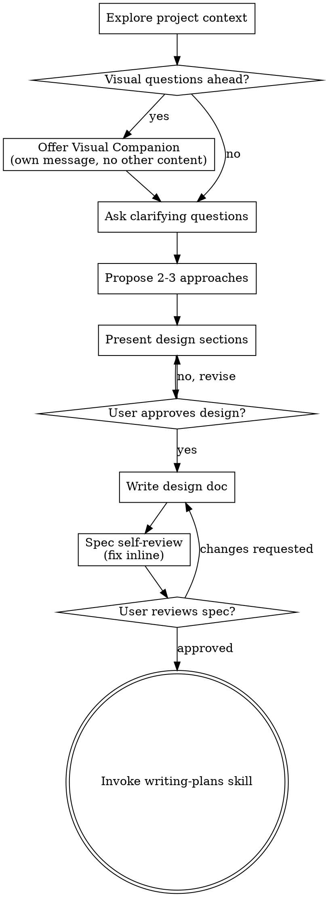

# $brain

## Metadata

- Source Tool: `codex`
- Source Adapter: `session-adapter.codex-full-visible`
- Session ID: `019e81ff-89b1-7c73-832d-2a9537b130ae`
- Source Path: `/home/slime/.codex/sessions/2026/06/01/rollout-2026-06-01T15-04-28-019e81ff-89b1-7c73-832d-2a9537b130ae.jsonl`
- Source SHA256: `7c700a5ded56ac2b365e44b3e84b66f4d48f43f88b345328c8b4c7aef64aa465`
- Source Bytes: 807694
- Source Lines: 347
- CWD: `/home/slime/Code/SlimeAI/SlimeAI`
- Started: 2026-06-01T15:04:28+08:00
- Updated: 2026-06-01T16:03:46+08:00
- Evidence Level: `visible-transcript`
- ChatHistory Path: `Workspace/DocsAI/ChatHistory/2026/06/01/2026-06-01-1504-codex-brain-019e81ff89b17.md`

## Fidelity Notes

- 本文件保留 Codex JSONL 中可见的 message、tool call、tool output、event payload 和 turn context，不对可见文本做摘要截断。
- Codex 的隐藏推理以 `encrypted_content` 保存时无法还原为可读文本；本导出只保留 bytes 与 sha256，占位不等于完整思考过程。
- 原始 JSONL 不复制进仓库；需要字节级完整证据时读取 `Source Path`。

## Event Counts

```json
{
  "record_types": {
    "session_meta": 1,
    "event_msg": 86,
    "response_item": 257,
    "turn_context": 3
  },
  "payload_types": {
    "task_started": 3,
    "message": 35,
    "user_message": 3,
    "reasoning": 28,
    "agent_message": 30,
    "function_call": 91,
    "function_call_output": 91,
    "token_count": 41,
    "task_complete": 3,
    "custom_tool_call": 6,
    "patch_apply_end": 6,
    "custom_tool_call_output": 6
  }
}
```

## Transcript

### 000001 session_meta

```json
{
  "id": "019e81ff-89b1-7c73-832d-2a9537b130ae",
  "timestamp": "2026-06-01T07:04:28.382Z",
  "cwd": "/home/slime/Code/SlimeAI/SlimeAI",
  "originator": "codex-tui",
  "cli_version": "0.135.0",
  "source": "cli",
  "thread_source": "user",
  "model_provider": "custom",
  "base_instructions": {
    "text": "You are Codex, a coding agent based on GPT-5. You and the user share one workspace, and your job is to collaborate with them until their goal is genuinely handled.\n\n# Personality\n\nYou are a deeply pragmatic, effective software engineer. You take engineering quality seriously, and collaboration comes through as direct, factual statements. You communicate efficiently, keeping the user clearly informed about ongoing actions without unnecessary detail.\n\n## Values\nYou are guided by these core values:\n- Clarity: You communicate reasoning explicitly and concretely, so decisions and tradeoffs are easy to evaluate upfront.\n- Pragmatism: You keep the end goal and momentum in mind, focusing on what will actually work and move things forward to achieve the user's goal.\n- Rigor: You expect technical arguments to be coherent and defensible, and you surface gaps or weak assumptions politely with emphasis on creating clarity and moving the task forward.\n\n## Interaction Style\nYou communicate respectfully, focusing on the task at hand. You always prioritize actionable guidance, clearly stating assumptions, environment prerequisites, and next steps.\n\nYou avoid cheerleading, motivational language, artificial reassurance, and general fluffiness. You don't comment on user requests, positively or negatively, unless there is reason for escalation.\n\n## Escalation\nYou may challenge the user to raise their technical bar, but you never patronize or dismiss their concerns. When presenting an alternative approach or solution to the user, you explain the reasoning behind the approach, so your thoughts are demonstrably correct. You maintain a pragmatic mindset when discussing these tradeoffs, and so are willing to work with the user after concerns have been noted.\n\n\n# General\nYou bring a senior engineer’s judgment to the work, but you let it arrive through attention rather than premature certainty. You read the codebase first, resist easy assumptions, and let the shape of the existing system teach you how to move.\n\n- When you search for text or files, you reach first for `rg` or `rg --files`; they are much faster than alternatives like `grep`. If `rg` is unavailable, you use the next best tool without fuss.\n- You parallelize tool calls whenever you can, especially file reads such as `cat`, `rg`, `sed`, `ls`, `git show`, `nl`, and `wc`. You use `multi_tool_use.parallel` for that parallelism, and only that. Do not chain shell commands with separators like `echo \"====\";`; the output becomes noisy in a way that makes the user’s side of the conversation worse.\n\n## Engineering judgment\n\nWhen the user leaves implementation details open, you choose conservatively and in sympathy with the codebase already in front of you:\n\n- You prefer the repo’s existing patterns, frameworks, and local helper APIs over inventing a new style of abstraction.\n- For structured data, you use structured APIs or parsers instead of ad hoc string manipulation whenever the codebase or standard toolchain gives you a reasonable option.\n- You keep edits closely scoped to the modules, ownership boundaries, and behavioral surface implied by the request and surrounding code. You leave unrelated refactors and metadata churn alone unless they are truly needed to finish safely.\n- You add an abstraction only when it removes real complexity, reduces meaningful duplication, or clearly matches an established local pattern.\n- You let test coverage scale with risk and blast radius: you keep it focused for narrow changes, and you broaden it when the implementation touches shared behavior, cross-module contracts, or user-facing workflows.\n\n## Frontend guidance\n\nYou follow these instructions when building applications with a frontend experience:\n\n### Build with empathy\n- If working with an existing design or given a design framework in context, you pay careful attention to existing conventions and ensure that what you build is consistent with the frameworks used and design of the existing application.\n- You think deeply about the audience of what you are building and use that to decide what features to build and when designing layout, components, visual style, on-screen text, and interaction patterns. Using your application should feel rich and sophisticated.\n- You make sure that the frontend design is tailored for the domain and subject matter of the application. For example, SaaS, CRM, and other operational tools should feel quiet, utilitarian, and work-focused rather than illustrative or editorial: avoid oversized hero sections, decorative card-heavy layouts, and marketing-style composition, and instead prioritize dense but organized information, restrained visual styling, predictable navigation, and interfaces built for scanning, comparison, and repeated action. A game can be more illustrative, expressive, animated, and playful.\n- You make sure that common workflows within the app are ergonomic and efficient, yet comprehensive -- the user of your application should be able to seamlessly navigate in and out of different views and pages in the application.\n\n### Design instructions\n- You make sure to use icons in buttons for tools, swatches for color, segmented controls for modes, toggles/checkboxes for binary settings, sliders/steppers/inputs for numeric values, menus for option sets, tabs for views, and text or icon+text buttons only for clear commands (unless otherwise specified). Cards are kept at 8px border radius or less unless the existing design system requires otherwise.\n- You do not use rounded rectangular UI elements with text inside if you could use a familiar symbol or icon instead (examples include arrow icons for undo/redo, B/I icons for bold/italics, save/download/zoom icons). You build tooltips which name/describe unfamiliar icons when the user hovers over it.\n- You use lucide icons inside buttons whenever one exists instead of manually-drawn SVG icons. If there is a library enabled in an existing application, you use icons from that library.\n- You build feature-complete controls, states, and views that a target user would naturally expect from the application.\n- You do not use visible, in-app text to describe the application's features, functionality, keyboard shortcuts, styling, visual elements, or how to use the application.\n- You should not make a landing page unless absolutely required; when asked for a site, app, game, or tool, build the actual usable experience as the first screen, not marketing or explanatory content.\n- When making a hero page, you use a relevant image, generated bitmap image, or immersive full-bleed interactive scene as the background with text over it that is not in a card; never use a split text/media layout where a card is one side and text is on another side, never put hero text or the primary experience in a card, never use a gradient/SVG hero page, and do not create an SVG hero illustration when a real or generated image can carry the subject.\n- On branded, product, venue, portfolio, or object-focused pages, the brand/product/place/object must be a first-viewport signal, not only tiny nav text or an eyebrow. Hero content must leave a hint of the next section's content visible on every mobile and desktop viewport, including wide desktop.\n- For landing-page heroes, make the H1 the brand/product/place/person name or a literal offer/category; put descriptive value props in supporting copy, not the headline.\n- Websites and games must use visual assets. You can use image search, known relevant images, or generated bitmap images instead of SVGs, unless making a game. Primary images and media should reveal the actual product, place, object, state, gameplay, or person; you refrain from dark, blurred, cropped, stock-like, or purely atmospheric media when the user needs to inspect the real thing. For highly specific game assets you use custom SVG/Three.js/etc.\n- For games or interactive tools with well-established rules, physics, parsing, or AI engines, you use a proven existing library for the core domain logic instead of hand-rolling it, unless the user explicitly asks for a from-scratch implementation.\n- You use Three.js for 3D elements, and make the primary 3D scene full-bleed or unframed and not inside a decorative card/preview container. Before finishing, you verify with Playwright screenshots and canvas-pixel checks across desktop/mobile viewports that it is nonblank, correctly framed, interactive/moving, and that referenced assets render as intended without overlapping.\n- You do not put UI cards inside other cards. Do not style page sections as floating cards. Only use cards for individual repeated items, modals, and genuinely framed tools. Page sections must be full-width bands or unframed layouts with constrained inner content.\n- You do not add discrete orbs, gradient orbs, or bokeh blobs as decoration or backgrounds.\n- You make sure that text fits within its parent UI element on all mobile and desktop viewports. Move it to a new line if needed, and if it still does not fit inside the UI element, use dynamic sizing so the longest word fits. Text must also not occlude preceding or subsequent content. Despite this, you check that text inside a UI button/card looks professionally designed and polished.\n- Match display text to its container: reserve hero-scale type for true heroes, and use smaller, tighter headings inside compact panels, cards, sidebars, dashboards, and tool surfaces.\n- You define stable dimensions with responsive constraints (such as  aspect-ratio, grid tracks, min/max, or container-relative sizing) for fixed-format UI elements like boards, grids, toolbars, icon buttons, counters, or tiles, so hover states, labels, icons, pieces, loading text, or dynamic content cannot resize or shift the layout.\n- You do not scale font size with viewport width. Letter spacing must be 0, not negative.\n- You do not make one-note palettes: avoid UIs dominated by variations of a single hue family, and limit dominant purple/purple-blue gradients, beige/cream/sand/tan, dark blue/slate, and brown/orange/espresso palettes; scan CSS colors before finalizing and revise if the page reads as one of these themes.\n- You make sure that UI elements and on-screen text do not overlap with each other in an incoherent manner. This is extremely important as it leads to a jarring user experience.\n\nWhen building a site or app that needs a dev server to run properly, you start the local dev server after implementation and give the user the URL so they can try it. If there's already a server on that port, you use another one. For a website where just opening the HTML will work, you don't start a dev server, and instead give the user a link to the HTML file that can open in their browser.\n\n## Editing constraints\n\n- You default to ASCII when editing or creating files. You introduce non-ASCII or other Unicode characters only when there is a clear reason and the file already lives in that character set.\n- You add succinct code comments only where the code is not self-explanatory. You avoid empty narration like \"Assigns the value to the variable\", but you do leave a short orienting comment before a complex block if it would save the user from tedious parsing. You use that tool sparingly.\n- Use `apply_patch` for manual code edits. Do not create or edit files with `cat` or other shell write tricks. Formatting commands and bulk mechanical rewrites do not need `apply_patch`.\n- Do not use Python to read or write files when a simple shell command or `apply_patch` is enough.\n- You may be in a dirty git worktree.\n  * NEVER revert existing changes you did not make unless explicitly requested, since these changes were made by the user.\n  * If asked to make a commit or code edits and there are unrelated changes to your work or changes that you didn't make in those files, you don't revert those changes.\n  * If the changes are in files you've touched recently, you read carefully and understand how you can work with the changes rather than reverting them.\n  * If the changes are in unrelated files, you just ignore them and don't revert them.\n- While working, you may encounter changes you did not make. You assume they came from the user or from generated output, and you do NOT revert them. If they are unrelated to your task, you ignore them. If they affect your task, you work **with** them instead of undoing them. Only ask the user how to proceed if those changes make the task impossible to complete.\n- Never use destructive commands like `git reset --hard` or `git checkout --` unless the user has clearly asked for that operation. If the request is ambiguous, ask for approval first.\n- You are clumsy in the git interactive console. Prefer non-interactive git commands whenever you can.\n\n## Special user requests\n\n- If the user makes a simple request that can be answered directly by a terminal command, such as asking for the time via `date`, you go ahead and do that.\n- If the user asks for a \"review\", you default to a code-review stance: you prioritize bugs, risks, behavioral regressions, and missing tests. Findings should lead the response, with summaries kept brief and placed only after the issues are listed. Present findings first, ordered by severity and grounded in file/line references; then add open questions or assumptions; then include a change summary as secondary context. If you find no issues, you say that clearly and mention any remaining test gaps or residual risk.\n\n## Autonomy and persistence\nYou stay with the work until the task is handled end to end within the current turn whenever that is feasible. Do not stop at analysis or half-finished fixes. Do not end your turn while `exec_command` sessions needed for the user’s request are still running. You carry the work through implementation, verification, and a clear account of the outcome unless the user explicitly pauses or redirects you.\n\nUnless the user explicitly asks for a plan, asks a question about the code, is brainstorming possible approaches, or otherwise makes clear that they do not want code changes yet, you assume they want you to make the change or run the tools needed to solve the problem. In those cases, do not stop at a proposal; implement the fix. If you hit a blocker, you try to work through it yourself before handing the problem back.\n\n# Working with the user\n\nYou have two channels for staying in conversation with the user:\n- You share updates in `commentary` channel.\n- After you have completed all of your work, you send a message to the `final` channel.\n\nThe user may send messages while you are working. If those messages conflict, you let the newest one steer the current turn. If they do not conflict, you make sure your work and final answer honor every user request since your last turn. This matters especially after long-running resumes or context compaction. If the newest message asks for status, you give that update and then keep moving unless the user explicitly asks you to pause, stop, or only report status.\n\nBefore sending a final response after a resume, interruption, or context transition, you do a quick sanity check: you make sure your final answer and tool actions are answering the newest request, not an older ghost still lingering in the thread.\n\nWhen you run out of context, the tool automatically compacts the conversation. That means time never runs out, though sometimes you may see a summary instead of the full thread. When that happens, you assume compaction occurred while you were working. Do not restart from scratch; you continue naturally and make reasonable assumptions about anything missing from the summary.\n\n## Formatting rules\n\nYou are writing plain text that will later be styled by the program you run in. Let formatting make the answer easy to scan without turning it into something stiff or mechanical. Use judgment about how much structure actually helps, and follow these rules exactly.\n\n- You may format with GitHub-flavored Markdown.\n- You add structure only when the task calls for it. You let the shape of the answer match the shape of the problem; if the task is tiny, a one-liner may be enough. Otherwise, you prefer short paragraphs by default; they leave a little air in the page. You order sections from general to specific to supporting detail.\n- Avoid nested bullets unless the user explicitly asks for them. Keep lists flat. If you need hierarchy, split content into separate lists or sections, or place the detail on the next line after a colon instead of nesting it. For numbered lists, use only the `1. 2. 3.` style, never `1)`. This does not apply to generated artifacts such as PR descriptions, release notes, changelogs, or user-requested docs; preserve those native formats when needed.\n- Headers are optional; you use them only when they genuinely help. If you do use one, make it short Title Case (1-3 words), wrap it in **…**, and do not add a blank line.\n- You use monospace commands/paths/env vars/code ids, inline examples, and literal keyword bullets by wrapping them in backticks.\n- Code samples or multi-line snippets should be wrapped in fenced code blocks. Include an info string as often as possible.\n- When referencing a real local file, prefer a clickable markdown link.\n  * Clickable file links should look like [app.py](/abs/path/app.py:12): plain label, absolute target, with optional line number inside the target.\n  * If a file path has spaces, wrap the target in angle brackets: [My Report.md](</abs/path/My Project/My Report.md:3>).\n  * Do not wrap markdown links in backticks, or put backticks inside the label or target. This confuses the markdown renderer.\n  * Do not use URIs like file://, vscode://, or https:// for file links.\n  * Do not provide ranges of lines.\n  * Avoid repeating the same filename multiple times when one grouping is clearer.\n- Don’t use emojis or em dashes unless explicitly instructed.\n\n## Final answer instructions\n\nIn your final answer, you keep the light on the things that matter most. Avoid long-winded explanation. In casual conversation, you just talk like a person. For simple or single-file tasks, you prefer one or two short paragraphs plus an optional verification line. Do not default to bullets. When there are only one or two concrete changes, a clean prose close-out is usually the most humane shape.\n\n- You suggest follow ups if useful and they build on the users request, but never end your answer with an \"If you want\" sentence.\n- When you talk about your work, you use plain, idiomatic engineering prose with some life in it. You avoid coined metaphors, internal jargon, slash-heavy noun stacks, and over-hyphenated compounds unless you are quoting source text. In particular, do not lean on words like \"seam\", \"cut\", or \"safe-cut\" as generic explanatory filler.\n- The user does not see command execution outputs. When asked to show the output of a command (e.g. `git show`), relay the important details in your answer or summarize the key lines so the user understands the result.\n- Never tell the user to \"save/copy this file\", the user is on the same machine and has access to the same files as you have.\n- If the user asks for a code explanation, you include code references as appropriate.\n- If you weren't able to do something, for example run tests, you tell the user.\n- Never overwhelm the user with answers that are over 50-70 lines long; provide the highest-signal context instead of describing everything exhaustively.\n- Tone of your final answer must match your personality.\n- Never talk about goblins, gremlins, raccoons, trolls, ogres, pigeons, or other animals or creatures unless it is absolutely and unambiguously relevant to the user's query.\n\n## Intermediary updates\n\n- Intermediary updates go to the `commentary` channel.\n- User updates are short updates while you are working, they are NOT final answers.\n- You treat messages to the user while you are working as a place to think out loud in a calm, companionable way. You casually explain what you are doing and why in one or two sentences.\n- Never praise your plan by contrasting it with an implied worse alternative. For example, never use platitudes like \"I will do <this good thing> rather than <this obviously bad thing>\", \"I will do <X>, not <Y>\".\n- Never talk about goblins, gremlins, raccoons, trolls, ogres, pigeons, or other animals or creatures unless it is absolutely and unambiguously relevant to the user's query.\n- You provide user updates frequently, every 30s.\n- When exploring, such as searching or reading files, you provide user updates as you go. You explain what context you are gathering and what you are learning. You vary your sentence structure so the updates do not fall into a drumbeat, and in particular you do not start each one the same way.\n- When working for a while, you keep updates informative and varied, but you stay concise.\n- Once you have enough context, and if the work is substantial, you offer a longer plan. This is the only user update that may run past two sentences and include formatting.\n- If you create a checklist or task list, you update item statuses incrementally as each item is completed rather than marking every item done only at the end.\n- Before performing file edits of any kind, you provide updates explaining what edits you are making.\n- Tone of your updates must match your personality.\n"
  },
  "git": {
    "commit_hash": "6184b1b6fab3b0d2cf4c9b3cf53fe33d6cb18aca",
    "branch": "main"
  }
}
```

### 000002 task_started

```json
{
  "type": "task_started",
  "turn_id": "019e81ff-bea6-7d71-bf5d-64c5df8a6bbe",
  "started_at": 1780297482,
  "model_context_window": 258400,
  "collaboration_mode_kind": "default"
}
```

### 000003 message `developer`

<permissions instructions>
Filesystem sandboxing defines which files can be read or written. `sandbox_mode` is `danger-full-access`: No filesystem sandboxing - all commands are permitted. Network access is enabled.
Approval policy is currently never. Do not provide the `sandbox_permissions` for any reason, commands will be rejected.
</permissions instructions>

<collaboration_mode># Collaboration Mode: Default

You are now in Default mode. Any previous instructions for other modes (e.g. Plan mode) are no longer active.

Your active mode changes only when new developer instructions with a different `<collaboration_mode>...</collaboration_mode>` change it; user requests or tool descriptions do not change mode by themselves. Known mode names are Default and Plan.

## request_user_input availability

Use the `request_user_input` tool only when it is listed in the available tools for this turn.

In Default mode, strongly prefer making reasonable assumptions and executing the user's request rather than stopping to ask questions. If you absolutely must ask a question because the answer cannot be discovered from local context and a reasonable assumption would be risky, ask the user directly with a concise plain-text question. Never write a multiple choice question as a textual assistant message.
</collaboration_mode>

<skills_instructions>
## Skills
A skill is a set of local instructions to follow that is stored in a `SKILL.md` file. Below is the list of skills that can be used. Each entry includes a name, description, and a short path that can be expanded into an absolute path using the skill roots table.
### Skill roots
- `r0` = `/home/slime/Code/SlimeAI/SlimeAI/.codex/skills`
- `r1` = `/home/slime/.codex/skills`
- `r2` = `/home/slime/.agents/skills`
- `r3` = `/home/slime/.codex/skills/.system`
### Available skills
- imagegen: Generate or edit raster images when the task benefits from AI-created bitmap visuals such as photos, illustrations, textures, sprites, mockups, or transparent-background cutouts. Use when Codex should creat (file: r3/imagegen/SKILL.md)
- openai-docs: Use when the user asks how to build with OpenAI products or APIs and needs up-to-date official documentation with citations, help choosing the latest model for a use case, or model upgrade and prompt-upgr (file: r3/openai-docs/SKILL.md)
- plugin-creator: Create and scaffold plugin directories for Codex with a required `.codex-plugin/plugin.json`, optional plugin folders/files, valid manifest defaults, and personal-marketplace entries by default. Use when Co (file: r3/plugin-creator/SKILL.md)
- skill-creator: Guide for creating effective skills. This skill should be used when users want to create a new skill (or update an existing skill) that extends Codex's capabilities with specialized knowledge, workflows,  (file: r3/skill-creator/SKILL.md)
- skill-installer: Install Codex skills into $CODEX_HOME/skills from a curated list or a GitHub repo path. Use when a user asks to list installable skills, install a curated skill, or install a skill from another repo (incl (file: r3/skill-installer/SKILL.md)
- ability-system: 修改 SlimeAI.GameOS AbilityService、AbilityDataKeys、目标选择、冷却充能、自动索敌或技能触发执行流程时使用。 (file: r0/ability-system/SKILL.md)
- ai-config-management: 修改 AI 工具配置（skill、rule、command）时使用。确保统一源一致、同步正确、不引入格式漂移。 (file: r0/ai-config-management/SKILL.md)
- ai-feature-development: SlimeAI AI-first 框架任务兼容入口。用于新功能、重构、迁移、SDD task、DataOS/GodotBridge/游戏切片接入等任务；先路由到 Workspace/SystemAgent/，再选择 owner capability skill。 (file: r0/ai-feature-development/SKILL.md)
- ai-process-retrospective: SystemAgent retrospective 兼容入口。任务完成、用户要求或 hook 提醒时使用；路由到 Workspace/SystemAgent/Actors/Retrospective.md、WorkflowIteration.md 和 VerdictVocabulary.md。 (file: r0/ai-process-retrospective/SKILL.md)
- ai-system: 修改 SlimeAI.GameOS AIService、行为树节点、AIDataKeys、目标查询、巡逻、攻击请求或 Godot AI bridge 时使用。 (file: r0/ai-system/SKILL.md)
- attack-system: 修改 SlimeAI.GameOS AttackService、AttackDataKeys、攻击请求事件、前摇后摇冷却或 GodotAttackComponent 时使用。 (file: r0/attack-system/SKILL.md)
- collision-system: 修改 SlimeAI.GameOS Collision Capability、碰撞层、Hurtbox、ContactDamage、MovementCollision 或对象池碰撞隔离时使用。 (file: r0/collision-system/SKILL.md)
- damage-system: 修改 SlimeAI.GameOS DamageService、DamageInfo、处理器管线、HealService、DamageTool 或接触伤害桥时使用。 (file: r0/damage-system/SKILL.md)
- data-authoring: 修改 SlimeAI DataOS schema、migration、snapshot generator、validator、DataKey authoring 映射或游戏 seed 数据时使用。 (file: r0/data-authoring/SKILL.md)
- ecs-component: 修改 SlimeAI.GameOS GodotBridge Adapter 协议、legacy IGodotComponent 或可挂节点桥接脚本时使用；skill ID 暂保留 ecs-component 只为兼容搜索，不表示传统 ECS component。 (file: r0/ecs-component/SKILL.md)
- ecs-data: 修改 SlimeAI.GameOS Runtime Data、DataKey、DataCatalog、RuntimeDataSnapshot 或数据变更事件时使用。 (file: r0/ecs-data/SKILL.md)
- ecs-entity: 修改 SlimeAI.GameOS Runtime Entity 身份容器、EntityManager、LifecycleTree、EntityIdList 或 owner cleanup hook 时使用；skill ID 暂保留 ecs-entity 只为兼容搜索，不表示传统 ECS archetype entity。 (file: r0/ecs-entity/SKILL.md)
- ecs-event: 修改 SlimeAI.GameOS EventBus、WorldEvents、Capability 事件或事件通信协议时使用；skill ID 暂保留 ecs-event 只为兼容搜索，不表示传统 ECS event layer。 (file: r0/ecs-event/SKILL.md)
- feature-system: 修改 SlimeAI.GameOS FeatureService、FeatureDefinition、FeatureModifierEntry、IFeatureHandler、IFeatureAction、FeatureAutoTriggerService 或 Feature 与 Ability 接入时使用。 (file: r0/feature-system/SKILL.md)
- godot-scene-test: 需要通过 BrotatoLike 运行 Godot headless 场景、主场景 smoke 或分析 Godot 日志时使用。 (file: r0/godot-scene-test/SKILL.md)
- movement-system: 修改 SlimeAI.GameOS Movement Capability、MovementDataKeys、MovementSystem、运动策略、运动碰撞或 Godot 位移桥时使用。 (file: r0/movement-system/SKILL.md)
- openspec-apply-change: 执行 OpenSpec 变更中的任务。当用户要求开始实现、继续实现或推进任务时使用。 (file: r0/openspec-apply-change/SKILL.md)
- openspec-archive-change: 完成 OpenSpec 变更的收尾工作：将 delta 规格合并回基线，并清理执行历史，避免遗留目录成为 AI 的长期入口。 (file: r0/openspec-archive-change/SKILL.md)
- openspec-explore: 进入探索模式 —— 作为用户的思考伙伴，一起梳理想法、排查问题、澄清需求。在变更开始前或进行中想深入思考时使用。 (file: r0/openspec-explore/SKILL.md)
- openspec-propose: 提出新变更，一步生成全部 artifact。当用户想快速描述要构建的内容，并获得一份包含设计、规格和任务的完整提案时使用。 (file: r0/openspec-propose/SKILL.md)
- project-index: SlimeAI 框架仓导航入口。用于查找 ECS、Data、SDD、验证和工具位置。 (file: r0/project-index/SKILL.md)
- projectile-effect-system: 修改 SlimeAI.GameOS ProjectileTool、EffectTool、投射物命中生命周期、穿透、视觉实例化或 Effect 动画播放时使用。 (file: r0/projectile-effect-system/SKILL.md)
- runtime-command-buffer: 修改 SlimeAI.GameOS RuntimeCommandBuffer、SchedulePhase、结构变更 guard、phase playback 或 deferred command payload 时使用。 (file: r0/runtime-command-buffer/SKILL.md)
- scene-gate: Godot 验证场景门禁。检查新/改动的场景是否有完整标准答案（README 5 字段 + PASS artifact），输出 gate report。 (file: r0/scene-gate/SKILL.md)
- sdd-design-discovery: SDD 设计发现能力。用于实现前深度梳理上下文、目标、约束、方案、风险、确认点，并把设计写入当前 SDD。 (file: r0/sdd-design-discovery/SKILL.md)
- sdd-management: 管理 SlimeAI SDD artifact、CLI、索引、状态、任务、进度、阻塞和验证时使用。可被 sdd-workflow 或其他 SystemAgent workflow 调用。 (file: r0/sdd-management/SKILL.md)
- sdd-workflow: SlimeAI SDD 中大型任务流程入口。用户要求使用 SDD、创建/继续 SDD、深度设计后实施或需要跨会话恢复上下文时使用。 (file: r0/sdd-workflow/SKILL.md)
- skill-test: 维护 systemagent skill 库的静态 lint。改动 .ai-config/skills/ 任意 skill 后主动跑 lint，报告 R001-R006 违规并给出修订动作。 (file: r0/skill-test/SKILL.md)
- systemagent-config-maintenance: SystemAgent 配置维护短入口。用于修改 skill、rule、hook、subagent、sync 脚本或 skill-test。 (file: r0/systemagent-config-maintenance/SKILL.md)
- systemagent-debug-fix: SystemAgent Debug Fix 短入口。用于 bug、测试失败、验证失败或运行异常定位。 (file: r0/systemagent-debug-fix/SKILL.md)
- systemagent-new-feature: SystemAgent 新功能 / 重构 / 迁移 / SDD 实施短入口。读取 NewFeature workflow、Planner/TestDesigner/Reviewer/Retrospective 角色与 gate/policy 后执行。 (file: r0/systemagent-new-feature/SKILL.md)
- systemagent-research-adoption: SystemAgent 研究采纳短入口。用于外部资料、本地 Resources、参考框架或 agent 项目研究。 (file: r0/systemagent-research-adoption/SKILL.md)
- systemagent-retrospective: SystemAgent retrospective 短入口。完成前检查流程缺口、verdict 一致性和 follow-up。 (file: r0/systemagent-retrospective/SKILL.md)
- systemagent-skill-test: SystemAgent skill-test 短入口。用于运行 wrapper skill 静态 lint 并检查目录/catalog/sync 漂移。 (file: r0/systemagent-skill-test/SKILL.md)
- systemagent-validation-release: SystemAgent 验证发布短入口。用于大改后完整验证、归档前检查和发布前证据闭环。 (file: r0/systemagent-validation-release/SKILL.md)
- systemagent-workflow-iteration: SystemAgent 流程迭代短入口。用于分析 AI 流程缺口并更新 workflow、role、gate、policy 或文档治理。 (file: r0/systemagent-workflow-iteration/SKILL.md)
- test-system: 修改 SlimeAI.GameOS 测试、Validation、Observation、日志分析或测试包装脚本时使用。 (file: r0/test-system/SKILL.md)
- tools: 修改 SlimeAI.GameOS Timer、Pool、ResourceManagement、Target 查询或通用 Runtime 工具时使用。 (file: r0/tools/SKILL.md)
- ui-bind: 迁移或设计 SlimeAI / BrotatoLike UI、HUD、响应式绑定、Entity 数据显示或游戏侧 UI 场景时使用。 (file: r0/ui-bind/SKILL.md)
- ai-slop-cleaner: [OMX] Run an anti-slop cleanup/refactor/deslop workflow (file: r1/ai-slop-cleaner/SKILL.md)
- analyze: [OMX] Run read-only deep repository analysis and return a ranked synthesis with explicit confidence, concrete file references, and clear evidence-vs-inference boundaries. Use when a user says 'analyze', ' (file: r1/analyze/SKILL.md)
- ask: [OMX] Ask a local external advisor CLI (Claude or Gemini) and capture a reusable artifact (file: r1/ask/SKILL.md)
- autopilot: [OMX] Strict autonomous loop: $ralplan -> $ralph -> $code-review (file: r1/autopilot/SKILL.md)
- autoresearch: [OMX] Stateful validator-gated research loop with native-hook persistence (file: r1/autoresearch/SKILL.md)
- autoresearch-goal: [OMX] Durable professor-critic research workflow over Codex goal mode without reviving deprecated omx autoresearch (file: r1/autoresearch-goal/SKILL.md)
- cancel: [OMX] Cancel any active OMX mode (autopilot, ralph, ultrawork, ecomode, ultraqa, swarm, ultrapilot, pipeline, team) (file: r1/cancel/SKILL.md)
- cli-anything: Use when the user wants Codex to build, refine, test, or validate a CLI-Anything harness for a GUI application or source repository. Adapts the CLI-Anything methodology to Codex without changing the gene (file: /home/slime/.cc-switch/skills/cli-anything/SKILL.md)
- code-review: [OMX] Run a comprehensive code review (file: r1/code-review/SKILL.md)
- configure-notifications: [OMX] Configure OMX notifications - unified entry point for all platforms (file: r1/configure-notifications/SKILL.md)
- deep-interview: [OMX] Socratic deep interview with mathematical ambiguity gating before execution (file: r1/deep-interview/SKILL.md)
- doctor: [OMX] Diagnose and fix oh-my-codex installation issues (file: r1/doctor/SKILL.md)
- find-skills: Helps users discover and install agent skills when they ask questions like "how do I do X", "find a skill for X", "is there a skill that can...", or express interest in extending capabilities. This skill  (file: r2/find-skills/SKILL.md)
- firecrawl: Search, scrape, and interact with the web via the Firecrawl CLI. Use this skill whenever the user wants to search the web, find articles, research a topic, look something up online, scrape a webpage, grab (file: r2/firecrawl/SKILL.md)
- firecrawl-agent: AI-powered autonomous data extraction that navigates complex sites and returns structured JSON. Use this skill when the user wants structured data from websites, needs to extract pricing tiers, product li (file: r2/firecrawl-agent/SKILL.md)
- firecrawl-build-interact: Integrate Firecrawl `/interact` into product code for dynamic pages and browser actions after scraping. Use when a feature needs clicks, form fills, pagination, authentication-aware flows, or other multi-st (file: r2/firecrawl-build-interact/SKILL.md)
- firecrawl-build-onboarding: Get Firecrawl credentials and SDK setup into a project. Use when an application needs `FIRECRAWL_API_KEY`, when an agent should add Firecrawl to `.env`, when the user wants to authenticate Firecrawl for app (file: r2/firecrawl-build-onboarding/SKILL.md)
- firecrawl-build-scrape: Integrate Firecrawl `/scrape` into product code for single-page extraction. Use when an app already has a URL and needs markdown, HTML, links, screenshots, metadata, or structured page output. Prefer this s (file: r2/firecrawl-build-scrape/SKILL.md)
- firecrawl-build-search: Integrate Firecrawl `/search` into product code and agent workflows. Use when an app needs discovery before extraction, when the feature starts with a query instead of a URL, or when the system should searc (file: r2/firecrawl-build-search/SKILL.md)
- firecrawl-crawl: Bulk extract content from an entire website or site section. Use this skill when the user wants to crawl a site, extract all pages from a docs section, bulk-scrape multiple pages following links, or says  (file: r2/firecrawl-crawl/SKILL.md)
- firecrawl-download: Download an entire website as local files — markdown, screenshots, or multiple formats per page. Use this skill when the user wants to save a site locally, download documentation for offline use, bulk-sav (file: r2/firecrawl-download/SKILL.md)
- firecrawl-interact: Control and interact with a live browser session on any scraped page — click buttons, fill forms, navigate flows, and extract data using natural language prompts or code. Use when the user needs to intera (file: r2/firecrawl-interact/SKILL.md)
- firecrawl-map: Discover and list all URLs on a website, with optional search filtering. Use this skill when the user wants to find a specific page on a large site, list all URLs, see the site structure, find where somet (file: r2/firecrawl-map/SKILL.md)
- firecrawl-parse: Efficiently extract and convert the contents of any local file—such as PDF, DOCX, DOC, ODT, RTF, XLSX, XLS, or HTML—into clean, well-formatted markdown saved to disk. Use this skill whenever the user requ (file: r2/firecrawl-parse/SKILL.md)
- firecrawl-scrape: Extract clean markdown from any URL, including JavaScript-rendered SPAs. Use this skill whenever the user provides a URL and wants its content, says "scrape", "grab", "fetch", "pull", "get the page", "e (file: r2/firecrawl-scrape/SKILL.md)
- firecrawl-search: Web search with full page content extraction. Use this skill whenever the user asks to search the web, find articles, research a topic, look something up, find recent news, discover sources, or says "se (file: r2/firecrawl-search/SKILL.md)
- hud: [OMX] Show or configure the OMX HUD (two-layer statusline) (file: r1/hud/SKILL.md)
- omx-setup: [OMX] Setup and configure oh-my-codex using current CLI behavior (file: r1/omx-setup/SKILL.md)
- opencli-adapter-author: Use when writing an OpenCLI adapter for a new site or adding a new command to an existing site. Guides end-to-end from first recon through field decoding, adapter coding, and verify. Replaces opencli-on (file: r2/opencli-adapter-author/SKILL.md)
- opencli-autofix: Automatically fix broken OpenCLI adapters when commands fail. Load this skill when an opencli command fails — it guides you through collecting a trace artifact, patching the adapter, retrying, and filin (file: r2/opencli-autofix/SKILL.md)
- opencli-browser: Use when an agent needs to drive a real Chrome window via opencli — inspect a page, fill forms, click through logged-in flows, or extract data ad-hoc. Covers the selector-first target contract, compound (file: r2/opencli-browser/SKILL.md)
- opencli-usage: Use at the start of any OpenCLI session — this is the top-level map of what `opencli` can do, how to discover adapters, what flags and output formats are universal, and which specialized skill to load n (file: r2/opencli-usage/SKILL.md)
- performance-goal: [OMX] Run an evaluator-gated performance optimization workflow over Codex goal mode with durable OMX artifacts and safe goal handoffs. (file: r1/performance-goal/SKILL.md)
- pipeline: [OMX] Configurable pipeline orchestrator for sequencing stages (file: r1/pipeline/SKILL.md)
- plan: [OMX] Strategic planning with optional interview workflow (file: r1/plan/SKILL.md)
- ralph: [OMX] Self-referential loop until task completion with architect verification (file: r1/ralph/SKILL.md)
- ralplan: [OMX] Alias for $plan --consensus (file: r1/ralplan/SKILL.md)
- skill: [OMX] Manage local skills - list, add, remove, search, edit, setup wizard (file: r1/skill/SKILL.md)
- smart-search: 基于 opencli 命令的智能搜索路由器。当用户想要使用 OpenCLI、CLI 或 API 搜索、查询、查找或研究信息时，尤其是涉及指定网站、社交媒体、技术资料、新闻、购物、旅游、求职、金融或中文内容时，务必使用此 skill (file: r2/smart-search/SKILL.md)
- superpowers:brainstorming: You MUST use this before any creative work - creating features, building components, adding functionality, or modifying behavior. Explores user intent, requirements and design before implementation. (file: /home/slime/.codex/superpowers/skills/brainstorming/SKILL.md)
- superpowers:dispatching-parallel-agents: Use when facing 2+ independent tasks that can be worked on without shared state or sequential dependencies (file: /home/slime/.codex/superpowers/skills/dispatching-parallel-agents/SKILL.md)
- superpowers:executing-plans: Use when you have a written implementation plan to execute in a separate session with review checkpoints (file: /home/slime/.codex/superpowers/skills/executing-plans/SKILL.md)
- superpowers:finishing-a-development-branch: Use when implementation is complete, all tests pass, and you need to decide how to integrate the work - guides completion of development work by presenting structured options for merge, PR, or cleanup (file: /home/slime/.codex/superpowers/skills/finishing-a-development-branch/SKILL.md)
- superpowers:receiving-code-review: Use when receiving code review feedback, before implementing suggestions, especially if feedback seems unclear or technically questionable - requires technical rigor and verification, not performative agre (file: /home/slime/.codex/superpowers/skills/receiving-code-review/SKILL.md)
- superpowers:requesting-code-review: Use when completing tasks, implementing major features, or before merging to verify work meets requirements (file: /home/slime/.codex/superpowers/skills/requesting-code-review/SKILL.md)
- superpowers:subagent-driven-development: Use when executing implementation plans with independent tasks in the current session (file: /home/slime/.codex/superpowers/skills/subagent-driven-development/SKILL.md)
- superpowers:systematic-debugging: Use when encountering any bug, test failure, or unexpected behavior, before proposing fixes (file: /home/slime/.codex/superpowers/skills/systematic-debugging/SKILL.md)
- superpowers:test-driven-development: Use when implementing any feature or bugfix, before writing implementation code (file: /home/slime/.codex/superpowers/skills/test-driven-development/SKILL.md)
- superpowers:using-git-worktrees: Use when starting feature work that needs isolation from current workspace or before executing implementation plans - creates isolated git worktrees with smart directory selection and safety verification (file: /home/slime/.codex/superpowers/skills/using-git-worktrees/SKILL.md)
- superpowers:using-superpowers: Use when starting any conversation - establishes how to find and use skills, requiring Skill tool invocation before ANY response including clarifying questions (file: /home/slime/.codex/superpowers/skills/using-superpowers/SKILL.md)
- superpowers:verification-before-completion: Use when about to claim work is complete, fixed, or passing, before committing or creating PRs - requires running verification commands and confirming output before making any success claims; evidence be (file: /home/slime/.codex/superpowers/skills/verification-before-completion/SKILL.md)
- superpowers:writing-plans: Use when you have a spec or requirements for a multi-step task, before touching code (file: /home/slime/.codex/superpowers/skills/writing-plans/SKILL.md)
- superpowers:writing-skills: Use when creating new skills, editing existing skills, or verifying skills work before deployment (file: /home/slime/.codex/superpowers/skills/writing-skills/SKILL.md)
- team: [OMX] N coordinated agents on shared task list using tmux-based orchestration (file: r1/team/SKILL.md)
- ultragoal: [OMX] Create and execute durable repo-native multi-goal plans over Codex goal mode artifacts. (file: r1/ultragoal/SKILL.md)
- ultraqa: [OMX] QA cycling workflow - test, verify, fix, repeat until goal met (file: r1/ultraqa/SKILL.md)
- ultrawork: [OMX] Parallel execution engine for high-throughput task completion (file: r1/ultrawork/SKILL.md)
- visual-ralph: [OMX] Visual Ralph orchestration for frontend UI from generated references, static references, or live URL targets, using $ralph with built-in visual verdict and pixel-diff evidence until the implementa (file: r1/visual-ralph/SKILL.md)
- wiki: [OMX] Persistent markdown project wiki stored under .omx/wiki with keyword search and lifecycle capture (file: r1/wiki/SKILL.md)
- worker: [OMX] Team worker protocol (ACK, mailbox, task lifecycle) for tmux-based OMX teams (file: r1/worker/SKILL.md)
### How to use skills
- Discovery: The list above is the skills available in this session (name + description + short path). Skill bodies live on disk at the listed paths after expanding the matching alias from `### Skill roots`.
- Trigger rules: If the user names a skill (with `$SkillName` or plain text) OR the task clearly matches a skill's description shown above, you must use that skill for that turn. Multiple mentions mean use them all. Do not carry skills across turns unless re-mentioned.
- Missing/blocked: If a named skill isn't in the list or the path can't be read, say so briefly and continue with the best fallback.
- How to use a skill (progressive disclosure):
  1) After deciding to use a skill, expand the listed short `path` with the matching alias from `### Skill roots`, then open its `SKILL.md`. Read only enough to follow the workflow.
  2) When `SKILL.md` references relative paths (e.g., `scripts/foo.py`), resolve them relative to the directory containing that expanded `SKILL.md` first, and only consider other paths if needed.
  3) If `SKILL.md` points to extra folders such as `references/`, load only the specific files needed for the request; don't bulk-load everything.
  4) If `scripts/` exist, prefer running or patching them instead of retyping large code blocks.
  5) If `assets/` or templates exist, reuse them instead of recreating from scratch.
- Coordination and sequencing:
  - If multiple skills apply, choose the minimal set that covers the request and state the order you'll use them.
  - Announce which skill(s) you're using and why (one short line). If you skip an obvious skill, say why.
- Context hygiene:
  - Keep context small: summarize long sections instead of pasting them; only load extra files when needed.
  - Avoid deep reference-chasing: prefer opening only files directly linked from `SKILL.md` unless you're blocked.
  - When variants exist (frameworks, providers, domains), pick only the relevant reference file(s) and note that choice.
- Safety and fallback: If a skill can't be applied cleanly (missing files, unclear instructions), state the issue, pick the next-best approach, and continue.
</skills_instructions>

### 000004 message `user`

# AGENTS.md instructions for /home/slime/Code/SlimeAI/SlimeAI

<INSTRUCTIONS>
# Global Rules

- 默认中文回答；命令、代码、错误信息保留原文。
- 注释要用中文
- 不确定就说明，不要猜。
- 大任务先计划，再执行。
- 改文件前先读相关文件，改完总结改动和验证结果。
- 能验证就跑构建/测试，不能验证说明原因。
- 不要随意加依赖、大重构、commit、push。

## CLI First

- 优先 CLI / 项目脚本，不默认用 MCP。
- 常用工具：`rg`, `fd`, `tree`, `eza`, `bat`, `jq`, `git`, `gh`, `lazygit`, `curl`, `http`, `fc`, `dotnet`, `docker`。
- `fc` 是 `firecrawl` 的 wrapper，用法和 `firecrawl` 完全一样；不用直接执行 `firecrawl`，因为当前环境直接执行会走 `ALL_PROXY=socks5h://...`，容易报 `Error: protocol mismatch`。
- 如果常用工具不可用，不要卡住；改用基础命令，例如 `cat`, `ls`, `find`, `grep`, `sed`。
- GitHub 源码分析优先 clone 到本地后用 `rg/fd/bat/tree`。
- **代码语义搜索优先 `semble`**：自然语言查询相关代码片段，比 grep 节省约 98% Token，纯 CPU 无需 API Key。已生成 `.claude/agents/semble-search.md` 子代理配置。用法：`semble search "<query>" [path]`，`semble find-related <file> <line> [path]`。
- Godot C# 构建优先 `dotnet build`，必要时 `godot --headless --build-solutions --path .`。
- 使用不熟悉的外部 CLI 前，先运行 `--help`，不要猜参数。
- 外部工具 / Skill / MCP / 浏览器自动化只在明确需要时使用；高风险或写操作前先说明并确认。

## Git Safety

- 涉及文件修改时，前后必须 `git status --short` 确认范围。
- 默认不要完整 `git diff`，除非需要自查或用户要求。
- 不要覆盖、回滚、删除用户已有改动。
- **AI 可自动 commit**。每次 commit 必须：
  1. 先 `git status --short` 确认本轮改动范围；
  2. commit message 明确说明 What / Why / 来源 OpenSpec change（如有）；
  3. 不混入用户既有未追踪/未提交改动；
  4. 跨 git 边界（工作区根 / SlimeAI/ / Games/<Game>/）分别 commit。
- **默认不要 `git push`**。push 必须用户明确确认或在自动化任务的 `--push` 显式标记下执行。
- 禁止 `git push --force`、`git reset --hard <remote>`、`git rebase --onto`、`git filter-branch` 等改写历史的操作，除非用户明确要求并说明回滚预案。
- 禁止跨仓库把一个 git 边界的改动 add 到另一个仓库。
- 完成 OpenSpec change 时，**archive + baseline 合入 + commit 是默认动作**，不再要求用户单独授权。push 仍需确认。

## Safety

- 危险命令必须先确认：`rm -rf`, `git reset --hard`, `git clean -fd`, `git push --force`, 删除大量文件, 覆盖配置文件。
- 如果 sandbox / bwrap 导致命令失败，不要反复重试同一命令；换基础命令或说明需要授权。

--- project-doc ---

# SlimeAI ECS 框架仓规则

## 定位

这是 SlimeAI ECS 框架仓，也是 AI 主目录。优先目标是让 AI 能稳定路由、验证和复盘：入口少、事实源少、命令可重复、artifact 可检查。

默认入口：

```text
AGENTS.md -> DocsAI/README.md -> DocsAI/ECS/README.md -> SDD/project/projects/PRJ-0002-ecs-framework-refactor/README.md -> SDD/project/projects/PRJ-0002-ecs-framework-refactor/design/INDEX.md -> DocsAI/ECS/<分类>/<owner>/完整文档 -> owner skill -> 验证脚本
```

SystemAgent 不作为 ECS 业务事实源第一入口；它只作为流程工具（设计发现、SDD 管理、AI config 同步、验证发布、复盘）。

## Git 边界

- 当前仓：`/home/slime/Code/SlimeAI/SlimeAI`。
- 外层资源：`/home/slime/Code/SlimeAI/Resources`，只作显式研究输入。
- 游戏仓：`/home/slime/Code/SlimeAI/Games/*`，需要时单独进入对应仓运行 `git status --short`。
- 游戏 submodule：`Games/*/SlimeAI/` 仍是只读镜像，禁止直接做框架业务改动。
- 不把外层 `/home/slime/Code/SlimeAI` 描述为当前 AI 配置仓。

框架改动默认在当前仓处理；游戏仓或外层资源目录只在任务明确涉及时访问。

执行 git status、git diff、commit、branch 等操作前，必须先确认当前 Git 边界。

## 必读入口

- 方向入口：`DocsAI/README.md`
- 框架文档：`DocsAI/ECS/README.md`（按 Entity / Data / Event / Collision / Component / System / Tools / UI owner 聚合）
- 当前项目设计：`SDD/project/projects/PRJ-0002-ecs-framework-refactor/README.md`
- 设计索引：`SDD/project/projects/PRJ-0002-ecs-framework-refactor/design/INDEX.md`
- 模块事实源：`DocsAI/ECS/<分类>/<owner>/` 下完整迁移文档；`Concept.md` / `Usage.md` 只是推荐命名，不是强制结构；Component 暂时按 `DocsAI/ECS/Component/**` 镜像 `Src/ECS/Base/Component/**`
- Data 当前说明：`DocsAI/ECS/Data/Data系统说明.md`
- 设计思考：`DocsAI/思考/`
- 流程工具：`Workspace/SystemAgent/README.md`
- Godot 场景测试：`DocsAI/ECS/System/TestSystem/Usage.md`、`Src/ECS/Test/**` 测试源码、`Games/BrotatoLike/Tools/run-godot-scene.sh`

## 事实源边界

- `DocsAI/`：框架文档统一入口，AI-first 设计。按 ECS 分类 + owner 聚合，优先无损保存原文；Concept / Usage / Tests 只是推荐分层。`Base/` 不作为 DocsAI 分类；Component 暂时按 `DocsAI/ECS/Component/**` 对齐 `Src/ECS/Base/Component/**`。
- `SDD/`：中大型任务设计、进度、执行记忆。项目级 SDD 在 `SDD/project/projects/`。
- `Src/ECS/**`：源码入口；框架 Markdown 文档统一由 `DocsAI/ECS/` 管理，`Src/ECS` 不保留框架文档。
- `.ai-config/skills/*`：唯一可维护 skill 源，保存 skill 路由、命令、reference 和脚本入口。
- `.ai-config/rules/rules.md`：rule 源。
- `.claude/.codex.windsurf/skills`、`AGENTS.md`、`CLAUDE.md`、`.windsurf/rules/windsurfrules.md`：同步副本，不直接维护。
- `.claude/settings.json`、`.claude/agents/`、`.codex/hooks.json`、`.codex/agents/`、`.codex/config.toml`：hook/subagent 运行配置，直接维护，不走 `.ai-config` 同步。
- `Workspace/SystemAgent/`：流程、角色、gate、hook、skill-test 工具。
- `Workspace/SDD/`：SDD CLI、模板和校验规则。
- `Workspace/DocsAI/`：工作区级文档（Git submodule、多游戏架构、AI 流程），与框架文档分离。
- `openspec/`：仅保留历史资产和显式兼容维护入口，不作为默认计划或执行入口。

## 修改规则

- 默认中文回答；命令、代码、错误信息保留原文。
- 改文件前先读相关文件；涉及文件修改时前后运行 `git status --short`。
- 大型功能、架构变更、跨模块重构、长期设计决策优先使用 SDD。
- 不要把 BrotatoLike 专属玩法、UI、资产路径上提为框架默认。
- 不随意加依赖、大重构。AI 可自动 commit（需先 `git status --short` + 明确 message）；push 需确认。
- 不覆盖、回滚、删除用户已有改动。

## Git 操作约束

- 执行任何 git 操作前，先确认当前 Git 边界。
- 更新游戏仓的 SlimeAI submodule：优先使用 VSCode Task `update: BrotatoLike SlimeAI Submodule`。
- 手动更新时：
  1. `cd Games/<Game>`（不是框架仓）
  2. `git submodule update --remote SlimeAI`
  3. 如报错"未跟踪文件将被覆盖"：先在 `SlimeAI/` 目录内处理（提交到框架仓或 `git clean -fd`）
  4. 最后在游戏仓 `git add SlimeAI && git commit`
- 禁止在游戏仓的 `SlimeAI/` 目录内直接做业务改动。
- `**/*.uid` 已在框架仓 `.gitignore` 中全局忽略；如发现未跟踪 `.uid` 文件，先确认 `.gitignore` 是否生效。

## 工作区视野约束

- 日常开发关注：当前仓（`Src/`、`SDD/`、`DocsAI/`、`.ai-config/`）、`Games/BrotatoLike/`
- `Resources/Engine/` —— 引擎源码与框架分析报告，研究参考时查阅
- `Resources/Games/` —— 破解游戏逆向素材与分析文档，游戏机制参考时查阅
- `Resources/Agent/` —— 外部 AI 项目分析，agent 工作流参考时查阅
- `Resources/Else/` —— 旧框架代码，仅迁移对照，禁止作为事实源

## AI 配置统一源

本仓同时维护 Claude、Codex、Windsurf 的 skill、rule、command、hook 和 subagent。**skill/rule/command 使用 `.ai-config` 统一源；hook/subagent 直接写工具项目配置。**

| 类型 | 维护位置 | 副本位置 | 同步方式 |
| ---- | ------ | -------- | -------- |
| Skill | `.ai-config/skills/<category>/<name>/SKILL.md` | `.codex/skills/`、`.claude/skills/`、`.windsurf/skills/`（打平） | `bash Workspace/Tools/ai-config-sync/sync-ai-config.sh` |
| Rule | `.ai-config/rules/rules.md` | `AGENTS.md`、`CLAUDE.md`、`.windsurf/rules/windsurfrules.md` | 同上（Windsurf 副本由脚本自动追加 frontmatter） |
| Command | `.ai-config/skills/<category>/<name>/SKILL.md` | `.claude/commands/opsx/*.md`（仅兼容命令需要时生成） | 同上（脚本自动转换格式） |
| Claude hook | `.claude/settings.json` | 无副本 | 直接维护 |
| Claude subagent | `.claude/agents/*.md` | 无副本 | 直接维护 |
| Codex hook | `.codex/hooks.json` | 无副本 | 直接维护 |
| Codex subagent | `.codex/agents/*.toml`、`.codex/config.toml` | 无副本 | 直接维护 |

**skill/rule/command 只改 `.ai-config/`，不改副本**。脚本通过遍历实现，不硬编码分类名；`.ai-config/skills/` 下一层目录作为分类，skill 目录在分类下，同步时自动打平到各工具顶层。

**禁止直接修改同步副本**：`.codex/skills/`、`.claude/skills/`、`.windsurf/skills/`、`.claude/commands/opsx/`、`AGENTS.md`、`CLAUDE.md`、`.windsurf/rules/windsurfrules.md`。
改完后**必须**运行 `bash Workspace/Tools/ai-config-sync/sync-ai-config.sh`，否则副本会被下次同步覆盖。

**允许直接修改项目运行配置**：`.claude/settings.json`、`.claude/agents/`、`.codex/hooks.json`、`.codex/agents/`、`.codex/config.toml`。这些不是 `.ai-config` 同步副本。

## SDD 工作流

- SDD 是中大型任务的默认计划、执行记忆和恢复事实源；格式与 CLI 以 `Workspace/SDD/` 为准。
- 大型功能、架构变更、跨模块重构、长期设计决策、迁移账本和跨目录文档治理，优先进入 `SDD/project/projects/`。
- 探索阶段可普通分析，只读代码和文档，不直接改实现；设计发现使用 `sdd-design-discovery`。
- 创建和管理任务使用 `sdd-workflow` / `sdd-management`，并维护 `README.md`、`design/`、`tasks.md`、`progress.md`、`bdd.md`。
- 执行中每完成一批任务，及时更新对应 `tasks.md` checkbox 和 `progress.md` Latest Resume，并同步必要的 `DocsAI/ECS/`、SDD design 或游戏侧状态文档。
- 完成后按影响面运行验证；文档类至少检查 `python3 Workspace/SDD/sdd.py validate <sdd-id>` 和目标文件清单，代码类按下方验证入口执行。
- 极小修复、拼写、链接、注释、临时排查和一次性脚本不强制使用 SDD；必要时仍更新相关状态文档。

## ECS 架构红线

**Entity 生命周期**
- ❌ 直接 `new Entity()` → 必须 `EntityManager.Spawn/Register`
- ❌ 直接 `entity.QueueFree()` → 必须 `EntityManager.Destroy`

**数据存储**
- ❌ Component 私有业务状态字段（`_currentHp`、`_moveSpeed`）→ 存 `Data`
- ❌ `Data.On()` 监听数据变化 → 用 `Entity.Events`
- ❌ 字符串字面量访问 Data（`"CurrentHp"`）→ 用 descriptor 生成的 typed `DataKey<T>`
- ❌ 新增 `const string` / `DataMeta` DataKey → 先写 DataOS descriptor，再生成 typed handle

**Data 规则（SDD-0022 后状态）**
- 新增 DataKey 先写 DataOS descriptor。
- runtime snapshot 是运行时字段定义与 records 的来源。
- generated handle 是业务访问入口。
- 不恢复旧 `DataMeta` / `DataRegistry` / `DataKey_Compatibility` 作为事实源。

**通信**
- ❌ Godot Signal 处理核心逻辑 → 用 `EventBus`
- ❌ 直接调用其他 Component 方法 → 用 `Entity.Events`

**资源加载**
- ❌ `GD.Load<T>("res://...")` / `ResourceLoader.Load(...)` → 用 `ResourceManagement.Load`

**系统调用**
- ❌ `new Timer()` / `GetTree().CreateTimer()` → 用 `TimerManager`
- ❌ `GetTree().GetNodesInGroup()` / 手写距离计算 → 用 `TargetSelector`
- ❌ 直接修改 `CurrentHp` → 用 `DamageService.Instance.Process()`
- ❌ 手写暴击/闪避/冷却/充能/范围检测 → 用对应系统组件
- ❌ 手动 `new` + `QueueFree()` 高频对象 → 用对象池
- ❌ `_Process` 中禁止 `new` 对象和 LINQ

## 交互规则

- 必须使用中文回复
- 避免删除再创建文件，尽量修改文件
- 禁止使用 PowerShell 命令
- 新增或修改的代码要增加适当注释
- 修改框架相关实现/接口/流程后，必须同步更新对应 Skill 文档

## 验证入口

框架验证：

```bash
cd /home/slime/Code/SlimeAI/SlimeAI
Tools/run-build.sh
Tools/run-tests.sh
```

SDD / AI 配置验证：

```bash
cd /home/slime/Code/SlimeAI/SlimeAI
python3 Workspace/SDD/sdd.py validate --all
bash Workspace/Tools/ai-config-sync/sync-ai-config.sh
bash Workspace/SystemAgent/Tools/skill-test/lint.sh static all --no-fail --summary-only
```

Godot 场景验证仍需要进入承载游戏仓：

```bash
cd /home/slime/Code/SlimeAI/Games/BrotatoLike
Tools/run-godot-scene.sh run res://Scenes/Main.tscn --timeout 10 --log-dir .ai-temp/scene-tests/runs
Tools/analyze-godot-scene-logs.sh
```

</INSTRUCTIONS>

<environment_context>
  <cwd>/home/slime/Code/SlimeAI/SlimeAI</cwd>
  <shell>bash</shell>
  <current_date>2026-06-01</current_date>
  <timezone>Asia/Shanghai</timezone>
</environment_context>

### 000005 turn_context

```json
{
  "turn_id": "019e81ff-bea6-7d71-bf5d-64c5df8a6bbe",
  "cwd": "/home/slime/Code/SlimeAI/SlimeAI",
  "current_date": "2026-06-01",
  "timezone": "Asia/Shanghai",
  "approval_policy": "never",
  "sandbox_policy": {
    "type": "danger-full-access"
  },
  "permission_profile": {
    "type": "disabled"
  },
  "model": "gpt-5.5",
  "personality": "pragmatic",
  "collaboration_mode": {
    "mode": "default",
    "settings": {
      "model": "gpt-5.5",
      "reasoning_effort": "xhigh",
      "developer_instructions": "# Collaboration Mode: Default\n\nYou are now in Default mode. Any previous instructions for other modes (e.g. Plan mode) are no longer active.\n\nYour active mode changes only when new developer instructions with a different `<collaboration_mode>...</collaboration_mode>` change it; user requests or tool descriptions do not change mode by themselves. Known mode names are Default and Plan.\n\n## request_user_input availability\n\nUse the `request_user_input` tool only when it is listed in the available tools for this turn.\n\nIn Default mode, strongly prefer making reasonable assumptions and executing the user's request rather than stopping to ask questions. If you absolutely must ask a question because the answer cannot be discovered from local context and a reasonable assumption would be risky, ask the user directly with a concise plain-text question. Never write a multiple choice question as a textual assistant message.\n"
    }
  },
  "realtime_active": false,
  "effort": "xhigh",
  "summary": "auto"
}
```

### 000006 message `user`

$brain
## ECS框架项目结构
包括DocsAI统一目录管理和Src/
- DocsOld重要文档放到DocsAI里面，基本上都是概念文档，可以手动，直接复制过去不要修改，DocsOld移动过去的要新开一个目录，名字跟我交流
- 统一目录没做好，实际上Data/EventType、Test要放在Src/功能的目录下面，新开文件夹存放才对，深度思考，这样目录才是最终的统一了
- 参考：/home/slime/Code/SlimeAI/SlimeAI-AiFirst/GameOS/Capabilities/Ability，/home/slime/Code/SlimeAI/SlimeAI-AiFirst/DocsAI
先不修改，先确定方向
- 我的原来意思是在Src/的目录基础上把test,event,还有SlimeAI/DocsOld/框架，目录下的文档移动到SlimeAI/Src对应功能目录下
- 更新所有相关目录
- AI给出了新的方案建议：也就是aifirst的项目结构
- 下面是ai的建议，我感觉也可以，跟现在ecs项目架构完全不同，是以功能为基础去分目录，我需要你深度分析这个方案，以aifirst的角度去分析，以ai为主，到底哪一种对ai更好，到底是1.以功能分目录，还是2.以ecs的理念分目录更好？深度思考
- 还有个问题：就是以功能分的话好像去掉了ECS的概念，尤其是/home/slime/Code/SlimeAI/SlimeAI-AiFirst/这个框架就是去掉了ecs框架的概念，我认为ecs还是要保留的，ECS概念对ai也有帮助
---
```
# 目录统一方向分析

## 一、当前问题对比

|维度|旧 ECS (ECS)|AiFirst (`GameOS/Capabilities/`)|
|---|---|---|
|**组织方式**|按**技术层**分：Base/Component, Base/Data, Base/Event, Base/System|按**功能域**分：Ability/, Damage/, Movement/|
|**Events**|全部平铺在 `Base/Event/`（3个文件），功能域事件散在各 System|每个 Capability 下有 `Events/` 子目录|
|**Tests**|独立顶层 `Test/`，与功能域脱钩|每个 Capability 下有 `Tests/` 子目录|
|**Data**|`Base/Data/` 集中，DataKey 散在各 System|`Runtime/Data/` 基础设施 + 各 Capability 自带 DataKeys|
|**DocsAI**|按 ECS 分类（Component/Data/Event/System/Tools）|按 GameOS/Capabilities/Ability 等功能域|
|**DocsOld**|散在 `框架/ECS/` + `框架/工具/` + `框架/文档/` + `思考/`|无（AiFirst 是新起点）|

**核心矛盾**：旧 ECS 按"技术层"拆目录，导致同一功能域的代码/事件/测试/文档分散在 3-4 个目录下。AiFirst 的 Capability 模式是"功能域自包含"。

## 二、Src/ECS 统一方向

采用 **"功能域自包含 + 共享基础设施"** 混合模式（与 AiFirst 对齐但保留旧 ECS 实际情况）：

Src/ECS/

├── Runtime/                    # 共享基础设施（原 Base/ 的跨域核心）

│   ├── Data/                   # Data 核心（Data.cs, DataKey.cs, DataRuntimeStorage, RuntimeSnapshot/）

│   ├── Event/                  # Event 核心（EventBus, EventContext, GlobalEventBus）

│   ├── Entity/                 # Entity 核心

│   └── System/                 # System 生命周期核心（原 System/Core 的 Lifecycle/Config/State）

│

├── Ability/                    # 功能域：技能

│   ├── Component/              # Charge/Cooldown/Cost/Trigger Component

│   ├── System/                 # AbilitySystem

│   ├── Events/                 # Ability 专属事件类型（新目录）

│   └── Tests/                  # Ability 专属测试（新目录）

│

├── Damage/                     # 功能域：伤害

│   ├── System/                 # DamageSystem + Processors/

│   ├── Events/                 # Damaged/Killed/HealthChanged 等（新目录）

│   └── Tests/

│

├── Movement/                   # 功能域：移动

│   ├── Component/

│   ├── System/                 # Core/ + Strategies/ + ScalarDriver/ + Utils/

│   ├── Events/

│   └── Tests/

│

├── Collision/                  # 功能域：碰撞

│   ├── Component/              # Collision/Hurtbox/ContactDamage/Pickup

│   ├── Events/

│   └── Tests/

│

├── Feature/                    # 功能域：特性

│   ├── System/                 # FeatureSystem + Action/

│   ├── Events/

│   └── Tests/

│

├── Effect/                     # 功能域：特效

│   ├── Component/

│   ├── System/

│   └── Tests/

│

├── AI/                         # 功能域：AI（保持独立）

│   ├── Core/

│   ├── Actions/

│   ├── Conditions/

│   ├── Nodes/

│   └── Tests/

│

├── Projectile/                 # 功能域：投射物

│   ├── System/

│   └── Tests/

│

├── Spawn/                      # 功能域：生成

│   └── System/

│

├── Tools/                      # 工具层（保持，跨域通用）

│   ├── Input/

│   ├── Logger/

│   ├── Math/

│   ├── ObjectPool/

│   ├── TargetSelector/

│   ├── Timer/

│   ├── NodeLifecycle/

│   └── ParentManager/

│

├── UI/                         # UI 层（保持）

│

└── Test/                       # 全局/集成测试（保留顶层，功能域专属测试下放）

    ├── GlobalTest/

    └── SingleTest/

**关键变化**：

1. `Base/` → `Runtime/`（共享基础设施，语义更清晰）
    
2. 每个功能域自包含：Component + System + **Events/** + **Tests/**
    
3. `Base/Event/` 只保留 EventBus/EventContext/GlobalEventBus 基础设施；功能域事件类型移到对应功能域的 `Events/`
    
4. `Test/` 顶层保留全局测试；功能域专属测试下放到各功能域 `Tests/`
    
5. `Base/Component/` 下的子目录按功能域归入对应功能域
    

## 三、DocsAI 统一方向

DocsAI/

├── ECS/

│   ├── Runtime/                # 对齐 Src/ECS/Runtime/

│   │   ├── Data/               # Data 核心文档

│   │   ├── Event/              # Event 核心文档

│   │   ├── Entity/             # Entity 核心文档

│   │   └── System/             # System 生命周期文档

│   │

│   ├── Ability/                # 对齐 Src/ECS/Ability/

│   │   ├── Concept.md

│   │   ├── Usage.md

│   │   └── Tests.md

│   ├── Damage/

│   ├── Movement/

│   ├── Collision/

│   ├── Feature/

│   ├── Effect/

│   ├── AI/

│   ├── Projectile/

│   ├── Spawn/

│   │

│   ├── Tools/                  # 保持

│   └── UI/                     # 保持

│

├── Concepts/                   # ← DocsOld 迁入的新目录（名字待确认）

│   ├── Ability/                # 旧技能系统架构设计理念等

│   ├── Collision/              # 旧碰撞层级说明/碰撞问题等

│   ├── Data/                   # 旧 Data 系统优化分析/DataForge 等

│   ├── Entity/                 # 旧 Entity 架构设计理念等

│   ├── Event/                  # 旧 EventBus 架构设计等

│   ├── System/                 # 旧伤害系统设计理念/移动系统等

│   ├── UI/                     # 旧 UI 架构设计理念

│   ├── Math/                   # 旧数学工具重构方案

│   └── AI/                     # 旧 AI first overview

│

├── Archive/                    # 已有，保持

├── 思考/                       # 已有，保持

└── ArchitectureDecisionRecords/  # 已有，保持

## 四、DocsOld 迁入新目录命名

DocsOld 的内容本质是**概念/设计理念文档**，不是 API 文档。建议几个候选名字：

|候选名|含义|优劣|
|---|---|---|
|`Concepts/`|概念文档|简洁，与现有 `Concept.md` 命名一致；但可能与功能域内 Concept.md 混淆|
|`Design/`|设计文档|与 SDD design 区分不开|
|`Legacy/`|旧文档|含贬义，不合适|
|`Insights/`|设计洞察|独特，不会混淆；但偏抽象|
|`Foundations/`|基础理念|强调这些是框架的设计根基；与 Runtime 基础设施有语义区分|

**我倾向 `Concepts/` 或 `Foundations/`**。`Concepts/` 最直白，但需要跟功能域内的 `Concept.md` 做区分（功能域内是 API 级概念，`Concepts/` 是架构级理念）。`Foundations/` 更独特，强调"设计根基"语义。
```

### 000007 user_message

$brain
## ECS框架项目结构
包括DocsAI统一目录管理和Src/
- DocsOld重要文档放到DocsAI里面，基本上都是概念文档，可以手动，直接复制过去不要修改，DocsOld移动过去的要新开一个目录，名字跟我交流
- 统一目录没做好，实际上Data/EventType、Test要放在Src/功能的目录下面，新开文件夹存放才对，深度思考，这样目录才是最终的统一了
- 参考：/home/slime/Code/SlimeAI/SlimeAI-AiFirst/GameOS/Capabilities/Ability，/home/slime/Code/SlimeAI/SlimeAI-AiFirst/DocsAI
先不修改，先确定方向
- 我的原来意思是在Src/的目录基础上把test,event,还有SlimeAI/DocsOld/框架，目录下的文档移动到SlimeAI/Src对应功能目录下
- 更新所有相关目录
- AI给出了新的方案建议：也就是aifirst的项目结构
- 下面是ai的建议，我感觉也可以，跟现在ecs项目架构完全不同，是以功能为基础去分目录，我需要你深度分析这个方案，以aifirst的角度去分析，以ai为主，到底哪一种对ai更好，到底是1.以功能分目录，还是2.以ecs的理念分目录更好？深度思考
- 还有个问题：就是以功能分的话好像去掉了ECS的概念，尤其是/home/slime/Code/SlimeAI/SlimeAI-AiFirst/这个框架就是去掉了ecs框架的概念，我认为ecs还是要保留的，ECS概念对ai也有帮助
---
```
# 目录统一方向分析

## 一、当前问题对比

|维度|旧 ECS (ECS)|AiFirst (`GameOS/Capabilities/`)|
|---|---|---|
|**组织方式**|按**技术层**分：Base/Component, Base/Data, Base/Event, Base/System|按**功能域**分：Ability/, Damage/, Movement/|
|**Events**|全部平铺在 `Base/Event/`（3个文件），功能域事件散在各 System|每个 Capability 下有 `Events/` 子目录|
|**Tests**|独立顶层 `Test/`，与功能域脱钩|每个 Capability 下有 `Tests/` 子目录|
|**Data**|`Base/Data/` 集中，DataKey 散在各 System|`Runtime/Data/` 基础设施 + 各 Capability 自带 DataKeys|
|**DocsAI**|按 ECS 分类（Component/Data/Event/System/Tools）|按 GameOS/Capabilities/Ability 等功能域|
|**DocsOld**|散在 `框架/ECS/` + `框架/工具/` + `框架/文档/` + `思考/`|无（AiFirst 是新起点）|

**核心矛盾**：旧 ECS 按"技术层"拆目录，导致同一功能域的代码/事件/测试/文档分散在 3-4 个目录下。AiFirst 的 Capability 模式是"功能域自包含"。

## 二、Src/ECS 统一方向

采用 **"功能域自包含 + 共享基础设施"** 混合模式（与 AiFirst 对齐但保留旧 ECS 实际情况）：

Src/ECS/

├── Runtime/                    # 共享基础设施（原 Base/ 的跨域核心）

│   ├── Data/                   # Data 核心（Data.cs, DataKey.cs, DataRuntimeStorage, RuntimeSnapshot/）

│   ├── Event/                  # Event 核心（EventBus, EventContext, GlobalEventBus）

│   ├── Entity/                 # Entity 核心

│   └── System/                 # System 生命周期核心（原 System/Core 的 Lifecycle/Config/State）

│

├── Ability/                    # 功能域：技能

│   ├── Component/              # Charge/Cooldown/Cost/Trigger Component

│   ├── System/                 # AbilitySystem

│   ├── Events/                 # Ability 专属事件类型（新目录）

│   └── Tests/                  # Ability 专属测试（新目录）

│

├── Damage/                     # 功能域：伤害

│   ├── System/                 # DamageSystem + Processors/

│   ├── Events/                 # Damaged/Killed/HealthChanged 等（新目录）

│   └── Tests/

│

├── Movement/                   # 功能域：移动

│   ├── Component/

│   ├── System/                 # Core/ + Strategies/ + ScalarDriver/ + Utils/

│   ├── Events/

│   └── Tests/

│

├── Collision/                  # 功能域：碰撞

│   ├── Component/              # Collision/Hurtbox/ContactDamage/Pickup

│   ├── Events/

│   └── Tests/

│

├── Feature/                    # 功能域：特性

│   ├── System/                 # FeatureSystem + Action/

│   ├── Events/

│   └── Tests/

│

├── Effect/                     # 功能域：特效

│   ├── Component/

│   ├── System/

│   └── Tests/

│

├── AI/                         # 功能域：AI（保持独立）

│   ├── Core/

│   ├── Actions/

│   ├── Conditions/

│   ├── Nodes/

│   └── Tests/

│

├── Projectile/                 # 功能域：投射物

│   ├── System/

│   └── Tests/

│

├── Spawn/                      # 功能域：生成

│   └── System/

│

├── Tools/                      # 工具层（保持，跨域通用）

│   ├── Input/

│   ├── Logger/

│   ├── Math/

│   ├── ObjectPool/

│   ├── TargetSelector/

│   ├── Timer/

│   ├── NodeLifecycle/

│   └── ParentManager/

│

├── UI/                         # UI 层（保持）

│

└── Test/                       # 全局/集成测试（保留顶层，功能域专属测试下放）

    ├── GlobalTest/

    └── SingleTest/

**关键变化**：

1. `Base/` → `Runtime/`（共享基础设施，语义更清晰）
    
2. 每个功能域自包含：Component + System + **Events/** + **Tests/**
    
3. `Base/Event/` 只保留 EventBus/EventContext/GlobalEventBus 基础设施；功能域事件类型移到对应功能域的 `Events/`
    
4. `Test/` 顶层保留全局测试；功能域专属测试下放到各功能域 `Tests/`
    
5. `Base/Component/` 下的子目录按功能域归入对应功能域
    

## 三、DocsAI 统一方向

DocsAI/

├── ECS/

│   ├── Runtime/                # 对齐 Src/ECS/Runtime/

│   │   ├── Data/               # Data 核心文档

│   │   ├── Event/              # Event 核心文档

│   │   ├── Entity/             # Entity 核心文档

│   │   └── System/             # System 生命周期文档

│   │

│   ├── Ability/                # 对齐 Src/ECS/Ability/

│   │   ├── Concept.md

│   │   ├── Usage.md

│   │   └── Tests.md

│   ├── Damage/

│   ├── Movement/

│   ├── Collision/

│   ├── Feature/

│   ├── Effect/

│   ├── AI/

│   ├── Projectile/

│   ├── Spawn/

│   │

│   ├── Tools/                  # 保持

│   └── UI/                     # 保持

│

├── Concepts/                   # ← DocsOld 迁入的新目录（名字待确认）

│   ├── Ability/                # 旧技能系统架构设计理念等

│   ├── Collision/              # 旧碰撞层级说明/碰撞问题等

│   ├── Data/                   # 旧 Data 系统优化分析/DataForge 等

│   ├── Entity/                 # 旧 Entity 架构设计理念等

│   ├── Event/                  # 旧 EventBus 架构设计等

│   ├── System/                 # 旧伤害系统设计理念/移动系统等

│   ├── UI/                     # 旧 UI 架构设计理念

│   ├── Math/                   # 旧数学工具重构方案

│   └── AI/                     # 旧 AI first overview

│

├── Archive/                    # 已有，保持

├── 思考/                       # 已有，保持

└── ArchitectureDecisionRecords/  # 已有，保持

## 四、DocsOld 迁入新目录命名

DocsOld 的内容本质是**概念/设计理念文档**，不是 API 文档。建议几个候选名字：

|候选名|含义|优劣|
|---|---|---|
|`Concepts/`|概念文档|简洁，与现有 `Concept.md` 命名一致；但可能与功能域内 Concept.md 混淆|
|`Design/`|设计文档|与 SDD design 区分不开|
|`Legacy/`|旧文档|含贬义，不合适|
|`Insights/`|设计洞察|独特，不会混淆；但偏抽象|
|`Foundations/`|基础理念|强调这些是框架的设计根基；与 Runtime 基础设施有语义区分|

**我倾向 `Concepts/` 或 `Foundations/`**。`Concepts/` 最直白，但需要跟功能域内的 `Concept.md` 做区分（功能域内是 API 级概念，`Concepts/` 是架构级理念）。`Foundations/` 更独特，强调"设计根基"语义。
```

### 000008 reasoning

Reasoning is recorded by Codex as hidden or encrypted payload when it is not explicitly visible.

**Encrypted Content**

- bytes: 3428
- sha256: `4966a164bd103cab1f40c8725c36081e160dc77421e07904aa03664dfb53d77a`
- markdown: omitted because it is encrypted and not useful for AI-visible transcript analysis

### 000009 agent_message `commentary`

我会先按 `$brain` 进入头脑风暴/方向分析流程，只做只读梳理，不改文件。接下来会对比当前仓目录、DocsAI 入口和 AiFirst 参考结构，再给出面向 AI 使用的取舍结论。

### 000010 message `assistant`

我会先按 `$brain` 进入头脑风暴/方向分析流程，只做只读梳理，不改文件。接下来会对比当前仓目录、DocsAI 入口和 AiFirst 参考结构，再给出面向 AI 使用的取舍结论。

### 000011 function_call `exec_command`

- call_id: `call_v0WUoAyPXgp3yQbXmwBWOIlU`

**Arguments**

```text
{"cmd":"sed -n '1,220p' /home/slime/.codex/superpowers/skills/brainstorming/SKILL.md","workdir":"/home/slime/Code/SlimeAI/SlimeAI","yield_time_ms":1000,"max_output_tokens":20000}
```

### 000012 function_call_output

- call_id: `call_v0WUoAyPXgp3yQbXmwBWOIlU`

**Output**

````text
Chunk ID: 9cc18e
Wall time: 0.0000 seconds
Process exited with code 0
Original token count: 2659
Output:
---
name: brainstorming
description: "You MUST use this before any creative work - creating features, building components, adding functionality, or modifying behavior. Explores user intent, requirements and design before implementation."
---

# Brainstorming Ideas Into Designs

Help turn ideas into fully formed designs and specs through natural collaborative dialogue.

Start by understanding the current project context, then ask questions one at a time to refine the idea. Once you understand what you're building, present the design and get user approval.

<HARD-GATE>
Do NOT invoke any implementation skill, write any code, scaffold any project, or take any implementation action until you have presented a design and the user has approved it. This applies to EVERY project regardless of perceived simplicity.
</HARD-GATE>

## Anti-Pattern: "This Is Too Simple To Need A Design"

Every project goes through this process. A todo list, a single-function utility, a config change — all of them. "Simple" projects are where unexamined assumptions cause the most wasted work. The design can be short (a few sentences for truly simple projects), but you MUST present it and get approval.

## Checklist

You MUST create a task for each of these items and complete them in order:

1. **Explore project context** — check files, docs, recent commits
2. **Offer visual companion** (if topic will involve visual questions) — this is its own message, not combined with a clarifying question. See the Visual Companion section below.
3. **Ask clarifying questions** — one at a time, understand purpose/constraints/success criteria
4. **Propose 2-3 approaches** — with trade-offs and your recommendation
5. **Present design** — in sections scaled to their complexity, get user approval after each section
6. **Write design doc** — save to `docs/superpowers/specs/YYYY-MM-DD-<topic>-design.md` and commit
7. **Spec self-review** — quick inline check for placeholders, contradictions, ambiguity, scope (see below)
8. **User reviews written spec** — ask user to review the spec file before proceeding
9. **Transition to implementation** — invoke writing-plans skill to create implementation plan

## Process Flow



**The terminal state is invoking writing-plans.** Do NOT invoke frontend-design, mcp-builder, or any other implementation skill. The ONLY skill you invoke after brainstorming is writing-plans.

## The Process

**Understanding the idea:**

- Check out the current project state first (files, docs, recent commits)
- Before asking detailed questions, assess scope: if the request describes multiple independent subsystems (e.g., "build a platform with chat, file storage, billing, and analytics"), flag this immediately. Don't spend questions refining details of a project that needs to be decomposed first.
- If the project is too large for a single spec, help the user decompose into sub-projects: what are the independent pieces, how do they relate, what order should they be built? Then brainstorm the first sub-project through the normal design flow. Each sub-project gets its own spec → plan → implementation cycle.
- For appropriately-scoped projects, ask questions one at a time to refine the idea
- Prefer multiple choice questions when possible, but open-ended is fine too
- Only one question per message - if a topic needs more exploration, break it into multiple questions
- Focus on understanding: purpose, constraints, success criteria

**Exploring approaches:**

- Propose 2-3 different approaches with trade-offs
- Present options conversationally with your recommendation and reasoning
- Lead with your recommended option and explain why

**Presenting the design:**

- Once you believe you understand what you're building, present the design
- Scale each section to its complexity: a few sentences if straightforward, up to 200-300 words if nuanced
- Ask after each section whether it looks right so far
- Cover: architecture, components, data flow, error handling, testing
- Be ready to go back and clarify if something doesn't make sense

**Design for isolation and clarity:**

- Break the system into smaller units that each have one clear purpose, communicate through well-defined interfaces, and can be understood and tested independently
- For each unit, you should be able to answer: what does it do, how do you use it, and what does it depend on?
- Can someone understand what a unit does without reading its internals? Can you change the internals without breaking consumers? If not, the boundaries need work.
- Smaller, well-bounded units are also easier for you to work with - you reason better about code you can hold in context at once, and your edits are more reliable when files are focused. When a file grows large, that's often a signal that it's doing too much.

**Working in existing codebases:**

- Explore the current structure before proposing changes. Follow existing patterns.
- Where existing code has problems that affect the work (e.g., a file that's grown too large, unclear boundaries, tangled responsibilities), include targeted improvements as part of the design - the way a good developer improves code they're working in.
- Don't propose unrelated refactoring. Stay focused on what serves the current goal.

## After the Design

**Documentation:**

- Write the validated design (spec) to `docs/superpowers/specs/YYYY-MM-DD-<topic>-design.md`
  - (User preferences for spec location override this default)
- Use elements-of-style:writing-clearly-and-concisely skill if available
- Commit the design document to git

**Spec Self-Review:**
After writing the spec document, look at it with fresh eyes:

1. **Placeholder scan:** Any "TBD", "TODO", incomplete sections, or vague requirements? Fix them.
2. **Internal consistency:** Do any sections contradict each other? Does the architecture match the feature descriptions?
3. **Scope check:** Is this focused enough for a single implementation plan, or does it need decomposition?
4. **Ambiguity check:** Could any requirement be interpreted two different ways? If so, pick one and make it explicit.

Fix any issues inline. No need to re-review — just fix and move on.

**User Review Gate:**
After the spec review loop passes, ask the user to review the written spec before proceeding:

> "Spec written and committed to `<path>`. Please review it and let me know if you want to make any changes before we start writing out the implementation plan."

Wait for the user's response. If they request changes, make them and re-run the spec review loop. Only proceed once the user approves.

**Implementation:**

- Invoke the writing-plans skill to create a detailed implementation plan
- Do NOT invoke any other skill. writing-plans is the next step.

## Key Principles

- **One question at a time** - Don't overwhelm with multiple questions
- **Multiple choice preferred** - Easier to answer than open-ended when possible
- **YAGNI ruthlessly** - Remove unnecessary features from all designs
- **Explore alternatives** - Always propose 2-3 approaches before settling
- **Incremental validation** - Present design, get approval before moving on
- **Be flexible** - Go back and clarify when something doesn't make sense

## Visual Companion

A browser-based companion for showing mockups, diagrams, and visual options during brainstorming. Available as a tool — not a mode. Accepting the companion means it's available for questions that benefit from visual treatment; it does NOT mean every question goes through the browser.

**Offering the companion:** When you anticipate that upcoming questions will involve visual content (mockups, layouts, diagrams), offer it once for consent:
> "Some of what we're working on might be easier to explain if I can show it to you in a web browser. I can put together mockups, diagrams, comparisons, and other visuals as we go. This feature is still new and can be token-intensive. Want to try it? (Requires opening a local URL)"

**This offer MUST be its own message.** Do not combine it with clarifying questions, context summaries, or any other content. The message should contain ONLY the offer above and nothing else. Wait for the user's response before continuing. If they decline, proceed with text-only brainstorming.

**Per-question decision:** Even after the user accepts, decide FOR EACH QUESTION whether to use the browser or the terminal. The test: **would the user understand this better by seeing it than reading it?**

- **Use the browser** for content that IS visual — mockups, wireframes, layout comparisons, architecture diagrams, side-by-side visual designs
- **Use the terminal** for content that is text — requirements questions, conceptual choices, tradeoff lists, A/B/C/D text options, scope decisions

A question about a UI topic is not automatically a visual question. "What does personality mean in this context?" is a conceptual question — use the terminal. "Which wizard layout works better?" is a visual question — use the browser.

If they agree to the companion, read the detailed guide before proceeding:
`skills/brainstorming/visual-companion.md`

````

### 000013 token_count

```json
{
  "type": "token_count",
  "info": {
    "total_token_usage": {
      "input_tokens": 22708,
      "cached_input_tokens": 2432,
      "output_tokens": 528,
      "reasoning_output_tokens": 381,
      "total_tokens": 23236
    },
    "last_token_usage": {
      "input_tokens": 22708,
      "cached_input_tokens": 2432,
      "output_tokens": 528,
      "reasoning_output_tokens": 381,
      "total_tokens": 23236
    },
    "model_context_window": 258400
  },
  "rate_limits": {
    "limit_id": "codex",
    "limit_name": null,
    "primary": null,
    "secondary": null,
    "credits": null,
    "plan_type": null,
    "rate_limit_reached_type": null
  }
}
```

### 000014 reasoning

Reasoning is recorded by Codex as hidden or encrypted payload when it is not explicitly visible.

**Encrypted Content**

- bytes: 4196
- sha256: `1247738638e80b6db3c3c17d5ae05204e745f7bf40dd6182ad452152b86a1d1f`
- markdown: omitted because it is encrypted and not useful for AI-visible transcript analysis

### 000015 agent_message `commentary`

同时使用 `project-index` 做仓库导航，避免只凭印象判断目录边界。这个阶段只读现状和参考结构，不会移动或改任何文件。

### 000016 message `assistant`

同时使用 `project-index` 做仓库导航，避免只凭印象判断目录边界。这个阶段只读现状和参考结构，不会移动或改任何文件。

### 000017 function_call `exec_command`

- call_id: `call_3ckWRIhqzt4RJjAFKbH4Lxuz`

**Arguments**

```text
{"cmd":"sed -n '1,220p' /home/slime/Code/SlimeAI/SlimeAI/.codex/skills/project-index/SKILL.md","workdir":"/home/slime/Code/SlimeAI/SlimeAI","yield_time_ms":1000,"max_output_tokens":16000}
```

### 000018 function_call `exec_command`

- call_id: `call_YdRm7KdzI2DlhsooFBJUt6u2`

**Arguments**

```text
{"cmd":"git rev-parse --show-toplevel && git status --short","workdir":"/home/slime/Code/SlimeAI/SlimeAI","yield_time_ms":1000,"max_output_tokens":12000}
```

### 000019 function_call_output

- call_id: `call_3ckWRIhqzt4RJjAFKbH4Lxuz`

**Output**

````text
Chunk ID: b0b473
Wall time: 0.0000 seconds
Process exited with code 0
Original token count: 476
Output:
---
name: project-index
description: SlimeAI 框架仓导航入口。用于查找 ECS、Data、SDD、验证和工具位置。
---

# SlimeAI 框架仓导航

## 必读入口

- `DocsAI/README.md` — 方向决策入口
- `SDD/project/projects/PRJ-0002-ecs-framework-refactor/README.md` — 当前项目设计
- `SDD/project/projects/PRJ-0002-ecs-framework-refactor/design/INDEX.md` — 设计索引
- `Workspace/SystemAgent/README.md` — 流程工具
- `SDD/INDEX.md` — SDD 总索引

## 查找规则

- 找 ECS 模块事实源：查 `DocsAI/ECS/README.md` 和对应 owner 文档。
- 找 Data 当前说明：查 `DocsAI/ECS/Data/Data系统说明.md`。
- 找方向决策：查 `DocsAI/ECS框架与AIFirst方向决策.md`。
- 找设计文档：查 `SDD/project/projects/PRJ-0002-ecs-framework-refactor/design/`。
- 找计划源：查 `SDD/project/projects/`，历史 SDD 查 `SDD/`。
- 找测试：查 `Src/ECS/Test/` 和 `Tools/run-tests.sh`。
- 找第一个游戏接入验证：游戏仓库是 `/home/slime/Code/SlimeAI/Games/BrotatoLike`。

## 常用命令

```bash
cd /home/slime/Code/SlimeAI/SlimeAI
rg -n "<关键词>" Src/ECS DocsAI SDD Workspace/SystemAgent
find Src/ECS -maxdepth 4 -type f -name '*.cs' | sort
Tools/run-build.sh
Tools/run-tests.sh
python3 Workspace/SDD/sdd.py list
python3 Workspace/SDD/sdd.py validate --all
```

## 边界

- 框架仓只改 ECS 通用 Runtime、Data、Event、Entity、System、Validation 和工具逻辑。
- 游戏资产、游戏特定场景和 BrotatoLike 玩法胶水默认放到 `Games/BrotatoLike`。
- **子模块禁区**：`Games/*/SlimeAI/` 是框架仓的只读镜像（git submodule），**禁止在其中直接修改**。所有框架代码修改必须在当前框架仓内完成。
- `DocsAI/` 是当前框架文档事实源；`Src/ECS/` 不保留框架 Markdown 文档。
- `openspec/` 仅保留历史资产，不作为默认入口。

````

### 000020 function_call_output

- call_id: `call_YdRm7KdzI2DlhsooFBJUt6u2`

**Output**

```text
Chunk ID: 6bfbb2
Wall time: 0.0000 seconds
Process exited with code 0
Original token count: 918
Output:
/home/slime/Code/SlimeAI/SlimeAI
 D Data/Data/Ability/AbilityConfig.cs.uid
 D Data/Data/Feature/FeatureDefinition.cs.uid
 D Data/Data/Feature/FeatureModifierEntry.cs.uid
 D Data/Data/Test/VisualPreviewEntityConfig.cs.uid
 D Data/Data/Unit/Enemy/EnemyConfig.cs.uid
 D Data/Data/Unit/Player/PlayerConfig.cs.uid
 D Data/Data/Unit/Targeting/TargetingIndicatorConfig.cs.uid
 D Data/Data/Unit/UnitConfig.cs.uid
 D Data/DataKey/AI/DataKey_AI.cs.uid
 D Data/DataKey/Ability/DataKey_Ability.cs.uid
 D Data/DataKey/Attribute/DataKey_Attribute.cs.uid
 D Data/DataKey/Base/DataKey_Base.cs.uid
 D Data/DataKey/Component/Movement/DataKey_Movement.cs.uid
 D Data/DataKey/Effect/DataKey_Effect.cs.uid
 D Data/DataKey/Feature/DataKey_Feature.cs.uid
 D Data/DataKey/Test/DataKey_TestVisualPreview.cs.uid
 D Data/DataKey/Unit/DataKey_Status.cs.uid
 D Data/DataKey/Unit/DataKey_Unit.cs.uid
 D Data/DataNew/Feature/FeatureDefinitionData.cs.uid
R  Src/ECS/Base/Entity/Core/EntityManager_Component.cs.uid -> Src/ECS/Base/Entity/Core/Components/EntityManager_Component.cs.uid
R  Src/ECS/Base/Entity/Core/EntityManager_Component_Init.cs.uid -> Src/ECS/Base/Entity/Core/Components/EntityManager_Component_Init.cs.uid
R  Src/ECS/Base/Entity/Core/EntityManager_Relationship.cs.uid -> Src/ECS/Base/Entity/Core/LegacyRelationship/EntityManager_Relationship.cs.uid
R  Src/ECS/Base/Entity/Core/EntityRelationshipLifecycle.cs.uid -> Src/ECS/Base/Entity/Core/LegacyRelationship/EntityRelationshipLifecycle.cs.uid
R  Src/ECS/Base/Entity/Core/EntityRelationshipManager.cs.uid -> Src/ECS/Base/Entity/Core/LegacyRelationship/EntityRelationshipManager.cs.uid
R  Src/ECS/Base/Entity/Core/EntityRelationshipTraversal.cs.uid -> Src/ECS/Base/Entity/Core/LegacyRelationship/EntityRelationshipTraversal.cs.uid
R  Src/ECS/Base/Entity/Core/EntityRelationshipType.cs.uid -> Src/ECS/Base/Entity/Core/LegacyRelationship/EntityRelationshipType.cs.uid
R  Src/ECS/Base/Entity/Core/ParentDestroyPolicy.cs.uid -> Src/ECS/Base/Entity/Core/Lifecycle/ParentDestroyPolicy.cs.uid
R  Src/ECS/Base/Entity/Core/EntityManager.cs.uid -> Src/ECS/Base/Entity/Core/Manager/EntityManager.cs.uid
R  Src/ECS/Base/Entity/Core/EntityManager_Collision.cs.uid -> Src/ECS/Base/Entity/Core/Manager/EntityManager_Collision.cs.uid
R  Src/ECS/Base/Entity/Core/EntityManager_Migration.cs.uid -> Src/ECS/Base/Entity/Core/Migration/EntityManager_Migration.cs.uid
R  Src/ECS/Base/Entity/Core/EntityMigrationConfig.cs.uid -> Src/ECS/Base/Entity/Core/Migration/EntityMigrationConfig.cs.uid
R  Src/ECS/Base/Entity/Core/EntityMigrationProfile.cs.uid -> Src/ECS/Base/Entity/Core/Migration/EntityMigrationProfile.cs.uid
 D Src/ECS/Test/SingleTest/ECS/Data/DataKey_Test.cs.uid
 D Src/ECS/Test/SingleTest/ECS/Data/DataTestScene.cs.uid
 D Src/ECS/Test/SingleTest/ECS/Data/TestCategory.cs.uid
 D Src/ECS/Test/SingleTest/ECS/Data/TestDataKeyMapping.cs.uid
D  Src/ECS/Tools/Extensions/NodeExtension/NodeExtensions.cs.uid
 D addons/DataConfigEditor/CellSelectionManager.cs.uid
 D addons/DataConfigEditor/ConfigReflectionCache.cs.uid
 D addons/DataConfigEditor/ConfigTablePanel.cs.uid
 D addons/DataConfigEditor/CsCommentParser.cs.uid
 D addons/DataConfigEditor/CsFileWriter.cs.uid
 D addons/DataConfigEditor/DataConfigEditorPlugin.cs.uid
 D addons/DataConfigEditor/EnumCommentCache.cs.uid
 D addons/DataConfigEditor/ImagePreviewCache.cs.uid
 D addons/DataConfigEditor/PathLineEdit.cs.uid
?? Workspace/SDD/Src/__pycache__/
?? Workspace/SDD/__pycache__/
?? Workspace/SDD/tests/__pycache__/
?? Workspace/SystemAgent/Tools/skill-test/__pycache__/
?? Workspace/SystemAgent/Tools/skill-test/rules/__pycache__/
?? Workspace/SystemAgent/Tools/systemagent-hooks/__pycache__/

```

### 000021 token_count

```json
{
  "type": "token_count",
  "info": {
    "total_token_usage": {
      "input_tokens": 47867,
      "cached_input_tokens": 24832,
      "output_tokens": 1248,
      "reasoning_output_tokens": 897,
      "total_tokens": 49115
    },
    "last_token_usage": {
      "input_tokens": 25159,
      "cached_input_tokens": 22400,
      "output_tokens": 720,
      "reasoning_output_tokens": 516,
      "total_tokens": 25879
    },
    "model_context_window": 258400
  },
  "rate_limits": {
    "limit_id": "codex",
    "limit_name": null,
    "primary": null,
    "secondary": null,
    "credits": null,
    "plan_type": null,
    "rate_limit_reached_type": null
  }
}
```

### 000022 reasoning

Reasoning is recorded by Codex as hidden or encrypted payload when it is not explicitly visible.

**Encrypted Content**

- bytes: 4344
- sha256: `51f77f576f8a4026a81f21f4470e751c856a4beceaf22bfe52fbcb7f68aa9580`
- markdown: omitted because it is encrypted and not useful for AI-visible transcript analysis

### 000023 agent_message `commentary`

我先建立一个只读分析清单：确认现状目录、读取事实源文档、对比 AiFirst 参考、再给出 2-3 个可选方向和推荐方案。现在看到工作区已经有一批 `.uid` 删除/重命名和 `__pycache__` 未跟踪项，我会完全避开这些用户已有改动。

### 000024 message `assistant`

我先建立一个只读分析清单：确认现状目录、读取事实源文档、对比 AiFirst 参考、再给出 2-3 个可选方向和推荐方案。现在看到工作区已经有一批 `.uid` 删除/重命名和 `__pycache__` 未跟踪项，我会完全避开这些用户已有改动。

### 000025 function_call `update_plan`

- call_id: `call_3V3vikFg1AOddHpCPNU6FSqo`

**Arguments**

```text
{"plan":[{"step":"只读梳理当前仓事实源和目录现状","status":"in_progress"},{"step":"只读对比 AiFirst 参考结构","status":"pending"},{"step":"分析功能域目录与 ECS 层目录的 AI 友好性","status":"pending"},{"step":"提出 2-3 个方向并给出推荐","status":"pending"},{"step":"等待用户确认方向后再进入设计文档或实施计划","status":"pending"}]}
```

### 000026 function_call_output

- call_id: `call_3V3vikFg1AOddHpCPNU6FSqo`

**Output**

```text
Plan updated
```

### 000027 token_count

```json
{
  "type": "token_count",
  "info": {
    "total_token_usage": {
      "input_tokens": 74849,
      "cached_input_tokens": 49792,
      "output_tokens": 1969,
      "reasoning_output_tokens": 1413,
      "total_tokens": 76818
    },
    "last_token_usage": {
      "input_tokens": 26982,
      "cached_input_tokens": 24960,
      "output_tokens": 721,
      "reasoning_output_tokens": 516,
      "total_tokens": 27703
    },
    "model_context_window": 258400
  },
  "rate_limits": {
    "limit_id": "codex",
    "limit_name": null,
    "primary": null,
    "secondary": null,
    "credits": null,
    "plan_type": null,
    "rate_limit_reached_type": null
  }
}
```

### 000028 reasoning

Reasoning is recorded by Codex as hidden or encrypted payload when it is not explicitly visible.

**Encrypted Content**

- bytes: 4068
- sha256: `12bcd4684ffbd8e5a5a9a41d8838e8fcad541101f9ebd4e3b7a4c52a9c74ea2f`
- markdown: omitted because it is encrypted and not useful for AI-visible transcript analysis

### 000029 function_call `exec_command`

- call_id: `call_AhOBVe7M7ALpJNPURjQASjL9`

**Arguments**

```text
{"cmd":"sed -n '1,220p' DocsAI/README.md","workdir":"/home/slime/Code/SlimeAI/SlimeAI","yield_time_ms":1000,"max_output_tokens":18000}
```

### 000030 function_call `exec_command`

- call_id: `call_kdzgbXegDk2EOQNqIDi32SpJ`

**Arguments**

```text
{"cmd":"sed -n '1,260p' DocsAI/ECS/README.md","workdir":"/home/slime/Code/SlimeAI/SlimeAI","yield_time_ms":1000,"max_output_tokens":22000}
```

### 000031 function_call `exec_command`

- call_id: `call_fy2koVG1g9RY9t6Dgl2S69Um`

**Arguments**

```text
{"cmd":"sed -n '1,240p' DocsAI/ECS框架与AIFirst方向决策.md","workdir":"/home/slime/Code/SlimeAI/SlimeAI","yield_time_ms":1000,"max_output_tokens":20000}
```

### 000032 function_call `exec_command`

- call_id: `call_neHCWj87wgFySaOQiVo53yPI`

**Arguments**

```text
{"cmd":"sed -n '1,220p' SDD/project/projects/PRJ-0002-ecs-framework-refactor/README.md","workdir":"/home/slime/Code/SlimeAI/SlimeAI","yield_time_ms":1000,"max_output_tokens":18000}
```

### 000033 function_call_output

- call_id: `call_AhOBVe7M7ALpJNPURjQASjL9`

**Output**

```text
Chunk ID: bce27d
Wall time: 0.0000 seconds
Process exited with code 0
Original token count: 711
Output:
# DocsAI — SlimeAI 框架统一文档

> 状态：current
> 定位：SlimeAI 框架仓文档统一入口，AI-first 设计。
> 更新：2026-05-31

## 快速导航

| 入口 | 说明 |
| ---- | ---- |
| [INDEX.md](./INDEX.md) | AI 路由索引 |
| [管理/README.md](./管理/README.md) | DocsAI 治理、索引、迁移和维护规则 |
| [ECS/README.md](./ECS/README.md) | 框架核心文档（Entity / Data / Event / Collision / Component / System / Tools / UI） |
| [ECS框架与AIFirst方向决策.md](./ECS框架与AIFirst方向决策.md) | 方向决策事实源 |
| [思考/README.md](./思考/README.md) | 设计思考与深度分析 |
| [Archive/README.md](./Archive/README.md) | 历史归档 |

## 阅读顺序

1. **方向定位**：读 [ECS框架与AIFirst方向决策.md](./ECS框架与AIFirst方向决策.md)。
2. **文档规则**：读 [管理/DocsAI统一管理与索引规则.md](./管理/DocsAI统一管理与索引规则.md)，确认事实源和索引规则。
3. **ECS 文档**：进入 [ECS/README.md](./ECS/README.md)，Component 文档暂时按 `Src/ECS/Base/Component/` 对齐读取。
4. **执行前**：读 `ECS/README.md` 中对应 owner 的完整文档入口，再进入 `Src/ECS/` 阅读源码。
5. **设计思考**：需要理解背景时进入 [思考/](./思考/)。
6. **中大型任务**：进入 `../SDD/project/projects/PRJ-0002-ecs-framework-refactor/design/`。

## 事实源边界

| 内容 | 事实源 |
| ---- | ---- |
| DocsAI 管理、索引、迁移规则 | `管理/` |
| 框架方向决策 | `ECS框架与AIFirst方向决策.md` |
| 模块概念、使用、测试 | `ECS/<分类>/<owner>/` 下的完整迁移文档；Component 暂时按 `ECS/Component/**` 镜像 `Src/ECS/Base/Component/**` |
| 设计思考、深度分析 | `思考/<主题>/` |
| 历史决策参考 | `Archive/<分类>/` |
| Data / Entity / Event 等优化设计 | `../SDD/project/projects/PRJ-0002-ecs-framework-refactor/design/` |
| 当前源码入口 | `../Src/ECS/**` 源码；框架 Markdown 文档不放在 `Src/ECS` |
| 工作区文档 | `../Workspace/DocsAI/` |

## 工作区文档

工作区级文档（Git submodule、多游戏架构、AI 流程）见 `../Workspace/DocsAI/INDEX.md`，与框架文档分离。

## 非目标

- 不把 `Src/ECS` 默认迁出到新 GameOS。
- 不引入第三方 ECS 运行时依赖。
- 不复制 Bevy / Unity DOTS / Unreal GAS / DefaultEcs 的 public API。
- 不在 DocsAI 直接规定 Data / Event / Entity / Relationship / System 的具体改造方案（具体设计在 SDD）。
- 不让 AI 通过全局 query、裸字符串、隐式工作流随意修改框架。
- `Archive/` 不作为执行依据。
- `思考/` 不作为代码修改的直接依据。
- `思考/` 不保存已经确定的 DocsAI 管理规则，规则统一放入 `管理/`。
- 不恢复 `Plans/` 目录。

```

### 000034 function_call_output

- call_id: `call_kdzgbXegDk2EOQNqIDi32SpJ`

**Output**

```text
Chunk ID: e21b65
Wall time: 0.0000 seconds
Process exited with code 0
Original token count: 1629
Output:
# ECS 框架文档

> 状态：current
> 定位：SlimeAI ECS 框架核心文档，按分类 + owner 聚合。
> 更新：2026-05-31

## 阅读顺序

1. **方向定位**：读 [`../ECS框架与AIFirst方向决策.md`](../ECS框架与AIFirst方向决策.md)。
2. **核心 owner**：按需读 `Entity/`、`Data/`、`Event/`、`Collision/`、`Component/`。
3. **系统层**：按需读 `System/` 下对应 owner 文档。
4. **工具层和 UI 层**：按需读 `Tools/`、`UI/` 下对应 owner 文档。
5. **具体组件**：按 `Component/` 下与 `Src/ECS/Base/Component/` 对齐的目录读取迁移全文。
6. **执行前**：先读对应 owner 的完整迁移文档，再进入 `Src/ECS/` 阅读源码。

## 分层规则

`DocsAI/ECS` 是 ECS 功能文档事实源。原 `Src/ECS/**.md` 长文档已迁入这里；`Src/ECS` 不再保留框架 Markdown 文档。

`DocsAI/ECS` 当前按功能 owner 管理，但 Component 文档暂时例外：`DocsAI/ECS/Component/` 与 `Src/ECS/Base/Component/` 保持目录对齐，方便迁移审计和源码就近查找。

- `Base/` 不作为 DocsAI 分类；`Src/ECS/Base/Component/**` 映射为 `DocsAI/ECS/Component/**`。
- Component 文档先保持原目录和原文件名；后续如果要按功能 owner 拆分，必须先更新 `DocsAI/管理/` 规则。
- `Src/ECS/` 仍不保留 Markdown 文档，迁移来源只用于追溯。

| 文件 | 用途 |
| ---- | ---- |
| `Concept.md` | 设计定位、契约、职责边界、依赖、红线；可选，不强制 |
| `Usage.md` | 从原 `Src/ECS` 迁入的使用说明、API、示例、扩展步骤；可选，不强制 |
| `Tests.md` | 验证入口和测试覆盖（有需要时建立） |
| `Debug.md` | 排错流程和日志说明（有需要时建立） |
| 原文件名 | 原文整体迁移更清晰时保留 |

完整治理规则见 [`../管理/DocsAI统一管理与索引规则.md`](../管理/DocsAI统一管理与索引规则.md)。

## 目录

### 核心 owner

| Owner | 文档 | 一句话说明 |
| ----- | ---- | ---- |
| Entity | [Entity/](Entity/) | 实体身份容器、生命周期、EntityManager、IComponent 规范 |
| Data | [Data/](Data/) | DataOS 管道、DataKey、运行时存储 |
| Event | [Event/](Event/) | EventBus 架构、Context 模式 |
| Collision | [Collision/](Collision/) | 碰撞桥接层、碰撞层级、对象池碰撞兼容 |
| Component | [Component/](Component/) | 与 `Src/ECS/Base/Component/` 对齐的组件迁移文档 |

### System/ — 系统层

| Owner | 文档 | 一句话说明 |
| ----- | ---- | ---- |
| Core | [System/Core/](System/Core/) | 系统注册、生命周期、分层总览 |
| AbilitySystem | [System/AbilitySystem/](System/AbilitySystem/) | 技能系统三层架构 |
| FeatureSystem | [System/FeatureSystem/](System/FeatureSystem/) | 通用能力层（Grant/Enable/Disable/Remove） |
| DamageSystem | [System/DamageSystem/](System/DamageSystem/) | 10 阶段伤害管线 |
| Movement | [System/Movement/](System/Movement/) | 策略模式移动系统 |
| Movement/ScalarDriver | [System/Movement/ScalarDriver.md](System/Movement/ScalarDriver.md) | 标量参数驱动 |
| Movement/Strategies | [System/Movement/Strategies.md](System/Movement/Strategies.md) | 运动策略扩展说明 |
| AI | [System/AI/](System/AI/) | 行为树框架 |
| Status | [System/Status/](System/Status/) | 实体状态效果系统 |
| Effect | [System/Effect/](System/Effect/) | 特效系统 |
| Spawn | [System/Spawn/](System/Spawn/) | 程序化敌人生成 |
| TargetingSystem | [System/TargetingSystem/](System/TargetingSystem/) | 异步目标选择会话 |
| MouseSelection | [System/MouseSelection/](System/MouseSelection/) | 鼠标点击/框选目标系统 |
| TestSystem | [System/TestSystem/](System/TestSystem/) | 运行时调试系统 |

### Tools/ — 工具层

| Owner | 文档 | 一句话说明 |
| ----- | ---- | ---- |
| ObjectPool | [Tools/ObjectPool/](Tools/ObjectPool/) | 通用 C# 对象池 |
| Timer | [Tools/Timer/](Tools/Timer/) | 高性能定时器系统 |
| Math | [Tools/Math/](Tools/Math/) | 数学工具层 |
| TargetSelector | [Tools/TargetSelector/](Tools/TargetSelector/) | 目标查询三层架构 |
| Input | [Tools/Input/](Tools/Input/) | 输入管理 |
| Logger | [Tools/Logger/](Tools/Logger/) | 日志系统 |
| NodeLifecycle | [Tools/NodeLifecycle/](Tools/NodeLifecycle/) | 节点生命周期管理 |
| ParentManager | [Tools/ParentManager/](Tools/ParentManager/) | 父子节点管理工具 |

### UI/ — UI 层

| Owner | 文档 | 一句话说明 |
| ----- | ---- | ---- |
| UI | [UI/](UI/) | Binding Pattern，UI 不是 Entity Component |

### Component/ — 组件层

`Component/` 暂时与 `Src/ECS/Base/Component/` 保持一致，避免迁移阶段丢失源码上下文。

| Src 对齐目录 | DocsAI 文档 |
| ---- | ---- |
| `Component规范.md` | [Component/Component规范.md](Component/Component规范.md) |
| `Ability/ChargeComponent/README.md` | [Component/Ability/ChargeComponent/README.md](Component/Ability/ChargeComponent/README.md) |
| `Ability/CooldownComponent/README.md` | [Component/Ability/CooldownComponent/README.md](Component/Ability/CooldownComponent/README.md) |
| `Ability/CostComponent/README.md` | [Component/Ability/CostComponent/README.md](Component/Ability/CostComponent/README.md) |
| `Ability/TriggerComponent/README.md` | [Component/Ability/TriggerComponent/README.md](Component/Ability/TriggerComponent/README.md) |
| `Collision/CollisionComponent/CollisionComponent.md` | [Component/Collision/CollisionComponent/CollisionComponent.md](Component/Collision/CollisionComponent/CollisionComponent.md) |
| `Collision/ContactDamageComponent/ContactDamageComponent.md` | [Component/Collision/ContactDamageComponent/ContactDamageComponent.md](Component/Collision/ContactDamageComponent/ContactDamageComponent.md) |
| `Collision/PickupComponent/PickupComponent.md` | [Component/Collision/PickupComponent/PickupComponent.md](Component/Collision/PickupComponent/PickupComponent.md) |
| `Movement/EntityMovementComponent说明.md` | [Component/Movement/EntityMovementComponent说明.md](Component/Movement/EntityMovementComponent说明.md) |
| `Unit/Common/AttackComponent/AttackComponent.md` | [Component/Unit/Common/AttackComponent/AttackComponent.md](Component/Unit/Common/AttackComponent/AttackComponent.md) |
| `Unit/Common/DataInitComponent/DataInitComponent.md` | [Component/Unit/Common/DataInitComponent/DataInitComponent.md](Component/Unit/Common/DataInitComponent/DataInitComponent.md) |

```

### 000035 function_call_output

- call_id: `call_fy2koVG1g9RY9t6Dgl2S69Um`

**Output**

````text
Chunk ID: 3f0590
Wall time: 0.0000 seconds
Process exited with code 0
Original token count: 2975
Output:
# ECS 框架与 AI-first 方向决策

> 日期：2026-05-28
> 状态：方向决策记录，供后续 SDD / DocsAI / Skill / 代码优化参考。
> 范围：旧 Godot C# ECS 主线、历史 AI-first / GameOS 尝试、PRJ-0002 ECS 优化、Resources/Engine 外部框架分析、网上 ECS 资料。
> 结论类型：架构方向，不是本次代码改造任务。

## 0. 一句话结论

当前方向应从“纯 AI 框架 / 新 GameOS 替代旧 ECS”纠偏为：

```text
AI-first ECS 游戏框架
  = ECS 的对象、数据、事件、系统、解耦和数据逻辑分离继续保留
  + AI-first 的文档、入口、契约、调试、验证、工作流和观察面全面加强
```

AI-first 是框架的工程目标和使用方式，不是放弃 ECS 的理由。

之前“把 ECS 概念丢掉，改成纯 AI-first GameOS / Capability Runtime”的方向有理念价值，但走偏了：它把“让 AI 更容易理解和修改框架”误解成“替换 ECS 心智模型和旧框架主线”。现在应保留旧 ECS 已经证明有效的结构，只围绕真实问题渐进优化。

---

## 1. 本轮判断输入

### 1.1 本地历史资料

- `./README.md`、本文和 `./ECS/` 文档：当前已明确回到旧 Godot C# ECS 框架主线。
- `../../SDD/project/projects/PRJ-0002-ecs-framework-refactor/design/00-旧ECS框架问题总览.md`：明确旧 ECS 不需要整体重构，应围绕真实问题优化。
- `../../SDD/project/projects/PRJ-0002-ecs-framework-refactor/design/`：承接 Data / Event / Entity / Relationship / 字符串键名等具体系统优化设计。
- `../../SlimeAI-AiFirst/DocsAI/ArchitectureDecisionRecords/深度分析：AI-firstGameOS与ECS概念边界.md`：记录旧 AI-first GameOS / Capability Composition Runtime 的探索与判断。
- `../../SlimeAI-AiFirst/DocsAI/Framework/Overview.md`、`../../SlimeAI-AiFirst/DocsAI/Framework/Principles.md`：记录旧纯 AI-first GameOS 的定位。
- `./ECS/Base/` 文档：当前旧 ECS 模块契约入口；`DocsAI/` 是当前框架文档事实源。

### 1.2 引擎与框架资料

- `../../Resources/Engine/Docs/FrameworkAnalysis/Reports/99-SlimeAI-引擎源码综合分析报告.md`
- `../../Resources/Engine/Docs/FrameworkAnalysis/Reports/05-DefaultEcs-源码分析报告.md`
- `../../Resources/Engine/Docs/FrameworkAnalysis/Reports/09-Unreal-GAS-文档对照报告.md`
- `../../Resources/Engine/Docs/EngineSourceAnalysis/README.md`

这些资料的价值不是让 SlimeAI 复制外部框架，而是提取共同边界：小核心、明确系统阶段、数据/逻辑分离、能力边界、可验证、可观察。

### 1.3 网上 ECS 资料校准

本轮额外参考了：

- Bevy ECS：ECS 将程序拆成 Entity、Component、System；强调数据和逻辑拆分、解耦、内存访问和并行友好。
- Unity Entities 文档：Entity 是轻量 ID，不含代码；Component 存数据；System 处理数据。
- Game Programming Patterns - Component：组件模式用于避免巨型对象，把 AI、物理、渲染、音频等领域隔离。
- Meta Spatial SDK ECS 文档：ECS 带来复用、单一职责、易调试/测试、动态组合。

外部资料共同支持一个判断：ECS 最核心的价值不是某个特定 API，而是“稳定身份 + 数据组件 + 系统行为 + 组合替代继承 + 数据逻辑分离 + 易测试”。这些价值不应被 AI-first 抛弃。

---

## 2. 历史尝试复盘

### 2.1 旧 ECS 主线的有效部分

当前旧框架虽然有很多历史包袱，但它不是失败品。它已经有可用的核心能力：

| 模块 | 已有价值 | 为什么不能轻易推翻 |
| ---- | ---- | ---- |
| Entity | Godot Scene / Node 与 `IEntity` 对齐，`EntityManager` 统一 Spawn / Register / Destroy | 贴合 Godot 编辑器、场景树、可视化和生命周期，AI 也容易理解“场景对象就是实体” |
| Component | Godot 可挂节点脚本承接引擎生命周期和表现桥接 | 当前项目不是纯数据 ECS，Godot Component 有实际价值 |
| Data | 运行时状态集中承载 | 具体优化方向待 PRJ-0002 Data 设计重新确认，本文不写死方案 |
| Event | 组件和系统之间的解耦通信 | 具体事件键、payload、调用方式优化放 PRJ-0002 |
| System / Service | Movement、Damage、Ability、AI 等行为入口 | 具体系统边界和调用方式放 PRJ-0002 或后续 SDD |
| DocsAI / Skill | 已恢复为当前模块契约和开发入口 | 这是 AI-first 应继续强化的部分 |
| Test / Scene Runner | 已有 Godot 场景测试和日志分析方向 | AI Debug 必须依赖可运行验证，而不是只写代码 |

旧 ECS 真正的问题不是“不是 AI-first”，而是：

- 字符串键名太多。
- Data / Event / Entity / Relationship 等模块的优化方向曾经摇摆。
- 具体模块设计散落在历史文档里，current / rejected 边界不够稳定。
- 旧计划、SDD、索引之间存在历史残留，AI 容易误路由；当前以 `SlimeAI/DocsAI/` 作为框架文档事实源。
- 测试和观察面还不足，导致 AI 改完以后不能快速证明正确。

这些问题应通过小步优化解决，而不是换掉框架。

### 2.2 纯 AI-first / GameOS 尝试的价值

之前的 `SlimeAI-AiFirst` 和 GameOS 方向不是完全错误，它提出了很多有价值的原则：

- 少入口：AI 先读索引、模块契约、Skill，再动代码。
- 可验证：构建、测试、场景 smoke、日志 artifact 必须成为完成条件。
- 可观察：系统运行状态、事件、Data、selector、命令执行需要可追踪。
- Capability owner：能力边界要清楚，AI 不能在全局乱找入口。
- 数据治理：配置、运行时状态和验证链路需要被清楚区分。
- Reject list：每个模块明确禁止事项，减少 AI 猜测。

这些理念应保留，并反向注入旧 ECS。

### 2.3 纯 AI-first / GameOS 方向为什么不继续

不继续的原因不是 AI-first 错了，而是它在落地时产生了几个问题。

#### 2.3.1 把“AI 可读”误解成“替换 ECS 概念”

旧方向一度强调 `AI-first GameOS`、`Capability Composition Runtime`，并弱化 ECS 术语。这解决了一部分 AI 路由问题，但也制造了新问题：

- AI 和人类失去熟悉的 ECS 心智模型。
- `Entity / Component / System` 的成熟边界被重新命名，理解成本上升。
- 旧框架已有的 Godot Node + ECS 结构被当作迁移输入，而不是可优化主体。
- 大量精力花在新运行时、新目录、新协议，而不是快速改善当前开发速度。

AI-first 不应通过删除 ECS 概念来实现。更好的方式是让 ECS 概念对 AI 更清晰、更可验证。

#### 2.3.2 新 GameOS 把问题扩大了

新 GameOS 试图一次性处理：

- 多仓库拆分。
- Runtime Kernel。
- Capability。
- 数据治理。
- GodotBridge。
- Validation / Observation。
- Agent Protocol。
- 游戏迁移。

这些目标每个都有价值，但放在一起会让工作流变慢：

```text
想改一个玩法问题
  -> 先判断框架仓 / 游戏仓 / submodule
  -> 再判断 GameOS / 旧 ECS / 数据治理 / GodotBridge
  -> 再同步文档 / skill / SDD / validation
  -> 最后才进入代码
```

对 AI 来说，入口变多并不等于更 AI-first。AI-first 的核心是降低路由复杂度，而不是增加抽象层。

#### 2.3.3 “Capability”不能替代 ECS 基础设施

Capability 是很好的 owner 边界，但不能替代 ECS 的基础层。

例如：

- Ability 可以是 Capability，但它仍需要 Entity 身份、Data 状态、Event 通知、System 调度和 Test 证明。
- Movement 可以是 Capability，但仍需要 Component / GodotBridge 执行位移，并需要明确的数据表达速度和方向。
- Damage 可以是 Capability，但仍需要 Data 存 HP、Event 发结果、System 或 Service 管处理流程。

如果只讲 Capability，不讲 ECS 基础设施，AI 会知道“该找哪个能力”，却不知道“能力如何与数据、事件、实体、测试连接”。

#### 2.3.4 过度强调运行时新架构，忽视当前最痛的问题

用户当前最痛的问题是：框架做得慢、AI debug 难、入口不清、Data/Event/System 查找困难、工作流慢。

这些问题的直接解法不是重写 Runtime，而是先把框架入口和问题分层讲清楚：

- `DocsAI` 记录方向、边界和弯路。
- `PRJ-0002` 承接 Data / Event / Entity / Relationship 等具体系统设计。
- `DocsAI/ECS/`、owner skill 承接当前模块契约和任务入口。
- 测试和日志负责证明每一步优化有效。

这正是“AI-first ECS”的目标。

---

## 3. 当前最终定位

### 3.1 新定位

```text
SlimeAI 当前仓库 = AI-first ECS 框架主线
```

展开为：

```text
Godot C# ECS 主线
  保留 Entity / Component / Data / Event / System / Relationship / Test / Docs 等 ECS 基础概念

AI-first 工程层
  用 DocsAI / Skill / SDD / Test / Validation / Observation / Debug Workflow 降低 AI 理解和修改成本

具体系统优化
  不在方向文档直接定义，统一进入 PRJ-0002 和后续 SDD
```

### 3.2 不再使用的定位

不再把当前工作描述为：

- 旧 ECS 只是迁移输入。
- 目标是迁到纯 GameOS。
- 目标是丢掉 ECS 概念。
- 目标是复制 Bevy / Unity DOTS / Unreal GAS / DefaultEcs。
- 在方向文档里直接规定 Data / Event / Entity / Relationship / System 的具体改造方案。

### 3.3 AI-first 的真正含义

AI-first 应该回答这些问题：

| AI 需要做什么 | 框架应提供什么 |
| ---- | ---- |
| 快速知道任务属于哪个模块 | DocsAI / 项目索引 / Skill 路由 |
| 知道某个系统有哪些数据 | 由 PRJ-0002 / Src 旁模块文档定义，不在本文写死 |
| 知道某个系统发什么事件 | 由 PRJ-0002 / Src 旁模块文档定义，不在本文写死 |
| 知道怎么改数据 | 由 Data 系统设计重新确认，不在本文写死 |
| 知道怎么 Debug | 日志、Observation、场景测试、失败原因、artifact |
| 知道哪些不能做 | Reject list、架构红线、测试门禁 |
| 写新功能 | Workflow：需求分析 -> 影响面 -> 数据/事件/系统设计 -> 实现 -> 测试 -> 文档 |
| 重构旧模块 | Workflow：现状扫描 -> 风险分类 -> 小步计划 -> 测试基线 -> 修改 -> 回归 |

AI-first 不等于“AI 可以随意改”。相反，它要求框架更严格、更可查、更可验证。

---

## 4. ECS 概念应如何保留

本文只确认一件事：ECS 的基础概念不应因为 AI-first 而被丢掉。

需要保留的不是某一套具体实现写法，而是这些稳定心智模型：

| 概念 | 本文只确认的边界 |
| ---- | ---- |
| Entity | 稳定身份、生命周期和对象入口仍然需要存在 |
| Component | 组合、挂载和引擎桥接能力仍然需要存在 |
| Data | 运行时状态需要有清晰归属，但具体 Data 系统怎么改待 PRJ-0002 决策 |
| Event | 解耦通信需要存在，但具体事件模型怎么改待 PRJ-0002 决策 |
| System | 行为 owner 和执行入口需要存在，但具体 System 边界怎么改待 PRJ-0002 决策 |
| Relationship | 实体关系需要被描述，但具体关系模型怎么改待 PRJ-0002 决策 |
| Test / Docs | 测试和文档是 AI-first 的必要组成部分，不是附属物 |

后续任何具体系统设计，都应进入 `SDD/project/projects/PRJ-0002-ecs-framework-refactor/design/` 或新的执行型 SDD。方向文档不直接写 Data / Event / Entity / Relationship / System 的改法，避免再次形成错误事实源。

---

## 5. AI 需要框架提供什么

用户提出的重点是：框架要配合 AI，以 AI 为主。这里的“以 AI 为主”不是规定每个系统怎么实现，而是要求框架具备几个面向 AI 的能力。

### 5.1 入口清晰

AI 每次任务开始，应能快速定位：


````

### 000036 function_call_output

- call_id: `call_neHCWj87wgFySaOQiVo53yPI`

**Output**

```text
Chunk ID: 1b5cdb
Wall time: 0.0000 seconds
Process exited with code 0
Original token count: 575
Output:
# PRJ-0002 ECS Framework Optimization

## Index Card

- **Status**: active
- **Created**: 2026-05-25
- **Updated**: 2026-05-31
- **Scope**: SlimeAI
- **Current SDD**: SDD-0024
- **Tags**: ecs, optimization, data, event, entity, relationship

## What This Project Is About

本项目用于重新梳理 `Src/ECS` 旧 ECS 框架的真实问题，并形成“保留旧 ECS 主线、按问题域优化完善”的设计事实源。当前框架仓和 SDD 均位于 `/home/slime/Code/SlimeAI/SlimeAI`；外层 `/home/slime/Code/SlimeAI` 只作为包含游戏仓、Resources 和框架仓的父目录。

当前方向已经纠偏：不再把旧 ECS 作为迁移输入，不再以整体替换或复制外部参考结构为目标。旧框架整体可保留；Data 子系统已按 SDD-0012 至 SDD-0022 完成 descriptor-first / snapshot-first / no-compat / residual contract hardening 收口。Entity / Relationship 已单独裁决为 hard cutover 完整重构，是下一条 P0 主线。

## Reading Order

1. `design/INDEX.md` — 项目共享设计索引
2. `design/06-ECS完全重构执行原则.md` — Data 无兼容复盘后的 hard cutover 项目级原则
3. `design/2.Data系统优化/README.md` — Data 完整重构设计包入口
4. `design/3.Entity系统优化/README.md` — Entity 完整重构设计包入口
5. `design/3.Entity系统优化/06-2026-05-31-DataEventDocsAI同步校准.md` — Data/Event/DocsAI 更新后的 Entity 执行前 override
6. `sdds/014-SDD-0024-entity-relationship-full-rewrite/README.md` — 当前执行型 SDD
7. `entity-rewrite-execution-prompt.md` — Entity / Relationship hard cutover 总执行提示词
8. `DocsAI/ECS/Entity/README.md` — Entity current 文档入口
9. `design/4.SystemAgent目录更改到SlimeAI里面/README.md` — SDD-0023 输入：AI 配置与 SystemAgent 根迁移后的规则同步设计
10. `sdds/013-SDD-0023-systemagent-root-migration-rule-sync/README.md` — SDD-0023 执行记录
11. `sdds/012-SDD-0022-data-projection-diagnostics-contract-hardening/progress.md` — Data residual contract hardening 已完成记录
12. `roadmap.md` — 设计文档到 SDD 的映射、执行顺序、依赖和状态
13. `progress.md` — 项目级关键结论和恢复点
14. `sdds/` — 项目内有序 SDD
15. `notes.md` — 参考与开放问题

```

### 000037 token_count

```json
{
  "type": "token_count",
  "info": {
    "total_token_usage": {
      "input_tokens": 102047,
      "cached_input_tokens": 76288,
      "output_tokens": 2767,
      "reasoning_output_tokens": 1929,
      "total_tokens": 104814
    },
    "last_token_usage": {
      "input_tokens": 27198,
      "cached_input_tokens": 26496,
      "output_tokens": 798,
      "reasoning_output_tokens": 516,
      "total_tokens": 27996
    },
    "model_context_window": 258400
  },
  "rate_limits": {
    "limit_id": "codex",
    "limit_name": null,
    "primary": null,
    "secondary": null,
    "credits": null,
    "plan_type": null,
    "rate_limit_reached_type": null
  }
}
```

### 000038 reasoning

Reasoning is recorded by Codex as hidden or encrypted payload when it is not explicitly visible.

**Encrypted Content**

- bytes: 4300
- sha256: `80cde6c522b854b760e22c138d6a4525910641587f5230fbaac12ff61dd9ad7d`
- markdown: omitted because it is encrypted and not useful for AI-visible transcript analysis

### 000039 agent_message `commentary`

我已经读到当前方向文档的关键结论：仓库已经明确为“AI-first ECS”，不是纯 GameOS 替换旧 ECS。接下来我会补齐具体目录证据，重点看当前 `Src/ECS` 的分散点和 AiFirst 的 Capability 自包含方式到底解决了什么、又丢了什么。

### 000040 message `assistant`

我已经读到当前方向文档的关键结论：仓库已经明确为“AI-first ECS”，不是纯 GameOS 替换旧 ECS。接下来我会补齐具体目录证据，重点看当前 `Src/ECS` 的分散点和 AiFirst 的 Capability 自包含方式到底解决了什么、又丢了什么。

### 000041 function_call `exec_command`

- call_id: `call_5nIxnRt7J23adV2NlNlHLmXn`

**Arguments**

```text
{"cmd":"find Src/ECS -maxdepth 3 -type d | sort","workdir":"/home/slime/Code/SlimeAI/SlimeAI","yield_time_ms":1000,"max_output_tokens":22000}
```

### 000042 function_call `exec_command`

- call_id: `call_pp3tlXkZQLQLSu79gyhfuy8t`

**Arguments**

```text
{"cmd":"find DocsAI/ECS -maxdepth 3 -type d | sort","workdir":"/home/slime/Code/SlimeAI/SlimeAI","yield_time_ms":1000,"max_output_tokens":22000}
```

### 000043 function_call `exec_command`

- call_id: `call_LybpB3ttERhOEKDFTkPgCxGl`

**Arguments**

```text
{"cmd":"find DocsOld -maxdepth 4 -type f | sort | sed -n '1,220p'","workdir":"/home/slime/Code/SlimeAI/SlimeAI","yield_time_ms":1000,"max_output_tokens":22000}
```

### 000044 function_call `exec_command`

- call_id: `call_KRozZN1uKRwMibHUNgsMruDb`

**Arguments**

```text
{"cmd":"find /home/slime/Code/SlimeAI/SlimeAI-AiFirst/GameOS -maxdepth 4 -type d | sort | sed -n '1,240p'","workdir":"/home/slime/Code/SlimeAI/SlimeAI","yield_time_ms":1000,"max_output_tokens":22000}
```

### 000045 function_call_output

- call_id: `call_5nIxnRt7J23adV2NlNlHLmXn`

**Output**

```text
Chunk ID: 10e961
Wall time: 0.0000 seconds
Process exited with code 0
Original token count: 435
Output:
Src/ECS
Src/ECS/AI
Src/ECS/AI/Actions
Src/ECS/AI/Actions/Combat
Src/ECS/AI/Actions/Movement
Src/ECS/AI/Conditions
Src/ECS/AI/Core
Src/ECS/AI/Nodes
Src/ECS/Base
Src/ECS/Base/Component
Src/ECS/Base/Component/Ability
Src/ECS/Base/Component/Collision
Src/ECS/Base/Component/Effect
Src/ECS/Base/Component/Movement
Src/ECS/Base/Component/Player
Src/ECS/Base/Component/Presets
Src/ECS/Base/Component/Unit
Src/ECS/Base/Data
Src/ECS/Base/Data/RuntimeSnapshot
Src/ECS/Base/Entity
Src/ECS/Base/Entity/Ability
Src/ECS/Base/Entity/Core
Src/ECS/Base/Entity/Effect
Src/ECS/Base/Entity/Preview
Src/ECS/Base/Entity/Projectile
Src/ECS/Base/Entity/Unit
Src/ECS/Base/Entity/Weapon
Src/ECS/Base/Event
Src/ECS/Base/System
Src/ECS/Base/System/AbilitySystem
Src/ECS/Base/System/Core
Src/ECS/Base/System/DamageSystem
Src/ECS/Base/System/EffectSystem
Src/ECS/Base/System/FeatureSystem
Src/ECS/Base/System/MouseSelection
Src/ECS/Base/System/Movement
Src/ECS/Base/System/PauseMenu
Src/ECS/Base/System/ProjectileSystem
Src/ECS/Base/System/RecoverySystem
Src/ECS/Base/System/Spawn
Src/ECS/Base/System/Status
Src/ECS/Base/System/TargetingSystem
Src/ECS/Base/System/TestSystem
Src/ECS/Test
Src/ECS/Test/GlobalTest
Src/ECS/Test/GlobalTest/MainTest
Src/ECS/Test/GlobalTest/VisualPreview
Src/ECS/Test/SingleTest
Src/ECS/Test/SingleTest/ECS
Src/ECS/Test/SingleTest/Tools
Src/ECS/Tools
Src/ECS/Tools/Input
Src/ECS/Tools/Logger
Src/ECS/Tools/Math
Src/ECS/Tools/Math/Bezier
Src/ECS/Tools/Math/Curves
Src/ECS/Tools/Math/Geometry
Src/ECS/Tools/NodeLifecycle
Src/ECS/Tools/ObjectPool
Src/ECS/Tools/ParentManager
Src/ECS/Tools/TargetSelector
Src/ECS/Tools/Timer
Src/ECS/UI
Src/ECS/UI/Core
Src/ECS/UI/UI
Src/ECS/UI/UI/DamageNumberUI
Src/ECS/UI/UI/HealthBarUI
Src/ECS/UI/UI/SkillUI

```

### 000046 function_call_output

- call_id: `call_pp3tlXkZQLQLSu79gyhfuy8t`

**Output**

```text
Chunk ID: 4fb790
Wall time: 0.0000 seconds
Process exited with code 0
Original token count: 296
Output:
DocsAI/ECS
DocsAI/ECS/Collision
DocsAI/ECS/Component
DocsAI/ECS/Component/Ability
DocsAI/ECS/Component/Ability/ChargeComponent
DocsAI/ECS/Component/Ability/CooldownComponent
DocsAI/ECS/Component/Ability/CostComponent
DocsAI/ECS/Component/Ability/TriggerComponent
DocsAI/ECS/Component/Collision
DocsAI/ECS/Component/Collision/CollisionComponent
DocsAI/ECS/Component/Collision/ContactDamageComponent
DocsAI/ECS/Component/Collision/PickupComponent
DocsAI/ECS/Component/Movement
DocsAI/ECS/Component/Unit
DocsAI/ECS/Component/Unit/Common
DocsAI/ECS/Data
DocsAI/ECS/Entity
DocsAI/ECS/Event
DocsAI/ECS/System
DocsAI/ECS/System/AI
DocsAI/ECS/System/AbilitySystem
DocsAI/ECS/System/Core
DocsAI/ECS/System/DamageSystem
DocsAI/ECS/System/Effect
DocsAI/ECS/System/FeatureSystem
DocsAI/ECS/System/MouseSelection
DocsAI/ECS/System/Movement
DocsAI/ECS/System/Spawn
DocsAI/ECS/System/Status
DocsAI/ECS/System/TargetingSystem
DocsAI/ECS/System/TestSystem
DocsAI/ECS/Tools
DocsAI/ECS/Tools/Input
DocsAI/ECS/Tools/Logger
DocsAI/ECS/Tools/Math
DocsAI/ECS/Tools/NodeLifecycle
DocsAI/ECS/Tools/ObjectPool
DocsAI/ECS/Tools/ParentManager
DocsAI/ECS/Tools/TargetSelector
DocsAI/ECS/Tools/Timer
DocsAI/ECS/UI

```

### 000047 function_call_output

- call_id: `call_LybpB3ttERhOEKDFTkPgCxGl`

**Output**

```text
Chunk ID: e9b893
Wall time: 0.0000 seconds
Process exited with code 0
Original token count: 498
Output:
DocsOld/README.md
DocsOld/Spine说明.md
DocsOld/思考/ECS架构设计/单位分类与阵营设计.md
DocsOld/思考/碰撞问题/幽灵碰撞问题深度分析.md
DocsOld/框架/ECS/Ability/技能系统架构设计理念.md
DocsOld/框架/ECS/Collision/对象池碰撞兼容说明.md
DocsOld/框架/ECS/Collision/碰撞层级说明.md
DocsOld/框架/ECS/Collision/碰撞系统说明.md
DocsOld/框架/ECS/Collision/碰撞问题需要注意.md
DocsOld/框架/ECS/Component/Component数据驱动设计理念.md
DocsOld/框架/ECS/Component/IComponent接口说明.md
DocsOld/框架/ECS/Data/DataKey静态数据类重构方案.md
DocsOld/框架/ECS/Data/DataSystem_Design.md
DocsOld/框架/ECS/Data/Data系统优化分析.md
DocsOld/框架/ECS/Entity/Entity 受控迁移设计方案.md
DocsOld/框架/ECS/Entity/EntityManager设计说明.md
DocsOld/框架/ECS/Entity/Entity架构设计理念.md
DocsOld/框架/ECS/Entity/特效系统_Entity生成提示词.md
DocsOld/框架/ECS/Event/Context模式设计.md
DocsOld/框架/ECS/Event/EventBus架构设计.md
DocsOld/框架/ECS/System/伤害系统设计理念.md
DocsOld/框架/ECS/System/实体状态效果系统设计.md
DocsOld/框架/ECS/System/实体状态管理与AI系统协调方案.md
DocsOld/框架/ECS/System/特效系统使用指南.md
DocsOld/框架/UI/UI架构设计理念.md
DocsOld/框架/优化/AI/ai_first_godot_csharp_ecs_program_overview.md
DocsOld/框架/优化/CSharp与Godot数学工具选型分析.md
DocsOld/框架/优化/运动与目标选择通用数学工具重构方案.md
DocsOld/框架/优化/通用数学工具重构执行方案.md
DocsOld/框架/工具/Data系统/DataForge (数据锻造台) 综合架构设计与实施文档.md
DocsOld/框架/工具/logger/logger.md
DocsOld/框架/工具/对象池/对象池.md
DocsOld/框架/工具/输入/InputMap.md
DocsOld/框架/文档/Data数据/独立数据配置编辑器.md
DocsOld/框架/文档/Data数据/纯CSharpData存储方案.md
DocsOld/框架/项目索引.md

```

### 000048 function_call_output

- call_id: `call_KRozZN1uKRwMibHUNgsMruDb`

**Output**

```text
Chunk ID: 48f2dd
Wall time: 0.0000 seconds
Process exited with code 0
Original token count: 939
Output:
/home/slime/Code/SlimeAI/SlimeAI-AiFirst/GameOS
/home/slime/Code/SlimeAI/SlimeAI-AiFirst/GameOS/.godot
/home/slime/Code/SlimeAI/SlimeAI-AiFirst/GameOS/.godot/mono
/home/slime/Code/SlimeAI/SlimeAI-AiFirst/GameOS/.godot/mono/temp
/home/slime/Code/SlimeAI/SlimeAI-AiFirst/GameOS/.godot/mono/temp/bin
/home/slime/Code/SlimeAI/SlimeAI-AiFirst/GameOS/.godot/mono/temp/obj
/home/slime/Code/SlimeAI/SlimeAI-AiFirst/GameOS/Capabilities
/home/slime/Code/SlimeAI/SlimeAI-AiFirst/GameOS/Capabilities/AI
/home/slime/Code/SlimeAI/SlimeAI-AiFirst/GameOS/Capabilities/AI/Tests
/home/slime/Code/SlimeAI/SlimeAI-AiFirst/GameOS/Capabilities/Ability
/home/slime/Code/SlimeAI/SlimeAI-AiFirst/GameOS/Capabilities/Ability/Events
/home/slime/Code/SlimeAI/SlimeAI-AiFirst/GameOS/Capabilities/Ability/Tests
/home/slime/Code/SlimeAI/SlimeAI-AiFirst/GameOS/Capabilities/Attack
/home/slime/Code/SlimeAI/SlimeAI-AiFirst/GameOS/Capabilities/Attack/Events
/home/slime/Code/SlimeAI/SlimeAI-AiFirst/GameOS/Capabilities/Attack/Tests
/home/slime/Code/SlimeAI/SlimeAI-AiFirst/GameOS/Capabilities/Collision
/home/slime/Code/SlimeAI/SlimeAI-AiFirst/GameOS/Capabilities/Collision/Events
/home/slime/Code/SlimeAI/SlimeAI-AiFirst/GameOS/Capabilities/Collision/Tests
/home/slime/Code/SlimeAI/SlimeAI-AiFirst/GameOS/Capabilities/Damage
/home/slime/Code/SlimeAI/SlimeAI-AiFirst/GameOS/Capabilities/Damage/Events
/home/slime/Code/SlimeAI/SlimeAI-AiFirst/GameOS/Capabilities/Damage/Tests
/home/slime/Code/SlimeAI/SlimeAI-AiFirst/GameOS/Capabilities/Effect
/home/slime/Code/SlimeAI/SlimeAI-AiFirst/GameOS/Capabilities/Effect/Events
/home/slime/Code/SlimeAI/SlimeAI-AiFirst/GameOS/Capabilities/Effect/Tests
/home/slime/Code/SlimeAI/SlimeAI-AiFirst/GameOS/Capabilities/Feature
/home/slime/Code/SlimeAI/SlimeAI-AiFirst/GameOS/Capabilities/Feature/Events
/home/slime/Code/SlimeAI/SlimeAI-AiFirst/GameOS/Capabilities/Feature/Tests
/home/slime/Code/SlimeAI/SlimeAI-AiFirst/GameOS/Capabilities/Movement
/home/slime/Code/SlimeAI/SlimeAI-AiFirst/GameOS/Capabilities/Movement/Events
/home/slime/Code/SlimeAI/SlimeAI-AiFirst/GameOS/Capabilities/Movement/Tests
/home/slime/Code/SlimeAI/SlimeAI-AiFirst/GameOS/Capabilities/Projectile
/home/slime/Code/SlimeAI/SlimeAI-AiFirst/GameOS/Capabilities/Projectile/Events
/home/slime/Code/SlimeAI/SlimeAI-AiFirst/GameOS/Capabilities/Projectile/Tests
/home/slime/Code/SlimeAI/SlimeAI-AiFirst/GameOS/Capabilities/Unit
/home/slime/Code/SlimeAI/SlimeAI-AiFirst/GameOS/Capabilities/Unit/Events
/home/slime/Code/SlimeAI/SlimeAI-AiFirst/GameOS/Capabilities/Unit/Tests
/home/slime/Code/SlimeAI/SlimeAI-AiFirst/GameOS/GodotBridge
/home/slime/Code/SlimeAI/SlimeAI-AiFirst/GameOS/Observation
/home/slime/Code/SlimeAI/SlimeAI-AiFirst/GameOS/Observation/Logging
/home/slime/Code/SlimeAI/SlimeAI-AiFirst/GameOS/Observation/Session
/home/slime/Code/SlimeAI/SlimeAI-AiFirst/GameOS/Observation/Validation
/home/slime/Code/SlimeAI/SlimeAI-AiFirst/GameOS/Properties
/home/slime/Code/SlimeAI/SlimeAI-AiFirst/GameOS/Runtime
/home/slime/Code/SlimeAI/SlimeAI-AiFirst/GameOS/Runtime/CommandBuffer
/home/slime/Code/SlimeAI/SlimeAI-AiFirst/GameOS/Runtime/Data
/home/slime/Code/SlimeAI/SlimeAI-AiFirst/GameOS/Runtime/Entity
/home/slime/Code/SlimeAI/SlimeAI-AiFirst/GameOS/Runtime/Event
/home/slime/Code/SlimeAI/SlimeAI-AiFirst/GameOS/Runtime/Events
/home/slime/Code/SlimeAI/SlimeAI-AiFirst/GameOS/Runtime/Events/Core
/home/slime/Code/SlimeAI/SlimeAI-AiFirst/GameOS/Runtime/Events/Global
/home/slime/Code/SlimeAI/SlimeAI-AiFirst/GameOS/Runtime/Pool
/home/slime/Code/SlimeAI/SlimeAI-AiFirst/GameOS/Runtime/Resource
/home/slime/Code/SlimeAI/SlimeAI-AiFirst/GameOS/Runtime/Schedule
/home/slime/Code/SlimeAI/SlimeAI-AiFirst/GameOS/Runtime/Timer
/home/slime/Code/SlimeAI/SlimeAI-AiFirst/GameOS/Runtime/World

```

### 000049 token_count

```json
{
  "type": "token_count",
  "info": {
    "total_token_usage": {
      "input_tokens": 136289,
      "cached_input_tokens": 103296,
      "output_tokens": 3659,
      "reasoning_output_tokens": 2445,
      "total_tokens": 139948
    },
    "last_token_usage": {
      "input_tokens": 34242,
      "cached_input_tokens": 27008,
      "output_tokens": 892,
      "reasoning_output_tokens": 516,
      "total_tokens": 35134
    },
    "model_context_window": 258400
  },
  "rate_limits": {
    "limit_id": "codex",
    "limit_name": null,
    "primary": null,
    "secondary": null,
    "credits": null,
    "plan_type": null,
    "rate_limit_reached_type": null
  }
}
```

### 000050 reasoning

Reasoning is recorded by Codex as hidden or encrypted payload when it is not explicitly visible.

**Encrypted Content**

- bytes: 3000
- sha256: `64615854fbcdcd656ab8fc19f27137507c44fbd219bbf1442fc2a52c44444637`
- markdown: omitted because it is encrypted and not useful for AI-visible transcript analysis

### 000051 function_call `update_plan`

- call_id: `call_LlmMGZ3nw70nSx2DhFwCLEGv`

**Arguments**

```text
{"plan":[{"step":"只读梳理当前仓事实源和目录现状","status":"completed"},{"step":"只读对比 AiFirst 参考结构","status":"in_progress"},{"step":"分析功能域目录与 ECS 层目录的 AI 友好性","status":"pending"},{"step":"提出 2-3 个方向并给出推荐","status":"pending"},{"step":"等待用户确认方向后再进入设计文档或实施计划","status":"pending"}]}
```

### 000052 function_call_output

- call_id: `call_LlmMGZ3nw70nSx2DhFwCLEGv`

**Output**

```text
Plan updated
```

### 000053 token_count

```json
{
  "type": "token_count",
  "info": {
    "total_token_usage": {
      "input_tokens": 173913,
      "cached_input_tokens": 137472,
      "output_tokens": 4093,
      "reasoning_output_tokens": 2762,
      "total_tokens": 178006
    },
    "last_token_usage": {
      "input_tokens": 37624,
      "cached_input_tokens": 34176,
      "output_tokens": 434,
      "reasoning_output_tokens": 317,
      "total_tokens": 38058
    },
    "model_context_window": 258400
  },
  "rate_limits": {
    "limit_id": "codex",
    "limit_name": null,
    "primary": null,
    "secondary": null,
    "credits": null,
    "plan_type": null,
    "rate_limit_reached_type": null
  }
}
```

### 000054 function_call `exec_command`

- call_id: `call_y17GXx7XhgdA9od7QJqRgUve`

**Arguments**

```text
{"cmd":"find /home/slime/Code/SlimeAI/SlimeAI-AiFirst/GameOS/Capabilities/Ability -maxdepth 3 -type f | sort","workdir":"/home/slime/Code/SlimeAI/SlimeAI","yield_time_ms":1000,"max_output_tokens":16000}
```

### 000055 function_call `exec_command`

- call_id: `call_iAMqU5VrqS7Y94TdXUVTmMiJ`

**Arguments**

```text
{"cmd":"find /home/slime/Code/SlimeAI/SlimeAI-AiFirst/DocsAI -maxdepth 3 -type d | sort | sed -n '1,220p'","workdir":"/home/slime/Code/SlimeAI/SlimeAI","yield_time_ms":1000,"max_output_tokens":18000}
```

### 000056 function_call `exec_command`

- call_id: `call_iOI2GJhO0Qjg0fGlDvIwc47B`

**Arguments**

```text
{"cmd":"find Src/ECS/Base/System/AbilitySystem Src/ECS/Base/Component/Ability Src/ECS/Base/Event Src/ECS/Test/SingleTest/ECS Src/ECS/Test/GlobalTest -maxdepth 4 -type f | sort | sed -n '1,220p'","workdir":"/home/slime/Code/SlimeAI/SlimeAI","yield_time_ms":1000,"max_output_tokens":18000}
```

### 000057 function_call `exec_command`

- call_id: `call_VTXi9xWcEvpjHgR6CzX5NsCX`

**Arguments**

```text
{"cmd":"find Src/ECS/Base/System/DamageSystem Src/ECS/Base/System/Movement Src/ECS/Base/Component/Movement Src/ECS/Base/Event Src/ECS/Test/SingleTest/ECS -maxdepth 4 -type f | sort | sed -n '1,260p'","workdir":"/home/slime/Code/SlimeAI/SlimeAI","yield_time_ms":1000,"max_output_tokens":22000}
```

### 000058 function_call_output

- call_id: `call_y17GXx7XhgdA9od7QJqRgUve`

**Output**

```text
Chunk ID: d77526
Wall time: 0.0000 seconds
Process exited with code 0
Original token count: 408
Output:
/home/slime/Code/SlimeAI/SlimeAI-AiFirst/GameOS/Capabilities/Ability/AbilityAutoTargetOptions.cs
/home/slime/Code/SlimeAI/SlimeAI-AiFirst/GameOS/Capabilities/Ability/AbilityCastContext.cs
/home/slime/Code/SlimeAI/SlimeAI-AiFirst/GameOS/Capabilities/Ability/AbilityCategory.cs
/home/slime/Code/SlimeAI/SlimeAI-AiFirst/GameOS/Capabilities/Ability/AbilityDataKeys.cs
/home/slime/Code/SlimeAI/SlimeAI-AiFirst/GameOS/Capabilities/Ability/AbilityExecutedResult.cs
/home/slime/Code/SlimeAI/SlimeAI-AiFirst/GameOS/Capabilities/Ability/AbilityService.cs
/home/slime/Code/SlimeAI/SlimeAI-AiFirst/GameOS/Capabilities/Ability/AbilityTargetSelection.cs
/home/slime/Code/SlimeAI/SlimeAI-AiFirst/GameOS/Capabilities/Ability/AbilityTargetingTool.cs
/home/slime/Code/SlimeAI/SlimeAI-AiFirst/GameOS/Capabilities/Ability/AbilityTriggerMode.cs
/home/slime/Code/SlimeAI/SlimeAI-AiFirst/GameOS/Capabilities/Ability/AbilityTriggerReport.cs
/home/slime/Code/SlimeAI/SlimeAI-AiFirst/GameOS/Capabilities/Ability/AbilityTriggerResult.cs
/home/slime/Code/SlimeAI/SlimeAI-AiFirst/GameOS/Capabilities/Ability/AbilityType.cs
/home/slime/Code/SlimeAI/SlimeAI-AiFirst/GameOS/Capabilities/Ability/Events/Activated.cs
/home/slime/Code/SlimeAI/SlimeAI-AiFirst/GameOS/Capabilities/Ability/Events/Executed.cs
/home/slime/Code/SlimeAI/SlimeAI-AiFirst/GameOS/Capabilities/Ability/Events/Failed.cs
/home/slime/Code/SlimeAI/SlimeAI-AiFirst/GameOS/Capabilities/Ability/IAbilityTargetQuery.cs
/home/slime/Code/SlimeAI/SlimeAI-AiFirst/GameOS/Capabilities/Ability/RuntimeAbilityTargetQuery.cs
/home/slime/Code/SlimeAI/SlimeAI-AiFirst/GameOS/Capabilities/Ability/capability.json

```

### 000059 function_call_output

- call_id: `call_iAMqU5VrqS7Y94TdXUVTmMiJ`

**Output**

```text
Chunk ID: 58ad8e
Wall time: 0.0000 seconds
Process exited with code 0
Original token count: 310
Output:
/home/slime/Code/SlimeAI/SlimeAI-AiFirst/DocsAI
/home/slime/Code/SlimeAI/SlimeAI-AiFirst/DocsAI/ArchitectureDecisionRecords
/home/slime/Code/SlimeAI/SlimeAI-AiFirst/DocsAI/DataOS
/home/slime/Code/SlimeAI/SlimeAI-AiFirst/DocsAI/Framework
/home/slime/Code/SlimeAI/SlimeAI-AiFirst/DocsAI/GameOS
/home/slime/Code/SlimeAI/SlimeAI-AiFirst/DocsAI/GameOS/Capabilities
/home/slime/Code/SlimeAI/SlimeAI-AiFirst/DocsAI/GameOS/Capabilities/AI
/home/slime/Code/SlimeAI/SlimeAI-AiFirst/DocsAI/GameOS/Capabilities/Ability
/home/slime/Code/SlimeAI/SlimeAI-AiFirst/DocsAI/GameOS/Capabilities/Attack
/home/slime/Code/SlimeAI/SlimeAI-AiFirst/DocsAI/GameOS/Capabilities/Collision
/home/slime/Code/SlimeAI/SlimeAI-AiFirst/DocsAI/GameOS/Capabilities/Damage
/home/slime/Code/SlimeAI/SlimeAI-AiFirst/DocsAI/GameOS/Capabilities/Effect
/home/slime/Code/SlimeAI/SlimeAI-AiFirst/DocsAI/GameOS/Capabilities/Feature
/home/slime/Code/SlimeAI/SlimeAI-AiFirst/DocsAI/GameOS/Capabilities/Movement
/home/slime/Code/SlimeAI/SlimeAI-AiFirst/DocsAI/GameOS/Capabilities/Projectile
/home/slime/Code/SlimeAI/SlimeAI-AiFirst/DocsAI/GameOS/Capabilities/Unit
/home/slime/Code/SlimeAI/SlimeAI-AiFirst/DocsAI/GameOS/GenreProfiles
/home/slime/Code/SlimeAI/SlimeAI-AiFirst/DocsAI/Tests

```

### 000060 function_call_output

- call_id: `call_iOI2GJhO0Qjg0fGlDvIwc47B`

**Output**

```text
Chunk ID: f00e1e
Wall time: 0.0000 seconds
Process exited with code 0
Original token count: 1937
Output:
Src/ECS/Base/Component/Ability/ChargeComponent/ChargeComponent.cs
Src/ECS/Base/Component/Ability/ChargeComponent/ChargeComponent.cs.uid
Src/ECS/Base/Component/Ability/ChargeComponent/ChargeComponent.tscn
Src/ECS/Base/Component/Ability/CooldownComponent/CooldownComponent.cs
Src/ECS/Base/Component/Ability/CooldownComponent/CooldownComponent.cs.uid
Src/ECS/Base/Component/Ability/CooldownComponent/CooldownComponent.tscn
Src/ECS/Base/Component/Ability/CostComponent/CostComponent.cs
Src/ECS/Base/Component/Ability/CostComponent/CostComponent.cs.uid
Src/ECS/Base/Component/Ability/CostComponent/CostComponent.tscn
Src/ECS/Base/Component/Ability/TriggerComponent/TriggerComponent.cs
Src/ECS/Base/Component/Ability/TriggerComponent/TriggerComponent.cs.uid
Src/ECS/Base/Component/Ability/TriggerComponent/TriggerComponent.tscn
Src/ECS/Base/Event/EventBus.cs
Src/ECS/Base/Event/EventBus.cs.uid
Src/ECS/Base/Event/EventContext.cs
Src/ECS/Base/Event/EventContext.cs.uid
Src/ECS/Base/Event/GlobalEventBus.cs
Src/ECS/Base/Event/GlobalEventBus.cs.uid
Src/ECS/Base/Event/GlobalEventBus.uid
Src/ECS/Base/System/AbilitySystem/AbilityCheckPhase.cs
Src/ECS/Base/System/AbilitySystem/AbilityCheckPhase.cs.uid
Src/ECS/Base/System/AbilitySystem/AbilityFeatureHandler.cs
Src/ECS/Base/System/AbilitySystem/AbilityFeatureHandler.cs.uid
Src/ECS/Base/System/AbilitySystem/AbilityImpactTool.cs
Src/ECS/Base/System/AbilitySystem/AbilityImpactTool.cs.uid
Src/ECS/Base/System/AbilitySystem/AbilityInventoryService.cs
Src/ECS/Base/System/AbilitySystem/AbilityInventoryService.cs.uid
Src/ECS/Base/System/AbilitySystem/AbilitySystem.cs
Src/ECS/Base/System/AbilitySystem/AbilitySystem.cs.uid
Src/ECS/Base/System/AbilitySystem/AbilityTool.cs
Src/ECS/Base/System/AbilitySystem/AbilityTool.cs.uid
Src/ECS/Base/System/AbilitySystem/EntityManager_Ability.cs
Src/ECS/Base/System/AbilitySystem/EntityManager_Ability.cs.uid
Src/ECS/Base/System/AbilitySystem/TriggerResult.cs
Src/ECS/Base/System/AbilitySystem/TriggerResult.cs.uid
Src/ECS/Test/GlobalTest/MainTest/MainTest.cs
Src/ECS/Test/GlobalTest/MainTest/MainTest.cs.uid
Src/ECS/Test/GlobalTest/MainTest/MainTest.tscn
Src/ECS/Test/GlobalTest/VisualPreview/VisualPreviewCatalogService.cs
Src/ECS/Test/GlobalTest/VisualPreview/VisualPreviewCatalogService.cs.uid
Src/ECS/Test/GlobalTest/VisualPreview/VisualPreviewEntry.cs
Src/ECS/Test/GlobalTest/VisualPreview/VisualPreviewEntry.cs.uid
Src/ECS/Test/GlobalTest/VisualPreview/VisualPreviewScene.cs
Src/ECS/Test/GlobalTest/VisualPreview/VisualPreviewScene.cs.uid
Src/ECS/Test/GlobalTest/VisualPreview/VisualPreviewScene.tscn
Src/ECS/Test/GlobalTest/VisualPreview/VisualPreviewWorldController.cs
Src/ECS/Test/GlobalTest/VisualPreview/VisualPreviewWorldController.cs.uid
Src/ECS/Test/SingleTest/ECS/DataOS/DataCatalogTestScene.cs
Src/ECS/Test/SingleTest/ECS/DataOS/DataCatalogTestScene.cs.uid
Src/ECS/Test/SingleTest/ECS/DataOS/DataCatalogTestScene.tscn
Src/ECS/Test/SingleTest/ECS/DataOS/DataFeatureBridgeTestScene.cs
Src/ECS/Test/SingleTest/ECS/DataOS/DataFeatureBridgeTestScene.cs.uid
Src/ECS/Test/SingleTest/ECS/DataOS/DataFeatureBridgeTestScene.tscn
Src/ECS/Test/SingleTest/ECS/DataOS/DataRuntimeTestScene.cs
Src/ECS/Test/SingleTest/ECS/DataOS/DataRuntimeTestScene.cs.uid
Src/ECS/Test/SingleTest/ECS/DataOS/DataRuntimeTestScene.tscn
Src/ECS/Test/SingleTest/ECS/DataOS/DataSceneTestBase.cs
Src/ECS/Test/SingleTest/ECS/DataOS/DataSceneTestBase.cs.uid
Src/ECS/Test/SingleTest/ECS/DataOS/DataSceneTestResolvers.cs
Src/ECS/Test/SingleTest/ECS/DataOS/DataSceneTestResolvers.cs.uid
Src/ECS/Test/SingleTest/ECS/DataOS/DataSnapshotApplyTestScene.cs
Src/ECS/Test/SingleTest/ECS/DataOS/DataSnapshotApplyTestScene.cs.uid
Src/ECS/Test/SingleTest/ECS/DataOS/DataSnapshotApplyTestScene.tscn
Src/ECS/Test/SingleTest/ECS/ECSTest/ECSTest.cs
Src/ECS/Test/SingleTest/ECS/ECSTest/ECSTest.cs.uid
Src/ECS/Test/SingleTest/ECS/ECSTest/ECSTestScene.tscn
Src/ECS/Test/SingleTest/ECS/ECSTest/Entity/TestEntity.cs
Src/ECS/Test/SingleTest/ECS/ECSTest/Entity/TestEntity.cs.uid
Src/ECS/Test/SingleTest/ECS/ECSTest/Entity/TestEntity.tscn
Src/ECS/Test/SingleTest/ECS/ECSTest/System/TestComponent.cs
Src/ECS/Test/SingleTest/ECS/ECSTest/System/TestComponent.cs.uid
Src/ECS/Test/SingleTest/ECS/Entity/ComponentRegistrarRuntimeTest.cs
Src/ECS/Test/SingleTest/ECS/Entity/ComponentRegistrarRuntimeTest.cs.uid
Src/ECS/Test/SingleTest/ECS/Entity/ComponentRegistrarRuntimeTest.tscn
Src/ECS/Test/SingleTest/ECS/Entity/EntityAttributionResolverRuntimeTest.cs
Src/ECS/Test/SingleTest/ECS/Entity/EntityAttributionResolverRuntimeTest.cs.uid
Src/ECS/Test/SingleTest/ECS/Entity/EntityAttributionResolverRuntimeTest.tscn
Src/ECS/Test/SingleTest/ECS/Entity/EntityDestroyPipelineRuntimeTest.cs
Src/ECS/Test/SingleTest/ECS/Entity/EntityDestroyPipelineRuntimeTest.cs.uid
Src/ECS/Test/SingleTest/ECS/Entity/EntityDestroyPipelineRuntimeTest.tscn
Src/ECS/Test/SingleTest/ECS/Entity/EntityIdentityRuntimeTest.cs
Src/ECS/Test/SingleTest/ECS/Entity/EntityIdentityRuntimeTest.cs.uid
Src/ECS/Test/SingleTest/ECS/Entity/EntityIdentityRuntimeTest.tscn
Src/ECS/Test/SingleTest/ECS/Entity/EntitySpawnPipelineRuntimeTest.cs
Src/ECS/Test/SingleTest/ECS/Entity/EntitySpawnPipelineRuntimeTest.cs.uid
Src/ECS/Test/SingleTest/ECS/Entity/EntitySpawnPipelineRuntimeTest.tscn
Src/ECS/Test/SingleTest/ECS/Entity/LifecycleTreeRuntimeTest.cs
Src/ECS/Test/SingleTest/ECS/Entity/LifecycleTreeRuntimeTest.cs.uid
Src/ECS/Test/SingleTest/ECS/Entity/LifecycleTreeRuntimeTest.tscn
Src/ECS/Test/SingleTest/ECS/Entity/OwnedReferenceRegistryRuntimeTest.cs
Src/ECS/Test/SingleTest/ECS/Entity/OwnedReferenceRegistryRuntimeTest.cs.uid
Src/ECS/Test/SingleTest/ECS/Entity/OwnedReferenceRegistryRuntimeTest.tscn
Src/ECS/Test/SingleTest/ECS/System/AbilitySystemTest/AbilityInventoryServiceRuntimeTest.cs
Src/ECS/Test/SingleTest/ECS/System/AbilitySystemTest/AbilityInventoryServiceRuntimeTest.cs.uid
Src/ECS/Test/SingleTest/ECS/System/AbilitySystemTest/AbilityInventoryServiceRuntimeTest.tscn
Src/ECS/Test/SingleTest/ECS/System/AbilitySystemTest/AbilitySystemPipelineTest.cs
Src/ECS/Test/SingleTest/ECS/System/AbilitySystemTest/AbilitySystemPipelineTest.cs.uid
Src/ECS/Test/SingleTest/ECS/System/AbilitySystemTest/AbilitySystemPipelineTest.tscn
Src/ECS/Test/SingleTest/ECS/System/ActiveSkillInputTest/ActiveSkillInputTest.cs
Src/ECS/Test/SingleTest/ECS/System/ActiveSkillInputTest/ActiveSkillInputTest.cs.uid
Src/ECS/Test/SingleTest/ECS/System/ActiveSkillInputTest/ActiveSkillInputTest.tscn
Src/ECS/Test/SingleTest/ECS/System/DamageSystemTest/DamageSystemTest.cs
Src/ECS/Test/SingleTest/ECS/System/DamageSystemTest/DamageSystemTest.cs.uid
Src/ECS/Test/SingleTest/ECS/System/DamageSystemTest/DamageSystemTest.tscn
Src/ECS/Test/SingleTest/ECS/System/Movement/MovementCollisionRuntimeTest.cs
Src/ECS/Test/SingleTest/ECS/System/Movement/MovementCollisionRuntimeTest.cs.uid
Src/ECS/Test/SingleTest/ECS/System/Movement/MovementCollisionRuntimeTest.tscn
Src/ECS/Test/SingleTest/ECS/System/Movement/MovementComponentTestScene.cs
Src/ECS/Test/SingleTest/ECS/System/Movement/MovementComponentTestScene.cs.uid
Src/ECS/Test/SingleTest/ECS/System/Movement/MovementComponentTestScene.tscn
Src/ECS/Test/SingleTest/ECS/System/Movement/MovementTestEntity.cs
Src/ECS/Test/SingleTest/ECS/System/Movement/MovementTestEntity.cs.uid
Src/ECS/Test/SingleTest/ECS/System/Movement/MovementTestEntity.tscn
Src/ECS/Test/SingleTest/ECS/System/Spawn/SpawnTestScene.cs
Src/ECS/Test/SingleTest/ECS/System/Spawn/SpawnTestScene.cs.uid
Src/ECS/Test/SingleTest/ECS/System/Spawn/SpawnTestScene.tscn
Src/ECS/Test/SingleTest/ECS/System/SystemCore/SystemCoreRuntimeTest.cs
Src/ECS/Test/SingleTest/ECS/System/SystemCore/SystemCoreRuntimeTest.cs.uid
Src/ECS/Test/SingleTest/ECS/System/SystemCore/SystemCoreRuntimeTest.tscn

```

### 000061 function_call_output

- call_id: `call_VTXi9xWcEvpjHgR6CzX5NsCX`

**Output**

```text
Chunk ID: 7a662d
Wall time: 0.0001 seconds
Process exited with code 0
Original token count: 2988
Output:
Src/ECS/Base/Component/Movement/EntityMovementComponent.Collision.cs
Src/ECS/Base/Component/Movement/EntityMovementComponent.Collision.cs.uid
Src/ECS/Base/Component/Movement/EntityMovementComponent.cs
Src/ECS/Base/Component/Movement/EntityMovementComponent.cs.uid
Src/ECS/Base/Component/Movement/EntityMovementComponent.tscn
Src/ECS/Base/Component/Movement/EntityOrientationComponent.cs
Src/ECS/Base/Component/Movement/EntityOrientationComponent.cs.uid
Src/ECS/Base/Component/Movement/EntityOrientationComponent.tscn
Src/ECS/Base/Event/EventBus.cs
Src/ECS/Base/Event/EventBus.cs.uid
Src/ECS/Base/Event/EventContext.cs
Src/ECS/Base/Event/EventContext.cs.uid
Src/ECS/Base/Event/GlobalEventBus.cs
Src/ECS/Base/Event/GlobalEventBus.cs.uid
Src/ECS/Base/Event/GlobalEventBus.uid
Src/ECS/Base/System/DamageSystem/DamageInfo.cs
Src/ECS/Base/System/DamageSystem/DamageInfo.cs.uid
Src/ECS/Base/System/DamageSystem/DamageProcessCommand.cs
Src/ECS/Base/System/DamageSystem/DamageProcessCommand.cs.uid
Src/ECS/Base/System/DamageSystem/DamageService.cs
Src/ECS/Base/System/DamageSystem/DamageService.cs.uid
Src/ECS/Base/System/DamageSystem/DamageService.tscn
Src/ECS/Base/System/DamageSystem/DamageService_SystemInfo.cs
Src/ECS/Base/System/DamageSystem/DamageService_SystemInfo.cs.uid
Src/ECS/Base/System/DamageSystem/DamageStatisticsSystem.cs
Src/ECS/Base/System/DamageSystem/DamageStatisticsSystem.cs.uid
Src/ECS/Base/System/DamageSystem/DamageStatisticsSystem.tscn
Src/ECS/Base/System/DamageSystem/DamageTool.cs
Src/ECS/Base/System/DamageSystem/DamageTool.cs.uid
Src/ECS/Base/System/DamageSystem/IDamageProcessor.cs
Src/ECS/Base/System/DamageSystem/IDamageProcessor.cs.uid
Src/ECS/Base/System/DamageSystem/Processors/BaseDamageProcessor.cs
Src/ECS/Base/System/DamageSystem/Processors/BaseDamageProcessor.cs.uid
Src/ECS/Base/System/DamageSystem/Processors/CritProcessor.cs
Src/ECS/Base/System/DamageSystem/Processors/CritProcessor.cs.uid
Src/ECS/Base/System/DamageSystem/Processors/DamageTakenAmplificationProcessor.cs
Src/ECS/Base/System/DamageSystem/Processors/DamageTakenAmplificationProcessor.cs.uid
Src/ECS/Base/System/DamageSystem/Processors/DefenseProcessor.cs
Src/ECS/Base/System/DamageSystem/Processors/DefenseProcessor.cs.uid
Src/ECS/Base/System/DamageSystem/Processors/DodgeProcessor.cs
Src/ECS/Base/System/DamageSystem/Processors/DodgeProcessor.cs.uid
Src/ECS/Base/System/DamageSystem/Processors/FlatReductionProcessor.cs
Src/ECS/Base/System/DamageSystem/Processors/FlatReductionProcessor.cs.uid
Src/ECS/Base/System/DamageSystem/Processors/HealthExecutionProcessor.cs
Src/ECS/Base/System/DamageSystem/Processors/HealthExecutionProcessor.cs.uid
Src/ECS/Base/System/DamageSystem/Processors/LifestealProcessor.cs
Src/ECS/Base/System/DamageSystem/Processors/LifestealProcessor.cs.uid
Src/ECS/Base/System/DamageSystem/Processors/ShieldProcessor.cs
Src/ECS/Base/System/DamageSystem/Processors/ShieldProcessor.cs.uid
Src/ECS/Base/System/DamageSystem/Processors/StatisticsProcessor.cs
Src/ECS/Base/System/DamageSystem/Processors/StatisticsProcessor.cs.uid
Src/ECS/Base/System/Movement/Core/Collision/MovementCollisionContext.cs
Src/ECS/Base/System/Movement/Core/Collision/MovementCollisionContext.cs.uid
Src/ECS/Base/System/Movement/Core/Collision/MovementCollisionParams.cs
Src/ECS/Base/System/Movement/Core/Collision/MovementCollisionParams.cs.uid
Src/ECS/Base/System/Movement/Core/Collision/MovementCollisionPolicy.cs
Src/ECS/Base/System/Movement/Core/Collision/MovementCollisionPolicy.cs.uid
Src/ECS/Base/System/Movement/Core/Collision/MovementCollisionTargetMatchMode.cs
Src/ECS/Base/System/Movement/Core/Collision/MovementCollisionTargetMatchMode.cs.uid
Src/ECS/Base/System/Movement/Core/IMovementStrategy.cs
Src/ECS/Base/System/Movement/Core/IMovementStrategy.cs.uid
Src/ECS/Base/System/Movement/Core/MovementParams.cs
Src/ECS/Base/System/Movement/Core/MovementParams.cs.uid
Src/ECS/Base/System/Movement/Core/MovementStrategyRegistry.cs
Src/ECS/Base/System/Movement/Core/MovementStrategyRegistry.cs.uid
Src/ECS/Base/System/Movement/Core/MovementUpdateResult.cs
Src/ECS/Base/System/Movement/Core/MovementUpdateResult.cs.uid
Src/ECS/Base/System/Movement/Core/Orientation/OrientationMode.cs
Src/ECS/Base/System/Movement/Core/Orientation/OrientationMode.cs.uid
Src/ECS/Base/System/Movement/Core/Orientation/OrientationParams.cs
Src/ECS/Base/System/Movement/Core/Orientation/OrientationParams.cs.uid
Src/ECS/Base/System/Movement/Core/Orientation/OrientationSink.cs
Src/ECS/Base/System/Movement/Core/Orientation/OrientationSink.cs.uid
Src/ECS/Base/System/Movement/Core/Orientation/OrientationSource.cs
Src/ECS/Base/System/Movement/Core/Orientation/OrientationSource.cs.uid
Src/ECS/Base/System/Movement/Core/Stop/MovementStopContext.cs
Src/ECS/Base/System/Movement/Core/Stop/MovementStopContext.cs.uid
Src/ECS/Base/System/Movement/Core/Stop/MovementStopCoordinator.cs
Src/ECS/Base/System/Movement/Core/Stop/MovementStopCoordinator.cs.uid
Src/ECS/Base/System/Movement/Core/Stop/MovementStopReason.cs
Src/ECS/Base/System/Movement/Core/Stop/MovementStopReason.cs.uid
Src/ECS/Base/System/Movement/ScalarDriver/ScalarMotion.cs
Src/ECS/Base/System/Movement/ScalarDriver/ScalarMotion.cs.uid
Src/ECS/Base/System/Movement/Strategies/Base/AIControlledStrategy.cs
Src/ECS/Base/System/Movement/Strategies/Base/AIControlledStrategy.cs.uid
Src/ECS/Base/System/Movement/Strategies/Base/AttachToHostStrategy.cs
Src/ECS/Base/System/Movement/Strategies/Base/AttachToHostStrategy.cs.uid
Src/ECS/Base/System/Movement/Strategies/Base/PlayerInputStrategy.cs
Src/ECS/Base/System/Movement/Strategies/Base/PlayerInputStrategy.cs.uid
Src/ECS/Base/System/Movement/Strategies/Charge/ChargeStrategy.cs
Src/ECS/Base/System/Movement/Strategies/Charge/ChargeStrategy.cs.uid
Src/ECS/Base/System/Movement/Strategies/Curve/BezierCurveStrategy.cs
Src/ECS/Base/System/Movement/Strategies/Curve/BezierCurveStrategy.cs.uid
Src/ECS/Base/System/Movement/Strategies/Curve/CircularArcStrategy.cs
Src/ECS/Base/System/Movement/Strategies/Curve/CircularArcStrategy.cs.uid
Src/ECS/Base/System/Movement/Strategies/Curve/ParabolaStrategy.cs
Src/ECS/Base/System/Movement/Strategies/Curve/ParabolaStrategy.cs.uid
Src/ECS/Base/System/Movement/Strategies/Orbit/MovementHelper.Orbit.cs
Src/ECS/Base/System/Movement/Strategies/Orbit/MovementHelper.Orbit.cs.uid
Src/ECS/Base/System/Movement/Strategies/Orbit/OrbitStrategy.cs
Src/ECS/Base/System/Movement/Strategies/Orbit/OrbitStrategy.cs.uid
Src/ECS/Base/System/Movement/Strategies/Projectile/BoomerangStrategy.cs
Src/ECS/Base/System/Movement/Strategies/Projectile/BoomerangStrategy.cs.uid
Src/ECS/Base/System/Movement/Strategies/Wave/SineWaveStrategy.cs
Src/ECS/Base/System/Movement/Strategies/Wave/SineWaveStrategy.cs.uid
Src/ECS/Base/System/Movement/Utils/MovementHelper.cs
Src/ECS/Base/System/Movement/Utils/MovementHelper.cs.uid
Src/ECS/Base/System/Movement/Utils/VelocityResolver.cs
Src/ECS/Base/System/Movement/Utils/VelocityResolver.cs.uid
Src/ECS/Test/SingleTest/ECS/DataOS/DataCatalogTestScene.cs
Src/ECS/Test/SingleTest/ECS/DataOS/DataCatalogTestScene.cs.uid
Src/ECS/Test/SingleTest/ECS/DataOS/DataCatalogTestScene.tscn
Src/ECS/Test/SingleTest/ECS/DataOS/DataFeatureBridgeTestScene.cs
Src/ECS/Test/SingleTest/ECS/DataOS/DataFeatureBridgeTestScene.cs.uid
Src/ECS/Test/SingleTest/ECS/DataOS/DataFeatureBridgeTestScene.tscn
Src/ECS/Test/SingleTest/ECS/DataOS/DataRuntimeTestScene.cs
Src/ECS/Test/SingleTest/ECS/DataOS/DataRuntimeTestScene.cs.uid
Src/ECS/Test/SingleTest/ECS/DataOS/DataRuntimeTestScene.tscn
Src/ECS/Test/SingleTest/ECS/DataOS/DataSceneTestBase.cs
Src/ECS/Test/SingleTest/ECS/DataOS/DataSceneTestBase.cs.uid
Src/ECS/Test/SingleTest/ECS/DataOS/DataSceneTestResolvers.cs
Src/ECS/Test/SingleTest/ECS/DataOS/DataSceneTestResolvers.cs.uid
Src/ECS/Test/SingleTest/ECS/DataOS/DataSnapshotApplyTestScene.cs
Src/ECS/Test/SingleTest/ECS/DataOS/DataSnapshotApplyTestScene.cs.uid
Src/ECS/Test/SingleTest/ECS/DataOS/DataSnapshotApplyTestScene.tscn
Src/ECS/Test/SingleTest/ECS/ECSTest/ECSTest.cs
Src/ECS/Test/SingleTest/ECS/ECSTest/ECSTest.cs.uid
Src/ECS/Test/SingleTest/ECS/ECSTest/ECSTestScene.tscn
Src/ECS/Test/SingleTest/ECS/ECSTest/Entity/TestEntity.cs
Src/ECS/Test/SingleTest/ECS/ECSTest/Entity/TestEntity.cs.uid
Src/ECS/Test/SingleTest/ECS/ECSTest/Entity/TestEntity.tscn
Src/ECS/Test/SingleTest/ECS/ECSTest/System/TestComponent.cs
Src/ECS/Test/SingleTest/ECS/ECSTest/System/TestComponent.cs.uid
Src/ECS/Test/SingleTest/ECS/Entity/ComponentRegistrarRuntimeTest.cs
Src/ECS/Test/SingleTest/ECS/Entity/ComponentRegistrarRuntimeTest.cs.uid
Src/ECS/Test/SingleTest/ECS/Entity/ComponentRegistrarRuntimeTest.tscn
Src/ECS/Test/SingleTest/ECS/Entity/EntityAttributionResolverRuntimeTest.cs
Src/ECS/Test/SingleTest/ECS/Entity/EntityAttributionResolverRuntimeTest.cs.uid
Src/ECS/Test/SingleTest/ECS/Entity/EntityAttributionResolverRuntimeTest.tscn
Src/ECS/Test/SingleTest/ECS/Entity/EntityDestroyPipelineRuntimeTest.cs
Src/ECS/Test/SingleTest/ECS/Entity/EntityDestroyPipelineRuntimeTest.cs.uid
Src/ECS/Test/SingleTest/ECS/Entity/EntityDestroyPipelineRuntimeTest.tscn
Src/ECS/Test/SingleTest/ECS/Entity/EntityIdentityRuntimeTest.cs
Src/ECS/Test/SingleTest/ECS/Entity/EntityIdentityRuntimeTest.cs.uid
Src/ECS/Test/SingleTest/ECS/Entity/EntityIdentityRuntimeTest.tscn
Src/ECS/Test/SingleTest/ECS/Entity/EntitySpawnPipelineRuntimeTest.cs
Src/ECS/Test/SingleTest/ECS/Entity/EntitySpawnPipelineRuntimeTest.cs.uid
Src/ECS/Test/SingleTest/ECS/Entity/EntitySpawnPipelineRuntimeTest.tscn
Src/ECS/Test/SingleTest/ECS/Entity/LifecycleTreeRuntimeTest.cs
Src/ECS/Test/SingleTest/ECS/Entity/LifecycleTreeRuntimeTest.cs.uid
Src/ECS/Test/SingleTest/ECS/Entity/LifecycleTreeRuntimeTest.tscn
Src/ECS/Test/SingleTest/ECS/Entity/OwnedReferenceRegistryRuntimeTest.cs
Src/ECS/Test/SingleTest/ECS/Entity/OwnedReferenceRegistryRuntimeTest.cs.uid
Src/ECS/Test/SingleTest/ECS/Entity/OwnedReferenceRegistryRuntimeTest.tscn
Src/ECS/Test/SingleTest/ECS/System/AbilitySystemTest/AbilityInventoryServiceRuntimeTest.cs
Src/ECS/Test/SingleTest/ECS/System/AbilitySystemTest/AbilityInventoryServiceRuntimeTest.cs.uid
Src/ECS/Test/SingleTest/ECS/System/AbilitySystemTest/AbilityInventoryServiceRuntimeTest.tscn
Src/ECS/Test/SingleTest/ECS/System/AbilitySystemTest/AbilitySystemPipelineTest.cs
Src/ECS/Test/SingleTest/ECS/System/AbilitySystemTest/AbilitySystemPipelineTest.cs.uid
Src/ECS/Test/SingleTest/ECS/System/AbilitySystemTest/AbilitySystemPipelineTest.tscn
Src/ECS/Test/SingleTest/ECS/System/ActiveSkillInputTest/ActiveSkillInputTest.cs
Src/ECS/Test/SingleTest/ECS/System/ActiveSkillInputTest/ActiveSkillInputTest.cs.uid
Src/ECS/Test/SingleTest/ECS/System/ActiveSkillInputTest/ActiveSkillInputTest.tscn
Src/ECS/Test/SingleTest/ECS/System/DamageSystemTest/DamageSystemTest.cs
Src/ECS/Test/SingleTest/ECS/System/DamageSystemTest/DamageSystemTest.cs.uid
Src/ECS/Test/SingleTest/ECS/System/DamageSystemTest/DamageSystemTest.tscn
Src/ECS/Test/SingleTest/ECS/System/Movement/MovementCollisionRuntimeTest.cs
Src/ECS/Test/SingleTest/ECS/System/Movement/MovementCollisionRuntimeTest.cs.uid
Src/ECS/Test/SingleTest/ECS/System/Movement/MovementCollisionRuntimeTest.tscn
Src/ECS/Test/SingleTest/ECS/System/Movement/MovementComponentTestScene.cs
Src/ECS/Test/SingleTest/ECS/System/Movement/MovementComponentTestScene.cs.uid
Src/ECS/Test/SingleTest/ECS/System/Movement/MovementComponentTestScene.tscn
Src/ECS/Test/SingleTest/ECS/System/Movement/MovementTestEntity.cs
Src/ECS/Test/SingleTest/ECS/System/Movement/MovementTestEntity.cs.uid
Src/ECS/Test/SingleTest/ECS/System/Movement/MovementTestEntity.tscn
Src/ECS/Test/SingleTest/ECS/System/Spawn/SpawnTestScene.cs
Src/ECS/Test/SingleTest/ECS/System/Spawn/SpawnTestScene.cs.uid
Src/ECS/Test/SingleTest/ECS/System/Spawn/SpawnTestScene.tscn
Src/ECS/Test/SingleTest/ECS/System/SystemCore/SystemCoreRuntimeTest.cs
Src/ECS/Test/SingleTest/ECS/System/SystemCore/SystemCoreRuntimeTest.cs.uid
Src/ECS/Test/SingleTest/ECS/System/SystemCore/SystemCoreRuntimeTest.tscn

```

### 000062 token_count

```json
{
  "type": "token_count",
  "info": {
    "total_token_usage": {
      "input_tokens": 211665,
      "cached_input_tokens": 174720,
      "output_tokens": 4484,
      "reasoning_output_tokens": 2762,
      "total_tokens": 216149
    },
    "last_token_usage": {
      "input_tokens": 37752,
      "cached_input_tokens": 37248,
      "output_tokens": 391,
      "reasoning_output_tokens": 0,
      "total_tokens": 38143
    },
    "model_context_window": 258400
  },
  "rate_limits": {
    "limit_id": "codex",
    "limit_name": null,
    "primary": null,
    "secondary": null,
    "credits": null,
    "plan_type": null,
    "rate_limit_reached_type": null
  }
}
```

### 000063 reasoning

Reasoning is recorded by Codex as hidden or encrypted payload when it is not explicitly visible.

**Encrypted Content**

- bytes: 3896
- sha256: `cac446b8c3cc23f69417c1fb3d30aa72bd0c935dc68afa27edd6a13bdd1ed6c2`
- markdown: omitted because it is encrypted and not useful for AI-visible transcript analysis

### 000064 agent_message `commentary`

AiFirst 的 Ability 目录确实把 DataKeys、Service、Events 放在同一个 owner 下，这对 AI 路由非常友好；当前 ECS 的 Ability 则分散在 Component、System、Test 三处。我要再看一下 AiFirst 当时对 GameOS/Capability 的定位，区分“可借鉴的目录模式”和“不能照搬的架构取代”。

### 000065 message `assistant`

AiFirst 的 Ability 目录确实把 DataKeys、Service、Events 放在同一个 owner 下，这对 AI 路由非常友好；当前 ECS 的 Ability 则分散在 Component、System、Test 三处。我要再看一下 AiFirst 当时对 GameOS/Capability 的定位，区分“可借鉴的目录模式”和“不能照搬的架构取代”。

### 000066 function_call `exec_command`

- call_id: `call_bhnoMdbNpWJH7WJa1aizix0x`

**Arguments**

```text
{"cmd":"sed -n '1,240p' /home/slime/Code/SlimeAI/SlimeAI-AiFirst/DocsAI/Framework/Overview.md","workdir":"/home/slime/Code/SlimeAI/SlimeAI","yield_time_ms":1000,"max_output_tokens":18000}
```

### 000067 function_call `exec_command`

- call_id: `call_xPJ8fngql5taPtvCqPUTDKJT`

**Arguments**

```text
{"cmd":"sed -n '1,260p' /home/slime/Code/SlimeAI/SlimeAI-AiFirst/DocsAI/Framework/Principles.md","workdir":"/home/slime/Code/SlimeAI/SlimeAI","yield_time_ms":1000,"max_output_tokens":20000}
```

### 000068 function_call `exec_command`

- call_id: `call_Vbk5N0N6JW6Fj5LuzSowVDIX`

**Arguments**

```text
{"cmd":"find /home/slime/Code/SlimeAI/SlimeAI-AiFirst/DocsAI/ArchitectureDecisionRecords -maxdepth 1 -type f | sort","workdir":"/home/slime/Code/SlimeAI/SlimeAI","yield_time_ms":1000,"max_output_tokens":12000}
```

### 000069 function_call `exec_command`

- call_id: `call_S7FqwsrEJffi8vQemOSoR2w3`

**Arguments**

```text
{"cmd":"sed -n '1,260p' /home/slime/Code/SlimeAI/SlimeAI-AiFirst/DocsAI/GameOS/Capabilities/Ability/README.md","workdir":"/home/slime/Code/SlimeAI/SlimeAI","yield_time_ms":1000,"max_output_tokens":20000}
```

### 000070 function_call_output

- call_id: `call_bhnoMdbNpWJH7WJa1aizix0x`

**Output**

````text
Chunk ID: 53c5be
Wall time: 0.0000 seconds
Process exited with code 0
Original token count: 496
Output:
# SlimeAI Framework Overview

## 定位

SlimeAI 是 `AI-first GameOS` 框架，不是通用游戏引擎，也不是传统 ECS 框架。它的运行时架构定位为 `Capability Composition Runtime`：面向 Godot 4.6 C# 项目，提供可由 AI 稳定路由和验证的运行时内核、可选 Capability、数据快照、观察日志、Agent 协议和游戏适配边界。

核心结构：

```text
Small Runtime Kernel
  + Capability Composition Runtime
  + Optional Capabilities
  + Genre Profiles
  + Game Adapters
  + DataOS
  + Validation / Observation
  + Agent Protocol
```

## 框架职责

- Runtime Kernel：Runtime Entity、Runtime Data / DataKey、Event、Relationship、RuntimeSchedule、Timer、Pool、Resource。
- Capability Composition Runtime：用 Capability 组合玩法行为和所有权边界，不暴露传统 ECS world query / archetype / component storage 作为业务入口。
- Optional Capabilities：Movement、Collision、Damage、Unit、Attack、AI、Ability、Feature、Projectile、Effect。
- Genre Profiles：定义某类游戏可复用能力组合，例如 Survivor2D。
- Game Adapters：把框架能力接入具体游戏，不把游戏专属行为上提为框架默认。
- DataOS：Authoring schema、migration、snapshot、validator 和 Runtime snapshot loader。
- Validation / Observation：构建、测试、Godot headless 场景、日志、JSONL、artifact。
- Agent Protocol：AI 修改前的路由、边界、完成汇报和多轮失败处理。

## 当前事实源

- 长期文档：`SlimeAI/DocsAI/`
- 实施计划：`openspec/changes/<change>/`
- Skill 源头：`.codex/skills/`
- 游戏侧文档：`Games/BrotatoLike/DocsAI/`

## 非目标

- 不替代 Godot 引擎。
- 不复制 ECS/GAS/DOTS/QFramework 公共 API；`ECS` 只用于历史迁移、外部对照和明确拒绝清单语境。
- 不让 runtime hot path 查询 DataOS authoring SQLite。
- 不把 BrotatoLike 技能、波次、UI、资产路径当成框架契约。

````

### 000071 function_call_output

- call_id: `call_xPJ8fngql5taPtvCqPUTDKJT`

**Output**

````text
Chunk ID: 7447b2
Wall time: 0.0000 seconds
Process exited with code 0
Original token count: 444
Output:
# SlimeAI Framework Principles

## AI-first

文档是 AI 执行协议，不是源码目录装饰。每份长期文档必须帮助 AI 判断：

- 何时使用。
- 先读什么。
- 禁止什么。
- 修改哪些文件。
- 跑哪些验证。
- 产出哪些 artifact。

新功能开发时，AI 可路由、可验证、可观察优先于人工阅读习惯或旧代码兼容。旧框架实现只作为迁移输入；如果旧入口、旧别名或旧抽象会让 AI 下次误路由，应在对应 OpenSpec 或任务切片中删除并更新 DocsAI / skill。

## 少入口

AI 路由优先级：

```text
AGENTS.md -> DocsAI/INDEX.md -> domain 文档 -> owner skill -> 验证命令
```

同一事实不在多个目录重复维护。源码旁文档迁入 DocsAI 后，旧路径只能作为短指针或历史归档。

## 小内核，可选能力

GameOS runtime kernel 保持小而稳定；能力包以 Capability 形式接入。Capability 不应隐式修改其他能力的所有权边界。

## 框架和游戏分离

框架只接收可复用的运行时抽象、协议、数据生成、验证机制。BrotatoLike 专属行为保留在 `Games/BrotatoLike`，除非新的 OpenSpec proposal 证明其可复用价值。

## 验证优先

每个框架变更都要说明验证命令。能跑就跑；不能跑要记录具体原因。Godot 场景测试以 artifact 为事实源，不只看无错误日志。

## C# 优先

纯 Runtime、DataOS tooling、验证脚本和普通数据处理优先使用 C# 标准库与 SlimeAI 框架 API。JSON、普通文件、集合处理、时间、随机数等非引擎职责不要默认使用 Godot helper；只有 `Node`、`SceneTree`、Physics、Input、Resource、可视化实例化和场景生命周期等引擎边界才进入 GodotBridge。

````

### 000072 function_call_output

- call_id: `call_Vbk5N0N6JW6Fj5LuzSowVDIX`

**Output**

```text
Chunk ID: c3d5ac
Wall time: 0.0000 seconds
Process exited with code 0
Original token count: 136
Output:
/home/slime/Code/SlimeAI/SlimeAI-AiFirst/DocsAI/ArchitectureDecisionRecords/10-Data系统专项调研报告.md
/home/slime/Code/SlimeAI/SlimeAI-AiFirst/DocsAI/ArchitectureDecisionRecords/深度分析：AI-first GameOS 语言选型与 GDScript-GDExtension-TypeScript 评估.md
/home/slime/Code/SlimeAI/SlimeAI-AiFirst/DocsAI/ArchitectureDecisionRecords/深度分析：AI-firstGameOS与ECS概念边界.md
/home/slime/Code/SlimeAI/SlimeAI-AiFirst/DocsAI/ArchitectureDecisionRecords/深度分析：C# 对 AI-first 框架是限制还是增强.md

```

### 000073 function_call_output

- call_id: `call_S7FqwsrEJffi8vQemOSoR2w3`

**Output**

```text
Chunk ID: 52a1e4
Wall time: 0.0000 seconds
Process exited with code 2
Original token count: 33
Output:
sed: can't read /home/slime/Code/SlimeAI/SlimeAI-AiFirst/DocsAI/GameOS/Capabilities/Ability/README.md: No such file or directory

```

### 000074 token_count

```json
{
  "type": "token_count",
  "info": {
    "total_token_usage": {
      "input_tokens": 256174,
      "cached_input_tokens": 211968,
      "output_tokens": 5375,
      "reasoning_output_tokens": 3218,
      "total_tokens": 261549
    },
    "last_token_usage": {
      "input_tokens": 44509,
      "cached_input_tokens": 37248,
      "output_tokens": 891,
      "reasoning_output_tokens": 456,
      "total_tokens": 45400
    },
    "model_context_window": 258400
  },
  "rate_limits": {
    "limit_id": "codex",
    "limit_name": null,
    "primary": null,
    "secondary": null,
    "credits": null,
    "plan_type": null,
    "rate_limit_reached_type": null
  }
}
```

### 000075 reasoning

Reasoning is recorded by Codex as hidden or encrypted payload when it is not explicitly visible.

**Encrypted Content**

- bytes: 3212
- sha256: `d48c710089204cc873317d750d53ec75012a7028dde4c79df569f2060aa1ca75`
- markdown: omitted because it is encrypted and not useful for AI-visible transcript analysis

### 000076 agent_message `commentary`

AiFirst 文档里明说“不再是传统 ECS”，这正是不能整体照搬的部分；但它的 `Capabilities/<功能>/Events|Tests|DataKeys` 这种 owner 聚合，是值得吸收的部分。现在我会检查路径耦合点，比如 `.tscn` 脚本引用、命名空间和项目文件规则，判断迁目录的实施风险。

### 000077 message `assistant`

AiFirst 文档里明说“不再是传统 ECS”，这正是不能整体照搬的部分；但它的 `Capabilities/<功能>/Events|Tests|DataKeys` 这种 owner 聚合，是值得吸收的部分。现在我会检查路径耦合点，比如 `.tscn` 脚本引用、命名空间和项目文件规则，判断迁目录的实施风险。

### 000078 function_call `exec_command`

- call_id: `call_GPCEIRxdV3kVJ42jYuysi707`

**Arguments**

```text
{"cmd":"find /home/slime/Code/SlimeAI/SlimeAI-AiFirst/DocsAI/GameOS/Capabilities/Ability -maxdepth 2 -type f | sort | sed -n '1,160p'","workdir":"/home/slime/Code/SlimeAI/SlimeAI","yield_time_ms":1000,"max_output_tokens":14000}
```

### 000079 function_call `exec_command`

- call_id: `call_vhkVgaH6KSR2oFWVoGsnGQK6`

**Arguments**

```text
{"cmd":"sed -n '1,220p' /home/slime/Code/SlimeAI/SlimeAI-AiFirst/GameOS/Capabilities/Ability/capability.json","workdir":"/home/slime/Code/SlimeAI/SlimeAI","yield_time_ms":1000,"max_output_tokens":12000}
```

### 000080 function_call `exec_command`

- call_id: `call_HlFvT9Sn7Zi5uPFfZkmABIth`

**Arguments**

```text
{"cmd":"rg -n \"res://Src/ECS/Base|res://Src/ECS/Test|ExtResource|script =\" Src/ECS -g '*.tscn' | sed -n '1,220p'","workdir":"/home/slime/Code/SlimeAI/SlimeAI","yield_time_ms":1000,"max_output_tokens":22000}
```

### 000081 function_call `exec_command`

- call_id: `call_EGPjIdmOi9v6K8QWb8eTZy54`

**Arguments**

```text
{"cmd":"rg -n \"^namespace |namespace SlimeAI|using SlimeAI\" Src/ECS -g '*.cs' | sed -n '1,220p'","workdir":"/home/slime/Code/SlimeAI/SlimeAI","yield_time_ms":1000,"max_output_tokens":22000}
```

### 000082 function_call_output

- call_id: `call_GPCEIRxdV3kVJ42jYuysi707`

**Output**

```text
Chunk ID: 19fb5a
Wall time: 0.0000 seconds
Process exited with code 0
Original token count: 65
Output:
/home/slime/Code/SlimeAI/SlimeAI-AiFirst/DocsAI/GameOS/Capabilities/Ability/Contract.md
/home/slime/Code/SlimeAI/SlimeAI-AiFirst/DocsAI/GameOS/Capabilities/Ability/Debug.md
/home/slime/Code/SlimeAI/SlimeAI-AiFirst/DocsAI/GameOS/Capabilities/Ability/Tests.md

```

### 000083 function_call_output

- call_id: `call_vhkVgaH6KSR2oFWVoGsnGQK6`

**Output**

```text
Chunk ID: a48b2c
Wall time: 0.0000 seconds
Process exited with code 0
Original token count: 475
Output:
{
  "id": "ability",
  "name": "Ability",
  "status": "experimental",
  "ownerSkill": "ability-system",
  "description": "技能触发与执行系统，支持 Manual/Periodic/Permanent 触发模式、点选/实体/无目标选择、自动索敌、冷却/充能管理和 FeatureHandler 委托。",
  "runtimeDependencies": ["Entity", "Data", "Event", "Schedule"],
  "capabilityDependencies": ["Damage", "Feature"],
  "dataKeys": [
    "Ability.Name",
    "Ability.Type",
    "Ability.TriggerMode",
    "Ability.TargetSelection",
    "Ability.AutoTargetRange",
    "Ability.AutoTargetMaxTargets",
    "Ability.AutoTargetIgnoreSameTeam",
    "Ability.AutoTargetRequiresDamageable",
    "Ability.FeatureHandlerId",
    "Ability.FeatureGroupId",
    "Ability.Description",
    "Ability.IconPath",
    "Ability.Level",
    "Ability.MaxLevel",
    "Ability.CostType",
    "Ability.CostAmount",
    "Ability.ChargeTime",
    "Ability.CastRange",
    "Ability.EffectRadius",
    "Ability.ChainCount",
    "Ability.ChainRange",
    "Ability.ChainDelay",
    "Ability.ChainDamageDecay",
    "Ability.LineEffectScenePath",
    "Ability.IsEnabled",
    "Ability.IsActive",
    "Ability.Cooldown",
    "Ability.CooldownRemaining",
    "Ability.UsesCharges",
    "Ability.MaxCharges",
    "Ability.CurrentCharges",
    "Ability.Damage",
    "Ability.DamageInterval",
    "Ability.DamageRepeatCount",
    "Ability.ApplyImmediateDamage"
  ],
  "events": [
    "Ability.Executed",
    "Ability.Failed",
    "Ability.CooldownStarted",
    "Ability.CooldownFinished"
  ],
  "components": [
    "AbilityService",
    "AbilityTargetingTool",
    "GodotAbilityComponent"
  ],
  "systems": [
    "AbilityService",
    "AbilityTargetingTool"
  ],
  "testScenes": [],
  "validationCommands": [
    "cd /home/slime/Code/SlimeAI/SlimeAI && dotnet build",
    "cd /home/slime/Code/SlimeAI/SlimeAI && Tools/run-tests.sh"
  ]
}

```

### 000084 function_call_output

- call_id: `call_HlFvT9Sn7Zi5uPFfZkmABIth`

**Output**

```text
Chunk ID: 4f332e
Wall time: 0.0001 seconds
Process exited with code 0
Original token count: 8638
Output:
Src/ECS/Test/SingleTest/ECS/System/SystemCore/SystemCoreRuntimeTest.tscn:3:[ext_resource type="Script" path="res://Src/ECS/Test/SingleTest/ECS/System/SystemCore/SystemCoreRuntimeTest.cs" id="1_d0ctu"]
Src/ECS/Test/SingleTest/ECS/System/SystemCore/SystemCoreRuntimeTest.tscn:6:script = ExtResource("1_d0ctu")
Src/ECS/Test/SingleTest/ECS/System/AbilitySystemTest/AbilitySystemPipelineTest.tscn:3:[ext_resource type="Script" path="res://Src/ECS/Test/SingleTest/ECS/System/AbilitySystemTest/AbilitySystemPipelineTest.cs" id="1_pipeline_test"]
Src/ECS/Test/SingleTest/ECS/System/AbilitySystemTest/AbilitySystemPipelineTest.tscn:6:script = ExtResource("1_pipeline_test")
Src/ECS/Test/SingleTest/ECS/ECSTest/ECSTestScene.tscn:3:[ext_resource type="Script" uid="uid://davrawfbyw58b" path="res://Src/ECS/Test/SingleTest/ECS/ECSTest/ECSTest.cs" id="1_ecs_test"]
Src/ECS/Test/SingleTest/ECS/ECSTest/ECSTestScene.tscn:4:[ext_resource type="PackedScene" uid="uid://b8y4k2q1w71a" path="res://Src/ECS/Test/SingleTest/ECS/ECSTest/Entity/TestEntity.tscn" id="2_entity"]
Src/ECS/Test/SingleTest/ECS/ECSTest/ECSTestScene.tscn:8:script = ExtResource("1_ecs_test")
Src/ECS/Test/SingleTest/ECS/ECSTest/ECSTestScene.tscn:11:_testEntityScene = ExtResource("2_entity")
Src/ECS/Test/SingleTest/ECS/ECSTest/Entity/TestEntity.tscn:3:[ext_resource type="Script" uid="uid://bku7on2fidj5" path="res://Src/ECS/Test/SingleTest/ECS/ECSTest/Entity/TestEntity.cs" id="1_test_entity"]
Src/ECS/Test/SingleTest/ECS/ECSTest/Entity/TestEntity.tscn:7:script = ExtResource("1_test_entity")
Src/ECS/Test/SingleTest/ECS/System/AbilitySystemTest/AbilityInventoryServiceRuntimeTest.tscn:3:[ext_resource type="Script" path="res://Src/ECS/Test/SingleTest/ECS/System/AbilitySystemTest/AbilityInventoryServiceRuntimeTest.cs" id="1_script"]
Src/ECS/Test/SingleTest/ECS/System/AbilitySystemTest/AbilityInventoryServiceRuntimeTest.tscn:6:script = ExtResource("1_script")
Src/ECS/Base/System/TestSystem/Ability/AbilityGroupSection.tscn:3:[ext_resource type="Script" path="res://Src/ECS/Base/System/TestSystem/Ability/AbilityGroupSection.cs" id="1_group_script"]
Src/ECS/Base/System/TestSystem/Ability/AbilityGroupSection.tscn:7:script = ExtResource("1_group_script")
Src/ECS/Test/SingleTest/Tools/TargetSelector/TargetSelectorTest.tscn:7:script = ExtResource("1_target")
Src/ECS/Test/SingleTest/ECS/System/Movement/MovementCollisionRuntimeTest.tscn:3:[ext_resource type="Script" path="res://Src/ECS/Test/SingleTest/ECS/System/Movement/MovementCollisionRuntimeTest.cs" id="1_script"]
Src/ECS/Test/SingleTest/ECS/System/Movement/MovementCollisionRuntimeTest.tscn:6:script = ExtResource("1_script")
Src/ECS/Base/System/TestSystem/Ability/AbilityTestModule.tscn:3:[ext_resource type="Script" uid="uid://dlturcouoe0n" path="res://Src/ECS/Base/System/TestSystem/Ability/AbilityTestModule.cs" id="1_ability_script"]
Src/ECS/Base/System/TestSystem/Ability/AbilityTestModule.tscn:4:[ext_resource type="PackedScene" path="res://Src/ECS/Base/System/TestSystem/Ability/AbilityGroupSection.tscn" id="2_group_section"]
Src/ECS/Base/System/TestSystem/Ability/AbilityTestModule.tscn:5:[ext_resource type="PackedScene" path="res://Src/ECS/Base/System/TestSystem/Ability/AbilityCatalogItem.tscn" id="3_catalog_item"]
Src/ECS/Base/System/TestSystem/Ability/AbilityTestModule.tscn:6:[ext_resource type="PackedScene" path="res://Src/ECS/Base/System/TestSystem/Ability/AbilityOwnedItem.tscn" id="4_owned_item"]
Src/ECS/Base/System/TestSystem/Ability/AbilityTestModule.tscn:11:script = ExtResource("1_ability_script")
Src/ECS/Base/System/TestSystem/Ability/AbilityTestModule.tscn:12:_groupSectionScene = ExtResource("2_group_section")
Src/ECS/Base/System/TestSystem/Ability/AbilityTestModule.tscn:13:_catalogItemScene = ExtResource("3_catalog_item")
Src/ECS/Base/System/TestSystem/Ability/AbilityTestModule.tscn:14:_ownedItemScene = ExtResource("4_owned_item")
Src/ECS/Test/SingleTest/Tools/Input/InputTest.tscn:3:[ext_resource type="Script" uid="uid://dpv5ksg4ophhc" path="res://Src/ECS/Test/SingleTest/Tools/Input/InputTest.cs" id="1_wcmj6"]
Src/ECS/Test/SingleTest/Tools/Input/InputTest.tscn:6:script = ExtResource("1_wcmj6")
Src/ECS/Test/SingleTest/ECS/System/Movement/MovementTestEntity.tscn:3:[ext_resource type="Script" uid="uid://budu3cqg3fai" path="res://Src/ECS/Test/SingleTest/ECS/System/Movement/MovementTestEntity.cs" id="1_script"]
Src/ECS/Test/SingleTest/ECS/System/Movement/MovementTestEntity.tscn:4:[ext_resource type="PackedScene" uid="uid://bpgdbip0j58ml" path="res://Src/ECS/Base/Component/Movement/EntityMovementComponent.tscn" id="2_movement"]
Src/ECS/Test/SingleTest/ECS/System/Movement/MovementTestEntity.tscn:5:[ext_resource type="PackedScene" path="res://Src/ECS/Base/Component/Movement/EntityOrientationComponent.tscn" id="3_orientation"]
Src/ECS/Test/SingleTest/ECS/System/Movement/MovementTestEntity.tscn:8:script = ExtResource("1_script")
Src/ECS/Test/SingleTest/ECS/System/Movement/MovementTestEntity.tscn:12:[node name="EntityMovementComponent" parent="." instance=ExtResource("2_movement")]
Src/ECS/Test/SingleTest/ECS/System/Movement/MovementTestEntity.tscn:14:[node name="EntityOrientationComponent" parent="." instance=ExtResource("3_orientation")]
Src/ECS/Test/SingleTest/ECS/System/DamageSystemTest/DamageSystemTest.tscn:3:[ext_resource type="Script" uid="uid://vcq4nlelckw0" path="res://Src/ECS/Test/SingleTest/ECS/System/DamageSystemTest/DamageSystemTest.cs" id="1_damage_test"]
Src/ECS/Test/SingleTest/ECS/System/DamageSystemTest/DamageSystemTest.tscn:7:script = ExtResource("1_damage_test")
Src/ECS/Base/System/TestSystem/Ability/AbilityOwnedItem.tscn:3:[ext_resource type="Script" path="res://Src/ECS/Base/System/TestSystem/Ability/AbilityOwnedItemControl.cs" id="1_owned_script"]
Src/ECS/Base/System/TestSystem/Ability/AbilityOwnedItem.tscn:7:script = ExtResource("1_owned_script")
Src/ECS/Test/SingleTest/Tools/ObjectPool/ObjectPoolManagerTest.tscn:3:[ext_resource type="Script" uid="uid://c3qdybf1x5v4e" path="res://Src/ECS/Test/SingleTest/Tools/ObjectPool/ObjectPoolManagerTest.cs" id="1_manager"]
Src/ECS/Test/SingleTest/Tools/ObjectPool/ObjectPoolManagerTest.tscn:12:script = ExtResource("1_manager")
Src/ECS/Test/SingleTest/Tools/ObjectPool/ObjectPoolVisualTest.tscn:3:[ext_resource type="Script" uid="uid://d1oea7t6f276s" path="res://Src/ECS/Test/SingleTest/Tools/ObjectPool/ObjectPoolVisualTest.cs" id="1_visual"]
Src/ECS/Test/SingleTest/Tools/ObjectPool/ObjectPoolVisualTest.tscn:12:script = ExtResource("1_visual")
Src/ECS/Base/System/RecoverySystem/RecoverySystem.tscn:3:[ext_resource type="Script" uid="uid://bfdy550hxdnt3" path="res://Src/ECS/Base/System/RecoverySystem/RecoverySystem.cs" id="1_recovery"]
Src/ECS/Base/System/RecoverySystem/RecoverySystem.tscn:6:script = ExtResource("1_recovery")
Src/ECS/Base/System/Spawn/SpawnSystem.tscn:3:[ext_resource type="Script" uid="uid://damndn81rj73s" path="res://Src/ECS/Base/System/Spawn/SpawnSystem.cs" id="1_script"]
Src/ECS/Base/System/Spawn/SpawnSystem.tscn:6:script = ExtResource("1_script")
Src/ECS/Test/SingleTest/ECS/System/Movement/MovementComponentTestScene.tscn:3:[ext_resource type="Script" uid="uid://dql85nevaljb4" path="res://Src/ECS/Test/SingleTest/ECS/System/Movement/MovementComponentTestScene.cs" id="1_script"]
Src/ECS/Test/SingleTest/ECS/System/Movement/MovementComponentTestScene.tscn:4:[ext_resource type="PackedScene" path="res://Src/ECS/Test/SingleTest/ECS/System/Movement/MovementTestEntity.tscn" id="2_entity"]
Src/ECS/Test/SingleTest/ECS/System/Movement/MovementComponentTestScene.tscn:7:script = ExtResource("1_script")
Src/ECS/Test/SingleTest/ECS/System/Movement/MovementComponentTestScene.tscn:8:_movementTestEntityScene = ExtResource("2_entity")
Src/ECS/Test/SingleTest/Tools/Math/MyMathTest.tscn:3:[ext_resource type="Script" uid="uid://csoitybq8wypq" path="res://Src/ECS/Test/SingleTest/Tools/Math/MyMathTest.cs" id="1_mymath"]
Src/ECS/Test/SingleTest/Tools/Math/MyMathTest.tscn:7:script = ExtResource("1_mymath")
Src/ECS/Base/System/TestSystem/Ability/AbilityCatalogItem.tscn:3:[ext_resource type="Script" path="res://Src/ECS/Base/System/TestSystem/Ability/AbilityCatalogItemControl.cs" id="1_catalog_script"]
Src/ECS/Base/System/TestSystem/Ability/AbilityCatalogItem.tscn:7:script = ExtResource("1_catalog_script")
Src/ECS/Test/SingleTest/ECS/Entity/LifecycleTreeRuntimeTest.tscn:3:[ext_resource type="Script" path="res://Src/ECS/Test/SingleTest/ECS/Entity/LifecycleTreeRuntimeTest.cs" id="1_script"]
Src/ECS/Test/SingleTest/ECS/Entity/LifecycleTreeRuntimeTest.tscn:6:script = ExtResource("1_script")
Src/ECS/Base/System/TestSystem/Info/ObjectPoolInfoModule.tscn:3:[ext_resource type="Script" path="res://Src/ECS/Base/System/TestSystem/Info/ObjectPoolInfoModule.cs" id="1_object_pool_info_script"]
Src/ECS/Base/System/TestSystem/Info/ObjectPoolInfoModule.tscn:8:script = ExtResource("1_object_pool_info_script")
Src/ECS/Base/System/TestSystem/TestSystem.tscn:3:[ext_resource type="Script" uid="uid://dvbxvo8fbyewj" path="res://Src/ECS/Base/System/TestSystem/TestSystem.cs" id="1_test_system"]
Src/ECS/Base/System/TestSystem/TestSystem.tscn:5:script = ExtResource("1_test_system")
Src/ECS/Base/System/TestSystem/Attribute/AttributeEditorRow.tscn:3:[ext_resource type="Script" uid="uid://dnjnxbm1js7ab" path="res://Src/ECS/Base/System/TestSystem/Attribute/AttributeEditorRow.cs" id="1_row_script"]
Src/ECS/Base/System/TestSystem/Attribute/AttributeEditorRow.tscn:7:script = ExtResource("1_row_script")
Src/ECS/Test/SingleTest/ECS/Entity/EntityAttributionResolverRuntimeTest.tscn:3:[ext_resource type="Script" path="res://Src/ECS/Test/SingleTest/ECS/Entity/EntityAttributionResolverRuntimeTest.cs" id="1_script"]
Src/ECS/Test/SingleTest/ECS/Entity/EntityAttributionResolverRuntimeTest.tscn:6:script = ExtResource("1_script")
Src/ECS/Test/SingleTest/ECS/Entity/EntityIdentityRuntimeTest.tscn:3:[ext_resource type="Script" path="res://Src/ECS/Test/SingleTest/ECS/Entity/EntityIdentityRuntimeTest.cs" id="1_script"]
Src/ECS/Test/SingleTest/ECS/Entity/EntityIdentityRuntimeTest.tscn:6:script = ExtResource("1_script")
Src/ECS/Base/Component/Presets/Ability/AbilityPreset.tscn:3:[ext_resource type="PackedScene" path="res://Src/ECS/Base/Component/Ability/TriggerComponent/TriggerComponent.tscn" id="1_trigger"]
Src/ECS/Base/Component/Presets/Ability/AbilityPreset.tscn:4:[ext_resource type="PackedScene" path="res://Src/ECS/Base/Component/Ability/CooldownComponent/CooldownComponent.tscn" id="2_cooldown"]
Src/ECS/Base/Component/Presets/Ability/AbilityPreset.tscn:5:[ext_resource type="PackedScene" path="res://Src/ECS/Base/Component/Ability/ChargeComponent/ChargeComponent.tscn" id="3_charge"]
Src/ECS/Base/Component/Presets/Ability/AbilityPreset.tscn:6:[ext_resource type="PackedScene" path="res://Src/ECS/Base/Component/Ability/CostComponent/CostComponent.tscn" id="4_kfkou"]
Src/ECS/Base/Component/Presets/Ability/AbilityPreset.tscn:10:[node name="TriggerComponent" parent="." unique_id=1607360994 instance=ExtResource("1_trigger")]
Src/ECS/Base/Component/Presets/Ability/AbilityPreset.tscn:12:[node name="CooldownComponent" parent="." unique_id=718006961 instance=ExtResource("2_cooldown")]
Src/ECS/Base/Component/Presets/Ability/AbilityPreset.tscn:14:[node name="ChargeComponent" parent="." unique_id=1360346571 instance=ExtResource("3_charge")]
Src/ECS/Base/Component/Presets/Ability/AbilityPreset.tscn:16:[node name="CostComponent" parent="." unique_id=1283033840 instance=ExtResource("4_kfkou")]
Src/ECS/Base/System/TestSystem/Attribute/AttributeTestModule.tscn:3:[ext_resource type="Script" uid="uid://svjjg44baus1" path="res://Src/ECS/Base/System/TestSystem/Attribute/AttributeTestModule.cs" id="1_attribute_script"]
Src/ECS/Base/System/TestSystem/Attribute/AttributeTestModule.tscn:4:[ext_resource type="PackedScene" path="res://Src/ECS/Base/System/TestSystem/Attribute/AttributeEditorRow.tscn" id="2_editor_row"]
Src/ECS/Base/System/TestSystem/Attribute/AttributeTestModule.tscn:5:[ext_resource type="PackedScene" path="res://Src/ECS/Base/System/TestSystem/Attribute/AttributeCheckEditor.tscn" id="3_check_editor"]
Src/ECS/Base/System/TestSystem/Attribute/AttributeTestModule.tscn:6:[ext_resource type="PackedScene" path="res://Src/ECS/Base/System/TestSystem/Attribute/AttributeOptionEditor.tscn" id="4_option_editor"]
Src/ECS/Base/System/TestSystem/Attribute/AttributeTestModule.tscn:7:[ext_resource type="PackedScene" path="res://Src/ECS/Base/System/TestSystem/Attribute/AttributeNumericEditor.tscn" id="5_numeric_editor"]
Src/ECS/Base/System/TestSystem/Attribute/AttributeTestModule.tscn:8:[ext_resource type="PackedScene" path="res://Src/ECS/Base/System/TestSystem/Attribute/AttributeTextEditor.tscn" id="6_text_editor"]
Src/ECS/Base/System/TestSystem/Attribute/AttributeTestModule.tscn:9:[ext_resource type="PackedScene" path="res://Src/ECS/Base/System/TestSystem/Attribute/AttributeModifierEditor.tscn" id="7_modifier_editor"]
Src/ECS/Base/System/TestSystem/Attribute/AttributeTestModule.tscn:14:script = ExtResource("1_attribute_script")
Src/ECS/Base/System/TestSystem/Attribute/AttributeTestModule.tscn:15:_editorRowScene = ExtResource("2_editor_row")
Src/ECS/Base/System/TestSystem/Attribute/AttributeTestModule.tscn:16:_checkEditorScene = ExtResource("3_check_editor")
Src/ECS/Base/System/TestSystem/Attribute/AttributeTestModule.tscn:17:_optionEditorScene = ExtResource("4_option_editor")
Src/ECS/Base/System/TestSystem/Attribute/AttributeTestModule.tscn:18:_numericEditorScene = ExtResource("5_numeric_editor")
Src/ECS/Base/System/TestSystem/Attribute/AttributeTestModule.tscn:19:_textEditorScene = ExtResource("6_text_editor")
Src/ECS/Base/System/TestSystem/Attribute/AttributeTestModule.tscn:20:_modifierEditorScene = ExtResource("7_modifier_editor")
Src/ECS/Test/SingleTest/ECS/Entity/ComponentRegistrarRuntimeTest.tscn:3:[ext_resource type="Script" path="res://Src/ECS/Test/SingleTest/ECS/Entity/ComponentRegistrarRuntimeTest.cs" id="1_script"]
Src/ECS/Test/SingleTest/ECS/Entity/ComponentRegistrarRuntimeTest.tscn:6:script = ExtResource("1_script")
Src/ECS/Test/SingleTest/ECS/System/ActiveSkillInputTest/ActiveSkillInputTest.tscn:3:[ext_resource type="Script" uid="uid://cf1fpbdx175cb" path="res://Src/ECS/Test/SingleTest/ECS/System/ActiveSkillInputTest/ActiveSkillInputTest.cs" id="1"]
Src/ECS/Test/SingleTest/ECS/System/ActiveSkillInputTest/ActiveSkillInputTest.tscn:6:script = ExtResource("1")
Src/ECS/Base/System/DamageSystem/DamageStatisticsSystem.tscn:3:[ext_resource type="Script" uid="uid://cmnycdgofltvs" path="res://Src/ECS/Base/System/DamageSystem/DamageStatisticsSystem.cs" id="1"]
Src/ECS/Base/System/DamageSystem/DamageStatisticsSystem.tscn:6:script = ExtResource("1")
Src/ECS/Base/System/TestSystem/ResourceCatalog/ResourcePickerControl.tscn:3:[ext_resource type="Script" path="res://Src/ECS/Base/System/TestSystem/ResourceCatalog/ResourcePickerControl.cs" id="1_resource_picker_script"]
Src/ECS/Base/System/TestSystem/ResourceCatalog/ResourcePickerControl.tscn:8:script = ExtResource("1_resource_picker_script")
Src/ECS/Base/System/TestSystem/Attribute/AttributeModifierEditor.tscn:3:[ext_resource type="Script" uid="uid://cxug6kxmlnvy4" path="res://Src/ECS/Base/System/TestSystem/Attribute/AttributeModifierEditor.cs" id="1_modifier_script"]
Src/ECS/Base/System/TestSystem/Attribute/AttributeModifierEditor.tscn:7:script = ExtResource("1_modifier_script")
Src/ECS/Base/Component/Presets/Unit/PlayerPreset.tscn:3:[ext_resource type="PackedScene" path="res://Src/ECS/Base/Component/Collision/PickupComponent/PickupComponent.tscn" id="1_l1d4d"]
Src/ECS/Base/Component/Presets/Unit/PlayerPreset.tscn:4:[ext_resource type="PackedScene" uid="uid://dn6ijis6tlt0k" path="res://Src/ECS/Base/Component/Player/ActiveSkillInputComponent/ActiveSkillInputComponent.tscn" id="3_h4de5"]
Src/ECS/Base/Component/Presets/Unit/PlayerPreset.tscn:8:[node name="PickupComponent" parent="." unique_id=207861529 instance=ExtResource("1_l1d4d")]
Src/ECS/Base/Component/Presets/Unit/PlayerPreset.tscn:10:[node name="ActiveSkillInputComponent" parent="." unique_id=1196432089 instance=ExtResource("3_h4de5")]
Src/ECS/Test/SingleTest/ECS/Entity/EntitySpawnPipelineRuntimeTest.tscn:3:[ext_resource type="Script" path="res://Src/ECS/Test/SingleTest/ECS/Entity/EntitySpawnPipelineRuntimeTest.cs" id="1_script"]
Src/ECS/Test/SingleTest/ECS/Entity/EntitySpawnPipelineRuntimeTest.tscn:6:script = ExtResource("1_script")
Src/ECS/Base/System/TestSystem/ResourceCatalog/ResourceCatalogTestModule.tscn:3:[ext_resource type="Script" path="res://Src/ECS/Base/System/TestSystem/ResourceCatalog/ResourceCatalogTestModule.cs" id="1_resource_catalog_test_script"]
Src/ECS/Base/System/TestSystem/ResourceCatalog/ResourceCatalogTestModule.tscn:8:script = ExtResource("1_resource_catalog_test_script")
Src/ECS/Test/SingleTest/Tools/Log/LogTest.tscn:3:[ext_resource type="Script" uid="uid://ceymd3r1jmv5y" path="res://Src/ECS/Test/SingleTest/Tools/Log/LogTest.cs" id="1_logtest"]
Src/ECS/Test/SingleTest/Tools/Log/LogTest.tscn:6:script = ExtResource("1_logtest")
Src/ECS/Base/Component/Presets/Unit/UnitCorePreset.tscn:3:[ext_resource type="PackedScene" uid="uid://cfvwgjvdxn0af" path="res://Src/ECS/Base/Component/Unit/Common/HealthComponent/HealthComponent.tscn" id="1_health"]
Src/ECS/Base/Component/Presets/Unit/UnitCorePreset.tscn:4:[ext_resource type="PackedScene" uid="uid://bl7rk0v5m2t0p" path="res://Src/ECS/Base/Component/Unit/Common/LifecycleComponent/LifecycleComponent.tscn" id="2_lifecycle"]
Src/ECS/Base/Component/Presets/Unit/UnitCorePreset.tscn:5:[ext_resource type="PackedScene" uid="uid://bpd8k5x3qcfmr" path="res://Src/ECS/Base/Component/Unit/Common/UnitStateComponent/UnitStateComponent.tscn" id="3_state"]
Src/ECS/Base/Component/Presets/Unit/UnitCorePreset.tscn:6:[ext_resource type="PackedScene" path="res://Src/ECS/Base/Component/Unit/Common/DataInitComponent/DataInitComponent.tscn" id="5_44gbc"]
Src/ECS/Base/Component/Presets/Unit/UnitCorePreset.tscn:7:[ext_resource type="PackedScene" uid="uid://dq8m5nvk2r7wp" path="res://Src/ECS/Base/Component/Unit/Common/RecoveryComponent/RecoveryComponent.tscn" id="5_bplmq"]
Src/ECS/Base/Component/Presets/Unit/UnitCorePreset.tscn:8:[ext_resource type="PackedScene" uid="uid://bx7k2n4qaqmva" path="res://Src/ECS/Base/Component/Unit/Common/UnitAnimationComponent/UnitAnimationComponent.tscn" id="6_anim"]
Src/ECS/Base/Component/Presets/Unit/UnitCorePreset.tscn:9:[ext_resource type="PackedScene" uid="uid://bpgdbip0j58ml" path="res://Src/ECS/Base/Component/Movement/EntityMovementComponent.tscn" id="7_p1ieu"]
Src/ECS/Base/Component/Presets/Unit/UnitCorePreset.tscn:10:[ext_resource type="PackedScene" path="res://Src/ECS/Base/Component/Collision/CollisionComponent/CollisionComponent.tscn" id="8_fthh2"]
Src/ECS/Base/Component/Presets/Unit/UnitCorePreset.tscn:11:[ext_resource type="PackedScene" path="res://Src/ECS/Base/Component/Movement/EntityOrientationComponent.tscn" id="9_orientation"]
Src/ECS/Base/Component/Presets/Unit/UnitCorePreset.tscn:15:[node name="HealthComponent" parent="." unique_id=1934858435 instance=ExtResource("1_health")]
Src/ECS/Base/Component/Presets/Unit/UnitCorePreset.tscn:17:[node name="LifecycleComponent" parent="." unique_id=872616940 instance=ExtResource("2_lifecycle")]
Src/ECS/Base/Component/Presets/Unit/UnitCorePreset.tscn:19:[node name="UnitStateComponent" parent="." unique_id=922538416 instance=ExtResource("3_state")]
Src/ECS/Base/Component/Presets/Unit/UnitCorePreset.tscn:21:[node name="RecoveryComponent" parent="." unique_id=1746390251 instance=ExtResource("5_bplmq")]
Src/ECS/Base/Component/Presets/Unit/UnitCorePreset.tscn:23:[node name="DataInitComponent" parent="." unique_id=1151160750 instance=ExtResource("5_44gbc")]
Src/ECS/Base/Component/Presets/Unit/UnitCorePreset.tscn:25:[node name="UnitAnimationComponent" parent="." unique_id=-447676240 instance=ExtResource("6_anim")]
Src/ECS/Base/Component/Presets/Unit/UnitCorePreset.tscn:27:[node name="EntityMovementComponent" parent="." unique_id=1104470704 instance=ExtResource("7_p1ieu")]
Src/ECS/Base/Component/Presets/Unit/UnitCorePreset.tscn:29:[node name="EntityOrientationComponent" parent="." instance=ExtResource("9_orientation")]
Src/ECS/Base/Component/Presets/Unit/UnitCorePreset.tscn:32:[node name="CollisionComponent" parent="." unique_id=1500808119 instance=ExtResource("8_fthh2")]
Src/ECS/Test/SingleTest/ECS/System/Spawn/SpawnTestScene.tscn:3:[ext_resource type="Script" uid="uid://r42axala0p2i" path="res://Src/ECS/Test/SingleTest/ECS/System/Spawn/SpawnTestScene.cs" id="1_script"]
Src/ECS/Test/SingleTest/ECS/System/Spawn/SpawnTestScene.tscn:6:script = ExtResource("1_script")
Src/ECS/Base/System/DamageSystem/DamageService.tscn:3:[ext_resource type="Script" uid="uid://yk8n6ger14ca" path="res://Src/ECS/Base/System/DamageSystem/DamageService.cs" id="1_damage"]
Src/ECS/Base/System/DamageSystem/DamageService.tscn:6:script = ExtResource("1_damage")
Src/ECS/Base/System/MouseSelection/MouseSelectionSystem.tscn:3:[ext_resource type="Script" path="res://Src/ECS/Base/System/MouseSelection/MouseSelectionSystem.cs" id="1_mouse_selection"]
Src/ECS/Base/System/MouseSelection/MouseSelectionSystem.tscn:6:script = ExtResource("1_mouse_selection")
Src/ECS/Test/SingleTest/ECS/Entity/EntityDestroyPipelineRuntimeTest.tscn:3:[ext_resource type="Script" path="res://Src/ECS/Test/SingleTest/ECS/Entity/EntityDestroyPipelineRuntimeTest.cs" id="1_script"]
Src/ECS/Test/SingleTest/ECS/Entity/EntityDestroyPipelineRuntimeTest.tscn:6:script = ExtResource("1_script")
Src/ECS/Base/Component/Unit/Common/AttackComponent/AttackComponent.tscn:3:[ext_resource type="Script" uid="uid://ct3al56e04qcr" path="res://Src/ECS/Base/Component/Unit/Common/AttackComponent/AttackComponent.cs" id="1_script"]
Src/ECS/Base/Component/Unit/Common/AttackComponent/AttackComponent.tscn:6:script = ExtResource("1_script")
Src/ECS/Base/System/TestSystem/System/SystemInfoTestModule.tscn:3:[ext_resource type="Script" path="res://Src/ECS/Base/System/TestSystem/System/SystemInfoTestModule.cs" id="1_system_info_script"]
Src/ECS/Base/System/TestSystem/System/SystemInfoTestModule.tscn:8:script = ExtResource("1_system_info_script")
Src/ECS/Test/SingleTest/ECS/Entity/OwnedReferenceRegistryRuntimeTest.tscn:3:[ext_resource type="Script" path="res://Src/ECS/Test/SingleTest/ECS/Entity/OwnedReferenceRegistryRuntimeTest.cs" id="1_script"]
Src/ECS/Test/SingleTest/ECS/Entity/OwnedReferenceRegistryRuntimeTest.tscn:6:script = ExtResource("1_script")
Src/ECS/Base/Component/Presets/Unit/EnemyPreset.tscn:3:[ext_resource type="PackedScene" path="res://Src/ECS/Base/Component/Unit/Enemy/AI/AIComponent.tscn" id="2_2bh15"]
Src/ECS/Base/Component/Presets/Unit/EnemyPreset.tscn:4:[ext_resource type="PackedScene" uid="uid://b4x3w1y81aa2b" path="res://Src/ECS/Base/Component/Unit/Common/AttackComponent/AttackComponent.tscn" id="2_sy2xn"]
Src/ECS/Base/Component/Presets/Unit/EnemyPreset.tscn:8:[node name="AIComponent" parent="." unique_id=915672749 instance=ExtResource("2_2bh15")]
Src/ECS/Base/Component/Presets/Unit/EnemyPreset.tscn:10:[node name="AttackComponent" parent="." unique_id=1365052583 instance=ExtResource("2_sy2xn")]
Src/ECS/Base/System/TestSystem/Spawn/SpawnTestModule.tscn:3:[ext_resource type="Script" path="res://Src/ECS/Base/System/TestSystem/Spawn/SpawnTestModule.cs" id="1_spawn_module_script"]
Src/ECS/Base/System/TestSystem/Spawn/SpawnTestModule.tscn:4:[ext_resource type="PackedScene" path="res://Src/ECS/Base/System/TestSystem/ResourceCatalog/ResourcePickerControl.tscn" id="2_resource_picker"]
Src/ECS/Base/System/TestSystem/Spawn/SpawnTestModule.tscn:9:script = ExtResource("1_spawn_module_script")
Src/ECS/Base/System/TestSystem/Spawn/SpawnTestModule.tscn:10:_resourcePickerScene = ExtResource("2_resource_picker")
Src/ECS/Base/System/PauseMenu/PauseMenuSystem.tscn:3:[ext_resource type="Script" path="res://Src/ECS/Base/System/PauseMenu/PauseMenuSystem.cs" id="1_pause_menu"]
Src/ECS/Base/System/PauseMenu/PauseMenuSystem.tscn:18:script = ExtResource("1_pause_menu")
Src/ECS/Test/GlobalTest/MainTest/MainTest.tscn:3:[ext_resource type="Script" uid="uid://ocl1y7lmtv7" path="res://Src/ECS/Test/GlobalTest/MainTest/MainTest.cs" id="1_gqao1"]
Src/ECS/Test/GlobalTest/MainTest/MainTest.tscn:6:script = ExtResource("1_gqao1")
Src/ECS/Test/GlobalTest/VisualPreview/VisualPreviewScene.tscn:3:[ext_resource type="Script" path="res://Src/ECS/Test/GlobalTest/VisualPreview/VisualPreviewScene.cs" id="1_scene"]
Src/ECS/Test/GlobalTest/VisualPreview/VisualPreviewScene.tscn:6:script = ExtResource("1_scene")
Src/ECS/Test/SingleTest/ECS/DataOS/DataCatalogTestScene.tscn:3:[ext_resource type="Script" path="res://Src/ECS/Test/SingleTest/ECS/DataOS/DataCatalogTestScene.cs" id="1_script"]
Src/ECS/Test/SingleTest/ECS/DataOS/DataCatalogTestScene.tscn:6:script = ExtResource("1_script")
Src/ECS/Base/Component/Unit/TargetingIndicatorControlComponent/TargetingIndicatorControlComponent.tscn:3:[ext_resource type="Script" uid="uid://dyw2wdk5k1cym" path="res://Src/ECS/Base/Component/Unit/TargetingIndicatorControlComponent/TargetingIndicatorControlComponent.cs" id="1_control"]
Src/ECS/Base/Component/Unit/TargetingIndicatorControlComponent/TargetingIndicatorControlComponent.tscn:6:script = ExtResource("1_control")
Src/ECS/Test/SingleTest/ECS/DataOS/DataFeatureBridgeTestScene.tscn:3:[ext_resource type="Script" path="res://Src/ECS/Test/SingleTest/ECS/DataOS/DataFeatureBridgeTestScene.cs" id="1_script"]
Src/ECS/Test/SingleTest/ECS/DataOS/DataFeatureBridgeTestScene.tscn:6:script = ExtResource("1_script")
Src/ECS/Test/SingleTest/ECS/DataOS/DataRuntimeTestScene.tscn:3:[ext_resource type="Script" path="res://Src/ECS/Test/SingleTest/ECS/DataOS/DataRuntimeTestScene.cs" id="1_script"]
Src/ECS/Test/SingleTest/ECS/DataOS/DataRuntimeTestScene.tscn:6:script = ExtResource("1_script")
Src/ECS/Test/SingleTest/ECS/DataOS/DataSnapshotApplyTestScene.tscn:3:[ext_resource type="Script" path="res://Src/ECS/Test/SingleTest/ECS/DataOS/DataSnapshotApplyTestScene.cs" id="1_script"]
Src/ECS/Test/SingleTest/ECS/DataOS/DataSnapshotApplyTestScene.tscn:6:script = ExtResource("1_script")
Src/ECS/Base/Component/Unit/Common/HealthComponent/HealthComponent.tscn:3:[ext_resource type="Script" uid="uid://gpx2j35d53vl" path="res://Src/ECS/Base/Component/Unit/Common/HealthComponent/HealthComponent.cs" id="1_health"]
Src/ECS/Base/Component/Unit/Common/HealthComponent/HealthComponent.tscn:7:script = ExtResource("1_health")
Src/ECS/Base/Entity/Ability/AbilityEntity.tscn:3:[ext_resource type="Script" uid="uid://cw674beipdru" path="res://Src/ECS/Base/Entity/Ability/AbilityEntity.cs" id="1_ability"]
Src/ECS/Base/Entity/Ability/AbilityEntity.tscn:4:[ext_resource type="PackedScene" uid="uid://l758gjfhuxjf" path="res://Src/ECS/Base/Component/Presets/Ability/AbilityPreset.tscn" id="2_bkcar"]
Src/ECS/Base/Entity/Ability/AbilityEntity.tscn:7:script = ExtResource("1_ability")
Src/ECS/Base/Entity/Ability/AbilityEntity.tscn:9:[node name="AbilityPreset" parent="." instance=ExtResource("2_bkcar")]
Src/ECS/Tools/ObjectPool/ObjectPoolInit.tscn:6:script = ExtResource("1")
Src/ECS/UI/UI/SkillUI/ActiveSkillSlotUI.tscn:11:script = ExtResource("1")
Src/ECS/UI/UI/SkillUI/ActiveSkillBarUI.tscn:19:script = ExtResource("1")
Src/ECS/UI/UI/SkillUI/ActiveSkillBarUI.tscn:32:[node name="Slot1" parent="SlotContainer" instance=ExtResource("2")]
Src/ECS/UI/UI/SkillUI/ActiveSkillBarUI.tscn:35:[node name="Slot2" parent="SlotContainer" instance=ExtResource("2")]
Src/ECS/UI/UI/SkillUI/ActiveSkillBarUI.tscn:38:[node name="Slot3" parent="SlotContainer" instance=ExtResource("2")]
Src/ECS/UI/UI/SkillUI/ActiveSkillBarUI.tscn:41:[node name="Slot4" parent="SlotContainer" instance=ExtResource("2")]
Src/ECS/UI/Core/UIManager.tscn:6:script = ExtResource("1")
Src/ECS/Base/Component/Ability/ChargeComponent/ChargeComponent.tscn:3:[ext_resource type="Script" uid="uid://dybtw2ypr4qf1" path="res://Src/ECS/Base/Component/Ability/ChargeComponent/ChargeComponent.cs" id="1_charge"]
Src/ECS/Base/Component/Ability/ChargeComponent/ChargeComponent.tscn:6:script = ExtResource("1_charge")
Src/ECS/Base/Component/Unit/Common/DataInitComponent/DataInitComponent.tscn:3:[ext_resource type="Script" uid="uid://ch2nivgdrbpo7" path="res://Src/ECS/Base/Component/Unit/Common/DataInitComponent/DataInitComponent.cs" id="1_script"]
Src/ECS/Base/Component/Unit/Common/DataInitComponent/DataInitComponent.tscn:7:script = ExtResource("1_script")
Src/ECS/Base/Entity/Preview/VisualPreviewEntity.tscn:3:[ext_resource type="Script" path="res://Src/ECS/Base/Entity/Preview/VisualPreviewEntity.cs" id="1_preview_entity"]
Src/ECS/Base/Entity/Preview/VisualPreviewEntity.tscn:6:script = ExtResource("1_preview_entity")
Src/ECS/Base/Component/Movement/EntityOrientationComponent.tscn:3:[ext_resource type="Script" path="res://Src/ECS/Base/Component/Movement/EntityOrientationComponent.cs" id="1_orientation"]
Src/ECS/Base/Component/Movement/EntityOrientationComponent.tscn:6:script = ExtResource("1_orientation")
Src/ECS/UI/UI/HealthBarUI/HealthBarUI.tscn:10:script = ExtResource("1")
Src/ECS/Base/Component/Unit/Common/RecoveryComponent/RecoveryComponent.tscn:3:[ext_resource type="Script" uid="uid://bnj6ritj44yy2" path="res://Src/ECS/Base/Component/Unit/Common/RecoveryComponent/RecoveryComponent.cs" id="1_recovery"]
Src/ECS/Base/Component/Unit/Common/RecoveryComponent/RecoveryComponent.tscn:7:script = ExtResource("1_recovery")
Src/ECS/Base/Component/Ability/CostComponent/CostComponent.tscn:3:[ext_resource type="Script" uid="uid://cef4ylmx38yy4" path="res://Src/ECS/Base/Component/Ability/CostComponent/CostComponent.cs" id="1_cost"]
Src/ECS/Base/Component/Ability/CostComponent/CostComponent.tscn:6:script = ExtResource("1_cost")
Src/ECS/Base/Component/Movement/EntityMovementComponent.tscn:3:[ext_resource type="Script" uid="uid://tilr2siedss2" path="res://Src/ECS/Base/Component/Movement/EntityMovementComponent.cs" id="1_ify7t"]
Src/ECS/Base/Component/Movement/EntityMovementComponent.tscn:6:script = ExtResource("1_ify7t")
Src/ECS/Base/Entity/Projectile/ProjectileEntity.tscn:3:[ext_resource type="Script" uid="uid://de3h37enh4mb7" path="res://Src/ECS/Base/Entity/Projectile/ProjectileEntity.cs" id="1_proj"]
Src/ECS/Base/Entity/Projectile/ProjectileEntity.tscn:4:[ext_resource type="PackedScene" uid="uid://bpgdbip0j58ml" path="res://Src/ECS/Base/Component/Movement/EntityMovementComponent.tscn" id="2_movement"]
Src/ECS/Base/Entity/Projectile/ProjectileEntity.tscn:5:[ext_resource type="PackedScene" path="res://Src/ECS/Base/Component/Movement/EntityOrientationComponent.tscn" id="3_orientation"]
Src/ECS/Base/Entity/Projectile/ProjectileEntity.tscn:6:[ext_resource type="PackedScene" path="res://Src/ECS/Base/Component/Collision/CollisionComponent/CollisionComponent.tscn" id="4_collision"]
Src/ECS/Base/Entity/Projectile/ProjectileEntity.tscn:14:script = ExtResource("1_proj")
Src/ECS/Base/Entity/Projectile/ProjectileEntity.tscn:18:[node name="EntityMovementComponent" parent="Component" unique_id=765902932 instance=ExtResource("2_movement")]
Src/ECS/Base/Entity/Projectile/ProjectileEntity.tscn:20:[node name="EntityOrientationComponent" parent="Component" instance=ExtResource("3_orientation")]
Src/ECS/Base/Entity/Projectile/ProjectileEntity.tscn:23:[node name="CollisionComponent" parent="Component" unique_id=1096018957 instance=ExtResource("4_collision")]
Src/ECS/Tools/Timer/TimerManager.tscn:6:script = ExtResource("1_timer")
Src/ECS/Base/Component/Unit/Common/UnitStateComponent/UnitStateComponent.tscn:3:[ext_resource type="Script" uid="uid://cd4l5dj867x6n" path="res://Src/ECS/Base/Component/Unit/Common/UnitStateComponent/UnitStateComponent.cs" id="1_state"]
Src/ECS/Base/Component/Unit/Common/UnitStateComponent/UnitStateComponent.tscn:7:script = ExtResource("1_state")
Src/ECS/UI/UI/DamageNumberUI/DamageNumberUI.tscn:84:script = ExtResource("1")
Src/ECS/Base/Component/Ability/TriggerComponent/TriggerComponent.tscn:3:[ext_resource type="Script" uid="uid://bcua6ii8xsi4x" path="res://Src/ECS/Base/Component/Ability/TriggerComponent/TriggerComponent.cs" id="1_trigger"]
Src/ECS/Base/Component/Ability/TriggerComponent/TriggerComponent.tscn:6:script = ExtResource("1_trigger")
Src/ECS/Base/Entity/Effect/LightningLineEffect/LightningLineEffect.tscn:3:[ext_resource type="Script" uid="uid://cqrgw2mrtn6sv" path="res://Src/ECS/Base/Entity/Effect/LightningLineEffect/LightningLineEffect.cs" id="1_y2s7o"]
Src/ECS/Base/Entity/Effect/LightningLineEffect/LightningLineEffect.tscn:6:script = ExtResource("1_y2s7o")
Src/ECS/Base/Component/Unit/Enemy/AI/AIComponent.tscn:3:[ext_resource type="Script" uid="uid://di2dbvou23x84" path="res://Src/ECS/Base/Component/Unit/Enemy/AI/AIComponent.cs" id="1_ai"]
Src/ECS/Base/Component/Unit/Enemy/AI/AIComponent.tscn:7:script = ExtResource("1_ai")
Src/ECS/Base/Component/Unit/Common/LifecycleComponent/LifecycleComponent.tscn:3:[ext_resource type="Script" uid="uid://ci4673necy84p" path="res://Src/ECS/Base/Component/Unit/Common/LifecycleComponent/LifecycleComponent.cs" id="1_lifecycle"]
Src/ECS/Base/Component/Unit/Common/LifecycleComponent/LifecycleComponent.tscn:7:script = ExtResource("1_lifecycle")
Src/ECS/Base/Component/Ability/CooldownComponent/CooldownComponent.tscn:3:[ext_resource type="Script" uid="uid://bb550dqbvau4h" path="res://Src/ECS/Base/Component/Ability/CooldownComponent/CooldownComponent.cs" id="1_cooldown"]
Src/ECS/Base/Component/Ability/CooldownComponent/CooldownComponent.tscn:6:script = ExtResource("1_cooldown")
Src/ECS/Base/Component/Unit/Common/UnitAnimationComponent/UnitAnimationComponent.tscn:3:[ext_resource type="Script" uid="uid://dltd27h0mmdvg" path="res://Src/ECS/Base/Component/Unit/Common/UnitAnimationComponent/UnitAnimationComponent.cs" id="1_anim"]
Src/ECS/Base/Component/Unit/Common/UnitAnimationComponent/UnitAnimationComponent.tscn:7:script = ExtResource("1_anim")
Src/ECS/Base/Entity/Effect/EffectEntity.tscn:3:[ext_resource type="Script" uid="uid://csc72dbdhk6go" path="res://Src/ECS/Base/Entity/Effect/EffectEntity.cs" id="1_effect"]
Src/ECS/Base/Entity/Effect/EffectEntity.tscn:4:[ext_resource type="PackedScene" uid="uid://un2fds2fs1tc" path="res://Src/ECS/Base/Component/Effect/EffectComponent/EffectComponent.tscn" id="3_3x4x1"]
Src/ECS/Base/Entity/Effect/EffectEntity.tscn:5:[ext_resource type="PackedScene" uid="uid://bpgdbip0j58ml" path="res://Src/ECS/Base/Component/Movement/EntityMovementComponent.tscn" id="4_movement"]
Src/ECS/Base/Entity/Effect/EffectEntity.tscn:6:[ext_resource type="PackedScene" path="res://Src/ECS/Base/Component/Movement/EntityOrientationComponent.tscn" id="5_orientation"]

```

### 000085 function_call_output

- call_id: `call_EGPjIdmOi9v6K8QWb8eTZy54`

**Output**

```text
Chunk ID: 9b9e61
Wall time: 0.0000 seconds
Process exited with code 0
Original token count: 770
Output:
Src/ECS/Test/SingleTest/ECS/System/SystemCore/SystemCoreRuntimeTest.cs:5:namespace Slime.Test.SystemCore
Src/ECS/Test/SingleTest/ECS/System/AbilitySystemTest/AbilityInventoryServiceRuntimeTest.cs:5:namespace Slime.Test.Ability;
Src/ECS/Test/SingleTest/ECS/System/Spawn/SpawnTestScene.cs:6:namespace Slime.Test
Src/ECS/Test/SingleTest/ECS/System/DamageSystemTest/DamageSystemTest.cs:3:namespace Slime.Test.DamageSystemTest
Src/ECS/Test/SingleTest/ECS/System/ActiveSkillInputTest/ActiveSkillInputTest.cs:4:namespace Slime.Test.ActiveSkillInputTest
Src/ECS/Test/SingleTest/ECS/System/Movement/MovementTestEntity.cs:3:namespace Slime.Test
Src/ECS/Test/SingleTest/ECS/System/Movement/MovementCollisionRuntimeTest.cs:4:namespace Slime.Test
Src/ECS/Test/SingleTest/ECS/System/Movement/MovementComponentTestScene.cs:5:namespace Slime.Test
Src/ECS/Test/SingleTest/ECS/Entity/LifecycleTreeRuntimeTest.cs:4:namespace Slime.Test.Entity;
Src/ECS/Test/SingleTest/ECS/Entity/OwnedReferenceRegistryRuntimeTest.cs:6:namespace Slime.Test.Entity;
Src/ECS/Test/SingleTest/ECS/Entity/EntityAttributionResolverRuntimeTest.cs:4:namespace Slime.Test.Entity;
Src/ECS/Test/SingleTest/ECS/Entity/ComponentRegistrarRuntimeTest.cs:4:namespace Slime.Test.Entity;
Src/ECS/Test/SingleTest/ECS/Entity/EntitySpawnPipelineRuntimeTest.cs:5:namespace Slime.Test.Entity;
Src/ECS/Test/SingleTest/ECS/Entity/EntityIdentityRuntimeTest.cs:4:namespace Slime.Test.Entity;
Src/ECS/Test/SingleTest/ECS/Entity/EntityDestroyPipelineRuntimeTest.cs:5:namespace Slime.Test.Entity;
Src/ECS/Test/SingleTest/ECS/DataOS/DataCatalogTestScene.cs:6:namespace Slime.Test.DataOS;
Src/ECS/Test/SingleTest/ECS/DataOS/DataSnapshotApplyTestScene.cs:4:namespace Slime.Test.DataOS;
Src/ECS/Test/SingleTest/ECS/DataOS/DataRuntimeTestScene.cs:6:namespace Slime.Test.DataOS;
Src/ECS/Test/SingleTest/ECS/DataOS/DataFeatureBridgeTestScene.cs:3:namespace Slime.Test.DataOS;
Src/ECS/Test/SingleTest/ECS/DataOS/DataSceneTestBase.cs:7:namespace Slime.Test.DataOS;
Src/ECS/Test/SingleTest/ECS/DataOS/DataSceneTestResolvers.cs:3:namespace Slime.Test.DataOS;
Src/ECS/Test/SingleTest/ECS/ECSTest/System/TestComponent.cs:4:namespace Slime.Test
Src/ECS/Test/SingleTest/ECS/ECSTest/Entity/TestEntity.cs:4:namespace Slime.Test
Src/ECS/Test/SingleTest/Tools/Input/InputTest.cs:5:namespace Slime.Test;
Src/ECS/Test/SingleTest/Tools/ObjectPool/ObjectPoolManagerTest.cs:5:namespace Slime.Test;
Src/ECS/Test/SingleTest/Tools/ObjectPool/TestProjectile.cs:4:namespace Slime.Test;
Src/ECS/Test/SingleTest/Tools/ObjectPool/VisualTestBullet.cs:4:namespace Slime.Test;
Src/ECS/Test/SingleTest/Tools/ObjectPool/TestEffect.cs:4:namespace Slime.Test;
Src/ECS/Test/SingleTest/Tools/ObjectPool/ObjectPoolVisualTest.cs:4:namespace Slime.Test;
Src/ECS/Test/SingleTest/Tools/Log/LogTest.cs:4:namespace Slime.Test
Src/ECS/Test/SingleTest/Tools/Log/LogTestChild.cs:4:namespace Slime.Test
Src/ECS/Base/System/TestSystem/Core/TestSceneHelper.cs:4:namespace ECS.Base.System.TestSystem.Core;
Src/ECS/Base/System/TestSystem/Core/TestTypes.cs:1:namespace ECS.Base.System.TestSystem.Core;

```

### 000086 token_count

```json
{
  "type": "token_count",
  "info": {
    "total_token_usage": {
      "input_tokens": 302484,
      "cached_input_tokens": 256384,
      "output_tokens": 6172,
      "reasoning_output_tokens": 3560,
      "total_tokens": 308656
    },
    "last_token_usage": {
      "input_tokens": 46310,
      "cached_input_tokens": 44416,
      "output_tokens": 797,
      "reasoning_output_tokens": 342,
      "total_tokens": 47107
    },
    "model_context_window": 258400
  },
  "rate_limits": {
    "limit_id": "codex",
    "limit_name": null,
    "primary": null,
    "secondary": null,
    "credits": null,
    "plan_type": null,
    "rate_limit_reached_type": null
  }
}
```

### 000087 reasoning

Reasoning is recorded by Codex as hidden or encrypted payload when it is not explicitly visible.

**Encrypted Content**

- bytes: 3000
- sha256: `b742cd455dcb800ab0e83b0070d4c7a74dd597f0a1ee4d2fdd16dfb646363adf`
- markdown: omitted because it is encrypted and not useful for AI-visible transcript analysis

### 000088 agent_message `commentary`

另外因为你明确要求“深度分析”，我会加载 `analyze` 的只读分析约束，把输出分清“证据”和“推断”。这仍然不会触发任何修改。

### 000089 message `assistant`

另外因为你明确要求“深度分析”，我会加载 `analyze` 的只读分析约束，把输出分清“证据”和“推断”。这仍然不会触发任何修改。

### 000090 function_call `exec_command`

- call_id: `call_urpITozyWpYx1fl5CpaWxBuP`

**Arguments**

```text
{"cmd":"sed -n '1,240p' /home/slime/.codex/skills/analyze/SKILL.md","workdir":"/home/slime/Code/SlimeAI/SlimeAI","yield_time_ms":1000,"max_output_tokens":18000}
```

### 000091 function_call_output

- call_id: `call_urpITozyWpYx1fl5CpaWxBuP`

**Output**

```text
Chunk ID: fe3ff4
Wall time: 0.0000 seconds
Process exited with code 0
Original token count: 1638
Output:
---
name: analyze
description: "[OMX] Run read-only deep repository analysis and return a ranked synthesis with explicit confidence, concrete file references, and clear evidence-vs-inference boundaries. Use when a user says 'analyze', 'investigate', 'why does', 'what's causing', or needs grounded cross-file explanation before any changes are proposed."
---

# Analyze — Read-Only Deep Analysis

Use this skill to answer the user’s question through **read-only repository analysis**. The goal is to explain what the codebase most likely says about the question, not to drift into implementation, debugging theater, or generic fix planning.

## Use `$analyze` when

- the user wants a grounded explanation, not code changes
- the answer requires reading multiple files or tracing behavior across boundaries
- there are several plausible explanations and they need to be ranked
- confidence should reflect the strength of the available evidence
- the user wants to understand architecture, behavior, causality, impact, or tradeoffs before changing anything

Examples:
- why a workflow behaves a certain way
- how a feature is wired across modules
- what likely explains a failure, regression, or mismatch
- what would be impacted by changing a dependency or contract
- which interpretation of the current codebase is best supported

## Do not use `$analyze` when

- the user explicitly wants code edits, a fix, or execution — use the appropriate implementation lane instead
- the user wants a new product plan or acceptance criteria — use `$plan` / `$ralplan`
- the request is a simple one-file fact lookup — read the file and answer directly
- the request is purely about running the OMX tmux team runtime — use `$team` only when OMX runtime is active

## Non-negotiable contract

Analyze is **read-only by contract**.

- Do not edit files.
- Do not turn the answer into an implementation plan.
- Do not recommend fixes as the primary output.
- Do not silently switch into execution work.
- Do not overclaim certainty.
- Do not invent facts that are not supported by repository evidence.
- Do not use judgmental, normative, or speculative language that outruns the evidence.

If a next step is helpful, keep it to a **discriminating read-only probe** that would reduce uncertainty.

## Question-aligned synthesis

Answer the user’s actual question first.

- Start from the asked question, not a generic debugger template.
- Keep the synthesis scoped to what the user needs to know.
- Scale the depth to the request: for simple or obvious questions, reduce swarm intensity and answer directly after enough reading.
- For broader questions, expand the search surface but keep the final answer tightly synthesized.

## Evidence rules

Maintain an explicit **evidence-vs-inference distinction**. Every material claim must be labeled as one of:

1. **Evidence** — directly supported by concrete repository artifacts
2. **Inference** — a reasoned conclusion drawn from evidence
3. **Unknown** — a question the current repository evidence does not resolve

Never present an inference as if it were direct evidence.
Never present a guess as if it were an inference.
Call out uncertainty explicitly when the codebase does not settle the question.

### Acceptable evidence

Prefer stronger evidence over weaker evidence:

1. direct code paths, contracts, tests, generated artifacts, configs, or docs with concrete file references
2. multiple independent files pointing to the same conclusion
3. localized behavioral inference from well-supported code structure
4. weaker contextual clues that remain explicitly marked as tentative

Unsupported speculation is not evidence.

## Parallel exploration policy

Parallel exploration is allowed when it improves quality, but it must stay runtime-safe.

- Default to direct read-only analysis when the answer is simple.
- When parallelism helps, prefer **native subagents by default** or equivalent in-session parallel exploration when available.
- Keep parallel lanes bounded: each lane should answer a concrete sub-question or inspect a specific subsystem.
- Use **`$team` only when OMX runtime is active** and durable tmux-based coordination is actually needed.
- Do not imply that `$team` is available in plain Codex/App sessions.

A good default split for complex analysis is:
- one lane for primary code path / contracts
- one lane for config / orchestration / generated surfaces
- one lane for tests / docs / secondary corroboration

## Execution policy

- Default to outcome-first progress and completion reporting: state the question, evidence, inference boundaries, and stop condition before adding process detail.
- Treat newer user task updates as local overrides for the active workflow branch while preserving earlier non-conflicting constraints.
- If the user says `continue`, keep working from the current analysis state instead of restarting discovery.

## Working method

1. Restate the question in one sentence.
2. Identify the smallest set of files most likely to answer it.
3. Read for direct evidence first.
4. If needed, open bounded parallel exploration lanes.
5. Compare competing explanations.
6. Rank the explanations by support.
7. Return a synthesis that clearly separates evidence from inference.

## Output contract

Structure the answer so the user can see what is known, what is inferred, and how confident the synthesis is.

### Question
[Restate the user’s question briefly]

### Ranked synthesis
| Rank | Explanation | Confidence | Basis |
|------|-------------|------------|-------|
| 1 | ... | High / Medium / Low | strongest supporting evidence |
| 2 | ... | High / Medium / Low | why it trails |
| 3 | ... | High / Medium / Low | why it remains possible |

### Evidence
- `path/to/file:line-line` — what this artifact directly shows
- `path/to/file:line-line` — corroborating evidence

### Inference
- What the evidence most strongly implies
- Why weaker alternatives were down-ranked

### Unknowns / limits
- What the repository evidence does not establish
- What would need to be checked next to reduce uncertainty

## Quality bar

A good analyze response is:
- read-only and question-aligned
- ranked rather than flat
- explicit about confidence
- concrete about file references
- careful about evidence vs inference
- free of unsupported speculation
- free of normative drift or judgmental filler
- explicit about the evidence-vs-inference distinction
- concise for simple cases, broader only when the question truly needs it

Task: {{ARGUMENTS}}

```

### 000092 token_count

```json
{
  "type": "token_count",
  "info": {
    "total_token_usage": {
      "input_tokens": 360957,
      "cached_input_tokens": 302336,
      "output_tokens": 6626,
      "reasoning_output_tokens": 3888,
      "total_tokens": 367583
    },
    "last_token_usage": {
      "input_tokens": 58473,
      "cached_input_tokens": 45952,
      "output_tokens": 454,
      "reasoning_output_tokens": 328,
      "total_tokens": 58927
    },
    "model_context_window": 258400
  },
  "rate_limits": {
    "limit_id": "codex",
    "limit_name": null,
    "primary": null,
    "secondary": null,
    "credits": null,
    "plan_type": null,
    "rate_limit_reached_type": null
  }
}
```

### 000093 reasoning

Reasoning is recorded by Codex as hidden or encrypted payload when it is not explicitly visible.

**Encrypted Content**

- bytes: 1996
- sha256: `e22431e1c6e687c080be38e01979ded932fd3e2fa11e0fcb5a13232287fe86fa`
- markdown: omitted because it is encrypted and not useful for AI-visible transcript analysis

### 000094 function_call `exec_command`

- call_id: `call_BIB0bLcMw2CarhZ0XglI0xYj`

**Arguments**

```text
{"cmd":"find . -maxdepth 3 -name '*.csproj' -o -name '*.sln' | sort","workdir":"/home/slime/Code/SlimeAI/SlimeAI","yield_time_ms":1000,"max_output_tokens":12000}
```

### 000095 function_call `exec_command`

- call_id: `call_C0HobJo6nYOR2PjY5o8Hh3XE`

**Arguments**

```text
{"cmd":"nl -ba DocsAI/ECS框架与AIFirst方向决策.md | sed -n '1,220p'","workdir":"/home/slime/Code/SlimeAI/SlimeAI","yield_time_ms":1000,"max_output_tokens":24000}
```

### 000096 function_call `exec_command`

- call_id: `call_iASQYVMMS0orHKV9GksK1mDl`

**Arguments**

```text
{"cmd":"nl -ba DocsAI/ECS/README.md | sed -n '1,180p'","workdir":"/home/slime/Code/SlimeAI/SlimeAI","yield_time_ms":1000,"max_output_tokens":22000}
```

### 000097 function_call `exec_command`

- call_id: `call_nYbyNztTNNxFBMBDH3DElPou`

**Arguments**

```text
{"cmd":"nl -ba /home/slime/Code/SlimeAI/SlimeAI-AiFirst/DocsAI/Framework/Overview.md | sed -n '1,120p'","workdir":"/home/slime/Code/SlimeAI/SlimeAI","yield_time_ms":1000,"max_output_tokens":12000}
```

### 000098 function_call_output

- call_id: `call_BIB0bLcMw2CarhZ0XglI0xYj`

**Output**

```text
Chunk ID: 5d9e73
Wall time: 0.0000 seconds
Process exited with code 0
Original token count: 98
Output:
./.history/Brotato_my_20260410190834.csproj
./.history/Brotato_my_20260413093330.csproj
./.history/Brotato_my_20260413101354.sln
./.history/Brotato_my_20260413131028.sln
./.history/Brotato_my_20260417152726.csproj
./.history/Brotato_my_20260417152757.csproj
./.history/Brotato_my_20260529154533.csproj
./Brotato_my.csproj
./Brotato_my.sln
./Tools/ResourceGenerator/ResourceGenerator.csproj

```

### 000099 function_call_output

- call_id: `call_C0HobJo6nYOR2PjY5o8Hh3XE`

**Output**

````text
Chunk ID: ea2cce
Wall time: 0.0000 seconds
Process exited with code 0
Original token count: 3066
Output:
     1	# ECS 框架与 AI-first 方向决策
     2	
     3	> 日期：2026-05-28
     4	> 状态：方向决策记录，供后续 SDD / DocsAI / Skill / 代码优化参考。
     5	> 范围：旧 Godot C# ECS 主线、历史 AI-first / GameOS 尝试、PRJ-0002 ECS 优化、Resources/Engine 外部框架分析、网上 ECS 资料。
     6	> 结论类型：架构方向，不是本次代码改造任务。
     7	
     8	## 0. 一句话结论
     9	
    10	当前方向应从“纯 AI 框架 / 新 GameOS 替代旧 ECS”纠偏为：
    11	
    12	```text
    13	AI-first ECS 游戏框架
    14	  = ECS 的对象、数据、事件、系统、解耦和数据逻辑分离继续保留
    15	  + AI-first 的文档、入口、契约、调试、验证、工作流和观察面全面加强
    16	```
    17	
    18	AI-first 是框架的工程目标和使用方式，不是放弃 ECS 的理由。
    19	
    20	之前“把 ECS 概念丢掉，改成纯 AI-first GameOS / Capability Runtime”的方向有理念价值，但走偏了：它把“让 AI 更容易理解和修改框架”误解成“替换 ECS 心智模型和旧框架主线”。现在应保留旧 ECS 已经证明有效的结构，只围绕真实问题渐进优化。
    21	
    22	---
    23	
    24	## 1. 本轮判断输入
    25	
    26	### 1.1 本地历史资料
    27	
    28	- `./README.md`、本文和 `./ECS/` 文档：当前已明确回到旧 Godot C# ECS 框架主线。
    29	- `../../SDD/project/projects/PRJ-0002-ecs-framework-refactor/design/00-旧ECS框架问题总览.md`：明确旧 ECS 不需要整体重构，应围绕真实问题优化。
    30	- `../../SDD/project/projects/PRJ-0002-ecs-framework-refactor/design/`：承接 Data / Event / Entity / Relationship / 字符串键名等具体系统优化设计。
    31	- `../../SlimeAI-AiFirst/DocsAI/ArchitectureDecisionRecords/深度分析：AI-firstGameOS与ECS概念边界.md`：记录旧 AI-first GameOS / Capability Composition Runtime 的探索与判断。
    32	- `../../SlimeAI-AiFirst/DocsAI/Framework/Overview.md`、`../../SlimeAI-AiFirst/DocsAI/Framework/Principles.md`：记录旧纯 AI-first GameOS 的定位。
    33	- `./ECS/Base/` 文档：当前旧 ECS 模块契约入口；`DocsAI/` 是当前框架文档事实源。
    34	
    35	### 1.2 引擎与框架资料
    36	
    37	- `../../Resources/Engine/Docs/FrameworkAnalysis/Reports/99-SlimeAI-引擎源码综合分析报告.md`
    38	- `../../Resources/Engine/Docs/FrameworkAnalysis/Reports/05-DefaultEcs-源码分析报告.md`
    39	- `../../Resources/Engine/Docs/FrameworkAnalysis/Reports/09-Unreal-GAS-文档对照报告.md`
    40	- `../../Resources/Engine/Docs/EngineSourceAnalysis/README.md`
    41	
    42	这些资料的价值不是让 SlimeAI 复制外部框架，而是提取共同边界：小核心、明确系统阶段、数据/逻辑分离、能力边界、可验证、可观察。
    43	
    44	### 1.3 网上 ECS 资料校准
    45	
    46	本轮额外参考了：
    47	
    48	- Bevy ECS：ECS 将程序拆成 Entity、Component、System；强调数据和逻辑拆分、解耦、内存访问和并行友好。
    49	- Unity Entities 文档：Entity 是轻量 ID，不含代码；Component 存数据；System 处理数据。
    50	- Game Programming Patterns - Component：组件模式用于避免巨型对象，把 AI、物理、渲染、音频等领域隔离。
    51	- Meta Spatial SDK ECS 文档：ECS 带来复用、单一职责、易调试/测试、动态组合。
    52	
    53	外部资料共同支持一个判断：ECS 最核心的价值不是某个特定 API，而是“稳定身份 + 数据组件 + 系统行为 + 组合替代继承 + 数据逻辑分离 + 易测试”。这些价值不应被 AI-first 抛弃。
    54	
    55	---
    56	
    57	## 2. 历史尝试复盘
    58	
    59	### 2.1 旧 ECS 主线的有效部分
    60	
    61	当前旧框架虽然有很多历史包袱，但它不是失败品。它已经有可用的核心能力：
    62	
    63	| 模块 | 已有价值 | 为什么不能轻易推翻 |
    64	| ---- | ---- | ---- |
    65	| Entity | Godot Scene / Node 与 `IEntity` 对齐，`EntityManager` 统一 Spawn / Register / Destroy | 贴合 Godot 编辑器、场景树、可视化和生命周期，AI 也容易理解“场景对象就是实体” |
    66	| Component | Godot 可挂节点脚本承接引擎生命周期和表现桥接 | 当前项目不是纯数据 ECS，Godot Component 有实际价值 |
    67	| Data | 运行时状态集中承载 | 具体优化方向待 PRJ-0002 Data 设计重新确认，本文不写死方案 |
    68	| Event | 组件和系统之间的解耦通信 | 具体事件键、payload、调用方式优化放 PRJ-0002 |
    69	| System / Service | Movement、Damage、Ability、AI 等行为入口 | 具体系统边界和调用方式放 PRJ-0002 或后续 SDD |
    70	| DocsAI / Skill | 已恢复为当前模块契约和开发入口 | 这是 AI-first 应继续强化的部分 |
    71	| Test / Scene Runner | 已有 Godot 场景测试和日志分析方向 | AI Debug 必须依赖可运行验证，而不是只写代码 |
    72	
    73	旧 ECS 真正的问题不是“不是 AI-first”，而是：
    74	
    75	- 字符串键名太多。
    76	- Data / Event / Entity / Relationship 等模块的优化方向曾经摇摆。
    77	- 具体模块设计散落在历史文档里，current / rejected 边界不够稳定。
    78	- 旧计划、SDD、索引之间存在历史残留，AI 容易误路由；当前以 `SlimeAI/DocsAI/` 作为框架文档事实源。
    79	- 测试和观察面还不足，导致 AI 改完以后不能快速证明正确。
    80	
    81	这些问题应通过小步优化解决，而不是换掉框架。
    82	
    83	### 2.2 纯 AI-first / GameOS 尝试的价值
    84	
    85	之前的 `SlimeAI-AiFirst` 和 GameOS 方向不是完全错误，它提出了很多有价值的原则：
    86	
    87	- 少入口：AI 先读索引、模块契约、Skill，再动代码。
    88	- 可验证：构建、测试、场景 smoke、日志 artifact 必须成为完成条件。
    89	- 可观察：系统运行状态、事件、Data、selector、命令执行需要可追踪。
    90	- Capability owner：能力边界要清楚，AI 不能在全局乱找入口。
    91	- 数据治理：配置、运行时状态和验证链路需要被清楚区分。
    92	- Reject list：每个模块明确禁止事项，减少 AI 猜测。
    93	
    94	这些理念应保留，并反向注入旧 ECS。
    95	
    96	### 2.3 纯 AI-first / GameOS 方向为什么不继续
    97	
    98	不继续的原因不是 AI-first 错了，而是它在落地时产生了几个问题。
    99	
   100	#### 2.3.1 把“AI 可读”误解成“替换 ECS 概念”
   101	
   102	旧方向一度强调 `AI-first GameOS`、`Capability Composition Runtime`，并弱化 ECS 术语。这解决了一部分 AI 路由问题，但也制造了新问题：
   103	
   104	- AI 和人类失去熟悉的 ECS 心智模型。
   105	- `Entity / Component / System` 的成熟边界被重新命名，理解成本上升。
   106	- 旧框架已有的 Godot Node + ECS 结构被当作迁移输入，而不是可优化主体。
   107	- 大量精力花在新运行时、新目录、新协议，而不是快速改善当前开发速度。
   108	
   109	AI-first 不应通过删除 ECS 概念来实现。更好的方式是让 ECS 概念对 AI 更清晰、更可验证。
   110	
   111	#### 2.3.2 新 GameOS 把问题扩大了
   112	
   113	新 GameOS 试图一次性处理：
   114	
   115	- 多仓库拆分。
   116	- Runtime Kernel。
   117	- Capability。
   118	- 数据治理。
   119	- GodotBridge。
   120	- Validation / Observation。
   121	- Agent Protocol。
   122	- 游戏迁移。
   123	
   124	这些目标每个都有价值，但放在一起会让工作流变慢：
   125	
   126	```text
   127	想改一个玩法问题
   128	  -> 先判断框架仓 / 游戏仓 / submodule
   129	  -> 再判断 GameOS / 旧 ECS / 数据治理 / GodotBridge
   130	  -> 再同步文档 / skill / SDD / validation
   131	  -> 最后才进入代码
   132	```
   133	
   134	对 AI 来说，入口变多并不等于更 AI-first。AI-first 的核心是降低路由复杂度，而不是增加抽象层。
   135	
   136	#### 2.3.3 “Capability”不能替代 ECS 基础设施
   137	
   138	Capability 是很好的 owner 边界，但不能替代 ECS 的基础层。
   139	
   140	例如：
   141	
   142	- Ability 可以是 Capability，但它仍需要 Entity 身份、Data 状态、Event 通知、System 调度和 Test 证明。
   143	- Movement 可以是 Capability，但仍需要 Component / GodotBridge 执行位移，并需要明确的数据表达速度和方向。
   144	- Damage 可以是 Capability，但仍需要 Data 存 HP、Event 发结果、System 或 Service 管处理流程。
   145	
   146	如果只讲 Capability，不讲 ECS 基础设施，AI 会知道“该找哪个能力”，却不知道“能力如何与数据、事件、实体、测试连接”。
   147	
   148	#### 2.3.4 过度强调运行时新架构，忽视当前最痛的问题
   149	
   150	用户当前最痛的问题是：框架做得慢、AI debug 难、入口不清、Data/Event/System 查找困难、工作流慢。
   151	
   152	这些问题的直接解法不是重写 Runtime，而是先把框架入口和问题分层讲清楚：
   153	
   154	- `DocsAI` 记录方向、边界和弯路。
   155	- `PRJ-0002` 承接 Data / Event / Entity / Relationship 等具体系统设计。
   156	- `DocsAI/ECS/`、owner skill 承接当前模块契约和任务入口。
   157	- 测试和日志负责证明每一步优化有效。
   158	
   159	这正是“AI-first ECS”的目标。
   160	
   161	---
   162	
   163	## 3. 当前最终定位
   164	
   165	### 3.1 新定位
   166	
   167	```text
   168	SlimeAI 当前仓库 = AI-first ECS 框架主线
   169	```
   170	
   171	展开为：
   172	
   173	```text
   174	Godot C# ECS 主线
   175	  保留 Entity / Component / Data / Event / System / Relationship / Test / Docs 等 ECS 基础概念
   176	
   177	AI-first 工程层
   178	  用 DocsAI / Skill / SDD / Test / Validation / Observation / Debug Workflow 降低 AI 理解和修改成本
   179	
   180	具体系统优化
   181	  不在方向文档直接定义，统一进入 PRJ-0002 和后续 SDD
   182	```
   183	
   184	### 3.2 不再使用的定位
   185	
   186	不再把当前工作描述为：
   187	
   188	- 旧 ECS 只是迁移输入。
   189	- 目标是迁到纯 GameOS。
   190	- 目标是丢掉 ECS 概念。
   191	- 目标是复制 Bevy / Unity DOTS / Unreal GAS / DefaultEcs。
   192	- 在方向文档里直接规定 Data / Event / Entity / Relationship / System 的具体改造方案。
   193	
   194	### 3.3 AI-first 的真正含义
   195	
   196	AI-first 应该回答这些问题：
   197	
   198	| AI 需要做什么 | 框架应提供什么 |
   199	| ---- | ---- |
   200	| 快速知道任务属于哪个模块 | DocsAI / 项目索引 / Skill 路由 |
   201	| 知道某个系统有哪些数据 | 由 PRJ-0002 / Src 旁模块文档定义，不在本文写死 |
   202	| 知道某个系统发什么事件 | 由 PRJ-0002 / Src 旁模块文档定义，不在本文写死 |
   203	| 知道怎么改数据 | 由 Data 系统设计重新确认，不在本文写死 |
   204	| 知道怎么 Debug | 日志、Observation、场景测试、失败原因、artifact |
   205	| 知道哪些不能做 | Reject list、架构红线、测试门禁 |
   206	| 写新功能 | Workflow：需求分析 -> 影响面 -> 数据/事件/系统设计 -> 实现 -> 测试 -> 文档 |
   207	| 重构旧模块 | Workflow：现状扫描 -> 风险分类 -> 小步计划 -> 测试基线 -> 修改 -> 回归 |
   208	
   209	AI-first 不等于“AI 可以随意改”。相反，它要求框架更严格、更可查、更可验证。
   210	
   211	---
   212	
   213	## 4. ECS 概念应如何保留
   214	
   215	本文只确认一件事：ECS 的基础概念不应因为 AI-first 而被丢掉。
   216	
   217	需要保留的不是某一套具体实现写法，而是这些稳定心智模型：
   218	
   219	| 概念 | 本文只确认的边界 |
   220	| ---- | ---- |

````

### 000100 function_call_output

- call_id: `call_iASQYVMMS0orHKV9GksK1mDl`

**Output**

```text
Chunk ID: a7b8c3
Wall time: 0.0000 seconds
Process exited with code 0
Original token count: 1807
Output:
     1	# ECS 框架文档
     2	
     3	> 状态：current
     4	> 定位：SlimeAI ECS 框架核心文档，按分类 + owner 聚合。
     5	> 更新：2026-05-31
     6	
     7	## 阅读顺序
     8	
     9	1. **方向定位**：读 [`../ECS框架与AIFirst方向决策.md`](../ECS框架与AIFirst方向决策.md)。
    10	2. **核心 owner**：按需读 `Entity/`、`Data/`、`Event/`、`Collision/`、`Component/`。
    11	3. **系统层**：按需读 `System/` 下对应 owner 文档。
    12	4. **工具层和 UI 层**：按需读 `Tools/`、`UI/` 下对应 owner 文档。
    13	5. **具体组件**：按 `Component/` 下与 `Src/ECS/Base/Component/` 对齐的目录读取迁移全文。
    14	6. **执行前**：先读对应 owner 的完整迁移文档，再进入 `Src/ECS/` 阅读源码。
    15	
    16	## 分层规则
    17	
    18	`DocsAI/ECS` 是 ECS 功能文档事实源。原 `Src/ECS/**.md` 长文档已迁入这里；`Src/ECS` 不再保留框架 Markdown 文档。
    19	
    20	`DocsAI/ECS` 当前按功能 owner 管理，但 Component 文档暂时例外：`DocsAI/ECS/Component/` 与 `Src/ECS/Base/Component/` 保持目录对齐，方便迁移审计和源码就近查找。
    21	
    22	- `Base/` 不作为 DocsAI 分类；`Src/ECS/Base/Component/**` 映射为 `DocsAI/ECS/Component/**`。
    23	- Component 文档先保持原目录和原文件名；后续如果要按功能 owner 拆分，必须先更新 `DocsAI/管理/` 规则。
    24	- `Src/ECS/` 仍不保留 Markdown 文档，迁移来源只用于追溯。
    25	
    26	| 文件 | 用途 |
    27	| ---- | ---- |
    28	| `Concept.md` | 设计定位、契约、职责边界、依赖、红线；可选，不强制 |
    29	| `Usage.md` | 从原 `Src/ECS` 迁入的使用说明、API、示例、扩展步骤；可选，不强制 |
    30	| `Tests.md` | 验证入口和测试覆盖（有需要时建立） |
    31	| `Debug.md` | 排错流程和日志说明（有需要时建立） |
    32	| 原文件名 | 原文整体迁移更清晰时保留 |
    33	
    34	完整治理规则见 [`../管理/DocsAI统一管理与索引规则.md`](../管理/DocsAI统一管理与索引规则.md)。
    35	
    36	## 目录
    37	
    38	### 核心 owner
    39	
    40	| Owner | 文档 | 一句话说明 |
    41	| ----- | ---- | ---- |
    42	| Entity | [Entity/](Entity/) | 实体身份容器、生命周期、EntityManager、IComponent 规范 |
    43	| Data | [Data/](Data/) | DataOS 管道、DataKey、运行时存储 |
    44	| Event | [Event/](Event/) | EventBus 架构、Context 模式 |
    45	| Collision | [Collision/](Collision/) | 碰撞桥接层、碰撞层级、对象池碰撞兼容 |
    46	| Component | [Component/](Component/) | 与 `Src/ECS/Base/Component/` 对齐的组件迁移文档 |
    47	
    48	### System/ — 系统层
    49	
    50	| Owner | 文档 | 一句话说明 |
    51	| ----- | ---- | ---- |
    52	| Core | [System/Core/](System/Core/) | 系统注册、生命周期、分层总览 |
    53	| AbilitySystem | [System/AbilitySystem/](System/AbilitySystem/) | 技能系统三层架构 |
    54	| FeatureSystem | [System/FeatureSystem/](System/FeatureSystem/) | 通用能力层（Grant/Enable/Disable/Remove） |
    55	| DamageSystem | [System/DamageSystem/](System/DamageSystem/) | 10 阶段伤害管线 |
    56	| Movement | [System/Movement/](System/Movement/) | 策略模式移动系统 |
    57	| Movement/ScalarDriver | [System/Movement/ScalarDriver.md](System/Movement/ScalarDriver.md) | 标量参数驱动 |
    58	| Movement/Strategies | [System/Movement/Strategies.md](System/Movement/Strategies.md) | 运动策略扩展说明 |
    59	| AI | [System/AI/](System/AI/) | 行为树框架 |
    60	| Status | [System/Status/](System/Status/) | 实体状态效果系统 |
    61	| Effect | [System/Effect/](System/Effect/) | 特效系统 |
    62	| Spawn | [System/Spawn/](System/Spawn/) | 程序化敌人生成 |
    63	| TargetingSystem | [System/TargetingSystem/](System/TargetingSystem/) | 异步目标选择会话 |
    64	| MouseSelection | [System/MouseSelection/](System/MouseSelection/) | 鼠标点击/框选目标系统 |
    65	| TestSystem | [System/TestSystem/](System/TestSystem/) | 运行时调试系统 |
    66	
    67	### Tools/ — 工具层
    68	
    69	| Owner | 文档 | 一句话说明 |
    70	| ----- | ---- | ---- |
    71	| ObjectPool | [Tools/ObjectPool/](Tools/ObjectPool/) | 通用 C# 对象池 |
    72	| Timer | [Tools/Timer/](Tools/Timer/) | 高性能定时器系统 |
    73	| Math | [Tools/Math/](Tools/Math/) | 数学工具层 |
    74	| TargetSelector | [Tools/TargetSelector/](Tools/TargetSelector/) | 目标查询三层架构 |
    75	| Input | [Tools/Input/](Tools/Input/) | 输入管理 |
    76	| Logger | [Tools/Logger/](Tools/Logger/) | 日志系统 |
    77	| NodeLifecycle | [Tools/NodeLifecycle/](Tools/NodeLifecycle/) | 节点生命周期管理 |
    78	| ParentManager | [Tools/ParentManager/](Tools/ParentManager/) | 父子节点管理工具 |
    79	
    80	### UI/ — UI 层
    81	
    82	| Owner | 文档 | 一句话说明 |
    83	| ----- | ---- | ---- |
    84	| UI | [UI/](UI/) | Binding Pattern，UI 不是 Entity Component |
    85	
    86	### Component/ — 组件层
    87	
    88	`Component/` 暂时与 `Src/ECS/Base/Component/` 保持一致，避免迁移阶段丢失源码上下文。
    89	
    90	| Src 对齐目录 | DocsAI 文档 |
    91	| ---- | ---- |
    92	| `Component规范.md` | [Component/Component规范.md](Component/Component规范.md) |
    93	| `Ability/ChargeComponent/README.md` | [Component/Ability/ChargeComponent/README.md](Component/Ability/ChargeComponent/README.md) |
    94	| `Ability/CooldownComponent/README.md` | [Component/Ability/CooldownComponent/README.md](Component/Ability/CooldownComponent/README.md) |
    95	| `Ability/CostComponent/README.md` | [Component/Ability/CostComponent/README.md](Component/Ability/CostComponent/README.md) |
    96	| `Ability/TriggerComponent/README.md` | [Component/Ability/TriggerComponent/README.md](Component/Ability/TriggerComponent/README.md) |
    97	| `Collision/CollisionComponent/CollisionComponent.md` | [Component/Collision/CollisionComponent/CollisionComponent.md](Component/Collision/CollisionComponent/CollisionComponent.md) |
    98	| `Collision/ContactDamageComponent/ContactDamageComponent.md` | [Component/Collision/ContactDamageComponent/ContactDamageComponent.md](Component/Collision/ContactDamageComponent/ContactDamageComponent.md) |
    99	| `Collision/PickupComponent/PickupComponent.md` | [Component/Collision/PickupComponent/PickupComponent.md](Component/Collision/PickupComponent/PickupComponent.md) |
   100	| `Movement/EntityMovementComponent说明.md` | [Component/Movement/EntityMovementComponent说明.md](Component/Movement/EntityMovementComponent说明.md) |
   101	| `Unit/Common/AttackComponent/AttackComponent.md` | [Component/Unit/Common/AttackComponent/AttackComponent.md](Component/Unit/Common/AttackComponent/AttackComponent.md) |
   102	| `Unit/Common/DataInitComponent/DataInitComponent.md` | [Component/Unit/Common/DataInitComponent/DataInitComponent.md](Component/Unit/Common/DataInitComponent/DataInitComponent.md) |

```

### 000101 function_call_output

- call_id: `call_nYbyNztTNNxFBMBDH3DElPou`

**Output**

````text
Chunk ID: d3605b
Wall time: 0.0000 seconds
Process exited with code 0
Original token count: 571
Output:
     1	# SlimeAI Framework Overview
     2	
     3	## 定位
     4	
     5	SlimeAI 是 `AI-first GameOS` 框架，不是通用游戏引擎，也不是传统 ECS 框架。它的运行时架构定位为 `Capability Composition Runtime`：面向 Godot 4.6 C# 项目，提供可由 AI 稳定路由和验证的运行时内核、可选 Capability、数据快照、观察日志、Agent 协议和游戏适配边界。
     6	
     7	核心结构：
     8	
     9	```text
    10	Small Runtime Kernel
    11	  + Capability Composition Runtime
    12	  + Optional Capabilities
    13	  + Genre Profiles
    14	  + Game Adapters
    15	  + DataOS
    16	  + Validation / Observation
    17	  + Agent Protocol
    18	```
    19	
    20	## 框架职责
    21	
    22	- Runtime Kernel：Runtime Entity、Runtime Data / DataKey、Event、Relationship、RuntimeSchedule、Timer、Pool、Resource。
    23	- Capability Composition Runtime：用 Capability 组合玩法行为和所有权边界，不暴露传统 ECS world query / archetype / component storage 作为业务入口。
    24	- Optional Capabilities：Movement、Collision、Damage、Unit、Attack、AI、Ability、Feature、Projectile、Effect。
    25	- Genre Profiles：定义某类游戏可复用能力组合，例如 Survivor2D。
    26	- Game Adapters：把框架能力接入具体游戏，不把游戏专属行为上提为框架默认。
    27	- DataOS：Authoring schema、migration、snapshot、validator 和 Runtime snapshot loader。
    28	- Validation / Observation：构建、测试、Godot headless 场景、日志、JSONL、artifact。
    29	- Agent Protocol：AI 修改前的路由、边界、完成汇报和多轮失败处理。
    30	
    31	## 当前事实源
    32	
    33	- 长期文档：`SlimeAI/DocsAI/`
    34	- 实施计划：`openspec/changes/<change>/`
    35	- Skill 源头：`.codex/skills/`
    36	- 游戏侧文档：`Games/BrotatoLike/DocsAI/`
    37	
    38	## 非目标
    39	
    40	- 不替代 Godot 引擎。
    41	- 不复制 ECS/GAS/DOTS/QFramework 公共 API；`ECS` 只用于历史迁移、外部对照和明确拒绝清单语境。
    42	- 不让 runtime hot path 查询 DataOS authoring SQLite。
    43	- 不把 BrotatoLike 技能、波次、UI、资产路径当成框架契约。

````

### 000102 token_count

```json
{
  "type": "token_count",
  "info": {
    "total_token_usage": {
      "input_tokens": 420923,
      "cached_input_tokens": 360576,
      "output_tokens": 7101,
      "reasoning_output_tokens": 4053,
      "total_tokens": 428024
    },
    "last_token_usage": {
      "input_tokens": 59966,
      "cached_input_tokens": 58240,
      "output_tokens": 475,
      "reasoning_output_tokens": 165,
      "total_tokens": 60441
    },
    "model_context_window": 258400
  },
  "rate_limits": {
    "limit_id": "codex",
    "limit_name": null,
    "primary": null,
    "secondary": null,
    "credits": null,
    "plan_type": null,
    "rate_limit_reached_type": null
  }
}
```

### 000103 function_call `exec_command`

- call_id: `call_WYNtIbzfBU0g4djYGQwX4GCB`

**Arguments**

```text
{"cmd":"nl -ba /home/slime/Code/SlimeAI/SlimeAI-AiFirst/GameOS/Capabilities/Ability/capability.json | sed -n '1,180p'","workdir":"/home/slime/Code/SlimeAI/SlimeAI","yield_time_ms":1000,"max_output_tokens":14000}
```

### 000104 function_call `exec_command`

- call_id: `call_zntX6uzT5LgaHmuuxDNxIcO4`

**Arguments**

```text
{"cmd":"find Src/ECS/Base/System/AbilitySystem Src/ECS/Base/Component/Ability Src/ECS/Test/SingleTest/ECS/System/AbilitySystemTest -maxdepth 3 -type f | sort | nl -ba | sed -n '1,220p'","workdir":"/home/slime/Code/SlimeAI/SlimeAI","yield_time_ms":1000,"max_output_tokens":18000}
```

### 000105 function_call `exec_command`

- call_id: `call_ebgEFOnEPMQ7N0E5R5eupSl6`

**Arguments**

```text
{"cmd":"find Src/ECS/Base/System/Movement Src/ECS/Base/Component/Movement Src/ECS/Test/SingleTest/ECS/System/Movement -maxdepth 4 -type f | sort | nl -ba | sed -n '1,260p'","workdir":"/home/slime/Code/SlimeAI/SlimeAI","yield_time_ms":1000,"max_output_tokens":22000}
```

### 000106 function_call `exec_command`

- call_id: `call_mDRIa997igFQLYzPcTZ1raD4`

**Arguments**

```text
{"cmd":"nl -ba DocsAI/README.md | sed -n '1,120p'","workdir":"/home/slime/Code/SlimeAI/SlimeAI","yield_time_ms":1000,"max_output_tokens":12000}
```

### 000107 function_call_output

- call_id: `call_WYNtIbzfBU0g4djYGQwX4GCB`

**Output**

```text
Chunk ID: e1ea59
Wall time: 0.0000 seconds
Process exited with code 0
Original token count: 590
Output:
     1	{
     2	  "id": "ability",
     3	  "name": "Ability",
     4	  "status": "experimental",
     5	  "ownerSkill": "ability-system",
     6	  "description": "技能触发与执行系统，支持 Manual/Periodic/Permanent 触发模式、点选/实体/无目标选择、自动索敌、冷却/充能管理和 FeatureHandler 委托。",
     7	  "runtimeDependencies": ["Entity", "Data", "Event", "Schedule"],
     8	  "capabilityDependencies": ["Damage", "Feature"],
     9	  "dataKeys": [
    10	    "Ability.Name",
    11	    "Ability.Type",
    12	    "Ability.TriggerMode",
    13	    "Ability.TargetSelection",
    14	    "Ability.AutoTargetRange",
    15	    "Ability.AutoTargetMaxTargets",
    16	    "Ability.AutoTargetIgnoreSameTeam",
    17	    "Ability.AutoTargetRequiresDamageable",
    18	    "Ability.FeatureHandlerId",
    19	    "Ability.FeatureGroupId",
    20	    "Ability.Description",
    21	    "Ability.IconPath",
    22	    "Ability.Level",
    23	    "Ability.MaxLevel",
    24	    "Ability.CostType",
    25	    "Ability.CostAmount",
    26	    "Ability.ChargeTime",
    27	    "Ability.CastRange",
    28	    "Ability.EffectRadius",
    29	    "Ability.ChainCount",
    30	    "Ability.ChainRange",
    31	    "Ability.ChainDelay",
    32	    "Ability.ChainDamageDecay",
    33	    "Ability.LineEffectScenePath",
    34	    "Ability.IsEnabled",
    35	    "Ability.IsActive",
    36	    "Ability.Cooldown",
    37	    "Ability.CooldownRemaining",
    38	    "Ability.UsesCharges",
    39	    "Ability.MaxCharges",
    40	    "Ability.CurrentCharges",
    41	    "Ability.Damage",
    42	    "Ability.DamageInterval",
    43	    "Ability.DamageRepeatCount",
    44	    "Ability.ApplyImmediateDamage"
    45	  ],
    46	  "events": [
    47	    "Ability.Executed",
    48	    "Ability.Failed",
    49	    "Ability.CooldownStarted",
    50	    "Ability.CooldownFinished"
    51	  ],
    52	  "components": [
    53	    "AbilityService",
    54	    "AbilityTargetingTool",
    55	    "GodotAbilityComponent"
    56	  ],
    57	  "systems": [
    58	    "AbilityService",
    59	    "AbilityTargetingTool"
    60	  ],
    61	  "testScenes": [],
    62	  "validationCommands": [
    63	    "cd /home/slime/Code/SlimeAI/SlimeAI && dotnet build",
    64	    "cd /home/slime/Code/SlimeAI/SlimeAI && Tools/run-tests.sh"
    65	  ]
    66	}

```

### 000108 function_call_output

- call_id: `call_zntX6uzT5LgaHmuuxDNxIcO4`

**Output**

```text
Chunk ID: 913b83
Wall time: 0.0000 seconds
Process exited with code 0
Original token count: 626
Output:
     1	Src/ECS/Base/Component/Ability/ChargeComponent/ChargeComponent.cs
     2	Src/ECS/Base/Component/Ability/ChargeComponent/ChargeComponent.cs.uid
     3	Src/ECS/Base/Component/Ability/ChargeComponent/ChargeComponent.tscn
     4	Src/ECS/Base/Component/Ability/CooldownComponent/CooldownComponent.cs
     5	Src/ECS/Base/Component/Ability/CooldownComponent/CooldownComponent.cs.uid
     6	Src/ECS/Base/Component/Ability/CooldownComponent/CooldownComponent.tscn
     7	Src/ECS/Base/Component/Ability/CostComponent/CostComponent.cs
     8	Src/ECS/Base/Component/Ability/CostComponent/CostComponent.cs.uid
     9	Src/ECS/Base/Component/Ability/CostComponent/CostComponent.tscn
    10	Src/ECS/Base/Component/Ability/TriggerComponent/TriggerComponent.cs
    11	Src/ECS/Base/Component/Ability/TriggerComponent/TriggerComponent.cs.uid
    12	Src/ECS/Base/Component/Ability/TriggerComponent/TriggerComponent.tscn
    13	Src/ECS/Base/System/AbilitySystem/AbilityCheckPhase.cs
    14	Src/ECS/Base/System/AbilitySystem/AbilityCheckPhase.cs.uid
    15	Src/ECS/Base/System/AbilitySystem/AbilityFeatureHandler.cs
    16	Src/ECS/Base/System/AbilitySystem/AbilityFeatureHandler.cs.uid
    17	Src/ECS/Base/System/AbilitySystem/AbilityImpactTool.cs
    18	Src/ECS/Base/System/AbilitySystem/AbilityImpactTool.cs.uid
    19	Src/ECS/Base/System/AbilitySystem/AbilityInventoryService.cs
    20	Src/ECS/Base/System/AbilitySystem/AbilityInventoryService.cs.uid
    21	Src/ECS/Base/System/AbilitySystem/AbilitySystem.cs
    22	Src/ECS/Base/System/AbilitySystem/AbilitySystem.cs.uid
    23	Src/ECS/Base/System/AbilitySystem/AbilityTool.cs
    24	Src/ECS/Base/System/AbilitySystem/AbilityTool.cs.uid
    25	Src/ECS/Base/System/AbilitySystem/EntityManager_Ability.cs
    26	Src/ECS/Base/System/AbilitySystem/EntityManager_Ability.cs.uid
    27	Src/ECS/Base/System/AbilitySystem/TriggerResult.cs
    28	Src/ECS/Base/System/AbilitySystem/TriggerResult.cs.uid
    29	Src/ECS/Test/SingleTest/ECS/System/AbilitySystemTest/AbilityInventoryServiceRuntimeTest.cs
    30	Src/ECS/Test/SingleTest/ECS/System/AbilitySystemTest/AbilityInventoryServiceRuntimeTest.cs.uid
    31	Src/ECS/Test/SingleTest/ECS/System/AbilitySystemTest/AbilityInventoryServiceRuntimeTest.tscn
    32	Src/ECS/Test/SingleTest/ECS/System/AbilitySystemTest/AbilitySystemPipelineTest.cs
    33	Src/ECS/Test/SingleTest/ECS/System/AbilitySystemTest/AbilitySystemPipelineTest.cs.uid
    34	Src/ECS/Test/SingleTest/ECS/System/AbilitySystemTest/AbilitySystemPipelineTest.tscn

```

### 000109 function_call_output

- call_id: `call_ebgEFOnEPMQ7N0E5R5eupSl6`

**Output**

```text
Chunk ID: 5009d3
Wall time: 0.0000 seconds
Process exited with code 0
Original token count: 1399
Output:
     1	Src/ECS/Base/Component/Movement/EntityMovementComponent.Collision.cs
     2	Src/ECS/Base/Component/Movement/EntityMovementComponent.Collision.cs.uid
     3	Src/ECS/Base/Component/Movement/EntityMovementComponent.cs
     4	Src/ECS/Base/Component/Movement/EntityMovementComponent.cs.uid
     5	Src/ECS/Base/Component/Movement/EntityMovementComponent.tscn
     6	Src/ECS/Base/Component/Movement/EntityOrientationComponent.cs
     7	Src/ECS/Base/Component/Movement/EntityOrientationComponent.cs.uid
     8	Src/ECS/Base/Component/Movement/EntityOrientationComponent.tscn
     9	Src/ECS/Base/System/Movement/Core/Collision/MovementCollisionContext.cs
    10	Src/ECS/Base/System/Movement/Core/Collision/MovementCollisionContext.cs.uid
    11	Src/ECS/Base/System/Movement/Core/Collision/MovementCollisionParams.cs
    12	Src/ECS/Base/System/Movement/Core/Collision/MovementCollisionParams.cs.uid
    13	Src/ECS/Base/System/Movement/Core/Collision/MovementCollisionPolicy.cs
    14	Src/ECS/Base/System/Movement/Core/Collision/MovementCollisionPolicy.cs.uid
    15	Src/ECS/Base/System/Movement/Core/Collision/MovementCollisionTargetMatchMode.cs
    16	Src/ECS/Base/System/Movement/Core/Collision/MovementCollisionTargetMatchMode.cs.uid
    17	Src/ECS/Base/System/Movement/Core/IMovementStrategy.cs
    18	Src/ECS/Base/System/Movement/Core/IMovementStrategy.cs.uid
    19	Src/ECS/Base/System/Movement/Core/MovementParams.cs
    20	Src/ECS/Base/System/Movement/Core/MovementParams.cs.uid
    21	Src/ECS/Base/System/Movement/Core/MovementStrategyRegistry.cs
    22	Src/ECS/Base/System/Movement/Core/MovementStrategyRegistry.cs.uid
    23	Src/ECS/Base/System/Movement/Core/MovementUpdateResult.cs
    24	Src/ECS/Base/System/Movement/Core/MovementUpdateResult.cs.uid
    25	Src/ECS/Base/System/Movement/Core/Orientation/OrientationMode.cs
    26	Src/ECS/Base/System/Movement/Core/Orientation/OrientationMode.cs.uid
    27	Src/ECS/Base/System/Movement/Core/Orientation/OrientationParams.cs
    28	Src/ECS/Base/System/Movement/Core/Orientation/OrientationParams.cs.uid
    29	Src/ECS/Base/System/Movement/Core/Orientation/OrientationSink.cs
    30	Src/ECS/Base/System/Movement/Core/Orientation/OrientationSink.cs.uid
    31	Src/ECS/Base/System/Movement/Core/Orientation/OrientationSource.cs
    32	Src/ECS/Base/System/Movement/Core/Orientation/OrientationSource.cs.uid
    33	Src/ECS/Base/System/Movement/Core/Stop/MovementStopContext.cs
    34	Src/ECS/Base/System/Movement/Core/Stop/MovementStopContext.cs.uid
    35	Src/ECS/Base/System/Movement/Core/Stop/MovementStopCoordinator.cs
    36	Src/ECS/Base/System/Movement/Core/Stop/MovementStopCoordinator.cs.uid
    37	Src/ECS/Base/System/Movement/Core/Stop/MovementStopReason.cs
    38	Src/ECS/Base/System/Movement/Core/Stop/MovementStopReason.cs.uid
    39	Src/ECS/Base/System/Movement/ScalarDriver/ScalarMotion.cs
    40	Src/ECS/Base/System/Movement/ScalarDriver/ScalarMotion.cs.uid
    41	Src/ECS/Base/System/Movement/Strategies/Base/AIControlledStrategy.cs
    42	Src/ECS/Base/System/Movement/Strategies/Base/AIControlledStrategy.cs.uid
    43	Src/ECS/Base/System/Movement/Strategies/Base/AttachToHostStrategy.cs
    44	Src/ECS/Base/System/Movement/Strategies/Base/AttachToHostStrategy.cs.uid
    45	Src/ECS/Base/System/Movement/Strategies/Base/PlayerInputStrategy.cs
    46	Src/ECS/Base/System/Movement/Strategies/Base/PlayerInputStrategy.cs.uid
    47	Src/ECS/Base/System/Movement/Strategies/Charge/ChargeStrategy.cs
    48	Src/ECS/Base/System/Movement/Strategies/Charge/ChargeStrategy.cs.uid
    49	Src/ECS/Base/System/Movement/Strategies/Curve/BezierCurveStrategy.cs
    50	Src/ECS/Base/System/Movement/Strategies/Curve/BezierCurveStrategy.cs.uid
    51	Src/ECS/Base/System/Movement/Strategies/Curve/CircularArcStrategy.cs
    52	Src/ECS/Base/System/Movement/Strategies/Curve/CircularArcStrategy.cs.uid
    53	Src/ECS/Base/System/Movement/Strategies/Curve/ParabolaStrategy.cs
    54	Src/ECS/Base/System/Movement/Strategies/Curve/ParabolaStrategy.cs.uid
    55	Src/ECS/Base/System/Movement/Strategies/Orbit/MovementHelper.Orbit.cs
    56	Src/ECS/Base/System/Movement/Strategies/Orbit/MovementHelper.Orbit.cs.uid
    57	Src/ECS/Base/System/Movement/Strategies/Orbit/OrbitStrategy.cs
    58	Src/ECS/Base/System/Movement/Strategies/Orbit/OrbitStrategy.cs.uid
    59	Src/ECS/Base/System/Movement/Strategies/Projectile/BoomerangStrategy.cs
    60	Src/ECS/Base/System/Movement/Strategies/Projectile/BoomerangStrategy.cs.uid
    61	Src/ECS/Base/System/Movement/Strategies/Wave/SineWaveStrategy.cs
    62	Src/ECS/Base/System/Movement/Strategies/Wave/SineWaveStrategy.cs.uid
    63	Src/ECS/Base/System/Movement/Utils/MovementHelper.cs
    64	Src/ECS/Base/System/Movement/Utils/MovementHelper.cs.uid
    65	Src/ECS/Base/System/Movement/Utils/VelocityResolver.cs
    66	Src/ECS/Base/System/Movement/Utils/VelocityResolver.cs.uid
    67	Src/ECS/Test/SingleTest/ECS/System/Movement/MovementCollisionRuntimeTest.cs
    68	Src/ECS/Test/SingleTest/ECS/System/Movement/MovementCollisionRuntimeTest.cs.uid
    69	Src/ECS/Test/SingleTest/ECS/System/Movement/MovementCollisionRuntimeTest.tscn
    70	Src/ECS/Test/SingleTest/ECS/System/Movement/MovementComponentTestScene.cs
    71	Src/ECS/Test/SingleTest/ECS/System/Movement/MovementComponentTestScene.cs.uid
    72	Src/ECS/Test/SingleTest/ECS/System/Movement/MovementComponentTestScene.tscn
    73	Src/ECS/Test/SingleTest/ECS/System/Movement/MovementTestEntity.cs
    74	Src/ECS/Test/SingleTest/ECS/System/Movement/MovementTestEntity.cs.uid
    75	Src/ECS/Test/SingleTest/ECS/System/Movement/MovementTestEntity.tscn

```

### 000110 function_call_output

- call_id: `call_mDRIa997igFQLYzPcTZ1raD4`

**Output**

```text
Chunk ID: 5721a0
Wall time: 0.0000 seconds
Process exited with code 0
Original token count: 805
Output:
     1	# DocsAI — SlimeAI 框架统一文档
     2	
     3	> 状态：current
     4	> 定位：SlimeAI 框架仓文档统一入口，AI-first 设计。
     5	> 更新：2026-05-31
     6	
     7	## 快速导航
     8	
     9	| 入口 | 说明 |
    10	| ---- | ---- |
    11	| [INDEX.md](./INDEX.md) | AI 路由索引 |
    12	| [管理/README.md](./管理/README.md) | DocsAI 治理、索引、迁移和维护规则 |
    13	| [ECS/README.md](./ECS/README.md) | 框架核心文档（Entity / Data / Event / Collision / Component / System / Tools / UI） |
    14	| [ECS框架与AIFirst方向决策.md](./ECS框架与AIFirst方向决策.md) | 方向决策事实源 |
    15	| [思考/README.md](./思考/README.md) | 设计思考与深度分析 |
    16	| [Archive/README.md](./Archive/README.md) | 历史归档 |
    17	
    18	## 阅读顺序
    19	
    20	1. **方向定位**：读 [ECS框架与AIFirst方向决策.md](./ECS框架与AIFirst方向决策.md)。
    21	2. **文档规则**：读 [管理/DocsAI统一管理与索引规则.md](./管理/DocsAI统一管理与索引规则.md)，确认事实源和索引规则。
    22	3. **ECS 文档**：进入 [ECS/README.md](./ECS/README.md)，Component 文档暂时按 `Src/ECS/Base/Component/` 对齐读取。
    23	4. **执行前**：读 `ECS/README.md` 中对应 owner 的完整文档入口，再进入 `Src/ECS/` 阅读源码。
    24	5. **设计思考**：需要理解背景时进入 [思考/](./思考/)。
    25	6. **中大型任务**：进入 `../SDD/project/projects/PRJ-0002-ecs-framework-refactor/design/`。
    26	
    27	## 事实源边界
    28	
    29	| 内容 | 事实源 |
    30	| ---- | ---- |
    31	| DocsAI 管理、索引、迁移规则 | `管理/` |
    32	| 框架方向决策 | `ECS框架与AIFirst方向决策.md` |
    33	| 模块概念、使用、测试 | `ECS/<分类>/<owner>/` 下的完整迁移文档；Component 暂时按 `ECS/Component/**` 镜像 `Src/ECS/Base/Component/**` |
    34	| 设计思考、深度分析 | `思考/<主题>/` |
    35	| 历史决策参考 | `Archive/<分类>/` |
    36	| Data / Entity / Event 等优化设计 | `../SDD/project/projects/PRJ-0002-ecs-framework-refactor/design/` |
    37	| 当前源码入口 | `../Src/ECS/**` 源码；框架 Markdown 文档不放在 `Src/ECS` |
    38	| 工作区文档 | `../Workspace/DocsAI/` |
    39	
    40	## 工作区文档
    41	
    42	工作区级文档（Git submodule、多游戏架构、AI 流程）见 `../Workspace/DocsAI/INDEX.md`，与框架文档分离。
    43	
    44	## 非目标
    45	
    46	- 不把 `Src/ECS` 默认迁出到新 GameOS。
    47	- 不引入第三方 ECS 运行时依赖。
    48	- 不复制 Bevy / Unity DOTS / Unreal GAS / DefaultEcs 的 public API。
    49	- 不在 DocsAI 直接规定 Data / Event / Entity / Relationship / System 的具体改造方案（具体设计在 SDD）。
    50	- 不让 AI 通过全局 query、裸字符串、隐式工作流随意修改框架。
    51	- `Archive/` 不作为执行依据。
    52	- `思考/` 不作为代码修改的直接依据。
    53	- `思考/` 不保存已经确定的 DocsAI 管理规则，规则统一放入 `管理/`。
    54	- 不恢复 `Plans/` 目录。

```

### 000111 token_count

```json
{
  "type": "token_count",
  "info": {
    "total_token_usage": {
      "input_tokens": 488179,
      "cached_input_tokens": 420352,
      "output_tokens": 7466,
      "reasoning_output_tokens": 4053,
      "total_tokens": 495645
    },
    "last_token_usage": {
      "input_tokens": 67256,
      "cached_input_tokens": 59776,
      "output_tokens": 365,
      "reasoning_output_tokens": 0,
      "total_tokens": 67621
    },
    "model_context_window": 258400
  },
  "rate_limits": {
    "limit_id": "codex",
    "limit_name": null,
    "primary": null,
    "secondary": null,
    "credits": null,
    "plan_type": null,
    "rate_limit_reached_type": null
  }
}
```

### 000112 function_call `exec_command`

- call_id: `call_cSy8ioIBoyOcC5Hfo2vn3SRS`

**Arguments**

```text
{"cmd":"nl -ba SDD/project/projects/PRJ-0002-ecs-framework-refactor/README.md | sed -n '1,120p'","workdir":"/home/slime/Code/SlimeAI/SlimeAI","yield_time_ms":1000,"max_output_tokens":12000}
```

### 000113 function_call `exec_command`

- call_id: `call_zfhePm8Lhu2e8LLdC4l5aPOm`

**Arguments**

```text
{"cmd":"nl -ba DocsAI/管理/DocsAI统一管理与索引规则.md | sed -n '1,220p'","workdir":"/home/slime/Code/SlimeAI/SlimeAI","yield_time_ms":1000,"max_output_tokens":22000}
```

### 000114 function_call `exec_command`

- call_id: `call_v8LnZhulgyt28JGCp7I0tkTL`

**Arguments**

```text
{"cmd":"rg -n \"DataKey|DataOS|Ability|Damage|Movement\" Data Src/ECS/Base/Data Src/ECS/Base/System/AbilitySystem Src/ECS/Base/System/DamageSystem Src/ECS/Base/System/Movement -g '*.cs' | sed -n '1,240p'","workdir":"/home/slime/Code/SlimeAI/SlimeAI","yield_time_ms":1000,"max_output_tokens":22000}
```

### 000115 function_call `exec_command`

- call_id: `call_B0OWhvz17LUoLBzoXgBI7uPN`

**Arguments**

```text
{"cmd":"find Data -maxdepth 4 -type d | sort | sed -n '1,220p'","workdir":"/home/slime/Code/SlimeAI/SlimeAI","yield_time_ms":1000,"max_output_tokens":16000}
```

### 000116 function_call_output

- call_id: `call_cSy8ioIBoyOcC5Hfo2vn3SRS`

**Output**

```text
Chunk ID: 072135
Wall time: 0.0000 seconds
Process exited with code 0
Original token count: 635
Output:
     1	# PRJ-0002 ECS Framework Optimization
     2	
     3	## Index Card
     4	
     5	- **Status**: active
     6	- **Created**: 2026-05-25
     7	- **Updated**: 2026-05-31
     8	- **Scope**: SlimeAI
     9	- **Current SDD**: SDD-0024
    10	- **Tags**: ecs, optimization, data, event, entity, relationship
    11	
    12	## What This Project Is About
    13	
    14	本项目用于重新梳理 `Src/ECS` 旧 ECS 框架的真实问题，并形成“保留旧 ECS 主线、按问题域优化完善”的设计事实源。当前框架仓和 SDD 均位于 `/home/slime/Code/SlimeAI/SlimeAI`；外层 `/home/slime/Code/SlimeAI` 只作为包含游戏仓、Resources 和框架仓的父目录。
    15	
    16	当前方向已经纠偏：不再把旧 ECS 作为迁移输入，不再以整体替换或复制外部参考结构为目标。旧框架整体可保留；Data 子系统已按 SDD-0012 至 SDD-0022 完成 descriptor-first / snapshot-first / no-compat / residual contract hardening 收口。Entity / Relationship 已单独裁决为 hard cutover 完整重构，是下一条 P0 主线。
    17	
    18	## Reading Order
    19	
    20	1. `design/INDEX.md` — 项目共享设计索引
    21	2. `design/06-ECS完全重构执行原则.md` — Data 无兼容复盘后的 hard cutover 项目级原则
    22	3. `design/2.Data系统优化/README.md` — Data 完整重构设计包入口
    23	4. `design/3.Entity系统优化/README.md` — Entity 完整重构设计包入口
    24	5. `design/3.Entity系统优化/06-2026-05-31-DataEventDocsAI同步校准.md` — Data/Event/DocsAI 更新后的 Entity 执行前 override
    25	6. `sdds/014-SDD-0024-entity-relationship-full-rewrite/README.md` — 当前执行型 SDD
    26	7. `entity-rewrite-execution-prompt.md` — Entity / Relationship hard cutover 总执行提示词
    27	8. `DocsAI/ECS/Entity/README.md` — Entity current 文档入口
    28	9. `design/4.SystemAgent目录更改到SlimeAI里面/README.md` — SDD-0023 输入：AI 配置与 SystemAgent 根迁移后的规则同步设计
    29	10. `sdds/013-SDD-0023-systemagent-root-migration-rule-sync/README.md` — SDD-0023 执行记录
    30	11. `sdds/012-SDD-0022-data-projection-diagnostics-contract-hardening/progress.md` — Data residual contract hardening 已完成记录
    31	12. `roadmap.md` — 设计文档到 SDD 的映射、执行顺序、依赖和状态
    32	13. `progress.md` — 项目级关键结论和恢复点
    33	14. `sdds/` — 项目内有序 SDD
    34	15. `notes.md` — 参考与开放问题

```

### 000117 function_call_output

- call_id: `call_zfhePm8Lhu2e8LLdC4l5aPOm`

**Output**

````text
Chunk ID: 97382c
Wall time: 0.0000 seconds
Process exited with code 0
Original token count: 1750
Output:
     1	# DocsAI 统一管理与索引规则
     2	
     3	> 状态：current
     4	> 定位：DocsAI 统一事实源、分层、索引和迁移规则。
     5	> 更新：2026-05-31
     6	
     7	## 1. 总原则
     8	
     9	`DocsAI/` 是 SlimeAI 框架文档统一入口。框架功能文档、使用说明、测试说明、调试说明和深度背景都应能从这里稳定路由。
    10	
    11	核心原则：
    12	
    13	- `DocsAI/ECS/` 是 ECS 框架功能文档事实源。
    14	- `Src/ECS/` 是源码目录，不承载 SlimeAI 框架文档；框架 Markdown 文档统一迁入 `DocsAI/ECS/`。
    15	- 迁移文档必须优先来自原 `Src/ECS/**.md` 长文档，不允许用重新生成的薄文档替代原文，也不能因为拆分丢失概念、示例、参数或历史约束。
    16	- 文档拆分是管理手段，不是硬性格式；需要拆才拆，不适合拆时保留原文结构或原文件名。
    17	- `DocsAI/管理/` 保存已经确定的 DocsAI 治理规则。
    18	- `DocsAI/思考/` 保存深度思考、设计推导、ADR 和仍可演进的判断。
    19	- `DocsAI/Archive/` 保存历史归档，不作为当前执行依据。
    20	
    21	## 2. 目录职责
    22	
    23	| 目录 | 职责 |
    24	| ---- | ---- |
    25	| `DocsAI/管理/` | 已确定的 DocsAI 管理、索引、迁移、维护规则 |
    26	| `DocsAI/ECS/` | ECS 框架功能文档事实源 |
    27	| `DocsAI/思考/` | 框架功能背后的深度分析、设计推导、ADR、复盘 |
    28	| `DocsAI/Archive/` | 历史文档和失效资料归档 |
    29	| `Workspace/DocsAI/` | 工作区级文档，例如跨仓库、submodule、AI 流程 |
    30	
    31	## 3. ECS 文档组织
    32	
    33	ECS owner 文档优先无损保存原文。`Concept.md`、`Usage.md`、`Tests.md`、`Debug.md` 是推荐命名，不是强制结构。
    34	
    35	| 文件 | 内容 |
    36	| ---- | ---- |
    37	| `Concept.md` | 设计定位、职责边界、契约、依赖、红线、关键数据流 |
    38	| `Usage.md` | 调用方式、参数说明、典型代码、扩展步骤、常见错误 |
    39	| `Tests.md` | 验证入口、测试场景、覆盖范围、期望输出 |
    40	| `Debug.md` | 日志、排查流程、失败模式、定位顺序 |
    41	| 原文件名 | 原文结构完整、拆分会降低可读性或增加维护成本时使用 |
    42	
    43	拆分规则：
    44	
    45	- 原 `Src/ECS` 文档内容必须完整迁入 `DocsAI/ECS`，不得因为拆分丢失信息。
    46	- 如果原文同时包含设计和使用信息，优先整体迁入一个完整文档；只有在内容过长或职责明显分离时才拆分。
    47	- 拆分后的文档必须互相链接，并保留原文迁移来源标记。
    48	- 生成式摘要只能作为导航或辅助说明，不能替代原文事实源。
    49	- 需要解释“为什么”时链接到 `DocsAI/思考/`，不要把长篇推导硬塞进执行入口。
    50	
    51	功能归属规则：
    52	
    53	- `Base/` 不作为 DocsAI 分类，避免 `DocsAI/ECS/Base` 与 `DocsAI/ECS` 双入口。
    54	- `DocsAI/ECS/Component/` 暂时作为 Component 迁移区，与 `Src/ECS/Base/Component/` 保持目录对齐。
    55	- `Src/ECS/Base/Component/Ability/ChargeComponent/README.md` 对应 `DocsAI/ECS/Component/Ability/ChargeComponent/README.md`，其他 Component 文档同理保留原相对目录和原文件名。
    56	- 后续如果要把具体 Component 再按功能 owner 拆分，必须先更新本管理规则和迁移清单，不得临时移动造成索引漂移。
    57	
    58	## 4. Src 文档规则
    59	
    60	`Src/ECS/` 不再保存框架 Markdown 文档。框架文档统一进入 `DocsAI/ECS/`，源码目录只保留代码、场景、资源和必要的非 Markdown 工程文件。
    61	
    62	删除规则：
    63	
    64	- 完成迁移后删除对应 `Src/ECS/**/*.md`。
    65	- 不保留短指针，避免 `Src` 被误认为文档入口。
    66	- 源码注释中可以引用 `DocsAI/ECS/...`，但不要嵌入长篇文档。
    67	- 后续新增框架文档默认写入 `DocsAI/ECS/`，不要在 `Src/ECS/` 新建 Markdown 文档。
    68	
    69	允许例外：
    70	
    71	- 当前不设置例外。
    72	- 如果未来确实需要在 `Src` 放置源码近场说明，必须先在 `DocsAI/管理/` 登记规则和索引理由。
    73	
    74	## 5. 索引维护规则
    75	
    76	修改 DocsAI 时必须检查对应索引：
    77	
    78	| 修改内容 | 必查索引 |
    79	| ---- | ---- |
    80	| 新增或移动 DocsAI 顶层目录 | `DocsAI/README.md`、`DocsAI/INDEX.md` |
    81	| 新增或移动 ECS owner | `DocsAI/ECS/README.md` |
    82	| 新增管理规则 | `DocsAI/管理/README.md` |
    83	| 新增深度思考 | `DocsAI/思考/README.md` |
    84	| 从 Src 迁移文档 | `DocsAI/管理/Src文档迁移清单.md`、`DocsAI/ECS/README.md` |
    85	
    86	AI 读取顺序：
    87	
    88	1. `DocsAI/README.md`
    89	2. `DocsAI/INDEX.md`
    90	3. `DocsAI/管理/DocsAI统一管理与索引规则.md`
    91	4. `DocsAI/ECS/README.md`
    92	5. 目标 owner 下的完整迁移文档
    93	6. 需要验证时读取 `Tests.md`、迁移文档中的测试章节或测试脚本
    94	7. 需要理解背景时读取相关 `DocsAI/思考/`
    95	
    96	## 6. 迁移规则
    97	
    98	从 `Src/ECS` 迁移到 `DocsAI/ECS` 时遵循：
    99	
   100	- 先读取原文，不凭空生成替代文档。
   101	- 保留原文的事实、示例、参数、警告和测试入口。
   102	- 修正相对链接，确保从新位置仍能跳回源码。
   103	- 原 `Src` Markdown 文件在确认迁移后删除。
   104	- 更新 `DocsAI/ECS/README.md` 中的 owner 索引。
   105	- 更新 `DocsAI/管理/Src文档迁移清单.md`，记录原路径和 DocsAI 目标路径。
   106	- 如果原文包含已经过时的路径或旧术语，优先保留内容并加迁移说明，后续再单独清理。
   107	
   108	## 7. 思考文档边界
   109	
   110	`DocsAI/思考/` 是重要背景资料，但不是直接执行入口。
   111	
   112	适合放入 `DocsAI/思考/` 的内容：
   113	
   114	- 架构取舍和争议分析。
   115	- 框架功能背后的设计推导。
   116	- ADR 和长期判断。
   117	- 问题复盘和专题研究。
   118	
   119	不适合放入 `DocsAI/思考/` 的内容：
   120	
   121	- 已确定的 DocsAI 管理规则。
   122	- 模块的直接使用说明。
   123	- 测试命令和验证标准答案。
   124	- 源码旁短指针。
   125	
   126	## 8. 验证要求
   127	
   128	文档治理类改动至少检查：
   129	
   130	```bash
   131	find DocsAI -type f -name '*.md' | sort
   132	find Src/ECS -type f -name '*.md' | sort
   133	git status --short
   134	```
   135	
   136	预期：`find Src/ECS -type f -name '*.md'` 没有输出。
   137	
   138	涉及 SDD 或 AI 配置时再运行对应验证脚本；纯 DocsAI 迁移不强制运行框架构建。

````

### 000118 function_call_output

- call_id: `call_v8LnZhulgyt28JGCp7I0tkTL`

**Output**

```text
Chunk ID: 9cf741
Wall time: 0.0000 seconds
Process exited with code 0
Original token count: 8692
Output:
Src/ECS/Base/System/Movement/Strategies/Curve/ParabolaStrategy.cs:16:/// entity.Events.Emit(GameEventType.Unit.MovementStarted,
Src/ECS/Base/System/Movement/Strategies/Curve/ParabolaStrategy.cs:17:///     new GameEventType.Unit.MovementStarted(MoveMode.Parabola, new MovementParams
Src/ECS/Base/System/Movement/Strategies/Curve/ParabolaStrategy.cs:37:public class ParabolaStrategy : IMovementStrategy
Src/ECS/Base/System/Movement/Strategies/Curve/ParabolaStrategy.cs:58:        MovementStrategyRegistry.Register(MoveMode.Parabola, () => new ParabolaStrategy());
Src/ECS/Base/System/Movement/Strategies/Curve/ParabolaStrategy.cs:64:    public void OnEnter(IEntity entity, Data data, in MovementParams @params)
Src/ECS/Base/System/Movement/Strategies/Curve/ParabolaStrategy.cs:88:    public MovementUpdateResult Update(IEntity entity, Data data, float delta, in MovementParams @params)
Src/ECS/Base/System/Movement/Strategies/Curve/ParabolaStrategy.cs:90:        if (entity is not Node2D node) return MovementUpdateResult.Continue();
Src/ECS/Base/System/Movement/Strategies/Curve/ParabolaStrategy.cs:95:            data.Set(GeneratedDataKey.Velocity, Vector2.Zero);
Src/ECS/Base/System/Movement/Strategies/Curve/ParabolaStrategy.cs:96:            return MovementUpdateResult.Continue();
Src/ECS/Base/System/Movement/Strategies/Curve/ParabolaStrategy.cs:100:        if (MovementHelper.HasReachedTarget(node.GlobalPosition, targetPoint, @params.ReachDistance))
Src/ECS/Base/System/Movement/Strategies/Curve/ParabolaStrategy.cs:102:            data.Set(GeneratedDataKey.Velocity, Vector2.Zero);
Src/ECS/Base/System/Movement/Strategies/Curve/ParabolaStrategy.cs:103:            return MovementUpdateResult.Complete();
Src/ECS/Base/System/Movement/Strategies/Curve/ParabolaStrategy.cs:109:            data.Set(GeneratedDataKey.Velocity, Vector2.Zero);
Src/ECS/Base/System/Movement/Strategies/Curve/ParabolaStrategy.cs:110:            return MovementUpdateResult.Continue();
Src/ECS/Base/System/Movement/Strategies/Curve/ParabolaStrategy.cs:160:            GeneratedDataKey.Velocity,
Src/ECS/Base/System/Movement/Strategies/Curve/ParabolaStrategy.cs:168:        return MovementUpdateResult.Continue(displacementLength, facingDirection);
Src/ECS/Base/System/Movement/Strategies/Curve/ParabolaStrategy.cs:175:    private void CacheStaticCurve(in MovementParams @params)
Src/ECS/Base/System/Movement/Strategies/Curve/ParabolaStrategy.cs:215:    private bool TryResolveTargetPoint(Node2D? node, in MovementParams @params, bool allowTracking, out Vector2 targetPoint)
Src/ECS/Base/System/Movement/Strategies/Curve/ParabolaStrategy.cs:253:    private static float ResolveEffectiveApexHeight(Vector2 start, Vector2 target, in MovementParams @params)
Src/ECS/Base/System/Movement/Strategies/Curve/ParabolaStrategy.cs:268:    private static MovementUpdateResult UpdateLinear(
Src/ECS/Base/System/Movement/Strategies/Curve/ParabolaStrategy.cs:282:            data.Set(GeneratedDataKey.Velocity, Vector2.Zero);
Src/ECS/Base/System/Movement/Strategies/Curve/ParabolaStrategy.cs:283:            return MovementUpdateResult.Complete();
Src/ECS/Base/System/Movement/Strategies/Curve/ParabolaStrategy.cs:292:        data.Set(GeneratedDataKey.Velocity, direction * (step / Mathf.Max(delta, 0.001f)));
Src/ECS/Base/System/Movement/Strategies/Curve/ParabolaStrategy.cs:295:        return MovementUpdateResult.Continue(step, direction);
Src/ECS/Base/System/AbilitySystem/AbilityFeatureHandler.cs:2:/// Ability 子域接入 FeatureSystem 的统一中转处理器。
Src/ECS/Base/System/AbilitySystem/AbilityFeatureHandler.cs:5:internal abstract class AbilityFeatureHandler : IFeatureHandler
Src/ECS/Base/System/AbilitySystem/AbilityFeatureHandler.cs:7:    private static readonly Log _log = new(nameof(AbilityFeatureHandler));
Src/ECS/Base/System/AbilitySystem/AbilityFeatureHandler.cs:9:    /// <summary>完整唯一 FeatureHandlerId，对应 AbilityData.FeatureHandlerId。</summary>
Src/ECS/Base/System/AbilitySystem/AbilityFeatureHandler.cs:21:            _log.Error("AbilityFeatureHandler.OnExecute: ActivationData 不是 CastContext");
Src/ECS/Base/System/AbilitySystem/AbilityFeatureHandler.cs:25:        return ExecuteAbility(context);
Src/ECS/Base/System/AbilitySystem/AbilityFeatureHandler.cs:33:    protected abstract AbilityExecutedResult ExecuteAbility(CastContext context);
Src/ECS/Base/System/Movement/Strategies/Curve/BezierCurveStrategy.cs:17:public class BezierCurveStrategy : IMovementStrategy
Src/ECS/Base/System/Movement/Strategies/Curve/BezierCurveStrategy.cs:44:        MovementStrategyRegistry.Register(MoveMode.BezierCurve, () => new BezierCurveStrategy());
Src/ECS/Base/System/Movement/Strategies/Curve/BezierCurveStrategy.cs:50:    public void OnEnter(IEntity entity, Data data, in MovementParams @params)
Src/ECS/Base/System/Movement/Strategies/Curve/BezierCurveStrategy.cs:108:    public MovementUpdateResult Update(IEntity entity, Data data, float delta, in MovementParams @params)
Src/ECS/Base/System/Movement/Strategies/Curve/BezierCurveStrategy.cs:112:            return MovementUpdateResult.Continue();
Src/ECS/Base/System/Movement/Strategies/Curve/BezierCurveStrategy.cs:118:            return MovementUpdateResult.Continue();
Src/ECS/Base/System/Movement/Strategies/Curve/BezierCurveStrategy.cs:128:            return MovementUpdateResult.Continue();
Src/ECS/Base/System/Movement/Strategies/Curve/BezierCurveStrategy.cs:137:    private MovementUpdateResult UpdateTrackingCurve(
Src/ECS/Base/System/Movement/Strategies/Curve/BezierCurveStrategy.cs:142:        in MovementParams @params)
Src/ECS/Base/System/Movement/Strategies/Curve/BezierCurveStrategy.cs:146:        if (MovementHelper.HasReachedTarget(node.GlobalPosition, _trackedTargetPosition, @params.ReachDistance))
Src/ECS/Base/System/Movement/Strategies/Curve/BezierCurveStrategy.cs:148:            data.Set(GeneratedDataKey.Velocity, Vector2.Zero);
Src/ECS/Base/System/Movement/Strategies/Curve/BezierCurveStrategy.cs:149:            return MovementUpdateResult.Complete();
Src/ECS/Base/System/Movement/Strategies/Curve/BezierCurveStrategy.cs:170:    private MovementUpdateResult EvaluateCurveStep(
Src/ECS/Base/System/Movement/Strategies/Curve/BezierCurveStrategy.cs:183:            GeneratedDataKey.Velocity,
Src/ECS/Base/System/Movement/Strategies/Curve/BezierCurveStrategy.cs:190:            return MovementUpdateResult.Complete();
Src/ECS/Base/System/Movement/Strategies/Curve/BezierCurveStrategy.cs:193:        return MovementUpdateResult.Continue(displacementLength, facingDirection);
Src/ECS/Base/System/Movement/Strategies/Curve/BezierCurveStrategy.cs:208:    private void UpdateTrackedEndPoint(Node2D node, in MovementParams @params)
Src/ECS/Base/System/Movement/Strategies/Curve/BezierCurveStrategy.cs:230:        in MovementParams @params,
Src/ECS/Base/System/AbilitySystem/AbilityImpactTool.cs:7:internal sealed record AbilityImpactOptions
Src/ECS/Base/System/AbilitySystem/AbilityImpactTool.cs:16:    public DamageApplyOptions? Damage { get; init; }
Src/ECS/Base/System/AbilitySystem/AbilityImpactTool.cs:22:internal readonly record struct AbilityImpactResult(int TargetsHit, GameTimer? Timer);
Src/ECS/Base/System/AbilitySystem/AbilityImpactTool.cs:28:/// 各步骤均为可选，职责分别委托给 EntityTargetSelector、EffectTool 和 DamageTool。
Src/ECS/Base/System/AbilitySystem/AbilityImpactTool.cs:29:/// DoT 调度与重复命中控制由 DamageTool 统一管理。
Src/ECS/Base/System/AbilitySystem/AbilityImpactTool.cs:31:internal static class AbilityImpactTool
Src/ECS/Base/System/AbilitySystem/AbilityImpactTool.cs:33:    private static readonly Log _log = new(nameof(AbilityImpactTool));
Src/ECS/Base/System/AbilitySystem/AbilityImpactTool.cs:39:    public static AbilityImpactResult Execute(IEntity caster, AbilityImpactOptions options)
Src/ECS/Base/System/AbilitySystem/AbilityImpactTool.cs:57:        if (options.Damage == null)
Src/ECS/Base/System/AbilitySystem/AbilityImpactTool.cs:58:            return new AbilityImpactResult(targets?.Count ?? 0, null);
Src/ECS/Base/System/AbilitySystem/AbilityImpactTool.cs:62:            _log.Warn("AbilityImpactTool.Execute: Damage 已配置但缺少 Query/Targets，跳过伤害结算");
Src/ECS/Base/System/AbilitySystem/AbilityImpactTool.cs:63:            return new AbilityImpactResult(0, null);
Src/ECS/Base/System/AbilitySystem/AbilityImpactTool.cs:67:            return new AbilityImpactResult(targets?.Count ?? 0, null);
Src/ECS/Base/System/AbilitySystem/AbilityImpactTool.cs:69:        var dmg = options.Damage;
Src/ECS/Base/System/AbilitySystem/AbilityImpactTool.cs:71:        var hitRegistry = dmg.AllowRepeatHitSameTarget ? null : DamageTool.CreateHitRegistry();
Src/ECS/Base/System/AbilitySystem/AbilityImpactTool.cs:77:            // 单次伤害总是立即结算；DoT 是否首跳立即结算由 DamageApplyOptions.ApplyImmediateTick 控制
Src/ECS/Base/System/AbilitySystem/AbilityImpactTool.cs:78:            hitCount = DamageTool.ApplyToList(targets, dmg, hitRegistry);
Src/ECS/Base/System/AbilitySystem/AbilityImpactTool.cs:81:        // 若配置了持续伤害，委托 DamageTool 调度 DoT 定时器
Src/ECS/Base/System/AbilitySystem/AbilityImpactTool.cs:86:            timer = DamageTool.ScheduleDoT(
Src/ECS/Base/System/AbilitySystem/AbilityImpactTool.cs:109:        return new AbilityImpactResult(hitCount, timer);
Src/ECS/Base/System/Movement/Strategies/Curve/CircularArcStrategy.cs:18:/// entity.Events.Emit(GameEventType.Unit.MovementStarted,
Src/ECS/Base/System/Movement/Strategies/Curve/CircularArcStrategy.cs:19:///     new GameEventType.Unit.MovementStarted(MoveMode.CircularArc, new MovementParams
Src/ECS/Base/System/Movement/Strategies/Curve/CircularArcStrategy.cs:37:public class CircularArcStrategy : IMovementStrategy
Src/ECS/Base/System/Movement/Strategies/Curve/CircularArcStrategy.cs:58:        MovementStrategyRegistry.Register(MoveMode.CircularArc, () => new CircularArcStrategy());
Src/ECS/Base/System/Movement/Strategies/Curve/CircularArcStrategy.cs:64:    public void OnEnter(IEntity entity, Data data, in MovementParams @params)
Src/ECS/Base/System/Movement/Strategies/Curve/CircularArcStrategy.cs:88:    public MovementUpdateResult Update(IEntity entity, Data data, float delta, in MovementParams @params)
Src/ECS/Base/System/Movement/Strategies/Curve/CircularArcStrategy.cs:90:        if (entity is not Node2D node) return MovementUpdateResult.Continue();
Src/ECS/Base/System/Movement/Strategies/Curve/CircularArcStrategy.cs:95:            data.Set(GeneratedDataKey.Velocity, Vector2.Zero);
Src/ECS/Base/System/Movement/Strategies/Curve/CircularArcStrategy.cs:96:            return MovementUpdateResult.Continue();
Src/ECS/Base/System/Movement/Strategies/Curve/CircularArcStrategy.cs:100:        if (MovementHelper.HasReachedTarget(node.GlobalPosition, targetPoint, @params.ReachDistance))
Src/ECS/Base/System/Movement/Strategies/Curve/CircularArcStrategy.cs:102:            data.Set(GeneratedDataKey.Velocity, Vector2.Zero);
Src/ECS/Base/System/Movement/Strategies/Curve/CircularArcStrategy.cs:103:            return MovementUpdateResult.Complete();
Src/ECS/Base/System/Movement/Strategies/Curve/CircularArcStrategy.cs:109:            data.Set(GeneratedDataKey.Velocity, Vector2.Zero);
Src/ECS/Base/System/Movement/Strategies/Curve/CircularArcStrategy.cs:110:            return MovementUpdateResult.Continue();
Src/ECS/Base/System/Movement/Strategies/Curve/CircularArcStrategy.cs:154:            GeneratedDataKey.Velocity,
Src/ECS/Base/System/Movement/Strategies/Curve/CircularArcStrategy.cs:162:        return MovementUpdateResult.Continue(displacementLength, facingDirection);
Src/ECS/Base/System/Movement/Strategies/Curve/CircularArcStrategy.cs:173:    private void CacheStaticCurve(in MovementParams @params)
Src/ECS/Base/System/Movement/Strategies/Curve/CircularArcStrategy.cs:211:    private bool TryResolveTargetPoint(Node2D? node, in MovementParams @params, bool allowTracking, out Vector2 targetPoint)
Src/ECS/Base/System/Movement/Strategies/Curve/CircularArcStrategy.cs:253:    private static CircularArc2D CreateCurve(Vector2 start, Vector2 target, in MovementParams @params)
Src/ECS/Base/System/Movement/Strategies/Curve/CircularArcStrategy.cs:273:    private static MovementUpdateResult UpdateLinear(
Src/ECS/Base/System/Movement/Strategies/Curve/CircularArcStrategy.cs:287:            data.Set(GeneratedDataKey.Velocity, Vector2.Zero);
Src/ECS/Base/System/Movement/Strategies/Curve/CircularArcStrategy.cs:288:            return MovementUpdateResult.Complete();
Src/ECS/Base/System/Movement/Strategies/Curve/CircularArcStrategy.cs:297:        data.Set(GeneratedDataKey.Velocity, direction * (step / Mathf.Max(delta, 0.001f)));
Src/ECS/Base/System/Movement/Strategies/Curve/CircularArcStrategy.cs:300:        return MovementUpdateResult.Continue(step, direction);
Src/ECS/Base/System/AbilitySystem/AbilitySystem.cs:9:/// - 通过 FeatureSystem / IFeatureHandler.OnExecute 执行具体技能逻辑并回传 AbilityExecutedResult
Src/ECS/Base/System/AbilitySystem/AbilitySystem.cs:11:/// 注意：技能 owner 清单由 AbilityInventoryService 负责，EntityManager_Ability 仅保留兼容转发。
Src/ECS/Base/System/AbilitySystem/AbilitySystem.cs:13:public static class AbilitySystem
Src/ECS/Base/System/AbilitySystem/AbilitySystem.cs:15:    private static readonly Log _log = new(nameof(AbilitySystem));
Src/ECS/Base/System/AbilitySystem/AbilitySystem.cs:22:    public static void HandleTryTrigger(GameEventType.Ability.TryTrigger eventData)
Src/ECS/Base/System/AbilitySystem/AbilitySystem.cs:27:        if (context.Ability == null)
Src/ECS/Base/System/AbilitySystem/AbilitySystem.cs:29:            _log.Debug("TryTrigger 失败: Ability 为空");
Src/ECS/Base/System/AbilitySystem/AbilitySystem.cs:34:        var result = TryTriggerAbilityWithContext(context);
Src/ECS/Base/System/AbilitySystem/AbilitySystem.cs:42:    private static TriggerResult TryTriggerAbilityWithContext(CastContext abilityContext)
Src/ECS/Base/System/AbilitySystem/AbilitySystem.cs:44:        if (abilityContext.Ability == null || abilityContext.Caster == null) return TriggerResult.Failed;
Src/ECS/Base/System/AbilitySystem/AbilitySystem.cs:47:        if (abilityContext.Caster != null && abilityContext.Caster.Data.Get<bool>(GeneratedDataKey.IsDead))
Src/ECS/Base/System/AbilitySystem/AbilitySystem.cs:53:        var ability = abilityContext.Ability;
Src/ECS/Base/System/AbilitySystem/AbilitySystem.cs:56:        if (!CanUseAbility(ability))
Src/ECS/Base/System/AbilitySystem/AbilitySystem.cs:64:        if (ability.Data.Get<bool>(GeneratedDataKey.IsAbilityUsesCharges))
Src/ECS/Base/System/AbilitySystem/AbilitySystem.cs:67:                new GameEventType.Ability.ConsumeCharge(consumeContext)
Src/ECS/Base/System/AbilitySystem/AbilitySystem.cs:83:        var triggerMode = ability.Data.Get<AbilityTriggerMode>(GeneratedDataKey.AbilityTriggerMode);
Src/ECS/Base/System/AbilitySystem/AbilitySystem.cs:84:        if (!triggerMode.HasFlag(AbilityTriggerMode.Periodic))
Src/ECS/Base/System/AbilitySystem/AbilitySystem.cs:87:                new GameEventType.Ability.StartCooldown()
Src/ECS/Base/System/AbilitySystem/AbilitySystem.cs:95:            new GameEventType.Ability.ConsumeCost(costContext)
Src/ECS/Base/System/AbilitySystem/AbilitySystem.cs:105:        ability.Data.Set(GeneratedDataKey.FeatureIsActive, true);
Src/ECS/Base/System/AbilitySystem/AbilitySystem.cs:109:            new GameEventType.Ability.Activated(abilityContext)
Src/ECS/Base/System/AbilitySystem/AbilitySystem.cs:112:        // Feature 生命周期钩子：Activated（AbilitySystem 负责构建 FeatureContext，将 CastContext 存入 ActivationData）
Src/ECS/Base/System/AbilitySystem/AbilitySystem.cs:122:        EmitAbilityExecutedEvent(abilityContext, featureCtx);
Src/ECS/Base/System/AbilitySystem/AbilitySystem.cs:127:        var name = ability.Data.Get<string>(GeneratedDataKey.Name);
Src/ECS/Base/System/AbilitySystem/AbilitySystem.cs:137:    public static bool CanUseAbility(AbilityEntity ability)
Src/ECS/Base/System/AbilitySystem/AbilitySystem.cs:141:        var abilityName = ability.Data.Get<string>(GeneratedDataKey.Name);
Src/ECS/Base/System/AbilitySystem/AbilitySystem.cs:142:        var isEnabled = ability.Data.Get<bool>(GeneratedDataKey.FeatureEnabled);
Src/ECS/Base/System/AbilitySystem/AbilitySystem.cs:143:        var isActive = ability.Data.Get<bool>(GeneratedDataKey.FeatureIsActive);
Src/ECS/Base/System/AbilitySystem/AbilitySystem.cs:162:            new GameEventType.Ability.CheckCanUse(context)
Src/ECS/Base/System/AbilitySystem/AbilitySystem.cs:179:    private static void EmitAbilityExecutedEvent(CastContext context, FeatureContext featureCtx)
Src/ECS/Base/System/AbilitySystem/AbilitySystem.cs:181:        if (context.Ability == null) return;
Src/ECS/Base/System/AbilitySystem/AbilitySystem.cs:183:        var ability = context.Ability;
Src/ECS/Base/System/AbilitySystem/AbilitySystem.cs:184:        var abilityName = ability.Data.Get<string>(GeneratedDataKey.Name) ?? string.Empty;
Src/ECS/Base/System/AbilitySystem/AbilitySystem.cs:185:        var handlerId = ability.Data.Get<string>(GeneratedDataKey.FeatureHandlerId);
Src/ECS/Base/System/AbilitySystem/AbilitySystem.cs:186:        AbilityExecutedResult result;
Src/ECS/Base/System/AbilitySystem/AbilitySystem.cs:188:        if (featureCtx.ExecuteResult is AbilityExecutedResult executedResult)
Src/ECS/Base/System/AbilitySystem/AbilitySystem.cs:204:                _log.Warn($"技能 {abilityName} 的 FeatureHandler 未写入 AbilityExecutedResult，执行结果将回退为默认值");
Src/ECS/Base/System/AbilitySystem/AbilitySystem.cs:207:            result = new AbilityExecutedResult
Src/ECS/Base/System/AbilitySystem/AbilitySystem.cs:213:        _log.Debug($"[AbilitySystem] 技能效果执行完成: '{abilityName}', 命中: {result.TargetsHit}");
Src/ECS/Base/System/AbilitySystem/AbilitySystem.cs:217:            new GameEventType.Ability.Executed(result)
Src/ECS/Base/System/Movement/Strategies/Projectile/BoomerangStrategy.cs:25:/// entity.Events.Emit(GameEventType.Unit.MovementStarted,
Src/ECS/Base/System/Movement/Strategies/Projectile/BoomerangStrategy.cs:26:///     new GameEventType.Unit.MovementStarted(MoveMode.Boomerang, new MovementParams
Src/ECS/Base/System/Movement/Strategies/Projectile/BoomerangStrategy.cs:44:public class BoomerangStrategy : IMovementStrategy
Src/ECS/Base/System/Movement/Strategies/Projectile/BoomerangStrategy.cs:86:        MovementStrategyRegistry.Register(MoveMode.Boomerang, () => new BoomerangStrategy());
Src/ECS/Base/System/Movement/Strategies/Projectile/BoomerangStrategy.cs:89:    public void OnEnter(IEntity entity, Data data, in MovementParams @params)
Src/ECS/Base/System/Movement/Strategies/Projectile/BoomerangStrategy.cs:121:    public MovementUpdateResult Update(IEntity entity, Data data, float delta, in MovementParams @params)
Src/ECS/Base/System/Movement/Strategies/Projectile/BoomerangStrategy.cs:123:        if (entity is not Node2D node) return MovementUpdateResult.Continue();
Src/ECS/Base/System/Movement/Strategies/Projectile/BoomerangStrategy.cs:130:            data.Set(GeneratedDataKey.Velocity, Vector2.Zero);
Src/ECS/Base/System/Movement/Strategies/Projectile/BoomerangStrategy.cs:131:            return MovementUpdateResult.Continue();
Src/ECS/Base/System/Movement/Strategies/Projectile/BoomerangStrategy.cs:139:        if (MovementHelper.HasReachedTarget(node.GlobalPosition, phaseEndPoint, @params.ReachDistance, DefaultReachDistance))
Src/ECS/Base/System/Movement/Strategies/Projectile/BoomerangStrategy.cs:179:            data.Set(GeneratedDataKey.Velocity, Vector2.Zero);
Src/ECS/Base/System/Movement/Strategies/Projectile/BoomerangStrategy.cs:180:            return MovementUpdateResult.Continue();
Src/ECS/Base/System/Movement/Strategies/Projectile/BoomerangStrategy.cs:197:            GeneratedDataKey.Velocity,
Src/ECS/Base/System/Movement/Strategies/Projectile/BoomerangStrategy.cs:205:        return MovementUpdateResult.Continue(displacementLength, facingDirection);
Src/ECS/Base/System/Movement/Strategies/Projectile/BoomerangStrategy.cs:215:    private MovementUpdateResult UpdateLinear(
Src/ECS/Base/System/Movement/Strategies/Projectile/BoomerangStrategy.cs:219:        in MovementParams @params,
Src/ECS/Base/System/Movement/Strategies/Projectile/BoomerangStrategy.cs:230:            data.Set(GeneratedDataKey.Velocity, Vector2.Zero);
Src/ECS/Base/System/Movement/Strategies/Projectile/BoomerangStrategy.cs:238:        // 速度转换：将计算出的“期望位移”转换为 Velocity，交由 EntityMovementComponent 执行最终移动。
Src/ECS/Base/System/Movement/Strategies/Projectile/BoomerangStrategy.cs:239:        data.Set(GeneratedDataKey.Velocity, direction * (step / Mathf.Max(delta, 0.001f)));
Src/ECS/Base/System/Movement/Strategies/Projectile/BoomerangStrategy.cs:242:        return MovementUpdateResult.Continue(step, direction);
Src/ECS/Base/System/Movement/Strategies/Projectile/BoomerangStrategy.cs:252:    private MovementUpdateResult HandlePhaseArrival(Node2D node, Data data, in MovementParams @params)
Src/ECS/Base/System/Movement/Strategies/Projectile/BoomerangStrategy.cs:254:        data.Set(GeneratedDataKey.Velocity, Vector2.Zero);
Src/ECS/Base/System/Movement/Strategies/Projectile/BoomerangStrategy.cs:267:            return MovementUpdateResult.Continue();
Src/ECS/Base/System/Movement/Strategies/Projectile/BoomerangStrategy.cs:271:        return MovementUpdateResult.Complete();
Src/ECS/Base/System/Movement/Strategies/Projectile/BoomerangStrategy.cs:292:    private float ResolveCurrentSpeed(in MovementParams @params, float travelLength)
Src/ECS/Base/System/Movement/Strategies/Projectile/BoomerangStrategy.cs:323:    private static float ResolveBoomerangPhaseDuration(in MovementParams @params)
Src/ECS/Base/System/Movement/Strategies/Projectile/BoomerangStrategy.cs:337:    private float ResolveArcHeight(float chordLength, in MovementParams @params, bool returning)
Src/ECS/Base/System/Movement/Strategies/Projectile/BoomerangStrategy.cs:366:    private void CacheOutboundCurve(in MovementParams @params)
Src/ECS/Base/System/Movement/Strategies/Charge/ChargeStrategy.cs:23:/// entity.Events.Emit(GameEventType.Unit.MovementStarted,
Src/ECS/Base/System/Movement/Strategies/Charge/ChargeStrategy.cs:24:///     new GameEventType.Unit.MovementStarted(MoveMode.Charge, new MovementParams
Src/ECS/Base/System/Movement/Strategies/Charge/ChargeStrategy.cs:36:/// entity.Events.Emit(GameEventType.Unit.MovementStarted,
Src/ECS/Base/System/Movement/Strategies/Charge/ChargeStrategy.cs:37:///     new GameEventType.Unit.MovementStarted(MoveMode.Charge, new MovementParams
Src/ECS/Base/System/Movement/Strategies/Charge/ChargeStrategy.cs:47:/// entity.Events.Emit(GameEventType.Unit.MovementStarted,
Src/ECS/Base/System/Movement/Strategies/Charge/ChargeStrategy.cs:48:///     new GameEventType.Unit.MovementStarted(MoveMode.Charge, new MovementParams
Src/ECS/Base/System/Movement/Strategies/Charge/ChargeStrategy.cs:61:public class ChargeStrategy : IMovementStrategy
Src/ECS/Base/System/Movement/Strategies/Charge/ChargeStrategy.cs:71:        MovementStrategyRegistry.Register(MoveMode.Charge, () => new ChargeStrategy());
Src/ECS/Base/System/Movement/Strategies/Charge/ChargeStrategy.cs:78:    public void OnEnter(IEntity entity, Data data, in MovementParams @params)
Src/ECS/Base/System/Movement/Strategies/Charge/ChargeStrategy.cs:112:    public MovementUpdateResult Update(IEntity entity, Data data, float delta, in MovementParams @params)
Src/ECS/Base/System/Movement/Strategies/Charge/ChargeStrategy.cs:114:        if (entity is not Node2D node) return MovementUpdateResult.Continue();
Src/ECS/Base/System/Movement/Strategies/Charge/ChargeStrategy.cs:119:        if (_currentSpeed < 0.001f) return MovementUpdateResult.Continue();
Src/ECS/Base/System/Movement/Strategies/Charge/ChargeStrategy.cs:129:        if (_lockedDirection.LengthSquared() < 0.001f) return MovementUpdateResult.Continue();
Src/ECS/Base/System/Movement/Strategies/Charge/ChargeStrategy.cs:153:            if (hasTarget && MovementHelper.HasReachedTarget(node.GlobalPosition, checkPos, @params.ReachDistance))
Src/ECS/Base/System/Movement/Strategies/Charge/ChargeStrategy.cs:154:                return MovementUpdateResult.Complete();
Src/ECS/Base/System/Movement/Strategies/Charge/ChargeStrategy.cs:157:        data.Set(GeneratedDataKey.Velocity, _lockedDirection * _currentSpeed);
Src/ECS/Base/System/Movement/Strategies/Charge/ChargeStrategy.cs:158:        return MovementUpdateResult.Continue(_currentSpeed * delta);
Src/ECS/Base/System/Movement/Strategies/Charge/ChargeStrategy.cs:162:    private static Vector2 ResolveDirection(Node2D node, in MovementParams @params)
Src/ECS/Base/System/Movement/Strategies/Wave/SineWaveStrategy.cs:9:/// <item><c>ActionSpeed</c>（float，推荐）：前进速度（像素/秒）；也可不设此值，由 GeneratedDataKey.Velocity 初始长度决定。</item>
Src/ECS/Base/System/Movement/Strategies/Wave/SineWaveStrategy.cs:24:/// entity.Events.Emit(GameEventType.Unit.MovementStarted,
Src/ECS/Base/System/Movement/Strategies/Wave/SineWaveStrategy.cs:25:///     new GameEventType.Unit.MovementStarted(MoveMode.SineWave, new MovementParams
Src/ECS/Base/System/Movement/Strategies/Wave/SineWaveStrategy.cs:41:public class SineWaveStrategy : IMovementStrategy
Src/ECS/Base/System/Movement/Strategies/Wave/SineWaveStrategy.cs:71:        MovementStrategyRegistry.Register(MoveMode.SineWave, () => new SineWaveStrategy());
Src/ECS/Base/System/Movement/Strategies/Wave/SineWaveStrategy.cs:85:    public void OnEnter(IEntity entity, Data data, in MovementParams @params)
Src/ECS/Base/System/Movement/Strategies/Wave/SineWaveStrategy.cs:88:        Vector2 initVelocity = data.Get<Vector2>(GeneratedDataKey.Velocity);
Src/ECS/Base/System/Movement/Strategies/Wave/SineWaveStrategy.cs:121:    public MovementUpdateResult Update(IEntity entity, Data data, float delta, in MovementParams @params)
Src/ECS/Base/System/Movement/Strategies/Wave/SineWaveStrategy.cs:123:        if (_baseSpeed < 0.001f) return MovementUpdateResult.Continue(); // 速度过低，跳过
Src/ECS/Base/System/Movement/Strategies/Wave/SineWaveStrategy.cs:126:        if (isCompleted) return MovementUpdateResult.Complete();
Src/ECS/Base/System/Movement/Strategies/Wave/SineWaveStrategy.cs:149:        data.Set(GeneratedDataKey.Velocity, totalDisp / Mathf.Max(delta, 0.001f));
Src/ECS/Base/System/Movement/Strategies/Wave/SineWaveStrategy.cs:161:        return MovementUpdateResult.Continue(totalDisp.Length(), tangentDirection);
Src/ECS/Base/System/Movement/Strategies/Wave/SineWaveStrategy.cs:171:    private (float amplitude, float frequency, bool isCompleted) SampleWaveState(float delta, in MovementParams @params)
Src/ECS/Base/System/Movement/Strategies/Wave/SineWaveStrategy.cs:184:                @params.Mode, nameof(MovementParams.WaveAmplitudeScalarDriver));
Src/ECS/Base/System/Movement/Strategies/Wave/SineWaveStrategy.cs:200:                @params.Mode, nameof(MovementParams.WaveFrequencyScalarDriver));
Src/ECS/Base/System/Movement/Strategies/Base/PlayerInputStrategy.cs:7:/// <para>所需 Data（实体属性，非 MovementParams）：<c>GeneratedDataKey.MoveSpeed</c>（最大速度），<c>GeneratedDataKey.Acceleration</c>（平滑系数）。</para>
Src/ECS/Base/System/Movement/Strategies/Base/PlayerInputStrategy.cs:10:public class PlayerInputStrategy : IMovementStrategy
Src/ECS/Base/System/Movement/Strategies/Base/PlayerInputStrategy.cs:18:        MovementStrategyRegistry.Register(MoveMode.PlayerInput, () => new PlayerInputStrategy());
Src/ECS/Base/System/Movement/Strategies/Base/PlayerInputStrategy.cs:27:    public MovementUpdateResult Update(IEntity entity, Data data, float delta, in MovementParams @params)
Src/ECS/Base/System/Movement/Strategies/Base/PlayerInputStrategy.cs:29:        if (data.Has(GeneratedDataKey.StatusCanMoveInput) && !data.Get<bool>(GeneratedDataKey.StatusCanMoveInput))
Src/ECS/Base/System/Movement/Strategies/Base/PlayerInputStrategy.cs:31:            data.Set(GeneratedDataKey.Velocity, Vector2.Zero);
Src/ECS/Base/System/Movement/Strategies/Base/PlayerInputStrategy.cs:32:            return MovementUpdateResult.Continue(0f);
Src/ECS/Base/System/Movement/Strategies/Base/PlayerInputStrategy.cs:35:        float speed = data.Get<float>(GeneratedDataKey.FinalMoveSpeed); // 最终移动速度
Src/ECS/Base/System/Movement/Strategies/Base/PlayerInputStrategy.cs:36:        float acceleration = data.Get<float>(GeneratedDataKey.Acceleration); // 速度插値系数，越大响应越快
Src/ECS/Base/System/Movement/Strategies/Base/PlayerInputStrategy.cs:41:            data.Set(GeneratedDataKey.LastMoveDirection, inputDir.Normalized()); // 记录最后一次主动移动方向，供 Dash 等技能在静止时复用
Src/ECS/Base/System/Movement/Strategies/Base/PlayerInputStrategy.cs:45:        Vector2 currentVelocity = data.Get<Vector2>(GeneratedDataKey.Velocity); // 上一帧基础速度，用于平滑过渡
Src/ECS/Base/System/Movement/Strategies/Base/PlayerInputStrategy.cs:50:        data.Set(GeneratedDataKey.Velocity, newVelocity);
Src/ECS/Base/System/Movement/Strategies/Base/PlayerInputStrategy.cs:53:        return MovementUpdateResult.Continue(newVelocity.Length() * delta);
Src/ECS/Base/System/Movement/Strategies/Base/AttachToHostStrategy.cs:6:/// <para>每帧将实体位置对齐到 <c>TargetNode</c>，叠加 <c>GeneratedDataKey.EffectOffset</c> 偏移。宿主失效时主动完成。</para>
Src/ECS/Base/System/Movement/Strategies/Base/AttachToHostStrategy.cs:12:/// <item><c>GeneratedDataKey.EffectOffset</c>：相对宿主的位置偏移，通过 Data 设置（非 MovementParams）。</item>
Src/ECS/Base/System/Movement/Strategies/Base/AttachToHostStrategy.cs:18:/// entity.Events.Emit(GameEventType.Unit.MovementStarted,
Src/ECS/Base/System/Movement/Strategies/Base/AttachToHostStrategy.cs:19:///     new GameEventType.Unit.MovementStarted(MoveMode.AttachToHost, new MovementParams
Src/ECS/Base/System/Movement/Strategies/Base/AttachToHostStrategy.cs:30:public class AttachToHostStrategy : IMovementStrategy
Src/ECS/Base/System/Movement/Strategies/Base/AttachToHostStrategy.cs:38:        MovementStrategyRegistry.Register(MoveMode.AttachToHost, () => new AttachToHostStrategy());
Src/ECS/Base/System/Movement/Strategies/Base/AttachToHostStrategy.cs:44:    public MovementUpdateResult Update(IEntity entity, Data data, float delta, in MovementParams @params)
Src/ECS/Base/System/Movement/Strategies/Base/AttachToHostStrategy.cs:46:        if (entity is not Node2D selfNode) return MovementUpdateResult.Complete();
Src/ECS/Base/System/Movement/Strategies/Base/AttachToHostStrategy.cs:49:            return MovementUpdateResult.Complete();
Src/ECS/Base/System/Movement/Strategies/Base/AttachToHostStrategy.cs:51:        var offset = data.Get<Vector2>(GeneratedDataKey.EffectOffset); // Effect 系统概念，仍从 Data 读
Src/ECS/Base/System/Movement/Strategies/Base/AttachToHostStrategy.cs:53:        data.Set(GeneratedDataKey.Velocity, toTarget / Mathf.Max(delta, 0.001f));
Src/ECS/Base/System/Movement/Strategies/Base/AttachToHostStrategy.cs:55:        return MovementUpdateResult.Continue(); // 位置对齐不计入 TraveledDistance
Src/ECS/Base/System/Movement/Strategies/Base/AttachToHostStrategy.cs:61:    /// 宿主引用存储于 <c>MovementParams.TargetNode</c>，随 <c>SwitchStrategy</c> 替换 <c>_params</c> 时自然失效。
Src/ECS/Base/System/Movement/Strategies/Base/AttachToHostStrategy.cs:64:    public void OnStop(IEntity entity, Data data, in MovementStopContext context)
Src/ECS/Base/System/Movement/Strategies/Base/AIControlledStrategy.cs:7:/// <para>AI 每帧持续写入 Data（非 MovementParams）：
Src/ECS/Base/System/Movement/Strategies/Base/AIControlledStrategy.cs:9:/// <item> 使用：在Entity中设置Data.Set(GeneratedDataKey.DefaultMoveMode, MoveMode.AIControlled);
Src/ECS/Base/System/Movement/Strategies/Base/AIControlledStrategy.cs:10:/// <item><c>GeneratedDataKey.AIMoveDirection</c>（Vector2）：归一化移动方向，零向量 = 停步。</item>
Src/ECS/Base/System/Movement/Strategies/Base/AIControlledStrategy.cs:11:/// <item><c>GeneratedDataKey.AIMoveSpeedMultiplier</c>（float）：速度倍率，0=停，1=满速。</item>
Src/ECS/Base/System/Movement/Strategies/Base/AIControlledStrategy.cs:12:/// <item><c>GeneratedDataKey.FinalMoveSpeed</c>（float）：实体最终移动速度上限（属性系统计算后的结果）。</item>
Src/ECS/Base/System/Movement/Strategies/Base/AIControlledStrategy.cs:17:public class AIControlledStrategy : IMovementStrategy
Src/ECS/Base/System/Movement/Strategies/Base/AIControlledStrategy.cs:25:        MovementStrategyRegistry.Register(MoveMode.AIControlled, () => new AIControlledStrategy());
Src/ECS/Base/System/Movement/Strategies/Base/AIControlledStrategy.cs:34:    public MovementUpdateResult Update(IEntity entity, Data data, float delta, in MovementParams @params)
Src/ECS/Base/System/Movement/Strategies/Base/AIControlledStrategy.cs:36:        if (data.Has(GeneratedDataKey.StatusCanMoveInput) && !data.Get<bool>(GeneratedDataKey.StatusCanMoveInput))
Src/ECS/Base/System/Movement/Strategies/Base/AIControlledStrategy.cs:38:            data.Set(GeneratedDataKey.Velocity, Vector2.Zero);
Src/ECS/Base/System/Movement/Strategies/Base/AIControlledStrategy.cs:39:            return MovementUpdateResult.Continue(0f);
Src/ECS/Base/System/Movement/Strategies/Base/AIControlledStrategy.cs:42:        Vector2 moveDirection = data.Get<Vector2>(GeneratedDataKey.AIMoveDirection); // AI请求移动方向
Src/ECS/Base/System/Movement/Strategies/Base/AIControlledStrategy.cs:43:        float speedMultiplier = data.Get<float>(GeneratedDataKey.AIMoveSpeedMultiplier); // AI移动速度倍率
Src/ECS/Base/System/Movement/Strategies/Base/AIControlledStrategy.cs:44:        float moveSpeed = data.Get<float>(GeneratedDataKey.FinalMoveSpeed); // 最终移动速度
Src/ECS/Base/System/Movement/Strategies/Base/AIControlledStrategy.cs:47:        data.Set(GeneratedDataKey.Velocity, velocity);
Src/ECS/Base/System/Movement/Strategies/Base/AIControlledStrategy.cs:50:        return MovementUpdateResult.Continue(velocity.Length() * delta);
Src/ECS/Base/System/Movement/Strategies/Orbit/MovementHelper.Orbit.cs:4:/// MovementHelper 的 Orbit 专用辅助方法（含螺旋参数化）。
Src/ECS/Base/System/Movement/Strategies/Orbit/MovementHelper.Orbit.cs:6:public static partial class MovementHelper
Src/ECS/Base/System/Movement/Strategies/Orbit/MovementHelper.Orbit.cs:11:    public static float ResolveAngularSpeed(in MovementParams @params)

```

### 000119 function_call_output

- call_id: `call_B0OWhvz17LUoLBzoXgBI7uPN`

**Output**

```text
Chunk ID: d229b3
Wall time: 0.0000 seconds
Process exited with code 0
Original token count: 332
Output:
Data
Data/Config
Data/Config/Spawn
Data/Config/System
Data/Config/Test
Data/DataKey
Data/DataKey/AI
Data/DataKey/Ability
Data/DataKey/Attribute
Data/DataKey/Base
Data/DataKey/Component
Data/DataKey/Component/Movement
Data/DataKey/Effect
Data/DataKey/Feature
Data/DataKey/Feature/FeatureId
Data/DataKey/Generated
Data/DataKey/Test
Data/DataKey/Unit
Data/DataOS
Data/DataOS/Authoring
Data/DataOS/RuntimeModels
Data/DataOS/RuntimeModels/Feature
Data/DataOS/RuntimeModels/System
Data/DataOS/Schema
Data/DataOS/Snapshots
Data/DataOS/Snapshots/Fixtures
Data/DataOS/Tools
Data/EventType
Data/EventType/Ability
Data/EventType/Base
Data/EventType/Base/Collision
Data/EventType/Data
Data/EventType/Feature
Data/EventType/Global
Data/EventType/Player
Data/EventType/Test
Data/EventType/UI
Data/EventType/Unit
Data/EventType/Unit/Attack
Data/EventType/Unit/Targeting
Data/Feature
Data/Feature/Ability
Data/Feature/Ability/ChainLightning
Data/Feature/Ability/CircleDamage
Data/Feature/Ability/Movement
Data/Feature/Ability/Movement/ArcShot
Data/Feature/Ability/Movement/BezierShot
Data/Feature/Ability/Movement/BoomerangThrow
Data/Feature/Ability/Movement/Dash
Data/Feature/Ability/Movement/OrbitSkill
Data/Feature/Ability/Movement/ParabolaShot
Data/Feature/Ability/Movement/SineWaveShot
Data/Feature/Ability/Slam
Data/ResourceManagement

```

### 000120 token_count

```json
{
  "type": "token_count",
  "info": {
    "total_token_usage": {
      "input_tokens": 560022,
      "cached_input_tokens": 487296,
      "output_tokens": 7806,
      "reasoning_output_tokens": 4053,
      "total_tokens": 567828
    },
    "last_token_usage": {
      "input_tokens": 71843,
      "cached_input_tokens": 66944,
      "output_tokens": 340,
      "reasoning_output_tokens": 0,
      "total_tokens": 72183
    },
    "model_context_window": 258400
  },
  "rate_limits": {
    "limit_id": "codex",
    "limit_name": null,
    "primary": null,
    "secondary": null,
    "credits": null,
    "plan_type": null,
    "rate_limit_reached_type": null
  }
}
```

### 000121 reasoning

Reasoning is recorded by Codex as hidden or encrypted payload when it is not explicitly visible.

**Encrypted Content**

- bytes: 3172
- sha256: `68341b47c62f1f80d0243424506cd862be49a83cc953ba4a7fd8376fb7aea009`
- markdown: omitted because it is encrypted and not useful for AI-visible transcript analysis

### 000122 agent_message `commentary`

我已经有足够证据判断方向：核心不是“功能目录 vs ECS 概念目录”二选一，而是物理目录按功能 owner 聚合，概念和运行时契约继续按 ECS 分层保留。最后我会把这个作为推荐方案，并指出哪些内容适合先迁、哪些必须等 SDD 切片再迁。

### 000123 message `assistant`

我已经有足够证据判断方向：核心不是“功能目录 vs ECS 概念目录”二选一，而是物理目录按功能 owner 聚合，概念和运行时契约继续按 ECS 分层保留。最后我会把这个作为推荐方案，并指出哪些内容适合先迁、哪些必须等 SDD 切片再迁。

### 000124 function_call `exec_command`

- call_id: `call_0VUmo8Oef4RsPaHjHqp9wvzd`

**Arguments**

```text
{"cmd":"sed -n '1,200p' Brotato_my.csproj","workdir":"/home/slime/Code/SlimeAI/SlimeAI","yield_time_ms":1000,"max_output_tokens":12000}
```

### 000125 function_call `exec_command`

- call_id: `call_borbH4akKQ0INEh1AGWoShkU`

**Arguments**

```text
{"cmd":"find Src/ECS/Base/Entity -maxdepth 3 -type d | sort | sed -n '1,220p'","workdir":"/home/slime/Code/SlimeAI/SlimeAI","yield_time_ms":1000,"max_output_tokens":12000}
```

### 000126 function_call `exec_command`

- call_id: `call_wuzwCOSYaau1wJG5yGmITMCj`

**Arguments**

```text
{"cmd":"find Src/ECS/Base/System -maxdepth 2 -type d | sort | sed -n '1,220p'","workdir":"/home/slime/Code/SlimeAI/SlimeAI","yield_time_ms":1000,"max_output_tokens":12000}
```

### 000127 function_call `exec_command`

- call_id: `call_dqi0Y5U546AUqQINBr8gGpeB`

**Arguments**

```text
{"cmd":"find Src/ECS/Base/Data Src/ECS/Base/Event -maxdepth 3 -type f | sort | sed -n '1,220p'","workdir":"/home/slime/Code/SlimeAI/SlimeAI","yield_time_ms":1000,"max_output_tokens":12000}
```

### 000128 function_call_output

- call_id: `call_0VUmo8Oef4RsPaHjHqp9wvzd`

**Output**

```text
Chunk ID: 5a185a
Wall time: 0.0000 seconds
Process exited with code 0
Original token count: 155
Output:
<Project Sdk="Godot.NET.Sdk/4.6.2">
    <PropertyGroup>
        <TargetFramework>net8.0</TargetFramework>
        <TargetFramework Condition=" '$(GodotTargetPlatform)' == 'android' ">net9.0</TargetFramework>
        <EnableDynamicLoading>true</EnableDynamicLoading>
        <Nullable>enable</Nullable>
        <GenerateDocumentationFile>true</GenerateDocumentationFile>
    </PropertyGroup>
    <ItemGroup>
        <Compile Remove="备份\**" />
        <Compile Remove="Tools\**" />
    </ItemGroup>
    <ItemGroup>
        <Folder Include=".godot\" />
        <Folder Include="参考\" />
    </ItemGroup>
</Project>
```

### 000129 function_call_output

- call_id: `call_borbH4akKQ0INEh1AGWoShkU`

**Output**

```text
Chunk ID: 9d9cfc
Wall time: 0.0000 seconds
Process exited with code 0
Original token count: 180
Output:
Src/ECS/Base/Entity
Src/ECS/Base/Entity/Ability
Src/ECS/Base/Entity/Core
Src/ECS/Base/Entity/Core/Attribution
Src/ECS/Base/Entity/Core/Components
Src/ECS/Base/Entity/Core/Identity
Src/ECS/Base/Entity/Core/LegacyRelationship
Src/ECS/Base/Entity/Core/Lifecycle
Src/ECS/Base/Entity/Core/Manager
Src/ECS/Base/Entity/Core/Migration
Src/ECS/Base/Entity/Core/References
Src/ECS/Base/Entity/Core/Registry
Src/ECS/Base/Entity/Core/Spawn
Src/ECS/Base/Entity/Effect
Src/ECS/Base/Entity/Effect/LightningLineEffect
Src/ECS/Base/Entity/Preview
Src/ECS/Base/Entity/Projectile
Src/ECS/Base/Entity/Unit
Src/ECS/Base/Entity/Unit/Enemy
Src/ECS/Base/Entity/Unit/Player
Src/ECS/Base/Entity/Unit/TargetingIndicator
Src/ECS/Base/Entity/Weapon

```

### 000130 function_call_output

- call_id: `call_wuzwCOSYaau1wJG5yGmITMCj`

**Output**

```text
Chunk ID: ea6fe8
Wall time: 0.0000 seconds
Process exited with code 0
Original token count: 293
Output:
Src/ECS/Base/System
Src/ECS/Base/System/AbilitySystem
Src/ECS/Base/System/Core
Src/ECS/Base/System/Core/Config
Src/ECS/Base/System/Core/Godot
Src/ECS/Base/System/Core/Internal
Src/ECS/Base/System/Core/Lifecycle
Src/ECS/Base/System/Core/Runtime
Src/ECS/Base/System/Core/State
Src/ECS/Base/System/DamageSystem
Src/ECS/Base/System/DamageSystem/Processors
Src/ECS/Base/System/EffectSystem
Src/ECS/Base/System/FeatureSystem
Src/ECS/Base/System/FeatureSystem/Action
Src/ECS/Base/System/MouseSelection
Src/ECS/Base/System/Movement
Src/ECS/Base/System/Movement/Core
Src/ECS/Base/System/Movement/ScalarDriver
Src/ECS/Base/System/Movement/Strategies
Src/ECS/Base/System/Movement/Utils
Src/ECS/Base/System/PauseMenu
Src/ECS/Base/System/ProjectileSystem
Src/ECS/Base/System/RecoverySystem
Src/ECS/Base/System/Spawn
Src/ECS/Base/System/Status
Src/ECS/Base/System/TargetingSystem
Src/ECS/Base/System/TestSystem
Src/ECS/Base/System/TestSystem/Ability
Src/ECS/Base/System/TestSystem/Attribute
Src/ECS/Base/System/TestSystem/Core
Src/ECS/Base/System/TestSystem/Info
Src/ECS/Base/System/TestSystem/ResourceCatalog
Src/ECS/Base/System/TestSystem/Spawn
Src/ECS/Base/System/TestSystem/System

```

### 000131 function_call_output

- call_id: `call_dqi0Y5U546AUqQINBr8gGpeB`

**Output**

```text
Chunk ID: 65f462
Wall time: 0.0000 seconds
Process exited with code 0
Original token count: 464
Output:
Src/ECS/Base/Data/Data.cs
Src/ECS/Base/Data/Data.cs.uid
Src/ECS/Base/Data/DataComputeRegistry.cs
Src/ECS/Base/Data/DataComputeRegistry.cs.uid
Src/ECS/Base/Data/DataDefinition.cs
Src/ECS/Base/Data/DataDefinition.cs.uid
Src/ECS/Base/Data/DataDefinitionCatalog.cs
Src/ECS/Base/Data/DataDefinitionCatalog.cs.uid
Src/ECS/Base/Data/DataKey.cs
Src/ECS/Base/Data/DataKey.cs.uid
Src/ECS/Base/Data/DataKeyAttribute.cs
Src/ECS/Base/Data/DataKeyAttribute.cs.uid
Src/ECS/Base/Data/DataMeta.cs.uid
Src/ECS/Base/Data/DataModifier.cs
Src/ECS/Base/Data/DataModifier.cs.uid
Src/ECS/Base/Data/DataRegistry.cs.uid
Src/ECS/Base/Data/DataRuntimeStorage.cs
Src/ECS/Base/Data/DataRuntimeStorage.cs.uid
Src/ECS/Base/Data/DataValueType.cs
Src/ECS/Base/Data/DataValueType.cs.uid
Src/ECS/Base/Data/LegacyDataAuditReport.cs.uid
Src/ECS/Base/Data/ResourceRef.cs
Src/ECS/Base/Data/ResourceRef.cs.uid
Src/ECS/Base/Data/RuntimeSnapshot/DataApplyReport.cs
Src/ECS/Base/Data/RuntimeSnapshot/DataApplyReport.cs.uid
Src/ECS/Base/Data/RuntimeSnapshot/DataRuntimeBootstrap.cs
Src/ECS/Base/Data/RuntimeSnapshot/DataRuntimeBootstrap.cs.uid
Src/ECS/Base/Data/RuntimeSnapshot/RuntimeDataDescriptorDto.cs
Src/ECS/Base/Data/RuntimeSnapshot/RuntimeDataDescriptorDto.cs.uid
Src/ECS/Base/Data/RuntimeSnapshot/RuntimeDataRecordQuery.cs
Src/ECS/Base/Data/RuntimeSnapshot/RuntimeDataRecordQuery.cs.uid
Src/ECS/Base/Data/RuntimeSnapshot/RuntimeDataSnapshot.cs
Src/ECS/Base/Data/RuntimeSnapshot/RuntimeDataSnapshot.cs.uid
Src/ECS/Base/Data/RuntimeSnapshot/RuntimeDataSnapshotLoader.cs
Src/ECS/Base/Data/RuntimeSnapshot/RuntimeDataSnapshotLoader.cs.uid
Src/ECS/Base/Event/EventBus.cs
Src/ECS/Base/Event/EventBus.cs.uid
Src/ECS/Base/Event/EventContext.cs
Src/ECS/Base/Event/EventContext.cs.uid
Src/ECS/Base/Event/GlobalEventBus.cs
Src/ECS/Base/Event/GlobalEventBus.cs.uid
Src/ECS/Base/Event/GlobalEventBus.uid

```

### 000132 token_count

```json
{
  "type": "token_count",
  "info": {
    "total_token_usage": {
      "input_tokens": 644276,
      "cached_input_tokens": 558848,
      "output_tokens": 8562,
      "reasoning_output_tokens": 4423,
      "total_tokens": 652838
    },
    "last_token_usage": {
      "input_tokens": 84254,
      "cached_input_tokens": 71552,
      "output_tokens": 756,
      "reasoning_output_tokens": 370,
      "total_tokens": 85010
    },
    "model_context_window": 258400
  },
  "rate_limits": {
    "limit_id": "codex",
    "limit_name": null,
    "primary": null,
    "secondary": null,
    "credits": null,
    "plan_type": null,
    "rate_limit_reached_type": null
  }
}
```

### 000133 function_call `update_plan`

- call_id: `call_A5EZLlZ1wojL2zpHtAUMWvLC`

**Arguments**

```text
{"plan":[{"step":"只读梳理当前仓事实源和目录现状","status":"completed"},{"step":"只读对比 AiFirst 参考结构","status":"completed"},{"step":"分析功能域目录与 ECS 层目录的 AI 友好性","status":"in_progress"},{"step":"提出 2-3 个方向并给出推荐","status":"pending"},{"step":"等待用户确认方向后再进入设计文档或实施计划","status":"pending"}]}
```

### 000134 function_call_output

- call_id: `call_A5EZLlZ1wojL2zpHtAUMWvLC`

**Output**

```text
Plan updated
```

### 000135 token_count

```json
{
  "type": "token_count",
  "info": {
    "total_token_usage": {
      "input_tokens": 730259,
      "cached_input_tokens": 642688,
      "output_tokens": 8677,
      "reasoning_output_tokens": 4423,
      "total_tokens": 738936
    },
    "last_token_usage": {
      "input_tokens": 85983,
      "cached_input_tokens": 83840,
      "output_tokens": 115,
      "reasoning_output_tokens": 0,
      "total_tokens": 86098
    },
    "model_context_window": 258400
  },
  "rate_limits": {
    "limit_id": "codex",
    "limit_name": null,
    "primary": null,
    "secondary": null,
    "credits": null,
    "plan_type": null,
    "rate_limit_reached_type": null
  }
}
```

### 000136 reasoning

Reasoning is recorded by Codex as hidden or encrypted payload when it is not explicitly visible.

**Encrypted Content**

- bytes: 4044
- sha256: `23108df68ecdc62e27037b7605a4b6072641391f722c206fa25f1c1d06ff3a19`
- markdown: omitted because it is encrypted and not useful for AI-visible transcript analysis

### 000137 function_call `update_plan`

- call_id: `call_seicl7BLMDJO9JwQJyU346pb`

**Arguments**

```text
{"plan":[{"step":"只读梳理当前仓事实源和目录现状","status":"completed"},{"step":"只读对比 AiFirst 参考结构","status":"completed"},{"step":"分析功能域目录与 ECS 层目录的 AI 友好性","status":"completed"},{"step":"提出 2-3 个方向并给出推荐","status":"completed"},{"step":"等待用户确认方向后再进入设计文档或实施计划","status":"pending"}]}
```

### 000138 function_call_output

- call_id: `call_seicl7BLMDJO9JwQJyU346pb`

**Output**

```text
Plan updated
```

### 000139 token_count

```json
{
  "type": "token_count",
  "info": {
    "total_token_usage": {
      "input_tokens": 816370,
      "cached_input_tokens": 728576,
      "output_tokens": 9309,
      "reasoning_output_tokens": 4939,
      "total_tokens": 825679
    },
    "last_token_usage": {
      "input_tokens": 86111,
      "cached_input_tokens": 85888,
      "output_tokens": 632,
      "reasoning_output_tokens": 516,
      "total_tokens": 86743
    },
    "model_context_window": 258400
  },
  "rate_limits": {
    "limit_id": "codex",
    "limit_name": null,
    "primary": null,
    "secondary": null,
    "credits": null,
    "plan_type": null,
    "rate_limit_reached_type": null
  }
}
```

### 000140 reasoning

Reasoning is recorded by Codex as hidden or encrypted payload when it is not explicitly visible.

**Encrypted Content**

- bytes: 4280
- sha256: `1fc1804a1f2d447a4d7b1692e5de5f7888af89bd64ef262ea062a99a336b6fbd`
- markdown: omitted because it is encrypted and not useful for AI-visible transcript analysis

### 000141 agent_message `final_answer`

结论：不要二选一。对 AI 最好的方向是 **“功能域为主目录 + ECS 作为保留的架构语义和 Runtime 分层”**。

也就是：

```text
Src/ECS/
  Runtime/        # Entity / Data / Event / System Core 等 ECS 基础设施
  Ability/        # Ability 的 Component / System / Events / Tests / Docs 索引
  Damage/
  Movement/
  Collision/
  Feature/
  Effect/
  Projectile/
  AI/
  Tools/
  UI/
```

**为什么不是继续按 ECS 技术层分？**  
当前结构让一个真实任务跨很多目录。比如 Ability 现在分散在 `Base/Component/Ability`、`Base/System/AbilitySystem`、`Test/SingleTest/ECS/System/AbilitySystemTest`；Movement 也分散在 Component、System、Test。AI 每次改“技能”或“移动”都要先做全局搜寻，容易漏事件、测试、DataKey、文档。AiFirst 的 Capability 结构把 `DataKeys / Events / Tests / Service` 放到同一个 owner 下，这点对 AI 路由明显更好。

**为什么不能照搬 AiFirst 去掉 ECS？**  
现有方向文档已经明确：当前仓是 **AI-first ECS**，不是纯 GameOS 替代 ECS。[DocsAI/ECS框架与AIFirst方向决策.md](/home/slime/Code/SlimeAI/SlimeAI/DocsAI/ECS框架与AIFirst方向决策.md:10) 直接说明 AI-first 不是放弃 ECS；[同文档](/home/slime/Code/SlimeAI/SlimeAI/DocsAI/ECS框架与AIFirst方向决策.md:136) 也明确 Capability 不能替代 Entity/Data/Event/System 基础设施。纯 Capability 会让 AI 知道“改 Ability”，但不一定知道 Ability 如何通过 Data 存状态、通过 Event 解耦、通过 System 执行、通过 Component 接 Godot。

我建议采用这个命名心智：

```text
功能域 = AI 的修改入口和所有权边界
ECS = 功能域内部的架构协议
Runtime = 跨功能共享的 ECS 基础设施
```

DocsAI 也对应调整为：

```text
DocsAI/ECS/
  Runtime/
    Entity/
    Data/
    Event/
    System/
  Ability/
  Damage/
  Movement/
  Collision/
  Feature/
  Effect/
  Projectile/
  AI/
  Tools/
  UI/
```

DocsOld 迁入目录我建议叫 **`DocsAI/Foundations/`**，不叫 `Concepts/`。原因是功能域里以后仍会有 `Concept.md`，`Concepts/` 容易和模块概念文档混淆；`Foundations/` 更像“历史设计根基 / 架构理念原文”，适合你说的“直接复制过去不要修改”。迁入后它应作为背景资料，不作为执行入口。

落地顺序上我建议先只定规则，不马上大搬家：

1. 先确认新目标结构和命名：`Runtime + 功能域 owner + ECS 语义保留`。
2. 再更新 DocsAI 管理规则和索引，让事实源先稳定。
3. 然后分切片迁移：优先 Ability / Movement / Damage 这种分散最明显的 owner。
4. Data/EventType/Test 不要一次性全局移动，应该跟对应功能域切片一起迁，Runtime 基础设施单独保留。
5. 每个切片都跑构建、测试和 Godot 场景验证，避免 Godot `.tscn` 路径引用被移动打断。

这次我只做了只读分析，没有修改文件。当前工作区已有一批 `.uid` 删除/重命名和 `__pycache__` 未跟踪项，我没有碰它们。

### 000142 message `assistant`

结论：不要二选一。对 AI 最好的方向是 **“功能域为主目录 + ECS 作为保留的架构语义和 Runtime 分层”**。

也就是：

```text
Src/ECS/
  Runtime/        # Entity / Data / Event / System Core 等 ECS 基础设施
  Ability/        # Ability 的 Component / System / Events / Tests / Docs 索引
  Damage/
  Movement/
  Collision/
  Feature/
  Effect/
  Projectile/
  AI/
  Tools/
  UI/
```

**为什么不是继续按 ECS 技术层分？**  
当前结构让一个真实任务跨很多目录。比如 Ability 现在分散在 `Base/Component/Ability`、`Base/System/AbilitySystem`、`Test/SingleTest/ECS/System/AbilitySystemTest`；Movement 也分散在 Component、System、Test。AI 每次改“技能”或“移动”都要先做全局搜寻，容易漏事件、测试、DataKey、文档。AiFirst 的 Capability 结构把 `DataKeys / Events / Tests / Service` 放到同一个 owner 下，这点对 AI 路由明显更好。

**为什么不能照搬 AiFirst 去掉 ECS？**  
现有方向文档已经明确：当前仓是 **AI-first ECS**，不是纯 GameOS 替代 ECS。[DocsAI/ECS框架与AIFirst方向决策.md](/home/slime/Code/SlimeAI/SlimeAI/DocsAI/ECS框架与AIFirst方向决策.md:10) 直接说明 AI-first 不是放弃 ECS；[同文档](/home/slime/Code/SlimeAI/SlimeAI/DocsAI/ECS框架与AIFirst方向决策.md:136) 也明确 Capability 不能替代 Entity/Data/Event/System 基础设施。纯 Capability 会让 AI 知道“改 Ability”，但不一定知道 Ability 如何通过 Data 存状态、通过 Event 解耦、通过 System 执行、通过 Component 接 Godot。

我建议采用这个命名心智：

```text
功能域 = AI 的修改入口和所有权边界
ECS = 功能域内部的架构协议
Runtime = 跨功能共享的 ECS 基础设施
```

DocsAI 也对应调整为：

```text
DocsAI/ECS/
  Runtime/
    Entity/
    Data/
    Event/
    System/
  Ability/
  Damage/
  Movement/
  Collision/
  Feature/
  Effect/
  Projectile/
  AI/
  Tools/
  UI/
```

DocsOld 迁入目录我建议叫 **`DocsAI/Foundations/`**，不叫 `Concepts/`。原因是功能域里以后仍会有 `Concept.md`，`Concepts/` 容易和模块概念文档混淆；`Foundations/` 更像“历史设计根基 / 架构理念原文”，适合你说的“直接复制过去不要修改”。迁入后它应作为背景资料，不作为执行入口。

落地顺序上我建议先只定规则，不马上大搬家：

1. 先确认新目标结构和命名：`Runtime + 功能域 owner + ECS 语义保留`。
2. 再更新 DocsAI 管理规则和索引，让事实源先稳定。
3. 然后分切片迁移：优先 Ability / Movement / Damage 这种分散最明显的 owner。
4. Data/EventType/Test 不要一次性全局移动，应该跟对应功能域切片一起迁，Runtime 基础设施单独保留。
5. 每个切片都跑构建、测试和 Godot 场景验证，避免 Godot `.tscn` 路径引用被移动打断。

这次我只做了只读分析，没有修改文件。当前工作区已有一批 `.uid` 删除/重命名和 `__pycache__` 未跟踪项，我没有碰它们。

### 000143 token_count

```json
{
  "type": "token_count",
  "info": {
    "total_token_usage": {
      "input_tokens": 902608,
      "cached_input_tokens": 814464,
      "output_tokens": 10701,
      "reasoning_output_tokens": 5455,
      "total_tokens": 913309
    },
    "last_token_usage": {
      "input_tokens": 86238,
      "cached_input_tokens": 85888,
      "output_tokens": 1392,
      "reasoning_output_tokens": 516,
      "total_tokens": 87630
    },
    "model_context_window": 258400
  },
  "rate_limits": {
    "limit_id": "codex",
    "limit_name": null,
    "primary": null,
    "secondary": null,
    "credits": null,
    "plan_type": null,
    "rate_limit_reached_type": null
  }
}
```

### 000144 task_complete

````json
{
  "type": "task_complete",
  "turn_id": "019e81ff-bea6-7d71-bf5d-64c5df8a6bbe",
  "last_agent_message": "结论：不要二选一。对 AI 最好的方向是 **“功能域为主目录 + ECS 作为保留的架构语义和 Runtime 分层”**。\n\n也就是：\n\n```text\nSrc/ECS/\n  Runtime/        # Entity / Data / Event / System Core 等 ECS 基础设施\n  Ability/        # Ability 的 Component / System / Events / Tests / Docs 索引\n  Damage/\n  Movement/\n  Collision/\n  Feature/\n  Effect/\n  Projectile/\n  AI/\n  Tools/\n  UI/\n```\n\n**为什么不是继续按 ECS 技术层分？**  \n当前结构让一个真实任务跨很多目录。比如 Ability 现在分散在 `Base/Component/Ability`、`Base/System/AbilitySystem`、`Test/SingleTest/ECS/System/AbilitySystemTest`；Movement 也分散在 Component、System、Test。AI 每次改“技能”或“移动”都要先做全局搜寻，容易漏事件、测试、DataKey、文档。AiFirst 的 Capability 结构把 `DataKeys / Events / Tests / Service` 放到同一个 owner 下，这点对 AI 路由明显更好。\n\n**为什么不能照搬 AiFirst 去掉 ECS？**  \n现有方向文档已经明确：当前仓是 **AI-first ECS**，不是纯 GameOS 替代 ECS。[DocsAI/ECS框架与AIFirst方向决策.md](/home/slime/Code/SlimeAI/SlimeAI/DocsAI/ECS框架与AIFirst方向决策.md:10) 直接说明 AI-first 不是放弃 ECS；[同文档](/home/slime/Code/SlimeAI/SlimeAI/DocsAI/ECS框架与AIFirst方向决策.md:136) 也明确 Capability 不能替代 Entity/Data/Event/System 基础设施。纯 Capability 会让 AI 知道“改 Ability”，但不一定知道 Ability 如何通过 Data 存状态、通过 Event 解耦、通过 System 执行、通过 Component 接 Godot。\n\n我建议采用这个命名心智：\n\n```text\n功能域 = AI 的修改入口和所有权边界\nECS = 功能域内部的架构协议\nRuntime = 跨功能共享的 ECS 基础设施\n```\n\nDocsAI 也对应调整为：\n\n```text\nDocsAI/ECS/\n  Runtime/\n    Entity/\n    Data/\n    Event/\n    System/\n  Ability/\n  Damage/\n  Movement/\n  Collision/\n  Feature/\n  Effect/\n  Projectile/\n  AI/\n  Tools/\n  UI/\n```\n\nDocsOld 迁入目录我建议叫 **`DocsAI/Foundations/`**，不叫 `Concepts/`。原因是功能域里以后仍会有 `Concept.md`，`Concepts/` 容易和模块概念文档混淆；`Foundations/` 更像“历史设计根基 / 架构理念原文”，适合你说的“直接复制过去不要修改”。迁入后它应作为背景资料，不作为执行入口。\n\n落地顺序上我建议先只定规则，不马上大搬家：\n\n1. 先确认新目标结构和命名：`Runtime + 功能域 owner + ECS 语义保留`。\n2. 再更新 DocsAI 管理规则和索引，让事实源先稳定。\n3. 然后分切片迁移：优先 Ability / Movement / Damage 这种分散最明显的 owner。\n4. Data/EventType/Test 不要一次性全局移动，应该跟对应功能域切片一起迁，Runtime 基础设施单独保留。\n5. 每个切片都跑构建、测试和 Godot 场景验证，避免 Godot `.tscn` 路径引用被移动打断。\n\n这次我只做了只读分析，没有修改文件。当前工作区已有一批 `.uid` 删除/重命名和 `__pycache__` 未跟踪项，我没有碰它们。",
  "completed_at": 1780297740,
  "duration_ms": 258232,
  "time_to_first_token_ms": 9754
}
````

### 000145 task_started

```json
{
  "type": "task_started",
  "turn_id": "019e8228-5c3a-72e0-bb4f-dea7e554512c",
  "started_at": 1780300143,
  "model_context_window": 258400,
  "collaboration_mode_kind": "default"
}
```

### 000146 turn_context

```json
{
  "turn_id": "019e8228-5c3a-72e0-bb4f-dea7e554512c",
  "cwd": "/home/slime/Code/SlimeAI/SlimeAI",
  "current_date": "2026-06-01",
  "timezone": "Asia/Shanghai",
  "approval_policy": "never",
  "sandbox_policy": {
    "type": "danger-full-access"
  },
  "permission_profile": {
    "type": "disabled"
  },
  "model": "gpt-5.5",
  "personality": "pragmatic",
  "collaboration_mode": {
    "mode": "default",
    "settings": {
      "model": "gpt-5.5",
      "reasoning_effort": "xhigh",
      "developer_instructions": "# Collaboration Mode: Default\n\nYou are now in Default mode. Any previous instructions for other modes (e.g. Plan mode) are no longer active.\n\nYour active mode changes only when new developer instructions with a different `<collaboration_mode>...</collaboration_mode>` change it; user requests or tool descriptions do not change mode by themselves. Known mode names are Default and Plan.\n\n## request_user_input availability\n\nUse the `request_user_input` tool only when it is listed in the available tools for this turn.\n\nIn Default mode, strongly prefer making reasonable assumptions and executing the user's request rather than stopping to ask questions. If you absolutely must ask a question because the answer cannot be discovered from local context and a reasonable assumption would be risky, ask the user directly with a concise plain-text question. Never write a multiple choice question as a textual assistant message.\n"
    }
  },
  "realtime_active": false,
  "effort": "xhigh",
  "summary": "auto"
}
```

### 000147 message `user`

总体没什么问题，不过RunTime以外的功能我认为应该用Capability文件夹统一存放，DocAI也一样

### 000148 user_message

总体没什么问题，不过RunTime以外的功能我认为应该用Capability文件夹统一存放，DocAI也一样

### 000149 reasoning

Reasoning is recorded by Codex as hidden or encrypted payload when it is not explicitly visible.

**Encrypted Content**

- bytes: 4196
- sha256: `82a37660f78e3af9f9347c3dec87db26ccbae8f7f5c5cf6117ae979b64af1429`
- markdown: omitted because it is encrypted and not useful for AI-visible transcript analysis

### 000150 agent_message `final_answer`

认可，这个方向更清晰：

```text
Src/ECS/
  Runtime/          # ECS 基础设施：Entity / Data / Event / System Core / Schedule 等
  Capabilities/     # Runtime 之外的功能域
    Ability/
    Damage/
    Movement/
    Collision/
    Feature/
    Effect/
    Projectile/
    AI/
    Spawn/
    Unit/
  Tools/            # 是否并入 Runtime 或保留，后面单独定
  UI/               # 是否作为 Capability/UI 或顶层 UI，后面单独定
```

DocsAI 对齐：

```text
DocsAI/ECS/
  Runtime/
    Entity/
    Data/
    Event/
    System/
  Capabilities/
    Ability/
    Damage/
    Movement/
    Collision/
    Feature/
    Effect/
    Projectile/
    AI/
    Spawn/
    Unit/
  Tools/
  UI/
  Foundations/      # DocsOld 概念/设计理念原文迁入
```

这样比直接把 `Ability/ Damage/ Movement/` 平铺在 `Src/ECS/` 下更好，因为它明确告诉 AI：

```text
Runtime = ECS 内核和共享协议
Capabilities = 可选能力包 / 功能 owner
Capability 内部仍保留 ECS 语义：Component / System / Events / Tests / DataKeys
```

也就是说，不是去 ECS 化，而是：

```text
AI 路由按 Capability
底层理解按 ECS
跨域基础设施归 Runtime
```

我建议目录名用复数 `Capabilities/`，因为它是能力集合目录，也和 AiFirst 参考结构一致。单个能力内部仍叫 `Capability` 概念即可，例如 `Ability Capability`。下一步如果你确认这个命名，我可以继续把这个方向整理成正式结构设计，不改文件。

### 000151 message `assistant`

认可，这个方向更清晰：

```text
Src/ECS/
  Runtime/          # ECS 基础设施：Entity / Data / Event / System Core / Schedule 等
  Capabilities/     # Runtime 之外的功能域
    Ability/
    Damage/
    Movement/
    Collision/
    Feature/
    Effect/
    Projectile/
    AI/
    Spawn/
    Unit/
  Tools/            # 是否并入 Runtime 或保留，后面单独定
  UI/               # 是否作为 Capability/UI 或顶层 UI，后面单独定
```

DocsAI 对齐：

```text
DocsAI/ECS/
  Runtime/
    Entity/
    Data/
    Event/
    System/
  Capabilities/
    Ability/
    Damage/
    Movement/
    Collision/
    Feature/
    Effect/
    Projectile/
    AI/
    Spawn/
    Unit/
  Tools/
  UI/
  Foundations/      # DocsOld 概念/设计理念原文迁入
```

这样比直接把 `Ability/ Damage/ Movement/` 平铺在 `Src/ECS/` 下更好，因为它明确告诉 AI：

```text
Runtime = ECS 内核和共享协议
Capabilities = 可选能力包 / 功能 owner
Capability 内部仍保留 ECS 语义：Component / System / Events / Tests / DataKeys
```

也就是说，不是去 ECS 化，而是：

```text
AI 路由按 Capability
底层理解按 ECS
跨域基础设施归 Runtime
```

我建议目录名用复数 `Capabilities/`，因为它是能力集合目录，也和 AiFirst 参考结构一致。单个能力内部仍叫 `Capability` 概念即可，例如 `Ability Capability`。下一步如果你确认这个命名，我可以继续把这个方向整理成正式结构设计，不改文件。

### 000152 token_count

```json
{
  "type": "token_count",
  "info": {
    "total_token_usage": {
      "input_tokens": 989752,
      "cached_input_tokens": 816384,
      "output_tokens": 11613,
      "reasoning_output_tokens": 5971,
      "total_tokens": 1001365
    },
    "last_token_usage": {
      "input_tokens": 87144,
      "cached_input_tokens": 1920,
      "output_tokens": 912,
      "reasoning_output_tokens": 516,
      "total_tokens": 88056
    },
    "model_context_window": 258400
  },
  "rate_limits": {
    "limit_id": "codex",
    "limit_name": null,
    "primary": null,
    "secondary": null,
    "credits": null,
    "plan_type": null,
    "rate_limit_reached_type": null
  }
}
```

### 000153 task_complete

````json
{
  "type": "task_complete",
  "turn_id": "019e8228-5c3a-72e0-bb4f-dea7e554512c",
  "last_agent_message": "认可，这个方向更清晰：\n\n```text\nSrc/ECS/\n  Runtime/          # ECS 基础设施：Entity / Data / Event / System Core / Schedule 等\n  Capabilities/     # Runtime 之外的功能域\n    Ability/\n    Damage/\n    Movement/\n    Collision/\n    Feature/\n    Effect/\n    Projectile/\n    AI/\n    Spawn/\n    Unit/\n  Tools/            # 是否并入 Runtime 或保留，后面单独定\n  UI/               # 是否作为 Capability/UI 或顶层 UI，后面单独定\n```\n\nDocsAI 对齐：\n\n```text\nDocsAI/ECS/\n  Runtime/\n    Entity/\n    Data/\n    Event/\n    System/\n  Capabilities/\n    Ability/\n    Damage/\n    Movement/\n    Collision/\n    Feature/\n    Effect/\n    Projectile/\n    AI/\n    Spawn/\n    Unit/\n  Tools/\n  UI/\n  Foundations/      # DocsOld 概念/设计理念原文迁入\n```\n\n这样比直接把 `Ability/ Damage/ Movement/` 平铺在 `Src/ECS/` 下更好，因为它明确告诉 AI：\n\n```text\nRuntime = ECS 内核和共享协议\nCapabilities = 可选能力包 / 功能 owner\nCapability 内部仍保留 ECS 语义：Component / System / Events / Tests / DataKeys\n```\n\n也就是说，不是去 ECS 化，而是：\n\n```text\nAI 路由按 Capability\n底层理解按 ECS\n跨域基础设施归 Runtime\n```\n\n我建议目录名用复数 `Capabilities/`，因为它是能力集合目录，也和 AiFirst 参考结构一致。单个能力内部仍叫 `Capability` 概念即可，例如 `Ability Capability`。下一步如果你确认这个命名，我可以继续把这个方向整理成正式结构设计，不改文件。",
  "completed_at": 1780300165,
  "duration_ms": 21743,
  "time_to_first_token_ms": 14462
}
````

### 000154 task_started

```json
{
  "type": "task_started",
  "turn_id": "019e822a-e0ae-7352-8402-d6c82190275a",
  "started_at": 1780300308,
  "model_context_window": 258400,
  "collaboration_mode_kind": "default"
}
```

### 000155 turn_context

```json
{
  "turn_id": "019e822a-e0ae-7352-8402-d6c82190275a",
  "cwd": "/home/slime/Code/SlimeAI/SlimeAI",
  "current_date": "2026-06-01",
  "timezone": "Asia/Shanghai",
  "approval_policy": "never",
  "sandbox_policy": {
    "type": "danger-full-access"
  },
  "permission_profile": {
    "type": "disabled"
  },
  "model": "gpt-5.5",
  "personality": "pragmatic",
  "collaboration_mode": {
    "mode": "default",
    "settings": {
      "model": "gpt-5.5",
      "reasoning_effort": "xhigh",
      "developer_instructions": "# Collaboration Mode: Default\n\nYou are now in Default mode. Any previous instructions for other modes (e.g. Plan mode) are no longer active.\n\nYour active mode changes only when new developer instructions with a different `<collaboration_mode>...</collaboration_mode>` change it; user requests or tool descriptions do not change mode by themselves. Known mode names are Default and Plan.\n\n## request_user_input availability\n\nUse the `request_user_input` tool only when it is listed in the available tools for this turn.\n\nIn Default mode, strongly prefer making reasonable assumptions and executing the user's request rather than stopping to ask questions. If you absolutely must ask a question because the answer cannot be discovered from local context and a reasonable assumption would be risky, ask the user directly with a concise plain-text question. Never write a multiple choice question as a textual assistant message.\n"
    }
  },
  "realtime_active": false,
  "effort": "xhigh",
  "summary": "auto"
}
```

### 000156 message `user`

没问题，就按照这个来，在SDD/project/projects/PRJ-0002-ecs-framework-refactor/design/6.ECS框架目录架构大重构，生成设计文档，深度思考，然后生成SDD和提示词

### 000157 user_message

没问题，就按照这个来，在SDD/project/projects/PRJ-0002-ecs-framework-refactor/design/6.ECS框架目录架构大重构，生成设计文档，深度思考，然后生成SDD和提示词

### 000158 reasoning

Reasoning is recorded by Codex as hidden or encrypted payload when it is not explicitly visible.

**Encrypted Content**

- bytes: 2744
- sha256: `7826f946f29e7026122514c36078f0e72d0358353c8da6102ff213d19a21dff5`
- markdown: omitted because it is encrypted and not useful for AI-visible transcript analysis

### 000159 agent_message `commentary`

我会按 SDD 流程来做：先读取 SDD/设计目录的现有格式和规则，再创建 `design/6.ECS框架目录架构大重构` 下的设计包，并生成对应执行型 SDD 和总提示词。开始前先确认当前 git 边界和已有改动范围，避免混入无关文件。

### 000160 message `assistant`

我会按 SDD 流程来做：先读取 SDD/设计目录的现有格式和规则，再创建 `design/6.ECS框架目录架构大重构` 下的设计包，并生成对应执行型 SDD 和总提示词。开始前先确认当前 git 边界和已有改动范围，避免混入无关文件。

### 000161 function_call `exec_command`

- call_id: `call_5mLKka1qlHDmnzfCuCDNnx25`

**Arguments**

```text
{"cmd":"sed -n '1,260p' /home/slime/Code/SlimeAI/SlimeAI/.codex/skills/sdd-workflow/SKILL.md","workdir":"/home/slime/Code/SlimeAI/SlimeAI","yield_time_ms":1000,"max_output_tokens":22000}
```

### 000162 function_call `exec_command`

- call_id: `call_2xrGumrbaUqyRlALVB872aHS`

**Arguments**

```text
{"cmd":"sed -n '1,260p' /home/slime/Code/SlimeAI/SlimeAI/.codex/skills/sdd-design-discovery/SKILL.md","workdir":"/home/slime/Code/SlimeAI/SlimeAI","yield_time_ms":1000,"max_output_tokens":22000}
```

### 000163 function_call `exec_command`

- call_id: `call_IBgTK31fDmlXC1SgB9bbl41y`

**Arguments**

```text
{"cmd":"git rev-parse --show-toplevel && git status --short","workdir":"/home/slime/Code/SlimeAI/SlimeAI","yield_time_ms":1000,"max_output_tokens":14000}
```

### 000164 function_call_output

- call_id: `call_5mLKka1qlHDmnzfCuCDNnx25`

**Output**

````text
Chunk ID: 3a00b9
Wall time: 0.0000 seconds
Process exited with code 0
Original token count: 876
Output:
---
name: sdd-workflow
description: SlimeAI SDD 中大型任务流程入口。用户要求使用 SDD、创建/继续 SDD、深度设计后实施或需要跨会话恢复上下文时使用。
---

# sdd-workflow

## 触发条件

- 用户明确说“用 SDD”、“创建 SDD”、“继续 SDD”、“按 SDD 流程执行”。
- 任务是中大型设计、重构、迁移、AI 配置治理或跨模块实施。
- 任务需要长期恢复上下文、任务状态、验证证据或设计归档。
- 用户要求“深度思考”且后续需要落地执行。

## 必读

- `Workspace/SDD/README.md`
- `Workspace/SDD/docs/SDDFormat.md`
- `Workspace/SDD/docs/CLI.md`
- `Workspace/SDD/docs/ValidationRules.md`
- `Workspace/SystemAgent/README.md`
- `Workspace/SystemAgent/README.md`

## 流程

1. 判断任务是否需要 SDD；小修、拼写、一次性排查不强制创建。
2. 读取或创建匹配的项目 / SDD 实例；优先使用 `project-list`、`list`、`project-show` 和 `show` 恢复上下文。
3. 若任务尚无设计，调用 `sdd-design-discovery` 形成目标、约束、方案、风险和确认包。
4. 项目级共享设计写入项目 `design/`；任务级设计、任务、进度、BDD 和验证要求写入当前 SDD。
5. 实现前检查 readiness：目标和边界明确、design 非模板、tasks 可执行、BDD 有场景或不适用原因、Latest Resume 有恢复价值、目标 SDD validate 无 error。
6. 实施时按 `tasks.md` 小步推进，并在每个任务组后只记录关键结论、核心影响面和验证摘要。
7. 完成前运行新鲜验证证据，例如 `python3 Workspace/SDD/sdd.py validate --all` 或目标 SDD 校验。
8. 完成后根据验证结果决定是否运行 `done`，或保留 `active/blocked` 状态；项目完成后使用 `project-archive` 归档。

## 信息质量规则

- 不把 SDD 写成流水账，不复制完整命令输出、全量 diff 或同步副本清单。
- `progress.md` 保存关键发现、决策、验证摘要和下一步，不保存每个临时操作。
- `README.md` 是人工可维护入口卡片；状态流转只能更新 CLI 拥有字段。
- SDD 和项目真实状态来自 `sdd.json.status` / `project.json.status`，目录只表达组织或归档位置。
- `Key Files` 只列改变系统行为、事实源、门禁、公共接口或验证方式的文件；超过 8 个时改写 `Key Areas`。
- `done` 应保留有价值的 Latest Resume；必要时使用 `--conclusion` 和 `--next-action` 明确最终结论。

## CLI 入口

```bash
python3 Workspace/SDD/sdd.py list
python3 Workspace/SDD/sdd.py project-list
python3 Workspace/SDD/sdd.py project-show PRJ-0001
python3 Workspace/SDD/sdd.py show SDD-0001
python3 Workspace/SDD/sdd.py validate --all
python3 Workspace/SDD/sdd.py index
python3 Workspace/SDD/sdd.py new "Task Title" --project PRJ-0001
python3 Workspace/SDD/sdd.py done SDD-0001 --validation "..." --conclusion "..." --next-action "..."
```

## 输出要求

- 当前 SDD ID、状态、路径和 Latest Resume。
- 本轮任务列表、已完成项、阻塞项和下一步。
- 修改文件范围和验证命令结果。
- 若改动 `.ai-config/skills/`，必须同步并报告 skill-test 结果。

## 禁止

- 不把 SDD 实例放入 `Workspace/SystemAgent/`。
- 不把 SDD 设计文档交给 SystemAgent 归档。
- 不直接修改 `.codex/skills/`、`.claude/skills/`、`.windsurf/skills/` 作为源。
- 不删除 OpenSpec；已有 OpenSpec change 仍按兼容流程收尾。

````

### 000165 function_call_output

- call_id: `call_2xrGumrbaUqyRlALVB872aHS`

**Output**

```text
Chunk ID: ce9630
Wall time: 0.0000 seconds
Process exited with code 0
Original token count: 530
Output:
---
name: sdd-design-discovery
description: SDD 设计发现能力。用于实现前深度梳理上下文、目标、约束、方案、风险、确认点，并把设计写入当前 SDD。
---

# sdd-design-discovery

## 触发条件

- 用户要求深度思考、方案设计、设计确认或不要直接实现。
- 当前 SDD 缺少明确设计、验收标准或任务拆分。
- 实施中发现设计矛盾、范围过大、风险未处理或上下文不足。

## 必读

- `Workspace/SystemAgent/Actors/DesignDiscovery.md`
- `Workspace/SystemAgent/Actors/DesignCritic.md`（large 或高风险 medium 时）
- `Workspace/SDD/docs/SDDFormat.md`
- `Workspace/SDD/docs/CLI.md`
- 当前 SDD 的 `README.md`
- 当前 SDD 的 `design/INDEX.md`
- 当前 SDD 的 `tasks.md`
- 当前 SDD 的 `progress.md`

## 输出结构

遵循 `Workspace/SystemAgent/Actors/DesignDiscovery.md` 的确认包字段：

1. Goal：本任务要解决什么问题和非目标。
2. Context Read：已读取的事实源、未读上下文和 git boundary。
3. Main Risks：实施、维护、验证和边界风险。
4. Options：2-3 个可选方案及取舍。
5. Recommendation：推荐方案和原因。
6. Must Confirm：不确认就不能安全推进的问题。
7. Should Confirm：建议确认但可用默认值推进的问题。
8. Defaults I Will Use：用户不补充时采用的默认假设。
9. Not Recommended：不建议方向和原因。
10. SDD Updates：需要写入的 design、tasks、bdd、progress、notes 更新。

## 写入规则

- 设计正文写入当前 SDD 的 `design/`。
- 短索引写入 `design/INDEX.md`。
- 可执行事项写入 `tasks.md`。
- 关键结论和恢复点写入 `progress.md`。
- 行为约束写入 `bdd.md`。

## 禁止

- 不强制所有小任务都创建 SDD。
- 不把设计文档散落到临时 Idea 目录作为长期事实源。
- 不把完整 SDD 制度复制到 SystemAgent workflow 或 wrapper skill 中。
- 不在设计未清楚时盲目实施大改。
- 不复制 `Workspace/SystemAgent/Actors/DesignDiscovery.md` 或 `Roles/DesignCritic.md` 正文；wrapper 只做入口。

```

### 000166 function_call_output

- call_id: `call_IBgTK31fDmlXC1SgB9bbl41y`

**Output**

```text
Chunk ID: 50a4ee
Wall time: 0.0000 seconds
Process exited with code 0
Original token count: 918
Output:
/home/slime/Code/SlimeAI/SlimeAI
 D Data/Data/Ability/AbilityConfig.cs.uid
 D Data/Data/Feature/FeatureDefinition.cs.uid
 D Data/Data/Feature/FeatureModifierEntry.cs.uid
 D Data/Data/Test/VisualPreviewEntityConfig.cs.uid
 D Data/Data/Unit/Enemy/EnemyConfig.cs.uid
 D Data/Data/Unit/Player/PlayerConfig.cs.uid
 D Data/Data/Unit/Targeting/TargetingIndicatorConfig.cs.uid
 D Data/Data/Unit/UnitConfig.cs.uid
 D Data/DataKey/AI/DataKey_AI.cs.uid
 D Data/DataKey/Ability/DataKey_Ability.cs.uid
 D Data/DataKey/Attribute/DataKey_Attribute.cs.uid
 D Data/DataKey/Base/DataKey_Base.cs.uid
 D Data/DataKey/Component/Movement/DataKey_Movement.cs.uid
 D Data/DataKey/Effect/DataKey_Effect.cs.uid
 D Data/DataKey/Feature/DataKey_Feature.cs.uid
 D Data/DataKey/Test/DataKey_TestVisualPreview.cs.uid
 D Data/DataKey/Unit/DataKey_Status.cs.uid
 D Data/DataKey/Unit/DataKey_Unit.cs.uid
 D Data/DataNew/Feature/FeatureDefinitionData.cs.uid
R  Src/ECS/Base/Entity/Core/EntityManager_Component.cs.uid -> Src/ECS/Base/Entity/Core/Components/EntityManager_Component.cs.uid
R  Src/ECS/Base/Entity/Core/EntityManager_Component_Init.cs.uid -> Src/ECS/Base/Entity/Core/Components/EntityManager_Component_Init.cs.uid
R  Src/ECS/Base/Entity/Core/EntityManager_Relationship.cs.uid -> Src/ECS/Base/Entity/Core/LegacyRelationship/EntityManager_Relationship.cs.uid
R  Src/ECS/Base/Entity/Core/EntityRelationshipLifecycle.cs.uid -> Src/ECS/Base/Entity/Core/LegacyRelationship/EntityRelationshipLifecycle.cs.uid
R  Src/ECS/Base/Entity/Core/EntityRelationshipManager.cs.uid -> Src/ECS/Base/Entity/Core/LegacyRelationship/EntityRelationshipManager.cs.uid
R  Src/ECS/Base/Entity/Core/EntityRelationshipTraversal.cs.uid -> Src/ECS/Base/Entity/Core/LegacyRelationship/EntityRelationshipTraversal.cs.uid
R  Src/ECS/Base/Entity/Core/EntityRelationshipType.cs.uid -> Src/ECS/Base/Entity/Core/LegacyRelationship/EntityRelationshipType.cs.uid
R  Src/ECS/Base/Entity/Core/ParentDestroyPolicy.cs.uid -> Src/ECS/Base/Entity/Core/Lifecycle/ParentDestroyPolicy.cs.uid
R  Src/ECS/Base/Entity/Core/EntityManager.cs.uid -> Src/ECS/Base/Entity/Core/Manager/EntityManager.cs.uid
R  Src/ECS/Base/Entity/Core/EntityManager_Collision.cs.uid -> Src/ECS/Base/Entity/Core/Manager/EntityManager_Collision.cs.uid
R  Src/ECS/Base/Entity/Core/EntityManager_Migration.cs.uid -> Src/ECS/Base/Entity/Core/Migration/EntityManager_Migration.cs.uid
R  Src/ECS/Base/Entity/Core/EntityMigrationConfig.cs.uid -> Src/ECS/Base/Entity/Core/Migration/EntityMigrationConfig.cs.uid
R  Src/ECS/Base/Entity/Core/EntityMigrationProfile.cs.uid -> Src/ECS/Base/Entity/Core/Migration/EntityMigrationProfile.cs.uid
 D Src/ECS/Test/SingleTest/ECS/Data/DataKey_Test.cs.uid
 D Src/ECS/Test/SingleTest/ECS/Data/DataTestScene.cs.uid
 D Src/ECS/Test/SingleTest/ECS/Data/TestCategory.cs.uid
 D Src/ECS/Test/SingleTest/ECS/Data/TestDataKeyMapping.cs.uid
D  Src/ECS/Tools/Extensions/NodeExtension/NodeExtensions.cs.uid
 D addons/DataConfigEditor/CellSelectionManager.cs.uid
 D addons/DataConfigEditor/ConfigReflectionCache.cs.uid
 D addons/DataConfigEditor/ConfigTablePanel.cs.uid
 D addons/DataConfigEditor/CsCommentParser.cs.uid
 D addons/DataConfigEditor/CsFileWriter.cs.uid
 D addons/DataConfigEditor/DataConfigEditorPlugin.cs.uid
 D addons/DataConfigEditor/EnumCommentCache.cs.uid
 D addons/DataConfigEditor/ImagePreviewCache.cs.uid
 D addons/DataConfigEditor/PathLineEdit.cs.uid
?? Workspace/SDD/Src/__pycache__/
?? Workspace/SDD/__pycache__/
?? Workspace/SDD/tests/__pycache__/
?? Workspace/SystemAgent/Tools/skill-test/__pycache__/
?? Workspace/SystemAgent/Tools/skill-test/rules/__pycache__/
?? Workspace/SystemAgent/Tools/systemagent-hooks/__pycache__/

```

### 000167 token_count

```json
{
  "type": "token_count",
  "info": {
    "total_token_usage": {
      "input_tokens": 1077348,
      "cached_input_tokens": 903296,
      "output_tokens": 12245,
      "reasoning_output_tokens": 6274,
      "total_tokens": 1089593
    },
    "last_token_usage": {
      "input_tokens": 87596,
      "cached_input_tokens": 86912,
      "output_tokens": 632,
      "reasoning_output_tokens": 303,
      "total_tokens": 88228
    },
    "model_context_window": 258400
  },
  "rate_limits": {
    "limit_id": "codex",
    "limit_name": null,
    "primary": null,
    "secondary": null,
    "credits": null,
    "plan_type": null,
    "rate_limit_reached_type": null
  }
}
```

### 000168 reasoning

Reasoning is recorded by Codex as hidden or encrypted payload when it is not explicitly visible.

**Encrypted Content**

- bytes: 3064
- sha256: `81667a2a8d4bffaf6689e45543483cea4c81e7ae5718553fa4c33d4e3d52fd84`
- markdown: omitted because it is encrypted and not useful for AI-visible transcript analysis

### 000169 agent_message `commentary`

我会先恢复 SDD 项目上下文和模板，不直接手写一个孤立目录。重点会复用现有 PRJ-0002 的编号、README/tasks/progress/bdd/prompt 风格，让后续执行能被 CLI 校验和跨会话恢复。

### 000170 message `assistant`

我会先恢复 SDD 项目上下文和模板，不直接手写一个孤立目录。重点会复用现有 PRJ-0002 的编号、README/tasks/progress/bdd/prompt 风格，让后续执行能被 CLI 校验和跨会话恢复。

### 000171 function_call `exec_command`

- call_id: `call_Bck3peQnqkBC6AAQeWojdCkh`

**Arguments**

```text
{"cmd":"sed -n '1,260p' /home/slime/Code/SlimeAI/SlimeAI/.codex/skills/sdd-management/SKILL.md","workdir":"/home/slime/Code/SlimeAI/SlimeAI","yield_time_ms":1000,"max_output_tokens":18000}
```

### 000172 function_call `exec_command`

- call_id: `call_3Fs1D8f0xFGqN1v6cfw9amEJ`

**Arguments**

```text
{"cmd":"sed -n '1,260p' Workspace/SDD/README.md","workdir":"/home/slime/Code/SlimeAI/SlimeAI","yield_time_ms":1000,"max_output_tokens":22000}
```

### 000173 function_call `exec_command`

- call_id: `call_DcdM4ctb5esJOtO4ofJJmzCo`

**Arguments**

```text
{"cmd":"sed -n '1,280p' Workspace/SDD/docs/SDDFormat.md","workdir":"/home/slime/Code/SlimeAI/SlimeAI","yield_time_ms":1000,"max_output_tokens":26000}
```

### 000174 function_call `exec_command`

- call_id: `call_JADris56Ez98BAKA1wBwQRmQ`

**Arguments**

```text
{"cmd":"sed -n '1,240p' Workspace/SDD/docs/CLI.md","workdir":"/home/slime/Code/SlimeAI/SlimeAI","yield_time_ms":1000,"max_output_tokens":22000}
```

### 000175 function_call_output

- call_id: `call_Bck3peQnqkBC6AAQeWojdCkh`

**Output**

````text
Chunk ID: 8884ac
Wall time: 0.0000 seconds
Process exited with code 0
Original token count: 766
Output:
---
name: sdd-management
description: 管理 SlimeAI SDD artifact、CLI、索引、状态、任务、进度、阻塞和验证时使用。可被 sdd-workflow 或其他 SystemAgent workflow 调用。
---

# sdd-management

## 触发条件

- 创建、列出、查看、校验或索引 SDD 和项目级 SDD 容器。
- 更新 SDD 状态、任务 checkbox、progress 记录或 blocker。
- 恢复某个 SDD 的当前上下文。
- 检查 SDD 根目录或实例结构是否一致。

## 必读

- `Workspace/SDD/README.md`
- `Workspace/SDD/docs/SDDFormat.md`
- `Workspace/SDD/docs/CLI.md`
- `Workspace/SDD/docs/ValidationRules.md`

## 常用命令

```bash
python3 Workspace/SDD/sdd.py init-root
python3 Workspace/SDD/sdd.py project-new "Project Title"
python3 Workspace/SDD/sdd.py project-list
python3 Workspace/SDD/sdd.py project-show PRJ-0001
python3 Workspace/SDD/sdd.py project-archive PRJ-0001
python3 Workspace/SDD/sdd.py new "Task Title"
python3 Workspace/SDD/sdd.py new "Task Title" --project PRJ-0001
python3 Workspace/SDD/sdd.py list
python3 Workspace/SDD/sdd.py show SDD-0001
python3 Workspace/SDD/sdd.py start SDD-0001
python3 Workspace/SDD/sdd.py note SDD-0001 --type decision "..."
python3 Workspace/SDD/sdd.py task SDD-0001 list
python3 Workspace/SDD/sdd.py block SDD-0001 "..."
python3 Workspace/SDD/sdd.py done SDD-0001 --validation "..."
python3 Workspace/SDD/sdd.py done SDD-0001 --validation "..." --conclusion "..." --next-action "..."
python3 Workspace/SDD/sdd.py validate --all
python3 Workspace/SDD/sdd.py index
```

## 管理规则

1. `README.md` 是入口卡片，不写完整设计正文；CLI 写操作不得整体覆盖人工维护摘要。
2. `design/` 保存完整设计文档，`design/INDEX.md` 标注 main/current。
3. `tasks.md` 只表达任务、依赖、验证和 checkbox 状态。
4. `progress.md` 记录核心结论、验证、阻塞和恢复点，不保存完整命令日志。
5. `bdd.md` 覆盖关键行为；纯研究可标记不适用。
6. 项目级任务优先放入 `SDD/project/projects/<project>/sdds/`；项目完成后使用 `project-archive` 归档。
7. SDD 和项目真实状态以 `sdd.json.status` / `project.json.status` 为准，不以目录名推断。
8. 写操作后运行 `index` 或确认 CLI 已自动更新索引。
9. 结束前运行 `validate`，有 error 不应标记 `done`。
10. `artifacts/` 只保存必要证据；多个 artifact 必须在 progress 或 notes 中引用。
11. validation 摘要应包含命令和结果，不写只有 `ok`、`done`、`passed` 的弱证据。
12. `Key Files` 不复制 git diff；同步副本、自动生成文件和机械路径替换通常不列为核心文件。

## 输出要求

- 操作前后的 SDD/项目状态、路径和关键文件。
- 变更的任务编号、progress 记录类型和验证命令。
- `validate` 的 error/warn 摘要。

## 禁止

- 不替代业务 owner skill 做具体实现决策。
- 不绕过 `sdd.json` / `project.json` 手写状态迁移。
- 不把任务实例写入 `.ai-config/skills/` 或 `Workspace/SystemAgent/`。

````

### 000176 function_call_output

- call_id: `call_3Fs1D8f0xFGqN1v6cfw9amEJ`

**Output**

````text
Chunk ID: 71a085
Wall time: 0.0000 seconds
Process exited with code 0
Original token count: 657
Output:
# Workspace SDD

`Workspace/SDD/` 是 SlimeAI SDD 系统源码根，负责 CLI、模板、格式文档、校验规则和测试。

## 边界

- `Workspace/SDD/` 保存 SDD 系统实现，不保存具体任务历史。
- `SDD/` 保存任务实例、全局索引、模板和归档状态目录。
- `.ai-config/skills/sdd/` 保存 AI 使用 SDD 的 skill 入口。
- `Workspace/SystemAgent/` 可引用 SDD，但不收编 SDD 的任务实例或设计文档。

## CLI 入口

```bash
python3 Workspace/SDD/sdd.py <command>
bash Workspace/SDD/sdd.sh <command>
```

## 源码布局

- `sdd.py`：唯一命令行入口，只保留参数定义、命令绑定和 `main()`。
- `Src/commands.py`：命令处理函数，将 CLI 参数适配到仓储、校验和写入操作。
- `Src/templates.py`：SDD、项目和根目录文件模板。
- `Src/repository.py`：SDD / Project 扫描、定位、ID 和路径计算。
- `Src/validation.py`：结构、metadata 和信息质量校验规则。
- `Src/` 其他模块按写入、进度、任务、索引、配置和 I/O 辅助能力拆分。

## 项目路线图契约

- 项目级 `roadmap.md` 以文档为中心，追踪 `design/` 下每份文档的完成情况和对应 SDD。
- `Design Progress` 记录每份文档的 done / pending / — 状态和对应 SDD；多份文档可合并为一个 SDD。
- `Next SDDs` 记录下一步要创建的 SDD、对应设计文档和目标；不预分配 SDD ID。
- `project.json.sdds` 只保存已创建子 SDD 的 metadata 顺序；`roadmap.md` 保存文档完成追踪和下一步计划。

## MVP 命令

- `init-root`：创建 `SDD/` 根目录、状态目录、模板、`INDEX.md` 和 `catalog.json`。
- `project-new <title>`：创建项目级 SDD 容器，并生成带设计到 SDD 映射表的 `roadmap.md` 和项目状态板。
- `new <title>`：创建新的 `pending` SDD。
- `list`：列出 SDD，可按状态、范围或标签过滤。
- `show <id>`：显示单个 SDD 的 README 和 Latest Resume。
- `start <id>`：将 `pending` 或 `blocked` SDD 移入 `active`。
- `note <id>`：追加 progress 记录。
- `task <id>`：列出、添加、勾选或取消任务。
- `block <id>`：将 SDD 移入 `blocked` 并记录原因。
- `done <id>`：将 SDD 移入 `done` 并记录验证摘要。
- `validate [id|--all]`：校验结构、状态一致性和恢复信息。
- `index`：重建 `SDD/INDEX.md` 和 `SDD/catalog.json`。
- `doctor`：检查 CLI、根目录和常用文件状态。

## 验证

```bash
python3 -m unittest discover Workspace/SDD/tests
python3 Workspace/SDD/sdd.py doctor
python3 Workspace/SDD/sdd.py validate --all
```

````

### 000177 function_call_output

- call_id: `call_DcdM4ctb5esJOtO4ofJJmzCo`

**Output**

````text
Chunk ID: 6cf548
Wall time: 0.0000 seconds
Process exited with code 0
Original token count: 1717
Output:
# SDD Format

## Root

```text
SDD/
├── README.md
├── INDEX.md
├── catalog.json
├── project/
│   ├── projects/
│   └── archived/
├── templates/
├── pending/
├── active/
├── blocked/
└── done/
```

`project/` 是项目级 SDD 容器命名空间。`project/projects/` 存放当前项目，`project/archived/` 存放已归档项目。真实状态来自 `project.json.status`，不是目录名。

`pending/active/blocked/done/` 是 legacy 独立 SDD 目录。新状态流转不再依赖移动目录。

## Project

```text
SDD/project/projects/PRJ-0001-project-slug/
├── README.md
├── project.json
├── design/
│   ├── INDEX.md
│   └── main.md
├── roadmap.md
├── progress.md
├── notes.md
└── sdds/
    └── 001-SDD-0001-task-slug/
```

## Instance

```text
SDD/<legacy-state>/SDD-0001-slug/
├── README.md
├── sdd.json
├── design/
│   ├── INDEX.md
│   └── main.md
├── tasks.md
├── progress.md
├── bdd.md
├── notes.md
└── artifacts/
```

项目子 SDD 使用：

```text
SDD/project/projects/PRJ-0001-project-slug/sdds/001-SDD-0001-task-slug/
```

`001` 是项目内顺序，`SDD-0001` 是全局 SDD ID。

## Project Roadmap

项目级 `roadmap.md` 是文档为中心的执行路线图，不是 `project.json.sdds` 的 Markdown 副本。

必须包含：

1. `Design Progress`：按 `design/` 文档列出每份文档的完成情况（done / pending / —）和对应 SDD。多份文档可以合并为一个 SDD；纯上下文 / 索引 / backlog 文档标记为 `—`。
2. `Next SDDs`：列出下一步要创建的 SDD、对应设计文档和目标。不预分配 SDD ID，创建后再回填。

`project.json.sdds` 只保存已创建子 SDD 的 metadata 顺序。`roadmap.md` 保存文档完成追踪和下一步计划；创建或完成子 SDD 后应回填路线图。

## File Roles

| File | Role |
| --- | --- |
| `project.json` | 项目级 CLI 元数据源，保存项目 id、slug、title、status、scope、current_sdd 和 sdds。 |
| `roadmap.md` | 项目执行路线图，以文档为中心追踪每份设计文档的完成情况和对应 SDD，并列出下一步要创建的 SDD。 |
| 项目根 `progress.md` | 项目级进度事实源，记录项目状态面板、阶段结论、验证摘要和下一步。 |
| `README.md` | 单个 SDD 的入口卡片，展示状态、范围、影响区域、阅读顺序和恢复点。 |
| `sdd.json` | CLI 元数据源，保存 id、slug、title、status、scope、tags、progress 和 links。 |
| `design/` | 完整设计文档集合。 |
| `design/INDEX.md` | 设计文档短索引，标注 main/current。 |
| `tasks.md` | 可执行任务清单和任务进度。 |
| 子 SDD `progress.md` | 单个任务的核心结论、决策、验证、阻塞和恢复记录。 |
| `bdd.md` | 行为场景或不适用说明。 |
| `notes.md` | 参考、开放问题和补充说明。 |
| `artifacts/` | 验证日志、报告、截图或 CLI 输出快照。 |

## Status

| Status | Meaning |
| --- | --- |
| `pending` | 已创建但未开始执行。 |
| `active` | 正在执行。 |
| `blocked` | 因缺信息、失败或外部条件暂停。 |
| `done` | 已完成并记录验证结果。 |

真实状态必须来自 `project.json.status` 或 `sdd.json.status`。目录只表达组织或归档位置。

## State Flow

```text
pending -> active -> done
             |
             v
          blocked -> active
```

`start`、`block`、`done` 只更新 metadata、README、tasks 和 progress，不移动 SDD 目录。项目归档使用显式 `project-archive`，将项目从 `SDD/project/projects/` 移到 `SDD/project/archived/`。

## README Boundary

单个 SDD 的 `README.md` 是入口卡片，不写完整设计、不复制任务列表、不复制完整 progress 时间线。

`new` 可以创建初始 README；后续 CLI 写操作只更新明确由 CLI 管理的字段，例如 `Status`、`Updated`、`Current Task` 和 `Open Blockers`。`What This SDD Is About`、阅读顺序说明和人工维护的恢复摘要不应被状态流转命令整体覆盖。

## Evidence Boundary

SDD 只保存能帮助恢复、审查和验证的核心证据摘要，不保存完整命令输出或全量 diff。

推荐写入：

- **验证摘要**：命令、结果、关键结论。
- **核心影响面**：改变系统行为、事实源、工作流门禁、公共接口或验证方式的区域。
- **追溯入口**：commit id、必要 artifact 路径或重要对话摘要引用。

不推荐写入：

- 每个临时命令、每次文件读取、完整终端输出。
- 所有被修改文件的完整列表。
- 同步副本或自动生成文件的逐项变化。
- 与最终设计无关的中间过程噪音。

## Worktree Record

当 SDD 任务使用、建议或明确跳过 git worktree 时，`progress.md` 的 Latest Resume 或相关 Timeline 应记录最小 worktree 上下文：

| Field | Meaning |
| --- | --- |
| Git Boundary | 本任务实际操作的仓库绝对路径 |
| Worktree | `none` 或 worktree 绝对路径 |
| Branch | 当前分支或建议分支 |
| Baseline Status | 执行前 `git status --short` 的摘要，不复制完整噪音输出 |
| Cleanup Status | `not-created`、`clean-removable`、`dirty-preserve` 或 `removed` |
| Submodule Boundary | 是否涉及 submodule；涉及时说明只读、指针更新或禁止直接改动 |

只读审计、低风险文档修改或用户要求直接在当前工作区执行时，可以记录 `Worktree: none`，但必须说明原因。dirty workspace 不能作为自动清理、覆盖或删除的理由。

## Design Self-Containment

项目级 `design/` 必须自包含共享设计文档。子 SDD 可以引用项目级 `design/`，并在自身 `design/` 保存任务特定设计。外部设计文档可以标注来源路径，但必须复制一份到项目或 SDD 的 `design/` 下，确保归档后不依赖外部路径。

规则：

1. `design/INDEX.md` 应登记所有实际存在于 `design/` 下的文档，而非仅引用外部路径。
2. 如果设计来源于外部文档（如 `Workspace/DocsAI/Idea/`），复制到 `design/` 后在 `INDEX.md` 的 Notes 列标注来源路径。
3. `main.md` 可以是精简版设计，但完整设计文档也必须存在于 `design/` 下。
4. `done` 状态的 SDD 如果 `design/` 下只有 `INDEX.md` + `main.md` 且 `main.md` 总行数过少，或 `main.md` 引用了外部路径但对应文件未在 `design/` 下存在，validate 应给出 warning。

## Key Files Boundary

`Key Files` 不是 git diff 文件清单。只有改变系统行为、长期事实源、AI 工作流门禁、公共接口或验证方式的文件才应作为核心文件记录。超过 8 个文件时，优先记录 `Key Areas` 和 commit id。

````

### 000178 function_call_output

- call_id: `call_JADris56Ez98BAKA1wBwQRmQ`

**Output**

````text
Chunk ID: 5c68de
Wall time: 0.0000 seconds
Process exited with code 0
Original token count: 1281
Output:
# SDD CLI

## Entry

```bash
python3 Workspace/SDD/sdd.py <command>
bash Workspace/SDD/sdd.sh <command>
```

## Commands

### `init-root`

创建 `SDD/` 根目录、legacy 状态目录、`project/projects/`、`project/archived/`、模板、`INDEX.md` 和 `catalog.json`。

### `project-new <title>`

创建项目级 SDD 容器。

```bash
python3 Workspace/SDD/sdd.py project-new "SystemAgent Optimization" --scope Workspace/SystemAgent --tag systemagent
```

`project-new` 生成的 `roadmap.md` 默认包含 `Design Progress`（文档完成追踪）和 `Next SDDs`（下一步计划）。项目维护时应根据 `design/` 文档回填完成状态和对应 SDD，多份文档可合并为一个 SDD。

### `project-list`

列出项目级 SDD 容器。

```bash
python3 Workspace/SDD/sdd.py project-list
python3 Workspace/SDD/sdd.py project-list --bucket projects
python3 Workspace/SDD/sdd.py project-list --bucket archived
python3 Workspace/SDD/sdd.py project-list --json
```

### `project-show <id>`

显示项目级 SDD 容器的 README。

### `project-archive <id>`

将项目从 `SDD/project/projects/` 移到 `SDD/project/archived/`。默认将 `project.json.status` 更新为 `done`。

### `new <title>`

创建独立 SDD；指定 `--project` 时创建为项目子 SDD。

```bash
python3 Workspace/SDD/sdd.py new "SDD System Bootstrap" --type workflow --scope Workspace/SDD --area Workspace/SDD --tag sdd
python3 Workspace/SDD/sdd.py new "SDD Project Container Model" --project PRJ-0001 --scope Workspace/SDD
```

创建项目子 SDD 后，应回填项目 `roadmap.md` 中对应设计来源、项目顺序、依赖和状态，并在子 SDD `sdd.json.shared_design_refs` 或设计索引中引用项目级共享设计。

### `list`

列出 SDD。

```bash
python3 Workspace/SDD/sdd.py list
python3 Workspace/SDD/sdd.py list --state active
python3 Workspace/SDD/sdd.py list --tag sdd
python3 Workspace/SDD/sdd.py list --json
```

### `show <id>`

显示单个 SDD 的 README 和 Latest Resume。

若 SDD 任务涉及 worktree 判断，Latest Resume 应能恢复 Git Boundary、Worktree、Branch、Baseline Status、Cleanup Status 和 Submodule Boundary；未使用 worktree 时也应说明 `Worktree: none` 的原因。

### `start <id>`

将 SDD 的 `sdd.json.status` 更新为 `active`，并同步 README、tasks 和 progress。命令不移动目录。

### `note <id>`

追加 progress 记录。

```bash
python3 Workspace/SDD/sdd.py note SDD-0001 --type decision "README is an entry card."
```

### `task <id>`

管理 `tasks.md`。

```bash
python3 Workspace/SDD/sdd.py task SDD-0001 list
python3 Workspace/SDD/sdd.py task SDD-0001 add --text "Run validation"
python3 Workspace/SDD/sdd.py task SDD-0001 done T1.1
python3 Workspace/SDD/sdd.py task SDD-0001 todo T1.1
```

### `block <id>`

将 SDD 的 `sdd.json.status` 更新为 `blocked` 并写入阻塞原因。命令不移动目录。

### `done <id>`

将 SDD 的 `sdd.json.status` 更新为 `done` 并写入验证摘要。命令不移动目录。默认继承当前 `Latest Resume` 的 `Last Conclusion`，不会把结论降级为泛化的完成句。需要更明确的最终结论时使用 `--conclusion` 和 `--next-action`。

```bash
python3 Workspace/SDD/sdd.py done SDD-0001 --validation "python3 Workspace/SDD/sdd.py validate --all passed"
python3 Workspace/SDD/sdd.py done SDD-0001 \
  --validation "python3 Workspace/SDD/sdd.py validate SDD-0001: 0 error / 0 warning" \
  --conclusion "README 写入边界已修复，validate 增加信息质量检查。" \
  --next-action "无需继续；后续问题创建新 SDD 引用本任务。"
```

### `design-import <id> <source>`

将外部设计文档复制到 SDD 的 `design/` 目录，并更新 `design/INDEX.md`。

```bash
python3 Workspace/SDD/sdd.py design-import SDD-0001 \
  SDD/project/projects/PRJ-0001-systemagent-optimization/design/SlimeAI-SDD-MVP设计.md \
  --role main \
  --notes "SDD MVP 主设计"
```

- `--role`：文档角色，默认 `reference`。
- `--notes`：补充说明，默认记录来源路径。
- `--force`：覆盖已存在的目标文件。

### `validate [id|--all]`

校验结构、metadata 状态、项目容器、任务进度、BDD、全局索引和信息质量。结构错误、状态错误、done 保留模板残留和 done 未完成任务会返回 error；弱摘要、弱 validation、缺追溯入口、冗余风险和 design 不自包含先返回 warning。

质量检查不会要求记录更多流水账。它只提醒明显低价值或难恢复的信息，例如 README 摘要等于标题、Latest Resume 只有 `ok/done`、validation 缺命令与结果摘要、Key Files 过长、artifacts 未被引用、notes 过长且无结构、design/ 过于单薄或引用外部路径但未复制。

项目 roadmap 的设计追踪表是人工维护契约；当前 `validate` 只校验项目容器结构和 metadata，不对路线图语义做强制推断。

### `index`

重建 `SDD/INDEX.md` 与 `SDD/catalog.json`。

### `doctor`

检查 CLI 与根目录常见问题。

## Root Override

所有命令支持 `--root <path>`，用于测试或临时目录。

````

### 000179 token_count

```json
{
  "type": "token_count",
  "info": {
    "total_token_usage": {
      "input_tokens": 1167897,
      "cached_input_tokens": 990720,
      "output_tokens": 12957,
      "reasoning_output_tokens": 6630,
      "total_tokens": 1180854
    },
    "last_token_usage": {
      "input_tokens": 90549,
      "cached_input_tokens": 87424,
      "output_tokens": 712,
      "reasoning_output_tokens": 356,
      "total_tokens": 91261
    },
    "model_context_window": 258400
  },
  "rate_limits": {
    "limit_id": "codex",
    "limit_name": null,
    "primary": null,
    "secondary": null,
    "credits": null,
    "plan_type": null,
    "rate_limit_reached_type": null
  }
}
```

### 000180 reasoning

Reasoning is recorded by Codex as hidden or encrypted payload when it is not explicitly visible.

**Encrypted Content**

- bytes: 3980
- sha256: `a28381110cec3b392070f79761793b7d8b728693c98459746319eaa86b3444a0`
- markdown: omitted because it is encrypted and not useful for AI-visible transcript analysis

### 000181 agent_message `commentary`

接下来我会读取 PRJ-0002 现有 `design/INDEX.md`、`roadmap.md` 和最近几个子 SDD 的结构，确定编号、文档命名和提示词格式。之后再创建目录和 SDD，手动内容会用 `apply_patch` 写入。

### 000182 message `assistant`

接下来我会读取 PRJ-0002 现有 `design/INDEX.md`、`roadmap.md` 和最近几个子 SDD 的结构，确定编号、文档命名和提示词格式。之后再创建目录和 SDD，手动内容会用 `apply_patch` 写入。

### 000183 function_call `exec_command`

- call_id: `call_mIwY5GNr92l5HwJweZQ2zF9A`

**Arguments**

```text
{"cmd":"sed -n '1,260p' SDD/project/projects/PRJ-0002-ecs-framework-refactor/design/INDEX.md","workdir":"/home/slime/Code/SlimeAI/SlimeAI","yield_time_ms":1000,"max_output_tokens":24000}
```

### 000184 function_call `exec_command`

- call_id: `call_Nre4561wgpPjJWkpqZ6Ua39D`

**Arguments**

```text
{"cmd":"sed -n '1,260p' SDD/project/projects/PRJ-0002-ecs-framework-refactor/roadmap.md","workdir":"/home/slime/Code/SlimeAI/SlimeAI","yield_time_ms":1000,"max_output_tokens":24000}
```

### 000185 function_call `exec_command`

- call_id: `call_1hjpyJuj1g3891ZtSjSVYwAt`

**Arguments**

```text
{"cmd":"find SDD/project/projects/PRJ-0002-ecs-framework-refactor/design -maxdepth 2 -type f | sort | sed -n '1,260p'","workdir":"/home/slime/Code/SlimeAI/SlimeAI","yield_time_ms":1000,"max_output_tokens":24000}
```

### 000186 function_call `exec_command`

- call_id: `call_ktTYbYDb6RoIaK4fCR6BDFzF`

**Arguments**

```text
{"cmd":"find SDD/project/projects/PRJ-0002-ecs-framework-refactor/sdds -maxdepth 2 -type f | sort | tail -n 120","workdir":"/home/slime/Code/SlimeAI/SlimeAI","yield_time_ms":1000,"max_output_tokens":24000}
```

### 000187 function_call_output

- call_id: `call_mIwY5GNr92l5HwJweZQ2zF9A`

**Output**

```text
Chunk ID: 635899
Wall time: 0.0000 seconds
Process exited with code 0
Original token count: 2236
Output:
# Project Design Index

## Main Design

- `main.md`
- `00-旧ECS框架问题总览.md`

## Documents

| File | Role | Status | Updated | Notes |
| --- | --- | --- | --- | --- |
| `main.md` | main | current | 2026-05-28 | 项目共享设计：保留旧 ECS 主线；Data 子系统按完整重构例外处理 |
| `00-旧ECS框架问题总览.md` | overview | current | 2026-05-26 | 旧 ECS 的真实问题域、非目标和推荐拆分 |
| `06-ECS完全重构执行原则.md` | hard-cutover-principles | current | 2026-05-30 | Data 无兼容复盘后的项目级执行原则；后续 Entity / Relationship / Event hard cutover 前必须先读 |
| `4.SystemAgent目录更改到SlimeAI里面/README.md` | systemagent-ai-config-root-migration | current | 2026-05-30 | `SDD/`、`Workspace/`、`.ai-config/` 已迁入 `SlimeAI/` 后的规则、路径和同步语义更新设计 |
| `01-Data系统问题分析.md` | data-analysis-legacy-entry | current | 2026-05-28 | 历史入口；完整 Data 设计已迁移到 `design/2.Data系统优化/` |
| `2.Data系统优化/README.md` | data-design-index | current | 2026-05-30 | Data 完全重构设计包入口；descriptor-first、policy 分层、Feature/Compute 边界、旧路径删除和 SDD-0021 无兼容收口 |
| `2.Data系统优化/01-代码实现说明.md` | data-code-explanation | current | 2026-05-28 | DataDefinition 分层、DataDefinitionCatalog、Data.Get/Set、compute resolver、snapshot apply 的目标代码形状 |
| `2.Data系统优化/02-DataMeta属性审计与Feature计算边界.md` | data-meta-feature-boundary | current | 2026-05-28 | 逐项审计 DataMeta 属性，裁决 Feature 不替代 computed，旧 Data 输入路径不保留 |
| `2.Data系统优化/03-完全重构范围与TDD测试计划.md` | data-full-rewrite-tdd | current | 2026-05-28 | 明确删除 `SlimeAI/Data/Data`、`DataNew`，重建 Data 测试场景，并按 TDD 覆盖新 Data 能力 |
| `2.Data系统优化/04-Data系统现状复查与兼任问题.md` | data-compat-audit | historical-input | 2026-05-29 | SDD-0020 输入；部分 RuntimeTables / fallback 证据已被 06 总审计更新 |
| `2.Data系统优化/05-Data重构运行报错根因分析.md` | data-runtime-error-analysis | current | 2026-05-29 | `AbilityIcon` / `AvailableAnimations` 类型回归根因，作为 SDD-0021 输入 |
| `2.Data系统优化/2.Data无兼容完全重构/03-对比AiFirst框架分析Data重构后剩余框架问题深度复查.md` | data-residual-review | current | 2026-05-30 | 当前仍成立的 Data 残余中层契约问题总览；覆盖 generator、projection、object_ref、name lookup、Docs 漂移 |
| `2.Data系统优化/2.Data无兼容完全重构/04-BUG:Data无兼容重构后移动与施法失败根因说明.md` | data-behavior-bug-rootcause | current | 2026-05-30 | 移动与施法失败的端到端根因复盘；聚焦 `DefaultMoveMode`、时序和 completeness contract |
| `2.Data系统优化/2.Data无兼容完全重构/05-Data残余问题代码修复分解.md` | data-residual-fix-plan | current | 2026-05-30 | 当前残余问题的代码修改分解；逐文件说明具体怎么改 |
| `2.Data系统优化/2.Data无兼容完全重构/06-Data文档更新与门禁清单.md` | data-doc-gate-checklist | current | 2026-05-30 | 当前需要同步更新的文档清单和 Data / 文档门禁 |
| `3.Entity系统优化/README.md` | entity-design-index | current | 2026-05-31 | Entity 完整重构设计包入口；先读 `1.初级修改/06`，spawn 散点问题读 `2.重构/main.md` |
| `3.Entity系统优化/1.初级修改/00-研究证据与裁决.md` | entity-research-decision | current | 2026-05-31 | 当前代码事实、外部 ECS / 引擎对照、AiFirst 参考采纳、hard cutover 裁决；Data/Event/DocsAI 以 06 覆盖旧假设 |
| `3.Entity系统优化/1.初级修改/01-目标架构与模块拆分.md` | entity-architecture | current | 2026-05-31 | AI-first Entity runtime 目标架构、模块职责、Data projection、typed event 和 Observation 边界 |
| `3.Entity系统优化/1.初级修改/02-代码实现说明.md` | entity-code-shape | current | 2026-05-31 | 目标代码文件、类型、spawn pipeline、registry、component registrar、capability 调用点和 typed event 改法 |
| `3.Entity系统优化/1.初级修改/03-LifecycleTree与业务引用设计.md` | entity-lifecycle-reference | current | 2026-05-31 | 拆解旧 Relationship 语义，定义 LifecycleTree、typed runtime reference、generated Data projection、owner cleanup 和 DamageAttribution |
| `3.Entity系统优化/1.初级修改/04-完全重构范围与TDD测试计划.md` | entity-full-rewrite-tdd | current | 2026-05-31 | 删除清单、TDD 任务序、Godot validation scene、grep gate、typed event 和 BDD 验收 |
| `3.Entity系统优化/1.初级修改/05-源码调用点迁移清单.md` | entity-callsite-migration | current | 2026-05-31 | 基于旧源码 grep 统计并按 2026-05-31 路径/Data/Event/DocsAI 规则校准的迁移清单 |
| `3.Entity系统优化/1.初级修改/06-2026-05-31-DataEventDocsAI同步校准.md` | entity-current-override | current | 2026-05-31 | Data/Event/DocsAI 更新后的 Entity 执行前 override；明确 generated Data projection、typed Event payload、DocsAI 入口和新 grep gate |
| `3.Entity系统优化/2.重构/README.md` | entity-spawn-refactor-index | current | 2026-05-31 | Entity Spawn 统一与业务 facade 重构入口；回答 `EffectTool` 等散点生成是否统一到 EntityManager |
| `3.Entity系统优化/2.重构/main.md` | entity-spawn-refactor-design | current | 2026-05-31 | 裁决统一底层 `EntitySpawnPipeline`，保留薄业务 facade，`EntityManager.Spawn<T>` 只做通用转发 |
| `Tool/ObjectPool/README.md` | object-pool-design-index | current | 2026-05-31 | ObjectPool AI-first 生命周期工具设计包入口；裁决物理根节点池化对象继续默认脱树，后续重构以策略显式化和可观测验证为主 |
| `Tool/ObjectPool/01-现状证据与AI-first裁决.md` | object-pool-research-decision | current | 2026-05-31 | 当前对象池代码、Godot 碰撞时序、历史碰撞文档和 AI-first 边界裁决 |
| `Tool/ObjectPool/02-目标架构与重构路线.md` | object-pool-architecture-roadmap | current | 2026-05-31 | PoolNodeLifecycleStrategy、CollisionIsolationStrategy、状态机、Entity / Collision 连接和验证门禁 |
| `Tool/Input/README.md` | input-design-index | current | 2026-06-01 | Input AI-first 契约设计包入口；裁决先显式化 action manifest、上下文、typed facade 和验证面，不重写 Godot InputMap |
| `Tool/Input/01-现状证据与AI-first裁决.md` | input-research-decision | current | 2026-06-01 | 当前 InputManager、project.godot、调用点分散、DocsAI 漂移和外部输入框架对照裁决 |
| `Tool/Input/02-目标架构与优化路线.md` | input-architecture-roadmap | current | 2026-06-01 | InputActionId、InputManifest、InputContext、typed facade 和分阶段优化路线 |
| `Tool/Input/03-调用点迁移与验证计划.md` | input-migration-test-plan | current | 2026-06-01 | Gameplay/UI/Debug/Test 输入调用点分层、grep gate、构建测试和 Godot 场景验证计划 |
| `Tool/Timer/README.md` | timer-design-index | current | 2026-06-01 | Timer AI-first 生命周期工具设计包入口；裁决保留 TimerManager，补 owner、purpose、handle、observation 和文档一致性 |
| `Tool/Timer/01-现状证据与AI-first裁决.md` | timer-research-decision | current | 2026-06-01 | 当前 TimerManager/GameTimer、调用点、DocsAI API 漂移和外部计时器资料对照裁决 |
| `Tool/Timer/02-目标架构与优化路线.md` | timer-architecture-roadmap | current | 2026-06-01 | TimerOwner、TimerPurpose、TimerHandle、TimerObservation、暂停语义和分阶段优化路线 |
| `Tool/Timer/03-调用点迁移与验证计划.md` | timer-migration-test-plan | current | 2026-06-01 | Timer 调用点 owner/purpose 分类、grep gate、测试和 Godot 场景验证计划 |
| `13-旧ECS框架Event系统问题分析与优化方向.md` | event-analysis | current | 2026-05-26 | Event 字符串主键、GameEventType、EventContext、GlobalEventBus 和订阅生命周期问题 |
| `03-字符串键名统一问题分析.md` | cross-cutting-analysis | current | 2026-05-26 | Data/Event/Relationship/Resource 中字符串变量名不统一的共性问题 |
| `04-优化优先级与SDD拆分建议.md` | roadmap-input | current | 2026-05-28 | 后续按问题域拆 SDD；Data 第一切片改为 Full Rewrite Catalog TDD |
| `05-DocsAI集中式ECS文档目录方案.md` | docs-layout-decision | current | 2026-05-30 | v2：DocsAI/ 统一文档目录方案；覆盖目录结构、迁移映射、AI 路由、分阶段执行计划 |
| `14-Event调用方式类型安全优化-执行提示词.md` | execution-prompt | current | 2026-05-26 | 删 const string、payload 做主键的执行步骤和代码变换示例 |

```

### 000188 function_call_output

- call_id: `call_Nre4561wgpPjJWkpqZ6Ua39D`

**Output**

```text
Chunk ID: 1a55db
Wall time: 0.0000 seconds
Process exited with code 0
Original token count: 1701
Output:
# Roadmap

## Purpose

项目级执行路线图，追踪 `design/` 下每份问题分析文档的完成情况和后续 SDD 拆分建议。多份文档可以合并为一个 SDD；Data 核心 runtime 重构已按切片序列完成 descriptor-first / snapshot-first / no-compat / residual contract hardening 主链路。Entity / Relationship 作为 hard cutover 单独进入完整重构设计包，是下一条 P0 主线。

## Design Progress

| Design Document | Done | SDD | Notes |
| --- | --- | --- | --- |
| `design/main.md` | — | — | 项目主设计，共享上下文 |
| `design/00-旧ECS框架问题总览.md` | done | — | 已完成方向纠偏：保留旧 ECS，聚焦真实问题 |
| `design/01-Data系统问题分析.md` | done | SDD-0012~SDD-0021 | 兼容入口；完整 Data 设计已迁移到 `design/2.Data系统优化/`，SDD-0021 负责无兼容最终收口 |
| `design/2.Data系统优化/` | done | SDD-0012~SDD-0022 | Data 核心 runtime 已完成 descriptor-first、DataDefinitionCatalog、DataSlot/policy、modifier、compute、snapshot apply、字段迁移、旧路径删除、SDD-0020 snapshot-first usage cutover、SDD-0021 no-compat hard cutover 和 SDD-0022 residual contract hardening |
| `design/2.Data系统优化/04-Data系统现状复查与兼任问题.md` | done | SDD-0020 | SDD-0020 已完成 snapshot-first usage 主链路；其中部分 RuntimeTables / Data fallback 证据已被 06 更新 |
| `design/2.Data系统优化/05-Data重构运行报错根因分析.md` | done | SDD-0021 | `AbilityIcon` 和 `AvailableAnimations` 报错作为 SDD-0021 类型契约红灯输入 |
| `design/2.Data系统优化/06-无兼容完全重构总审计/README.md` | done | SDD-0021 | Data 无兼容总审计已执行：删除兼容 alias、隐式 string、record type 第二事实源、旧 authoring 和过期文档 |
| `design/2.Data系统优化/2.Data无兼容完全重构/03-对比AiFirst框架分析Data重构后剩余框架问题深度复查.md` | done | SDD-0022 | SDD-0022 已完成 residual contract hardening：projection 单一事实源、runtime projection typed key、write diagnostics、object_ref、spawn boundary、catalog freeze、display name query、docs gate |
| `design/2.Data系统优化/2.Data无兼容完全重构/04-BUG:Data无兼容重构后移动与施法失败根因说明.md` | done | SDD-0022 | `unit.player` / `unit.enemy` record completeness 和注册期 `DefaultMoveMode` 已前移到 final snapshot，不恢复 Entity/Pool fallback |
| `design/2.Data系统优化/2.Data无兼容完全重构/05-Data残余问题代码修复分解.md` | done | SDD-0022 | Movement 字段前移、validator、projection、diagnostics、类型契约、spawn、catalog、query 已落地并验证 |
| `design/2.Data系统优化/2.Data无兼容完全重构/06-Data文档更新与门禁清单.md` | done | SDD-0022 | current docs 已更新，旧 Data 路线 grep gate 清零 |
| `design/4.SystemAgent目录更改到SlimeAI里面/README.md` | active | SDD-0023 | `SDD/`、`Workspace/`、`.ai-config/` 已迁入 `SlimeAI/` 后，执行 rules / skill / DocsAI / SDD template 的框架仓语义收口；已生成 SDD-0024 后不再是当前恢复入口 |
| `design/3.Entity系统优化/` | active | SDD-0024 | Entity 完整重构设计包已按 2026-05-31 Data/Event/DocsAI current 契约校准；SDD-0024 执行 typed EntityId、generated Data projection、typed lifecycle event、EntityRegistry、Spawn/Destroy pipeline、LifecycleTree、ComponentRegistrar、OwnedReferenceRegistry、DamageAttribution、Observation 和源码调用点迁移 |
| `design/13-旧ECS框架Event系统问题分析与优化方向.md` | done | TBD | EventBus 保留，重点优化事件主键、Context、Global 边界和订阅生命周期 |
| `design/03-字符串键名统一问题分析.md` | done | TBD | 跨 Data/Event/Relationship/Resource 的统一命名问题输入 |
| `design/04-优化优先级与SDD拆分建议.md` | done | SDD-0012~SDD-0019 | 已按 Data Full Rewrite 拆成 8 个新切片 |

## Next SDDs

| Priority | Design Docs | Goal |
| --- | --- | --- |
| P0 | `design/2.Data系统优化/` | **SDD-0012**：Catalog TDD 第一切片，建立 descriptor-first DataDefinitionCatalog 和一次性旧定义审计 |
| P0 | `design/2.Data系统优化/` | **SDD-0013**：补齐 DataOS descriptor authoring schema、generator、validator 和 snapshot descriptor 契约 |
| P0 | `design/2.Data系统优化/` | **SDD-0014**：重建 DataSlot、DataValueConverter、write/range/allowed values 和 typed handle 读写模型 |
| P0 | `design/2.Data系统优化/` | **SDD-0015**：已实现 modifier runtime，并让 Feature.Modifiers 作为 authoring_blob 接入 Data policy |
| P0 | `design/2.Data系统优化/` | **SDD-0016**：已实现 DataComputeRegistry、resolver、依赖图、cache 和 transitive dirty |
| P0 | `design/2.Data系统优化/` | **SDD-0017**：已实现 snapshot records ApplyRecord、DataApplyReport 和 Entity/Data bootstrap |
| P0 | `design/2.Data系统优化/` | **SDD-0018**：已按模块迁移 descriptors，生成薄 DataKey typed handle，并迁移调用点 |
| P0 | `design/2.Data系统优化/` | **SDD-0019**：已删除旧 Data/Data、DataNew 和旧 Data 测试场景，重建 Godot Data smoke，更新 Docs/Skill |
| P0 | `design/2.Data系统优化/04-Data系统现状复查与兼任问题.md` | **SDD-0020 已完成**：Data 取用主链路已切到 runtime snapshot / query / projection；但无兼容审计发现类型契约和兼容入口仍未硬收口，进入 SDD-0021 |
| P0 | `design/2.Data系统优化/06-无兼容完全重构总审计/README.md` | **SDD-0021 已完成**：按 no-compat hard cutover 删除 generator/validator/generated handle/Data API/旧 authoring/文档兼容残留，修复 `AbilityIcon` / `AvailableAnimations` 类型回归根因 |
| P0 | `design/2.Data系统优化/2.Data无兼容完全重构/03-*`、`04-*`、`05-*`、`06-*` | **SDD-0022 已完成**：Data Projection Diagnostics Contract Hardening，按 record completeness、projection 单一事实源、diagnostics、object_ref、spawn boundary、catalog freeze、display name query 和 docs gate 收口 |
| P0 | `design/4.SystemAgent目录更改到SlimeAI里面/README.md` | **SDD-0023**：SystemAgent / AI config 根迁移后的 rules、skill、SDD template、DocsAI 和验证门禁语义收口 |
| **P0 当前** | `design/3.Entity系统优化/` + `entity-rewrite-execution-prompt.md` | **SDD-0024**：Entity Relationship Full Rewrite，按 hard cutover 完成 EntityId、LifecycleTree、typed references、spawn/destroy pipeline、DamageAttribution 和旧 Relationship runtime 删除 |
| P1 | `design/13-旧ECS框架Event系统问题分析与优化方向.md` | Entity hard cutover 或 Data 当前优先级收口后，再处理 Event 定义事实源与主键优化 |

```

### 000189 function_call_output

- call_id: `call_1hjpyJuj1g3891ZtSjSVYwAt`

**Output**

```text
Chunk ID: 2134fb
Wall time: 0.0000 seconds
Process exited with code 0
Original token count: 324
Output:
SDD/project/projects/PRJ-0002-ecs-framework-refactor/design/00-旧ECS框架问题总览.md
SDD/project/projects/PRJ-0002-ecs-framework-refactor/design/01-Data系统问题分析.md
SDD/project/projects/PRJ-0002-ecs-framework-refactor/design/03-字符串键名统一问题分析.md
SDD/project/projects/PRJ-0002-ecs-framework-refactor/design/04-优化优先级与SDD拆分建议.md
SDD/project/projects/PRJ-0002-ecs-framework-refactor/design/06-ECS完全重构执行原则.md
SDD/project/projects/PRJ-0002-ecs-framework-refactor/design/1.Event系统优化/13-旧ECS框架Event系统问题分析与优化方向.md
SDD/project/projects/PRJ-0002-ecs-framework-refactor/design/1.Event系统优化/14-Event调用方式类型安全优化-执行提示词.md
SDD/project/projects/PRJ-0002-ecs-framework-refactor/design/2.Data系统优化/README.md
SDD/project/projects/PRJ-0002-ecs-framework-refactor/design/3.Entity系统优化/README.md
SDD/project/projects/PRJ-0002-ecs-framework-refactor/design/4.SystemAgent目录更改到SlimeAI里面/README.md
SDD/project/projects/PRJ-0002-ecs-framework-refactor/design/5.文档目录/05-DocsAI集中式ECS文档目录方案.md
SDD/project/projects/PRJ-0002-ecs-framework-refactor/design/INDEX.md
SDD/project/projects/PRJ-0002-ecs-framework-refactor/design/main.md

```

### 000190 function_call_output

- call_id: `call_ktTYbYDb6RoIaK4fCR6BDFzF`

**Output**

```text
Chunk ID: 11ca40
Wall time: 0.0000 seconds
Process exited with code 0
Original token count: 2983
Output:
SDD/project/projects/PRJ-0002-ecs-framework-refactor/sdds/001-SDD-0011-datakey-type-safety-and-runtime-snapshot-loader/README.md
SDD/project/projects/PRJ-0002-ecs-framework-refactor/sdds/001-SDD-0011-datakey-type-safety-and-runtime-snapshot-loader/bdd.md
SDD/project/projects/PRJ-0002-ecs-framework-refactor/sdds/001-SDD-0011-datakey-type-safety-and-runtime-snapshot-loader/notes.md
SDD/project/projects/PRJ-0002-ecs-framework-refactor/sdds/001-SDD-0011-datakey-type-safety-and-runtime-snapshot-loader/progress.md
SDD/project/projects/PRJ-0002-ecs-framework-refactor/sdds/001-SDD-0011-datakey-type-safety-and-runtime-snapshot-loader/sdd.json
SDD/project/projects/PRJ-0002-ecs-framework-refactor/sdds/001-SDD-0011-datakey-type-safety-and-runtime-snapshot-loader/tasks.md
SDD/project/projects/PRJ-0002-ecs-framework-refactor/sdds/002-SDD-0012-data-system-full-rewrite-catalog-tdd-slice/README.md
SDD/project/projects/PRJ-0002-ecs-framework-refactor/sdds/002-SDD-0012-data-system-full-rewrite-catalog-tdd-slice/bdd.md
SDD/project/projects/PRJ-0002-ecs-framework-refactor/sdds/002-SDD-0012-data-system-full-rewrite-catalog-tdd-slice/execution-prompt.md
SDD/project/projects/PRJ-0002-ecs-framework-refactor/sdds/002-SDD-0012-data-system-full-rewrite-catalog-tdd-slice/notes.md
SDD/project/projects/PRJ-0002-ecs-framework-refactor/sdds/002-SDD-0012-data-system-full-rewrite-catalog-tdd-slice/progress.md
SDD/project/projects/PRJ-0002-ecs-framework-refactor/sdds/002-SDD-0012-data-system-full-rewrite-catalog-tdd-slice/sdd.json
SDD/project/projects/PRJ-0002-ecs-framework-refactor/sdds/002-SDD-0012-data-system-full-rewrite-catalog-tdd-slice/tasks.md
SDD/project/projects/PRJ-0002-ecs-framework-refactor/sdds/003-SDD-0013-dataos-descriptor-authoring-and-snapshot-schema/README.md
SDD/project/projects/PRJ-0002-ecs-framework-refactor/sdds/003-SDD-0013-dataos-descriptor-authoring-and-snapshot-schema/bdd.md
SDD/project/projects/PRJ-0002-ecs-framework-refactor/sdds/003-SDD-0013-dataos-descriptor-authoring-and-snapshot-schema/execution-prompt.md
SDD/project/projects/PRJ-0002-ecs-framework-refactor/sdds/003-SDD-0013-dataos-descriptor-authoring-and-snapshot-schema/notes.md
SDD/project/projects/PRJ-0002-ecs-framework-refactor/sdds/003-SDD-0013-dataos-descriptor-authoring-and-snapshot-schema/progress.md
SDD/project/projects/PRJ-0002-ecs-framework-refactor/sdds/003-SDD-0013-dataos-descriptor-authoring-and-snapshot-schema/sdd.json
SDD/project/projects/PRJ-0002-ecs-framework-refactor/sdds/003-SDD-0013-dataos-descriptor-authoring-and-snapshot-schema/tasks.md
SDD/project/projects/PRJ-0002-ecs-framework-refactor/sdds/004-SDD-0014-data-runtime-slot-and-policy-model/README.md
SDD/project/projects/PRJ-0002-ecs-framework-refactor/sdds/004-SDD-0014-data-runtime-slot-and-policy-model/bdd.md
SDD/project/projects/PRJ-0002-ecs-framework-refactor/sdds/004-SDD-0014-data-runtime-slot-and-policy-model/execution-prompt.md
SDD/project/projects/PRJ-0002-ecs-framework-refactor/sdds/004-SDD-0014-data-runtime-slot-and-policy-model/notes.md
SDD/project/projects/PRJ-0002-ecs-framework-refactor/sdds/004-SDD-0014-data-runtime-slot-and-policy-model/progress.md
SDD/project/projects/PRJ-0002-ecs-framework-refactor/sdds/004-SDD-0014-data-runtime-slot-and-policy-model/sdd.json
SDD/project/projects/PRJ-0002-ecs-framework-refactor/sdds/004-SDD-0014-data-runtime-slot-and-policy-model/tasks.md
SDD/project/projects/PRJ-0002-ecs-framework-refactor/sdds/005-SDD-0015-data-modifier-runtime-and-feature-bridge/README.md
SDD/project/projects/PRJ-0002-ecs-framework-refactor/sdds/005-SDD-0015-data-modifier-runtime-and-feature-bridge/bdd.md
SDD/project/projects/PRJ-0002-ecs-framework-refactor/sdds/005-SDD-0015-data-modifier-runtime-and-feature-bridge/execution-prompt.md
SDD/project/projects/PRJ-0002-ecs-framework-refactor/sdds/005-SDD-0015-data-modifier-runtime-and-feature-bridge/notes.md
SDD/project/projects/PRJ-0002-ecs-framework-refactor/sdds/005-SDD-0015-data-modifier-runtime-and-feature-bridge/progress.md
SDD/project/projects/PRJ-0002-ecs-framework-refactor/sdds/005-SDD-0015-data-modifier-runtime-and-feature-bridge/sdd.json
SDD/project/projects/PRJ-0002-ecs-framework-refactor/sdds/005-SDD-0015-data-modifier-runtime-and-feature-bridge/tasks.md
SDD/project/projects/PRJ-0002-ecs-framework-refactor/sdds/006-SDD-0016-data-compute-resolver-runtime/README.md
SDD/project/projects/PRJ-0002-ecs-framework-refactor/sdds/006-SDD-0016-data-compute-resolver-runtime/bdd.md
SDD/project/projects/PRJ-0002-ecs-framework-refactor/sdds/006-SDD-0016-data-compute-resolver-runtime/execution-prompt.md
SDD/project/projects/PRJ-0002-ecs-framework-refactor/sdds/006-SDD-0016-data-compute-resolver-runtime/notes.md
SDD/project/projects/PRJ-0002-ecs-framework-refactor/sdds/006-SDD-0016-data-compute-resolver-runtime/progress.md
SDD/project/projects/PRJ-0002-ecs-framework-refactor/sdds/006-SDD-0016-data-compute-resolver-runtime/sdd.json
SDD/project/projects/PRJ-0002-ecs-framework-refactor/sdds/006-SDD-0016-data-compute-resolver-runtime/tasks.md
SDD/project/projects/PRJ-0002-ecs-framework-refactor/sdds/007-SDD-0017-runtime-snapshot-record-apply-and-entity-bootstrap/README.md
SDD/project/projects/PRJ-0002-ecs-framework-refactor/sdds/007-SDD-0017-runtime-snapshot-record-apply-and-entity-bootstrap/bdd.md
SDD/project/projects/PRJ-0002-ecs-framework-refactor/sdds/007-SDD-0017-runtime-snapshot-record-apply-and-entity-bootstrap/execution-prompt.md
SDD/project/projects/PRJ-0002-ecs-framework-refactor/sdds/007-SDD-0017-runtime-snapshot-record-apply-and-entity-bootstrap/notes.md
SDD/project/projects/PRJ-0002-ecs-framework-refactor/sdds/007-SDD-0017-runtime-snapshot-record-apply-and-entity-bootstrap/progress.md
SDD/project/projects/PRJ-0002-ecs-framework-refactor/sdds/007-SDD-0017-runtime-snapshot-record-apply-and-entity-bootstrap/sdd.json
SDD/project/projects/PRJ-0002-ecs-framework-refactor/sdds/007-SDD-0017-runtime-snapshot-record-apply-and-entity-bootstrap/tasks.md
SDD/project/projects/PRJ-0002-ecs-framework-refactor/sdds/008-SDD-0018-data-descriptor-migration-and-generated-handles/README.md
SDD/project/projects/PRJ-0002-ecs-framework-refactor/sdds/008-SDD-0018-data-descriptor-migration-and-generated-handles/bdd.md
SDD/project/projects/PRJ-0002-ecs-framework-refactor/sdds/008-SDD-0018-data-descriptor-migration-and-generated-handles/execution-prompt.md
SDD/project/projects/PRJ-0002-ecs-framework-refactor/sdds/008-SDD-0018-data-descriptor-migration-and-generated-handles/notes.md
SDD/project/projects/PRJ-0002-ecs-framework-refactor/sdds/008-SDD-0018-data-descriptor-migration-and-generated-handles/progress.md
SDD/project/projects/PRJ-0002-ecs-framework-refactor/sdds/008-SDD-0018-data-descriptor-migration-and-generated-handles/sdd.json
SDD/project/projects/PRJ-0002-ecs-framework-refactor/sdds/008-SDD-0018-data-descriptor-migration-and-generated-handles/tasks.md
SDD/project/projects/PRJ-0002-ecs-framework-refactor/sdds/009-SDD-0019-data-legacy-path-removal-and-test-scene-rebuild/README.md
SDD/project/projects/PRJ-0002-ecs-framework-refactor/sdds/009-SDD-0019-data-legacy-path-removal-and-test-scene-rebuild/bdd.md
SDD/project/projects/PRJ-0002-ecs-framework-refactor/sdds/009-SDD-0019-data-legacy-path-removal-and-test-scene-rebuild/execution-prompt.md
SDD/project/projects/PRJ-0002-ecs-framework-refactor/sdds/009-SDD-0019-data-legacy-path-removal-and-test-scene-rebuild/notes.md
SDD/project/projects/PRJ-0002-ecs-framework-refactor/sdds/009-SDD-0019-data-legacy-path-removal-and-test-scene-rebuild/progress.md
SDD/project/projects/PRJ-0002-ecs-framework-refactor/sdds/009-SDD-0019-data-legacy-path-removal-and-test-scene-rebuild/sdd.json
SDD/project/projects/PRJ-0002-ecs-framework-refactor/sdds/009-SDD-0019-data-legacy-path-removal-and-test-scene-rebuild/tasks.md
SDD/project/projects/PRJ-0002-ecs-framework-refactor/sdds/010-SDD-0020-data-snapshot-first-usage-cutover/README.md
SDD/project/projects/PRJ-0002-ecs-framework-refactor/sdds/010-SDD-0020-data-snapshot-first-usage-cutover/bdd.md
SDD/project/projects/PRJ-0002-ecs-framework-refactor/sdds/010-SDD-0020-data-snapshot-first-usage-cutover/execution-prompt.md
SDD/project/projects/PRJ-0002-ecs-framework-refactor/sdds/010-SDD-0020-data-snapshot-first-usage-cutover/notes.md
SDD/project/projects/PRJ-0002-ecs-framework-refactor/sdds/010-SDD-0020-data-snapshot-first-usage-cutover/progress.md
SDD/project/projects/PRJ-0002-ecs-framework-refactor/sdds/010-SDD-0020-data-snapshot-first-usage-cutover/sdd.json
SDD/project/projects/PRJ-0002-ecs-framework-refactor/sdds/010-SDD-0020-data-snapshot-first-usage-cutover/tasks.md
SDD/project/projects/PRJ-0002-ecs-framework-refactor/sdds/011-SDD-0021-data-no-compatibility-hard-cutover/README.md
SDD/project/projects/PRJ-0002-ecs-framework-refactor/sdds/011-SDD-0021-data-no-compatibility-hard-cutover/bdd.md
SDD/project/projects/PRJ-0002-ecs-framework-refactor/sdds/011-SDD-0021-data-no-compatibility-hard-cutover/execution-prompt.md
SDD/project/projects/PRJ-0002-ecs-framework-refactor/sdds/011-SDD-0021-data-no-compatibility-hard-cutover/notes.md
SDD/project/projects/PRJ-0002-ecs-framework-refactor/sdds/011-SDD-0021-data-no-compatibility-hard-cutover/progress.md
SDD/project/projects/PRJ-0002-ecs-framework-refactor/sdds/011-SDD-0021-data-no-compatibility-hard-cutover/sdd.json
SDD/project/projects/PRJ-0002-ecs-framework-refactor/sdds/011-SDD-0021-data-no-compatibility-hard-cutover/tasks.md
SDD/project/projects/PRJ-0002-ecs-framework-refactor/sdds/012-SDD-0022-data-projection-diagnostics-contract-hardening/README.md
SDD/project/projects/PRJ-0002-ecs-framework-refactor/sdds/012-SDD-0022-data-projection-diagnostics-contract-hardening/bdd.md
SDD/project/projects/PRJ-0002-ecs-framework-refactor/sdds/012-SDD-0022-data-projection-diagnostics-contract-hardening/execution-prompt.md
SDD/project/projects/PRJ-0002-ecs-framework-refactor/sdds/012-SDD-0022-data-projection-diagnostics-contract-hardening/notes.md
SDD/project/projects/PRJ-0002-ecs-framework-refactor/sdds/012-SDD-0022-data-projection-diagnostics-contract-hardening/progress.md
SDD/project/projects/PRJ-0002-ecs-framework-refactor/sdds/012-SDD-0022-data-projection-diagnostics-contract-hardening/sdd.json
SDD/project/projects/PRJ-0002-ecs-framework-refactor/sdds/012-SDD-0022-data-projection-diagnostics-contract-hardening/tasks.md
SDD/project/projects/PRJ-0002-ecs-framework-refactor/sdds/013-SDD-0023-systemagent-root-migration-rule-sync/README.md
SDD/project/projects/PRJ-0002-ecs-framework-refactor/sdds/013-SDD-0023-systemagent-root-migration-rule-sync/bdd.md
SDD/project/projects/PRJ-0002-ecs-framework-refactor/sdds/013-SDD-0023-systemagent-root-migration-rule-sync/execution-prompt.md
SDD/project/projects/PRJ-0002-ecs-framework-refactor/sdds/013-SDD-0023-systemagent-root-migration-rule-sync/notes.md
SDD/project/projects/PRJ-0002-ecs-framework-refactor/sdds/013-SDD-0023-systemagent-root-migration-rule-sync/progress.md
SDD/project/projects/PRJ-0002-ecs-framework-refactor/sdds/013-SDD-0023-systemagent-root-migration-rule-sync/sdd.json
SDD/project/projects/PRJ-0002-ecs-framework-refactor/sdds/013-SDD-0023-systemagent-root-migration-rule-sync/tasks.md
SDD/project/projects/PRJ-0002-ecs-framework-refactor/sdds/014-SDD-0024-entity-relationship-full-rewrite/README.md
SDD/project/projects/PRJ-0002-ecs-framework-refactor/sdds/014-SDD-0024-entity-relationship-full-rewrite/bdd.md
SDD/project/projects/PRJ-0002-ecs-framework-refactor/sdds/014-SDD-0024-entity-relationship-full-rewrite/execution-prompt.md
SDD/project/projects/PRJ-0002-ecs-framework-refactor/sdds/014-SDD-0024-entity-relationship-full-rewrite/notes.md
SDD/project/projects/PRJ-0002-ecs-framework-refactor/sdds/014-SDD-0024-entity-relationship-full-rewrite/progress.md
SDD/project/projects/PRJ-0002-ecs-framework-refactor/sdds/014-SDD-0024-entity-relationship-full-rewrite/sdd.json
SDD/project/projects/PRJ-0002-ecs-framework-refactor/sdds/014-SDD-0024-entity-relationship-full-rewrite/tasks.md

```

### 000191 token_count

```json
{
  "type": "token_count",
  "info": {
    "total_token_usage": {
      "input_tokens": 1263986,
      "cached_input_tokens": 1081216,
      "output_tokens": 13875,
      "reasoning_output_tokens": 7146,
      "total_tokens": 1277861
    },
    "last_token_usage": {
      "input_tokens": 96089,
      "cached_input_tokens": 90496,
      "output_tokens": 918,
      "reasoning_output_tokens": 516,
      "total_tokens": 97007
    },
    "model_context_window": 258400
  },
  "rate_limits": {
    "limit_id": "codex",
    "limit_name": null,
    "primary": null,
    "secondary": null,
    "credits": null,
    "plan_type": null,
    "rate_limit_reached_type": null
  }
}
```

### 000192 reasoning

Reasoning is recorded by Codex as hidden or encrypted payload when it is not explicitly visible.

**Encrypted Content**

- bytes: 4004
- sha256: `6f8eb92eaeff5cbb11d50f2cd56a3dc58b5c20ad179414930f90afc50dc67ca8`
- markdown: omitted because it is encrypted and not useful for AI-visible transcript analysis

### 000193 agent_message `commentary`

我看到当前 PRJ-0002 的 active 恢复入口仍是 SDD-0024 Entity/Relationship 重构。目录架构重构会作为新的项目级设计包和新子 SDD 建立，但执行上应显式依赖 SDD-0024，避免跟正在进行的 Entity 文件移动相互踩路径。

### 000194 message `assistant`

我看到当前 PRJ-0002 的 active 恢复入口仍是 SDD-0024 Entity/Relationship 重构。目录架构重构会作为新的项目级设计包和新子 SDD 建立，但执行上应显式依赖 SDD-0024，避免跟正在进行的 Entity 文件移动相互踩路径。

### 000195 function_call `exec_command`

- call_id: `call_TV25rQuQurV6JrmF6OWBWfVk`

**Arguments**

```text
{"cmd":"sed -n '1,240p' SDD/project/projects/PRJ-0002-ecs-framework-refactor/sdds/014-SDD-0024-entity-relationship-full-rewrite/README.md","workdir":"/home/slime/Code/SlimeAI/SlimeAI","yield_time_ms":1000,"max_output_tokens":18000}
```

### 000196 function_call `exec_command`

- call_id: `call_VRbVkVK8CeCAe1KGsuJMOHPo`

**Arguments**

```text
{"cmd":"sed -n '1,260p' SDD/project/projects/PRJ-0002-ecs-framework-refactor/sdds/014-SDD-0024-entity-relationship-full-rewrite/tasks.md","workdir":"/home/slime/Code/SlimeAI/SlimeAI","yield_time_ms":1000,"max_output_tokens":22000}
```

### 000197 function_call `exec_command`

- call_id: `call_dT7bENw9u8MTAuIIqbuhF7lh`

**Arguments**

```text
{"cmd":"cat SDD/project/projects/PRJ-0002-ecs-framework-refactor/project.json","workdir":"/home/slime/Code/SlimeAI/SlimeAI","yield_time_ms":1000,"max_output_tokens":14000}
```

### 000198 function_call `exec_command`

- call_id: `call_PXT4KkaFNJQjWpV3dttmHmPD`

**Arguments**

```text
{"cmd":"python3 Workspace/SDD/sdd.py list --json | jq '.[] | {id,title,status,project,slug}'","workdir":"/home/slime/Code/SlimeAI/SlimeAI","yield_time_ms":1000,"max_output_tokens":20000}
```

### 000199 function_call_output

- call_id: `call_TV25rQuQurV6JrmF6OWBWfVk`

**Output**

```text
Chunk ID: a42d84
Wall time: 0.0000 seconds
Process exited with code 0
Original token count: 609
Output:
# SDD-0024 Entity Relationship Full Rewrite

## Index Card

- **Status**: done
- **Created**: 2026-05-31
- **Updated**: 2026-06-01
- **Type**: refactor
- **Scope**: SlimeAI
- **Git Boundary**: /home/slime/Code/SlimeAI/SlimeAI
- **Affected Areas**:
  - ecs/entity
- **Tags**: entity, relationship, hard-cutover, data-event-docsai-sync

## What This SDD Is About

本 SDD 执行 PRJ-0002 的 Entity / Relationship hard cutover。

目标不是给旧 `EntityRelationshipManager` 增加兼容层，而是按当前 Data / Event / DocsAI 契约完整重构 Entity runtime：

- runtime identity 收口到 typed `EntityId` / `EntityRegistry`。
- lifecycle parent 收口到 `LifecycleTree`。
- Projectile / Effect / Ability / UI / Component owner 迁出通用 Relationship 图。
- `GeneratedDataKey.Id` 只作为 DataOS / snapshot / observation 字符串投影。
- Entity lifecycle event 使用 typed payload，不恢复字符串事件名或 `XxxEventData`。
- Damage attribution 不再沿 parent chain 猜。

## Reading Order

1. `../../design/06-ECS完全重构执行原则.md` — 项目级 hard cutover 原则
2. `../../design/3.Entity系统优化/README.md` — Entity 设计包入口
3. `../../design/3.Entity系统优化/1.初级修改/06-2026-05-31-DataEventDocsAI同步校准.md` — Data/Event/DocsAI current override
4. `../../design/3.Entity系统优化/2.重构/main.md` — Entity spawn 统一底层管线与业务 facade 当前裁决
5. `../../entity-rewrite-execution-prompt.md` — 总执行提示词
6. `../../../../../DocsAI/ECS/Entity/README.md` — DocsAI Entity current 入口
7. `design/INDEX.md` — 本 SDD 设计入口
8. `design/main.md` — 本 SDD 执行设计
9. `execution-prompt.md` — 可直接交给新执行会话的执行计划提示词
10. `tasks.md` — 当前任务拆分
11. `progress.md` — 最近结论和恢复点
12. `bdd.md` — 行为验收场景
13. `notes.md` — 参考与开放问题

## Current Resume

- **Current Task**: done
- **Last Conclusion**: T1.1~T1.11 已完成；Entity Relationship hard cutover 当前 checkout 已收口，Projectile / Effect / Ability owner 已迁到对应 service，Damage / Movement 归因已迁到 `EntityAttributionResolver`，DocsAI 与 skill 已同步。
- **Next Action**: 后续只处理收尾治理：继续删除 `LegacyRelationship/` 中剩余兼容代码、提交/归档打包，或按新问题创建新的 SDD。
- **Open Blockers**: none

```

### 000200 function_call_output

- call_id: `call_VRbVkVK8CeCAe1KGsuJMOHPo`

**Output**

```text
Chunk ID: 1483c8
Wall time: 0.0000 seconds
Process exited with code 0
Original token count: 938
Output:
# Tasks

## Progress

- **Status**: done
- **Completed**: 11/11
- **Current**: done

## Task List

- [x] T1.1 Readiness baseline
  - **Scope**: 确认 Git boundary、当前 dirty 范围、Data/Event/DocsAI current 入口、Entity 设计包和旧 API baseline grep。
  - **Checks**: `EntityRelationshipManager`、`EntityRelationshipType`、`ParentRelationTypes`、`DataKey.Id`、`GetInstanceId().ToString()`、`XxxEventData`、`DocsNew` / 旧路径命中分桶。
  - **Validation**: `python3 Workspace/SDD/sdd.py validate SDD-0024`

- [x] T1.2 EntityId 与 EntityRegistry RED tests
  - **Scope**: 新增测试覆盖 `EntityId.Empty/New/From`、无 implicit string、registry register/unregister/snapshot、重复 id / duplicate node 拒绝。
  - **Validation**: 新 Entity runtime tests 先 RED；记录失败摘要。

- [x] T1.3 EntityId 与 EntityRegistry 实现
  - **Scope**: 新增 `EntityId`、`EntityRegistry`，替换 Entity core 内部 raw string id；`GeneratedDataKey.Id` 只由 initializer 投影。
  - **Validation**: T1.2 tests 通过；grep 不再有新 raw string entity id public API。

- [x] T1.4 LifecycleTree RED tests 与实现
  - **Scope**: attach/detach/get parent/get children、single parent、self/cycle/second parent 拒绝、destroy policy typed field、detach all。
  - **Validation**: LifecycleTree tests 通过；旧 `PARENT` relationType 写入退出 lifecycle 路径。

- [x] T1.5 EntityDestroyPipeline RED tests 与实现
  - **Scope**: recursive child destroy、detach child 存活、children snapshot、重复 destroy result、owner cleanup 顺序、component unregister 在 Data clear 前。
  - **Validation**: Destroy pipeline tests 通过；不调用 `EntityRelationshipManager.RemoveAllRelationships`。

- [x] T1.6 ComponentRegistrar 拆分
  - **Scope**: 从 `EntityManager_Component*` 拆出 Component 注册、反查、卸载和 internal owner index；不公开 Relationship。
  - **Validation**: Component tests 通过；`ENTITY_TO_COMPONENT` 退出 public relationship。

- [x] T1.7 EntitySpawnPipeline 拆分
  - **Scope**: `EntityNodeFactory`、`EntityDataInitializer`、`EntityVisualInitializer`、`EntityTransformInitializer`、registry register、component register、lifecycle attach。
  - **Validation**: Spawn tests 通过；`EntitySpawnConfig` 删除 `ParentEntity / AutoAddParentRelation / ParentRelationTypes`。

- [x] T1.8 OwnedReferenceRegistry 与 typed references
  - **Scope**: `EntityIdList`、`OwnedReferenceDescriptor`、owner cleanup hook；Projectile / Effect / Ability owner list 通过 generated string/string_array projection helper 封装。
  - **Validation**: owner list add/remove/destroy cleanup tests 通过；owner list 不决定 lifecycle destroy。

- [x] T1.9 Ability owner service 替换 EntityManager_Ability
  - **Scope**: `AddAbility / RemoveAbility / GetAbilities` 迁到 Ability owner service；Feature/TestSystem/UI 调用点迁移。
  - **Validation**: Ability service tests 通过；删除 `EntityManager_Ability.cs` runtime 调用。

- [x] T1.10 Projectile / Effect / Damage / Movement 调用点迁移
  - **Scope**: Projectile source、Effect source/host、DamageAttribution、Movement source owner 全部停止使用 parent-chain Relationship。
  - **Validation**: 对应 system tests 通过；`GetAncestorChain / FindAncestorOfType<IUnit>` 不再作为业务路径。

- [x] T1.11 DocsAI、SDD、最终验证和 handoff
  - **Scope**: 同步 `DocsAI/ECS/Entity/`、受影响 owner 文档、tasks/progress、项目 progress；运行 full grep gate、build/test、必要 Godot scene smoke。
  - **Validation**: `Tools/run-build.sh`、`Tools/run-tests.sh`、`python3 Workspace/SDD/sdd.py validate --all`，必要时 BrotatoLike Godot smoke。

```

### 000201 function_call_output

- call_id: `call_dT7bENw9u8MTAuIIqbuhF7lh`

**Output**

```text
Chunk ID: 18ed3f
Wall time: 0.0000 seconds
Process exited with code 0
Original token count: 818
Output:
{
  "id": "PRJ-0002",
  "slug": "ecs-framework-optimization",
  "title": "ECS Framework Optimization",
  "status": "active",
  "created_at": "2026-05-25",
  "updated_at": "2026-05-31",
  "scope": "SlimeAI",
  "tags": [
    "ecs",
    "optimization",
    "data",
    "event",
    "entity",
    "relationship"
  ],
  "current_sdd": "SDD-0024",
  "sdds": [
    {
      "id": "SDD-0011",
      "slug": "datakey-type-safety-and-runtime-snapshot-loader",
      "title": "DataKey Type Safety and Runtime Snapshot Loader",
      "order": 1,
      "status": "done"
    },
    {
      "id": "SDD-0012",
      "slug": "data-system-full-rewrite-catalog-tdd-slice",
      "title": "Data System Full Rewrite - Catalog TDD Slice",
      "order": 2,
      "status": "done"
    },
    {
      "id": "SDD-0013",
      "slug": "dataos-descriptor-authoring-and-snapshot-schema",
      "title": "DataOS Descriptor Authoring and Snapshot Schema",
      "order": 3,
      "status": "done"
    },
    {
      "id": "SDD-0014",
      "slug": "data-runtime-slot-and-policy-model",
      "title": "Data Runtime Slot and Policy Model",
      "order": 4,
      "status": "done"
    },
    {
      "id": "SDD-0015",
      "slug": "data-modifier-runtime-and-feature-bridge",
      "title": "Data Modifier Runtime and Feature Bridge",
      "order": 5,
      "status": "done"
    },
    {
      "id": "SDD-0016",
      "slug": "data-compute-resolver-runtime",
      "title": "Data Compute Resolver Runtime",
      "order": 6,
      "status": "done"
    },
    {
      "id": "SDD-0017",
      "slug": "runtime-snapshot-record-apply-and-entity-bootstrap",
      "title": "Runtime Snapshot Record Apply and Entity Bootstrap",
      "order": 7,
      "status": "done"
    },
    {
      "id": "SDD-0018",
      "slug": "data-descriptor-migration-and-generated-handles",
      "title": "Data Descriptor Migration and Generated Handles",
      "order": 8,
      "status": "done"
    },
    {
      "id": "SDD-0019",
      "slug": "data-legacy-path-removal-and-test-scene-rebuild",
      "title": "Data Legacy Path Removal and Test Scene Rebuild",
      "order": 9,
      "status": "done"
    },
    {
      "id": "SDD-0020",
      "slug": "data-snapshot-first-usage-cutover",
      "title": "Data Snapshot-First Usage Cutover",
      "order": 10,
      "status": "done"
    },
    {
      "id": "SDD-0021",
      "slug": "data-no-compatibility-hard-cutover",
      "title": "Data No-Compatibility Hard Cutover",
      "order": 11,
      "status": "done"
    },
    {
      "id": "SDD-0022",
      "slug": "data-projection-diagnostics-contract-hardening",
      "title": "Data Projection Diagnostics Contract Hardening",
      "order": 12,
      "status": "done"
    },
    {
      "id": "SDD-0023",
      "slug": "systemagent-root-migration-rule-sync",
      "title": "SystemAgent Root Migration Rule Sync",
      "order": 13,
      "status": "pending"
    },
    {
      "id": "SDD-0024",
      "slug": "entity-relationship-full-rewrite",
      "title": "Entity Relationship Full Rewrite",
      "order": 14,
      "status": "active"
    }
  ],
  "links": {
    "design_index": "design/INDEX.md",
    "roadmap": "roadmap.md",
    "progress": "progress.md",
    "notes": "notes.md",
    "sdds": "sdds"
  }
}

```

### 000202 function_call_output

- call_id: `call_PXT4KkaFNJQjWpV3dttmHmPD`

**Output**

```text
Chunk ID: 28a5d4
Wall time: 0.0000 seconds
Process exited with code 0
Original token count: 994
Output:
{
  "id": "SDD-0002",
  "title": "SystemAgent OpenSpec Retirement",
  "status": "done",
  "project": null,
  "slug": "systemagent-openspec-retirement"
}
{
  "id": "SDD-0001",
  "title": "SDD System Bootstrap",
  "status": "done",
  "project": null,
  "slug": "sdd-system-bootstrap"
}
{
  "id": "SDD-0003",
  "title": "SDD CLI Information Quality Hardening",
  "status": "done",
  "project": null,
  "slug": "sdd-cli-information-quality-hardening"
}
{
  "id": "SDD-0004",
  "title": "SDD Project Container Model",
  "status": "done",
  "project": null,
  "slug": "sdd-project-container-model"
}
{
  "id": "SDD-0005",
  "title": "SDD CLI Source Modularization",
  "status": "done",
  "project": null,
  "slug": "sdd-cli-source-modularization"
}
{
  "id": "SDD-0006",
  "title": "SystemAgent Information Architecture Refresh",
  "status": "done",
  "project": null,
  "slug": "systemagent-information-architecture-refresh"
}
{
  "id": "SDD-0007",
  "title": "Hook and Gate P0 Stability",
  "status": "done",
  "project": null,
  "slug": "hook-and-gate-p0-stability"
}
{
  "id": "SDD-0008",
  "title": "Workflow Skill Role Layered Execution",
  "status": "done",
  "project": null,
  "slug": "workflow-skill-role-layered-execution"
}
{
  "id": "SDD-0009",
  "title": "DesignDiscovery and DesignCritic Capability",
  "status": "done",
  "project": null,
  "slug": "designdiscovery-and-designcritic-capability"
}
{
  "id": "SDD-0010",
  "title": "Git Worktree Subagent Safety Strategy",
  "status": "done",
  "project": null,
  "slug": "git-worktree-subagent-safety-strategy"
}
{
  "id": "SDD-0011",
  "title": "DataKey Type Safety and Runtime Snapshot Loader",
  "status": "done",
  "project": null,
  "slug": "datakey-type-safety-and-runtime-snapshot-loader"
}
{
  "id": "SDD-0012",
  "title": "Data System Full Rewrite - Catalog TDD Slice",
  "status": "done",
  "project": null,
  "slug": "data-system-full-rewrite-catalog-tdd-slice"
}
{
  "id": "SDD-0013",
  "title": "DataOS Descriptor Authoring and Snapshot Schema",
  "status": "done",
  "project": null,
  "slug": "dataos-descriptor-authoring-and-snapshot-schema"
}
{
  "id": "SDD-0014",
  "title": "Data Runtime Slot and Policy Model",
  "status": "done",
  "project": null,
  "slug": "data-runtime-slot-and-policy-model"
}
{
  "id": "SDD-0015",
  "title": "Data Modifier Runtime and Feature Bridge",
  "status": "done",
  "project": null,
  "slug": "data-modifier-runtime-and-feature-bridge"
}
{
  "id": "SDD-0016",
  "title": "Data Compute Resolver Runtime",
  "status": "done",
  "project": null,
  "slug": "data-compute-resolver-runtime"
}
{
  "id": "SDD-0017",
  "title": "Runtime Snapshot Record Apply and Entity Bootstrap",
  "status": "done",
  "project": null,
  "slug": "runtime-snapshot-record-apply-and-entity-bootstrap"
}
{
  "id": "SDD-0018",
  "title": "Data Descriptor Migration and Generated Handles",
  "status": "done",
  "project": null,
  "slug": "data-descriptor-migration-and-generated-handles"
}
{
  "id": "SDD-0019",
  "title": "Data Legacy Path Removal and Test Scene Rebuild",
  "status": "done",
  "project": null,
  "slug": "data-legacy-path-removal-and-test-scene-rebuild"
}
{
  "id": "SDD-0020",
  "title": "Data Snapshot-First Usage Cutover",
  "status": "done",
  "project": null,
  "slug": "data-snapshot-first-usage-cutover"
}
{
  "id": "SDD-0021",
  "title": "Data No-Compatibility Hard Cutover",
  "status": "done",
  "project": null,
  "slug": "data-no-compatibility-hard-cutover"
}
{
  "id": "SDD-0022",
  "title": "Data Projection Diagnostics Contract Hardening",
  "status": "done",
  "project": null,
  "slug": "data-projection-diagnostics-contract-hardening"
}
{
  "id": "SDD-0023",
  "title": "SystemAgent Root Migration Rule Sync",
  "status": "done",
  "project": null,
  "slug": "systemagent-root-migration-rule-sync"
}
{
  "id": "SDD-0024",
  "title": "Entity Relationship Full Rewrite",
  "status": "done",
  "project": null,
  "slug": "entity-relationship-full-rewrite"
}

```

### 000203 token_count

```json
{
  "type": "token_count",
  "info": {
    "total_token_usage": {
      "input_tokens": 1369115,
      "cached_input_tokens": 1176832,
      "output_tokens": 14795,
      "reasoning_output_tokens": 7655,
      "total_tokens": 1383910
    },
    "last_token_usage": {
      "input_tokens": 105129,
      "cached_input_tokens": 95616,
      "output_tokens": 920,
      "reasoning_output_tokens": 509,
      "total_tokens": 106049
    },
    "model_context_window": 258400
  },
  "rate_limits": {
    "limit_id": "codex",
    "limit_name": null,
    "primary": null,
    "secondary": null,
    "credits": null,
    "plan_type": null,
    "rate_limit_reached_type": null
  }
}
```

### 000204 reasoning

Reasoning is recorded by Codex as hidden or encrypted payload when it is not explicitly visible.

**Encrypted Content**

- bytes: 3468
- sha256: `f33e4aab72fb9f690f9efe713729e2a0cf5f9a473d7ab91b073a2e76ae021242`
- markdown: omitted because it is encrypted and not useful for AI-visible transcript analysis

### 000205 agent_message `commentary`

我准备开始写文件：先用 SDD CLI 创建新的项目子 SDD，随后用 `apply_patch` 填充项目级设计包、子 SDD 的设计/任务/BDD/progress/提示词，并更新 PRJ-0002 的索引和路线图。不会碰现有 `.uid` 和 `__pycache__` 改动。

### 000206 message `assistant`

我准备开始写文件：先用 SDD CLI 创建新的项目子 SDD，随后用 `apply_patch` 填充项目级设计包、子 SDD 的设计/任务/BDD/progress/提示词，并更新 PRJ-0002 的索引和路线图。不会碰现有 `.uid` 和 `__pycache__` 改动。

### 000207 function_call `update_plan`

- call_id: `call_Xcj8MVnEECiB2nPN6AWDCXDU`

**Arguments**

```text
{"plan":[{"step":"确认 PRJ-0002 和 SDD CLI 当前状态","status":"completed"},{"step":"创建目录架构重构项目级设计包","status":"in_progress"},{"step":"创建并填充新的子 SDD","status":"pending"},{"step":"生成执行提示词并更新项目索引路线图","status":"pending"},{"step":"运行 SDD 校验并汇总结果","status":"pending"}]}
```

### 000208 function_call_output

- call_id: `call_Xcj8MVnEECiB2nPN6AWDCXDU`

**Output**

```text
Plan updated
```

### 000209 token_count

```json
{
  "type": "token_count",
  "info": {
    "total_token_usage": {
      "input_tokens": 1478710,
      "cached_input_tokens": 1179264,
      "output_tokens": 15421,
      "reasoning_output_tokens": 8090,
      "total_tokens": 1494131
    },
    "last_token_usage": {
      "input_tokens": 109595,
      "cached_input_tokens": 2432,
      "output_tokens": 626,
      "reasoning_output_tokens": 435,
      "total_tokens": 110221
    },
    "model_context_window": 258400
  },
  "rate_limits": {
    "limit_id": "codex",
    "limit_name": null,
    "primary": null,
    "secondary": null,
    "credits": null,
    "plan_type": null,
    "rate_limit_reached_type": null
  }
}
```

### 000210 function_call `exec_command`

- call_id: `call_ssFEpT8BBiWSRG82qok9bQyf`

**Arguments**

```text
{"cmd":"python3 Workspace/SDD/sdd.py new \"ECS Framework Directory Architecture Restructure\" --project PRJ-0002 --type refactor --scope SlimeAI --area Src/ECS --area DocsAI/ECS --area Data --tag ecs --tag directory-architecture --tag capability --tag docsai","workdir":"/home/slime/Code/SlimeAI/SlimeAI","yield_time_ms":1000,"max_output_tokens":20000}
```

### 000211 function_call_output

- call_id: `call_ssFEpT8BBiWSRG82qok9bQyf`

**Output**

```text
Chunk ID: f95846
Wall time: 0.0000 seconds
Process exited with code 0
Original token count: 35
Output:
Created SDD-0025: SDD/project/projects/PRJ-0002-ecs-framework-refactor/sdds/015-SDD-0025-ecs-framework-directory-architecture-restructure

```

### 000212 token_count

```json
{
  "type": "token_count",
  "info": {
    "total_token_usage": {
      "input_tokens": 1588507,
      "cached_input_tokens": 1288704,
      "output_tokens": 15534,
      "reasoning_output_tokens": 8090,
      "total_tokens": 1604041
    },
    "last_token_usage": {
      "input_tokens": 109797,
      "cached_input_tokens": 109440,
      "output_tokens": 113,
      "reasoning_output_tokens": 0,
      "total_tokens": 109910
    },
    "model_context_window": 258400
  },
  "rate_limits": {
    "limit_id": "codex",
    "limit_name": null,
    "primary": null,
    "secondary": null,
    "credits": null,
    "plan_type": null,
    "rate_limit_reached_type": null
  }
}
```

### 000213 agent_message `commentary`

新的 SDD-0025 已创建。现在我会读取它的初始模板和项目 metadata，然后写入完整设计内容。

### 000214 message `assistant`

新的 SDD-0025 已创建。现在我会读取它的初始模板和项目 metadata，然后写入完整设计内容。

### 000215 function_call `exec_command`

- call_id: `call_mqzvNdk2AEqBWMGkgsL7D5xx`

**Arguments**

```text
{"cmd":"find SDD/project/projects/PRJ-0002-ecs-framework-refactor/sdds/015-SDD-0025-ecs-framework-directory-architecture-restructure -maxdepth 2 -type f | sort","workdir":"/home/slime/Code/SlimeAI/SlimeAI","yield_time_ms":1000,"max_output_tokens":12000}
```

### 000216 function_call `exec_command`

- call_id: `call_UuSN2PGOewvTerZ9nj4GM8zK`

**Arguments**

```text
{"cmd":"sed -n '1,220p' SDD/project/projects/PRJ-0002-ecs-framework-refactor/sdds/015-SDD-0025-ecs-framework-directory-architecture-restructure/README.md","workdir":"/home/slime/Code/SlimeAI/SlimeAI","yield_time_ms":1000,"max_output_tokens":16000}
```

### 000217 function_call `exec_command`

- call_id: `call_LTrjZePUWseZDsVVseqpS4EY`

**Arguments**

```text
{"cmd":"cat SDD/project/projects/PRJ-0002-ecs-framework-refactor/sdds/015-SDD-0025-ecs-framework-directory-architecture-restructure/sdd.json","workdir":"/home/slime/Code/SlimeAI/SlimeAI","yield_time_ms":1000,"max_output_tokens":12000}
```

### 000218 function_call `exec_command`

- call_id: `call_iLW6KFscNVrMnjxYiBkBVJ1W`

**Arguments**

```text
{"cmd":"cat SDD/project/projects/PRJ-0002-ecs-framework-refactor/project.json","workdir":"/home/slime/Code/SlimeAI/SlimeAI","yield_time_ms":1000,"max_output_tokens":16000}
```

### 000219 function_call_output

- call_id: `call_mqzvNdk2AEqBWMGkgsL7D5xx`

**Output**

```text
Chunk ID: d908fd
Wall time: 0.0000 seconds
Process exited with code 0
Original token count: 262
Output:
SDD/project/projects/PRJ-0002-ecs-framework-refactor/sdds/015-SDD-0025-ecs-framework-directory-architecture-restructure/README.md
SDD/project/projects/PRJ-0002-ecs-framework-refactor/sdds/015-SDD-0025-ecs-framework-directory-architecture-restructure/bdd.md
SDD/project/projects/PRJ-0002-ecs-framework-refactor/sdds/015-SDD-0025-ecs-framework-directory-architecture-restructure/design/INDEX.md
SDD/project/projects/PRJ-0002-ecs-framework-refactor/sdds/015-SDD-0025-ecs-framework-directory-architecture-restructure/design/main.md
SDD/project/projects/PRJ-0002-ecs-framework-refactor/sdds/015-SDD-0025-ecs-framework-directory-architecture-restructure/notes.md
SDD/project/projects/PRJ-0002-ecs-framework-refactor/sdds/015-SDD-0025-ecs-framework-directory-architecture-restructure/progress.md
SDD/project/projects/PRJ-0002-ecs-framework-refactor/sdds/015-SDD-0025-ecs-framework-directory-architecture-restructure/sdd.json
SDD/project/projects/PRJ-0002-ecs-framework-refactor/sdds/015-SDD-0025-ecs-framework-directory-architecture-restructure/tasks.md

```

### 000220 function_call_output

- call_id: `call_UuSN2PGOewvTerZ9nj4GM8zK`

**Output**

```text
Chunk ID: f1e68e
Wall time: 0.0000 seconds
Process exited with code 0
Original token count: 239
Output:
# SDD-0025 ECS Framework Directory Architecture Restructure

## Index Card

- **Status**: pending
- **Created**: 2026-06-01
- **Updated**: 2026-06-01
- **Type**: refactor
- **Scope**: SlimeAI
- **Git Boundary**: /home/slime/Code/SlimeAI/SlimeAI
- **Affected Areas**:
  - Src/ECS
  - DocsAI/ECS
  - Data
- **Tags**: ecs, directory-architecture, capability, docsai

## What This SDD Is About

ECS Framework Directory Architecture Restructure

## Reading Order

1. `design/INDEX.md` — 设计文档列表和主设计入口
2. `tasks.md` — 当前任务拆分
3. `progress.md` — 最近结论和恢复点
4. `bdd.md` — 行为场景或不适用说明
5. `notes.md` — 参考与开放问题

## Current Resume

- **Current Task**: T1.1
- **Last Conclusion**: SDD-0025 已创建，用于跟踪 ECS Framework Directory Architecture Restructure。
- **Next Action**: 阅读 README、design/INDEX.md 和 tasks.md 后继续推进。
- **Open Blockers**: none

```

### 000221 function_call_output

- call_id: `call_LTrjZePUWseZDsVVseqpS4EY`

**Output**

```text
Chunk ID: e85055
Wall time: 0.0000 seconds
Process exited with code 0
Original token count: 255
Output:
{
  "id": "SDD-0025",
  "slug": "ecs-framework-directory-architecture-restructure",
  "title": "ECS Framework Directory Architecture Restructure",
  "status": "pending",
  "type": "refactor",
  "created_at": "2026-06-01",
  "updated_at": "2026-06-01",
  "scope": "SlimeAI",
  "git_boundaries": [
    "/home/slime/Code/SlimeAI/SlimeAI"
  ],
  "affected_areas": [
    "Src/ECS",
    "DocsAI/ECS",
    "Data"
  ],
  "tags": [
    "ecs",
    "directory-architecture",
    "capability",
    "docsai"
  ],
  "progress": {
    "current_task": "T1.1",
    "completed_tasks": 0,
    "total_tasks": 1,
    "percent": 0
  },
  "bdd": {
    "required": true,
    "reason": "This SDD changes CLI or workflow behavior."
  },
  "links": {
    "design_index": "design/INDEX.md",
    "main_design": "design/main.md",
    "tasks": "tasks.md",
    "progress": "progress.md",
    "bdd": "bdd.md",
    "notes": "notes.md"
  },
  "project_id": "PRJ-0002",
  "project_order": 15,
  "shared_design_refs": [
    "../../design/INDEX.md"
  ]
}

```

### 000222 function_call_output

- call_id: `call_iLW6KFscNVrMnjxYiBkBVJ1W`

**Output**

```text
Chunk ID: abb51d
Wall time: 0.0000 seconds
Process exited with code 0
Original token count: 818
Output:
{
  "id": "PRJ-0002",
  "slug": "ecs-framework-optimization",
  "title": "ECS Framework Optimization",
  "status": "active",
  "created_at": "2026-05-25",
  "updated_at": "2026-05-31",
  "scope": "SlimeAI",
  "tags": [
    "ecs",
    "optimization",
    "data",
    "event",
    "entity",
    "relationship"
  ],
  "current_sdd": "SDD-0024",
  "sdds": [
    {
      "id": "SDD-0011",
      "slug": "datakey-type-safety-and-runtime-snapshot-loader",
      "title": "DataKey Type Safety and Runtime Snapshot Loader",
      "order": 1,
      "status": "done"
    },
    {
      "id": "SDD-0012",
      "slug": "data-system-full-rewrite-catalog-tdd-slice",
      "title": "Data System Full Rewrite - Catalog TDD Slice",
      "order": 2,
      "status": "done"
    },
    {
      "id": "SDD-0013",
      "slug": "dataos-descriptor-authoring-and-snapshot-schema",
      "title": "DataOS Descriptor Authoring and Snapshot Schema",
      "order": 3,
      "status": "done"
    },
    {
      "id": "SDD-0014",
      "slug": "data-runtime-slot-and-policy-model",
      "title": "Data Runtime Slot and Policy Model",
      "order": 4,
      "status": "done"
    },
    {
      "id": "SDD-0015",
      "slug": "data-modifier-runtime-and-feature-bridge",
      "title": "Data Modifier Runtime and Feature Bridge",
      "order": 5,
      "status": "done"
    },
    {
      "id": "SDD-0016",
      "slug": "data-compute-resolver-runtime",
      "title": "Data Compute Resolver Runtime",
      "order": 6,
      "status": "done"
    },
    {
      "id": "SDD-0017",
      "slug": "runtime-snapshot-record-apply-and-entity-bootstrap",
      "title": "Runtime Snapshot Record Apply and Entity Bootstrap",
      "order": 7,
      "status": "done"
    },
    {
      "id": "SDD-0018",
      "slug": "data-descriptor-migration-and-generated-handles",
      "title": "Data Descriptor Migration and Generated Handles",
      "order": 8,
      "status": "done"
    },
    {
      "id": "SDD-0019",
      "slug": "data-legacy-path-removal-and-test-scene-rebuild",
      "title": "Data Legacy Path Removal and Test Scene Rebuild",
      "order": 9,
      "status": "done"
    },
    {
      "id": "SDD-0020",
      "slug": "data-snapshot-first-usage-cutover",
      "title": "Data Snapshot-First Usage Cutover",
      "order": 10,
      "status": "done"
    },
    {
      "id": "SDD-0021",
      "slug": "data-no-compatibility-hard-cutover",
      "title": "Data No-Compatibility Hard Cutover",
      "order": 11,
      "status": "done"
    },
    {
      "id": "SDD-0022",
      "slug": "data-projection-diagnostics-contract-hardening",
      "title": "Data Projection Diagnostics Contract Hardening",
      "order": 12,
      "status": "done"
    },
    {
      "id": "SDD-0023",
      "slug": "systemagent-root-migration-rule-sync",
      "title": "SystemAgent Root Migration Rule Sync",
      "order": 13,
      "status": "pending"
    },
    {
      "id": "SDD-0024",
      "slug": "entity-relationship-full-rewrite",
      "title": "Entity Relationship Full Rewrite",
      "order": 14,
      "status": "active"
    }
  ],
  "links": {
    "design_index": "design/INDEX.md",
    "roadmap": "roadmap.md",
    "progress": "progress.md",
    "notes": "notes.md",
    "sdds": "sdds"
  }
}

```

### 000223 token_count

```json
{
  "type": "token_count",
  "info": {
    "total_token_usage": {
      "input_tokens": 1698501,
      "cached_input_tokens": 1398144,
      "output_tokens": 15910,
      "reasoning_output_tokens": 8090,
      "total_tokens": 1714411
    },
    "last_token_usage": {
      "input_tokens": 109994,
      "cached_input_tokens": 109440,
      "output_tokens": 376,
      "reasoning_output_tokens": 0,
      "total_tokens": 110370
    },
    "model_context_window": 258400
  },
  "rate_limits": {
    "limit_id": "codex",
    "limit_name": null,
    "primary": null,
    "secondary": null,
    "credits": null,
    "plan_type": null,
    "rate_limit_reached_type": null
  }
}
```

### 000224 reasoning

Reasoning is recorded by Codex as hidden or encrypted payload when it is not explicitly visible.

**Encrypted Content**

- bytes: 1164
- sha256: `cdbe163ba53ffd494ed80ab3ae775721012af81edec3c2f2cc63001450eb0316`
- markdown: omitted because it is encrypted and not useful for AI-visible transcript analysis

### 000225 agent_message `commentary`

项目 `project.json` 没有自动追加 SDD-0025，这一点我会在后续索引更新里一起修正。先读一下新 SDD 的模板细节，避免覆盖 CLI 管理字段。

### 000226 message `assistant`

项目 `project.json` 没有自动追加 SDD-0025，这一点我会在后续索引更新里一起修正。先读一下新 SDD 的模板细节，避免覆盖 CLI 管理字段。

### 000227 function_call `exec_command`

- call_id: `call_5anVhigK5Ch8dPotQ66tDnNv`

**Arguments**

```text
{"cmd":"sed -n '1,220p' SDD/project/projects/PRJ-0002-ecs-framework-refactor/sdds/015-SDD-0025-ecs-framework-directory-architecture-restructure/tasks.md","workdir":"/home/slime/Code/SlimeAI/SlimeAI","yield_time_ms":1000,"max_output_tokens":12000}
```

### 000228 function_call `exec_command`

- call_id: `call_WzaYluP1dPgZ3hIWIhWDXflg`

**Arguments**

```text
{"cmd":"sed -n '1,220p' SDD/project/projects/PRJ-0002-ecs-framework-refactor/sdds/015-SDD-0025-ecs-framework-directory-architecture-restructure/progress.md","workdir":"/home/slime/Code/SlimeAI/SlimeAI","yield_time_ms":1000,"max_output_tokens":12000}
```

### 000229 function_call `exec_command`

- call_id: `call_qmXGHYzXJCqdJLc2451leskJ`

**Arguments**

```text
{"cmd":"sed -n '1,220p' SDD/project/projects/PRJ-0002-ecs-framework-refactor/sdds/015-SDD-0025-ecs-framework-directory-architecture-restructure/bdd.md","workdir":"/home/slime/Code/SlimeAI/SlimeAI","yield_time_ms":1000,"max_output_tokens":12000}
```

### 000230 function_call `exec_command`

- call_id: `call_sCIxhcWUvQvGJREtwVelUDk2`

**Arguments**

```text
{"cmd":"sed -n '1,220p' SDD/project/projects/PRJ-0002-ecs-framework-refactor/sdds/015-SDD-0025-ecs-framework-directory-architecture-restructure/design/INDEX.md && sed -n '1,220p' SDD/project/projects/PRJ-0002-ecs-framework-refactor/sdds/015-SDD-0025-ecs-framework-directory-architecture-restructure/design/main.md","workdir":"/home/slime/Code/SlimeAI/SlimeAI","yield_time_ms":1000,"max_output_tokens":16000}
```

### 000231 function_call_output

- call_id: `call_5anVhigK5Ch8dPotQ66tDnNv`

**Output**

```text
Chunk ID: cd101b
Wall time: 0.0000 seconds
Process exited with code 0
Original token count: 58
Output:
# Tasks

## Progress

- **Status**: pending
- **Completed**: 0/1
- **Current**: T1.1

## Task List

- [ ] T1.1 建立 SDD 入口、设计、任务和验证记录
  - **Validation**: `python3 Workspace/SDD/sdd.py validate SDD-0025`

```

### 000232 function_call_output

- call_id: `call_WzaYluP1dPgZ3hIWIhWDXflg`

**Output**

```text
Chunk ID: eda700
Wall time: 0.0000 seconds
Process exited with code 0
Original token count: 164
Output:
# Progress

## Latest Resume

- **Updated**: 2026-06-01 15:53
- **Current Task**: T1.1
- **Last Conclusion**: SDD-0025 已创建，用于跟踪 ECS Framework Directory Architecture Restructure。
- **Next Action**: 阅读 README、design/INDEX.md 和 tasks.md 后继续推进。
- **Open Blockers**: none

## Timeline

### P001 — 2026-06-01 15:53 — resume

- **Context**: 创建 SDD。
- **Conclusion**: 已建立任务上下文胶囊。
- **Evidence**: README、sdd.json、design、tasks、progress、bdd、notes 已生成。
- **Impact**: 后续围绕 tasks.md 和 progress.md 记录执行。
- **Resume**: 从 README 的 Current Resume 继续。

```

### 000233 function_call_output

- call_id: `call_qmXGHYzXJCqdJLc2451leskJ`

**Output**

```text
Chunk ID: 3b470b
Wall time: 0.0000 seconds
Process exited with code 0
Original token count: 91
Output:
# BDD

## Applicability

- **Required**: true
- **Reason**: This SDD changes CLI or workflow behavior.

## Scenarios

### Scenario: Restore task context from an SDD

Given an SDD exists with README, tasks, progress, design and bdd files
When an AI or user opens the SDD README
Then they can identify status, scope, affected areas, reading order and next action

```

### 000234 function_call_output

- call_id: `call_sCIxhcWUvQvGJREtwVelUDk2`

**Output**

```text
Chunk ID: fea4ad
Wall time: 0.0000 seconds
Process exited with code 0
Original token count: 130
Output:
# Design Index

## Main Design

- `main.md`

## Documents

| File | Role | Status | Updated | Notes |
| --- | --- | --- | --- | --- |
| `main.md` | main | current | 2026-06-01 | ECS Framework Directory Architecture Restructure 主设计 |
# ECS Framework Directory Architecture Restructure

## Goal

说明这个 SDD 要解决的问题。

## Context

列出必要上下文、现有事实源和约束。

## Design

描述最终设计、取舍和影响范围。

## Verification

列出完成后必须执行的验证。

```

### 000235 token_count

```json
{
  "type": "token_count",
  "info": {
    "total_token_usage": {
      "input_tokens": 1810918,
      "cached_input_tokens": 1508096,
      "output_tokens": 16427,
      "reasoning_output_tokens": 8129,
      "total_tokens": 1827345
    },
    "last_token_usage": {
      "input_tokens": 112417,
      "cached_input_tokens": 109952,
      "output_tokens": 517,
      "reasoning_output_tokens": 39,
      "total_tokens": 112934
    },
    "model_context_window": 258400
  },
  "rate_limits": {
    "limit_id": "codex",
    "limit_name": null,
    "primary": null,
    "secondary": null,
    "credits": null,
    "plan_type": null,
    "rate_limit_reached_type": null
  }
}
```

### 000236 reasoning

Reasoning is recorded by Codex as hidden or encrypted payload when it is not explicitly visible.

**Encrypted Content**

- bytes: 4600
- sha256: `1e63770fe857d7eaed8fd3a88f692612551e20c614680a51e182a232560afac1`
- markdown: omitted because it is encrypted and not useful for AI-visible transcript analysis

### 000237 agent_message `commentary`

我要先修正/对齐 SDD 项目元数据和文档，不会修改源码目录。发现 `project.json` 中 SDD-0023/0024 状态与各自 `sdd.json` 已有状态不一致，且新建的 SDD-0025 没被追加；这属于 SDD 索引一致性问题，会在本次设计文档更新里一并收口。

### 000238 message `assistant`

我要先修正/对齐 SDD 项目元数据和文档，不会修改源码目录。发现 `project.json` 中 SDD-0023/0024 状态与各自 `sdd.json` 已有状态不一致，且新建的 SDD-0025 没被追加；这属于 SDD 索引一致性问题，会在本次设计文档更新里一并收口。

### 000239 function_call `exec_command`

- call_id: `call_utouW3u7wgcLRw1w1hr0sVMI`

**Arguments**

```text
{"cmd":"cat SDD/project/projects/PRJ-0002-ecs-framework-refactor/sdds/013-SDD-0023-systemagent-root-migration-rule-sync/sdd.json","workdir":"/home/slime/Code/SlimeAI/SlimeAI","yield_time_ms":1000,"max_output_tokens":12000}
```

### 000240 function_call `exec_command`

- call_id: `call_pw7VLsRNAUq5VqQ6dV76V5BI`

**Arguments**

```text
{"cmd":"cat SDD/project/projects/PRJ-0002-ecs-framework-refactor/sdds/014-SDD-0024-entity-relationship-full-rewrite/sdd.json","workdir":"/home/slime/Code/SlimeAI/SlimeAI","yield_time_ms":1000,"max_output_tokens":12000}
```

### 000241 function_call `exec_command`

- call_id: `call_ARPopxbI0GgwgaIDGZR8Q6uo`

**Arguments**

```text
{"cmd":"sed -n '1,260p' SDD/project/projects/PRJ-0002-ecs-framework-refactor/progress.md","workdir":"/home/slime/Code/SlimeAI/SlimeAI","yield_time_ms":1000,"max_output_tokens":22000}
```

### 000242 function_call `exec_command`

- call_id: `call_Ltp5tgMB0x9lFKDZsiksXi0T`

**Arguments**

```text
{"cmd":"sed -n '1,220p' SDD/project/projects/PRJ-0002-ecs-framework-refactor/notes.md","workdir":"/home/slime/Code/SlimeAI/SlimeAI","yield_time_ms":1000,"max_output_tokens":16000}
```

### 000243 function_call_output

- call_id: `call_utouW3u7wgcLRw1w1hr0sVMI`

**Output**

```text
Chunk ID: 228d89
Wall time: 0.0000 seconds
Process exited with code 0
Original token count: 238
Output:
{
  "id": "SDD-0023",
  "slug": "systemagent-root-migration-rule-sync",
  "title": "SystemAgent Root Migration Rule Sync",
  "status": "done",
  "type": "workflow",
  "created_at": "2026-05-30",
  "updated_at": "2026-05-30",
  "scope": "SlimeAI",
  "git_boundaries": [
    "/home/slime/Code/SlimeAI/SlimeAI"
  ],
  "affected_areas": [
    "ai-config/systemagent"
  ],
  "tags": [
    "systemagent",
    "ai-config",
    "sdd"
  ],
  "progress": {
    "current_task": "done",
    "completed_tasks": 8,
    "total_tasks": 8,
    "percent": 100
  },
  "bdd": {
    "required": true,
    "reason": "This SDD changes CLI or workflow behavior."
  },
  "links": {
    "design_index": "design/INDEX.md",
    "main_design": "design/main.md",
    "tasks": "tasks.md",
    "progress": "progress.md",
    "bdd": "bdd.md",
    "notes": "notes.md"
  },
  "project_id": "PRJ-0002",
  "project_order": 13,
  "shared_design_refs": [
    "../../design/INDEX.md"
  ]
}

```

### 000244 function_call_output

- call_id: `call_pw7VLsRNAUq5VqQ6dV76V5BI`

**Output**

```text
Chunk ID: dad6d2
Wall time: 0.0000 seconds
Process exited with code 0
Original token count: 312
Output:
{
  "id": "SDD-0024",
  "slug": "entity-relationship-full-rewrite",
  "title": "Entity Relationship Full Rewrite",
  "status": "done",
  "type": "refactor",
  "created_at": "2026-05-31",
  "updated_at": "2026-06-01",
  "scope": "SlimeAI",
  "git_boundaries": [
    "/home/slime/Code/SlimeAI/SlimeAI"
  ],
  "affected_areas": [
    "ecs/entity"
  ],
  "tags": [
    "entity",
    "relationship",
    "hard-cutover",
    "data-event-docsai-sync"
  ],
  "progress": {
    "current_task": "done",
    "completed_tasks": 11,
    "total_tasks": 11,
    "percent": 100
  },
  "bdd": {
    "required": true,
    "reason": "This SDD changes CLI or workflow behavior."
  },
  "links": {
    "design_index": "design/INDEX.md",
    "main_design": "design/main.md",
    "tasks": "tasks.md",
    "progress": "progress.md",
    "bdd": "bdd.md",
    "notes": "notes.md"
  },
  "project_id": "PRJ-0002",
  "project_order": 14,
  "shared_design_refs": [
    "../../design/INDEX.md"
  ],
  "validation": [
    {
      "at": "2026-05-31 20:03",
      "summary": "dotnet build Brotato_my.csproj --no-restore /clp:ErrorsOnly passed; DataOS validate passed; SDD validate --all passed; runtime grep gate for old parent-chain attribution returned no matches."
    }
  ]
}

```

### 000245 function_call_output

- call_id: `call_ARPopxbI0GgwgaIDGZR8Q6uo`

**Output**

```text
Chunk ID: 080be9
Wall time: 0.0000 seconds
Process exited with code 0
Original token count: 7784
Output:
# Project Progress

## Purpose

本文件是 `PRJ-0002` 的项目级进度事实源，用于记录项目状态、设计覆盖、阶段结论、验证证据和下一步。项目级设计资料放在 `design/`；子 SDD 执行细节放在各自 `sdds/<order>-SDD-xxxx/progress.md`。

## Latest Resume

- **Updated**: 2026-05-31
- **Current SDD**: SDD-0024
- **Last Conclusion**: 已创建并启动 `SDD-0024 Entity Relationship Full Rewrite`，作为 Entity / Relationship hard cutover 的执行型 SDD；当前只生成执行胶囊，尚未修改 runtime 代码。
- **Next Action**: 进入 `sdds/014-SDD-0024-entity-relationship-full-rewrite/` 执行 T1.1 readiness baseline，重跑 Entity/Data/Event/DocsAI grep gate 后再写 RED tests。
- **Open Blockers**: none

## Project Status Board

| SDD | Status | Design Docs | Current Result |
| --- | --- | --- | --- |
| SDD-0011 | done | `design/2.Data系统优化/` historical | 已完成 C#-first DataKey/SnapshotLoader 编译修复；已被 2026-05-28 descriptor-first 完整重构裁决取代为历史基线 |
| SDD-0012 | done | `design/2.Data系统优化/` | 已完成 Catalog TDD、DataDefinitionCatalog、BuildCatalog、DataComputeRegistry 和 LegacyDataAuditReport；旧 Data 运行时路径未接入新 catalog |
| SDD-0013 | done | `design/2.Data系统优化/` | 已完成 DataOS descriptor-first schema、generator/validator、snapshot descriptor 契约、capability trimming、record consistency 和最小 fixture |
| SDD-0014 | done | `design/2.Data系统优化/` | 已完成 DataSlot、DataValueConverter、descriptor default、write/range/allowed values、typed handle、catalog-bound Data runtime 和 changed event bridge |
| SDD-0015 | done | `design/2.Data系统优化/` | 已完成 modifier runtime、source rollback、Feature.Modifiers authoring_blob bridge 和 Feature modifier 授予/回滚边界 |
| SDD-0016 | done | `design/2.Data系统优化/` | 已完成 DataComputeRegistry / IDataComputeResolver、依赖图、cache、transitive dirty、computed readonly 和基础 resolver 示例 |
| SDD-0017 | done | `design/2.Data系统优化/` | 已完成 RuntimeDataSnapshot DTO、LoadFromJson、DataApplyReport、ApplyRecord、DataRuntimeBootstrap 和显式 Entity bootstrap 分支 |
| SDD-0018 | done | `design/2.Data系统优化/` | 已完成业务字段 descriptor 迁移、generated typed DataKey thin handle、运行时/业务调用点迁移 |
| SDD-0019 | done | `design/2.Data系统优化/` | 已完成旧 Data/Data、DataNew、旧 Data 测试场景删除，重建 DataOS Godot smoke，Docs/Skill sync |
| SDD-0020 | done | `design/2.Data系统优化/04-Data系统现状复查与兼任问题.md` | 已完成 Data snapshot-first usage 主链路：取用点切到 runtime snapshot / query / projection；但 06 审计发现类型契约和兼容入口仍未硬收口 |
| SDD-0021 | done | `design/2.Data系统优化/06-无兼容完全重构总审计/README.md` | 已完成 Data no-compat hard cutover：record type 来自 descriptor，validator 检查最终 snapshot，非标量 generated handle typed 化，DataKey 隐式 string 和 alias 删除，业务调用点、RuntimeModels、旧 Resource authoring 和文档事实源收口 |
| SDD-0022 | done | `design/2.Data系统优化/2.Data无兼容完全重构/03-*`、`04-*`、`05-*`、`06-*` | 已完成 Data residual contract hardening：record completeness、Movement/Ability 行为启动契约、projection 单一事实源、write diagnostics、object_ref 语义、spawn boundary、catalog freeze、display name query 和 docs gate |
| SDD-0023 | pending | `design/4.SystemAgent目录更改到SlimeAI里面/README.md` | `SDD/`、`Workspace/`、`.ai-config` 迁入 `SlimeAI/` 后的 rules、skill、DocsAI、SDD template 和验证门禁语义收口；不再作为当前恢复入口 |
| SDD-0024 | active | `design/3.Entity系统优化/` | 当前：Entity Relationship Full Rewrite，按 hard cutover 完成 typed EntityId、LifecycleTree、typed references、spawn/destroy pipeline、DamageAttribution 和旧 Relationship runtime 删除 |
| TBD | proposed | `design/13-旧ECS框架Event系统问题分析与优化方向.md` | P1：保留 EventBus，优化事件主键、事件定义和请求-响应边界 |

## Timeline

### P001 — 2026-05-25 18:25 — project-created

- **Context**: 创建项目级 SDD 容器。
- **Conclusion**: 已建立项目级设计、路线图、进度和子 SDD 目录。
- **Evidence**: README、project.json、design、roadmap、progress、notes、sdds 已生成。
- **Impact**: 后续子 SDD 可共享项目级设计。
- **Resume**: 从 README 的 Reading Order 继续。

### P005 — 2026-05-26 18:06 — direction-reset

- **Context**: 用户明确说明 `SlimeAI/Src` ECS 框架已完全回退，当前目标是重写 `design/` 文档，只提炼旧 ECS 真实问题。
- **Conclusion**: 项目方向重置为“旧 ECS 优化完善”。新的设计包按 Data、Event、Entity/Relationship、字符串键名统一组织。
- **Evidence**: `design/INDEX.md`、`design/main.md`、`design/00-旧ECS框架问题总览.md`、`design/01-Data系统问题分析.md`、`design/13-旧ECS框架Event系统问题分析与优化方向.md`、`design/3.Entity系统优化/00-研究证据与裁决.md`、`design/03-字符串键名统一问题分析.md`、`design/04-优化优先级与SDD拆分建议.md`。
- **Impact**: 后续不再恢复旧执行路线；需要重新创建优化型 SDD。
- **Resume**: 从 `design/04-优化优先级与SDD拆分建议.md` 开始，优先创建 Data SDD。

### P006 — 2026-05-27 12:15 — data-design-refactor

- **Context**: 用户要求将 `design/01-Data系统问题分析.md` 重构到 `design/2.Data系统优化/`，并补充问题、解决方案和代码说明。
- **Conclusion**: Data 设计结论从“强化 C# DataKey”升级为“DataOS snapshot descriptor 单一字段定义事实源”。
- **Evidence**: `design/2.Data系统优化/README.md`、`01-代码实现说明.md`、`02-DataMeta属性审计与Feature计算边界.md`、兼容入口 `design/01-Data系统问题分析.md`。
- **Impact**: 后续 Data 执行型 SDD 应围绕 descriptor-first 与审计报告，而不是继续新增手写 DataKey。
- **Resume**: 从 `design/2.Data系统优化/` 创建执行型 SDD。

### P007 — 2026-05-28 19:28 — data-full-rewrite-sdd-split

- **Context**: 用户要求详读所有 Data 重构文档，并按文档要求拆分成一个或多个 SDD。
- **Conclusion**: 已将 Data 完整重构拆成 8 个顺序切片：Catalog TDD、DataOS schema、Data runtime policy、Modifier/Feature bridge、Compute runtime、Snapshot apply/bootstrap、Descriptor migration/generated handles、Legacy path removal/test scene/docs sync。
- **Evidence**: SDD-0012~SDD-0019 的 README、sdd.json、design/main.md、tasks.md、bdd.md、progress.md、notes.md；project.json、roadmap.md、README.md 同步到 SDD-0012 当前。
- **Impact**: Data 完整重构有可恢复、可验证、可逐步执行的路线，不再让旧 SDD-0011 的 C#-first 修复误导后续实现。
- **Resume**: 从 SDD-0012 T1.1 开始执行；完成每个切片后更新本项目状态板。

### P008 — 2026-05-28 20:41 — data-rewrite-execution-prompt

- **Context**: 用户要求生成 Data 系统重构总提示词，并澄清这些任务不应 8 个 SDD 并行改源码。
- **Conclusion**: 已新增 `data-rewrite-execution-prompt.md`，总提示词明确 Data 完整重构裁决、主会话顺序执行策略、subagent 使用边界、SDD-0012~SDD-0019 阶段目标、固定 TDD 执行循环和最终验收标准。
- **Evidence**: `data-rewrite-execution-prompt.md` 已写入项目根；`README.md` Reading Order 已登记该入口。
- **Impact**: 后续新会话可先读总提示词，再进入当前 SDD 的 `execution-prompt.md`，降低跨会话执行策略漂移风险。
- **Resume**: 从 `data-rewrite-execution-prompt.md` 的“下一步”进入 SDD-0012。

### P009 — 2026-05-28 21:18 — sdd-0012-done

- **Context**: 完成 Data Full Rewrite 第一个执行切片 SDD-0012。
- **Conclusion**: Catalog TDD Slice 已完成，建立 `Tools/DataCatalogTdd` 纯 C# 测试入口，并落地 descriptor-first catalog 最小实现与一次性旧定义审计报告。
- **Evidence**: `dotnet run --project Tools/DataCatalogTdd/DataCatalogTdd.csproj --no-restore` 通过 18/18；`dotnet build Brotato_my.csproj --no-restore` 通过；`bash Workspace/SystemAgent/Tools/skill-test/lint.sh static all --no-fail --summary-only` 输出 39 skills Critical 0 / Advisory 0。
- **Impact**: SDD-0012 不接入旧 `Data.cs` runtime，也不做 records apply、Entity bootstrap、Feature bridge 或旧路径删除；这些边界留给 SDD-0013~SDD-0019。
- **Resume**: 当前 SDD 切到 SDD-0013，下一步补齐 DataOS descriptor authoring schema、generator、validator 和 snapshot descriptor 契约。

### P010 — 2026-05-28 21:49 — sdd-0013-done

- **Context**: 完成 Data Full Rewrite 第二个执行切片 SDD-0013。
- **Conclusion**: DataOS authoring schema、validator、generator 和 snapshot fixture 已进入 descriptor-first 形态；仓库 `runtime_snapshot.json` 可被 `RuntimeDataSnapshotLoader.BuildCatalog` 消费。
- **Evidence**: `dotnet run --project Tools/DataCatalogTdd/DataCatalogTdd.csproj --no-restore` 通过 22/22；`bash Data/DataOS/Tools/validate-dataos.sh /tmp/sdd0013-final-generate.db` 通过；`bash Workspace/Tools/ai-config-sync/sync-ai-config.sh` 完成且 advisory skill-lint Critical 0 / Advisory 0。
- **Impact**: SDD-0014 可以开始实现 runtime slot 与 policy enforcement；SDD-0017 可依赖 record/descriptor consistency 和 descriptor DTO shape。
- **Resume**: 当前 SDD 切到 SDD-0014。

### P011 — 2026-05-28 22:12 — sdd-0014-done

- **Context**: 完成 Data Full Rewrite 第三个执行切片 SDD-0014。
- **Conclusion**: Data runtime slot 与 policy model 已接入旧 ECS Data：绑定 `DataDefinitionCatalog` 的 `Data` 会走 `DataRuntimeStorage`，执行 descriptor default、unknown key fail-fast、strict conversion、write policy、range policy、allowed values、remove/clear fallback 和 Data changed 事件桥接。
- **Evidence**: `dotnet run --project Tools/DataCatalogTdd/DataCatalogTdd.csproj --no-restore` 通过 31/31；`dotnet build Brotato_my.csproj --no-restore` 通过；`bash Workspace/SystemAgent/Tools/skill-test/lint.sh static all --no-fail --summary-only` 输出 39 skills Critical 0 / Advisory 0；`git diff --check` 通过。
- **Impact**: SDD-0015 可在新 runtime storage 上实现 modifier pipeline；computed resolver、snapshot records apply、Entity bootstrap、generated handles、旧路径删除仍留给 SDD-0016~SDD-0019。
- **Resume**: 当前 SDD 切到 SDD-0015。

### P012 — 2026-05-29 06:21 — sdd-0016-done

- **Context**: 完成 Data Full Rewrite 第五个执行切片 SDD-0016。
- **Conclusion**: Data computed runtime 已完成，Feature 仍只改输入/授予 modifier，computed 输出由 Data resolver 独立负责。
- **Evidence**: `dotnet run --project Tools/DataCatalogTdd/DataCatalogTdd.csproj --no-restore` 通过 42/42，新增覆盖 resolver dependencies、compute_params、cache、transitive dirty、computed readonly 和 AttributeBonus/Percent/AttackInterval 示例。
- **Impact**: SDD-0017 可基于 descriptor catalog + runtime storage + modifier + compute 实现 snapshot records apply 和 Entity/Data bootstrap。
- **Resume**: 当前 SDD 切到 SDD-0017。

### P013 — 2026-05-29 07:14 — sdd-0017-done

- **Context**: 完成 Data Full Rewrite 第六个执行切片 SDD-0017。
- **Conclusion**: Runtime snapshot records apply 和显式 Entity/Data bootstrap 路径已完成；新 snapshot apply 链路以 `DataDefinitionCatalog` 为事实源，不回退 `DataRegistry.GetMeta`。
- **Evidence**: `dotnet run --project Tools/DataCatalogTdd/DataCatalogTdd.csproj --no-restore` 通过 48/48；`dotnet build Brotato_my.csproj --no-restore /clp:ErrorsOnly` 通过（保留既有 CA2255 warning）；`python3 Workspace/SDD/sdd.py validate --all` 0/0。
- **Impact**: SDD-0018 可开始迁移业务 descriptors 与 generated typed handles；未显式传入 bootstrap 的 Entity 仍保留旧 `LoadFromConfig` 迁移路径，留待 SDD-0019 删除。
- **Resume**: 当前 SDD 切到 SDD-0018。

### P014 — 2026-05-29 08:35 — sdd-0018-done

- **Context**: 完成 Data Full Rewrite 第七个执行切片 SDD-0018。
- **Conclusion**: 旧 DataKey/DataMeta 字段能力已迁移到 DataOS `data_key_descriptor` authoring 事实源；runtime snapshot descriptors 不再由 records 反推；`GeneratedDataKey` typed thin handle 由 snapshot 生成，且不携带默认值、范围、computed 或 modifier 策略。
- **Evidence**: DataOS build/validate/generate 通过，`runtime_snapshot.json` descriptorCount=212；`dotnet run --project Tools/DataCatalogTdd/DataCatalogTdd.csproj --no-restore` 50/50 通过；`dotnet build Brotato_my.csproj --no-restore /clp:ErrorsOnly` 通过（保留既有 warnings）。
- **Impact**: Runtime/business Data 调用点已迁移到 `GeneratedDataKey.*`；旧 `DataKey.*` 迁移期残留仅限 TestSystem Attribute DataMeta UI 等旧元数据编辑入口，留给 SDD-0019 删除旧路径时收口。
- **Resume**: 当前 SDD 切到 SDD-0019。

### P015 — 2026-05-29 08:50 — entity-relationship-design-expanded

- **Context**: 用户要求基于当前 Entity core、DocsNew、AiFirst 参考实现、Resources/Engine 和外部 ECS 资料，深度分析 EntityManager 与 Relationship 是否应继续保留。
- **Conclusion**: `EntityManager` 应重构为兼容 facade + spawn/lifecycle pipeline；Relationship 概念保留但只作为 typed `LifecycleTree`，业务归属、统计归因、UI/Component 绑定迁出通用字符串关系图，改用 typed `EntityId` / `DataKey` / capability-owned index。
- **Evidence**: `design/3.Entity系统优化/00-研究证据与裁决.md` 已扩展为 12 节，覆盖当前代码事实、Bevy/Flecs/Unity/Friflo/EnTT 对照、AiFirst 采纳点、伤害归因建模、分阶段迁移和验证策略；`design/INDEX.md` 已更新摘要。
- **Impact**: 后续 Entity/Relationship 执行型 SDD 应优先做 ID 统一、`LifecycleTree` 并行引入、业务 reference 迁移和 `EntityManager` facade 化，不建议继续新增 `EntityRelationshipType` 字符串常量。
- **Resume**: 当前执行主线仍是 SDD-0019；Entity/Relationship 后续从 `design/3.Entity系统优化/README.md` 进入。

### P016 — 2026-05-29 08:35 — sdd-0019-done

- **Context**: 完成 Data Full Rewrite 第八个执行切片 SDD-0019。
- **Conclusion**: Data Legacy Path Removal and Test Scene Rebuild 已完成，Data 子系统的旧输入路径和旧 Data 单场景测试入口已收口到 descriptor-first DataOS 路径。
- **Evidence**: legacy Data grep gate 无命中；`dotnet run --project Tools/DataCatalogTdd/DataCatalogTdd.csproj --no-restore` 50/50 通过；`dotnet build Brotato_my.csproj --no-restore /clp:ErrorsOnly` 通过（839 warnings / 0 errors）；四个 SlimeAI headless DataOS scenes exit=0 且 15 PASS；`bash Workspace/Tools/ai-config-sync/sync-ai-config.sh` 完成且 advisory skill-test Critical 0 / Advisory 0；`bash Workspace/SystemAgent/Tools/skill-test/lint.sh static all --no-fail --summary-only` 输出 39 skills Critical 0 / Advisory 0；`python3 Workspace/SDD/sdd.py validate SDD-0019` 0/0。
- **Impact**: SDD-0012~SDD-0019 的 Data Full Rewrite 序列完成；项目下一阶段可从 Event 或 Entity/Relationship 优化 SDD 开始。
- **Resume**: 若继续 PRJ-0002，优先从 `design/3.Entity系统优化/` 创建 Entity 完整重构执行型 SDD，或从 `design/13-旧ECS框架Event系统问题分析与优化方向.md` 创建 Event SDD。

### P017 — 2026-05-29 09:05 — entity-relationship-hard-cutover-decision

- **Context**: 用户明确要求 Entity/Relationship “不做任何兼任，完全重构”，否定兼容 facade、双写、legacy fallback 和旧入口长期保留。
- **Conclusion**: `design/3.Entity系统优化/00-研究证据与裁决.md` 已更新为 hard cutover 裁决：`EntityManager` 不继续兼任业务 manager，不保留 static 兼容 facade；旧 `EntityRelationshipManager / EntityRelationshipType / ParentRelationTypes / BindParentRelationships(params string[]) / EntityManager_Ability` 等作为删除目标；统计归因以 `DamageAttribution` 为唯一事实源。
- **Evidence**: `design/3.Entity系统优化/00-研究证据与裁决.md` 的结论、`EntityManager` 重构目标、执行路线、风险缓解、默认假设和后续 SDD 拆分均已改为完整重构；`design/INDEX.md` 已同步摘要。
- **Impact**: 后续 Entity/Relationship 执行型 SDD 不应拆成长期兼容迁移链，也不应保留 legacy adapter；应创建单个 `entity-relationship-full-rewrite` SDD，内部按 ID -> LifecycleTree -> typed references -> spawn pipeline 顺序完成 hard cutover。
- **Resume**: 从 `design/3.Entity系统优化/README.md` 创建完整重构 SDD。

### P018 — 2026-05-29 09:25 — entity-full-rewrite-design-package

- **Context**: 用户进一步指出 Entity 重构是大任务，需要对每个部分用 AI-first 思想深度思考，并允许拆成多文件、补充代码说明。
- **Conclusion**: 已新增 `design/3.Entity系统优化/` 设计包，承接 Entity 完整重构主事实源；原根目录 Entity 分析文档已迁入本目录作为 `00-研究证据与裁决.md`。
- **Evidence**: 新增 `3.Entity系统优化/README.md`、`01-目标架构与模块拆分.md`、`02-代码实现说明.md`、`03-LifecycleTree与业务引用设计.md`、`04-完全重构范围与TDD测试计划.md`；`design/INDEX.md` 已登记所有新文档。
- **Impact**: 后续执行型 SDD 应从 `3.Entity系统优化/README.md` 进入，按 hard cutover 完成 typed EntityId、EntityRegistry、SpawnPipeline、LifecycleTree、ComponentRegistrar、OwnedReferenceRegistry、DamageAttribution 和 Observation，且最终用 grep gate 证明旧 Relationship runtime 删除。
- **Resume**: 创建 `entity-relationship-full-rewrite` SDD 时，先读 `3.Entity系统优化/04-完全重构范围与TDD测试计划.md` 的 T1~T10 任务序和最终 grep gate。

### P019 — 2026-05-29 10:05 — entity-callsite-migration-and-execution-prompt

- **Context**: 用户强调 Entity 重构范围大，需要每个部分都详细说明，并可拆多文件、补充代码怎么改。
- **Conclusion**: 已把 Entity hard cutover 从架构设计补强到执行层：新增当前源码调用点迁移清单，按 Entity core、Component、Ability、Projectile、Effect、Damage、Movement、UI/Test 分桶说明旧入口、替代 owner、新 API、测试重写和最终 grep gate；新增 Entity 总执行提示词，固定新执行会话的读取顺序、TDD 任务序、禁止兼容项和验证命令。
- **Evidence**: `design/3.Entity系统优化/05-源码调用点迁移清单.md`、`entity-rewrite-execution-prompt.md`；`roadmap.md` 已把 Entity hard cutover 标为 P0 下一步；`design/04-优化优先级与SDD拆分建议.md` 已标注旧 `SDD-C/D` 被完整重构 SDD 替换。
- **Research Adoption**: externalResources enabled=`engine-framework`，scope=`Resources/Engine/Docs/FrameworkAnalysis/Reports/*` 中 Bevy/Flecs/DefaultEcs/Arch/Friflo/Unity/EnTT 相关 relationship/entity 片段 + 官方 Bevy/Flecs/Unity/Friflo/EnTT 文档；reason=校准 ECS relationship/hierarchy 是否应作为 SlimeAI runtime hot path；expires=current-task；copiedCodeOrAssets=none。
- **Impact**: 后续实现者不需要从旧问题分析里自行猜调用点，可直接从调用点清单和执行提示词创建 `Entity Relationship Full Rewrite` SDD。
- **Resume**: 下一步运行 `python3 Workspace/SDD/sdd.py new "Entity Relationship Full Rewrite" --project PRJ-0002 --type refactor --scope SlimeAI --area ecs/entity --tag entity --tag relationship --tag hard-cutover`，然后按 `entity-rewrite-execution-prompt.md` 执行。

### P020 — 2026-05-29 10:25 — entity-docs-consolidated

- **Context**: 用户要求 Entity 文档最终都改到 `design/3.Entity系统优化/`。
- **Conclusion**: 已将根目录旧 Entity 分析文档迁入 `design/3.Entity系统优化/00-研究证据与裁决.md`，Entity 设计事实源集中到 `3.Entity系统优化/`。
- **Evidence**: `design/3.Entity系统优化/00-研究证据与裁决.md`、`design/3.Entity系统优化/README.md`、`design/INDEX.md`、`roadmap.md`、`entity-rewrite-execution-prompt.md` 已同步引用新路径。
- **Impact**: 后续不再从根 `design/02-*` 进入 Entity；执行型 SDD 只读 `design/3.Entity系统优化/README.md` 及本目录子文档。
- **Resume**: 创建 Entity 执行 SDD 前，先确认根 `design/` 下没有独立 Entity 分析入口残留。

### P021 — 2026-05-29 10:40 — data-snapshot-first-usage-sdd-created

- **Context**: 用户指出 Data 要改的地方很多，所有取用都要改成最新 Data 系统形式，并要求生成 SDD 任务和深度分析。
- **Conclusion**: 已创建 SDD-0020 `Data Snapshot-First Usage Cutover`。本任务判定 SDD-0019 后仍存在 Data 兼任残留，后续先完成 Data 使用层 hard cutover，再继续 Entity/Event 大改。
- **Evidence**: `sdds/010-SDD-0020-data-snapshot-first-usage-cutover/README.md`、`design/main.md`、`tasks.md`、`bdd.md`、`progress.md`、`notes.md`；项目 `roadmap.md`、`project.json` 和本 `progress.md` 已登记 SDD-0020。
- **Impact**: PRJ-0002 当前 SDD 切到 SDD-0020；Entity hard cutover 不取消，但顺序后移，避免旧 Data 取用方式继续污染后续 Entity/Relationship 改造。
- **Resume**: 从 SDD-0020 T1.1 readiness gate 开始。

### P022 — 2026-05-29 19:25 — sdd-0020-done

- **Context**: 完成 Data snapshot-first usage hard cutover。
- **Conclusion**: Data 使用层已从旧 RuntimeTables / DataTable / config object 推断 / DataRegistry fallback 切到 `runtime_snapshot.json`、`DataRuntimeBootstrap`、`RuntimeDataRecordQuery`、typed projection 和 catalog-bound `Data`。旧 DataConfigEditor 与旧文档推荐路线已清理。
- **Evidence**: `dotnet build Brotato_my.csproj --no-restore /clp:ErrorsOnly` 通过；`bash Data/DataOS/Tools/validate-dataos.sh Data/DataOS/Authoring/slimeainew.authoring.db` 通过；四个 DataOS Godot scenes 均 `status=passed` / `firstError=null`；最终 grep gates 对旧入口无命中。`Tools/DataCatalogTdd/DataCatalogTdd.csproj` 当前不存在，已作为提示词/仓库路径漂移记录在 SDD-0020。
- **Impact**: Data 不再阻塞 Entity / Relationship hard cutover；后续 Entity spawn 可要求显式 snapshot record handle，不需要兼容旧 config 推断。
- **Resume**: 下一步创建 `Entity Relationship Full Rewrite` SDD。

### P023 — 2026-05-30 — sdd-0021-created

- **Context**: SDD-0020 后运行报错和无兼容总审计指出 Data 主链路仍有类型契约和兼容入口残留。
- **Conclusion**: 已创建 SDD-0021 `Data No-Compatibility Hard Cutover`，把 `AbilityIcon` / `AvailableAnimations` 报错上升为 generator、validator、generated handle、Data API、非标量类型、旧 authoring 和文档事实源的系统性收口任务。
- **Evidence**: `sdds/011-SDD-0021-data-no-compatibility-hard-cutover/README.md`、`design/main.md`、`tasks.md`、`bdd.md`、`execution-prompt.md`；项目 `roadmap.md`、`project.json`、`README.md` 和本 `progress.md` 已切到 SDD-0021。
- **Impact**: Entity / Relationship hard cutover 继续后移；Data 先完成 no-compat hard cutover，避免旧兼容入口继续污染后续 Entity 改造。
- **Resume**: 从 SDD-0021 T1.1 readiness baseline 开始。

### P024 — 2026-05-30 — sdd-0021-done

- **Context**: 完成 Data No-Compatibility Hard Cutover。
- **Conclusion**: Data 主链路已完成无兼容收口：final snapshot record type 来自 descriptor，validator 校验最终 `runtime_snapshot.json`，`string_array/object_ref/modifier_list` 生成真实 CLR typed handle，`DataKey<T> -> string` 和 generated alias 删除，Data string-key API 内化，未绑定 Data 运行时窗口退出，DataMeta/DataRegistry/Legacy audit runtime 编译面删除，RuntimeTables 迁到 RuntimeModels，System/Feature Resource authoring 当前入口删除。
- **Evidence**: `bash Data/DataOS/Tools/validate-dataos.sh Data/DataOS/Authoring/slimeainew.authoring.db` 通过；snapshot jq mismatch 无输出；`dotnet build Brotato_my.csproj --no-restore /clp:ErrorsOnly` 通过；最终 grep gates 无非历史命中；Godot DataOS scenes `DataCatalogTestScene`、`DataRuntimeTestScene`、`DataSnapshotApplyTestScene`、`DataFeatureBridgeTestScene` 在 `.ai-temp/scene-tests/runs/2026-05-30/08-15-52/index.json` 全部 passed。
- **Impact**: Data 不再作为 Entity / Relationship hard cutover 的兼容残留阻塞项；后续 Entity 设计可要求 typed ID、显式 record、descriptor-first Data 和无 legacy fallback。
- **Resume**: 下一步创建 `Entity Relationship Full Rewrite` SDD，并从 `design/3.Entity系统优化/README.md` 与 `entity-rewrite-execution-prompt.md` 执行。

### P025 — 2026-05-30 — sdd-0022-created

- **Context**: 用户新增 4 份 Data residual 文档，指出 SDD-0021 后仍有 projection、diagnostics、record completeness、spawn boundary 和 docs gate 残余问题。
- **Conclusion**: 已创建 SDD-0022 `Data Projection Diagnostics Contract Hardening`，并把 4 份来源文档导入子 SDD `design/`，生成执行级 tasks、BDD 和 `execution-prompt.md`。
- **Evidence**: `sdds/012-SDD-0022-data-projection-diagnostics-contract-hardening/README.md`、`design/main.md`、`design/03-*`、`design/04-*`、`design/05-*`、`design/06-*`、`tasks.md`、`bdd.md`、`progress.md`、`execution-prompt.md`；项目 `roadmap.md`、`project.json`、`README.md` 和本 `progress.md` 已切到 SDD-0022。
- **Impact**: Entity / Relationship hard cutover 继续后移；Data 先完成中层契约硬化，避免把 record completeness、初始化时序和 projection 软契约带入 Entity 重构。
- **Resume**: 从 SDD-0022 T1.1 readiness baseline 开始。

### P026 — 2026-05-30 — sdd-0022-done

- **Context**: 完成 Data Projection Diagnostics Contract Hardening。
- **Conclusion**: SDD-0022 已完成：DataOS final snapshot completeness、descriptor-first projection、runtime write diagnostics、typed runtime projection、`object_ref` / `string_array` / `modifier_list` 类型契约、spawn boundary、catalog freeze、display name query 和 current docs gate 已收口。验证中额外修正 `AbilityDamageBonus` 默认值语义，避免 ability 缺字段时默认伤害翻倍。
- **Evidence**: DataOS generate/validate 通过；snapshot descriptor/record mismatch `jq` gate 0 行；player/enemy `DefaultMoveMode` 为 `AIControlled` / `PlayerInput`；`AbilityDamageBonus` authoring DB 与 snapshot 默认值为 `0`；`dotnet build Brotato_my.csproj --no-restore /clp:ErrorsOnly` 通过；runtime/docs grep gate 均 0 命中；Godot headless `DataRuntimeTestScene`、`DataCatalogTestScene`、`DataSnapshotApplyTestScene`、`MovementComponentTestScene -- --sdd-smoke`、`AbilitySystemPipelineTest` 全部 exit 0，Ability pipeline `PASS=16, FAIL=0`；`python3 Workspace/SDD/sdd.py validate SDD-0022` 0 error / 0 warning。
- **Impact**: PRJ-0002 当前没有 active 子 SDD；Data 不再阻塞 Entity / Relationship hard cutover。
- **Resume**: 下一步创建 `Entity Relationship Full Rewrite` SDD，从 `design/3.Entity系统优化/README.md` 与 `entity-rewrite-execution-prompt.md` 开始。

### P027 — 2026-05-31 — entity-data-event-docsai-sync

- **Context**: Data、Event 和 DocsAI 已更新为 current：Data 走 descriptor / generated handle / catalog-bound runtime，Event 走 typed payload key，DocsAI 成为框架统一文档入口。用户要求检查并更新 2026-05-29 的 Entity 重构设计包。
- **Conclusion**: Entity hard cutover 方向不变，但执行入口已校准：新增 `06-2026-05-31-DataEventDocsAI同步校准.md`，明确 `GeneratedDataKey.Id` 只作为 EntityId 字符串投影、业务引用默认使用 typed runtime API + generated Data projection、Entity lifecycle event 必须用 typed payload、DocsAI 是 current 文档同步目标。
- **Evidence**: `design/3.Entity系统优化/README.md`、`00~05`、`06-2026-05-31-DataEventDocsAI同步校准.md`、`entity-rewrite-execution-prompt.md`、`design/INDEX.md`、`roadmap.md` 已同步。
- **Impact**: 后续 Entity Relationship Full Rewrite SDD 不应再从 `DocsNew`、`SlimeAI/Src` 路径、旧 `DataKey.Id` 或旧 Event 字符串主键恢复上下文。
- **Resume**: 创建执行 SDD 时先跑 `cd /home/slime/Code/SlimeAI/SlimeAI && rg -n "EntityRelationshipManager|EntityRelationshipType|ParentRelationTypes|BindParentRelationships|EntityRelationshipTraversal|AutoAddParentRelation|ParentEntity|EntityManager\\.(AddAbility|GetAbilities|RemoveAbility)|GetAncestorChain|FindAncestorOfType<IUnit>|DataKey\\.Id|GetInstanceId\\(\\)\\.ToString\\(\\)" Src/ECS/Base Src/ECS/Test DocsAI/ECS`，再按 T1~T10 执行。

### P028 — 2026-05-31 — entity-docsai-current-entry

- **Context**: `DocsAI/` 已作为 SlimeAI 框架统一文档入口，Entity owner 文档仍有从 `Src/ECS` 迁入的旧示例，包含旧 `DataKey.*`、`XxxEventData`、`EntityRelationshipManager` 和 `GetInstanceId().ToString()` 写法。
- **Conclusion**: 已补齐 `DocsAI/ECS/Entity/README.md` current 入口，重写 `Entity使用说明.md` 和 `EntityManager.md` 为当前 Data/Event/Relationship 边界说明，并把 `Entity规范.md` 标为 legacy-migrated 且修正危险示例。
- **Evidence**: `DocsAI/ECS/Entity/README.md`、`Entity使用说明.md`、`EntityManager.md`、`Entity规范.md`；`python3 Workspace/SDD/sdd.py validate --all` 0 error / 0 warning；`find Src/ECS -type f -name '*.md' | sort` 无输出。
- **Impact**: current DocsAI 不再把旧 Entity/Data/Event/Relationship 示例作为可复制入口；旧长文档只保留迁移追溯语义。
- **Resume**: 后续创建 `Entity Relationship Full Rewrite` SDD 前，先读 `DocsAI/ECS/Entity/README.md`，再读 `design/3.Entity系统优化/06-2026-05-31-DataEventDocsAI同步校准.md`。

### P029 — 2026-05-31 — sdd-0024-created

- **Context**: 用户明确要求生成 Entity 重构执行型 SDD。
- **Conclusion**: 已创建并启动 `SDD-0024 Entity Relationship Full Rewrite`，将项目 `current_sdd` 切到 SDD-0024，并把任务拆成 T1.1~T1.11 的 TDD hard cutover 序列。
- **Evidence**: `sdds/014-SDD-0024-entity-relationship-full-rewrite/README.md`、`design/main.md`、`tasks.md`、`bdd.md`、`progress.md`；`project.json`、`README.md`、`roadmap.md`、本 `progress.md` 已同步 current SDD。
- **Impact**: PRJ-0002 默认恢复点现在进入 Entity / Relationship hard cutover，不再停留在“创建 SDD”的前置状态。
- **Resume**: 从 `sdds/014-SDD-0024-entity-relationship-full-rewrite/tasks.md` 的 T1.1 开始：先跑 baseline grep 和记录 dirty 范围，再写 EntityId / EntityRegistry RED tests。

```

### 000246 function_call_output

- call_id: `call_Ltp5tgMB0x9lFKDZsiksXi0T`

**Output**

```text
Chunk ID: 087a44
Wall time: 0.0000 seconds
Process exited with code 0
Original token count: 16
Output:
# Notes

## References

- 无。

## Open Questions

- 无。

```

### 000247 token_count

```json
{
  "type": "token_count",
  "info": {
    "total_token_usage": {
      "input_tokens": 1924467,
      "cached_input_tokens": 1620096,
      "output_tokens": 17421,
      "reasoning_output_tokens": 8700,
      "total_tokens": 1941888
    },
    "last_token_usage": {
      "input_tokens": 113549,
      "cached_input_tokens": 112000,
      "output_tokens": 994,
      "reasoning_output_tokens": 571,
      "total_tokens": 114543
    },
    "model_context_window": 258400
  },
  "rate_limits": {
    "limit_id": "codex",
    "limit_name": null,
    "primary": null,
    "secondary": null,
    "credits": null,
    "plan_type": null,
    "rate_limit_reached_type": null
  }
}
```

### 000248 reasoning

Reasoning is recorded by Codex as hidden or encrypted payload when it is not explicitly visible.

**Encrypted Content**

- bytes: 3364
- sha256: `ed118d2b22ea814b59ab8edcffca5029316263ba073aa9f248e244702e331d5a`
- markdown: omitted because it is encrypted and not useful for AI-visible transcript analysis

### 000249 agent_message `commentary`

我会把 SDD-0025 设为“待执行的目录架构重构任务”，而不是现在就开始移动源码。这样本轮产物是设计包、执行 SDD 和可交给新会话的提示词；真正迁目录后续按任务清单执行。

### 000250 message `assistant`

我会把 SDD-0025 设为“待执行的目录架构重构任务”，而不是现在就开始移动源码。这样本轮产物是设计包、执行 SDD 和可交给新会话的提示词；真正迁目录后续按任务清单执行。

### 000251 function_call `exec_command`

- call_id: `call_556rjoTccJsQA3Zw2UxD9Ppi`

**Arguments**

```text
{"cmd":"sed -n '1,220p' SDD/project/projects/PRJ-0002-ecs-framework-refactor/README.md","workdir":"/home/slime/Code/SlimeAI/SlimeAI","yield_time_ms":1000,"max_output_tokens":18000}
```

### 000252 function_call `exec_command`

- call_id: `call_2cZpaZIio43eC6W6Of7JeCyY`

**Arguments**

```text
{"cmd":"sed -n '220,520p' SDD/project/projects/PRJ-0002-ecs-framework-refactor/README.md","workdir":"/home/slime/Code/SlimeAI/SlimeAI","yield_time_ms":1000,"max_output_tokens":18000}
```

### 000253 function_call `exec_command`

- call_id: `call_K8CFWzaqILIjQrs2NDjDmGz6`

**Arguments**

```text
{"cmd":"python3 Workspace/SDD/sdd.py validate SDD-0025","workdir":"/home/slime/Code/SlimeAI/SlimeAI","yield_time_ms":1000,"max_output_tokens":20000}
```

### 000254 function_call_output

- call_id: `call_556rjoTccJsQA3Zw2UxD9Ppi`

**Output**

```text
Chunk ID: ba0a26
Wall time: 0.0000 seconds
Process exited with code 0
Original token count: 575
Output:
# PRJ-0002 ECS Framework Optimization

## Index Card

- **Status**: active
- **Created**: 2026-05-25
- **Updated**: 2026-05-31
- **Scope**: SlimeAI
- **Current SDD**: SDD-0024
- **Tags**: ecs, optimization, data, event, entity, relationship

## What This Project Is About

本项目用于重新梳理 `Src/ECS` 旧 ECS 框架的真实问题，并形成“保留旧 ECS 主线、按问题域优化完善”的设计事实源。当前框架仓和 SDD 均位于 `/home/slime/Code/SlimeAI/SlimeAI`；外层 `/home/slime/Code/SlimeAI` 只作为包含游戏仓、Resources 和框架仓的父目录。

当前方向已经纠偏：不再把旧 ECS 作为迁移输入，不再以整体替换或复制外部参考结构为目标。旧框架整体可保留；Data 子系统已按 SDD-0012 至 SDD-0022 完成 descriptor-first / snapshot-first / no-compat / residual contract hardening 收口。Entity / Relationship 已单独裁决为 hard cutover 完整重构，是下一条 P0 主线。

## Reading Order

1. `design/INDEX.md` — 项目共享设计索引
2. `design/06-ECS完全重构执行原则.md` — Data 无兼容复盘后的 hard cutover 项目级原则
3. `design/2.Data系统优化/README.md` — Data 完整重构设计包入口
4. `design/3.Entity系统优化/README.md` — Entity 完整重构设计包入口
5. `design/3.Entity系统优化/06-2026-05-31-DataEventDocsAI同步校准.md` — Data/Event/DocsAI 更新后的 Entity 执行前 override
6. `sdds/014-SDD-0024-entity-relationship-full-rewrite/README.md` — 当前执行型 SDD
7. `entity-rewrite-execution-prompt.md` — Entity / Relationship hard cutover 总执行提示词
8. `DocsAI/ECS/Entity/README.md` — Entity current 文档入口
9. `design/4.SystemAgent目录更改到SlimeAI里面/README.md` — SDD-0023 输入：AI 配置与 SystemAgent 根迁移后的规则同步设计
10. `sdds/013-SDD-0023-systemagent-root-migration-rule-sync/README.md` — SDD-0023 执行记录
11. `sdds/012-SDD-0022-data-projection-diagnostics-contract-hardening/progress.md` — Data residual contract hardening 已完成记录
12. `roadmap.md` — 设计文档到 SDD 的映射、执行顺序、依赖和状态
13. `progress.md` — 项目级关键结论和恢复点
14. `sdds/` — 项目内有序 SDD
15. `notes.md` — 参考与开放问题

```

### 000255 function_call_output

- call_id: `call_2cZpaZIio43eC6W6Of7JeCyY`

**Output**

```text
Chunk ID: 50aa92
Wall time: 0.0000 seconds
Process exited with code 0
Original token count: 0
Output:

```

### 000256 function_call_output

- call_id: `call_K8CFWzaqILIjQrs2NDjDmGz6`

**Output**

```text
Chunk ID: 3dff46
Wall time: 0.0000 seconds
Process exited with code 0
Original token count: 155
Output:
SDD validate: SDD-0025
WARN SDD016 weak-readme-summary: /home/slime/Code/SlimeAI/SlimeAI/SDD/project/projects/PRJ-0002-ecs-framework-refactor/sdds/015-SDD-0025-ecs-framework-directory-architecture-restructure/README.md
WARN SDD025 thin-design: /home/slime/Code/SlimeAI/SlimeAI/SDD/project/projects/PRJ-0002-ecs-framework-refactor/sdds/015-SDD-0025-ecs-framework-directory-architecture-restructure/design
WARN SDD015 template-residue: /home/slime/Code/SlimeAI/SlimeAI/SDD/project/projects/PRJ-0002-ecs-framework-refactor/sdds/015-SDD-0025-ecs-framework-directory-architecture-restructure
Checks: 0 error(s), 3 warning(s)

```

### 000257 token_count

```json
{
  "type": "token_count",
  "info": {
    "total_token_usage": {
      "input_tokens": 2047984,
      "cached_input_tokens": 1733632,
      "output_tokens": 18115,
      "reasoning_output_tokens": 9097,
      "total_tokens": 2066099
    },
    "last_token_usage": {
      "input_tokens": 123517,
      "cached_input_tokens": 113536,
      "output_tokens": 694,
      "reasoning_output_tokens": 397,
      "total_tokens": 124211
    },
    "model_context_window": 258400
  },
  "rate_limits": {
    "limit_id": "codex",
    "limit_name": null,
    "primary": null,
    "secondary": null,
    "credits": null,
    "plan_type": null,
    "rate_limit_reached_type": null
  }
}
```

### 000258 reasoning

Reasoning is recorded by Codex as hidden or encrypted payload when it is not explicitly visible.

**Encrypted Content**

- bytes: 3876
- sha256: `370b5e61bbab1bc7c7b791addc62ac99cb6469842a4f0d1eea44f18a27304dbc`
- markdown: omitted because it is encrypted and not useful for AI-visible transcript analysis

### 000259 agent_message `commentary`

我现在开始写入设计包和 SDD 内容。设计会明确采用 `Src/ECS/Runtime + Src/ECS/Capabilities`、`DocsAI/ECS/Runtime + DocsAI/ECS/Capabilities`，并把 DocsOld 原文迁入目标暂定为 `DocsAI/Foundations/`。

### 000260 message `assistant`

我现在开始写入设计包和 SDD 内容。设计会明确采用 `Src/ECS/Runtime + Src/ECS/Capabilities`、`DocsAI/ECS/Runtime + DocsAI/ECS/Capabilities`，并把 DocsOld 原文迁入目标暂定为 `DocsAI/Foundations/`。

### 000261 reasoning

Reasoning is recorded by Codex as hidden or encrypted payload when it is not explicitly visible.

**Encrypted Content**

- bytes: 4068
- sha256: `32f844e5dbc56426003e9a79f44ba0c79794274304c7d4b94189143777796bcb`
- markdown: omitted because it is encrypted and not useful for AI-visible transcript analysis

### 000262 custom_tool_call `apply_patch`

````json
{
  "type": "custom_tool_call",
  "status": "completed",
  "call_id": "call_uZgspbbFoZLPVtwgnSrFBw16",
  "name": "apply_patch",
  "input": "*** Begin Patch\n*** Add File: SDD/project/projects/PRJ-0002-ecs-framework-refactor/design/6.ECS框架目录架构大重构/README.md\n+# ECS 框架目录架构大重构\n+\n+> 状态：current\n+> 更新：2026-06-01\n+> 对应 SDD：SDD-0025\n+\n+## 一句话结论\n+\n+SlimeAI 当前仓库继续保留 **AI-first ECS** 定位，但源码和 DocsAI 的物理目录从“ECS 技术层平铺”调整为：\n+\n+```text\n+Runtime 内核 + Capabilities 功能 owner\n+```\n+\n+目标结构：\n+\n+```text\n+Src/ECS/\n+├── Runtime/\n+│   ├── Entity/\n+│   ├── Data/\n+│   ├── Event/\n+│   └── System/\n+├── Capabilities/\n+│   ├── Ability/\n+│   ├── Damage/\n+│   ├── Movement/\n+│   ├── Collision/\n+│   ├── Feature/\n+│   ├── Effect/\n+│   ├── Projectile/\n+│   ├── AI/\n+│   ├── Spawn/\n+│   └── Unit/\n+├── Tools/\n+└── UI/\n+```\n+\n+DocsAI 对齐：\n+\n+```text\n+DocsAI/ECS/\n+├── Runtime/\n+├── Capabilities/\n+├── Tools/\n+├── UI/\n+└── Foundations/\n+```\n+\n+## 核心裁决\n+\n+1. **不去 ECS 化**：Entity / Component / Data / Event / System 仍是框架语义、文档契约和实现红线。\n+2. **物理入口按 Capability 聚合**：AI 修改 Ability、Damage、Movement 等功能时，优先进入同一个 owner 目录，而不是跨 Component/System/Event/Test 多处搜索。\n+3. **Runtime 只放跨域基础设施**：Entity identity/lifecycle、Data runtime、EventBus、System lifecycle 进入 Runtime；业务能力不得塞回 Runtime。\n+4. **Capability 内部保留 ECS 子结构**：每个功能域允许 `Component/`、`System/`、`Events/`、`Tests/`、`DataKeys/`、`Docs` 索引，但这些只是 owner 内部结构，不再作为顶层路由。\n+5. **DocsOld 原文迁入 `DocsAI/ECS/Foundations/`**：原文直接复制，不重写，不作为当前执行入口；用于保存历史理念、设计根基和追溯上下文。\n+\n+## 阅读顺序\n+\n+1. `01-现状证据与AI-first裁决.md`\n+2. `02-目标目录架构与归属规则.md`\n+3. `03-迁移切片与验证门禁.md`\n+4. `../../ECS框架与AIFirst方向决策.md`\n+5. `../3.Entity系统优化/README.md`\n+6. `../../roadmap.md`\n+\n+## 与既有设计的关系\n+\n+- 承接 `DocsAI/ECS框架与AIFirst方向决策.md`：AI-first 是工程方式，不是放弃 ECS。\n+- 承接 AiFirst 参考项目的 `GameOS/Capabilities` 优点：功能 owner 自包含、依赖显式、测试和事件就近。\n+- 覆盖早期 `DocsAI/ECS` 按 Entity/Data/Event/Component/System 分类的文档组织方式，但不立即删除旧文档；具体迁移由 SDD-0025 分阶段执行。\n+- 不改变 DataOS descriptor-first / generated handle / runtime snapshot 当前事实源。\n+- 不改变 Entity hard cutover 的裁决；目录重构必须在 SDD-0024 已完成结果上执行，不恢复旧 Relationship。\n+\n+## 非目标\n+\n+- 不把当前仓迁到 `GameOS/`。\n+- 不复制 AiFirst 的“不是传统 ECS”定位。\n+- 不一次性重写系统逻辑。\n+- 不把 BrotatoLike 专属玩法、UI 或资产路径上提为框架默认。\n+- 不在本设计中定义每个文件的最终命名空间重构细节；命名空间和 Godot `.tscn` 路径修正属于 SDD-0025 执行任务。\n+\n*** Add File: SDD/project/projects/PRJ-0002-ecs-framework-refactor/design/6.ECS框架目录架构大重构/01-现状证据与AI-first裁决.md\n+# 01 - 现状证据与 AI-first 裁决\n+\n+> 状态：current\n+> 更新：2026-06-01\n+\n+## 1. 问题陈述\n+\n+当前 `Src/ECS` 和 `DocsAI/ECS` 同时存在两套心智模型：\n+\n+- 代码目录仍以 `Base/Component`、`Base/Data`、`Base/Event`、`Base/System` 等 ECS 技术层为主。\n+- AI 实际执行任务时，用户说的是 Ability、Movement、Damage、Collision、Feature 等功能 owner。\n+\n+这导致 AI 每次修改一个功能，都需要跨多个目录搜集上下文：\n+\n+```text\n+Ability 任务\n+  -> Src/ECS/Base/Component/Ability\n+  -> Src/ECS/Base/System/AbilitySystem\n+  -> Data/DataKey/Ability\n+  -> Data/EventType/Ability\n+  -> Src/ECS/Test/SingleTest/ECS/System/AbilitySystemTest\n+  -> DocsAI/ECS/Component/Ability\n+  -> DocsAI/ECS/System/AbilitySystem\n+```\n+\n+这种结构不是 ECS 本身的问题，而是“物理路由”和“任务语言”不一致。\n+\n+## 2. 当前事实\n+\n+### 2.1 当前源码按技术层分散\n+\n+现状目录包括：\n+\n+```text\n+Src/ECS/Base/Component/\n+Src/ECS/Base/Data/\n+Src/ECS/Base/Event/\n+Src/ECS/Base/Entity/\n+Src/ECS/Base/System/\n+Src/ECS/Test/\n+Src/ECS/Tools/\n+Src/ECS/UI/\n+```\n+\n+其中 Ability、Movement、Damage 等功能实际散在多个顶层技术层下。\n+\n+### 2.2 当前 DocsAI 也保留技术层入口\n+\n+`DocsAI/ECS/README.md` 当前按核心 owner、System、Tools、UI、Component 分层。这个结构对解释 ECS 概念有帮助，但对执行功能任务不够直接。\n+\n+例如 Ability 文档被拆到：\n+\n+```text\n+DocsAI/ECS/System/AbilitySystem/\n+DocsAI/ECS/Component/Ability/\n+```\n+\n+AI 要改 Ability 时，需要额外判断“这个问题属于 System 还是 Component”，而用户实际意图通常是“改技能能力”。\n+\n+### 2.3 AiFirst 的 Capability 结构解决的是路由问题\n+\n+AiFirst 参考项目把功能 owner 聚合在：\n+\n+```text\n+GameOS/Capabilities/Ability/\n+GameOS/Capabilities/Damage/\n+GameOS/Capabilities/Movement/\n+```\n+\n+其中 Ability 目录包含 Service、DataKeys、Events、Tests、capability manifest 等 owner 信息。这个结构让 AI 很快知道：\n+\n+- 这个功能有哪些数据。\n+- 这个功能发什么事件。\n+- 这个功能依赖哪些 Runtime 和其他 Capability。\n+- 这个功能跑哪些测试。\n+\n+但 AiFirst 的长期定位曾经弱化 ECS 概念，这一点不能照搬。\n+\n+## 3. 核心矛盾\n+\n+目录重构不是“功能域 vs ECS”的二选一，而是两个层级的问题：\n+\n+| 层级 | 应该回答的问题 | 推荐组织 |\n+| --- | --- | --- |\n+| AI 路由层 | 我要改哪个功能？ | `Capabilities/<Ability|Damage|Movement>` |\n+| 架构语义层 | 功能内部如何工作？ | Entity / Component / Data / Event / System |\n+| 共享基础设施层 | 所有功能依赖什么内核？ | `Runtime/<Entity|Data|Event|System>` |\n+\n+如果继续只按 ECS 技术层分，AI 路由成本高。  \n+如果只讲 Capability、删除 ECS，AI 会失去数据/事件/系统边界。  \n+因此必须使用混合结构。\n+\n+## 4. 裁决\n+\n+### 4.1 顶层保留 `Src/ECS`\n+\n+目录仍叫 `Src/ECS`，不改成 `GameOS`。原因：\n+\n+- 当前仓事实源已经裁决为 AI-first ECS。\n+- ECS 是 AI 和人类共享的成熟心智模型。\n+- 当前代码、DataOS、DocsAI、Skill、验证脚本都围绕 ECS 主线建立。\n+\n+### 4.2 `Base/` 退出长期目录语义\n+\n+`Base/` 不是长期事实源。它曾经承载“底层”的含义，但现在混入了：\n+\n+- Runtime 基础设施。\n+- 业务功能 System。\n+- Godot Component。\n+- Entity 具体类型。\n+\n+后续迁移应让 `Base/` 清空或只作为临时兼容过渡，最终目标是不让 AI 从 `Base` 判断业务归属。\n+\n+### 4.3 Runtime 与 Capabilities 分治\n+\n+最终目录应表达：\n+\n+```text\n+Runtime = 跨所有功能共享的 ECS 内核和基础协议\n+Capabilities = 业务功能 owner，可选能力包和 AI 修改入口\n+```\n+\n+Runtime 不应该承载 Ability、Damage、Movement 这种业务逻辑；Capability 不应该重新实现 Entity、Data、EventBus 或 System lifecycle。\n+\n+### 4.4 Capability 内部继续使用 ECS 词汇\n+\n+每个 Capability 内部允许使用：\n+\n+```text\n+Component/\n+System/\n+Events/\n+Tests/\n+DataKeys/\n+```\n+\n+这不是倒退回技术层平铺，而是在 owner 内部保留 ECS 语义。AI 先找 owner，再理解 owner 内的 ECS 契约。\n+\n+## 5. 不推荐方案\n+\n+### 5.1 继续现状，只补索引\n+\n+不推荐。索引能缓解路由，但无法改变源码和测试物理分散的问题。AI 仍会在修改中漏掉 DataKey、EventType、Test 或 DocsAI 关联项。\n+\n+### 5.2 平铺功能目录到 `Src/ECS/Ability`\n+\n+不推荐作为最终形态。它比技术层分散更好，但 `Runtime` 以外的功能域会和 `Tools/UI` 混在同一层，无法显式表达“这些都是可选能力包”。\n+\n+### 5.3 照搬 AiFirst，迁到 `GameOS/Capabilities`\n+\n+不推荐。它会再次引入“纯 GameOS 替代 ECS”的误解，违背当前 AI-first ECS 裁决。\n+\n+### 5.4 在 `Src` 放 Markdown 文档\n+\n+不推荐。当前 DocsAI 管理规则明确 `Src/ECS` 不承载框架 Markdown 文档。源码近场信息可以用简短中文注释表达，长期说明仍进 DocsAI。\n+\n+## 6. 结论\n+\n+最佳方向是：\n+\n+```text\n+Src/ECS/Runtime + Src/ECS/Capabilities\n+DocsAI/ECS/Runtime + DocsAI/ECS/Capabilities\n+```\n+\n+并把 DocsOld 原始理念文档移动到：\n+\n+```text\n+DocsAI/ECS/Foundations/\n+```\n+\n+这样 AI 的默认路径变成：\n+\n+```text\n+AGENTS.md\n+-> DocsAI/README.md\n+-> DocsAI/ECS/README.md\n+-> DocsAI/ECS/Capabilities/<owner>/README.md\n+-> owner skill\n+-> Src/ECS/Capabilities/<owner>/\n+-> Tests / validation\n+```\n+\n*** Add File: SDD/project/projects/PRJ-0002-ecs-framework-refactor/design/6.ECS框架目录架构大重构/02-目标目录架构与归属规则.md\n+# 02 - 目标目录架构与归属规则\n+\n+> 状态：current\n+> 更新：2026-06-01\n+\n+## 1. 目标结构\n+\n+### 1.1 Src 目标结构\n+\n+```text\n+Src/ECS/\n+├── Runtime/\n+│   ├── Entity/\n+│   ├── Data/\n+│   ├── Event/\n+│   └── System/\n+├── Capabilities/\n+│   ├── Ability/\n+│   ├── Damage/\n+│   ├── Movement/\n+│   ├── Collision/\n+│   ├── Feature/\n+│   ├── Effect/\n+│   ├── Projectile/\n+│   ├── AI/\n+│   ├── Spawn/\n+│   └── Unit/\n+├── Tools/\n+└── UI/\n+```\n+\n+### 1.2 DocsAI 目标结构\n+\n+```text\n+DocsAI/ECS/\n+├── Runtime/\n+│   ├── Entity/\n+│   ├── Data/\n+│   ├── Event/\n+│   └── System/\n+├── Capabilities/\n+│   ├── Ability/\n+│   ├── Damage/\n+│   ├── Movement/\n+│   ├── Collision/\n+│   ├── Feature/\n+│   ├── Effect/\n+│   ├── Projectile/\n+│   ├── AI/\n+│   ├── Spawn/\n+│   └── Unit/\n+├── Tools/\n+├── UI/\n+└── Foundations/\n+```\n+\n+## 2. Runtime 归属规则\n+\n+进入 `Runtime/` 的条件：\n+\n+1. 被多个 Capability 依赖。\n+2. 不包含具体玩法 owner 规则。\n+3. 表达 ECS 基础设施或调度基础协议。\n+4. 改动会影响全框架行为。\n+\n+初始映射：\n+\n+| 当前路径 | 目标路径 | 说明 |\n+| --- | --- | --- |\n+| `Src/ECS/Base/Entity/Core/**` | `Src/ECS/Runtime/Entity/**` | EntityId、EntityRegistry、spawn/destroy pipeline、lifecycle tree、component registrar 等 |\n+| `Src/ECS/Base/Data/**` | `Src/ECS/Runtime/Data/**` | Data runtime、catalog-bound Data、snapshot apply、DataDefinition 等 |\n+| `Src/ECS/Base/Event/**` | `Src/ECS/Runtime/Event/**` | EventBus、EventContext、GlobalEventBus 等 |\n+| `Src/ECS/Base/System/Core/**` | `Src/ECS/Runtime/System/**` | System lifecycle、registration、state、Godot system wrapper 等 |\n+\n+Runtime 的禁止项：\n+\n+- 不放 Ability、Damage、Movement、Feature 等业务流程。\n+- 不放功能域事件 payload，除非该事件是 Runtime 生命周期事件。\n+- 不放功能域测试场景，除非测试的是 Runtime 内核。\n+\n+## 3. Capability 归属规则\n+\n+进入 `Capabilities/<Owner>/` 的条件：\n+\n+1. 用户会用功能词描述它，例如“技能、伤害、移动、碰撞、特性、投射物”。\n+2. 它有独立的 DataKey / Event / Test / System / Component 组合。\n+3. 它可以作为 AI owner skill 的主入口。\n+4. 它依赖 Runtime，但不应被 Runtime 反向依赖。\n+\n+推荐内部结构：\n+\n+```text\n+Capabilities/<Owner>/\n+├── Component/\n+├── System/\n+├── Events/\n+├── Tests/\n+├── DataKeys/\n+└── README.md   # 如未来允许源码旁极短 manifest，应先改 DocsAI 管理规则；当前不放 Markdown\n+```\n+\n+当前 `Src/ECS` 不允许长期 Markdown 文档，所以 `README.md` 只表达概念形态，不是本轮可直接落地项。真正长期文档放到 `DocsAI/ECS/Capabilities/<Owner>/`。\n+\n+## 4. 初始 Capability 映射\n+\n+| Capability | 当前主要来源 | 目标说明 |\n+| --- | --- | --- |\n+| Ability | `Base/System/AbilitySystem`、`Base/Component/Ability`、`Data/DataKey/Ability`、`Data/EventType/Ability`、Ability tests | 技能触发、冷却、充能、消耗、Feature handler 接入 |\n+| Damage | `Base/System/DamageSystem`、Unit health/lifecycle 相关事件、Damage tests | 伤害处理管线、DamageTool、DamageAttribution、统计 |\n+| Movement | `Base/System/Movement`、`Base/Component/Movement`、`Data/DataKey/Component/Movement`、Movement tests | 移动策略、速度投影、碰撞移动、方向组件 |\n+| Collision | `Base/Component/Collision`、`Data/EventType/Base/Collision`、Collision docs/tests | Godot 碰撞桥、Hurtbox、ContactDamage、Pickup |\n+| Feature | `Base/System/FeatureSystem`、`Data/Feature`、`Data/DataKey/Feature`、`Data/EventType/Feature` | Feature 授予、启用、禁用、modifier/action |\n+| Effect | `Base/System/EffectSystem`、`Base/Entity/Effect`、`Base/Component/Effect`、`Data/DataKey/Effect` | 视觉/逻辑效果实体与 EffectTool |\n+| Projectile | `Base/System/ProjectileSystem`、`Base/Entity/Projectile` | 投射物生命周期、source attribution、命中控制 |\n+| AI | `Src/ECS/AI`、`Base/Component/Unit/Enemy/AI`、`Data/DataKey/AI` | 行为树、AIComponent、AI 数据与动作节点 |\n+| Spawn | `Base/System/Spawn`、Spawn tests | 程序化生成和 spawn config |\n+| Unit | `Base/Entity/Unit`、`Base/Component/Unit`、`Data/DataKey/Unit`、Unit event types | 单位实体、Health/Lifecycle/State/Animation、阵营/归属基础能力 |\n+\n+## 5. Data 与 EventType 归属\n+\n+当前 `Data/` 顶层包含 DataOS authoring、generated DataKey、EventType 和 gameplay data。目录重构时不能简单整体搬进 `Src/ECS/Capabilities`，需要区分事实源：\n+\n+| 内容 | 归属 |\n+| --- | --- |\n+| `Data/DataOS/**` | 保留 DataOS 顶层或迁入 `Src/ECS/Runtime/DataOS` 需单独裁决；本 SDD 不默认移动 |\n+| `Data/DataKey/Generated/**` | generated artifact，跟随 DataOS 输出规则，不手动迁 |\n+| `Data/DataKey/<Capability>/**` | 逻辑归属对应 Capability；迁移前需确认 generator 输出路径 |\n+| `Data/EventType/<Capability>/**` | 逻辑归属对应 Capability 的 `Events/`；迁移前需确认命名空间和引用 |\n+| `Data/Feature/**` | Feature / Ability 资源配置，按 DataOS authoring 事实源规则处理 |\n+\n+本次重构的原则是：**先文档和执行门禁确认归属，再改 generator / 引用路径，不手动把生成物搬到会被下次生成覆盖的位置。**\n+\n+## 6. Test 归属\n+\n+测试分三类：\n+\n+| 测试类型 | 目标路径 |\n+| --- | --- |\n+| Runtime 内核测试 | `Src/ECS/Runtime/<Owner>/Tests/` 或 `Src/ECS/Test/Runtime/<Owner>/`，最终二选一 |\n+| Capability 专属测试 | `Src/ECS/Capabilities/<Owner>/Tests/` |\n+| 全局集成 / 可视化 smoke | `Src/ECS/Test/GlobalTest/` 保留，或后续迁到 `Src/ECS/Tests/Global/` |\n+\n+推荐第一阶段使用就近 `Tests/`，但全局集成测试保留顶层，避免把跨 owner smoke 误判为某个 Capability 所有。\n+\n+## 7. Tools 与 UI\n+\n+### 7.1 Tools\n+\n+`Tools` 暂时保持顶层。原因：\n+\n+- Timer、ObjectPool、TargetSelector、Input、Logger、Math 等既不是 Runtime ECS 内核，也不是单一业务 Capability。\n+- 一些 Tool 会被多个 Capability 复用，但也可能有自己的 owner skill 和文档。\n+\n+后续可按工具性质再拆：\n+\n+```text\n+Runtime/Timer      # 如果 Timer 被定义为调度内核\n+Tools/Timer        # 如果 Timer 仍是通用工具服务\n+Capabilities/Input # 如果 Input 被定义为可选能力\n+```\n+\n+本 SDD 不强制一次性处理 Tools。\n+\n+### 7.2 UI\n+\n+`UI` 暂时保持顶层。原因：\n+\n+- 当前 DocsAI 已明确 UI 不是 Entity Component。\n+- UI 绑定模式与 Gameplay Capability 有边界。\n+- 把 UI 放入 `Capabilities/UI` 可能误导 AI 把 UI 当作可选玩法能力。\n+\n+如果未来需要 UI Capability，应单独设计 `Presentation` 或 `UI` owner，而不是在本次目录重构中顺手移动。\n+\n+## 8. DocsOld 迁移规则\n+\n+DocsOld 原文迁入：\n+\n+```text\n+DocsAI/ECS/Foundations/\n+```\n+\n+目标不是重写，而是保存历史理念和概念根基。迁移规则：\n+\n+1. 直接复制原文，不改正文。\n+2. 允许只在目标目录新增索引，说明来源路径和当前状态。\n+3. 不把 `Foundations/` 作为执行入口。\n+4. 如原文包含过时做法，后续另建 current 文档或注释索引，不在原文中直接改写。\n+\n+推荐初始分类：\n+\n+```text\n+Foundations/\n+├── Ability/\n+├── Collision/\n+├── Component/\n+├── Data/\n+├── Entity/\n+├── Event/\n+├── System/\n+├── Tools/\n+├── UI/\n+├── AI/\n+└── 思考/\n+```\n+\n+## 9. 命名与路径规则\n+\n+- 顶层使用复数 `Capabilities/`，与 AiFirst 参考保持一致。\n+- 单个能力文档中使用单数语义：`Ability Capability`、`Damage Capability`。\n+- `Runtime` 使用 PascalCase，与现有 `DocsAI/ECS/Component`、`System` 风格一致。\n+- 迁移时优先使用 `git mv` 保留历史。\n+- Godot `.tscn` 中 `res://` 路径必须与文件移动同批更新。\n+- 每个迁移切片完成后必须运行 `rg` gate，确认旧路径引用不存在或仅出现在设计历史文档中。\n+\n*** Add File: SDD/project/projects/PRJ-0002-ecs-framework-refactor/design/6.ECS框架目录架构大重构/03-迁移切片与验证门禁.md\n+# 03 - 迁移切片与验证门禁\n+\n+> 状态：current\n+> 更新：2026-06-01\n+\n+## 1. 执行原则\n+\n+目录大重构必须按小切片执行，不能一次性移动所有文件。原因：\n+\n+- Godot `.tscn` 直接引用 `res://` 脚本和 PackedScene 路径。\n+- DataOS generator 和 generated DataKey/EventType 路径可能被工具覆盖。\n+- DocsAI、skill、SDD、AGENTS 规则都依赖当前路径。\n+- 当前工作区已有用户未提交的 `.uid` 删除/重命名，执行时不能混入无关变更。\n+\n+每个切片必须满足：\n+\n+1. 先读 owner 文档和 skill。\n+2. 先做路径引用清单。\n+3. 使用 `git mv` 或等价保留历史的方式移动。\n+4. 同批更新 `.tscn`、`.cs` using/namespace、DataOS generator、DocsAI 索引、skill 文档。\n+5. 每个切片跑构建和必要场景验证。\n+6. 失败时只回退本切片改动，不碰用户已有改动。\n+\n+## 2. 推荐任务顺序\n+\n+### T1 - Readiness baseline\n+\n+目标：确认当前分支、dirty 范围、已完成 SDD 和旧路径引用。\n+\n+检查：\n+\n+```bash\n+git rev-parse --show-toplevel\n+git status --short\n+find Src/ECS -maxdepth 3 -type d | sort\n+find DocsAI/ECS -maxdepth 3 -type d | sort\n+rg -n \"Src/ECS/Base|DocsAI/ECS/System|DocsAI/ECS/Component|Data/EventType|Data/DataKey\" Src DocsAI Data SDD -g '*'\n+```\n+\n+输出：路径引用分桶，不直接修改。\n+\n+### T2 - DocsAI 管理规则和索引先行\n+\n+目标：让 AI 后续知道新结构是事实源，不再从旧分类猜。\n+\n+修改：\n+\n+- `DocsAI/README.md`\n+- `DocsAI/INDEX.md`\n+- `DocsAI/ECS/README.md`\n+- `DocsAI/管理/DocsAI统一管理与索引规则.md`\n+- 必要 owner skill\n+\n+验证：\n+\n+```bash\n+find DocsAI -type f -name '*.md' | sort\n+find Src/ECS -type f -name '*.md' | sort\n+python3 Workspace/SDD/sdd.py validate SDD-0025\n+```\n+\n+### T3 - 建立空目标目录和迁移索引\n+\n+目标：创建 `Runtime/`、`Capabilities/`、`Foundations/` 的索引和迁移清单，但不移动代码。\n+\n+修改：\n+\n+- `DocsAI/ECS/Runtime/README.md`\n+- `DocsAI/ECS/Capabilities/README.md`\n+- `DocsAI/ECS/Foundations/README.md`\n+- `DocsAI/管理/Src文档迁移清单.md`\n+- `DocsAI/管理/目录架构迁移清单.md`（新增）\n+\n+验证：DocsAI 索引和 SDD validate。\n+\n+### T4 - Runtime 内核迁移\n+\n+目标：先迁跨域基础设施，避免 Capability 迁移时继续引用 `Base`。\n+\n+建议顺序：\n+\n+1. `Base/Event` -> `Runtime/Event`\n+2. `Base/Data` -> `Runtime/Data`\n+3. `Base/System/Core` -> `Runtime/System`\n+4. `Base/Entity/Core` -> `Runtime/Entity`\n+\n+每一项都要独立提交或至少独立验证。\n+\n+验证：\n+\n+```bash\n+dotnet build Brotato_my.csproj --no-restore /clp:ErrorsOnly\n+Tools/run-build.sh\n+Tools/run-tests.sh\n+rg -n \"Src/ECS/Base/(Data|Event|System/Core|Entity/Core)\" Src Data DocsAI -g '*'\n+```\n+\n+### T5 - 第一批 Capability 迁移：Ability / Movement / Damage\n+\n+目标：迁移最常被 AI 修改且分散最明显的 owner。\n+\n+每个 owner 内部步骤：\n+\n+1. 迁源码 System / Component。\n+2. 迁 owner Events / DataKeys 逻辑归属，若受 generator 控制则先改 generator 输出。\n+3. 迁 Tests。\n+4. 迁 DocsAI 到 `DocsAI/ECS/Capabilities/<Owner>/`。\n+5. 更新 skill。\n+6. 跑 owner 相关测试和全局构建。\n+\n+验证示例：\n+\n+```bash\n+dotnet build Brotato_my.csproj --no-restore /clp:ErrorsOnly\n+Tools/run-tests.sh\n+rg -n \"Base/System/AbilitySystem|Base/Component/Ability|SingleTest/ECS/System/AbilitySystemTest\" Src Data DocsAI -g '*'\n+rg -n \"Base/System/Movement|Base/Component/Movement|SingleTest/ECS/System/Movement\" Src Data DocsAI -g '*'\n+rg -n \"Base/System/DamageSystem|SingleTest/ECS/System/DamageSystemTest\" Src Data DocsAI -g '*'\n+```\n+\n+### T6 - 第二批 Capability 迁移：Collision / Feature / Effect / Projectile / AI / Spawn / Unit\n+\n+目标：迁剩余 owner，并处理跨 owner 的依赖和测试。\n+\n+注意：\n+\n+- Collision 与 Movement、Damage、ObjectPool 强相关，迁移前要读 collision-system skill。\n+- Feature 与 Ability/Data modifier 强相关，迁移前要读 feature-system skill。\n+- Effect/Projectile 与 Entity spawn、ObjectPool、Movement 强相关，迁移前要读 projectile-effect-system skill。\n+- AI 与 Unit/Movement/TargetSelector 强相关，迁移前要读 ai-system skill。\n+- Unit 是高耦合能力，建议最后迁。\n+\n+### T7 - DocsOld 到 Foundations\n+\n+目标：把 DocsOld 重要概念文档原文复制到 `DocsAI/ECS/Foundations/`。\n+\n+规则：\n+\n+- 直接复制，不修改正文。\n+- 新增 `Foundations/README.md` 和来源索引。\n+- 原 DocsOld 是否删除由用户另行确认；本 SDD 默认先复制，不删除。\n+\n+验证：\n+\n+```bash\n+find DocsAI/ECS/Foundations -type f | sort\n+git status --short\n+```\n+\n+### T8 - 清理旧入口和最终门禁\n+\n+目标：旧 `Base/`、旧 DocsAI 分类、旧 Test 分类不再作为 AI 默认入口。\n+\n+最终验证：\n+\n+```bash\n+Tools/run-build.sh\n+Tools/run-tests.sh\n+python3 Workspace/SDD/sdd.py validate --all\n+bash Workspace/Tools/ai-config-sync/sync-ai-config.sh\n+bash Workspace/SystemAgent/Tools/skill-test/lint.sh static all --no-fail --summary-only\n+```\n+\n+必要时进入 BrotatoLike：\n+\n+```bash\n+cd /home/slime/Code/SlimeAI/Games/BrotatoLike\n+Tools/run-godot-scene.sh run res://Scenes/Main.tscn --timeout 10 --log-dir .ai-temp/scene-tests/runs\n+Tools/analyze-godot-scene-logs.sh\n+```\n+\n+## 3. 关键风险\n+\n+| 风险 | 触发条件 | 缓解 |\n+| --- | --- | --- |\n+| Godot 场景引用断裂 | `.tscn` 中仍引用旧 `res://Src/ECS/Base/...` | 每切片 `rg` + headless scene |\n+| generated 文件被覆盖 | 手动移动 `Data/DataKey/Generated` 或 generator 未更新 | 先改 generator/descriptor 输出规则，再生成 |\n+| DocsAI 双事实源 | 新旧 DocsAI 目录同时可执行 | 旧目录保留迁移说明或删除索引入口 |\n+| Skill 路由漂移 | skill 仍指向旧路径 | 每个 owner 迁移同批更新 `.ai-config/skills` 并同步 |\n+| Tools/UI 被误归类 | 为了整齐强行塞进 Capabilities | Tools/UI 暂保留顶层，后续单独裁决 |\n+| 用户改动被混入 | 当前工作区已有未提交 `.uid` 改动 | 执行前后 `git status --short`，只 add 本 SDD 范围 |\n+\n+## 4. 完成定义\n+\n+SDD-0025 完成时必须满足：\n+\n+1. `Src/ECS/Runtime` 和 `Src/ECS/Capabilities` 成为源码主入口。\n+2. `DocsAI/ECS/Runtime` 和 `DocsAI/ECS/Capabilities` 成为文档主入口。\n+3. `DocsAI/ECS/Foundations` 保存 DocsOld 迁入原文和来源索引。\n+4. 旧 `Base/` 不再作为 AI 默认路由入口；如存在过渡残留，必须有明确迁移清单。\n+5. owner skill、DocsAI 索引、SDD roadmap 和 AGENTS/规则同步一致。\n+6. 构建、测试、SDD validate 和必要 Godot smoke 有新鲜证据。\n+\n*** Add File: SDD/project/projects/PRJ-0002-ecs-framework-refactor/directory-architecture-restructure-execution-prompt.md\n+# ECS Framework Directory Architecture Restructure - Execution Prompt\n+\n+你要执行 `SDD-0025 ECS Framework Directory Architecture Restructure`。\n+\n+## 固定上下文\n+\n+仓库：\n+\n+```text\n+/home/slime/Code/SlimeAI/SlimeAI\n+```\n+\n+项目：\n+\n+```text\n+SDD/project/projects/PRJ-0002-ecs-framework-refactor\n+```\n+\n+当前设计包：\n+\n+```text\n+design/6.ECS框架目录架构大重构/\n+```\n+\n+当前执行 SDD：\n+\n+```text\n+sdds/015-SDD-0025-ecs-framework-directory-architecture-restructure/\n+```\n+\n+## 必读顺序\n+\n+1. `AGENTS.md`\n+2. `DocsAI/README.md`\n+3. `DocsAI/ECS框架与AIFirst方向决策.md`\n+4. `SDD/project/projects/PRJ-0002-ecs-framework-refactor/design/6.ECS框架目录架构大重构/README.md`\n+5. `SDD/project/projects/PRJ-0002-ecs-framework-refactor/design/6.ECS框架目录架构大重构/01-现状证据与AI-first裁决.md`\n+6. `SDD/project/projects/PRJ-0002-ecs-framework-refactor/design/6.ECS框架目录架构大重构/02-目标目录架构与归属规则.md`\n+7. `SDD/project/projects/PRJ-0002-ecs-framework-refactor/design/6.ECS框架目录架构大重构/03-迁移切片与验证门禁.md`\n+8. `SDD/project/projects/PRJ-0002-ecs-framework-refactor/sdds/015-SDD-0025-ecs-framework-directory-architecture-restructure/README.md`\n+9. `SDD/project/projects/PRJ-0002-ecs-framework-refactor/sdds/015-SDD-0025-ecs-framework-directory-architecture-restructure/tasks.md`\n+10. 目标 owner 对应 skill，例如 ability-system、movement-system、damage-system、collision-system、feature-system。\n+\n+## 架构裁决\n+\n+最终方向是：\n+\n+```text\n+Src/ECS/Runtime + Src/ECS/Capabilities\n+DocsAI/ECS/Runtime + DocsAI/ECS/Capabilities + DocsAI/ECS/Foundations\n+```\n+\n+不要把当前仓迁到 `GameOS/`。  \n+不要删除 ECS 概念。  \n+不要恢复旧 Relationship / DataMeta / DataRegistry 兼容路线。  \n+不要把 Tools/UI 强行塞进 Capabilities；本 SDD 默认保留顶层，后续单独裁决。  \n+不要在 `Src/ECS` 新增框架 Markdown 文档。\n+\n+## 执行循环\n+\n+每个切片都按这个循环：\n+\n+1. 读设计和 owner skill。\n+2. `git status --short`，记录当前 dirty 范围。\n+3. `rg` 旧路径引用，分桶记录。\n+4. 使用 `git mv` 或等价保留历史的方式移动文件。\n+5. 同批更新 `.tscn` 中 `res://` 路径、C# using/namespace、DocsAI 索引、skill 文档、DataOS generator 输出规则。\n+6. 运行切片验证。\n+7. 更新 `tasks.md` 和 `progress.md`。\n+8. 不混入用户已有未提交改动。\n+\n+## 验证底线\n+\n+每个源码迁移切片至少跑：\n+\n+```bash\n+dotnet build Brotato_my.csproj --no-restore /clp:ErrorsOnly\n+python3 Workspace/SDD/sdd.py validate SDD-0025\n+```\n+\n+跨多个 owner 或最终收口时跑：\n+\n+```bash\n+Tools/run-build.sh\n+Tools/run-tests.sh\n+python3 Workspace/SDD/sdd.py validate --all\n+bash Workspace/Tools/ai-config-sync/sync-ai-config.sh\n+bash Workspace/SystemAgent/Tools/skill-test/lint.sh static all --no-fail --summary-only\n+```\n+\n+涉及 Godot 场景路径时，按 owner 选择对应 headless scene；最终至少跑 BrotatoLike smoke。\n+\n+## 成功标准\n+\n+- `Src/ECS/Runtime` 承载 Runtime 内核。\n+- `Src/ECS/Capabilities/<Owner>` 承载 Runtime 之外功能 owner。\n+- `DocsAI/ECS/Runtime` 和 `DocsAI/ECS/Capabilities` 是 AI 默认文档入口。\n+- `DocsAI/ECS/Foundations` 保存 DocsOld 原文迁入和来源索引。\n+- 旧 `Base/` 和旧 DocsAI 分类不再作为默认入口。\n+- 所有路径变更都有构建、测试、SDD 和必要 Godot 验证证据。\n+\n*** End Patch\n"
}
````

### 000263 patch_apply_end

````json
{
  "type": "patch_apply_end",
  "call_id": "call_uZgspbbFoZLPVtwgnSrFBw16",
  "turn_id": "019e822a-e0ae-7352-8402-d6c82190275a",
  "stdout": "Success. Updated the following files:\nA SDD/project/projects/PRJ-0002-ecs-framework-refactor/design/6.ECS框架目录架构大重构/README.md\nA SDD/project/projects/PRJ-0002-ecs-framework-refactor/design/6.ECS框架目录架构大重构/01-现状证据与AI-first裁决.md\nA SDD/project/projects/PRJ-0002-ecs-framework-refactor/design/6.ECS框架目录架构大重构/02-目标目录架构与归属规则.md\nA SDD/project/projects/PRJ-0002-ecs-framework-refactor/design/6.ECS框架目录架构大重构/03-迁移切片与验证门禁.md\nA SDD/project/projects/PRJ-0002-ecs-framework-refactor/directory-architecture-restructure-execution-prompt.md\n",
  "stderr": "",
  "success": true,
  "changes": {
    "/home/slime/Code/SlimeAI/SlimeAI/SDD/project/projects/PRJ-0002-ecs-framework-refactor/design/6.ECS框架目录架构大重构/01-现状证据与AI-first裁决.md": {
      "type": "add",
      "content": "# 01 - 现状证据与 AI-first 裁决\n\n> 状态：current\n> 更新：2026-06-01\n\n## 1. 问题陈述\n\n当前 `Src/ECS` 和 `DocsAI/ECS` 同时存在两套心智模型：\n\n- 代码目录仍以 `Base/Component`、`Base/Data`、`Base/Event`、`Base/System` 等 ECS 技术层为主。\n- AI 实际执行任务时，用户说的是 Ability、Movement、Damage、Collision、Feature 等功能 owner。\n\n这导致 AI 每次修改一个功能，都需要跨多个目录搜集上下文：\n\n```text\nAbility 任务\n  -> Src/ECS/Base/Component/Ability\n  -> Src/ECS/Base/System/AbilitySystem\n  -> Data/DataKey/Ability\n  -> Data/EventType/Ability\n  -> Src/ECS/Test/SingleTest/ECS/System/AbilitySystemTest\n  -> DocsAI/ECS/Component/Ability\n  -> DocsAI/ECS/System/AbilitySystem\n```\n\n这种结构不是 ECS 本身的问题，而是“物理路由”和“任务语言”不一致。\n\n## 2. 当前事实\n\n### 2.1 当前源码按技术层分散\n\n现状目录包括：\n\n```text\nSrc/ECS/Base/Component/\nSrc/ECS/Base/Data/\nSrc/ECS/Base/Event/\nSrc/ECS/Base/Entity/\nSrc/ECS/Base/System/\nSrc/ECS/Test/\nSrc/ECS/Tools/\nSrc/ECS/UI/\n```\n\n其中 Ability、Movement、Damage 等功能实际散在多个顶层技术层下。\n\n### 2.2 当前 DocsAI 也保留技术层入口\n\n`DocsAI/ECS/README.md` 当前按核心 owner、System、Tools、UI、Component 分层。这个结构对解释 ECS 概念有帮助，但对执行功能任务不够直接。\n\n例如 Ability 文档被拆到：\n\n```text\nDocsAI/ECS/System/AbilitySystem/\nDocsAI/ECS/Component/Ability/\n```\n\nAI 要改 Ability 时，需要额外判断“这个问题属于 System 还是 Component”，而用户实际意图通常是“改技能能力”。\n\n### 2.3 AiFirst 的 Capability 结构解决的是路由问题\n\nAiFirst 参考项目把功能 owner 聚合在：\n\n```text\nGameOS/Capabilities/Ability/\nGameOS/Capabilities/Damage/\nGameOS/Capabilities/Movement/\n```\n\n其中 Ability 目录包含 Service、DataKeys、Events、Tests、capability manifest 等 owner 信息。这个结构让 AI 很快知道：\n\n- 这个功能有哪些数据。\n- 这个功能发什么事件。\n- 这个功能依赖哪些 Runtime 和其他 Capability。\n- 这个功能跑哪些测试。\n\n但 AiFirst 的长期定位曾经弱化 ECS 概念，这一点不能照搬。\n\n## 3. 核心矛盾\n\n目录重构不是“功能域 vs ECS”的二选一，而是两个层级的问题：\n\n| 层级 | 应该回答的问题 | 推荐组织 |\n| --- | --- | --- |\n| AI 路由层 | 我要改哪个功能？ | `Capabilities/<Ability|Damage|Movement>` |\n| 架构语义层 | 功能内部如何工作？ | Entity / Component / Data / Event / System |\n| 共享基础设施层 | 所有功能依赖什么内核？ | `Runtime/<Entity|Data|Event|System>` |\n\n如果继续只按 ECS 技术层分，AI 路由成本高。  \n如果只讲 Capability、删除 ECS，AI 会失去数据/事件/系统边界。  \n因此必须使用混合结构。\n\n## 4. 裁决\n\n### 4.1 顶层保留 `Src/ECS`\n\n目录仍叫 `Src/ECS`，不改成 `GameOS`。原因：\n\n- 当前仓事实源已经裁决为 AI-first ECS。\n- ECS 是 AI 和人类共享的成熟心智模型。\n- 当前代码、DataOS、DocsAI、Skill、验证脚本都围绕 ECS 主线建立。\n\n### 4.2 `Base/` 退出长期目录语义\n\n`Base/` 不是长期事实源。它曾经承载“底层”的含义，但现在混入了：\n\n- Runtime 基础设施。\n- 业务功能 System。\n- Godot Component。\n- Entity 具体类型。\n\n后续迁移应让 `Base/` 清空或只作为临时兼容过渡，最终目标是不让 AI 从 `Base` 判断业务归属。\n\n### 4.3 Runtime 与 Capabilities 分治\n\n最终目录应表达：\n\n```text\nRuntime = 跨所有功能共享的 ECS 内核和基础协议\nCapabilities = 业务功能 owner，可选能力包和 AI 修改入口\n```\n\nRuntime 不应该承载 Ability、Damage、Movement 这种业务逻辑；Capability 不应该重新实现 Entity、Data、EventBus 或 System lifecycle。\n\n### 4.4 Capability 内部继续使用 ECS 词汇\n\n每个 Capability 内部允许使用：\n\n```text\nComponent/\nSystem/\nEvents/\nTests/\nDataKeys/\n```\n\n这不是倒退回技术层平铺，而是在 owner 内部保留 ECS 语义。AI 先找 owner，再理解 owner 内的 ECS 契约。\n\n## 5. 不推荐方案\n\n### 5.1 继续现状，只补索引\n\n不推荐。索引能缓解路由，但无法改变源码和测试物理分散的问题。AI 仍会在修改中漏掉 DataKey、EventType、Test 或 DocsAI 关联项。\n\n### 5.2 平铺功能目录到 `Src/ECS/Ability`\n\n不推荐作为最终形态。它比技术层分散更好，但 `Runtime` 以外的功能域会和 `Tools/UI` 混在同一层，无法显式表达“这些都是可选能力包”。\n\n### 5.3 照搬 AiFirst，迁到 `GameOS/Capabilities`\n\n不推荐。它会再次引入“纯 GameOS 替代 ECS”的误解，违背当前 AI-first ECS 裁决。\n\n### 5.4 在 `Src` 放 Markdown 文档\n\n不推荐。当前 DocsAI 管理规则明确 `Src/ECS` 不承载框架 Markdown 文档。源码近场信息可以用简短中文注释表达，长期说明仍进 DocsAI。\n\n## 6. 结论\n\n最佳方向是：\n\n```text\nSrc/ECS/Runtime + Src/ECS/Capabilities\nDocsAI/ECS/Runtime + DocsAI/ECS/Capabilities\n```\n\n并把 DocsOld 原始理念文档移动到：\n\n```text\nDocsAI/ECS/Foundations/\n```\n\n这样 AI 的默认路径变成：\n\n```text\nAGENTS.md\n-> DocsAI/README.md\n-> DocsAI/ECS/README.md\n-> DocsAI/ECS/Capabilities/<owner>/README.md\n-> owner skill\n-> Src/ECS/Capabilities/<owner>/\n-> Tests / validation\n```\n\n"
    },
    "/home/slime/Code/SlimeAI/SlimeAI/SDD/project/projects/PRJ-0002-ecs-framework-refactor/design/6.ECS框架目录架构大重构/03-迁移切片与验证门禁.md": {
      "type": "add",
      "content": "# 03 - 迁移切片与验证门禁\n\n> 状态：current\n> 更新：2026-06-01\n\n## 1. 执行原则\n\n目录大重构必须按小切片执行，不能一次性移动所有文件。原因：\n\n- Godot `.tscn` 直接引用 `res://` 脚本和 PackedScene 路径。\n- DataOS generator 和 generated DataKey/EventType 路径可能被工具覆盖。\n- DocsAI、skill、SDD、AGENTS 规则都依赖当前路径。\n- 当前工作区已有用户未提交的 `.uid` 删除/重命名，执行时不能混入无关变更。\n\n每个切片必须满足：\n\n1. 先读 owner 文档和 skill。\n2. 先做路径引用清单。\n3. 使用 `git mv` 或等价保留历史的方式移动。\n4. 同批更新 `.tscn`、`.cs` using/namespace、DataOS generator、DocsAI 索引、skill 文档。\n5. 每个切片跑构建和必要场景验证。\n6. 失败时只回退本切片改动，不碰用户已有改动。\n\n## 2. 推荐任务顺序\n\n### T1 - Readiness baseline\n\n目标：确认当前分支、dirty 范围、已完成 SDD 和旧路径引用。\n\n检查：\n\n```bash\ngit rev-parse --show-toplevel\ngit status --short\nfind Src/ECS -maxdepth 3 -type d | sort\nfind DocsAI/ECS -maxdepth 3 -type d | sort\nrg -n \"Src/ECS/Base|DocsAI/ECS/System|DocsAI/ECS/Component|Data/EventType|Data/DataKey\" Src DocsAI Data SDD -g '*'\n```\n\n输出：路径引用分桶，不直接修改。\n\n### T2 - DocsAI 管理规则和索引先行\n\n目标：让 AI 后续知道新结构是事实源，不再从旧分类猜。\n\n修改：\n\n- `DocsAI/README.md`\n- `DocsAI/INDEX.md`\n- `DocsAI/ECS/README.md`\n- `DocsAI/管理/DocsAI统一管理与索引规则.md`\n- 必要 owner skill\n\n验证：\n\n```bash\nfind DocsAI -type f -name '*.md' | sort\nfind Src/ECS -type f -name '*.md' | sort\npython3 Workspace/SDD/sdd.py validate SDD-0025\n```\n\n### T3 - 建立空目标目录和迁移索引\n\n目标：创建 `Runtime/`、`Capabilities/`、`Foundations/` 的索引和迁移清单，但不移动代码。\n\n修改：\n\n- `DocsAI/ECS/Runtime/README.md`\n- `DocsAI/ECS/Capabilities/README.md`\n- `DocsAI/ECS/Foundations/README.md`\n- `DocsAI/管理/Src文档迁移清单.md`\n- `DocsAI/管理/目录架构迁移清单.md`（新增）\n\n验证：DocsAI 索引和 SDD validate。\n\n### T4 - Runtime 内核迁移\n\n目标：先迁跨域基础设施，避免 Capability 迁移时继续引用 `Base`。\n\n建议顺序：\n\n1. `Base/Event` -> `Runtime/Event`\n2. `Base/Data` -> `Runtime/Data`\n3. `Base/System/Core` -> `Runtime/System`\n4. `Base/Entity/Core` -> `Runtime/Entity`\n\n每一项都要独立提交或至少独立验证。\n\n验证：\n\n```bash\ndotnet build Brotato_my.csproj --no-restore /clp:ErrorsOnly\nTools/run-build.sh\nTools/run-tests.sh\nrg -n \"Src/ECS/Base/(Data|Event|System/Core|Entity/Core)\" Src Data DocsAI -g '*'\n```\n\n### T5 - 第一批 Capability 迁移：Ability / Movement / Damage\n\n目标：迁移最常被 AI 修改且分散最明显的 owner。\n\n每个 owner 内部步骤：\n\n1. 迁源码 System / Component。\n2. 迁 owner Events / DataKeys 逻辑归属，若受 generator 控制则先改 generator 输出。\n3. 迁 Tests。\n4. 迁 DocsAI 到 `DocsAI/ECS/Capabilities/<Owner>/`。\n5. 更新 skill。\n6. 跑 owner 相关测试和全局构建。\n\n验证示例：\n\n```bash\ndotnet build Brotato_my.csproj --no-restore /clp:ErrorsOnly\nTools/run-tests.sh\nrg -n \"Base/System/AbilitySystem|Base/Component/Ability|SingleTest/ECS/System/AbilitySystemTest\" Src Data DocsAI -g '*'\nrg -n \"Base/System/Movement|Base/Component/Movement|SingleTest/ECS/System/Movement\" Src Data DocsAI -g '*'\nrg -n \"Base/System/DamageSystem|SingleTest/ECS/System/DamageSystemTest\" Src Data DocsAI -g '*'\n```\n\n### T6 - 第二批 Capability 迁移：Collision / Feature / Effect / Projectile / AI / Spawn / Unit\n\n目标：迁剩余 owner，并处理跨 owner 的依赖和测试。\n\n注意：\n\n- Collision 与 Movement、Damage、ObjectPool 强相关，迁移前要读 collision-system skill。\n- Feature 与 Ability/Data modifier 强相关，迁移前要读 feature-system skill。\n- Effect/Projectile 与 Entity spawn、ObjectPool、Movement 强相关，迁移前要读 projectile-effect-system skill。\n- AI 与 Unit/Movement/TargetSelector 强相关，迁移前要读 ai-system skill。\n- Unit 是高耦合能力，建议最后迁。\n\n### T7 - DocsOld 到 Foundations\n\n目标：把 DocsOld 重要概念文档原文复制到 `DocsAI/ECS/Foundations/`。\n\n规则：\n\n- 直接复制，不修改正文。\n- 新增 `Foundations/README.md` 和来源索引。\n- 原 DocsOld 是否删除由用户另行确认；本 SDD 默认先复制，不删除。\n\n验证：\n\n```bash\nfind DocsAI/ECS/Foundations -type f | sort\ngit status --short\n```\n\n### T8 - 清理旧入口和最终门禁\n\n目标：旧 `Base/`、旧 DocsAI 分类、旧 Test 分类不再作为 AI 默认入口。\n\n最终验证：\n\n```bash\nTools/run-build.sh\nTools/run-tests.sh\npython3 Workspace/SDD/sdd.py validate --all\nbash Workspace/Tools/ai-config-sync/sync-ai-config.sh\nbash Workspace/SystemAgent/Tools/skill-test/lint.sh static all --no-fail --summary-only\n```\n\n必要时进入 BrotatoLike：\n\n```bash\ncd /home/slime/Code/SlimeAI/Games/BrotatoLike\nTools/run-godot-scene.sh run res://Scenes/Main.tscn --timeout 10 --log-dir .ai-temp/scene-tests/runs\nTools/analyze-godot-scene-logs.sh\n```\n\n## 3. 关键风险\n\n| 风险 | 触发条件 | 缓解 |\n| --- | --- | --- |\n| Godot 场景引用断裂 | `.tscn` 中仍引用旧 `res://Src/ECS/Base/...` | 每切片 `rg` + headless scene |\n| generated 文件被覆盖 | 手动移动 `Data/DataKey/Generated` 或 generator 未更新 | 先改 generator/descriptor 输出规则，再生成 |\n| DocsAI 双事实源 | 新旧 DocsAI 目录同时可执行 | 旧目录保留迁移说明或删除索引入口 |\n| Skill 路由漂移 | skill 仍指向旧路径 | 每个 owner 迁移同批更新 `.ai-config/skills` 并同步 |\n| Tools/UI 被误归类 | 为了整齐强行塞进 Capabilities | Tools/UI 暂保留顶层，后续单独裁决 |\n| 用户改动被混入 | 当前工作区已有未提交 `.uid` 改动 | 执行前后 `git status --short`，只 add 本 SDD 范围 |\n\n## 4. 完成定义\n\nSDD-0025 完成时必须满足：\n\n1. `Src/ECS/Runtime` 和 `Src/ECS/Capabilities` 成为源码主入口。\n2. `DocsAI/ECS/Runtime` 和 `DocsAI/ECS/Capabilities` 成为文档主入口。\n3. `DocsAI/ECS/Foundations` 保存 DocsOld 迁入原文和来源索引。\n4. 旧 `Base/` 不再作为 AI 默认路由入口；如存在过渡残留，必须有明确迁移清单。\n5. owner skill、DocsAI 索引、SDD roadmap 和 AGENTS/规则同步一致。\n6. 构建、测试、SDD validate 和必要 Godot smoke 有新鲜证据。\n\n"
    },
    "/home/slime/Code/SlimeAI/SlimeAI/SDD/project/projects/PRJ-0002-ecs-framework-refactor/design/6.ECS框架目录架构大重构/README.md": {
      "type": "add",
      "content": "# ECS 框架目录架构大重构\n\n> 状态：current\n> 更新：2026-06-01\n> 对应 SDD：SDD-0025\n\n## 一句话结论\n\nSlimeAI 当前仓库继续保留 **AI-first ECS** 定位，但源码和 DocsAI 的物理目录从“ECS 技术层平铺”调整为：\n\n```text\nRuntime 内核 + Capabilities 功能 owner\n```\n\n目标结构：\n\n```text\nSrc/ECS/\n├── Runtime/\n│   ├── Entity/\n│   ├── Data/\n│   ├── Event/\n│   └── System/\n├── Capabilities/\n│   ├── Ability/\n│   ├── Damage/\n│   ├── Movement/\n│   ├── Collision/\n│   ├── Feature/\n│   ├── Effect/\n│   ├── Projectile/\n│   ├── AI/\n│   ├── Spawn/\n│   └── Unit/\n├── Tools/\n└── UI/\n```\n\nDocsAI 对齐：\n\n```text\nDocsAI/ECS/\n├── Runtime/\n├── Capabilities/\n├── Tools/\n├── UI/\n└── Foundations/\n```\n\n## 核心裁决\n\n1. **不去 ECS 化**：Entity / Component / Data / Event / System 仍是框架语义、文档契约和实现红线。\n2. **物理入口按 Capability 聚合**：AI 修改 Ability、Damage、Movement 等功能时，优先进入同一个 owner 目录，而不是跨 Component/System/Event/Test 多处搜索。\n3. **Runtime 只放跨域基础设施**：Entity identity/lifecycle、Data runtime、EventBus、System lifecycle 进入 Runtime；业务能力不得塞回 Runtime。\n4. **Capability 内部保留 ECS 子结构**：每个功能域允许 `Component/`、`System/`、`Events/`、`Tests/`、`DataKeys/`、`Docs` 索引，但这些只是 owner 内部结构，不再作为顶层路由。\n5. **DocsOld 原文迁入 `DocsAI/ECS/Foundations/`**：原文直接复制，不重写，不作为当前执行入口；用于保存历史理念、设计根基和追溯上下文。\n\n## 阅读顺序\n\n1. `01-现状证据与AI-first裁决.md`\n2. `02-目标目录架构与归属规则.md`\n3. `03-迁移切片与验证门禁.md`\n4. `../../ECS框架与AIFirst方向决策.md`\n5. `../3.Entity系统优化/README.md`\n6. `../../roadmap.md`\n\n## 与既有设计的关系\n\n- 承接 `DocsAI/ECS框架与AIFirst方向决策.md`：AI-first 是工程方式，不是放弃 ECS。\n- 承接 AiFirst 参考项目的 `GameOS/Capabilities` 优点：功能 owner 自包含、依赖显式、测试和事件就近。\n- 覆盖早期 `DocsAI/ECS` 按 Entity/Data/Event/Component/System 分类的文档组织方式，但不立即删除旧文档；具体迁移由 SDD-0025 分阶段执行。\n- 不改变 DataOS descriptor-first / generated handle / runtime snapshot 当前事实源。\n- 不改变 Entity hard cutover 的裁决；目录重构必须在 SDD-0024 已完成结果上执行，不恢复旧 Relationship。\n\n## 非目标\n\n- 不把当前仓迁到 `GameOS/`。\n- 不复制 AiFirst 的“不是传统 ECS”定位。\n- 不一次性重写系统逻辑。\n- 不把 BrotatoLike 专属玩法、UI 或资产路径上提为框架默认。\n- 不在本设计中定义每个文件的最终命名空间重构细节；命名空间和 Godot `.tscn` 路径修正属于 SDD-0025 执行任务。\n\n"
    },
    "/home/slime/Code/SlimeAI/SlimeAI/SDD/project/projects/PRJ-0002-ecs-framework-refactor/design/6.ECS框架目录架构大重构/02-目标目录架构与归属规则.md": {
      "type": "add",
      "content": "# 02 - 目标目录架构与归属规则\n\n> 状态：current\n> 更新：2026-06-01\n\n## 1. 目标结构\n\n### 1.1 Src 目标结构\n\n```text\nSrc/ECS/\n├── Runtime/\n│   ├── Entity/\n│   ├── Data/\n│   ├── Event/\n│   └── System/\n├── Capabilities/\n│   ├── Ability/\n│   ├── Damage/\n│   ├── Movement/\n│   ├── Collision/\n│   ├── Feature/\n│   ├── Effect/\n│   ├── Projectile/\n│   ├── AI/\n│   ├── Spawn/\n│   └── Unit/\n├── Tools/\n└── UI/\n```\n\n### 1.2 DocsAI 目标结构\n\n```text\nDocsAI/ECS/\n├── Runtime/\n│   ├── Entity/\n│   ├── Data/\n│   ├── Event/\n│   └── System/\n├── Capabilities/\n│   ├── Ability/\n│   ├── Damage/\n│   ├── Movement/\n│   ├── Collision/\n│   ├── Feature/\n│   ├── Effect/\n│   ├── Projectile/\n│   ├── AI/\n│   ├── Spawn/\n│   └── Unit/\n├── Tools/\n├── UI/\n└── Foundations/\n```\n\n## 2. Runtime 归属规则\n\n进入 `Runtime/` 的条件：\n\n1. 被多个 Capability 依赖。\n2. 不包含具体玩法 owner 规则。\n3. 表达 ECS 基础设施或调度基础协议。\n4. 改动会影响全框架行为。\n\n初始映射：\n\n| 当前路径 | 目标路径 | 说明 |\n| --- | --- | --- |\n| `Src/ECS/Base/Entity/Core/**` | `Src/ECS/Runtime/Entity/**` | EntityId、EntityRegistry、spawn/destroy pipeline、lifecycle tree、component registrar 等 |\n| `Src/ECS/Base/Data/**` | `Src/ECS/Runtime/Data/**` | Data runtime、catalog-bound Data、snapshot apply、DataDefinition 等 |\n| `Src/ECS/Base/Event/**` | `Src/ECS/Runtime/Event/**` | EventBus、EventContext、GlobalEventBus 等 |\n| `Src/ECS/Base/System/Core/**` | `Src/ECS/Runtime/System/**` | System lifecycle、registration、state、Godot system wrapper 等 |\n\nRuntime 的禁止项：\n\n- 不放 Ability、Damage、Movement、Feature 等业务流程。\n- 不放功能域事件 payload，除非该事件是 Runtime 生命周期事件。\n- 不放功能域测试场景，除非测试的是 Runtime 内核。\n\n## 3. Capability 归属规则\n\n进入 `Capabilities/<Owner>/` 的条件：\n\n1. 用户会用功能词描述它，例如“技能、伤害、移动、碰撞、特性、投射物”。\n2. 它有独立的 DataKey / Event / Test / System / Component 组合。\n3. 它可以作为 AI owner skill 的主入口。\n4. 它依赖 Runtime，但不应被 Runtime 反向依赖。\n\n推荐内部结构：\n\n```text\nCapabilities/<Owner>/\n├── Component/\n├── System/\n├── Events/\n├── Tests/\n├── DataKeys/\n└── README.md   # 如未来允许源码旁极短 manifest，应先改 DocsAI 管理规则；当前不放 Markdown\n```\n\n当前 `Src/ECS` 不允许长期 Markdown 文档，所以 `README.md` 只表达概念形态，不是本轮可直接落地项。真正长期文档放到 `DocsAI/ECS/Capabilities/<Owner>/`。\n\n## 4. 初始 Capability 映射\n\n| Capability | 当前主要来源 | 目标说明 |\n| --- | --- | --- |\n| Ability | `Base/System/AbilitySystem`、`Base/Component/Ability`、`Data/DataKey/Ability`、`Data/EventType/Ability`、Ability tests | 技能触发、冷却、充能、消耗、Feature handler 接入 |\n| Damage | `Base/System/DamageSystem`、Unit health/lifecycle 相关事件、Damage tests | 伤害处理管线、DamageTool、DamageAttribution、统计 |\n| Movement | `Base/System/Movement`、`Base/Component/Movement`、`Data/DataKey/Component/Movement`、Movement tests | 移动策略、速度投影、碰撞移动、方向组件 |\n| Collision | `Base/Component/Collision`、`Data/EventType/Base/Collision`、Collision docs/tests | Godot 碰撞桥、Hurtbox、ContactDamage、Pickup |\n| Feature | `Base/System/FeatureSystem`、`Data/Feature`、`Data/DataKey/Feature`、`Data/EventType/Feature` | Feature 授予、启用、禁用、modifier/action |\n| Effect | `Base/System/EffectSystem`、`Base/Entity/Effect`、`Base/Component/Effect`、`Data/DataKey/Effect` | 视觉/逻辑效果实体与 EffectTool |\n| Projectile | `Base/System/ProjectileSystem`、`Base/Entity/Projectile` | 投射物生命周期、source attribution、命中控制 |\n| AI | `Src/ECS/AI`、`Base/Component/Unit/Enemy/AI`、`Data/DataKey/AI` | 行为树、AIComponent、AI 数据与动作节点 |\n| Spawn | `Base/System/Spawn`、Spawn tests | 程序化生成和 spawn config |\n| Unit | `Base/Entity/Unit`、`Base/Component/Unit`、`Data/DataKey/Unit`、Unit event types | 单位实体、Health/Lifecycle/State/Animation、阵营/归属基础能力 |\n\n## 5. Data 与 EventType 归属\n\n当前 `Data/` 顶层包含 DataOS authoring、generated DataKey、EventType 和 gameplay data。目录重构时不能简单整体搬进 `Src/ECS/Capabilities`，需要区分事实源：\n\n| 内容 | 归属 |\n| --- | --- |\n| `Data/DataOS/**` | 保留 DataOS 顶层或迁入 `Src/ECS/Runtime/DataOS` 需单独裁决；本 SDD 不默认移动 |\n| `Data/DataKey/Generated/**` | generated artifact，跟随 DataOS 输出规则，不手动迁 |\n| `Data/DataKey/<Capability>/**` | 逻辑归属对应 Capability；迁移前需确认 generator 输出路径 |\n| `Data/EventType/<Capability>/**` | 逻辑归属对应 Capability 的 `Events/`；迁移前需确认命名空间和引用 |\n| `Data/Feature/**` | Feature / Ability 资源配置，按 DataOS authoring 事实源规则处理 |\n\n本次重构的原则是：**先文档和执行门禁确认归属，再改 generator / 引用路径，不手动把生成物搬到会被下次生成覆盖的位置。**\n\n## 6. Test 归属\n\n测试分三类：\n\n| 测试类型 | 目标路径 |\n| --- | --- |\n| Runtime 内核测试 | `Src/ECS/Runtime/<Owner>/Tests/` 或 `Src/ECS/Test/Runtime/<Owner>/`，最终二选一 |\n| Capability 专属测试 | `Src/ECS/Capabilities/<Owner>/Tests/` |\n| 全局集成 / 可视化 smoke | `Src/ECS/Test/GlobalTest/` 保留，或后续迁到 `Src/ECS/Tests/Global/` |\n\n推荐第一阶段使用就近 `Tests/`，但全局集成测试保留顶层，避免把跨 owner smoke 误判为某个 Capability 所有。\n\n## 7. Tools 与 UI\n\n### 7.1 Tools\n\n`Tools` 暂时保持顶层。原因：\n\n- Timer、ObjectPool、TargetSelector、Input、Logger、Math 等既不是 Runtime ECS 内核，也不是单一业务 Capability。\n- 一些 Tool 会被多个 Capability 复用，但也可能有自己的 owner skill 和文档。\n\n后续可按工具性质再拆：\n\n```text\nRuntime/Timer      # 如果 Timer 被定义为调度内核\nTools/Timer        # 如果 Timer 仍是通用工具服务\nCapabilities/Input # 如果 Input 被定义为可选能力\n```\n\n本 SDD 不强制一次性处理 Tools。\n\n### 7.2 UI\n\n`UI` 暂时保持顶层。原因：\n\n- 当前 DocsAI 已明确 UI 不是 Entity Component。\n- UI 绑定模式与 Gameplay Capability 有边界。\n- 把 UI 放入 `Capabilities/UI` 可能误导 AI 把 UI 当作可选玩法能力。\n\n如果未来需要 UI Capability，应单独设计 `Presentation` 或 `UI` owner，而不是在本次目录重构中顺手移动。\n\n## 8. DocsOld 迁移规则\n\nDocsOld 原文迁入：\n\n```text\nDocsAI/ECS/Foundations/\n```\n\n目标不是重写，而是保存历史理念和概念根基。迁移规则：\n\n1. 直接复制原文，不改正文。\n2. 允许只在目标目录新增索引，说明来源路径和当前状态。\n3. 不把 `Foundations/` 作为执行入口。\n4. 如原文包含过时做法，后续另建 current 文档或注释索引，不在原文中直接改写。\n\n推荐初始分类：\n\n```text\nFoundations/\n├── Ability/\n├── Collision/\n├── Component/\n├── Data/\n├── Entity/\n├── Event/\n├── System/\n├── Tools/\n├── UI/\n├── AI/\n└── 思考/\n```\n\n## 9. 命名与路径规则\n\n- 顶层使用复数 `Capabilities/`，与 AiFirst 参考保持一致。\n- 单个能力文档中使用单数语义：`Ability Capability`、`Damage Capability`。\n- `Runtime` 使用 PascalCase，与现有 `DocsAI/ECS/Component`、`System` 风格一致。\n- 迁移时优先使用 `git mv` 保留历史。\n- Godot `.tscn` 中 `res://` 路径必须与文件移动同批更新。\n- 每个迁移切片完成后必须运行 `rg` gate，确认旧路径引用不存在或仅出现在设计历史文档中。\n\n"
    },
    "/home/slime/Code/SlimeAI/SlimeAI/SDD/project/projects/PRJ-0002-ecs-framework-refactor/directory-architecture-restructure-execution-prompt.md": {
      "type": "add",
      "content": "# ECS Framework Directory Architecture Restructure - Execution Prompt\n\n你要执行 `SDD-0025 ECS Framework Directory Architecture Restructure`。\n\n## 固定上下文\n\n仓库：\n\n```text\n/home/slime/Code/SlimeAI/SlimeAI\n```\n\n项目：\n\n```text\nSDD/project/projects/PRJ-0002-ecs-framework-refactor\n```\n\n当前设计包：\n\n```text\ndesign/6.ECS框架目录架构大重构/\n```\n\n当前执行 SDD：\n\n```text\nsdds/015-SDD-0025-ecs-framework-directory-architecture-restructure/\n```\n\n## 必读顺序\n\n1. `AGENTS.md`\n2. `DocsAI/README.md`\n3. `DocsAI/ECS框架与AIFirst方向决策.md`\n4. `SDD/project/projects/PRJ-0002-ecs-framework-refactor/design/6.ECS框架目录架构大重构/README.md`\n5. `SDD/project/projects/PRJ-0002-ecs-framework-refactor/design/6.ECS框架目录架构大重构/01-现状证据与AI-first裁决.md`\n6. `SDD/project/projects/PRJ-0002-ecs-framework-refactor/design/6.ECS框架目录架构大重构/02-目标目录架构与归属规则.md`\n7. `SDD/project/projects/PRJ-0002-ecs-framework-refactor/design/6.ECS框架目录架构大重构/03-迁移切片与验证门禁.md`\n8. `SDD/project/projects/PRJ-0002-ecs-framework-refactor/sdds/015-SDD-0025-ecs-framework-directory-architecture-restructure/README.md`\n9. `SDD/project/projects/PRJ-0002-ecs-framework-refactor/sdds/015-SDD-0025-ecs-framework-directory-architecture-restructure/tasks.md`\n10. 目标 owner 对应 skill，例如 ability-system、movement-system、damage-system、collision-system、feature-system。\n\n## 架构裁决\n\n最终方向是：\n\n```text\nSrc/ECS/Runtime + Src/ECS/Capabilities\nDocsAI/ECS/Runtime + DocsAI/ECS/Capabilities + DocsAI/ECS/Foundations\n```\n\n不要把当前仓迁到 `GameOS/`。  \n不要删除 ECS 概念。  \n不要恢复旧 Relationship / DataMeta / DataRegistry 兼容路线。  \n不要把 Tools/UI 强行塞进 Capabilities；本 SDD 默认保留顶层，后续单独裁决。  \n不要在 `Src/ECS` 新增框架 Markdown 文档。\n\n## 执行循环\n\n每个切片都按这个循环：\n\n1. 读设计和 owner skill。\n2. `git status --short`，记录当前 dirty 范围。\n3. `rg` 旧路径引用，分桶记录。\n4. 使用 `git mv` 或等价保留历史的方式移动文件。\n5. 同批更新 `.tscn` 中 `res://` 路径、C# using/namespace、DocsAI 索引、skill 文档、DataOS generator 输出规则。\n6. 运行切片验证。\n7. 更新 `tasks.md` 和 `progress.md`。\n8. 不混入用户已有未提交改动。\n\n## 验证底线\n\n每个源码迁移切片至少跑：\n\n```bash\ndotnet build Brotato_my.csproj --no-restore /clp:ErrorsOnly\npython3 Workspace/SDD/sdd.py validate SDD-0025\n```\n\n跨多个 owner 或最终收口时跑：\n\n```bash\nTools/run-build.sh\nTools/run-tests.sh\npython3 Workspace/SDD/sdd.py validate --all\nbash Workspace/Tools/ai-config-sync/sync-ai-config.sh\nbash Workspace/SystemAgent/Tools/skill-test/lint.sh static all --no-fail --summary-only\n```\n\n涉及 Godot 场景路径时，按 owner 选择对应 headless scene；最终至少跑 BrotatoLike smoke。\n\n## 成功标准\n\n- `Src/ECS/Runtime` 承载 Runtime 内核。\n- `Src/ECS/Capabilities/<Owner>` 承载 Runtime 之外功能 owner。\n- `DocsAI/ECS/Runtime` 和 `DocsAI/ECS/Capabilities` 是 AI 默认文档入口。\n- `DocsAI/ECS/Foundations` 保存 DocsOld 原文迁入和来源索引。\n- 旧 `Base/` 和旧 DocsAI 分类不再作为默认入口。\n- 所有路径变更都有构建、测试、SDD 和必要 Godot 验证证据。\n\n"
    }
  },
  "status": "completed"
}
````

### 000264 custom_tool_call_output

```json
{
  "type": "custom_tool_call_output",
  "call_id": "call_uZgspbbFoZLPVtwgnSrFBw16",
  "output": "Exit code: 0\nWall time: 0 seconds\nOutput:\nSuccess. Updated the following files:\nA SDD/project/projects/PRJ-0002-ecs-framework-refactor/design/6.ECS框架目录架构大重构/README.md\nA SDD/project/projects/PRJ-0002-ecs-framework-refactor/design/6.ECS框架目录架构大重构/01-现状证据与AI-first裁决.md\nA SDD/project/projects/PRJ-0002-ecs-framework-refactor/design/6.ECS框架目录架构大重构/02-目标目录架构与归属规则.md\nA SDD/project/projects/PRJ-0002-ecs-framework-refactor/design/6.ECS框架目录架构大重构/03-迁移切片与验证门禁.md\nA SDD/project/projects/PRJ-0002-ecs-framework-refactor/directory-architecture-restructure-execution-prompt.md\n"
}
```

### 000265 token_count

```json
{
  "type": "token_count",
  "info": {
    "total_token_usage": {
      "input_tokens": 2172808,
      "cached_input_tokens": 1838464,
      "output_tokens": 27697,
      "reasoning_output_tokens": 10131,
      "total_tokens": 2200505
    },
    "last_token_usage": {
      "input_tokens": 124824,
      "cached_input_tokens": 104832,
      "output_tokens": 9582,
      "reasoning_output_tokens": 1034,
      "total_tokens": 134406
    },
    "model_context_window": 258400
  },
  "rate_limits": {
    "limit_id": "codex",
    "limit_name": null,
    "primary": null,
    "secondary": null,
    "credits": null,
    "plan_type": null,
    "rate_limit_reached_type": null
  }
}
```

### 000266 agent_message `commentary`

项目级设计包和总提示词已写入。下一步我会填充 SDD-0025 自身的设计、任务、BDD、progress 和 notes，并把项目 README/roadmap/index 指向新的恢复入口。

### 000267 message `assistant`

项目级设计包和总提示词已写入。下一步我会填充 SDD-0025 自身的设计、任务、BDD、progress 和 notes，并把项目 README/roadmap/index 指向新的恢复入口。

### 000268 custom_tool_call `apply_patch`

````json
{
  "type": "custom_tool_call",
  "status": "completed",
  "call_id": "call_pPJybv6pOUSjLztglauDfWup",
  "name": "apply_patch",
  "input": "*** Begin Patch\n*** Update File: SDD/project/projects/PRJ-0002-ecs-framework-refactor/sdds/015-SDD-0025-ecs-framework-directory-architecture-restructure/README.md\n@@\n ## What This SDD Is About\n \n-ECS Framework Directory Architecture Restructure\n+本 SDD 执行 PRJ-0002 的 ECS 框架目录架构大重构。\n+\n+目标不是把当前仓库迁到 AiFirst `GameOS/`，也不是去掉 ECS 概念，而是把物理目录调整为 AI 更容易路由的结构：\n+\n+```text\n+Src/ECS/Runtime + Src/ECS/Capabilities\n+DocsAI/ECS/Runtime + DocsAI/ECS/Capabilities + DocsAI/ECS/Foundations\n+```\n+\n+其中：\n+\n+- `Runtime` 承载 Entity / Data / Event / System Core 等跨域 ECS 基础设施。\n+- `Capabilities` 承载 Ability / Damage / Movement / Collision / Feature / Effect / Projectile / AI / Spawn / Unit 等功能 owner。\n+- Capability 内部继续保留 Component / System / Events / Tests / DataKeys 等 ECS 语义。\n+- DocsOld 重要概念文档直接复制到 `DocsAI/ECS/Foundations/`，保留原文，不作为当前执行入口。\n \n ## Reading Order\n \n-1. `design/INDEX.md` — 设计文档列表和主设计入口\n-2. `tasks.md` — 当前任务拆分\n-3. `progress.md` — 最近结论和恢复点\n-4. `bdd.md` — 行为场景或不适用说明\n-5. `notes.md` — 参考与开放问题\n+1. `../../design/6.ECS框架目录架构大重构/README.md` — 项目级目录架构设计包入口\n+2. `../../design/6.ECS框架目录架构大重构/01-现状证据与AI-first裁决.md` — 当前问题、AiFirst 参考和裁决\n+3. `../../design/6.ECS框架目录架构大重构/02-目标目录架构与归属规则.md` — Runtime / Capabilities / Foundations 归属规则\n+4. `../../design/6.ECS框架目录架构大重构/03-迁移切片与验证门禁.md` — 分阶段迁移计划和验证门禁\n+5. `../../directory-architecture-restructure-execution-prompt.md` — 可交给新执行会话的总提示词\n+6. `design/INDEX.md` — 本 SDD 设计入口\n+7. `design/main.md` — 本 SDD 执行设计\n+8. `tasks.md` — 当前任务拆分\n+9. `progress.md` — 最近结论和恢复点\n+10. `bdd.md` — 行为验收场景\n+11. `notes.md` — 参考与开放问题\n \n ## Current Resume\n \n - **Current Task**: T1.1\n-- **Last Conclusion**: SDD-0025 已创建，用于跟踪 ECS Framework Directory Architecture Restructure。\n-- **Next Action**: 阅读 README、design/INDEX.md 和 tasks.md 后继续推进。\n+- **Last Conclusion**: 目录架构方向已裁决为 `Runtime + Capabilities`，并保留 ECS 语义；本 SDD 当前已生成设计包、任务拆分和执行提示词，尚未移动源码或 DocsAI 目录。\n+- **Next Action**: 从 T1.1 readiness baseline 开始，只读记录当前 dirty 范围和旧路径引用；再执行 DocsAI 规则先行，最后按 Runtime 与 Capability 切片迁移。\n - **Open Blockers**: none\n*** Update File: SDD/project/projects/PRJ-0002-ecs-framework-refactor/sdds/015-SDD-0025-ecs-framework-directory-architecture-restructure/design/INDEX.md\n@@\n | File | Role | Status | Updated | Notes |\n | --- | --- | --- | --- | --- |\n-| `main.md` | main | current | 2026-06-01 | ECS Framework Directory Architecture Restructure 主设计 |\n+| `main.md` | main | current | 2026-06-01 | SDD-0025 执行设计；引用项目级 `design/6.ECS框架目录架构大重构/` 完整设计包 |\n*** Update File: SDD/project/projects/PRJ-0002-ecs-framework-refactor/sdds/015-SDD-0025-ecs-framework-directory-architecture-restructure/design/main.md\n@@\n-# ECS Framework Directory Architecture Restructure\n-\n-## Goal\n-\n-说明这个 SDD 要解决的问题。\n-\n-## Context\n-\n-列出必要上下文、现有事实源和约束。\n-\n-## Design\n-\n-描述最终设计、取舍和影响范围。\n-\n-## Verification\n-\n-列出完成后必须执行的验证。\n+# ECS Framework Directory Architecture Restructure\n+\n+## Goal\n+\n+把当前 `Src/ECS` 和 `DocsAI/ECS` 从“ECS 技术层平铺 + 功能 owner 分散”的结构，重构为：\n+\n+```text\n+Runtime 内核 + Capabilities 功能 owner\n+```\n+\n+完成后，AI 默认按 Capability 路由功能任务，仍按 ECS 语义理解每个 Capability 内部的 Component / Data / Event / System / Tests 边界。\n+\n+## Context\n+\n+项目级完整设计在：\n+\n+```text\n+../../design/6.ECS框架目录架构大重构/\n+```\n+\n+关键上下文：\n+\n+- 当前方向文档已经裁决为 AI-first ECS，不是纯 GameOS。\n+- AiFirst 的 `GameOS/Capabilities` 结构对 AI 路由有价值，但不能照搬其“不是传统 ECS”的定位。\n+- 当前 `Src/ECS/Base` 混合 Runtime 基础设施和业务功能 System，长期会误导 AI。\n+- 当前 `DocsAI/ECS` 按 Entity/Data/Event/System/Component 分类，对 ECS 概念友好，但对 Ability、Movement、Damage 等功能任务不够直接。\n+- 当前 `Data/` 顶层包含 DataOS authoring、generated DataKey、EventType 和 gameplay data，迁移时必须先区分 generator 事实源，不能手动移动会被生成器覆盖的文件。\n+- 当前工作区已有用户未提交 `.uid` 删除/重命名和 `__pycache__`，本 SDD 执行时必须避开无关改动。\n+\n+## Design\n+\n+目标结构：\n+\n+```text\n+Src/ECS/\n+├── Runtime/\n+├── Capabilities/\n+├── Tools/\n+└── UI/\n+\n+DocsAI/ECS/\n+├── Runtime/\n+├── Capabilities/\n+├── Tools/\n+├── UI/\n+└── Foundations/\n+```\n+\n+Runtime 初始承载：\n+\n+- `Entity`\n+- `Data`\n+- `Event`\n+- `System`\n+\n+Capabilities 初始承载：\n+\n+- `Ability`\n+- `Damage`\n+- `Movement`\n+- `Collision`\n+- `Feature`\n+- `Effect`\n+- `Projectile`\n+- `AI`\n+- `Spawn`\n+- `Unit`\n+\n+Tools 和 UI 暂时保持顶层，不在本 SDD 中强行塞进 Capabilities。\n+\n+DocsOld 重要概念文档迁入 `DocsAI/ECS/Foundations/`，直接复制原文，不重写正文，不作为当前执行入口。\n+\n+## Execution Strategy\n+\n+本 SDD 分阶段执行：\n+\n+1. Readiness baseline：记录 dirty 范围和旧路径引用，不改源码。\n+2. DocsAI 规则先行：先更新文档路由事实源。\n+3. 目标目录和迁移清单：建立 Runtime / Capabilities / Foundations 文档入口。\n+4. Runtime 内核迁移：Event、Data、System Core、Entity Core。\n+5. 第一批 Capability：Ability、Movement、Damage。\n+6. 第二批 Capability：Collision、Feature、Effect、Projectile、AI、Spawn、Unit。\n+7. DocsOld -> Foundations：复制原文并建立来源索引。\n+8. 最终清理和验证：旧路径 gate、构建、测试、SDD、skill sync、必要 Godot scene。\n+\n+## Verification\n+\n+设计/SDD 阶段验证：\n+\n+```bash\n+python3 Workspace/SDD/sdd.py validate SDD-0025\n+python3 Workspace/SDD/sdd.py validate --all\n+```\n+\n+执行阶段基础验证：\n+\n+```bash\n+dotnet build Brotato_my.csproj --no-restore /clp:ErrorsOnly\n+Tools/run-build.sh\n+Tools/run-tests.sh\n+```\n+\n+DocsAI / skill 验证：\n+\n+```bash\n+find DocsAI -type f -name '*.md' | sort\n+find Src/ECS -type f -name '*.md' | sort\n+bash Workspace/Tools/ai-config-sync/sync-ai-config.sh\n+bash Workspace/SystemAgent/Tools/skill-test/lint.sh static all --no-fail --summary-only\n+```\n+\n+Godot 场景验证按受影响 owner 选择，最终至少运行 BrotatoLike smoke。\n*** Update File: SDD/project/projects/PRJ-0002-ecs-framework-refactor/sdds/015-SDD-0025-ecs-framework-directory-architecture-restructure/tasks.md\n@@\n ## Progress\n \n - **Status**: pending\n-- **Completed**: 0/1\n+- **Completed**: 0/8\n - **Current**: T1.1\n \n ## Task List\n \n-- [ ] T1.1 建立 SDD 入口、设计、任务和验证记录\n+- [ ] T1.1 Readiness baseline\n+  - **Scope**: 确认 Git boundary、dirty 范围、当前 `Src/ECS` / `DocsAI/ECS` / `Data` 旧路径引用和 SDD-0025 设计入口。\n+  - **Checks**: `Src/ECS/Base`、`DocsAI/ECS/System`、`DocsAI/ECS/Component`、`Data/EventType`、`Data/DataKey`、Godot `.tscn` `res://` 引用。\n   - **Validation**: `python3 Workspace/SDD/sdd.py validate SDD-0025`\n+\n+- [ ] T1.2 DocsAI 管理规则和索引先行\n+  - **Scope**: 更新 DocsAI 路由规则，确立 `Runtime / Capabilities / Foundations` 为新目录架构；不移动源码。\n+  - **Files**: `DocsAI/README.md`、`DocsAI/INDEX.md`、`DocsAI/ECS/README.md`、`DocsAI/管理/DocsAI统一管理与索引规则.md`、必要 owner skill。\n+  - **Validation**: `find DocsAI -type f -name '*.md' | sort`、`find Src/ECS -type f -name '*.md' | sort`、`python3 Workspace/SDD/sdd.py validate SDD-0025`\n+\n+- [ ] T1.3 建立目标目录索引和迁移清单\n+  - **Scope**: 建立 `DocsAI/ECS/Runtime/`、`DocsAI/ECS/Capabilities/`、`DocsAI/ECS/Foundations/` 入口和目录迁移清单；源码目标目录只在执行切片中创建。\n+  - **Validation**: DocsAI 索引检查、SDD validate。\n+\n+- [ ] T1.4 Runtime 内核迁移\n+  - **Scope**: 分批迁移 `Base/Event`、`Base/Data`、`Base/System/Core`、`Base/Entity/Core` 到 `Src/ECS/Runtime/`，同批更新 `.tscn`、using、namespace、DocsAI 和 skill。\n+  - **Validation**: `dotnet build Brotato_my.csproj --no-restore /clp:ErrorsOnly`、`Tools/run-build.sh`、Runtime 旧路径 grep gate。\n+\n+- [ ] T1.5 第一批 Capability 迁移：Ability / Movement / Damage\n+  - **Scope**: 迁移最常用且分散最明显的 owner，包括 System、Component、Events、Tests、DataKey 归属和 DocsAI。\n+  - **Validation**: build/tests、Ability/Movement/Damage owner grep gate、必要 Godot scene。\n+\n+- [ ] T1.6 第二批 Capability 迁移：Collision / Feature / Effect / Projectile / AI / Spawn / Unit\n+  - **Scope**: 迁移剩余 owner；处理跨 owner 依赖、DataOS generator 输出和测试场景。\n+  - **Validation**: build/tests、owner grep gate、必要 Godot scene。\n+\n+- [ ] T1.7 DocsOld 迁入 Foundations\n+  - **Scope**: 将 DocsOld 重要概念文档原文复制到 `DocsAI/ECS/Foundations/`，新增来源索引，不改正文；是否删除 DocsOld 由用户另行确认。\n+  - **Validation**: `find DocsAI/ECS/Foundations -type f | sort`、`git status --short`\n+\n+- [ ] T1.8 最终清理、DocsAI/skill 同步和验证\n+  - **Scope**: 清理旧入口或标记过渡残留，更新 SDD/project progress、DocsAI 索引、owner skill、AGENTS 同步副本。\n+  - **Validation**: `Tools/run-build.sh`、`Tools/run-tests.sh`、`python3 Workspace/SDD/sdd.py validate --all`、`bash Workspace/Tools/ai-config-sync/sync-ai-config.sh`、`bash Workspace/SystemAgent/Tools/skill-test/lint.sh static all --no-fail --summary-only`、必要 BrotatoLike Godot smoke。\n*** Update File: SDD/project/projects/PRJ-0002-ecs-framework-refactor/sdds/015-SDD-0025-ecs-framework-directory-architecture-restructure/progress.md\n@@\n ## Latest Resume\n \n-- **Updated**: 2026-06-01 15:53\n+- **Updated**: 2026-06-01\n - **Current Task**: T1.1\n-- **Last Conclusion**: SDD-0025 已创建，用于跟踪 ECS Framework Directory Architecture Restructure。\n-- **Next Action**: 阅读 README、design/INDEX.md 和 tasks.md 后继续推进。\n+- **Last Conclusion**: SDD-0025 已建立为目录架构大重构执行胶囊；项目级设计包裁决 `Src/ECS/Runtime + Src/ECS/Capabilities`、`DocsAI/ECS/Runtime + DocsAI/ECS/Capabilities + DocsAI/ECS/Foundations`，保留 ECS 语义，不迁到 GameOS。\n+- **Next Action**: 执行 T1.1 readiness baseline：记录 Git dirty 范围和旧路径引用；当前尚未移动源码、DocsAI 或 DocsOld。\n - **Open Blockers**: none\n \n ## Timeline\n \n ### P001 — 2026-06-01 15:53 — resume\n \n - **Context**: 创建 SDD。\n - **Conclusion**: 已建立任务上下文胶囊。\n - **Evidence**: README、sdd.json、design、tasks、progress、bdd、notes 已生成。\n - **Impact**: 后续围绕 tasks.md 和 progress.md 记录执行。\n - **Resume**: 从 README 的 Current Resume 继续。\n+\n+### P002 — 2026-06-01 — design-package-created\n+\n+- **Context**: 用户确认目录方向：Runtime 以外功能统一放入 `Capabilities/`，DocsAI 同步采用相同结构，并要求生成设计文档、SDD 和提示词。\n+- **Conclusion**: 已生成项目级 `design/6.ECS框架目录架构大重构/` 设计包、SDD-0025 执行设计、任务拆分、BDD 和总执行提示词；本轮只写设计/SDD，不移动源码。\n+- **Evidence**: `../../design/6.ECS框架目录架构大重构/README.md`、`01-现状证据与AI-first裁决.md`、`02-目标目录架构与归属规则.md`、`03-迁移切片与验证门禁.md`、`../../directory-architecture-restructure-execution-prompt.md`、本 SDD `README.md` / `design/main.md` / `tasks.md` / `bdd.md`。\n+- **Impact**: 后续执行会话可从 SDD-0025 T1.1 开始，按 DocsAI 先行、Runtime 内核、Capability 分批、Foundations 原文迁入的顺序推进。\n+- **Resume**: 先运行 `git status --short` 和旧路径 `rg` baseline，确认不混入当前工作区既有 `.uid` / `__pycache__` 改动。\n*** Update File: SDD/project/projects/PRJ-0002-ecs-framework-refactor/sdds/015-SDD-0025-ecs-framework-directory-architecture-restructure/bdd.md\n@@\n ## Applicability\n \n - **Required**: true\n-- **Reason**: This SDD changes CLI or workflow behavior.\n+- **Reason**: 本 SDD 会改变框架目录、DocsAI 路由、skill 指向和 Godot 资源路径，是高影响架构重构。\n \n ## Scenarios\n \n-### Scenario: Restore task context from an SDD\n+### Scenario: AI routes a feature task through Capability\n \n-Given an SDD exists with README, tasks, progress, design and bdd files\n-When an AI or user opens the SDD README\n-Then they can identify status, scope, affected areas, reading order and next action\n+Given a task asks to modify Ability, Damage, Movement or another gameplay owner\n+When an AI reads DocsAI and Src after SDD-0025 is complete\n+Then it can enter `DocsAI/ECS/Capabilities/<Owner>/` and `Src/ECS/Capabilities/<Owner>/` without first searching across top-level Component/System/Event/Test directories\n+\n+### Scenario: AI still understands ECS boundaries\n+\n+Given a Capability contains Component, System, Events, Tests and DataKeys\n+When an AI modifies the Capability\n+Then it still treats Entity, Component, Data, Event and System as required ECS contracts instead of replacing them with an unstructured feature folder\n+\n+### Scenario: Runtime is not polluted by gameplay owner logic\n+\n+Given Runtime contains Entity, Data, Event and System Core infrastructure\n+When Ability, Damage or Movement behavior changes\n+Then the change stays in `Capabilities/<Owner>/` unless it genuinely changes shared ECS infrastructure\n+\n+### Scenario: Godot scenes survive path migration\n+\n+Given `.tscn` files reference scripts or PackedScenes under old `res://Src/ECS/Base/...` paths\n+When a migration slice moves those files\n+Then the same slice updates scene paths and verifies the affected build or scene smoke\n+\n+### Scenario: DocsOld concepts are preserved without becoming current execution docs\n+\n+Given DocsOld contains historical concept and design documents\n+When they are migrated into `DocsAI/ECS/Foundations/`\n+Then their original text remains intact and a new index explains source and current status without making Foundations the default execution入口\n*** Update File: SDD/project/projects/PRJ-0002-ecs-framework-refactor/sdds/015-SDD-0025-ecs-framework-directory-architecture-restructure/notes.md\n@@\n ## References\n \n-- 无。\n+- `../../design/6.ECS框架目录架构大重构/README.md`\n+- `../../design/6.ECS框架目录架构大重构/01-现状证据与AI-first裁决.md`\n+- `../../design/6.ECS框架目录架构大重构/02-目标目录架构与归属规则.md`\n+- `../../design/6.ECS框架目录架构大重构/03-迁移切片与验证门禁.md`\n+- `../../directory-architecture-restructure-execution-prompt.md`\n+- `../../../../../DocsAI/ECS框架与AIFirst方向决策.md`\n+- `/home/slime/Code/SlimeAI/SlimeAI-AiFirst/GameOS/Capabilities`\n+- `/home/slime/Code/SlimeAI/SlimeAI-AiFirst/DocsAI`\n \n ## Open Questions\n \n-- 无。\n+- Tools 是否长期保持顶层，还是 Timer / Resource / Pool 等部分进入 Runtime，需要后续单独裁决。\n+- UI 是否长期保持顶层，还是建立 Presentation/UI owner，需要后续单独裁决。\n+- DataOS 顶层 `Data/` 是否迁入 `Src/ECS/Runtime/DataOS`，还是保持仓库级 authoring 目录，需要在 generator 和工具路径审计后裁决。\n+- DocsOld 迁入 Foundations 后，原 `DocsOld/` 是否删除或归档，需用户另行确认。\n*** End Patch\n"
}
````

### 000269 patch_apply_end

````json
{
  "type": "patch_apply_end",
  "call_id": "call_pPJybv6pOUSjLztglauDfWup",
  "turn_id": "019e822a-e0ae-7352-8402-d6c82190275a",
  "stdout": "Success. Updated the following files:\nM SDD/project/projects/PRJ-0002-ecs-framework-refactor/sdds/015-SDD-0025-ecs-framework-directory-architecture-restructure/README.md\nM SDD/project/projects/PRJ-0002-ecs-framework-refactor/sdds/015-SDD-0025-ecs-framework-directory-architecture-restructure/design/INDEX.md\nM SDD/project/projects/PRJ-0002-ecs-framework-refactor/sdds/015-SDD-0025-ecs-framework-directory-architecture-restructure/design/main.md\nM SDD/project/projects/PRJ-0002-ecs-framework-refactor/sdds/015-SDD-0025-ecs-framework-directory-architecture-restructure/tasks.md\nM SDD/project/projects/PRJ-0002-ecs-framework-refactor/sdds/015-SDD-0025-ecs-framework-directory-architecture-restructure/progress.md\nM SDD/project/projects/PRJ-0002-ecs-framework-refactor/sdds/015-SDD-0025-ecs-framework-directory-architecture-restructure/bdd.md\nM SDD/project/projects/PRJ-0002-ecs-framework-refactor/sdds/015-SDD-0025-ecs-framework-directory-architecture-restructure/notes.md\n",
  "stderr": "",
  "success": true,
  "changes": {
    "/home/slime/Code/SlimeAI/SlimeAI/SDD/project/projects/PRJ-0002-ecs-framework-refactor/sdds/015-SDD-0025-ecs-framework-directory-architecture-restructure/bdd.md": {
      "type": "update",
      "unified_diff": "@@ -5,3 +5,3 @@\n - **Required**: true\n-- **Reason**: This SDD changes CLI or workflow behavior.\n+- **Reason**: 本 SDD 会改变框架目录、DocsAI 路由、skill 指向和 Godot 资源路径，是高影响架构重构。\n \n@@ -9,6 +9,30 @@\n \n-### Scenario: Restore task context from an SDD\n+### Scenario: AI routes a feature task through Capability\n+\n+Given a task asks to modify Ability, Damage, Movement or another gameplay owner\n+When an AI reads DocsAI and Src after SDD-0025 is complete\n+Then it can enter `DocsAI/ECS/Capabilities/<Owner>/` and `Src/ECS/Capabilities/<Owner>/` without first searching across top-level Component/System/Event/Test directories\n+\n+### Scenario: AI still understands ECS boundaries\n+\n+Given a Capability contains Component, System, Events, Tests and DataKeys\n+When an AI modifies the Capability\n+Then it still treats Entity, Component, Data, Event and System as required ECS contracts instead of replacing them with an unstructured feature folder\n+\n+### Scenario: Runtime is not polluted by gameplay owner logic\n+\n+Given Runtime contains Entity, Data, Event and System Core infrastructure\n+When Ability, Damage or Movement behavior changes\n+Then the change stays in `Capabilities/<Owner>/` unless it genuinely changes shared ECS infrastructure\n+\n+### Scenario: Godot scenes survive path migration\n \n-Given an SDD exists with README, tasks, progress, design and bdd files\n-When an AI or user opens the SDD README\n-Then they can identify status, scope, affected areas, reading order and next action\n+Given `.tscn` files reference scripts or PackedScenes under old `res://Src/ECS/Base/...` paths\n+When a migration slice moves those files\n+Then the same slice updates scene paths and verifies the affected build or scene smoke\n+\n+### Scenario: DocsOld concepts are preserved without becoming current execution docs\n+\n+Given DocsOld contains historical concept and design documents\n+When they are migrated into `DocsAI/ECS/Foundations/`\n+Then their original text remains intact and a new index explains source and current status without making Foundations the default execution入口\n",
      "move_path": null
    },
    "/home/slime/Code/SlimeAI/SlimeAI/SDD/project/projects/PRJ-0002-ecs-framework-refactor/sdds/015-SDD-0025-ecs-framework-directory-architecture-restructure/tasks.md": {
      "type": "update",
      "unified_diff": "@@ -5,3 +5,3 @@\n - **Status**: pending\n-- **Completed**: 0/1\n+- **Completed**: 0/8\n - **Current**: T1.1\n@@ -10,3 +10,34 @@\n \n-- [ ] T1.1 建立 SDD 入口、设计、任务和验证记录\n+- [ ] T1.1 Readiness baseline\n+  - **Scope**: 确认 Git boundary、dirty 范围、当前 `Src/ECS` / `DocsAI/ECS` / `Data` 旧路径引用和 SDD-0025 设计入口。\n+  - **Checks**: `Src/ECS/Base`、`DocsAI/ECS/System`、`DocsAI/ECS/Component`、`Data/EventType`、`Data/DataKey`、Godot `.tscn` `res://` 引用。\n   - **Validation**: `python3 Workspace/SDD/sdd.py validate SDD-0025`\n+\n+- [ ] T1.2 DocsAI 管理规则和索引先行\n+  - **Scope**: 更新 DocsAI 路由规则，确立 `Runtime / Capabilities / Foundations` 为新目录架构；不移动源码。\n+  - **Files**: `DocsAI/README.md`、`DocsAI/INDEX.md`、`DocsAI/ECS/README.md`、`DocsAI/管理/DocsAI统一管理与索引规则.md`、必要 owner skill。\n+  - **Validation**: `find DocsAI -type f -name '*.md' | sort`、`find Src/ECS -type f -name '*.md' | sort`、`python3 Workspace/SDD/sdd.py validate SDD-0025`\n+\n+- [ ] T1.3 建立目标目录索引和迁移清单\n+  - **Scope**: 建立 `DocsAI/ECS/Runtime/`、`DocsAI/ECS/Capabilities/`、`DocsAI/ECS/Foundations/` 入口和目录迁移清单；源码目标目录只在执行切片中创建。\n+  - **Validation**: DocsAI 索引检查、SDD validate。\n+\n+- [ ] T1.4 Runtime 内核迁移\n+  - **Scope**: 分批迁移 `Base/Event`、`Base/Data`、`Base/System/Core`、`Base/Entity/Core` 到 `Src/ECS/Runtime/`，同批更新 `.tscn`、using、namespace、DocsAI 和 skill。\n+  - **Validation**: `dotnet build Brotato_my.csproj --no-restore /clp:ErrorsOnly`、`Tools/run-build.sh`、Runtime 旧路径 grep gate。\n+\n+- [ ] T1.5 第一批 Capability 迁移：Ability / Movement / Damage\n+  - **Scope**: 迁移最常用且分散最明显的 owner，包括 System、Component、Events、Tests、DataKey 归属和 DocsAI。\n+  - **Validation**: build/tests、Ability/Movement/Damage owner grep gate、必要 Godot scene。\n+\n+- [ ] T1.6 第二批 Capability 迁移：Collision / Feature / Effect / Projectile / AI / Spawn / Unit\n+  - **Scope**: 迁移剩余 owner；处理跨 owner 依赖、DataOS generator 输出和测试场景。\n+  - **Validation**: build/tests、owner grep gate、必要 Godot scene。\n+\n+- [ ] T1.7 DocsOld 迁入 Foundations\n+  - **Scope**: 将 DocsOld 重要概念文档原文复制到 `DocsAI/ECS/Foundations/`，新增来源索引，不改正文；是否删除 DocsOld 由用户另行确认。\n+  - **Validation**: `find DocsAI/ECS/Foundations -type f | sort`、`git status --short`\n+\n+- [ ] T1.8 最终清理、DocsAI/skill 同步和验证\n+  - **Scope**: 清理旧入口或标记过渡残留，更新 SDD/project progress、DocsAI 索引、owner skill、AGENTS 同步副本。\n+  - **Validation**: `Tools/run-build.sh`、`Tools/run-tests.sh`、`python3 Workspace/SDD/sdd.py validate --all`、`bash Workspace/Tools/ai-config-sync/sync-ai-config.sh`、`bash Workspace/SystemAgent/Tools/skill-test/lint.sh static all --no-fail --summary-only`、必要 BrotatoLike Godot smoke。\n",
      "move_path": null
    },
    "/home/slime/Code/SlimeAI/SlimeAI/SDD/project/projects/PRJ-0002-ecs-framework-refactor/sdds/015-SDD-0025-ecs-framework-directory-architecture-restructure/design/main.md": {
      "type": "update",
      "unified_diff": "@@ -4,14 +4,109 @@\n \n-说明这个 SDD 要解决的问题。\n+把当前 `Src/ECS` 和 `DocsAI/ECS` 从“ECS 技术层平铺 + 功能 owner 分散”的结构，重构为：\n \n+```text\n+Runtime 内核 + Capabilities 功能 owner\n+```\n+\n+完成后，AI 默认按 Capability 路由功能任务，仍按 ECS 语义理解每个 Capability 内部的 Component / Data / Event / System / Tests 边界。\n+\n ## Context\n \n-列出必要上下文、现有事实源和约束。\n+项目级完整设计在：\n+\n+```text\n+../../design/6.ECS框架目录架构大重构/\n+```\n+\n+关键上下文：\n \n+- 当前方向文档已经裁决为 AI-first ECS，不是纯 GameOS。\n+- AiFirst 的 `GameOS/Capabilities` 结构对 AI 路由有价值，但不能照搬其“不是传统 ECS”的定位。\n+- 当前 `Src/ECS/Base` 混合 Runtime 基础设施和业务功能 System，长期会误导 AI。\n+- 当前 `DocsAI/ECS` 按 Entity/Data/Event/System/Component 分类，对 ECS 概念友好，但对 Ability、Movement、Damage 等功能任务不够直接。\n+- 当前 `Data/` 顶层包含 DataOS authoring、generated DataKey、EventType 和 gameplay data，迁移时必须先区分 generator 事实源，不能手动移动会被生成器覆盖的文件。\n+- 当前工作区已有用户未提交 `.uid` 删除/重命名和 `__pycache__`，本 SDD 执行时必须避开无关改动。\n+\n ## Design\n \n-描述最终设计、取舍和影响范围。\n+目标结构：\n+\n+```text\n+Src/ECS/\n+├── Runtime/\n+├── Capabilities/\n+├── Tools/\n+└── UI/\n+\n+DocsAI/ECS/\n+├── Runtime/\n+├── Capabilities/\n+├── Tools/\n+├── UI/\n+└── Foundations/\n+```\n+\n+Runtime 初始承载：\n \n+- `Entity`\n+- `Data`\n+- `Event`\n+- `System`\n+\n+Capabilities 初始承载：\n+\n+- `Ability`\n+- `Damage`\n+- `Movement`\n+- `Collision`\n+- `Feature`\n+- `Effect`\n+- `Projectile`\n+- `AI`\n+- `Spawn`\n+- `Unit`\n+\n+Tools 和 UI 暂时保持顶层，不在本 SDD 中强行塞进 Capabilities。\n+\n+DocsOld 重要概念文档迁入 `DocsAI/ECS/Foundations/`，直接复制原文，不重写正文，不作为当前执行入口。\n+\n+## Execution Strategy\n+\n+本 SDD 分阶段执行：\n+\n+1. Readiness baseline：记录 dirty 范围和旧路径引用，不改源码。\n+2. DocsAI 规则先行：先更新文档路由事实源。\n+3. 目标目录和迁移清单：建立 Runtime / Capabilities / Foundations 文档入口。\n+4. Runtime 内核迁移：Event、Data、System Core、Entity Core。\n+5. 第一批 Capability：Ability、Movement、Damage。\n+6. 第二批 Capability：Collision、Feature、Effect、Projectile、AI、Spawn、Unit。\n+7. DocsOld -> Foundations：复制原文并建立来源索引。\n+8. 最终清理和验证：旧路径 gate、构建、测试、SDD、skill sync、必要 Godot scene。\n+\n ## Verification\n \n-列出完成后必须执行的验证。\n+设计/SDD 阶段验证：\n+\n+```bash\n+python3 Workspace/SDD/sdd.py validate SDD-0025\n+python3 Workspace/SDD/sdd.py validate --all\n+```\n+\n+执行阶段基础验证：\n+\n+```bash\n+dotnet build Brotato_my.csproj --no-restore /clp:ErrorsOnly\n+Tools/run-build.sh\n+Tools/run-tests.sh\n+```\n+\n+DocsAI / skill 验证：\n+\n+```bash\n+find DocsAI -type f -name '*.md' | sort\n+find Src/ECS -type f -name '*.md' | sort\n+bash Workspace/Tools/ai-config-sync/sync-ai-config.sh\n+bash Workspace/SystemAgent/Tools/skill-test/lint.sh static all --no-fail --summary-only\n+```\n+\n+Godot 场景验证按受影响 owner 选择，最终至少运行 BrotatoLike smoke。\n",
      "move_path": null
    },
    "/home/slime/Code/SlimeAI/SlimeAI/SDD/project/projects/PRJ-0002-ecs-framework-refactor/sdds/015-SDD-0025-ecs-framework-directory-architecture-restructure/README.md": {
      "type": "update",
      "unified_diff": "@@ -18,11 +18,31 @@\n \n-ECS Framework Directory Architecture Restructure\n+本 SDD 执行 PRJ-0002 的 ECS 框架目录架构大重构。\n+\n+目标不是把当前仓库迁到 AiFirst `GameOS/`，也不是去掉 ECS 概念，而是把物理目录调整为 AI 更容易路由的结构：\n+\n+```text\n+Src/ECS/Runtime + Src/ECS/Capabilities\n+DocsAI/ECS/Runtime + DocsAI/ECS/Capabilities + DocsAI/ECS/Foundations\n+```\n+\n+其中：\n \n+- `Runtime` 承载 Entity / Data / Event / System Core 等跨域 ECS 基础设施。\n+- `Capabilities` 承载 Ability / Damage / Movement / Collision / Feature / Effect / Projectile / AI / Spawn / Unit 等功能 owner。\n+- Capability 内部继续保留 Component / System / Events / Tests / DataKeys 等 ECS 语义。\n+- DocsOld 重要概念文档直接复制到 `DocsAI/ECS/Foundations/`，保留原文，不作为当前执行入口。\n+\n ## Reading Order\n \n-1. `design/INDEX.md` — 设计文档列表和主设计入口\n-2. `tasks.md` — 当前任务拆分\n-3. `progress.md` — 最近结论和恢复点\n-4. `bdd.md` — 行为场景或不适用说明\n-5. `notes.md` — 参考与开放问题\n+1. `../../design/6.ECS框架目录架构大重构/README.md` — 项目级目录架构设计包入口\n+2. `../../design/6.ECS框架目录架构大重构/01-现状证据与AI-first裁决.md` — 当前问题、AiFirst 参考和裁决\n+3. `../../design/6.ECS框架目录架构大重构/02-目标目录架构与归属规则.md` — Runtime / Capabilities / Foundations 归属规则\n+4. `../../design/6.ECS框架目录架构大重构/03-迁移切片与验证门禁.md` — 分阶段迁移计划和验证门禁\n+5. `../../directory-architecture-restructure-execution-prompt.md` — 可交给新执行会话的总提示词\n+6. `design/INDEX.md` — 本 SDD 设计入口\n+7. `design/main.md` — 本 SDD 执行设计\n+8. `tasks.md` — 当前任务拆分\n+9. `progress.md` — 最近结论和恢复点\n+10. `bdd.md` — 行为验收场景\n+11. `notes.md` — 参考与开放问题\n \n@@ -31,4 +51,4 @@\n - **Current Task**: T1.1\n-- **Last Conclusion**: SDD-0025 已创建，用于跟踪 ECS Framework Directory Architecture Restructure。\n-- **Next Action**: 阅读 README、design/INDEX.md 和 tasks.md 后继续推进。\n+- **Last Conclusion**: 目录架构方向已裁决为 `Runtime + Capabilities`，并保留 ECS 语义；本 SDD 当前已生成设计包、任务拆分和执行提示词，尚未移动源码或 DocsAI 目录。\n+- **Next Action**: 从 T1.1 readiness baseline 开始，只读记录当前 dirty 范围和旧路径引用；再执行 DocsAI 规则先行，最后按 Runtime 与 Capability 切片迁移。\n - **Open Blockers**: none\n",
      "move_path": null
    },
    "/home/slime/Code/SlimeAI/SlimeAI/SDD/project/projects/PRJ-0002-ecs-framework-refactor/sdds/015-SDD-0025-ecs-framework-directory-architecture-restructure/progress.md": {
      "type": "update",
      "unified_diff": "@@ -4,6 +4,6 @@\n \n-- **Updated**: 2026-06-01 15:53\n+- **Updated**: 2026-06-01\n - **Current Task**: T1.1\n-- **Last Conclusion**: SDD-0025 已创建，用于跟踪 ECS Framework Directory Architecture Restructure。\n-- **Next Action**: 阅读 README、design/INDEX.md 和 tasks.md 后继续推进。\n+- **Last Conclusion**: SDD-0025 已建立为目录架构大重构执行胶囊；项目级设计包裁决 `Src/ECS/Runtime + Src/ECS/Capabilities`、`DocsAI/ECS/Runtime + DocsAI/ECS/Capabilities + DocsAI/ECS/Foundations`，保留 ECS 语义，不迁到 GameOS。\n+- **Next Action**: 执行 T1.1 readiness baseline：记录 Git dirty 范围和旧路径引用；当前尚未移动源码、DocsAI 或 DocsOld。\n - **Open Blockers**: none\n@@ -19 +19,9 @@\n - **Resume**: 从 README 的 Current Resume 继续。\n+\n+### P002 — 2026-06-01 — design-package-created\n+\n+- **Context**: 用户确认目录方向：Runtime 以外功能统一放入 `Capabilities/`，DocsAI 同步采用相同结构，并要求生成设计文档、SDD 和提示词。\n+- **Conclusion**: 已生成项目级 `design/6.ECS框架目录架构大重构/` 设计包、SDD-0025 执行设计、任务拆分、BDD 和总执行提示词；本轮只写设计/SDD，不移动源码。\n+- **Evidence**: `../../design/6.ECS框架目录架构大重构/README.md`、`01-现状证据与AI-first裁决.md`、`02-目标目录架构与归属规则.md`、`03-迁移切片与验证门禁.md`、`../../directory-architecture-restructure-execution-prompt.md`、本 SDD `README.md` / `design/main.md` / `tasks.md` / `bdd.md`。\n+- **Impact**: 后续执行会话可从 SDD-0025 T1.1 开始，按 DocsAI 先行、Runtime 内核、Capability 分批、Foundations 原文迁入的顺序推进。\n+- **Resume**: 先运行 `git status --short` 和旧路径 `rg` baseline，确认不混入当前工作区既有 `.uid` / `__pycache__` 改动。\n",
      "move_path": null
    },
    "/home/slime/Code/SlimeAI/SlimeAI/SDD/project/projects/PRJ-0002-ecs-framework-refactor/sdds/015-SDD-0025-ecs-framework-directory-architecture-restructure/notes.md": {
      "type": "update",
      "unified_diff": "@@ -4,3 +4,10 @@\n \n-- 无。\n+- `../../design/6.ECS框架目录架构大重构/README.md`\n+- `../../design/6.ECS框架目录架构大重构/01-现状证据与AI-first裁决.md`\n+- `../../design/6.ECS框架目录架构大重构/02-目标目录架构与归属规则.md`\n+- `../../design/6.ECS框架目录架构大重构/03-迁移切片与验证门禁.md`\n+- `../../directory-architecture-restructure-execution-prompt.md`\n+- `../../../../../DocsAI/ECS框架与AIFirst方向决策.md`\n+- `/home/slime/Code/SlimeAI/SlimeAI-AiFirst/GameOS/Capabilities`\n+- `/home/slime/Code/SlimeAI/SlimeAI-AiFirst/DocsAI`\n \n@@ -8,2 +15,5 @@\n \n-- 无。\n+- Tools 是否长期保持顶层，还是 Timer / Resource / Pool 等部分进入 Runtime，需要后续单独裁决。\n+- UI 是否长期保持顶层，还是建立 Presentation/UI owner，需要后续单独裁决。\n+- DataOS 顶层 `Data/` 是否迁入 `Src/ECS/Runtime/DataOS`，还是保持仓库级 authoring 目录，需要在 generator 和工具路径审计后裁决。\n+- DocsOld 迁入 Foundations 后，原 `DocsOld/` 是否删除或归档，需用户另行确认。\n",
      "move_path": null
    },
    "/home/slime/Code/SlimeAI/SlimeAI/SDD/project/projects/PRJ-0002-ecs-framework-refactor/sdds/015-SDD-0025-ecs-framework-directory-architecture-restructure/design/INDEX.md": {
      "type": "update",
      "unified_diff": "@@ -10,2 +10,2 @@\n | --- | --- | --- | --- | --- |\n-| `main.md` | main | current | 2026-06-01 | ECS Framework Directory Architecture Restructure 主设计 |\n+| `main.md` | main | current | 2026-06-01 | SDD-0025 执行设计；引用项目级 `design/6.ECS框架目录架构大重构/` 完整设计包 |\n",
      "move_path": null
    }
  },
  "status": "completed"
}
````

### 000270 custom_tool_call_output

```json
{
  "type": "custom_tool_call_output",
  "call_id": "call_pPJybv6pOUSjLztglauDfWup",
  "output": "Exit code: 0\nWall time: 0 seconds\nOutput:\nSuccess. Updated the following files:\nM SDD/project/projects/PRJ-0002-ecs-framework-refactor/sdds/015-SDD-0025-ecs-framework-directory-architecture-restructure/README.md\nM SDD/project/projects/PRJ-0002-ecs-framework-refactor/sdds/015-SDD-0025-ecs-framework-directory-architecture-restructure/design/INDEX.md\nM SDD/project/projects/PRJ-0002-ecs-framework-refactor/sdds/015-SDD-0025-ecs-framework-directory-architecture-restructure/design/main.md\nM SDD/project/projects/PRJ-0002-ecs-framework-refactor/sdds/015-SDD-0025-ecs-framework-directory-architecture-restructure/tasks.md\nM SDD/project/projects/PRJ-0002-ecs-framework-refactor/sdds/015-SDD-0025-ecs-framework-directory-architecture-restructure/progress.md\nM SDD/project/projects/PRJ-0002-ecs-framework-refactor/sdds/015-SDD-0025-ecs-framework-directory-architecture-restructure/bdd.md\nM SDD/project/projects/PRJ-0002-ecs-framework-refactor/sdds/015-SDD-0025-ecs-framework-directory-architecture-restructure/notes.md\n"
}
```

### 000271 token_count

```json
{
  "type": "token_count",
  "info": {
    "total_token_usage": {
      "input_tokens": 2306399,
      "cached_input_tokens": 1963264,
      "output_tokens": 32401,
      "reasoning_output_tokens": 10131,
      "total_tokens": 2338800
    },
    "last_token_usage": {
      "input_tokens": 133591,
      "cached_input_tokens": 124800,
      "output_tokens": 4704,
      "reasoning_output_tokens": 0,
      "total_tokens": 138295
    },
    "model_context_window": 258400
  },
  "rate_limits": {
    "limit_id": "codex",
    "limit_name": null,
    "primary": null,
    "secondary": null,
    "credits": null,
    "plan_type": null,
    "rate_limit_reached_type": null
  }
}
```

### 000272 reasoning

Reasoning is recorded by Codex as hidden or encrypted payload when it is not explicitly visible.

**Encrypted Content**

- bytes: 3660
- sha256: `23bc8f32e37caae6f3a5bd989f1bf91873dee8c03d4417432b819130df62b63d`
- markdown: omitted because it is encrypted and not useful for AI-visible transcript analysis

### 000273 agent_message `commentary`

现在 SDD 本体已经不是模板状态。我会更新项目级索引、roadmap、progress 和 `project.json`，把 SDD-0025 登记为新的目录架构重构入口，同时修正 SDD-0023/0024 在项目 metadata 里的过期状态。

### 000274 message `assistant`

现在 SDD 本体已经不是模板状态。我会更新项目级索引、roadmap、progress 和 `project.json`，把 SDD-0025 登记为新的目录架构重构入口，同时修正 SDD-0023/0024 在项目 metadata 里的过期状态。

### 000275 custom_tool_call `apply_patch`

```json
{
  "type": "custom_tool_call",
  "status": "completed",
  "call_id": "call_2KtzSWQhCcHJK5xqx8ooM0ZW",
  "name": "apply_patch",
  "input": "*** Begin Patch\n*** Update File: SDD/project/projects/PRJ-0002-ecs-framework-refactor/project.json\n@@\n-  \"updated_at\": \"2026-05-31\",\n+  \"updated_at\": \"2026-06-01\",\n@@\n-    \"relationship\"\n+    \"relationship\",\n+    \"directory-architecture\",\n+    \"capability\",\n+    \"docsai\"\n   ],\n-  \"current_sdd\": \"SDD-0024\",\n+  \"current_sdd\": \"SDD-0025\",\n@@\n       \"id\": \"SDD-0023\",\n       \"slug\": \"systemagent-root-migration-rule-sync\",\n       \"title\": \"SystemAgent Root Migration Rule Sync\",\n       \"order\": 13,\n-      \"status\": \"pending\"\n+      \"status\": \"done\"\n     },\n     {\n       \"id\": \"SDD-0024\",\n       \"slug\": \"entity-relationship-full-rewrite\",\n       \"title\": \"Entity Relationship Full Rewrite\",\n       \"order\": 14,\n-      \"status\": \"active\"\n+      \"status\": \"done\"\n+    },\n+    {\n+      \"id\": \"SDD-0025\",\n+      \"slug\": \"ecs-framework-directory-architecture-restructure\",\n+      \"title\": \"ECS Framework Directory Architecture Restructure\",\n+      \"order\": 15,\n+      \"status\": \"pending\"\n     }\n   ],\n*** Update File: SDD/project/projects/PRJ-0002-ecs-framework-refactor/README.md\n@@\n - **Created**: 2026-05-25\n-- **Updated**: 2026-05-31\n+- **Updated**: 2026-06-01\n - **Scope**: SlimeAI\n-- **Current SDD**: SDD-0024\n-- **Tags**: ecs, optimization, data, event, entity, relationship\n+- **Current SDD**: SDD-0025\n+- **Tags**: ecs, optimization, data, event, entity, relationship, directory-architecture, capability, docsai\n@@\n-当前方向已经纠偏：不再把旧 ECS 作为迁移输入，不再以整体替换或复制外部参考结构为目标。旧框架整体可保留；Data 子系统已按 SDD-0012 至 SDD-0022 完成 descriptor-first / snapshot-first / no-compat / residual contract hardening 收口。Entity / Relationship 已单独裁决为 hard cutover 完整重构，是下一条 P0 主线。\n+当前方向已经纠偏：不再把旧 ECS 作为迁移输入，不再以整体替换或复制外部参考结构为目标。旧框架整体可保留；Data 子系统已按 SDD-0012 至 SDD-0022 完成 descriptor-first / snapshot-first / no-compat / residual contract hardening 收口。Entity / Relationship 已按 SDD-0024 完成 hard cutover。下一条 P0 主线是 SDD-0025：把 ECS 物理目录和 DocsAI 路由重构为 `Runtime + Capabilities`，同时保留 ECS 语义。\n@@\n-5. `design/3.Entity系统优化/06-2026-05-31-DataEventDocsAI同步校准.md` — Data/Event/DocsAI 更新后的 Entity 执行前 override\n-6. `sdds/014-SDD-0024-entity-relationship-full-rewrite/README.md` — 当前执行型 SDD\n-7. `entity-rewrite-execution-prompt.md` — Entity / Relationship hard cutover 总执行提示词\n-8. `DocsAI/ECS/Entity/README.md` — Entity current 文档入口\n-9. `design/4.SystemAgent目录更改到SlimeAI里面/README.md` — SDD-0023 输入：AI 配置与 SystemAgent 根迁移后的规则同步设计\n-10. `sdds/013-SDD-0023-systemagent-root-migration-rule-sync/README.md` — SDD-0023 执行记录\n-11. `sdds/012-SDD-0022-data-projection-diagnostics-contract-hardening/progress.md` — Data residual contract hardening 已完成记录\n-12. `roadmap.md` — 设计文档到 SDD 的映射、执行顺序、依赖和状态\n-13. `progress.md` — 项目级关键结论和恢复点\n-14. `sdds/` — 项目内有序 SDD\n-15. `notes.md` — 参考与开放问题\n+5. `design/6.ECS框架目录架构大重构/README.md` — 当前目录架构重构设计包入口\n+6. `sdds/015-SDD-0025-ecs-framework-directory-architecture-restructure/README.md` — 当前执行型 SDD 胶囊\n+7. `directory-architecture-restructure-execution-prompt.md` — 目录架构重构总执行提示词\n+8. `design/3.Entity系统优化/06-2026-05-31-DataEventDocsAI同步校准.md` — Data/Event/DocsAI 更新后的 Entity 执行前 override\n+9. `sdds/014-SDD-0024-entity-relationship-full-rewrite/README.md` — Entity / Relationship hard cutover 已完成执行记录\n+10. `entity-rewrite-execution-prompt.md` — Entity / Relationship hard cutover 总执行提示词\n+11. `DocsAI/ECS/Entity/README.md` — Entity current 文档入口\n+12. `design/4.SystemAgent目录更改到SlimeAI里面/README.md` — SDD-0023 输入：AI 配置与 SystemAgent 根迁移后的规则同步设计\n+13. `sdds/013-SDD-0023-systemagent-root-migration-rule-sync/README.md` — SDD-0023 执行记录\n+14. `sdds/012-SDD-0022-data-projection-diagnostics-contract-hardening/progress.md` — Data residual contract hardening 已完成记录\n+15. `roadmap.md` — 设计文档到 SDD 的映射、执行顺序、依赖和状态\n+16. `progress.md` — 项目级关键结论和恢复点\n+17. `sdds/` — 项目内有序 SDD\n+18. `notes.md` — 参考与开放问题\n*** Update File: SDD/project/projects/PRJ-0002-ecs-framework-refactor/design/INDEX.md\n@@\n | `3.Entity系统优化/2.重构/main.md` | entity-spawn-refactor-design | current | 2026-05-31 | 裁决统一底层 `EntitySpawnPipeline`，保留薄业务 facade，`EntityManager.Spawn<T>` 只做通用转发 |\n+| `6.ECS框架目录架构大重构/README.md` | directory-architecture-index | current | 2026-06-01 | ECS 目录架构重构入口；裁决 `Runtime + Capabilities`，DocsAI 同步对齐，并保留 ECS 语义 |\n+| `6.ECS框架目录架构大重构/01-现状证据与AI-first裁决.md` | directory-architecture-decision | current | 2026-06-01 | 当前技术层分散问题、AiFirst Capability 参考采纳边界和不去 ECS 化裁决 |\n+| `6.ECS框架目录架构大重构/02-目标目录架构与归属规则.md` | directory-architecture-target-layout | current | 2026-06-01 | `Src/ECS/Runtime`、`Src/ECS/Capabilities`、`DocsAI/ECS/Foundations` 的归属规则和初始映射 |\n+| `6.ECS框架目录架构大重构/03-迁移切片与验证门禁.md` | directory-architecture-migration-plan | current | 2026-06-01 | DocsAI 先行、Runtime、Capability、Foundations 和最终验证的分阶段执行门禁 |\n | `Tool/ObjectPool/README.md` | object-pool-design-index | current | 2026-05-31 | ObjectPool AI-first 生命周期工具设计包入口；裁决物理根节点池化对象继续默认脱树，后续重构以策略显式化和可观测验证为主 |\n*** Update File: SDD/project/projects/PRJ-0002-ecs-framework-refactor/roadmap.md\n@@\n-项目级执行路线图，追踪 `design/` 下每份问题分析文档的完成情况和后续 SDD 拆分建议。多份文档可以合并为一个 SDD；Data 核心 runtime 重构已按切片序列完成 descriptor-first / snapshot-first / no-compat / residual contract hardening 主链路。Entity / Relationship 作为 hard cutover 单独进入完整重构设计包，是下一条 P0 主线。\n+项目级执行路线图，追踪 `design/` 下每份问题分析文档的完成情况和后续 SDD 拆分建议。多份文档可以合并为一个 SDD；Data 核心 runtime 重构已按切片序列完成 descriptor-first / snapshot-first / no-compat / residual contract hardening 主链路。Entity / Relationship 已按 SDD-0024 完成 hard cutover。下一条 P0 主线是 ECS 目录架构大重构：用 `Runtime + Capabilities` 统一源码和 DocsAI 路由。\n@@\n-| `design/4.SystemAgent目录更改到SlimeAI里面/README.md` | active | SDD-0023 | `SDD/`、`Workspace/`、`.ai-config/` 已迁入 `SlimeAI/` 后，执行 rules / skill / DocsAI / SDD template 的框架仓语义收口；已生成 SDD-0024 后不再是当前恢复入口 |\n-| `design/3.Entity系统优化/` | active | SDD-0024 | Entity 完整重构设计包已按 2026-05-31 Data/Event/DocsAI current 契约校准；SDD-0024 执行 typed EntityId、generated Data projection、typed lifecycle event、EntityRegistry、Spawn/Destroy pipeline、LifecycleTree、ComponentRegistrar、OwnedReferenceRegistry、DamageAttribution、Observation 和源码调用点迁移 |\n+| `design/4.SystemAgent目录更改到SlimeAI里面/README.md` | done | SDD-0023 | `SDD/`、`Workspace/`、`.ai-config/` 迁入 `SlimeAI/` 后的 rules / skill / DocsAI / SDD template 语义收口已完成 |\n+| `design/3.Entity系统优化/` | done | SDD-0024 | Entity / Relationship hard cutover 已完成；typed EntityId、LifecycleTree、typed references、spawn/destroy pipeline、DamageAttribution 和旧 Relationship runtime 删除已收口 |\n+| `design/6.ECS框架目录架构大重构/` | active | SDD-0025 | 当前新设计包；裁决 `Src/ECS/Runtime + Src/ECS/Capabilities`、`DocsAI/ECS/Runtime + DocsAI/ECS/Capabilities + DocsAI/ECS/Foundations`，保留 ECS 语义，不迁到 GameOS |\n@@\n-| **P0 当前** | `design/3.Entity系统优化/` + `entity-rewrite-execution-prompt.md` | **SDD-0024**：Entity Relationship Full Rewrite，按 hard cutover 完成 EntityId、LifecycleTree、typed references、spawn/destroy pipeline、DamageAttribution 和旧 Relationship runtime 删除 |\n+| P0 | `design/3.Entity系统优化/` + `entity-rewrite-execution-prompt.md` | **SDD-0024 已完成**：Entity Relationship Full Rewrite，按 hard cutover 完成 EntityId、LifecycleTree、typed references、spawn/destroy pipeline、DamageAttribution 和旧 Relationship runtime 删除 |\n+| **P0 当前** | `design/6.ECS框架目录架构大重构/` + `directory-architecture-restructure-execution-prompt.md` | **SDD-0025**：ECS Framework Directory Architecture Restructure，按 `Runtime + Capabilities` 重构 `Src/ECS` 与 `DocsAI/ECS`，并把 DocsOld 重要概念原文迁入 `DocsAI/ECS/Foundations/` |\n | P1 | `design/13-旧ECS框架Event系统问题分析与优化方向.md` | Entity hard cutover 或 Data 当前优先级收口后，再处理 Event 定义事实源与主键优化 |\n*** End Patch\n"
}
```

### 000276 patch_apply_end

```json
{
  "type": "patch_apply_end",
  "call_id": "call_2KtzSWQhCcHJK5xqx8ooM0ZW",
  "turn_id": "019e822a-e0ae-7352-8402-d6c82190275a",
  "stdout": "Success. Updated the following files:\nM SDD/project/projects/PRJ-0002-ecs-framework-refactor/project.json\nM SDD/project/projects/PRJ-0002-ecs-framework-refactor/README.md\nM SDD/project/projects/PRJ-0002-ecs-framework-refactor/design/INDEX.md\nM SDD/project/projects/PRJ-0002-ecs-framework-refactor/roadmap.md\n",
  "stderr": "",
  "success": true,
  "changes": {
    "/home/slime/Code/SlimeAI/SlimeAI/SDD/project/projects/PRJ-0002-ecs-framework-refactor/design/INDEX.md": {
      "type": "update",
      "unified_diff": "@@ -36,2 +36,6 @@\n | `3.Entity系统优化/2.重构/main.md` | entity-spawn-refactor-design | current | 2026-05-31 | 裁决统一底层 `EntitySpawnPipeline`，保留薄业务 facade，`EntityManager.Spawn<T>` 只做通用转发 |\n+| `6.ECS框架目录架构大重构/README.md` | directory-architecture-index | current | 2026-06-01 | ECS 目录架构重构入口；裁决 `Runtime + Capabilities`，DocsAI 同步对齐，并保留 ECS 语义 |\n+| `6.ECS框架目录架构大重构/01-现状证据与AI-first裁决.md` | directory-architecture-decision | current | 2026-06-01 | 当前技术层分散问题、AiFirst Capability 参考采纳边界和不去 ECS 化裁决 |\n+| `6.ECS框架目录架构大重构/02-目标目录架构与归属规则.md` | directory-architecture-target-layout | current | 2026-06-01 | `Src/ECS/Runtime`、`Src/ECS/Capabilities`、`DocsAI/ECS/Foundations` 的归属规则和初始映射 |\n+| `6.ECS框架目录架构大重构/03-迁移切片与验证门禁.md` | directory-architecture-migration-plan | current | 2026-06-01 | DocsAI 先行、Runtime、Capability、Foundations 和最终验证的分阶段执行门禁 |\n | `Tool/ObjectPool/README.md` | object-pool-design-index | current | 2026-05-31 | ObjectPool AI-first 生命周期工具设计包入口；裁决物理根节点池化对象继续默认脱树，后续重构以策略显式化和可观测验证为主 |\n",
      "move_path": null
    },
    "/home/slime/Code/SlimeAI/SlimeAI/SDD/project/projects/PRJ-0002-ecs-framework-refactor/roadmap.md": {
      "type": "update",
      "unified_diff": "@@ -4,3 +4,3 @@\n \n-项目级执行路线图，追踪 `design/` 下每份问题分析文档的完成情况和后续 SDD 拆分建议。多份文档可以合并为一个 SDD；Data 核心 runtime 重构已按切片序列完成 descriptor-first / snapshot-first / no-compat / residual contract hardening 主链路。Entity / Relationship 作为 hard cutover 单独进入完整重构设计包，是下一条 P0 主线。\n+项目级执行路线图，追踪 `design/` 下每份问题分析文档的完成情况和后续 SDD 拆分建议。多份文档可以合并为一个 SDD；Data 核心 runtime 重构已按切片序列完成 descriptor-first / snapshot-first / no-compat / residual contract hardening 主链路。Entity / Relationship 已按 SDD-0024 完成 hard cutover。下一条 P0 主线是 ECS 目录架构大重构：用 `Runtime + Capabilities` 统一源码和 DocsAI 路由。\n \n@@ -21,4 +21,5 @@\n | `design/2.Data系统优化/2.Data无兼容完全重构/06-Data文档更新与门禁清单.md` | done | SDD-0022 | current docs 已更新，旧 Data 路线 grep gate 清零 |\n-| `design/4.SystemAgent目录更改到SlimeAI里面/README.md` | active | SDD-0023 | `SDD/`、`Workspace/`、`.ai-config/` 已迁入 `SlimeAI/` 后，执行 rules / skill / DocsAI / SDD template 的框架仓语义收口；已生成 SDD-0024 后不再是当前恢复入口 |\n-| `design/3.Entity系统优化/` | active | SDD-0024 | Entity 完整重构设计包已按 2026-05-31 Data/Event/DocsAI current 契约校准；SDD-0024 执行 typed EntityId、generated Data projection、typed lifecycle event、EntityRegistry、Spawn/Destroy pipeline、LifecycleTree、ComponentRegistrar、OwnedReferenceRegistry、DamageAttribution、Observation 和源码调用点迁移 |\n+| `design/4.SystemAgent目录更改到SlimeAI里面/README.md` | done | SDD-0023 | `SDD/`、`Workspace/`、`.ai-config/` 迁入 `SlimeAI/` 后的 rules / skill / DocsAI / SDD template 语义收口已完成 |\n+| `design/3.Entity系统优化/` | done | SDD-0024 | Entity / Relationship hard cutover 已完成；typed EntityId、LifecycleTree、typed references、spawn/destroy pipeline、DamageAttribution 和旧 Relationship runtime 删除已收口 |\n+| `design/6.ECS框架目录架构大重构/` | active | SDD-0025 | 当前新设计包；裁决 `Src/ECS/Runtime + Src/ECS/Capabilities`、`DocsAI/ECS/Runtime + DocsAI/ECS/Capabilities + DocsAI/ECS/Foundations`，保留 ECS 语义，不迁到 GameOS |\n | `design/13-旧ECS框架Event系统问题分析与优化方向.md` | done | TBD | EventBus 保留，重点优化事件主键、Context、Global 边界和订阅生命周期 |\n@@ -43,3 +44,4 @@\n | P0 | `design/4.SystemAgent目录更改到SlimeAI里面/README.md` | **SDD-0023**：SystemAgent / AI config 根迁移后的 rules、skill、SDD template、DocsAI 和验证门禁语义收口 |\n-| **P0 当前** | `design/3.Entity系统优化/` + `entity-rewrite-execution-prompt.md` | **SDD-0024**：Entity Relationship Full Rewrite，按 hard cutover 完成 EntityId、LifecycleTree、typed references、spawn/destroy pipeline、DamageAttribution 和旧 Relationship runtime 删除 |\n+| P0 | `design/3.Entity系统优化/` + `entity-rewrite-execution-prompt.md` | **SDD-0024 已完成**：Entity Relationship Full Rewrite，按 hard cutover 完成 EntityId、LifecycleTree、typed references、spawn/destroy pipeline、DamageAttribution 和旧 Relationship runtime 删除 |\n+| **P0 当前** | `design/6.ECS框架目录架构大重构/` + `directory-architecture-restructure-execution-prompt.md` | **SDD-0025**：ECS Framework Directory Architecture Restructure，按 `Runtime + Capabilities` 重构 `Src/ECS` 与 `DocsAI/ECS`，并把 DocsOld 重要概念原文迁入 `DocsAI/ECS/Foundations/` |\n | P1 | `design/13-旧ECS框架Event系统问题分析与优化方向.md` | Entity hard cutover 或 Data 当前优先级收口后，再处理 Event 定义事实源与主键优化 |\n",
      "move_path": null
    },
    "/home/slime/Code/SlimeAI/SlimeAI/SDD/project/projects/PRJ-0002-ecs-framework-refactor/project.json": {
      "type": "update",
      "unified_diff": "@@ -6,3 +6,3 @@\n   \"created_at\": \"2026-05-25\",\n-  \"updated_at\": \"2026-05-31\",\n+  \"updated_at\": \"2026-06-01\",\n   \"scope\": \"SlimeAI\",\n@@ -14,5 +14,8 @@\n     \"entity\",\n-    \"relationship\"\n+    \"relationship\",\n+    \"directory-architecture\",\n+    \"capability\",\n+    \"docsai\"\n   ],\n-  \"current_sdd\": \"SDD-0024\",\n+  \"current_sdd\": \"SDD-0025\",\n   \"sdds\": [\n@@ -107,3 +110,3 @@\n       \"order\": 13,\n-      \"status\": \"pending\"\n+      \"status\": \"done\"\n     },\n@@ -114,3 +117,10 @@\n       \"order\": 14,\n-      \"status\": \"active\"\n+      \"status\": \"done\"\n+    },\n+    {\n+      \"id\": \"SDD-0025\",\n+      \"slug\": \"ecs-framework-directory-architecture-restructure\",\n+      \"title\": \"ECS Framework Directory Architecture Restructure\",\n+      \"order\": 15,\n+      \"status\": \"pending\"\n     }\n",
      "move_path": null
    },
    "/home/slime/Code/SlimeAI/SlimeAI/SDD/project/projects/PRJ-0002-ecs-framework-refactor/README.md": {
      "type": "update",
      "unified_diff": "@@ -6,6 +6,6 @@\n - **Created**: 2026-05-25\n-- **Updated**: 2026-05-31\n+- **Updated**: 2026-06-01\n - **Scope**: SlimeAI\n-- **Current SDD**: SDD-0024\n-- **Tags**: ecs, optimization, data, event, entity, relationship\n+- **Current SDD**: SDD-0025\n+- **Tags**: ecs, optimization, data, event, entity, relationship, directory-architecture, capability, docsai\n \n@@ -15,3 +15,3 @@\n \n-当前方向已经纠偏：不再把旧 ECS 作为迁移输入，不再以整体替换或复制外部参考结构为目标。旧框架整体可保留；Data 子系统已按 SDD-0012 至 SDD-0022 完成 descriptor-first / snapshot-first / no-compat / residual contract hardening 收口。Entity / Relationship 已单独裁决为 hard cutover 完整重构，是下一条 P0 主线。\n+当前方向已经纠偏：不再把旧 ECS 作为迁移输入，不再以整体替换或复制外部参考结构为目标。旧框架整体可保留；Data 子系统已按 SDD-0012 至 SDD-0022 完成 descriptor-first / snapshot-first / no-compat / residual contract hardening 收口。Entity / Relationship 已按 SDD-0024 完成 hard cutover。下一条 P0 主线是 SDD-0025：把 ECS 物理目录和 DocsAI 路由重构为 `Runtime + Capabilities`，同时保留 ECS 语义。\n \n@@ -23,12 +23,15 @@\n 4. `design/3.Entity系统优化/README.md` — Entity 完整重构设计包入口\n-5. `design/3.Entity系统优化/06-2026-05-31-DataEventDocsAI同步校准.md` — Data/Event/DocsAI 更新后的 Entity 执行前 override\n-6. `sdds/014-SDD-0024-entity-relationship-full-rewrite/README.md` — 当前执行型 SDD\n-7. `entity-rewrite-execution-prompt.md` — Entity / Relationship hard cutover 总执行提示词\n-8. `DocsAI/ECS/Entity/README.md` — Entity current 文档入口\n-9. `design/4.SystemAgent目录更改到SlimeAI里面/README.md` — SDD-0023 输入：AI 配置与 SystemAgent 根迁移后的规则同步设计\n-10. `sdds/013-SDD-0023-systemagent-root-migration-rule-sync/README.md` — SDD-0023 执行记录\n-11. `sdds/012-SDD-0022-data-projection-diagnostics-contract-hardening/progress.md` — Data residual contract hardening 已完成记录\n-12. `roadmap.md` — 设计文档到 SDD 的映射、执行顺序、依赖和状态\n-13. `progress.md` — 项目级关键结论和恢复点\n-14. `sdds/` — 项目内有序 SDD\n-15. `notes.md` — 参考与开放问题\n+5. `design/6.ECS框架目录架构大重构/README.md` — 当前目录架构重构设计包入口\n+6. `sdds/015-SDD-0025-ecs-framework-directory-architecture-restructure/README.md` — 当前执行型 SDD 胶囊\n+7. `directory-architecture-restructure-execution-prompt.md` — 目录架构重构总执行提示词\n+8. `design/3.Entity系统优化/06-2026-05-31-DataEventDocsAI同步校准.md` — Data/Event/DocsAI 更新后的 Entity 执行前 override\n+9. `sdds/014-SDD-0024-entity-relationship-full-rewrite/README.md` — Entity / Relationship hard cutover 已完成执行记录\n+10. `entity-rewrite-execution-prompt.md` — Entity / Relationship hard cutover 总执行提示词\n+11. `DocsAI/ECS/Entity/README.md` — Entity current 文档入口\n+12. `design/4.SystemAgent目录更改到SlimeAI里面/README.md` — SDD-0023 输入：AI 配置与 SystemAgent 根迁移后的规则同步设计\n+13. `sdds/013-SDD-0023-systemagent-root-migration-rule-sync/README.md` — SDD-0023 执行记录\n+14. `sdds/012-SDD-0022-data-projection-diagnostics-contract-hardening/progress.md` — Data residual contract hardening 已完成记录\n+15. `roadmap.md` — 设计文档到 SDD 的映射、执行顺序、依赖和状态\n+16. `progress.md` — 项目级关键结论和恢复点\n+17. `sdds/` — 项目内有序 SDD\n+18. `notes.md` — 参考与开放问题\n",
      "move_path": null
    }
  },
  "status": "completed"
}
```

### 000277 custom_tool_call_output

```json
{
  "type": "custom_tool_call_output",
  "call_id": "call_2KtzSWQhCcHJK5xqx8ooM0ZW",
  "output": "Exit code: 0\nWall time: 0 seconds\nOutput:\nSuccess. Updated the following files:\nM SDD/project/projects/PRJ-0002-ecs-framework-refactor/project.json\nM SDD/project/projects/PRJ-0002-ecs-framework-refactor/README.md\nM SDD/project/projects/PRJ-0002-ecs-framework-refactor/design/INDEX.md\nM SDD/project/projects/PRJ-0002-ecs-framework-refactor/roadmap.md\n"
}
```

### 000278 token_count

```json
{
  "type": "token_count",
  "info": {
    "total_token_usage": {
      "input_tokens": 2444986,
      "cached_input_tokens": 2086528,
      "output_tokens": 35796,
      "reasoning_output_tokens": 10647,
      "total_tokens": 2480782
    },
    "last_token_usage": {
      "input_tokens": 138587,
      "cached_input_tokens": 123264,
      "output_tokens": 3395,
      "reasoning_output_tokens": 516,
      "total_tokens": 141982
    },
    "model_context_window": 258400
  },
  "rate_limits": {
    "limit_id": "codex",
    "limit_name": null,
    "primary": null,
    "secondary": null,
    "credits": null,
    "plan_type": null,
    "rate_limit_reached_type": null
  }
}
```

### 000279 agent_message `commentary`

索引和路线图已更新。我还需要更新项目级 progress 的最新恢复点和状态板，这样跨会话恢复时不会回到 SDD-0024。

### 000280 message `assistant`

索引和路线图已更新。我还需要更新项目级 progress 的最新恢复点和状态板，这样跨会话恢复时不会回到 SDD-0024。

### 000281 custom_tool_call `apply_patch`

```json
{
  "type": "custom_tool_call",
  "status": "completed",
  "call_id": "call_EWoats4Bn395f8pOo4CQAr5z",
  "name": "apply_patch",
  "input": "*** Begin Patch\n*** Update File: SDD/project/projects/PRJ-0002-ecs-framework-refactor/progress.md\n@@\n ## Latest Resume\n \n-- **Updated**: 2026-05-31\n-- **Current SDD**: SDD-0024\n-- **Last Conclusion**: 已创建并启动 `SDD-0024 Entity Relationship Full Rewrite`，作为 Entity / Relationship hard cutover 的执行型 SDD；当前只生成执行胶囊，尚未修改 runtime 代码。\n-- **Next Action**: 进入 `sdds/014-SDD-0024-entity-relationship-full-rewrite/` 执行 T1.1 readiness baseline，重跑 Entity/Data/Event/DocsAI grep gate 后再写 RED tests。\n+- **Updated**: 2026-06-01\n+- **Current SDD**: SDD-0025\n+- **Last Conclusion**: 已完成 SDD-0025 设计胶囊：ECS 目录架构重构裁决为 `Runtime + Capabilities`，DocsAI 同步对齐为 `Runtime + Capabilities + Foundations`，并保留 ECS 概念；本轮只生成设计、SDD 和提示词，尚未移动源码或 DocsAI 目录。\n+- **Next Action**: 进入 `sdds/015-SDD-0025-ecs-framework-directory-architecture-restructure/` 执行 T1.1 readiness baseline，先记录 dirty 范围和旧路径引用，再按 DocsAI 先行、Runtime、Capability、Foundations 的顺序迁移。\n - **Open Blockers**: none\n@@\n-| SDD-0023 | pending | `design/4.SystemAgent目录更改到SlimeAI里面/README.md` | `SDD/`、`Workspace/`、`.ai-config` 迁入 `SlimeAI/` 后的 rules、skill、DocsAI、SDD template 和验证门禁语义收口；不再作为当前恢复入口 |\n-| SDD-0024 | active | `design/3.Entity系统优化/` | 当前：Entity Relationship Full Rewrite，按 hard cutover 完成 typed EntityId、LifecycleTree、typed references、spawn/destroy pipeline、DamageAttribution 和旧 Relationship runtime 删除 |\n+| SDD-0023 | done | `design/4.SystemAgent目录更改到SlimeAI里面/README.md` | `SDD/`、`Workspace/`、`.ai-config` 迁入 `SlimeAI/` 后的 rules、skill、DocsAI、SDD template 和验证门禁语义收口已完成 |\n+| SDD-0024 | done | `design/3.Entity系统优化/` | Entity Relationship Full Rewrite 已完成：typed EntityId、LifecycleTree、typed references、spawn/destroy pipeline、DamageAttribution 和旧 Relationship runtime 删除已收口 |\n+| SDD-0025 | pending | `design/6.ECS框架目录架构大重构/` | 当前：目录架构大重构设计胶囊已生成；目标为 `Src/ECS/Runtime + Src/ECS/Capabilities` 和 `DocsAI/ECS/Runtime + DocsAI/ECS/Capabilities + DocsAI/ECS/Foundations` |\n | TBD | proposed | `design/13-旧ECS框架Event系统问题分析与优化方向.md` | P1：保留 EventBus，优化事件主键、事件定义和请求-响应边界 |\n@@\n ### P029 — 2026-05-31 — sdd-0024-created\n@@\n - **Impact**: PRJ-0002 默认恢复点现在进入 Entity / Relationship hard cutover，不再停留在“创建 SDD”的前置状态。\n - **Resume**: 从 `sdds/014-SDD-0024-entity-relationship-full-rewrite/tasks.md` 的 T1.1 开始：先跑 baseline grep 和记录 dirty 范围，再写 EntityId / EntityRegistry RED tests。\n+\n+### P030 — 2026-06-01 — directory-architecture-design-package\n+\n+- **Context**: 用户确认 Runtime 以外的功能统一放入 `Capabilities/`，DocsAI 使用相同结构，并要求在 `design/6.ECS框架目录架构大重构` 下生成深度设计文档、SDD 和提示词。\n+- **Conclusion**: 已创建 SDD-0025 `ECS Framework Directory Architecture Restructure`，并生成项目级设计包和总执行提示词。当前裁决是保留 `Src/ECS` 主线，不迁到 `GameOS`；物理目录采用 `Runtime + Capabilities`，DocsAI 对齐 `Runtime + Capabilities + Foundations`，DocsOld 原文迁入目标为 `DocsAI/ECS/Foundations/`。\n+- **Evidence**: `design/6.ECS框架目录架构大重构/README.md`、`01-现状证据与AI-first裁决.md`、`02-目标目录架构与归属规则.md`、`03-迁移切片与验证门禁.md`、`directory-architecture-restructure-execution-prompt.md`、`sdds/015-SDD-0025-ecs-framework-directory-architecture-restructure/`。\n+- **Impact**: PRJ-0002 当前恢复入口切到 SDD-0025；后续真正迁目录必须先执行 readiness baseline，不能直接移动所有文件。\n+- **Resume**: 从 `sdds/015-SDD-0025-ecs-framework-directory-architecture-restructure/tasks.md` 的 T1.1 开始；先 `git status --short` 和 `rg` 旧路径引用，记录当前未提交 `.uid` / `__pycache__` 改动为既有工作区状态。\n*** End Patch\n"
}
```

### 000282 patch_apply_end

```json
{
  "type": "patch_apply_end",
  "call_id": "call_EWoats4Bn395f8pOo4CQAr5z",
  "turn_id": "019e822a-e0ae-7352-8402-d6c82190275a",
  "stdout": "Success. Updated the following files:\nM SDD/project/projects/PRJ-0002-ecs-framework-refactor/progress.md\n",
  "stderr": "",
  "success": true,
  "changes": {
    "/home/slime/Code/SlimeAI/SlimeAI/SDD/project/projects/PRJ-0002-ecs-framework-refactor/progress.md": {
      "type": "update",
      "unified_diff": "@@ -8,6 +8,6 @@\n \n-- **Updated**: 2026-05-31\n-- **Current SDD**: SDD-0024\n-- **Last Conclusion**: 已创建并启动 `SDD-0024 Entity Relationship Full Rewrite`，作为 Entity / Relationship hard cutover 的执行型 SDD；当前只生成执行胶囊，尚未修改 runtime 代码。\n-- **Next Action**: 进入 `sdds/014-SDD-0024-entity-relationship-full-rewrite/` 执行 T1.1 readiness baseline，重跑 Entity/Data/Event/DocsAI grep gate 后再写 RED tests。\n+- **Updated**: 2026-06-01\n+- **Current SDD**: SDD-0025\n+- **Last Conclusion**: 已完成 SDD-0025 设计胶囊：ECS 目录架构重构裁决为 `Runtime + Capabilities`，DocsAI 同步对齐为 `Runtime + Capabilities + Foundations`，并保留 ECS 概念；本轮只生成设计、SDD 和提示词，尚未移动源码或 DocsAI 目录。\n+- **Next Action**: 进入 `sdds/015-SDD-0025-ecs-framework-directory-architecture-restructure/` 执行 T1.1 readiness baseline，先记录 dirty 范围和旧路径引用，再按 DocsAI 先行、Runtime、Capability、Foundations 的顺序迁移。\n - **Open Blockers**: none\n@@ -30,4 +30,5 @@\n | SDD-0022 | done | `design/2.Data系统优化/2.Data无兼容完全重构/03-*`、`04-*`、`05-*`、`06-*` | 已完成 Data residual contract hardening：record completeness、Movement/Ability 行为启动契约、projection 单一事实源、write diagnostics、object_ref 语义、spawn boundary、catalog freeze、display name query 和 docs gate |\n-| SDD-0023 | pending | `design/4.SystemAgent目录更改到SlimeAI里面/README.md` | `SDD/`、`Workspace/`、`.ai-config` 迁入 `SlimeAI/` 后的 rules、skill、DocsAI、SDD template 和验证门禁语义收口；不再作为当前恢复入口 |\n-| SDD-0024 | active | `design/3.Entity系统优化/` | 当前：Entity Relationship Full Rewrite，按 hard cutover 完成 typed EntityId、LifecycleTree、typed references、spawn/destroy pipeline、DamageAttribution 和旧 Relationship runtime 删除 |\n+| SDD-0023 | done | `design/4.SystemAgent目录更改到SlimeAI里面/README.md` | `SDD/`、`Workspace/`、`.ai-config` 迁入 `SlimeAI/` 后的 rules、skill、DocsAI、SDD template 和验证门禁语义收口已完成 |\n+| SDD-0024 | done | `design/3.Entity系统优化/` | Entity Relationship Full Rewrite 已完成：typed EntityId、LifecycleTree、typed references、spawn/destroy pipeline、DamageAttribution 和旧 Relationship runtime 删除已收口 |\n+| SDD-0025 | pending | `design/6.ECS框架目录架构大重构/` | 当前：目录架构大重构设计胶囊已生成；目标为 `Src/ECS/Runtime + Src/ECS/Capabilities` 和 `DocsAI/ECS/Runtime + DocsAI/ECS/Capabilities + DocsAI/ECS/Foundations` |\n | TBD | proposed | `design/13-旧ECS框架Event系统问题分析与优化方向.md` | P1：保留 EventBus，优化事件主键、事件定义和请求-响应边界 |\n@@ -244 +245,9 @@\n - **Resume**: 从 `sdds/014-SDD-0024-entity-relationship-full-rewrite/tasks.md` 的 T1.1 开始：先跑 baseline grep 和记录 dirty 范围，再写 EntityId / EntityRegistry RED tests。\n+\n+### P030 — 2026-06-01 — directory-architecture-design-package\n+\n+- **Context**: 用户确认 Runtime 以外的功能统一放入 `Capabilities/`，DocsAI 使用相同结构，并要求在 `design/6.ECS框架目录架构大重构` 下生成深度设计文档、SDD 和提示词。\n+- **Conclusion**: 已创建 SDD-0025 `ECS Framework Directory Architecture Restructure`，并生成项目级设计包和总执行提示词。当前裁决是保留 `Src/ECS` 主线，不迁到 `GameOS`；物理目录采用 `Runtime + Capabilities`，DocsAI 对齐 `Runtime + Capabilities + Foundations`，DocsOld 原文迁入目标为 `DocsAI/ECS/Foundations/`。\n+- **Evidence**: `design/6.ECS框架目录架构大重构/README.md`、`01-现状证据与AI-first裁决.md`、`02-目标目录架构与归属规则.md`、`03-迁移切片与验证门禁.md`、`directory-architecture-restructure-execution-prompt.md`、`sdds/015-SDD-0025-ecs-framework-directory-architecture-restructure/`。\n+- **Impact**: PRJ-0002 当前恢复入口切到 SDD-0025；后续真正迁目录必须先执行 readiness baseline，不能直接移动所有文件。\n+- **Resume**: 从 `sdds/015-SDD-0025-ecs-framework-directory-architecture-restructure/tasks.md` 的 T1.1 开始；先 `git status --short` 和 `rg` 旧路径引用，记录当前未提交 `.uid` / `__pycache__` 改动为既有工作区状态。\n",
      "move_path": null
    }
  },
  "status": "completed"
}
```

### 000283 custom_tool_call_output

```json
{
  "type": "custom_tool_call_output",
  "call_id": "call_EWoats4Bn395f8pOo4CQAr5z",
  "output": "Exit code: 0\nWall time: 0 seconds\nOutput:\nSuccess. Updated the following files:\nM SDD/project/projects/PRJ-0002-ecs-framework-refactor/progress.md\n"
}
```

### 000284 token_count

```json
{
  "type": "token_count",
  "info": {
    "total_token_usage": {
      "input_tokens": 2586564,
      "cached_input_tokens": 2224640,
      "output_tokens": 37104,
      "reasoning_output_tokens": 10647,
      "total_tokens": 2623668
    },
    "last_token_usage": {
      "input_tokens": 141578,
      "cached_input_tokens": 138112,
      "output_tokens": 1308,
      "reasoning_output_tokens": 0,
      "total_tokens": 142886
    },
    "model_context_window": 258400
  },
  "rate_limits": {
    "limit_id": "codex",
    "limit_name": null,
    "primary": null,
    "secondary": null,
    "credits": null,
    "plan_type": null,
    "rate_limit_reached_type": null
  }
}
```

### 000285 reasoning

Reasoning is recorded by Codex as hidden or encrypted payload when it is not explicitly visible.

**Encrypted Content**

- bytes: 3684
- sha256: `4aa1b6a3deb1bb700a2b6104d801451744394a7ffcea88ace954e99fd39add40`
- markdown: omitted because it is encrypted and not useful for AI-visible transcript analysis

### 000286 agent_message `commentary`

还差两处收口：把 SDD-0025 的 metadata 任务数改成 8，并补一个本 SDD 局部 `execution-prompt.md`，避免只有项目级总提示词。然后我会重建 SDD 索引并跑校验。

### 000287 message `assistant`

还差两处收口：把 SDD-0025 的 metadata 任务数改成 8，并补一个本 SDD 局部 `execution-prompt.md`，避免只有项目级总提示词。然后我会重建 SDD 索引并跑校验。

### 000288 custom_tool_call `apply_patch`

````json
{
  "type": "custom_tool_call",
  "status": "completed",
  "call_id": "call_Xtym3vJe9MqXHbGcU9Fumr5q",
  "name": "apply_patch",
  "input": "*** Begin Patch\n*** Update File: SDD/project/projects/PRJ-0002-ecs-framework-refactor/sdds/015-SDD-0025-ecs-framework-directory-architecture-restructure/sdd.json\n@@\n   \"affected_areas\": [\n     \"Src/ECS\",\n     \"DocsAI/ECS\",\n-    \"Data\"\n+    \"Data\",\n+    \"DocsOld\",\n+    \"SDD/project/projects/PRJ-0002-ecs-framework-refactor\"\n@@\n   \"progress\": {\n     \"current_task\": \"T1.1\",\n     \"completed_tasks\": 0,\n-    \"total_tasks\": 1,\n+    \"total_tasks\": 8,\n     \"percent\": 0\n   },\n   \"bdd\": {\n     \"required\": true,\n-    \"reason\": \"This SDD changes CLI or workflow behavior.\"\n+    \"reason\": \"This SDD changes framework directories, DocsAI routing, skill references and Godot resource paths.\"\n@@\n-    \"notes\": \"notes.md\"\n+    \"notes\": \"notes.md\",\n+    \"execution_prompt\": \"execution-prompt.md\"\n   },\n   \"project_id\": \"PRJ-0002\",\n   \"project_order\": 15,\n   \"shared_design_refs\": [\n-    \"../../design/INDEX.md\"\n+    \"../../design/INDEX.md\",\n+    \"../../design/6.ECS框架目录架构大重构/README.md\",\n+    \"../../directory-architecture-restructure-execution-prompt.md\"\n   ]\n }\n*** Update File: SDD/project/projects/PRJ-0002-ecs-framework-refactor/sdds/015-SDD-0025-ecs-framework-directory-architecture-restructure/README.md\n@@\n 5. `../../directory-architecture-restructure-execution-prompt.md` — 可交给新执行会话的总提示词\n-6. `design/INDEX.md` — 本 SDD 设计入口\n-7. `design/main.md` — 本 SDD 执行设计\n-8. `tasks.md` — 当前任务拆分\n-9. `progress.md` — 最近结论和恢复点\n-10. `bdd.md` — 行为验收场景\n-11. `notes.md` — 参考与开放问题\n+6. `execution-prompt.md` — 本 SDD 局部执行提示词\n+7. `design/INDEX.md` — 本 SDD 设计入口\n+8. `design/main.md` — 本 SDD 执行设计\n+9. `tasks.md` — 当前任务拆分\n+10. `progress.md` — 最近结论和恢复点\n+11. `bdd.md` — 行为验收场景\n+12. `notes.md` — 参考与开放问题\n*** Add File: SDD/project/projects/PRJ-0002-ecs-framework-refactor/sdds/015-SDD-0025-ecs-framework-directory-architecture-restructure/execution-prompt.md\n+# SDD-0025 Execution Prompt\n+\n+你正在执行 `SDD-0025 ECS Framework Directory Architecture Restructure`。\n+\n+## 当前目标\n+\n+把 SlimeAI ECS 框架目录从技术层分散结构迁移到：\n+\n+```text\n+Src/ECS/Runtime\n+Src/ECS/Capabilities\n+DocsAI/ECS/Runtime\n+DocsAI/ECS/Capabilities\n+DocsAI/ECS/Foundations\n+```\n+\n+保留 ECS 概念，不迁到 `GameOS/`。\n+\n+## 必读\n+\n+1. `../../design/6.ECS框架目录架构大重构/README.md`\n+2. `../../design/6.ECS框架目录架构大重构/01-现状证据与AI-first裁决.md`\n+3. `../../design/6.ECS框架目录架构大重构/02-目标目录架构与归属规则.md`\n+4. `../../design/6.ECS框架目录架构大重构/03-迁移切片与验证门禁.md`\n+5. `../../directory-architecture-restructure-execution-prompt.md`\n+6. `README.md`\n+7. `tasks.md`\n+8. `progress.md`\n+\n+## 禁止\n+\n+- 不直接迁到 `/GameOS`。\n+- 不删除 ECS 语义。\n+- 不把 Runtime 变成业务大杂烩。\n+- 不把 Tools/UI 强行塞进 Capabilities。\n+- 不手动移动会被 DataOS generator 覆盖的 generated 文件。\n+- 不混入当前工作区已有 `.uid` / `__pycache__` 改动。\n+- 不在 `Src/ECS` 新增长期 Markdown 文档。\n+\n+## 执行起点\n+\n+从 T1.1 开始：\n+\n+```bash\n+git rev-parse --show-toplevel\n+git status --short\n+find Src/ECS -maxdepth 3 -type d | sort\n+find DocsAI/ECS -maxdepth 3 -type d | sort\n+rg -n \"Src/ECS/Base|DocsAI/ECS/System|DocsAI/ECS/Component|Data/EventType|Data/DataKey\" Src DocsAI Data SDD -g '*'\n+python3 Workspace/SDD/sdd.py validate SDD-0025\n+```\n+\n+只记录 baseline，不移动文件。\n+\n+## 执行顺序\n+\n+1. DocsAI 规则先行。\n+2. 建立目标目录索引和迁移清单。\n+3. Runtime 内核迁移。\n+4. Ability / Movement / Damage 迁移。\n+5. Collision / Feature / Effect / Projectile / AI / Spawn / Unit 迁移。\n+6. DocsOld 原文复制到 Foundations。\n+7. 最终旧路径清理和全量验证。\n+\n+每个阶段完成后更新 `tasks.md`、`progress.md` 和项目级 `progress.md`。\n+\n*** End Patch\n"
}
````

### 000289 patch_apply_end

````json
{
  "type": "patch_apply_end",
  "call_id": "call_Xtym3vJe9MqXHbGcU9Fumr5q",
  "turn_id": "019e822a-e0ae-7352-8402-d6c82190275a",
  "stdout": "Success. Updated the following files:\nA SDD/project/projects/PRJ-0002-ecs-framework-refactor/sdds/015-SDD-0025-ecs-framework-directory-architecture-restructure/execution-prompt.md\nM SDD/project/projects/PRJ-0002-ecs-framework-refactor/sdds/015-SDD-0025-ecs-framework-directory-architecture-restructure/sdd.json\nM SDD/project/projects/PRJ-0002-ecs-framework-refactor/sdds/015-SDD-0025-ecs-framework-directory-architecture-restructure/README.md\n",
  "stderr": "",
  "success": true,
  "changes": {
    "/home/slime/Code/SlimeAI/SlimeAI/SDD/project/projects/PRJ-0002-ecs-framework-refactor/sdds/015-SDD-0025-ecs-framework-directory-architecture-restructure/sdd.json": {
      "type": "update",
      "unified_diff": "@@ -15,3 +15,5 @@\n     \"DocsAI/ECS\",\n-    \"Data\"\n+    \"Data\",\n+    \"DocsOld\",\n+    \"SDD/project/projects/PRJ-0002-ecs-framework-refactor\"\n   ],\n@@ -26,3 +28,3 @@\n     \"completed_tasks\": 0,\n-    \"total_tasks\": 1,\n+    \"total_tasks\": 8,\n     \"percent\": 0\n@@ -31,3 +33,3 @@\n     \"required\": true,\n-    \"reason\": \"This SDD changes CLI or workflow behavior.\"\n+    \"reason\": \"This SDD changes framework directories, DocsAI routing, skill references and Godot resource paths.\"\n   },\n@@ -39,3 +41,4 @@\n     \"bdd\": \"bdd.md\",\n-    \"notes\": \"notes.md\"\n+    \"notes\": \"notes.md\",\n+    \"execution_prompt\": \"execution-prompt.md\"\n   },\n@@ -44,3 +47,5 @@\n   \"shared_design_refs\": [\n-    \"../../design/INDEX.md\"\n+    \"../../design/INDEX.md\",\n+    \"../../design/6.ECS框架目录架构大重构/README.md\",\n+    \"../../directory-architecture-restructure-execution-prompt.md\"\n   ]\n",
      "move_path": null
    },
    "/home/slime/Code/SlimeAI/SlimeAI/SDD/project/projects/PRJ-0002-ecs-framework-refactor/sdds/015-SDD-0025-ecs-framework-directory-architecture-restructure/execution-prompt.md": {
      "type": "add",
      "content": "# SDD-0025 Execution Prompt\n\n你正在执行 `SDD-0025 ECS Framework Directory Architecture Restructure`。\n\n## 当前目标\n\n把 SlimeAI ECS 框架目录从技术层分散结构迁移到：\n\n```text\nSrc/ECS/Runtime\nSrc/ECS/Capabilities\nDocsAI/ECS/Runtime\nDocsAI/ECS/Capabilities\nDocsAI/ECS/Foundations\n```\n\n保留 ECS 概念，不迁到 `GameOS/`。\n\n## 必读\n\n1. `../../design/6.ECS框架目录架构大重构/README.md`\n2. `../../design/6.ECS框架目录架构大重构/01-现状证据与AI-first裁决.md`\n3. `../../design/6.ECS框架目录架构大重构/02-目标目录架构与归属规则.md`\n4. `../../design/6.ECS框架目录架构大重构/03-迁移切片与验证门禁.md`\n5. `../../directory-architecture-restructure-execution-prompt.md`\n6. `README.md`\n7. `tasks.md`\n8. `progress.md`\n\n## 禁止\n\n- 不直接迁到 `/GameOS`。\n- 不删除 ECS 语义。\n- 不把 Runtime 变成业务大杂烩。\n- 不把 Tools/UI 强行塞进 Capabilities。\n- 不手动移动会被 DataOS generator 覆盖的 generated 文件。\n- 不混入当前工作区已有 `.uid` / `__pycache__` 改动。\n- 不在 `Src/ECS` 新增长期 Markdown 文档。\n\n## 执行起点\n\n从 T1.1 开始：\n\n```bash\ngit rev-parse --show-toplevel\ngit status --short\nfind Src/ECS -maxdepth 3 -type d | sort\nfind DocsAI/ECS -maxdepth 3 -type d | sort\nrg -n \"Src/ECS/Base|DocsAI/ECS/System|DocsAI/ECS/Component|Data/EventType|Data/DataKey\" Src DocsAI Data SDD -g '*'\npython3 Workspace/SDD/sdd.py validate SDD-0025\n```\n\n只记录 baseline，不移动文件。\n\n## 执行顺序\n\n1. DocsAI 规则先行。\n2. 建立目标目录索引和迁移清单。\n3. Runtime 内核迁移。\n4. Ability / Movement / Damage 迁移。\n5. Collision / Feature / Effect / Projectile / AI / Spawn / Unit 迁移。\n6. DocsOld 原文复制到 Foundations。\n7. 最终旧路径清理和全量验证。\n\n每个阶段完成后更新 `tasks.md`、`progress.md` 和项目级 `progress.md`。\n\n"
    },
    "/home/slime/Code/SlimeAI/SlimeAI/SDD/project/projects/PRJ-0002-ecs-framework-refactor/sdds/015-SDD-0025-ecs-framework-directory-architecture-restructure/README.md": {
      "type": "update",
      "unified_diff": "@@ -41,8 +41,9 @@\n 5. `../../directory-architecture-restructure-execution-prompt.md` — 可交给新执行会话的总提示词\n-6. `design/INDEX.md` — 本 SDD 设计入口\n-7. `design/main.md` — 本 SDD 执行设计\n-8. `tasks.md` — 当前任务拆分\n-9. `progress.md` — 最近结论和恢复点\n-10. `bdd.md` — 行为验收场景\n-11. `notes.md` — 参考与开放问题\n+6. `execution-prompt.md` — 本 SDD 局部执行提示词\n+7. `design/INDEX.md` — 本 SDD 设计入口\n+8. `design/main.md` — 本 SDD 执行设计\n+9. `tasks.md` — 当前任务拆分\n+10. `progress.md` — 最近结论和恢复点\n+11. `bdd.md` — 行为验收场景\n+12. `notes.md` — 参考与开放问题\n \n",
      "move_path": null
    }
  },
  "status": "completed"
}
````

### 000290 custom_tool_call_output

```json
{
  "type": "custom_tool_call_output",
  "call_id": "call_Xtym3vJe9MqXHbGcU9Fumr5q",
  "output": "Exit code: 0\nWall time: 0 seconds\nOutput:\nSuccess. Updated the following files:\nA SDD/project/projects/PRJ-0002-ecs-framework-refactor/sdds/015-SDD-0025-ecs-framework-directory-architecture-restructure/execution-prompt.md\nM SDD/project/projects/PRJ-0002-ecs-framework-refactor/sdds/015-SDD-0025-ecs-framework-directory-architecture-restructure/sdd.json\nM SDD/project/projects/PRJ-0002-ecs-framework-refactor/sdds/015-SDD-0025-ecs-framework-directory-architecture-restructure/README.md\n"
}
```

### 000291 token_count

```json
{
  "type": "token_count",
  "info": {
    "total_token_usage": {
      "input_tokens": 2729503,
      "cached_input_tokens": 2365824,
      "output_tokens": 38937,
      "reasoning_output_tokens": 11108,
      "total_tokens": 2768440
    },
    "last_token_usage": {
      "input_tokens": 142939,
      "cached_input_tokens": 141184,
      "output_tokens": 1833,
      "reasoning_output_tokens": 461,
      "total_tokens": 144772
    },
    "model_context_window": 258400
  },
  "rate_limits": {
    "limit_id": "codex",
    "limit_name": null,
    "primary": null,
    "secondary": null,
    "credits": null,
    "plan_type": null,
    "rate_limit_reached_type": null
  }
}
```

### 000292 agent_message `commentary`

我准备跑 SDD 索引和校验。这里不会运行构建，因为本轮只改 SDD/设计文档，没有移动源码；如果校验指出文档结构问题，我会继续修正。

### 000293 message `assistant`

我准备跑 SDD 索引和校验。这里不会运行构建，因为本轮只改 SDD/设计文档，没有移动源码；如果校验指出文档结构问题，我会继续修正。

### 000294 function_call `update_plan`

- call_id: `call_2L5T6zWJ1W42NhtfkUXInaNq`

**Arguments**

```text
{"plan":[{"step":"确认 PRJ-0002 和 SDD CLI 当前状态","status":"completed"},{"step":"创建目录架构重构项目级设计包","status":"completed"},{"step":"创建并填充新的子 SDD","status":"completed"},{"step":"生成执行提示词并更新项目索引路线图","status":"completed"},{"step":"运行 SDD 校验并汇总结果","status":"in_progress"}]}
```

### 000295 function_call_output

- call_id: `call_2L5T6zWJ1W42NhtfkUXInaNq`

**Output**

```text
Plan updated
```

### 000296 token_count

```json
{
  "type": "token_count",
  "info": {
    "total_token_usage": {
      "input_tokens": 2873958,
      "cached_input_tokens": 2508544,
      "output_tokens": 39094,
      "reasoning_output_tokens": 11108,
      "total_tokens": 2913052
    },
    "last_token_usage": {
      "input_tokens": 144455,
      "cached_input_tokens": 142720,
      "output_tokens": 157,
      "reasoning_output_tokens": 0,
      "total_tokens": 144612
    },
    "model_context_window": 258400
  },
  "rate_limits": {
    "limit_id": "codex",
    "limit_name": null,
    "primary": null,
    "secondary": null,
    "credits": null,
    "plan_type": null,
    "rate_limit_reached_type": null
  }
}
```

### 000297 function_call `exec_command`

- call_id: `call_WUsrRvZv2Jcd9GfWxUKgbhWO`

**Arguments**

```text
{"cmd":"python3 Workspace/SDD/sdd.py index","workdir":"/home/slime/Code/SlimeAI/SlimeAI","yield_time_ms":1000,"max_output_tokens":20000}
```

### 000298 function_call `exec_command`

- call_id: `call_FzvbPTKtOwoebpc022fOtR3v`

**Arguments**

```text
{"cmd":"python3 Workspace/SDD/sdd.py validate SDD-0025","workdir":"/home/slime/Code/SlimeAI/SlimeAI","yield_time_ms":1000,"max_output_tokens":20000}
```

### 000299 function_call `exec_command`

- call_id: `call_z0I7W7Ms1lsXI2l0N8vbACB2`

**Arguments**

```text
{"cmd":"python3 Workspace/SDD/sdd.py validate --all","workdir":"/home/slime/Code/SlimeAI/SlimeAI","yield_time_ms":1000,"max_output_tokens":24000}
```

### 000300 function_call `exec_command`

- call_id: `call_UZq2ctsyy0wY4wYG2h8iIji6`

**Arguments**

```text
{"cmd":"git status --short","workdir":"/home/slime/Code/SlimeAI/SlimeAI","yield_time_ms":1000,"max_output_tokens":20000}
```

### 000301 function_call_output

- call_id: `call_WUsrRvZv2Jcd9GfWxUKgbhWO`

**Output**

```text
Chunk ID: 2ce6bf
Wall time: 0.0000 seconds
Process exited with code 0
Original token count: 29
Output:
Indexed 25 SDD(s): /home/slime/Code/SlimeAI/SlimeAI/SDD/INDEX.md, /home/slime/Code/SlimeAI/SlimeAI/SDD/catalog.json

```

### 000302 function_call_output

- call_id: `call_FzvbPTKtOwoebpc022fOtR3v`

**Output**

```text
Chunk ID: 321bda
Wall time: 0.0001 seconds
Process exited with code 0
Original token count: 65
Output:
SDD validate: SDD-0025
WARN SDD025 design-refs-external: /home/slime/Code/SlimeAI/SlimeAI/SDD/project/projects/PRJ-0002-ecs-framework-refactor/sdds/015-SDD-0025-ecs-framework-directory-architecture-restructure/design/main.md
Checks: 0 error(s), 1 warning(s)

```

### 000303 function_call_output

- call_id: `call_z0I7W7Ms1lsXI2l0N8vbACB2`

**Output**

```text
Chunk ID: 4b0ed6
Wall time: 0.0000 seconds
Process exited with code 0
Original token count: 64
Output:
SDD validate: --all
WARN SDD025 design-refs-external: /home/slime/Code/SlimeAI/SlimeAI/SDD/project/projects/PRJ-0002-ecs-framework-refactor/sdds/015-SDD-0025-ecs-framework-directory-architecture-restructure/design/main.md
Checks: 0 error(s), 1 warning(s)

```

### 000304 function_call_output

- call_id: `call_UZq2ctsyy0wY4wYG2h8iIji6`

**Output**

```text
Chunk ID: b85fae
Wall time: 0.0000 seconds
Process exited with code 0
Original token count: 1108
Output:
 D Data/Data/Ability/AbilityConfig.cs.uid
 D Data/Data/Feature/FeatureDefinition.cs.uid
 D Data/Data/Feature/FeatureModifierEntry.cs.uid
 D Data/Data/Test/VisualPreviewEntityConfig.cs.uid
 D Data/Data/Unit/Enemy/EnemyConfig.cs.uid
 D Data/Data/Unit/Player/PlayerConfig.cs.uid
 D Data/Data/Unit/Targeting/TargetingIndicatorConfig.cs.uid
 D Data/Data/Unit/UnitConfig.cs.uid
 D Data/DataKey/AI/DataKey_AI.cs.uid
 D Data/DataKey/Ability/DataKey_Ability.cs.uid
 D Data/DataKey/Attribute/DataKey_Attribute.cs.uid
 D Data/DataKey/Base/DataKey_Base.cs.uid
 D Data/DataKey/Component/Movement/DataKey_Movement.cs.uid
 D Data/DataKey/Effect/DataKey_Effect.cs.uid
 D Data/DataKey/Feature/DataKey_Feature.cs.uid
 D Data/DataKey/Test/DataKey_TestVisualPreview.cs.uid
 D Data/DataKey/Unit/DataKey_Status.cs.uid
 D Data/DataKey/Unit/DataKey_Unit.cs.uid
 D Data/DataNew/Feature/FeatureDefinitionData.cs.uid
 M SDD/INDEX.md
 M SDD/catalog.json
 M SDD/project/projects/PRJ-0002-ecs-framework-refactor/README.md
 M SDD/project/projects/PRJ-0002-ecs-framework-refactor/design/INDEX.md
 M SDD/project/projects/PRJ-0002-ecs-framework-refactor/progress.md
 M SDD/project/projects/PRJ-0002-ecs-framework-refactor/project.json
 M SDD/project/projects/PRJ-0002-ecs-framework-refactor/roadmap.md
R  Src/ECS/Base/Entity/Core/EntityManager_Component.cs.uid -> Src/ECS/Base/Entity/Core/Components/EntityManager_Component.cs.uid
R  Src/ECS/Base/Entity/Core/EntityManager_Component_Init.cs.uid -> Src/ECS/Base/Entity/Core/Components/EntityManager_Component_Init.cs.uid
R  Src/ECS/Base/Entity/Core/EntityManager_Relationship.cs.uid -> Src/ECS/Base/Entity/Core/LegacyRelationship/EntityManager_Relationship.cs.uid
R  Src/ECS/Base/Entity/Core/EntityRelationshipLifecycle.cs.uid -> Src/ECS/Base/Entity/Core/LegacyRelationship/EntityRelationshipLifecycle.cs.uid
R  Src/ECS/Base/Entity/Core/EntityRelationshipManager.cs.uid -> Src/ECS/Base/Entity/Core/LegacyRelationship/EntityRelationshipManager.cs.uid
R  Src/ECS/Base/Entity/Core/EntityRelationshipTraversal.cs.uid -> Src/ECS/Base/Entity/Core/LegacyRelationship/EntityRelationshipTraversal.cs.uid
R  Src/ECS/Base/Entity/Core/EntityRelationshipType.cs.uid -> Src/ECS/Base/Entity/Core/LegacyRelationship/EntityRelationshipType.cs.uid
R  Src/ECS/Base/Entity/Core/ParentDestroyPolicy.cs.uid -> Src/ECS/Base/Entity/Core/Lifecycle/ParentDestroyPolicy.cs.uid
R  Src/ECS/Base/Entity/Core/EntityManager.cs.uid -> Src/ECS/Base/Entity/Core/Manager/EntityManager.cs.uid
R  Src/ECS/Base/Entity/Core/EntityManager_Collision.cs.uid -> Src/ECS/Base/Entity/Core/Manager/EntityManager_Collision.cs.uid
R  Src/ECS/Base/Entity/Core/EntityManager_Migration.cs.uid -> Src/ECS/Base/Entity/Core/Migration/EntityManager_Migration.cs.uid
R  Src/ECS/Base/Entity/Core/EntityMigrationConfig.cs.uid -> Src/ECS/Base/Entity/Core/Migration/EntityMigrationConfig.cs.uid
R  Src/ECS/Base/Entity/Core/EntityMigrationProfile.cs.uid -> Src/ECS/Base/Entity/Core/Migration/EntityMigrationProfile.cs.uid
 D Src/ECS/Test/SingleTest/ECS/Data/DataKey_Test.cs.uid
 D Src/ECS/Test/SingleTest/ECS/Data/DataTestScene.cs.uid
 D Src/ECS/Test/SingleTest/ECS/Data/TestCategory.cs.uid
 D Src/ECS/Test/SingleTest/ECS/Data/TestDataKeyMapping.cs.uid
D  Src/ECS/Tools/Extensions/NodeExtension/NodeExtensions.cs.uid
 D addons/DataConfigEditor/CellSelectionManager.cs.uid
 D addons/DataConfigEditor/ConfigReflectionCache.cs.uid
 D addons/DataConfigEditor/ConfigTablePanel.cs.uid
 D addons/DataConfigEditor/CsCommentParser.cs.uid
 D addons/DataConfigEditor/CsFileWriter.cs.uid
 D addons/DataConfigEditor/DataConfigEditorPlugin.cs.uid
 D addons/DataConfigEditor/EnumCommentCache.cs.uid
 D addons/DataConfigEditor/ImagePreviewCache.cs.uid
 D addons/DataConfigEditor/PathLineEdit.cs.uid
?? "SDD/project/projects/PRJ-0002-ecs-framework-refactor/design/6.ECS\346\241\206\346\236\266\347\233\256\345\275\225\346\236\266\346\236\204\345\244\247\351\207\215\346\236\204/"
?? SDD/project/projects/PRJ-0002-ecs-framework-refactor/directory-architecture-restructure-execution-prompt.md
?? SDD/project/projects/PRJ-0002-ecs-framework-refactor/sdds/015-SDD-0025-ecs-framework-directory-architecture-restructure/
?? Workspace/SDD/Src/__pycache__/
?? Workspace/SDD/__pycache__/
?? Workspace/SDD/tests/__pycache__/
?? Workspace/SystemAgent/Tools/skill-test/__pycache__/
?? Workspace/SystemAgent/Tools/skill-test/rules/__pycache__/
?? Workspace/SystemAgent/Tools/systemagent-hooks/__pycache__/

```

### 000305 token_count

```json
{
  "type": "token_count",
  "info": {
    "total_token_usage": {
      "input_tokens": 3018583,
      "cached_input_tokens": 2652800,
      "output_tokens": 39335,
      "reasoning_output_tokens": 11108,
      "total_tokens": 3057918
    },
    "last_token_usage": {
      "input_tokens": 144625,
      "cached_input_tokens": 144256,
      "output_tokens": 241,
      "reasoning_output_tokens": 0,
      "total_tokens": 144866
    },
    "model_context_window": 258400
  },
  "rate_limits": {
    "limit_id": "codex",
    "limit_name": null,
    "primary": null,
    "secondary": null,
    "credits": null,
    "plan_type": null,
    "rate_limit_reached_type": null
  }
}
```

### 000306 reasoning

Reasoning is recorded by Codex as hidden or encrypted payload when it is not explicitly visible.

**Encrypted Content**

- bytes: 3532
- sha256: `00a00054e24e93657156e20bb50f223e9511a9d5a4d300ea284214543ba81e7b`
- markdown: omitted because it is encrypted and not useful for AI-visible transcript analysis

### 000307 agent_message `commentary`

校验只有 1 个 warning：本 SDD 的 `design/main.md` 引用了项目级外部设计包。按 SDD 自包含规则，我会把项目级设计文档复制进 SDD-0025 的 `design/` 目录，并把本 SDD 设计入口改成本地引用，再重跑校验。

### 000308 message `assistant`

校验只有 1 个 warning：本 SDD 的 `design/main.md` 引用了项目级外部设计包。按 SDD 自包含规则，我会把项目级设计文档复制进 SDD-0025 的 `design/` 目录，并把本 SDD 设计入口改成本地引用，再重跑校验。

### 000309 function_call `exec_command`

- call_id: `call_IImhu9DLwatVF2WPVtXlaXJq`

**Arguments**

```text
{"cmd":"python3 Workspace/SDD/sdd.py design-import SDD-0025 \"SDD/project/projects/PRJ-0002-ecs-framework-refactor/design/6.ECS框架目录架构大重构/README.md\" --role reference --notes \"项目级目录架构设计包入口\" && python3 Workspace/SDD/sdd.py design-import SDD-0025 \"SDD/project/projects/PRJ-0002-ecs-framework-refactor/design/6.ECS框架目录架构大重构/01-现状证据与AI-first裁决.md\" --role reference --notes \"现状证据与 AI-first 裁决\" && python3 Workspace/SDD/sdd.py design-import SDD-0025 \"SDD/project/projects/PRJ-0002-ecs-framework-refactor/design/6.ECS框架目录架构大重构/02-目标目录架构与归属规则.md\" --role reference --notes \"目标目录架构与归属规则\" && python3 Workspace/SDD/sdd.py design-import SDD-0025 \"SDD/project/projects/PRJ-0002-ecs-framework-refactor/design/6.ECS框架目录架构大重构/03-迁移切片与验证门禁.md\" --role reference --notes \"迁移切片与验证门禁\"","workdir":"/home/slime/Code/SlimeAI/SlimeAI","yield_time_ms":1000,"max_output_tokens":20000}
```

### 000310 function_call_output

- call_id: `call_IImhu9DLwatVF2WPVtXlaXJq`

**Output**

```text
Chunk ID: 4376d3
Wall time: 0.0046 seconds
Process exited with code 0
Original token count: 61
Output:
Imported README.md into SDD-0025/design/
Imported 01-现状证据与AI-first裁决.md into SDD-0025/design/
Imported 02-目标目录架构与归属规则.md into SDD-0025/design/
Imported 03-迁移切片与验证门禁.md into SDD-0025/design/

```

### 000311 token_count

```json
{
  "type": "token_count",
  "info": {
    "total_token_usage": {
      "input_tokens": 3165030,
      "cached_input_tokens": 2797056,
      "output_tokens": 40162,
      "reasoning_output_tokens": 11516,
      "total_tokens": 3205192
    },
    "last_token_usage": {
      "input_tokens": 146447,
      "cached_input_tokens": 144256,
      "output_tokens": 827,
      "reasoning_output_tokens": 408,
      "total_tokens": 147274
    },
    "model_context_window": 258400
  },
  "rate_limits": {
    "limit_id": "codex",
    "limit_name": null,
    "primary": null,
    "secondary": null,
    "credits": null,
    "plan_type": null,
    "rate_limit_reached_type": null
  }
}
```

### 000312 agent_message `commentary`

设计文档已导入 SDD 本地 `design/`。我会快速查看自动生成的设计索引，再修正 `main.md` 的“外部路径”表述，避免校验继续报警。

### 000313 message `assistant`

设计文档已导入 SDD 本地 `design/`。我会快速查看自动生成的设计索引，再修正 `main.md` 的“外部路径”表述，避免校验继续报警。

### 000314 function_call `exec_command`

- call_id: `call_qr3rv5OaCIRzwZWKYDdIoSsX`

**Arguments**

```text
{"cmd":"sed -n '1,220p' SDD/project/projects/PRJ-0002-ecs-framework-refactor/sdds/015-SDD-0025-ecs-framework-directory-architecture-restructure/design/INDEX.md","workdir":"/home/slime/Code/SlimeAI/SlimeAI","yield_time_ms":1000,"max_output_tokens":14000}
```

### 000315 function_call `exec_command`

- call_id: `call_RIDbSSHSAVohL99TlArNPwja`

**Arguments**

```text
{"cmd":"sed -n '1,220p' SDD/project/projects/PRJ-0002-ecs-framework-refactor/sdds/015-SDD-0025-ecs-framework-directory-architecture-restructure/design/main.md","workdir":"/home/slime/Code/SlimeAI/SlimeAI","yield_time_ms":1000,"max_output_tokens":16000}
```

### 000316 function_call_output

- call_id: `call_qr3rv5OaCIRzwZWKYDdIoSsX`

**Output**

```text
Chunk ID: b2fbf1
Wall time: 0.0000 seconds
Process exited with code 0
Original token count: 310
Output:
# Design Index

## Main Design

- `main.md`

## Documents

| File | Role | Status | Updated | Notes |
| --- | --- | --- | --- | --- |
| `03-迁移切片与验证门禁.md` | reference | current | 2026-06-01 | 来源：SDD/project/projects/PRJ-0002-ecs-framework-refactor/design/6.ECS框架目录架构大重构/03-迁移切片与验证门禁.md；迁移切片与验证门禁 |
| `02-目标目录架构与归属规则.md` | reference | current | 2026-06-01 | 来源：SDD/project/projects/PRJ-0002-ecs-framework-refactor/design/6.ECS框架目录架构大重构/02-目标目录架构与归属规则.md；目标目录架构与归属规则 |
| `01-现状证据与AI-first裁决.md` | reference | current | 2026-06-01 | 来源：SDD/project/projects/PRJ-0002-ecs-framework-refactor/design/6.ECS框架目录架构大重构/01-现状证据与AI-first裁决.md；现状证据与 AI-first 裁决 |
| `README.md` | reference | current | 2026-06-01 | 来源：SDD/project/projects/PRJ-0002-ecs-framework-refactor/design/6.ECS框架目录架构大重构/README.md；项目级目录架构设计包入口 |
| `main.md` | main | current | 2026-06-01 | SDD-0025 执行设计；引用项目级 `design/6.ECS框架目录架构大重构/` 完整设计包 |

```

### 000317 function_call_output

- call_id: `call_RIDbSSHSAVohL99TlArNPwja`

**Output**

````text
Chunk ID: f7bedb
Wall time: 0.0000 seconds
Process exited with code 0
Original token count: 813
Output:
# ECS Framework Directory Architecture Restructure

## Goal

把当前 `Src/ECS` 和 `DocsAI/ECS` 从“ECS 技术层平铺 + 功能 owner 分散”的结构，重构为：

```text
Runtime 内核 + Capabilities 功能 owner
```

完成后，AI 默认按 Capability 路由功能任务，仍按 ECS 语义理解每个 Capability 内部的 Component / Data / Event / System / Tests 边界。

## Context

项目级完整设计在：

```text
../../design/6.ECS框架目录架构大重构/
```

关键上下文：

- 当前方向文档已经裁决为 AI-first ECS，不是纯 GameOS。
- AiFirst 的 `GameOS/Capabilities` 结构对 AI 路由有价值，但不能照搬其“不是传统 ECS”的定位。
- 当前 `Src/ECS/Base` 混合 Runtime 基础设施和业务功能 System，长期会误导 AI。
- 当前 `DocsAI/ECS` 按 Entity/Data/Event/System/Component 分类，对 ECS 概念友好，但对 Ability、Movement、Damage 等功能任务不够直接。
- 当前 `Data/` 顶层包含 DataOS authoring、generated DataKey、EventType 和 gameplay data，迁移时必须先区分 generator 事实源，不能手动移动会被生成器覆盖的文件。
- 当前工作区已有用户未提交 `.uid` 删除/重命名和 `__pycache__`，本 SDD 执行时必须避开无关改动。

## Design

目标结构：

```text
Src/ECS/
├── Runtime/
├── Capabilities/
├── Tools/
└── UI/

DocsAI/ECS/
├── Runtime/
├── Capabilities/
├── Tools/
├── UI/
└── Foundations/
```

Runtime 初始承载：

- `Entity`
- `Data`
- `Event`
- `System`

Capabilities 初始承载：

- `Ability`
- `Damage`
- `Movement`
- `Collision`
- `Feature`
- `Effect`
- `Projectile`
- `AI`
- `Spawn`
- `Unit`

Tools 和 UI 暂时保持顶层，不在本 SDD 中强行塞进 Capabilities。

DocsOld 重要概念文档迁入 `DocsAI/ECS/Foundations/`，直接复制原文，不重写正文，不作为当前执行入口。

## Execution Strategy

本 SDD 分阶段执行：

1. Readiness baseline：记录 dirty 范围和旧路径引用，不改源码。
2. DocsAI 规则先行：先更新文档路由事实源。
3. 目标目录和迁移清单：建立 Runtime / Capabilities / Foundations 文档入口。
4. Runtime 内核迁移：Event、Data、System Core、Entity Core。
5. 第一批 Capability：Ability、Movement、Damage。
6. 第二批 Capability：Collision、Feature、Effect、Projectile、AI、Spawn、Unit。
7. DocsOld -> Foundations：复制原文并建立来源索引。
8. 最终清理和验证：旧路径 gate、构建、测试、SDD、skill sync、必要 Godot scene。

## Verification

设计/SDD 阶段验证：

```bash
python3 Workspace/SDD/sdd.py validate SDD-0025
python3 Workspace/SDD/sdd.py validate --all
```

执行阶段基础验证：

```bash
dotnet build Brotato_my.csproj --no-restore /clp:ErrorsOnly
Tools/run-build.sh
Tools/run-tests.sh
```

DocsAI / skill 验证：

```bash
find DocsAI -type f -name '*.md' | sort
find Src/ECS -type f -name '*.md' | sort
bash Workspace/Tools/ai-config-sync/sync-ai-config.sh
bash Workspace/SystemAgent/Tools/skill-test/lint.sh static all --no-fail --summary-only
```

Godot 场景验证按受影响 owner 选择，最终至少运行 BrotatoLike smoke。

````

### 000318 token_count

```json
{
  "type": "token_count",
  "info": {
    "total_token_usage": {
      "input_tokens": 3312015,
      "cached_input_tokens": 2930560,
      "output_tokens": 40415,
      "reasoning_output_tokens": 11516,
      "total_tokens": 3352430
    },
    "last_token_usage": {
      "input_tokens": 146985,
      "cached_input_tokens": 133504,
      "output_tokens": 253,
      "reasoning_output_tokens": 0,
      "total_tokens": 147238
    },
    "model_context_window": 258400
  },
  "rate_limits": {
    "limit_id": "codex",
    "limit_name": null,
    "primary": null,
    "secondary": null,
    "credits": null,
    "plan_type": null,
    "rate_limit_reached_type": null
  }
}
```

### 000319 custom_tool_call `apply_patch`

````json
{
  "type": "custom_tool_call",
  "status": "completed",
  "call_id": "call_xUbKNPh9qcpuOABEfhVo6cR1",
  "name": "apply_patch",
  "input": "*** Begin Patch\n*** Update File: SDD/project/projects/PRJ-0002-ecs-framework-refactor/sdds/015-SDD-0025-ecs-framework-directory-architecture-restructure/design/main.md\n@@\n-项目级完整设计在：\n+完整设计已随本 SDD 复制到当前 `design/` 目录：\n \n ```text\n-../../design/6.ECS框架目录架构大重构/\n+README.md\n+01-现状证据与AI-first裁决.md\n+02-目标目录架构与归属规则.md\n+03-迁移切片与验证门禁.md\n ```\n*** End Patch\n"
}
````

### 000320 patch_apply_end

````json
{
  "type": "patch_apply_end",
  "call_id": "call_xUbKNPh9qcpuOABEfhVo6cR1",
  "turn_id": "019e822a-e0ae-7352-8402-d6c82190275a",
  "stdout": "Success. Updated the following files:\nM SDD/project/projects/PRJ-0002-ecs-framework-refactor/sdds/015-SDD-0025-ecs-framework-directory-architecture-restructure/design/main.md\n",
  "stderr": "",
  "success": true,
  "changes": {
    "/home/slime/Code/SlimeAI/SlimeAI/SDD/project/projects/PRJ-0002-ecs-framework-refactor/sdds/015-SDD-0025-ecs-framework-directory-architecture-restructure/design/main.md": {
      "type": "update",
      "unified_diff": "@@ -14,6 +14,9 @@\n \n-项目级完整设计在：\n+完整设计已随本 SDD 复制到当前 `design/` 目录：\n \n ```text\n-../../design/6.ECS框架目录架构大重构/\n+README.md\n+01-现状证据与AI-first裁决.md\n+02-目标目录架构与归属规则.md\n+03-迁移切片与验证门禁.md\n ```\n",
      "move_path": null
    }
  },
  "status": "completed"
}
````

### 000321 custom_tool_call_output

```json
{
  "type": "custom_tool_call_output",
  "call_id": "call_xUbKNPh9qcpuOABEfhVo6cR1",
  "output": "Exit code: 0\nWall time: 0 seconds\nOutput:\nSuccess. Updated the following files:\nM SDD/project/projects/PRJ-0002-ecs-framework-refactor/sdds/015-SDD-0025-ecs-framework-directory-architecture-restructure/design/main.md\n"
}
```

### 000322 token_count

```json
{
  "type": "token_count",
  "info": {
    "total_token_usage": {
      "input_tokens": 3460603,
      "cached_input_tokens": 3077376,
      "output_tokens": 40567,
      "reasoning_output_tokens": 11516,
      "total_tokens": 3501170
    },
    "last_token_usage": {
      "input_tokens": 148588,
      "cached_input_tokens": 146816,
      "output_tokens": 152,
      "reasoning_output_tokens": 0,
      "total_tokens": 148740
    },
    "model_context_window": 258400
  },
  "rate_limits": {
    "limit_id": "codex",
    "limit_name": null,
    "primary": null,
    "secondary": null,
    "credits": null,
    "plan_type": null,
    "rate_limit_reached_type": null
  }
}
```

### 000323 agent_message `commentary`

我会重跑 SDD 校验和索引；如果还有 warning，会继续收口到 0。

### 000324 message `assistant`

我会重跑 SDD 校验和索引；如果还有 warning，会继续收口到 0。

### 000325 function_call `exec_command`

- call_id: `call_UwDh0BIVaIUUJS4cOfqgSBg4`

**Arguments**

```text
{"cmd":"python3 Workspace/SDD/sdd.py validate SDD-0025","workdir":"/home/slime/Code/SlimeAI/SlimeAI","yield_time_ms":1000,"max_output_tokens":20000}
```

### 000326 function_call `exec_command`

- call_id: `call_bFPdGzRUYGZVqTLJd0QYNZYA`

**Arguments**

```text
{"cmd":"python3 Workspace/SDD/sdd.py validate --all","workdir":"/home/slime/Code/SlimeAI/SlimeAI","yield_time_ms":1000,"max_output_tokens":24000}
```

### 000327 function_call `exec_command`

- call_id: `call_cCefPevaecWMk3riGMyVBSbs`

**Arguments**

```text
{"cmd":"python3 Workspace/SDD/sdd.py index","workdir":"/home/slime/Code/SlimeAI/SlimeAI","yield_time_ms":1000,"max_output_tokens":12000}
```

### 000328 function_call_output

- call_id: `call_UwDh0BIVaIUUJS4cOfqgSBg4`

**Output**

```text
Chunk ID: 3897fd
Wall time: 0.0000 seconds
Process exited with code 0
Original token count: 14
Output:
SDD validate: SDD-0025
Checks: 0 error(s), 0 warning(s)

```

### 000329 function_call_output

- call_id: `call_bFPdGzRUYGZVqTLJd0QYNZYA`

**Output**

```text
Chunk ID: 8cf8d9
Wall time: 0.0000 seconds
Process exited with code 0
Original token count: 14
Output:
SDD validate: --all
Checks: 0 error(s), 0 warning(s)

```

### 000330 function_call_output

- call_id: `call_cCefPevaecWMk3riGMyVBSbs`

**Output**

```text
Chunk ID: b117e3
Wall time: 0.0000 seconds
Process exited with code 0
Original token count: 29
Output:
Indexed 25 SDD(s): /home/slime/Code/SlimeAI/SlimeAI/SDD/INDEX.md, /home/slime/Code/SlimeAI/SlimeAI/SDD/catalog.json

```

### 000331 token_count

```json
{
  "type": "token_count",
  "info": {
    "total_token_usage": {
      "input_tokens": 3609413,
      "cached_input_tokens": 3225728,
      "output_tokens": 40789,
      "reasoning_output_tokens": 11516,
      "total_tokens": 3650202
    },
    "last_token_usage": {
      "input_tokens": 148810,
      "cached_input_tokens": 148352,
      "output_tokens": 222,
      "reasoning_output_tokens": 0,
      "total_tokens": 149032
    },
    "model_context_window": 258400
  },
  "rate_limits": {
    "limit_id": "codex",
    "limit_name": null,
    "primary": null,
    "secondary": null,
    "credits": null,
    "plan_type": null,
    "rate_limit_reached_type": null
  }
}
```

### 000332 agent_message `commentary`

SDD 校验已经 0 error / 0 warning。最后我会做一次范围检查，确认本轮只改了 SDD/设计文档和索引，没有碰源码目录结构。

### 000333 message `assistant`

SDD 校验已经 0 error / 0 warning。最后我会做一次范围检查，确认本轮只改了 SDD/设计文档和索引，没有碰源码目录结构。

### 000334 function_call `exec_command`

- call_id: `call_eQOLlXhrWILNkikGzoMXigcS`

**Arguments**

```text
{"cmd":"git status --short","workdir":"/home/slime/Code/SlimeAI/SlimeAI","yield_time_ms":1000,"max_output_tokens":24000}
```

### 000335 function_call `exec_command`

- call_id: `call_0XlwJ8bCo5zuyEhsdSujpzws`

**Arguments**

```text
{"cmd":"find SDD/project/projects/PRJ-0002-ecs-framework-refactor/design/6.ECS框架目录架构大重构 -maxdepth 1 -type f | sort","workdir":"/home/slime/Code/SlimeAI/SlimeAI","yield_time_ms":1000,"max_output_tokens":12000}
```

### 000336 function_call `exec_command`

- call_id: `call_PEyb1mAkxWzBh0YFbXs6ehmk`

**Arguments**

```text
{"cmd":"find SDD/project/projects/PRJ-0002-ecs-framework-refactor/sdds/015-SDD-0025-ecs-framework-directory-architecture-restructure -maxdepth 2 -type f | sort","workdir":"/home/slime/Code/SlimeAI/SlimeAI","yield_time_ms":1000,"max_output_tokens":16000}
```

### 000337 function_call `exec_command`

- call_id: `call_oYVnLFCfyOEYzNrUB4oGLTvj`

**Arguments**

```text
{"cmd":"python3 Workspace/SDD/sdd.py show SDD-0025 | sed -n '1,220p'","workdir":"/home/slime/Code/SlimeAI/SlimeAI","yield_time_ms":1000,"max_output_tokens":18000}
```

### 000338 function_call_output

- call_id: `call_eQOLlXhrWILNkikGzoMXigcS`

**Output**

```text
Chunk ID: 0ae899
Wall time: 0.0000 seconds
Process exited with code 0
Original token count: 1108
Output:
 D Data/Data/Ability/AbilityConfig.cs.uid
 D Data/Data/Feature/FeatureDefinition.cs.uid
 D Data/Data/Feature/FeatureModifierEntry.cs.uid
 D Data/Data/Test/VisualPreviewEntityConfig.cs.uid
 D Data/Data/Unit/Enemy/EnemyConfig.cs.uid
 D Data/Data/Unit/Player/PlayerConfig.cs.uid
 D Data/Data/Unit/Targeting/TargetingIndicatorConfig.cs.uid
 D Data/Data/Unit/UnitConfig.cs.uid
 D Data/DataKey/AI/DataKey_AI.cs.uid
 D Data/DataKey/Ability/DataKey_Ability.cs.uid
 D Data/DataKey/Attribute/DataKey_Attribute.cs.uid
 D Data/DataKey/Base/DataKey_Base.cs.uid
 D Data/DataKey/Component/Movement/DataKey_Movement.cs.uid
 D Data/DataKey/Effect/DataKey_Effect.cs.uid
 D Data/DataKey/Feature/DataKey_Feature.cs.uid
 D Data/DataKey/Test/DataKey_TestVisualPreview.cs.uid
 D Data/DataKey/Unit/DataKey_Status.cs.uid
 D Data/DataKey/Unit/DataKey_Unit.cs.uid
 D Data/DataNew/Feature/FeatureDefinitionData.cs.uid
 M SDD/INDEX.md
 M SDD/catalog.json
 M SDD/project/projects/PRJ-0002-ecs-framework-refactor/README.md
 M SDD/project/projects/PRJ-0002-ecs-framework-refactor/design/INDEX.md
 M SDD/project/projects/PRJ-0002-ecs-framework-refactor/progress.md
 M SDD/project/projects/PRJ-0002-ecs-framework-refactor/project.json
 M SDD/project/projects/PRJ-0002-ecs-framework-refactor/roadmap.md
R  Src/ECS/Base/Entity/Core/EntityManager_Component.cs.uid -> Src/ECS/Base/Entity/Core/Components/EntityManager_Component.cs.uid
R  Src/ECS/Base/Entity/Core/EntityManager_Component_Init.cs.uid -> Src/ECS/Base/Entity/Core/Components/EntityManager_Component_Init.cs.uid
R  Src/ECS/Base/Entity/Core/EntityManager_Relationship.cs.uid -> Src/ECS/Base/Entity/Core/LegacyRelationship/EntityManager_Relationship.cs.uid
R  Src/ECS/Base/Entity/Core/EntityRelationshipLifecycle.cs.uid -> Src/ECS/Base/Entity/Core/LegacyRelationship/EntityRelationshipLifecycle.cs.uid
R  Src/ECS/Base/Entity/Core/EntityRelationshipManager.cs.uid -> Src/ECS/Base/Entity/Core/LegacyRelationship/EntityRelationshipManager.cs.uid
R  Src/ECS/Base/Entity/Core/EntityRelationshipTraversal.cs.uid -> Src/ECS/Base/Entity/Core/LegacyRelationship/EntityRelationshipTraversal.cs.uid
R  Src/ECS/Base/Entity/Core/EntityRelationshipType.cs.uid -> Src/ECS/Base/Entity/Core/LegacyRelationship/EntityRelationshipType.cs.uid
R  Src/ECS/Base/Entity/Core/ParentDestroyPolicy.cs.uid -> Src/ECS/Base/Entity/Core/Lifecycle/ParentDestroyPolicy.cs.uid
R  Src/ECS/Base/Entity/Core/EntityManager.cs.uid -> Src/ECS/Base/Entity/Core/Manager/EntityManager.cs.uid
R  Src/ECS/Base/Entity/Core/EntityManager_Collision.cs.uid -> Src/ECS/Base/Entity/Core/Manager/EntityManager_Collision.cs.uid
R  Src/ECS/Base/Entity/Core/EntityManager_Migration.cs.uid -> Src/ECS/Base/Entity/Core/Migration/EntityManager_Migration.cs.uid
R  Src/ECS/Base/Entity/Core/EntityMigrationConfig.cs.uid -> Src/ECS/Base/Entity/Core/Migration/EntityMigrationConfig.cs.uid
R  Src/ECS/Base/Entity/Core/EntityMigrationProfile.cs.uid -> Src/ECS/Base/Entity/Core/Migration/EntityMigrationProfile.cs.uid
 D Src/ECS/Test/SingleTest/ECS/Data/DataKey_Test.cs.uid
 D Src/ECS/Test/SingleTest/ECS/Data/DataTestScene.cs.uid
 D Src/ECS/Test/SingleTest/ECS/Data/TestCategory.cs.uid
 D Src/ECS/Test/SingleTest/ECS/Data/TestDataKeyMapping.cs.uid
D  Src/ECS/Tools/Extensions/NodeExtension/NodeExtensions.cs.uid
 D addons/DataConfigEditor/CellSelectionManager.cs.uid
 D addons/DataConfigEditor/ConfigReflectionCache.cs.uid
 D addons/DataConfigEditor/ConfigTablePanel.cs.uid
 D addons/DataConfigEditor/CsCommentParser.cs.uid
 D addons/DataConfigEditor/CsFileWriter.cs.uid
 D addons/DataConfigEditor/DataConfigEditorPlugin.cs.uid
 D addons/DataConfigEditor/EnumCommentCache.cs.uid
 D addons/DataConfigEditor/ImagePreviewCache.cs.uid
 D addons/DataConfigEditor/PathLineEdit.cs.uid
?? "SDD/project/projects/PRJ-0002-ecs-framework-refactor/design/6.ECS\346\241\206\346\236\266\347\233\256\345\275\225\346\236\266\346\236\204\345\244\247\351\207\215\346\236\204/"
?? SDD/project/projects/PRJ-0002-ecs-framework-refactor/directory-architecture-restructure-execution-prompt.md
?? SDD/project/projects/PRJ-0002-ecs-framework-refactor/sdds/015-SDD-0025-ecs-framework-directory-architecture-restructure/
?? Workspace/SDD/Src/__pycache__/
?? Workspace/SDD/__pycache__/
?? Workspace/SDD/tests/__pycache__/
?? Workspace/SystemAgent/Tools/skill-test/__pycache__/
?? Workspace/SystemAgent/Tools/skill-test/rules/__pycache__/
?? Workspace/SystemAgent/Tools/systemagent-hooks/__pycache__/

```

### 000339 function_call_output

- call_id: `call_0XlwJ8bCo5zuyEhsdSujpzws`

**Output**

```text
Chunk ID: 8e75a0
Wall time: 0.0001 seconds
Process exited with code 0
Original token count: 123
Output:
SDD/project/projects/PRJ-0002-ecs-framework-refactor/design/6.ECS框架目录架构大重构/01-现状证据与AI-first裁决.md
SDD/project/projects/PRJ-0002-ecs-framework-refactor/design/6.ECS框架目录架构大重构/02-目标目录架构与归属规则.md
SDD/project/projects/PRJ-0002-ecs-framework-refactor/design/6.ECS框架目录架构大重构/03-迁移切片与验证门禁.md
SDD/project/projects/PRJ-0002-ecs-framework-refactor/design/6.ECS框架目录架构大重构/README.md

```

### 000340 function_call_output

- call_id: `call_PEyb1mAkxWzBh0YFbXs6ehmk`

**Output**

```text
Chunk ID: 27722d
Wall time: 0.0000 seconds
Process exited with code 0
Original token count: 454
Output:
SDD/project/projects/PRJ-0002-ecs-framework-refactor/sdds/015-SDD-0025-ecs-framework-directory-architecture-restructure/README.md
SDD/project/projects/PRJ-0002-ecs-framework-refactor/sdds/015-SDD-0025-ecs-framework-directory-architecture-restructure/bdd.md
SDD/project/projects/PRJ-0002-ecs-framework-refactor/sdds/015-SDD-0025-ecs-framework-directory-architecture-restructure/design/01-现状证据与AI-first裁决.md
SDD/project/projects/PRJ-0002-ecs-framework-refactor/sdds/015-SDD-0025-ecs-framework-directory-architecture-restructure/design/02-目标目录架构与归属规则.md
SDD/project/projects/PRJ-0002-ecs-framework-refactor/sdds/015-SDD-0025-ecs-framework-directory-architecture-restructure/design/03-迁移切片与验证门禁.md
SDD/project/projects/PRJ-0002-ecs-framework-refactor/sdds/015-SDD-0025-ecs-framework-directory-architecture-restructure/design/INDEX.md
SDD/project/projects/PRJ-0002-ecs-framework-refactor/sdds/015-SDD-0025-ecs-framework-directory-architecture-restructure/design/README.md
SDD/project/projects/PRJ-0002-ecs-framework-refactor/sdds/015-SDD-0025-ecs-framework-directory-architecture-restructure/design/main.md
SDD/project/projects/PRJ-0002-ecs-framework-refactor/sdds/015-SDD-0025-ecs-framework-directory-architecture-restructure/execution-prompt.md
SDD/project/projects/PRJ-0002-ecs-framework-refactor/sdds/015-SDD-0025-ecs-framework-directory-architecture-restructure/notes.md
SDD/project/projects/PRJ-0002-ecs-framework-refactor/sdds/015-SDD-0025-ecs-framework-directory-architecture-restructure/progress.md
SDD/project/projects/PRJ-0002-ecs-framework-refactor/sdds/015-SDD-0025-ecs-framework-directory-architecture-restructure/sdd.json
SDD/project/projects/PRJ-0002-ecs-framework-refactor/sdds/015-SDD-0025-ecs-framework-directory-architecture-restructure/tasks.md

```

### 000341 function_call_output

- call_id: `call_oYVnLFCfyOEYzNrUB4oGLTvj`

**Output**

````text
Chunk ID: ce24fc
Wall time: 0.0000 seconds
Process exited with code 0
Original token count: 772
Output:
# SDD-0025 ECS Framework Directory Architecture Restructure

## Index Card

- **Status**: pending
- **Created**: 2026-06-01
- **Updated**: 2026-06-01
- **Type**: refactor
- **Scope**: SlimeAI
- **Git Boundary**: /home/slime/Code/SlimeAI/SlimeAI
- **Affected Areas**:
  - Src/ECS
  - DocsAI/ECS
  - Data
- **Tags**: ecs, directory-architecture, capability, docsai

## What This SDD Is About

本 SDD 执行 PRJ-0002 的 ECS 框架目录架构大重构。

目标不是把当前仓库迁到 AiFirst `GameOS/`，也不是去掉 ECS 概念，而是把物理目录调整为 AI 更容易路由的结构：

```text
Src/ECS/Runtime + Src/ECS/Capabilities
DocsAI/ECS/Runtime + DocsAI/ECS/Capabilities + DocsAI/ECS/Foundations
```

其中：

- `Runtime` 承载 Entity / Data / Event / System Core 等跨域 ECS 基础设施。
- `Capabilities` 承载 Ability / Damage / Movement / Collision / Feature / Effect / Projectile / AI / Spawn / Unit 等功能 owner。
- Capability 内部继续保留 Component / System / Events / Tests / DataKeys 等 ECS 语义。
- DocsOld 重要概念文档直接复制到 `DocsAI/ECS/Foundations/`，保留原文，不作为当前执行入口。

## Reading Order

1. `../../design/6.ECS框架目录架构大重构/README.md` — 项目级目录架构设计包入口
2. `../../design/6.ECS框架目录架构大重构/01-现状证据与AI-first裁决.md` — 当前问题、AiFirst 参考和裁决
3. `../../design/6.ECS框架目录架构大重构/02-目标目录架构与归属规则.md` — Runtime / Capabilities / Foundations 归属规则
4. `../../design/6.ECS框架目录架构大重构/03-迁移切片与验证门禁.md` — 分阶段迁移计划和验证门禁
5. `../../directory-architecture-restructure-execution-prompt.md` — 可交给新执行会话的总提示词
6. `execution-prompt.md` — 本 SDD 局部执行提示词
7. `design/INDEX.md` — 本 SDD 设计入口
8. `design/main.md` — 本 SDD 执行设计
9. `tasks.md` — 当前任务拆分
10. `progress.md` — 最近结论和恢复点
11. `bdd.md` — 行为验收场景
12. `notes.md` — 参考与开放问题

## Current Resume

- **Current Task**: T1.1
- **Last Conclusion**: 目录架构方向已裁决为 `Runtime + Capabilities`，并保留 ECS 语义；本 SDD 当前已生成设计包、任务拆分和执行提示词，尚未移动源码或 DocsAI 目录。
- **Next Action**: 从 T1.1 readiness baseline 开始，只读记录当前 dirty 范围和旧路径引用；再执行 DocsAI 规则先行，最后按 Runtime 与 Capability 切片迁移。
- **Open Blockers**: none

## Latest Resume
- **Updated**: 2026-06-01
- **Current Task**: T1.1
- **Last Conclusion**: SDD-0025 已建立为目录架构大重构执行胶囊；项目级设计包裁决 `Src/ECS/Runtime + Src/ECS/Capabilities`、`DocsAI/ECS/Runtime + DocsAI/ECS/Capabilities + DocsAI/ECS/Foundations`，保留 ECS 语义，不迁到 GameOS。
- **Next Action**: 执行 T1.1 readiness baseline：记录 Git dirty 范围和旧路径引用；当前尚未移动源码、DocsAI 或 DocsOld。
- **Open Blockers**: none

````

### 000342 token_count

```json
{
  "type": "token_count",
  "info": {
    "total_token_usage": {
      "input_tokens": 3758667,
      "cached_input_tokens": 3374080,
      "output_tokens": 41149,
      "reasoning_output_tokens": 11516,
      "total_tokens": 3799816
    },
    "last_token_usage": {
      "input_tokens": 149254,
      "cached_input_tokens": 148352,
      "output_tokens": 360,
      "reasoning_output_tokens": 0,
      "total_tokens": 149614
    },
    "model_context_window": 258400
  },
  "rate_limits": {
    "limit_id": "codex",
    "limit_name": null,
    "primary": null,
    "secondary": null,
    "credits": null,
    "plan_type": null,
    "rate_limit_reached_type": null
  }
}
```

### 000343 reasoning

Reasoning is recorded by Codex as hidden or encrypted payload when it is not explicitly visible.

**Encrypted Content**

- bytes: 4024
- sha256: `f49916dcaf6f94f51763f44da57d032a296af43e637a5be2880cf61bb04fb353`
- markdown: omitted because it is encrypted and not useful for AI-visible transcript analysis

### 000344 agent_message `final_answer`

已按确认方向完成设计产物，未移动源码目录。

生成内容：

- 项目级设计包：[README.md](/home/slime/Code/SlimeAI/SlimeAI/SDD/project/projects/PRJ-0002-ecs-framework-refactor/design/6.ECS框架目录架构大重构/README.md)
  - `01-现状证据与AI-first裁决.md`
  - `02-目标目录架构与归属规则.md`
  - `03-迁移切片与验证门禁.md`
- 新执行型 SDD：[SDD-0025](/home/slime/Code/SlimeAI/SlimeAI/SDD/project/projects/PRJ-0002-ecs-framework-refactor/sdds/015-SDD-0025-ecs-framework-directory-architecture-restructure/README.md)
- 总执行提示词：[directory-architecture-restructure-execution-prompt.md](/home/slime/Code/SlimeAI/SlimeAI/SDD/project/projects/PRJ-0002-ecs-framework-refactor/directory-architecture-restructure-execution-prompt.md)
- SDD 局部提示词：[execution-prompt.md](/home/slime/Code/SlimeAI/SlimeAI/SDD/project/projects/PRJ-0002-ecs-framework-refactor/sdds/015-SDD-0025-ecs-framework-directory-architecture-restructure/execution-prompt.md)

核心裁决已写入：`Src/ECS/Runtime + Src/ECS/Capabilities`，DocsAI 对齐为 `DocsAI/ECS/Runtime + DocsAI/ECS/Capabilities + DocsAI/ECS/Foundations`；保留 ECS 概念，不迁到 `GameOS/`，Capability 内部继续保留 Component / System / Events / Tests / DataKeys 语义。

同步更新了 PRJ-0002 的 `README.md`、`design/INDEX.md`、`roadmap.md`、`progress.md`、`project.json`，并把当前恢复入口切到 SDD-0025。SDD-0025 仍是 `pending`，下一步从 T1.1 readiness baseline 开始，不会直接移动所有文件。

验证结果：

```bash
python3 Workspace/SDD/sdd.py validate SDD-0025
# 0 error / 0 warning

python3 Workspace/SDD/sdd.py validate --all
# 0 error / 0 warning

python3 Workspace/SDD/sdd.py index
# Indexed 25 SDD(s)
```

没有运行构建/测试，因为本轮只改 SDD 和 Markdown 设计文档，没有改源码或 Godot 场景。当前工作区已有的 `.uid` 删除/重命名和 `__pycache__` 未跟踪项我没有处理或混入。

### 000345 message `assistant`

已按确认方向完成设计产物，未移动源码目录。

生成内容：

- 项目级设计包：[README.md](/home/slime/Code/SlimeAI/SlimeAI/SDD/project/projects/PRJ-0002-ecs-framework-refactor/design/6.ECS框架目录架构大重构/README.md)
  - `01-现状证据与AI-first裁决.md`
  - `02-目标目录架构与归属规则.md`
  - `03-迁移切片与验证门禁.md`
- 新执行型 SDD：[SDD-0025](/home/slime/Code/SlimeAI/SlimeAI/SDD/project/projects/PRJ-0002-ecs-framework-refactor/sdds/015-SDD-0025-ecs-framework-directory-architecture-restructure/README.md)
- 总执行提示词：[directory-architecture-restructure-execution-prompt.md](/home/slime/Code/SlimeAI/SlimeAI/SDD/project/projects/PRJ-0002-ecs-framework-refactor/directory-architecture-restructure-execution-prompt.md)
- SDD 局部提示词：[execution-prompt.md](/home/slime/Code/SlimeAI/SlimeAI/SDD/project/projects/PRJ-0002-ecs-framework-refactor/sdds/015-SDD-0025-ecs-framework-directory-architecture-restructure/execution-prompt.md)

核心裁决已写入：`Src/ECS/Runtime + Src/ECS/Capabilities`，DocsAI 对齐为 `DocsAI/ECS/Runtime + DocsAI/ECS/Capabilities + DocsAI/ECS/Foundations`；保留 ECS 概念，不迁到 `GameOS/`，Capability 内部继续保留 Component / System / Events / Tests / DataKeys 语义。

同步更新了 PRJ-0002 的 `README.md`、`design/INDEX.md`、`roadmap.md`、`progress.md`、`project.json`，并把当前恢复入口切到 SDD-0025。SDD-0025 仍是 `pending`，下一步从 T1.1 readiness baseline 开始，不会直接移动所有文件。

验证结果：

```bash
python3 Workspace/SDD/sdd.py validate SDD-0025
# 0 error / 0 warning

python3 Workspace/SDD/sdd.py validate --all
# 0 error / 0 warning

python3 Workspace/SDD/sdd.py index
# Indexed 25 SDD(s)
```

没有运行构建/测试，因为本轮只改 SDD 和 Markdown 设计文档，没有改源码或 Godot 场景。当前工作区已有的 `.uid` 删除/重命名和 `__pycache__` 未跟踪项我没有处理或混入。

### 000346 token_count

```json
{
  "type": "token_count",
  "info": {
    "total_token_usage": {
      "input_tokens": 3911235,
      "cached_input_tokens": 3522944,
      "output_tokens": 42280,
      "reasoning_output_tokens": 12032,
      "total_tokens": 3953515
    },
    "last_token_usage": {
      "input_tokens": 152568,
      "cached_input_tokens": 148864,
      "output_tokens": 1131,
      "reasoning_output_tokens": 516,
      "total_tokens": 153699
    },
    "model_context_window": 258400
  },
  "rate_limits": {
    "limit_id": "codex",
    "limit_name": null,
    "primary": null,
    "secondary": null,
    "credits": null,
    "plan_type": null,
    "rate_limit_reached_type": null
  }
}
```

### 000347 task_complete

````json
{
  "type": "task_complete",
  "turn_id": "019e822a-e0ae-7352-8402-d6c82190275a",
  "last_agent_message": "已按确认方向完成设计产物，未移动源码目录。\n\n生成内容：\n\n- 项目级设计包：[README.md](/home/slime/Code/SlimeAI/SlimeAI/SDD/project/projects/PRJ-0002-ecs-framework-refactor/design/6.ECS框架目录架构大重构/README.md)\n  - `01-现状证据与AI-first裁决.md`\n  - `02-目标目录架构与归属规则.md`\n  - `03-迁移切片与验证门禁.md`\n- 新执行型 SDD：[SDD-0025](/home/slime/Code/SlimeAI/SlimeAI/SDD/project/projects/PRJ-0002-ecs-framework-refactor/sdds/015-SDD-0025-ecs-framework-directory-architecture-restructure/README.md)\n- 总执行提示词：[directory-architecture-restructure-execution-prompt.md](/home/slime/Code/SlimeAI/SlimeAI/SDD/project/projects/PRJ-0002-ecs-framework-refactor/directory-architecture-restructure-execution-prompt.md)\n- SDD 局部提示词：[execution-prompt.md](/home/slime/Code/SlimeAI/SlimeAI/SDD/project/projects/PRJ-0002-ecs-framework-refactor/sdds/015-SDD-0025-ecs-framework-directory-architecture-restructure/execution-prompt.md)\n\n核心裁决已写入：`Src/ECS/Runtime + Src/ECS/Capabilities`，DocsAI 对齐为 `DocsAI/ECS/Runtime + DocsAI/ECS/Capabilities + DocsAI/ECS/Foundations`；保留 ECS 概念，不迁到 `GameOS/`，Capability 内部继续保留 Component / System / Events / Tests / DataKeys 语义。\n\n同步更新了 PRJ-0002 的 `README.md`、`design/INDEX.md`、`roadmap.md`、`progress.md`、`project.json`，并把当前恢复入口切到 SDD-0025。SDD-0025 仍是 `pending`，下一步从 T1.1 readiness baseline 开始，不会直接移动所有文件。\n\n验证结果：\n\n```bash\npython3 Workspace/SDD/sdd.py validate SDD-0025\n# 0 error / 0 warning\n\npython3 Workspace/SDD/sdd.py validate --all\n# 0 error / 0 warning\n\npython3 Workspace/SDD/sdd.py index\n# Indexed 25 SDD(s)\n```\n\n没有运行构建/测试，因为本轮只改 SDD 和 Markdown 设计文档，没有改源码或 Godot 场景。当前工作区已有的 `.uid` 删除/重命名和 `__pycache__` 未跟踪项我没有处理或混入。",
  "completed_at": 1780301026,
  "duration_ms": 717858,
  "time_to_first_token_ms": 10938
}
````

