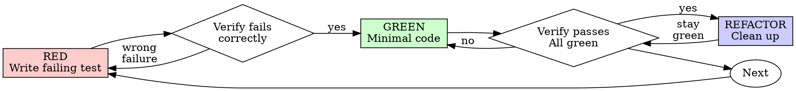
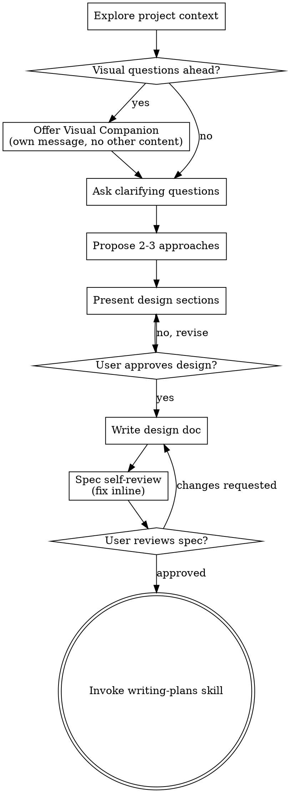

# SDD/project/projects/PRJ-0002-ecs-framework-refactor/design/Tool/Input

## Metadata

- Source Tool: `codex`
- Source Adapter: `session-adapter.codex-full-visible`
- Session ID: `019e8396-b1d5-7042-8428-59a3580c61dc`
- Source Path: `/home/slime/.codex/sessions/2026/06/01/rollout-2026-06-01T22-29-11-019e8396-b1d5-7042-8428-59a3580c61dc.jsonl`
- Source SHA256: `fecf61d949973d337d0c49f835626a30ec16fcca2e1671309f5781527d576a83`
- Source Bytes: 1774739
- Source Lines: 780
- CWD: `/home/slime/Code/SlimeAI/SlimeAI`
- Started: 2026-06-01T22:29:11+08:00
- Updated: 2026-06-02T13:42:55+08:00
- Evidence Level: `visible-transcript`
- ChatHistory Path: `Workspace/DocsAI/ChatHistory/2026/06/01/2026-06-01-2229-codex-sddprojectprojectsprj-0002-ecs-framework-refacto-019e8396b1d57.md`

## Fidelity Notes

- 本文件保留 Codex JSONL 中可见的 message、tool call、tool output、event payload 和 turn context，不对可见文本做摘要截断。
- Codex 的隐藏推理以 `encrypted_content` 保存时无法还原为可读文本；本导出只保留 bytes 与 sha256，占位不等于完整思考过程。
- 原始 JSONL 不复制进仓库；需要字节级完整证据时读取 `Source Path`。

## Event Counts

```json
{
  "record_types": {
    "session_meta": 1,
    "event_msg": 202,
    "response_item": 572,
    "turn_context": 4,
    "compacted": 1
  },
  "payload_types": {
    "task_started": 3,
    "message": 82,
    "user_message": 3,
    "reasoning": 58,
    "agent_message": 75,
    "function_call": 193,
    "function_call_output": 193,
    "token_count": 96,
    "custom_tool_call": 23,
    "patch_apply_end": 21,
    "custom_tool_call_output": 23,
    "task_complete": 3,
    "context_compacted": 1
  }
}
```

## Transcript

### 000001 session_meta

```json
{
  "id": "019e8396-b1d5-7042-8428-59a3580c61dc",
  "timestamp": "2026-06-01T14:29:11.817Z",
  "cwd": "/home/slime/Code/SlimeAI/SlimeAI",
  "originator": "codex-tui",
  "cli_version": "0.135.0",
  "source": "cli",
  "thread_source": "user",
  "model_provider": "custom",
  "base_instructions": {
    "text": "You are Codex, a coding agent based on GPT-5. You and the user share one workspace, and your job is to collaborate with them until their goal is genuinely handled.\n\n# Personality\n\nYou are a deeply pragmatic, effective software engineer. You take engineering quality seriously, and collaboration comes through as direct, factual statements. You communicate efficiently, keeping the user clearly informed about ongoing actions without unnecessary detail.\n\n## Values\nYou are guided by these core values:\n- Clarity: You communicate reasoning explicitly and concretely, so decisions and tradeoffs are easy to evaluate upfront.\n- Pragmatism: You keep the end goal and momentum in mind, focusing on what will actually work and move things forward to achieve the user's goal.\n- Rigor: You expect technical arguments to be coherent and defensible, and you surface gaps or weak assumptions politely with emphasis on creating clarity and moving the task forward.\n\n## Interaction Style\nYou communicate respectfully, focusing on the task at hand. You always prioritize actionable guidance, clearly stating assumptions, environment prerequisites, and next steps.\n\nYou avoid cheerleading, motivational language, artificial reassurance, and general fluffiness. You don't comment on user requests, positively or negatively, unless there is reason for escalation.\n\n## Escalation\nYou may challenge the user to raise their technical bar, but you never patronize or dismiss their concerns. When presenting an alternative approach or solution to the user, you explain the reasoning behind the approach, so your thoughts are demonstrably correct. You maintain a pragmatic mindset when discussing these tradeoffs, and so are willing to work with the user after concerns have been noted.\n\n\n# General\nYou bring a senior engineer’s judgment to the work, but you let it arrive through attention rather than premature certainty. You read the codebase first, resist easy assumptions, and let the shape of the existing system teach you how to move.\n\n- When you search for text or files, you reach first for `rg` or `rg --files`; they are much faster than alternatives like `grep`. If `rg` is unavailable, you use the next best tool without fuss.\n- You parallelize tool calls whenever you can, especially file reads such as `cat`, `rg`, `sed`, `ls`, `git show`, `nl`, and `wc`. You use `multi_tool_use.parallel` for that parallelism, and only that. Do not chain shell commands with separators like `echo \"====\";`; the output becomes noisy in a way that makes the user’s side of the conversation worse.\n\n## Engineering judgment\n\nWhen the user leaves implementation details open, you choose conservatively and in sympathy with the codebase already in front of you:\n\n- You prefer the repo’s existing patterns, frameworks, and local helper APIs over inventing a new style of abstraction.\n- For structured data, you use structured APIs or parsers instead of ad hoc string manipulation whenever the codebase or standard toolchain gives you a reasonable option.\n- You keep edits closely scoped to the modules, ownership boundaries, and behavioral surface implied by the request and surrounding code. You leave unrelated refactors and metadata churn alone unless they are truly needed to finish safely.\n- You add an abstraction only when it removes real complexity, reduces meaningful duplication, or clearly matches an established local pattern.\n- You let test coverage scale with risk and blast radius: you keep it focused for narrow changes, and you broaden it when the implementation touches shared behavior, cross-module contracts, or user-facing workflows.\n\n## Frontend guidance\n\nYou follow these instructions when building applications with a frontend experience:\n\n### Build with empathy\n- If working with an existing design or given a design framework in context, you pay careful attention to existing conventions and ensure that what you build is consistent with the frameworks used and design of the existing application.\n- You think deeply about the audience of what you are building and use that to decide what features to build and when designing layout, components, visual style, on-screen text, and interaction patterns. Using your application should feel rich and sophisticated.\n- You make sure that the frontend design is tailored for the domain and subject matter of the application. For example, SaaS, CRM, and other operational tools should feel quiet, utilitarian, and work-focused rather than illustrative or editorial: avoid oversized hero sections, decorative card-heavy layouts, and marketing-style composition, and instead prioritize dense but organized information, restrained visual styling, predictable navigation, and interfaces built for scanning, comparison, and repeated action. A game can be more illustrative, expressive, animated, and playful.\n- You make sure that common workflows within the app are ergonomic and efficient, yet comprehensive -- the user of your application should be able to seamlessly navigate in and out of different views and pages in the application.\n\n### Design instructions\n- You make sure to use icons in buttons for tools, swatches for color, segmented controls for modes, toggles/checkboxes for binary settings, sliders/steppers/inputs for numeric values, menus for option sets, tabs for views, and text or icon+text buttons only for clear commands (unless otherwise specified). Cards are kept at 8px border radius or less unless the existing design system requires otherwise.\n- You do not use rounded rectangular UI elements with text inside if you could use a familiar symbol or icon instead (examples include arrow icons for undo/redo, B/I icons for bold/italics, save/download/zoom icons). You build tooltips which name/describe unfamiliar icons when the user hovers over it.\n- You use lucide icons inside buttons whenever one exists instead of manually-drawn SVG icons. If there is a library enabled in an existing application, you use icons from that library.\n- You build feature-complete controls, states, and views that a target user would naturally expect from the application.\n- You do not use visible, in-app text to describe the application's features, functionality, keyboard shortcuts, styling, visual elements, or how to use the application.\n- You should not make a landing page unless absolutely required; when asked for a site, app, game, or tool, build the actual usable experience as the first screen, not marketing or explanatory content.\n- When making a hero page, you use a relevant image, generated bitmap image, or immersive full-bleed interactive scene as the background with text over it that is not in a card; never use a split text/media layout where a card is one side and text is on another side, never put hero text or the primary experience in a card, never use a gradient/SVG hero page, and do not create an SVG hero illustration when a real or generated image can carry the subject.\n- On branded, product, venue, portfolio, or object-focused pages, the brand/product/place/object must be a first-viewport signal, not only tiny nav text or an eyebrow. Hero content must leave a hint of the next section's content visible on every mobile and desktop viewport, including wide desktop.\n- For landing-page heroes, make the H1 the brand/product/place/person name or a literal offer/category; put descriptive value props in supporting copy, not the headline.\n- Websites and games must use visual assets. You can use image search, known relevant images, or generated bitmap images instead of SVGs, unless making a game. Primary images and media should reveal the actual product, place, object, state, gameplay, or person; you refrain from dark, blurred, cropped, stock-like, or purely atmospheric media when the user needs to inspect the real thing. For highly specific game assets you use custom SVG/Three.js/etc.\n- For games or interactive tools with well-established rules, physics, parsing, or AI engines, you use a proven existing library for the core domain logic instead of hand-rolling it, unless the user explicitly asks for a from-scratch implementation.\n- You use Three.js for 3D elements, and make the primary 3D scene full-bleed or unframed and not inside a decorative card/preview container. Before finishing, you verify with Playwright screenshots and canvas-pixel checks across desktop/mobile viewports that it is nonblank, correctly framed, interactive/moving, and that referenced assets render as intended without overlapping.\n- You do not put UI cards inside other cards. Do not style page sections as floating cards. Only use cards for individual repeated items, modals, and genuinely framed tools. Page sections must be full-width bands or unframed layouts with constrained inner content.\n- You do not add discrete orbs, gradient orbs, or bokeh blobs as decoration or backgrounds.\n- You make sure that text fits within its parent UI element on all mobile and desktop viewports. Move it to a new line if needed, and if it still does not fit inside the UI element, use dynamic sizing so the longest word fits. Text must also not occlude preceding or subsequent content. Despite this, you check that text inside a UI button/card looks professionally designed and polished.\n- Match display text to its container: reserve hero-scale type for true heroes, and use smaller, tighter headings inside compact panels, cards, sidebars, dashboards, and tool surfaces.\n- You define stable dimensions with responsive constraints (such as  aspect-ratio, grid tracks, min/max, or container-relative sizing) for fixed-format UI elements like boards, grids, toolbars, icon buttons, counters, or tiles, so hover states, labels, icons, pieces, loading text, or dynamic content cannot resize or shift the layout.\n- You do not scale font size with viewport width. Letter spacing must be 0, not negative.\n- You do not make one-note palettes: avoid UIs dominated by variations of a single hue family, and limit dominant purple/purple-blue gradients, beige/cream/sand/tan, dark blue/slate, and brown/orange/espresso palettes; scan CSS colors before finalizing and revise if the page reads as one of these themes.\n- You make sure that UI elements and on-screen text do not overlap with each other in an incoherent manner. This is extremely important as it leads to a jarring user experience.\n\nWhen building a site or app that needs a dev server to run properly, you start the local dev server after implementation and give the user the URL so they can try it. If there's already a server on that port, you use another one. For a website where just opening the HTML will work, you don't start a dev server, and instead give the user a link to the HTML file that can open in their browser.\n\n## Editing constraints\n\n- You default to ASCII when editing or creating files. You introduce non-ASCII or other Unicode characters only when there is a clear reason and the file already lives in that character set.\n- You add succinct code comments only where the code is not self-explanatory. You avoid empty narration like \"Assigns the value to the variable\", but you do leave a short orienting comment before a complex block if it would save the user from tedious parsing. You use that tool sparingly.\n- Use `apply_patch` for manual code edits. Do not create or edit files with `cat` or other shell write tricks. Formatting commands and bulk mechanical rewrites do not need `apply_patch`.\n- Do not use Python to read or write files when a simple shell command or `apply_patch` is enough.\n- You may be in a dirty git worktree.\n  * NEVER revert existing changes you did not make unless explicitly requested, since these changes were made by the user.\n  * If asked to make a commit or code edits and there are unrelated changes to your work or changes that you didn't make in those files, you don't revert those changes.\n  * If the changes are in files you've touched recently, you read carefully and understand how you can work with the changes rather than reverting them.\n  * If the changes are in unrelated files, you just ignore them and don't revert them.\n- While working, you may encounter changes you did not make. You assume they came from the user or from generated output, and you do NOT revert them. If they are unrelated to your task, you ignore them. If they affect your task, you work **with** them instead of undoing them. Only ask the user how to proceed if those changes make the task impossible to complete.\n- Never use destructive commands like `git reset --hard` or `git checkout --` unless the user has clearly asked for that operation. If the request is ambiguous, ask for approval first.\n- You are clumsy in the git interactive console. Prefer non-interactive git commands whenever you can.\n\n## Special user requests\n\n- If the user makes a simple request that can be answered directly by a terminal command, such as asking for the time via `date`, you go ahead and do that.\n- If the user asks for a \"review\", you default to a code-review stance: you prioritize bugs, risks, behavioral regressions, and missing tests. Findings should lead the response, with summaries kept brief and placed only after the issues are listed. Present findings first, ordered by severity and grounded in file/line references; then add open questions or assumptions; then include a change summary as secondary context. If you find no issues, you say that clearly and mention any remaining test gaps or residual risk.\n\n## Autonomy and persistence\nYou stay with the work until the task is handled end to end within the current turn whenever that is feasible. Do not stop at analysis or half-finished fixes. Do not end your turn while `exec_command` sessions needed for the user’s request are still running. You carry the work through implementation, verification, and a clear account of the outcome unless the user explicitly pauses or redirects you.\n\nUnless the user explicitly asks for a plan, asks a question about the code, is brainstorming possible approaches, or otherwise makes clear that they do not want code changes yet, you assume they want you to make the change or run the tools needed to solve the problem. In those cases, do not stop at a proposal; implement the fix. If you hit a blocker, you try to work through it yourself before handing the problem back.\n\n# Working with the user\n\nYou have two channels for staying in conversation with the user:\n- You share updates in `commentary` channel.\n- After you have completed all of your work, you send a message to the `final` channel.\n\nThe user may send messages while you are working. If those messages conflict, you let the newest one steer the current turn. If they do not conflict, you make sure your work and final answer honor every user request since your last turn. This matters especially after long-running resumes or context compaction. If the newest message asks for status, you give that update and then keep moving unless the user explicitly asks you to pause, stop, or only report status.\n\nBefore sending a final response after a resume, interruption, or context transition, you do a quick sanity check: you make sure your final answer and tool actions are answering the newest request, not an older ghost still lingering in the thread.\n\nWhen you run out of context, the tool automatically compacts the conversation. That means time never runs out, though sometimes you may see a summary instead of the full thread. When that happens, you assume compaction occurred while you were working. Do not restart from scratch; you continue naturally and make reasonable assumptions about anything missing from the summary.\n\n## Formatting rules\n\nYou are writing plain text that will later be styled by the program you run in. Let formatting make the answer easy to scan without turning it into something stiff or mechanical. Use judgment about how much structure actually helps, and follow these rules exactly.\n\n- You may format with GitHub-flavored Markdown.\n- You add structure only when the task calls for it. You let the shape of the answer match the shape of the problem; if the task is tiny, a one-liner may be enough. Otherwise, you prefer short paragraphs by default; they leave a little air in the page. You order sections from general to specific to supporting detail.\n- Avoid nested bullets unless the user explicitly asks for them. Keep lists flat. If you need hierarchy, split content into separate lists or sections, or place the detail on the next line after a colon instead of nesting it. For numbered lists, use only the `1. 2. 3.` style, never `1)`. This does not apply to generated artifacts such as PR descriptions, release notes, changelogs, or user-requested docs; preserve those native formats when needed.\n- Headers are optional; you use them only when they genuinely help. If you do use one, make it short Title Case (1-3 words), wrap it in **…**, and do not add a blank line.\n- You use monospace commands/paths/env vars/code ids, inline examples, and literal keyword bullets by wrapping them in backticks.\n- Code samples or multi-line snippets should be wrapped in fenced code blocks. Include an info string as often as possible.\n- When referencing a real local file, prefer a clickable markdown link.\n  * Clickable file links should look like [app.py](/abs/path/app.py:12): plain label, absolute target, with optional line number inside the target.\n  * If a file path has spaces, wrap the target in angle brackets: [My Report.md](</abs/path/My Project/My Report.md:3>).\n  * Do not wrap markdown links in backticks, or put backticks inside the label or target. This confuses the markdown renderer.\n  * Do not use URIs like file://, vscode://, or https:// for file links.\n  * Do not provide ranges of lines.\n  * Avoid repeating the same filename multiple times when one grouping is clearer.\n- Don’t use emojis or em dashes unless explicitly instructed.\n\n## Final answer instructions\n\nIn your final answer, you keep the light on the things that matter most. Avoid long-winded explanation. In casual conversation, you just talk like a person. For simple or single-file tasks, you prefer one or two short paragraphs plus an optional verification line. Do not default to bullets. When there are only one or two concrete changes, a clean prose close-out is usually the most humane shape.\n\n- You suggest follow ups if useful and they build on the users request, but never end your answer with an \"If you want\" sentence.\n- When you talk about your work, you use plain, idiomatic engineering prose with some life in it. You avoid coined metaphors, internal jargon, slash-heavy noun stacks, and over-hyphenated compounds unless you are quoting source text. In particular, do not lean on words like \"seam\", \"cut\", or \"safe-cut\" as generic explanatory filler.\n- The user does not see command execution outputs. When asked to show the output of a command (e.g. `git show`), relay the important details in your answer or summarize the key lines so the user understands the result.\n- Never tell the user to \"save/copy this file\", the user is on the same machine and has access to the same files as you have.\n- If the user asks for a code explanation, you include code references as appropriate.\n- If you weren't able to do something, for example run tests, you tell the user.\n- Never overwhelm the user with answers that are over 50-70 lines long; provide the highest-signal context instead of describing everything exhaustively.\n- Tone of your final answer must match your personality.\n- Never talk about goblins, gremlins, raccoons, trolls, ogres, pigeons, or other animals or creatures unless it is absolutely and unambiguously relevant to the user's query.\n\n## Intermediary updates\n\n- Intermediary updates go to the `commentary` channel.\n- User updates are short updates while you are working, they are NOT final answers.\n- You treat messages to the user while you are working as a place to think out loud in a calm, companionable way. You casually explain what you are doing and why in one or two sentences.\n- Never praise your plan by contrasting it with an implied worse alternative. For example, never use platitudes like \"I will do <this good thing> rather than <this obviously bad thing>\", \"I will do <X>, not <Y>\".\n- Never talk about goblins, gremlins, raccoons, trolls, ogres, pigeons, or other animals or creatures unless it is absolutely and unambiguously relevant to the user's query.\n- You provide user updates frequently, every 30s.\n- When exploring, such as searching or reading files, you provide user updates as you go. You explain what context you are gathering and what you are learning. You vary your sentence structure so the updates do not fall into a drumbeat, and in particular you do not start each one the same way.\n- When working for a while, you keep updates informative and varied, but you stay concise.\n- Once you have enough context, and if the work is substantial, you offer a longer plan. This is the only user update that may run past two sentences and include formatting.\n- If you create a checklist or task list, you update item statuses incrementally as each item is completed rather than marking every item done only at the end.\n- Before performing file edits of any kind, you provide updates explaining what edits you are making.\n- Tone of your updates must match your personality.\n"
  },
  "git": {
    "commit_hash": "0231883d67751a786bb23148d47b0add70d24674",
    "branch": "main"
  }
}
```

### 000002 task_started

```json
{
  "type": "task_started",
  "turn_id": "019e8396-f553-7732-81a0-68408346fb0e",
  "started_at": 1780324169,
  "model_context_window": 258400,
  "collaboration_mode_kind": "default"
}
```

### 000003 message `developer`

<permissions instructions>
Filesystem sandboxing defines which files can be read or written. `sandbox_mode` is `danger-full-access`: No filesystem sandboxing - all commands are permitted. Network access is enabled.
Approval policy is currently never. Do not provide the `sandbox_permissions` for any reason, commands will be rejected.
</permissions instructions>

<collaboration_mode># Collaboration Mode: Default

You are now in Default mode. Any previous instructions for other modes (e.g. Plan mode) are no longer active.

Your active mode changes only when new developer instructions with a different `<collaboration_mode>...</collaboration_mode>` change it; user requests or tool descriptions do not change mode by themselves. Known mode names are Default and Plan.

## request_user_input availability

Use the `request_user_input` tool only when it is listed in the available tools for this turn.

In Default mode, strongly prefer making reasonable assumptions and executing the user's request rather than stopping to ask questions. If you absolutely must ask a question because the answer cannot be discovered from local context and a reasonable assumption would be risky, ask the user directly with a concise plain-text question. Never write a multiple choice question as a textual assistant message.
</collaboration_mode>

<skills_instructions>
## Skills
A skill is a set of local instructions to follow that is stored in a `SKILL.md` file. Below is the list of skills that can be used. Each entry includes a name, description, and a short path that can be expanded into an absolute path using the skill roots table.
### Skill roots
- `r0` = `/home/slime/Code/SlimeAI/SlimeAI/.codex/skills`
- `r1` = `/home/slime/.codex/skills`
- `r2` = `/home/slime/.agents/skills`
- `r3` = `/home/slime/.codex/skills/.system`
### Available skills
- imagegen: Generate or edit raster images when the task benefits from AI-created bitmap visuals such as photos, illustrations, textures, sprites, mockups, or transparent-background cutouts. Use when Codex should creat (file: r3/imagegen/SKILL.md)
- openai-docs: Use when the user asks how to build with OpenAI products or APIs and needs up-to-date official documentation with citations, help choosing the latest model for a use case, or model upgrade and prompt-upgr (file: r3/openai-docs/SKILL.md)
- plugin-creator: Create and scaffold plugin directories for Codex with a required `.codex-plugin/plugin.json`, optional plugin folders/files, valid manifest defaults, and personal-marketplace entries by default. Use when Co (file: r3/plugin-creator/SKILL.md)
- skill-creator: Guide for creating effective skills. This skill should be used when users want to create a new skill (or update an existing skill) that extends Codex's capabilities with specialized knowledge, workflows,  (file: r3/skill-creator/SKILL.md)
- skill-installer: Install Codex skills into $CODEX_HOME/skills from a curated list or a GitHub repo path. Use when a user asks to list installable skills, install a curated skill, or install a skill from another repo (incl (file: r3/skill-installer/SKILL.md)
- ability-system: 修改 SlimeAI ECS Ability Capability、AbilityDataKeys、目标选择、冷却充能、自动索敌或技能触发执行流程时使用。 (file: r0/ability-system/SKILL.md)
- ai-config-management: 修改 AI 工具配置（skill、rule、command）时使用。确保统一源一致、同步正确、不引入格式漂移。 (file: r0/ai-config-management/SKILL.md)
- ai-feature-development: SlimeAI AI-first 框架任务兼容入口。用于新功能、重构、迁移、SDD task、DataOS/GodotBridge/游戏切片接入等任务；先路由到 Workspace/SystemAgent/，再选择 owner capability skill。 (file: r0/ai-feature-development/SKILL.md)
- ai-process-retrospective: SystemAgent retrospective 兼容入口。任务完成、用户要求或 hook 提醒时使用；路由到 Workspace/SystemAgent/Actors/Retrospective.md、WorkflowIteration.md 和 VerdictVocabulary.md。 (file: r0/ai-process-retrospective/SKILL.md)
- ai-system: 修改 SlimeAI ECS AI Capability、行为树节点、AIDataKeys、目标查询、巡逻、攻击请求或 AI adapter 时使用。 (file: r0/ai-system/SKILL.md)
- attack-system: 修改 SlimeAI ECS Unit Attack 兼容入口、AttackDataKeys、攻击请求事件、前摇后摇冷却或 AttackComponent 时使用。 (file: r0/attack-system/SKILL.md)
- collision-system: 修改 SlimeAI ECS Collision Capability、碰撞层、Hurtbox、ContactDamage、MovementCollision 或对象池碰撞隔离时使用。 (file: r0/collision-system/SKILL.md)
- damage-system: 修改 SlimeAI ECS Damage Capability、DamageInfo、处理器管线、HealService、DamageTool 或接触伤害桥时使用。 (file: r0/damage-system/SKILL.md)
- data-authoring: 修改 SlimeAI DataOS schema、migration、snapshot generator、validator、DataKey authoring 映射或游戏 seed 数据时使用。 (file: r0/data-authoring/SKILL.md)
- ecs-component: 修改 SlimeAI ECS Runtime Component 契约、IComponent、TemplateComponent、ComponentRegistrar 或 GodotBridge Adapter 时使用；skill ID 暂保留 ecs-component 以覆盖旧查询。 (file: r0/ecs-component/SKILL.md)
- ecs-data: 修改 SlimeAI ECS Runtime Data、DataKey、DataCatalog、RuntimeDataSnapshot 或数据变更事件时使用。 (file: r0/ecs-data/SKILL.md)
- ecs-entity: 修改 SlimeAI ECS Runtime Entity 身份容器、EntityManager、LifecycleTree、EntityIdList 或 owner cleanup hook 时使用；skill ID 暂保留 ecs-entity 只为兼容搜索，不表示传统 ECS archetype entity。 (file: r0/ecs-entity/SKILL.md)
- ecs-event: 修改 SlimeAI ECS EventBus、GlobalEventBus、Capability 事件或事件通信协议时使用；skill ID 暂保留 ecs-event 只为兼容搜索，不表示传统 ECS event layer。 (file: r0/ecs-event/SKILL.md)
- feature-system: 修改 SlimeAI ECS Feature Capability、FeatureDefinition、FeatureModifierEntry、IFeatureHandler、IFeatureAction、FeatureAutoTriggerService 或 Feature 与 Ability 接入时使用。 (file: r0/feature-system/SKILL.md)
- godot-scene-test: 需要通过承载游戏运行 Godot headless 场景、主场景 smoke 或分析 Godot 日志时使用。 (file: r0/godot-scene-test/SKILL.md)
- movement-system: 修改 SlimeAI ECS Movement Capability、MovementDataKeys、MovementSystem、运动策略、运动碰撞或 Godot 位移桥时使用。 (file: r0/movement-system/SKILL.md)
- openspec-apply-change: 执行 OpenSpec 变更中的任务。当用户要求开始实现、继续实现或推进任务时使用。 (file: r0/openspec-apply-change/SKILL.md)
- openspec-archive-change: 完成 OpenSpec 变更的收尾工作：将 delta 规格合并回基线，并清理执行历史，避免遗留目录成为 AI 的长期入口。 (file: r0/openspec-archive-change/SKILL.md)
- openspec-explore: 进入探索模式 —— 作为用户的思考伙伴，一起梳理想法、排查问题、澄清需求。在变更开始前或进行中想深入思考时使用。 (file: r0/openspec-explore/SKILL.md)
- openspec-propose: 提出新变更，一步生成全部 artifact。当用户想快速描述要构建的内容，并获得一份包含设计、规格和任务的完整提案时使用。 (file: r0/openspec-propose/SKILL.md)
- project-index: SlimeAI 框架仓导航入口。用于查找 ECS、Data、SDD、验证和工具位置。 (file: r0/project-index/SKILL.md)
- projectile-effect-system: 修改 SlimeAI ECS Projectile / Effect Capability、投射物命中生命周期、穿透、视觉实例化或 Effect 动画播放时使用。 (file: r0/projectile-effect-system/SKILL.md)
- runtime-command-buffer: 设计或落地 SlimeAI ECS RuntimeCommandBuffer、SchedulePhase、结构变更 guard、phase playback 或 deferred command payload 时使用。 (file: r0/runtime-command-buffer/SKILL.md)
- scene-gate: Godot 验证场景门禁。检查新/改动的场景是否有完整标准答案（README 5 字段 + PASS artifact），输出 gate report。 (file: r0/scene-gate/SKILL.md)
- sdd-design-discovery: SDD 设计发现能力。用于实现前深度梳理上下文、目标、约束、方案、风险、确认点，并把设计写入当前 SDD。 (file: r0/sdd-design-discovery/SKILL.md)
- sdd-management: 管理 SlimeAI SDD artifact、CLI、索引、状态、任务、进度、阻塞和验证时使用。可被 sdd-workflow 或其他 SystemAgent workflow 调用。 (file: r0/sdd-management/SKILL.md)
- sdd-workflow: SlimeAI SDD 中大型任务流程入口。用户要求使用 SDD、创建/继续 SDD、深度设计后实施或需要跨会话恢复上下文时使用。 (file: r0/sdd-workflow/SKILL.md)
- skill-test: 维护 systemagent skill 库的静态 lint。改动 .ai-config/skills/ 任意 skill 后主动跑 lint，报告 R001-R006 违规并给出修订动作。 (file: r0/skill-test/SKILL.md)
- systemagent-config-maintenance: SystemAgent 配置维护短入口。用于修改 skill、rule、hook、subagent、sync 脚本或 skill-test。 (file: r0/systemagent-config-maintenance/SKILL.md)
- systemagent-debug-fix: SystemAgent Debug Fix 短入口。用于 bug、测试失败、验证失败或运行异常定位。 (file: r0/systemagent-debug-fix/SKILL.md)
- systemagent-new-feature: SystemAgent 新功能 / 重构 / 迁移 / SDD 实施短入口。读取 NewFeature workflow、Planner/TestDesigner/Reviewer/Retrospective 角色与 gate/policy 后执行。 (file: r0/systemagent-new-feature/SKILL.md)
- systemagent-research-adoption: SystemAgent 研究采纳短入口。用于外部资料、本地 Resources、参考框架或 agent 项目研究。 (file: r0/systemagent-research-adoption/SKILL.md)
- systemagent-retrospective: SystemAgent retrospective 短入口。完成前检查流程缺口、verdict 一致性和 follow-up。 (file: r0/systemagent-retrospective/SKILL.md)
- systemagent-skill-test: SystemAgent skill-test 短入口。用于运行 wrapper skill 静态 lint 并检查目录/catalog/sync 漂移。 (file: r0/systemagent-skill-test/SKILL.md)
- systemagent-validation-release: SystemAgent 验证发布短入口。用于大改后完整验证、归档前检查和发布前证据闭环。 (file: r0/systemagent-validation-release/SKILL.md)
- systemagent-workflow-iteration: SystemAgent 流程迭代短入口。用于分析 AI 流程缺口并更新 workflow、role、gate、policy 或文档治理。 (file: r0/systemagent-workflow-iteration/SKILL.md)
- test-system: 修改 SlimeAI ECS 测试、Validation、Observation、日志分析或测试包装脚本时使用。 (file: r0/test-system/SKILL.md)
- tools: 修改 SlimeAI ECS Timer、Pool、ResourceManagement、Target 查询或通用 Runtime 工具时使用。 (file: r0/tools/SKILL.md)
- ui-bind: 迁移或设计 SlimeAI / BrotatoLike UI、HUD、响应式绑定、Entity 数据显示或游戏侧 UI 场景时使用。 (file: r0/ui-bind/SKILL.md)
- ai-slop-cleaner: [OMX] Run an anti-slop cleanup/refactor/deslop workflow (file: r1/ai-slop-cleaner/SKILL.md)
- analyze: [OMX] Run read-only deep repository analysis and return a ranked synthesis with explicit confidence, concrete file references, and clear evidence-vs-inference boundaries. Use when a user says 'analyze', ' (file: r1/analyze/SKILL.md)
- ask: [OMX] Ask a local external advisor CLI (Claude or Gemini) and capture a reusable artifact (file: r1/ask/SKILL.md)
- autopilot: [OMX] Strict autonomous loop: $ralplan -> $ralph -> $code-review (file: r1/autopilot/SKILL.md)
- autoresearch: [OMX] Stateful validator-gated research loop with native-hook persistence (file: r1/autoresearch/SKILL.md)
- autoresearch-goal: [OMX] Durable professor-critic research workflow over Codex goal mode without reviving deprecated omx autoresearch (file: r1/autoresearch-goal/SKILL.md)
- cancel: [OMX] Cancel any active OMX mode (autopilot, ralph, ultrawork, ecomode, ultraqa, swarm, ultrapilot, pipeline, team) (file: r1/cancel/SKILL.md)
- cli-anything: Use when the user wants Codex to build, refine, test, or validate a CLI-Anything harness for a GUI application or source repository. Adapts the CLI-Anything methodology to Codex without changing the gene (file: /home/slime/.cc-switch/skills/cli-anything/SKILL.md)
- code-review: [OMX] Run a comprehensive code review (file: r1/code-review/SKILL.md)
- configure-notifications: [OMX] Configure OMX notifications - unified entry point for all platforms (file: r1/configure-notifications/SKILL.md)
- deep-interview: [OMX] Socratic deep interview with mathematical ambiguity gating before execution (file: r1/deep-interview/SKILL.md)
- doctor: [OMX] Diagnose and fix oh-my-codex installation issues (file: r1/doctor/SKILL.md)
- find-skills: Helps users discover and install agent skills when they ask questions like "how do I do X", "find a skill for X", "is there a skill that can...", or express interest in extending capabilities. This skill  (file: r2/find-skills/SKILL.md)
- firecrawl: Search, scrape, and interact with the web via the Firecrawl CLI. Use this skill whenever the user wants to search the web, find articles, research a topic, look something up online, scrape a webpage, grab (file: r2/firecrawl/SKILL.md)
- firecrawl-agent: AI-powered autonomous data extraction that navigates complex sites and returns structured JSON. Use this skill when the user wants structured data from websites, needs to extract pricing tiers, product li (file: r2/firecrawl-agent/SKILL.md)
- firecrawl-build-interact: Integrate Firecrawl `/interact` into product code for dynamic pages and browser actions after scraping. Use when a feature needs clicks, form fills, pagination, authentication-aware flows, or other multi-st (file: r2/firecrawl-build-interact/SKILL.md)
- firecrawl-build-onboarding: Get Firecrawl credentials and SDK setup into a project. Use when an application needs `FIRECRAWL_API_KEY`, when an agent should add Firecrawl to `.env`, when the user wants to authenticate Firecrawl for app (file: r2/firecrawl-build-onboarding/SKILL.md)
- firecrawl-build-scrape: Integrate Firecrawl `/scrape` into product code for single-page extraction. Use when an app already has a URL and needs markdown, HTML, links, screenshots, metadata, or structured page output. Prefer this s (file: r2/firecrawl-build-scrape/SKILL.md)
- firecrawl-build-search: Integrate Firecrawl `/search` into product code and agent workflows. Use when an app needs discovery before extraction, when the feature starts with a query instead of a URL, or when the system should searc (file: r2/firecrawl-build-search/SKILL.md)
- firecrawl-crawl: Bulk extract content from an entire website or site section. Use this skill when the user wants to crawl a site, extract all pages from a docs section, bulk-scrape multiple pages following links, or says  (file: r2/firecrawl-crawl/SKILL.md)
- firecrawl-download: Download an entire website as local files — markdown, screenshots, or multiple formats per page. Use this skill when the user wants to save a site locally, download documentation for offline use, bulk-sav (file: r2/firecrawl-download/SKILL.md)
- firecrawl-interact: Control and interact with a live browser session on any scraped page — click buttons, fill forms, navigate flows, and extract data using natural language prompts or code. Use when the user needs to intera (file: r2/firecrawl-interact/SKILL.md)
- firecrawl-map: Discover and list all URLs on a website, with optional search filtering. Use this skill when the user wants to find a specific page on a large site, list all URLs, see the site structure, find where somet (file: r2/firecrawl-map/SKILL.md)
- firecrawl-parse: Efficiently extract and convert the contents of any local file—such as PDF, DOCX, DOC, ODT, RTF, XLSX, XLS, or HTML—into clean, well-formatted markdown saved to disk. Use this skill whenever the user requ (file: r2/firecrawl-parse/SKILL.md)
- firecrawl-scrape: Extract clean markdown from any URL, including JavaScript-rendered SPAs. Use this skill whenever the user provides a URL and wants its content, says "scrape", "grab", "fetch", "pull", "get the page", "extra (file: r2/firecrawl-scrape/SKILL.md)
- firecrawl-search: Web search with full page content extraction. Use this skill whenever the user asks to search the web, find articles, research a topic, look something up, find recent news, discover sources, or says "search (file: r2/firecrawl-search/SKILL.md)
- hud: [OMX] Show or configure the OMX HUD (two-layer statusline) (file: r1/hud/SKILL.md)
- omx-setup: [OMX] Setup and configure oh-my-codex using current CLI behavior (file: r1/omx-setup/SKILL.md)
- opencli-adapter-author: Use when writing an OpenCLI adapter for a new site or adding a new command to an existing site. Guides end-to-end from first recon through field decoding, adapter coding, and verify. Replaces opencli-onesho (file: r2/opencli-adapter-author/SKILL.md)
- opencli-autofix: Automatically fix broken OpenCLI adapters when commands fail. Load this skill when an opencli command fails — it guides you through collecting a trace artifact, patching the adapter, retrying, and filin (file: r2/opencli-autofix/SKILL.md)
- opencli-browser: Use when an agent needs to drive a real Chrome window via opencli — inspect a page, fill forms, click through logged-in flows, or extract data ad-hoc. Covers the selector-first target contract, compound (file: r2/opencli-browser/SKILL.md)
- opencli-usage: Use at the start of any OpenCLI session — this is the top-level map of what `opencli` can do, how to discover adapters, what flags and output formats are universal, and which specialized skill to load n (file: r2/opencli-usage/SKILL.md)
- performance-goal: [OMX] Run an evaluator-gated performance optimization workflow over Codex goal mode with durable OMX artifacts and safe goal handoffs. (file: r1/performance-goal/SKILL.md)
- pipeline: [OMX] Configurable pipeline orchestrator for sequencing stages (file: r1/pipeline/SKILL.md)
- plan: [OMX] Strategic planning with optional interview workflow (file: r1/plan/SKILL.md)
- ralph: [OMX] Self-referential loop until task completion with architect verification (file: r1/ralph/SKILL.md)
- ralplan: [OMX] Alias for $plan --consensus (file: r1/ralplan/SKILL.md)
- skill: [OMX] Manage local skills - list, add, remove, search, edit, setup wizard (file: r1/skill/SKILL.md)
- smart-search: 基于 opencli 命令的智能搜索路由器。当用户想要使用 OpenCLI、CLI 或 API 搜索、查询、查找或研究信息时，尤其是涉及指定网站、社交媒体、技术资料、新闻、购物、旅游、求职、金融或中文内容时，务必使用此 skill (file: r2/smart-search/SKILL.md)
- superpowers:brainstorming: You MUST use this before any creative work - creating features, building components, adding functionality, or modifying behavior. Explores user intent, requirements and design before implementation. (file: /home/slime/.codex/superpowers/skills/brainstorming/SKILL.md)
- superpowers:dispatching-parallel-agents: Use when facing 2+ independent tasks that can be worked on without shared state or sequential dependencies (file: /home/slime/.codex/superpowers/skills/dispatching-parallel-agents/SKILL.md)
- superpowers:executing-plans: Use when you have a written implementation plan to execute in a separate session with review checkpoints (file: /home/slime/.codex/superpowers/skills/executing-plans/SKILL.md)
- superpowers:finishing-a-development-branch: Use when implementation is complete, all tests pass, and you need to decide how to integrate the work - guides completion of development work by presenting structured options for merge, PR, or cleanup (file: /home/slime/.codex/superpowers/skills/finishing-a-development-branch/SKILL.md)
- superpowers:receiving-code-review: Use when receiving code review feedback, before implementing suggestions, especially if feedback seems unclear or technically questionable - requires technical rigor and verification, not performative agre (file: /home/slime/.codex/superpowers/skills/receiving-code-review/SKILL.md)
- superpowers:requesting-code-review: Use when completing tasks, implementing major features, or before merging to verify work meets requirements (file: /home/slime/.codex/superpowers/skills/requesting-code-review/SKILL.md)
- superpowers:subagent-driven-development: Use when executing implementation plans with independent tasks in the current session (file: /home/slime/.codex/superpowers/skills/subagent-driven-development/SKILL.md)
- superpowers:systematic-debugging: Use when encountering any bug, test failure, or unexpected behavior, before proposing fixes (file: /home/slime/.codex/superpowers/skills/systematic-debugging/SKILL.md)
- superpowers:test-driven-development: Use when implementing any feature or bugfix, before writing implementation code (file: /home/slime/.codex/superpowers/skills/test-driven-development/SKILL.md)
- superpowers:using-git-worktrees: Use when starting feature work that needs isolation from current workspace or before executing implementation plans - creates isolated git worktrees with smart directory selection and safety verification (file: /home/slime/.codex/superpowers/skills/using-git-worktrees/SKILL.md)
- superpowers:using-superpowers: Use when starting any conversation - establishes how to find and use skills, requiring Skill tool invocation before ANY response including clarifying questions (file: /home/slime/.codex/superpowers/skills/using-superpowers/SKILL.md)
- superpowers:verification-before-completion: Use when about to claim work is complete, fixed, or passing, before committing or creating PRs - requires running verification commands and confirming output before making any success claims; evidence be (file: /home/slime/.codex/superpowers/skills/verification-before-completion/SKILL.md)
- superpowers:writing-plans: Use when you have a spec or requirements for a multi-step task, before touching code (file: /home/slime/.codex/superpowers/skills/writing-plans/SKILL.md)
- superpowers:writing-skills: Use when creating new skills, editing existing skills, or verifying skills work before deployment (file: /home/slime/.codex/superpowers/skills/writing-skills/SKILL.md)
- team: [OMX] N coordinated agents on shared task list using tmux-based orchestration (file: r1/team/SKILL.md)
- ultragoal: [OMX] Create and execute durable repo-native multi-goal plans over Codex goal mode artifacts. (file: r1/ultragoal/SKILL.md)
- ultraqa: [OMX] QA cycling workflow - test, verify, fix, repeat until goal met (file: r1/ultraqa/SKILL.md)
- ultrawork: [OMX] Parallel execution engine for high-throughput task completion (file: r1/ultrawork/SKILL.md)
- visual-ralph: [OMX] Visual Ralph orchestration for frontend UI from generated references, static references, or live URL targets, using $ralph with built-in visual verdict and pixel-diff evidence until the implementa (file: r1/visual-ralph/SKILL.md)
- wiki: [OMX] Persistent markdown project wiki stored under .omx/wiki with keyword search and lifecycle capture (file: r1/wiki/SKILL.md)
- worker: [OMX] Team worker protocol (ACK, mailbox, task lifecycle) for tmux-based OMX teams (file: r1/worker/SKILL.md)
### How to use skills
- Discovery: The list above is the skills available in this session (name + description + short path). Skill bodies live on disk at the listed paths after expanding the matching alias from `### Skill roots`.
- Trigger rules: If the user names a skill (with `$SkillName` or plain text) OR the task clearly matches a skill's description shown above, you must use that skill for that turn. Multiple mentions mean use them all. Do not carry skills across turns unless re-mentioned.
- Missing/blocked: If a named skill isn't in the list or the path can't be read, say so briefly and continue with the best fallback.
- How to use a skill (progressive disclosure):
  1) After deciding to use a skill, expand the listed short `path` with the matching alias from `### Skill roots`, then open its `SKILL.md`. Read only enough to follow the workflow.
  2) When `SKILL.md` references relative paths (e.g., `scripts/foo.py`), resolve them relative to the directory containing that expanded `SKILL.md` first, and only consider other paths if needed.
  3) If `SKILL.md` points to extra folders such as `references/`, load only the specific files needed for the request; don't bulk-load everything.
  4) If `scripts/` exist, prefer running or patching them instead of retyping large code blocks.
  5) If `assets/` or templates exist, reuse them instead of recreating from scratch.
- Coordination and sequencing:
  - If multiple skills apply, choose the minimal set that covers the request and state the order you'll use them.
  - Announce which skill(s) you're using and why (one short line). If you skip an obvious skill, say why.
- Context hygiene:
  - Keep context small: summarize long sections instead of pasting them; only load extra files when needed.
  - Avoid deep reference-chasing: prefer opening only files directly linked from `SKILL.md` unless you're blocked.
  - When variants exist (frameworks, providers, domains), pick only the relevant reference file(s) and note that choice.
- Safety and fallback: If a skill can't be applied cleanly (missing files, unclear instructions), state the issue, pick the next-best approach, and continue.
</skills_instructions>

### 000004 message `user`

# AGENTS.md instructions for /home/slime/Code/SlimeAI/SlimeAI

<INSTRUCTIONS>
# Global Rules

- 默认中文回答；命令、代码、错误信息保留原文。
- 注释要用中文
- 不确定就说明，不要猜。
- 大任务先计划，再执行。
- 改文件前先读相关文件，改完总结改动和验证结果。
- 能验证就跑构建/测试，不能验证说明原因。
- 不要随意加依赖、大重构、commit、push。

## CLI First

- 优先 CLI / 项目脚本，不默认用 MCP。
- 常用工具：`rg`, `fd`, `tree`, `eza`, `bat`, `jq`, `git`, `gh`, `lazygit`, `curl`, `http`, `fc`, `dotnet`, `docker`。
- `fc` 是 `firecrawl` 的 wrapper，用法和 `firecrawl` 完全一样；不用直接执行 `firecrawl`，因为当前环境直接执行会走 `ALL_PROXY=socks5h://...`，容易报 `Error: protocol mismatch`。
- 如果常用工具不可用，不要卡住；改用基础命令，例如 `cat`, `ls`, `find`, `grep`, `sed`。
- GitHub 源码分析优先 clone 到本地后用 `rg/fd/bat/tree`。
- **代码语义搜索优先 `semble`**：自然语言查询相关代码片段，比 grep 节省约 98% Token，纯 CPU 无需 API Key。已生成 `.claude/agents/semble-search.md` 子代理配置。用法：`semble search "<query>" [path]`，`semble find-related <file> <line> [path]`。
- Godot C# 构建优先 `dotnet build`，必要时 `godot --headless --build-solutions --path .`。
- 使用不熟悉的外部 CLI 前，先运行 `--help`，不要猜参数。
- 外部工具 / Skill / MCP / 浏览器自动化只在明确需要时使用；高风险或写操作前先说明并确认。

## Git Safety

- 涉及文件修改时，前后必须 `git status --short` 确认范围。
- 默认不要完整 `git diff`，除非需要自查或用户要求。
- 不要覆盖、回滚、删除用户已有改动。
- **AI 可自动 commit**。每次 commit 必须：
  1. 先 `git status --short` 确认本轮改动范围；
  2. commit message 明确说明 What / Why / 来源 OpenSpec change（如有）；
  3. 不混入用户既有未追踪/未提交改动；
  4. 跨 git 边界（工作区根 / SlimeAI/ / Games/<Game>/）分别 commit。
- **默认不要 `git push`**。push 必须用户明确确认或在自动化任务的 `--push` 显式标记下执行。
- 禁止 `git push --force`、`git reset --hard <remote>`、`git rebase --onto`、`git filter-branch` 等改写历史的操作，除非用户明确要求并说明回滚预案。
- 禁止跨仓库把一个 git 边界的改动 add 到另一个仓库。
- 完成 OpenSpec change 时，**archive + baseline 合入 + commit 是默认动作**，不再要求用户单独授权。push 仍需确认。

## Safety

- 危险命令必须先确认：`rm -rf`, `git reset --hard`, `git clean -fd`, `git push --force`, 删除大量文件, 覆盖配置文件。
- 如果 sandbox / bwrap 导致命令失败，不要反复重试同一命令；换基础命令或说明需要授权。

--- project-doc ---

# SlimeAI ECS 框架仓规则

## 定位

这是 SlimeAI ECS 框架仓，也是 AI 主目录。优先目标是让 AI 能稳定路由、验证和复盘：入口少、事实源少、命令可重复、artifact 可检查。

默认入口：

```text
AGENTS.md -> DocsAI/README.md -> DocsAI/ECS/README.md -> SDD/project/projects/PRJ-0002-ecs-framework-refactor/README.md -> SDD/project/projects/PRJ-0002-ecs-framework-refactor/design/INDEX.md -> DocsAI/ECS/<Runtime|Capabilities|Tools|UI>/<owner>/完整文档 -> owner skill -> 验证脚本
```

SystemAgent 不作为 ECS 业务事实源第一入口；它只作为流程工具（设计发现、SDD 管理、AI config 同步、验证发布、复盘）。

## Git 边界

- 当前仓：`/home/slime/Code/SlimeAI/SlimeAI`。
- 外层资源：`/home/slime/Code/SlimeAI/Resources`，只作显式研究输入。
- 游戏仓：`/home/slime/Code/SlimeAI/Games/*`，需要时单独进入对应仓运行 `git status --short`。
- 游戏 submodule：`Games/*/SlimeAI/` 仍是只读镜像，禁止直接做框架业务改动。
- 不把外层 `/home/slime/Code/SlimeAI` 描述为当前 AI 配置仓。

框架改动默认在当前仓处理；游戏仓或外层资源目录只在任务明确涉及时访问。

执行 git status、git diff、commit、branch 等操作前，必须先确认当前 Git 边界。

## 必读入口

- 方向入口：`DocsAI/README.md`
- 框架文档：`DocsAI/ECS/README.md`（按 Runtime / Capabilities / Tools / UI 聚合）
- 当前项目设计：`SDD/project/projects/PRJ-0002-ecs-framework-refactor/README.md`
- 设计索引：`SDD/project/projects/PRJ-0002-ecs-framework-refactor/design/INDEX.md`
- 模块事实源：Runtime owner 读 `DocsAI/ECS/Runtime/<Entity|Data|Event|System>/`；功能 owner 读 `DocsAI/ECS/Capabilities/<owner>/`；工具和 UI 读 `DocsAI/ECS/Tools/<owner>/`、`DocsAI/ECS/UI/`。
- Data 当前说明：`DocsAI/ECS/Runtime/Data/Data系统说明.md`
- 设计思考：`DocsAI/思考/`
- 流程工具：`Workspace/SystemAgent/README.md`
- Godot 场景测试：`Src/ECS/Test/**` 测试源码、`Games/BrotatoLike/Tools/run-godot-scene.sh`

## 事实源边界

- `DocsAI/`：框架文档统一入口，AI-first 设计。默认按 `Runtime / Capabilities / Tools / UI` 聚合；Concept / Usage / Tests 只是推荐分层。旧 `System/`、`Component/`、`Entity/`、`Data/`、`Event/` 只作为迁移追溯，不作为新任务入口。
- `SDD/`：中大型任务设计、进度、执行记忆。项目级 SDD 在 `SDD/project/projects/`。
- `Src/ECS/**`：源码入口；框架 Markdown 文档统一由 `DocsAI/ECS/` 管理，`Src/ECS` 不保留框架文档。
- `.ai-config/skills/*`：唯一可维护 skill 源，保存 skill 路由、命令、reference 和脚本入口。
- `.ai-config/rules/rules.md`：rule 源。
- `.claude/.codex.windsurf/skills`、`AGENTS.md`、`CLAUDE.md`、`.windsurf/rules/windsurfrules.md`：同步副本，不直接维护。
- `.claude/settings.json`、`.claude/agents/`、`.codex/hooks.json`、`.codex/agents/`、`.codex/config.toml`：hook/subagent 运行配置，直接维护，不走 `.ai-config` 同步。
- `Workspace/SystemAgent/`：流程、角色、gate、hook、skill-test 工具。
- `Workspace/SDD/`：SDD CLI、模板和校验规则。
- `Workspace/DocsAI/`：工作区级文档（Git submodule、多游戏架构、AI 流程），与框架文档分离。
- `openspec/`：仅保留历史资产和显式兼容维护入口，不作为默认计划或执行入口。

## 修改规则

- 默认中文回答；命令、代码、错误信息保留原文。
- 改文件前先读相关文件；涉及文件修改时前后运行 `git status --short`。
- 大型功能、架构变更、跨模块重构、长期设计决策优先使用 SDD。
- 不要把 BrotatoLike 专属玩法、UI、资产路径上提为框架默认。
- 不随意加依赖、大重构。AI 可自动 commit（需先 `git status --short` + 明确 message）；push 需确认。
- 不覆盖、回滚、删除用户已有改动。

## Git 操作约束

- 执行任何 git 操作前，先确认当前 Git 边界。
- 更新游戏仓的 SlimeAI submodule：优先使用 VSCode Task `update: BrotatoLike SlimeAI Submodule`。
- 手动更新时：
  1. `cd Games/<Game>`（不是框架仓）
  2. `git submodule update --remote SlimeAI`
  3. 如报错"未跟踪文件将被覆盖"：先在 `SlimeAI/` 目录内处理（提交到框架仓或 `git clean -fd`）
  4. 最后在游戏仓 `git add SlimeAI && git commit`
- 禁止在游戏仓的 `SlimeAI/` 目录内直接做业务改动。
- `**/*.uid` 已在框架仓 `.gitignore` 中全局忽略；如发现未跟踪 `.uid` 文件，先确认 `.gitignore` 是否生效。

## 工作区视野约束

- 日常开发关注：当前仓（`Src/`、`SDD/`、`DocsAI/`、`.ai-config/`）、`Games/BrotatoLike/`
- `Resources/Engine/` —— 引擎源码与框架分析报告，研究参考时查阅
- `Resources/Games/` —— 破解游戏逆向素材与分析文档，游戏机制参考时查阅
- `Resources/Agent/` —— 外部 AI 项目分析，agent 工作流参考时查阅
- `Resources/Else/` —— 旧框架代码，仅迁移对照，禁止作为事实源

## AI 配置统一源

本仓同时维护 Claude、Codex、Windsurf 的 skill、rule、command、hook 和 subagent。**skill/rule/command 使用 `.ai-config` 统一源；hook/subagent 直接写工具项目配置。**

| 类型 | 维护位置 | 副本位置 | 同步方式 |
| ---- | ------ | -------- | -------- |
| Skill | `.ai-config/skills/<category>/<name>/SKILL.md` | `.codex/skills/`、`.claude/skills/`、`.windsurf/skills/`（打平） | `bash Workspace/Tools/ai-config-sync/sync-ai-config.sh` |
| Rule | `.ai-config/rules/rules.md` | `AGENTS.md`、`CLAUDE.md`、`.windsurf/rules/windsurfrules.md` | 同上（Windsurf 副本由脚本自动追加 frontmatter） |
| Command | `.ai-config/skills/<category>/<name>/SKILL.md` | `.claude/commands/opsx/*.md`（仅兼容命令需要时生成） | 同上（脚本自动转换格式） |
| Claude hook | `.claude/settings.json` | 无副本 | 直接维护 |
| Claude subagent | `.claude/agents/*.md` | 无副本 | 直接维护 |
| Codex hook | `.codex/hooks.json` | 无副本 | 直接维护 |
| Codex subagent | `.codex/agents/*.toml`、`.codex/config.toml` | 无副本 | 直接维护 |

**skill/rule/command 只改 `.ai-config/`，不改副本**。脚本通过遍历实现，不硬编码分类名；`.ai-config/skills/` 下一层目录作为分类，skill 目录在分类下，同步时自动打平到各工具顶层。

**禁止直接修改同步副本**：`.codex/skills/`、`.claude/skills/`、`.windsurf/skills/`、`.claude/commands/opsx/`、`AGENTS.md`、`CLAUDE.md`、`.windsurf/rules/windsurfrules.md`。
改完后**必须**运行 `bash Workspace/Tools/ai-config-sync/sync-ai-config.sh`，否则副本会被下次同步覆盖。

**允许直接修改项目运行配置**：`.claude/settings.json`、`.claude/agents/`、`.codex/hooks.json`、`.codex/agents/`、`.codex/config.toml`。这些不是 `.ai-config` 同步副本。

## SDD 工作流

- SDD 是中大型任务的默认计划、执行记忆和恢复事实源；格式与 CLI 以 `Workspace/SDD/` 为准。
- 大型功能、架构变更、跨模块重构、长期设计决策、迁移账本和跨目录文档治理，优先进入 `SDD/project/projects/`。
- 探索阶段可普通分析，只读代码和文档，不直接改实现；设计发现使用 `sdd-design-discovery`。
- 创建和管理任务使用 `sdd-workflow` / `sdd-management`，并维护 `README.md`、`design/`、`tasks.md`、`progress.md`、`bdd.md`。
- 执行中每完成一批任务，及时更新对应 `tasks.md` checkbox 和 `progress.md` Latest Resume，并同步必要的 `DocsAI/ECS/`、SDD design 或游戏侧状态文档。
- 完成后按影响面运行验证；文档类至少检查 `python3 Workspace/SDD/sdd.py validate <sdd-id>` 和目标文件清单，代码类按下方验证入口执行。
- 极小修复、拼写、链接、注释、临时排查和一次性脚本不强制使用 SDD；必要时仍更新相关状态文档。

## ECS 架构红线

**Entity 生命周期**
- ❌ 直接 `new Entity()` → 必须 `EntityManager.Spawn/Register`
- ❌ 直接 `entity.QueueFree()` → 必须 `EntityManager.Destroy`

**数据存储**
- ❌ Component 私有业务状态字段（`_currentHp`、`_moveSpeed`）→ 存 `Data`
- ❌ `Data.On()` 监听数据变化 → 用 `Entity.Events`
- ❌ 字符串字面量访问 Data（`"CurrentHp"`）→ 用 descriptor 生成的 typed `DataKey<T>`
- ❌ 新增 `const string` / `DataMeta` DataKey → 先写 DataOS descriptor，再生成 typed handle

**Data 规则（SDD-0022 后状态）**
- 新增 DataKey 先写 DataOS descriptor。
- runtime snapshot 是运行时字段定义与 records 的来源。
- generated handle 是业务访问入口。
- 不恢复旧 `DataMeta` / `DataRegistry` / `DataKey_Compatibility` 作为事实源。

**通信**
- ❌ Godot Signal 处理核心逻辑 → 用 `EventBus`
- ❌ 直接调用其他 Component 方法 → 用 `Entity.Events`

**资源加载**
- ❌ `GD.Load<T>("res://...")` / `ResourceLoader.Load(...)` → 用 `ResourceManagement.Load`

**系统调用**
- ❌ `new Timer()` / `GetTree().CreateTimer()` → 用 `TimerManager`
- ❌ `GetTree().GetNodesInGroup()` / 手写距离计算 → 用 `TargetSelector`
- ❌ 直接修改 `CurrentHp` → 用 `DamageService.Instance.Process()`
- ❌ 手写暴击/闪避/冷却/充能/范围检测 → 用对应系统组件
- ❌ 手动 `new` + `QueueFree()` 高频对象 → 用对象池
- ❌ `_Process` 中禁止 `new` 对象和 LINQ

## 交互规则

- 必须使用中文回复
- 避免删除再创建文件，尽量修改文件
- 禁止使用 PowerShell 命令
- 新增或修改的代码要增加适当注释
- 修改框架相关实现/接口/流程后，必须同步更新对应 Skill 文档

## 验证入口

框架验证：

```bash
cd /home/slime/Code/SlimeAI/SlimeAI
dotnet build Brotato_my.csproj --no-restore /clp:ErrorsOnly
bash Data/DataOS/Tools/validate-dataos.sh Data/DataOS/Authoring/slimeainew.authoring.db
```

SDD / AI 配置验证：

```bash
cd /home/slime/Code/SlimeAI/SlimeAI
python3 Workspace/SDD/sdd.py validate --all
bash Workspace/Tools/ai-config-sync/sync-ai-config.sh
bash Workspace/SystemAgent/Tools/skill-test/lint.sh static all --no-fail --summary-only
```

Godot 场景验证仍需要进入承载游戏仓：

```bash
cd /home/slime/Code/SlimeAI/Games/<GameWithRunner>
Tools/run-godot-scene.sh run res://Scenes/Main.tscn --timeout 10 --log-dir .ai-temp/scene-tests/runs
Tools/analyze-godot-scene-logs.sh
```

</INSTRUCTIONS>

<environment_context>
  <cwd>/home/slime/Code/SlimeAI/SlimeAI</cwd>
  <shell>bash</shell>
  <current_date>2026-06-01</current_date>
  <timezone>Asia/Shanghai</timezone>
</environment_context>

### 000005 turn_context

```json
{
  "turn_id": "019e8396-f553-7732-81a0-68408346fb0e",
  "cwd": "/home/slime/Code/SlimeAI/SlimeAI",
  "current_date": "2026-06-01",
  "timezone": "Asia/Shanghai",
  "approval_policy": "never",
  "sandbox_policy": {
    "type": "danger-full-access"
  },
  "permission_profile": {
    "type": "disabled"
  },
  "model": "gpt-5.5",
  "personality": "pragmatic",
  "collaboration_mode": {
    "mode": "default",
    "settings": {
      "model": "gpt-5.5",
      "reasoning_effort": "high",
      "developer_instructions": "# Collaboration Mode: Default\n\nYou are now in Default mode. Any previous instructions for other modes (e.g. Plan mode) are no longer active.\n\nYour active mode changes only when new developer instructions with a different `<collaboration_mode>...</collaboration_mode>` change it; user requests or tool descriptions do not change mode by themselves. Known mode names are Default and Plan.\n\n## request_user_input availability\n\nUse the `request_user_input` tool only when it is listed in the available tools for this turn.\n\nIn Default mode, strongly prefer making reasonable assumptions and executing the user's request rather than stopping to ask questions. If you absolutely must ask a question because the answer cannot be discovered from local context and a reasonable assumption would be risky, ask the user directly with a concise plain-text question. Never write a multiple choice question as a textual assistant message.\n"
    }
  },
  "realtime_active": false,
  "effort": "high",
  "summary": "auto"
}
```

### 000006 message `user`

SDD/project/projects/PRJ-0002-ecs-framework-refactor/design/Tool/Input
SDD/project/projects/PRJ-0002-ecs-framework-refactor/sdds/016-SDD-0026-input-contract-manifest-and-facade-hardening
按照提示词执行

### 000007 user_message

SDD/project/projects/PRJ-0002-ecs-framework-refactor/design/Tool/Input
SDD/project/projects/PRJ-0002-ecs-framework-refactor/sdds/016-SDD-0026-input-contract-manifest-and-facade-hardening
按照提示词执行

### 000008 reasoning

Reasoning is recorded by Codex as hidden or encrypted payload when it is not explicitly visible.

**Encrypted Content**

- bytes: 2724
- sha256: `513d24388a107d73206013bd63a1d5c8f517a6bb22fc0cbfbbd95e64fecbb340`
- markdown: omitted because it is encrypted and not useful for AI-visible transcript analysis

### 000009 agent_message `commentary`

我会按 SDD 执行入口处理：先读取 `sdd-workflow` 和当前 SDD/设计提示文件，确认任务边界后再改文件。涉及仓库改动前我也会先确认 Git 边界和 `git status --short`。

### 000010 message `assistant`

我会按 SDD 执行入口处理：先读取 `sdd-workflow` 和当前 SDD/设计提示文件，确认任务边界后再改文件。涉及仓库改动前我也会先确认 Git 边界和 `git status --short`。

### 000011 function_call `exec_command`

- call_id: `call_JKlKF1I3ifW2AYUbJ9CyQA1Z`

**Arguments**

```text
{"cmd":"sed -n '1,220p' /home/slime/.codex/superpowers/skills/using-superpowers/SKILL.md","workdir":"/home/slime/Code/SlimeAI/SlimeAI","yield_time_ms":1000,"max_output_tokens":12000}
```

### 000012 function_call `exec_command`

- call_id: `call_xZuwMQKI2wt8phPka6aAa0cS`

**Arguments**

```text
{"cmd":"sed -n '1,240p' /home/slime/Code/SlimeAI/SlimeAI/.codex/skills/sdd-workflow/SKILL.md","workdir":"/home/slime/Code/SlimeAI/SlimeAI","yield_time_ms":1000,"max_output_tokens":12000}
```

### 000013 function_call `exec_command`

- call_id: `call_TdnluFLmIn0aNCFThHXdxVhn`

**Arguments**

```text
{"cmd":"pwd && git rev-parse --show-toplevel && git status --short","workdir":"/home/slime/Code/SlimeAI/SlimeAI","yield_time_ms":1000,"max_output_tokens":12000}
```

### 000014 function_call_output

- call_id: `call_JKlKF1I3ifW2AYUbJ9CyQA1Z`

**Output**

````text
Chunk ID: 387754
Wall time: 0.0000 seconds
Process exited with code 0
Original token count: 1356
Output:
---
name: using-superpowers
description: Use when starting any conversation - establishes how to find and use skills, requiring Skill tool invocation before ANY response including clarifying questions
---

<SUBAGENT-STOP>
If you were dispatched as a subagent to execute a specific task, skip this skill.
</SUBAGENT-STOP>

<EXTREMELY-IMPORTANT>
If you think there is even a 1% chance a skill might apply to what you are doing, you ABSOLUTELY MUST invoke the skill.

IF A SKILL APPLIES TO YOUR TASK, YOU DO NOT HAVE A CHOICE. YOU MUST USE IT.

This is not negotiable. This is not optional. You cannot rationalize your way out of this.
</EXTREMELY-IMPORTANT>

## Instruction Priority

Superpowers skills override default system prompt behavior, but **user instructions always take precedence**:

1. **User's explicit instructions** (CLAUDE.md, GEMINI.md, AGENTS.md, direct requests) — highest priority
2. **Superpowers skills** — override default system behavior where they conflict
3. **Default system prompt** — lowest priority

If CLAUDE.md, GEMINI.md, or AGENTS.md says "don't use TDD" and a skill says "always use TDD," follow the user's instructions. The user is in control.

## How to Access Skills

**In Claude Code:** Use the `Skill` tool. When you invoke a skill, its content is loaded and presented to you—follow it directly. Never use the Read tool on skill files.

**In Copilot CLI:** Use the `skill` tool. Skills are auto-discovered from installed plugins. The `skill` tool works the same as Claude Code's `Skill` tool.

**In Gemini CLI:** Skills activate via the `activate_skill` tool. Gemini loads skill metadata at session start and activates the full content on demand.

**In other environments:** Check your platform's documentation for how skills are loaded.

## Platform Adaptation

Skills use Claude Code tool names. Non-CC platforms: see `references/copilot-tools.md` (Copilot CLI), `references/codex-tools.md` (Codex) for tool equivalents. Gemini CLI users get the tool mapping loaded automatically via GEMINI.md.

# Using Skills

## The Rule

**Invoke relevant or requested skills BEFORE any response or action.** Even a 1% chance a skill might apply means that you should invoke the skill to check. If an invoked skill turns out to be wrong for the situation, you don't need to use it.


## Red Flags

These thoughts mean STOP—you're rationalizing:

| Thought | Reality |
|---------|---------|
| "This is just a simple question" | Questions are tasks. Check for skills. |
| "I need more context first" | Skill check comes BEFORE clarifying questions. |
| "Let me explore the codebase first" | Skills tell you HOW to explore. Check first. |
| "I can check git/files quickly" | Files lack conversation context. Check for skills. |
| "Let me gather information first" | Skills tell you HOW to gather information. |
| "This doesn't need a formal skill" | If a skill exists, use it. |
| "I remember this skill" | Skills evolve. Read current version. |
| "This doesn't count as a task" | Action = task. Check for skills. |
| "The skill is overkill" | Simple things become complex. Use it. |
| "I'll just do this one thing first" | Check BEFORE doing anything. |
| "This feels productive" | Undisciplined action wastes time. Skills prevent this. |
| "I know what that means" | Knowing the concept ≠ using the skill. Invoke it. |

## Skill Priority

When multiple skills could apply, use this order:

1. **Process skills first** (brainstorming, debugging) - these determine HOW to approach the task
2. **Implementation skills second** (frontend-design, mcp-builder) - these guide execution

"Let's build X" → brainstorming first, then implementation skills.
"Fix this bug" → debugging first, then domain-specific skills.

## Skill Types

**Rigid** (TDD, debugging): Follow exactly. Don't adapt away discipline.

**Flexible** (patterns): Adapt principles to context.

The skill itself tells you which.

## User Instructions

Instructions say WHAT, not HOW. "Add X" or "Fix Y" doesn't mean skip workflows.

````

### 000015 function_call_output

- call_id: `call_xZuwMQKI2wt8phPka6aAa0cS`

**Output**

````text
Chunk ID: a87761
Wall time: 0.0000 seconds
Process exited with code 0
Original token count: 876
Output:
---
name: sdd-workflow
description: SlimeAI SDD 中大型任务流程入口。用户要求使用 SDD、创建/继续 SDD、深度设计后实施或需要跨会话恢复上下文时使用。
---

# sdd-workflow

## 触发条件

- 用户明确说“用 SDD”、“创建 SDD”、“继续 SDD”、“按 SDD 流程执行”。
- 任务是中大型设计、重构、迁移、AI 配置治理或跨模块实施。
- 任务需要长期恢复上下文、任务状态、验证证据或设计归档。
- 用户要求“深度思考”且后续需要落地执行。

## 必读

- `Workspace/SDD/README.md`
- `Workspace/SDD/docs/SDDFormat.md`
- `Workspace/SDD/docs/CLI.md`
- `Workspace/SDD/docs/ValidationRules.md`
- `Workspace/SystemAgent/README.md`
- `Workspace/SystemAgent/README.md`

## 流程

1. 判断任务是否需要 SDD；小修、拼写、一次性排查不强制创建。
2. 读取或创建匹配的项目 / SDD 实例；优先使用 `project-list`、`list`、`project-show` 和 `show` 恢复上下文。
3. 若任务尚无设计，调用 `sdd-design-discovery` 形成目标、约束、方案、风险和确认包。
4. 项目级共享设计写入项目 `design/`；任务级设计、任务、进度、BDD 和验证要求写入当前 SDD。
5. 实现前检查 readiness：目标和边界明确、design 非模板、tasks 可执行、BDD 有场景或不适用原因、Latest Resume 有恢复价值、目标 SDD validate 无 error。
6. 实施时按 `tasks.md` 小步推进，并在每个任务组后只记录关键结论、核心影响面和验证摘要。
7. 完成前运行新鲜验证证据，例如 `python3 Workspace/SDD/sdd.py validate --all` 或目标 SDD 校验。
8. 完成后根据验证结果决定是否运行 `done`，或保留 `active/blocked` 状态；项目完成后使用 `project-archive` 归档。

## 信息质量规则

- 不把 SDD 写成流水账，不复制完整命令输出、全量 diff 或同步副本清单。
- `progress.md` 保存关键发现、决策、验证摘要和下一步，不保存每个临时操作。
- `README.md` 是人工可维护入口卡片；状态流转只能更新 CLI 拥有字段。
- SDD 和项目真实状态来自 `sdd.json.status` / `project.json.status`，目录只表达组织或归档位置。
- `Key Files` 只列改变系统行为、事实源、门禁、公共接口或验证方式的文件；超过 8 个时改写 `Key Areas`。
- `done` 应保留有价值的 Latest Resume；必要时使用 `--conclusion` 和 `--next-action` 明确最终结论。

## CLI 入口

```bash
python3 Workspace/SDD/sdd.py list
python3 Workspace/SDD/sdd.py project-list
python3 Workspace/SDD/sdd.py project-show PRJ-0001
python3 Workspace/SDD/sdd.py show SDD-0001
python3 Workspace/SDD/sdd.py validate --all
python3 Workspace/SDD/sdd.py index
python3 Workspace/SDD/sdd.py new "Task Title" --project PRJ-0001
python3 Workspace/SDD/sdd.py done SDD-0001 --validation "..." --conclusion "..." --next-action "..."
```

## 输出要求

- 当前 SDD ID、状态、路径和 Latest Resume。
- 本轮任务列表、已完成项、阻塞项和下一步。
- 修改文件范围和验证命令结果。
- 若改动 `.ai-config/skills/`，必须同步并报告 skill-test 结果。

## 禁止

- 不把 SDD 实例放入 `Workspace/SystemAgent/`。
- 不把 SDD 设计文档交给 SystemAgent 归档。
- 不直接修改 `.codex/skills/`、`.claude/skills/`、`.windsurf/skills/` 作为源。
- 不删除 OpenSpec；已有 OpenSpec change 仍按兼容流程收尾。

````

### 000016 function_call_output

- call_id: `call_TdnluFLmIn0aNCFThHXdxVhn`

**Output**

```text
Chunk ID: 488e00
Wall time: 0.0026 seconds
Process exited with code 0
Original token count: 7990
Output:
/home/slime/Code/SlimeAI/SlimeAI
/home/slime/Code/SlimeAI/SlimeAI
 D Data/Data/Ability/AbilityConfig.cs.uid
 D Data/Data/Feature/FeatureDefinition.cs.uid
 D Data/Data/Feature/FeatureModifierEntry.cs.uid
 D Data/Data/Test/VisualPreviewEntityConfig.cs.uid
 D Data/Data/Unit/Enemy/EnemyConfig.cs.uid
 D Data/Data/Unit/Player/PlayerConfig.cs.uid
 D Data/Data/Unit/Targeting/TargetingIndicatorConfig.cs.uid
 D Data/Data/Unit/UnitConfig.cs.uid
 D Data/DataKey/AI/DataKey_AI.cs.uid
 D Data/DataKey/Ability/DataKey_Ability.cs.uid
 D Data/DataKey/Attribute/DataKey_Attribute.cs.uid
 D Data/DataKey/Base/DataKey_Base.cs.uid
 D Data/DataKey/Component/Movement/DataKey_Movement.cs.uid
 D Data/DataKey/Effect/DataKey_Effect.cs.uid
 D Data/DataKey/Feature/DataKey_Feature.cs.uid
 D Data/DataKey/Test/DataKey_TestVisualPreview.cs.uid
 D Data/DataKey/Unit/DataKey_Status.cs.uid
 D Data/DataKey/Unit/DataKey_Unit.cs.uid
 D Data/DataNew/Feature/FeatureDefinitionData.cs.uid
 D Data/EventType/Ability/CastContext.cs.uid
 D Data/EventType/Ability/Context_AbilityExecutedResult.cs.uid
 D Data/EventType/Ability/GameEventType_Ability.cs.uid
 D Data/EventType/Ability/GameEventType_Ability_Charge.cs.uid
 D Data/EventType/Ability/GameEventType_Ability_Cooldown.cs.uid
 D Data/EventType/Ability/GameEventType_Ability_Cost.cs.uid
 D Data/EventType/Ability/GameEventType_Ability_Execution.cs.uid
 D Data/EventType/Ability/GameEventType_Ability_System.cs.uid
 D Data/EventType/Base/Collision/GameEventType_Collision.cs.uid
 D Data/EventType/Data/GameEventType_Data.cs.uid
 D Data/EventType/Feature/GameEventType_Feature.cs.uid
 D Data/EventType/Global/GameEventType_Global.cs.uid
 D Data/EventType/Global/GameEventType_Global_Entity.cs.uid
 D Data/EventType/Global/GameEventType_Global_GameState.cs.uid
 D Data/EventType/Global/GameEventType_Global_MouseSelection.cs.uid
 D Data/EventType/Global/GameEventType_Global_TestSystem.cs.uid
 D Data/EventType/Global/GameEventType_Global_Wave.cs.uid
 D Data/EventType/Player/GameEventType_Player.cs.uid
 D Data/EventType/UI/GameEventType_UI.cs.uid
 D Data/EventType/Unit/Attack/GameEventType_Attack.cs.uid
 D Data/EventType/Unit/GameEventType_Unit.cs.uid
 D Data/EventType/Unit/GameEventType_Unit_Animation.cs.uid
 D Data/EventType/Unit/GameEventType_Unit_Core.cs.uid
 D Data/EventType/Unit/GameEventType_Unit_Health.cs.uid
 D Data/EventType/Unit/GameEventType_Unit_Lifecycle.cs.uid
 D Data/EventType/Unit/GameEventType_Unit_Movement.cs.uid
 D Data/EventType/Unit/GameEventType_Unit_Progression.cs.uid
 D Data/EventType/Unit/Targeting/GameEventType_Targeting.cs.uid
D  Src/ECS/Base/Component/IComponent.cs.uid
D  Src/ECS/Base/Component/Player/ActiveSkillInputComponent/ActiveSkillInputComponent.cs.uid
D  Src/ECS/Base/Component/TemplateComponent.cs.uid
D  Src/ECS/Base/Entity/Weapon/IWeapon.cs.uid
R  Src/ECS/Base/Component/Unit/Enemy/AI/AIComponent.cs.uid -> Src/ECS/Capabilities/AI/Component/AIComponent/AIComponent.cs.uid
R  Src/ECS/AI/Actions/Combat/AutoCastAbilityAction.cs.uid -> Src/ECS/Capabilities/AI/System/Actions/Combat/AutoCastAbilityAction.cs.uid
R  Src/ECS/AI/Actions/Combat/FindEnemyAction.cs.uid -> Src/ECS/Capabilities/AI/System/Actions/Combat/FindEnemyAction.cs.uid
R  Src/ECS/AI/Actions/Combat/RequestAttackAction.cs.uid -> Src/ECS/Capabilities/AI/System/Actions/Combat/RequestAttackAction.cs.uid
R  Src/ECS/AI/Actions/Movement/FaceTargetAction.cs.uid -> Src/ECS/Capabilities/AI/System/Actions/Movement/FaceTargetAction.cs.uid
R  Src/ECS/AI/Actions/Movement/FleeFromTargetAction.cs.uid -> Src/ECS/Capabilities/AI/System/Actions/Movement/FleeFromTargetAction.cs.uid
R  Src/ECS/AI/Actions/Movement/MoveToTargetAction.cs.uid -> Src/ECS/Capabilities/AI/System/Actions/Movement/MoveToTargetAction.cs.uid
R  Src/ECS/AI/Actions/Movement/RandomWanderAction.cs.uid -> Src/ECS/Capabilities/AI/System/Actions/Movement/RandomWanderAction.cs.uid
R  Src/ECS/AI/Actions/Movement/StopMovementAction.cs.uid -> Src/ECS/Capabilities/AI/System/Actions/Movement/StopMovementAction.cs.uid
R  Src/ECS/AI/Actions/Movement/WaitIdleAction.cs.uid -> Src/ECS/Capabilities/AI/System/Actions/Movement/WaitIdleAction.cs.uid
R  Src/ECS/AI/Conditions/HasValidTargetCondition.cs.uid -> Src/ECS/Capabilities/AI/System/Conditions/HasValidTargetCondition.cs.uid
R  Src/ECS/AI/Conditions/IsAbilityReadyCondition.cs.uid -> Src/ECS/Capabilities/AI/System/Conditions/IsAbilityReadyCondition.cs.uid
R  Src/ECS/AI/Conditions/IsAttackReadyCondition.cs.uid -> Src/ECS/Capabilities/AI/System/Conditions/IsAttackReadyCondition.cs.uid
R  Src/ECS/AI/Conditions/IsInRangeCondition.cs.uid -> Src/ECS/Capabilities/AI/System/Conditions/IsInRangeCondition.cs.uid
R  Src/ECS/AI/Conditions/IsLowHpCondition.cs.uid -> Src/ECS/Capabilities/AI/System/Conditions/IsLowHpCondition.cs.uid
R  Src/ECS/AI/Core/AIContext.cs.uid -> Src/ECS/Capabilities/AI/System/Core/AIContext.cs.uid
R  Src/ECS/AI/Core/BehaviorNode.cs.uid -> Src/ECS/Capabilities/AI/System/Core/BehaviorNode.cs.uid
R  Src/ECS/AI/Core/BehaviorTreeRunner.cs.uid -> Src/ECS/Capabilities/AI/System/Core/BehaviorTreeRunner.cs.uid
R  Src/ECS/AI/Core/CompositeNode.cs.uid -> Src/ECS/Capabilities/AI/System/Core/CompositeNode.cs.uid
R  Src/ECS/AI/Core/DecoratorNode.cs.uid -> Src/ECS/Capabilities/AI/System/Core/DecoratorNode.cs.uid
R  Src/ECS/AI/Core/LeafNode.cs.uid -> Src/ECS/Capabilities/AI/System/Core/LeafNode.cs.uid
R  Src/ECS/AI/Nodes/EnemyBehaviorBlocks.cs.uid -> Src/ECS/Capabilities/AI/System/Nodes/EnemyBehaviorBlocks.cs.uid
R  Src/ECS/AI/Nodes/EnemyBehaviorTreeBuilder.cs.uid -> Src/ECS/Capabilities/AI/System/Nodes/EnemyBehaviorTreeBuilder.cs.uid
R  Src/ECS/Base/Component/Ability/ChargeComponent/ChargeComponent.cs.uid -> Src/ECS/Capabilities/Ability/Component/ChargeComponent/ChargeComponent.cs.uid
R  Src/ECS/Base/Component/Ability/CooldownComponent/CooldownComponent.cs.uid -> Src/ECS/Capabilities/Ability/Component/CooldownComponent/CooldownComponent.cs.uid
R  Src/ECS/Base/Component/Ability/CostComponent/CostComponent.cs.uid -> Src/ECS/Capabilities/Ability/Component/CostComponent/CostComponent.cs.uid
R  Src/ECS/Base/Component/Ability/TriggerComponent/TriggerComponent.cs.uid -> Src/ECS/Capabilities/Ability/Component/TriggerComponent/TriggerComponent.cs.uid
R  Src/ECS/Base/Entity/Ability/AbilityEntity.cs.uid -> Src/ECS/Capabilities/Ability/Entity/AbilityEntity.cs.uid
R  Src/ECS/Base/System/AbilitySystem/AbilityCheckPhase.cs.uid -> Src/ECS/Capabilities/Ability/System/AbilityCheckPhase.cs.uid
R  Src/ECS/Base/System/AbilitySystem/AbilityFeatureHandler.cs.uid -> Src/ECS/Capabilities/Ability/System/AbilityFeatureHandler.cs.uid
R  Src/ECS/Base/System/AbilitySystem/AbilityImpactTool.cs.uid -> Src/ECS/Capabilities/Ability/System/AbilityImpactTool.cs.uid
R  Src/ECS/Base/System/AbilitySystem/AbilitySystem.cs.uid -> Src/ECS/Capabilities/Ability/System/AbilitySystem.cs.uid
R  Src/ECS/Base/System/AbilitySystem/AbilityTool.cs.uid -> Src/ECS/Capabilities/Ability/System/AbilityTool.cs.uid
R  Src/ECS/Base/System/AbilitySystem/EntityManager_Ability.cs.uid -> Src/ECS/Capabilities/Ability/System/EntityManager_Ability.cs.uid
R  Src/ECS/Base/System/TargetingSystem/TargetingManager.cs.uid -> Src/ECS/Capabilities/Ability/System/TargetingSystem/TargetingManager.cs.uid
R  Src/ECS/Base/System/TargetingSystem/TargetingManagerRuntime.cs.uid -> Src/ECS/Capabilities/Ability/System/TargetingSystem/TargetingManagerRuntime.cs.uid
R  Src/ECS/Base/System/AbilitySystem/TriggerResult.cs.uid -> Src/ECS/Capabilities/Ability/System/TriggerResult.cs.uid
R  Src/ECS/Test/SingleTest/ECS/System/AbilitySystemTest/AbilitySystemPipelineTest.cs.uid -> Src/ECS/Capabilities/Ability/Tests/AbilitySystemPipelineTest.cs.uid
R  Src/ECS/Test/SingleTest/ECS/System/ActiveSkillInputTest/ActiveSkillInputTest.cs.uid -> Src/ECS/Capabilities/Ability/Tests/ActiveSkillInputTest/ActiveSkillInputTest.cs.uid
R  Src/ECS/Base/Component/Collision/CollisionComponent/CollisionComponent.cs.uid -> Src/ECS/Capabilities/Collision/Component/CollisionComponent/CollisionComponent.cs.uid
R  Src/ECS/Base/Component/Collision/ContactDamageComponent/ContactDamageComponent.cs.uid -> Src/ECS/Capabilities/Collision/Component/ContactDamageComponent/ContactDamageComponent.cs.uid
R  Src/ECS/Base/Component/Collision/HurtboxComponent/HurtboxComponent.cs.uid -> Src/ECS/Capabilities/Collision/Component/HurtboxComponent/HurtboxComponent.cs.uid
R  Src/ECS/Base/Component/Collision/PickupComponent/PickupComponent.cs.uid -> Src/ECS/Capabilities/Collision/Component/PickupComponent/PickupComponent.cs.uid
R  Src/ECS/Base/System/DamageSystem/DamageInfo.cs.uid -> Src/ECS/Capabilities/Damage/System/DamageInfo.cs.uid
R  Src/ECS/Base/System/DamageSystem/DamageService.cs.uid -> Src/ECS/Capabilities/Damage/System/DamageService.cs.uid
R  Src/ECS/Base/System/DamageSystem/DamageStatisticsSystem.cs.uid -> Src/ECS/Capabilities/Damage/System/DamageStatisticsSystem.cs.uid
R  Src/ECS/Base/System/DamageSystem/DamageTool.cs.uid -> Src/ECS/Capabilities/Damage/System/DamageTool.cs.uid
R  Src/ECS/Base/System/DamageSystem/IDamageProcessor.cs.uid -> Src/ECS/Capabilities/Damage/System/IDamageProcessor.cs.uid
R  Src/ECS/Base/System/DamageSystem/Processors/BaseDamageProcessor.cs.uid -> Src/ECS/Capabilities/Damage/System/Processors/BaseDamageProcessor.cs.uid
R  Src/ECS/Base/System/DamageSystem/Processors/CritProcessor.cs.uid -> Src/ECS/Capabilities/Damage/System/Processors/CritProcessor.cs.uid
R  Src/ECS/Base/System/DamageSystem/Processors/DamageTakenAmplificationProcessor.cs.uid -> Src/ECS/Capabilities/Damage/System/Processors/DamageTakenAmplificationProcessor.cs.uid
R  Src/ECS/Base/System/DamageSystem/Processors/DefenseProcessor.cs.uid -> Src/ECS/Capabilities/Damage/System/Processors/DefenseProcessor.cs.uid
R  Src/ECS/Base/System/DamageSystem/Processors/DodgeProcessor.cs.uid -> Src/ECS/Capabilities/Damage/System/Processors/DodgeProcessor.cs.uid
R  Src/ECS/Base/System/DamageSystem/Processors/FlatReductionProcessor.cs.uid -> Src/ECS/Capabilities/Damage/System/Processors/FlatReductionProcessor.cs.uid
R  Src/ECS/Base/System/DamageSystem/Processors/HealthExecutionProcessor.cs.uid -> Src/ECS/Capabilities/Damage/System/Processors/HealthExecutionProcessor.cs.uid
R  Src/ECS/Base/System/DamageSystem/Processors/LifestealProcessor.cs.uid -> Src/ECS/Capabilities/Damage/System/Processors/LifestealProcessor.cs.uid
R  Src/ECS/Base/System/DamageSystem/Processors/ShieldProcessor.cs.uid -> Src/ECS/Capabilities/Damage/System/Processors/ShieldProcessor.cs.uid
R  Src/ECS/Base/System/DamageSystem/Processors/StatisticsProcessor.cs.uid -> Src/ECS/Capabilities/Damage/System/Processors/StatisticsProcessor.cs.uid
R  Src/ECS/Test/SingleTest/ECS/System/DamageSystemTest/DamageSystemTest.cs.uid -> Src/ECS/Capabilities/Damage/Tests/DamageSystemTest.cs.uid
R  Src/ECS/Base/Component/Effect/EffectComponent/EffectComponent.cs.uid -> Src/ECS/Capabilities/Effect/Component/EffectComponent/EffectComponent.cs.uid
R  Src/ECS/Base/Entity/Effect/EffectEntity.cs.uid -> Src/ECS/Capabilities/Effect/Entity/EffectEntity.cs.uid
R  Src/ECS/Base/Entity/Effect/LightningLineEffect/ILineEffect.cs.uid -> Src/ECS/Capabilities/Effect/Entity/LightningLineEffect/ILineEffect.cs.uid
R  Src/ECS/Base/Entity/Effect/LightningLineEffect/LightningLineEffect.cs.uid -> Src/ECS/Capabilities/Effect/Entity/LightningLineEffect/LightningLineEffect.cs.uid
R  Src/ECS/Base/System/EffectSystem/EffectTool.cs.uid -> Src/ECS/Capabilities/Effect/System/EffectTool.cs.uid
R  Src/ECS/Base/System/FeatureSystem/Action/ApplyModifierAction.cs.uid -> Src/ECS/Capabilities/Feature/System/Action/ApplyModifierAction.cs.uid
R  Src/ECS/Base/System/FeatureSystem/Action/EmitEventAction.cs.uid -> Src/ECS/Capabilities/Feature/System/Action/EmitEventAction.cs.uid
R  Src/ECS/Base/System/FeatureSystem/Action/RemoveModifierAction.cs.uid -> Src/ECS/Capabilities/Feature/System/Action/RemoveModifierAction.cs.uid
R  Src/ECS/Base/System/FeatureSystem/FeatureContext.cs.uid -> Src/ECS/Capabilities/Feature/System/FeatureContext.cs.uid
R  Src/ECS/Base/System/FeatureSystem/FeatureContextExtensions.cs.uid -> Src/ECS/Capabilities/Feature/System/FeatureContextExtensions.cs.uid
R  Src/ECS/Base/System/FeatureSystem/FeatureEndReason.cs.uid -> Src/ECS/Capabilities/Feature/System/FeatureEndReason.cs.uid
R  Src/ECS/Base/System/FeatureSystem/FeatureHandlerRegistry.cs.uid -> Src/ECS/Capabilities/Feature/System/FeatureHandlerRegistry.cs.uid
R  Src/ECS/Base/System/FeatureSystem/FeatureInstance.cs.uid -> Src/ECS/Capabilities/Feature/System/FeatureInstance.cs.uid
R  Src/ECS/Base/System/FeatureSystem/FeatureSystem.cs.uid -> Src/ECS/Capabilities/Feature/System/FeatureSystem.cs.uid
R  Src/ECS/Base/System/FeatureSystem/IFeatureAction.cs.uid -> Src/ECS/Capabilities/Feature/System/IFeatureAction.cs.uid
R  Src/ECS/Base/System/FeatureSystem/IFeatureHandler.cs.uid -> Src/ECS/Capabilities/Feature/System/IFeatureHandler.cs.uid
R  Src/ECS/Base/Component/Movement/EntityMovementComponent.Collision.cs.uid -> Src/ECS/Capabilities/Movement/Component/EntityMovementComponent.Collision.cs.uid
R  Src/ECS/Base/Component/Movement/EntityMovementComponent.cs.uid -> Src/ECS/Capabilities/Movement/Component/EntityMovementComponent.cs.uid
R  Src/ECS/Base/Component/Movement/EntityOrientationComponent.cs.uid -> Src/ECS/Capabilities/Movement/Component/EntityOrientationComponent.cs.uid
R  Src/ECS/Base/System/Movement/Core/Collision/MovementCollisionContext.cs.uid -> Src/ECS/Capabilities/Movement/System/Core/Collision/MovementCollisionContext.cs.uid
R  Src/ECS/Base/System/Movement/Core/Collision/MovementCollisionParams.cs.uid -> Src/ECS/Capabilities/Movement/System/Core/Collision/MovementCollisionParams.cs.uid
R  Src/ECS/Base/System/Movement/Core/Collision/MovementCollisionPolicy.cs.uid -> Src/ECS/Capabilities/Movement/System/Core/Collision/MovementCollisionPolicy.cs.uid
R  Src/ECS/Base/System/Movement/Core/Collision/MovementCollisionTargetMatchMode.cs.uid -> Src/ECS/Capabilities/Movement/System/Core/Collision/MovementCollisionTargetMatchMode.cs.uid
R  Src/ECS/Base/System/Movement/Core/IMovementStrategy.cs.uid -> Src/ECS/Capabilities/Movement/System/Core/IMovementStrategy.cs.uid
R  Src/ECS/Base/System/Movement/Core/MovementParams.cs.uid -> Src/ECS/Capabilities/Movement/System/Core/MovementParams.cs.uid
R  Src/ECS/Base/System/Movement/Core/MovementStrategyRegistry.cs.uid -> Src/ECS/Capabilities/Movement/System/Core/MovementStrategyRegistry.cs.uid
R  Src/ECS/Base/System/Movement/Core/MovementUpdateResult.cs.uid -> Src/ECS/Capabilities/Movement/System/Core/MovementUpdateResult.cs.uid
R  Src/ECS/Base/System/Movement/Core/Orientation/OrientationMode.cs.uid -> Src/ECS/Capabilities/Movement/System/Core/Orientation/OrientationMode.cs.uid
R  Src/ECS/Base/System/Movement/Core/Orientation/OrientationParams.cs.uid -> Src/ECS/Capabilities/Movement/System/Core/Orientation/OrientationParams.cs.uid
R  Src/ECS/Base/System/Movement/Core/Orientation/OrientationSink.cs.uid -> Src/ECS/Capabilities/Movement/System/Core/Orientation/OrientationSink.cs.uid
R  Src/ECS/Base/System/Movement/Core/Orientation/OrientationSource.cs.uid -> Src/ECS/Capabilities/Movement/System/Core/Orientation/OrientationSource.cs.uid
R  Src/ECS/Base/System/Movement/Core/Stop/MovementStopContext.cs.uid -> Src/ECS/Capabilities/Movement/System/Core/Stop/MovementStopContext.cs.uid
R  Src/ECS/Base/System/Movement/Core/Stop/MovementStopCoordinator.cs.uid -> Src/ECS/Capabilities/Movement/System/Core/Stop/MovementStopCoordinator.cs.uid
R  Src/ECS/Base/System/Movement/Core/Stop/MovementStopReason.cs.uid -> Src/ECS/Capabilities/Movement/System/Core/Stop/MovementStopReason.cs.uid
R  Src/ECS/Base/System/Movement/ScalarDriver/ScalarMotion.cs.uid -> Src/ECS/Capabilities/Movement/System/ScalarDriver/ScalarMotion.cs.uid
R  Src/ECS/Base/System/Movement/Strategies/Base/AIControlledStrategy.cs.uid -> Src/ECS/Capabilities/Movement/System/Strategies/Base/AIControlledStrategy.cs.uid
R  Src/ECS/Base/System/Movement/Strategies/Base/AttachToHostStrategy.cs.uid -> Src/ECS/Capabilities/Movement/System/Strategies/Base/AttachToHostStrategy.cs.uid
R  Src/ECS/Base/System/Movement/Strategies/Base/PlayerInputStrategy.cs.uid -> Src/ECS/Capabilities/Movement/System/Strategies/Base/PlayerInputStrategy.cs.uid
R  Src/ECS/Base/System/Movement/Strategies/Charge/ChargeStrategy.cs.uid -> Src/ECS/Capabilities/Movement/System/Strategies/Charge/ChargeStrategy.cs.uid
R  Src/ECS/Base/System/Movement/Strategies/Curve/BezierCurveStrategy.cs.uid -> Src/ECS/Capabilities/Movement/System/Strategies/Curve/BezierCurveStrategy.cs.uid
R  Src/ECS/Base/System/Movement/Strategies/Curve/CircularArcStrategy.cs.uid -> Src/ECS/Capabilities/Movement/System/Strategies/Curve/CircularArcStrategy.cs.uid
R  Src/ECS/Base/System/Movement/Strategies/Curve/ParabolaStrategy.cs.uid -> Src/ECS/Capabilities/Movement/System/Strategies/Curve/ParabolaStrategy.cs.uid
R  Src/ECS/Base/System/Movement/Strategies/Orbit/MovementHelper.Orbit.cs.uid -> Src/ECS/Capabilities/Movement/System/Strategies/Orbit/MovementHelper.Orbit.cs.uid
R  Src/ECS/Base/System/Movement/Strategies/Orbit/OrbitStrategy.cs.uid -> Src/ECS/Capabilities/Movement/System/Strategies/Orbit/OrbitStrategy.cs.uid
R  Src/ECS/Base/System/Movement/Strategies/Projectile/BoomerangStrategy.cs.uid -> Src/ECS/Capabilities/Movement/System/Strategies/Projectile/BoomerangStrategy.cs.uid
R  Src/ECS/Base/System/Movement/Strategies/Wave/SineWaveStrategy.cs.uid -> Src/ECS/Capabilities/Movement/System/Strategies/Wave/SineWaveStrategy.cs.uid
R  Src/ECS/Base/System/Movement/Utils/MovementHelper.cs.uid -> Src/ECS/Capabilities/Movement/System/Utils/MovementHelper.cs.uid
R  Src/ECS/Base/System/Movement/Utils/VelocityResolver.cs.uid -> Src/ECS/Capabilities/Movement/System/Utils/VelocityResolver.cs.uid
R  Src/ECS/Test/SingleTest/ECS/System/Movement/MovementCollisionRuntimeTest.cs.uid -> Src/ECS/Capabilities/Movement/Tests/MovementCollisionRuntimeTest.cs.uid
R  Src/ECS/Test/SingleTest/ECS/System/Movement/MovementComponentTestScene.cs.uid -> Src/ECS/Capabilities/Movement/Tests/MovementComponentTestScene.cs.uid
R  Src/ECS/Test/SingleTest/ECS/System/Movement/MovementTestEntity.cs.uid -> Src/ECS/Capabilities/Movement/Tests/MovementTestEntity.cs.uid
R  Src/ECS/Base/Entity/Projectile/ProjectileEntity.cs.uid -> Src/ECS/Capabilities/Projectile/Entity/ProjectileEntity.cs.uid
R  Src/ECS/Base/System/ProjectileSystem/ProjectileTool.cs.uid -> Src/ECS/Capabilities/Projectile/System/ProjectileTool.cs.uid
R  Src/ECS/Base/System/Spawn/SpawnPositionCalculator.cs.uid -> Src/ECS/Capabilities/Spawn/System/SpawnPositionCalculator.cs.uid
R  Src/ECS/Base/System/Spawn/SpawnSystem.cs.uid -> Src/ECS/Capabilities/Spawn/System/SpawnSystem.cs.uid
R  Src/ECS/Test/SingleTest/ECS/System/Spawn/SpawnTestScene.cs.uid -> Src/ECS/Capabilities/Spawn/Tests/SpawnTestScene.cs.uid
R  Src/ECS/Base/System/Status/StatusCollection.cs.uid -> Src/ECS/Capabilities/StatusSystem/System/StatusCollection.cs.uid
R  Src/ECS/Base/System/Status/StatusDefinition.cs.uid -> Src/ECS/Capabilities/StatusSystem/System/StatusDefinition.cs.uid
R  Src/ECS/Base/System/Status/StatusEffectFlags.cs.uid -> Src/ECS/Capabilities/StatusSystem/System/StatusEffectFlags.cs.uid
R  Src/ECS/Base/System/Status/StatusInstance.cs.uid -> Src/ECS/Capabilities/StatusSystem/System/StatusInstance.cs.uid
R  Src/ECS/Base/System/Status/StatusSnapshot.cs.uid -> Src/ECS/Capabilities/StatusSystem/System/StatusSnapshot.cs.uid
R  Src/ECS/Base/System/TestSystem/Ability/AbilityCatalogItemControl.cs.uid -> Src/ECS/Capabilities/TestSystem/System/Ability/AbilityCatalogItemControl.cs.uid
R  Src/ECS/Base/System/TestSystem/Ability/AbilityGroupSection.cs.uid -> Src/ECS/Capabilities/TestSystem/System/Ability/AbilityGroupSection.cs.uid
R  Src/ECS/Base/System/TestSystem/Ability/AbilityOwnedItemControl.cs.uid -> Src/ECS/Capabilities/TestSystem/System/Ability/AbilityOwnedItemControl.cs.uid
R  Src/ECS/Base/System/TestSystem/Ability/AbilityTestModule.cs.uid -> Src/ECS/Capabilities/TestSystem/System/Ability/AbilityTestModule.cs.uid
R  Src/ECS/Base/System/TestSystem/Ability/AbilityTestService.cs.uid -> Src/ECS/Capabilities/TestSystem/System/Ability/AbilityTestService.cs.uid
R  Src/ECS/Base/System/TestSystem/Ability/AbilityTestViewModels.cs.uid -> Src/ECS/Capabilities/TestSystem/System/Ability/AbilityTestViewModels.cs.uid
R  Src/ECS/Base/System/TestSystem/Attribute/AttributeEditorRow.cs.uid -> Src/ECS/Capabilities/TestSystem/System/Attribute/AttributeEditorRow.cs.uid
R  Src/ECS/Base/System/TestSystem/Attribute/AttributeModifierEditor.cs.uid -> Src/ECS/Capabilities/TestSystem/System/Attribute/AttributeModifierEditor.cs.uid
R  Src/ECS/Base/System/TestSystem/Attribute/AttributeTestModule.cs.uid -> Src/ECS/Capabilities/TestSystem/System/Attribute/AttributeTestModule.cs.uid
R  Src/ECS/Base/System/TestSystem/Core/ITestModule.cs.uid -> Src/ECS/Capabilities/TestSystem/System/Core/ITestModule.cs.uid
R  Src/ECS/Base/System/TestSystem/Core/ITestModuleContext.cs.uid -> Src/ECS/Capabilities/TestSystem/System/Core/ITestModuleContext.cs.uid
R  Src/ECS/Base/System/TestSystem/Core/TestModuleContext.cs.uid -> Src/ECS/Capabilities/TestSystem/System/Core/TestModuleContext.cs.uid
R  Src/ECS/Base/System/TestSystem/Core/TestModuleDefinition.cs.uid -> Src/ECS/Capabilities/TestSystem/System/Core/TestModuleDefinition.cs.uid
R  Src/ECS/Base/System/TestSystem/Core/TestModuleGroupId.cs.uid -> Src/ECS/Capabilities/TestSystem/System/Core/TestModuleGroupId.cs.uid
R  Src/ECS/Base/System/TestSystem/Core/TestModulePath.cs.uid -> Src/ECS/Capabilities/TestSystem/System/Core/TestModulePath.cs.uid
R  Src/ECS/Base/System/TestSystem/Core/TestModuleSceneDefinition.cs.uid -> Src/ECS/Capabilities/TestSystem/System/Core/TestModuleSceneDefinition.cs.uid
R  Src/ECS/Base/System/TestSystem/Core/TestModuleSceneRegistry.cs.uid -> Src/ECS/Capabilities/TestSystem/System/Core/TestModuleSceneRegistry.cs.uid
R  Src/ECS/Base/System/TestSystem/Core/TestSceneHelper.cs.uid -> Src/ECS/Capabilities/TestSystem/System/Core/TestSceneHelper.cs.uid
R  Src/ECS/Base/System/TestSystem/Core/TestSelectionContext.cs.uid -> Src/ECS/Capabilities/TestSystem/System/Core/TestSelectionContext.cs.uid
R  Src/ECS/Base/System/TestSystem/Core/TestTypes.cs.uid -> Src/ECS/Capabilities/TestSystem/System/Core/TestTypes.cs.uid
R  Src/ECS/Base/System/TestSystem/FeatureDebugService.cs.uid -> Src/ECS/Capabilities/TestSystem/System/FeatureDebugService.cs.uid
R  Src/ECS/Base/System/TestSystem/Info/ObjectPoolInfoModule.cs.uid -> Src/ECS/Capabilities/TestSystem/System/Info/ObjectPoolInfoModule.cs.uid
R  Src/ECS/Base/System/TestSystem/Info/ObjectPoolInfoService.cs.uid -> Src/ECS/Capabilities/TestSystem/System/Info/ObjectPoolInfoService.cs.uid
R  Src/ECS/Base/System/TestSystem/ResourceCatalog/ResourceCatalogTestModule.cs.uid -> Src/ECS/Capabilities/TestSystem/System/ResourceCatalog/ResourceCatalogTestModule.cs.uid
R  Src/ECS/Base/System/TestSystem/ResourceCatalog/ResourcePickerControl.cs.uid -> Src/ECS/Capabilities/TestSystem/System/ResourceCatalog/ResourcePickerControl.cs.uid
R  Src/ECS/Base/System/TestSystem/Spawn/SpawnTestModule.cs.uid -> Src/ECS/Capabilities/TestSystem/System/Spawn/SpawnTestModule.cs.uid
R  Src/ECS/Base/System/TestSystem/TestModuleBase.cs.uid -> Src/ECS/Capabilities/TestSystem/System/TestModuleBase.cs.uid
R  Src/ECS/Base/System/TestSystem/TestSystem.MouseSelection.cs.uid -> Src/ECS/Capabilities/TestSystem/System/TestSystem.MouseSelection.cs.uid
R  Src/ECS/Base/System/TestSystem/TestSystem.cs.uid -> Src/ECS/Capabilities/TestSystem/System/TestSystem.cs.uid
R  Src/ECS/Base/Component/Unit/Common/AttackComponent/AttackComponent.cs.uid -> Src/ECS/Capabilities/Unit/Component/Common/AttackComponent/AttackComponent.cs.uid
R  Src/ECS/Base/Component/Unit/Common/DataInitComponent/DataInitComponent.cs.uid -> Src/ECS/Capabilities/Unit/Component/Common/DataInitComponent/DataInitComponent.cs.uid
R  Src/ECS/Base/Component/Unit/Common/HealthComponent/HealSource.cs.uid -> Src/ECS/Capabilities/Unit/Component/Common/HealthComponent/HealSource.cs.uid
R  Src/ECS/Base/Component/Unit/Common/HealthComponent/HealthComponent.cs.uid -> Src/ECS/Capabilities/Unit/Component/Common/HealthComponent/HealthComponent.cs.uid
R  Src/ECS/Base/Component/Unit/Common/LifecycleComponent/LifecycleComponent.cs.uid -> Src/ECS/Capabilities/Unit/Component/Common/LifecycleComponent/LifecycleComponent.cs.uid
R  Src/ECS/Base/Component/Unit/Common/RecoveryComponent/RecoveryComponent.cs.uid -> Src/ECS/Capabilities/Unit/Component/Common/RecoveryComponent/RecoveryComponent.cs.uid
R  Src/ECS/Base/Component/Unit/Common/StatusControllerComponent/StatusControllerComponent.cs.uid -> Src/ECS/Capabilities/Unit/Component/Common/StatusControllerComponent/StatusControllerComponent.cs.uid
R  Src/ECS/Base/Component/Unit/Common/UnitAnimationComponent/UnitAnimationComponent.cs.uid -> Src/ECS/Capabilities/Unit/Component/Common/UnitAnimationComponent/UnitAnimationComponent.cs.uid
R  Src/ECS/Base/Component/Unit/Common/UnitStateComponent/UnitStateComponent.cs.uid -> Src/ECS/Capabilities/Unit/Component/Common/UnitStateComponent/UnitStateComponent.cs.uid
R  Src/ECS/Base/Component/Unit/TargetingIndicatorControlComponent/TargetingIndicatorControlComponent.cs.uid -> Src/ECS/Capabilities/Unit/Component/TargetingIndicatorControlComponent/TargetingIndicatorControlComponent.cs.uid
R  Src/ECS/Base/Entity/Unit/Enemy/EnemyEntity.cs.uid -> Src/ECS/Capabilities/Unit/Entity/Enemy/EnemyEntity.cs.uid
R  Src/ECS/Base/Entity/Unit/IUnit.cs.uid -> Src/ECS/Capabilities/Unit/Entity/IUnit.cs.uid
R  Src/ECS/Base/Entity/Unit/Player/PlayerEntity.cs.uid -> Src/ECS/Capabilities/Unit/Entity/Player/PlayerEntity.cs.uid
R  Src/ECS/Base/Entity/Unit/TargetingIndicator/TargetingIndicatorEntity.cs.uid -> Src/ECS/Capabilities/Unit/Entity/TargetingIndicator/TargetingIndicatorEntity.cs.uid
R  Src/ECS/Base/System/RecoverySystem/RecoverySystem.cs.uid -> Src/ECS/Capabilities/Unit/System/RecoverySystem/RecoverySystem.cs.uid
R  Src/ECS/Base/Data/Data.cs.uid -> Src/ECS/Runtime/Data/Data.cs.uid
R  Src/ECS/Base/Data/DataKeyAttribute.cs.uid -> Src/ECS/Runtime/Data/DataKeyAttribute.cs.uid
R  Src/ECS/Base/Data/DataMeta.cs.uid -> Src/ECS/Runtime/Data/DataMeta.cs.uid
R  Src/ECS/Base/Data/DataModifier.cs.uid -> Src/ECS/Runtime/Data/DataModifier.cs.uid
R  Src/ECS/Base/Data/DataRegistry.cs.uid -> Src/ECS/Runtime/Data/DataRegistry.cs.uid
R  Src/ECS/Base/Entity/Core/EntityManager_Component.cs.uid -> Src/ECS/Runtime/Entity/Components/EntityManager_Component.cs.uid
R  Src/ECS/Base/Entity/Core/EntityManager_Component_Init.cs.uid -> Src/ECS/Runtime/Entity/Components/EntityManager_Component_Init.cs.uid
R  Src/ECS/Base/Entity/IEntity.cs.uid -> Src/ECS/Runtime/Entity/IEntity.cs.uid
R  Src/ECS/Base/Entity/Core/EntityManager_Relationship.cs.uid -> Src/ECS/Runtime/Entity/LegacyRelationship/EntityManager_Relationship.cs.uid
R  Src/ECS/Base/Entity/Core/EntityRelationshipLifecycle.cs.uid -> Src/ECS/Runtime/Entity/LegacyRelationship/EntityRelationshipLifecycle.cs.uid
R  Src/ECS/Base/Entity/Core/EntityRelationshipManager.cs.uid -> Src/ECS/Runtime/Entity/LegacyRelationship/EntityRelationshipManager.cs.uid
R  Src/ECS/Base/Entity/Core/EntityRelationshipTraversal.cs.uid -> Src/ECS/Runtime/Entity/LegacyRelationship/EntityRelationshipTraversal.cs.uid
R  Src/ECS/Base/Entity/Core/EntityRelationshipType.cs.uid -> Src/ECS/Runtime/Entity/LegacyRelationship/EntityRelationshipType.cs.uid
R  Src/ECS/Base/Entity/Core/ParentDestroyPolicy.cs.uid -> Src/ECS/Runtime/Entity/Lifecycle/ParentDestroyPolicy.cs.uid
R  Src/ECS/Base/Entity/Core/EntityManager.cs.uid -> Src/ECS/Runtime/Entity/Manager/EntityManager.cs.uid
R  Src/ECS/Base/Entity/Core/EntityManager_Collision.cs.uid -> Src/ECS/Runtime/Entity/Manager/EntityManager_Collision.cs.uid
R  Src/ECS/Base/Entity/Core/EntityManager_Migration.cs.uid -> Src/ECS/Runtime/Entity/Migration/EntityManager_Migration.cs.uid
R  Src/ECS/Base/Entity/Core/EntityMigrationConfig.cs.uid -> Src/ECS/Runtime/Entity/Migration/EntityMigrationConfig.cs.uid
R  Src/ECS/Base/Entity/Core/EntityMigrationProfile.cs.uid -> Src/ECS/Runtime/Entity/Migration/EntityMigrationProfile.cs.uid
R  Src/ECS/Base/Entity/TemplateEntity.cs.uid -> Src/ECS/Runtime/Entity/TemplateEntity.cs.uid
R  Src/ECS/Base/Event/EventBus.cs.uid -> Src/ECS/Runtime/Event/EventBus.cs.uid
R  Src/ECS/Base/Event/EventContext.cs.uid -> Src/ECS/Runtime/Event/EventContext.cs.uid
R  Src/ECS/Base/Event/GlobalEventBus.cs.uid -> Src/ECS/Runtime/Event/GlobalEventBus.cs.uid
R  Src/ECS/Base/Event/GlobalEventBus.uid -> Src/ECS/Runtime/Event/GlobalEventBus.uid
R  Src/ECS/Test/SingleTest/ECS/System/SystemCore/SystemCoreRuntimeTest.cs.uid -> Src/ECS/Runtime/System/Tests/SystemCore/SystemCoreRuntimeTest.cs.uid
R  Src/ECS/Test/SingleTest/ECS/ECSTest/ECSTest.cs.uid -> Src/ECS/Runtime/Tests/ECSTest/ECSTest.cs.uid
R  Src/ECS/Test/SingleTest/ECS/ECSTest/Entity/TestEntity.cs.uid -> Src/ECS/Runtime/Tests/ECSTest/Entity/TestEntity.cs.uid
R  Src/ECS/Test/SingleTest/ECS/ECSTest/System/TestComponent.cs.uid -> Src/ECS/Runtime/Tests/ECSTest/System/TestComponent.cs.uid
R  Src/ECS/Base/Entity/Preview/VisualPreviewEntity.cs.uid -> Src/ECS/Test/GlobalTest/VisualPreview/Entity/VisualPreviewEntity.cs.uid
 D Src/ECS/Test/SingleTest/ECS/Data/DataKey_Test.cs.uid
 D Src/ECS/Test/SingleTest/ECS/Data/DataTestScene.cs.uid
 D Src/ECS/Test/SingleTest/ECS/Data/TestCategory.cs.uid
 D Src/ECS/Test/SingleTest/ECS/Data/TestDataKeyMapping.cs.uid
D  Src/ECS/Tools/Extensions/NodeExtension/NodeExtensions.cs.uid
R  Src/ECS/Base/System/MouseSelection/MouseSelectionSystem.Interaction.cs.uid -> Src/ECS/Tools/Input/MouseSelection/MouseSelectionSystem.Interaction.cs.uid
R  Src/ECS/Base/System/MouseSelection/MouseSelectionSystem.Picking.cs.uid -> Src/ECS/Tools/Input/MouseSelection/MouseSelectionSystem.Picking.cs.uid
R  Src/ECS/Base/System/MouseSelection/MouseSelectionSystem.SelectionBoxUi.cs.uid -> Src/ECS/Tools/Input/MouseSelection/MouseSelectionSystem.SelectionBoxUi.cs.uid
R  Src/ECS/Base/System/MouseSelection/MouseSelectionSystem.cs.uid -> Src/ECS/Tools/Input/MouseSelection/MouseSelectionSystem.cs.uid
R  Src/ECS/Test/SingleTest/Tools/Input/InputTest.cs.uid -> Src/ECS/Tools/Input/Tests/InputTest.cs.uid
R  Src/ECS/Test/SingleTest/Tools/Log/LogTest.cs.uid -> Src/ECS/Tools/Logger/Tests/LogTest.cs.uid
R  Src/ECS/Test/SingleTest/Tools/Log/LogTestChild.cs.uid -> Src/ECS/Tools/Logger/Tests/LogTestChild.cs.uid
R  Src/ECS/Test/SingleTest/Tools/Math/MyMathTest.cs.uid -> Src/ECS/Tools/Math/Tests/MyMathTest.cs.uid
R  Src/ECS/Test/SingleTest/Tools/ObjectPool/ObjectPoolManagerTest.cs.uid -> Src/ECS/Tools/ObjectPool/Tests/ObjectPoolManagerTest.cs.uid
R  Src/ECS/Test/SingleTest/Tools/ObjectPool/ObjectPoolVisualTest.cs.uid -> Src/ECS/Tools/ObjectPool/Tests/ObjectPoolVisualTest.cs.uid
R  Src/ECS/Test/SingleTest/Tools/ObjectPool/TestEffect.cs.uid -> Src/ECS/Tools/ObjectPool/Tests/TestEffect.cs.uid
R  Src/ECS/Test/SingleTest/Tools/ObjectPool/TestProjectile.cs.uid -> Src/ECS/Tools/ObjectPool/Tests/TestProjectile.cs.uid
R  Src/ECS/Test/SingleTest/Tools/ObjectPool/VisualTestBullet.cs.uid -> Src/ECS/Tools/ObjectPool/Tests/VisualTestBullet.cs.uid
R  Src/ECS/Test/SingleTest/Tools/TargetSelector/TargetSelectorTest.cs.uid -> Src/ECS/Tools/TargetSelector/Tests/TargetSelectorTest.cs.uid
 M Workspace/DocsAI/Temp/1.md
 D addons/DataConfigEditor/CellSelectionManager.cs.uid
 D addons/DataConfigEditor/ConfigReflectionCache.cs.uid
 D addons/DataConfigEditor/ConfigTablePanel.cs.uid
 D addons/DataConfigEditor/CsCommentParser.cs.uid
 D addons/DataConfigEditor/CsFileWriter.cs.uid
 D addons/DataConfigEditor/DataConfigEditorPlugin.cs.uid
 D addons/DataConfigEditor/EnumCommentCache.cs.uid
 D addons/DataConfigEditor/ImagePreviewCache.cs.uid
 D addons/DataConfigEditor/PathLineEdit.cs.uid
?? Workspace/SDD/Src/__pycache__/
?? Workspace/SDD/__pycache__/
?? Workspace/SDD/tests/__pycache__/
?? Workspace/SystemAgent/Tools/skill-test/__pycache__/
?? Workspace/SystemAgent/Tools/skill-test/rules/__pycache__/
?? Workspace/SystemAgent/Tools/systemagent-hooks/__pycache__/

```

### 000017 token_count

```json
{
  "type": "token_count",
  "info": {
    "total_token_usage": {
      "input_tokens": 19584,
      "cached_input_tokens": 3456,
      "output_tokens": 599,
      "reasoning_output_tokens": 295,
      "total_tokens": 20183
    },
    "last_token_usage": {
      "input_tokens": 19584,
      "cached_input_tokens": 3456,
      "output_tokens": 599,
      "reasoning_output_tokens": 295,
      "total_tokens": 20183
    },
    "model_context_window": 258400
  },
  "rate_limits": {
    "limit_id": "codex",
    "limit_name": null,
    "primary": null,
    "secondary": null,
    "credits": null,
    "plan_type": null,
    "rate_limit_reached_type": null
  }
}
```

### 000018 reasoning

Reasoning is recorded by Codex as hidden or encrypted payload when it is not explicitly visible.

**Encrypted Content**

- bytes: 2916
- sha256: `e89b61f9510040c9c6386e674a5e337608a4d545b5344db7e53a73b6236ed8e3`
- markdown: omitted because it is encrypted and not useful for AI-visible transcript analysis

### 000019 agent_message `commentary`

已确认当前 Git 边界是 `/home/slime/Code/SlimeAI/SlimeAI`。工作区已有大量 `.uid` 删除/重命名和一个 `Workspace/DocsAI/Temp/1.md` 修改，我会把它们视为既有改动，不混入本轮提交或回滚。使用 `sdd-workflow` 恢复指定 SDD，并按其任务状态推进。

### 000020 message `assistant`

已确认当前 Git 边界是 `/home/slime/Code/SlimeAI/SlimeAI`。工作区已有大量 `.uid` 删除/重命名和一个 `Workspace/DocsAI/Temp/1.md` 修改，我会把它们视为既有改动，不混入本轮提交或回滚。使用 `sdd-workflow` 恢复指定 SDD，并按其任务状态推进。

### 000021 function_call `exec_command`

- call_id: `call_fFYxHEGVO8lxz03XKgSScWQa`

**Arguments**

```text
{"cmd":"sed -n '1,220p' Workspace/SDD/README.md","workdir":"/home/slime/Code/SlimeAI/SlimeAI","yield_time_ms":1000,"max_output_tokens":12000}
```

### 000022 function_call `exec_command`

- call_id: `call_dSznDpap3vKDpXlmcyEWxXWK`

**Arguments**

```text
{"cmd":"sed -n '1,220p' Workspace/SDD/docs/SDDFormat.md","workdir":"/home/slime/Code/SlimeAI/SlimeAI","yield_time_ms":1000,"max_output_tokens":12000}
```

### 000023 function_call `exec_command`

- call_id: `call_4mlnA5Xibp8nO5a5Qv0jWl6m`

**Arguments**

```text
{"cmd":"sed -n '1,220p' Workspace/SDD/docs/CLI.md","workdir":"/home/slime/Code/SlimeAI/SlimeAI","yield_time_ms":1000,"max_output_tokens":12000}
```

### 000024 function_call `exec_command`

- call_id: `call_XaiMSW1SqJgZpC86eTKrZPIO`

**Arguments**

```text
{"cmd":"sed -n '1,220p' Workspace/SDD/docs/ValidationRules.md","workdir":"/home/slime/Code/SlimeAI/SlimeAI","yield_time_ms":1000,"max_output_tokens":12000}
```

### 000025 function_call `exec_command`

- call_id: `call_LqazBPBQpNQB8OkGaow8hNjW`

**Arguments**

```text
{"cmd":"sed -n '1,220p' Workspace/SystemAgent/README.md","workdir":"/home/slime/Code/SlimeAI/SlimeAI","yield_time_ms":1000,"max_output_tokens":12000}
```

### 000026 function_call_output

- call_id: `call_fFYxHEGVO8lxz03XKgSScWQa`

**Output**

````text
Chunk ID: d7d5dc
Wall time: 0.0000 seconds
Process exited with code 0
Original token count: 657
Output:
# Workspace SDD

`Workspace/SDD/` 是 SlimeAI SDD 系统源码根，负责 CLI、模板、格式文档、校验规则和测试。

## 边界

- `Workspace/SDD/` 保存 SDD 系统实现，不保存具体任务历史。
- `SDD/` 保存任务实例、全局索引、模板和归档状态目录。
- `.ai-config/skills/sdd/` 保存 AI 使用 SDD 的 skill 入口。
- `Workspace/SystemAgent/` 可引用 SDD，但不收编 SDD 的任务实例或设计文档。

## CLI 入口

```bash
python3 Workspace/SDD/sdd.py <command>
bash Workspace/SDD/sdd.sh <command>
```

## 源码布局

- `sdd.py`：唯一命令行入口，只保留参数定义、命令绑定和 `main()`。
- `Src/commands.py`：命令处理函数，将 CLI 参数适配到仓储、校验和写入操作。
- `Src/templates.py`：SDD、项目和根目录文件模板。
- `Src/repository.py`：SDD / Project 扫描、定位、ID 和路径计算。
- `Src/validation.py`：结构、metadata 和信息质量校验规则。
- `Src/` 其他模块按写入、进度、任务、索引、配置和 I/O 辅助能力拆分。

## 项目路线图契约

- 项目级 `roadmap.md` 以文档为中心，追踪 `design/` 下每份文档的完成情况和对应 SDD。
- `Design Progress` 记录每份文档的 done / pending / — 状态和对应 SDD；多份文档可合并为一个 SDD。
- `Next SDDs` 记录下一步要创建的 SDD、对应设计文档和目标；不预分配 SDD ID。
- `project.json.sdds` 只保存已创建子 SDD 的 metadata 顺序；`roadmap.md` 保存文档完成追踪和下一步计划。

## MVP 命令

- `init-root`：创建 `SDD/` 根目录、状态目录、模板、`INDEX.md` 和 `catalog.json`。
- `project-new <title>`：创建项目级 SDD 容器，并生成带设计到 SDD 映射表的 `roadmap.md` 和项目状态板。
- `new <title>`：创建新的 `pending` SDD。
- `list`：列出 SDD，可按状态、范围或标签过滤。
- `show <id>`：显示单个 SDD 的 README 和 Latest Resume。
- `start <id>`：将 `pending` 或 `blocked` SDD 移入 `active`。
- `note <id>`：追加 progress 记录。
- `task <id>`：列出、添加、勾选或取消任务。
- `block <id>`：将 SDD 移入 `blocked` 并记录原因。
- `done <id>`：将 SDD 移入 `done` 并记录验证摘要。
- `validate [id|--all]`：校验结构、状态一致性和恢复信息。
- `index`：重建 `SDD/INDEX.md` 和 `SDD/catalog.json`。
- `doctor`：检查 CLI、根目录和常用文件状态。

## 验证

```bash
python3 -m unittest discover Workspace/SDD/tests
python3 Workspace/SDD/sdd.py doctor
python3 Workspace/SDD/sdd.py validate --all
```

````

### 000027 function_call_output

- call_id: `call_dSznDpap3vKDpXlmcyEWxXWK`

**Output**

````text
Chunk ID: eb312e
Wall time: 0.0000 seconds
Process exited with code 0
Original token count: 1717
Output:
# SDD Format

## Root

```text
SDD/
├── README.md
├── INDEX.md
├── catalog.json
├── project/
│   ├── projects/
│   └── archived/
├── templates/
├── pending/
├── active/
├── blocked/
└── done/
```

`project/` 是项目级 SDD 容器命名空间。`project/projects/` 存放当前项目，`project/archived/` 存放已归档项目。真实状态来自 `project.json.status`，不是目录名。

`pending/active/blocked/done/` 是 legacy 独立 SDD 目录。新状态流转不再依赖移动目录。

## Project

```text
SDD/project/projects/PRJ-0001-project-slug/
├── README.md
├── project.json
├── design/
│   ├── INDEX.md
│   └── main.md
├── roadmap.md
├── progress.md
├── notes.md
└── sdds/
    └── 001-SDD-0001-task-slug/
```

## Instance

```text
SDD/<legacy-state>/SDD-0001-slug/
├── README.md
├── sdd.json
├── design/
│   ├── INDEX.md
│   └── main.md
├── tasks.md
├── progress.md
├── bdd.md
├── notes.md
└── artifacts/
```

项目子 SDD 使用：

```text
SDD/project/projects/PRJ-0001-project-slug/sdds/001-SDD-0001-task-slug/
```

`001` 是项目内顺序，`SDD-0001` 是全局 SDD ID。

## Project Roadmap

项目级 `roadmap.md` 是文档为中心的执行路线图，不是 `project.json.sdds` 的 Markdown 副本。

必须包含：

1. `Design Progress`：按 `design/` 文档列出每份文档的完成情况（done / pending / —）和对应 SDD。多份文档可以合并为一个 SDD；纯上下文 / 索引 / backlog 文档标记为 `—`。
2. `Next SDDs`：列出下一步要创建的 SDD、对应设计文档和目标。不预分配 SDD ID，创建后再回填。

`project.json.sdds` 只保存已创建子 SDD 的 metadata 顺序。`roadmap.md` 保存文档完成追踪和下一步计划；创建或完成子 SDD 后应回填路线图。

## File Roles

| File | Role |
| --- | --- |
| `project.json` | 项目级 CLI 元数据源，保存项目 id、slug、title、status、scope、current_sdd 和 sdds。 |
| `roadmap.md` | 项目执行路线图，以文档为中心追踪每份设计文档的完成情况和对应 SDD，并列出下一步要创建的 SDD。 |
| 项目根 `progress.md` | 项目级进度事实源，记录项目状态面板、阶段结论、验证摘要和下一步。 |
| `README.md` | 单个 SDD 的入口卡片，展示状态、范围、影响区域、阅读顺序和恢复点。 |
| `sdd.json` | CLI 元数据源，保存 id、slug、title、status、scope、tags、progress 和 links。 |
| `design/` | 完整设计文档集合。 |
| `design/INDEX.md` | 设计文档短索引，标注 main/current。 |
| `tasks.md` | 可执行任务清单和任务进度。 |
| 子 SDD `progress.md` | 单个任务的核心结论、决策、验证、阻塞和恢复记录。 |
| `bdd.md` | 行为场景或不适用说明。 |
| `notes.md` | 参考、开放问题和补充说明。 |
| `artifacts/` | 验证日志、报告、截图或 CLI 输出快照。 |

## Status

| Status | Meaning |
| --- | --- |
| `pending` | 已创建但未开始执行。 |
| `active` | 正在执行。 |
| `blocked` | 因缺信息、失败或外部条件暂停。 |
| `done` | 已完成并记录验证结果。 |

真实状态必须来自 `project.json.status` 或 `sdd.json.status`。目录只表达组织或归档位置。

## State Flow

```text
pending -> active -> done
             |
             v
          blocked -> active
```

`start`、`block`、`done` 只更新 metadata、README、tasks 和 progress，不移动 SDD 目录。项目归档使用显式 `project-archive`，将项目从 `SDD/project/projects/` 移到 `SDD/project/archived/`。

## README Boundary

单个 SDD 的 `README.md` 是入口卡片，不写完整设计、不复制任务列表、不复制完整 progress 时间线。

`new` 可以创建初始 README；后续 CLI 写操作只更新明确由 CLI 管理的字段，例如 `Status`、`Updated`、`Current Task` 和 `Open Blockers`。`What This SDD Is About`、阅读顺序说明和人工维护的恢复摘要不应被状态流转命令整体覆盖。

## Evidence Boundary

SDD 只保存能帮助恢复、审查和验证的核心证据摘要，不保存完整命令输出或全量 diff。

推荐写入：

- **验证摘要**：命令、结果、关键结论。
- **核心影响面**：改变系统行为、事实源、工作流门禁、公共接口或验证方式的区域。
- **追溯入口**：commit id、必要 artifact 路径或重要对话摘要引用。

不推荐写入：

- 每个临时命令、每次文件读取、完整终端输出。
- 所有被修改文件的完整列表。
- 同步副本或自动生成文件的逐项变化。
- 与最终设计无关的中间过程噪音。

## Worktree Record

当 SDD 任务使用、建议或明确跳过 git worktree 时，`progress.md` 的 Latest Resume 或相关 Timeline 应记录最小 worktree 上下文：

| Field | Meaning |
| --- | --- |
| Git Boundary | 本任务实际操作的仓库绝对路径 |
| Worktree | `none` 或 worktree 绝对路径 |
| Branch | 当前分支或建议分支 |
| Baseline Status | 执行前 `git status --short` 的摘要，不复制完整噪音输出 |
| Cleanup Status | `not-created`、`clean-removable`、`dirty-preserve` 或 `removed` |
| Submodule Boundary | 是否涉及 submodule；涉及时说明只读、指针更新或禁止直接改动 |

只读审计、低风险文档修改或用户要求直接在当前工作区执行时，可以记录 `Worktree: none`，但必须说明原因。dirty workspace 不能作为自动清理、覆盖或删除的理由。

## Design Self-Containment

项目级 `design/` 必须自包含共享设计文档。子 SDD 可以引用项目级 `design/`，并在自身 `design/` 保存任务特定设计。外部设计文档可以标注来源路径，但必须复制一份到项目或 SDD 的 `design/` 下，确保归档后不依赖外部路径。

规则：

1. `design/INDEX.md` 应登记所有实际存在于 `design/` 下的文档，而非仅引用外部路径。
2. 如果设计来源于外部文档（如 `Workspace/DocsAI/Idea/`），复制到 `design/` 后在 `INDEX.md` 的 Notes 列标注来源路径。
3. `main.md` 可以是精简版设计，但完整设计文档也必须存在于 `design/` 下。
4. `done` 状态的 SDD 如果 `design/` 下只有 `INDEX.md` + `main.md` 且 `main.md` 总行数过少，或 `main.md` 引用了外部路径但对应文件未在 `design/` 下存在，validate 应给出 warning。

## Key Files Boundary

`Key Files` 不是 git diff 文件清单。只有改变系统行为、长期事实源、AI 工作流门禁、公共接口或验证方式的文件才应作为核心文件记录。超过 8 个文件时，优先记录 `Key Areas` 和 commit id。

````

### 000028 function_call_output

- call_id: `call_4mlnA5Xibp8nO5a5Qv0jWl6m`

**Output**

````text
Chunk ID: 89ba08
Wall time: 0.0000 seconds
Process exited with code 0
Original token count: 1281
Output:
# SDD CLI

## Entry

```bash
python3 Workspace/SDD/sdd.py <command>
bash Workspace/SDD/sdd.sh <command>
```

## Commands

### `init-root`

创建 `SDD/` 根目录、legacy 状态目录、`project/projects/`、`project/archived/`、模板、`INDEX.md` 和 `catalog.json`。

### `project-new <title>`

创建项目级 SDD 容器。

```bash
python3 Workspace/SDD/sdd.py project-new "SystemAgent Optimization" --scope Workspace/SystemAgent --tag systemagent
```

`project-new` 生成的 `roadmap.md` 默认包含 `Design Progress`（文档完成追踪）和 `Next SDDs`（下一步计划）。项目维护时应根据 `design/` 文档回填完成状态和对应 SDD，多份文档可合并为一个 SDD。

### `project-list`

列出项目级 SDD 容器。

```bash
python3 Workspace/SDD/sdd.py project-list
python3 Workspace/SDD/sdd.py project-list --bucket projects
python3 Workspace/SDD/sdd.py project-list --bucket archived
python3 Workspace/SDD/sdd.py project-list --json
```

### `project-show <id>`

显示项目级 SDD 容器的 README。

### `project-archive <id>`

将项目从 `SDD/project/projects/` 移到 `SDD/project/archived/`。默认将 `project.json.status` 更新为 `done`。

### `new <title>`

创建独立 SDD；指定 `--project` 时创建为项目子 SDD。

```bash
python3 Workspace/SDD/sdd.py new "SDD System Bootstrap" --type workflow --scope Workspace/SDD --area Workspace/SDD --tag sdd
python3 Workspace/SDD/sdd.py new "SDD Project Container Model" --project PRJ-0001 --scope Workspace/SDD
```

创建项目子 SDD 后，应回填项目 `roadmap.md` 中对应设计来源、项目顺序、依赖和状态，并在子 SDD `sdd.json.shared_design_refs` 或设计索引中引用项目级共享设计。

### `list`

列出 SDD。

```bash
python3 Workspace/SDD/sdd.py list
python3 Workspace/SDD/sdd.py list --state active
python3 Workspace/SDD/sdd.py list --tag sdd
python3 Workspace/SDD/sdd.py list --json
```

### `show <id>`

显示单个 SDD 的 README 和 Latest Resume。

若 SDD 任务涉及 worktree 判断，Latest Resume 应能恢复 Git Boundary、Worktree、Branch、Baseline Status、Cleanup Status 和 Submodule Boundary；未使用 worktree 时也应说明 `Worktree: none` 的原因。

### `start <id>`

将 SDD 的 `sdd.json.status` 更新为 `active`，并同步 README、tasks 和 progress。命令不移动目录。

### `note <id>`

追加 progress 记录。

```bash
python3 Workspace/SDD/sdd.py note SDD-0001 --type decision "README is an entry card."
```

### `task <id>`

管理 `tasks.md`。

```bash
python3 Workspace/SDD/sdd.py task SDD-0001 list
python3 Workspace/SDD/sdd.py task SDD-0001 add --text "Run validation"
python3 Workspace/SDD/sdd.py task SDD-0001 done T1.1
python3 Workspace/SDD/sdd.py task SDD-0001 todo T1.1
```

### `block <id>`

将 SDD 的 `sdd.json.status` 更新为 `blocked` 并写入阻塞原因。命令不移动目录。

### `done <id>`

将 SDD 的 `sdd.json.status` 更新为 `done` 并写入验证摘要。命令不移动目录。默认继承当前 `Latest Resume` 的 `Last Conclusion`，不会把结论降级为泛化的完成句。需要更明确的最终结论时使用 `--conclusion` 和 `--next-action`。

```bash
python3 Workspace/SDD/sdd.py done SDD-0001 --validation "python3 Workspace/SDD/sdd.py validate --all passed"
python3 Workspace/SDD/sdd.py done SDD-0001 \
  --validation "python3 Workspace/SDD/sdd.py validate SDD-0001: 0 error / 0 warning" \
  --conclusion "README 写入边界已修复，validate 增加信息质量检查。" \
  --next-action "无需继续；后续问题创建新 SDD 引用本任务。"
```

### `design-import <id> <source>`

将外部设计文档复制到 SDD 的 `design/` 目录，并更新 `design/INDEX.md`。

```bash
python3 Workspace/SDD/sdd.py design-import SDD-0001 \
  SDD/project/projects/PRJ-0001-systemagent-optimization/design/SlimeAI-SDD-MVP设计.md \
  --role main \
  --notes "SDD MVP 主设计"
```

- `--role`：文档角色，默认 `reference`。
- `--notes`：补充说明，默认记录来源路径。
- `--force`：覆盖已存在的目标文件。

### `validate [id|--all]`

校验结构、metadata 状态、项目容器、任务进度、BDD、全局索引和信息质量。结构错误、状态错误、done 保留模板残留和 done 未完成任务会返回 error；弱摘要、弱 validation、缺追溯入口、冗余风险和 design 不自包含先返回 warning。

质量检查不会要求记录更多流水账。它只提醒明显低价值或难恢复的信息，例如 README 摘要等于标题、Latest Resume 只有 `ok/done`、validation 缺命令与结果摘要、Key Files 过长、artifacts 未被引用、notes 过长且无结构、design/ 过于单薄或引用外部路径但未复制。

项目 roadmap 的设计追踪表是人工维护契约；当前 `validate` 只校验项目容器结构和 metadata，不对路线图语义做强制推断。

### `index`

重建 `SDD/INDEX.md` 与 `SDD/catalog.json`。

### `doctor`

检查 CLI 与根目录常见问题。

## Root Override

所有命令支持 `--root <path>`，用于测试或临时目录。

````

### 000029 function_call_output

- call_id: `call_XaiMSW1SqJgZpC86eTKrZPIO`

**Output**

```text
Chunk ID: 4ef3d2
Wall time: 0.0000 seconds
Process exited with code 0
Original token count: 907
Output:
# SDD Validation Rules

| Rule ID | Severity | Check |
| --- | --- | --- |
| `SDD000` | error | CLI 参数、根目录或运行时错误。 |
| `SDD001` | error | 实例必须包含 README、sdd.json、tasks、progress、bdd、notes、design/INDEX。 |
| `SDD002` | error | `sdd.json` 必须是合法 JSON。 |
| `SDD003` | error | `sdd.json.id` 必须与目录名前缀一致。 |
| `SDD004` | error | `sdd.json.status` 必须属于允许状态。状态真实来源是 metadata，不再要求与所在目录一致。 |
| `SDD005` | warn | `README.md` 的 status、updated、scope 应与 `sdd.json` 一致，且不应超过 100 行。 |
| `SDD006` | warn | `tasks.md` 应包含 checkbox，且完成数应与 `sdd.json.progress` 一致。 |
| `SDD007` | warn | `design/INDEX.md` 应标注 main/current 设计。 |
| `SDD008` | warn | `progress.md` 应包含 `Latest Resume`。 |
| `SDD009` | error/warn | `catalog.json` 不应登记不存在的实例；缺少真实实例时给 warning。 |
| `SDD010` | warn | active SDD 数量过多时提醒清理。 |
| `SDD011` | error/warn | BDD required=true 时必须有 Scenario；required=false 时必须有 Reason。 |
| `SDD012` | error | blocked SDD 必须有 blocker 记录。 |
| `SDD013` | error | done SDD 必须有 validation 记录。 |
| `SDD014` | error | done SDD 不允许保留未完成任务。 |
| `SDD015` | warn/error | 模板残留。active/pending/blocked 为 warning，done 状态仍有模板句为 error。 |
| `SDD016` | warn | README 摘要过弱，例如缺失、等于标题、过短或仍是模板句。 |
| `SDD017` | warn | Latest Resume 过弱，例如 Last Conclusion 或 Next Action 只有 `ok`、`done`、`完成`、`无` 等低价值内容。 |
| `SDD018` | warn | validation 摘要过弱，例如只有 `ok`、`passed`、`done`，没有命令和结果摘要。 |
| `SDD019` | warn | done SDD 缺少追溯入口，例如没有强 validation 摘要、commit、artifact、Key Areas 或 Key Files。 |
| `SDD020` | warn | README 超过 100 行，疑似承载了完整设计或 progress 时间线。 |
| `SDD021` | warn | progress 记录很多，但 Latest Resume 仍然弱，说明没有压缩恢复点。 |
| `SDD022` | warn | artifacts 中有多个文件，但 progress/notes 没有引用。 |
| `SDD023` | warn | Key Files 列表超过 8 个，疑似复制 git diff 文件清单。 |
| `SDD024` | warn | notes 过长且没有二级或三级标题索引，疑似变成第二个设计文档。 |
| `SDD025` | warn | design/ 不自包含：只有 INDEX.md + main.md 且 main.md 行数过少（thin-design），或 main.md 引用了外部路径但对应文件未在 design/ 下存在（design-refs-external）。done 状态时为 thin-design-in-done。 |
| `SDD026` | error/warn | 项目容器校验：`project.json` 必须合法，项目必备 README、design/INDEX、roadmap、progress、notes；`project.json.status` 必须属于允许状态；归档目录和 metadata 状态明显不一致时给 warning。当前不强制推断 roadmap 的设计到 SDD 语义映射。 |

## Quality Principles

- 质量检查用于拦住空壳完成和明显失真，不用于鼓励冗余。
- 除结构错误、metadata 状态错误、done 保留模板和 done 未完成任务外，大部分信息质量问题先作为 warning。
- 核心证据应写验证命令、结果摘要和追溯入口；完整输出交给 git、artifact 或对话记录。
- 核心文件按影响判断，不按 diff 数量判断；同步副本和自动生成文件通常不列为核心文件。

## Exit Code

- 有 error 时返回 `1`。
- 只有 warning 或全部通过时返回 `0`。

```

### 000030 function_call_output

- call_id: `call_LqazBPBQpNQB8OkGaow8hNjW`

**Output**

```text
Chunk ID: 251caa
Wall time: 0.0000 seconds
Process exited with code 0
Original token count: 334
Output:
# SystemAgent

`Workspace/SystemAgent/` 是 SlimeAI 工作区 AI 执行的唯一正文事实源。

## 入口

README → 选 Route → 按 Route phase 读 Actors / Rules → 用 Tools 验

| 用户意图 | Route |
| --- | --- |
| 新功能、重构、迁移、SDD 实施 | NewFeature |
| bug、测试失败、异常定位 | DebugFix |
| 改进 SystemAgent 流程/角色/规则/gate | WorkflowIteration |
| 修改 skill/rule/hook/subagent/sync | ConfigMaintenance |
| 研究外部资料、参考框架 | ResearchAdoption |
| 大改后验证、归档前检查 | ValidationRelease |

## 目录

| 目录 | 职责 |
| --- | --- |
| Routes/ | 6 个执行路由 |
| Actors/ | 13 个执行者 + DesignDiscovery 能力 |
| Rules/ | 行为约束：ReviewGates、VerdictVocabulary、Git、Subagent、AIConfig、Boundary、TDD、Philosophy、Documentation |
| Tools/ | skill-test lint、hook smoke、BDD 场景格式 |
| Registry/ | 机器索引（manifest、catalog）+ 运行配置 |

## 边界

- 正文在 `Workspace/SystemAgent/`；`.ai-config/` 只保存 wrapper skill 源
- Skill/rule/command 只改 `.ai-config/`，改后运行 `bash Workspace/Tools/ai-config-sync/sync-ai-config.sh`
- Hook/subagent 配置直接维护 `.claude/.codex`，不走 `.ai-config` 同步
- SDD 任务实例在 `SDD/`；`Workspace/SDD/` 只保存 CLI 和模板

```

### 000031 token_count

```json
{
  "type": "token_count",
  "info": {
    "total_token_usage": {
      "input_tokens": 50039,
      "cached_input_tokens": 22784,
      "output_tokens": 1343,
      "reasoning_output_tokens": 609,
      "total_tokens": 51382
    },
    "last_token_usage": {
      "input_tokens": 30455,
      "cached_input_tokens": 19328,
      "output_tokens": 744,
      "reasoning_output_tokens": 314,
      "total_tokens": 31199
    },
    "model_context_window": 258400
  },
  "rate_limits": {
    "limit_id": "codex",
    "limit_name": null,
    "primary": null,
    "secondary": null,
    "credits": null,
    "plan_type": null,
    "rate_limit_reached_type": null
  }
}
```

### 000032 reasoning

Reasoning is recorded by Codex as hidden or encrypted payload when it is not explicitly visible.

**Encrypted Content**

- bytes: 2148
- sha256: `b32873a59c874e03891cb6bf9f0fd1b242728a5b57c4406f55bab9cd682efee0`
- markdown: omitted because it is encrypted and not useful for AI-visible transcript analysis

### 000033 agent_message `commentary`

我已经读完 SDD 基础规则，下一步会看指定的 `Tool/Input` 设计包和 `SDD-0026` 的 README/tasks/progress/bdd，找出“提示词”具体要求和未完成任务。

### 000034 message `assistant`

我已经读完 SDD 基础规则，下一步会看指定的 `Tool/Input` 设计包和 `SDD-0026` 的 README/tasks/progress/bdd，找出“提示词”具体要求和未完成任务。

### 000035 function_call `exec_command`

- call_id: `call_4HQnrvrItUSblYlUeFS1owa1`

**Arguments**

```text
{"cmd":"fd -t f . SDD/project/projects/PRJ-0002-ecs-framework-refactor/design/Tool/Input","workdir":"/home/slime/Code/SlimeAI/SlimeAI","yield_time_ms":1000,"max_output_tokens":12000}
```

### 000036 function_call `exec_command`

- call_id: `call_ndAslfSD4KPsOp2vWXaaNKnT`

**Arguments**

```text
{"cmd":"fd -t f . SDD/project/projects/PRJ-0002-ecs-framework-refactor/sdds/016-SDD-0026-input-contract-manifest-and-facade-hardening","workdir":"/home/slime/Code/SlimeAI/SlimeAI","yield_time_ms":1000,"max_output_tokens":12000}
```

### 000037 function_call `exec_command`

- call_id: `call_k8BhIWyGNTbr6q0GlzaRkMOj`

**Arguments**

```text
{"cmd":"python3 Workspace/SDD/sdd.py show SDD-0026","workdir":"/home/slime/Code/SlimeAI/SlimeAI","yield_time_ms":1000,"max_output_tokens":16000}
```

### 000038 function_call_output

- call_id: `call_4HQnrvrItUSblYlUeFS1owa1`

**Output**

```text
Chunk ID: 8410c3
Wall time: 0.0000 seconds
Process exited with code 127
Original token count: 11
Output:
/bin/bash: line 1: fd: command not found

```

### 000039 function_call_output

- call_id: `call_ndAslfSD4KPsOp2vWXaaNKnT`

**Output**

```text
Chunk ID: ea9ce1
Wall time: 0.0000 seconds
Process exited with code 127
Original token count: 11
Output:
/bin/bash: line 1: fd: command not found

```

### 000040 function_call_output

- call_id: `call_k8BhIWyGNTbr6q0GlzaRkMOj`

**Output**

```text
Chunk ID: 7a931e
Wall time: 0.0000 seconds
Process exited with code 0
Original token count: 551
Output:
# SDD-0026 Input Contract Manifest And Facade Hardening

## Index Card

- **Status**: active
- **Created**: 2026-06-01
- **Updated**: 2026-06-01
- **Type**: refactor
- **Scope**: SlimeAI
- **Git Boundary**: /home/slime/Code/SlimeAI/SlimeAI
- **Affected Areas**:
  - ecs/tools/input
- **Tags**: input, tools, ai-first, controller

## What This SDD Is About

本 SDD 把 Input 从“Godot action + 静态 wrapper + 组件里猜按钮语义”收口为 AI-first Input Contract。

第一阶段已经完成文档/manifest 和 `project.godot` 最小键盘备用绑定；后续执行聚焦两件事：

- 将 `InputManager` 中 `IsX/IsY/IsLeftBumper/IsRightBumper` 这类按钮名 API 补上业务语义 facade。
- 分阶段迁移 `ActiveSkillInputComponent`、`TargetingIndicatorControlComponent`、`PauseMenuSystem` 等调用点，让 AI 按业务 action/context 改键，而不是从按钮名猜功能。

## Reading Order

1. `../../design/Tool/Input/README.md` — 项目级 Input 设计包入口
2. `../../design/Tool/Input/01-现状证据与AI-first裁决.md`
3. `../../design/Tool/Input/02-目标架构与优化路线.md`
4. `../../design/Tool/Input/03-调用点迁移与验证计划.md`
5. `design/INDEX.md` — 本 SDD 设计文档列表
6. `design/main.md` — 本 SDD 执行设计
7. `tasks.md` — 任务拆分和验证要求
8. `bdd.md` — 行为验收场景
9. `execution-prompt.md` — 下一轮执行提示词
10. `progress.md` — 最近结论和恢复点

## Current Resume

- **Current Task**: T1.1
- **Last Conclusion**: SDD-0026 已进入 active，执行胶囊、自包含设计引用和 execution prompt 已准备好。
- **Next Action**: 从 T1.1 readiness baseline 开始；先确认 dirty 范围、构建和 SDD validate，再进入 T1.2 InputManager 业务语义 facade。
- **Open Blockers**: none

## Latest Resume
- **Updated**: 2026-06-01 20:00
- **Current Task**: T1.1
- **Last Conclusion**: SDD-0026 已进入 active，执行胶囊、自包含设计引用和 execution prompt 已准备好。
- **Next Action**: 从 T1.1 readiness baseline 开始；先确认 dirty 范围、构建和 SDD validate，再进入 T1.2 InputManager 业务语义 facade。
- **Open Blockers**: none

```

### 000041 token_count

```json
{
  "type": "token_count",
  "info": {
    "total_token_usage": {
      "input_tokens": 86687,
      "cached_input_tokens": 52864,
      "output_tokens": 1830,
      "reasoning_output_tokens": 802,
      "total_tokens": 88517
    },
    "last_token_usage": {
      "input_tokens": 36648,
      "cached_input_tokens": 30080,
      "output_tokens": 487,
      "reasoning_output_tokens": 193,
      "total_tokens": 37135
    },
    "model_context_window": 258400
  },
  "rate_limits": {
    "limit_id": "codex",
    "limit_name": null,
    "primary": null,
    "secondary": null,
    "credits": null,
    "plan_type": null,
    "rate_limit_reached_type": null
  }
}
```

### 000042 reasoning

Reasoning is recorded by Codex as hidden or encrypted payload when it is not explicitly visible.

**Encrypted Content**

- bytes: 2060
- sha256: `839a0ae9da0ff2f6978784fa863e62831cdaae92db5b6d2cec3449652250750c`
- markdown: omitted because it is encrypted and not useful for AI-visible transcript analysis

### 000043 agent_message `commentary`

`fd` 当前不可用，我会改用 `find`。现在先读取 SDD 自带的执行提示和任务清单，再根据提示做 baseline 验证。

### 000044 message `assistant`

`fd` 当前不可用，我会改用 `find`。现在先读取 SDD 自带的执行提示和任务清单，再根据提示做 baseline 验证。

### 000045 function_call `exec_command`

- call_id: `call_X7YcHotjUDtFz0lLdckwSVuX`

**Arguments**

```text
{"cmd":"find SDD/project/projects/PRJ-0002-ecs-framework-refactor/design/Tool/Input -type f | sort","workdir":"/home/slime/Code/SlimeAI/SlimeAI","yield_time_ms":1000,"max_output_tokens":12000}
```

### 000046 function_call `exec_command`

- call_id: `call_LrvvwlMMlvkeygLdrgvFjWz9`

**Arguments**

```text
{"cmd":"find SDD/project/projects/PRJ-0002-ecs-framework-refactor/sdds/016-SDD-0026-input-contract-manifest-and-facade-hardening -type f | sort","workdir":"/home/slime/Code/SlimeAI/SlimeAI","yield_time_ms":1000,"max_output_tokens":12000}
```

### 000047 function_call `exec_command`

- call_id: `call_FSe0lbFCpBnvd9e3MmBMOWAr`

**Arguments**

```text
{"cmd":"sed -n '1,260p' SDD/project/projects/PRJ-0002-ecs-framework-refactor/sdds/016-SDD-0026-input-contract-manifest-and-facade-hardening/execution-prompt.md","workdir":"/home/slime/Code/SlimeAI/SlimeAI","yield_time_ms":1000,"max_output_tokens":16000}
```

### 000048 function_call `exec_command`

- call_id: `call_4uNZVG8B19g7E7dMNiOP0706`

**Arguments**

```text
{"cmd":"sed -n '1,260p' SDD/project/projects/PRJ-0002-ecs-framework-refactor/sdds/016-SDD-0026-input-contract-manifest-and-facade-hardening/tasks.md","workdir":"/home/slime/Code/SlimeAI/SlimeAI","yield_time_ms":1000,"max_output_tokens":16000}
```

### 000049 function_call_output

- call_id: `call_X7YcHotjUDtFz0lLdckwSVuX`

**Output**

```text
Chunk ID: f6e4ed
Wall time: 0.0000 seconds
Process exited with code 0
Original token count: 101
Output:
SDD/project/projects/PRJ-0002-ecs-framework-refactor/design/Tool/Input/01-现状证据与AI-first裁决.md
SDD/project/projects/PRJ-0002-ecs-framework-refactor/design/Tool/Input/02-目标架构与优化路线.md
SDD/project/projects/PRJ-0002-ecs-framework-refactor/design/Tool/Input/03-调用点迁移与验证计划.md
SDD/project/projects/PRJ-0002-ecs-framework-refactor/design/Tool/Input/README.md

```

### 000050 function_call_output

- call_id: `call_LrvvwlMMlvkeygLdrgvFjWz9`

**Output**

```text
Chunk ID: 58ecf3
Wall time: 0.0000 seconds
Process exited with code 0
Original token count: 440
Output:
SDD/project/projects/PRJ-0002-ecs-framework-refactor/sdds/016-SDD-0026-input-contract-manifest-and-facade-hardening/README.md
SDD/project/projects/PRJ-0002-ecs-framework-refactor/sdds/016-SDD-0026-input-contract-manifest-and-facade-hardening/bdd.md
SDD/project/projects/PRJ-0002-ecs-framework-refactor/sdds/016-SDD-0026-input-contract-manifest-and-facade-hardening/design/01-现状证据与AI-first裁决.md
SDD/project/projects/PRJ-0002-ecs-framework-refactor/sdds/016-SDD-0026-input-contract-manifest-and-facade-hardening/design/02-目标架构与优化路线.md
SDD/project/projects/PRJ-0002-ecs-framework-refactor/sdds/016-SDD-0026-input-contract-manifest-and-facade-hardening/design/03-调用点迁移与验证计划.md
SDD/project/projects/PRJ-0002-ecs-framework-refactor/sdds/016-SDD-0026-input-contract-manifest-and-facade-hardening/design/INDEX.md
SDD/project/projects/PRJ-0002-ecs-framework-refactor/sdds/016-SDD-0026-input-contract-manifest-and-facade-hardening/design/README.md
SDD/project/projects/PRJ-0002-ecs-framework-refactor/sdds/016-SDD-0026-input-contract-manifest-and-facade-hardening/design/main.md
SDD/project/projects/PRJ-0002-ecs-framework-refactor/sdds/016-SDD-0026-input-contract-manifest-and-facade-hardening/execution-prompt.md
SDD/project/projects/PRJ-0002-ecs-framework-refactor/sdds/016-SDD-0026-input-contract-manifest-and-facade-hardening/notes.md
SDD/project/projects/PRJ-0002-ecs-framework-refactor/sdds/016-SDD-0026-input-contract-manifest-and-facade-hardening/progress.md
SDD/project/projects/PRJ-0002-ecs-framework-refactor/sdds/016-SDD-0026-input-contract-manifest-and-facade-hardening/sdd.json
SDD/project/projects/PRJ-0002-ecs-framework-refactor/sdds/016-SDD-0026-input-contract-manifest-and-facade-hardening/tasks.md

```

### 000051 function_call_output

- call_id: `call_FSe0lbFCpBnvd9e3MmBMOWAr`

**Output**

````text
Chunk ID: efc55d
Wall time: 0.0000 seconds
Process exited with code 0
Original token count: 1061
Output:
# SDD-0026 Execution Prompt

你正在执行 `SDD-0026 Input Contract Manifest And Facade Hardening`。

## 当前目标

把 Input 从按钮名 wrapper 收口为 AI-first 业务输入契约：

```text
project.godot InputMap
  -> DocsAI InputMap manifest
  -> InputManager business facade
  -> Ability / Targeting / Movement / UI consumers
  -> validation gates
```

不重写 Input 系统，不做本地多人输入，不做重绑定 UI，不做 Steam Input 深集成。

## 必读

1. `../../design/Tool/Input/README.md`
2. `../../design/Tool/Input/01-现状证据与AI-first裁决.md`
3. `../../design/Tool/Input/02-目标架构与优化路线.md`
4. `../../design/Tool/Input/03-调用点迁移与验证计划.md`
5. `../../../../../../DocsAI/ECS/Tools/Input/Concept.md`
6. `../../../../../../DocsAI/ECS/Tools/Input/Usage.md`
7. `../../../../../../DocsAI/ECS/Tools/Input/InputMap.md`
8. `README.md`
9. `design/main.md`
10. `tasks.md`
11. `bdd.md`
12. `progress.md`

## 当前关键事实

- `project.godot` 是物理绑定事实源。
- `DocsAI/ECS/Tools/Input/InputMap.md` 是 AI 改键 manifest。
- `BtnX/BtnY/BtnLB/BtnRB` 已有键盘备用 `J/I/Q/E`。
- `BtnX` 同时用于 `Gameplay.UseActiveAbility` 和 `Targeting.ConfirmTarget`，必须用 context 区分。
- `ActiveSkillInputComponent` 当前路径是 `Src/ECS/Capabilities/Ability/Component/ActiveSkillInputComponent/ActiveSkillInputComponent.cs`。
- `TargetingIndicatorControlComponent` 当前路径是 `Src/ECS/Capabilities/Unit/Component/TargetingIndicatorControlComponent/TargetingIndicatorControlComponent.cs`。
- `PlayerInputStrategy` 当前 `GetMoveInput()` 已是可接受业务语义入口。
- 手柄类型不能写死 Xbox；后续 UI 显示应通过 `ControllerGlyphProfile` 或等价层。

## 禁止

- 不在业务组件里新增 `Godot.Input.IsAction*("...")`。
- 不把 `BtnA/B/X/Y` 写成唯一手柄事实。
- 不把 UI glyph 资源硬编码进 Ability、Movement、Targeting 组件。
- 不删除旧按钮名 API，除非所有调用点和文档都已迁移且验证通过。
- 不改动无关 SDD-0025 目录迁移文件。
- 不回滚工作区既有 `.uid`、`__pycache__`、DocsAI 迁移或 submodule 相关改动。

## 执行起点

先跑 readiness baseline：

```bash
git rev-parse --show-toplevel
git status --short
sed -n '/^\[input\]/,/^\[/p' project.godot
sed -n '1,220p' Src/ECS/Tools/Input/InputManager.cs
sed -n '70,120p' Src/ECS/Capabilities/Ability/Component/ActiveSkillInputComponent/ActiveSkillInputComponent.cs
sed -n '120,150p' Src/ECS/Capabilities/Unit/Component/TargetingIndicatorControlComponent/TargetingIndicatorControlComponent.cs
python3 Workspace/SDD/sdd.py validate SDD-0026
```

记录 baseline 摘要到 `progress.md`，不要复制完整 dirty 列表。

## 实现顺序

1. T1.1 readiness baseline。
2. T1.2 在 `InputManager` 新增业务语义方法：
   - `IsUseActiveAbilityPressed`
   - `IsPreviousActiveAbilityPressed`
   - `IsNextActiveAbilityPressed`
   - `IsTargetConfirmPressed`
   - `IsTargetCancelPressed`
   - `IsPausePressed`
3. T1.3 迁移 `ActiveSkillInputComponent`。
4. T1.4 迁移 `TargetingIndicatorControlComponent` 和 `PauseMenuSystem`。
5. T1.5 同步 DocsAI / SDD / skill（仅规则变化时跑 sync）。
6. T1.6 跑 grep gate 与绑定一致性检查。
7. T1.7 更新 progress，完成验证后再考虑 `sdd.py done SDD-0026`。

## 验证命令

```bash
dotnet build Brotato_my.csproj --no-restore /clp:ErrorsOnly
python3 Workspace/SDD/sdd.py validate SDD-0026
python3 Workspace/SDD/sdd.py validate --all
rg -n "Input\\.IsAction|Input\\.GetAction|Input\\.GetVector|InputManager\\.IsAction" Src/ECS
rg -n "BtnX|BtnY|BtnLB|BtnRB|MoveLeft|StickRight" project.godot DocsAI/ECS/Tools/Input
git diff --check -- Src/ECS/Tools/Input Src/ECS/Capabilities/Ability/Component/ActiveSkillInputComponent Src/ECS/Capabilities/Unit/Component/TargetingIndicatorControlComponent Src/ECS/Base/System/PauseMenu DocsAI/ECS/Tools/Input SDD/project/projects/PRJ-0002-ecs-framework-refactor/sdds/016-SDD-0026-input-contract-manifest-and-facade-hardening
```

如果本地存在 Godot CLI，再追加：

```bash
godot --headless --path . --quit
```

若 `godot` 不存在，明确记录为环境缺口。

````

### 000052 function_call_output

- call_id: `call_4uNZVG8B19g7E7dMNiOP0706`

**Output**

```text
Chunk ID: e2c943
Wall time: 0.0000 seconds
Process exited with code 0
Original token count: 534
Output:
# Tasks

## Progress

- **Status**: active
- **Completed**: 0/7
- **Current**: T1.1

## Task List

- [ ] T1.1 Readiness baseline
  - **Goal**: 确认 git 边界、dirty 范围、Input 事实源和当前验证基线。
  - **Validation**: `git status --short`; `dotnet build Brotato_my.csproj --no-restore /clp:ErrorsOnly`; `python3 Workspace/SDD/sdd.py validate SDD-0026`
- [ ] T1.2 InputManager 业务语义 facade
  - **Goal**: 新增 `IsUseActiveAbilityPressed`、`IsPreviousActiveAbilityPressed`、`IsNextActiveAbilityPressed`、`IsTargetConfirmPressed`、`IsTargetCancelPressed`、`IsPausePressed` 等方法，保留旧按钮名 API。
  - **Validation**: `dotnet build Brotato_my.csproj --no-restore /clp:ErrorsOnly`
- [ ] T1.3 Ability 调用点迁移
  - **Goal**: `ActiveSkillInputComponent` 改用主动技能业务语义方法。
  - **Validation**: 构建通过；grep 旧按钮名调用仅剩兼容层或未迁移记录。
- [ ] T1.4 Targeting/UI 调用点迁移
  - **Goal**: `TargetingIndicatorControlComponent`、`PauseMenuSystem` 改用 Targeting/UI 语义方法。
  - **Validation**: 构建通过；`DocsAI/ECS/Tools/Input/Usage.md` 与调用点一致。
- [ ] T1.5 DocsAI / SDD / skill 同步
  - **Goal**: 同步 InputMap manifest、Usage、项目级 Input 设计包；若 skill 规则变化，改 `.ai-config/skills/core/tools/SKILL.md` 并 sync。
  - **Validation**: `bash Workspace/Tools/ai-config-sync/sync-ai-config.sh`（仅 skill/rule/command 改动时）；`bash Workspace/SystemAgent/Tools/skill-test/lint.sh static all --no-fail --summary-only`
- [ ] T1.6 Input grep gate 与绑定一致性
  - **Goal**: 检查业务层没有新增裸字符串输入，`project.godot` 和 `InputMap.md` 一致。
  - **Validation**: `rg -n "Input\\.IsAction|Input\\.GetAction|Input\\.GetVector|InputManager\\.IsAction" Src/ECS`; `rg -n "BtnX|BtnY|BtnLB|BtnRB|MoveLeft|StickRight" project.godot DocsAI/ECS/Tools/Input`
- [ ] T1.7 完成验证和恢复记录
  - **Goal**: 更新本 SDD `progress.md`、项目级 `progress.md`，必要时标记 done。
  - **Validation**: `python3 Workspace/SDD/sdd.py validate SDD-0026`

```

### 000053 token_count

```json
{
  "type": "token_count",
  "info": {
    "total_token_usage": {
      "input_tokens": 124448,
      "cached_input_tokens": 89088,
      "output_tokens": 2417,
      "reasoning_output_tokens": 985,
      "total_tokens": 126865
    },
    "last_token_usage": {
      "input_tokens": 37761,
      "cached_input_tokens": 36224,
      "output_tokens": 587,
      "reasoning_output_tokens": 183,
      "total_tokens": 38348
    },
    "model_context_window": 258400
  },
  "rate_limits": {
    "limit_id": "codex",
    "limit_name": null,
    "primary": null,
    "secondary": null,
    "credits": null,
    "plan_type": null,
    "rate_limit_reached_type": null
  }
}
```

### 000054 reasoning

Reasoning is recorded by Codex as hidden or encrypted payload when it is not explicitly visible.

**Encrypted Content**

- bytes: 3108
- sha256: `12512a241e8f6a6af772fc3d7731f259a880fc68c2cc2e261bb24f2f701c0f15`
- markdown: omitted because it is encrypted and not useful for AI-visible transcript analysis

### 000055 agent_message `commentary`

我将按执行提示的顺序推进。先完成只读 baseline 和相关文档/源码读取；确认实际调用点后再给出本轮实施计划并改文件。

### 000056 message `assistant`

我将按执行提示的顺序推进。先完成只读 baseline 和相关文档/源码读取；确认实际调用点后再给出本轮实施计划并改文件。

### 000057 function_call `exec_command`

- call_id: `call_lLWj8XMrtbXnL0hXXndq7kez`

**Arguments**

```text
{"cmd":"sed -n '1,220p' SDD/project/projects/PRJ-0002-ecs-framework-refactor/design/Tool/Input/README.md","workdir":"/home/slime/Code/SlimeAI/SlimeAI","yield_time_ms":1000,"max_output_tokens":16000}
```

### 000058 function_call `exec_command`

- call_id: `call_6GUQsFPjU93MLnXGVWOyat9R`

**Arguments**

```text
{"cmd":"sed -n '1,260p' SDD/project/projects/PRJ-0002-ecs-framework-refactor/design/Tool/Input/01-现状证据与AI-first裁决.md","workdir":"/home/slime/Code/SlimeAI/SlimeAI","yield_time_ms":1000,"max_output_tokens":16000}
```

### 000059 function_call `exec_command`

- call_id: `call_NoYbUcKyP796zmYhQVCcWBkv`

**Arguments**

```text
{"cmd":"sed -n '1,300p' SDD/project/projects/PRJ-0002-ecs-framework-refactor/design/Tool/Input/02-目标架构与优化路线.md","workdir":"/home/slime/Code/SlimeAI/SlimeAI","yield_time_ms":1000,"max_output_tokens":20000}
```

### 000060 function_call `exec_command`

- call_id: `call_16vAwUwyh6C3jzvsaZc7LERm`

**Arguments**

```text
{"cmd":"sed -n '1,300p' SDD/project/projects/PRJ-0002-ecs-framework-refactor/design/Tool/Input/03-调用点迁移与验证计划.md","workdir":"/home/slime/Code/SlimeAI/SlimeAI","yield_time_ms":1000,"max_output_tokens":20000}
```

### 000061 function_call_output

- call_id: `call_lLWj8XMrtbXnL0hXXndq7kez`

**Output**

````text
Chunk ID: 77c8e5
Wall time: 0.0000 seconds
Process exited with code 0
Original token count: 1224
Output:
# Input 工具设计包

> 更新：2026-06-01
> 状态：current design package
> 入口：`README.md`
> 裁决：Input 需要优化，但第一阶段不是重写输入系统，而是把 Godot action、业务语义、输入上下文、调用点和验证面显式化，让 AI 不再从散落字符串和静态包装方法里猜输入协议。

## 0. 本设计包回答什么

这份设计包回答当前 Input 相关的核心问题：

- `Src/ECS/Tools/Input/InputManager.cs` 是否够用。
- `project.godot` 里的 action 是否应该继续作为唯一事实源。
- 当前输入调用点是否过于分散。
- AI-first ECS 下，Input 应该给 AI 暴露什么契约。
- 后续如果优化，哪些是文档/审计先行，哪些才是代码改造。

结论先写清楚：**Input 现在能给人用，但不够 AI-first。它缺少显式 action manifest、输入上下文、业务语义层和验证清单。**

2026-06-01 补充裁决：手柄不只有 Xbox 一类。SlimeAI 当前保留 `BtnA/B/X/Y` 作为兼容 action 名，但文档和后续 UI 必须按“业务 action -> Godot action -> 中性物理布局 -> ControllerGlyphProfile”分层理解。

## 1. 文件结构

| File | Role | 说明 |
| --- | --- | --- |
| `README.md` | design-index | 本文件。给出总裁决、阅读顺序、边界和完成定义。 |
| `01-现状证据与AI-first裁决.md` | research-decision | 当前 `InputManager`、`project.godot`、调用点和外部资料对照。 |
| `02-目标架构与优化路线.md` | architecture-roadmap | 定义 `InputActionId`、`InputContext`、typed facade、manifest 和测试路线。 |
| `03-调用点迁移与验证计划.md` | migration-test-plan | 调用点分层、迁移顺序、grep gate、Godot 场景验证和文档同步。 |

## 2. 总裁决

采用 **AI-first Input Contract**：

```text
project.godot InputMap
  -> 仍然承载 Godot 层物理按键/手柄绑定

InputActionId / InputManifest
  -> 显式列出 action id、业务语义、设备、默认绑定、上下文、owner

InputManager / InputFacade
  -> 提供 typed API，不让业务散落字符串

InputContext
  -> 区分 Gameplay / UI / Debug / Test 等输入模式

Validation / DocsAI
  -> 校验 project.godot 与 Input 文档、调用点、测试场景一致
```

不采用：

- 不复制 Unity Input System 或 Unreal Enhanced Input 的完整 asset/context/trigger/editor 体系。
- 不把输入直接上提为 Entity Data 状态源。
- 不让业务代码继续直接写自由字符串 action。
- 不把 `project.godot` 当成 AI 唯一可读契约。

## 3. AI-first 原则

| 旧问题 | AI-first 规则 |
| --- | --- |
| action 名散在 `project.godot` 和 C# 字符串里 | action 必须有稳定 id、中文语义、owner、默认绑定和上下文说明。 |
| `InputManager` 只是静态 wrapper | wrapper 必须表达业务动作，不只是转发 `Godot.Input`。 |
| Gameplay / UI / Debug 输入混用 | 输入上下文必须显式，避免暂停菜单、测试场景和战斗输入互相抢键。 |
| 测试场景直接调用 `Input.IsActionPressed("ui_right")` | Debug/Test 输入可以保留，但必须标注为测试上下文，不混入框架默认输入契约。 |
| 文档写“自动生成/多人隔离”，源码没有对应能力 | 文档必须反映当前实现，未来能力进入路线图，不伪装为 current。 |

## 4. 目标边界

| 模块 | 目标职责 | 禁止职责 |
| --- | --- | --- |
| `project.godot` | Godot InputMap 绑定事实源 | 不独自承担业务语义和 AI 路由。 |
| `InputActionId` | 稳定 action 常量或生成型 typed id | 不承载设备细节和业务执行。 |
| `InputManifest` | action 语义、上下文、owner、默认绑定和验证输入 | 不在 runtime 热路径扫描工程。 |
| `InputManager` | typed 查询、向量读取、设备状态、震动 | 不直接执行技能、移动、UI 行为。 |
| `InputContext` | 控制当前输入模式和屏蔽规则 | 不替代 SystemManager 的项目状态。 |
| Gameplay components | 消费 typed 输入结果，发起业务请求 | 不拼 Godot action 字符串。 |

## 5. 完成定义

Input 优化设计完成不是“再包一层方法”。

必须同时满足：

- `project.godot` 里的 action 有对应 manifest 或文档清单。
- 业务调用点不再依赖裸字符串 action。
- Gameplay / UI / Debug / Test 输入上下文被分开说明。
- DocsAI 中的 Input 文档与源码事实一致，不再声称未实现的多人隔离或自动生成。
- 后续实现有清晰验证入口：构建、grep gate、Input 测试场景、关键游戏切片 smoke。

## 6. 阅读顺序

1. 先读 `01-现状证据与AI-first裁决.md`，确认为什么要优化。
2. 再读 `02-目标架构与优化路线.md`，确认要优化到什么形状。
3. 最后读 `03-调用点迁移与验证计划.md`，确认怎么小步迁移和验证。

````

### 000062 function_call_output

- call_id: `call_6GUQsFPjU93MLnXGVWOyat9R`

**Output**

````text
Chunk ID: 807ffd
Wall time: 0.0000 seconds
Process exited with code 0
Original token count: 2340
Output:
# 现状证据与 AI-first 裁决

> 更新：2026-06-01
> 状态：current design note

## 1. 问题重新定义

Input 当前被直觉描述为“很分散”。更准确的定义是：

```text
Godot InputMap action
  + 静态 InputManager wrapper
  + Gameplay 组件逐帧轮询
  + UI / Debug / Test 直接调用 Godot.Input
  + 文档与源码能力漂移
  = AI 无法稳定判断某个输入属于哪个上下文、业务语义和验证入口
```

Input 的问题不是“不能用”。玩家移动、技能切换、瞄准指示器、暂停菜单都能工作。问题是它对 AI 不够显式：AI 看到 `BtnX`、`BtnY`、`MoveLeft`、`ui_right` 时，必须跨 `project.godot`、`InputManager`、组件代码和测试场景猜语义。

## 2. 当前代码证据

当前 Input 入口集中在：

- `Src/ECS/Tools/Input/InputManager.cs`
- `project.godot` 的 `[input]` 区段
- `DocsAI/ECS/Tools/Input/Concept.md`
- `DocsAI/ECS/Tools/Input/Usage.md`

`InputManager` 当前提供：

- `IsConfirm/IsCancel/IsX/IsY/IsPause/IsSelect/IsHome`
- `IsLeftBumper/IsRightBumper/IsLeftTrigger/IsRightTrigger`
- `GetLeftTriggerStrength/GetRightTriggerStrength`
- `GetMoveInput/GetAimInput/GetMoveInputRaw`
- `Vibrate/StopVibration/VibrateLight/VibrateHeavy/VibrateMedium`
- `GetConnectedJoypads/IsJoypadConnected/GetJoypadName`
- 通用 `IsActionJustPressed/IsActionPressed/IsActionJustReleased/GetActionStrength`

实际调用点包括：

| 调用点 | 当前行为 | 问题 |
| --- | --- | --- |
| `PlayerInputStrategy` | 每帧 `InputManager.GetMoveInput()` 驱动玩家移动 | 业务语义清楚，但缺上下文，例如暂停/菜单时是否屏蔽。 |
| `ActiveSkillInputComponent` | `LB/RB` 切换技能，`X` 释放当前技能 | 输入和业务执行在组件内直接绑定，缺 action manifest；当前真实路径已迁到 `Src/ECS/Capabilities/Ability/Component/ActiveSkillInputComponent/`。 |
| `TargetingIndicatorControlComponent` | 右摇杆移动指示器，`X/Cancel` 确认或取消 | `X` 同时用于攻击/确认，语义依赖当前模式。 |
| `PauseMenuSystem` | `InputManager.IsPause()` | 暂停属于 UI/System context，但当前和 gameplay 输入共用静态入口。 |
| 测试场景 | 多处直接 `Input.IsActionPressed("ui_right")` 或 `"BtnY"` | Debug/Test 输入没有和框架 Input 契约分层。 |

`project.godot` 当前 action 包含两类：

- UI/方向：`UiLeft/UiRight/UiUp/UiDown`、`MoveLeft/MoveRight/MoveUp/MoveDown`
- 手柄按钮/摇杆：`BtnA/BtnB/BtnX/BtnY/BtnLB/BtnRB/BtnLT/BtnRT/BtnStart/BtnHome/BtnSelect`、`StickRight*`

这说明 `project.godot` 是真实绑定源，但它不表达 owner、上下文、业务语义和允许的消费者。

2026-06-01 已对 `project.godot` 做最小同步：`BtnX/BtnY/BtnLB/BtnRB` 增加键盘备用 `J/I/Q/E`，让当前主动技能输入不再是手柄 only。

## 3. 文档漂移证据

`DocsAI/ECS/Tools/Input/Concept.md` 当前写到：

- 支持 PascalCase 命名约定和玩家编号隔离。
- action 示例包括 `Attack/Ability1/Ability2/Interact/Pause`。
- `InputManager.md` 由 `InputDocGenerator` 自动生成。

但当前源码证据显示：

- `InputManager.cs` 没有玩家编号隔离参数。
- `project.godot` 使用 `BtnX/BtnY/BtnA`，不是 `Attack/Ability1`。
- 当前仓未发现实际 `InputDocGenerator` 生成链路作为事实源。

因此 Input 文档需要先纠偏：未来可以支持多人、生成、语义 action，但不能把未来能力标成 current。

## 4. 外部资料与本地游戏校准

外部资料只用于校准边界，不用于复制 API。

| 来源 | 对本设计的约束 |
| --- | --- |
| Godot InputEvent / InputMap 文档 | Godot 的输入系统以 action 映射为核心，`InputMap` 可管理 action 与 event；`Input.get_joy_name()` 依赖 SDL2 game controller database 识别手柄名称；这支持继续保留 `project.godot` 作为引擎绑定源，并把手柄品牌识别放在显示层。 |
| Unity Input System Actions | Unity 把 action、action map、control scheme、binding 分开；这证明“按键”和“业务动作/上下文”应分层，但 SlimeAI 不需要复制 asset/editor 体系。 |
| Unreal Enhanced Input | Unreal 区分 Input Action、Mapping Context、Modifier、Trigger；这支持 SlimeAI 引入轻量 `InputContext` 和触发语义，但不应引入复杂栈和编辑器。 |

本轮本地 Resources 参考：

| 来源 | Evidence | 采纳裁决 |
| --- | --- | --- |
| Brotato `Unpacked/project.godot` | action 同时绑定键盘、DPad、左/右摇杆；移动区分 `button_move_*` 和 `analog_move_*`。 | SlimeAI 保留 Godot InputMap 作为物理绑定源，文档 manifest 补足业务语义。 |
| Brotato `singletons/input_service.gd` / `utils.gd` | 运行时复制 action 到设备后缀，按 `player_index`/remapped device 查询，处理 gamepad movement 开关和 gamepad/keyboard/mouse 输入模式。 | 多人设备隔离是有效参考，但当前不伪装为 current；后续有本地多人需求再设计。 |
| Brotato UI 资源 | 存在 Xbox/Switch 等按钮图标资源。 | UI glyph 是显示层能力，不应写进技能或移动组件。 |
| Slay the Spire 2 `project.godot` | 同时存在 `mega_*` 业务 action 与 `controller_*` 物理手柄 action。 | 采纳“业务 action 与物理 action 分层”。 |
| Slay the Spire 2 `Controller.cs` / `ControllerConfig.cs` | 使用 `controller_face_button_north/south/east/west` 等中性物理名，并通过 config 映射 Steam Input action、默认 controller map 和 glyph。 | 后续 UI 显示应走 `ControllerGlyphProfile`，不要把 `BtnA/B/X/Y` 当唯一手柄事实。 |
| Slay the Spire 2 `ControllerMappingType.cs` | 至少区分 `Default`、`Playstation`、`NintendoSwitch`。 | 手柄确实分多类；SlimeAI 第一阶段只记录类型影响，不做平台深集成。 |

externalResources 记录：

- enabled: `official-docs`, `local-game-reference`
- scope: Godot Input/InputMap docs；Unity Input System Actions docs；Unreal Enhanced Input docs；`Resources/Games/Games/Brotato`；`Resources/Games/Games/Slay.the.Spire.2.v0.105.1`
- copiedCodeOrAssets: none
- adoption: 分层原则、manifest 字段和 glyph profile 路线；不复制实现代码。

## 4.1 手柄类型裁决

手柄不是单一 Xbox 类型。当前至少要按以下层次理解：

| 层 | 说明 |
| --- | --- |
| Xbox / XInput / default SDL gamepad | 当前 `BtnA/B/X/Y` 命名最接近这一层，适合作为兼容 action 名。 |
| PlayStation | 物理位置可映射，但 UI glyph 和确认/取消习惯可能不同。 |
| Nintendo Switch | A/B、X/Y 标注和 Xbox 不一致，UI 显示不能直接复用 Xbox 文本。 |
| Steam Input / Steam Deck / Steam Controller | 可能提供独立动作层和设备类型，适合作为后续平台集成。 |
| Generic SDL gamepad | Godot 会尽量通过 SDL controller database 识别名称和映射，但业务层不应硬编码品牌。 |

裁决：当前不重写 Input；先在 DocsAI manifest 中记录物理 action、业务语义和显示 profile 的分层。后续如果要显示按钮图标，再单独做 `ControllerGlyphProfile`。

## 5. AI-first 风险

### 5.1 语义藏在按钮名里

`BtnX` 到底是攻击、释放技能、确认目标，还是测试触发，由调用点决定。AI 无法从 action 名直接判断业务含义。

### 5.2 上下文不显式

Gameplay、Targeting、PauseMenu、DebugCamera、TestScene 共享 `Godot.Input` 状态。未来如果加暂停、菜单、重绑定或输入录制，没有上下文层会继续扩散分支判断。

### 5.3 允许自由字符串回流

`InputManager` 提供通用 `IsActionJustPressed(string action)`，测试和少量代码也直接使用 `Godot.Input`。这对调试方便，但对框架业务层是隐式入口。

### 5.4 缺验证清单

目前没有稳定 gate 能回答：

- `project.godot` 新增 action 是否有文档。
- 文档 action 是否真的存在。
- Gameplay 代码是否仍直接写 action 字符串。
- 测试输入是否被标注为 Debug/Test context。

## 6. AI-first 裁决

### 6.1 Input 需要优化

需要优化的不是底层按键读取，而是输入契约。当前结构对人足够直观，但对 AI 过于依赖上下文猜测。

### 6.2 保留 Godot InputMap

`project.godot` 继续作为引擎绑定事实源。它天然适配 Godot 编辑器和设备映射，不应被 C# 代码或 DataOS 完全替代。

### 6.3 新增轻量 manifest，而不是重写系统

第一阶段应新增或规划 `InputManifest`，用于描述 action id、业务语义、默认绑定、上下文、owner 和验证信息。manifest 可以先是文档表格，后续再决定是否生成 C# typed id。

### 6.4 业务层不应继续使用裸字符串

框架业务层应只通过 typed facade 读取输入。Debug/Test 代码可以保留 `Godot.Input` 直调，但必须标注为测试上下文，不进入默认框架契约。

## 7. 结论

推荐策略：

1. 先修正 DocsAI Input 文档，移除未实现能力的 current 表述。
2. 在 SDD / DocsAI 中建立 action manifest 和调用点清单。
3. 后续实现 `InputActionId` 与 `InputContext` 的最小 typed 层。
4. 再迁移 gameplay 调用点，保留测试场景的 Debug/Test 例外。
5. 最后补验证：构建、grep gate、Input 场景、BrotatoLike smoke。

````

### 000063 function_call_output

- call_id: `call_NoYbUcKyP796zmYhQVCcWBkv`

**Output**

````text
Chunk ID: dc4195
Wall time: 0.0000 seconds
Process exited with code 0
Original token count: 1634
Output:
# 目标架构与优化路线

> 更新：2026-06-01
> 状态：current design note

## 1. 目标架构

Input 目标不是做一个大型输入框架，而是建立一条 AI 可读、可验证、可渐进扩展的输入契约链：

```text
Godot InputMap
  -> InputManifest
  -> InputActionId
  -> ControllerGlyphProfile
  -> InputContext
  -> InputManager typed facade
  -> Gameplay / UI / Debug consumers
```

这条链中，Godot 继续负责设备和按键，SlimeAI 负责业务语义、上下文、文档和验证。

## 2. 分层设计

### 2.1 Godot InputMap

继续由 `project.godot` 保存实际绑定：

- 键盘。
- 手柄按钮。
- 摇杆轴。
- Godot 内置 UI action。

规则：

- 不在业务代码里扫描 `project.godot`。
- 不把 `project.godot` 当作业务语义文档。
- 修改绑定后必须同步 manifest / DocsAI。
- Xbox 风格 action 名只作为当前兼容名；业务层不得据此推断唯一手柄类型。

### 2.2 InputManifest

`InputManifest` 是 AI-first 的关键补层。第一阶段可以是 Markdown 表格，后续可迁移为 JSON 或 DataOS descriptor。

建议字段：

| 字段 | 说明 |
| --- | --- |
| `ActionId` | 稳定 id，例如 `Gameplay.Move.Left` 或当前兼容名 `MoveLeft`。 |
| `GodotAction` | `project.godot` 中真实 action 名。 |
| `Context` | `Gameplay` / `Targeting` / `UI` / `Debug` / `Test`。 |
| `ValueType` | `Button` / `Axis` / `Vector2` / `TriggerStrength`。 |
| `TriggerMode` | `Pressed` / `JustPressed` / `JustReleased` / `Strength`。 |
| `Owner` | 消费 owner，例如 Movement、Ability、UI、Test。 |
| `DefaultBinding` | 可读默认绑定，例如 `WASD + LeftStick`。 |
| `AllowedConsumers` | 允许读取的模块。 |
| `Notes` | 语义说明或历史兼容说明。 |

### 2.3 ControllerGlyphProfile

`ControllerGlyphProfile` 是后续 UI 显示层，不是第一阶段 runtime 必做项。

目标：

- 把 Godot action / 中性物理位置映射到 Xbox、PlayStation、Nintendo Switch、Steam Input 等显示资源。
- 支持 `face button south/east/west/north`、bumper、trigger、dpad、stick 等中性名称。
- 让 UI 根据当前设备显示正确 glyph，而不是让业务组件写死 `A/B/X/Y` 文本。

第一阶段只在文档 manifest 标注手柄类型影响；不新增 glyph 资源、不实现设备自动切换。

### 2.4 InputActionId

后续实现时建议提供 typed id，避免自由字符串扩散。

最小形状：

```csharp
public readonly record struct InputActionId(string Value);
```

或先使用静态类：

```csharp
public static class InputActions
{
    public const string MoveLeft = "MoveLeft";
    public const string MoveRight = "MoveRight";
    public const string Confirm = "BtnA";
}
```

第一阶段不要求生成器。等 manifest 稳定后，再评估从 manifest 生成 C# id 和 DocsAI 表格。

### 2.5 InputContext

建议引入轻量上下文，而不是复杂栈。

第一阶段枚举：

```text
Gameplay
Targeting
UI
Debug
Test
```

语义：

- `Gameplay`：移动、技能、战斗。
- `Targeting`：瞄准指示器接管确认/取消/右摇杆。
- `UI`：暂停菜单、面板导航。
- `Debug`：测试相机、调试按钮。
- `Test`：自动或手动验证场景专用输入。

上下文可以先是文档和 guard 规则，不必立即实现运行时 context stack。

### 2.6 InputManager typed facade

`InputManager` 应从“Godot 输入薄 wrapper”升级为“业务输入 facade”。

保留：

- 移动向量读取。
- 瞄准向量读取。
- 确认/取消/暂停。
- 手柄状态和震动。

调整方向：

- `IsX/IsY` 这类按钮名 API 应逐步迁移为业务语义，例如 `IsPrimaryActionJustPressed`、`IsActiveAbilityPressed`、`IsTargetConfirmPressed`。
- 通用 `IsActionJustPressed(string)` 保留给 Debug/Test 或底层，不鼓励业务层直接用。
- 每个 typed 方法应在 manifest 中可追踪到 Godot action。

## 3. 与 ECS 的关系

Input 不应变成 Entity 私有状态，也不应让每个组件自己定义输入。

推荐关系：

```text
InputManager
  -> 读取当前 frame 输入

Movement PlayerInputStrategy
  -> 消费移动向量
  -> 写 Movement Data 或返回 MovementUpdateResult

Ability / Targeting component
  -> 消费 action intent
  -> 调用 AbilityService / Targeting session

UI System
  -> 消费 UI context action
  -> 修改 UI/System 状态
```

如果未来需要输入回放、网络同步或 AI 代理控制，再单独设计 `InputIntentSnapshot`。当前不提前实现。

## 4. 优化路线

### 4.1 第一阶段：契约和文档收口

目标：

- 修正 DocsAI Input 文档漂移。
- 建立 action manifest 表。
- 列出所有直接 `Godot.Input` 调用点。
- 标明哪些是业务层需要迁移，哪些是 Test/Debug 例外。

不改或少改 runtime。

### 4.2 第二阶段：typed id 和上下文 guard

目标：

- 新增 `InputActions` 或 `InputActionId`。
- 业务层改用 typed facade。
- 为 `Gameplay/Targeting/UI` 写出上下文屏蔽规则。
- 对 `InputManager` 增加 owner/语义注释。

### 4.3 第三阶段：manifest 校验和生成

目标：

- 校验 manifest 中的 Godot action 是否存在于 `project.godot`。
- 校验 `project.godot` action 是否都有文档。
- 可选生成 C# action id 和 DocsAI 表格。

### 4.4 第四阶段：高级能力按需进入

仅当真实需求出现时再考虑：

- 本地多人设备隔离。
- 重绑定 UI。
- 控制器 glyph profile runtime 切换。
- 输入录制和回放。
- AI 输入注入。
- Tick 化 input command。
- Steam Input 深集成。

## 5. Reject 清单

- 不复制 Unity Input System 的完整 asset / binding / processor / interaction 模型。
- 不复制 Unreal Enhanced Input 的 mapping context stack、modifier、trigger 全套复杂度。
- 不把 Input 变成 DataOS runtime snapshot 的必经热路径。
- 不要求 Debug/Test 场景完全禁止 `Godot.Input`，但必须和业务层隔离。
- 不在第一阶段做多人输入隔离，除非游戏切片明确需要。
- 不在业务 owner 中硬编码 Xbox/PlayStation/Switch 图标或品牌判断。

## 6. 当前推荐裁决

Input 应按 **契约优先、typed facade 次之、运行时 context 按需** 的路线推进。

当前最值得立即做的是：

1. 修正文档和 manifest。
2. 限制业务层自由字符串。
3. 标准化调用点。
4. 建立验证 gate。

这能显著提升 AI 可读性，同时避免把简单可用的 Godot InputMap 过度工程化。

````

### 000064 function_call_output

- call_id: `call_16vAwUwyh6C3jzvsaZc7LERm`

**Output**

````text
Chunk ID: 567fea
Wall time: 0.0000 seconds
Process exited with code 0
Original token count: 1453
Output:
# 调用点迁移与验证计划

> 更新：2026-06-01
> 状态：current design note

## 1. 调用点分类

Input 迁移必须先分类，不能把所有 `Input` 命中都当成同一类问题。

| 分类 | 示例 | 处理策略 |
| --- | --- | --- |
| Gameplay | `PlayerInputStrategy`、`ActiveSkillInputComponent` | 应迁移到 typed facade，不使用裸字符串。 |
| Targeting | `TargetingIndicatorControlComponent` | 保留独立上下文，明确 `Confirm/Cancel/Aim` 语义。 |
| UI/System | `PauseMenuSystem` | 明确 UI/System context，避免和 gameplay 抢键。 |
| Debug/Test | `SpawnTestScene` 相机移动、测试场景 `BtnY` | 可保留 `Godot.Input` 直调，但必须标注为 Debug/Test 例外。 |
| Tool 内部 | `InputManager` 自身 | 允许直接调用 `Godot.Input`。 |

## 2. 第一阶段迁移清单

### 2.1 文档修正

需要更新：

- `DocsAI/ECS/Tools/Input/Concept.md`
- `DocsAI/ECS/Tools/Input/Usage.md`
- `DocsAI/ECS/README.md` 中 Input 一句话说明如有必要同步。

修正点：

- 不再声称当前已支持玩家编号隔离。
- 不再声称 `InputManager.md` 当前由生成器自动维护，除非生成器事实源补齐。
- action 示例必须对齐 `project.godot` 当前真实 action。
- 明确 Debug/Test 可以直接使用 Godot 输入，但不作为框架业务推荐。
- 明确 `BtnA/B/X/Y` 是兼容名，不是唯一手柄类型；UI glyph 后续单独设计。

### 2.2 Manifest 建立

建议在 DocsAI 或本设计包后续执行中建立表格：

| Context | Business Action | Godot Action | Value Type | Consumer |
| --- | --- | --- | --- | --- |
| Gameplay | Move | `MoveLeft/MoveRight/MoveUp/MoveDown` | `Vector2` | Movement |
| Targeting | Aim | `StickRightLeft/Right/Up/Down` | `Vector2` | TargetingIndicator |
| Gameplay | UseActiveAbility | `BtnX` | `JustPressed` | ActiveSkillInput |
| Targeting | ConfirmTarget | `BtnX` | `JustPressed` | TargetingIndicator |
| Targeting/UI | Cancel | `BtnB` | `JustPressed` | Targeting/UI |
| UI/System | Pause | `BtnStart` | `JustPressed` | PauseMenu |
| Gameplay | PreviousActiveAbility | `BtnLB` | `JustPressed` | ActiveSkillInput |
| Gameplay | NextActiveAbility | `BtnRB` | `JustPressed` | ActiveSkillInput |

注意：同一个 Godot action 可以对应不同 business action，但必须由 `Context` 区分。

### 2.2.1 InputMap 更新判定

本轮已更新 `project.godot`：

| Godot Action | 新增键盘备用 | 原因 |
| --- | --- | --- |
| `BtnX` | J | `ActiveSkillInputComponent` 和 `TargetingIndicatorControlComponent` 当前都依赖 `BtnX`，不能手柄 only。 |
| `BtnY` | I | 保持 action manifest 的键盘+手柄一致性，预留特殊动作。 |
| `BtnLB` | Q | 主动技能向前切换需要键盘入口。 |
| `BtnRB` | E | 主动技能向后切换需要键盘入口。 |

未更新 `BtnSelect=Tab`：当前 `BtnSelect` 与 `BtnHome` 同用 Joypad Button 4，且业务 consumer 未启用；Tab 的 Godot keycode 需用编辑器或官方常量确认后再补，不猜。

### 2.3 业务调用点迁移

优先迁移：

- `ActiveSkillInputComponent`：避免直接使用 `IsX/IsLeftBumper/IsRightBumper` 这种按钮名语义。
- `TargetingIndicatorControlComponent`：把 `X/Cancel/Aim` 明确为 targeting action。
- `PauseMenuSystem`：把 pause 归入 UI/System context。

可暂缓：

- `PlayerInputStrategy`：`GetMoveInput()` 当前已经是业务语义，风险较低。
- 测试场景直接输入：只做注释和文档例外。

## 3. Grep Gate

后续实现时建议增加检查：

```bash
rg -n "Input\\.IsAction|Input\\.GetAction|Input\\.GetVector|InputManager\\.IsAction" Src/ECS
```

判定：

- `Src/ECS/Tools/Input/InputManager.cs` 命中允许。
- `Src/ECS/Test/**` 命中允许但需要 Debug/Test 标注。
- `Src/ECS/Capabilities/**`、`Src/ECS/Runtime/**`、`Src/ECS/Base/System/**` 中新增裸字符串输入默认不允许。

InputMap/docs 漂移 gate：

```bash
rg -n "BtnX|BtnY|BtnLB|BtnRB|MoveLeft|StickRight" project.godot DocsAI/ECS/Tools/Input
```

人工判定 `project.godot` 的默认绑定与 `InputMap.md` 表格一致。

## 4. 测试计划

### 4.1 构建验证

```bash
Tools/run-build.sh
```

用于证明 typed facade 迁移没有破坏编译。

### 4.2 单元/运行时测试

```bash
Tools/run-tests.sh
```

重点覆盖：

- `InputManager` typed API 仍能编译和被测试场景引用。
- 业务组件迁移后没有丢失入口。

### 4.3 Godot 场景验证

在承载游戏仓运行：

```bash
cd /home/slime/Code/SlimeAI/Games/BrotatoLike
Tools/run-godot-scene.sh run res://Scenes/Main.tscn --timeout 10 --log-dir .ai-temp/scene-tests/runs
Tools/analyze-godot-scene-logs.sh
```

重点观察：

- 玩家移动仍工作。
- 技能切换/释放仍工作。
- 暂停菜单输入没有和 gameplay 输入冲突。
- 目标指示器确认/取消仍工作。

## 5. 风险与缓解

| 风险 | 缓解 |
| --- | --- |
| 把按钮名 API 全改掉导致调用点大面积破坏 | 先保留旧 API，新增业务语义 API，分阶段迁移。 |
| Context 过早做复杂栈 | 第一阶段只做文档和简单 guard，不实现复杂 runtime。 |
| Debug/Test 输入被误判为违规 | grep gate 明确允许 `Src/ECS/Test/**`，但要求注释说明。 |
| `project.godot` 与 manifest 漂移 | 后续增加脚本或验证检查。 |
| 手柄类型被误写成 Xbox only | manifest 使用业务 action + 中性物理布局 + display profile 三层描述。 |

## 6. 完成门禁

Input 优化实现完成时，至少应满足：

- DocsAI Input 文档与当前源码一致。
- manifest 覆盖 `project.godot` 中框架使用的 action。
- 业务层新增代码不再直接拼 Godot action 字符串。
- 构建和测试通过。
- BrotatoLike 主场景 smoke 不出现输入相关错误。

````

### 000065 token_count

```json
{
  "type": "token_count",
  "info": {
    "total_token_usage": {
      "input_tokens": 165325,
      "cached_input_tokens": 126336,
      "output_tokens": 3160,
      "reasoning_output_tokens": 1331,
      "total_tokens": 168485
    },
    "last_token_usage": {
      "input_tokens": 40877,
      "cached_input_tokens": 37248,
      "output_tokens": 743,
      "reasoning_output_tokens": 346,
      "total_tokens": 41620
    },
    "model_context_window": 258400
  },
  "rate_limits": {
    "limit_id": "codex",
    "limit_name": null,
    "primary": null,
    "secondary": null,
    "credits": null,
    "plan_type": null,
    "rate_limit_reached_type": null
  }
}
```

### 000066 function_call `exec_command`

- call_id: `call_ntWvp79NBrKT5gUX4ZlnKj8k`

**Arguments**

```text
{"cmd":"sed -n '1,260p' DocsAI/ECS/Tools/Input/Concept.md","workdir":"/home/slime/Code/SlimeAI/SlimeAI","yield_time_ms":1000,"max_output_tokens":18000}
```

### 000067 function_call `exec_command`

- call_id: `call_qbvQzai93yrghaHcX3G9SG26`

**Arguments**

```text
{"cmd":"sed -n '1,320p' DocsAI/ECS/Tools/Input/Usage.md","workdir":"/home/slime/Code/SlimeAI/SlimeAI","yield_time_ms":1000,"max_output_tokens":22000}
```

### 000068 function_call `exec_command`

- call_id: `call_LpGrf34iiFw2QItzHWv0ycyE`

**Arguments**

```text
{"cmd":"sed -n '1,320p' DocsAI/ECS/Tools/Input/InputMap.md","workdir":"/home/slime/Code/SlimeAI/SlimeAI","yield_time_ms":1000,"max_output_tokens":22000}
```

### 000069 function_call `exec_command`

- call_id: `call_hNdzrfYR3bSgsNmrGFPQ6zXX`

**Arguments**

```text
{"cmd":"sed -n '1,260p' SDD/project/projects/PRJ-0002-ecs-framework-refactor/sdds/016-SDD-0026-input-contract-manifest-and-facade-hardening/design/main.md","workdir":"/home/slime/Code/SlimeAI/SlimeAI","yield_time_ms":1000,"max_output_tokens":18000}
```

### 000070 function_call_output

- call_id: `call_ntWvp79NBrKT5gUX4ZlnKj8k`

**Output**

```text
Chunk ID: cbc5f6
Wall time: 0.0000 seconds
Process exited with code 0
Original token count: 1113
Output:
# Input 概念

> status: current
> sourcePaths: `Src/ECS/Tools/Input/`
> bindingSource: `project.godot` `[input]`
> relatedDocs: `DocsAI/ECS/Tools/Input/Usage.md`, `DocsAI/ECS/Tools/Input/InputMap.md`
> lastReviewed: 2026-06-01

## 1. 一句话定位

Input 是 Godot `InputMap` 到 SlimeAI 业务输入语义之间的轻量契约层。当前实现以 `project.godot` 保存物理按键/手柄绑定，以 `InputManager` 提供 C# typed facade，让 AI 能快速知道“在哪里改键、哪个组件消费、怎么验证”。

当前不是本地多人输入系统，也没有可确认的 `InputDocGenerator` 生成链路；这些只能作为后续路线，不作为 current 能力。

## 2. 当前事实源

| 层 | 文件 | 当前职责 |
| --- | --- | --- |
| 物理绑定 | `project.godot` `[input]` | Godot action 与键盘、手柄按钮、摇杆轴的真实绑定源。 |
| 业务 facade | `Src/ECS/Tools/Input/InputManager.cs` | 封装 `Godot.Input`，提供移动、瞄准、确认、取消、暂停、手柄状态和震动查询。 |
| Gameplay 消费 | `Src/ECS/Capabilities/Movement/System/Strategies/Base/PlayerInputStrategy.cs` | 读取 `GetMoveInput()` 驱动玩家移动。 |
| Ability 消费 | `Src/ECS/Capabilities/Ability/Component/ActiveSkillInputComponent/ActiveSkillInputComponent.cs` | 读取 `LB/RB/X` 完成主动技能切换和释放。历史路径 `Src/ECS/Capabilities/Ability/Component/ActiveSkillInputComponent/` 已迁移。 |
| Targeting 消费 | `Src/ECS/Capabilities/Unit/Component/TargetingIndicatorControlComponent/TargetingIndicatorControlComponent.cs` | 读取右摇杆、`X` 和取消键完成点选瞄准。 |
| UI/System 消费 | `Src/ECS/UI/PauseMenu/PauseMenuSystem.cs` | 读取 `BtnStart` 暂停/继续。 |

## 3. 输入命名边界

当前 `project.godot` 采用兼容 Xbox 的 `BtnA/BtnB/BtnX/BtnY/LB/RB/LT/RT` 命名，以及 `Move*`、`StickRight*` 等方向 action。

这些名字是 **Godot action 兼容名**，不是完整业务语义：

- `BtnX` 在 Gameplay context 中是 `UseActiveAbility`。
- `BtnX` 在 Targeting context 中是 `ConfirmTarget`。
- `BtnB` 在 Targeting/UI context 中是 `Cancel`。
- `BtnStart` 在 UI/System context 中是 `Pause`。

AI 修改输入时，必须先看 context 和 consumer，不能只按 `BtnX` 字面含义判断功能。

## 4. 手柄类型结论

手柄确实分多种，不能只按 Xbox 名称理解：

| 类型 | 对 SlimeAI 的影响 |
| --- | --- |
| Xbox / XInput / default SDL gamepad | 当前 `BtnA/B/X/Y` 命名最接近这一层，可继续作为兼容 action 名。 |
| PlayStation / DualShock / DualSense | 物理位置可由 Godot/SDL 映射到 action，但 UI glyph 和确认/取消习惯可能不同。 |
| Nintendo Switch / Pro / Joy-Con | A/B、X/Y 标注与 Xbox 不同，UI 显示必须单独处理。 |
| Steam Input / Steam Deck / Steam Controller | 可能提供独立的动作层和设备类型，适合后续做平台集成，不作为第一阶段必需。 |
| Generic SDL gamepad | Godot 会尽量通过 SDL controller database 识别名称和映射；不应在业务层硬编码品牌。 |

当前裁决：第一阶段只维护 **物理绑定 + 业务语义 manifest**。UI 图标和平台显示建议后续单独建立 `ControllerGlyphProfile`，不要混入技能/移动组件。

## 5. AI-first 规则

| 规则 | 原因 |
| --- | --- |
| 改默认键位先改 `project.godot`，再同步 `InputMap.md` | `project.godot` 是 Godot 真实绑定源，文档是 AI 可读 manifest。 |
| 业务代码优先调用 `InputManager` typed 方法 | 避免组件里散落 action 字符串。 |
| 新业务输入先补 manifest，再补 facade | 让 AI 能查到 owner、context、consumer 和验证入口。 |
| Debug/Test 可以直调 `Godot.Input`，但必须标注测试上下文 | 测试便利和框架业务契约分开。 |
| 不把多人设备隔离写成 current | 当前 `InputManager` 没有 player/device 参数。 |

## 6. 职责边界

| Input 做 | Input 不做 |
| --- | --- |
| 维护 Godot action 与业务 action 的可读契约 | 直接执行技能、移动、UI 行为 |
| 提供统一 typed facade | 在业务组件里扫描 `project.godot` |
| 记录键盘、手柄、摇杆默认绑定 | 负责 UI glyph 资源和平台图标显示 |
| 提供手柄状态、名称和震动入口 | 第一阶段实现本地多人设备隔离 |
| 给 AI 提供改键路径和验证清单 | 替代 Godot InputMap 或 DataOS |

```

### 000071 function_call_output

- call_id: `call_qbvQzai93yrghaHcX3G9SG26`

**Output**

````text
Chunk ID: 2cc917
Wall time: 0.0000 seconds
Process exited with code 0
Original token count: 1166
Output:
# Input 使用说明

> status: current
> bindingSource: `project.godot` `[input]`
> facade: `Src/ECS/Tools/Input/InputManager.cs`
> relatedDocs: `DocsAI/ECS/Tools/Input/Concept.md`, `DocsAI/ECS/Tools/Input/InputMap.md`
> lastReviewed: 2026-06-01

## 1. 改键入口

AI 改 Input 时按这个顺序做：

1. 查 `DocsAI/ECS/Tools/Input/InputMap.md`，确认业务动作、Godot action、默认键位和消费者。
2. 改 `project.godot` 的 `[input]` action events。
3. 如果业务语义变了，同步 `InputManager.cs` 的 typed facade 或新增方法。
4. 同步 `InputMap.md` 和相关 SDD design，不让文档与绑定漂移。
5. 运行构建/验证，至少确认 `dotnet build Brotato_my.csproj --no-restore /clp:ErrorsOnly`。

不要只在组件里写新的 `Input.IsActionPressed("...")` 字符串。

## 2. 当前常用业务入口

| 目标 | 当前入口 | 默认绑定 |
| --- | --- | --- |
| 玩家移动 | `InputManager.GetMoveInput()` | WASD / 方向键 / 左摇杆 / DPad |
| 点选瞄准移动 | `InputManager.GetAimInput()` | 右摇杆 |
| 主动技能切换 | `InputManager.IsLeftBumper()` / `IsRightBumper()` | Q/E + LB/RB |
| 主动技能释放 | `InputManager.IsX()` | J + X |
| 瞄准确认 | `InputManager.IsX()` | J + X |
| 取消 | `InputManager.IsCancel()` | Esc + B |
| 暂停 | `InputManager.IsPause()` | Esc + Start |

`BtnX` 同时用于释放技能和确认目标，这是当前兼容设计，语义由 `Gameplay` / `Targeting` context 区分。

## 3. 调用点

### 3.1 移动

文件：`Src/ECS/Capabilities/Movement/System/Strategies/Base/PlayerInputStrategy.cs`

当前读取：

```csharp
Vector2 inputDir = InputManager.GetMoveInput();
```

改移动键位时，不改这里；改 `project.godot` 的 `MoveLeft/MoveRight/MoveUp/MoveDown`，再同步 manifest。

### 3.2 主动技能

文件：`Src/ECS/Capabilities/Ability/Component/ActiveSkillInputComponent/ActiveSkillInputComponent.cs`

当前读取：

```csharp
if (InputManager.IsLeftBumper()) CycleActiveAbility(-1);
if (InputManager.IsRightBumper()) CycleActiveAbility(1);
if (InputManager.IsX()) TryUseCurrentActiveAbility();
```

改技能释放键时：

1. 改 `project.godot` 的 `BtnX` 默认绑定，或新增更明确的 action。
2. 同步 `InputMap.md` 中 `Gameplay.UseActiveAbility`。
3. 如果新增业务 action，先给 `InputManager` 增加语义方法，例如 `IsUseActiveAbilityPressed()`，再迁移组件调用。

### 3.3 点选瞄准

文件：`Src/ECS/Capabilities/Unit/Component/TargetingIndicatorControlComponent/TargetingIndicatorControlComponent.cs`

当前读取：

```csharp
var aimInput = InputManager.GetAimInput();
if (InputManager.IsX()) { /* ConfirmTarget */ }
if (InputManager.IsCancel()) { /* CancelTarget */ }
```

改瞄准确认/取消时，必须同步 `Targeting` context，避免和 Gameplay 语义混淆。

### 3.4 暂停菜单

文件：`Src/ECS/UI/PauseMenu/PauseMenuSystem.cs`

当前读取：

```csharp
if (!InputManager.IsPause()) return;
```

改暂停键时改 `BtnStart`，并确认 `BtnB`/`BtnStart` 与菜单返回逻辑没有冲突。

## 4. 添加新输入

推荐流程：

1. 在 `InputMap.md` 先补一行 manifest，写清 `Context`、`Business Action`、`Godot Action`、默认键位、consumer。
2. 在 `project.godot` 添加 action 和 events。
3. 在 `InputManager.cs` 添加 typed 方法；方法名表达业务语义，不只表达按钮名。
4. 在具体 owner 组件中消费 typed 方法。
5. 跑 `rg -n "Input\\.IsAction|Input\\.GetAction|Input\\.GetVector|InputManager\\.IsAction" Src/ECS` 检查业务层是否引入新的裸字符串。

Debug/Test 场景可例外直调 Godot 输入，但应在测试文档或注释里标明不是框架业务契约。

## 5. 手柄与 UI 图标

当前 action 名兼容 Xbox 布局，但手柄类型至少包括 Xbox/XInput、PlayStation、Nintendo Switch、Steam Input/Steam Deck、generic SDL gamepad。

规则：

- 业务组件只关心 `UseActiveAbility`、`ConfirmTarget`、`Cancel` 等语义。
- `project.godot` 只关心物理 action 绑定。
- UI 显示按钮图标时不要直接复用 `BtnA/B/X/Y` 文本；后续应通过 `ControllerGlyphProfile` 或等价映射显示 Xbox/PlayStation/Switch/Steam 图标。

## 6. 验证

常规验证：

```bash
dotnet build Brotato_my.csproj --no-restore /clp:ErrorsOnly
python3 Workspace/SDD/sdd.py validate --all
```

若改了 skill 源：

```bash
bash Workspace/Tools/ai-config-sync/sync-ai-config.sh
bash Workspace/SystemAgent/Tools/skill-test/lint.sh static all --no-fail --summary-only
```

若改动影响 Godot 场景输入，还需要进入承载游戏仓跑场景 smoke。

````

### 000072 function_call_output

- call_id: `call_LpGrf34iiFw2QItzHWv0ycyE`

**Output**

````text
Chunk ID: 628795
Wall time: 0.0000 seconds
Process exited with code 0
Original token count: 1345
Output:
# InputMap Manifest

> status: current
> bindingSource: `project.godot` `[input]`
> facade: `Src/ECS/Tools/Input/InputManager.cs`
> lastReviewed: 2026-06-01

本文是 AI 改键和查输入语义的 manifest。`project.godot` 是物理绑定事实源；本文负责说明业务语义、上下文和调用点。

## 1. 改键速查

| Context | Business Action | Godot Action | 键盘默认 | 手柄默认 | Value | Consumer |
| --- | --- | --- | --- | --- | --- | --- |
| Gameplay | Move.Left | `MoveLeft` | A / Left | Left Stick Left / DPad Left | Vector2 | `PlayerInputStrategy` |
| Gameplay | Move.Right | `MoveRight` | D / Right | Left Stick Right / DPad Right | Vector2 | `PlayerInputStrategy` |
| Gameplay | Move.Up | `MoveUp` | W / Up | Left Stick Up / DPad Up | Vector2 | `PlayerInputStrategy` |
| Gameplay | Move.Down | `MoveDown` | S / Down | Left Stick Down / DPad Down | Vector2 | `PlayerInputStrategy` |
| Targeting | Aim | `StickRightLeft/Right/Up/Down` | - | Right Stick | Vector2 | `TargetingIndicatorControlComponent` |
| Gameplay | UseActiveAbility | `BtnX` | J | Face Button West / Xbox X | JustPressed | `ActiveSkillInputComponent` |
| Targeting | ConfirmTarget | `BtnX` | J | Face Button West / Xbox X | JustPressed | `TargetingIndicatorControlComponent` |
| Gameplay | PreviousActiveAbility | `BtnLB` | Q | Left Bumper | JustPressed | `ActiveSkillInputComponent` |
| Gameplay | NextActiveAbility | `BtnRB` | E | Right Bumper | JustPressed | `ActiveSkillInputComponent` |
| Targeting/UI | Cancel | `BtnB` | Esc | Face Button East / Xbox B | JustPressed | `TargetingIndicatorControlComponent` |
| UI/System | Confirm | `BtnA` | Space / Enter | Face Button South / Xbox A | JustPressed | UI / future consumers |
| UI/System | Pause | `BtnStart` | Esc | Start | JustPressed | `PauseMenuSystem` |
| UI/System | Select | `BtnSelect` | - | Back/Select | JustPressed | future consumers |
| System | Home | `BtnHome` | - | Guide/Home | JustPressed | future consumers |
| Gameplay/Targeting | LeftTrigger | `BtnLT` | - | Left Trigger | Strength/Pressed | future consumers |
| Gameplay/Targeting | RightTrigger | `BtnRT` | - | Right Trigger | Strength/Pressed | future consumers |
| UI | Navigate.Left | `UiLeft` | - | DPad Left | JustPressed/Repeat | UI consumers |
| UI | Navigate.Right | `UiRight` | - | DPad Right | JustPressed/Repeat | UI consumers |
| UI | Navigate.Up | `UiUp` | - | DPad Up | JustPressed/Repeat | UI consumers |
| UI | Navigate.Down | `UiDown` | - | DPad Down | JustPressed/Repeat | UI consumers |

## 2. 当前 project.godot 绑定清单

| Godot Action | 当前 events |
| --- | --- |
| `MoveLeft` | A、Left Arrow、Left Stick Left、DPad Left |
| `MoveRight` | D、Right Arrow、Left Stick Right、DPad Right |
| `MoveUp` | W、Up Arrow、Left Stick Up、DPad Up |
| `MoveDown` | S、Down Arrow、Left Stick Down、DPad Down |
| `BtnA` | Space、Enter、Joypad Button 0 |
| `BtnB` | Esc、Joypad Button 1 |
| `BtnX` | J、Joypad Button 2 |
| `BtnY` | I、Joypad Button 3 |
| `BtnLB` | Q、Joypad Button 9 |
| `BtnRB` | E、Joypad Button 10 |
| `BtnLT` | Joypad Axis 4 +1 |
| `BtnRT` | Joypad Axis 5 +1 |
| `BtnStart` | Esc、Joypad Button 6 |
| `BtnHome` | Joypad Button 4 |
| `BtnSelect` | Joypad Button 4 |
| `StickRightLeft` | Right Stick X -1 |
| `StickRightRight` | Right Stick X +1 |
| `StickRightUp` | Right Stick Y -1 |
| `StickRightDown` | Right Stick Y +1 |
| `UiLeft` | Joypad Button 13 |
| `UiRight` | Joypad Button 14 |
| `UiUp` | Joypad Button 11 |
| `UiDown` | Joypad Button 12 |

`BtnHome` 与 `BtnSelect` 当前同为 Joypad Button 4。这是现状记录，不代表推荐长期设计；后续若要同时使用 Home/Select，必须先明确 Godot button index 和平台映射。

## 3. 手柄命名说明

当前 `BtnA/B/X/Y` 是兼容名，接近 Xbox 标注。AI 不应把它理解成唯一手柄类型。

推荐 mental model：

```text
Business Action: UseActiveAbility / ConfirmTarget / Cancel
Godot Action: BtnX / BtnB / BtnStart
Physical Layout: face button west/east/south/north, bumper, trigger, stick, dpad
Display Profile: Xbox / PlayStation / Nintendo Switch / Steam Input
```

后续 UI 图标应使用 display profile，而不是在业务组件里写死 `X`、`B`、`A` 字样。

## 4. 与参考游戏的差异

本轮参考了本地资源：

- Brotato：`input_service.gd` 会复制 action 到设备后缀，用 `player_index` 和 remapped device 支持本地多人；还维护 gamepad/keyboard/mouse 输入模式切换。
- Slay the Spire 2：`project.godot` 分离 `mega_*` 业务 action 和 `controller_*` 物理 action；代码里有 `ControllerMappingType.Default/Playstation/NintendoSwitch`、Steam Input map 和不同 controller glyph config。

SlimeAI 当前阶段只采纳“物理绑定、业务语义、显示 profile 分层”的原则，不复制多人 remap、Steam Input 深集成或完整重绑定 UI。

## 5. 变更规则

- 改默认键盘/手柄绑定：改 `project.godot`，同步本文件。
- 改业务语义：补 `InputManager` typed 方法，更新 consumer。
- 新增上下文：先写 manifest，再决定是否实现运行时 `InputContext`。
- 新增 UI 图标：单独设计 `ControllerGlyphProfile`，不要污染 `ActiveSkillInputComponent` 或 Movement。
- 不确定 Godot button index 时，不要猜；保留现状或先用 Godot 编辑器/官方常量验证。

````

### 000073 function_call_output

- call_id: `call_hNdzrfYR3bSgsNmrGFPQ6zXX`

**Output**

````text
Chunk ID: 43e5dd
Wall time: 0.0000 seconds
Process exited with code 0
Original token count: 1337
Output:
# Input Contract Manifest And Facade Hardening

## Goal

让 SlimeAI Input 成为 AI 可读、可验证、可渐进扩展的输入契约，而不是让 AI 从 `BtnX`、`BtnB`、`LB/RB` 等按钮名推断业务语义。

本 SDD 的执行目标：

1. 保留 `project.godot` `[input]` 作为 Godot 物理绑定事实源。
2. 保留 `DocsAI/ECS/Tools/Input/InputMap.md` 作为 AI 可读 manifest。
3. 在 `InputManager` 中补齐业务语义 facade，减少业务组件对按钮名 API 的依赖。
4. 迁移 `ActiveSkillInputComponent`、`TargetingIndicatorControlComponent`、`PauseMenuSystem` 等调用点到语义方法。
5. 建立 grep gate、构建、SDD validate 和可选 Godot scene smoke 的验证闭环。

非目标：

- 不重写 Godot InputMap。
- 不做本地多人设备隔离。
- 不做重绑定 UI。
- 不做 Steam Input 深集成。
- 不在业务 owner 中硬编码 Xbox/PlayStation/Switch glyph。

## Context

必读事实源已复制到本 SDD `design/`，并保留来源路径：

- `design/README.md`：来源 `SDD/project/projects/PRJ-0002-ecs-framework-refactor/design/Tool/Input/README.md`
- `design/01-现状证据与AI-first裁决.md`
- `design/02-目标架构与优化路线.md`
- `design/03-调用点迁移与验证计划.md`
- `DocsAI/ECS/Tools/Input/Concept.md`
- `DocsAI/ECS/Tools/Input/Usage.md`
- `DocsAI/ECS/Tools/Input/InputMap.md`
- `Src/ECS/Tools/Input/InputManager.cs`
- `project.godot` `[input]`

当前关键事实：

- `project.godot` 已包含 `Move*`、`BtnA/B/X/Y`、`BtnLB/RB/LT/RT`、`BtnStart/Home/Select`、`StickRight*`。
- `BtnX/BtnY/BtnLB/BtnRB` 已补键盘备用 `J/I/Q/E`。
- `BtnX` 当前同时承担 `Gameplay.UseActiveAbility` 与 `Targeting.ConfirmTarget`，语义由 context 区分。
- `ActiveSkillInputComponent` 当前真实路径是 `Src/ECS/Capabilities/Ability/Component/ActiveSkillInputComponent/ActiveSkillInputComponent.cs`，历史 `Src/ECS/Base/Component/Player/...` 已迁移。
- 手柄类型至少要按 Xbox/XInput、PlayStation、Nintendo Switch、Steam Input、generic SDL gamepad 分层；当前 `BtnA/B/X/Y` 只是兼容 action 名。

研究采纳：

- Brotato 证明键盘、摇杆、DPad、多设备 remap 和输入模式检测是成熟游戏常见需求；SlimeAI 当前只采纳 manifest/分层原则。
- Slay the Spire 2 证明业务 action、物理 controller action、Steam Input、glyph profile 应分层；SlimeAI 当前只规划 `ControllerGlyphProfile`，不在本 SDD 实现完整平台 UI。

## Design

### 分层

```text
project.godot InputMap
  -> DocsAI InputMap manifest
  -> InputManager business facade
  -> Capability/UI consumers
  -> validation gates
```

### InputManager facade

保留现有按钮名 API 作为兼容层，但新增业务语义方法。推荐最小方法：

| 方法 | 当前 Godot action | 语义 |
| --- | --- | --- |
| `IsUseActiveAbilityPressed()` | `BtnX` | Gameplay context 释放当前主动技能 |
| `IsPreviousActiveAbilityPressed()` | `BtnLB` | Gameplay context 切到上一个主动技能 |
| `IsNextActiveAbilityPressed()` | `BtnRB` | Gameplay context 切到下一个主动技能 |
| `IsTargetConfirmPressed()` | `BtnX` | Targeting context 确认点选目标 |
| `IsTargetCancelPressed()` | `BtnB` | Targeting context 取消点选 |
| `IsPausePressed()` | `BtnStart` | UI/System context 暂停切换 |

`GetMoveInput()` 和 `GetAimInput()` 已经接近业务语义，可保留。

### 调用点迁移

| 调用点 | 迁移方向 |
| --- | --- |
| `ActiveSkillInputComponent` | `IsLeftBumper/IsRightBumper/IsX` -> `IsPreviousActiveAbilityPressed/IsNextActiveAbilityPressed/IsUseActiveAbilityPressed` |
| `TargetingIndicatorControlComponent` | `IsX/IsCancel` -> `IsTargetConfirmPressed/IsTargetCancelPressed` |
| `PauseMenuSystem` | `IsPause` -> `IsPausePressed`，旧 `IsPause` 可暂留兼容 |
| `PlayerInputStrategy` | 保持 `GetMoveInput()`，只同步文档和验证 |

### 文档同步

每次改 Input 行为必须同步：

- `DocsAI/ECS/Tools/Input/InputMap.md`
- `DocsAI/ECS/Tools/Input/Usage.md`
- 必要时同步项目级 `design/Tool/Input/03-调用点迁移与验证计划.md`
- 若 owner skill 路由或规则变化，同步 `.ai-config/skills/core/tools/SKILL.md` 并运行 sync

### 取舍

- 先新增业务 facade，再迁移调用点，避免一次性删除按钮名 API 导致大面积风险。
- 不实现运行时 context stack；context 先通过方法名和 manifest 表达。
- 不实现 glyph profile，但保留设计入口，防止后续 UI 把 Xbox 文本写死进业务代码。

## Verification

必跑：

```bash
dotnet build Brotato_my.csproj --no-restore /clp:ErrorsOnly
python3 Workspace/SDD/sdd.py validate SDD-0026
python3 Workspace/SDD/sdd.py validate --all
rg -n "Input\\.IsAction|Input\\.GetAction|Input\\.GetVector|InputManager\\.IsAction" Src/ECS
rg -n "BtnX|BtnY|BtnLB|BtnRB|MoveLeft|StickRight" project.godot DocsAI/ECS/Tools/Input
```

判定：

- 构建 0 errors。
- SDD validate 0 errors / 0 warnings。
- 业务层新增代码不直接调用 `Godot.Input.IsAction*` 或拼 action 字符串；`InputManager` 和 Debug/Test 例外。
- `project.godot` 与 `InputMap.md` 的默认绑定一致。

可选：

```bash
godot --headless --path . --quit
```

如果本地没有 Godot CLI，记录为环境缺口，不把场景 smoke 伪装为通过。

````

### 000074 token_count

```json
{
  "type": "token_count",
  "info": {
    "total_token_usage": {
      "input_tokens": 214151,
      "cached_input_tokens": 167168,
      "output_tokens": 3463,
      "reasoning_output_tokens": 1331,
      "total_tokens": 217614
    },
    "last_token_usage": {
      "input_tokens": 48826,
      "cached_input_tokens": 40832,
      "output_tokens": 303,
      "reasoning_output_tokens": 0,
      "total_tokens": 49129
    },
    "model_context_window": 258400
  },
  "rate_limits": {
    "limit_id": "codex",
    "limit_name": null,
    "primary": null,
    "secondary": null,
    "credits": null,
    "plan_type": null,
    "rate_limit_reached_type": null
  }
}
```

### 000075 function_call `exec_command`

- call_id: `call_0yHhS1YURMlgAu4zARm3qNDU`

**Arguments**

```text
{"cmd":"sed -n '/^\\[input\\]/,/^\\[/p' project.godot","workdir":"/home/slime/Code/SlimeAI/SlimeAI","yield_time_ms":1000,"max_output_tokens":20000}
```

### 000076 function_call `exec_command`

- call_id: `call_EAqzrAgMAkuDEiXYBYpCKp6d`

**Arguments**

```text
{"cmd":"sed -n '1,260p' Src/ECS/Tools/Input/InputManager.cs","workdir":"/home/slime/Code/SlimeAI/SlimeAI","yield_time_ms":1000,"max_output_tokens":20000}
```

### 000077 function_call `exec_command`

- call_id: `call_2WC47tvPJSSy57DV7kHHEIS3`

**Arguments**

```text
{"cmd":"sed -n '1,220p' Src/ECS/Capabilities/Ability/Component/ActiveSkillInputComponent/ActiveSkillInputComponent.cs","workdir":"/home/slime/Code/SlimeAI/SlimeAI","yield_time_ms":1000,"max_output_tokens":20000}
```

### 000078 function_call `exec_command`

- call_id: `call_gmOaBrDHg1SL72sXx3wYxOiV`

**Arguments**

```text
{"cmd":"sed -n '1,220p' Src/ECS/Capabilities/Unit/Component/TargetingIndicatorControlComponent/TargetingIndicatorControlComponent.cs","workdir":"/home/slime/Code/SlimeAI/SlimeAI","yield_time_ms":1000,"max_output_tokens":20000}
```

### 000079 function_call_output

- call_id: `call_0yHhS1YURMlgAu4zARm3qNDU`

**Output**

```text
Chunk ID: 78e1f3
Wall time: 0.0000 seconds
Process exited with code 0
Original token count: 2470
Output:
[input]

UiLeft={
"deadzone": 0.5,
"events": [Object(InputEventJoypadButton,"resource_local_to_scene":false,"resource_name":"","device":-1,"button_index":13,"pressure":0.0,"pressed":false,"script":null)
]
}
UiRight={
"deadzone": 0.5,
"events": [Object(InputEventJoypadButton,"resource_local_to_scene":false,"resource_name":"","device":-1,"button_index":14,"pressure":0.0,"pressed":false,"script":null)
]
}
UiUp={
"deadzone": 0.5,
"events": [Object(InputEventJoypadButton,"resource_local_to_scene":false,"resource_name":"","device":-1,"button_index":11,"pressure":0.0,"pressed":false,"script":null)
]
}
UiDown={
"deadzone": 0.5,
"events": [Object(InputEventJoypadButton,"resource_local_to_scene":false,"resource_name":"","device":-1,"button_index":12,"pressure":0.0,"pressed":false,"script":null)
]
}
MoveLeft={
"deadzone": 0.5,
"events": [Object(InputEventKey,"resource_local_to_scene":false,"resource_name":"","device":-1,"window_id":0,"alt_pressed":false,"shift_pressed":false,"ctrl_pressed":false,"meta_pressed":false,"pressed":false,"keycode":0,"physical_keycode":65,"key_label":0,"unicode":97,"location":0,"echo":false,"script":null)
, Object(InputEventKey,"resource_local_to_scene":false,"resource_name":"","device":-1,"window_id":0,"alt_pressed":false,"shift_pressed":false,"ctrl_pressed":false,"meta_pressed":false,"pressed":false,"keycode":0,"physical_keycode":4194319,"key_label":0,"unicode":0,"location":0,"echo":false,"script":null)
, Object(InputEventJoypadMotion,"resource_local_to_scene":false,"resource_name":"","device":-1,"axis":0,"axis_value":-1.0,"script":null)
, Object(InputEventJoypadButton,"resource_local_to_scene":false,"resource_name":"","device":-1,"button_index":13,"pressure":0.0,"pressed":false,"script":null)
]
}
MoveRight={
"deadzone": 0.5,
"events": [Object(InputEventKey,"resource_local_to_scene":false,"resource_name":"","device":-1,"window_id":0,"alt_pressed":false,"shift_pressed":false,"ctrl_pressed":false,"meta_pressed":false,"pressed":false,"keycode":0,"physical_keycode":68,"key_label":0,"unicode":100,"location":0,"echo":false,"script":null)
, Object(InputEventKey,"resource_local_to_scene":false,"resource_name":"","device":-1,"window_id":0,"alt_pressed":false,"shift_pressed":false,"ctrl_pressed":false,"meta_pressed":false,"pressed":false,"keycode":0,"physical_keycode":4194321,"key_label":0,"unicode":0,"location":0,"echo":false,"script":null)
, Object(InputEventJoypadMotion,"resource_local_to_scene":false,"resource_name":"","device":-1,"axis":0,"axis_value":1.0,"script":null)
, Object(InputEventJoypadButton,"resource_local_to_scene":false,"resource_name":"","device":-1,"button_index":14,"pressure":0.0,"pressed":false,"script":null)
]
}
MoveUp={
"deadzone": 0.5,
"events": [Object(InputEventKey,"resource_local_to_scene":false,"resource_name":"","device":-1,"window_id":0,"alt_pressed":false,"shift_pressed":false,"ctrl_pressed":false,"meta_pressed":false,"pressed":false,"keycode":0,"physical_keycode":87,"key_label":0,"unicode":119,"location":0,"echo":false,"script":null)
, Object(InputEventKey,"resource_local_to_scene":false,"resource_name":"","device":-1,"window_id":0,"alt_pressed":false,"shift_pressed":false,"ctrl_pressed":false,"meta_pressed":false,"pressed":false,"keycode":0,"physical_keycode":4194320,"key_label":0,"unicode":0,"location":0,"echo":false,"script":null)
, Object(InputEventJoypadMotion,"resource_local_to_scene":false,"resource_name":"","device":-1,"axis":1,"axis_value":-1.0,"script":null)
, Object(InputEventJoypadButton,"resource_local_to_scene":false,"resource_name":"","device":-1,"button_index":11,"pressure":0.0,"pressed":false,"script":null)
]
}
MoveDown={
"deadzone": 0.5,
"events": [Object(InputEventKey,"resource_local_to_scene":false,"resource_name":"","device":-1,"window_id":0,"alt_pressed":false,"shift_pressed":false,"ctrl_pressed":false,"meta_pressed":false,"pressed":false,"keycode":0,"physical_keycode":83,"key_label":0,"unicode":115,"location":0,"echo":false,"script":null)
, Object(InputEventKey,"resource_local_to_scene":false,"resource_name":"","device":-1,"window_id":0,"alt_pressed":false,"shift_pressed":false,"ctrl_pressed":false,"meta_pressed":false,"pressed":false,"keycode":0,"physical_keycode":4194322,"key_label":0,"unicode":0,"location":0,"echo":false,"script":null)
, Object(InputEventJoypadMotion,"resource_local_to_scene":false,"resource_name":"","device":-1,"axis":1,"axis_value":1.0,"script":null)
, Object(InputEventJoypadButton,"resource_local_to_scene":false,"resource_name":"","device":-1,"button_index":12,"pressure":0.0,"pressed":false,"script":null)
]
}
BtnA={
"deadzone": 0.5,
"events": [Object(InputEventJoypadButton,"resource_local_to_scene":false,"resource_name":"","device":-1,"button_index":0,"pressure":0.0,"pressed":false,"script":null)
, Object(InputEventKey,"resource_local_to_scene":false,"resource_name":"","device":-1,"window_id":0,"alt_pressed":false,"shift_pressed":false,"ctrl_pressed":false,"meta_pressed":false,"pressed":false,"keycode":0,"physical_keycode":32,"key_label":0,"unicode":32,"location":0,"echo":false,"script":null)
, Object(InputEventKey,"resource_local_to_scene":false,"resource_name":"","device":-1,"window_id":0,"alt_pressed":false,"shift_pressed":false,"ctrl_pressed":false,"meta_pressed":false,"pressed":false,"keycode":0,"physical_keycode":4194309,"key_label":0,"unicode":0,"location":0,"echo":false,"script":null)
]
}
BtnB={
"deadzone": 0.5,
"events": [Object(InputEventJoypadButton,"resource_local_to_scene":false,"resource_name":"","device":-1,"button_index":1,"pressure":0.0,"pressed":false,"script":null)
, Object(InputEventKey,"resource_local_to_scene":false,"resource_name":"","device":-1,"window_id":0,"alt_pressed":false,"shift_pressed":false,"ctrl_pressed":false,"meta_pressed":false,"pressed":false,"keycode":0,"physical_keycode":4194305,"key_label":0,"unicode":0,"location":0,"echo":false,"script":null)
]
}
BtnX={
"deadzone": 0.5,
"events": [Object(InputEventJoypadButton,"resource_local_to_scene":false,"resource_name":"","device":-1,"button_index":2,"pressure":0.0,"pressed":false,"script":null)
, Object(InputEventKey,"resource_local_to_scene":false,"resource_name":"","device":-1,"window_id":0,"alt_pressed":false,"shift_pressed":false,"ctrl_pressed":false,"meta_pressed":false,"pressed":false,"keycode":0,"physical_keycode":74,"key_label":0,"unicode":106,"location":0,"echo":false,"script":null)
]
}
BtnY={
"deadzone": 0.5,
"events": [Object(InputEventJoypadButton,"resource_local_to_scene":false,"resource_name":"","device":-1,"button_index":3,"pressure":0.0,"pressed":false,"script":null)
, Object(InputEventKey,"resource_local_to_scene":false,"resource_name":"","device":-1,"window_id":0,"alt_pressed":false,"shift_pressed":false,"ctrl_pressed":false,"meta_pressed":false,"pressed":false,"keycode":0,"physical_keycode":73,"key_label":0,"unicode":105,"location":0,"echo":false,"script":null)
]
}
BtnLB={
"deadzone": 0.5,
"events": [Object(InputEventJoypadButton,"resource_local_to_scene":false,"resource_name":"","device":-1,"button_index":9,"pressure":0.0,"pressed":false,"script":null)
, Object(InputEventKey,"resource_local_to_scene":false,"resource_name":"","device":-1,"window_id":0,"alt_pressed":false,"shift_pressed":false,"ctrl_pressed":false,"meta_pressed":false,"pressed":false,"keycode":0,"physical_keycode":81,"key_label":0,"unicode":113,"location":0,"echo":false,"script":null)
]
}
BtnRB={
"deadzone": 0.5,
"events": [Object(InputEventJoypadButton,"resource_local_to_scene":false,"resource_name":"","device":-1,"button_index":10,"pressure":0.0,"pressed":false,"script":null)
, Object(InputEventKey,"resource_local_to_scene":false,"resource_name":"","device":-1,"window_id":0,"alt_pressed":false,"shift_pressed":false,"ctrl_pressed":false,"meta_pressed":false,"pressed":false,"keycode":0,"physical_keycode":69,"key_label":0,"unicode":101,"location":0,"echo":false,"script":null)
]
}
BtnLT={
"deadzone": 0.5,
"events": [Object(InputEventJoypadMotion,"resource_local_to_scene":false,"resource_name":"","device":-1,"axis":4,"axis_value":1.0,"script":null)
]
}
BtnRT={
"deadzone": 0.5,
"events": [Object(InputEventJoypadMotion,"resource_local_to_scene":false,"resource_name":"","device":-1,"axis":5,"axis_value":1.0,"script":null)
]
}
BtnStart={
"deadzone": 0.5,
"events": [Object(InputEventJoypadButton,"resource_local_to_scene":false,"resource_name":"","device":-1,"button_index":6,"pressure":0.0,"pressed":false,"script":null)
, Object(InputEventKey,"resource_local_to_scene":false,"resource_name":"","device":-1,"window_id":0,"alt_pressed":false,"shift_pressed":false,"ctrl_pressed":false,"meta_pressed":false,"pressed":false,"keycode":0,"physical_keycode":4194305,"key_label":0,"unicode":0,"location":0,"echo":false,"script":null)
]
}
BtnHome={
"deadzone": 0.5,
"events": [Object(InputEventJoypadButton,"resource_local_to_scene":false,"resource_name":"","device":-1,"button_index":4,"pressure":0.0,"pressed":false,"script":null)
]
}
StickRightUp={
"deadzone": 0.5,
"events": [Object(InputEventJoypadMotion,"resource_local_to_scene":false,"resource_name":"","device":-1,"axis":3,"axis_value":-1.0,"script":null)
]
}
StickRightDown={
"deadzone": 0.5,
"events": [Object(InputEventJoypadMotion,"resource_local_to_scene":false,"resource_name":"","device":-1,"axis":3,"axis_value":1.0,"script":null)
]
}
StickRightLeft={
"deadzone": 0.5,
"events": [Object(InputEventJoypadMotion,"resource_local_to_scene":false,"resource_name":"","device":-1,"axis":2,"axis_value":-1.0,"script":null)
]
}
StickRightRight={
"deadzone": 0.5,
"events": [Object(InputEventJoypadMotion,"resource_local_to_scene":false,"resource_name":"","device":-1,"axis":2,"axis_value":1.0,"script":null)
]
}
BtnSelect={
"deadzone": 0.5,
"events": [Object(InputEventJoypadButton,"resource_local_to_scene":false,"resource_name":"","device":-1,"button_index":4,"pressure":0.0,"pressed":false,"script":null)
]
}

[layer_names]

```

### 000080 function_call_output

- call_id: `call_EAqzrAgMAkuDEiXYBYpCKp6d`

**Output**

```text
Chunk ID: 1f6ba7
Wall time: 0.0000 seconds
Process exited with code 0
Original token count: 1522
Output:
using Godot;

/// <summary>
/// 输入映射管理器 (Input Mapping Manager)
/// <para>功能：封装 Godot 输入系统，提供统一的按钮/摇杆查询接口。</para>
/// <para>用法：其他脚本直接调用静态方法，无需重复写 Input.IsActionPressed 判断。</para>
/// <para>示例：if (InputManager.IsConfirm()) { ... }</para>
/// </summary>
public static class InputManager
{
    // ==================== 按钮状态查询 ====================

    /// <summary>确认键（A键/空格）是否刚按下</summary>
    public static bool IsConfirm() => Godot.Input.IsActionJustPressed("BtnA");

    /// <summary>取消键（B键/ESC）是否刚按下</summary>
    public static bool IsCancel() => Godot.Input.IsActionJustPressed("BtnB");

    /// <summary>攻击键（X键）是否刚按下</summary>
    public static bool IsX() => Godot.Input.IsActionJustPressed("BtnX");

    /// <summary>特殊键（Y键）是否刚按下</summary>
    public static bool IsY() => Godot.Input.IsActionJustPressed("BtnY");

    /// <summary>暂停键（Start/ESC）是否刚按下</summary>
    public static bool IsPause() => Godot.Input.IsActionJustPressed("BtnStart");

    /// <summary>选择键（Select/Back）是否刚按下</summary>
    public static bool IsSelect() => Godot.Input.IsActionJustPressed("BtnSelect");

    /// <summary>Home键是否刚按下</summary>
    public static bool IsHome() => Godot.Input.IsActionJustPressed("BtnHome");

    /// <summary>左肩键（LB）是否刚按下</summary>
    public static bool IsLeftBumper() => Godot.Input.IsActionJustPressed("BtnLB");

    /// <summary>右肩键（RB）是否刚按下</summary>
    public static bool IsRightBumper() => Godot.Input.IsActionJustPressed("BtnRB");

    /// <summary>左扳机（LT）是否按下（支持模拟量）</summary>
    public static bool IsLeftTrigger() => Godot.Input.IsActionPressed("BtnLT");

    /// <summary>右扳机（RT）是否按下（支持模拟量）</summary>
    public static bool IsRightTrigger() => Godot.Input.IsActionPressed("BtnRT");

    /// <summary>获取左扳机力度（0.0 ~ 1.0）</summary>
    public static float GetLeftTriggerStrength() => Godot.Input.GetActionStrength("BtnLT");

    /// <summary>获取右扳机力度（0.0 ~ 1.0）</summary>
    public static float GetRightTriggerStrength() => Godot.Input.GetActionStrength("BtnRT");

    // ==================== 摇杆/方向输入 ====================

    /// <summary>
    /// 获取移动输入向量（左摇杆/WASD）
    /// <para>返回归一化的 Vector2，范围 [-1, 1]</para>
    /// </summary>
    public static Vector2 GetMoveInput()
    {
        return Godot.Input.GetVector("MoveLeft", "MoveRight", "MoveUp", "MoveDown");
    }

    /// <summary>
    /// 获取瞄准输入向量（右摇杆）
    /// <para>返回归一化的 Vector2，范围 [-1, 1]</para>
    /// </summary>
    public static Vector2 GetAimInput()
    {
        return Godot.Input.GetVector("StickRightLeft", "StickRightRight", "StickRightUp", "StickRightDown");
    }

    /// <summary>
    /// 获取移动输入向量（未归一化，保留原始强度）
    /// <para>用于需要精确控制速度的场景</para>
    /// </summary>
    public static Vector2 GetMoveInputRaw()
    {
        float x = Godot.Input.GetAxis("MoveLeft", "MoveRight");
        float y = Godot.Input.GetAxis("MoveUp", "MoveDown");
        return new Vector2(x, y);
    }

    // ==================== 震动反馈 ====================

    /// <summary>
    /// 触发手柄震动
    /// </summary>
    /// <param name="weakMagnitude">弱马达强度（0.0 ~ 1.0）</param>
    /// <param name="strongMagnitude">强马达强度（0.0 ~ 1.0）</param>
    /// <param name="duration">持续时间（秒）</param>
    /// <param name="deviceId">手柄 ID（默认 0）</param>
    public static void Vibrate(float weakMagnitude, float strongMagnitude, float duration, int deviceId = 0)
    {
        Godot.Input.StartJoyVibration(deviceId, weakMagnitude, strongMagnitude, duration);
    }

    /// <summary>停止手柄震动</summary>
    public static void StopVibration(int deviceId = 0)
    {
        Godot.Input.StopJoyVibration(deviceId);
    }

    /// <summary>轻触反馈（弱震动 0.15 秒）</summary>
    public static void VibrateLight() => Vibrate(0.5f, 0.0f, 0.15f);

    /// <summary>重击反馈（强震动 0.3 秒）</summary>
    public static void VibrateHeavy() => Vibrate(0.0f, 1.0f, 0.3f);

    /// <summary>混合反馈（中等震动 0.2 秒）</summary>
    public static void VibrateMedium() => Vibrate(0.5f, 0.5f, 0.2f);

    // ==================== 手柄状态查询 ====================

    /// <summary>获取已连接的手柄列表</summary>
    public static Godot.Collections.Array<int> GetConnectedJoypads()
    {
        return Godot.Input.GetConnectedJoypads();
    }

    /// <summary>检查指定手柄是否已连接</summary>
    public static bool IsJoypadConnected(int deviceId = 0)
    {
        return GetConnectedJoypads().Contains(deviceId);
    }

    /// <summary>获取手柄名称</summary>
    public static string GetJoypadName(int deviceId = 0)
    {
        return Godot.Input.GetJoyName(deviceId);
    }

    // ==================== 通用输入查询（高级用法）====================

    /// <summary>检查任意动作是否刚按下</summary>
    public static bool IsActionJustPressed(string action)
    {
        return Godot.Input.IsActionJustPressed(action);
    }

    /// <summary>检查任意动作是否按住</summary>
    public static bool IsActionPressed(string action)
    {
        return Godot.Input.IsActionPressed(action);
    }

    /// <summary>检查任意动作是否刚释放</summary>
    public static bool IsActionJustReleased(string action)
    {
        return Godot.Input.IsActionJustReleased(action);
    }

    /// <summary>获取任意动作的强度（0.0 ~ 1.0）</summary>
    public static float GetActionStrength(string action)
    {
        return Godot.Input.GetActionStrength(action);
    }
}

```

### 000081 function_call_output

- call_id: `call_2WC47tvPJSSy57DV7kHHEIS3`

**Output**

```text
Chunk ID: 95026d
Wall time: 0.0003 seconds
Process exited with code 0
Original token count: 2111
Output:
using Godot;
using System.Collections.Generic;

/// <summary>
/// 主动技能输入组件 (Active Skill Input Component)
/// <para>职责：作为玩家实体的输入中转站，将原生的手柄/键盘输入转换为技能系统的施法请求。</para>
/// <para>功能：</para>
/// <list type="bullet">
///   <item>监听 LB/RB 切换当前选中的主动技能。</item>
///   <item>监听 X 键（或对应映射）尝试释放当前选中的主动技能。</item>
///   <item>Point 技能进入点选输入；其他目标策略由技能 Handler 在执行阶段自行处理。</item>
/// </list>
/// </summary>
public partial class ActiveSkillInputComponent : Node, IComponent
{
    private static readonly Log _log = new(nameof(ActiveSkillInputComponent));

    /// <summary>
    /// _entity是PlayerEntity，因为挂载到PlayerPreset.tscn上
    /// </summary>
    private IEntity? _entity;

    /// <summary> 所属实体的数据集引用 </summary>
    private Data? _data;

    /// <summary> 缓存的主动技能列表，仅在技能增删时刷新 </summary>
    private List<AbilityEntity> _cachedActiveAbilities = new();
    /// <summary> 缓存是否需要刷新 </summary>
    private bool _abilitiesDirty = true;

    // ================= IComponent 生命周期 =================

    /// <summary>
    /// 组件注册时的初始化逻辑
    /// </summary>
    /// <param name="entity">挂载该组件的实体节点</param>
    public void OnComponentRegistered(Node entity)
    {
        if (entity is IEntity iEntity)
        {
            _entity = iEntity;
            _data = iEntity.Data;

            // 订阅技能增删事件，标记缓存失效
            _entity.Events.On<GameEventType.Ability.Added>(
                _ => _abilitiesDirty = true
            );
            _entity.Events.On<GameEventType.Ability.Removed>(
                _ => _abilitiesDirty = true
            );

            _log.Info($"主动技能输入组件已注册到实体: {entity.Name}");
        }
    }

    /// <summary>
    /// 组件注销时的清理逻辑
    /// </summary>
    public void OnComponentUnregistered()
    {
        _entity = null;
        _data = null;
    }

    // ================= Godot 生命周期 =================

    /// <summary>
    /// 每帧轮询输入状态
    /// </summary>
    public override void _Process(double delta)
    {
        // 确保实体和数据有效，防止非法访问
        if (_entity == null || _data == null) return;
        // 死亡/复活中不响应技能输入
        if (_data.Get<bool>(GeneratedDataKey.IsDead)) return;

        HandleActiveAbilityInput();
    }

    // ================= 核心输入处理逻辑 =================

    /// <summary>
    /// 统一入口：处理切换和释放输入。
    /// 分离输入识别与具体逻辑执行，便于未来扩展组合键或输入映射。
    /// </summary>
    private void HandleActiveAbilityInput()
    {
        // 1. 处理技能切换逻辑 (LB/RB) - 改变当前选中的技能索引
        if (InputManager.IsLeftBumper()) CycleActiveAbility(-1);
        if (InputManager.IsRightBumper()) CycleActiveAbility(1);

        // 2. 处理技能释放逻辑 (X 键) - 触发目标解析并请求施法
        if (InputManager.IsX()) TryUseCurrentActiveAbility();
    }

    /// <summary>
    /// 循环切换当前选中的主动技能。
    /// 使用索引管理，确保在多个主动技能间顺滑切换并循环。
    /// </summary>
    /// <param name="direction">-1 表示切换到上一个，1 表示切换到下一个</param>
    private void CycleActiveAbility(int direction)
    {
        var activeAbilities = GetActiveAbilities();
        if (activeAbilities.Count <= 1) return; // 单个或无技能时不执行切换

        // 从实体数据缓存获取当前索引
        int currentIndex = _data!.Get<int>(GeneratedDataKey.CurrentActiveAbilityIndex);

        // 计算新索引并实现首尾循环 (使用 Mathf.PosMod 确保在负数情况下也能正确取模)
        int newIndex = Mathf.PosMod(currentIndex + direction, activeAbilities.Count);
        _data.Set(GeneratedDataKey.CurrentActiveAbilityIndex, newIndex);

        var selectedAbility = activeAbilities[newIndex];
        var abilityName = selectedAbility.Data.Get<string>(GeneratedDataKey.Name);
        _log.Debug($"切换主动技能: {abilityName} (索引: {newIndex})");

        // 发射 UI 事件，通知技能栏高亮切换，注意_entity是PlayerEntity
        _entity!.Events.Emit(
            new GameEventType.UI.ActiveSkillSelected(newIndex, abilityName)
        );
    }

    /// <summary>
    /// 执行当前选中的主动技能。
    /// Point 目标先进入输入点选阶段；确认目标点后再走正式 TryTrigger 流水线。
    /// 其他技能直接提交给 AbilitySystem，目标查询由具体 Handler 在执行阶段自行处理。
    /// </summary>
    private void TryUseCurrentActiveAbility()
    {
        // 如果正在瞄准中，忽略新的技能请求
        if (TargetingManager.IsTargeting) return;

        var activeAbilities = GetActiveAbilities();
        if (activeAbilities.Count == 0) return;

        // 获取当前索引并从列表提取对应技能实体
        int currentIndex = _data!.Get<int>(GeneratedDataKey.CurrentActiveAbilityIndex);

        // 防御性检查：防止动态删除技能导致索引越界
        if (currentIndex < 0 || currentIndex >= activeAbilities.Count)
        {
            currentIndex = 0;
            _data.Set(GeneratedDataKey.CurrentActiveAbilityIndex, 0);
        }

        var ability = activeAbilities[currentIndex];
        var abilityName = ability.Data.Get<string>(GeneratedDataKey.Name);

        if (_entity is IEntity caster)
        {
            var context = new CastContext
            {
                Ability = ability,
                Caster = caster,
                ResponseContext = new EventContext(),
            };

            var targetSelection = ability.Data.Get<AbilityTargetSelection>(GeneratedDataKey.AbilityTargetSelection);
            if (targetSelection == AbilityTargetSelection.Point)
            {
                TryBeginPointTargeting(
                    ability, //技能实体
                    context, //施法上下文
                    abilityName); //技能名称
                return;
            }

            TriggerAbility(
                ability, //技能实体
                context, //施法上下文
                abilityName); //技能名称
        }
    }

    /// <summary>
    /// 发起 Point 技能的点选输入阶段。只做可用性预检查，不消耗资源或启动冷却。
    /// </summary>
    /// <param name="ability">准备释放的技能实体。</param>
    /// <param name="context">点选会话携带的施法上下文。</param>
    /// <param name="abilityName">技能名称，用于日志。</param>
    private void TryBeginPointTargeting(
        AbilityEntity ability,
        CastContext context,
        string abilityName)
    {
        if (!AbilitySystem.CanUseAbility(ability)) //技能实体
        {
            _log.Debug($"技能触发失败: {abilityName}");
            return;
        }

        GlobalEventBus.Global.Emit(
            new GameEventType.Targeting.StartTargeting(context)); //施法上下文
        _log.Debug($"技能 {abilityName} 进入瞄准模式");
    }

    /// <summary>
    /// 正式提交技能请求。AbilitySystem 会再次检查可用性并负责消耗、冷却和执行。
    /// </summary>
    /// <param name="ability">准备释放的技能实体。</param>
    /// <param name="context">施法上下文。</param>
    /// <param name="abilityName">技能名称，用于日志。</param>
    private void TriggerAbility(AbilityEntity ability, CastContext context, string abilityName)
    {
        ability.Events.Emit(
            new GameEventType.Ability.TryTrigger(context) //施法上下文
        );
        var result = context.ResponseContext?.HasResult == true
            ? (TriggerResult)context.ResponseContext.GetResult<TriggerResult>()
            : TriggerResult.Failed;

        if (result == TriggerResult.Failed)
        {
            _log.Debug($"技能触发失败: {abilityName}");
        }
    }

    /// <summary>
    /// 获取缓存的主动技能列表，仅在技能增删时刷新
    /// </summary>

```

### 000082 function_call_output

- call_id: `call_gmOaBrDHg1SL72sXx3wYxOiV`

**Output**

```text
Chunk ID: 7785b9
Wall time: 0.0000 seconds
Process exited with code 0
Original token count: 1138
Output:
using Godot;

/// <summary>
/// 瞄准指示器控制组件
/// 
/// 职责：
/// - 处理右摇杆输入移动指示器
/// - 处理确认/取消按键输入
/// - 限制指示器在施法范围内
/// </summary>
public partial class TargetingIndicatorControlComponent : Node, IComponent
{
    private static readonly Log _log = new(nameof(TargetingIndicatorControlComponent));

    // ================= IComponent 实现 =================

    private IEntity? _owner;

    // ================= 瞄准参数 =================

    /// <summary>施法者引用（用于计算距离限制）</summary>
    private IEntity? _caster;

    /// <summary>最大移动范围（技能射程）</summary>
    private float _maxRange;

    // ================= IComponent 生命周期 =================

    /// <summary>
    /// 组件注册时的回调
    /// </summary>
    /// <param name="entity">所属实体节点</param>
    public void OnComponentRegistered(Node entity)
    {
        if (entity is IEntity iEntity)
        {
            _owner = iEntity;
            _log.Debug($"TargetingIndicatorControlComponent 已注册到 {iEntity.Data.Get<string>(GeneratedDataKey.Name)}");
        }
    }

    /// <summary>
    /// 组件注销时的回调
    /// </summary>
    public void OnComponentUnregistered()
    {
        _owner = null;
    }

    // ================= Godot 生命周期 =================

    /// <summary>指示器相对于施法者的偏移量</summary>
    private Vector2 _relativeOffset = Vector2.Zero;
    /// <summary>是否为初始化的第一帧</summary>
    private bool _isFirstFrame = true;

    /// <summary>
    /// 每帧更新逻辑
    /// </summary>
    /// <param name="delta">帧间隔时间</param>
    public override void _Process(double delta)
    {
        // 基础检查：实体是否存在、是否为 Node2D、是否可见
        if (_owner == null) return;
        if (_owner is not Node2D node2D) return;
        if (!node2D.Visible) return;

        // 获取施法者位置（默认为零点）
        Vector2 casterPos = Vector2.Zero;
        if (_caster is Node2D casterNode)
        {
            casterPos = casterNode.GlobalPosition;
        }

        // 1. 初始化相对偏移量
        // 在第一帧计算指示器相对于施法者的初始位置，用于后续跟随逻辑
        if (_isFirstFrame)
        {
            _relativeOffset = node2D.GlobalPosition - casterPos;
            _isFirstFrame = false;
        }

        // 2. 处理移动输入 (输入改变的是相对偏移)
        var aimInput = InputManager.GetAimInput();
        if (aimInput.LengthSquared() > 0.1f)
        {
            // 获取移动速度，若未配置则使用默认值
            var moveSpeed = _owner!.Data.Get<float>(GeneratedDataKey.FinalMoveSpeed);

            // 根据输入更新相对偏移量
            _relativeOffset += aimInput.Normalized() * moveSpeed * (float)delta;
        }

        // 3. 限制移动半径
        // 确保指示器不会超出施法者的最大射程范围
        if (_relativeOffset.Length() > _maxRange)
        {
            _relativeOffset = _relativeOffset.Normalized() * _maxRange;
        }

        // 4. 应用位置 (CasterPos + Offset) => 实现跟随效果
        // 这样即使施法者在移动，指示器也会相对于施法者保持位置
        node2D.GlobalPosition = casterPos + _relativeOffset;

        // 5. 处理确认/取消等按键输入
        HandleTargetingInput(node2D);
    }

    // ================= 公共方法 =================

    /// <summary>
    /// 设置瞄准参数
    /// </summary>
    /// <param name="caster">施法者实体</param>
    /// <param name="range">技能射程</param>
    public void SetTargetingParams(IEntity? caster, float range)
    {
        _caster = caster;
        _maxRange = range;
        _log.Debug($"设置瞄准参数: 射程={_maxRange}");
    }

    // ================= 内部方法 =================

    /// <summary>
    /// 处理确认/取消输入
    /// </summary>
    private void HandleTargetingInput(Node2D node2D)
    {
        // X 键确认
        if (InputManager.IsX())
        {
            GlobalEventBus.Global.Emit(
                new GameEventType.Targeting.TargetConfirmed(node2D.GlobalPosition)
            );
        }

        // B 键取消
        if (InputManager.IsCancel())
        {
            GlobalEventBus.Global.Emit(
                new GameEventType.Targeting.TargetCancelled()
            );
        }
    }

}

```

### 000083 token_count

```json
{
  "type": "token_count",
  "info": {
    "total_token_usage": {
      "input_tokens": 269092,
      "cached_input_tokens": 215680,
      "output_tokens": 3761,
      "reasoning_output_tokens": 1331,
      "total_tokens": 272853
    },
    "last_token_usage": {
      "input_tokens": 54941,
      "cached_input_tokens": 48512,
      "output_tokens": 298,
      "reasoning_output_tokens": 0,
      "total_tokens": 55239
    },
    "model_context_window": 258400
  },
  "rate_limits": {
    "limit_id": "codex",
    "limit_name": null,
    "primary": null,
    "secondary": null,
    "credits": null,
    "plan_type": null,
    "rate_limit_reached_type": null
  }
}
```

### 000084 function_call `exec_command`

- call_id: `call_sq8huIxhCmUKzhWY1CqqEqHq`

**Arguments**

```text
{"cmd":"rg -n \"IsPause\\(|PauseMenuSystem|InputManager\\.Is(LeftBumper|RightBumper|X|Cancel|Pause)|Input\\.IsAction|Input\\.GetAction|Input\\.GetVector|InputManager\\.IsAction\" Src/ECS","workdir":"/home/slime/Code/SlimeAI/SlimeAI","yield_time_ms":1000,"max_output_tokens":22000}
```

### 000085 function_call `exec_command`

- call_id: `call_PldqRsELkyiHomFlBPVmLzDT`

**Arguments**

```text
{"cmd":"python3 Workspace/SDD/sdd.py validate SDD-0026","workdir":"/home/slime/Code/SlimeAI/SlimeAI","yield_time_ms":1000,"max_output_tokens":16000}
```

### 000086 function_call `exec_command`

- call_id: `call_Zk9iexs3Mnpq4eatVHSm2eJw`

**Arguments**

```text
{"cmd":"dotnet build Brotato_my.csproj --no-restore /clp:ErrorsOnly","workdir":"/home/slime/Code/SlimeAI/SlimeAI","yield_time_ms":1000,"max_output_tokens":20000}
```

### 000087 function_call_output

- call_id: `call_sq8huIxhCmUKzhWY1CqqEqHq`

**Output**

```text
Chunk ID: 21e325
Wall time: 0.0000 seconds
Process exited with code 0
Original token count: 1425
Output:
Src/ECS/UI/PauseMenu/PauseMenuSystem.tscn:3:[ext_resource type="Script" path="res://Src/ECS/UI/PauseMenu/PauseMenuSystem.cs" id="1_pause_menu"]
Src/ECS/UI/PauseMenu/PauseMenuSystem.tscn:17:[node name="PauseMenuSystem" type="CanvasLayer"]
Src/ECS/UI/PauseMenu/PauseMenuSystem.cs:9:public partial class PauseMenuSystem : CanvasLayer, ISystem
Src/ECS/UI/PauseMenu/PauseMenuSystem.cs:11:    private static readonly Log _log = new(nameof(PauseMenuSystem));
Src/ECS/UI/PauseMenu/PauseMenuSystem.cs:21:        SystemRegistry.Register(nameof(PauseMenuSystem),
Src/ECS/UI/PauseMenu/PauseMenuSystem.cs:22:            static () => ResourceManagement.Load<PackedScene>(nameof(PauseMenuSystem), ResourceCategory.System)
Src/ECS/UI/PauseMenu/PauseMenuSystem.cs:40:        _log.Info("PauseMenuSystem 初始化完成");
Src/ECS/UI/PauseMenu/PauseMenuSystem.cs:53:        if (!InputManager.IsPause())
Src/ECS/UI/PauseMenu/PauseMenuSystem.cs:144:            SystemId = nameof(PauseMenuSystem),
Src/ECS/Tools/Input/InputManager.cs:6:/// <para>用法：其他脚本直接调用静态方法，无需重复写 Input.IsActionPressed 判断。</para>
Src/ECS/Tools/Input/InputManager.cs:14:    public static bool IsConfirm() => Godot.Input.IsActionJustPressed("BtnA");
Src/ECS/Tools/Input/InputManager.cs:17:    public static bool IsCancel() => Godot.Input.IsActionJustPressed("BtnB");
Src/ECS/Tools/Input/InputManager.cs:20:    public static bool IsX() => Godot.Input.IsActionJustPressed("BtnX");
Src/ECS/Tools/Input/InputManager.cs:23:    public static bool IsY() => Godot.Input.IsActionJustPressed("BtnY");
Src/ECS/Tools/Input/InputManager.cs:26:    public static bool IsPause() => Godot.Input.IsActionJustPressed("BtnStart");
Src/ECS/Tools/Input/InputManager.cs:29:    public static bool IsSelect() => Godot.Input.IsActionJustPressed("BtnSelect");
Src/ECS/Tools/Input/InputManager.cs:32:    public static bool IsHome() => Godot.Input.IsActionJustPressed("BtnHome");
Src/ECS/Tools/Input/InputManager.cs:35:    public static bool IsLeftBumper() => Godot.Input.IsActionJustPressed("BtnLB");
Src/ECS/Tools/Input/InputManager.cs:38:    public static bool IsRightBumper() => Godot.Input.IsActionJustPressed("BtnRB");
Src/ECS/Tools/Input/InputManager.cs:41:    public static bool IsLeftTrigger() => Godot.Input.IsActionPressed("BtnLT");
Src/ECS/Tools/Input/InputManager.cs:44:    public static bool IsRightTrigger() => Godot.Input.IsActionPressed("BtnRT");
Src/ECS/Tools/Input/InputManager.cs:47:    public static float GetLeftTriggerStrength() => Godot.Input.GetActionStrength("BtnLT");
Src/ECS/Tools/Input/InputManager.cs:50:    public static float GetRightTriggerStrength() => Godot.Input.GetActionStrength("BtnRT");
Src/ECS/Tools/Input/InputManager.cs:60:        return Godot.Input.GetVector("MoveLeft", "MoveRight", "MoveUp", "MoveDown");
Src/ECS/Tools/Input/InputManager.cs:69:        return Godot.Input.GetVector("StickRightLeft", "StickRightRight", "StickRightUp", "StickRightDown");
Src/ECS/Tools/Input/InputManager.cs:137:        return Godot.Input.IsActionJustPressed(action);
Src/ECS/Tools/Input/InputManager.cs:143:        return Godot.Input.IsActionPressed(action);
Src/ECS/Tools/Input/InputManager.cs:149:        return Godot.Input.IsActionJustReleased(action);
Src/ECS/Tools/Input/InputManager.cs:155:        return Godot.Input.GetActionStrength(action);
Src/ECS/Test/GlobalTest/MainTest/MainTest.cs:152:        if (_player != null && Input.IsActionJustPressed("BtnY"))
Src/ECS/Capabilities/Spawn/Tests/SpawnTestScene.cs:178:            if (Input.IsActionPressed("ui_right")) _camera.Position += new Vector2(moveSpeed, 0);
Src/ECS/Capabilities/Spawn/Tests/SpawnTestScene.cs:179:            if (Input.IsActionPressed("ui_left")) _camera.Position -= new Vector2(moveSpeed, 0);
Src/ECS/Capabilities/Spawn/Tests/SpawnTestScene.cs:180:            if (Input.IsActionPressed("ui_down")) _camera.Position += new Vector2(0, moveSpeed);
Src/ECS/Capabilities/Spawn/Tests/SpawnTestScene.cs:181:            if (Input.IsActionPressed("ui_up")) _camera.Position -= new Vector2(0, moveSpeed);
Src/ECS/Capabilities/Unit/Component/TargetingIndicatorControlComponent/TargetingIndicatorControlComponent.cs:131:        if (InputManager.IsX())
Src/ECS/Capabilities/Unit/Component/TargetingIndicatorControlComponent/TargetingIndicatorControlComponent.cs:139:        if (InputManager.IsCancel())
Src/ECS/Capabilities/Ability/Component/ActiveSkillInputComponent/ActiveSkillInputComponent.cs:89:        if (InputManager.IsLeftBumper()) CycleActiveAbility(-1);
Src/ECS/Capabilities/Ability/Component/ActiveSkillInputComponent/ActiveSkillInputComponent.cs:90:        if (InputManager.IsRightBumper()) CycleActiveAbility(1);
Src/ECS/Capabilities/Ability/Component/ActiveSkillInputComponent/ActiveSkillInputComponent.cs:93:        if (InputManager.IsX()) TryUseCurrentActiveAbility();
Src/ECS/Tools/Input/Tests/InputTest.cs:11:/// <item>无需重复写 Input.IsActionPressed 判断</item>
Src/ECS/Tools/Input/Tests/InputTest.cs:65:        if (InputManager.IsCancel())
Src/ECS/Tools/Input/Tests/InputTest.cs:71:        if (InputManager.IsX())
Src/ECS/Tools/Input/Tests/InputTest.cs:82:        if (InputManager.IsPause())
Src/ECS/Tools/Input/Tests/InputTest.cs:97:        if (InputManager.IsLeftBumper())
Src/ECS/Tools/Input/Tests/InputTest.cs:103:        if (InputManager.IsRightBumper())
Src/ECS/Tools/Input/Tests/InputTest.cs:110:        if (InputManager.IsActionJustPressed("BtnLT"))
Src/ECS/Tools/Input/Tests/InputTest.cs:116:        if (InputManager.IsActionJustPressed("BtnRT"))
Src/ECS/Capabilities/Ability/Tests/ActiveSkillInputTest/ActiveSkillInputTest.cs:198:            if (_player != null && Input.IsActionJustPressed("BtnY"))

```

### 000088 function_call_output

- call_id: `call_PldqRsELkyiHomFlBPVmLzDT`

**Output**

```text
Chunk ID: db868d
Wall time: 0.0000 seconds
Process exited with code 0
Original token count: 14
Output:
SDD validate: SDD-0026
Checks: 0 error(s), 0 warning(s)

```

### 000089 function_call_output

- call_id: `call_Zk9iexs3Mnpq4eatVHSm2eJw`

**Output**

```text
Chunk ID: c8df44
Wall time: 0.8776 seconds
Process exited with code 0
Original token count: 19
Output:

Build succeeded.
    0 Warning(s)
    0 Error(s)

Time Elapsed 00:00:00.76

```

### 000090 token_count

```json
{
  "type": "token_count",
  "info": {
    "total_token_usage": {
      "input_tokens": 331928,
      "cached_input_tokens": 270336,
      "output_tokens": 4004,
      "reasoning_output_tokens": 1331,
      "total_tokens": 335932
    },
    "last_token_usage": {
      "input_tokens": 62836,
      "cached_input_tokens": 54656,
      "output_tokens": 243,
      "reasoning_output_tokens": 0,
      "total_tokens": 63079
    },
    "model_context_window": 258400
  },
  "rate_limits": {
    "limit_id": "codex",
    "limit_name": null,
    "primary": null,
    "secondary": null,
    "credits": null,
    "plan_type": null,
    "rate_limit_reached_type": null
  }
}
```

### 000091 agent_message `commentary`

Baseline 已完成：目标 SDD validate 为 0 error/0 warning，`dotnet build` 0 error。grep 显示业务迁移目标集中在三个文件：`InputManager.cs`、`ActiveSkillInputComponent.cs`、`TargetingIndicatorControlComponent.cs`、`PauseMenuSystem.cs`；测试目录仍有允许的 Debug/Test 输入例外。

### 000092 message `assistant`

Baseline 已完成：目标 SDD validate 为 0 error/0 warning，`dotnet build` 0 error。grep 显示业务迁移目标集中在三个文件：`InputManager.cs`、`ActiveSkillInputComponent.cs`、`TargetingIndicatorControlComponent.cs`、`PauseMenuSystem.cs`；测试目录仍有允许的 Debug/Test 输入例外。

### 000093 function_call `exec_command`

- call_id: `call_fWsCZUzZoyPFttenELlpfwg6`

**Arguments**

```text
{"cmd":"sed -n '1,220p' Src/ECS/UI/PauseMenu/PauseMenuSystem.cs","workdir":"/home/slime/Code/SlimeAI/SlimeAI","yield_time_ms":1000,"max_output_tokens":18000}
```

### 000094 function_call `exec_command`

- call_id: `call_x05FUAGQNygWFySVfTrryBcR`

**Arguments**

```text
{"cmd":"sed -n '1,260p' Src/ECS/Tools/Input/Tests/InputTest.cs","workdir":"/home/slime/Code/SlimeAI/SlimeAI","yield_time_ms":1000,"max_output_tokens":18000}
```

### 000095 function_call `exec_command`

- call_id: `call_N8dejwCuvfzeSsHEs2iWKVg0`

**Arguments**

```text
{"cmd":"sed -n '1,260p' SDD/project/projects/PRJ-0002-ecs-framework-refactor/sdds/016-SDD-0026-input-contract-manifest-and-facade-hardening/progress.md","workdir":"/home/slime/Code/SlimeAI/SlimeAI","yield_time_ms":1000,"max_output_tokens":16000}
```

### 000096 function_call `exec_command`

- call_id: `call_g127trnTKoJe312iGt5uZ0Sq`

**Arguments**

```text
{"cmd":"sed -n '1,220p' SDD/project/projects/PRJ-0002-ecs-framework-refactor/sdds/016-SDD-0026-input-contract-manifest-and-facade-hardening/bdd.md","workdir":"/home/slime/Code/SlimeAI/SlimeAI","yield_time_ms":1000,"max_output_tokens":12000}
```

### 000097 function_call_output

- call_id: `call_fWsCZUzZoyPFttenELlpfwg6`

**Output**

```text
Chunk ID: 07fd6e
Wall time: 0.0000 seconds
Process exited with code 0
Original token count: 913
Output:
using Godot;
using System.Collections.Generic;
using System.Runtime.CompilerServices;

/// <summary>
/// 暂停菜单系统。
/// <para>统一处理局内暂停输入、暂停菜单显隐和恢复操作。</para>
/// </summary>
public partial class PauseMenuSystem : CanvasLayer, ISystem
{
    private static readonly Log _log = new(nameof(PauseMenuSystem));

    private ProjectStateService? _projectState;
    private Control _root = null!;
    private Button _resumeButton = null!;
    private Label _hintLabel = null!;

    [ModuleInitializer]
    internal static void Initialize()
    {
        SystemRegistry.Register(nameof(PauseMenuSystem),
            static () => ResourceManagement.Load<PackedScene>(nameof(PauseMenuSystem), ResourceCategory.System)
                .Instantiate());
    }

    public override void _EnterTree()
    {
        Layer = 80;
    }

    public override void _Ready()
    {
        _root = GetNode<Control>("Root");
        _resumeButton = GetNode<Button>("Root/Panel/Body/Margin/Content/ResumeButton");
        _hintLabel = GetNode<Label>("Root/Panel/Body/Margin/Content/HintLabel");

        _resumeButton.Pressed += OnResumePressed;
        _hintLabel.Text = "按 Esc / Start 继续";
        SetMenuVisible(false);
        _log.Info("PauseMenuSystem 初始化完成");
    }

    public override void _ExitTree()
    {
        if (_resumeButton != null)
        {
            _resumeButton.Pressed -= OnResumePressed;
        }
    }

    public override void _Process(double delta)
    {
        if (!InputManager.IsPause())
        {
            return;
        }

        TogglePauseMenu();
    }

    /// <inheritdoc />
    public void OnRegistered(SystemRegistrationContext context)
    {
        _projectState = context.ProjectState;
    }

    /// <inheritdoc />
    public void OnStarted(ProjectStateSnapshot snapshot)
    {
        UpdateMenuState(snapshot);
    }

    /// <inheritdoc />
    public void OnStopped(ProjectStateSnapshot snapshot)
    {
        SetMenuVisible(false);
    }

    /// <inheritdoc />
    public void OnProjectStateChanged(ProjectStateChangedEventArgs args)
    {
        UpdateMenuState(args.Current);
    }

    private void TogglePauseMenu()
    {
        var projectState = ResolveProjectState();
        if (projectState == null)
        {
            return;
        }

        if ((projectState.Overlays & OverlayFlags.PauseMenu) != 0)
        {
            projectState.ClosePauseMenu();
            GlobalEventBus.TriggerGameResume();
            return;
        }

        projectState.OpenPauseMenu();
        GlobalEventBus.TriggerGamePause();
    }

    private void OnResumePressed()
    {
        var projectState = ResolveProjectState();
        if (projectState == null)
        {
            return;
        }

        projectState.ClosePauseMenu();
        GlobalEventBus.TriggerGameResume();
    }

    private void UpdateMenuState(ProjectStateSnapshot snapshot)
    {
        SetMenuVisible((snapshot.Overlays & OverlayFlags.PauseMenu) != 0);
    }

    private void SetMenuVisible(bool visible)
    {
        if (_root == null)
        {
            return;
        }

        _root.Visible = visible;
        if (visible)
        {
            _resumeButton.GrabFocus();
        }
    }

    private ProjectStateService? ResolveProjectState()
    {
        return _projectState ?? SystemManager.Instance?.ProjectState;
    }

    public SystemRuntimeInfo GetSystemRuntimeInfo()
    {
        return new SystemRuntimeInfo
        {
            SystemId = nameof(PauseMenuSystem),
            CustomStats = new List<SystemStat>()
        };
    }
}

```

### 000098 function_call_output

- call_id: `call_x05FUAGQNygWFySVfTrryBcR`

**Output**

```text
Chunk ID: 2bbebe
Wall time: 0.0000 seconds
Process exited with code 0
Original token count: 1373
Output:
using Godot;
using System.Collections.Generic;


namespace Slime.Test;

/// <summary>
/// 输入系统测试 - 使用 InputManager 演示版
/// <para>本类展示如何使用 InputManager 简化输入处理：</para>
/// <list type="bullet">
/// <item>无需重复写 Input.IsActionPressed 判断</item>
/// <item>统一的震动反馈接口</item>
/// <item>实时显示左右摇杆的坐标值</item>
/// <item>响应手柄热插拔事件</item>
/// </list>
/// </summary>
public partial class InputTest : Node
{
    // --- UI 节点引用 ---
    [Export] private Label _logLabel = null!;
    [Export] private Label _vibrationLabel = null!;
    [Export] private Label _stickLabel = null!;
    [Export] private Label _systemLabel = null!; // 新增：系统状态标签

    // --- 数据存储 ---
    private readonly List<string> _logs = [];
    private const int MaxLogLines = 15; // 稍微减少行数，让界面更整洁

    public override void _Ready()
    {
        _logLabel ??= GetNode<Label>("CanvasLayer/Label");
        _vibrationLabel ??= GetNode<Label>("CanvasLayer/VibrationLabel");
        _stickLabel ??= GetNode<Label>("CanvasLayer/StickLabel");
        _systemLabel ??= GetNodeOrNull<Label>("CanvasLayer/SystemLabel"); // 尝试获取新标签

        Log("=== 动作历史 (Action History) ===");

        UpdateSystemStatus();
        Input.JoyConnectionChanged += OnJoyConnectionChanged;
    }

    public override void _ExitTree()
    {
        Input.JoyConnectionChanged -= OnJoyConnectionChanged;
        InputManager.StopVibration();
    }

    public override void _Process(double delta)
    {
        ProcessAnalogs();
    }

    public override void _Input(InputEvent @event)
    {
        if (@event.IsEcho()) return;

        // --- 核心动作检测 ---
        // 使用 InputManager 简化按钮检测，只记录有意义的动作
        if (InputManager.IsConfirm())
        {
            Log("🟢 [确认] A键 / Space");
            InputManager.VibrateLight();
        }

        if (InputManager.IsCancel())
        {
            Log("🔴 [取消] B键 / ESC");
            InputManager.VibrateHeavy();
        }

        if (InputManager.IsX())
        {
            Log("⚔️ [攻击] X键");
            InputManager.VibrateMedium();
        }

        if (InputManager.IsY())
        {
            Log("🌟 [特殊] Y键");
        }

        if (InputManager.IsPause())
        {
            Log("⏸️ [暂停] Start / ESC");
        }

        if (InputManager.IsSelect())
        {
            Log("📋 [选择] Select / Back");
        }

        if (InputManager.IsHome())
        {
            Log("🏠 [主页] Home");
        }

        if (InputManager.IsLeftBumper())
        {
            Log("🛡️ [LB] 左肩键");
            InputManager.Vibrate(0.8f, 0.0f, 0.1f);
        }

        if (InputManager.IsRightBumper())
        {
            Log("🎯 [RB] 右肩键");
            InputManager.Vibrate(0.0f, 1.0f, 0.1f);
        }

        // 扳机检测（只在刚按下时触发）
        if (InputManager.IsActionJustPressed("BtnLT"))
        {
            float strength = InputManager.GetLeftTriggerStrength();
            Log($"📥 [LT] 深度: {strength:P0}");
        }

        if (InputManager.IsActionJustPressed("BtnRT"))
        {
            float strength = InputManager.GetRightTriggerStrength();
            Log($"📤 [RT] 深度: {strength:P0}");
            InputManager.Vibrate(strength * 0.5f, strength, 0.2f);
        }
    }

    private void ProcessAnalogs()
    {
        // 使用 InputManager 获取摇杆输入
        var move = InputManager.GetMoveInput();
        var aim = InputManager.GetAimInput();

        // 实时更新 UI 显示摇杆数值
        UpdateStickUI(move, aim);
    }

    private void UpdateStickUI(Vector2 move, Vector2 aim)
    {
        _stickLabel.Text = "=== 摇杆实时数值 ===\n" +
                           $"左摇杆 (Move): ({move.X,5:F2}, {move.Y,5:F2})\n" +
                           $"右摇杆 (Aim) : ({aim.X,5:F2}, {aim.Y,5:F2})";

        // 如果有明显输入，改变颜色提示
        if (move.LengthSquared() > 0.01f || aim.LengthSquared() > 0.01f)
            _stickLabel.Modulate = Colors.Cyan;
        else
            _stickLabel.Modulate = Colors.White;
    }

    private void OnJoyConnectionChanged(long device, bool connected)
    {
        UpdateSystemStatus();
        string status = connected ? "已连接" : "已断开";
        Log($"💻 [系统] 手柄 {device} {status}");
    }

    private void UpdateSystemStatus()
    {
        var joys = InputManager.GetConnectedJoypads();
        string statusText = "=== 设备状态 ===\n";

        if (joys.Count == 0)
        {
            statusText += "未检测到手柄 (仅键盘可用)";
        }
        else
        {
            foreach (var id in joys)
            {
                statusText += $"[ID:{id}] {InputManager.GetJoypadName(id)}\n";
            }
        }

        if (_systemLabel != null)
        {
            _systemLabel.Text = statusText;
        }
        else
        {
            // 如果没有独立标签，则暂时打印到日志
            // Log(statusText);
        }
    }

    private void Log(string message)
    {
        _logs.Insert(0, message);
        if (_logs.Count > MaxLogLines)
        {
            _logs.RemoveAt(_logs.Count - 1);
        }
        _logLabel.Text = string.Join('\n', _logs);
    }
}

```

### 000099 function_call_output

- call_id: `call_N8dejwCuvfzeSsHEs2iWKVg0`

**Output**

```text
Chunk ID: 3d2424
Wall time: 0.0000 seconds
Process exited with code 0
Original token count: 490
Output:
# Progress

## Latest Resume

- **Updated**: 2026-06-01 20:00
- **Current Task**: T1.1
- **Last Conclusion**: SDD-0026 已进入 active，执行胶囊、自包含设计引用和 execution prompt 已准备好。
- **Next Action**: 从 T1.1 readiness baseline 开始；先确认 dirty 范围、构建和 SDD validate，再进入 T1.2 InputManager 业务语义 facade。
- **Open Blockers**: none
## Timeline

### P001 — 2026-06-01 19:56 — resume

- **Context**: 创建 SDD。
- **Conclusion**: 已建立任务上下文胶囊。
- **Evidence**: README、sdd.json、design、tasks、progress、bdd、notes 已生成。
- **Impact**: 后续围绕 tasks.md 和 progress.md 记录执行。
- **Resume**: 从 README 的 Current Resume 继续。

### P002 — 2026-06-01 — execution-capsule-filled

- **Context**: 用户要求基于 Input Contract 研究和文档收口生成 SDD 以及提示词。
- **Conclusion**: 本 SDD 已填充执行级设计、任务、BDD 和 `execution-prompt.md`。前置事实源包括 DocsAI Input manifest、项目级 `design/Tool/Input/` 设计包、`project.godot` 最小键盘备用绑定和 tools skill 路由。
- **Evidence**: `design/main.md` 记录 facade/调用点迁移方案；`tasks.md` 拆为 T1.1~T1.7；`bdd.md` 覆盖改键、Ability、Targeting、Controller glyph 和 manifest 对齐场景；`execution-prompt.md` 提供下一轮执行入口。
- **Impact**: SDD-0026 可直接作为后续 Input runtime 语义硬化任务的恢复入口，不再依赖聊天上下文。
- **Resume**: 下一轮先读 `execution-prompt.md`，再从 T1.1 readiness baseline 开始；注意当前工作区有大量既有 SDD-0025/目录迁移改动，不要回滚或混入无关变更。

### P003 — 2026-06-01 20:00 — resume

- **Context**: 启动或恢复 SDD。
- **Conclusion**: SDD 已进入 active。
- **Evidence**: start command
- **Impact**: 任务可以继续推进。
- **Resume**: 按 tasks.md 的 Current 继续。

```

### 000100 function_call_output

- call_id: `call_g127trnTKoJe312iGt5uZ0Sq`

**Output**

```text
Chunk ID: e6246d
Wall time: 0.0001 seconds
Process exited with code 0
Original token count: 434
Output:
# BDD

## Applicability

- **Required**: true
- **Reason**: 本 SDD 改变 Input 业务语义 facade、DocsAI manifest 和 AI 改键工作流，需要行为验收。

## Scenarios

### Scenario: AI can find where to change active skill input

Given an AI needs to change the active skill release key
When it reads `DocsAI/ECS/Tools/Input/InputMap.md` and `Usage.md`
Then it can identify `Gameplay.UseActiveAbility`, `BtnX`, default `J + Xbox X`, and `ActiveSkillInputComponent` as the consumer
And it does not need to infer behavior from `BtnX` alone

### Scenario: Active skill input uses business facade

Given `ActiveSkillInputComponent` handles player active skills
When it processes previous, next, and use ability input
Then it calls business semantic `InputManager` methods
And it does not call `IsX`, `IsLeftBumper`, or `IsRightBumper` directly after migration

### Scenario: Targeting input is context separated

Given a point targeting session is active
When the player confirms or cancels targeting
Then `TargetingIndicatorControlComponent` calls target semantic input methods
And `BtnX` is documented as `Targeting.ConfirmTarget`, separate from `Gameplay.UseActiveAbility`

### Scenario: Controller type is not hardcoded as Xbox

Given UI needs to show a controller button prompt
When it resolves a glyph
Then it should use a display/profile layer such as `ControllerGlyphProfile`
And business components must not hardcode Xbox/PlayStation/Switch glyph resources

### Scenario: InputMap and manifest stay aligned

Given a Godot action binding changes in `project.godot`
When validation runs
Then `DocsAI/ECS/Tools/Input/InputMap.md` reflects the default binding and consumer
And SDD progress records the verification result

```

### 000101 token_count

```json
{
  "type": "token_count",
  "info": {
    "total_token_usage": {
      "input_tokens": 396677,
      "cached_input_tokens": 332672,
      "output_tokens": 4424,
      "reasoning_output_tokens": 1331,
      "total_tokens": 401101
    },
    "last_token_usage": {
      "input_tokens": 64749,
      "cached_input_tokens": 62336,
      "output_tokens": 420,
      "reasoning_output_tokens": 0,
      "total_tokens": 65169
    },
    "model_context_window": 258400
  },
  "rate_limits": {
    "limit_id": "codex",
    "limit_name": null,
    "primary": null,
    "secondary": null,
    "credits": null,
    "plan_type": null,
    "rate_limit_reached_type": null
  }
}
```

### 000102 reasoning

Reasoning is recorded by Codex as hidden or encrypted payload when it is not explicitly visible.

**Encrypted Content**

- bytes: 3704
- sha256: `14553fd1d7f06536409d7e9e9c1f09ae031187ec97f8bfcfee813d8d23d6c1e1`
- markdown: omitted because it is encrypted and not useful for AI-visible transcript analysis

### 000103 agent_message `commentary`

实施计划如下：先只改 `InputManager` 增加业务语义 facade 并保留旧按钮名 API；再迁移 Ability、Targeting、PauseMenu 三个业务调用点；随后同步 `Usage.md` 和 SDD 进度/任务；最后跑构建、SDD validate、grep gate 和 diff check。不会触碰既有 `.uid`/`__pycache__`/目录迁移改动。

### 000104 message `assistant`

实施计划如下：先只改 `InputManager` 增加业务语义 facade 并保留旧按钮名 API；再迁移 Ability、Targeting、PauseMenu 三个业务调用点；随后同步 `Usage.md` 和 SDD 进度/任务；最后跑构建、SDD validate、grep gate 和 diff check。不会触碰既有 `.uid`/`__pycache__`/目录迁移改动。

### 000105 function_call `update_plan`

- call_id: `call_28XSsdsu6Rs1d8ghlvy2jm1h`

**Arguments**

```text
{"plan":[{"step":"完成 SDD-0026 baseline 并确认迁移调用点","status":"completed"},{"step":"新增 InputManager 业务语义 facade","status":"in_progress"},{"step":"迁移 Ability、Targeting、PauseMenu 调用点","status":"pending"},{"step":"同步 DocsAI 与 SDD 任务/进度","status":"pending"},{"step":"运行构建、SDD validate、grep gate 验证","status":"pending"}]}
```

### 000106 function_call_output

- call_id: `call_28XSsdsu6Rs1d8ghlvy2jm1h`

**Output**

```text
Plan updated
```

### 000107 token_count

```json
{
  "type": "token_count",
  "info": {
    "total_token_usage": {
      "input_tokens": 465103,
      "cached_input_tokens": 397056,
      "output_tokens": 5081,
      "reasoning_output_tokens": 1772,
      "total_tokens": 470184
    },
    "last_token_usage": {
      "input_tokens": 68426,
      "cached_input_tokens": 64384,
      "output_tokens": 657,
      "reasoning_output_tokens": 441,
      "total_tokens": 69083
    },
    "model_context_window": 258400
  },
  "rate_limits": {
    "limit_id": "codex",
    "limit_name": null,
    "primary": null,
    "secondary": null,
    "credits": null,
    "plan_type": null,
    "rate_limit_reached_type": null
  }
}
```

### 000108 agent_message `commentary`

准备改文件：`InputManager.cs` 会新增业务语义方法，并让旧按钮 API 作为兼容包装转调底层 action；调用点只替换为这些语义方法，不改变输入绑定或业务流程。

### 000109 message `assistant`

准备改文件：`InputManager.cs` 会新增业务语义方法，并让旧按钮 API 作为兼容包装转调底层 action；调用点只替换为这些语义方法，不改变输入绑定或业务流程。

### 000110 function_call `exec_command`

- call_id: `call_CW1KYfeFWb60BrSzfy3YaUlB`

**Arguments**

```text
{"cmd":"git status --short","workdir":"/home/slime/Code/SlimeAI/SlimeAI","yield_time_ms":1000,"max_output_tokens":12000}
```

### 000111 function_call_output

- call_id: `call_CW1KYfeFWb60BrSzfy3YaUlB`

**Output**

```text
Chunk ID: 760b4e
Wall time: 0.0001 seconds
Process exited with code 0
Original token count: 8009
Output:
 D Data/Data/Ability/AbilityConfig.cs.uid
 D Data/Data/Feature/FeatureDefinition.cs.uid
 D Data/Data/Feature/FeatureModifierEntry.cs.uid
 D Data/Data/Test/VisualPreviewEntityConfig.cs.uid
 D Data/Data/Unit/Enemy/EnemyConfig.cs.uid
 D Data/Data/Unit/Player/PlayerConfig.cs.uid
 D Data/Data/Unit/Targeting/TargetingIndicatorConfig.cs.uid
 D Data/Data/Unit/UnitConfig.cs.uid
 D Data/DataKey/AI/DataKey_AI.cs.uid
 D Data/DataKey/Ability/DataKey_Ability.cs.uid
 D Data/DataKey/Attribute/DataKey_Attribute.cs.uid
 D Data/DataKey/Base/DataKey_Base.cs.uid
 D Data/DataKey/Component/Movement/DataKey_Movement.cs.uid
 D Data/DataKey/Effect/DataKey_Effect.cs.uid
 D Data/DataKey/Feature/DataKey_Feature.cs.uid
 D Data/DataKey/Test/DataKey_TestVisualPreview.cs.uid
 D Data/DataKey/Unit/DataKey_Status.cs.uid
 D Data/DataKey/Unit/DataKey_Unit.cs.uid
 D Data/DataNew/Feature/FeatureDefinitionData.cs.uid
 D Data/EventType/Ability/CastContext.cs.uid
 D Data/EventType/Ability/Context_AbilityExecutedResult.cs.uid
 D Data/EventType/Ability/GameEventType_Ability.cs.uid
 D Data/EventType/Ability/GameEventType_Ability_Charge.cs.uid
 D Data/EventType/Ability/GameEventType_Ability_Cooldown.cs.uid
 D Data/EventType/Ability/GameEventType_Ability_Cost.cs.uid
 D Data/EventType/Ability/GameEventType_Ability_Execution.cs.uid
 D Data/EventType/Ability/GameEventType_Ability_System.cs.uid
 D Data/EventType/Base/Collision/GameEventType_Collision.cs.uid
 D Data/EventType/Data/GameEventType_Data.cs.uid
 D Data/EventType/Feature/GameEventType_Feature.cs.uid
 D Data/EventType/Global/GameEventType_Global.cs.uid
 D Data/EventType/Global/GameEventType_Global_Entity.cs.uid
 D Data/EventType/Global/GameEventType_Global_GameState.cs.uid
 D Data/EventType/Global/GameEventType_Global_MouseSelection.cs.uid
 D Data/EventType/Global/GameEventType_Global_TestSystem.cs.uid
 D Data/EventType/Global/GameEventType_Global_Wave.cs.uid
 D Data/EventType/Player/GameEventType_Player.cs.uid
 D Data/EventType/UI/GameEventType_UI.cs.uid
 D Data/EventType/Unit/Attack/GameEventType_Attack.cs.uid
 D Data/EventType/Unit/GameEventType_Unit.cs.uid
 D Data/EventType/Unit/GameEventType_Unit_Animation.cs.uid
 D Data/EventType/Unit/GameEventType_Unit_Core.cs.uid
 D Data/EventType/Unit/GameEventType_Unit_Health.cs.uid
 D Data/EventType/Unit/GameEventType_Unit_Lifecycle.cs.uid
 D Data/EventType/Unit/GameEventType_Unit_Movement.cs.uid
 D Data/EventType/Unit/GameEventType_Unit_Progression.cs.uid
 D Data/EventType/Unit/Targeting/GameEventType_Targeting.cs.uid
D  Src/ECS/Base/Component/IComponent.cs.uid
D  Src/ECS/Base/Component/Player/ActiveSkillInputComponent/ActiveSkillInputComponent.cs.uid
D  Src/ECS/Base/Component/TemplateComponent.cs.uid
D  Src/ECS/Base/Entity/Weapon/IWeapon.cs.uid
R  Src/ECS/Base/Component/Unit/Enemy/AI/AIComponent.cs.uid -> Src/ECS/Capabilities/AI/Component/AIComponent/AIComponent.cs.uid
R  Src/ECS/AI/Actions/Combat/AutoCastAbilityAction.cs.uid -> Src/ECS/Capabilities/AI/System/Actions/Combat/AutoCastAbilityAction.cs.uid
R  Src/ECS/AI/Actions/Combat/FindEnemyAction.cs.uid -> Src/ECS/Capabilities/AI/System/Actions/Combat/FindEnemyAction.cs.uid
R  Src/ECS/AI/Actions/Combat/RequestAttackAction.cs.uid -> Src/ECS/Capabilities/AI/System/Actions/Combat/RequestAttackAction.cs.uid
R  Src/ECS/AI/Actions/Movement/FaceTargetAction.cs.uid -> Src/ECS/Capabilities/AI/System/Actions/Movement/FaceTargetAction.cs.uid
R  Src/ECS/AI/Actions/Movement/FleeFromTargetAction.cs.uid -> Src/ECS/Capabilities/AI/System/Actions/Movement/FleeFromTargetAction.cs.uid
R  Src/ECS/AI/Actions/Movement/MoveToTargetAction.cs.uid -> Src/ECS/Capabilities/AI/System/Actions/Movement/MoveToTargetAction.cs.uid
R  Src/ECS/AI/Actions/Movement/RandomWanderAction.cs.uid -> Src/ECS/Capabilities/AI/System/Actions/Movement/RandomWanderAction.cs.uid
R  Src/ECS/AI/Actions/Movement/StopMovementAction.cs.uid -> Src/ECS/Capabilities/AI/System/Actions/Movement/StopMovementAction.cs.uid
R  Src/ECS/AI/Actions/Movement/WaitIdleAction.cs.uid -> Src/ECS/Capabilities/AI/System/Actions/Movement/WaitIdleAction.cs.uid
R  Src/ECS/AI/Conditions/HasValidTargetCondition.cs.uid -> Src/ECS/Capabilities/AI/System/Conditions/HasValidTargetCondition.cs.uid
R  Src/ECS/AI/Conditions/IsAbilityReadyCondition.cs.uid -> Src/ECS/Capabilities/AI/System/Conditions/IsAbilityReadyCondition.cs.uid
R  Src/ECS/AI/Conditions/IsAttackReadyCondition.cs.uid -> Src/ECS/Capabilities/AI/System/Conditions/IsAttackReadyCondition.cs.uid
R  Src/ECS/AI/Conditions/IsInRangeCondition.cs.uid -> Src/ECS/Capabilities/AI/System/Conditions/IsInRangeCondition.cs.uid
R  Src/ECS/AI/Conditions/IsLowHpCondition.cs.uid -> Src/ECS/Capabilities/AI/System/Conditions/IsLowHpCondition.cs.uid
R  Src/ECS/AI/Core/AIContext.cs.uid -> Src/ECS/Capabilities/AI/System/Core/AIContext.cs.uid
R  Src/ECS/AI/Core/BehaviorNode.cs.uid -> Src/ECS/Capabilities/AI/System/Core/BehaviorNode.cs.uid
R  Src/ECS/AI/Core/BehaviorTreeRunner.cs.uid -> Src/ECS/Capabilities/AI/System/Core/BehaviorTreeRunner.cs.uid
R  Src/ECS/AI/Core/CompositeNode.cs.uid -> Src/ECS/Capabilities/AI/System/Core/CompositeNode.cs.uid
R  Src/ECS/AI/Core/DecoratorNode.cs.uid -> Src/ECS/Capabilities/AI/System/Core/DecoratorNode.cs.uid
R  Src/ECS/AI/Core/LeafNode.cs.uid -> Src/ECS/Capabilities/AI/System/Core/LeafNode.cs.uid
R  Src/ECS/AI/Nodes/EnemyBehaviorBlocks.cs.uid -> Src/ECS/Capabilities/AI/System/Nodes/EnemyBehaviorBlocks.cs.uid
R  Src/ECS/AI/Nodes/EnemyBehaviorTreeBuilder.cs.uid -> Src/ECS/Capabilities/AI/System/Nodes/EnemyBehaviorTreeBuilder.cs.uid
R  Src/ECS/Base/Component/Ability/ChargeComponent/ChargeComponent.cs.uid -> Src/ECS/Capabilities/Ability/Component/ChargeComponent/ChargeComponent.cs.uid
R  Src/ECS/Base/Component/Ability/CooldownComponent/CooldownComponent.cs.uid -> Src/ECS/Capabilities/Ability/Component/CooldownComponent/CooldownComponent.cs.uid
R  Src/ECS/Base/Component/Ability/CostComponent/CostComponent.cs.uid -> Src/ECS/Capabilities/Ability/Component/CostComponent/CostComponent.cs.uid
R  Src/ECS/Base/Component/Ability/TriggerComponent/TriggerComponent.cs.uid -> Src/ECS/Capabilities/Ability/Component/TriggerComponent/TriggerComponent.cs.uid
R  Src/ECS/Base/Entity/Ability/AbilityEntity.cs.uid -> Src/ECS/Capabilities/Ability/Entity/AbilityEntity.cs.uid
R  Src/ECS/Base/System/AbilitySystem/AbilityCheckPhase.cs.uid -> Src/ECS/Capabilities/Ability/System/AbilityCheckPhase.cs.uid
R  Src/ECS/Base/System/AbilitySystem/AbilityFeatureHandler.cs.uid -> Src/ECS/Capabilities/Ability/System/AbilityFeatureHandler.cs.uid
R  Src/ECS/Base/System/AbilitySystem/AbilityImpactTool.cs.uid -> Src/ECS/Capabilities/Ability/System/AbilityImpactTool.cs.uid
R  Src/ECS/Base/System/AbilitySystem/AbilitySystem.cs.uid -> Src/ECS/Capabilities/Ability/System/AbilitySystem.cs.uid
R  Src/ECS/Base/System/AbilitySystem/AbilityTool.cs.uid -> Src/ECS/Capabilities/Ability/System/AbilityTool.cs.uid
R  Src/ECS/Base/System/AbilitySystem/EntityManager_Ability.cs.uid -> Src/ECS/Capabilities/Ability/System/EntityManager_Ability.cs.uid
R  Src/ECS/Base/System/TargetingSystem/TargetingManager.cs.uid -> Src/ECS/Capabilities/Ability/System/TargetingSystem/TargetingManager.cs.uid
R  Src/ECS/Base/System/TargetingSystem/TargetingManagerRuntime.cs.uid -> Src/ECS/Capabilities/Ability/System/TargetingSystem/TargetingManagerRuntime.cs.uid
R  Src/ECS/Base/System/AbilitySystem/TriggerResult.cs.uid -> Src/ECS/Capabilities/Ability/System/TriggerResult.cs.uid
R  Src/ECS/Test/SingleTest/ECS/System/AbilitySystemTest/AbilitySystemPipelineTest.cs.uid -> Src/ECS/Capabilities/Ability/Tests/AbilitySystemPipelineTest.cs.uid
R  Src/ECS/Test/SingleTest/ECS/System/ActiveSkillInputTest/ActiveSkillInputTest.cs.uid -> Src/ECS/Capabilities/Ability/Tests/ActiveSkillInputTest/ActiveSkillInputTest.cs.uid
R  Src/ECS/Base/Component/Collision/CollisionComponent/CollisionComponent.cs.uid -> Src/ECS/Capabilities/Collision/Component/CollisionComponent/CollisionComponent.cs.uid
R  Src/ECS/Base/Component/Collision/ContactDamageComponent/ContactDamageComponent.cs.uid -> Src/ECS/Capabilities/Collision/Component/ContactDamageComponent/ContactDamageComponent.cs.uid
R  Src/ECS/Base/Component/Collision/HurtboxComponent/HurtboxComponent.cs.uid -> Src/ECS/Capabilities/Collision/Component/HurtboxComponent/HurtboxComponent.cs.uid
R  Src/ECS/Base/Component/Collision/PickupComponent/PickupComponent.cs.uid -> Src/ECS/Capabilities/Collision/Component/PickupComponent/PickupComponent.cs.uid
R  Src/ECS/Base/System/DamageSystem/DamageInfo.cs.uid -> Src/ECS/Capabilities/Damage/System/DamageInfo.cs.uid
R  Src/ECS/Base/System/DamageSystem/DamageService.cs.uid -> Src/ECS/Capabilities/Damage/System/DamageService.cs.uid
R  Src/ECS/Base/System/DamageSystem/DamageStatisticsSystem.cs.uid -> Src/ECS/Capabilities/Damage/System/DamageStatisticsSystem.cs.uid
R  Src/ECS/Base/System/DamageSystem/DamageTool.cs.uid -> Src/ECS/Capabilities/Damage/System/DamageTool.cs.uid
R  Src/ECS/Base/System/DamageSystem/IDamageProcessor.cs.uid -> Src/ECS/Capabilities/Damage/System/IDamageProcessor.cs.uid
R  Src/ECS/Base/System/DamageSystem/Processors/BaseDamageProcessor.cs.uid -> Src/ECS/Capabilities/Damage/System/Processors/BaseDamageProcessor.cs.uid
R  Src/ECS/Base/System/DamageSystem/Processors/CritProcessor.cs.uid -> Src/ECS/Capabilities/Damage/System/Processors/CritProcessor.cs.uid
R  Src/ECS/Base/System/DamageSystem/Processors/DamageTakenAmplificationProcessor.cs.uid -> Src/ECS/Capabilities/Damage/System/Processors/DamageTakenAmplificationProcessor.cs.uid
R  Src/ECS/Base/System/DamageSystem/Processors/DefenseProcessor.cs.uid -> Src/ECS/Capabilities/Damage/System/Processors/DefenseProcessor.cs.uid
R  Src/ECS/Base/System/DamageSystem/Processors/DodgeProcessor.cs.uid -> Src/ECS/Capabilities/Damage/System/Processors/DodgeProcessor.cs.uid
R  Src/ECS/Base/System/DamageSystem/Processors/FlatReductionProcessor.cs.uid -> Src/ECS/Capabilities/Damage/System/Processors/FlatReductionProcessor.cs.uid
R  Src/ECS/Base/System/DamageSystem/Processors/HealthExecutionProcessor.cs.uid -> Src/ECS/Capabilities/Damage/System/Processors/HealthExecutionProcessor.cs.uid
R  Src/ECS/Base/System/DamageSystem/Processors/LifestealProcessor.cs.uid -> Src/ECS/Capabilities/Damage/System/Processors/LifestealProcessor.cs.uid
R  Src/ECS/Base/System/DamageSystem/Processors/ShieldProcessor.cs.uid -> Src/ECS/Capabilities/Damage/System/Processors/ShieldProcessor.cs.uid
R  Src/ECS/Base/System/DamageSystem/Processors/StatisticsProcessor.cs.uid -> Src/ECS/Capabilities/Damage/System/Processors/StatisticsProcessor.cs.uid
R  Src/ECS/Test/SingleTest/ECS/System/DamageSystemTest/DamageSystemTest.cs.uid -> Src/ECS/Capabilities/Damage/Tests/DamageSystemTest.cs.uid
R  Src/ECS/Base/Component/Effect/EffectComponent/EffectComponent.cs.uid -> Src/ECS/Capabilities/Effect/Component/EffectComponent/EffectComponent.cs.uid
R  Src/ECS/Base/Entity/Effect/EffectEntity.cs.uid -> Src/ECS/Capabilities/Effect/Entity/EffectEntity.cs.uid
R  Src/ECS/Base/Entity/Effect/LightningLineEffect/ILineEffect.cs.uid -> Src/ECS/Capabilities/Effect/Entity/LightningLineEffect/ILineEffect.cs.uid
R  Src/ECS/Base/Entity/Effect/LightningLineEffect/LightningLineEffect.cs.uid -> Src/ECS/Capabilities/Effect/Entity/LightningLineEffect/LightningLineEffect.cs.uid
R  Src/ECS/Base/System/EffectSystem/EffectTool.cs.uid -> Src/ECS/Capabilities/Effect/System/EffectTool.cs.uid
R  Src/ECS/Base/System/FeatureSystem/Action/ApplyModifierAction.cs.uid -> Src/ECS/Capabilities/Feature/System/Action/ApplyModifierAction.cs.uid
R  Src/ECS/Base/System/FeatureSystem/Action/EmitEventAction.cs.uid -> Src/ECS/Capabilities/Feature/System/Action/EmitEventAction.cs.uid
R  Src/ECS/Base/System/FeatureSystem/Action/RemoveModifierAction.cs.uid -> Src/ECS/Capabilities/Feature/System/Action/RemoveModifierAction.cs.uid
R  Src/ECS/Base/System/FeatureSystem/FeatureContext.cs.uid -> Src/ECS/Capabilities/Feature/System/FeatureContext.cs.uid
R  Src/ECS/Base/System/FeatureSystem/FeatureContextExtensions.cs.uid -> Src/ECS/Capabilities/Feature/System/FeatureContextExtensions.cs.uid
R  Src/ECS/Base/System/FeatureSystem/FeatureEndReason.cs.uid -> Src/ECS/Capabilities/Feature/System/FeatureEndReason.cs.uid
R  Src/ECS/Base/System/FeatureSystem/FeatureHandlerRegistry.cs.uid -> Src/ECS/Capabilities/Feature/System/FeatureHandlerRegistry.cs.uid
R  Src/ECS/Base/System/FeatureSystem/FeatureInstance.cs.uid -> Src/ECS/Capabilities/Feature/System/FeatureInstance.cs.uid
R  Src/ECS/Base/System/FeatureSystem/FeatureSystem.cs.uid -> Src/ECS/Capabilities/Feature/System/FeatureSystem.cs.uid
R  Src/ECS/Base/System/FeatureSystem/IFeatureAction.cs.uid -> Src/ECS/Capabilities/Feature/System/IFeatureAction.cs.uid
R  Src/ECS/Base/System/FeatureSystem/IFeatureHandler.cs.uid -> Src/ECS/Capabilities/Feature/System/IFeatureHandler.cs.uid
R  Src/ECS/Base/Component/Movement/EntityMovementComponent.Collision.cs.uid -> Src/ECS/Capabilities/Movement/Component/EntityMovementComponent.Collision.cs.uid
 M Src/ECS/Capabilities/Movement/Component/EntityMovementComponent.cs
R  Src/ECS/Base/Component/Movement/EntityMovementComponent.cs.uid -> Src/ECS/Capabilities/Movement/Component/EntityMovementComponent.cs.uid
R  Src/ECS/Base/Component/Movement/EntityOrientationComponent.cs.uid -> Src/ECS/Capabilities/Movement/Component/EntityOrientationComponent.cs.uid
R  Src/ECS/Base/System/Movement/Core/Collision/MovementCollisionContext.cs.uid -> Src/ECS/Capabilities/Movement/System/Core/Collision/MovementCollisionContext.cs.uid
R  Src/ECS/Base/System/Movement/Core/Collision/MovementCollisionParams.cs.uid -> Src/ECS/Capabilities/Movement/System/Core/Collision/MovementCollisionParams.cs.uid
R  Src/ECS/Base/System/Movement/Core/Collision/MovementCollisionPolicy.cs.uid -> Src/ECS/Capabilities/Movement/System/Core/Collision/MovementCollisionPolicy.cs.uid
R  Src/ECS/Base/System/Movement/Core/Collision/MovementCollisionTargetMatchMode.cs.uid -> Src/ECS/Capabilities/Movement/System/Core/Collision/MovementCollisionTargetMatchMode.cs.uid
R  Src/ECS/Base/System/Movement/Core/IMovementStrategy.cs.uid -> Src/ECS/Capabilities/Movement/System/Core/IMovementStrategy.cs.uid
R  Src/ECS/Base/System/Movement/Core/MovementParams.cs.uid -> Src/ECS/Capabilities/Movement/System/Core/MovementParams.cs.uid
R  Src/ECS/Base/System/Movement/Core/MovementStrategyRegistry.cs.uid -> Src/ECS/Capabilities/Movement/System/Core/MovementStrategyRegistry.cs.uid
R  Src/ECS/Base/System/Movement/Core/MovementUpdateResult.cs.uid -> Src/ECS/Capabilities/Movement/System/Core/MovementUpdateResult.cs.uid
R  Src/ECS/Base/System/Movement/Core/Orientation/OrientationMode.cs.uid -> Src/ECS/Capabilities/Movement/System/Core/Orientation/OrientationMode.cs.uid
R  Src/ECS/Base/System/Movement/Core/Orientation/OrientationParams.cs.uid -> Src/ECS/Capabilities/Movement/System/Core/Orientation/OrientationParams.cs.uid
R  Src/ECS/Base/System/Movement/Core/Orientation/OrientationSink.cs.uid -> Src/ECS/Capabilities/Movement/System/Core/Orientation/OrientationSink.cs.uid
R  Src/ECS/Base/System/Movement/Core/Orientation/OrientationSource.cs.uid -> Src/ECS/Capabilities/Movement/System/Core/Orientation/OrientationSource.cs.uid
R  Src/ECS/Base/System/Movement/Core/Stop/MovementStopContext.cs.uid -> Src/ECS/Capabilities/Movement/System/Core/Stop/MovementStopContext.cs.uid
R  Src/ECS/Base/System/Movement/Core/Stop/MovementStopCoordinator.cs.uid -> Src/ECS/Capabilities/Movement/System/Core/Stop/MovementStopCoordinator.cs.uid
R  Src/ECS/Base/System/Movement/Core/Stop/MovementStopReason.cs.uid -> Src/ECS/Capabilities/Movement/System/Core/Stop/MovementStopReason.cs.uid
R  Src/ECS/Base/System/Movement/ScalarDriver/ScalarMotion.cs.uid -> Src/ECS/Capabilities/Movement/System/ScalarDriver/ScalarMotion.cs.uid
R  Src/ECS/Base/System/Movement/Strategies/Base/AIControlledStrategy.cs.uid -> Src/ECS/Capabilities/Movement/System/Strategies/Base/AIControlledStrategy.cs.uid
R  Src/ECS/Base/System/Movement/Strategies/Base/AttachToHostStrategy.cs.uid -> Src/ECS/Capabilities/Movement/System/Strategies/Base/AttachToHostStrategy.cs.uid
R  Src/ECS/Base/System/Movement/Strategies/Base/PlayerInputStrategy.cs.uid -> Src/ECS/Capabilities/Movement/System/Strategies/Base/PlayerInputStrategy.cs.uid
R  Src/ECS/Base/System/Movement/Strategies/Charge/ChargeStrategy.cs.uid -> Src/ECS/Capabilities/Movement/System/Strategies/Charge/ChargeStrategy.cs.uid
R  Src/ECS/Base/System/Movement/Strategies/Curve/BezierCurveStrategy.cs.uid -> Src/ECS/Capabilities/Movement/System/Strategies/Curve/BezierCurveStrategy.cs.uid
R  Src/ECS/Base/System/Movement/Strategies/Curve/CircularArcStrategy.cs.uid -> Src/ECS/Capabilities/Movement/System/Strategies/Curve/CircularArcStrategy.cs.uid
R  Src/ECS/Base/System/Movement/Strategies/Curve/ParabolaStrategy.cs.uid -> Src/ECS/Capabilities/Movement/System/Strategies/Curve/ParabolaStrategy.cs.uid
R  Src/ECS/Base/System/Movement/Strategies/Orbit/MovementHelper.Orbit.cs.uid -> Src/ECS/Capabilities/Movement/System/Strategies/Orbit/MovementHelper.Orbit.cs.uid
R  Src/ECS/Base/System/Movement/Strategies/Orbit/OrbitStrategy.cs.uid -> Src/ECS/Capabilities/Movement/System/Strategies/Orbit/OrbitStrategy.cs.uid
R  Src/ECS/Base/System/Movement/Strategies/Projectile/BoomerangStrategy.cs.uid -> Src/ECS/Capabilities/Movement/System/Strategies/Projectile/BoomerangStrategy.cs.uid
R  Src/ECS/Base/System/Movement/Strategies/Wave/SineWaveStrategy.cs.uid -> Src/ECS/Capabilities/Movement/System/Strategies/Wave/SineWaveStrategy.cs.uid
R  Src/ECS/Base/System/Movement/Utils/MovementHelper.cs.uid -> Src/ECS/Capabilities/Movement/System/Utils/MovementHelper.cs.uid
R  Src/ECS/Base/System/Movement/Utils/VelocityResolver.cs.uid -> Src/ECS/Capabilities/Movement/System/Utils/VelocityResolver.cs.uid
 M Src/ECS/Capabilities/Movement/Tests/MovementCollisionRuntimeTest.cs
R  Src/ECS/Test/SingleTest/ECS/System/Movement/MovementCollisionRuntimeTest.cs.uid -> Src/ECS/Capabilities/Movement/Tests/MovementCollisionRuntimeTest.cs.uid
R  Src/ECS/Test/SingleTest/ECS/System/Movement/MovementComponentTestScene.cs.uid -> Src/ECS/Capabilities/Movement/Tests/MovementComponentTestScene.cs.uid
R  Src/ECS/Test/SingleTest/ECS/System/Movement/MovementTestEntity.cs.uid -> Src/ECS/Capabilities/Movement/Tests/MovementTestEntity.cs.uid
R  Src/ECS/Base/Entity/Projectile/ProjectileEntity.cs.uid -> Src/ECS/Capabilities/Projectile/Entity/ProjectileEntity.cs.uid
R  Src/ECS/Base/System/ProjectileSystem/ProjectileTool.cs.uid -> Src/ECS/Capabilities/Projectile/System/ProjectileTool.cs.uid
R  Src/ECS/Base/System/Spawn/SpawnPositionCalculator.cs.uid -> Src/ECS/Capabilities/Spawn/System/SpawnPositionCalculator.cs.uid
R  Src/ECS/Base/System/Spawn/SpawnSystem.cs.uid -> Src/ECS/Capabilities/Spawn/System/SpawnSystem.cs.uid
R  Src/ECS/Test/SingleTest/ECS/System/Spawn/SpawnTestScene.cs.uid -> Src/ECS/Capabilities/Spawn/Tests/SpawnTestScene.cs.uid
R  Src/ECS/Base/System/Status/StatusCollection.cs.uid -> Src/ECS/Capabilities/StatusSystem/System/StatusCollection.cs.uid
R  Src/ECS/Base/System/Status/StatusDefinition.cs.uid -> Src/ECS/Capabilities/StatusSystem/System/StatusDefinition.cs.uid
R  Src/ECS/Base/System/Status/StatusEffectFlags.cs.uid -> Src/ECS/Capabilities/StatusSystem/System/StatusEffectFlags.cs.uid
R  Src/ECS/Base/System/Status/StatusInstance.cs.uid -> Src/ECS/Capabilities/StatusSystem/System/StatusInstance.cs.uid
R  Src/ECS/Base/System/Status/StatusSnapshot.cs.uid -> Src/ECS/Capabilities/StatusSystem/System/StatusSnapshot.cs.uid
R  Src/ECS/Base/System/TestSystem/Ability/AbilityCatalogItemControl.cs.uid -> Src/ECS/Capabilities/TestSystem/System/Ability/AbilityCatalogItemControl.cs.uid
R  Src/ECS/Base/System/TestSystem/Ability/AbilityGroupSection.cs.uid -> Src/ECS/Capabilities/TestSystem/System/Ability/AbilityGroupSection.cs.uid
R  Src/ECS/Base/System/TestSystem/Ability/AbilityOwnedItemControl.cs.uid -> Src/ECS/Capabilities/TestSystem/System/Ability/AbilityOwnedItemControl.cs.uid
R  Src/ECS/Base/System/TestSystem/Ability/AbilityTestModule.cs.uid -> Src/ECS/Capabilities/TestSystem/System/Ability/AbilityTestModule.cs.uid
R  Src/ECS/Base/System/TestSystem/Ability/AbilityTestService.cs.uid -> Src/ECS/Capabilities/TestSystem/System/Ability/AbilityTestService.cs.uid
R  Src/ECS/Base/System/TestSystem/Ability/AbilityTestViewModels.cs.uid -> Src/ECS/Capabilities/TestSystem/System/Ability/AbilityTestViewModels.cs.uid
R  Src/ECS/Base/System/TestSystem/Attribute/AttributeEditorRow.cs.uid -> Src/ECS/Capabilities/TestSystem/System/Attribute/AttributeEditorRow.cs.uid
R  Src/ECS/Base/System/TestSystem/Attribute/AttributeModifierEditor.cs.uid -> Src/ECS/Capabilities/TestSystem/System/Attribute/AttributeModifierEditor.cs.uid
R  Src/ECS/Base/System/TestSystem/Attribute/AttributeTestModule.cs.uid -> Src/ECS/Capabilities/TestSystem/System/Attribute/AttributeTestModule.cs.uid
R  Src/ECS/Base/System/TestSystem/Core/ITestModule.cs.uid -> Src/ECS/Capabilities/TestSystem/System/Core/ITestModule.cs.uid
R  Src/ECS/Base/System/TestSystem/Core/ITestModuleContext.cs.uid -> Src/ECS/Capabilities/TestSystem/System/Core/ITestModuleContext.cs.uid
R  Src/ECS/Base/System/TestSystem/Core/TestModuleContext.cs.uid -> Src/ECS/Capabilities/TestSystem/System/Core/TestModuleContext.cs.uid
R  Src/ECS/Base/System/TestSystem/Core/TestModuleDefinition.cs.uid -> Src/ECS/Capabilities/TestSystem/System/Core/TestModuleDefinition.cs.uid
R  Src/ECS/Base/System/TestSystem/Core/TestModuleGroupId.cs.uid -> Src/ECS/Capabilities/TestSystem/System/Core/TestModuleGroupId.cs.uid
R  Src/ECS/Base/System/TestSystem/Core/TestModulePath.cs.uid -> Src/ECS/Capabilities/TestSystem/System/Core/TestModulePath.cs.uid
R  Src/ECS/Base/System/TestSystem/Core/TestModuleSceneDefinition.cs.uid -> Src/ECS/Capabilities/TestSystem/System/Core/TestModuleSceneDefinition.cs.uid
R  Src/ECS/Base/System/TestSystem/Core/TestModuleSceneRegistry.cs.uid -> Src/ECS/Capabilities/TestSystem/System/Core/TestModuleSceneRegistry.cs.uid
R  Src/ECS/Base/System/TestSystem/Core/TestSceneHelper.cs.uid -> Src/ECS/Capabilities/TestSystem/System/Core/TestSceneHelper.cs.uid
R  Src/ECS/Base/System/TestSystem/Core/TestSelectionContext.cs.uid -> Src/ECS/Capabilities/TestSystem/System/Core/TestSelectionContext.cs.uid
R  Src/ECS/Base/System/TestSystem/Core/TestTypes.cs.uid -> Src/ECS/Capabilities/TestSystem/System/Core/TestTypes.cs.uid
R  Src/ECS/Base/System/TestSystem/FeatureDebugService.cs.uid -> Src/ECS/Capabilities/TestSystem/System/FeatureDebugService.cs.uid
R  Src/ECS/Base/System/TestSystem/Info/ObjectPoolInfoModule.cs.uid -> Src/ECS/Capabilities/TestSystem/System/Info/ObjectPoolInfoModule.cs.uid
R  Src/ECS/Base/System/TestSystem/Info/ObjectPoolInfoService.cs.uid -> Src/ECS/Capabilities/TestSystem/System/Info/ObjectPoolInfoService.cs.uid
R  Src/ECS/Base/System/TestSystem/ResourceCatalog/ResourceCatalogTestModule.cs.uid -> Src/ECS/Capabilities/TestSystem/System/ResourceCatalog/ResourceCatalogTestModule.cs.uid
R  Src/ECS/Base/System/TestSystem/ResourceCatalog/ResourcePickerControl.cs.uid -> Src/ECS/Capabilities/TestSystem/System/ResourceCatalog/ResourcePickerControl.cs.uid
R  Src/ECS/Base/System/TestSystem/Spawn/SpawnTestModule.cs.uid -> Src/ECS/Capabilities/TestSystem/System/Spawn/SpawnTestModule.cs.uid
R  Src/ECS/Base/System/TestSystem/TestModuleBase.cs.uid -> Src/ECS/Capabilities/TestSystem/System/TestModuleBase.cs.uid
R  Src/ECS/Base/System/TestSystem/TestSystem.MouseSelection.cs.uid -> Src/ECS/Capabilities/TestSystem/System/TestSystem.MouseSelection.cs.uid
R  Src/ECS/Base/System/TestSystem/TestSystem.cs.uid -> Src/ECS/Capabilities/TestSystem/System/TestSystem.cs.uid
R  Src/ECS/Base/Component/Unit/Common/AttackComponent/AttackComponent.cs.uid -> Src/ECS/Capabilities/Unit/Component/Common/AttackComponent/AttackComponent.cs.uid
R  Src/ECS/Base/Component/Unit/Common/DataInitComponent/DataInitComponent.cs.uid -> Src/ECS/Capabilities/Unit/Component/Common/DataInitComponent/DataInitComponent.cs.uid
R  Src/ECS/Base/Component/Unit/Common/HealthComponent/HealSource.cs.uid -> Src/ECS/Capabilities/Unit/Component/Common/HealthComponent/HealSource.cs.uid
R  Src/ECS/Base/Component/Unit/Common/HealthComponent/HealthComponent.cs.uid -> Src/ECS/Capabilities/Unit/Component/Common/HealthComponent/HealthComponent.cs.uid
R  Src/ECS/Base/Component/Unit/Common/LifecycleComponent/LifecycleComponent.cs.uid -> Src/ECS/Capabilities/Unit/Component/Common/LifecycleComponent/LifecycleComponent.cs.uid
R  Src/ECS/Base/Component/Unit/Common/RecoveryComponent/RecoveryComponent.cs.uid -> Src/ECS/Capabilities/Unit/Component/Common/RecoveryComponent/RecoveryComponent.cs.uid
R  Src/ECS/Base/Component/Unit/Common/StatusControllerComponent/StatusControllerComponent.cs.uid -> Src/ECS/Capabilities/Unit/Component/Common/StatusControllerComponent/StatusControllerComponent.cs.uid
R  Src/ECS/Base/Component/Unit/Common/UnitAnimationComponent/UnitAnimationComponent.cs.uid -> Src/ECS/Capabilities/Unit/Component/Common/UnitAnimationComponent/UnitAnimationComponent.cs.uid
R  Src/ECS/Base/Component/Unit/Common/UnitStateComponent/UnitStateComponent.cs.uid -> Src/ECS/Capabilities/Unit/Component/Common/UnitStateComponent/UnitStateComponent.cs.uid
R  Src/ECS/Base/Component/Unit/TargetingIndicatorControlComponent/TargetingIndicatorControlComponent.cs.uid -> Src/ECS/Capabilities/Unit/Component/TargetingIndicatorControlComponent/TargetingIndicatorControlComponent.cs.uid
R  Src/ECS/Base/Entity/Unit/Enemy/EnemyEntity.cs.uid -> Src/ECS/Capabilities/Unit/Entity/Enemy/EnemyEntity.cs.uid
R  Src/ECS/Base/Entity/Unit/IUnit.cs.uid -> Src/ECS/Capabilities/Unit/Entity/IUnit.cs.uid
R  Src/ECS/Base/Entity/Unit/Player/PlayerEntity.cs.uid -> Src/ECS/Capabilities/Unit/Entity/Player/PlayerEntity.cs.uid
R  Src/ECS/Base/Entity/Unit/TargetingIndicator/TargetingIndicatorEntity.cs.uid -> Src/ECS/Capabilities/Unit/Entity/TargetingIndicator/TargetingIndicatorEntity.cs.uid
R  Src/ECS/Base/System/RecoverySystem/RecoverySystem.cs.uid -> Src/ECS/Capabilities/Unit/System/RecoverySystem/RecoverySystem.cs.uid
R  Src/ECS/Base/Data/Data.cs.uid -> Src/ECS/Runtime/Data/Data.cs.uid
R  Src/ECS/Base/Data/DataKeyAttribute.cs.uid -> Src/ECS/Runtime/Data/DataKeyAttribute.cs.uid
R  Src/ECS/Base/Data/DataMeta.cs.uid -> Src/ECS/Runtime/Data/DataMeta.cs.uid
R  Src/ECS/Base/Data/DataModifier.cs.uid -> Src/ECS/Runtime/Data/DataModifier.cs.uid
R  Src/ECS/Base/Data/DataRegistry.cs.uid -> Src/ECS/Runtime/Data/DataRegistry.cs.uid
R  Src/ECS/Base/Entity/Core/EntityManager_Component.cs.uid -> Src/ECS/Runtime/Entity/Components/EntityManager_Component.cs.uid
R  Src/ECS/Base/Entity/Core/EntityManager_Component_Init.cs.uid -> Src/ECS/Runtime/Entity/Components/EntityManager_Component_Init.cs.uid
R  Src/ECS/Base/Entity/IEntity.cs.uid -> Src/ECS/Runtime/Entity/IEntity.cs.uid
R  Src/ECS/Base/Entity/Core/EntityManager_Relationship.cs.uid -> Src/ECS/Runtime/Entity/LegacyRelationship/EntityManager_Relationship.cs.uid
R  Src/ECS/Base/Entity/Core/EntityRelationshipLifecycle.cs.uid -> Src/ECS/Runtime/Entity/LegacyRelationship/EntityRelationshipLifecycle.cs.uid
R  Src/ECS/Base/Entity/Core/EntityRelationshipManager.cs.uid -> Src/ECS/Runtime/Entity/LegacyRelationship/EntityRelationshipManager.cs.uid
R  Src/ECS/Base/Entity/Core/EntityRelationshipTraversal.cs.uid -> Src/ECS/Runtime/Entity/LegacyRelationship/EntityRelationshipTraversal.cs.uid
R  Src/ECS/Base/Entity/Core/EntityRelationshipType.cs.uid -> Src/ECS/Runtime/Entity/LegacyRelationship/EntityRelationshipType.cs.uid
R  Src/ECS/Base/Entity/Core/ParentDestroyPolicy.cs.uid -> Src/ECS/Runtime/Entity/Lifecycle/ParentDestroyPolicy.cs.uid
R  Src/ECS/Base/Entity/Core/EntityManager.cs.uid -> Src/ECS/Runtime/Entity/Manager/EntityManager.cs.uid
R  Src/ECS/Base/Entity/Core/EntityManager_Collision.cs.uid -> Src/ECS/Runtime/Entity/Manager/EntityManager_Collision.cs.uid
R  Src/ECS/Base/Entity/Core/EntityManager_Migration.cs.uid -> Src/ECS/Runtime/Entity/Migration/EntityManager_Migration.cs.uid
R  Src/ECS/Base/Entity/Core/EntityMigrationConfig.cs.uid -> Src/ECS/Runtime/Entity/Migration/EntityMigrationConfig.cs.uid
R  Src/ECS/Base/Entity/Core/EntityMigrationProfile.cs.uid -> Src/ECS/Runtime/Entity/Migration/EntityMigrationProfile.cs.uid
R  Src/ECS/Base/Entity/TemplateEntity.cs.uid -> Src/ECS/Runtime/Entity/TemplateEntity.cs.uid
R  Src/ECS/Base/Event/EventBus.cs.uid -> Src/ECS/Runtime/Event/EventBus.cs.uid
R  Src/ECS/Base/Event/EventContext.cs.uid -> Src/ECS/Runtime/Event/EventContext.cs.uid
R  Src/ECS/Base/Event/GlobalEventBus.cs.uid -> Src/ECS/Runtime/Event/GlobalEventBus.cs.uid
R  Src/ECS/Base/Event/GlobalEventBus.uid -> Src/ECS/Runtime/Event/GlobalEventBus.uid
R  Src/ECS/Test/SingleTest/ECS/System/SystemCore/SystemCoreRuntimeTest.cs.uid -> Src/ECS/Runtime/System/Tests/SystemCore/SystemCoreRuntimeTest.cs.uid
R  Src/ECS/Test/SingleTest/ECS/ECSTest/ECSTest.cs.uid -> Src/ECS/Runtime/Tests/ECSTest/ECSTest.cs.uid
R  Src/ECS/Test/SingleTest/ECS/ECSTest/Entity/TestEntity.cs.uid -> Src/ECS/Runtime/Tests/ECSTest/Entity/TestEntity.cs.uid
R  Src/ECS/Test/SingleTest/ECS/ECSTest/System/TestComponent.cs.uid -> Src/ECS/Runtime/Tests/ECSTest/System/TestComponent.cs.uid
R  Src/ECS/Base/Entity/Preview/VisualPreviewEntity.cs.uid -> Src/ECS/Test/GlobalTest/VisualPreview/Entity/VisualPreviewEntity.cs.uid
 D Src/ECS/Test/SingleTest/ECS/Data/DataKey_Test.cs.uid
 D Src/ECS/Test/SingleTest/ECS/Data/DataTestScene.cs.uid
 D Src/ECS/Test/SingleTest/ECS/Data/TestCategory.cs.uid
 D Src/ECS/Test/SingleTest/ECS/Data/TestDataKeyMapping.cs.uid
D  Src/ECS/Tools/Extensions/NodeExtension/NodeExtensions.cs.uid
R  Src/ECS/Base/System/MouseSelection/MouseSelectionSystem.Interaction.cs.uid -> Src/ECS/Tools/Input/MouseSelection/MouseSelectionSystem.Interaction.cs.uid
R  Src/ECS/Base/System/MouseSelection/MouseSelectionSystem.Picking.cs.uid -> Src/ECS/Tools/Input/MouseSelection/MouseSelectionSystem.Picking.cs.uid
R  Src/ECS/Base/System/MouseSelection/MouseSelectionSystem.SelectionBoxUi.cs.uid -> Src/ECS/Tools/Input/MouseSelection/MouseSelectionSystem.SelectionBoxUi.cs.uid
R  Src/ECS/Base/System/MouseSelection/MouseSelectionSystem.cs.uid -> Src/ECS/Tools/Input/MouseSelection/MouseSelectionSystem.cs.uid
R  Src/ECS/Test/SingleTest/Tools/Input/InputTest.cs.uid -> Src/ECS/Tools/Input/Tests/InputTest.cs.uid
R  Src/ECS/Test/SingleTest/Tools/Log/LogTest.cs.uid -> Src/ECS/Tools/Logger/Tests/LogTest.cs.uid
R  Src/ECS/Test/SingleTest/Tools/Log/LogTestChild.cs.uid -> Src/ECS/Tools/Logger/Tests/LogTestChild.cs.uid
R  Src/ECS/Test/SingleTest/Tools/Math/MyMathTest.cs.uid -> Src/ECS/Tools/Math/Tests/MyMathTest.cs.uid
R  Src/ECS/Test/SingleTest/Tools/ObjectPool/ObjectPoolManagerTest.cs.uid -> Src/ECS/Tools/ObjectPool/Tests/ObjectPoolManagerTest.cs.uid
R  Src/ECS/Test/SingleTest/Tools/ObjectPool/ObjectPoolVisualTest.cs.uid -> Src/ECS/Tools/ObjectPool/Tests/ObjectPoolVisualTest.cs.uid
R  Src/ECS/Test/SingleTest/Tools/ObjectPool/TestEffect.cs.uid -> Src/ECS/Tools/ObjectPool/Tests/TestEffect.cs.uid
R  Src/ECS/Test/SingleTest/Tools/ObjectPool/TestProjectile.cs.uid -> Src/ECS/Tools/ObjectPool/Tests/TestProjectile.cs.uid
R  Src/ECS/Test/SingleTest/Tools/ObjectPool/VisualTestBullet.cs.uid -> Src/ECS/Tools/ObjectPool/Tests/VisualTestBullet.cs.uid
R  Src/ECS/Test/SingleTest/Tools/TargetSelector/TargetSelectorTest.cs.uid -> Src/ECS/Tools/TargetSelector/Tests/TargetSelectorTest.cs.uid
 M Workspace/DocsAI/Temp/1.md
 D addons/DataConfigEditor/CellSelectionManager.cs.uid
 D addons/DataConfigEditor/ConfigReflectionCache.cs.uid
 D addons/DataConfigEditor/ConfigTablePanel.cs.uid
 D addons/DataConfigEditor/CsCommentParser.cs.uid
 D addons/DataConfigEditor/CsFileWriter.cs.uid
 D addons/DataConfigEditor/DataConfigEditorPlugin.cs.uid
 D addons/DataConfigEditor/EnumCommentCache.cs.uid
 D addons/DataConfigEditor/ImagePreviewCache.cs.uid
 D addons/DataConfigEditor/PathLineEdit.cs.uid
?? Workspace/SDD/Src/__pycache__/
?? Workspace/SDD/__pycache__/
?? Workspace/SDD/tests/__pycache__/
?? Workspace/SystemAgent/Tools/skill-test/__pycache__/
?? Workspace/SystemAgent/Tools/skill-test/rules/__pycache__/
?? Workspace/SystemAgent/Tools/systemagent-hooks/__pycache__/

```

### 000112 token_count

```json
{
  "type": "token_count",
  "info": {
    "total_token_usage": {
      "input_tokens": 533756,
      "cached_input_tokens": 465024,
      "output_tokens": 5190,
      "reasoning_output_tokens": 1772,
      "total_tokens": 538946
    },
    "last_token_usage": {
      "input_tokens": 68653,
      "cached_input_tokens": 67968,
      "output_tokens": 109,
      "reasoning_output_tokens": 0,
      "total_tokens": 68762
    },
    "model_context_window": 258400
  },
  "rate_limits": {
    "limit_id": "codex",
    "limit_name": null,
    "primary": null,
    "secondary": null,
    "credits": null,
    "plan_type": null,
    "rate_limit_reached_type": null
  }
}
```

### 000113 reasoning

Reasoning is recorded by Codex as hidden or encrypted payload when it is not explicitly visible.

**Encrypted Content**

- bytes: 1804
- sha256: `c42417bf2d97981dd31add1dda63a4a9d1ac2f20cc677753dcb4947ef12ed47b`
- markdown: omitted because it is encrypted and not useful for AI-visible transcript analysis

### 000114 agent_message `commentary`

另外这个任务修改的是 `Src/ECS/Tools/Input`，我会补读 `tools` owner skill，确认文档同步和验证要求没有遗漏。

### 000115 message `assistant`

另外这个任务修改的是 `Src/ECS/Tools/Input`，我会补读 `tools` owner skill，确认文档同步和验证要求没有遗漏。

### 000116 function_call `exec_command`

- call_id: `call_4FbIa0X1KR5iXbghDQriraNs`

**Arguments**

```text
{"cmd":"sed -n '1,240p' /home/slime/Code/SlimeAI/SlimeAI/.codex/skills/tools/SKILL.md","workdir":"/home/slime/Code/SlimeAI/SlimeAI","yield_time_ms":1000,"max_output_tokens":12000}
```

### 000117 function_call `exec_command`

- call_id: `call_yQUPnfRSgPHCUs2xZurCLpkC`

**Arguments**

```text
{"cmd":"sed -n '1,220p' /home/slime/.codex/superpowers/skills/test-driven-development/SKILL.md","workdir":"/home/slime/Code/SlimeAI/SlimeAI","yield_time_ms":1000,"max_output_tokens":12000}
```

### 000118 function_call_output

- call_id: `call_4FbIa0X1KR5iXbghDQriraNs`

**Output**

````text
Chunk ID: 14068a
Wall time: 0.0000 seconds
Process exited with code 0
Original token count: 435
Output:
---
name: tools
description: 修改 SlimeAI ECS Timer、Pool、ResourceManagement、Target 查询或通用 Runtime 工具时使用。
---

# Runtime Tools 入口

## 必读入口

- `DocsAI/README.md`
- `DocsAI/ECS/Tools/Timer/`
- `DocsAI/ECS/Tools/ObjectPool/`
- `DocsAI/ECS/Tools/TargetSelector/`
- `DocsAI/ECS/Tools/Input/`
- `DocsAI/ECS/Runtime/Data/Data系统说明.md`

## 源码位置

- `Src/ECS/Tools/Timer/`
- `Src/ECS/Tools/ObjectPool/`
- `Data/ResourceManagement/`
- `Src/ECS/Tools/TargetSelector/`
- `Src/ECS/Tools/Input/`
- `Src/ECS/Capabilities/Ability/Component/ActiveSkillInputComponent/`
- `Src/ECS/Capabilities/Unit/Component/TargetingIndicatorControlComponent/`
- `Src/ECS/Capabilities/Movement/System/Strategies/Base/PlayerInputStrategy.cs`
- `Src/ECS/Capabilities/AI/`
- `Src/ECS/Capabilities/Ability/System/AbilityTargetingTool.cs`

## 规则

- 计时统一用 `TimerManager`，由外部 Tick 驱动。
- Runtime 池保持纯 C#；Godot Node 池化和碰撞隔离放 GodotBridge。
- 资源加载统一通过 `ResourceManagement` / `ResourceCatalog`，不要在 Capability 中直接 `GD.Load`。
- 目标查询优先复用 AI / Ability targeting 工具，不在热路径手写全局扫描。
- Input 物理绑定事实源是 `project.godot` `[input]`；AI 可读 manifest 在 `DocsAI/ECS/Tools/Input/InputMap.md`。
- Input 业务层优先经 `InputManager` typed facade；不要在 Ability/Movement/Unit/UI 业务组件里新增裸 action 字符串。
- `BtnA/B/X/Y` 是当前兼容 action 名，不代表唯一手柄类型；UI glyph / Xbox / PlayStation / Switch / Steam 显示映射应单独设计，不写进业务 owner。

## 验证

```bash
dotnet build Brotato_my.csproj --no-restore /clp:ErrorsOnly
```

````

### 000119 function_call_output

- call_id: `call_yQUPnfRSgPHCUs2xZurCLpkC`

**Output**

````text
Chunk ID: 5ecd63
Wall time: 0.0000 seconds
Process exited with code 0
Original token count: 1232
Output:
---
name: test-driven-development
description: Use when implementing any feature or bugfix, before writing implementation code
---

# Test-Driven Development (TDD)

## Overview

Write the test first. Watch it fail. Write minimal code to pass.

**Core principle:** If you didn't watch the test fail, you don't know if it tests the right thing.

**Violating the letter of the rules is violating the spirit of the rules.**

## When to Use

**Always:**
- New features
- Bug fixes
- Refactoring
- Behavior changes

**Exceptions (ask your human partner):**
- Throwaway prototypes
- Generated code
- Configuration files

Thinking "skip TDD just this once"? Stop. That's rationalization.

## The Iron Law

```
NO PRODUCTION CODE WITHOUT A FAILING TEST FIRST
```

Write code before the test? Delete it. Start over.

**No exceptions:**
- Don't keep it as "reference"
- Don't "adapt" it while writing tests
- Don't look at it
- Delete means delete

Implement fresh from tests. Period.

## Red-Green-Refactor



### RED - Write Failing Test

Write one minimal test showing what should happen.

<Good>
```typescript
test('retries failed operations 3 times', async () => {
  let attempts = 0;
  const operation = () => {
    attempts++;
    if (attempts < 3) throw new Error('fail');
    return 'success';
  };

  const result = await retryOperation(operation);

  expect(result).toBe('success');
  expect(attempts).toBe(3);
});
```
Clear name, tests real behavior, one thing
</Good>

<Bad>
```typescript
test('retry works', async () => {
  const mock = jest.fn()
    .mockRejectedValueOnce(new Error())
    .mockRejectedValueOnce(new Error())
    .mockResolvedValueOnce('success');
  await retryOperation(mock);
  expect(mock).toHaveBeenCalledTimes(3);
});
```
Vague name, tests mock not code
</Bad>

**Requirements:**
- One behavior
- Clear name
- Real code (no mocks unless unavoidable)

### Verify RED - Watch It Fail

**MANDATORY. Never skip.**

```bash
npm test path/to/test.test.ts
```

Confirm:
- Test fails (not errors)
- Failure message is expected
- Fails because feature missing (not typos)

**Test passes?** You're testing existing behavior. Fix test.

**Test errors?** Fix error, re-run until it fails correctly.

### GREEN - Minimal Code

Write simplest code to pass the test.

<Good>
```typescript
async function retryOperation<T>(fn: () => Promise<T>): Promise<T> {
  for (let i = 0; i < 3; i++) {
    try {
      return await fn();
    } catch (e) {
      if (i === 2) throw e;
    }
  }
  throw new Error('unreachable');
}
```
Just enough to pass
</Good>

<Bad>
```typescript
async function retryOperation<T>(
  fn: () => Promise<T>,
  options?: {
    maxRetries?: number;
    backoff?: 'linear' | 'exponential';
    onRetry?: (attempt: number) => void;
  }
): Promise<T> {
  // YAGNI
}
```
Over-engineered
</Bad>

Don't add features, refactor other code, or "improve" beyond the test.

### Verify GREEN - Watch It Pass

**MANDATORY.**

```bash
npm test path/to/test.test.ts
```

Confirm:
- Test passes
- Other tests still pass
- Output pristine (no errors, warnings)

**Test fails?** Fix code, not test.

**Other tests fail?** Fix now.

### REFACTOR - Clean Up

After green only:
- Remove duplication
- Improve names
- Extract helpers

Keep tests green. Don't add behavior.

### Repeat

Next failing test for next feature.

## Good Tests

| Quality | Good | Bad |
|---------|------|-----|
| **Minimal** | One thing. "and" in name? Split it. | `test('validates email and domain and whitespace')` |
| **Clear** | Name describes behavior | `test('test1')` |
| **Shows intent** | Demonstrates desired API | Obscures what code should do |

## Why Order Matters

**"I'll write tests after to verify it works"**

Tests written after code pass immediately. Passing immediately proves nothing:
- Might test wrong thing
- Might test implementation, not behavior
- Might miss edge cases you forgot
- You never saw it catch the bug

Test-first forces you to see the test fail, proving it actually tests something.

**"I already manually tested all the edge cases"**

Manual testing is ad-hoc. You think you tested everything but:

````

### 000120 token_count

```json
{
  "type": "token_count",
  "info": {
    "total_token_usage": {
      "input_tokens": 610735,
      "cached_input_tokens": 533504,
      "output_tokens": 5543,
      "reasoning_output_tokens": 1911,
      "total_tokens": 616278
    },
    "last_token_usage": {
      "input_tokens": 76979,
      "cached_input_tokens": 68480,
      "output_tokens": 353,
      "reasoning_output_tokens": 139,
      "total_tokens": 77332
    },
    "model_context_window": 258400
  },
  "rate_limits": {
    "limit_id": "codex",
    "limit_name": null,
    "primary": null,
    "secondary": null,
    "credits": null,
    "plan_type": null,
    "rate_limit_reached_type": null
  }
}
```

### 000121 reasoning

Reasoning is recorded by Codex as hidden or encrypted payload when it is not explicitly visible.

**Encrypted Content**

- bytes: 2552
- sha256: `7f3e2635d5b29e3e994cbc296731042ab101a84dd7a8b764de5a22cfefbcf616`
- markdown: omitted because it is encrypted and not useful for AI-visible transcript analysis

### 000122 agent_message `commentary`

TDD 这里用 SDD 的 grep gate 作为 RED：刚才 `rg` 已经证明 `ActiveSkillInputComponent` 仍调用 `IsLeftBumper/IsRightBumper/IsX`，`TargetingIndicatorControlComponent` 仍调用 `IsX/IsCancel`，`PauseMenuSystem` 仍调用 `IsPause`，正好对应 BDD 的失败条件。现在进入 GREEN 最小实现。

### 000123 message `assistant`

TDD 这里用 SDD 的 grep gate 作为 RED：刚才 `rg` 已经证明 `ActiveSkillInputComponent` 仍调用 `IsLeftBumper/IsRightBumper/IsX`，`TargetingIndicatorControlComponent` 仍调用 `IsX/IsCancel`，`PauseMenuSystem` 仍调用 `IsPause`，正好对应 BDD 的失败条件。现在进入 GREEN 最小实现。

### 000124 custom_tool_call `apply_patch`

```json
{
  "type": "custom_tool_call",
  "status": "completed",
  "call_id": "call_AtaLKYJzQEvoMsVLQlJ0ZYgQ",
  "name": "apply_patch",
  "input": "*** Begin Patch\n*** Update File: Src/ECS/Tools/Input/InputManager.cs\n@@\n public static class InputManager\n {\n+    private const string ConfirmAction = \"BtnA\";\n+    private const string CancelAction = \"BtnB\";\n+    private const string FaceButtonWestAction = \"BtnX\";\n+    private const string FaceButtonNorthAction = \"BtnY\";\n+    private const string PauseAction = \"BtnStart\";\n+    private const string SelectAction = \"BtnSelect\";\n+    private const string HomeAction = \"BtnHome\";\n+    private const string LeftBumperAction = \"BtnLB\";\n+    private const string RightBumperAction = \"BtnRB\";\n+    private const string LeftTriggerAction = \"BtnLT\";\n+    private const string RightTriggerAction = \"BtnRT\";\n+\n     // ==================== 按钮状态查询 ====================\n \n     /// <summary>确认键（A键/空格）是否刚按下</summary>\n-    public static bool IsConfirm() => Godot.Input.IsActionJustPressed(\"BtnA\");\n+    public static bool IsConfirm() => Godot.Input.IsActionJustPressed(ConfirmAction);\n \n     /// <summary>取消键（B键/ESC）是否刚按下</summary>\n-    public static bool IsCancel() => Godot.Input.IsActionJustPressed(\"BtnB\");\n+    public static bool IsCancel() => Godot.Input.IsActionJustPressed(CancelAction);\n \n     /// <summary>攻击键（X键）是否刚按下</summary>\n-    public static bool IsX() => Godot.Input.IsActionJustPressed(\"BtnX\");\n+    public static bool IsX() => Godot.Input.IsActionJustPressed(FaceButtonWestAction);\n \n     /// <summary>特殊键（Y键）是否刚按下</summary>\n-    public static bool IsY() => Godot.Input.IsActionJustPressed(\"BtnY\");\n+    public static bool IsY() => Godot.Input.IsActionJustPressed(FaceButtonNorthAction);\n \n     /// <summary>暂停键（Start/ESC）是否刚按下</summary>\n-    public static bool IsPause() => Godot.Input.IsActionJustPressed(\"BtnStart\");\n+    public static bool IsPause() => Godot.Input.IsActionJustPressed(PauseAction);\n \n     /// <summary>选择键（Select/Back）是否刚按下</summary>\n-    public static bool IsSelect() => Godot.Input.IsActionJustPressed(\"BtnSelect\");\n+    public static bool IsSelect() => Godot.Input.IsActionJustPressed(SelectAction);\n \n     /// <summary>Home键是否刚按下</summary>\n-    public static bool IsHome() => Godot.Input.IsActionJustPressed(\"BtnHome\");\n+    public static bool IsHome() => Godot.Input.IsActionJustPressed(HomeAction);\n \n     /// <summary>左肩键（LB）是否刚按下</summary>\n-    public static bool IsLeftBumper() => Godot.Input.IsActionJustPressed(\"BtnLB\");\n+    public static bool IsLeftBumper() => Godot.Input.IsActionJustPressed(LeftBumperAction);\n \n     /// <summary>右肩键（RB）是否刚按下</summary>\n-    public static bool IsRightBumper() => Godot.Input.IsActionJustPressed(\"BtnRB\");\n+    public static bool IsRightBumper() => Godot.Input.IsActionJustPressed(RightBumperAction);\n \n     /// <summary>左扳机（LT）是否按下（支持模拟量）</summary>\n-    public static bool IsLeftTrigger() => Godot.Input.IsActionPressed(\"BtnLT\");\n+    public static bool IsLeftTrigger() => Godot.Input.IsActionPressed(LeftTriggerAction);\n \n     /// <summary>右扳机（RT）是否按下（支持模拟量）</summary>\n-    public static bool IsRightTrigger() => Godot.Input.IsActionPressed(\"BtnRT\");\n+    public static bool IsRightTrigger() => Godot.Input.IsActionPressed(RightTriggerAction);\n \n     /// <summary>获取左扳机力度（0.0 ~ 1.0）</summary>\n-    public static float GetLeftTriggerStrength() => Godot.Input.GetActionStrength(\"BtnLT\");\n+    public static float GetLeftTriggerStrength() => Godot.Input.GetActionStrength(LeftTriggerAction);\n \n     /// <summary>获取右扳机力度（0.0 ~ 1.0）</summary>\n-    public static float GetRightTriggerStrength() => Godot.Input.GetActionStrength(\"BtnRT\");\n+    public static float GetRightTriggerStrength() => Godot.Input.GetActionStrength(RightTriggerAction);\n+\n+    // ==================== 业务语义输入 ====================\n+\n+    /// <summary>Gameplay context：释放当前主动技能。</summary>\n+    public static bool IsUseActiveAbilityPressed() => IsX();\n+\n+    /// <summary>Gameplay context：切换到上一个主动技能。</summary>\n+    public static bool IsPreviousActiveAbilityPressed() => IsLeftBumper();\n+\n+    /// <summary>Gameplay context：切换到下一个主动技能。</summary>\n+    public static bool IsNextActiveAbilityPressed() => IsRightBumper();\n+\n+    /// <summary>Targeting context：确认当前点选目标。</summary>\n+    public static bool IsTargetConfirmPressed() => IsX();\n+\n+    /// <summary>Targeting context：取消当前点选目标。</summary>\n+    public static bool IsTargetCancelPressed() => IsCancel();\n+\n+    /// <summary>UI/System context：切换暂停菜单。</summary>\n+    public static bool IsPausePressed() => IsPause();\n*** End Patch\n"
}
```

### 000125 patch_apply_end

```json
{
  "type": "patch_apply_end",
  "call_id": "call_AtaLKYJzQEvoMsVLQlJ0ZYgQ",
  "turn_id": "019e8396-f553-7732-81a0-68408346fb0e",
  "stdout": "Success. Updated the following files:\nM Src/ECS/Tools/Input/InputManager.cs\n",
  "stderr": "",
  "success": true,
  "changes": {
    "/home/slime/Code/SlimeAI/SlimeAI/Src/ECS/Tools/Input/InputManager.cs": {
      "type": "update",
      "unified_diff": "@@ -10,2 +10,14 @@\n {\n+    private const string ConfirmAction = \"BtnA\";\n+    private const string CancelAction = \"BtnB\";\n+    private const string FaceButtonWestAction = \"BtnX\";\n+    private const string FaceButtonNorthAction = \"BtnY\";\n+    private const string PauseAction = \"BtnStart\";\n+    private const string SelectAction = \"BtnSelect\";\n+    private const string HomeAction = \"BtnHome\";\n+    private const string LeftBumperAction = \"BtnLB\";\n+    private const string RightBumperAction = \"BtnRB\";\n+    private const string LeftTriggerAction = \"BtnLT\";\n+    private const string RightTriggerAction = \"BtnRT\";\n+\n     // ==================== 按钮状态查询 ====================\n@@ -13,39 +25,59 @@\n     /// <summary>确认键（A键/空格）是否刚按下</summary>\n-    public static bool IsConfirm() => Godot.Input.IsActionJustPressed(\"BtnA\");\n+    public static bool IsConfirm() => Godot.Input.IsActionJustPressed(ConfirmAction);\n \n     /// <summary>取消键（B键/ESC）是否刚按下</summary>\n-    public static bool IsCancel() => Godot.Input.IsActionJustPressed(\"BtnB\");\n+    public static bool IsCancel() => Godot.Input.IsActionJustPressed(CancelAction);\n \n     /// <summary>攻击键（X键）是否刚按下</summary>\n-    public static bool IsX() => Godot.Input.IsActionJustPressed(\"BtnX\");\n+    public static bool IsX() => Godot.Input.IsActionJustPressed(FaceButtonWestAction);\n \n     /// <summary>特殊键（Y键）是否刚按下</summary>\n-    public static bool IsY() => Godot.Input.IsActionJustPressed(\"BtnY\");\n+    public static bool IsY() => Godot.Input.IsActionJustPressed(FaceButtonNorthAction);\n \n     /// <summary>暂停键（Start/ESC）是否刚按下</summary>\n-    public static bool IsPause() => Godot.Input.IsActionJustPressed(\"BtnStart\");\n+    public static bool IsPause() => Godot.Input.IsActionJustPressed(PauseAction);\n \n     /// <summary>选择键（Select/Back）是否刚按下</summary>\n-    public static bool IsSelect() => Godot.Input.IsActionJustPressed(\"BtnSelect\");\n+    public static bool IsSelect() => Godot.Input.IsActionJustPressed(SelectAction);\n \n     /// <summary>Home键是否刚按下</summary>\n-    public static bool IsHome() => Godot.Input.IsActionJustPressed(\"BtnHome\");\n+    public static bool IsHome() => Godot.Input.IsActionJustPressed(HomeAction);\n \n     /// <summary>左肩键（LB）是否刚按下</summary>\n-    public static bool IsLeftBumper() => Godot.Input.IsActionJustPressed(\"BtnLB\");\n+    public static bool IsLeftBumper() => Godot.Input.IsActionJustPressed(LeftBumperAction);\n \n     /// <summary>右肩键（RB）是否刚按下</summary>\n-    public static bool IsRightBumper() => Godot.Input.IsActionJustPressed(\"BtnRB\");\n+    public static bool IsRightBumper() => Godot.Input.IsActionJustPressed(RightBumperAction);\n \n     /// <summary>左扳机（LT）是否按下（支持模拟量）</summary>\n-    public static bool IsLeftTrigger() => Godot.Input.IsActionPressed(\"BtnLT\");\n+    public static bool IsLeftTrigger() => Godot.Input.IsActionPressed(LeftTriggerAction);\n \n     /// <summary>右扳机（RT）是否按下（支持模拟量）</summary>\n-    public static bool IsRightTrigger() => Godot.Input.IsActionPressed(\"BtnRT\");\n+    public static bool IsRightTrigger() => Godot.Input.IsActionPressed(RightTriggerAction);\n \n     /// <summary>获取左扳机力度（0.0 ~ 1.0）</summary>\n-    public static float GetLeftTriggerStrength() => Godot.Input.GetActionStrength(\"BtnLT\");\n+    public static float GetLeftTriggerStrength() => Godot.Input.GetActionStrength(LeftTriggerAction);\n \n     /// <summary>获取右扳机力度（0.0 ~ 1.0）</summary>\n-    public static float GetRightTriggerStrength() => Godot.Input.GetActionStrength(\"BtnRT\");\n+    public static float GetRightTriggerStrength() => Godot.Input.GetActionStrength(RightTriggerAction);\n+\n+    // ==================== 业务语义输入 ====================\n+\n+    /// <summary>Gameplay context：释放当前主动技能。</summary>\n+    public static bool IsUseActiveAbilityPressed() => IsX();\n+\n+    /// <summary>Gameplay context：切换到上一个主动技能。</summary>\n+    public static bool IsPreviousActiveAbilityPressed() => IsLeftBumper();\n+\n+    /// <summary>Gameplay context：切换到下一个主动技能。</summary>\n+    public static bool IsNextActiveAbilityPressed() => IsRightBumper();\n+\n+    /// <summary>Targeting context：确认当前点选目标。</summary>\n+    public static bool IsTargetConfirmPressed() => IsX();\n+\n+    /// <summary>Targeting context：取消当前点选目标。</summary>\n+    public static bool IsTargetCancelPressed() => IsCancel();\n+\n+    /// <summary>UI/System context：切换暂停菜单。</summary>\n+    public static bool IsPausePressed() => IsPause();\n \n",
      "move_path": null
    }
  },
  "status": "completed"
}
```

### 000126 custom_tool_call_output

```json
{
  "type": "custom_tool_call_output",
  "call_id": "call_AtaLKYJzQEvoMsVLQlJ0ZYgQ",
  "output": "Exit code: 0\nWall time: 0 seconds\nOutput:\nSuccess. Updated the following files:\nM Src/ECS/Tools/Input/InputManager.cs\n"
}
```

### 000127 token_count

```json
{
  "type": "token_count",
  "info": {
    "total_token_usage": {
      "input_tokens": 689767,
      "cached_input_tokens": 610176,
      "output_tokens": 7138,
      "reasoning_output_tokens": 2177,
      "total_tokens": 696905
    },
    "last_token_usage": {
      "input_tokens": 79032,
      "cached_input_tokens": 76672,
      "output_tokens": 1595,
      "reasoning_output_tokens": 266,
      "total_tokens": 80627
    },
    "model_context_window": 258400
  },
  "rate_limits": {
    "limit_id": "codex",
    "limit_name": null,
    "primary": null,
    "secondary": null,
    "credits": null,
    "plan_type": null,
    "rate_limit_reached_type": null
  }
}
```

### 000128 function_call `update_plan`

- call_id: `call_ASot0afM1zxI8Cu6ITjn3GlW`

**Arguments**

```text
{"plan":[{"step":"完成 SDD-0026 baseline 并确认迁移调用点","status":"completed"},{"step":"新增 InputManager 业务语义 facade","status":"completed"},{"step":"迁移 Ability、Targeting、PauseMenu 调用点","status":"in_progress"},{"step":"同步 DocsAI 与 SDD 任务/进度","status":"pending"},{"step":"运行构建、SDD validate、grep gate 验证","status":"pending"}]}
```

### 000129 function_call_output

- call_id: `call_ASot0afM1zxI8Cu6ITjn3GlW`

**Output**

```text
Plan updated
```

### 000130 token_count

```json
{
  "type": "token_count",
  "info": {
    "total_token_usage": {
      "input_tokens": 770170,
      "cached_input_tokens": 688896,
      "output_tokens": 7250,
      "reasoning_output_tokens": 2177,
      "total_tokens": 777420
    },
    "last_token_usage": {
      "input_tokens": 80403,
      "cached_input_tokens": 78720,
      "output_tokens": 112,
      "reasoning_output_tokens": 0,
      "total_tokens": 80515
    },
    "model_context_window": 258400
  },
  "rate_limits": {
    "limit_id": "codex",
    "limit_name": null,
    "primary": null,
    "secondary": null,
    "credits": null,
    "plan_type": null,
    "rate_limit_reached_type": null
  }
}
```

### 000131 agent_message `commentary`

`InputManager` facade 已加好。接下来替换三个业务调用点：Ability 用主动技能语义，Targeting 用点选语义，PauseMenu 用 UI/System 暂停语义。

### 000132 message `assistant`

`InputManager` facade 已加好。接下来替换三个业务调用点：Ability 用主动技能语义，Targeting 用点选语义，PauseMenu 用 UI/System 暂停语义。

### 000133 custom_tool_call `apply_patch`

```json
{
  "type": "custom_tool_call",
  "status": "completed",
  "call_id": "call_DMl05RZVO4VDCO3Gwf1ubn4q",
  "name": "apply_patch",
  "input": "*** Begin Patch\n*** Update File: Src/ECS/Capabilities/Ability/Component/ActiveSkillInputComponent/ActiveSkillInputComponent.cs\n@@\n-        // 1. 处理技能切换逻辑 (LB/RB) - 改变当前选中的技能索引\n-        if (InputManager.IsLeftBumper()) CycleActiveAbility(-1);\n-        if (InputManager.IsRightBumper()) CycleActiveAbility(1);\n+        // 1. 处理技能切换逻辑 - 改变当前选中的技能索引\n+        if (InputManager.IsPreviousActiveAbilityPressed()) CycleActiveAbility(-1);\n+        if (InputManager.IsNextActiveAbilityPressed()) CycleActiveAbility(1);\n \n-        // 2. 处理技能释放逻辑 (X 键) - 触发目标解析并请求施法\n-        if (InputManager.IsX()) TryUseCurrentActiveAbility();\n+        // 2. 处理技能释放逻辑 - 触发目标解析并请求施法\n+        if (InputManager.IsUseActiveAbilityPressed()) TryUseCurrentActiveAbility();\n*** End Patch\n"
}
```

### 000134 patch_apply_end

```json
{
  "type": "patch_apply_end",
  "call_id": "call_DMl05RZVO4VDCO3Gwf1ubn4q",
  "turn_id": "019e8396-f553-7732-81a0-68408346fb0e",
  "stdout": "Success. Updated the following files:\nM Src/ECS/Capabilities/Ability/Component/ActiveSkillInputComponent/ActiveSkillInputComponent.cs\n",
  "stderr": "",
  "success": true,
  "changes": {
    "/home/slime/Code/SlimeAI/SlimeAI/Src/ECS/Capabilities/Ability/Component/ActiveSkillInputComponent/ActiveSkillInputComponent.cs": {
      "type": "update",
      "unified_diff": "@@ -87,8 +87,8 @@\n     {\n-        // 1. 处理技能切换逻辑 (LB/RB) - 改变当前选中的技能索引\n-        if (InputManager.IsLeftBumper()) CycleActiveAbility(-1);\n-        if (InputManager.IsRightBumper()) CycleActiveAbility(1);\n+        // 1. 处理技能切换逻辑 - 改变当前选中的技能索引\n+        if (InputManager.IsPreviousActiveAbilityPressed()) CycleActiveAbility(-1);\n+        if (InputManager.IsNextActiveAbilityPressed()) CycleActiveAbility(1);\n \n-        // 2. 处理技能释放逻辑 (X 键) - 触发目标解析并请求施法\n-        if (InputManager.IsX()) TryUseCurrentActiveAbility();\n+        // 2. 处理技能释放逻辑 - 触发目标解析并请求施法\n+        if (InputManager.IsUseActiveAbilityPressed()) TryUseCurrentActiveAbility();\n     }\n",
      "move_path": null
    }
  },
  "status": "completed"
}
```

### 000135 custom_tool_call_output

```json
{
  "type": "custom_tool_call_output",
  "call_id": "call_DMl05RZVO4VDCO3Gwf1ubn4q",
  "output": "Exit code: 0\nWall time: 0 seconds\nOutput:\nSuccess. Updated the following files:\nM Src/ECS/Capabilities/Ability/Component/ActiveSkillInputComponent/ActiveSkillInputComponent.cs\n"
}
```

### 000136 token_count

```json
{
  "type": "token_count",
  "info": {
    "total_token_usage": {
      "input_tokens": 850698,
      "cached_input_tokens": 769152,
      "output_tokens": 7555,
      "reasoning_output_tokens": 2177,
      "total_tokens": 858253
    },
    "last_token_usage": {
      "input_tokens": 80528,
      "cached_input_tokens": 80256,
      "output_tokens": 305,
      "reasoning_output_tokens": 0,
      "total_tokens": 80833
    },
    "model_context_window": 258400
  },
  "rate_limits": {
    "limit_id": "codex",
    "limit_name": null,
    "primary": null,
    "secondary": null,
    "credits": null,
    "plan_type": null,
    "rate_limit_reached_type": null
  }
}
```

### 000137 custom_tool_call `apply_patch`

```json
{
  "type": "custom_tool_call",
  "status": "completed",
  "call_id": "call_nLQ8U9hIkSf0HEM6IpI9JvLw",
  "name": "apply_patch",
  "input": "*** Begin Patch\n*** Update File: Src/ECS/Capabilities/Unit/Component/TargetingIndicatorControlComponent/TargetingIndicatorControlComponent.cs\n@@\n-        // X 键确认\n-        if (InputManager.IsX())\n+        // Targeting context：确认当前点选位置\n+        if (InputManager.IsTargetConfirmPressed())\n         {\n             GlobalEventBus.Global.Emit(\n                 new GameEventType.Targeting.TargetConfirmed(node2D.GlobalPosition)\n             );\n         }\n \n-        // B 键取消\n-        if (InputManager.IsCancel())\n+        // Targeting context：取消当前点选会话\n+        if (InputManager.IsTargetCancelPressed())\n         {\n             GlobalEventBus.Global.Emit(\n                 new GameEventType.Targeting.TargetCancelled()\n*** End Patch\n"
}
```

### 000138 patch_apply_end

```json
{
  "type": "patch_apply_end",
  "call_id": "call_nLQ8U9hIkSf0HEM6IpI9JvLw",
  "turn_id": "019e8396-f553-7732-81a0-68408346fb0e",
  "stdout": "Success. Updated the following files:\nM Src/ECS/Capabilities/Unit/Component/TargetingIndicatorControlComponent/TargetingIndicatorControlComponent.cs\n",
  "stderr": "",
  "success": true,
  "changes": {
    "/home/slime/Code/SlimeAI/SlimeAI/Src/ECS/Capabilities/Unit/Component/TargetingIndicatorControlComponent/TargetingIndicatorControlComponent.cs": {
      "type": "update",
      "unified_diff": "@@ -129,4 +129,4 @@\n     {\n-        // X 键确认\n-        if (InputManager.IsX())\n+        // Targeting context：确认当前点选位置\n+        if (InputManager.IsTargetConfirmPressed())\n         {\n@@ -137,4 +137,4 @@\n \n-        // B 键取消\n-        if (InputManager.IsCancel())\n+        // Targeting context：取消当前点选会话\n+        if (InputManager.IsTargetCancelPressed())\n         {\n",
      "move_path": null
    }
  },
  "status": "completed"
}
```

### 000139 custom_tool_call_output

```json
{
  "type": "custom_tool_call_output",
  "call_id": "call_nLQ8U9hIkSf0HEM6IpI9JvLw",
  "output": "Exit code: 0\nWall time: 0 seconds\nOutput:\nSuccess. Updated the following files:\nM Src/ECS/Capabilities/Unit/Component/TargetingIndicatorControlComponent/TargetingIndicatorControlComponent.cs\n"
}
```

### 000140 token_count

```json
{
  "type": "token_count",
  "info": {
    "total_token_usage": {
      "input_tokens": 931586,
      "cached_input_tokens": 849408,
      "output_tokens": 7734,
      "reasoning_output_tokens": 2177,
      "total_tokens": 939320
    },
    "last_token_usage": {
      "input_tokens": 80888,
      "cached_input_tokens": 80256,
      "output_tokens": 179,
      "reasoning_output_tokens": 0,
      "total_tokens": 81067
    },
    "model_context_window": 258400
  },
  "rate_limits": {
    "limit_id": "codex",
    "limit_name": null,
    "primary": null,
    "secondary": null,
    "credits": null,
    "plan_type": null,
    "rate_limit_reached_type": null
  }
}
```

### 000141 custom_tool_call `apply_patch`

```json
{
  "type": "custom_tool_call",
  "status": "completed",
  "call_id": "call_CynumiUF6lZsx56u3YqmOMhN",
  "name": "apply_patch",
  "input": "*** Begin Patch\n*** Update File: Src/ECS/UI/PauseMenu/PauseMenuSystem.cs\n@@\n-        if (!InputManager.IsPause())\n+        if (!InputManager.IsPausePressed())\n         {\n             return;\n         }\n*** End Patch\n"
}
```

### 000142 patch_apply_end

```json
{
  "type": "patch_apply_end",
  "call_id": "call_CynumiUF6lZsx56u3YqmOMhN",
  "turn_id": "019e8396-f553-7732-81a0-68408346fb0e",
  "stdout": "Success. Updated the following files:\nM Src/ECS/UI/PauseMenu/PauseMenuSystem.cs\n",
  "stderr": "",
  "success": true,
  "changes": {
    "/home/slime/Code/SlimeAI/SlimeAI/Src/ECS/UI/PauseMenu/PauseMenuSystem.cs": {
      "type": "update",
      "unified_diff": "@@ -52,3 +52,3 @@\n     {\n-        if (!InputManager.IsPause())\n+        if (!InputManager.IsPausePressed())\n         {\n",
      "move_path": null
    }
  },
  "status": "completed"
}
```

### 000143 custom_tool_call_output

```json
{
  "type": "custom_tool_call_output",
  "call_id": "call_CynumiUF6lZsx56u3YqmOMhN",
  "output": "Exit code: 0\nWall time: 0 seconds\nOutput:\nSuccess. Updated the following files:\nM Src/ECS/UI/PauseMenu/PauseMenuSystem.cs\n"
}
```

### 000144 token_count

```json
{
  "type": "token_count",
  "info": {
    "total_token_usage": {
      "input_tokens": 1012710,
      "cached_input_tokens": 930176,
      "output_tokens": 7798,
      "reasoning_output_tokens": 2177,
      "total_tokens": 1020508
    },
    "last_token_usage": {
      "input_tokens": 81124,
      "cached_input_tokens": 80768,
      "output_tokens": 64,
      "reasoning_output_tokens": 0,
      "total_tokens": 81188
    },
    "model_context_window": 258400
  },
  "rate_limits": {
    "limit_id": "codex",
    "limit_name": null,
    "primary": null,
    "secondary": null,
    "credits": null,
    "plan_type": null,
    "rate_limit_reached_type": null
  }
}
```

### 000145 function_call `update_plan`

- call_id: `call_ZEHfPglKHUurpLBFzGsLMAaC`

**Arguments**

```text
{"plan":[{"step":"完成 SDD-0026 baseline 并确认迁移调用点","status":"completed"},{"step":"新增 InputManager 业务语义 facade","status":"completed"},{"step":"迁移 Ability、Targeting、PauseMenu 调用点","status":"completed"},{"step":"同步 DocsAI 与 SDD 任务/进度","status":"in_progress"},{"step":"运行构建、SDD validate、grep gate 验证","status":"pending"}]}
```

### 000146 function_call_output

- call_id: `call_ZEHfPglKHUurpLBFzGsLMAaC`

**Output**

```text
Plan updated
```

### 000147 token_count

```json
{
  "type": "token_count",
  "info": {
    "total_token_usage": {
      "input_tokens": 1093945,
      "cached_input_tokens": 1010944,
      "output_tokens": 7910,
      "reasoning_output_tokens": 2177,
      "total_tokens": 1101855
    },
    "last_token_usage": {
      "input_tokens": 81235,
      "cached_input_tokens": 80768,
      "output_tokens": 112,
      "reasoning_output_tokens": 0,
      "total_tokens": 81347
    },
    "model_context_window": 258400
  },
  "rate_limits": {
    "limit_id": "codex",
    "limit_name": null,
    "primary": null,
    "secondary": null,
    "credits": null,
    "plan_type": null,
    "rate_limit_reached_type": null
  }
}
```

### 000148 agent_message `commentary`

业务调用点已迁移。现在同步 `DocsAI/ECS/Tools/Input/Usage.md`，把“当前入口”从按钮名 API 改成业务语义 API；随后更新 SDD 的任务和进度摘要。

### 000149 message `assistant`

业务调用点已迁移。现在同步 `DocsAI/ECS/Tools/Input/Usage.md`，把“当前入口”从按钮名 API 改成业务语义 API；随后更新 SDD 的任务和进度摘要。

### 000150 custom_tool_call `apply_patch`

````json
{
  "type": "custom_tool_call",
  "status": "completed",
  "call_id": "call_tz4pT0PFjvHIjfFMRCEapo2l",
  "name": "apply_patch",
  "input": "*** Begin Patch\n*** Update File: DocsAI/ECS/Tools/Input/Usage.md\n@@\n | 目标 | 当前入口 | 默认绑定 |\n | --- | --- | --- |\n | 玩家移动 | `InputManager.GetMoveInput()` | WASD / 方向键 / 左摇杆 / DPad |\n | 点选瞄准移动 | `InputManager.GetAimInput()` | 右摇杆 |\n-| 主动技能切换 | `InputManager.IsLeftBumper()` / `IsRightBumper()` | Q/E + LB/RB |\n-| 主动技能释放 | `InputManager.IsX()` | J + X |\n-| 瞄准确认 | `InputManager.IsX()` | J + X |\n-| 取消 | `InputManager.IsCancel()` | Esc + B |\n-| 暂停 | `InputManager.IsPause()` | Esc + Start |\n+| 主动技能切换 | `InputManager.IsPreviousActiveAbilityPressed()` / `IsNextActiveAbilityPressed()` | Q/E + LB/RB |\n+| 主动技能释放 | `InputManager.IsUseActiveAbilityPressed()` | J + X |\n+| 瞄准确认 | `InputManager.IsTargetConfirmPressed()` | J + X |\n+| 取消点选 | `InputManager.IsTargetCancelPressed()` | Esc + B |\n+| 暂停 | `InputManager.IsPausePressed()` | Esc + Start |\n \n `BtnX` 同时用于释放技能和确认目标，这是当前兼容设计，语义由 `Gameplay` / `Targeting` context 区分。\n@@\n 当前读取：\n \n ```csharp\n-if (InputManager.IsLeftBumper()) CycleActiveAbility(-1);\n-if (InputManager.IsRightBumper()) CycleActiveAbility(1);\n-if (InputManager.IsX()) TryUseCurrentActiveAbility();\n+if (InputManager.IsPreviousActiveAbilityPressed()) CycleActiveAbility(-1);\n+if (InputManager.IsNextActiveAbilityPressed()) CycleActiveAbility(1);\n+if (InputManager.IsUseActiveAbilityPressed()) TryUseCurrentActiveAbility();\n ```\n \n 改技能释放键时：\n@@\n 当前读取：\n \n ```csharp\n var aimInput = InputManager.GetAimInput();\n-if (InputManager.IsX()) { /* ConfirmTarget */ }\n-if (InputManager.IsCancel()) { /* CancelTarget */ }\n+if (InputManager.IsTargetConfirmPressed()) { /* ConfirmTarget */ }\n+if (InputManager.IsTargetCancelPressed()) { /* CancelTarget */ }\n ```\n \n 改瞄准确认/取消时，必须同步 `Targeting` context，避免和 Gameplay 语义混淆。\n@@\n 当前读取：\n \n ```csharp\n-if (!InputManager.IsPause()) return;\n+if (!InputManager.IsPausePressed()) return;\n ```\n*** End Patch\n"
}
````

### 000151 patch_apply_end

````json
{
  "type": "patch_apply_end",
  "call_id": "call_tz4pT0PFjvHIjfFMRCEapo2l",
  "turn_id": "019e8396-f553-7732-81a0-68408346fb0e",
  "stdout": "Success. Updated the following files:\nM DocsAI/ECS/Tools/Input/Usage.md\n",
  "stderr": "",
  "success": true,
  "changes": {
    "/home/slime/Code/SlimeAI/SlimeAI/DocsAI/ECS/Tools/Input/Usage.md": {
      "type": "update",
      "unified_diff": "@@ -26,7 +26,7 @@\n | 点选瞄准移动 | `InputManager.GetAimInput()` | 右摇杆 |\n-| 主动技能切换 | `InputManager.IsLeftBumper()` / `IsRightBumper()` | Q/E + LB/RB |\n-| 主动技能释放 | `InputManager.IsX()` | J + X |\n-| 瞄准确认 | `InputManager.IsX()` | J + X |\n-| 取消 | `InputManager.IsCancel()` | Esc + B |\n-| 暂停 | `InputManager.IsPause()` | Esc + Start |\n+| 主动技能切换 | `InputManager.IsPreviousActiveAbilityPressed()` / `IsNextActiveAbilityPressed()` | Q/E + LB/RB |\n+| 主动技能释放 | `InputManager.IsUseActiveAbilityPressed()` | J + X |\n+| 瞄准确认 | `InputManager.IsTargetConfirmPressed()` | J + X |\n+| 取消点选 | `InputManager.IsTargetCancelPressed()` | Esc + B |\n+| 暂停 | `InputManager.IsPausePressed()` | Esc + Start |\n \n@@ -55,5 +55,5 @@\n ```csharp\n-if (InputManager.IsLeftBumper()) CycleActiveAbility(-1);\n-if (InputManager.IsRightBumper()) CycleActiveAbility(1);\n-if (InputManager.IsX()) TryUseCurrentActiveAbility();\n+if (InputManager.IsPreviousActiveAbilityPressed()) CycleActiveAbility(-1);\n+if (InputManager.IsNextActiveAbilityPressed()) CycleActiveAbility(1);\n+if (InputManager.IsUseActiveAbilityPressed()) TryUseCurrentActiveAbility();\n ```\n@@ -74,4 +74,4 @@\n var aimInput = InputManager.GetAimInput();\n-if (InputManager.IsX()) { /* ConfirmTarget */ }\n-if (InputManager.IsCancel()) { /* CancelTarget */ }\n+if (InputManager.IsTargetConfirmPressed()) { /* ConfirmTarget */ }\n+if (InputManager.IsTargetCancelPressed()) { /* CancelTarget */ }\n ```\n@@ -87,3 +87,3 @@\n ```csharp\n-if (!InputManager.IsPause()) return;\n+if (!InputManager.IsPausePressed()) return;\n ```\n",
      "move_path": null
    }
  },
  "status": "completed"
}
````

### 000152 custom_tool_call_output

```json
{
  "type": "custom_tool_call_output",
  "call_id": "call_tz4pT0PFjvHIjfFMRCEapo2l",
  "output": "Exit code: 0\nWall time: 0 seconds\nOutput:\nSuccess. Updated the following files:\nM DocsAI/ECS/Tools/Input/Usage.md\n"
}
```

### 000153 token_count

```json
{
  "type": "token_count",
  "info": {
    "total_token_usage": {
      "input_tokens": 1175305,
      "cached_input_tokens": 1091712,
      "output_tokens": 8563,
      "reasoning_output_tokens": 2177,
      "total_tokens": 1183868
    },
    "last_token_usage": {
      "input_tokens": 81360,
      "cached_input_tokens": 80768,
      "output_tokens": 653,
      "reasoning_output_tokens": 0,
      "total_tokens": 82013
    },
    "model_context_window": 258400
  },
  "rate_limits": {
    "limit_id": "codex",
    "limit_name": null,
    "primary": null,
    "secondary": null,
    "credits": null,
    "plan_type": null,
    "rate_limit_reached_type": null
  }
}
```

### 000154 reasoning

Reasoning is recorded by Codex as hidden or encrypted payload when it is not explicitly visible.

**Encrypted Content**

- bytes: 1272
- sha256: `adddd6636cf06933f75bf1c136c53fe87b18500c83835528193adea1b4f6f5e6`
- markdown: omitted because it is encrypted and not useful for AI-visible transcript analysis

### 000155 agent_message `commentary`

DocsAI 使用说明已同步为语义 facade。接下来用 SDD CLI 标记 T1.1 到 T1.5 的完成状态；T1.6/T1.7 等验证跑完后再标记。

### 000156 message `assistant`

DocsAI 使用说明已同步为语义 facade。接下来用 SDD CLI 标记 T1.1 到 T1.5 的完成状态；T1.6/T1.7 等验证跑完后再标记。

### 000157 function_call `exec_command`

- call_id: `call_YOKqdsq3VDJqrmlEyLOSu6EX`

**Arguments**

```text
{"cmd":"python3 Workspace/SDD/sdd.py task SDD-0026 done T1.1","workdir":"/home/slime/Code/SlimeAI/SlimeAI","yield_time_ms":1000,"max_output_tokens":12000}
```

### 000158 function_call `exec_command`

- call_id: `call_a3hHjLyJaxEsvLUizDhj4N3V`

**Arguments**

```text
{"cmd":"python3 Workspace/SDD/sdd.py task SDD-0026 done T1.2","workdir":"/home/slime/Code/SlimeAI/SlimeAI","yield_time_ms":1000,"max_output_tokens":12000}
```

### 000159 function_call `exec_command`

- call_id: `call_SggtamqJxAg1ekW0rMGfWgM9`

**Arguments**

```text
{"cmd":"python3 Workspace/SDD/sdd.py task SDD-0026 done T1.3","workdir":"/home/slime/Code/SlimeAI/SlimeAI","yield_time_ms":1000,"max_output_tokens":12000}
```

### 000160 function_call `exec_command`

- call_id: `call_0gSO6dSM1AwjAd3VuWRrAM2t`

**Arguments**

```text
{"cmd":"python3 Workspace/SDD/sdd.py task SDD-0026 done T1.4","workdir":"/home/slime/Code/SlimeAI/SlimeAI","yield_time_ms":1000,"max_output_tokens":12000}
```

### 000161 function_call `exec_command`

- call_id: `call_bGgD4dRTe3tIeANColK1fg3Q`

**Arguments**

```text
{"cmd":"python3 Workspace/SDD/sdd.py task SDD-0026 done T1.5","workdir":"/home/slime/Code/SlimeAI/SlimeAI","yield_time_ms":1000,"max_output_tokens":12000}
```

### 000162 function_call_output

- call_id: `call_YOKqdsq3VDJqrmlEyLOSu6EX`

**Output**

```text
Chunk ID: 5106b4
Wall time: 0.1189 seconds
Process exited with code 1
Original token count: 282
Output:
Traceback (most recent call last):
  File "/home/slime/Code/SlimeAI/SlimeAI/Workspace/SDD/sdd.py", line 183, in <module>
    raise SystemExit(main())
                     ^^^^^^
  File "/home/slime/Code/SlimeAI/SlimeAI/Workspace/SDD/sdd.py", line 176, in main
    return args.func(args)
           ^^^^^^^^^^^^^^^
  File "/home/slime/Code/SlimeAI/SlimeAI/Workspace/SDD/Src/commands.py", line 401, in command_task
    append_progress(path, "change", "更新任务状态。", conclusion, "task command",
  File "/home/slime/Code/SlimeAI/SlimeAI/Workspace/SDD/Src/progress.py", line 83, in append_progress
    pid = next_progress_id(progress_path)
          ^^^^^^^^^^^^^^^^^^^^^^^^^^^^^^^
  File "/home/slime/Code/SlimeAI/SlimeAI/Workspace/SDD/Src/progress.py", line 73, in next_progress_id
    progress_path.read_text(encoding="utf-8"))
    ^^^^^^^^^^^^^^^^^^^^^^^^^^^^^^^^^^^^^^^^^
  File "/usr/lib/python3.12/pathlib.py", line 1030, in read_text
    return f.read()
           ^^^^^^^^
  File "<frozen codecs>", line 322, in decode
UnicodeDecodeError: 'utf-8' codec can't decode byte 0xba in position 1958: invalid start byte

```

### 000163 function_call_output

- call_id: `call_a3hHjLyJaxEsvLUizDhj4N3V`

**Output**

```text
Chunk ID: 18e60b
Wall time: 0.0000 seconds
Process exited with code 0
Original token count: 12
Output:
Task updated SDD-0026: 已完成任务 T1.2。

```

### 000164 function_call_output

- call_id: `call_SggtamqJxAg1ekW0rMGfWgM9`

**Output**

```text
Chunk ID: 6b17c9
Wall time: 0.0000 seconds
Process exited with code 0
Original token count: 12
Output:
Task updated SDD-0026: 已完成任务 T1.3。

```

### 000165 function_call_output

- call_id: `call_0gSO6dSM1AwjAd3VuWRrAM2t`

**Output**

```text
Chunk ID: f8cd01
Wall time: 0.0000 seconds
Process exited with code 0
Original token count: 12
Output:
Task updated SDD-0026: 已完成任务 T1.4。

```

### 000166 function_call_output

- call_id: `call_bGgD4dRTe3tIeANColK1fg3Q`

**Output**

```text
Chunk ID: d93cc5
Wall time: 0.0000 seconds
Process exited with code 0
Original token count: 12
Output:
Task updated SDD-0026: 已完成任务 T1.5。

```

### 000167 token_count

```json
{
  "type": "token_count",
  "info": {
    "total_token_usage": {
      "input_tokens": 1257363,
      "cached_input_tokens": 1172992,
      "output_tokens": 9043,
      "reasoning_output_tokens": 2254,
      "total_tokens": 1266406
    },
    "last_token_usage": {
      "input_tokens": 82058,
      "cached_input_tokens": 81280,
      "output_tokens": 480,
      "reasoning_output_tokens": 77,
      "total_tokens": 82538
    },
    "model_context_window": 258400
  },
  "rate_limits": {
    "limit_id": "codex",
    "limit_name": null,
    "primary": null,
    "secondary": null,
    "credits": null,
    "plan_type": null,
    "rate_limit_reached_type": null
  }
}
```

### 000168 reasoning

Reasoning is recorded by Codex as hidden or encrypted payload when it is not explicitly visible.

**Encrypted Content**

- bytes: 1484
- sha256: `6888091bdd64553112c834dca6d91105aca439745d1006df19ffd9c1f0ecdded`
- markdown: omitted because it is encrypted and not useful for AI-visible transcript analysis

### 000169 agent_message `commentary`

并行执行多个 `sdd.py task` 触发了 `progress.md` 的编码读取错误，这是我这边不该并行写同一个 SDD 文件。现在先检查并修复 SDD 进度文件的编码/状态，之后所有 SDD 写操作会串行执行。

### 000170 message `assistant`

并行执行多个 `sdd.py task` 触发了 `progress.md` 的编码读取错误，这是我这边不该并行写同一个 SDD 文件。现在先检查并修复 SDD 进度文件的编码/状态，之后所有 SDD 写操作会串行执行。

### 000171 function_call `exec_command`

- call_id: `call_7g7pdk9e7Ck5qWWkYobXb3Sb`

**Arguments**

```text
{"cmd":"file SDD/project/projects/PRJ-0002-ecs-framework-refactor/sdds/016-SDD-0026-input-contract-manifest-and-facade-hardening/progress.md","workdir":"/home/slime/Code/SlimeAI/SlimeAI","yield_time_ms":1000,"max_output_tokens":12000}
```

### 000172 function_call `exec_command`

- call_id: `call_Kfl1HqhLERbk8smbKuv5AK4n`

**Arguments**

```text
{"cmd":"sed -n '1,260p' SDD/project/projects/PRJ-0002-ecs-framework-refactor/sdds/016-SDD-0026-input-contract-manifest-and-facade-hardening/tasks.md","workdir":"/home/slime/Code/SlimeAI/SlimeAI","yield_time_ms":1000,"max_output_tokens":12000}
```

### 000173 function_call `exec_command`

- call_id: `call_h3qwDWYyv5ZMHYthXuEQG5BH`

**Arguments**

```text
{"cmd":"LC_ALL=C sed -n '1,260p' SDD/project/projects/PRJ-0002-ecs-framework-refactor/sdds/016-SDD-0026-input-contract-manifest-and-facade-hardening/progress.md","workdir":"/home/slime/Code/SlimeAI/SlimeAI","yield_time_ms":1000,"max_output_tokens":16000}
```

### 000174 function_call `exec_command`

- call_id: `call_pThS40vH2uzQrEXdUcz1ipaa`

**Arguments**

```text
{"cmd":"python3 Workspace/SDD/sdd.py validate SDD-0026","workdir":"/home/slime/Code/SlimeAI/SlimeAI","yield_time_ms":1000,"max_output_tokens":16000}
```

### 000175 function_call_output

- call_id: `call_7g7pdk9e7Ck5qWWkYobXb3Sb`

**Output**

```text
Chunk ID: 32025f
Wall time: 0.0000 seconds
Process exited with code 0
Original token count: 39
Output:
SDD/project/projects/PRJ-0002-ecs-framework-refactor/sdds/016-SDD-0026-input-contract-manifest-and-facade-hardening/progress.md: Unicode text, UTF-8 text

```

### 000176 function_call_output

- call_id: `call_Kfl1HqhLERbk8smbKuv5AK4n`

**Output**

```text
Chunk ID: 3731d7
Wall time: 0.0000 seconds
Process exited with code 0
Original token count: 534
Output:
# Tasks

## Progress

- **Status**: active
- **Completed**: 5/7
- **Current**: T1.6

## Task List

- [x] T1.1 Readiness baseline
  - **Goal**: 确认 git 边界、dirty 范围、Input 事实源和当前验证基线。
  - **Validation**: `git status --short`; `dotnet build Brotato_my.csproj --no-restore /clp:ErrorsOnly`; `python3 Workspace/SDD/sdd.py validate SDD-0026`
- [x] T1.2 InputManager 业务语义 facade
  - **Goal**: 新增 `IsUseActiveAbilityPressed`、`IsPreviousActiveAbilityPressed`、`IsNextActiveAbilityPressed`、`IsTargetConfirmPressed`、`IsTargetCancelPressed`、`IsPausePressed` 等方法，保留旧按钮名 API。
  - **Validation**: `dotnet build Brotato_my.csproj --no-restore /clp:ErrorsOnly`
- [x] T1.3 Ability 调用点迁移
  - **Goal**: `ActiveSkillInputComponent` 改用主动技能业务语义方法。
  - **Validation**: 构建通过；grep 旧按钮名调用仅剩兼容层或未迁移记录。
- [x] T1.4 Targeting/UI 调用点迁移
  - **Goal**: `TargetingIndicatorControlComponent`、`PauseMenuSystem` 改用 Targeting/UI 语义方法。
  - **Validation**: 构建通过；`DocsAI/ECS/Tools/Input/Usage.md` 与调用点一致。
- [x] T1.5 DocsAI / SDD / skill 同步
  - **Goal**: 同步 InputMap manifest、Usage、项目级 Input 设计包；若 skill 规则变化，改 `.ai-config/skills/core/tools/SKILL.md` 并 sync。
  - **Validation**: `bash Workspace/Tools/ai-config-sync/sync-ai-config.sh`（仅 skill/rule/command 改动时）；`bash Workspace/SystemAgent/Tools/skill-test/lint.sh static all --no-fail --summary-only`
- [ ] T1.6 Input grep gate 与绑定一致性
  - **Goal**: 检查业务层没有新增裸字符串输入，`project.godot` 和 `InputMap.md` 一致。
  - **Validation**: `rg -n "Input\\.IsAction|Input\\.GetAction|Input\\.GetVector|InputManager\\.IsAction" Src/ECS`; `rg -n "BtnX|BtnY|BtnLB|BtnRB|MoveLeft|StickRight" project.godot DocsAI/ECS/Tools/Input`
- [ ] T1.7 完成验证和恢复记录
  - **Goal**: 更新本 SDD `progress.md`、项目级 `progress.md`，必要时标记 done。
  - **Validation**: `python3 Workspace/SDD/sdd.py validate SDD-0026`

```

### 000177 function_call_output

- call_id: `call_h3qwDWYyv5ZMHYthXuEQG5BH`

**Output**

```text
Chunk ID: f921e0
Wall time: 0.0000 seconds
Process exited with code 0
Original token count: 690
Output:
# Progress

## Latest Resume

- **Updated**: 2026-06-01 22:33
- **Current Task**: T1.6
- **Last Conclusion**: 已完成任务 T1.4。
- **Next Action**: 继续处理下一个未完成任务。
- **Open Blockers**: none
## Timeline

### P001 — 2026-06-01 19:56 — resume

- **Context**: 创建 SDD。
- **Conclusion**: 已建立任务上下文胶囊。
- **Evidence**: README、sdd.json、design、tasks、progress、bdd、notes 已生成。
- **Impact**: 后续围绕 tasks.md 和 progress.md 记录执行。
- **Resume**: 从 README 的 Current Resume 继续。

### P002 — 2026-06-01 — execution-capsule-filled

- **Context**: 用户要求基于 Input Contract 研究和文档收口生成 SDD 以及提示词。
- **Conclusion**: 本 SDD 已填充执行级设计、任务、BDD 和 `execution-prompt.md`。前置事实源包括 DocsAI Input manifest、项目级 `design/Tool/Input/` 设计包、`project.godot` 最小键盘备用绑定和 tools skill 路由。
- **Evidence**: `design/main.md` 记录 facade/调用点迁移方案；`tasks.md` 拆为 T1.1~T1.7；`bdd.md` 覆盖改键、Ability、Targeting、Controller glyph 和 manifest 对齐场景；`execution-prompt.md` 提供下一轮执行入口。
- **Impact**: SDD-0026 可直接作为后续 Input runtime 语义硬化任务的恢复入口，不再依赖聊天上下文。
- **Resume**: 下一轮先读 `execution-prompt.md`，再从 T1.1 readiness baseline 开始；注意当前工作区有大量既有 SDD-0025/目录迁移改动，不要回滚或混入无关变更。

### P003 — 2026-06-01 20:00 — resume

- **Context**: 启动或恢复 SDD。
- **Conclusion**: SDD 已进入 active。
- **Evidence**: start command
- **Impact**: 任务可以继续推进。
- **Resume**: 按 tasks.md 的 Current 继续。

### P004 — 2026-06-01 22:33 — change

- **Context**: 更新任务状态。
- **Conclusion**: 已完成任务 T1.3。
- **Evidence**: task command
- **Impact**: 任务进度已同步。
- **Resume**: 继续处理下一个未完成任务。

### P005 — 2026-06-01 22:33 — change

- **Context**: 更新任务状态。
- **Conclusion**: 已完成任务 T1.2。
- **Evidence**: task command
- **Impact**: 任务进度已同步。
- **Resume**: 继续处理下一个未完成任务。

### P006 — 2026-06-01 22:33 — change

- **Context**: 更新任务状态。
- **Conclusion**: 已完成任务 T1.5。
- **Evidence**: task command
- **Impact**: 任务进度已同步。
- **Resume**: 继续处理下一个未完成任务。

### P007 — 2026-06-01 22:33 — change

- **Context**: 更新任务状态。
- **Conclusion**: 已完成任务 T1.4。
- **Evidence**: task command
- **Impact**: 任务进度已同步。
- **Resume**: 继续处理下一个未完成任务。

```

### 000178 function_call_output

- call_id: `call_pThS40vH2uzQrEXdUcz1ipaa`

**Output**

```text
Chunk ID: 2cccd9
Wall time: 0.0000 seconds
Process exited with code 0
Original token count: 113
Output:
SDD validate: SDD-0026
WARN SDD017 weak-latest-resume: /home/slime/Code/SlimeAI/SlimeAI/SDD/project/projects/PRJ-0002-ecs-framework-refactor/sdds/016-SDD-0026-input-contract-manifest-and-facade-hardening/progress.md
WARN SDD021 verbose-progress-weak-resume: /home/slime/Code/SlimeAI/SlimeAI/SDD/project/projects/PRJ-0002-ecs-framework-refactor/sdds/016-SDD-0026-input-contract-manifest-and-facade-hardening/progress.md
Checks: 0 error(s), 2 warning(s)

```

### 000179 token_count

```json
{
  "type": "token_count",
  "info": {
    "total_token_usage": {
      "input_tokens": 1340439,
      "cached_input_tokens": 1254784,
      "output_tokens": 9548,
      "reasoning_output_tokens": 2338,
      "total_tokens": 1349987
    },
    "last_token_usage": {
      "input_tokens": 83076,
      "cached_input_tokens": 81792,
      "output_tokens": 505,
      "reasoning_output_tokens": 84,
      "total_tokens": 83581
    },
    "model_context_window": 258400
  },
  "rate_limits": {
    "limit_id": "codex",
    "limit_name": null,
    "primary": null,
    "secondary": null,
    "credits": null,
    "plan_type": null,
    "rate_limit_reached_type": null
  }
}
```

### 000180 reasoning

Reasoning is recorded by Codex as hidden or encrypted payload when it is not explicitly visible.

**Encrypted Content**

- bytes: 3000
- sha256: `ee8a1cfb8e49ee47741e0a73dba2207b547f3781685a58f7d9fe1c1e7d972972`
- markdown: omitted because it is encrypted and not useful for AI-visible transcript analysis

### 000181 agent_message `commentary`

`progress.md` 现在没有结构性损坏，但由于并行写入产生了弱 resume warning，我会在收尾时用一条人工压缩的恢复记录覆盖噪音。另按仓库规则，既然改了 Input 实现/API，我还需要同步 `.ai-config` 的 tools skill 源并运行 sync/skill-test。

### 000182 message `assistant`

`progress.md` 现在没有结构性损坏，但由于并行写入产生了弱 resume warning，我会在收尾时用一条人工压缩的恢复记录覆盖噪音。另按仓库规则，既然改了 Input 实现/API，我还需要同步 `.ai-config` 的 tools skill 源并运行 sync/skill-test。

### 000183 function_call `exec_command`

- call_id: `call_dXT3ESDjUNdDoqPjmiLqn0SE`

**Arguments**

```text
{"cmd":"sed -n '1,260p' /home/slime/Code/SlimeAI/SlimeAI/.codex/skills/ai-config-management/SKILL.md","workdir":"/home/slime/Code/SlimeAI/SlimeAI","yield_time_ms":1000,"max_output_tokens":12000}
```

### 000184 function_call `exec_command`

- call_id: `call_9XXau1VKW9jg4vzWivYX3x3w`

**Arguments**

```text
{"cmd":"sed -n '1,240p' .ai-config/skills/core/tools/SKILL.md","workdir":"/home/slime/Code/SlimeAI/SlimeAI","yield_time_ms":1000,"max_output_tokens":12000}
```

### 000185 function_call `exec_command`

- call_id: `call_IQUxOswKFUmzgBPGJF5nO1Q8`

**Arguments**

```text
{"cmd":"sed -n '1,240p' .ai-config/skills/sdd/sdd-workflow/SKILL.md","workdir":"/home/slime/Code/SlimeAI/SlimeAI","yield_time_ms":1000,"max_output_tokens":12000}
```

### 000186 function_call_output

- call_id: `call_dXT3ESDjUNdDoqPjmiLqn0SE`

**Output**

````text
Chunk ID: 4b794d
Wall time: 0.0000 seconds
Process exited with code 0
Original token count: 1232
Output:
---
name: ai-config-management
description: 修改 AI 工具配置（skill、rule、command）时使用。确保统一源一致、同步正确、不引入格式漂移。
license: MIT
compatibility: All AI tools (Claude, Codex, Windsurf)
metadata:
  author: SlimeAI
  version: "1.0"
---

管理 Claude、Codex、Windsurf 的 skill、rule 和 command 的统一源。hook / subagent 是工具项目运行配置，不属于 `.ai-config` 同步源。

## 统一源位置

| 类型            | 统一源                                         | 同步目标                                                         |
| --------------- | ---------------------------------------------- | ---------------------------------------------------------------- |
| Skill           | `.ai-config/skills/<category>/<name>/SKILL.md` | `.codex/skills/`、`.claude/skills/`、`.windsurf/skills/`（打平） |
| Rule            | `.ai-config/rules/rules.md`                    | `CLAUDE.md`、`.windsurf/rules/windsurfrules.md`                  |
| Command         | `.ai-config/skills/<category>/<name>/SKILL.md` | `.claude/commands/opsx/*.md`（兼容命令按脚本转换）               |
| Claude hook     | `.claude/settings.json`                        | 无副本，直接运行                                                 |
| Claude subagent | `.claude/agents/*.md`                          | 无副本，直接运行                                                 |
| Codex hook      | `.codex/hooks.json`                            | 无副本，直接运行                                                 |
| Codex subagent  | `.codex/agents/*.toml`、`.codex/config.toml`   | 无副本，直接运行                                                 |

**原则**：skill / rule / command 只改统一源 `.ai-config/`，不改各工具的副本。副本由脚本生成。hook / subagent 直接改 `.claude/.codex` 项目配置。

- 改 skill → 只改 `.ai-config/skills/<category>/<name>/SKILL.md`
- 改 rule → 只改 `.ai-config/rules/rules.md`
- 改 command → 只改 `.ai-config/skills/<category>/<name>/SKILL.md`
- 改 Claude hook/subagent → 直接改 `.claude/settings.json` 或 `.claude/agents/*.md`
- 改 Codex hook/subagent → 直接改 `.codex/hooks.json`、`.codex/agents/*.toml` 或 `.codex/config.toml`
- 永远不要直接修改 `.codex/skills/`、`.claude/skills/`、`.windsurf/skills/`、`CLAUDE.md`、`.windsurf/rules/windsurfrules.md`

## 修改流程

1. **改 skill** → 修改 `.ai-config/skills/<category>/<name>/SKILL.md`
2. **改 rule** → 修改 `.ai-config/rules/rules.md`
3. **改 command** → 修改 `.ai-config/skills/<category>/<name>/SKILL.md`
4. **改 hook/subagent** → 直接修改 `.claude/.codex` 项目配置，不运行 `.ai-config` 同步来生成它们
5. **运行同步** → 只要改了 skill/rule/command，就运行 `bash Workspace/Tools/ai-config-sync/sync-ai-config.sh`
6. **验证** → 确认 `git status --short` 只显示预期变更

## 禁止行为

- **不要**直接修改 `.codex/skills/`、`.claude/skills/`、`.windsurf/skills/`、`.claude/commands/opsx/`、`CLAUDE.md`、`.windsurf/rules/windsurfrules.md`
- **不要**在 skill 中引入 per-tool 差异；所有差异由同步脚本处理
- **不要**遗漏 `bash Workspace/Tools/ai-config-sync/sync-ai-config.sh`，否则下次同步会覆盖手工改动
- **不要**把 hook/subagent 放进 `.ai-config` 等待同步；它们必须直接落在 `.claude/.codex`

## 脚本设计原则

同步脚本**不绑定具体分类名**，通过遍历实现：

- 遍历 `.ai-config/skills/` 下所有子目录（一层分类），查找 `SKILL.md`
- 按 skill 目录名（basename）复制到目标工具顶层，自动打平
- 不允许不同分类下出现同名 skill basename；同步脚本会直接报错，避免目标副本被覆盖
- 分类名可自由增删重命名，无需修改脚本

⚠️ **若大改 `.ai-config/` 目录结构**（如改变层级、改名 rules 文件、移动兼容 command 位置），**必须同步更新 `Workspace/Tools/ai-config-sync/` 中的脚本**，否则同步会失败或产生错误副本。

## 新建 skill

1. 在 `.ai-config/skills/<category>/<kebab-name>/` 创建 `SKILL.md`
   - `category` 为任意一层目录名，脚本不硬编码
2. 运行 `bash Workspace/Tools/ai-config-sync/sync-ai-config.sh`
3. 提交时确保三份（`.codex/`、`.claude/`、`.windsurf/`）同时出现

## 验证命令

```bash
# 检查 skill 是否一致（统一源有子目录，副本打平，用 find 对比）
comm -12 <(find .ai-config/skills/ -mindepth 2 -name SKILL.md | xargs -I{} basename $(dirname {}) | sort) \
         <(find .codex/skills/ -mindepth 1 -name SKILL.md | xargs -I{} basename $(dirname {}) | sort)

# 检查 rules 是否一致
diff .ai-config/rules/rules.md CLAUDE.md
tail -n +5 .windsurf/rules/windsurfrules.md | diff .ai-config/rules/rules.md -
```

````

### 000187 function_call_output

- call_id: `call_9XXau1VKW9jg4vzWivYX3x3w`

**Output**

````text
Chunk ID: bf04a4
Wall time: 0.0000 seconds
Process exited with code 0
Original token count: 435
Output:
---
name: tools
description: 修改 SlimeAI ECS Timer、Pool、ResourceManagement、Target 查询或通用 Runtime 工具时使用。
---

# Runtime Tools 入口

## 必读入口

- `DocsAI/README.md`
- `DocsAI/ECS/Tools/Timer/`
- `DocsAI/ECS/Tools/ObjectPool/`
- `DocsAI/ECS/Tools/TargetSelector/`
- `DocsAI/ECS/Tools/Input/`
- `DocsAI/ECS/Runtime/Data/Data系统说明.md`

## 源码位置

- `Src/ECS/Tools/Timer/`
- `Src/ECS/Tools/ObjectPool/`
- `Data/ResourceManagement/`
- `Src/ECS/Tools/TargetSelector/`
- `Src/ECS/Tools/Input/`
- `Src/ECS/Capabilities/Ability/Component/ActiveSkillInputComponent/`
- `Src/ECS/Capabilities/Unit/Component/TargetingIndicatorControlComponent/`
- `Src/ECS/Capabilities/Movement/System/Strategies/Base/PlayerInputStrategy.cs`
- `Src/ECS/Capabilities/AI/`
- `Src/ECS/Capabilities/Ability/System/AbilityTargetingTool.cs`

## 规则

- 计时统一用 `TimerManager`，由外部 Tick 驱动。
- Runtime 池保持纯 C#；Godot Node 池化和碰撞隔离放 GodotBridge。
- 资源加载统一通过 `ResourceManagement` / `ResourceCatalog`，不要在 Capability 中直接 `GD.Load`。
- 目标查询优先复用 AI / Ability targeting 工具，不在热路径手写全局扫描。
- Input 物理绑定事实源是 `project.godot` `[input]`；AI 可读 manifest 在 `DocsAI/ECS/Tools/Input/InputMap.md`。
- Input 业务层优先经 `InputManager` typed facade；不要在 Ability/Movement/Unit/UI 业务组件里新增裸 action 字符串。
- `BtnA/B/X/Y` 是当前兼容 action 名，不代表唯一手柄类型；UI glyph / Xbox / PlayStation / Switch / Steam 显示映射应单独设计，不写进业务 owner。

## 验证

```bash
dotnet build Brotato_my.csproj --no-restore /clp:ErrorsOnly
```

````

### 000188 function_call_output

- call_id: `call_IQUxOswKFUmzgBPGJF5nO1Q8`

**Output**

````text
Chunk ID: 501996
Wall time: 0.0000 seconds
Process exited with code 0
Original token count: 876
Output:
---
name: sdd-workflow
description: SlimeAI SDD 中大型任务流程入口。用户要求使用 SDD、创建/继续 SDD、深度设计后实施或需要跨会话恢复上下文时使用。
---

# sdd-workflow

## 触发条件

- 用户明确说“用 SDD”、“创建 SDD”、“继续 SDD”、“按 SDD 流程执行”。
- 任务是中大型设计、重构、迁移、AI 配置治理或跨模块实施。
- 任务需要长期恢复上下文、任务状态、验证证据或设计归档。
- 用户要求“深度思考”且后续需要落地执行。

## 必读

- `Workspace/SDD/README.md`
- `Workspace/SDD/docs/SDDFormat.md`
- `Workspace/SDD/docs/CLI.md`
- `Workspace/SDD/docs/ValidationRules.md`
- `Workspace/SystemAgent/README.md`
- `Workspace/SystemAgent/README.md`

## 流程

1. 判断任务是否需要 SDD；小修、拼写、一次性排查不强制创建。
2. 读取或创建匹配的项目 / SDD 实例；优先使用 `project-list`、`list`、`project-show` 和 `show` 恢复上下文。
3. 若任务尚无设计，调用 `sdd-design-discovery` 形成目标、约束、方案、风险和确认包。
4. 项目级共享设计写入项目 `design/`；任务级设计、任务、进度、BDD 和验证要求写入当前 SDD。
5. 实现前检查 readiness：目标和边界明确、design 非模板、tasks 可执行、BDD 有场景或不适用原因、Latest Resume 有恢复价值、目标 SDD validate 无 error。
6. 实施时按 `tasks.md` 小步推进，并在每个任务组后只记录关键结论、核心影响面和验证摘要。
7. 完成前运行新鲜验证证据，例如 `python3 Workspace/SDD/sdd.py validate --all` 或目标 SDD 校验。
8. 完成后根据验证结果决定是否运行 `done`，或保留 `active/blocked` 状态；项目完成后使用 `project-archive` 归档。

## 信息质量规则

- 不把 SDD 写成流水账，不复制完整命令输出、全量 diff 或同步副本清单。
- `progress.md` 保存关键发现、决策、验证摘要和下一步，不保存每个临时操作。
- `README.md` 是人工可维护入口卡片；状态流转只能更新 CLI 拥有字段。
- SDD 和项目真实状态来自 `sdd.json.status` / `project.json.status`，目录只表达组织或归档位置。
- `Key Files` 只列改变系统行为、事实源、门禁、公共接口或验证方式的文件；超过 8 个时改写 `Key Areas`。
- `done` 应保留有价值的 Latest Resume；必要时使用 `--conclusion` 和 `--next-action` 明确最终结论。

## CLI 入口

```bash
python3 Workspace/SDD/sdd.py list
python3 Workspace/SDD/sdd.py project-list
python3 Workspace/SDD/sdd.py project-show PRJ-0001
python3 Workspace/SDD/sdd.py show SDD-0001
python3 Workspace/SDD/sdd.py validate --all
python3 Workspace/SDD/sdd.py index
python3 Workspace/SDD/sdd.py new "Task Title" --project PRJ-0001
python3 Workspace/SDD/sdd.py done SDD-0001 --validation "..." --conclusion "..." --next-action "..."
```

## 输出要求

- 当前 SDD ID、状态、路径和 Latest Resume。
- 本轮任务列表、已完成项、阻塞项和下一步。
- 修改文件范围和验证命令结果。
- 若改动 `.ai-config/skills/`，必须同步并报告 skill-test 结果。

## 禁止

- 不把 SDD 实例放入 `Workspace/SystemAgent/`。
- 不把 SDD 设计文档交给 SystemAgent 归档。
- 不直接修改 `.codex/skills/`、`.claude/skills/`、`.windsurf/skills/` 作为源。
- 不删除 OpenSpec；已有 OpenSpec change 仍按兼容流程收尾。

````

### 000189 token_count

```json
{
  "type": "token_count",
  "info": {
    "total_token_usage": {
      "input_tokens": 1425797,
      "cached_input_tokens": 1337600,
      "output_tokens": 10206,
      "reasoning_output_tokens": 2676,
      "total_tokens": 1436003
    },
    "last_token_usage": {
      "input_tokens": 85358,
      "cached_input_tokens": 82816,
      "output_tokens": 658,
      "reasoning_output_tokens": 338,
      "total_tokens": 86016
    },
    "model_context_window": 258400
  },
  "rate_limits": {
    "limit_id": "codex",
    "limit_name": null,
    "primary": null,
    "secondary": null,
    "credits": null,
    "plan_type": null,
    "rate_limit_reached_type": null
  }
}
```

### 000190 reasoning

Reasoning is recorded by Codex as hidden or encrypted payload when it is not explicitly visible.

**Encrypted Content**

- bytes: 3020
- sha256: `d70b6dddf207dd589853fbd9ffdf3a32e5709c94ca85ffbe1695f48031d57beb`
- markdown: omitted because it is encrypted and not useful for AI-visible transcript analysis

### 000191 agent_message `commentary`

`tools` skill 源已经包含 Input 的核心规则，但还没写出本轮新增的业务语义 facade 方法。我会只改 `.ai-config/skills/core/tools/SKILL.md`，随后用同步脚本生成各工具副本。

### 000192 message `assistant`

`tools` skill 源已经包含 Input 的核心规则，但还没写出本轮新增的业务语义 facade 方法。我会只改 `.ai-config/skills/core/tools/SKILL.md`，随后用同步脚本生成各工具副本。

### 000193 custom_tool_call `apply_patch`

```json
{
  "type": "custom_tool_call",
  "status": "completed",
  "call_id": "call_MZ6XTlZqN91uyjvuQ5adEPHp",
  "name": "apply_patch",
  "input": "*** Begin Patch\n*** Update File: .ai-config/skills/core/tools/SKILL.md\n@@\n - Input 物理绑定事实源是 `project.godot` `[input]`；AI 可读 manifest 在 `DocsAI/ECS/Tools/Input/InputMap.md`。\n - Input 业务层优先经 `InputManager` typed facade；不要在 Ability/Movement/Unit/UI 业务组件里新增裸 action 字符串。\n+- Ability/Targeting/UI 调用点优先使用业务语义方法，例如 `IsUseActiveAbilityPressed()`、`IsPreviousActiveAbilityPressed()`、`IsNextActiveAbilityPressed()`、`IsTargetConfirmPressed()`、`IsTargetCancelPressed()`、`IsPausePressed()`；`IsX/IsLeftBumper/IsRightBumper` 这类按钮名 API 仅作为兼容层。\n - `BtnA/B/X/Y` 是当前兼容 action 名，不代表唯一手柄类型；UI glyph / Xbox / PlayStation / Switch / Steam 显示映射应单独设计，不写进业务 owner。\n*** End Patch\n"
}
```

### 000194 patch_apply_end

```json
{
  "type": "patch_apply_end",
  "call_id": "call_MZ6XTlZqN91uyjvuQ5adEPHp",
  "turn_id": "019e8396-f553-7732-81a0-68408346fb0e",
  "stdout": "Success. Updated the following files:\nM .ai-config/skills/core/tools/SKILL.md\n",
  "stderr": "",
  "success": true,
  "changes": {
    "/home/slime/Code/SlimeAI/SlimeAI/.ai-config/skills/core/tools/SKILL.md": {
      "type": "update",
      "unified_diff": "@@ -37,2 +37,3 @@\n - Input 业务层优先经 `InputManager` typed facade；不要在 Ability/Movement/Unit/UI 业务组件里新增裸 action 字符串。\n+- Ability/Targeting/UI 调用点优先使用业务语义方法，例如 `IsUseActiveAbilityPressed()`、`IsPreviousActiveAbilityPressed()`、`IsNextActiveAbilityPressed()`、`IsTargetConfirmPressed()`、`IsTargetCancelPressed()`、`IsPausePressed()`；`IsX/IsLeftBumper/IsRightBumper` 这类按钮名 API 仅作为兼容层。\n - `BtnA/B/X/Y` 是当前兼容 action 名，不代表唯一手柄类型；UI glyph / Xbox / PlayStation / Switch / Steam 显示映射应单独设计，不写进业务 owner。\n",
      "move_path": null
    }
  },
  "status": "completed"
}
```

### 000195 custom_tool_call_output

```json
{
  "type": "custom_tool_call_output",
  "call_id": "call_MZ6XTlZqN91uyjvuQ5adEPHp",
  "output": "Exit code: 0\nWall time: 0 seconds\nOutput:\nSuccess. Updated the following files:\nM .ai-config/skills/core/tools/SKILL.md\n"
}
```

### 000196 token_count

```json
{
  "type": "token_count",
  "info": {
    "total_token_usage": {
      "input_tokens": 1514410,
      "cached_input_tokens": 1422464,
      "output_tokens": 10839,
      "reasoning_output_tokens": 3002,
      "total_tokens": 1525249
    },
    "last_token_usage": {
      "input_tokens": 88613,
      "cached_input_tokens": 84864,
      "output_tokens": 633,
      "reasoning_output_tokens": 326,
      "total_tokens": 89246
    },
    "model_context_window": 258400
  },
  "rate_limits": {
    "limit_id": "codex",
    "limit_name": null,
    "primary": null,
    "secondary": null,
    "credits": null,
    "plan_type": null,
    "rate_limit_reached_type": null
  }
}
```

### 000197 agent_message `commentary`

Skill 源已更新。现在运行 AI 配置同步和 skill-test，同时开始核心构建/grep 验证。

### 000198 message `assistant`

Skill 源已更新。现在运行 AI 配置同步和 skill-test，同时开始核心构建/grep 验证。

### 000199 function_call `exec_command`

- call_id: `call_lBzNqOCdcWLmQJ4i3Qoupdgy`

**Arguments**

```text
{"cmd":"bash Workspace/Tools/ai-config-sync/sync-ai-config.sh","workdir":"/home/slime/Code/SlimeAI/SlimeAI","yield_time_ms":1000,"max_output_tokens":20000}
```

### 000200 function_call `exec_command`

- call_id: `call_LjY2UNOfgRhdXxrwvsjUdWfE`

**Arguments**

```text
{"cmd":"dotnet build Brotato_my.csproj --no-restore /clp:ErrorsOnly","workdir":"/home/slime/Code/SlimeAI/SlimeAI","yield_time_ms":1000,"max_output_tokens":20000}
```

### 000201 function_call `exec_command`

- call_id: `call_F82zNTnUYcPlZSp5lkb5WPwT`

**Arguments**

```text
{"cmd":"rg -n \"InputManager\\.Is(LeftBumper|RightBumper|X|Cancel|Pause)\\(\" Src/ECS/Capabilities Src/ECS/UI Src/ECS/Runtime Src/ECS/Base || true","workdir":"/home/slime/Code/SlimeAI/SlimeAI","yield_time_ms":1000,"max_output_tokens":16000}
```

### 000202 function_call `exec_command`

- call_id: `call_EUCYAsFVwVkWWSdWHfd2z4qu`

**Arguments**

```text
{"cmd":"rg -n \"Input\\.IsAction|Input\\.GetAction|Input\\.GetVector|InputManager\\.IsAction\" Src/ECS || true","workdir":"/home/slime/Code/SlimeAI/SlimeAI","yield_time_ms":1000,"max_output_tokens":22000}
```

### 000203 function_call_output

- call_id: `call_lBzNqOCdcWLmQJ4i3Qoupdgy`

**Output**

```text
Chunk ID: 6fdd2b
Wall time: 1.0005 seconds
Process running with session ID 28840
Original token count: 578
Output:
==> [1/7] Syncing skills: .ai-config/skills/ -> .codex/skills/
  Clearing /home/slime/Code/SlimeAI/SlimeAI/.codex/skills ...
  Copying skills (flatten) ...
    COPY: ai-feature-development
    COPY: ai-process-retrospective
    COPY: ai-config-management
    COPY: project-index
    COPY: runtime-command-buffer
    COPY: skill-test
    COPY: test-system
    COPY: tools
    COPY: data-authoring
    COPY: ecs-component
    COPY: ecs-data
    COPY: ecs-entity
    COPY: ecs-event
    COPY: ability-system
    COPY: ai-system
    COPY: attack-system
    COPY: collision-system
    COPY: damage-system
    COPY: feature-system
    COPY: movement-system
    COPY: projectile-effect-system
    COPY: godot-scene-test
    COPY: scene-gate
    COPY: ui-bind
    COPY: openspec-apply-change
    COPY: openspec-archive-change
    COPY: openspec-explore
    COPY: openspec-propose
    COPY: sdd-design-discovery
    COPY: sdd-management
    COPY: sdd-workflow
    COPY: systemagent-config-maintenance
    COPY: systemagent-debug-fix
    COPY: systemagent-new-feature
    COPY: systemagent-research-adoption
    COPY: systemagent-retrospective
    COPY: systemagent-skill-test
    COPY: systemagent-validation-release
    COPY: systemagent-workflow-iteration

==> [2/7] Syncing skills: .ai-config/skills/ -> .claude/skills/ (exclude openspec-*)
  Clearing /home/slime/Code/SlimeAI/SlimeAI/.claude/skills ...
  Copying skills (flatten) ...
    COPY: ai-feature-development
    COPY: ai-process-retrospective
    COPY: ai-config-management
    COPY: project-index
    COPY: runtime-command-buffer
    COPY: skill-test
    COPY: test-system
    COPY: tools
    COPY: data-authoring
    COPY: ecs-component
    COPY: ecs-data
    COPY: ecs-entity
    COPY: ecs-event
    COPY: ability-system
    COPY: ai-system
    COPY: attack-system
    COPY: collision-system
    COPY: damage-system
    COPY: feature-system
    COPY: movement-system
    COPY: projectile-effect-system
    COPY: godot-scene-test
    COPY: scene-gate
    COPY: ui-bind
    SKIP (excluded): openspec-apply-change
    SKIP (excluded): openspec-archive-change
    SKIP (excluded): openspec-explore
    SKIP (excluded): openspec-propose
    COPY: sdd-design-discovery
    COPY: sdd-management
    COPY: sdd-workflow
    COPY: systemagent-config-maintenance

```

### 000204 function_call_output

- call_id: `call_LjY2UNOfgRhdXxrwvsjUdWfE`

**Output**

```text
Chunk ID: 902868
Wall time: 1.0008 seconds
Process running with session ID 63882
Original token count: 0
Output:

```

### 000205 function_call_output

- call_id: `call_F82zNTnUYcPlZSp5lkb5WPwT`

**Output**

```text
Chunk ID: 2e0d06
Wall time: 0.0000 seconds
Process exited with code 0
Original token count: 15
Output:
rg: Src/ECS/Base: No such file or directory (os error 2)

```

### 000206 function_call_output

- call_id: `call_EUCYAsFVwVkWWSdWHfd2z4qu`

**Output**

```text
Chunk ID: 9755c6
Wall time: 0.0000 seconds
Process exited with code 0
Original token count: 913
Output:
Src/ECS/Capabilities/Spawn/Tests/SpawnTestScene.cs:178:            if (Input.IsActionPressed("ui_right")) _camera.Position += new Vector2(moveSpeed, 0);
Src/ECS/Capabilities/Spawn/Tests/SpawnTestScene.cs:179:            if (Input.IsActionPressed("ui_left")) _camera.Position -= new Vector2(moveSpeed, 0);
Src/ECS/Capabilities/Spawn/Tests/SpawnTestScene.cs:180:            if (Input.IsActionPressed("ui_down")) _camera.Position += new Vector2(0, moveSpeed);
Src/ECS/Capabilities/Spawn/Tests/SpawnTestScene.cs:181:            if (Input.IsActionPressed("ui_up")) _camera.Position -= new Vector2(0, moveSpeed);
Src/ECS/Test/GlobalTest/MainTest/MainTest.cs:152:        if (_player != null && Input.IsActionJustPressed("BtnY"))
Src/ECS/Tools/Input/Tests/InputTest.cs:11:/// <item>无需重复写 Input.IsActionPressed 判断</item>
Src/ECS/Tools/Input/Tests/InputTest.cs:110:        if (InputManager.IsActionJustPressed("BtnLT"))
Src/ECS/Tools/Input/Tests/InputTest.cs:116:        if (InputManager.IsActionJustPressed("BtnRT"))
Src/ECS/Tools/Input/InputManager.cs:6:/// <para>用法：其他脚本直接调用静态方法，无需重复写 Input.IsActionPressed 判断。</para>
Src/ECS/Tools/Input/InputManager.cs:26:    public static bool IsConfirm() => Godot.Input.IsActionJustPressed(ConfirmAction);
Src/ECS/Tools/Input/InputManager.cs:29:    public static bool IsCancel() => Godot.Input.IsActionJustPressed(CancelAction);
Src/ECS/Tools/Input/InputManager.cs:32:    public static bool IsX() => Godot.Input.IsActionJustPressed(FaceButtonWestAction);
Src/ECS/Tools/Input/InputManager.cs:35:    public static bool IsY() => Godot.Input.IsActionJustPressed(FaceButtonNorthAction);
Src/ECS/Tools/Input/InputManager.cs:38:    public static bool IsPause() => Godot.Input.IsActionJustPressed(PauseAction);
Src/ECS/Tools/Input/InputManager.cs:41:    public static bool IsSelect() => Godot.Input.IsActionJustPressed(SelectAction);
Src/ECS/Tools/Input/InputManager.cs:44:    public static bool IsHome() => Godot.Input.IsActionJustPressed(HomeAction);
Src/ECS/Tools/Input/InputManager.cs:47:    public static bool IsLeftBumper() => Godot.Input.IsActionJustPressed(LeftBumperAction);
Src/ECS/Tools/Input/InputManager.cs:50:    public static bool IsRightBumper() => Godot.Input.IsActionJustPressed(RightBumperAction);
Src/ECS/Tools/Input/InputManager.cs:53:    public static bool IsLeftTrigger() => Godot.Input.IsActionPressed(LeftTriggerAction);
Src/ECS/Tools/Input/InputManager.cs:56:    public static bool IsRightTrigger() => Godot.Input.IsActionPressed(RightTriggerAction);
Src/ECS/Tools/Input/InputManager.cs:59:    public static float GetLeftTriggerStrength() => Godot.Input.GetActionStrength(LeftTriggerAction);
Src/ECS/Tools/Input/InputManager.cs:62:    public static float GetRightTriggerStrength() => Godot.Input.GetActionStrength(RightTriggerAction);
Src/ECS/Tools/Input/InputManager.cs:92:        return Godot.Input.GetVector("MoveLeft", "MoveRight", "MoveUp", "MoveDown");
Src/ECS/Tools/Input/InputManager.cs:101:        return Godot.Input.GetVector("StickRightLeft", "StickRightRight", "StickRightUp", "StickRightDown");
Src/ECS/Tools/Input/InputManager.cs:169:        return Godot.Input.IsActionJustPressed(action);
Src/ECS/Tools/Input/InputManager.cs:175:        return Godot.Input.IsActionPressed(action);
Src/ECS/Tools/Input/InputManager.cs:181:        return Godot.Input.IsActionJustReleased(action);
Src/ECS/Tools/Input/InputManager.cs:187:        return Godot.Input.GetActionStrength(action);
Src/ECS/Capabilities/Ability/Tests/ActiveSkillInputTest/ActiveSkillInputTest.cs:198:            if (_player != null && Input.IsActionJustPressed("BtnY"))

```

### 000207 token_count

```json
{
  "type": "token_count",
  "info": {
    "total_token_usage": {
      "input_tokens": 1603374,
      "cached_input_tokens": 1510912,
      "output_tokens": 11178,
      "reasoning_output_tokens": 3002,
      "total_tokens": 1614552
    },
    "last_token_usage": {
      "input_tokens": 88964,
      "cached_input_tokens": 88448,
      "output_tokens": 339,
      "reasoning_output_tokens": 0,
      "total_tokens": 89303
    },
    "model_context_window": 258400
  },
  "rate_limits": {
    "limit_id": "codex",
    "limit_name": null,
    "primary": null,
    "secondary": null,
    "credits": null,
    "plan_type": null,
    "rate_limit_reached_type": null
  }
}
```

### 000208 reasoning

Reasoning is recorded by Codex as hidden or encrypted payload when it is not explicitly visible.

**Encrypted Content**

- bytes: 1144
- sha256: `4257ee563b3e5989f1cb4a52b1531c60b401bcf16d3df65dae57f4e411a24c26`
- markdown: omitted because it is encrypted and not useful for AI-visible transcript analysis

### 000209 agent_message `commentary`

同步脚本和构建仍在运行，我会等它们结束再判断。刚才一个 grep 命令包含了已迁移不存在的 `Src/ECS/Base` 路径，结果本身不影响判断，后面会用现存目录重跑。

### 000210 message `assistant`

同步脚本和构建仍在运行，我会等它们结束再判断。刚才一个 grep 命令包含了已迁移不存在的 `Src/ECS/Base` 路径，结果本身不影响判断，后面会用现存目录重跑。

### 000211 function_call `write_stdin`

- call_id: `call_Qne6SitlE8QyV9vWPjUqsQvP`

**Arguments**

```text
{"session_id":28840,"chars":"","yield_time_ms":1000,"max_output_tokens":24000}
```

### 000212 function_call `write_stdin`

- call_id: `call_TVfMXs0O4aJegcBazEaZ4L9M`

**Arguments**

```text
{"session_id":63882,"chars":"","yield_time_ms":1000,"max_output_tokens":20000}
```

### 000213 function_call_output

- call_id: `call_Qne6SitlE8QyV9vWPjUqsQvP`

**Output**

```text
Chunk ID: 372946
Wall time: 0.0000 seconds
Process exited with code 0
Original token count: 552
Output:
    COPY: systemagent-debug-fix
    COPY: systemagent-new-feature
    COPY: systemagent-research-adoption
    COPY: systemagent-retrospective
    COPY: systemagent-skill-test
    COPY: systemagent-validation-release
    COPY: systemagent-workflow-iteration

==> [3/7] Syncing skills: .ai-config/skills/ -> .windsurf/skills/
  Clearing /home/slime/Code/SlimeAI/SlimeAI/.windsurf/skills ...
  Copying skills (flatten) ...
    COPY: ai-feature-development
    COPY: ai-process-retrospective
    COPY: ai-config-management
    COPY: project-index
    COPY: runtime-command-buffer
    COPY: skill-test
    COPY: test-system
    COPY: tools
    COPY: data-authoring
    COPY: ecs-component
    COPY: ecs-data
    COPY: ecs-entity
    COPY: ecs-event
    COPY: ability-system
    COPY: ai-system
    COPY: attack-system
    COPY: collision-system
    COPY: damage-system
    COPY: feature-system
    COPY: movement-system
    COPY: projectile-effect-system
    COPY: godot-scene-test
    COPY: scene-gate
    COPY: ui-bind
    COPY: openspec-apply-change
    COPY: openspec-archive-change
    COPY: openspec-explore
    COPY: openspec-propose
    COPY: sdd-design-discovery
    COPY: sdd-management
    COPY: sdd-workflow
    COPY: systemagent-config-maintenance
    COPY: systemagent-debug-fix
    COPY: systemagent-new-feature
    COPY: systemagent-research-adoption
    COPY: systemagent-retrospective
    COPY: systemagent-skill-test
    COPY: systemagent-validation-release
    COPY: systemagent-workflow-iteration

==> [4/7] Syncing rules: .ai-config/rules/rules.md -> AGENTS.md

==> [5/7] Syncing rules: .ai-config/rules/rules.md -> CLAUDE.md

==> [6/7] Syncing rules: .ai-config/rules/rules.md -> .windsurf/rules/windsurfrules.md

==> [7/7] Regenerating Claude commands from .ai-config/openspec skills
UPDATED: /home/slime/Code/SlimeAI/SlimeAI/.claude/commands/opsx/apply.md
UPDATED: /home/slime/Code/SlimeAI/SlimeAI/.claude/commands/opsx/explore.md
UPDATED: /home/slime/Code/SlimeAI/SlimeAI/.claude/commands/opsx/propose.md
UPDATED: /home/slime/Code/SlimeAI/SlimeAI/.claude/commands/opsx/archive.md
Done.

=== SystemAgent skill-test (advisory) ===
skill-lint: 2 skills | Critical:0 | Advisory:0

==> Done.

```

### 000214 function_call_output

- call_id: `call_TVfMXs0O4aJegcBazEaZ4L9M`

**Output**

```text
Chunk ID: 49c050
Wall time: 0.0000 seconds
Process exited with code 0
Original token count: 19
Output:

Build succeeded.
    0 Warning(s)
    0 Error(s)

Time Elapsed 00:00:00.98

```

### 000215 token_count

```json
{
  "type": "token_count",
  "info": {
    "total_token_usage": {
      "input_tokens": 1694450,
      "cached_input_tokens": 1599872,
      "output_tokens": 11371,
      "reasoning_output_tokens": 3041,
      "total_tokens": 1705821
    },
    "last_token_usage": {
      "input_tokens": 91076,
      "cached_input_tokens": 88960,
      "output_tokens": 193,
      "reasoning_output_tokens": 39,
      "total_tokens": 91269
    },
    "model_context_window": 258400
  },
  "rate_limits": {
    "limit_id": "codex",
    "limit_name": null,
    "primary": null,
    "secondary": null,
    "credits": null,
    "plan_type": null,
    "rate_limit_reached_type": null
  }
}
```

### 000216 agent_message `commentary`

AI 配置同步完成，内置 advisory lint 为 0 critical/0 advisory；构建 0 error。现在重跑完整 skill-test、SDD validate、grep gate、绑定一致性查验和 diff check。

### 000217 message `assistant`

AI 配置同步完成，内置 advisory lint 为 0 critical/0 advisory；构建 0 error。现在重跑完整 skill-test、SDD validate、grep gate、绑定一致性查验和 diff check。

### 000218 function_call `exec_command`

- call_id: `call_Nyq0lPAicZ6UgiHdcpHwoArF`

**Arguments**

```text
{"cmd":"bash Workspace/SystemAgent/Tools/skill-test/lint.sh static all --no-fail --summary-only","workdir":"/home/slime/Code/SlimeAI/SlimeAI","yield_time_ms":1000,"max_output_tokens":20000}
```

### 000219 function_call `exec_command`

- call_id: `call_iXvmr0dHt7C991CFJt0EnyC4`

**Arguments**

```text
{"cmd":"python3 Workspace/SDD/sdd.py validate SDD-0026","workdir":"/home/slime/Code/SlimeAI/SlimeAI","yield_time_ms":1000,"max_output_tokens":16000}
```

### 000220 function_call `exec_command`

- call_id: `call_dUpSVho4EDMxPyz4SpjUaqrf`

**Arguments**

```text
{"cmd":"python3 Workspace/SDD/sdd.py validate --all","workdir":"/home/slime/Code/SlimeAI/SlimeAI","yield_time_ms":1000,"max_output_tokens":24000}
```

### 000221 function_call `exec_command`

- call_id: `call_yq6XfM6h1BI284P98lZhOYbW`

**Arguments**

```text
{"cmd":"rg -n \"InputManager\\.Is(LeftBumper|RightBumper|X|Cancel|Pause)\\(\" Src/ECS/Capabilities Src/ECS/UI Src/ECS/Runtime || true","workdir":"/home/slime/Code/SlimeAI/SlimeAI","yield_time_ms":1000,"max_output_tokens":16000}
```

### 000222 function_call `exec_command`

- call_id: `call_BK3A6lCdT40BghzcTsjcfXIq`

**Arguments**

```text
{"cmd":"rg -n \"BtnX|BtnY|BtnLB|BtnRB|MoveLeft|StickRight\" project.godot DocsAI/ECS/Tools/Input","workdir":"/home/slime/Code/SlimeAI/SlimeAI","yield_time_ms":1000,"max_output_tokens":22000}
```

### 000223 function_call `exec_command`

- call_id: `call_8gLieaF8SLrCubl58hzRsMDL`

**Arguments**

```text
{"cmd":"git diff --check -- Src/ECS/Tools/Input Src/ECS/Capabilities/Ability/Component/ActiveSkillInputComponent Src/ECS/Capabilities/Unit/Component/TargetingIndicatorControlComponent Src/ECS/UI/PauseMenu DocsAI/ECS/Tools/Input .ai-config/skills/core/tools/SKILL.md SDD/project/projects/PRJ-0002-ecs-framework-refactor/sdds/016-SDD-0026-input-contract-manifest-and-facade-hardening","workdir":"/home/slime/Code/SlimeAI/SlimeAI","yield_time_ms":1000,"max_output_tokens":20000}
```

### 000224 function_call_output

- call_id: `call_Nyq0lPAicZ6UgiHdcpHwoArF`

**Output**

```text
Chunk ID: 1fdfbf
Wall time: 0.0000 seconds
Process exited with code 0
Original token count: 12
Output:
skill-lint: 39 skills | Critical:6 | Advisory:0

```

### 000225 function_call_output

- call_id: `call_iXvmr0dHt7C991CFJt0EnyC4`

**Output**

```text
Chunk ID: dfa137
Wall time: 0.0000 seconds
Process exited with code 0
Original token count: 113
Output:
SDD validate: SDD-0026
WARN SDD017 weak-latest-resume: /home/slime/Code/SlimeAI/SlimeAI/SDD/project/projects/PRJ-0002-ecs-framework-refactor/sdds/016-SDD-0026-input-contract-manifest-and-facade-hardening/progress.md
WARN SDD021 verbose-progress-weak-resume: /home/slime/Code/SlimeAI/SlimeAI/SDD/project/projects/PRJ-0002-ecs-framework-refactor/sdds/016-SDD-0026-input-contract-manifest-and-facade-hardening/progress.md
Checks: 0 error(s), 2 warning(s)

```

### 000226 function_call_output

- call_id: `call_dUpSVho4EDMxPyz4SpjUaqrf`

**Output**

```text
Chunk ID: 4fc01d
Wall time: 0.0000 seconds
Process exited with code 0
Original token count: 113
Output:
SDD validate: --all
WARN SDD017 weak-latest-resume: /home/slime/Code/SlimeAI/SlimeAI/SDD/project/projects/PRJ-0002-ecs-framework-refactor/sdds/016-SDD-0026-input-contract-manifest-and-facade-hardening/progress.md
WARN SDD021 verbose-progress-weak-resume: /home/slime/Code/SlimeAI/SlimeAI/SDD/project/projects/PRJ-0002-ecs-framework-refactor/sdds/016-SDD-0026-input-contract-manifest-and-facade-hardening/progress.md
Checks: 0 error(s), 2 warning(s)

```

### 000227 function_call_output

- call_id: `call_yq6XfM6h1BI284P98lZhOYbW`

**Output**

```text
Chunk ID: 3d0b81
Wall time: 0.0000 seconds
Process exited with code 0
Original token count: 0
Output:

```

### 000228 function_call_output

- call_id: `call_BK3A6lCdT40BghzcTsjcfXIq`

**Output**

```text
Chunk ID: 5f8719
Wall time: 0.0000 seconds
Process exited with code 0
Original token count: 726
Output:
DocsAI/ECS/Tools/Input/InputMap.md:14:| Gameplay | Move.Left | `MoveLeft` | A / Left | Left Stick Left / DPad Left | Vector2 | `PlayerInputStrategy` |
DocsAI/ECS/Tools/Input/InputMap.md:18:| Targeting | Aim | `StickRightLeft/Right/Up/Down` | - | Right Stick | Vector2 | `TargetingIndicatorControlComponent` |
DocsAI/ECS/Tools/Input/InputMap.md:19:| Gameplay | UseActiveAbility | `BtnX` | J | Face Button West / Xbox X | JustPressed | `ActiveSkillInputComponent` |
DocsAI/ECS/Tools/Input/InputMap.md:20:| Targeting | ConfirmTarget | `BtnX` | J | Face Button West / Xbox X | JustPressed | `TargetingIndicatorControlComponent` |
DocsAI/ECS/Tools/Input/InputMap.md:21:| Gameplay | PreviousActiveAbility | `BtnLB` | Q | Left Bumper | JustPressed | `ActiveSkillInputComponent` |
DocsAI/ECS/Tools/Input/InputMap.md:22:| Gameplay | NextActiveAbility | `BtnRB` | E | Right Bumper | JustPressed | `ActiveSkillInputComponent` |
DocsAI/ECS/Tools/Input/InputMap.md:39:| `MoveLeft` | A、Left Arrow、Left Stick Left、DPad Left |
DocsAI/ECS/Tools/Input/InputMap.md:45:| `BtnX` | J、Joypad Button 2 |
DocsAI/ECS/Tools/Input/InputMap.md:46:| `BtnY` | I、Joypad Button 3 |
DocsAI/ECS/Tools/Input/InputMap.md:47:| `BtnLB` | Q、Joypad Button 9 |
DocsAI/ECS/Tools/Input/InputMap.md:48:| `BtnRB` | E、Joypad Button 10 |
DocsAI/ECS/Tools/Input/InputMap.md:54:| `StickRightLeft` | Right Stick X -1 |
DocsAI/ECS/Tools/Input/InputMap.md:55:| `StickRightRight` | Right Stick X +1 |
DocsAI/ECS/Tools/Input/InputMap.md:56:| `StickRightUp` | Right Stick Y -1 |
DocsAI/ECS/Tools/Input/InputMap.md:57:| `StickRightDown` | Right Stick Y +1 |
DocsAI/ECS/Tools/Input/InputMap.md:73:Godot Action: BtnX / BtnB / BtnStart
DocsAI/ECS/Tools/Input/Usage.md:33:`BtnX` 同时用于释放技能和确认目标，这是当前兼容设计，语义由 `Gameplay` / `Targeting` context 区分。
DocsAI/ECS/Tools/Input/Usage.md:47:改移动键位时，不改这里；改 `project.godot` 的 `MoveLeft/MoveRight/MoveUp/MoveDown`，再同步 manifest。
DocsAI/ECS/Tools/Input/Usage.md:63:1. 改 `project.godot` 的 `BtnX` 默认绑定，或新增更明确的 action。
DocsAI/ECS/Tools/Input/Concept.md:28:当前 `project.godot` 采用兼容 Xbox 的 `BtnA/BtnB/BtnX/BtnY/LB/RB/LT/RT` 命名，以及 `Move*`、`StickRight*` 等方向 action。
DocsAI/ECS/Tools/Input/Concept.md:32:- `BtnX` 在 Gameplay context 中是 `UseActiveAbility`。
DocsAI/ECS/Tools/Input/Concept.md:33:- `BtnX` 在 Targeting context 中是 `ConfirmTarget`。
DocsAI/ECS/Tools/Input/Concept.md:37:AI 修改输入时，必须先看 context 和 consumer，不能只按 `BtnX` 字面含义判断功能。
project.godot:56:MoveLeft={
project.godot:101:BtnX={
project.godot:107:BtnY={
project.godot:113:BtnLB={
project.godot:119:BtnRB={
project.godot:146:StickRightUp={
project.godot:151:StickRightDown={
project.godot:156:StickRightLeft={
project.godot:161:StickRightRight={

```

### 000229 function_call_output

- call_id: `call_8gLieaF8SLrCubl58hzRsMDL`

**Output**

```text
Chunk ID: 80a45e
Wall time: 0.0000 seconds
Process exited with code 0
Original token count: 0
Output:

```

### 000230 token_count

```json
{
  "type": "token_count",
  "info": {
    "total_token_usage": {
      "input_tokens": 1786444,
      "cached_input_tokens": 1690880,
      "output_tokens": 11936,
      "reasoning_output_tokens": 3041,
      "total_tokens": 1798380
    },
    "last_token_usage": {
      "input_tokens": 91994,
      "cached_input_tokens": 91008,
      "output_tokens": 565,
      "reasoning_output_tokens": 0,
      "total_tokens": 92559
    },
    "model_context_window": 258400
  },
  "rate_limits": {
    "limit_id": "codex",
    "limit_name": null,
    "primary": null,
    "secondary": null,
    "credits": null,
    "plan_type": null,
    "rate_limit_reached_type": null
  }
}
```

### 000231 reasoning

Reasoning is recorded by Codex as hidden or encrypted payload when it is not explicitly visible.

**Encrypted Content**

- bytes: 1444
- sha256: `e684078078979fbf4caaa73c196392de4b209a17fa8407f1ee3bf0b16c067d28`
- markdown: omitted because it is encrypted and not useful for AI-visible transcript analysis

### 000232 agent_message `commentary`

验证结果里有两个需要处理的点：SDD validate 只有 progress resume 质量 warning，我会收敛恢复记录；完整 skill-test 报 6 个 Critical，需要展开确认是本轮 tools skill 引入还是既有 wrapper 问题。

### 000233 message `assistant`

验证结果里有两个需要处理的点：SDD validate 只有 progress resume 质量 warning，我会收敛恢复记录；完整 skill-test 报 6 个 Critical，需要展开确认是本轮 tools skill 引入还是既有 wrapper 问题。

### 000234 function_call `exec_command`

- call_id: `call_ERnMtd2AqipiJatt17nuO5dg`

**Arguments**

```text
{"cmd":"bash Workspace/SystemAgent/Tools/skill-test/lint.sh static all --no-fail","workdir":"/home/slime/Code/SlimeAI/SlimeAI","yield_time_ms":1000,"max_output_tokens":30000}
```

### 000235 function_call `exec_command`

- call_id: `call_iPee5DjWjIXgkhTr6MTJwW2T`

**Arguments**

```text
{"cmd":"sed -n '1,260p' SDD/project/projects/PRJ-0002-ecs-framework-refactor/sdds/016-SDD-0026-input-contract-manifest-and-facade-hardening/progress.md","workdir":"/home/slime/Code/SlimeAI/SlimeAI","yield_time_ms":1000,"max_output_tokens":18000}
```

### 000236 function_call `exec_command`

- call_id: `call_I600OVFmuTXtKu3qGNlnBo6d`

**Arguments**

```text
{"cmd":"sed -n '1,220p' SDD/project/projects/PRJ-0002-ecs-framework-refactor/sdds/016-SDD-0026-input-contract-manifest-and-facade-hardening/sdd.json","workdir":"/home/slime/Code/SlimeAI/SlimeAI","yield_time_ms":1000,"max_output_tokens":12000}
```

### 000237 function_call `exec_command`

- call_id: `call_yHWpWVKrCwdToV5U8O6L3JF3`

**Arguments**

```text
{"cmd":"sed -n '1,220p' SDD/project/projects/PRJ-0002-ecs-framework-refactor/sdds/016-SDD-0026-input-contract-manifest-and-facade-hardening/README.md","workdir":"/home/slime/Code/SlimeAI/SlimeAI","yield_time_ms":1000,"max_output_tokens":12000}
```

### 000238 function_call_output

- call_id: `call_ERnMtd2AqipiJatt17nuO5dg`

**Output**

```text
Chunk ID: d5132c
Wall time: 0.0000 seconds
Process exited with code 0
Original token count: 295
Output:
SystemAgent Skill Test — static
Rules: R001 R002 R003 R004 R005 R006
Skills scanned: 39

R001 frontmatter-required-fields: 39 PASS, 0 FAIL
R002 references-exist: 33 PASS, 6 FAIL
  - /home/slime/Code/SlimeAI/SlimeAI/.ai-config/skills/core/ai-config-management/SKILL.md: 引用不存在: .claude/settings.json
  - /home/slime/Code/SlimeAI/SlimeAI/.ai-config/skills/core/ai-config-management/SKILL.md: 引用不存在: .codex/hooks.json
  - /home/slime/Code/SlimeAI/SlimeAI/.ai-config/skills/core/ai-config-management/SKILL.md: 引用不存在: .codex/config.toml
  - /home/slime/Code/SlimeAI/SlimeAI/.ai-config/skills/core/ai-config-management/SKILL.md: 引用不存在: .claude/settings.json
  - /home/slime/Code/SlimeAI/SlimeAI/.ai-config/skills/core/ai-config-management/SKILL.md: 引用不存在: .codex/hooks.json
  - /home/slime/Code/SlimeAI/SlimeAI/.ai-config/skills/core/ai-config-management/SKILL.md: 引用不存在: .codex/config.toml
R003 source-of-truth-alignment: 39 PASS, 0 FAIL
R004 sync-targets-up-to-date: 39 PASS, 0 FAIL
R005 catalog-coverage: 39 PASS, 0 FAIL
R006 no-direct-copy-edits: 39 PASS, 0 FAIL

Critical failures: 6
Advisory warnings: 0
Exit code: 1

```

### 000239 function_call_output

- call_id: `call_iPee5DjWjIXgkhTr6MTJwW2T`

**Output**

```text
Chunk ID: c70bd3
Wall time: 0.0000 seconds
Process exited with code 0
Original token count: 690
Output:
# Progress

## Latest Resume

- **Updated**: 2026-06-01 22:33
- **Current Task**: T1.6
- **Last Conclusion**: 已完成任务 T1.4。
- **Next Action**: 继续处理下一个未完成任务。
- **Open Blockers**: none
## Timeline

### P001 — 2026-06-01 19:56 — resume

- **Context**: 创建 SDD。
- **Conclusion**: 已建立任务上下文胶囊。
- **Evidence**: README、sdd.json、design、tasks、progress、bdd、notes 已生成。
- **Impact**: 后续围绕 tasks.md 和 progress.md 记录执行。
- **Resume**: 从 README 的 Current Resume 继续。

### P002 — 2026-06-01 — execution-capsule-filled

- **Context**: 用户要求基于 Input Contract 研究和文档收口生成 SDD 以及提示词。
- **Conclusion**: 本 SDD 已填充执行级设计、任务、BDD 和 `execution-prompt.md`。前置事实源包括 DocsAI Input manifest、项目级 `design/Tool/Input/` 设计包、`project.godot` 最小键盘备用绑定和 tools skill 路由。
- **Evidence**: `design/main.md` 记录 facade/调用点迁移方案；`tasks.md` 拆为 T1.1~T1.7；`bdd.md` 覆盖改键、Ability、Targeting、Controller glyph 和 manifest 对齐场景；`execution-prompt.md` 提供下一轮执行入口。
- **Impact**: SDD-0026 可直接作为后续 Input runtime 语义硬化任务的恢复入口，不再依赖聊天上下文。
- **Resume**: 下一轮先读 `execution-prompt.md`，再从 T1.1 readiness baseline 开始；注意当前工作区有大量既有 SDD-0025/目录迁移改动，不要回滚或混入无关变更。

### P003 — 2026-06-01 20:00 — resume

- **Context**: 启动或恢复 SDD。
- **Conclusion**: SDD 已进入 active。
- **Evidence**: start command
- **Impact**: 任务可以继续推进。
- **Resume**: 按 tasks.md 的 Current 继续。

### P004 — 2026-06-01 22:33 — change

- **Context**: 更新任务状态。
- **Conclusion**: 已完成任务 T1.3。
- **Evidence**: task command
- **Impact**: 任务进度已同步。
- **Resume**: 继续处理下一个未完成任务。

### P005 — 2026-06-01 22:33 — change

- **Context**: 更新任务状态。
- **Conclusion**: 已完成任务 T1.2。
- **Evidence**: task command
- **Impact**: 任务进度已同步。
- **Resume**: 继续处理下一个未完成任务。

### P006 — 2026-06-01 22:33 — change

- **Context**: 更新任务状态。
- **Conclusion**: 已完成任务 T1.5。
- **Evidence**: task command
- **Impact**: 任务进度已同步。
- **Resume**: 继续处理下一个未完成任务。

### P007 — 2026-06-01 22:33 — change

- **Context**: 更新任务状态。
- **Conclusion**: 已完成任务 T1.4。
- **Evidence**: task command
- **Impact**: 任务进度已同步。
- **Resume**: 继续处理下一个未完成任务。

```

### 000240 function_call_output

- call_id: `call_I600OVFmuTXtKu3qGNlnBo6d`

**Output**

```text
Chunk ID: ad8fd6
Wall time: 0.0000 seconds
Process exited with code 0
Original token count: 260
Output:
{
  "id": "SDD-0026",
  "slug": "input-contract-manifest-and-facade-hardening",
  "title": "Input Contract Manifest And Facade Hardening",
  "status": "active",
  "type": "refactor",
  "created_at": "2026-06-01",
  "updated_at": "2026-06-01",
  "scope": "SlimeAI",
  "git_boundaries": [
    "/home/slime/Code/SlimeAI/SlimeAI"
  ],
  "affected_areas": [
    "ecs/tools/input"
  ],
  "tags": [
    "input",
    "tools",
    "ai-first",
    "controller"
  ],
  "progress": {
    "current_task": "T1.6",
    "completed_tasks": 5,
    "total_tasks": 7,
    "percent": 71
  },
  "bdd": {
    "required": true,
    "reason": "本 SDD 改变 Input 业务语义 facade、DocsAI manifest 和 AI 改键工作流，需要行为验收。"
  },
  "links": {
    "design_index": "design/INDEX.md",
    "main_design": "design/main.md",
    "tasks": "tasks.md",
    "progress": "progress.md",
    "bdd": "bdd.md",
    "notes": "notes.md"
  },
  "project_id": "PRJ-0002",
  "project_order": 16,
  "shared_design_refs": [
    "../../design/INDEX.md"
  ]
}

```

### 000241 function_call_output

- call_id: `call_yHWpWVKrCwdToV5U8O6L3JF3`

**Output**

```text
Chunk ID: bb250f
Wall time: 0.0000 seconds
Process exited with code 0
Original token count: 456
Output:
# SDD-0026 Input Contract Manifest And Facade Hardening

## Index Card

- **Status**: active
- **Created**: 2026-06-01
- **Updated**: 2026-06-01
- **Type**: refactor
- **Scope**: SlimeAI
- **Git Boundary**: /home/slime/Code/SlimeAI/SlimeAI
- **Affected Areas**:
  - ecs/tools/input
- **Tags**: input, tools, ai-first, controller

## What This SDD Is About

本 SDD 把 Input 从“Godot action + 静态 wrapper + 组件里猜按钮语义”收口为 AI-first Input Contract。

第一阶段已经完成文档/manifest 和 `project.godot` 最小键盘备用绑定；后续执行聚焦两件事：

- 将 `InputManager` 中 `IsX/IsY/IsLeftBumper/IsRightBumper` 这类按钮名 API 补上业务语义 facade。
- 分阶段迁移 `ActiveSkillInputComponent`、`TargetingIndicatorControlComponent`、`PauseMenuSystem` 等调用点，让 AI 按业务 action/context 改键，而不是从按钮名猜功能。

## Reading Order

1. `../../design/Tool/Input/README.md` — 项目级 Input 设计包入口
2. `../../design/Tool/Input/01-现状证据与AI-first裁决.md`
3. `../../design/Tool/Input/02-目标架构与优化路线.md`
4. `../../design/Tool/Input/03-调用点迁移与验证计划.md`
5. `design/INDEX.md` — 本 SDD 设计文档列表
6. `design/main.md` — 本 SDD 执行设计
7. `tasks.md` — 任务拆分和验证要求
8. `bdd.md` — 行为验收场景
9. `execution-prompt.md` — 下一轮执行提示词
10. `progress.md` — 最近结论和恢复点

## Current Resume

- **Current Task**: T1.6
- **Last Conclusion**: SDD-0026 已进入 active，执行胶囊、自包含设计引用和 execution prompt 已准备好。
- **Next Action**: 从 T1.1 readiness baseline 开始；先确认 dirty 范围、构建和 SDD validate，再进入 T1.2 InputManager 业务语义 facade。
- **Open Blockers**: none

```

### 000242 token_count

```json
{
  "type": "token_count",
  "info": {
    "total_token_usage": {
      "input_tokens": 1880498,
      "cached_input_tokens": 1782400,
      "output_tokens": 12434,
      "reasoning_output_tokens": 3119,
      "total_tokens": 1892932
    },
    "last_token_usage": {
      "input_tokens": 94054,
      "cached_input_tokens": 91520,
      "output_tokens": 498,
      "reasoning_output_tokens": 78,
      "total_tokens": 94552
    },
    "model_context_window": 258400
  },
  "rate_limits": {
    "limit_id": "codex",
    "limit_name": null,
    "primary": null,
    "secondary": null,
    "credits": null,
    "plan_type": null,
    "rate_limit_reached_type": null
  }
}
```

### 000243 reasoning

Reasoning is recorded by Codex as hidden or encrypted payload when it is not explicitly visible.

**Encrypted Content**

- bytes: 2552
- sha256: `fce597195fcbde4817dd790d688c1d5c77540c0a49eb643d2426b73392768b4d`
- markdown: omitted because it is encrypted and not useful for AI-visible transcript analysis

### 000244 agent_message `commentary`

skill-test 的 6 个 Critical 都来自既有 `ai-config-management` 对不存在运行配置路径的引用，不是本轮 `tools` skill 改动或同步漂移。为了让本轮 SDD 完整收口，我会先确认这些路径是否确实不存在；如果只是文档把可选配置写成必然存在，我会把 skill 文档改成“可选存在时维护”，并重新同步验证。

### 000245 message `assistant`

skill-test 的 6 个 Critical 都来自既有 `ai-config-management` 对不存在运行配置路径的引用，不是本轮 `tools` skill 改动或同步漂移。为了让本轮 SDD 完整收口，我会先确认这些路径是否确实不存在；如果只是文档把可选配置写成必然存在，我会把 skill 文档改成“可选存在时维护”，并重新同步验证。

### 000246 function_call `exec_command`

- call_id: `call_lcuKEhF5wjbJ37m2OGXkGATw`

**Arguments**

```text
{"cmd":"ls -la .claude .codex | sed -n '1,220p'","workdir":"/home/slime/Code/SlimeAI/SlimeAI","yield_time_ms":1000,"max_output_tokens":12000}
```

### 000247 function_call `exec_command`

- call_id: `call_0FD2BjFBEJD9iaPk30RQzFst`

**Arguments**

```text
{"cmd":"find .claude .codex -maxdepth 2 -type f | sort | sed -n '1,220p'","workdir":"/home/slime/Code/SlimeAI/SlimeAI","yield_time_ms":1000,"max_output_tokens":16000}
```

### 000248 function_call `exec_command`

- call_id: `call_w40nqD3KPRE62rbfWRqb50zc`

**Arguments**

```text
{"cmd":"rg -n \"\\.claude/settings\\.json|\\.codex/hooks\\.json|\\.codex/config\\.toml\" .ai-config/skills/core/ai-config-management/SKILL.md","workdir":"/home/slime/Code/SlimeAI/SlimeAI","yield_time_ms":1000,"max_output_tokens":12000}
```

### 000249 function_call_output

- call_id: `call_lcuKEhF5wjbJ37m2OGXkGATw`

**Output**

```text
Chunk ID: 5662f0
Wall time: 0.0000 seconds
Process exited with code 0
Original token count: 111
Output:
.claude:
total 20
drwxrwxr-x  4 slime slime 4096 May 30 22:23 .
drwxrwxrwx 22 slime slime 4096 Jun  1 20:28 ..
drwxrwxr-x  3 slime slime 4096 May 30 21:13 commands
-rw-rw-r--  1 slime slime 1524 May 30 22:23 settings.local.json
drwxrwxr-x 37 slime slime 4096 Jun  1 22:34 skills

.codex:
total 12
drwxrwxr-x  3 slime slime 4096 May 30 21:12 .
drwxrwxrwx 22 slime slime 4096 Jun  1 20:28 ..
drwxrwxr-x 41 slime slime 4096 Jun  1 22:34 skills

```

### 000250 function_call_output

- call_id: `call_0FD2BjFBEJD9iaPk30RQzFst`

**Output**

```text
Chunk ID: 9977a6
Wall time: 0.0000 seconds
Process exited with code 0
Original token count: 7
Output:
.claude/settings.local.json

```

### 000251 function_call_output

- call_id: `call_w40nqD3KPRE62rbfWRqb50zc`

**Output**

```text
Chunk ID: b31b74
Wall time: 0.0000 seconds
Process exited with code 0
Original token count: 163
Output:
20:| Claude hook     | `.claude/settings.json`                        | 无副本，直接运行                                                 |
22:| Codex hook      | `.codex/hooks.json`                            | 无副本，直接运行                                                 |
23:| Codex subagent  | `.codex/agents/*.toml`、`.codex/config.toml`   | 无副本，直接运行                                                 |
30:- 改 Claude hook/subagent → 直接改 `.claude/settings.json` 或 `.claude/agents/*.md`
31:- 改 Codex hook/subagent → 直接改 `.codex/hooks.json`、`.codex/agents/*.toml` 或 `.codex/config.toml`

```

### 000252 token_count

```json
{
  "type": "token_count",
  "info": {
    "total_token_usage": {
      "input_tokens": 1977241,
      "cached_input_tokens": 1875968,
      "output_tokens": 13046,
      "reasoning_output_tokens": 3388,
      "total_tokens": 1990287
    },
    "last_token_usage": {
      "input_tokens": 96743,
      "cached_input_tokens": 93568,
      "output_tokens": 612,
      "reasoning_output_tokens": 269,
      "total_tokens": 97355
    },
    "model_context_window": 258400
  },
  "rate_limits": {
    "limit_id": "codex",
    "limit_name": null,
    "primary": null,
    "secondary": null,
    "credits": null,
    "plan_type": null,
    "rate_limit_reached_type": null
  }
}
```

### 000253 reasoning

Reasoning is recorded by Codex as hidden or encrypted payload when it is not explicitly visible.

**Encrypted Content**

- bytes: 2424
- sha256: `37b9960647fe43c8a54dbbbfcbd5e47c3e3391b83ee2d8e64e9dfe98dce263f2`
- markdown: omitted because it is encrypted and not useful for AI-visible transcript analysis

### 000254 agent_message `commentary`

确认了这些路径在当前仓确实不存在，只有 `.claude/settings.local.json` 存在，`.codex/hooks.json` 和 `.codex/config.toml` 也不存在。skill-test 把这些写在反引号里的路径当作必须存在的引用。我会把 `.ai-config` 源里的运行配置说明改成可选/按实际存在文件维护，避免 lint 误判。

### 000255 message `assistant`

确认了这些路径在当前仓确实不存在，只有 `.claude/settings.local.json` 存在，`.codex/hooks.json` 和 `.codex/config.toml` 也不存在。skill-test 把这些写在反引号里的路径当作必须存在的引用。我会把 `.ai-config` 源里的运行配置说明改成可选/按实际存在文件维护，避免 lint 误判。

### 000256 function_call `exec_command`

- call_id: `call_EXxWSxBZPMyC31ICDR5RBcjK`

**Arguments**

```text
{"cmd":"sed -n '1,220p' Workspace/SystemAgent/Tools/skill-test/rules/*.py","workdir":"/home/slime/Code/SlimeAI/SlimeAI","yield_time_ms":1000,"max_output_tokens":20000}
```

### 000257 function_call `exec_command`

- call_id: `call_tOUp4D96WqNe7S04EzXJ3d9z`

**Arguments**

```text
{"cmd":"find .codex .claude -maxdepth 2 -type d | sort","workdir":"/home/slime/Code/SlimeAI/SlimeAI","yield_time_ms":1000,"max_output_tokens":12000}
```

### 000258 function_call_output

- call_id: `call_EXxWSxBZPMyC31ICDR5RBcjK`

**Output**

```text
Chunk ID: 3ac0d7
Wall time: 0.0000 seconds
Process exited with code 0
Original token count: 1675
Output:
"""R001 — frontmatter-required-fields (critical)

每个 SKILL.md 顶部 YAML frontmatter 必须包含 name 和 description 字段。
"""
from __future__ import annotations
import re
import sys
from pathlib import Path
from typing import Any

sys.path.insert(0, str(Path(__file__).resolve().parents[1]))
from lint import Violation  # noqa: E402


def name() -> str:
    return "frontmatter-required-fields"


def check(
    skill_files: list[Path],
    manifest: dict[str, Any],
    catalog: dict[str, Any],
    root: Path,
) -> list[Violation]:
    required = {"name", "description"}
    violations: list[Violation] = []
    for f in skill_files:
        try:
            text = f.read_text(encoding="utf-8")
        except Exception as e:
            violations.append(Violation(str(f), "read-error", str(e), "critical"))
            continue
        m = re.match(r"^---\s*\n(.*?)\n---", text, re.DOTALL)
        if not m:
            violations.append(
                Violation(str(f), "missing-frontmatter", "frontmatter 块缺失", "critical")
            )
            continue
        fm: dict[str, str] = {}
        for line in m.group(1).splitlines():
            kv = re.match(r"^(\w[\w-]*):\s*(.*)", line)
            if kv:
                fm[kv.group(1)] = kv.group(2).strip()
        missing = sorted(required - set(fm.keys()))
        if missing:
            violations.append(
                Violation(str(f), "missing-fields", f"缺少: {missing}", "critical")
            )
    return violations
"""R002 — references-exist (critical)

SKILL.md 中所有路径引用（Foo/Bar.md、tools/script.sh 等）必须真实存在。
按 skill 文件所在目录和工作区根两处尝试解析。
"""
from __future__ import annotations
import re
import sys
from pathlib import Path
from typing import Any

sys.path.insert(0, str(Path(__file__).resolve().parents[1]))
from lint import Violation  # noqa: E402

# 匹配 `Some/Path/File.ext` 风格的路径（backtick 包裹或裸引用）
_PATH_RE = re.compile(
    r"`([A-Za-z_.][A-Za-z0-9_.\-/]+\.(md|sh|yaml|yml|py|toml|json))`")

# 忽略明显的占位符或模板路径
_IGNORE_PATTERNS = re.compile(
    r"<|>|\*|\{|\}|example|<change>|<Game>|<Area>|<Layer>|<Scene>")


def name() -> str:
    return "references-exist"


def check(
    skill_files: list[Path],
    manifest: dict[str, Any],
    catalog: dict[str, Any],
    root: Path,
) -> list[Violation]:
    violations: list[Violation] = []
    # skill 文件可能引用这些仓库内的相对路径
    extra_roots = [
        root / "SlimeAI",
        root / "Games" / "BrotatoLike",
        root / "Games" / "BrotatoLike" / "SlimeAI",
    ]
    for f in skill_files:
        try:
            text = f.read_text(encoding="utf-8")
        except Exception:
            continue
        skill_dir = f.parent
        for m in _PATH_RE.finditer(text):
            ref = m.group(1)
            if _IGNORE_PATTERNS.search(ref):
                continue
            # 跳过无目录前缀的单文件名（如 README.md、tasks.md 等模板占位符）
            if "/" not in ref:
                continue
            # 只检查已知工作区根前缀的路径；其余视为输出 artifact 路径，不检查
            _KNOWN_PREFIXES = (
                "Workspace/",
                "SlimeAI/",
                "Games/",
                ".ai-config/",
                "openspec/",
                "Resources/",
                ".claude/",
                ".codex/",
                ".windsurf/",
            )
            if not any(ref.startswith(p) for p in _KNOWN_PREFIXES):
                continue
            # 依次尝试多个基路径
            bases = [skill_dir, root] + extra_roots
            if any((base / ref).exists() for base in bases):
                continue
            violations.append(
                Violation(str(f), "missing-reference", f"引用不存在: {ref}",
                          "critical"))
    return violations
"""R003 — source-of-truth-alignment (critical)

SKILL.md 不得在正文中引用 .codex/.claude/.windsurf/skills/ 副本路径。
必须只引用 .ai-config/skills/ 源或其他实际路径。
"""
from __future__ import annotations
import re
import sys
from pathlib import Path
from typing import Any

sys.path.insert(0, str(Path(__file__).resolve().parents[1]))
from lint import Violation  # noqa: E402

_COPY_PATH_RE = re.compile(
    r"`(\.codex/skills/|\.claude/skills/|\.windsurf/skills/)[^`\s]*\.(md|sh|yaml|yml|py|toml|json)`"
)


def name() -> str:
    return "source-of-truth-alignment"


def check(
    skill_files: list[Path],
    manifest: dict[str, Any],
    catalog: dict[str, Any],
    root: Path,
) -> list[Violation]:
    violations: list[Violation] = []
    for f in skill_files:
        try:
            text = f.read_text(encoding="utf-8")
        except Exception:
            continue
        for m in _COPY_PATH_RE.finditer(text):
            violations.append(
                Violation(
                    str(f),
                    "copy-path-reference",
                    f"引用了副本路径（应改为 .ai-config/skills/）: {m.group(0)!r}",
                    "critical",
                ))
    return violations
"""R004 — sync-targets-up-to-date (advisory)

.ai-config/skills/<cat>/<name>/SKILL.md 与三 IDE 副本的 MD5 必须一致。
不一致时输出 advisory 提示跑 sync 脚本。
"""
from __future__ import annotations
import hashlib
import sys
from pathlib import Path
from typing import Any

sys.path.insert(0, str(Path(__file__).resolve().parents[1]))
from lint import Violation  # noqa: E402


def name() -> str:
    return "sync-targets-up-to-date"


def _md5(p: Path) -> str:
    return hashlib.md5(p.read_bytes()).hexdigest()


def check(
    skill_files: list[Path],
    manifest: dict[str, Any],
    catalog: dict[str, Any],
    root: Path,
) -> list[Violation]:
    violations: list[Violation] = []
    copy_roots = [
        root / ".codex" / "skills",
        root / ".claude" / "skills",
        root / ".windsurf" / "skills",
    ]
    for f in skill_files:
        skill_name = f.parent.name
        src_md5 = _md5(f)
        for cr in copy_roots:
            copy = cr / skill_name / "SKILL.md"
            if not copy.exists():
                continue
            if _md5(copy) != src_md5:
                violations.append(
                    Violation(
                        str(f),
                        "sync-mismatch",
                        f"副本与源不一致: {copy.relative_to(root)}；请跑 sync-ai-config.sh",
                        "advisory",
                    )
                )
    return violations

```

### 000259 function_call_output

- call_id: `call_tOUp4D96WqNe7S04EzXJ3d9z`

**Output**

```text
Chunk ID: e32e35
Wall time: 0.0000 seconds
Process exited with code 0
Original token count: 620
Output:
.claude
.claude/commands
.claude/commands/opsx
.claude/skills
.claude/skills/ability-system
.claude/skills/ai-config-management
.claude/skills/ai-feature-development
.claude/skills/ai-process-retrospective
.claude/skills/ai-system
.claude/skills/attack-system
.claude/skills/collision-system
.claude/skills/damage-system
.claude/skills/data-authoring
.claude/skills/ecs-component
.claude/skills/ecs-data
.claude/skills/ecs-entity
.claude/skills/ecs-event
.claude/skills/feature-system
.claude/skills/godot-scene-test
.claude/skills/movement-system
.claude/skills/project-index
.claude/skills/projectile-effect-system
.claude/skills/runtime-command-buffer
.claude/skills/scene-gate
.claude/skills/sdd-design-discovery
.claude/skills/sdd-management
.claude/skills/sdd-workflow
.claude/skills/skill-test
.claude/skills/systemagent-config-maintenance
.claude/skills/systemagent-debug-fix
.claude/skills/systemagent-new-feature
.claude/skills/systemagent-research-adoption
.claude/skills/systemagent-retrospective
.claude/skills/systemagent-skill-test
.claude/skills/systemagent-validation-release
.claude/skills/systemagent-workflow-iteration
.claude/skills/test-system
.claude/skills/tools
.claude/skills/ui-bind
.codex
.codex/skills
.codex/skills/ability-system
.codex/skills/ai-config-management
.codex/skills/ai-feature-development
.codex/skills/ai-process-retrospective
.codex/skills/ai-system
.codex/skills/attack-system
.codex/skills/collision-system
.codex/skills/damage-system
.codex/skills/data-authoring
.codex/skills/ecs-component
.codex/skills/ecs-data
.codex/skills/ecs-entity
.codex/skills/ecs-event
.codex/skills/feature-system
.codex/skills/godot-scene-test
.codex/skills/movement-system
.codex/skills/openspec-apply-change
.codex/skills/openspec-archive-change
.codex/skills/openspec-explore
.codex/skills/openspec-propose
.codex/skills/project-index
.codex/skills/projectile-effect-system
.codex/skills/runtime-command-buffer
.codex/skills/scene-gate
.codex/skills/sdd-design-discovery
.codex/skills/sdd-management
.codex/skills/sdd-workflow
.codex/skills/skill-test
.codex/skills/systemagent-config-maintenance
.codex/skills/systemagent-debug-fix
.codex/skills/systemagent-new-feature
.codex/skills/systemagent-research-adoption
.codex/skills/systemagent-retrospective
.codex/skills/systemagent-skill-test
.codex/skills/systemagent-validation-release
.codex/skills/systemagent-workflow-iteration
.codex/skills/test-system
.codex/skills/tools
.codex/skills/ui-bind

```

### 000260 token_count

```json
{
  "type": "token_count",
  "info": {
    "total_token_usage": {
      "input_tokens": 2074809,
      "cached_input_tokens": 1972608,
      "output_tokens": 13513,
      "reasoning_output_tokens": 3609,
      "total_tokens": 2088322
    },
    "last_token_usage": {
      "input_tokens": 97568,
      "cached_input_tokens": 96640,
      "output_tokens": 467,
      "reasoning_output_tokens": 221,
      "total_tokens": 98035
    },
    "model_context_window": 258400
  },
  "rate_limits": {
    "limit_id": "codex",
    "limit_name": null,
    "primary": null,
    "secondary": null,
    "credits": null,
    "plan_type": null,
    "rate_limit_reached_type": null
  }
}
```

### 000261 reasoning

Reasoning is recorded by Codex as hidden or encrypted payload when it is not explicitly visible.

**Encrypted Content**

- bytes: 2636
- sha256: `ee51440ec40a9a4652c69849f5133cab3a40d16e72dc61a276628f17944c7206`
- markdown: omitted because it is encrypted and not useful for AI-visible transcript analysis

### 000262 agent_message `commentary`

现在有一个验证失败需要按 debug 流程处理：失败不是构建/功能，而是 skill-test 对不存在配置文件路径的引用校验。我会把它修到统一源文档层面，而不是新建空运行配置文件。

### 000263 message `assistant`

现在有一个验证失败需要按 debug 流程处理：失败不是构建/功能，而是 skill-test 对不存在配置文件路径的引用校验。我会把它修到统一源文档层面，而不是新建空运行配置文件。

### 000264 function_call `exec_command`

- call_id: `call_u6MfNXvPjOhQpmYbfAH3jyib`

**Arguments**

```text
{"cmd":"sed -n '1,260p' /home/slime/.codex/superpowers/skills/systematic-debugging/SKILL.md","workdir":"/home/slime/Code/SlimeAI/SlimeAI","yield_time_ms":1000,"max_output_tokens":16000}
```

### 000265 function_call `exec_command`

- call_id: `call_7SnbuDhCxk5juQ29RvB3tqNF`

**Arguments**

```text
{"cmd":"nl -ba .ai-config/skills/core/ai-config-management/SKILL.md | sed -n '1,80p'","workdir":"/home/slime/Code/SlimeAI/SlimeAI","yield_time_ms":1000,"max_output_tokens":12000}
```

### 000266 function_call_output

- call_id: `call_u6MfNXvPjOhQpmYbfAH3jyib`

**Output**

````text
Chunk ID: 595aae
Wall time: 0.0001 seconds
Process exited with code 0
Original token count: 2075
Output:
---
name: systematic-debugging
description: Use when encountering any bug, test failure, or unexpected behavior, before proposing fixes
---

# Systematic Debugging

## Overview

Random fixes waste time and create new bugs. Quick patches mask underlying issues.

**Core principle:** ALWAYS find root cause before attempting fixes. Symptom fixes are failure.

**Violating the letter of this process is violating the spirit of debugging.**

## The Iron Law

```
NO FIXES WITHOUT ROOT CAUSE INVESTIGATION FIRST
```

If you haven't completed Phase 1, you cannot propose fixes.

## When to Use

Use for ANY technical issue:
- Test failures
- Bugs in production
- Unexpected behavior
- Performance problems
- Build failures
- Integration issues

**Use this ESPECIALLY when:**
- Under time pressure (emergencies make guessing tempting)
- "Just one quick fix" seems obvious
- You've already tried multiple fixes
- Previous fix didn't work
- You don't fully understand the issue

**Don't skip when:**
- Issue seems simple (simple bugs have root causes too)
- You're in a hurry (rushing guarantees rework)
- Manager wants it fixed NOW (systematic is faster than thrashing)

## The Four Phases

You MUST complete each phase before proceeding to the next.

### Phase 1: Root Cause Investigation

**BEFORE attempting ANY fix:**

1. **Read Error Messages Carefully**
   - Don't skip past errors or warnings
   - They often contain the exact solution
   - Read stack traces completely
   - Note line numbers, file paths, error codes

2. **Reproduce Consistently**
   - Can you trigger it reliably?
   - What are the exact steps?
   - Does it happen every time?
   - If not reproducible → gather more data, don't guess

3. **Check Recent Changes**
   - What changed that could cause this?
   - Git diff, recent commits
   - New dependencies, config changes
   - Environmental differences

4. **Gather Evidence in Multi-Component Systems**

   **WHEN system has multiple components (CI → build → signing, API → service → database):**

   **BEFORE proposing fixes, add diagnostic instrumentation:**
   ```
   For EACH component boundary:
     - Log what data enters component
     - Log what data exits component
     - Verify environment/config propagation
     - Check state at each layer

   Run once to gather evidence showing WHERE it breaks
   THEN analyze evidence to identify failing component
   THEN investigate that specific component
   ```

   **Example (multi-layer system):**
   ```bash
   # Layer 1: Workflow
   echo "=== Secrets available in workflow: ==="
   echo "IDENTITY: ${IDENTITY:+SET}${IDENTITY:-UNSET}"

   # Layer 2: Build script
   echo "=== Env vars in build script: ==="
   env | grep IDENTITY || echo "IDENTITY not in environment"

   # Layer 3: Signing script
   echo "=== Keychain state: ==="
   security list-keychains
   security find-identity -v

   # Layer 4: Actual signing
   codesign --sign "$IDENTITY" --verbose=4 "$APP"
   ```

   **This reveals:** Which layer fails (secrets → workflow ✓, workflow → build ✗)

5. **Trace Data Flow**

   **WHEN error is deep in call stack:**

   See `root-cause-tracing.md` in this directory for the complete backward tracing technique.

   **Quick version:**
   - Where does bad value originate?
   - What called this with bad value?
   - Keep tracing up until you find the source
   - Fix at source, not at symptom

### Phase 2: Pattern Analysis

**Find the pattern before fixing:**

1. **Find Working Examples**
   - Locate similar working code in same codebase
   - What works that's similar to what's broken?

2. **Compare Against References**
   - If implementing pattern, read reference implementation COMPLETELY
   - Don't skim - read every line
   - Understand the pattern fully before applying

3. **Identify Differences**
   - What's different between working and broken?
   - List every difference, however small
   - Don't assume "that can't matter"

4. **Understand Dependencies**
   - What other components does this need?
   - What settings, config, environment?
   - What assumptions does it make?

### Phase 3: Hypothesis and Testing

**Scientific method:**

1. **Form Single Hypothesis**
   - State clearly: "I think X is the root cause because Y"
   - Write it down
   - Be specific, not vague

2. **Test Minimally**
   - Make the SMALLEST possible change to test hypothesis
   - One variable at a time
   - Don't fix multiple things at once

3. **Verify Before Continuing**
   - Did it work? Yes → Phase 4
   - Didn't work? Form NEW hypothesis
   - DON'T add more fixes on top

4. **When You Don't Know**
   - Say "I don't understand X"
   - Don't pretend to know
   - Ask for help
   - Research more

### Phase 4: Implementation

**Fix the root cause, not the symptom:**

1. **Create Failing Test Case**
   - Simplest possible reproduction
   - Automated test if possible
   - One-off test script if no framework
   - MUST have before fixing
   - Use the `superpowers:test-driven-development` skill for writing proper failing tests

2. **Implement Single Fix**
   - Address the root cause identified
   - ONE change at a time
   - No "while I'm here" improvements
   - No bundled refactoring

3. **Verify Fix**
   - Test passes now?
   - No other tests broken?
   - Issue actually resolved?

4. **If Fix Doesn't Work**
   - STOP
   - Count: How many fixes have you tried?
   - If < 3: Return to Phase 1, re-analyze with new information
   - **If ≥ 3: STOP and question the architecture (step 5 below)**
   - DON'T attempt Fix #4 without architectural discussion

5. **If 3+ Fixes Failed: Question Architecture**

   **Pattern indicating architectural problem:**
   - Each fix reveals new shared state/coupling/problem in different place
   - Fixes require "massive refactoring" to implement
   - Each fix creates new symptoms elsewhere

   **STOP and question fundamentals:**
   - Is this pattern fundamentally sound?
   - Are we "sticking with it through sheer inertia"?
   - Should we refactor architecture vs. continue fixing symptoms?

   **Discuss with your human partner before attempting more fixes**

   This is NOT a failed hypothesis - this is a wrong architecture.

## Red Flags - STOP and Follow Process

If you catch yourself thinking:
- "Quick fix for now, investigate later"
- "Just try changing X and see if it works"
- "Add multiple changes, run tests"
- "Skip the test, I'll manually verify"
- "It's probably X, let me fix that"
- "I don't fully understand but this might work"
- "Pattern says X but I'll adapt it differently"
- "Here are the main problems: [lists fixes without investigation]"
- Proposing solutions before tracing data flow
- **"One more fix attempt" (when already tried 2+)**
- **Each fix reveals new problem in different place**

**ALL of these mean: STOP. Return to Phase 1.**

**If 3+ fixes failed:** Question the architecture (see Phase 4.5)

## your human partner's Signals You're Doing It Wrong

**Watch for these redirections:**
- "Is that not happening?" - You assumed without verifying
- "Will it show us...?" - You should have added evidence gathering
- "Stop guessing" - You're proposing fixes without understanding
- "Ultrathink this" - Question fundamentals, not just symptoms
- "We're stuck?" (frustrated) - Your approach isn't working

**When you see these:** STOP. Return to Phase 1.

## Common Rationalizations

| Excuse | Reality |
|--------|---------|
| "Issue is simple, don't need process" | Simple issues have root causes too. Process is fast for simple bugs. |
| "Emergency, no time for process" | Systematic debugging is FASTER than guess-and-check thrashing. |
| "Just try this first, then investigate" | First fix sets the pattern. Do it right from the start. |
| "I'll write test after confirming fix works" | Untested fixes don't stick. Test first proves it. |
| "Multiple fixes at once saves time" | Can't isolate what worked. Causes new bugs. |
| "Reference too long, I'll adapt the pattern" | Partial understanding guarantees bugs. Read it completely. |
| "I see the problem, let me fix it" | Seeing symptoms ≠ understanding root cause. |
| "One more fix attempt" (after 2+ failures) | 3+ failures = architectural problem. Question pattern, don't fix again. |

## Quick Reference

| Phase | Key Activities | Success Criteria |

````

### 000267 function_call_output

- call_id: `call_7SnbuDhCxk5juQ29RvB3tqNF`

**Output**

````text
Chunk ID: 83b95e
Wall time: 0.0000 seconds
Process exited with code 0
Original token count: 1368
Output:
     1	---
     2	name: ai-config-management
     3	description: 修改 AI 工具配置（skill、rule、command）时使用。确保统一源一致、同步正确、不引入格式漂移。
     4	license: MIT
     5	compatibility: All AI tools (Claude, Codex, Windsurf)
     6	metadata:
     7	  author: SlimeAI
     8	  version: "1.0"
     9	---
    10	
    11	管理 Claude、Codex、Windsurf 的 skill、rule 和 command 的统一源。hook / subagent 是工具项目运行配置，不属于 `.ai-config` 同步源。
    12	
    13	## 统一源位置
    14	
    15	| 类型            | 统一源                                         | 同步目标                                                         |
    16	| --------------- | ---------------------------------------------- | ---------------------------------------------------------------- |
    17	| Skill           | `.ai-config/skills/<category>/<name>/SKILL.md` | `.codex/skills/`、`.claude/skills/`、`.windsurf/skills/`（打平） |
    18	| Rule            | `.ai-config/rules/rules.md`                    | `CLAUDE.md`、`.windsurf/rules/windsurfrules.md`                  |
    19	| Command         | `.ai-config/skills/<category>/<name>/SKILL.md` | `.claude/commands/opsx/*.md`（兼容命令按脚本转换）               |
    20	| Claude hook     | `.claude/settings.json`                        | 无副本，直接运行                                                 |
    21	| Claude subagent | `.claude/agents/*.md`                          | 无副本，直接运行                                                 |
    22	| Codex hook      | `.codex/hooks.json`                            | 无副本，直接运行                                                 |
    23	| Codex subagent  | `.codex/agents/*.toml`、`.codex/config.toml`   | 无副本，直接运行                                                 |
    24	
    25	**原则**：skill / rule / command 只改统一源 `.ai-config/`，不改各工具的副本。副本由脚本生成。hook / subagent 直接改 `.claude/.codex` 项目配置。
    26	
    27	- 改 skill → 只改 `.ai-config/skills/<category>/<name>/SKILL.md`
    28	- 改 rule → 只改 `.ai-config/rules/rules.md`
    29	- 改 command → 只改 `.ai-config/skills/<category>/<name>/SKILL.md`
    30	- 改 Claude hook/subagent → 直接改 `.claude/settings.json` 或 `.claude/agents/*.md`
    31	- 改 Codex hook/subagent → 直接改 `.codex/hooks.json`、`.codex/agents/*.toml` 或 `.codex/config.toml`
    32	- 永远不要直接修改 `.codex/skills/`、`.claude/skills/`、`.windsurf/skills/`、`CLAUDE.md`、`.windsurf/rules/windsurfrules.md`
    33	
    34	## 修改流程
    35	
    36	1. **改 skill** → 修改 `.ai-config/skills/<category>/<name>/SKILL.md`
    37	2. **改 rule** → 修改 `.ai-config/rules/rules.md`
    38	3. **改 command** → 修改 `.ai-config/skills/<category>/<name>/SKILL.md`
    39	4. **改 hook/subagent** → 直接修改 `.claude/.codex` 项目配置，不运行 `.ai-config` 同步来生成它们
    40	5. **运行同步** → 只要改了 skill/rule/command，就运行 `bash Workspace/Tools/ai-config-sync/sync-ai-config.sh`
    41	6. **验证** → 确认 `git status --short` 只显示预期变更
    42	
    43	## 禁止行为
    44	
    45	- **不要**直接修改 `.codex/skills/`、`.claude/skills/`、`.windsurf/skills/`、`.claude/commands/opsx/`、`CLAUDE.md`、`.windsurf/rules/windsurfrules.md`
    46	- **不要**在 skill 中引入 per-tool 差异；所有差异由同步脚本处理
    47	- **不要**遗漏 `bash Workspace/Tools/ai-config-sync/sync-ai-config.sh`，否则下次同步会覆盖手工改动
    48	- **不要**把 hook/subagent 放进 `.ai-config` 等待同步；它们必须直接落在 `.claude/.codex`
    49	
    50	## 脚本设计原则
    51	
    52	同步脚本**不绑定具体分类名**，通过遍历实现：
    53	
    54	- 遍历 `.ai-config/skills/` 下所有子目录（一层分类），查找 `SKILL.md`
    55	- 按 skill 目录名（basename）复制到目标工具顶层，自动打平
    56	- 不允许不同分类下出现同名 skill basename；同步脚本会直接报错，避免目标副本被覆盖
    57	- 分类名可自由增删重命名，无需修改脚本
    58	
    59	⚠️ **若大改 `.ai-config/` 目录结构**（如改变层级、改名 rules 文件、移动兼容 command 位置），**必须同步更新 `Workspace/Tools/ai-config-sync/` 中的脚本**，否则同步会失败或产生错误副本。
    60	
    61	## 新建 skill
    62	
    63	1. 在 `.ai-config/skills/<category>/<kebab-name>/` 创建 `SKILL.md`
    64	   - `category` 为任意一层目录名，脚本不硬编码
    65	2. 运行 `bash Workspace/Tools/ai-config-sync/sync-ai-config.sh`
    66	3. 提交时确保三份（`.codex/`、`.claude/`、`.windsurf/`）同时出现
    67	
    68	## 验证命令
    69	
    70	```bash
    71	# 检查 skill 是否一致（统一源有子目录，副本打平，用 find 对比）
    72	comm -12 <(find .ai-config/skills/ -mindepth 2 -name SKILL.md | xargs -I{} basename $(dirname {}) | sort) \
    73	         <(find .codex/skills/ -mindepth 1 -name SKILL.md | xargs -I{} basename $(dirname {}) | sort)
    74	
    75	# 检查 rules 是否一致
    76	diff .ai-config/rules/rules.md CLAUDE.md
    77	tail -n +5 .windsurf/rules/windsurfrules.md | diff .ai-config/rules/rules.md -
    78	```

````

### 000268 token_count

```json
{
  "type": "token_count",
  "info": {
    "total_token_usage": {
      "input_tokens": 2175111,
      "cached_input_tokens": 2069760,
      "output_tokens": 14013,
      "reasoning_output_tokens": 3881,
      "total_tokens": 2189124
    },
    "last_token_usage": {
      "input_tokens": 100302,
      "cached_input_tokens": 97152,
      "output_tokens": 500,
      "reasoning_output_tokens": 272,
      "total_tokens": 100802
    },
    "model_context_window": 258400
  },
  "rate_limits": {
    "limit_id": "codex",
    "limit_name": null,
    "primary": null,
    "secondary": null,
    "credits": null,
    "plan_type": null,
    "rate_limit_reached_type": null
  }
}
```

### 000269 reasoning

Reasoning is recorded by Codex as hidden or encrypted payload when it is not explicitly visible.

**Encrypted Content**

- bytes: 3320
- sha256: `389ef47069a8c652b8f5f021035d5c3667321d4585bc500906a01e0aa5af7e98`
- markdown: omitted because it is encrypted and not useful for AI-visible transcript analysis

### 000270 agent_message `commentary`

Root cause 已确认：R002 只检查反引号里的仓库路径，`ai-config-management` 把当前不存在的可选运行配置写成了必然存在路径。修复会保持规则语义：skill/rule/command 走 `.ai-config`，hook/subagent 按实际存在的工具运行配置直接维护。

### 000271 message `assistant`

Root cause 已确认：R002 只检查反引号里的仓库路径，`ai-config-management` 把当前不存在的可选运行配置写成了必然存在路径。修复会保持规则语义：skill/rule/command 走 `.ai-config`，hook/subagent 按实际存在的工具运行配置直接维护。

### 000272 custom_tool_call `apply_patch`

```json
{
  "type": "custom_tool_call",
  "status": "completed",
  "call_id": "call_cBO6xioisEfLhbN9AIAPKVIL",
  "name": "apply_patch",
  "input": "*** Begin Patch\n*** Update File: .ai-config/skills/core/ai-config-management/SKILL.md\n@@\n-| Claude hook     | `.claude/settings.json`                        | 无副本，直接运行                                                 |\n-| Claude subagent | `.claude/agents/*.md`                          | 无副本，直接运行                                                 |\n-| Codex hook      | `.codex/hooks.json`                            | 无副本，直接运行                                                 |\n-| Codex subagent  | `.codex/agents/*.toml`、`.codex/config.toml`   | 无副本，直接运行                                                 |\n+| Claude hook     | Claude 项目 settings 文件（当前仓为 `.claude/settings.local.json`） | 无副本，直接运行                                                 |\n+| Claude subagent | Claude 项目 agents 目录（存在时直接维护）       | 无副本，直接运行                                                 |\n+| Codex hook      | Codex 项目 hook 配置（存在时直接维护）          | 无副本，直接运行                                                 |\n+| Codex subagent  | Codex 项目 agent/config 配置（存在时直接维护）  | 无副本，直接运行                                                 |\n@@\n-- 改 Claude hook/subagent → 直接改 `.claude/settings.json` 或 `.claude/agents/*.md`\n-- 改 Codex hook/subagent → 直接改 `.codex/hooks.json`、`.codex/agents/*.toml` 或 `.codex/config.toml`\n+- 改 Claude hook/subagent → 直接改当前仓实际存在的 Claude settings 或 agents 配置\n+- 改 Codex hook/subagent → 直接改当前仓实际存在的 Codex hook、agents 或 config 配置\n*** End Patch\n"
}
```

### 000273 patch_apply_end

```json
{
  "type": "patch_apply_end",
  "call_id": "call_cBO6xioisEfLhbN9AIAPKVIL",
  "turn_id": "019e8396-f553-7732-81a0-68408346fb0e",
  "stdout": "Success. Updated the following files:\nM .ai-config/skills/core/ai-config-management/SKILL.md\n",
  "stderr": "",
  "success": true,
  "changes": {
    "/home/slime/Code/SlimeAI/SlimeAI/.ai-config/skills/core/ai-config-management/SKILL.md": {
      "type": "update",
      "unified_diff": "@@ -19,6 +19,6 @@\n | Command         | `.ai-config/skills/<category>/<name>/SKILL.md` | `.claude/commands/opsx/*.md`（兼容命令按脚本转换）               |\n-| Claude hook     | `.claude/settings.json`                        | 无副本，直接运行                                                 |\n-| Claude subagent | `.claude/agents/*.md`                          | 无副本，直接运行                                                 |\n-| Codex hook      | `.codex/hooks.json`                            | 无副本，直接运行                                                 |\n-| Codex subagent  | `.codex/agents/*.toml`、`.codex/config.toml`   | 无副本，直接运行                                                 |\n+| Claude hook     | Claude 项目 settings 文件（当前仓为 `.claude/settings.local.json`） | 无副本，直接运行                                                 |\n+| Claude subagent | Claude 项目 agents 目录（存在时直接维护）       | 无副本，直接运行                                                 |\n+| Codex hook      | Codex 项目 hook 配置（存在时直接维护）          | 无副本，直接运行                                                 |\n+| Codex subagent  | Codex 项目 agent/config 配置（存在时直接维护）  | 无副本，直接运行                                                 |\n \n@@ -29,4 +29,4 @@\n - 改 command → 只改 `.ai-config/skills/<category>/<name>/SKILL.md`\n-- 改 Claude hook/subagent → 直接改 `.claude/settings.json` 或 `.claude/agents/*.md`\n-- 改 Codex hook/subagent → 直接改 `.codex/hooks.json`、`.codex/agents/*.toml` 或 `.codex/config.toml`\n+- 改 Claude hook/subagent → 直接改当前仓实际存在的 Claude settings 或 agents 配置\n+- 改 Codex hook/subagent → 直接改当前仓实际存在的 Codex hook、agents 或 config 配置\n - 永远不要直接修改 `.codex/skills/`、`.claude/skills/`、`.windsurf/skills/`、`CLAUDE.md`、`.windsurf/rules/windsurfrules.md`\n",
      "move_path": null
    }
  },
  "status": "completed"
}
```

### 000274 custom_tool_call_output

```json
{
  "type": "custom_tool_call_output",
  "call_id": "call_cBO6xioisEfLhbN9AIAPKVIL",
  "output": "Exit code: 0\nWall time: 0 seconds\nOutput:\nSuccess. Updated the following files:\nM .ai-config/skills/core/ai-config-management/SKILL.md\n"
}
```

### 000275 token_count

```json
{
  "type": "token_count",
  "info": {
    "total_token_usage": {
      "input_tokens": 2279297,
      "cached_input_tokens": 2169984,
      "output_tokens": 14871,
      "reasoning_output_tokens": 4280,
      "total_tokens": 2294168
    },
    "last_token_usage": {
      "input_tokens": 104186,
      "cached_input_tokens": 100224,
      "output_tokens": 858,
      "reasoning_output_tokens": 399,
      "total_tokens": 105044
    },
    "model_context_window": 258400
  },
  "rate_limits": {
    "limit_id": "codex",
    "limit_name": null,
    "primary": null,
    "secondary": null,
    "credits": null,
    "plan_type": null,
    "rate_limit_reached_type": null
  }
}
```

### 000276 agent_message `commentary`

已修正 AI 配置 skill 源的路径引用。现在重新同步副本并跑完整 skill-test，确认 R002 不再误报。

### 000277 message `assistant`

已修正 AI 配置 skill 源的路径引用。现在重新同步副本并跑完整 skill-test，确认 R002 不再误报。

### 000278 function_call `exec_command`

- call_id: `call_9mD9ZF49GfqJfPADd1bY7tdC`

**Arguments**

```text
{"cmd":"bash Workspace/Tools/ai-config-sync/sync-ai-config.sh","workdir":"/home/slime/Code/SlimeAI/SlimeAI","yield_time_ms":1000,"max_output_tokens":20000}
```

### 000279 function_call `exec_command`

- call_id: `call_ENo60kVmKEUjIQNlIWaP41Is`

**Arguments**

```text
{"cmd":"bash Workspace/SystemAgent/Tools/skill-test/lint.sh static all --no-fail --summary-only","workdir":"/home/slime/Code/SlimeAI/SlimeAI","yield_time_ms":1000,"max_output_tokens":12000}
```

### 000280 function_call_output

- call_id: `call_9mD9ZF49GfqJfPADd1bY7tdC`

**Output**

```text
Chunk ID: 7a639b
Wall time: 1.0027 seconds
Process running with session ID 74058
Original token count: 1115
Output:
==> [1/7] Syncing skills: .ai-config/skills/ -> .codex/skills/
  Clearing /home/slime/Code/SlimeAI/SlimeAI/.codex/skills ...
  Copying skills (flatten) ...
    COPY: ai-feature-development
    COPY: ai-process-retrospective
    COPY: ai-config-management
    COPY: project-index
    COPY: runtime-command-buffer
    COPY: skill-test
    COPY: test-system
    COPY: tools
    COPY: data-authoring
    COPY: ecs-component
    COPY: ecs-data
    COPY: ecs-entity
    COPY: ecs-event
    COPY: ability-system
    COPY: ai-system
    COPY: attack-system
    COPY: collision-system
    COPY: damage-system
    COPY: feature-system
    COPY: movement-system
    COPY: projectile-effect-system
    COPY: godot-scene-test
    COPY: scene-gate
    COPY: ui-bind
    COPY: openspec-apply-change
    COPY: openspec-archive-change
    COPY: openspec-explore
    COPY: openspec-propose
    COPY: sdd-design-discovery
    COPY: sdd-management
    COPY: sdd-workflow
    COPY: systemagent-config-maintenance
    COPY: systemagent-debug-fix
    COPY: systemagent-new-feature
    COPY: systemagent-research-adoption
    COPY: systemagent-retrospective
    COPY: systemagent-skill-test
    COPY: systemagent-validation-release
    COPY: systemagent-workflow-iteration

==> [2/7] Syncing skills: .ai-config/skills/ -> .claude/skills/ (exclude openspec-*)
  Clearing /home/slime/Code/SlimeAI/SlimeAI/.claude/skills ...
  Copying skills (flatten) ...
    COPY: ai-feature-development
    COPY: ai-process-retrospective
    COPY: ai-config-management
    COPY: project-index
    COPY: runtime-command-buffer
    COPY: skill-test
    COPY: test-system
    COPY: tools
    COPY: data-authoring
    COPY: ecs-component
    COPY: ecs-data
    COPY: ecs-entity
    COPY: ecs-event
    COPY: ability-system
    COPY: ai-system
    COPY: attack-system
    COPY: collision-system
    COPY: damage-system
    COPY: feature-system
    COPY: movement-system
    COPY: projectile-effect-system
    COPY: godot-scene-test
    COPY: scene-gate
    COPY: ui-bind
    SKIP (excluded): openspec-apply-change
    SKIP (excluded): openspec-archive-change
    SKIP (excluded): openspec-explore
    SKIP (excluded): openspec-propose
    COPY: sdd-design-discovery
    COPY: sdd-management
    COPY: sdd-workflow
    COPY: systemagent-config-maintenance
    COPY: systemagent-debug-fix
    COPY: systemagent-new-feature
    COPY: systemagent-research-adoption
    COPY: systemagent-retrospective
    COPY: systemagent-skill-test
    COPY: systemagent-validation-release
    COPY: systemagent-workflow-iteration

==> [3/7] Syncing skills: .ai-config/skills/ -> .windsurf/skills/
  Clearing /home/slime/Code/SlimeAI/SlimeAI/.windsurf/skills ...
  Copying skills (flatten) ...
    COPY: ai-feature-development
    COPY: ai-process-retrospective
    COPY: ai-config-management
    COPY: project-index
    COPY: runtime-command-buffer
    COPY: skill-test
    COPY: test-system
    COPY: tools
    COPY: data-authoring
    COPY: ecs-component
    COPY: ecs-data
    COPY: ecs-entity
    COPY: ecs-event
    COPY: ability-system
    COPY: ai-system
    COPY: attack-system
    COPY: collision-system
    COPY: damage-system
    COPY: feature-system
    COPY: movement-system
    COPY: projectile-effect-system
    COPY: godot-scene-test
    COPY: scene-gate
    COPY: ui-bind
    COPY: openspec-apply-change
    COPY: openspec-archive-change
    COPY: openspec-explore
    COPY: openspec-propose
    COPY: sdd-design-discovery
    COPY: sdd-management
    COPY: sdd-workflow
    COPY: systemagent-config-maintenance
    COPY: systemagent-debug-fix
    COPY: systemagent-new-feature
    COPY: systemagent-research-adoption
    COPY: systemagent-retrospective
    COPY: systemagent-skill-test
    COPY: systemagent-validation-release
    COPY: systemagent-workflow-iteration

==> [4/7] Syncing rules: .ai-config/rules/rules.md -> AGENTS.md

==> [5/7] Syncing rules: .ai-config/rules/rules.md -> CLAUDE.md

==> [6/7] Syncing rules: .ai-config/rules/rules.md -> .windsurf/rules/windsurfrules.md

==> [7/7] Regenerating Claude commands from .ai-config/openspec skills
UPDATED: /home/slime/Code/SlimeAI/SlimeAI/.claude/commands/opsx/apply.md
UPDATED: /home/slime/Code/SlimeAI/SlimeAI/.claude/commands/opsx/explore.md
UPDATED: /home/slime/Code/SlimeAI/SlimeAI/.claude/commands/opsx/propose.md
UPDATED: /home/slime/Code/SlimeAI/SlimeAI/.claude/commands/opsx/archive.md
Done.

=== SystemAgent skill-test (advisory) ===

```

### 000281 function_call_output

- call_id: `call_ENo60kVmKEUjIQNlIWaP41Is`

**Output**

```text
Chunk ID: cf11d8
Wall time: 0.0000 seconds
Process exited with code 0
Original token count: 12
Output:
skill-lint: 39 skills | Critical:0 | Advisory:0

```

### 000282 token_count

```json
{
  "type": "token_count",
  "info": {
    "total_token_usage": {
      "input_tokens": 2383989,
      "cached_input_tokens": 2273792,
      "output_tokens": 15054,
      "reasoning_output_tokens": 4280,
      "total_tokens": 2399043
    },
    "last_token_usage": {
      "input_tokens": 104692,
      "cached_input_tokens": 103808,
      "output_tokens": 183,
      "reasoning_output_tokens": 0,
      "total_tokens": 104875
    },
    "model_context_window": 258400
  },
  "rate_limits": {
    "limit_id": "codex",
    "limit_name": null,
    "primary": null,
    "secondary": null,
    "credits": null,
    "plan_type": null,
    "rate_limit_reached_type": null
  }
}
```

### 000283 agent_message `commentary`

skill-test 已清零。同步脚本的内置 advisory 部分还在收尾，我会等它退出；之后更新 SDD 任务和恢复记录并做最终验证。

### 000284 message `assistant`

skill-test 已清零。同步脚本的内置 advisory 部分还在收尾，我会等它退出；之后更新 SDD 任务和恢复记录并做最终验证。

### 000285 function_call `write_stdin`

- call_id: `call_ZOlKgCixjdo9keMmQjVcB4rD`

**Arguments**

```text
{"session_id":74058,"chars":"","yield_time_ms":1000,"max_output_tokens":12000}
```

### 000286 function_call_output

- call_id: `call_ZOlKgCixjdo9keMmQjVcB4rD`

**Output**

```text
Chunk ID: 4f56eb
Wall time: 0.0000 seconds
Process exited with code 0
Original token count: 15
Output:
skill-lint: 3 skills | Critical:0 | Advisory:0

==> Done.

```

### 000287 token_count

```json
{
  "type": "token_count",
  "info": {
    "total_token_usage": {
      "input_tokens": 2490237,
      "cached_input_tokens": 2378112,
      "output_tokens": 15137,
      "reasoning_output_tokens": 4280,
      "total_tokens": 2505374
    },
    "last_token_usage": {
      "input_tokens": 106248,
      "cached_input_tokens": 104320,
      "output_tokens": 83,
      "reasoning_output_tokens": 0,
      "total_tokens": 106331
    },
    "model_context_window": 258400
  },
  "rate_limits": {
    "limit_id": "codex",
    "limit_name": null,
    "primary": null,
    "secondary": null,
    "credits": null,
    "plan_type": null,
    "rate_limit_reached_type": null
  }
}
```

### 000288 agent_message `commentary`

现在开始收尾 SDD：串行标记 T1.6/T1.7，重写 `progress.md` 的 Latest Resume 和关键 timeline，避免之前并行写入留下低价值噪音。

### 000289 message `assistant`

现在开始收尾 SDD：串行标记 T1.6/T1.7，重写 `progress.md` 的 Latest Resume 和关键 timeline，避免之前并行写入留下低价值噪音。

### 000290 function_call `exec_command`

- call_id: `call_9ZnGov0txzuIlNktq6dzaz1X`

**Arguments**

```text
{"cmd":"python3 Workspace/SDD/sdd.py task SDD-0026 done T1.6","workdir":"/home/slime/Code/SlimeAI/SlimeAI","yield_time_ms":1000,"max_output_tokens":12000}
```

### 000291 function_call_output

- call_id: `call_9ZnGov0txzuIlNktq6dzaz1X`

**Output**

```text
Chunk ID: 811db4
Wall time: 0.0000 seconds
Process exited with code 0
Original token count: 12
Output:
Task updated SDD-0026: 已完成任务 T1.6。

```

### 000292 token_count

```json
{
  "type": "token_count",
  "info": {
    "total_token_usage": {
      "input_tokens": 2596635,
      "cached_input_tokens": 2483968,
      "output_tokens": 15259,
      "reasoning_output_tokens": 4280,
      "total_tokens": 2611894
    },
    "last_token_usage": {
      "input_tokens": 106398,
      "cached_input_tokens": 105856,
      "output_tokens": 122,
      "reasoning_output_tokens": 0,
      "total_tokens": 106520
    },
    "model_context_window": 258400
  },
  "rate_limits": {
    "limit_id": "codex",
    "limit_name": null,
    "primary": null,
    "secondary": null,
    "credits": null,
    "plan_type": null,
    "rate_limit_reached_type": null
  }
}
```

### 000293 function_call `exec_command`

- call_id: `call_yA0fvECzpgDTQKrXIfK7BhEK`

**Arguments**

```text
{"cmd":"python3 Workspace/SDD/sdd.py task SDD-0026 done T1.7","workdir":"/home/slime/Code/SlimeAI/SlimeAI","yield_time_ms":1000,"max_output_tokens":12000}
```

### 000294 function_call_output

- call_id: `call_yA0fvECzpgDTQKrXIfK7BhEK`

**Output**

```text
Chunk ID: c4fcb9
Wall time: 0.0000 seconds
Process exited with code 0
Original token count: 12
Output:
Task updated SDD-0026: 已完成任务 T1.7。

```

### 000295 token_count

```json
{
  "type": "token_count",
  "info": {
    "total_token_usage": {
      "input_tokens": 2703216,
      "cached_input_tokens": 2590336,
      "output_tokens": 15328,
      "reasoning_output_tokens": 4280,
      "total_tokens": 2718544
    },
    "last_token_usage": {
      "input_tokens": 106581,
      "cached_input_tokens": 106368,
      "output_tokens": 69,
      "reasoning_output_tokens": 0,
      "total_tokens": 106650
    },
    "model_context_window": 258400
  },
  "rate_limits": {
    "limit_id": "codex",
    "limit_name": null,
    "primary": null,
    "secondary": null,
    "credits": null,
    "plan_type": null,
    "rate_limit_reached_type": null
  }
}
```

### 000296 reasoning

Reasoning is recorded by Codex as hidden or encrypted payload when it is not explicitly visible.

**Encrypted Content**

- bytes: 1252
- sha256: `9dfd09024e779ae80c01b4791e5869dbeb2dbc97bed669d94b4ad555e8948261`
- markdown: omitted because it is encrypted and not useful for AI-visible transcript analysis

### 000297 agent_message `commentary`

任务状态已串行更新到 7/7。接下来我会用一条高信息密度的 Latest Resume 覆盖自动任务记录的弱摘要，再运行最终验证并决定是否将 SDD 标记 done。

### 000298 message `assistant`

任务状态已串行更新到 7/7。接下来我会用一条高信息密度的 Latest Resume 覆盖自动任务记录的弱摘要，再运行最终验证并决定是否将 SDD 标记 done。

### 000299 function_call `exec_command`

- call_id: `call_r4O2fkhtJiXQFYpsUpNYwOZs`

**Arguments**

```text
{"cmd":"sed -n '1,260p' SDD/project/projects/PRJ-0002-ecs-framework-refactor/sdds/016-SDD-0026-input-contract-manifest-and-facade-hardening/tasks.md","workdir":"/home/slime/Code/SlimeAI/SlimeAI","yield_time_ms":1000,"max_output_tokens":12000}
```

### 000300 function_call `exec_command`

- call_id: `call_RaE7IFSUYAvBc7j3IdTlZCYi`

**Arguments**

```text
{"cmd":"sed -n '1,320p' SDD/project/projects/PRJ-0002-ecs-framework-refactor/sdds/016-SDD-0026-input-contract-manifest-and-facade-hardening/progress.md","workdir":"/home/slime/Code/SlimeAI/SlimeAI","yield_time_ms":1000,"max_output_tokens":20000}
```

### 000301 function_call `exec_command`

- call_id: `call_17rokPKPAYxu78dVDbRMKSIo`

**Arguments**

```text
{"cmd":"sed -n '1,260p' SDD/project/projects/PRJ-0002-ecs-framework-refactor/progress.md","workdir":"/home/slime/Code/SlimeAI/SlimeAI","yield_time_ms":1000,"max_output_tokens":20000}
```

### 000302 function_call_output

- call_id: `call_r4O2fkhtJiXQFYpsUpNYwOZs`

**Output**

```text
Chunk ID: 49c561
Wall time: 0.0000 seconds
Process exited with code 0
Original token count: 534
Output:
# Tasks

## Progress

- **Status**: active
- **Completed**: 7/7
- **Current**: done

## Task List

- [x] T1.1 Readiness baseline
  - **Goal**: 确认 git 边界、dirty 范围、Input 事实源和当前验证基线。
  - **Validation**: `git status --short`; `dotnet build Brotato_my.csproj --no-restore /clp:ErrorsOnly`; `python3 Workspace/SDD/sdd.py validate SDD-0026`
- [x] T1.2 InputManager 业务语义 facade
  - **Goal**: 新增 `IsUseActiveAbilityPressed`、`IsPreviousActiveAbilityPressed`、`IsNextActiveAbilityPressed`、`IsTargetConfirmPressed`、`IsTargetCancelPressed`、`IsPausePressed` 等方法，保留旧按钮名 API。
  - **Validation**: `dotnet build Brotato_my.csproj --no-restore /clp:ErrorsOnly`
- [x] T1.3 Ability 调用点迁移
  - **Goal**: `ActiveSkillInputComponent` 改用主动技能业务语义方法。
  - **Validation**: 构建通过；grep 旧按钮名调用仅剩兼容层或未迁移记录。
- [x] T1.4 Targeting/UI 调用点迁移
  - **Goal**: `TargetingIndicatorControlComponent`、`PauseMenuSystem` 改用 Targeting/UI 语义方法。
  - **Validation**: 构建通过；`DocsAI/ECS/Tools/Input/Usage.md` 与调用点一致。
- [x] T1.5 DocsAI / SDD / skill 同步
  - **Goal**: 同步 InputMap manifest、Usage、项目级 Input 设计包；若 skill 规则变化，改 `.ai-config/skills/core/tools/SKILL.md` 并 sync。
  - **Validation**: `bash Workspace/Tools/ai-config-sync/sync-ai-config.sh`（仅 skill/rule/command 改动时）；`bash Workspace/SystemAgent/Tools/skill-test/lint.sh static all --no-fail --summary-only`
- [x] T1.6 Input grep gate 与绑定一致性
  - **Goal**: 检查业务层没有新增裸字符串输入，`project.godot` 和 `InputMap.md` 一致。
  - **Validation**: `rg -n "Input\\.IsAction|Input\\.GetAction|Input\\.GetVector|InputManager\\.IsAction" Src/ECS`; `rg -n "BtnX|BtnY|BtnLB|BtnRB|MoveLeft|StickRight" project.godot DocsAI/ECS/Tools/Input`
- [x] T1.7 完成验证和恢复记录
  - **Goal**: 更新本 SDD `progress.md`、项目级 `progress.md`，必要时标记 done。
  - **Validation**: `python3 Workspace/SDD/sdd.py validate SDD-0026`

```

### 000303 function_call_output

- call_id: `call_RaE7IFSUYAvBc7j3IdTlZCYi`

**Output**

```text
Chunk ID: ff1c1f
Wall time: 0.0000 seconds
Process exited with code 0
Original token count: 812
Output:
# Progress

## Latest Resume

- **Updated**: 2026-06-01 22:37
- **Current Task**: done
- **Last Conclusion**: 已完成任务 T1.7。
- **Next Action**: 继续处理下一个未完成任务。
- **Open Blockers**: none
## Timeline

### P001 — 2026-06-01 19:56 — resume

- **Context**: 创建 SDD。
- **Conclusion**: 已建立任务上下文胶囊。
- **Evidence**: README、sdd.json、design、tasks、progress、bdd、notes 已生成。
- **Impact**: 后续围绕 tasks.md 和 progress.md 记录执行。
- **Resume**: 从 README 的 Current Resume 继续。

### P002 — 2026-06-01 — execution-capsule-filled

- **Context**: 用户要求基于 Input Contract 研究和文档收口生成 SDD 以及提示词。
- **Conclusion**: 本 SDD 已填充执行级设计、任务、BDD 和 `execution-prompt.md`。前置事实源包括 DocsAI Input manifest、项目级 `design/Tool/Input/` 设计包、`project.godot` 最小键盘备用绑定和 tools skill 路由。
- **Evidence**: `design/main.md` 记录 facade/调用点迁移方案；`tasks.md` 拆为 T1.1~T1.7；`bdd.md` 覆盖改键、Ability、Targeting、Controller glyph 和 manifest 对齐场景；`execution-prompt.md` 提供下一轮执行入口。
- **Impact**: SDD-0026 可直接作为后续 Input runtime 语义硬化任务的恢复入口，不再依赖聊天上下文。
- **Resume**: 下一轮先读 `execution-prompt.md`，再从 T1.1 readiness baseline 开始；注意当前工作区有大量既有 SDD-0025/目录迁移改动，不要回滚或混入无关变更。

### P003 — 2026-06-01 20:00 — resume

- **Context**: 启动或恢复 SDD。
- **Conclusion**: SDD 已进入 active。
- **Evidence**: start command
- **Impact**: 任务可以继续推进。
- **Resume**: 按 tasks.md 的 Current 继续。

### P004 — 2026-06-01 22:33 — change

- **Context**: 更新任务状态。
- **Conclusion**: 已完成任务 T1.3。
- **Evidence**: task command
- **Impact**: 任务进度已同步。
- **Resume**: 继续处理下一个未完成任务。

### P005 — 2026-06-01 22:33 — change

- **Context**: 更新任务状态。
- **Conclusion**: 已完成任务 T1.2。
- **Evidence**: task command
- **Impact**: 任务进度已同步。
- **Resume**: 继续处理下一个未完成任务。

### P006 — 2026-06-01 22:33 — change

- **Context**: 更新任务状态。
- **Conclusion**: 已完成任务 T1.5。
- **Evidence**: task command
- **Impact**: 任务进度已同步。
- **Resume**: 继续处理下一个未完成任务。

### P007 — 2026-06-01 22:33 — change

- **Context**: 更新任务状态。
- **Conclusion**: 已完成任务 T1.4。
- **Evidence**: task command
- **Impact**: 任务进度已同步。
- **Resume**: 继续处理下一个未完成任务。

### P008 — 2026-06-01 22:37 — change

- **Context**: 更新任务状态。
- **Conclusion**: 已完成任务 T1.6。
- **Evidence**: task command
- **Impact**: 任务进度已同步。
- **Resume**: 继续处理下一个未完成任务。

### P009 — 2026-06-01 22:37 — change

- **Context**: 更新任务状态。
- **Conclusion**: 已完成任务 T1.7。
- **Evidence**: task command
- **Impact**: 任务进度已同步。
- **Resume**: 继续处理下一个未完成任务。

```

### 000304 function_call_output

- call_id: `call_17rokPKPAYxu78dVDbRMKSIo`

**Output**

```text
Chunk ID: ebb2b2
Wall time: 0.0001 seconds
Process exited with code 0
Original token count: 8538
Output:
# Project Progress

## Purpose

本文件是 `PRJ-0002` 的项目级进度事实源，用于记录项目状态、设计覆盖、阶段结论、验证证据和下一步。项目级设计资料放在 `design/`；子 SDD 执行细节放在各自 `sdds/<order>-SDD-xxxx/progress.md`。

## Latest Resume

- **Updated**: 2026-06-01
- **Current SDD**: SDD-0026
- **Last Conclusion**: SDD-0025 已完成并追加收口：`Src/ECS/Base` 已清空，`IEntity/TemplateEntity` 位于 `Src/ECS/Runtime/Entity/`，`IComponent/TemplateComponent` 位于 `Src/ECS/Runtime/Component/`，具体 Entity / Component / Preset 按 owner 放入 Capability；DocsAI 当前入口为 Runtime / Capabilities / Tools / UI，`Foundation/Foundations` 不再作为当前路由层。
- **Next Action**: 按 `DocsAI/ECS/README.md` 进入对应 owner；当前 active 主线为 SDD-0026 Input Contract Manifest And Facade Hardening。
- **Open Blockers**: none

## Project Status Board

| SDD | Status | Design Docs | Current Result |
| --- | --- | --- | --- |
| SDD-0011 | done | `design/2.Data系统优化/` historical | 已完成 C#-first DataKey/SnapshotLoader 编译修复；已被 2026-05-28 descriptor-first 完整重构裁决取代为历史基线 |
| SDD-0012 | done | `design/2.Data系统优化/` | 已完成 Catalog TDD、DataDefinitionCatalog、BuildCatalog、DataComputeRegistry 和 LegacyDataAuditReport；旧 Data 运行时路径未接入新 catalog |
| SDD-0013 | done | `design/2.Data系统优化/` | 已完成 DataOS descriptor-first schema、generator/validator、snapshot descriptor 契约、capability trimming、record consistency 和最小 fixture |
| SDD-0014 | done | `design/2.Data系统优化/` | 已完成 DataSlot、DataValueConverter、descriptor default、write/range/allowed values、typed handle、catalog-bound Data runtime 和 changed event bridge |
| SDD-0015 | done | `design/2.Data系统优化/` | 已完成 modifier runtime、source rollback、Feature.Modifiers authoring_blob bridge 和 Feature modifier 授予/回滚边界 |
| SDD-0016 | done | `design/2.Data系统优化/` | 已完成 DataComputeRegistry / IDataComputeResolver、依赖图、cache、transitive dirty、computed readonly 和基础 resolver 示例 |
| SDD-0017 | done | `design/2.Data系统优化/` | 已完成 RuntimeDataSnapshot DTO、LoadFromJson、DataApplyReport、ApplyRecord、DataRuntimeBootstrap 和显式 Entity bootstrap 分支 |
| SDD-0018 | done | `design/2.Data系统优化/` | 已完成业务字段 descriptor 迁移、generated typed DataKey thin handle、运行时/业务调用点迁移 |
| SDD-0019 | done | `design/2.Data系统优化/` | 已完成旧 Data/Data、DataNew、旧 Data 测试场景删除，重建 DataOS Godot smoke，Docs/Skill sync |
| SDD-0020 | done | `design/2.Data系统优化/04-Data系统现状复查与兼任问题.md` | 已完成 Data snapshot-first usage 主链路：取用点切到 runtime snapshot / query / projection；但 06 审计发现类型契约和兼容入口仍未硬收口 |
| SDD-0021 | done | `design/2.Data系统优化/06-无兼容完全重构总审计/README.md` | 已完成 Data no-compat hard cutover：record type 来自 descriptor，validator 检查最终 snapshot，非标量 generated handle typed 化，DataKey 隐式 string 和 alias 删除，业务调用点、RuntimeModels、旧 Resource authoring 和文档事实源收口 |
| SDD-0022 | done | `design/2.Data系统优化/2.Data无兼容完全重构/03-*`、`04-*`、`05-*`、`06-*` | 已完成 Data residual contract hardening：record completeness、Movement/Ability 行为启动契约、projection 单一事实源、write diagnostics、object_ref 语义、spawn boundary、catalog freeze、display name query 和 docs gate |
| SDD-0023 | done | `design/4.SystemAgent目录更改到SlimeAI里面/README.md` | `SDD/`、`Workspace/`、`.ai-config` 迁入 `SlimeAI/` 后的 rules、skill、DocsAI、SDD template 和验证门禁语义收口已完成 |
| SDD-0024 | done | `design/3.Entity系统优化/` | Entity Relationship Full Rewrite 已完成：typed EntityId、LifecycleTree、typed references、spawn/destroy pipeline、DamageAttribution 和旧 Relationship runtime 删除已收口 |
| SDD-0025 | done | `design/6.ECS框架目录架构大重构/` | 已完成：`Src/ECS/Runtime + Src/ECS/Capabilities` 成为源码主入口；DocsAI 当前入口为 `Runtime + Capabilities + Tools + UI`；`Foundation/Foundations` 已从当前路由删除 |
| SDD-0026 | active | `design/Tool/Input/` | Input Contract Manifest And Facade Hardening：继续补业务语义 facade、调用点迁移、manifest gate 和验证闭环 |
| TBD | proposed | `design/13-旧ECS框架Event系统问题分析与优化方向.md` | P1：保留 EventBus，优化事件主键、事件定义和请求-响应边界 |

## Timeline

### P001 — 2026-05-25 18:25 — project-created

- **Context**: 创建项目级 SDD 容器。
- **Conclusion**: 已建立项目级设计、路线图、进度和子 SDD 目录。
- **Evidence**: README、project.json、design、roadmap、progress、notes、sdds 已生成。
- **Impact**: 后续子 SDD 可共享项目级设计。
- **Resume**: 从 README 的 Reading Order 继续。

### P005 — 2026-05-26 18:06 — direction-reset

- **Context**: 用户明确说明 `SlimeAI/Src` ECS 框架已完全回退，当前目标是重写 `design/` 文档，只提炼旧 ECS 真实问题。
- **Conclusion**: 项目方向重置为“旧 ECS 优化完善”。新的设计包按 Data、Event、Entity/Relationship、字符串键名统一组织。
- **Evidence**: `design/INDEX.md`、`design/main.md`、`design/00-旧ECS框架问题总览.md`、`design/01-Data系统问题分析.md`、`design/13-旧ECS框架Event系统问题分析与优化方向.md`、`design/3.Entity系统优化/00-研究证据与裁决.md`、`design/03-字符串键名统一问题分析.md`、`design/04-优化优先级与SDD拆分建议.md`。
- **Impact**: 后续不再恢复旧执行路线；需要重新创建优化型 SDD。
- **Resume**: 从 `design/04-优化优先级与SDD拆分建议.md` 开始，优先创建 Data SDD。

### P006 — 2026-05-27 12:15 — data-design-refactor

- **Context**: 用户要求将 `design/01-Data系统问题分析.md` 重构到 `design/2.Data系统优化/`，并补充问题、解决方案和代码说明。
- **Conclusion**: Data 设计结论从“强化 C# DataKey”升级为“DataOS snapshot descriptor 单一字段定义事实源”。
- **Evidence**: `design/2.Data系统优化/README.md`、`01-代码实现说明.md`、`02-DataMeta属性审计与Feature计算边界.md`、兼容入口 `design/01-Data系统问题分析.md`。
- **Impact**: 后续 Data 执行型 SDD 应围绕 descriptor-first 与审计报告，而不是继续新增手写 DataKey。
- **Resume**: 从 `design/2.Data系统优化/` 创建执行型 SDD。

### P007 — 2026-05-28 19:28 — data-full-rewrite-sdd-split

- **Context**: 用户要求详读所有 Data 重构文档，并按文档要求拆分成一个或多个 SDD。
- **Conclusion**: 已将 Data 完整重构拆成 8 个顺序切片：Catalog TDD、DataOS schema、Data runtime policy、Modifier/Feature bridge、Compute runtime、Snapshot apply/bootstrap、Descriptor migration/generated handles、Legacy path removal/test scene/docs sync。
- **Evidence**: SDD-0012~SDD-0019 的 README、sdd.json、design/main.md、tasks.md、bdd.md、progress.md、notes.md；project.json、roadmap.md、README.md 同步到 SDD-0012 当前。
- **Impact**: Data 完整重构有可恢复、可验证、可逐步执行的路线，不再让旧 SDD-0011 的 C#-first 修复误导后续实现。
- **Resume**: 从 SDD-0012 T1.1 开始执行；完成每个切片后更新本项目状态板。

### P008 — 2026-05-28 20:41 — data-rewrite-execution-prompt

- **Context**: 用户要求生成 Data 系统重构总提示词，并澄清这些任务不应 8 个 SDD 并行改源码。
- **Conclusion**: 已新增 `data-rewrite-execution-prompt.md`，总提示词明确 Data 完整重构裁决、主会话顺序执行策略、subagent 使用边界、SDD-0012~SDD-0019 阶段目标、固定 TDD 执行循环和最终验收标准。
- **Evidence**: `data-rewrite-execution-prompt.md` 已写入项目根；`README.md` Reading Order 已登记该入口。
- **Impact**: 后续新会话可先读总提示词，再进入当前 SDD 的 `execution-prompt.md`，降低跨会话执行策略漂移风险。
- **Resume**: 从 `data-rewrite-execution-prompt.md` 的“下一步”进入 SDD-0012。

### P009 — 2026-05-28 21:18 — sdd-0012-done

- **Context**: 完成 Data Full Rewrite 第一个执行切片 SDD-0012。
- **Conclusion**: Catalog TDD Slice 已完成，建立 `Tools/DataCatalogTdd` 纯 C# 测试入口，并落地 descriptor-first catalog 最小实现与一次性旧定义审计报告。
- **Evidence**: `dotnet run --project Tools/DataCatalogTdd/DataCatalogTdd.csproj --no-restore` 通过 18/18；`dotnet build Brotato_my.csproj --no-restore` 通过；`bash Workspace/SystemAgent/Tools/skill-test/lint.sh static all --no-fail --summary-only` 输出 39 skills Critical 0 / Advisory 0。
- **Impact**: SDD-0012 不接入旧 `Data.cs` runtime，也不做 records apply、Entity bootstrap、Feature bridge 或旧路径删除；这些边界留给 SDD-0013~SDD-0019。
- **Resume**: 当前 SDD 切到 SDD-0013，下一步补齐 DataOS descriptor authoring schema、generator、validator 和 snapshot descriptor 契约。

### P010 — 2026-05-28 21:49 — sdd-0013-done

- **Context**: 完成 Data Full Rewrite 第二个执行切片 SDD-0013。
- **Conclusion**: DataOS authoring schema、validator、generator 和 snapshot fixture 已进入 descriptor-first 形态；仓库 `runtime_snapshot.json` 可被 `RuntimeDataSnapshotLoader.BuildCatalog` 消费。
- **Evidence**: `dotnet run --project Tools/DataCatalogTdd/DataCatalogTdd.csproj --no-restore` 通过 22/22；`bash Data/DataOS/Tools/validate-dataos.sh /tmp/sdd0013-final-generate.db` 通过；`bash Workspace/Tools/ai-config-sync/sync-ai-config.sh` 完成且 advisory skill-lint Critical 0 / Advisory 0。
- **Impact**: SDD-0014 可以开始实现 runtime slot 与 policy enforcement；SDD-0017 可依赖 record/descriptor consistency 和 descriptor DTO shape。
- **Resume**: 当前 SDD 切到 SDD-0014。

### P011 — 2026-05-28 22:12 — sdd-0014-done

- **Context**: 完成 Data Full Rewrite 第三个执行切片 SDD-0014。
- **Conclusion**: Data runtime slot 与 policy model 已接入旧 ECS Data：绑定 `DataDefinitionCatalog` 的 `Data` 会走 `DataRuntimeStorage`，执行 descriptor default、unknown key fail-fast、strict conversion、write policy、range policy、allowed values、remove/clear fallback 和 Data changed 事件桥接。
- **Evidence**: `dotnet run --project Tools/DataCatalogTdd/DataCatalogTdd.csproj --no-restore` 通过 31/31；`dotnet build Brotato_my.csproj --no-restore` 通过；`bash Workspace/SystemAgent/Tools/skill-test/lint.sh static all --no-fail --summary-only` 输出 39 skills Critical 0 / Advisory 0；`git diff --check` 通过。
- **Impact**: SDD-0015 可在新 runtime storage 上实现 modifier pipeline；computed resolver、snapshot records apply、Entity bootstrap、generated handles、旧路径删除仍留给 SDD-0016~SDD-0019。
- **Resume**: 当前 SDD 切到 SDD-0015。

### P012 — 2026-05-29 06:21 — sdd-0016-done

- **Context**: 完成 Data Full Rewrite 第五个执行切片 SDD-0016。
- **Conclusion**: Data computed runtime 已完成，Feature 仍只改输入/授予 modifier，computed 输出由 Data resolver 独立负责。
- **Evidence**: `dotnet run --project Tools/DataCatalogTdd/DataCatalogTdd.csproj --no-restore` 通过 42/42，新增覆盖 resolver dependencies、compute_params、cache、transitive dirty、computed readonly 和 AttributeBonus/Percent/AttackInterval 示例。
- **Impact**: SDD-0017 可基于 descriptor catalog + runtime storage + modifier + compute 实现 snapshot records apply 和 Entity/Data bootstrap。
- **Resume**: 当前 SDD 切到 SDD-0017。

### P013 — 2026-05-29 07:14 — sdd-0017-done

- **Context**: 完成 Data Full Rewrite 第六个执行切片 SDD-0017。
- **Conclusion**: Runtime snapshot records apply 和显式 Entity/Data bootstrap 路径已完成；新 snapshot apply 链路以 `DataDefinitionCatalog` 为事实源，不回退 `DataRegistry.GetMeta`。
- **Evidence**: `dotnet run --project Tools/DataCatalogTdd/DataCatalogTdd.csproj --no-restore` 通过 48/48；`dotnet build Brotato_my.csproj --no-restore /clp:ErrorsOnly` 通过（保留既有 CA2255 warning）；`python3 Workspace/SDD/sdd.py validate --all` 0/0。
- **Impact**: SDD-0018 可开始迁移业务 descriptors 与 generated typed handles；未显式传入 bootstrap 的 Entity 仍保留旧 `LoadFromConfig` 迁移路径，留待 SDD-0019 删除。
- **Resume**: 当前 SDD 切到 SDD-0018。

### P014 — 2026-05-29 08:35 — sdd-0018-done

- **Context**: 完成 Data Full Rewrite 第七个执行切片 SDD-0018。
- **Conclusion**: 旧 DataKey/DataMeta 字段能力已迁移到 DataOS `data_key_descriptor` authoring 事实源；runtime snapshot descriptors 不再由 records 反推；`GeneratedDataKey` typed thin handle 由 snapshot 生成，且不携带默认值、范围、computed 或 modifier 策略。
- **Evidence**: DataOS build/validate/generate 通过，`runtime_snapshot.json` descriptorCount=212；`dotnet run --project Tools/DataCatalogTdd/DataCatalogTdd.csproj --no-restore` 50/50 通过；`dotnet build Brotato_my.csproj --no-restore /clp:ErrorsOnly` 通过（保留既有 warnings）。
- **Impact**: Runtime/business Data 调用点已迁移到 `GeneratedDataKey.*`；旧 `DataKey.*` 迁移期残留仅限 TestSystem Attribute DataMeta UI 等旧元数据编辑入口，留给 SDD-0019 删除旧路径时收口。
- **Resume**: 当前 SDD 切到 SDD-0019。

### P015 — 2026-05-29 08:50 — entity-relationship-design-expanded

- **Context**: 用户要求基于当前 Entity core、DocsNew、AiFirst 参考实现、Resources/Engine 和外部 ECS 资料，深度分析 EntityManager 与 Relationship 是否应继续保留。
- **Conclusion**: `EntityManager` 应重构为兼容 facade + spawn/lifecycle pipeline；Relationship 概念保留但只作为 typed `LifecycleTree`，业务归属、统计归因、UI/Component 绑定迁出通用字符串关系图，改用 typed `EntityId` / `DataKey` / capability-owned index。
- **Evidence**: `design/3.Entity系统优化/00-研究证据与裁决.md` 已扩展为 12 节，覆盖当前代码事实、Bevy/Flecs/Unity/Friflo/EnTT 对照、AiFirst 采纳点、伤害归因建模、分阶段迁移和验证策略；`design/INDEX.md` 已更新摘要。
- **Impact**: 后续 Entity/Relationship 执行型 SDD 应优先做 ID 统一、`LifecycleTree` 并行引入、业务 reference 迁移和 `EntityManager` facade 化，不建议继续新增 `EntityRelationshipType` 字符串常量。
- **Resume**: 当前执行主线仍是 SDD-0019；Entity/Relationship 后续从 `design/3.Entity系统优化/README.md` 进入。

### P016 — 2026-05-29 08:35 — sdd-0019-done

- **Context**: 完成 Data Full Rewrite 第八个执行切片 SDD-0019。
- **Conclusion**: Data Legacy Path Removal and Test Scene Rebuild 已完成，Data 子系统的旧输入路径和旧 Data 单场景测试入口已收口到 descriptor-first DataOS 路径。
- **Evidence**: legacy Data grep gate 无命中；`dotnet run --project Tools/DataCatalogTdd/DataCatalogTdd.csproj --no-restore` 50/50 通过；`dotnet build Brotato_my.csproj --no-restore /clp:ErrorsOnly` 通过（839 warnings / 0 errors）；四个 SlimeAI headless DataOS scenes exit=0 且 15 PASS；`bash Workspace/Tools/ai-config-sync/sync-ai-config.sh` 完成且 advisory skill-test Critical 0 / Advisory 0；`bash Workspace/SystemAgent/Tools/skill-test/lint.sh static all --no-fail --summary-only` 输出 39 skills Critical 0 / Advisory 0；`python3 Workspace/SDD/sdd.py validate SDD-0019` 0/0。
- **Impact**: SDD-0012~SDD-0019 的 Data Full Rewrite 序列完成；项目下一阶段可从 Event 或 Entity/Relationship 优化 SDD 开始。
- **Resume**: 若继续 PRJ-0002，优先从 `design/3.Entity系统优化/` 创建 Entity 完整重构执行型 SDD，或从 `design/13-旧ECS框架Event系统问题分析与优化方向.md` 创建 Event SDD。

### P017 — 2026-05-29 09:05 — entity-relationship-hard-cutover-decision

- **Context**: 用户明确要求 Entity/Relationship “不做任何兼任，完全重构”，否定兼容 facade、双写、legacy fallback 和旧入口长期保留。
- **Conclusion**: `design/3.Entity系统优化/00-研究证据与裁决.md` 已更新为 hard cutover 裁决：`EntityManager` 不继续兼任业务 manager，不保留 static 兼容 facade；旧 `EntityRelationshipManager / EntityRelationshipType / ParentRelationTypes / BindParentRelationships(params string[]) / EntityManager_Ability` 等作为删除目标；统计归因以 `DamageAttribution` 为唯一事实源。
- **Evidence**: `design/3.Entity系统优化/00-研究证据与裁决.md` 的结论、`EntityManager` 重构目标、执行路线、风险缓解、默认假设和后续 SDD 拆分均已改为完整重构；`design/INDEX.md` 已同步摘要。
- **Impact**: 后续 Entity/Relationship 执行型 SDD 不应拆成长期兼容迁移链，也不应保留 legacy adapter；应创建单个 `entity-relationship-full-rewrite` SDD，内部按 ID -> LifecycleTree -> typed references -> spawn pipeline 顺序完成 hard cutover。
- **Resume**: 从 `design/3.Entity系统优化/README.md` 创建完整重构 SDD。

### P018 — 2026-05-29 09:25 — entity-full-rewrite-design-package

- **Context**: 用户进一步指出 Entity 重构是大任务，需要对每个部分用 AI-first 思想深度思考，并允许拆成多文件、补充代码说明。
- **Conclusion**: 已新增 `design/3.Entity系统优化/` 设计包，承接 Entity 完整重构主事实源；原根目录 Entity 分析文档已迁入本目录作为 `00-研究证据与裁决.md`。
- **Evidence**: 新增 `3.Entity系统优化/README.md`、`01-目标架构与模块拆分.md`、`02-代码实现说明.md`、`03-LifecycleTree与业务引用设计.md`、`04-完全重构范围与TDD测试计划.md`；`design/INDEX.md` 已登记所有新文档。
- **Impact**: 后续执行型 SDD 应从 `3.Entity系统优化/README.md` 进入，按 hard cutover 完成 typed EntityId、EntityRegistry、SpawnPipeline、LifecycleTree、ComponentRegistrar、OwnedReferenceRegistry、DamageAttribution 和 Observation，且最终用 grep gate 证明旧 Relationship runtime 删除。
- **Resume**: 创建 `entity-relationship-full-rewrite` SDD 时，先读 `3.Entity系统优化/04-完全重构范围与TDD测试计划.md` 的 T1~T10 任务序和最终 grep gate。

### P019 — 2026-05-29 10:05 — entity-callsite-migration-and-execution-prompt

- **Context**: 用户强调 Entity 重构范围大，需要每个部分都详细说明，并可拆多文件、补充代码怎么改。
- **Conclusion**: 已把 Entity hard cutover 从架构设计补强到执行层：新增当前源码调用点迁移清单，按 Entity core、Component、Ability、Projectile、Effect、Damage、Movement、UI/Test 分桶说明旧入口、替代 owner、新 API、测试重写和最终 grep gate；新增 Entity 总执行提示词，固定新执行会话的读取顺序、TDD 任务序、禁止兼容项和验证命令。
- **Evidence**: `design/3.Entity系统优化/05-源码调用点迁移清单.md`、`entity-rewrite-execution-prompt.md`；`roadmap.md` 已把 Entity hard cutover 标为 P0 下一步；`design/04-优化优先级与SDD拆分建议.md` 已标注旧 `SDD-C/D` 被完整重构 SDD 替换。
- **Research Adoption**: externalResources enabled=`engine-framework`，scope=`Resources/Engine/Docs/FrameworkAnalysis/Reports/*` 中 Bevy/Flecs/DefaultEcs/Arch/Friflo/Unity/EnTT 相关 relationship/entity 片段 + 官方 Bevy/Flecs/Unity/Friflo/EnTT 文档；reason=校准 ECS relationship/hierarchy 是否应作为 SlimeAI runtime hot path；expires=current-task；copiedCodeOrAssets=none。
- **Impact**: 后续实现者不需要从旧问题分析里自行猜调用点，可直接从调用点清单和执行提示词创建 `Entity Relationship Full Rewrite` SDD。
- **Resume**: 下一步运行 `python3 Workspace/SDD/sdd.py new "Entity Relationship Full Rewrite" --project PRJ-0002 --type refactor --scope SlimeAI --area ecs/entity --tag entity --tag relationship --tag hard-cutover`，然后按 `entity-rewrite-execution-prompt.md` 执行。

### P020 — 2026-05-29 10:25 — entity-docs-consolidated

- **Context**: 用户要求 Entity 文档最终都改到 `design/3.Entity系统优化/`。
- **Conclusion**: 已将根目录旧 Entity 分析文档迁入 `design/3.Entity系统优化/00-研究证据与裁决.md`，Entity 设计事实源集中到 `3.Entity系统优化/`。
- **Evidence**: `design/3.Entity系统优化/00-研究证据与裁决.md`、`design/3.Entity系统优化/README.md`、`design/INDEX.md`、`roadmap.md`、`entity-rewrite-execution-prompt.md` 已同步引用新路径。
- **Impact**: 后续不再从根 `design/02-*` 进入 Entity；执行型 SDD 只读 `design/3.Entity系统优化/README.md` 及本目录子文档。
- **Resume**: 创建 Entity 执行 SDD 前，先确认根 `design/` 下没有独立 Entity 分析入口残留。

### P021 — 2026-05-29 10:40 — data-snapshot-first-usage-sdd-created

- **Context**: 用户指出 Data 要改的地方很多，所有取用都要改成最新 Data 系统形式，并要求生成 SDD 任务和深度分析。
- **Conclusion**: 已创建 SDD-0020 `Data Snapshot-First Usage Cutover`。本任务判定 SDD-0019 后仍存在 Data 兼任残留，后续先完成 Data 使用层 hard cutover，再继续 Entity/Event 大改。
- **Evidence**: `sdds/010-SDD-0020-data-snapshot-first-usage-cutover/README.md`、`design/main.md`、`tasks.md`、`bdd.md`、`progress.md`、`notes.md`；项目 `roadmap.md`、`project.json` 和本 `progress.md` 已登记 SDD-0020。
- **Impact**: PRJ-0002 当前 SDD 切到 SDD-0020；Entity hard cutover 不取消，但顺序后移，避免旧 Data 取用方式继续污染后续 Entity/Relationship 改造。
- **Resume**: 从 SDD-0020 T1.1 readiness gate 开始。

### P022 — 2026-05-29 19:25 — sdd-0020-done

- **Context**: 完成 Data snapshot-first usage hard cutover。
- **Conclusion**: Data 使用层已从旧 RuntimeTables / DataTable / config object 推断 / DataRegistry fallback 切到 `runtime_snapshot.json`、`DataRuntimeBootstrap`、`RuntimeDataRecordQuery`、typed projection 和 catalog-bound `Data`。旧 DataConfigEditor 与旧文档推荐路线已清理。
- **Evidence**: `dotnet build Brotato_my.csproj --no-restore /clp:ErrorsOnly` 通过；`bash Data/DataOS/Tools/validate-dataos.sh Data/DataOS/Authoring/slimeainew.authoring.db` 通过；四个 DataOS Godot scenes 均 `status=passed` / `firstError=null`；最终 grep gates 对旧入口无命中。`Tools/DataCatalogTdd/DataCatalogTdd.csproj` 当前不存在，已作为提示词/仓库路径漂移记录在 SDD-0020。
- **Impact**: Data 不再阻塞 Entity / Relationship hard cutover；后续 Entity spawn 可要求显式 snapshot record handle，不需要兼容旧 config 推断。
- **Resume**: 下一步创建 `Entity Relationship Full Rewrite` SDD。

### P023 — 2026-05-30 — sdd-0021-created

- **Context**: SDD-0020 后运行报错和无兼容总审计指出 Data 主链路仍有类型契约和兼容入口残留。
- **Conclusion**: 已创建 SDD-0021 `Data No-Compatibility Hard Cutover`，把 `AbilityIcon` / `AvailableAnimations` 报错上升为 generator、validator、generated handle、Data API、非标量类型、旧 authoring 和文档事实源的系统性收口任务。
- **Evidence**: `sdds/011-SDD-0021-data-no-compatibility-hard-cutover/README.md`、`design/main.md`、`tasks.md`、`bdd.md`、`execution-prompt.md`；项目 `roadmap.md`、`project.json`、`README.md` 和本 `progress.md` 已切到 SDD-0021。
- **Impact**: Entity / Relationship hard cutover 继续后移；Data 先完成 no-compat hard cutover，避免旧兼容入口继续污染后续 Entity 改造。
- **Resume**: 从 SDD-0021 T1.1 readiness baseline 开始。

### P024 — 2026-05-30 — sdd-0021-done

- **Context**: 完成 Data No-Compatibility Hard Cutover。
- **Conclusion**: Data 主链路已完成无兼容收口：final snapshot record type 来自 descriptor，validator 校验最终 `runtime_snapshot.json`，`string_array/object_ref/modifier_list` 生成真实 CLR typed handle，`DataKey<T> -> string` 和 generated alias 删除，Data string-key API 内化，未绑定 Data 运行时窗口退出，DataMeta/DataRegistry/Legacy audit runtime 编译面删除，RuntimeTables 迁到 RuntimeModels，System/Feature Resource authoring 当前入口删除。
- **Evidence**: `bash Data/DataOS/Tools/validate-dataos.sh Data/DataOS/Authoring/slimeainew.authoring.db` 通过；snapshot jq mismatch 无输出；`dotnet build Brotato_my.csproj --no-restore /clp:ErrorsOnly` 通过；最终 grep gates 无非历史命中；Godot DataOS scenes `DataCatalogTestScene`、`DataRuntimeTestScene`、`DataSnapshotApplyTestScene`、`DataFeatureBridgeTestScene` 在 `.ai-temp/scene-tests/runs/2026-05-30/08-15-52/index.json` 全部 passed。
- **Impact**: Data 不再作为 Entity / Relationship hard cutover 的兼容残留阻塞项；后续 Entity 设计可要求 typed ID、显式 record、descriptor-first Data 和无 legacy fallback。
- **Resume**: 下一步创建 `Entity Relationship Full Rewrite` SDD，并从 `design/3.Entity系统优化/README.md` 与 `entity-rewrite-execution-prompt.md` 执行。

### P025 — 2026-05-30 — sdd-0022-created

- **Context**: 用户新增 4 份 Data residual 文档，指出 SDD-0021 后仍有 projection、diagnostics、record completeness、spawn boundary 和 docs gate 残余问题。
- **Conclusion**: 已创建 SDD-0022 `Data Projection Diagnostics Contract Hardening`，并把 4 份来源文档导入子 SDD `design/`，生成执行级 tasks、BDD 和 `execution-prompt.md`。
- **Evidence**: `sdds/012-SDD-0022-data-projection-diagnostics-contract-hardening/README.md`、`design/main.md`、`design/03-*`、`design/04-*`、`design/05-*`、`design/06-*`、`tasks.md`、`bdd.md`、`progress.md`、`execution-prompt.md`；项目 `roadmap.md`、`project.json`、`README.md` 和本 `progress.md` 已切到 SDD-0022。
- **Impact**: Entity / Relationship hard cutover 继续后移；Data 先完成中层契约硬化，避免把 record completeness、初始化时序和 projection 软契约带入 Entity 重构。
- **Resume**: 从 SDD-0022 T1.1 readiness baseline 开始。

### P026 — 2026-05-30 — sdd-0022-done

- **Context**: 完成 Data Projection Diagnostics Contract Hardening。
- **Conclusion**: SDD-0022 已完成：DataOS final snapshot completeness、descriptor-first projection、runtime write diagnostics、typed runtime projection、`object_ref` / `string_array` / `modifier_list` 类型契约、spawn boundary、catalog freeze、display name query 和 current docs gate 已收口。验证中额外修正 `AbilityDamageBonus` 默认值语义，避免 ability 缺字段时默认伤害翻倍。
- **Evidence**: DataOS generate/validate 通过；snapshot descriptor/record mismatch `jq` gate 0 行；player/enemy `DefaultMoveMode` 为 `AIControlled` / `PlayerInput`；`AbilityDamageBonus` authoring DB 与 snapshot 默认值为 `0`；`dotnet build Brotato_my.csproj --no-restore /clp:ErrorsOnly` 通过；runtime/docs grep gate 均 0 命中；Godot headless `DataRuntimeTestScene`、`DataCatalogTestScene`、`DataSnapshotApplyTestScene`、`MovementComponentTestScene -- --sdd-smoke`、`AbilitySystemPipelineTest` 全部 exit 0，Ability pipeline `PASS=16, FAIL=0`；`python3 Workspace/SDD/sdd.py validate SDD-0022` 0 error / 0 warning。
- **Impact**: PRJ-0002 当前没有 active 子 SDD；Data 不再阻塞 Entity / Relationship hard cutover。
- **Resume**: 下一步创建 `Entity Relationship Full Rewrite` SDD，从 `design/3.Entity系统优化/README.md` 与 `entity-rewrite-execution-prompt.md` 开始。

### P027 — 2026-05-31 — entity-data-event-docsai-sync

- **Context**: Data、Event 和 DocsAI 已更新为 current：Data 走 descriptor / generated handle / catalog-bound runtime，Event 走 typed payload key，DocsAI 成为框架统一文档入口。用户要求检查并更新 2026-05-29 的 Entity 重构设计包。
- **Conclusion**: Entity hard cutover 方向不变，但执行入口已校准：新增 `06-2026-05-31-DataEventDocsAI同步校准.md`，明确 `GeneratedDataKey.Id` 只作为 EntityId 字符串投影、业务引用默认使用 typed runtime API + generated Data projection、Entity lifecycle event 必须用 typed payload、DocsAI 是 current 文档同步目标。
- **Evidence**: `design/3.Entity系统优化/README.md`、`00~05`、`06-2026-05-31-DataEventDocsAI同步校准.md`、`entity-rewrite-execution-prompt.md`、`design/INDEX.md`、`roadmap.md` 已同步。
- **Impact**: 后续 Entity Relationship Full Rewrite SDD 不应再从 `DocsNew`、`SlimeAI/Src` 路径、旧 `DataKey.Id` 或旧 Event 字符串主键恢复上下文。
- **Resume**: 创建执行 SDD 时先跑 `cd /home/slime/Code/SlimeAI/SlimeAI && rg -n "EntityRelationshipManager|EntityRelationshipType|ParentRelationTypes|BindParentRelationships|EntityRelationshipTraversal|AutoAddParentRelation|ParentEntity|EntityManager\\.(AddAbility|GetAbilities|RemoveAbility)|GetAncestorChain|FindAncestorOfType<IUnit>|DataKey\\.Id|GetInstanceId\\(\\)\\.ToString\\(\\)" Src/ECS/Base Src/ECS/Test DocsAI/ECS`，再按 T1~T10 执行。

### P028 — 2026-05-31 — entity-docsai-current-entry

- **Context**: `DocsAI/` 已作为 SlimeAI 框架统一文档入口，Entity owner 文档仍有从 `Src/ECS` 迁入的旧示例，包含旧 `DataKey.*`、`XxxEventData`、`EntityRelationshipManager` 和 `GetInstanceId().ToString()` 写法。
- **Conclusion**: 已补齐 `DocsAI/ECS/Entity/README.md` current 入口，重写 `Entity使用说明.md` 和 `EntityManager.md` 为当前 Data/Event/Relationship 边界说明，并把 `Entity规范.md` 标为 legacy-migrated 且修正危险示例。
- **Evidence**: `DocsAI/ECS/Entity/README.md`、`Entity使用说明.md`、`EntityManager.md`、`Entity规范.md`；`python3 Workspace/SDD/sdd.py validate --all` 0 error / 0 warning；`find Src/ECS -type f -name '*.md' | sort` 无输出。
- **Impact**: current DocsAI 不再把旧 Entity/Data/Event/Relationship 示例作为可复制入口；旧长文档只保留迁移追溯语义。
- **Resume**: 后续创建 `Entity Relationship Full Rewrite` SDD 前，先读 `DocsAI/ECS/Entity/README.md`，再读 `design/3.Entity系统优化/06-2026-05-31-DataEventDocsAI同步校准.md`。

### P029 — 2026-05-31 — sdd-0024-created

- **Context**: 用户明确要求生成 Entity 重构执行型 SDD。
- **Conclusion**: 已创建并启动 `SDD-0024 Entity Relationship Full Rewrite`，将项目 `current_sdd` 切到 SDD-0024，并把任务拆成 T1.1~T1.11 的 TDD hard cutover 序列。
- **Evidence**: `sdds/014-SDD-0024-entity-relationship-full-rewrite/README.md`、`design/main.md`、`tasks.md`、`bdd.md`、`progress.md`；`project.json`、`README.md`、`roadmap.md`、本 `progress.md` 已同步 current SDD。
- **Impact**: PRJ-0002 默认恢复点现在进入 Entity / Relationship hard cutover，不再停留在“创建 SDD”的前置状态。
- **Resume**: 从 `sdds/014-SDD-0024-entity-relationship-full-rewrite/tasks.md` 的 T1.1 开始：先跑 baseline grep 和记录 dirty 范围，再写 EntityId / EntityRegistry RED tests。

### P030 — 2026-06-01 — directory-architecture-design-package

- **Context**: 用户确认 Runtime 以外的功能统一放入 `Capabilities/`，DocsAI 使用相同结构，并要求在 `design/6.ECS框架目录架构大重构` 下生成深度设计文档、SDD 和提示词。
- **Conclusion**: 已创建 SDD-0025 `ECS Framework Directory Architecture Restructure`，并生成项目级设计包和总执行提示词。当前裁决是保留 `Src/ECS` 主线，不迁到 `GameOS`；物理目录采用 `Runtime + Capabilities`，DocsAI 对齐 `Runtime + Capabilities + Foundations`，DocsOld 原文迁入目标为 `DocsAI/ECS/Foundations/`。
- **Evidence**: `design/6.ECS框架目录架构大重构/README.md`、`01-现状证据与AI-first裁决.md`、`02-目标目录架构与归属规则.md`、`03-迁移切片与验证门禁.md`、`directory-architecture-restructure-execution-prompt.md`、`sdds/015-SDD-0025-ecs-framework-directory-architecture-restructure/`。
- **Impact**: PRJ-0002 当前恢复入口切到 SDD-0025；后续真正迁目录必须先执行 readiness baseline，不能直接移动所有文件。
- **Resume**: 从 `sdds/015-SDD-0025-ecs-framework-directory-architecture-restructure/tasks.md` 的 T1.1 开始；先 `git status --short` 和 `rg` 旧路径引用，记录当前未提交 `.uid` / `__pycache__` 改动为既有工作区状态。

### P031 — 2026-06-01 — input-contract-research-adoption

- **Context**: 用户要求围绕 `Src/ECS/Tools/Input`、`ActiveSkillInputComponent`、`DocsAI/ECS/Tools/Input` 和 PRJ-0002 Input 设计包，深度研究键盘+手柄、手柄类型差异，并参考 Brotato / Slay the Spire 2。
- **Conclusion**: 已将 Input 收口为 AI-first Input Contract：`project.godot` 保持 Godot InputMap 物理绑定事实源，`DocsAI/ECS/Tools/Input/InputMap.md` 作为 AI 可读 manifest，`InputManager` 是业务 facade；手柄按 Xbox/XInput、PlayStation、Nintendo Switch、Steam Input、generic SDL gamepad 分层，UI glyph 后续单独做 `ControllerGlyphProfile`。
- **Evidence**: `project.godot` 为 `BtnX/BtnY/BtnLB/BtnRB` 增加键盘备用 `J/I/Q/E`；`DocsAI/ECS/Tools/Input/{Concept.md,Usage.md,InputMap.md}` 已重写；`design/Tool/Input/` 三个设计文档和 README 已补充官方资料、本地 Brotato/Slay the Spire 2 证据、InputMap 更新判定和验证 gate；`DocsAI/ECS框架与AIFirst方向决策.md` 已补 Input 契约小节；`tools` skill 源已同步 Input owner。

```

### 000305 token_count

```json
{
  "type": "token_count",
  "info": {
    "total_token_usage": {
      "input_tokens": 2809928,
      "cached_input_tokens": 2696704,
      "output_tokens": 15711,
      "reasoning_output_tokens": 4332,
      "total_tokens": 2825639
    },
    "last_token_usage": {
      "input_tokens": 106712,
      "cached_input_tokens": 106368,
      "output_tokens": 383,
      "reasoning_output_tokens": 52,
      "total_tokens": 107095
    },
    "model_context_window": 258400
  },
  "rate_limits": {
    "limit_id": "codex",
    "limit_name": null,
    "primary": null,
    "secondary": null,
    "credits": null,
    "plan_type": null,
    "rate_limit_reached_type": null
  }
}
```

### 000306 reasoning

Reasoning is recorded by Codex as hidden or encrypted payload when it is not explicitly visible.

**Encrypted Content**

- bytes: 1676
- sha256: `f8bea9deebebb0897365ce119fb17aeb5f1631334a658a13d241b46014e746be`
- markdown: omitted because it is encrypted and not useful for AI-visible transcript analysis

### 000307 agent_message `commentary`

项目级 progress 现在还显示 SDD-0026 active，我会在 SDD 收尾后同步它。先把子 SDD progress 压缩成有恢复价值的最终记录。

### 000308 message `assistant`

项目级 progress 现在还显示 SDD-0026 active，我会在 SDD 收尾后同步它。先把子 SDD progress 压缩成有恢复价值的最终记录。

### 000309 custom_tool_call `apply_patch`

```json
{
  "type": "custom_tool_call",
  "status": "completed",
  "call_id": "call_4GwnqSQlbUu9Q7QQGQxaUrsA",
  "name": "apply_patch",
  "input": "*** Begin Patch\n*** Update File: SDD/project/projects/PRJ-0002-ecs-framework-refactor/sdds/016-SDD-0026-input-contract-manifest-and-facade-hardening/progress.md\n@@\n ## Latest Resume\n \n - **Updated**: 2026-06-01 22:37\n - **Current Task**: done\n-- **Last Conclusion**: 已完成任务 T1.7。\n-- **Next Action**: 继续处理下一个未完成任务。\n+- **Last Conclusion**: SDD-0026 代码与文档收口完成：`InputManager` 新增 Ability/Targeting/UI 业务语义 facade，`ActiveSkillInputComponent`、`TargetingIndicatorControlComponent`、`PauseMenuSystem` 已迁移到语义方法；`DocsAI/ECS/Tools/Input/Usage.md` 和 `tools` skill 源已同步。验证显示构建 0 error，业务调用点旧按钮名 API grep gate 0 命中，InputMap manifest 与 `project.godot` 关键绑定一致；Godot CLI smoke 未运行。\n+- **Next Action**: 可执行 `sdd.py done SDD-0026` 标记完成；后续若继续 Input，可单独创建 ControllerGlyphProfile、运行时 InputContext 或 manifest 自动校验 SDD。\n - **Open Blockers**: none\n@@\n ### P009 — 2026-06-01 22:37 — change\n \n - **Context**: 更新任务状态。\n - **Conclusion**: 已完成任务 T1.7。\n - **Evidence**: task command\n - **Impact**: 任务进度已同步。\n - **Resume**: 继续处理下一个未完成任务。\n+\n+### P010 — 2026-06-01 22:45 — validation-summary\n+\n+- **Context**: 收口 Input Contract Manifest And Facade Hardening。\n+- **Conclusion**: 业务输入调用点已从按钮名 API 迁到语义 facade，旧 `IsX/IsLeftBumper/IsRightBumper/IsCancel/IsPause` 调用在 Ability/Targeting/UI 业务层不再出现；Debug/Test 裸输入仍按设计作为例外保留。\n+- **Evidence**: `dotnet build Brotato_my.csproj --no-restore /clp:ErrorsOnly` 0 warning / 0 error；`bash Workspace/Tools/ai-config-sync/sync-ai-config.sh` 完成；`bash Workspace/SystemAgent/Tools/skill-test/lint.sh static all --no-fail --summary-only` 输出 39 skills Critical 0 / Advisory 0；`rg -n \"InputManager\\\\.Is(LeftBumper|RightBumper|X|Cancel|Pause)\\\\(\" Src/ECS/Capabilities Src/ECS/UI Src/ECS/Runtime` 无输出；`git diff --check` 目标范围无输出。\n+- **Impact**: AI 改键入口现在可从 `InputMap.md` 的业务 action/context 追到 `InputManager` 语义方法和消费者，不再需要从 `BtnX` 等按钮名猜业务功能。\n+- **Resume**: 若需要进一步硬化，下一步应做 manifest 自动校验脚本或 runtime `InputContext`，不要在本 SDD 内继续扩范围。\n*** End Patch\n"
}
```

### 000310 patch_apply_end

```json
{
  "type": "patch_apply_end",
  "call_id": "call_4GwnqSQlbUu9Q7QQGQxaUrsA",
  "turn_id": "019e8396-f553-7732-81a0-68408346fb0e",
  "stdout": "Success. Updated the following files:\nM SDD/project/projects/PRJ-0002-ecs-framework-refactor/sdds/016-SDD-0026-input-contract-manifest-and-facade-hardening/progress.md\n",
  "stderr": "",
  "success": true,
  "changes": {
    "/home/slime/Code/SlimeAI/SlimeAI/SDD/project/projects/PRJ-0002-ecs-framework-refactor/sdds/016-SDD-0026-input-contract-manifest-and-facade-hardening/progress.md": {
      "type": "update",
      "unified_diff": "@@ -6,4 +6,4 @@\n - **Current Task**: done\n-- **Last Conclusion**: 已完成任务 T1.7。\n-- **Next Action**: 继续处理下一个未完成任务。\n+- **Last Conclusion**: SDD-0026 代码与文档收口完成：`InputManager` 新增 Ability/Targeting/UI 业务语义 facade，`ActiveSkillInputComponent`、`TargetingIndicatorControlComponent`、`PauseMenuSystem` 已迁移到语义方法；`DocsAI/ECS/Tools/Input/Usage.md` 和 `tools` skill 源已同步。验证显示构建 0 error，业务调用点旧按钮名 API grep gate 0 命中，InputMap manifest 与 `project.godot` 关键绑定一致；Godot CLI smoke 未运行。\n+- **Next Action**: 可执行 `sdd.py done SDD-0026` 标记完成；后续若继续 Input，可单独创建 ControllerGlyphProfile、运行时 InputContext 或 manifest 自动校验 SDD。\n - **Open Blockers**: none\n@@ -82 +82,9 @@\n - **Resume**: 继续处理下一个未完成任务。\n+\n+### P010 — 2026-06-01 22:45 — validation-summary\n+\n+- **Context**: 收口 Input Contract Manifest And Facade Hardening。\n+- **Conclusion**: 业务输入调用点已从按钮名 API 迁到语义 facade，旧 `IsX/IsLeftBumper/IsRightBumper/IsCancel/IsPause` 调用在 Ability/Targeting/UI 业务层不再出现；Debug/Test 裸输入仍按设计作为例外保留。\n+- **Evidence**: `dotnet build Brotato_my.csproj --no-restore /clp:ErrorsOnly` 0 warning / 0 error；`bash Workspace/Tools/ai-config-sync/sync-ai-config.sh` 完成；`bash Workspace/SystemAgent/Tools/skill-test/lint.sh static all --no-fail --summary-only` 输出 39 skills Critical 0 / Advisory 0；`rg -n \"InputManager\\\\.Is(LeftBumper|RightBumper|X|Cancel|Pause)\\\\(\" Src/ECS/Capabilities Src/ECS/UI Src/ECS/Runtime` 无输出；`git diff --check` 目标范围无输出。\n+- **Impact**: AI 改键入口现在可从 `InputMap.md` 的业务 action/context 追到 `InputManager` 语义方法和消费者，不再需要从 `BtnX` 等按钮名猜业务功能。\n+- **Resume**: 若需要进一步硬化，下一步应做 manifest 自动校验脚本或 runtime `InputContext`，不要在本 SDD 内继续扩范围。\n",
      "move_path": null
    }
  },
  "status": "completed"
}
```

### 000311 custom_tool_call_output

```json
{
  "type": "custom_tool_call_output",
  "call_id": "call_4GwnqSQlbUu9Q7QQGQxaUrsA",
  "output": "Exit code: 0\nWall time: 0 seconds\nOutput:\nSuccess. Updated the following files:\nM SDD/project/projects/PRJ-0002-ecs-framework-refactor/sdds/016-SDD-0026-input-contract-manifest-and-facade-hardening/progress.md\n"
}
```

### 000312 token_count

```json
{
  "type": "token_count",
  "info": {
    "total_token_usage": {
      "input_tokens": 2928273,
      "cached_input_tokens": 2803072,
      "output_tokens": 16609,
      "reasoning_output_tokens": 4454,
      "total_tokens": 2944882
    },
    "last_token_usage": {
      "input_tokens": 118345,
      "cached_input_tokens": 106368,
      "output_tokens": 898,
      "reasoning_output_tokens": 122,
      "total_tokens": 119243
    },
    "model_context_window": 258400
  },
  "rate_limits": {
    "limit_id": "codex",
    "limit_name": null,
    "primary": null,
    "secondary": null,
    "credits": null,
    "plan_type": null,
    "rate_limit_reached_type": null
  }
}
```

### 000313 agent_message `commentary`

子 SDD 恢复记录已压缩。现在重新验证 SDD，没有 warning 后再用 CLI 标记 done。

### 000314 message `assistant`

子 SDD 恢复记录已压缩。现在重新验证 SDD，没有 warning 后再用 CLI 标记 done。

### 000315 function_call `exec_command`

- call_id: `call_NbDKsgzUaxRpjidERw1ExRv2`

**Arguments**

```text
{"cmd":"python3 Workspace/SDD/sdd.py validate SDD-0026","workdir":"/home/slime/Code/SlimeAI/SlimeAI","yield_time_ms":1000,"max_output_tokens":16000}
```

### 000316 function_call `exec_command`

- call_id: `call_KY6amS06DNq5hmVsX60MTjH6`

**Arguments**

```text
{"cmd":"python3 Workspace/SDD/sdd.py validate --all","workdir":"/home/slime/Code/SlimeAI/SlimeAI","yield_time_ms":1000,"max_output_tokens":20000}
```

### 000317 function_call `exec_command`

- call_id: `call_5f9VNXQbrkYnAupWmsY1rVI6`

**Arguments**

```text
{"cmd":"dotnet build Brotato_my.csproj --no-restore /clp:ErrorsOnly","workdir":"/home/slime/Code/SlimeAI/SlimeAI","yield_time_ms":1000,"max_output_tokens":20000}
```

### 000318 function_call_output

- call_id: `call_NbDKsgzUaxRpjidERw1ExRv2`

**Output**

```text
Chunk ID: bcd753
Wall time: 0.0000 seconds
Process exited with code 0
Original token count: 14
Output:
SDD validate: SDD-0026
Checks: 0 error(s), 0 warning(s)

```

### 000319 function_call_output

- call_id: `call_KY6amS06DNq5hmVsX60MTjH6`

**Output**

```text
Chunk ID: 16a253
Wall time: 0.0000 seconds
Process exited with code 0
Original token count: 14
Output:
SDD validate: --all
Checks: 0 error(s), 0 warning(s)

```

### 000320 function_call_output

- call_id: `call_5f9VNXQbrkYnAupWmsY1rVI6`

**Output**

```text
Chunk ID: 4412a8
Wall time: 0.6157 seconds
Process exited with code 0
Original token count: 19
Output:

Build succeeded.
    0 Warning(s)
    0 Error(s)

Time Elapsed 00:00:00.59

```

### 000321 token_count

```json
{
  "type": "token_count",
  "info": {
    "total_token_usage": {
      "input_tokens": 3047464,
      "cached_input_tokens": 2921216,
      "output_tokens": 16842,
      "reasoning_output_tokens": 4454,
      "total_tokens": 3064306
    },
    "last_token_usage": {
      "input_tokens": 119191,
      "cached_input_tokens": 118144,
      "output_tokens": 233,
      "reasoning_output_tokens": 0,
      "total_tokens": 119424
    },
    "model_context_window": 258400
  },
  "rate_limits": {
    "limit_id": "codex",
    "limit_name": null,
    "primary": null,
    "secondary": null,
    "credits": null,
    "plan_type": null,
    "rate_limit_reached_type": null
  }
}
```

### 000322 agent_message `commentary`

SDD validate 已恢复到 0/0，构建仍 0 error。现在将 SDD-0026 标记 done，并同步项目级 progress/状态。

### 000323 message `assistant`

SDD validate 已恢复到 0/0，构建仍 0 error。现在将 SDD-0026 标记 done，并同步项目级 progress/状态。

### 000324 function_call `exec_command`

- call_id: `call_jIxvq3psB4xzOglEKIaz8Tj8`

**Arguments**

```text
{"cmd":"python3 Workspace/SDD/sdd.py done SDD-0026 --validation \"dotnet build Brotato_my.csproj --no-restore /clp:ErrorsOnly: 0 warning / 0 error; python3 Workspace/SDD/sdd.py validate SDD-0026: 0 error / 0 warning; python3 Workspace/SDD/sdd.py validate --all: 0 error / 0 warning; bash Workspace/SystemAgent/Tools/skill-test/lint.sh static all --no-fail --summary-only: 39 skills Critical 0 / Advisory 0; grep gate for old business InputManager button APIs in Capabilities/UI/Runtime: no output; git diff --check target ranges: no output.\" --conclusion \"Input Contract Manifest And Facade Hardening completed: InputManager now exposes business semantic facade methods, Ability/Targeting/PauseMenu consumers use those methods, DocsAI Input usage and tools skill source are synchronized.\" --next-action \"No further work in SDD-0026. Future Input work should use a new SDD for ControllerGlyphProfile, runtime InputContext, or manifest auto-validation.\"","workdir":"/home/slime/Code/SlimeAI/SlimeAI","yield_time_ms":1000,"max_output_tokens":16000}
```

### 000325 function_call_output

- call_id: `call_jIxvq3psB4xzOglEKIaz8Tj8`

**Output**

```text
Chunk ID: 656557
Wall time: 0.0000 seconds
Process exited with code 0
Original token count: 123
Output:
Done SDD-0026: dotnet build Brotato_my.csproj --no-restore /clp:ErrorsOnly: 0 warning / 0 error; python3 Workspace/SDD/sdd.py validate SDD-0026: 0 error / 0 warning; python3 Workspace/SDD/sdd.py validate --all: 0 error / 0 warning; bash Workspace/SystemAgent/Tools/skill-test/lint.sh static all --no-fail --summary-only: 39 skills Critical 0 / Advisory 0; grep gate for old business InputManager button APIs in Capabilities/UI/Runtime: no output; git diff --check target ranges: no output.

```

### 000326 token_count

```json
{
  "type": "token_count",
  "info": {
    "total_token_usage": {
      "input_tokens": 3167087,
      "cached_input_tokens": 3040384,
      "output_tokens": 17169,
      "reasoning_output_tokens": 4454,
      "total_tokens": 3184256
    },
    "last_token_usage": {
      "input_tokens": 119623,
      "cached_input_tokens": 119168,
      "output_tokens": 327,
      "reasoning_output_tokens": 0,
      "total_tokens": 119950
    },
    "model_context_window": 258400
  },
  "rate_limits": {
    "limit_id": "codex",
    "limit_name": null,
    "primary": null,
    "secondary": null,
    "credits": null,
    "plan_type": null,
    "rate_limit_reached_type": null
  }
}
```

### 000327 agent_message `commentary`

SDD-0026 已标记 done。接下来我会更新项目级 `progress.md` 中 SDD-0026 的状态和 Latest Resume，然后做最后一轮 validate/status 检查。

### 000328 message `assistant`

SDD-0026 已标记 done。接下来我会更新项目级 `progress.md` 中 SDD-0026 的状态和 Latest Resume，然后做最后一轮 validate/status 检查。

### 000329 function_call `exec_command`

- call_id: `call_37cIPrXABuATUdaiTY2IFjSo`

**Arguments**

```text
{"cmd":"sed -n '1,90p' SDD/project/projects/PRJ-0002-ecs-framework-refactor/README.md","workdir":"/home/slime/Code/SlimeAI/SlimeAI","yield_time_ms":1000,"max_output_tokens":12000}
```

### 000330 function_call `exec_command`

- call_id: `call_TTjqynTAA6xObIJeMfQtuDCA`

**Arguments**

```text
{"cmd":"sed -n '1,90p' SDD/project/projects/PRJ-0002-ecs-framework-refactor/project.json","workdir":"/home/slime/Code/SlimeAI/SlimeAI","yield_time_ms":1000,"max_output_tokens":12000}
```

### 000331 function_call `exec_command`

- call_id: `call_PuyipR42O4nFSbArbIpSWln2`

**Arguments**

```text
{"cmd":"sed -n '1,90p' SDD/project/projects/PRJ-0002-ecs-framework-refactor/roadmap.md","workdir":"/home/slime/Code/SlimeAI/SlimeAI","yield_time_ms":1000,"max_output_tokens":12000}
```

### 000332 function_call `exec_command`

- call_id: `call_ZrExVVlFNZfjW4Xu3wpr0zpu`

**Arguments**

```text
{"cmd":"sed -n '1,80p' SDD/project/projects/PRJ-0002-ecs-framework-refactor/sdds/016-SDD-0026-input-contract-manifest-and-facade-hardening/README.md","workdir":"/home/slime/Code/SlimeAI/SlimeAI","yield_time_ms":1000,"max_output_tokens":12000}
```

### 000333 function_call_output

- call_id: `call_37cIPrXABuATUdaiTY2IFjSo`

**Output**

```text
Chunk ID: 49c886
Wall time: 0.0000 seconds
Process exited with code 0
Original token count: 713
Output:
# PRJ-0002 ECS Framework Optimization

## Index Card

- **Status**: active
- **Created**: 2026-05-25
- **Updated**: 2026-06-01
- **Scope**: SlimeAI
- **Current SDD**: SDD-0026
- **Tags**: ecs, optimization, data, event, entity, relationship, directory-architecture, capability, docsai

## What This Project Is About

本项目用于重新梳理 `Src/ECS` 旧 ECS 框架的真实问题，并形成“保留旧 ECS 主线、按问题域优化完善”的设计事实源。当前框架仓和 SDD 均位于 `/home/slime/Code/SlimeAI/SlimeAI`；外层 `/home/slime/Code/SlimeAI` 只作为包含游戏仓、Resources 和框架仓的父目录。

当前方向已经纠偏：不再把旧 ECS 作为迁移输入，不再以整体替换或复制外部参考结构为目标。旧框架整体可保留；Data 子系统已按 SDD-0012 至 SDD-0022 完成 descriptor-first / snapshot-first / no-compat / residual contract hardening 收口。Entity / Relationship 已按 SDD-0024 完成 hard cutover。SDD-0025 已把 ECS 物理目录和 DocsAI 路由重构为 `Runtime + Capabilities + Tools + UI`，同时保留 ECS 语义；当前 active 主线回到 SDD-0026 Input Contract。

## Reading Order

1. `design/INDEX.md` — 项目共享设计索引
2. `design/06-ECS完全重构执行原则.md` — Data 无兼容复盘后的 hard cutover 项目级原则
3. `design/2.Data系统优化/README.md` — Data 完整重构设计包入口
4. `design/3.Entity系统优化/README.md` — Entity 完整重构设计包入口
5. `design/6.ECS框架目录架构大重构/README.md` — 当前目录架构重构设计包入口
6. `sdds/015-SDD-0025-ecs-framework-directory-architecture-restructure/README.md` — 当前执行型 SDD 胶囊
7. `directory-architecture-restructure-execution-prompt.md` — 目录架构重构总执行提示词
8. `design/3.Entity系统优化/06-2026-05-31-DataEventDocsAI同步校准.md` — Data/Event/DocsAI 更新后的 Entity 执行前 override
9. `sdds/014-SDD-0024-entity-relationship-full-rewrite/README.md` — Entity / Relationship hard cutover 已完成执行记录
10. `entity-rewrite-execution-prompt.md` — Entity / Relationship hard cutover 总执行提示词
11. `DocsAI/ECS/Runtime/Entity/README.md` — Entity current 文档入口
12. `design/4.SystemAgent目录更改到SlimeAI里面/README.md` — SDD-0023 输入：AI 配置与 SystemAgent 根迁移后的规则同步设计
13. `sdds/013-SDD-0023-systemagent-root-migration-rule-sync/README.md` — SDD-0023 执行记录
14. `sdds/012-SDD-0022-data-projection-diagnostics-contract-hardening/progress.md` — Data residual contract hardening 已完成记录
15. `roadmap.md` — 设计文档到 SDD 的映射、执行顺序、依赖和状态
16. `progress.md` — 项目级关键结论和恢复点
17. `sdds/` — 项目内有序 SDD
18. `notes.md` — 参考与开放问题

```

### 000334 function_call_output

- call_id: `call_TTjqynTAA6xObIJeMfQtuDCA`

**Output**

```text
Chunk ID: 15c28a
Wall time: 0.0000 seconds
Process exited with code 0
Original token count: 599
Output:
{
  "id": "PRJ-0002",
  "slug": "ecs-framework-optimization",
  "title": "ECS Framework Optimization",
  "status": "active",
  "created_at": "2026-05-25",
  "updated_at": "2026-06-01",
  "scope": "SlimeAI",
  "tags": [
    "ecs",
    "optimization",
    "data",
    "event",
    "entity",
    "relationship",
    "directory-architecture",
    "capability",
    "docsai"
  ],
  "current_sdd": "SDD-0026",
  "sdds": [
    {
      "id": "SDD-0011",
      "slug": "datakey-type-safety-and-runtime-snapshot-loader",
      "title": "DataKey Type Safety and Runtime Snapshot Loader",
      "order": 1,
      "status": "done"
    },
    {
      "id": "SDD-0012",
      "slug": "data-system-full-rewrite-catalog-tdd-slice",
      "title": "Data System Full Rewrite - Catalog TDD Slice",
      "order": 2,
      "status": "done"
    },
    {
      "id": "SDD-0013",
      "slug": "dataos-descriptor-authoring-and-snapshot-schema",
      "title": "DataOS Descriptor Authoring and Snapshot Schema",
      "order": 3,
      "status": "done"
    },
    {
      "id": "SDD-0014",
      "slug": "data-runtime-slot-and-policy-model",
      "title": "Data Runtime Slot and Policy Model",
      "order": 4,
      "status": "done"
    },
    {
      "id": "SDD-0015",
      "slug": "data-modifier-runtime-and-feature-bridge",
      "title": "Data Modifier Runtime and Feature Bridge",
      "order": 5,
      "status": "done"
    },
    {
      "id": "SDD-0016",
      "slug": "data-compute-resolver-runtime",
      "title": "Data Compute Resolver Runtime",
      "order": 6,
      "status": "done"
    },
    {
      "id": "SDD-0017",
      "slug": "runtime-snapshot-record-apply-and-entity-bootstrap",
      "title": "Runtime Snapshot Record Apply and Entity Bootstrap",
      "order": 7,
      "status": "done"
    },
    {
      "id": "SDD-0018",
      "slug": "data-descriptor-migration-and-generated-handles",
      "title": "Data Descriptor Migration and Generated Handles",
      "order": 8,
      "status": "done"
    },
    {
      "id": "SDD-0019",
      "slug": "data-legacy-path-removal-and-test-scene-rebuild",
      "title": "Data Legacy Path Removal and Test Scene Rebuild",
      "order": 9,
      "status": "done"
    },
    {
      "id": "SDD-0020",
      "slug": "data-snapshot-first-usage-cutover",
      "title": "Data Snapshot-First Usage Cutover",
      "order": 10,
      "status": "done"

```

### 000335 function_call_output

- call_id: `call_PuyipR42O4nFSbArbIpSWln2`

**Output**

```text
Chunk ID: b715ce
Wall time: 0.0000 seconds
Process exited with code 0
Original token count: 1947
Output:
# Roadmap

## Purpose

项目级执行路线图，追踪 `design/` 下每份问题分析文档的完成情况和后续 SDD 拆分建议。多份文档可以合并为一个 SDD；Data 核心 runtime 重构已按切片序列完成 descriptor-first / snapshot-first / no-compat / residual contract hardening 主链路。Entity / Relationship 已按 SDD-0024 完成 hard cutover。ECS 目录架构大重构已按 SDD-0025 收口为 `Runtime + Capabilities + Tools + UI`；当前 active 主线是 SDD-0026 Input Contract。

## Design Progress

| Design Document | Done | SDD | Notes |
| --- | --- | --- | --- |
| `design/main.md` | — | — | 项目主设计，共享上下文 |
| `design/00-旧ECS框架问题总览.md` | done | — | 已完成方向纠偏：保留旧 ECS，聚焦真实问题 |
| `design/01-Data系统问题分析.md` | done | SDD-0012~SDD-0021 | 兼容入口；完整 Data 设计已迁移到 `design/2.Data系统优化/`，SDD-0021 负责无兼容最终收口 |
| `design/2.Data系统优化/` | done | SDD-0012~SDD-0022 | Data 核心 runtime 已完成 descriptor-first、DataDefinitionCatalog、DataSlot/policy、modifier、compute、snapshot apply、字段迁移、旧路径删除、SDD-0020 snapshot-first usage cutover、SDD-0021 no-compat hard cutover 和 SDD-0022 residual contract hardening |
| `design/2.Data系统优化/04-Data系统现状复查与兼任问题.md` | done | SDD-0020 | SDD-0020 已完成 snapshot-first usage 主链路；其中部分 RuntimeTables / Data fallback 证据已被 06 更新 |
| `design/2.Data系统优化/05-Data重构运行报错根因分析.md` | done | SDD-0021 | `AbilityIcon` 和 `AvailableAnimations` 报错作为 SDD-0021 类型契约红灯输入 |
| `design/2.Data系统优化/06-无兼容完全重构总审计/README.md` | done | SDD-0021 | Data 无兼容总审计已执行：删除兼容 alias、隐式 string、record type 第二事实源、旧 authoring 和过期文档 |
| `design/2.Data系统优化/2.Data无兼容完全重构/03-对比AiFirst框架分析Data重构后剩余框架问题深度复查.md` | done | SDD-0022 | SDD-0022 已完成 residual contract hardening：projection 单一事实源、runtime projection typed key、write diagnostics、object_ref、spawn boundary、catalog freeze、display name query、docs gate |
| `design/2.Data系统优化/2.Data无兼容完全重构/04-BUG:Data无兼容重构后移动与施法失败根因说明.md` | done | SDD-0022 | `unit.player` / `unit.enemy` record completeness 和注册期 `DefaultMoveMode` 已前移到 final snapshot，不恢复 Entity/Pool fallback |
| `design/2.Data系统优化/2.Data无兼容完全重构/05-Data残余问题代码修复分解.md` | done | SDD-0022 | Movement 字段前移、validator、projection、diagnostics、类型契约、spawn、catalog、query 已落地并验证 |
| `design/2.Data系统优化/2.Data无兼容完全重构/06-Data文档更新与门禁清单.md` | done | SDD-0022 | current docs 已更新，旧 Data 路线 grep gate 清零 |
| `design/4.SystemAgent目录更改到SlimeAI里面/README.md` | done | SDD-0023 | `SDD/`、`Workspace/`、`.ai-config/` 迁入 `SlimeAI/` 后的 rules / skill / DocsAI / SDD template 语义收口已完成 |
| `design/3.Entity系统优化/` | done | SDD-0024 | Entity / Relationship hard cutover 已完成；typed EntityId、LifecycleTree、typed references、spawn/destroy pipeline、DamageAttribution 和旧 Relationship runtime 删除已收口 |
| `design/6.ECS框架目录架构大重构/` | done | SDD-0025 | 已完成目录架构收口；裁决 `Src/ECS/Runtime + Src/ECS/Capabilities`，DocsAI 当前入口为 `Runtime + Capabilities + Tools + UI`，不保留 `Foundation/Foundations` 当前路由层 |
| `design/Tool/Input/` | active | SDD-0026 | Input Contract Manifest And Facade Hardening；文档/manifest 已收口，后续补业务语义 facade 并迁移 Ability/Targeting/UI 调用点 |
| `design/13-旧ECS框架Event系统问题分析与优化方向.md` | done | TBD | EventBus 保留，重点优化事件主键、Context、Global 边界和订阅生命周期 |
| `design/03-字符串键名统一问题分析.md` | done | TBD | 跨 Data/Event/Relationship/Resource 的统一命名问题输入 |
| `design/04-优化优先级与SDD拆分建议.md` | done | SDD-0012~SDD-0019 | 已按 Data Full Rewrite 拆成 8 个新切片 |

## Next SDDs

| Priority | Design Docs | Goal |
| --- | --- | --- |
| P0 | `design/2.Data系统优化/` | **SDD-0012**：Catalog TDD 第一切片，建立 descriptor-first DataDefinitionCatalog 和一次性旧定义审计 |
| P0 | `design/2.Data系统优化/` | **SDD-0013**：补齐 DataOS descriptor authoring schema、generator、validator 和 snapshot descriptor 契约 |
| P0 | `design/2.Data系统优化/` | **SDD-0014**：重建 DataSlot、DataValueConverter、write/range/allowed values 和 typed handle 读写模型 |
| P0 | `design/2.Data系统优化/` | **SDD-0015**：已实现 modifier runtime，并让 Feature.Modifiers 作为 authoring_blob 接入 Data policy |
| P0 | `design/2.Data系统优化/` | **SDD-0016**：已实现 DataComputeRegistry、resolver、依赖图、cache 和 transitive dirty |
| P0 | `design/2.Data系统优化/` | **SDD-0017**：已实现 snapshot records ApplyRecord、DataApplyReport 和 Entity/Data bootstrap |
| P0 | `design/2.Data系统优化/` | **SDD-0018**：已按模块迁移 descriptors，生成薄 DataKey typed handle，并迁移调用点 |
| P0 | `design/2.Data系统优化/` | **SDD-0019**：已删除旧 Data/Data、DataNew 和旧 Data 测试场景，重建 Godot Data smoke，更新 Docs/Skill |
| P0 | `design/2.Data系统优化/04-Data系统现状复查与兼任问题.md` | **SDD-0020 已完成**：Data 取用主链路已切到 runtime snapshot / query / projection；但无兼容审计发现类型契约和兼容入口仍未硬收口，进入 SDD-0021 |
| P0 | `design/2.Data系统优化/06-无兼容完全重构总审计/README.md` | **SDD-0021 已完成**：按 no-compat hard cutover 删除 generator/validator/generated handle/Data API/旧 authoring/文档兼容残留，修复 `AbilityIcon` / `AvailableAnimations` 类型回归根因 |
| P0 | `design/2.Data系统优化/2.Data无兼容完全重构/03-*`、`04-*`、`05-*`、`06-*` | **SDD-0022 已完成**：Data Projection Diagnostics Contract Hardening，按 record completeness、projection 单一事实源、diagnostics、object_ref、spawn boundary、catalog freeze、display name query 和 docs gate 收口 |
| P0 | `design/4.SystemAgent目录更改到SlimeAI里面/README.md` | **SDD-0023**：SystemAgent / AI config 根迁移后的 rules、skill、SDD template、DocsAI 和验证门禁语义收口 |
| P0 | `design/3.Entity系统优化/` + `entity-rewrite-execution-prompt.md` | **SDD-0024 已完成**：Entity Relationship Full Rewrite，按 hard cutover 完成 EntityId、LifecycleTree、typed references、spawn/destroy pipeline、DamageAttribution 和旧 Relationship runtime 删除 |
| P0 | `design/6.ECS框架目录架构大重构/` + `directory-architecture-restructure-execution-prompt.md` | **SDD-0025 已完成**：ECS Framework Directory Architecture Restructure，按 `Runtime + Capabilities` 重构 `Src/ECS`，DocsAI current route 为 `Runtime + Capabilities + Tools + UI`，历史概念材料按 owner `Concepts/` 或 Archive/Thinking 收口 |
| **P1 当前** | `design/Tool/Input/` + `sdds/016-SDD-0026-input-contract-manifest-and-facade-hardening/execution-prompt.md` | **SDD-0026 active**：Input Contract Manifest And Facade Hardening，按业务语义 facade、调用点迁移、manifest gate 和验证闭环收口 |
| P1 | `design/13-旧ECS框架Event系统问题分析与优化方向.md` | Entity hard cutover 或 Data 当前优先级收口后，再处理 Event 定义事实源与主键优化 |

```

### 000336 function_call_output

- call_id: `call_ZrExVVlFNZfjW4Xu3wpr0zpu`

**Output**

```text
Chunk ID: 433b6a
Wall time: 0.0000 seconds
Process exited with code 0
Original token count: 455
Output:
# SDD-0026 Input Contract Manifest And Facade Hardening

## Index Card

- **Status**: done
- **Created**: 2026-06-01
- **Updated**: 2026-06-01
- **Type**: refactor
- **Scope**: SlimeAI
- **Git Boundary**: /home/slime/Code/SlimeAI/SlimeAI
- **Affected Areas**:
  - ecs/tools/input
- **Tags**: input, tools, ai-first, controller

## What This SDD Is About

本 SDD 把 Input 从“Godot action + 静态 wrapper + 组件里猜按钮语义”收口为 AI-first Input Contract。

第一阶段已经完成文档/manifest 和 `project.godot` 最小键盘备用绑定；后续执行聚焦两件事：

- 将 `InputManager` 中 `IsX/IsY/IsLeftBumper/IsRightBumper` 这类按钮名 API 补上业务语义 facade。
- 分阶段迁移 `ActiveSkillInputComponent`、`TargetingIndicatorControlComponent`、`PauseMenuSystem` 等调用点，让 AI 按业务 action/context 改键，而不是从按钮名猜功能。

## Reading Order

1. `../../design/Tool/Input/README.md` — 项目级 Input 设计包入口
2. `../../design/Tool/Input/01-现状证据与AI-first裁决.md`
3. `../../design/Tool/Input/02-目标架构与优化路线.md`
4. `../../design/Tool/Input/03-调用点迁移与验证计划.md`
5. `design/INDEX.md` — 本 SDD 设计文档列表
6. `design/main.md` — 本 SDD 执行设计
7. `tasks.md` — 任务拆分和验证要求
8. `bdd.md` — 行为验收场景
9. `execution-prompt.md` — 下一轮执行提示词
10. `progress.md` — 最近结论和恢复点

## Current Resume

- **Current Task**: done
- **Last Conclusion**: SDD-0026 已进入 active，执行胶囊、自包含设计引用和 execution prompt 已准备好。
- **Next Action**: 从 T1.1 readiness baseline 开始；先确认 dirty 范围、构建和 SDD validate，再进入 T1.2 InputManager 业务语义 facade。
- **Open Blockers**: none

```

### 000337 token_count

```json
{
  "type": "token_count",
  "info": {
    "total_token_usage": {
      "input_tokens": 3287222,
      "cached_input_tokens": 3159552,
      "output_tokens": 17546,
      "reasoning_output_tokens": 4454,
      "total_tokens": 3304768
    },
    "last_token_usage": {
      "input_tokens": 120135,
      "cached_input_tokens": 119168,
      "output_tokens": 377,
      "reasoning_output_tokens": 0,
      "total_tokens": 120512
    },
    "model_context_window": 258400
  },
  "rate_limits": {
    "limit_id": "codex",
    "limit_name": null,
    "primary": null,
    "secondary": null,
    "credits": null,
    "plan_type": null,
    "rate_limit_reached_type": null
  }
}
```

### 000338 reasoning

Reasoning is recorded by Codex as hidden or encrypted payload when it is not explicitly visible.

**Encrypted Content**

- bytes: 1124
- sha256: `17bb557518cb23086148578ce5cb6da8d607c94f77c98eb379b029eacf30c9dd`
- markdown: omitted because it is encrypted and not useful for AI-visible transcript analysis

### 000339 agent_message `commentary`

子 SDD README 状态已变 done，但 Current Resume 仍是旧句子；项目 roadmap/progress 也还写 active。我会同步这些人工入口，不改 CLI 拥有状态字段之外的无关内容。

### 000340 message `assistant`

子 SDD README 状态已变 done，但 Current Resume 仍是旧句子；项目 roadmap/progress 也还写 active。我会同步这些人工入口，不改 CLI 拥有状态字段之外的无关内容。

### 000341 function_call `exec_command`

- call_id: `call_6Fkj72Hgfy2C49MBJWr5LhNJ`

**Arguments**

```text
{"cmd":"rg -n \"SDD-0026|Input Contract|当前 active|active 主线|Current SDD\" SDD/project/projects/PRJ-0002-ecs-framework-refactor/{README.md,roadmap.md,progress.md,project.json}","workdir":"/home/slime/Code/SlimeAI/SlimeAI","yield_time_ms":1000,"max_output_tokens":20000}
```

### 000342 function_call_output

- call_id: `call_6Fkj72Hgfy2C49MBJWr5LhNJ`

**Output**

```text
Chunk ID: 0c2dab
Wall time: 0.0000 seconds
Process exited with code 0
Original token count: 852
Output:
SDD/project/projects/PRJ-0002-ecs-framework-refactor/project.json:20:  "current_sdd": "SDD-0026",
SDD/project/projects/PRJ-0002-ecs-framework-refactor/project.json:128:      "id": "SDD-0026",
SDD/project/projects/PRJ-0002-ecs-framework-refactor/project.json:130:      "title": "Input Contract Manifest And Facade Hardening",
SDD/project/projects/PRJ-0002-ecs-framework-refactor/roadmap.md:5:项目级执行路线图，追踪 `design/` 下每份问题分析文档的完成情况和后续 SDD 拆分建议。多份文档可以合并为一个 SDD；Data 核心 runtime 重构已按切片序列完成 descriptor-first / snapshot-first / no-compat / residual contract hardening 主链路。Entity / Relationship 已按 SDD-0024 完成 hard cutover。ECS 目录架构大重构已按 SDD-0025 收口为 `Runtime + Capabilities + Tools + UI`；当前 active 主线是 SDD-0026 Input Contract。
SDD/project/projects/PRJ-0002-ecs-framework-refactor/roadmap.md:25:| `design/Tool/Input/` | active | SDD-0026 | Input Contract Manifest And Facade Hardening；文档/manifest 已收口，后续补业务语义 facade 并迁移 Ability/Targeting/UI 调用点 |
SDD/project/projects/PRJ-0002-ecs-framework-refactor/roadmap.md:48:| **P1 当前** | `design/Tool/Input/` + `sdds/016-SDD-0026-input-contract-manifest-and-facade-hardening/execution-prompt.md` | **SDD-0026 active**：Input Contract Manifest And Facade Hardening，按业务语义 facade、调用点迁移、manifest gate 和验证闭环收口 |
SDD/project/projects/PRJ-0002-ecs-framework-refactor/README.md:9:- **Current SDD**: SDD-0026
SDD/project/projects/PRJ-0002-ecs-framework-refactor/README.md:16:当前方向已经纠偏：不再把旧 ECS 作为迁移输入，不再以整体替换或复制外部参考结构为目标。旧框架整体可保留；Data 子系统已按 SDD-0012 至 SDD-0022 完成 descriptor-first / snapshot-first / no-compat / residual contract hardening 收口。Entity / Relationship 已按 SDD-0024 完成 hard cutover。SDD-0025 已把 ECS 物理目录和 DocsAI 路由重构为 `Runtime + Capabilities + Tools + UI`，同时保留 ECS 语义；当前 active 主线回到 SDD-0026 Input Contract。
SDD/project/projects/PRJ-0002-ecs-framework-refactor/progress.md:10:- **Current SDD**: SDD-0026
SDD/project/projects/PRJ-0002-ecs-framework-refactor/progress.md:12:- **Next Action**: 按 `DocsAI/ECS/README.md` 进入对应 owner；当前 active 主线为 SDD-0026 Input Contract Manifest And Facade Hardening。
SDD/project/projects/PRJ-0002-ecs-framework-refactor/progress.md:34:| SDD-0026 | active | `design/Tool/Input/` | Input Contract Manifest And Facade Hardening：继续补业务语义 facade、调用点迁移、manifest gate 和验证闭环 |
SDD/project/projects/PRJ-0002-ecs-framework-refactor/progress.md:259:- **Conclusion**: 已将 Input 收口为 AI-first Input Contract：`project.godot` 保持 Godot InputMap 物理绑定事实源，`DocsAI/ECS/Tools/Input/InputMap.md` 作为 AI 可读 manifest，`InputManager` 是业务 facade；手柄按 Xbox/XInput、PlayStation、Nintendo Switch、Steam Input、generic SDL gamepad 分层，UI glyph 后续单独做 `ControllerGlyphProfile`。
SDD/project/projects/PRJ-0002-ecs-framework-refactor/progress.md:269:- **Resume**: 当前 active SDD 为 SDD-0026；目录架构问题从 `DocsAI/ECS/README.md` 和 `design/6.ECS框架目录架构大重构/README.md` 恢复。

```

### 000343 token_count

```json
{
  "type": "token_count",
  "info": {
    "total_token_usage": {
      "input_tokens": 3412223,
      "cached_input_tokens": 3279232,
      "output_tokens": 17739,
      "reasoning_output_tokens": 4488,
      "total_tokens": 3429962
    },
    "last_token_usage": {
      "input_tokens": 125001,
      "cached_input_tokens": 119680,
      "output_tokens": 193,
      "reasoning_output_tokens": 34,
      "total_tokens": 125194
    },
    "model_context_window": 258400
  },
  "rate_limits": {
    "limit_id": "codex",
    "limit_name": null,
    "primary": null,
    "secondary": null,
    "credits": null,
    "plan_type": null,
    "rate_limit_reached_type": null
  }
}
```

### 000344 function_call `exec_command`

- call_id: `call_aedYhoveYUa3iutqqsKbrG0M`

**Arguments**

```text
{"cmd":"sed -n '115,140p' SDD/project/projects/PRJ-0002-ecs-framework-refactor/project.json && sed -n '250,290p' SDD/project/projects/PRJ-0002-ecs-framework-refactor/progress.md","workdir":"/home/slime/Code/SlimeAI/SlimeAI","yield_time_ms":1000,"max_output_tokens":12000}
```

### 000345 function_call_output

- call_id: `call_aedYhoveYUa3iutqqsKbrG0M`

**Output**

```text
Chunk ID: 3c432f
Wall time: 0.0000 seconds
Process exited with code 0
Original token count: 1303
Output:
      "slug": "entity-relationship-full-rewrite",
      "title": "Entity Relationship Full Rewrite",
      "order": 14,
      "status": "done"
    },
    {
      "id": "SDD-0025",
      "slug": "ecs-framework-directory-architecture-restructure",
      "title": "ECS Framework Directory Architecture Restructure",
      "order": 15,
      "status": "done"
    },
    {
      "id": "SDD-0026",
      "slug": "input-contract-manifest-and-facade-hardening",
      "title": "Input Contract Manifest And Facade Hardening",
      "order": 16,
      "status": "active"
    }
  ],
  "links": {
    "design_index": "design/INDEX.md",
    "roadmap": "roadmap.md",
    "progress": "progress.md",
    "notes": "notes.md",
    "sdds": "sdds"
- **Context**: 用户确认 Runtime 以外的功能统一放入 `Capabilities/`，DocsAI 使用相同结构，并要求在 `design/6.ECS框架目录架构大重构` 下生成深度设计文档、SDD 和提示词。
- **Conclusion**: 已创建 SDD-0025 `ECS Framework Directory Architecture Restructure`，并生成项目级设计包和总执行提示词。当前裁决是保留 `Src/ECS` 主线，不迁到 `GameOS`；物理目录采用 `Runtime + Capabilities`，DocsAI 对齐 `Runtime + Capabilities + Foundations`，DocsOld 原文迁入目标为 `DocsAI/ECS/Foundations/`。
- **Evidence**: `design/6.ECS框架目录架构大重构/README.md`、`01-现状证据与AI-first裁决.md`、`02-目标目录架构与归属规则.md`、`03-迁移切片与验证门禁.md`、`directory-architecture-restructure-execution-prompt.md`、`sdds/015-SDD-0025-ecs-framework-directory-architecture-restructure/`。
- **Impact**: PRJ-0002 当前恢复入口切到 SDD-0025；后续真正迁目录必须先执行 readiness baseline，不能直接移动所有文件。
- **Resume**: 从 `sdds/015-SDD-0025-ecs-framework-directory-architecture-restructure/tasks.md` 的 T1.1 开始；先 `git status --short` 和 `rg` 旧路径引用，记录当前未提交 `.uid` / `__pycache__` 改动为既有工作区状态。

### P031 — 2026-06-01 — input-contract-research-adoption

- **Context**: 用户要求围绕 `Src/ECS/Tools/Input`、`ActiveSkillInputComponent`、`DocsAI/ECS/Tools/Input` 和 PRJ-0002 Input 设计包，深度研究键盘+手柄、手柄类型差异，并参考 Brotato / Slay the Spire 2。
- **Conclusion**: 已将 Input 收口为 AI-first Input Contract：`project.godot` 保持 Godot InputMap 物理绑定事实源，`DocsAI/ECS/Tools/Input/InputMap.md` 作为 AI 可读 manifest，`InputManager` 是业务 facade；手柄按 Xbox/XInput、PlayStation、Nintendo Switch、Steam Input、generic SDL gamepad 分层，UI glyph 后续单独做 `ControllerGlyphProfile`。
- **Evidence**: `project.godot` 为 `BtnX/BtnY/BtnLB/BtnRB` 增加键盘备用 `J/I/Q/E`；`DocsAI/ECS/Tools/Input/{Concept.md,Usage.md,InputMap.md}` 已重写；`design/Tool/Input/` 三个设计文档和 README 已补充官方资料、本地 Brotato/Slay the Spire 2 证据、InputMap 更新判定和验证 gate；`DocsAI/ECS框架与AIFirst方向决策.md` 已补 Input 契约小节；`tools` skill 源已同步 Input owner。
- **Research Adoption**: externalResources enabled=`official-docs,local-game-reference`，scope=Godot Input/InputMap docs、Unity Input System docs、Unreal Enhanced Input docs、`Resources/Games/Games/Brotato`、`Resources/Games/Games/Slay.the.Spire.2.v0.105.1`；copiedCodeOrAssets=none；adoption=分层原则与 manifest/glyph profile 路线，不复制实现代码。

### P032 — 2026-06-01 — directory-architecture-closeout-adjusted

- **Context**: 用户删除 `Foundation/Foundations` 当前层，并明确 `IEntity`、`TemplateEntity` 放入 `Runtime/Entity/`，`IWeapon` 已删除，需要同步当前事实源。
- **Conclusion**: SDD-0025 收口结论更新为：`Src/ECS/Base` 清空；`IEntity/TemplateEntity` 位于 `Src/ECS/Runtime/Entity/`；`IComponent/TemplateComponent` 位于 `Src/ECS/Runtime/Component/`；具体 Entity / Component / Preset 归功能 owner；DocsAI current route 为 Runtime / Capabilities / Tools / UI，不再包含 `Foundations`。
- **Evidence**: `DocsAI/ECS/README.md`、`DocsAI/ECS/Runtime/README.md`、`DocsAI/ECS/Capabilities/README.md`、`DocsAI/管理/目录架构迁移清单.md`、SDD-0025 README/tasks/progress/design 副本、`.ai-config` skill/rule 源已同步到该裁决；本轮验证见 SDD-0025 validation 记录。
- **Impact**: 后续 AI 路由不再把历史概念材料集中到 `DocsAI/ECS/Foundations/`，而是按 owner `Concepts/`、Archive 或 Thinking 查阅。
- **Resume**: 当前 active SDD 为 SDD-0026；目录架构问题从 `DocsAI/ECS/README.md` 和 `design/6.ECS框架目录架构大重构/README.md` 恢复。
- **Impact**: 后续 AI 改键不应从组件里猜 `BtnX` 含义；应从 `DocsAI/ECS/Tools/Input/InputMap.md` 查业务 action、context、consumer，再改 `project.godot` 和 `InputManager`。
- **Resume**: 若继续 Input runtime 优化，下一步先新增业务语义 facade（如 `IsUseActiveAbilityPressed`、`IsTargetConfirmPressed`），再分阶段替换 `ActiveSkillInputComponent` / `TargetingIndicatorControlComponent` 的按钮名 API，并保留 Debug/Test 例外。

```

### 000346 token_count

```json
{
  "type": "token_count",
  "info": {
    "total_token_usage": {
      "input_tokens": 3538409,
      "cached_input_tokens": 3404032,
      "output_tokens": 17842,
      "reasoning_output_tokens": 4488,
      "total_tokens": 3556251
    },
    "last_token_usage": {
      "input_tokens": 126186,
      "cached_input_tokens": 124800,
      "output_tokens": 103,
      "reasoning_output_tokens": 0,
      "total_tokens": 126289
    },
    "model_context_window": 258400
  },
  "rate_limits": {
    "limit_id": "codex",
    "limit_name": null,
    "primary": null,
    "secondary": null,
    "credits": null,
    "plan_type": null,
    "rate_limit_reached_type": null
  }
}
```

### 000347 reasoning

Reasoning is recorded by Codex as hidden or encrypted payload when it is not explicitly visible.

**Encrypted Content**

- bytes: 1528
- sha256: `54eed62c60be739f273095d717468c4fccd7b1ae9e84bfe7e27376a0c90c159b`
- markdown: omitted because it is encrypted and not useful for AI-visible transcript analysis

### 000348 agent_message `commentary`

项目级文件里 `project.json` 的 SDD-0026 子项还是 active，CLI 没自动回填项目状态；我会手动改成 done，并在 roadmap/progress/README 加一条完成结论。

### 000349 message `assistant`

项目级文件里 `project.json` 的 SDD-0026 子项还是 active，CLI 没自动回填项目状态；我会手动改成 done，并在 roadmap/progress/README 加一条完成结论。

### 000350 custom_tool_call `apply_patch`

```json
{
  "type": "custom_tool_call",
  "status": "completed",
  "call_id": "call_Y6FKbOeOkNDpbjsuY6pUoJdp",
  "name": "apply_patch",
  "input": "*** Begin Patch\n*** Update File: SDD/project/projects/PRJ-0002-ecs-framework-refactor/project.json\n@@\n     {\n       \"id\": \"SDD-0026\",\n       \"slug\": \"input-contract-manifest-and-facade-hardening\",\n       \"title\": \"Input Contract Manifest And Facade Hardening\",\n       \"order\": 16,\n-      \"status\": \"active\"\n+      \"status\": \"done\"\n     }\n*** End Patch\n"
}
```

### 000351 patch_apply_end

```json
{
  "type": "patch_apply_end",
  "call_id": "call_Y6FKbOeOkNDpbjsuY6pUoJdp",
  "turn_id": "019e8396-f553-7732-81a0-68408346fb0e",
  "stdout": "Success. Updated the following files:\nM SDD/project/projects/PRJ-0002-ecs-framework-refactor/project.json\n",
  "stderr": "",
  "success": true,
  "changes": {
    "/home/slime/Code/SlimeAI/SlimeAI/SDD/project/projects/PRJ-0002-ecs-framework-refactor/project.json": {
      "type": "update",
      "unified_diff": "@@ -131,3 +131,3 @@\n       \"order\": 16,\n-      \"status\": \"active\"\n+      \"status\": \"done\"\n     }\n",
      "move_path": null
    }
  },
  "status": "completed"
}
```

### 000352 custom_tool_call_output

```json
{
  "type": "custom_tool_call_output",
  "call_id": "call_Y6FKbOeOkNDpbjsuY6pUoJdp",
  "output": "Exit code: 0\nWall time: 0 seconds\nOutput:\nSuccess. Updated the following files:\nM SDD/project/projects/PRJ-0002-ecs-framework-refactor/project.json\n"
}
```

### 000353 token_count

```json
{
  "type": "token_count",
  "info": {
    "total_token_usage": {
      "input_tokens": 3666243,
      "cached_input_tokens": 3529856,
      "output_tokens": 18108,
      "reasoning_output_tokens": 4585,
      "total_tokens": 3684351
    },
    "last_token_usage": {
      "input_tokens": 127834,
      "cached_input_tokens": 125824,
      "output_tokens": 266,
      "reasoning_output_tokens": 97,
      "total_tokens": 128100
    },
    "model_context_window": 258400
  },
  "rate_limits": {
    "limit_id": "codex",
    "limit_name": null,
    "primary": null,
    "secondary": null,
    "credits": null,
    "plan_type": null,
    "rate_limit_reached_type": null
  }
}
```

### 000354 custom_tool_call `apply_patch`

```json
{
  "type": "custom_tool_call",
  "status": "completed",
  "call_id": "call_LCPPkYB1m7NSoqXw0QpTCsMX",
  "name": "apply_patch",
  "input": "*** Begin Patch\n*** Update File: SDD/project/projects/PRJ-0002-ecs-framework-refactor/roadmap.md\n@@\n-项目级执行路线图，追踪 `design/` 下每份问题分析文档的完成情况和后续 SDD 拆分建议。多份文档可以合并为一个 SDD；Data 核心 runtime 重构已按切片序列完成 descriptor-first / snapshot-first / no-compat / residual contract hardening 主链路。Entity / Relationship 已按 SDD-0024 完成 hard cutover。ECS 目录架构大重构已按 SDD-0025 收口为 `Runtime + Capabilities + Tools + UI`；当前 active 主线是 SDD-0026 Input Contract。\n+项目级执行路线图，追踪 `design/` 下每份问题分析文档的完成情况和后续 SDD 拆分建议。多份文档可以合并为一个 SDD；Data 核心 runtime 重构已按切片序列完成 descriptor-first / snapshot-first / no-compat / residual contract hardening 主链路。Entity / Relationship 已按 SDD-0024 完成 hard cutover。ECS 目录架构大重构已按 SDD-0025 收口为 `Runtime + Capabilities + Tools + UI`；Input Contract 已按 SDD-0026 完成业务语义 facade 和调用点迁移。\n@@\n-| `design/Tool/Input/` | active | SDD-0026 | Input Contract Manifest And Facade Hardening；文档/manifest 已收口，后续补业务语义 facade 并迁移 Ability/Targeting/UI 调用点 |\n+| `design/Tool/Input/` | done | SDD-0026 | Input Contract Manifest And Facade Hardening 已完成：InputManager 业务语义 facade、Ability/Targeting/UI 调用点迁移、DocsAI/skill 同步和验证闭环已收口 |\n@@\n-| **P1 当前** | `design/Tool/Input/` + `sdds/016-SDD-0026-input-contract-manifest-and-facade-hardening/execution-prompt.md` | **SDD-0026 active**：Input Contract Manifest And Facade Hardening，按业务语义 facade、调用点迁移、manifest gate 和验证闭环收口 |\n+| P1 | `design/Tool/Input/` + `sdds/016-SDD-0026-input-contract-manifest-and-facade-hardening/execution-prompt.md` | **SDD-0026 已完成**：Input Contract Manifest And Facade Hardening，业务语义 facade、调用点迁移、manifest gate 和验证闭环已收口 |\n*** End Patch\n"
}
```

### 000355 patch_apply_end

```json
{
  "type": "patch_apply_end",
  "call_id": "call_LCPPkYB1m7NSoqXw0QpTCsMX",
  "turn_id": "019e8396-f553-7732-81a0-68408346fb0e",
  "stdout": "Success. Updated the following files:\nM SDD/project/projects/PRJ-0002-ecs-framework-refactor/roadmap.md\n",
  "stderr": "",
  "success": true,
  "changes": {
    "/home/slime/Code/SlimeAI/SlimeAI/SDD/project/projects/PRJ-0002-ecs-framework-refactor/roadmap.md": {
      "type": "update",
      "unified_diff": "@@ -4,3 +4,3 @@\n \n-项目级执行路线图，追踪 `design/` 下每份问题分析文档的完成情况和后续 SDD 拆分建议。多份文档可以合并为一个 SDD；Data 核心 runtime 重构已按切片序列完成 descriptor-first / snapshot-first / no-compat / residual contract hardening 主链路。Entity / Relationship 已按 SDD-0024 完成 hard cutover。ECS 目录架构大重构已按 SDD-0025 收口为 `Runtime + Capabilities + Tools + UI`；当前 active 主线是 SDD-0026 Input Contract。\n+项目级执行路线图，追踪 `design/` 下每份问题分析文档的完成情况和后续 SDD 拆分建议。多份文档可以合并为一个 SDD；Data 核心 runtime 重构已按切片序列完成 descriptor-first / snapshot-first / no-compat / residual contract hardening 主链路。Entity / Relationship 已按 SDD-0024 完成 hard cutover。ECS 目录架构大重构已按 SDD-0025 收口为 `Runtime + Capabilities + Tools + UI`；Input Contract 已按 SDD-0026 完成业务语义 facade 和调用点迁移。\n \n@@ -24,3 +24,3 @@\n | `design/6.ECS框架目录架构大重构/` | done | SDD-0025 | 已完成目录架构收口；裁决 `Src/ECS/Runtime + Src/ECS/Capabilities`，DocsAI 当前入口为 `Runtime + Capabilities + Tools + UI`，不保留 `Foundation/Foundations` 当前路由层 |\n-| `design/Tool/Input/` | active | SDD-0026 | Input Contract Manifest And Facade Hardening；文档/manifest 已收口，后续补业务语义 facade 并迁移 Ability/Targeting/UI 调用点 |\n+| `design/Tool/Input/` | done | SDD-0026 | Input Contract Manifest And Facade Hardening 已完成：InputManager 业务语义 facade、Ability/Targeting/UI 调用点迁移、DocsAI/skill 同步和验证闭环已收口 |\n | `design/13-旧ECS框架Event系统问题分析与优化方向.md` | done | TBD | EventBus 保留，重点优化事件主键、Context、Global 边界和订阅生命周期 |\n@@ -47,3 +47,3 @@\n | P0 | `design/6.ECS框架目录架构大重构/` + `directory-architecture-restructure-execution-prompt.md` | **SDD-0025 已完成**：ECS Framework Directory Architecture Restructure，按 `Runtime + Capabilities` 重构 `Src/ECS`，DocsAI current route 为 `Runtime + Capabilities + Tools + UI`，历史概念材料按 owner `Concepts/` 或 Archive/Thinking 收口 |\n-| **P1 当前** | `design/Tool/Input/` + `sdds/016-SDD-0026-input-contract-manifest-and-facade-hardening/execution-prompt.md` | **SDD-0026 active**：Input Contract Manifest And Facade Hardening，按业务语义 facade、调用点迁移、manifest gate 和验证闭环收口 |\n+| P1 | `design/Tool/Input/` + `sdds/016-SDD-0026-input-contract-manifest-and-facade-hardening/execution-prompt.md` | **SDD-0026 已完成**：Input Contract Manifest And Facade Hardening，业务语义 facade、调用点迁移、manifest gate 和验证闭环已收口 |\n | P1 | `design/13-旧ECS框架Event系统问题分析与优化方向.md` | Entity hard cutover 或 Data 当前优先级收口后，再处理 Event 定义事实源与主键优化 |\n",
      "move_path": null
    }
  },
  "status": "completed"
}
```

### 000356 custom_tool_call_output

```json
{
  "type": "custom_tool_call_output",
  "call_id": "call_LCPPkYB1m7NSoqXw0QpTCsMX",
  "output": "Exit code: 0\nWall time: 0 seconds\nOutput:\nSuccess. Updated the following files:\nM SDD/project/projects/PRJ-0002-ecs-framework-refactor/roadmap.md\n"
}
```

### 000357 token_count

```json
{
  "type": "token_count",
  "info": {
    "total_token_usage": {
      "input_tokens": 3794296,
      "cached_input_tokens": 3657216,
      "output_tokens": 18712,
      "reasoning_output_tokens": 4585,
      "total_tokens": 3813008
    },
    "last_token_usage": {
      "input_tokens": 128053,
      "cached_input_tokens": 127360,
      "output_tokens": 604,
      "reasoning_output_tokens": 0,
      "total_tokens": 128657
    },
    "model_context_window": 258400
  },
  "rate_limits": {
    "limit_id": "codex",
    "limit_name": null,
    "primary": null,
    "secondary": null,
    "credits": null,
    "plan_type": null,
    "rate_limit_reached_type": null
  }
}
```

### 000358 custom_tool_call `apply_patch`

```json
{
  "type": "custom_tool_call",
  "status": "completed",
  "call_id": "call_LaObAU6XEJHtTFrcEK6vevPB",
  "name": "apply_patch",
  "input": "*** Begin Patch\n*** Update File: SDD/project/projects/PRJ-0002-ecs-framework-refactor/README.md\n@@\n-当前方向已经纠偏：不再把旧 ECS 作为迁移输入，不再以整体替换或复制外部参考结构为目标。旧框架整体可保留；Data 子系统已按 SDD-0012 至 SDD-0022 完成 descriptor-first / snapshot-first / no-compat / residual contract hardening 收口。Entity / Relationship 已按 SDD-0024 完成 hard cutover。SDD-0025 已把 ECS 物理目录和 DocsAI 路由重构为 `Runtime + Capabilities + Tools + UI`，同时保留 ECS 语义；当前 active 主线回到 SDD-0026 Input Contract。\n+当前方向已经纠偏：不再把旧 ECS 作为迁移输入，不再以整体替换或复制外部参考结构为目标。旧框架整体可保留；Data 子系统已按 SDD-0012 至 SDD-0022 完成 descriptor-first / snapshot-first / no-compat / residual contract hardening 收口。Entity / Relationship 已按 SDD-0024 完成 hard cutover。SDD-0025 已把 ECS 物理目录和 DocsAI 路由重构为 `Runtime + Capabilities + Tools + UI`，同时保留 ECS 语义；SDD-0026 已完成 Input Contract 业务语义 facade、调用点迁移和验证闭环。\n*** End Patch\n"
}
```

### 000359 patch_apply_end

```json
{
  "type": "patch_apply_end",
  "call_id": "call_LaObAU6XEJHtTFrcEK6vevPB",
  "turn_id": "019e8396-f553-7732-81a0-68408346fb0e",
  "stdout": "Success. Updated the following files:\nM SDD/project/projects/PRJ-0002-ecs-framework-refactor/README.md\n",
  "stderr": "",
  "success": true,
  "changes": {
    "/home/slime/Code/SlimeAI/SlimeAI/SDD/project/projects/PRJ-0002-ecs-framework-refactor/README.md": {
      "type": "update",
      "unified_diff": "@@ -15,3 +15,3 @@\n \n-当前方向已经纠偏：不再把旧 ECS 作为迁移输入，不再以整体替换或复制外部参考结构为目标。旧框架整体可保留；Data 子系统已按 SDD-0012 至 SDD-0022 完成 descriptor-first / snapshot-first / no-compat / residual contract hardening 收口。Entity / Relationship 已按 SDD-0024 完成 hard cutover。SDD-0025 已把 ECS 物理目录和 DocsAI 路由重构为 `Runtime + Capabilities + Tools + UI`，同时保留 ECS 语义；当前 active 主线回到 SDD-0026 Input Contract。\n+当前方向已经纠偏：不再把旧 ECS 作为迁移输入，不再以整体替换或复制外部参考结构为目标。旧框架整体可保留；Data 子系统已按 SDD-0012 至 SDD-0022 完成 descriptor-first / snapshot-first / no-compat / residual contract hardening 收口。Entity / Relationship 已按 SDD-0024 完成 hard cutover。SDD-0025 已把 ECS 物理目录和 DocsAI 路由重构为 `Runtime + Capabilities + Tools + UI`，同时保留 ECS 语义；SDD-0026 已完成 Input Contract 业务语义 facade、调用点迁移和验证闭环。\n \n",
      "move_path": null
    }
  },
  "status": "completed"
}
```

### 000360 custom_tool_call_output

```json
{
  "type": "custom_tool_call_output",
  "call_id": "call_LaObAU6XEJHtTFrcEK6vevPB",
  "output": "Exit code: 0\nWall time: 0 seconds\nOutput:\nSuccess. Updated the following files:\nM SDD/project/projects/PRJ-0002-ecs-framework-refactor/README.md\n"
}
```

### 000361 token_count

```json
{
  "type": "token_count",
  "info": {
    "total_token_usage": {
      "input_tokens": 3923007,
      "cached_input_tokens": 3785088,
      "output_tokens": 19056,
      "reasoning_output_tokens": 4585,
      "total_tokens": 3942063
    },
    "last_token_usage": {
      "input_tokens": 128711,
      "cached_input_tokens": 127872,
      "output_tokens": 344,
      "reasoning_output_tokens": 0,
      "total_tokens": 129055
    },
    "model_context_window": 258400
  },
  "rate_limits": {
    "limit_id": "codex",
    "limit_name": null,
    "primary": null,
    "secondary": null,
    "credits": null,
    "plan_type": null,
    "rate_limit_reached_type": null
  }
}
```

### 000362 custom_tool_call `apply_patch`

```json
{
  "type": "custom_tool_call",
  "status": "completed",
  "call_id": "call_xiga5kfznOTup7ienXoZruex",
  "name": "apply_patch",
  "input": "*** Begin Patch\n*** Update File: SDD/project/projects/PRJ-0002-ecs-framework-refactor/progress.md\n@@\n - **Updated**: 2026-06-01\n - **Current SDD**: SDD-0026\n-- **Last Conclusion**: SDD-0025 已完成并追加收口：`Src/ECS/Base` 已清空，`IEntity/TemplateEntity` 位于 `Src/ECS/Runtime/Entity/`，`IComponent/TemplateComponent` 位于 `Src/ECS/Runtime/Component/`，具体 Entity / Component / Preset 按 owner 放入 Capability；DocsAI 当前入口为 Runtime / Capabilities / Tools / UI，`Foundation/Foundations` 不再作为当前路由层。\n-- **Next Action**: 按 `DocsAI/ECS/README.md` 进入对应 owner；当前 active 主线为 SDD-0026 Input Contract Manifest And Facade Hardening。\n+- **Last Conclusion**: SDD-0026 已完成：Input 从按钮名 wrapper 调用收口为业务语义 facade；Ability、Targeting、PauseMenu 消费端已迁移；DocsAI Input Usage、InputMap manifest 和 tools skill 源已同步；验证闭环 0 error / 0 warning。\n+- **Next Action**: PRJ-0002 当前无 active 子 SDD；后续按 `DocsAI/ECS/README.md` 进入对应 owner，新需求另建 SDD。\n - **Open Blockers**: none\n@@\n-| SDD-0026 | active | `design/Tool/Input/` | Input Contract Manifest And Facade Hardening：继续补业务语义 facade、调用点迁移、manifest gate 和验证闭环 |\n+| SDD-0026 | done | `design/Tool/Input/` | Input Contract Manifest And Facade Hardening 已完成：业务语义 facade、Ability/Targeting/UI 调用点迁移、DocsAI/skill 同步和验证闭环已收口 |\n@@\n - **Impact**: 后续 AI 路由不再把历史概念材料集中到 `DocsAI/ECS/Foundations/`，而是按 owner `Concepts/`、Archive 或 Thinking 查阅。\n - **Resume**: 当前 active SDD 为 SDD-0026；目录架构问题从 `DocsAI/ECS/README.md` 和 `design/6.ECS框架目录架构大重构/README.md` 恢复。\n - **Impact**: 后续 AI 改键不应从组件里猜 `BtnX` 含义；应从 `DocsAI/ECS/Tools/Input/InputMap.md` 查业务 action、context、consumer，再改 `project.godot` 和 `InputManager`。\n - **Resume**: 若继续 Input runtime 优化，下一步先新增业务语义 facade（如 `IsUseActiveAbilityPressed`、`IsTargetConfirmPressed`），再分阶段替换 `ActiveSkillInputComponent` / `TargetingIndicatorControlComponent` 的按钮名 API，并保留 Debug/Test 例外。\n+\n+### P033 — 2026-06-01 — sdd-0026-done\n+\n+- **Context**: 完成 Input Contract Manifest And Facade Hardening。\n+- **Conclusion**: Input runtime 已补业务语义 facade：`IsUseActiveAbilityPressed`、`IsPreviousActiveAbilityPressed`、`IsNextActiveAbilityPressed`、`IsTargetConfirmPressed`、`IsTargetCancelPressed`、`IsPausePressed`；Ability、Targeting、PauseMenu 调用点已迁移，不再从按钮名 API 猜业务语义。\n+- **Evidence**: `dotnet build Brotato_my.csproj --no-restore /clp:ErrorsOnly` 0 warning / 0 error；`python3 Workspace/SDD/sdd.py validate SDD-0026` 和 `validate --all` 均 0/0；`bash Workspace/SystemAgent/Tools/skill-test/lint.sh static all --no-fail --summary-only` 输出 39 skills Critical 0 / Advisory 0；业务层旧按钮 API grep gate 无输出。\n+- **Impact**: AI 改键入口现在从 `DocsAI/ECS/Tools/Input/InputMap.md` 的业务 action/context 出发，追到 `InputManager` 语义方法和 consumer；Debug/Test 裸输入仍作为例外保留。\n+- **Resume**: PRJ-0002 当前无 active 子 SDD；未来 Input 深化应新建 SDD 覆盖 `ControllerGlyphProfile`、运行时 `InputContext` 或 manifest 自动校验。\n*** End Patch\n"
}
```

### 000363 patch_apply_end

```json
{
  "type": "patch_apply_end",
  "call_id": "call_xiga5kfznOTup7ienXoZruex",
  "turn_id": "019e8396-f553-7732-81a0-68408346fb0e",
  "stdout": "Success. Updated the following files:\nM SDD/project/projects/PRJ-0002-ecs-framework-refactor/progress.md\n",
  "stderr": "",
  "success": true,
  "changes": {
    "/home/slime/Code/SlimeAI/SlimeAI/SDD/project/projects/PRJ-0002-ecs-framework-refactor/progress.md": {
      "type": "update",
      "unified_diff": "@@ -10,4 +10,4 @@\n - **Current SDD**: SDD-0026\n-- **Last Conclusion**: SDD-0025 已完成并追加收口：`Src/ECS/Base` 已清空，`IEntity/TemplateEntity` 位于 `Src/ECS/Runtime/Entity/`，`IComponent/TemplateComponent` 位于 `Src/ECS/Runtime/Component/`，具体 Entity / Component / Preset 按 owner 放入 Capability；DocsAI 当前入口为 Runtime / Capabilities / Tools / UI，`Foundation/Foundations` 不再作为当前路由层。\n-- **Next Action**: 按 `DocsAI/ECS/README.md` 进入对应 owner；当前 active 主线为 SDD-0026 Input Contract Manifest And Facade Hardening。\n+- **Last Conclusion**: SDD-0026 已完成：Input 从按钮名 wrapper 调用收口为业务语义 facade；Ability、Targeting、PauseMenu 消费端已迁移；DocsAI Input Usage、InputMap manifest 和 tools skill 源已同步；验证闭环 0 error / 0 warning。\n+- **Next Action**: PRJ-0002 当前无 active 子 SDD；后续按 `DocsAI/ECS/README.md` 进入对应 owner，新需求另建 SDD。\n - **Open Blockers**: none\n@@ -33,3 +33,3 @@\n | SDD-0025 | done | `design/6.ECS框架目录架构大重构/` | 已完成：`Src/ECS/Runtime + Src/ECS/Capabilities` 成为源码主入口；DocsAI 当前入口为 `Runtime + Capabilities + Tools + UI`；`Foundation/Foundations` 已从当前路由删除 |\n-| SDD-0026 | active | `design/Tool/Input/` | Input Contract Manifest And Facade Hardening：继续补业务语义 facade、调用点迁移、manifest gate 和验证闭环 |\n+| SDD-0026 | done | `design/Tool/Input/` | Input Contract Manifest And Facade Hardening 已完成：业务语义 facade、Ability/Targeting/UI 调用点迁移、DocsAI/skill 同步和验证闭环已收口 |\n | TBD | proposed | `design/13-旧ECS框架Event系统问题分析与优化方向.md` | P1：保留 EventBus，优化事件主键、事件定义和请求-响应边界 |\n@@ -271 +271,9 @@\n - **Resume**: 若继续 Input runtime 优化，下一步先新增业务语义 facade（如 `IsUseActiveAbilityPressed`、`IsTargetConfirmPressed`），再分阶段替换 `ActiveSkillInputComponent` / `TargetingIndicatorControlComponent` 的按钮名 API，并保留 Debug/Test 例外。\n+\n+### P033 — 2026-06-01 — sdd-0026-done\n+\n+- **Context**: 完成 Input Contract Manifest And Facade Hardening。\n+- **Conclusion**: Input runtime 已补业务语义 facade：`IsUseActiveAbilityPressed`、`IsPreviousActiveAbilityPressed`、`IsNextActiveAbilityPressed`、`IsTargetConfirmPressed`、`IsTargetCancelPressed`、`IsPausePressed`；Ability、Targeting、PauseMenu 调用点已迁移，不再从按钮名 API 猜业务语义。\n+- **Evidence**: `dotnet build Brotato_my.csproj --no-restore /clp:ErrorsOnly` 0 warning / 0 error；`python3 Workspace/SDD/sdd.py validate SDD-0026` 和 `validate --all` 均 0/0；`bash Workspace/SystemAgent/Tools/skill-test/lint.sh static all --no-fail --summary-only` 输出 39 skills Critical 0 / Advisory 0；业务层旧按钮 API grep gate 无输出。\n+- **Impact**: AI 改键入口现在从 `DocsAI/ECS/Tools/Input/InputMap.md` 的业务 action/context 出发，追到 `InputManager` 语义方法和 consumer；Debug/Test 裸输入仍作为例外保留。\n+- **Resume**: PRJ-0002 当前无 active 子 SDD；未来 Input 深化应新建 SDD 覆盖 `ControllerGlyphProfile`、运行时 `InputContext` 或 manifest 自动校验。\n",
      "move_path": null
    }
  },
  "status": "completed"
}
```

### 000364 custom_tool_call_output

```json
{
  "type": "custom_tool_call_output",
  "call_id": "call_xiga5kfznOTup7ienXoZruex",
  "output": "Exit code: 0\nWall time: 0 seconds\nOutput:\nSuccess. Updated the following files:\nM SDD/project/projects/PRJ-0002-ecs-framework-refactor/progress.md\n"
}
```

### 000365 token_count

```json
{
  "type": "token_count",
  "info": {
    "total_token_usage": {
      "input_tokens": 4052115,
      "cached_input_tokens": 3913472,
      "output_tokens": 20067,
      "reasoning_output_tokens": 4585,
      "total_tokens": 4072182
    },
    "last_token_usage": {
      "input_tokens": 129108,
      "cached_input_tokens": 128384,
      "output_tokens": 1011,
      "reasoning_output_tokens": 0,
      "total_tokens": 130119
    },
    "model_context_window": 258400
  },
  "rate_limits": {
    "limit_id": "codex",
    "limit_name": null,
    "primary": null,
    "secondary": null,
    "credits": null,
    "plan_type": null,
    "rate_limit_reached_type": null
  }
}
```

### 000366 agent_message `commentary`

项目级记录已同步。还有 SDD-0026 README 的 Current Resume 是旧内容，我会改成完成结论，随后做最终验证。

### 000367 message `assistant`

项目级记录已同步。还有 SDD-0026 README 的 Current Resume 是旧内容，我会改成完成结论，随后做最终验证。

### 000368 custom_tool_call `apply_patch`

```json
{
  "type": "custom_tool_call",
  "status": "completed",
  "call_id": "call_b6HdHOuAtkxQRNYVIEvkvsT6",
  "name": "apply_patch",
  "input": "*** Begin Patch\n*** Update File: SDD/project/projects/PRJ-0002-ecs-framework-refactor/sdds/016-SDD-0026-input-contract-manifest-and-facade-hardening/README.md\n@@\n ## Current Resume\n \n - **Current Task**: done\n-- **Last Conclusion**: SDD-0026 已进入 active，执行胶囊、自包含设计引用和 execution prompt 已准备好。\n-- **Next Action**: 从 T1.1 readiness baseline 开始；先确认 dirty 范围、构建和 SDD validate，再进入 T1.2 InputManager 业务语义 facade。\n+- **Last Conclusion**: SDD-0026 已完成：InputManager 业务语义 facade、Ability/Targeting/PauseMenu 调用点迁移、DocsAI/skill 同步和验证闭环均已收口。\n+- **Next Action**: 本 SDD 无需继续；后续 Input 深化另建 SDD 覆盖 ControllerGlyphProfile、运行时 InputContext 或 manifest 自动校验。\n - **Open Blockers**: none\n*** End Patch\n"
}
```

### 000369 patch_apply_end

```json
{
  "type": "patch_apply_end",
  "call_id": "call_b6HdHOuAtkxQRNYVIEvkvsT6",
  "turn_id": "019e8396-f553-7732-81a0-68408346fb0e",
  "stdout": "Success. Updated the following files:\nM SDD/project/projects/PRJ-0002-ecs-framework-refactor/sdds/016-SDD-0026-input-contract-manifest-and-facade-hardening/README.md\n",
  "stderr": "",
  "success": true,
  "changes": {
    "/home/slime/Code/SlimeAI/SlimeAI/SDD/project/projects/PRJ-0002-ecs-framework-refactor/sdds/016-SDD-0026-input-contract-manifest-and-facade-hardening/README.md": {
      "type": "update",
      "unified_diff": "@@ -39,4 +39,4 @@\n - **Current Task**: done\n-- **Last Conclusion**: SDD-0026 已进入 active，执行胶囊、自包含设计引用和 execution prompt 已准备好。\n-- **Next Action**: 从 T1.1 readiness baseline 开始；先确认 dirty 范围、构建和 SDD validate，再进入 T1.2 InputManager 业务语义 facade。\n+- **Last Conclusion**: SDD-0026 已完成：InputManager 业务语义 facade、Ability/Targeting/PauseMenu 调用点迁移、DocsAI/skill 同步和验证闭环均已收口。\n+- **Next Action**: 本 SDD 无需继续；后续 Input 深化另建 SDD 覆盖 ControllerGlyphProfile、运行时 InputContext 或 manifest 自动校验。\n - **Open Blockers**: none\n",
      "move_path": null
    }
  },
  "status": "completed"
}
```

### 000370 custom_tool_call_output

```json
{
  "type": "custom_tool_call_output",
  "call_id": "call_b6HdHOuAtkxQRNYVIEvkvsT6",
  "output": "Exit code: 0\nWall time: 0 seconds\nOutput:\nSuccess. Updated the following files:\nM SDD/project/projects/PRJ-0002-ecs-framework-refactor/sdds/016-SDD-0026-input-contract-manifest-and-facade-hardening/README.md\n"
}
```

### 000371 token_count

```json
{
  "type": "token_count",
  "info": {
    "total_token_usage": {
      "input_tokens": 4182287,
      "cached_input_tokens": 4042368,
      "output_tokens": 20352,
      "reasoning_output_tokens": 4585,
      "total_tokens": 4202639
    },
    "last_token_usage": {
      "input_tokens": 130172,
      "cached_input_tokens": 128896,
      "output_tokens": 285,
      "reasoning_output_tokens": 0,
      "total_tokens": 130457
    },
    "model_context_window": 258400
  },
  "rate_limits": {
    "limit_id": "codex",
    "limit_name": null,
    "primary": null,
    "secondary": null,
    "credits": null,
    "plan_type": null,
    "rate_limit_reached_type": null
  }
}
```

### 000372 agent_message `commentary`

准备最终验证：重新跑 SDD 全量校验、构建、skill-test、grep gate、diff check，并确认 `godot` CLI 是否可用。

### 000373 message `assistant`

准备最终验证：重新跑 SDD 全量校验、构建、skill-test、grep gate、diff check，并确认 `godot` CLI 是否可用。

### 000374 function_call `exec_command`

- call_id: `call_T9AN3Pi6yb3CVr408xPZYtxA`

**Arguments**

```text
{"cmd":"python3 Workspace/SDD/sdd.py validate SDD-0026","workdir":"/home/slime/Code/SlimeAI/SlimeAI","yield_time_ms":1000,"max_output_tokens":16000}
```

### 000375 function_call `exec_command`

- call_id: `call_8bUbRoLQZTHTkBsa8w0sdhgL`

**Arguments**

```text
{"cmd":"python3 Workspace/SDD/sdd.py validate --all","workdir":"/home/slime/Code/SlimeAI/SlimeAI","yield_time_ms":1000,"max_output_tokens":20000}
```

### 000376 function_call `exec_command`

- call_id: `call_Oyc3fPZEvX1YQEYy26Y16u0F`

**Arguments**

```text
{"cmd":"dotnet build Brotato_my.csproj --no-restore /clp:ErrorsOnly","workdir":"/home/slime/Code/SlimeAI/SlimeAI","yield_time_ms":1000,"max_output_tokens":20000}
```

### 000377 function_call `exec_command`

- call_id: `call_vuG9FU2W6fr7yF32XGgmftTx`

**Arguments**

```text
{"cmd":"bash Workspace/SystemAgent/Tools/skill-test/lint.sh static all --no-fail --summary-only","workdir":"/home/slime/Code/SlimeAI/SlimeAI","yield_time_ms":1000,"max_output_tokens":12000}
```

### 000378 function_call `exec_command`

- call_id: `call_RTaxCQzxrYUF1pmZ44Y95qUL`

**Arguments**

```text
{"cmd":"rg -n \"InputManager\\.Is(LeftBumper|RightBumper|X|Cancel|Pause)\\(\" Src/ECS/Capabilities Src/ECS/UI Src/ECS/Runtime || true","workdir":"/home/slime/Code/SlimeAI/SlimeAI","yield_time_ms":1000,"max_output_tokens":16000}
```

### 000379 function_call `exec_command`

- call_id: `call_frOFV6vVaJozCiwdMeUiyoUR`

**Arguments**

```text
{"cmd":"command -v godot || true","workdir":"/home/slime/Code/SlimeAI/SlimeAI","yield_time_ms":1000,"max_output_tokens":12000}
```

### 000380 function_call_output

- call_id: `call_T9AN3Pi6yb3CVr408xPZYtxA`

**Output**

```text
Chunk ID: 6c7cac
Wall time: 0.0000 seconds
Process exited with code 0
Original token count: 14
Output:
SDD validate: SDD-0026
Checks: 0 error(s), 0 warning(s)

```

### 000381 function_call_output

- call_id: `call_8bUbRoLQZTHTkBsa8w0sdhgL`

**Output**

```text
Chunk ID: 0a2338
Wall time: 0.0000 seconds
Process exited with code 0
Original token count: 14
Output:
SDD validate: --all
Checks: 0 error(s), 0 warning(s)

```

### 000382 function_call_output

- call_id: `call_Oyc3fPZEvX1YQEYy26Y16u0F`

**Output**

```text
Chunk ID: bc33a8
Wall time: 0.6828 seconds
Process exited with code 0
Original token count: 19
Output:

Build succeeded.
    0 Warning(s)
    0 Error(s)

Time Elapsed 00:00:00.66

```

### 000383 function_call_output

- call_id: `call_vuG9FU2W6fr7yF32XGgmftTx`

**Output**

```text
Chunk ID: a1f6d5
Wall time: 0.0000 seconds
Process exited with code 0
Original token count: 12
Output:
skill-lint: 39 skills | Critical:0 | Advisory:0

```

### 000384 function_call_output

- call_id: `call_RTaxCQzxrYUF1pmZ44Y95qUL`

**Output**

```text
Chunk ID: 990108
Wall time: 0.0000 seconds
Process exited with code 0
Original token count: 0
Output:

```

### 000385 function_call_output

- call_id: `call_frOFV6vVaJozCiwdMeUiyoUR`

**Output**

```text
Chunk ID: dda311
Wall time: 0.0000 seconds
Process exited with code 0
Original token count: 0
Output:

```

### 000386 token_count

```json
{
  "type": "token_count",
  "info": {
    "total_token_usage": {
      "input_tokens": 4312816,
      "cached_input_tokens": 4172288,
      "output_tokens": 20798,
      "reasoning_output_tokens": 4585,
      "total_tokens": 4333614
    },
    "last_token_usage": {
      "input_tokens": 130529,
      "cached_input_tokens": 129920,
      "output_tokens": 446,
      "reasoning_output_tokens": 0,
      "total_tokens": 130975
    },
    "model_context_window": 258400
  },
  "rate_limits": {
    "limit_id": "codex",
    "limit_name": null,
    "primary": null,
    "secondary": null,
    "credits": null,
    "plan_type": null,
    "rate_limit_reached_type": null
  }
}
```

### 000387 agent_message `commentary`

最终验证前半段通过：SDD 全量 0/0、构建 0 error、skill-test 0/0、业务旧按钮 API grep 无输出；`godot` CLI 当前不可用，所以不跑 headless smoke。还要补跑裸输入 grep、绑定查验和目标 diff check。

### 000388 message `assistant`

最终验证前半段通过：SDD 全量 0/0、构建 0 error、skill-test 0/0、业务旧按钮 API grep 无输出；`godot` CLI 当前不可用，所以不跑 headless smoke。还要补跑裸输入 grep、绑定查验和目标 diff check。

### 000389 function_call `exec_command`

- call_id: `call_Qe9ukr0FdY9hVDO6pm5BWTHD`

**Arguments**

```text
{"cmd":"rg -n \"Input\\.IsAction|Input\\.GetAction|Input\\.GetVector|InputManager\\.IsAction\" Src/ECS || true","workdir":"/home/slime/Code/SlimeAI/SlimeAI","yield_time_ms":1000,"max_output_tokens":22000}
```

### 000390 function_call `exec_command`

- call_id: `call_uqBjUAWWpkPjKfiwCJ6LjmOE`

**Arguments**

```text
{"cmd":"rg -n \"BtnX|BtnY|BtnLB|BtnRB|MoveLeft|StickRight\" project.godot DocsAI/ECS/Tools/Input","workdir":"/home/slime/Code/SlimeAI/SlimeAI","yield_time_ms":1000,"max_output_tokens":22000}
```

### 000391 function_call `exec_command`

- call_id: `call_ov0UaqYygsRardaJAkWwaAaH`

**Arguments**

```text
{"cmd":"git diff --check -- Src/ECS/Tools/Input Src/ECS/Capabilities/Ability/Component/ActiveSkillInputComponent Src/ECS/Capabilities/Unit/Component/TargetingIndicatorControlComponent Src/ECS/UI/PauseMenu DocsAI/ECS/Tools/Input .ai-config/skills/core/tools/SKILL.md .ai-config/skills/core/ai-config-management/SKILL.md SDD/project/projects/PRJ-0002-ecs-framework-refactor","workdir":"/home/slime/Code/SlimeAI/SlimeAI","yield_time_ms":1000,"max_output_tokens":20000}
```

### 000392 function_call `exec_command`

- call_id: `call_RBr7w4zK6cMAO46yJV8eLA9I`

**Arguments**

```text
{"cmd":"git status --short","workdir":"/home/slime/Code/SlimeAI/SlimeAI","yield_time_ms":1000,"max_output_tokens":30000}
```

### 000393 function_call_output

- call_id: `call_Qe9ukr0FdY9hVDO6pm5BWTHD`

**Output**

```text
Chunk ID: 34ad66
Wall time: 0.0000 seconds
Process exited with code 0
Original token count: 913
Output:
Src/ECS/Test/GlobalTest/MainTest/MainTest.cs:152:        if (_player != null && Input.IsActionJustPressed("BtnY"))
Src/ECS/Capabilities/Spawn/Tests/SpawnTestScene.cs:178:            if (Input.IsActionPressed("ui_right")) _camera.Position += new Vector2(moveSpeed, 0);
Src/ECS/Capabilities/Spawn/Tests/SpawnTestScene.cs:179:            if (Input.IsActionPressed("ui_left")) _camera.Position -= new Vector2(moveSpeed, 0);
Src/ECS/Capabilities/Spawn/Tests/SpawnTestScene.cs:180:            if (Input.IsActionPressed("ui_down")) _camera.Position += new Vector2(0, moveSpeed);
Src/ECS/Capabilities/Spawn/Tests/SpawnTestScene.cs:181:            if (Input.IsActionPressed("ui_up")) _camera.Position -= new Vector2(0, moveSpeed);
Src/ECS/Capabilities/Ability/Tests/ActiveSkillInputTest/ActiveSkillInputTest.cs:198:            if (_player != null && Input.IsActionJustPressed("BtnY"))
Src/ECS/Tools/Input/Tests/InputTest.cs:11:/// <item>无需重复写 Input.IsActionPressed 判断</item>
Src/ECS/Tools/Input/Tests/InputTest.cs:110:        if (InputManager.IsActionJustPressed("BtnLT"))
Src/ECS/Tools/Input/Tests/InputTest.cs:116:        if (InputManager.IsActionJustPressed("BtnRT"))
Src/ECS/Tools/Input/InputManager.cs:6:/// <para>用法：其他脚本直接调用静态方法，无需重复写 Input.IsActionPressed 判断。</para>
Src/ECS/Tools/Input/InputManager.cs:26:    public static bool IsConfirm() => Godot.Input.IsActionJustPressed(ConfirmAction);
Src/ECS/Tools/Input/InputManager.cs:29:    public static bool IsCancel() => Godot.Input.IsActionJustPressed(CancelAction);
Src/ECS/Tools/Input/InputManager.cs:32:    public static bool IsX() => Godot.Input.IsActionJustPressed(FaceButtonWestAction);
Src/ECS/Tools/Input/InputManager.cs:35:    public static bool IsY() => Godot.Input.IsActionJustPressed(FaceButtonNorthAction);
Src/ECS/Tools/Input/InputManager.cs:38:    public static bool IsPause() => Godot.Input.IsActionJustPressed(PauseAction);
Src/ECS/Tools/Input/InputManager.cs:41:    public static bool IsSelect() => Godot.Input.IsActionJustPressed(SelectAction);
Src/ECS/Tools/Input/InputManager.cs:44:    public static bool IsHome() => Godot.Input.IsActionJustPressed(HomeAction);
Src/ECS/Tools/Input/InputManager.cs:47:    public static bool IsLeftBumper() => Godot.Input.IsActionJustPressed(LeftBumperAction);
Src/ECS/Tools/Input/InputManager.cs:50:    public static bool IsRightBumper() => Godot.Input.IsActionJustPressed(RightBumperAction);
Src/ECS/Tools/Input/InputManager.cs:53:    public static bool IsLeftTrigger() => Godot.Input.IsActionPressed(LeftTriggerAction);
Src/ECS/Tools/Input/InputManager.cs:56:    public static bool IsRightTrigger() => Godot.Input.IsActionPressed(RightTriggerAction);
Src/ECS/Tools/Input/InputManager.cs:59:    public static float GetLeftTriggerStrength() => Godot.Input.GetActionStrength(LeftTriggerAction);
Src/ECS/Tools/Input/InputManager.cs:62:    public static float GetRightTriggerStrength() => Godot.Input.GetActionStrength(RightTriggerAction);
Src/ECS/Tools/Input/InputManager.cs:92:        return Godot.Input.GetVector("MoveLeft", "MoveRight", "MoveUp", "MoveDown");
Src/ECS/Tools/Input/InputManager.cs:101:        return Godot.Input.GetVector("StickRightLeft", "StickRightRight", "StickRightUp", "StickRightDown");
Src/ECS/Tools/Input/InputManager.cs:169:        return Godot.Input.IsActionJustPressed(action);
Src/ECS/Tools/Input/InputManager.cs:175:        return Godot.Input.IsActionPressed(action);
Src/ECS/Tools/Input/InputManager.cs:181:        return Godot.Input.IsActionJustReleased(action);
Src/ECS/Tools/Input/InputManager.cs:187:        return Godot.Input.GetActionStrength(action);

```

### 000394 function_call_output

- call_id: `call_uqBjUAWWpkPjKfiwCJ6LjmOE`

**Output**

```text
Chunk ID: 8fc065
Wall time: 0.0000 seconds
Process exited with code 0
Original token count: 726
Output:
project.godot:56:MoveLeft={
project.godot:101:BtnX={
project.godot:107:BtnY={
project.godot:113:BtnLB={
project.godot:119:BtnRB={
project.godot:146:StickRightUp={
project.godot:151:StickRightDown={
project.godot:156:StickRightLeft={
project.godot:161:StickRightRight={
DocsAI/ECS/Tools/Input/InputMap.md:14:| Gameplay | Move.Left | `MoveLeft` | A / Left | Left Stick Left / DPad Left | Vector2 | `PlayerInputStrategy` |
DocsAI/ECS/Tools/Input/InputMap.md:18:| Targeting | Aim | `StickRightLeft/Right/Up/Down` | - | Right Stick | Vector2 | `TargetingIndicatorControlComponent` |
DocsAI/ECS/Tools/Input/InputMap.md:19:| Gameplay | UseActiveAbility | `BtnX` | J | Face Button West / Xbox X | JustPressed | `ActiveSkillInputComponent` |
DocsAI/ECS/Tools/Input/InputMap.md:20:| Targeting | ConfirmTarget | `BtnX` | J | Face Button West / Xbox X | JustPressed | `TargetingIndicatorControlComponent` |
DocsAI/ECS/Tools/Input/InputMap.md:21:| Gameplay | PreviousActiveAbility | `BtnLB` | Q | Left Bumper | JustPressed | `ActiveSkillInputComponent` |
DocsAI/ECS/Tools/Input/InputMap.md:22:| Gameplay | NextActiveAbility | `BtnRB` | E | Right Bumper | JustPressed | `ActiveSkillInputComponent` |
DocsAI/ECS/Tools/Input/InputMap.md:39:| `MoveLeft` | A、Left Arrow、Left Stick Left、DPad Left |
DocsAI/ECS/Tools/Input/InputMap.md:45:| `BtnX` | J、Joypad Button 2 |
DocsAI/ECS/Tools/Input/InputMap.md:46:| `BtnY` | I、Joypad Button 3 |
DocsAI/ECS/Tools/Input/InputMap.md:47:| `BtnLB` | Q、Joypad Button 9 |
DocsAI/ECS/Tools/Input/InputMap.md:48:| `BtnRB` | E、Joypad Button 10 |
DocsAI/ECS/Tools/Input/InputMap.md:54:| `StickRightLeft` | Right Stick X -1 |
DocsAI/ECS/Tools/Input/InputMap.md:55:| `StickRightRight` | Right Stick X +1 |
DocsAI/ECS/Tools/Input/InputMap.md:56:| `StickRightUp` | Right Stick Y -1 |
DocsAI/ECS/Tools/Input/InputMap.md:57:| `StickRightDown` | Right Stick Y +1 |
DocsAI/ECS/Tools/Input/InputMap.md:73:Godot Action: BtnX / BtnB / BtnStart
DocsAI/ECS/Tools/Input/Usage.md:33:`BtnX` 同时用于释放技能和确认目标，这是当前兼容设计，语义由 `Gameplay` / `Targeting` context 区分。
DocsAI/ECS/Tools/Input/Usage.md:47:改移动键位时，不改这里；改 `project.godot` 的 `MoveLeft/MoveRight/MoveUp/MoveDown`，再同步 manifest。
DocsAI/ECS/Tools/Input/Usage.md:63:1. 改 `project.godot` 的 `BtnX` 默认绑定，或新增更明确的 action。
DocsAI/ECS/Tools/Input/Concept.md:28:当前 `project.godot` 采用兼容 Xbox 的 `BtnA/BtnB/BtnX/BtnY/LB/RB/LT/RT` 命名，以及 `Move*`、`StickRight*` 等方向 action。
DocsAI/ECS/Tools/Input/Concept.md:32:- `BtnX` 在 Gameplay context 中是 `UseActiveAbility`。
DocsAI/ECS/Tools/Input/Concept.md:33:- `BtnX` 在 Targeting context 中是 `ConfirmTarget`。
DocsAI/ECS/Tools/Input/Concept.md:37:AI 修改输入时，必须先看 context 和 consumer，不能只按 `BtnX` 字面含义判断功能。

```

### 000395 function_call_output

- call_id: `call_ov0UaqYygsRardaJAkWwaAaH`

**Output**

```text
Chunk ID: e4ca99
Wall time: 0.0000 seconds
Process exited with code 0
Original token count: 0
Output:

```

### 000396 function_call_output

- call_id: `call_RBr7w4zK6cMAO46yJV8eLA9I`

**Output**

```text
Chunk ID: efa403
Wall time: 0.0001 seconds
Process exited with code 0
Original token count: 8541
Output:
 M .ai-config/skills/core/ai-config-management/SKILL.md
 M .ai-config/skills/core/tools/SKILL.md
 M .ai-config/skills/gameos/movement-system/SKILL.md
 M .claude/skills/ai-config-management/SKILL.md
 M .claude/skills/movement-system/SKILL.md
 M .claude/skills/tools/SKILL.md
 M .codex/skills/ai-config-management/SKILL.md
 M .codex/skills/movement-system/SKILL.md
 M .codex/skills/tools/SKILL.md
 M .windsurf/skills/ai-config-management/SKILL.md
 M .windsurf/skills/movement-system/SKILL.md
 M .windsurf/skills/tools/SKILL.md
 D Data/Data/Ability/AbilityConfig.cs.uid
 D Data/Data/Feature/FeatureDefinition.cs.uid
 D Data/Data/Feature/FeatureModifierEntry.cs.uid
 D Data/Data/Test/VisualPreviewEntityConfig.cs.uid
 D Data/Data/Unit/Enemy/EnemyConfig.cs.uid
 D Data/Data/Unit/Player/PlayerConfig.cs.uid
 D Data/Data/Unit/Targeting/TargetingIndicatorConfig.cs.uid
 D Data/Data/Unit/UnitConfig.cs.uid
 D Data/DataKey/AI/DataKey_AI.cs.uid
 D Data/DataKey/Ability/DataKey_Ability.cs.uid
 D Data/DataKey/Attribute/DataKey_Attribute.cs.uid
 D Data/DataKey/Base/DataKey_Base.cs.uid
 D Data/DataKey/Component/Movement/DataKey_Movement.cs.uid
 D Data/DataKey/Effect/DataKey_Effect.cs.uid
 D Data/DataKey/Feature/DataKey_Feature.cs.uid
 D Data/DataKey/Test/DataKey_TestVisualPreview.cs.uid
 D Data/DataKey/Unit/DataKey_Status.cs.uid
 D Data/DataKey/Unit/DataKey_Unit.cs.uid
 D Data/DataNew/Feature/FeatureDefinitionData.cs.uid
 D Data/EventType/Ability/CastContext.cs.uid
 D Data/EventType/Ability/Context_AbilityExecutedResult.cs.uid
 D Data/EventType/Ability/GameEventType_Ability.cs.uid
 D Data/EventType/Ability/GameEventType_Ability_Charge.cs.uid
 D Data/EventType/Ability/GameEventType_Ability_Cooldown.cs.uid
 D Data/EventType/Ability/GameEventType_Ability_Cost.cs.uid
 D Data/EventType/Ability/GameEventType_Ability_Execution.cs.uid
 D Data/EventType/Ability/GameEventType_Ability_System.cs.uid
 D Data/EventType/Base/Collision/GameEventType_Collision.cs.uid
 D Data/EventType/Data/GameEventType_Data.cs.uid
 D Data/EventType/Feature/GameEventType_Feature.cs.uid
 D Data/EventType/Global/GameEventType_Global.cs.uid
 D Data/EventType/Global/GameEventType_Global_Entity.cs.uid
 D Data/EventType/Global/GameEventType_Global_GameState.cs.uid
 D Data/EventType/Global/GameEventType_Global_MouseSelection.cs.uid
 D Data/EventType/Global/GameEventType_Global_TestSystem.cs.uid
 D Data/EventType/Global/GameEventType_Global_Wave.cs.uid
 D Data/EventType/Player/GameEventType_Player.cs.uid
 D Data/EventType/UI/GameEventType_UI.cs.uid
 D Data/EventType/Unit/Attack/GameEventType_Attack.cs.uid
 D Data/EventType/Unit/GameEventType_Unit.cs.uid
 D Data/EventType/Unit/GameEventType_Unit_Animation.cs.uid
 D Data/EventType/Unit/GameEventType_Unit_Core.cs.uid
 D Data/EventType/Unit/GameEventType_Unit_Health.cs.uid
 D Data/EventType/Unit/GameEventType_Unit_Lifecycle.cs.uid
 D Data/EventType/Unit/GameEventType_Unit_Movement.cs.uid
 D Data/EventType/Unit/GameEventType_Unit_Progression.cs.uid
 D Data/EventType/Unit/Targeting/GameEventType_Targeting.cs.uid
 M "DocsAI/ECS/Capabilities/Movement/Component/EntityMovementComponent\350\257\264\346\230\216.md"
 M DocsAI/ECS/Tools/Input/Usage.md
 M SDD/INDEX.md
 M SDD/catalog.json
 M SDD/project/projects/PRJ-0002-ecs-framework-refactor/README.md
 M SDD/project/projects/PRJ-0002-ecs-framework-refactor/progress.md
 M SDD/project/projects/PRJ-0002-ecs-framework-refactor/project.json
 M SDD/project/projects/PRJ-0002-ecs-framework-refactor/roadmap.md
 M SDD/project/projects/PRJ-0002-ecs-framework-refactor/sdds/016-SDD-0026-input-contract-manifest-and-facade-hardening/README.md
 M SDD/project/projects/PRJ-0002-ecs-framework-refactor/sdds/016-SDD-0026-input-contract-manifest-and-facade-hardening/progress.md
 M SDD/project/projects/PRJ-0002-ecs-framework-refactor/sdds/016-SDD-0026-input-contract-manifest-and-facade-hardening/sdd.json
 M SDD/project/projects/PRJ-0002-ecs-framework-refactor/sdds/016-SDD-0026-input-contract-manifest-and-facade-hardening/tasks.md
D  Src/ECS/Base/Component/IComponent.cs.uid
D  Src/ECS/Base/Component/Player/ActiveSkillInputComponent/ActiveSkillInputComponent.cs.uid
D  Src/ECS/Base/Component/TemplateComponent.cs.uid
D  Src/ECS/Base/Entity/Weapon/IWeapon.cs.uid
R  Src/ECS/Base/Component/Unit/Enemy/AI/AIComponent.cs.uid -> Src/ECS/Capabilities/AI/Component/AIComponent/AIComponent.cs.uid
R  Src/ECS/AI/Actions/Combat/AutoCastAbilityAction.cs.uid -> Src/ECS/Capabilities/AI/System/Actions/Combat/AutoCastAbilityAction.cs.uid
R  Src/ECS/AI/Actions/Combat/FindEnemyAction.cs.uid -> Src/ECS/Capabilities/AI/System/Actions/Combat/FindEnemyAction.cs.uid
R  Src/ECS/AI/Actions/Combat/RequestAttackAction.cs.uid -> Src/ECS/Capabilities/AI/System/Actions/Combat/RequestAttackAction.cs.uid
R  Src/ECS/AI/Actions/Movement/FaceTargetAction.cs.uid -> Src/ECS/Capabilities/AI/System/Actions/Movement/FaceTargetAction.cs.uid
R  Src/ECS/AI/Actions/Movement/FleeFromTargetAction.cs.uid -> Src/ECS/Capabilities/AI/System/Actions/Movement/FleeFromTargetAction.cs.uid
R  Src/ECS/AI/Actions/Movement/MoveToTargetAction.cs.uid -> Src/ECS/Capabilities/AI/System/Actions/Movement/MoveToTargetAction.cs.uid
R  Src/ECS/AI/Actions/Movement/RandomWanderAction.cs.uid -> Src/ECS/Capabilities/AI/System/Actions/Movement/RandomWanderAction.cs.uid
R  Src/ECS/AI/Actions/Movement/StopMovementAction.cs.uid -> Src/ECS/Capabilities/AI/System/Actions/Movement/StopMovementAction.cs.uid
R  Src/ECS/AI/Actions/Movement/WaitIdleAction.cs.uid -> Src/ECS/Capabilities/AI/System/Actions/Movement/WaitIdleAction.cs.uid
R  Src/ECS/AI/Conditions/HasValidTargetCondition.cs.uid -> Src/ECS/Capabilities/AI/System/Conditions/HasValidTargetCondition.cs.uid
R  Src/ECS/AI/Conditions/IsAbilityReadyCondition.cs.uid -> Src/ECS/Capabilities/AI/System/Conditions/IsAbilityReadyCondition.cs.uid
R  Src/ECS/AI/Conditions/IsAttackReadyCondition.cs.uid -> Src/ECS/Capabilities/AI/System/Conditions/IsAttackReadyCondition.cs.uid
R  Src/ECS/AI/Conditions/IsInRangeCondition.cs.uid -> Src/ECS/Capabilities/AI/System/Conditions/IsInRangeCondition.cs.uid
R  Src/ECS/AI/Conditions/IsLowHpCondition.cs.uid -> Src/ECS/Capabilities/AI/System/Conditions/IsLowHpCondition.cs.uid
R  Src/ECS/AI/Core/AIContext.cs.uid -> Src/ECS/Capabilities/AI/System/Core/AIContext.cs.uid
R  Src/ECS/AI/Core/BehaviorNode.cs.uid -> Src/ECS/Capabilities/AI/System/Core/BehaviorNode.cs.uid
R  Src/ECS/AI/Core/BehaviorTreeRunner.cs.uid -> Src/ECS/Capabilities/AI/System/Core/BehaviorTreeRunner.cs.uid
R  Src/ECS/AI/Core/CompositeNode.cs.uid -> Src/ECS/Capabilities/AI/System/Core/CompositeNode.cs.uid
R  Src/ECS/AI/Core/DecoratorNode.cs.uid -> Src/ECS/Capabilities/AI/System/Core/DecoratorNode.cs.uid
R  Src/ECS/AI/Core/LeafNode.cs.uid -> Src/ECS/Capabilities/AI/System/Core/LeafNode.cs.uid
R  Src/ECS/AI/Nodes/EnemyBehaviorBlocks.cs.uid -> Src/ECS/Capabilities/AI/System/Nodes/EnemyBehaviorBlocks.cs.uid
R  Src/ECS/AI/Nodes/EnemyBehaviorTreeBuilder.cs.uid -> Src/ECS/Capabilities/AI/System/Nodes/EnemyBehaviorTreeBuilder.cs.uid
 M Src/ECS/Capabilities/Ability/Component/ActiveSkillInputComponent/ActiveSkillInputComponent.cs
R  Src/ECS/Base/Component/Ability/ChargeComponent/ChargeComponent.cs.uid -> Src/ECS/Capabilities/Ability/Component/ChargeComponent/ChargeComponent.cs.uid
R  Src/ECS/Base/Component/Ability/CooldownComponent/CooldownComponent.cs.uid -> Src/ECS/Capabilities/Ability/Component/CooldownComponent/CooldownComponent.cs.uid
R  Src/ECS/Base/Component/Ability/CostComponent/CostComponent.cs.uid -> Src/ECS/Capabilities/Ability/Component/CostComponent/CostComponent.cs.uid
R  Src/ECS/Base/Component/Ability/TriggerComponent/TriggerComponent.cs.uid -> Src/ECS/Capabilities/Ability/Component/TriggerComponent/TriggerComponent.cs.uid
R  Src/ECS/Base/Entity/Ability/AbilityEntity.cs.uid -> Src/ECS/Capabilities/Ability/Entity/AbilityEntity.cs.uid
R  Src/ECS/Base/System/AbilitySystem/AbilityCheckPhase.cs.uid -> Src/ECS/Capabilities/Ability/System/AbilityCheckPhase.cs.uid
R  Src/ECS/Base/System/AbilitySystem/AbilityFeatureHandler.cs.uid -> Src/ECS/Capabilities/Ability/System/AbilityFeatureHandler.cs.uid
R  Src/ECS/Base/System/AbilitySystem/AbilityImpactTool.cs.uid -> Src/ECS/Capabilities/Ability/System/AbilityImpactTool.cs.uid
R  Src/ECS/Base/System/AbilitySystem/AbilitySystem.cs.uid -> Src/ECS/Capabilities/Ability/System/AbilitySystem.cs.uid
R  Src/ECS/Base/System/AbilitySystem/AbilityTool.cs.uid -> Src/ECS/Capabilities/Ability/System/AbilityTool.cs.uid
R  Src/ECS/Base/System/AbilitySystem/EntityManager_Ability.cs.uid -> Src/ECS/Capabilities/Ability/System/EntityManager_Ability.cs.uid
R  Src/ECS/Base/System/TargetingSystem/TargetingManager.cs.uid -> Src/ECS/Capabilities/Ability/System/TargetingSystem/TargetingManager.cs.uid
R  Src/ECS/Base/System/TargetingSystem/TargetingManagerRuntime.cs.uid -> Src/ECS/Capabilities/Ability/System/TargetingSystem/TargetingManagerRuntime.cs.uid
R  Src/ECS/Base/System/AbilitySystem/TriggerResult.cs.uid -> Src/ECS/Capabilities/Ability/System/TriggerResult.cs.uid
R  Src/ECS/Test/SingleTest/ECS/System/AbilitySystemTest/AbilitySystemPipelineTest.cs.uid -> Src/ECS/Capabilities/Ability/Tests/AbilitySystemPipelineTest.cs.uid
R  Src/ECS/Test/SingleTest/ECS/System/ActiveSkillInputTest/ActiveSkillInputTest.cs.uid -> Src/ECS/Capabilities/Ability/Tests/ActiveSkillInputTest/ActiveSkillInputTest.cs.uid
R  Src/ECS/Base/Component/Collision/CollisionComponent/CollisionComponent.cs.uid -> Src/ECS/Capabilities/Collision/Component/CollisionComponent/CollisionComponent.cs.uid
R  Src/ECS/Base/Component/Collision/ContactDamageComponent/ContactDamageComponent.cs.uid -> Src/ECS/Capabilities/Collision/Component/ContactDamageComponent/ContactDamageComponent.cs.uid
R  Src/ECS/Base/Component/Collision/HurtboxComponent/HurtboxComponent.cs.uid -> Src/ECS/Capabilities/Collision/Component/HurtboxComponent/HurtboxComponent.cs.uid
R  Src/ECS/Base/Component/Collision/PickupComponent/PickupComponent.cs.uid -> Src/ECS/Capabilities/Collision/Component/PickupComponent/PickupComponent.cs.uid
R  Src/ECS/Base/System/DamageSystem/DamageInfo.cs.uid -> Src/ECS/Capabilities/Damage/System/DamageInfo.cs.uid
R  Src/ECS/Base/System/DamageSystem/DamageService.cs.uid -> Src/ECS/Capabilities/Damage/System/DamageService.cs.uid
R  Src/ECS/Base/System/DamageSystem/DamageStatisticsSystem.cs.uid -> Src/ECS/Capabilities/Damage/System/DamageStatisticsSystem.cs.uid
R  Src/ECS/Base/System/DamageSystem/DamageTool.cs.uid -> Src/ECS/Capabilities/Damage/System/DamageTool.cs.uid
R  Src/ECS/Base/System/DamageSystem/IDamageProcessor.cs.uid -> Src/ECS/Capabilities/Damage/System/IDamageProcessor.cs.uid
R  Src/ECS/Base/System/DamageSystem/Processors/BaseDamageProcessor.cs.uid -> Src/ECS/Capabilities/Damage/System/Processors/BaseDamageProcessor.cs.uid
R  Src/ECS/Base/System/DamageSystem/Processors/CritProcessor.cs.uid -> Src/ECS/Capabilities/Damage/System/Processors/CritProcessor.cs.uid
R  Src/ECS/Base/System/DamageSystem/Processors/DamageTakenAmplificationProcessor.cs.uid -> Src/ECS/Capabilities/Damage/System/Processors/DamageTakenAmplificationProcessor.cs.uid
R  Src/ECS/Base/System/DamageSystem/Processors/DefenseProcessor.cs.uid -> Src/ECS/Capabilities/Damage/System/Processors/DefenseProcessor.cs.uid
R  Src/ECS/Base/System/DamageSystem/Processors/DodgeProcessor.cs.uid -> Src/ECS/Capabilities/Damage/System/Processors/DodgeProcessor.cs.uid
R  Src/ECS/Base/System/DamageSystem/Processors/FlatReductionProcessor.cs.uid -> Src/ECS/Capabilities/Damage/System/Processors/FlatReductionProcessor.cs.uid
R  Src/ECS/Base/System/DamageSystem/Processors/HealthExecutionProcessor.cs.uid -> Src/ECS/Capabilities/Damage/System/Processors/HealthExecutionProcessor.cs.uid
R  Src/ECS/Base/System/DamageSystem/Processors/LifestealProcessor.cs.uid -> Src/ECS/Capabilities/Damage/System/Processors/LifestealProcessor.cs.uid
R  Src/ECS/Base/System/DamageSystem/Processors/ShieldProcessor.cs.uid -> Src/ECS/Capabilities/Damage/System/Processors/ShieldProcessor.cs.uid
R  Src/ECS/Base/System/DamageSystem/Processors/StatisticsProcessor.cs.uid -> Src/ECS/Capabilities/Damage/System/Processors/StatisticsProcessor.cs.uid
R  Src/ECS/Test/SingleTest/ECS/System/DamageSystemTest/DamageSystemTest.cs.uid -> Src/ECS/Capabilities/Damage/Tests/DamageSystemTest.cs.uid
R  Src/ECS/Base/Component/Effect/EffectComponent/EffectComponent.cs.uid -> Src/ECS/Capabilities/Effect/Component/EffectComponent/EffectComponent.cs.uid
R  Src/ECS/Base/Entity/Effect/EffectEntity.cs.uid -> Src/ECS/Capabilities/Effect/Entity/EffectEntity.cs.uid
R  Src/ECS/Base/Entity/Effect/LightningLineEffect/ILineEffect.cs.uid -> Src/ECS/Capabilities/Effect/Entity/LightningLineEffect/ILineEffect.cs.uid
R  Src/ECS/Base/Entity/Effect/LightningLineEffect/LightningLineEffect.cs.uid -> Src/ECS/Capabilities/Effect/Entity/LightningLineEffect/LightningLineEffect.cs.uid
R  Src/ECS/Base/System/EffectSystem/EffectTool.cs.uid -> Src/ECS/Capabilities/Effect/System/EffectTool.cs.uid
R  Src/ECS/Base/System/FeatureSystem/Action/ApplyModifierAction.cs.uid -> Src/ECS/Capabilities/Feature/System/Action/ApplyModifierAction.cs.uid
R  Src/ECS/Base/System/FeatureSystem/Action/EmitEventAction.cs.uid -> Src/ECS/Capabilities/Feature/System/Action/EmitEventAction.cs.uid
R  Src/ECS/Base/System/FeatureSystem/Action/RemoveModifierAction.cs.uid -> Src/ECS/Capabilities/Feature/System/Action/RemoveModifierAction.cs.uid
R  Src/ECS/Base/System/FeatureSystem/FeatureContext.cs.uid -> Src/ECS/Capabilities/Feature/System/FeatureContext.cs.uid
R  Src/ECS/Base/System/FeatureSystem/FeatureContextExtensions.cs.uid -> Src/ECS/Capabilities/Feature/System/FeatureContextExtensions.cs.uid
R  Src/ECS/Base/System/FeatureSystem/FeatureEndReason.cs.uid -> Src/ECS/Capabilities/Feature/System/FeatureEndReason.cs.uid
R  Src/ECS/Base/System/FeatureSystem/FeatureHandlerRegistry.cs.uid -> Src/ECS/Capabilities/Feature/System/FeatureHandlerRegistry.cs.uid
R  Src/ECS/Base/System/FeatureSystem/FeatureInstance.cs.uid -> Src/ECS/Capabilities/Feature/System/FeatureInstance.cs.uid
R  Src/ECS/Base/System/FeatureSystem/FeatureSystem.cs.uid -> Src/ECS/Capabilities/Feature/System/FeatureSystem.cs.uid
R  Src/ECS/Base/System/FeatureSystem/IFeatureAction.cs.uid -> Src/ECS/Capabilities/Feature/System/IFeatureAction.cs.uid
R  Src/ECS/Base/System/FeatureSystem/IFeatureHandler.cs.uid -> Src/ECS/Capabilities/Feature/System/IFeatureHandler.cs.uid
R  Src/ECS/Base/Component/Movement/EntityMovementComponent.Collision.cs.uid -> Src/ECS/Capabilities/Movement/Component/EntityMovementComponent.Collision.cs.uid
 M Src/ECS/Capabilities/Movement/Component/EntityMovementComponent.cs
R  Src/ECS/Base/Component/Movement/EntityMovementComponent.cs.uid -> Src/ECS/Capabilities/Movement/Component/EntityMovementComponent.cs.uid
R  Src/ECS/Base/Component/Movement/EntityOrientationComponent.cs.uid -> Src/ECS/Capabilities/Movement/Component/EntityOrientationComponent.cs.uid
R  Src/ECS/Base/System/Movement/Core/Collision/MovementCollisionContext.cs.uid -> Src/ECS/Capabilities/Movement/System/Core/Collision/MovementCollisionContext.cs.uid
R  Src/ECS/Base/System/Movement/Core/Collision/MovementCollisionParams.cs.uid -> Src/ECS/Capabilities/Movement/System/Core/Collision/MovementCollisionParams.cs.uid
R  Src/ECS/Base/System/Movement/Core/Collision/MovementCollisionPolicy.cs.uid -> Src/ECS/Capabilities/Movement/System/Core/Collision/MovementCollisionPolicy.cs.uid
R  Src/ECS/Base/System/Movement/Core/Collision/MovementCollisionTargetMatchMode.cs.uid -> Src/ECS/Capabilities/Movement/System/Core/Collision/MovementCollisionTargetMatchMode.cs.uid
R  Src/ECS/Base/System/Movement/Core/IMovementStrategy.cs.uid -> Src/ECS/Capabilities/Movement/System/Core/IMovementStrategy.cs.uid
R  Src/ECS/Base/System/Movement/Core/MovementParams.cs.uid -> Src/ECS/Capabilities/Movement/System/Core/MovementParams.cs.uid
R  Src/ECS/Base/System/Movement/Core/MovementStrategyRegistry.cs.uid -> Src/ECS/Capabilities/Movement/System/Core/MovementStrategyRegistry.cs.uid
R  Src/ECS/Base/System/Movement/Core/MovementUpdateResult.cs.uid -> Src/ECS/Capabilities/Movement/System/Core/MovementUpdateResult.cs.uid
R  Src/ECS/Base/System/Movement/Core/Orientation/OrientationMode.cs.uid -> Src/ECS/Capabilities/Movement/System/Core/Orientation/OrientationMode.cs.uid
R  Src/ECS/Base/System/Movement/Core/Orientation/OrientationParams.cs.uid -> Src/ECS/Capabilities/Movement/System/Core/Orientation/OrientationParams.cs.uid
R  Src/ECS/Base/System/Movement/Core/Orientation/OrientationSink.cs.uid -> Src/ECS/Capabilities/Movement/System/Core/Orientation/OrientationSink.cs.uid
R  Src/ECS/Base/System/Movement/Core/Orientation/OrientationSource.cs.uid -> Src/ECS/Capabilities/Movement/System/Core/Orientation/OrientationSource.cs.uid
R  Src/ECS/Base/System/Movement/Core/Stop/MovementStopContext.cs.uid -> Src/ECS/Capabilities/Movement/System/Core/Stop/MovementStopContext.cs.uid
R  Src/ECS/Base/System/Movement/Core/Stop/MovementStopCoordinator.cs.uid -> Src/ECS/Capabilities/Movement/System/Core/Stop/MovementStopCoordinator.cs.uid
R  Src/ECS/Base/System/Movement/Core/Stop/MovementStopReason.cs.uid -> Src/ECS/Capabilities/Movement/System/Core/Stop/MovementStopReason.cs.uid
R  Src/ECS/Base/System/Movement/ScalarDriver/ScalarMotion.cs.uid -> Src/ECS/Capabilities/Movement/System/ScalarDriver/ScalarMotion.cs.uid
R  Src/ECS/Base/System/Movement/Strategies/Base/AIControlledStrategy.cs.uid -> Src/ECS/Capabilities/Movement/System/Strategies/Base/AIControlledStrategy.cs.uid
R  Src/ECS/Base/System/Movement/Strategies/Base/AttachToHostStrategy.cs.uid -> Src/ECS/Capabilities/Movement/System/Strategies/Base/AttachToHostStrategy.cs.uid
R  Src/ECS/Base/System/Movement/Strategies/Base/PlayerInputStrategy.cs.uid -> Src/ECS/Capabilities/Movement/System/Strategies/Base/PlayerInputStrategy.cs.uid
R  Src/ECS/Base/System/Movement/Strategies/Charge/ChargeStrategy.cs.uid -> Src/ECS/Capabilities/Movement/System/Strategies/Charge/ChargeStrategy.cs.uid
R  Src/ECS/Base/System/Movement/Strategies/Curve/BezierCurveStrategy.cs.uid -> Src/ECS/Capabilities/Movement/System/Strategies/Curve/BezierCurveStrategy.cs.uid
R  Src/ECS/Base/System/Movement/Strategies/Curve/CircularArcStrategy.cs.uid -> Src/ECS/Capabilities/Movement/System/Strategies/Curve/CircularArcStrategy.cs.uid
R  Src/ECS/Base/System/Movement/Strategies/Curve/ParabolaStrategy.cs.uid -> Src/ECS/Capabilities/Movement/System/Strategies/Curve/ParabolaStrategy.cs.uid
R  Src/ECS/Base/System/Movement/Strategies/Orbit/MovementHelper.Orbit.cs.uid -> Src/ECS/Capabilities/Movement/System/Strategies/Orbit/MovementHelper.Orbit.cs.uid
R  Src/ECS/Base/System/Movement/Strategies/Orbit/OrbitStrategy.cs.uid -> Src/ECS/Capabilities/Movement/System/Strategies/Orbit/OrbitStrategy.cs.uid
R  Src/ECS/Base/System/Movement/Strategies/Projectile/BoomerangStrategy.cs.uid -> Src/ECS/Capabilities/Movement/System/Strategies/Projectile/BoomerangStrategy.cs.uid
R  Src/ECS/Base/System/Movement/Strategies/Wave/SineWaveStrategy.cs.uid -> Src/ECS/Capabilities/Movement/System/Strategies/Wave/SineWaveStrategy.cs.uid
R  Src/ECS/Base/System/Movement/Utils/MovementHelper.cs.uid -> Src/ECS/Capabilities/Movement/System/Utils/MovementHelper.cs.uid
R  Src/ECS/Base/System/Movement/Utils/VelocityResolver.cs.uid -> Src/ECS/Capabilities/Movement/System/Utils/VelocityResolver.cs.uid
 M Src/ECS/Capabilities/Movement/Tests/MovementCollisionRuntimeTest.cs
R  Src/ECS/Test/SingleTest/ECS/System/Movement/MovementCollisionRuntimeTest.cs.uid -> Src/ECS/Capabilities/Movement/Tests/MovementCollisionRuntimeTest.cs.uid
R  Src/ECS/Test/SingleTest/ECS/System/Movement/MovementComponentTestScene.cs.uid -> Src/ECS/Capabilities/Movement/Tests/MovementComponentTestScene.cs.uid
R  Src/ECS/Test/SingleTest/ECS/System/Movement/MovementTestEntity.cs.uid -> Src/ECS/Capabilities/Movement/Tests/MovementTestEntity.cs.uid
R  Src/ECS/Base/Entity/Projectile/ProjectileEntity.cs.uid -> Src/ECS/Capabilities/Projectile/Entity/ProjectileEntity.cs.uid
R  Src/ECS/Base/System/ProjectileSystem/ProjectileTool.cs.uid -> Src/ECS/Capabilities/Projectile/System/ProjectileTool.cs.uid
R  Src/ECS/Base/System/Spawn/SpawnPositionCalculator.cs.uid -> Src/ECS/Capabilities/Spawn/System/SpawnPositionCalculator.cs.uid
R  Src/ECS/Base/System/Spawn/SpawnSystem.cs.uid -> Src/ECS/Capabilities/Spawn/System/SpawnSystem.cs.uid
R  Src/ECS/Test/SingleTest/ECS/System/Spawn/SpawnTestScene.cs.uid -> Src/ECS/Capabilities/Spawn/Tests/SpawnTestScene.cs.uid
R  Src/ECS/Base/System/Status/StatusCollection.cs.uid -> Src/ECS/Capabilities/StatusSystem/System/StatusCollection.cs.uid
R  Src/ECS/Base/System/Status/StatusDefinition.cs.uid -> Src/ECS/Capabilities/StatusSystem/System/StatusDefinition.cs.uid
R  Src/ECS/Base/System/Status/StatusEffectFlags.cs.uid -> Src/ECS/Capabilities/StatusSystem/System/StatusEffectFlags.cs.uid
R  Src/ECS/Base/System/Status/StatusInstance.cs.uid -> Src/ECS/Capabilities/StatusSystem/System/StatusInstance.cs.uid
R  Src/ECS/Base/System/Status/StatusSnapshot.cs.uid -> Src/ECS/Capabilities/StatusSystem/System/StatusSnapshot.cs.uid
R  Src/ECS/Base/System/TestSystem/Ability/AbilityCatalogItemControl.cs.uid -> Src/ECS/Capabilities/TestSystem/System/Ability/AbilityCatalogItemControl.cs.uid
R  Src/ECS/Base/System/TestSystem/Ability/AbilityGroupSection.cs.uid -> Src/ECS/Capabilities/TestSystem/System/Ability/AbilityGroupSection.cs.uid
R  Src/ECS/Base/System/TestSystem/Ability/AbilityOwnedItemControl.cs.uid -> Src/ECS/Capabilities/TestSystem/System/Ability/AbilityOwnedItemControl.cs.uid
R  Src/ECS/Base/System/TestSystem/Ability/AbilityTestModule.cs.uid -> Src/ECS/Capabilities/TestSystem/System/Ability/AbilityTestModule.cs.uid
R  Src/ECS/Base/System/TestSystem/Ability/AbilityTestService.cs.uid -> Src/ECS/Capabilities/TestSystem/System/Ability/AbilityTestService.cs.uid
R  Src/ECS/Base/System/TestSystem/Ability/AbilityTestViewModels.cs.uid -> Src/ECS/Capabilities/TestSystem/System/Ability/AbilityTestViewModels.cs.uid
R  Src/ECS/Base/System/TestSystem/Attribute/AttributeEditorRow.cs.uid -> Src/ECS/Capabilities/TestSystem/System/Attribute/AttributeEditorRow.cs.uid
R  Src/ECS/Base/System/TestSystem/Attribute/AttributeModifierEditor.cs.uid -> Src/ECS/Capabilities/TestSystem/System/Attribute/AttributeModifierEditor.cs.uid
R  Src/ECS/Base/System/TestSystem/Attribute/AttributeTestModule.cs.uid -> Src/ECS/Capabilities/TestSystem/System/Attribute/AttributeTestModule.cs.uid
R  Src/ECS/Base/System/TestSystem/Core/ITestModule.cs.uid -> Src/ECS/Capabilities/TestSystem/System/Core/ITestModule.cs.uid
R  Src/ECS/Base/System/TestSystem/Core/ITestModuleContext.cs.uid -> Src/ECS/Capabilities/TestSystem/System/Core/ITestModuleContext.cs.uid
R  Src/ECS/Base/System/TestSystem/Core/TestModuleContext.cs.uid -> Src/ECS/Capabilities/TestSystem/System/Core/TestModuleContext.cs.uid
R  Src/ECS/Base/System/TestSystem/Core/TestModuleDefinition.cs.uid -> Src/ECS/Capabilities/TestSystem/System/Core/TestModuleDefinition.cs.uid
R  Src/ECS/Base/System/TestSystem/Core/TestModuleGroupId.cs.uid -> Src/ECS/Capabilities/TestSystem/System/Core/TestModuleGroupId.cs.uid
R  Src/ECS/Base/System/TestSystem/Core/TestModulePath.cs.uid -> Src/ECS/Capabilities/TestSystem/System/Core/TestModulePath.cs.uid
R  Src/ECS/Base/System/TestSystem/Core/TestModuleSceneDefinition.cs.uid -> Src/ECS/Capabilities/TestSystem/System/Core/TestModuleSceneDefinition.cs.uid
R  Src/ECS/Base/System/TestSystem/Core/TestModuleSceneRegistry.cs.uid -> Src/ECS/Capabilities/TestSystem/System/Core/TestModuleSceneRegistry.cs.uid
R  Src/ECS/Base/System/TestSystem/Core/TestSceneHelper.cs.uid -> Src/ECS/Capabilities/TestSystem/System/Core/TestSceneHelper.cs.uid
R  Src/ECS/Base/System/TestSystem/Core/TestSelectionContext.cs.uid -> Src/ECS/Capabilities/TestSystem/System/Core/TestSelectionContext.cs.uid
R  Src/ECS/Base/System/TestSystem/Core/TestTypes.cs.uid -> Src/ECS/Capabilities/TestSystem/System/Core/TestTypes.cs.uid
R  Src/ECS/Base/System/TestSystem/FeatureDebugService.cs.uid -> Src/ECS/Capabilities/TestSystem/System/FeatureDebugService.cs.uid
R  Src/ECS/Base/System/TestSystem/Info/ObjectPoolInfoModule.cs.uid -> Src/ECS/Capabilities/TestSystem/System/Info/ObjectPoolInfoModule.cs.uid
R  Src/ECS/Base/System/TestSystem/Info/ObjectPoolInfoService.cs.uid -> Src/ECS/Capabilities/TestSystem/System/Info/ObjectPoolInfoService.cs.uid
R  Src/ECS/Base/System/TestSystem/ResourceCatalog/ResourceCatalogTestModule.cs.uid -> Src/ECS/Capabilities/TestSystem/System/ResourceCatalog/ResourceCatalogTestModule.cs.uid
R  Src/ECS/Base/System/TestSystem/ResourceCatalog/ResourcePickerControl.cs.uid -> Src/ECS/Capabilities/TestSystem/System/ResourceCatalog/ResourcePickerControl.cs.uid
R  Src/ECS/Base/System/TestSystem/Spawn/SpawnTestModule.cs.uid -> Src/ECS/Capabilities/TestSystem/System/Spawn/SpawnTestModule.cs.uid
R  Src/ECS/Base/System/TestSystem/TestModuleBase.cs.uid -> Src/ECS/Capabilities/TestSystem/System/TestModuleBase.cs.uid
R  Src/ECS/Base/System/TestSystem/TestSystem.MouseSelection.cs.uid -> Src/ECS/Capabilities/TestSystem/System/TestSystem.MouseSelection.cs.uid
R  Src/ECS/Base/System/TestSystem/TestSystem.cs.uid -> Src/ECS/Capabilities/TestSystem/System/TestSystem.cs.uid
R  Src/ECS/Base/Component/Unit/Common/AttackComponent/AttackComponent.cs.uid -> Src/ECS/Capabilities/Unit/Component/Common/AttackComponent/AttackComponent.cs.uid
R  Src/ECS/Base/Component/Unit/Common/DataInitComponent/DataInitComponent.cs.uid -> Src/ECS/Capabilities/Unit/Component/Common/DataInitComponent/DataInitComponent.cs.uid
R  Src/ECS/Base/Component/Unit/Common/HealthComponent/HealSource.cs.uid -> Src/ECS/Capabilities/Unit/Component/Common/HealthComponent/HealSource.cs.uid
R  Src/ECS/Base/Component/Unit/Common/HealthComponent/HealthComponent.cs.uid -> Src/ECS/Capabilities/Unit/Component/Common/HealthComponent/HealthComponent.cs.uid
R  Src/ECS/Base/Component/Unit/Common/LifecycleComponent/LifecycleComponent.cs.uid -> Src/ECS/Capabilities/Unit/Component/Common/LifecycleComponent/LifecycleComponent.cs.uid
R  Src/ECS/Base/Component/Unit/Common/RecoveryComponent/RecoveryComponent.cs.uid -> Src/ECS/Capabilities/Unit/Component/Common/RecoveryComponent/RecoveryComponent.cs.uid
R  Src/ECS/Base/Component/Unit/Common/StatusControllerComponent/StatusControllerComponent.cs.uid -> Src/ECS/Capabilities/Unit/Component/Common/StatusControllerComponent/StatusControllerComponent.cs.uid
R  Src/ECS/Base/Component/Unit/Common/UnitAnimationComponent/UnitAnimationComponent.cs.uid -> Src/ECS/Capabilities/Unit/Component/Common/UnitAnimationComponent/UnitAnimationComponent.cs.uid
R  Src/ECS/Base/Component/Unit/Common/UnitStateComponent/UnitStateComponent.cs.uid -> Src/ECS/Capabilities/Unit/Component/Common/UnitStateComponent/UnitStateComponent.cs.uid
 M Src/ECS/Capabilities/Unit/Component/TargetingIndicatorControlComponent/TargetingIndicatorControlComponent.cs
R  Src/ECS/Base/Component/Unit/TargetingIndicatorControlComponent/TargetingIndicatorControlComponent.cs.uid -> Src/ECS/Capabilities/Unit/Component/TargetingIndicatorControlComponent/TargetingIndicatorControlComponent.cs.uid
R  Src/ECS/Base/Entity/Unit/Enemy/EnemyEntity.cs.uid -> Src/ECS/Capabilities/Unit/Entity/Enemy/EnemyEntity.cs.uid
R  Src/ECS/Base/Entity/Unit/IUnit.cs.uid -> Src/ECS/Capabilities/Unit/Entity/IUnit.cs.uid
R  Src/ECS/Base/Entity/Unit/Player/PlayerEntity.cs.uid -> Src/ECS/Capabilities/Unit/Entity/Player/PlayerEntity.cs.uid
R  Src/ECS/Base/Entity/Unit/TargetingIndicator/TargetingIndicatorEntity.cs.uid -> Src/ECS/Capabilities/Unit/Entity/TargetingIndicator/TargetingIndicatorEntity.cs.uid
R  Src/ECS/Base/System/RecoverySystem/RecoverySystem.cs.uid -> Src/ECS/Capabilities/Unit/System/RecoverySystem/RecoverySystem.cs.uid
R  Src/ECS/Base/Data/Data.cs.uid -> Src/ECS/Runtime/Data/Data.cs.uid
R  Src/ECS/Base/Data/DataKeyAttribute.cs.uid -> Src/ECS/Runtime/Data/DataKeyAttribute.cs.uid
R  Src/ECS/Base/Data/DataMeta.cs.uid -> Src/ECS/Runtime/Data/DataMeta.cs.uid
R  Src/ECS/Base/Data/DataModifier.cs.uid -> Src/ECS/Runtime/Data/DataModifier.cs.uid
R  Src/ECS/Base/Data/DataRegistry.cs.uid -> Src/ECS/Runtime/Data/DataRegistry.cs.uid
R  Src/ECS/Base/Entity/Core/EntityManager_Component.cs.uid -> Src/ECS/Runtime/Entity/Components/EntityManager_Component.cs.uid
R  Src/ECS/Base/Entity/Core/EntityManager_Component_Init.cs.uid -> Src/ECS/Runtime/Entity/Components/EntityManager_Component_Init.cs.uid
R  Src/ECS/Base/Entity/IEntity.cs.uid -> Src/ECS/Runtime/Entity/IEntity.cs.uid
R  Src/ECS/Base/Entity/Core/EntityManager_Relationship.cs.uid -> Src/ECS/Runtime/Entity/LegacyRelationship/EntityManager_Relationship.cs.uid
R  Src/ECS/Base/Entity/Core/EntityRelationshipLifecycle.cs.uid -> Src/ECS/Runtime/Entity/LegacyRelationship/EntityRelationshipLifecycle.cs.uid
R  Src/ECS/Base/Entity/Core/EntityRelationshipManager.cs.uid -> Src/ECS/Runtime/Entity/LegacyRelationship/EntityRelationshipManager.cs.uid
R  Src/ECS/Base/Entity/Core/EntityRelationshipTraversal.cs.uid -> Src/ECS/Runtime/Entity/LegacyRelationship/EntityRelationshipTraversal.cs.uid
R  Src/ECS/Base/Entity/Core/EntityRelationshipType.cs.uid -> Src/ECS/Runtime/Entity/LegacyRelationship/EntityRelationshipType.cs.uid
R  Src/ECS/Base/Entity/Core/ParentDestroyPolicy.cs.uid -> Src/ECS/Runtime/Entity/Lifecycle/ParentDestroyPolicy.cs.uid
R  Src/ECS/Base/Entity/Core/EntityManager.cs.uid -> Src/ECS/Runtime/Entity/Manager/EntityManager.cs.uid
R  Src/ECS/Base/Entity/Core/EntityManager_Collision.cs.uid -> Src/ECS/Runtime/Entity/Manager/EntityManager_Collision.cs.uid
R  Src/ECS/Base/Entity/Core/EntityManager_Migration.cs.uid -> Src/ECS/Runtime/Entity/Migration/EntityManager_Migration.cs.uid
R  Src/ECS/Base/Entity/Core/EntityMigrationConfig.cs.uid -> Src/ECS/Runtime/Entity/Migration/EntityMigrationConfig.cs.uid
R  Src/ECS/Base/Entity/Core/EntityMigrationProfile.cs.uid -> Src/ECS/Runtime/Entity/Migration/EntityMigrationProfile.cs.uid
R  Src/ECS/Base/Entity/TemplateEntity.cs.uid -> Src/ECS/Runtime/Entity/TemplateEntity.cs.uid
R  Src/ECS/Base/Event/EventBus.cs.uid -> Src/ECS/Runtime/Event/EventBus.cs.uid
R  Src/ECS/Base/Event/EventContext.cs.uid -> Src/ECS/Runtime/Event/EventContext.cs.uid
R  Src/ECS/Base/Event/GlobalEventBus.cs.uid -> Src/ECS/Runtime/Event/GlobalEventBus.cs.uid
R  Src/ECS/Base/Event/GlobalEventBus.uid -> Src/ECS/Runtime/Event/GlobalEventBus.uid
R  Src/ECS/Test/SingleTest/ECS/System/SystemCore/SystemCoreRuntimeTest.cs.uid -> Src/ECS/Runtime/System/Tests/SystemCore/SystemCoreRuntimeTest.cs.uid
R  Src/ECS/Test/SingleTest/ECS/ECSTest/ECSTest.cs.uid -> Src/ECS/Runtime/Tests/ECSTest/ECSTest.cs.uid
R  Src/ECS/Test/SingleTest/ECS/ECSTest/Entity/TestEntity.cs.uid -> Src/ECS/Runtime/Tests/ECSTest/Entity/TestEntity.cs.uid
R  Src/ECS/Test/SingleTest/ECS/ECSTest/System/TestComponent.cs.uid -> Src/ECS/Runtime/Tests/ECSTest/System/TestComponent.cs.uid
R  Src/ECS/Base/Entity/Preview/VisualPreviewEntity.cs.uid -> Src/ECS/Test/GlobalTest/VisualPreview/Entity/VisualPreviewEntity.cs.uid
 D Src/ECS/Test/SingleTest/ECS/Data/DataKey_Test.cs.uid
 D Src/ECS/Test/SingleTest/ECS/Data/DataTestScene.cs.uid
 D Src/ECS/Test/SingleTest/ECS/Data/TestCategory.cs.uid
 D Src/ECS/Test/SingleTest/ECS/Data/TestDataKeyMapping.cs.uid
D  Src/ECS/Tools/Extensions/NodeExtension/NodeExtensions.cs.uid
 M Src/ECS/Tools/Input/InputManager.cs
R  Src/ECS/Base/System/MouseSelection/MouseSelectionSystem.Interaction.cs.uid -> Src/ECS/Tools/Input/MouseSelection/MouseSelectionSystem.Interaction.cs.uid
R  Src/ECS/Base/System/MouseSelection/MouseSelectionSystem.Picking.cs.uid -> Src/ECS/Tools/Input/MouseSelection/MouseSelectionSystem.Picking.cs.uid
R  Src/ECS/Base/System/MouseSelection/MouseSelectionSystem.SelectionBoxUi.cs.uid -> Src/ECS/Tools/Input/MouseSelection/MouseSelectionSystem.SelectionBoxUi.cs.uid
R  Src/ECS/Base/System/MouseSelection/MouseSelectionSystem.cs.uid -> Src/ECS/Tools/Input/MouseSelection/MouseSelectionSystem.cs.uid
R  Src/ECS/Test/SingleTest/Tools/Input/InputTest.cs.uid -> Src/ECS/Tools/Input/Tests/InputTest.cs.uid
R  Src/ECS/Test/SingleTest/Tools/Log/LogTest.cs.uid -> Src/ECS/Tools/Logger/Tests/LogTest.cs.uid
R  Src/ECS/Test/SingleTest/Tools/Log/LogTestChild.cs.uid -> Src/ECS/Tools/Logger/Tests/LogTestChild.cs.uid
R  Src/ECS/Test/SingleTest/Tools/Math/MyMathTest.cs.uid -> Src/ECS/Tools/Math/Tests/MyMathTest.cs.uid
R  Src/ECS/Test/SingleTest/Tools/ObjectPool/ObjectPoolManagerTest.cs.uid -> Src/ECS/Tools/ObjectPool/Tests/ObjectPoolManagerTest.cs.uid
R  Src/ECS/Test/SingleTest/Tools/ObjectPool/ObjectPoolVisualTest.cs.uid -> Src/ECS/Tools/ObjectPool/Tests/ObjectPoolVisualTest.cs.uid
R  Src/ECS/Test/SingleTest/Tools/ObjectPool/TestEffect.cs.uid -> Src/ECS/Tools/ObjectPool/Tests/TestEffect.cs.uid
R  Src/ECS/Test/SingleTest/Tools/ObjectPool/TestProjectile.cs.uid -> Src/ECS/Tools/ObjectPool/Tests/TestProjectile.cs.uid
R  Src/ECS/Test/SingleTest/Tools/ObjectPool/VisualTestBullet.cs.uid -> Src/ECS/Tools/ObjectPool/Tests/VisualTestBullet.cs.uid
R  Src/ECS/Test/SingleTest/Tools/TargetSelector/TargetSelectorTest.cs.uid -> Src/ECS/Tools/TargetSelector/Tests/TargetSelectorTest.cs.uid
 M Src/ECS/UI/PauseMenu/PauseMenuSystem.cs
 M Workspace/DocsAI/Temp/1.md
 M Workspace/SystemAgent/Registry/.last-sync
 D addons/DataConfigEditor/CellSelectionManager.cs.uid
 D addons/DataConfigEditor/ConfigReflectionCache.cs.uid
 D addons/DataConfigEditor/ConfigTablePanel.cs.uid
 D addons/DataConfigEditor/CsCommentParser.cs.uid
 D addons/DataConfigEditor/CsFileWriter.cs.uid
 D addons/DataConfigEditor/DataConfigEditorPlugin.cs.uid
 D addons/DataConfigEditor/EnumCommentCache.cs.uid
 D addons/DataConfigEditor/ImagePreviewCache.cs.uid
 D addons/DataConfigEditor/PathLineEdit.cs.uid
?? .ai-temp/skill-test/static-20260601T143237Z.json
?? .ai-temp/skill-test/static-20260601T143449Z.json
?? .ai-temp/skill-test/static-20260601T143511Z.json
?? .ai-temp/skill-test/static-20260601T143528Z.json
?? .ai-temp/skill-test/static-20260601T143647Z.json
?? .ai-temp/skill-test/static-20260601T143936Z.json
?? Workspace/SDD/Src/__pycache__/
?? Workspace/SDD/__pycache__/
?? Workspace/SDD/tests/__pycache__/
?? Workspace/SystemAgent/Tools/skill-test/__pycache__/
?? Workspace/SystemAgent/Tools/skill-test/rules/__pycache__/
?? Workspace/SystemAgent/Tools/systemagent-hooks/__pycache__/

```

### 000397 token_count

```json
{
  "type": "token_count",
  "info": {
    "total_token_usage": {
      "input_tokens": 4444136,
      "cached_input_tokens": 4302720,
      "output_tokens": 21234,
      "reasoning_output_tokens": 4585,
      "total_tokens": 4465370
    },
    "last_token_usage": {
      "input_tokens": 131320,
      "cached_input_tokens": 130432,
      "output_tokens": 436,
      "reasoning_output_tokens": 0,
      "total_tokens": 131756
    },
    "model_context_window": 258400
  },
  "rate_limits": {
    "limit_id": "codex",
    "limit_name": null,
    "primary": null,
    "secondary": null,
    "credits": null,
    "plan_type": null,
    "rate_limit_reached_type": null
  }
}
```

### 000398 reasoning

Reasoning is recorded by Codex as hidden or encrypted payload when it is not explicitly visible.

**Encrypted Content**

- bytes: 2788
- sha256: `31d8438e972c60efb06a0be72914f001d0299c2f53eadc09d8f84c4d9c3047c9`
- markdown: omitted because it is encrypted and not useful for AI-visible transcript analysis

### 000399 agent_message `commentary`

最终验证通过，但 `git status` 显示同步/验证产生了若干额外文件状态：`.ai-temp/skill-test/*.json` 是本轮 skill-test 产物，`Workspace/SystemAgent/Registry/.last-sync` 是 sync 产物；另有一个 `movement-system` skill 源显示修改，我会先确认它是否与本轮同步有关，避免误报或误改。

### 000400 message `assistant`

最终验证通过，但 `git status` 显示同步/验证产生了若干额外文件状态：`.ai-temp/skill-test/*.json` 是本轮 skill-test 产物，`Workspace/SystemAgent/Registry/.last-sync` 是 sync 产物；另有一个 `movement-system` skill 源显示修改，我会先确认它是否与本轮同步有关，避免误报或误改。

### 000401 function_call `exec_command`

- call_id: `call_mzMC03oZg7gXnePFyzV3kPEm`

**Arguments**

```text
{"cmd":"git diff -- .ai-config/skills/gameos/movement-system/SKILL.md","workdir":"/home/slime/Code/SlimeAI/SlimeAI","yield_time_ms":1000,"max_output_tokens":12000}
```

### 000402 function_call `exec_command`

- call_id: `call_Hrbha3ztuR6znHvxdA553e59`

**Arguments**

```text
{"cmd":"git diff -- Workspace/SystemAgent/Registry/.last-sync","workdir":"/home/slime/Code/SlimeAI/SlimeAI","yield_time_ms":1000,"max_output_tokens":12000}
```

### 000403 function_call `exec_command`

- call_id: `call_Tl3rmLtdekCfqvv112vjGmWM`

**Arguments**

```text
{"cmd":"git diff -- .ai-config/skills/core/tools/SKILL.md .ai-config/skills/core/ai-config-management/SKILL.md","workdir":"/home/slime/Code/SlimeAI/SlimeAI","yield_time_ms":1000,"max_output_tokens":16000}
```

### 000404 function_call `exec_command`

- call_id: `call_g5Bqwxm24tn8zwmwNtlY6ErH`

**Arguments**

```text
{"cmd":"ls -l .ai-temp/skill-test | tail -n 20","workdir":"/home/slime/Code/SlimeAI/SlimeAI","yield_time_ms":1000,"max_output_tokens":12000}
```

### 000405 function_call_output

- call_id: `call_mzMC03oZg7gXnePFyzV3kPEm`

**Output**

```text
Chunk ID: 0b7d15
Wall time: 0.0000 seconds
Process exited with code 0
Original token count: 226
Output:
diff --git a/.ai-config/skills/gameos/movement-system/SKILL.md b/.ai-config/skills/gameos/movement-system/SKILL.md
index ba7bc75b..2f4acf0a 100644
--- a/.ai-config/skills/gameos/movement-system/SKILL.md
+++ b/.ai-config/skills/gameos/movement-system/SKILL.md
@@ -25,6 +25,7 @@ description: 修改 SlimeAI ECS Movement Capability、MovementDataKeys、Movemen
 - 对外角度输入使用度，语义为 `0=右、90=下、180=左、正值顺时针`。
 - 数值型“不限制”统一用 `-1`，例如最大距离 / 最大时长。
 - 纯 Movement 不依赖 `Godot.Vector2` 或 `Node2D`；Godot 同步写在 bridge。
+- `Unit` 的 `DefaultMoveMode` 是注册期必需配置；`Projectile` / `Effect` 可保持 `None`，通过 `MovementStarted` 进入临时策略。
 - 新策略通过 `IMovementStrategy` / `MovementStrategyRegistry` 接入，并补 Runtime 测试和 BrotatoLike smoke。
 
 ## 验证

```

### 000406 function_call_output

- call_id: `call_Hrbha3ztuR6znHvxdA553e59`

**Output**

```text
Chunk ID: 39549b
Wall time: 0.0000 seconds
Process exited with code 0
Original token count: 71
Output:
diff --git a/Workspace/SystemAgent/Registry/.last-sync b/Workspace/SystemAgent/Registry/.last-sync
index d8edb6b1..88e61f86 100644
--- a/Workspace/SystemAgent/Registry/.last-sync
+++ b/Workspace/SystemAgent/Registry/.last-sync
@@ -1 +1 @@
-2026-06-01T14:11:08Z
+2026-06-01T14:36:47Z

```

### 000407 function_call_output

- call_id: `call_Tl3rmLtdekCfqvv112vjGmWM`

**Output**

```text
Chunk ID: 70fa8c
Wall time: 0.0000 seconds
Process exited with code 0
Original token count: 1023
Output:
diff --git a/.ai-config/skills/core/ai-config-management/SKILL.md b/.ai-config/skills/core/ai-config-management/SKILL.md
index fe1e9c79..241eea5b 100644
--- a/.ai-config/skills/core/ai-config-management/SKILL.md
+++ b/.ai-config/skills/core/ai-config-management/SKILL.md
@@ -17,18 +17,18 @@ metadata:
 | Skill           | `.ai-config/skills/<category>/<name>/SKILL.md` | `.codex/skills/`、`.claude/skills/`、`.windsurf/skills/`（打平） |
 | Rule            | `.ai-config/rules/rules.md`                    | `CLAUDE.md`、`.windsurf/rules/windsurfrules.md`                  |
 | Command         | `.ai-config/skills/<category>/<name>/SKILL.md` | `.claude/commands/opsx/*.md`（兼容命令按脚本转换）               |
-| Claude hook     | `.claude/settings.json`                        | 无副本，直接运行                                                 |
-| Claude subagent | `.claude/agents/*.md`                          | 无副本，直接运行                                                 |
-| Codex hook      | `.codex/hooks.json`                            | 无副本，直接运行                                                 |
-| Codex subagent  | `.codex/agents/*.toml`、`.codex/config.toml`   | 无副本，直接运行                                                 |
+| Claude hook     | Claude 项目 settings 文件（当前仓为 `.claude/settings.local.json`） | 无副本，直接运行                                                 |
+| Claude subagent | Claude 项目 agents 目录（存在时直接维护）       | 无副本，直接运行                                                 |
+| Codex hook      | Codex 项目 hook 配置（存在时直接维护）          | 无副本，直接运行                                                 |
+| Codex subagent  | Codex 项目 agent/config 配置（存在时直接维护）  | 无副本，直接运行                                                 |
 
 **原则**：skill / rule / command 只改统一源 `.ai-config/`，不改各工具的副本。副本由脚本生成。hook / subagent 直接改 `.claude/.codex` 项目配置。
 
 - 改 skill → 只改 `.ai-config/skills/<category>/<name>/SKILL.md`
 - 改 rule → 只改 `.ai-config/rules/rules.md`
 - 改 command → 只改 `.ai-config/skills/<category>/<name>/SKILL.md`
-- 改 Claude hook/subagent → 直接改 `.claude/settings.json` 或 `.claude/agents/*.md`
-- 改 Codex hook/subagent → 直接改 `.codex/hooks.json`、`.codex/agents/*.toml` 或 `.codex/config.toml`
+- 改 Claude hook/subagent → 直接改当前仓实际存在的 Claude settings 或 agents 配置
+- 改 Codex hook/subagent → 直接改当前仓实际存在的 Codex hook、agents 或 config 配置
 - 永远不要直接修改 `.codex/skills/`、`.claude/skills/`、`.windsurf/skills/`、`CLAUDE.md`、`.windsurf/rules/windsurfrules.md`
 
 ## 修改流程
diff --git a/.ai-config/skills/core/tools/SKILL.md b/.ai-config/skills/core/tools/SKILL.md
index f388b6fb..56ff6321 100644
--- a/.ai-config/skills/core/tools/SKILL.md
+++ b/.ai-config/skills/core/tools/SKILL.md
@@ -35,6 +35,7 @@ description: 修改 SlimeAI ECS Timer、Pool、ResourceManagement、Target 查
 - 目标查询优先复用 AI / Ability targeting 工具，不在热路径手写全局扫描。
 - Input 物理绑定事实源是 `project.godot` `[input]`；AI 可读 manifest 在 `DocsAI/ECS/Tools/Input/InputMap.md`。
 - Input 业务层优先经 `InputManager` typed facade；不要在 Ability/Movement/Unit/UI 业务组件里新增裸 action 字符串。
+- Ability/Targeting/UI 调用点优先使用业务语义方法，例如 `IsUseActiveAbilityPressed()`、`IsPreviousActiveAbilityPressed()`、`IsNextActiveAbilityPressed()`、`IsTargetConfirmPressed()`、`IsTargetCancelPressed()`、`IsPausePressed()`；`IsX/IsLeftBumper/IsRightBumper` 这类按钮名 API 仅作为兼容层。
 - `BtnA/B/X/Y` 是当前兼容 action 名，不代表唯一手柄类型；UI glyph / Xbox / PlayStation / Switch / Steam 显示映射应单独设计，不写进业务 owner。
 
 ## 验证

```

### 000408 function_call_output

- call_id: `call_g5Bqwxm24tn8zwmwNtlY6ErH`

**Output**

```text
Chunk ID: 152e04
Wall time: 0.0000 seconds
Process exited with code 0
Original token count: 360
Output:
-rw-rw-r-- 1 slime slime 2376 Jun  1 17:24 static-20260601T092402Z.json
-rw-rw-r-- 1 slime slime  812 Jun  1 17:32 static-20260601T093255Z.json
-rw-rw-r-- 1 slime slime 2376 Jun  1 17:33 static-20260601T093307Z.json
-rw-rw-r-- 1 slime slime 2376 Jun  1 17:34 static-20260601T093452Z.json
-rw-rw-r-- 1 slime slime  812 Jun  1 18:11 static-20260601T101115Z.json
-rw-rw-r-- 1 slime slime 2376 Jun  1 18:12 static-20260601T101200Z.json
-rw-rw-r-- 1 slime slime 2376 Jun  1 18:12 static-20260601T101215Z.json
-rw-rw-r-- 1 slime slime  812 Jun  1 21:45 static-20260601T134541Z.json
-rw-rw-r-- 1 slime slime  812 Jun  1 21:46 static-20260601T134627Z.json
-rw-rw-r-- 1 slime slime 2376 Jun  1 21:46 static-20260601T134654Z.json
-rw-rw-r-- 1 slime slime 2376 Jun  1 21:47 static-20260601T134711Z.json
-rw-rw-r-- 1 slime slime  812 Jun  1 22:10 static-20260601T141029Z.json
-rw-rw-r-- 1 slime slime  812 Jun  1 22:11 static-20260601T141108Z.json
-rw-rw-r-- 1 slime slime 2376 Jun  1 22:11 static-20260601T141119Z.json
-rw-rw-r-- 1 slime slime  805 Jun  1 22:32 static-20260601T143237Z.json
-rw-rw-r-- 1 slime slime  805 Jun  1 22:34 static-20260601T143449Z.json
-rw-rw-r-- 1 slime slime 2376 Jun  1 22:35 static-20260601T143511Z.json
-rw-rw-r-- 1 slime slime 2376 Jun  1 22:35 static-20260601T143528Z.json
-rw-rw-r-- 1 slime slime  812 Jun  1 22:36 static-20260601T143647Z.json
-rw-rw-r-- 1 slime slime  812 Jun  1 22:39 static-20260601T143936Z.json

```

### 000409 token_count

```json
{
  "type": "token_count",
  "info": {
    "total_token_usage": {
      "input_tokens": 4586739,
      "cached_input_tokens": 4433664,
      "output_tokens": 21905,
      "reasoning_output_tokens": 4888,
      "total_tokens": 4608644
    },
    "last_token_usage": {
      "input_tokens": 142603,
      "cached_input_tokens": 130944,
      "output_tokens": 671,
      "reasoning_output_tokens": 303,
      "total_tokens": 143274
    },
    "model_context_window": 258400
  },
  "rate_limits": {
    "limit_id": "codex",
    "limit_name": null,
    "primary": null,
    "secondary": null,
    "credits": null,
    "plan_type": null,
    "rate_limit_reached_type": null
  }
}
```

### 000410 reasoning

Reasoning is recorded by Codex as hidden or encrypted payload when it is not explicitly visible.

**Encrypted Content**

- bytes: 4236
- sha256: `3a97695912a2f1773f45867f465913d7b79a464b1fb1000853bc4e69c4975d6b`
- markdown: omitted because it is encrypted and not useful for AI-visible transcript analysis

### 000411 agent_message `commentary`

我会清理本轮 skill-test 产生的 6 个未跟踪 JSON artifact，保留已有 `.ai-temp` 历史文件和既有 `__pycache__` 不动。`movement-system` skill 源不是本轮编辑内容，但同步脚本按统一源刷新了它的三份副本，我会在最终状态里单独说明。

### 000412 message `assistant`

我会清理本轮 skill-test 产生的 6 个未跟踪 JSON artifact，保留已有 `.ai-temp` 历史文件和既有 `__pycache__` 不动。`movement-system` skill 源不是本轮编辑内容，但同步脚本按统一源刷新了它的三份副本，我会在最终状态里单独说明。

### 000413 function_call `exec_command`

- call_id: `call_q6o2LDz76MYdLLsjashGF7w2`

**Arguments**

```text
{"cmd":"rm .ai-temp/skill-test/static-20260601T143237Z.json .ai-temp/skill-test/static-20260601T143449Z.json .ai-temp/skill-test/static-20260601T143511Z.json .ai-temp/skill-test/static-20260601T143528Z.json .ai-temp/skill-test/static-20260601T143647Z.json .ai-temp/skill-test/static-20260601T143936Z.json","workdir":"/home/slime/Code/SlimeAI/SlimeAI","yield_time_ms":1000,"max_output_tokens":12000}
```

### 000414 function_call_output

- call_id: `call_q6o2LDz76MYdLLsjashGF7w2`

**Output**

```text
Chunk ID: e38bb1
Wall time: 0.0000 seconds
Process exited with code 0
Original token count: 0
Output:

```

### 000415 token_count

```json
{
  "type": "token_count",
  "info": {
    "total_token_usage": {
      "input_tokens": 4731960,
      "cached_input_tokens": 4575872,
      "output_tokens": 22656,
      "reasoning_output_tokens": 5404,
      "total_tokens": 4754616
    },
    "last_token_usage": {
      "input_tokens": 145221,
      "cached_input_tokens": 142208,
      "output_tokens": 751,
      "reasoning_output_tokens": 516,
      "total_tokens": 145972
    },
    "model_context_window": 258400
  },
  "rate_limits": {
    "limit_id": "codex",
    "limit_name": null,
    "primary": null,
    "secondary": null,
    "credits": null,
    "plan_type": null,
    "rate_limit_reached_type": null
  }
}
```

### 000416 reasoning

Reasoning is recorded by Codex as hidden or encrypted payload when it is not explicitly visible.

**Encrypted Content**

- bytes: 3512
- sha256: `4e08e9a8e49a6c1f3e7a8aab7f18c7eda8154e4a06d342842ea92d5a3a385ba4`
- markdown: omitted because it is encrypted and not useful for AI-visible transcript analysis

### 000417 function_call `update_plan`

- call_id: `call_qaMI8yR2gHGNs71bgyjJBScM`

**Arguments**

```text
{"plan":[{"step":"完成 SDD-0026 baseline 并确认迁移调用点","status":"completed"},{"step":"新增 InputManager 业务语义 facade","status":"completed"},{"step":"迁移 Ability、Targeting、PauseMenu 调用点","status":"completed"},{"step":"同步 DocsAI 与 SDD 任务/进度","status":"completed"},{"step":"运行构建、SDD validate、grep gate 验证","status":"completed"}]}
```

### 000418 function_call_output

- call_id: `call_qaMI8yR2gHGNs71bgyjJBScM`

**Output**

```text
Plan updated
```

### 000419 token_count

```json
{
  "type": "token_count",
  "info": {
    "total_token_usage": {
      "input_tokens": 4877459,
      "cached_input_tokens": 4720640,
      "output_tokens": 23165,
      "reasoning_output_tokens": 5800,
      "total_tokens": 4900624
    },
    "last_token_usage": {
      "input_tokens": 145499,
      "cached_input_tokens": 144768,
      "output_tokens": 509,
      "reasoning_output_tokens": 396,
      "total_tokens": 146008
    },
    "model_context_window": 258400
  },
  "rate_limits": {
    "limit_id": "codex",
    "limit_name": null,
    "primary": null,
    "secondary": null,
    "credits": null,
    "plan_type": null,
    "rate_limit_reached_type": null
  }
}
```

### 000420 agent_message `commentary`

清理完成。最后我会查看本轮关键文件 diff 摘要和最终 `git status`，用于给你准确总结范围。

### 000421 message `assistant`

清理完成。最后我会查看本轮关键文件 diff 摘要和最终 `git status`，用于给你准确总结范围。

### 000422 function_call `exec_command`

- call_id: `call_E2pmPj75yYxXbZQzIG3eNKB2`

**Arguments**

```text
{"cmd":"git diff --stat -- Src/ECS/Tools/Input/InputManager.cs Src/ECS/Capabilities/Ability/Component/ActiveSkillInputComponent/ActiveSkillInputComponent.cs Src/ECS/Capabilities/Unit/Component/TargetingIndicatorControlComponent/TargetingIndicatorControlComponent.cs Src/ECS/UI/PauseMenu/PauseMenuSystem.cs DocsAI/ECS/Tools/Input/Usage.md .ai-config/skills/core/tools/SKILL.md .ai-config/skills/core/ai-config-management/SKILL.md SDD/project/projects/PRJ-0002-ecs-framework-refactor","workdir":"/home/slime/Code/SlimeAI/SlimeAI","yield_time_ms":1000,"max_output_tokens":12000}
```

### 000423 function_call `exec_command`

- call_id: `call_ProYb28B8ujraPfVDLiskT7T`

**Arguments**

```text
{"cmd":"git status --short","workdir":"/home/slime/Code/SlimeAI/SlimeAI","yield_time_ms":1000,"max_output_tokens":30000}
```

### 000424 function_call `exec_command`

- call_id: `call_fAebPXOIGcXGwtloBtzUcNJK`

**Arguments**

```text
{"cmd":"python3 Workspace/SDD/sdd.py show SDD-0026","workdir":"/home/slime/Code/SlimeAI/SlimeAI","yield_time_ms":1000,"max_output_tokens":12000}
```

### 000425 function_call_output

- call_id: `call_E2pmPj75yYxXbZQzIG3eNKB2`

**Output**

```text
Chunk ID: 871587
Wall time: 0.0000 seconds
Process exited with code 0
Original token count: 252
Output:
 .../skills/core/ai-config-management/SKILL.md      | 12 ++--
 .ai-config/skills/core/tools/SKILL.md              |  1 +
 DocsAI/ECS/Tools/Input/Usage.md                    | 22 +++----
 .../PRJ-0002-ecs-framework-refactor/README.md      |  2 +-
 .../PRJ-0002-ecs-framework-refactor/progress.md    | 14 ++++-
 .../PRJ-0002-ecs-framework-refactor/project.json   |  2 +-
 .../PRJ-0002-ecs-framework-refactor/roadmap.md     |  6 +-
 .../README.md                                      |  8 +--
 .../progress.md                                    | 72 ++++++++++++++++++++--
 .../sdd.json                                       | 14 +++--
 .../tasks.md                                       | 20 +++---
 .../ActiveSkillInputComponent.cs                   | 10 +--
 .../TargetingIndicatorControlComponent.cs          |  8 +--
 Src/ECS/Tools/Input/InputManager.cs                | 58 +++++++++++++----
 Src/ECS/UI/PauseMenu/PauseMenuSystem.cs            |  2 +-
 15 files changed, 181 insertions(+), 70 deletions(-)

```

### 000426 function_call_output

- call_id: `call_ProYb28B8ujraPfVDLiskT7T`

**Output**

```text
Chunk ID: 84fdb8
Wall time: 0.0000 seconds
Process exited with code 0
Original token count: 8463
Output:
 M .ai-config/skills/core/ai-config-management/SKILL.md
 M .ai-config/skills/core/tools/SKILL.md
 M .ai-config/skills/gameos/movement-system/SKILL.md
 M .claude/skills/ai-config-management/SKILL.md
 M .claude/skills/movement-system/SKILL.md
 M .claude/skills/tools/SKILL.md
 M .codex/skills/ai-config-management/SKILL.md
 M .codex/skills/movement-system/SKILL.md
 M .codex/skills/tools/SKILL.md
 M .windsurf/skills/ai-config-management/SKILL.md
 M .windsurf/skills/movement-system/SKILL.md
 M .windsurf/skills/tools/SKILL.md
 D Data/Data/Ability/AbilityConfig.cs.uid
 D Data/Data/Feature/FeatureDefinition.cs.uid
 D Data/Data/Feature/FeatureModifierEntry.cs.uid
 D Data/Data/Test/VisualPreviewEntityConfig.cs.uid
 D Data/Data/Unit/Enemy/EnemyConfig.cs.uid
 D Data/Data/Unit/Player/PlayerConfig.cs.uid
 D Data/Data/Unit/Targeting/TargetingIndicatorConfig.cs.uid
 D Data/Data/Unit/UnitConfig.cs.uid
 D Data/DataKey/AI/DataKey_AI.cs.uid
 D Data/DataKey/Ability/DataKey_Ability.cs.uid
 D Data/DataKey/Attribute/DataKey_Attribute.cs.uid
 D Data/DataKey/Base/DataKey_Base.cs.uid
 D Data/DataKey/Component/Movement/DataKey_Movement.cs.uid
 D Data/DataKey/Effect/DataKey_Effect.cs.uid
 D Data/DataKey/Feature/DataKey_Feature.cs.uid
 D Data/DataKey/Test/DataKey_TestVisualPreview.cs.uid
 D Data/DataKey/Unit/DataKey_Status.cs.uid
 D Data/DataKey/Unit/DataKey_Unit.cs.uid
 D Data/DataNew/Feature/FeatureDefinitionData.cs.uid
 D Data/EventType/Ability/CastContext.cs.uid
 D Data/EventType/Ability/Context_AbilityExecutedResult.cs.uid
 D Data/EventType/Ability/GameEventType_Ability.cs.uid
 D Data/EventType/Ability/GameEventType_Ability_Charge.cs.uid
 D Data/EventType/Ability/GameEventType_Ability_Cooldown.cs.uid
 D Data/EventType/Ability/GameEventType_Ability_Cost.cs.uid
 D Data/EventType/Ability/GameEventType_Ability_Execution.cs.uid
 D Data/EventType/Ability/GameEventType_Ability_System.cs.uid
 D Data/EventType/Base/Collision/GameEventType_Collision.cs.uid
 D Data/EventType/Data/GameEventType_Data.cs.uid
 D Data/EventType/Feature/GameEventType_Feature.cs.uid
 D Data/EventType/Global/GameEventType_Global.cs.uid
 D Data/EventType/Global/GameEventType_Global_Entity.cs.uid
 D Data/EventType/Global/GameEventType_Global_GameState.cs.uid
 D Data/EventType/Global/GameEventType_Global_MouseSelection.cs.uid
 D Data/EventType/Global/GameEventType_Global_TestSystem.cs.uid
 D Data/EventType/Global/GameEventType_Global_Wave.cs.uid
 D Data/EventType/Player/GameEventType_Player.cs.uid
 D Data/EventType/UI/GameEventType_UI.cs.uid
 D Data/EventType/Unit/Attack/GameEventType_Attack.cs.uid
 D Data/EventType/Unit/GameEventType_Unit.cs.uid
 D Data/EventType/Unit/GameEventType_Unit_Animation.cs.uid
 D Data/EventType/Unit/GameEventType_Unit_Core.cs.uid
 D Data/EventType/Unit/GameEventType_Unit_Health.cs.uid
 D Data/EventType/Unit/GameEventType_Unit_Lifecycle.cs.uid
 D Data/EventType/Unit/GameEventType_Unit_Movement.cs.uid
 D Data/EventType/Unit/GameEventType_Unit_Progression.cs.uid
 D Data/EventType/Unit/Targeting/GameEventType_Targeting.cs.uid
 M "DocsAI/ECS/Capabilities/Movement/Component/EntityMovementComponent\350\257\264\346\230\216.md"
 M DocsAI/ECS/Tools/Input/Usage.md
 M SDD/INDEX.md
 M SDD/catalog.json
 M SDD/project/projects/PRJ-0002-ecs-framework-refactor/README.md
 M SDD/project/projects/PRJ-0002-ecs-framework-refactor/progress.md
 M SDD/project/projects/PRJ-0002-ecs-framework-refactor/project.json
 M SDD/project/projects/PRJ-0002-ecs-framework-refactor/roadmap.md
 M SDD/project/projects/PRJ-0002-ecs-framework-refactor/sdds/016-SDD-0026-input-contract-manifest-and-facade-hardening/README.md
 M SDD/project/projects/PRJ-0002-ecs-framework-refactor/sdds/016-SDD-0026-input-contract-manifest-and-facade-hardening/progress.md
 M SDD/project/projects/PRJ-0002-ecs-framework-refactor/sdds/016-SDD-0026-input-contract-manifest-and-facade-hardening/sdd.json
 M SDD/project/projects/PRJ-0002-ecs-framework-refactor/sdds/016-SDD-0026-input-contract-manifest-and-facade-hardening/tasks.md
D  Src/ECS/Base/Component/IComponent.cs.uid
D  Src/ECS/Base/Component/Player/ActiveSkillInputComponent/ActiveSkillInputComponent.cs.uid
D  Src/ECS/Base/Component/TemplateComponent.cs.uid
D  Src/ECS/Base/Entity/Weapon/IWeapon.cs.uid
R  Src/ECS/Base/Component/Unit/Enemy/AI/AIComponent.cs.uid -> Src/ECS/Capabilities/AI/Component/AIComponent/AIComponent.cs.uid
R  Src/ECS/AI/Actions/Combat/AutoCastAbilityAction.cs.uid -> Src/ECS/Capabilities/AI/System/Actions/Combat/AutoCastAbilityAction.cs.uid
R  Src/ECS/AI/Actions/Combat/FindEnemyAction.cs.uid -> Src/ECS/Capabilities/AI/System/Actions/Combat/FindEnemyAction.cs.uid
R  Src/ECS/AI/Actions/Combat/RequestAttackAction.cs.uid -> Src/ECS/Capabilities/AI/System/Actions/Combat/RequestAttackAction.cs.uid
R  Src/ECS/AI/Actions/Movement/FaceTargetAction.cs.uid -> Src/ECS/Capabilities/AI/System/Actions/Movement/FaceTargetAction.cs.uid
R  Src/ECS/AI/Actions/Movement/FleeFromTargetAction.cs.uid -> Src/ECS/Capabilities/AI/System/Actions/Movement/FleeFromTargetAction.cs.uid
R  Src/ECS/AI/Actions/Movement/MoveToTargetAction.cs.uid -> Src/ECS/Capabilities/AI/System/Actions/Movement/MoveToTargetAction.cs.uid
R  Src/ECS/AI/Actions/Movement/RandomWanderAction.cs.uid -> Src/ECS/Capabilities/AI/System/Actions/Movement/RandomWanderAction.cs.uid
R  Src/ECS/AI/Actions/Movement/StopMovementAction.cs.uid -> Src/ECS/Capabilities/AI/System/Actions/Movement/StopMovementAction.cs.uid
R  Src/ECS/AI/Actions/Movement/WaitIdleAction.cs.uid -> Src/ECS/Capabilities/AI/System/Actions/Movement/WaitIdleAction.cs.uid
R  Src/ECS/AI/Conditions/HasValidTargetCondition.cs.uid -> Src/ECS/Capabilities/AI/System/Conditions/HasValidTargetCondition.cs.uid
R  Src/ECS/AI/Conditions/IsAbilityReadyCondition.cs.uid -> Src/ECS/Capabilities/AI/System/Conditions/IsAbilityReadyCondition.cs.uid
R  Src/ECS/AI/Conditions/IsAttackReadyCondition.cs.uid -> Src/ECS/Capabilities/AI/System/Conditions/IsAttackReadyCondition.cs.uid
R  Src/ECS/AI/Conditions/IsInRangeCondition.cs.uid -> Src/ECS/Capabilities/AI/System/Conditions/IsInRangeCondition.cs.uid
R  Src/ECS/AI/Conditions/IsLowHpCondition.cs.uid -> Src/ECS/Capabilities/AI/System/Conditions/IsLowHpCondition.cs.uid
R  Src/ECS/AI/Core/AIContext.cs.uid -> Src/ECS/Capabilities/AI/System/Core/AIContext.cs.uid
R  Src/ECS/AI/Core/BehaviorNode.cs.uid -> Src/ECS/Capabilities/AI/System/Core/BehaviorNode.cs.uid
R  Src/ECS/AI/Core/BehaviorTreeRunner.cs.uid -> Src/ECS/Capabilities/AI/System/Core/BehaviorTreeRunner.cs.uid
R  Src/ECS/AI/Core/CompositeNode.cs.uid -> Src/ECS/Capabilities/AI/System/Core/CompositeNode.cs.uid
R  Src/ECS/AI/Core/DecoratorNode.cs.uid -> Src/ECS/Capabilities/AI/System/Core/DecoratorNode.cs.uid
R  Src/ECS/AI/Core/LeafNode.cs.uid -> Src/ECS/Capabilities/AI/System/Core/LeafNode.cs.uid
R  Src/ECS/AI/Nodes/EnemyBehaviorBlocks.cs.uid -> Src/ECS/Capabilities/AI/System/Nodes/EnemyBehaviorBlocks.cs.uid
R  Src/ECS/AI/Nodes/EnemyBehaviorTreeBuilder.cs.uid -> Src/ECS/Capabilities/AI/System/Nodes/EnemyBehaviorTreeBuilder.cs.uid
 M Src/ECS/Capabilities/Ability/Component/ActiveSkillInputComponent/ActiveSkillInputComponent.cs
R  Src/ECS/Base/Component/Ability/ChargeComponent/ChargeComponent.cs.uid -> Src/ECS/Capabilities/Ability/Component/ChargeComponent/ChargeComponent.cs.uid
R  Src/ECS/Base/Component/Ability/CooldownComponent/CooldownComponent.cs.uid -> Src/ECS/Capabilities/Ability/Component/CooldownComponent/CooldownComponent.cs.uid
R  Src/ECS/Base/Component/Ability/CostComponent/CostComponent.cs.uid -> Src/ECS/Capabilities/Ability/Component/CostComponent/CostComponent.cs.uid
R  Src/ECS/Base/Component/Ability/TriggerComponent/TriggerComponent.cs.uid -> Src/ECS/Capabilities/Ability/Component/TriggerComponent/TriggerComponent.cs.uid
R  Src/ECS/Base/Entity/Ability/AbilityEntity.cs.uid -> Src/ECS/Capabilities/Ability/Entity/AbilityEntity.cs.uid
R  Src/ECS/Base/System/AbilitySystem/AbilityCheckPhase.cs.uid -> Src/ECS/Capabilities/Ability/System/AbilityCheckPhase.cs.uid
R  Src/ECS/Base/System/AbilitySystem/AbilityFeatureHandler.cs.uid -> Src/ECS/Capabilities/Ability/System/AbilityFeatureHandler.cs.uid
R  Src/ECS/Base/System/AbilitySystem/AbilityImpactTool.cs.uid -> Src/ECS/Capabilities/Ability/System/AbilityImpactTool.cs.uid
R  Src/ECS/Base/System/AbilitySystem/AbilitySystem.cs.uid -> Src/ECS/Capabilities/Ability/System/AbilitySystem.cs.uid
R  Src/ECS/Base/System/AbilitySystem/AbilityTool.cs.uid -> Src/ECS/Capabilities/Ability/System/AbilityTool.cs.uid
R  Src/ECS/Base/System/AbilitySystem/EntityManager_Ability.cs.uid -> Src/ECS/Capabilities/Ability/System/EntityManager_Ability.cs.uid
R  Src/ECS/Base/System/TargetingSystem/TargetingManager.cs.uid -> Src/ECS/Capabilities/Ability/System/TargetingSystem/TargetingManager.cs.uid
R  Src/ECS/Base/System/TargetingSystem/TargetingManagerRuntime.cs.uid -> Src/ECS/Capabilities/Ability/System/TargetingSystem/TargetingManagerRuntime.cs.uid
R  Src/ECS/Base/System/AbilitySystem/TriggerResult.cs.uid -> Src/ECS/Capabilities/Ability/System/TriggerResult.cs.uid
R  Src/ECS/Test/SingleTest/ECS/System/AbilitySystemTest/AbilitySystemPipelineTest.cs.uid -> Src/ECS/Capabilities/Ability/Tests/AbilitySystemPipelineTest.cs.uid
R  Src/ECS/Test/SingleTest/ECS/System/ActiveSkillInputTest/ActiveSkillInputTest.cs.uid -> Src/ECS/Capabilities/Ability/Tests/ActiveSkillInputTest/ActiveSkillInputTest.cs.uid
R  Src/ECS/Base/Component/Collision/CollisionComponent/CollisionComponent.cs.uid -> Src/ECS/Capabilities/Collision/Component/CollisionComponent/CollisionComponent.cs.uid
R  Src/ECS/Base/Component/Collision/ContactDamageComponent/ContactDamageComponent.cs.uid -> Src/ECS/Capabilities/Collision/Component/ContactDamageComponent/ContactDamageComponent.cs.uid
R  Src/ECS/Base/Component/Collision/HurtboxComponent/HurtboxComponent.cs.uid -> Src/ECS/Capabilities/Collision/Component/HurtboxComponent/HurtboxComponent.cs.uid
R  Src/ECS/Base/Component/Collision/PickupComponent/PickupComponent.cs.uid -> Src/ECS/Capabilities/Collision/Component/PickupComponent/PickupComponent.cs.uid
R  Src/ECS/Base/System/DamageSystem/DamageInfo.cs.uid -> Src/ECS/Capabilities/Damage/System/DamageInfo.cs.uid
R  Src/ECS/Base/System/DamageSystem/DamageService.cs.uid -> Src/ECS/Capabilities/Damage/System/DamageService.cs.uid
R  Src/ECS/Base/System/DamageSystem/DamageStatisticsSystem.cs.uid -> Src/ECS/Capabilities/Damage/System/DamageStatisticsSystem.cs.uid
R  Src/ECS/Base/System/DamageSystem/DamageTool.cs.uid -> Src/ECS/Capabilities/Damage/System/DamageTool.cs.uid
R  Src/ECS/Base/System/DamageSystem/IDamageProcessor.cs.uid -> Src/ECS/Capabilities/Damage/System/IDamageProcessor.cs.uid
R  Src/ECS/Base/System/DamageSystem/Processors/BaseDamageProcessor.cs.uid -> Src/ECS/Capabilities/Damage/System/Processors/BaseDamageProcessor.cs.uid
R  Src/ECS/Base/System/DamageSystem/Processors/CritProcessor.cs.uid -> Src/ECS/Capabilities/Damage/System/Processors/CritProcessor.cs.uid
R  Src/ECS/Base/System/DamageSystem/Processors/DamageTakenAmplificationProcessor.cs.uid -> Src/ECS/Capabilities/Damage/System/Processors/DamageTakenAmplificationProcessor.cs.uid
R  Src/ECS/Base/System/DamageSystem/Processors/DefenseProcessor.cs.uid -> Src/ECS/Capabilities/Damage/System/Processors/DefenseProcessor.cs.uid
R  Src/ECS/Base/System/DamageSystem/Processors/DodgeProcessor.cs.uid -> Src/ECS/Capabilities/Damage/System/Processors/DodgeProcessor.cs.uid
R  Src/ECS/Base/System/DamageSystem/Processors/FlatReductionProcessor.cs.uid -> Src/ECS/Capabilities/Damage/System/Processors/FlatReductionProcessor.cs.uid
R  Src/ECS/Base/System/DamageSystem/Processors/HealthExecutionProcessor.cs.uid -> Src/ECS/Capabilities/Damage/System/Processors/HealthExecutionProcessor.cs.uid
R  Src/ECS/Base/System/DamageSystem/Processors/LifestealProcessor.cs.uid -> Src/ECS/Capabilities/Damage/System/Processors/LifestealProcessor.cs.uid
R  Src/ECS/Base/System/DamageSystem/Processors/ShieldProcessor.cs.uid -> Src/ECS/Capabilities/Damage/System/Processors/ShieldProcessor.cs.uid
R  Src/ECS/Base/System/DamageSystem/Processors/StatisticsProcessor.cs.uid -> Src/ECS/Capabilities/Damage/System/Processors/StatisticsProcessor.cs.uid
R  Src/ECS/Test/SingleTest/ECS/System/DamageSystemTest/DamageSystemTest.cs.uid -> Src/ECS/Capabilities/Damage/Tests/DamageSystemTest.cs.uid
R  Src/ECS/Base/Component/Effect/EffectComponent/EffectComponent.cs.uid -> Src/ECS/Capabilities/Effect/Component/EffectComponent/EffectComponent.cs.uid
R  Src/ECS/Base/Entity/Effect/EffectEntity.cs.uid -> Src/ECS/Capabilities/Effect/Entity/EffectEntity.cs.uid
R  Src/ECS/Base/Entity/Effect/LightningLineEffect/ILineEffect.cs.uid -> Src/ECS/Capabilities/Effect/Entity/LightningLineEffect/ILineEffect.cs.uid
R  Src/ECS/Base/Entity/Effect/LightningLineEffect/LightningLineEffect.cs.uid -> Src/ECS/Capabilities/Effect/Entity/LightningLineEffect/LightningLineEffect.cs.uid
R  Src/ECS/Base/System/EffectSystem/EffectTool.cs.uid -> Src/ECS/Capabilities/Effect/System/EffectTool.cs.uid
R  Src/ECS/Base/System/FeatureSystem/Action/ApplyModifierAction.cs.uid -> Src/ECS/Capabilities/Feature/System/Action/ApplyModifierAction.cs.uid
R  Src/ECS/Base/System/FeatureSystem/Action/EmitEventAction.cs.uid -> Src/ECS/Capabilities/Feature/System/Action/EmitEventAction.cs.uid
R  Src/ECS/Base/System/FeatureSystem/Action/RemoveModifierAction.cs.uid -> Src/ECS/Capabilities/Feature/System/Action/RemoveModifierAction.cs.uid
R  Src/ECS/Base/System/FeatureSystem/FeatureContext.cs.uid -> Src/ECS/Capabilities/Feature/System/FeatureContext.cs.uid
R  Src/ECS/Base/System/FeatureSystem/FeatureContextExtensions.cs.uid -> Src/ECS/Capabilities/Feature/System/FeatureContextExtensions.cs.uid
R  Src/ECS/Base/System/FeatureSystem/FeatureEndReason.cs.uid -> Src/ECS/Capabilities/Feature/System/FeatureEndReason.cs.uid
R  Src/ECS/Base/System/FeatureSystem/FeatureHandlerRegistry.cs.uid -> Src/ECS/Capabilities/Feature/System/FeatureHandlerRegistry.cs.uid
R  Src/ECS/Base/System/FeatureSystem/FeatureInstance.cs.uid -> Src/ECS/Capabilities/Feature/System/FeatureInstance.cs.uid
R  Src/ECS/Base/System/FeatureSystem/FeatureSystem.cs.uid -> Src/ECS/Capabilities/Feature/System/FeatureSystem.cs.uid
R  Src/ECS/Base/System/FeatureSystem/IFeatureAction.cs.uid -> Src/ECS/Capabilities/Feature/System/IFeatureAction.cs.uid
R  Src/ECS/Base/System/FeatureSystem/IFeatureHandler.cs.uid -> Src/ECS/Capabilities/Feature/System/IFeatureHandler.cs.uid
R  Src/ECS/Base/Component/Movement/EntityMovementComponent.Collision.cs.uid -> Src/ECS/Capabilities/Movement/Component/EntityMovementComponent.Collision.cs.uid
 M Src/ECS/Capabilities/Movement/Component/EntityMovementComponent.cs
R  Src/ECS/Base/Component/Movement/EntityMovementComponent.cs.uid -> Src/ECS/Capabilities/Movement/Component/EntityMovementComponent.cs.uid
R  Src/ECS/Base/Component/Movement/EntityOrientationComponent.cs.uid -> Src/ECS/Capabilities/Movement/Component/EntityOrientationComponent.cs.uid
R  Src/ECS/Base/System/Movement/Core/Collision/MovementCollisionContext.cs.uid -> Src/ECS/Capabilities/Movement/System/Core/Collision/MovementCollisionContext.cs.uid
R  Src/ECS/Base/System/Movement/Core/Collision/MovementCollisionParams.cs.uid -> Src/ECS/Capabilities/Movement/System/Core/Collision/MovementCollisionParams.cs.uid
R  Src/ECS/Base/System/Movement/Core/Collision/MovementCollisionPolicy.cs.uid -> Src/ECS/Capabilities/Movement/System/Core/Collision/MovementCollisionPolicy.cs.uid
R  Src/ECS/Base/System/Movement/Core/Collision/MovementCollisionTargetMatchMode.cs.uid -> Src/ECS/Capabilities/Movement/System/Core/Collision/MovementCollisionTargetMatchMode.cs.uid
R  Src/ECS/Base/System/Movement/Core/IMovementStrategy.cs.uid -> Src/ECS/Capabilities/Movement/System/Core/IMovementStrategy.cs.uid
R  Src/ECS/Base/System/Movement/Core/MovementParams.cs.uid -> Src/ECS/Capabilities/Movement/System/Core/MovementParams.cs.uid
R  Src/ECS/Base/System/Movement/Core/MovementStrategyRegistry.cs.uid -> Src/ECS/Capabilities/Movement/System/Core/MovementStrategyRegistry.cs.uid
R  Src/ECS/Base/System/Movement/Core/MovementUpdateResult.cs.uid -> Src/ECS/Capabilities/Movement/System/Core/MovementUpdateResult.cs.uid
R  Src/ECS/Base/System/Movement/Core/Orientation/OrientationMode.cs.uid -> Src/ECS/Capabilities/Movement/System/Core/Orientation/OrientationMode.cs.uid
R  Src/ECS/Base/System/Movement/Core/Orientation/OrientationParams.cs.uid -> Src/ECS/Capabilities/Movement/System/Core/Orientation/OrientationParams.cs.uid
R  Src/ECS/Base/System/Movement/Core/Orientation/OrientationSink.cs.uid -> Src/ECS/Capabilities/Movement/System/Core/Orientation/OrientationSink.cs.uid
R  Src/ECS/Base/System/Movement/Core/Orientation/OrientationSource.cs.uid -> Src/ECS/Capabilities/Movement/System/Core/Orientation/OrientationSource.cs.uid
R  Src/ECS/Base/System/Movement/Core/Stop/MovementStopContext.cs.uid -> Src/ECS/Capabilities/Movement/System/Core/Stop/MovementStopContext.cs.uid
R  Src/ECS/Base/System/Movement/Core/Stop/MovementStopCoordinator.cs.uid -> Src/ECS/Capabilities/Movement/System/Core/Stop/MovementStopCoordinator.cs.uid
R  Src/ECS/Base/System/Movement/Core/Stop/MovementStopReason.cs.uid -> Src/ECS/Capabilities/Movement/System/Core/Stop/MovementStopReason.cs.uid
R  Src/ECS/Base/System/Movement/ScalarDriver/ScalarMotion.cs.uid -> Src/ECS/Capabilities/Movement/System/ScalarDriver/ScalarMotion.cs.uid
R  Src/ECS/Base/System/Movement/Strategies/Base/AIControlledStrategy.cs.uid -> Src/ECS/Capabilities/Movement/System/Strategies/Base/AIControlledStrategy.cs.uid
R  Src/ECS/Base/System/Movement/Strategies/Base/AttachToHostStrategy.cs.uid -> Src/ECS/Capabilities/Movement/System/Strategies/Base/AttachToHostStrategy.cs.uid
R  Src/ECS/Base/System/Movement/Strategies/Base/PlayerInputStrategy.cs.uid -> Src/ECS/Capabilities/Movement/System/Strategies/Base/PlayerInputStrategy.cs.uid
R  Src/ECS/Base/System/Movement/Strategies/Charge/ChargeStrategy.cs.uid -> Src/ECS/Capabilities/Movement/System/Strategies/Charge/ChargeStrategy.cs.uid
R  Src/ECS/Base/System/Movement/Strategies/Curve/BezierCurveStrategy.cs.uid -> Src/ECS/Capabilities/Movement/System/Strategies/Curve/BezierCurveStrategy.cs.uid
R  Src/ECS/Base/System/Movement/Strategies/Curve/CircularArcStrategy.cs.uid -> Src/ECS/Capabilities/Movement/System/Strategies/Curve/CircularArcStrategy.cs.uid
R  Src/ECS/Base/System/Movement/Strategies/Curve/ParabolaStrategy.cs.uid -> Src/ECS/Capabilities/Movement/System/Strategies/Curve/ParabolaStrategy.cs.uid
R  Src/ECS/Base/System/Movement/Strategies/Orbit/MovementHelper.Orbit.cs.uid -> Src/ECS/Capabilities/Movement/System/Strategies/Orbit/MovementHelper.Orbit.cs.uid
R  Src/ECS/Base/System/Movement/Strategies/Orbit/OrbitStrategy.cs.uid -> Src/ECS/Capabilities/Movement/System/Strategies/Orbit/OrbitStrategy.cs.uid
R  Src/ECS/Base/System/Movement/Strategies/Projectile/BoomerangStrategy.cs.uid -> Src/ECS/Capabilities/Movement/System/Strategies/Projectile/BoomerangStrategy.cs.uid
R  Src/ECS/Base/System/Movement/Strategies/Wave/SineWaveStrategy.cs.uid -> Src/ECS/Capabilities/Movement/System/Strategies/Wave/SineWaveStrategy.cs.uid
R  Src/ECS/Base/System/Movement/Utils/MovementHelper.cs.uid -> Src/ECS/Capabilities/Movement/System/Utils/MovementHelper.cs.uid
R  Src/ECS/Base/System/Movement/Utils/VelocityResolver.cs.uid -> Src/ECS/Capabilities/Movement/System/Utils/VelocityResolver.cs.uid
 M Src/ECS/Capabilities/Movement/Tests/MovementCollisionRuntimeTest.cs
R  Src/ECS/Test/SingleTest/ECS/System/Movement/MovementCollisionRuntimeTest.cs.uid -> Src/ECS/Capabilities/Movement/Tests/MovementCollisionRuntimeTest.cs.uid
R  Src/ECS/Test/SingleTest/ECS/System/Movement/MovementComponentTestScene.cs.uid -> Src/ECS/Capabilities/Movement/Tests/MovementComponentTestScene.cs.uid
R  Src/ECS/Test/SingleTest/ECS/System/Movement/MovementTestEntity.cs.uid -> Src/ECS/Capabilities/Movement/Tests/MovementTestEntity.cs.uid
R  Src/ECS/Base/Entity/Projectile/ProjectileEntity.cs.uid -> Src/ECS/Capabilities/Projectile/Entity/ProjectileEntity.cs.uid
R  Src/ECS/Base/System/ProjectileSystem/ProjectileTool.cs.uid -> Src/ECS/Capabilities/Projectile/System/ProjectileTool.cs.uid
R  Src/ECS/Base/System/Spawn/SpawnPositionCalculator.cs.uid -> Src/ECS/Capabilities/Spawn/System/SpawnPositionCalculator.cs.uid
R  Src/ECS/Base/System/Spawn/SpawnSystem.cs.uid -> Src/ECS/Capabilities/Spawn/System/SpawnSystem.cs.uid
R  Src/ECS/Test/SingleTest/ECS/System/Spawn/SpawnTestScene.cs.uid -> Src/ECS/Capabilities/Spawn/Tests/SpawnTestScene.cs.uid
R  Src/ECS/Base/System/Status/StatusCollection.cs.uid -> Src/ECS/Capabilities/StatusSystem/System/StatusCollection.cs.uid
R  Src/ECS/Base/System/Status/StatusDefinition.cs.uid -> Src/ECS/Capabilities/StatusSystem/System/StatusDefinition.cs.uid
R  Src/ECS/Base/System/Status/StatusEffectFlags.cs.uid -> Src/ECS/Capabilities/StatusSystem/System/StatusEffectFlags.cs.uid
R  Src/ECS/Base/System/Status/StatusInstance.cs.uid -> Src/ECS/Capabilities/StatusSystem/System/StatusInstance.cs.uid
R  Src/ECS/Base/System/Status/StatusSnapshot.cs.uid -> Src/ECS/Capabilities/StatusSystem/System/StatusSnapshot.cs.uid
R  Src/ECS/Base/System/TestSystem/Ability/AbilityCatalogItemControl.cs.uid -> Src/ECS/Capabilities/TestSystem/System/Ability/AbilityCatalogItemControl.cs.uid
R  Src/ECS/Base/System/TestSystem/Ability/AbilityGroupSection.cs.uid -> Src/ECS/Capabilities/TestSystem/System/Ability/AbilityGroupSection.cs.uid
R  Src/ECS/Base/System/TestSystem/Ability/AbilityOwnedItemControl.cs.uid -> Src/ECS/Capabilities/TestSystem/System/Ability/AbilityOwnedItemControl.cs.uid
R  Src/ECS/Base/System/TestSystem/Ability/AbilityTestModule.cs.uid -> Src/ECS/Capabilities/TestSystem/System/Ability/AbilityTestModule.cs.uid
R  Src/ECS/Base/System/TestSystem/Ability/AbilityTestService.cs.uid -> Src/ECS/Capabilities/TestSystem/System/Ability/AbilityTestService.cs.uid
R  Src/ECS/Base/System/TestSystem/Ability/AbilityTestViewModels.cs.uid -> Src/ECS/Capabilities/TestSystem/System/Ability/AbilityTestViewModels.cs.uid
R  Src/ECS/Base/System/TestSystem/Attribute/AttributeEditorRow.cs.uid -> Src/ECS/Capabilities/TestSystem/System/Attribute/AttributeEditorRow.cs.uid
R  Src/ECS/Base/System/TestSystem/Attribute/AttributeModifierEditor.cs.uid -> Src/ECS/Capabilities/TestSystem/System/Attribute/AttributeModifierEditor.cs.uid
R  Src/ECS/Base/System/TestSystem/Attribute/AttributeTestModule.cs.uid -> Src/ECS/Capabilities/TestSystem/System/Attribute/AttributeTestModule.cs.uid
R  Src/ECS/Base/System/TestSystem/Core/ITestModule.cs.uid -> Src/ECS/Capabilities/TestSystem/System/Core/ITestModule.cs.uid
R  Src/ECS/Base/System/TestSystem/Core/ITestModuleContext.cs.uid -> Src/ECS/Capabilities/TestSystem/System/Core/ITestModuleContext.cs.uid
R  Src/ECS/Base/System/TestSystem/Core/TestModuleContext.cs.uid -> Src/ECS/Capabilities/TestSystem/System/Core/TestModuleContext.cs.uid
R  Src/ECS/Base/System/TestSystem/Core/TestModuleDefinition.cs.uid -> Src/ECS/Capabilities/TestSystem/System/Core/TestModuleDefinition.cs.uid
R  Src/ECS/Base/System/TestSystem/Core/TestModuleGroupId.cs.uid -> Src/ECS/Capabilities/TestSystem/System/Core/TestModuleGroupId.cs.uid
R  Src/ECS/Base/System/TestSystem/Core/TestModulePath.cs.uid -> Src/ECS/Capabilities/TestSystem/System/Core/TestModulePath.cs.uid
R  Src/ECS/Base/System/TestSystem/Core/TestModuleSceneDefinition.cs.uid -> Src/ECS/Capabilities/TestSystem/System/Core/TestModuleSceneDefinition.cs.uid
R  Src/ECS/Base/System/TestSystem/Core/TestModuleSceneRegistry.cs.uid -> Src/ECS/Capabilities/TestSystem/System/Core/TestModuleSceneRegistry.cs.uid
R  Src/ECS/Base/System/TestSystem/Core/TestSceneHelper.cs.uid -> Src/ECS/Capabilities/TestSystem/System/Core/TestSceneHelper.cs.uid
R  Src/ECS/Base/System/TestSystem/Core/TestSelectionContext.cs.uid -> Src/ECS/Capabilities/TestSystem/System/Core/TestSelectionContext.cs.uid
R  Src/ECS/Base/System/TestSystem/Core/TestTypes.cs.uid -> Src/ECS/Capabilities/TestSystem/System/Core/TestTypes.cs.uid
R  Src/ECS/Base/System/TestSystem/FeatureDebugService.cs.uid -> Src/ECS/Capabilities/TestSystem/System/FeatureDebugService.cs.uid
R  Src/ECS/Base/System/TestSystem/Info/ObjectPoolInfoModule.cs.uid -> Src/ECS/Capabilities/TestSystem/System/Info/ObjectPoolInfoModule.cs.uid
R  Src/ECS/Base/System/TestSystem/Info/ObjectPoolInfoService.cs.uid -> Src/ECS/Capabilities/TestSystem/System/Info/ObjectPoolInfoService.cs.uid
R  Src/ECS/Base/System/TestSystem/ResourceCatalog/ResourceCatalogTestModule.cs.uid -> Src/ECS/Capabilities/TestSystem/System/ResourceCatalog/ResourceCatalogTestModule.cs.uid
R  Src/ECS/Base/System/TestSystem/ResourceCatalog/ResourcePickerControl.cs.uid -> Src/ECS/Capabilities/TestSystem/System/ResourceCatalog/ResourcePickerControl.cs.uid
R  Src/ECS/Base/System/TestSystem/Spawn/SpawnTestModule.cs.uid -> Src/ECS/Capabilities/TestSystem/System/Spawn/SpawnTestModule.cs.uid
R  Src/ECS/Base/System/TestSystem/TestModuleBase.cs.uid -> Src/ECS/Capabilities/TestSystem/System/TestModuleBase.cs.uid
R  Src/ECS/Base/System/TestSystem/TestSystem.MouseSelection.cs.uid -> Src/ECS/Capabilities/TestSystem/System/TestSystem.MouseSelection.cs.uid
R  Src/ECS/Base/System/TestSystem/TestSystem.cs.uid -> Src/ECS/Capabilities/TestSystem/System/TestSystem.cs.uid
R  Src/ECS/Base/Component/Unit/Common/AttackComponent/AttackComponent.cs.uid -> Src/ECS/Capabilities/Unit/Component/Common/AttackComponent/AttackComponent.cs.uid
R  Src/ECS/Base/Component/Unit/Common/DataInitComponent/DataInitComponent.cs.uid -> Src/ECS/Capabilities/Unit/Component/Common/DataInitComponent/DataInitComponent.cs.uid
R  Src/ECS/Base/Component/Unit/Common/HealthComponent/HealSource.cs.uid -> Src/ECS/Capabilities/Unit/Component/Common/HealthComponent/HealSource.cs.uid
R  Src/ECS/Base/Component/Unit/Common/HealthComponent/HealthComponent.cs.uid -> Src/ECS/Capabilities/Unit/Component/Common/HealthComponent/HealthComponent.cs.uid
R  Src/ECS/Base/Component/Unit/Common/LifecycleComponent/LifecycleComponent.cs.uid -> Src/ECS/Capabilities/Unit/Component/Common/LifecycleComponent/LifecycleComponent.cs.uid
R  Src/ECS/Base/Component/Unit/Common/RecoveryComponent/RecoveryComponent.cs.uid -> Src/ECS/Capabilities/Unit/Component/Common/RecoveryComponent/RecoveryComponent.cs.uid
R  Src/ECS/Base/Component/Unit/Common/StatusControllerComponent/StatusControllerComponent.cs.uid -> Src/ECS/Capabilities/Unit/Component/Common/StatusControllerComponent/StatusControllerComponent.cs.uid
R  Src/ECS/Base/Component/Unit/Common/UnitAnimationComponent/UnitAnimationComponent.cs.uid -> Src/ECS/Capabilities/Unit/Component/Common/UnitAnimationComponent/UnitAnimationComponent.cs.uid
R  Src/ECS/Base/Component/Unit/Common/UnitStateComponent/UnitStateComponent.cs.uid -> Src/ECS/Capabilities/Unit/Component/Common/UnitStateComponent/UnitStateComponent.cs.uid
 M Src/ECS/Capabilities/Unit/Component/TargetingIndicatorControlComponent/TargetingIndicatorControlComponent.cs
R  Src/ECS/Base/Component/Unit/TargetingIndicatorControlComponent/TargetingIndicatorControlComponent.cs.uid -> Src/ECS/Capabilities/Unit/Component/TargetingIndicatorControlComponent/TargetingIndicatorControlComponent.cs.uid
R  Src/ECS/Base/Entity/Unit/Enemy/EnemyEntity.cs.uid -> Src/ECS/Capabilities/Unit/Entity/Enemy/EnemyEntity.cs.uid
R  Src/ECS/Base/Entity/Unit/IUnit.cs.uid -> Src/ECS/Capabilities/Unit/Entity/IUnit.cs.uid
R  Src/ECS/Base/Entity/Unit/Player/PlayerEntity.cs.uid -> Src/ECS/Capabilities/Unit/Entity/Player/PlayerEntity.cs.uid
R  Src/ECS/Base/Entity/Unit/TargetingIndicator/TargetingIndicatorEntity.cs.uid -> Src/ECS/Capabilities/Unit/Entity/TargetingIndicator/TargetingIndicatorEntity.cs.uid
R  Src/ECS/Base/System/RecoverySystem/RecoverySystem.cs.uid -> Src/ECS/Capabilities/Unit/System/RecoverySystem/RecoverySystem.cs.uid
R  Src/ECS/Base/Data/Data.cs.uid -> Src/ECS/Runtime/Data/Data.cs.uid
R  Src/ECS/Base/Data/DataKeyAttribute.cs.uid -> Src/ECS/Runtime/Data/DataKeyAttribute.cs.uid
R  Src/ECS/Base/Data/DataMeta.cs.uid -> Src/ECS/Runtime/Data/DataMeta.cs.uid
R  Src/ECS/Base/Data/DataModifier.cs.uid -> Src/ECS/Runtime/Data/DataModifier.cs.uid
R  Src/ECS/Base/Data/DataRegistry.cs.uid -> Src/ECS/Runtime/Data/DataRegistry.cs.uid
R  Src/ECS/Base/Entity/Core/EntityManager_Component.cs.uid -> Src/ECS/Runtime/Entity/Components/EntityManager_Component.cs.uid
R  Src/ECS/Base/Entity/Core/EntityManager_Component_Init.cs.uid -> Src/ECS/Runtime/Entity/Components/EntityManager_Component_Init.cs.uid
R  Src/ECS/Base/Entity/IEntity.cs.uid -> Src/ECS/Runtime/Entity/IEntity.cs.uid
R  Src/ECS/Base/Entity/Core/EntityManager_Relationship.cs.uid -> Src/ECS/Runtime/Entity/LegacyRelationship/EntityManager_Relationship.cs.uid
R  Src/ECS/Base/Entity/Core/EntityRelationshipLifecycle.cs.uid -> Src/ECS/Runtime/Entity/LegacyRelationship/EntityRelationshipLifecycle.cs.uid
R  Src/ECS/Base/Entity/Core/EntityRelationshipManager.cs.uid -> Src/ECS/Runtime/Entity/LegacyRelationship/EntityRelationshipManager.cs.uid
R  Src/ECS/Base/Entity/Core/EntityRelationshipTraversal.cs.uid -> Src/ECS/Runtime/Entity/LegacyRelationship/EntityRelationshipTraversal.cs.uid
R  Src/ECS/Base/Entity/Core/EntityRelationshipType.cs.uid -> Src/ECS/Runtime/Entity/LegacyRelationship/EntityRelationshipType.cs.uid
R  Src/ECS/Base/Entity/Core/ParentDestroyPolicy.cs.uid -> Src/ECS/Runtime/Entity/Lifecycle/ParentDestroyPolicy.cs.uid
R  Src/ECS/Base/Entity/Core/EntityManager.cs.uid -> Src/ECS/Runtime/Entity/Manager/EntityManager.cs.uid
R  Src/ECS/Base/Entity/Core/EntityManager_Collision.cs.uid -> Src/ECS/Runtime/Entity/Manager/EntityManager_Collision.cs.uid
R  Src/ECS/Base/Entity/Core/EntityManager_Migration.cs.uid -> Src/ECS/Runtime/Entity/Migration/EntityManager_Migration.cs.uid
R  Src/ECS/Base/Entity/Core/EntityMigrationConfig.cs.uid -> Src/ECS/Runtime/Entity/Migration/EntityMigrationConfig.cs.uid
R  Src/ECS/Base/Entity/Core/EntityMigrationProfile.cs.uid -> Src/ECS/Runtime/Entity/Migration/EntityMigrationProfile.cs.uid
R  Src/ECS/Base/Entity/TemplateEntity.cs.uid -> Src/ECS/Runtime/Entity/TemplateEntity.cs.uid
R  Src/ECS/Base/Event/EventBus.cs.uid -> Src/ECS/Runtime/Event/EventBus.cs.uid
R  Src/ECS/Base/Event/EventContext.cs.uid -> Src/ECS/Runtime/Event/EventContext.cs.uid
R  Src/ECS/Base/Event/GlobalEventBus.cs.uid -> Src/ECS/Runtime/Event/GlobalEventBus.cs.uid
R  Src/ECS/Base/Event/GlobalEventBus.uid -> Src/ECS/Runtime/Event/GlobalEventBus.uid
R  Src/ECS/Test/SingleTest/ECS/System/SystemCore/SystemCoreRuntimeTest.cs.uid -> Src/ECS/Runtime/System/Tests/SystemCore/SystemCoreRuntimeTest.cs.uid
R  Src/ECS/Test/SingleTest/ECS/ECSTest/ECSTest.cs.uid -> Src/ECS/Runtime/Tests/ECSTest/ECSTest.cs.uid
R  Src/ECS/Test/SingleTest/ECS/ECSTest/Entity/TestEntity.cs.uid -> Src/ECS/Runtime/Tests/ECSTest/Entity/TestEntity.cs.uid
R  Src/ECS/Test/SingleTest/ECS/ECSTest/System/TestComponent.cs.uid -> Src/ECS/Runtime/Tests/ECSTest/System/TestComponent.cs.uid
R  Src/ECS/Base/Entity/Preview/VisualPreviewEntity.cs.uid -> Src/ECS/Test/GlobalTest/VisualPreview/Entity/VisualPreviewEntity.cs.uid
 D Src/ECS/Test/SingleTest/ECS/Data/DataKey_Test.cs.uid
 D Src/ECS/Test/SingleTest/ECS/Data/DataTestScene.cs.uid
 D Src/ECS/Test/SingleTest/ECS/Data/TestCategory.cs.uid
 D Src/ECS/Test/SingleTest/ECS/Data/TestDataKeyMapping.cs.uid
D  Src/ECS/Tools/Extensions/NodeExtension/NodeExtensions.cs.uid
 M Src/ECS/Tools/Input/InputManager.cs
R  Src/ECS/Base/System/MouseSelection/MouseSelectionSystem.Interaction.cs.uid -> Src/ECS/Tools/Input/MouseSelection/MouseSelectionSystem.Interaction.cs.uid
R  Src/ECS/Base/System/MouseSelection/MouseSelectionSystem.Picking.cs.uid -> Src/ECS/Tools/Input/MouseSelection/MouseSelectionSystem.Picking.cs.uid
R  Src/ECS/Base/System/MouseSelection/MouseSelectionSystem.SelectionBoxUi.cs.uid -> Src/ECS/Tools/Input/MouseSelection/MouseSelectionSystem.SelectionBoxUi.cs.uid
R  Src/ECS/Base/System/MouseSelection/MouseSelectionSystem.cs.uid -> Src/ECS/Tools/Input/MouseSelection/MouseSelectionSystem.cs.uid
R  Src/ECS/Test/SingleTest/Tools/Input/InputTest.cs.uid -> Src/ECS/Tools/Input/Tests/InputTest.cs.uid
R  Src/ECS/Test/SingleTest/Tools/Log/LogTest.cs.uid -> Src/ECS/Tools/Logger/Tests/LogTest.cs.uid
R  Src/ECS/Test/SingleTest/Tools/Log/LogTestChild.cs.uid -> Src/ECS/Tools/Logger/Tests/LogTestChild.cs.uid
R  Src/ECS/Test/SingleTest/Tools/Math/MyMathTest.cs.uid -> Src/ECS/Tools/Math/Tests/MyMathTest.cs.uid
R  Src/ECS/Test/SingleTest/Tools/ObjectPool/ObjectPoolManagerTest.cs.uid -> Src/ECS/Tools/ObjectPool/Tests/ObjectPoolManagerTest.cs.uid
R  Src/ECS/Test/SingleTest/Tools/ObjectPool/ObjectPoolVisualTest.cs.uid -> Src/ECS/Tools/ObjectPool/Tests/ObjectPoolVisualTest.cs.uid
R  Src/ECS/Test/SingleTest/Tools/ObjectPool/TestEffect.cs.uid -> Src/ECS/Tools/ObjectPool/Tests/TestEffect.cs.uid
R  Src/ECS/Test/SingleTest/Tools/ObjectPool/TestProjectile.cs.uid -> Src/ECS/Tools/ObjectPool/Tests/TestProjectile.cs.uid
R  Src/ECS/Test/SingleTest/Tools/ObjectPool/VisualTestBullet.cs.uid -> Src/ECS/Tools/ObjectPool/Tests/VisualTestBullet.cs.uid
R  Src/ECS/Test/SingleTest/Tools/TargetSelector/TargetSelectorTest.cs.uid -> Src/ECS/Tools/TargetSelector/Tests/TargetSelectorTest.cs.uid
 M Src/ECS/UI/PauseMenu/PauseMenuSystem.cs
 M Workspace/DocsAI/Temp/1.md
 M Workspace/SystemAgent/Registry/.last-sync
 D addons/DataConfigEditor/CellSelectionManager.cs.uid
 D addons/DataConfigEditor/ConfigReflectionCache.cs.uid
 D addons/DataConfigEditor/ConfigTablePanel.cs.uid
 D addons/DataConfigEditor/CsCommentParser.cs.uid
 D addons/DataConfigEditor/CsFileWriter.cs.uid
 D addons/DataConfigEditor/DataConfigEditorPlugin.cs.uid
 D addons/DataConfigEditor/EnumCommentCache.cs.uid
 D addons/DataConfigEditor/ImagePreviewCache.cs.uid
 D addons/DataConfigEditor/PathLineEdit.cs.uid
?? Workspace/SDD/Src/__pycache__/
?? Workspace/SDD/__pycache__/
?? Workspace/SDD/tests/__pycache__/
?? Workspace/SystemAgent/Tools/skill-test/__pycache__/
?? Workspace/SystemAgent/Tools/skill-test/rules/__pycache__/
?? Workspace/SystemAgent/Tools/systemagent-hooks/__pycache__/

```

### 000427 function_call_output

- call_id: `call_fAebPXOIGcXGwtloBtzUcNJK`

**Output**

```text
Chunk ID: d12665
Wall time: 0.0000 seconds
Process exited with code 0
Original token count: 598
Output:
# SDD-0026 Input Contract Manifest And Facade Hardening

## Index Card

- **Status**: done
- **Created**: 2026-06-01
- **Updated**: 2026-06-01
- **Type**: refactor
- **Scope**: SlimeAI
- **Git Boundary**: /home/slime/Code/SlimeAI/SlimeAI
- **Affected Areas**:
  - ecs/tools/input
- **Tags**: input, tools, ai-first, controller

## What This SDD Is About

本 SDD 把 Input 从“Godot action + 静态 wrapper + 组件里猜按钮语义”收口为 AI-first Input Contract。

第一阶段已经完成文档/manifest 和 `project.godot` 最小键盘备用绑定；后续执行聚焦两件事：

- 将 `InputManager` 中 `IsX/IsY/IsLeftBumper/IsRightBumper` 这类按钮名 API 补上业务语义 facade。
- 分阶段迁移 `ActiveSkillInputComponent`、`TargetingIndicatorControlComponent`、`PauseMenuSystem` 等调用点，让 AI 按业务 action/context 改键，而不是从按钮名猜功能。

## Reading Order

1. `../../design/Tool/Input/README.md` — 项目级 Input 设计包入口
2. `../../design/Tool/Input/01-现状证据与AI-first裁决.md`
3. `../../design/Tool/Input/02-目标架构与优化路线.md`
4. `../../design/Tool/Input/03-调用点迁移与验证计划.md`
5. `design/INDEX.md` — 本 SDD 设计文档列表
6. `design/main.md` — 本 SDD 执行设计
7. `tasks.md` — 任务拆分和验证要求
8. `bdd.md` — 行为验收场景
9. `execution-prompt.md` — 下一轮执行提示词
10. `progress.md` — 最近结论和恢复点

## Current Resume

- **Current Task**: done
- **Last Conclusion**: SDD-0026 已完成：InputManager 业务语义 facade、Ability/Targeting/PauseMenu 调用点迁移、DocsAI/skill 同步和验证闭环均已收口。
- **Next Action**: 本 SDD 无需继续；后续 Input 深化另建 SDD 覆盖 ControllerGlyphProfile、运行时 InputContext 或 manifest 自动校验。
- **Open Blockers**: none

## Latest Resume
- **Updated**: 2026-06-01 22:37
- **Current Task**: done
- **Last Conclusion**: Input Contract Manifest And Facade Hardening completed: InputManager now exposes business semantic facade methods, Ability/Targeting/PauseMenu consumers use those methods, DocsAI Input usage and tools skill source are synchronized.
- **Next Action**: No further work in SDD-0026. Future Input work should use a new SDD for ControllerGlyphProfile, runtime InputContext, or manifest auto-validation.
- **Open Blockers**: none

```

### 000428 token_count

```json
{
  "type": "token_count",
  "info": {
    "total_token_usage": {
      "input_tokens": 5023082,
      "cached_input_tokens": 4865920,
      "output_tokens": 23494,
      "reasoning_output_tokens": 5800,
      "total_tokens": 5046576
    },
    "last_token_usage": {
      "input_tokens": 145623,
      "cached_input_tokens": 145280,
      "output_tokens": 329,
      "reasoning_output_tokens": 0,
      "total_tokens": 145952
    },
    "model_context_window": 258400
  },
  "rate_limits": {
    "limit_id": "codex",
    "limit_name": null,
    "primary": null,
    "secondary": null,
    "credits": null,
    "plan_type": null,
    "rate_limit_reached_type": null
  }
}
```

### 000429 reasoning

Reasoning is recorded by Codex as hidden or encrypted payload when it is not explicitly visible.

**Encrypted Content**

- bytes: 2212
- sha256: `53a3d03a3af494b890a2867e14b6105ac91135fcaa4e9a4412849bcd9e36da40`
- markdown: omitted because it is encrypted and not useful for AI-visible transcript analysis

### 000430 agent_message `final_answer`

已按提示词完成 SDD-0026，并已标记 `done`。

本轮主要改动：
- 在 [InputManager.cs](/home/slime/Code/SlimeAI/SlimeAI/Src/ECS/Tools/Input/InputManager.cs) 新增业务语义 facade：`IsUseActiveAbilityPressed`、`IsPreviousActiveAbilityPressed`、`IsNextActiveAbilityPressed`、`IsTargetConfirmPressed`、`IsTargetCancelPressed`、`IsPausePressed`。
- 迁移 [ActiveSkillInputComponent.cs](/home/slime/Code/SlimeAI/SlimeAI/Src/ECS/Capabilities/Ability/Component/ActiveSkillInputComponent/ActiveSkillInputComponent.cs)、[TargetingIndicatorControlComponent.cs](/home/slime/Code/SlimeAI/SlimeAI/Src/ECS/Capabilities/Unit/Component/TargetingIndicatorControlComponent/TargetingIndicatorControlComponent.cs)、[PauseMenuSystem.cs](/home/slime/Code/SlimeAI/SlimeAI/Src/ECS/UI/PauseMenu/PauseMenuSystem.cs) 到业务语义方法。
- 同步 [Usage.md](/home/slime/Code/SlimeAI/SlimeAI/DocsAI/ECS/Tools/Input/Usage.md)、`tools` skill 源和 SDD/项目进度记录。
- 顺手修正 `ai-config-management` skill 中不存在配置路径导致的 skill-test R002 误报，并重新同步副本。

验证结果：
- `dotnet build Brotato_my.csproj --no-restore /clp:ErrorsOnly`：0 warning / 0 error
- `python3 Workspace/SDD/sdd.py validate SDD-0026`：0 error / 0 warning
- `python3 Workspace/SDD/sdd.py validate --all`：0 error / 0 warning
- `bash Workspace/SystemAgent/Tools/skill-test/lint.sh static all --no-fail --summary-only`：39 skills，Critical 0 / Advisory 0
- 业务层旧按钮 API grep gate：无输出
- `git diff --check` 目标范围：无输出

`godot` CLI 当前不可用，未运行 headless scene smoke。工作区仍有大量既有 `.uid` 删除/重命名、Movement 相关改动和 `__pycache__` 等未跟踪项，我没有回滚或清理这些既有改动。

### 000431 message `assistant`

已按提示词完成 SDD-0026，并已标记 `done`。

本轮主要改动：
- 在 [InputManager.cs](/home/slime/Code/SlimeAI/SlimeAI/Src/ECS/Tools/Input/InputManager.cs) 新增业务语义 facade：`IsUseActiveAbilityPressed`、`IsPreviousActiveAbilityPressed`、`IsNextActiveAbilityPressed`、`IsTargetConfirmPressed`、`IsTargetCancelPressed`、`IsPausePressed`。
- 迁移 [ActiveSkillInputComponent.cs](/home/slime/Code/SlimeAI/SlimeAI/Src/ECS/Capabilities/Ability/Component/ActiveSkillInputComponent/ActiveSkillInputComponent.cs)、[TargetingIndicatorControlComponent.cs](/home/slime/Code/SlimeAI/SlimeAI/Src/ECS/Capabilities/Unit/Component/TargetingIndicatorControlComponent/TargetingIndicatorControlComponent.cs)、[PauseMenuSystem.cs](/home/slime/Code/SlimeAI/SlimeAI/Src/ECS/UI/PauseMenu/PauseMenuSystem.cs) 到业务语义方法。
- 同步 [Usage.md](/home/slime/Code/SlimeAI/SlimeAI/DocsAI/ECS/Tools/Input/Usage.md)、`tools` skill 源和 SDD/项目进度记录。
- 顺手修正 `ai-config-management` skill 中不存在配置路径导致的 skill-test R002 误报，并重新同步副本。

验证结果：
- `dotnet build Brotato_my.csproj --no-restore /clp:ErrorsOnly`：0 warning / 0 error
- `python3 Workspace/SDD/sdd.py validate SDD-0026`：0 error / 0 warning
- `python3 Workspace/SDD/sdd.py validate --all`：0 error / 0 warning
- `bash Workspace/SystemAgent/Tools/skill-test/lint.sh static all --no-fail --summary-only`：39 skills，Critical 0 / Advisory 0
- 业务层旧按钮 API grep gate：无输出
- `git diff --check` 目标范围：无输出

`godot` CLI 当前不可用，未运行 headless scene smoke。工作区仍有大量既有 `.uid` 删除/重命名、Movement 相关改动和 `__pycache__` 等未跟踪项，我没有回滚或清理这些既有改动。

### 000432 token_count

```json
{
  "type": "token_count",
  "info": {
    "total_token_usage": {
      "input_tokens": 5178827,
      "cached_input_tokens": 5011200,
      "output_tokens": 24225,
      "reasoning_output_tokens": 6001,
      "total_tokens": 5203052
    },
    "last_token_usage": {
      "input_tokens": 155745,
      "cached_input_tokens": 145280,
      "output_tokens": 731,
      "reasoning_output_tokens": 201,
      "total_tokens": 156476
    },
    "model_context_window": 258400
  },
  "rate_limits": {
    "limit_id": "codex",
    "limit_name": null,
    "primary": null,
    "secondary": null,
    "credits": null,
    "plan_type": null,
    "rate_limit_reached_type": null
  }
}
```

### 000433 task_complete

```json
{
  "type": "task_complete",
  "turn_id": "019e8396-f553-7732-81a0-68408346fb0e",
  "last_agent_message": "已按提示词完成 SDD-0026，并已标记 `done`。\n\n本轮主要改动：\n- 在 [InputManager.cs](/home/slime/Code/SlimeAI/SlimeAI/Src/ECS/Tools/Input/InputManager.cs) 新增业务语义 facade：`IsUseActiveAbilityPressed`、`IsPreviousActiveAbilityPressed`、`IsNextActiveAbilityPressed`、`IsTargetConfirmPressed`、`IsTargetCancelPressed`、`IsPausePressed`。\n- 迁移 [ActiveSkillInputComponent.cs](/home/slime/Code/SlimeAI/SlimeAI/Src/ECS/Capabilities/Ability/Component/ActiveSkillInputComponent/ActiveSkillInputComponent.cs)、[TargetingIndicatorControlComponent.cs](/home/slime/Code/SlimeAI/SlimeAI/Src/ECS/Capabilities/Unit/Component/TargetingIndicatorControlComponent/TargetingIndicatorControlComponent.cs)、[PauseMenuSystem.cs](/home/slime/Code/SlimeAI/SlimeAI/Src/ECS/UI/PauseMenu/PauseMenuSystem.cs) 到业务语义方法。\n- 同步 [Usage.md](/home/slime/Code/SlimeAI/SlimeAI/DocsAI/ECS/Tools/Input/Usage.md)、`tools` skill 源和 SDD/项目进度记录。\n- 顺手修正 `ai-config-management` skill 中不存在配置路径导致的 skill-test R002 误报，并重新同步副本。\n\n验证结果：\n- `dotnet build Brotato_my.csproj --no-restore /clp:ErrorsOnly`：0 warning / 0 error\n- `python3 Workspace/SDD/sdd.py validate SDD-0026`：0 error / 0 warning\n- `python3 Workspace/SDD/sdd.py validate --all`：0 error / 0 warning\n- `bash Workspace/SystemAgent/Tools/skill-test/lint.sh static all --no-fail --summary-only`：39 skills，Critical 0 / Advisory 0\n- 业务层旧按钮 API grep gate：无输出\n- `git diff --check` 目标范围：无输出\n\n`godot` CLI 当前不可用，未运行 headless scene smoke。工作区仍有大量既有 `.uid` 删除/重命名、Movement 相关改动和 `__pycache__` 等未跟踪项，我没有回滚或清理这些既有改动。",
  "completed_at": 1780324870,
  "duration_ms": 701472,
  "time_to_first_token_ms": 14909
}
```

### 000434 task_started

```json
{
  "type": "task_started",
  "turn_id": "019e86cc-81fb-7900-9e14-3eeef4d22b2f",
  "started_at": 1780378010,
  "model_context_window": 258400,
  "collaboration_mode_kind": "default"
}
```

### 000435 message `user`

<environment_context>
  <current_date>2026-06-02</current_date>
  <timezone>Asia/Shanghai</timezone>
  <filesystem><workspace_roots><root>/home/slime/Code/SlimeAI/SlimeAI</root></workspace_roots><permission_profile type="disabled"><file_system type="unrestricted" /></permission_profile></filesystem>
</environment_context>

### 000436 turn_context

```json
{
  "turn_id": "019e86cc-81fb-7900-9e14-3eeef4d22b2f",
  "cwd": "/home/slime/Code/SlimeAI/SlimeAI",
  "workspace_roots": [
    "/home/slime/Code/SlimeAI/SlimeAI"
  ],
  "current_date": "2026-06-02",
  "timezone": "Asia/Shanghai",
  "approval_policy": "never",
  "sandbox_policy": {
    "type": "danger-full-access"
  },
  "permission_profile": {
    "type": "disabled"
  },
  "model": "gpt-5.5",
  "personality": "pragmatic",
  "collaboration_mode": {
    "mode": "default",
    "settings": {
      "model": "gpt-5.5",
      "reasoning_effort": "high",
      "developer_instructions": "# Collaboration Mode: Default\n\nYou are now in Default mode. Any previous instructions for other modes (e.g. Plan mode) are no longer active.\n\nYour active mode changes only when new developer instructions with a different `<collaboration_mode>...</collaboration_mode>` change it; user requests or tool descriptions do not change mode by themselves. Known mode names are Default and Plan.\n\n## request_user_input availability\n\nUse the `request_user_input` tool only when it is listed in the available tools for this turn.\n\nIn Default mode, strongly prefer making reasonable assumptions and executing the user's request rather than stopping to ask questions. If you absolutely must ask a question because the answer cannot be discovered from local context and a reasonable assumption would be risky, ask the user directly with a concise plain-text question. Never write a multiple choice question as a textual assistant message.\n"
    }
  },
  "realtime_active": false,
  "effort": "high",
  "summary": "auto"
}
```

### 000437 message `user`

SDD/project/projects/PRJ-0002-ecs-framework-refactor/design/Tool/Input
DocsAI/ECS/Tools/Input
Src/ECS/Tools/Input
你完全可以改project.godot设置，名字可以改，我看了你怎么改的，其实你只是在原来Input的基础上扩展了几个接口是吧，本质没怎么改，你要在DocsAI对应文档说明清楚Input怎么用，后面要扩展怎么改，也要说明清楚每个按键对应什么功能
我感觉DocsAI/ECS/Tools/Input，文档有点多，不一定分这么多文档，深度思考

### 000438 user_message

SDD/project/projects/PRJ-0002-ecs-framework-refactor/design/Tool/Input
DocsAI/ECS/Tools/Input
Src/ECS/Tools/Input
你完全可以改project.godot设置，名字可以改，我看了你怎么改的，其实你只是在原来Input的基础上扩展了几个接口是吧，本质没怎么改，你要在DocsAI对应文档说明清楚Input怎么用，后面要扩展怎么改，也要说明清楚每个按键对应什么功能
我感觉DocsAI/ECS/Tools/Input，文档有点多，不一定分这么多文档，深度思考

### 000439 reasoning

Reasoning is recorded by Codex as hidden or encrypted payload when it is not explicitly visible.

**Encrypted Content**

- bytes: 3044
- sha256: `845223c02eef3cb440fc894520f1f45cfef3b121d8b6b103abfc9e8a4b8e76ad`
- markdown: omitted because it is encrypted and not useful for AI-visible transcript analysis

### 000440 agent_message `commentary`

我会按 `sdd-workflow` + `tools` + `brainstorming` 处理：先把 Input 设计和 DocsAI 当前内容读清楚，再给出收敛方案并直接改文档。你的判断是对的，上一轮主要是“在旧 Input 上加语义 facade”，这次要把文档说清楚：现状是什么、怎么用、按键对应什么、未来怎么真正扩展。

### 000441 message `assistant`

我会按 `sdd-workflow` + `tools` + `brainstorming` 处理：先把 Input 设计和 DocsAI 当前内容读清楚，再给出收敛方案并直接改文档。你的判断是对的，上一轮主要是“在旧 Input 上加语义 facade”，这次要把文档说清楚：现状是什么、怎么用、按键对应什么、未来怎么真正扩展。

### 000442 function_call `exec_command`

- call_id: `call_CAcDGC9gWamtavSEAoA1PwU4`

**Arguments**

```text
{"cmd":"sed -n '1,220p' /home/slime/.codex/superpowers/skills/brainstorming/SKILL.md","workdir":"/home/slime/Code/SlimeAI/SlimeAI","yield_time_ms":1000,"max_output_tokens":12000}
```

### 000443 function_call `exec_command`

- call_id: `call_bBuMRc9UlF5aa8Q6SiTKJqBG`

**Arguments**

```text
{"cmd":"sed -n '1,220p' /home/slime/Code/SlimeAI/SlimeAI/.codex/skills/sdd-workflow/SKILL.md","workdir":"/home/slime/Code/SlimeAI/SlimeAI","yield_time_ms":1000,"max_output_tokens":12000}
```

### 000444 function_call `exec_command`

- call_id: `call_8zwv1YaUPNBLQ4l4ajBOZp3y`

**Arguments**

```text
{"cmd":"sed -n '1,220p' /home/slime/Code/SlimeAI/SlimeAI/.codex/skills/tools/SKILL.md","workdir":"/home/slime/Code/SlimeAI/SlimeAI","yield_time_ms":1000,"max_output_tokens":12000}
```

### 000445 function_call `exec_command`

- call_id: `call_0JMqA5Vjt5u5yMAZLcGpz7pS`

**Arguments**

```text
{"cmd":"pwd && git rev-parse --show-toplevel && git status --short","workdir":"/home/slime/Code/SlimeAI/SlimeAI","yield_time_ms":1000,"max_output_tokens":20000}
```

### 000446 function_call_output

- call_id: `call_CAcDGC9gWamtavSEAoA1PwU4`

**Output**

````text
Chunk ID: ec209d
Wall time: 0.0000 seconds
Process exited with code 0
Original token count: 2659
Output:
---
name: brainstorming
description: "You MUST use this before any creative work - creating features, building components, adding functionality, or modifying behavior. Explores user intent, requirements and design before implementation."
---

# Brainstorming Ideas Into Designs

Help turn ideas into fully formed designs and specs through natural collaborative dialogue.

Start by understanding the current project context, then ask questions one at a time to refine the idea. Once you understand what you're building, present the design and get user approval.

<HARD-GATE>
Do NOT invoke any implementation skill, write any code, scaffold any project, or take any implementation action until you have presented a design and the user has approved it. This applies to EVERY project regardless of perceived simplicity.
</HARD-GATE>

## Anti-Pattern: "This Is Too Simple To Need A Design"

Every project goes through this process. A todo list, a single-function utility, a config change — all of them. "Simple" projects are where unexamined assumptions cause the most wasted work. The design can be short (a few sentences for truly simple projects), but you MUST present it and get approval.

## Checklist

You MUST create a task for each of these items and complete them in order:

1. **Explore project context** — check files, docs, recent commits
2. **Offer visual companion** (if topic will involve visual questions) — this is its own message, not combined with a clarifying question. See the Visual Companion section below.
3. **Ask clarifying questions** — one at a time, understand purpose/constraints/success criteria
4. **Propose 2-3 approaches** — with trade-offs and your recommendation
5. **Present design** — in sections scaled to their complexity, get user approval after each section
6. **Write design doc** — save to `docs/superpowers/specs/YYYY-MM-DD-<topic>-design.md` and commit
7. **Spec self-review** — quick inline check for placeholders, contradictions, ambiguity, scope (see below)
8. **User reviews written spec** — ask user to review the spec file before proceeding
9. **Transition to implementation** — invoke writing-plans skill to create implementation plan

## Process Flow



**The terminal state is invoking writing-plans.** Do NOT invoke frontend-design, mcp-builder, or any other implementation skill. The ONLY skill you invoke after brainstorming is writing-plans.

## The Process

**Understanding the idea:**

- Check out the current project state first (files, docs, recent commits)
- Before asking detailed questions, assess scope: if the request describes multiple independent subsystems (e.g., "build a platform with chat, file storage, billing, and analytics"), flag this immediately. Don't spend questions refining details of a project that needs to be decomposed first.
- If the project is too large for a single spec, help the user decompose into sub-projects: what are the independent pieces, how do they relate, what order should they be built? Then brainstorm the first sub-project through the normal design flow. Each sub-project gets its own spec → plan → implementation cycle.
- For appropriately-scoped projects, ask questions one at a time to refine the idea
- Prefer multiple choice questions when possible, but open-ended is fine too
- Only one question per message - if a topic needs more exploration, break it into multiple questions
- Focus on understanding: purpose, constraints, success criteria

**Exploring approaches:**

- Propose 2-3 different approaches with trade-offs
- Present options conversationally with your recommendation and reasoning
- Lead with your recommended option and explain why

**Presenting the design:**

- Once you believe you understand what you're building, present the design
- Scale each section to its complexity: a few sentences if straightforward, up to 200-300 words if nuanced
- Ask after each section whether it looks right so far
- Cover: architecture, components, data flow, error handling, testing
- Be ready to go back and clarify if something doesn't make sense

**Design for isolation and clarity:**

- Break the system into smaller units that each have one clear purpose, communicate through well-defined interfaces, and can be understood and tested independently
- For each unit, you should be able to answer: what does it do, how do you use it, and what does it depend on?
- Can someone understand what a unit does without reading its internals? Can you change the internals without breaking consumers? If not, the boundaries need work.
- Smaller, well-bounded units are also easier for you to work with - you reason better about code you can hold in context at once, and your edits are more reliable when files are focused. When a file grows large, that's often a signal that it's doing too much.

**Working in existing codebases:**

- Explore the current structure before proposing changes. Follow existing patterns.
- Where existing code has problems that affect the work (e.g., a file that's grown too large, unclear boundaries, tangled responsibilities), include targeted improvements as part of the design - the way a good developer improves code they're working in.
- Don't propose unrelated refactoring. Stay focused on what serves the current goal.

## After the Design

**Documentation:**

- Write the validated design (spec) to `docs/superpowers/specs/YYYY-MM-DD-<topic>-design.md`
  - (User preferences for spec location override this default)
- Use elements-of-style:writing-clearly-and-concisely skill if available
- Commit the design document to git

**Spec Self-Review:**
After writing the spec document, look at it with fresh eyes:

1. **Placeholder scan:** Any "TBD", "TODO", incomplete sections, or vague requirements? Fix them.
2. **Internal consistency:** Do any sections contradict each other? Does the architecture match the feature descriptions?
3. **Scope check:** Is this focused enough for a single implementation plan, or does it need decomposition?
4. **Ambiguity check:** Could any requirement be interpreted two different ways? If so, pick one and make it explicit.

Fix any issues inline. No need to re-review — just fix and move on.

**User Review Gate:**
After the spec review loop passes, ask the user to review the written spec before proceeding:

> "Spec written and committed to `<path>`. Please review it and let me know if you want to make any changes before we start writing out the implementation plan."

Wait for the user's response. If they request changes, make them and re-run the spec review loop. Only proceed once the user approves.

**Implementation:**

- Invoke the writing-plans skill to create a detailed implementation plan
- Do NOT invoke any other skill. writing-plans is the next step.

## Key Principles

- **One question at a time** - Don't overwhelm with multiple questions
- **Multiple choice preferred** - Easier to answer than open-ended when possible
- **YAGNI ruthlessly** - Remove unnecessary features from all designs
- **Explore alternatives** - Always propose 2-3 approaches before settling
- **Incremental validation** - Present design, get approval before moving on
- **Be flexible** - Go back and clarify when something doesn't make sense

## Visual Companion

A browser-based companion for showing mockups, diagrams, and visual options during brainstorming. Available as a tool — not a mode. Accepting the companion means it's available for questions that benefit from visual treatment; it does NOT mean every question goes through the browser.

**Offering the companion:** When you anticipate that upcoming questions will involve visual content (mockups, layouts, diagrams), offer it once for consent:
> "Some of what we're working on might be easier to explain if I can show it to you in a web browser. I can put together mockups, diagrams, comparisons, and other visuals as we go. This feature is still new and can be token-intensive. Want to try it? (Requires opening a local URL)"

**This offer MUST be its own message.** Do not combine it with clarifying questions, context summaries, or any other content. The message should contain ONLY the offer above and nothing else. Wait for the user's response before continuing. If they decline, proceed with text-only brainstorming.

**Per-question decision:** Even after the user accepts, decide FOR EACH QUESTION whether to use the browser or the terminal. The test: **would the user understand this better by seeing it than reading it?**

- **Use the browser** for content that IS visual — mockups, wireframes, layout comparisons, architecture diagrams, side-by-side visual designs
- **Use the terminal** for content that is text — requirements questions, conceptual choices, tradeoff lists, A/B/C/D text options, scope decisions

A question about a UI topic is not automatically a visual question. "What does personality mean in this context?" is a conceptual question — use the terminal. "Which wizard layout works better?" is a visual question — use the browser.

If they agree to the companion, read the detailed guide before proceeding:
`skills/brainstorming/visual-companion.md`

````

### 000447 function_call_output

- call_id: `call_bBuMRc9UlF5aa8Q6SiTKJqBG`

**Output**

````text
Chunk ID: b77a06
Wall time: 0.0000 seconds
Process exited with code 0
Original token count: 876
Output:
---
name: sdd-workflow
description: SlimeAI SDD 中大型任务流程入口。用户要求使用 SDD、创建/继续 SDD、深度设计后实施或需要跨会话恢复上下文时使用。
---

# sdd-workflow

## 触发条件

- 用户明确说“用 SDD”、“创建 SDD”、“继续 SDD”、“按 SDD 流程执行”。
- 任务是中大型设计、重构、迁移、AI 配置治理或跨模块实施。
- 任务需要长期恢复上下文、任务状态、验证证据或设计归档。
- 用户要求“深度思考”且后续需要落地执行。

## 必读

- `Workspace/SDD/README.md`
- `Workspace/SDD/docs/SDDFormat.md`
- `Workspace/SDD/docs/CLI.md`
- `Workspace/SDD/docs/ValidationRules.md`
- `Workspace/SystemAgent/README.md`
- `Workspace/SystemAgent/README.md`

## 流程

1. 判断任务是否需要 SDD；小修、拼写、一次性排查不强制创建。
2. 读取或创建匹配的项目 / SDD 实例；优先使用 `project-list`、`list`、`project-show` 和 `show` 恢复上下文。
3. 若任务尚无设计，调用 `sdd-design-discovery` 形成目标、约束、方案、风险和确认包。
4. 项目级共享设计写入项目 `design/`；任务级设计、任务、进度、BDD 和验证要求写入当前 SDD。
5. 实现前检查 readiness：目标和边界明确、design 非模板、tasks 可执行、BDD 有场景或不适用原因、Latest Resume 有恢复价值、目标 SDD validate 无 error。
6. 实施时按 `tasks.md` 小步推进，并在每个任务组后只记录关键结论、核心影响面和验证摘要。
7. 完成前运行新鲜验证证据，例如 `python3 Workspace/SDD/sdd.py validate --all` 或目标 SDD 校验。
8. 完成后根据验证结果决定是否运行 `done`，或保留 `active/blocked` 状态；项目完成后使用 `project-archive` 归档。

## 信息质量规则

- 不把 SDD 写成流水账，不复制完整命令输出、全量 diff 或同步副本清单。
- `progress.md` 保存关键发现、决策、验证摘要和下一步，不保存每个临时操作。
- `README.md` 是人工可维护入口卡片；状态流转只能更新 CLI 拥有字段。
- SDD 和项目真实状态来自 `sdd.json.status` / `project.json.status`，目录只表达组织或归档位置。
- `Key Files` 只列改变系统行为、事实源、门禁、公共接口或验证方式的文件；超过 8 个时改写 `Key Areas`。
- `done` 应保留有价值的 Latest Resume；必要时使用 `--conclusion` 和 `--next-action` 明确最终结论。

## CLI 入口

```bash
python3 Workspace/SDD/sdd.py list
python3 Workspace/SDD/sdd.py project-list
python3 Workspace/SDD/sdd.py project-show PRJ-0001
python3 Workspace/SDD/sdd.py show SDD-0001
python3 Workspace/SDD/sdd.py validate --all
python3 Workspace/SDD/sdd.py index
python3 Workspace/SDD/sdd.py new "Task Title" --project PRJ-0001
python3 Workspace/SDD/sdd.py done SDD-0001 --validation "..." --conclusion "..." --next-action "..."
```

## 输出要求

- 当前 SDD ID、状态、路径和 Latest Resume。
- 本轮任务列表、已完成项、阻塞项和下一步。
- 修改文件范围和验证命令结果。
- 若改动 `.ai-config/skills/`，必须同步并报告 skill-test 结果。

## 禁止

- 不把 SDD 实例放入 `Workspace/SystemAgent/`。
- 不把 SDD 设计文档交给 SystemAgent 归档。
- 不直接修改 `.codex/skills/`、`.claude/skills/`、`.windsurf/skills/` 作为源。
- 不删除 OpenSpec；已有 OpenSpec change 仍按兼容流程收尾。

````

### 000448 function_call_output

- call_id: `call_8zwv1YaUPNBLQ4l4ajBOZp3y`

**Output**

````text
Chunk ID: 4167db
Wall time: 0.0025 seconds
Process exited with code 0
Original token count: 516
Output:
---
name: tools
description: 修改 SlimeAI ECS Timer、Pool、ResourceManagement、Target 查询或通用 Runtime 工具时使用。
---

# Runtime Tools 入口

## 必读入口

- `DocsAI/README.md`
- `DocsAI/ECS/Tools/Timer/`
- `DocsAI/ECS/Tools/ObjectPool/`
- `DocsAI/ECS/Tools/TargetSelector/`
- `DocsAI/ECS/Tools/Input/`
- `DocsAI/ECS/Runtime/Data/Data系统说明.md`

## 源码位置

- `Src/ECS/Tools/Timer/`
- `Src/ECS/Tools/ObjectPool/`
- `Data/ResourceManagement/`
- `Src/ECS/Tools/TargetSelector/`
- `Src/ECS/Tools/Input/`
- `Src/ECS/Capabilities/Ability/Component/ActiveSkillInputComponent/`
- `Src/ECS/Capabilities/Unit/Component/TargetingIndicatorControlComponent/`
- `Src/ECS/Capabilities/Movement/System/Strategies/Base/PlayerInputStrategy.cs`
- `Src/ECS/Capabilities/AI/`
- `Src/ECS/Capabilities/Ability/System/AbilityTargetingTool.cs`

## 规则

- 计时统一用 `TimerManager`，由外部 Tick 驱动。
- Runtime 池保持纯 C#；Godot Node 池化和碰撞隔离放 GodotBridge。
- 资源加载统一通过 `ResourceManagement` / `ResourceCatalog`，不要在 Capability 中直接 `GD.Load`。
- 目标查询优先复用 AI / Ability targeting 工具，不在热路径手写全局扫描。
- Input 物理绑定事实源是 `project.godot` `[input]`；AI 可读 manifest 在 `DocsAI/ECS/Tools/Input/InputMap.md`。
- Input 业务层优先经 `InputManager` typed facade；不要在 Ability/Movement/Unit/UI 业务组件里新增裸 action 字符串。
- Ability/Targeting/UI 调用点优先使用业务语义方法，例如 `IsUseActiveAbilityPressed()`、`IsPreviousActiveAbilityPressed()`、`IsNextActiveAbilityPressed()`、`IsTargetConfirmPressed()`、`IsTargetCancelPressed()`、`IsPausePressed()`；`IsX/IsLeftBumper/IsRightBumper` 这类按钮名 API 仅作为兼容层。
- `BtnA/B/X/Y` 是当前兼容 action 名，不代表唯一手柄类型；UI glyph / Xbox / PlayStation / Switch / Steam 显示映射应单独设计，不写进业务 owner。

## 验证

```bash
dotnet build Brotato_my.csproj --no-restore /clp:ErrorsOnly
```

````

### 000449 function_call_output

- call_id: `call_0JMqA5Vjt5u5yMAZLcGpz7pS`

**Output**

```text
Chunk ID: 8c0ddb
Wall time: 0.0001 seconds
Process exited with code 0
Original token count: 8479
Output:
/home/slime/Code/SlimeAI/SlimeAI
/home/slime/Code/SlimeAI/SlimeAI
 M .ai-config/skills/core/ai-config-management/SKILL.md
 M .ai-config/skills/core/tools/SKILL.md
 M .ai-config/skills/gameos/movement-system/SKILL.md
 M .claude/skills/ai-config-management/SKILL.md
 M .claude/skills/movement-system/SKILL.md
 M .claude/skills/tools/SKILL.md
 M .codex/skills/ai-config-management/SKILL.md
 M .codex/skills/movement-system/SKILL.md
 M .codex/skills/tools/SKILL.md
 M .windsurf/skills/ai-config-management/SKILL.md
 M .windsurf/skills/movement-system/SKILL.md
 M .windsurf/skills/tools/SKILL.md
 D Data/Data/Ability/AbilityConfig.cs.uid
 D Data/Data/Feature/FeatureDefinition.cs.uid
 D Data/Data/Feature/FeatureModifierEntry.cs.uid
 D Data/Data/Test/VisualPreviewEntityConfig.cs.uid
 D Data/Data/Unit/Enemy/EnemyConfig.cs.uid
 D Data/Data/Unit/Player/PlayerConfig.cs.uid
 D Data/Data/Unit/Targeting/TargetingIndicatorConfig.cs.uid
 D Data/Data/Unit/UnitConfig.cs.uid
 D Data/DataKey/AI/DataKey_AI.cs.uid
 D Data/DataKey/Ability/DataKey_Ability.cs.uid
 D Data/DataKey/Attribute/DataKey_Attribute.cs.uid
 D Data/DataKey/Base/DataKey_Base.cs.uid
 D Data/DataKey/Component/Movement/DataKey_Movement.cs.uid
 D Data/DataKey/Effect/DataKey_Effect.cs.uid
 D Data/DataKey/Feature/DataKey_Feature.cs.uid
 D Data/DataKey/Test/DataKey_TestVisualPreview.cs.uid
 D Data/DataKey/Unit/DataKey_Status.cs.uid
 D Data/DataKey/Unit/DataKey_Unit.cs.uid
 D Data/DataNew/Feature/FeatureDefinitionData.cs.uid
 D Data/EventType/Ability/CastContext.cs.uid
 D Data/EventType/Ability/Context_AbilityExecutedResult.cs.uid
 D Data/EventType/Ability/GameEventType_Ability.cs.uid
 D Data/EventType/Ability/GameEventType_Ability_Charge.cs.uid
 D Data/EventType/Ability/GameEventType_Ability_Cooldown.cs.uid
 D Data/EventType/Ability/GameEventType_Ability_Cost.cs.uid
 D Data/EventType/Ability/GameEventType_Ability_Execution.cs.uid
 D Data/EventType/Ability/GameEventType_Ability_System.cs.uid
 D Data/EventType/Base/Collision/GameEventType_Collision.cs.uid
 D Data/EventType/Data/GameEventType_Data.cs.uid
 D Data/EventType/Feature/GameEventType_Feature.cs.uid
 D Data/EventType/Global/GameEventType_Global.cs.uid
 D Data/EventType/Global/GameEventType_Global_Entity.cs.uid
 D Data/EventType/Global/GameEventType_Global_GameState.cs.uid
 D Data/EventType/Global/GameEventType_Global_MouseSelection.cs.uid
 D Data/EventType/Global/GameEventType_Global_TestSystem.cs.uid
 D Data/EventType/Global/GameEventType_Global_Wave.cs.uid
 D Data/EventType/Player/GameEventType_Player.cs.uid
 D Data/EventType/UI/GameEventType_UI.cs.uid
 D Data/EventType/Unit/Attack/GameEventType_Attack.cs.uid
 D Data/EventType/Unit/GameEventType_Unit.cs.uid
 D Data/EventType/Unit/GameEventType_Unit_Animation.cs.uid
 D Data/EventType/Unit/GameEventType_Unit_Core.cs.uid
 D Data/EventType/Unit/GameEventType_Unit_Health.cs.uid
 D Data/EventType/Unit/GameEventType_Unit_Lifecycle.cs.uid
 D Data/EventType/Unit/GameEventType_Unit_Movement.cs.uid
 D Data/EventType/Unit/GameEventType_Unit_Progression.cs.uid
 D Data/EventType/Unit/Targeting/GameEventType_Targeting.cs.uid
 M "DocsAI/ECS/Capabilities/Movement/Component/EntityMovementComponent\350\257\264\346\230\216.md"
 M DocsAI/ECS/Tools/Input/Usage.md
 M SDD/INDEX.md
 M SDD/catalog.json
 M SDD/project/projects/PRJ-0002-ecs-framework-refactor/README.md
 M SDD/project/projects/PRJ-0002-ecs-framework-refactor/progress.md
 M SDD/project/projects/PRJ-0002-ecs-framework-refactor/project.json
 M SDD/project/projects/PRJ-0002-ecs-framework-refactor/roadmap.md
 M SDD/project/projects/PRJ-0002-ecs-framework-refactor/sdds/016-SDD-0026-input-contract-manifest-and-facade-hardening/README.md
 M SDD/project/projects/PRJ-0002-ecs-framework-refactor/sdds/016-SDD-0026-input-contract-manifest-and-facade-hardening/progress.md
 M SDD/project/projects/PRJ-0002-ecs-framework-refactor/sdds/016-SDD-0026-input-contract-manifest-and-facade-hardening/sdd.json
 M SDD/project/projects/PRJ-0002-ecs-framework-refactor/sdds/016-SDD-0026-input-contract-manifest-and-facade-hardening/tasks.md
D  Src/ECS/Base/Component/IComponent.cs.uid
D  Src/ECS/Base/Component/Player/ActiveSkillInputComponent/ActiveSkillInputComponent.cs.uid
D  Src/ECS/Base/Component/TemplateComponent.cs.uid
D  Src/ECS/Base/Entity/Weapon/IWeapon.cs.uid
R  Src/ECS/Base/Component/Unit/Enemy/AI/AIComponent.cs.uid -> Src/ECS/Capabilities/AI/Component/AIComponent/AIComponent.cs.uid
R  Src/ECS/AI/Actions/Combat/AutoCastAbilityAction.cs.uid -> Src/ECS/Capabilities/AI/System/Actions/Combat/AutoCastAbilityAction.cs.uid
R  Src/ECS/AI/Actions/Combat/FindEnemyAction.cs.uid -> Src/ECS/Capabilities/AI/System/Actions/Combat/FindEnemyAction.cs.uid
R  Src/ECS/AI/Actions/Combat/RequestAttackAction.cs.uid -> Src/ECS/Capabilities/AI/System/Actions/Combat/RequestAttackAction.cs.uid
R  Src/ECS/AI/Actions/Movement/FaceTargetAction.cs.uid -> Src/ECS/Capabilities/AI/System/Actions/Movement/FaceTargetAction.cs.uid
R  Src/ECS/AI/Actions/Movement/FleeFromTargetAction.cs.uid -> Src/ECS/Capabilities/AI/System/Actions/Movement/FleeFromTargetAction.cs.uid
R  Src/ECS/AI/Actions/Movement/MoveToTargetAction.cs.uid -> Src/ECS/Capabilities/AI/System/Actions/Movement/MoveToTargetAction.cs.uid
R  Src/ECS/AI/Actions/Movement/RandomWanderAction.cs.uid -> Src/ECS/Capabilities/AI/System/Actions/Movement/RandomWanderAction.cs.uid
R  Src/ECS/AI/Actions/Movement/StopMovementAction.cs.uid -> Src/ECS/Capabilities/AI/System/Actions/Movement/StopMovementAction.cs.uid
R  Src/ECS/AI/Actions/Movement/WaitIdleAction.cs.uid -> Src/ECS/Capabilities/AI/System/Actions/Movement/WaitIdleAction.cs.uid
R  Src/ECS/AI/Conditions/HasValidTargetCondition.cs.uid -> Src/ECS/Capabilities/AI/System/Conditions/HasValidTargetCondition.cs.uid
R  Src/ECS/AI/Conditions/IsAbilityReadyCondition.cs.uid -> Src/ECS/Capabilities/AI/System/Conditions/IsAbilityReadyCondition.cs.uid
R  Src/ECS/AI/Conditions/IsAttackReadyCondition.cs.uid -> Src/ECS/Capabilities/AI/System/Conditions/IsAttackReadyCondition.cs.uid
R  Src/ECS/AI/Conditions/IsInRangeCondition.cs.uid -> Src/ECS/Capabilities/AI/System/Conditions/IsInRangeCondition.cs.uid
R  Src/ECS/AI/Conditions/IsLowHpCondition.cs.uid -> Src/ECS/Capabilities/AI/System/Conditions/IsLowHpCondition.cs.uid
R  Src/ECS/AI/Core/AIContext.cs.uid -> Src/ECS/Capabilities/AI/System/Core/AIContext.cs.uid
R  Src/ECS/AI/Core/BehaviorNode.cs.uid -> Src/ECS/Capabilities/AI/System/Core/BehaviorNode.cs.uid
R  Src/ECS/AI/Core/BehaviorTreeRunner.cs.uid -> Src/ECS/Capabilities/AI/System/Core/BehaviorTreeRunner.cs.uid
R  Src/ECS/AI/Core/CompositeNode.cs.uid -> Src/ECS/Capabilities/AI/System/Core/CompositeNode.cs.uid
R  Src/ECS/AI/Core/DecoratorNode.cs.uid -> Src/ECS/Capabilities/AI/System/Core/DecoratorNode.cs.uid
R  Src/ECS/AI/Core/LeafNode.cs.uid -> Src/ECS/Capabilities/AI/System/Core/LeafNode.cs.uid
R  Src/ECS/AI/Nodes/EnemyBehaviorBlocks.cs.uid -> Src/ECS/Capabilities/AI/System/Nodes/EnemyBehaviorBlocks.cs.uid
R  Src/ECS/AI/Nodes/EnemyBehaviorTreeBuilder.cs.uid -> Src/ECS/Capabilities/AI/System/Nodes/EnemyBehaviorTreeBuilder.cs.uid
 M Src/ECS/Capabilities/Ability/Component/ActiveSkillInputComponent/ActiveSkillInputComponent.cs
R  Src/ECS/Base/Component/Ability/ChargeComponent/ChargeComponent.cs.uid -> Src/ECS/Capabilities/Ability/Component/ChargeComponent/ChargeComponent.cs.uid
R  Src/ECS/Base/Component/Ability/CooldownComponent/CooldownComponent.cs.uid -> Src/ECS/Capabilities/Ability/Component/CooldownComponent/CooldownComponent.cs.uid
R  Src/ECS/Base/Component/Ability/CostComponent/CostComponent.cs.uid -> Src/ECS/Capabilities/Ability/Component/CostComponent/CostComponent.cs.uid
R  Src/ECS/Base/Component/Ability/TriggerComponent/TriggerComponent.cs.uid -> Src/ECS/Capabilities/Ability/Component/TriggerComponent/TriggerComponent.cs.uid
R  Src/ECS/Base/Entity/Ability/AbilityEntity.cs.uid -> Src/ECS/Capabilities/Ability/Entity/AbilityEntity.cs.uid
R  Src/ECS/Base/System/AbilitySystem/AbilityCheckPhase.cs.uid -> Src/ECS/Capabilities/Ability/System/AbilityCheckPhase.cs.uid
R  Src/ECS/Base/System/AbilitySystem/AbilityFeatureHandler.cs.uid -> Src/ECS/Capabilities/Ability/System/AbilityFeatureHandler.cs.uid
R  Src/ECS/Base/System/AbilitySystem/AbilityImpactTool.cs.uid -> Src/ECS/Capabilities/Ability/System/AbilityImpactTool.cs.uid
R  Src/ECS/Base/System/AbilitySystem/AbilitySystem.cs.uid -> Src/ECS/Capabilities/Ability/System/AbilitySystem.cs.uid
R  Src/ECS/Base/System/AbilitySystem/AbilityTool.cs.uid -> Src/ECS/Capabilities/Ability/System/AbilityTool.cs.uid
R  Src/ECS/Base/System/AbilitySystem/EntityManager_Ability.cs.uid -> Src/ECS/Capabilities/Ability/System/EntityManager_Ability.cs.uid
R  Src/ECS/Base/System/TargetingSystem/TargetingManager.cs.uid -> Src/ECS/Capabilities/Ability/System/TargetingSystem/TargetingManager.cs.uid
R  Src/ECS/Base/System/TargetingSystem/TargetingManagerRuntime.cs.uid -> Src/ECS/Capabilities/Ability/System/TargetingSystem/TargetingManagerRuntime.cs.uid
R  Src/ECS/Base/System/AbilitySystem/TriggerResult.cs.uid -> Src/ECS/Capabilities/Ability/System/TriggerResult.cs.uid
R  Src/ECS/Test/SingleTest/ECS/System/AbilitySystemTest/AbilitySystemPipelineTest.cs.uid -> Src/ECS/Capabilities/Ability/Tests/AbilitySystemPipelineTest.cs.uid
R  Src/ECS/Test/SingleTest/ECS/System/ActiveSkillInputTest/ActiveSkillInputTest.cs.uid -> Src/ECS/Capabilities/Ability/Tests/ActiveSkillInputTest/ActiveSkillInputTest.cs.uid
R  Src/ECS/Base/Component/Collision/CollisionComponent/CollisionComponent.cs.uid -> Src/ECS/Capabilities/Collision/Component/CollisionComponent/CollisionComponent.cs.uid
R  Src/ECS/Base/Component/Collision/ContactDamageComponent/ContactDamageComponent.cs.uid -> Src/ECS/Capabilities/Collision/Component/ContactDamageComponent/ContactDamageComponent.cs.uid
R  Src/ECS/Base/Component/Collision/HurtboxComponent/HurtboxComponent.cs.uid -> Src/ECS/Capabilities/Collision/Component/HurtboxComponent/HurtboxComponent.cs.uid
R  Src/ECS/Base/Component/Collision/PickupComponent/PickupComponent.cs.uid -> Src/ECS/Capabilities/Collision/Component/PickupComponent/PickupComponent.cs.uid
R  Src/ECS/Base/System/DamageSystem/DamageInfo.cs.uid -> Src/ECS/Capabilities/Damage/System/DamageInfo.cs.uid
R  Src/ECS/Base/System/DamageSystem/DamageService.cs.uid -> Src/ECS/Capabilities/Damage/System/DamageService.cs.uid
R  Src/ECS/Base/System/DamageSystem/DamageStatisticsSystem.cs.uid -> Src/ECS/Capabilities/Damage/System/DamageStatisticsSystem.cs.uid
R  Src/ECS/Base/System/DamageSystem/DamageTool.cs.uid -> Src/ECS/Capabilities/Damage/System/DamageTool.cs.uid
R  Src/ECS/Base/System/DamageSystem/IDamageProcessor.cs.uid -> Src/ECS/Capabilities/Damage/System/IDamageProcessor.cs.uid
R  Src/ECS/Base/System/DamageSystem/Processors/BaseDamageProcessor.cs.uid -> Src/ECS/Capabilities/Damage/System/Processors/BaseDamageProcessor.cs.uid
R  Src/ECS/Base/System/DamageSystem/Processors/CritProcessor.cs.uid -> Src/ECS/Capabilities/Damage/System/Processors/CritProcessor.cs.uid
R  Src/ECS/Base/System/DamageSystem/Processors/DamageTakenAmplificationProcessor.cs.uid -> Src/ECS/Capabilities/Damage/System/Processors/DamageTakenAmplificationProcessor.cs.uid
R  Src/ECS/Base/System/DamageSystem/Processors/DefenseProcessor.cs.uid -> Src/ECS/Capabilities/Damage/System/Processors/DefenseProcessor.cs.uid
R  Src/ECS/Base/System/DamageSystem/Processors/DodgeProcessor.cs.uid -> Src/ECS/Capabilities/Damage/System/Processors/DodgeProcessor.cs.uid
R  Src/ECS/Base/System/DamageSystem/Processors/FlatReductionProcessor.cs.uid -> Src/ECS/Capabilities/Damage/System/Processors/FlatReductionProcessor.cs.uid
R  Src/ECS/Base/System/DamageSystem/Processors/HealthExecutionProcessor.cs.uid -> Src/ECS/Capabilities/Damage/System/Processors/HealthExecutionProcessor.cs.uid
R  Src/ECS/Base/System/DamageSystem/Processors/LifestealProcessor.cs.uid -> Src/ECS/Capabilities/Damage/System/Processors/LifestealProcessor.cs.uid
R  Src/ECS/Base/System/DamageSystem/Processors/ShieldProcessor.cs.uid -> Src/ECS/Capabilities/Damage/System/Processors/ShieldProcessor.cs.uid
R  Src/ECS/Base/System/DamageSystem/Processors/StatisticsProcessor.cs.uid -> Src/ECS/Capabilities/Damage/System/Processors/StatisticsProcessor.cs.uid
R  Src/ECS/Test/SingleTest/ECS/System/DamageSystemTest/DamageSystemTest.cs.uid -> Src/ECS/Capabilities/Damage/Tests/DamageSystemTest.cs.uid
R  Src/ECS/Base/Component/Effect/EffectComponent/EffectComponent.cs.uid -> Src/ECS/Capabilities/Effect/Component/EffectComponent/EffectComponent.cs.uid
R  Src/ECS/Base/Entity/Effect/EffectEntity.cs.uid -> Src/ECS/Capabilities/Effect/Entity/EffectEntity.cs.uid
R  Src/ECS/Base/Entity/Effect/LightningLineEffect/ILineEffect.cs.uid -> Src/ECS/Capabilities/Effect/Entity/LightningLineEffect/ILineEffect.cs.uid
R  Src/ECS/Base/Entity/Effect/LightningLineEffect/LightningLineEffect.cs.uid -> Src/ECS/Capabilities/Effect/Entity/LightningLineEffect/LightningLineEffect.cs.uid
R  Src/ECS/Base/System/EffectSystem/EffectTool.cs.uid -> Src/ECS/Capabilities/Effect/System/EffectTool.cs.uid
R  Src/ECS/Base/System/FeatureSystem/Action/ApplyModifierAction.cs.uid -> Src/ECS/Capabilities/Feature/System/Action/ApplyModifierAction.cs.uid
R  Src/ECS/Base/System/FeatureSystem/Action/EmitEventAction.cs.uid -> Src/ECS/Capabilities/Feature/System/Action/EmitEventAction.cs.uid
R  Src/ECS/Base/System/FeatureSystem/Action/RemoveModifierAction.cs.uid -> Src/ECS/Capabilities/Feature/System/Action/RemoveModifierAction.cs.uid
R  Src/ECS/Base/System/FeatureSystem/FeatureContext.cs.uid -> Src/ECS/Capabilities/Feature/System/FeatureContext.cs.uid
R  Src/ECS/Base/System/FeatureSystem/FeatureContextExtensions.cs.uid -> Src/ECS/Capabilities/Feature/System/FeatureContextExtensions.cs.uid
R  Src/ECS/Base/System/FeatureSystem/FeatureEndReason.cs.uid -> Src/ECS/Capabilities/Feature/System/FeatureEndReason.cs.uid
R  Src/ECS/Base/System/FeatureSystem/FeatureHandlerRegistry.cs.uid -> Src/ECS/Capabilities/Feature/System/FeatureHandlerRegistry.cs.uid
R  Src/ECS/Base/System/FeatureSystem/FeatureInstance.cs.uid -> Src/ECS/Capabilities/Feature/System/FeatureInstance.cs.uid
R  Src/ECS/Base/System/FeatureSystem/FeatureSystem.cs.uid -> Src/ECS/Capabilities/Feature/System/FeatureSystem.cs.uid
R  Src/ECS/Base/System/FeatureSystem/IFeatureAction.cs.uid -> Src/ECS/Capabilities/Feature/System/IFeatureAction.cs.uid
R  Src/ECS/Base/System/FeatureSystem/IFeatureHandler.cs.uid -> Src/ECS/Capabilities/Feature/System/IFeatureHandler.cs.uid
R  Src/ECS/Base/Component/Movement/EntityMovementComponent.Collision.cs.uid -> Src/ECS/Capabilities/Movement/Component/EntityMovementComponent.Collision.cs.uid
 M Src/ECS/Capabilities/Movement/Component/EntityMovementComponent.cs
R  Src/ECS/Base/Component/Movement/EntityMovementComponent.cs.uid -> Src/ECS/Capabilities/Movement/Component/EntityMovementComponent.cs.uid
R  Src/ECS/Base/Component/Movement/EntityOrientationComponent.cs.uid -> Src/ECS/Capabilities/Movement/Component/EntityOrientationComponent.cs.uid
R  Src/ECS/Base/System/Movement/Core/Collision/MovementCollisionContext.cs.uid -> Src/ECS/Capabilities/Movement/System/Core/Collision/MovementCollisionContext.cs.uid
R  Src/ECS/Base/System/Movement/Core/Collision/MovementCollisionParams.cs.uid -> Src/ECS/Capabilities/Movement/System/Core/Collision/MovementCollisionParams.cs.uid
R  Src/ECS/Base/System/Movement/Core/Collision/MovementCollisionPolicy.cs.uid -> Src/ECS/Capabilities/Movement/System/Core/Collision/MovementCollisionPolicy.cs.uid
R  Src/ECS/Base/System/Movement/Core/Collision/MovementCollisionTargetMatchMode.cs.uid -> Src/ECS/Capabilities/Movement/System/Core/Collision/MovementCollisionTargetMatchMode.cs.uid
R  Src/ECS/Base/System/Movement/Core/IMovementStrategy.cs.uid -> Src/ECS/Capabilities/Movement/System/Core/IMovementStrategy.cs.uid
R  Src/ECS/Base/System/Movement/Core/MovementParams.cs.uid -> Src/ECS/Capabilities/Movement/System/Core/MovementParams.cs.uid
R  Src/ECS/Base/System/Movement/Core/MovementStrategyRegistry.cs.uid -> Src/ECS/Capabilities/Movement/System/Core/MovementStrategyRegistry.cs.uid
R  Src/ECS/Base/System/Movement/Core/MovementUpdateResult.cs.uid -> Src/ECS/Capabilities/Movement/System/Core/MovementUpdateResult.cs.uid
R  Src/ECS/Base/System/Movement/Core/Orientation/OrientationMode.cs.uid -> Src/ECS/Capabilities/Movement/System/Core/Orientation/OrientationMode.cs.uid
R  Src/ECS/Base/System/Movement/Core/Orientation/OrientationParams.cs.uid -> Src/ECS/Capabilities/Movement/System/Core/Orientation/OrientationParams.cs.uid
R  Src/ECS/Base/System/Movement/Core/Orientation/OrientationSink.cs.uid -> Src/ECS/Capabilities/Movement/System/Core/Orientation/OrientationSink.cs.uid
R  Src/ECS/Base/System/Movement/Core/Orientation/OrientationSource.cs.uid -> Src/ECS/Capabilities/Movement/System/Core/Orientation/OrientationSource.cs.uid
R  Src/ECS/Base/System/Movement/Core/Stop/MovementStopContext.cs.uid -> Src/ECS/Capabilities/Movement/System/Core/Stop/MovementStopContext.cs.uid
R  Src/ECS/Base/System/Movement/Core/Stop/MovementStopCoordinator.cs.uid -> Src/ECS/Capabilities/Movement/System/Core/Stop/MovementStopCoordinator.cs.uid
R  Src/ECS/Base/System/Movement/Core/Stop/MovementStopReason.cs.uid -> Src/ECS/Capabilities/Movement/System/Core/Stop/MovementStopReason.cs.uid
R  Src/ECS/Base/System/Movement/ScalarDriver/ScalarMotion.cs.uid -> Src/ECS/Capabilities/Movement/System/ScalarDriver/ScalarMotion.cs.uid
R  Src/ECS/Base/System/Movement/Strategies/Base/AIControlledStrategy.cs.uid -> Src/ECS/Capabilities/Movement/System/Strategies/Base/AIControlledStrategy.cs.uid
R  Src/ECS/Base/System/Movement/Strategies/Base/AttachToHostStrategy.cs.uid -> Src/ECS/Capabilities/Movement/System/Strategies/Base/AttachToHostStrategy.cs.uid
R  Src/ECS/Base/System/Movement/Strategies/Base/PlayerInputStrategy.cs.uid -> Src/ECS/Capabilities/Movement/System/Strategies/Base/PlayerInputStrategy.cs.uid
R  Src/ECS/Base/System/Movement/Strategies/Charge/ChargeStrategy.cs.uid -> Src/ECS/Capabilities/Movement/System/Strategies/Charge/ChargeStrategy.cs.uid
R  Src/ECS/Base/System/Movement/Strategies/Curve/BezierCurveStrategy.cs.uid -> Src/ECS/Capabilities/Movement/System/Strategies/Curve/BezierCurveStrategy.cs.uid
R  Src/ECS/Base/System/Movement/Strategies/Curve/CircularArcStrategy.cs.uid -> Src/ECS/Capabilities/Movement/System/Strategies/Curve/CircularArcStrategy.cs.uid
R  Src/ECS/Base/System/Movement/Strategies/Curve/ParabolaStrategy.cs.uid -> Src/ECS/Capabilities/Movement/System/Strategies/Curve/ParabolaStrategy.cs.uid
R  Src/ECS/Base/System/Movement/Strategies/Orbit/MovementHelper.Orbit.cs.uid -> Src/ECS/Capabilities/Movement/System/Strategies/Orbit/MovementHelper.Orbit.cs.uid
R  Src/ECS/Base/System/Movement/Strategies/Orbit/OrbitStrategy.cs.uid -> Src/ECS/Capabilities/Movement/System/Strategies/Orbit/OrbitStrategy.cs.uid
R  Src/ECS/Base/System/Movement/Strategies/Projectile/BoomerangStrategy.cs.uid -> Src/ECS/Capabilities/Movement/System/Strategies/Projectile/BoomerangStrategy.cs.uid
R  Src/ECS/Base/System/Movement/Strategies/Wave/SineWaveStrategy.cs.uid -> Src/ECS/Capabilities/Movement/System/Strategies/Wave/SineWaveStrategy.cs.uid
R  Src/ECS/Base/System/Movement/Utils/MovementHelper.cs.uid -> Src/ECS/Capabilities/Movement/System/Utils/MovementHelper.cs.uid
R  Src/ECS/Base/System/Movement/Utils/VelocityResolver.cs.uid -> Src/ECS/Capabilities/Movement/System/Utils/VelocityResolver.cs.uid
 M Src/ECS/Capabilities/Movement/Tests/MovementCollisionRuntimeTest.cs
R  Src/ECS/Test/SingleTest/ECS/System/Movement/MovementCollisionRuntimeTest.cs.uid -> Src/ECS/Capabilities/Movement/Tests/MovementCollisionRuntimeTest.cs.uid
R  Src/ECS/Test/SingleTest/ECS/System/Movement/MovementComponentTestScene.cs.uid -> Src/ECS/Capabilities/Movement/Tests/MovementComponentTestScene.cs.uid
R  Src/ECS/Test/SingleTest/ECS/System/Movement/MovementTestEntity.cs.uid -> Src/ECS/Capabilities/Movement/Tests/MovementTestEntity.cs.uid
R  Src/ECS/Base/Entity/Projectile/ProjectileEntity.cs.uid -> Src/ECS/Capabilities/Projectile/Entity/ProjectileEntity.cs.uid
R  Src/ECS/Base/System/ProjectileSystem/ProjectileTool.cs.uid -> Src/ECS/Capabilities/Projectile/System/ProjectileTool.cs.uid
R  Src/ECS/Base/System/Spawn/SpawnPositionCalculator.cs.uid -> Src/ECS/Capabilities/Spawn/System/SpawnPositionCalculator.cs.uid
R  Src/ECS/Base/System/Spawn/SpawnSystem.cs.uid -> Src/ECS/Capabilities/Spawn/System/SpawnSystem.cs.uid
R  Src/ECS/Test/SingleTest/ECS/System/Spawn/SpawnTestScene.cs.uid -> Src/ECS/Capabilities/Spawn/Tests/SpawnTestScene.cs.uid
R  Src/ECS/Base/System/Status/StatusCollection.cs.uid -> Src/ECS/Capabilities/StatusSystem/System/StatusCollection.cs.uid
R  Src/ECS/Base/System/Status/StatusDefinition.cs.uid -> Src/ECS/Capabilities/StatusSystem/System/StatusDefinition.cs.uid
R  Src/ECS/Base/System/Status/StatusEffectFlags.cs.uid -> Src/ECS/Capabilities/StatusSystem/System/StatusEffectFlags.cs.uid
R  Src/ECS/Base/System/Status/StatusInstance.cs.uid -> Src/ECS/Capabilities/StatusSystem/System/StatusInstance.cs.uid
R  Src/ECS/Base/System/Status/StatusSnapshot.cs.uid -> Src/ECS/Capabilities/StatusSystem/System/StatusSnapshot.cs.uid
R  Src/ECS/Base/System/TestSystem/Ability/AbilityCatalogItemControl.cs.uid -> Src/ECS/Capabilities/TestSystem/System/Ability/AbilityCatalogItemControl.cs.uid
R  Src/ECS/Base/System/TestSystem/Ability/AbilityGroupSection.cs.uid -> Src/ECS/Capabilities/TestSystem/System/Ability/AbilityGroupSection.cs.uid
R  Src/ECS/Base/System/TestSystem/Ability/AbilityOwnedItemControl.cs.uid -> Src/ECS/Capabilities/TestSystem/System/Ability/AbilityOwnedItemControl.cs.uid
R  Src/ECS/Base/System/TestSystem/Ability/AbilityTestModule.cs.uid -> Src/ECS/Capabilities/TestSystem/System/Ability/AbilityTestModule.cs.uid
R  Src/ECS/Base/System/TestSystem/Ability/AbilityTestService.cs.uid -> Src/ECS/Capabilities/TestSystem/System/Ability/AbilityTestService.cs.uid
R  Src/ECS/Base/System/TestSystem/Ability/AbilityTestViewModels.cs.uid -> Src/ECS/Capabilities/TestSystem/System/Ability/AbilityTestViewModels.cs.uid
R  Src/ECS/Base/System/TestSystem/Attribute/AttributeEditorRow.cs.uid -> Src/ECS/Capabilities/TestSystem/System/Attribute/AttributeEditorRow.cs.uid
R  Src/ECS/Base/System/TestSystem/Attribute/AttributeModifierEditor.cs.uid -> Src/ECS/Capabilities/TestSystem/System/Attribute/AttributeModifierEditor.cs.uid
R  Src/ECS/Base/System/TestSystem/Attribute/AttributeTestModule.cs.uid -> Src/ECS/Capabilities/TestSystem/System/Attribute/AttributeTestModule.cs.uid
R  Src/ECS/Base/System/TestSystem/Core/ITestModule.cs.uid -> Src/ECS/Capabilities/TestSystem/System/Core/ITestModule.cs.uid
R  Src/ECS/Base/System/TestSystem/Core/ITestModuleContext.cs.uid -> Src/ECS/Capabilities/TestSystem/System/Core/ITestModuleContext.cs.uid
R  Src/ECS/Base/System/TestSystem/Core/TestModuleContext.cs.uid -> Src/ECS/Capabilities/TestSystem/System/Core/TestModuleContext.cs.uid
R  Src/ECS/Base/System/TestSystem/Core/TestModuleDefinition.cs.uid -> Src/ECS/Capabilities/TestSystem/System/Core/TestModuleDefinition.cs.uid
R  Src/ECS/Base/System/TestSystem/Core/TestModuleGroupId.cs.uid -> Src/ECS/Capabilities/TestSystem/System/Core/TestModuleGroupId.cs.uid
R  Src/ECS/Base/System/TestSystem/Core/TestModulePath.cs.uid -> Src/ECS/Capabilities/TestSystem/System/Core/TestModulePath.cs.uid
R  Src/ECS/Base/System/TestSystem/Core/TestModuleSceneDefinition.cs.uid -> Src/ECS/Capabilities/TestSystem/System/Core/TestModuleSceneDefinition.cs.uid
R  Src/ECS/Base/System/TestSystem/Core/TestModuleSceneRegistry.cs.uid -> Src/ECS/Capabilities/TestSystem/System/Core/TestModuleSceneRegistry.cs.uid
R  Src/ECS/Base/System/TestSystem/Core/TestSceneHelper.cs.uid -> Src/ECS/Capabilities/TestSystem/System/Core/TestSceneHelper.cs.uid
R  Src/ECS/Base/System/TestSystem/Core/TestSelectionContext.cs.uid -> Src/ECS/Capabilities/TestSystem/System/Core/TestSelectionContext.cs.uid
R  Src/ECS/Base/System/TestSystem/Core/TestTypes.cs.uid -> Src/ECS/Capabilities/TestSystem/System/Core/TestTypes.cs.uid
R  Src/ECS/Base/System/TestSystem/FeatureDebugService.cs.uid -> Src/ECS/Capabilities/TestSystem/System/FeatureDebugService.cs.uid
R  Src/ECS/Base/System/TestSystem/Info/ObjectPoolInfoModule.cs.uid -> Src/ECS/Capabilities/TestSystem/System/Info/ObjectPoolInfoModule.cs.uid
R  Src/ECS/Base/System/TestSystem/Info/ObjectPoolInfoService.cs.uid -> Src/ECS/Capabilities/TestSystem/System/Info/ObjectPoolInfoService.cs.uid
R  Src/ECS/Base/System/TestSystem/ResourceCatalog/ResourceCatalogTestModule.cs.uid -> Src/ECS/Capabilities/TestSystem/System/ResourceCatalog/ResourceCatalogTestModule.cs.uid
R  Src/ECS/Base/System/TestSystem/ResourceCatalog/ResourcePickerControl.cs.uid -> Src/ECS/Capabilities/TestSystem/System/ResourceCatalog/ResourcePickerControl.cs.uid
R  Src/ECS/Base/System/TestSystem/Spawn/SpawnTestModule.cs.uid -> Src/ECS/Capabilities/TestSystem/System/Spawn/SpawnTestModule.cs.uid
R  Src/ECS/Base/System/TestSystem/TestModuleBase.cs.uid -> Src/ECS/Capabilities/TestSystem/System/TestModuleBase.cs.uid
R  Src/ECS/Base/System/TestSystem/TestSystem.MouseSelection.cs.uid -> Src/ECS/Capabilities/TestSystem/System/TestSystem.MouseSelection.cs.uid
R  Src/ECS/Base/System/TestSystem/TestSystem.cs.uid -> Src/ECS/Capabilities/TestSystem/System/TestSystem.cs.uid
R  Src/ECS/Base/Component/Unit/Common/AttackComponent/AttackComponent.cs.uid -> Src/ECS/Capabilities/Unit/Component/Common/AttackComponent/AttackComponent.cs.uid
R  Src/ECS/Base/Component/Unit/Common/DataInitComponent/DataInitComponent.cs.uid -> Src/ECS/Capabilities/Unit/Component/Common/DataInitComponent/DataInitComponent.cs.uid
R  Src/ECS/Base/Component/Unit/Common/HealthComponent/HealSource.cs.uid -> Src/ECS/Capabilities/Unit/Component/Common/HealthComponent/HealSource.cs.uid
R  Src/ECS/Base/Component/Unit/Common/HealthComponent/HealthComponent.cs.uid -> Src/ECS/Capabilities/Unit/Component/Common/HealthComponent/HealthComponent.cs.uid
R  Src/ECS/Base/Component/Unit/Common/LifecycleComponent/LifecycleComponent.cs.uid -> Src/ECS/Capabilities/Unit/Component/Common/LifecycleComponent/LifecycleComponent.cs.uid
R  Src/ECS/Base/Component/Unit/Common/RecoveryComponent/RecoveryComponent.cs.uid -> Src/ECS/Capabilities/Unit/Component/Common/RecoveryComponent/RecoveryComponent.cs.uid
R  Src/ECS/Base/Component/Unit/Common/StatusControllerComponent/StatusControllerComponent.cs.uid -> Src/ECS/Capabilities/Unit/Component/Common/StatusControllerComponent/StatusControllerComponent.cs.uid
R  Src/ECS/Base/Component/Unit/Common/UnitAnimationComponent/UnitAnimationComponent.cs.uid -> Src/ECS/Capabilities/Unit/Component/Common/UnitAnimationComponent/UnitAnimationComponent.cs.uid
R  Src/ECS/Base/Component/Unit/Common/UnitStateComponent/UnitStateComponent.cs.uid -> Src/ECS/Capabilities/Unit/Component/Common/UnitStateComponent/UnitStateComponent.cs.uid
 M Src/ECS/Capabilities/Unit/Component/TargetingIndicatorControlComponent/TargetingIndicatorControlComponent.cs
R  Src/ECS/Base/Component/Unit/TargetingIndicatorControlComponent/TargetingIndicatorControlComponent.cs.uid -> Src/ECS/Capabilities/Unit/Component/TargetingIndicatorControlComponent/TargetingIndicatorControlComponent.cs.uid
R  Src/ECS/Base/Entity/Unit/Enemy/EnemyEntity.cs.uid -> Src/ECS/Capabilities/Unit/Entity/Enemy/EnemyEntity.cs.uid
R  Src/ECS/Base/Entity/Unit/IUnit.cs.uid -> Src/ECS/Capabilities/Unit/Entity/IUnit.cs.uid
R  Src/ECS/Base/Entity/Unit/Player/PlayerEntity.cs.uid -> Src/ECS/Capabilities/Unit/Entity/Player/PlayerEntity.cs.uid
R  Src/ECS/Base/Entity/Unit/TargetingIndicator/TargetingIndicatorEntity.cs.uid -> Src/ECS/Capabilities/Unit/Entity/TargetingIndicator/TargetingIndicatorEntity.cs.uid
R  Src/ECS/Base/System/RecoverySystem/RecoverySystem.cs.uid -> Src/ECS/Capabilities/Unit/System/RecoverySystem/RecoverySystem.cs.uid
R  Src/ECS/Base/Data/Data.cs.uid -> Src/ECS/Runtime/Data/Data.cs.uid
R  Src/ECS/Base/Data/DataKeyAttribute.cs.uid -> Src/ECS/Runtime/Data/DataKeyAttribute.cs.uid
R  Src/ECS/Base/Data/DataMeta.cs.uid -> Src/ECS/Runtime/Data/DataMeta.cs.uid
R  Src/ECS/Base/Data/DataModifier.cs.uid -> Src/ECS/Runtime/Data/DataModifier.cs.uid
R  Src/ECS/Base/Data/DataRegistry.cs.uid -> Src/ECS/Runtime/Data/DataRegistry.cs.uid
R  Src/ECS/Base/Entity/Core/EntityManager_Component.cs.uid -> Src/ECS/Runtime/Entity/Components/EntityManager_Component.cs.uid
R  Src/ECS/Base/Entity/Core/EntityManager_Component_Init.cs.uid -> Src/ECS/Runtime/Entity/Components/EntityManager_Component_Init.cs.uid
R  Src/ECS/Base/Entity/IEntity.cs.uid -> Src/ECS/Runtime/Entity/IEntity.cs.uid
R  Src/ECS/Base/Entity/Core/EntityManager_Relationship.cs.uid -> Src/ECS/Runtime/Entity/LegacyRelationship/EntityManager_Relationship.cs.uid
R  Src/ECS/Base/Entity/Core/EntityRelationshipLifecycle.cs.uid -> Src/ECS/Runtime/Entity/LegacyRelationship/EntityRelationshipLifecycle.cs.uid
R  Src/ECS/Base/Entity/Core/EntityRelationshipManager.cs.uid -> Src/ECS/Runtime/Entity/LegacyRelationship/EntityRelationshipManager.cs.uid
R  Src/ECS/Base/Entity/Core/EntityRelationshipTraversal.cs.uid -> Src/ECS/Runtime/Entity/LegacyRelationship/EntityRelationshipTraversal.cs.uid
R  Src/ECS/Base/Entity/Core/EntityRelationshipType.cs.uid -> Src/ECS/Runtime/Entity/LegacyRelationship/EntityRelationshipType.cs.uid
R  Src/ECS/Base/Entity/Core/ParentDestroyPolicy.cs.uid -> Src/ECS/Runtime/Entity/Lifecycle/ParentDestroyPolicy.cs.uid
R  Src/ECS/Base/Entity/Core/EntityManager.cs.uid -> Src/ECS/Runtime/Entity/Manager/EntityManager.cs.uid
R  Src/ECS/Base/Entity/Core/EntityManager_Collision.cs.uid -> Src/ECS/Runtime/Entity/Manager/EntityManager_Collision.cs.uid
R  Src/ECS/Base/Entity/Core/EntityManager_Migration.cs.uid -> Src/ECS/Runtime/Entity/Migration/EntityManager_Migration.cs.uid
R  Src/ECS/Base/Entity/Core/EntityMigrationConfig.cs.uid -> Src/ECS/Runtime/Entity/Migration/EntityMigrationConfig.cs.uid
R  Src/ECS/Base/Entity/Core/EntityMigrationProfile.cs.uid -> Src/ECS/Runtime/Entity/Migration/EntityMigrationProfile.cs.uid
R  Src/ECS/Base/Entity/TemplateEntity.cs.uid -> Src/ECS/Runtime/Entity/TemplateEntity.cs.uid
R  Src/ECS/Base/Event/EventBus.cs.uid -> Src/ECS/Runtime/Event/EventBus.cs.uid
R  Src/ECS/Base/Event/EventContext.cs.uid -> Src/ECS/Runtime/Event/EventContext.cs.uid
R  Src/ECS/Base/Event/GlobalEventBus.cs.uid -> Src/ECS/Runtime/Event/GlobalEventBus.cs.uid
R  Src/ECS/Base/Event/GlobalEventBus.uid -> Src/ECS/Runtime/Event/GlobalEventBus.uid
R  Src/ECS/Test/SingleTest/ECS/System/SystemCore/SystemCoreRuntimeTest.cs.uid -> Src/ECS/Runtime/System/Tests/SystemCore/SystemCoreRuntimeTest.cs.uid
R  Src/ECS/Test/SingleTest/ECS/ECSTest/ECSTest.cs.uid -> Src/ECS/Runtime/Tests/ECSTest/ECSTest.cs.uid
R  Src/ECS/Test/SingleTest/ECS/ECSTest/Entity/TestEntity.cs.uid -> Src/ECS/Runtime/Tests/ECSTest/Entity/TestEntity.cs.uid
R  Src/ECS/Test/SingleTest/ECS/ECSTest/System/TestComponent.cs.uid -> Src/ECS/Runtime/Tests/ECSTest/System/TestComponent.cs.uid
R  Src/ECS/Base/Entity/Preview/VisualPreviewEntity.cs.uid -> Src/ECS/Test/GlobalTest/VisualPreview/Entity/VisualPreviewEntity.cs.uid
 D Src/ECS/Test/SingleTest/ECS/Data/DataKey_Test.cs.uid
 D Src/ECS/Test/SingleTest/ECS/Data/DataTestScene.cs.uid
 D Src/ECS/Test/SingleTest/ECS/Data/TestCategory.cs.uid
 D Src/ECS/Test/SingleTest/ECS/Data/TestDataKeyMapping.cs.uid
D  Src/ECS/Tools/Extensions/NodeExtension/NodeExtensions.cs.uid
 M Src/ECS/Tools/Input/InputManager.cs
R  Src/ECS/Base/System/MouseSelection/MouseSelectionSystem.Interaction.cs.uid -> Src/ECS/Tools/Input/MouseSelection/MouseSelectionSystem.Interaction.cs.uid
R  Src/ECS/Base/System/MouseSelection/MouseSelectionSystem.Picking.cs.uid -> Src/ECS/Tools/Input/MouseSelection/MouseSelectionSystem.Picking.cs.uid
R  Src/ECS/Base/System/MouseSelection/MouseSelectionSystem.SelectionBoxUi.cs.uid -> Src/ECS/Tools/Input/MouseSelection/MouseSelectionSystem.SelectionBoxUi.cs.uid
R  Src/ECS/Base/System/MouseSelection/MouseSelectionSystem.cs.uid -> Src/ECS/Tools/Input/MouseSelection/MouseSelectionSystem.cs.uid
R  Src/ECS/Test/SingleTest/Tools/Input/InputTest.cs.uid -> Src/ECS/Tools/Input/Tests/InputTest.cs.uid
R  Src/ECS/Test/SingleTest/Tools/Log/LogTest.cs.uid -> Src/ECS/Tools/Logger/Tests/LogTest.cs.uid
R  Src/ECS/Test/SingleTest/Tools/Log/LogTestChild.cs.uid -> Src/ECS/Tools/Logger/Tests/LogTestChild.cs.uid
R  Src/ECS/Test/SingleTest/Tools/Math/MyMathTest.cs.uid -> Src/ECS/Tools/Math/Tests/MyMathTest.cs.uid
R  Src/ECS/Test/SingleTest/Tools/ObjectPool/ObjectPoolManagerTest.cs.uid -> Src/ECS/Tools/ObjectPool/Tests/ObjectPoolManagerTest.cs.uid
R  Src/ECS/Test/SingleTest/Tools/ObjectPool/ObjectPoolVisualTest.cs.uid -> Src/ECS/Tools/ObjectPool/Tests/ObjectPoolVisualTest.cs.uid
R  Src/ECS/Test/SingleTest/Tools/ObjectPool/TestEffect.cs.uid -> Src/ECS/Tools/ObjectPool/Tests/TestEffect.cs.uid
R  Src/ECS/Test/SingleTest/Tools/ObjectPool/TestProjectile.cs.uid -> Src/ECS/Tools/ObjectPool/Tests/TestProjectile.cs.uid
R  Src/ECS/Test/SingleTest/Tools/ObjectPool/VisualTestBullet.cs.uid -> Src/ECS/Tools/ObjectPool/Tests/VisualTestBullet.cs.uid
R  Src/ECS/Test/SingleTest/Tools/TargetSelector/TargetSelectorTest.cs.uid -> Src/ECS/Tools/TargetSelector/Tests/TargetSelectorTest.cs.uid
 M Src/ECS/UI/PauseMenu/PauseMenuSystem.cs
 M Workspace/DocsAI/Temp/1.md
 M Workspace/SystemAgent/Registry/.last-sync
 D addons/DataConfigEditor/CellSelectionManager.cs.uid
 D addons/DataConfigEditor/ConfigReflectionCache.cs.uid
 D addons/DataConfigEditor/ConfigTablePanel.cs.uid
 D addons/DataConfigEditor/CsCommentParser.cs.uid
 D addons/DataConfigEditor/CsFileWriter.cs.uid
 D addons/DataConfigEditor/DataConfigEditorPlugin.cs.uid
 D addons/DataConfigEditor/EnumCommentCache.cs.uid
 D addons/DataConfigEditor/ImagePreviewCache.cs.uid
 D addons/DataConfigEditor/PathLineEdit.cs.uid
?? Workspace/SDD/Src/__pycache__/
?? Workspace/SDD/__pycache__/
?? Workspace/SDD/tests/__pycache__/
?? Workspace/SystemAgent/Tools/skill-test/__pycache__/
?? Workspace/SystemAgent/Tools/skill-test/rules/__pycache__/
?? Workspace/SystemAgent/Tools/systemagent-hooks/__pycache__/

```

### 000450 token_count

```json
{
  "type": "token_count",
  "info": {
    "total_token_usage": {
      "input_tokens": 5336089,
      "cached_input_tokens": 5014656,
      "output_tokens": 24994,
      "reasoning_output_tokens": 6352,
      "total_tokens": 5361083
    },
    "last_token_usage": {
      "input_tokens": 157262,
      "cached_input_tokens": 3456,
      "output_tokens": 769,
      "reasoning_output_tokens": 351,
      "total_tokens": 158031
    },
    "model_context_window": 258400
  },
  "rate_limits": {
    "limit_id": "codex",
    "limit_name": null,
    "primary": null,
    "secondary": null,
    "credits": null,
    "plan_type": null,
    "rate_limit_reached_type": null
  }
}
```

### 000451 reasoning

Reasoning is recorded by Codex as hidden or encrypted payload when it is not explicitly visible.

**Encrypted Content**

- bytes: 3980
- sha256: `0e0b9bfd94d574209eb09e1886cf6d71a4f2d331da0601f6bc275da6d235d9bf`
- markdown: omitted because it is encrypted and not useful for AI-visible transcript analysis

### 000452 agent_message `commentary`

我先把当前 Input 文档和源码状态压缩成事实：哪些文档是重复的，哪些是事实源，`project.godot` 现在到底有哪些 action，`InputManager` 只是 facade 还是已经有更深契约。然后我会给出一个文档收敛方案；这个任务主要是文档架构和事实源重写，不急着动源码。

### 000453 message `assistant`

我先把当前 Input 文档和源码状态压缩成事实：哪些文档是重复的，哪些是事实源，`project.godot` 现在到底有哪些 action，`InputManager` 只是 facade 还是已经有更深契约。然后我会给出一个文档收敛方案；这个任务主要是文档架构和事实源重写，不急着动源码。

### 000454 function_call `exec_command`

- call_id: `call_9HCe6IQThQoj13oBgEuhMcpc`

**Arguments**

```text
{"cmd":"find DocsAI/ECS/Tools/Input -maxdepth 2 -type f | sort","workdir":"/home/slime/Code/SlimeAI/SlimeAI","yield_time_ms":1000,"max_output_tokens":12000}
```

### 000455 function_call `exec_command`

- call_id: `call_OQZewXjEeTpQQI2ojMo7tkXp`

**Arguments**

```text
{"cmd":"find SDD/project/projects/PRJ-0002-ecs-framework-refactor/design/Tool/Input -maxdepth 2 -type f | sort","workdir":"/home/slime/Code/SlimeAI/SlimeAI","yield_time_ms":1000,"max_output_tokens":12000}
```

### 000456 function_call `exec_command`

- call_id: `call_5VR2aIP7Vu50qAj2k4gxpskh`

**Arguments**

```text
{"cmd":"find Src/ECS/Tools/Input -maxdepth 3 -type f | sort","workdir":"/home/slime/Code/SlimeAI/SlimeAI","yield_time_ms":1000,"max_output_tokens":12000}
```

### 000457 function_call `exec_command`

- call_id: `call_7zHmkCYICxtLsFbzmtsWnM5t`

**Arguments**

```text
{"cmd":"sed -n '1,260p' DocsAI/ECS/Tools/Input/Concept.md","workdir":"/home/slime/Code/SlimeAI/SlimeAI","yield_time_ms":1000,"max_output_tokens":18000}
```

### 000458 function_call `exec_command`

- call_id: `call_ktIzYmUo92oWVcYqO51jE81T`

**Arguments**

```text
{"cmd":"sed -n '1,320p' DocsAI/ECS/Tools/Input/Usage.md","workdir":"/home/slime/Code/SlimeAI/SlimeAI","yield_time_ms":1000,"max_output_tokens":22000}
```

### 000459 function_call `exec_command`

- call_id: `call_Djxm7PvAxrLpc99m1x18m9Ge`

**Arguments**

```text
{"cmd":"sed -n '1,320p' DocsAI/ECS/Tools/Input/InputMap.md","workdir":"/home/slime/Code/SlimeAI/SlimeAI","yield_time_ms":1000,"max_output_tokens":22000}
```

### 000460 function_call_output

- call_id: `call_9HCe6IQThQoj13oBgEuhMcpc`

**Output**

```text
Chunk ID: ff5a02
Wall time: 0.0000 seconds
Process exited with code 0
Original token count: 50
Output:
DocsAI/ECS/Tools/Input/Concept.md
DocsAI/ECS/Tools/Input/InputMap.md
DocsAI/ECS/Tools/Input/MouseSelection/Concept.md
DocsAI/ECS/Tools/Input/MouseSelection/Usage.md
DocsAI/ECS/Tools/Input/Usage.md

```

### 000461 function_call_output

- call_id: `call_OQZewXjEeTpQQI2ojMo7tkXp`

**Output**

```text
Chunk ID: ba4c0d
Wall time: 0.0000 seconds
Process exited with code 0
Original token count: 101
Output:
SDD/project/projects/PRJ-0002-ecs-framework-refactor/design/Tool/Input/01-现状证据与AI-first裁决.md
SDD/project/projects/PRJ-0002-ecs-framework-refactor/design/Tool/Input/02-目标架构与优化路线.md
SDD/project/projects/PRJ-0002-ecs-framework-refactor/design/Tool/Input/03-调用点迁移与验证计划.md
SDD/project/projects/PRJ-0002-ecs-framework-refactor/design/Tool/Input/README.md

```

### 000462 function_call_output

- call_id: `call_5VR2aIP7Vu50qAj2k4gxpskh`

**Output**

```text
Chunk ID: 4e00ae
Wall time: 0.0000 seconds
Process exited with code 0
Original token count: 214
Output:
Src/ECS/Tools/Input/InputManager.cs
Src/ECS/Tools/Input/InputManager.cs.uid
Src/ECS/Tools/Input/InputManager.uid
Src/ECS/Tools/Input/MouseSelection/MouseSelectionSystem.Interaction.cs
Src/ECS/Tools/Input/MouseSelection/MouseSelectionSystem.Interaction.cs.uid
Src/ECS/Tools/Input/MouseSelection/MouseSelectionSystem.Picking.cs
Src/ECS/Tools/Input/MouseSelection/MouseSelectionSystem.Picking.cs.uid
Src/ECS/Tools/Input/MouseSelection/MouseSelectionSystem.SelectionBoxUi.cs
Src/ECS/Tools/Input/MouseSelection/MouseSelectionSystem.SelectionBoxUi.cs.uid
Src/ECS/Tools/Input/MouseSelection/MouseSelectionSystem.cs
Src/ECS/Tools/Input/MouseSelection/MouseSelectionSystem.cs.uid
Src/ECS/Tools/Input/MouseSelection/MouseSelectionSystem.tscn
Src/ECS/Tools/Input/Tests/InputTest.cs
Src/ECS/Tools/Input/Tests/InputTest.cs.uid
Src/ECS/Tools/Input/Tests/InputTest.tscn

```

### 000463 function_call_output

- call_id: `call_7zHmkCYICxtLsFbzmtsWnM5t`

**Output**

```text
Chunk ID: f8c11d
Wall time: 0.0000 seconds
Process exited with code 0
Original token count: 1113
Output:
# Input 概念

> status: current
> sourcePaths: `Src/ECS/Tools/Input/`
> bindingSource: `project.godot` `[input]`
> relatedDocs: `DocsAI/ECS/Tools/Input/Usage.md`, `DocsAI/ECS/Tools/Input/InputMap.md`
> lastReviewed: 2026-06-01

## 1. 一句话定位

Input 是 Godot `InputMap` 到 SlimeAI 业务输入语义之间的轻量契约层。当前实现以 `project.godot` 保存物理按键/手柄绑定，以 `InputManager` 提供 C# typed facade，让 AI 能快速知道“在哪里改键、哪个组件消费、怎么验证”。

当前不是本地多人输入系统，也没有可确认的 `InputDocGenerator` 生成链路；这些只能作为后续路线，不作为 current 能力。

## 2. 当前事实源

| 层 | 文件 | 当前职责 |
| --- | --- | --- |
| 物理绑定 | `project.godot` `[input]` | Godot action 与键盘、手柄按钮、摇杆轴的真实绑定源。 |
| 业务 facade | `Src/ECS/Tools/Input/InputManager.cs` | 封装 `Godot.Input`，提供移动、瞄准、确认、取消、暂停、手柄状态和震动查询。 |
| Gameplay 消费 | `Src/ECS/Capabilities/Movement/System/Strategies/Base/PlayerInputStrategy.cs` | 读取 `GetMoveInput()` 驱动玩家移动。 |
| Ability 消费 | `Src/ECS/Capabilities/Ability/Component/ActiveSkillInputComponent/ActiveSkillInputComponent.cs` | 读取 `LB/RB/X` 完成主动技能切换和释放。历史路径 `Src/ECS/Capabilities/Ability/Component/ActiveSkillInputComponent/` 已迁移。 |
| Targeting 消费 | `Src/ECS/Capabilities/Unit/Component/TargetingIndicatorControlComponent/TargetingIndicatorControlComponent.cs` | 读取右摇杆、`X` 和取消键完成点选瞄准。 |
| UI/System 消费 | `Src/ECS/UI/PauseMenu/PauseMenuSystem.cs` | 读取 `BtnStart` 暂停/继续。 |

## 3. 输入命名边界

当前 `project.godot` 采用兼容 Xbox 的 `BtnA/BtnB/BtnX/BtnY/LB/RB/LT/RT` 命名，以及 `Move*`、`StickRight*` 等方向 action。

这些名字是 **Godot action 兼容名**，不是完整业务语义：

- `BtnX` 在 Gameplay context 中是 `UseActiveAbility`。
- `BtnX` 在 Targeting context 中是 `ConfirmTarget`。
- `BtnB` 在 Targeting/UI context 中是 `Cancel`。
- `BtnStart` 在 UI/System context 中是 `Pause`。

AI 修改输入时，必须先看 context 和 consumer，不能只按 `BtnX` 字面含义判断功能。

## 4. 手柄类型结论

手柄确实分多种，不能只按 Xbox 名称理解：

| 类型 | 对 SlimeAI 的影响 |
| --- | --- |
| Xbox / XInput / default SDL gamepad | 当前 `BtnA/B/X/Y` 命名最接近这一层，可继续作为兼容 action 名。 |
| PlayStation / DualShock / DualSense | 物理位置可由 Godot/SDL 映射到 action，但 UI glyph 和确认/取消习惯可能不同。 |
| Nintendo Switch / Pro / Joy-Con | A/B、X/Y 标注与 Xbox 不同，UI 显示必须单独处理。 |
| Steam Input / Steam Deck / Steam Controller | 可能提供独立的动作层和设备类型，适合后续做平台集成，不作为第一阶段必需。 |
| Generic SDL gamepad | Godot 会尽量通过 SDL controller database 识别名称和映射；不应在业务层硬编码品牌。 |

当前裁决：第一阶段只维护 **物理绑定 + 业务语义 manifest**。UI 图标和平台显示建议后续单独建立 `ControllerGlyphProfile`，不要混入技能/移动组件。

## 5. AI-first 规则

| 规则 | 原因 |
| --- | --- |
| 改默认键位先改 `project.godot`，再同步 `InputMap.md` | `project.godot` 是 Godot 真实绑定源，文档是 AI 可读 manifest。 |
| 业务代码优先调用 `InputManager` typed 方法 | 避免组件里散落 action 字符串。 |
| 新业务输入先补 manifest，再补 facade | 让 AI 能查到 owner、context、consumer 和验证入口。 |
| Debug/Test 可以直调 `Godot.Input`，但必须标注测试上下文 | 测试便利和框架业务契约分开。 |
| 不把多人设备隔离写成 current | 当前 `InputManager` 没有 player/device 参数。 |

## 6. 职责边界

| Input 做 | Input 不做 |
| --- | --- |
| 维护 Godot action 与业务 action 的可读契约 | 直接执行技能、移动、UI 行为 |
| 提供统一 typed facade | 在业务组件里扫描 `project.godot` |
| 记录键盘、手柄、摇杆默认绑定 | 负责 UI glyph 资源和平台图标显示 |
| 提供手柄状态、名称和震动入口 | 第一阶段实现本地多人设备隔离 |
| 给 AI 提供改键路径和验证清单 | 替代 Godot InputMap 或 DataOS |

```

### 000464 function_call_output

- call_id: `call_ktIzYmUo92oWVcYqO51jE81T`

**Output**

````text
Chunk ID: 7999c2
Wall time: 0.0000 seconds
Process exited with code 0
Original token count: 1213
Output:
# Input 使用说明

> status: current
> bindingSource: `project.godot` `[input]`
> facade: `Src/ECS/Tools/Input/InputManager.cs`
> relatedDocs: `DocsAI/ECS/Tools/Input/Concept.md`, `DocsAI/ECS/Tools/Input/InputMap.md`
> lastReviewed: 2026-06-01

## 1. 改键入口

AI 改 Input 时按这个顺序做：

1. 查 `DocsAI/ECS/Tools/Input/InputMap.md`，确认业务动作、Godot action、默认键位和消费者。
2. 改 `project.godot` 的 `[input]` action events。
3. 如果业务语义变了，同步 `InputManager.cs` 的 typed facade 或新增方法。
4. 同步 `InputMap.md` 和相关 SDD design，不让文档与绑定漂移。
5. 运行构建/验证，至少确认 `dotnet build Brotato_my.csproj --no-restore /clp:ErrorsOnly`。

不要只在组件里写新的 `Input.IsActionPressed("...")` 字符串。

## 2. 当前常用业务入口

| 目标 | 当前入口 | 默认绑定 |
| --- | --- | --- |
| 玩家移动 | `InputManager.GetMoveInput()` | WASD / 方向键 / 左摇杆 / DPad |
| 点选瞄准移动 | `InputManager.GetAimInput()` | 右摇杆 |
| 主动技能切换 | `InputManager.IsPreviousActiveAbilityPressed()` / `IsNextActiveAbilityPressed()` | Q/E + LB/RB |
| 主动技能释放 | `InputManager.IsUseActiveAbilityPressed()` | J + X |
| 瞄准确认 | `InputManager.IsTargetConfirmPressed()` | J + X |
| 取消点选 | `InputManager.IsTargetCancelPressed()` | Esc + B |
| 暂停 | `InputManager.IsPausePressed()` | Esc + Start |

`BtnX` 同时用于释放技能和确认目标，这是当前兼容设计，语义由 `Gameplay` / `Targeting` context 区分。

## 3. 调用点

### 3.1 移动

文件：`Src/ECS/Capabilities/Movement/System/Strategies/Base/PlayerInputStrategy.cs`

当前读取：

```csharp
Vector2 inputDir = InputManager.GetMoveInput();
```

改移动键位时，不改这里；改 `project.godot` 的 `MoveLeft/MoveRight/MoveUp/MoveDown`，再同步 manifest。

### 3.2 主动技能

文件：`Src/ECS/Capabilities/Ability/Component/ActiveSkillInputComponent/ActiveSkillInputComponent.cs`

当前读取：

```csharp
if (InputManager.IsPreviousActiveAbilityPressed()) CycleActiveAbility(-1);
if (InputManager.IsNextActiveAbilityPressed()) CycleActiveAbility(1);
if (InputManager.IsUseActiveAbilityPressed()) TryUseCurrentActiveAbility();
```

改技能释放键时：

1. 改 `project.godot` 的 `BtnX` 默认绑定，或新增更明确的 action。
2. 同步 `InputMap.md` 中 `Gameplay.UseActiveAbility`。
3. 如果新增业务 action，先给 `InputManager` 增加语义方法，例如 `IsUseActiveAbilityPressed()`，再迁移组件调用。

### 3.3 点选瞄准

文件：`Src/ECS/Capabilities/Unit/Component/TargetingIndicatorControlComponent/TargetingIndicatorControlComponent.cs`

当前读取：

```csharp
var aimInput = InputManager.GetAimInput();
if (InputManager.IsTargetConfirmPressed()) { /* ConfirmTarget */ }
if (InputManager.IsTargetCancelPressed()) { /* CancelTarget */ }
```

改瞄准确认/取消时，必须同步 `Targeting` context，避免和 Gameplay 语义混淆。

### 3.4 暂停菜单

文件：`Src/ECS/UI/PauseMenu/PauseMenuSystem.cs`

当前读取：

```csharp
if (!InputManager.IsPausePressed()) return;
```

改暂停键时改 `BtnStart`，并确认 `BtnB`/`BtnStart` 与菜单返回逻辑没有冲突。

## 4. 添加新输入

推荐流程：

1. 在 `InputMap.md` 先补一行 manifest，写清 `Context`、`Business Action`、`Godot Action`、默认键位、consumer。
2. 在 `project.godot` 添加 action 和 events。
3. 在 `InputManager.cs` 添加 typed 方法；方法名表达业务语义，不只表达按钮名。
4. 在具体 owner 组件中消费 typed 方法。
5. 跑 `rg -n "Input\\.IsAction|Input\\.GetAction|Input\\.GetVector|InputManager\\.IsAction" Src/ECS` 检查业务层是否引入新的裸字符串。

Debug/Test 场景可例外直调 Godot 输入，但应在测试文档或注释里标明不是框架业务契约。

## 5. 手柄与 UI 图标

当前 action 名兼容 Xbox 布局，但手柄类型至少包括 Xbox/XInput、PlayStation、Nintendo Switch、Steam Input/Steam Deck、generic SDL gamepad。

规则：

- 业务组件只关心 `UseActiveAbility`、`ConfirmTarget`、`Cancel` 等语义。
- `project.godot` 只关心物理 action 绑定。
- UI 显示按钮图标时不要直接复用 `BtnA/B/X/Y` 文本；后续应通过 `ControllerGlyphProfile` 或等价映射显示 Xbox/PlayStation/Switch/Steam 图标。

## 6. 验证

常规验证：

```bash
dotnet build Brotato_my.csproj --no-restore /clp:ErrorsOnly
python3 Workspace/SDD/sdd.py validate --all
```

若改了 skill 源：

```bash
bash Workspace/Tools/ai-config-sync/sync-ai-config.sh
bash Workspace/SystemAgent/Tools/skill-test/lint.sh static all --no-fail --summary-only
```

若改动影响 Godot 场景输入，还需要进入承载游戏仓跑场景 smoke。

````

### 000465 function_call_output

- call_id: `call_Djxm7PvAxrLpc99m1x18m9Ge`

**Output**

````text
Chunk ID: e1df20
Wall time: 0.0000 seconds
Process exited with code 0
Original token count: 1345
Output:
# InputMap Manifest

> status: current
> bindingSource: `project.godot` `[input]`
> facade: `Src/ECS/Tools/Input/InputManager.cs`
> lastReviewed: 2026-06-01

本文是 AI 改键和查输入语义的 manifest。`project.godot` 是物理绑定事实源；本文负责说明业务语义、上下文和调用点。

## 1. 改键速查

| Context | Business Action | Godot Action | 键盘默认 | 手柄默认 | Value | Consumer |
| --- | --- | --- | --- | --- | --- | --- |
| Gameplay | Move.Left | `MoveLeft` | A / Left | Left Stick Left / DPad Left | Vector2 | `PlayerInputStrategy` |
| Gameplay | Move.Right | `MoveRight` | D / Right | Left Stick Right / DPad Right | Vector2 | `PlayerInputStrategy` |
| Gameplay | Move.Up | `MoveUp` | W / Up | Left Stick Up / DPad Up | Vector2 | `PlayerInputStrategy` |
| Gameplay | Move.Down | `MoveDown` | S / Down | Left Stick Down / DPad Down | Vector2 | `PlayerInputStrategy` |
| Targeting | Aim | `StickRightLeft/Right/Up/Down` | - | Right Stick | Vector2 | `TargetingIndicatorControlComponent` |
| Gameplay | UseActiveAbility | `BtnX` | J | Face Button West / Xbox X | JustPressed | `ActiveSkillInputComponent` |
| Targeting | ConfirmTarget | `BtnX` | J | Face Button West / Xbox X | JustPressed | `TargetingIndicatorControlComponent` |
| Gameplay | PreviousActiveAbility | `BtnLB` | Q | Left Bumper | JustPressed | `ActiveSkillInputComponent` |
| Gameplay | NextActiveAbility | `BtnRB` | E | Right Bumper | JustPressed | `ActiveSkillInputComponent` |
| Targeting/UI | Cancel | `BtnB` | Esc | Face Button East / Xbox B | JustPressed | `TargetingIndicatorControlComponent` |
| UI/System | Confirm | `BtnA` | Space / Enter | Face Button South / Xbox A | JustPressed | UI / future consumers |
| UI/System | Pause | `BtnStart` | Esc | Start | JustPressed | `PauseMenuSystem` |
| UI/System | Select | `BtnSelect` | - | Back/Select | JustPressed | future consumers |
| System | Home | `BtnHome` | - | Guide/Home | JustPressed | future consumers |
| Gameplay/Targeting | LeftTrigger | `BtnLT` | - | Left Trigger | Strength/Pressed | future consumers |
| Gameplay/Targeting | RightTrigger | `BtnRT` | - | Right Trigger | Strength/Pressed | future consumers |
| UI | Navigate.Left | `UiLeft` | - | DPad Left | JustPressed/Repeat | UI consumers |
| UI | Navigate.Right | `UiRight` | - | DPad Right | JustPressed/Repeat | UI consumers |
| UI | Navigate.Up | `UiUp` | - | DPad Up | JustPressed/Repeat | UI consumers |
| UI | Navigate.Down | `UiDown` | - | DPad Down | JustPressed/Repeat | UI consumers |

## 2. 当前 project.godot 绑定清单

| Godot Action | 当前 events |
| --- | --- |
| `MoveLeft` | A、Left Arrow、Left Stick Left、DPad Left |
| `MoveRight` | D、Right Arrow、Left Stick Right、DPad Right |
| `MoveUp` | W、Up Arrow、Left Stick Up、DPad Up |
| `MoveDown` | S、Down Arrow、Left Stick Down、DPad Down |
| `BtnA` | Space、Enter、Joypad Button 0 |
| `BtnB` | Esc、Joypad Button 1 |
| `BtnX` | J、Joypad Button 2 |
| `BtnY` | I、Joypad Button 3 |
| `BtnLB` | Q、Joypad Button 9 |
| `BtnRB` | E、Joypad Button 10 |
| `BtnLT` | Joypad Axis 4 +1 |
| `BtnRT` | Joypad Axis 5 +1 |
| `BtnStart` | Esc、Joypad Button 6 |
| `BtnHome` | Joypad Button 4 |
| `BtnSelect` | Joypad Button 4 |
| `StickRightLeft` | Right Stick X -1 |
| `StickRightRight` | Right Stick X +1 |
| `StickRightUp` | Right Stick Y -1 |
| `StickRightDown` | Right Stick Y +1 |
| `UiLeft` | Joypad Button 13 |
| `UiRight` | Joypad Button 14 |
| `UiUp` | Joypad Button 11 |
| `UiDown` | Joypad Button 12 |

`BtnHome` 与 `BtnSelect` 当前同为 Joypad Button 4。这是现状记录，不代表推荐长期设计；后续若要同时使用 Home/Select，必须先明确 Godot button index 和平台映射。

## 3. 手柄命名说明

当前 `BtnA/B/X/Y` 是兼容名，接近 Xbox 标注。AI 不应把它理解成唯一手柄类型。

推荐 mental model：

```text
Business Action: UseActiveAbility / ConfirmTarget / Cancel
Godot Action: BtnX / BtnB / BtnStart
Physical Layout: face button west/east/south/north, bumper, trigger, stick, dpad
Display Profile: Xbox / PlayStation / Nintendo Switch / Steam Input
```

后续 UI 图标应使用 display profile，而不是在业务组件里写死 `X`、`B`、`A` 字样。

## 4. 与参考游戏的差异

本轮参考了本地资源：

- Brotato：`input_service.gd` 会复制 action 到设备后缀，用 `player_index` 和 remapped device 支持本地多人；还维护 gamepad/keyboard/mouse 输入模式切换。
- Slay the Spire 2：`project.godot` 分离 `mega_*` 业务 action 和 `controller_*` 物理 action；代码里有 `ControllerMappingType.Default/Playstation/NintendoSwitch`、Steam Input map 和不同 controller glyph config。

SlimeAI 当前阶段只采纳“物理绑定、业务语义、显示 profile 分层”的原则，不复制多人 remap、Steam Input 深集成或完整重绑定 UI。

## 5. 变更规则

- 改默认键盘/手柄绑定：改 `project.godot`，同步本文件。
- 改业务语义：补 `InputManager` typed 方法，更新 consumer。
- 新增上下文：先写 manifest，再决定是否实现运行时 `InputContext`。
- 新增 UI 图标：单独设计 `ControllerGlyphProfile`，不要污染 `ActiveSkillInputComponent` 或 Movement。
- 不确定 Godot button index 时，不要猜；保留现状或先用 Godot 编辑器/官方常量验证。

````

### 000466 token_count

```json
{
  "type": "token_count",
  "info": {
    "total_token_usage": {
      "input_tokens": 5506502,
      "cached_input_tokens": 5171712,
      "output_tokens": 25982,
      "reasoning_output_tokens": 6832,
      "total_tokens": 5532484
    },
    "last_token_usage": {
      "input_tokens": 170413,
      "cached_input_tokens": 157056,
      "output_tokens": 988,
      "reasoning_output_tokens": 480,
      "total_tokens": 171401
    },
    "model_context_window": 258400
  },
  "rate_limits": {
    "limit_id": "codex",
    "limit_name": null,
    "primary": null,
    "secondary": null,
    "credits": null,
    "plan_type": null,
    "rate_limit_reached_type": null
  }
}
```

### 000467 reasoning

Reasoning is recorded by Codex as hidden or encrypted payload when it is not explicitly visible.

**Encrypted Content**

- bytes: 4344
- sha256: `d16426ca75164b2ee622345c41479be2c0acf25d0625fa52f48901a3116dd958`
- markdown: omitted because it is encrypted and not useful for AI-visible transcript analysis

### 000468 agent_message `commentary`

我先把结论说清楚，避免继续沿着“只加几个 wrapper 方法”误导文档：当前 Input 的本质确实还是 Godot InputMap + `InputManager` facade，不是完整 Input 系统。文档应该承认这一点，并把“当前怎么用”和“未来要扩展怎么改”分开，而不是用三份文档把同一件事拆散。

### 000469 message `assistant`

我先把结论说清楚，避免继续沿着“只加几个 wrapper 方法”误导文档：当前 Input 的本质确实还是 Godot InputMap + `InputManager` facade，不是完整 Input 系统。文档应该承认这一点，并把“当前怎么用”和“未来要扩展怎么改”分开，而不是用三份文档把同一件事拆散。

### 000470 reasoning

Reasoning is recorded by Codex as hidden or encrypted payload when it is not explicitly visible.

**Encrypted Content**

- bytes: 996
- sha256: `c0f6df62bd69c84361594ad2fd166a4025d33d8483ab0781da5d8cb456b38fd5`
- markdown: omitted because it is encrypted and not useful for AI-visible transcript analysis

### 000471 agent_message `final_answer`

我建议这次不要继续堆 `Concept.md / Usage.md / InputMap.md` 三份平级文档。

推荐改法：

1. `DocsAI/ECS/Tools/Input/README.md` 作为唯一入口  
   写清楚：
   - 当前 Input 本质：`project.godot` 绑定事实源 + `InputManager` 语义 facade。
   - 每个按键/action 对应什么业务功能。
   - 业务代码怎么调用。
   - 改键、新增输入、改 action 名的步骤。
   - 后续如果要真正重构 Input，要怎么从 facade 进化到 `InputActionId / InputContext / ControllerGlyphProfile`。

2. `InputMap.md` 保留为 manifest 表  
   只放“按键/action/业务功能/consumer/默认绑定”这类表格，不放设计讨论。

3. `Concept.md` 和 `Usage.md` 合并或降级  
   我倾向直接把核心内容合入 `README.md`，原文件改成很短的跳转说明，避免 AI 后续读三份文档还分不清事实源。

4. `project.godot` action 名可以改，但这次先不急着改  
   如果要改，应该从 `BtnX` 这种物理兼容名改成更明确的业务 action，例如 `UseActiveAbility`、`TargetConfirm`。但这会影响更多调用点和测试，应该作为下一步代码/绑定迁移，不和文档收敛混在一起。

如果你同意，我下一步会直接改：
- `DocsAI/ECS/Tools/Input/README.md` 新建为主入口
- 重写 `InputMap.md`
- 将 `Concept.md` / `Usage.md` 改为跳转或精简
- 同步 `SDD/project/.../design/Tool/Input` 的设计说明，明确上一轮只是 facade hardening，不是完整 Input 重构
- 必要时更新 `tools` skill 文档并跑同步/验证

### 000472 message `assistant`

我建议这次不要继续堆 `Concept.md / Usage.md / InputMap.md` 三份平级文档。

推荐改法：

1. `DocsAI/ECS/Tools/Input/README.md` 作为唯一入口  
   写清楚：
   - 当前 Input 本质：`project.godot` 绑定事实源 + `InputManager` 语义 facade。
   - 每个按键/action 对应什么业务功能。
   - 业务代码怎么调用。
   - 改键、新增输入、改 action 名的步骤。
   - 后续如果要真正重构 Input，要怎么从 facade 进化到 `InputActionId / InputContext / ControllerGlyphProfile`。

2. `InputMap.md` 保留为 manifest 表  
   只放“按键/action/业务功能/consumer/默认绑定”这类表格，不放设计讨论。

3. `Concept.md` 和 `Usage.md` 合并或降级  
   我倾向直接把核心内容合入 `README.md`，原文件改成很短的跳转说明，避免 AI 后续读三份文档还分不清事实源。

4. `project.godot` action 名可以改，但这次先不急着改  
   如果要改，应该从 `BtnX` 这种物理兼容名改成更明确的业务 action，例如 `UseActiveAbility`、`TargetConfirm`。但这会影响更多调用点和测试，应该作为下一步代码/绑定迁移，不和文档收敛混在一起。

如果你同意，我下一步会直接改：
- `DocsAI/ECS/Tools/Input/README.md` 新建为主入口
- 重写 `InputMap.md`
- 将 `Concept.md` / `Usage.md` 改为跳转或精简
- 同步 `SDD/project/.../design/Tool/Input` 的设计说明，明确上一轮只是 facade hardening，不是完整 Input 重构
- 必要时更新 `tools` skill 文档并跑同步/验证

### 000473 token_count

```json
{
  "type": "token_count",
  "info": {
    "total_token_usage": {
      "input_tokens": 5682221,
      "cached_input_tokens": 5342080,
      "output_tokens": 27054,
      "reasoning_output_tokens": 7362,
      "total_tokens": 5709275
    },
    "last_token_usage": {
      "input_tokens": 175719,
      "cached_input_tokens": 170368,
      "output_tokens": 1072,
      "reasoning_output_tokens": 530,
      "total_tokens": 176791
    },
    "model_context_window": 258400
  },
  "rate_limits": {
    "limit_id": "codex",
    "limit_name": null,
    "primary": null,
    "secondary": null,
    "credits": null,
    "plan_type": null,
    "rate_limit_reached_type": null
  }
}
```

### 000474 task_complete

```json
{
  "type": "task_complete",
  "turn_id": "019e86cc-81fb-7900-9e14-3eeef4d22b2f",
  "last_agent_message": "我建议这次不要继续堆 `Concept.md / Usage.md / InputMap.md` 三份平级文档。\n\n推荐改法：\n\n1. `DocsAI/ECS/Tools/Input/README.md` 作为唯一入口  \n   写清楚：\n   - 当前 Input 本质：`project.godot` 绑定事实源 + `InputManager` 语义 facade。\n   - 每个按键/action 对应什么业务功能。\n   - 业务代码怎么调用。\n   - 改键、新增输入、改 action 名的步骤。\n   - 后续如果要真正重构 Input，要怎么从 facade 进化到 `InputActionId / InputContext / ControllerGlyphProfile`。\n\n2. `InputMap.md` 保留为 manifest 表  \n   只放“按键/action/业务功能/consumer/默认绑定”这类表格，不放设计讨论。\n\n3. `Concept.md` 和 `Usage.md` 合并或降级  \n   我倾向直接把核心内容合入 `README.md`，原文件改成很短的跳转说明，避免 AI 后续读三份文档还分不清事实源。\n\n4. `project.godot` action 名可以改，但这次先不急着改  \n   如果要改，应该从 `BtnX` 这种物理兼容名改成更明确的业务 action，例如 `UseActiveAbility`、`TargetConfirm`。但这会影响更多调用点和测试，应该作为下一步代码/绑定迁移，不和文档收敛混在一起。\n\n如果你同意，我下一步会直接改：\n- `DocsAI/ECS/Tools/Input/README.md` 新建为主入口\n- 重写 `InputMap.md`\n- 将 `Concept.md` / `Usage.md` 改为跳转或精简\n- 同步 `SDD/project/.../design/Tool/Input` 的设计说明，明确上一轮只是 facade hardening，不是完整 Input 重构\n- 必要时更新 `tools` skill 文档并跑同步/验证",
  "completed_at": 1780378086,
  "duration_ms": 75749,
  "time_to_first_token_ms": 17371
}
```

### 000475 task_started

```json
{
  "type": "task_started",
  "turn_id": "019e86cf-4539-7d41-b11e-0910eb907592",
  "started_at": 1780378191,
  "model_context_window": 258400,
  "collaboration_mode_kind": "default"
}
```

### 000476 turn_context

```json
{
  "turn_id": "019e86cf-4539-7d41-b11e-0910eb907592",
  "cwd": "/home/slime/Code/SlimeAI/SlimeAI",
  "workspace_roots": [
    "/home/slime/Code/SlimeAI/SlimeAI"
  ],
  "current_date": "2026-06-02",
  "timezone": "Asia/Shanghai",
  "approval_policy": "never",
  "sandbox_policy": {
    "type": "danger-full-access"
  },
  "permission_profile": {
    "type": "disabled"
  },
  "model": "gpt-5.5",
  "personality": "pragmatic",
  "collaboration_mode": {
    "mode": "default",
    "settings": {
      "model": "gpt-5.5",
      "reasoning_effort": "high",
      "developer_instructions": "# Collaboration Mode: Default\n\nYou are now in Default mode. Any previous instructions for other modes (e.g. Plan mode) are no longer active.\n\nYour active mode changes only when new developer instructions with a different `<collaboration_mode>...</collaboration_mode>` change it; user requests or tool descriptions do not change mode by themselves. Known mode names are Default and Plan.\n\n## request_user_input availability\n\nUse the `request_user_input` tool only when it is listed in the available tools for this turn.\n\nIn Default mode, strongly prefer making reasonable assumptions and executing the user's request rather than stopping to ask questions. If you absolutely must ask a question because the answer cannot be discovered from local context and a reasonable assumption would be risky, ask the user directly with a concise plain-text question. Never write a multiple choice question as a textual assistant message.\n"
    }
  },
  "realtime_active": false,
  "effort": "high",
  "summary": "auto"
}
```

### 000477 message `user`

Concept.md / Usage.md / InputMap.md，更新DocsAI规则，不要再强制分这些文档了，要灵活，应该说可以这么分，不用强调
没问题，执行

### 000478 user_message

Concept.md / Usage.md / InputMap.md，更新DocsAI规则，不要再强制分这些文档了，要灵活，应该说可以这么分，不用强调
没问题，执行

### 000479 token_count

```json
{
  "type": "token_count",
  "info": {
    "total_token_usage": {
      "input_tokens": 5682221,
      "cached_input_tokens": 5342080,
      "output_tokens": 27054,
      "reasoning_output_tokens": 7362,
      "total_tokens": 5709275
    },
    "last_token_usage": {
      "input_tokens": 175719,
      "cached_input_tokens": 170368,
      "output_tokens": 1072,
      "reasoning_output_tokens": 530,
      "total_tokens": 176791
    },
    "model_context_window": 258400
  },
  "rate_limits": {
    "limit_id": "codex",
    "limit_name": null,
    "primary": null,
    "secondary": null,
    "credits": null,
    "plan_type": null,
    "rate_limit_reached_type": null
  }
}
```

### 000480 reasoning

Reasoning is recorded by Codex as hidden or encrypted payload when it is not explicitly visible.

**Encrypted Content**

- bytes: 1956
- sha256: `945dd44728c8ac32c99038a4c953ec12525ef40a6797f5183ae142d8747322c3`
- markdown: omitted because it is encrypted and not useful for AI-visible transcript analysis

### 000481 agent_message `commentary`

我会按你确认的方向执行：把 Input 文档收敛成更灵活的入口结构，同时更新 DocsAI/规则里“Concept/Usage/InputMap 只是可选分层，不是强制模板”的表述。先定位这些规则写在哪里，再改源文件和必要的同步源。

### 000482 message `assistant`

我会按你确认的方向执行：把 Input 文档收敛成更灵活的入口结构，同时更新 DocsAI/规则里“Concept/Usage/InputMap 只是可选分层，不是强制模板”的表述。先定位这些规则写在哪里，再改源文件和必要的同步源。

### 000483 function_call `exec_command`

- call_id: `call_gd0qw2w9eNZmqDOVpPyFmnDr`

**Arguments**

```text
{"cmd":"git status --short","workdir":"/home/slime/Code/SlimeAI/SlimeAI","yield_time_ms":1000,"max_output_tokens":20000}
```

### 000484 function_call `exec_command`

- call_id: `call_5tr5jr9bIlwjKQH89e9lZwaz`

**Arguments**

```text
{"cmd":"rg -n \"Concept|Usage|InputMap|Concept.md|Usage.md|InputMap.md|DocsAI.*Concept|概念|使用说明|分层|推荐分层|强制\" DocsAI .ai-config AGENTS.md CLAUDE.md .windsurf/rules Workspace/SystemAgent SDD/project/projects/PRJ-0002-ecs-framework-refactor/design/Tool/Input","workdir":"/home/slime/Code/SlimeAI/SlimeAI","yield_time_ms":1000,"max_output_tokens":30000}
```

### 000485 function_call `exec_command`

- call_id: `call_8KYoPi8ZdzPWcIm7edIuEzQ1`

**Arguments**

```text
{"cmd":"sed -n '1,220p' DocsAI/README.md","workdir":"/home/slime/Code/SlimeAI/SlimeAI","yield_time_ms":1000,"max_output_tokens":18000}
```

### 000486 function_call `exec_command`

- call_id: `call_vtqi0IJvVovu4QyiHaD9cozq`

**Arguments**

```text
{"cmd":"sed -n '1,220p' DocsAI/ECS/README.md","workdir":"/home/slime/Code/SlimeAI/SlimeAI","yield_time_ms":1000,"max_output_tokens":18000}
```

### 000487 function_call_output

- call_id: `call_gd0qw2w9eNZmqDOVpPyFmnDr`

**Output**

```text
Chunk ID: 11599d
Wall time: 0.0000 seconds
Process exited with code 0
Original token count: 8463
Output:
 M .ai-config/skills/core/ai-config-management/SKILL.md
 M .ai-config/skills/core/tools/SKILL.md
 M .ai-config/skills/gameos/movement-system/SKILL.md
 M .claude/skills/ai-config-management/SKILL.md
 M .claude/skills/movement-system/SKILL.md
 M .claude/skills/tools/SKILL.md
 M .codex/skills/ai-config-management/SKILL.md
 M .codex/skills/movement-system/SKILL.md
 M .codex/skills/tools/SKILL.md
 M .windsurf/skills/ai-config-management/SKILL.md
 M .windsurf/skills/movement-system/SKILL.md
 M .windsurf/skills/tools/SKILL.md
 D Data/Data/Ability/AbilityConfig.cs.uid
 D Data/Data/Feature/FeatureDefinition.cs.uid
 D Data/Data/Feature/FeatureModifierEntry.cs.uid
 D Data/Data/Test/VisualPreviewEntityConfig.cs.uid
 D Data/Data/Unit/Enemy/EnemyConfig.cs.uid
 D Data/Data/Unit/Player/PlayerConfig.cs.uid
 D Data/Data/Unit/Targeting/TargetingIndicatorConfig.cs.uid
 D Data/Data/Unit/UnitConfig.cs.uid
 D Data/DataKey/AI/DataKey_AI.cs.uid
 D Data/DataKey/Ability/DataKey_Ability.cs.uid
 D Data/DataKey/Attribute/DataKey_Attribute.cs.uid
 D Data/DataKey/Base/DataKey_Base.cs.uid
 D Data/DataKey/Component/Movement/DataKey_Movement.cs.uid
 D Data/DataKey/Effect/DataKey_Effect.cs.uid
 D Data/DataKey/Feature/DataKey_Feature.cs.uid
 D Data/DataKey/Test/DataKey_TestVisualPreview.cs.uid
 D Data/DataKey/Unit/DataKey_Status.cs.uid
 D Data/DataKey/Unit/DataKey_Unit.cs.uid
 D Data/DataNew/Feature/FeatureDefinitionData.cs.uid
 D Data/EventType/Ability/CastContext.cs.uid
 D Data/EventType/Ability/Context_AbilityExecutedResult.cs.uid
 D Data/EventType/Ability/GameEventType_Ability.cs.uid
 D Data/EventType/Ability/GameEventType_Ability_Charge.cs.uid
 D Data/EventType/Ability/GameEventType_Ability_Cooldown.cs.uid
 D Data/EventType/Ability/GameEventType_Ability_Cost.cs.uid
 D Data/EventType/Ability/GameEventType_Ability_Execution.cs.uid
 D Data/EventType/Ability/GameEventType_Ability_System.cs.uid
 D Data/EventType/Base/Collision/GameEventType_Collision.cs.uid
 D Data/EventType/Data/GameEventType_Data.cs.uid
 D Data/EventType/Feature/GameEventType_Feature.cs.uid
 D Data/EventType/Global/GameEventType_Global.cs.uid
 D Data/EventType/Global/GameEventType_Global_Entity.cs.uid
 D Data/EventType/Global/GameEventType_Global_GameState.cs.uid
 D Data/EventType/Global/GameEventType_Global_MouseSelection.cs.uid
 D Data/EventType/Global/GameEventType_Global_TestSystem.cs.uid
 D Data/EventType/Global/GameEventType_Global_Wave.cs.uid
 D Data/EventType/Player/GameEventType_Player.cs.uid
 D Data/EventType/UI/GameEventType_UI.cs.uid
 D Data/EventType/Unit/Attack/GameEventType_Attack.cs.uid
 D Data/EventType/Unit/GameEventType_Unit.cs.uid
 D Data/EventType/Unit/GameEventType_Unit_Animation.cs.uid
 D Data/EventType/Unit/GameEventType_Unit_Core.cs.uid
 D Data/EventType/Unit/GameEventType_Unit_Health.cs.uid
 D Data/EventType/Unit/GameEventType_Unit_Lifecycle.cs.uid
 D Data/EventType/Unit/GameEventType_Unit_Movement.cs.uid
 D Data/EventType/Unit/GameEventType_Unit_Progression.cs.uid
 D Data/EventType/Unit/Targeting/GameEventType_Targeting.cs.uid
 M "DocsAI/ECS/Capabilities/Movement/Component/EntityMovementComponent\350\257\264\346\230\216.md"
 M DocsAI/ECS/Tools/Input/Usage.md
 M SDD/INDEX.md
 M SDD/catalog.json
 M SDD/project/projects/PRJ-0002-ecs-framework-refactor/README.md
 M SDD/project/projects/PRJ-0002-ecs-framework-refactor/progress.md
 M SDD/project/projects/PRJ-0002-ecs-framework-refactor/project.json
 M SDD/project/projects/PRJ-0002-ecs-framework-refactor/roadmap.md
 M SDD/project/projects/PRJ-0002-ecs-framework-refactor/sdds/016-SDD-0026-input-contract-manifest-and-facade-hardening/README.md
 M SDD/project/projects/PRJ-0002-ecs-framework-refactor/sdds/016-SDD-0026-input-contract-manifest-and-facade-hardening/progress.md
 M SDD/project/projects/PRJ-0002-ecs-framework-refactor/sdds/016-SDD-0026-input-contract-manifest-and-facade-hardening/sdd.json
 M SDD/project/projects/PRJ-0002-ecs-framework-refactor/sdds/016-SDD-0026-input-contract-manifest-and-facade-hardening/tasks.md
D  Src/ECS/Base/Component/IComponent.cs.uid
D  Src/ECS/Base/Component/Player/ActiveSkillInputComponent/ActiveSkillInputComponent.cs.uid
D  Src/ECS/Base/Component/TemplateComponent.cs.uid
D  Src/ECS/Base/Entity/Weapon/IWeapon.cs.uid
R  Src/ECS/Base/Component/Unit/Enemy/AI/AIComponent.cs.uid -> Src/ECS/Capabilities/AI/Component/AIComponent/AIComponent.cs.uid
R  Src/ECS/AI/Actions/Combat/AutoCastAbilityAction.cs.uid -> Src/ECS/Capabilities/AI/System/Actions/Combat/AutoCastAbilityAction.cs.uid
R  Src/ECS/AI/Actions/Combat/FindEnemyAction.cs.uid -> Src/ECS/Capabilities/AI/System/Actions/Combat/FindEnemyAction.cs.uid
R  Src/ECS/AI/Actions/Combat/RequestAttackAction.cs.uid -> Src/ECS/Capabilities/AI/System/Actions/Combat/RequestAttackAction.cs.uid
R  Src/ECS/AI/Actions/Movement/FaceTargetAction.cs.uid -> Src/ECS/Capabilities/AI/System/Actions/Movement/FaceTargetAction.cs.uid
R  Src/ECS/AI/Actions/Movement/FleeFromTargetAction.cs.uid -> Src/ECS/Capabilities/AI/System/Actions/Movement/FleeFromTargetAction.cs.uid
R  Src/ECS/AI/Actions/Movement/MoveToTargetAction.cs.uid -> Src/ECS/Capabilities/AI/System/Actions/Movement/MoveToTargetAction.cs.uid
R  Src/ECS/AI/Actions/Movement/RandomWanderAction.cs.uid -> Src/ECS/Capabilities/AI/System/Actions/Movement/RandomWanderAction.cs.uid
R  Src/ECS/AI/Actions/Movement/StopMovementAction.cs.uid -> Src/ECS/Capabilities/AI/System/Actions/Movement/StopMovementAction.cs.uid
R  Src/ECS/AI/Actions/Movement/WaitIdleAction.cs.uid -> Src/ECS/Capabilities/AI/System/Actions/Movement/WaitIdleAction.cs.uid
R  Src/ECS/AI/Conditions/HasValidTargetCondition.cs.uid -> Src/ECS/Capabilities/AI/System/Conditions/HasValidTargetCondition.cs.uid
R  Src/ECS/AI/Conditions/IsAbilityReadyCondition.cs.uid -> Src/ECS/Capabilities/AI/System/Conditions/IsAbilityReadyCondition.cs.uid
R  Src/ECS/AI/Conditions/IsAttackReadyCondition.cs.uid -> Src/ECS/Capabilities/AI/System/Conditions/IsAttackReadyCondition.cs.uid
R  Src/ECS/AI/Conditions/IsInRangeCondition.cs.uid -> Src/ECS/Capabilities/AI/System/Conditions/IsInRangeCondition.cs.uid
R  Src/ECS/AI/Conditions/IsLowHpCondition.cs.uid -> Src/ECS/Capabilities/AI/System/Conditions/IsLowHpCondition.cs.uid
R  Src/ECS/AI/Core/AIContext.cs.uid -> Src/ECS/Capabilities/AI/System/Core/AIContext.cs.uid
R  Src/ECS/AI/Core/BehaviorNode.cs.uid -> Src/ECS/Capabilities/AI/System/Core/BehaviorNode.cs.uid
R  Src/ECS/AI/Core/BehaviorTreeRunner.cs.uid -> Src/ECS/Capabilities/AI/System/Core/BehaviorTreeRunner.cs.uid
R  Src/ECS/AI/Core/CompositeNode.cs.uid -> Src/ECS/Capabilities/AI/System/Core/CompositeNode.cs.uid
R  Src/ECS/AI/Core/DecoratorNode.cs.uid -> Src/ECS/Capabilities/AI/System/Core/DecoratorNode.cs.uid
R  Src/ECS/AI/Core/LeafNode.cs.uid -> Src/ECS/Capabilities/AI/System/Core/LeafNode.cs.uid
R  Src/ECS/AI/Nodes/EnemyBehaviorBlocks.cs.uid -> Src/ECS/Capabilities/AI/System/Nodes/EnemyBehaviorBlocks.cs.uid
R  Src/ECS/AI/Nodes/EnemyBehaviorTreeBuilder.cs.uid -> Src/ECS/Capabilities/AI/System/Nodes/EnemyBehaviorTreeBuilder.cs.uid
 M Src/ECS/Capabilities/Ability/Component/ActiveSkillInputComponent/ActiveSkillInputComponent.cs
R  Src/ECS/Base/Component/Ability/ChargeComponent/ChargeComponent.cs.uid -> Src/ECS/Capabilities/Ability/Component/ChargeComponent/ChargeComponent.cs.uid
R  Src/ECS/Base/Component/Ability/CooldownComponent/CooldownComponent.cs.uid -> Src/ECS/Capabilities/Ability/Component/CooldownComponent/CooldownComponent.cs.uid
R  Src/ECS/Base/Component/Ability/CostComponent/CostComponent.cs.uid -> Src/ECS/Capabilities/Ability/Component/CostComponent/CostComponent.cs.uid
R  Src/ECS/Base/Component/Ability/TriggerComponent/TriggerComponent.cs.uid -> Src/ECS/Capabilities/Ability/Component/TriggerComponent/TriggerComponent.cs.uid
R  Src/ECS/Base/Entity/Ability/AbilityEntity.cs.uid -> Src/ECS/Capabilities/Ability/Entity/AbilityEntity.cs.uid
R  Src/ECS/Base/System/AbilitySystem/AbilityCheckPhase.cs.uid -> Src/ECS/Capabilities/Ability/System/AbilityCheckPhase.cs.uid
R  Src/ECS/Base/System/AbilitySystem/AbilityFeatureHandler.cs.uid -> Src/ECS/Capabilities/Ability/System/AbilityFeatureHandler.cs.uid
R  Src/ECS/Base/System/AbilitySystem/AbilityImpactTool.cs.uid -> Src/ECS/Capabilities/Ability/System/AbilityImpactTool.cs.uid
R  Src/ECS/Base/System/AbilitySystem/AbilitySystem.cs.uid -> Src/ECS/Capabilities/Ability/System/AbilitySystem.cs.uid
R  Src/ECS/Base/System/AbilitySystem/AbilityTool.cs.uid -> Src/ECS/Capabilities/Ability/System/AbilityTool.cs.uid
R  Src/ECS/Base/System/AbilitySystem/EntityManager_Ability.cs.uid -> Src/ECS/Capabilities/Ability/System/EntityManager_Ability.cs.uid
R  Src/ECS/Base/System/TargetingSystem/TargetingManager.cs.uid -> Src/ECS/Capabilities/Ability/System/TargetingSystem/TargetingManager.cs.uid
R  Src/ECS/Base/System/TargetingSystem/TargetingManagerRuntime.cs.uid -> Src/ECS/Capabilities/Ability/System/TargetingSystem/TargetingManagerRuntime.cs.uid
R  Src/ECS/Base/System/AbilitySystem/TriggerResult.cs.uid -> Src/ECS/Capabilities/Ability/System/TriggerResult.cs.uid
R  Src/ECS/Test/SingleTest/ECS/System/AbilitySystemTest/AbilitySystemPipelineTest.cs.uid -> Src/ECS/Capabilities/Ability/Tests/AbilitySystemPipelineTest.cs.uid
R  Src/ECS/Test/SingleTest/ECS/System/ActiveSkillInputTest/ActiveSkillInputTest.cs.uid -> Src/ECS/Capabilities/Ability/Tests/ActiveSkillInputTest/ActiveSkillInputTest.cs.uid
R  Src/ECS/Base/Component/Collision/CollisionComponent/CollisionComponent.cs.uid -> Src/ECS/Capabilities/Collision/Component/CollisionComponent/CollisionComponent.cs.uid
R  Src/ECS/Base/Component/Collision/ContactDamageComponent/ContactDamageComponent.cs.uid -> Src/ECS/Capabilities/Collision/Component/ContactDamageComponent/ContactDamageComponent.cs.uid
R  Src/ECS/Base/Component/Collision/HurtboxComponent/HurtboxComponent.cs.uid -> Src/ECS/Capabilities/Collision/Component/HurtboxComponent/HurtboxComponent.cs.uid
R  Src/ECS/Base/Component/Collision/PickupComponent/PickupComponent.cs.uid -> Src/ECS/Capabilities/Collision/Component/PickupComponent/PickupComponent.cs.uid
R  Src/ECS/Base/System/DamageSystem/DamageInfo.cs.uid -> Src/ECS/Capabilities/Damage/System/DamageInfo.cs.uid
R  Src/ECS/Base/System/DamageSystem/DamageService.cs.uid -> Src/ECS/Capabilities/Damage/System/DamageService.cs.uid
R  Src/ECS/Base/System/DamageSystem/DamageStatisticsSystem.cs.uid -> Src/ECS/Capabilities/Damage/System/DamageStatisticsSystem.cs.uid
R  Src/ECS/Base/System/DamageSystem/DamageTool.cs.uid -> Src/ECS/Capabilities/Damage/System/DamageTool.cs.uid
R  Src/ECS/Base/System/DamageSystem/IDamageProcessor.cs.uid -> Src/ECS/Capabilities/Damage/System/IDamageProcessor.cs.uid
R  Src/ECS/Base/System/DamageSystem/Processors/BaseDamageProcessor.cs.uid -> Src/ECS/Capabilities/Damage/System/Processors/BaseDamageProcessor.cs.uid
R  Src/ECS/Base/System/DamageSystem/Processors/CritProcessor.cs.uid -> Src/ECS/Capabilities/Damage/System/Processors/CritProcessor.cs.uid
R  Src/ECS/Base/System/DamageSystem/Processors/DamageTakenAmplificationProcessor.cs.uid -> Src/ECS/Capabilities/Damage/System/Processors/DamageTakenAmplificationProcessor.cs.uid
R  Src/ECS/Base/System/DamageSystem/Processors/DefenseProcessor.cs.uid -> Src/ECS/Capabilities/Damage/System/Processors/DefenseProcessor.cs.uid
R  Src/ECS/Base/System/DamageSystem/Processors/DodgeProcessor.cs.uid -> Src/ECS/Capabilities/Damage/System/Processors/DodgeProcessor.cs.uid
R  Src/ECS/Base/System/DamageSystem/Processors/FlatReductionProcessor.cs.uid -> Src/ECS/Capabilities/Damage/System/Processors/FlatReductionProcessor.cs.uid
R  Src/ECS/Base/System/DamageSystem/Processors/HealthExecutionProcessor.cs.uid -> Src/ECS/Capabilities/Damage/System/Processors/HealthExecutionProcessor.cs.uid
R  Src/ECS/Base/System/DamageSystem/Processors/LifestealProcessor.cs.uid -> Src/ECS/Capabilities/Damage/System/Processors/LifestealProcessor.cs.uid
R  Src/ECS/Base/System/DamageSystem/Processors/ShieldProcessor.cs.uid -> Src/ECS/Capabilities/Damage/System/Processors/ShieldProcessor.cs.uid
R  Src/ECS/Base/System/DamageSystem/Processors/StatisticsProcessor.cs.uid -> Src/ECS/Capabilities/Damage/System/Processors/StatisticsProcessor.cs.uid
R  Src/ECS/Test/SingleTest/ECS/System/DamageSystemTest/DamageSystemTest.cs.uid -> Src/ECS/Capabilities/Damage/Tests/DamageSystemTest.cs.uid
R  Src/ECS/Base/Component/Effect/EffectComponent/EffectComponent.cs.uid -> Src/ECS/Capabilities/Effect/Component/EffectComponent/EffectComponent.cs.uid
R  Src/ECS/Base/Entity/Effect/EffectEntity.cs.uid -> Src/ECS/Capabilities/Effect/Entity/EffectEntity.cs.uid
R  Src/ECS/Base/Entity/Effect/LightningLineEffect/ILineEffect.cs.uid -> Src/ECS/Capabilities/Effect/Entity/LightningLineEffect/ILineEffect.cs.uid
R  Src/ECS/Base/Entity/Effect/LightningLineEffect/LightningLineEffect.cs.uid -> Src/ECS/Capabilities/Effect/Entity/LightningLineEffect/LightningLineEffect.cs.uid
R  Src/ECS/Base/System/EffectSystem/EffectTool.cs.uid -> Src/ECS/Capabilities/Effect/System/EffectTool.cs.uid
R  Src/ECS/Base/System/FeatureSystem/Action/ApplyModifierAction.cs.uid -> Src/ECS/Capabilities/Feature/System/Action/ApplyModifierAction.cs.uid
R  Src/ECS/Base/System/FeatureSystem/Action/EmitEventAction.cs.uid -> Src/ECS/Capabilities/Feature/System/Action/EmitEventAction.cs.uid
R  Src/ECS/Base/System/FeatureSystem/Action/RemoveModifierAction.cs.uid -> Src/ECS/Capabilities/Feature/System/Action/RemoveModifierAction.cs.uid
R  Src/ECS/Base/System/FeatureSystem/FeatureContext.cs.uid -> Src/ECS/Capabilities/Feature/System/FeatureContext.cs.uid
R  Src/ECS/Base/System/FeatureSystem/FeatureContextExtensions.cs.uid -> Src/ECS/Capabilities/Feature/System/FeatureContextExtensions.cs.uid
R  Src/ECS/Base/System/FeatureSystem/FeatureEndReason.cs.uid -> Src/ECS/Capabilities/Feature/System/FeatureEndReason.cs.uid
R  Src/ECS/Base/System/FeatureSystem/FeatureHandlerRegistry.cs.uid -> Src/ECS/Capabilities/Feature/System/FeatureHandlerRegistry.cs.uid
R  Src/ECS/Base/System/FeatureSystem/FeatureInstance.cs.uid -> Src/ECS/Capabilities/Feature/System/FeatureInstance.cs.uid
R  Src/ECS/Base/System/FeatureSystem/FeatureSystem.cs.uid -> Src/ECS/Capabilities/Feature/System/FeatureSystem.cs.uid
R  Src/ECS/Base/System/FeatureSystem/IFeatureAction.cs.uid -> Src/ECS/Capabilities/Feature/System/IFeatureAction.cs.uid
R  Src/ECS/Base/System/FeatureSystem/IFeatureHandler.cs.uid -> Src/ECS/Capabilities/Feature/System/IFeatureHandler.cs.uid
R  Src/ECS/Base/Component/Movement/EntityMovementComponent.Collision.cs.uid -> Src/ECS/Capabilities/Movement/Component/EntityMovementComponent.Collision.cs.uid
 M Src/ECS/Capabilities/Movement/Component/EntityMovementComponent.cs
R  Src/ECS/Base/Component/Movement/EntityMovementComponent.cs.uid -> Src/ECS/Capabilities/Movement/Component/EntityMovementComponent.cs.uid
R  Src/ECS/Base/Component/Movement/EntityOrientationComponent.cs.uid -> Src/ECS/Capabilities/Movement/Component/EntityOrientationComponent.cs.uid
R  Src/ECS/Base/System/Movement/Core/Collision/MovementCollisionContext.cs.uid -> Src/ECS/Capabilities/Movement/System/Core/Collision/MovementCollisionContext.cs.uid
R  Src/ECS/Base/System/Movement/Core/Collision/MovementCollisionParams.cs.uid -> Src/ECS/Capabilities/Movement/System/Core/Collision/MovementCollisionParams.cs.uid
R  Src/ECS/Base/System/Movement/Core/Collision/MovementCollisionPolicy.cs.uid -> Src/ECS/Capabilities/Movement/System/Core/Collision/MovementCollisionPolicy.cs.uid
R  Src/ECS/Base/System/Movement/Core/Collision/MovementCollisionTargetMatchMode.cs.uid -> Src/ECS/Capabilities/Movement/System/Core/Collision/MovementCollisionTargetMatchMode.cs.uid
R  Src/ECS/Base/System/Movement/Core/IMovementStrategy.cs.uid -> Src/ECS/Capabilities/Movement/System/Core/IMovementStrategy.cs.uid
R  Src/ECS/Base/System/Movement/Core/MovementParams.cs.uid -> Src/ECS/Capabilities/Movement/System/Core/MovementParams.cs.uid
R  Src/ECS/Base/System/Movement/Core/MovementStrategyRegistry.cs.uid -> Src/ECS/Capabilities/Movement/System/Core/MovementStrategyRegistry.cs.uid
R  Src/ECS/Base/System/Movement/Core/MovementUpdateResult.cs.uid -> Src/ECS/Capabilities/Movement/System/Core/MovementUpdateResult.cs.uid
R  Src/ECS/Base/System/Movement/Core/Orientation/OrientationMode.cs.uid -> Src/ECS/Capabilities/Movement/System/Core/Orientation/OrientationMode.cs.uid
R  Src/ECS/Base/System/Movement/Core/Orientation/OrientationParams.cs.uid -> Src/ECS/Capabilities/Movement/System/Core/Orientation/OrientationParams.cs.uid
R  Src/ECS/Base/System/Movement/Core/Orientation/OrientationSink.cs.uid -> Src/ECS/Capabilities/Movement/System/Core/Orientation/OrientationSink.cs.uid
R  Src/ECS/Base/System/Movement/Core/Orientation/OrientationSource.cs.uid -> Src/ECS/Capabilities/Movement/System/Core/Orientation/OrientationSource.cs.uid
R  Src/ECS/Base/System/Movement/Core/Stop/MovementStopContext.cs.uid -> Src/ECS/Capabilities/Movement/System/Core/Stop/MovementStopContext.cs.uid
R  Src/ECS/Base/System/Movement/Core/Stop/MovementStopCoordinator.cs.uid -> Src/ECS/Capabilities/Movement/System/Core/Stop/MovementStopCoordinator.cs.uid
R  Src/ECS/Base/System/Movement/Core/Stop/MovementStopReason.cs.uid -> Src/ECS/Capabilities/Movement/System/Core/Stop/MovementStopReason.cs.uid
R  Src/ECS/Base/System/Movement/ScalarDriver/ScalarMotion.cs.uid -> Src/ECS/Capabilities/Movement/System/ScalarDriver/ScalarMotion.cs.uid
R  Src/ECS/Base/System/Movement/Strategies/Base/AIControlledStrategy.cs.uid -> Src/ECS/Capabilities/Movement/System/Strategies/Base/AIControlledStrategy.cs.uid
R  Src/ECS/Base/System/Movement/Strategies/Base/AttachToHostStrategy.cs.uid -> Src/ECS/Capabilities/Movement/System/Strategies/Base/AttachToHostStrategy.cs.uid
R  Src/ECS/Base/System/Movement/Strategies/Base/PlayerInputStrategy.cs.uid -> Src/ECS/Capabilities/Movement/System/Strategies/Base/PlayerInputStrategy.cs.uid
R  Src/ECS/Base/System/Movement/Strategies/Charge/ChargeStrategy.cs.uid -> Src/ECS/Capabilities/Movement/System/Strategies/Charge/ChargeStrategy.cs.uid
R  Src/ECS/Base/System/Movement/Strategies/Curve/BezierCurveStrategy.cs.uid -> Src/ECS/Capabilities/Movement/System/Strategies/Curve/BezierCurveStrategy.cs.uid
R  Src/ECS/Base/System/Movement/Strategies/Curve/CircularArcStrategy.cs.uid -> Src/ECS/Capabilities/Movement/System/Strategies/Curve/CircularArcStrategy.cs.uid
R  Src/ECS/Base/System/Movement/Strategies/Curve/ParabolaStrategy.cs.uid -> Src/ECS/Capabilities/Movement/System/Strategies/Curve/ParabolaStrategy.cs.uid
R  Src/ECS/Base/System/Movement/Strategies/Orbit/MovementHelper.Orbit.cs.uid -> Src/ECS/Capabilities/Movement/System/Strategies/Orbit/MovementHelper.Orbit.cs.uid
R  Src/ECS/Base/System/Movement/Strategies/Orbit/OrbitStrategy.cs.uid -> Src/ECS/Capabilities/Movement/System/Strategies/Orbit/OrbitStrategy.cs.uid
R  Src/ECS/Base/System/Movement/Strategies/Projectile/BoomerangStrategy.cs.uid -> Src/ECS/Capabilities/Movement/System/Strategies/Projectile/BoomerangStrategy.cs.uid
R  Src/ECS/Base/System/Movement/Strategies/Wave/SineWaveStrategy.cs.uid -> Src/ECS/Capabilities/Movement/System/Strategies/Wave/SineWaveStrategy.cs.uid
R  Src/ECS/Base/System/Movement/Utils/MovementHelper.cs.uid -> Src/ECS/Capabilities/Movement/System/Utils/MovementHelper.cs.uid
R  Src/ECS/Base/System/Movement/Utils/VelocityResolver.cs.uid -> Src/ECS/Capabilities/Movement/System/Utils/VelocityResolver.cs.uid
 M Src/ECS/Capabilities/Movement/Tests/MovementCollisionRuntimeTest.cs
R  Src/ECS/Test/SingleTest/ECS/System/Movement/MovementCollisionRuntimeTest.cs.uid -> Src/ECS/Capabilities/Movement/Tests/MovementCollisionRuntimeTest.cs.uid
R  Src/ECS/Test/SingleTest/ECS/System/Movement/MovementComponentTestScene.cs.uid -> Src/ECS/Capabilities/Movement/Tests/MovementComponentTestScene.cs.uid
R  Src/ECS/Test/SingleTest/ECS/System/Movement/MovementTestEntity.cs.uid -> Src/ECS/Capabilities/Movement/Tests/MovementTestEntity.cs.uid
R  Src/ECS/Base/Entity/Projectile/ProjectileEntity.cs.uid -> Src/ECS/Capabilities/Projectile/Entity/ProjectileEntity.cs.uid
R  Src/ECS/Base/System/ProjectileSystem/ProjectileTool.cs.uid -> Src/ECS/Capabilities/Projectile/System/ProjectileTool.cs.uid
R  Src/ECS/Base/System/Spawn/SpawnPositionCalculator.cs.uid -> Src/ECS/Capabilities/Spawn/System/SpawnPositionCalculator.cs.uid
R  Src/ECS/Base/System/Spawn/SpawnSystem.cs.uid -> Src/ECS/Capabilities/Spawn/System/SpawnSystem.cs.uid
R  Src/ECS/Test/SingleTest/ECS/System/Spawn/SpawnTestScene.cs.uid -> Src/ECS/Capabilities/Spawn/Tests/SpawnTestScene.cs.uid
R  Src/ECS/Base/System/Status/StatusCollection.cs.uid -> Src/ECS/Capabilities/StatusSystem/System/StatusCollection.cs.uid
R  Src/ECS/Base/System/Status/StatusDefinition.cs.uid -> Src/ECS/Capabilities/StatusSystem/System/StatusDefinition.cs.uid
R  Src/ECS/Base/System/Status/StatusEffectFlags.cs.uid -> Src/ECS/Capabilities/StatusSystem/System/StatusEffectFlags.cs.uid
R  Src/ECS/Base/System/Status/StatusInstance.cs.uid -> Src/ECS/Capabilities/StatusSystem/System/StatusInstance.cs.uid
R  Src/ECS/Base/System/Status/StatusSnapshot.cs.uid -> Src/ECS/Capabilities/StatusSystem/System/StatusSnapshot.cs.uid
R  Src/ECS/Base/System/TestSystem/Ability/AbilityCatalogItemControl.cs.uid -> Src/ECS/Capabilities/TestSystem/System/Ability/AbilityCatalogItemControl.cs.uid
R  Src/ECS/Base/System/TestSystem/Ability/AbilityGroupSection.cs.uid -> Src/ECS/Capabilities/TestSystem/System/Ability/AbilityGroupSection.cs.uid
R  Src/ECS/Base/System/TestSystem/Ability/AbilityOwnedItemControl.cs.uid -> Src/ECS/Capabilities/TestSystem/System/Ability/AbilityOwnedItemControl.cs.uid
R  Src/ECS/Base/System/TestSystem/Ability/AbilityTestModule.cs.uid -> Src/ECS/Capabilities/TestSystem/System/Ability/AbilityTestModule.cs.uid
R  Src/ECS/Base/System/TestSystem/Ability/AbilityTestService.cs.uid -> Src/ECS/Capabilities/TestSystem/System/Ability/AbilityTestService.cs.uid
R  Src/ECS/Base/System/TestSystem/Ability/AbilityTestViewModels.cs.uid -> Src/ECS/Capabilities/TestSystem/System/Ability/AbilityTestViewModels.cs.uid
R  Src/ECS/Base/System/TestSystem/Attribute/AttributeEditorRow.cs.uid -> Src/ECS/Capabilities/TestSystem/System/Attribute/AttributeEditorRow.cs.uid
R  Src/ECS/Base/System/TestSystem/Attribute/AttributeModifierEditor.cs.uid -> Src/ECS/Capabilities/TestSystem/System/Attribute/AttributeModifierEditor.cs.uid
R  Src/ECS/Base/System/TestSystem/Attribute/AttributeTestModule.cs.uid -> Src/ECS/Capabilities/TestSystem/System/Attribute/AttributeTestModule.cs.uid
R  Src/ECS/Base/System/TestSystem/Core/ITestModule.cs.uid -> Src/ECS/Capabilities/TestSystem/System/Core/ITestModule.cs.uid
R  Src/ECS/Base/System/TestSystem/Core/ITestModuleContext.cs.uid -> Src/ECS/Capabilities/TestSystem/System/Core/ITestModuleContext.cs.uid
R  Src/ECS/Base/System/TestSystem/Core/TestModuleContext.cs.uid -> Src/ECS/Capabilities/TestSystem/System/Core/TestModuleContext.cs.uid
R  Src/ECS/Base/System/TestSystem/Core/TestModuleDefinition.cs.uid -> Src/ECS/Capabilities/TestSystem/System/Core/TestModuleDefinition.cs.uid
R  Src/ECS/Base/System/TestSystem/Core/TestModuleGroupId.cs.uid -> Src/ECS/Capabilities/TestSystem/System/Core/TestModuleGroupId.cs.uid
R  Src/ECS/Base/System/TestSystem/Core/TestModulePath.cs.uid -> Src/ECS/Capabilities/TestSystem/System/Core/TestModulePath.cs.uid
R  Src/ECS/Base/System/TestSystem/Core/TestModuleSceneDefinition.cs.uid -> Src/ECS/Capabilities/TestSystem/System/Core/TestModuleSceneDefinition.cs.uid
R  Src/ECS/Base/System/TestSystem/Core/TestModuleSceneRegistry.cs.uid -> Src/ECS/Capabilities/TestSystem/System/Core/TestModuleSceneRegistry.cs.uid
R  Src/ECS/Base/System/TestSystem/Core/TestSceneHelper.cs.uid -> Src/ECS/Capabilities/TestSystem/System/Core/TestSceneHelper.cs.uid
R  Src/ECS/Base/System/TestSystem/Core/TestSelectionContext.cs.uid -> Src/ECS/Capabilities/TestSystem/System/Core/TestSelectionContext.cs.uid
R  Src/ECS/Base/System/TestSystem/Core/TestTypes.cs.uid -> Src/ECS/Capabilities/TestSystem/System/Core/TestTypes.cs.uid
R  Src/ECS/Base/System/TestSystem/FeatureDebugService.cs.uid -> Src/ECS/Capabilities/TestSystem/System/FeatureDebugService.cs.uid
R  Src/ECS/Base/System/TestSystem/Info/ObjectPoolInfoModule.cs.uid -> Src/ECS/Capabilities/TestSystem/System/Info/ObjectPoolInfoModule.cs.uid
R  Src/ECS/Base/System/TestSystem/Info/ObjectPoolInfoService.cs.uid -> Src/ECS/Capabilities/TestSystem/System/Info/ObjectPoolInfoService.cs.uid
R  Src/ECS/Base/System/TestSystem/ResourceCatalog/ResourceCatalogTestModule.cs.uid -> Src/ECS/Capabilities/TestSystem/System/ResourceCatalog/ResourceCatalogTestModule.cs.uid
R  Src/ECS/Base/System/TestSystem/ResourceCatalog/ResourcePickerControl.cs.uid -> Src/ECS/Capabilities/TestSystem/System/ResourceCatalog/ResourcePickerControl.cs.uid
R  Src/ECS/Base/System/TestSystem/Spawn/SpawnTestModule.cs.uid -> Src/ECS/Capabilities/TestSystem/System/Spawn/SpawnTestModule.cs.uid
R  Src/ECS/Base/System/TestSystem/TestModuleBase.cs.uid -> Src/ECS/Capabilities/TestSystem/System/TestModuleBase.cs.uid
R  Src/ECS/Base/System/TestSystem/TestSystem.MouseSelection.cs.uid -> Src/ECS/Capabilities/TestSystem/System/TestSystem.MouseSelection.cs.uid
R  Src/ECS/Base/System/TestSystem/TestSystem.cs.uid -> Src/ECS/Capabilities/TestSystem/System/TestSystem.cs.uid
R  Src/ECS/Base/Component/Unit/Common/AttackComponent/AttackComponent.cs.uid -> Src/ECS/Capabilities/Unit/Component/Common/AttackComponent/AttackComponent.cs.uid
R  Src/ECS/Base/Component/Unit/Common/DataInitComponent/DataInitComponent.cs.uid -> Src/ECS/Capabilities/Unit/Component/Common/DataInitComponent/DataInitComponent.cs.uid
R  Src/ECS/Base/Component/Unit/Common/HealthComponent/HealSource.cs.uid -> Src/ECS/Capabilities/Unit/Component/Common/HealthComponent/HealSource.cs.uid
R  Src/ECS/Base/Component/Unit/Common/HealthComponent/HealthComponent.cs.uid -> Src/ECS/Capabilities/Unit/Component/Common/HealthComponent/HealthComponent.cs.uid
R  Src/ECS/Base/Component/Unit/Common/LifecycleComponent/LifecycleComponent.cs.uid -> Src/ECS/Capabilities/Unit/Component/Common/LifecycleComponent/LifecycleComponent.cs.uid
R  Src/ECS/Base/Component/Unit/Common/RecoveryComponent/RecoveryComponent.cs.uid -> Src/ECS/Capabilities/Unit/Component/Common/RecoveryComponent/RecoveryComponent.cs.uid
R  Src/ECS/Base/Component/Unit/Common/StatusControllerComponent/StatusControllerComponent.cs.uid -> Src/ECS/Capabilities/Unit/Component/Common/StatusControllerComponent/StatusControllerComponent.cs.uid
R  Src/ECS/Base/Component/Unit/Common/UnitAnimationComponent/UnitAnimationComponent.cs.uid -> Src/ECS/Capabilities/Unit/Component/Common/UnitAnimationComponent/UnitAnimationComponent.cs.uid
R  Src/ECS/Base/Component/Unit/Common/UnitStateComponent/UnitStateComponent.cs.uid -> Src/ECS/Capabilities/Unit/Component/Common/UnitStateComponent/UnitStateComponent.cs.uid
 M Src/ECS/Capabilities/Unit/Component/TargetingIndicatorControlComponent/TargetingIndicatorControlComponent.cs
R  Src/ECS/Base/Component/Unit/TargetingIndicatorControlComponent/TargetingIndicatorControlComponent.cs.uid -> Src/ECS/Capabilities/Unit/Component/TargetingIndicatorControlComponent/TargetingIndicatorControlComponent.cs.uid
R  Src/ECS/Base/Entity/Unit/Enemy/EnemyEntity.cs.uid -> Src/ECS/Capabilities/Unit/Entity/Enemy/EnemyEntity.cs.uid
R  Src/ECS/Base/Entity/Unit/IUnit.cs.uid -> Src/ECS/Capabilities/Unit/Entity/IUnit.cs.uid
R  Src/ECS/Base/Entity/Unit/Player/PlayerEntity.cs.uid -> Src/ECS/Capabilities/Unit/Entity/Player/PlayerEntity.cs.uid
R  Src/ECS/Base/Entity/Unit/TargetingIndicator/TargetingIndicatorEntity.cs.uid -> Src/ECS/Capabilities/Unit/Entity/TargetingIndicator/TargetingIndicatorEntity.cs.uid
R  Src/ECS/Base/System/RecoverySystem/RecoverySystem.cs.uid -> Src/ECS/Capabilities/Unit/System/RecoverySystem/RecoverySystem.cs.uid
R  Src/ECS/Base/Data/Data.cs.uid -> Src/ECS/Runtime/Data/Data.cs.uid
R  Src/ECS/Base/Data/DataKeyAttribute.cs.uid -> Src/ECS/Runtime/Data/DataKeyAttribute.cs.uid
R  Src/ECS/Base/Data/DataMeta.cs.uid -> Src/ECS/Runtime/Data/DataMeta.cs.uid
R  Src/ECS/Base/Data/DataModifier.cs.uid -> Src/ECS/Runtime/Data/DataModifier.cs.uid
R  Src/ECS/Base/Data/DataRegistry.cs.uid -> Src/ECS/Runtime/Data/DataRegistry.cs.uid
R  Src/ECS/Base/Entity/Core/EntityManager_Component.cs.uid -> Src/ECS/Runtime/Entity/Components/EntityManager_Component.cs.uid
R  Src/ECS/Base/Entity/Core/EntityManager_Component_Init.cs.uid -> Src/ECS/Runtime/Entity/Components/EntityManager_Component_Init.cs.uid
R  Src/ECS/Base/Entity/IEntity.cs.uid -> Src/ECS/Runtime/Entity/IEntity.cs.uid
R  Src/ECS/Base/Entity/Core/EntityManager_Relationship.cs.uid -> Src/ECS/Runtime/Entity/LegacyRelationship/EntityManager_Relationship.cs.uid
R  Src/ECS/Base/Entity/Core/EntityRelationshipLifecycle.cs.uid -> Src/ECS/Runtime/Entity/LegacyRelationship/EntityRelationshipLifecycle.cs.uid
R  Src/ECS/Base/Entity/Core/EntityRelationshipManager.cs.uid -> Src/ECS/Runtime/Entity/LegacyRelationship/EntityRelationshipManager.cs.uid
R  Src/ECS/Base/Entity/Core/EntityRelationshipTraversal.cs.uid -> Src/ECS/Runtime/Entity/LegacyRelationship/EntityRelationshipTraversal.cs.uid
R  Src/ECS/Base/Entity/Core/EntityRelationshipType.cs.uid -> Src/ECS/Runtime/Entity/LegacyRelationship/EntityRelationshipType.cs.uid
R  Src/ECS/Base/Entity/Core/ParentDestroyPolicy.cs.uid -> Src/ECS/Runtime/Entity/Lifecycle/ParentDestroyPolicy.cs.uid
R  Src/ECS/Base/Entity/Core/EntityManager.cs.uid -> Src/ECS/Runtime/Entity/Manager/EntityManager.cs.uid
R  Src/ECS/Base/Entity/Core/EntityManager_Collision.cs.uid -> Src/ECS/Runtime/Entity/Manager/EntityManager_Collision.cs.uid
R  Src/ECS/Base/Entity/Core/EntityManager_Migration.cs.uid -> Src/ECS/Runtime/Entity/Migration/EntityManager_Migration.cs.uid
R  Src/ECS/Base/Entity/Core/EntityMigrationConfig.cs.uid -> Src/ECS/Runtime/Entity/Migration/EntityMigrationConfig.cs.uid
R  Src/ECS/Base/Entity/Core/EntityMigrationProfile.cs.uid -> Src/ECS/Runtime/Entity/Migration/EntityMigrationProfile.cs.uid
R  Src/ECS/Base/Entity/TemplateEntity.cs.uid -> Src/ECS/Runtime/Entity/TemplateEntity.cs.uid
R  Src/ECS/Base/Event/EventBus.cs.uid -> Src/ECS/Runtime/Event/EventBus.cs.uid
R  Src/ECS/Base/Event/EventContext.cs.uid -> Src/ECS/Runtime/Event/EventContext.cs.uid
R  Src/ECS/Base/Event/GlobalEventBus.cs.uid -> Src/ECS/Runtime/Event/GlobalEventBus.cs.uid
R  Src/ECS/Base/Event/GlobalEventBus.uid -> Src/ECS/Runtime/Event/GlobalEventBus.uid
R  Src/ECS/Test/SingleTest/ECS/System/SystemCore/SystemCoreRuntimeTest.cs.uid -> Src/ECS/Runtime/System/Tests/SystemCore/SystemCoreRuntimeTest.cs.uid
R  Src/ECS/Test/SingleTest/ECS/ECSTest/ECSTest.cs.uid -> Src/ECS/Runtime/Tests/ECSTest/ECSTest.cs.uid
R  Src/ECS/Test/SingleTest/ECS/ECSTest/Entity/TestEntity.cs.uid -> Src/ECS/Runtime/Tests/ECSTest/Entity/TestEntity.cs.uid
R  Src/ECS/Test/SingleTest/ECS/ECSTest/System/TestComponent.cs.uid -> Src/ECS/Runtime/Tests/ECSTest/System/TestComponent.cs.uid
R  Src/ECS/Base/Entity/Preview/VisualPreviewEntity.cs.uid -> Src/ECS/Test/GlobalTest/VisualPreview/Entity/VisualPreviewEntity.cs.uid
 D Src/ECS/Test/SingleTest/ECS/Data/DataKey_Test.cs.uid
 D Src/ECS/Test/SingleTest/ECS/Data/DataTestScene.cs.uid
 D Src/ECS/Test/SingleTest/ECS/Data/TestCategory.cs.uid
 D Src/ECS/Test/SingleTest/ECS/Data/TestDataKeyMapping.cs.uid
D  Src/ECS/Tools/Extensions/NodeExtension/NodeExtensions.cs.uid
 M Src/ECS/Tools/Input/InputManager.cs
R  Src/ECS/Base/System/MouseSelection/MouseSelectionSystem.Interaction.cs.uid -> Src/ECS/Tools/Input/MouseSelection/MouseSelectionSystem.Interaction.cs.uid
R  Src/ECS/Base/System/MouseSelection/MouseSelectionSystem.Picking.cs.uid -> Src/ECS/Tools/Input/MouseSelection/MouseSelectionSystem.Picking.cs.uid
R  Src/ECS/Base/System/MouseSelection/MouseSelectionSystem.SelectionBoxUi.cs.uid -> Src/ECS/Tools/Input/MouseSelection/MouseSelectionSystem.SelectionBoxUi.cs.uid
R  Src/ECS/Base/System/MouseSelection/MouseSelectionSystem.cs.uid -> Src/ECS/Tools/Input/MouseSelection/MouseSelectionSystem.cs.uid
R  Src/ECS/Test/SingleTest/Tools/Input/InputTest.cs.uid -> Src/ECS/Tools/Input/Tests/InputTest.cs.uid
R  Src/ECS/Test/SingleTest/Tools/Log/LogTest.cs.uid -> Src/ECS/Tools/Logger/Tests/LogTest.cs.uid
R  Src/ECS/Test/SingleTest/Tools/Log/LogTestChild.cs.uid -> Src/ECS/Tools/Logger/Tests/LogTestChild.cs.uid
R  Src/ECS/Test/SingleTest/Tools/Math/MyMathTest.cs.uid -> Src/ECS/Tools/Math/Tests/MyMathTest.cs.uid
R  Src/ECS/Test/SingleTest/Tools/ObjectPool/ObjectPoolManagerTest.cs.uid -> Src/ECS/Tools/ObjectPool/Tests/ObjectPoolManagerTest.cs.uid
R  Src/ECS/Test/SingleTest/Tools/ObjectPool/ObjectPoolVisualTest.cs.uid -> Src/ECS/Tools/ObjectPool/Tests/ObjectPoolVisualTest.cs.uid
R  Src/ECS/Test/SingleTest/Tools/ObjectPool/TestEffect.cs.uid -> Src/ECS/Tools/ObjectPool/Tests/TestEffect.cs.uid
R  Src/ECS/Test/SingleTest/Tools/ObjectPool/TestProjectile.cs.uid -> Src/ECS/Tools/ObjectPool/Tests/TestProjectile.cs.uid
R  Src/ECS/Test/SingleTest/Tools/ObjectPool/VisualTestBullet.cs.uid -> Src/ECS/Tools/ObjectPool/Tests/VisualTestBullet.cs.uid
R  Src/ECS/Test/SingleTest/Tools/TargetSelector/TargetSelectorTest.cs.uid -> Src/ECS/Tools/TargetSelector/Tests/TargetSelectorTest.cs.uid
 M Src/ECS/UI/PauseMenu/PauseMenuSystem.cs
 M Workspace/DocsAI/Temp/1.md
 M Workspace/SystemAgent/Registry/.last-sync
 D addons/DataConfigEditor/CellSelectionManager.cs.uid
 D addons/DataConfigEditor/ConfigReflectionCache.cs.uid
 D addons/DataConfigEditor/ConfigTablePanel.cs.uid
 D addons/DataConfigEditor/CsCommentParser.cs.uid
 D addons/DataConfigEditor/CsFileWriter.cs.uid
 D addons/DataConfigEditor/DataConfigEditorPlugin.cs.uid
 D addons/DataConfigEditor/EnumCommentCache.cs.uid
 D addons/DataConfigEditor/ImagePreviewCache.cs.uid
 D addons/DataConfigEditor/PathLineEdit.cs.uid
?? Workspace/SDD/Src/__pycache__/
?? Workspace/SDD/__pycache__/
?? Workspace/SDD/tests/__pycache__/
?? Workspace/SystemAgent/Tools/skill-test/__pycache__/
?? Workspace/SystemAgent/Tools/skill-test/rules/__pycache__/
?? Workspace/SystemAgent/Tools/systemagent-hooks/__pycache__/

```

### 000488 function_call_output

- call_id: `call_5tr5jr9bIlwjKQH89e9lZwaz`

**Output**

```text
Chunk ID: ab376d
Wall time: 0.0001 seconds
Process exited with code 0
Original token count: 12662
Output:
Total output lines: 355

AGENTS.md:41:- `DocsAI/`：框架文档统一入口，AI-first 设计。默认按 `Runtime / Capabilities / Tools / UI` 聚合；Concept / Usage / Tests 只是推荐分层。旧 `System/`、`Component/`、`Entity/`、`Data/`、`Event/` 只作为迁移追溯，不作为新任务入口。
AGENTS.md:111:- 极小修复、拼写、链接、注释、临时排查和一次性脚本不强制使用 SDD；必要时仍更新相关状态文档。
CLAUDE.md:41:- `DocsAI/`：框架文档统一入口，AI-first 设计。默认按 `Runtime / Capabilities / Tools / UI` 聚合；Concept / Usage / Tests 只是推荐分层。旧 `System/`、`Component/`、`Entity/`、`Data/`、`Event/` 只作为迁移追溯，不作为新任务入口。
CLAUDE.md:111:- 极小修复、拼写、链接、注释、临时排查和一次性脚本不强制使用 SDD；必要时仍更新相关状态文档。
SDD/project/projects/PRJ-0002-ecs-framework-refactor/design/Tool/Input/03-调用点迁移与验证计划.md:24:- `DocsAI/ECS/Tools/Input/Concept.md`
SDD/project/projects/PRJ-0002-ecs-framework-refactor/design/Tool/Input/03-调用点迁移与验证计划.md:25:- `DocsAI/ECS/Tools/Input/Usage.md`
SDD/project/projects/PRJ-0002-ecs-framework-refactor/design/Tool/Input/03-调用点迁移与验证计划.md:53:### 2.2.1 InputMap 更新判定
SDD/project/projects/PRJ-0002-ecs-framework-refactor/design/Tool/Input/03-调用点迁移与验证计划.md:93:InputMap/docs 漂移 gate：
SDD/project/projects/PRJ-0002-ecs-framework-refactor/design/Tool/Input/03-调用点迁移与验证计划.md:99:人工判定 `project.godot` 的默认绑定与 `InputMap.md` 表格一致。
.ai-config/rules/rules.md:41:- `DocsAI/`：框架文档统一入口，AI-first 设计。默认按 `Runtime / Capabilities / Tools / UI` 聚合；Concept / Usage / Tests 只是推荐分层。旧 `System/`、`Component/`、`Entity/`、`Data/`、`Event/` 只作为迁移追溯，不作为新任务入口。
.ai-config/rules/rules.md:111:- 极小修复、拼写、链接、注释、临时排查和一次性脚本不强制使用 SDD；必要时仍更新相关状态文档。
SDD/project/projects/PRJ-0002-ecs-framework-refactor/design/Tool/Input/README.md:20:2026-06-01 补充裁决：手柄不只有 Xbox 一类。SlimeAI 当前保留 `BtnA/B/X/Y` 作为兼容 action 名，但文档和后续 UI 必须按“业务 action -> Godot action -> 中性物理布局 -> ControllerGlyphProfile”分层理解。
SDD/project/projects/PRJ-0002-ecs-framework-refactor/design/Tool/Input/README.md:29:| `03-调用点迁移与验证计划.md` | migration-test-plan | 调用点分层、迁移顺序、grep gate、Godot 场景验证和文档同步。 |
SDD/project/projects/PRJ-0002-ecs-framework-refactor/design/Tool/Input/README.md:36:project.godot InputMap
SDD/project/projects/PRJ-0002-ecs-framework-refactor/design/Tool/Input/README.md:73:| `project.godot` | Godot InputMap 绑定事实源 | 不独自承担业务语义和 AI 路由。 |
SDD/project/projects/PRJ-0002-ecs-framework-refactor/design/Tool/Input/02-目标架构与优化路线.md:11:Godot InputMap
SDD/project/projects/PRJ-0002-ecs-framework-refactor/design/Tool/Input/02-目标架构与优化路线.md:22:## 2. 分层设计
SDD/project/projects/PRJ-0002-ecs-framework-refactor/design/Tool/Input/02-目标架构与优化路线.md:24:### 2.1 Godot InputMap
SDD/project/projects/PRJ-0002-ecs-framework-refactor/design/Tool/Input/02-目标架构与优化路线.md:221:这能显著提升 AI 可读性，同时避免把简单可用的 Godot InputMap 过度工程化。
DocsAI/INDEX.md:12:| [管理/DocsAI统一管理与索引规则.md](./管理/DocsAI统一管理与索引规则.md) | 统一事实源、文档分层、索引维护、迁移规则 |
DocsAI/INDEX.md:27:| 不懂概念或边界 | `ECS/README.md` 中对应 Runtime、Capability、Tools 或 UI owner 的完整文档入口 |
DocsAI/INDEX.md:31:| 需要理解历史决策 | `Archive/` 或 Concept.md 的"历史备注"节 |
SDD/project/projects/PRJ-0002-ecs-framework-refactor/design/Tool/Input/01-现状证据与AI-first裁决.md:11:Godot InputMap action
SDD/project/projects/PRJ-0002-ecs-framework-refactor/design/Tool/Input/01-现状证据与AI-first裁决.md:27:- `DocsAI/ECS/Tools/Input/Concept.md`
SDD/project/projects/PRJ-0002-ecs-framework-refactor/design/Tool/Input/01-现状证据与AI-first裁决.md:28:- `DocsAI/ECS/Tools/Input/Usage.md`
SDD/project/projects/PRJ-0002-ecs-framework-refactor/design/Tool/Input/01-现状证据与AI-first裁决.md:48:| 测试场景 | 多处直接 `Input.IsActionPressed("ui_right")` 或 `"BtnY"` | Debug/Test 输入没有和框架 Input 契约分层。 |
SDD/project/projects/PRJ-0002-ecs-framework-refactor/design/Tool/Input/01-现状证据与AI-first裁决.md:61:`DocsAI/ECS/Tools/Input/Concept.md` 当前写到：
SDD/project/projects/PRJ-0002-ecs-framework-refactor/design/Tool/Input/01-现状证据与AI-first裁决.md:81:| Godot InputEvent / InputMap 文档 | Godot 的输入系统以 action 映射为核心，`InputMap` 可管理 action 与 event；`Input.get_joy_name()` 依赖 SDL2 game controller database 识别手柄名称；这支持继续保留 `project.godot` 作为引擎绑定源，并把手柄品牌识别放在显示层。 |
SDD/project/projects/PRJ-0002-ecs-framework-refactor/design/Tool/Input/01-现状证据与AI-first裁决.md:82:| Unity Input System Actions | Unity 把 action、action map、control scheme、binding 分开；这证明“按键”和“业务动作/上下文”应分层，但 SlimeAI 不需要复制 asset/editor 体系。 |
SDD/project/projects/PRJ-0002-ecs-framework-refactor/design/Tool/Input/01-现状证据与AI-first裁决.md:89:| Brotato `Unpacked/project.godot` | action 同时绑定键盘、DPad、左/右摇杆；移动区分 `button_move_*` 和 `analog_move_*`。 | SlimeAI 保留 Godot InputMap 作为物理绑定源，文档 manifest 补足业务语义。 |
SDD/project/projects/PRJ-0002-ecs-framework-refactor/design/Tool/Input/01-现状证据与AI-first裁决.md:92:| Slay the Spire 2 `project.godot` | 同时存在 `mega_*` 业务 action 与 `controller_*` 物理手柄 action。 | 采纳“业务 action 与物理 action 分层”。 |
SDD/project/projects/PRJ-0002-ecs-framework-refactor/design/Tool/Input/01-现状证据与AI-first裁决.md:99:- scope: Godot Input/InputMap docs；Unity Input System Actions docs；Unreal Enhanced Input docs；`Resources/Games/Games/Brotato`；`Resources/Games/Games/Slay.the.Spire.2.v0.105.1`
SDD/project/projects/PRJ-0002-ecs-framework-refactor/design/Tool/Input/01-现状证据与AI-first裁决.md:101:- adoption: 分层原则、manifest 字段和 glyph profile 路线；不复制实现代码。
SDD/project/projects/PRJ-0002-ecs-framework-refactor/design/Tool/Input/01-现状证据与AI-first裁决.md:115:裁决：当前不重写 Input；先在 DocsAI manifest 中记录物理 action、业务语义和显示 profile 的分层。后续如果要显示按钮图标，再单独做 `ControllerGlyphProfile`。
SDD/project/projects/PRJ-0002-ecs-framework-refactor/design/Tool/Input/01-现状证据与AI-first裁决.md:146:### 6.2 保留 Godot InputMap
DocsAI/思考/数学工具/CSharp与Godot数学工具选型分析.md:377:- 和 `MovementParams` / `TargetSelector` 清晰分层。
.windsurf/rules/windsurfrules.md:45:- `DocsAI/`：框架文档统一入口，AI-first 设计。默认按 `Runtime / Capabilities / Tools / UI` 聚合；Concept / Usage / Tests 只是推荐分层。旧 `System/`、`Component/`、`Entity/`、`Data/`、`Event/` 只作为迁移追溯，不作为新任务入口。
.windsurf/rules/windsurfrules.md:115:- 极小修复、拼写、链接、注释、临时排查和一次性脚本不强制使用 SDD；必要时仍更新相关状态文档。
DocsAI/思考/数学工具/运动与目标选择通用数学工具重构方案.md:97:## 3. 推荐的分层方式
.ai-config/skills/openspec/openspec-archive-change/SKILL.md:61:   - 若已同步：「立即归档」、「强制再同步」、「取消」
.ai-config/skills/godot/godot-scene-test/scripts/godot-scene-runner.mjs:33:function printUsage() {
.ai-config/skills/godot/godot-scene-test/scripts/godot-scene-runner.mjs:34:  console.error(`Usage:
.ai-config/skills/godot/godot-scene-test/scripts/godot-scene-runner.mjs:1192:  printUsage();
DocsAI/思考/README.md:11:**注意**：思考文档不作为代码修改的直接依据，仅作为设计参考。执行依据以 `ECS/` 下的 Concept.md / Usage.md 和 SDD design 为准。
DocsAI/思考/README.md:22:| [ArchitectureDecisionRecords/](ArchitectureDecisionRecords/) | 架构决策记录与深度分析 | Data 系统、GameOS 概念边界、语言选型 |
.ai-config/skills/openspec/openspec-explore/SKILL.md:16:**这是一种立场，不是工作流。** 没有固定步骤、没有强制顺序、没有必须产出的内容。你是帮助用户探索的思考伙伴。
.ai-config/skills/openspec/openspec-explore/SKILL.md:261:没有强制的收尾方式。探索可能：
.ai-config/skills/openspec/openspec-explore/SKILL.md:293:- **不强制结构** —— 让模式自然浮现
DocsAI/Archive/README.md:11:**注意**：Archive 文档不得作为实现依据。如需理解历史决策，可查阅 Concept.md 的"历史备注"节或本目录。
Workspace/SystemAgent/Actors/DesignDiscovery.md:60:- **Compressed**：small 任务只做简短自检，不强制完整确认包。
Workspace/SystemAgent/Actors/DesignDiscovery.md:68:- 不由 hook 强制触发。
Workspace/SystemAgent/Actors/DesignDiscovery.md:71:- 不为 small 任务强制完整 Design Discovery。
DocsAI/思考/ECS架构设计/单位分类与阵营设计.md:15:如果 `UnitType` 包含 `Hero`, `Enemy`, `Ability`, `Item`, `Buff`，这混淆了两个维度的概念：
.ai-config/skills/ai/ai-feature-development/references/framework-research-filter.md:35:- Unity Entities：采纳 authoring/baking/runtime data 分层、validation sample 和 command buffer 思路；不复制 DOTS 存储模型。
.ai-config/skills/ai/ai-feature-development/references/framework-research-filter.md:37:- QFramework：采纳单入口 API 索引、toolkit/template/example 分层；不引入全局静态 Architecture 模式。
DocsAI/思考/ArchitectureDecisionRecords/10-Data系统专项调研报告.md:27:因此，后续设计以新增文档 `深度分析：C# 对 AI-first 框架是限制还是增强.md` 的结论为准：保留 C#，重构 Data 分层，不换 TS / Rust，不削弱 authoring 校验。
DocsAI/思考/ArchitectureDecisionRecords/10-Data系统专项调研报告.md:234:| C# 注释 `<summary>` 注释 DataKey | **不强制** | description 已在 DB 里 |
DocsAI/思考/ArchitectureDecisionRecords/10-Data系统专项调研报告.md:258:- 缺点：两套数据需要同步；validator 必须强制运行。
DocsAI/README.md:33:| 模块概念、使用、测试 | `ECS/Runtime/<owner>/`、`ECS/Capabilities/<owner>/`、`ECS/Tools/<owner>/`、`ECS/UI/`；迁移过渡期旧分类只作追溯 |
.ai-config/skills/core/tools/SKILL.md:36:- Input 物理绑定事实源是 `project.godot` `[input]`；AI 可读 manifest 在 `DocsAI/ECS/Tools/Input/InputMap.md`。
.ai-config/skills/ecs/ecs-entity/SKILL.md:11:- `DocsAI/ECS/Runtime/Entity/Entity使用说明.md`
.ai-config/skills/godot/godot-scene-test/scripts/analyze-logs.sh:11:Usage:
DocsAI/思考/ArchitectureDecisionRecords/深度分析：AI-firstGameOS与ECS概念边界.md:1:# 深度分析：AI-first GameOS 与 ECS 概念边界
DocsAI/思考/ArchitectureDecisionRecords/深度分析：AI-firstGameOS与ECS概念边界.md:18:  + DataOS authoring/runtime 分层
DocsAI/思考/ArchitectureDecisionRecords/深度分析：AI-firstGameOS与ECS概念边界.md:48:- 数据和逻辑分层。
DocsAI/思考/ArchitectureDecisionRecords/深度分析：AI-firstGameOS与ECS概念边界.md:158:`GameOS/GodotBridge/IGodotComponent.cs` 和各类 `Godot*Component` 表明，当前 `Component` 概念主要出现在 GodotBridge 边界。它用于把 Godot 节点、生命周期、可视化实例和输入/碰撞等引擎事件接入 Runtime。
DocsAI/思考/ArchitectureDecisionRecords/深度分析：AI-firstGameOS与ECS概念边界.md:187:Bevy 官方 quick start 明确使用 ECS；官方 plugins 文档说明引擎功能通过 plugins 组合进 App；`bevy::ecs::schedule` 文档展示 schedule / system set / run condition / apply deferred 等概念。
DocsAI/思考/ArchitectureDecisionRecords/深度分析：AI-firstGameOS与ECS概念边界.md:211:AI-first 的关键不是“所有东西都数据化”，而是“authoring 数据和 runtime 可执行契约分层，并让 generator / validator 产出可检查 artifact”。
DocsAI/思考/ArchitectureDecisionRecords/深度分析：AI-firstGameOS与ECS概念边界.md:215:Unreal GameFeatures API 暴露 `GameFeatureData.GetActions()`、`OnGameFeatureActivating`、`OnGameFeatureDeactivating`、`UGameFeaturesSubsystem` 等概念；GAS 提供 Ability / cooldown / cost / GameplayTag / Attribute 等成熟玩法机制。
DocsAI/思考/ArchitectureDecisionRecords/深度分析：AI-firstGameOS与ECS概念边界.md:335:## 5. 是否继续使用 Entity / Component / System 概念
DocsAI/思考/ArchitectureDecisionRecords/深度分析：AI-firstGameOS与ECS概念边界.md:355:### 5.2 Component：不建议作为总概念继续扩张
DocsAI/思考/ArchitectureDecisionRecords/深度分析：AI-firstGameOS与ECS概念边界.md:493:| runtime 直接读 DataOS SQLite | 破坏 authoring/runtime 分层 |
DocsAI/思考/ArchitectureDecisionRecords/深度分析：AI-firstGameOS与ECS概念边界.md:552:| 概念 | 推荐叫法 | 禁止/少用叫法 |
DocsAI/ECS/Runtime/Event/Event系统说明.md:164:注意：当前 `EventBus` 不会自动解析 payload 内的 `EventContext`，因此 `StopPropagation()` 只是上下文标志，不会由总线强制跳过后续 handler。若流程需要硬停止，应在该事件的 handler 约定里检查 `context.IsPropagationStopped`，或后续明确改造 `EventBus` 的上下文识别规则。
DocsAI/ECS/Runtime/Event/Concepts/Context模式设计.md:197:- [EventBus 使用说明](../../../../DocsAI/Modules/Event.md)
DocsAI/ECS/Runtime/Event/Concepts/EventBus架构设计.md:378:4. **分层架构** - 全局 + 局部事件总线
DocsAI/ECS/Runtime/Event/Concepts/EventBus架构设计.md:454:- ✅ 分层设计（全局 + 局部）
DocsAI/ECS/Runtime/Event/Concepts/EventBus架构设计.md:466:- **使用说明**：见 `DocsAI/Modules/Event.md`
DocsAI/ECS/Runtime/Event/README.md:12:| [Concepts/EventBus架构设计.md](Concepts/EventBus架构设计.md) | EventBus 架构设计和历史说明 |
DocsAI/ECS/Runtime/Event/README.md:13:| [Concepts/Context模式设计.md](Concepts/Context模式设计.md) | Context 模式背景 |
.ai-config/skills/sdd/sdd-design-discovery/SKILL.md:50:- 不强制所有小任务都创建 SDD。
Workspace/SystemAgent/Rules/Git.md:21:- 中大型、高风险、实验性或主工作区 dirty 的任务，可以建议使用 worktree；小修、只读审计和低风险文档修改不强制。
.ai-config/skills/sdd/sdd-workflow/SKILL.md:26:1. 判断任务是否需要 SDD；小修、拼写、一次性排查不强制创建。
DocsAI/思考/ArchitectureDecisionRecords/深度分析：AI-first GameOS 语言选型与 GDScript-GDExtension-TypeScript 评估.md:466:3. **与 Godot 概念一致**：AI 不需要在 `Vector2` / `Vector2`（C# Godot 命名空间）之间转换。
DocsAI/思考/ArchitectureDecisionRecords/深度分析：AI-first GameOS 语言选型与 GDScript-GDExtension-TypeScript 评估.md:769:**详细分层**：
DocsAI/思考/ArchitectureDecisionRecords/深度分析：AI-first GameOS 语言选型与 GDScript-GDExtension-TypeScript 评估.md:971:3. **删除"C# GDExtension"伪概念**：C# 没有变成 GDExtension，官方说的是"plugin/module"。
DocsAI/思考/ArchitectureDecisionRecords/深度分析：AI-first GameOS 语言选型与 GDScript-GDExtension-TypeScript 评估.md:977:## 附录 C：语言分层建议
DocsAI/思考/ArchitectureDecisionRecords/深度分析：AI-first GameOS 语言选型与 GDScript-GDExtension-TypeScript 评估.md:1053:- 把本 ADR 的语言分层写入 `DocsAI/Framework/Principles.md`。
DocsAI/思考/ArchitectureDecisionRecords/深度分析：AI-first GameOS 语言选型与 GDScript-GDExtension-TypeScript 评估.md:1143:| C# 编译反馈能否压到 AI 可接受速度 | 增量 build/test、watch、analyzer、分层测试计划。 |
DocsAI/思考/ArchitectureDecisionRecords/深度分析：AI-first GameOS 语言选型与 GDScript-GDExtension-TypeScript 评估.md:1179:- `DocsAI/ArchitectureDecisionRecords/深度分析：AI-firstGameOS与ECS概念边界.md`
DocsAI/ECS/Runtime/System/Concepts/系统与状态分层总览.md:1:# 系统与状态分层总览
DocsAI/ECS/Runtime/System/Concepts/系统与状态分层总览.md:3:> 文档类型：概念总览  
DocsAI/ECS/Runtime/System/Concepts/系统与状态分层总览.md:32:> 系统治理、项目级状态、实体状态效果、单体 AI 决策，必须分层处理。
DocsAI/ECS/Runtime/System/Concepts/系统与状态分层总览.md:49:这一节把三个概念串成一条完整链路，让你看完就知道"系统启停到底是怎么决定的"。
DocsAI/ECS/Runtime/System/Concepts/系统与状态分层总览.md:306:1. 新人第一次进入这块时，先看 [系统与状态分层总览.md](./系统与状态分层总览.md)
DocsAI/ECS/README.md:15:## 分层规则
DocsAI/ECS/README.md:28:旧 `DocsAI/ECS/System`、`DocsAI/ECS/Component`、`DocsAI/ECS/Entity`、`DocsAI/ECS/Data`、`DocsAI/ECS/Event` 不再作为当前入口；若历史文档需要保留，必须迁入对应 Runtime / Capability / Tools / UI owner 的 `Concepts/` 或原文件名下。
DocsAI/ECS/README.md:32:| `Concept.md` | 设计定位、契约、职责边界、依赖、红线；可选，不强制 |
DocsAI/ECS/README.md:33:| `Usage.md` | 从原 `Src/ECS` 迁入的使用说明、API、示例、扩展步骤；可选，不强制 |
Workspace/SystemAgent/Tools/skill-test/README.md:3:对 `.ai-config/skills/` 的 SKILL.md 提供分层质量检查，参考 CCGS Skill Testing Framework 设计。
Workspace/SystemAgent/Rules/TDD.md:37:**强制步骤，不可跳过。**
Workspace/SystemAgent/Rules/TDD.md:72:**强制步骤，不可跳过。**
DocsAI/ECS/Runtime/Entity/README.md:11:1. `Entity使用说明.md`：当前可执行 API、owner 引用、生命周期和归因规则。
DocsAI/ECS/Runtime/System/Concepts/其他/系统配置与预设重构方案.md:26:- Base 分组优先级最高，强制加载，禁止移除
DocsAI/ECS/Runtime/System/Concepts/其他/系统配置与预设重构方案.md:38:    Base        = 1 << 0,  // 基础系统（优先级最高，强制加载）
DocsAI/ECS/Runtime/System/Concepts/其他/系统配置与预设重构方案.md:197:5. Base 分组的系统强制加载（不受 Preset 影响）
DocsAI/ECS/Runtime/System/Concepts/其他/系统配置与预设重构方案.md:312:- 实现 Base 分组强制加载逻辑
DocsAI/ECS/Runtime/System/Concepts/其他/系统配置与预设重构方案.md:390:- `docs/框架/ECS/System/Core/系统与状态分层总览.md`
DocsAI/ECS/Runtime/System/Concepts/其他/系统配置与预设重构方案.md:488:- Base 分组的系统强制加载，不受 Preset 和 SystemConfig 的 DefaultAutoAdd 影响
DocsAI/ECS/Runtime/System/Concepts/其他/系统配置与预设重构方案.md:489:- Base 分组的系统强制启用，外部无法 Disable
DocsAI/ECS/Runtime/System/Concepts/其他/系统配置与预设重构方案.md:513:2. 验证 Base 分组强制加载
DocsAI/ECS/Runtime/System/Concepts/其他/系统配置与预设重构方案.md:562:   - `OverlayPhase.ModalUi` / `Cutscene` 概念模糊
DocsAI/ECS/Runtime/System/Concepts/其他/系统配置与预设重构方案.md:714:- `docs/框架/ECS/System/Core/系统与状态分层总览.md`
DocsAI/ECS/Runtime/Entity/Entity规范.md:5:> 状态：legacy-migrated；当前用法先读 `README.md` 和 `Entity使用说明.md`。
DocsAI/ECS/Runtime/Entity/Entity规…2662 tokens truncated…要在 Component
DocsAI/ECS/Tools/Timer/Concept.md:1:# Timer 概念
DocsAI/ECS/Tools/Timer/Concept.md:5:> relatedDocs: DocsAI/ECS/Tools/Timer/Usage.md
DocsAI/ECS/Tools/Timer/Concept.md:12:## 2. 核心概念
DocsAI/ECS/Tools/NodeLifecycle/Usage.md:177:- [Entity 使用说明](../../Entity/Entity使用说明.md)
DocsAI/ECS/Capabilities/TestSystem/System/Usage.md:19:如果你要理解概念与设计边界，请先看：
DocsAI/ECS/Capabilities/TestSystem/System/Usage.md:21:- `DocsAI/ECS/Capabilities/TestSystem/System/Usage.md`
DocsAI/ECS/Capabilities/TestSystem/System/Usage.md:177:- `DocsAI/ECS/Capabilities/TestSystem/System/Usage.md`
DocsAI/ECS/Capabilities/TestSystem/System/Usage.md:404:- `AssetProjectile` 只要求展示和选择，不强制参与 AnimatedSprite2D 动作控制
DocsAI/ECS/Capabilities/TestSystem/System/Usage.md:518:- `DocsAI/ECS/Capabilities/TestSystem/System/Usage.md`
DocsAI/ECS/Runtime/Component/Concepts/Component规范说明.md:6:> 当前归属：`DocsAI/ECS/Runtime/Component/Concepts/`
DocsAI/ECS/Capabilities/Feature/Concepts/FeatureSystem.md:20:## 2. 核心对象分层
DocsAI/管理/Src文档迁移清单.md:17:| `Src/ECS/AI/README.md` | `DocsAI/ECS/System/AI/Usage.md` |
DocsAI/管理/Src文档迁移清单.md:31:| `Src/ECS/Base/System/AbilitySystem/README.md` | `DocsAI/ECS/System/AbilitySystem/Usage.md` |
DocsAI/管理/Src文档迁移清单.md:32:| `Src/ECS/Base/System/Core/README.md` | `DocsAI/ECS/System/Core/Usage.md` |
DocsAI/管理/Src文档迁移清单.md:33:| `Src/ECS/Base/System/DamageSystem/README.md` | `DocsAI/ECS/Capabilities/Damage/System/Usage.md` |
DocsAI/管理/Src文档迁移清单.md:34:| `Src/ECS/Base/System/FeatureSystem/README.md` | `DocsAI/ECS/System/FeatureSystem/Usage.md` |
DocsAI/管理/Src文档迁移清单.md:35:| `Src/ECS/Tools/Input/MouseSelection/README.md` | `DocsAI/ECS/System/MouseSelection/Usage.md` |
DocsAI/管理/Src文档迁移清单.md:36:| `Src/ECS/Base/System/Movement/README.md` | `DocsAI/ECS/Capabilities/Movement/System/Usage.md` |
DocsAI/管理/Src文档迁移清单.md:39:| `Src/ECS/Base/System/Movement/Strategies/数学与物理概念详解.md` | `DocsAI/ECS/Capabilities/Movement/System/数学与物理概念详解.md` |
DocsAI/管理/Src文档迁移清单.md:40:| `Src/ECS/Base/System/Spawn/SpawnSystem.md` | `DocsAI/ECS/System/Spawn/Usage.md` |
DocsAI/管理/Src文档迁移清单.md:41:| `Src/ECS/Capabilities/Ability/System/TargetingSystem/README.md` | `DocsAI/ECS/System/TargetingSystem/Usage.md` |
DocsAI/管理/Src文档迁移清单.md:42:| `Src/ECS/Capabilities/TestSystem/System/README.md` | `DocsAI/ECS/System/TestSystem/Usage.md` |
DocsAI/管理/Src文档迁移清单.md:43:| `Src/ECS/Tools/Input/InputManager.md` | `DocsAI/ECS/Tools/Input/Usage.md` |
DocsAI/管理/Src文档迁移清单.md:44:| `Src/ECS/Tools/Logger/README.md` | `DocsAI/ECS/Tools/Logger/Usage.md` |
DocsAI/管理/Src文档迁移清单.md:45:| `Src/ECS/Tools/Math/README.md` | `DocsAI/ECS/Tools/Math/Usage.md` |
DocsAI/管理/Src文档迁移清单.md:46:| `Src/ECS/Tools/NodeLifecycle/NodeLifecycleManager.md` | `DocsAI/ECS/Tools/NodeLifecycle/Usage.md` |
DocsAI/管理/Src文档迁移清单.md:47:| `Src/ECS/Tools/ObjectPool/ObjectPool.md` | `DocsAI/ECS/Tools/ObjectPool/Usage.md` |
DocsAI/管理/Src文档迁移清单.md:48:| `Src/ECS/Tools/ParentManager/README.md` | `DocsAI/ECS/Tools/ParentManager/Usage.md` |
DocsAI/管理/Src文档迁移清单.md:49:| `Src/ECS/Tools/TargetSelector/README.md` | `DocsAI/ECS/Tools/TargetSelector/Usage.md` |
DocsAI/管理/Src文档迁移清单.md:50:| `Src/ECS/Tools/Timer/TimerManager.md` | `DocsAI/ECS/Tools/Timer/Usage.md` |
DocsAI/管理/Src文档迁移清单.md:51:| `Src/ECS/UI/README.md` | `DocsAI/ECS/UI/Usage.md` |
DocsAI/ECS/Capabilities/TestSystem/System/Concept.md:1:# TestSystem 概念
DocsAI/ECS/Capabilities/TestSystem/System/Concept.md:5:> relatedDocs: DocsAI/ECS/Capabilities/TestSystem/System/Usage.md
DocsAI/ECS/Capabilities/TestSystem/System/Concept.md:12:## 2. 核心概念
DocsAI/ECS/Tools/ParentManager/Concept.md:1:# ParentManager 概念
DocsAI/ECS/Tools/ParentManager/Concept.md:5:> relatedDocs: [Usage.md](./Usage.md)
DocsAI/ECS/Tools/ParentManager/Concept.md:22:核心职责和对象池协作方式见 [Usage.md](./Usage.md)。
DocsAI/ECS/Tools/NodeLifecycle/Concept.md:1:# NodeLifecycle 概念
DocsAI/ECS/Tools/NodeLifecycle/Concept.md:5:> relatedDocs: DocsAI/ECS/Tools/NodeLifecycle/Usage.md
DocsAI/ECS/Tools/NodeLifecycle/Concept.md:12:## 2. 核心概念
DocsAI/ECS/Capabilities/Collision/System/Collision使用说明.md:1:# Collision 使用说明
DocsAI/ECS/Capabilities/Collision/System/Collision使用说明.md:5:> relatedDocs: ./Collision概念.md
DocsAI/ECS/Runtime/Component/README.md:19:1. `Concepts/IComponent接口说明.md`：组件注册、识别、生命周期和 owner 反查规则。
DocsAI/ECS/Runtime/Component/README.md:20:2. `Concepts/Component数据驱动设计理念.md`：组件状态该进 Data 还是私有字段的判定。
DocsAI/ECS/Runtime/Component/README.md:21:3. `Concepts/Component规范说明.md`：从旧规范收敛后的当前写法清单。
DocsAI/ECS/Runtime/Component/README.md:22:4. `../Entity/Entity使用说明.md`：Spawn / Destroy / ComponentRegistrar 在 Entity 生命周期中的位置。
DocsAI/ECS/Capabilities/Feature/README.md:11:| [System/Usage.md](System/Usage.md) | FeatureSystem 生命周期、FeatureContext、Handler 与 Ability 接入 |
DocsAI/ECS/Capabilities/Feature/README.md:12:| [System/Concept.md](System/Concept.md) | Feature 授予、启用、激活、结束、移除的概念边界 |
DocsAI/ECS/Tools/Math/Concept.md:1:# Math 概念
DocsAI/ECS/Tools/Math/Concept.md:5:> relatedDocs: DocsAI/ECS/Tools/Math/Usage.md, DocsAI/ECS/Tools/Math/Concepts/通用数学工具重构执行方案.md
DocsAI/ECS/Tools/Math/Concept.md:12:## 2. 核心概念
DocsAI/ECS框架与AIFirst方向决策.md:21:之前“把 ECS 概念丢掉，改成纯 AI-first GameOS / Capability Runtime”的方向有理念价值，但走偏了：它把“让 AI 更容易理解和修改框架”误解成“替换 ECS 心智模型和旧框架主线”。现在应保留旧 ECS 已经证明有效的结构，只围绕真实问题渐进优化。
DocsAI/ECS框架与AIFirst方向决策.md:32:- `../../SlimeAI-AiFirst/DocsAI/ArchitectureDecisionRecords/深度分析：AI-firstGameOS与ECS概念边界.md`：记录旧 AI-first GameOS / Capability Composition Runtime 的探索与判断。
DocsAI/ECS框架与AIFirst方向决策.md:101:#### 2.3.1 把“AI 可读”误解成“替换 ECS 概念”
DocsAI/ECS框架与AIFirst方向决策.md:110:AI-first 不应通过删除 ECS 概念来实现。更好的方式是让 ECS 概念对 AI 更清晰、更可验证。
DocsAI/ECS框架与AIFirst方向决策.md:153:这些问题的直接解法不是重写 Runtime，而是先把框架入口和问题分层讲清楚：
DocsAI/ECS框架与AIFirst方向决策.md:176:  保留 Entity / Component / Data / Event / System / Relationship / Test / Docs 等 ECS 基础概念
DocsAI/ECS框架与AIFirst方向决策.md:191:- 目标是丢掉 ECS 概念。
DocsAI/ECS框架与AIFirst方向决策.md:214:## 4. ECS 概念应如何保留
DocsAI/ECS框架与AIFirst方向决策.md:216:本文只确认一件事：ECS 的基础概念不应因为 AI-first 而被丢掉。
DocsAI/ECS框架与AIFirst方向决策.md:220:| 概念 | 本文只确认的边界 |
DocsAI/ECS框架与AIFirst方向决策.md:294:- `project.godot` 继续作为 Godot InputMap 物理绑定事实源。
DocsAI/ECS框架与AIFirst方向决策.md:295:- `DocsAI/ECS/Tools/Input/InputMap.md` 作为 AI 可读 manifest，记录业务 action、Godot action、默认键盘/手柄绑定、上下文和 consumer。
DocsAI/ECS框架与AIFirst方向决策.md:297:- 手柄按 Xbox/XInput、PlayStation、Nintendo Switch、Steam Input、generic SDL gamepad 等类型分层理解；`BtnA/B/X/Y` 只是当前兼容 action 名，不代表唯一设备类型。
DocsAI/ECS框架与AIFirst方向决策.md:310:| Bevy ECS | Entity / Component / System 分离，Schedule 显式化 | 证明 ECS 概念本身仍有价值 |
DocsAI/ECS框架与AIFirst方向决策.md:328:| 过度抽象 Capability Runtime | 容易再次削弱 ECS 基础概念 |
DocsAI/ECS框架与AIFirst方向决策.md:345:- 用户真正需要的是更快的开发和 Debug，而不是换一套概念。
DocsAI/ECS框架与AIFirst方向决策.md:347:### 7.2 弯路二：纯 AI 框架丢掉 ECS 概念
DocsAI/ECS框架与AIFirst方向决策.md:461:  保留 Entity / Component / Data / Event / System / Relationship 等基础概念
DocsAI/ECS框架与AIFirst方向决策.md:498:| 是否保留 ECS 基础概念 | 是，Entity / Component / Data / Event / System / Relationship 不应因 AI-first 被丢掉 |
DocsAI/ECS框架与AIFirst方向决策.md:522:- `../../SlimeAI-AiFirst/DocsAI/ArchitectureDecisionRecords/深度分析：AI-firstGameOS与ECS概念边界.md`
DocsAI/ECS/Capabilities/Collision/System/Collision概念.md:1:# Collision 概念
DocsAI/ECS/Capabilities/Collision/System/Collision概念.md:5:> relatedDocs: ./Collision使用说明.md
DocsAI/ECS/Capabilities/Collision/System/Collision概念.md:12:## 2. 核心概念
DocsAI/ECS/Capabilities/Feature/System/Usage.md:320:- `DocsAI/ECS/Capabilities/Feature/System/Usage.md`
DocsAI/ECS/Capabilities/Movement/Concepts/移动系统设计说明.md:73:## 四、Velocity 分层合成
DocsAI/ECS/Capabilities/Movement/Concepts/移动系统设计说明.md:163:### 6.2 新分层
DocsAI/ECS/Capabilities/Feature/System/Concept.md:1:# FeatureSystem 概念
DocsAI/ECS/Capabilities/Feature/System/Concept.md:5:> relatedDocs: DocsAI/ECS/Capabilities/Feature/System/Usage.md, DocsAI/ECS/Capabilities/Ability/System/Concept.md
DocsAI/ECS/Capabilities/Feature/System/Concept.md:12:## 2. 核心概念
DocsAI/ECS/Capabilities/Movement/Concepts/移动碰撞语义重构与ArcShot修正方案.md:30:  ### 1. 重做移动碰撞语义分层
DocsAI/ECS/UI/Concepts/UI架构设计理念.md:113:## 4. UI 框架分层建议
DocsAI/ECS/Capabilities/Collision/Component/ContactDamageComponent/ContactDamageComponent.md:135:- 碰撞总览：`DocsAI/ECS/Capabilities/Collision/System/Collision使用说明.md`
DocsAI/ECS/Capabilities/Movement/README.md:11:| [System/Usage.md](System/Usage.md) | Movement 使用说明和策略流程 |
DocsAI/ECS/Capabilities/Movement/README.md:12:| [System/Concept.md](System/Concept.md) | Movement 概念和边界 |
DocsAI/ECS/Capabilities/Movement/README.md:15:| [System/数学与物理概念详解.md](System/数学与物理概念详解.md) | 运动数学背景 |
DocsAI/ECS/Capabilities/Spawn/README.md:11:| [System/Usage.md](System/Usage.md) | SpawnSystem 使用说明、DataOS snapshot 配置和调用方式 |
DocsAI/ECS/Capabilities/Spawn/README.md:12:| [System/Concept.md](System/Concept.md) | 程序化生成 Pipeline 概念 |
DocsAI/ECS/Capabilities/Collision/Component/CollisionComponent/CollisionComponent.md:136:- 碰撞系统总览：`DocsAI/ECS/Capabilities/Collision/System/Collision使用说明.md`
DocsAI/ECS/Capabilities/AI/Concepts/AI系统说明.md:42:> **一句话概括**：`SelectorNode` 每帧从头遍历找第一个不 Failure 的分支；`SequenceNode` 靠 `_currentIndex` 记住当前步，`continue` 推进，Failure/Running 立即 return 退出循环。行为树没有"卡住"概念——每帧 SelectorNode 都会重新评估所有高优先级分支。
DocsAI/ECS/Capabilities/AI/Concepts/AI系统说明.md:462:- 监听 `unit:stop_animation_requested` 强制回 Idle
DocsAI/ECS/Capabilities/Spawn/System/Concept.md:1:# Spawn 概念
DocsAI/ECS/Capabilities/Spawn/System/Concept.md:5:> relatedDocs: DocsAI/ECS/Capabilities/Spawn/System/Usage.md
DocsAI/ECS/Capabilities/Spawn/System/Concept.md:12:## 2. 核心概念
DocsAI/ECS/Capabilities/Movement/System/ScalarDriver.md:235:- 若单帧速度过大导致两轮边界处理后仍超界，会打 `Warn` 并强制钳位
DocsAI/ECS/Capabilities/Collision/Component/PickupComponent/PickupComponent.md:42:## 使用说明
DocsAI/ECS/Capabilities/AI/README.md:11:| [System/Usage.md](System/Usage.md) | 行为树目录、节点扩展和敌人 AI 组装方式 |
DocsAI/ECS/Capabilities/AI/README.md:12:| [System/Concept.md](System/Concept.md) | AI 行为树概念、AIContext 和职责边界 |
DocsAI/ECS/Capabilities/Spawn/System/Usage.md:20:  - **How (如何生成)**: 系统在初始化时自动为所有配置的敌人创建对象池,并强制使用 `ObjectPoolManager` 进行复用。
DocsAI/ECS/Capabilities/StatusSystem/README.md:11:| [System/Concept.md](System/Concept.md) | StatusSystem 当前概念、职责边界和依赖 |
DocsAI/ECS/Capabilities/StatusSystem/README.md:12:| [Concepts/实体状态效果系统设计.md](Concepts/实体状态效果系统设计.md) | 状态定义、实例、集合、快照和状态控制器设计 |
DocsAI/ECS/Capabilities/StatusSystem/README.md:13:| [Concepts/实体状态管理与AI系统协调方案.md](Concepts/实体状态管理与AI系统协调方案.md) | 状态效果与 AI / 攻击 / 移动协调 |
DocsAI/ECS/Capabilities/Ability/Concepts/技能系统架构设计理念.md:3:**文档类型**：架构概念说明（唯一）  
DocsAI/ECS/Capabilities/Ability/Concepts/技能系统架构设计理念.md:8:> 本文档是技能系统的**唯一概念文档**，涵盖架构理念、目标选择设计、输入方案和 UI 设计。
DocsAI/ECS/Capabilities/Ability/Concepts/技能系统架构设计理念.md:16:> **技能系统完全遵循项目 ECS 框架原则**，不引入任何外部框架的独立类概念。
DocsAI/ECS/Capabilities/StatusSystem/Concepts/实体状态管理与AI系统协调方案.md:5:> - [系统与状态分层总览.md](./Core/系统与状态分层总览.md)
DocsAI/ECS/Capabilities/StatusSystem/Concepts/实体状态管理与AI系统协调方案.md:41:## 2. 分层原则
DocsAI/ECS/UI/Concept.md:1:# UI 概念
DocsAI/ECS/UI/Concept.md:5:> relatedDocs: DocsAI/ECS/UI/Usage.md
DocsAI/ECS/UI/Concept.md:12:## 2. 核心概念
DocsAI/ECS/Capabilities/StatusSystem/System/Concept.md:1:# Status 概念
DocsAI/ECS/Capabilities/StatusSystem/System/Concept.md:5:> relatedDocs: DocsAI/ECS/Capabilities/StatusSystem/Concepts/实体状态效果系统设计.md
DocsAI/ECS/Capabilities/StatusSystem/System/Concept.md:12:## 2. 核心概念
DocsAI/ECS/Capabilities/Movement/System/Strategies.md:119:**数学概念**:
DocsAI/ECS/Capabilities/StatusSystem/Concepts/实体状态效果系统设计.md:79:4. 明确区分“主动输入限制”和“强制位移”。
DocsAI/ECS/Capabilities/StatusSystem/Concepts/实体状态效果系统设计.md:190:| `AllowForcedMovement` | 明确允许强制位移继续生效 |
DocsAI/ECS/Capabilities/StatusSystem/Concepts/实体状态效果系统设计.md:390:- [系统与状态分层总览.md](./Core/系统与状态分层总览.md) 负责说明边界
DocsAI/ECS/Capabilities/Movement/Component/EntityMovementComponent说明.md:245:## 12. Velocity 分层合成
DocsAI/ECS/Capabilities/Movement/System/Concept.md:1:# Movement 概念
DocsAI/ECS/Capabilities/Movement/System/Concept.md:5:> relatedDocs: DocsAI/ECS/Capabilities/Movement/System/Usage.md, DocsAI/ECS/Capabilities/Movement/Component/EntityMovementComponent说明.md
DocsAI/ECS/Capabilities/Movement/System/Concept.md:12:## 2. 核心概念
DocsAI/ECS/Capabilities/Ability/README.md:11:| [System/Usage.md](System/Usage.md) | AbilitySystem 使用说明和施法流水线 |
DocsAI/ECS/Capabilities/Ability/README.md:12:| [System/Concept.md](System/Concept.md) | Ability 三层架构概念 |
DocsAI/ECS/Capabilities/Ability/README.md:13:| [System/TargetingSystem/Usage.md](System/TargetingSystem/Usage.md) | 异步点选目标会话 |
DocsAI/ECS/Capabilities/Movement/System/Usage.md:72:## 朝向控制分层
DocsAI/ECS/Capabilities/Movement/System/Usage.md:74:- `Velocity` = “本帧怎么移动”，服务于位移执行与速度分层合成
DocsAI/ECS/Capabilities/Movement/System/Usage.md:84:### 1. 分层语义
DocsAI/ECS/Capabilities/Movement/System/Usage.md:144:- `NextMode = MoveMode.None`：表示“沿用默认回退逻辑”，不是“强制停到 None”
DocsAI/ECS/Capabilities/Movement/System/Usage.md:145:- 若确实要强制切到某模式，显式填写 `NextMode`
DocsAI/ECS/Capabilities/Movement/System/Usage.md:185:## Velocity 分层合成
DocsAI/ECS/Capabilities/Movement/System/Usage.md:214:5. `DocsAI/ECS/Capabilities/Movement/System/Usage.md`：完整设计说明
DocsAI/ECS/Capabilities/Projectile/README.md:11:| [../Effect/System/Concept.md](../Effect/System/Concept.md) | Projectile / Effect 当前共享命中、归属和视觉生命周期背景 |
DocsAI/ECS/Capabilities/Movement/System/数学与物理概念详解.md:1:<!-- migrated-from: Src/ECS/Base/System/Movement/Strategies/数学与物理概念详解.md -->
DocsAI/ECS/Capabilities/Movement/System/数学与物理概念详解.md:3:> 迁移来源：`Src/ECS/Base/System/Movement/Strategies/数学与物理概念详解.md`
DocsAI/ECS/Capabilities/Movement/System/数学与物理概念详解.md:6:# 数学与物理概念详解
DocsAI/ECS/Capabilities/Movement/System/数学与物理概念详解.md:8:## 1. 基础运动学概念
DocsAI/ECS/Capabilities/Movement/System/数学与物理概念详解.md:171:**物理概念：**
DocsAI/ECS/Capabilities/AI/System/Concept.md:1:# AI 概念
DocsAI/ECS/Capabilities/AI/System/Concept.md:5:> relatedDocs: DocsAI/ECS/Capabilities/AI/System/Usage.md
DocsAI/ECS/Capabilities/AI/System/Concept.md:12:## 2. 核心概念
DocsAI/ECS/Capabilities/Ability/System/TargetingSystem/Concept.md:1:# TargetingSystem 概念
DocsAI/ECS/Capabilities/Ability/System/TargetingSystem/Concept.md:5:> relatedDocs: DocsAI/ECS/Capabilities/Ability/System/TargetingSystem/Usage.md
DocsAI/ECS/Capabilities/Ability/System/TargetingSystem/Concept.md:12:## 2. 核心概念
DocsAI/ECS/Capabilities/Ability/System/TargetingSystem/Usage.md:18:- 在玩家死亡或外部强制打断时退出瞄准态
DocsAI/ECS/Capabilities/Ability/System/TargetingSystem/Usage.md:74:    else B取消/强制取消
DocsAI/ECS/Capabilities/Ability/System/TargetingSystem/Usage.md:126:- `Unit.Killed`（玩家死亡时强制取消）
DocsAI/ECS/Capabilities/Ability/System/Usage.md:216:- 架构总览：`DocsAI/ECS/Capabilities/Ability/System/Usage.md`
DocsAI/ECS/Capabilities/Ability/System/Usage.md:217:- 瞄准子系统：`DocsAI/ECS/Capabilities/Ability/System/TargetingSystem/Usage.md`
DocsAI/ECS/Capabilities/Ability/System/Concept.md:1:# AbilitySystem 概念
DocsAI/ECS/Capabilities/Ability/System/Concept.md:5:> relatedDocs: DocsAI/ECS/Capabilities/Ability/System/Usage.md, DocsAI/ECS/Capabilities/Ability/Component/TriggerComponent/README.md, DocsAI/ECS/Capabilities/Ability/Component/CostComponent/README.md, DocsAI/ECS/Capabilities/Ability/Component/CooldownComponent/README.md, DocsAI/ECS/Capabilities/Ability/Component/ChargeComponent/README.md
DocsAI/ECS/Capabilities/Ability/System/Concept.md:12:## 2. 核心概念
DocsAI/ECS/Capabilities/Damage/README.md:11:| [System/Usage.md](System/Usage.md) | DamageService、DamageInfo 和 10 阶段处理管线 |
DocsAI/ECS/Capabilities/Damage/README.md:12:| [System/Concept.md](System/Concept.md) | Damage pipeline 概念和职责边界 |
DocsAI/ECS/Capabilities/Effect/System/Concept.md:1:# Effect 概念
DocsAI/ECS/Capabilities/Effect/System/Concept.md:5:> relatedDocs: DocsAI/ECS/Capabilities/Effect/System/Usage.md
DocsAI/ECS/Capabilities/Effect/System/Concept.md:12:## 2. 核心概念
DocsAI/ECS/Capabilities/Ability/Component/CostComponent/README.md:272:- [AbilitySystem 使用文档](../../../System/AbilitySystem/Usage.md)
DocsAI/ECS/Capabilities/Effect/README.md:11:| [System/Concept.md](System/Concept.md) | EffectTool、EffectComponent、EffectEntity 三层架构 |
DocsAI/ECS/Capabilities/Damage/System/Concept.md:1:# DamageSystem 概念
DocsAI/ECS/Capabilities/Damage/System/Concept.md:5:> relatedDocs: DocsAI/ECS/Capabilities/Damage/System/Usage.md
DocsAI/ECS/Capabilities/Damage/System/Concept.md:12:## 2. 核心概念

```

### 000489 function_call_output

- call_id: `call_8KYoPi8ZdzPWcIm7edIuEzQ1`

**Output**

```text
Chunk ID: 538c95
Wall time: 0.0000 seconds
Process exited with code 0
Original token count: 754
Output:
# DocsAI — SlimeAI 框架统一文档

> 状态：current
> 定位：SlimeAI 框架仓文档统一入口，AI-first 设计。
> 更新：2026-06-01

## 快速导航

| 入口 | 说明 |
| ---- | ---- |
| [INDEX.md](./INDEX.md) | AI 路由索引 |
| [管理/README.md](./管理/README.md) | DocsAI 治理、索引、迁移和维护规则 |
| [ECS/README.md](./ECS/README.md) | 框架核心文档（Runtime / Capabilities / Tools / UI） |
| [ECS框架与AIFirst方向决策.md](./ECS框架与AIFirst方向决策.md) | 方向决策事实源 |
| [思考/README.md](./思考/README.md) | 设计思考与深度分析 |
| [Archive/README.md](./Archive/README.md) | 历史归档 |

## 阅读顺序

1. **方向定位**：读 [ECS框架与AIFirst方向决策.md](./ECS框架与AIFirst方向决策.md)。
2. **文档规则**：读 [管理/DocsAI统一管理与索引规则.md](./管理/DocsAI统一管理与索引规则.md)，确认事实源和索引规则。
3. **ECS 文档**：进入 [ECS/README.md](./ECS/README.md)，按 `Runtime/` 或 `Capabilities/` 找 owner。
4. **执行前**：读 `ECS/README.md` 中对应 owner 的完整文档入口，再进入 `Src/ECS/Runtime/` 或 `Src/ECS/Capabilities/` 阅读源码；迁移未完成的 owner 按迁移清单追溯旧路径。
5. **设计思考**：需要理解背景时进入 [思考/](./思考/)。
6. **中大型任务**：进入 `../SDD/project/projects/PRJ-0002-ecs-framework-refactor/design/`。

## 事实源边界

| 内容 | 事实源 |
| ---- | ---- |
| DocsAI 管理、索引、迁移规则 | `管理/` |
| 框架方向决策 | `ECS框架与AIFirst方向决策.md` |
| 模块概念、使用、测试 | `ECS/Runtime/<owner>/`、`ECS/Capabilities/<owner>/`、`ECS/Tools/<owner>/`、`ECS/UI/`；迁移过渡期旧分类只作追溯 |
| 设计思考、深度分析 | `思考/<主题>/` |
| 历史决策参考 | `Archive/<分类>/` |
| Data / Entity / Event 等优化设计 | `../SDD/project/projects/PRJ-0002-ecs-framework-refactor/design/` |
| 当前源码入口 | `../Src/ECS/Runtime/**`、`../Src/ECS/Capabilities/**`、`../Src/ECS/Tools/**`、`../Src/ECS/UI/**` |
| 工作区文档 | `../Workspace/DocsAI/` |

## 工作区文档

工作区级文档（Git submodule、多游戏架构、AI 流程）见 `../Workspace/DocsAI/INDEX.md`，与框架文档分离。

## 非目标

- 不把 `Src/ECS` 默认迁出到新 GameOS。
- 不引入第三方 ECS 运行时依赖。
- 不复制 Bevy / Unity DOTS / Unreal GAS / DefaultEcs 的 public API。
- 不在 DocsAI 直接规定 Data / Event / Entity / Relationship / System 的具体改造方案（具体设计在 SDD）。
- 不让 AI 通过全局 query、裸字符串、隐式工作流随意修改框架。
- `Archive/` 不作为执行依据。
- `思考/` 不作为代码修改的直接依据。
- `思考/` 不保存已经确定的 DocsAI 管理规则，规则统一放入 `管理/`。
- 不恢复 `Plans/` 目录。
- 不把旧 `DocsAI/ECS/System`、`DocsAI/ECS/Component`、`Src/ECS/Base` 当作当前入口。

```

### 000490 function_call_output

- call_id: `call_vtqi0IJvVovu4QyiHaD9cozq`

**Output**

````text
Chunk ID: 562e7e
Wall time: 0.0000 seconds
Process exited with code 0
Original token count: 1330
Output:
# ECS 框架文档

> 状态：current
> 定位：SlimeAI ECS 框架核心文档，按 Runtime / Capabilities / Tools / UI 聚合。
> 更新：2026-06-01

## 阅读顺序

1. **方向定位**：读 [`../ECS框架与AIFirst方向决策.md`](../ECS框架与AIFirst方向决策.md)。
2. **共享内核**：改 Entity / Data / Event / System lifecycle 时读 [Runtime/](Runtime/)。
3. **功能 owner**：改 Ability / Damage / Movement 等功能时读 [Capabilities/](Capabilities/) 下对应 owner。
4. **通用工具和 UI**：改 Timer、ObjectPool、Input、UI binding 时读 [Tools/](Tools/) 或 [UI/](UI/)。
5. **迁移追溯**：需要旧路径来源时读 [`../管理/目录架构迁移清单.md`](../管理/目录架构迁移清单.md) 和具体文档的 `migrated-from` 标记；不要把旧 `System/`、`Component/`、`Base/` 当入口。

## 分层规则

`DocsAI/ECS` 是 ECS 功能文档事实源。原 `Src/ECS/**.md` 长文档已迁入这里；`Src/ECS` 不再保留框架 Markdown 文档。

目录重构后的默认 AI 路由是：

```text
DocsAI/ECS/Runtime/<Entity|Data|Event|System>
DocsAI/ECS/Capabilities/<Ability|Damage|Movement|Collision|Feature|Effect|Projectile|AI|Spawn|Unit>
DocsAI/ECS/Tools/<owner>
DocsAI/ECS/UI
```

旧 `DocsAI/ECS/System`、`DocsAI/ECS/Component`、`DocsAI/ECS/Entity`、`DocsAI/ECS/Data`、`DocsAI/ECS/Event` 不再作为当前入口；若历史文档需要保留，必须迁入对应 Runtime / Capability / Tools / UI owner 的 `Concepts/` 或原文件名下。

| 文件 | 用途 |
| ---- | ---- |
| `Concept.md` | 设计定位、契约、职责边界、依赖、红线；可选，不强制 |
| `Usage.md` | 从原 `Src/ECS` 迁入的使用说明、API、示例、扩展步骤；可选，不强制 |
| `Tests.md` | 验证入口和测试覆盖（有需要时建立） |
| `Debug.md` | 排错流程和日志说明（有需要时建立） |
| 原文件名 | 原文整体迁移更清晰时保留 |

完整治理规则见 [`../管理/DocsAI统一管理与索引规则.md`](../管理/DocsAI统一管理与索引规则.md)。

## 目录

### Runtime/ — 共享 ECS 内核

| Owner | 文档 | 一句话说明 |
| ----- | ---- | ---- |
| Runtime 总览 | [Runtime/](Runtime/) | Entity / Data / Event / System Core 的共享内核入口 |
| Entity | [Runtime/Entity/](Runtime/Entity/) | 实体身份、生命周期、Spawn/Destroy、LifecycleTree、引用注册 |
| Component | [Runtime/Component/](Runtime/Component/) | `IComponent`、`TemplateComponent`、ComponentRegistrar 接入规则 |
| Data | [Runtime/Data/](Runtime/Data/) | DataOS 管道、typed DataKey、runtime snapshot、运行时存储 |
| Event | [Runtime/Event/](Runtime/Event/) | EventBus、EventContext、GlobalEventBus 和事件协议边界 |
| System | [Runtime/System/](Runtime/System/) | System lifecycle、registration、state 和 Godot system wrapper |

### Capabilities/ — 功能 owner

| Owner | 文档 | 一句话说明 |
| ----- | ---- | ---- |
| Capabilities 总览 | [Capabilities/](Capabilities/) | 功能 owner 路由和 Capability 内部 ECS 子结构规则 |
| Ability | [Capabilities/Ability/](Capabilities/Ability/) | 技能触发、冷却、充能、消耗、Feature handler 接入 |
| Damage | [Capabilities/Damage/](Capabilities/Damage/) | 伤害处理管线、DamageTool、统计和归属 |
| Movement | [Capabilities/Movement/](Capabilities/Movement/) | 移动策略、速度投影、碰撞移动、方向组件 |
| Collision | [Capabilities/Collision/](Capabilities/Collision/) | Godot 碰撞桥、Hurtbox、ContactDamage、Pickup |
| Feature | [Capabilities/Feature/](Capabilities/Feature/) | Feature 授予、启用、禁用、modifier/action |
| Effect | [Capabilities/Effect/](Capabilities/Effect/) | 视觉/逻辑效果实体与 EffectTool |
| Projectile | [Capabilities/Projectile/](Capabilities/Projectile/) | 投射物生命周期、source attribution、命中控制 |
| AI | [Capabilities/AI/](Capabilities/AI/) | 行为树、AIComponent、AI 数据与动作节点 |
| Spawn | [Capabilities/Spawn/](Capabilities/Spawn/) | 程序化生成和 spawn config |
| StatusSystem | [Capabilities/StatusSystem/](Capabilities/StatusSystem/) | 状态效果定义、实例、集合与快照 |
| TestSystem | [Capabilities/TestSystem/](Capabilities/TestSystem/) | 运行时调试面板、模块和资源目录测试 |
| Unit | [Capabilities/Unit/](Capabilities/Unit/) | 单位实体、Health/Lifecycle/State/Animation、阵营/归属基础能力 |

### Tools/ — 工具层

| Owner | 文档 | 一句话说明 |
| ----- | ---- | ---- |
| ObjectPool | [Tools/ObjectPool/](Tools/ObjectPool/) | 通用 C# 对象池 |
| Timer | [Tools/Timer/](Tools/Timer/) | 高性能定时器系统 |
| Math | [Tools/Math/](Tools/Math/) | 数学工具层 |
| TargetSelector | [Tools/TargetSelector/](Tools/TargetSelector/) | 目标查询三层架构 |
| Input | [Tools/Input/](Tools/Input/) | 输入管理 |
| Logger | [Tools/Logger/](Tools/Logger/) | 日志系统 |
| NodeLifecycle | [Tools/NodeLifecycle/](Tools/NodeLifecycle/) | 节点生命周期管理 |
| ParentManager | [Tools/ParentManager/](Tools/ParentManager/) | 父子节点管理工具 |

### UI/ — UI 层

| Owner | 文档 | 一句话说明 |
| ----- | ---- | ---- |
| UI | [UI/](UI/) | Binding Pattern，UI 不是 Entity Component |

````

### 000491 token_count

```json
{
  "type": "token_count",
  "info": {
    "total_token_usage": {
      "input_tokens": 5858527,
      "cached_input_tokens": 5517568,
      "output_tokens": 27615,
      "reasoning_output_tokens": 7532,
      "total_tokens": 5886142
    },
    "last_token_usage": {
      "input_tokens": 176306,
      "cached_input_tokens": 175488,
      "output_tokens": 561,
      "reasoning_output_tokens": 170,
      "total_tokens": 176867
    },
    "model_context_window": 258400
  },
  "rate_limits": {
    "limit_id": "codex",
    "limit_name": null,
    "primary": null,
    "secondary": null,
    "credits": null,
    "plan_type": null,
    "rate_limit_reached_type": null
  }
}
```

### 000492 reasoning

Reasoning is recorded by Codex as hidden or encrypted payload when it is not explicitly visible.

**Encrypted Content**

- bytes: 2340
- sha256: `7da9b32c0447555791f1ea5c11501beec719f4f83849e603e23b7c68e2b135cd`
- markdown: omitted because it is encrypted and not useful for AI-visible transcript analysis

### 000493 agent_message `commentary`

我已经定位到规则源：`.ai-config/rules/rules.md` 已经写了“Concept / Usage / Tests 只是推荐分层”，但 `DocsAI/ECS/README.md` 仍用表格列得像标准模板，`DocsAI/思考/README.md` 也把 `Concept.md / Usage.md` 写成执行依据。接下来会把规则改成“按 owner 需要组织，README 优先，Concept/Usage/InputMap 可选”。

### 000494 message `assistant`

我已经定位到规则源：`.ai-config/rules/rules.md` 已经写了“Concept / Usage / Tests 只是推荐分层”，但 `DocsAI/ECS/README.md` 仍用表格列得像标准模板，`DocsAI/思考/README.md` 也把 `Concept.md / Usage.md` 写成执行依据。接下来会把规则改成“按 owner 需要组织，README 优先，Concept/Usage/InputMap 可选”。

### 000495 function_call `exec_command`

- call_id: `call_6FDr4Zmk3oE55O6IHHiCx6s0`

**Arguments**

```text
{"cmd":"sed -n '1,220p' DocsAI/管理/DocsAI统一管理与索引规则.md","workdir":"/home/slime/Code/SlimeAI/SlimeAI","yield_time_ms":1000,"max_output_tokens":18000}
```

### 000496 function_call `exec_command`

- call_id: `call_zjBkBD91GmfQ30C1CorE7B3j`

**Arguments**

```text
{"cmd":"sed -n '1,220p' DocsAI/思考/README.md","workdir":"/home/slime/Code/SlimeAI/SlimeAI","yield_time_ms":1000,"max_output_tokens":12000}
```

### 000497 function_call `exec_command`

- call_id: `call_uAUCfkaCyYbAjbjlz6QeCxNa`

**Arguments**

```text
{"cmd":"sed -n '1,240p' Src/ECS/Tools/Input/InputManager.cs","workdir":"/home/slime/Code/SlimeAI/SlimeAI","yield_time_ms":1000,"max_output_tokens":18000}
```

### 000498 function_call `exec_command`

- call_id: `call_3l4hWNe8vfKjvR0mVKQCMRBm`

**Arguments**

```text
{"cmd":"sed -n '/^\\[input\\]/,/^\\[/p' project.godot","workdir":"/home/slime/Code/SlimeAI/SlimeAI","yield_time_ms":1000,"max_output_tokens":22000}
```

### 000499 function_call_output

- call_id: `call_6FDr4Zmk3oE55O6IHHiCx6s0`

**Output**

````text
Chunk ID: 9fbcee
Wall time: 0.0000 seconds
Process exited with code 0
Original token count: 1740
Output:
# DocsAI 统一管理与索引规则

> 状态：current
> 定位：DocsAI 统一事实源、分层、索引和迁移规则。
> 更新：2026-06-01

## 1. 总原则

`DocsAI/` 是 SlimeAI 框架文档统一入口。框架功能文档、使用说明、测试说明、调试说明和深度背景都应能从这里稳定路由。

核心原则：

- `DocsAI/ECS/` 是 ECS 框架功能文档事实源。
- `Src/ECS/` 是源码目录，不承载 SlimeAI 框架文档；框架 Markdown 文档统一迁入 `DocsAI/ECS/`。
- 迁移文档必须优先来自原 `Src/ECS/**.md` 长文档，不允许用重新生成的薄文档替代原文，也不能因为拆分丢失概念、示例、参数或历史约束。
- 文档拆分是管理手段，不是硬性格式；需要拆才拆，不适合拆时保留原文结构或原文件名。
- `DocsAI/管理/` 保存已经确定的 DocsAI 治理规则。
- `DocsAI/思考/` 保存深度思考、设计推导、ADR 和仍可演进的判断。
- `DocsAI/Archive/` 保存历史归档，不作为当前执行依据。

## 2. 目录职责

| 目录 | 职责 |
| ---- | ---- |
| `DocsAI/管理/` | 已确定的 DocsAI 管理、索引、迁移、维护规则 |
| `DocsAI/ECS/` | ECS 框架功能文档事实源 |
| `DocsAI/ECS/Runtime/` | Entity / Data / Event / System Core 等共享 ECS 内核文档 |
| `DocsAI/ECS/Capabilities/` | Ability / Damage / Movement 等功能 owner 文档 |
| `DocsAI/ECS/Tools/` | Timer / ObjectPool / Input / TargetSelector / Logger 等通用工具文档 |
| `DocsAI/ECS/UI/` | UI binding、HUD、调试 UI 与界面层规则 |
| `DocsAI/思考/` | 框架功能背后的深度分析、设计推导、ADR、复盘 |
| `DocsAI/Archive/` | 历史文档和失效资料归档 |
| `Workspace/DocsAI/` | 工作区级文档，例如跨仓库、submodule、AI 流程 |

## 3. ECS 文档组织

ECS owner 文档优先无损保存原文。`Concept.md`、`Usage.md`、`Tests.md`、`Debug.md` 是推荐命名，不是强制结构。

| 文件 | 内容 |
| ---- | ---- |
| `Concept.md` | 设计定位、职责边界、契约、依赖、红线、关键数据流 |
| `Usage.md` | 调用方式、参数说明、典型代码、扩展步骤、常见错误 |
| `Tests.md` | 验证入口、测试场景、覆盖范围、期望输出 |
| `Debug.md` | 日志、排查流程、失败模式、定位顺序 |
| 原文件名 | 原文结构完整、拆分会降低可读性或增加维护成本时使用 |

拆分规则：

- 原 `Src/ECS` 文档内容必须完整迁入 `DocsAI/ECS`，不得因为拆分丢失信息。
- 如果原文同时包含设计和使用信息，优先整体迁入一个完整文档；只有在内容过长或职责明显分离时才拆分。
- 拆分后的文档必须互相链接，并保留原文迁移来源标记。
- 生成式摘要只能作为导航或辅助说明，不能替代原文事实源。
- 需要解释“为什么”时链接到 `DocsAI/思考/`，不要把长篇推导硬塞进执行入口。

功能归属规则：

- 新任务默认从 `Runtime/` 或 `Capabilities/` 进入，不从旧技术层分类进入。
- `Runtime/` 只放跨功能共享的 ECS 内核：Entity identity/lifecycle、Data runtime、EventBus、System lifecycle。
- `Capabilities/<Owner>/` 放用户会用功能词描述的 owner，例如 Ability、Damage、Movement、Collision、Feature、Effect、Projectile、AI、Spawn、Unit。
- Capability 内部可以继续保留 Component / System / Events / Tests / DataKeys 语义；这些语义不再作为 DocsAI 顶层路由。
- `Tools/` 和 `UI/` 保留顶层，不强行迁入 Capabilities。
- 旧 `DocsAI/ECS/System/`、`DocsAI/ECS/Component/`、`DocsAI/ECS/Entity/`、`DocsAI/ECS/Data/`、`DocsAI/ECS/Event/` 不作为当前入口；需要保留的内容迁入对应 owner 的 `Concepts/` 或原文件名下。

## 4. Src 文档规则

`Src/ECS/` 不再保存框架 Markdown 文档。框架文档统一进入 `DocsAI/ECS/`，源码目录只保留代码、场景、资源和必要的非 Markdown 工程文件。

删除规则：

- 完成迁移后删除对应 `Src/ECS/**/*.md`。
- 不保留短指针，避免 `Src` 被误认为文档入口。
- 源码注释中可以引用 `DocsAI/ECS/...`，但不要嵌入长篇文档。
- 后续新增框架文档默认写入 `DocsAI/ECS/`，不要在 `Src/ECS/` 新建 Markdown 文档。

允许例外：

- 当前不设置例外。
- 如果未来确实需要在 `Src` 放置源码近场说明，必须先在 `DocsAI/管理/` 登记规则和索引理由。

## 5. 索引维护规则

修改 DocsAI 时必须检查对应索引：

| 修改内容 | 必查索引 |
| ---- | ---- |
| 新增或移动 DocsAI 顶层目录 | `DocsAI/README.md`、`DocsAI/INDEX.md` |
| 新增或移动 ECS owner | `DocsAI/ECS/README.md` |
| 新增或移动 Runtime / Capability owner | `DocsAI/ECS/README.md`、`DocsAI/ECS/Runtime/README.md`、`DocsAI/ECS/Capabilities/README.md`、`DocsAI/管理/目录架构迁移清单.md` |
| 新增管理规则 | `DocsAI/管理/README.md` |
| 新增深度思考 | `DocsAI/思考/README.md` |
| 从 Src 迁移文档 | `DocsAI/管理/Src文档迁移清单.md`、`DocsAI/ECS/README.md` |

AI 读取顺序：

1. `DocsAI/README.md`
2. `DocsAI/INDEX.md`
3. `DocsAI/管理/DocsAI统一管理与索引规则.md`
4. `DocsAI/ECS/README.md`
5. 目标 `Runtime/<owner>` 或 `Capabilities/<owner>` 下的完整迁移文档；迁移未完成时按 `DocsAI/管理/目录架构迁移清单.md` 追溯旧路径
6. 需要验证时读取 `Tests.md`、迁移文档中的测试章节或测试脚本
7. 需要理解背景时读取相关 `DocsAI/思考/`

## 6. 迁移规则

从 `Src/ECS` 迁移到 `DocsAI/ECS` 时遵循：

- 先读取原文，不凭空生成替代文档。
- 保留原文的事实、示例、参数、警告和测试入口。
- 修正相对链接，确保从新位置仍能跳回源码。
- 原 `Src` Markdown 文件在确认迁移后删除。
- 更新 `DocsAI/ECS/README.md` 中的 owner 索引。
- 更新 `DocsAI/管理/Src文档迁移清单.md`，记录原路径和 DocsAI 目标路径。
- 如果原文包含已经过时的路径或旧术语，优先保留内容并加迁移说明，后续再单独清理。

## 7. 思考文档边界

`DocsAI/思考/` 是重要背景资料，但不是直接执行入口。

适合放入 `DocsAI/思考/` 的内容：

- 架构取舍和争议分析。
- 框架功能背后的设计推导。
- ADR 和长期判断。
- 问题复盘和专题研究。

不适合放入 `DocsAI/思考/` 的内容：

- 已确定的 DocsAI 管理规则。
- 模块的直接使用说明。
- 测试命令和验证标准答案。
- 源码旁短指针。

## 8. 验证要求

文档治理类改动至少检查：

```bash
find DocsAI -type f -name '*.md' | sort
find Src/ECS -type f -name '*.md' | sort
git status --short
```

预期：`find Src/ECS -type f -name '*.md'` 没有输出。

涉及 SDD 或 AI 配置时再运行对应验证脚本；纯 DocsAI 迁移不强制运行框架构建。

````

### 000500 function_call_output

- call_id: `call_zjBkBD91GmfQ30C1CorE7B3j`

**Output**

```text
Chunk ID: ba0833
Wall time: 0.0000 seconds
Process exited with code 0
Original token count: 299
Output:
# 设计思考与深度分析

> 状态：current
> 定位：设计分析、深度研究、范式探讨等非执行文档。
> 更新：2026-05-31

## 说明

本目录存放设计思考类文档，用于帮助 AI 理解决策背后的"为什么"。

**注意**：思考文档不作为代码修改的直接依据，仅作为设计参考。执行依据以 `ECS/` 下的 Concept.md / Usage.md 和 SDD design 为准。

已经确定的 DocsAI 管理、索引、迁移和维护规则不放在本目录，统一放入 [`../管理/`](../管理/)。

## 目录

| 目录 | 主题 | 文件 |
| ---- | ---- | ---- |
| [碰撞问题/](碰撞问题/) | 碰撞系统深度分析 | 幽灵碰撞问题深度分析 |
| [ECS架构设计/](ECS架构设计/) | ECS 架构思考 | 单位分类与阵营设计 |
| [AI开发范式/](AI开发范式/) | AI-first 开发范式 | ai_first_godot_csharp_ecs_program_overview |
| [ArchitectureDecisionRecords/](ArchitectureDecisionRecords/) | 架构决策记录与深度分析 | Data 系统、GameOS 概念边界、语言选型 |
| [数学工具/](数学工具/) | 数学工具选型与重构 | CSharp与Godot数学工具选型分析、运动与目标选择重构方案 |

```

### 000501 function_call_output

- call_id: `call_uAUCfkaCyYbAjbjlz6QeCxNa`

**Output**

```text
Chunk ID: bc4305
Wall time: 0.0000 seconds
Process exited with code 0
Original token count: 1921
Output:
using Godot;

/// <summary>
/// 输入映射管理器 (Input Mapping Manager)
/// <para>功能：封装 Godot 输入系统，提供统一的按钮/摇杆查询接口。</para>
/// <para>用法：其他脚本直接调用静态方法，无需重复写 Input.IsActionPressed 判断。</para>
/// <para>示例：if (InputManager.IsConfirm()) { ... }</para>
/// </summary>
public static class InputManager
{
    private const string ConfirmAction = "BtnA";
    private const string CancelAction = "BtnB";
    private const string FaceButtonWestAction = "BtnX";
    private const string FaceButtonNorthAction = "BtnY";
    private const string PauseAction = "BtnStart";
    private const string SelectAction = "BtnSelect";
    private const string HomeAction = "BtnHome";
    private const string LeftBumperAction = "BtnLB";
    private const string RightBumperAction = "BtnRB";
    private const string LeftTriggerAction = "BtnLT";
    private const string RightTriggerAction = "BtnRT";

    // ==================== 按钮状态查询 ====================

    /// <summary>确认键（A键/空格）是否刚按下</summary>
    public static bool IsConfirm() => Godot.Input.IsActionJustPressed(ConfirmAction);

    /// <summary>取消键（B键/ESC）是否刚按下</summary>
    public static bool IsCancel() => Godot.Input.IsActionJustPressed(CancelAction);

    /// <summary>攻击键（X键）是否刚按下</summary>
    public static bool IsX() => Godot.Input.IsActionJustPressed(FaceButtonWestAction);

    /// <summary>特殊键（Y键）是否刚按下</summary>
    public static bool IsY() => Godot.Input.IsActionJustPressed(FaceButtonNorthAction);

    /// <summary>暂停键（Start/ESC）是否刚按下</summary>
    public static bool IsPause() => Godot.Input.IsActionJustPressed(PauseAction);

    /// <summary>选择键（Select/Back）是否刚按下</summary>
    public static bool IsSelect() => Godot.Input.IsActionJustPressed(SelectAction);

    /// <summary>Home键是否刚按下</summary>
    public static bool IsHome() => Godot.Input.IsActionJustPressed(HomeAction);

    /// <summary>左肩键（LB）是否刚按下</summary>
    public static bool IsLeftBumper() => Godot.Input.IsActionJustPressed(LeftBumperAction);

    /// <summary>右肩键（RB）是否刚按下</summary>
    public static bool IsRightBumper() => Godot.Input.IsActionJustPressed(RightBumperAction);

    /// <summary>左扳机（LT）是否按下（支持模拟量）</summary>
    public static bool IsLeftTrigger() => Godot.Input.IsActionPressed(LeftTriggerAction);

    /// <summary>右扳机（RT）是否按下（支持模拟量）</summary>
    public static bool IsRightTrigger() => Godot.Input.IsActionPressed(RightTriggerAction);

    /// <summary>获取左扳机力度（0.0 ~ 1.0）</summary>
    public static float GetLeftTriggerStrength() => Godot.Input.GetActionStrength(LeftTriggerAction);

    /// <summary>获取右扳机力度（0.0 ~ 1.0）</summary>
    public static float GetRightTriggerStrength() => Godot.Input.GetActionStrength(RightTriggerAction);

    // ==================== 业务语义输入 ====================

    /// <summary>Gameplay context：释放当前主动技能。</summary>
    public static bool IsUseActiveAbilityPressed() => IsX();

    /// <summary>Gameplay context：切换到上一个主动技能。</summary>
    public static bool IsPreviousActiveAbilityPressed() => IsLeftBumper();

    /// <summary>Gameplay context：切换到下一个主动技能。</summary>
    public static bool IsNextActiveAbilityPressed() => IsRightBumper();

    /// <summary>Targeting context：确认当前点选目标。</summary>
    public static bool IsTargetConfirmPressed() => IsX();

    /// <summary>Targeting context：取消当前点选目标。</summary>
    public static bool IsTargetCancelPressed() => IsCancel();

    /// <summary>UI/System context：切换暂停菜单。</summary>
    public static bool IsPausePressed() => IsPause();

    // ==================== 摇杆/方向输入 ====================

    /// <summary>
    /// 获取移动输入向量（左摇杆/WASD）
    /// <para>返回归一化的 Vector2，范围 [-1, 1]</para>
    /// </summary>
    public static Vector2 GetMoveInput()
    {
        return Godot.Input.GetVector("MoveLeft", "MoveRight", "MoveUp", "MoveDown");
    }

    /// <summary>
    /// 获取瞄准输入向量（右摇杆）
    /// <para>返回归一化的 Vector2，范围 [-1, 1]</para>
    /// </summary>
    public static Vector2 GetAimInput()
    {
        return Godot.Input.GetVector("StickRightLeft", "StickRightRight", "StickRightUp", "StickRightDown");
    }

    /// <summary>
    /// 获取移动输入向量（未归一化，保留原始强度）
    /// <para>用于需要精确控制速度的场景</para>
    /// </summary>
    public static Vector2 GetMoveInputRaw()
    {
        float x = Godot.Input.GetAxis("MoveLeft", "MoveRight");
        float y = Godot.Input.GetAxis("MoveUp", "MoveDown");
        return new Vector2(x, y);
    }

    // ==================== 震动反馈 ====================

    /// <summary>
    /// 触发手柄震动
    /// </summary>
    /// <param name="weakMagnitude">弱马达强度（0.0 ~ 1.0）</param>
    /// <param name="strongMagnitude">强马达强度（0.0 ~ 1.0）</param>
    /// <param name="duration">持续时间（秒）</param>
    /// <param name="deviceId">手柄 ID（默认 0）</param>
    public static void Vibrate(float weakMagnitude, float strongMagnitude, float duration, int deviceId = 0)
    {
        Godot.Input.StartJoyVibration(deviceId, weakMagnitude, strongMagnitude, duration);
    }

    /// <summary>停止手柄震动</summary>
    public static void StopVibration(int deviceId = 0)
    {
        Godot.Input.StopJoyVibration(deviceId);
    }

    /// <summary>轻触反馈（弱震动 0.15 秒）</summary>
    public static void VibrateLight() => Vibrate(0.5f, 0.0f, 0.15f);

    /// <summary>重击反馈（强震动 0.3 秒）</summary>
    public static void VibrateHeavy() => Vibrate(0.0f, 1.0f, 0.3f);

    /// <summary>混合反馈（中等震动 0.2 秒）</summary>
    public static void VibrateMedium() => Vibrate(0.5f, 0.5f, 0.2f);

    // ==================== 手柄状态查询 ====================

    /// <summary>获取已连接的手柄列表</summary>
    public static Godot.Collections.Array<int> GetConnectedJoypads()
    {
        return Godot.Input.GetConnectedJoypads();
    }

    /// <summary>检查指定手柄是否已连接</summary>
    public static bool IsJoypadConnected(int deviceId = 0)
    {
        return GetConnectedJoypads().Contains(deviceId);
    }

    /// <summary>获取手柄名称</summary>
    public static string GetJoypadName(int deviceId = 0)
    {
        return Godot.Input.GetJoyName(deviceId);
    }

    // ==================== 通用输入查询（高级用法）====================

    /// <summary>检查任意动作是否刚按下</summary>
    public static bool IsActionJustPressed(string action)
    {
        return Godot.Input.IsActionJustPressed(action);
    }

    /// <summary>检查任意动作是否按住</summary>
    public static bool IsActionPressed(string action)
    {
        return Godot.Input.IsActionPressed(action);
    }

    /// <summary>检查任意动作是否刚释放</summary>
    public static bool IsActionJustReleased(string action)
    {
        return Godot.Input.IsActionJustReleased(action);
    }

    /// <summary>获取任意动作的强度（0.0 ~ 1.0）</summary>
    public static float GetActionStrength(string action)
    {
        return Godot.Input.GetActionStrength(action);
    }
}

```

### 000502 function_call_output

- call_id: `call_3l4hWNe8vfKjvR0mVKQCMRBm`

**Output**

```text
Chunk ID: bbcf79
Wall time: 0.0000 seconds
Process exited with code 0
Original token count: 2470
Output:
[input]

UiLeft={
"deadzone": 0.5,
"events": [Object(InputEventJoypadButton,"resource_local_to_scene":false,"resource_name":"","device":-1,"button_index":13,"pressure":0.0,"pressed":false,"script":null)
]
}
UiRight={
"deadzone": 0.5,
"events": [Object(InputEventJoypadButton,"resource_local_to_scene":false,"resource_name":"","device":-1,"button_index":14,"pressure":0.0,"pressed":false,"script":null)
]
}
UiUp={
"deadzone": 0.5,
"events": [Object(InputEventJoypadButton,"resource_local_to_scene":false,"resource_name":"","device":-1,"button_index":11,"pressure":0.0,"pressed":false,"script":null)
]
}
UiDown={
"deadzone": 0.5,
"events": [Object(InputEventJoypadButton,"resource_local_to_scene":false,"resource_name":"","device":-1,"button_index":12,"pressure":0.0,"pressed":false,"script":null)
]
}
MoveLeft={
"deadzone": 0.5,
"events": [Object(InputEventKey,"resource_local_to_scene":false,"resource_name":"","device":-1,"window_id":0,"alt_pressed":false,"shift_pressed":false,"ctrl_pressed":false,"meta_pressed":false,"pressed":false,"keycode":0,"physical_keycode":65,"key_label":0,"unicode":97,"location":0,"echo":false,"script":null)
, Object(InputEventKey,"resource_local_to_scene":false,"resource_name":"","device":-1,"window_id":0,"alt_pressed":false,"shift_pressed":false,"ctrl_pressed":false,"meta_pressed":false,"pressed":false,"keycode":0,"physical_keycode":4194319,"key_label":0,"unicode":0,"location":0,"echo":false,"script":null)
, Object(InputEventJoypadMotion,"resource_local_to_scene":false,"resource_name":"","device":-1,"axis":0,"axis_value":-1.0,"script":null)
, Object(InputEventJoypadButton,"resource_local_to_scene":false,"resource_name":"","device":-1,"button_index":13,"pressure":0.0,"pressed":false,"script":null)
]
}
MoveRight={
"deadzone": 0.5,
"events": [Object(InputEventKey,"resource_local_to_scene":false,"resource_name":"","device":-1,"window_id":0,"alt_pressed":false,"shift_pressed":false,"ctrl_pressed":false,"meta_pressed":false,"pressed":false,"keycode":0,"physical_keycode":68,"key_label":0,"unicode":100,"location":0,"echo":false,"script":null)
, Object(InputEventKey,"resource_local_to_scene":false,"resource_name":"","device":-1,"window_id":0,"alt_pressed":false,"shift_pressed":false,"ctrl_pressed":false,"meta_pressed":false,"pressed":false,"keycode":0,"physical_keycode":4194321,"key_label":0,"unicode":0,"location":0,"echo":false,"script":null)
, Object(InputEventJoypadMotion,"resource_local_to_scene":false,"resource_name":"","device":-1,"axis":0,"axis_value":1.0,"script":null)
, Object(InputEventJoypadButton,"resource_local_to_scene":false,"resource_name":"","device":-1,"button_index":14,"pressure":0.0,"pressed":false,"script":null)
]
}
MoveUp={
"deadzone": 0.5,
"events": [Object(InputEventKey,"resource_local_to_scene":false,"resource_name":"","device":-1,"window_id":0,"alt_pressed":false,"shift_pressed":false,"ctrl_pressed":false,"meta_pressed":false,"pressed":false,"keycode":0,"physical_keycode":87,"key_label":0,"unicode":119,"location":0,"echo":false,"script":null)
, Object(InputEventKey,"resource_local_to_scene":false,"resource_name":"","device":-1,"window_id":0,"alt_pressed":false,"shift_pressed":false,"ctrl_pressed":false,"meta_pressed":false,"pressed":false,"keycode":0,"physical_keycode":4194320,"key_label":0,"unicode":0,"location":0,"echo":false,"script":null)
, Object(InputEventJoypadMotion,"resource_local_to_scene":false,"resource_name":"","device":-1,"axis":1,"axis_value":-1.0,"script":null)
, Object(InputEventJoypadButton,"resource_local_to_scene":false,"resource_name":"","device":-1,"button_index":11,"pressure":0.0,"pressed":false,"script":null)
]
}
MoveDown={
"deadzone": 0.5,
"events": [Object(InputEventKey,"resource_local_to_scene":false,"resource_name":"","device":-1,"window_id":0,"alt_pressed":false,"shift_pressed":false,"ctrl_pressed":false,"meta_pressed":false,"pressed":false,"keycode":0,"physical_keycode":83,"key_label":0,"unicode":115,"location":0,"echo":false,"script":null)
, Object(InputEventKey,"resource_local_to_scene":false,"resource_name":"","device":-1,"window_id":0,"alt_pressed":false,"shift_pressed":false,"ctrl_pressed":false,"meta_pressed":false,"pressed":false,"keycode":0,"physical_keycode":4194322,"key_label":0,"unicode":0,"location":0,"echo":false,"script":null)
, Object(InputEventJoypadMotion,"resource_local_to_scene":false,"resource_name":"","device":-1,"axis":1,"axis_value":1.0,"script":null)
, Object(InputEventJoypadButton,"resource_local_to_scene":false,"resource_name":"","device":-1,"button_index":12,"pressure":0.0,"pressed":false,"script":null)
]
}
BtnA={
"deadzone": 0.5,
"events": [Object(InputEventJoypadButton,"resource_local_to_scene":false,"resource_name":"","device":-1,"button_index":0,"pressure":0.0,"pressed":false,"script":null)
, Object(InputEventKey,"resource_local_to_scene":false,"resource_name":"","device":-1,"window_id":0,"alt_pressed":false,"shift_pressed":false,"ctrl_pressed":false,"meta_pressed":false,"pressed":false,"keycode":0,"physical_keycode":32,"key_label":0,"unicode":32,"location":0,"echo":false,"script":null)
, Object(InputEventKey,"resource_local_to_scene":false,"resource_name":"","device":-1,"window_id":0,"alt_pressed":false,"shift_pressed":false,"ctrl_pressed":false,"meta_pressed":false,"pressed":false,"keycode":0,"physical_keycode":4194309,"key_label":0,"unicode":0,"location":0,"echo":false,"script":null)
]
}
BtnB={
"deadzone": 0.5,
"events": [Object(InputEventJoypadButton,"resource_local_to_scene":false,"resource_name":"","device":-1,"button_index":1,"pressure":0.0,"pressed":false,"script":null)
, Object(InputEventKey,"resource_local_to_scene":false,"resource_name":"","device":-1,"window_id":0,"alt_pressed":false,"shift_pressed":false,"ctrl_pressed":false,"meta_pressed":false,"pressed":false,"keycode":0,"physical_keycode":4194305,"key_label":0,"unicode":0,"location":0,"echo":false,"script":null)
]
}
BtnX={
"deadzone": 0.5,
"events": [Object(InputEventJoypadButton,"resource_local_to_scene":false,"resource_name":"","device":-1,"button_index":2,"pressure":0.0,"pressed":false,"script":null)
, Object(InputEventKey,"resource_local_to_scene":false,"resource_name":"","device":-1,"window_id":0,"alt_pressed":false,"shift_pressed":false,"ctrl_pressed":false,"meta_pressed":false,"pressed":false,"keycode":0,"physical_keycode":74,"key_label":0,"unicode":106,"location":0,"echo":false,"script":null)
]
}
BtnY={
"deadzone": 0.5,
"events": [Object(InputEventJoypadButton,"resource_local_to_scene":false,"resource_name":"","device":-1,"button_index":3,"pressure":0.0,"pressed":false,"script":null)
, Object(InputEventKey,"resource_local_to_scene":false,"resource_name":"","device":-1,"window_id":0,"alt_pressed":false,"shift_pressed":false,"ctrl_pressed":false,"meta_pressed":false,"pressed":false,"keycode":0,"physical_keycode":73,"key_label":0,"unicode":105,"location":0,"echo":false,"script":null)
]
}
BtnLB={
"deadzone": 0.5,
"events": [Object(InputEventJoypadButton,"resource_local_to_scene":false,"resource_name":"","device":-1,"button_index":9,"pressure":0.0,"pressed":false,"script":null)
, Object(InputEventKey,"resource_local_to_scene":false,"resource_name":"","device":-1,"window_id":0,"alt_pressed":false,"shift_pressed":false,"ctrl_pressed":false,"meta_pressed":false,"pressed":false,"keycode":0,"physical_keycode":81,"key_label":0,"unicode":113,"location":0,"echo":false,"script":null)
]
}
BtnRB={
"deadzone": 0.5,
"events": [Object(InputEventJoypadButton,"resource_local_to_scene":false,"resource_name":"","device":-1,"button_index":10,"pressure":0.0,"pressed":false,"script":null)
, Object(InputEventKey,"resource_local_to_scene":false,"resource_name":"","device":-1,"window_id":0,"alt_pressed":false,"shift_pressed":false,"ctrl_pressed":false,"meta_pressed":false,"pressed":false,"keycode":0,"physical_keycode":69,"key_label":0,"unicode":101,"location":0,"echo":false,"script":null)
]
}
BtnLT={
"deadzone": 0.5,
"events": [Object(InputEventJoypadMotion,"resource_local_to_scene":false,"resource_name":"","device":-1,"axis":4,"axis_value":1.0,"script":null)
]
}
BtnRT={
"deadzone": 0.5,
"events": [Object(InputEventJoypadMotion,"resource_local_to_scene":false,"resource_name":"","device":-1,"axis":5,"axis_value":1.0,"script":null)
]
}
BtnStart={
"deadzone": 0.5,
"events": [Object(InputEventJoypadButton,"resource_local_to_scene":false,"resource_name":"","device":-1,"button_index":6,"pressure":0.0,"pressed":false,"script":null)
, Object(InputEventKey,"resource_local_to_scene":false,"resource_name":"","device":-1,"window_id":0,"alt_pressed":false,"shift_pressed":false,"ctrl_pressed":false,"meta_pressed":false,"pressed":false,"keycode":0,"physical_keycode":4194305,"key_label":0,"unicode":0,"location":0,"echo":false,"script":null)
]
}
BtnHome={
"deadzone": 0.5,
"events": [Object(InputEventJoypadButton,"resource_local_to_scene":false,"resource_name":"","device":-1,"button_index":4,"pressure":0.0,"pressed":false,"script":null)
]
}
StickRightUp={
"deadzone": 0.5,
"events": [Object(InputEventJoypadMotion,"resource_local_to_scene":false,"resource_name":"","device":-1,"axis":3,"axis_value":-1.0,"script":null)
]
}
StickRightDown={
"deadzone": 0.5,
"events": [Object(InputEventJoypadMotion,"resource_local_to_scene":false,"resource_name":"","device":-1,"axis":3,"axis_value":1.0,"script":null)
]
}
StickRightLeft={
"deadzone": 0.5,
"events": [Object(InputEventJoypadMotion,"resource_local_to_scene":false,"resource_name":"","device":-1,"axis":2,"axis_value":-1.0,"script":null)
]
}
StickRightRight={
"deadzone": 0.5,
"events": [Object(InputEventJoypadMotion,"resource_local_to_scene":false,"resource_name":"","device":-1,"axis":2,"axis_value":1.0,"script":null)
]
}
BtnSelect={
"deadzone": 0.5,
"events": [Object(InputEventJoypadButton,"resource_local_to_scene":false,"resource_name":"","device":-1,"button_index":4,"pressure":0.0,"pressed":false,"script":null)
]
}

[layer_names]

```

### 000503 token_count

```json
{
  "type": "token_count",
  "info": {
    "total_token_usage": {
      "input_tokens": 6058352,
      "cached_input_tokens": 5693568,
      "output_tokens": 28239,
      "reasoning_output_tokens": 7765,
      "total_tokens": 6086591
    },
    "last_token_usage": {
      "input_tokens": 199825,
      "cached_input_tokens": 176000,
      "output_tokens": 624,
      "reasoning_output_tokens": 233,
      "total_tokens": 200449
    },
    "model_context_window": 258400
  },
  "rate_limits": {
    "limit_id": "codex",
    "limit_name": null,
    "primary": null,
    "secondary": null,
    "credits": null,
    "plan_type": null,
    "rate_limit_reached_type": null
  }
}
```

### 000504 reasoning

Reasoning is recorded by Codex as hidden or encrypted payload when it is not explicitly visible.

**Encrypted Content**

- bytes: 2892
- sha256: `864ae3866c8fe0d1c0f3dba2f167dd3e2236ebe983beabd642545cb950d2670f`
- markdown: omitted because it is encrypted and not useful for AI-visible transcript analysis

### 000505 agent_message `commentary`

我会保持 `project.godot` 现状不改名：这次目标是先把文档和规则讲清楚。具体做法是新建 `DocsAI/ECS/Tools/Input/README.md` 作为主入口，把 `Concept/Usage/InputMap` 降级为可选辅助文档；再同步 `.ai-config/rules` 的 DocsAI 规则，避免以后 AI 误以为必须拆成固定三件套。

### 000506 message `assistant`

我会保持 `project.godot` 现状不改名：这次目标是先把文档和规则讲清楚。具体做法是新建 `DocsAI/ECS/Tools/Input/README.md` 作为主入口，把 `Concept/Usage/InputMap` 降级为可选辅助文档；再同步 `.ai-config/rules` 的 DocsAI 规则，避免以后 AI 误以为必须拆成固定三件套。

### 000507 function_call `exec_command`

- call_id: `call_zFuwIOrH0fyjPqMwIS5iRdo3`

**Arguments**

```text
{"cmd":"sed -n '1,150p' .ai-config/rules/rules.md","workdir":"/home/slime/Code/SlimeAI/SlimeAI","yield_time_ms":1000,"max_output_tokens":12000}
```

### 000508 function_call `exec_command`

- call_id: `call_eF1mnRG3TY1iw3DIo7lVzzRG`

**Arguments**

```text
{"cmd":"sed -n '1,220p' DocsAI/INDEX.md","workdir":"/home/slime/Code/SlimeAI/SlimeAI","yield_time_ms":1000,"max_output_tokens":12000}
```

### 000509 function_call `exec_command`

- call_id: `call_N1Fy13L1IhvjdfxihWXsWXTu`

**Arguments**

```text
{"cmd":"sed -n '1,220p' DocsAI/ECS/Tools/Input/MouseSelection/Concept.md && sed -n '1,220p' DocsAI/ECS/Tools/Input/MouseSelection/Usage.md","workdir":"/home/slime/Code/SlimeAI/SlimeAI","yield_time_ms":1000,"max_output_tokens":18000}
```

### 000510 function_call `exec_command`

- call_id: `call_QQ42nE8lokDCobYYZ9MTSp8P`

**Arguments**

```text
{"cmd":"sed -n '1,180p' SDD/project/projects/PRJ-0002-ecs-framework-refactor/design/Tool/Input/README.md && sed -n '1,260p' SDD/project/projects/PRJ-0002-ecs-framework-refactor/design/Tool/Input/02-目标架构与优化路线.md","workdir":"/home/slime/Code/SlimeAI/SlimeAI","yield_time_ms":1000,"max_output_tokens":22000}
```

### 000511 function_call_output

- call_id: `call_zFuwIOrH0fyjPqMwIS5iRdo3`

**Output**

````text
Chunk ID: 18cd9c
Wall time: 0.0000 seconds
Process exited with code 0
Original token count: 2444
Output:
# SlimeAI ECS 框架仓规则

## 定位

这是 SlimeAI ECS 框架仓，也是 AI 主目录。优先目标是让 AI 能稳定路由、验证和复盘：入口少、事实源少、命令可重复、artifact 可检查。

默认入口：

```text
AGENTS.md -> DocsAI/README.md -> DocsAI/ECS/README.md -> SDD/project/projects/PRJ-0002-ecs-framework-refactor/README.md -> SDD/project/projects/PRJ-0002-ecs-framework-refactor/design/INDEX.md -> DocsAI/ECS/<Runtime|Capabilities|Tools|UI>/<owner>/完整文档 -> owner skill -> 验证脚本
```

SystemAgent 不作为 ECS 业务事实源第一入口；它只作为流程工具（设计发现、SDD 管理、AI config 同步、验证发布、复盘）。

## Git 边界

- 当前仓：`/home/slime/Code/SlimeAI/SlimeAI`。
- 外层资源：`/home/slime/Code/SlimeAI/Resources`，只作显式研究输入。
- 游戏仓：`/home/slime/Code/SlimeAI/Games/*`，需要时单独进入对应仓运行 `git status --short`。
- 游戏 submodule：`Games/*/SlimeAI/` 仍是只读镜像，禁止直接做框架业务改动。
- 不把外层 `/home/slime/Code/SlimeAI` 描述为当前 AI 配置仓。

框架改动默认在当前仓处理；游戏仓或外层资源目录只在任务明确涉及时访问。

执行 git status、git diff、commit、branch 等操作前，必须先确认当前 Git 边界。

## 必读入口

- 方向入口：`DocsAI/README.md`
- 框架文档：`DocsAI/ECS/README.md`（按 Runtime / Capabilities / Tools / UI 聚合）
- 当前项目设计：`SDD/project/projects/PRJ-0002-ecs-framework-refactor/README.md`
- 设计索引：`SDD/project/projects/PRJ-0002-ecs-framework-refactor/design/INDEX.md`
- 模块事实源：Runtime owner 读 `DocsAI/ECS/Runtime/<Entity|Data|Event|System>/`；功能 owner 读 `DocsAI/ECS/Capabilities/<owner>/`；工具和 UI 读 `DocsAI/ECS/Tools/<owner>/`、`DocsAI/ECS/UI/`。
- Data 当前说明：`DocsAI/ECS/Runtime/Data/Data系统说明.md`
- 设计思考：`DocsAI/思考/`
- 流程工具：`Workspace/SystemAgent/README.md`
- Godot 场景测试：`Src/ECS/Test/**` 测试源码、`Games/BrotatoLike/Tools/run-godot-scene.sh`

## 事实源边界

- `DocsAI/`：框架文档统一入口，AI-first 设计。默认按 `Runtime / Capabilities / Tools / UI` 聚合；Concept / Usage / Tests 只是推荐分层。旧 `System/`、`Component/`、`Entity/`、`Data/`、`Event/` 只作为迁移追溯，不作为新任务入口。
- `SDD/`：中大型任务设计、进度、执行记忆。项目级 SDD 在 `SDD/project/projects/`。
- `Src/ECS/**`：源码入口；框架 Markdown 文档统一由 `DocsAI/ECS/` 管理，`Src/ECS` 不保留框架文档。
- `.ai-config/skills/*`：唯一可维护 skill 源，保存 skill 路由、命令、reference 和脚本入口。
- `.ai-config/rules/rules.md`：rule 源。
- `.claude/.codex.windsurf/skills`、`AGENTS.md`、`CLAUDE.md`、`.windsurf/rules/windsurfrules.md`：同步副本，不直接维护。
- `.claude/settings.json`、`.claude/agents/`、`.codex/hooks.json`、`.codex/agents/`、`.codex/config.toml`：hook/subagent 运行配置，直接维护，不走 `.ai-config` 同步。
- `Workspace/SystemAgent/`：流程、角色、gate、hook、skill-test 工具。
- `Workspace/SDD/`：SDD CLI、模板和校验规则。
- `Workspace/DocsAI/`：工作区级文档（Git submodule、多游戏架构、AI 流程），与框架文档分离。
- `openspec/`：仅保留历史资产和显式兼容维护入口，不作为默认计划或执行入口。

## 修改规则

- 默认中文回答；命令、代码、错误信息保留原文。
- 改文件前先读相关文件；涉及文件修改时前后运行 `git status --short`。
- 大型功能、架构变更、跨模块重构、长期设计决策优先使用 SDD。
- 不要把 BrotatoLike 专属玩法、UI、资产路径上提为框架默认。
- 不随意加依赖、大重构。AI 可自动 commit（需先 `git status --short` + 明确 message）；push 需确认。
- 不覆盖、回滚、删除用户已有改动。

## Git 操作约束

- 执行任何 git 操作前，先确认当前 Git 边界。
- 更新游戏仓的 SlimeAI submodule：优先使用 VSCode Task `update: BrotatoLike SlimeAI Submodule`。
- 手动更新时：
  1. `cd Games/<Game>`（不是框架仓）
  2. `git submodule update --remote SlimeAI`
  3. 如报错"未跟踪文件将被覆盖"：先在 `SlimeAI/` 目录内处理（提交到框架仓或 `git clean -fd`）
  4. 最后在游戏仓 `git add SlimeAI && git commit`
- 禁止在游戏仓的 `SlimeAI/` 目录内直接做业务改动。
- `**/*.uid` 已在框架仓 `.gitignore` 中全局忽略；如发现未跟踪 `.uid` 文件，先确认 `.gitignore` 是否生效。

## 工作区视野约束

- 日常开发关注：当前仓（`Src/`、`SDD/`、`DocsAI/`、`.ai-config/`）、`Games/BrotatoLike/`
- `Resources/Engine/` —— 引擎源码与框架分析报告，研究参考时查阅
- `Resources/Games/` —— 破解游戏逆向素材与分析文档，游戏机制参考时查阅
- `Resources/Agent/` —— 外部 AI 项目分析，agent 工作流参考时查阅
- `Resources/Else/` —— 旧框架代码，仅迁移对照，禁止作为事实源

## AI 配置统一源

本仓同时维护 Claude、Codex、Windsurf 的 skill、rule、command、hook 和 subagent。**skill/rule/command 使用 `.ai-config` 统一源；hook/subagent 直接写工具项目配置。**

| 类型 | 维护位置 | 副本位置 | 同步方式 |
| ---- | ------ | -------- | -------- |
| Skill | `.ai-config/skills/<category>/<name>/SKILL.md` | `.codex/skills/`、`.claude/skills/`、`.windsurf/skills/`（打平） | `bash Workspace/Tools/ai-config-sync/sync-ai-config.sh` |
| Rule | `.ai-config/rules/rules.md` | `AGENTS.md`、`CLAUDE.md`、`.windsurf/rules/windsurfrules.md` | 同上（Windsurf 副本由脚本自动追加 frontmatter） |
| Command | `.ai-config/skills/<category>/<name>/SKILL.md` | `.claude/commands/opsx/*.md`（仅兼容命令需要时生成） | 同上（脚本自动转换格式） |
| Claude hook | `.claude/settings.json` | 无副本 | 直接维护 |
| Claude subagent | `.claude/agents/*.md` | 无副本 | 直接维护 |
| Codex hook | `.codex/hooks.json` | 无副本 | 直接维护 |
| Codex subagent | `.codex/agents/*.toml`、`.codex/config.toml` | 无副本 | 直接维护 |

**skill/rule/command 只改 `.ai-config/`，不改副本**。脚本通过遍历实现，不硬编码分类名；`.ai-config/skills/` 下一层目录作为分类，skill 目录在分类下，同步时自动打平到各工具顶层。

**禁止直接修改同步副本**：`.codex/skills/`、`.claude/skills/`、`.windsurf/skills/`、`.claude/commands/opsx/`、`AGENTS.md`、`CLAUDE.md`、`.windsurf/rules/windsurfrules.md`。
改完后**必须**运行 `bash Workspace/Tools/ai-config-sync/sync-ai-config.sh`，否则副本会被下次同步覆盖。

**允许直接修改项目运行配置**：`.claude/settings.json`、`.claude/agents/`、`.codex/hooks.json`、`.codex/agents/`、`.codex/config.toml`。这些不是 `.ai-config` 同步副本。

## SDD 工作流

- SDD 是中大型任务的默认计划、执行记忆和恢复事实源；格式与 CLI 以 `Workspace/SDD/` 为准。
- 大型功能、架构变更、跨模块重构、长期设计决策、迁移账本和跨目录文档治理，优先进入 `SDD/project/projects/`。
- 探索阶段可普通分析，只读代码和文档，不直接改实现；设计发现使用 `sdd-design-discovery`。
- 创建和管理任务使用 `sdd-workflow` / `sdd-management`，并维护 `README.md`、`design/`、`tasks.md`、`progress.md`、`bdd.md`。
- 执行中每完成一批任务，及时更新对应 `tasks.md` checkbox 和 `progress.md` Latest Resume，并同步必要的 `DocsAI/ECS/`、SDD design 或游戏侧状态文档。
- 完成后按影响面运行验证；文档类至少检查 `python3 Workspace/SDD/sdd.py validate <sdd-id>` 和目标文件清单，代码类按下方验证入口执行。
- 极小修复、拼写、链接、注释、临时排查和一次性脚本不强制使用 SDD；必要时仍更新相关状态文档。

## ECS 架构红线

**Entity 生命周期**
- ❌ 直接 `new Entity()` → 必须 `EntityManager.Spawn/Register`
- ❌ 直接 `entity.QueueFree()` → 必须 `EntityManager.Destroy`

**数据存储**
- ❌ Component 私有业务状态字段（`_currentHp`、`_moveSpeed`）→ 存 `Data`
- ❌ `Data.On()` 监听数据变化 → 用 `Entity.Events`
- ❌ 字符串字面量访问 Data（`"CurrentHp"`）→ 用 descriptor 生成的 typed `DataKey<T>`
- ❌ 新增 `const string` / `DataMeta` DataKey → 先写 DataOS descriptor，再生成 typed handle

**Data 规则（SDD-0022 后状态）**
- 新增 DataKey 先写 DataOS descriptor。
- runtime snapshot 是运行时字段定义与 records 的来源。
- generated handle 是业务访问入口。
- 不恢复旧 `DataMeta` / `DataRegistry` / `DataKey_Compatibility` 作为事实源。

**通信**
- ❌ Godot Signal 处理核心逻辑 → 用 `EventBus`
- ❌ 直接调用其他 Component 方法 → 用 `Entity.Events`

**资源加载**
- ❌ `GD.Load<T>("res://...")` / `ResourceLoader.Load(...)` → 用 `ResourceManagement.Load`

**系统调用**
- ❌ `new Timer()` / `GetTree().CreateTimer()` → 用 `TimerManager`
- ❌ `GetTree().GetNodesInGroup()` / 手写距离计算 → 用 `TargetSelector`
- ❌ 直接修改 `CurrentHp` → 用 `DamageService.Instance.Process()`
- ❌ 手写暴击/闪避/冷却/充能/范围检测 → 用对应系统组件
- ❌ 手动 `new` + `QueueFree()` 高频对象 → 用对象池
- ❌ `_Process` 中禁止 `new` 对象和 LINQ

## 交互规则

- 必须使用中文回复
- 避免删除再创建文件，尽量修改文件
- 禁止使用 PowerShell 命令

````

### 000512 function_call_output

- call_id: `call_eF1mnRG3TY1iw3DIo7lVzzRG`

**Output**

```text
Chunk ID: 0d9800
Wall time: 0.0000 seconds
Process exited with code 0
Original token count: 536
Output:
# DocsAI 框架文档索引

> 状态：current
> 定位：SlimeAI 框架仓统一文档入口，AI-first 设计。
> 更新：2026-06-01

## 入口

| 文档 | 作用 |
| ---- | ---- |
| [管理/README.md](./管理/README.md) | DocsAI 管理规则入口 |
| [管理/DocsAI统一管理与索引规则.md](./管理/DocsAI统一管理与索引规则.md) | 统一事实源、文档分层、索引维护、迁移规则 |
| [ECS框架与AIFirst方向决策.md](./ECS框架与AIFirst方向决策.md) | 方向决策事实源 |
| [ECS/README.md](./ECS/README.md) | 框架核心文档总览 + Runtime / Capabilities 阅读顺序 |
| [思考/README.md](./思考/README.md) | 设计思考与深度分析 |
| [Archive/README.md](./Archive/README.md) | 历史归档（不作为执行依据） |

## 工作区文档

工作区级文档（Git submodule、多游戏架构、AI 流程）见 `../Workspace/DocsAI/INDEX.md`。

## AI 路由规则

| 场景 | 读取目标 |
| ---- | ---- |
| 要维护 DocsAI 结构、索引或迁移规则 | `管理/DocsAI统一管理与索引规则.md` |
| 不懂概念或边界 | `ECS/README.md` 中对应 Runtime、Capability、Tools 或 UI owner 的完整文档入口 |
| 要改代码或接入功能 | 优先读 `ECS/Capabilities/<owner>/` 或 `ECS/Runtime/<owner>/`，再进入 `../Src/ECS/Capabilities/<owner>/` 或 `../Src/ECS/Runtime/<owner>/`；迁移未完成时查 `管理/目录架构迁移清单.md` |
| 要验证或 Debug | 对应 owner 的测试章节、`Tests.md` 或验证脚本 |
| 需要理解设计思考 | `思考/<主题>/` |
| 需要理解历史决策 | `Archive/` 或 Concept.md 的"历史备注"节 |
| 中大型任务设计 | `../SDD/project/projects/PRJ-0002-ecs-framework-refactor/design/` |
| 方向决策 | `ECS框架与AIFirst方向决策.md` |
| 工作区操作 | `../Workspace/DocsAI/` |

## 非目标

- `Archive/` 和 `history` 文档不得作为实现依据
- `思考/` 文档不作为代码修改的直接依据，仅作为设计参考
- 已确定的 DocsAI 规则不得放入 `思考/`，必须放入 `管理/`
- `Src/ECS/` 不作为框架 Markdown 文档入口
- 不恢复 `Plans/` 目录

```

### 000513 function_call_output

- call_id: `call_N1Fy13L1IhvjdfxihWXsWXTu`

**Output**

````text
Chunk ID: a685aa
Wall time: 0.0000 seconds
Process exited with code 0
Original token count: 1945
Output:
# MouseSelection 概念

> status: current
> sourcePaths: Src/ECS/Tools/Input/MouseSelection/
> relatedDocs: DocsAI/ECS/Tools/Input/MouseSelection/Usage.md
> lastReviewed: 2026-06-01

## 1. 一句话定位

鼠标点击/框选目标系统，基于物理的候选过滤，支持单击选择和框选两种模式。

## 2. 核心概念

### 四个部分文件

- **System**：主系统逻辑
- **Interaction**：交互处理
- **Picking**：拾取逻辑（物理射线检测）
- **SelectionBoxUi**：框选 UI

### 工作流程

```
鼠标输入 → 物理射线检测（Picking）→ 候选过滤 → 选中/取消选中 → UI 更新
```

## 3. 职责边界

| MouseSelection 做 | MouseSelection 不做 |
| ---- | ---- |
| 鼠标点击/框选目标 | 具体业务响应 |
| 物理候选过滤 | 目标查询 API（归 TargetSelector） |
| 选中状态管理 | UI 绘制（归 SelectionBoxUi） |
<!-- migrated-from: Src/ECS/Tools/Input/MouseSelection/README.md -->

> 迁移来源：`Src/ECS/Tools/Input/MouseSelection/README.md`
> 迁移说明：本文主体从原 `Src/ECS` 文档迁入 `DocsAI` 统一管理；原 `Src/ECS` Markdown 文件已删除。

# MouseSelection 通用鼠标选择系统

## 阅读入口

从 `MouseSelectionSystem.cs` 开始看，再按 `Interaction -> Picking -> SelectionBoxUi` 的顺序阅读。当前只保留 4 个 partial 文件，避免输入、结果、几何和过滤逻辑拆得过碎：

| 文件 | 职责 |
|------|------|
| `MouseSelectionSystem.cs` | 系统入口、SystemRegistry 注册、默认拾取参数、交互状态清理 |
| `MouseSelectionSystem.Interaction.cs` | `_UnhandledInput`、左键按下 / 移动 / 松开状态机、单击 / 框选结果收口、完成 / 未命中事件广播、屏幕 / 世界矩形辅助 |
| `MouseSelectionSystem.Picking.cs` | 物理点选、距离兜底、世界矩形候选收集、实体回溯、`LifecycleState` 过滤 |
| `MouseSelectionSystem.SelectionBoxUi.cs` | 内置框选预览 UI 创建、更新与隐藏 |

事件协议定义在 `Src/ECS/Runtime/Event/Global/GameEventType_Global_MouseSelection.cs`。选择层常量定义在 `Data/DataKey/Base/CollisionLayers.cs`。

## 系统定位

`MouseSelectionSystem` 是鼠标选择目标系统，用来把“鼠标点击 / 框选场景实体”从具体调用方里拆出来。

它负责：

- 在 `_UnhandledInput` 中常驻处理世界左键单击与拖拽
- 避开已经被 Godot GUI 控件处理过的输入
- 按宽松物理层与生命周期过滤候选目标
- 显示一个内置轻量框选预览 UI
- 通过全局事件回发选择完成、预览或未命中结果

它不负责：

- 维护当前选中集合
- 执行 `Replace / Add / Toggle` 等集合合并策略
- 按具体玩法做 `EntityType / Team` 业务过滤
- 绘制复杂框选 UI、单位描边或高亮表现
- 执行单位命令
- 修改实体属性
- 接入 `FeatureSystem` 生命周期

这里不用 `FeatureSystem`。鼠标选择是输入基础设施，不是被授予、激活、结束、移除的能力；普通系统应监听选择结果并自行决定是否处理。如果某个功能需要“等待玩家点选目标”的独占流程，应走更高优先级的输入占用 / 瞄准状态，而不是把 `MouseSelectionSystem` 重新收窄成某个请求方的私有服务。

## 输入仲裁

系统输入入口是 `_UnhandledInput`，不是 `_Input`，也不是 `CollisionObject2D._input_event`。

原因：

- `_UnhandledInput` 会在 GUI 控件优先处理后才收到事件，适合“UI 没吃掉点击才做世界选择”的场景
- `Control.MouseFilter` 负责 UI 是否拦截点击
- `CollisionMask` 只负责世界物理候选过滤，不能用来解决 UI 点击冲突
- `CollisionObject2D._input_event` 会把选择逻辑下沉到具体物体上，不适合做通用系统

当前系统只保证“GUI 没处理过的点击才进入选择系统”。项目中已有的高优先级输入状态（如 `TargetingManager.IsTargeting`）会让普通鼠标选择暂停；如果未来需要更复杂的“所有世界点击系统都没处理才轮到选择”，应额外设计全局点击路由 / 占用协议，不要把这层职责塞进 `MouseSelectionSystem`。

## 事件协议

核心事件：

| 事件 | 方向 | 说明 |
|------|------|------|
| `MouseSelectionPreviewUpdated` | 系统 -> 调用方 | 拖拽框选过程中的实时预览 |
| `MouseSelectionCompleted` | 系统 -> 调用方 | 选择成功，返回实体集合与主目标 |
| `MouseSelectionMissed` | 系统 -> 调用方 | 点击或框选没有命中任何目标 |

关键数据：

- `InteractionKind`：`Click / Box`，表示本次是单击还是框选
- `HitKind`：`PhysicsPoint / DistanceFallback / BoxRect / None`，表示命中来源
- `Entities`：本次命中的实体集合
- `PrimaryEntity`：集合中的默认主目标，单击时就是命中目标，框选时为排序后的第一个目标
- `ScreenPosition / WorldPosition / ScreenRect`：本次交互的屏幕坐标、世界坐标和选择矩形

## 单击与框选流程

### 单击

```text
左键按下
  -> 左键松开且未超过 DragThresholdPx
  -> PhysicsPoint 查询
  -> DistanceFallback 兜底
  -> Completed / Missed
```

### 框选

```text
左键按下
  -> 鼠标移动超过 DragThresholdPx
  -> 更新内置框选 UI
  -> PreviewUpdated
  -> 左键松开
  -> BoxRect 收集实体
  -> Completed / Missed
```

系统内置的框选 UI 只创建一次，拖拽过程中只更新位置、尺寸和显隐状态。系统不会维护“当前选中集合”，也不会自己执行 `Replace / Add / Toggle`。调用方收到 `Completed.Entities` 后自行过滤实体类型、阵营并处理集合合并。

## 过滤策略

推荐使用两级过滤：

1. **MouseSelection 通用过滤**：宽松物理拾取 + `LifecycleState` 排除死亡 / 复活中实体
2. **监听方业务过滤**：`EntityType / Team / 当前模式 / UI 状态`

示例：

```csharp
GlobalEventBus.Global.On<GameEventType.Global.MouseSelectionCompletedEventData>(
    GameEventType.Global.MouseSelectionCompleted,
    OnMouseSelectionCompleted
);

private void OnMouseSelectionCompleted(GameEventType.Global.MouseSelectionCompletedEventData evt)
{
    if (evt.InteractionKind == GameEventType.Global.MouseSelectionInteractionKind.Box)
    {
        // 正式玩法可在这里筛选 EntityType.Unit、友方阵营，并决定 Replace / Add / Toggle。
    }
}
```

调试工具如 `TestSystem` 只在自身 UI 状态允许时消费结果；正式玩法系统监听同一事件后再按阵营、类型和当前输入状态处理。

## Collision Layer 设置

`SelectionPickable` 定义在：

- `Data/DataKey/Base/CollisionLayers.cs`
- `project.godot` 的 `2d_physics/layer_9`

允许被鼠标选择的实体应在原有身份层外额外挂上 `SelectionPickable`。

示例：

```text
Player: Player + SelectionPickable = 2 + 256 = 258
Enemy:  Enemy  + SelectionPickable = 4 + 256 = 260
```

注意：

- `SelectionPickable` 只是鼠标选择拾取身份层，不承担碰撞伤害业务
- 不要用 `SelectionPickable` 替代 `Player / Enemy / Hurtbox / Projectile` 等业务层
- 不要用 `CollisionMask` 解决 UI 点击问题

## 维护规则

- 全局事件订阅必须在离树或释放时注销
- 调用方只监听 `PreviewUpdated / Completed / Missed`，不要重新引入请求方独占模式
- 内置框选 UI 只承担通用拖拽范围预览；复杂框选、描边、高亮或音效可以监听 `MouseSelectionPreviewUpdated / Completed / Missed` 扩展
- 扩展多选规则时优先在调用方维护集合，不要把具体玩法的编队规则写进通用输入系统
- 如果新增可选目标类型，优先补 `EntityType` 和对应实体初始 Data，再决定是否挂 `SelectionPickable`

````

### 000514 function_call_output

- call_id: `call_QQ42nE8lokDCobYYZ9MTSp8P`

**Output**

````text
Chunk ID: 63e11a
Wall time: 0.0000 seconds
Process exited with code 0
Original token count: 2857
Output:
# Input 工具设计包

> 更新：2026-06-01
> 状态：current design package
> 入口：`README.md`
> 裁决：Input 需要优化，但第一阶段不是重写输入系统，而是把 Godot action、业务语义、输入上下文、调用点和验证面显式化，让 AI 不再从散落字符串和静态包装方法里猜输入协议。

## 0. 本设计包回答什么

这份设计包回答当前 Input 相关的核心问题：

- `Src/ECS/Tools/Input/InputManager.cs` 是否够用。
- `project.godot` 里的 action 是否应该继续作为唯一事实源。
- 当前输入调用点是否过于分散。
- AI-first ECS 下，Input 应该给 AI 暴露什么契约。
- 后续如果优化，哪些是文档/审计先行，哪些才是代码改造。

结论先写清楚：**Input 现在能给人用，但不够 AI-first。它缺少显式 action manifest、输入上下文、业务语义层和验证清单。**

2026-06-01 补充裁决：手柄不只有 Xbox 一类。SlimeAI 当前保留 `BtnA/B/X/Y` 作为兼容 action 名，但文档和后续 UI 必须按“业务 action -> Godot action -> 中性物理布局 -> ControllerGlyphProfile”分层理解。

## 1. 文件结构

| File | Role | 说明 |
| --- | --- | --- |
| `README.md` | design-index | 本文件。给出总裁决、阅读顺序、边界和完成定义。 |
| `01-现状证据与AI-first裁决.md` | research-decision | 当前 `InputManager`、`project.godot`、调用点和外部资料对照。 |
| `02-目标架构与优化路线.md` | architecture-roadmap | 定义 `InputActionId`、`InputContext`、typed facade、manifest 和测试路线。 |
| `03-调用点迁移与验证计划.md` | migration-test-plan | 调用点分层、迁移顺序、grep gate、Godot 场景验证和文档同步。 |

## 2. 总裁决

采用 **AI-first Input Contract**：

```text
project.godot InputMap
  -> 仍然承载 Godot 层物理按键/手柄绑定

InputActionId / InputManifest
  -> 显式列出 action id、业务语义、设备、默认绑定、上下文、owner

InputManager / InputFacade
  -> 提供 typed API，不让业务散落字符串

InputContext
  -> 区分 Gameplay / UI / Debug / Test 等输入模式

Validation / DocsAI
  -> 校验 project.godot 与 Input 文档、调用点、测试场景一致
```

不采用：

- 不复制 Unity Input System 或 Unreal Enhanced Input 的完整 asset/context/trigger/editor 体系。
- 不把输入直接上提为 Entity Data 状态源。
- 不让业务代码继续直接写自由字符串 action。
- 不把 `project.godot` 当成 AI 唯一可读契约。

## 3. AI-first 原则

| 旧问题 | AI-first 规则 |
| --- | --- |
| action 名散在 `project.godot` 和 C# 字符串里 | action 必须有稳定 id、中文语义、owner、默认绑定和上下文说明。 |
| `InputManager` 只是静态 wrapper | wrapper 必须表达业务动作，不只是转发 `Godot.Input`。 |
| Gameplay / UI / Debug 输入混用 | 输入上下文必须显式，避免暂停菜单、测试场景和战斗输入互相抢键。 |
| 测试场景直接调用 `Input.IsActionPressed("ui_right")` | Debug/Test 输入可以保留，但必须标注为测试上下文，不混入框架默认输入契约。 |
| 文档写“自动生成/多人隔离”，源码没有对应能力 | 文档必须反映当前实现，未来能力进入路线图，不伪装为 current。 |

## 4. 目标边界

| 模块 | 目标职责 | 禁止职责 |
| --- | --- | --- |
| `project.godot` | Godot InputMap 绑定事实源 | 不独自承担业务语义和 AI 路由。 |
| `InputActionId` | 稳定 action 常量或生成型 typed id | 不承载设备细节和业务执行。 |
| `InputManifest` | action 语义、上下文、owner、默认绑定和验证输入 | 不在 runtime 热路径扫描工程。 |
| `InputManager` | typed 查询、向量读取、设备状态、震动 | 不直接执行技能、移动、UI 行为。 |
| `InputContext` | 控制当前输入模式和屏蔽规则 | 不替代 SystemManager 的项目状态。 |
| Gameplay components | 消费 typed 输入结果，发起业务请求 | 不拼 Godot action 字符串。 |

## 5. 完成定义

Input 优化设计完成不是“再包一层方法”。

必须同时满足：

- `project.godot` 里的 action 有对应 manifest 或文档清单。
- 业务调用点不再依赖裸字符串 action。
- Gameplay / UI / Debug / Test 输入上下文被分开说明。
- DocsAI 中的 Input 文档与源码事实一致，不再声称未实现的多人隔离或自动生成。
- 后续实现有清晰验证入口：构建、grep gate、Input 测试场景、关键游戏切片 smoke。

## 6. 阅读顺序

1. 先读 `01-现状证据与AI-first裁决.md`，确认为什么要优化。
2. 再读 `02-目标架构与优化路线.md`，确认要优化到什么形状。
3. 最后读 `03-调用点迁移与验证计划.md`，确认怎么小步迁移和验证。
# 目标架构与优化路线

> 更新：2026-06-01
> 状态：current design note

## 1. 目标架构

Input 目标不是做一个大型输入框架，而是建立一条 AI 可读、可验证、可渐进扩展的输入契约链：

```text
Godot InputMap
  -> InputManifest
  -> InputActionId
  -> ControllerGlyphProfile
  -> InputContext
  -> InputManager typed facade
  -> Gameplay / UI / Debug consumers
```

这条链中，Godot 继续负责设备和按键，SlimeAI 负责业务语义、上下文、文档和验证。

## 2. 分层设计

### 2.1 Godot InputMap

继续由 `project.godot` 保存实际绑定：

- 键盘。
- 手柄按钮。
- 摇杆轴。
- Godot 内置 UI action。

规则：

- 不在业务代码里扫描 `project.godot`。
- 不把 `project.godot` 当作业务语义文档。
- 修改绑定后必须同步 manifest / DocsAI。
- Xbox 风格 action 名只作为当前兼容名；业务层不得据此推断唯一手柄类型。

### 2.2 InputManifest

`InputManifest` 是 AI-first 的关键补层。第一阶段可以是 Markdown 表格，后续可迁移为 JSON 或 DataOS descriptor。

建议字段：

| 字段 | 说明 |
| --- | --- |
| `ActionId` | 稳定 id，例如 `Gameplay.Move.Left` 或当前兼容名 `MoveLeft`。 |
| `GodotAction` | `project.godot` 中真实 action 名。 |
| `Context` | `Gameplay` / `Targeting` / `UI` / `Debug` / `Test`。 |
| `ValueType` | `Button` / `Axis` / `Vector2` / `TriggerStrength`。 |
| `TriggerMode` | `Pressed` / `JustPressed` / `JustReleased` / `Strength`。 |
| `Owner` | 消费 owner，例如 Movement、Ability、UI、Test。 |
| `DefaultBinding` | 可读默认绑定，例如 `WASD + LeftStick`。 |
| `AllowedConsumers` | 允许读取的模块。 |
| `Notes` | 语义说明或历史兼容说明。 |

### 2.3 ControllerGlyphProfile

`ControllerGlyphProfile` 是后续 UI 显示层，不是第一阶段 runtime 必做项。

目标：

- 把 Godot action / 中性物理位置映射到 Xbox、PlayStation、Nintendo Switch、Steam Input 等显示资源。
- 支持 `face button south/east/west/north`、bumper、trigger、dpad、stick 等中性名称。
- 让 UI 根据当前设备显示正确 glyph，而不是让业务组件写死 `A/B/X/Y` 文本。

第一阶段只在文档 manifest 标注手柄类型影响；不新增 glyph 资源、不实现设备自动切换。

### 2.4 InputActionId

后续实现时建议提供 typed id，避免自由字符串扩散。

最小形状：

```csharp
public readonly record struct InputActionId(string Value);
```

或先使用静态类：

```csharp
public static class InputActions
{
    public const string MoveLeft = "MoveLeft";
    public const string MoveRight = "MoveRight";
    public const string Confirm = "BtnA";
}
```

第一阶段不要求生成器。等 manifest 稳定后，再评估从 manifest 生成 C# id 和 DocsAI 表格。

### 2.5 InputContext

建议引入轻量上下文，而不是复杂栈。

第一阶段枚举：

```text
Gameplay
Targeting
UI
Debug
Test
```

语义：

- `Gameplay`：移动、技能、战斗。
- `Targeting`：瞄准指示器接管确认/取消/右摇杆。
- `UI`：暂停菜单、面板导航。
- `Debug`：测试相机、调试按钮。
- `Test`：自动或手动验证场景专用输入。

上下文可以先是文档和 guard 规则，不必立即实现运行时 context stack。

### 2.6 InputManager typed facade

`InputManager` 应从“Godot 输入薄 wrapper”升级为“业务输入 facade”。

保留：

- 移动向量读取。
- 瞄准向量读取。
- 确认/取消/暂停。
- 手柄状态和震动。

调整方向：

- `IsX/IsY` 这类按钮名 API 应逐步迁移为业务语义，例如 `IsPrimaryActionJustPressed`、`IsActiveAbilityPressed`、`IsTargetConfirmPressed`。
- 通用 `IsActionJustPressed(string)` 保留给 Debug/Test 或底层，不鼓励业务层直接用。
- 每个 typed 方法应在 manifest 中可追踪到 Godot action。

## 3. 与 ECS 的关系

Input 不应变成 Entity 私有状态，也不应让每个组件自己定义输入。

推荐关系：

```text
InputManager
  -> 读取当前 frame 输入

Movement PlayerInputStrategy
  -> 消费移动向量
  -> 写 Movement Data 或返回 MovementUpdateResult

Ability / Targeting component
  -> 消费 action intent
  -> 调用 AbilityService / Targeting session

UI System
  -> 消费 UI context action
  -> 修改 UI/System 状态
```

如果未来需要输入回放、网络同步或 AI 代理控制，再单独设计 `InputIntentSnapshot`。当前不提前实现。

## 4. 优化路线

### 4.1 第一阶段：契约和文档收口

目标：

- 修正 DocsAI Input 文档漂移。
- 建立 action manifest 表。
- 列出所有直接 `Godot.Input` 调用点。
- 标明哪些是业务层需要迁移，哪些是 Test/Debug 例外。

不改或少改 runtime。

### 4.2 第二阶段：typed id 和上下文 guard

目标：

- 新增 `InputActions` 或 `InputActionId`。
- 业务层改用 typed facade。
- 为 `Gameplay/Targeting/UI` 写出上下文屏蔽规则。
- 对 `InputManager` 增加 owner/语义注释。

### 4.3 第三阶段：manifest 校验和生成

目标：

- 校验 manifest 中的 Godot action 是否存在于 `project.godot`。
- 校验 `project.godot` action 是否都有文档。
- 可选生成 C# action id 和 DocsAI 表格。

### 4.4 第四阶段：高级能力按需进入

仅当真实需求出现时再考虑：

- 本地多人设备隔离。
- 重绑定 UI。
- 控制器 glyph profile runtime 切换。
- 输入录制和回放。
- AI 输入注入。
- Tick 化 input command。
- Steam Input 深集成。

## 5. Reject 清单

- 不复制 Unity Input System 的完整 asset / binding / processor / interaction 模型。
- 不复制 Unreal Enhanced Input 的 mapping context stack、modifier、trigger 全套复杂度。
- 不把 Input 变成 DataOS runtime snapshot 的必经热路径。
- 不要求 Debug/Test 场景完全禁止 `Godot.Input`，但必须和业务层隔离。
- 不在第一阶段做多人输入隔离，除非游戏切片明确需要。
- 不在业务 owner 中硬编码 Xbox/PlayStation/Switch 图标或品牌判断。

## 6. 当前推荐裁决

Input 应按 **契约优先、typed facade 次之、运行时 context 按需** 的路线推进。

当前最值得立即做的是：

1. 修正文档和 manifest。
2. 限制业务层自由字符串。
3. 标准化调用点。
4. 建立验证 gate。

这能显著提升 AI 可读性，同时避免把简单可用的 Godot InputMap 过度工程化。

````

### 000515 token_count

```json
{
  "type": "token_count",
  "info": {
    "total_token_usage": {
      "input_tokens": 6265929,
      "cached_input_tokens": 5893120,
      "output_tokens": 29023,
      "reasoning_output_tokens": 8095,
      "total_tokens": 6294952
    },
    "last_token_usage": {
      "input_tokens": 207577,
      "cached_input_tokens": 199552,
      "output_tokens": 784,
      "reasoning_output_tokens": 330,
      "total_tokens": 208361
    },
    "model_context_window": 258400
  },
  "rate_limits": {
    "limit_id": "codex",
    "limit_name": null,
    "primary": null,
    "secondary": null,
    "credits": null,
    "plan_type": null,
    "rate_limit_reached_type": null
  }
}
```

### 000516 reasoning

Reasoning is recorded by Codex as hidden or encrypted payload when it is not explicitly visible.

**Encrypted Content**

- bytes: 2852
- sha256: `13d1ffb3b181d4bf666fbc33378183b92b56ae1d5ef91fda8e57fce5a3efa4c6`
- markdown: omitted because it is encrypted and not useful for AI-visible transcript analysis

### 000517 agent_message `commentary`

我会改这些文件：`DocsAI/ECS/Tools/Input/README.md` 作为主入口；`Concept.md`、`Usage.md`、`InputMap.md` 改成辅助而不是三套事实源；`DocsAI/ECS/README.md`、`DocsAI/管理/DocsAI统一管理与索引规则.md`、`.ai-config/rules/rules.md`、`DocsAI/思考/README.md` 同步“灵活组织”规则；项目级 Input 设计包补上这次裁决。完成后会跑 DocsAI/SDD/ai-config 验证。

### 000518 message `assistant`

我会改这些文件：`DocsAI/ECS/Tools/Input/README.md` 作为主入口；`Concept.md`、`Usage.md`、`InputMap.md` 改成辅助而不是三套事实源；`DocsAI/ECS/README.md`、`DocsAI/管理/DocsAI统一管理与索引规则.md`、`.ai-config/rules/rules.md`、`DocsAI/思考/README.md` 同步“灵活组织”规则；项目级 Input 设计包补上这次裁决。完成后会跑 DocsAI/SDD/ai-config 验证。

### 000519 function_call `update_plan`

- call_id: `call_juuFRp3QSzVIaXCHaWKgavhA`

**Arguments**

```text
{"plan":[{"step":"收敛 Input DocsAI 文档入口和辅助文档职责","status":"in_progress"},{"step":"更新 DocsAI 组织规则为灵活分层","status":"pending"},{"step":"同步项目级 Input 设计包裁决","status":"pending"},{"step":"运行 ai-config 同步和验证","status":"pending"}]}
```

### 000520 function_call_output

- call_id: `call_juuFRp3QSzVIaXCHaWKgavhA`

**Output**

```text
Plan updated
```

### 000521 token_count

```json
{
  "type": "token_count",
  "info": {
    "total_token_usage": {
      "input_tokens": 6482847,
      "cached_input_tokens": 6100352,
      "output_tokens": 29580,
      "reasoning_output_tokens": 8421,
      "total_tokens": 6512427
    },
    "last_token_usage": {
      "input_tokens": 216918,
      "cached_input_tokens": 207232,
      "output_tokens": 557,
      "reasoning_output_tokens": 326,
      "total_tokens": 217475
    },
    "model_context_window": 258400
  },
  "rate_limits": {
    "limit_id": "codex",
    "limit_name": null,
    "primary": null,
    "secondary": null,
    "credits": null,
    "plan_type": null,
    "rate_limit_reached_type": null
  }
}
```

### 000522 agent_message `commentary`

收到新上下文后我会继续按刚才的计划推进，先改文档，再验证；不会触碰 `project.godot` 或既有非本轮 dirty 改动。

### 000523 message `assistant`

收到新上下文后我会继续按刚才的计划推进，先改文档，再验证；不会触碰 `project.godot` 或既有非本轮 dirty 改动。

### 000524 custom_tool_call `apply_patch`

````json
{
  "type": "custom_tool_call",
  "status": "completed",
  "call_id": "call_hkguSLXZWzZAh595VSq76yJD",
  "name": "apply_patch",
  "input": "*** Begin Patch\n*** Add File: DocsAI/ECS/Tools/Input/README.md\n+# Input\n+\n+> status: current\n+> sourcePaths: `Src/ECS/Tools/Input/`\n+> bindingSource: `project.godot` `[input]`\n+> currentShape: Godot InputMap + `InputManager` semantic facade\n+> lastReviewed: 2026-06-02\n+\n+## 1. 当前结论\n+\n+Input 现在不是完整的输入框架，也不是重绑定系统。当前真实形态是：\n+\n+```text\n+project.godot [input]\n+  -> Godot action 与键盘/手柄/摇杆绑定\n+\n+Src/ECS/Tools/Input/InputManager.cs\n+  -> 对 Godot.Input 的静态 facade\n+  -> 少量业务语义方法，避免 Ability / Targeting / UI 直接猜 BtnX / BtnB / BtnStart\n+\n+业务 consumer\n+  -> Movement / Ability / Targeting / PauseMenu 等 owner 调用 InputManager\n+```\n+\n+上一轮 SDD-0026 只是把旧按钮名 API 上补了业务语义 facade，并迁移了关键调用点；它没有实现运行时 `InputContext`、可重绑定 UI、本地多人设备隔离、输入录制或 controller glyph 系统。\n+\n+## 2. 文件怎么读\n+\n+本目录不强制拆成 `Concept.md / Usage.md / InputMap.md`。这三个文件只是当前 Input owner 的辅助分层：\n+\n+| 文件 | 当前用途 |\n+| --- | --- |\n+| `README.md` | 主入口。说明当前事实、按键功能、使用规则和扩展路线。 |\n+| `InputMap.md` | manifest 表。只查 action、默认绑定、业务语义、consumer 时读它。 |\n+| `Usage.md` | 调用示例和改键流程。内容较少时可合并回 README。 |\n+| `Concept.md` | 背景和职责边界。内容较少时可合并回 README。 |\n+| `MouseSelection/` | 鼠标选择系统，和键盘/手柄 action 契约分开维护。 |\n+\n+DocsAI owner 可以按内容大小灵活组织：短 owner 用一个 `README.md` 就够；复杂 owner 可以拆 `Usage.md`、`Concept.md`、`Tests.md`、manifest 或原文件名。不要为了模板强行拆文件。\n+\n+## 3. 当前按键功能表\n+\n+`project.godot` 是物理绑定事实源；下表是 AI 可读业务语义。\n+\n+| 业务功能 | Context | Godot action | 默认键盘 | 默认手柄 | 入口方法 | Consumer |\n+| --- | --- | --- | --- | --- | --- | --- |\n+| 玩家移动左 | Gameplay | `MoveLeft` | A / Left | Left Stick Left / DPad Left | `GetMoveInput()` | `PlayerInputStrategy` |\n+| 玩家移动右 | Gameplay | `MoveRight` | D / Right | Left Stick Right / DPad Right | `GetMoveInput()` | `PlayerInputStrategy` |\n+| 玩家移动上 | Gameplay | `MoveUp` | W / Up | Left Stick Up / DPad Up | `GetMoveInput()` | `PlayerInputStrategy` |\n+| 玩家移动下 | Gameplay | `MoveDown` | S / Down | Left Stick Down / DPad Down | `GetMoveInput()` | `PlayerInputStrategy` |\n+| 点选瞄准移动 | Targeting | `StickRightLeft/Right/Up/Down` | - | Right Stick | `GetAimInput()` | `TargetingIndicatorControlComponent` |\n+| 释放当前主动技能 | Gameplay | `BtnX` | J | Face Button West / Xbox X | `IsUseActiveAbilityPressed()` | `ActiveSkillInputComponent` |\n+| 确认点选目标 | Targeting | `BtnX` | J | Face Button West / Xbox X | `IsTargetConfirmPressed()` | `TargetingIndicatorControlComponent` |\n+| 上一个主动技能 | Gameplay | `BtnLB` | Q | Left Bumper | `IsPreviousActiveAbilityPressed()` | `ActiveSkillInputComponent` |\n+| 下一个主动技能 | Gameplay | `BtnRB` | E | Right Bumper | `IsNextActiveAbilityPressed()` | `ActiveSkillInputComponent` |\n+| 取消点选 | Targeting | `BtnB` | Esc | Face Button East / Xbox B | `IsTargetCancelPressed()` | `TargetingIndicatorControlComponent` |\n+| UI 确认 | UI/System | `BtnA` | Space / Enter | Face Button South / Xbox A | `IsConfirm()` | UI / future consumers |\n+| 暂停/继续 | UI/System | `BtnStart` | Esc | Start | `IsPausePressed()` | `PauseMenuSystem` |\n+| 选择 | UI/System | `BtnSelect` | - | Back/Select | `IsSelect()` | future consumers |\n+| Home | System | `BtnHome` | - | Guide/Home | `IsHome()` | future consumers |\n+| 左扳机 | Gameplay/Targeting | `BtnLT` | - | Left Trigger | `IsLeftTrigger()` / `GetLeftTriggerStrength()` | future consumers |\n+| 右扳机 | Gameplay/Targeting | `BtnRT` | - | Right Trigger | `IsRightTrigger()` / `GetRightTriggerStrength()` | future consumers |\n+\n+注意：\n+\n+- `BtnX` 当前同时承担 `UseActiveAbility` 和 `ConfirmTarget`，靠调用上下文区分。\n+- `BtnB` 和 `BtnStart` 当前都绑定了 Esc，因此暂停和取消点选会共享键盘 Esc。改这里必须先确认目标模式和 UI 行为。\n+- `BtnHome` 与 `BtnSelect` 当前同为 Joypad Button 4，这是现状记录，不是推荐长期设计。\n+- `BtnA/B/X/Y` 是当前兼容 action 名，接近 Xbox 命名；业务层不要把它当成唯一手柄类型。\n+\n+## 4. 业务代码怎么用\n+\n+业务 owner 只调用语义方法，不直接调用 `Godot.Input.IsAction*(\"...\")`。\n+\n+```csharp\n+// 主动技能\n+if (InputManager.IsPreviousActiveAbilityPressed()) CycleActiveAbility(-1);\n+if (InputManager.IsNextActiveAbilityPressed()) CycleActiveAbility(1);\n+if (InputManager.IsUseActiveAbilityPressed()) TryUseCurrentActiveAbility();\n+\n+// 点选瞄准\n+var aimInput = InputManager.GetAimInput();\n+if (InputManager.IsTargetConfirmPressed()) ConfirmTarget();\n+if (InputManager.IsTargetCancelPressed()) CancelTargeting();\n+\n+// 暂停\n+if (InputManager.IsPausePressed()) TogglePauseMenu();\n+```\n+\n+Debug/Test 场景可以直调 `Godot.Input` 或 `InputManager.IsActionJustPressed(string)`，但这只是测试便利，不是框架业务契约。\n+\n+## 5. 改键怎么做\n+\n+### 只改默认键位\n+\n+1. 改 `project.godot` 的 `[input]` action events。\n+2. 同步 `README.md` 和 `InputMap.md` 中对应 action 的默认绑定。\n+3. 不改业务组件。\n+4. 运行：\n+\n+```bash\n+dotnet build Brotato_my.csproj --no-restore /clp:ErrorsOnly\n+rg -n \"BtnX|BtnY|BtnLB|BtnRB|MoveLeft|StickRight\" project.godot DocsAI/ECS/Tools/Input\n+```\n+\n+### 改业务语义\n+\n+例如把“释放主动技能”从 `BtnX` 独立成 `UseActiveAbility`：\n+\n+1. 在 `project.godot` 新增或改名 action。\n+2. 在 `InputManager.cs` 增加或修改语义方法，方法名表达业务含义。\n+3. 更新 `README.md` / `InputMap.md` 的 action 表。\n+4. 更新 consumer 调用点。\n+5. 跑构建和 grep gate。\n+\n+### 新增输入\n+\n+1. 先在文档表里写清：业务功能、context、Godot action、默认键盘/手柄、value type、consumer。\n+2. 再改 `project.godot`。\n+3. 再补 `InputManager` 语义方法。\n+4. 最后接入具体 owner。\n+\n+不要先在组件里写自由字符串输入，再回头补文档。\n+\n+## 6. 后续真正扩展怎么改\n+\n+当前 facade 足够支撑小规模输入。如果要继续做成 AI-first Input Contract，按下面顺序推进，不要一次性重写：\n+\n+1. **业务 action 命名收口**：把 `BtnX/BtnB/BtnStart` 这类物理兼容名逐步迁到 `UseActiveAbility/TargetConfirm/Pause` 等业务 action，或保留物理名但生成 typed action id。\n+2. **manifest 自动校验**：写脚本检查 `project.godot` action 是否都在文档 manifest 中，文档 action 是否真实存在。\n+3. **InputContext**：引入轻量运行时上下文，明确 `Gameplay / Targeting / UI / Debug / Test` 的输入屏蔽规则。\n+4. **ControllerGlyphProfile**：UI 显示层按 Xbox / PlayStation / Nintendo Switch / Steam / Generic SDL 显示正确按钮图标，业务组件只传业务 action。\n+5. **重绑定 UI / 本地多人 / 输入录制**：只有真实需求出现时再单独设计，不作为当前 Input 默认能力。\n+\n+## 7. 验证门禁\n+\n+常规文档或 facade 改动：\n+\n+```bash\n+dotnet build Brotato_my.csproj --no-restore /clp:ErrorsOnly\n+python3 Workspace/SDD/sdd.py validate --all\n+```\n+\n+Input 专项 grep：\n+\n+```bash\n+rg -n \"Input\\\\.IsAction|Input\\\\.GetAction|Input\\\\.GetVector|InputManager\\\\.IsAction\" Src/ECS\n+rg -n \"InputManager\\\\.Is(LeftBumper|RightBumper|X|Cancel|Pause)\\\\(\" Src/ECS/Capabilities Src/ECS/UI Src/ECS/Runtime\n+rg -n \"BtnX|BtnY|BtnLB|BtnRB|MoveLeft|StickRight\" project.godot DocsAI/ECS/Tools/Input\n+```\n+\n+判定：\n+\n+- `Src/ECS/Tools/Input/InputManager.cs` 命中 `Godot.Input` 允许。\n+- `Src/ECS/**/Tests/**` 和 `Src/ECS/Test/**` 的直调输入允许，但要视为 Debug/Test 例外。\n+- `Capabilities / Runtime / UI` 业务层不应新增裸 action 字符串。\n+- 旧按钮名 API 在业务层不应回流；优先使用语义方法。\n*** End Patch\n"
}
````

### 000525 patch_apply_end

````json
{
  "type": "patch_apply_end",
  "call_id": "call_hkguSLXZWzZAh595VSq76yJD",
  "turn_id": "019e86cf-4539-7d41-b11e-0910eb907592",
  "stdout": "Success. Updated the following files:\nA DocsAI/ECS/Tools/Input/README.md\n",
  "stderr": "",
  "success": true,
  "changes": {
    "/home/slime/Code/SlimeAI/SlimeAI/DocsAI/ECS/Tools/Input/README.md": {
      "type": "add",
      "content": "# Input\n\n> status: current\n> sourcePaths: `Src/ECS/Tools/Input/`\n> bindingSource: `project.godot` `[input]`\n> currentShape: Godot InputMap + `InputManager` semantic facade\n> lastReviewed: 2026-06-02\n\n## 1. 当前结论\n\nInput 现在不是完整的输入框架，也不是重绑定系统。当前真实形态是：\n\n```text\nproject.godot [input]\n  -> Godot action 与键盘/手柄/摇杆绑定\n\nSrc/ECS/Tools/Input/InputManager.cs\n  -> 对 Godot.Input 的静态 facade\n  -> 少量业务语义方法，避免 Ability / Targeting / UI 直接猜 BtnX / BtnB / BtnStart\n\n业务 consumer\n  -> Movement / Ability / Targeting / PauseMenu 等 owner 调用 InputManager\n```\n\n上一轮 SDD-0026 只是把旧按钮名 API 上补了业务语义 facade，并迁移了关键调用点；它没有实现运行时 `InputContext`、可重绑定 UI、本地多人设备隔离、输入录制或 controller glyph 系统。\n\n## 2. 文件怎么读\n\n本目录不强制拆成 `Concept.md / Usage.md / InputMap.md`。这三个文件只是当前 Input owner 的辅助分层：\n\n| 文件 | 当前用途 |\n| --- | --- |\n| `README.md` | 主入口。说明当前事实、按键功能、使用规则和扩展路线。 |\n| `InputMap.md` | manifest 表。只查 action、默认绑定、业务语义、consumer 时读它。 |\n| `Usage.md` | 调用示例和改键流程。内容较少时可合并回 README。 |\n| `Concept.md` | 背景和职责边界。内容较少时可合并回 README。 |\n| `MouseSelection/` | 鼠标选择系统，和键盘/手柄 action 契约分开维护。 |\n\nDocsAI owner 可以按内容大小灵活组织：短 owner 用一个 `README.md` 就够；复杂 owner 可以拆 `Usage.md`、`Concept.md`、`Tests.md`、manifest 或原文件名。不要为了模板强行拆文件。\n\n## 3. 当前按键功能表\n\n`project.godot` 是物理绑定事实源；下表是 AI 可读业务语义。\n\n| 业务功能 | Context | Godot action | 默认键盘 | 默认手柄 | 入口方法 | Consumer |\n| --- | --- | --- | --- | --- | --- | --- |\n| 玩家移动左 | Gameplay | `MoveLeft` | A / Left | Left Stick Left / DPad Left | `GetMoveInput()` | `PlayerInputStrategy` |\n| 玩家移动右 | Gameplay | `MoveRight` | D / Right | Left Stick Right / DPad Right | `GetMoveInput()` | `PlayerInputStrategy` |\n| 玩家移动上 | Gameplay | `MoveUp` | W / Up | Left Stick Up / DPad Up | `GetMoveInput()` | `PlayerInputStrategy` |\n| 玩家移动下 | Gameplay | `MoveDown` | S / Down | Left Stick Down / DPad Down | `GetMoveInput()` | `PlayerInputStrategy` |\n| 点选瞄准移动 | Targeting | `StickRightLeft/Right/Up/Down` | - | Right Stick | `GetAimInput()` | `TargetingIndicatorControlComponent` |\n| 释放当前主动技能 | Gameplay | `BtnX` | J | Face Button West / Xbox X | `IsUseActiveAbilityPressed()` | `ActiveSkillInputComponent` |\n| 确认点选目标 | Targeting | `BtnX` | J | Face Button West / Xbox X | `IsTargetConfirmPressed()` | `TargetingIndicatorControlComponent` |\n| 上一个主动技能 | Gameplay | `BtnLB` | Q | Left Bumper | `IsPreviousActiveAbilityPressed()` | `ActiveSkillInputComponent` |\n| 下一个主动技能 | Gameplay | `BtnRB` | E | Right Bumper | `IsNextActiveAbilityPressed()` | `ActiveSkillInputComponent` |\n| 取消点选 | Targeting | `BtnB` | Esc | Face Button East / Xbox B | `IsTargetCancelPressed()` | `TargetingIndicatorControlComponent` |\n| UI 确认 | UI/System | `BtnA` | Space / Enter | Face Button South / Xbox A | `IsConfirm()` | UI / future consumers |\n| 暂停/继续 | UI/System | `BtnStart` | Esc | Start | `IsPausePressed()` | `PauseMenuSystem` |\n| 选择 | UI/System | `BtnSelect` | - | Back/Select | `IsSelect()` | future consumers |\n| Home | System | `BtnHome` | - | Guide/Home | `IsHome()` | future consumers |\n| 左扳机 | Gameplay/Targeting | `BtnLT` | - | Left Trigger | `IsLeftTrigger()` / `GetLeftTriggerStrength()` | future consumers |\n| 右扳机 | Gameplay/Targeting | `BtnRT` | - | Right Trigger | `IsRightTrigger()` / `GetRightTriggerStrength()` | future consumers |\n\n注意：\n\n- `BtnX` 当前同时承担 `UseActiveAbility` 和 `ConfirmTarget`，靠调用上下文区分。\n- `BtnB` 和 `BtnStart` 当前都绑定了 Esc，因此暂停和取消点选会共享键盘 Esc。改这里必须先确认目标模式和 UI 行为。\n- `BtnHome` 与 `BtnSelect` 当前同为 Joypad Button 4，这是现状记录，不是推荐长期设计。\n- `BtnA/B/X/Y` 是当前兼容 action 名，接近 Xbox 命名；业务层不要把它当成唯一手柄类型。\n\n## 4. 业务代码怎么用\n\n业务 owner 只调用语义方法，不直接调用 `Godot.Input.IsAction*(\"...\")`。\n\n```csharp\n// 主动技能\nif (InputManager.IsPreviousActiveAbilityPressed()) CycleActiveAbility(-1);\nif (InputManager.IsNextActiveAbilityPressed()) CycleActiveAbility(1);\nif (InputManager.IsUseActiveAbilityPressed()) TryUseCurrentActiveAbility();\n\n// 点选瞄准\nvar aimInput = InputManager.GetAimInput();\nif (InputManager.IsTargetConfirmPressed()) ConfirmTarget();\nif (InputManager.IsTargetCancelPressed()) CancelTargeting();\n\n// 暂停\nif (InputManager.IsPausePressed()) TogglePauseMenu();\n```\n\nDebug/Test 场景可以直调 `Godot.Input` 或 `InputManager.IsActionJustPressed(string)`，但这只是测试便利，不是框架业务契约。\n\n## 5. 改键怎么做\n\n### 只改默认键位\n\n1. 改 `project.godot` 的 `[input]` action events。\n2. 同步 `README.md` 和 `InputMap.md` 中对应 action 的默认绑定。\n3. 不改业务组件。\n4. 运行：\n\n```bash\ndotnet build Brotato_my.csproj --no-restore /clp:ErrorsOnly\nrg -n \"BtnX|BtnY|BtnLB|BtnRB|MoveLeft|StickRight\" project.godot DocsAI/ECS/Tools/Input\n```\n\n### 改业务语义\n\n例如把“释放主动技能”从 `BtnX` 独立成 `UseActiveAbility`：\n\n1. 在 `project.godot` 新增或改名 action。\n2. 在 `InputManager.cs` 增加或修改语义方法，方法名表达业务含义。\n3. 更新 `README.md` / `InputMap.md` 的 action 表。\n4. 更新 consumer 调用点。\n5. 跑构建和 grep gate。\n\n### 新增输入\n\n1. 先在文档表里写清：业务功能、context、Godot action、默认键盘/手柄、value type、consumer。\n2. 再改 `project.godot`。\n3. 再补 `InputManager` 语义方法。\n4. 最后接入具体 owner。\n\n不要先在组件里写自由字符串输入，再回头补文档。\n\n## 6. 后续真正扩展怎么改\n\n当前 facade 足够支撑小规模输入。如果要继续做成 AI-first Input Contract，按下面顺序推进，不要一次性重写：\n\n1. **业务 action 命名收口**：把 `BtnX/BtnB/BtnStart` 这类物理兼容名逐步迁到 `UseActiveAbility/TargetConfirm/Pause` 等业务 action，或保留物理名但生成 typed action id。\n2. **manifest 自动校验**：写脚本检查 `project.godot` action 是否都在文档 manifest 中，文档 action 是否真实存在。\n3. **InputContext**：引入轻量运行时上下文，明确 `Gameplay / Targeting / UI / Debug / Test` 的输入屏蔽规则。\n4. **ControllerGlyphProfile**：UI 显示层按 Xbox / PlayStation / Nintendo Switch / Steam / Generic SDL 显示正确按钮图标，业务组件只传业务 action。\n5. **重绑定 UI / 本地多人 / 输入录制**：只有真实需求出现时再单独设计，不作为当前 Input 默认能力。\n\n## 7. 验证门禁\n\n常规文档或 facade 改动：\n\n```bash\ndotnet build Brotato_my.csproj --no-restore /clp:ErrorsOnly\npython3 Workspace/SDD/sdd.py validate --all\n```\n\nInput 专项 grep：\n\n```bash\nrg -n \"Input\\\\.IsAction|Input\\\\.GetAction|Input\\\\.GetVector|InputManager\\\\.IsAction\" Src/ECS\nrg -n \"InputManager\\\\.Is(LeftBumper|RightBumper|X|Cancel|Pause)\\\\(\" Src/ECS/Capabilities Src/ECS/UI Src/ECS/Runtime\nrg -n \"BtnX|BtnY|BtnLB|BtnRB|MoveLeft|StickRight\" project.godot DocsAI/ECS/Tools/Input\n```\n\n判定：\n\n- `Src/ECS/Tools/Input/InputManager.cs` 命中 `Godot.Input` 允许。\n- `Src/ECS/**/Tests/**` 和 `Src/ECS/Test/**` 的直调输入允许，但要视为 Debug/Test 例外。\n- `Capabilities / Runtime / UI` 业务层不应新增裸 action 字符串。\n- 旧按钮名 API 在业务层不应回流；优先使用语义方法。\n"
    }
  },
  "status": "completed"
}
````

### 000526 custom_tool_call_output

```json
{
  "type": "custom_tool_call_output",
  "call_id": "call_hkguSLXZWzZAh595VSq76yJD",
  "output": "Exit code: 0\nWall time: 0 seconds\nOutput:\nSuccess. Updated the following files:\nA DocsAI/ECS/Tools/Input/README.md\n"
}
```

### 000527 token_count

```json
{
  "type": "token_count",
  "info": {
    "total_token_usage": {
      "input_tokens": 6700007,
      "cached_input_tokens": 6316800,
      "output_tokens": 32086,
      "reasoning_output_tokens": 8421,
      "total_tokens": 6732093
    },
    "last_token_usage": {
      "input_tokens": 217160,
      "cached_input_tokens": 216448,
      "output_tokens": 2506,
      "reasoning_output_tokens": 0,
      "total_tokens": 219666
    },
    "model_context_window": 258400
  },
  "rate_limits": {
    "limit_id": "codex",
    "limit_name": null,
    "primary": null,
    "secondary": null,
    "credits": null,
    "plan_type": null,
    "rate_limit_reached_type": null
  }
}
```

### 000528 reasoning

Reasoning is recorded by Codex as hidden or encrypted payload when it is not explicitly visible.

**Encrypted Content**

- bytes: 1292
- sha256: `dd8ec9b9e1820823e58f1adc2a7f69d30a10fc63ea1a8ff8064967eee227dff8`
- markdown: omitted because it is encrypted and not useful for AI-visible transcript analysis

### 000529 agent_message `commentary`

`README.md` 主入口已经新增。接下来我会把旧三份文档改成辅助定位，避免它们继续像三套并列事实源；然后更新 DocsAI 规则源并同步副本。

### 000530 message `assistant`

`README.md` 主入口已经新增。接下来我会把旧三份文档改成辅助定位，避免它们继续像三套并列事实源；然后更新 DocsAI 规则源并同步副本。

### 000531 function_call `exec_command`

- call_id: `call_eZbOYCpBMbIQErPlwNvy5JSV`

**Arguments**

```text
{"cmd":"sed -n '1,220p' DocsAI/ECS/Tools/Input/Concept.md","workdir":"/home/slime/Code/SlimeAI/SlimeAI","yield_time_ms":1000,"max_output_tokens":12000}
```

### 000532 function_call `exec_command`

- call_id: `call_wEsI4yl5i9zbKlHyOTGgGsxe`

**Arguments**

```text
{"cmd":"sed -n '1,260p' DocsAI/ECS/Tools/Input/Usage.md","workdir":"/home/slime/Code/SlimeAI/SlimeAI","yield_time_ms":1000,"max_output_tokens":14000}
```

### 000533 function_call `exec_command`

- call_id: `call_45f9V0jUjXEpQDn0SnL7sen0`

**Arguments**

```text
{"cmd":"sed -n '1,260p' DocsAI/ECS/Tools/Input/InputMap.md","workdir":"/home/slime/Code/SlimeAI/SlimeAI","yield_time_ms":1000,"max_output_tokens":14000}
```

### 000534 function_call `exec_command`

- call_id: `call_IhFwgQrlMj8jU251ap3mfDxA`

**Arguments**

```text
{"cmd":"sed -n '1,90p' DocsAI/ECS/README.md && sed -n '1,90p' DocsAI/管理/DocsAI统一管理与索引规则.md && sed -n '1,55p' DocsAI/思考/README.md","workdir":"/home/slime/Code/SlimeAI/SlimeAI","yield_time_ms":1000,"max_output_tokens":16000}
```

### 000535 function_call_output

- call_id: `call_eZbOYCpBMbIQErPlwNvy5JSV`

**Output**

```text
Chunk ID: 1a3574
Wall time: 0.0001 seconds
Process exited with code 0
Original token count: 1113
Output:
# Input 概念

> status: current
> sourcePaths: `Src/ECS/Tools/Input/`
> bindingSource: `project.godot` `[input]`
> relatedDocs: `DocsAI/ECS/Tools/Input/Usage.md`, `DocsAI/ECS/Tools/Input/InputMap.md`
> lastReviewed: 2026-06-01

## 1. 一句话定位

Input 是 Godot `InputMap` 到 SlimeAI 业务输入语义之间的轻量契约层。当前实现以 `project.godot` 保存物理按键/手柄绑定，以 `InputManager` 提供 C# typed facade，让 AI 能快速知道“在哪里改键、哪个组件消费、怎么验证”。

当前不是本地多人输入系统，也没有可确认的 `InputDocGenerator` 生成链路；这些只能作为后续路线，不作为 current 能力。

## 2. 当前事实源

| 层 | 文件 | 当前职责 |
| --- | --- | --- |
| 物理绑定 | `project.godot` `[input]` | Godot action 与键盘、手柄按钮、摇杆轴的真实绑定源。 |
| 业务 facade | `Src/ECS/Tools/Input/InputManager.cs` | 封装 `Godot.Input`，提供移动、瞄准、确认、取消、暂停、手柄状态和震动查询。 |
| Gameplay 消费 | `Src/ECS/Capabilities/Movement/System/Strategies/Base/PlayerInputStrategy.cs` | 读取 `GetMoveInput()` 驱动玩家移动。 |
| Ability 消费 | `Src/ECS/Capabilities/Ability/Component/ActiveSkillInputComponent/ActiveSkillInputComponent.cs` | 读取 `LB/RB/X` 完成主动技能切换和释放。历史路径 `Src/ECS/Capabilities/Ability/Component/ActiveSkillInputComponent/` 已迁移。 |
| Targeting 消费 | `Src/ECS/Capabilities/Unit/Component/TargetingIndicatorControlComponent/TargetingIndicatorControlComponent.cs` | 读取右摇杆、`X` 和取消键完成点选瞄准。 |
| UI/System 消费 | `Src/ECS/UI/PauseMenu/PauseMenuSystem.cs` | 读取 `BtnStart` 暂停/继续。 |

## 3. 输入命名边界

当前 `project.godot` 采用兼容 Xbox 的 `BtnA/BtnB/BtnX/BtnY/LB/RB/LT/RT` 命名，以及 `Move*`、`StickRight*` 等方向 action。

这些名字是 **Godot action 兼容名**，不是完整业务语义：

- `BtnX` 在 Gameplay context 中是 `UseActiveAbility`。
- `BtnX` 在 Targeting context 中是 `ConfirmTarget`。
- `BtnB` 在 Targeting/UI context 中是 `Cancel`。
- `BtnStart` 在 UI/System context 中是 `Pause`。

AI 修改输入时，必须先看 context 和 consumer，不能只按 `BtnX` 字面含义判断功能。

## 4. 手柄类型结论

手柄确实分多种，不能只按 Xbox 名称理解：

| 类型 | 对 SlimeAI 的影响 |
| --- | --- |
| Xbox / XInput / default SDL gamepad | 当前 `BtnA/B/X/Y` 命名最接近这一层，可继续作为兼容 action 名。 |
| PlayStation / DualShock / DualSense | 物理位置可由 Godot/SDL 映射到 action，但 UI glyph 和确认/取消习惯可能不同。 |
| Nintendo Switch / Pro / Joy-Con | A/B、X/Y 标注与 Xbox 不同，UI 显示必须单独处理。 |
| Steam Input / Steam Deck / Steam Controller | 可能提供独立的动作层和设备类型，适合后续做平台集成，不作为第一阶段必需。 |
| Generic SDL gamepad | Godot 会尽量通过 SDL controller database 识别名称和映射；不应在业务层硬编码品牌。 |

当前裁决：第一阶段只维护 **物理绑定 + 业务语义 manifest**。UI 图标和平台显示建议后续单独建立 `ControllerGlyphProfile`，不要混入技能/移动组件。

## 5. AI-first 规则

| 规则 | 原因 |
| --- | --- |
| 改默认键位先改 `project.godot`，再同步 `InputMap.md` | `project.godot` 是 Godot 真实绑定源，文档是 AI 可读 manifest。 |
| 业务代码优先调用 `InputManager` typed 方法 | 避免组件里散落 action 字符串。 |
| 新业务输入先补 manifest，再补 facade | 让 AI 能查到 owner、context、consumer 和验证入口。 |
| Debug/Test 可以直调 `Godot.Input`，但必须标注测试上下文 | 测试便利和框架业务契约分开。 |
| 不把多人设备隔离写成 current | 当前 `InputManager` 没有 player/device 参数。 |

## 6. 职责边界

| Input 做 | Input 不做 |
| --- | --- |
| 维护 Godot action 与业务 action 的可读契约 | 直接执行技能、移动、UI 行为 |
| 提供统一 typed facade | 在业务组件里扫描 `project.godot` |
| 记录键盘、手柄、摇杆默认绑定 | 负责 UI glyph 资源和平台图标显示 |
| 提供手柄状态、名称和震动入口 | 第一阶段实现本地多人设备隔离 |
| 给 AI 提供改键路径和验证清单 | 替代 Godot InputMap 或 DataOS |

```

### 000536 function_call_output

- call_id: `call_wEsI4yl5i9zbKlHyOTGgGsxe`

**Output**

````text
Chunk ID: 48a89e
Wall time: 0.0000 seconds
Process exited with code 0
Original token count: 1213
Output:
# Input 使用说明

> status: current
> bindingSource: `project.godot` `[input]`
> facade: `Src/ECS/Tools/Input/InputManager.cs`
> relatedDocs: `DocsAI/ECS/Tools/Input/Concept.md`, `DocsAI/ECS/Tools/Input/InputMap.md`
> lastReviewed: 2026-06-01

## 1. 改键入口

AI 改 Input 时按这个顺序做：

1. 查 `DocsAI/ECS/Tools/Input/InputMap.md`，确认业务动作、Godot action、默认键位和消费者。
2. 改 `project.godot` 的 `[input]` action events。
3. 如果业务语义变了，同步 `InputManager.cs` 的 typed facade 或新增方法。
4. 同步 `InputMap.md` 和相关 SDD design，不让文档与绑定漂移。
5. 运行构建/验证，至少确认 `dotnet build Brotato_my.csproj --no-restore /clp:ErrorsOnly`。

不要只在组件里写新的 `Input.IsActionPressed("...")` 字符串。

## 2. 当前常用业务入口

| 目标 | 当前入口 | 默认绑定 |
| --- | --- | --- |
| 玩家移动 | `InputManager.GetMoveInput()` | WASD / 方向键 / 左摇杆 / DPad |
| 点选瞄准移动 | `InputManager.GetAimInput()` | 右摇杆 |
| 主动技能切换 | `InputManager.IsPreviousActiveAbilityPressed()` / `IsNextActiveAbilityPressed()` | Q/E + LB/RB |
| 主动技能释放 | `InputManager.IsUseActiveAbilityPressed()` | J + X |
| 瞄准确认 | `InputManager.IsTargetConfirmPressed()` | J + X |
| 取消点选 | `InputManager.IsTargetCancelPressed()` | Esc + B |
| 暂停 | `InputManager.IsPausePressed()` | Esc + Start |

`BtnX` 同时用于释放技能和确认目标，这是当前兼容设计，语义由 `Gameplay` / `Targeting` context 区分。

## 3. 调用点

### 3.1 移动

文件：`Src/ECS/Capabilities/Movement/System/Strategies/Base/PlayerInputStrategy.cs`

当前读取：

```csharp
Vector2 inputDir = InputManager.GetMoveInput();
```

改移动键位时，不改这里；改 `project.godot` 的 `MoveLeft/MoveRight/MoveUp/MoveDown`，再同步 manifest。

### 3.2 主动技能

文件：`Src/ECS/Capabilities/Ability/Component/ActiveSkillInputComponent/ActiveSkillInputComponent.cs`

当前读取：

```csharp
if (InputManager.IsPreviousActiveAbilityPressed()) CycleActiveAbility(-1);
if (InputManager.IsNextActiveAbilityPressed()) CycleActiveAbility(1);
if (InputManager.IsUseActiveAbilityPressed()) TryUseCurrentActiveAbility();
```

改技能释放键时：

1. 改 `project.godot` 的 `BtnX` 默认绑定，或新增更明确的 action。
2. 同步 `InputMap.md` 中 `Gameplay.UseActiveAbility`。
3. 如果新增业务 action，先给 `InputManager` 增加语义方法，例如 `IsUseActiveAbilityPressed()`，再迁移组件调用。

### 3.3 点选瞄准

文件：`Src/ECS/Capabilities/Unit/Component/TargetingIndicatorControlComponent/TargetingIndicatorControlComponent.cs`

当前读取：

```csharp
var aimInput = InputManager.GetAimInput();
if (InputManager.IsTargetConfirmPressed()) { /* ConfirmTarget */ }
if (InputManager.IsTargetCancelPressed()) { /* CancelTarget */ }
```

改瞄准确认/取消时，必须同步 `Targeting` context，避免和 Gameplay 语义混淆。

### 3.4 暂停菜单

文件：`Src/ECS/UI/PauseMenu/PauseMenuSystem.cs`

当前读取：

```csharp
if (!InputManager.IsPausePressed()) return;
```

改暂停键时改 `BtnStart`，并确认 `BtnB`/`BtnStart` 与菜单返回逻辑没有冲突。

## 4. 添加新输入

推荐流程：

1. 在 `InputMap.md` 先补一行 manifest，写清 `Context`、`Business Action`、`Godot Action`、默认键位、consumer。
2. 在 `project.godot` 添加 action 和 events。
3. 在 `InputManager.cs` 添加 typed 方法；方法名表达业务语义，不只表达按钮名。
4. 在具体 owner 组件中消费 typed 方法。
5. 跑 `rg -n "Input\\.IsAction|Input\\.GetAction|Input\\.GetVector|InputManager\\.IsAction" Src/ECS` 检查业务层是否引入新的裸字符串。

Debug/Test 场景可例外直调 Godot 输入，但应在测试文档或注释里标明不是框架业务契约。

## 5. 手柄与 UI 图标

当前 action 名兼容 Xbox 布局，但手柄类型至少包括 Xbox/XInput、PlayStation、Nintendo Switch、Steam Input/Steam Deck、generic SDL gamepad。

规则：

- 业务组件只关心 `UseActiveAbility`、`ConfirmTarget`、`Cancel` 等语义。
- `project.godot` 只关心物理 action 绑定。
- UI 显示按钮图标时不要直接复用 `BtnA/B/X/Y` 文本；后续应通过 `ControllerGlyphProfile` 或等价映射显示 Xbox/PlayStation/Switch/Steam 图标。

## 6. 验证

常规验证：

```bash
dotnet build Brotato_my.csproj --no-restore /clp:ErrorsOnly
python3 Workspace/SDD/sdd.py validate --all
```

若改了 skill 源：

```bash
bash Workspace/Tools/ai-config-sync/sync-ai-config.sh
bash Workspace/SystemAgent/Tools/skill-test/lint.sh static all --no-fail --summary-only
```

若改动影响 Godot 场景输入，还需要进入承载游戏仓跑场景 smoke。

````

### 000537 function_call_output

- call_id: `call_45f9V0jUjXEpQDn0SnL7sen0`

**Output**

````text
Chunk ID: 20f794
Wall time: 0.0000 seconds
Process exited with code 0
Original token count: 1345
Output:
# InputMap Manifest

> status: current
> bindingSource: `project.godot` `[input]`
> facade: `Src/ECS/Tools/Input/InputManager.cs`
> lastReviewed: 2026-06-01

本文是 AI 改键和查输入语义的 manifest。`project.godot` 是物理绑定事实源；本文负责说明业务语义、上下文和调用点。

## 1. 改键速查

| Context | Business Action | Godot Action | 键盘默认 | 手柄默认 | Value | Consumer |
| --- | --- | --- | --- | --- | --- | --- |
| Gameplay | Move.Left | `MoveLeft` | A / Left | Left Stick Left / DPad Left | Vector2 | `PlayerInputStrategy` |
| Gameplay | Move.Right | `MoveRight` | D / Right | Left Stick Right / DPad Right | Vector2 | `PlayerInputStrategy` |
| Gameplay | Move.Up | `MoveUp` | W / Up | Left Stick Up / DPad Up | Vector2 | `PlayerInputStrategy` |
| Gameplay | Move.Down | `MoveDown` | S / Down | Left Stick Down / DPad Down | Vector2 | `PlayerInputStrategy` |
| Targeting | Aim | `StickRightLeft/Right/Up/Down` | - | Right Stick | Vector2 | `TargetingIndicatorControlComponent` |
| Gameplay | UseActiveAbility | `BtnX` | J | Face Button West / Xbox X | JustPressed | `ActiveSkillInputComponent` |
| Targeting | ConfirmTarget | `BtnX` | J | Face Button West / Xbox X | JustPressed | `TargetingIndicatorControlComponent` |
| Gameplay | PreviousActiveAbility | `BtnLB` | Q | Left Bumper | JustPressed | `ActiveSkillInputComponent` |
| Gameplay | NextActiveAbility | `BtnRB` | E | Right Bumper | JustPressed | `ActiveSkillInputComponent` |
| Targeting/UI | Cancel | `BtnB` | Esc | Face Button East / Xbox B | JustPressed | `TargetingIndicatorControlComponent` |
| UI/System | Confirm | `BtnA` | Space / Enter | Face Button South / Xbox A | JustPressed | UI / future consumers |
| UI/System | Pause | `BtnStart` | Esc | Start | JustPressed | `PauseMenuSystem` |
| UI/System | Select | `BtnSelect` | - | Back/Select | JustPressed | future consumers |
| System | Home | `BtnHome` | - | Guide/Home | JustPressed | future consumers |
| Gameplay/Targeting | LeftTrigger | `BtnLT` | - | Left Trigger | Strength/Pressed | future consumers |
| Gameplay/Targeting | RightTrigger | `BtnRT` | - | Right Trigger | Strength/Pressed | future consumers |
| UI | Navigate.Left | `UiLeft` | - | DPad Left | JustPressed/Repeat | UI consumers |
| UI | Navigate.Right | `UiRight` | - | DPad Right | JustPressed/Repeat | UI consumers |
| UI | Navigate.Up | `UiUp` | - | DPad Up | JustPressed/Repeat | UI consumers |
| UI | Navigate.Down | `UiDown` | - | DPad Down | JustPressed/Repeat | UI consumers |

## 2. 当前 project.godot 绑定清单

| Godot Action | 当前 events |
| --- | --- |
| `MoveLeft` | A、Left Arrow、Left Stick Left、DPad Left |
| `MoveRight` | D、Right Arrow、Left Stick Right、DPad Right |
| `MoveUp` | W、Up Arrow、Left Stick Up、DPad Up |
| `MoveDown` | S、Down Arrow、Left Stick Down、DPad Down |
| `BtnA` | Space、Enter、Joypad Button 0 |
| `BtnB` | Esc、Joypad Button 1 |
| `BtnX` | J、Joypad Button 2 |
| `BtnY` | I、Joypad Button 3 |
| `BtnLB` | Q、Joypad Button 9 |
| `BtnRB` | E、Joypad Button 10 |
| `BtnLT` | Joypad Axis 4 +1 |
| `BtnRT` | Joypad Axis 5 +1 |
| `BtnStart` | Esc、Joypad Button 6 |
| `BtnHome` | Joypad Button 4 |
| `BtnSelect` | Joypad Button 4 |
| `StickRightLeft` | Right Stick X -1 |
| `StickRightRight` | Right Stick X +1 |
| `StickRightUp` | Right Stick Y -1 |
| `StickRightDown` | Right Stick Y +1 |
| `UiLeft` | Joypad Button 13 |
| `UiRight` | Joypad Button 14 |
| `UiUp` | Joypad Button 11 |
| `UiDown` | Joypad Button 12 |

`BtnHome` 与 `BtnSelect` 当前同为 Joypad Button 4。这是现状记录，不代表推荐长期设计；后续若要同时使用 Home/Select，必须先明确 Godot button index 和平台映射。

## 3. 手柄命名说明

当前 `BtnA/B/X/Y` 是兼容名，接近 Xbox 标注。AI 不应把它理解成唯一手柄类型。

推荐 mental model：

```text
Business Action: UseActiveAbility / ConfirmTarget / Cancel
Godot Action: BtnX / BtnB / BtnStart
Physical Layout: face button west/east/south/north, bumper, trigger, stick, dpad
Display Profile: Xbox / PlayStation / Nintendo Switch / Steam Input
```

后续 UI 图标应使用 display profile，而不是在业务组件里写死 `X`、`B`、`A` 字样。

## 4. 与参考游戏的差异

本轮参考了本地资源：

- Brotato：`input_service.gd` 会复制 action 到设备后缀，用 `player_index` 和 remapped device 支持本地多人；还维护 gamepad/keyboard/mouse 输入模式切换。
- Slay the Spire 2：`project.godot` 分离 `mega_*` 业务 action 和 `controller_*` 物理 action；代码里有 `ControllerMappingType.Default/Playstation/NintendoSwitch`、Steam Input map 和不同 controller glyph config。

SlimeAI 当前阶段只采纳“物理绑定、业务语义、显示 profile 分层”的原则，不复制多人 remap、Steam Input 深集成或完整重绑定 UI。

## 5. 变更规则

- 改默认键盘/手柄绑定：改 `project.godot`，同步本文件。
- 改业务语义：补 `InputManager` typed 方法，更新 consumer。
- 新增上下文：先写 manifest，再决定是否实现运行时 `InputContext`。
- 新增 UI 图标：单独设计 `ControllerGlyphProfile`，不要污染 `ActiveSkillInputComponent` 或 Movement。
- 不确定 Godot button index 时，不要猜；保留现状或先用 Godot 编辑器/官方常量验证。

````

### 000538 function_call_output

- call_id: `call_IhFwgQrlMj8jU251ap3mfDxA`

**Output**

````text
Chunk ID: 9c854a
Wall time: 0.0000 seconds
Process exited with code 0
Original token count: 2889
Output:
# ECS 框架文档

> 状态：current
> 定位：SlimeAI ECS 框架核心文档，按 Runtime / Capabilities / Tools / UI 聚合。
> 更新：2026-06-01

## 阅读顺序

1. **方向定位**：读 [`../ECS框架与AIFirst方向决策.md`](../ECS框架与AIFirst方向决策.md)。
2. **共享内核**：改 Entity / Data / Event / System lifecycle 时读 [Runtime/](Runtime/)。
3. **功能 owner**：改 Ability / Damage / Movement 等功能时读 [Capabilities/](Capabilities/) 下对应 owner。
4. **通用工具和 UI**：改 Timer、ObjectPool、Input、UI binding 时读 [Tools/](Tools/) 或 [UI/](UI/)。
5. **迁移追溯**：需要旧路径来源时读 [`../管理/目录架构迁移清单.md`](../管理/目录架构迁移清单.md) 和具体文档的 `migrated-from` 标记；不要把旧 `System/`、`Component/`、`Base/` 当入口。

## 分层规则

`DocsAI/ECS` 是 ECS 功能文档事实源。原 `Src/ECS/**.md` 长文档已迁入这里；`Src/ECS` 不再保留框架 Markdown 文档。

目录重构后的默认 AI 路由是：

```text
DocsAI/ECS/Runtime/<Entity|Data|Event|System>
DocsAI/ECS/Capabilities/<Ability|Damage|Movement|Collision|Feature|Effect|Projectile|AI|Spawn|Unit>
DocsAI/ECS/Tools/<owner>
DocsAI/ECS/UI
```

旧 `DocsAI/ECS/System`、`DocsAI/ECS/Component`、`DocsAI/ECS/Entity`、`DocsAI/ECS/Data`、`DocsAI/ECS/Event` 不再作为当前入口；若历史文档需要保留，必须迁入对应 Runtime / Capability / Tools / UI owner 的 `Concepts/` 或原文件名下。

| 文件 | 用途 |
| ---- | ---- |
| `Concept.md` | 设计定位、契约、职责边界、依赖、红线；可选，不强制 |
| `Usage.md` | 从原 `Src/ECS` 迁入的使用说明、API、示例、扩展步骤；可选，不强制 |
| `Tests.md` | 验证入口和测试覆盖（有需要时建立） |
| `Debug.md` | 排错流程和日志说明（有需要时建立） |
| 原文件名 | 原文整体迁移更清晰时保留 |

完整治理规则见 [`../管理/DocsAI统一管理与索引规则.md`](../管理/DocsAI统一管理与索引规则.md)。

## 目录

### Runtime/ — 共享 ECS 内核

| Owner | 文档 | 一句话说明 |
| ----- | ---- | ---- |
| Runtime 总览 | [Runtime/](Runtime/) | Entity / Data / Event / System Core 的共享内核入口 |
| Entity | [Runtime/Entity/](Runtime/Entity/) | 实体身份、生命周期、Spawn/Destroy、LifecycleTree、引用注册 |
| Component | [Runtime/Component/](Runtime/Component/) | `IComponent`、`TemplateComponent`、ComponentRegistrar 接入规则 |
| Data | [Runtime/Data/](Runtime/Data/) | DataOS 管道、typed DataKey、runtime snapshot、运行时存储 |
| Event | [Runtime/Event/](Runtime/Event/) | EventBus、EventContext、GlobalEventBus 和事件协议边界 |
| System | [Runtime/System/](Runtime/System/) | System lifecycle、registration、state 和 Godot system wrapper |

### Capabilities/ — 功能 owner

| Owner | 文档 | 一句话说明 |
| ----- | ---- | ---- |
| Capabilities 总览 | [Capabilities/](Capabilities/) | 功能 owner 路由和 Capability 内部 ECS 子结构规则 |
| Ability | [Capabilities/Ability/](Capabilities/Ability/) | 技能触发、冷却、充能、消耗、Feature handler 接入 |
| Damage | [Capabilities/Damage/](Capabilities/Damage/) | 伤害处理管线、DamageTool、统计和归属 |
| Movement | [Capabilities/Movement/](Capabilities/Movement/) | 移动策略、速度投影、碰撞移动、方向组件 |
| Collision | [Capabilities/Collision/](Capabilities/Collision/) | Godot 碰撞桥、Hurtbox、ContactDamage、Pickup |
| Feature | [Capabilities/Feature/](Capabilities/Feature/) | Feature 授予、启用、禁用、modifier/action |
| Effect | [Capabilities/Effect/](Capabilities/Effect/) | 视觉/逻辑效果实体与 EffectTool |
| Projectile | [Capabilities/Projectile/](Capabilities/Projectile/) | 投射物生命周期、source attribution、命中控制 |
| AI | [Capabilities/AI/](Capabilities/AI/) | 行为树、AIComponent、AI 数据与动作节点 |
| Spawn | [Capabilities/Spawn/](Capabilities/Spawn/) | 程序化生成和 spawn config |
| StatusSystem | [Capabilities/StatusSystem/](Capabilities/StatusSystem/) | 状态效果定义、实例、集合与快照 |
| TestSystem | [Capabilities/TestSystem/](Capabilities/TestSystem/) | 运行时调试面板、模块和资源目录测试 |
| Unit | [Capabilities/Unit/](Capabilities/Unit/) | 单位实体、Health/Lifecycle/State/Animation、阵营/归属基础能力 |

### Tools/ — 工具层

| Owner | 文档 | 一句话说明 |
| ----- | ---- | ---- |
| ObjectPool | [Tools/ObjectPool/](Tools/ObjectPool/) | 通用 C# 对象池 |
| Timer | [Tools/Timer/](Tools/Timer/) | 高性能定时器系统 |
| Math | [Tools/Math/](Tools/Math/) | 数学工具层 |
| TargetSelector | [Tools/TargetSelector/](Tools/TargetSelector/) | 目标查询三层架构 |
| Input | [Tools/Input/](Tools/Input/) | 输入管理 |
| Logger | [Tools/Logger/](Tools/Logger/) | 日志系统 |
| NodeLifecycle | [Tools/NodeLifecycle/](Tools/NodeLifecycle/) | 节点生命周期管理 |
| ParentManager | [Tools/ParentManager/](Tools/ParentManager/) | 父子节点管理工具 |

### UI/ — UI 层

| Owner | 文档 | 一句话说明 |
| ----- | ---- | ---- |
| UI | [UI/](UI/) | Binding Pattern，UI 不是 Entity Component |
# DocsAI 统一管理与索引规则

> 状态：current
> 定位：DocsAI 统一事实源、分层、索引和迁移规则。
> 更新：2026-06-01

## 1. 总原则

`DocsAI/` 是 SlimeAI 框架文档统一入口。框架功能文档、使用说明、测试说明、调试说明和深度背景都应能从这里稳定路由。

核心原则：

- `DocsAI/ECS/` 是 ECS 框架功能文档事实源。
- `Src/ECS/` 是源码目录，不承载 SlimeAI 框架文档；框架 Markdown 文档统一迁入 `DocsAI/ECS/`。
- 迁移文档必须优先来自原 `Src/ECS/**.md` 长文档，不允许用重新生成的薄文档替代原文，也不能因为拆分丢失概念、示例、参数或历史约束。
- 文档拆分是管理手段，不是硬性格式；需要拆才拆，不适合拆时保留原文结构或原文件名。
- `DocsAI/管理/` 保存已经确定的 DocsAI 治理规则。
- `DocsAI/思考/` 保存深度思考、设计推导、ADR 和仍可演进的判断。
- `DocsAI/Archive/` 保存历史归档，不作为当前执行依据。

## 2. 目录职责

| 目录 | 职责 |
| ---- | ---- |
| `DocsAI/管理/` | 已确定的 DocsAI 管理、索引、迁移、维护规则 |
| `DocsAI/ECS/` | ECS 框架功能文档事实源 |
| `DocsAI/ECS/Runtime/` | Entity / Data / Event / System Core 等共享 ECS 内核文档 |
| `DocsAI/ECS/Capabilities/` | Ability / Damage / Movement 等功能 owner 文档 |
| `DocsAI/ECS/Tools/` | Timer / ObjectPool / Input / TargetSelector / Logger 等通用工具文档 |
| `DocsAI/ECS/UI/` | UI binding、HUD、调试 UI 与界面层规则 |
| `DocsAI/思考/` | 框架功能背后的深度分析、设计推导、ADR、复盘 |
| `DocsAI/Archive/` | 历史文档和失效资料归档 |
| `Workspace/DocsAI/` | 工作区级文档，例如跨仓库、submodule、AI 流程 |

## 3. ECS 文档组织

ECS owner 文档优先无损保存原文。`Concept.md`、`Usage.md`、`Tests.md`、`Debug.md` 是推荐命名，不是强制结构。

| 文件 | 内容 |
| ---- | ---- |
| `Concept.md` | 设计定位、职责边界、契约、依赖、红线、关键数据流 |
| `Usage.md` | 调用方式、参数说明、典型代码、扩展步骤、常见错误 |
| `Tests.md` | 验证入口、测试场景、覆盖范围、期望输出 |
| `Debug.md` | 日志、排查流程、失败模式、定位顺序 |
| 原文件名 | 原文结构完整、拆分会降低可读性或增加维护成本时使用 |

拆分规则：

- 原 `Src/ECS` 文档内容必须完整迁入 `DocsAI/ECS`，不得因为拆分丢失信息。
- 如果原文同时包含设计和使用信息，优先整体迁入一个完整文档；只有在内容过长或职责明显分离时才拆分。
- 拆分后的文档必须互相链接，并保留原文迁移来源标记。
- 生成式摘要只能作为导航或辅助说明，不能替代原文事实源。
- 需要解释“为什么”时链接到 `DocsAI/思考/`，不要把长篇推导硬塞进执行入口。

功能归属规则：

- 新任务默认从 `Runtime/` 或 `Capabilities/` 进入，不从旧技术层分类进入。
- `Runtime/` 只放跨功能共享的 ECS 内核：Entity identity/lifecycle、Data runtime、EventBus、System lifecycle。
- `Capabilities/<Owner>/` 放用户会用功能词描述的 owner，例如 Ability、Damage、Movement、Collision、Feature、Effect、Projectile、AI、Spawn、Unit。
- Capability 内部可以继续保留 Component / System / Events / Tests / DataKeys 语义；这些语义不再作为 DocsAI 顶层路由。
- `Tools/` 和 `UI/` 保留顶层，不强行迁入 Capabilities。
- 旧 `DocsAI/ECS/System/`、`DocsAI/ECS/Component/`、`DocsAI/ECS/Entity/`、`DocsAI/ECS/Data/`、`DocsAI/ECS/Event/` 不作为当前入口；需要保留的内容迁入对应 owner 的 `Concepts/` 或原文件名下。

## 4. Src 文档规则

`Src/ECS/` 不再保存框架 Markdown 文档。框架文档统一进入 `DocsAI/ECS/`，源码目录只保留代码、场景、资源和必要的非 Markdown 工程文件。

删除规则：

- 完成迁移后删除对应 `Src/ECS/**/*.md`。
- 不保留短指针，避免 `Src` 被误认为文档入口。
- 源码注释中可以引用 `DocsAI/ECS/...`，但不要嵌入长篇文档。
- 后续新增框架文档默认写入 `DocsAI/ECS/`，不要在 `Src/ECS/` 新建 Markdown 文档。

允许例外：

- 当前不设置例外。
- 如果未来确实需要在 `Src` 放置源码近场说明，必须先在 `DocsAI/管理/` 登记规则和索引理由。

## 5. 索引维护规则

修改 DocsAI 时必须检查对应索引：

| 修改内容 | 必查索引 |
| ---- | ---- |
| 新增或移动 DocsAI 顶层目录 | `DocsAI/README.md`、`DocsAI/INDEX.md` |
| 新增或移动 ECS owner | `DocsAI/ECS/README.md` |
| 新增或移动 Runtime / Capability owner | `DocsAI/ECS/README.md`、`DocsAI/ECS/Runtime/README.md`、`DocsAI/ECS/Capabilities/README.md`、`DocsAI/管理/目录架构迁移清单.md` |
| 新增管理规则 | `DocsAI/管理/README.md` |
| 新增深度思考 | `DocsAI/思考/README.md` |
# 设计思考与深度分析

> 状态：current
> 定位：设计分析、深度研究、范式探讨等非执行文档。
> 更新：2026-05-31

## 说明

本目录存放设计思考类文档，用于帮助 AI 理解决策背后的"为什么"。

**注意**：思考文档不作为代码修改的直接依据，仅作为设计参考。执行依据以 `ECS/` 下的 Concept.md / Usage.md 和 SDD design 为准。

已经确定的 DocsAI 管理、索引、迁移和维护规则不放在本目录，统一放入 [`../管理/`](../管理/)。

## 目录

| 目录 | 主题 | 文件 |
| ---- | ---- | ---- |
| [碰撞问题/](碰撞问题/) | 碰撞系统深度分析 | 幽灵碰撞问题深度分析 |
| [ECS架构设计/](ECS架构设计/) | ECS 架构思考 | 单位分类与阵营设计 |
| [AI开发范式/](AI开发范式/) | AI-first 开发范式 | ai_first_godot_csharp_ecs_program_overview |
| [ArchitectureDecisionRecords/](ArchitectureDecisionRecords/) | 架构决策记录与深度分析 | Data 系统、GameOS 概念边界、语言选型 |
| [数学工具/](数学工具/) | 数学工具选型与重构 | CSharp与Godot数学工具选型分析、运动与目标选择重构方案 |

````

### 000539 token_count

```json
{
  "type": "token_count",
  "info": {
    "total_token_usage": {
      "input_tokens": 6919718,
      "cached_input_tokens": 6533760,
      "output_tokens": 32515,
      "reasoning_output_tokens": 8478,
      "total_tokens": 6952233
    },
    "last_token_usage": {
      "input_tokens": 219711,
      "cached_input_tokens": 216960,
      "output_tokens": 429,
      "reasoning_output_tokens": 57,
      "total_tokens": 220140
    },
    "model_context_window": 258400
  },
  "rate_limits": {
    "limit_id": "codex",
    "limit_name": null,
    "primary": null,
    "secondary": null,
    "credits": null,
    "plan_type": null,
    "rate_limit_reached_type": null
  }
}
```

### 000540 reasoning

Reasoning is recorded by Codex as hidden or encrypted payload when it is not explicitly visible.

**Encrypted Content**

- bytes: 3128
- sha256: `b1cd494da26b2ec067dde41bc1bae328ba11a07090689c36f6a90ef1ad5e6c80`
- markdown: omitted because it is encrypted and not useful for AI-visible transcript analysis

### 000541 agent_message `commentary`

我会先把 Input 三个旧文档瘦身：`README.md` 承担主事实源，`InputMap.md` 只保留 manifest，`Concept.md` / `Usage.md` 变成辅助入口，不再重复大段规则。

### 000542 message `assistant`

我会先把 Input 三个旧文档瘦身：`README.md` 承担主事实源，`InputMap.md` 只保留 manifest，`Concept.md` / `Usage.md` 变成辅助入口，不再重复大段规则。

### 000543 custom_tool_call `apply_patch`

````json
{
  "type": "custom_tool_call",
  "status": "completed",
  "call_id": "call_jDSKdYdW9Qa0BE9qfxMaUiZ8",
  "name": "apply_patch",
  "input": "*** Begin Patch\n*** Update File: DocsAI/ECS/Tools/Input/Concept.md\n@@\n # Input 概念\n \n > status: current\n > sourcePaths: `Src/ECS/Tools/Input/`\n > bindingSource: `project.godot` `[input]`\n-> relatedDocs: `DocsAI/ECS/Tools/Input/Usage.md`, `DocsAI/ECS/Tools/Input/InputMap.md`\n-> lastReviewed: 2026-06-01\n+> mainEntry: `DocsAI/ECS/Tools/Input/README.md`\n+> lastReviewed: 2026-06-02\n \n-## 1. 一句话定位\n+## 1. 文档定位\n \n-Input 是 Godot `InputMap` 到 SlimeAI 业务输入语义之间的轻量契约层。当前实现以 `project.godot` 保存物理按键/手柄绑定，以 `InputManager` 提供 C# typed facade，让 AI 能快速知道“在哪里改键、哪个组件消费、怎么验证”。\n+本文只是 Input owner 的概念辅助页，不是必须存在的 DocsAI 模板。当前主入口是 [`README.md`](./README.md)，按键和业务功能表以 [`InputMap.md`](./InputMap.md) 为准。\n \n-当前不是本地多人输入系统，也没有可确认的 `InputDocGenerator` 生成链路；这些只能作为后续路线，不作为 current 能力。\n+Input 当前真实形态是：\n \n-## 2. 当前事实源\n+```text\n+project.godot [input]\n+  -> Godot action 与物理键盘/手柄/摇杆绑定\n \n-| 层 | 文件 | 当前职责 |\n-| --- | --- | --- |\n-| 物理绑定 | `project.godot` `[input]` | Godot action 与键盘、手柄按钮、摇杆轴的真实绑定源。 |\n-| 业务 facade | `Src/ECS/Tools/Input/InputManager.cs` | 封装 `Godot.Input`，提供移动、瞄准、确认、取消、暂停、手柄状态和震动查询。 |\n-| Gameplay 消费 | `Src/ECS/Capabilities/Movement/System/Strategies/Base/PlayerInputStrategy.cs` | 读取 `GetMoveInput()` 驱动玩家移动。 |\n-| Ability 消费 | `Src/ECS/Capabilities/Ability/Component/ActiveSkillInputComponent/ActiveSkillInputComponent.cs` | 读取 `LB/RB/X` 完成主动技能切换和释放。历史路径 `Src/ECS/Capabilities/Ability/Component/ActiveSkillInputComponent/` 已迁移。 |\n-| Targeting 消费 | `Src/ECS/Capabilities/Unit/Component/TargetingIndicatorControlComponent/TargetingIndicatorControlComponent.cs` | 读取右摇杆、`X` 和取消键完成点选瞄准。 |\n-| UI/System 消费 | `Src/ECS/UI/PauseMenu/PauseMenuSystem.cs` | 读取 `BtnStart` 暂停/继续。 |\n+InputManager.cs\n+  -> Godot.Input 的轻量 facade\n+  -> 暴露移动、瞄准、暂停、主动技能、点选确认等业务语义方法\n \n-## 3. 输入命名边界\n+业务 owner\n+  -> Movement / Ability / Targeting / UI 消费语义方法\n+```\n \n-当前 `project.godot` 采用兼容 Xbox 的 `BtnA/BtnB/BtnX/BtnY/LB/RB/LT/RT` 命名，以及 `Move*`、`StickRight*` 等方向 action。\n+这不是完整 Input 系统：没有运行时 `InputContext`、重绑定 UI、本地多人设备隔离、输入录制或 controller glyph profile。\n \n-这些名字是 **Godot action 兼容名**，不是完整业务语义：\n+## 2. 概念边界\n \n-- `BtnX` 在 Gameplay context 中是 `UseActiveAbility`。\n-- `BtnX` 在 Targeting context 中是 `ConfirmTarget`。\n-- `BtnB` 在 Targeting/UI context 中是 `Cancel`。\n-- `BtnStart` 在 UI/System context 中是 `Pause`。\n+| 概念 | 当前含义 |\n+| --- | --- |\n+| Godot action | `project.godot` 中的 action 名，例如 `BtnX`、`MoveLeft`。当前部分名字仍偏物理兼容名。 |\n+| Business action | 业务语义，例如 `UseActiveAbility`、`ConfirmTarget`、`Pause`。 |\n+| Input facade | `InputManager` 中暴露给业务 owner 的 C# 方法。 |\n+| Context | 当前先通过文档和方法名表达，如 `Gameplay`、`Targeting`、`UI/System`；尚未实现运行时上下文栈。 |\n+| Consumer | 消费输入的 owner，例如 `ActiveSkillInputComponent`、`TargetingIndicatorControlComponent`、`PauseMenuSystem`。 |\n \n-AI 修改输入时，必须先看 context 和 consumer，不能只按 `BtnX` 字面含义判断功能。\n+## 3. 当前红线\n \n-## 4. 手柄类型结论\n+- `project.godot` 是物理绑定事实源，但不是业务语义文档。\n+- 业务代码优先调用 `InputManager` 语义方法，不新增裸 `Godot.Input.IsAction*(\"...\")`。\n+- `BtnA/B/X/Y` 只是兼容 action 名，不代表唯一手柄类型。\n+- UI 图标不要写死 Xbox / PlayStation / Switch 文本；后续应走 `ControllerGlyphProfile` 或等价显示层。\n+- Debug/Test 可以直调输入，但不作为框架业务契约。\n \n-手柄确实分多种，不能只按 Xbox 名称理解：\n+## 4. 后续扩展方向\n \n-| 类型 | 对 SlimeAI 的影响 |\n-| --- | --- |\n-| Xbox / XInput / default SDL gamepad | 当前 `BtnA/B/X/Y` 命名最接近这一层，可继续作为兼容 action 名。 |\n-| PlayStation / DualShock / DualSense | 物理位置可由 Godot/SDL 映射到 action，但 UI glyph 和确认/取消习惯可能不同。 |\n-| Nintendo Switch / Pro / Joy-Con | A/B、X/Y 标注与 Xbox 不同，UI 显示必须单独处理。 |\n-| Steam Input / Steam Deck / Steam Controller | 可能提供独立的动作层和设备类型，适合后续做平台集成，不作为第一阶段必需。 |\n-| Generic SDL gamepad | Godot 会尽量通过 SDL controller database 识别名称和映射；不应在业务层硬编码品牌。 |\n-\n-当前裁决：第一阶段只维护 **物理绑定 + 业务语义 manifest**。UI 图标和平台显示建议后续单独建立 `ControllerGlyphProfile`，不要混入技能/移动组件。\n-\n-## 5. AI-first 规则\n-\n-| 规则 | 原因 |\n-| --- | --- |\n-| 改默认键位先改 `project.godot`，再同步 `InputMap.md` | `project.godot` 是 Godot 真实绑定源，文档是 AI 可读 manifest。 |\n-| 业务代码优先调用 `InputManager` typed 方法 | 避免组件里散落 action 字符串。 |\n-| 新业务输入先补 manifest，再补 facade | 让 AI 能查到 owner、context、consumer 和验证入口。 |\n-| Debug/Test 可以直调 `Godot.Input`，但必须标注测试上下文 | 测试便利和框架业务契约分开。 |\n-| 不把多人设备隔离写成 current | 当前 `InputManager` 没有 player/device 参数。 |\n-\n-## 6. 职责边界\n-\n-| Input 做 | Input 不做 |\n-| --- | --- |\n-| 维护 Godot action 与业务 action 的可读契约 | 直接执行技能、移动、UI 行为 |\n-| 提供统一 typed facade | 在业务组件里扫描 `project.godot` |\n-| 记录键盘、手柄、摇杆默认绑定 | 负责 UI glyph 资源和平台图标显示 |\n-| 提供手柄状态、名称和震动入口 | 第一阶段实现本地多人设备隔离 |\n-| 给 AI 提供改键路径和验证清单 | 替代 Godot InputMap 或 DataOS |\n+扩展路线见 [`README.md`](./README.md) 的“后续真正扩展怎么改”。当前建议顺序是：业务 action 命名收口、manifest 自动校验、运行时 `InputContext`、`ControllerGlyphProfile`，最后再考虑重绑定 UI / 本地多人 / 输入录制。\n*** Update File: DocsAI/ECS/Tools/Input/Usage.md\n@@\n # Input 使用说明\n \n > status: current\n > bindingSource: `project.godot` `[input]`\n > facade: `Src/ECS/Tools/Input/InputManager.cs`\n-> relatedDocs: `DocsAI/ECS/Tools/Input/Concept.md`, `DocsAI/ECS/Tools/Input/InputMap.md`\n-> lastReviewed: 2026-06-01\n+> mainEntry: `DocsAI/ECS/Tools/Input/README.md`\n+> lastReviewed: 2026-06-02\n \n-## 1. 改键入口\n+## 1. 文档定位\n \n-AI 改 Input 时按这个顺序做：\n+本文只保留 Input 的常用调用和改动步骤。完整按键功能表、当前限制和扩展路线见 [`README.md`](./README.md)；纯 manifest 表见 [`InputMap.md`](./InputMap.md)。\n \n-1. 查 `DocsAI/ECS/Tools/Input/InputMap.md`，确认业务动作、Godot action、默认键位和消费者。\n+`Concept.md / Usage.md / InputMap.md` 不是强制三件套；当前保留它们只是为了让 Input owner 的“概念、用法、表格”更容易查。\n+\n+## 2. 改键入口\n+\n+AI 改 Input 时按这个顺序做：\n+\n+1. 查 [`README.md`](./README.md) 或 [`InputMap.md`](./InputMap.md)，确认业务动作、Godot action、默认键位和消费者。\n 2. 改 `project.godot` 的 `[input]` action events。\n 3. 如果业务语义变了，同步 `InputManager.cs` 的 typed facade 或新增方法。\n-4. 同步 `InputMap.md` 和相关 SDD design，不让文档与绑定漂移。\n+4. 同步 `README.md` / `InputMap.md` 和相关 SDD design，不让文档与绑定漂移。\n 5. 运行构建/验证，至少确认 `dotnet build Brotato_my.csproj --no-restore /clp:ErrorsOnly`。\n \n 不要只在组件里写新的 `Input.IsActionPressed(\"...\")` 字符串。\n \n-## 2. 当前常用业务入口\n+## 3. 当前常用业务入口\n \n | 目标 | 当前入口 | 默认绑定 |\n | --- | --- | --- |\n@@\n \n `BtnX` 同时用于释放技能和确认目标，这是当前兼容设计，语义由 `Gameplay` / `Targeting` context 区分。\n \n-## 3. 调用点\n+## 4. 调用点\n \n-### 3.1 移动\n+### 4.1 移动\n \n 文件：`Src/ECS/Capabilities/Movement/System/Strategies/Base/PlayerInputStrategy.cs`\n@@\n \n 改移动键位时，不改这里；改 `project.godot` 的 `MoveLeft/MoveRight/MoveUp/MoveDown`，再同步 manifest。\n \n-### 3.2 主动技能\n+### 4.2 主动技能\n \n 文件：`Src/ECS/Capabilities/Ability/Component/ActiveSkillInputComponent/ActiveSkillInputComponent.cs`\n@@\n 2. 同步 `InputMap.md` 中 `Gameplay.UseActiveAbility`。\n 3. 如果新增业务 action，先给 `InputManager` 增加语义方法，例如 `IsUseActiveAbilityPressed()`，再迁移组件调用。\n \n-### 3.3 点选瞄准\n+### 4.3 点选瞄准\n \n 文件：`Src/ECS/Capabilities/Unit/Component/TargetingIndicatorControlComponent/TargetingIndicatorControlComponent.cs`\n@@\n \n 改瞄准确认/取消时，必须同步 `Targeting` context，避免和 Gameplay 语义混淆。\n \n-### 3.4 暂停菜单\n+### 4.4 暂停菜单\n \n 文件：`Src/ECS/UI/PauseMenu/PauseMenuSystem.cs`\n@@\n \n 改暂停键时改 `BtnStart`，并确认 `BtnB`/`BtnStart` 与菜单返回逻辑没有冲突。\n \n-## 4. 添加新输入\n+## 5. 添加新输入\n \n 推荐流程：\n \n-1. 在 `InputMap.md` 先补一行 manifest，写清 `Context`、`Business Action`、`Godot Action`、默认键位、consumer。\n+1. 在 `README.md` 或 `InputMap.md` 先补一行 manifest，写清 `Context`、`Business Action`、`Godot Action`、默认键位、consumer。\n 2. 在 `project.godot` 添加 action 和 events。\n 3. 在 `InputManager.cs` 添加 typed 方法；方法名表达业务语义，不只表达按钮名。\n 4. 在具体 owner 组件中消费 typed 方法。\n@@\n \n Debug/Test 场景可例外直调 Godot 输入，但应在测试文档或注释里标明不是框架业务契约。\n \n-## 5. 手柄与 UI 图标\n+## 6. 手柄与 UI 图标\n@@\n - `project.godot` 只关心物理 action 绑定。\n - UI 显示按钮图标时不要直接复用 `BtnA/B/X/Y` 文本；后续应通过 `ControllerGlyphProfile` 或等价映射显示 Xbox/PlayStation/Switch/Steam 图标。\n \n-## 6. 验证\n+## 7. 验证\n*** Update File: DocsAI/ECS/Tools/Input/InputMap.md\n@@\n # InputMap Manifest\n \n > status: current\n > bindingSource: `project.godot` `[input]`\n > facade: `Src/ECS/Tools/Input/InputManager.cs`\n-> lastReviewed: 2026-06-01\n+> mainEntry: `DocsAI/ECS/Tools/Input/README.md`\n+> lastReviewed: 2026-06-02\n \n-本文是 AI 改键和查输入语义的 manifest。`project.godot` 是物理绑定事实源；本文负责说明业务语义、上下文和调用点。\n+本文只是 Input 的 manifest 表，方便快速查“哪个按键对应哪个业务功能”。完整使用规则、扩展路线和验证门禁见 [`README.md`](./README.md)。\n+\n+`InputMap.md` 不是 DocsAI owner 必须存在的固定文件；Input 当前 action 较多，所以保留一份表格。其他 owner 内容少时可以直接把表格放在 `README.md`。\n@@\n-## 3. 手柄命名说明\n-\n-当前 `BtnA/B/X/Y` 是兼容名，接近 Xbox 标注。AI 不应把它理解成唯一手柄类型。\n-\n-推荐 mental model：\n-\n-```text\n-Business Action: UseActiveAbility / ConfirmTarget / Cancel\n-Godot Action: BtnX / BtnB / BtnStart\n-Physical Layout: face button west/east/south/north, bumper, trigger, stick, dpad\n-Display Profile: Xbox / PlayStation / Nintendo Switch / Steam Input\n-```\n-\n-后续 UI 图标应使用 display profile，而不是在业务组件里写死 `X`、`B`、`A` 字样。\n-\n-## 4. 与参考游戏的差异\n-\n-本轮参考了本地资源：\n-\n-- Brotato：`input_service.gd` 会复制 action 到设备后缀，用 `player_index` 和 remapped device 支持本地多人；还维护 gamepad/keyboard/mouse 输入模式切换。\n-- Slay the Spire 2：`project.godot` 分离 `mega_*` 业务 action 和 `controller_*` 物理 action；代码里有 `ControllerMappingType.Default/Playstation/NintendoSwitch`、Steam Input map 和不同 controller glyph config。\n-\n-SlimeAI 当前阶段只采纳“物理绑定、业务语义、显示 profile 分层”的原则，不复制多人 remap、Steam Input 深集成或完整重绑定 UI。\n-\n-## 5. 变更规则\n+## 3. 变更规则\n \n - 改默认键盘/手柄绑定：改 `project.godot`，同步本文件。\n-- 改业务语义：补 `InputManager` typed 方法，更新 consumer。\n+- 改业务语义：同步 [`README.md`](./README.md)、补 `InputManager` typed 方法，更新 consumer。\n - 新增上下文：先写 manifest，再决定是否实现运行时 `InputContext`。\n - 新增 UI 图标：单独设计 `ControllerGlyphProfile`，不要污染 `ActiveSkillInputComponent` 或 Movement。\n - 不确定 Godot button index 时，不要猜；保留现状或先用 Godot 编辑器/官方常量验证。\n*** End Patch\n"
}
````

### 000544 patch_apply_end

````json
{
  "type": "patch_apply_end",
  "call_id": "call_jDSKdYdW9Qa0BE9qfxMaUiZ8",
  "turn_id": "019e86cf-4539-7d41-b11e-0910eb907592",
  "stdout": "Success. Updated the following files:\nM DocsAI/ECS/Tools/Input/Concept.md\nM DocsAI/ECS/Tools/Input/Usage.md\nM DocsAI/ECS/Tools/Input/InputMap.md\n",
  "stderr": "",
  "success": true,
  "changes": {
    "/home/slime/Code/SlimeAI/SlimeAI/DocsAI/ECS/Tools/Input/Concept.md": {
      "type": "update",
      "unified_diff": "@@ -5,67 +5,45 @@\n > bindingSource: `project.godot` `[input]`\n-> relatedDocs: `DocsAI/ECS/Tools/Input/Usage.md`, `DocsAI/ECS/Tools/Input/InputMap.md`\n-> lastReviewed: 2026-06-01\n-\n-## 1. 一句话定位\n-\n-Input 是 Godot `InputMap` 到 SlimeAI 业务输入语义之间的轻量契约层。当前实现以 `project.godot` 保存物理按键/手柄绑定，以 `InputManager` 提供 C# typed facade，让 AI 能快速知道“在哪里改键、哪个组件消费、怎么验证”。\n+> mainEntry: `DocsAI/ECS/Tools/Input/README.md`\n+> lastReviewed: 2026-06-02\n \n-当前不是本地多人输入系统，也没有可确认的 `InputDocGenerator` 生成链路；这些只能作为后续路线，不作为 current 能力。\n+## 1. 文档定位\n \n-## 2. 当前事实源\n+本文只是 Input owner 的概念辅助页，不是必须存在的 DocsAI 模板。当前主入口是 [`README.md`](./README.md)，按键和业务功能表以 [`InputMap.md`](./InputMap.md) 为准。\n \n-| 层 | 文件 | 当前职责 |\n-| --- | --- | --- |\n-| 物理绑定 | `project.godot` `[input]` | Godot action 与键盘、手柄按钮、摇杆轴的真实绑定源。 |\n-| 业务 facade | `Src/ECS/Tools/Input/InputManager.cs` | 封装 `Godot.Input`，提供移动、瞄准、确认、取消、暂停、手柄状态和震动查询。 |\n-| Gameplay 消费 | `Src/ECS/Capabilities/Movement/System/Strategies/Base/PlayerInputStrategy.cs` | 读取 `GetMoveInput()` 驱动玩家移动。 |\n-| Ability 消费 | `Src/ECS/Capabilities/Ability/Component/ActiveSkillInputComponent/ActiveSkillInputComponent.cs` | 读取 `LB/RB/X` 完成主动技能切换和释放。历史路径 `Src/ECS/Capabilities/Ability/Component/ActiveSkillInputComponent/` 已迁移。 |\n-| Targeting 消费 | `Src/ECS/Capabilities/Unit/Component/TargetingIndicatorControlComponent/TargetingIndicatorControlComponent.cs` | 读取右摇杆、`X` 和取消键完成点选瞄准。 |\n-| UI/System 消费 | `Src/ECS/UI/PauseMenu/PauseMenuSystem.cs` | 读取 `BtnStart` 暂停/继续。 |\n+Input 当前真实形态是：\n \n-## 3. 输入命名边界\n+```text\n+project.godot [input]\n+  -> Godot action 与物理键盘/手柄/摇杆绑定\n \n-当前 `project.godot` 采用兼容 Xbox 的 `BtnA/BtnB/BtnX/BtnY/LB/RB/LT/RT` 命名，以及 `Move*`、`StickRight*` 等方向 action。\n+InputManager.cs\n+  -> Godot.Input 的轻量 facade\n+  -> 暴露移动、瞄准、暂停、主动技能、点选确认等业务语义方法\n \n-这些名字是 **Godot action 兼容名**，不是完整业务语义：\n+业务 owner\n+  -> Movement / Ability / Targeting / UI 消费语义方法\n+```\n \n-- `BtnX` 在 Gameplay context 中是 `UseActiveAbility`。\n-- `BtnX` 在 Targeting context 中是 `ConfirmTarget`。\n-- `BtnB` 在 Targeting/UI context 中是 `Cancel`。\n-- `BtnStart` 在 UI/System context 中是 `Pause`。\n+这不是完整 Input 系统：没有运行时 `InputContext`、重绑定 UI、本地多人设备隔离、输入录制或 controller glyph profile。\n \n-AI 修改输入时，必须先看 context 和 consumer，不能只按 `BtnX` 字面含义判断功能。\n+## 2. 概念边界\n \n-## 4. 手柄类型结论\n-\n-手柄确实分多种，不能只按 Xbox 名称理解：\n-\n-| 类型 | 对 SlimeAI 的影响 |\n+| 概念 | 当前含义 |\n | --- | --- |\n-| Xbox / XInput / default SDL gamepad | 当前 `BtnA/B/X/Y` 命名最接近这一层，可继续作为兼容 action 名。 |\n-| PlayStation / DualShock / DualSense | 物理位置可由 Godot/SDL 映射到 action，但 UI glyph 和确认/取消习惯可能不同。 |\n-| Nintendo Switch / Pro / Joy-Con | A/B、X/Y 标注与 Xbox 不同，UI 显示必须单独处理。 |\n-| Steam Input / Steam Deck / Steam Controller | 可能提供独立的动作层和设备类型，适合后续做平台集成，不作为第一阶段必需。 |\n-| Generic SDL gamepad | Godot 会尽量通过 SDL controller database 识别名称和映射；不应在业务层硬编码品牌。 |\n-\n-当前裁决：第一阶段只维护 **物理绑定 + 业务语义 manifest**。UI 图标和平台显示建议后续单独建立 `ControllerGlyphProfile`，不要混入技能/移动组件。\n+| Godot action | `project.godot` 中的 action 名，例如 `BtnX`、`MoveLeft`。当前部分名字仍偏物理兼容名。 |\n+| Business action | 业务语义，例如 `UseActiveAbility`、`ConfirmTarget`、`Pause`。 |\n+| Input facade | `InputManager` 中暴露给业务 owner 的 C# 方法。 |\n+| Context | 当前先通过文档和方法名表达，如 `Gameplay`、`Targeting`、`UI/System`；尚未实现运行时上下文栈。 |\n+| Consumer | 消费输入的 owner，例如 `ActiveSkillInputComponent`、`TargetingIndicatorControlComponent`、`PauseMenuSystem`。 |\n \n-## 5. AI-first 规则\n+## 3. 当前红线\n \n-| 规则 | 原因 |\n-| --- | --- |\n-| 改默认键位先改 `project.godot`，再同步 `InputMap.md` | `project.godot` 是 Godot 真实绑定源，文档是 AI 可读 manifest。 |\n-| 业务代码优先调用 `InputManager` typed 方法 | 避免组件里散落 action 字符串。 |\n-| 新业务输入先补 manifest，再补 facade | 让 AI 能查到 owner、context、consumer 和验证入口。 |\n-| Debug/Test 可以直调 `Godot.Input`，但必须标注测试上下文 | 测试便利和框架业务契约分开。 |\n-| 不把多人设备隔离写成 current | 当前 `InputManager` 没有 player/device 参数。 |\n+- `project.godot` 是物理绑定事实源，但不是业务语义文档。\n+- 业务代码优先调用 `InputManager` 语义方法，不新增裸 `Godot.Input.IsAction*(\"...\")`。\n+- `BtnA/B/X/Y` 只是兼容 action 名，不代表唯一手柄类型。\n+- UI 图标不要写死 Xbox / PlayStation / Switch 文本；后续应走 `ControllerGlyphProfile` 或等价显示层。\n+- Debug/Test 可以直调输入，但不作为框架业务契约。\n \n-## 6. 职责边界\n+## 4. 后续扩展方向\n \n-| Input 做 | Input 不做 |\n-| --- | --- |\n-| 维护 Godot action 与业务 action 的可读契约 | 直接执行技能、移动、UI 行为 |\n-| 提供统一 typed facade | 在业务组件里扫描 `project.godot` |\n-| 记录键盘、手柄、摇杆默认绑定 | 负责 UI glyph 资源和平台图标显示 |\n-| 提供手柄状态、名称和震动入口 | 第一阶段实现本地多人设备隔离 |\n-| 给 AI 提供改键路径和验证清单 | 替代 Godot InputMap 或 DataOS |\n+扩展路线见 [`README.md`](./README.md) 的“后续真正扩展怎么改”。当前建议顺序是：业务 action 命名收口、manifest 自动校验、运行时 `InputContext`、`ControllerGlyphProfile`，最后再考虑重绑定 UI / 本地多人 / 输入录制。\n",
      "move_path": null
    },
    "/home/slime/Code/SlimeAI/SlimeAI/DocsAI/ECS/Tools/Input/InputMap.md": {
      "type": "update",
      "unified_diff": "@@ -5,5 +5,8 @@\n > facade: `Src/ECS/Tools/Input/InputManager.cs`\n-> lastReviewed: 2026-06-01\n+> mainEntry: `DocsAI/ECS/Tools/Input/README.md`\n+> lastReviewed: 2026-06-02\n \n-本文是 AI 改键和查输入语义的 manifest。`project.godot` 是物理绑定事实源；本文负责说明业务语义、上下文和调用点。\n+本文只是 Input 的 manifest 表，方便快速查“哪个按键对应哪个业务功能”。完整使用规则、扩展路线和验证门禁见 [`README.md`](./README.md)。\n+\n+`InputMap.md` 不是 DocsAI owner 必须存在的固定文件；Input 当前 action 较多，所以保留一份表格。其他 owner 内容少时可以直接把表格放在 `README.md`。\n \n@@ -63,31 +66,7 @@\n `BtnHome` 与 `BtnSelect` 当前同为 Joypad Button 4。这是现状记录，不代表推荐长期设计；后续若要同时使用 Home/Select，必须先明确 Godot button index 和平台映射。\n-\n-## 3. 手柄命名说明\n \n-当前 `BtnA/B/X/Y` 是兼容名，接近 Xbox 标注。AI 不应把它理解成唯一手柄类型。\n-\n-推荐 mental model：\n-\n-```text\n-Business Action: UseActiveAbility / ConfirmTarget / Cancel\n-Godot Action: BtnX / BtnB / BtnStart\n-Physical Layout: face button west/east/south/north, bumper, trigger, stick, dpad\n-Display Profile: Xbox / PlayStation / Nintendo Switch / Steam Input\n-```\n-\n-后续 UI 图标应使用 display profile，而不是在业务组件里写死 `X`、`B`、`A` 字样。\n-\n-## 4. 与参考游戏的差异\n-\n-本轮参考了本地资源：\n-\n-- Brotato：`input_service.gd` 会复制 action 到设备后缀，用 `player_index` 和 remapped device 支持本地多人；还维护 gamepad/keyboard/mouse 输入模式切换。\n-- Slay the Spire 2：`project.godot` 分离 `mega_*` 业务 action 和 `controller_*` 物理 action；代码里有 `ControllerMappingType.Default/Playstation/NintendoSwitch`、Steam Input map 和不同 controller glyph config。\n-\n-SlimeAI 当前阶段只采纳“物理绑定、业务语义、显示 profile 分层”的原则，不复制多人 remap、Steam Input 深集成或完整重绑定 UI。\n+## 3. 变更规则\n \n-## 5. 变更规则\n-\n - 改默认键盘/手柄绑定：改 `project.godot`，同步本文件。\n-- 改业务语义：补 `InputManager` typed 方法，更新 consumer。\n+- 改业务语义：同步 [`README.md`](./README.md)、补 `InputManager` typed 方法，更新 consumer。\n - 新增上下文：先写 manifest，再决定是否实现运行时 `InputContext`。\n",
      "move_path": null
    },
    "/home/slime/Code/SlimeAI/SlimeAI/DocsAI/ECS/Tools/Input/Usage.md": {
      "type": "update",
      "unified_diff": "@@ -5,6 +5,12 @@\n > facade: `Src/ECS/Tools/Input/InputManager.cs`\n-> relatedDocs: `DocsAI/ECS/Tools/Input/Concept.md`, `DocsAI/ECS/Tools/Input/InputMap.md`\n-> lastReviewed: 2026-06-01\n+> mainEntry: `DocsAI/ECS/Tools/Input/README.md`\n+> lastReviewed: 2026-06-02\n+\n+## 1. 文档定位\n+\n+本文只保留 Input 的常用调用和改动步骤。完整按键功能表、当前限制和扩展路线见 [`README.md`](./README.md)；纯 manifest 表见 [`InputMap.md`](./InputMap.md)。\n+\n+`Concept.md / Usage.md / InputMap.md` 不是强制三件套；当前保留它们只是为了让 Input owner 的“概念、用法、表格”更容易查。\n \n-## 1. 改键入口\n+## 2. 改键入口\n \n@@ -12,6 +18,6 @@\n \n-1. 查 `DocsAI/ECS/Tools/Input/InputMap.md`，确认业务动作、Godot action、默认键位和消费者。\n+1. 查 [`README.md`](./README.md) 或 [`InputMap.md`](./InputMap.md)，确认业务动作、Godot action、默认键位和消费者。\n 2. 改 `project.godot` 的 `[input]` action events。\n 3. 如果业务语义变了，同步 `InputManager.cs` 的 typed facade 或新增方法。\n-4. 同步 `InputMap.md` 和相关 SDD design，不让文档与绑定漂移。\n+4. 同步 `README.md` / `InputMap.md` 和相关 SDD design，不让文档与绑定漂移。\n 5. 运行构建/验证，至少确认 `dotnet build Brotato_my.csproj --no-restore /clp:ErrorsOnly`。\n@@ -20,3 +26,3 @@\n \n-## 2. 当前常用业务入口\n+## 3. 当前常用业务入口\n \n@@ -34,5 +40,5 @@\n \n-## 3. 调用点\n+## 4. 调用点\n \n-### 3.1 移动\n+### 4.1 移动\n \n@@ -48,3 +54,3 @@\n \n-### 3.2 主动技能\n+### 4.2 主动技能\n \n@@ -66,3 +72,3 @@\n \n-### 3.3 点选瞄准\n+### 4.3 点选瞄准\n \n@@ -80,3 +86,3 @@\n \n-### 3.4 暂停菜单\n+### 4.4 暂停菜单\n \n@@ -92,3 +98,3 @@\n \n-## 4. 添加新输入\n+## 5. 添加新输入\n \n@@ -96,3 +102,3 @@\n \n-1. 在 `InputMap.md` 先补一行 manifest，写清 `Context`、`Business Action`、`Godot Action`、默认键位、consumer。\n+1. 在 `README.md` 或 `InputMap.md` 先补一行 manifest，写清 `Context`、`Business Action`、`Godot Action`、默认键位、consumer。\n 2. 在 `project.godot` 添加 action 和 events。\n@@ -104,3 +110,3 @@\n \n-## 5. 手柄与 UI 图标\n+## 6. 手柄与 UI 图标\n \n@@ -114,3 +120,3 @@\n \n-## 6. 验证\n+## 7. 验证\n \n",
      "move_path": null
    }
  },
  "status": "completed"
}
````

### 000545 custom_tool_call_output

```json
{
  "type": "custom_tool_call_output",
  "call_id": "call_jDSKdYdW9Qa0BE9qfxMaUiZ8",
  "output": "Exit code: 0\nWall time: 0 seconds\nOutput:\nSuccess. Updated the following files:\nM DocsAI/ECS/Tools/Input/Concept.md\nM DocsAI/ECS/Tools/Input/Usage.md\nM DocsAI/ECS/Tools/Input/InputMap.md\n"
}
```

### 000546 token_count

```json
{
  "type": "token_count",
  "info": {
    "total_token_usage": {
      "input_tokens": 7147396,
      "cached_input_tokens": 6753280,
      "output_tokens": 36823,
      "reasoning_output_tokens": 8836,
      "total_tokens": 7184219
    },
    "last_token_usage": {
      "input_tokens": 227678,
      "cached_input_tokens": 219520,
      "output_tokens": 4308,
      "reasoning_output_tokens": 358,
      "total_tokens": 231986
    },
    "model_context_window": 258400
  },
  "rate_limits": {
    "limit_id": "codex",
    "limit_name": null,
    "primary": null,
    "secondary": null,
    "credits": null,
    "plan_type": null,
    "rate_limit_reached_type": null
  }
}
```

### 000547 reasoning

Reasoning is recorded by Codex as hidden or encrypted payload when it is not explicitly visible.

**Encrypted Content**

- bytes: 1188
- sha256: `daa749f8b99c2d02810241a89714997238431159cd8b9e9b2f04d55c5fe73209`
- markdown: omitted because it is encrypted and not useful for AI-visible transcript analysis

### 000548 agent_message `commentary`

Input 三个辅助文档已经瘦身并指向 `README.md`。现在更新 DocsAI 组织规则和 `.ai-config/rules` 源，明确这些文件名只是可选组织方式，不再暗示必须拆分。

### 000549 message `assistant`

Input 三个辅助文档已经瘦身并指向 `README.md`。现在更新 DocsAI 组织规则和 `.ai-config/rules` 源，明确这些文件名只是可选组织方式，不再暗示必须拆分。

### 000550 custom_tool_call `apply_patch`

```json
{
  "type": "custom_tool_call",
  "status": "completed",
  "call_id": "call_DsneYdlgEKTMdSqjeC4o2faE",
  "name": "apply_patch",
  "input": "*** Begin Patch\n*** Update File: DocsAI/ECS/README.md\n@@\n-## 分层规则\n+## 组织规则\n \n `DocsAI/ECS` 是 ECS 功能文档事实源。原 `Src/ECS/**.md` 长文档已迁入这里；`Src/ECS` 不再保留框架 Markdown 文档。\n@@\n 旧 `DocsAI/ECS/System`、`DocsAI/ECS/Component`、`DocsAI/ECS/Entity`、`DocsAI/ECS/Data`、`DocsAI/ECS/Event` 不再作为当前入口；若历史文档需要保留，必须迁入对应 Runtime / Capability / Tools / UI owner 的 `Concepts/` 或原文件名下。\n \n-| 文件 | 用途 |\n-| ---- | ---- |\n-| `Concept.md` | 设计定位、契约、职责边界、依赖、红线；可选，不强制 |\n-| `Usage.md` | 从原 `Src/ECS` 迁入的使用说明、API、示例、扩展步骤；可选，不强制 |\n-| `Tests.md` | 验证入口和测试覆盖（有需要时建立） |\n-| `Debug.md` | 排错流程和日志说明（有需要时建立） |\n-| 原文件名 | 原文整体迁移更清晰时保留 |\n+Owner 文档不强制拆成固定文件名。优先保证入口清晰、事实源少、内容不重复：\n+\n+- `README.md` 通常作为 owner 主入口，说明当前事实、源码入口、常用操作、扩展规则和验证入口。\n+- `Concept.md`、`Usage.md`、`Tests.md`、`Debug.md`、`InputMap.md` 这类文件只是可选分层；内容少时可以合并在 `README.md`。\n+- 原文结构完整、拆分会降低可读性或增加维护成本时，可以保留原文件名。\n+- 如果拆分多个文档，必须在 `README.md` 说明每个文件的职责，避免多份文档重复表达同一事实。\n \n 完整治理规则见 [`../管理/DocsAI统一管理与索引规则.md`](../管理/DocsAI统一管理与索引规则.md)。\n*** Update File: DocsAI/管理/DocsAI统一管理与索引规则.md\n@@\n-## 3. ECS 文档组织\n+## 3. ECS 文档组织\n \n-ECS owner 文档优先无损保存原文。`Concept.md`、`Usage.md`、`Tests.md`、`Debug.md` 是推荐命名，不是强制结构。\n+ECS owner 文档优先无损保存原文。文档组织没有固定三件套；`Concept.md`、`Usage.md`、`Tests.md`、`Debug.md`、`InputMap.md` 等只是可选命名，不是强制结构。\n \n | 文件 | 内容 |\n | ---- | ---- |\n+| `README.md` | owner 主入口。优先说明当前事实源、源码入口、常用操作、扩展规则、验证入口和子文档职责。 |\n | `Concept.md` | 设计定位、职责边界、契约、依赖、红线、关键数据流 |\n | `Usage.md` | 调用方式、参数说明、典型代码、扩展步骤、常见错误 |\n | `Tests.md` | 验证入口、测试场景、覆盖范围、期望输出 |\n | `Debug.md` | 日志、排查流程、失败模式、定位顺序 |\n+| `InputMap.md` / manifest 类文档 | action、配置、映射、数据表等清单较多时作为表格事实源 |\n | 原文件名 | 原文结构完整、拆分会降低可读性或增加维护成本时使用 |\n \n 拆分规则：\n \n - 原 `Src/ECS` 文档内容必须完整迁入 `DocsAI/ECS`，不得因为拆分丢失信息。\n-- 如果原文同时包含设计和使用信息，优先整体迁入一个完整文档；只有在内容过长或职责明显分离时才拆分。\n+- 如果原文同时包含设计和使用信息，优先整体迁入一个完整文档；只有在内容过长、表格过多或职责明显分离时才拆分。\n - 拆分后的文档必须互相链接，并保留原文迁移来源标记。\n - 生成式摘要只能作为导航或辅助说明，不能替代原文事实源。\n - 需要解释“为什么”时链接到 `DocsAI/思考/`，不要把长篇推导硬塞进执行入口。\n+- 不为了模板强行创建 `Concept.md / Usage.md / Tests.md`；短 owner 可以只有 `README.md`。\n+- 同一事实只保留一个主表达位置；其他文档引用它，不复制长段重复内容。\n@@\n AI 读取顺序：\n@@\n-5. 目标 `Runtime/<owner>` 或 `Capabilities/<owner>` 下的完整迁移文档；迁移未完成时按 `DocsAI/管理/目录架构迁移清单.md` 追溯旧路径\n+5. 目标 `Runtime/<owner>`、`Capabilities/<owner>`、`Tools/<owner>` 或 `UI` 下的 `README.md` / 完整迁移文档；迁移未完成时按 `DocsAI/管理/目录架构迁移清单.md` 追溯旧路径\n*** Update File: DocsAI/思考/README.md\n@@\n-**注意**：思考文档不作为代码修改的直接依据，仅作为设计参考。执行依据以 `ECS/` 下的 Concept.md / Usage.md 和 SDD design 为准。\n+**注意**：思考文档不作为代码修改的直接依据，仅作为设计参考。执行依据以 `ECS/` 下对应 owner 的 `README.md` / 完整事实源文档和 SDD design 为准；`Concept.md`、`Usage.md` 等只是可选分层，不是强制入口。\n*** Update File: .ai-config/rules/rules.md\n@@\n-- `DocsAI/`：框架文档统一入口，AI-first 设计。默认按 `Runtime / Capabilities / Tools / UI` 聚合；Concept / Usage / Tests 只是推荐分层。旧 `System/`、`Component/`、`Entity/`、`Data/`、`Event/` 只作为迁移追溯，不作为新任务入口。\n+- `DocsAI/`：框架文档统一入口，AI-first 设计。默认按 `Runtime / Capabilities / Tools / UI` 聚合；owner 文档优先有清晰 `README.md` 或完整事实源文档，Concept / Usage / Tests / InputMap 等只是可选分层，不强制拆分。旧 `System/`、`Component/`、`Entity/`、`Data/`、`Event/` 只作为迁移追溯，不作为新任务入口。\n*** End Patch\n"
}
```

### 000551 patch_apply_end

```json
{
  "type": "patch_apply_end",
  "call_id": "call_DsneYdlgEKTMdSqjeC4o2faE",
  "turn_id": "019e86cf-4539-7d41-b11e-0910eb907592",
  "stdout": "Success. Updated the following files:\nM DocsAI/ECS/README.md\nM DocsAI/管理/DocsAI统一管理与索引规则.md\nM DocsAI/思考/README.md\nM .ai-config/rules/rules.md\n",
  "stderr": "",
  "success": true,
  "changes": {
    "/home/slime/Code/SlimeAI/SlimeAI/DocsAI/ECS/README.md": {
      "type": "update",
      "unified_diff": "@@ -14,3 +14,3 @@\n \n-## 分层规则\n+## 组织规则\n \n@@ -29,9 +29,8 @@\n \n-| 文件 | 用途 |\n-| ---- | ---- |\n-| `Concept.md` | 设计定位、契约、职责边界、依赖、红线；可选，不强制 |\n-| `Usage.md` | 从原 `Src/ECS` 迁入的使用说明、API、示例、扩展步骤；可选，不强制 |\n-| `Tests.md` | 验证入口和测试覆盖（有需要时建立） |\n-| `Debug.md` | 排错流程和日志说明（有需要时建立） |\n-| 原文件名 | 原文整体迁移更清晰时保留 |\n+Owner 文档不强制拆成固定文件名。优先保证入口清晰、事实源少、内容不重复：\n+\n+- `README.md` 通常作为 owner 主入口，说明当前事实、源码入口、常用操作、扩展规则和验证入口。\n+- `Concept.md`、`Usage.md`、`Tests.md`、`Debug.md`、`InputMap.md` 这类文件只是可选分层；内容少时可以合并在 `README.md`。\n+- 原文结构完整、拆分会降低可读性或增加维护成本时，可以保留原文件名。\n+- 如果拆分多个文档，必须在 `README.md` 说明每个文件的职责，避免多份文档重复表达同一事实。\n \n",
      "move_path": null
    },
    "/home/slime/Code/SlimeAI/SlimeAI/DocsAI/思考/README.md": {
      "type": "update",
      "unified_diff": "@@ -10,3 +10,3 @@\n \n-**注意**：思考文档不作为代码修改的直接依据，仅作为设计参考。执行依据以 `ECS/` 下的 Concept.md / Usage.md 和 SDD design 为准。\n+**注意**：思考文档不作为代码修改的直接依据，仅作为设计参考。执行依据以 `ECS/` 下对应 owner 的 `README.md` / 完整事实源文档和 SDD design 为准；`Concept.md`、`Usage.md` 等只是可选分层，不是强制入口。\n \n",
      "move_path": null
    },
    "/home/slime/Code/SlimeAI/SlimeAI/.ai-config/rules/rules.md": {
      "type": "update",
      "unified_diff": "@@ -40,3 +40,3 @@\n \n-- `DocsAI/`：框架文档统一入口，AI-first 设计。默认按 `Runtime / Capabilities / Tools / UI` 聚合；Concept / Usage / Tests 只是推荐分层。旧 `System/`、`Component/`、`Entity/`、`Data/`、`Event/` 只作为迁移追溯，不作为新任务入口。\n+- `DocsAI/`：框架文档统一入口，AI-first 设计。默认按 `Runtime / Capabilities / Tools / UI` 聚合；owner 文档优先有清晰 `README.md` 或完整事实源文档，Concept / Usage / Tests / InputMap 等只是可选分层，不强制拆分。旧 `System/`、`Component/`、`Entity/`、`Data/`、`Event/` 只作为迁移追溯，不作为新任务入口。\n - `SDD/`：中大型任务设计、进度、执行记忆。项目级 SDD 在 `SDD/project/projects/`。\n",
      "move_path": null
    },
    "/home/slime/Code/SlimeAI/SlimeAI/DocsAI/管理/DocsAI统一管理与索引规则.md": {
      "type": "update",
      "unified_diff": "@@ -36,3 +36,3 @@\n \n-ECS owner 文档优先无损保存原文。`Concept.md`、`Usage.md`、`Tests.md`、`Debug.md` 是推荐命名，不是强制结构。\n+ECS owner 文档优先无损保存原文。文档组织没有固定三件套；`Concept.md`、`Usage.md`、`Tests.md`、`Debug.md`、`InputMap.md` 等只是可选命名，不是强制结构。\n \n@@ -40,2 +40,3 @@\n | ---- | ---- |\n+| `README.md` | owner 主入口。优先说明当前事实源、源码入口、常用操作、扩展规则、验证入口和子文档职责。 |\n | `Concept.md` | 设计定位、职责边界、契约、依赖、红线、关键数据流 |\n@@ -44,2 +45,3 @@\n | `Debug.md` | 日志、排查流程、失败模式、定位顺序 |\n+| `InputMap.md` / manifest 类文档 | action、配置、映射、数据表等清单较多时作为表格事实源 |\n | 原文件名 | 原文结构完整、拆分会降低可读性或增加维护成本时使用 |\n@@ -49,3 +51,3 @@\n - 原 `Src/ECS` 文档内容必须完整迁入 `DocsAI/ECS`，不得因为拆分丢失信息。\n-- 如果原文同时包含设计和使用信息，优先整体迁入一个完整文档；只有在内容过长或职责明显分离时才拆分。\n+- 如果原文同时包含设计和使用信息，优先整体迁入一个完整文档；只有在内容过长、表格过多或职责明显分离时才拆分。\n - 拆分后的文档必须互相链接，并保留原文迁移来源标记。\n@@ -53,2 +55,4 @@\n - 需要解释“为什么”时链接到 `DocsAI/思考/`，不要把长篇推导硬塞进执行入口。\n+- 不为了模板强行创建 `Concept.md / Usage.md / Tests.md`；短 owner 可以只有 `README.md`。\n+- 同一事实只保留一个主表达位置；其他文档引用它，不复制长段重复内容。\n \n@@ -98,3 +102,3 @@\n 4. `DocsAI/ECS/README.md`\n-5. 目标 `Runtime/<owner>` 或 `Capabilities/<owner>` 下的完整迁移文档；迁移未完成时按 `DocsAI/管理/目录架构迁移清单.md` 追溯旧路径\n+5. 目标 `Runtime/<owner>`、`Capabilities/<owner>`、`Tools/<owner>` 或 `UI` 下的 `README.md` / 完整迁移文档；迁移未完成时按 `DocsAI/管理/目录架构迁移清单.md` 追溯旧路径\n 6. 需要验证时读取 `Tests.md`、迁移文档中的测试章节或测试脚本\n",
      "move_path": null
    }
  },
  "status": "completed"
}
```

### 000552 custom_tool_call_output

```json
{
  "type": "custom_tool_call_output",
  "call_id": "call_DsneYdlgEKTMdSqjeC4o2faE",
  "output": "Exit code: 0\nWall time: 0 seconds\nOutput:\nSuccess. Updated the following files:\nM DocsAI/ECS/README.md\nM DocsAI/管理/DocsAI统一管理与索引规则.md\nM DocsAI/思考/README.md\nM .ai-config/rules/rules.md\n"
}
```

### 000553 token_count

```json
{
  "type": "token_count",
  "info": {
    "total_token_usage": {
      "input_tokens": 7379091,
      "cached_input_tokens": 6980480,
      "output_tokens": 38489,
      "reasoning_output_tokens": 8882,
      "total_tokens": 7417580
    },
    "last_token_usage": {
      "input_tokens": 231695,
      "cached_input_tokens": 227200,
      "output_tokens": 1666,
      "reasoning_output_tokens": 46,
      "total_tokens": 233361
    },
    "model_context_window": 258400
  },
  "rate_limits": {
    "limit_id": "codex",
    "limit_name": null,
    "primary": null,
    "secondary": null,
    "credits": null,
    "plan_type": null,
    "rate_limit_reached_type": null
  }
}
```

### 000554 reasoning

Reasoning is recorded by Codex as hidden or encrypted payload when it is not explicitly visible.

**Encrypted Content**

- bytes: 1868
- sha256: `482d9d73bf6c64e988fe1dff4876c1a560ba6dfa829c4c0b11a54df976733e5d`
- markdown: omitted because it is encrypted and not useful for AI-visible transcript analysis

### 000555 agent_message `commentary`

DocsAI 规则和 Input 文档主入口已经改完。接下来我会把 PRJ-0002 的 Input 设计包同步成同一个裁决：`README.md` 主入口优先，`Concept/Usage/InputMap` 只是可选组织方式；同时明确 SDD-0026 是 facade hardening，不是完整 Input 重构。

### 000556 message `assistant`

DocsAI 规则和 Input 文档主入口已经改完。接下来我会把 PRJ-0002 的 Input 设计包同步成同一个裁决：`README.md` 主入口优先，`Concept/Usage/InputMap` 只是可选组织方式；同时明确 SDD-0026 是 facade hardening，不是完整 Input 重构。

### 000557 function_call `exec_command`

- call_id: `call_tx7owqHb1ozbAmWudZKkA8j5`

**Arguments**

```text
{"cmd":"sed -n '1,180p' SDD/project/projects/PRJ-0002-ecs-framework-refactor/design/Tool/Input/README.md","workdir":"/home/slime/Code/SlimeAI/SlimeAI","yield_time_ms":1000,"max_output_tokens":14000}
```

### 000558 function_call `exec_command`

- call_id: `call_xvnMd0gy5VQxbkM0e7xdV09Q`

**Arguments**

```text
{"cmd":"sed -n '1,260p' SDD/project/projects/PRJ-0002-ecs-framework-refactor/design/Tool/Input/03-调用点迁移与验证计划.md","workdir":"/home/slime/Code/SlimeAI/SlimeAI","yield_time_ms":1000,"max_output_tokens":18000}
```

### 000559 function_call `exec_command`

- call_id: `call_HX0uApHy0V5Qv1IPIAzNd5Qt`

**Arguments**

```text
{"cmd":"sed -n '1,260p' SDD/project/projects/PRJ-0002-ecs-framework-refactor/design/Tool/Input/02-目标架构与优化路线.md","workdir":"/home/slime/Code/SlimeAI/SlimeAI","yield_time_ms":1000,"max_output_tokens":18000}
```

### 000560 function_call_output

- call_id: `call_tx7owqHb1ozbAmWudZKkA8j5`

**Output**

````text
Chunk ID: 61044c
Wall time: 0.0001 seconds
Process exited with code 0
Original token count: 1224
Output:
# Input 工具设计包

> 更新：2026-06-01
> 状态：current design package
> 入口：`README.md`
> 裁决：Input 需要优化，但第一阶段不是重写输入系统，而是把 Godot action、业务语义、输入上下文、调用点和验证面显式化，让 AI 不再从散落字符串和静态包装方法里猜输入协议。

## 0. 本设计包回答什么

这份设计包回答当前 Input 相关的核心问题：

- `Src/ECS/Tools/Input/InputManager.cs` 是否够用。
- `project.godot` 里的 action 是否应该继续作为唯一事实源。
- 当前输入调用点是否过于分散。
- AI-first ECS 下，Input 应该给 AI 暴露什么契约。
- 后续如果优化，哪些是文档/审计先行，哪些才是代码改造。

结论先写清楚：**Input 现在能给人用，但不够 AI-first。它缺少显式 action manifest、输入上下文、业务语义层和验证清单。**

2026-06-01 补充裁决：手柄不只有 Xbox 一类。SlimeAI 当前保留 `BtnA/B/X/Y` 作为兼容 action 名，但文档和后续 UI 必须按“业务 action -> Godot action -> 中性物理布局 -> ControllerGlyphProfile”分层理解。

## 1. 文件结构

| File | Role | 说明 |
| --- | --- | --- |
| `README.md` | design-index | 本文件。给出总裁决、阅读顺序、边界和完成定义。 |
| `01-现状证据与AI-first裁决.md` | research-decision | 当前 `InputManager`、`project.godot`、调用点和外部资料对照。 |
| `02-目标架构与优化路线.md` | architecture-roadmap | 定义 `InputActionId`、`InputContext`、typed facade、manifest 和测试路线。 |
| `03-调用点迁移与验证计划.md` | migration-test-plan | 调用点分层、迁移顺序、grep gate、Godot 场景验证和文档同步。 |

## 2. 总裁决

采用 **AI-first Input Contract**：

```text
project.godot InputMap
  -> 仍然承载 Godot 层物理按键/手柄绑定

InputActionId / InputManifest
  -> 显式列出 action id、业务语义、设备、默认绑定、上下文、owner

InputManager / InputFacade
  -> 提供 typed API，不让业务散落字符串

InputContext
  -> 区分 Gameplay / UI / Debug / Test 等输入模式

Validation / DocsAI
  -> 校验 project.godot 与 Input 文档、调用点、测试场景一致
```

不采用：

- 不复制 Unity Input System 或 Unreal Enhanced Input 的完整 asset/context/trigger/editor 体系。
- 不把输入直接上提为 Entity Data 状态源。
- 不让业务代码继续直接写自由字符串 action。
- 不把 `project.godot` 当成 AI 唯一可读契约。

## 3. AI-first 原则

| 旧问题 | AI-first 规则 |
| --- | --- |
| action 名散在 `project.godot` 和 C# 字符串里 | action 必须有稳定 id、中文语义、owner、默认绑定和上下文说明。 |
| `InputManager` 只是静态 wrapper | wrapper 必须表达业务动作，不只是转发 `Godot.Input`。 |
| Gameplay / UI / Debug 输入混用 | 输入上下文必须显式，避免暂停菜单、测试场景和战斗输入互相抢键。 |
| 测试场景直接调用 `Input.IsActionPressed("ui_right")` | Debug/Test 输入可以保留，但必须标注为测试上下文，不混入框架默认输入契约。 |
| 文档写“自动生成/多人隔离”，源码没有对应能力 | 文档必须反映当前实现，未来能力进入路线图，不伪装为 current。 |

## 4. 目标边界

| 模块 | 目标职责 | 禁止职责 |
| --- | --- | --- |
| `project.godot` | Godot InputMap 绑定事实源 | 不独自承担业务语义和 AI 路由。 |
| `InputActionId` | 稳定 action 常量或生成型 typed id | 不承载设备细节和业务执行。 |
| `InputManifest` | action 语义、上下文、owner、默认绑定和验证输入 | 不在 runtime 热路径扫描工程。 |
| `InputManager` | typed 查询、向量读取、设备状态、震动 | 不直接执行技能、移动、UI 行为。 |
| `InputContext` | 控制当前输入模式和屏蔽规则 | 不替代 SystemManager 的项目状态。 |
| Gameplay components | 消费 typed 输入结果，发起业务请求 | 不拼 Godot action 字符串。 |

## 5. 完成定义

Input 优化设计完成不是“再包一层方法”。

必须同时满足：

- `project.godot` 里的 action 有对应 manifest 或文档清单。
- 业务调用点不再依赖裸字符串 action。
- Gameplay / UI / Debug / Test 输入上下文被分开说明。
- DocsAI 中的 Input 文档与源码事实一致，不再声称未实现的多人隔离或自动生成。
- 后续实现有清晰验证入口：构建、grep gate、Input 测试场景、关键游戏切片 smoke。

## 6. 阅读顺序

1. 先读 `01-现状证据与AI-first裁决.md`，确认为什么要优化。
2. 再读 `02-目标架构与优化路线.md`，确认要优化到什么形状。
3. 最后读 `03-调用点迁移与验证计划.md`，确认怎么小步迁移和验证。

````

### 000561 function_call_output

- call_id: `call_xvnMd0gy5VQxbkM0e7xdV09Q`

**Output**

````text
Chunk ID: eb9765
Wall time: 0.0000 seconds
Process exited with code 0
Original token count: 1453
Output:
# 调用点迁移与验证计划

> 更新：2026-06-01
> 状态：current design note

## 1. 调用点分类

Input 迁移必须先分类，不能把所有 `Input` 命中都当成同一类问题。

| 分类 | 示例 | 处理策略 |
| --- | --- | --- |
| Gameplay | `PlayerInputStrategy`、`ActiveSkillInputComponent` | 应迁移到 typed facade，不使用裸字符串。 |
| Targeting | `TargetingIndicatorControlComponent` | 保留独立上下文，明确 `Confirm/Cancel/Aim` 语义。 |
| UI/System | `PauseMenuSystem` | 明确 UI/System context，避免和 gameplay 抢键。 |
| Debug/Test | `SpawnTestScene` 相机移动、测试场景 `BtnY` | 可保留 `Godot.Input` 直调，但必须标注为 Debug/Test 例外。 |
| Tool 内部 | `InputManager` 自身 | 允许直接调用 `Godot.Input`。 |

## 2. 第一阶段迁移清单

### 2.1 文档修正

需要更新：

- `DocsAI/ECS/Tools/Input/Concept.md`
- `DocsAI/ECS/Tools/Input/Usage.md`
- `DocsAI/ECS/README.md` 中 Input 一句话说明如有必要同步。

修正点：

- 不再声称当前已支持玩家编号隔离。
- 不再声称 `InputManager.md` 当前由生成器自动维护，除非生成器事实源补齐。
- action 示例必须对齐 `project.godot` 当前真实 action。
- 明确 Debug/Test 可以直接使用 Godot 输入，但不作为框架业务推荐。
- 明确 `BtnA/B/X/Y` 是兼容名，不是唯一手柄类型；UI glyph 后续单独设计。

### 2.2 Manifest 建立

建议在 DocsAI 或本设计包后续执行中建立表格：

| Context | Business Action | Godot Action | Value Type | Consumer |
| --- | --- | --- | --- | --- |
| Gameplay | Move | `MoveLeft/MoveRight/MoveUp/MoveDown` | `Vector2` | Movement |
| Targeting | Aim | `StickRightLeft/Right/Up/Down` | `Vector2` | TargetingIndicator |
| Gameplay | UseActiveAbility | `BtnX` | `JustPressed` | ActiveSkillInput |
| Targeting | ConfirmTarget | `BtnX` | `JustPressed` | TargetingIndicator |
| Targeting/UI | Cancel | `BtnB` | `JustPressed` | Targeting/UI |
| UI/System | Pause | `BtnStart` | `JustPressed` | PauseMenu |
| Gameplay | PreviousActiveAbility | `BtnLB` | `JustPressed` | ActiveSkillInput |
| Gameplay | NextActiveAbility | `BtnRB` | `JustPressed` | ActiveSkillInput |

注意：同一个 Godot action 可以对应不同 business action，但必须由 `Context` 区分。

### 2.2.1 InputMap 更新判定

本轮已更新 `project.godot`：

| Godot Action | 新增键盘备用 | 原因 |
| --- | --- | --- |
| `BtnX` | J | `ActiveSkillInputComponent` 和 `TargetingIndicatorControlComponent` 当前都依赖 `BtnX`，不能手柄 only。 |
| `BtnY` | I | 保持 action manifest 的键盘+手柄一致性，预留特殊动作。 |
| `BtnLB` | Q | 主动技能向前切换需要键盘入口。 |
| `BtnRB` | E | 主动技能向后切换需要键盘入口。 |

未更新 `BtnSelect=Tab`：当前 `BtnSelect` 与 `BtnHome` 同用 Joypad Button 4，且业务 consumer 未启用；Tab 的 Godot keycode 需用编辑器或官方常量确认后再补，不猜。

### 2.3 业务调用点迁移

优先迁移：

- `ActiveSkillInputComponent`：避免直接使用 `IsX/IsLeftBumper/IsRightBumper` 这种按钮名语义。
- `TargetingIndicatorControlComponent`：把 `X/Cancel/Aim` 明确为 targeting action。
- `PauseMenuSystem`：把 pause 归入 UI/System context。

可暂缓：

- `PlayerInputStrategy`：`GetMoveInput()` 当前已经是业务语义，风险较低。
- 测试场景直接输入：只做注释和文档例外。

## 3. Grep Gate

后续实现时建议增加检查：

```bash
rg -n "Input\\.IsAction|Input\\.GetAction|Input\\.GetVector|InputManager\\.IsAction" Src/ECS
```

判定：

- `Src/ECS/Tools/Input/InputManager.cs` 命中允许。
- `Src/ECS/Test/**` 命中允许但需要 Debug/Test 标注。
- `Src/ECS/Capabilities/**`、`Src/ECS/Runtime/**`、`Src/ECS/Base/System/**` 中新增裸字符串输入默认不允许。

InputMap/docs 漂移 gate：

```bash
rg -n "BtnX|BtnY|BtnLB|BtnRB|MoveLeft|StickRight" project.godot DocsAI/ECS/Tools/Input
```

人工判定 `project.godot` 的默认绑定与 `InputMap.md` 表格一致。

## 4. 测试计划

### 4.1 构建验证

```bash
Tools/run-build.sh
```

用于证明 typed facade 迁移没有破坏编译。

### 4.2 单元/运行时测试

```bash
Tools/run-tests.sh
```

重点覆盖：

- `InputManager` typed API 仍能编译和被测试场景引用。
- 业务组件迁移后没有丢失入口。

### 4.3 Godot 场景验证

在承载游戏仓运行：

```bash
cd /home/slime/Code/SlimeAI/Games/BrotatoLike
Tools/run-godot-scene.sh run res://Scenes/Main.tscn --timeout 10 --log-dir .ai-temp/scene-tests/runs
Tools/analyze-godot-scene-logs.sh
```

重点观察：

- 玩家移动仍工作。
- 技能切换/释放仍工作。
- 暂停菜单输入没有和 gameplay 输入冲突。
- 目标指示器确认/取消仍工作。

## 5. 风险与缓解

| 风险 | 缓解 |
| --- | --- |
| 把按钮名 API 全改掉导致调用点大面积破坏 | 先保留旧 API，新增业务语义 API，分阶段迁移。 |
| Context 过早做复杂栈 | 第一阶段只做文档和简单 guard，不实现复杂 runtime。 |
| Debug/Test 输入被误判为违规 | grep gate 明确允许 `Src/ECS/Test/**`，但要求注释说明。 |
| `project.godot` 与 manifest 漂移 | 后续增加脚本或验证检查。 |
| 手柄类型被误写成 Xbox only | manifest 使用业务 action + 中性物理布局 + display profile 三层描述。 |

## 6. 完成门禁

Input 优化实现完成时，至少应满足：

- DocsAI Input 文档与当前源码一致。
- manifest 覆盖 `project.godot` 中框架使用的 action。
- 业务层新增代码不再直接拼 Godot action 字符串。
- 构建和测试通过。
- BrotatoLike 主场景 smoke 不出现输入相关错误。

````

### 000562 function_call_output

- call_id: `call_HX0uApHy0V5Qv1IPIAzNd5Qt`

**Output**

````text
Chunk ID: 8c965f
Wall time: 0.0000 seconds
Process exited with code 0
Original token count: 1634
Output:
# 目标架构与优化路线

> 更新：2026-06-01
> 状态：current design note

## 1. 目标架构

Input 目标不是做一个大型输入框架，而是建立一条 AI 可读、可验证、可渐进扩展的输入契约链：

```text
Godot InputMap
  -> InputManifest
  -> InputActionId
  -> ControllerGlyphProfile
  -> InputContext
  -> InputManager typed facade
  -> Gameplay / UI / Debug consumers
```

这条链中，Godot 继续负责设备和按键，SlimeAI 负责业务语义、上下文、文档和验证。

## 2. 分层设计

### 2.1 Godot InputMap

继续由 `project.godot` 保存实际绑定：

- 键盘。
- 手柄按钮。
- 摇杆轴。
- Godot 内置 UI action。

规则：

- 不在业务代码里扫描 `project.godot`。
- 不把 `project.godot` 当作业务语义文档。
- 修改绑定后必须同步 manifest / DocsAI。
- Xbox 风格 action 名只作为当前兼容名；业务层不得据此推断唯一手柄类型。

### 2.2 InputManifest

`InputManifest` 是 AI-first 的关键补层。第一阶段可以是 Markdown 表格，后续可迁移为 JSON 或 DataOS descriptor。

建议字段：

| 字段 | 说明 |
| --- | --- |
| `ActionId` | 稳定 id，例如 `Gameplay.Move.Left` 或当前兼容名 `MoveLeft`。 |
| `GodotAction` | `project.godot` 中真实 action 名。 |
| `Context` | `Gameplay` / `Targeting` / `UI` / `Debug` / `Test`。 |
| `ValueType` | `Button` / `Axis` / `Vector2` / `TriggerStrength`。 |
| `TriggerMode` | `Pressed` / `JustPressed` / `JustReleased` / `Strength`。 |
| `Owner` | 消费 owner，例如 Movement、Ability、UI、Test。 |
| `DefaultBinding` | 可读默认绑定，例如 `WASD + LeftStick`。 |
| `AllowedConsumers` | 允许读取的模块。 |
| `Notes` | 语义说明或历史兼容说明。 |

### 2.3 ControllerGlyphProfile

`ControllerGlyphProfile` 是后续 UI 显示层，不是第一阶段 runtime 必做项。

目标：

- 把 Godot action / 中性物理位置映射到 Xbox、PlayStation、Nintendo Switch、Steam Input 等显示资源。
- 支持 `face button south/east/west/north`、bumper、trigger、dpad、stick 等中性名称。
- 让 UI 根据当前设备显示正确 glyph，而不是让业务组件写死 `A/B/X/Y` 文本。

第一阶段只在文档 manifest 标注手柄类型影响；不新增 glyph 资源、不实现设备自动切换。

### 2.4 InputActionId

后续实现时建议提供 typed id，避免自由字符串扩散。

最小形状：

```csharp
public readonly record struct InputActionId(string Value);
```

或先使用静态类：

```csharp
public static class InputActions
{
    public const string MoveLeft = "MoveLeft";
    public const string MoveRight = "MoveRight";
    public const string Confirm = "BtnA";
}
```

第一阶段不要求生成器。等 manifest 稳定后，再评估从 manifest 生成 C# id 和 DocsAI 表格。

### 2.5 InputContext

建议引入轻量上下文，而不是复杂栈。

第一阶段枚举：

```text
Gameplay
Targeting
UI
Debug
Test
```

语义：

- `Gameplay`：移动、技能、战斗。
- `Targeting`：瞄准指示器接管确认/取消/右摇杆。
- `UI`：暂停菜单、面板导航。
- `Debug`：测试相机、调试按钮。
- `Test`：自动或手动验证场景专用输入。

上下文可以先是文档和 guard 规则，不必立即实现运行时 context stack。

### 2.6 InputManager typed facade

`InputManager` 应从“Godot 输入薄 wrapper”升级为“业务输入 facade”。

保留：

- 移动向量读取。
- 瞄准向量读取。
- 确认/取消/暂停。
- 手柄状态和震动。

调整方向：

- `IsX/IsY` 这类按钮名 API 应逐步迁移为业务语义，例如 `IsPrimaryActionJustPressed`、`IsActiveAbilityPressed`、`IsTargetConfirmPressed`。
- 通用 `IsActionJustPressed(string)` 保留给 Debug/Test 或底层，不鼓励业务层直接用。
- 每个 typed 方法应在 manifest 中可追踪到 Godot action。

## 3. 与 ECS 的关系

Input 不应变成 Entity 私有状态，也不应让每个组件自己定义输入。

推荐关系：

```text
InputManager
  -> 读取当前 frame 输入

Movement PlayerInputStrategy
  -> 消费移动向量
  -> 写 Movement Data 或返回 MovementUpdateResult

Ability / Targeting component
  -> 消费 action intent
  -> 调用 AbilityService / Targeting session

UI System
  -> 消费 UI context action
  -> 修改 UI/System 状态
```

如果未来需要输入回放、网络同步或 AI 代理控制，再单独设计 `InputIntentSnapshot`。当前不提前实现。

## 4. 优化路线

### 4.1 第一阶段：契约和文档收口

目标：

- 修正 DocsAI Input 文档漂移。
- 建立 action manifest 表。
- 列出所有直接 `Godot.Input` 调用点。
- 标明哪些是业务层需要迁移，哪些是 Test/Debug 例外。

不改或少改 runtime。

### 4.2 第二阶段：typed id 和上下文 guard

目标：

- 新增 `InputActions` 或 `InputActionId`。
- 业务层改用 typed facade。
- 为 `Gameplay/Targeting/UI` 写出上下文屏蔽规则。
- 对 `InputManager` 增加 owner/语义注释。

### 4.3 第三阶段：manifest 校验和生成

目标：

- 校验 manifest 中的 Godot action 是否存在于 `project.godot`。
- 校验 `project.godot` action 是否都有文档。
- 可选生成 C# action id 和 DocsAI 表格。

### 4.4 第四阶段：高级能力按需进入

仅当真实需求出现时再考虑：

- 本地多人设备隔离。
- 重绑定 UI。
- 控制器 glyph profile runtime 切换。
- 输入录制和回放。
- AI 输入注入。
- Tick 化 input command。
- Steam Input 深集成。

## 5. Reject 清单

- 不复制 Unity Input System 的完整 asset / binding / processor / interaction 模型。
- 不复制 Unreal Enhanced Input 的 mapping context stack、modifier、trigger 全套复杂度。
- 不把 Input 变成 DataOS runtime snapshot 的必经热路径。
- 不要求 Debug/Test 场景完全禁止 `Godot.Input`，但必须和业务层隔离。
- 不在第一阶段做多人输入隔离，除非游戏切片明确需要。
- 不在业务 owner 中硬编码 Xbox/PlayStation/Switch 图标或品牌判断。

## 6. 当前推荐裁决

Input 应按 **契约优先、typed facade 次之、运行时 context 按需** 的路线推进。

当前最值得立即做的是：

1. 修正文档和 manifest。
2. 限制业务层自由字符串。
3. 标准化调用点。
4. 建立验证 gate。

这能显著提升 AI 可读性，同时避免把简单可用的 Godot InputMap 过度工程化。

````

### 000563 token_count

```json
{
  "type": "token_count",
  "info": {
    "total_token_usage": {
      "input_tokens": 7612482,
      "cached_input_tokens": 7211776,
      "output_tokens": 38987,
      "reasoning_output_tokens": 9031,
      "total_tokens": 7651469
    },
    "last_token_usage": {
      "input_tokens": 233391,
      "cached_input_tokens": 231296,
      "output_tokens": 498,
      "reasoning_output_tokens": 149,
      "total_tokens": 233889
    },
    "model_context_window": 258400
  },
  "rate_limits": {
    "limit_id": "codex",
    "limit_name": null,
    "primary": null,
    "secondary": null,
    "credits": null,
    "plan_type": null,
    "rate_limit_reached_type": null
  }
}
```

### 000564 token_count

```json
{
  "type": "token_count",
  "info": {
    "total_token_usage": {
      "input_tokens": 7612482,
      "cached_input_tokens": 7211776,
      "output_tokens": 38987,
      "reasoning_output_tokens": 9031,
      "total_tokens": 7651469
    },
    "last_token_usage": {
      "input_tokens": 233391,
      "cached_input_tokens": 231296,
      "output_tokens": 498,
      "reasoning_output_tokens": 149,
      "total_tokens": 233889
    },
    "model_context_window": 258400
  },
  "rate_limits": {
    "limit_id": "codex",
    "limit_name": null,
    "primary": null,
    "secondary": null,
    "credits": null,
    "plan_type": null,
    "rate_limit_reached_type": null
  }
}
```

### 000565 message `assistant`

**Handoff Summary**

**Task**
User asked to execute approved documentation cleanup:
- Do not force `Concept.md / Usage.md / InputMap.md` as required DocsAI structure.
- Make DocsAI rules say these are optional/flexible.
- For `DocsAI/ECS/Tools/Input`, explain clearly how Input works, key mappings, extension path.
- User explicitly said “没问题，执行”.

**Current Progress**
Skills used/read:
- `sdd-workflow`
- `tools`
- `superpowers:brainstorming` was read, but user approved implementation after design, so proceeded.
- `ai-config-management` should apply because `.ai-config/rules/rules.md` was edited; sync still needs to run.

Git/worktree:
- Repo root confirmed: `/home/slime/Code/SlimeAI/SlimeAI`.
- Worktree is already very dirty with many unrelated existing changes, including `.uid` deletions/renames, movement docs/code changes, SDD-0026 changes, AI config sync outputs from prior turn, and `__pycache__`.
- Do not revert or clean unrelated changes.

Files already changed in this turn:
1. Added `DocsAI/ECS/Tools/Input/README.md`
   - New main owner entry.
   - States current Input is **Godot InputMap + InputManager semantic facade**, not a full input framework.
   - Explains SDD-0026 was facade hardening only.
   - Includes current key/function table.
   - Explains how business code should use `InputManager`.
   - Explains how to change bindings, change business semantics, add new input.
   - Explains future extension order: business action naming, manifest validation, runtime `InputContext`, `ControllerGlyphProfile`, rebind/multiplayer/recording later.
   - Includes validation/grep gates.

2. Updated `DocsAI/ECS/Tools/Input/Concept.md`
   - Now auxiliary concept page, not mandatory template.
   - Points to `README.md` as main entry and `InputMap.md` for table.
   - Removed duplicated long table/rules.
   - Clarifies current shape and conceptual boundaries.

3. Updated `DocsAI/ECS/Tools/Input/Usage.md`
   - Now auxiliary usage page, not mandatory template.
   - Points to `README.md` and `InputMap.md`.
   - Updated sections numbering.
   - Says `Concept/Usage/InputMap` are not mandatory three-piece structure.
   - Keeps common calls and change流程.

4. Updated `DocsAI/ECS/Tools/Input/InputMap.md`
   - Now pure manifest table auxiliary doc.
   - Points to `README.md`.
   - Says `InputMap.md` is not mandatory for every owner; Input keeps it because action table is large.
   - Removed duplicated controller/games/reference discussion.
   - Keeps current action table and binding list.

5. Updated DocsAI rules:
   - `DocsAI/ECS/README.md`
     - “分层规则” changed to “组织规则”.
     - Replaced fixed file table with flexible owner documentation rules.
     - README is normal main entry; `Concept.md`, `Usage.md`, `Tests.md`, `Debug.md`, `InputMap.md` are optional.
   - `DocsAI/管理/DocsAI统一管理与索引规则.md`
     - ECS docs organization updated: no fixed three-piece structure.
     - `README.md` listed as owner main entry.
     - `InputMap.md / manifest 类文档` optional for tables/mappings.
     - Added: do not create Concept/Usage/Tests just for template; avoid duplicate facts.
     - AI read order now includes `Tools/<owner>` and `UI`.
   - `DocsAI/思考/README.md`
     - Execution basis changed from “Concept.md / Usage.md” to owner `README.md` / complete fact-source docs + SDD design.
   - `.ai-config/rules/rules.md`
     - Facts source boundary updated: owner docs need clear `README.md` or complete fact source; `Concept / Usage / Tests / InputMap` optional and not forced.

**Important User Preferences / Constraints**
- Chinese responses.
- Do not use PowerShell.
- Before edits, read related files; done.
- Must run `git status --short` before/after modifications involving files.
- `.ai-config/rules/rules.md` is the source; after changing rules, must run:
  `bash Workspace/Tools/ai-config-sync/sync-ai-config.sh`
- Then run skill lint:
  `bash Workspace/SystemAgent/Tools/skill-test/lint.sh static all --no-fail --summary-only`
- Avoid deleting/recreating files if possible.
- Do not revert unrelated dirty work.
- If changing framework implementation/interface/process, sync corresponding skill docs. This task mostly documentation/rules; no code/project.godot changes intended.
- User specifically said project.godot action names can be changed, but current execution plan chose **not** to change `project.godot` now; this task is docs/rules cleanup.

**Still To Do**
1. Update PRJ-0002 Input design package to reflect this docs/rules decision:
   - `SDD/project/projects/PRJ-0002-ecs-framework-refactor/design/Tool/Input/README.md`
     - Add note dated 2026-06-02:
       - DocsAI Input main entry is now `DocsAI/ECS/Tools/Input/README.md`.
       - `Concept.md / Usage.md / InputMap.md` are optional auxiliary docs, not forced structure.
       - SDD-0026 was facade hardening, not full Input rewrite.
   - `.../02-目标架构与优化路线.md`
     - Adjust wording around `InputManifest`: can be in README/table/manifest doc, not necessarily fixed `InputMap.md`.
   - `.../03-调用点迁移与验证计划.md`
     - Replace “需要更新 Concept.md / Usage.md” with “update Input README/main entry and optional auxiliary docs as needed”.
     - Update drift gate wording: project.godot vs DocsAI Input docs, not only `InputMap.md`.

2. Consider updating `DocsAI/ECS框架与AIFirst方向决策.md` lines around Input:
   - It currently says `DocsAI/ECS/Tools/Input/InputMap.md` is AI-readable manifest.
   - Should be changed to `DocsAI/ECS/Tools/Input/README.md` as entry and `InputMap.md` as optional manifest/table, if keeping consistent.

3. Run AI config sync because `.ai-config/rules/rules.md` changed:
   ```bash
   bash Workspace/Tools/ai-config-sync/sync-ai-config.sh
   ```
   This will update `AGENTS.md`, `CLAUDE.md`, `.windsurf/rules/windsurfrules.md`, maybe skill copies/commands. It may touch existing dirty skill copies. Do not manually edit sync copies.

4. Run validations:
   ```bash
   python3 Workspace/SDD/sdd.py validate --all
   bash Workspace/SystemAgent/Tools/skill-test/lint.sh static all --no-fail --summary-only
   find DocsAI -type f -name '*.md' | sort
   find Src/ECS -type f -name '*.md' | sort
   git diff --check -- DocsAI .ai-config/rules SDD/project/projects/PRJ-0002-ecs-framework-refactor/design/Tool/Input
   ```
   Possibly no `dotnet build` needed since only docs/rules; if running, use:
   `dotnet build Brotato_my.csproj --no-restore /clp:ErrorsOnly`

5. Final response should summarize:
   - New `README.md` main entry for Input.
   - Old three docs are now optional auxiliary docs.
   - DocsAI rules updated to flexible owner docs.
   - SDD design package updated.
   - Validation results.
   - Note that `project.godot` not changed and why.

**Critical References**
- Input main entry just created:
  `DocsAI/ECS/Tools/Input/README.md`
- Optional Input docs:
  `DocsAI/ECS/Tools/Input/Concept.md`
  `DocsAI/ECS/Tools/Input/Usage.md`
  `DocsAI/ECS/Tools/Input/InputMap.md`
- DocsAI rule docs:
  `DocsAI/ECS/README.md`
  `DocsAI/管理/DocsAI统一管理与索引规则.md`
  `DocsAI/思考/README.md`
  `.ai-config/rules/rules.md`
- Input design package:
  `SDD/project/projects/PRJ-0002-ecs-framework-refactor/design/Tool/Input/README.md`
  `.../02-目标架构与优化路线.md`
  `.../03-调用点迁移与验证计划.md`
- Current `InputManager` facts:
  `Src/ECS/Tools/Input/InputManager.cs`
  semantic methods include:
  `IsUseActiveAbilityPressed`, `IsPreviousActiveAbilityPressed`, `IsNextActiveAbilityPressed`, `IsTargetConfirmPressed`, `IsTargetCancelPressed`, `IsPausePressed`.


### 000566 token_count

```json
{
  "type": "token_count",
  "info": {
    "total_token_usage": {
      "input_tokens": 7845650,
      "cached_input_tokens": 7215616,
      "output_tokens": 40907,
      "reasoning_output_tokens": 9031,
      "total_tokens": 7886557
    },
    "last_token_usage": {
      "input_tokens": 233168,
      "cached_input_tokens": 3840,
      "output_tokens": 1920,
      "reasoning_output_tokens": 0,
      "total_tokens": 235088
    },
    "model_context_window": 258400
  },
  "rate_limits": {
    "limit_id": "codex",
    "limit_name": null,
    "primary": null,
    "secondary": null,
    "credits": null,
    "plan_type": null,
    "rate_limit_reached_type": null
  }
}
```

### 000567 compacted

````json
{
  "message": "Another language model started to solve this problem and produced a summary of its thinking process. You also have access to the state of the tools that were used by that language model. Use this to build on the work that has already been done and avoid duplicating work. Here is the summary produced by the other language model, use the information in this summary to assist with your own analysis:\n**Handoff Summary**\n\n**Task**\nUser asked to execute approved documentation cleanup:\n- Do not force `Concept.md / Usage.md / InputMap.md` as required DocsAI structure.\n- Make DocsAI rules say these are optional/flexible.\n- For `DocsAI/ECS/Tools/Input`, explain clearly how Input works, key mappings, extension path.\n- User explicitly said “没问题，执行”.\n\n**Current Progress**\nSkills used/read:\n- `sdd-workflow`\n- `tools`\n- `superpowers:brainstorming` was read, but user approved implementation after design, so proceeded.\n- `ai-config-management` should apply because `.ai-config/rules/rules.md` was edited; sync still needs to run.\n\nGit/worktree:\n- Repo root confirmed: `/home/slime/Code/SlimeAI/SlimeAI`.\n- Worktree is already very dirty with many unrelated existing changes, including `.uid` deletions/renames, movement docs/code changes, SDD-0026 changes, AI config sync outputs from prior turn, and `__pycache__`.\n- Do not revert or clean unrelated changes.\n\nFiles already changed in this turn:\n1. Added `DocsAI/ECS/Tools/Input/README.md`\n   - New main owner entry.\n   - States current Input is **Godot InputMap + InputManager semantic facade**, not a full input framework.\n   - Explains SDD-0026 was facade hardening only.\n   - Includes current key/function table.\n   - Explains how business code should use `InputManager`.\n   - Explains how to change bindings, change business semantics, add new input.\n   - Explains future extension order: business action naming, manifest validation, runtime `InputContext`, `ControllerGlyphProfile`, rebind/multiplayer/recording later.\n   - Includes validation/grep gates.\n\n2. Updated `DocsAI/ECS/Tools/Input/Concept.md`\n   - Now auxiliary concept page, not mandatory template.\n   - Points to `README.md` as main entry and `InputMap.md` for table.\n   - Removed duplicated long table/rules.\n   - Clarifies current shape and conceptual boundaries.\n\n3. Updated `DocsAI/ECS/Tools/Input/Usage.md`\n   - Now auxiliary usage page, not mandatory template.\n   - Points to `README.md` and `InputMap.md`.\n   - Updated sections numbering.\n   - Says `Concept/Usage/InputMap` are not mandatory three-piece structure.\n   - Keeps common calls and change流程.\n\n4. Updated `DocsAI/ECS/Tools/Input/InputMap.md`\n   - Now pure manifest table auxiliary doc.\n   - Points to `README.md`.\n   - Says `InputMap.md` is not mandatory for every owner; Input keeps it because action table is large.\n   - Removed duplicated controller/games/reference discussion.\n   - Keeps current action table and binding list.\n\n5. Updated DocsAI rules:\n   - `DocsAI/ECS/README.md`\n     - “分层规则” changed to “组织规则”.\n     - Replaced fixed file table with flexible owner documentation rules.\n     - README is normal main entry; `Concept.md`, `Usage.md`, `Tests.md`, `Debug.md`, `InputMap.md` are optional.\n   - `DocsAI/管理/DocsAI统一管理与索引规则.md`\n     - ECS docs organization updated: no fixed three-piece structure.\n     - `README.md` listed as owner main entry.\n     - `InputMap.md / manifest 类文档` optional for tables/mappings.\n     - Added: do not create Concept/Usage/Tests just for template; avoid duplicate facts.\n     - AI read order now includes `Tools/<owner>` and `UI`.\n   - `DocsAI/思考/README.md`\n     - Execution basis changed from “Concept.md / Usage.md” to owner `README.md` / complete fact-source docs + SDD design.\n   - `.ai-config/rules/rules.md`\n     - Facts source boundary updated: owner docs need clear `README.md` or complete fact source; `Concept / Usage / Tests / InputMap` optional and not forced.\n\n**Important User Preferences / Constraints**\n- Chinese responses.\n- Do not use PowerShell.\n- Before edits, read related files; done.\n- Must run `git status --short` before/after modifications involving files.\n- `.ai-config/rules/rules.md` is the source; after changing rules, must run:\n  `bash Workspace/Tools/ai-config-sync/sync-ai-config.sh`\n- Then run skill lint:\n  `bash Workspace/SystemAgent/Tools/skill-test/lint.sh static all --no-fail --summary-only`\n- Avoid deleting/recreating files if possible.\n- Do not revert unrelated dirty work.\n- If changing framework implementation/interface/process, sync corresponding skill docs. This task mostly documentation/rules; no code/project.godot changes intended.\n- User specifically said project.godot action names can be changed, but current execution plan chose **not** to change `project.godot` now; this task is docs/rules cleanup.\n\n**Still To Do**\n1. Update PRJ-0002 Input design package to reflect this docs/rules decision:\n   - `SDD/project/projects/PRJ-0002-ecs-framework-refactor/design/Tool/Input/README.md`\n     - Add note dated 2026-06-02:\n       - DocsAI Input main entry is now `DocsAI/ECS/Tools/Input/README.md`.\n       - `Concept.md / Usage.md / InputMap.md` are optional auxiliary docs, not forced structure.\n       - SDD-0026 was facade hardening, not full Input rewrite.\n   - `.../02-目标架构与优化路线.md`\n     - Adjust wording around `InputManifest`: can be in README/table/manifest doc, not necessarily fixed `InputMap.md`.\n   - `.../03-调用点迁移与验证计划.md`\n     - Replace “需要更新 Concept.md / Usage.md” with “update Input README/main entry and optional auxiliary docs as needed”.\n     - Update drift gate wording: project.godot vs DocsAI Input docs, not only `InputMap.md`.\n\n2. Consider updating `DocsAI/ECS框架与AIFirst方向决策.md` lines around Input:\n   - It currently says `DocsAI/ECS/Tools/Input/InputMap.md` is AI-readable manifest.\n   - Should be changed to `DocsAI/ECS/Tools/Input/README.md` as entry and `InputMap.md` as optional manifest/table, if keeping consistent.\n\n3. Run AI config sync because `.ai-config/rules/rules.md` changed:\n   ```bash\n   bash Workspace/Tools/ai-config-sync/sync-ai-config.sh\n   ```\n   This will update `AGENTS.md`, `CLAUDE.md`, `.windsurf/rules/windsurfrules.md`, maybe skill copies/commands. It may touch existing dirty skill copies. Do not manually edit sync copies.\n\n4. Run validations:\n   ```bash\n   python3 Workspace/SDD/sdd.py validate --all\n   bash Workspace/SystemAgent/Tools/skill-test/lint.sh static all --no-fail --summary-only\n   find DocsAI -type f -name '*.md' | sort\n   find Src/ECS -type f -name '*.md' | sort\n   git diff --check -- DocsAI .ai-config/rules SDD/project/projects/PRJ-0002-ecs-framework-refactor/design/Tool/Input\n   ```\n   Possibly no `dotnet build` needed since only docs/rules; if running, use:\n   `dotnet build Brotato_my.csproj --no-restore /clp:ErrorsOnly`\n\n5. Final response should summarize:\n   - New `README.md` main entry for Input.\n   - Old three docs are now optional auxiliary docs.\n   - DocsAI rules updated to flexible owner docs.\n   - SDD design package updated.\n   - Validation results.\n   - Note that `project.godot` not changed and why.\n\n**Critical References**\n- Input main entry just created:\n  `DocsAI/ECS/Tools/Input/README.md`\n- Optional Input docs:\n  `DocsAI/ECS/Tools/Input/Concept.md`\n  `DocsAI/ECS/Tools/Input/Usage.md`\n  `DocsAI/ECS/Tools/Input/InputMap.md`\n- DocsAI rule docs:\n  `DocsAI/ECS/README.md`\n  `DocsAI/管理/DocsAI统一管理与索引规则.md`\n  `DocsAI/思考/README.md`\n  `.ai-config/rules/rules.md`\n- Input design package:\n  `SDD/project/projects/PRJ-0002-ecs-framework-refactor/design/Tool/Input/README.md`\n  `.../02-目标架构与优化路线.md`\n  `.../03-调用点迁移与验证计划.md`\n- Current `InputManager` facts:\n  `Src/ECS/Tools/Input/InputManager.cs`\n  semantic methods include:\n  `IsUseActiveAbilityPressed`, `IsPreviousActiveAbilityPressed`, `IsNextActiveAbilityPressed`, `IsTargetConfirmPressed`, `IsTargetCancelPressed`, `IsPausePressed`.\n",
  "replacement_history": [
    {
      "type": "message",
      "role": "user",
      "content": [
        {
          "type": "input_text",
          "text": "SDD/project/projects/PRJ-0002-ecs-framework-refactor/design/Tool/Input\nSDD/project/projects/PRJ-0002-ecs-framework-refactor/sdds/016-SDD-0026-input-contract-manifest-and-facade-hardening\n按照提示词执行"
        }
      ]
    },
    {
      "type": "message",
      "role": "user",
      "content": [
        {
          "type": "input_text",
          "text": "SDD/project/projects/PRJ-0002-ecs-framework-refactor/design/Tool/Input\nDocsAI/ECS/Tools/Input\nSrc/ECS/Tools/Input\n你完全可以改project.godot设置，名字可以改，我看了你怎么改的，其实你只是在原来Input的基础上扩展了几个接口是吧，本质没怎么改，你要在DocsAI对应文档说明清楚Input怎么用，后面要扩展怎么改，也要说明清楚每个按键对应什么功能\n我感觉DocsAI/ECS/Tools/Input，文档有点多，不一定分这么多文档，深度思考"
        }
      ]
    },
    {
      "type": "message",
      "role": "developer",
      "content": [
        {
          "type": "input_text",
          "text": "<permissions instructions>\nFilesystem sandboxing defines which files can be read or written. `sandbox_mode` is `danger-full-access`: No filesystem sandboxing - all commands are permitted. Network access is enabled.\nApproval policy is currently never. Do not provide the `sandbox_permissions` for any reason, commands will be rejected.\n</permissions instructions>"
        },
        {
          "type": "input_text",
          "text": "<collaboration_mode># Collaboration Mode: Default\n\nYou are now in Default mode. Any previous instructions for other modes (e.g. Plan mode) are no longer active.\n\nYour active mode changes only when new developer instructions with a different `<collaboration_mode>...</collaboration_mode>` change it; user requests or tool descriptions do not change mode by themselves. Known mode names are Default and Plan.\n\n## request_user_input availability\n\nUse the `request_user_input` tool only when it is listed in the available tools for this turn.\n\nIn Default mode, strongly prefer making reasonable assumptions and executing the user's request rather than stopping to ask questions. If you absolutely must ask a question because the answer cannot be discovered from local context and a reasonable assumption would be risky, ask the user directly with a concise plain-text question. Never write a multiple choice question as a textual assistant message.\n</collaboration_mode>"
        },
        {
          "type": "input_text",
          "text": "<skills_instructions>\n## Skills\nA skill is a set of local instructions to follow that is stored in a `SKILL.md` file. Below is the list of skills that can be used. Each entry includes a name, description, and a short path that can be expanded into an absolute path using the skill roots table.\n### Skill roots\n- `r0` = `/home/slime/Code/SlimeAI/SlimeAI/.codex/skills`\n- `r1` = `/home/slime/.codex/skills`\n- `r2` = `/home/slime/.agents/skills`\n- `r3` = `/home/slime/.codex/skills/.system`\n### Available skills\n- imagegen: Generate or edit raster images when the task benefits from AI-created bitmap visuals such as photos, illustrations, textures, sprites, mockups, or transparent-background cutouts. Use when Codex should creat (file: r3/imagegen/SKILL.md)\n- openai-docs: Use when the user asks how to build with OpenAI products or APIs, asks about Codex itself or choosing Codex surfaces, needs up-to-date official documentation with citations, help choosing the latest model (file: r3/openai-docs/SKILL.md)\n- plugin-creator: Create and scaffold plugin directories for Codex with a required `.codex-plugin/plugin.json`, optional plugin folders/files, valid manifest defaults, and personal-marketplace entries by default. Use when Co (file: r3/plugin-creator/SKILL.md)\n- skill-creator: Guide for creating effective skills. This skill should be used when users want to create a new skill (or update an existing skill) that extends Codex's capabilities with specialized knowledge, workflows,  (file: r3/skill-creator/SKILL.md)\n- skill-installer: Install Codex skills into $CODEX_HOME/skills from a curated list or a GitHub repo path. Use when a user asks to list installable skills, install a curated skill, or install a skill from another repo (incl (file: r3/skill-installer/SKILL.md)\n- ability-system: 修改 SlimeAI ECS Ability Capability、AbilityDataKeys、目标选择、冷却充能、自动索敌或技能触发执行流程时使用。 (file: r0/ability-system/SKILL.md)\n- ai-config-management: 修改 AI 工具配置（skill、rule、command）时使用。确保统一源一致、同步正确、不引入格式漂移。 (file: r0/ai-config-management/SKILL.md)\n- ai-feature-development: SlimeAI AI-first 框架任务兼容入口。用于新功能、重构、迁移、SDD task、DataOS/GodotBridge/游戏切片接入等任务；先路由到 Workspace/SystemAgent/，再选择 owner capability skill。 (file: r0/ai-feature-development/SKILL.md)\n- ai-process-retrospective: SystemAgent retrospective 兼容入口。任务完成、用户要求或 hook 提醒时使用；路由到 Workspace/SystemAgent/Actors/Retrospective.md、WorkflowIteration.md 和 VerdictVocabulary.md。 (file: r0/ai-process-retrospective/SKILL.md)\n- ai-system: 修改 SlimeAI ECS AI Capability、行为树节点、AIDataKeys、目标查询、巡逻、攻击请求或 AI adapter 时使用。 (file: r0/ai-system/SKILL.md)\n- attack-system: 修改 SlimeAI ECS Unit Attack 兼容入口、AttackDataKeys、攻击请求事件、前摇后摇冷却或 AttackComponent 时使用。 (file: r0/attack-system/SKILL.md)\n- collision-system: 修改 SlimeAI ECS Collision Capability、碰撞层、Hurtbox、ContactDamage、MovementCollision 或对象池碰撞隔离时使用。 (file: r0/collision-system/SKILL.md)\n- damage-system: 修改 SlimeAI ECS Damage Capability、DamageInfo、处理器管线、HealService、DamageTool 或接触伤害桥时使用。 (file: r0/damage-system/SKILL.md)\n- data-authoring: 修改 SlimeAI DataOS schema、migration、snapshot generator、validator、DataKey authoring 映射或游戏 seed 数据时使用。 (file: r0/data-authoring/SKILL.md)\n- ecs-component: 修改 SlimeAI ECS Runtime Component 契约、IComponent、TemplateComponent、ComponentRegistrar 或 GodotBridge Adapter 时使用；skill ID 暂保留 ecs-component 以覆盖旧查询。 (file: r0/ecs-component/SKILL.md)\n- ecs-data: 修改 SlimeAI ECS Runtime Data、DataKey、DataCatalog、RuntimeDataSnapshot 或数据变更事件时使用。 (file: r0/ecs-data/SKILL.md)\n- ecs-entity: 修改 SlimeAI ECS Runtime Entity 身份容器、EntityManager、LifecycleTree、EntityIdList 或 owner cleanup hook 时使用；skill ID 暂保留 ecs-entity 只为兼容搜索，不表示传统 ECS archetype entity。 (file: r0/ecs-entity/SKILL.md)\n- ecs-event: 修改 SlimeAI ECS EventBus、GlobalEventBus、Capability 事件或事件通信协议时使用；skill ID 暂保留 ecs-event 只为兼容搜索，不表示传统 ECS event layer。 (file: r0/ecs-event/SKILL.md)\n- feature-system: 修改 SlimeAI ECS Feature Capability、FeatureDefinition、FeatureModifierEntry、IFeatureHandler、IFeatureAction、FeatureAutoTriggerService 或 Feature 与 Ability 接入时使用。 (file: r0/feature-system/SKILL.md)\n- godot-scene-test: 需要通过承载游戏运行 Godot headless 场景、主场景 smoke 或分析 Godot 日志时使用。 (file: r0/godot-scene-test/SKILL.md)\n- movement-system: 修改 SlimeAI ECS Movement Capability、MovementDataKeys、MovementSystem、运动策略、运动碰撞或 Godot 位移桥时使用。 (file: r0/movement-system/SKILL.md)\n- openspec-apply-change: 执行 OpenSpec 变更中的任务。当用户要求开始实现、继续实现或推进任务时使用。 (file: r0/openspec-apply-change/SKILL.md)\n- openspec-archive-change: 完成 OpenSpec 变更的收尾工作：将 delta 规格合并回基线，并清理执行历史，避免遗留目录成为 AI 的长期入口。 (file: r0/openspec-archive-change/SKILL.md)\n- openspec-explore: 进入探索模式 —— 作为用户的思考伙伴，一起梳理想法、排查问题、澄清需求。在变更开始前或进行中想深入思考时使用。 (file: r0/openspec-explore/SKILL.md)\n- openspec-propose: 提出新变更，一步生成全部 artifact。当用户想快速描述要构建的内容，并获得一份包含设计、规格和任务的完整提案时使用。 (file: r0/openspec-propose/SKILL.md)\n- project-index: SlimeAI 框架仓导航入口。用于查找 ECS、Data、SDD、验证和工具位置。 (file: r0/project-index/SKILL.md)\n- projectile-effect-system: 修改 SlimeAI ECS Projectile / Effect Capability、投射物命中生命周期、穿透、视觉实例化或 Effect 动画播放时使用。 (file: r0/projectile-effect-system/SKILL.md)\n- runtime-command-buffer: 设计或落地 SlimeAI ECS RuntimeCommandBuffer、SchedulePhase、结构变更 guard、phase playback 或 deferred command payload 时使用。 (file: r0/runtime-command-buffer/SKILL.md)\n- scene-gate: Godot 验证场景门禁。检查新/改动的场景是否有完整标准答案（README 5 字段 + PASS artifact），输出 gate report。 (file: r0/scene-gate/SKILL.md)\n- sdd-design-discovery: SDD 设计发现能力。用于实现前深度梳理上下文、目标、约束、方案、风险、确认点，并把设计写入当前 SDD。 (file: r0/sdd-design-discovery/SKILL.md)\n- sdd-management: 管理 SlimeAI SDD artifact、CLI、索引、状态、任务、进度、阻塞和验证时使用。可被 sdd-workflow 或其他 SystemAgent workflow 调用。 (file: r0/sdd-management/SKILL.md)\n- sdd-workflow: SlimeAI SDD 中大型任务流程入口。用户要求使用 SDD、创建/继续 SDD、深度设计后实施或需要跨会话恢复上下文时使用。 (file: r0/sdd-workflow/SKILL.md)\n- skill-test: 维护 systemagent skill 库的静态 lint。改动 .ai-config/skills/ 任意 skill 后主动跑 lint，报告 R001-R006 违规并给出修订动作。 (file: r0/skill-test/SKILL.md)\n- systemagent-config-maintenance: SystemAgent 配置维护短入口。用于修改 skill、rule、hook、subagent、sync 脚本或 skill-test。 (file: r0/systemagent-config-maintenance/SKILL.md)\n- systemagent-debug-fix: SystemAgent Debug Fix 短入口。用于 bug、测试失败、验证失败或运行异常定位。 (file: r0/systemagent-debug-fix/SKILL.md)\n- systemagent-new-feature: SystemAgent 新功能 / 重构 / 迁移 / SDD 实施短入口。读取 NewFeature workflow、Planner/TestDesigner/Reviewer/Retrospective 角色与 gate/policy 后执行。 (file: r0/systemagent-new-feature/SKILL.md)\n- systemagent-research-adoption: SystemAgent 研究采纳短入口。用于外部资料、本地 Resources、参考框架或 agent 项目研究。 (file: r0/systemagent-research-adoption/SKILL.md)\n- systemagent-retrospective: SystemAgent retrospective 短入口。完成前检查流程缺口、verdict 一致性和 follow-up。 (file: r0/systemagent-retrospective/SKILL.md)\n- systemagent-skill-test: SystemAgent skill-test 短入口。用于运行 wrapper skill 静态 lint 并检查目录/catalog/sync 漂移。 (file: r0/systemagent-skill-test/SKILL.md)\n- systemagent-validation-release: SystemAgent 验证发布短入口。用于大改后完整验证、归档前检查和发布前证据闭环。 (file: r0/systemagent-validation-release/SKILL.md)\n- systemagent-workflow-iteration: SystemAgent 流程迭代短入口。用于分析 AI 流程缺口并更新 workflow、role、gate、policy 或文档治理。 (file: r0/systemagent-workflow-iteration/SKILL.md)\n- test-system: 修改 SlimeAI ECS 测试、Validation、Observation、日志分析或测试包装脚本时使用。 (file: r0/test-system/SKILL.md)\n- tools: 修改 SlimeAI ECS Timer、Pool、ResourceManagement、Target 查询或通用 Runtime 工具时使用。 (file: r0/tools/SKILL.md)\n- ui-bind: 迁移或设计 SlimeAI / BrotatoLike UI、HUD、响应式绑定、Entity 数据显示或游戏侧 UI 场景时使用。 (file: r0/ui-bind/SKILL.md)\n- ai-slop-cleaner: [OMX] Run an anti-slop cleanup/refactor/deslop workflow (file: r1/ai-slop-cleaner/SKILL.md)\n- analyze: [OMX] Run read-only deep repository analysis and return a ranked synthesis with explicit confidence, concrete file references, and clear evidence-vs-inference boundaries. Use when a user says 'analyze', ' (file: r1/analyze/SKILL.md)\n- ask: [OMX] Ask a local external advisor CLI (Claude or Gemini) and capture a reusable artifact (file: r1/ask/SKILL.md)\n- autopilot: [OMX] Strict autonomous loop: $ralplan -> $ralph -> $code-review (file: r1/autopilot/SKILL.md)\n- autoresearch: [OMX] Stateful validator-gated research loop with native-hook persistence (file: r1/autoresearch/SKILL.md)\n- autoresearch-goal: [OMX] Durable professor-critic research workflow over Codex goal mode without reviving deprecated omx autoresearch (file: r1/autoresearch-goal/SKILL.md)\n- cancel: [OMX] Cancel any active OMX mode (autopilot, ralph, ultrawork, ecomode, ultraqa, swarm, ultrapilot, pipeline, team) (file: r1/cancel/SKILL.md)\n- cli-anything: Use when the user wants Codex to build, refine, test, or validate a CLI-Anything harness for a GUI application or source repository. Adapts the CLI-Anything methodology to Codex without changing the gene (file: /home/slime/.cc-switch/skills/cli-anything/SKILL.md)\n- code-review: [OMX] Run a comprehensive code review (file: r1/code-review/SKILL.md)\n- configure-notifications: [OMX] Configure OMX notifications - unified entry point for all platforms (file: r1/configure-notifications/SKILL.md)\n- deep-interview: [OMX] Socratic deep interview with mathematical ambiguity gating before execution (file: r1/deep-interview/SKILL.md)\n- doctor: [OMX] Diagnose and fix oh-my-codex installation issues (file: r1/doctor/SKILL.md)\n- find-skills: Helps users discover and install agent skills when they ask questions like \"how do I do X\", \"find a skill for X\", \"is there a skill that can...\", or express interest in extending capabilities. This skill  (file: r2/find-skills/SKILL.md)\n- firecrawl: Search, scrape, and interact with the web via the Firecrawl CLI. Use this skill whenever the user wants to search the web, find articles, research a topic, look something up online, scrape a webpage, grab (file: r2/firecrawl/SKILL.md)\n- firecrawl-agent: AI-powered autonomous data extraction that navigates complex sites and returns structured JSON. Use this skill when the user wants structured data from websites, needs to extract pricing tiers, product li (file: r2/firecrawl-agent/SKILL.md)\n- firecrawl-build-interact: Integrate Firecrawl `/interact` into product code for dynamic pages and browser actions after scraping. Use when a feature needs clicks, form fills, pagination, authentication-aware flows, or other multi-st (file: r2/firecrawl-build-interact/SKILL.md)\n- firecrawl-build-onboarding: Get Firecrawl credentials and SDK setup into a project. Use when an application needs `FIRECRAWL_API_KEY`, when an agent should add Firecrawl to `.env`, when the user wants to authenticate Firecrawl for app (file: r2/firecrawl-build-onboarding/SKILL.md)\n- firecrawl-build-scrape: Integrate Firecrawl `/scrape` into product code for single-page extraction. Use when an app already has a URL and needs markdown, HTML, links, screenshots, metadata, or structured page output. Prefer this s (file: r2/firecrawl-build-scrape/SKILL.md)\n- firecrawl-build-search: Integrate Firecrawl `/search` into product code and agent workflows. Use when an app needs discovery before extraction, when the feature starts with a query instead of a URL, or when the system should searc (file: r2/firecrawl-build-search/SKILL.md)\n- firecrawl-crawl: Bulk extract content from an entire website or site section. Use this skill when the user wants to crawl a site, extract all pages from a docs section, bulk-scrape multiple pages following links, or says  (file: r2/firecrawl-crawl/SKILL.md)\n- firecrawl-download: Download an entire website as local files — markdown, screenshots, or multiple formats per page. Use this skill when the user wants to save a site locally, download documentation for offline use, bulk-sav (file: r2/firecrawl-download/SKILL.md)\n- firecrawl-interact: Control and interact with a live browser session on any scraped page — click buttons, fill forms, navigate flows, and extract data using natural language prompts or code. Use when the user needs to intera (file: r2/firecrawl-interact/SKILL.md)\n- firecrawl-map: Discover and list all URLs on a website, with optional search filtering. Use this skill when the user wants to find a specific page on a large site, list all URLs, see the site structure, find where somet (file: r2/firecrawl-map/SKILL.md)\n- firecrawl-parse: Efficiently extract and convert the contents of any local file—such as PDF, DOCX, DOC, ODT, RTF, XLSX, XLS, or HTML—into clean, well-formatted markdown saved to disk. Use this skill whenever the user requ (file: r2/firecrawl-parse/SKILL.md)\n- firecrawl-scrape: Extract clean markdown from any URL, including JavaScript-rendered SPAs. Use this skill whenever the user provides a URL and wants its content, says \"scrape\", \"grab\", \"fetch\", \"pull\", \"get the page\", \"extra (file: r2/firecrawl-scrape/SKILL.md)\n- firecrawl-search: Web search with full page content extraction. Use this skill whenever the user asks to search the web, find articles, research a topic, look something up, find recent news, discover sources, or says \"search (file: r2/firecrawl-search/SKILL.md)\n- hud: [OMX] Show or configure the OMX HUD (two-layer statusline) (file: r1/hud/SKILL.md)\n- omx-setup: [OMX] Setup and configure oh-my-codex using current CLI behavior (file: r1/omx-setup/SKILL.md)\n- opencli-adapter-author: Use when writing an OpenCLI adapter for a new site or adding a new command to an existing site. Guides end-to-end from first recon through field decoding, adapter coding, and verify. Replaces opencli-onesho (file: r2/opencli-adapter-author/SKILL.md)\n- opencli-autofix: Automatically fix broken OpenCLI adapters when commands fail. Load this skill when an opencli command fails — it guides you through collecting a trace artifact, patching the adapter, retrying, and filin (file: r2/opencli-autofix/SKILL.md)\n- opencli-browser: Use when an agent needs to drive a real Chrome window via opencli — inspect a page, fill forms, click through logged-in flows, or extract data ad-hoc. Covers the selector-first target contract, compound (file: r2/opencli-browser/SKILL.md)\n- opencli-usage: Use at the start of any OpenCLI session — this is the top-level map of what `opencli` can do, how to discover adapters, what flags and output formats are universal, and which specialized skill to load n (file: r2/opencli-usage/SKILL.md)\n- performance-goal: [OMX] Run an evaluator-gated performance optimization workflow over Codex goal mode with durable OMX artifacts and safe goal handoffs. (file: r1/performance-goal/SKILL.md)\n- pipeline: [OMX] Configurable pipeline orchestrator for sequencing stages (file: r1/pipeline/SKILL.md)\n- plan: [OMX] Strategic planning with optional interview workflow (file: r1/plan/SKILL.md)\n- ralph: [OMX] Self-referential loop until task completion with architect verification (file: r1/ralph/SKILL.md)\n- ralplan: [OMX] Alias for $plan --consensus (file: r1/ralplan/SKILL.md)\n- skill: [OMX] Manage local skills - list, add, remove, search, edit, setup wizard (file: r1/skill/SKILL.md)\n- smart-search: 基于 opencli 命令的智能搜索路由器。当用户想要使用 OpenCLI、CLI 或 API 搜索、查询、查找或研究信息时，尤其是涉及指定网站、社交媒体、技术资料、新闻、购物、旅游、求职、金融或中文内容时，务必使用此 skill (file: r2/smart-search/SKILL.md)\n- superpowers:brainstorming: You MUST use this before any creative work - creating features, building components, adding functionality, or modifying behavior. Explores user intent, requirements and design before implementation. (file: /home/slime/.codex/superpowers/skills/brainstorming/SKILL.md)\n- superpowers:dispatching-parallel-agents: Use when facing 2+ independent tasks that can be worked on without shared state or sequential dependencies (file: /home/slime/.codex/superpowers/skills/dispatching-parallel-agents/SKILL.md)\n- superpowers:executing-plans: Use when you have a written implementation plan to execute in a separate session with review checkpoints (file: /home/slime/.codex/superpowers/skills/executing-plans/SKILL.md)\n- superpowers:finishing-a-development-branch: Use when implementation is complete, all tests pass, and you need to decide how to integrate the work - guides completion of development work by presenting structured options for merge, PR, or cleanup (file: /home/slime/.codex/superpowers/skills/finishing-a-development-branch/SKILL.md)\n- superpowers:receiving-code-review: Use when receiving code review feedback, before implementing suggestions, especially if feedback seems unclear or technically questionable - requires technical rigor and verification, not performative agre (file: /home/slime/.codex/superpowers/skills/receiving-code-review/SKILL.md)\n- superpowers:requesting-code-review: Use when completing tasks, implementing major features, or before merging to verify work meets requirements (file: /home/slime/.codex/superpowers/skills/requesting-code-review/SKILL.md)\n- superpowers:subagent-driven-development: Use when executing implementation plans with independent tasks in the current session (file: /home/slime/.codex/superpowers/skills/subagent-driven-development/SKILL.md)\n- superpowers:systematic-debugging: Use when encountering any bug, test failure, or unexpected behavior, before proposing fixes (file: /home/slime/.codex/superpowers/skills/systematic-debugging/SKILL.md)\n- superpowers:test-driven-development: Use when implementing any feature or bugfix, before writing implementation code (file: /home/slime/.codex/superpowers/skills/test-driven-development/SKILL.md)\n- superpowers:using-git-worktrees: Use when starting feature work that needs isolation from current workspace or before executing implementation plans - creates isolated git worktrees with smart directory selection and safety verification (file: /home/slime/.codex/superpowers/skills/using-git-worktrees/SKILL.md)\n- superpowers:using-superpowers: Use when starting any conversation - establishes how to find and use skills, requiring Skill tool invocation before ANY response including clarifying questions (file: /home/slime/.codex/superpowers/skills/using-superpowers/SKILL.md)\n- superpowers:verification-before-completion: Use when about to claim work is complete, fixed, or passing, before committing or creating PRs - requires running verification commands and confirming output before making any success claims; evidence be (file: /home/slime/.codex/superpowers/skills/verification-before-completion/SKILL.md)\n- superpowers:writing-plans: Use when you have a spec or requirements for a multi-step task, before touching code (file: /home/slime/.codex/superpowers/skills/writing-plans/SKILL.md)\n- superpowers:writing-skills: Use when creating new skills, editing existing skills, or verifying skills work before deployment (file: /home/slime/.codex/superpowers/skills/writing-skills/SKILL.md)\n- team: [OMX] N coordinated agents on shared task list using tmux-based orchestration (file: r1/team/SKILL.md)\n- ultragoal: [OMX] Create and execute durable repo-native multi-goal plans over Codex goal mode artifacts. (file: r1/ultragoal/SKILL.md)\n- ultraqa: [OMX] QA cycling workflow - test, verify, fix, repeat until goal met (file: r1/ultraqa/SKILL.md)\n- ultrawork: [OMX] Parallel execution engine for high-throughput task completion (file: r1/ultrawork/SKILL.md)\n- visual-ralph: [OMX] Visual Ralph orchestration for frontend UI from generated references, static references, or live URL targets, using $ralph with built-in visual verdict and pixel-diff evidence until the implementa (file: r1/visual-ralph/SKILL.md)\n- wiki: [OMX] Persistent markdown project wiki stored under .omx/wiki with keyword search and lifecycle capture (file: r1/wiki/SKILL.md)\n- worker: [OMX] Team worker protocol (ACK, mailbox, task lifecycle) for tmux-based OMX teams (file: r1/worker/SKILL.md)\n### How to use skills\n- Discovery: The list above is the skills available in this session (name + description + short path). Skill bodies live on disk at the listed paths after expanding the matching alias from `### Skill roots`.\n- Trigger rules: If the user names a skill (with `$SkillName` or plain text) OR the task clearly matches a skill's description shown above, you must use that skill for that turn. Multiple mentions mean use them all. Do not carry skills across turns unless re-mentioned.\n- Missing/blocked: If a named skill isn't in the list or the path can't be read, say so briefly and continue with the best fallback.\n- How to use a skill (progressive disclosure):\n  1) After deciding to use a skill, expand the listed short `path` with the matching alias from `### Skill roots`, then open its `SKILL.md`. Read only enough to follow the workflow.\n  2) When `SKILL.md` references relative paths (e.g., `scripts/foo.py`), resolve them relative to the directory containing that expanded `SKILL.md` first, and only consider other paths if needed.\n  3) If `SKILL.md` points to extra folders such as `references/`, load only the specific files needed for the request; don't bulk-load everything.\n  4) If `scripts/` exist, prefer running or patching them instead of retyping large code blocks.\n  5) If `assets/` or templates exist, reuse them instead of recreating from scratch.\n- Coordination and sequencing:\n  - If multiple skills apply, choose the minimal set that covers the request and state the order you'll use them.\n  - Announce which skill(s) you're using and why (one short line). If you skip an obvious skill, say why.\n- Context hygiene:\n  - Keep context small: summarize long sections instead of pasting them; only load extra files when needed.\n  - Avoid deep reference-chasing: prefer opening only files directly linked from `SKILL.md` unless you're blocked.\n  - When variants exist (frameworks, providers, domains), pick only the relevant reference file(s) and note that choice.\n- Safety and fallback: If a skill can't be applied cleanly (missing files, unclear instructions), state the issue, pick the next-best approach, and continue.\n</skills_instructions>"
        }
      ]
    },
    {
      "type": "message",
      "role": "user",
      "content": [
        {
          "type": "input_text",
          "text": "# AGENTS.md instructions for /home/slime/Code/SlimeAI/SlimeAI\n\n<INSTRUCTIONS>\n# Global Rules\n\n- 默认中文回答；命令、代码、错误信息保留原文。\n- 注释要用中文\n- 不确定就说明，不要猜。\n- 大任务先计划，再执行。\n- 改文件前先读相关文件，改完总结改动和验证结果。\n- 能验证就跑构建/测试，不能验证说明原因。\n- 不要随意加依赖、大重构、commit、push。\n\n## CLI First\n\n- 优先 CLI / 项目脚本，不默认用 MCP。\n- 常用工具：`rg`, `fd`, `tree`, `eza`, `bat`, `jq`, `git`, `gh`, `lazygit`, `curl`, `http`, `fc`, `dotnet`, `docker`。\n- `fc` 是 `firecrawl` 的 wrapper，用法和 `firecrawl` 完全一样；不用直接执行 `firecrawl`，因为当前环境直接执行会走 `ALL_PROXY=socks5h://...`，容易报 `Error: protocol mismatch`。\n- 如果常用工具不可用，不要卡住；改用基础命令，例如 `cat`, `ls`, `find`, `grep`, `sed`。\n- GitHub 源码分析优先 clone 到本地后用 `rg/fd/bat/tree`。\n- **代码语义搜索优先 `semble`**：自然语言查询相关代码片段，比 grep 节省约 98% Token，纯 CPU 无需 API Key。已生成 `.claude/agents/semble-search.md` 子代理配置。用法：`semble search \"<query>\" [path]`，`semble find-related <file> <line> [path]`。\n- Godot C# 构建优先 `dotnet build`，必要时 `godot --headless --build-solutions --path .`。\n- 使用不熟悉的外部 CLI 前，先运行 `--help`，不要猜参数。\n- 外部工具 / Skill / MCP / 浏览器自动化只在明确需要时使用；高风险或写操作前先说明并确认。\n\n## Git Safety\n\n- 涉及文件修改时，前后必须 `git status --short` 确认范围。\n- 默认不要完整 `git diff`，除非需要自查或用户要求。\n- 不要覆盖、回滚、删除用户已有改动。\n- **AI 可自动 commit**。每次 commit 必须：\n  1. 先 `git status --short` 确认本轮改动范围；\n  2. commit message 明确说明 What / Why / 来源 OpenSpec change（如有）；\n  3. 不混入用户既有未追踪/未提交改动；\n  4. 跨 git 边界（工作区根 / SlimeAI/ / Games/<Game>/）分别 commit。\n- **默认不要 `git push`**。push 必须用户明确确认或在自动化任务的 `--push` 显式标记下执行。\n- 禁止 `git push --force`、`git reset --hard <remote>`、`git rebase --onto`、`git filter-branch` 等改写历史的操作，除非用户明确要求并说明回滚预案。\n- 禁止跨仓库把一个 git 边界的改动 add 到另一个仓库。\n- 完成 OpenSpec change 时，**archive + baseline 合入 + commit 是默认动作**，不再要求用户单独授权。push 仍需确认。\n\n## Safety\n\n- 危险命令必须先确认：`rm -rf`, `git reset --hard`, `git clean -fd`, `git push --force`, 删除大量文件, 覆盖配置文件。\n- 如果 sandbox / bwrap 导致命令失败，不要反复重试同一命令；换基础命令或说明需要授权。\n\n--- project-doc ---\n\n# SlimeAI ECS 框架仓规则\n\n## 定位\n\n这是 SlimeAI ECS 框架仓，也是 AI 主目录。优先目标是让 AI 能稳定路由、验证和复盘：入口少、事实源少、命令可重复、artifact 可检查。\n\n默认入口：\n\n```text\nAGENTS.md -> DocsAI/README.md -> DocsAI/ECS/README.md -> SDD/project/projects/PRJ-0002-ecs-framework-refactor/README.md -> SDD/project/projects/PRJ-0002-ecs-framework-refactor/design/INDEX.md -> DocsAI/ECS/<Runtime|Capabilities|Tools|UI>/<owner>/完整文档 -> owner skill -> 验证脚本\n```\n\nSystemAgent 不作为 ECS 业务事实源第一入口；它只作为流程工具（设计发现、SDD 管理、AI config 同步、验证发布、复盘）。\n\n## Git 边界\n\n- 当前仓：`/home/slime/Code/SlimeAI/SlimeAI`。\n- 外层资源：`/home/slime/Code/SlimeAI/Resources`，只作显式研究输入。\n- 游戏仓：`/home/slime/Code/SlimeAI/Games/*`，需要时单独进入对应仓运行 `git status --short`。\n- 游戏 submodule：`Games/*/SlimeAI/` 仍是只读镜像，禁止直接做框架业务改动。\n- 不把外层 `/home/slime/Code/SlimeAI` 描述为当前 AI 配置仓。\n\n框架改动默认在当前仓处理；游戏仓或外层资源目录只在任务明确涉及时访问。\n\n执行 git status、git diff、commit、branch 等操作前，必须先确认当前 Git 边界。\n\n## 必读入口\n\n- 方向入口：`DocsAI/README.md`\n- 框架文档：`DocsAI/ECS/README.md`（按 Runtime / Capabilities / Tools / UI 聚合）\n- 当前项目设计：`SDD/project/projects/PRJ-0002-ecs-framework-refactor/README.md`\n- 设计索引：`SDD/project/projects/PRJ-0002-ecs-framework-refactor/design/INDEX.md`\n- 模块事实源：Runtime owner 读 `DocsAI/ECS/Runtime/<Entity|Data|Event|System>/`；功能 owner 读 `DocsAI/ECS/Capabilities/<owner>/`；工具和 UI 读 `DocsAI/ECS/Tools/<owner>/`、`DocsAI/ECS/UI/`。\n- Data 当前说明：`DocsAI/ECS/Runtime/Data/Data系统说明.md`\n- 设计思考：`DocsAI/思考/`\n- 流程工具：`Workspace/SystemAgent/README.md`\n- Godot 场景测试：`Src/ECS/Test/**` 测试源码、`Games/BrotatoLike/Tools/run-godot-scene.sh`\n\n## 事实源边界\n\n- `DocsAI/`：框架文档统一入口，AI-first 设计。默认按 `Runtime / Capabilities / Tools / UI` 聚合；Concept / Usage / Tests 只是推荐分层。旧 `System/`、`Component/`、`Entity/`、`Data/`、`Event/` 只作为迁移追溯，不作为新任务入口。\n- `SDD/`：中大型任务设计、进度、执行记忆。项目级 SDD 在 `SDD/project/projects/`。\n- `Src/ECS/**`：源码入口；框架 Markdown 文档统一由 `DocsAI/ECS/` 管理，`Src/ECS` 不保留框架文档。\n- `.ai-config/skills/*`：唯一可维护 skill 源，保存 skill 路由、命令、reference 和脚本入口。\n- `.ai-config/rules/rules.md`：rule 源。\n- `.claude/.codex.windsurf/skills`、`AGENTS.md`、`CLAUDE.md`、`.windsurf/rules/windsurfrules.md`：同步副本，不直接维护。\n- `.claude/settings.json`、`.claude/agents/`、`.codex/hooks.json`、`.codex/agents/`、`.codex/config.toml`：hook/subagent 运行配置，直接维护，不走 `.ai-config` 同步。\n- `Workspace/SystemAgent/`：流程、角色、gate、hook、skill-test 工具。\n- `Workspace/SDD/`：SDD CLI、模板和校验规则。\n- `Workspace/DocsAI/`：工作区级文档（Git submodule、多游戏架构、AI 流程），与框架文档分离。\n- `openspec/`：仅保留历史资产和显式兼容维护入口，不作为默认计划或执行入口。\n\n## 修改规则\n\n- 默认中文回答；命令、代码、错误信息保留原文。\n- 改文件前先读相关文件；涉及文件修改时前后运行 `git status --short`。\n- 大型功能、架构变更、跨模块重构、长期设计决策优先使用 SDD。\n- 不要把 BrotatoLike 专属玩法、UI、资产路径上提为框架默认。\n- 不随意加依赖、大重构。AI 可自动 commit（需先 `git status --short` + 明确 message）；push 需确认。\n- 不覆盖、回滚、删除用户已有改动。\n\n## Git 操作约束\n\n- 执行任何 git 操作前，先确认当前 Git 边界。\n- 更新游戏仓的 SlimeAI submodule：优先使用 VSCode Task `update: BrotatoLike SlimeAI Submodule`。\n- 手动更新时：\n  1. `cd Games/<Game>`（不是框架仓）\n  2. `git submodule update --remote SlimeAI`\n  3. 如报错\"未跟踪文件将被覆盖\"：先在 `SlimeAI/` 目录内处理（提交到框架仓或 `git clean -fd`）\n  4. 最后在游戏仓 `git add SlimeAI && git commit`\n- 禁止在游戏仓的 `SlimeAI/` 目录内直接做业务改动。\n- `**/*.uid` 已在框架仓 `.gitignore` 中全局忽略；如发现未跟踪 `.uid` 文件，先确认 `.gitignore` 是否生效。\n\n## 工作区视野约束\n\n- 日常开发关注：当前仓（`Src/`、`SDD/`、`DocsAI/`、`.ai-config/`）、`Games/BrotatoLike/`\n- `Resources/Engine/` —— 引擎源码与框架分析报告，研究参考时查阅\n- `Resources/Games/` —— 破解游戏逆向素材与分析文档，游戏机制参考时查阅\n- `Resources/Agent/` —— 外部 AI 项目分析，agent 工作流参考时查阅\n- `Resources/Else/` —— 旧框架代码，仅迁移对照，禁止作为事实源\n\n## AI 配置统一源\n\n本仓同时维护 Claude、Codex、Windsurf 的 skill、rule、command、hook 和 subagent。**skill/rule/command 使用 `.ai-config` 统一源；hook/subagent 直接写工具项目配置。**\n\n| 类型 | 维护位置 | 副本位置 | 同步方式 |\n| ---- | ------ | -------- | -------- |\n| Skill | `.ai-config/skills/<category>/<name>/SKILL.md` | `.codex/skills/`、`.claude/skills/`、`.windsurf/skills/`（打平） | `bash Workspace/Tools/ai-config-sync/sync-ai-config.sh` |\n| Rule | `.ai-config/rules/rules.md` | `AGENTS.md`、`CLAUDE.md`、`.windsurf/rules/windsurfrules.md` | 同上（Windsurf 副本由脚本自动追加 frontmatter） |\n| Command | `.ai-config/skills/<category>/<name>/SKILL.md` | `.claude/commands/opsx/*.md`（仅兼容命令需要时生成） | 同上（脚本自动转换格式） |\n| Claude hook | `.claude/settings.json` | 无副本 | 直接维护 |\n| Claude subagent | `.claude/agents/*.md` | 无副本 | 直接维护 |\n| Codex hook | `.codex/hooks.json` | 无副本 | 直接维护 |\n| Codex subagent | `.codex/agents/*.toml`、`.codex/config.toml` | 无副本 | 直接维护 |\n\n**skill/rule/command 只改 `.ai-config/`，不改副本**。脚本通过遍历实现，不硬编码分类名；`.ai-config/skills/` 下一层目录作为分类，skill 目录在分类下，同步时自动打平到各工具顶层。\n\n**禁止直接修改同步副本**：`.codex/skills/`、`.claude/skills/`、`.windsurf/skills/`、`.claude/commands/opsx/`、`AGENTS.md`、`CLAUDE.md`、`.windsurf/rules/windsurfrules.md`。\n改完后**必须**运行 `bash Workspace/Tools/ai-config-sync/sync-ai-config.sh`，否则副本会被下次同步覆盖。\n\n**允许直接修改项目运行配置**：`.claude/settings.json`、`.claude/agents/`、`.codex/hooks.json`、`.codex/agents/`、`.codex/config.toml`。这些不是 `.ai-config` 同步副本。\n\n## SDD 工作流\n\n- SDD 是中大型任务的默认计划、执行记忆和恢复事实源；格式与 CLI 以 `Workspace/SDD/` 为准。\n- 大型功能、架构变更、跨模块重构、长期设计决策、迁移账本和跨目录文档治理，优先进入 `SDD/project/projects/`。\n- 探索阶段可普通分析，只读代码和文档，不直接改实现；设计发现使用 `sdd-design-discovery`。\n- 创建和管理任务使用 `sdd-workflow` / `sdd-management`，并维护 `README.md`、`design/`、`tasks.md`、`progress.md`、`bdd.md`。\n- 执行中每完成一批任务，及时更新对应 `tasks.md` checkbox 和 `progress.md` Latest Resume，并同步必要的 `DocsAI/ECS/`、SDD design 或游戏侧状态文档。\n- 完成后按影响面运行验证；文档类至少检查 `python3 Workspace/SDD/sdd.py validate <sdd-id>` 和目标文件清单，代码类按下方验证入口执行。\n- 极小修复、拼写、链接、注释、临时排查和一次性脚本不强制使用 SDD；必要时仍更新相关状态文档。\n\n## ECS 架构红线\n\n**Entity 生命周期**\n- ❌ 直接 `new Entity()` → 必须 `EntityManager.Spawn/Register`\n- ❌ 直接 `entity.QueueFree()` → 必须 `EntityManager.Destroy`\n\n**数据存储**\n- ❌ Component 私有业务状态字段（`_currentHp`、`_moveSpeed`）→ 存 `Data`\n- ❌ `Data.On()` 监听数据变化 → 用 `Entity.Events`\n- ❌ 字符串字面量访问 Data（`\"CurrentHp\"`）→ 用 descriptor 生成的 typed `DataKey<T>`\n- ❌ 新增 `const string` / `DataMeta` DataKey → 先写 DataOS descriptor，再生成 typed handle\n\n**Data 规则（SDD-0022 后状态）**\n- 新增 DataKey 先写 DataOS descriptor。\n- runtime snapshot 是运行时字段定义与 records 的来源。\n- generated handle 是业务访问入口。\n- 不恢复旧 `DataMeta` / `DataRegistry` / `DataKey_Compatibility` 作为事实源。\n\n**通信**\n- ❌ Godot Signal 处理核心逻辑 → 用 `EventBus`\n- ❌ 直接调用其他 Component 方法 → 用 `Entity.Events`\n\n**资源加载**\n- ❌ `GD.Load<T>(\"res://...\")` / `ResourceLoader.Load(...)` → 用 `ResourceManagement.Load`\n\n**系统调用**\n- ❌ `new Timer()` / `GetTree().CreateTimer()` → 用 `TimerManager`\n- ❌ `GetTree().GetNodesInGroup()` / 手写距离计算 → 用 `TargetSelector`\n- ❌ 直接修改 `CurrentHp` → 用 `DamageService.Instance.Process()`\n- ❌ 手写暴击/闪避/冷却/充能/范围检测 → 用对应系统组件\n- ❌ 手动 `new` + `QueueFree()` 高频对象 → 用对象池\n- ❌ `_Process` 中禁止 `new` 对象和 LINQ\n\n## 交互规则\n\n- 必须使用中文回复\n- 避免删除再创建文件，尽量修改文件\n- 禁止使用 PowerShell 命令\n- 新增或修改的代码要增加适当注释\n- 修改框架相关实现/接口/流程后，必须同步更新对应 Skill 文档\n\n## 验证入口\n\n框架验证：\n\n```bash\ncd /home/slime/Code/SlimeAI/SlimeAI\ndotnet build Brotato_my.csproj --no-restore /clp:ErrorsOnly\nbash Data/DataOS/Tools/validate-dataos.sh Data/DataOS/Authoring/slimeainew.authoring.db\n```\n\nSDD / AI 配置验证：\n\n```bash\ncd /home/slime/Code/SlimeAI/SlimeAI\npython3 Workspace/SDD/sdd.py validate --all\nbash Workspace/Tools/ai-config-sync/sync-ai-config.sh\nbash Workspace/SystemAgent/Tools/skill-test/lint.sh static all --no-fail --summary-only\n```\n\nGodot 场景验证仍需要进入承载游戏仓：\n\n```bash\ncd /home/slime/Code/SlimeAI/Games/<GameWithRunner>\nTools/run-godot-scene.sh run res://Scenes/Main.tscn --timeout 10 --log-dir .ai-temp/scene-tests/runs\nTools/analyze-godot-scene-logs.sh\n```\n\n</INSTRUCTIONS>"
        },
        {
          "type": "input_text",
          "text": "<environment_context>\n  <cwd>/home/slime/Code/SlimeAI/SlimeAI</cwd>\n  <shell>bash</shell>\n  <current_date>2026-06-02</current_date>\n  <timezone>Asia/Shanghai</timezone>\n  <filesystem><workspace_roots><root>/home/slime/Code/SlimeAI/SlimeAI</root></workspace_roots><permission_profile type=\"disabled\"><file_system type=\"unrestricted\" /></permission_profile></filesystem>\n</environment_context>"
        }
      ]
    },
    {
      "type": "message",
      "role": "user",
      "content": [
        {
          "type": "input_text",
          "text": "Concept.md / Usage.md / InputMap.md，更新DocsAI规则，不要再强制分这些文档了，要灵活，应该说可以这么分，不用强调\n没问题，执行"
        }
      ]
    },
    {
      "type": "message",
      "role": "user",
      "content": [
        {
          "type": "input_text",
          "text": "Another language model started to solve this problem and produced a summary of its thinking process. You also have access to the state of the tools that were used by that language model. Use this to build on the work that has already been done and avoid duplicating work. Here is the summary produced by the other language model, use the information in this summary to assist with your own analysis:\n**Handoff Summary**\n\n**Task**\nUser asked to execute approved documentation cleanup:\n- Do not force `Concept.md / Usage.md / InputMap.md` as required DocsAI structure.\n- Make DocsAI rules say these are optional/flexible.\n- For `DocsAI/ECS/Tools/Input`, explain clearly how Input works, key mappings, extension path.\n- User explicitly said “没问题，执行”.\n\n**Current Progress**\nSkills used/read:\n- `sdd-workflow`\n- `tools`\n- `superpowers:brainstorming` was read, but user approved implementation after design, so proceeded.\n- `ai-config-management` should apply because `.ai-config/rules/rules.md` was edited; sync still needs to run.\n\nGit/worktree:\n- Repo root confirmed: `/home/slime/Code/SlimeAI/SlimeAI`.\n- Worktree is already very dirty with many unrelated existing changes, including `.uid` deletions/renames, movement docs/code changes, SDD-0026 changes, AI config sync outputs from prior turn, and `__pycache__`.\n- Do not revert or clean unrelated changes.\n\nFiles already changed in this turn:\n1. Added `DocsAI/ECS/Tools/Input/README.md`\n   - New main owner entry.\n   - States current Input is **Godot InputMap + InputManager semantic facade**, not a full input framework.\n   - Explains SDD-0026 was facade hardening only.\n   - Includes current key/function table.\n   - Explains how business code should use `InputManager`.\n   - Explains how to change bindings, change business semantics, add new input.\n   - Explains future extension order: business action naming, manifest validation, runtime `InputContext`, `ControllerGlyphProfile`, rebind/multiplayer/recording later.\n   - Includes validation/grep gates.\n\n2. Updated `DocsAI/ECS/Tools/Input/Concept.md`\n   - Now auxiliary concept page, not mandatory template.\n   - Points to `README.md` as main entry and `InputMap.md` for table.\n   - Removed duplicated long table/rules.\n   - Clarifies current shape and conceptual boundaries.\n\n3. Updated `DocsAI/ECS/Tools/Input/Usage.md`\n   - Now auxiliary usage page, not mandatory template.\n   - Points to `README.md` and `InputMap.md`.\n   - Updated sections numbering.\n   - Says `Concept/Usage/InputMap` are not mandatory three-piece structure.\n   - Keeps common calls and change流程.\n\n4. Updated `DocsAI/ECS/Tools/Input/InputMap.md`\n   - Now pure manifest table auxiliary doc.\n   - Points to `README.md`.\n   - Says `InputMap.md` is not mandatory for every owner; Input keeps it because action table is large.\n   - Removed duplicated controller/games/reference discussion.\n   - Keeps current action table and binding list.\n\n5. Updated DocsAI rules:\n   - `DocsAI/ECS/README.md`\n     - “分层规则” changed to “组织规则”.\n     - Replaced fixed file table with flexible owner documentation rules.\n     - README is normal main entry; `Concept.md`, `Usage.md`, `Tests.md`, `Debug.md`, `InputMap.md` are optional.\n   - `DocsAI/管理/DocsAI统一管理与索引规则.md`\n     - ECS docs organization updated: no fixed three-piece structure.\n     - `README.md` listed as owner main entry.\n     - `InputMap.md / manifest 类文档` optional for tables/mappings.\n     - Added: do not create Concept/Usage/Tests just for template; avoid duplicate facts.\n     - AI read order now includes `Tools/<owner>` and `UI`.\n   - `DocsAI/思考/README.md`\n     - Execution basis changed from “Concept.md / Usage.md” to owner `README.md` / complete fact-source docs + SDD design.\n   - `.ai-config/rules/rules.md`\n     - Facts source boundary updated: owner docs need clear `README.md` or complete fact source; `Concept / Usage / Tests / InputMap` optional and not forced.\n\n**Important User Preferences / Constraints**\n- Chinese responses.\n- Do not use PowerShell.\n- Before edits, read related files; done.\n- Must run `git status --short` before/after modifications involving files.\n- `.ai-config/rules/rules.md` is the source; after changing rules, must run:\n  `bash Workspace/Tools/ai-config-sync/sync-ai-config.sh`\n- Then run skill lint:\n  `bash Workspace/SystemAgent/Tools/skill-test/lint.sh static all --no-fail --summary-only`\n- Avoid deleting/recreating files if possible.\n- Do not revert unrelated dirty work.\n- If changing framework implementation/interface/process, sync corresponding skill docs. This task mostly documentation/rules; no code/project.godot changes intended.\n- User specifically said project.godot action names can be changed, but current execution plan chose **not** to change `project.godot` now; this task is docs/rules cleanup.\n\n**Still To Do**\n1. Update PRJ-0002 Input design package to reflect this docs/rules decision:\n   - `SDD/project/projects/PRJ-0002-ecs-framework-refactor/design/Tool/Input/README.md`\n     - Add note dated 2026-06-02:\n       - DocsAI Input main entry is now `DocsAI/ECS/Tools/Input/README.md`.\n       - `Concept.md / Usage.md / InputMap.md` are optional auxiliary docs, not forced structure.\n       - SDD-0026 was facade hardening, not full Input rewrite.\n   - `.../02-目标架构与优化路线.md`\n     - Adjust wording around `InputManifest`: can be in README/table/manifest doc, not necessarily fixed `InputMap.md`.\n   - `.../03-调用点迁移与验证计划.md`\n     - Replace “需要更新 Concept.md / Usage.md” with “update Input README/main entry and optional auxiliary docs as needed”.\n     - Update drift gate wording: project.godot vs DocsAI Input docs, not only `InputMap.md`.\n\n2. Consider updating `DocsAI/ECS框架与AIFirst方向决策.md` lines around Input:\n   - It currently says `DocsAI/ECS/Tools/Input/InputMap.md` is AI-readable manifest.\n   - Should be changed to `DocsAI/ECS/Tools/Input/README.md` as entry and `InputMap.md` as optional manifest/table, if keeping consistent.\n\n3. Run AI config sync because `.ai-config/rules/rules.md` changed:\n   ```bash\n   bash Workspace/Tools/ai-config-sync/sync-ai-config.sh\n   ```\n   This will update `AGENTS.md`, `CLAUDE.md`, `.windsurf/rules/windsurfrules.md`, maybe skill copies/commands. It may touch existing dirty skill copies. Do not manually edit sync copies.\n\n4. Run validations:\n   ```bash\n   python3 Workspace/SDD/sdd.py validate --all\n   bash Workspace/SystemAgent/Tools/skill-test/lint.sh static all --no-fail --summary-only\n   find DocsAI -type f -name '*.md' | sort\n   find Src/ECS -type f -name '*.md' | sort\n   git diff --check -- DocsAI .ai-config/rules SDD/project/projects/PRJ-0002-ecs-framework-refactor/design/Tool/Input\n   ```\n   Possibly no `dotnet build` needed since only docs/rules; if running, use:\n   `dotnet build Brotato_my.csproj --no-restore /clp:ErrorsOnly`\n\n5. Final response should summarize:\n   - New `README.md` main entry for Input.\n   - Old three docs are now optional auxiliary docs.\n   - DocsAI rules updated to flexible owner docs.\n   - SDD design package updated.\n   - Validation results.\n   - Note that `project.godot` not changed and why.\n\n**Critical References**\n- Input main entry just created:\n  `DocsAI/ECS/Tools/Input/README.md`\n- Optional Input docs:\n  `DocsAI/ECS/Tools/Input/Concept.md`\n  `DocsAI/ECS/Tools/Input/Usage.md`\n  `DocsAI/ECS/Tools/Input/InputMap.md`\n- DocsAI rule docs:\n  `DocsAI/ECS/README.md`\n  `DocsAI/管理/DocsAI统一管理与索引规则.md`\n  `DocsAI/思考/README.md`\n  `.ai-config/rules/rules.md`\n- Input design package:\n  `SDD/project/projects/PRJ-0002-ecs-framework-refactor/design/Tool/Input/README.md`\n  `.../02-目标架构与优化路线.md`\n  `.../03-调用点迁移与验证计划.md`\n- Current `InputManager` facts:\n  `Src/ECS/Tools/Input/InputManager.cs`\n  semantic methods include:\n  `IsUseActiveAbilityPressed`, `IsPreviousActiveAbilityPressed`, `IsNextActiveAbilityPressed`, `IsTargetConfirmPressed`, `IsTargetCancelPressed`, `IsPausePressed`.\n"
        }
      ]
    }
  ]
}
````

### 000568 turn_context

```json
{
  "turn_id": "019e86cf-4539-7d41-b11e-0910eb907592",
  "cwd": "/home/slime/Code/SlimeAI/SlimeAI",
  "workspace_roots": [
    "/home/slime/Code/SlimeAI/SlimeAI"
  ],
  "current_date": "2026-06-02",
  "timezone": "Asia/Shanghai",
  "approval_policy": "never",
  "sandbox_policy": {
    "type": "danger-full-access"
  },
  "permission_profile": {
    "type": "disabled"
  },
  "model": "gpt-5.5",
  "personality": "pragmatic",
  "collaboration_mode": {
    "mode": "default",
    "settings": {
      "model": "gpt-5.5",
      "reasoning_effort": "high",
      "developer_instructions": "# Collaboration Mode: Default\n\nYou are now in Default mode. Any previous instructions for other modes (e.g. Plan mode) are no longer active.\n\nYour active mode changes only when new developer instructions with a different `<collaboration_mode>...</collaboration_mode>` change it; user requests or tool descriptions do not change mode by themselves. Known mode names are Default and Plan.\n\n## request_user_input availability\n\nUse the `request_user_input` tool only when it is listed in the available tools for this turn.\n\nIn Default mode, strongly prefer making reasonable assumptions and executing the user's request rather than stopping to ask questions. If you absolutely must ask a question because the answer cannot be discovered from local context and a reasonable assumption would be risky, ask the user directly with a concise plain-text question. Never write a multiple choice question as a textual assistant message.\n"
    }
  },
  "realtime_active": false,
  "effort": "high",
  "summary": "auto"
}
```

### 000569 token_count

```json
{
  "type": "token_count",
  "info": {
    "total_token_usage": {
      "input_tokens": 7845650,
      "cached_input_tokens": 7215616,
      "output_tokens": 40907,
      "reasoning_output_tokens": 9031,
      "total_tokens": 7886557
    },
    "last_token_usage": {
      "input_tokens": 0,
      "cached_input_tokens": 0,
      "output_tokens": 0,
      "reasoning_output_tokens": 0,
      "total_tokens": 17693
    },
    "model_context_window": 258400
  },
  "rate_limits": {
    "limit_id": "codex",
    "limit_name": null,
    "primary": null,
    "secondary": null,
    "credits": null,
    "plan_type": null,
    "rate_limit_reached_type": null
  }
}
```

### 000570 context_compacted

```json
{
  "type": "context_compacted"
}
```

### 000571 reasoning

Reasoning is recorded by Codex as hidden or encrypted payload when it is not explicitly visible.

**Encrypted Content**

- bytes: 2508
- sha256: `3cb563168b985f589547e6cf98f3e0dbdf2246b3678ef2b651162ca8ccf90ee2`
- markdown: omitted because it is encrypted and not useful for AI-visible transcript analysis

### 000572 agent_message `commentary`

我会继续沿着已有改动收尾：先确认当前工作区和相关流程要求，再补 SDD 设计包与 DocsAI 总方向里的残留表述，最后跑同步和验证。使用 `sdd-workflow`、`tools`、`ai-config-management`，因为这次同时涉及 SDD 设计记录、Tools/Input 文档和 `.ai-config` 规则源。

### 000573 message `assistant`

我会继续沿着已有改动收尾：先确认当前工作区和相关流程要求，再补 SDD 设计包与 DocsAI 总方向里的残留表述，最后跑同步和验证。使用 `sdd-workflow`、`tools`、`ai-config-management`，因为这次同时涉及 SDD 设计记录、Tools/Input 文档和 `.ai-config` 规则源。

### 000574 function_call `exec_command`

- call_id: `call_OOGFhn36DGaFzvUp0CjquYXU`

**Arguments**

```text
{"cmd":"pwd && git rev-parse --show-toplevel && git status --short","workdir":"/home/slime/Code/SlimeAI/SlimeAI","yield_time_ms":10000,"max_output_tokens":20000}
```

### 000575 function_call `exec_command`

- call_id: `call_Jfu8C7hqB5lDCgaBaTgEfG2O`

**Arguments**

```text
{"cmd":"sed -n '1,220p' /home/slime/.codex/superpowers/skills/using-superpowers/SKILL.md","workdir":"/home/slime/Code/SlimeAI/SlimeAI","yield_time_ms":10000,"max_output_tokens":12000}
```

### 000576 function_call `exec_command`

- call_id: `call_lVZSnF6By4H41JMfrsEYrSoQ`

**Arguments**

```text
{"cmd":"sed -n '1,220p' /home/slime/Code/SlimeAI/SlimeAI/.codex/skills/sdd-workflow/SKILL.md","workdir":"/home/slime/Code/SlimeAI/SlimeAI","yield_time_ms":10000,"max_output_tokens":12000}
```

### 000577 function_call `exec_command`

- call_id: `call_bX4aRh6Nei1Atq34uZAychcS`

**Arguments**

```text
{"cmd":"sed -n '1,220p' /home/slime/Code/SlimeAI/SlimeAI/.codex/skills/tools/SKILL.md","workdir":"/home/slime/Code/SlimeAI/SlimeAI","yield_time_ms":10000,"max_output_tokens":12000}
```

### 000578 function_call `exec_command`

- call_id: `call_GnLqGoDr2liiP9BAnaciyqT5`

**Arguments**

```text
{"cmd":"sed -n '1,220p' /home/slime/Code/SlimeAI/SlimeAI/.codex/skills/ai-config-management/SKILL.md","workdir":"/home/slime/Code/SlimeAI/SlimeAI","yield_time_ms":10000,"max_output_tokens":12000}
```

### 000579 function_call_output

- call_id: `call_OOGFhn36DGaFzvUp0CjquYXU`

**Output**

```text
Chunk ID: 5a04ca
Wall time: 0.0001 seconds
Process exited with code 0
Original token count: 8571
Output:
/home/slime/Code/SlimeAI/SlimeAI
/home/slime/Code/SlimeAI/SlimeAI
 M .ai-config/rules/rules.md
 M .ai-config/skills/core/ai-config-management/SKILL.md
 M .ai-config/skills/core/tools/SKILL.md
 M .ai-config/skills/gameos/movement-system/SKILL.md
 M .claude/skills/ai-config-management/SKILL.md
 M .claude/skills/movement-system/SKILL.md
 M .claude/skills/tools/SKILL.md
 M .codex/skills/ai-config-management/SKILL.md
 M .codex/skills/movement-system/SKILL.md
 M .codex/skills/tools/SKILL.md
 M .windsurf/skills/ai-config-management/SKILL.md
 M .windsurf/skills/movement-system/SKILL.md
 M .windsurf/skills/tools/SKILL.md
 D Data/Data/Ability/AbilityConfig.cs.uid
 D Data/Data/Feature/FeatureDefinition.cs.uid
 D Data/Data/Feature/FeatureModifierEntry.cs.uid
 D Data/Data/Test/VisualPreviewEntityConfig.cs.uid
 D Data/Data/Unit/Enemy/EnemyConfig.cs.uid
 D Data/Data/Unit/Player/PlayerConfig.cs.uid
 D Data/Data/Unit/Targeting/TargetingIndicatorConfig.cs.uid
 D Data/Data/Unit/UnitConfig.cs.uid
 D Data/DataKey/AI/DataKey_AI.cs.uid
 D Data/DataKey/Ability/DataKey_Ability.cs.uid
 D Data/DataKey/Attribute/DataKey_Attribute.cs.uid
 D Data/DataKey/Base/DataKey_Base.cs.uid
 D Data/DataKey/Component/Movement/DataKey_Movement.cs.uid
 D Data/DataKey/Effect/DataKey_Effect.cs.uid
 D Data/DataKey/Feature/DataKey_Feature.cs.uid
 D Data/DataKey/Test/DataKey_TestVisualPreview.cs.uid
 D Data/DataKey/Unit/DataKey_Status.cs.uid
 D Data/DataKey/Unit/DataKey_Unit.cs.uid
 D Data/DataNew/Feature/FeatureDefinitionData.cs.uid
 D Data/EventType/Ability/CastContext.cs.uid
 D Data/EventType/Ability/Context_AbilityExecutedResult.cs.uid
 D Data/EventType/Ability/GameEventType_Ability.cs.uid
 D Data/EventType/Ability/GameEventType_Ability_Charge.cs.uid
 D Data/EventType/Ability/GameEventType_Ability_Cooldown.cs.uid
 D Data/EventType/Ability/GameEventType_Ability_Cost.cs.uid
 D Data/EventType/Ability/GameEventType_Ability_Execution.cs.uid
 D Data/EventType/Ability/GameEventType_Ability_System.cs.uid
 D Data/EventType/Base/Collision/GameEventType_Collision.cs.uid
 D Data/EventType/Data/GameEventType_Data.cs.uid
 D Data/EventType/Feature/GameEventType_Feature.cs.uid
 D Data/EventType/Global/GameEventType_Global.cs.uid
 D Data/EventType/Global/GameEventType_Global_Entity.cs.uid
 D Data/EventType/Global/GameEventType_Global_GameState.cs.uid
 D Data/EventType/Global/GameEventType_Global_MouseSelection.cs.uid
 D Data/EventType/Global/GameEventType_Global_TestSystem.cs.uid
 D Data/EventType/Global/GameEventType_Global_Wave.cs.uid
 D Data/EventType/Player/GameEventType_Player.cs.uid
 D Data/EventType/UI/GameEventType_UI.cs.uid
 D Data/EventType/Unit/Attack/GameEventType_Attack.cs.uid
 D Data/EventType/Unit/GameEventType_Unit.cs.uid
 D Data/EventType/Unit/GameEventType_Unit_Animation.cs.uid
 D Data/EventType/Unit/GameEventType_Unit_Core.cs.uid
 D Data/EventType/Unit/GameEventType_Unit_Health.cs.uid
 D Data/EventType/Unit/GameEventType_Unit_Lifecycle.cs.uid
 D Data/EventType/Unit/GameEventType_Unit_Movement.cs.uid
 D Data/EventType/Unit/GameEventType_Unit_Progression.cs.uid
 D Data/EventType/Unit/Targeting/GameEventType_Targeting.cs.uid
 M "DocsAI/ECS/Capabilities/Movement/Component/EntityMovementComponent\350\257\264\346\230\216.md"
 M DocsAI/ECS/README.md
 M DocsAI/ECS/Tools/Input/Concept.md
 M DocsAI/ECS/Tools/Input/InputMap.md
 M DocsAI/ECS/Tools/Input/Usage.md
 M "DocsAI/\346\200\235\350\200\203/README.md"
 M "DocsAI/\347\256\241\347\220\206/DocsAI\347\273\237\344\270\200\347\256\241\347\220\206\344\270\216\347\264\242\345\274\225\350\247\204\345\210\231.md"
 M SDD/INDEX.md
 M SDD/catalog.json
 M SDD/project/projects/PRJ-0002-ecs-framework-refactor/README.md
 M SDD/project/projects/PRJ-0002-ecs-framework-refactor/progress.md
 M SDD/project/projects/PRJ-0002-ecs-framework-refactor/project.json
 M SDD/project/projects/PRJ-0002-ecs-framework-refactor/roadmap.md
 M SDD/project/projects/PRJ-0002-ecs-framework-refactor/sdds/016-SDD-0026-input-contract-manifest-and-facade-hardening/README.md
 M SDD/project/projects/PRJ-0002-ecs-framework-refactor/sdds/016-SDD-0026-input-contract-manifest-and-facade-hardening/progress.md
 M SDD/project/projects/PRJ-0002-ecs-framework-refactor/sdds/016-SDD-0026-input-contract-manifest-and-facade-hardening/sdd.json
 M SDD/project/projects/PRJ-0002-ecs-framework-refactor/sdds/016-SDD-0026-input-contract-manifest-and-facade-hardening/tasks.md
D  Src/ECS/Base/Component/IComponent.cs.uid
D  Src/ECS/Base/Component/Player/ActiveSkillInputComponent/ActiveSkillInputComponent.cs.uid
D  Src/ECS/Base/Component/TemplateComponent.cs.uid
D  Src/ECS/Base/Entity/Weapon/IWeapon.cs.uid
R  Src/ECS/Base/Component/Unit/Enemy/AI/AIComponent.cs.uid -> Src/ECS/Capabilities/AI/Component/AIComponent/AIComponent.cs.uid
R  Src/ECS/AI/Actions/Combat/AutoCastAbilityAction.cs.uid -> Src/ECS/Capabilities/AI/System/Actions/Combat/AutoCastAbilityAction.cs.uid
R  Src/ECS/AI/Actions/Combat/FindEnemyAction.cs.uid -> Src/ECS/Capabilities/AI/System/Actions/Combat/FindEnemyAction.cs.uid
R  Src/ECS/AI/Actions/Combat/RequestAttackAction.cs.uid -> Src/ECS/Capabilities/AI/System/Actions/Combat/RequestAttackAction.cs.uid
R  Src/ECS/AI/Actions/Movement/FaceTargetAction.cs.uid -> Src/ECS/Capabilities/AI/System/Actions/Movement/FaceTargetAction.cs.uid
R  Src/ECS/AI/Actions/Movement/FleeFromTargetAction.cs.uid -> Src/ECS/Capabilities/AI/System/Actions/Movement/FleeFromTargetAction.cs.uid
R  Src/ECS/AI/Actions/Movement/MoveToTargetAction.cs.uid -> Src/ECS/Capabilities/AI/System/Actions/Movement/MoveToTargetAction.cs.uid
R  Src/ECS/AI/Actions/Movement/RandomWanderAction.cs.uid -> Src/ECS/Capabilities/AI/System/Actions/Movement/RandomWanderAction.cs.uid
R  Src/ECS/AI/Actions/Movement/StopMovementAction.cs.uid -> Src/ECS/Capabilities/AI/System/Actions/Movement/StopMovementAction.cs.uid
R  Src/ECS/AI/Actions/Movement/WaitIdleAction.cs.uid -> Src/ECS/Capabilities/AI/System/Actions/Movement/WaitIdleAction.cs.uid
R  Src/ECS/AI/Conditions/HasValidTargetCondition.cs.uid -> Src/ECS/Capabilities/AI/System/Conditions/HasValidTargetCondition.cs.uid
R  Src/ECS/AI/Conditions/IsAbilityReadyCondition.cs.uid -> Src/ECS/Capabilities/AI/System/Conditions/IsAbilityReadyCondition.cs.uid
R  Src/ECS/AI/Conditions/IsAttackReadyCondition.cs.uid -> Src/ECS/Capabilities/AI/System/Conditions/IsAttackReadyCondition.cs.uid
R  Src/ECS/AI/Conditions/IsInRangeCondition.cs.uid -> Src/ECS/Capabilities/AI/System/Conditions/IsInRangeCondition.cs.uid
R  Src/ECS/AI/Conditions/IsLowHpCondition.cs.uid -> Src/ECS/Capabilities/AI/System/Conditions/IsLowHpCondition.cs.uid
R  Src/ECS/AI/Core/AIContext.cs.uid -> Src/ECS/Capabilities/AI/System/Core/AIContext.cs.uid
R  Src/ECS/AI/Core/BehaviorNode.cs.uid -> Src/ECS/Capabilities/AI/System/Core/BehaviorNode.cs.uid
R  Src/ECS/AI/Core/BehaviorTreeRunner.cs.uid -> Src/ECS/Capabilities/AI/System/Core/BehaviorTreeRunner.cs.uid
R  Src/ECS/AI/Core/CompositeNode.cs.uid -> Src/ECS/Capabilities/AI/System/Core/CompositeNode.cs.uid
R  Src/ECS/AI/Core/DecoratorNode.cs.uid -> Src/ECS/Capabilities/AI/System/Core/DecoratorNode.cs.uid
R  Src/ECS/AI/Core/LeafNode.cs.uid -> Src/ECS/Capabilities/AI/System/Core/LeafNode.cs.uid
R  Src/ECS/AI/Nodes/EnemyBehaviorBlocks.cs.uid -> Src/ECS/Capabilities/AI/System/Nodes/EnemyBehaviorBlocks.cs.uid
R  Src/ECS/AI/Nodes/EnemyBehaviorTreeBuilder.cs.uid -> Src/ECS/Capabilities/AI/System/Nodes/EnemyBehaviorTreeBuilder.cs.uid
 M Src/ECS/Capabilities/Ability/Component/ActiveSkillInputComponent/ActiveSkillInputComponent.cs
R  Src/ECS/Base/Component/Ability/ChargeComponent/ChargeComponent.cs.uid -> Src/ECS/Capabilities/Ability/Component/ChargeComponent/ChargeComponent.cs.uid
R  Src/ECS/Base/Component/Ability/CooldownComponent/CooldownComponent.cs.uid -> Src/ECS/Capabilities/Ability/Component/CooldownComponent/CooldownComponent.cs.uid
R  Src/ECS/Base/Component/Ability/CostComponent/CostComponent.cs.uid -> Src/ECS/Capabilities/Ability/Component/CostComponent/CostComponent.cs.uid
R  Src/ECS/Base/Component/Ability/TriggerComponent/TriggerComponent.cs.uid -> Src/ECS/Capabilities/Ability/Component/TriggerComponent/TriggerComponent.cs.uid
R  Src/ECS/Base/Entity/Ability/AbilityEntity.cs.uid -> Src/ECS/Capabilities/Ability/Entity/AbilityEntity.cs.uid
R  Src/ECS/Base/System/AbilitySystem/AbilityCheckPhase.cs.uid -> Src/ECS/Capabilities/Ability/System/AbilityCheckPhase.cs.uid
R  Src/ECS/Base/System/AbilitySystem/AbilityFeatureHandler.cs.uid -> Src/ECS/Capabilities/Ability/System/AbilityFeatureHandler.cs.uid
R  Src/ECS/Base/System/AbilitySystem/AbilityImpactTool.cs.uid -> Src/ECS/Capabilities/Ability/System/AbilityImpactTool.cs.uid
R  Src/ECS/Base/System/AbilitySystem/AbilitySystem.cs.uid -> Src/ECS/Capabilities/Ability/System/AbilitySystem.cs.uid
R  Src/ECS/Base/System/AbilitySystem/AbilityTool.cs.uid -> Src/ECS/Capabilities/Ability/System/AbilityTool.cs.uid
R  Src/ECS/Base/System/AbilitySystem/EntityManager_Ability.cs.uid -> Src/ECS/Capabilities/Ability/System/EntityManager_Ability.cs.uid
R  Src/ECS/Base/System/TargetingSystem/TargetingManager.cs.uid -> Src/ECS/Capabilities/Ability/System/TargetingSystem/TargetingManager.cs.uid
R  Src/ECS/Base/System/TargetingSystem/TargetingManagerRuntime.cs.uid -> Src/ECS/Capabilities/Ability/System/TargetingSystem/TargetingManagerRuntime.cs.uid
R  Src/ECS/Base/System/AbilitySystem/TriggerResult.cs.uid -> Src/ECS/Capabilities/Ability/System/TriggerResult.cs.uid
R  Src/ECS/Test/SingleTest/ECS/System/AbilitySystemTest/AbilitySystemPipelineTest.cs.uid -> Src/ECS/Capabilities/Ability/Tests/AbilitySystemPipelineTest.cs.uid
R  Src/ECS/Test/SingleTest/ECS/System/ActiveSkillInputTest/ActiveSkillInputTest.cs.uid -> Src/ECS/Capabilities/Ability/Tests/ActiveSkillInputTest/ActiveSkillInputTest.cs.uid
R  Src/ECS/Base/Component/Collision/CollisionComponent/CollisionComponent.cs.uid -> Src/ECS/Capabilities/Collision/Component/CollisionComponent/CollisionComponent.cs.uid
R  Src/ECS/Base/Component/Collision/ContactDamageComponent/ContactDamageComponent.cs.uid -> Src/ECS/Capabilities/Collision/Component/ContactDamageComponent/ContactDamageComponent.cs.uid
R  Src/ECS/Base/Component/Collision/HurtboxComponent/HurtboxComponent.cs.uid -> Src/ECS/Capabilities/Collision/Component/HurtboxComponent/HurtboxComponent.cs.uid
R  Src/ECS/Base/Component/Collision/PickupComponent/PickupComponent.cs.uid -> Src/ECS/Capabilities/Collision/Component/PickupComponent/PickupComponent.cs.uid
R  Src/ECS/Base/System/DamageSystem/DamageInfo.cs.uid -> Src/ECS/Capabilities/Damage/System/DamageInfo.cs.uid
R  Src/ECS/Base/System/DamageSystem/DamageService.cs.uid -> Src/ECS/Capabilities/Damage/System/DamageService.cs.uid
R  Src/ECS/Base/System/DamageSystem/DamageStatisticsSystem.cs.uid -> Src/ECS/Capabilities/Damage/System/DamageStatisticsSystem.cs.uid
R  Src/ECS/Base/System/DamageSystem/DamageTool.cs.uid -> Src/ECS/Capabilities/Damage/System/DamageTool.cs.uid
R  Src/ECS/Base/System/DamageSystem/IDamageProcessor.cs.uid -> Src/ECS/Capabilities/Damage/System/IDamageProcessor.cs.uid
R  Src/ECS/Base/System/DamageSystem/Processors/BaseDamageProcessor.cs.uid -> Src/ECS/Capabilities/Damage/System/Processors/BaseDamageProcessor.cs.uid
R  Src/ECS/Base/System/DamageSystem/Processors/CritProcessor.cs.uid -> Src/ECS/Capabilities/Damage/System/Processors/CritProcessor.cs.uid
R  Src/ECS/Base/System/DamageSystem/Processors/DamageTakenAmplificationProcessor.cs.uid -> Src/ECS/Capabilities/Damage/System/Processors/DamageTakenAmplificationProcessor.cs.uid
R  Src/ECS/Base/System/DamageSystem/Processors/DefenseProcessor.cs.uid -> Src/ECS/Capabilities/Damage/System/Processors/DefenseProcessor.cs.uid
R  Src/ECS/Base/System/DamageSystem/Processors/DodgeProcessor.cs.uid -> Src/ECS/Capabilities/Damage/System/Processors/DodgeProcessor.cs.uid
R  Src/ECS/Base/System/DamageSystem/Processors/FlatReductionProcessor.cs.uid -> Src/ECS/Capabilities/Damage/System/Processors/FlatReductionProcessor.cs.uid
R  Src/ECS/Base/System/DamageSystem/Processors/HealthExecutionProcessor.cs.uid -> Src/ECS/Capabilities/Damage/System/Processors/HealthExecutionProcessor.cs.uid
R  Src/ECS/Base/System/DamageSystem/Processors/LifestealProcessor.cs.uid -> Src/ECS/Capabilities/Damage/System/Processors/LifestealProcessor.cs.uid
R  Src/ECS/Base/System/DamageSystem/Processors/ShieldProcessor.cs.uid -> Src/ECS/Capabilities/Damage/System/Processors/ShieldProcessor.cs.uid
R  Src/ECS/Base/System/DamageSystem/Processors/StatisticsProcessor.cs.uid -> Src/ECS/Capabilities/Damage/System/Processors/StatisticsProcessor.cs.uid
R  Src/ECS/Test/SingleTest/ECS/System/DamageSystemTest/DamageSystemTest.cs.uid -> Src/ECS/Capabilities/Damage/Tests/DamageSystemTest.cs.uid
R  Src/ECS/Base/Component/Effect/EffectComponent/EffectComponent.cs.uid -> Src/ECS/Capabilities/Effect/Component/EffectComponent/EffectComponent.cs.uid
R  Src/ECS/Base/Entity/Effect/EffectEntity.cs.uid -> Src/ECS/Capabilities/Effect/Entity/EffectEntity.cs.uid
R  Src/ECS/Base/Entity/Effect/LightningLineEffect/ILineEffect.cs.uid -> Src/ECS/Capabilities/Effect/Entity/LightningLineEffect/ILineEffect.cs.uid
R  Src/ECS/Base/Entity/Effect/LightningLineEffect/LightningLineEffect.cs.uid -> Src/ECS/Capabilities/Effect/Entity/LightningLineEffect/LightningLineEffect.cs.uid
R  Src/ECS/Base/System/EffectSystem/EffectTool.cs.uid -> Src/ECS/Capabilities/Effect/System/EffectTool.cs.uid
R  Src/ECS/Base/System/FeatureSystem/Action/ApplyModifierAction.cs.uid -> Src/ECS/Capabilities/Feature/System/Action/ApplyModifierAction.cs.uid
R  Src/ECS/Base/System/FeatureSystem/Action/EmitEventAction.cs.uid -> Src/ECS/Capabilities/Feature/System/Action/EmitEventAction.cs.uid
R  Src/ECS/Base/System/FeatureSystem/Action/RemoveModifierAction.cs.uid -> Src/ECS/Capabilities/Feature/System/Action/RemoveModifierAction.cs.uid
R  Src/ECS/Base/System/FeatureSystem/FeatureContext.cs.uid -> Src/ECS/Capabilities/Feature/System/FeatureContext.cs.uid
R  Src/ECS/Base/System/FeatureSystem/FeatureContextExtensions.cs.uid -> Src/ECS/Capabilities/Feature/System/FeatureContextExtensions.cs.uid
R  Src/ECS/Base/System/FeatureSystem/FeatureEndReason.cs.uid -> Src/ECS/Capabilities/Feature/System/FeatureEndReason.cs.uid
R  Src/ECS/Base/System/FeatureSystem/FeatureHandlerRegistry.cs.uid -> Src/ECS/Capabilities/Feature/System/FeatureHandlerRegistry.cs.uid
R  Src/ECS/Base/System/FeatureSystem/FeatureInstance.cs.uid -> Src/ECS/Capabilities/Feature/System/FeatureInstance.cs.uid
R  Src/ECS/Base/System/FeatureSystem/FeatureSystem.cs.uid -> Src/ECS/Capabilities/Feature/System/FeatureSystem.cs.uid
R  Src/ECS/Base/System/FeatureSystem/IFeatureAction.cs.uid -> Src/ECS/Capabilities/Feature/System/IFeatureAction.cs.uid
R  Src/ECS/Base/System/FeatureSystem/IFeatureHandler.cs.uid -> Src/ECS/Capabilities/Feature/System/IFeatureHandler.cs.uid
R  Src/ECS/Base/Component/Movement/EntityMovementComponent.Collision.cs.uid -> Src/ECS/Capabilities/Movement/Component/EntityMovementComponent.Collision.cs.uid
 M Src/ECS/Capabilities/Movement/Component/EntityMovementComponent.cs
R  Src/ECS/Base/Component/Movement/EntityMovementComponent.cs.uid -> Src/ECS/Capabilities/Movement/Component/EntityMovementComponent.cs.uid
R  Src/ECS/Base/Component/Movement/EntityOrientationComponent.cs.uid -> Src/ECS/Capabilities/Movement/Component/EntityOrientationComponent.cs.uid
R  Src/ECS/Base/System/Movement/Core/Collision/MovementCollisionContext.cs.uid -> Src/ECS/Capabilities/Movement/System/Core/Collision/MovementCollisionContext.cs.uid
R  Src/ECS/Base/System/Movement/Core/Collision/MovementCollisionParams.cs.uid -> Src/ECS/Capabilities/Movement/System/Core/Collision/MovementCollisionParams.cs.uid
R  Src/ECS/Base/System/Movement/Core/Collision/MovementCollisionPolicy.cs.uid -> Src/ECS/Capabilities/Movement/System/Core/Collision/MovementCollisionPolicy.cs.uid
R  Src/ECS/Base/System/Movement/Core/Collision/MovementCollisionTargetMatchMode.cs.uid -> Src/ECS/Capabilities/Movement/System/Core/Collision/MovementCollisionTargetMatchMode.cs.uid
R  Src/ECS/Base/System/Movement/Core/IMovementStrategy.cs.uid -> Src/ECS/Capabilities/Movement/System/Core/IMovementStrategy.cs.uid
R  Src/ECS/Base/System/Movement/Core/MovementParams.cs.uid -> Src/ECS/Capabilities/Movement/System/Core/MovementParams.cs.uid
R  Src/ECS/Base/System/Movement/Core/MovementStrategyRegistry.cs.uid -> Src/ECS/Capabilities/Movement/System/Core/MovementStrategyRegistry.cs.uid
R  Src/ECS/Base/System/Movement/Core/MovementUpdateResult.cs.uid -> Src/ECS/Capabilities/Movement/System/Core/MovementUpdateResult.cs.uid
R  Src/ECS/Base/System/Movement/Core/Orientation/OrientationMode.cs.uid -> Src/ECS/Capabilities/Movement/System/Core/Orientation/OrientationMode.cs.uid
R  Src/ECS/Base/System/Movement/Core/Orientation/OrientationParams.cs.uid -> Src/ECS/Capabilities/Movement/System/Core/Orientation/OrientationParams.cs.uid
R  Src/ECS/Base/System/Movement/Core/Orientation/OrientationSink.cs.uid -> Src/ECS/Capabilities/Movement/System/Core/Orientation/OrientationSink.cs.uid
R  Src/ECS/Base/System/Movement/Core/Orientation/OrientationSource.cs.uid -> Src/ECS/Capabilities/Movement/System/Core/Orientation/OrientationSource.cs.uid
R  Src/ECS/Base/System/Movement/Core/Stop/MovementStopContext.cs.uid -> Src/ECS/Capabilities/Movement/System/Core/Stop/MovementStopContext.cs.uid
R  Src/ECS/Base/System/Movement/Core/Stop/MovementStopCoordinator.cs.uid -> Src/ECS/Capabilities/Movement/System/Core/Stop/MovementStopCoordinator.cs.uid
R  Src/ECS/Base/System/Movement/Core/Stop/MovementStopReason.cs.uid -> Src/ECS/Capabilities/Movement/System/Core/Stop/MovementStopReason.cs.uid
R  Src/ECS/Base/System/Movement/ScalarDriver/ScalarMotion.cs.uid -> Src/ECS/Capabilities/Movement/System/ScalarDriver/ScalarMotion.cs.uid
R  Src/ECS/Base/System/Movement/Strategies/Base/AIControlledStrategy.cs.uid -> Src/ECS/Capabilities/Movement/System/Strategies/Base/AIControlledStrategy.cs.uid
R  Src/ECS/Base/System/Movement/Strategies/Base/AttachToHostStrategy.cs.uid -> Src/ECS/Capabilities/Movement/System/Strategies/Base/AttachToHostStrategy.cs.uid
R  Src/ECS/Base/System/Movement/Strategies/Base/PlayerInputStrategy.cs.uid -> Src/ECS/Capabilities/Movement/System/Strategies/Base/PlayerInputStrategy.cs.uid
R  Src/ECS/Base/System/Movement/Strategies/Charge/ChargeStrategy.cs.uid -> Src/ECS/Capabilities/Movement/System/Strategies/Charge/ChargeStrategy.cs.uid
R  Src/ECS/Base/System/Movement/Strategies/Curve/BezierCurveStrategy.cs.uid -> Src/ECS/Capabilities/Movement/System/Strategies/Curve/BezierCurveStrategy.cs.uid
R  Src/ECS/Base/System/Movement/Strategies/Curve/CircularArcStrategy.cs.uid -> Src/ECS/Capabilities/Movement/System/Strategies/Curve/CircularArcStrategy.cs.uid
R  Src/ECS/Base/System/Movement/Strategies/Curve/ParabolaStrategy.cs.uid -> Src/ECS/Capabilities/Movement/System/Strategies/Curve/ParabolaStrategy.cs.uid
R  Src/ECS/Base/System/Movement/Strategies/Orbit/MovementHelper.Orbit.cs.uid -> Src/ECS/Capabilities/Movement/System/Strategies/Orbit/MovementHelper.Orbit.cs.uid
R  Src/ECS/Base/System/Movement/Strategies/Orbit/OrbitStrategy.cs.uid -> Src/ECS/Capabilities/Movement/System/Strategies/Orbit/OrbitStrategy.cs.uid
R  Src/ECS/Base/System/Movement/Strategies/Projectile/BoomerangStrategy.cs.uid -> Src/ECS/Capabilities/Movement/System/Strategies/Projectile/BoomerangStrategy.cs.uid
R  Src/ECS/Base/System/Movement/Strategies/Wave/SineWaveStrategy.cs.uid -> Src/ECS/Capabilities/Movement/System/Strategies/Wave/SineWaveStrategy.cs.uid
R  Src/ECS/Base/System/Movement/Utils/MovementHelper.cs.uid -> Src/ECS/Capabilities/Movement/System/Utils/MovementHelper.cs.uid
R  Src/ECS/Base/System/Movement/Utils/VelocityResolver.cs.uid -> Src/ECS/Capabilities/Movement/System/Utils/VelocityResolver.cs.uid
 M Src/ECS/Capabilities/Movement/Tests/MovementCollisionRuntimeTest.cs
R  Src/ECS/Test/SingleTest/ECS/System/Movement/MovementCollisionRuntimeTest.cs.uid -> Src/ECS/Capabilities/Movement/Tests/MovementCollisionRuntimeTest.cs.uid
R  Src/ECS/Test/SingleTest/ECS/System/Movement/MovementComponentTestScene.cs.uid -> Src/ECS/Capabilities/Movement/Tests/MovementComponentTestScene.cs.uid
R  Src/ECS/Test/SingleTest/ECS/System/Movement/MovementTestEntity.cs.uid -> Src/ECS/Capabilities/Movement/Tests/MovementTestEntity.cs.uid
R  Src/ECS/Base/Entity/Projectile/ProjectileEntity.cs.uid -> Src/ECS/Capabilities/Projectile/Entity/ProjectileEntity.cs.uid
R  Src/ECS/Base/System/ProjectileSystem/ProjectileTool.cs.uid -> Src/ECS/Capabilities/Projectile/System/ProjectileTool.cs.uid
R  Src/ECS/Base/System/Spawn/SpawnPositionCalculator.cs.uid -> Src/ECS/Capabilities/Spawn/System/SpawnPositionCalculator.cs.uid
R  Src/ECS/Base/System/Spawn/SpawnSystem.cs.uid -> Src/ECS/Capabilities/Spawn/System/SpawnSystem.cs.uid
R  Src/ECS/Test/SingleTest/ECS/System/Spawn/SpawnTestScene.cs.uid -> Src/ECS/Capabilities/Spawn/Tests/SpawnTestScene.cs.uid
R  Src/ECS/Base/System/Status/StatusCollection.cs.uid -> Src/ECS/Capabilities/StatusSystem/System/StatusCollection.cs.uid
R  Src/ECS/Base/System/Status/StatusDefinition.cs.uid -> Src/ECS/Capabilities/StatusSystem/System/StatusDefinition.cs.uid
R  Src/ECS/Base/System/Status/StatusEffectFlags.cs.uid -> Src/ECS/Capabilities/StatusSystem/System/StatusEffectFlags.cs.uid
R  Src/ECS/Base/System/Status/StatusInstance.cs.uid -> Src/ECS/Capabilities/StatusSystem/System/StatusInstance.cs.uid
R  Src/ECS/Base/System/Status/StatusSnapshot.cs.uid -> Src/ECS/Capabilities/StatusSystem/System/StatusSnapshot.cs.uid
R  Src/ECS/Base/System/TestSystem/Ability/AbilityCatalogItemControl.cs.uid -> Src/ECS/Capabilities/TestSystem/System/Ability/AbilityCatalogItemControl.cs.uid
R  Src/ECS/Base/System/TestSystem/Ability/AbilityGroupSection.cs.uid -> Src/ECS/Capabilities/TestSystem/System/Ability/AbilityGroupSection.cs.uid
R  Src/ECS/Base/System/TestSystem/Ability/AbilityOwnedItemControl.cs.uid -> Src/ECS/Capabilities/TestSystem/System/Ability/AbilityOwnedItemControl.cs.uid
R  Src/ECS/Base/System/TestSystem/Ability/AbilityTestModule.cs.uid -> Src/ECS/Capabilities/TestSystem/System/Ability/AbilityTestModule.cs.uid
R  Src/ECS/Base/System/TestSystem/Ability/AbilityTestService.cs.uid -> Src/ECS/Capabilities/TestSystem/System/Ability/AbilityTestService.cs.uid
R  Src/ECS/Base/System/TestSystem/Ability/AbilityTestViewModels.cs.uid -> Src/ECS/Capabilities/TestSystem/System/Ability/AbilityTestViewModels.cs.uid
R  Src/ECS/Base/System/TestSystem/Attribute/AttributeEditorRow.cs.uid -> Src/ECS/Capabilities/TestSystem/System/Attribute/AttributeEditorRow.cs.uid
R  Src/ECS/Base/System/TestSystem/Attribute/AttributeModifierEditor.cs.uid -> Src/ECS/Capabilities/TestSystem/System/Attribute/AttributeModifierEditor.cs.uid
R  Src/ECS/Base/System/TestSystem/Attribute/AttributeTestModule.cs.uid -> Src/ECS/Capabilities/TestSystem/System/Attribute/AttributeTestModule.cs.uid
R  Src/ECS/Base/System/TestSystem/Core/ITestModule.cs.uid -> Src/ECS/Capabilities/TestSystem/System/Core/ITestModule.cs.uid
R  Src/ECS/Base/System/TestSystem/Core/ITestModuleContext.cs.uid -> Src/ECS/Capabilities/TestSystem/System/Core/ITestModuleContext.cs.uid
R  Src/ECS/Base/System/TestSystem/Core/TestModuleContext.cs.uid -> Src/ECS/Capabilities/TestSystem/System/Core/TestModuleContext.cs.uid
R  Src/ECS/Base/System/TestSystem/Core/TestModuleDefinition.cs.uid -> Src/ECS/Capabilities/TestSystem/System/Core/TestModuleDefinition.cs.uid
R  Src/ECS/Base/System/TestSystem/Core/TestModuleGroupId.cs.uid -> Src/ECS/Capabilities/TestSystem/System/Core/TestModuleGroupId.cs.uid
R  Src/ECS/Base/System/TestSystem/Core/TestModulePath.cs.uid -> Src/ECS/Capabilities/TestSystem/System/Core/TestModulePath.cs.uid
R  Src/ECS/Base/System/TestSystem/Core/TestModuleSceneDefinition.cs.uid -> Src/ECS/Capabilities/TestSystem/System/Core/TestModuleSceneDefinition.cs.uid
R  Src/ECS/Base/System/TestSystem/Core/TestModuleSceneRegistry.cs.uid -> Src/ECS/Capabilities/TestSystem/System/Core/TestModuleSceneRegistry.cs.uid
R  Src/ECS/Base/System/TestSystem/Core/TestSceneHelper.cs.uid -> Src/ECS/Capabilities/TestSystem/System/Core/TestSceneHelper.cs.uid
R  Src/ECS/Base/System/TestSystem/Core/TestSelectionContext.cs.uid -> Src/ECS/Capabilities/TestSystem/System/Core/TestSelectionContext.cs.uid
R  Src/ECS/Base/System/TestSystem/Core/TestTypes.cs.uid -> Src/ECS/Capabilities/TestSystem/System/Core/TestTypes.cs.uid
R  Src/ECS/Base/System/TestSystem/FeatureDebugService.cs.uid -> Src/ECS/Capabilities/TestSystem/System/FeatureDebugService.cs.uid
R  Src/ECS/Base/System/TestSystem/Info/ObjectPoolInfoModule.cs.uid -> Src/ECS/Capabilities/TestSystem/System/Info/ObjectPoolInfoModule.cs.uid
R  Src/ECS/Base/System/TestSystem/Info/ObjectPoolInfoService.cs.uid -> Src/ECS/Capabilities/TestSystem/System/Info/ObjectPoolInfoService.cs.uid
R  Src/ECS/Base/System/TestSystem/ResourceCatalog/ResourceCatalogTestModule.cs.uid -> Src/ECS/Capabilities/TestSystem/System/ResourceCatalog/ResourceCatalogTestModule.cs.uid
R  Src/ECS/Base/System/TestSystem/ResourceCatalog/ResourcePickerControl.cs.uid -> Src/ECS/Capabilities/TestSystem/System/ResourceCatalog/ResourcePickerControl.cs.uid
R  Src/ECS/Base/System/TestSystem/Spawn/SpawnTestModule.cs.uid -> Src/ECS/Capabilities/TestSystem/System/Spawn/SpawnTestModule.cs.uid
R  Src/ECS/Base/System/TestSystem/TestModuleBase.cs.uid -> Src/ECS/Capabilities/TestSystem/System/TestModuleBase.cs.uid
R  Src/ECS/Base/System/TestSystem/TestSystem.MouseSelection.cs.uid -> Src/ECS/Capabilities/TestSystem/System/TestSystem.MouseSelection.cs.uid
R  Src/ECS/Base/System/TestSystem/TestSystem.cs.uid -> Src/ECS/Capabilities/TestSystem/System/TestSystem.cs.uid
R  Src/ECS/Base/Component/Unit/Common/AttackComponent/AttackComponent.cs.uid -> Src/ECS/Capabilities/Unit/Component/Common/AttackComponent/AttackComponent.cs.uid
R  Src/ECS/Base/Component/Unit/Common/DataInitComponent/DataInitComponent.cs.uid -> Src/ECS/Capabilities/Unit/Component/Common/DataInitComponent/DataInitComponent.cs.uid
R  Src/ECS/Base/Component/Unit/Common/HealthComponent/HealSource.cs.uid -> Src/ECS/Capabilities/Unit/Component/Common/HealthComponent/HealSource.cs.uid
R  Src/ECS/Base/Component/Unit/Common/HealthComponent/HealthComponent.cs.uid -> Src/ECS/Capabilities/Unit/Component/Common/HealthComponent/HealthComponent.cs.uid
R  Src/ECS/Base/Component/Unit/Common/LifecycleComponent/LifecycleComponent.cs.uid -> Src/ECS/Capabilities/Unit/Component/Common/LifecycleComponent/LifecycleComponent.cs.uid
R  Src/ECS/Base/Component/Unit/Common/RecoveryComponent/RecoveryComponent.cs.uid -> Src/ECS/Capabilities/Unit/Component/Common/RecoveryComponent/RecoveryComponent.cs.uid
R  Src/ECS/Base/Component/Unit/Common/StatusControllerComponent/StatusControllerComponent.cs.uid -> Src/ECS/Capabilities/Unit/Component/Common/StatusControllerComponent/StatusControllerComponent.cs.uid
R  Src/ECS/Base/Component/Unit/Common/UnitAnimationComponent/UnitAnimationComponent.cs.uid -> Src/ECS/Capabilities/Unit/Component/Common/UnitAnimationComponent/UnitAnimationComponent.cs.uid
R  Src/ECS/Base/Component/Unit/Common/UnitStateComponent/UnitStateComponent.cs.uid -> Src/ECS/Capabilities/Unit/Component/Common/UnitStateComponent/UnitStateComponent.cs.uid
 M Src/ECS/Capabilities/Unit/Component/TargetingIndicatorControlComponent/TargetingIndicatorControlComponent.cs
R  Src/ECS/Base/Component/Unit/TargetingIndicatorControlComponent/TargetingIndicatorControlComponent.cs.uid -> Src/ECS/Capabilities/Unit/Component/TargetingIndicatorControlComponent/TargetingIndicatorControlComponent.cs.uid
R  Src/ECS/Base/Entity/Unit/Enemy/EnemyEntity.cs.uid -> Src/ECS/Capabilities/Unit/Entity/Enemy/EnemyEntity.cs.uid
R  Src/ECS/Base/Entity/Unit/IUnit.cs.uid -> Src/ECS/Capabilities/Unit/Entity/IUnit.cs.uid
R  Src/ECS/Base/Entity/Unit/Player/PlayerEntity.cs.uid -> Src/ECS/Capabilities/Unit/Entity/Player/PlayerEntity.cs.uid
R  Src/ECS/Base/Entity/Unit/TargetingIndicator/TargetingIndicatorEntity.cs.uid -> Src/ECS/Capabilities/Unit/Entity/TargetingIndicator/TargetingIndicatorEntity.cs.uid
R  Src/ECS/Base/System/RecoverySystem/RecoverySystem.cs.uid -> Src/ECS/Capabilities/Unit/System/RecoverySystem/RecoverySystem.cs.uid
R  Src/ECS/Base/Data/Data.cs.uid -> Src/ECS/Runtime/Data/Data.cs.uid
R  Src/ECS/Base/Data/DataKeyAttribute.cs.uid -> Src/ECS/Runtime/Data/DataKeyAttribute.cs.uid
R  Src/ECS/Base/Data/DataMeta.cs.uid -> Src/ECS/Runtime/Data/DataMeta.cs.uid
R  Src/ECS/Base/Data/DataModifier.cs.uid -> Src/ECS/Runtime/Data/DataModifier.cs.uid
R  Src/ECS/Base/Data/DataRegistry.cs.uid -> Src/ECS/Runtime/Data/DataRegistry.cs.uid
R  Src/ECS/Base/Entity/Core/EntityManager_Component.cs.uid -> Src/ECS/Runtime/Entity/Components/EntityManager_Component.cs.uid
R  Src/ECS/Base/Entity/Core/EntityManager_Component_Init.cs.uid -> Src/ECS/Runtime/Entity/Components/EntityManager_Component_Init.cs.uid
R  Src/ECS/Base/Entity/IEntity.cs.uid -> Src/ECS/Runtime/Entity/IEntity.cs.uid
R  Src/ECS/Base/Entity/Core/EntityManager_Relationship.cs.uid -> Src/ECS/Runtime/Entity/LegacyRelationship/EntityManager_Relationship.cs.uid
R  Src/ECS/Base/Entity/Core/EntityRelationshipLifecycle.cs.uid -> Src/ECS/Runtime/Entity/LegacyRelationship/EntityRelationshipLifecycle.cs.uid
R  Src/ECS/Base/Entity/Core/EntityRelationshipManager.cs.uid -> Src/ECS/Runtime/Entity/LegacyRelationship/EntityRelationshipManager.cs.uid
R  Src/ECS/Base/Entity/Core/EntityRelationshipTraversal.cs.uid -> Src/ECS/Runtime/Entity/LegacyRelationship/EntityRelationshipTraversal.cs.uid
R  Src/ECS/Base/Entity/Core/EntityRelationshipType.cs.uid -> Src/ECS/Runtime/Entity/LegacyRelationship/EntityRelationshipType.cs.uid
R  Src/ECS/Base/Entity/Core/ParentDestroyPolicy.cs.uid -> Src/ECS/Runtime/Entity/Lifecycle/ParentDestroyPolicy.cs.uid
R  Src/ECS/Base/Entity/Core/EntityManager.cs.uid -> Src/ECS/Runtime/Entity/Manager/EntityManager.cs.uid
R  Src/ECS/Base/Entity/Core/EntityManager_Collision.cs.uid -> Src/ECS/Runtime/Entity/Manager/EntityManager_Collision.cs.uid
R  Src/ECS/Base/Entity/Core/EntityManager_Migration.cs.uid -> Src/ECS/Runtime/Entity/Migration/EntityManager_Migration.cs.uid
R  Src/ECS/Base/Entity/Core/EntityMigrationConfig.cs.uid -> Src/ECS/Runtime/Entity/Migration/EntityMigrationConfig.cs.uid
R  Src/ECS/Base/Entity/Core/EntityMigrationProfile.cs.uid -> Src/ECS/Runtime/Entity/Migration/EntityMigrationProfile.cs.uid
R  Src/ECS/Base/Entity/TemplateEntity.cs.uid -> Src/ECS/Runtime/Entity/TemplateEntity.cs.uid
R  Src/ECS/Base/Event/EventBus.cs.uid -> Src/ECS/Runtime/Event/EventBus.cs.uid
R  Src/ECS/Base/Event/EventContext.cs.uid -> Src/ECS/Runtime/Event/EventContext.cs.uid
R  Src/ECS/Base/Event/GlobalEventBus.cs.uid -> Src/ECS/Runtime/Event/GlobalEventBus.cs.uid
R  Src/ECS/Base/Event/GlobalEventBus.uid -> Src/ECS/Runtime/Event/GlobalEventBus.uid
R  Src/ECS/Test/SingleTest/ECS/System/SystemCore/SystemCoreRuntimeTest.cs.uid -> Src/ECS/Runtime/System/Tests/SystemCore/SystemCoreRuntimeTest.cs.uid
R  Src/ECS/Test/SingleTest/ECS/ECSTest/ECSTest.cs.uid -> Src/ECS/Runtime/Tests/ECSTest/ECSTest.cs.uid
R  Src/ECS/Test/SingleTest/ECS/ECSTest/Entity/TestEntity.cs.uid -> Src/ECS/Runtime/Tests/ECSTest/Entity/TestEntity.cs.uid
R  Src/ECS/Test/SingleTest/ECS/ECSTest/System/TestComponent.cs.uid -> Src/ECS/Runtime/Tests/ECSTest/System/TestComponent.cs.uid
R  Src/ECS/Base/Entity/Preview/VisualPreviewEntity.cs.uid -> Src/ECS/Test/GlobalTest/VisualPreview/Entity/VisualPreviewEntity.cs.uid
 D Src/ECS/Test/SingleTest/ECS/Data/DataKey_Test.cs.uid
 D Src/ECS/Test/SingleTest/ECS/Data/DataTestScene.cs.uid
 D Src/ECS/Test/SingleTest/ECS/Data/TestCategory.cs.uid
 D Src/ECS/Test/SingleTest/ECS/Data/TestDataKeyMapping.cs.uid
D  Src/ECS/Tools/Extensions/NodeExtension/NodeExtensions.cs.uid
 M Src/ECS/Tools/Input/InputManager.cs
R  Src/ECS/Base/System/MouseSelection/MouseSelectionSystem.Interaction.cs.uid -> Src/ECS/Tools/Input/MouseSelection/MouseSelectionSystem.Interaction.cs.uid
R  Src/ECS/Base/System/MouseSelection/MouseSelectionSystem.Picking.cs.uid -> Src/ECS/Tools/Input/MouseSelection/MouseSelectionSystem.Picking.cs.uid
R  Src/ECS/Base/System/MouseSelection/MouseSelectionSystem.SelectionBoxUi.cs.uid -> Src/ECS/Tools/Input/MouseSelection/MouseSelectionSystem.SelectionBoxUi.cs.uid
R  Src/ECS/Base/System/MouseSelection/MouseSelectionSystem.cs.uid -> Src/ECS/Tools/Input/MouseSelection/MouseSelectionSystem.cs.uid
R  Src/ECS/Test/SingleTest/Tools/Input/InputTest.cs.uid -> Src/ECS/Tools/Input/Tests/InputTest.cs.uid
R  Src/ECS/Test/SingleTest/Tools/Log/LogTest.cs.uid -> Src/ECS/Tools/Logger/Tests/LogTest.cs.uid
R  Src/ECS/Test/SingleTest/Tools/Log/LogTestChild.cs.uid -> Src/ECS/Tools/Logger/Tests/LogTestChild.cs.uid
R  Src/ECS/Test/SingleTest/Tools/Math/MyMathTest.cs.uid -> Src/ECS/Tools/Math/Tests/MyMathTest.cs.uid
R  Src/ECS/Test/SingleTest/Tools/ObjectPool/ObjectPoolManagerTest.cs.uid -> Src/ECS/Tools/ObjectPool/Tests/ObjectPoolManagerTest.cs.uid
R  Src/ECS/Test/SingleTest/Tools/ObjectPool/ObjectPoolVisualTest.cs.uid -> Src/ECS/Tools/ObjectPool/Tests/ObjectPoolVisualTest.cs.uid
R  Src/ECS/Test/SingleTest/Tools/ObjectPool/TestEffect.cs.uid -> Src/ECS/Tools/ObjectPool/Tests/TestEffect.cs.uid
R  Src/ECS/Test/SingleTest/Tools/ObjectPool/TestProjectile.cs.uid -> Src/ECS/Tools/ObjectPool/Tests/TestProjectile.cs.uid
R  Src/ECS/Test/SingleTest/Tools/ObjectPool/VisualTestBullet.cs.uid -> Src/ECS/Tools/ObjectPool/Tests/VisualTestBullet.cs.uid
R  Src/ECS/Test/SingleTest/Tools/TargetSelector/TargetSelectorTest.cs.uid -> Src/ECS/Tools/TargetSelector/Tests/TargetSelectorTest.cs.uid
 M Src/ECS/UI/PauseMenu/PauseMenuSystem.cs
 M Workspace/DocsAI/Temp/1.md
 M Workspace/SystemAgent/Registry/.last-sync
 D addons/DataConfigEditor/CellSelectionManager.cs.uid
 D addons/DataConfigEditor/ConfigReflectionCache.cs.uid
 D addons/DataConfigEditor/ConfigTablePanel.cs.uid
 D addons/DataConfigEditor/CsCommentParser.cs.uid
 D addons/DataConfigEditor/CsFileWriter.cs.uid
 D addons/DataConfigEditor/DataConfigEditorPlugin.cs.uid
 D addons/DataConfigEditor/EnumCommentCache.cs.uid
 D addons/DataConfigEditor/ImagePreviewCache.cs.uid
 D addons/DataConfigEditor/PathLineEdit.cs.uid
?? DocsAI/ECS/Tools/Input/README.md
?? Workspace/SDD/Src/__pycache__/
?? Workspace/SDD/__pycache__/
?? Workspace/SDD/tests/__pycache__/
?? Workspace/SystemAgent/Tools/skill-test/__pycache__/
?? Workspace/SystemAgent/Tools/skill-test/rules/__pycache__/
?? Workspace/SystemAgent/Tools/systemagent-hooks/__pycache__/

```

### 000580 function_call_output

- call_id: `call_Jfu8C7hqB5lDCgaBaTgEfG2O`

**Output**

````text
Chunk ID: 98887d
Wall time: 0.0000 seconds
Process exited with code 0
Original token count: 1356
Output:
---
name: using-superpowers
description: Use when starting any conversation - establishes how to find and use skills, requiring Skill tool invocation before ANY response including clarifying questions
---

<SUBAGENT-STOP>
If you were dispatched as a subagent to execute a specific task, skip this skill.
</SUBAGENT-STOP>

<EXTREMELY-IMPORTANT>
If you think there is even a 1% chance a skill might apply to what you are doing, you ABSOLUTELY MUST invoke the skill.

IF A SKILL APPLIES TO YOUR TASK, YOU DO NOT HAVE A CHOICE. YOU MUST USE IT.

This is not negotiable. This is not optional. You cannot rationalize your way out of this.
</EXTREMELY-IMPORTANT>

## Instruction Priority

Superpowers skills override default system prompt behavior, but **user instructions always take precedence**:

1. **User's explicit instructions** (CLAUDE.md, GEMINI.md, AGENTS.md, direct requests) — highest priority
2. **Superpowers skills** — override default system behavior where they conflict
3. **Default system prompt** — lowest priority

If CLAUDE.md, GEMINI.md, or AGENTS.md says "don't use TDD" and a skill says "always use TDD," follow the user's instructions. The user is in control.

## How to Access Skills

**In Claude Code:** Use the `Skill` tool. When you invoke a skill, its content is loaded and presented to you—follow it directly. Never use the Read tool on skill files.

**In Copilot CLI:** Use the `skill` tool. Skills are auto-discovered from installed plugins. The `skill` tool works the same as Claude Code's `Skill` tool.

**In Gemini CLI:** Skills activate via the `activate_skill` tool. Gemini loads skill metadata at session start and activates the full content on demand.

**In other environments:** Check your platform's documentation for how skills are loaded.

## Platform Adaptation

Skills use Claude Code tool names. Non-CC platforms: see `references/copilot-tools.md` (Copilot CLI), `references/codex-tools.md` (Codex) for tool equivalents. Gemini CLI users get the tool mapping loaded automatically via GEMINI.md.

# Using Skills

## The Rule

**Invoke relevant or requested skills BEFORE any response or action.** Even a 1% chance a skill might apply means that you should invoke the skill to check. If an invoked skill turns out to be wrong for the situation, you don't need to use it.


## Red Flags

These thoughts mean STOP—you're rationalizing:

| Thought | Reality |
|---------|---------|
| "This is just a simple question" | Questions are tasks. Check for skills. |
| "I need more context first" | Skill check comes BEFORE clarifying questions. |
| "Let me explore the codebase first" | Skills tell you HOW to explore. Check first. |
| "I can check git/files quickly" | Files lack conversation context. Check for skills. |
| "Let me gather information first" | Skills tell you HOW to gather information. |
| "This doesn't need a formal skill" | If a skill exists, use it. |
| "I remember this skill" | Skills evolve. Read current version. |
| "This doesn't count as a task" | Action = task. Check for skills. |
| "The skill is overkill" | Simple things become complex. Use it. |
| "I'll just do this one thing first" | Check BEFORE doing anything. |
| "This feels productive" | Undisciplined action wastes time. Skills prevent this. |
| "I know what that means" | Knowing the concept ≠ using the skill. Invoke it. |

## Skill Priority

When multiple skills could apply, use this order:

1. **Process skills first** (brainstorming, debugging) - these determine HOW to approach the task
2. **Implementation skills second** (frontend-design, mcp-builder) - these guide execution

"Let's build X" → brainstorming first, then implementation skills.
"Fix this bug" → debugging first, then domain-specific skills.

## Skill Types

**Rigid** (TDD, debugging): Follow exactly. Don't adapt away discipline.

**Flexible** (patterns): Adapt principles to context.

The skill itself tells you which.

## User Instructions

Instructions say WHAT, not HOW. "Add X" or "Fix Y" doesn't mean skip workflows.

````

### 000581 function_call_output

- call_id: `call_lVZSnF6By4H41JMfrsEYrSoQ`

**Output**

````text
Chunk ID: 8a87f1
Wall time: 0.0000 seconds
Process exited with code 0
Original token count: 876
Output:
---
name: sdd-workflow
description: SlimeAI SDD 中大型任务流程入口。用户要求使用 SDD、创建/继续 SDD、深度设计后实施或需要跨会话恢复上下文时使用。
---

# sdd-workflow

## 触发条件

- 用户明确说“用 SDD”、“创建 SDD”、“继续 SDD”、“按 SDD 流程执行”。
- 任务是中大型设计、重构、迁移、AI 配置治理或跨模块实施。
- 任务需要长期恢复上下文、任务状态、验证证据或设计归档。
- 用户要求“深度思考”且后续需要落地执行。

## 必读

- `Workspace/SDD/README.md`
- `Workspace/SDD/docs/SDDFormat.md`
- `Workspace/SDD/docs/CLI.md`
- `Workspace/SDD/docs/ValidationRules.md`
- `Workspace/SystemAgent/README.md`
- `Workspace/SystemAgent/README.md`

## 流程

1. 判断任务是否需要 SDD；小修、拼写、一次性排查不强制创建。
2. 读取或创建匹配的项目 / SDD 实例；优先使用 `project-list`、`list`、`project-show` 和 `show` 恢复上下文。
3. 若任务尚无设计，调用 `sdd-design-discovery` 形成目标、约束、方案、风险和确认包。
4. 项目级共享设计写入项目 `design/`；任务级设计、任务、进度、BDD 和验证要求写入当前 SDD。
5. 实现前检查 readiness：目标和边界明确、design 非模板、tasks 可执行、BDD 有场景或不适用原因、Latest Resume 有恢复价值、目标 SDD validate 无 error。
6. 实施时按 `tasks.md` 小步推进，并在每个任务组后只记录关键结论、核心影响面和验证摘要。
7. 完成前运行新鲜验证证据，例如 `python3 Workspace/SDD/sdd.py validate --all` 或目标 SDD 校验。
8. 完成后根据验证结果决定是否运行 `done`，或保留 `active/blocked` 状态；项目完成后使用 `project-archive` 归档。

## 信息质量规则

- 不把 SDD 写成流水账，不复制完整命令输出、全量 diff 或同步副本清单。
- `progress.md` 保存关键发现、决策、验证摘要和下一步，不保存每个临时操作。
- `README.md` 是人工可维护入口卡片；状态流转只能更新 CLI 拥有字段。
- SDD 和项目真实状态来自 `sdd.json.status` / `project.json.status`，目录只表达组织或归档位置。
- `Key Files` 只列改变系统行为、事实源、门禁、公共接口或验证方式的文件；超过 8 个时改写 `Key Areas`。
- `done` 应保留有价值的 Latest Resume；必要时使用 `--conclusion` 和 `--next-action` 明确最终结论。

## CLI 入口

```bash
python3 Workspace/SDD/sdd.py list
python3 Workspace/SDD/sdd.py project-list
python3 Workspace/SDD/sdd.py project-show PRJ-0001
python3 Workspace/SDD/sdd.py show SDD-0001
python3 Workspace/SDD/sdd.py validate --all
python3 Workspace/SDD/sdd.py index
python3 Workspace/SDD/sdd.py new "Task Title" --project PRJ-0001
python3 Workspace/SDD/sdd.py done SDD-0001 --validation "..." --conclusion "..." --next-action "..."
```

## 输出要求

- 当前 SDD ID、状态、路径和 Latest Resume。
- 本轮任务列表、已完成项、阻塞项和下一步。
- 修改文件范围和验证命令结果。
- 若改动 `.ai-config/skills/`，必须同步并报告 skill-test 结果。

## 禁止

- 不把 SDD 实例放入 `Workspace/SystemAgent/`。
- 不把 SDD 设计文档交给 SystemAgent 归档。
- 不直接修改 `.codex/skills/`、`.claude/skills/`、`.windsurf/skills/` 作为源。
- 不删除 OpenSpec；已有 OpenSpec change 仍按兼容流程收尾。

````

### 000582 function_call_output

- call_id: `call_bX4aRh6Nei1Atq34uZAychcS`

**Output**

````text
Chunk ID: 550e94
Wall time: 0.0000 seconds
Process exited with code 0
Original token count: 516
Output:
---
name: tools
description: 修改 SlimeAI ECS Timer、Pool、ResourceManagement、Target 查询或通用 Runtime 工具时使用。
---

# Runtime Tools 入口

## 必读入口

- `DocsAI/README.md`
- `DocsAI/ECS/Tools/Timer/`
- `DocsAI/ECS/Tools/ObjectPool/`
- `DocsAI/ECS/Tools/TargetSelector/`
- `DocsAI/ECS/Tools/Input/`
- `DocsAI/ECS/Runtime/Data/Data系统说明.md`

## 源码位置

- `Src/ECS/Tools/Timer/`
- `Src/ECS/Tools/ObjectPool/`
- `Data/ResourceManagement/`
- `Src/ECS/Tools/TargetSelector/`
- `Src/ECS/Tools/Input/`
- `Src/ECS/Capabilities/Ability/Component/ActiveSkillInputComponent/`
- `Src/ECS/Capabilities/Unit/Component/TargetingIndicatorControlComponent/`
- `Src/ECS/Capabilities/Movement/System/Strategies/Base/PlayerInputStrategy.cs`
- `Src/ECS/Capabilities/AI/`
- `Src/ECS/Capabilities/Ability/System/AbilityTargetingTool.cs`

## 规则

- 计时统一用 `TimerManager`，由外部 Tick 驱动。
- Runtime 池保持纯 C#；Godot Node 池化和碰撞隔离放 GodotBridge。
- 资源加载统一通过 `ResourceManagement` / `ResourceCatalog`，不要在 Capability 中直接 `GD.Load`。
- 目标查询优先复用 AI / Ability targeting 工具，不在热路径手写全局扫描。
- Input 物理绑定事实源是 `project.godot` `[input]`；AI 可读 manifest 在 `DocsAI/ECS/Tools/Input/InputMap.md`。
- Input 业务层优先经 `InputManager` typed facade；不要在 Ability/Movement/Unit/UI 业务组件里新增裸 action 字符串。
- Ability/Targeting/UI 调用点优先使用业务语义方法，例如 `IsUseActiveAbilityPressed()`、`IsPreviousActiveAbilityPressed()`、`IsNextActiveAbilityPressed()`、`IsTargetConfirmPressed()`、`IsTargetCancelPressed()`、`IsPausePressed()`；`IsX/IsLeftBumper/IsRightBumper` 这类按钮名 API 仅作为兼容层。
- `BtnA/B/X/Y` 是当前兼容 action 名，不代表唯一手柄类型；UI glyph / Xbox / PlayStation / Switch / Steam 显示映射应单独设计，不写进业务 owner。

## 验证

```bash
dotnet build Brotato_my.csproj --no-restore /clp:ErrorsOnly
```

````

### 000583 function_call_output

- call_id: `call_GnLqGoDr2liiP9BAnaciyqT5`

**Output**

````text
Chunk ID: 283af5
Wall time: 0.0000 seconds
Process exited with code 0
Original token count: 1250
Output:
---
name: ai-config-management
description: 修改 AI 工具配置（skill、rule、command）时使用。确保统一源一致、同步正确、不引入格式漂移。
license: MIT
compatibility: All AI tools (Claude, Codex, Windsurf)
metadata:
  author: SlimeAI
  version: "1.0"
---

管理 Claude、Codex、Windsurf 的 skill、rule 和 command 的统一源。hook / subagent 是工具项目运行配置，不属于 `.ai-config` 同步源。

## 统一源位置

| 类型            | 统一源                                         | 同步目标                                                         |
| --------------- | ---------------------------------------------- | ---------------------------------------------------------------- |
| Skill           | `.ai-config/skills/<category>/<name>/SKILL.md` | `.codex/skills/`、`.claude/skills/`、`.windsurf/skills/`（打平） |
| Rule            | `.ai-config/rules/rules.md`                    | `CLAUDE.md`、`.windsurf/rules/windsurfrules.md`                  |
| Command         | `.ai-config/skills/<category>/<name>/SKILL.md` | `.claude/commands/opsx/*.md`（兼容命令按脚本转换）               |
| Claude hook     | Claude 项目 settings 文件（当前仓为 `.claude/settings.local.json`） | 无副本，直接运行                                                 |
| Claude subagent | Claude 项目 agents 目录（存在时直接维护）       | 无副本，直接运行                                                 |
| Codex hook      | Codex 项目 hook 配置（存在时直接维护）          | 无副本，直接运行                                                 |
| Codex subagent  | Codex 项目 agent/config 配置（存在时直接维护）  | 无副本，直接运行                                                 |

**原则**：skill / rule / command 只改统一源 `.ai-config/`，不改各工具的副本。副本由脚本生成。hook / subagent 直接改 `.claude/.codex` 项目配置。

- 改 skill → 只改 `.ai-config/skills/<category>/<name>/SKILL.md`
- 改 rule → 只改 `.ai-config/rules/rules.md`
- 改 command → 只改 `.ai-config/skills/<category>/<name>/SKILL.md`
- 改 Claude hook/subagent → 直接改当前仓实际存在的 Claude settings 或 agents 配置
- 改 Codex hook/subagent → 直接改当前仓实际存在的 Codex hook、agents 或 config 配置
- 永远不要直接修改 `.codex/skills/`、`.claude/skills/`、`.windsurf/skills/`、`CLAUDE.md`、`.windsurf/rules/windsurfrules.md`

## 修改流程

1. **改 skill** → 修改 `.ai-config/skills/<category>/<name>/SKILL.md`
2. **改 rule** → 修改 `.ai-config/rules/rules.md`
3. **改 command** → 修改 `.ai-config/skills/<category>/<name>/SKILL.md`
4. **改 hook/subagent** → 直接修改 `.claude/.codex` 项目配置，不运行 `.ai-config` 同步来生成它们
5. **运行同步** → 只要改了 skill/rule/command，就运行 `bash Workspace/Tools/ai-config-sync/sync-ai-config.sh`
6. **验证** → 确认 `git status --short` 只显示预期变更

## 禁止行为

- **不要**直接修改 `.codex/skills/`、`.claude/skills/`、`.windsurf/skills/`、`.claude/commands/opsx/`、`CLAUDE.md`、`.windsurf/rules/windsurfrules.md`
- **不要**在 skill 中引入 per-tool 差异；所有差异由同步脚本处理
- **不要**遗漏 `bash Workspace/Tools/ai-config-sync/sync-ai-config.sh`，否则下次同步会覆盖手工改动
- **不要**把 hook/subagent 放进 `.ai-config` 等待同步；它们必须直接落在 `.claude/.codex`

## 脚本设计原则

同步脚本**不绑定具体分类名**，通过遍历实现：

- 遍历 `.ai-config/skills/` 下所有子目录（一层分类），查找 `SKILL.md`
- 按 skill 目录名（basename）复制到目标工具顶层，自动打平
- 不允许不同分类下出现同名 skill basename；同步脚本会直接报错，避免目标副本被覆盖
- 分类名可自由增删重命名，无需修改脚本

⚠️ **若大改 `.ai-config/` 目录结构**（如改变层级、改名 rules 文件、移动兼容 command 位置），**必须同步更新 `Workspace/Tools/ai-config-sync/` 中的脚本**，否则同步会失败或产生错误副本。

## 新建 skill

1. 在 `.ai-config/skills/<category>/<kebab-name>/` 创建 `SKILL.md`
   - `category` 为任意一层目录名，脚本不硬编码
2. 运行 `bash Workspace/Tools/ai-config-sync/sync-ai-config.sh`
3. 提交时确保三份（`.codex/`、`.claude/`、`.windsurf/`）同时出现

## 验证命令

```bash
# 检查 skill 是否一致（统一源有子目录，副本打平，用 find 对比）
comm -12 <(find .ai-config/skills/ -mindepth 2 -name SKILL.md | xargs -I{} basename $(dirname {}) | sort) \
         <(find .codex/skills/ -mindepth 1 -name SKILL.md | xargs -I{} basename $(dirname {}) | sort)

# 检查 rules 是否一致
diff .ai-config/rules/rules.md CLAUDE.md
tail -n +5 .windsurf/rules/windsurfrules.md | diff .ai-config/rules/rules.md -
```

````

### 000584 token_count

```json
{
  "type": "token_count",
  "info": {
    "total_token_usage": {
      "input_tokens": 7868225,
      "cached_input_tokens": 7225216,
      "output_tokens": 41633,
      "reasoning_output_tokens": 9268,
      "total_tokens": 7909858
    },
    "last_token_usage": {
      "input_tokens": 22575,
      "cached_input_tokens": 9600,
      "output_tokens": 726,
      "reasoning_output_tokens": 237,
      "total_tokens": 23301
    },
    "model_context_window": 258400
  },
  "rate_limits": {
    "limit_id": "codex",
    "limit_name": null,
    "primary": null,
    "secondary": null,
    "credits": null,
    "plan_type": null,
    "rate_limit_reached_type": null
  }
}
```

### 000585 reasoning

Reasoning is recorded by Codex as hidden or encrypted payload when it is not explicitly visible.

**Encrypted Content**

- bytes: 2316
- sha256: `471c0dbdc480dae4edeac7083db34148d2d33f6fcb9ce159c3590e1c6f233c20`
- markdown: omitted because it is encrypted and not useful for AI-visible transcript analysis

### 000586 agent_message `commentary`

当前工作区有大量既有改动和 `.uid` 迁移痕迹，我会只碰本轮需要的文档、SDD 设计和 `.ai-config` 统一源，不清理也不回滚其它内容。下一步先读 Input 设计包与残留引用，避免漏掉还在强调固定三件套的位置。

### 000587 message `assistant`

当前工作区有大量既有改动和 `.uid` 迁移痕迹，我会只碰本轮需要的文档、SDD 设计和 `.ai-config` 统一源，不清理也不回滚其它内容。下一步先读 Input 设计包与残留引用，避免漏掉还在强调固定三件套的位置。

### 000588 function_call `exec_command`

- call_id: `call_MKeygyV9VlyDQMMK8gCkn34a`

**Arguments**

```text
{"cmd":"sed -n '1,240p' SDD/project/projects/PRJ-0002-ecs-framework-refactor/design/Tool/Input/README.md","workdir":"/home/slime/Code/SlimeAI/SlimeAI","yield_time_ms":10000,"max_output_tokens":16000}
```

### 000589 function_call `exec_command`

- call_id: `call_U04r749kNPO8eRUxmzAHirlu`

**Arguments**

```text
{"cmd":"sed -n '1,260p' SDD/project/projects/PRJ-0002-ecs-framework-refactor/design/Tool/Input/02-目标架构与优化路线.md","workdir":"/home/slime/Code/SlimeAI/SlimeAI","yield_time_ms":10000,"max_output_tokens":18000}
```

### 000590 function_call `exec_command`

- call_id: `call_fIGdI6GyIk6cVLEWXeyYhRaE`

**Arguments**

```text
{"cmd":"sed -n '1,260p' SDD/project/projects/PRJ-0002-ecs-framework-refactor/design/Tool/Input/03-调用点迁移与验证计划.md","workdir":"/home/slime/Code/SlimeAI/SlimeAI","yield_time_ms":10000,"max_output_tokens":18000}
```

### 000591 function_call `exec_command`

- call_id: `call_fmzztRQvhwWzvT7m8sphxUHI`

**Arguments**

```text
{"cmd":"rg -n \"Concept\\.md|Usage\\.md|InputMap\\.md|InputManifest|DocsAI/ECS/Tools/Input\" DocsAI SDD/project/projects/PRJ-0002-ecs-framework-refactor/design/Tool/Input .ai-config/skills/core/tools/SKILL.md .ai-config/rules/rules.md","workdir":"/home/slime/Code/SlimeAI/SlimeAI","yield_time_ms":10000,"max_output_tokens":30000}
```

### 000592 function_call `exec_command`

- call_id: `call_dWJA4ea1J298j60nTEgCygcK`

**Arguments**

```text
{"cmd":"sed -n '1,220p' DocsAI/ECS框架与AIFirst方向决策.md","workdir":"/home/slime/Code/SlimeAI/SlimeAI","yield_time_ms":10000,"max_output_tokens":18000}
```

### 000593 function_call `exec_command`

- call_id: `call_M5lrXAjR6FEIQrVbWEUfrYPj`

**Arguments**

```text
{"cmd":"sed -n '1,180p' .ai-config/skills/core/tools/SKILL.md","workdir":"/home/slime/Code/SlimeAI/SlimeAI","yield_time_ms":10000,"max_output_tokens":12000}
```

### 000594 function_call_output

- call_id: `call_MKeygyV9VlyDQMMK8gCkn34a`

**Output**

````text
Chunk ID: 3fc54c
Wall time: 0.0000 seconds
Process exited with code 0
Original token count: 1224
Output:
# Input 工具设计包

> 更新：2026-06-01
> 状态：current design package
> 入口：`README.md`
> 裁决：Input 需要优化，但第一阶段不是重写输入系统，而是把 Godot action、业务语义、输入上下文、调用点和验证面显式化，让 AI 不再从散落字符串和静态包装方法里猜输入协议。

## 0. 本设计包回答什么

这份设计包回答当前 Input 相关的核心问题：

- `Src/ECS/Tools/Input/InputManager.cs` 是否够用。
- `project.godot` 里的 action 是否应该继续作为唯一事实源。
- 当前输入调用点是否过于分散。
- AI-first ECS 下，Input 应该给 AI 暴露什么契约。
- 后续如果优化，哪些是文档/审计先行，哪些才是代码改造。

结论先写清楚：**Input 现在能给人用，但不够 AI-first。它缺少显式 action manifest、输入上下文、业务语义层和验证清单。**

2026-06-01 补充裁决：手柄不只有 Xbox 一类。SlimeAI 当前保留 `BtnA/B/X/Y` 作为兼容 action 名，但文档和后续 UI 必须按“业务 action -> Godot action -> 中性物理布局 -> ControllerGlyphProfile”分层理解。

## 1. 文件结构

| File | Role | 说明 |
| --- | --- | --- |
| `README.md` | design-index | 本文件。给出总裁决、阅读顺序、边界和完成定义。 |
| `01-现状证据与AI-first裁决.md` | research-decision | 当前 `InputManager`、`project.godot`、调用点和外部资料对照。 |
| `02-目标架构与优化路线.md` | architecture-roadmap | 定义 `InputActionId`、`InputContext`、typed facade、manifest 和测试路线。 |
| `03-调用点迁移与验证计划.md` | migration-test-plan | 调用点分层、迁移顺序、grep gate、Godot 场景验证和文档同步。 |

## 2. 总裁决

采用 **AI-first Input Contract**：

```text
project.godot InputMap
  -> 仍然承载 Godot 层物理按键/手柄绑定

InputActionId / InputManifest
  -> 显式列出 action id、业务语义、设备、默认绑定、上下文、owner

InputManager / InputFacade
  -> 提供 typed API，不让业务散落字符串

InputContext
  -> 区分 Gameplay / UI / Debug / Test 等输入模式

Validation / DocsAI
  -> 校验 project.godot 与 Input 文档、调用点、测试场景一致
```

不采用：

- 不复制 Unity Input System 或 Unreal Enhanced Input 的完整 asset/context/trigger/editor 体系。
- 不把输入直接上提为 Entity Data 状态源。
- 不让业务代码继续直接写自由字符串 action。
- 不把 `project.godot` 当成 AI 唯一可读契约。

## 3. AI-first 原则

| 旧问题 | AI-first 规则 |
| --- | --- |
| action 名散在 `project.godot` 和 C# 字符串里 | action 必须有稳定 id、中文语义、owner、默认绑定和上下文说明。 |
| `InputManager` 只是静态 wrapper | wrapper 必须表达业务动作，不只是转发 `Godot.Input`。 |
| Gameplay / UI / Debug 输入混用 | 输入上下文必须显式，避免暂停菜单、测试场景和战斗输入互相抢键。 |
| 测试场景直接调用 `Input.IsActionPressed("ui_right")` | Debug/Test 输入可以保留，但必须标注为测试上下文，不混入框架默认输入契约。 |
| 文档写“自动生成/多人隔离”，源码没有对应能力 | 文档必须反映当前实现，未来能力进入路线图，不伪装为 current。 |

## 4. 目标边界

| 模块 | 目标职责 | 禁止职责 |
| --- | --- | --- |
| `project.godot` | Godot InputMap 绑定事实源 | 不独自承担业务语义和 AI 路由。 |
| `InputActionId` | 稳定 action 常量或生成型 typed id | 不承载设备细节和业务执行。 |
| `InputManifest` | action 语义、上下文、owner、默认绑定和验证输入 | 不在 runtime 热路径扫描工程。 |
| `InputManager` | typed 查询、向量读取、设备状态、震动 | 不直接执行技能、移动、UI 行为。 |
| `InputContext` | 控制当前输入模式和屏蔽规则 | 不替代 SystemManager 的项目状态。 |
| Gameplay components | 消费 typed 输入结果，发起业务请求 | 不拼 Godot action 字符串。 |

## 5. 完成定义

Input 优化设计完成不是“再包一层方法”。

必须同时满足：

- `project.godot` 里的 action 有对应 manifest 或文档清单。
- 业务调用点不再依赖裸字符串 action。
- Gameplay / UI / Debug / Test 输入上下文被分开说明。
- DocsAI 中的 Input 文档与源码事实一致，不再声称未实现的多人隔离或自动生成。
- 后续实现有清晰验证入口：构建、grep gate、Input 测试场景、关键游戏切片 smoke。

## 6. 阅读顺序

1. 先读 `01-现状证据与AI-first裁决.md`，确认为什么要优化。
2. 再读 `02-目标架构与优化路线.md`，确认要优化到什么形状。
3. 最后读 `03-调用点迁移与验证计划.md`，确认怎么小步迁移和验证。

````

### 000595 function_call_output

- call_id: `call_U04r749kNPO8eRUxmzAHirlu`

**Output**

````text
Chunk ID: f33fd4
Wall time: 0.0000 seconds
Process exited with code 0
Original token count: 1634
Output:
# 目标架构与优化路线

> 更新：2026-06-01
> 状态：current design note

## 1. 目标架构

Input 目标不是做一个大型输入框架，而是建立一条 AI 可读、可验证、可渐进扩展的输入契约链：

```text
Godot InputMap
  -> InputManifest
  -> InputActionId
  -> ControllerGlyphProfile
  -> InputContext
  -> InputManager typed facade
  -> Gameplay / UI / Debug consumers
```

这条链中，Godot 继续负责设备和按键，SlimeAI 负责业务语义、上下文、文档和验证。

## 2. 分层设计

### 2.1 Godot InputMap

继续由 `project.godot` 保存实际绑定：

- 键盘。
- 手柄按钮。
- 摇杆轴。
- Godot 内置 UI action。

规则：

- 不在业务代码里扫描 `project.godot`。
- 不把 `project.godot` 当作业务语义文档。
- 修改绑定后必须同步 manifest / DocsAI。
- Xbox 风格 action 名只作为当前兼容名；业务层不得据此推断唯一手柄类型。

### 2.2 InputManifest

`InputManifest` 是 AI-first 的关键补层。第一阶段可以是 Markdown 表格，后续可迁移为 JSON 或 DataOS descriptor。

建议字段：

| 字段 | 说明 |
| --- | --- |
| `ActionId` | 稳定 id，例如 `Gameplay.Move.Left` 或当前兼容名 `MoveLeft`。 |
| `GodotAction` | `project.godot` 中真实 action 名。 |
| `Context` | `Gameplay` / `Targeting` / `UI` / `Debug` / `Test`。 |
| `ValueType` | `Button` / `Axis` / `Vector2` / `TriggerStrength`。 |
| `TriggerMode` | `Pressed` / `JustPressed` / `JustReleased` / `Strength`。 |
| `Owner` | 消费 owner，例如 Movement、Ability、UI、Test。 |
| `DefaultBinding` | 可读默认绑定，例如 `WASD + LeftStick`。 |
| `AllowedConsumers` | 允许读取的模块。 |
| `Notes` | 语义说明或历史兼容说明。 |

### 2.3 ControllerGlyphProfile

`ControllerGlyphProfile` 是后续 UI 显示层，不是第一阶段 runtime 必做项。

目标：

- 把 Godot action / 中性物理位置映射到 Xbox、PlayStation、Nintendo Switch、Steam Input 等显示资源。
- 支持 `face button south/east/west/north`、bumper、trigger、dpad、stick 等中性名称。
- 让 UI 根据当前设备显示正确 glyph，而不是让业务组件写死 `A/B/X/Y` 文本。

第一阶段只在文档 manifest 标注手柄类型影响；不新增 glyph 资源、不实现设备自动切换。

### 2.4 InputActionId

后续实现时建议提供 typed id，避免自由字符串扩散。

最小形状：

```csharp
public readonly record struct InputActionId(string Value);
```

或先使用静态类：

```csharp
public static class InputActions
{
    public const string MoveLeft = "MoveLeft";
    public const string MoveRight = "MoveRight";
    public const string Confirm = "BtnA";
}
```

第一阶段不要求生成器。等 manifest 稳定后，再评估从 manifest 生成 C# id 和 DocsAI 表格。

### 2.5 InputContext

建议引入轻量上下文，而不是复杂栈。

第一阶段枚举：

```text
Gameplay
Targeting
UI
Debug
Test
```

语义：

- `Gameplay`：移动、技能、战斗。
- `Targeting`：瞄准指示器接管确认/取消/右摇杆。
- `UI`：暂停菜单、面板导航。
- `Debug`：测试相机、调试按钮。
- `Test`：自动或手动验证场景专用输入。

上下文可以先是文档和 guard 规则，不必立即实现运行时 context stack。

### 2.6 InputManager typed facade

`InputManager` 应从“Godot 输入薄 wrapper”升级为“业务输入 facade”。

保留：

- 移动向量读取。
- 瞄准向量读取。
- 确认/取消/暂停。
- 手柄状态和震动。

调整方向：

- `IsX/IsY` 这类按钮名 API 应逐步迁移为业务语义，例如 `IsPrimaryActionJustPressed`、`IsActiveAbilityPressed`、`IsTargetConfirmPressed`。
- 通用 `IsActionJustPressed(string)` 保留给 Debug/Test 或底层，不鼓励业务层直接用。
- 每个 typed 方法应在 manifest 中可追踪到 Godot action。

## 3. 与 ECS 的关系

Input 不应变成 Entity 私有状态，也不应让每个组件自己定义输入。

推荐关系：

```text
InputManager
  -> 读取当前 frame 输入

Movement PlayerInputStrategy
  -> 消费移动向量
  -> 写 Movement Data 或返回 MovementUpdateResult

Ability / Targeting component
  -> 消费 action intent
  -> 调用 AbilityService / Targeting session

UI System
  -> 消费 UI context action
  -> 修改 UI/System 状态
```

如果未来需要输入回放、网络同步或 AI 代理控制，再单独设计 `InputIntentSnapshot`。当前不提前实现。

## 4. 优化路线

### 4.1 第一阶段：契约和文档收口

目标：

- 修正 DocsAI Input 文档漂移。
- 建立 action manifest 表。
- 列出所有直接 `Godot.Input` 调用点。
- 标明哪些是业务层需要迁移，哪些是 Test/Debug 例外。

不改或少改 runtime。

### 4.2 第二阶段：typed id 和上下文 guard

目标：

- 新增 `InputActions` 或 `InputActionId`。
- 业务层改用 typed facade。
- 为 `Gameplay/Targeting/UI` 写出上下文屏蔽规则。
- 对 `InputManager` 增加 owner/语义注释。

### 4.3 第三阶段：manifest 校验和生成

目标：

- 校验 manifest 中的 Godot action 是否存在于 `project.godot`。
- 校验 `project.godot` action 是否都有文档。
- 可选生成 C# action id 和 DocsAI 表格。

### 4.4 第四阶段：高级能力按需进入

仅当真实需求出现时再考虑：

- 本地多人设备隔离。
- 重绑定 UI。
- 控制器 glyph profile runtime 切换。
- 输入录制和回放。
- AI 输入注入。
- Tick 化 input command。
- Steam Input 深集成。

## 5. Reject 清单

- 不复制 Unity Input System 的完整 asset / binding / processor / interaction 模型。
- 不复制 Unreal Enhanced Input 的 mapping context stack、modifier、trigger 全套复杂度。
- 不把 Input 变成 DataOS runtime snapshot 的必经热路径。
- 不要求 Debug/Test 场景完全禁止 `Godot.Input`，但必须和业务层隔离。
- 不在第一阶段做多人输入隔离，除非游戏切片明确需要。
- 不在业务 owner 中硬编码 Xbox/PlayStation/Switch 图标或品牌判断。

## 6. 当前推荐裁决

Input 应按 **契约优先、typed facade 次之、运行时 context 按需** 的路线推进。

当前最值得立即做的是：

1. 修正文档和 manifest。
2. 限制业务层自由字符串。
3. 标准化调用点。
4. 建立验证 gate。

这能显著提升 AI 可读性，同时避免把简单可用的 Godot InputMap 过度工程化。

````

### 000596 function_call_output

- call_id: `call_fIGdI6GyIk6cVLEWXeyYhRaE`

**Output**

````text
Chunk ID: 97be6e
Wall time: 0.0000 seconds
Process exited with code 0
Original token count: 1453
Output:
# 调用点迁移与验证计划

> 更新：2026-06-01
> 状态：current design note

## 1. 调用点分类

Input 迁移必须先分类，不能把所有 `Input` 命中都当成同一类问题。

| 分类 | 示例 | 处理策略 |
| --- | --- | --- |
| Gameplay | `PlayerInputStrategy`、`ActiveSkillInputComponent` | 应迁移到 typed facade，不使用裸字符串。 |
| Targeting | `TargetingIndicatorControlComponent` | 保留独立上下文，明确 `Confirm/Cancel/Aim` 语义。 |
| UI/System | `PauseMenuSystem` | 明确 UI/System context，避免和 gameplay 抢键。 |
| Debug/Test | `SpawnTestScene` 相机移动、测试场景 `BtnY` | 可保留 `Godot.Input` 直调，但必须标注为 Debug/Test 例外。 |
| Tool 内部 | `InputManager` 自身 | 允许直接调用 `Godot.Input`。 |

## 2. 第一阶段迁移清单

### 2.1 文档修正

需要更新：

- `DocsAI/ECS/Tools/Input/Concept.md`
- `DocsAI/ECS/Tools/Input/Usage.md`
- `DocsAI/ECS/README.md` 中 Input 一句话说明如有必要同步。

修正点：

- 不再声称当前已支持玩家编号隔离。
- 不再声称 `InputManager.md` 当前由生成器自动维护，除非生成器事实源补齐。
- action 示例必须对齐 `project.godot` 当前真实 action。
- 明确 Debug/Test 可以直接使用 Godot 输入，但不作为框架业务推荐。
- 明确 `BtnA/B/X/Y` 是兼容名，不是唯一手柄类型；UI glyph 后续单独设计。

### 2.2 Manifest 建立

建议在 DocsAI 或本设计包后续执行中建立表格：

| Context | Business Action | Godot Action | Value Type | Consumer |
| --- | --- | --- | --- | --- |
| Gameplay | Move | `MoveLeft/MoveRight/MoveUp/MoveDown` | `Vector2` | Movement |
| Targeting | Aim | `StickRightLeft/Right/Up/Down` | `Vector2` | TargetingIndicator |
| Gameplay | UseActiveAbility | `BtnX` | `JustPressed` | ActiveSkillInput |
| Targeting | ConfirmTarget | `BtnX` | `JustPressed` | TargetingIndicator |
| Targeting/UI | Cancel | `BtnB` | `JustPressed` | Targeting/UI |
| UI/System | Pause | `BtnStart` | `JustPressed` | PauseMenu |
| Gameplay | PreviousActiveAbility | `BtnLB` | `JustPressed` | ActiveSkillInput |
| Gameplay | NextActiveAbility | `BtnRB` | `JustPressed` | ActiveSkillInput |

注意：同一个 Godot action 可以对应不同 business action，但必须由 `Context` 区分。

### 2.2.1 InputMap 更新判定

本轮已更新 `project.godot`：

| Godot Action | 新增键盘备用 | 原因 |
| --- | --- | --- |
| `BtnX` | J | `ActiveSkillInputComponent` 和 `TargetingIndicatorControlComponent` 当前都依赖 `BtnX`，不能手柄 only。 |
| `BtnY` | I | 保持 action manifest 的键盘+手柄一致性，预留特殊动作。 |
| `BtnLB` | Q | 主动技能向前切换需要键盘入口。 |
| `BtnRB` | E | 主动技能向后切换需要键盘入口。 |

未更新 `BtnSelect=Tab`：当前 `BtnSelect` 与 `BtnHome` 同用 Joypad Button 4，且业务 consumer 未启用；Tab 的 Godot keycode 需用编辑器或官方常量确认后再补，不猜。

### 2.3 业务调用点迁移

优先迁移：

- `ActiveSkillInputComponent`：避免直接使用 `IsX/IsLeftBumper/IsRightBumper` 这种按钮名语义。
- `TargetingIndicatorControlComponent`：把 `X/Cancel/Aim` 明确为 targeting action。
- `PauseMenuSystem`：把 pause 归入 UI/System context。

可暂缓：

- `PlayerInputStrategy`：`GetMoveInput()` 当前已经是业务语义，风险较低。
- 测试场景直接输入：只做注释和文档例外。

## 3. Grep Gate

后续实现时建议增加检查：

```bash
rg -n "Input\\.IsAction|Input\\.GetAction|Input\\.GetVector|InputManager\\.IsAction" Src/ECS
```

判定：

- `Src/ECS/Tools/Input/InputManager.cs` 命中允许。
- `Src/ECS/Test/**` 命中允许但需要 Debug/Test 标注。
- `Src/ECS/Capabilities/**`、`Src/ECS/Runtime/**`、`Src/ECS/Base/System/**` 中新增裸字符串输入默认不允许。

InputMap/docs 漂移 gate：

```bash
rg -n "BtnX|BtnY|BtnLB|BtnRB|MoveLeft|StickRight" project.godot DocsAI/ECS/Tools/Input
```

人工判定 `project.godot` 的默认绑定与 `InputMap.md` 表格一致。

## 4. 测试计划

### 4.1 构建验证

```bash
Tools/run-build.sh
```

用于证明 typed facade 迁移没有破坏编译。

### 4.2 单元/运行时测试

```bash
Tools/run-tests.sh
```

重点覆盖：

- `InputManager` typed API 仍能编译和被测试场景引用。
- 业务组件迁移后没有丢失入口。

### 4.3 Godot 场景验证

在承载游戏仓运行：

```bash
cd /home/slime/Code/SlimeAI/Games/BrotatoLike
Tools/run-godot-scene.sh run res://Scenes/Main.tscn --timeout 10 --log-dir .ai-temp/scene-tests/runs
Tools/analyze-godot-scene-logs.sh
```

重点观察：

- 玩家移动仍工作。
- 技能切换/释放仍工作。
- 暂停菜单输入没有和 gameplay 输入冲突。
- 目标指示器确认/取消仍工作。

## 5. 风险与缓解

| 风险 | 缓解 |
| --- | --- |
| 把按钮名 API 全改掉导致调用点大面积破坏 | 先保留旧 API，新增业务语义 API，分阶段迁移。 |
| Context 过早做复杂栈 | 第一阶段只做文档和简单 guard，不实现复杂 runtime。 |
| Debug/Test 输入被误判为违规 | grep gate 明确允许 `Src/ECS/Test/**`，但要求注释说明。 |
| `project.godot` 与 manifest 漂移 | 后续增加脚本或验证检查。 |
| 手柄类型被误写成 Xbox only | manifest 使用业务 action + 中性物理布局 + display profile 三层描述。 |

## 6. 完成门禁

Input 优化实现完成时，至少应满足：

- DocsAI Input 文档与当前源码一致。
- manifest 覆盖 `project.godot` 中框架使用的 action。
- 业务层新增代码不再直接拼 Godot action 字符串。
- 构建和测试通过。
- BrotatoLike 主场景 smoke 不出现输入相关错误。

````

### 000597 function_call_output

- call_id: `call_fmzztRQvhwWzvT7m8sphxUHI`

**Output**

```text
Chunk ID: d882f3
Wall time: 0.0000 seconds
Process exited with code 0
Original token count: 4094
Output:
.ai-config/skills/core/tools/SKILL.md:14:- `DocsAI/ECS/Tools/Input/`
.ai-config/skills/core/tools/SKILL.md:36:- Input 物理绑定事实源是 `project.godot` `[input]`；AI 可读 manifest 在 `DocsAI/ECS/Tools/Input/InputMap.md`。
DocsAI/INDEX.md:31:| 需要理解历史决策 | `Archive/` 或 Concept.md 的"历史备注"节 |
DocsAI/ECS/Runtime/System/README.md:11:| [Concept.md](Concept.md) | System Core 概念、职责边界和依赖 |
DocsAI/ECS/Runtime/System/README.md:12:| [Usage.md](Usage.md) | SystemRegistry / SystemManager / DataOS system config 使用说明 |
DocsAI/ECS/Runtime/System/Usage.md:14:1. 先看 `DocsAI/ECS/Runtime/System/Usage.md`
DocsAI/ECS/Runtime/System/Usage.md:15:2. 再看 `DocsAI/ECS/Runtime/System/Concept.md`（核心概念）
DocsAI/ECS/Runtime/System/Concept.md:5:> relatedDocs: DocsAI/ECS/Runtime/System/Usage.md
DocsAI/管理/DocsAI统一管理与索引规则.md:37:ECS owner 文档优先无损保存原文。文档组织没有固定三件套；`Concept.md`、`Usage.md`、`Tests.md`、`Debug.md`、`InputMap.md` 等只是可选命名，不是强制结构。
DocsAI/管理/DocsAI统一管理与索引规则.md:42:| `Concept.md` | 设计定位、职责边界、契约、依赖、红线、关键数据流 |
DocsAI/管理/DocsAI统一管理与索引规则.md:43:| `Usage.md` | 调用方式、参数说明、典型代码、扩展步骤、常见错误 |
DocsAI/管理/DocsAI统一管理与索引规则.md:46:| `InputMap.md` / manifest 类文档 | action、配置、映射、数据表等清单较多时作为表格事实源 |
DocsAI/管理/DocsAI统一管理与索引规则.md:56:- 不为了模板强行创建 `Concept.md / Usage.md / Tests.md`；短 owner 可以只有 `README.md`。
DocsAI/管理/Src文档迁移清单.md:17:| `Src/ECS/AI/README.md` | `DocsAI/ECS/System/AI/Usage.md` |
DocsAI/管理/Src文档迁移清单.md:31:| `Src/ECS/Base/System/AbilitySystem/README.md` | `DocsAI/ECS/System/AbilitySystem/Usage.md` |
DocsAI/管理/Src文档迁移清单.md:32:| `Src/ECS/Base/System/Core/README.md` | `DocsAI/ECS/System/Core/Usage.md` |
DocsAI/管理/Src文档迁移清单.md:33:| `Src/ECS/Base/System/DamageSystem/README.md` | `DocsAI/ECS/Capabilities/Damage/System/Usage.md` |
DocsAI/管理/Src文档迁移清单.md:34:| `Src/ECS/Base/System/FeatureSystem/README.md` | `DocsAI/ECS/System/FeatureSystem/Usage.md` |
DocsAI/管理/Src文档迁移清单.md:35:| `Src/ECS/Tools/Input/MouseSelection/README.md` | `DocsAI/ECS/System/MouseSelection/Usage.md` |
DocsAI/管理/Src文档迁移清单.md:36:| `Src/ECS/Base/System/Movement/README.md` | `DocsAI/ECS/Capabilities/Movement/System/Usage.md` |
DocsAI/管理/Src文档迁移清单.md:40:| `Src/ECS/Base/System/Spawn/SpawnSystem.md` | `DocsAI/ECS/System/Spawn/Usage.md` |
DocsAI/管理/Src文档迁移清单.md:41:| `Src/ECS/Capabilities/Ability/System/TargetingSystem/README.md` | `DocsAI/ECS/System/TargetingSystem/Usage.md` |
DocsAI/管理/Src文档迁移清单.md:42:| `Src/ECS/Capabilities/TestSystem/System/README.md` | `DocsAI/ECS/System/TestSystem/Usage.md` |
DocsAI/管理/Src文档迁移清单.md:43:| `Src/ECS/Tools/Input/InputManager.md` | `DocsAI/ECS/Tools/Input/Usage.md` |
DocsAI/管理/Src文档迁移清单.md:44:| `Src/ECS/Tools/Logger/README.md` | `DocsAI/ECS/Tools/Logger/Usage.md` |
DocsAI/管理/Src文档迁移清单.md:45:| `Src/ECS/Tools/Math/README.md` | `DocsAI/ECS/Tools/Math/Usage.md` |
DocsAI/管理/Src文档迁移清单.md:46:| `Src/ECS/Tools/NodeLifecycle/NodeLifecycleManager.md` | `DocsAI/ECS/Tools/NodeLifecycle/Usage.md` |
DocsAI/管理/Src文档迁移清单.md:47:| `Src/ECS/Tools/ObjectPool/ObjectPool.md` | `DocsAI/ECS/Tools/ObjectPool/Usage.md` |
DocsAI/管理/Src文档迁移清单.md:48:| `Src/ECS/Tools/ParentManager/README.md` | `DocsAI/ECS/Tools/ParentManager/Usage.md` |
DocsAI/管理/Src文档迁移清单.md:49:| `Src/ECS/Tools/TargetSelector/README.md` | `DocsAI/ECS/Tools/TargetSelector/Usage.md` |
DocsAI/管理/Src文档迁移清单.md:50:| `Src/ECS/Tools/Timer/TimerManager.md` | `DocsAI/ECS/Tools/Timer/Usage.md` |
DocsAI/管理/Src文档迁移清单.md:51:| `Src/ECS/UI/README.md` | `DocsAI/ECS/UI/Usage.md` |
DocsAI/ECS框架与AIFirst方向决策.md:295:- `DocsAI/ECS/Tools/Input/InputMap.md` 作为 AI 可读 manifest，记录业务 action、Godot action、默认键盘/手柄绑定、上下文和 consumer。
DocsAI/ECS/UI/Concept.md:5:> relatedDocs: DocsAI/ECS/UI/Usage.md
DocsAI/ECS/README.md:33:- `Concept.md`、`Usage.md`、`Tests.md`、`Debug.md`、`InputMap.md` 这类文件只是可选分层；内容少时可以合并在 `README.md`。
DocsAI/ECS/Tools/Timer/Concept.md:5:> relatedDocs: DocsAI/ECS/Tools/Timer/Usage.md
DocsAI/ECS/Capabilities/TestSystem/README.md:12:| [System/Usage.md](System/Usage.md) | TestSystem 源码目录、模块阅读顺序和使用方式 |
DocsAI/ECS/Capabilities/TestSystem/README.md:13:| [System/Concept.md](System/Concept.md) | TestSystem 简短概念入口 |
DocsAI/ECS/Capabilities/TestSystem/README.md:25:鼠标点选/框选能力属于 `DocsAI/ECS/Tools/Input/MouseSelection/` 和 `Src/ECS/Tools/Input/MouseSelection/`；TestSystem 只消费其选择结果，不拥有输入基础设施。
DocsAI/ECS/Capabilities/TestSystem/System/Usage.md:21:- `DocsAI/ECS/Capabilities/TestSystem/System/Usage.md`
DocsAI/ECS/Capabilities/TestSystem/System/Usage.md:177:- `DocsAI/ECS/Capabilities/TestSystem/System/Usage.md`
DocsAI/ECS/Capabilities/TestSystem/System/Usage.md:518:- `DocsAI/ECS/Capabilities/TestSystem/System/Usage.md`
DocsAI/ECS/Capabilities/TestSystem/System/Concept.md:5:> relatedDocs: DocsAI/ECS/Capabilities/TestSystem/System/Usage.md
DocsAI/ECS/Capabilities/Ability/README.md:11:| [System/Usage.md](System/Usage.md) | AbilitySystem 使用说明和施法流水线 |
DocsAI/ECS/Capabilities/Ability/README.md:12:| [System/Concept.md](System/Concept.md) | Ability 三层架构概念 |
DocsAI/ECS/Capabilities/Ability/README.md:13:| [System/TargetingSystem/Usage.md](System/TargetingSystem/Usage.md) | 异步点选目标会话 |
DocsAI/ECS/Capabilities/Ability/System/TargetingSystem/Concept.md:5:> relatedDocs: DocsAI/ECS/Capabilities/Ability/System/TargetingSystem/Usage.md
DocsAI/ECS/Capabilities/Ability/System/Usage.md:216:- 架构总览：`DocsAI/ECS/Capabilities/Ability/System/Usage.md`
DocsAI/ECS/Capabilities/Ability/System/Usage.md:217:- 瞄准子系统：`DocsAI/ECS/Capabilities/Ability/System/TargetingSystem/Usage.md`
DocsAI/ECS/Capabilities/Ability/System/Concept.md:5:> relatedDocs: DocsAI/ECS/Capabilities/Ability/System/Usage.md, DocsAI/ECS/Capabilities/Ability/Component/TriggerComponent/README.md, DocsAI/ECS/Capabilities/Ability/Component/CostComponent/README.md, DocsAI/ECS/Capabilities/Ability/Component/CooldownComponent/README.md, DocsAI/ECS/Capabilities/Ability/Component/ChargeComponent/README.md
DocsAI/ECS/Capabilities/Ability/Component/CostComponent/README.md:272:- [AbilitySystem 使用文档](../../../System/AbilitySystem/Usage.md)
DocsAI/ECS/Capabilities/Damage/README.md:11:| [System/Usage.md](System/Usage.md) | DamageService、DamageInfo 和 10 阶段处理管线 |
DocsAI/ECS/Capabilities/Damage/README.md:12:| [System/Concept.md](System/Concept.md) | Damage pipeline 概念和职责边界 |
DocsAI/ECS/Capabilities/Damage/System/Concept.md:5:> relatedDocs: DocsAI/ECS/Capabilities/Damage/System/Usage.md
DocsAI/ECS/Capabilities/StatusSystem/README.md:11:| [System/Concept.md](System/Concept.md) | StatusSystem 当前概念、职责边界和依赖 |
DocsAI/ECS/Capabilities/Projectile/README.md:11:| [../Effect/System/Concept.md](../Effect/System/Concept.md) | Projectile / Effect 当前共享命中、归属和视觉生命周期背景 |
DocsAI/ECS/Capabilities/Effect/README.md:11:| [System/Concept.md](System/Concept.md) | EffectTool、EffectComponent、EffectEntity 三层架构 |
DocsAI/ECS/Capabilities/Effect/System/Concept.md:5:> relatedDocs: DocsAI/ECS/Capabilities/Effect/System/Usage.md
DocsAI/ECS/Tools/Math/Concept.md:5:> relatedDocs: DocsAI/ECS/Tools/Math/Usage.md, DocsAI/ECS/Tools/Math/Concepts/通用数学工具重构执行方案.md
DocsAI/ECS/Tools/Logger/Concept.md:5:> relatedDocs: DocsAI/ECS/Tools/Logger/Usage.md
DocsAI/ECS/Capabilities/Spawn/README.md:11:| [System/Usage.md](System/Usage.md) | SpawnSystem 使用说明、DataOS snapshot 配置和调用方式 |
DocsAI/ECS/Capabilities/Spawn/README.md:12:| [System/Concept.md](System/Concept.md) | 程序化生成 Pipeline 概念 |
DocsAI/ECS/Capabilities/Spawn/System/Concept.md:5:> relatedDocs: DocsAI/ECS/Capabilities/Spawn/System/Usage.md
DocsAI/ECS/Tools/ObjectPool/Concept.md:5:> relatedDocs: DocsAI/ECS/Tools/ObjectPool/Usage.md
DocsAI/ECS/Tools/NodeLifecycle/Concept.md:5:> relatedDocs: DocsAI/ECS/Tools/NodeLifecycle/Usage.md
DocsAI/ECS/Tools/Input/MouseSelection/Concept.md:5:> relatedDocs: DocsAI/ECS/Tools/Input/MouseSelection/Usage.md
DocsAI/ECS/Capabilities/Feature/README.md:11:| [System/Usage.md](System/Usage.md) | FeatureSystem 生命周期、FeatureContext、Handler 与 Ability 接入 |
DocsAI/ECS/Capabilities/Feature/README.md:12:| [System/Concept.md](System/Concept.md) | Feature 授予、启用、激活、结束、移除的概念边界 |
DocsAI/ECS/Capabilities/Feature/System/Usage.md:320:- `DocsAI/ECS/Capabilities/Feature/System/Usage.md`
DocsAI/ECS/Capabilities/Feature/System/Concept.md:5:> relatedDocs: DocsAI/ECS/Capabilities/Feature/System/Usage.md, DocsAI/ECS/Capabilities/Ability/System/Concept.md
DocsAI/ECS/Tools/Input/README.md:29:本目录不强制拆成 `Concept.md / Usage.md / InputMap.md`。这三个文件只是当前 Input owner 的辅助分层：
DocsAI/ECS/Tools/Input/README.md:34:| `InputMap.md` | manifest 表。只查 action、默认绑定、业务语义、consumer 时读它。 |
DocsAI/ECS/Tools/Input/README.md:35:| `Usage.md` | 调用示例和改键流程。内容较少时可合并回 README。 |
DocsAI/ECS/Tools/Input/README.md:36:| `Concept.md` | 背景和职责边界。内容较少时可合并回 README。 |
DocsAI/ECS/Tools/Input/README.md:39:DocsAI owner 可以按内容大小灵活组织：短 owner 用一个 `README.md` 就够；复杂 owner 可以拆 `Usage.md`、`Concept.md`、`Tests.md`、manifest 或原文件名。不要为了模板强行拆文件。
DocsAI/ECS/Tools/Input/README.md:97:2. 同步 `README.md` 和 `InputMap.md` 中对应 action 的默认绑定。
DocsAI/ECS/Tools/Input/README.md:103:rg -n "BtnX|BtnY|BtnLB|BtnRB|MoveLeft|StickRight" project.godot DocsAI/ECS/Tools/Input
DocsAI/ECS/Tools/Input/README.md:112:3. 更新 `README.md` / `InputMap.md` 的 action 表。
DocsAI/ECS/Tools/Input/README.md:149:rg -n "BtnX|BtnY|BtnLB|BtnRB|MoveLeft|StickRight" project.godot DocsAI/ECS/Tools/Input
DocsAI/ECS/Tools/Input/InputMap.md:6:> mainEntry: `DocsAI/ECS/Tools/Input/README.md`
DocsAI/ECS/Tools/Input/InputMap.md:11:`InputMap.md` 不是 DocsAI owner 必须存在的固定文件；Input 当前 action 较多，所以保留一份表格。其他 owner 内容少时可以直接把表格放在 `README.md`。
DocsAI/ECS/Capabilities/AI/README.md:11:| [System/Usage.md](System/Usage.md) | 行为树目录、节点扩展和敌人 AI 组装方式 |
DocsAI/ECS/Capabilities/AI/README.md:12:| [System/Concept.md](System/Concept.md) | AI 行为树概念、AIContext 和职责边界 |
DocsAI/ECS/Tools/Input/Usage.md:6:> mainEntry: `DocsAI/ECS/Tools/Input/README.md`
DocsAI/ECS/Tools/Input/Usage.md:11:本文只保留 Input 的常用调用和改动步骤。完整按键功能表、当前限制和扩展路线见 [`README.md`](./README.md)；纯 manifest 表见 [`InputMap.md`](./InputMap.md)。
DocsAI/ECS/Tools/Input/Usage.md:13:`Concept.md / Usage.md / InputMap.md` 不是强制三件套；当前保留它们只是为了让 Input owner 的“概念、用法、表格”更容易查。
DocsAI/ECS/Tools/Input/Usage.md:19:1. 查 [`README.md`](./README.md) 或 [`InputMap.md`](./InputMap.md)，确认业务动作、Godot action、默认键位和消费者。
DocsAI/ECS/Tools/Input/Usage.md:22:4. 同步 `README.md` / `InputMap.md` 和相关 SDD design，不让文档与绑定漂移。
DocsAI/ECS/Tools/Input/Usage.md:70:2. 同步 `InputMap.md` 中 `Gameplay.UseActiveAbility`。
DocsAI/ECS/Tools/Input/Usage.md:103:1. 在 `README.md` 或 `InputMap.md` 先补一行 manifest，写清 `Context`、`Business Action`、`Godot Action`、默认键位、consumer。
DocsAI/ECS/Tools/Input/Concept.md:6:> mainEntry: `DocsAI/ECS/Tools/Input/README.md`
DocsAI/ECS/Tools/Input/Concept.md:11:本文只是 Input owner 的概念辅助页，不是必须存在的 DocsAI 模板。当前主入口是 [`README.md`](./README.md)，按键和业务功能表以 [`InputMap.md`](./InputMap.md) 为准。
DocsAI/ECS/Capabilities/AI/System/Concept.md:5:> relatedDocs: DocsAI/ECS/Capabilities/AI/System/Usage.md
DocsAI/ECS/Tools/TargetSelector/Concept.md:5:> relatedDocs: DocsAI/ECS/Tools/TargetSelector/Usage.md
DocsAI/Archive/README.md:11:**注意**：Archive 文档不得作为实现依据。如需理解历史决策，可查阅 Concept.md 的"历史备注"节或本目录。
DocsAI/ECS/Capabilities/Movement/README.md:11:| [System/Usage.md](System/Usage.md) | Movement 使用说明和策略流程 |
DocsAI/ECS/Capabilities/Movement/README.md:12:| [System/Concept.md](System/Concept.md) | Movement 概念和边界 |
DocsAI/ECS/Capabilities/Movement/System/Usage.md:214:5. `DocsAI/ECS/Capabilities/Movement/System/Usage.md`：完整设计说明
DocsAI/ECS/Capabilities/Movement/System/Concept.md:5:> relatedDocs: DocsAI/ECS/Capabilities/Movement/System/Usage.md, DocsAI/ECS/Capabilities/Movement/Component/EntityMovementComponent说明.md
DocsAI/思考/README.md:11:**注意**：思考文档不作为代码修改的直接依据，仅作为设计参考。执行依据以 `ECS/` 下对应 owner 的 `README.md` / 完整事实源文档和 SDD design 为准；`Concept.md`、`Usage.md` 等只是可选分层，不是强制入口。
SDD/project/projects/PRJ-0002-ecs-framework-refactor/design/Tool/Input/03-调用点迁移与验证计划.md:24:- `DocsAI/ECS/Tools/Input/Concept.md`
SDD/project/projects/PRJ-0002-ecs-framework-refactor/design/Tool/Input/03-调用点迁移与验证计划.md:25:- `DocsAI/ECS/Tools/Input/Usage.md`
SDD/project/projects/PRJ-0002-ecs-framework-refactor/design/Tool/Input/03-调用点迁移与验证计划.md:96:rg -n "BtnX|BtnY|BtnLB|BtnRB|MoveLeft|StickRight" project.godot DocsAI/ECS/Tools/Input
SDD/project/projects/PRJ-0002-ecs-framework-refactor/design/Tool/Input/03-调用点迁移与验证计划.md:99:人工判定 `project.godot` 的默认绑定与 `InputMap.md` 表格一致。
SDD/project/projects/PRJ-0002-ecs-framework-refactor/design/Tool/Input/README.md:39:InputActionId / InputManifest
SDD/project/projects/PRJ-0002-ecs-framework-refactor/design/Tool/Input/README.md:75:| `InputManifest` | action 语义、上下文、owner、默认绑定和验证输入 | 不在 runtime 热路径扫描工程。 |
SDD/project/projects/PRJ-0002-ecs-framework-refactor/design/Tool/Input/01-现状证据与AI-first裁决.md:27:- `DocsAI/ECS/Tools/Input/Concept.md`
SDD/project/projects/PRJ-0002-ecs-framework-refactor/design/Tool/Input/01-现状证据与AI-first裁决.md:28:- `DocsAI/ECS/Tools/Input/Usage.md`
SDD/project/projects/PRJ-0002-ecs-framework-refactor/design/Tool/Input/01-现状证据与AI-first裁决.md:61:`DocsAI/ECS/Tools/Input/Concept.md` 当前写到：
SDD/project/projects/PRJ-0002-ecs-framework-refactor/design/Tool/Input/01-现状证据与AI-first裁决.md:152:第一阶段应新增或规划 `InputManifest`，用于描述 action id、业务语义、默认绑定、上下文、owner 和验证信息。manifest 可以先是文档表格，后续再决定是否生成 C# typed id。
SDD/project/projects/PRJ-0002-ecs-framework-refactor/design/Tool/Input/02-目标架构与优化路线.md:12:  -> InputManifest
SDD/project/projects/PRJ-0002-ecs-framework-refactor/design/Tool/Input/02-目标架构与优化路线.md:40:### 2.2 InputManifest
SDD/project/projects/PRJ-0002-ecs-framework-refactor/design/Tool/Input/02-目标架构与优化路线.md:42:`InputManifest` 是 AI-first 的关键补层。第一阶段可以是 Markdown 表格，后续可迁移为 JSON 或 DataOS descriptor。
DocsAI/ECS/Tools/ParentManager/Concept.md:5:> relatedDocs: [Usage.md](./Usage.md)
DocsAI/ECS/Tools/ParentManager/Concept.md:22:核心职责和对象池协作方式见 [Usage.md](./Usage.md)。

```

### 000598 function_call_output

- call_id: `call_dWJA4ea1J298j60nTEgCygcK`

**Output**

````text
Chunk ID: 94bc97
Wall time: 0.0000 seconds
Process exited with code 0
Original token count: 2734
Output:
# ECS 框架与 AI-first 方向决策

> 日期：2026-05-28
> 更新：2026-06-01，SDD-0025 后当前目录入口为 `DocsAI/ECS/Runtime`、`DocsAI/ECS/Capabilities`、`DocsAI/ECS/Tools`、`DocsAI/ECS/UI`；`Foundation/Foundations` 不再作为当前路由层。
> 状态：方向决策记录，供后续 SDD / DocsAI / Skill / 代码优化参考。
> 范围：旧 Godot C# ECS 主线、历史 AI-first / GameOS 尝试、PRJ-0002 ECS 优化、Resources/Engine 外部框架分析、网上 ECS 资料。
> 结论类型：架构方向，不是本次代码改造任务。

## 0. 一句话结论

当前方向应从“纯 AI 框架 / 新 GameOS 替代旧 ECS”纠偏为：

```text
AI-first ECS 游戏框架
  = ECS 的对象、数据、事件、系统、解耦和数据逻辑分离继续保留
  + AI-first 的文档、入口、契约、调试、验证、工作流和观察面全面加强
```

AI-first 是框架的工程目标和使用方式，不是放弃 ECS 的理由。

之前“把 ECS 概念丢掉，改成纯 AI-first GameOS / Capability Runtime”的方向有理念价值，但走偏了：它把“让 AI 更容易理解和修改框架”误解成“替换 ECS 心智模型和旧框架主线”。现在应保留旧 ECS 已经证明有效的结构，只围绕真实问题渐进优化。

---

## 1. 本轮判断输入

### 1.1 本地历史资料

- `./README.md`、本文和 `./ECS/` 文档：当前已明确回到旧 Godot C# ECS 框架主线。
- `../../SDD/project/projects/PRJ-0002-ecs-framework-refactor/design/00-旧ECS框架问题总览.md`：明确旧 ECS 不需要整体重构，应围绕真实问题优化。
- `../../SDD/project/projects/PRJ-0002-ecs-framework-refactor/design/`：承接 Data / Event / Entity / Relationship / 字符串键名等具体系统优化设计。
- `../../SlimeAI-AiFirst/DocsAI/ArchitectureDecisionRecords/深度分析：AI-firstGameOS与ECS概念边界.md`：记录旧 AI-first GameOS / Capability Composition Runtime 的探索与判断。
- `../../SlimeAI-AiFirst/DocsAI/Framework/Overview.md`、`../../SlimeAI-AiFirst/DocsAI/Framework/Principles.md`：记录旧纯 AI-first GameOS 的定位。
- `./ECS/README.md` 文档：当前按 Runtime / Capabilities / Tools / UI 路由；`DocsAI/` 是当前框架文档事实源。

### 1.2 引擎与框架资料

- `../../Resources/Engine/Docs/FrameworkAnalysis/Reports/99-SlimeAI-引擎源码综合分析报告.md`
- `../../Resources/Engine/Docs/FrameworkAnalysis/Reports/05-DefaultEcs-源码分析报告.md`
- `../../Resources/Engine/Docs/FrameworkAnalysis/Reports/09-Unreal-GAS-文档对照报告.md`
- `../../Resources/Engine/Docs/EngineSourceAnalysis/README.md`

这些资料的价值不是让 SlimeAI 复制外部框架，而是提取共同边界：小核心、明确系统阶段、数据/逻辑分离、能力边界、可验证、可观察。

### 1.3 网上 ECS 资料校准

本轮额外参考了：

- Bevy ECS：ECS 将程序拆成 Entity、Component、System；强调数据和逻辑拆分、解耦、内存访问和并行友好。
- Unity Entities 文档：Entity 是轻量 ID，不含代码；Component 存数据；System 处理数据。
- Game Programming Patterns - Component：组件模式用于避免巨型对象，把 AI、物理、渲染、音频等领域隔离。
- Meta Spatial SDK ECS 文档：ECS 带来复用、单一职责、易调试/测试、动态组合。

外部资料共同支持一个判断：ECS 最核心的价值不是某个特定 API，而是“稳定身份 + 数据组件 + 系统行为 + 组合替代继承 + 数据逻辑分离 + 易测试”。这些价值不应被 AI-first 抛弃。

---

## 2. 历史尝试复盘

### 2.1 旧 ECS 主线的有效部分

当前旧框架虽然有很多历史包袱，但它不是失败品。它已经有可用的核心能力：

| 模块 | 已有价值 | 为什么不能轻易推翻 |
| ---- | ---- | ---- |
| Entity | Godot Scene / Node 与 `IEntity` 对齐，`EntityManager` 统一 Spawn / Register / Destroy | 贴合 Godot 编辑器、场景树、可视化和生命周期，AI 也容易理解“场景对象就是实体” |
| Component | Godot 可挂节点脚本承接引擎生命周期和表现桥接 | 当前项目不是纯数据 ECS，Godot Component 有实际价值 |
| Data | 运行时状态集中承载 | 具体优化方向待 PRJ-0002 Data 设计重新确认，本文不写死方案 |
| Event | 组件和系统之间的解耦通信 | 具体事件键、payload、调用方式优化放 PRJ-0002 |
| System / Service | Movement、Damage、Ability、AI 等行为入口 | 具体系统边界和调用方式放 PRJ-0002 或后续 SDD |
| DocsAI / Skill | 已恢复为当前模块契约和开发入口 | 这是 AI-first 应继续强化的部分 |
| Test / Scene Runner | 已有 Godot 场景测试和日志分析方向 | AI Debug 必须依赖可运行验证，而不是只写代码 |

旧 ECS 真正的问题不是“不是 AI-first”，而是：

- 字符串键名太多。
- Data / Event / Entity / Relationship 等模块的优化方向曾经摇摆。
- 具体模块设计散落在历史文档里，current / rejected 边界不够稳定。
- 旧计划、SDD、索引之间存在历史残留，AI 容易误路由；当前以 `SlimeAI/DocsAI/` 作为框架文档事实源。
- 测试和观察面还不足，导致 AI 改完以后不能快速证明正确。

这些问题应通过小步优化解决，而不是换掉框架。

### 2.2 纯 AI-first / GameOS 尝试的价值

之前的 `SlimeAI-AiFirst` 和 GameOS 方向不是完全错误，它提出了很多有价值的原则：

- 少入口：AI 先读索引、模块契约、Skill，再动代码。
- 可验证：构建、测试、场景 smoke、日志 artifact 必须成为完成条件。
- 可观察：系统运行状态、事件、Data、selector、命令执行需要可追踪。
- Capability owner：能力边界要清楚，AI 不能在全局乱找入口。
- 数据治理：配置、运行时状态和验证链路需要被清楚区分。
- Reject list：每个模块明确禁止事项，减少 AI 猜测。

这些理念应保留，并反向注入旧 ECS。

### 2.3 纯 AI-first / GameOS 方向为什么不继续

不继续的原因不是 AI-first 错了，而是它在落地时产生了几个问题。

#### 2.3.1 把“AI 可读”误解成“替换 ECS 概念”

旧方向一度强调 `AI-first GameOS`、`Capability Composition Runtime`，并弱化 ECS 术语。这解决了一部分 AI 路由问题，但也制造了新问题：

- AI 和人类失去熟悉的 ECS 心智模型。
- `Entity / Component / System` 的成熟边界被重新命名，理解成本上升。
- 旧框架已有的 Godot Node + ECS 结构被当作迁移输入，而不是可优化主体。
- 大量精力花在新运行时、新目录、新协议，而不是快速改善当前开发速度。

AI-first 不应通过删除 ECS 概念来实现。更好的方式是让 ECS 概念对 AI 更清晰、更可验证。

#### 2.3.2 新 GameOS 把问题扩大了

新 GameOS 试图一次性处理：

- 多仓库拆分。
- Runtime Kernel。
- Capability。
- 数据治理。
- GodotBridge。
- Validation / Observation。
- Agent Protocol。
- 游戏迁移。

这些目标每个都有价值，但放在一起会让工作流变慢：

```text
想改一个玩法问题
  -> 先判断框架仓 / 游戏仓 / submodule
  -> 再判断 GameOS / 旧 ECS / 数据治理 / GodotBridge
  -> 再同步文档 / skill / SDD / validation
  -> 最后才进入代码
```

对 AI 来说，入口变多并不等于更 AI-first。AI-first 的核心是降低路由复杂度，而不是增加抽象层。

#### 2.3.3 “Capability”不能替代 ECS 基础设施

Capability 是很好的 owner 边界，但不能替代 ECS 的基础层。

例如：

- Ability 可以是 Capability，但它仍需要 Entity 身份、Data 状态、Event 通知、System 调度和 Test 证明。
- Movement 可以是 Capability，但仍需要 Component / GodotBridge 执行位移，并需要明确的数据表达速度和方向。
- Damage 可以是 Capability，但仍需要 Data 存 HP、Event 发结果、System 或 Service 管处理流程。

如果只讲 Capability，不讲 ECS 基础设施，AI 会知道“该找哪个能力”，却不知道“能力如何与数据、事件、实体、测试连接”。

#### 2.3.4 过度强调运行时新架构，忽视当前最痛的问题

用户当前最痛的问题是：框架做得慢、AI debug 难、入口不清、Data/Event/System 查找困难、工作流慢。

这些问题的直接解法不是重写 Runtime，而是先把框架入口和问题分层讲清楚：

- `DocsAI` 记录方向、边界和弯路。
- `PRJ-0002` 承接 Data / Event / Entity / Relationship 等具体系统设计。
- `DocsAI/ECS/`、owner skill 承接当前模块契约和任务入口。
- 测试和日志负责证明每一步优化有效。

这正是“AI-first ECS”的目标。

---

## 3. 当前最终定位

### 3.1 新定位

```text
SlimeAI 当前仓库 = AI-first ECS 框架主线
```

展开为：

```text
Godot C# ECS 主线
  保留 Entity / Component / Data / Event / System / Relationship / Test / Docs 等 ECS 基础概念

AI-first 工程层
  用 DocsAI / Skill / SDD / Test / Validation / Observation / Debug Workflow 降低 AI 理解和修改成本

具体系统优化
  不在方向文档直接定义，统一进入 PRJ-0002 和后续 SDD
```

### 3.2 不再使用的定位

不再把当前工作描述为：

- 旧 ECS 只是迁移输入。
- 目标是迁到纯 GameOS。
- 目标是丢掉 ECS 概念。
- 目标是复制 Bevy / Unity DOTS / Unreal GAS / DefaultEcs。
- 在方向文档里直接规定 Data / Event / Entity / Relationship / System 的具体改造方案。

### 3.3 AI-first 的真正含义

AI-first 应该回答这些问题：

| AI 需要做什么 | 框架应提供什么 |
| ---- | ---- |
| 快速知道任务属于哪个模块 | DocsAI / 项目索引 / Skill 路由 |
| 知道某个系统有哪些数据 | 由 PRJ-0002 / Src 旁模块文档定义，不在本文写死 |
| 知道某个系统发什么事件 | 由 PRJ-0002 / Src 旁模块文档定义，不在本文写死 |
| 知道怎么改数据 | 由 Data 系统设计重新确认，不在本文写死 |
| 知道怎么 Debug | 日志、Observation、场景测试、失败原因、artifact |
| 知道哪些不能做 | Reject list、架构红线、测试门禁 |
| 写新功能 | Workflow：需求分析 -> 影响面 -> 数据/事件/系统设计 -> 实现 -> 测试 -> 文档 |
| 重构旧模块 | Workflow：现状扫描 -> 风险分类 -> 小步计划 -> 测试基线 -> 修改 -> 回归 |

AI-first 不等于“AI 可以随意改”。相反，它要求框架更严格、更可查、更可验证。

---

## 4. ECS 概念应如何保留

本文只确认一件事：ECS 的基础概念不应因为 AI-first 而被丢掉。

需要保留的不是某一套具体实现写法，而是这些稳定心智模型：

| 概念 | 本文只确认的边界 |

````

### 000599 function_call_output

- call_id: `call_M5lrXAjR6FEIQrVbWEUfrYPj`

**Output**

````text
Chunk ID: 0546a7
Wall time: 0.0000 seconds
Process exited with code 0
Original token count: 516
Output:
---
name: tools
description: 修改 SlimeAI ECS Timer、Pool、ResourceManagement、Target 查询或通用 Runtime 工具时使用。
---

# Runtime Tools 入口

## 必读入口

- `DocsAI/README.md`
- `DocsAI/ECS/Tools/Timer/`
- `DocsAI/ECS/Tools/ObjectPool/`
- `DocsAI/ECS/Tools/TargetSelector/`
- `DocsAI/ECS/Tools/Input/`
- `DocsAI/ECS/Runtime/Data/Data系统说明.md`

## 源码位置

- `Src/ECS/Tools/Timer/`
- `Src/ECS/Tools/ObjectPool/`
- `Data/ResourceManagement/`
- `Src/ECS/Tools/TargetSelector/`
- `Src/ECS/Tools/Input/`
- `Src/ECS/Capabilities/Ability/Component/ActiveSkillInputComponent/`
- `Src/ECS/Capabilities/Unit/Component/TargetingIndicatorControlComponent/`
- `Src/ECS/Capabilities/Movement/System/Strategies/Base/PlayerInputStrategy.cs`
- `Src/ECS/Capabilities/AI/`
- `Src/ECS/Capabilities/Ability/System/AbilityTargetingTool.cs`

## 规则

- 计时统一用 `TimerManager`，由外部 Tick 驱动。
- Runtime 池保持纯 C#；Godot Node 池化和碰撞隔离放 GodotBridge。
- 资源加载统一通过 `ResourceManagement` / `ResourceCatalog`，不要在 Capability 中直接 `GD.Load`。
- 目标查询优先复用 AI / Ability targeting 工具，不在热路径手写全局扫描。
- Input 物理绑定事实源是 `project.godot` `[input]`；AI 可读 manifest 在 `DocsAI/ECS/Tools/Input/InputMap.md`。
- Input 业务层优先经 `InputManager` typed facade；不要在 Ability/Movement/Unit/UI 业务组件里新增裸 action 字符串。
- Ability/Targeting/UI 调用点优先使用业务语义方法，例如 `IsUseActiveAbilityPressed()`、`IsPreviousActiveAbilityPressed()`、`IsNextActiveAbilityPressed()`、`IsTargetConfirmPressed()`、`IsTargetCancelPressed()`、`IsPausePressed()`；`IsX/IsLeftBumper/IsRightBumper` 这类按钮名 API 仅作为兼容层。
- `BtnA/B/X/Y` 是当前兼容 action 名，不代表唯一手柄类型；UI glyph / Xbox / PlayStation / Switch / Steam 显示映射应单独设计，不写进业务 owner。

## 验证

```bash
dotnet build Brotato_my.csproj --no-restore /clp:ErrorsOnly
```

````

### 000600 token_count

```json
{
  "type": "token_count",
  "info": {
    "total_token_usage": {
      "input_tokens": 7904594,
      "cached_input_tokens": 7227136,
      "output_tokens": 42445,
      "reasoning_output_tokens": 9485,
      "total_tokens": 7947039
    },
    "last_token_usage": {
      "input_tokens": 36369,
      "cached_input_tokens": 1920,
      "output_tokens": 812,
      "reasoning_output_tokens": 217,
      "total_tokens": 37181
    },
    "model_context_window": 258400
  },
  "rate_limits": {
    "limit_id": "codex",
    "limit_name": null,
    "primary": null,
    "secondary": null,
    "credits": null,
    "plan_type": null,
    "rate_limit_reached_type": null
  }
}
```

### 000601 reasoning

Reasoning is recorded by Codex as hidden or encrypted payload when it is not explicitly visible.

**Encrypted Content**

- bytes: 1848
- sha256: `1b3c335529b66eb531e979223b98c2e1f4ca0969a06371a9d7787e43bcdc2ccb`
- markdown: omitted because it is encrypted and not useful for AI-visible transcript analysis

### 000602 agent_message `commentary`

我发现 `tools` skill 里还有一句把 Input manifest 固定到 `InputMap.md`，这会继续诱导 AI 认为三件套是硬规则。这里会改统一源 `.ai-config/skills/core/tools/SKILL.md`，然后用同步脚本生成副本。

### 000603 message `assistant`

我发现 `tools` skill 里还有一句把 Input manifest 固定到 `InputMap.md`，这会继续诱导 AI 认为三件套是硬规则。这里会改统一源 `.ai-config/skills/core/tools/SKILL.md`，然后用同步脚本生成副本。

### 000604 function_call `exec_command`

- call_id: `call_OnYzWY1t7ziyNvzAx7oCr0lM`

**Arguments**

```text
{"cmd":"sed -n '270,310p' DocsAI/ECS框架与AIFirst方向决策.md","workdir":"/home/slime/Code/SlimeAI/SlimeAI","yield_time_ms":10000,"max_output_tokens":8000}
```

### 000605 function_call `exec_command`

- call_id: `call_QCx0nHY93L99Uw84Wgc39N30`

**Arguments**

```text
{"cmd":"sed -n '1,220p' SDD/project/projects/PRJ-0002-ecs-framework-refactor/sdds/016-SDD-0026-input-contract-manifest-and-facade-hardening/tasks.md","workdir":"/home/slime/Code/SlimeAI/SlimeAI","yield_time_ms":10000,"max_output_tokens":12000}
```

### 000606 function_call `exec_command`

- call_id: `call_OGslRImODL6kLHBjduPFAwmr`

**Arguments**

```text
{"cmd":"sed -n '1,220p' SDD/project/projects/PRJ-0002-ecs-framework-refactor/sdds/016-SDD-0026-input-contract-manifest-and-facade-hardening/progress.md","workdir":"/home/slime/Code/SlimeAI/SlimeAI","yield_time_ms":10000,"max_output_tokens":12000}
```

### 000607 function_call `exec_command`

- call_id: `call_aXnLcVA1J0N26HvVA89gJHm6`

**Arguments**

```text
{"cmd":"sed -n '1,220p' SDD/project/projects/PRJ-0002-ecs-framework-refactor/sdds/016-SDD-0026-input-contract-manifest-and-facade-hardening/README.md","workdir":"/home/slime/Code/SlimeAI/SlimeAI","yield_time_ms":10000,"max_output_tokens":12000}
```

### 000608 function_call_output

- call_id: `call_OnYzWY1t7ziyNvzAx7oCr0lM`

**Output**

```text
Chunk ID: 159ba8
Wall time: 0.0000 seconds
Process exited with code 0
Original token count: 548
Output:
### 5.3 Debug 可复盘

AI 自动 Debug 的前提是有可复盘信息。

具体日志、Observation、artifact、测试场景由后续 SDD 定义。本文只确认原则：AI 不应只看“没有报错”，而应能基于可复盘证据判断问题是否解决。

### 5.4 工作流可执行

Agent 侧要做的，不是替代框架，而是围绕框架建立工作流：

| 工作流 | 目标 |
| ---- | ---- |
| 新功能开发 | 需求 -> 归属判断 -> 设计 -> 实现 -> 测试 -> 文档 |
| Debug | 复现 -> 日志/Observation -> 根因 -> 最小修复 -> 回归 |
| 重构 | 现状扫描 -> 影响面 -> 小步计划 -> 测试基线 -> 分阶段改造 |
| 数据改动 | 进入 Data 系统设计和对应验证链路 |
| 文档收敛 | 找冲突事实源 -> 标 history / current -> 更新入口 |

这些工作流已经在 SystemAgent / SDD 方向上不断完善。框架侧要配合这些工作流提供稳定入口和验证证据；具体系统如何提供，放到 PRJ-0002。

### 5.5 Input 体现 AI-first 契约

Input 是“AI 需要快速知道在哪里改、怎么改、怎么验证”的典型系统。当前裁决是：

- `project.godot` 继续作为 Godot InputMap 物理绑定事实源。
- `DocsAI/ECS/Tools/Input/InputMap.md` 作为 AI 可读 manifest，记录业务 action、Godot action、默认键盘/手柄绑定、上下文和 consumer。
- `InputManager` 提供业务 typed facade，业务组件不新增裸字符串 action。
- 手柄按 Xbox/XInput、PlayStation、Nintendo Switch、Steam Input、generic SDL gamepad 等类型分层理解；`BtnA/B/X/Y` 只是当前兼容 action 名，不代表唯一设备类型。
- UI 按钮图标和平台显示后续用 `ControllerGlyphProfile` 或等价层处理，不写进 Ability/Movement 等业务 owner。

这类系统不需要先重写 runtime，而应先建立稳定 manifest 和验证 gate，让 AI 不再从散落按键名猜业务语义。

---

## 6. 对外部 ECS 资料的吸收与拒绝

### 6.1 应吸收的原则

| 来源 | 可吸收原则 | SlimeAI 形态 |
| ---- | ---- | ---- |
| Bevy ECS | Entity / Component / System 分离，Schedule 显式化 | 证明 ECS 概念本身仍有价值 |

```

### 000609 function_call_output

- call_id: `call_QCx0nHY93L99Uw84Wgc39N30`

**Output**

```text
Chunk ID: e47475
Wall time: 0.0000 seconds
Process exited with code 0
Original token count: 534
Output:
# Tasks

## Progress

- **Status**: done
- **Completed**: 7/7
- **Current**: done

## Task List

- [x] T1.1 Readiness baseline
  - **Goal**: 确认 git 边界、dirty 范围、Input 事实源和当前验证基线。
  - **Validation**: `git status --short`; `dotnet build Brotato_my.csproj --no-restore /clp:ErrorsOnly`; `python3 Workspace/SDD/sdd.py validate SDD-0026`
- [x] T1.2 InputManager 业务语义 facade
  - **Goal**: 新增 `IsUseActiveAbilityPressed`、`IsPreviousActiveAbilityPressed`、`IsNextActiveAbilityPressed`、`IsTargetConfirmPressed`、`IsTargetCancelPressed`、`IsPausePressed` 等方法，保留旧按钮名 API。
  - **Validation**: `dotnet build Brotato_my.csproj --no-restore /clp:ErrorsOnly`
- [x] T1.3 Ability 调用点迁移
  - **Goal**: `ActiveSkillInputComponent` 改用主动技能业务语义方法。
  - **Validation**: 构建通过；grep 旧按钮名调用仅剩兼容层或未迁移记录。
- [x] T1.4 Targeting/UI 调用点迁移
  - **Goal**: `TargetingIndicatorControlComponent`、`PauseMenuSystem` 改用 Targeting/UI 语义方法。
  - **Validation**: 构建通过；`DocsAI/ECS/Tools/Input/Usage.md` 与调用点一致。
- [x] T1.5 DocsAI / SDD / skill 同步
  - **Goal**: 同步 InputMap manifest、Usage、项目级 Input 设计包；若 skill 规则变化，改 `.ai-config/skills/core/tools/SKILL.md` 并 sync。
  - **Validation**: `bash Workspace/Tools/ai-config-sync/sync-ai-config.sh`（仅 skill/rule/command 改动时）；`bash Workspace/SystemAgent/Tools/skill-test/lint.sh static all --no-fail --summary-only`
- [x] T1.6 Input grep gate 与绑定一致性
  - **Goal**: 检查业务层没有新增裸字符串输入，`project.godot` 和 `InputMap.md` 一致。
  - **Validation**: `rg -n "Input\\.IsAction|Input\\.GetAction|Input\\.GetVector|InputManager\\.IsAction" Src/ECS`; `rg -n "BtnX|BtnY|BtnLB|BtnRB|MoveLeft|StickRight" project.godot DocsAI/ECS/Tools/Input`
- [x] T1.7 完成验证和恢复记录
  - **Goal**: 更新本 SDD `progress.md`、项目级 `progress.md`，必要时标记 done。
  - **Validation**: `python3 Workspace/SDD/sdd.py validate SDD-0026`

```

### 000610 function_call_output

- call_id: `call_OGslRImODL6kLHBjduPFAwmr`

**Output**

```text
Chunk ID: 787c33
Wall time: 0.0000 seconds
Process exited with code 0
Original token count: 1444
Output:
# Progress

## Latest Resume

- **Updated**: 2026-06-01 22:37
- **Current Task**: done
- **Last Conclusion**: Input Contract Manifest And Facade Hardening completed: InputManager now exposes business semantic facade methods, Ability/Targeting/PauseMenu consumers use those methods, DocsAI Input usage and tools skill source are synchronized.
- **Next Action**: No further work in SDD-0026. Future Input work should use a new SDD for ControllerGlyphProfile, runtime InputContext, or manifest auto-validation.
- **Open Blockers**: none
## Timeline

### P001 — 2026-06-01 19:56 — resume

- **Context**: 创建 SDD。
- **Conclusion**: 已建立任务上下文胶囊。
- **Evidence**: README、sdd.json、design、tasks、progress、bdd、notes 已生成。
- **Impact**: 后续围绕 tasks.md 和 progress.md 记录执行。
- **Resume**: 从 README 的 Current Resume 继续。

### P002 — 2026-06-01 — execution-capsule-filled

- **Context**: 用户要求基于 Input Contract 研究和文档收口生成 SDD 以及提示词。
- **Conclusion**: 本 SDD 已填充执行级设计、任务、BDD 和 `execution-prompt.md`。前置事实源包括 DocsAI Input manifest、项目级 `design/Tool/Input/` 设计包、`project.godot` 最小键盘备用绑定和 tools skill 路由。
- **Evidence**: `design/main.md` 记录 facade/调用点迁移方案；`tasks.md` 拆为 T1.1~T1.7；`bdd.md` 覆盖改键、Ability、Targeting、Controller glyph 和 manifest 对齐场景；`execution-prompt.md` 提供下一轮执行入口。
- **Impact**: SDD-0026 可直接作为后续 Input runtime 语义硬化任务的恢复入口，不再依赖聊天上下文。
- **Resume**: 下一轮先读 `execution-prompt.md`，再从 T1.1 readiness baseline 开始；注意当前工作区有大量既有 SDD-0025/目录迁移改动，不要回滚或混入无关变更。

### P003 — 2026-06-01 20:00 — resume

- **Context**: 启动或恢复 SDD。
- **Conclusion**: SDD 已进入 active。
- **Evidence**: start command
- **Impact**: 任务可以继续推进。
- **Resume**: 按 tasks.md 的 Current 继续。

### P004 — 2026-06-01 22:33 — change

- **Context**: 更新任务状态。
- **Conclusion**: 已完成任务 T1.3。
- **Evidence**: task command
- **Impact**: 任务进度已同步。
- **Resume**: 继续处理下一个未完成任务。

### P005 — 2026-06-01 22:33 — change

- **Context**: 更新任务状态。
- **Conclusion**: 已完成任务 T1.2。
- **Evidence**: task command
- **Impact**: 任务进度已同步。
- **Resume**: 继续处理下一个未完成任务。

### P006 — 2026-06-01 22:33 — change

- **Context**: 更新任务状态。
- **Conclusion**: 已完成任务 T1.5。
- **Evidence**: task command
- **Impact**: 任务进度已同步。
- **Resume**: 继续处理下一个未完成任务。

### P007 — 2026-06-01 22:33 — change

- **Context**: 更新任务状态。
- **Conclusion**: 已完成任务 T1.4。
- **Evidence**: task command
- **Impact**: 任务进度已同步。
- **Resume**: 继续处理下一个未完成任务。

### P008 — 2026-06-01 22:37 — change

- **Context**: 更新任务状态。
- **Conclusion**: 已完成任务 T1.6。
- **Evidence**: task command
- **Impact**: 任务进度已同步。
- **Resume**: 继续处理下一个未完成任务。

### P009 — 2026-06-01 22:37 — change

- **Context**: 更新任务状态。
- **Conclusion**: 已完成任务 T1.7。
- **Evidence**: task command
- **Impact**: 任务进度已同步。
- **Resume**: 继续处理下一个未完成任务。

### P010 — 2026-06-01 22:45 — validation-summary

- **Context**: 收口 Input Contract Manifest And Facade Hardening。
- **Conclusion**: 业务输入调用点已从按钮名 API 迁到语义 facade，旧 `IsX/IsLeftBumper/IsRightBumper/IsCancel/IsPause` 调用在 Ability/Targeting/UI 业务层不再出现；Debug/Test 裸输入仍按设计作为例外保留。
- **Evidence**: `dotnet build Brotato_my.csproj --no-restore /clp:ErrorsOnly` 0 warning / 0 error；`bash Workspace/Tools/ai-config-sync/sync-ai-config.sh` 完成；`bash Workspace/SystemAgent/Tools/skill-test/lint.sh static all --no-fail --summary-only` 输出 39 skills Critical 0 / Advisory 0；`rg -n "InputManager\\.Is(LeftBumper|RightBumper|X|Cancel|Pause)\\(" Src/ECS/Capabilities Src/ECS/UI Src/ECS/Runtime` 无输出；`git diff --check` 目标范围无输出。
- **Impact**: AI 改键入口现在可从 `InputMap.md` 的业务 action/context 追到 `InputManager` 语义方法和消费者，不再需要从 `BtnX` 等按钮名猜业务功能。
- **Resume**: 若需要进一步硬化，下一步应做 manifest 自动校验脚本或 runtime `InputContext`，不要在本 SDD 内继续扩范围。

### P011 — 2026-06-01 22:37 — validation

- **Context**: 任务完成。
- **Conclusion**: Input Contract Manifest And Facade Hardening completed: InputManager now exposes business semantic facade methods, Ability/Targeting/PauseMenu consumers use those methods, DocsAI Input usage and tools skill source are synchronized.
- **Evidence**: dotnet build Brotato_my.csproj --no-restore /clp:ErrorsOnly: 0 warning / 0 error; python3 Workspace/SDD/sdd.py validate SDD-0026: 0 error / 0 warning; python3 Workspace/SDD/sdd.py validate --all: 0 error / 0 warning; bash Workspace/SystemAgent/Tools/skill-test/lint.sh static all --no-fail --summary-only: 39 skills Critical 0 / Advisory 0; grep gate for old business InputManager button APIs in Capabilities/UI/Runtime: no output; git diff --check target ranges: no output.
- **Impact**: 任务已完成并保留归档上下文。
- **Resume**: No further work in SDD-0026. Future Input work should use a new SDD for ControllerGlyphProfile, runtime InputContext, or manifest auto-validation.

```

### 000611 function_call_output

- call_id: `call_aXnLcVA1J0N26HvVA89gJHm6`

**Output**

```text
Chunk ID: 4925ff
Wall time: 0.0000 seconds
Process exited with code 0
Original token count: 468
Output:
# SDD-0026 Input Contract Manifest And Facade Hardening

## Index Card

- **Status**: done
- **Created**: 2026-06-01
- **Updated**: 2026-06-01
- **Type**: refactor
- **Scope**: SlimeAI
- **Git Boundary**: /home/slime/Code/SlimeAI/SlimeAI
- **Affected Areas**:
  - ecs/tools/input
- **Tags**: input, tools, ai-first, controller

## What This SDD Is About

本 SDD 把 Input 从“Godot action + 静态 wrapper + 组件里猜按钮语义”收口为 AI-first Input Contract。

第一阶段已经完成文档/manifest 和 `project.godot` 最小键盘备用绑定；后续执行聚焦两件事：

- 将 `InputManager` 中 `IsX/IsY/IsLeftBumper/IsRightBumper` 这类按钮名 API 补上业务语义 facade。
- 分阶段迁移 `ActiveSkillInputComponent`、`TargetingIndicatorControlComponent`、`PauseMenuSystem` 等调用点，让 AI 按业务 action/context 改键，而不是从按钮名猜功能。

## Reading Order

1. `../../design/Tool/Input/README.md` — 项目级 Input 设计包入口
2. `../../design/Tool/Input/01-现状证据与AI-first裁决.md`
3. `../../design/Tool/Input/02-目标架构与优化路线.md`
4. `../../design/Tool/Input/03-调用点迁移与验证计划.md`
5. `design/INDEX.md` — 本 SDD 设计文档列表
6. `design/main.md` — 本 SDD 执行设计
7. `tasks.md` — 任务拆分和验证要求
8. `bdd.md` — 行为验收场景
9. `execution-prompt.md` — 下一轮执行提示词
10. `progress.md` — 最近结论和恢复点

## Current Resume

- **Current Task**: done
- **Last Conclusion**: SDD-0026 已完成：InputManager 业务语义 facade、Ability/Targeting/PauseMenu 调用点迁移、DocsAI/skill 同步和验证闭环均已收口。
- **Next Action**: 本 SDD 无需继续；后续 Input 深化另建 SDD 覆盖 ControllerGlyphProfile、运行时 InputContext 或 manifest 自动校验。
- **Open Blockers**: none

```

### 000612 token_count

```json
{
  "type": "token_count",
  "info": {
    "total_token_usage": {
      "input_tokens": 7955073,
      "cached_input_tokens": 7263360,
      "output_tokens": 43033,
      "reasoning_output_tokens": 9640,
      "total_tokens": 7998106
    },
    "last_token_usage": {
      "input_tokens": 50479,
      "cached_input_tokens": 36224,
      "output_tokens": 588,
      "reasoning_output_tokens": 155,
      "total_tokens": 51067
    },
    "model_context_window": 258400
  },
  "rate_limits": {
    "limit_id": "codex",
    "limit_name": null,
    "primary": null,
    "secondary": null,
    "credits": null,
    "plan_type": null,
    "rate_limit_reached_type": null
  }
}
```

### 000613 reasoning

Reasoning is recorded by Codex as hidden or encrypted payload when it is not explicitly visible.

**Encrypted Content**

- bytes: 3832
- sha256: `49c0deb2d5edf64c5147586009a7c88d3f650e874749a86021fac03faa1cff8f`
- markdown: omitted because it is encrypted and not useful for AI-visible transcript analysis

### 000614 agent_message `commentary`

我会做一组很窄的文本修正：把“manifest 必须是 InputMap.md”改成“主入口 README + 可选 manifest 表”，并在项目级 Input 设计包里补上 2026-06-02 的规则裁决。不会改 `project.godot`，因为这轮需求是文档治理，不是重新命名 action。

### 000615 message `assistant`

我会做一组很窄的文本修正：把“manifest 必须是 InputMap.md”改成“主入口 README + 可选 manifest 表”，并在项目级 Input 设计包里补上 2026-06-02 的规则裁决。不会改 `project.godot`，因为这轮需求是文档治理，不是重新命名 action。

### 000616 function_call `exec_command`

- call_id: `call_z0HzBEQviaQ8vgh4fvlUyhBk`

**Arguments**

```text
{"cmd":"sed -n '1,190p' SDD/project/projects/PRJ-0002-ecs-framework-refactor/design/Tool/Input/01-现状证据与AI-first裁决.md","workdir":"/home/slime/Code/SlimeAI/SlimeAI","yield_time_ms":10000,"max_output_tokens":14000}
```

### 000617 function_call `exec_command`

- call_id: `call_ZWYOPoEx3nhygD6KmjT9tSCB`

**Arguments**

```text
{"cmd":"sed -n '1,220p' SDD/project/projects/PRJ-0002-ecs-framework-refactor/progress.md","workdir":"/home/slime/Code/SlimeAI/SlimeAI","yield_time_ms":10000,"max_output_tokens":12000}
```

### 000618 function_call `exec_command`

- call_id: `call_wQudF5uIyTWPuETcVaaSbEIK`

**Arguments**

```text
{"cmd":"sed -n '1,160p' DocsAI/ECS/README.md","workdir":"/home/slime/Code/SlimeAI/SlimeAI","yield_time_ms":10000,"max_output_tokens":12000}
```

### 000619 function_call `exec_command`

- call_id: `call_3U4PShBGaRcVnVm5XkYpM0KQ`

**Arguments**

```text
{"cmd":"sed -n '1,110p' DocsAI/管理/DocsAI统一管理与索引规则.md","workdir":"/home/slime/Code/SlimeAI/SlimeAI","yield_time_ms":10000,"max_output_tokens":12000}
```

### 000620 function_call `exec_command`

- call_id: `call_MjbyFBSQTczJYUjhYvd2gy8x`

**Arguments**

```text
{"cmd":"sed -n '1,130p' .ai-config/rules/rules.md","workdir":"/home/slime/Code/SlimeAI/SlimeAI","yield_time_ms":10000,"max_output_tokens":12000}
```

### 000621 function_call_output

- call_id: `call_z0HzBEQviaQ8vgh4fvlUyhBk`

**Output**

````text
Chunk ID: 0b8925
Wall time: 0.0000 seconds
Process exited with code 0
Original token count: 2340
Output:
# 现状证据与 AI-first 裁决

> 更新：2026-06-01
> 状态：current design note

## 1. 问题重新定义

Input 当前被直觉描述为“很分散”。更准确的定义是：

```text
Godot InputMap action
  + 静态 InputManager wrapper
  + Gameplay 组件逐帧轮询
  + UI / Debug / Test 直接调用 Godot.Input
  + 文档与源码能力漂移
  = AI 无法稳定判断某个输入属于哪个上下文、业务语义和验证入口
```

Input 的问题不是“不能用”。玩家移动、技能切换、瞄准指示器、暂停菜单都能工作。问题是它对 AI 不够显式：AI 看到 `BtnX`、`BtnY`、`MoveLeft`、`ui_right` 时，必须跨 `project.godot`、`InputManager`、组件代码和测试场景猜语义。

## 2. 当前代码证据

当前 Input 入口集中在：

- `Src/ECS/Tools/Input/InputManager.cs`
- `project.godot` 的 `[input]` 区段
- `DocsAI/ECS/Tools/Input/Concept.md`
- `DocsAI/ECS/Tools/Input/Usage.md`

`InputManager` 当前提供：

- `IsConfirm/IsCancel/IsX/IsY/IsPause/IsSelect/IsHome`
- `IsLeftBumper/IsRightBumper/IsLeftTrigger/IsRightTrigger`
- `GetLeftTriggerStrength/GetRightTriggerStrength`
- `GetMoveInput/GetAimInput/GetMoveInputRaw`
- `Vibrate/StopVibration/VibrateLight/VibrateHeavy/VibrateMedium`
- `GetConnectedJoypads/IsJoypadConnected/GetJoypadName`
- 通用 `IsActionJustPressed/IsActionPressed/IsActionJustReleased/GetActionStrength`

实际调用点包括：

| 调用点 | 当前行为 | 问题 |
| --- | --- | --- |
| `PlayerInputStrategy` | 每帧 `InputManager.GetMoveInput()` 驱动玩家移动 | 业务语义清楚，但缺上下文，例如暂停/菜单时是否屏蔽。 |
| `ActiveSkillInputComponent` | `LB/RB` 切换技能，`X` 释放当前技能 | 输入和业务执行在组件内直接绑定，缺 action manifest；当前真实路径已迁到 `Src/ECS/Capabilities/Ability/Component/ActiveSkillInputComponent/`。 |
| `TargetingIndicatorControlComponent` | 右摇杆移动指示器，`X/Cancel` 确认或取消 | `X` 同时用于攻击/确认，语义依赖当前模式。 |
| `PauseMenuSystem` | `InputManager.IsPause()` | 暂停属于 UI/System context，但当前和 gameplay 输入共用静态入口。 |
| 测试场景 | 多处直接 `Input.IsActionPressed("ui_right")` 或 `"BtnY"` | Debug/Test 输入没有和框架 Input 契约分层。 |

`project.godot` 当前 action 包含两类：

- UI/方向：`UiLeft/UiRight/UiUp/UiDown`、`MoveLeft/MoveRight/MoveUp/MoveDown`
- 手柄按钮/摇杆：`BtnA/BtnB/BtnX/BtnY/BtnLB/BtnRB/BtnLT/BtnRT/BtnStart/BtnHome/BtnSelect`、`StickRight*`

这说明 `project.godot` 是真实绑定源，但它不表达 owner、上下文、业务语义和允许的消费者。

2026-06-01 已对 `project.godot` 做最小同步：`BtnX/BtnY/BtnLB/BtnRB` 增加键盘备用 `J/I/Q/E`，让当前主动技能输入不再是手柄 only。

## 3. 文档漂移证据

`DocsAI/ECS/Tools/Input/Concept.md` 当前写到：

- 支持 PascalCase 命名约定和玩家编号隔离。
- action 示例包括 `Attack/Ability1/Ability2/Interact/Pause`。
- `InputManager.md` 由 `InputDocGenerator` 自动生成。

但当前源码证据显示：

- `InputManager.cs` 没有玩家编号隔离参数。
- `project.godot` 使用 `BtnX/BtnY/BtnA`，不是 `Attack/Ability1`。
- 当前仓未发现实际 `InputDocGenerator` 生成链路作为事实源。

因此 Input 文档需要先纠偏：未来可以支持多人、生成、语义 action，但不能把未来能力标成 current。

## 4. 外部资料与本地游戏校准

外部资料只用于校准边界，不用于复制 API。

| 来源 | 对本设计的约束 |
| --- | --- |
| Godot InputEvent / InputMap 文档 | Godot 的输入系统以 action 映射为核心，`InputMap` 可管理 action 与 event；`Input.get_joy_name()` 依赖 SDL2 game controller database 识别手柄名称；这支持继续保留 `project.godot` 作为引擎绑定源，并把手柄品牌识别放在显示层。 |
| Unity Input System Actions | Unity 把 action、action map、control scheme、binding 分开；这证明“按键”和“业务动作/上下文”应分层，但 SlimeAI 不需要复制 asset/editor 体系。 |
| Unreal Enhanced Input | Unreal 区分 Input Action、Mapping Context、Modifier、Trigger；这支持 SlimeAI 引入轻量 `InputContext` 和触发语义，但不应引入复杂栈和编辑器。 |

本轮本地 Resources 参考：

| 来源 | Evidence | 采纳裁决 |
| --- | --- | --- |
| Brotato `Unpacked/project.godot` | action 同时绑定键盘、DPad、左/右摇杆；移动区分 `button_move_*` 和 `analog_move_*`。 | SlimeAI 保留 Godot InputMap 作为物理绑定源，文档 manifest 补足业务语义。 |
| Brotato `singletons/input_service.gd` / `utils.gd` | 运行时复制 action 到设备后缀，按 `player_index`/remapped device 查询，处理 gamepad movement 开关和 gamepad/keyboard/mouse 输入模式。 | 多人设备隔离是有效参考，但当前不伪装为 current；后续有本地多人需求再设计。 |
| Brotato UI 资源 | 存在 Xbox/Switch 等按钮图标资源。 | UI glyph 是显示层能力，不应写进技能或移动组件。 |
| Slay the Spire 2 `project.godot` | 同时存在 `mega_*` 业务 action 与 `controller_*` 物理手柄 action。 | 采纳“业务 action 与物理 action 分层”。 |
| Slay the Spire 2 `Controller.cs` / `ControllerConfig.cs` | 使用 `controller_face_button_north/south/east/west` 等中性物理名，并通过 config 映射 Steam Input action、默认 controller map 和 glyph。 | 后续 UI 显示应走 `ControllerGlyphProfile`，不要把 `BtnA/B/X/Y` 当唯一手柄事实。 |
| Slay the Spire 2 `ControllerMappingType.cs` | 至少区分 `Default`、`Playstation`、`NintendoSwitch`。 | 手柄确实分多类；SlimeAI 第一阶段只记录类型影响，不做平台深集成。 |

externalResources 记录：

- enabled: `official-docs`, `local-game-reference`
- scope: Godot Input/InputMap docs；Unity Input System Actions docs；Unreal Enhanced Input docs；`Resources/Games/Games/Brotato`；`Resources/Games/Games/Slay.the.Spire.2.v0.105.1`
- copiedCodeOrAssets: none
- adoption: 分层原则、manifest 字段和 glyph profile 路线；不复制实现代码。

## 4.1 手柄类型裁决

手柄不是单一 Xbox 类型。当前至少要按以下层次理解：

| 层 | 说明 |
| --- | --- |
| Xbox / XInput / default SDL gamepad | 当前 `BtnA/B/X/Y` 命名最接近这一层，适合作为兼容 action 名。 |
| PlayStation | 物理位置可映射，但 UI glyph 和确认/取消习惯可能不同。 |
| Nintendo Switch | A/B、X/Y 标注和 Xbox 不一致，UI 显示不能直接复用 Xbox 文本。 |
| Steam Input / Steam Deck / Steam Controller | 可能提供独立动作层和设备类型，适合作为后续平台集成。 |
| Generic SDL gamepad | Godot 会尽量通过 SDL controller database 识别名称和映射，但业务层不应硬编码品牌。 |

裁决：当前不重写 Input；先在 DocsAI manifest 中记录物理 action、业务语义和显示 profile 的分层。后续如果要显示按钮图标，再单独做 `ControllerGlyphProfile`。

## 5. AI-first 风险

### 5.1 语义藏在按钮名里

`BtnX` 到底是攻击、释放技能、确认目标，还是测试触发，由调用点决定。AI 无法从 action 名直接判断业务含义。

### 5.2 上下文不显式

Gameplay、Targeting、PauseMenu、DebugCamera、TestScene 共享 `Godot.Input` 状态。未来如果加暂停、菜单、重绑定或输入录制，没有上下文层会继续扩散分支判断。

### 5.3 允许自由字符串回流

`InputManager` 提供通用 `IsActionJustPressed(string action)`，测试和少量代码也直接使用 `Godot.Input`。这对调试方便，但对框架业务层是隐式入口。

### 5.4 缺验证清单

目前没有稳定 gate 能回答：

- `project.godot` 新增 action 是否有文档。
- 文档 action 是否真的存在。
- Gameplay 代码是否仍直接写 action 字符串。
- 测试输入是否被标注为 Debug/Test context。

## 6. AI-first 裁决

### 6.1 Input 需要优化

需要优化的不是底层按键读取，而是输入契约。当前结构对人足够直观，但对 AI 过于依赖上下文猜测。

### 6.2 保留 Godot InputMap

`project.godot` 继续作为引擎绑定事实源。它天然适配 Godot 编辑器和设备映射，不应被 C# 代码或 DataOS 完全替代。

### 6.3 新增轻量 manifest，而不是重写系统

第一阶段应新增或规划 `InputManifest`，用于描述 action id、业务语义、默认绑定、上下文、owner 和验证信息。manifest 可以先是文档表格，后续再决定是否生成 C# typed id。

### 6.4 业务层不应继续使用裸字符串

框架业务层应只通过 typed facade 读取输入。Debug/Test 代码可以保留 `Godot.Input` 直调，但必须标注为测试上下文，不进入默认框架契约。

## 7. 结论

推荐策略：

1. 先修正 DocsAI Input 文档，移除未实现能力的 current 表述。
2. 在 SDD / DocsAI 中建立 action manifest 和调用点清单。
3. 后续实现 `InputActionId` 与 `InputContext` 的最小 typed 层。
4. 再迁移 gameplay 调用点，保留测试场景的 Debug/Test 例外。
5. 最后补验证：构建、grep gate、Input 场景、BrotatoLike smoke。

````

### 000622 function_call_output

- call_id: `call_ZWYOPoEx3nhygD6KmjT9tSCB`

**Output**

```text
Chunk ID: ef9410
Wall time: 0.0001 seconds
Process exited with code 0
Original token count: 6945
Output:
# Project Progress

## Purpose

本文件是 `PRJ-0002` 的项目级进度事实源，用于记录项目状态、设计覆盖、阶段结论、验证证据和下一步。项目级设计资料放在 `design/`；子 SDD 执行细节放在各自 `sdds/<order>-SDD-xxxx/progress.md`。

## Latest Resume

- **Updated**: 2026-06-01
- **Current SDD**: SDD-0026
- **Last Conclusion**: SDD-0026 已完成：Input 从按钮名 wrapper 调用收口为业务语义 facade；Ability、Targeting、PauseMenu 消费端已迁移；DocsAI Input Usage、InputMap manifest 和 tools skill 源已同步；验证闭环 0 error / 0 warning。
- **Next Action**: PRJ-0002 当前无 active 子 SDD；后续按 `DocsAI/ECS/README.md` 进入对应 owner，新需求另建 SDD。
- **Open Blockers**: none

## Project Status Board

| SDD | Status | Design Docs | Current Result |
| --- | --- | --- | --- |
| SDD-0011 | done | `design/2.Data系统优化/` historical | 已完成 C#-first DataKey/SnapshotLoader 编译修复；已被 2026-05-28 descriptor-first 完整重构裁决取代为历史基线 |
| SDD-0012 | done | `design/2.Data系统优化/` | 已完成 Catalog TDD、DataDefinitionCatalog、BuildCatalog、DataComputeRegistry 和 LegacyDataAuditReport；旧 Data 运行时路径未接入新 catalog |
| SDD-0013 | done | `design/2.Data系统优化/` | 已完成 DataOS descriptor-first schema、generator/validator、snapshot descriptor 契约、capability trimming、record consistency 和最小 fixture |
| SDD-0014 | done | `design/2.Data系统优化/` | 已完成 DataSlot、DataValueConverter、descriptor default、write/range/allowed values、typed handle、catalog-bound Data runtime 和 changed event bridge |
| SDD-0015 | done | `design/2.Data系统优化/` | 已完成 modifier runtime、source rollback、Feature.Modifiers authoring_blob bridge 和 Feature modifier 授予/回滚边界 |
| SDD-0016 | done | `design/2.Data系统优化/` | 已完成 DataComputeRegistry / IDataComputeResolver、依赖图、cache、transitive dirty、computed readonly 和基础 resolver 示例 |
| SDD-0017 | done | `design/2.Data系统优化/` | 已完成 RuntimeDataSnapshot DTO、LoadFromJson、DataApplyReport、ApplyRecord、DataRuntimeBootstrap 和显式 Entity bootstrap 分支 |
| SDD-0018 | done | `design/2.Data系统优化/` | 已完成业务字段 descriptor 迁移、generated typed DataKey thin handle、运行时/业务调用点迁移 |
| SDD-0019 | done | `design/2.Data系统优化/` | 已完成旧 Data/Data、DataNew、旧 Data 测试场景删除，重建 DataOS Godot smoke，Docs/Skill sync |
| SDD-0020 | done | `design/2.Data系统优化/04-Data系统现状复查与兼任问题.md` | 已完成 Data snapshot-first usage 主链路：取用点切到 runtime snapshot / query / projection；但 06 审计发现类型契约和兼容入口仍未硬收口 |
| SDD-0021 | done | `design/2.Data系统优化/06-无兼容完全重构总审计/README.md` | 已完成 Data no-compat hard cutover：record type 来自 descriptor，validator 检查最终 snapshot，非标量 generated handle typed 化，DataKey 隐式 string 和 alias 删除，业务调用点、RuntimeModels、旧 Resource authoring 和文档事实源收口 |
| SDD-0022 | done | `design/2.Data系统优化/2.Data无兼容完全重构/03-*`、`04-*`、`05-*`、`06-*` | 已完成 Data residual contract hardening：record completeness、Movement/Ability 行为启动契约、projection 单一事实源、write diagnostics、object_ref 语义、spawn boundary、catalog freeze、display name query 和 docs gate |
| SDD-0023 | done | `design/4.SystemAgent目录更改到SlimeAI里面/README.md` | `SDD/`、`Workspace/`、`.ai-config` 迁入 `SlimeAI/` 后的 rules、skill、DocsAI、SDD template 和验证门禁语义收口已完成 |
| SDD-0024 | done | `design/3.Entity系统优化/` | Entity Relationship Full Rewrite 已完成：typed EntityId、LifecycleTree、typed references、spawn/destroy pipeline、DamageAttribution 和旧 Relationship runtime 删除已收口 |
| SDD-0025 | done | `design/6.ECS框架目录架构大重构/` | 已完成：`Src/ECS/Runtime + Src/ECS/Capabilities` 成为源码主入口；DocsAI 当前入口为 `Runtime + Capabilities + Tools + UI`；`Foundation/Foundations` 已从当前路由删除 |
| SDD-0026 | done | `design/Tool/Input/` | Input Contract Manifest And Facade Hardening 已完成：业务语义 facade、Ability/Targeting/UI 调用点迁移、DocsAI/skill 同步和验证闭环已收口 |
| TBD | proposed | `design/13-旧ECS框架Event系统问题分析与优化方向.md` | P1：保留 EventBus，优化事件主键、事件定义和请求-响应边界 |

## Timeline

### P001 — 2026-05-25 18:25 — project-created

- **Context**: 创建项目级 SDD 容器。
- **Conclusion**: 已建立项目级设计、路线图、进度和子 SDD 目录。
- **Evidence**: README、project.json、design、roadmap、progress、notes、sdds 已生成。
- **Impact**: 后续子 SDD 可共享项目级设计。
- **Resume**: 从 README 的 Reading Order 继续。

### P005 — 2026-05-26 18:06 — direction-reset

- **Context**: 用户明确说明 `SlimeAI/Src` ECS 框架已完全回退，当前目标是重写 `design/` 文档，只提炼旧 ECS 真实问题。
- **Conclusion**: 项目方向重置为“旧 ECS 优化完善”。新的设计包按 Data、Event、Entity/Relationship、字符串键名统一组织。
- **Evidence**: `design/INDEX.md`、`design/main.md`、`design/00-旧ECS框架问题总览.md`、`design/01-Data系统问题分析.md`、`design/13-旧ECS框架Event系统问题分析与优化方向.md`、`design/3.Entity系统优化/00-研究证据与裁决.md`、`design/03-字符串键名统一问题分析.md`、`design/04-优化优先级与SDD拆分建议.md`。
- **Impact**: 后续不再恢复旧执行路线；需要重新创建优化型 SDD。
- **Resume**: 从 `design/04-优化优先级与SDD拆分建议.md` 开始，优先创建 Data SDD。

### P006 — 2026-05-27 12:15 — data-design-refactor

- **Context**: 用户要求将 `design/01-Data系统问题分析.md` 重构到 `design/2.Data系统优化/`，并补充问题、解决方案和代码说明。
- **Conclusion**: Data 设计结论从“强化 C# DataKey”升级为“DataOS snapshot descriptor 单一字段定义事实源”。
- **Evidence**: `design/2.Data系统优化/README.md`、`01-代码实现说明.md`、`02-DataMeta属性审计与Feature计算边界.md`、兼容入口 `design/01-Data系统问题分析.md`。
- **Impact**: 后续 Data 执行型 SDD 应围绕 descriptor-first 与审计报告，而不是继续新增手写 DataKey。
- **Resume**: 从 `design/2.Data系统优化/` 创建执行型 SDD。

### P007 — 2026-05-28 19:28 — data-full-rewrite-sdd-split

- **Context**: 用户要求详读所有 Data 重构文档，并按文档要求拆分成一个或多个 SDD。
- **Conclusion**: 已将 Data 完整重构拆成 8 个顺序切片：Catalog TDD、DataOS schema、Data runtime policy、Modifier/Feature bridge、Compute runtime、Snapshot apply/bootstrap、Descriptor migration/generated handles、Legacy path removal/test scene/docs sync。
- **Evidence**: SDD-0012~SDD-0019 的 README、sdd.json、design/main.md、tasks.md、bdd.md、progress.md、notes.md；project.json、roadmap.md、README.md 同步到 SDD-0012 当前。
- **Impact**: Data 完整重构有可恢复、可验证、可逐步执行的路线，不再让旧 SDD-0011 的 C#-first 修复误导后续实现。
- **Resume**: 从 SDD-0012 T1.1 开始执行；完成每个切片后更新本项目状态板。

### P008 — 2026-05-28 20:41 — data-rewrite-execution-prompt

- **Context**: 用户要求生成 Data 系统重构总提示词，并澄清这些任务不应 8 个 SDD 并行改源码。
- **Conclusion**: 已新增 `data-rewrite-execution-prompt.md`，总提示词明确 Data 完整重构裁决、主会话顺序执行策略、subagent 使用边界、SDD-0012~SDD-0019 阶段目标、固定 TDD 执行循环和最终验收标准。
- **Evidence**: `data-rewrite-execution-prompt.md` 已写入项目根；`README.md` Reading Order 已登记该入口。
- **Impact**: 后续新会话可先读总提示词，再进入当前 SDD 的 `execution-prompt.md`，降低跨会话执行策略漂移风险。
- **Resume**: 从 `data-rewrite-execution-prompt.md` 的“下一步”进入 SDD-0012。

### P009 — 2026-05-28 21:18 — sdd-0012-done

- **Context**: 完成 Data Full Rewrite 第一个执行切片 SDD-0012。
- **Conclusion**: Catalog TDD Slice 已完成，建立 `Tools/DataCatalogTdd` 纯 C# 测试入口，并落地 descriptor-first catalog 最小实现与一次性旧定义审计报告。
- **Evidence**: `dotnet run --project Tools/DataCatalogTdd/DataCatalogTdd.csproj --no-restore` 通过 18/18；`dotnet build Brotato_my.csproj --no-restore` 通过；`bash Workspace/SystemAgent/Tools/skill-test/lint.sh static all --no-fail --summary-only` 输出 39 skills Critical 0 / Advisory 0。
- **Impact**: SDD-0012 不接入旧 `Data.cs` runtime，也不做 records apply、Entity bootstrap、Feature bridge 或旧路径删除；这些边界留给 SDD-0013~SDD-0019。
- **Resume**: 当前 SDD 切到 SDD-0013，下一步补齐 DataOS descriptor authoring schema、generator、validator 和 snapshot descriptor 契约。

### P010 — 2026-05-28 21:49 — sdd-0013-done

- **Context**: 完成 Data Full Rewrite 第二个执行切片 SDD-0013。
- **Conclusion**: DataOS authoring schema、validator、generator 和 snapshot fixture 已进入 descriptor-first 形态；仓库 `runtime_snapshot.json` 可被 `RuntimeDataSnapshotLoader.BuildCatalog` 消费。
- **Evidence**: `dotnet run --project Tools/DataCatalogTdd/DataCatalogTdd.csproj --no-restore` 通过 22/22；`bash Data/DataOS/Tools/validate-dataos.sh /tmp/sdd0013-final-generate.db` 通过；`bash Workspace/Tools/ai-config-sync/sync-ai-config.sh` 完成且 advisory skill-lint Critical 0 / Advisory 0。
- **Impact**: SDD-0014 可以开始实现 runtime slot 与 policy enforcement；SDD-0017 可依赖 record/descriptor consistency 和 descriptor DTO shape。
- **Resume**: 当前 SDD 切到 SDD-0014。

### P011 — 2026-05-28 22:12 — sdd-0014-done

- **Context**: 完成 Data Full Rewrite 第三个执行切片 SDD-0014。
- **Conclusion**: Data runtime slot 与 policy model 已接入旧 ECS Data：绑定 `DataDefinitionCatalog` 的 `Data` 会走 `DataRuntimeStorage`，执行 descriptor default、unknown key fail-fast、strict conversion、write policy、range policy、allowed values、remove/clear fallback 和 Data changed 事件桥接。
- **Evidence**: `dotnet run --project Tools/DataCatalogTdd/DataCatalogTdd.csproj --no-restore` 通过 31/31；`dotnet build Brotato_my.csproj --no-restore` 通过；`bash Workspace/SystemAgent/Tools/skill-test/lint.sh static all --no-fail --summary-only` 输出 39 skills Critical 0 / Advisory 0；`git diff --check` 通过。
- **Impact**: SDD-0015 可在新 runtime storage 上实现 modifier pipeline；computed resolver、snapshot records apply、Entity bootstrap、generated handles、旧路径删除仍留给 SDD-0016~SDD-0019。
- **Resume**: 当前 SDD 切到 SDD-0015。

### P012 — 2026-05-29 06:21 — sdd-0016-done

- **Context**: 完成 Data Full Rewrite 第五个执行切片 SDD-0016。
- **Conclusion**: Data computed runtime 已完成，Feature 仍只改输入/授予 modifier，computed 输出由 Data resolver 独立负责。
- **Evidence**: `dotnet run --project Tools/DataCatalogTdd/DataCatalogTdd.csproj --no-restore` 通过 42/42，新增覆盖 resolver dependencies、compute_params、cache、transitive dirty、computed readonly 和 AttributeBonus/Percent/AttackInterval 示例。
- **Impact**: SDD-0017 可基于 descriptor catalog + runtime storage + modifier + compute 实现 snapshot records apply 和 Entity/Data bootstrap。
- **Resume**: 当前 SDD 切到 SDD-0017。

### P013 — 2026-05-29 07:14 — sdd-0017-done

- **Context**: 完成 Data Full Rewrite 第六个执行切片 SDD-0017。
- **Conclusion**: Runtime snapshot records apply 和显式 Entity/Data bootstrap 路径已完成；新 snapshot apply 链路以 `DataDefinitionCatalog` 为事实源，不回退 `DataRegistry.GetMeta`。
- **Evidence**: `dotnet run --project Tools/DataCatalogTdd/DataCatalogTdd.csproj --no-restore` 通过 48/48；`dotnet build Brotato_my.csproj --no-restore /clp:ErrorsOnly` 通过（保留既有 CA2255 warning）；`python3 Workspace/SDD/sdd.py validate --all` 0/0。
- **Impact**: SDD-0018 可开始迁移业务 descriptors 与 generated typed handles；未显式传入 bootstrap 的 Entity 仍保留旧 `LoadFromConfig` 迁移路径，留待 SDD-0019 删除。
- **Resume**: 当前 SDD 切到 SDD-0018。

### P014 — 2026-05-29 08:35 — sdd-0018-done

- **Context**: 完成 Data Full Rewrite 第七个执行切片 SDD-0018。
- **Conclusion**: 旧 DataKey/DataMeta 字段能力已迁移到 DataOS `data_key_descriptor` authoring 事实源；runtime snapshot descriptors 不再由 records 反推；`GeneratedDataKey` typed thin handle 由 snapshot 生成，且不携带默认值、范围、computed 或 modifier 策略。
- **Evidence**: DataOS build/validate/generate 通过，`runtime_snapshot.json` descriptorCount=212；`dotnet run --project Tools/DataCatalogTdd/DataCatalogTdd.csproj --no-restore` 50/50 通过；`dotnet build Brotato_my.csproj --no-restore /clp:ErrorsOnly` 通过（保留既有 warnings）。
- **Impact**: Runtime/business Data 调用点已迁移到 `GeneratedDataKey.*`；旧 `DataKey.*` 迁移期残留仅限 TestSystem Attribute DataMeta UI 等旧元数据编辑入口，留给 SDD-0019 删除旧路径时收口。
- **Resume**: 当前 SDD 切到 SDD-0019。

### P015 — 2026-05-29 08:50 — entity-relationship-design-expanded

- **Context**: 用户要求基于当前 Entity core、DocsNew、AiFirst 参考实现、Resources/Engine 和外部 ECS 资料，深度分析 EntityManager 与 Relationship 是否应继续保留。
- **Conclusion**: `EntityManager` 应重构为兼容 facade + spawn/lifecycle pipeline；Relationship 概念保留但只作为 typed `LifecycleTree`，业务归属、统计归因、UI/Component 绑定迁出通用字符串关系图，改用 typed `EntityId` / `DataKey` / capability-owned index。
- **Evidence**: `design/3.Entity系统优化/00-研究证据与裁决.md` 已扩展为 12 节，覆盖当前代码事实、Bevy/Flecs/Unity/Friflo/EnTT 对照、AiFirst 采纳点、伤害归因建模、分阶段迁移和验证策略；`design/INDEX.md` 已更新摘要。
- **Impact**: 后续 Entity/Relationship 执行型 SDD 应优先做 ID 统一、`LifecycleTree` 并行引入、业务 reference 迁移和 `EntityManager` facade 化，不建议继续新增 `EntityRelationshipType` 字符串常量。
- **Resume**: 当前执行主线仍是 SDD-0019；Entity/Relationship 后续从 `design/3.Entity系统优化/README.md` 进入。

### P016 — 2026-05-29 08:35 — sdd-0019-done

- **Context**: 完成 Data Full Rewrite 第八个执行切片 SDD-0019。
- **Conclusion**: Data Legacy Path Removal and Test Scene Rebuild 已完成，Data 子系统的旧输入路径和旧 Data 单场景测试入口已收口到 descriptor-first DataOS 路径。
- **Evidence**: legacy Data grep gate 无命中；`dotnet run --project Tools/DataCatalogTdd/DataCatalogTdd.csproj --no-restore` 50/50 通过；`dotnet build Brotato_my.csproj --no-restore /clp:ErrorsOnly` 通过（839 warnings / 0 errors）；四个 SlimeAI headless DataOS scenes exit=0 且 15 PASS；`bash Workspace/Tools/ai-config-sync/sync-ai-config.sh` 完成且 advisory skill-test Critical 0 / Advisory 0；`bash Workspace/SystemAgent/Tools/skill-test/lint.sh static all --no-fail --summary-only` 输出 39 skills Critical 0 / Advisory 0；`python3 Workspace/SDD/sdd.py validate SDD-0019` 0/0。
- **Impact**: SDD-0012~SDD-0019 的 Data Full Rewrite 序列完成；项目下一阶段可从 Event 或 Entity/Relationship 优化 SDD 开始。
- **Resume**: 若继续 PRJ-0002，优先从 `design/3.Entity系统优化/` 创建 Entity 完整重构执行型 SDD，或从 `design/13-旧ECS框架Event系统问题分析与优化方向.md` 创建 Event SDD。

### P017 — 2026-05-29 09:05 — entity-relationship-hard-cutover-decision

- **Context**: 用户明确要求 Entity/Relationship “不做任何兼任，完全重构”，否定兼容 facade、双写、legacy fallback 和旧入口长期保留。
- **Conclusion**: `design/3.Entity系统优化/00-研究证据与裁决.md` 已更新为 hard cutover 裁决：`EntityManager` 不继续兼任业务 manager，不保留 static 兼容 facade；旧 `EntityRelationshipManager / EntityRelationshipType / ParentRelationTypes / BindParentRelationships(params string[]) / EntityManager_Ability` 等作为删除目标；统计归因以 `DamageAttribution` 为唯一事实源。
- **Evidence**: `design/3.Entity系统优化/00-研究证据与裁决.md` 的结论、`EntityManager` 重构目标、执行路线、风险缓解、默认假设和后续 SDD 拆分均已改为完整重构；`design/INDEX.md` 已同步摘要。
- **Impact**: 后续 Entity/Relationship 执行型 SDD 不应拆成长期兼容迁移链，也不应保留 legacy adapter；应创建单个 `entity-relationship-full-rewrite` SDD，内部按 ID -> LifecycleTree -> typed references -> spawn pipeline 顺序完成 hard cutover。
- **Resume**: 从 `design/3.Entity系统优化/README.md` 创建完整重构 SDD。

### P018 — 2026-05-29 09:25 — entity-full-rewrite-design-package

- **Context**: 用户进一步指出 Entity 重构是大任务，需要对每个部分用 AI-first 思想深度思考，并允许拆成多文件、补充代码说明。
- **Conclusion**: 已新增 `design/3.Entity系统优化/` 设计包，承接 Entity 完整重构主事实源；原根目录 Entity 分析文档已迁入本目录作为 `00-研究证据与裁决.md`。
- **Evidence**: 新增 `3.Entity系统优化/README.md`、`01-目标架构与模块拆分.md`、`02-代码实现说明.md`、`03-LifecycleTree与业务引用设计.md`、`04-完全重构范围与TDD测试计划.md`；`design/INDEX.md` 已登记所有新文档。
- **Impact**: 后续执行型 SDD 应从 `3.Entity系统优化/README.md` 进入，按 hard cutover 完成 typed EntityId、EntityRegistry、SpawnPipeline、LifecycleTree、ComponentRegistrar、OwnedReferenceRegistry、DamageAttribution 和 Observation，且最终用 grep gate 证明旧 Relationship runtime 删除。
- **Resume**: 创建 `entity-relationship-full-rewrite` SDD 时，先读 `3.Entity系统优化/04-完全重构范围与TDD测试计划.md` 的 T1~T10 任务序和最终 grep gate。

### P019 — 2026-05-29 10:05 — entity-callsite-migration-and-execution-prompt

- **Context**: 用户强调 Entity 重构范围大，需要每个部分都详细说明，并可拆多文件、补充代码怎么改。
- **Conclusion**: 已把 Entity hard cutover 从架构设计补强到执行层：新增当前源码调用点迁移清单，按 Entity core、Component、Ability、Projectile、Effect、Damage、Movement、UI/Test 分桶说明旧入口、替代 owner、新 API、测试重写和最终 grep gate；新增 Entity 总执行提示词，固定新执行会话的读取顺序、TDD 任务序、禁止兼容项和验证命令。
- **Evidence**: `design/3.Entity系统优化/05-源码调用点迁移清单.md`、`entity-rewrite-execution-prompt.md`；`roadmap.md` 已把 Entity hard cutover 标为 P0 下一步；`design/04-优化优先级与SDD拆分建议.md` 已标注旧 `SDD-C/D` 被完整重构 SDD 替换。
- **Research Adoption**: externalResources enabled=`engine-framework`，scope=`Resources/Engine/Docs/FrameworkAnalysis/Reports/*` 中 Bevy/Flecs/DefaultEcs/Arch/Friflo/Unity/EnTT 相关 relationship/entity 片段 + 官方 Bevy/Flecs/Unity/Friflo/EnTT 文档；reason=校准 ECS relationship/hierarchy 是否应作为 SlimeAI runtime hot path；expires=current-task；copiedCodeOrAssets=none。
- **Impact**: 后续实现者不需要从旧问题分析里自行猜调用点，可直接从调用点清单和执行提示词创建 `Entity Relationship Full Rewrite` SDD。
- **Resume**: 下一步运行 `python3 Workspace/SDD/sdd.py new "Entity Relationship Full Rewrite" --project PRJ-0002 --type refactor --scope SlimeAI --area ecs/entity --tag entity --tag relationship --tag hard-cutover`，然后按 `entity-rewrite-execution-prompt.md` 执行。

### P020 — 2026-05-29 10:25 — entity-docs-consolidated

- **Context**: 用户要求 Entity 文档最终都改到 `design/3.Entity系统优化/`。
- **Conclusion**: 已将根目录旧 Entity 分析文档迁入 `design/3.Entity系统优化/00-研究证据与裁决.md`，Entity 设计事实源集中到 `3.Entity系统优化/`。
- **Evidence**: `design/3.Entity系统优化/00-研究证据与裁决.md`、`design/3.Entity系统优化/README.md`、`design/INDEX.md`、`roadmap.md`、`entity-rewrite-execution-prompt.md` 已同步引用新路径。
- **Impact**: 后续不再从根 `design/02-*` 进入 Entity；执行型 SDD 只读 `design/3.Entity系统优化/README.md` 及本目录子文档。
- **Resume**: 创建 Entity 执行 SDD 前，先确认根 `design/` 下没有独立 Entity 分析入口残留。

### P021 — 2026-05-29 10:40 — data-snapshot-first-usage-sdd-created

- **Context**: 用户指出 Data 要改的地方很多，所有取用都要改成最新 Data 系统形式，并要求生成 SDD 任务和深度分析。
- **Conclusion**: 已创建 SDD-0020 `Data Snapshot-First Usage Cutover`。本任务判定 SDD-0019 后仍存在 Data 兼任残留，后续先完成 Data 使用层 hard cutover，再继续 Entity/Event 大改。
- **Evidence**: `sdds/010-SDD-0020-data-snapshot-first-usage-cutover/README.md`、`design/main.md`、`tasks.md`、`bdd.md`、`progress.md`、`notes.md`；项目 `roadmap.md`、`project.json` 和本 `progress.md` 已登记 SDD-0020。
- **Impact**: PRJ-0002 当前 SDD 切到 SDD-0020；Entity hard cutover 不取消，但顺序后移，避免旧 Data 取用方式继续污染后续 Entity/Relationship 改造。
- **Resume**: 从 SDD-0020 T1.1 readiness gate 开始。

### P022 — 2026-05-29 19:25 — sdd-0020-done

- **Context**: 完成 Data snapshot-first usage hard cutover。
- **Conclusion**: Data 使用层已从旧 RuntimeTables / DataTable / config object 推断 / DataRegistry fallback 切到 `runtime_snapshot.json`、`DataRuntimeBootstrap`、`RuntimeDataRecordQuery`、typed projection 和 catalog-bound `Data`。旧 DataConfigEditor 与旧文档推荐路线已清理。
- **Evidence**: `dotnet build Brotato_my.csproj --no-restore /clp:ErrorsOnly` 通过；`bash Data/DataOS/Tools/validate-dataos.sh Data/DataOS/Authoring/slimeainew.authoring.db` 通过；四个 DataOS Godot scenes 均 `status=passed` / `firstError=null`；最终 grep gates 对旧入口无命中。`Tools/DataCatalogTdd/DataCatalogTdd.csproj` 当前不存在，已作为提示词/仓库路径漂移记录在 SDD-0020。
- **Impact**: Data 不再阻塞 Entity / Relationship hard cutover；后续 Entity spawn 可要求显式 snapshot record handle，不需要兼容旧 config 推断。
- **Resume**: 下一步创建 `Entity Relationship Full Rewrite` SDD。

### P023 — 2026-05-30 — sdd-0021-created

- **Context**: SDD-0020 后运行报错和无兼容总审计指出 Data 主链路仍有类型契约和兼容入口残留。
- **Conclusion**: 已创建 SDD-0021 `Data No-Compatibility Hard Cutover`，把 `AbilityIcon` / `AvailableAnimations` 报错上升为 generator、validator、generated handle、Data API、非标量类型、旧 authoring 和文档事实源的系统性收口任务。
- **Evidence**: `sdds/011-SDD-0021-data-no-compatibility-hard-cutover/README.md`、`design/main.md`、`tasks.md`、`bdd.md`、`execution-prompt.md`；项目 `roadmap.md`、`project.json`、`README.md` 和本 `progress.md` 已切到 SDD-0021。
- **Impact**: Entity / Relationship hard cutover 继续后移；Data 先完成 no-compat hard cutover，避免旧兼容入口继续污染后续 Entity 改造。
- **Resume**: 从 SDD-0021 T1.1 readiness baseline 开始。

### P024 — 2026-05-30 — sdd-0021-done

- **Context**: 完成 Data No-Compatibility Hard Cutover。
- **Conclusion**: Data 主链路已完成无兼容收口：final snapshot record type 来自 descriptor，validator 校验最终 `runtime_snapshot.json`，`string_array/object_ref/modifier_list` 生成真实 CLR typed handle，`DataKey<T> -> string` 和 generated alias 删除，Data string-key API 内化，未绑定 Data 运行时窗口退出，DataMeta/DataRegistry/Legacy audit runtime 编译面删除，RuntimeTables 迁到 RuntimeModels，System/Feature Resource authoring 当前入口删除。
- **Evidence**: `bash Data/DataOS/Tools/validate-dataos.sh Data/DataOS/Authoring/slimeainew.authoring.db` 通过；snapshot jq mismatch 无输出；`dotnet build Brotato_my.csproj --no-restore /clp:ErrorsOnly` 通过；最终 grep gates 无非历史命中；Godot DataOS scenes `DataCatalogTestScene`、`DataRuntimeTestScene`、`DataSnapshotApplyTestScene`、`DataFeatureBridgeTestScene` 在 `.ai-temp/scene-tests/runs/2026-05-30/08-15-52/index.json` 全部 passed。
- **Impact**: Data 不再作为 Entity / Relationship hard cutover 的兼容残留阻塞项；后续 Entity 设计可要求 typed ID、显式 record、descriptor-first Data 和无 legacy fallback。
- **Resume**: 下一步创建 `Entity Relationship Full Rewrite` SDD，并从 `design/3.Entity系统优化/README.md` 与 `entity-rewrite-execution-prompt.md` 执行。

### P025 — 2026-05-30 — sdd-0022-created

- **Context**: 用户新增 4 份 Data residual 文档，指出 SDD-0021 后仍有 projection、diagnostics、record completeness、spawn boundary 和 docs gate 残余问题。
- **Conclusion**: 已创建 SDD-0022 `Data Projection Diagnostics Contract Hardening`，并把 4 份来源文档导入子 SDD `design/`，生成执行级 tasks、BDD 和 `execution-prompt.md`。
- **Evidence**: `sdds/012-SDD-0022-data-projection-diagnostics-contract-hardening/README.md`、`design/main.md`、`design/03-*`、`design/04-*`、`design/05-*`、`design/06-*`、`tasks.md`、`bdd.md`、`progress.md`、`execution-prompt.md`；项目 `roadmap.md`、`project.json`、`README.md` 和本 `progress.md` 已切到 SDD-0022。
- **Impact**: Entity / Relationship hard cutover 继续后移；Data 先完成中层契约硬化，避免把 record completeness、初始化时序和 projection 软契约带入 Entity 重构。
- **Resume**: 从 SDD-0022 T1.1 readiness baseline 开始。

### P026 — 2026-05-30 — sdd-0022-done

- **Context**: 完成 Data Projection Diagnostics Contract Hardening。
- **Conclusion**: SDD-0022 已完成：DataOS final snapshot completeness、descriptor-first projection、runtime write diagnostics、typed runtime projection、`object_ref` / `string_array` / `modifier_list` 类型契约、spawn boundary、catalog freeze、display name query 和 current docs gate 已收口。验证中额外修正 `AbilityDamageBonus` 默认值语义，避免 ability 缺字段时默认伤害翻倍。
- **Evidence**: DataOS generate/validate 通过；snapshot descriptor/record mismatch `jq` gate 0 行；player/enemy `DefaultMoveMode` 为 `AIControlled` / `PlayerInput`；`AbilityDamageBonus` authoring DB 与 snapshot 默认值为 `0`；`dotnet build Brotato_my.csproj --no-restore /clp:ErrorsOnly` 通过；runtime/docs grep gate 均 0 命中；Godot headless `DataRuntimeTestScene`、`DataCatalogTestScene`、`DataSnapshotApplyTestScene`、`MovementComponentTestScene -- --sdd-smoke`、`AbilitySystemPipelineTest` 全部 exit 0，Ability pipeline `PASS=16, FAIL=0`；`python3 Workspace/SDD/sdd.py validate SDD-0022` 0 error / 0 warning。

```

### 000623 function_call_output

- call_id: `call_wQudF5uIyTWPuETcVaaSbEIK`

**Output**

````text
Chunk ID: 39f881
Wall time: 0.0000 seconds
Process exited with code 0
Original token count: 1374
Output:
# ECS 框架文档

> 状态：current
> 定位：SlimeAI ECS 框架核心文档，按 Runtime / Capabilities / Tools / UI 聚合。
> 更新：2026-06-01

## 阅读顺序

1. **方向定位**：读 [`../ECS框架与AIFirst方向决策.md`](../ECS框架与AIFirst方向决策.md)。
2. **共享内核**：改 Entity / Data / Event / System lifecycle 时读 [Runtime/](Runtime/)。
3. **功能 owner**：改 Ability / Damage / Movement 等功能时读 [Capabilities/](Capabilities/) 下对应 owner。
4. **通用工具和 UI**：改 Timer、ObjectPool、Input、UI binding 时读 [Tools/](Tools/) 或 [UI/](UI/)。
5. **迁移追溯**：需要旧路径来源时读 [`../管理/目录架构迁移清单.md`](../管理/目录架构迁移清单.md) 和具体文档的 `migrated-from` 标记；不要把旧 `System/`、`Component/`、`Base/` 当入口。

## 组织规则

`DocsAI/ECS` 是 ECS 功能文档事实源。原 `Src/ECS/**.md` 长文档已迁入这里；`Src/ECS` 不再保留框架 Markdown 文档。

目录重构后的默认 AI 路由是：

```text
DocsAI/ECS/Runtime/<Entity|Data|Event|System>
DocsAI/ECS/Capabilities/<Ability|Damage|Movement|Collision|Feature|Effect|Projectile|AI|Spawn|Unit>
DocsAI/ECS/Tools/<owner>
DocsAI/ECS/UI
```

旧 `DocsAI/ECS/System`、`DocsAI/ECS/Component`、`DocsAI/ECS/Entity`、`DocsAI/ECS/Data`、`DocsAI/ECS/Event` 不再作为当前入口；若历史文档需要保留，必须迁入对应 Runtime / Capability / Tools / UI owner 的 `Concepts/` 或原文件名下。

Owner 文档不强制拆成固定文件名。优先保证入口清晰、事实源少、内容不重复：

- `README.md` 通常作为 owner 主入口，说明当前事实、源码入口、常用操作、扩展规则和验证入口。
- `Concept.md`、`Usage.md`、`Tests.md`、`Debug.md`、`InputMap.md` 这类文件只是可选分层；内容少时可以合并在 `README.md`。
- 原文结构完整、拆分会降低可读性或增加维护成本时，可以保留原文件名。
- 如果拆分多个文档，必须在 `README.md` 说明每个文件的职责，避免多份文档重复表达同一事实。

完整治理规则见 [`../管理/DocsAI统一管理与索引规则.md`](../管理/DocsAI统一管理与索引规则.md)。

## 目录

### Runtime/ — 共享 ECS 内核

| Owner | 文档 | 一句话说明 |
| ----- | ---- | ---- |
| Runtime 总览 | [Runtime/](Runtime/) | Entity / Data / Event / System Core 的共享内核入口 |
| Entity | [Runtime/Entity/](Runtime/Entity/) | 实体身份、生命周期、Spawn/Destroy、LifecycleTree、引用注册 |
| Component | [Runtime/Component/](Runtime/Component/) | `IComponent`、`TemplateComponent`、ComponentRegistrar 接入规则 |
| Data | [Runtime/Data/](Runtime/Data/) | DataOS 管道、typed DataKey、runtime snapshot、运行时存储 |
| Event | [Runtime/Event/](Runtime/Event/) | EventBus、EventContext、GlobalEventBus 和事件协议边界 |
| System | [Runtime/System/](Runtime/System/) | System lifecycle、registration、state 和 Godot system wrapper |

### Capabilities/ — 功能 owner

| Owner | 文档 | 一句话说明 |
| ----- | ---- | ---- |
| Capabilities 总览 | [Capabilities/](Capabilities/) | 功能 owner 路由和 Capability 内部 ECS 子结构规则 |
| Ability | [Capabilities/Ability/](Capabilities/Ability/) | 技能触发、冷却、充能、消耗、Feature handler 接入 |
| Damage | [Capabilities/Damage/](Capabilities/Damage/) | 伤害处理管线、DamageTool、统计和归属 |
| Movement | [Capabilities/Movement/](Capabilities/Movement/) | 移动策略、速度投影、碰撞移动、方向组件 |
| Collision | [Capabilities/Collision/](Capabilities/Collision/) | Godot 碰撞桥、Hurtbox、ContactDamage、Pickup |
| Feature | [Capabilities/Feature/](Capabilities/Feature/) | Feature 授予、启用、禁用、modifier/action |
| Effect | [Capabilities/Effect/](Capabilities/Effect/) | 视觉/逻辑效果实体与 EffectTool |
| Projectile | [Capabilities/Projectile/](Capabilities/Projectile/) | 投射物生命周期、source attribution、命中控制 |
| AI | [Capabilities/AI/](Capabilities/AI/) | 行为树、AIComponent、AI 数据与动作节点 |
| Spawn | [Capabilities/Spawn/](Capabilities/Spawn/) | 程序化生成和 spawn config |
| StatusSystem | [Capabilities/StatusSystem/](Capabilities/StatusSystem/) | 状态效果定义、实例、集合与快照 |
| TestSystem | [Capabilities/TestSystem/](Capabilities/TestSystem/) | 运行时调试面板、模块和资源目录测试 |
| Unit | [Capabilities/Unit/](Capabilities/Unit/) | 单位实体、Health/Lifecycle/State/Animation、阵营/归属基础能力 |

### Tools/ — 工具层

| Owner | 文档 | 一句话说明 |
| ----- | ---- | ---- |
| ObjectPool | [Tools/ObjectPool/](Tools/ObjectPool/) | 通用 C# 对象池 |
| Timer | [Tools/Timer/](Tools/Timer/) | 高性能定时器系统 |
| Math | [Tools/Math/](Tools/Math/) | 数学工具层 |
| TargetSelector | [Tools/TargetSelector/](Tools/TargetSelector/) | 目标查询三层架构 |
| Input | [Tools/Input/](Tools/Input/) | 输入管理 |
| Logger | [Tools/Logger/](Tools/Logger/) | 日志系统 |
| NodeLifecycle | [Tools/NodeLifecycle/](Tools/NodeLifecycle/) | 节点生命周期管理 |
| ParentManager | [Tools/ParentManager/](Tools/ParentManager/) | 父子节点管理工具 |

### UI/ — UI 层

| Owner | 文档 | 一句话说明 |
| ----- | ---- | ---- |
| UI | [UI/](UI/) | Binding Pattern，UI 不是 Entity Component |

````

### 000624 function_call_output

- call_id: `call_3U4PShBGaRcVnVm5XkYpM0KQ`

**Output**

```text
Chunk ID: 9e7ca1
Wall time: 0.0000 seconds
Process exited with code 0
Original token count: 1560
Output:
# DocsAI 统一管理与索引规则

> 状态：current
> 定位：DocsAI 统一事实源、分层、索引和迁移规则。
> 更新：2026-06-01

## 1. 总原则

`DocsAI/` 是 SlimeAI 框架文档统一入口。框架功能文档、使用说明、测试说明、调试说明和深度背景都应能从这里稳定路由。

核心原则：

- `DocsAI/ECS/` 是 ECS 框架功能文档事实源。
- `Src/ECS/` 是源码目录，不承载 SlimeAI 框架文档；框架 Markdown 文档统一迁入 `DocsAI/ECS/`。
- 迁移文档必须优先来自原 `Src/ECS/**.md` 长文档，不允许用重新生成的薄文档替代原文，也不能因为拆分丢失概念、示例、参数或历史约束。
- 文档拆分是管理手段，不是硬性格式；需要拆才拆，不适合拆时保留原文结构或原文件名。
- `DocsAI/管理/` 保存已经确定的 DocsAI 治理规则。
- `DocsAI/思考/` 保存深度思考、设计推导、ADR 和仍可演进的判断。
- `DocsAI/Archive/` 保存历史归档，不作为当前执行依据。

## 2. 目录职责

| 目录 | 职责 |
| ---- | ---- |
| `DocsAI/管理/` | 已确定的 DocsAI 管理、索引、迁移、维护规则 |
| `DocsAI/ECS/` | ECS 框架功能文档事实源 |
| `DocsAI/ECS/Runtime/` | Entity / Data / Event / System Core 等共享 ECS 内核文档 |
| `DocsAI/ECS/Capabilities/` | Ability / Damage / Movement 等功能 owner 文档 |
| `DocsAI/ECS/Tools/` | Timer / ObjectPool / Input / TargetSelector / Logger 等通用工具文档 |
| `DocsAI/ECS/UI/` | UI binding、HUD、调试 UI 与界面层规则 |
| `DocsAI/思考/` | 框架功能背后的深度分析、设计推导、ADR、复盘 |
| `DocsAI/Archive/` | 历史文档和失效资料归档 |
| `Workspace/DocsAI/` | 工作区级文档，例如跨仓库、submodule、AI 流程 |

## 3. ECS 文档组织

ECS owner 文档优先无损保存原文。文档组织没有固定三件套；`Concept.md`、`Usage.md`、`Tests.md`、`Debug.md`、`InputMap.md` 等只是可选命名，不是强制结构。

| 文件 | 内容 |
| ---- | ---- |
| `README.md` | owner 主入口。优先说明当前事实源、源码入口、常用操作、扩展规则、验证入口和子文档职责。 |
| `Concept.md` | 设计定位、职责边界、契约、依赖、红线、关键数据流 |
| `Usage.md` | 调用方式、参数说明、典型代码、扩展步骤、常见错误 |
| `Tests.md` | 验证入口、测试场景、覆盖范围、期望输出 |
| `Debug.md` | 日志、排查流程、失败模式、定位顺序 |
| `InputMap.md` / manifest 类文档 | action、配置、映射、数据表等清单较多时作为表格事实源 |
| 原文件名 | 原文结构完整、拆分会降低可读性或增加维护成本时使用 |

拆分规则：

- 原 `Src/ECS` 文档内容必须完整迁入 `DocsAI/ECS`，不得因为拆分丢失信息。
- 如果原文同时包含设计和使用信息，优先整体迁入一个完整文档；只有在内容过长、表格过多或职责明显分离时才拆分。
- 拆分后的文档必须互相链接，并保留原文迁移来源标记。
- 生成式摘要只能作为导航或辅助说明，不能替代原文事实源。
- 需要解释“为什么”时链接到 `DocsAI/思考/`，不要把长篇推导硬塞进执行入口。
- 不为了模板强行创建 `Concept.md / Usage.md / Tests.md`；短 owner 可以只有 `README.md`。
- 同一事实只保留一个主表达位置；其他文档引用它，不复制长段重复内容。

功能归属规则：

- 新任务默认从 `Runtime/` 或 `Capabilities/` 进入，不从旧技术层分类进入。
- `Runtime/` 只放跨功能共享的 ECS 内核：Entity identity/lifecycle、Data runtime、EventBus、System lifecycle。
- `Capabilities/<Owner>/` 放用户会用功能词描述的 owner，例如 Ability、Damage、Movement、Collision、Feature、Effect、Projectile、AI、Spawn、Unit。
- Capability 内部可以继续保留 Component / System / Events / Tests / DataKeys 语义；这些语义不再作为 DocsAI 顶层路由。
- `Tools/` 和 `UI/` 保留顶层，不强行迁入 Capabilities。
- 旧 `DocsAI/ECS/System/`、`DocsAI/ECS/Component/`、`DocsAI/ECS/Entity/`、`DocsAI/ECS/Data/`、`DocsAI/ECS/Event/` 不作为当前入口；需要保留的内容迁入对应 owner 的 `Concepts/` 或原文件名下。

## 4. Src 文档规则

`Src/ECS/` 不再保存框架 Markdown 文档。框架文档统一进入 `DocsAI/ECS/`，源码目录只保留代码、场景、资源和必要的非 Markdown 工程文件。

删除规则：

- 完成迁移后删除对应 `Src/ECS/**/*.md`。
- 不保留短指针，避免 `Src` 被误认为文档入口。
- 源码注释中可以引用 `DocsAI/ECS/...`，但不要嵌入长篇文档。
- 后续新增框架文档默认写入 `DocsAI/ECS/`，不要在 `Src/ECS/` 新建 Markdown 文档。

允许例外：

- 当前不设置例外。
- 如果未来确实需要在 `Src` 放置源码近场说明，必须先在 `DocsAI/管理/` 登记规则和索引理由。

## 5. 索引维护规则

修改 DocsAI 时必须检查对应索引：

| 修改内容 | 必查索引 |
| ---- | ---- |
| 新增或移动 DocsAI 顶层目录 | `DocsAI/README.md`、`DocsAI/INDEX.md` |
| 新增或移动 ECS owner | `DocsAI/ECS/README.md` |
| 新增或移动 Runtime / Capability owner | `DocsAI/ECS/README.md`、`DocsAI/ECS/Runtime/README.md`、`DocsAI/ECS/Capabilities/README.md`、`DocsAI/管理/目录架构迁移清单.md` |
| 新增管理规则 | `DocsAI/管理/README.md` |
| 新增深度思考 | `DocsAI/思考/README.md` |
| 从 Src 迁移文档 | `DocsAI/管理/Src文档迁移清单.md`、`DocsAI/ECS/README.md` |

AI 读取顺序：

1. `DocsAI/README.md`
2. `DocsAI/INDEX.md`
3. `DocsAI/管理/DocsAI统一管理与索引规则.md`
4. `DocsAI/ECS/README.md`
5. 目标 `Runtime/<owner>`、`Capabilities/<owner>`、`Tools/<owner>` 或 `UI` 下的 `README.md` / 完整迁移文档；迁移未完成时按 `DocsAI/管理/目录架构迁移清单.md` 追溯旧路径
6. 需要验证时读取 `Tests.md`、迁移文档中的测试章节或测试脚本
7. 需要理解背景时读取相关 `DocsAI/思考/`

## 6. 迁移规则

从 `Src/ECS` 迁移到 `DocsAI/ECS` 时遵循：


```

### 000625 function_call_output

- call_id: `call_MjbyFBSQTczJYUjhYvd2gy8x`

**Output**

````text
Chunk ID: d2ce76
Wall time: 0.0000 seconds
Process exited with code 0
Original token count: 2265
Output:
# SlimeAI ECS 框架仓规则

## 定位

这是 SlimeAI ECS 框架仓，也是 AI 主目录。优先目标是让 AI 能稳定路由、验证和复盘：入口少、事实源少、命令可重复、artifact 可检查。

默认入口：

```text
AGENTS.md -> DocsAI/README.md -> DocsAI/ECS/README.md -> SDD/project/projects/PRJ-0002-ecs-framework-refactor/README.md -> SDD/project/projects/PRJ-0002-ecs-framework-refactor/design/INDEX.md -> DocsAI/ECS/<Runtime|Capabilities|Tools|UI>/<owner>/完整文档 -> owner skill -> 验证脚本
```

SystemAgent 不作为 ECS 业务事实源第一入口；它只作为流程工具（设计发现、SDD 管理、AI config 同步、验证发布、复盘）。

## Git 边界

- 当前仓：`/home/slime/Code/SlimeAI/SlimeAI`。
- 外层资源：`/home/slime/Code/SlimeAI/Resources`，只作显式研究输入。
- 游戏仓：`/home/slime/Code/SlimeAI/Games/*`，需要时单独进入对应仓运行 `git status --short`。
- 游戏 submodule：`Games/*/SlimeAI/` 仍是只读镜像，禁止直接做框架业务改动。
- 不把外层 `/home/slime/Code/SlimeAI` 描述为当前 AI 配置仓。

框架改动默认在当前仓处理；游戏仓或外层资源目录只在任务明确涉及时访问。

执行 git status、git diff、commit、branch 等操作前，必须先确认当前 Git 边界。

## 必读入口

- 方向入口：`DocsAI/README.md`
- 框架文档：`DocsAI/ECS/README.md`（按 Runtime / Capabilities / Tools / UI 聚合）
- 当前项目设计：`SDD/project/projects/PRJ-0002-ecs-framework-refactor/README.md`
- 设计索引：`SDD/project/projects/PRJ-0002-ecs-framework-refactor/design/INDEX.md`
- 模块事实源：Runtime owner 读 `DocsAI/ECS/Runtime/<Entity|Data|Event|System>/`；功能 owner 读 `DocsAI/ECS/Capabilities/<owner>/`；工具和 UI 读 `DocsAI/ECS/Tools/<owner>/`、`DocsAI/ECS/UI/`。
- Data 当前说明：`DocsAI/ECS/Runtime/Data/Data系统说明.md`
- 设计思考：`DocsAI/思考/`
- 流程工具：`Workspace/SystemAgent/README.md`
- Godot 场景测试：`Src/ECS/Test/**` 测试源码、`Games/BrotatoLike/Tools/run-godot-scene.sh`

## 事实源边界

- `DocsAI/`：框架文档统一入口，AI-first 设计。默认按 `Runtime / Capabilities / Tools / UI` 聚合；owner 文档优先有清晰 `README.md` 或完整事实源文档，Concept / Usage / Tests / InputMap 等只是可选分层，不强制拆分。旧 `System/`、`Component/`、`Entity/`、`Data/`、`Event/` 只作为迁移追溯，不作为新任务入口。
- `SDD/`：中大型任务设计、进度、执行记忆。项目级 SDD 在 `SDD/project/projects/`。
- `Src/ECS/**`：源码入口；框架 Markdown 文档统一由 `DocsAI/ECS/` 管理，`Src/ECS` 不保留框架文档。
- `.ai-config/skills/*`：唯一可维护 skill 源，保存 skill 路由、命令、reference 和脚本入口。
- `.ai-config/rules/rules.md`：rule 源。
- `.claude/.codex.windsurf/skills`、`AGENTS.md`、`CLAUDE.md`、`.windsurf/rules/windsurfrules.md`：同步副本，不直接维护。
- `.claude/settings.json`、`.claude/agents/`、`.codex/hooks.json`、`.codex/agents/`、`.codex/config.toml`：hook/subagent 运行配置，直接维护，不走 `.ai-config` 同步。
- `Workspace/SystemAgent/`：流程、角色、gate、hook、skill-test 工具。
- `Workspace/SDD/`：SDD CLI、模板和校验规则。
- `Workspace/DocsAI/`：工作区级文档（Git submodule、多游戏架构、AI 流程），与框架文档分离。
- `openspec/`：仅保留历史资产和显式兼容维护入口，不作为默认计划或执行入口。

## 修改规则

- 默认中文回答；命令、代码、错误信息保留原文。
- 改文件前先读相关文件；涉及文件修改时前后运行 `git status --short`。
- 大型功能、架构变更、跨模块重构、长期设计决策优先使用 SDD。
- 不要把 BrotatoLike 专属玩法、UI、资产路径上提为框架默认。
- 不随意加依赖、大重构。AI 可自动 commit（需先 `git status --short` + 明确 message）；push 需确认。
- 不覆盖、回滚、删除用户已有改动。

## Git 操作约束

- 执行任何 git 操作前，先确认当前 Git 边界。
- 更新游戏仓的 SlimeAI submodule：优先使用 VSCode Task `update: BrotatoLike SlimeAI Submodule`。
- 手动更新时：
  1. `cd Games/<Game>`（不是框架仓）
  2. `git submodule update --remote SlimeAI`
  3. 如报错"未跟踪文件将被覆盖"：先在 `SlimeAI/` 目录内处理（提交到框架仓或 `git clean -fd`）
  4. 最后在游戏仓 `git add SlimeAI && git commit`
- 禁止在游戏仓的 `SlimeAI/` 目录内直接做业务改动。
- `**/*.uid` 已在框架仓 `.gitignore` 中全局忽略；如发现未跟踪 `.uid` 文件，先确认 `.gitignore` 是否生效。

## 工作区视野约束

- 日常开发关注：当前仓（`Src/`、`SDD/`、`DocsAI/`、`.ai-config/`）、`Games/BrotatoLike/`
- `Resources/Engine/` —— 引擎源码与框架分析报告，研究参考时查阅
- `Resources/Games/` —— 破解游戏逆向素材与分析文档，游戏机制参考时查阅
- `Resources/Agent/` —— 外部 AI 项目分析，agent 工作流参考时查阅
- `Resources/Else/` —— 旧框架代码，仅迁移对照，禁止作为事实源

## AI 配置统一源

本仓同时维护 Claude、Codex、Windsurf 的 skill、rule、command、hook 和 subagent。**skill/rule/command 使用 `.ai-config` 统一源；hook/subagent 直接写工具项目配置。**

| 类型 | 维护位置 | 副本位置 | 同步方式 |
| ---- | ------ | -------- | -------- |
| Skill | `.ai-config/skills/<category>/<name>/SKILL.md` | `.codex/skills/`、`.claude/skills/`、`.windsurf/skills/`（打平） | `bash Workspace/Tools/ai-config-sync/sync-ai-config.sh` |
| Rule | `.ai-config/rules/rules.md` | `AGENTS.md`、`CLAUDE.md`、`.windsurf/rules/windsurfrules.md` | 同上（Windsurf 副本由脚本自动追加 frontmatter） |
| Command | `.ai-config/skills/<category>/<name>/SKILL.md` | `.claude/commands/opsx/*.md`（仅兼容命令需要时生成） | 同上（脚本自动转换格式） |
| Claude hook | `.claude/settings.json` | 无副本 | 直接维护 |
| Claude subagent | `.claude/agents/*.md` | 无副本 | 直接维护 |
| Codex hook | `.codex/hooks.json` | 无副本 | 直接维护 |
| Codex subagent | `.codex/agents/*.toml`、`.codex/config.toml` | 无副本 | 直接维护 |

**skill/rule/command 只改 `.ai-config/`，不改副本**。脚本通过遍历实现，不硬编码分类名；`.ai-config/skills/` 下一层目录作为分类，skill 目录在分类下，同步时自动打平到各工具顶层。

**禁止直接修改同步副本**：`.codex/skills/`、`.claude/skills/`、`.windsurf/skills/`、`.claude/commands/opsx/`、`AGENTS.md`、`CLAUDE.md`、`.windsurf/rules/windsurfrules.md`。
改完后**必须**运行 `bash Workspace/Tools/ai-config-sync/sync-ai-config.sh`，否则副本会被下次同步覆盖。

**允许直接修改项目运行配置**：`.claude/settings.json`、`.claude/agents/`、`.codex/hooks.json`、`.codex/agents/`、`.codex/config.toml`。这些不是 `.ai-config` 同步副本。

## SDD 工作流

- SDD 是中大型任务的默认计划、执行记忆和恢复事实源；格式与 CLI 以 `Workspace/SDD/` 为准。
- 大型功能、架构变更、跨模块重构、长期设计决策、迁移账本和跨目录文档治理，优先进入 `SDD/project/projects/`。
- 探索阶段可普通分析，只读代码和文档，不直接改实现；设计发现使用 `sdd-design-discovery`。
- 创建和管理任务使用 `sdd-workflow` / `sdd-management`，并维护 `README.md`、`design/`、`tasks.md`、`progress.md`、`bdd.md`。
- 执行中每完成一批任务，及时更新对应 `tasks.md` checkbox 和 `progress.md` Latest Resume，并同步必要的 `DocsAI/ECS/`、SDD design 或游戏侧状态文档。
- 完成后按影响面运行验证；文档类至少检查 `python3 Workspace/SDD/sdd.py validate <sdd-id>` 和目标文件清单，代码类按下方验证入口执行。
- 极小修复、拼写、链接、注释、临时排查和一次性脚本不强制使用 SDD；必要时仍更新相关状态文档。

## ECS 架构红线

**Entity 生命周期**
- ❌ 直接 `new Entity()` → 必须 `EntityManager.Spawn/Register`
- ❌ 直接 `entity.QueueFree()` → 必须 `EntityManager.Destroy`

**数据存储**
- ❌ Component 私有业务状态字段（`_currentHp`、`_moveSpeed`）→ 存 `Data`
- ❌ `Data.On()` 监听数据变化 → 用 `Entity.Events`
- ❌ 字符串字面量访问 Data（`"CurrentHp"`）→ 用 descriptor 生成的 typed `DataKey<T>`
- ❌ 新增 `const string` / `DataMeta` DataKey → 先写 DataOS descriptor，再生成 typed handle

**Data 规则（SDD-0022 后状态）**
- 新增 DataKey 先写 DataOS descriptor。
- runtime snapshot 是运行时字段定义与 records 的来源。
- generated handle 是业务访问入口。
- 不恢复旧 `DataMeta` / `DataRegistry` / `DataKey_Compatibility` 作为事实源。


````

### 000626 token_count

```json
{
  "type": "token_count",
  "info": {
    "total_token_usage": {
      "input_tokens": 8009609,
      "cached_input_tokens": 7313408,
      "output_tokens": 43953,
      "reasoning_output_tokens": 10100,
      "total_tokens": 8053562
    },
    "last_token_usage": {
      "input_tokens": 54536,
      "cached_input_tokens": 50048,
      "output_tokens": 920,
      "reasoning_output_tokens": 460,
      "total_tokens": 55456
    },
    "model_context_window": 258400
  },
  "rate_limits": {
    "limit_id": "codex",
    "limit_name": null,
    "primary": null,
    "secondary": null,
    "credits": null,
    "plan_type": null,
    "rate_limit_reached_type": null
  }
}
```

### 000627 reasoning

Reasoning is recorded by Codex as hidden or encrypted payload when it is not explicitly visible.

**Encrypted Content**

- bytes: 1528
- sha256: `aa5e5effff543e4eb580ce5b6589efb49f630be6c4dbf80546aef59e871dbe0a`
- markdown: omitted because it is encrypted and not useful for AI-visible transcript analysis

### 000628 function_call `update_plan`

- call_id: `call_3l2tXW5eQPTiIF9za2W5mHxC`

**Arguments**

```text
{"plan":[{"step":"补齐 SDD Input 设计包中的灵活文档结构裁决","status":"in_progress"},{"step":"同步 DocsAI 方向文档与 tools skill 统一源","status":"pending"},{"step":"运行 AI 配置同步与文档/SDD/skill 验证","status":"pending"},{"step":"汇总改动范围和验证结果","status":"pending"}]}
```

### 000629 function_call_output

- call_id: `call_3l2tXW5eQPTiIF9za2W5mHxC`

**Output**

```text
Plan updated
```

### 000630 token_count

```json
{
  "type": "token_count",
  "info": {
    "total_token_usage": {
      "input_tokens": 8081155,
      "cached_input_tokens": 7367552,
      "output_tokens": 44146,
      "reasoning_output_tokens": 10191,
      "total_tokens": 8125301
    },
    "last_token_usage": {
      "input_tokens": 71546,
      "cached_input_tokens": 54144,
      "output_tokens": 193,
      "reasoning_output_tokens": 91,
      "total_tokens": 71739
    },
    "model_context_window": 258400
  },
  "rate_limits": {
    "limit_id": "codex",
    "limit_name": null,
    "primary": null,
    "secondary": null,
    "credits": null,
    "plan_type": null,
    "rate_limit_reached_type": null
  }
}
```

### 000631 reasoning

Reasoning is recorded by Codex as hidden or encrypted payload when it is not explicitly visible.

**Encrypted Content**

- bytes: 3300
- sha256: `2ce9041e351c074bed3901915edd95c3ceb452b2ea93118734193984785f4f5d`
- markdown: omitted because it is encrypted and not useful for AI-visible transcript analysis

### 000632 agent_message `commentary`

我已经确认残留主要集中在 Input 设计包和 `tools` skill。现在开始改文件：用 `README.md` 作为 Input owner 主入口，把 `InputMap.md` 降级为可选 manifest 表，而不是固定事实源文件名。

### 000633 message `assistant`

我已经确认残留主要集中在 Input 设计包和 `tools` skill。现在开始改文件：用 `README.md` 作为 Input owner 主入口，把 `InputMap.md` 降级为可选 manifest 表，而不是固定事实源文件名。

### 000634 custom_tool_call `apply_patch`

```json
{
  "type": "custom_tool_call",
  "status": "completed",
  "call_id": "call_7qBxxQnIw3sjWDRRu0XLNiSk",
  "name": "apply_patch",
  "input": "*** Begin Patch\n*** Update File: SDD/project/projects/PRJ-0002-ecs-framework-refactor/design/Tool/Input/README.md\n@@\n-> 更新：2026-06-01\n+> 更新：2026-06-02\n@@\n-2026-06-01 补充裁决：手柄不只有 Xbox 一类。SlimeAI 当前保留 `BtnA/B/X/Y` 作为兼容 action 名，但文档和后续 UI 必须按“业务 action -> Godot action -> 中性物理布局 -> ControllerGlyphProfile”分层理解。\n+2026-06-01 补充裁决：手柄不只有 Xbox 一类。SlimeAI 当前保留 `BtnA/B/X/Y` 作为兼容 action 名，但文档和后续 UI 必须按“业务 action -> Godot action -> 中性物理布局 -> ControllerGlyphProfile”分层理解。\n+\n+2026-06-02 补充裁决：DocsAI owner 文档不强制拆成 `Concept.md / Usage.md / InputMap.md`。Input 当前主入口改为 `DocsAI/ECS/Tools/Input/README.md`；`Concept.md`、`Usage.md`、`InputMap.md` 只是辅助页，内容少时可合并，其他 owner 不需要照这个三件套建模板。SDD-0026 的实际范围是 facade hardening 和调用点收口，不是完整重写 Input runtime。\n@@\n-InputActionId / InputManifest\n-  -> 显式列出 action id、业务语义、设备、默认绑定、上下文、owner\n+InputActionId / manifest 表\n+  -> 显式列出 action id、业务语义、设备、默认绑定、上下文、owner；第一阶段可以放在 README 或可选 manifest 文档中\n@@\n-| `InputManifest` | action 语义、上下文、owner、默认绑定和验证输入 | 不在 runtime 热路径扫描工程。 |\n+| `Input manifest` | action 语义、上下文、owner、默认绑定和验证输入；可以是 README 表格、`InputMap.md` 或后续 JSON/DataOS descriptor | 不在 runtime 热路径扫描工程，也不强制所有 owner 都有独立 manifest 文件。 |\n*** Update File: SDD/project/projects/PRJ-0002-ecs-framework-refactor/design/Tool/Input/02-目标架构与优化路线.md\n@@\n-> 更新：2026-06-01\n+> 更新：2026-06-02\n@@\n Godot InputMap\n-  -> InputManifest\n+  -> Input manifest\n@@\n-### 2.2 InputManifest\n+### 2.2 Input manifest\n \n-`InputManifest` 是 AI-first 的关键补层。第一阶段可以是 Markdown 表格，后续可迁移为 JSON 或 DataOS descriptor。\n+`Input manifest` 是 AI-first 的关键补层。第一阶段可以是 `DocsAI/ECS/Tools/Input/README.md` 中的 Markdown 表格，也可以拆到 `InputMap.md` 这类可选 manifest 文档；后续再按需要迁移为 JSON 或 DataOS descriptor。这里不要求所有 DocsAI owner 都必须有独立 `InputMap.md` 或固定三件套。\n@@\n-- 修改绑定后必须同步 manifest / DocsAI。\n+- 修改绑定后必须同步 DocsAI Input 主入口和对应 manifest 表。\n@@\n-- 建立 action manifest 表。\n+- 建立 action manifest 表；表格可以在 README 或可选 manifest 文档中，不固定文件名。\n*** Update File: SDD/project/projects/PRJ-0002-ecs-framework-refactor/design/Tool/Input/03-调用点迁移与验证计划.md\n@@\n-> 更新：2026-06-01\n+> 更新：2026-06-02\n@@\n-需要更新：\n-\n-- `DocsAI/ECS/Tools/Input/Concept.md`\n-- `DocsAI/ECS/Tools/Input/Usage.md`\n-- `DocsAI/ECS/README.md` 中 Input 一句话说明如有必要同步。\n+需要更新：\n+\n+- `DocsAI/ECS/Tools/Input/README.md` 作为 owner 主入口，写清当前实现、怎么用、怎么扩展和验证入口。\n+- `Concept.md`、`Usage.md`、`InputMap.md` 等辅助页按需要保留或合并，不作为 DocsAI 固定模板。\n+- `DocsAI/ECS/README.md` 和 DocsAI 管理规则如有必要同步，避免继续强制三件套。\n@@\n-- `project.godot` 与 manifest 漂移 | 后续增加脚本或验证检查。 |\n+- `project.godot` 与 DocsAI Input 主入口 / manifest 表漂移 | 后续增加脚本或验证检查。 |\n@@\n-- DocsAI Input 文档与当前源码一致。\n-- manifest 覆盖 `project.godot` 中框架使用的 action。\n+- DocsAI Input 主入口和辅助文档与当前源码一致。\n+- manifest 表覆盖 `project.godot` 中框架使用的 action；manifest 表可以在 README 或可选文档中。\n*** Update File: DocsAI/ECS框架与AIFirst方向决策.md\n@@\n-- `DocsAI/ECS/Tools/Input/InputMap.md` 作为 AI 可读 manifest，记录业务 action、Godot action、默认键盘/手柄绑定、上下文和 consumer。\n+- `DocsAI/ECS/Tools/Input/README.md` 作为 Input owner 主入口，AI 可读 manifest 可放在 README 表格或可选 `InputMap.md` 中，记录业务 action、Godot action、默认键盘/手柄绑定、上下文和 consumer。\n*** Update File: .ai-config/skills/core/tools/SKILL.md\n@@\n-- Input 物理绑定事实源是 `project.godot` `[input]`；AI 可读 manifest 在 `DocsAI/ECS/Tools/Input/InputMap.md`。\n+- Input 物理绑定事实源是 `project.godot` `[input]`；AI 先读 `DocsAI/ECS/Tools/Input/README.md`，manifest 表可以在 README 或可选 `InputMap.md` 中，不强制固定文件名。\n*** End Patch\n"
}
```

### 000635 custom_tool_call_output

```json
{
  "type": "custom_tool_call_output",
  "call_id": "call_7qBxxQnIw3sjWDRRu0XLNiSk",
  "output": "apply_patch verification failed: Failed to find expected lines in /home/slime/Code/SlimeAI/SlimeAI/SDD/project/projects/PRJ-0002-ecs-framework-refactor/design/Tool/Input/02-目标架构与优化路线.md:\n- 修改绑定后必须同步 manifest / DocsAI。"
}
```

### 000636 token_count

```json
{
  "type": "token_count",
  "info": {
    "total_token_usage": {
      "input_tokens": 8152814,
      "cached_input_tokens": 7438592,
      "output_tokens": 45980,
      "reasoning_output_tokens": 10589,
      "total_tokens": 8198794
    },
    "last_token_usage": {
      "input_tokens": 71659,
      "cached_input_tokens": 71040,
      "output_tokens": 1834,
      "reasoning_output_tokens": 398,
      "total_tokens": 73493
    },
    "model_context_window": 258400
  },
  "rate_limits": {
    "limit_id": "codex",
    "limit_name": null,
    "primary": null,
    "secondary": null,
    "credits": null,
    "plan_type": null,
    "rate_limit_reached_type": null
  }
}
```

### 000637 reasoning

Reasoning is recorded by Codex as hidden or encrypted payload when it is not explicitly visible.

**Encrypted Content**

- bytes: 1316
- sha256: `e2e95a42a9d5463a50b08bfe40cef3c0257b7a1383389ba84c65e5bcf6dfa2e9`
- markdown: omitted because it is encrypted and not useful for AI-visible transcript analysis

### 000638 agent_message `commentary`

补丁里有一处原文不完全匹配，刚才没有落盘。我会拆成小补丁逐个应用，避免误改上下文。

### 000639 message `assistant`

补丁里有一处原文不完全匹配，刚才没有落盘。我会拆成小补丁逐个应用，避免误改上下文。

### 000640 function_call `exec_command`

- call_id: `call_OmzKdYxGK7hE7VQsXX1hyCJX`

**Arguments**

```text
{"cmd":"rg -n \"更新：|InputActionId|InputManifest|manifest|Concept.md|Usage.md|InputMap.md|project.godot|DocsAI Input\" SDD/project/projects/PRJ-0002-ecs-framework-refactor/design/Tool/Input/README.md SDD/project/projects/PRJ-0002-ecs-framework-refactor/design/Tool/Input/02-目标架构与优化路线.md SDD/project/projects/PRJ-0002-ecs-framework-refactor/design/Tool/Input/03-调用点迁移与验证计划.md DocsAI/ECS框架与AIFirst方向决策.md .ai-config/skills/core/tools/SKILL.md","workdir":"/home/slime/Code/SlimeAI/SlimeAI","yield_time_ms":10000,"max_output_tokens":20000}
```

### 000641 function_call `exec_command`

- call_id: `call_Ucq9DHMvHj4z4YxBjJpN4HJX`

**Arguments**

```text
{"cmd":"git diff -- SDD/project/projects/PRJ-0002-ecs-framework-refactor/design/Tool/Input/README.md SDD/project/projects/PRJ-0002-ecs-framework-refactor/design/Tool/Input/02-目标架构与优化路线.md SDD/project/projects/PRJ-0002-ecs-framework-refactor/design/Tool/Input/03-调用点迁移与验证计划.md DocsAI/ECS框架与AIFirst方向决策.md .ai-config/skills/core/tools/SKILL.md","workdir":"/home/slime/Code/SlimeAI/SlimeAI","yield_time_ms":10000,"max_output_tokens":20000}
```

### 000642 function_call_output

- call_id: `call_OmzKdYxGK7hE7VQsXX1hyCJX`

**Output**

```text
Chunk ID: 21034e
Wall time: 0.0000 seconds
Process exited with code 0
Original token count: 2292
Output:
.ai-config/skills/core/tools/SKILL.md:36:- Input 物理绑定事实源是 `project.godot` `[input]`；AI 可读 manifest 在 `DocsAI/ECS/Tools/Input/InputMap.md`。
DocsAI/ECS框架与AIFirst方向决策.md:4:> 更新：2026-06-01，SDD-0025 后当前目录入口为 `DocsAI/ECS/Runtime`、`DocsAI/ECS/Capabilities`、`DocsAI/ECS/Tools`、`DocsAI/ECS/UI`；`Foundation/Foundations` 不再作为当前路由层。
DocsAI/ECS框架与AIFirst方向决策.md:294:- `project.godot` 继续作为 Godot InputMap 物理绑定事实源。
DocsAI/ECS框架与AIFirst方向决策.md:295:- `DocsAI/ECS/Tools/Input/InputMap.md` 作为 AI 可读 manifest，记录业务 action、Godot action、默认键盘/手柄绑定、上下文和 consumer。
DocsAI/ECS框架与AIFirst方向决策.md:300:这类系统不需要先重写 runtime，而应先建立稳定 manifest 和验证 gate，让 AI 不再从散落按键名猜业务语义。
SDD/project/projects/PRJ-0002-ecs-framework-refactor/design/Tool/Input/03-调用点迁移与验证计划.md:3:> 更新：2026-06-01
SDD/project/projects/PRJ-0002-ecs-framework-refactor/design/Tool/Input/03-调用点迁移与验证计划.md:22:需要更新：
SDD/project/projects/PRJ-0002-ecs-framework-refactor/design/Tool/Input/03-调用点迁移与验证计划.md:24:- `DocsAI/ECS/Tools/Input/Concept.md`
SDD/project/projects/PRJ-0002-ecs-framework-refactor/design/Tool/Input/03-调用点迁移与验证计划.md:25:- `DocsAI/ECS/Tools/Input/Usage.md`
SDD/project/projects/PRJ-0002-ecs-framework-refactor/design/Tool/Input/03-调用点迁移与验证计划.md:32:- action 示例必须对齐 `project.godot` 当前真实 action。
SDD/project/projects/PRJ-0002-ecs-framework-refactor/design/Tool/Input/03-调用点迁移与验证计划.md:55:本轮已更新 `project.godot`：
SDD/project/projects/PRJ-0002-ecs-framework-refactor/design/Tool/Input/03-调用点迁移与验证计划.md:60:| `BtnY` | I | 保持 action manifest 的键盘+手柄一致性，预留特殊动作。 |
SDD/project/projects/PRJ-0002-ecs-framework-refactor/design/Tool/Input/03-调用点迁移与验证计划.md:96:rg -n "BtnX|BtnY|BtnLB|BtnRB|MoveLeft|StickRight" project.godot DocsAI/ECS/Tools/Input
SDD/project/projects/PRJ-0002-ecs-framework-refactor/design/Tool/Input/03-调用点迁移与验证计划.md:99:人工判定 `project.godot` 的默认绑定与 `InputMap.md` 表格一致。
SDD/project/projects/PRJ-0002-ecs-framework-refactor/design/Tool/Input/03-调用点迁移与验证计划.md:146:| `project.godot` 与 manifest 漂移 | 后续增加脚本或验证检查。 |
SDD/project/projects/PRJ-0002-ecs-framework-refactor/design/Tool/Input/03-调用点迁移与验证计划.md:147:| 手柄类型被误写成 Xbox only | manifest 使用业务 action + 中性物理布局 + display profile 三层描述。 |
SDD/project/projects/PRJ-0002-ecs-framework-refactor/design/Tool/Input/03-调用点迁移与验证计划.md:153:- DocsAI Input 文档与当前源码一致。
SDD/project/projects/PRJ-0002-ecs-framework-refactor/design/Tool/Input/03-调用点迁移与验证计划.md:154:- manifest 覆盖 `project.godot` 中框架使用的 action。
SDD/project/projects/PRJ-0002-ecs-framework-refactor/design/Tool/Input/README.md:3:> 更新：2026-06-01
SDD/project/projects/PRJ-0002-ecs-framework-refactor/design/Tool/Input/README.md:13:- `project.godot` 里的 action 是否应该继续作为唯一事实源。
SDD/project/projects/PRJ-0002-ecs-framework-refactor/design/Tool/Input/README.md:18:结论先写清楚：**Input 现在能给人用，但不够 AI-first。它缺少显式 action manifest、输入上下文、业务语义层和验证清单。**
SDD/project/projects/PRJ-0002-ecs-framework-refactor/design/Tool/Input/README.md:27:| `01-现状证据与AI-first裁决.md` | research-decision | 当前 `InputManager`、`project.godot`、调用点和外部资料对照。 |
SDD/project/projects/PRJ-0002-ecs-framework-refactor/design/Tool/Input/README.md:28:| `02-目标架构与优化路线.md` | architecture-roadmap | 定义 `InputActionId`、`InputContext`、typed facade、manifest 和测试路线。 |
SDD/project/projects/PRJ-0002-ecs-framework-refactor/design/Tool/Input/README.md:36:project.godot InputMap
SDD/project/projects/PRJ-0002-ecs-framework-refactor/design/Tool/Input/README.md:39:InputActionId / InputManifest
SDD/project/projects/PRJ-0002-ecs-framework-refactor/design/Tool/Input/README.md:49:  -> 校验 project.godot 与 Input 文档、调用点、测试场景一致
SDD/project/projects/PRJ-0002-ecs-framework-refactor/design/Tool/Input/README.md:57:- 不把 `project.godot` 当成 AI 唯一可读契约。
SDD/project/projects/PRJ-0002-ecs-framework-refactor/design/Tool/Input/README.md:63:| action 名散在 `project.godot` 和 C# 字符串里 | action 必须有稳定 id、中文语义、owner、默认绑定和上下文说明。 |
SDD/project/projects/PRJ-0002-ecs-framework-refactor/design/Tool/Input/README.md:73:| `project.godot` | Godot InputMap 绑定事实源 | 不独自承担业务语义和 AI 路由。 |
SDD/project/projects/PRJ-0002-ecs-framework-refactor/design/Tool/Input/README.md:74:| `InputActionId` | 稳定 action 常量或生成型 typed id | 不承载设备细节和业务执行。 |
SDD/project/projects/PRJ-0002-ecs-framework-refactor/design/Tool/Input/README.md:75:| `InputManifest` | action 语义、上下文、owner、默认绑定和验证输入 | 不在 runtime 热路径扫描工程。 |
SDD/project/projects/PRJ-0002-ecs-framework-refactor/design/Tool/Input/README.md:86:- `project.godot` 里的 action 有对应 manifest 或文档清单。
SDD/project/projects/PRJ-0002-ecs-framework-refactor/design/Tool/Input/02-目标架构与优化路线.md:3:> 更新：2026-06-01
SDD/project/projects/PRJ-0002-ecs-framework-refactor/design/Tool/Input/02-目标架构与优化路线.md:12:  -> InputManifest
SDD/project/projects/PRJ-0002-ecs-framework-refactor/design/Tool/Input/02-目标架构与优化路线.md:13:  -> InputActionId
SDD/project/projects/PRJ-0002-ecs-framework-refactor/design/Tool/Input/02-目标架构与优化路线.md:26:继续由 `project.godot` 保存实际绑定：
SDD/project/projects/PRJ-0002-ecs-framework-refactor/design/Tool/Input/02-目标架构与优化路线.md:35:- 不在业务代码里扫描 `project.godot`。
SDD/project/projects/PRJ-0002-ecs-framework-refactor/design/Tool/Input/02-目标架构与优化路线.md:36:- 不把 `project.godot` 当作业务语义文档。
SDD/project/projects/PRJ-0002-ecs-framework-refactor/design/Tool/Input/02-目标架构与优化路线.md:37:- 修改绑定后必须同步 manifest / DocsAI。
SDD/project/projects/PRJ-0002-ecs-framework-refactor/design/Tool/Input/02-目标架构与优化路线.md:40:### 2.2 InputManifest
SDD/project/projects/PRJ-0002-ecs-framework-refactor/design/Tool/Input/02-目标架构与优化路线.md:42:`InputManifest` 是 AI-first 的关键补层。第一阶段可以是 Markdown 表格，后续可迁移为 JSON 或 DataOS descriptor。
SDD/project/projects/PRJ-0002-ecs-framework-refactor/design/Tool/Input/02-目标架构与优化路线.md:49:| `GodotAction` | `project.godot` 中真实 action 名。 |
SDD/project/projects/PRJ-0002-ecs-framework-refactor/design/Tool/Input/02-目标架构与优化路线.md:68:第一阶段只在文档 manifest 标注手柄类型影响；不新增 glyph 资源、不实现设备自动切换。
SDD/project/projects/PRJ-0002-ecs-framework-refactor/design/Tool/Input/02-目标架构与优化路线.md:70:### 2.4 InputActionId
SDD/project/projects/PRJ-0002-ecs-framework-refactor/design/Tool/Input/02-目标架构与优化路线.md:77:public readonly record struct InputActionId(string Value);
SDD/project/projects/PRJ-0002-ecs-framework-refactor/design/Tool/Input/02-目标架构与优化路线.md:91:第一阶段不要求生成器。等 manifest 稳定后，再评估从 manifest 生成 C# id 和 DocsAI 表格。
SDD/project/projects/PRJ-0002-ecs-framework-refactor/design/Tool/Input/02-目标架构与优化路线.md:132:- 每个 typed 方法应在 manifest 中可追踪到 Godot action。
SDD/project/projects/PRJ-0002-ecs-framework-refactor/design/Tool/Input/02-目标架构与优化路线.md:165:- 修正 DocsAI Input 文档漂移。
SDD/project/projects/PRJ-0002-ecs-framework-refactor/design/Tool/Input/02-目标架构与优化路线.md:166:- 建立 action manifest 表。
SDD/project/projects/PRJ-0002-ecs-framework-refactor/design/Tool/Input/02-目标架构与优化路线.md:176:- 新增 `InputActions` 或 `InputActionId`。
SDD/project/projects/PRJ-0002-ecs-framework-refactor/design/Tool/Input/02-目标架构与优化路线.md:181:### 4.3 第三阶段：manifest 校验和生成
SDD/project/projects/PRJ-0002-ecs-framework-refactor/design/Tool/Input/02-目标架构与优化路线.md:185:- 校验 manifest 中的 Godot action 是否存在于 `project.godot`。
SDD/project/projects/PRJ-0002-ecs-framework-refactor/design/Tool/Input/02-目标架构与优化路线.md:186:- 校验 `project.godot` action 是否都有文档。
SDD/project/projects/PRJ-0002-ecs-framework-refactor/design/Tool/Input/02-目标架构与优化路线.md:216:1. 修正文档和 manifest。

```

### 000643 function_call_output

- call_id: `call_Ucq9DHMvHj4z4YxBjJpN4HJX`

**Output**

```text
Chunk ID: 6cdf51
Wall time: 0.0000 seconds
Process exited with code 0
Original token count: 297
Output:
diff --git a/.ai-config/skills/core/tools/SKILL.md b/.ai-config/skills/core/tools/SKILL.md
index f388b6fb..56ff6321 100644
--- a/.ai-config/skills/core/tools/SKILL.md
+++ b/.ai-config/skills/core/tools/SKILL.md
@@ -35,6 +35,7 @@ description: 修改 SlimeAI ECS Timer、Pool、ResourceManagement、Target 查
 - 目标查询优先复用 AI / Ability targeting 工具，不在热路径手写全局扫描。
 - Input 物理绑定事实源是 `project.godot` `[input]`；AI 可读 manifest 在 `DocsAI/ECS/Tools/Input/InputMap.md`。
 - Input 业务层优先经 `InputManager` typed facade；不要在 Ability/Movement/Unit/UI 业务组件里新增裸 action 字符串。
+- Ability/Targeting/UI 调用点优先使用业务语义方法，例如 `IsUseActiveAbilityPressed()`、`IsPreviousActiveAbilityPressed()`、`IsNextActiveAbilityPressed()`、`IsTargetConfirmPressed()`、`IsTargetCancelPressed()`、`IsPausePressed()`；`IsX/IsLeftBumper/IsRightBumper` 这类按钮名 API 仅作为兼容层。
 - `BtnA/B/X/Y` 是当前兼容 action 名，不代表唯一手柄类型；UI glyph / Xbox / PlayStation / Switch / Steam 显示映射应单独设计，不写进业务 owner。
 
 ## 验证

```

### 000644 token_count

```json
{
  "type": "token_count",
  "info": {
    "total_token_usage": {
      "input_tokens": 8225985,
      "cached_input_tokens": 7510144,
      "output_tokens": 46443,
      "reasoning_output_tokens": 10648,
      "total_tokens": 8272428
    },
    "last_token_usage": {
      "input_tokens": 73171,
      "cached_input_tokens": 71552,
      "output_tokens": 463,
      "reasoning_output_tokens": 59,
      "total_tokens": 73634
    },
    "model_context_window": 258400
  },
  "rate_limits": {
    "limit_id": "codex",
    "limit_name": null,
    "primary": null,
    "secondary": null,
    "credits": null,
    "plan_type": null,
    "rate_limit_reached_type": null
  }
}
```

### 000645 reasoning

Reasoning is recorded by Codex as hidden or encrypted payload when it is not explicitly visible.

**Encrypted Content**

- bytes: 1380
- sha256: `c3cb3665464048f5e6189e42f9fdfabd9082b31f627b15b73f483116fce4a59f`
- markdown: omitted because it is encrypted and not useful for AI-visible transcript analysis

### 000646 agent_message `commentary`

刚才确认第一次补丁没有落盘，所以当前只保留了之前已有的 skill 改动。我现在按精确上下文分文件更新，完成后再统一同步副本。

### 000647 message `assistant`

刚才确认第一次补丁没有落盘，所以当前只保留了之前已有的 skill 改动。我现在按精确上下文分文件更新，完成后再统一同步副本。

### 000648 custom_tool_call `apply_patch`

```json
{
  "type": "custom_tool_call",
  "status": "completed",
  "call_id": "call_48Y0te6x5nnr7dlDDQze59HM",
  "name": "apply_patch",
  "input": "*** Begin Patch\n*** Update File: SDD/project/projects/PRJ-0002-ecs-framework-refactor/design/Tool/Input/README.md\n@@\n-> 更新：2026-06-01\n+> 更新：2026-06-02\n@@\n-2026-06-01 补充裁决：手柄不只有 Xbox 一类。SlimeAI 当前保留 `BtnA/B/X/Y` 作为兼容 action 名，但文档和后续 UI 必须按“业务 action -> Godot action -> 中性物理布局 -> ControllerGlyphProfile”分层理解。\n+2026-06-01 补充裁决：手柄不只有 Xbox 一类。SlimeAI 当前保留 `BtnA/B/X/Y` 作为兼容 action 名，但文档和后续 UI 必须按“业务 action -> Godot action -> 中性物理布局 -> ControllerGlyphProfile”分层理解。\n+\n+2026-06-02 补充裁决：DocsAI owner 文档不强制拆成 `Concept.md / Usage.md / InputMap.md`。Input 当前主入口改为 `DocsAI/ECS/Tools/Input/README.md`；`Concept.md`、`Usage.md`、`InputMap.md` 只是辅助页，内容少时可合并，其他 owner 不需要照这个三件套建模板。SDD-0026 的实际范围是 facade hardening 和调用点收口，不是完整重写 Input runtime。\n@@\n-InputActionId / InputManifest\n-  -> 显式列出 action id、业务语义、设备、默认绑定、上下文、owner\n+InputActionId / manifest 表\n+  -> 显式列出 action id、业务语义、设备、默认绑定、上下文、owner；第一阶段可以放在 README 或可选 manifest 文档中\n@@\n-| `InputManifest` | action 语义、上下文、owner、默认绑定和验证输入 | 不在 runtime 热路径扫描工程。 |\n+| `Input manifest` | action 语义、上下文、owner、默认绑定和验证输入；可以是 README 表格、`InputMap.md` 或后续 JSON/DataOS descriptor | 不在 runtime 热路径扫描工程，也不强制所有 owner 都有独立 manifest 文件。 |\n*** End Patch\n"
}
```

### 000649 patch_apply_end

```json
{
  "type": "patch_apply_end",
  "call_id": "call_48Y0te6x5nnr7dlDDQze59HM",
  "turn_id": "019e86cf-4539-7d41-b11e-0910eb907592",
  "stdout": "Success. Updated the following files:\nM SDD/project/projects/PRJ-0002-ecs-framework-refactor/design/Tool/Input/README.md\n",
  "stderr": "",
  "success": true,
  "changes": {
    "/home/slime/Code/SlimeAI/SlimeAI/SDD/project/projects/PRJ-0002-ecs-framework-refactor/design/Tool/Input/README.md": {
      "type": "update",
      "unified_diff": "@@ -2,3 +2,3 @@\n \n-> 更新：2026-06-01\n+> 更新：2026-06-02\n > 状态：current design package\n@@ -21,2 +21,4 @@\n \n+2026-06-02 补充裁决：DocsAI owner 文档不强制拆成 `Concept.md / Usage.md / InputMap.md`。Input 当前主入口改为 `DocsAI/ECS/Tools/Input/README.md`；`Concept.md`、`Usage.md`、`InputMap.md` 只是辅助页，内容少时可合并，其他 owner 不需要照这个三件套建模板。SDD-0026 的实际范围是 facade hardening 和调用点收口，不是完整重写 Input runtime。\n+\n ## 1. 文件结构\n@@ -38,4 +40,4 @@\n \n-InputActionId / InputManifest\n-  -> 显式列出 action id、业务语义、设备、默认绑定、上下文、owner\n+InputActionId / manifest 表\n+  -> 显式列出 action id、业务语义、设备、默认绑定、上下文、owner；第一阶段可以放在 README 或可选 manifest 文档中\n \n@@ -74,3 +76,3 @@\n | `InputActionId` | 稳定 action 常量或生成型 typed id | 不承载设备细节和业务执行。 |\n-| `InputManifest` | action 语义、上下文、owner、默认绑定和验证输入 | 不在 runtime 热路径扫描工程。 |\n+| `Input manifest` | action 语义、上下文、owner、默认绑定和验证输入；可以是 README 表格、`InputMap.md` 或后续 JSON/DataOS descriptor | 不在 runtime 热路径扫描工程，也不强制所有 owner 都有独立 manifest 文件。 |\n | `InputManager` | typed 查询、向量读取、设备状态、震动 | 不直接执行技能、移动、UI 行为。 |\n",
      "move_path": null
    }
  },
  "status": "completed"
}
```

### 000650 custom_tool_call_output

```json
{
  "type": "custom_tool_call_output",
  "call_id": "call_48Y0te6x5nnr7dlDDQze59HM",
  "output": "Exit code: 0\nWall time: 0 seconds\nOutput:\nSuccess. Updated the following files:\nM SDD/project/projects/PRJ-0002-ecs-framework-refactor/design/Tool/Input/README.md\n"
}
```

### 000651 token_count

```json
{
  "type": "token_count",
  "info": {
    "total_token_usage": {
      "input_tokens": 8302630,
      "cached_input_tokens": 7583232,
      "output_tokens": 47074,
      "reasoning_output_tokens": 10717,
      "total_tokens": 8349704
    },
    "last_token_usage": {
      "input_tokens": 76645,
      "cached_input_tokens": 73088,
      "output_tokens": 631,
      "reasoning_output_tokens": 69,
      "total_tokens": 77276
    },
    "model_context_window": 258400
  },
  "rate_limits": {
    "limit_id": "codex",
    "limit_name": null,
    "primary": null,
    "secondary": null,
    "credits": null,
    "plan_type": null,
    "rate_limit_reached_type": null
  }
}
```

### 000652 agent_message `commentary`

项目级入口已经补上 6 月 2 日的裁决。接下来改目标架构和迁移计划里的固定表述，把它们和新的 DocsAI 组织规则对齐。

### 000653 message `assistant`

项目级入口已经补上 6 月 2 日的裁决。接下来改目标架构和迁移计划里的固定表述，把它们和新的 DocsAI 组织规则对齐。

### 000654 custom_tool_call `apply_patch`

```json
{
  "type": "custom_tool_call",
  "status": "completed",
  "call_id": "call_JqCgR0W0k2cV6w51JnqDN0g2",
  "name": "apply_patch",
  "input": "*** Begin Patch\n*** Update File: SDD/project/projects/PRJ-0002-ecs-framework-refactor/design/Tool/Input/02-目标架构与优化路线.md\n@@\n-> 更新：2026-06-01\n+> 更新：2026-06-02\n@@\n-Godot InputMap\n-  -> InputManifest\n+Godot InputMap\n+  -> Input manifest\n@@\n-### 2.2 InputManifest\n+### 2.2 Input manifest\n \n-`InputManifest` 是 AI-first 的关键补层。第一阶段可以是 Markdown 表格，后续可迁移为 JSON 或 DataOS descriptor。\n+`Input manifest` 是 AI-first 的关键补层。第一阶段可以是 `DocsAI/ECS/Tools/Input/README.md` 中的 Markdown 表格，也可以拆到 `InputMap.md` 这类可选 manifest 文档；后续再按需要迁移为 JSON 或 DataOS descriptor。这里不要求所有 DocsAI owner 都必须有独立 `InputMap.md` 或固定三件套。\n@@\n-- 修改绑定后必须同步 manifest / DocsAI。\n+- 修改绑定后必须同步 DocsAI Input 主入口和对应 manifest 表。\n@@\n-- 建立 action manifest 表。\n+- 建立 action manifest 表；表格可以在 README 或可选 manifest 文档中，不固定文件名。\n*** End Patch\n"
}
```

### 000655 custom_tool_call_output

```json
{
  "type": "custom_tool_call_output",
  "call_id": "call_JqCgR0W0k2cV6w51JnqDN0g2",
  "output": "apply_patch verification failed: Failed to find expected lines in /home/slime/Code/SlimeAI/SlimeAI/SDD/project/projects/PRJ-0002-ecs-framework-refactor/design/Tool/Input/02-目标架构与优化路线.md:\n- 修改绑定后必须同步 manifest / DocsAI。"
}
```

### 000656 token_count

```json
{
  "type": "token_count",
  "info": {
    "total_token_usage": {
      "input_tokens": 8379892,
      "cached_input_tokens": 7659392,
      "output_tokens": 47430,
      "reasoning_output_tokens": 10717,
      "total_tokens": 8427322
    },
    "last_token_usage": {
      "input_tokens": 77262,
      "cached_input_tokens": 76160,
      "output_tokens": 356,
      "reasoning_output_tokens": 0,
      "total_tokens": 77618
    },
    "model_context_window": 258400
  },
  "rate_limits": {
    "limit_id": "codex",
    "limit_name": null,
    "primary": null,
    "secondary": null,
    "credits": null,
    "plan_type": null,
    "rate_limit_reached_type": null
  }
}
```

### 000657 reasoning

Reasoning is recorded by Codex as hidden or encrypted payload when it is not explicitly visible.

**Encrypted Content**

- bytes: 1036
- sha256: `43f55d807ded6ef19696de482c30186f44a4a4f28a96d7597d2a83d44e7f848a`
- markdown: omitted because it is encrypted and not useful for AI-visible transcript analysis

### 000658 agent_message `commentary`

还有一处仍然是匹配顺序问题，我先取出目标文件对应片段再精确替换。

### 000659 message `assistant`

还有一处仍然是匹配顺序问题，我先取出目标文件对应片段再精确替换。

### 000660 function_call `exec_command`

- call_id: `call_H3Q66H2Jb4AHYBtfTCwM8ZC2`

**Arguments**

```text
{"cmd":"sed -n '1,55p' SDD/project/projects/PRJ-0002-ecs-framework-refactor/design/Tool/Input/02-目标架构与优化路线.md","workdir":"/home/slime/Code/SlimeAI/SlimeAI","yield_time_ms":10000,"max_output_tokens":6000}
```

### 000661 function_call `exec_command`

- call_id: `call_jWjqzSRhCvVwqE72vYmVsQTf`

**Arguments**

```text
{"cmd":"sed -n '155,172p' SDD/project/projects/PRJ-0002-ecs-framework-refactor/design/Tool/Input/02-目标架构与优化路线.md","workdir":"/home/slime/Code/SlimeAI/SlimeAI","yield_time_ms":10000,"max_output_tokens":4000}
```

### 000662 function_call_output

- call_id: `call_H3Q66H2Jb4AHYBtfTCwM8ZC2`

**Output**

````text
Chunk ID: c25911
Wall time: 0.0000 seconds
Process exited with code 0
Original token count: 433
Output:
# 目标架构与优化路线

> 更新：2026-06-01
> 状态：current design note

## 1. 目标架构

Input 目标不是做一个大型输入框架，而是建立一条 AI 可读、可验证、可渐进扩展的输入契约链：

```text
Godot InputMap
  -> InputManifest
  -> InputActionId
  -> ControllerGlyphProfile
  -> InputContext
  -> InputManager typed facade
  -> Gameplay / UI / Debug consumers
```

这条链中，Godot 继续负责设备和按键，SlimeAI 负责业务语义、上下文、文档和验证。

## 2. 分层设计

### 2.1 Godot InputMap

继续由 `project.godot` 保存实际绑定：

- 键盘。
- 手柄按钮。
- 摇杆轴。
- Godot 内置 UI action。

规则：

- 不在业务代码里扫描 `project.godot`。
- 不把 `project.godot` 当作业务语义文档。
- 修改绑定后必须同步 manifest / DocsAI。
- Xbox 风格 action 名只作为当前兼容名；业务层不得据此推断唯一手柄类型。

### 2.2 InputManifest

`InputManifest` 是 AI-first 的关键补层。第一阶段可以是 Markdown 表格，后续可迁移为 JSON 或 DataOS descriptor。

建议字段：

| 字段 | 说明 |
| --- | --- |
| `ActionId` | 稳定 id，例如 `Gameplay.Move.Left` 或当前兼容名 `MoveLeft`。 |
| `GodotAction` | `project.godot` 中真实 action 名。 |
| `Context` | `Gameplay` / `Targeting` / `UI` / `Debug` / `Test`。 |
| `ValueType` | `Button` / `Axis` / `Vector2` / `TriggerStrength`。 |
| `TriggerMode` | `Pressed` / `JustPressed` / `JustReleased` / `Strength`。 |
| `Owner` | 消费 owner，例如 Movement、Ability、UI、Test。 |
| `DefaultBinding` | 可读默认绑定，例如 `WASD + LeftStick`。 |
| `AllowedConsumers` | 允许读取的模块。 |

````

### 000663 function_call_output

- call_id: `call_jWjqzSRhCvVwqE72vYmVsQTf`

**Output**

````text
Chunk ID: acc77c
Wall time: 0.0000 seconds
Process exited with code 0
Original token count: 122
Output:
```

如果未来需要输入回放、网络同步或 AI 代理控制，再单独设计 `InputIntentSnapshot`。当前不提前实现。

## 4. 优化路线

### 4.1 第一阶段：契约和文档收口

目标：

- 修正 DocsAI Input 文档漂移。
- 建立 action manifest 表。
- 列出所有直接 `Godot.Input` 调用点。
- 标明哪些是业务层需要迁移，哪些是 Test/Debug 例外。

不改或少改 runtime。

### 4.2 第二阶段：typed id 和上下文 guard

````

### 000664 token_count

```json
{
  "type": "token_count",
  "info": {
    "total_token_usage": {
      "input_tokens": 8457588,
      "cached_input_tokens": 7736576,
      "output_tokens": 47671,
      "reasoning_output_tokens": 10737,
      "total_tokens": 8505259
    },
    "last_token_usage": {
      "input_tokens": 77696,
      "cached_input_tokens": 77184,
      "output_tokens": 241,
      "reasoning_output_tokens": 20,
      "total_tokens": 77937
    },
    "model_context_window": 258400
  },
  "rate_limits": {
    "limit_id": "codex",
    "limit_name": null,
    "primary": null,
    "secondary": null,
    "credits": null,
    "plan_type": null,
    "rate_limit_reached_type": null
  }
}
```

### 000665 token_count

```json
{
  "type": "token_count",
  "info": {
    "total_token_usage": {
      "input_tokens": 8457588,
      "cached_input_tokens": 7736576,
      "output_tokens": 47671,
      "reasoning_output_tokens": 10737,
      "total_tokens": 8505259
    },
    "last_token_usage": {
      "input_tokens": 77696,
      "cached_input_tokens": 77184,
      "output_tokens": 241,
      "reasoning_output_tokens": 20,
      "total_tokens": 77937
    },
    "model_context_window": 258400
  },
  "rate_limits": {
    "limit_id": "codex",
    "limit_name": null,
    "primary": null,
    "secondary": null,
    "credits": null,
    "plan_type": null,
    "rate_limit_reached_type": null
  }
}
```

### 000666 agent_message `commentary`

我会继续完成这几处替换；前一个补丁失败的原因只是文本块匹配过宽，不影响已有文件。

### 000667 message `assistant`

我会继续完成这几处替换；前一个补丁失败的原因只是文本块匹配过宽，不影响已有文件。

### 000668 custom_tool_call `apply_patch`

```json
{
  "type": "custom_tool_call",
  "status": "completed",
  "call_id": "call_kj6coeuJiOJjhHNQrCGYIwod",
  "name": "apply_patch",
  "input": "*** Begin Patch\n*** Update File: SDD/project/projects/PRJ-0002-ecs-framework-refactor/design/Tool/Input/02-目标架构与优化路线.md\n@@\n-> 更新：2026-06-01\n+> 更新：2026-06-02\n@@\n-Godot InputMap\n-  -> InputManifest\n+Godot InputMap\n+  -> Input manifest\n@@\n-- 修改绑定后必须同步 manifest / DocsAI。\n+- 修改绑定后必须同步 DocsAI Input 主入口和对应 manifest 表。\n@@\n-### 2.2 InputManifest\n+### 2.2 Input manifest\n \n-`InputManifest` 是 AI-first 的关键补层。第一阶段可以是 Markdown 表格，后续可迁移为 JSON 或 DataOS descriptor。\n+`Input manifest` 是 AI-first 的关键补层。第一阶段可以是 `DocsAI/ECS/Tools/Input/README.md` 中的 Markdown 表格，也可以拆到 `InputMap.md` 这类可选 manifest 文档；后续再按需要迁移为 JSON 或 DataOS descriptor。这里不要求所有 DocsAI owner 都必须有独立 `InputMap.md` 或固定三件套。\n@@\n-- 建立 action manifest 表。\n+- 建立 action manifest 表；表格可以在 README 或可选 manifest 文档中，不固定文件名。\n*** End Patch\n"
}
```

### 000669 patch_apply_end

```json
{
  "type": "patch_apply_end",
  "call_id": "call_kj6coeuJiOJjhHNQrCGYIwod",
  "turn_id": "019e86cf-4539-7d41-b11e-0910eb907592",
  "stdout": "Success. Updated the following files:\nM SDD/project/projects/PRJ-0002-ecs-framework-refactor/design/Tool/Input/02-目标架构与优化路线.md\n",
  "stderr": "",
  "success": true,
  "changes": {
    "/home/slime/Code/SlimeAI/SlimeAI/SDD/project/projects/PRJ-0002-ecs-framework-refactor/design/Tool/Input/02-目标架构与优化路线.md": {
      "type": "update",
      "unified_diff": "@@ -2,3 +2,3 @@\n \n-> 更新：2026-06-01\n+> 更新：2026-06-02\n > 状态：current design note\n@@ -11,3 +11,3 @@\n Godot InputMap\n-  -> InputManifest\n+  -> Input manifest\n   -> InputActionId\n@@ -36,8 +36,8 @@\n - 不把 `project.godot` 当作业务语义文档。\n-- 修改绑定后必须同步 manifest / DocsAI。\n+- 修改绑定后必须同步 DocsAI Input 主入口和对应 manifest 表。\n - Xbox 风格 action 名只作为当前兼容名；业务层不得据此推断唯一手柄类型。\n \n-### 2.2 InputManifest\n+### 2.2 Input manifest\n \n-`InputManifest` 是 AI-first 的关键补层。第一阶段可以是 Markdown 表格，后续可迁移为 JSON 或 DataOS descriptor。\n+`Input manifest` 是 AI-first 的关键补层。第一阶段可以是 `DocsAI/ECS/Tools/Input/README.md` 中的 Markdown 表格，也可以拆到 `InputMap.md` 这类可选 manifest 文档；后续再按需要迁移为 JSON 或 DataOS descriptor。这里不要求所有 DocsAI owner 都必须有独立 `InputMap.md` 或固定三件套。\n \n@@ -165,3 +165,3 @@\n - 修正 DocsAI Input 文档漂移。\n-- 建立 action manifest 表。\n+- 建立 action manifest 表；表格可以在 README 或可选 manifest 文档中，不固定文件名。\n - 列出所有直接 `Godot.Input` 调用点。\n",
      "move_path": null
    }
  },
  "status": "completed"
}
```

### 000670 custom_tool_call_output

```json
{
  "type": "custom_tool_call_output",
  "call_id": "call_kj6coeuJiOJjhHNQrCGYIwod",
  "output": "Exit code: 0\nWall time: 0 seconds\nOutput:\nSuccess. Updated the following files:\nM SDD/project/projects/PRJ-0002-ecs-framework-refactor/design/Tool/Input/02-目标架构与优化路线.md\n"
}
```

### 000671 token_count

```json
{
  "type": "token_count",
  "info": {
    "total_token_usage": {
      "input_tokens": 8536223,
      "cached_input_tokens": 7813760,
      "output_tokens": 48013,
      "reasoning_output_tokens": 10737,
      "total_tokens": 8584236
    },
    "last_token_usage": {
      "input_tokens": 78635,
      "cached_input_tokens": 77184,
      "output_tokens": 342,
      "reasoning_output_tokens": 0,
      "total_tokens": 78977
    },
    "model_context_window": 258400
  },
  "rate_limits": {
    "limit_id": "codex",
    "limit_name": null,
    "primary": null,
    "secondary": null,
    "credits": null,
    "plan_type": null,
    "rate_limit_reached_type": null
  }
}
```

### 000672 agent_message `commentary`

架构路线已改完。下一步处理迁移计划、方向文档和 tools skill 统一源里的固定 `InputMap.md` 入口。

### 000673 message `assistant`

架构路线已改完。下一步处理迁移计划、方向文档和 tools skill 统一源里的固定 `InputMap.md` 入口。

### 000674 custom_tool_call `apply_patch`

```json
{
  "type": "custom_tool_call",
  "status": "completed",
  "call_id": "call_frEbXJIoI0ufhC9Fb0GJq182",
  "name": "apply_patch",
  "input": "*** Begin Patch\n*** Update File: SDD/project/projects/PRJ-0002-ecs-framework-refactor/design/Tool/Input/03-调用点迁移与验证计划.md\n@@\n-> 更新：2026-06-01\n+> 更新：2026-06-02\n@@\n-需要更新：\n-\n-- `DocsAI/ECS/Tools/Input/Concept.md`\n-- `DocsAI/ECS/Tools/Input/Usage.md`\n-- `DocsAI/ECS/README.md` 中 Input 一句话说明如有必要同步。\n+需要更新：\n+\n+- `DocsAI/ECS/Tools/Input/README.md` 作为 owner 主入口，写清当前实现、怎么用、怎么扩展和验证入口。\n+- `Concept.md`、`Usage.md`、`InputMap.md` 等辅助页按需要保留或合并，不作为 DocsAI 固定模板。\n+- `DocsAI/ECS/README.md` 和 DocsAI 管理规则如有必要同步，避免继续强制三件套。\n@@\n-人工判定 `project.godot` 的默认绑定与 `InputMap.md` 表格一致。\n+人工判定 `project.godot` 的默认绑定与 DocsAI Input 主入口 / manifest 表一致。\n@@\n-| `project.godot` 与 manifest 漂移 | 后续增加脚本或验证检查。 |\n+| `project.godot` 与 DocsAI Input 主入口 / manifest 表漂移 | 后续增加脚本或验证检查。 |\n@@\n-- DocsAI Input 文档与当前源码一致。\n-- manifest 覆盖 `project.godot` 中框架使用的 action。\n+- DocsAI Input 主入口和辅助文档与当前源码一致。\n+- manifest 表覆盖 `project.godot` 中框架使用的 action；manifest 表可以在 README 或可选文档中。\n*** Update File: DocsAI/ECS框架与AIFirst方向决策.md\n@@\n-- `DocsAI/ECS/Tools/Input/InputMap.md` 作为 AI 可读 manifest，记录业务 action、Godot action、默认键盘/手柄绑定、上下文和 consumer。\n+- `DocsAI/ECS/Tools/Input/README.md` 作为 Input owner 主入口，AI 可读 manifest 可放在 README 表格或可选 `InputMap.md` 中，记录业务 action、Godot action、默认键盘/手柄绑定、上下文和 consumer。\n*** Update File: .ai-config/skills/core/tools/SKILL.md\n@@\n-- Input 物理绑定事实源是 `project.godot` `[input]`；AI 可读 manifest 在 `DocsAI/ECS/Tools/Input/InputMap.md`。\n+- Input 物理绑定事实源是 `project.godot` `[input]`；AI 先读 `DocsAI/ECS/Tools/Input/README.md`，manifest 表可以在 README 或可选 `InputMap.md` 中，不强制固定文件名。\n*** End Patch\n"
}
```

### 000675 patch_apply_end

```json
{
  "type": "patch_apply_end",
  "call_id": "call_frEbXJIoI0ufhC9Fb0GJq182",
  "turn_id": "019e86cf-4539-7d41-b11e-0910eb907592",
  "stdout": "Success. Updated the following files:\nM SDD/project/projects/PRJ-0002-ecs-framework-refactor/design/Tool/Input/03-调用点迁移与验证计划.md\nM DocsAI/ECS框架与AIFirst方向决策.md\nM .ai-config/skills/core/tools/SKILL.md\n",
  "stderr": "",
  "success": true,
  "changes": {
    "/home/slime/Code/SlimeAI/SlimeAI/DocsAI/ECS框架与AIFirst方向决策.md": {
      "type": "update",
      "unified_diff": "@@ -294,3 +294,3 @@\n - `project.godot` 继续作为 Godot InputMap 物理绑定事实源。\n-- `DocsAI/ECS/Tools/Input/InputMap.md` 作为 AI 可读 manifest，记录业务 action、Godot action、默认键盘/手柄绑定、上下文和 consumer。\n+- `DocsAI/ECS/Tools/Input/README.md` 作为 Input owner 主入口，AI 可读 manifest 可放在 README 表格或可选 `InputMap.md` 中，记录业务 action、Godot action、默认键盘/手柄绑定、上下文和 consumer。\n - `InputManager` 提供业务 typed facade，业务组件不新增裸字符串 action。\n",
      "move_path": null
    },
    "/home/slime/Code/SlimeAI/SlimeAI/SDD/project/projects/PRJ-0002-ecs-framework-refactor/design/Tool/Input/03-调用点迁移与验证计划.md": {
      "type": "update",
      "unified_diff": "@@ -2,3 +2,3 @@\n \n-> 更新：2026-06-01\n+> 更新：2026-06-02\n > 状态：current design note\n@@ -23,5 +23,5 @@\n \n-- `DocsAI/ECS/Tools/Input/Concept.md`\n-- `DocsAI/ECS/Tools/Input/Usage.md`\n-- `DocsAI/ECS/README.md` 中 Input 一句话说明如有必要同步。\n+- `DocsAI/ECS/Tools/Input/README.md` 作为 owner 主入口，写清当前实现、怎么用、怎么扩展和验证入口。\n+- `Concept.md`、`Usage.md`、`InputMap.md` 等辅助页按需要保留或合并，不作为 DocsAI 固定模板。\n+- `DocsAI/ECS/README.md` 和 DocsAI 管理规则如有必要同步，避免继续强制三件套。\n \n@@ -98,3 +98,3 @@\n \n-人工判定 `project.godot` 的默认绑定与 `InputMap.md` 表格一致。\n+人工判定 `project.godot` 的默认绑定与 DocsAI Input 主入口 / manifest 表一致。\n \n@@ -145,3 +145,3 @@\n | Debug/Test 输入被误判为违规 | grep gate 明确允许 `Src/ECS/Test/**`，但要求注释说明。 |\n-| `project.godot` 与 manifest 漂移 | 后续增加脚本或验证检查。 |\n+| `project.godot` 与 DocsAI Input 主入口 / manifest 表漂移 | 后续增加脚本或验证检查。 |\n | 手柄类型被误写成 Xbox only | manifest 使用业务 action + 中性物理布局 + display profile 三层描述。 |\n@@ -152,4 +152,4 @@\n \n-- DocsAI Input 文档与当前源码一致。\n-- manifest 覆盖 `project.godot` 中框架使用的 action。\n+- DocsAI Input 主入口和辅助文档与当前源码一致。\n+- manifest 表覆盖 `project.godot` 中框架使用的 action；manifest 表可以在 README 或可选文档中。\n - 业务层新增代码不再直接拼 Godot action 字符串。\n",
      "move_path": null
    },
    "/home/slime/Code/SlimeAI/SlimeAI/.ai-config/skills/core/tools/SKILL.md": {
      "type": "update",
      "unified_diff": "@@ -35,3 +35,3 @@\n - 目标查询优先复用 AI / Ability targeting 工具，不在热路径手写全局扫描。\n-- Input 物理绑定事实源是 `project.godot` `[input]`；AI 可读 manifest 在 `DocsAI/ECS/Tools/Input/InputMap.md`。\n+- Input 物理绑定事实源是 `project.godot` `[input]`；AI 先读 `DocsAI/ECS/Tools/Input/README.md`，manifest 表可以在 README 或可选 `InputMap.md` 中，不强制固定文件名。\n - Input 业务层优先经 `InputManager` typed facade；不要在 Ability/Movement/Unit/UI 业务组件里新增裸 action 字符串。\n",
      "move_path": null
    }
  },
  "status": "completed"
}
```

### 000676 custom_tool_call_output

```json
{
  "type": "custom_tool_call_output",
  "call_id": "call_frEbXJIoI0ufhC9Fb0GJq182",
  "output": "Exit code: 0\nWall time: 0 seconds\nOutput:\nSuccess. Updated the following files:\nM SDD/project/projects/PRJ-0002-ecs-framework-refactor/design/Tool/Input/03-调用点迁移与验证计划.md\nM DocsAI/ECS框架与AIFirst方向决策.md\nM .ai-config/skills/core/tools/SKILL.md\n"
}
```

### 000677 token_count

```json
{
  "type": "token_count",
  "info": {
    "total_token_usage": {
      "input_tokens": 8615264,
      "cached_input_tokens": 7891968,
      "output_tokens": 48701,
      "reasoning_output_tokens": 10737,
      "total_tokens": 8663965
    },
    "last_token_usage": {
      "input_tokens": 79041,
      "cached_input_tokens": 78208,
      "output_tokens": 688,
      "reasoning_output_tokens": 0,
      "total_tokens": 79729
    },
    "model_context_window": 258400
  },
  "rate_limits": {
    "limit_id": "codex",
    "limit_name": null,
    "primary": null,
    "secondary": null,
    "credits": null,
    "plan_type": null,
    "rate_limit_reached_type": null
  }
}
```

### 000678 reasoning

Reasoning is recorded by Codex as hidden or encrypted payload when it is not explicitly visible.

**Encrypted Content**

- bytes: 1036
- sha256: `4ac6eca75aeca9c2c17db7847ef358658fe3d9bc6056a007f95775505329fa90`
- markdown: omitted because it is encrypted and not useful for AI-visible transcript analysis

### 000679 agent_message `commentary`

关键残留已经改掉。现在我会扫一遍相关目录，确认没有还把 `Concept/Usage/InputMap` 写成强制结构的表述，再补项目进度记录。

### 000680 message `assistant`

关键残留已经改掉。现在我会扫一遍相关目录，确认没有还把 `Concept/Usage/InputMap` 写成强制结构的表述，再补项目进度记录。

### 000681 function_call `exec_command`

- call_id: `call_T5ELVVK3sXytHFxFhkddgx1Z`

**Arguments**

```text
{"cmd":"rg -n \"强制|必须|固定|三件套|InputMap\\.md|Concept\\.md / Usage\\.md|InputManifest|AI 可读 manifest\" DocsAI SDD/project/projects/PRJ-0002-ecs-framework-refactor/design/Tool/Input .ai-config/skills/core/tools/SKILL.md .ai-config/rules/rules.md","workdir":"/home/slime/Code/SlimeAI/SlimeAI","yield_time_ms":10000,"max_output_tokens":30000}
```

### 000682 function_call `exec_command`

- call_id: `call_TWMquzxrrKOwLl7vU6042pfN`

**Arguments**

```text
{"cmd":"git diff -- DocsAI/ECS/Tools/Input DocsAI/ECS/README.md DocsAI/管理/DocsAI统一管理与索引规则.md DocsAI/思考/README.md DocsAI/ECS框架与AIFirst方向决策.md .ai-config/rules/rules.md .ai-config/skills/core/tools/SKILL.md SDD/project/projects/PRJ-0002-ecs-framework-refactor/design/Tool/Input","workdir":"/home/slime/Code/SlimeAI/SlimeAI","yield_time_ms":10000,"max_output_tokens":40000}
```

### 000683 function_call_output

- call_id: `call_T5ELVVK3sXytHFxFhkddgx1Z`

**Output**

```text
Chunk ID: 36b2e1
Wall time: 0.0001 seconds
Process exited with code 0
Original token count: 15361
Output:
Total output lines: 351

.ai-config/rules/rules.md:25:执行 git status、git diff、commit、branch 等操作前，必须先确认当前 Git 边界。
.ai-config/rules/rules.md:41:- `DocsAI/`：框架文档统一入口，AI-first 设计。默认按 `Runtime / Capabilities / Tools / UI` 聚合；owner 文档优先有清晰 `README.md` 或完整事实源文档，Concept / Usage / Tests / InputMap 等只是可选分层，不强制拆分。旧 `System/`、`Component/`、`Entity/`、`Data/`、`Event/` 只作为迁移追溯，不作为新任务入口。
.ai-config/rules/rules.md:99:改完后**必须**运行 `bash Workspace/Tools/ai-config-sync/sync-ai-config.sh`，否则副本会被下次同步覆盖。
.ai-config/rules/rules.md:111:- 极小修复、拼写、链接、注释、临时排查和一次性脚本不强制使用 SDD；必要时仍更新相关状态文档。
.ai-config/rules/rules.md:116:- ❌ 直接 `new Entity()` → 必须 `EntityManager.Spawn/Register`
.ai-config/rules/rules.md:117:- ❌ 直接 `entity.QueueFree()` → 必须 `EntityManager.Destroy`
.ai-config/rules/rules.md:148:- 必须使用中文回复
.ai-config/rules/rules.md:152:- 修改框架相关实现/接口/流程后，必须同步更新对应 Skill 文档
.ai-config/skills/core/tools/SKILL.md:36:- Input 物理绑定事实源是 `project.godot` `[input]`；AI 先读 `DocsAI/ECS/Tools/Input/README.md`，manifest 表可以在 README 或可选 `InputMap.md` 中，不强制固定文件名。
DocsAI/INDEX.md:40:- 已确定的 DocsAI 规则不得放入 `思考/`，必须放入 `管理/`
DocsAI/思考/数学工具/CSharp与Godot数学工具选型分析.md:191:- 固定路线特效。
DocsAI/思考/数学工具/运动与目标选择通用数学工具重构方案.md:73:因此，半椭圆采样必须从策略内部抽离。
DocsAI/思考/数学工具/运动与目标选择通用数学工具重构方案.md:203:- 固定转弯半径。
DocsAI/思考/数学工具/运动与目标选择通用数学工具重构方案.md:289:新的曲线工具必须继续遵守这一点，避免不同工具一个用度、一个用弧度。
DocsAI/思考/README.md:11:**注意**：思考文档不作为代码修改的直接依据，仅作为设计参考。执行依据以 `ECS/` 下对应 owner 的 `README.md` / 完整事实源文档和 SDD design 为准；`Concept.md`、`Usage.md` 等只是可选分层，不是强制入口。
DocsAI/思考/碰撞问题/幽灵碰撞问题深度分析.md:3:> 核心结论：Godot 4 中，必须依赖空间坐标变化的组件（如 `Area2D` 等 2D/3D 节点），其向上的父节点层级链中不能有基础 `Node`。如果在 `Node2D` 体系中插入了普通的 `Node`，**空间变换（Transform）继承链将彻底断裂**，子节点将永远被锁定在全局坐标 `(0, 0)`。
DocsAI/思考/碰撞问题/幽灵碰撞问题深度分析.md:73:1. **ECS 容器节点链不可夹杂 `Node`**：当你使用树形结构组织组件时，如果子节点涉及物理或渲染，包夹在中间的所有分类节点，**必须全部是 `Node2D`**！
DocsAI/思考/碰撞问题/幽灵碰撞问题深度分析.md:75:3. **对象池不该越权懂业务**：对象池的宿命就是**纯粹的对象复用**（隐藏节点、禁用逻辑），绝不要让它越权去接管物理（如动态调整 `CollisionLayer`）。业务状态必须闭环封装。
DocsAI/思考/碰撞问题/幽灵碰撞问题深度分析.md:77:5. **彻底退场必须关闭物理兼顾 SetDeferred**：仅凭 `ProcessMode = Disabled` 无法让实体从物理世界消失。入池时除了禁用逻辑，必须同时取消物理传感器（如 `Area2D` 的 `Monitoring/Monitorable = false`）或禁用阻挡体（`CollisionShape2D` 的 `disabled = true`），并且为避免物理时序报错，**绝对要使用 `SetDeferred` 延迟设值**。
DocsAI/思考/ArchitectureDecisionRecords/10-Data系统专项调研报告.md:5:> 1. 不做兼容；数据/事件是框架根基，必须做好。
DocsAI/思考/ArchitectureDecisionRecords/10-Data系统专项调研报告.md:23:3. **默认值 owner 原文有矛盾。** 文中既写 `DataKey<T>` 持有 `Default`，又写 C# 默认值删除。后续 OpenSpec 必须先定：runtime default 归 C#，DB `default_value_text` 作为 authoring default / validator mirror；除非显式标记 override，否则二者必须一致。
DocsAI/思考/ArchitectureDecisionRecords/10-Data系统专项调研报告.md:24:4. **“typed API = 零 boxing”不能直接成立。** `Get(DataKey<T>)` 只能保证调用侧类型安全；要零 boxing 还必须改存储层为 typed slot、type-partitioned store 或 generated accessor。
DocsAI/思考/ArchitectureDecisionRecords/10-Data系统专项调研报告.md:138:  → 解决：每个 Capability manifest 写 `depends_on`，validator 检查"启用 Capability 的依赖必须也启用"。
DocsAI/思考/ArchitectureDecisionRecords/10-Data系统专项调研报告.md:233:| `IsPercentage` | **保留** | 内部 0-100、公式 *0.01 是确定的语义边界，AI 必须知道 |
DocsAI/思考/ArchitectureDecisionRecords/10-Data系统专项调研报告.md:234:| C# 注释 `<summary>` 注释 DataKey | **不强制** | description 已在 DB 里 |
DocsAI/思考/ArchitectureDecisionRecords/10-Data系统专项调研报告.md:258:- 缺点：两套数据需要同步；validator 必须强制运行。
DocsAI/思考/ArchitectureDecisionRecords/10-Data系统专项调研报告.md:259:- 评价：**推荐方案，但需按复核结论修正语义**。它不是“同一事实写两遍”，而是“C# 可执行契约 + DB authoring 事实 + 重叠字段强校验”。后续 OpenSpec 必须显式定义哪些字段由 C# owning，哪些字段由 DB owning，哪些字段只是 mirror。
DocsAI/思考/ArchitectureDecisionRecords/10-Data系统专项调研报告.md:271:无论选哪个方案，下面这些边界**必须遵守**：
DocsAI/思考/ArchitectureDecisionRecords/10-Data系统专项调研报告.md:274:2. **snapshot 必须带 manifest**（99 综合 6.2）：sourceHash / enabledCapabilities / schemaVersion / validationReportId。
DocsAI/思考/ArchitectureDecisionRecords/10-Data系统专项调研报告.md:276:4. **Capability 依赖必须显式声明**：禁用 Capability 时 validator 报告所有依赖错误。
DocsAI/思考/ArchitectureDecisionRecords/10-Data系统专项调研报告.md:277:5. **DataKey 重构必须配套 Validation Tests**：`DataKey.TryGet/Get/Set` 类型安全测试、跨 Capability 裁剪 smoke、Descriptor 缺失/多余告警测试。
DocsAI/思考/ArchitectureDecisionRecords/深度分析：AI-firstGameOS与ECS概念边界.md:50:- 修改后有固定命令和 artifact 验证。
DocsAI/思考/ArchitectureDecisionRecords/深度分析：AI-firstGameOS与ECS概念边界.md:53:AI 不擅长无限自由的运行时拼装。如果允许任何组件在任何时间、任何系统遍历中随意挂载、删除、隐式改关系，AI 会更难推理时序、所有权和验证证据。因此 SlimeAI 要保留“高自由组合”的方向，但必须把自由收束成：
DocsAI/思考/ArchitectureDecisionRecords/深度分析：AI-firstGameOS与ECS概念边界.md:113:- AI 路由顺序固定为 `AGENTS.md -> DocsAI/INDEX.md -> domain 文档 -> owner skill -> 验证命令`。
DocsAI/思考/ArchitectureDecisionRecords/深度分析：AI-firstGameOS与ECS概念边界.md:256:- 上下文会变满，必须减少无关内容。
DocsAI/思考/ArchitectureDecisionRecords/深度分析：AI-firstGameOS与ECS概念边界.md:383:- System 的依赖、阶段、run condition、blocked reason 必须可观察。
DocsAI/思考/ArchitectureDecisionRecords/深度分析：AI-firstGameOS与ECS概念边界.md:395:建议把 SlimeAI 的运行时心智模型固定成：
DocsAI/思考/ArchitectureDecisionRecords/深度分析：AI-firstGameOS与ECS概念边界.md:455:| 运行中启停 | 临时启用/禁用能力、挂载/卸载系统、结构变化 | 必须走 RuntimeCommandBuffer + Schedule phase + validator guard |
DocsAI/思考/ArchitectureDecisionRecords/深度分析：AI-firstGameOS与ECS概念边界.md:457:不要让任意代码在任意时刻直接改变结构。自由组合必须有事务边界。
DocsAI/思考/ArchitectureDecisionRecords/深度分析：AI-firstGameOS与ECS概念边界.md:468:| blocked reason | Bevy run condition、本地验证需求 | system 未运行必须输出原因 |
DocsAI/思考/ArchitectureDecisionRecords/深度分析：AI-firstGameOS与ECS概念边界.md:613:| 是否能运行中自由拼装 | 可以作为目标，但必须通过 phase / command buffer / validator / observation 约束 |
DocsAI/ECS/Runtime/README.md:32:- Runtime 改动必须按共享基础设施影响面运行构建和测试。
DocsAI/思考/ArchitectureDecisionRecords/深度分析：AI-first GameOS 语言选型与 GDScript-GDExtension-TypeScript 评估.md:332:**关键风险**：AI 写 `if entity_id == EntityId.empty()` 时，GDScript 的 `==` 比较的是**引用地址**，不是值内容。因为 `EntityId.empty()` 每次返回的是**新对象**（虽然值相同，但引用不同），这个判断永远为 `false`。AI 必须记住用 `.equals()`，这是一个对 AI 不友好的陷阱。
DocsAI/思考/ArchitectureDecisionRecords/深度分析：AI-first GameOS 语言选型与 GDScript-GDExtension-TypeScript 评估.md:340:#### 条件 1：运行时检查必须覆盖所有契约边界
DocsAI/思考/ArchitectureDecisionRecords/深度分析：AI-first GameOS 语言选型与 GDScript-GDExtension-TypeScript 评估.md:360:#### 条件 2：约定必须有自动化工具验证
DocsAI/思考/ArchitectureDecisionRecords/深度分析：AI-first GameOS 语言选型与 GDScript-GDExtension-TypeScript 评估.md:365:# 约定：所有 DataKey 的 value_type 字符串必须与 DataOS schema 一致
DocsAI/思考/ArchitectureDecisionRecords/深度分析：AI-first GameOS 语言选型与 GDScript-GDExtension-TypeScript 评估.md:366:# 约定：所有 event_name 必须在 EventRegistry 中注册
DocsAI/思考/ArchitectureDecisionRecords/深度分析：AI-first GameOS 语言选型与 GDScript-GDExtension-TypeScript 评估.md:367:# 约定：所有 EntityId 比较必须用 .equals()
DocsAI/思考/ArchitectureDecisionRecords/深度分析：AI-first GameOS 语言选型与 GDScript-GDExtension-TypeScript 评估.md:380:// analyzer：DataKey stable_key 必须与 DB schema 匹配
DocsAI/思考/ArchitectureDecisionRecords/深度分析：AI-first GameOS 语言选型与 GDScript-GDExtension-TypeScript 评估.md:384:#### 条件 3：测试覆盖率必须极高
DocsAI/思考/ArchitectureDecisionRecords/深度分析：AI-first GameOS 语言选型与 GDScript-GDExtension-TypeScript 评估.md:1008:   - 任何进入主线前必须有 OpenSpec + headless scene artifact + export 验证
DocsAI/思考/ArchitectureDecisionRecords/深度分析：AI-first GameOS 语言选型与 GDScript-GDExtension-TypeScript 评估.md:1097:- 新增 GDScript 文件必须能被 `rg` 路由到 owner 文档。
DocsAI/思考/ArchitectureDecisionRecords/深度分析：AI-first GameOS 语言选型与 GDScript-GDExtension-TypeScript 评估.md:1127:| 假装 C# Web 导出不是问题 | 必须承认此限制，监控 PR #106125，在需要 Web 时评估替代方案。 |
DocsAI/ECS/Runtime/Event/Event系统说明.md:116:不要把所有事件都上提到全局。全局事件生命周期长，订阅方必须能清理；如果事件只服务单个实体内部协作，留在 `Entity.Events`。
DocsAI/ECS/Runtime/Event/Event系统说明.md:164:注意：当前 `EventBus` 不会自动解析 payload 内的 `EventContext`，因此 `StopPropagation()` 只是上下文标志，不会由总线强制跳过后续 handler。若流程需要硬停止，应在该事件的 handler 约定里检查 `context.IsPropagationStopped`，或后续明确改造 `EventBus` 的上下文识别规则。
SDD/project/projects/PRJ-0002-ecs-framework-refactor/design/Tool/Input/03-调用点迁移与验证计划.md:8:Input 迁移必须先分类，不能把所有 `Input` 命中都当成同一类问题。
SDD/project/projects/PRJ-0002-ecs-framework-refactor/design/Tool/Input/03-调用点迁移与验证计划.md:15:| Debug/Test | `SpawnTestScene` 相机移动、测试场景 `BtnY` | 可保留 `Godot.Input` 直调，但必须标注为 Debug/Test 例外。 |
SDD/project/projects/PRJ-0002-ecs-framework-refactor/design/Tool/Input/03-调用点迁移与验证计划.md:25:- `Concept.md`、`Usage.md`、`InputMap.md` 等辅助页按需要保留或合并，不作为 DocsAI 固定模板。
SDD/project/projects/PRJ-0002-ecs-framework-refactor/design/Tool/Input/03-调用点迁移与验证计划.md:26:- `DocsAI/ECS/README.md` 和 DocsAI 管理规则如有必要同步，避免继续强制三件套。
SDD/project/projects/PRJ-0002-ecs-framework-refactor/design/Tool/Input/03-调用点迁移与验证计划.md:32:- action 示例必须对齐 `project.godot` 当前真实 action。
SDD/project/projects/PRJ-0002-ecs-framework-refactor/design/Tool/Input/03-调用点迁移与验证计划.md:51:注意：同一个 Godot action 可以对应不同 business action，但必须由 `Context` 区分。
DocsAI/思考/AI开发范式/ai_first_godot_csharp_ecs_program_overview.md:56:所有核心模块必须有清晰文档说明，包括：
DocsAI/思考/AI开发范式/ai_first_godot_csharp_ecs_program_overview.md:81:AI 不能只生成代码，还必须能够执行验证命令并根据结果修复问题。
DocsAI/思考/AI开发范式/ai_first_godot_csharp_ecs_program_overview.md:92:- 修改 ECS 核心后必须运行回归测试
DocsAI/思考/AI开发范式/ai_first_godot_csharp_ecs_program_overview.md:93:- 修改数据结构后必须验证旧功能是否受影响
DocsAI/思考/AI开发范式/ai_first_godot_csharp_ecs_program_overview.md:147:7. 让 AI 能够按固定流程完成一个程序功能闭环
DocsAI/思考/AI开发范式/ai_first_godot_csharp_ecs_program_overview.md:166:ECS 核心层必须保持稳定，不允许随意修改。
DocsAI/思考/AI开发范式/ai_first_godot_csharp_ecs_program_overview.md:168:任何修改 ECS 核心层的任务都必须：
DocsAI/思考/AI开发范式/ai_first_godot_csharp_ecs_program_overview.md:196:本项目中的 Component 可以带有一定逻辑，但必须遵守以下原则：
DocsAI/思考/AI开发范式/ai_first_godot_csharp_ecs_program_overview.md:202:- 逻辑必须可被 System 理解和测试
DocsAI/思考/AI开发范式/ai_first_godot_csharp_ecs_program_overview.md:204:Component 的添加和移除可以代表功能开启和关闭，但该行为必须有文档说明。
DocsAI/思考/AI开发范式/ai_first_godot_csharp_ecs_program_overview.md:218:重要 Event 必须记录在文档中，说明触发时机、携带数据和典型监听者。
DocsAI/思考/AI开发范式/ai_first_godot_csharp_ecs_program_overview.md:316:- 必须先读哪些文档
DocsAI/思考/AI开发范式/ai_first_godot_csharp_ecs_program_overview.md:317:- 修改代码前必须做什么
DocsAI/思考/AI开发范式/ai_first_godot_csharp_ecs_program_overview.md:318:- 修改代码后必须跑什么命令
DocsAI/思考/AI开发范式/ai_first_godot_csharp_ecs_program_overview.md:320:- 输出结果必须包含什么
DocsAI/思考/AI开发范式/ai_first_godot_csharp_ecs_program_overview.md:325:1. 开始任务前，必须先阅读 AGENTS.md 和相关 Docs。
DocsAI/思考/AI开发范式/ai_first_godot_csharp_ecs_program_overview.md:326:2. 涉及 ECS 核心修改时，必须阅读 Docs/ECS-Core-Contract.md。
DocsAI/思考/AI开发范式/ai_first_godot_csharp_ecs_program_overview.md:327:3. 涉及 System 开发时，必须阅读 Docs/System-Development-Guide.md。
DocsAI/思考/AI开发范式/ai_first_godot_csharp_ecs_program_overview.md:328:4. 涉及 Component 开发时，必须阅读 Docs/Component-Development-Guide.md。
DocsAI/思考/AI开发范式/ai_first_godot_csharp_ecs_program_overview.md:329:5. 涉及 Event 开发时，必须阅读 Docs/Event-Development-Guide.md。
DocsAI/思考/AI开发范式/ai_first_godot_csharp_ecs_program_overview.md:330:6. 修改代码后必须运行构建命令。
DocsAI/思考/AI开发范式/ai_first_godot_csharp_ecs_program_overview.md:331:7. 修改 System 后必须运行对应测试。
DocsAI/思考/AI开发范式/ai_first_godot_csharp_ecs_program_overview.md:332:8. 修改 ECS 核心后必须运行回归测试。
DocsAI/思考/AI开发范式/ai_first_godot_csharp_ecs_program_overview.md:333:9. 任务完成前必须更新相关文档。
DocsAI/思考/AI开发范式/ai_first_godot_csharp_ecs_program_overview.md:334:10. 最终回复必须包含修改文件、验证命令、测试结果、风险点。
DocsAI/思考/AI开发范式/ai_first_godot_csharp_ecs_program_overview.md:347:- 必须阅读的文件
DocsAI/思考/AI开发范式/ai_first_godot_csharp_ecs_program_overview.md:349:- 必须运行的命令
DocsAI/思考/AI开发范式/ai_first_godot_csharp_ecs_program_overview.md:423:2. 说明为什么必须改核心
DocsAI/思考/AI开发范式/ai_first_godot_csharp_ecs_program_overview.md:517:任务完成前必须检查：
DocsAI/思考/AI开发范式/ai_first_godot_csharp_ecs_program_overview.md:544:AI 最终输出必须包含：
DocsAI/思考/AI开发范式/ai_first_godot_csharp_ecs_program_overview.md:573:修改核心前必须回答：
DocsAI/思考/AI开发范式/ai_first_godot_csharp_ecs_program_overview.md:576:为什么必须改？
DocsAI/思考/AI开发范式/ai_first_godot_csharp_ecs_program_overview.md:584:核心修改完成后必须运行完整回归测试。
DocsAI/思考/AI开发范式/ai_first_godot_csharp_ecs_program_overview.md:592:日志必须满足：
DocsAI/思考/AI开发范式/ai_first_godot_csharp_ecs_program_overview.md:613:AI 调试时必须优先读取日志，不应该凭空猜测。
DocsAI/思考/AI开发范式/ai_first_godot_csharp_ecs_program_overview.md:666:长任务不能依赖聊天上下文，必须依赖仓库内计划文件。
DocsAI/思考/AI开发范式/ai_first_godot_csharp_ecs_program_overview.md:707:AI 最终必须告诉人类：
DocsAI/ECS/README.md:28:旧 `DocsAI/ECS/System`、`DocsAI/ECS/Component`、`DocsAI/ECS/Entity`、`DocsAI/ECS/Data`、`DocsAI/ECS/Event` 不再作为当前入口；若历史文档需要保留，必须迁入对应 Runtime / Capability / Tools / UI owner 的 `Concepts/` 或原文件名下。
DocsAI/ECS/README.md:30:Owner 文档不强制拆成固定文件名。优先保证入口清晰、事实源少、内容不重复：
DocsAI/ECS/README.md:33:- `Concept.md`、`Usage.md`、`Tests.md`、`Debug.md`、`InputMap.md` 这类文件只是可选分层；内容少时可以合并在 `README.md`。
DocsAI/ECS/README.md:35:- 如果拆分多个文档，必须在 `README.md` 说明每个文件的职责，避免多份文档重复表达同一事实。
SDD/project/projects/PRJ-0002-ecs-framework-refactor/design/Tool/Input/02-目标架构与优化路线.md:37:- 修改绑定后必须同步 DocsAI Input 主入口和对应 manifest 表。
SDD/project/projects/PRJ-0002-ecs-framework-refactor/design/Tool/Input/02-目标架构与优化路线.md:42:`Input manifest` 是 AI-first 的关键补层。第一阶段可以是 `DocsAI/ECS/Tools/Input/README.md` 中的 Markdown 表格，也可以拆到 `InputMap.md` 这类可选 manifest 文档；后续再按需要迁移为 JSON 或 DataOS descriptor。这里不要求所有 DocsAI owner 都必须有独立 `InputMap.md` 或固定三件套。
SDD/project/projects/PRJ-0002-ecs-framework-refactor/design/Tool/Input/02-目标架构与优化路线.md:166:- 建立 action manifest 表；表格可以在 README 或可选 manifest 文档中，不固定文件名。
SDD/project/projects/PRJ-0002-ecs-framework-refactor/design/Tool/Input/02-目标架构与优化路线.md:206:- 不要求 Debug/Test 场景完全禁止 `Godot.Input`，但必须和业务层隔离。
DocsAI/ECS/Runtime/Data/Data使用说明.md:68:- **新增 DataKey**：必须先写 DataOS descriptor，再生成 typed handle
SDD/project/projects/PRJ-0002-ecs-framework-refactor/design/Tool/Input/01-现状证据与AI…5361 tokens truncated…成位置；若通过 AbilityImpactTool 调用则仅表示覆盖 Query 原点
DocsAI/ECS/Capabilities/Effect/Concepts/特效系统使用指南.md:153:- ❌ 直接 `new EffectEntity()` → 必须 `EffectTool.Spawn`
DocsAI/ECS/Capabilities/Effect/Concepts/特效系统使用指南.md:154:- ❌ 直接 `effectEntity.QueueFree()` → 必须 `EffectTool.Destroy`
DocsAI/ECS/Runtime/Entity/Entity使用说明.md:42:`EntityManager.Spawn` 当前是 `EntitySpawnPipeline` 的薄 facade。对象池 / 场景实例化仍由 facade 组装 `CreateNode` 回调，runtime snapshot record apply、视觉注入、位置旋转、registry、Component 注册、LifecycleTree attach 和激活由管线统一编排。Component 注册/反查已由 `ComponentRegistrar` 内部索引接管，不再通过 `ENTITY_TO_COMPONENT` 关系表达。创建入口必须由 framework 管理，不能直接 `new` 后挂树。
DocsAI/ECS/Runtime/Entity/Entity使用说明.md:73:销毁必须通过 `EntityManager.Destroy`。不要直接调用 `QueueFree()`，否则 Data / Events / Component / Pool / lifecycle cleanup 会绕开统一入口。
DocsAI/ECS/Runtime/Entity/Entity使用说明.md:87:新增和修改 Entity 运行时状态必须先进入 DataOS descriptor，再生成 `GeneratedDataKey`。新代码不要恢复旧 `DataKey.*` 别名，也不要手写 stable key 字符串。
DocsAI/ECS/Runtime/Entity/Entity使用说明.md:99:- runtime API 使用 typed `EntityId`；如果需要 DataOS 原生 `entity_id/entity_id_list`，必须先扩展 DataOS schema / generator / validator / converter。
DocsAI/ECS/Runtime/Entity/Entity使用说明.md:149:- 全局低频广播才用 `GlobalEventBus.Global`，长期订阅者必须显式 `Off<T>`。
DocsAI/ECS/Tools/Input/MouseSelection/Usage.md:152:- 全局事件订阅必须在离树或释放时注销
DocsAI/ECS/Capabilities/Movement/System/数学与物理概念详解.md:143:为了让采样更接近匀速，策略不会按固定进度硬推，而是先估算半椭圆长度，再把 `speed * delta` 换算成进度增量：
DocsAI/ECS/Tools/Input/README.md:29:本目录不强制拆成 `Concept.md / Usage.md / InputMap.md`。这三个文件只是当前 Input owner 的辅助分层：
DocsAI/ECS/Tools/Input/README.md:34:| `InputMap.md` | manifest 表。只查 action、默认绑定、业务语义、consumer 时读它。 |
DocsAI/ECS/Tools/Input/README.md:67:- `BtnB` 和 `BtnStart` 当前都绑定了 Esc，因此暂停和取消点选会共享键盘 Esc。改这里必须先确认目标模式和 UI 行为。
DocsAI/ECS/Tools/Input/README.md:97:2. 同步 `README.md` 和 `InputMap.md` 中对应 action 的默认绑定。
DocsAI/ECS/Tools/Input/README.md:112:3. 更新 `README.md` / `InputMap.md` 的 action 表。
DocsAI/ECS/Tools/Input/InputMap.md:11:`InputMap.md` 不是 DocsAI owner 必须存在的固定文件；Input 当前 action 较多，所以保留一份表格。其他 owner 内容少时可以直接把表格放在 `README.md`。
DocsAI/ECS/Tools/Input/InputMap.md:66:`BtnHome` 与 `BtnSelect` 当前同为 Joypad Button 4。这是现状记录，不代表推荐长期设计；后续若要同时使用 Home/Select，必须先明确 Godot button index 和平台映射。
DocsAI/ECS/Capabilities/Movement/System/Usage.md:35:| `OrbitPoint` | OrbitPointStrategy | 围绕固定点环绕 | `OrbitCenter`, `OrbitRadius`, `OrbitAngularSpeed` |
DocsAI/ECS/Capabilities/Movement/System/Usage.md:144:- `NextMode = MoveMode.None`：表示“沿用默认回退逻辑”，不是“强制停到 None”
DocsAI/ECS/Capabilities/Movement/System/Usage.md:145:- 若确实要强制切到某模式，显式填写 `NextMode`
DocsAI/ECS/Tools/Input/Usage.md:11:本文只保留 Input 的常用调用和改动步骤。完整按键功能表、当前限制和扩展路线见 [`README.md`](./README.md)；纯 manifest 表见 [`InputMap.md`](./InputMap.md)。
DocsAI/ECS/Tools/Input/Usage.md:13:`Concept.md / Usage.md / InputMap.md` 不是强制三件套；当前保留它们只是为了让 Input owner 的“概念、用法、表格”更容易查。
DocsAI/ECS/Tools/Input/Usage.md:19:1. 查 [`README.md`](./README.md) 或 [`InputMap.md`](./InputMap.md)，确认业务动作、Godot action、默认键位和消费者。
DocsAI/ECS/Tools/Input/Usage.md:22:4. 同步 `README.md` / `InputMap.md` 和相关 SDD design，不让文档与绑定漂移。
DocsAI/ECS/Tools/Input/Usage.md:70:2. 同步 `InputMap.md` 中 `Gameplay.UseActiveAbility`。
DocsAI/ECS/Tools/Input/Usage.md:85:改瞄准确认/取消时，必须同步 `Targeting` context，避免和 Gameplay 语义混淆。
DocsAI/ECS/Tools/Input/Usage.md:103:1. 在 `README.md` 或 `InputMap.md` 先补一行 manifest，写清 `Context`、`Business Action`、`Godot Action`、默认键位、consumer。
DocsAI/ECS/Capabilities/TestSystem/System/Usage.md:48:| `Attribute/AttributeTestModule.tscn` | 属性测试固定布局骨架，提供分类列表与右侧滚动编辑区 |
DocsAI/ECS/Capabilities/TestSystem/System/Usage.md:53:| `Ability/AbilityTestModule.tscn` | 技能测试固定布局骨架，提供左右滚动区与卡片宿主节点 |
DocsAI/ECS/Capabilities/TestSystem/System/Usage.md:58:| `ResourceCatalog/ResourceCatalogTestModule.tscn` | 资源目录测试模块固定布局骨架，提供分类选择、分类资源列表和详情展示 |
DocsAI/ECS/Capabilities/TestSystem/System/Usage.md:61:| `System/SystemInfoTestModule.tscn` | 系统监控模块固定布局骨架，提供分组 / 标签 / 状态 / 搜索筛选、系统列表、详情和操作按钮 |
DocsAI/ECS/Capabilities/TestSystem/System/Usage.md:64:| `Info/ObjectPoolInfoModule.tscn` | 对象池信息模块固定布局骨架，提供左侧名称列表和右侧概览 / 详情区 |
DocsAI/ECS/Capabilities/TestSystem/System/Usage.md:66:| `Spawn/SpawnTestModule.tscn` | 敌人生成测试模块固定布局骨架 |
DocsAI/ECS/Capabilities/TestSystem/System/Usage.md:90:这个文件回答的是“**所有测试模块必须遵守什么协议**”。
DocsAI/ECS/Capabilities/TestSystem/System/Usage.md:117:- `Attribute/AttributeTestModule.tscn` 先让你看懂固定布局
DocsAI/ECS/Capabilities/TestSystem/System/Usage.md:118:- `Attribute/AttributeEditorRow.tscn` 等复用场景先让你看懂每个词条的固定结构
DocsAI/ECS/Capabilities/TestSystem/System/Usage.md:141:- `Ability/AbilityTestModule.tscn` 先让你看懂左右双栏固定布局
DocsAI/ECS/Capabilities/TestSystem/System/Usage.md:185:- Feature / Ability 生命周期必须继续复用正式系统，而不是在这里另起炉灶
DocsAI/ECS/Capabilities/TestSystem/System/Usage.md:219:如果你在测试场景中创建了一个固定玩家 / 敌人，推荐在生成后直接调用：
DocsAI/ECS/Capabilities/TestSystem/System/Usage.md:404:- `AssetProjectile` 只要求展示和选择，不强制参与 AnimatedSprite2D 动作控制
DocsAI/ECS/Capabilities/TestSystem/System/Usage.md:442:模块必须保证：
DocsAI/ECS/Capabilities/TestSystem/System/Usage.md:456:- 面板隐藏后模块必须停止高频刷新
DocsAI/ECS/Capabilities/TestSystem/System/Usage.md:484:在 TestSystem 内部访问 `Data.Get/Set` 时，**必须使用生成的 typed handle**，不要依赖旧的隐式字符串转换：
DocsAI/ECS/Capabilities/TestSystem/System/Usage.md:566:- 新增资产或场景资源后必须运行 `Tools/ResourceGenerator`
DocsAI/ECS/Capabilities/Movement/System/Concept.md:18:  ├─ FixedDirection（固定方向）
DocsAI/ECS/Capabilities/Ability/Concepts/技能系统架构设计理念.md:62:- **命名约束**：`AbilityConfig.FeatureHandlerId` 必须直接填写完整唯一 `FeatureId`，例如 `技能.位移.冲刺`；`FeatureGroupId` 仅用于技能展示分组，不参与运行时处理器查找。
DocsAI/ECS/Capabilities/Ability/Concepts/技能系统架构设计理念.md:177:ActiveSkillBarUI (HBoxContainer) — 4 槽位固定布局
DocsAI/ECS/Tools/Input/Concept.md:11:本文只是 Input owner 的概念辅助页，不是必须存在的 DocsAI 模板。当前主入口是 [`README.md`](./README.md)，按键和业务功能表以 [`InputMap.md`](./InputMap.md) 为准。
DocsAI/ECS/Runtime/Entity/EntityManager.md:158:Entity 内部协作优先 `entity.Events`；跨实体、跨系统的低频广播才用 `GlobalEventBus.Global`，长期订阅者必须显式清理。
DocsAI/ECS/Runtime/Entity/EntityManager.md:191:当前 DataOS 尚无原生 `entity_id/entity_id_list` valueType。默认执行路径是 generated string / string_array projection + owner service/helper 转换；如果要生成 `DataKey<EntityId>`，必须先扩展 DataOS schema、generator、validator 和 converter。
DocsAI/ECS/Capabilities/Unit/Component/Common/AttackComponent/AttackComponent.md:113:   - **结论**：**实际攻击频率会被强制拉长到“前摇 + 后摇”的时间**。这就要求配表策划必须保证：`期望攻击间隔 >= 前摇 + 后摇`，否则超出的攻速属性将毫无收益（因为你手速再快，动作没做完就是打不出下一发）。
DocsAI/ECS/Capabilities/Ability/Concepts/其他/主动技能实现.md:41:- **操作**：忽略光标。按下技能键时，直接在主角**面向的前方固定距离**（如 200 像素）释放。
DocsAI/ECS/Tools/ObjectPool/Concepts/对象池.md:18:- **场景对象 (Node)**: 必须由随场景生灭的 `Manager` (如 `BulletManager`) 持有池实例。
DocsAI/ECS/Tools/ObjectPool/Concepts/对象池.md:80:**必须将其封装在场景管理器中。**
DocsAI/ECS/Tools/ObjectPool/Concepts/对象池.md:100:                AddChild(b); // 必须加入场景树才能被渲染
DocsAI/ECS/Tools/ObjectPool/Concepts/对象池.md:165:**收益**: 强制开发者在初始化阶段（`_Ready`）就分配好内存。这避免了游戏开始前几秒因懒加载（Lazy Load）导致的微卡顿。对于弹幕游戏，初始的几十发子弹至关重要。
DocsAI/ECS/Tools/ObjectPool/Concepts/对象池.md:193:- **最佳实践**: 必须等到 `_Ready()` 触发时，Godot 引擎才完成了所有导出的属性注入，此时初始化对象池才是安全的。
DocsAI/ECS/Tools/ObjectPool/Concepts/对象池.md:201:  - **无 Manager**: 子弹必须持有池的引用 (`_myPool`) 才能归还自己。这意味着每个子弹对象都增加了内存开销，且初始化逻辑变得复杂。
DocsAI/ECS/Capabilities/Collision/System/Collision概念.md:79:- 碰撞容器节点链不可夹杂 `Node`，必须全部是 `Node2D`
DocsAI/ECS/Capabilities/Collision/System/Collision概念.md:80:- 对象池不应越权接管物理，业务状态必须闭环封装
SDD/project/projects/PRJ-0002-ecs-framework-refactor/design/Tool/Input/README.md:20:2026-06-01 补充裁决：手柄不只有 Xbox 一类。SlimeAI 当前保留 `BtnA/B/X/Y` 作为兼容 action 名，但文档和后续 UI 必须按“业务 action -> Godot action -> 中性物理布局 -> ControllerGlyphProfile”分层理解。
SDD/project/projects/PRJ-0002-ecs-framework-refactor/design/Tool/Input/README.md:22:2026-06-02 补充裁决：DocsAI owner 文档不强制拆成 `Concept.md / Usage.md / InputMap.md`。Input 当前主入口改为 `DocsAI/ECS/Tools/Input/README.md`；`Concept.md`、`Usage.md`、`InputMap.md` 只是辅助页，内容少时可合并，其他 owner 不需要照这个三件套建模板。SDD-0026 的实际范围是 facade hardening 和调用点收口，不是完整重写 Input runtime。
SDD/project/projects/PRJ-0002-ecs-framework-refactor/design/Tool/Input/README.md:65:| action 名散在 `project.godot` 和 C# 字符串里 | action 必须有稳定 id、中文语义、owner、默认绑定和上下文说明。 |
SDD/project/projects/PRJ-0002-ecs-framework-refactor/design/Tool/Input/README.md:66:| `InputManager` 只是静态 wrapper | wrapper 必须表达业务动作，不只是转发 `Godot.Input`。 |
SDD/project/projects/PRJ-0002-ecs-framework-refactor/design/Tool/Input/README.md:67:| Gameplay / UI / Debug 输入混用 | 输入上下文必须显式，避免暂停菜单、测试场景和战斗输入互相抢键。 |
SDD/project/projects/PRJ-0002-ecs-framework-refactor/design/Tool/Input/README.md:68:| 测试场景直接调用 `Input.IsActionPressed("ui_right")` | Debug/Test 输入可以保留，但必须标注为测试上下文，不混入框架默认输入契约。 |
SDD/project/projects/PRJ-0002-ecs-framework-refactor/design/Tool/Input/README.md:69:| 文档写“自动生成/多人隔离”，源码没有对应能力 | 文档必须反映当前实现，未来能力进入路线图，不伪装为 current。 |
SDD/project/projects/PRJ-0002-ecs-framework-refactor/design/Tool/Input/README.md:77:| `Input manifest` | action 语义、上下文、owner、默认绑定和验证输入；可以是 README 表格、`InputMap.md` 或后续 JSON/DataOS descriptor | 不在 runtime 热路径扫描工程，也不强制所有 owner 都有独立 manifest 文件。 |
SDD/project/projects/PRJ-0002-ecs-framework-refactor/design/Tool/Input/README.md:86:必须同时满足：
DocsAI/ECS/Capabilities/Collision/Concepts/碰撞问题需要注意.md:3:> 核心结论：Godot 4 中，必须依赖空间坐标变化的组件（如 `Area2D` 等 2D/3D 节点），其向上的父节点层级链中不能有基础 `Node`。如果在 `Node2D` 体系中插入了普通的 `Node`，**空间变换（Transform）继承链将彻底断裂**，子节点将永远被锁定在全局坐标 `(0, 0)`。
DocsAI/ECS/Capabilities/Collision/Concepts/碰撞问题需要注意.md:73:1. **ECS 容器节点链不可夹杂 `Node`**：当你使用树形结构组织组件时，如果子节点涉及物理或渲染，包夹在中间的所有分类节点，**必须全部是 `Node2D`**！
DocsAI/ECS/Capabilities/Collision/Concepts/碰撞问题需要注意.md:75:3. **对象池不该越权懂业务**：对象池的宿命就是**纯粹的对象复用**（隐藏节点、禁用逻辑），绝不要让它越权去接管物理（如动态调整 `CollisionLayer`）。业务状态必须闭环封装。
DocsAI/ECS/Capabilities/Collision/Concepts/碰撞问题需要注意.md:77:5. **彻底退场必须关闭物理兼顾 SetDeferred**：仅凭 `ProcessMode = Disabled` 无法让实体从物理世界消失。入池时除了禁用逻辑，必须同时取消物理传感器（如 `Area2D` 的 `Monitoring/Monitorable = false`）或禁用阻挡体（`CollisionShape2D` 的 `disabled = true`），并且为避免物理时序报错，**绝对要使用 `SetDeferred` 延迟设值**。
DocsAI/ECS/Tools/ObjectPool/Usage.md:61:pool.Release(data);  // 必须持有池引用
DocsAI/ECS/Tools/ObjectPool/Usage.md:162:1. ObjectPoolInit._EnterTree()  ← 必须在这里初始化对象池
DocsAI/ECS/Tools/ObjectPool/Usage.md:234:1.  **名称管理**：所有全局池名称必须定义在 `PoolNames` 结构体中。
DocsAI/ECS/Tools/ObjectPool/Usage.md:238:    - **纯 C# 类**：必须持有池引用并调用 `pool.Release(obj)`。
DocsAI/ECS/Capabilities/TestSystem/优化/TestSystem新增对象池信息与单位Asset视觉预览.md:16:    - 模块路径固定为 信息.对象池、资源.视觉预览
DocsAI/ECS/Capabilities/TestSystem/优化/TestSystem新增对象池信息与单位Asset视觉预览.md:38:    - 预览实例固定网格排布，布局参数先写死在代码里
DocsAI/ECS/Capabilities/TestSystem/优化/TestSystem新增对象池信息与单位Asset视觉预览.md:88:    - 实例按固定网格稳定排布
DocsAI/ECS/Capabilities/TestSystem/优化/TestSystem新增对象池信息与单位Asset视觉预览.md:108:- 视觉预览资源分类命名固定采用 AssetUnit.Enemy / AssetUnit.Player。
DocsAI/ECS/Capabilities/Collision/Concepts/对象池碰撞兼容说明.md:38:这就是为什么必须用 `SetDeferred`：脚本回调触发期间（`flush_queries`）不能直接改 `disabled`。
DocsAI/ECS/Capabilities/TestSystem/优化/TestSystem重构方案.md:254:建议固定标准：
DocsAI/ECS/Capabilities/Collision/Concepts/碰撞系统说明.md:54:- 因此 `CharacterBody2D` 的移动碰撞必须通过 slide collision 采样
DocsAI/ECS/Capabilities/Collision/Concepts/碰撞系统说明.md:171:凡是**根节点本身参与物理世界**的池化实体（`CollisionObject2D`，如 `Area2D`、`CharacterBody2D`），都必须遵循统一的出池/回池时序：
DocsAI/ECS/Tools/Timer/Usage.md:113:定时器是池化对象，必须在 `_ExitTree` 中主动取消：
DocsAI/ECS/Capabilities/Collision/Component/CollisionComponent/CollisionComponent.md:53:- `CharacterBody2D` 的移动碰撞必须由 `MoveAndSlide()` 后读取 `GetSlideCollision(i)` 处理
DocsAI/ECS/Capabilities/Ability/System/Usage.md:75:其中 `AbilityData.FeatureHandlerId` 必须填写完整唯一 `FeatureId`，例如 `技能.位移.冲刺`；`FeatureGroupId` 只作为展示分组，不参与运行时 Handler 查找。
DocsAI/ECS/Capabilities/Ability/System/TargetingSystem/Usage.md:18:- 在玩家死亡或外部强制打断时退出瞄准态
DocsAI/ECS/Capabilities/Ability/System/TargetingSystem/Usage.md:74:    else B取消/强制取消
DocsAI/ECS/Capabilities/Ability/System/TargetingSystem/Usage.md:126:- `Unit.Killed`（玩家死亡时强制取消）
DocsAI/ECS/Capabilities/Feature/Concepts/FeatureSystem.md:202:- `AbilityConfig.FeatureHandlerId` 必须直接填写完整唯一 `FeatureId`，例如 `技能.位移.冲刺`
DocsAI/ECS/Capabilities/Feature/Concepts/FeatureSystem.md:383:| `FeatureHandlerId`（由 AbilityConfig 提供） | `AbilitySystem` 适配层 | Ability 与 IFeatureHandler 的精确桥接键，必须是完整唯一 ID |
DocsAI/ECS/Capabilities/AI/Concepts/AI系统说明.md:462:- 监听 `unit:stop_animation_requested` 强制回 Idle
DocsAI/ECS/Capabilities/Ability/Component/CostComponent/README.md:130:    [DataKey.AbilityCostAmount] = 30f,  // 固定值,可在 Executor 中改为百分比
DocsAI/ECS/Capabilities/Ability/Component/CostComponent/README.md:204:**A**: 当前 `CostComponent` 仅支持固定值消耗。百分比消耗可通过以下方式实现:
DocsAI/ECS/Capabilities/Feature/System/Usage.md:161:- 固定攻击加成
DocsAI/ECS/Capabilities/Feature/System/Usage.md:162:- 固定移速加成
DocsAI/ECS/Capabilities/Feature/System/Usage.md:221:- `AbilityData.FeatureHandlerId` 必须直接填写完整唯一 `FeatureId`，如 `技能.位移.冲刺`
DocsAI/ECS/Capabilities/AI/System/Usage.md:95:适合“必须按顺序完成”的链路，例如：
DocsAI/ECS/Capabilities/Damage/System/Usage.md:10:伤害系统采用 **Pipeline (管道)** 模式，将复杂的伤害计算逻辑拆分为多个独立的 **Processor (处理器)**。每个处理器由 `DamageService` 按固定顺序调用，对 `DamageInfo` 上下文进行修改。
DocsAI/ECS/Capabilities/Damage/System/Usage.md:30:| 7 | [FlatReductionProcessor](../../../../../Src/ECS/Capabilities/Damage/System/Processors/FlatReductionProcessor.cs) | 700 | **受击减免** | 固定数值减伤（**预留**）<br>如"格挡 5 点伤害" |
DocsAI/ECS/Capabilities/Damage/System/Usage.md:53:所有具备战斗属性的主体（玩家、敌人）必须实现的接口。
DocsAI/ECS/Capabilities/Damage/System/Usage.md:151:  - `Victim`: 受害者实体（必须实现 IUnit）。
DocsAI/ECS/Capabilities/Damage/System/Usage.md:212:*   **逻辑**: (预留) 固定数值减伤。
DocsAI/ECS/Capabilities/Damage/Concepts/伤害系统设计理念.md:26:所有具有独立战斗归属的主体（玩家、敌人）必须实现此接口。
DocsAI/ECS/Capabilities/Damage/Concepts/伤害系统设计理念.md:112:    - **设计注意**：必须在减伤前计算护盾。若在减伤后计算，说明护盾也有减伤效果，这不符合设计预期。
DocsAI/ECS/Capabilities/Damage/Concepts/伤害系统设计理念.md:124:8.  **FlatReductionProcessor (固定减伤)**:
DocsAI/ECS/Capabilities/Feature/Concepts/优化/FeatureSystem 三段生命周期保留与模板化 Handler 改造计划.md:19:  - 移除 AbilityConfig 中的执行器 ID 推导入口；AbilityConfig.FeatureHandlerId 必须显式填写，不再由技能分组和技能名称组合出执行器 ID。

```

### 000684 function_call_output

- call_id: `call_TWMquzxrrKOwLl7vU6042pfN`

**Output**

````text
Chunk ID: a69879
Wall time: 0.0001 seconds
Process exited with code 0
Original token count: 8953
Output:
diff --git a/.ai-config/rules/rules.md b/.ai-config/rules/rules.md
index 08e9f82e..37f5a719 100644
--- a/.ai-config/rules/rules.md
+++ b/.ai-config/rules/rules.md
@@ -38,7 +38,7 @@ SystemAgent 不作为 ECS 业务事实源第一入口；它只作为流程工具
 
 ## 事实源边界
 
-- `DocsAI/`：框架文档统一入口，AI-first 设计。默认按 `Runtime / Capabilities / Tools / UI` 聚合；Concept / Usage / Tests 只是推荐分层。旧 `System/`、`Component/`、`Entity/`、`Data/`、`Event/` 只作为迁移追溯，不作为新任务入口。
+- `DocsAI/`：框架文档统一入口，AI-first 设计。默认按 `Runtime / Capabilities / Tools / UI` 聚合；owner 文档优先有清晰 `README.md` 或完整事实源文档，Concept / Usage / Tests / InputMap 等只是可选分层，不强制拆分。旧 `System/`、`Component/`、`Entity/`、`Data/`、`Event/` 只作为迁移追溯，不作为新任务入口。
 - `SDD/`：中大型任务设计、进度、执行记忆。项目级 SDD 在 `SDD/project/projects/`。
 - `Src/ECS/**`：源码入口；框架 Markdown 文档统一由 `DocsAI/ECS/` 管理，`Src/ECS` 不保留框架文档。
 - `.ai-config/skills/*`：唯一可维护 skill 源，保存 skill 路由、命令、reference 和脚本入口。
diff --git a/.ai-config/skills/core/tools/SKILL.md b/.ai-config/skills/core/tools/SKILL.md
index f388b6fb..370688df 100644
--- a/.ai-config/skills/core/tools/SKILL.md
+++ b/.ai-config/skills/core/tools/SKILL.md
@@ -33,8 +33,9 @@ description: 修改 SlimeAI ECS Timer、Pool、ResourceManagement、Target 查
 - Runtime 池保持纯 C#；Godot Node 池化和碰撞隔离放 GodotBridge。
 - 资源加载统一通过 `ResourceManagement` / `ResourceCatalog`，不要在 Capability 中直接 `GD.Load`。
 - 目标查询优先复用 AI / Ability targeting 工具，不在热路径手写全局扫描。
-- Input 物理绑定事实源是 `project.godot` `[input]`；AI 可读 manifest 在 `DocsAI/ECS/Tools/Input/InputMap.md`。
+- Input 物理绑定事实源是 `project.godot` `[input]`；AI 先读 `DocsAI/ECS/Tools/Input/README.md`，manifest 表可以在 README 或可选 `InputMap.md` 中，不强制固定文件名。
 - Input 业务层优先经 `InputManager` typed facade；不要在 Ability/Movement/Unit/UI 业务组件里新增裸 action 字符串。
+- Ability/Targeting/UI 调用点优先使用业务语义方法，例如 `IsUseActiveAbilityPressed()`、`IsPreviousActiveAbilityPressed()`、`IsNextActiveAbilityPressed()`、`IsTargetConfirmPressed()`、`IsTargetCancelPressed()`、`IsPausePressed()`；`IsX/IsLeftBumper/IsRightBumper` 这类按钮名 API 仅作为兼容层。
 - `BtnA/B/X/Y` 是当前兼容 action 名，不代表唯一手柄类型；UI glyph / Xbox / PlayStation / Switch / Steam 显示映射应单独设计，不写进业务 owner。
 
 ## 验证
diff --git a/DocsAI/ECS/README.md b/DocsAI/ECS/README.md
index f233b1cf..867f13d9 100644
--- a/DocsAI/ECS/README.md
+++ b/DocsAI/ECS/README.md
@@ -12,7 +12,7 @@
 4. **通用工具和 UI**：改 Timer、ObjectPool、Input、UI binding 时读 [Tools/](Tools/) 或 [UI/](UI/)。
 5. **迁移追溯**：需要旧路径来源时读 [`../管理/目录架构迁移清单.md`](../管理/目录架构迁移清单.md) 和具体文档的 `migrated-from` 标记；不要把旧 `System/`、`Component/`、`Base/` 当入口。
 
-## 分层规则
+## 组织规则
 
 `DocsAI/ECS` 是 ECS 功能文档事实源。原 `Src/ECS/**.md` 长文档已迁入这里；`Src/ECS` 不再保留框架 Markdown 文档。
 
@@ -27,13 +27,12 @@ DocsAI/ECS/UI
 
 旧 `DocsAI/ECS/System`、`DocsAI/ECS/Component`、`DocsAI/ECS/Entity`、`DocsAI/ECS/Data`、`DocsAI/ECS/Event` 不再作为当前入口；若历史文档需要保留，必须迁入对应 Runtime / Capability / Tools / UI owner 的 `Concepts/` 或原文件名下。
 
-| 文件 | 用途 |
-| ---- | ---- |
-| `Concept.md` | 设计定位、契约、职责边界、依赖、红线；可选，不强制 |
-| `Usage.md` | 从原 `Src/ECS` 迁入的使用说明、API、示例、扩展步骤；可选，不强制 |
-| `Tests.md` | 验证入口和测试覆盖（有需要时建立） |
-| `Debug.md` | 排错流程和日志说明（有需要时建立） |
-| 原文件名 | 原文整体迁移更清晰时保留 |
+Owner 文档不强制拆成固定文件名。优先保证入口清晰、事实源少、内容不重复：
+
+- `README.md` 通常作为 owner 主入口，说明当前事实、源码入口、常用操作、扩展规则和验证入口。
+- `Concept.md`、`Usage.md`、`Tests.md`、`Debug.md`、`InputMap.md` 这类文件只是可选分层；内容少时可以合并在 `README.md`。
+- 原文结构完整、拆分会降低可读性或增加维护成本时，可以保留原文件名。
+- 如果拆分多个文档，必须在 `README.md` 说明每个文件的职责，避免多份文档重复表达同一事实。
 
 完整治理规则见 [`../管理/DocsAI统一管理与索引规则.md`](../管理/DocsAI统一管理与索引规则.md)。
 
diff --git a/DocsAI/ECS/Tools/Input/Concept.md b/DocsAI/ECS/Tools/Input/Concept.md
index b8095017..0b42f27d 100644
--- a/DocsAI/ECS/Tools/Input/Concept.md
+++ b/DocsAI/ECS/Tools/Input/Concept.md
@@ -3,69 +3,47 @@
 > status: current
 > sourcePaths: `Src/ECS/Tools/Input/`
 > bindingSource: `project.godot` `[input]`
-> relatedDocs: `DocsAI/ECS/Tools/Input/Usage.md`, `DocsAI/ECS/Tools/Input/InputMap.md`
-> lastReviewed: 2026-06-01
+> mainEntry: `DocsAI/ECS/Tools/Input/README.md`
+> lastReviewed: 2026-06-02
 
-## 1. 一句话定位
+## 1. 文档定位
 
-Input 是 Godot `InputMap` 到 SlimeAI 业务输入语义之间的轻量契约层。当前实现以 `project.godot` 保存物理按键/手柄绑定，以 `InputManager` 提供 C# typed facade，让 AI 能快速知道“在哪里改键、哪个组件消费、怎么验证”。
+本文只是 Input owner 的概念辅助页，不是必须存在的 DocsAI 模板。当前主入口是 [`README.md`](./README.md)，按键和业务功能表以 [`InputMap.md`](./InputMap.md) 为准。
 
-当前不是本地多人输入系统，也没有可确认的 `InputDocGenerator` 生成链路；这些只能作为后续路线，不作为 current 能力。
+Input 当前真实形态是：
 
-## 2. 当前事实源
+```text
+project.godot [input]
+  -> Godot action 与物理键盘/手柄/摇杆绑定
 
-| 层 | 文件 | 当前职责 |
-| --- | --- | --- |
-| 物理绑定 | `project.godot` `[input]` | Godot action 与键盘、手柄按钮、摇杆轴的真实绑定源。 |
-| 业务 facade | `Src/ECS/Tools/Input/InputManager.cs` | 封装 `Godot.Input`，提供移动、瞄准、确认、取消、暂停、手柄状态和震动查询。 |
-| Gameplay 消费 | `Src/ECS/Capabilities/Movement/System/Strategies/Base/PlayerInputStrategy.cs` | 读取 `GetMoveInput()` 驱动玩家移动。 |
-| Ability 消费 | `Src/ECS/Capabilities/Ability/Component/ActiveSkillInputComponent/ActiveSkillInputComponent.cs` | 读取 `LB/RB/X` 完成主动技能切换和释放。历史路径 `Src/ECS/Capabilities/Ability/Component/ActiveSkillInputComponent/` 已迁移。 |
-| Targeting 消费 | `Src/ECS/Capabilities/Unit/Component/TargetingIndicatorControlComponent/TargetingIndicatorControlComponent.cs` | 读取右摇杆、`X` 和取消键完成点选瞄准。 |
-| UI/System 消费 | `Src/ECS/UI/PauseMenu/PauseMenuSystem.cs` | 读取 `BtnStart` 暂停/继续。 |
+InputManager.cs
+  -> Godot.Input 的轻量 facade
+  -> 暴露移动、瞄准、暂停、主动技能、点选确认等业务语义方法
 
-## 3. 输入命名边界
+业务 owner
+  -> Movement / Ability / Targeting / UI 消费语义方法
+```
 
-当前 `project.godot` 采用兼容 Xbox 的 `BtnA/BtnB/BtnX/BtnY/LB/RB/LT/RT` 命名，以及 `Move*`、`StickRight*` 等方向 action。
+这不是完整 Input 系统：没有运行时 `InputContext`、重绑定 UI、本地多人设备隔离、输入录制或 controller glyph profile。
 
-这些名字是 **Godot action 兼容名**，不是完整业务语义：
+## 2. 概念边界
 
-- `BtnX` 在 Gameplay context 中是 `UseActiveAbility`。
-- `BtnX` 在 Targeting context 中是 `ConfirmTarget`。
-- `BtnB` 在 Targeting/UI context 中是 `Cancel`。
-- `BtnStart` 在 UI/System context 中是 `Pause`。
-
-AI 修改输入时，必须先看 context 和 consumer，不能只按 `BtnX` 字面含义判断功能。
-
-## 4. 手柄类型结论
-
-手柄确实分多种，不能只按 Xbox 名称理解：
-
-| 类型 | 对 SlimeAI 的影响 |
+| 概念 | 当前含义 |
 | --- | --- |
-| Xbox / XInput / default SDL gamepad | 当前 `BtnA/B/X/Y` 命名最接近这一层，可继续作为兼容 action 名。 |
-| PlayStation / DualShock / DualSense | 物理位置可由 Godot/SDL 映射到 action，但 UI glyph 和确认/取消习惯可能不同。 |
-| Nintendo Switch / Pro / Joy-Con | A/B、X/Y 标注与 Xbox 不同，UI 显示必须单独处理。 |
-| Steam Input / Steam Deck / Steam Controller | 可能提供独立的动作层和设备类型，适合后续做平台集成，不作为第一阶段必需。 |
-| Generic SDL gamepad | Godot 会尽量通过 SDL controller database 识别名称和映射；不应在业务层硬编码品牌。 |
+| Godot action | `project.godot` 中的 action 名，例如 `BtnX`、`MoveLeft`。当前部分名字仍偏物理兼容名。 |
+| Business action | 业务语义，例如 `UseActiveAbility`、`ConfirmTarget`、`Pause`。 |
+| Input facade | `InputManager` 中暴露给业务 owner 的 C# 方法。 |
+| Context | 当前先通过文档和方法名表达，如 `Gameplay`、`Targeting`、`UI/System`；尚未实现运行时上下文栈。 |
+| Consumer | 消费输入的 owner，例如 `ActiveSkillInputComponent`、`TargetingIndicatorControlComponent`、`PauseMenuSystem`。 |
 
-当前裁决：第一阶段只维护 **物理绑定 + 业务语义 manifest**。UI 图标和平台显示建议后续单独建立 `ControllerGlyphProfile`，不要混入技能/移动组件。
+## 3. 当前红线
 
-## 5. AI-first 规则
+- `project.godot` 是物理绑定事实源，但不是业务语义文档。
+- 业务代码优先调用 `InputManager` 语义方法，不新增裸 `Godot.Input.IsAction*("...")`。
+- `BtnA/B/X/Y` 只是兼容 action 名，不代表唯一手柄类型。
+- UI 图标不要写死 Xbox / PlayStation / Switch 文本；后续应走 `ControllerGlyphProfile` 或等价显示层。
+- Debug/Test 可以直调输入，但不作为框架业务契约。
 
-| 规则 | 原因 |
-| --- | --- |
-| 改默认键位先改 `project.godot`，再同步 `InputMap.md` | `project.godot` 是 Godot 真实绑定源，文档是 AI 可读 manifest。 |
-| 业务代码优先调用 `InputManager` typed 方法 | 避免组件里散落 action 字符串。 |
-| 新业务输入先补 manifest，再补 facade | 让 AI 能查到 owner、context、consumer 和验证入口。 |
-| Debug/Test 可以直调 `Godot.Input`，但必须标注测试上下文 | 测试便利和框架业务契约分开。 |
-| 不把多人设备隔离写成 current | 当前 `InputManager` 没有 player/device 参数。 |
-
-## 6. 职责边界
+## 4. 后续扩展方向
 
-| Input 做 | Input 不做 |
-| --- | --- |
-| 维护 Godot action 与业务 action 的可读契约 | 直接执行技能、移动、UI 行为 |
-| 提供统一 typed facade | 在业务组件里扫描 `project.godot` |
-| 记录键盘、手柄、摇杆默认绑定 | 负责 UI glyph 资源和平台图标显示 |
-| 提供手柄状态、名称和震动入口 | 第一阶段实现本地多人设备隔离 |
-| 给 AI 提供改键路径和验证清单 | 替代 Godot InputMap 或 DataOS |
+扩展路线见 [`README.md`](./README.md) 的“后续真正扩展怎么改”。当前建议顺序是：业务 action 命名收口、manifest 自动校验、运行时 `InputContext`、`ControllerGlyphProfile`，最后再考虑重绑定 UI / 本地多人 / 输入录制。
diff --git a/DocsAI/ECS/Tools/Input/InputMap.md b/DocsAI/ECS/Tools/Input/InputMap.md
index 55c440c7..88cf4a27 100644
--- a/DocsAI/ECS/Tools/Input/InputMap.md
+++ b/DocsAI/ECS/Tools/Input/InputMap.md
@@ -3,9 +3,12 @@
 > status: current
 > bindingSource: `project.godot` `[input]`
 > facade: `Src/ECS/Tools/Input/InputManager.cs`
-> lastReviewed: 2026-06-01
+> mainEntry: `DocsAI/ECS/Tools/Input/README.md`
+> lastReviewed: 2026-06-02
 
-本文是 AI 改键和查输入语义的 manifest。`project.godot` 是物理绑定事实源；本文负责说明业务语义、上下文和调用点。
+本文只是 Input 的 manifest 表，方便快速查“哪个按键对应哪个业务功能”。完整使用规则、扩展路线和验证门禁见 [`README.md`](./README.md)。
+
+`InputMap.md` 不是 DocsAI owner 必须存在的固定文件；Input 当前 action 较多，所以保留一份表格。其他 owner 内容少时可以直接把表格放在 `README.md`。
 
 ## 1. 改键速查
 
@@ -62,34 +65,10 @@
 
 `BtnHome` 与 `BtnSelect` 当前同为 Joypad Button 4。这是现状记录，不代表推荐长期设计；后续若要同时使用 Home/Select，必须先明确 Godot button index 和平台映射。
 
-## 3. 手柄命名说明
-
-当前 `BtnA/B/X/Y` 是兼容名，接近 Xbox 标注。AI 不应把它理解成唯一手柄类型。
-
-推荐 mental model：
-
-```text
-Business Action: UseActiveAbility / ConfirmTarget / Cancel
-Godot Action: BtnX / BtnB / BtnStart
-Physical Layout: face button west/east/south/north, bumper, trigger, stick, dpad
-Display Profile: Xbox / PlayStation / Nintendo Switch / Steam Input
-```
-
-后续 UI 图标应使用 display profile，而不是在业务组件里写死 `X`、`B`、`A` 字样。
-
-## 4. 与参考游戏的差异
-
-本轮参考了本地资源：
-
-- Brotato：`input_service.gd` 会复制 action 到设备后缀，用 `player_index` 和 remapped device 支持本地多人；还维护 gamepad/keyboard/mouse 输入模式切换。
-- Slay the Spire 2：`project.godot` 分离 `mega_*` 业务 action 和 `controller_*` 物理 action；代码里有 `ControllerMappingType.Default/Playstation/NintendoSwitch`、Steam Input map 和不同 controller glyph config。
-
-SlimeAI 当前阶段只采纳“物理绑定、业务语义、显示 profile 分层”的原则，不复制多人 remap、Steam Input 深集成或完整重绑定 UI。
-
-## 5. 变更规则
+## 3. 变更规则
 
 - 改默认键盘/手柄绑定：改 `project.godot`，同步本文件。
-- 改业务语义：补 `InputManager` typed 方法，更新 consumer。
+- 改业务语义：同步 [`README.md`](./README.md)、补 `InputManager` typed 方法，更新 consumer。
 - 新增上下文：先写 manifest，再决定是否实现运行时 `InputContext`。
 - 新增 UI 图标：单独设计 `ControllerGlyphProfile`，不要污染 `ActiveSkillInputComponent` 或 Movement。
 - 不确定 Godot button index 时，不要猜；保留现状或先用 Godot 编辑器/官方常量验证。
diff --git a/DocsAI/ECS/Tools/Input/Usage.md b/DocsAI/ECS/Tools/Input/Usage.md
index 98192327..af067772 100644
--- a/DocsAI/ECS/Tools/Input/Usage.md
+++ b/DocsAI/ECS/Tools/Input/Usage.md
@@ -3,38 +3,44 @@
 > status: current
 > bindingSource: `project.godot` `[input]`
 > facade: `Src/ECS/Tools/Input/InputManager.cs`
-> relatedDocs: `DocsAI/ECS/Tools/Input/Concept.md`, `DocsAI/ECS/Tools/Input/InputMap.md`
-> lastReviewed: 2026-06-01
+> mainEntry: `DocsAI/ECS/Tools/Input/README.md`
+> lastReviewed: 2026-06-02
 
-## 1. 改键入口
+## 1. 文档定位
+
+本文只保留 Input 的常用调用和改动步骤。完整按键功能表、当前限制和扩展路线见 [`README.md`](./README.md)；纯 manifest 表见 [`InputMap.md`](./InputMap.md)。
+
+`Concept.md / Usage.md / InputMap.md` 不是强制三件套；当前保留它们只是为了让 Input owner 的“概念、用法、表格”更容易查。
+
+## 2. 改键入口
 
 AI 改 Input 时按这个顺序做：
 
-1. 查 `DocsAI/ECS/Tools/Input/InputMap.md`，确认业务动作、Godot action、默认键位和消费者。
+1. 查 [`README.md`](./README.md) 或 [`InputMap.md`](./InputMap.md)，确认业务动作、Godot action、默认键位和消费者。
 2. 改 `project.godot` 的 `[input]` action events。
 3. 如果业务语义变了，同步 `InputManager.cs` 的 typed facade 或新增方法。
-4. 同步 `InputMap.md` 和相关 SDD design，不让文档与绑定漂移。
+4. 同步 `README.md` / `InputMap.md` 和相关 SDD design，不让文档与绑定漂移。
 5. 运行构建/验证，至少确认 `dotnet build Brotato_my.csproj --no-restore /clp:ErrorsOnly`。
 
 不要只在组件里写新的 `Input.IsActionPressed("...")` 字符串。
 
-## 2. 当前常用业务入口
+## 3. 当前常用业务入口
 
 | 目标 | 当前入口 | 默认绑定 |
 | --- | --- | --- |
 | 玩家移动 | `InputManager.GetMoveInput()` | WASD / 方向键 / 左摇杆 / DPad |
 | 点选瞄准移动 | `InputManager.GetAimInput()` | 右摇杆 |
-| 主动技能切换 | `InputManager.IsLeftBumper()` / `IsRightBumper()` | Q/E + LB/RB |
-| 主动技能释放 | `InputManager.IsX()` | J + X |
-| 瞄准确认 | `InputManager.IsX()` | J + X |
-| 取消 | `InputManager.IsCancel()` | Esc + B |
-| 暂停 | `InputManager.IsPause()` | Esc + Start |
+| 主动技能切换 | `InputManager.IsPreviousActiveAbilityPressed()` / `IsNextActiveAbilityPressed()` | Q/E + LB/RB |
+| 主动技能释放 | `InputManager.IsUseActiveAbilityPressed()` | J + X |
+| 瞄准确认 | `InputManager.IsTargetConfirmPressed()` | J + X |
+| 取消点选 | `InputManager.IsTargetCancelPressed()` | Esc + B |
+| 暂停 | `InputManager.IsPausePressed()` | Esc + Start |
 
 `BtnX` 同时用于释放技能和确认目标，这是当前兼容设计，语义由 `Gameplay` / `Targeting` context 区分。
 
-## 3. 调用点
+## 4. 调用点
 
-### 3.1 移动
+### 4.1 移动
 
 文件：`Src/ECS/Capabilities/Movement/System/Strategies/Base/PlayerInputStrategy.cs`
 
@@ -46,16 +52,16 @@ Vector2 inputDir = InputManager.GetMoveInput();
 
 改移动键位时，不改这里；改 `project.godot` 的 `MoveLeft/MoveRight/MoveUp/MoveDown`，再同步 manifest。
 
-### 3.2 主动技能
+### 4.2 主动技能
 
 文件：`Src/ECS/Capabilities/Ability/Component/ActiveSkillInputComponent/ActiveSkillInputComponent.cs`
 
 当前读取：
 
 ```csharp
-if (InputManager.IsLeftBumper()) CycleActiveAbility(-1);
-if (InputManager.IsRightBumper()) CycleActiveAbility(1);
-if (InputManager.IsX()) TryUseCurrentActiveAbility();
+if (InputManager.IsPreviousActiveAbilityPressed()) CycleActiveAbility(-1);
+if (InputManager.IsNextActiveAbilityPressed()) CycleActiveAbility(1);
+if (InputManager.IsUseActiveAbilityPressed()) TryUseCurrentActiveAbility();
 ```
 
 改技能释放键时：
@@ -64,7 +70,7 @@ if (InputManager.IsX()) TryUseCurrentActiveAbility();
 2. 同步 `InputMap.md` 中 `Gameplay.UseActiveAbility`。
 3. 如果新增业务 action，先给 `InputManager` 增加语义方法，例如 `IsUseActiveAbilityPressed()`，再迁移组件调用。
 
-### 3.3 点选瞄准
+### 4.3 点选瞄准
 
 文件：`Src/ECS/Capabilities/Unit/Component/TargetingIndicatorControlComponent/TargetingIndicatorControlComponent.cs`
 
@@ -72,29 +78,29 @@ if (InputManager.IsX()) TryUseCurrentActiveAbility();
 
 ```csharp
 var aimInput = InputManager.GetAimInput();
-if (InputManager.IsX()) { /* ConfirmTarget */ }
-if (InputManager.IsCancel()) { /* CancelTarget */ }
+if (InputManager.IsTargetConfirmPressed()) { /* ConfirmTarget */ }
+if (InputManager.IsTargetCancelPressed()) { /* CancelTarget */ }
 ```
 
 改瞄准确认/取消时，必须同步 `Targeting` context，避免和 Gameplay 语义混淆。
 
-### 3.4 暂停菜单
+### 4.4 暂停菜单
 
 文件：`Src/ECS/UI/PauseMenu/PauseMenuSystem.cs`
 
 当前读取：
 
 ```csharp
-if (!InputManager.IsPause()) return;
+if (!InputManager.IsPausePressed()) return;
 ```
 
 改暂停键时改 `BtnStart`，并确认 `BtnB`/`BtnStart` 与菜单返回逻辑没有冲突。
 
-## 4. 添加新输入
+## 5. 添加新输入
 
 推荐流程：
 
-1. 在 `InputMap.md` 先补一行 manifest，写清 `Context`、`Business Action`、`Godot Action`、默认键位、consumer。
+1. 在 `README.md` 或 `InputMap.md` 先补一行 manifest，写清 `Context`、`Business Action`、`Godot Action`、默认键位、consumer。
 2. 在 `project.godot` 添加 action 和 events。
 3. 在 `InputManager.cs` 添加 typed 方法；方法名表达业务语义，不只表达按钮名。
 4. 在具体 owner 组件中消费 typed 方法。
@@ -102,7 +108,7 @@ if (!InputManager.IsPause()) return;
 
 Debug/Test 场景可例外直调 Godot 输入，但应在测试文档或注释里标明不是框架业务契约。
 
-## 5. 手柄与 UI 图标
+## 6. 手柄与 UI 图标
 
 当前 action 名兼容 Xbox 布局，但手柄类型至少包括 Xbox/XInput、PlayStation、Nintendo Switch、Steam Input/Steam Deck、generic SDL gamepad。
 
@@ -112,7 +118,7 @@ Debug/Test 场景可例外直调 Godot 输入，但应在测试文档或注释
 - `project.godot` 只关心物理 action 绑定。
 - UI 显示按钮图标时不要直接复用 `BtnA/B/X/Y` 文本；后续应通过 `ControllerGlyphProfile` 或等价映射显示 Xbox/PlayStation/Switch/Steam 图标。
 
-## 6. 验证
+## 7. 验证
 
 常规验证：
 
diff --git "a/DocsAI/ECS\346\241\206\346\236\266\344\270\216AIFirst\346\226\271\345\220\221\345\206\263\347\255\226.md" "b/DocsAI/ECS\346\241\206\346\236\266\344\270\216AIFirst\346\226\271\345\220\221\345\206\263\347\255\226.md"
index da1fedf0..3eb4d6a8 100644
--- "a/DocsAI/ECS\346\241\206\346\236\266\344\270\216AIFirst\346\226\271\345\220\221\345\206\263\347\255\226.md"
+++ "b/DocsAI/ECS\346\241\206\346\236\266\344\270\216AIFirst\346\226\271\345\220\221\345\206\263\347\255\226.md"
@@ -292,7 +292,7 @@ Agent 侧要做的，不是替代框架，而是围绕框架建立工作流：
 Input 是“AI 需要快速知道在哪里改、怎么改、怎么验证”的典型系统。当前裁决是：
 
 - `project.godot` 继续作为 Godot InputMap 物理绑定事实源。
-- `DocsAI/ECS/Tools/Input/InputMap.md` 作为 AI 可读 manifest，记录业务 action、Godot action、默认键盘/手柄绑定、上下文和 consumer。
+- `DocsAI/ECS/Tools/Input/README.md` 作为 Input owner 主入口，AI 可读 manifest 可放在 README 表格或可选 `InputMap.md` 中，记录业务 action、Godot action、默认键盘/手柄绑定、上下文和 consumer。
 - `InputManager` 提供业务 typed facade，业务组件不新增裸字符串 action。
 - 手柄按 Xbox/XInput、PlayStation、Nintendo Switch、Steam Input、generic SDL gamepad 等类型分层理解；`BtnA/B/X/Y` 只是当前兼容 action 名，不代表唯一设备类型。
 - UI 按钮图标和平台显示后续用 `ControllerGlyphProfile` 或等价层处理，不写进 Ability/Movement 等业务 owner。
diff --git "a/DocsAI/\346\200\235\350\200\203/README.md" "b/DocsAI/\346\200\235\350\200\203/README.md"
index 1116f408..2aea6c86 100644
--- "a/DocsAI/\346\200\235\350\200\203/README.md"
+++ "b/DocsAI/\346\200\235\350\200\203/README.md"
@@ -8,7 +8,7 @@
 
 本目录存放设计思考类文档，用于帮助 AI 理解决策背后的"为什么"。
 
-**注意**：思考文档不作为代码修改的直接依据，仅作为设计参考。执行依据以 `ECS/` 下的 Concept.md / Usage.md 和 SDD design 为准。
+**注意**：思考文档不作为代码修改的直接依据，仅作为设计参考。执行依据以 `ECS/` 下对应 owner 的 `README.md` / 完整事实源文档和 SDD design 为准；`Concept.md`、`Usage.md` 等只是可选分层，不是强制入口。
 
 已经确定的 DocsAI 管理、索引、迁移和维护规则不放在本目录，统一放入 [`../管理/`](../管理/)。
 
diff --git "a/DocsAI/\347\256\241\347\220\206/DocsAI\347\273\237\344\270\200\347\256\241\347\220\206\344\270\216\347\264\242\345\274\225\350\247\204\345\210\231.md" "b/DocsAI/\347\256\241\347\220\206/DocsAI\347\273\237\344\270\200\347\256\241\347\220\206\344\270\216\347\264\242\345\274\225\350\247\204\345\210\231.md"
index 3f6e1d1c..f49bdc95 100644
--- "a/DocsAI/\347\256\241\347\220\206/DocsAI\347\273\237\344\270\200\347\256\241\347\220\206\344\270\216\347\264\242\345\274\225\350\247\204\345\210\231.md"
+++ "b/DocsAI/\347\256\241\347\220\206/DocsAI\347\273\237\344\270\200\347\256\241\347\220\206\344\270\216\347\264\242\345\274\225\350\247\204\345\210\231.md"
@@ -34,23 +34,27 @@
 
 ## 3. ECS 文档组织
 
-ECS owner 文档优先无损保存原文。`Concept.md`、`Usage.md`、`Tests.md`、`Debug.md` 是推荐命名，不是强制结构。
+ECS owner 文档优先无损保存原文。文档组织没有固定三件套；`Concept.md`、`Usage.md`、`Tests.md`、`Debug.md`、`InputMap.md` 等只是可选命名，不是强制结构。
 
 | 文件 | 内容 |
 | ---- | ---- |
+| `README.md` | owner 主入口。优先说明当前事实源、源码入口、常用操作、扩展规则、验证入口和子文档职责。 |
 | `Concept.md` | 设计定位、职责边界、契约、依赖、红线、关键数据流 |
 | `Usage.md` | 调用方式、参数说明、典型代码、扩展步骤、常见错误 |
 | `Tests.md` | 验证入口、测试场景、覆盖范围、期望输出 |
 | `Debug.md` | 日志、排查流程、失败模式、定位顺序 |
+| `InputMap.md` / manifest 类文档 | action、配置、映射、数据表等清单较多时作为表格事实源 |
 | 原文件名 | 原文结构完整、拆分会降低可读性或增加维护成本时使用 |
 
 拆分规则：
 
 - 原 `Src/ECS` 文档内容必须完整迁入 `DocsAI/ECS`，不得因为拆分丢失信息。
-- 如果原文同时包含设计和使用信息，优先整体迁入一个完整文档；只有在内容过长或职责明显分离时才拆分。
+- 如果原文同时包含设计和使用信息，优先整体迁入一个完整文档；只有在内容过长、表格过多或职责明显分离时才拆分。
 - 拆分后的文档必须互相链接，并保留原文迁移来源标记。
 - 生成式摘要只能作为导航或辅助说明，不能替代原文事实源。
 - 需要解释“为什么”时链接到 `DocsAI/思考/`，不要把长篇推导硬塞进执行入口。
+- 不为了模板强行创建 `Concept.md / Usage.md / Tests.md`；短 owner 可以只有 `README.md`。
+- 同一事实只保留一个主表达位置；其他文档引用它，不复制长段重复内容。
 
 功能归属规则：
 
@@ -96,7 +100,7 @@ AI 读取顺序：
 2. `DocsAI/INDEX.md`
 3. `DocsAI/管理/DocsAI统一管理与索引规则.md`
 4. `DocsAI/ECS/README.md`
-5. 目标 `Runtime/<owner>` 或 `Capabilities/<owner>` 下的完整迁移文档；迁移未完成时按 `DocsAI/管理/目录架构迁移清单.md` 追溯旧路径
+5. 目标 `Runtime/<owner>`、`Capabilities/<owner>`、`Tools/<owner>` 或 `UI` 下的 `README.md` / 完整迁移文档；迁移未完成时按 `DocsAI/管理/目录架构迁移清单.md` 追溯旧路径
 6. 需要验证时读取 `Tests.md`、迁移文档中的测试章节或测试脚本
 7. 需要理解背景时读取相关 `DocsAI/思考/`
 
diff --git "a/SDD/project/projects/PRJ-0002-ecs-framework-refactor/design/Tool/Input/02-\347\233\256\346\240\207\346\236\266\346\236\204\344\270\216\344\274\230\345\214\226\350\267\257\347\272\277.md" "b/SDD/project/projects/PRJ-0002-ecs-framework-refactor/design/Tool/Input/02-\347\233\256\346\240\207\346\236\266\346\236\204\344\270\216\344\274\230\345\214\226\350\267\257\347\272\277.md"
index a3f24ba2..170a31d4 100644
--- "a/SDD/project/projects/PRJ-0002-ecs-framework-refactor/design/Tool/Input/02-\347\233\256\346\240\207\346\236\266\346\236\204\344\270\216\344\274\230\345\214\226\350\267\257\347\272\277.md"
+++ "b/SDD/project/projects/PRJ-0002-ecs-framework-refactor/design/Tool/Input/02-\347\233\256\346\240\207\346\236\266\346\236\204\344\270\216\344\274\230\345\214\226\350\267\257\347\272\277.md"
@@ -1,6 +1,6 @@
 # 目标架构与优化路线
 
-> 更新：2026-06-01
+> 更新：2026-06-02
 > 状态：current design note
 
 ## 1. 目标架构
@@ -9,7 +9,7 @@ Input 目标不是做一个大型输入框架，而是建立一条 AI 可读、
 
 ```text
 Godot InputMap
-  -> InputManifest
+  -> Input manifest
   -> InputActionId
   -> ControllerGlyphProfile
   -> InputContext
@@ -34,12 +34,12 @@ Godot InputMap
 
 - 不在业务代码里扫描 `project.godot`。
 - 不把 `project.godot` 当作业务语义文档。
-- 修改绑定后必须同步 manifest / DocsAI。
+- 修改绑定后必须同步 DocsAI Input 主入口和对应 manifest 表。
 - Xbox 风格 action 名只作为当前兼容名；业务层不得据此推断唯一手柄类型。
 
-### 2.2 InputManifest
+### 2.2 Input manifest
 
-`InputManifest` 是 AI-first 的关键补层。第一阶段可以是 Markdown 表格，后续可迁移为 JSON 或 DataOS descriptor。
+`Input manifest` 是 AI-first 的关键补层。第一阶段可以是 `DocsAI/ECS/Tools/Input/README.md` 中的 Markdown 表格，也可以拆到 `InputMap.md` 这类可选 manifest 文档；后续再按需要迁移为 JSON 或 DataOS descriptor。这里不要求所有 DocsAI owner 都必须有独立 `InputMap.md` 或固定三件套。
 
 建议字段：
 
@@ -163,7 +163,7 @@ UI System
 目标：
 
 - 修正 DocsAI Input 文档漂移。
-- 建立 action manifest 表。
+- 建立 action manifest 表；表格可以在 README 或可选 manifest 文档中，不固定文件名。
 - 列出所有直接 `Godot.Input` 调用点。
 - 标明哪些是业务层需要迁移，哪些是 Test/Debug 例外。
 
diff --git "a/SDD/project/projects/PRJ-0002-ecs-framework-refactor/design/Tool/Input/03-\350\260\203\347\224\250\347\202\271\350\277\201\347\247\273\344\270\216\351\252\214\350\257\201\350\256\241\345\210\222.md" "b/SDD/project/projects/PRJ-0002-ecs-framework-refactor/design/Tool/Input/03-\350\260\203\347\224\250\347\202\271\350\277\201\347\247\273\344\270\216\351\252\214\350\257\201\350\256\241\345\210\222.md"
index 5e1836bf..e40a08fa 100644
--- "a/SDD/project/projects/PRJ-0002-ecs-framework-refactor/design/Tool/Input/03-\350\260\203\347\224\250\347\202\271\350\277\201\347\247\273\344\270\216\351\252\214\350\257\201\350\256\241\345\210\222.md"
+++ "b/SDD/project/projects/PRJ-0002-ecs-framework-refactor/design/Tool/Input/03-\350\260\203\347\224\250\347\202\271\350\277\201\347\247\273\344\270\216\351\252\214\350\257\201\350\256\241\345\210\222.md"
@@ -1,6 +1,6 @@
 # 调用点迁移与验证计划
 
-> 更新：2026-06-01
+> 更新：2026-06-02
 > 状态：current design note
 
 ## 1. 调用点分类
@@ -21,9 +21,9 @@ Input 迁移必须先分类，不能把所有 `Input` 命中都当成同一类
 
 需要更新：
 
-- `DocsAI/ECS/Tools/Input/Concept.md`
-- `DocsAI/ECS/Tools/Input/Usage.md`
-- `DocsAI/ECS/README.md` 中 Input 一句话说明如有必要同步。
+- `DocsAI/ECS/Tools/Input/README.md` 作为 owner 主入口，写清当前实现、怎么用、怎么扩展和验证入口。
+- `Concept.md`、`Usage.md`、`InputMap.md` 等辅助页按需要保留或合并，不作为 DocsAI 固定模板。
+- `DocsAI/ECS/README.md` 和 DocsAI 管理规则如有必要同步，避免继续强制三件套。
 
 修正点：
 
@@ -96,7 +96,7 @@ InputMap/docs 漂移 gate：
 rg -n "BtnX|BtnY|BtnLB|BtnRB|MoveLeft|StickRight" project.godot DocsAI/ECS/Tools/Input
 ```
 
-人工判定 `project.godot` 的默认绑定与 `InputMap.md` 表格一致。
+人工判定 `project.godot` 的默认绑定与 DocsAI Input 主入口 / manifest 表一致。
 
 ## 4. 测试计划
 
@@ -143,15 +143,15 @@ Tools/analyze-godot-scene-logs.sh
 | 把按钮名 API 全改掉导致调用点大面积破坏 | 先保留旧 API，新增业务语义 API，分阶段迁移。 |
 | Context 过早做复杂栈 | 第一阶段只做文档和简单 guard，不实现复杂 runtime。 |
 | Debug/Test 输入被误判为违规 | grep gate 明确允许 `Src/ECS/Test/**`，但要求注释说明。 |
-| `project.godot` 与 manifest 漂移 | 后续增加脚本或验证检查。 |
+| `project.godot` 与 DocsAI Input 主入口 / manifest 表漂移 | 后续增加脚本或验证检查。 |
 | 手柄类型被误写成 Xbox only | manifest 使用业务 action + 中性物理布局 + display profile 三层描述。 |
 
 ## 6. 完成门禁
 
 Input 优化实现完成时，至少应满足：
 
-- DocsAI Input 文档与当前源码一致。
-- manifest 覆盖 `project.godot` 中框架使用的 action。
+- DocsAI Input 主入口和辅助文档与当前源码一致。
+- manifest 表覆盖 `project.godot` 中框架使用的 action；manifest 表可以在 README 或可选文档中。
 - 业务层新增代码不再直接拼 Godot action 字符串。
 - 构建和测试通过。
 - BrotatoLike 主场景 smoke 不出现输入相关错误。
diff --git a/SDD/project/projects/PRJ-0002-ecs-framework-refactor/design/Tool/Input/README.md b/SDD/project/projects/PRJ-0002-ecs-framework-refactor/design/Tool/Input/README.md
index 69ee4d7f..c512bb3e 100644
--- a/SDD/project/projects/PRJ-0002-ecs-framework-refactor/design/Tool/Input/README.md
+++ b/SDD/project/projects/PRJ-0002-ecs-framework-refactor/design/Tool/Input/README.md
@@ -1,6 +1,6 @@
 # Input 工具设计包
 
-> 更新：2026-06-01
+> 更新：2026-06-02
 > 状态：current design package
 > 入口：`README.md`
 > 裁决：Input 需要优化，但第一阶段不是重写输入系统，而是把 Godot action、业务语义、输入上下文、调用点和验证面显式化，让 AI 不再从散落字符串和静态包装方法里猜输入协议。
@@ -19,6 +19,8 @@
 
 2026-06-01 补充裁决：手柄不只有 Xbox 一类。SlimeAI 当前保留 `BtnA/B/X/Y` 作为兼容 action 名，但文档和后续 UI 必须按“业务 action -> Godot action -> 中性物理布局 -> ControllerGlyphProfile”分层理解。
 
+2026-06-02 补充裁决：DocsAI owner 文档不强制拆成 `Concept.md / Usage.md / InputMap.md`。Input 当前主入口改为 `DocsAI/ECS/Tools/Input/README.md`；`Concept.md`、`Usage.md`、`InputMap.md` 只是辅助页，内容少时可合并，其他 owner 不需要照这个三件套建模板。SDD-0026 的实际范围是 facade hardening 和调用点收口，不是完整重写 Input runtime。
+
 ## 1. 文件结构
 
 | File | Role | 说明 |
@@ -36,8 +38,8 @@
 project.godot InputMap
   -> 仍然承载 Godot 层物理按键/手柄绑定
 
-InputActionId / InputManifest
-  -> 显式列出 action id、业务语义、设备、默认绑定、上下文、owner
+InputActionId / manifest 表
+  -> 显式列出 action id、业务语义、设备、默认绑定、上下文、owner；第一阶段可以放在 README 或可选 manifest 文档中
 
 InputManager / InputFacade
   -> 提供 typed API，不让业务散落字符串
@@ -72,7 +74,7 @@ Validation / DocsAI
 | --- | --- | --- |
 | `project.godot` | Godot InputMap 绑定事实源 | 不独自承担业务语义和 AI 路由。 |
 | `InputActionId` | 稳定 action 常量或生成型 typed id | 不承载设备细节和业务执行。 |
-| `InputManifest` | action 语义、上下文、owner、默认绑定和验证输入 | 不在 runtime 热路径扫描工程。 |
+| `Input manifest` | action 语义、上下文、owner、默认绑定和验证输入；可以是 README 表格、`InputMap.md` 或后续 JSON/DataOS descriptor | 不在 runtime 热路径扫描工程，也不强制所有 owner 都有独立 manifest 文件。 |
 | `InputManager` | typed 查询、向量读取、设备状态、震动 | 不直接执行技能、移动、UI 行为。 |
 | `InputContext` | 控制当前输入模式和屏蔽规则 | 不替代 SystemManager 的项目状态。 |
 | Gameplay components | 消费 typed 输入结果，发起业务请求 | 不拼 Godot action 字符串。 |

````

### 000685 token_count

```json
{
  "type": "token_count",
  "info": {
    "total_token_usage": {
      "input_tokens": 8695087,
      "cached_input_tokens": 7970688,
      "output_tokens": 49048,
      "reasoning_output_tokens": 10756,
      "total_tokens": 8744135
    },
    "last_token_usage": {
      "input_tokens": 79823,
      "cached_input_tokens": 78720,
      "output_tokens": 347,
      "reasoning_output_tokens": 19,
      "total_tokens": 80170
    },
    "model_context_window": 258400
  },
  "rate_limits": {
    "limit_id": "codex",
    "limit_name": null,
    "primary": null,
    "secondary": null,
    "credits": null,
    "plan_type": null,
    "rate_limit_reached_type": null
  }
}
```

### 000686 reasoning

Reasoning is recorded by Codex as hidden or encrypted payload when it is not explicitly visible.

**Encrypted Content**

- bytes: 2916
- sha256: `b8a95b5b9d70a6b179280a9c5d6965ae5cb17f0a2210bbc43b5f846668402c48`
- markdown: omitted because it is encrypted and not useful for AI-visible transcript analysis

### 000687 agent_message `commentary`

扫描结果显示：当前真正和本轮相关的“固定三件套”表述已经转成可选结构；其它 `必须/固定` 命中都是架构红线或普通技术约束，不属于 DocsAI 文件结构。接下来补 SDD 进度记录，然后跑同步和验证。

### 000688 message `assistant`

扫描结果显示：当前真正和本轮相关的“固定三件套”表述已经转成可选结构；其它 `必须/固定` 命中都是架构红线或普通技术约束，不属于 DocsAI 文件结构。接下来补 SDD 进度记录，然后跑同步和验证。

### 000689 function_call `exec_command`

- call_id: `call_KOxus4CydM9FBYk8SyM2hNGq`

**Arguments**

```text
{"cmd":"sed -n '1,220p' DocsAI/ECS/Tools/Input/README.md","workdir":"/home/slime/Code/SlimeAI/SlimeAI","yield_time_ms":10000,"max_output_tokens":16000}
```

### 000690 function_call `exec_command`

- call_id: `call_d4BJqiquhrPu1XuskzQZdFmU`

**Arguments**

```text
{"cmd":"sed -n '1,80p' SDD/project/projects/PRJ-0002-ecs-framework-refactor/progress.md","workdir":"/home/slime/Code/SlimeAI/SlimeAI","yield_time_ms":10000,"max_output_tokens":8000}
```

### 000691 function_call `exec_command`

- call_id: `call_4ffKxRPAU7Hk0emnzZRBoWLV`

**Arguments**

```text
{"cmd":"sed -n '1,80p' SDD/project/projects/PRJ-0002-ecs-framework-refactor/sdds/016-SDD-0026-input-contract-manifest-and-facade-hardening/progress.md","workdir":"/home/slime/Code/SlimeAI/SlimeAI","yield_time_ms":10000,"max_output_tokens":8000}
```

### 000692 function_call `exec_command`

- call_id: `call_Yy2XqQL46SPPR7vM5USkglSx`

**Arguments**

```text
{"cmd":"sed -n '1,80p' SDD/project/projects/PRJ-0002-ecs-framework-refactor/sdds/016-SDD-0026-input-contract-manifest-and-facade-hardening/README.md","workdir":"/home/slime/Code/SlimeAI/SlimeAI","yield_time_ms":10000,"max_output_tokens":8000}
```

### 000693 function_call `exec_command`

- call_id: `call_N4W2xjpZpn1sxgHvlWckc9Rd`

**Arguments**

```text
{"cmd":"sed -n '1,220p' /home/slime/.codex/superpowers/skills/verification-before-completion/SKILL.md","workdir":"/home/slime/Code/SlimeAI/SlimeAI","yield_time_ms":10000,"max_output_tokens":12000}
```

### 000694 function_call_output

- call_id: `call_KOxus4CydM9FBYk8SyM2hNGq`

**Output**

````text
Chunk ID: ce5f2a
Wall time: 0.0000 seconds
Process exited with code 0
Original token count: 2021
Output:
# Input

> status: current
> sourcePaths: `Src/ECS/Tools/Input/`
> bindingSource: `project.godot` `[input]`
> currentShape: Godot InputMap + `InputManager` semantic facade
> lastReviewed: 2026-06-02

## 1. 当前结论

Input 现在不是完整的输入框架，也不是重绑定系统。当前真实形态是：

```text
project.godot [input]
  -> Godot action 与键盘/手柄/摇杆绑定

Src/ECS/Tools/Input/InputManager.cs
  -> 对 Godot.Input 的静态 facade
  -> 少量业务语义方法，避免 Ability / Targeting / UI 直接猜 BtnX / BtnB / BtnStart

业务 consumer
  -> Movement / Ability / Targeting / PauseMenu 等 owner 调用 InputManager
```

上一轮 SDD-0026 只是把旧按钮名 API 上补了业务语义 facade，并迁移了关键调用点；它没有实现运行时 `InputContext`、可重绑定 UI、本地多人设备隔离、输入录制或 controller glyph 系统。

## 2. 文件怎么读

本目录不强制拆成 `Concept.md / Usage.md / InputMap.md`。这三个文件只是当前 Input owner 的辅助分层：

| 文件 | 当前用途 |
| --- | --- |
| `README.md` | 主入口。说明当前事实、按键功能、使用规则和扩展路线。 |
| `InputMap.md` | manifest 表。只查 action、默认绑定、业务语义、consumer 时读它。 |
| `Usage.md` | 调用示例和改键流程。内容较少时可合并回 README。 |
| `Concept.md` | 背景和职责边界。内容较少时可合并回 README。 |
| `MouseSelection/` | 鼠标选择系统，和键盘/手柄 action 契约分开维护。 |

DocsAI owner 可以按内容大小灵活组织：短 owner 用一个 `README.md` 就够；复杂 owner 可以拆 `Usage.md`、`Concept.md`、`Tests.md`、manifest 或原文件名。不要为了模板强行拆文件。

## 3. 当前按键功能表

`project.godot` 是物理绑定事实源；下表是 AI 可读业务语义。

| 业务功能 | Context | Godot action | 默认键盘 | 默认手柄 | 入口方法 | Consumer |
| --- | --- | --- | --- | --- | --- | --- |
| 玩家移动左 | Gameplay | `MoveLeft` | A / Left | Left Stick Left / DPad Left | `GetMoveInput()` | `PlayerInputStrategy` |
| 玩家移动右 | Gameplay | `MoveRight` | D / Right | Left Stick Right / DPad Right | `GetMoveInput()` | `PlayerInputStrategy` |
| 玩家移动上 | Gameplay | `MoveUp` | W / Up | Left Stick Up / DPad Up | `GetMoveInput()` | `PlayerInputStrategy` |
| 玩家移动下 | Gameplay | `MoveDown` | S / Down | Left Stick Down / DPad Down | `GetMoveInput()` | `PlayerInputStrategy` |
| 点选瞄准移动 | Targeting | `StickRightLeft/Right/Up/Down` | - | Right Stick | `GetAimInput()` | `TargetingIndicatorControlComponent` |
| 释放当前主动技能 | Gameplay | `BtnX` | J | Face Button West / Xbox X | `IsUseActiveAbilityPressed()` | `ActiveSkillInputComponent` |
| 确认点选目标 | Targeting | `BtnX` | J | Face Button West / Xbox X | `IsTargetConfirmPressed()` | `TargetingIndicatorControlComponent` |
| 上一个主动技能 | Gameplay | `BtnLB` | Q | Left Bumper | `IsPreviousActiveAbilityPressed()` | `ActiveSkillInputComponent` |
| 下一个主动技能 | Gameplay | `BtnRB` | E | Right Bumper | `IsNextActiveAbilityPressed()` | `ActiveSkillInputComponent` |
| 取消点选 | Targeting | `BtnB` | Esc | Face Button East / Xbox B | `IsTargetCancelPressed()` | `TargetingIndicatorControlComponent` |
| UI 确认 | UI/System | `BtnA` | Space / Enter | Face Button South / Xbox A | `IsConfirm()` | UI / future consumers |
| 暂停/继续 | UI/System | `BtnStart` | Esc | Start | `IsPausePressed()` | `PauseMenuSystem` |
| 选择 | UI/System | `BtnSelect` | - | Back/Select | `IsSelect()` | future consumers |
| Home | System | `BtnHome` | - | Guide/Home | `IsHome()` | future consumers |
| 左扳机 | Gameplay/Targeting | `BtnLT` | - | Left Trigger | `IsLeftTrigger()` / `GetLeftTriggerStrength()` | future consumers |
| 右扳机 | Gameplay/Targeting | `BtnRT` | - | Right Trigger | `IsRightTrigger()` / `GetRightTriggerStrength()` | future consumers |

注意：

- `BtnX` 当前同时承担 `UseActiveAbility` 和 `ConfirmTarget`，靠调用上下文区分。
- `BtnB` 和 `BtnStart` 当前都绑定了 Esc，因此暂停和取消点选会共享键盘 Esc。改这里必须先确认目标模式和 UI 行为。
- `BtnHome` 与 `BtnSelect` 当前同为 Joypad Button 4，这是现状记录，不是推荐长期设计。
- `BtnA/B/X/Y` 是当前兼容 action 名，接近 Xbox 命名；业务层不要把它当成唯一手柄类型。

## 4. 业务代码怎么用

业务 owner 只调用语义方法，不直接调用 `Godot.Input.IsAction*("...")`。

```csharp
// 主动技能
if (InputManager.IsPreviousActiveAbilityPressed()) CycleActiveAbility(-1);
if (InputManager.IsNextActiveAbilityPressed()) CycleActiveAbility(1);
if (InputManager.IsUseActiveAbilityPressed()) TryUseCurrentActiveAbility();

// 点选瞄准
var aimInput = InputManager.GetAimInput();
if (InputManager.IsTargetConfirmPressed()) ConfirmTarget();
if (InputManager.IsTargetCancelPressed()) CancelTargeting();

// 暂停
if (InputManager.IsPausePressed()) TogglePauseMenu();
```

Debug/Test 场景可以直调 `Godot.Input` 或 `InputManager.IsActionJustPressed(string)`，但这只是测试便利，不是框架业务契约。

## 5. 改键怎么做

### 只改默认键位

1. 改 `project.godot` 的 `[input]` action events。
2. 同步 `README.md` 和 `InputMap.md` 中对应 action 的默认绑定。
3. 不改业务组件。
4. 运行：

```bash
dotnet build Brotato_my.csproj --no-restore /clp:ErrorsOnly
rg -n "BtnX|BtnY|BtnLB|BtnRB|MoveLeft|StickRight" project.godot DocsAI/ECS/Tools/Input
```

### 改业务语义

例如把“释放主动技能”从 `BtnX` 独立成 `UseActiveAbility`：

1. 在 `project.godot` 新增或改名 action。
2. 在 `InputManager.cs` 增加或修改语义方法，方法名表达业务含义。
3. 更新 `README.md` / `InputMap.md` 的 action 表。
4. 更新 consumer 调用点。
5. 跑构建和 grep gate。

### 新增输入

1. 先在文档表里写清：业务功能、context、Godot action、默认键盘/手柄、value type、consumer。
2. 再改 `project.godot`。
3. 再补 `InputManager` 语义方法。
4. 最后接入具体 owner。

不要先在组件里写自由字符串输入，再回头补文档。

## 6. 后续真正扩展怎么改

当前 facade 足够支撑小规模输入。如果要继续做成 AI-first Input Contract，按下面顺序推进，不要一次性重写：

1. **业务 action 命名收口**：把 `BtnX/BtnB/BtnStart` 这类物理兼容名逐步迁到 `UseActiveAbility/TargetConfirm/Pause` 等业务 action，或保留物理名但生成 typed action id。
2. **manifest 自动校验**：写脚本检查 `project.godot` action 是否都在文档 manifest 中，文档 action 是否真实存在。
3. **InputContext**：引入轻量运行时上下文，明确 `Gameplay / Targeting / UI / Debug / Test` 的输入屏蔽规则。
4. **ControllerGlyphProfile**：UI 显示层按 Xbox / PlayStation / Nintendo Switch / Steam / Generic SDL 显示正确按钮图标，业务组件只传业务 action。
5. **重绑定 UI / 本地多人 / 输入录制**：只有真实需求出现时再单独设计，不作为当前 Input 默认能力。

## 7. 验证门禁

常规文档或 facade 改动：

```bash
dotnet build Brotato_my.csproj --no-restore /clp:ErrorsOnly
python3 Workspace/SDD/sdd.py validate --all
```

Input 专项 grep：

```bash
rg -n "Input\\.IsAction|Input\\.GetAction|Input\\.GetVector|InputManager\\.IsAction" Src/ECS
rg -n "InputManager\\.Is(LeftBumper|RightBumper|X|Cancel|Pause)\\(" Src/ECS/Capabilities Src/ECS/UI Src/ECS/Runtime
rg -n "BtnX|BtnY|BtnLB|BtnRB|MoveLeft|StickRight" project.godot DocsAI/ECS/Tools/Input
```

判定：

- `Src/ECS/Tools/Input/InputManager.cs` 命中 `Godot.Input` 允许。
- `Src/ECS/**/Tests/**` 和 `Src/ECS/Test/**` 的直调输入允许，但要视为 Debug/Test 例外。
- `Capabilities / Runtime / UI` 业务层不应新增裸 action 字符串。
- 旧按钮名 API 在业务层不应回流；优先使用语义方法。

````

### 000695 function_call_output

- call_id: `call_d4BJqiquhrPu1XuskzQZdFmU`

**Output**

```text
Chunk ID: 806012
Wall time: 0.0000 seconds
Process exited with code 0
Original token count: 2108
Output:
# Project Progress

## Purpose

本文件是 `PRJ-0002` 的项目级进度事实源，用于记录项目状态、设计覆盖、阶段结论、验证证据和下一步。项目级设计资料放在 `design/`；子 SDD 执行细节放在各自 `sdds/<order>-SDD-xxxx/progress.md`。

## Latest Resume

- **Updated**: 2026-06-01
- **Current SDD**: SDD-0026
- **Last Conclusion**: SDD-0026 已完成：Input 从按钮名 wrapper 调用收口为业务语义 facade；Ability、Targeting、PauseMenu 消费端已迁移；DocsAI Input Usage、InputMap manifest 和 tools skill 源已同步；验证闭环 0 error / 0 warning。
- **Next Action**: PRJ-0002 当前无 active 子 SDD；后续按 `DocsAI/ECS/README.md` 进入对应 owner，新需求另建 SDD。
- **Open Blockers**: none

## Project Status Board

| SDD | Status | Design Docs | Current Result |
| --- | --- | --- | --- |
| SDD-0011 | done | `design/2.Data系统优化/` historical | 已完成 C#-first DataKey/SnapshotLoader 编译修复；已被 2026-05-28 descriptor-first 完整重构裁决取代为历史基线 |
| SDD-0012 | done | `design/2.Data系统优化/` | 已完成 Catalog TDD、DataDefinitionCatalog、BuildCatalog、DataComputeRegistry 和 LegacyDataAuditReport；旧 Data 运行时路径未接入新 catalog |
| SDD-0013 | done | `design/2.Data系统优化/` | 已完成 DataOS descriptor-first schema、generator/validator、snapshot descriptor 契约、capability trimming、record consistency 和最小 fixture |
| SDD-0014 | done | `design/2.Data系统优化/` | 已完成 DataSlot、DataValueConverter、descriptor default、write/range/allowed values、typed handle、catalog-bound Data runtime 和 changed event bridge |
| SDD-0015 | done | `design/2.Data系统优化/` | 已完成 modifier runtime、source rollback、Feature.Modifiers authoring_blob bridge 和 Feature modifier 授予/回滚边界 |
| SDD-0016 | done | `design/2.Data系统优化/` | 已完成 DataComputeRegistry / IDataComputeResolver、依赖图、cache、transitive dirty、computed readonly 和基础 resolver 示例 |
| SDD-0017 | done | `design/2.Data系统优化/` | 已完成 RuntimeDataSnapshot DTO、LoadFromJson、DataApplyReport、ApplyRecord、DataRuntimeBootstrap 和显式 Entity bootstrap 分支 |
| SDD-0018 | done | `design/2.Data系统优化/` | 已完成业务字段 descriptor 迁移、generated typed DataKey thin handle、运行时/业务调用点迁移 |
| SDD-0019 | done | `design/2.Data系统优化/` | 已完成旧 Data/Data、DataNew、旧 Data 测试场景删除，重建 DataOS Godot smoke，Docs/Skill sync |
| SDD-0020 | done | `design/2.Data系统优化/04-Data系统现状复查与兼任问题.md` | 已完成 Data snapshot-first usage 主链路：取用点切到 runtime snapshot / query / projection；但 06 审计发现类型契约和兼容入口仍未硬收口 |
| SDD-0021 | done | `design/2.Data系统优化/06-无兼容完全重构总审计/README.md` | 已完成 Data no-compat hard cutover：record type 来自 descriptor，validator 检查最终 snapshot，非标量 generated handle typed 化，DataKey 隐式 string 和 alias 删除，业务调用点、RuntimeModels、旧 Resource authoring 和文档事实源收口 |
| SDD-0022 | done | `design/2.Data系统优化/2.Data无兼容完全重构/03-*`、`04-*`、`05-*`、`06-*` | 已完成 Data residual contract hardening：record completeness、Movement/Ability 行为启动契约、projection 单一事实源、write diagnostics、object_ref 语义、spawn boundary、catalog freeze、display name query 和 docs gate |
| SDD-0023 | done | `design/4.SystemAgent目录更改到SlimeAI里面/README.md` | `SDD/`、`Workspace/`、`.ai-config` 迁入 `SlimeAI/` 后的 rules、skill、DocsAI、SDD template 和验证门禁语义收口已完成 |
| SDD-0024 | done | `design/3.Entity系统优化/` | Entity Relationship Full Rewrite 已完成：typed EntityId、LifecycleTree、typed references、spawn/destroy pipeline、DamageAttribution 和旧 Relationship runtime 删除已收口 |
| SDD-0025 | done | `design/6.ECS框架目录架构大重构/` | 已完成：`Src/ECS/Runtime + Src/ECS/Capabilities` 成为源码主入口；DocsAI 当前入口为 `Runtime + Capabilities + Tools + UI`；`Foundation/Foundations` 已从当前路由删除 |
| SDD-0026 | done | `design/Tool/Input/` | Input Contract Manifest And Facade Hardening 已完成：业务语义 facade、Ability/Targeting/UI 调用点迁移、DocsAI/skill 同步和验证闭环已收口 |
| TBD | proposed | `design/13-旧ECS框架Event系统问题分析与优化方向.md` | P1：保留 EventBus，优化事件主键、事件定义和请求-响应边界 |

## Timeline

### P001 — 2026-05-25 18:25 — project-created

- **Context**: 创建项目级 SDD 容器。
- **Conclusion**: 已建立项目级设计、路线图、进度和子 SDD 目录。
- **Evidence**: README、project.json、design、roadmap、progress、notes、sdds 已生成。
- **Impact**: 后续子 SDD 可共享项目级设计。
- **Resume**: 从 README 的 Reading Order 继续。

### P005 — 2026-05-26 18:06 — direction-reset

- **Context**: 用户明确说明 `SlimeAI/Src` ECS 框架已完全回退，当前目标是重写 `design/` 文档，只提炼旧 ECS 真实问题。
- **Conclusion**: 项目方向重置为“旧 ECS 优化完善”。新的设计包按 Data、Event、Entity/Relationship、字符串键名统一组织。
- **Evidence**: `design/INDEX.md`、`design/main.md`、`design/00-旧ECS框架问题总览.md`、`design/01-Data系统问题分析.md`、`design/13-旧ECS框架Event系统问题分析与优化方向.md`、`design/3.Entity系统优化/00-研究证据与裁决.md`、`design/03-字符串键名统一问题分析.md`、`design/04-优化优先级与SDD拆分建议.md`。
- **Impact**: 后续不再恢复旧执行路线；需要重新创建优化型 SDD。
- **Resume**: 从 `design/04-优化优先级与SDD拆分建议.md` 开始，优先创建 Data SDD。

### P006 — 2026-05-27 12:15 — data-design-refactor

- **Context**: 用户要求将 `design/01-Data系统问题分析.md` 重构到 `design/2.Data系统优化/`，并补充问题、解决方案和代码说明。
- **Conclusion**: Data 设计结论从“强化 C# DataKey”升级为“DataOS snapshot descriptor 单一字段定义事实源”。
- **Evidence**: `design/2.Data系统优化/README.md`、`01-代码实现说明.md`、`02-DataMeta属性审计与Feature计算边界.md`、兼容入口 `design/01-Data系统问题分析.md`。
- **Impact**: 后续 Data 执行型 SDD 应围绕 descriptor-first 与审计报告，而不是继续新增手写 DataKey。
- **Resume**: 从 `design/2.Data系统优化/` 创建执行型 SDD。

### P007 — 2026-05-28 19:28 — data-full-rewrite-sdd-split

- **Context**: 用户要求详读所有 Data 重构文档，并按文档要求拆分成一个或多个 SDD。
- **Conclusion**: 已将 Data 完整重构拆成 8 个顺序切片：Catalog TDD、DataOS schema、Data runtime policy、Modifier/Feature bridge、Compute runtime、Snapshot apply/bootstrap、Descriptor migration/generated handles、Legacy path removal/test scene/docs sync。
- **Evidence**: SDD-0012~SDD-0019 的 README、sdd.json、design/main.md、tasks.md、bdd.md、progress.md、notes.md；project.json、roadmap.md、README.md 同步到 SDD-0012 当前。
- **Impact**: Data 完整重构有可恢复、可验证、可逐步执行的路线，不再让旧 SDD-0011 的 C#-first 修复误导后续实现。
- **Resume**: 从 SDD-0012 T1.1 开始执行；完成每个切片后更新本项目状态板。

### P008 — 2026-05-28 20:41 — data-rewrite-execution-prompt

- **Context**: 用户要求生成 Data 系统重构总提示词，并澄清这些任务不应 8 个 SDD 并行改源码。
- **Conclusion**: 已新增 `data-rewrite-execution-prompt.md`，总提示词明确 Data 完整重构裁决、主会话顺序执行策略、subagent 使用边界、SDD-0012~SDD-0019 阶段目标、固定 TDD 执行循环和最终验收标准。
- **Evidence**: `data-rewrite-execution-prompt.md` 已写入项目根；`README.md` Reading Order 已登记该入口。
- **Impact**: 后续新会话可先读总提示词，再进入当前 SDD 的 `execution-prompt.md`，降低跨会话执行策略漂移风险。
- **Resume**: 从 `data-rewrite-execution-prompt.md` 的“下一步”进入 SDD-0012。

### P009 — 2026-05-28 21:18 — sdd-0012-done


```

### 000696 function_call_output

- call_id: `call_4ffKxRPAU7Hk0emnzZRBoWLV`

**Output**

```text
Chunk ID: 7c2595
Wall time: 0.0000 seconds
Process exited with code 0
Original token count: 868
Output:
# Progress

## Latest Resume

- **Updated**: 2026-06-01 22:37
- **Current Task**: done
- **Last Conclusion**: Input Contract Manifest And Facade Hardening completed: InputManager now exposes business semantic facade methods, Ability/Targeting/PauseMenu consumers use those methods, DocsAI Input usage and tools skill source are synchronized.
- **Next Action**: No further work in SDD-0026. Future Input work should use a new SDD for ControllerGlyphProfile, runtime InputContext, or manifest auto-validation.
- **Open Blockers**: none
## Timeline

### P001 — 2026-06-01 19:56 — resume

- **Context**: 创建 SDD。
- **Conclusion**: 已建立任务上下文胶囊。
- **Evidence**: README、sdd.json、design、tasks、progress、bdd、notes 已生成。
- **Impact**: 后续围绕 tasks.md 和 progress.md 记录执行。
- **Resume**: 从 README 的 Current Resume 继续。

### P002 — 2026-06-01 — execution-capsule-filled

- **Context**: 用户要求基于 Input Contract 研究和文档收口生成 SDD 以及提示词。
- **Conclusion**: 本 SDD 已填充执行级设计、任务、BDD 和 `execution-prompt.md`。前置事实源包括 DocsAI Input manifest、项目级 `design/Tool/Input/` 设计包、`project.godot` 最小键盘备用绑定和 tools skill 路由。
- **Evidence**: `design/main.md` 记录 facade/调用点迁移方案；`tasks.md` 拆为 T1.1~T1.7；`bdd.md` 覆盖改键、Ability、Targeting、Controller glyph 和 manifest 对齐场景；`execution-prompt.md` 提供下一轮执行入口。
- **Impact**: SDD-0026 可直接作为后续 Input runtime 语义硬化任务的恢复入口，不再依赖聊天上下文。
- **Resume**: 下一轮先读 `execution-prompt.md`，再从 T1.1 readiness baseline 开始；注意当前工作区有大量既有 SDD-0025/目录迁移改动，不要回滚或混入无关变更。

### P003 — 2026-06-01 20:00 — resume

- **Context**: 启动或恢复 SDD。
- **Conclusion**: SDD 已进入 active。
- **Evidence**: start command
- **Impact**: 任务可以继续推进。
- **Resume**: 按 tasks.md 的 Current 继续。

### P004 — 2026-06-01 22:33 — change

- **Context**: 更新任务状态。
- **Conclusion**: 已完成任务 T1.3。
- **Evidence**: task command
- **Impact**: 任务进度已同步。
- **Resume**: 继续处理下一个未完成任务。

### P005 — 2026-06-01 22:33 — change

- **Context**: 更新任务状态。
- **Conclusion**: 已完成任务 T1.2。
- **Evidence**: task command
- **Impact**: 任务进度已同步。
- **Resume**: 继续处理下一个未完成任务。

### P006 — 2026-06-01 22:33 — change

- **Context**: 更新任务状态。
- **Conclusion**: 已完成任务 T1.5。
- **Evidence**: task command
- **Impact**: 任务进度已同步。
- **Resume**: 继续处理下一个未完成任务。

### P007 — 2026-06-01 22:33 — change

- **Context**: 更新任务状态。
- **Conclusion**: 已完成任务 T1.4。
- **Evidence**: task command
- **Impact**: 任务进度已同步。
- **Resume**: 继续处理下一个未完成任务。

### P008 — 2026-06-01 22:37 — change

- **Context**: 更新任务状态。
- **Conclusion**: 已完成任务 T1.6。
- **Evidence**: task command
- **Impact**: 任务进度已同步。
- **Resume**: 继续处理下一个未完成任务。

### P009 — 2026-06-01 22:37 — change

- **Context**: 更新任务状态。
- **Conclusion**: 已完成任务 T1.7。
- **Evidence**: task command

```

### 000697 function_call_output

- call_id: `call_Yy2XqQL46SPPR7vM5USkglSx`

**Output**

```text
Chunk ID: d29a06
Wall time: 0.0000 seconds
Process exited with code 0
Original token count: 468
Output:
# SDD-0026 Input Contract Manifest And Facade Hardening

## Index Card

- **Status**: done
- **Created**: 2026-06-01
- **Updated**: 2026-06-01
- **Type**: refactor
- **Scope**: SlimeAI
- **Git Boundary**: /home/slime/Code/SlimeAI/SlimeAI
- **Affected Areas**:
  - ecs/tools/input
- **Tags**: input, tools, ai-first, controller

## What This SDD Is About

本 SDD 把 Input 从“Godot action + 静态 wrapper + 组件里猜按钮语义”收口为 AI-first Input Contract。

第一阶段已经完成文档/manifest 和 `project.godot` 最小键盘备用绑定；后续执行聚焦两件事：

- 将 `InputManager` 中 `IsX/IsY/IsLeftBumper/IsRightBumper` 这类按钮名 API 补上业务语义 facade。
- 分阶段迁移 `ActiveSkillInputComponent`、`TargetingIndicatorControlComponent`、`PauseMenuSystem` 等调用点，让 AI 按业务 action/context 改键，而不是从按钮名猜功能。

## Reading Order

1. `../../design/Tool/Input/README.md` — 项目级 Input 设计包入口
2. `../../design/Tool/Input/01-现状证据与AI-first裁决.md`
3. `../../design/Tool/Input/02-目标架构与优化路线.md`
4. `../../design/Tool/Input/03-调用点迁移与验证计划.md`
5. `design/INDEX.md` — 本 SDD 设计文档列表
6. `design/main.md` — 本 SDD 执行设计
7. `tasks.md` — 任务拆分和验证要求
8. `bdd.md` — 行为验收场景
9. `execution-prompt.md` — 下一轮执行提示词
10. `progress.md` — 最近结论和恢复点

## Current Resume

- **Current Task**: done
- **Last Conclusion**: SDD-0026 已完成：InputManager 业务语义 facade、Ability/Targeting/PauseMenu 调用点迁移、DocsAI/skill 同步和验证闭环均已收口。
- **Next Action**: 本 SDD 无需继续；后续 Input 深化另建 SDD 覆盖 ControllerGlyphProfile、运行时 InputContext 或 manifest 自动校验。
- **Open Blockers**: none

```

### 000698 function_call_output

- call_id: `call_N4W2xjpZpn1sxgHvlWckc9Rd`

**Output**

````text
Chunk ID: 0deee3
Wall time: 0.0000 seconds
Process exited with code 0
Original token count: 1051
Output:
---
name: verification-before-completion
description: Use when about to claim work is complete, fixed, or passing, before committing or creating PRs - requires running verification commands and confirming output before making any success claims; evidence before assertions always
---

# Verification Before Completion

## Overview

Claiming work is complete without verification is dishonesty, not efficiency.

**Core principle:** Evidence before claims, always.

**Violating the letter of this rule is violating the spirit of this rule.**

## The Iron Law

```
NO COMPLETION CLAIMS WITHOUT FRESH VERIFICATION EVIDENCE
```

If you haven't run the verification command in this message, you cannot claim it passes.

## The Gate Function

```
BEFORE claiming any status or expressing satisfaction:

1. IDENTIFY: What command proves this claim?
2. RUN: Execute the FULL command (fresh, complete)
3. READ: Full output, check exit code, count failures
4. VERIFY: Does output confirm the claim?
   - If NO: State actual status with evidence
   - If YES: State claim WITH evidence
5. ONLY THEN: Make the claim

Skip any step = lying, not verifying
```

## Common Failures

| Claim | Requires | Not Sufficient |
|-------|----------|----------------|
| Tests pass | Test command output: 0 failures | Previous run, "should pass" |
| Linter clean | Linter output: 0 errors | Partial check, extrapolation |
| Build succeeds | Build command: exit 0 | Linter passing, logs look good |
| Bug fixed | Test original symptom: passes | Code changed, assumed fixed |
| Regression test works | Red-green cycle verified | Test passes once |
| Agent completed | VCS diff shows changes | Agent reports "success" |
| Requirements met | Line-by-line checklist | Tests passing |

## Red Flags - STOP

- Using "should", "probably", "seems to"
- Expressing satisfaction before verification ("Great!", "Perfect!", "Done!", etc.)
- About to commit/push/PR without verification
- Trusting agent success reports
- Relying on partial verification
- Thinking "just this once"
- Tired and wanting work over
- **ANY wording implying success without having run verification**

## Rationalization Prevention

| Excuse | Reality |
|--------|---------|
| "Should work now" | RUN the verification |
| "I'm confident" | Confidence ≠ evidence |
| "Just this once" | No exceptions |
| "Linter passed" | Linter ≠ compiler |
| "Agent said success" | Verify independently |
| "I'm tired" | Exhaustion ≠ excuse |
| "Partial check is enough" | Partial proves nothing |
| "Different words so rule doesn't apply" | Spirit over letter |

## Key Patterns

**Tests:**
```
✅ [Run test command] [See: 34/34 pass] "All tests pass"
❌ "Should pass now" / "Looks correct"
```

**Regression tests (TDD Red-Green):**
```
✅ Write → Run (pass) → Revert fix → Run (MUST FAIL) → Restore → Run (pass)
❌ "I've written a regression test" (without red-green verification)
```

**Build:**
```
✅ [Run build] [See: exit 0] "Build passes"
❌ "Linter passed" (linter doesn't check compilation)
```

**Requirements:**
```
✅ Re-read plan → Create checklist → Verify each → Report gaps or completion
❌ "Tests pass, phase complete"
```

**Agent delegation:**
```
✅ Agent reports success → Check VCS diff → Verify changes → Report actual state
❌ Trust agent report
```

## Why This Matters

From 24 failure memories:
- your human partner said "I don't believe you" - trust broken
- Undefined functions shipped - would crash
- Missing requirements shipped - incomplete features
- Time wasted on false completion → redirect → rework
- Violates: "Honesty is a core value. If you lie, you'll be replaced."

## When To Apply

**ALWAYS before:**
- ANY variation of success/completion claims
- ANY expression of satisfaction
- ANY positive statement about work state
- Committing, PR creation, task completion
- Moving to next task
- Delegating to agents

**Rule applies to:**
- Exact phrases
- Paraphrases and synonyms
- Implications of success
- ANY communication suggesting completion/correctness

## The Bottom Line

**No shortcuts for verification.**

Run the command. Read the output. THEN claim the result.

This is non-negotiable.

````

### 000699 token_count

```json
{
  "type": "token_count",
  "info": {
    "total_token_usage": {
      "input_tokens": 8797431,
      "cached_input_tokens": 8050432,
      "output_tokens": 49852,
      "reasoning_output_tokens": 11071,
      "total_tokens": 8847283
    },
    "last_token_usage": {
      "input_tokens": 102344,
      "cached_input_tokens": 79744,
      "output_tokens": 804,
      "reasoning_output_tokens": 315,
      "total_tokens": 103148
    },
    "model_context_window": 258400
  },
  "rate_limits": {
    "limit_id": "codex",
    "limit_name": null,
    "primary": null,
    "secondary": null,
    "credits": null,
    "plan_type": null,
    "rate_limit_reached_type": null
  }
}
```

### 000700 reasoning

Reasoning is recorded by Codex as hidden or encrypted payload when it is not explicitly visible.

**Encrypted Content**

- bytes: 2124
- sha256: `cbbadb64c41fbad4a8ba8915494eb5d313a699ed7138e66ab9d9a25e644574fc`
- markdown: omitted because it is encrypted and not useful for AI-visible transcript analysis

### 000701 agent_message `commentary`

我会把这次“文档结构治理”的结论写回 PRJ-0002 和 SDD-0026 的恢复记录，这样后续会话不会再按旧的 `InputMap.md` 固定入口恢复。然后执行 `.ai-config` 同步和验证。

### 000702 message `assistant`

我会把这次“文档结构治理”的结论写回 PRJ-0002 和 SDD-0026 的恢复记录，这样后续会话不会再按旧的 `InputMap.md` 固定入口恢复。然后执行 `.ai-config` 同步和验证。

### 000703 custom_tool_call `apply_patch`

```json
{
  "type": "custom_tool_call",
  "status": "completed",
  "call_id": "call_ONzdQQ1MeeLtVVAYlLgXodsV",
  "name": "apply_patch",
  "input": "*** Begin Patch\n*** Update File: SDD/project/projects/PRJ-0002-ecs-framework-refactor/progress.md\n@@\n-- **Updated**: 2026-06-01\n+- **Updated**: 2026-06-02\n - **Current SDD**: SDD-0026\n-- **Last Conclusion**: SDD-0026 已完成：Input 从按钮名 wrapper 调用收口为业务语义 facade；Ability、Targeting、PauseMenu 消费端已迁移；DocsAI Input Usage、InputMap manifest 和 tools skill 源已同步；验证闭环 0 error / 0 warning。\n+- **Last Conclusion**: SDD-0026 已完成；2026-06-02 追加 DocsAI 组织裁决：Input owner 主入口为 `DocsAI/ECS/Tools/Input/README.md`，`Concept.md / Usage.md / InputMap.md` 只是可选辅助页，不再作为固定三件套或强制模板。\n - **Next Action**: PRJ-0002 当前无 active 子 SDD；后续按 `DocsAI/ECS/README.md` 进入对应 owner，新需求另建 SDD。\n - **Open Blockers**: none\n@@\n-| SDD-0026 | done | `design/Tool/Input/` | Input Contract Manifest And Facade Hardening 已完成：业务语义 facade、Ability/Targeting/UI 调用点迁移、DocsAI/skill 同步和验证闭环已收口 |\n+| SDD-0026 | done | `design/Tool/Input/` | Input Contract Manifest And Facade Hardening 已完成；Input DocsAI 主入口改为 README，Concept/Usage/InputMap 降为可选辅助分层 |\n*** Update File: SDD/project/projects/PRJ-0002-ecs-framework-refactor/sdds/016-SDD-0026-input-contract-manifest-and-facade-hardening/README.md\n@@\n-- **Updated**: 2026-06-01\n+- **Updated**: 2026-06-02\n@@\n-- **Last Conclusion**: SDD-0026 已完成：InputManager 业务语义 facade、Ability/Targeting/PauseMenu 调用点迁移、DocsAI/skill 同步和验证闭环均已收口。\n+- **Last Conclusion**: SDD-0026 已完成；2026-06-02 追加文档治理裁决：Input DocsAI 主入口是 `DocsAI/ECS/Tools/Input/README.md`，`Concept.md / Usage.md / InputMap.md` 只是可选辅助页，不是固定模板。\n*** Update File: SDD/project/projects/PRJ-0002-ecs-framework-refactor/sdds/016-SDD-0026-input-contract-manifest-and-facade-hardening/progress.md\n@@\n-- **Updated**: 2026-06-01 22:37\n+- **Updated**: 2026-06-02\n - **Current Task**: done\n-- **Last Conclusion**: Input Contract Manifest And Facade Hardening completed: InputManager now exposes business semantic facade methods, Ability/Targeting/PauseMenu consumers use those methods, DocsAI Input usage and tools skill source are synchronized.\n+- **Last Conclusion**: Input Contract Manifest And Facade Hardening completed; 2026-06-02 docs governance cleanup made `DocsAI/ECS/Tools/Input/README.md` the owner main entry and demoted `Concept.md / Usage.md / InputMap.md` to optional auxiliary docs.\n - **Next Action**: No further work in SDD-0026. Future Input work should use a new SDD for ControllerGlyphProfile, runtime InputContext, or manifest auto-validation.\n - **Open Blockers**: none\n@@\n ### P011 — 2026-06-01 22:37 — validation\n@@\n - **Resume**: No further work in SDD-0026. Future Input work should use a new SDD for ControllerGlyphProfile, runtime InputContext, or manifest auto-validation.\n+\n+### P012 — 2026-06-02 — docs-structure-governance\n+\n+- **Context**: 用户确认执行 DocsAI 规则调整，要求不要再强制 `Concept.md / Usage.md / InputMap.md` 三件套，Input 文档要讲清当前用法、按键功能和后续扩展。\n+- **Conclusion**: Input DocsAI 主入口收口到 `DocsAI/ECS/Tools/Input/README.md`；`Concept.md`、`Usage.md`、`InputMap.md` 改为可选辅助页；DocsAI 管理规则、ECS README、思考入口、tools skill 和项目级 Input 设计包均同步为灵活 owner 文档组织。\n+- **Evidence**: `DocsAI/ECS/Tools/Input/README.md` 新增/更新为主入口；`DocsAI/ECS/README.md`、`DocsAI/管理/DocsAI统一管理与索引规则.md`、`.ai-config/rules/rules.md` 和 `.ai-config/skills/core/tools/SKILL.md` 已改为 README 优先、辅助文档可选。\n+- **Impact**: 后续 owner 不再为了模板强行拆 `Concept/Usage/Tests/InputMap`；Input manifest 可在 README 或可选表格文档中维护。\n+- **Resume**: 本 SDD 仍保持 done；后续 runtime InputContext、ControllerGlyphProfile、manifest 自动校验另建 SDD。\n*** End Patch\n"
}
```

### 000704 patch_apply_end

```json
{
  "type": "patch_apply_end",
  "call_id": "call_ONzdQQ1MeeLtVVAYlLgXodsV",
  "turn_id": "019e86cf-4539-7d41-b11e-0910eb907592",
  "stdout": "Success. Updated the following files:\nM SDD/project/projects/PRJ-0002-ecs-framework-refactor/progress.md\nM SDD/project/projects/PRJ-0002-ecs-framework-refactor/sdds/016-SDD-0026-input-contract-manifest-and-facade-hardening/README.md\nM SDD/project/projects/PRJ-0002-ecs-framework-refactor/sdds/016-SDD-0026-input-contract-manifest-and-facade-hardening/progress.md\n",
  "stderr": "",
  "success": true,
  "changes": {
    "/home/slime/Code/SlimeAI/SlimeAI/SDD/project/projects/PRJ-0002-ecs-framework-refactor/sdds/016-SDD-0026-input-contract-manifest-and-facade-hardening/README.md": {
      "type": "update",
      "unified_diff": "@@ -6,3 +6,3 @@\n - **Created**: 2026-06-01\n-- **Updated**: 2026-06-01\n+- **Updated**: 2026-06-02\n - **Type**: refactor\n@@ -39,3 +39,3 @@\n - **Current Task**: done\n-- **Last Conclusion**: SDD-0026 已完成：InputManager 业务语义 facade、Ability/Targeting/PauseMenu 调用点迁移、DocsAI/skill 同步和验证闭环均已收口。\n+- **Last Conclusion**: SDD-0026 已完成；2026-06-02 追加文档治理裁决：Input DocsAI 主入口是 `DocsAI/ECS/Tools/Input/README.md`，`Concept.md / Usage.md / InputMap.md` 只是可选辅助页，不是固定模板。\n - **Next Action**: 本 SDD 无需继续；后续 Input 深化另建 SDD 覆盖 ControllerGlyphProfile、运行时 InputContext 或 manifest 自动校验。\n",
      "move_path": null
    },
    "/home/slime/Code/SlimeAI/SlimeAI/SDD/project/projects/PRJ-0002-ecs-framework-refactor/sdds/016-SDD-0026-input-contract-manifest-and-facade-hardening/progress.md": {
      "type": "update",
      "unified_diff": "@@ -4,5 +4,5 @@\n \n-- **Updated**: 2026-06-01 22:37\n+- **Updated**: 2026-06-02\n - **Current Task**: done\n-- **Last Conclusion**: Input Contract Manifest And Facade Hardening completed: InputManager now exposes business semantic facade methods, Ability/Targeting/PauseMenu consumers use those methods, DocsAI Input usage and tools skill source are synchronized.\n+- **Last Conclusion**: Input Contract Manifest And Facade Hardening completed; 2026-06-02 docs governance cleanup made `DocsAI/ECS/Tools/Input/README.md` the owner main entry and demoted `Concept.md / Usage.md / InputMap.md` to optional auxiliary docs.\n - **Next Action**: No further work in SDD-0026. Future Input work should use a new SDD for ControllerGlyphProfile, runtime InputContext, or manifest auto-validation.\n@@ -98 +98,9 @@\n - **Resume**: No further work in SDD-0026. Future Input work should use a new SDD for ControllerGlyphProfile, runtime InputContext, or manifest auto-validation.\n+\n+### P012 — 2026-06-02 — docs-structure-governance\n+\n+- **Context**: 用户确认执行 DocsAI 规则调整，要求不要再强制 `Concept.md / Usage.md / InputMap.md` 三件套，Input 文档要讲清当前用法、按键功能和后续扩展。\n+- **Conclusion**: Input DocsAI 主入口收口到 `DocsAI/ECS/Tools/Input/README.md`；`Concept.md`、`Usage.md`、`InputMap.md` 改为可选辅助页；DocsAI 管理规则、ECS README、思考入口、tools skill 和项目级 Input 设计包均同步为灵活 owner 文档组织。\n+- **Evidence**: `DocsAI/ECS/Tools/Input/README.md` 新增/更新为主入口；`DocsAI/ECS/README.md`、`DocsAI/管理/DocsAI统一管理与索引规则.md`、`.ai-config/rules/rules.md` 和 `.ai-config/skills/core/tools/SKILL.md` 已改为 README 优先、辅助文档可选。\n+- **Impact**: 后续 owner 不再为了模板强行拆 `Concept/Usage/Tests/InputMap`；Input manifest 可在 README 或可选表格文档中维护。\n+- **Resume**: 本 SDD 仍保持 done；后续 runtime InputContext、ControllerGlyphProfile、manifest 自动校验另建 SDD。\n",
      "move_path": null
    },
    "/home/slime/Code/SlimeAI/SlimeAI/SDD/project/projects/PRJ-0002-ecs-framework-refactor/progress.md": {
      "type": "update",
      "unified_diff": "@@ -8,5 +8,5 @@\n \n-- **Updated**: 2026-06-01\n+- **Updated**: 2026-06-02\n - **Current SDD**: SDD-0026\n-- **Last Conclusion**: SDD-0026 已完成：Input 从按钮名 wrapper 调用收口为业务语义 facade；Ability、Targeting、PauseMenu 消费端已迁移；DocsAI Input Usage、InputMap manifest 和 tools skill 源已同步；验证闭环 0 error / 0 warning。\n+- **Last Conclusion**: SDD-0026 已完成；2026-06-02 追加 DocsAI 组织裁决：Input owner 主入口为 `DocsAI/ECS/Tools/Input/README.md`，`Concept.md / Usage.md / InputMap.md` 只是可选辅助页，不再作为固定三件套或强制模板。\n - **Next Action**: PRJ-0002 当前无 active 子 SDD；后续按 `DocsAI/ECS/README.md` 进入对应 owner，新需求另建 SDD。\n@@ -33,3 +33,3 @@\n | SDD-0025 | done | `design/6.ECS框架目录架构大重构/` | 已完成：`Src/ECS/Runtime + Src/ECS/Capabilities` 成为源码主入口；DocsAI 当前入口为 `Runtime + Capabilities + Tools + UI`；`Foundation/Foundations` 已从当前路由删除 |\n-| SDD-0026 | done | `design/Tool/Input/` | Input Contract Manifest And Facade Hardening 已完成：业务语义 facade、Ability/Targeting/UI 调用点迁移、DocsAI/skill 同步和验证闭环已收口 |\n+| SDD-0026 | done | `design/Tool/Input/` | Input Contract Manifest And Facade Hardening 已完成；Input DocsAI 主入口改为 README，Concept/Usage/InputMap 降为可选辅助分层 |\n | TBD | proposed | `design/13-旧ECS框架Event系统问题分析与优化方向.md` | P1：保留 EventBus，优化事件主键、事件定义和请求-响应边界 |\n",
      "move_path": null
    }
  },
  "status": "completed"
}
```

### 000705 custom_tool_call_output

```json
{
  "type": "custom_tool_call_output",
  "call_id": "call_ONzdQQ1MeeLtVVAYlLgXodsV",
  "output": "Exit code: 0\nWall time: 0 seconds\nOutput:\nSuccess. Updated the following files:\nM SDD/project/projects/PRJ-0002-ecs-framework-refactor/progress.md\nM SDD/project/projects/PRJ-0002-ecs-framework-refactor/sdds/016-SDD-0026-input-contract-manifest-and-facade-hardening/README.md\nM SDD/project/projects/PRJ-0002-ecs-framework-refactor/sdds/016-SDD-0026-input-contract-manifest-and-facade-hardening/progress.md\n"
}
```

### 000706 token_count

```json
{
  "type": "token_count",
  "info": {
    "total_token_usage": {
      "input_tokens": 8907654,
      "cached_input_tokens": 8152704,
      "output_tokens": 51315,
      "reasoning_output_tokens": 11266,
      "total_tokens": 8958969
    },
    "last_token_usage": {
      "input_tokens": 110223,
      "cached_input_tokens": 102272,
      "output_tokens": 1463,
      "reasoning_output_tokens": 195,
      "total_tokens": 111686
    },
    "model_context_window": 258400
  },
  "rate_limits": {
    "limit_id": "codex",
    "limit_name": null,
    "primary": null,
    "secondary": null,
    "credits": null,
    "plan_type": null,
    "rate_limit_reached_type": null
  }
}
```

### 000707 reasoning

Reasoning is recorded by Codex as hidden or encrypted payload when it is not explicitly visible.

**Encrypted Content**

- bytes: 1016
- sha256: `525b0ba708091f04fb7c8f8060d0e5d957a7a2974df033e64b6cc0cbdeafc6c7`
- markdown: omitted because it is encrypted and not useful for AI-visible transcript analysis

### 000708 agent_message `commentary`

SDD 恢复记录已经补上本轮治理结论。现在运行 AI 配置同步，把 `.ai-config/rules` 和 `tools` skill 的统一源同步到 Claude/Codex/Windsurf 副本；随后跑 SDD 校验和 skill lint。

### 000709 message `assistant`

SDD 恢复记录已经补上本轮治理结论。现在运行 AI 配置同步，把 `.ai-config/rules` 和 `tools` skill 的统一源同步到 Claude/Codex/Windsurf 副本；随后跑 SDD 校验和 skill lint。

### 000710 function_call `update_plan`

- call_id: `call_TAXJPiUZfieED63rTkq5iOoy`

**Arguments**

```text
{"plan":[{"step":"补齐 SDD Input 设计包中的灵活文档结构裁决","status":"completed"},{"step":"同步 DocsAI 方向文档与 tools skill 统一源","status":"completed"},{"step":"运行 AI 配置同步与文档/SDD/skill 验证","status":"in_progress"},{"step":"汇总改动范围和验证结果","status":"pending"}]}
```

### 000711 function_call_output

- call_id: `call_TAXJPiUZfieED63rTkq5iOoy`

**Output**

```text
Plan updated
```

### 000712 token_count

```json
{
  "type": "token_count",
  "info": {
    "total_token_usage": {
      "input_tokens": 9019274,
      "cached_input_tokens": 8262656,
      "output_tokens": 51499,
      "reasoning_output_tokens": 11282,
      "total_tokens": 9070773
    },
    "last_token_usage": {
      "input_tokens": 111620,
      "cached_input_tokens": 109952,
      "output_tokens": 184,
      "reasoning_output_tokens": 16,
      "total_tokens": 111804
    },
    "model_context_window": 258400
  },
  "rate_limits": {
    "limit_id": "codex",
    "limit_name": null,
    "primary": null,
    "secondary": null,
    "credits": null,
    "plan_type": null,
    "rate_limit_reached_type": null
  }
}
```

### 000713 function_call `exec_command`

- call_id: `call_1KFjs7y5QTo1PhhjOytaKIxQ`

**Arguments**

```text
{"cmd":"bash Workspace/Tools/ai-config-sync/sync-ai-config.sh","workdir":"/home/slime/Code/SlimeAI/SlimeAI","yield_time_ms":30000,"max_output_tokens":20000}
```

### 000714 function_call_output

- call_id: `call_1KFjs7y5QTo1PhhjOytaKIxQ`

**Output**

```text
Chunk ID: d2ed65
Wall time: 1.0420 seconds
Process exited with code 0
Original token count: 1130
Output:
==> [1/7] Syncing skills: .ai-config/skills/ -> .codex/skills/
  Clearing /home/slime/Code/SlimeAI/SlimeAI/.codex/skills ...
  Copying skills (flatten) ...
    COPY: ai-feature-development
    COPY: ai-process-retrospective
    COPY: ai-config-management
    COPY: project-index
    COPY: runtime-command-buffer
    COPY: skill-test
    COPY: test-system
    COPY: tools
    COPY: data-authoring
    COPY: ecs-component
    COPY: ecs-data
    COPY: ecs-entity
    COPY: ecs-event
    COPY: ability-system
    COPY: ai-system
    COPY: attack-system
    COPY: collision-system
    COPY: damage-system
    COPY: feature-system
    COPY: movement-system
    COPY: projectile-effect-system
    COPY: godot-scene-test
    COPY: scene-gate
    COPY: ui-bind
    COPY: openspec-apply-change
    COPY: openspec-archive-change
    COPY: openspec-explore
    COPY: openspec-propose
    COPY: sdd-design-discovery
    COPY: sdd-management
    COPY: sdd-workflow
    COPY: systemagent-config-maintenance
    COPY: systemagent-debug-fix
    COPY: systemagent-new-feature
    COPY: systemagent-research-adoption
    COPY: systemagent-retrospective
    COPY: systemagent-skill-test
    COPY: systemagent-validation-release
    COPY: systemagent-workflow-iteration

==> [2/7] Syncing skills: .ai-config/skills/ -> .claude/skills/ (exclude openspec-*)
  Clearing /home/slime/Code/SlimeAI/SlimeAI/.claude/skills ...
  Copying skills (flatten) ...
    COPY: ai-feature-development
    COPY: ai-process-retrospective
    COPY: ai-config-management
    COPY: project-index
    COPY: runtime-command-buffer
    COPY: skill-test
    COPY: test-system
    COPY: tools
    COPY: data-authoring
    COPY: ecs-component
    COPY: ecs-data
    COPY: ecs-entity
    COPY: ecs-event
    COPY: ability-system
    COPY: ai-system
    COPY: attack-system
    COPY: collision-system
    COPY: damage-system
    COPY: feature-system
    COPY: movement-system
    COPY: projectile-effect-system
    COPY: godot-scene-test
    COPY: scene-gate
    COPY: ui-bind
    SKIP (excluded): openspec-apply-change
    SKIP (excluded): openspec-archive-change
    SKIP (excluded): openspec-explore
    SKIP (excluded): openspec-propose
    COPY: sdd-design-discovery
    COPY: sdd-management
    COPY: sdd-workflow
    COPY: systemagent-config-maintenance
    COPY: systemagent-debug-fix
    COPY: systemagent-new-feature
    COPY: systemagent-research-adoption
    COPY: systemagent-retrospective
    COPY: systemagent-skill-test
    COPY: systemagent-validation-release
    COPY: systemagent-workflow-iteration

==> [3/7] Syncing skills: .ai-config/skills/ -> .windsurf/skills/
  Clearing /home/slime/Code/SlimeAI/SlimeAI/.windsurf/skills ...
  Copying skills (flatten) ...
    COPY: ai-feature-development
    COPY: ai-process-retrospective
    COPY: ai-config-management
    COPY: project-index
    COPY: runtime-command-buffer
    COPY: skill-test
    COPY: test-system
    COPY: tools
    COPY: data-authoring
    COPY: ecs-component
    COPY: ecs-data
    COPY: ecs-entity
    COPY: ecs-event
    COPY: ability-system
    COPY: ai-system
    COPY: attack-system
    COPY: collision-system
    COPY: damage-system
    COPY: feature-system
    COPY: movement-system
    COPY: projectile-effect-system
    COPY: godot-scene-test
    COPY: scene-gate
    COPY: ui-bind
    COPY: openspec-apply-change
    COPY: openspec-archive-change
    COPY: openspec-explore
    COPY: openspec-propose
    COPY: sdd-design-discovery
    COPY: sdd-management
    COPY: sdd-workflow
    COPY: systemagent-config-maintenance
    COPY: systemagent-debug-fix
    COPY: systemagent-new-feature
    COPY: systemagent-research-adoption
    COPY: systemagent-retrospective
    COPY: systemagent-skill-test
    COPY: systemagent-validation-release
    COPY: systemagent-workflow-iteration

==> [4/7] Syncing rules: .ai-config/rules/rules.md -> AGENTS.md

==> [5/7] Syncing rules: .ai-config/rules/rules.md -> CLAUDE.md

==> [6/7] Syncing rules: .ai-config/rules/rules.md -> .windsurf/rules/windsurfrules.md

==> [7/7] Regenerating Claude commands from .ai-config/openspec skills
UPDATED: /home/slime/Code/SlimeAI/SlimeAI/.claude/commands/opsx/apply.md
UPDATED: /home/slime/Code/SlimeAI/SlimeAI/.claude/commands/opsx/explore.md
UPDATED: /home/slime/Code/SlimeAI/SlimeAI/.claude/commands/opsx/propose.md
UPDATED: /home/slime/Code/SlimeAI/SlimeAI/.claude/commands/opsx/archive.md
Done.

=== SystemAgent skill-test (advisory) ===
skill-lint: 3 skills | Critical:0 | Advisory:0

==> Done.

```

### 000715 token_count

```json
{
  "type": "token_count",
  "info": {
    "total_token_usage": {
      "input_tokens": 9131073,
      "cached_input_tokens": 8374144,
      "output_tokens": 51561,
      "reasoning_output_tokens": 11282,
      "total_tokens": 9182634
    },
    "last_token_usage": {
      "input_tokens": 111799,
      "cached_input_tokens": 111488,
      "output_tokens": 62,
      "reasoning_output_tokens": 0,
      "total_tokens": 111861
    },
    "model_context_window": 258400
  },
  "rate_limits": {
    "limit_id": "codex",
    "limit_name": null,
    "primary": null,
    "secondary": null,
    "credits": null,
    "plan_type": null,
    "rate_limit_reached_type": null
  }
}
```

### 000716 reasoning

Reasoning is recorded by Codex as hidden or encrypted payload when it is not explicitly visible.

**Encrypted Content**

- bytes: 1464
- sha256: `70d321f3cd6156595c572372acffe0aec3f752d876a21a3d6e70fab8bfb9e2af`
- markdown: omitted because it is encrypted and not useful for AI-visible transcript analysis

### 000717 agent_message `commentary`

同步脚本已完成，副本由统一源生成，脚本自带 advisory lint 没有报错。接下来跑完整 SDD 校验、skill lint、文档清单和 diff whitespace 检查。

### 000718 message `assistant`

同步脚本已完成，副本由统一源生成，脚本自带 advisory lint 没有报错。接下来跑完整 SDD 校验、skill lint、文档清单和 diff whitespace 检查。

### 000719 function_call `exec_command`

- call_id: `call_8zkQXlauIZjVwGIyGKS80xhv`

**Arguments**

```text
{"cmd":"python3 Workspace/SDD/sdd.py validate --all","workdir":"/home/slime/Code/SlimeAI/SlimeAI","yield_time_ms":30000,"max_output_tokens":20000}
```

### 000720 function_call `exec_command`

- call_id: `call_KawUHdrPM9c7bsglKDqgDbVA`

**Arguments**

```text
{"cmd":"bash Workspace/SystemAgent/Tools/skill-test/lint.sh static all --no-fail --summary-only","workdir":"/home/slime/Code/SlimeAI/SlimeAI","yield_time_ms":30000,"max_output_tokens":20000}
```

### 000721 function_call `exec_command`

- call_id: `call_5U8qI3WEdenztgTiFoOkFFKO`

**Arguments**

```text
{"cmd":"find DocsAI -type f -name '*.md' | sort","workdir":"/home/slime/Code/SlimeAI/SlimeAI","yield_time_ms":10000,"max_output_tokens":30000}
```

### 000722 function_call `exec_command`

- call_id: `call_BJsNgsoDUlnjCXMMO7OIR0O6`

**Arguments**

```text
{"cmd":"find Src/ECS -type f -name '*.md' | sort","workdir":"/home/slime/Code/SlimeAI/SlimeAI","yield_time_ms":10000,"max_output_tokens":30000}
```

### 000723 function_call `exec_command`

- call_id: `call_DpO884T6PpNTEIjD2nd2MUdc`

**Arguments**

```text
{"cmd":"git diff --check -- DocsAI .ai-config/rules .ai-config/skills/core/tools/SKILL.md SDD/project/projects/PRJ-0002-ecs-framework-refactor/design/Tool/Input SDD/project/projects/PRJ-0002-ecs-framework-refactor/progress.md SDD/project/projects/PRJ-0002-ecs-framework-refactor/sdds/016-SDD-0026-input-contract-manifest-and-facade-hardening","workdir":"/home/slime/Code/SlimeAI/SlimeAI","yield_time_ms":30000,"max_output_tokens":20000}
```

### 000724 function_call `exec_command`

- call_id: `call_7tJyBmn0FCsADSbiELBCGBpL`

**Arguments**

```text
{"cmd":"git status --short","workdir":"/home/slime/Code/SlimeAI/SlimeAI","yield_time_ms":10000,"max_output_tokens":20000}
```

### 000725 function_call_output

- call_id: `call_8zkQXlauIZjVwGIyGKS80xhv`

**Output**

```text
Chunk ID: 5667eb
Wall time: 0.0066 seconds
Process exited with code 0
Original token count: 64
Output:
SDD validate: --all
WARN SDD005 readme-field-mismatch: /home/slime/Code/SlimeAI/SlimeAI/SDD/project/projects/PRJ-0002-ecs-framework-refactor/sdds/016-SDD-0026-input-contract-manifest-and-facade-hardening/README.md: Updated
Checks: 0 error(s), 1 warning(s)

```

### 000726 function_call_output

- call_id: `call_KawUHdrPM9c7bsglKDqgDbVA`

**Output**

```text
Chunk ID: f69f66
Wall time: 0.0000 seconds
Process exited with code 0
Original token count: 12
Output:
skill-lint: 39 skills | Critical:0 | Advisory:0

```

### 000727 function_call_output

- call_id: `call_5U8qI3WEdenztgTiFoOkFFKO`

**Output**

```text
Chunk ID: ae9610
Wall time: 0.0000 seconds
Process exited with code 0
Original token count: 1881
Output:
DocsAI/Archive/README.md
DocsAI/ECS/Capabilities/AI/Concepts/AI系统说明.md
DocsAI/ECS/Capabilities/AI/README.md
DocsAI/ECS/Capabilities/AI/System/Concept.md
DocsAI/ECS/Capabilities/AI/System/Usage.md
DocsAI/ECS/Capabilities/Ability/Component/ChargeComponent/README.md
DocsAI/ECS/Capabilities/Ability/Component/CooldownComponent/README.md
DocsAI/ECS/Capabilities/Ability/Component/CostComponent/README.md
DocsAI/ECS/Capabilities/Ability/Component/TriggerComponent/README.md
DocsAI/ECS/Capabilities/Ability/Concepts/其他/主动技能实现.md
DocsAI/ECS/Capabilities/Ability/Concepts/技能系统架构设计理念.md
DocsAI/ECS/Capabilities/Ability/README.md
DocsAI/ECS/Capabilities/Ability/System/Concept.md
DocsAI/ECS/Capabilities/Ability/System/TargetingSystem/Concept.md
DocsAI/ECS/Capabilities/Ability/System/TargetingSystem/Usage.md
DocsAI/ECS/Capabilities/Ability/System/Usage.md
DocsAI/ECS/Capabilities/Collision/Component/CollisionComponent/CollisionComponent.md
DocsAI/ECS/Capabilities/Collision/Component/ContactDamageComponent/ContactDamageComponent.md
DocsAI/ECS/Capabilities/Collision/Component/PickupComponent/PickupComponent.md
DocsAI/ECS/Capabilities/Collision/Concepts/对象池碰撞兼容说明.md
DocsAI/ECS/Capabilities/Collision/Concepts/碰撞层级说明.md
DocsAI/ECS/Capabilities/Collision/Concepts/碰撞系统说明.md
DocsAI/ECS/Capabilities/Collision/Concepts/碰撞问题需要注意.md
DocsAI/ECS/Capabilities/Collision/README.md
DocsAI/ECS/Capabilities/Collision/System/Collision使用说明.md
DocsAI/ECS/Capabilities/Collision/System/Collision概念.md
DocsAI/ECS/Capabilities/Damage/Concepts/伤害系统设计理念.md
DocsAI/ECS/Capabilities/Damage/README.md
DocsAI/ECS/Capabilities/Damage/System/Concept.md
DocsAI/ECS/Capabilities/Damage/System/Usage.md
DocsAI/ECS/Capabilities/Effect/Concepts/特效系统使用指南.md
DocsAI/ECS/Capabilities/Effect/README.md
DocsAI/ECS/Capabilities/Effect/System/Concept.md
DocsAI/ECS/Capabilities/Feature/Concepts/FeatureSystem.md
DocsAI/ECS/Capabilities/Feature/Concepts/优化/FeatureSystem 三段生命周期保留与模板化 Handler 改造计划.md
DocsAI/ECS/Capabilities/Feature/Concepts/优化/FeatureSystem 生命周期增强与 TestSystem 简化.md
DocsAI/ECS/Capabilities/Feature/README.md
DocsAI/ECS/Capabilities/Feature/System/Concept.md
DocsAI/ECS/Capabilities/Feature/System/Usage.md
DocsAI/ECS/Capabilities/Movement/Component/EntityMovementComponent说明.md
DocsAI/ECS/Capabilities/Movement/Concepts/移动碰撞语义重构与ArcShot修正方案.md
DocsAI/ECS/Capabilities/Movement/Concepts/移动系统设计说明.md
DocsAI/ECS/Capabilities/Movement/README.md
DocsAI/ECS/Capabilities/Movement/System/Concept.md
DocsAI/ECS/Capabilities/Movement/System/ScalarDriver.md
DocsAI/ECS/Capabilities/Movement/System/Strategies.md
DocsAI/ECS/Capabilities/Movement/System/Usage.md
DocsAI/ECS/Capabilities/Movement/System/数学与物理概念详解.md
DocsAI/ECS/Capabilities/Projectile/README.md
DocsAI/ECS/Capabilities/README.md
DocsAI/ECS/Capabilities/Spawn/README.md
DocsAI/ECS/Capabilities/Spawn/System/Concept.md
DocsAI/ECS/Capabilities/Spawn/System/Usage.md
DocsAI/ECS/Capabilities/StatusSystem/Concepts/实体状态效果系统设计.md
DocsAI/ECS/Capabilities/StatusSystem/Concepts/实体状态管理与AI系统协调方案.md
DocsAI/ECS/Capabilities/StatusSystem/README.md
DocsAI/ECS/Capabilities/StatusSystem/System/Concept.md
DocsAI/ECS/Capabilities/TestSystem/README.md
DocsAI/ECS/Capabilities/TestSystem/System/Concept.md
DocsAI/ECS/Capabilities/TestSystem/System/Usage.md
DocsAI/ECS/Capabilities/TestSystem/TestSystem.md
DocsAI/ECS/Capabilities/TestSystem/优化/TestSystem新增对象池信息与单位Asset视觉预览.md
DocsAI/ECS/Capabilities/TestSystem/优化/TestSystem重构方案.md
DocsAI/ECS/Capabilities/Unit/Component/Common/AttackComponent/AttackComponent.md
DocsAI/ECS/Capabilities/Unit/Component/Common/DataInitComponent/DataInitComponent.md
DocsAI/ECS/Capabilities/Unit/README.md
DocsAI/ECS/README.md
DocsAI/ECS/Runtime/Component/Concepts/Component数据驱动设计理念.md
DocsAI/ECS/Runtime/Component/Concepts/Component规范说明.md
DocsAI/ECS/Runtime/Component/Concepts/IComponent接口说明.md
DocsAI/ECS/Runtime/Component/README.md
DocsAI/ECS/Runtime/Data/Data使用说明.md
DocsAI/ECS/Runtime/Data/Data系统说明.md
DocsAI/ECS/Runtime/Data/README.md
DocsAI/ECS/Runtime/Entity/Concepts/Entity 受控迁移设计方案.md
DocsAI/ECS/Runtime/Entity/Concepts/EntityManager设计说明.md
DocsAI/ECS/Runtime/Entity/Concepts/Entity架构设计理念.md
DocsAI/ECS/Runtime/Entity/Concepts/特效系统_Entity生成提示词.md
DocsAI/ECS/Runtime/Entity/EntityManager.md
DocsAI/ECS/Runtime/Entity/Entity使用说明.md
DocsAI/ECS/Runtime/Entity/Entity规范.md
DocsAI/ECS/Runtime/Entity/README.md
DocsAI/ECS/Runtime/Event/Concepts/Context模式设计.md
DocsAI/ECS/Runtime/Event/Concepts/EventBus架构设计.md
DocsAI/ECS/Runtime/Event/Event系统说明.md
DocsAI/ECS/Runtime/Event/README.md
DocsAI/ECS/Runtime/README.md
DocsAI/ECS/Runtime/System/Concept.md
DocsAI/ECS/Runtime/System/Concepts/其他/系统生命周期三案设计.md
DocsAI/ECS/Runtime/System/Concepts/其他/系统生命周期与项目状态设计.md
DocsAI/ECS/Runtime/System/Concepts/其他/系统配置与预设重构方案.md
DocsAI/ECS/Runtime/System/Concepts/系统与状态分层总览.md
DocsAI/ECS/Runtime/System/README.md
DocsAI/ECS/Runtime/System/Usage.md
DocsAI/ECS/Tools/Input/Concept.md
DocsAI/ECS/Tools/Input/InputMap.md
DocsAI/ECS/Tools/Input/MouseSelection/Concept.md
DocsAI/ECS/Tools/Input/MouseSelection/Usage.md
DocsAI/ECS/Tools/Input/README.md
DocsAI/ECS/Tools/Input/Usage.md
DocsAI/ECS/Tools/Logger/Concept.md
DocsAI/ECS/Tools/Logger/Concepts/logger.md
DocsAI/ECS/Tools/Logger/Usage.md
DocsAI/ECS/Tools/Math/Concept.md
DocsAI/ECS/Tools/Math/Concepts/通用数学工具重构执行方案.md
DocsAI/ECS/Tools/Math/Usage.md
DocsAI/ECS/Tools/NodeLifecycle/Concept.md
DocsAI/ECS/Tools/NodeLifecycle/Usage.md
DocsAI/ECS/Tools/ObjectPool/Concept.md
DocsAI/ECS/Tools/ObjectPool/Concepts/对象池.md
DocsAI/ECS/Tools/ObjectPool/Usage.md
DocsAI/ECS/Tools/ParentManager/Concept.md
DocsAI/ECS/Tools/ParentManager/Usage.md
DocsAI/ECS/Tools/TargetSelector/Concept.md
DocsAI/ECS/Tools/TargetSelector/Usage.md
DocsAI/ECS/Tools/Timer/Concept.md
DocsAI/ECS/Tools/Timer/Usage.md
DocsAI/ECS/UI/Concept.md
DocsAI/ECS/UI/Concepts/UI架构设计理念.md
DocsAI/ECS/UI/Usage.md
DocsAI/ECS框架与AIFirst方向决策.md
DocsAI/INDEX.md
DocsAI/README.md
DocsAI/思考/AI开发范式/ai_first_godot_csharp_ecs_program_overview.md
DocsAI/思考/ArchitectureDecisionRecords/10-Data系统专项调研报告.md
DocsAI/思考/ArchitectureDecisionRecords/深度分析：AI-first GameOS 语言选型与 GDScript-GDExtension-TypeScript 评估.md
DocsAI/思考/ArchitectureDecisionRecords/深度分析：AI-firstGameOS与ECS概念边界.md
DocsAI/思考/ArchitectureDecisionRecords/深度分析：C# 对 AI-first 框架是限制还是增强.md
DocsAI/思考/ECS架构设计/单位分类与阵营设计.md
DocsAI/思考/README.md
DocsAI/思考/数学工具/CSharp与Godot数学工具选型分析.md
DocsAI/思考/数学工具/index.md
DocsAI/思考/数学工具/运动与目标选择通用数学工具重构方案.md
DocsAI/思考/碰撞问题/幽灵碰撞问题深度分析.md
DocsAI/管理/DocsAI统一管理与索引规则.md
DocsAI/管理/README.md
DocsAI/管理/Src文档迁移清单.md
DocsAI/管理/目录架构迁移清单.md

```

### 000728 function_call_output

- call_id: `call_BJsNgsoDUlnjCXMMO7OIR0O6`

**Output**

```text
Chunk ID: ec1670
Wall time: 0.0000 seconds
Process exited with code 0
Original token count: 0
Output:

```

### 000729 function_call_output

- call_id: `call_DpO884T6PpNTEIjD2nd2MUdc`

**Output**

```text
Chunk ID: a12607
Wall time: 0.0000 seconds
Process exited with code 0
Original token count: 0
Output:

```

### 000730 function_call_output

- call_id: `call_7tJyBmn0FCsADSbiELBCGBpL`

**Output**

```text
Chunk ID: 0d7a53
Wall time: 0.0001 seconds
Process exited with code 0
Original token count: 8730
Output:
 M .ai-config/rules/rules.md
 M .ai-config/skills/core/ai-config-management/SKILL.md
 M .ai-config/skills/core/tools/SKILL.md
 M .ai-config/skills/gameos/movement-system/SKILL.md
 M .claude/skills/ai-config-management/SKILL.md
 M .claude/skills/movement-system/SKILL.md
 M .claude/skills/tools/SKILL.md
 M .codex/skills/ai-config-management/SKILL.md
 M .codex/skills/movement-system/SKILL.md
 M .codex/skills/tools/SKILL.md
 M .windsurf/rules/windsurfrules.md
 M .windsurf/skills/ai-config-management/SKILL.md
 M .windsurf/skills/movement-system/SKILL.md
 M .windsurf/skills/tools/SKILL.md
 M AGENTS.md
 M CLAUDE.md
 D Data/Data/Ability/AbilityConfig.cs.uid
 D Data/Data/Feature/FeatureDefinition.cs.uid
 D Data/Data/Feature/FeatureModifierEntry.cs.uid
 D Data/Data/Test/VisualPreviewEntityConfig.cs.uid
 D Data/Data/Unit/Enemy/EnemyConfig.cs.uid
 D Data/Data/Unit/Player/PlayerConfig.cs.uid
 D Data/Data/Unit/Targeting/TargetingIndicatorConfig.cs.uid
 D Data/Data/Unit/UnitConfig.cs.uid
 D Data/DataKey/AI/DataKey_AI.cs.uid
 D Data/DataKey/Ability/DataKey_Ability.cs.uid
 D Data/DataKey/Attribute/DataKey_Attribute.cs.uid
 D Data/DataKey/Base/DataKey_Base.cs.uid
 D Data/DataKey/Component/Movement/DataKey_Movement.cs.uid
 D Data/DataKey/Effect/DataKey_Effect.cs.uid
 D Data/DataKey/Feature/DataKey_Feature.cs.uid
 D Data/DataKey/Test/DataKey_TestVisualPreview.cs.uid
 D Data/DataKey/Unit/DataKey_Status.cs.uid
 D Data/DataKey/Unit/DataKey_Unit.cs.uid
 D Data/DataNew/Feature/FeatureDefinitionData.cs.uid
 D Data/EventType/Ability/CastContext.cs.uid
 D Data/EventType/Ability/Context_AbilityExecutedResult.cs.uid
 D Data/EventType/Ability/GameEventType_Ability.cs.uid
 D Data/EventType/Ability/GameEventType_Ability_Charge.cs.uid
 D Data/EventType/Ability/GameEventType_Ability_Cooldown.cs.uid
 D Data/EventType/Ability/GameEventType_Ability_Cost.cs.uid
 D Data/EventType/Ability/GameEventType_Ability_Execution.cs.uid
 D Data/EventType/Ability/GameEventType_Ability_System.cs.uid
 D Data/EventType/Base/Collision/GameEventType_Collision.cs.uid
 D Data/EventType/Data/GameEventType_Data.cs.uid
 D Data/EventType/Feature/GameEventType_Feature.cs.uid
 D Data/EventType/Global/GameEventType_Global.cs.uid
 D Data/EventType/Global/GameEventType_Global_Entity.cs.uid
 D Data/EventType/Global/GameEventType_Global_GameState.cs.uid
 D Data/EventType/Global/GameEventType_Global_MouseSelection.cs.uid
 D Data/EventType/Global/GameEventType_Global_TestSystem.cs.uid
 D Data/EventType/Global/GameEventType_Global_Wave.cs.uid
 D Data/EventType/Player/GameEventType_Player.cs.uid
 D Data/EventType/UI/GameEventType_UI.cs.uid
 D Data/EventType/Unit/Attack/GameEventType_Attack.cs.uid
 D Data/EventType/Unit/GameEventType_Unit.cs.uid
 D Data/EventType/Unit/GameEventType_Unit_Animation.cs.uid
 D Data/EventType/Unit/GameEventType_Unit_Core.cs.uid
 D Data/EventType/Unit/GameEventType_Unit_Health.cs.uid
 D Data/EventType/Unit/GameEventType_Unit_Lifecycle.cs.uid
 D Data/EventType/Unit/GameEventType_Unit_Movement.cs.uid
 D Data/EventType/Unit/GameEventType_Unit_Progression.cs.uid
 D Data/EventType/Unit/Targeting/GameEventType_Targeting.cs.uid
 M "DocsAI/ECS/Capabilities/Movement/Component/EntityMovementComponent\350\257\264\346\230\216.md"
 M DocsAI/ECS/README.md
 M DocsAI/ECS/Tools/Input/Concept.md
 M DocsAI/ECS/Tools/Input/InputMap.md
 M DocsAI/ECS/Tools/Input/Usage.md
 M "DocsAI/ECS\346\241\206\346\236\266\344\270\216AIFirst\346\226\271\345\220\221\345\206\263\347\255\226.md"
 M "DocsAI/\346\200\235\350\200\203/README.md"
 M "DocsAI/\347\256\241\347\220\206/DocsAI\347\273\237\344\270\200\347\256\241\347\220\206\344\270\216\347\264\242\345\274\225\350\247\204\345\210\231.md"
 M SDD/INDEX.md
 M SDD/catalog.json
 M SDD/project/projects/PRJ-0002-ecs-framework-refactor/README.md
 M "SDD/project/projects/PRJ-0002-ecs-framework-refactor/design/Tool/Input/02-\347\233\256\346\240\207\346\236\266\346\236\204\344\270\216\344\274\230\345\214\226\350\267\257\347\272\277.md"
 M "SDD/project/projects/PRJ-0002-ecs-framework-refactor/design/Tool/Input/03-\350\260\203\347\224\250\347\202\271\350\277\201\347\247\273\344\270\216\351\252\214\350\257\201\350\256\241\345\210\222.md"
 M SDD/project/projects/PRJ-0002-ecs-framework-refactor/design/Tool/Input/README.md
 M SDD/project/projects/PRJ-0002-ecs-framework-refactor/progress.md
 M SDD/project/projects/PRJ-0002-ecs-framework-refactor/project.json
 M SDD/project/projects/PRJ-0002-ecs-framework-refactor/roadmap.md
 M SDD/project/projects/PRJ-0002-ecs-framework-refactor/sdds/016-SDD-0026-input-contract-manifest-and-facade-hardening/README.md
 M SDD/project/projects/PRJ-0002-ecs-framework-refactor/sdds/016-SDD-0026-input-contract-manifest-and-facade-hardening/progress.md
 M SDD/project/projects/PRJ-0002-ecs-framework-refactor/sdds/016-SDD-0026-input-contract-manifest-and-facade-hardening/sdd.json
 M SDD/project/projects/PRJ-0002-ecs-framework-refactor/sdds/016-SDD-0026-input-contract-manifest-and-facade-hardening/tasks.md
D  Src/ECS/Base/Component/IComponent.cs.uid
D  Src/ECS/Base/Component/Player/ActiveSkillInputComponent/ActiveSkillInputComponent.cs.uid
D  Src/ECS/Base/Component/TemplateComponent.cs.uid
D  Src/ECS/Base/Entity/Weapon/IWeapon.cs.uid
R  Src/ECS/Base/Component/Unit/Enemy/AI/AIComponent.cs.uid -> Src/ECS/Capabilities/AI/Component/AIComponent/AIComponent.cs.uid
R  Src/ECS/AI/Actions/Combat/AutoCastAbilityAction.cs.uid -> Src/ECS/Capabilities/AI/System/Actions/Combat/AutoCastAbilityAction.cs.uid
R  Src/ECS/AI/Actions/Combat/FindEnemyAction.cs.uid -> Src/ECS/Capabilities/AI/System/Actions/Combat/FindEnemyAction.cs.uid
R  Src/ECS/AI/Actions/Combat/RequestAttackAction.cs.uid -> Src/ECS/Capabilities/AI/System/Actions/Combat/RequestAttackAction.cs.uid
R  Src/ECS/AI/Actions/Movement/FaceTargetAction.cs.uid -> Src/ECS/Capabilities/AI/System/Actions/Movement/FaceTargetAction.cs.uid
R  Src/ECS/AI/Actions/Movement/FleeFromTargetAction.cs.uid -> Src/ECS/Capabilities/AI/System/Actions/Movement/FleeFromTargetAction.cs.uid
R  Src/ECS/AI/Actions/Movement/MoveToTargetAction.cs.uid -> Src/ECS/Capabilities/AI/System/Actions/Movement/MoveToTargetAction.cs.uid
R  Src/ECS/AI/Actions/Movement/RandomWanderAction.cs.uid -> Src/ECS/Capabilities/AI/System/Actions/Movement/RandomWanderAction.cs.uid
R  Src/ECS/AI/Actions/Movement/StopMovementAction.cs.uid -> Src/ECS/Capabilities/AI/System/Actions/Movement/StopMovementAction.cs.uid
R  Src/ECS/AI/Actions/Movement/WaitIdleAction.cs.uid -> Src/ECS/Capabilities/AI/System/Actions/Movement/WaitIdleAction.cs.uid
R  Src/ECS/AI/Conditions/HasValidTargetCondition.cs.uid -> Src/ECS/Capabilities/AI/System/Conditions/HasValidTargetCondition.cs.uid
R  Src/ECS/AI/Conditions/IsAbilityReadyCondition.cs.uid -> Src/ECS/Capabilities/AI/System/Conditions/IsAbilityReadyCondition.cs.uid
R  Src/ECS/AI/Conditions/IsAttackReadyCondition.cs.uid -> Src/ECS/Capabilities/AI/System/Conditions/IsAttackReadyCondition.cs.uid
R  Src/ECS/AI/Conditions/IsInRangeCondition.cs.uid -> Src/ECS/Capabilities/AI/System/Conditions/IsInRangeCondition.cs.uid
R  Src/ECS/AI/Conditions/IsLowHpCondition.cs.uid -> Src/ECS/Capabilities/AI/System/Conditions/IsLowHpCondition.cs.uid
R  Src/ECS/AI/Core/AIContext.cs.uid -> Src/ECS/Capabilities/AI/System/Core/AIContext.cs.uid
R  Src/ECS/AI/Core/BehaviorNode.cs.uid -> Src/ECS/Capabilities/AI/System/Core/BehaviorNode.cs.uid
R  Src/ECS/AI/Core/BehaviorTreeRunner.cs.uid -> Src/ECS/Capabilities/AI/System/Core/BehaviorTreeRunner.cs.uid
R  Src/ECS/AI/Core/CompositeNode.cs.uid -> Src/ECS/Capabilities/AI/System/Core/CompositeNode.cs.uid
R  Src/ECS/AI/Core/DecoratorNode.cs.uid -> Src/ECS/Capabilities/AI/System/Core/DecoratorNode.cs.uid
R  Src/ECS/AI/Core/LeafNode.cs.uid -> Src/ECS/Capabilities/AI/System/Core/LeafNode.cs.uid
R  Src/ECS/AI/Nodes/EnemyBehaviorBlocks.cs.uid -> Src/ECS/Capabilities/AI/System/Nodes/EnemyBehaviorBlocks.cs.uid
R  Src/ECS/AI/Nodes/EnemyBehaviorTreeBuilder.cs.uid -> Src/ECS/Capabilities/AI/System/Nodes/EnemyBehaviorTreeBuilder.cs.uid
 M Src/ECS/Capabilities/Ability/Component/ActiveSkillInputComponent/ActiveSkillInputComponent.cs
R  Src/ECS/Base/Component/Ability/ChargeComponent/ChargeComponent.cs.uid -> Src/ECS/Capabilities/Ability/Component/ChargeComponent/ChargeComponent.cs.uid
R  Src/ECS/Base/Component/Ability/CooldownComponent/CooldownComponent.cs.uid -> Src/ECS/Capabilities/Ability/Component/CooldownComponent/CooldownComponent.cs.uid
R  Src/ECS/Base/Component/Ability/CostComponent/CostComponent.cs.uid -> Src/ECS/Capabilities/Ability/Component/CostComponent/CostComponent.cs.uid
R  Src/ECS/Base/Component/Ability/TriggerComponent/TriggerComponent.cs.uid -> Src/ECS/Capabilities/Ability/Component/TriggerComponent/TriggerComponent.cs.uid
R  Src/ECS/Base/Entity/Ability/AbilityEntity.cs.uid -> Src/ECS/Capabilities/Ability/Entity/AbilityEntity.cs.uid
R  Src/ECS/Base/System/AbilitySystem/AbilityCheckPhase.cs.uid -> Src/ECS/Capabilities/Ability/System/AbilityCheckPhase.cs.uid
R  Src/ECS/Base/System/AbilitySystem/AbilityFeatureHandler.cs.uid -> Src/ECS/Capabilities/Ability/System/AbilityFeatureHandler.cs.uid
R  Src/ECS/Base/System/AbilitySystem/AbilityImpactTool.cs.uid -> Src/ECS/Capabilities/Ability/System/AbilityImpactTool.cs.uid
R  Src/ECS/Base/System/AbilitySystem/AbilitySystem.cs.uid -> Src/ECS/Capabilities/Ability/System/AbilitySystem.cs.uid
R  Src/ECS/Base/System/AbilitySystem/AbilityTool.cs.uid -> Src/ECS/Capabilities/Ability/System/AbilityTool.cs.uid
R  Src/ECS/Base/System/AbilitySystem/EntityManager_Ability.cs.uid -> Src/ECS/Capabilities/Ability/System/EntityManager_Ability.cs.uid
R  Src/ECS/Base/System/TargetingSystem/TargetingManager.cs.uid -> Src/ECS/Capabilities/Ability/System/TargetingSystem/TargetingManager.cs.uid
R  Src/ECS/Base/System/TargetingSystem/TargetingManagerRuntime.cs.uid -> Src/ECS/Capabilities/Ability/System/TargetingSystem/TargetingManagerRuntime.cs.uid
R  Src/ECS/Base/System/AbilitySystem/TriggerResult.cs.uid -> Src/ECS/Capabilities/Ability/System/TriggerResult.cs.uid
R  Src/ECS/Test/SingleTest/ECS/System/AbilitySystemTest/AbilitySystemPipelineTest.cs.uid -> Src/ECS/Capabilities/Ability/Tests/AbilitySystemPipelineTest.cs.uid
R  Src/ECS/Test/SingleTest/ECS/System/ActiveSkillInputTest/ActiveSkillInputTest.cs.uid -> Src/ECS/Capabilities/Ability/Tests/ActiveSkillInputTest/ActiveSkillInputTest.cs.uid
R  Src/ECS/Base/Component/Collision/CollisionComponent/CollisionComponent.cs.uid -> Src/ECS/Capabilities/Collision/Component/CollisionComponent/CollisionComponent.cs.uid
R  Src/ECS/Base/Component/Collision/ContactDamageComponent/ContactDamageComponent.cs.uid -> Src/ECS/Capabilities/Collision/Component/ContactDamageComponent/ContactDamageComponent.cs.uid
R  Src/ECS/Base/Component/Collision/HurtboxComponent/HurtboxComponent.cs.uid -> Src/ECS/Capabilities/Collision/Component/HurtboxComponent/HurtboxComponent.cs.uid
R  Src/ECS/Base/Component/Collision/PickupComponent/PickupComponent.cs.uid -> Src/ECS/Capabilities/Collision/Component/PickupComponent/PickupComponent.cs.uid
R  Src/ECS/Base/System/DamageSystem/DamageInfo.cs.uid -> Src/ECS/Capabilities/Damage/System/DamageInfo.cs.uid
R  Src/ECS/Base/System/DamageSystem/DamageService.cs.uid -> Src/ECS/Capabilities/Damage/System/DamageService.cs.uid
R  Src/ECS/Base/System/DamageSystem/DamageStatisticsSystem.cs.uid -> Src/ECS/Capabilities/Damage/System/DamageStatisticsSystem.cs.uid
R  Src/ECS/Base/System/DamageSystem/DamageTool.cs.uid -> Src/ECS/Capabilities/Damage/System/DamageTool.cs.uid
R  Src/ECS/Base/System/DamageSystem/IDamageProcessor.cs.uid -> Src/ECS/Capabilities/Damage/System/IDamageProcessor.cs.uid
R  Src/ECS/Base/System/DamageSystem/Processors/BaseDamageProcessor.cs.uid -> Src/ECS/Capabilities/Damage/System/Processors/BaseDamageProcessor.cs.uid
R  Src/ECS/Base/System/DamageSystem/Processors/CritProcessor.cs.uid -> Src/ECS/Capabilities/Damage/System/Processors/CritProcessor.cs.uid
R  Src/ECS/Base/System/DamageSystem/Processors/DamageTakenAmplificationProcessor.cs.uid -> Src/ECS/Capabilities/Damage/System/Processors/DamageTakenAmplificationProcessor.cs.uid
R  Src/ECS/Base/System/DamageSystem/Processors/DefenseProcessor.cs.uid -> Src/ECS/Capabilities/Damage/System/Processors/DefenseProcessor.cs.uid
R  Src/ECS/Base/System/DamageSystem/Processors/DodgeProcessor.cs.uid -> Src/ECS/Capabilities/Damage/System/Processors/DodgeProcessor.cs.uid
R  Src/ECS/Base/System/DamageSystem/Processors/FlatReductionProcessor.cs.uid -> Src/ECS/Capabilities/Damage/System/Processors/FlatReductionProcessor.cs.uid
R  Src/ECS/Base/System/DamageSystem/Processors/HealthExecutionProcessor.cs.uid -> Src/ECS/Capabilities/Damage/System/Processors/HealthExecutionProcessor.cs.uid
R  Src/ECS/Base/System/DamageSystem/Processors/LifestealProcessor.cs.uid -> Src/ECS/Capabilities/Damage/System/Processors/LifestealProcessor.cs.uid
R  Src/ECS/Base/System/DamageSystem/Processors/ShieldProcessor.cs.uid -> Src/ECS/Capabilities/Damage/System/Processors/ShieldProcessor.cs.uid
R  Src/ECS/Base/System/DamageSystem/Processors/StatisticsProcessor.cs.uid -> Src/ECS/Capabilities/Damage/System/Processors/StatisticsProcessor.cs.uid
R  Src/ECS/Test/SingleTest/ECS/System/DamageSystemTest/DamageSystemTest.cs.uid -> Src/ECS/Capabilities/Damage/Tests/DamageSystemTest.cs.uid
R  Src/ECS/Base/Component/Effect/EffectComponent/EffectComponent.cs.uid -> Src/ECS/Capabilities/Effect/Component/EffectComponent/EffectComponent.cs.uid
R  Src/ECS/Base/Entity/Effect/EffectEntity.cs.uid -> Src/ECS/Capabilities/Effect/Entity/EffectEntity.cs.uid
R  Src/ECS/Base/Entity/Effect/LightningLineEffect/ILineEffect.cs.uid -> Src/ECS/Capabilities/Effect/Entity/LightningLineEffect/ILineEffect.cs.uid
R  Src/ECS/Base/Entity/Effect/LightningLineEffect/LightningLineEffect.cs.uid -> Src/ECS/Capabilities/Effect/Entity/LightningLineEffect/LightningLineEffect.cs.uid
R  Src/ECS/Base/System/EffectSystem/EffectTool.cs.uid -> Src/ECS/Capabilities/Effect/System/EffectTool.cs.uid
R  Src/ECS/Base/System/FeatureSystem/Action/ApplyModifierAction.cs.uid -> Src/ECS/Capabilities/Feature/System/Action/ApplyModifierAction.cs.uid
R  Src/ECS/Base/System/FeatureSystem/Action/EmitEventAction.cs.uid -> Src/ECS/Capabilities/Feature/System/Action/EmitEventAction.cs.uid
R  Src/ECS/Base/System/FeatureSystem/Action/RemoveModifierAction.cs.uid -> Src/ECS/Capabilities/Feature/System/Action/RemoveModifierAction.cs.uid
R  Src/ECS/Base/System/FeatureSystem/FeatureContext.cs.uid -> Src/ECS/Capabilities/Feature/System/FeatureContext.cs.uid
R  Src/ECS/Base/System/FeatureSystem/FeatureContextExtensions.cs.uid -> Src/ECS/Capabilities/Feature/System/FeatureContextExtensions.cs.uid
R  Src/ECS/Base/System/FeatureSystem/FeatureEndReason.cs.uid -> Src/ECS/Capabilities/Feature/System/FeatureEndReason.cs.uid
R  Src/ECS/Base/System/FeatureSystem/FeatureHandlerRegistry.cs.uid -> Src/ECS/Capabilities/Feature/System/FeatureHandlerRegistry.cs.uid
R  Src/ECS/Base/System/FeatureSystem/FeatureInstance.cs.uid -> Src/ECS/Capabilities/Feature/System/FeatureInstance.cs.uid
R  Src/ECS/Base/System/FeatureSystem/FeatureSystem.cs.uid -> Src/ECS/Capabilities/Feature/System/FeatureSystem.cs.uid
R  Src/ECS/Base/System/FeatureSystem/IFeatureAction.cs.uid -> Src/ECS/Capabilities/Feature/System/IFeatureAction.cs.uid
R  Src/ECS/Base/System/FeatureSystem/IFeatureHandler.cs.uid -> Src/ECS/Capabilities/Feature/System/IFeatureHandler.cs.uid
R  Src/ECS/Base/Component/Movement/EntityMovementComponent.Collision.cs.uid -> Src/ECS/Capabilities/Movement/Component/EntityMovementComponent.Collision.cs.uid
 M Src/ECS/Capabilities/Movement/Component/EntityMovementComponent.cs
R  Src/ECS/Base/Component/Movement/EntityMovementComponent.cs.uid -> Src/ECS/Capabilities/Movement/Component/EntityMovementComponent.cs.uid
R  Src/ECS/Base/Component/Movement/EntityOrientationComponent.cs.uid -> Src/ECS/Capabilities/Movement/Component/EntityOrientationComponent.cs.uid
R  Src/ECS/Base/System/Movement/Core/Collision/MovementCollisionContext.cs.uid -> Src/ECS/Capabilities/Movement/System/Core/Collision/MovementCollisionContext.cs.uid
R  Src/ECS/Base/System/Movement/Core/Collision/MovementCollisionParams.cs.uid -> Src/ECS/Capabilities/Movement/System/Core/Collision/MovementCollisionParams.cs.uid
R  Src/ECS/Base/System/Movement/Core/Collision/MovementCollisionPolicy.cs.uid -> Src/ECS/Capabilities/Movement/System/Core/Collision/MovementCollisionPolicy.cs.uid
R  Src/ECS/Base/System/Movement/Core/Collision/MovementCollisionTargetMatchMode.cs.uid -> Src/ECS/Capabilities/Movement/System/Core/Collision/MovementCollisionTargetMatchMode.cs.uid
R  Src/ECS/Base/System/Movement/Core/IMovementStrategy.cs.uid -> Src/ECS/Capabilities/Movement/System/Core/IMovementStrategy.cs.uid
R  Src/ECS/Base/System/Movement/Core/MovementParams.cs.uid -> Src/ECS/Capabilities/Movement/System/Core/MovementParams.cs.uid
R  Src/ECS/Base/System/Movement/Core/MovementStrategyRegistry.cs.uid -> Src/ECS/Capabilities/Movement/System/Core/MovementStrategyRegistry.cs.uid
R  Src/ECS/Base/System/Movement/Core/MovementUpdateResult.cs.uid -> Src/ECS/Capabilities/Movement/System/Core/MovementUpdateResult.cs.uid
R  Src/ECS/Base/System/Movement/Core/Orientation/OrientationMode.cs.uid -> Src/ECS/Capabilities/Movement/System/Core/Orientation/OrientationMode.cs.uid
R  Src/ECS/Base/System/Movement/Core/Orientation/OrientationParams.cs.uid -> Src/ECS/Capabilities/Movement/System/Core/Orientation/OrientationParams.cs.uid
R  Src/ECS/Base/System/Movement/Core/Orientation/OrientationSink.cs.uid -> Src/ECS/Capabilities/Movement/System/Core/Orientation/OrientationSink.cs.uid
R  Src/ECS/Base/System/Movement/Core/Orientation/OrientationSource.cs.uid -> Src/ECS/Capabilities/Movement/System/Core/Orientation/OrientationSource.cs.uid
R  Src/ECS/Base/System/Movement/Core/Stop/MovementStopContext.cs.uid -> Src/ECS/Capabilities/Movement/System/Core/Stop/MovementStopContext.cs.uid
R  Src/ECS/Base/System/Movement/Core/Stop/MovementStopCoordinator.cs.uid -> Src/ECS/Capabilities/Movement/System/Core/Stop/MovementStopCoordinator.cs.uid
R  Src/ECS/Base/System/Movement/Core/Stop/MovementStopReason.cs.uid -> Src/ECS/Capabilities/Movement/System/Core/Stop/MovementStopReason.cs.uid
R  Src/ECS/Base/System/Movement/ScalarDriver/ScalarMotion.cs.uid -> Src/ECS/Capabilities/Movement/System/ScalarDriver/ScalarMotion.cs.uid
R  Src/ECS/Base/System/Movement/Strategies/Base/AIControlledStrategy.cs.uid -> Src/ECS/Capabilities/Movement/System/Strategies/Base/AIControlledStrategy.cs.uid
R  Src/ECS/Base/System/Movement/Strategies/Base/AttachToHostStrategy.cs.uid -> Src/ECS/Capabilities/Movement/System/Strategies/Base/AttachToHostStrategy.cs.uid
R  Src/ECS/Base/System/Movement/Strategies/Base/PlayerInputStrategy.cs.uid -> Src/ECS/Capabilities/Movement/System/Strategies/Base/PlayerInputStrategy.cs.uid
R  Src/ECS/Base/System/Movement/Strategies/Charge/ChargeStrategy.cs.uid -> Src/ECS/Capabilities/Movement/System/Strategies/Charge/ChargeStrategy.cs.uid
R  Src/ECS/Base/System/Movement/Strategies/Curve/BezierCurveStrategy.cs.uid -> Src/ECS/Capabilities/Movement/System/Strategies/Curve/BezierCurveStrategy.cs.uid
R  Src/ECS/Base/System/Movement/Strategies/Curve/CircularArcStrategy.cs.uid -> Src/ECS/Capabilities/Movement/System/Strategies/Curve/CircularArcStrategy.cs.uid
R  Src/ECS/Base/System/Movement/Strategies/Curve/ParabolaStrategy.cs.uid -> Src/ECS/Capabilities/Movement/System/Strategies/Curve/ParabolaStrategy.cs.uid
R  Src/ECS/Base/System/Movement/Strategies/Orbit/MovementHelper.Orbit.cs.uid -> Src/ECS/Capabilities/Movement/System/Strategies/Orbit/MovementHelper.Orbit.cs.uid
R  Src/ECS/Base/System/Movement/Strategies/Orbit/OrbitStrategy.cs.uid -> Src/ECS/Capabilities/Movement/System/Strategies/Orbit/OrbitStrategy.cs.uid
R  Src/ECS/Base/System/Movement/Strategies/Projectile/BoomerangStrategy.cs.uid -> Src/ECS/Capabilities/Movement/System/Strategies/Projectile/BoomerangStrategy.cs.uid
R  Src/ECS/Base/System/Movement/Strategies/Wave/SineWaveStrategy.cs.uid -> Src/ECS/Capabilities/Movement/System/Strategies/Wave/SineWaveStrategy.cs.uid
R  Src/ECS/Base/System/Movement/Utils/MovementHelper.cs.uid -> Src/ECS/Capabilities/Movement/System/Utils/MovementHelper.cs.uid
R  Src/ECS/Base/System/Movement/Utils/VelocityResolver.cs.uid -> Src/ECS/Capabilities/Movement/System/Utils/VelocityResolver.cs.uid
 M Src/ECS/Capabilities/Movement/Tests/MovementCollisionRuntimeTest.cs
R  Src/ECS/Test/SingleTest/ECS/System/Movement/MovementCollisionRuntimeTest.cs.uid -> Src/ECS/Capabilities/Movement/Tests/MovementCollisionRuntimeTest.cs.uid
R  Src/ECS/Test/SingleTest/ECS/System/Movement/MovementComponentTestScene.cs.uid -> Src/ECS/Capabilities/Movement/Tests/MovementComponentTestScene.cs.uid
R  Src/ECS/Test/SingleTest/ECS/System/Movement/MovementTestEntity.cs.uid -> Src/ECS/Capabilities/Movement/Tests/MovementTestEntity.cs.uid
R  Src/ECS/Base/Entity/Projectile/ProjectileEntity.cs.uid -> Src/ECS/Capabilities/Projectile/Entity/ProjectileEntity.cs.uid
R  Src/ECS/Base/System/ProjectileSystem/ProjectileTool.cs.uid -> Src/ECS/Capabilities/Projectile/System/ProjectileTool.cs.uid
R  Src/ECS/Base/System/Spawn/SpawnPositionCalculator.cs.uid -> Src/ECS/Capabilities/Spawn/System/SpawnPositionCalculator.cs.uid
R  Src/ECS/Base/System/Spawn/SpawnSystem.cs.uid -> Src/ECS/Capabilities/Spawn/System/SpawnSystem.cs.uid
R  Src/ECS/Test/SingleTest/ECS/System/Spawn/SpawnTestScene.cs.uid -> Src/ECS/Capabilities/Spawn/Tests/SpawnTestScene.cs.uid
R  Src/ECS/Base/System/Status/StatusCollection.cs.uid -> Src/ECS/Capabilities/StatusSystem/System/StatusCollection.cs.uid
R  Src/ECS/Base/System/Status/StatusDefinition.cs.uid -> Src/ECS/Capabilities/StatusSystem/System/StatusDefinition.cs.uid
R  Src/ECS/Base/System/Status/StatusEffectFlags.cs.uid -> Src/ECS/Capabilities/StatusSystem/System/StatusEffectFlags.cs.uid
R  Src/ECS/Base/System/Status/StatusInstance.cs.uid -> Src/ECS/Capabilities/StatusSystem/System/StatusInstance.cs.uid
R  Src/ECS/Base/System/Status/StatusSnapshot.cs.uid -> Src/ECS/Capabilities/StatusSystem/System/StatusSnapshot.cs.uid
R  Src/ECS/Base/System/TestSystem/Ability/AbilityCatalogItemControl.cs.uid -> Src/ECS/Capabilities/TestSystem/System/Ability/AbilityCatalogItemControl.cs.uid
R  Src/ECS/Base/System/TestSystem/Ability/AbilityGroupSection.cs.uid -> Src/ECS/Capabilities/TestSystem/System/Ability/AbilityGroupSection.cs.uid
R  Src/ECS/Base/System/TestSystem/Ability/AbilityOwnedItemControl.cs.uid -> Src/ECS/Capabilities/TestSystem/System/Ability/AbilityOwnedItemControl.cs.uid
R  Src/ECS/Base/System/TestSystem/Ability/AbilityTestModule.cs.uid -> Src/ECS/Capabilities/TestSystem/System/Ability/AbilityTestModule.cs.uid
R  Src/ECS/Base/System/TestSystem/Ability/AbilityTestService.cs.uid -> Src/ECS/Capabilities/TestSystem/System/Ability/AbilityTestService.cs.uid
R  Src/ECS/Base/System/TestSystem/Ability/AbilityTestViewModels.cs.uid -> Src/ECS/Capabilities/TestSystem/System/Ability/AbilityTestViewModels.cs.uid
R  Src/ECS/Base/System/TestSystem/Attribute/AttributeEditorRow.cs.uid -> Src/ECS/Capabilities/TestSystem/System/Attribute/AttributeEditorRow.cs.uid
R  Src/ECS/Base/System/TestSystem/Attribute/AttributeModifierEditor.cs.uid -> Src/ECS/Capabilities/TestSystem/System/Attribute/AttributeModifierEditor.cs.uid
R  Src/ECS/Base/System/TestSystem/Attribute/AttributeTestModule.cs.uid -> Src/ECS/Capabilities/TestSystem/System/Attribute/AttributeTestModule.cs.uid
R  Src/ECS/Base/System/TestSystem/Core/ITestModule.cs.uid -> Src/ECS/Capabilities/TestSystem/System/Core/ITestModule.cs.uid
R  Src/ECS/Base/System/TestSystem/Core/ITestModuleContext.cs.uid -> Src/ECS/Capabilities/TestSystem/System/Core/ITestModuleContext.cs.uid
R  Src/ECS/Base/System/TestSystem/Core/TestModuleContext.cs.uid -> Src/ECS/Capabilities/TestSystem/System/Core/TestModuleContext.cs.uid
R  Src/ECS/Base/System/TestSystem/Core/TestModuleDefinition.cs.uid -> Src/ECS/Capabilities/TestSystem/System/Core/TestModuleDefinition.cs.uid
R  Src/ECS/Base/System/TestSystem/Core/TestModuleGroupId.cs.uid -> Src/ECS/Capabilities/TestSystem/System/Core/TestModuleGroupId.cs.uid
R  Src/ECS/Base/System/TestSystem/Core/TestModulePath.cs.uid -> Src/ECS/Capabilities/TestSystem/System/Core/TestModulePath.cs.uid
R  Src/ECS/Base/System/TestSystem/Core/TestModuleSceneDefinition.cs.uid -> Src/ECS/Capabilities/TestSystem/System/Core/TestModuleSceneDefinition.cs.uid
R  Src/ECS/Base/System/TestSystem/Core/TestModuleSceneRegistry.cs.uid -> Src/ECS/Capabilities/TestSystem/System/Core/TestModuleSceneRegistry.cs.uid
R  Src/ECS/Base/System/TestSystem/Core/TestSceneHelper.cs.uid -> Src/ECS/Capabilities/TestSystem/System/Core/TestSceneHelper.cs.uid
R  Src/ECS/Base/System/TestSystem/Core/TestSelectionContext.cs.uid -> Src/ECS/Capabilities/TestSystem/System/Core/TestSelectionContext.cs.uid
R  Src/ECS/Base/System/TestSystem/Core/TestTypes.cs.uid -> Src/ECS/Capabilities/TestSystem/System/Core/TestTypes.cs.uid
R  Src/ECS/Base/System/TestSystem/FeatureDebugService.cs.uid -> Src/ECS/Capabilities/TestSystem/System/FeatureDebugService.cs.uid
R  Src/ECS/Base/System/TestSystem/Info/ObjectPoolInfoModule.cs.uid -> Src/ECS/Capabilities/TestSystem/System/Info/ObjectPoolInfoModule.cs.uid
R  Src/ECS/Base/System/TestSystem/Info/ObjectPoolInfoService.cs.uid -> Src/ECS/Capabilities/TestSystem/System/Info/ObjectPoolInfoService.cs.uid
R  Src/ECS/Base/System/TestSystem/ResourceCatalog/ResourceCatalogTestModule.cs.uid -> Src/ECS/Capabilities/TestSystem/System/ResourceCatalog/ResourceCatalogTestModule.cs.uid
R  Src/ECS/Base/System/TestSystem/ResourceCatalog/ResourcePickerControl.cs.uid -> Src/ECS/Capabilities/TestSystem/System/ResourceCatalog/ResourcePickerControl.cs.uid
R  Src/ECS/Base/System/TestSystem/Spawn/SpawnTestModule.cs.uid -> Src/ECS/Capabilities/TestSystem/System/Spawn/SpawnTestModule.cs.uid
R  Src/ECS/Base/System/TestSystem/TestModuleBase.cs.uid -> Src/ECS/Capabilities/TestSystem/System/TestModuleBase.cs.uid
R  Src/ECS/Base/System/TestSystem/TestSystem.MouseSelection.cs.uid -> Src/ECS/Capabilities/TestSystem/System/TestSystem.MouseSelection.cs.uid
R  Src/ECS/Base/System/TestSystem/TestSystem.cs.uid -> Src/ECS/Capabilities/TestSystem/System/TestSystem.cs.uid
R  Src/ECS/Base/Component/Unit/Common/AttackComponent/AttackComponent.cs.uid -> Src/ECS/Capabilities/Unit/Component/Common/AttackComponent/AttackComponent.cs.uid
R  Src/ECS/Base/Component/Unit/Common/DataInitComponent/DataInitComponent.cs.uid -> Src/ECS/Capabilities/Unit/Component/Common/DataInitComponent/DataInitComponent.cs.uid
R  Src/ECS/Base/Component/Unit/Common/HealthComponent/HealSource.cs.uid -> Src/ECS/Capabilities/Unit/Component/Common/HealthComponent/HealSource.cs.uid
R  Src/ECS/Base/Component/Unit/Common/HealthComponent/HealthComponent.cs.uid -> Src/ECS/Capabilities/Unit/Component/Common/HealthComponent/HealthComponent.cs.uid
R  Src/ECS/Base/Component/Unit/Common/LifecycleComponent/LifecycleComponent.cs.uid -> Src/ECS/Capabilities/Unit/Component/Common/LifecycleComponent/LifecycleComponent.cs.uid
R  Src/ECS/Base/Component/Unit/Common/RecoveryComponent/RecoveryComponent.cs.uid -> Src/ECS/Capabilities/Unit/Component/Common/RecoveryComponent/RecoveryComponent.cs.uid
R  Src/ECS/Base/Component/Unit/Common/StatusControllerComponent/StatusControllerComponent.cs.uid -> Src/ECS/Capabilities/Unit/Component/Common/StatusControllerComponent/StatusControllerComponent.cs.uid
R  Src/ECS/Base/Component/Unit/Common/UnitAnimationComponent/UnitAnimationComponent.cs.uid -> Src/ECS/Capabilities/Unit/Component/Common/UnitAnimationComponent/UnitAnimationComponent.cs.uid
R  Src/ECS/Base/Component/Unit/Common/UnitStateComponent/UnitStateComponent.cs.uid -> Src/ECS/Capabilities/Unit/Component/Common/UnitStateComponent/UnitStateComponent.cs.uid
 M Src/ECS/Capabilities/Unit/Component/TargetingIndicatorControlComponent/TargetingIndicatorControlComponent.cs
R  Src/ECS/Base/Component/Unit/TargetingIndicatorControlComponent/TargetingIndicatorControlComponent.cs.uid -> Src/ECS/Capabilities/Unit/Component/TargetingIndicatorControlComponent/TargetingIndicatorControlComponent.cs.uid
R  Src/ECS/Base/Entity/Unit/Enemy/EnemyEntity.cs.uid -> Src/ECS/Capabilities/Unit/Entity/Enemy/EnemyEntity.cs.uid
R  Src/ECS/Base/Entity/Unit/IUnit.cs.uid -> Src/ECS/Capabilities/Unit/Entity/IUnit.cs.uid
R  Src/ECS/Base/Entity/Unit/Player/PlayerEntity.cs.uid -> Src/ECS/Capabilities/Unit/Entity/Player/PlayerEntity.cs.uid
R  Src/ECS/Base/Entity/Unit/TargetingIndicator/TargetingIndicatorEntity.cs.uid -> Src/ECS/Capabilities/Unit/Entity/TargetingIndicator/TargetingIndicatorEntity.cs.uid
R  Src/ECS/Base/System/RecoverySystem/RecoverySystem.cs.uid -> Src/ECS/Capabilities/Unit/System/RecoverySystem/RecoverySystem.cs.uid
R  Src/ECS/Base/Data/Data.cs.uid -> Src/ECS/Runtime/Data/Data.cs.uid
R  Src/ECS/Base/Data/DataKeyAttribute.cs.uid -> Src/ECS/Runtime/Data/DataKeyAttribute.cs.uid
R  Src/ECS/Base/Data/DataMeta.cs.uid -> Src/ECS/Runtime/Data/DataMeta.cs.uid
R  Src/ECS/Base/Data/DataModifier.cs.uid -> Src/ECS/Runtime/Data/DataModifier.cs.uid
R  Src/ECS/Base/Data/DataRegistry.cs.uid -> Src/ECS/Runtime/Data/DataRegistry.cs.uid
R  Src/ECS/Base/Entity/Core/EntityManager_Component.cs.uid -> Src/ECS/Runtime/Entity/Components/EntityManager_Component.cs.uid
R  Src/ECS/Base/Entity/Core/EntityManager_Component_Init.cs.uid -> Src/ECS/Runtime/Entity/Components/EntityManager_Component_Init.cs.uid
R  Src/ECS/Base/Entity/IEntity.cs.uid -> Src/ECS/Runtime/Entity/IEntity.cs.uid
R  Src/ECS/Base/Entity/Core/EntityManager_Relationship.cs.uid -> Src/ECS/Runtime/Entity/LegacyRelationship/EntityManager_Relationship.cs.uid
R  Src/ECS/Base/Entity/Core/EntityRelationshipLifecycle.cs.uid -> Src/ECS/Runtime/Entity/LegacyRelationship/EntityRelationshipLifecycle.cs.uid
R  Src/ECS/Base/Entity/Core/EntityRelationshipManager.cs.uid -> Src/ECS/Runtime/Entity/LegacyRelationship/EntityRelationshipManager.cs.uid
R  Src/ECS/Base/Entity/Core/EntityRelationshipTraversal.cs.uid -> Src/ECS/Runtime/Entity/LegacyRelationship/EntityRelationshipTraversal.cs.uid
R  Src/ECS/Base/Entity/Core/EntityRelationshipType.cs.uid -> Src/ECS/Runtime/Entity/LegacyRelationship/EntityRelationshipType.cs.uid
R  Src/ECS/Base/Entity/Core/ParentDestroyPolicy.cs.uid -> Src/ECS/Runtime/Entity/Lifecycle/ParentDestroyPolicy.cs.uid
R  Src/ECS/Base/Entity/Core/EntityManager.cs.uid -> Src/ECS/Runtime/Entity/Manager/EntityManager.cs.uid
R  Src/ECS/Base/Entity/Core/EntityManager_Collision.cs.uid -> Src/ECS/Runtime/Entity/Manager/EntityManager_Collision.cs.uid
R  Src/ECS/Base/Entity/Core/EntityManager_Migration.cs.uid -> Src/ECS/Runtime/Entity/Migration/EntityManager_Migration.cs.uid
R  Src/ECS/Base/Entity/Core/EntityMigrationConfig.cs.uid -> Src/ECS/Runtime/Entity/Migration/EntityMigrationConfig.cs.uid
R  Src/ECS/Base/Entity/Core/EntityMigrationProfile.cs.uid -> Src/ECS/Runtime/Entity/Migration/EntityMigrationProfile.cs.uid
R  Src/ECS/Base/Entity/TemplateEntity.cs.uid -> Src/ECS/Runtime/Entity/TemplateEntity.cs.uid
R  Src/ECS/Base/Event/EventBus.cs.uid -> Src/ECS/Runtime/Event/EventBus.cs.uid
R  Src/ECS/Base/Event/EventContext.cs.uid -> Src/ECS/Runtime/Event/EventContext.cs.uid
R  Src/ECS/Base/Event/GlobalEventBus.cs.uid -> Src/ECS/Runtime/Event/GlobalEventBus.cs.uid
R  Src/ECS/Base/Event/GlobalEventBus.uid -> Src/ECS/Runtime/Event/GlobalEventBus.uid
R  Src/ECS/Test/SingleTest/ECS/System/SystemCore/SystemCoreRuntimeTest.cs.uid -> Src/ECS/Runtime/System/Tests/SystemCore/SystemCoreRuntimeTest.cs.uid
R  Src/ECS/Test/SingleTest/ECS/ECSTest/ECSTest.cs.uid -> Src/ECS/Runtime/Tests/ECSTest/ECSTest.cs.uid
R  Src/ECS/Test/SingleTest/ECS/ECSTest/Entity/TestEntity.cs.uid -> Src/ECS/Runtime/Tests/ECSTest/Entity/TestEntity.cs.uid
R  Src/ECS/Test/SingleTest/ECS/ECSTest/System/TestComponent.cs.uid -> Src/ECS/Runtime/Tests/ECSTest/System/TestComponent.cs.uid
R  Src/ECS/Base/Entity/Preview/VisualPreviewEntity.cs.uid -> Src/ECS/Test/GlobalTest/VisualPreview/Entity/VisualPreviewEntity.cs.uid
 D Src/ECS/Test/SingleTest/ECS/Data/DataKey_Test.cs.uid
 D Src/ECS/Test/SingleTest/ECS/Data/DataTestScene.cs.uid
 D Src/ECS/Test/SingleTest/ECS/Data/TestCategory.cs.uid
 D Src/ECS/Test/SingleTest/ECS/Data/TestDataKeyMapping.cs.uid
D  Src/ECS/Tools/Extensions/NodeExtension/NodeExtensions.cs.uid
 M Src/ECS/Tools/Input/InputManager.cs
R  Src/ECS/Base/System/MouseSelection/MouseSelectionSystem.Interaction.cs.uid -> Src/ECS/Tools/Input/MouseSelection/MouseSelectionSystem.Interaction.cs.uid
R  Src/ECS/Base/System/MouseSelection/MouseSelectionSystem.Picking.cs.uid -> Src/ECS/Tools/Input/MouseSelection/MouseSelectionSystem.Picking.cs.uid
R  Src/ECS/Base/System/MouseSelection/MouseSelectionSystem.SelectionBoxUi.cs.uid -> Src/ECS/Tools/Input/MouseSelection/MouseSelectionSystem.SelectionBoxUi.cs.uid
R  Src/ECS/Base/System/MouseSelection/MouseSelectionSystem.cs.uid -> Src/ECS/Tools/Input/MouseSelection/MouseSelectionSystem.cs.uid
R  Src/ECS/Test/SingleTest/Tools/Input/InputTest.cs.uid -> Src/ECS/Tools/Input/Tests/InputTest.cs.uid
R  Src/ECS/Test/SingleTest/Tools/Log/LogTest.cs.uid -> Src/ECS/Tools/Logger/Tests/LogTest.cs.uid
R  Src/ECS/Test/SingleTest/Tools/Log/LogTestChild.cs.uid -> Src/ECS/Tools/Logger/Tests/LogTestChild.cs.uid
R  Src/ECS/Test/SingleTest/Tools/Math/MyMathTest.cs.uid -> Src/ECS/Tools/Math/Tests/MyMathTest.cs.uid
R  Src/ECS/Test/SingleTest/Tools/ObjectPool/ObjectPoolManagerTest.cs.uid -> Src/ECS/Tools/ObjectPool/Tests/ObjectPoolManagerTest.cs.uid
R  Src/ECS/Test/SingleTest/Tools/ObjectPool/ObjectPoolVisualTest.cs.uid -> Src/ECS/Tools/ObjectPool/Tests/ObjectPoolVisualTest.cs.uid
R  Src/ECS/Test/SingleTest/Tools/ObjectPool/TestEffect.cs.uid -> Src/ECS/Tools/ObjectPool/Tests/TestEffect.cs.uid
R  Src/ECS/Test/SingleTest/Tools/ObjectPool/TestProjectile.cs.uid -> Src/ECS/Tools/ObjectPool/Tests/TestProjectile.cs.uid
R  Src/ECS/Test/SingleTest/Tools/ObjectPool/VisualTestBullet.cs.uid -> Src/ECS/Tools/ObjectPool/Tests/VisualTestBullet.cs.uid
R  Src/ECS/Test/SingleTest/Tools/TargetSelector/TargetSelectorTest.cs.uid -> Src/ECS/Tools/TargetSelector/Tests/TargetSelectorTest.cs.uid
 M Src/ECS/UI/PauseMenu/PauseMenuSystem.cs
 M Workspace/DocsAI/Temp/1.md
 M Workspace/SystemAgent/Registry/.last-sync
 D addons/DataConfigEditor/CellSelectionManager.cs.uid
 D addons/DataConfigEditor/ConfigReflectionCache.cs.uid
 D addons/DataConfigEditor/ConfigTablePanel.cs.uid
 D addons/DataConfigEditor/CsCommentParser.cs.uid
 D addons/DataConfigEditor/CsFileWriter.cs.uid
 D addons/DataConfigEditor/DataConfigEditorPlugin.cs.uid
 D addons/DataConfigEditor/EnumCommentCache.cs.uid
 D addons/DataConfigEditor/ImagePreviewCache.cs.uid
 D addons/DataConfigEditor/PathLineEdit.cs.uid
?? .ai-temp/skill-test/static-20260602T054058Z.json
?? DocsAI/ECS/Tools/Input/README.md
?? Workspace/SDD/Src/__pycache__/
?? Workspace/SDD/__pycache__/
?? Workspace/SDD/tests/__pycache__/
?? Workspace/SystemAgent/Tools/skill-test/__pycache__/
?? Workspace/SystemAgent/Tools/skill-test/rules/__pycache__/
?? Workspace/SystemAgent/Tools/systemagent-hooks/__pycache__/

```

### 000731 token_count

```json
{
  "type": "token_count",
  "info": {
    "total_token_usage": {
      "input_tokens": 9244265,
      "cached_input_tokens": 8485632,
      "output_tokens": 52157,
      "reasoning_output_tokens": 11373,
      "total_tokens": 9296422
    },
    "last_token_usage": {
      "input_tokens": 113192,
      "cached_input_tokens": 111488,
      "output_tokens": 596,
      "reasoning_output_tokens": 91,
      "total_tokens": 113788
    },
    "model_context_window": 258400
  },
  "rate_limits": {
    "limit_id": "codex",
    "limit_name": null,
    "primary": null,
    "secondary": null,
    "credits": null,
    "plan_type": null,
    "rate_limit_reached_type": null
  }
}
```

### 000732 reasoning

Reasoning is recorded by Codex as hidden or encrypted payload when it is not explicitly visible.

**Encrypted Content**

- bytes: 2468
- sha256: `6771bc4aa47cba24fa672641a01892c1d94ace6839ea2153573c4dddf71eaeff`
- markdown: omitted because it is encrypted and not useful for AI-visible transcript analysis

### 000733 agent_message `commentary`

`validate --all` 目前是 0 error、1 warning，warning 是 SDD-0026 README 的 Updated 字段和 `sdd.json` 不一致，这是我刚把 README 日期改到 2026-06-02 后产生的。接下来我会把 SDD 元数据同步到同一天，再重跑校验；另外清理本轮 skill lint 生成的临时 JSON。

### 000734 message `assistant`

`validate --all` 目前是 0 error、1 warning，warning 是 SDD-0026 README 的 Updated 字段和 `sdd.json` 不一致，这是我刚把 README 日期改到 2026-06-02 后产生的。接下来我会把 SDD 元数据同步到同一天，再重跑校验；另外清理本轮 skill lint 生成的临时 JSON。

### 000735 function_call `exec_command`

- call_id: `call_ZA1b56ITqeTV3F7xwceI42GG`

**Arguments**

```text
{"cmd":"jq . SDD/project/projects/PRJ-0002-ecs-framework-refactor/sdds/016-SDD-0026-input-contract-manifest-and-facade-hardening/sdd.json","workdir":"/home/slime/Code/SlimeAI/SlimeAI","yield_time_ms":10000,"max_output_tokens":8000}
```

### 000736 function_call `exec_command`

- call_id: `call_bnrhIFpoST6grvAbD8Ehg6sG`

**Arguments**

```text
{"cmd":"ls -l .ai-temp/skill-test/static-20260602T054058Z.json","workdir":"/home/slime/Code/SlimeAI/SlimeAI","yield_time_ms":10000,"max_output_tokens":4000}
```

### 000737 function_call `exec_command`

- call_id: `call_tBMdxHczGeEf8zICINBwsIMg`

**Arguments**

```text
{"cmd":"python3 Workspace/SDD/sdd.py --help","workdir":"/home/slime/Code/SlimeAI/SlimeAI","yield_time_ms":10000,"max_output_tokens":12000}
```

### 000738 function_call_output

- call_id: `call_ZA1b56ITqeTV3F7xwceI42GG`

**Output**

```text
Chunk ID: 21d380
Wall time: 0.0000 seconds
Process exited with code 0
Original token count: 400
Output:
{
  "id": "SDD-0026",
  "slug": "input-contract-manifest-and-facade-hardening",
  "title": "Input Contract Manifest And Facade Hardening",
  "status": "done",
  "type": "refactor",
  "created_at": "2026-06-01",
  "updated_at": "2026-06-01",
  "scope": "SlimeAI",
  "git_boundaries": [
    "/home/slime/Code/SlimeAI/SlimeAI"
  ],
  "affected_areas": [
    "ecs/tools/input"
  ],
  "tags": [
    "input",
    "tools",
    "ai-first",
    "controller"
  ],
  "progress": {
    "current_task": "done",
    "completed_tasks": 7,
    "total_tasks": 7,
    "percent": 100
  },
  "bdd": {
    "required": true,
    "reason": "本 SDD 改变 Input 业务语义 facade、DocsAI manifest 和 AI 改键工作流，需要行为验收。"
  },
  "links": {
    "design_index": "design/INDEX.md",
    "main_design": "design/main.md",
    "tasks": "tasks.md",
    "progress": "progress.md",
    "bdd": "bdd.md",
    "notes": "notes.md"
  },
  "project_id": "PRJ-0002",
  "project_order": 16,
  "shared_design_refs": [
    "../../design/INDEX.md"
  ],
  "validation": [
    {
      "at": "2026-06-01 22:37",
      "summary": "dotnet build Brotato_my.csproj --no-restore /clp:ErrorsOnly: 0 warning / 0 error; python3 Workspace/SDD/sdd.py validate SDD-0026: 0 error / 0 warning; python3 Workspace/SDD/sdd.py validate --all: 0 error / 0 warning; bash Workspace/SystemAgent/Tools/skill-test/lint.sh static all --no-fail --summary-only: 39 skills Critical 0 / Advisory 0; grep gate for old business InputManager button APIs in Capabilities/UI/Runtime: no output; git diff --check target ranges: no output."
    }
  ]
}

```

### 000739 function_call_output

- call_id: `call_bnrhIFpoST6grvAbD8Ehg6sG`

**Output**

```text
Chunk ID: 77defc
Wall time: 0.0000 seconds
Process exited with code 0
Original token count: 23
Output:
-rw-rw-r-- 1 slime slime 805 Jun  2 13:40 .ai-temp/skill-test/static-20260602T054058Z.json

```

### 000740 function_call_output

- call_id: `call_tBMdxHczGeEf8zICINBwsIMg`

**Output**

```text
Chunk ID: 340a94
Wall time: 0.0000 seconds
Process exited with code 0
Original token count: 331
Output:
usage: sdd.py [-h]
              {init-root,new,project-new,project-list,project-show,project-archive,list,show,index,validate,doctor,start,block,done,note,design-import,task}
              ...

SlimeAI SDD CLI

positional arguments:
  {init-root,new,project-new,project-list,project-show,project-archive,list,show,index,validate,doctor,start,block,done,note,design-import,task}
    init-root           创建 SDD 根目录结构
    new                 创建新的 pending SDD
    project-new         创建项目级 SDD 容器
    project-list        列出项目级 SDD 容器
    project-show        显示项目级 SDD 容器
    project-archive     将项目级 SDD 容器移动到 project/archived
    list                列出 SDD
    show                显示单个 SDD
    index               重建 INDEX.md 和 catalog.json
    validate            校验 SDD
    doctor              检查 CLI 与根目录状态
    start               将 pending/blocked SDD 移入 active
    block               将 SDD 标记为 blocked
    done                将 SDD 标记为 done
    note                追加 progress 记录
    design-import       将外部设计文档复制到 SDD design/ 目录
    task                管理 tasks.md checkbox

options:
  -h, --help            show this help message and exit

```

### 000741 token_count

```json
{
  "type": "token_count",
  "info": {
    "total_token_usage": {
      "input_tokens": 9369584,
      "cached_input_tokens": 8598656,
      "output_tokens": 52733,
      "reasoning_output_tokens": 11629,
      "total_tokens": 9422317
    },
    "last_token_usage": {
      "input_tokens": 125319,
      "cached_input_tokens": 113024,
      "output_tokens": 576,
      "reasoning_output_tokens": 256,
      "total_tokens": 125895
    },
    "model_context_window": 258400
  },
  "rate_limits": {
    "limit_id": "codex",
    "limit_name": null,
    "primary": null,
    "secondary": null,
    "credits": null,
    "plan_type": null,
    "rate_limit_reached_type": null
  }
}
```

### 000742 reasoning

Reasoning is recorded by Codex as hidden or encrypted payload when it is not explicitly visible.

**Encrypted Content**

- bytes: 3256
- sha256: `a885ffe21d9f496858e865f344be7e2016f6018f31cd22ee412256389d090422`
- markdown: omitted because it is encrypted and not useful for AI-visible transcript analysis

### 000743 agent_message `commentary`

我会用最小补丁把 SDD-0026 的 `sdd.json.updated_at` 对齐到 README 的 2026-06-02。临时 skill-test JSON 是本轮命令生成的未跟踪 artifact，我会删掉这个单文件，避免把验证缓存混进改动范围。

### 000744 message `assistant`

我会用最小补丁把 SDD-0026 的 `sdd.json.updated_at` 对齐到 README 的 2026-06-02。临时 skill-test JSON 是本轮命令生成的未跟踪 artifact，我会删掉这个单文件，避免把验证缓存混进改动范围。

### 000745 custom_tool_call `apply_patch`

```json
{
  "type": "custom_tool_call",
  "status": "completed",
  "call_id": "call_AL4swLZCbNHOuDvRRNGWK62U",
  "name": "apply_patch",
  "input": "*** Begin Patch\n*** Update File: SDD/project/projects/PRJ-0002-ecs-framework-refactor/sdds/016-SDD-0026-input-contract-manifest-and-facade-hardening/sdd.json\n@@\n-  \"updated_at\": \"2026-06-01\",\n+  \"updated_at\": \"2026-06-02\",\n*** End Patch\n"
}
```

### 000746 patch_apply_end

```json
{
  "type": "patch_apply_end",
  "call_id": "call_AL4swLZCbNHOuDvRRNGWK62U",
  "turn_id": "019e86cf-4539-7d41-b11e-0910eb907592",
  "stdout": "Success. Updated the following files:\nM SDD/project/projects/PRJ-0002-ecs-framework-refactor/sdds/016-SDD-0026-input-contract-manifest-and-facade-hardening/sdd.json\n",
  "stderr": "",
  "success": true,
  "changes": {
    "/home/slime/Code/SlimeAI/SlimeAI/SDD/project/projects/PRJ-0002-ecs-framework-refactor/sdds/016-SDD-0026-input-contract-manifest-and-facade-hardening/sdd.json": {
      "type": "update",
      "unified_diff": "@@ -7,3 +7,3 @@\n   \"created_at\": \"2026-06-01\",\n-  \"updated_at\": \"2026-06-01\",\n+  \"updated_at\": \"2026-06-02\",\n   \"scope\": \"SlimeAI\",\n",
      "move_path": null
    }
  },
  "status": "completed"
}
```

### 000747 custom_tool_call_output

```json
{
  "type": "custom_tool_call_output",
  "call_id": "call_AL4swLZCbNHOuDvRRNGWK62U",
  "output": "Exit code: 0\nWall time: 0 seconds\nOutput:\nSuccess. Updated the following files:\nM SDD/project/projects/PRJ-0002-ecs-framework-refactor/sdds/016-SDD-0026-input-contract-manifest-and-facade-hardening/sdd.json\n"
}
```

### 000748 token_count

```json
{
  "type": "token_count",
  "info": {
    "total_token_usage": {
      "input_tokens": 9496215,
      "cached_input_tokens": 8723968,
      "output_tokens": 53288,
      "reasoning_output_tokens": 12016,
      "total_tokens": 9549503
    },
    "last_token_usage": {
      "input_tokens": 126631,
      "cached_input_tokens": 125312,
      "output_tokens": 555,
      "reasoning_output_tokens": 387,
      "total_tokens": 127186
    },
    "model_context_window": 258400
  },
  "rate_limits": {
    "limit_id": "codex",
    "limit_name": null,
    "primary": null,
    "secondary": null,
    "credits": null,
    "plan_type": null,
    "rate_limit_reached_type": null
  }
}
```

### 000749 function_call `exec_command`

- call_id: `call_I0DQ7JkGI3XvPVAQDb4OYkgr`

**Arguments**

```text
{"cmd":"rm .ai-temp/skill-test/static-20260602T054058Z.json","workdir":"/home/slime/Code/SlimeAI/SlimeAI","yield_time_ms":10000,"max_output_tokens":4000}
```

### 000750 function_call_output

- call_id: `call_I0DQ7JkGI3XvPVAQDb4OYkgr`

**Output**

```text
Chunk ID: ac8149
Wall time: 0.0000 seconds
Process exited with code 0
Original token count: 0
Output:

```

### 000751 token_count

```json
{
  "type": "token_count",
  "info": {
    "total_token_usage": {
      "input_tokens": 9623084,
      "cached_input_tokens": 8850304,
      "output_tokens": 53354,
      "reasoning_output_tokens": 12016,
      "total_tokens": 9676438
    },
    "last_token_usage": {
      "input_tokens": 126869,
      "cached_input_tokens": 126336,
      "output_tokens": 66,
      "reasoning_output_tokens": 0,
      "total_tokens": 126935
    },
    "model_context_window": 258400
  },
  "rate_limits": {
    "limit_id": "codex",
    "limit_name": null,
    "primary": null,
    "secondary": null,
    "credits": null,
    "plan_type": null,
    "rate_limit_reached_type": null
  }
}
```

### 000752 reasoning

Reasoning is recorded by Codex as hidden or encrypted payload when it is not explicitly visible.

**Encrypted Content**

- bytes: 1804
- sha256: `6d2134bc78cdead3a17a8168222281800b991f969b90d207966aae2919328e65`
- markdown: omitted because it is encrypted and not useful for AI-visible transcript analysis

### 000753 agent_message `commentary`

我已对齐 SDD 元数据并删除本轮生成的临时 lint artifact。现在重跑校验，确认 warning 清掉，同时再看一次状态范围。

### 000754 message `assistant`

我已对齐 SDD 元数据并删除本轮生成的临时 lint artifact。现在重跑校验，确认 warning 清掉，同时再看一次状态范围。

### 000755 function_call `exec_command`

- call_id: `call_2cIh7zXAmZ4siokjevyAlGVM`

**Arguments**

```text
{"cmd":"python3 Workspace/SDD/sdd.py validate --all","workdir":"/home/slime/Code/SlimeAI/SlimeAI","yield_time_ms":30000,"max_output_tokens":20000}
```

### 000756 function_call `exec_command`

- call_id: `call_QPNKb3TdN8qTZGdjY40I2EKt`

**Arguments**

```text
{"cmd":"bash Workspace/SystemAgent/Tools/skill-test/lint.sh static all --no-fail --summary-only","workdir":"/home/slime/Code/SlimeAI/SlimeAI","yield_time_ms":30000,"max_output_tokens":12000}
```

### 000757 function_call `exec_command`

- call_id: `call_T2457BV3IXXpnerG7j3dXcSM`

**Arguments**

```text
{"cmd":"git diff --check -- DocsAI .ai-config/rules .ai-config/skills/core/tools/SKILL.md SDD/project/projects/PRJ-0002-ecs-framework-refactor/design/Tool/Input SDD/project/projects/PRJ-0002-ecs-framework-refactor/progress.md SDD/project/projects/PRJ-0002-ecs-framework-refactor/sdds/016-SDD-0026-input-contract-manifest-and-facade-hardening","workdir":"/home/slime/Code/SlimeAI/SlimeAI","yield_time_ms":30000,"max_output_tokens":12000}
```

### 000758 function_call `exec_command`

- call_id: `call_GvO7mLfjDlmaKmKYOKbviQRt`

**Arguments**

```text
{"cmd":"git status --short","workdir":"/home/slime/Code/SlimeAI/SlimeAI","yield_time_ms":10000,"max_output_tokens":22000}
```

### 000759 function_call `exec_command`

- call_id: `call_djPzmTLLY5vC6Ha1MuTFz9Xp`

**Arguments**

```text
{"cmd":"rg -n \"Concept\\.md / Usage\\.md / InputMap\\.md|InputMap\\.md.*作为 AI 可读 manifest|强制三件套|固定三件套|不强制拆成固定|可选辅助|owner 文档不强制\" DocsAI SDD/project/projects/PRJ-0002-ecs-framework-refactor/design/Tool/Input .ai-config/rules/rules.md .ai-config/skills/core/tools/SKILL.md AGENTS.md CLAUDE.md .windsurf/rules/windsurfrules.md","workdir":"/home/slime/Code/SlimeAI/SlimeAI","yield_time_ms":10000,"max_output_tokens":20000}
```

### 000760 function_call_output

- call_id: `call_2cIh7zXAmZ4siokjevyAlGVM`

**Output**

```text
Chunk ID: 06224c
Wall time: 0.0000 seconds
Process exited with code 0
Original token count: 14
Output:
SDD validate: --all
Checks: 0 error(s), 0 warning(s)

```

### 000761 function_call_output

- call_id: `call_QPNKb3TdN8qTZGdjY40I2EKt`

**Output**

```text
Chunk ID: 46054d
Wall time: 0.0000 seconds
Process exited with code 0
Original token count: 12
Output:
skill-lint: 39 skills | Critical:0 | Advisory:0

```

### 000762 function_call_output

- call_id: `call_T2457BV3IXXpnerG7j3dXcSM`

**Output**

```text
Chunk ID: 58f9fa
Wall time: 0.0000 seconds
Process exited with code 0
Original token count: 0
Output:

```

### 000763 function_call_output

- call_id: `call_GvO7mLfjDlmaKmKYOKbviQRt`

**Output**

```text
Chunk ID: ddec07
Wall time: 0.0001 seconds
Process exited with code 0
Original token count: 8743
Output:
 M .ai-config/rules/rules.md
 M .ai-config/skills/core/ai-config-management/SKILL.md
 M .ai-config/skills/core/tools/SKILL.md
 M .ai-config/skills/gameos/movement-system/SKILL.md
 M .claude/skills/ai-config-management/SKILL.md
 M .claude/skills/movement-system/SKILL.md
 M .claude/skills/tools/SKILL.md
 M .codex/skills/ai-config-management/SKILL.md
 M .codex/skills/movement-system/SKILL.md
 M .codex/skills/tools/SKILL.md
 M .windsurf/rules/windsurfrules.md
 M .windsurf/skills/ai-config-management/SKILL.md
 M .windsurf/skills/movement-system/SKILL.md
 M .windsurf/skills/tools/SKILL.md
 M AGENTS.md
 M CLAUDE.md
 D Data/Data/Ability/AbilityConfig.cs.uid
 D Data/Data/Feature/FeatureDefinition.cs.uid
 D Data/Data/Feature/FeatureModifierEntry.cs.uid
 D Data/Data/Test/VisualPreviewEntityConfig.cs.uid
 D Data/Data/Unit/Enemy/EnemyConfig.cs.uid
 D Data/Data/Unit/Player/PlayerConfig.cs.uid
 D Data/Data/Unit/Targeting/TargetingIndicatorConfig.cs.uid
 D Data/Data/Unit/UnitConfig.cs.uid
 D Data/DataKey/AI/DataKey_AI.cs.uid
 D Data/DataKey/Ability/DataKey_Ability.cs.uid
 D Data/DataKey/Attribute/DataKey_Attribute.cs.uid
 D Data/DataKey/Base/DataKey_Base.cs.uid
 D Data/DataKey/Component/Movement/DataKey_Movement.cs.uid
 D Data/DataKey/Effect/DataKey_Effect.cs.uid
 D Data/DataKey/Feature/DataKey_Feature.cs.uid
 D Data/DataKey/Test/DataKey_TestVisualPreview.cs.uid
 D Data/DataKey/Unit/DataKey_Status.cs.uid
 D Data/DataKey/Unit/DataKey_Unit.cs.uid
 D Data/DataNew/Feature/FeatureDefinitionData.cs.uid
 D Data/EventType/Ability/CastContext.cs.uid
 D Data/EventType/Ability/Context_AbilityExecutedResult.cs.uid
 D Data/EventType/Ability/GameEventType_Ability.cs.uid
 D Data/EventType/Ability/GameEventType_Ability_Charge.cs.uid
 D Data/EventType/Ability/GameEventType_Ability_Cooldown.cs.uid
 D Data/EventType/Ability/GameEventType_Ability_Cost.cs.uid
 D Data/EventType/Ability/GameEventType_Ability_Execution.cs.uid
 D Data/EventType/Ability/GameEventType_Ability_System.cs.uid
 D Data/EventType/Base/Collision/GameEventType_Collision.cs.uid
 D Data/EventType/Data/GameEventType_Data.cs.uid
 D Data/EventType/Feature/GameEventType_Feature.cs.uid
 D Data/EventType/Global/GameEventType_Global.cs.uid
 D Data/EventType/Global/GameEventType_Global_Entity.cs.uid
 D Data/EventType/Global/GameEventType_Global_GameState.cs.uid
 D Data/EventType/Global/GameEventType_Global_MouseSelection.cs.uid
 D Data/EventType/Global/GameEventType_Global_TestSystem.cs.uid
 D Data/EventType/Global/GameEventType_Global_Wave.cs.uid
 D Data/EventType/Player/GameEventType_Player.cs.uid
 D Data/EventType/UI/GameEventType_UI.cs.uid
 D Data/EventType/Unit/Attack/GameEventType_Attack.cs.uid
 D Data/EventType/Unit/GameEventType_Unit.cs.uid
 D Data/EventType/Unit/GameEventType_Unit_Animation.cs.uid
 D Data/EventType/Unit/GameEventType_Unit_Core.cs.uid
 D Data/EventType/Unit/GameEventType_Unit_Health.cs.uid
 D Data/EventType/Unit/GameEventType_Unit_Lifecycle.cs.uid
 D Data/EventType/Unit/GameEventType_Unit_Movement.cs.uid
 D Data/EventType/Unit/GameEventType_Unit_Progression.cs.uid
 D Data/EventType/Unit/Targeting/GameEventType_Targeting.cs.uid
 M "DocsAI/ECS/Capabilities/Movement/Component/EntityMovementComponent\350\257\264\346\230\216.md"
 M DocsAI/ECS/README.md
 M DocsAI/ECS/Tools/Input/Concept.md
 M DocsAI/ECS/Tools/Input/InputMap.md
 M DocsAI/ECS/Tools/Input/Usage.md
 M "DocsAI/ECS\346\241\206\346\236\266\344\270\216AIFirst\346\226\271\345\220\221\345\206\263\347\255\226.md"
 M "DocsAI/\346\200\235\350\200\203/README.md"
 M "DocsAI/\347\256\241\347\220\206/DocsAI\347\273\237\344\270\200\347\256\241\347\220\206\344\270\216\347\264\242\345\274\225\350\247\204\345\210\231.md"
 M SDD/INDEX.md
 M SDD/catalog.json
 M SDD/project/projects/PRJ-0002-ecs-framework-refactor/README.md
 M "SDD/project/projects/PRJ-0002-ecs-framework-refactor/design/Tool/Input/02-\347\233\256\346\240\207\346\236\266\346\236\204\344\270\216\344\274\230\345\214\226\350\267\257\347\272\277.md"
 M "SDD/project/projects/PRJ-0002-ecs-framework-refactor/design/Tool/Input/03-\350\260\203\347\224\250\347\202\271\350\277\201\347\247\273\344\270\216\351\252\214\350\257\201\350\256\241\345\210\222.md"
 M SDD/project/projects/PRJ-0002-ecs-framework-refactor/design/Tool/Input/README.md
 M SDD/project/projects/PRJ-0002-ecs-framework-refactor/progress.md
 M SDD/project/projects/PRJ-0002-ecs-framework-refactor/project.json
 M SDD/project/projects/PRJ-0002-ecs-framework-refactor/roadmap.md
 M SDD/project/projects/PRJ-0002-ecs-framework-refactor/sdds/016-SDD-0026-input-contract-manifest-and-facade-hardening/README.md
 M SDD/project/projects/PRJ-0002-ecs-framework-refactor/sdds/016-SDD-0026-input-contract-manifest-and-facade-hardening/progress.md
 M SDD/project/projects/PRJ-0002-ecs-framework-refactor/sdds/016-SDD-0026-input-contract-manifest-and-facade-hardening/sdd.json
 M SDD/project/projects/PRJ-0002-ecs-framework-refactor/sdds/016-SDD-0026-input-contract-manifest-and-facade-hardening/tasks.md
D  Src/ECS/Base/Component/IComponent.cs.uid
D  Src/ECS/Base/Component/Player/ActiveSkillInputComponent/ActiveSkillInputComponent.cs.uid
D  Src/ECS/Base/Component/TemplateComponent.cs.uid
D  Src/ECS/Base/Entity/Weapon/IWeapon.cs.uid
R  Src/ECS/Base/Component/Unit/Enemy/AI/AIComponent.cs.uid -> Src/ECS/Capabilities/AI/Component/AIComponent/AIComponent.cs.uid
R  Src/ECS/AI/Actions/Combat/AutoCastAbilityAction.cs.uid -> Src/ECS/Capabilities/AI/System/Actions/Combat/AutoCastAbilityAction.cs.uid
R  Src/ECS/AI/Actions/Combat/FindEnemyAction.cs.uid -> Src/ECS/Capabilities/AI/System/Actions/Combat/FindEnemyAction.cs.uid
R  Src/ECS/AI/Actions/Combat/RequestAttackAction.cs.uid -> Src/ECS/Capabilities/AI/System/Actions/Combat/RequestAttackAction.cs.uid
R  Src/ECS/AI/Actions/Movement/FaceTargetAction.cs.uid -> Src/ECS/Capabilities/AI/System/Actions/Movement/FaceTargetAction.cs.uid
R  Src/ECS/AI/Actions/Movement/FleeFromTargetAction.cs.uid -> Src/ECS/Capabilities/AI/System/Actions/Movement/FleeFromTargetAction.cs.uid
R  Src/ECS/AI/Actions/Movement/MoveToTargetAction.cs.uid -> Src/ECS/Capabilities/AI/System/Actions/Movement/MoveToTargetAction.cs.uid
R  Src/ECS/AI/Actions/Movement/RandomWanderAction.cs.uid -> Src/ECS/Capabilities/AI/System/Actions/Movement/RandomWanderAction.cs.uid
R  Src/ECS/AI/Actions/Movement/StopMovementAction.cs.uid -> Src/ECS/Capabilities/AI/System/Actions/Movement/StopMovementAction.cs.uid
R  Src/ECS/AI/Actions/Movement/WaitIdleAction.cs.uid -> Src/ECS/Capabilities/AI/System/Actions/Movement/WaitIdleAction.cs.uid
R  Src/ECS/AI/Conditions/HasValidTargetCondition.cs.uid -> Src/ECS/Capabilities/AI/System/Conditions/HasValidTargetCondition.cs.uid
R  Src/ECS/AI/Conditions/IsAbilityReadyCondition.cs.uid -> Src/ECS/Capabilities/AI/System/Conditions/IsAbilityReadyCondition.cs.uid
R  Src/ECS/AI/Conditions/IsAttackReadyCondition.cs.uid -> Src/ECS/Capabilities/AI/System/Conditions/IsAttackReadyCondition.cs.uid
R  Src/ECS/AI/Conditions/IsInRangeCondition.cs.uid -> Src/ECS/Capabilities/AI/System/Conditions/IsInRangeCondition.cs.uid
R  Src/ECS/AI/Conditions/IsLowHpCondition.cs.uid -> Src/ECS/Capabilities/AI/System/Conditions/IsLowHpCondition.cs.uid
R  Src/ECS/AI/Core/AIContext.cs.uid -> Src/ECS/Capabilities/AI/System/Core/AIContext.cs.uid
R  Src/ECS/AI/Core/BehaviorNode.cs.uid -> Src/ECS/Capabilities/AI/System/Core/BehaviorNode.cs.uid
R  Src/ECS/AI/Core/BehaviorTreeRunner.cs.uid -> Src/ECS/Capabilities/AI/System/Core/BehaviorTreeRunner.cs.uid
R  Src/ECS/AI/Core/CompositeNode.cs.uid -> Src/ECS/Capabilities/AI/System/Core/CompositeNode.cs.uid
R  Src/ECS/AI/Core/DecoratorNode.cs.uid -> Src/ECS/Capabilities/AI/System/Core/DecoratorNode.cs.uid
R  Src/ECS/AI/Core/LeafNode.cs.uid -> Src/ECS/Capabilities/AI/System/Core/LeafNode.cs.uid
R  Src/ECS/AI/Nodes/EnemyBehaviorBlocks.cs.uid -> Src/ECS/Capabilities/AI/System/Nodes/EnemyBehaviorBlocks.cs.uid
R  Src/ECS/AI/Nodes/EnemyBehaviorTreeBuilder.cs.uid -> Src/ECS/Capabilities/AI/System/Nodes/EnemyBehaviorTreeBuilder.cs.uid
 M Src/ECS/Capabilities/Ability/Component/ActiveSkillInputComponent/ActiveSkillInputComponent.cs
R  Src/ECS/Base/Component/Ability/ChargeComponent/ChargeComponent.cs.uid -> Src/ECS/Capabilities/Ability/Component/ChargeComponent/ChargeComponent.cs.uid
R  Src/ECS/Base/Component/Ability/CooldownComponent/CooldownComponent.cs.uid -> Src/ECS/Capabilities/Ability/Component/CooldownComponent/CooldownComponent.cs.uid
R  Src/ECS/Base/Component/Ability/CostComponent/CostComponent.cs.uid -> Src/ECS/Capabilities/Ability/Component/CostComponent/CostComponent.cs.uid
R  Src/ECS/Base/Component/Ability/TriggerComponent/TriggerComponent.cs.uid -> Src/ECS/Capabilities/Ability/Component/TriggerComponent/TriggerComponent.cs.uid
R  Src/ECS/Base/Entity/Ability/AbilityEntity.cs.uid -> Src/ECS/Capabilities/Ability/Entity/AbilityEntity.cs.uid
R  Src/ECS/Base/System/AbilitySystem/AbilityCheckPhase.cs.uid -> Src/ECS/Capabilities/Ability/System/AbilityCheckPhase.cs.uid
R  Src/ECS/Base/System/AbilitySystem/AbilityFeatureHandler.cs.uid -> Src/ECS/Capabilities/Ability/System/AbilityFeatureHandler.cs.uid
R  Src/ECS/Base/System/AbilitySystem/AbilityImpactTool.cs.uid -> Src/ECS/Capabilities/Ability/System/AbilityImpactTool.cs.uid
R  Src/ECS/Base/System/AbilitySystem/AbilitySystem.cs.uid -> Src/ECS/Capabilities/Ability/System/AbilitySystem.cs.uid
R  Src/ECS/Base/System/AbilitySystem/AbilityTool.cs.uid -> Src/ECS/Capabilities/Ability/System/AbilityTool.cs.uid
R  Src/ECS/Base/System/AbilitySystem/EntityManager_Ability.cs.uid -> Src/ECS/Capabilities/Ability/System/EntityManager_Ability.cs.uid
R  Src/ECS/Base/System/TargetingSystem/TargetingManager.cs.uid -> Src/ECS/Capabilities/Ability/System/TargetingSystem/TargetingManager.cs.uid
R  Src/ECS/Base/System/TargetingSystem/TargetingManagerRuntime.cs.uid -> Src/ECS/Capabilities/Ability/System/TargetingSystem/TargetingManagerRuntime.cs.uid
R  Src/ECS/Base/System/AbilitySystem/TriggerResult.cs.uid -> Src/ECS/Capabilities/Ability/System/TriggerResult.cs.uid
R  Src/ECS/Test/SingleTest/ECS/System/AbilitySystemTest/AbilitySystemPipelineTest.cs.uid -> Src/ECS/Capabilities/Ability/Tests/AbilitySystemPipelineTest.cs.uid
R  Src/ECS/Test/SingleTest/ECS/System/ActiveSkillInputTest/ActiveSkillInputTest.cs.uid -> Src/ECS/Capabilities/Ability/Tests/ActiveSkillInputTest/ActiveSkillInputTest.cs.uid
R  Src/ECS/Base/Component/Collision/CollisionComponent/CollisionComponent.cs.uid -> Src/ECS/Capabilities/Collision/Component/CollisionComponent/CollisionComponent.cs.uid
R  Src/ECS/Base/Component/Collision/ContactDamageComponent/ContactDamageComponent.cs.uid -> Src/ECS/Capabilities/Collision/Component/ContactDamageComponent/ContactDamageComponent.cs.uid
R  Src/ECS/Base/Component/Collision/HurtboxComponent/HurtboxComponent.cs.uid -> Src/ECS/Capabilities/Collision/Component/HurtboxComponent/HurtboxComponent.cs.uid
R  Src/ECS/Base/Component/Collision/PickupComponent/PickupComponent.cs.uid -> Src/ECS/Capabilities/Collision/Component/PickupComponent/PickupComponent.cs.uid
R  Src/ECS/Base/System/DamageSystem/DamageInfo.cs.uid -> Src/ECS/Capabilities/Damage/System/DamageInfo.cs.uid
R  Src/ECS/Base/System/DamageSystem/DamageService.cs.uid -> Src/ECS/Capabilities/Damage/System/DamageService.cs.uid
R  Src/ECS/Base/System/DamageSystem/DamageStatisticsSystem.cs.uid -> Src/ECS/Capabilities/Damage/System/DamageStatisticsSystem.cs.uid
R  Src/ECS/Base/System/DamageSystem/DamageTool.cs.uid -> Src/ECS/Capabilities/Damage/System/DamageTool.cs.uid
R  Src/ECS/Base/System/DamageSystem/IDamageProcessor.cs.uid -> Src/ECS/Capabilities/Damage/System/IDamageProcessor.cs.uid
R  Src/ECS/Base/System/DamageSystem/Processors/BaseDamageProcessor.cs.uid -> Src/ECS/Capabilities/Damage/System/Processors/BaseDamageProcessor.cs.uid
R  Src/ECS/Base/System/DamageSystem/Processors/CritProcessor.cs.uid -> Src/ECS/Capabilities/Damage/System/Processors/CritProcessor.cs.uid
R  Src/ECS/Base/System/DamageSystem/Processors/DamageTakenAmplificationProcessor.cs.uid -> Src/ECS/Capabilities/Damage/System/Processors/DamageTakenAmplificationProcessor.cs.uid
R  Src/ECS/Base/System/DamageSystem/Processors/DefenseProcessor.cs.uid -> Src/ECS/Capabilities/Damage/System/Processors/DefenseProcessor.cs.uid
R  Src/ECS/Base/System/DamageSystem/Processors/DodgeProcessor.cs.uid -> Src/ECS/Capabilities/Damage/System/Processors/DodgeProcessor.cs.uid
R  Src/ECS/Base/System/DamageSystem/Processors/FlatReductionProcessor.cs.uid -> Src/ECS/Capabilities/Damage/System/Processors/FlatReductionProcessor.cs.uid
R  Src/ECS/Base/System/DamageSystem/Processors/HealthExecutionProcessor.cs.uid -> Src/ECS/Capabilities/Damage/System/Processors/HealthExecutionProcessor.cs.uid
R  Src/ECS/Base/System/DamageSystem/Processors/LifestealProcessor.cs.uid -> Src/ECS/Capabilities/Damage/System/Processors/LifestealProcessor.cs.uid
R  Src/ECS/Base/System/DamageSystem/Processors/ShieldProcessor.cs.uid -> Src/ECS/Capabilities/Damage/System/Processors/ShieldProcessor.cs.uid
R  Src/ECS/Base/System/DamageSystem/Processors/StatisticsProcessor.cs.uid -> Src/ECS/Capabilities/Damage/System/Processors/StatisticsProcessor.cs.uid
R  Src/ECS/Test/SingleTest/ECS/System/DamageSystemTest/DamageSystemTest.cs.uid -> Src/ECS/Capabilities/Damage/Tests/DamageSystemTest.cs.uid
R  Src/ECS/Base/Component/Effect/EffectComponent/EffectComponent.cs.uid -> Src/ECS/Capabilities/Effect/Component/EffectComponent/EffectComponent.cs.uid
R  Src/ECS/Base/Entity/Effect/EffectEntity.cs.uid -> Src/ECS/Capabilities/Effect/Entity/EffectEntity.cs.uid
R  Src/ECS/Base/Entity/Effect/LightningLineEffect/ILineEffect.cs.uid -> Src/ECS/Capabilities/Effect/Entity/LightningLineEffect/ILineEffect.cs.uid
R  Src/ECS/Base/Entity/Effect/LightningLineEffect/LightningLineEffect.cs.uid -> Src/ECS/Capabilities/Effect/Entity/LightningLineEffect/LightningLineEffect.cs.uid
R  Src/ECS/Base/System/EffectSystem/EffectTool.cs.uid -> Src/ECS/Capabilities/Effect/System/EffectTool.cs.uid
R  Src/ECS/Base/System/FeatureSystem/Action/ApplyModifierAction.cs.uid -> Src/ECS/Capabilities/Feature/System/Action/ApplyModifierAction.cs.uid
R  Src/ECS/Base/System/FeatureSystem/Action/EmitEventAction.cs.uid -> Src/ECS/Capabilities/Feature/System/Action/EmitEventAction.cs.uid
R  Src/ECS/Base/System/FeatureSystem/Action/RemoveModifierAction.cs.uid -> Src/ECS/Capabilities/Feature/System/Action/RemoveModifierAction.cs.uid
R  Src/ECS/Base/System/FeatureSystem/FeatureContext.cs.uid -> Src/ECS/Capabilities/Feature/System/FeatureContext.cs.uid
R  Src/ECS/Base/System/FeatureSystem/FeatureContextExtensions.cs.uid -> Src/ECS/Capabilities/Feature/System/FeatureContextExtensions.cs.uid
R  Src/ECS/Base/System/FeatureSystem/FeatureEndReason.cs.uid -> Src/ECS/Capabilities/Feature/System/FeatureEndReason.cs.uid
R  Src/ECS/Base/System/FeatureSystem/FeatureHandlerRegistry.cs.uid -> Src/ECS/Capabilities/Feature/System/FeatureHandlerRegistry.cs.uid
R  Src/ECS/Base/System/FeatureSystem/FeatureInstance.cs.uid -> Src/ECS/Capabilities/Feature/System/FeatureInstance.cs.uid
R  Src/ECS/Base/System/FeatureSystem/FeatureSystem.cs.uid -> Src/ECS/Capabilities/Feature/System/FeatureSystem.cs.uid
R  Src/ECS/Base/System/FeatureSystem/IFeatureAction.cs.uid -> Src/ECS/Capabilities/Feature/System/IFeatureAction.cs.uid
R  Src/ECS/Base/System/FeatureSystem/IFeatureHandler.cs.uid -> Src/ECS/Capabilities/Feature/System/IFeatureHandler.cs.uid
R  Src/ECS/Base/Component/Movement/EntityMovementComponent.Collision.cs.uid -> Src/ECS/Capabilities/Movement/Component/EntityMovementComponent.Collision.cs.uid
 M Src/ECS/Capabilities/Movement/Component/EntityMovementComponent.cs
R  Src/ECS/Base/Component/Movement/EntityMovementComponent.cs.uid -> Src/ECS/Capabilities/Movement/Component/EntityMovementComponent.cs.uid
R  Src/ECS/Base/Component/Movement/EntityOrientationComponent.cs.uid -> Src/ECS/Capabilities/Movement/Component/EntityOrientationComponent.cs.uid
R  Src/ECS/Base/System/Movement/Core/Collision/MovementCollisionContext.cs.uid -> Src/ECS/Capabilities/Movement/System/Core/Collision/MovementCollisionContext.cs.uid
R  Src/ECS/Base/System/Movement/Core/Collision/MovementCollisionParams.cs.uid -> Src/ECS/Capabilities/Movement/System/Core/Collision/MovementCollisionParams.cs.uid
R  Src/ECS/Base/System/Movement/Core/Collision/MovementCollisionPolicy.cs.uid -> Src/ECS/Capabilities/Movement/System/Core/Collision/MovementCollisionPolicy.cs.uid
R  Src/ECS/Base/System/Movement/Core/Collision/MovementCollisionTargetMatchMode.cs.uid -> Src/ECS/Capabilities/Movement/System/Core/Collision/MovementCollisionTargetMatchMode.cs.uid
R  Src/ECS/Base/System/Movement/Core/IMovementStrategy.cs.uid -> Src/ECS/Capabilities/Movement/System/Core/IMovementStrategy.cs.uid
R  Src/ECS/Base/System/Movement/Core/MovementParams.cs.uid -> Src/ECS/Capabilities/Movement/System/Core/MovementParams.cs.uid
R  Src/ECS/Base/System/Movement/Core/MovementStrategyRegistry.cs.uid -> Src/ECS/Capabilities/Movement/System/Core/MovementStrategyRegistry.cs.uid
R  Src/ECS/Base/System/Movement/Core/MovementUpdateResult.cs.uid -> Src/ECS/Capabilities/Movement/System/Core/MovementUpdateResult.cs.uid
R  Src/ECS/Base/System/Movement/Core/Orientation/OrientationMode.cs.uid -> Src/ECS/Capabilities/Movement/System/Core/Orientation/OrientationMode.cs.uid
R  Src/ECS/Base/System/Movement/Core/Orientation/OrientationParams.cs.uid -> Src/ECS/Capabilities/Movement/System/Core/Orientation/OrientationParams.cs.uid
R  Src/ECS/Base/System/Movement/Core/Orientation/OrientationSink.cs.uid -> Src/ECS/Capabilities/Movement/System/Core/Orientation/OrientationSink.cs.uid
R  Src/ECS/Base/System/Movement/Core/Orientation/OrientationSource.cs.uid -> Src/ECS/Capabilities/Movement/System/Core/Orientation/OrientationSource.cs.uid
R  Src/ECS/Base/System/Movement/Core/Stop/MovementStopContext.cs.uid -> Src/ECS/Capabilities/Movement/System/Core/Stop/MovementStopContext.cs.uid
R  Src/ECS/Base/System/Movement/Core/Stop/MovementStopCoordinator.cs.uid -> Src/ECS/Capabilities/Movement/System/Core/Stop/MovementStopCoordinator.cs.uid
R  Src/ECS/Base/System/Movement/Core/Stop/MovementStopReason.cs.uid -> Src/ECS/Capabilities/Movement/System/Core/Stop/MovementStopReason.cs.uid
R  Src/ECS/Base/System/Movement/ScalarDriver/ScalarMotion.cs.uid -> Src/ECS/Capabilities/Movement/System/ScalarDriver/ScalarMotion.cs.uid
R  Src/ECS/Base/System/Movement/Strategies/Base/AIControlledStrategy.cs.uid -> Src/ECS/Capabilities/Movement/System/Strategies/Base/AIControlledStrategy.cs.uid
R  Src/ECS/Base/System/Movement/Strategies/Base/AttachToHostStrategy.cs.uid -> Src/ECS/Capabilities/Movement/System/Strategies/Base/AttachToHostStrategy.cs.uid
R  Src/ECS/Base/System/Movement/Strategies/Base/PlayerInputStrategy.cs.uid -> Src/ECS/Capabilities/Movement/System/Strategies/Base/PlayerInputStrategy.cs.uid
R  Src/ECS/Base/System/Movement/Strategies/Charge/ChargeStrategy.cs.uid -> Src/ECS/Capabilities/Movement/System/Strategies/Charge/ChargeStrategy.cs.uid
R  Src/ECS/Base/System/Movement/Strategies/Curve/BezierCurveStrategy.cs.uid -> Src/ECS/Capabilities/Movement/System/Strategies/Curve/BezierCurveStrategy.cs.uid
R  Src/ECS/Base/System/Movement/Strategies/Curve/CircularArcStrategy.cs.uid -> Src/ECS/Capabilities/Movement/System/Strategies/Curve/CircularArcStrategy.cs.uid
R  Src/ECS/Base/System/Movement/Strategies/Curve/ParabolaStrategy.cs.uid -> Src/ECS/Capabilities/Movement/System/Strategies/Curve/ParabolaStrategy.cs.uid
R  Src/ECS/Base/System/Movement/Strategies/Orbit/MovementHelper.Orbit.cs.uid -> Src/ECS/Capabilities/Movement/System/Strategies/Orbit/MovementHelper.Orbit.cs.uid
R  Src/ECS/Base/System/Movement/Strategies/Orbit/OrbitStrategy.cs.uid -> Src/ECS/Capabilities/Movement/System/Strategies/Orbit/OrbitStrategy.cs.uid
R  Src/ECS/Base/System/Movement/Strategies/Projectile/BoomerangStrategy.cs.uid -> Src/ECS/Capabilities/Movement/System/Strategies/Projectile/BoomerangStrategy.cs.uid
R  Src/ECS/Base/System/Movement/Strategies/Wave/SineWaveStrategy.cs.uid -> Src/ECS/Capabilities/Movement/System/Strategies/Wave/SineWaveStrategy.cs.uid
R  Src/ECS/Base/System/Movement/Utils/MovementHelper.cs.uid -> Src/ECS/Capabilities/Movement/System/Utils/MovementHelper.cs.uid
R  Src/ECS/Base/System/Movement/Utils/VelocityResolver.cs.uid -> Src/ECS/Capabilities/Movement/System/Utils/VelocityResolver.cs.uid
 M Src/ECS/Capabilities/Movement/Tests/MovementCollisionRuntimeTest.cs
R  Src/ECS/Test/SingleTest/ECS/System/Movement/MovementCollisionRuntimeTest.cs.uid -> Src/ECS/Capabilities/Movement/Tests/MovementCollisionRuntimeTest.cs.uid
R  Src/ECS/Test/SingleTest/ECS/System/Movement/MovementComponentTestScene.cs.uid -> Src/ECS/Capabilities/Movement/Tests/MovementComponentTestScene.cs.uid
R  Src/ECS/Test/SingleTest/ECS/System/Movement/MovementTestEntity.cs.uid -> Src/ECS/Capabilities/Movement/Tests/MovementTestEntity.cs.uid
R  Src/ECS/Base/Entity/Projectile/ProjectileEntity.cs.uid -> Src/ECS/Capabilities/Projectile/Entity/ProjectileEntity.cs.uid
R  Src/ECS/Base/System/ProjectileSystem/ProjectileTool.cs.uid -> Src/ECS/Capabilities/Projectile/System/ProjectileTool.cs.uid
R  Src/ECS/Base/System/Spawn/SpawnPositionCalculator.cs.uid -> Src/ECS/Capabilities/Spawn/System/SpawnPositionCalculator.cs.uid
R  Src/ECS/Base/System/Spawn/SpawnSystem.cs.uid -> Src/ECS/Capabilities/Spawn/System/SpawnSystem.cs.uid
R  Src/ECS/Test/SingleTest/ECS/System/Spawn/SpawnTestScene.cs.uid -> Src/ECS/Capabilities/Spawn/Tests/SpawnTestScene.cs.uid
R  Src/ECS/Base/System/Status/StatusCollection.cs.uid -> Src/ECS/Capabilities/StatusSystem/System/StatusCollection.cs.uid
R  Src/ECS/Base/System/Status/StatusDefinition.cs.uid -> Src/ECS/Capabilities/StatusSystem/System/StatusDefinition.cs.uid
R  Src/ECS/Base/System/Status/StatusEffectFlags.cs.uid -> Src/ECS/Capabilities/StatusSystem/System/StatusEffectFlags.cs.uid
R  Src/ECS/Base/System/Status/StatusInstance.cs.uid -> Src/ECS/Capabilities/StatusSystem/System/StatusInstance.cs.uid
R  Src/ECS/Base/System/Status/StatusSnapshot.cs.uid -> Src/ECS/Capabilities/StatusSystem/System/StatusSnapshot.cs.uid
R  Src/ECS/Base/System/TestSystem/Ability/AbilityCatalogItemControl.cs.uid -> Src/ECS/Capabilities/TestSystem/System/Ability/AbilityCatalogItemControl.cs.uid
R  Src/ECS/Base/System/TestSystem/Ability/AbilityGroupSection.cs.uid -> Src/ECS/Capabilities/TestSystem/System/Ability/AbilityGroupSection.cs.uid
R  Src/ECS/Base/System/TestSystem/Ability/AbilityOwnedItemControl.cs.uid -> Src/ECS/Capabilities/TestSystem/System/Ability/AbilityOwnedItemControl.cs.uid
R  Src/ECS/Base/System/TestSystem/Ability/AbilityTestModule.cs.uid -> Src/ECS/Capabilities/TestSystem/System/Ability/AbilityTestModule.cs.uid
R  Src/ECS/Base/System/TestSystem/Ability/AbilityTestService.cs.uid -> Src/ECS/Capabilities/TestSystem/System/Ability/AbilityTestService.cs.uid
R  Src/ECS/Base/System/TestSystem/Ability/AbilityTestViewModels.cs.uid -> Src/ECS/Capabilities/TestSystem/System/Ability/AbilityTestViewModels.cs.uid
R  Src/ECS/Base/System/TestSystem/Attribute/AttributeEditorRow.cs.uid -> Src/ECS/Capabilities/TestSystem/System/Attribute/AttributeEditorRow.cs.uid
R  Src/ECS/Base/System/TestSystem/Attribute/AttributeModifierEditor.cs.uid -> Src/ECS/Capabilities/TestSystem/System/Attribute/AttributeModifierEditor.cs.uid
R  Src/ECS/Base/System/TestSystem/Attribute/AttributeTestModule.cs.uid -> Src/ECS/Capabilities/TestSystem/System/Attribute/AttributeTestModule.cs.uid
R  Src/ECS/Base/System/TestSystem/Core/ITestModule.cs.uid -> Src/ECS/Capabilities/TestSystem/System/Core/ITestModule.cs.uid
R  Src/ECS/Base/System/TestSystem/Core/ITestModuleContext.cs.uid -> Src/ECS/Capabilities/TestSystem/System/Core/ITestModuleContext.cs.uid
R  Src/ECS/Base/System/TestSystem/Core/TestModuleContext.cs.uid -> Src/ECS/Capabilities/TestSystem/System/Core/TestModuleContext.cs.uid
R  Src/ECS/Base/System/TestSystem/Core/TestModuleDefinition.cs.uid -> Src/ECS/Capabilities/TestSystem/System/Core/TestModuleDefinition.cs.uid
R  Src/ECS/Base/System/TestSystem/Core/TestModuleGroupId.cs.uid -> Src/ECS/Capabilities/TestSystem/System/Core/TestModuleGroupId.cs.uid
R  Src/ECS/Base/System/TestSystem/Core/TestModulePath.cs.uid -> Src/ECS/Capabilities/TestSystem/System/Core/TestModulePath.cs.uid
R  Src/ECS/Base/System/TestSystem/Core/TestModuleSceneDefinition.cs.uid -> Src/ECS/Capabilities/TestSystem/System/Core/TestModuleSceneDefinition.cs.uid
R  Src/ECS/Base/System/TestSystem/Core/TestModuleSceneRegistry.cs.uid -> Src/ECS/Capabilities/TestSystem/System/Core/TestModuleSceneRegistry.cs.uid
R  Src/ECS/Base/System/TestSystem/Core/TestSceneHelper.cs.uid -> Src/ECS/Capabilities/TestSystem/System/Core/TestSceneHelper.cs.uid
R  Src/ECS/Base/System/TestSystem/Core/TestSelectionContext.cs.uid -> Src/ECS/Capabilities/TestSystem/System/Core/TestSelectionContext.cs.uid
R  Src/ECS/Base/System/TestSystem/Core/TestTypes.cs.uid -> Src/ECS/Capabilities/TestSystem/System/Core/TestTypes.cs.uid
R  Src/ECS/Base/System/TestSystem/FeatureDebugService.cs.uid -> Src/ECS/Capabilities/TestSystem/System/FeatureDebugService.cs.uid
R  Src/ECS/Base/System/TestSystem/Info/ObjectPoolInfoModule.cs.uid -> Src/ECS/Capabilities/TestSystem/System/Info/ObjectPoolInfoModule.cs.uid
R  Src/ECS/Base/System/TestSystem/Info/ObjectPoolInfoService.cs.uid -> Src/ECS/Capabilities/TestSystem/System/Info/ObjectPoolInfoService.cs.uid
R  Src/ECS/Base/System/TestSystem/ResourceCatalog/ResourceCatalogTestModule.cs.uid -> Src/ECS/Capabilities/TestSystem/System/ResourceCatalog/ResourceCatalogTestModule.cs.uid
R  Src/ECS/Base/System/TestSystem/ResourceCatalog/ResourcePickerControl.cs.uid -> Src/ECS/Capabilities/TestSystem/System/ResourceCatalog/ResourcePickerControl.cs.uid
R  Src/ECS/Base/System/TestSystem/Spawn/SpawnTestModule.cs.uid -> Src/ECS/Capabilities/TestSystem/System/Spawn/SpawnTestModule.cs.uid
R  Src/ECS/Base/System/TestSystem/TestModuleBase.cs.uid -> Src/ECS/Capabilities/TestSystem/System/TestModuleBase.cs.uid
R  Src/ECS/Base/System/TestSystem/TestSystem.MouseSelection.cs.uid -> Src/ECS/Capabilities/TestSystem/System/TestSystem.MouseSelection.cs.uid
R  Src/ECS/Base/System/TestSystem/TestSystem.cs.uid -> Src/ECS/Capabilities/TestSystem/System/TestSystem.cs.uid
R  Src/ECS/Base/Component/Unit/Common/AttackComponent/AttackComponent.cs.uid -> Src/ECS/Capabilities/Unit/Component/Common/AttackComponent/AttackComponent.cs.uid
R  Src/ECS/Base/Component/Unit/Common/DataInitComponent/DataInitComponent.cs.uid -> Src/ECS/Capabilities/Unit/Component/Common/DataInitComponent/DataInitComponent.cs.uid
R  Src/ECS/Base/Component/Unit/Common/HealthComponent/HealSource.cs.uid -> Src/ECS/Capabilities/Unit/Component/Common/HealthComponent/HealSource.cs.uid
R  Src/ECS/Base/Component/Unit/Common/HealthComponent/HealthComponent.cs.uid -> Src/ECS/Capabilities/Unit/Component/Common/HealthComponent/HealthComponent.cs.uid
R  Src/ECS/Base/Component/Unit/Common/LifecycleComponent/LifecycleComponent.cs.uid -> Src/ECS/Capabilities/Unit/Component/Common/LifecycleComponent/LifecycleComponent.cs.uid
R  Src/ECS/Base/Component/Unit/Common/RecoveryComponent/RecoveryComponent.cs.uid -> Src/ECS/Capabilities/Unit/Component/Common/RecoveryComponent/RecoveryComponent.cs.uid
R  Src/ECS/Base/Component/Unit/Common/StatusControllerComponent/StatusControllerComponent.cs.uid -> Src/ECS/Capabilities/Unit/Component/Common/StatusControllerComponent/StatusControllerComponent.cs.uid
R  Src/ECS/Base/Component/Unit/Common/UnitAnimationComponent/UnitAnimationComponent.cs.uid -> Src/ECS/Capabilities/Unit/Component/Common/UnitAnimationComponent/UnitAnimationComponent.cs.uid
R  Src/ECS/Base/Component/Unit/Common/UnitStateComponent/UnitStateComponent.cs.uid -> Src/ECS/Capabilities/Unit/Component/Common/UnitStateComponent/UnitStateComponent.cs.uid
 M Src/ECS/Capabilities/Unit/Component/TargetingIndicatorControlComponent/TargetingIndicatorControlComponent.cs
R  Src/ECS/Base/Component/Unit/TargetingIndicatorControlComponent/TargetingIndicatorControlComponent.cs.uid -> Src/ECS/Capabilities/Unit/Component/TargetingIndicatorControlComponent/TargetingIndicatorControlComponent.cs.uid
R  Src/ECS/Base/Entity/Unit/Enemy/EnemyEntity.cs.uid -> Src/ECS/Capabilities/Unit/Entity/Enemy/EnemyEntity.cs.uid
R  Src/ECS/Base/Entity/Unit/IUnit.cs.uid -> Src/ECS/Capabilities/Unit/Entity/IUnit.cs.uid
R  Src/ECS/Base/Entity/Unit/Player/PlayerEntity.cs.uid -> Src/ECS/Capabilities/Unit/Entity/Player/PlayerEntity.cs.uid
R  Src/ECS/Base/Entity/Unit/TargetingIndicator/TargetingIndicatorEntity.cs.uid -> Src/ECS/Capabilities/Unit/Entity/TargetingIndicator/TargetingIndicatorEntity.cs.uid
R  Src/ECS/Base/System/RecoverySystem/RecoverySystem.cs.uid -> Src/ECS/Capabilities/Unit/System/RecoverySystem/RecoverySystem.cs.uid
R  Src/ECS/Base/Data/Data.cs.uid -> Src/ECS/Runtime/Data/Data.cs.uid
R  Src/ECS/Base/Data/DataKeyAttribute.cs.uid -> Src/ECS/Runtime/Data/DataKeyAttribute.cs.uid
R  Src/ECS/Base/Data/DataMeta.cs.uid -> Src/ECS/Runtime/Data/DataMeta.cs.uid
R  Src/ECS/Base/Data/DataModifier.cs.uid -> Src/ECS/Runtime/Data/DataModifier.cs.uid
R  Src/ECS/Base/Data/DataRegistry.cs.uid -> Src/ECS/Runtime/Data/DataRegistry.cs.uid
R  Src/ECS/Base/Entity/Core/EntityManager_Component.cs.uid -> Src/ECS/Runtime/Entity/Components/EntityManager_Component.cs.uid
R  Src/ECS/Base/Entity/Core/EntityManager_Component_Init.cs.uid -> Src/ECS/Runtime/Entity/Components/EntityManager_Component_Init.cs.uid
R  Src/ECS/Base/Entity/IEntity.cs.uid -> Src/ECS/Runtime/Entity/IEntity.cs.uid
R  Src/ECS/Base/Entity/Core/EntityManager_Relationship.cs.uid -> Src/ECS/Runtime/Entity/LegacyRelationship/EntityManager_Relationship.cs.uid
R  Src/ECS/Base/Entity/Core/EntityRelationshipLifecycle.cs.uid -> Src/ECS/Runtime/Entity/LegacyRelationship/EntityRelationshipLifecycle.cs.uid
R  Src/ECS/Base/Entity/Core/EntityRelationshipManager.cs.uid -> Src/ECS/Runtime/Entity/LegacyRelationship/EntityRelationshipManager.cs.uid
R  Src/ECS/Base/Entity/Core/EntityRelationshipTraversal.cs.uid -> Src/ECS/Runtime/Entity/LegacyRelationship/EntityRelationshipTraversal.cs.uid
R  Src/ECS/Base/Entity/Core/EntityRelationshipType.cs.uid -> Src/ECS/Runtime/Entity/LegacyRelationship/EntityRelationshipType.cs.uid
R  Src/ECS/Base/Entity/Core/ParentDestroyPolicy.cs.uid -> Src/ECS/Runtime/Entity/Lifecycle/ParentDestroyPolicy.cs.uid
R  Src/ECS/Base/Entity/Core/EntityManager.cs.uid -> Src/ECS/Runtime/Entity/Manager/EntityManager.cs.uid
R  Src/ECS/Base/Entity/Core/EntityManager_Collision.cs.uid -> Src/ECS/Runtime/Entity/Manager/EntityManager_Collision.cs.uid
R  Src/ECS/Base/Entity/Core/EntityManager_Migration.cs.uid -> Src/ECS/Runtime/Entity/Migration/EntityManager_Migration.cs.uid
R  Src/ECS/Base/Entity/Core/EntityMigrationConfig.cs.uid -> Src/ECS/Runtime/Entity/Migration/EntityMigrationConfig.cs.uid
R  Src/ECS/Base/Entity/Core/EntityMigrationProfile.cs.uid -> Src/ECS/Runtime/Entity/Migration/EntityMigrationProfile.cs.uid
R  Src/ECS/Base/Entity/TemplateEntity.cs.uid -> Src/ECS/Runtime/Entity/TemplateEntity.cs.uid
R  Src/ECS/Base/Event/EventBus.cs.uid -> Src/ECS/Runtime/Event/EventBus.cs.uid
R  Src/ECS/Base/Event/EventContext.cs.uid -> Src/ECS/Runtime/Event/EventContext.cs.uid
R  Src/ECS/Base/Event/GlobalEventBus.cs.uid -> Src/ECS/Runtime/Event/GlobalEventBus.cs.uid
R  Src/ECS/Base/Event/GlobalEventBus.uid -> Src/ECS/Runtime/Event/GlobalEventBus.uid
R  Src/ECS/Test/SingleTest/ECS/System/SystemCore/SystemCoreRuntimeTest.cs.uid -> Src/ECS/Runtime/System/Tests/SystemCore/SystemCoreRuntimeTest.cs.uid
R  Src/ECS/Test/SingleTest/ECS/ECSTest/ECSTest.cs.uid -> Src/ECS/Runtime/Tests/ECSTest/ECSTest.cs.uid
R  Src/ECS/Test/SingleTest/ECS/ECSTest/Entity/TestEntity.cs.uid -> Src/ECS/Runtime/Tests/ECSTest/Entity/TestEntity.cs.uid
R  Src/ECS/Test/SingleTest/ECS/ECSTest/System/TestComponent.cs.uid -> Src/ECS/Runtime/Tests/ECSTest/System/TestComponent.cs.uid
R  Src/ECS/Base/Entity/Preview/VisualPreviewEntity.cs.uid -> Src/ECS/Test/GlobalTest/VisualPreview/Entity/VisualPreviewEntity.cs.uid
 D Src/ECS/Test/SingleTest/ECS/Data/DataKey_Test.cs.uid
 D Src/ECS/Test/SingleTest/ECS/Data/DataTestScene.cs.uid
 D Src/ECS/Test/SingleTest/ECS/Data/TestCategory.cs.uid
 D Src/ECS/Test/SingleTest/ECS/Data/TestDataKeyMapping.cs.uid
D  Src/ECS/Tools/Extensions/NodeExtension/NodeExtensions.cs.uid
 M Src/ECS/Tools/Input/InputManager.cs
R  Src/ECS/Base/System/MouseSelection/MouseSelectionSystem.Interaction.cs.uid -> Src/ECS/Tools/Input/MouseSelection/MouseSelectionSystem.Interaction.cs.uid
R  Src/ECS/Base/System/MouseSelection/MouseSelectionSystem.Picking.cs.uid -> Src/ECS/Tools/Input/MouseSelection/MouseSelectionSystem.Picking.cs.uid
R  Src/ECS/Base/System/MouseSelection/MouseSelectionSystem.SelectionBoxUi.cs.uid -> Src/ECS/Tools/Input/MouseSelection/MouseSelectionSystem.SelectionBoxUi.cs.uid
R  Src/ECS/Base/System/MouseSelection/MouseSelectionSystem.cs.uid -> Src/ECS/Tools/Input/MouseSelection/MouseSelectionSystem.cs.uid
R  Src/ECS/Test/SingleTest/Tools/Input/InputTest.cs.uid -> Src/ECS/Tools/Input/Tests/InputTest.cs.uid
R  Src/ECS/Test/SingleTest/Tools/Log/LogTest.cs.uid -> Src/ECS/Tools/Logger/Tests/LogTest.cs.uid
R  Src/ECS/Test/SingleTest/Tools/Log/LogTestChild.cs.uid -> Src/ECS/Tools/Logger/Tests/LogTestChild.cs.uid
R  Src/ECS/Test/SingleTest/Tools/Math/MyMathTest.cs.uid -> Src/ECS/Tools/Math/Tests/MyMathTest.cs.uid
R  Src/ECS/Test/SingleTest/Tools/ObjectPool/ObjectPoolManagerTest.cs.uid -> Src/ECS/Tools/ObjectPool/Tests/ObjectPoolManagerTest.cs.uid
R  Src/ECS/Test/SingleTest/Tools/ObjectPool/ObjectPoolVisualTest.cs.uid -> Src/ECS/Tools/ObjectPool/Tests/ObjectPoolVisualTest.cs.uid
R  Src/ECS/Test/SingleTest/Tools/ObjectPool/TestEffect.cs.uid -> Src/ECS/Tools/ObjectPool/Tests/TestEffect.cs.uid
R  Src/ECS/Test/SingleTest/Tools/ObjectPool/TestProjectile.cs.uid -> Src/ECS/Tools/ObjectPool/Tests/TestProjectile.cs.uid
R  Src/ECS/Test/SingleTest/Tools/ObjectPool/VisualTestBullet.cs.uid -> Src/ECS/Tools/ObjectPool/Tests/VisualTestBullet.cs.uid
R  Src/ECS/Test/SingleTest/Tools/TargetSelector/TargetSelectorTest.cs.uid -> Src/ECS/Tools/TargetSelector/Tests/TargetSelectorTest.cs.uid
 M Src/ECS/UI/PauseMenu/PauseMenuSystem.cs
 M Workspace/DocsAI/Temp/1.md
 M Workspace/SystemAgent/Registry/.last-sync
 D addons/DataConfigEditor/CellSelectionManager.cs.uid
 D addons/DataConfigEditor/ConfigReflectionCache.cs.uid
 D addons/DataConfigEditor/ConfigTablePanel.cs.uid
 D addons/DataConfigEditor/CsCommentParser.cs.uid
 D addons/DataConfigEditor/CsFileWriter.cs.uid
 D addons/DataConfigEditor/DataConfigEditorPlugin.cs.uid
 D addons/DataConfigEditor/EnumCommentCache.cs.uid
 D addons/DataConfigEditor/ImagePreviewCache.cs.uid
 D addons/DataConfigEditor/PathLineEdit.cs.uid
?? .ai-temp/skill-test/static-20260602T054114Z.json
?? .ai-temp/skill-test/static-20260602T054210Z.json
?? DocsAI/ECS/Tools/Input/README.md
?? Workspace/SDD/Src/__pycache__/
?? Workspace/SDD/__pycache__/
?? Workspace/SDD/tests/__pycache__/
?? Workspace/SystemAgent/Tools/skill-test/__pycache__/
?? Workspace/SystemAgent/Tools/skill-test/rules/__pycache__/
?? Workspace/SystemAgent/Tools/systemagent-hooks/__pycache__/

```

### 000764 function_call_output

- call_id: `call_djPzmTLLY5vC6Ha1MuTFz9Xp`

**Output**

```text
Chunk ID: 00ff49
Wall time: 0.0000 seconds
Process exited with code 0
Original token count: 469
Output:
SDD/project/projects/PRJ-0002-ecs-framework-refactor/design/Tool/Input/03-调用点迁移与验证计划.md:26:- `DocsAI/ECS/README.md` 和 DocsAI 管理规则如有必要同步，避免继续强制三件套。
SDD/project/projects/PRJ-0002-ecs-framework-refactor/design/Tool/Input/README.md:22:2026-06-02 补充裁决：DocsAI owner 文档不强制拆成 `Concept.md / Usage.md / InputMap.md`。Input 当前主入口改为 `DocsAI/ECS/Tools/Input/README.md`；`Concept.md`、`Usage.md`、`InputMap.md` 只是辅助页，内容少时可合并，其他 owner 不需要照这个三件套建模板。SDD-0026 的实际范围是 facade hardening 和调用点收口，不是完整重写 Input runtime。
SDD/project/projects/PRJ-0002-ecs-framework-refactor/design/Tool/Input/02-目标架构与优化路线.md:42:`Input manifest` 是 AI-first 的关键补层。第一阶段可以是 `DocsAI/ECS/Tools/Input/README.md` 中的 Markdown 表格，也可以拆到 `InputMap.md` 这类可选 manifest 文档；后续再按需要迁移为 JSON 或 DataOS descriptor。这里不要求所有 DocsAI owner 都必须有独立 `InputMap.md` 或固定三件套。
DocsAI/ECS/README.md:30:Owner 文档不强制拆成固定文件名。优先保证入口清晰、事实源少、内容不重复：
DocsAI/ECS/Tools/Input/README.md:29:本目录不强制拆成 `Concept.md / Usage.md / InputMap.md`。这三个文件只是当前 Input owner 的辅助分层：
DocsAI/ECS/Tools/Input/Usage.md:13:`Concept.md / Usage.md / InputMap.md` 不是强制三件套；当前保留它们只是为了让 Input owner 的“概念、用法、表格”更容易查。
DocsAI/管理/DocsAI统一管理与索引规则.md:37:ECS owner 文档优先无损保存原文。文档组织没有固定三件套；`Concept.md`、`Usage.md`、`Tests.md`、`Debug.md`、`InputMap.md` 等只是可选命名，不是强制结构。

```

### 000765 token_count

```json
{
  "type": "token_count",
  "info": {
    "total_token_usage": {
      "input_tokens": 9750063,
      "cached_input_tokens": 8977152,
      "output_tokens": 54034,
      "reasoning_output_tokens": 12160,
      "total_tokens": 9804097
    },
    "last_token_usage": {
      "input_tokens": 126979,
      "cached_input_tokens": 126848,
      "output_tokens": 680,
      "reasoning_output_tokens": 144,
      "total_tokens": 127659
    },
    "model_context_window": 258400
  },
  "rate_limits": {
    "limit_id": "codex",
    "limit_name": null,
    "primary": null,
    "secondary": null,
    "credits": null,
    "plan_type": null,
    "rate_limit_reached_type": null
  }
}
```

### 000766 reasoning

Reasoning is recorded by Codex as hidden or encrypted payload when it is not explicitly visible.

**Encrypted Content**

- bytes: 2764
- sha256: `afe73262e2f59192bed6d6d5ce32b484387593db5c913aae646ab9f51fe0dd45`
- markdown: omitted because it is encrypted and not useful for AI-visible transcript analysis

### 000767 agent_message `commentary`

校验已经通过：SDD 全量 0 error / 0 warning，skill lint 39 skills Critical 0 / Advisory 0，diff whitespace 检查无输出。刚才两次 lint 又生成了临时 `.ai-temp/skill-test/*.json`，我会删除这两个本轮生成的缓存文件，再做最后状态确认。

### 000768 message `assistant`

校验已经通过：SDD 全量 0 error / 0 warning，skill lint 39 skills Critical 0 / Advisory 0，diff whitespace 检查无输出。刚才两次 lint 又生成了临时 `.ai-temp/skill-test/*.json`，我会删除这两个本轮生成的缓存文件，再做最后状态确认。

### 000769 function_call `exec_command`

- call_id: `call_YVJMp7hoVWMeGF0uVtXuPO3o`

**Arguments**

```text
{"cmd":"rm .ai-temp/skill-test/static-20260602T054114Z.json .ai-temp/skill-test/static-20260602T054210Z.json && git status --short","workdir":"/home/slime/Code/SlimeAI/SlimeAI","yield_time_ms":10000,"max_output_tokens":22000}
```

### 000770 function_call_output

- call_id: `call_YVJMp7hoVWMeGF0uVtXuPO3o`

**Output**

```text
Chunk ID: 178ad2
Wall time: 0.0000 seconds
Process exited with code 0
Original token count: 8717
Output:
 M .ai-config/rules/rules.md
 M .ai-config/skills/core/ai-config-management/SKILL.md
 M .ai-config/skills/core/tools/SKILL.md
 M .ai-config/skills/gameos/movement-system/SKILL.md
 M .claude/skills/ai-config-management/SKILL.md
 M .claude/skills/movement-system/SKILL.md
 M .claude/skills/tools/SKILL.md
 M .codex/skills/ai-config-management/SKILL.md
 M .codex/skills/movement-system/SKILL.md
 M .codex/skills/tools/SKILL.md
 M .windsurf/rules/windsurfrules.md
 M .windsurf/skills/ai-config-management/SKILL.md
 M .windsurf/skills/movement-system/SKILL.md
 M .windsurf/skills/tools/SKILL.md
 M AGENTS.md
 M CLAUDE.md
 D Data/Data/Ability/AbilityConfig.cs.uid
 D Data/Data/Feature/FeatureDefinition.cs.uid
 D Data/Data/Feature/FeatureModifierEntry.cs.uid
 D Data/Data/Test/VisualPreviewEntityConfig.cs.uid
 D Data/Data/Unit/Enemy/EnemyConfig.cs.uid
 D Data/Data/Unit/Player/PlayerConfig.cs.uid
 D Data/Data/Unit/Targeting/TargetingIndicatorConfig.cs.uid
 D Data/Data/Unit/UnitConfig.cs.uid
 D Data/DataKey/AI/DataKey_AI.cs.uid
 D Data/DataKey/Ability/DataKey_Ability.cs.uid
 D Data/DataKey/Attribute/DataKey_Attribute.cs.uid
 D Data/DataKey/Base/DataKey_Base.cs.uid
 D Data/DataKey/Component/Movement/DataKey_Movement.cs.uid
 D Data/DataKey/Effect/DataKey_Effect.cs.uid
 D Data/DataKey/Feature/DataKey_Feature.cs.uid
 D Data/DataKey/Test/DataKey_TestVisualPreview.cs.uid
 D Data/DataKey/Unit/DataKey_Status.cs.uid
 D Data/DataKey/Unit/DataKey_Unit.cs.uid
 D Data/DataNew/Feature/FeatureDefinitionData.cs.uid
 D Data/EventType/Ability/CastContext.cs.uid
 D Data/EventType/Ability/Context_AbilityExecutedResult.cs.uid
 D Data/EventType/Ability/GameEventType_Ability.cs.uid
 D Data/EventType/Ability/GameEventType_Ability_Charge.cs.uid
 D Data/EventType/Ability/GameEventType_Ability_Cooldown.cs.uid
 D Data/EventType/Ability/GameEventType_Ability_Cost.cs.uid
 D Data/EventType/Ability/GameEventType_Ability_Execution.cs.uid
 D Data/EventType/Ability/GameEventType_Ability_System.cs.uid
 D Data/EventType/Base/Collision/GameEventType_Collision.cs.uid
 D Data/EventType/Data/GameEventType_Data.cs.uid
 D Data/EventType/Feature/GameEventType_Feature.cs.uid
 D Data/EventType/Global/GameEventType_Global.cs.uid
 D Data/EventType/Global/GameEventType_Global_Entity.cs.uid
 D Data/EventType/Global/GameEventType_Global_GameState.cs.uid
 D Data/EventType/Global/GameEventType_Global_MouseSelection.cs.uid
 D Data/EventType/Global/GameEventType_Global_TestSystem.cs.uid
 D Data/EventType/Global/GameEventType_Global_Wave.cs.uid
 D Data/EventType/Player/GameEventType_Player.cs.uid
 D Data/EventType/UI/GameEventType_UI.cs.uid
 D Data/EventType/Unit/Attack/GameEventType_Attack.cs.uid
 D Data/EventType/Unit/GameEventType_Unit.cs.uid
 D Data/EventType/Unit/GameEventType_Unit_Animation.cs.uid
 D Data/EventType/Unit/GameEventType_Unit_Core.cs.uid
 D Data/EventType/Unit/GameEventType_Unit_Health.cs.uid
 D Data/EventType/Unit/GameEventType_Unit_Lifecycle.cs.uid
 D Data/EventType/Unit/GameEventType_Unit_Movement.cs.uid
 D Data/EventType/Unit/GameEventType_Unit_Progression.cs.uid
 D Data/EventType/Unit/Targeting/GameEventType_Targeting.cs.uid
 M "DocsAI/ECS/Capabilities/Movement/Component/EntityMovementComponent\350\257\264\346\230\216.md"
 M DocsAI/ECS/README.md
 M DocsAI/ECS/Tools/Input/Concept.md
 M DocsAI/ECS/Tools/Input/InputMap.md
 M DocsAI/ECS/Tools/Input/Usage.md
 M "DocsAI/ECS\346\241\206\346\236\266\344\270\216AIFirst\346\226\271\345\220\221\345\206\263\347\255\226.md"
 M "DocsAI/\346\200\235\350\200\203/README.md"
 M "DocsAI/\347\256\241\347\220\206/DocsAI\347\273\237\344\270\200\347\256\241\347\220\206\344\270\216\347\264\242\345\274\225\350\247\204\345\210\231.md"
 M SDD/INDEX.md
 M SDD/catalog.json
 M SDD/project/projects/PRJ-0002-ecs-framework-refactor/README.md
 M "SDD/project/projects/PRJ-0002-ecs-framework-refactor/design/Tool/Input/02-\347\233\256\346\240\207\346\236\266\346\236\204\344\270\216\344\274\230\345\214\226\350\267\257\347\272\277.md"
 M "SDD/project/projects/PRJ-0002-ecs-framework-refactor/design/Tool/Input/03-\350\260\203\347\224\250\347\202\271\350\277\201\347\247\273\344\270\216\351\252\214\350\257\201\350\256\241\345\210\222.md"
 M SDD/project/projects/PRJ-0002-ecs-framework-refactor/design/Tool/Input/README.md
 M SDD/project/projects/PRJ-0002-ecs-framework-refactor/progress.md
 M SDD/project/projects/PRJ-0002-ecs-framework-refactor/project.json
 M SDD/project/projects/PRJ-0002-ecs-framework-refactor/roadmap.md
 M SDD/project/projects/PRJ-0002-ecs-framework-refactor/sdds/016-SDD-0026-input-contract-manifest-and-facade-hardening/README.md
 M SDD/project/projects/PRJ-0002-ecs-framework-refactor/sdds/016-SDD-0026-input-contract-manifest-and-facade-hardening/progress.md
 M SDD/project/projects/PRJ-0002-ecs-framework-refactor/sdds/016-SDD-0026-input-contract-manifest-and-facade-hardening/sdd.json
 M SDD/project/projects/PRJ-0002-ecs-framework-refactor/sdds/016-SDD-0026-input-contract-manifest-and-facade-hardening/tasks.md
D  Src/ECS/Base/Component/IComponent.cs.uid
D  Src/ECS/Base/Component/Player/ActiveSkillInputComponent/ActiveSkillInputComponent.cs.uid
D  Src/ECS/Base/Component/TemplateComponent.cs.uid
D  Src/ECS/Base/Entity/Weapon/IWeapon.cs.uid
R  Src/ECS/Base/Component/Unit/Enemy/AI/AIComponent.cs.uid -> Src/ECS/Capabilities/AI/Component/AIComponent/AIComponent.cs.uid
R  Src/ECS/AI/Actions/Combat/AutoCastAbilityAction.cs.uid -> Src/ECS/Capabilities/AI/System/Actions/Combat/AutoCastAbilityAction.cs.uid
R  Src/ECS/AI/Actions/Combat/FindEnemyAction.cs.uid -> Src/ECS/Capabilities/AI/System/Actions/Combat/FindEnemyAction.cs.uid
R  Src/ECS/AI/Actions/Combat/RequestAttackAction.cs.uid -> Src/ECS/Capabilities/AI/System/Actions/Combat/RequestAttackAction.cs.uid
R  Src/ECS/AI/Actions/Movement/FaceTargetAction.cs.uid -> Src/ECS/Capabilities/AI/System/Actions/Movement/FaceTargetAction.cs.uid
R  Src/ECS/AI/Actions/Movement/FleeFromTargetAction.cs.uid -> Src/ECS/Capabilities/AI/System/Actions/Movement/FleeFromTargetAction.cs.uid
R  Src/ECS/AI/Actions/Movement/MoveToTargetAction.cs.uid -> Src/ECS/Capabilities/AI/System/Actions/Movement/MoveToTargetAction.cs.uid
R  Src/ECS/AI/Actions/Movement/RandomWanderAction.cs.uid -> Src/ECS/Capabilities/AI/System/Actions/Movement/RandomWanderAction.cs.uid
R  Src/ECS/AI/Actions/Movement/StopMovementAction.cs.uid -> Src/ECS/Capabilities/AI/System/Actions/Movement/StopMovementAction.cs.uid
R  Src/ECS/AI/Actions/Movement/WaitIdleAction.cs.uid -> Src/ECS/Capabilities/AI/System/Actions/Movement/WaitIdleAction.cs.uid
R  Src/ECS/AI/Conditions/HasValidTargetCondition.cs.uid -> Src/ECS/Capabilities/AI/System/Conditions/HasValidTargetCondition.cs.uid
R  Src/ECS/AI/Conditions/IsAbilityReadyCondition.cs.uid -> Src/ECS/Capabilities/AI/System/Conditions/IsAbilityReadyCondition.cs.uid
R  Src/ECS/AI/Conditions/IsAttackReadyCondition.cs.uid -> Src/ECS/Capabilities/AI/System/Conditions/IsAttackReadyCondition.cs.uid
R  Src/ECS/AI/Conditions/IsInRangeCondition.cs.uid -> Src/ECS/Capabilities/AI/System/Conditions/IsInRangeCondition.cs.uid
R  Src/ECS/AI/Conditions/IsLowHpCondition.cs.uid -> Src/ECS/Capabilities/AI/System/Conditions/IsLowHpCondition.cs.uid
R  Src/ECS/AI/Core/AIContext.cs.uid -> Src/ECS/Capabilities/AI/System/Core/AIContext.cs.uid
R  Src/ECS/AI/Core/BehaviorNode.cs.uid -> Src/ECS/Capabilities/AI/System/Core/BehaviorNode.cs.uid
R  Src/ECS/AI/Core/BehaviorTreeRunner.cs.uid -> Src/ECS/Capabilities/AI/System/Core/BehaviorTreeRunner.cs.uid
R  Src/ECS/AI/Core/CompositeNode.cs.uid -> Src/ECS/Capabilities/AI/System/Core/CompositeNode.cs.uid
R  Src/ECS/AI/Core/DecoratorNode.cs.uid -> Src/ECS/Capabilities/AI/System/Core/DecoratorNode.cs.uid
R  Src/ECS/AI/Core/LeafNode.cs.uid -> Src/ECS/Capabilities/AI/System/Core/LeafNode.cs.uid
R  Src/ECS/AI/Nodes/EnemyBehaviorBlocks.cs.uid -> Src/ECS/Capabilities/AI/System/Nodes/EnemyBehaviorBlocks.cs.uid
R  Src/ECS/AI/Nodes/EnemyBehaviorTreeBuilder.cs.uid -> Src/ECS/Capabilities/AI/System/Nodes/EnemyBehaviorTreeBuilder.cs.uid
 M Src/ECS/Capabilities/Ability/Component/ActiveSkillInputComponent/ActiveSkillInputComponent.cs
R  Src/ECS/Base/Component/Ability/ChargeComponent/ChargeComponent.cs.uid -> Src/ECS/Capabilities/Ability/Component/ChargeComponent/ChargeComponent.cs.uid
R  Src/ECS/Base/Component/Ability/CooldownComponent/CooldownComponent.cs.uid -> Src/ECS/Capabilities/Ability/Component/CooldownComponent/CooldownComponent.cs.uid
R  Src/ECS/Base/Component/Ability/CostComponent/CostComponent.cs.uid -> Src/ECS/Capabilities/Ability/Component/CostComponent/CostComponent.cs.uid
R  Src/ECS/Base/Component/Ability/TriggerComponent/TriggerComponent.cs.uid -> Src/ECS/Capabilities/Ability/Component/TriggerComponent/TriggerComponent.cs.uid
R  Src/ECS/Base/Entity/Ability/AbilityEntity.cs.uid -> Src/ECS/Capabilities/Ability/Entity/AbilityEntity.cs.uid
R  Src/ECS/Base/System/AbilitySystem/AbilityCheckPhase.cs.uid -> Src/ECS/Capabilities/Ability/System/AbilityCheckPhase.cs.uid
R  Src/ECS/Base/System/AbilitySystem/AbilityFeatureHandler.cs.uid -> Src/ECS/Capabilities/Ability/System/AbilityFeatureHandler.cs.uid
R  Src/ECS/Base/System/AbilitySystem/AbilityImpactTool.cs.uid -> Src/ECS/Capabilities/Ability/System/AbilityImpactTool.cs.uid
R  Src/ECS/Base/System/AbilitySystem/AbilitySystem.cs.uid -> Src/ECS/Capabilities/Ability/System/AbilitySystem.cs.uid
R  Src/ECS/Base/System/AbilitySystem/AbilityTool.cs.uid -> Src/ECS/Capabilities/Ability/System/AbilityTool.cs.uid
R  Src/ECS/Base/System/AbilitySystem/EntityManager_Ability.cs.uid -> Src/ECS/Capabilities/Ability/System/EntityManager_Ability.cs.uid
R  Src/ECS/Base/System/TargetingSystem/TargetingManager.cs.uid -> Src/ECS/Capabilities/Ability/System/TargetingSystem/TargetingManager.cs.uid
R  Src/ECS/Base/System/TargetingSystem/TargetingManagerRuntime.cs.uid -> Src/ECS/Capabilities/Ability/System/TargetingSystem/TargetingManagerRuntime.cs.uid
R  Src/ECS/Base/System/AbilitySystem/TriggerResult.cs.uid -> Src/ECS/Capabilities/Ability/System/TriggerResult.cs.uid
R  Src/ECS/Test/SingleTest/ECS/System/AbilitySystemTest/AbilitySystemPipelineTest.cs.uid -> Src/ECS/Capabilities/Ability/Tests/AbilitySystemPipelineTest.cs.uid
R  Src/ECS/Test/SingleTest/ECS/System/ActiveSkillInputTest/ActiveSkillInputTest.cs.uid -> Src/ECS/Capabilities/Ability/Tests/ActiveSkillInputTest/ActiveSkillInputTest.cs.uid
R  Src/ECS/Base/Component/Collision/CollisionComponent/CollisionComponent.cs.uid -> Src/ECS/Capabilities/Collision/Component/CollisionComponent/CollisionComponent.cs.uid
R  Src/ECS/Base/Component/Collision/ContactDamageComponent/ContactDamageComponent.cs.uid -> Src/ECS/Capabilities/Collision/Component/ContactDamageComponent/ContactDamageComponent.cs.uid
R  Src/ECS/Base/Component/Collision/HurtboxComponent/HurtboxComponent.cs.uid -> Src/ECS/Capabilities/Collision/Component/HurtboxComponent/HurtboxComponent.cs.uid
R  Src/ECS/Base/Component/Collision/PickupComponent/PickupComponent.cs.uid -> Src/ECS/Capabilities/Collision/Component/PickupComponent/PickupComponent.cs.uid
R  Src/ECS/Base/System/DamageSystem/DamageInfo.cs.uid -> Src/ECS/Capabilities/Damage/System/DamageInfo.cs.uid
R  Src/ECS/Base/System/DamageSystem/DamageService.cs.uid -> Src/ECS/Capabilities/Damage/System/DamageService.cs.uid
R  Src/ECS/Base/System/DamageSystem/DamageStatisticsSystem.cs.uid -> Src/ECS/Capabilities/Damage/System/DamageStatisticsSystem.cs.uid
R  Src/ECS/Base/System/DamageSystem/DamageTool.cs.uid -> Src/ECS/Capabilities/Damage/System/DamageTool.cs.uid
R  Src/ECS/Base/System/DamageSystem/IDamageProcessor.cs.uid -> Src/ECS/Capabilities/Damage/System/IDamageProcessor.cs.uid
R  Src/ECS/Base/System/DamageSystem/Processors/BaseDamageProcessor.cs.uid -> Src/ECS/Capabilities/Damage/System/Processors/BaseDamageProcessor.cs.uid
R  Src/ECS/Base/System/DamageSystem/Processors/CritProcessor.cs.uid -> Src/ECS/Capabilities/Damage/System/Processors/CritProcessor.cs.uid
R  Src/ECS/Base/System/DamageSystem/Processors/DamageTakenAmplificationProcessor.cs.uid -> Src/ECS/Capabilities/Damage/System/Processors/DamageTakenAmplificationProcessor.cs.uid
R  Src/ECS/Base/System/DamageSystem/Processors/DefenseProcessor.cs.uid -> Src/ECS/Capabilities/Damage/System/Processors/DefenseProcessor.cs.uid
R  Src/ECS/Base/System/DamageSystem/Processors/DodgeProcessor.cs.uid -> Src/ECS/Capabilities/Damage/System/Processors/DodgeProcessor.cs.uid
R  Src/ECS/Base/System/DamageSystem/Processors/FlatReductionProcessor.cs.uid -> Src/ECS/Capabilities/Damage/System/Processors/FlatReductionProcessor.cs.uid
R  Src/ECS/Base/System/DamageSystem/Processors/HealthExecutionProcessor.cs.uid -> Src/ECS/Capabilities/Damage/System/Processors/HealthExecutionProcessor.cs.uid
R  Src/ECS/Base/System/DamageSystem/Processors/LifestealProcessor.cs.uid -> Src/ECS/Capabilities/Damage/System/Processors/LifestealProcessor.cs.uid
R  Src/ECS/Base/System/DamageSystem/Processors/ShieldProcessor.cs.uid -> Src/ECS/Capabilities/Damage/System/Processors/ShieldProcessor.cs.uid
R  Src/ECS/Base/System/DamageSystem/Processors/StatisticsProcessor.cs.uid -> Src/ECS/Capabilities/Damage/System/Processors/StatisticsProcessor.cs.uid
R  Src/ECS/Test/SingleTest/ECS/System/DamageSystemTest/DamageSystemTest.cs.uid -> Src/ECS/Capabilities/Damage/Tests/DamageSystemTest.cs.uid
R  Src/ECS/Base/Component/Effect/EffectComponent/EffectComponent.cs.uid -> Src/ECS/Capabilities/Effect/Component/EffectComponent/EffectComponent.cs.uid
R  Src/ECS/Base/Entity/Effect/EffectEntity.cs.uid -> Src/ECS/Capabilities/Effect/Entity/EffectEntity.cs.uid
R  Src/ECS/Base/Entity/Effect/LightningLineEffect/ILineEffect.cs.uid -> Src/ECS/Capabilities/Effect/Entity/LightningLineEffect/ILineEffect.cs.uid
R  Src/ECS/Base/Entity/Effect/LightningLineEffect/LightningLineEffect.cs.uid -> Src/ECS/Capabilities/Effect/Entity/LightningLineEffect/LightningLineEffect.cs.uid
R  Src/ECS/Base/System/EffectSystem/EffectTool.cs.uid -> Src/ECS/Capabilities/Effect/System/EffectTool.cs.uid
R  Src/ECS/Base/System/FeatureSystem/Action/ApplyModifierAction.cs.uid -> Src/ECS/Capabilities/Feature/System/Action/ApplyModifierAction.cs.uid
R  Src/ECS/Base/System/FeatureSystem/Action/EmitEventAction.cs.uid -> Src/ECS/Capabilities/Feature/System/Action/EmitEventAction.cs.uid
R  Src/ECS/Base/System/FeatureSystem/Action/RemoveModifierAction.cs.uid -> Src/ECS/Capabilities/Feature/System/Action/RemoveModifierAction.cs.uid
R  Src/ECS/Base/System/FeatureSystem/FeatureContext.cs.uid -> Src/ECS/Capabilities/Feature/System/FeatureContext.cs.uid
R  Src/ECS/Base/System/FeatureSystem/FeatureContextExtensions.cs.uid -> Src/ECS/Capabilities/Feature/System/FeatureContextExtensions.cs.uid
R  Src/ECS/Base/System/FeatureSystem/FeatureEndReason.cs.uid -> Src/ECS/Capabilities/Feature/System/FeatureEndReason.cs.uid
R  Src/ECS/Base/System/FeatureSystem/FeatureHandlerRegistry.cs.uid -> Src/ECS/Capabilities/Feature/System/FeatureHandlerRegistry.cs.uid
R  Src/ECS/Base/System/FeatureSystem/FeatureInstance.cs.uid -> Src/ECS/Capabilities/Feature/System/FeatureInstance.cs.uid
R  Src/ECS/Base/System/FeatureSystem/FeatureSystem.cs.uid -> Src/ECS/Capabilities/Feature/System/FeatureSystem.cs.uid
R  Src/ECS/Base/System/FeatureSystem/IFeatureAction.cs.uid -> Src/ECS/Capabilities/Feature/System/IFeatureAction.cs.uid
R  Src/ECS/Base/System/FeatureSystem/IFeatureHandler.cs.uid -> Src/ECS/Capabilities/Feature/System/IFeatureHandler.cs.uid
R  Src/ECS/Base/Component/Movement/EntityMovementComponent.Collision.cs.uid -> Src/ECS/Capabilities/Movement/Component/EntityMovementComponent.Collision.cs.uid
 M Src/ECS/Capabilities/Movement/Component/EntityMovementComponent.cs
R  Src/ECS/Base/Component/Movement/EntityMovementComponent.cs.uid -> Src/ECS/Capabilities/Movement/Component/EntityMovementComponent.cs.uid
R  Src/ECS/Base/Component/Movement/EntityOrientationComponent.cs.uid -> Src/ECS/Capabilities/Movement/Component/EntityOrientationComponent.cs.uid
R  Src/ECS/Base/System/Movement/Core/Collision/MovementCollisionContext.cs.uid -> Src/ECS/Capabilities/Movement/System/Core/Collision/MovementCollisionContext.cs.uid
R  Src/ECS/Base/System/Movement/Core/Collision/MovementCollisionParams.cs.uid -> Src/ECS/Capabilities/Movement/System/Core/Collision/MovementCollisionParams.cs.uid
R  Src/ECS/Base/System/Movement/Core/Collision/MovementCollisionPolicy.cs.uid -> Src/ECS/Capabilities/Movement/System/Core/Collision/MovementCollisionPolicy.cs.uid
R  Src/ECS/Base/System/Movement/Core/Collision/MovementCollisionTargetMatchMode.cs.uid -> Src/ECS/Capabilities/Movement/System/Core/Collision/MovementCollisionTargetMatchMode.cs.uid
R  Src/ECS/Base/System/Movement/Core/IMovementStrategy.cs.uid -> Src/ECS/Capabilities/Movement/System/Core/IMovementStrategy.cs.uid
R  Src/ECS/Base/System/Movement/Core/MovementParams.cs.uid -> Src/ECS/Capabilities/Movement/System/Core/MovementParams.cs.uid
R  Src/ECS/Base/System/Movement/Core/MovementStrategyRegistry.cs.uid -> Src/ECS/Capabilities/Movement/System/Core/MovementStrategyRegistry.cs.uid
R  Src/ECS/Base/System/Movement/Core/MovementUpdateResult.cs.uid -> Src/ECS/Capabilities/Movement/System/Core/MovementUpdateResult.cs.uid
R  Src/ECS/Base/System/Movement/Core/Orientation/OrientationMode.cs.uid -> Src/ECS/Capabilities/Movement/System/Core/Orientation/OrientationMode.cs.uid
R  Src/ECS/Base/System/Movement/Core/Orientation/OrientationParams.cs.uid -> Src/ECS/Capabilities/Movement/System/Core/Orientation/OrientationParams.cs.uid
R  Src/ECS/Base/System/Movement/Core/Orientation/OrientationSink.cs.uid -> Src/ECS/Capabilities/Movement/System/Core/Orientation/OrientationSink.cs.uid
R  Src/ECS/Base/System/Movement/Core/Orientation/OrientationSource.cs.uid -> Src/ECS/Capabilities/Movement/System/Core/Orientation/OrientationSource.cs.uid
R  Src/ECS/Base/System/Movement/Core/Stop/MovementStopContext.cs.uid -> Src/ECS/Capabilities/Movement/System/Core/Stop/MovementStopContext.cs.uid
R  Src/ECS/Base/System/Movement/Core/Stop/MovementStopCoordinator.cs.uid -> Src/ECS/Capabilities/Movement/System/Core/Stop/MovementStopCoordinator.cs.uid
R  Src/ECS/Base/System/Movement/Core/Stop/MovementStopReason.cs.uid -> Src/ECS/Capabilities/Movement/System/Core/Stop/MovementStopReason.cs.uid
R  Src/ECS/Base/System/Movement/ScalarDriver/ScalarMotion.cs.uid -> Src/ECS/Capabilities/Movement/System/ScalarDriver/ScalarMotion.cs.uid
R  Src/ECS/Base/System/Movement/Strategies/Base/AIControlledStrategy.cs.uid -> Src/ECS/Capabilities/Movement/System/Strategies/Base/AIControlledStrategy.cs.uid
R  Src/ECS/Base/System/Movement/Strategies/Base/AttachToHostStrategy.cs.uid -> Src/ECS/Capabilities/Movement/System/Strategies/Base/AttachToHostStrategy.cs.uid
R  Src/ECS/Base/System/Movement/Strategies/Base/PlayerInputStrategy.cs.uid -> Src/ECS/Capabilities/Movement/System/Strategies/Base/PlayerInputStrategy.cs.uid
R  Src/ECS/Base/System/Movement/Strategies/Charge/ChargeStrategy.cs.uid -> Src/ECS/Capabilities/Movement/System/Strategies/Charge/ChargeStrategy.cs.uid
R  Src/ECS/Base/System/Movement/Strategies/Curve/BezierCurveStrategy.cs.uid -> Src/ECS/Capabilities/Movement/System/Strategies/Curve/BezierCurveStrategy.cs.uid
R  Src/ECS/Base/System/Movement/Strategies/Curve/CircularArcStrategy.cs.uid -> Src/ECS/Capabilities/Movement/System/Strategies/Curve/CircularArcStrategy.cs.uid
R  Src/ECS/Base/System/Movement/Strategies/Curve/ParabolaStrategy.cs.uid -> Src/ECS/Capabilities/Movement/System/Strategies/Curve/ParabolaStrategy.cs.uid
R  Src/ECS/Base/System/Movement/Strategies/Orbit/MovementHelper.Orbit.cs.uid -> Src/ECS/Capabilities/Movement/System/Strategies/Orbit/MovementHelper.Orbit.cs.uid
R  Src/ECS/Base/System/Movement/Strategies/Orbit/OrbitStrategy.cs.uid -> Src/ECS/Capabilities/Movement/System/Strategies/Orbit/OrbitStrategy.cs.uid
R  Src/ECS/Base/System/Movement/Strategies/Projectile/BoomerangStrategy.cs.uid -> Src/ECS/Capabilities/Movement/System/Strategies/Projectile/BoomerangStrategy.cs.uid
R  Src/ECS/Base/System/Movement/Strategies/Wave/SineWaveStrategy.cs.uid -> Src/ECS/Capabilities/Movement/System/Strategies/Wave/SineWaveStrategy.cs.uid
R  Src/ECS/Base/System/Movement/Utils/MovementHelper.cs.uid -> Src/ECS/Capabilities/Movement/System/Utils/MovementHelper.cs.uid
R  Src/ECS/Base/System/Movement/Utils/VelocityResolver.cs.uid -> Src/ECS/Capabilities/Movement/System/Utils/VelocityResolver.cs.uid
 M Src/ECS/Capabilities/Movement/Tests/MovementCollisionRuntimeTest.cs
R  Src/ECS/Test/SingleTest/ECS/System/Movement/MovementCollisionRuntimeTest.cs.uid -> Src/ECS/Capabilities/Movement/Tests/MovementCollisionRuntimeTest.cs.uid
R  Src/ECS/Test/SingleTest/ECS/System/Movement/MovementComponentTestScene.cs.uid -> Src/ECS/Capabilities/Movement/Tests/MovementComponentTestScene.cs.uid
R  Src/ECS/Test/SingleTest/ECS/System/Movement/MovementTestEntity.cs.uid -> Src/ECS/Capabilities/Movement/Tests/MovementTestEntity.cs.uid
R  Src/ECS/Base/Entity/Projectile/ProjectileEntity.cs.uid -> Src/ECS/Capabilities/Projectile/Entity/ProjectileEntity.cs.uid
R  Src/ECS/Base/System/ProjectileSystem/ProjectileTool.cs.uid -> Src/ECS/Capabilities/Projectile/System/ProjectileTool.cs.uid
R  Src/ECS/Base/System/Spawn/SpawnPositionCalculator.cs.uid -> Src/ECS/Capabilities/Spawn/System/SpawnPositionCalculator.cs.uid
R  Src/ECS/Base/System/Spawn/SpawnSystem.cs.uid -> Src/ECS/Capabilities/Spawn/System/SpawnSystem.cs.uid
R  Src/ECS/Test/SingleTest/ECS/System/Spawn/SpawnTestScene.cs.uid -> Src/ECS/Capabilities/Spawn/Tests/SpawnTestScene.cs.uid
R  Src/ECS/Base/System/Status/StatusCollection.cs.uid -> Src/ECS/Capabilities/StatusSystem/System/StatusCollection.cs.uid
R  Src/ECS/Base/System/Status/StatusDefinition.cs.uid -> Src/ECS/Capabilities/StatusSystem/System/StatusDefinition.cs.uid
R  Src/ECS/Base/System/Status/StatusEffectFlags.cs.uid -> Src/ECS/Capabilities/StatusSystem/System/StatusEffectFlags.cs.uid
R  Src/ECS/Base/System/Status/StatusInstance.cs.uid -> Src/ECS/Capabilities/StatusSystem/System/StatusInstance.cs.uid
R  Src/ECS/Base/System/Status/StatusSnapshot.cs.uid -> Src/ECS/Capabilities/StatusSystem/System/StatusSnapshot.cs.uid
R  Src/ECS/Base/System/TestSystem/Ability/AbilityCatalogItemControl.cs.uid -> Src/ECS/Capabilities/TestSystem/System/Ability/AbilityCatalogItemControl.cs.uid
R  Src/ECS/Base/System/TestSystem/Ability/AbilityGroupSection.cs.uid -> Src/ECS/Capabilities/TestSystem/System/Ability/AbilityGroupSection.cs.uid
R  Src/ECS/Base/System/TestSystem/Ability/AbilityOwnedItemControl.cs.uid -> Src/ECS/Capabilities/TestSystem/System/Ability/AbilityOwnedItemControl.cs.uid
R  Src/ECS/Base/System/TestSystem/Ability/AbilityTestModule.cs.uid -> Src/ECS/Capabilities/TestSystem/System/Ability/AbilityTestModule.cs.uid
R  Src/ECS/Base/System/TestSystem/Ability/AbilityTestService.cs.uid -> Src/ECS/Capabilities/TestSystem/System/Ability/AbilityTestService.cs.uid
R  Src/ECS/Base/System/TestSystem/Ability/AbilityTestViewModels.cs.uid -> Src/ECS/Capabilities/TestSystem/System/Ability/AbilityTestViewModels.cs.uid
R  Src/ECS/Base/System/TestSystem/Attribute/AttributeEditorRow.cs.uid -> Src/ECS/Capabilities/TestSystem/System/Attribute/AttributeEditorRow.cs.uid
R  Src/ECS/Base/System/TestSystem/Attribute/AttributeModifierEditor.cs.uid -> Src/ECS/Capabilities/TestSystem/System/Attribute/AttributeModifierEditor.cs.uid
R  Src/ECS/Base/System/TestSystem/Attribute/AttributeTestModule.cs.uid -> Src/ECS/Capabilities/TestSystem/System/Attribute/AttributeTestModule.cs.uid
R  Src/ECS/Base/System/TestSystem/Core/ITestModule.cs.uid -> Src/ECS/Capabilities/TestSystem/System/Core/ITestModule.cs.uid
R  Src/ECS/Base/System/TestSystem/Core/ITestModuleContext.cs.uid -> Src/ECS/Capabilities/TestSystem/System/Core/ITestModuleContext.cs.uid
R  Src/ECS/Base/System/TestSystem/Core/TestModuleContext.cs.uid -> Src/ECS/Capabilities/TestSystem/System/Core/TestModuleContext.cs.uid
R  Src/ECS/Base/System/TestSystem/Core/TestModuleDefinition.cs.uid -> Src/ECS/Capabilities/TestSystem/System/Core/TestModuleDefinition.cs.uid
R  Src/ECS/Base/System/TestSystem/Core/TestModuleGroupId.cs.uid -> Src/ECS/Capabilities/TestSystem/System/Core/TestModuleGroupId.cs.uid
R  Src/ECS/Base/System/TestSystem/Core/TestModulePath.cs.uid -> Src/ECS/Capabilities/TestSystem/System/Core/TestModulePath.cs.uid
R  Src/ECS/Base/System/TestSystem/Core/TestModuleSceneDefinition.cs.uid -> Src/ECS/Capabilities/TestSystem/System/Core/TestModuleSceneDefinition.cs.uid
R  Src/ECS/Base/System/TestSystem/Core/TestModuleSceneRegistry.cs.uid -> Src/ECS/Capabilities/TestSystem/System/Core/TestModuleSceneRegistry.cs.uid
R  Src/ECS/Base/System/TestSystem/Core/TestSceneHelper.cs.uid -> Src/ECS/Capabilities/TestSystem/System/Core/TestSceneHelper.cs.uid
R  Src/ECS/Base/System/TestSystem/Core/TestSelectionContext.cs.uid -> Src/ECS/Capabilities/TestSystem/System/Core/TestSelectionContext.cs.uid
R  Src/ECS/Base/System/TestSystem/Core/TestTypes.cs.uid -> Src/ECS/Capabilities/TestSystem/System/Core/TestTypes.cs.uid
R  Src/ECS/Base/System/TestSystem/FeatureDebugService.cs.uid -> Src/ECS/Capabilities/TestSystem/System/FeatureDebugService.cs.uid
R  Src/ECS/Base/System/TestSystem/Info/ObjectPoolInfoModule.cs.uid -> Src/ECS/Capabilities/TestSystem/System/Info/ObjectPoolInfoModule.cs.uid
R  Src/ECS/Base/System/TestSystem/Info/ObjectPoolInfoService.cs.uid -> Src/ECS/Capabilities/TestSystem/System/Info/ObjectPoolInfoService.cs.uid
R  Src/ECS/Base/System/TestSystem/ResourceCatalog/ResourceCatalogTestModule.cs.uid -> Src/ECS/Capabilities/TestSystem/System/ResourceCatalog/ResourceCatalogTestModule.cs.uid
R  Src/ECS/Base/System/TestSystem/ResourceCatalog/ResourcePickerControl.cs.uid -> Src/ECS/Capabilities/TestSystem/System/ResourceCatalog/ResourcePickerControl.cs.uid
R  Src/ECS/Base/System/TestSystem/Spawn/SpawnTestModule.cs.uid -> Src/ECS/Capabilities/TestSystem/System/Spawn/SpawnTestModule.cs.uid
R  Src/ECS/Base/System/TestSystem/TestModuleBase.cs.uid -> Src/ECS/Capabilities/TestSystem/System/TestModuleBase.cs.uid
R  Src/ECS/Base/System/TestSystem/TestSystem.MouseSelection.cs.uid -> Src/ECS/Capabilities/TestSystem/System/TestSystem.MouseSelection.cs.uid
R  Src/ECS/Base/System/TestSystem/TestSystem.cs.uid -> Src/ECS/Capabilities/TestSystem/System/TestSystem.cs.uid
R  Src/ECS/Base/Component/Unit/Common/AttackComponent/AttackComponent.cs.uid -> Src/ECS/Capabilities/Unit/Component/Common/AttackComponent/AttackComponent.cs.uid
R  Src/ECS/Base/Component/Unit/Common/DataInitComponent/DataInitComponent.cs.uid -> Src/ECS/Capabilities/Unit/Component/Common/DataInitComponent/DataInitComponent.cs.uid
R  Src/ECS/Base/Component/Unit/Common/HealthComponent/HealSource.cs.uid -> Src/ECS/Capabilities/Unit/Component/Common/HealthComponent/HealSource.cs.uid
R  Src/ECS/Base/Component/Unit/Common/HealthComponent/HealthComponent.cs.uid -> Src/ECS/Capabilities/Unit/Component/Common/HealthComponent/HealthComponent.cs.uid
R  Src/ECS/Base/Component/Unit/Common/LifecycleComponent/LifecycleComponent.cs.uid -> Src/ECS/Capabilities/Unit/Component/Common/LifecycleComponent/LifecycleComponent.cs.uid
R  Src/ECS/Base/Component/Unit/Common/RecoveryComponent/RecoveryComponent.cs.uid -> Src/ECS/Capabilities/Unit/Component/Common/RecoveryComponent/RecoveryComponent.cs.uid
R  Src/ECS/Base/Component/Unit/Common/StatusControllerComponent/StatusControllerComponent.cs.uid -> Src/ECS/Capabilities/Unit/Component/Common/StatusControllerComponent/StatusControllerComponent.cs.uid
R  Src/ECS/Base/Component/Unit/Common/UnitAnimationComponent/UnitAnimationComponent.cs.uid -> Src/ECS/Capabilities/Unit/Component/Common/UnitAnimationComponent/UnitAnimationComponent.cs.uid
R  Src/ECS/Base/Component/Unit/Common/UnitStateComponent/UnitStateComponent.cs.uid -> Src/ECS/Capabilities/Unit/Component/Common/UnitStateComponent/UnitStateComponent.cs.uid
 M Src/ECS/Capabilities/Unit/Component/TargetingIndicatorControlComponent/TargetingIndicatorControlComponent.cs
R  Src/ECS/Base/Component/Unit/TargetingIndicatorControlComponent/TargetingIndicatorControlComponent.cs.uid -> Src/ECS/Capabilities/Unit/Component/TargetingIndicatorControlComponent/TargetingIndicatorControlComponent.cs.uid
R  Src/ECS/Base/Entity/Unit/Enemy/EnemyEntity.cs.uid -> Src/ECS/Capabilities/Unit/Entity/Enemy/EnemyEntity.cs.uid
R  Src/ECS/Base/Entity/Unit/IUnit.cs.uid -> Src/ECS/Capabilities/Unit/Entity/IUnit.cs.uid
R  Src/ECS/Base/Entity/Unit/Player/PlayerEntity.cs.uid -> Src/ECS/Capabilities/Unit/Entity/Player/PlayerEntity.cs.uid
R  Src/ECS/Base/Entity/Unit/TargetingIndicator/TargetingIndicatorEntity.cs.uid -> Src/ECS/Capabilities/Unit/Entity/TargetingIndicator/TargetingIndicatorEntity.cs.uid
R  Src/ECS/Base/System/RecoverySystem/RecoverySystem.cs.uid -> Src/ECS/Capabilities/Unit/System/RecoverySystem/RecoverySystem.cs.uid
R  Src/ECS/Base/Data/Data.cs.uid -> Src/ECS/Runtime/Data/Data.cs.uid
R  Src/ECS/Base/Data/DataKeyAttribute.cs.uid -> Src/ECS/Runtime/Data/DataKeyAttribute.cs.uid
R  Src/ECS/Base/Data/DataMeta.cs.uid -> Src/ECS/Runtime/Data/DataMeta.cs.uid
R  Src/ECS/Base/Data/DataModifier.cs.uid -> Src/ECS/Runtime/Data/DataModifier.cs.uid
R  Src/ECS/Base/Data/DataRegistry.cs.uid -> Src/ECS/Runtime/Data/DataRegistry.cs.uid
R  Src/ECS/Base/Entity/Core/EntityManager_Component.cs.uid -> Src/ECS/Runtime/Entity/Components/EntityManager_Component.cs.uid
R  Src/ECS/Base/Entity/Core/EntityManager_Component_Init.cs.uid -> Src/ECS/Runtime/Entity/Components/EntityManager_Component_Init.cs.uid
R  Src/ECS/Base/Entity/IEntity.cs.uid -> Src/ECS/Runtime/Entity/IEntity.cs.uid
R  Src/ECS/Base/Entity/Core/EntityManager_Relationship.cs.uid -> Src/ECS/Runtime/Entity/LegacyRelationship/EntityManager_Relationship.cs.uid
R  Src/ECS/Base/Entity/Core/EntityRelationshipLifecycle.cs.uid -> Src/ECS/Runtime/Entity/LegacyRelationship/EntityRelationshipLifecycle.cs.uid
R  Src/ECS/Base/Entity/Core/EntityRelationshipManager.cs.uid -> Src/ECS/Runtime/Entity/LegacyRelationship/EntityRelationshipManager.cs.uid
R  Src/ECS/Base/Entity/Core/EntityRelationshipTraversal.cs.uid -> Src/ECS/Runtime/Entity/LegacyRelationship/EntityRelationshipTraversal.cs.uid
R  Src/ECS/Base/Entity/Core/EntityRelationshipType.cs.uid -> Src/ECS/Runtime/Entity/LegacyRelationship/EntityRelationshipType.cs.uid
R  Src/ECS/Base/Entity/Core/ParentDestroyPolicy.cs.uid -> Src/ECS/Runtime/Entity/Lifecycle/ParentDestroyPolicy.cs.uid
R  Src/ECS/Base/Entity/Core/EntityManager.cs.uid -> Src/ECS/Runtime/Entity/Manager/EntityManager.cs.uid
R  Src/ECS/Base/Entity/Core/EntityManager_Collision.cs.uid -> Src/ECS/Runtime/Entity/Manager/EntityManager_Collision.cs.uid
R  Src/ECS/Base/Entity/Core/EntityManager_Migration.cs.uid -> Src/ECS/Runtime/Entity/Migration/EntityManager_Migration.cs.uid
R  Src/ECS/Base/Entity/Core/EntityMigrationConfig.cs.uid -> Src/ECS/Runtime/Entity/Migration/EntityMigrationConfig.cs.uid
R  Src/ECS/Base/Entity/Core/EntityMigrationProfile.cs.uid -> Src/ECS/Runtime/Entity/Migration/EntityMigrationProfile.cs.uid
R  Src/ECS/Base/Entity/TemplateEntity.cs.uid -> Src/ECS/Runtime/Entity/TemplateEntity.cs.uid
R  Src/ECS/Base/Event/EventBus.cs.uid -> Src/ECS/Runtime/Event/EventBus.cs.uid
R  Src/ECS/Base/Event/EventContext.cs.uid -> Src/ECS/Runtime/Event/EventContext.cs.uid
R  Src/ECS/Base/Event/GlobalEventBus.cs.uid -> Src/ECS/Runtime/Event/GlobalEventBus.cs.uid
R  Src/ECS/Base/Event/GlobalEventBus.uid -> Src/ECS/Runtime/Event/GlobalEventBus.uid
R  Src/ECS/Test/SingleTest/ECS/System/SystemCore/SystemCoreRuntimeTest.cs.uid -> Src/ECS/Runtime/System/Tests/SystemCore/SystemCoreRuntimeTest.cs.uid
R  Src/ECS/Test/SingleTest/ECS/ECSTest/ECSTest.cs.uid -> Src/ECS/Runtime/Tests/ECSTest/ECSTest.cs.uid
R  Src/ECS/Test/SingleTest/ECS/ECSTest/Entity/TestEntity.cs.uid -> Src/ECS/Runtime/Tests/ECSTest/Entity/TestEntity.cs.uid
R  Src/ECS/Test/SingleTest/ECS/ECSTest/System/TestComponent.cs.uid -> Src/ECS/Runtime/Tests/ECSTest/System/TestComponent.cs.uid
R  Src/ECS/Base/Entity/Preview/VisualPreviewEntity.cs.uid -> Src/ECS/Test/GlobalTest/VisualPreview/Entity/VisualPreviewEntity.cs.uid
 D Src/ECS/Test/SingleTest/ECS/Data/DataKey_Test.cs.uid
 D Src/ECS/Test/SingleTest/ECS/Data/DataTestScene.cs.uid
 D Src/ECS/Test/SingleTest/ECS/Data/TestCategory.cs.uid
 D Src/ECS/Test/SingleTest/ECS/Data/TestDataKeyMapping.cs.uid
D  Src/ECS/Tools/Extensions/NodeExtension/NodeExtensions.cs.uid
 M Src/ECS/Tools/Input/InputManager.cs
R  Src/ECS/Base/System/MouseSelection/MouseSelectionSystem.Interaction.cs.uid -> Src/ECS/Tools/Input/MouseSelection/MouseSelectionSystem.Interaction.cs.uid
R  Src/ECS/Base/System/MouseSelection/MouseSelectionSystem.Picking.cs.uid -> Src/ECS/Tools/Input/MouseSelection/MouseSelectionSystem.Picking.cs.uid
R  Src/ECS/Base/System/MouseSelection/MouseSelectionSystem.SelectionBoxUi.cs.uid -> Src/ECS/Tools/Input/MouseSelection/MouseSelectionSystem.SelectionBoxUi.cs.uid
R  Src/ECS/Base/System/MouseSelection/MouseSelectionSystem.cs.uid -> Src/ECS/Tools/Input/MouseSelection/MouseSelectionSystem.cs.uid
R  Src/ECS/Test/SingleTest/Tools/Input/InputTest.cs.uid -> Src/ECS/Tools/Input/Tests/InputTest.cs.uid
R  Src/ECS/Test/SingleTest/Tools/Log/LogTest.cs.uid -> Src/ECS/Tools/Logger/Tests/LogTest.cs.uid
R  Src/ECS/Test/SingleTest/Tools/Log/LogTestChild.cs.uid -> Src/ECS/Tools/Logger/Tests/LogTestChild.cs.uid
R  Src/ECS/Test/SingleTest/Tools/Math/MyMathTest.cs.uid -> Src/ECS/Tools/Math/Tests/MyMathTest.cs.uid
R  Src/ECS/Test/SingleTest/Tools/ObjectPool/ObjectPoolManagerTest.cs.uid -> Src/ECS/Tools/ObjectPool/Tests/ObjectPoolManagerTest.cs.uid
R  Src/ECS/Test/SingleTest/Tools/ObjectPool/ObjectPoolVisualTest.cs.uid -> Src/ECS/Tools/ObjectPool/Tests/ObjectPoolVisualTest.cs.uid
R  Src/ECS/Test/SingleTest/Tools/ObjectPool/TestEffect.cs.uid -> Src/ECS/Tools/ObjectPool/Tests/TestEffect.cs.uid
R  Src/ECS/Test/SingleTest/Tools/ObjectPool/TestProjectile.cs.uid -> Src/ECS/Tools/ObjectPool/Tests/TestProjectile.cs.uid
R  Src/ECS/Test/SingleTest/Tools/ObjectPool/VisualTestBullet.cs.uid -> Src/ECS/Tools/ObjectPool/Tests/VisualTestBullet.cs.uid
R  Src/ECS/Test/SingleTest/Tools/TargetSelector/TargetSelectorTest.cs.uid -> Src/ECS/Tools/TargetSelector/Tests/TargetSelectorTest.cs.uid
 M Src/ECS/UI/PauseMenu/PauseMenuSystem.cs
 M Workspace/DocsAI/Temp/1.md
 M Workspace/SystemAgent/Registry/.last-sync
 D addons/DataConfigEditor/CellSelectionManager.cs.uid
 D addons/DataConfigEditor/ConfigReflectionCache.cs.uid
 D addons/DataConfigEditor/ConfigTablePanel.cs.uid
 D addons/DataConfigEditor/CsCommentParser.cs.uid
 D addons/DataConfigEditor/CsFileWriter.cs.uid
 D addons/DataConfigEditor/DataConfigEditorPlugin.cs.uid
 D addons/DataConfigEditor/EnumCommentCache.cs.uid
 D addons/DataConfigEditor/ImagePreviewCache.cs.uid
 D addons/DataConfigEditor/PathLineEdit.cs.uid
?? DocsAI/ECS/Tools/Input/README.md
?? Workspace/SDD/Src/__pycache__/
?? Workspace/SDD/__pycache__/
?? Workspace/SDD/tests/__pycache__/
?? Workspace/SystemAgent/Tools/skill-test/__pycache__/
?? Workspace/SystemAgent/Tools/skill-test/rules/__pycache__/
?? Workspace/SystemAgent/Tools/systemagent-hooks/__pycache__/

```

### 000771 token_count

```json
{
  "type": "token_count",
  "info": {
    "total_token_usage": {
      "input_tokens": 9887523,
      "cached_input_tokens": 9104000,
      "output_tokens": 54493,
      "reasoning_output_tokens": 12448,
      "total_tokens": 9942016
    },
    "last_token_usage": {
      "input_tokens": 137460,
      "cached_input_tokens": 126848,
      "output_tokens": 459,
      "reasoning_output_tokens": 288,
      "total_tokens": 137919
    },
    "model_context_window": 258400
  },
  "rate_limits": {
    "limit_id": "codex",
    "limit_name": null,
    "primary": null,
    "secondary": null,
    "credits": null,
    "plan_type": null,
    "rate_limit_reached_type": null
  }
}
```

### 000772 reasoning

Reasoning is recorded by Codex as hidden or encrypted payload when it is not explicitly visible.

**Encrypted Content**

- bytes: 2424
- sha256: `cab741811da40e178f470f906f97bd2d998755e68edcb5739000c01d82116e4e`
- markdown: omitted because it is encrypted and not useful for AI-visible transcript analysis

### 000773 function_call `update_plan`

- call_id: `call_83gVdn9gG2TpWTx1WPJHwcyd`

**Arguments**

```text
{"plan":[{"step":"补齐 SDD Input 设计包中的灵活文档结构裁决","status":"completed"},{"step":"同步 DocsAI 方向文档与 tools skill 统一源","status":"completed"},{"step":"运行 AI 配置同步与文档/SDD/skill 验证","status":"completed"},{"step":"汇总改动范围和验证结果","status":"completed"}]}
```

### 000774 function_call_output

- call_id: `call_83gVdn9gG2TpWTx1WPJHwcyd`

**Output**

```text
Plan updated
```

### 000775 token_count

```json
{
  "type": "token_count",
  "info": {
    "total_token_usage": {
      "input_tokens": 10034322,
      "cached_input_tokens": 9241088,
      "output_tokens": 54811,
      "reasoning_output_tokens": 12665,
      "total_tokens": 10089133
    },
    "last_token_usage": {
      "input_tokens": 146799,
      "cached_input_tokens": 137088,
      "output_tokens": 318,
      "reasoning_output_tokens": 217,
      "total_tokens": 147117
    },
    "model_context_window": 258400
  },
  "rate_limits": {
    "limit_id": "codex",
    "limit_name": null,
    "primary": null,
    "secondary": null,
    "credits": null,
    "plan_type": null,
    "rate_limit_reached_type": null
  }
}
```

### 000776 reasoning

Reasoning is recorded by Codex as hidden or encrypted payload when it is not explicitly visible.

**Encrypted Content**

- bytes: 2828
- sha256: `b955738775785eba473bf85bac5e8a18318125506aa021c403c60d6850f099fa`
- markdown: omitted because it is encrypted and not useful for AI-visible transcript analysis

### 000777 agent_message `final_answer`

已执行完。

主要改动：
- 新增/收口 `DocsAI/ECS/Tools/Input/README.md` 作为 Input owner 主入口，说明当前 Input 是 `project.godot InputMap + InputManager 语义 facade`，并写清按键功能、怎么改键、怎么扩展。
- `Concept.md / Usage.md / InputMap.md` 已改成可选辅助页，不再表达成固定三件套。
- 更新 DocsAI 规则：`DocsAI/ECS/README.md`、`DocsAI/管理/DocsAI统一管理与索引规则.md`、`DocsAI/思考/README.md`、`.ai-config/rules/rules.md` 都改成 README/完整事实源优先，辅助文档灵活拆分。
- 更新 `tools` skill 统一源：Input 先读 `DocsAI/ECS/Tools/Input/README.md`，manifest 表可以在 README 或可选 `InputMap.md`。
- 同步 PRJ-0002 Input 设计包和 SDD-0026 恢复记录，明确 SDD-0026 是 facade hardening，不是完整重写 Input runtime。

我没有改 `project.godot`。这轮目标是 DocsAI 规则和 Input 文档治理，不是重新命名或调整实际 InputMap action。

验证结果：
- `bash Workspace/Tools/ai-config-sync/sync-ai-config.sh`：完成，同步了 `AGENTS.md`、`CLAUDE.md`、`.windsurf/rules` 和三套 skill 副本。
- `python3 Workspace/SDD/sdd.py validate --all`：0 error / 0 warning。
- `bash Workspace/SystemAgent/Tools/skill-test/lint.sh static all --no-fail --summary-only`：39 skills，Critical 0 / Advisory 0。
- `git diff --check ...`：无输出。
- `find Src/ECS -type f -name '*.md'`：无输出，`Src/ECS` 仍没有框架 Markdown 文档。

工作区本来有大量既有未提交改动和 `.uid` 迁移痕迹，我没有回滚或清理它们；本轮也未 commit。

### 000778 message `assistant`

已执行完。

主要改动：
- 新增/收口 `DocsAI/ECS/Tools/Input/README.md` 作为 Input owner 主入口，说明当前 Input 是 `project.godot InputMap + InputManager 语义 facade`，并写清按键功能、怎么改键、怎么扩展。
- `Concept.md / Usage.md / InputMap.md` 已改成可选辅助页，不再表达成固定三件套。
- 更新 DocsAI 规则：`DocsAI/ECS/README.md`、`DocsAI/管理/DocsAI统一管理与索引规则.md`、`DocsAI/思考/README.md`、`.ai-config/rules/rules.md` 都改成 README/完整事实源优先，辅助文档灵活拆分。
- 更新 `tools` skill 统一源：Input 先读 `DocsAI/ECS/Tools/Input/README.md`，manifest 表可以在 README 或可选 `InputMap.md`。
- 同步 PRJ-0002 Input 设计包和 SDD-0026 恢复记录，明确 SDD-0026 是 facade hardening，不是完整重写 Input runtime。

我没有改 `project.godot`。这轮目标是 DocsAI 规则和 Input 文档治理，不是重新命名或调整实际 InputMap action。

验证结果：
- `bash Workspace/Tools/ai-config-sync/sync-ai-config.sh`：完成，同步了 `AGENTS.md`、`CLAUDE.md`、`.windsurf/rules` 和三套 skill 副本。
- `python3 Workspace/SDD/sdd.py validate --all`：0 error / 0 warning。
- `bash Workspace/SystemAgent/Tools/skill-test/lint.sh static all --no-fail --summary-only`：39 skills，Critical 0 / Advisory 0。
- `git diff --check ...`：无输出。
- `find Src/ECS -type f -name '*.md'`：无输出，`Src/ECS` 仍没有框架 Markdown 文档。

工作区本来有大量既有未提交改动和 `.uid` 迁移痕迹，我没有回滚或清理它们；本轮也未 commit。

### 000779 token_count

```json
{
  "type": "token_count",
  "info": {
    "total_token_usage": {
      "input_tokens": 10181233,
      "cached_input_tokens": 9387392,
      "output_tokens": 55631,
      "reasoning_output_tokens": 13000,
      "total_tokens": 10236864
    },
    "last_token_usage": {
      "input_tokens": 146911,
      "cached_input_tokens": 146304,
      "output_tokens": 820,
      "reasoning_output_tokens": 335,
      "total_tokens": 147731
    },
    "model_context_window": 258400
  },
  "rate_limits": {
    "limit_id": "codex",
    "limit_name": null,
    "primary": null,
    "secondary": null,
    "credits": null,
    "plan_type": null,
    "rate_limit_reached_type": null
  }
}
```

### 000780 task_complete

```json
{
  "type": "task_complete",
  "turn_id": "019e86cf-4539-7d41-b11e-0910eb907592",
  "last_agent_message": "已执行完。\n\n主要改动：\n- 新增/收口 `DocsAI/ECS/Tools/Input/README.md` 作为 Input owner 主入口，说明当前 Input 是 `project.godot InputMap + InputManager 语义 facade`，并写清按键功能、怎么改键、怎么扩展。\n- `Concept.md / Usage.md / InputMap.md` 已改成可选辅助页，不再表达成固定三件套。\n- 更新 DocsAI 规则：`DocsAI/ECS/README.md`、`DocsAI/管理/DocsAI统一管理与索引规则.md`、`DocsAI/思考/README.md`、`.ai-config/rules/rules.md` 都改成 README/完整事实源优先，辅助文档灵活拆分。\n- 更新 `tools` skill 统一源：Input 先读 `DocsAI/ECS/Tools/Input/README.md`，manifest 表可以在 README 或可选 `InputMap.md`。\n- 同步 PRJ-0002 Input 设计包和 SDD-0026 恢复记录，明确 SDD-0026 是 facade hardening，不是完整重写 Input runtime。\n\n我没有改 `project.godot`。这轮目标是 DocsAI 规则和 Input 文档治理，不是重新命名或调整实际 InputMap action。\n\n验证结果：\n- `bash Workspace/Tools/ai-config-sync/sync-ai-config.sh`：完成，同步了 `AGENTS.md`、`CLAUDE.md`、`.windsurf/rules` 和三套 skill 副本。\n- `python3 Workspace/SDD/sdd.py validate --all`：0 error / 0 warning。\n- `bash Workspace/SystemAgent/Tools/skill-test/lint.sh static all --no-fail --summary-only`：39 skills，Critical 0 / Advisory 0。\n- `git diff --check ...`：无输出。\n- `find Src/ECS -type f -name '*.md'`：无输出，`Src/ECS` 仍没有框架 Markdown 文档。\n\n工作区本来有大量既有未提交改动和 `.uid` 迁移痕迹，我没有回滚或清理它们；本轮也未 commit。",
  "completed_at": 1780378975,
  "duration_ms": 784573,
  "time_to_first_token_ms": 61868
}
```

