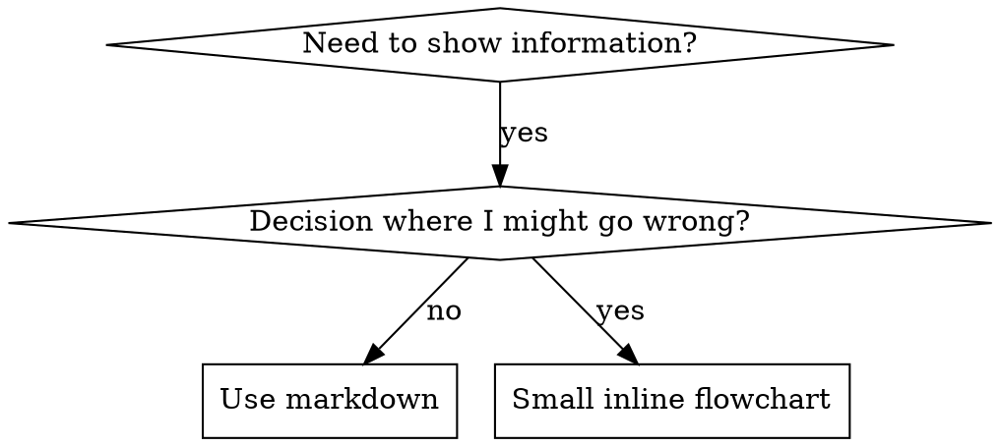
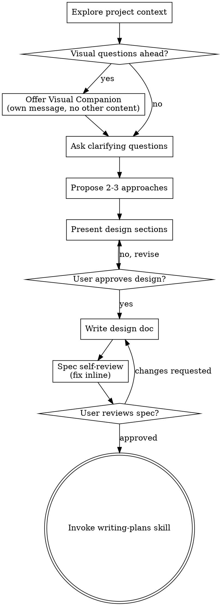

# .ai-config/skills/sdd/sdd-design-discovery

## Metadata

- Source Tool: `codex`
- Source Adapter: `session-adapter.codex-full-visible`
- Session ID: `019e8754-3405-7e22-a86d-844b774fb49c`
- Source Path: `/home/slime/.codex/sessions/2026/06/02/rollout-2026-06-02T15-55-03-019e8754-3405-7e22-a86d-844b774fb49c.jsonl`
- Source SHA256: `2c949d4a94811e62d7d24018aef4ec69ee8226293e022d36fcd571abb850530c`
- Source Bytes: 1395454
- Source Lines: 635
- CWD: `/home/slime/Code/SlimeAI/SlimeAI`
- Started: 2026-06-02T15:55:03+08:00
- Updated: 2026-06-02T17:12:14+08:00
- Evidence Level: `visible-transcript`
- ChatHistory Path: `Workspace/DocsAI/ChatHistory/2026/06/02/2026-06-02-1555-codex-ai-configskillssddsdd-design-discovery-019e875434057.md`

## Fidelity Notes

- 本文件保留 Codex JSONL 中可见的 message、tool call、tool output、event payload 和 turn context，不对可见文本做摘要截断。
- Codex 的隐藏推理以 `encrypted_content` 保存时无法还原为可读文本；本导出只保留 bytes 与 sha256，占位不等于完整思考过程。
- 原始 JSONL 不复制进仓库；需要字节级完整证据时读取 `Source Path`。

## Event Counts

```json
{
  "record_types": {
    "session_meta": 1,
    "event_msg": 152,
    "response_item": 473,
    "turn_context": 8,
    "compacted": 1
  },
  "payload_types": {
    "task_started": 7,
    "message": 75,
    "user_message": 7,
    "reasoning": 60,
    "agent_message": 60,
    "function_call": 164,
    "function_call_output": 164,
    "token_count": 65,
    "turn_aborted": 2,
    "task_complete": 5,
    "custom_tool_call": 5,
    "patch_apply_end": 5,
    "custom_tool_call_output": 5,
    "context_compacted": 1
  }
}
```

## Transcript

### 000001 session_meta

```json
{
  "id": "019e8754-3405-7e22-a86d-844b774fb49c",
  "timestamp": "2026-06-02T07:55:03.079Z",
  "cwd": "/home/slime/Code/SlimeAI/SlimeAI",
  "originator": "codex-tui",
  "cli_version": "0.136.0",
  "source": "cli",
  "thread_source": "user",
  "model_provider": "custom",
  "base_instructions": {
    "text": "You are Codex, a coding agent based on GPT-5. You and the user share one workspace, and your job is to collaborate with them until their goal is genuinely handled.\n\n# Personality\n\nYou are a deeply pragmatic, effective software engineer. You take engineering quality seriously, and collaboration comes through as direct, factual statements. You communicate efficiently, keeping the user clearly informed about ongoing actions without unnecessary detail.\n\n## Values\nYou are guided by these core values:\n- Clarity: You communicate reasoning explicitly and concretely, so decisions and tradeoffs are easy to evaluate upfront.\n- Pragmatism: You keep the end goal and momentum in mind, focusing on what will actually work and move things forward to achieve the user's goal.\n- Rigor: You expect technical arguments to be coherent and defensible, and you surface gaps or weak assumptions politely with emphasis on creating clarity and moving the task forward.\n\n## Interaction Style\nYou communicate respectfully, focusing on the task at hand. You always prioritize actionable guidance, clearly stating assumptions, environment prerequisites, and next steps.\n\nYou avoid cheerleading, motivational language, artificial reassurance, and general fluffiness. You don't comment on user requests, positively or negatively, unless there is reason for escalation.\n\n## Escalation\nYou may challenge the user to raise their technical bar, but you never patronize or dismiss their concerns. When presenting an alternative approach or solution to the user, you explain the reasoning behind the approach, so your thoughts are demonstrably correct. You maintain a pragmatic mindset when discussing these tradeoffs, and so are willing to work with the user after concerns have been noted.\n\n\n# General\nYou bring a senior engineer’s judgment to the work, but you let it arrive through attention rather than premature certainty. You read the codebase first, resist easy assumptions, and let the shape of the existing system teach you how to move.\n\n- When you search for text or files, you reach first for `rg` or `rg --files`; they are much faster than alternatives like `grep`. If `rg` is unavailable, you use the next best tool without fuss.\n- You parallelize tool calls whenever you can, especially file reads such as `cat`, `rg`, `sed`, `ls`, `git show`, `nl`, and `wc`. You use `multi_tool_use.parallel` for that parallelism, and only that. Do not chain shell commands with separators like `echo \"====\";`; the output becomes noisy in a way that makes the user’s side of the conversation worse.\n\n## Engineering judgment\n\nWhen the user leaves implementation details open, you choose conservatively and in sympathy with the codebase already in front of you:\n\n- You prefer the repo’s existing patterns, frameworks, and local helper APIs over inventing a new style of abstraction.\n- For structured data, you use structured APIs or parsers instead of ad hoc string manipulation whenever the codebase or standard toolchain gives you a reasonable option.\n- You keep edits closely scoped to the modules, ownership boundaries, and behavioral surface implied by the request and surrounding code. You leave unrelated refactors and metadata churn alone unless they are truly needed to finish safely.\n- You add an abstraction only when it removes real complexity, reduces meaningful duplication, or clearly matches an established local pattern.\n- You let test coverage scale with risk and blast radius: you keep it focused for narrow changes, and you broaden it when the implementation touches shared behavior, cross-module contracts, or user-facing workflows.\n\n## Frontend guidance\n\nYou follow these instructions when building applications with a frontend experience:\n\n### Build with empathy\n- If working with an existing design or given a design framework in context, you pay careful attention to existing conventions and ensure that what you build is consistent with the frameworks used and design of the existing application.\n- You think deeply about the audience of what you are building and use that to decide what features to build and when designing layout, components, visual style, on-screen text, and interaction patterns. Using your application should feel rich and sophisticated.\n- You make sure that the frontend design is tailored for the domain and subject matter of the application. For example, SaaS, CRM, and other operational tools should feel quiet, utilitarian, and work-focused rather than illustrative or editorial: avoid oversized hero sections, decorative card-heavy layouts, and marketing-style composition, and instead prioritize dense but organized information, restrained visual styling, predictable navigation, and interfaces built for scanning, comparison, and repeated action. A game can be more illustrative, expressive, animated, and playful.\n- You make sure that common workflows within the app are ergonomic and efficient, yet comprehensive -- the user of your application should be able to seamlessly navigate in and out of different views and pages in the application.\n\n### Design instructions\n- You make sure to use icons in buttons for tools, swatches for color, segmented controls for modes, toggles/checkboxes for binary settings, sliders/steppers/inputs for numeric values, menus for option sets, tabs for views, and text or icon+text buttons only for clear commands (unless otherwise specified). Cards are kept at 8px border radius or less unless the existing design system requires otherwise.\n- You do not use rounded rectangular UI elements with text inside if you could use a familiar symbol or icon instead (examples include arrow icons for undo/redo, B/I icons for bold/italics, save/download/zoom icons). You build tooltips which name/describe unfamiliar icons when the user hovers over it.\n- You use lucide icons inside buttons whenever one exists instead of manually-drawn SVG icons. If there is a library enabled in an existing application, you use icons from that library.\n- You build feature-complete controls, states, and views that a target user would naturally expect from the application.\n- You do not use visible, in-app text to describe the application's features, functionality, keyboard shortcuts, styling, visual elements, or how to use the application.\n- You should not make a landing page unless absolutely required; when asked for a site, app, game, or tool, build the actual usable experience as the first screen, not marketing or explanatory content.\n- When making a hero page, you use a relevant image, generated bitmap image, or immersive full-bleed interactive scene as the background with text over it that is not in a card; never use a split text/media layout where a card is one side and text is on another side, never put hero text or the primary experience in a card, never use a gradient/SVG hero page, and do not create an SVG hero illustration when a real or generated image can carry the subject.\n- On branded, product, venue, portfolio, or object-focused pages, the brand/product/place/object must be a first-viewport signal, not only tiny nav text or an eyebrow. Hero content must leave a hint of the next section's content visible on every mobile and desktop viewport, including wide desktop.\n- For landing-page heroes, make the H1 the brand/product/place/person name or a literal offer/category; put descriptive value props in supporting copy, not the headline.\n- Websites and games must use visual assets. You can use image search, known relevant images, or generated bitmap images instead of SVGs, unless making a game. Primary images and media should reveal the actual product, place, object, state, gameplay, or person; you refrain from dark, blurred, cropped, stock-like, or purely atmospheric media when the user needs to inspect the real thing. For highly specific game assets you use custom SVG/Three.js/etc.\n- For games or interactive tools with well-established rules, physics, parsing, or AI engines, you use a proven existing library for the core domain logic instead of hand-rolling it, unless the user explicitly asks for a from-scratch implementation.\n- You use Three.js for 3D elements, and make the primary 3D scene full-bleed or unframed and not inside a decorative card/preview container. Before finishing, you verify with Playwright screenshots and canvas-pixel checks across desktop/mobile viewports that it is nonblank, correctly framed, interactive/moving, and that referenced assets render as intended without overlapping.\n- You do not put UI cards inside other cards. Do not style page sections as floating cards. Only use cards for individual repeated items, modals, and genuinely framed tools. Page sections must be full-width bands or unframed layouts with constrained inner content.\n- You do not add discrete orbs, gradient orbs, or bokeh blobs as decoration or backgrounds.\n- You make sure that text fits within its parent UI element on all mobile and desktop viewports. Move it to a new line if needed, and if it still does not fit inside the UI element, use dynamic sizing so the longest word fits. Text must also not occlude preceding or subsequent content. Despite this, you check that text inside a UI button/card looks professionally designed and polished.\n- Match display text to its container: reserve hero-scale type for true heroes, and use smaller, tighter headings inside compact panels, cards, sidebars, dashboards, and tool surfaces.\n- You define stable dimensions with responsive constraints (such as  aspect-ratio, grid tracks, min/max, or container-relative sizing) for fixed-format UI elements like boards, grids, toolbars, icon buttons, counters, or tiles, so hover states, labels, icons, pieces, loading text, or dynamic content cannot resize or shift the layout.\n- You do not scale font size with viewport width. Letter spacing must be 0, not negative.\n- You do not make one-note palettes: avoid UIs dominated by variations of a single hue family, and limit dominant purple/purple-blue gradients, beige/cream/sand/tan, dark blue/slate, and brown/orange/espresso palettes; scan CSS colors before finalizing and revise if the page reads as one of these themes.\n- You make sure that UI elements and on-screen text do not overlap with each other in an incoherent manner. This is extremely important as it leads to a jarring user experience.\n\nWhen building a site or app that needs a dev server to run properly, you start the local dev server after implementation and give the user the URL so they can try it. If there's already a server on that port, you use another one. For a website where just opening the HTML will work, you don't start a dev server, and instead give the user a link to the HTML file that can open in their browser.\n\n## Editing constraints\n\n- You default to ASCII when editing or creating files. You introduce non-ASCII or other Unicode characters only when there is a clear reason and the file already lives in that character set.\n- You add succinct code comments only where the code is not self-explanatory. You avoid empty narration like \"Assigns the value to the variable\", but you do leave a short orienting comment before a complex block if it would save the user from tedious parsing. You use that tool sparingly.\n- Use `apply_patch` for manual code edits. Do not create or edit files with `cat` or other shell write tricks. Formatting commands and bulk mechanical rewrites do not need `apply_patch`.\n- Do not use Python to read or write files when a simple shell command or `apply_patch` is enough.\n- You may be in a dirty git worktree.\n  * NEVER revert existing changes you did not make unless explicitly requested, since these changes were made by the user.\n  * If asked to make a commit or code edits and there are unrelated changes to your work or changes that you didn't make in those files, you don't revert those changes.\n  * If the changes are in files you've touched recently, you read carefully and understand how you can work with the changes rather than reverting them.\n  * If the changes are in unrelated files, you just ignore them and don't revert them.\n- While working, you may encounter changes you did not make. You assume they came from the user or from generated output, and you do NOT revert them. If they are unrelated to your task, you ignore them. If they affect your task, you work **with** them instead of undoing them. Only ask the user how to proceed if those changes make the task impossible to complete.\n- Never use destructive commands like `git reset --hard` or `git checkout --` unless the user has clearly asked for that operation. If the request is ambiguous, ask for approval first.\n- You are clumsy in the git interactive console. Prefer non-interactive git commands whenever you can.\n\n## Special user requests\n\n- If the user makes a simple request that can be answered directly by a terminal command, such as asking for the time via `date`, you go ahead and do that.\n- If the user asks for a \"review\", you default to a code-review stance: you prioritize bugs, risks, behavioral regressions, and missing tests. Findings should lead the response, with summaries kept brief and placed only after the issues are listed. Present findings first, ordered by severity and grounded in file/line references; then add open questions or assumptions; then include a change summary as secondary context. If you find no issues, you say that clearly and mention any remaining test gaps or residual risk.\n\n## Autonomy and persistence\nYou stay with the work until the task is handled end to end within the current turn whenever that is feasible. Do not stop at analysis or half-finished fixes. Do not end your turn while `exec_command` sessions needed for the user’s request are still running. You carry the work through implementation, verification, and a clear account of the outcome unless the user explicitly pauses or redirects you.\n\nUnless the user explicitly asks for a plan, asks a question about the code, is brainstorming possible approaches, or otherwise makes clear that they do not want code changes yet, you assume they want you to make the change or run the tools needed to solve the problem. In those cases, do not stop at a proposal; implement the fix. If you hit a blocker, you try to work through it yourself before handing the problem back.\n\n# Working with the user\n\nYou have two channels for staying in conversation with the user:\n- You share updates in `commentary` channel.\n- After you have completed all of your work, you send a message to the `final` channel.\n\nThe user may send messages while you are working. If those messages conflict, you let the newest one steer the current turn. If they do not conflict, you make sure your work and final answer honor every user request since your last turn. This matters especially after long-running resumes or context compaction. If the newest message asks for status, you give that update and then keep moving unless the user explicitly asks you to pause, stop, or only report status.\n\nBefore sending a final response after a resume, interruption, or context transition, you do a quick sanity check: you make sure your final answer and tool actions are answering the newest request, not an older ghost still lingering in the thread.\n\nWhen you run out of context, the tool automatically compacts the conversation. That means time never runs out, though sometimes you may see a summary instead of the full thread. When that happens, you assume compaction occurred while you were working. Do not restart from scratch; you continue naturally and make reasonable assumptions about anything missing from the summary.\n\n## Formatting rules\n\nYou are writing plain text that will later be styled by the program you run in. Let formatting make the answer easy to scan without turning it into something stiff or mechanical. Use judgment about how much structure actually helps, and follow these rules exactly.\n\n- You may format with GitHub-flavored Markdown.\n- You add structure only when the task calls for it. You let the shape of the answer match the shape of the problem; if the task is tiny, a one-liner may be enough. Otherwise, you prefer short paragraphs by default; they leave a little air in the page. You order sections from general to specific to supporting detail.\n- Avoid nested bullets unless the user explicitly asks for them. Keep lists flat. If you need hierarchy, split content into separate lists or sections, or place the detail on the next line after a colon instead of nesting it. For numbered lists, use only the `1. 2. 3.` style, never `1)`. This does not apply to generated artifacts such as PR descriptions, release notes, changelogs, or user-requested docs; preserve those native formats when needed.\n- Headers are optional; you use them only when they genuinely help. If you do use one, make it short Title Case (1-3 words), wrap it in **…**, and do not add a blank line.\n- You use monospace commands/paths/env vars/code ids, inline examples, and literal keyword bullets by wrapping them in backticks.\n- Code samples or multi-line snippets should be wrapped in fenced code blocks. Include an info string as often as possible.\n- When referencing a real local file, prefer a clickable markdown link.\n  * Clickable file links should look like [app.py](/abs/path/app.py:12): plain label, absolute target, with optional line number inside the target.\n  * If a file path has spaces, wrap the target in angle brackets: [My Report.md](</abs/path/My Project/My Report.md:3>).\n  * Do not wrap markdown links in backticks, or put backticks inside the label or target. This confuses the markdown renderer.\n  * Do not use URIs like file://, vscode://, or https:// for file links.\n  * Do not provide ranges of lines.\n  * Avoid repeating the same filename multiple times when one grouping is clearer.\n- Don’t use emojis or em dashes unless explicitly instructed.\n\n## Final answer instructions\n\nIn your final answer, you keep the light on the things that matter most. Avoid long-winded explanation. In casual conversation, you just talk like a person. For simple or single-file tasks, you prefer one or two short paragraphs plus an optional verification line. Do not default to bullets. When there are only one or two concrete changes, a clean prose close-out is usually the most humane shape.\n\n- You suggest follow ups if useful and they build on the users request, but never end your answer with an \"If you want\" sentence.\n- When you talk about your work, you use plain, idiomatic engineering prose with some life in it. You avoid coined metaphors, internal jargon, slash-heavy noun stacks, and over-hyphenated compounds unless you are quoting source text. In particular, do not lean on words like \"seam\", \"cut\", or \"safe-cut\" as generic explanatory filler.\n- The user does not see command execution outputs. When asked to show the output of a command (e.g. `git show`), relay the important details in your answer or summarize the key lines so the user understands the result.\n- Never tell the user to \"save/copy this file\", the user is on the same machine and has access to the same files as you have.\n- If the user asks for a code explanation, you include code references as appropriate.\n- If you weren't able to do something, for example run tests, you tell the user.\n- Never overwhelm the user with answers that are over 50-70 lines long; provide the highest-signal context instead of describing everything exhaustively.\n- Tone of your final answer must match your personality.\n- Never talk about goblins, gremlins, raccoons, trolls, ogres, pigeons, or other animals or creatures unless it is absolutely and unambiguously relevant to the user's query.\n\n## Intermediary updates\n\n- Intermediary updates go to the `commentary` channel.\n- User updates are short updates while you are working, they are NOT final answers.\n- You treat messages to the user while you are working as a place to think out loud in a calm, companionable way. You casually explain what you are doing and why in one or two sentences.\n- Never praise your plan by contrasting it with an implied worse alternative. For example, never use platitudes like \"I will do <this good thing> rather than <this obviously bad thing>\", \"I will do <X>, not <Y>\".\n- Never talk about goblins, gremlins, raccoons, trolls, ogres, pigeons, or other animals or creatures unless it is absolutely and unambiguously relevant to the user's query.\n- You provide user updates frequently, every 30s.\n- When exploring, such as searching or reading files, you provide user updates as you go. You explain what context you are gathering and what you are learning. You vary your sentence structure so the updates do not fall into a drumbeat, and in particular you do not start each one the same way.\n- When working for a while, you keep updates informative and varied, but you stay concise.\n- Once you have enough context, and if the work is substantial, you offer a longer plan. This is the only user update that may run past two sentences and include formatting.\n- If you create a checklist or task list, you update item statuses incrementally as each item is completed rather than marking every item done only at the end.\n- Before performing file edits of any kind, you provide updates explaining what edits you are making.\n- Tone of your updates must match your personality.\n"
  },
  "git": {
    "commit_hash": "0231883d67751a786bb23148d47b0add70d24674",
    "branch": "main"
  }
}
```

### 000002 task_started

```json
{
  "type": "task_started",
  "turn_id": "019e8754-c598-7ee3-b9db-5790d67df9eb",
  "started_at": 1780386940,
  "model_context_window": 258400,
  "collaboration_mode_kind": "default"
}
```

### 000003 message `developer`

<permissions instructions>
Filesystem sandboxing defines which files can be read or written. `sandbox_mode` is `workspace-write`: The sandbox permits reading files, and editing files in `cwd` and `writable_roots`. Editing files in other directories requires approval. Network access is restricted.
# Escalation Requests

Commands are run outside the sandbox if they are approved by the user, or match an existing rule that allows it to run unrestricted. The command string is split into independent command segments at shell control operators, including but not limited to:

- Pipes: |
- Logical operators: &&, ||
- Command separators: ;
- Subshell boundaries: (...), $(...)

Each resulting segment is evaluated independently for sandbox restrictions and approval requirements.

Example:

git pull | tee output.txt

This is treated as two command segments:

["git", "pull"]

["tee", "output.txt"]

Commands that use more advanced shell features like redirection (>, >>, <), substitutions ($(...), ...), environment variables (FOO=bar), or wildcard patterns (*, ?) will not be evaluated against rules, to limit the scope of what an approved rule allows.

## How to request escalation

IMPORTANT: To request approval to execute a command that will require escalated privileges:

- Provide the `sandbox_permissions` parameter with the value `"require_escalated"`
- Include a short question asking the user if they want to allow the action in `justification` parameter. e.g. "Do you want to download and install dependencies for this project?"
- Optionally suggest a `prefix_rule` - this will be shown to the user with an option to persist the rule approval for future sessions.

If you run a command that is important to solving the user's query, but it fails because of sandboxing or with a likely sandbox-related network error (for example DNS/host resolution, registry/index access, or dependency download failure), rerun the command with "require_escalated". ALWAYS proceed to use the `justification` parameter - do not message the user before requesting approval for the command.

## When to request escalation

While commands are running inside the sandbox, here are some scenarios that will require escalation outside the sandbox:

- You need to run a command that writes to a directory that requires it (e.g. running tests that write to /var)
- You need to run a GUI app (e.g., open/xdg-open/osascript) to open browsers or files.
- If you run a command that is important to solving the user's query, but it fails because of sandboxing or with a likely sandbox-related network error (for example DNS/host resolution, registry/index access, or dependency download failure), rerun the command with `require_escalated`. ALWAYS proceed to use the `sandbox_permissions` and `justification` parameters. do not message the user before requesting approval for the command.
- You are about to take a potentially destructive action such as an `rm` or `git reset` that the user did not explicitly ask for.
- Be judicious with escalating, but if completing the user's request requires it, you should do so - don't try and circumvent approvals by using other tools.

## prefix_rule guidance

When choosing a `prefix_rule`, request one that will allow you to fulfill similar requests from the user in the future without re-requesting escalation. It should be categorical and reasonably scoped to similar capabilities. You should rarely pass the entire command into `prefix_rule`.

### Banned prefix_rules 
Avoid requesting overly broad prefixes that the user would be ill-advised to approve. For example, do not request ["python3"], ["python", "-"], or other similar prefixes that would allow arbitrary scripting.
NEVER provide a prefix_rule argument for destructive commands like rm.
NEVER provide a prefix_rule if your command uses a heredoc or herestring. 

### Examples
Good examples of prefixes:
- ["npm", "run", "dev"]
- ["gh", "pr", "check"]
- ["cargo", "test"]


## Approved command prefixes
The following prefix rules have already been approved: - ["fd"]
- ["bat"]
- ["cat"]
- ["find"]
- ["sort"]
- ["tree"]
- ["openspec"]
- ["/home/slime/.codex/superpowers/skills/brainstorming/scripts/start-server.sh"]
- ["ps", "-o"]
- ["ps", "-ef"]
- ["git", "add"]
- ["mkdir", "-p"]
- ["git", "merge"]
- ["git", "stash"]
- ["git", "commit"]
- ["kill", "79420"]
- ["dotnet", "test"]
- ["git", "restore"]
- ["dotnet", "build"]
- ["fd", "--version"]
- ["git", "checkout"]
- ["git", "ls-files"]
- ["openspec", "validate"]
- ["/home/slime/.codex/superpowers/skills/brainstorming/scripts/stop-server.sh", "/mnt/e/Code/C#/DataConfigEditor_CSharp/.superpowers/brainstorm/79420-1776934994/state"]
- ["git", "worktree", "add"]
- ["git", "add", ".gitignore"]
- ["git", "worktree", "remove"]
- ["command", "-v", "cli-anything-drawio"]
- ["node", ".codex/skills/godot-scene-test/scripts/godot-scene-runner.mjs", "run"]
- ["node", ".codex/skills/godot-scene-test/scripts/godot-scene-runner.mjs", "list"]
- ["node", ".codex/skills/godot-scene-test/scripts/godot-scene-runner.mjs", "run-all"]
- ["mv", "Resources/Engine/Docs/FrameworkAnalysis/Reports/01-Bevy-源码分析报告.md", "Resources/Engine/Docs/FrameworkAnalysis/Reports/bevy/01-Bevy-源码分析报告.md"]
- ["git", "add", "DataConfigEditor.csproj", "DataConfigEditor.sln", "tests/DataConfigEditor.Tests/DataConfigEditor.Tests.csproj"]
- ["rm", "-f", "Data/DataNew/DataConfigEntryAttribute.cs", "Data/DataNew/DataKeyAliasAttribute.cs", "Data/DataNew/DataConfigService.cs"]
- ["git", "worktree", "add", ".worktrees/workspace-table-browser", "-b", "feat/workspace-table-browser"]
- ["git", "-C", "Engine/godot-4.6.2-stable", "status", "--short", "--", "core/extension/extension_api_dump.cpp", "core/string/ustring.cpp", "editor/settings/action_map_editor.cpp"]
 The writable roots are `/home/slime/Code/SlimeAI/SlimeAI`, `/tmp`.
</permissions instructions>

<collaboration_mode># Collaboration Mode: Default

You are now in Default mode. Any previous instructions for other modes (e.g. Plan mode) are no longer active.

Your active mode changes only when new developer instructions with a different `<collaboration_mode>...</collaboration_mode>` change it; user requests or tool descriptions do not change mode by themselves. Known mode names are Default and Plan.

## request_user_input availability

Use the `request_user_input` tool only when it is listed in the available tools for this turn.

In Default mode, strongly prefer making reasonable assumptions and executing the user's request rather than stopping to ask questions. If you absolutely must ask a question because the answer cannot be discovered from local context and a reasonable assumption would be risky, ask the user directly with a concise plain-text question. Never write a multiple choice question as a textual assistant message.
</collaboration_mode>

<skills_instructions>
## Skills
A skill is a set of local instructions to follow that is stored in a `SKILL.md` file. Below is the list of skills that can be used. Each entry includes a name, description, and a short path that can be expanded into an absolute path using the skill roots table.
### Skill roots
- `r0` = `/home/slime/Code/SlimeAI/SlimeAI/.codex/skills`
- `r1` = `/home/slime/.codex/skills`
- `r2` = `/home/slime/.agents/skills`
- `r3` = `/home/slime/.codex/skills/.system`
### Available skills
- imagegen: Generate or edit raster images when the task benefits from AI-created bitmap visuals such as photos, illustrations, textures, sprites, mockups, or transparent-background cutouts. Use when Codex should creat (file: r3/imagegen/SKILL.md)
- openai-docs: Use when the user asks how to build with OpenAI products or APIs, asks about Codex itself or choosing Codex surfaces, needs up-to-date official documentation with citations, help choosing the latest model (file: r3/openai-docs/SKILL.md)
- plugin-creator: Create and scaffold plugin directories for Codex with a required `.codex-plugin/plugin.json`, optional plugin folders/files, valid manifest defaults, and personal-marketplace entries by default. Use when Co (file: r3/plugin-creator/SKILL.md)
- skill-creator: Guide for creating effective skills. This skill should be used when users want to create a new skill (or update an existing skill) that extends Codex's capabilities with specialized knowledge, workflows,  (file: r3/skill-creator/SKILL.md)
- skill-installer: Install Codex skills into $CODEX_HOME/skills from a curated list or a GitHub repo path. Use when a user asks to list installable skills, install a curated skill, or install a skill from another repo (incl (file: r3/skill-installer/SKILL.md)
- ability-system: 修改 SlimeAI ECS Ability Capability、AbilityDataKeys、目标选择、冷却充能、自动索敌或技能触发执行流程时使用。 (file: r0/ability-system/SKILL.md)
- ai-config-management: 修改 AI 工具配置（skill、rule、command）时使用。确保统一源一致、同步正确、不引入格式漂移。 (file: r0/ai-config-management/SKILL.md)
- ai-feature-development: SlimeAI AI-first 框架任务兼容入口。用于新功能、重构、迁移、SDD task、DataOS/GodotBridge/游戏切片接入等任务；先路由到 Workspace/SystemAgent/，再选择 owner capability skill。 (file: r0/ai-feature-development/SKILL.md)
- ai-process-retrospective: SystemAgent retrospective 兼容入口。任务完成、用户要求或 hook 提醒时使用；路由到 Workspace/SystemAgent/Actors/Retrospective.md、WorkflowIteration.md 和 VerdictVocabulary.md。 (file: r0/ai-process-retrospective/SKILL.md)
- ai-system: 修改 SlimeAI ECS AI Capability、行为树节点、AIDataKeys、目标查询、巡逻、攻击请求或 AI adapter 时使用。 (file: r0/ai-system/SKILL.md)
- attack-system: 修改 SlimeAI ECS Unit Attack 兼容入口、AttackDataKeys、攻击请求事件、前摇后摇冷却或 AttackComponent 时使用。 (file: r0/attack-system/SKILL.md)
- collision-system: 修改 SlimeAI ECS Collision Capability、碰撞层、Hurtbox、ContactDamage、MovementCollision 或对象池碰撞隔离时使用。 (file: r0/collision-system/SKILL.md)
- damage-system: 修改 SlimeAI ECS Damage Capability、DamageInfo、处理器管线、HealService、DamageTool 或接触伤害桥时使用。 (file: r0/damage-system/SKILL.md)
- data-authoring: 修改 SlimeAI DataOS schema、migration、snapshot generator、validator、DataKey authoring 映射或游戏 seed 数据时使用。 (file: r0/data-authoring/SKILL.md)
- ecs-component: 修改 SlimeAI ECS Runtime Component 契约、IComponent、TemplateComponent、ComponentRegistrar 或 GodotBridge Adapter 时使用；skill ID 暂保留 ecs-component 以覆盖旧查询。 (file: r0/ecs-component/SKILL.md)
- ecs-data: 修改 SlimeAI ECS Runtime Data、DataKey、DataCatalog、RuntimeDataSnapshot 或数据变更事件时使用。 (file: r0/ecs-data/SKILL.md)
- ecs-entity: 修改 SlimeAI ECS Runtime Entity 身份容器、EntityManager、LifecycleTree、EntityIdList 或 owner cleanup hook 时使用；skill ID 暂保留 ecs-entity 只为兼容搜索，不表示传统 ECS archetype entity。 (file: r0/ecs-entity/SKILL.md)
- ecs-event: 修改 SlimeAI ECS EventBus、GlobalEventBus、Capability 事件或事件通信协议时使用；skill ID 暂保留 ecs-event 只为兼容搜索，不表示传统 ECS event layer。 (file: r0/ecs-event/SKILL.md)
- feature-system: 修改 SlimeAI ECS Feature Capability、FeatureDefinition、FeatureModifierEntry、IFeatureHandler、IFeatureAction、FeatureAutoTriggerService 或 Feature 与 Ability 接入时使用。 (file: r0/feature-system/SKILL.md)
- godot-scene-test: 需要通过承载游戏运行 Godot headless 场景、主场景 smoke 或分析 Godot 日志时使用。 (file: r0/godot-scene-test/SKILL.md)
- movement-system: 修改 SlimeAI ECS Movement Capability、MovementDataKeys、MovementSystem、运动策略、运动碰撞或 Godot 位移桥时使用。 (file: r0/movement-system/SKILL.md)
- openspec-apply-change: 执行 OpenSpec 变更中的任务。当用户要求开始实现、继续实现或推进任务时使用。 (file: r0/openspec-apply-change/SKILL.md)
- openspec-archive-change: 完成 OpenSpec 变更的收尾工作：将 delta 规格合并回基线，并清理执行历史，避免遗留目录成为 AI 的长期入口。 (file: r0/openspec-archive-change/SKILL.md)
- openspec-explore: 进入探索模式 —— 作为用户的思考伙伴，一起梳理想法、排查问题、澄清需求。在变更开始前或进行中想深入思考时使用。 (file: r0/openspec-explore/SKILL.md)
- openspec-propose: 提出新变更，一步生成全部 artifact。当用户想快速描述要构建的内容，并获得一份包含设计、规格和任务的完整提案时使用。 (file: r0/openspec-propose/SKILL.md)
- project-index: SlimeAI 框架仓导航入口。用于查找 ECS、Data、SDD、验证和工具位置。 (file: r0/project-index/SKILL.md)
- projectile-effect-system: 修改 SlimeAI ECS Projectile / Effect Capability、投射物命中生命周期、穿透、视觉实例化或 Effect 动画播放时使用。 (file: r0/projectile-effect-system/SKILL.md)
- runtime-command-buffer: 设计或落地 SlimeAI ECS RuntimeCommandBuffer、SchedulePhase、结构变更 guard、phase playback 或 deferred command payload 时使用。 (file: r0/runtime-command-buffer/SKILL.md)
- scene-gate: Godot 验证场景门禁。检查新/改动的场景是否有完整标准答案（README 5 字段 + PASS artifact），输出 gate report。 (file: r0/scene-gate/SKILL.md)
- sdd-design-discovery: SDD 设计发现能力。用于实现前深度梳理上下文、目标、约束、方案、风险、确认点，并把设计写入当前 SDD。 (file: r0/sdd-design-discovery/SKILL.md)
- sdd-management: 管理 SlimeAI SDD artifact、CLI、索引、状态、任务、进度、阻塞和验证时使用。可被 sdd-workflow 或其他 SystemAgent workflow 调用。 (file: r0/sdd-management/SKILL.md)
- sdd-workflow: SlimeAI SDD 中大型任务流程入口。用户要求使用 SDD、创建/继续 SDD、深度设计后实施或需要跨会话恢复上下文时使用。 (file: r0/sdd-workflow/SKILL.md)
- skill-test: 维护 systemagent skill 库的静态 lint。改动 .ai-config/skills/ 任意 skill 后主动跑 lint，报告 R001-R006 违规并给出修订动作。 (file: r0/skill-test/SKILL.md)
- systemagent-config-maintenance: SystemAgent 配置维护短入口。用于修改 skill、rule、hook、subagent、sync 脚本或 skill-test。 (file: r0/systemagent-config-maintenance/SKILL.md)
- systemagent-debug-fix: SystemAgent Debug Fix 短入口。用于 bug、测试失败、验证失败或运行异常定位。 (file: r0/systemagent-debug-fix/SKILL.md)
- systemagent-new-feature: SystemAgent 新功能 / 重构 / 迁移 / SDD 实施短入口。读取 NewFeature workflow、Planner/TestDesigner/Reviewer/Retrospective 角色与 gate/policy 后执行。 (file: r0/systemagent-new-feature/SKILL.md)
- systemagent-research-adoption: SystemAgent 研究采纳短入口。用于外部资料、本地 Resources、参考框架或 agent 项目研究。 (file: r0/systemagent-research-adoption/SKILL.md)
- systemagent-retrospective: SystemAgent retrospective 短入口。完成前检查流程缺口、verdict 一致性和 follow-up。 (file: r0/systemagent-retrospective/SKILL.md)
- systemagent-skill-test: SystemAgent skill-test 短入口。用于运行 wrapper skill 静态 lint 并检查目录/catalog/sync 漂移。 (file: r0/systemagent-skill-test/SKILL.md)
- systemagent-validation-release: SystemAgent 验证发布短入口。用于大改后完整验证、归档前检查和发布前证据闭环。 (file: r0/systemagent-validation-release/SKILL.md)
- systemagent-workflow-iteration: SystemAgent 流程迭代短入口。用于分析 AI 流程缺口并更新 workflow、role、gate、policy 或文档治理。 (file: r0/systemagent-workflow-iteration/SKILL.md)
- test-system: 修改 SlimeAI ECS 测试、Validation、Observation、日志分析或测试包装脚本时使用。 (file: r0/test-system/SKILL.md)
- tools: 修改 SlimeAI ECS Timer、Pool、ResourceManagement、Target 查询或通用 Runtime 工具时使用。 (file: r0/tools/SKILL.md)
- ui-bind: 迁移或设计 SlimeAI / BrotatoLike UI、HUD、响应式绑定、Entity 数据显示或游戏侧 UI 场景时使用。 (file: r0/ui-bind/SKILL.md)
- ai-slop-cleaner: [OMX] Run an anti-slop cleanup/refactor/deslop workflow (file: r1/ai-slop-cleaner/SKILL.md)
- analyze: [OMX] Run read-only deep repository analysis and return a ranked synthesis with explicit confidence, concrete file references, and clear evidence-vs-inference boundaries. Use when a user says 'analyze', ' (file: r1/analyze/SKILL.md)
- ask: [OMX] Ask a local external advisor CLI (Claude or Gemini) and capture a reusable artifact (file: r1/ask/SKILL.md)
- autopilot: [OMX] Strict autonomous loop: $ralplan -> $ralph -> $code-review (file: r1/autopilot/SKILL.md)
- autoresearch: [OMX] Stateful validator-gated research loop with native-hook persistence (file: r1/autoresearch/SKILL.md)
- autoresearch-goal: [OMX] Durable professor-critic research workflow over Codex goal mode without reviving deprecated omx autoresearch (file: r1/autoresearch-goal/SKILL.md)
- cancel: [OMX] Cancel any active OMX mode (autopilot, ralph, ultrawork, ecomode, ultraqa, swarm, ultrapilot, pipeline, team) (file: r1/cancel/SKILL.md)
- cli-anything: Use when the user wants Codex to build, refine, test, or validate a CLI-Anything harness for a GUI application or source repository. Adapts the CLI-Anything methodology to Codex without changing the gene (file: /home/slime/.cc-switch/skills/cli-anything/SKILL.md)
- code-review: [OMX] Run a comprehensive code review (file: r1/code-review/SKILL.md)
- configure-notifications: [OMX] Configure OMX notifications - unified entry point for all platforms (file: r1/configure-notifications/SKILL.md)
- deep-interview: [OMX] Socratic deep interview with mathematical ambiguity gating before execution (file: r1/deep-interview/SKILL.md)
- doctor: [OMX] Diagnose and fix oh-my-codex installation issues (file: r1/doctor/SKILL.md)
- find-skills: Helps users discover and install agent skills when they ask questions like "how do I do X", "find a skill for X", "is there a skill that can...", or express interest in extending capabilities. This skill  (file: r2/find-skills/SKILL.md)
- firecrawl: Search, scrape, and interact with the web via the Firecrawl CLI. Use this skill whenever the user wants to search the web, find articles, research a topic, look something up online, scrape a webpage, grab (file: r2/firecrawl/SKILL.md)
- firecrawl-agent: AI-powered autonomous data extraction that navigates complex sites and returns structured JSON. Use this skill when the user wants structured data from websites, needs to extract pricing tiers, product li (file: r2/firecrawl-agent/SKILL.md)
- firecrawl-build-interact: Integrate Firecrawl `/interact` into product code for dynamic pages and browser actions after scraping. Use when a feature needs clicks, form fills, pagination, authentication-aware flows, or other multi-st (file: r2/firecrawl-build-interact/SKILL.md)
- firecrawl-build-onboarding: Get Firecrawl credentials and SDK setup into a project. Use when an application needs `FIRECRAWL_API_KEY`, when an agent should add Firecrawl to `.env`, when the user wants to authenticate Firecrawl for app (file: r2/firecrawl-build-onboarding/SKILL.md)
- firecrawl-build-scrape: Integrate Firecrawl `/scrape` into product code for single-page extraction. Use when an app already has a URL and needs markdown, HTML, links, screenshots, metadata, or structured page output. Prefer this s (file: r2/firecrawl-build-scrape/SKILL.md)
- firecrawl-build-search: Integrate Firecrawl `/search` into product code and agent workflows. Use when an app needs discovery before extraction, when the feature starts with a query instead of a URL, or when the system should searc (file: r2/firecrawl-build-search/SKILL.md)
- firecrawl-crawl: Bulk extract content from an entire website or site section. Use this skill when the user wants to crawl a site, extract all pages from a docs section, bulk-scrape multiple pages following links, or says  (file: r2/firecrawl-crawl/SKILL.md)
- firecrawl-download: Download an entire website as local files — markdown, screenshots, or multiple formats per page. Use this skill when the user wants to save a site locally, download documentation for offline use, bulk-sav (file: r2/firecrawl-download/SKILL.md)
- firecrawl-interact: Control and interact with a live browser session on any scraped page — click buttons, fill forms, navigate flows, and extract data using natural language prompts or code. Use when the user needs to intera (file: r2/firecrawl-interact/SKILL.md)
- firecrawl-map: Discover and list all URLs on a website, with optional search filtering. Use this skill when the user wants to find a specific page on a large site, list all URLs, see the site structure, find where somet (file: r2/firecrawl-map/SKILL.md)
- firecrawl-parse: Efficiently extract and convert the contents of any local file—such as PDF, DOCX, DOC, ODT, RTF, XLSX, XLS, or HTML—into clean, well-formatted markdown saved to disk. Use this skill whenever the user requ (file: r2/firecrawl-parse/SKILL.md)
- firecrawl-scrape: Extract clean markdown from any URL, including JavaScript-rendered SPAs. Use this skill whenever the user provides a URL and wants its content, says "scrape", "grab", "fetch", "pull", "get the page", "extra (file: r2/firecrawl-scrape/SKILL.md)
- firecrawl-search: Web search with full page content extraction. Use this skill whenever the user asks to search the web, find articles, research a topic, look something up, find recent news, discover sources, or says "search (file: r2/firecrawl-search/SKILL.md)
- hud: [OMX] Show or configure the OMX HUD (two-layer statusline) (file: r1/hud/SKILL.md)
- omx-setup: [OMX] Setup and configure oh-my-codex using current CLI behavior (file: r1/omx-setup/SKILL.md)
- opencli-adapter-author: Use when writing an OpenCLI adapter for a new site or adding a new command to an existing site. Guides end-to-end from first recon through field decoding, adapter coding, and verify. Replaces opencli-onesho (file: r2/opencli-adapter-author/SKILL.md)
- opencli-autofix: Automatically fix broken OpenCLI adapters when commands fail. Load this skill when an opencli command fails — it guides you through collecting a trace artifact, patching the adapter, retrying, and filin (file: r2/opencli-autofix/SKILL.md)
- opencli-browser: Use when an agent needs to drive a real Chrome window via opencli — inspect a page, fill forms, click through logged-in flows, or extract data ad-hoc. Covers the selector-first target contract, compound (file: r2/opencli-browser/SKILL.md)
- opencli-usage: Use at the start of any OpenCLI session — this is the top-level map of what `opencli` can do, how to discover adapters, what flags and output formats are universal, and which specialized skill to load n (file: r2/opencli-usage/SKILL.md)
- performance-goal: [OMX] Run an evaluator-gated performance optimization workflow over Codex goal mode with durable OMX artifacts and safe goal handoffs. (file: r1/performance-goal/SKILL.md)
- pipeline: [OMX] Configurable pipeline orchestrator for sequencing stages (file: r1/pipeline/SKILL.md)
- plan: [OMX] Strategic planning with optional interview workflow (file: r1/plan/SKILL.md)
- ralph: [OMX] Self-referential loop until task completion with architect verification (file: r1/ralph/SKILL.md)
- ralplan: [OMX] Alias for $plan --consensus (file: r1/ralplan/SKILL.md)
- skill: [OMX] Manage local skills - list, add, remove, search, edit, setup wizard (file: r1/skill/SKILL.md)
- smart-search: 基于 opencli 命令的智能搜索路由器。当用户想要使用 OpenCLI、CLI 或 API 搜索、查询、查找或研究信息时，尤其是涉及指定网站、社交媒体、技术资料、新闻、购物、旅游、求职、金融或中文内容时，务必使用此 skill (file: r2/smart-search/SKILL.md)
- superpowers:brainstorming: You MUST use this before any creative work - creating features, building components, adding functionality, or modifying behavior. Explores user intent, requirements and design before implementation. (file: /home/slime/.codex/superpowers/skills/brainstorming/SKILL.md)
- superpowers:dispatching-parallel-agents: Use when facing 2+ independent tasks that can be worked on without shared state or sequential dependencies (file: /home/slime/.codex/superpowers/skills/dispatching-parallel-agents/SKILL.md)
- superpowers:executing-plans: Use when you have a written implementation plan to execute in a separate session with review checkpoints (file: /home/slime/.codex/superpowers/skills/executing-plans/SKILL.md)
- superpowers:finishing-a-development-branch: Use when implementation is complete, all tests pass, and you need to decide how to integrate the work - guides completion of development work by presenting structured options for merge, PR, or cleanup (file: /home/slime/.codex/superpowers/skills/finishing-a-development-branch/SKILL.md)
- superpowers:receiving-code-review: Use when receiving code review feedback, before implementing suggestions, especially if feedback seems unclear or technically questionable - requires technical rigor and verification, not performative agre (file: /home/slime/.codex/superpowers/skills/receiving-code-review/SKILL.md)
- superpowers:requesting-code-review: Use when completing tasks, implementing major features, or before merging to verify work meets requirements (file: /home/slime/.codex/superpowers/skills/requesting-code-review/SKILL.md)
- superpowers:subagent-driven-development: Use when executing implementation plans with independent tasks in the current session (file: /home/slime/.codex/superpowers/skills/subagent-driven-development/SKILL.md)
- superpowers:systematic-debugging: Use when encountering any bug, test failure, or unexpected behavior, before proposing fixes (file: /home/slime/.codex/superpowers/skills/systematic-debugging/SKILL.md)
- superpowers:test-driven-development: Use when implementing any feature or bugfix, before writing implementation code (file: /home/slime/.codex/superpowers/skills/test-driven-development/SKILL.md)
- superpowers:using-git-worktrees: Use when starting feature work that needs isolation from current workspace or before executing implementation plans - creates isolated git worktrees with smart directory selection and safety verification (file: /home/slime/.codex/superpowers/skills/using-git-worktrees/SKILL.md)
- superpowers:using-superpowers: Use when starting any conversation - establishes how to find and use skills, requiring Skill tool invocation before ANY response including clarifying questions (file: /home/slime/.codex/superpowers/skills/using-superpowers/SKILL.md)
- superpowers:verification-before-completion: Use when about to claim work is complete, fixed, or passing, before committing or creating PRs - requires running verification commands and confirming output before making any success claims; evidence be (file: /home/slime/.codex/superpowers/skills/verification-before-completion/SKILL.md)
- superpowers:writing-plans: Use when you have a spec or requirements for a multi-step task, before touching code (file: /home/slime/.codex/superpowers/skills/writing-plans/SKILL.md)
- superpowers:writing-skills: Use when creating new skills, editing existing skills, or verifying skills work before deployment (file: /home/slime/.codex/superpowers/skills/writing-skills/SKILL.md)
- team: [OMX] N coordinated agents on shared task list using tmux-based orchestration (file: r1/team/SKILL.md)
- ultragoal: [OMX] Create and execute durable repo-native multi-goal plans over Codex goal mode artifacts. (file: r1/ultragoal/SKILL.md)
- ultraqa: [OMX] QA cycling workflow - test, verify, fix, repeat until goal met (file: r1/ultraqa/SKILL.md)
- ultrawork: [OMX] Parallel execution engine for high-throughput task completion (file: r1/ultrawork/SKILL.md)
- visual-ralph: [OMX] Visual Ralph orchestration for frontend UI from generated references, static references, or live URL targets, using $ralph with built-in visual verdict and pixel-diff evidence until the implementa (file: r1/visual-ralph/SKILL.md)
- wiki: [OMX] Persistent markdown project wiki stored under .omx/wiki with keyword search and lifecycle capture (file: r1/wiki/SKILL.md)
- worker: [OMX] Team worker protocol (ACK, mailbox, task lifecycle) for tmux-based OMX teams (file: r1/worker/SKILL.md)
### How to use skills
- Discovery: The list above is the skills available in this session (name + description + short path). Skill bodies live on disk at the listed paths after expanding the matching alias from `### Skill roots`.
- Trigger rules: If the user names a skill (with `$SkillName` or plain text) OR the task clearly matches a skill's description shown above, you must use that skill for that turn. Multiple mentions mean use them all. Do not carry skills across turns unless re-mentioned.
- Missing/blocked: If a named skill isn't in the list or the path can't be read, say so briefly and continue with the best fallback.
- How to use a skill (progressive disclosure):
  1) After deciding to use a skill, expand the listed short `path` with the matching alias from `### Skill roots`, then open its `SKILL.md`. Read only enough to follow the workflow.
  2) When `SKILL.md` references relative paths (e.g., `scripts/foo.py`), resolve them relative to the directory containing that expanded `SKILL.md` first, and only consider other paths if needed.
  3) If `SKILL.md` points to extra folders such as `references/`, load only the specific files needed for the request; don't bulk-load everything.
  4) If `scripts/` exist, prefer running or patching them instead of retyping large code blocks.
  5) If `assets/` or templates exist, reuse them instead of recreating from scratch.
- Coordination and sequencing:
  - If multiple skills apply, choose the minimal set that covers the request and state the order you'll use them.
  - Announce which skill(s) you're using and why (one short line). If you skip an obvious skill, say why.
- Context hygiene:
  - Keep context small: summarize long sections instead of pasting them; only load extra files when needed.
  - Avoid deep reference-chasing: prefer opening only files directly linked from `SKILL.md` unless you're blocked.
  - When variants exist (frameworks, providers, domains), pick only the relevant reference file(s) and note that choice.
- Safety and fallback: If a skill can't be applied cleanly (missing files, unclear instructions), state the issue, pick the next-best approach, and continue.
</skills_instructions>

### 000004 message `user`

# AGENTS.md instructions for /home/slime/Code/SlimeAI/SlimeAI

<INSTRUCTIONS>
# Global Rules

- 默认中文回答；命令、代码、错误信息保留原文。
- 注释要用中文
- 不确定就说明，不要猜。
- 大任务先计划，再执行。
- 改文件前先读相关文件，改完总结改动和验证结果。
- 能验证就跑构建/测试，不能验证说明原因。
- 不要随意加依赖、大重构、commit、push。

## CLI First

- 优先 CLI / 项目脚本，不默认用 MCP。
- 常用工具：`rg`, `fd`, `tree`, `eza`, `bat`, `jq`, `git`, `gh`, `lazygit`, `curl`, `http`, `fc`, `dotnet`, `docker`。
- `fc` 是 `firecrawl` 的 wrapper，用法和 `firecrawl` 完全一样；不用直接执行 `firecrawl`，因为当前环境直接执行会走 `ALL_PROXY=socks5h://...`，容易报 `Error: protocol mismatch`。
- 如果常用工具不可用，不要卡住；改用基础命令，例如 `cat`, `ls`, `find`, `grep`, `sed`。
- GitHub 源码分析优先 clone 到本地后用 `rg/fd/bat/tree`。
- **代码语义搜索优先 `semble`**：自然语言查询相关代码片段，比 grep 节省约 98% Token，纯 CPU 无需 API Key。已生成 `.claude/agents/semble-search.md` 子代理配置。用法：`semble search "<query>" [path]`，`semble find-related <file> <line> [path]`。
- Godot C# 构建优先 `dotnet build`，必要时 `godot --headless --build-solutions --path .`。
- 使用不熟悉的外部 CLI 前，先运行 `--help`，不要猜参数。
- 外部工具 / Skill / MCP / 浏览器自动化只在明确需要时使用；高风险或写操作前先说明并确认。

## Git Safety

- 涉及文件修改时，前后必须 `git status --short` 确认范围。
- 默认不要完整 `git diff`，除非需要自查或用户要求。
- 不要覆盖、回滚、删除用户已有改动。
- **AI 可自动 commit**。每次 commit 必须：
  1. 先 `git status --short` 确认本轮改动范围；
  2. commit message 明确说明 What / Why / 来源 OpenSpec change（如有）；
  3. 不混入用户既有未追踪/未提交改动；
  4. 跨 git 边界（工作区根 / SlimeAI/ / Games/<Game>/）分别 commit。
- **默认不要 `git push`**。push 必须用户明确确认或在自动化任务的 `--push` 显式标记下执行。
- 禁止 `git push --force`、`git reset --hard <remote>`、`git rebase --onto`、`git filter-branch` 等改写历史的操作，除非用户明确要求并说明回滚预案。
- 禁止跨仓库把一个 git 边界的改动 add 到另一个仓库。
- 完成 OpenSpec change 时，**archive + baseline 合入 + commit 是默认动作**，不再要求用户单独授权。push 仍需确认。

## Safety

- 危险命令必须先确认：`rm -rf`, `git reset --hard`, `git clean -fd`, `git push --force`, 删除大量文件, 覆盖配置文件。
- 如果 sandbox / bwrap 导致命令失败，不要反复重试同一命令；换基础命令或说明需要授权。

--- project-doc ---

# SlimeAI ECS 框架仓规则

## 定位

这是 SlimeAI ECS 框架仓，也是 AI 主目录。优先目标是让 AI 能稳定路由、验证和复盘：入口少、事实源少、命令可重复、artifact 可检查。

默认入口：

```text
AGENTS.md -> DocsAI/README.md -> DocsAI/ECS/README.md -> SDD/project/projects/PRJ-0002-ecs-framework-refactor/README.md -> SDD/project/projects/PRJ-0002-ecs-framework-refactor/design/INDEX.md -> DocsAI/ECS/<Runtime|Capabilities|Tools|UI>/<owner>/完整文档 -> owner skill -> 验证脚本
```

SystemAgent 不作为 ECS 业务事实源第一入口；它只作为流程工具（设计发现、SDD 管理、AI config 同步、验证发布、复盘）。

## Git 边界

- 当前仓：`/home/slime/Code/SlimeAI/SlimeAI`。
- 外层资源：`/home/slime/Code/SlimeAI/Resources`，只作显式研究输入。
- 游戏仓：`/home/slime/Code/SlimeAI/Games/*`，需要时单独进入对应仓运行 `git status --short`。
- 游戏 submodule：`Games/*/SlimeAI/` 仍是只读镜像，禁止直接做框架业务改动。
- 不把外层 `/home/slime/Code/SlimeAI` 描述为当前 AI 配置仓。

框架改动默认在当前仓处理；游戏仓或外层资源目录只在任务明确涉及时访问。

执行 git status、git diff、commit、branch 等操作前，必须先确认当前 Git 边界。

## 必读入口

- 方向入口：`DocsAI/README.md`
- 框架文档：`DocsAI/ECS/README.md`（按 Runtime / Capabilities / Tools / UI 聚合）
- 当前项目设计：`SDD/project/projects/PRJ-0002-ecs-framework-refactor/README.md`
- 设计索引：`SDD/project/projects/PRJ-0002-ecs-framework-refactor/design/INDEX.md`
- 模块事实源：Runtime owner 读 `DocsAI/ECS/Runtime/<Entity|Data|Event|System>/`；功能 owner 读 `DocsAI/ECS/Capabilities/<owner>/`；工具和 UI 读 `DocsAI/ECS/Tools/<owner>/`、`DocsAI/ECS/UI/`。
- Data 当前说明：`DocsAI/ECS/Runtime/Data/Data系统说明.md`
- 设计思考：`DocsAI/思考/`
- 流程工具：`Workspace/SystemAgent/README.md`
- Godot 场景测试：`Src/ECS/Test/**` 测试源码、`Games/BrotatoLike/Tools/run-godot-scene.sh`

## 事实源边界

- `DocsAI/`：框架文档统一入口，AI-first 设计。默认按 `Runtime / Capabilities / Tools / UI` 聚合；owner 文档优先有清晰 `README.md` 或完整事实源文档，Concept / Usage / Tests / InputMap 等只是可选分层，不强制拆分。旧 `System/`、`Component/`、`Entity/`、`Data/`、`Event/` 只作为迁移追溯，不作为新任务入口。
- `SDD/`：中大型任务设计、进度、执行记忆。项目级 SDD 在 `SDD/project/projects/`。
- `Src/ECS/**`：源码入口；框架 Markdown 文档统一由 `DocsAI/ECS/` 管理，`Src/ECS` 不保留框架文档。
- `.ai-config/skills/*`：唯一可维护 skill 源，保存 skill 路由、命令、reference 和脚本入口。
- `.ai-config/rules/rules.md`：rule 源。
- `.claude/.codex.windsurf/skills`、`AGENTS.md`、`CLAUDE.md`、`.windsurf/rules/windsurfrules.md`：同步副本，不直接维护。
- `.claude/settings.json`、`.claude/agents/`、`.codex/hooks.json`、`.codex/agents/`、`.codex/config.toml`：hook/subagent 运行配置，直接维护，不走 `.ai-config` 同步。
- `Workspace/SystemAgent/`：流程、角色、gate、hook、skill-test 工具。
- `Workspace/SDD/`：SDD CLI、模板和校验规则。
- `Workspace/DocsAI/`：工作区级文档（Git submodule、多游戏架构、AI 流程），与框架文档分离。
- `openspec/`：仅保留历史资产和显式兼容维护入口，不作为默认计划或执行入口。

## 修改规则

- 默认中文回答；命令、代码、错误信息保留原文。
- 改文件前先读相关文件；涉及文件修改时前后运行 `git status --short`。
- 大型功能、架构变更、跨模块重构、长期设计决策优先使用 SDD。
- 不要把 BrotatoLike 专属玩法、UI、资产路径上提为框架默认。
- 不随意加依赖、大重构。AI 可自动 commit（需先 `git status --short` + 明确 message）；push 需确认。
- 不覆盖、回滚、删除用户已有改动。

## Git 操作约束

- 执行任何 git 操作前，先确认当前 Git 边界。
- 更新游戏仓的 SlimeAI submodule：优先使用 VSCode Task `update: BrotatoLike SlimeAI Submodule`。
- 手动更新时：
  1. `cd Games/<Game>`（不是框架仓）
  2. `git submodule update --remote SlimeAI`
  3. 如报错"未跟踪文件将被覆盖"：先在 `SlimeAI/` 目录内处理（提交到框架仓或 `git clean -fd`）
  4. 最后在游戏仓 `git add SlimeAI && git commit`
- 禁止在游戏仓的 `SlimeAI/` 目录内直接做业务改动。
- `**/*.uid` 已在框架仓 `.gitignore` 中全局忽略；如发现未跟踪 `.uid` 文件，先确认 `.gitignore` 是否生效。

## 工作区视野约束

- 日常开发关注：当前仓（`Src/`、`SDD/`、`DocsAI/`、`.ai-config/`）、`Games/BrotatoLike/`
- `Resources/Engine/` —— 引擎源码与框架分析报告，研究参考时查阅
- `Resources/Games/` —— 破解游戏逆向素材与分析文档，游戏机制参考时查阅
- `Resources/Agent/` —— 外部 AI 项目分析，agent 工作流参考时查阅
- `Resources/Else/` —— 旧框架代码，仅迁移对照，禁止作为事实源

## AI 配置统一源

本仓同时维护 Claude、Codex、Windsurf 的 skill、rule、command、hook 和 subagent。**skill/rule/command 使用 `.ai-config` 统一源；hook/subagent 直接写工具项目配置。**

| 类型 | 维护位置 | 副本位置 | 同步方式 |
| ---- | ------ | -------- | -------- |
| Skill | `.ai-config/skills/<category>/<name>/SKILL.md` | `.codex/skills/`、`.claude/skills/`、`.windsurf/skills/`（打平） | `bash Workspace/Tools/ai-config-sync/sync-ai-config.sh` |
| Rule | `.ai-config/rules/rules.md` | `AGENTS.md`、`CLAUDE.md`、`.windsurf/rules/windsurfrules.md` | 同上（Windsurf 副本由脚本自动追加 frontmatter） |
| Command | `.ai-config/skills/<category>/<name>/SKILL.md` | `.claude/commands/opsx/*.md`（仅兼容命令需要时生成） | 同上（脚本自动转换格式） |
| Claude hook | `.claude/settings.json` | 无副本 | 直接维护 |
| Claude subagent | `.claude/agents/*.md` | 无副本 | 直接维护 |
| Codex hook | `.codex/hooks.json` | 无副本 | 直接维护 |
| Codex subagent | `.codex/agents/*.toml`、`.codex/config.toml` | 无副本 | 直接维护 |

**skill/rule/command 只改 `.ai-config/`，不改副本**。脚本通过遍历实现，不硬编码分类名；`.ai-config/skills/` 下一层目录作为分类，skill 目录在分类下，同步时自动打平到各工具顶层。

**禁止直接修改同步副本**：`.codex/skills/`、`.claude/skills/`、`.windsurf/skills/`、`.claude/commands/opsx/`、`AGENTS.md`、`CLAUDE.md`、`.windsurf/rules/windsurfrules.md`。
改完后**必须**运行 `bash Workspace/Tools/ai-config-sync/sync-ai-config.sh`，否则副本会被下次同步覆盖。

**允许直接修改项目运行配置**：`.claude/settings.json`、`.claude/agents/`、`.codex/hooks.json`、`.codex/agents/`、`.codex/config.toml`。这些不是 `.ai-config` 同步副本。

## SDD 工作流

- SDD 是中大型任务的默认计划、执行记忆和恢复事实源；格式与 CLI 以 `Workspace/SDD/` 为准。
- 大型功能、架构变更、跨模块重构、长期设计决策、迁移账本和跨目录文档治理，优先进入 `SDD/project/projects/`。
- 探索阶段可普通分析，只读代码和文档，不直接改实现；设计发现使用 `sdd-design-discovery`。
- 创建和管理任务使用 `sdd-workflow` / `sdd-management`，并维护 `README.md`、`design/`、`tasks.md`、`progress.md`、`bdd.md`。
- 执行中每完成一批任务，及时更新对应 `tasks.md` checkbox 和 `progress.md` Latest Resume，并同步必要的 `DocsAI/ECS/`、SDD design 或游戏侧状态文档。
- 完成后按影响面运行验证；文档类至少检查 `python3 Workspace/SDD/sdd.py validate <sdd-id>` 和目标文件清单，代码类按下方验证入口执行。
- 极小修复、拼写、链接、注释、临时排查和一次性脚本不强制使用 SDD；必要时仍更新相关状态文档。

## ECS 架构红线

**Entity 生命周期**
- ❌ 直接 `new Entity()` → 必须 `EntityManager.Spawn/Register`
- ❌ 直接 `entity.QueueFree()` → 必须 `EntityManager.Destroy`

**数据存储**
- ❌ Component 私有业务状态字段（`_currentHp`、`_moveSpeed`）→ 存 `Data`
- ❌ `Data.On()` 监听数据变化 → 用 `Entity.Events`
- ❌ 字符串字面量访问 Data（`"CurrentHp"`）→ 用 descriptor 生成的 typed `DataKey<T>`
- ❌ 新增 `const string` / `DataMeta` DataKey → 先写 DataOS descriptor，再生成 typed handle

**Data 规则（SDD-0022 后状态）**
- 新增 DataKey 先写 DataOS descriptor。
- runtime snapshot 是运行时字段定义与 records 的来源。
- generated handle 是业务访问入口。
- 不恢复旧 `DataMeta` / `DataRegistry` / `DataKey_Compatibility` 作为事实源。

**通信**
- ❌ Godot Signal 处理核心逻辑 → 用 `EventBus`
- ❌ 直接调用其他 Component 方法 → 用 `Entity.Events`

**资源加载**
- ❌ `GD.Load<T>("res://...")` / `ResourceLoader.Load(...)` → 用 `ResourceManagement.Load`

**系统调用**
- ❌ `new Timer()` / `GetTree().CreateTimer()` → 用 `TimerManager`
- ❌ `GetTree().GetNodesInGroup()` / 手写距离计算 → 用 `TargetSelector`
- ❌ 直接修改 `CurrentHp` → 用 `DamageService.Instance.Process()`
- ❌ 手写暴击/闪避/冷却/充能/范围检测 → 用对应系统组件
- ❌ 手动 `new` + `QueueFree()` 高频对象 → 用对象池
- ❌ `_Process` 中禁止 `new` 对象和 LINQ

## 交互规则

- 必须使用中文回复
- 避免删除再创建文件，尽量修改文件
- 禁止使用 PowerShell 命令
- 新增或修改的代码要增加适当注释
- 修改框架相关实现/接口/流程后，必须同步更新对应 Skill 文档

## 验证入口

框架验证：

```bash
cd /home/slime/Code/SlimeAI/SlimeAI
dotnet build Brotato_my.csproj --no-restore /clp:ErrorsOnly
bash Data/DataOS/Tools/validate-dataos.sh Data/DataOS/Authoring/slimeainew.authoring.db
```

SDD / AI 配置验证：

```bash
cd /home/slime/Code/SlimeAI/SlimeAI
python3 Workspace/SDD/sdd.py validate --all
bash Workspace/Tools/ai-config-sync/sync-ai-config.sh
bash Workspace/SystemAgent/Tools/skill-test/lint.sh static all --no-fail --summary-only
```

Godot 场景验证仍需要进入承载游戏仓：

```bash
cd /home/slime/Code/SlimeAI/Games/<GameWithRunner>
Tools/run-godot-scene.sh run res://Scenes/Main.tscn --timeout 10 --log-dir .ai-temp/scene-tests/runs
Tools/analyze-godot-scene-logs.sh
```

</INSTRUCTIONS>

<environment_context>
  <cwd>/home/slime/Code/SlimeAI/SlimeAI</cwd>
  <shell>bash</shell>
  <current_date>2026-06-02</current_date>
  <timezone>Asia/Shanghai</timezone>
  <filesystem><workspace_roots><root>/home/slime/Code/SlimeAI/SlimeAI</root></workspace_roots><permission_profile type="managed"><file_system type="restricted"><entry access="read"><special>:root</special></entry><entry access="write"><path>/home/slime/Code/SlimeAI/SlimeAI</path></entry><entry access="write"><special>:slash_tmp</special></entry><entry access="write"><special>:tmpdir</special></entry><entry access="read"><path>/home/slime/Code/SlimeAI/SlimeAI/.git</path></entry><entry access="read"><path>/home/slime/Code/SlimeAI/SlimeAI/.agents</path></entry><entry access="read"><path>/home/slime/Code/SlimeAI/SlimeAI/.codex</path></entry></file_system></permission_profile></filesystem>
</environment_context>

### 000005 turn_context

```json
{
  "turn_id": "019e8754-c598-7ee3-b9db-5790d67df9eb",
  "cwd": "/home/slime/Code/SlimeAI/SlimeAI",
  "workspace_roots": [
    "/home/slime/Code/SlimeAI/SlimeAI"
  ],
  "current_date": "2026-06-02",
  "timezone": "Asia/Shanghai",
  "approval_policy": "on-request",
  "sandbox_policy": {
    "type": "workspace-write",
    "network_access": false,
    "exclude_tmpdir_env_var": false,
    "exclude_slash_tmp": false
  },
  "permission_profile": {
    "type": "managed",
    "file_system": {
      "type": "restricted",
      "entries": [
        {
          "path": {
            "type": "special",
            "value": {
              "kind": "root"
            }
          },
          "access": "read"
        },
        {
          "path": {
            "type": "path",
            "path": "/home/slime/Code/SlimeAI/SlimeAI"
          },
          "access": "write"
        },
        {
          "path": {
            "type": "special",
            "value": {
              "kind": "slash_tmp"
            }
          },
          "access": "write"
        },
        {
          "path": {
            "type": "special",
            "value": {
              "kind": "tmpdir"
            }
          },
          "access": "write"
        },
        {
          "path": {
            "type": "path",
            "path": "/home/slime/Code/SlimeAI/SlimeAI/.git"
          },
          "access": "read"
        },
        {
          "path": {
            "type": "path",
            "path": "/home/slime/Code/SlimeAI/SlimeAI/.agents"
          },
          "access": "read"
        },
        {
          "path": {
            "type": "path",
            "path": "/home/slime/Code/SlimeAI/SlimeAI/.codex"
          },
          "access": "read"
        }
      ]
    },
    "network": "restricted"
  },
  "file_system_sandbox_policy": {
    "kind": "restricted",
    "entries": [
      {
        "path": {
          "type": "special",
          "value": {
            "kind": "root"
          }
        },
        "access": "read"
      },
      {
        "path": {
          "type": "path",
          "path": "/home/slime/Code/SlimeAI/SlimeAI"
        },
        "access": "write"
      },
      {
        "path": {
          "type": "special",
          "value": {
            "kind": "slash_tmp"
          }
        },
        "access": "write"
      },
      {
        "path": {
          "type": "special",
          "value": {
            "kind": "tmpdir"
          }
        },
        "access": "write"
      },
      {
        "path": {
          "type": "path",
          "path": "/home/slime/Code/SlimeAI/SlimeAI/.git"
        },
        "access": "read"
      },
      {
        "path": {
          "type": "path",
          "path": "/home/slime/Code/SlimeAI/SlimeAI/.agents"
        },
        "access": "read"
      },
      {
        "path": {
          "type": "path",
          "path": "/home/slime/Code/SlimeAI/SlimeAI/.codex"
        },
        "access": "read"
      }
    ]
  },
  "model": "gpt-5.5",
  "personality": "pragmatic",
  "collaboration_mode": {
    "mode": "default",
    "settings": {
      "model": "gpt-5.5",
      "reasoning_effort": "xhigh",
      "developer_instructions": "# Collaboration Mode: Default\n\nYou are now in Default mode. Any previous instructions for other modes (e.g. Plan mode) are no longer active.\n\nYour active mode changes only when new developer instructions with a different `<collaboration_mode>...</collaboration_mode>` change it; user requests or tool descriptions do not change mode by themselves. Known mode names are Default and Plan.\n\n## request_user_input availability\n\nUse the `request_user_input` tool only when it is listed in the available tools for this turn.\n\nIn Default mode, strongly prefer making reasonable assumptions and executing the user's request rather than stopping to ask questions. If you absolutely must ask a question because the answer cannot be discovered from local context and a reasonable assumption would be risky, ask the user directly with a concise plain-text question. Never write a multiple choice question as a textual assistant message.\n"
    }
  },
  "realtime_active": false,
  "effort": "xhigh",
  "summary": "auto"
}
```

### 000006 message `user`

.ai-config/skills/sdd/sdd-design-discovery
Workspace/SDD
Workspace/SystemAgent
/home/slime/Code/SlimeAI/Resources/Skills/superpowers，这里可以参考superpower的brainstorm,skill
- 这个Skill是对内容深度思考然后跟用户确定的skill,这个功能是从superpower的brainstorm改回来的这个Skill应该放在SystemAgent里面用，我认为应该改一个醒目的名字好让用户知道
- 这个skill的用意对当前内容深度思考检查有哪些问题要用户确定，因为用户提供的内容很可能是非常零散，缺乏很多信息，开发中很多BUG就是因为没有跟用户确认，有问题跟用户深度交流，避免方向出错，这在项目设计阶段非常重要，这要单独一个角色提示词，这个角色写了吗？
- 最后要提醒用户有什么问题跟用户确认，这些问题你看是单独文档还是写在设计文档的一个标题
- 这个应该放到SystemAgent,SDD不适合，因为SDD是文档驱动，是执行任务的流程，而这个Skill是制定任务的方向，这时候SDD还没有执行
- 这个skill要单独出来用，SystemAgent的skill是工作流的，但有些skill也可以单独出来用，名字要写清楚，.ai-config/skills/systemagent，是workflow要加到名字里面去
- 深度思考详细分析广泛搜索

### 000007 user_message

.ai-config/skills/sdd/sdd-design-discovery
Workspace/SDD
Workspace/SystemAgent
/home/slime/Code/SlimeAI/Resources/Skills/superpowers，这里可以参考superpower的brainstorm,skill
- 这个Skill是对内容深度思考然后跟用户确定的skill,这个功能是从superpower的brainstorm改回来的这个Skill应该放在SystemAgent里面用，我认为应该改一个醒目的名字好让用户知道
- 这个skill的用意对当前内容深度思考检查有哪些问题要用户确定，因为用户提供的内容很可能是非常零散，缺乏很多信息，开发中很多BUG就是因为没有跟用户确认，有问题跟用户深度交流，避免方向出错，这在项目设计阶段非常重要，这要单独一个角色提示词，这个角色写了吗？
- 最后要提醒用户有什么问题跟用户确认，这些问题你看是单独文档还是写在设计文档的一个标题
- 这个应该放到SystemAgent,SDD不适合，因为SDD是文档驱动，是执行任务的流程，而这个Skill是制定任务的方向，这时候SDD还没有执行
- 这个skill要单独出来用，SystemAgent的skill是工作流的，但有些skill也可以单独出来用，名字要写清楚，.ai-config/skills/systemagent，是workflow要加到名字里面去
- 深度思考详细分析广泛搜索

### 000008 reasoning

Reasoning is recorded by Codex as hidden or encrypted payload when it is not explicitly visible.

**Encrypted Content**

- bytes: 3960
- sha256: `41bba72aa6344186d81d9bccabef940b6a456cf4b7873eda90508bb0df2ef3ad`
- markdown: omitted because it is encrypted and not useful for AI-visible transcript analysis

### 000009 agent_message `commentary`

我会按本仓的 AI 配置维护流程处理：先读相关 skill 和 SystemAgent/SDD 入口，确认现有结构后再改 `.ai-config` 源文件并同步副本。涉及 skill 修改，我也会把后续 lint/同步验证跑掉。

### 000010 message `assistant`

我会按本仓的 AI 配置维护流程处理：先读相关 skill 和 SystemAgent/SDD 入口，确认现有结构后再改 `.ai-config` 源文件并同步副本。涉及 skill 修改，我也会把后续 lint/同步验证跑掉。

### 000011 function_call `exec_command`

- call_id: `call_mJorgZLS2n3XUwX7Kjp267cN`

**Arguments**

```text
{"cmd":"cat /home/slime/.codex/superpowers/skills/using-superpowers/SKILL.md","workdir":"/home/slime/Code/SlimeAI/SlimeAI","max_output_tokens":4000}
```

### 000012 function_call `exec_command`

- call_id: `call_PYtyG4wlhAzSU910l866Cz1E`

**Arguments**

```text
{"cmd":"cat /home/slime/Code/SlimeAI/SlimeAI/.codex/skills/systemagent-config-maintenance/SKILL.md","workdir":"/home/slime/Code/SlimeAI/SlimeAI","max_output_tokens":5000}
```

### 000013 function_call `exec_command`

- call_id: `call_ULOMq2Cale7shpnaeMSG1QTs`

**Arguments**

```text
{"cmd":"cat /home/slime/Code/SlimeAI/SlimeAI/.codex/skills/ai-config-management/SKILL.md","workdir":"/home/slime/Code/SlimeAI/SlimeAI","max_output_tokens":5000}
```

### 000014 function_call `exec_command`

- call_id: `call_NfiaBXFmVs3e5f8Pg1b8qgPF`

**Arguments**

```text
{"cmd":"cat /home/slime/Code/SlimeAI/SlimeAI/.codex/skills/systemagent-workflow-iteration/SKILL.md","workdir":"/home/slime/Code/SlimeAI/SlimeAI","max_output_tokens":5000}
```

### 000015 function_call `exec_command`

- call_id: `call_JX1Xq7Pib7aXylrY7YfPb2In`

**Arguments**

```text
{"cmd":"cat /home/slime/Code/SlimeAI/SlimeAI/.codex/skills/skill-test/SKILL.md","workdir":"/home/slime/Code/SlimeAI/SlimeAI","max_output_tokens":5000}
```

### 000016 function_call `exec_command`

- call_id: `call_3WkHaAQ6YJKG6fomfNg345Re`

**Arguments**

```text
{"cmd":"cat /home/slime/.codex/skills/.system/skill-creator/SKILL.md","workdir":"/home/slime/Code/SlimeAI/SlimeAI","max_output_tokens":5000}
```

### 000017 function_call_output

- call_id: `call_mJorgZLS2n3XUwX7Kjp267cN`

**Output**

````text
Chunk ID: 50cdd9
Wall time: 0.0000 seconds
Process exited with code 0
Original token count: 1356
Output:
---
name: using-superpowers
description: Use when starting any conversation - establishes how to find and use skills, requiring Skill tool invocation before ANY response including clarifying questions
---

<SUBAGENT-STOP>
If you were dispatched as a subagent to execute a specific task, skip this skill.
</SUBAGENT-STOP>

<EXTREMELY-IMPORTANT>
If you think there is even a 1% chance a skill might apply to what you are doing, you ABSOLUTELY MUST invoke the skill.

IF A SKILL APPLIES TO YOUR TASK, YOU DO NOT HAVE A CHOICE. YOU MUST USE IT.

This is not negotiable. This is not optional. You cannot rationalize your way out of this.
</EXTREMELY-IMPORTANT>

## Instruction Priority

Superpowers skills override default system prompt behavior, but **user instructions always take precedence**:

1. **User's explicit instructions** (CLAUDE.md, GEMINI.md, AGENTS.md, direct requests) — highest priority
2. **Superpowers skills** — override default system behavior where they conflict
3. **Default system prompt** — lowest priority

If CLAUDE.md, GEMINI.md, or AGENTS.md says "don't use TDD" and a skill says "always use TDD," follow the user's instructions. The user is in control.

## How to Access Skills

**In Claude Code:** Use the `Skill` tool. When you invoke a skill, its content is loaded and presented to you—follow it directly. Never use the Read tool on skill files.

**In Copilot CLI:** Use the `skill` tool. Skills are auto-discovered from installed plugins. The `skill` tool works the same as Claude Code's `Skill` tool.

**In Gemini CLI:** Skills activate via the `activate_skill` tool. Gemini loads skill metadata at session start and activates the full content on demand.

**In other environments:** Check your platform's documentation for how skills are loaded.

## Platform Adaptation

Skills use Claude Code tool names. Non-CC platforms: see `references/copilot-tools.md` (Copilot CLI), `references/codex-tools.md` (Codex) for tool equivalents. Gemini CLI users get the tool mapping loaded automatically via GEMINI.md.

# Using Skills

## The Rule

**Invoke relevant or requested skills BEFORE any response or action.** Even a 1% chance a skill might apply means that you should invoke the skill to check. If an invoked skill turns out to be wrong for the situation, you don't need to use it.


## Red Flags

These thoughts mean STOP—you're rationalizing:

| Thought | Reality |
|---------|---------|
| "This is just a simple question" | Questions are tasks. Check for skills. |
| "I need more context first" | Skill check comes BEFORE clarifying questions. |
| "Let me explore the codebase first" | Skills tell you HOW to explore. Check first. |
| "I can check git/files quickly" | Files lack conversation context. Check for skills. |
| "Let me gather information first" | Skills tell you HOW to gather information. |
| "This doesn't need a formal skill" | If a skill exists, use it. |
| "I remember this skill" | Skills evolve. Read current version. |
| "This doesn't count as a task" | Action = task. Check for skills. |
| "The skill is overkill" | Simple things become complex. Use it. |
| "I'll just do this one thing first" | Check BEFORE doing anything. |
| "This feels productive" | Undisciplined action wastes time. Skills prevent this. |
| "I know what that means" | Knowing the concept ≠ using the skill. Invoke it. |

## Skill Priority

When multiple skills could apply, use this order:

1. **Process skills first** (brainstorming, debugging) - these determine HOW to approach the task
2. **Implementation skills second** (frontend-design, mcp-builder) - these guide execution

"Let's build X" → brainstorming first, then implementation skills.
"Fix this bug" → debugging first, then domain-specific skills.

## Skill Types

**Rigid** (TDD, debugging): Follow exactly. Don't adapt away discipline.

**Flexible** (patterns): Adapt principles to context.

The skill itself tells you which.

## User Instructions

Instructions say WHAT, not HOW. "Add X" or "Fix Y" doesn't mean skip workflows.

````

### 000018 function_call_output

- call_id: `call_PYtyG4wlhAzSU910l866Cz1E`

**Output**

```text
Chunk ID: 96cc04
Wall time: 0.0000 seconds
Process exited with code 0
Original token count: 245
Output:
---
name: systemagent-config-maintenance
description: SystemAgent 配置维护短入口。用于修改 skill、rule、hook、subagent、sync 脚本或 skill-test。
---

# systemagent-config-maintenance

## 触发条件

任务涉及 .ai-config、.claude、.codex、.windsurf、hook、subagent、rules、commands、sync 或 skill-test。

## 必读

- `Workspace/SystemAgent/Routes/ConfigMaintenance.md`
- `Workspace/SystemAgent/Rules/AIConfig.md`
- `Workspace/SystemAgent/Tools/skill-test/README.md`
- `Workspace/SystemAgent/Actors/Reviewer.md`
- `Workspace/SystemAgent/Actors/Verifier.md`

## 输出要求

维护源判断、修改范围、sync/lint/hook smoke 结果、旧路径命中分类。

## 禁止

- 不复制 `Workspace/SystemAgent/Routes/`、`Roles/`、`Gates/` 或 `Policies/` 正文。
- 不直接修改 `.codex/skills/`、`.claude/skills/`、`.windsurf/skills/` 同步副本作为源。
- 不把 owner capability skill 迁入 `.ai-config/skills/systemagent/`。

```

### 000019 function_call_output

- call_id: `call_ULOMq2Cale7shpnaeMSG1QTs`

**Output**

````text
Chunk ID: 136190
Wall time: 0.0000 seconds
Process exited with code 0
Original token count: 1250
Output:
---
name: ai-config-management
description: 修改 AI 工具配置（skill、rule、command）时使用。确保统一源一致、同步正确、不引入格式漂移。
license: MIT
compatibility: All AI tools (Claude, Codex, Windsurf)
metadata:
  author: SlimeAI
  version: "1.0"
---

管理 Claude、Codex、Windsurf 的 skill、rule 和 command 的统一源。hook / subagent 是工具项目运行配置，不属于 `.ai-config` 同步源。

## 统一源位置

| 类型            | 统一源                                         | 同步目标                                                         |
| --------------- | ---------------------------------------------- | ---------------------------------------------------------------- |
| Skill           | `.ai-config/skills/<category>/<name>/SKILL.md` | `.codex/skills/`、`.claude/skills/`、`.windsurf/skills/`（打平） |
| Rule            | `.ai-config/rules/rules.md`                    | `CLAUDE.md`、`.windsurf/rules/windsurfrules.md`                  |
| Command         | `.ai-config/skills/<category>/<name>/SKILL.md` | `.claude/commands/opsx/*.md`（兼容命令按脚本转换）               |
| Claude hook     | Claude 项目 settings 文件（当前仓为 `.claude/settings.local.json`） | 无副本，直接运行                                                 |
| Claude subagent | Claude 项目 agents 目录（存在时直接维护）       | 无副本，直接运行                                                 |
| Codex hook      | Codex 项目 hook 配置（存在时直接维护）          | 无副本，直接运行                                                 |
| Codex subagent  | Codex 项目 agent/config 配置（存在时直接维护）  | 无副本，直接运行                                                 |

**原则**：skill / rule / command 只改统一源 `.ai-config/`，不改各工具的副本。副本由脚本生成。hook / subagent 直接改 `.claude/.codex` 项目配置。

- 改 skill → 只改 `.ai-config/skills/<category>/<name>/SKILL.md`
- 改 rule → 只改 `.ai-config/rules/rules.md`
- 改 command → 只改 `.ai-config/skills/<category>/<name>/SKILL.md`
- 改 Claude hook/subagent → 直接改当前仓实际存在的 Claude settings 或 agents 配置
- 改 Codex hook/subagent → 直接改当前仓实际存在的 Codex hook、agents 或 config 配置
- 永远不要直接修改 `.codex/skills/`、`.claude/skills/`、`.windsurf/skills/`、`CLAUDE.md`、`.windsurf/rules/windsurfrules.md`

## 修改流程

1. **改 skill** → 修改 `.ai-config/skills/<category>/<name>/SKILL.md`
2. **改 rule** → 修改 `.ai-config/rules/rules.md`
3. **改 command** → 修改 `.ai-config/skills/<category>/<name>/SKILL.md`
4. **改 hook/subagent** → 直接修改 `.claude/.codex` 项目配置，不运行 `.ai-config` 同步来生成它们
5. **运行同步** → 只要改了 skill/rule/command，就运行 `bash Workspace/Tools/ai-config-sync/sync-ai-config.sh`
6. **验证** → 确认 `git status --short` 只显示预期变更

## 禁止行为

- **不要**直接修改 `.codex/skills/`、`.claude/skills/`、`.windsurf/skills/`、`.claude/commands/opsx/`、`CLAUDE.md`、`.windsurf/rules/windsurfrules.md`
- **不要**在 skill 中引入 per-tool 差异；所有差异由同步脚本处理
- **不要**遗漏 `bash Workspace/Tools/ai-config-sync/sync-ai-config.sh`，否则下次同步会覆盖手工改动
- **不要**把 hook/subagent 放进 `.ai-config` 等待同步；它们必须直接落在 `.claude/.codex`

## 脚本设计原则

同步脚本**不绑定具体分类名**，通过遍历实现：

- 遍历 `.ai-config/skills/` 下所有子目录（一层分类），查找 `SKILL.md`
- 按 skill 目录名（basename）复制到目标工具顶层，自动打平
- 不允许不同分类下出现同名 skill basename；同步脚本会直接报错，避免目标副本被覆盖
- 分类名可自由增删重命名，无需修改脚本

⚠️ **若大改 `.ai-config/` 目录结构**（如改变层级、改名 rules 文件、移动兼容 command 位置），**必须同步更新 `Workspace/Tools/ai-config-sync/` 中的脚本**，否则同步会失败或产生错误副本。

## 新建 skill

1. 在 `.ai-config/skills/<category>/<kebab-name>/` 创建 `SKILL.md`
   - `category` 为任意一层目录名，脚本不硬编码
2. 运行 `bash Workspace/Tools/ai-config-sync/sync-ai-config.sh`
3. 提交时确保三份（`.codex/`、`.claude/`、`.windsurf/`）同时出现

## 验证命令

```bash
# 检查 skill 是否一致（统一源有子目录，副本打平，用 find 对比）
comm -12 <(find .ai-config/skills/ -mindepth 2 -name SKILL.md | xargs -I{} basename $(dirname {}) | sort) \
         <(find .codex/skills/ -mindepth 1 -name SKILL.md | xargs -I{} basename $(dirname {}) | sort)

# 检查 rules 是否一致
diff .ai-config/rules/rules.md CLAUDE.md
tail -n +5 .windsurf/rules/windsurfrules.md | diff .ai-config/rules/rules.md -
```

````

### 000020 function_call_output

- call_id: `call_NfiaBXFmVs3e5f8Pg1b8qgPF`

**Output**

```text
Chunk ID: 36cc50
Wall time: 0.0000 seconds
Process exited with code 0
Original token count: 353
Output:
---
name: systemagent-workflow-iteration
description: SystemAgent 流程迭代短入口。用于分析 AI 流程缺口并更新 workflow、role、gate、policy 或文档治理。
---

# systemagent-workflow-iteration

## 触发条件

用户指出 AI 流程方向不对、要求复盘对话、或 retrospective 发现流程缺口。

## 必读

- `Workspace/SystemAgent/Routes/WorkflowIteration.md`
- `Workspace/SystemAgent/Actors/DesignDiscovery.md`
- `Workspace/SystemAgent/Actors/DesignCritic.md`（设计缺口或多方案取舍时）
- `Workspace/SystemAgent/Actors/Retrospective.md`
- `Workspace/SystemAgent/Actors/Planner.md`
- `Workspace/SystemAgent/Actors/Implementer.md`
- `Workspace/SystemAgent/Actors/Reviewer.md`
- `Workspace/SystemAgent/Actors/Documentarian.md`
- `Workspace/SystemAgent/Rules/VerdictVocabulary.md`

## 输出要求

问题归因、缺口分类、DesignDiscovery/DesignCritic 结论或跳过原因、目标事实源、最小修改方案、验证结果和 follow-up。

## 禁止

- 不复制 `Workspace/SystemAgent/Routes/`、`Roles/`、`Gates/` 或 `Policies/` 正文。
- 不直接修改 `.codex/skills/`、`.claude/skills/`、`.windsurf/skills/` 同步副本作为源。
- 不把 owner capability skill 迁入 `.ai-config/skills/systemagent/`。
- 不把 DesignDiscovery capability 正文复制进 wrapper；正文以 `Workspace/SystemAgent/Actors/DesignDiscovery.md` 为准。

```

### 000021 function_call_output

- call_id: `call_JX1Xq7Pib7aXylrY7YfPb2In`

**Output**

````text
Chunk ID: 79ea38
Wall time: 0.0000 seconds
Process exited with code 0
Original token count: 284
Output:
---
name: skill-test
description: 维护 systemagent skill 库的静态 lint。改动 .ai-config/skills/ 任意 skill 后主动跑 lint，报告 R001-R006 违规并给出修订动作。
tags:
  - maintenance
  - lint
  - skill-quality
---

# Skill Test — Static Lint

## 触发条件

- 改动了 `.ai-config/skills/` 下任意 `SKILL.md` 之后。
- `bash Workspace/Tools/ai-config-sync/sync-ai-config.sh` 运行后。
- 用户显式要求检查 skill 质量。

## 必读

- `Workspace/SystemAgent/Tools/skill-test/README.md`
- `Workspace/SystemAgent/Rules/AIConfig.md`
- `Workspace/SystemAgent/Registry/skills.yaml`

## 入口命令

```bash
bash Workspace/SystemAgent/Tools/skill-test/lint.sh static all
bash Workspace/SystemAgent/Tools/skill-test/lint.sh static changed
bash Workspace/SystemAgent/Tools/skill-test/lint.sh static all --no-fail --summary-only
```

## 输出要求

报告 R001-R006 的 critical/advisory 摘要、JSON report 路径和建议修订动作。

## 禁止

- 不复制 runner 实现或 wrapper policy 正文。
- 不直接修改 `.codex/skills/`、`.claude/skills/`、`.windsurf/skills/` 作为源。

````

### 000022 function_call_output

- call_id: `call_3WkHaAQ6YJKG6fomfNg345Re`

**Output**

````text
Chunk ID: 6bc579
Wall time: 0.0017 seconds
Process exited with code 0
Original token count: 5512
Output:
Total output lines: 416

---
name: skill-creator
description: Guide for creating effective skills. This skill should be used when users want to create a new skill (or update an existing skill) that extends Codex's capabilities with specialized knowledge, workflows, or tool integrations.
metadata:
  short-description: Create or update a skill
---

# Skill Creator

This skill provides guidance for creating effective skills.

## About Skills

Skills are modular, self-contained folders that extend Codex's capabilities by providing
specialized knowledge, workflows, and tools. Think of them as "onboarding guides" for specific
domains or tasks—they transform Codex from a general-purpose agent into a specialized agent
equipped with procedural knowledge that no model can fully possess.

### What Skills Provide

1. Specialized workflows - Multi-step procedures for specific domains
2. Tool integrations - Instructions for working with specific file formats or APIs
3. Domain expertise - Company-specific knowledge, schemas, business logic
4. Bundled resources - Scripts, references, and assets for complex and repetitive tasks

## Core Principles

### Concise is Key

The context window is a public good. Skills share the context window with everything else Codex needs: system prompt, conversation history, other Skills' metadata, and the actual user request.

**Default assumption: Codex is already very smart.** Only add context Codex doesn't already have. Challenge each piece of information: "Does Codex really need this explanation?" and "Does this paragraph justify its token cost?"

Prefer concise examples over verbose explanations.

### Set Appropriate Degrees of Freedom

Match the level of specificity to the task's fragility and variability:

**High freedom (text-based instructions)**: Use when multiple approaches are valid, decisions depend on context, or heuristics guide the approach.

**Medium freedom (pseudocode or scripts with parameters)**: Use when a preferred pattern exists, some variation is acceptable, or configuration affects behavior.

**Low freedom (specific scripts, few parameters)**: Use when operations are fragile and error-prone, consistency is critical, or a specific sequence must be followed.

Think of Codex as exploring a path: a narrow bridge with cliffs needs specific guardrails (low freedom), while an open field allows many routes (high freedom).

### Protect Validation Integrity

You may use subagents during iteration to validate whether a skill works on realistic tasks or whether a suspected problem is real. This is most useful when you want an independent pass on the skill's behavior, outputs, or failure modes after a revision.  Only do this when it is possible to start new subagents.

When using subagents for validation, treat that as an evaluation surface. The goal is to learn whether the skill generalizes, not whether another agent can reconstruct the answer from leaked context.

Prefer raw artifacts such as example prompts, outputs, diffs, logs, or traces. Give the minimum task-local context needed to perform the validation. Avoid passing the intended answer, suspected bug, intended fix, or your prior conclusions unless the validation explicitly requires them.

### Anatomy of a Skill

Every skill consists of a required SKILL.md file and optional bundled resources:

```
skill-name/
├── SKILL.md (required)
│   ├── YAML frontmatter metadata (required)
│   │   ├── name: (required)
│   │   └── description: (required)
│   └── Markdown instructions (required)
├── agents/ (recommended)
│   └── openai.yaml - UI metadata for skill lists and chips
└── Bundled Resources (optional)
    ├── scripts/          - Executable code (Python/Bash/etc.)
    ├── references/       - Documentation intended to be loaded into context as needed
    └── assets/           - Files used in output (templates, icons, fonts, etc.)
```

#### SKILL.md (required)

Every SKILL.md consists of:

- **Frontmatter** (YAML): Contains `name` and `description` fields. These are the only fields that Codex reads to determine when the skill gets used, thus it is very important to be clear and comprehensive in describing what the skill is, and when it should be used.
- **Body** (Markdown): Instructions and guidance for using the skill. Only loaded AFTER the skill triggers (if at all).

#### Agents metadata (recommended)

- UI-facing metadata for skill lists and chips
- Read references/openai_yaml.md before generating values and follow its descriptions and constraints
- Create: human-facing `display_name`, `short_description`, and `default_prompt` by reading the skill
- Generate deterministically by passing the values as `--interface key=value` to `scripts/generate_openai_yaml.py` or `scripts/init_skill.py`
- On updates: validate `agents/openai.yaml` still matches SKILL.md; regenerate if stale
- Only include other optional interface fields (icons, brand color) if explicitly provided
- See references/openai_yaml.md for field definitions and examples

#### Bundled Resources (optional)

##### Scripts (`scripts/`)

Executable code (Python/Bash/etc.) for tasks that require deterministic reliability or are repeatedly rewritten.

- **When to include**: When the same code is being rewritten repeatedly or deterministic reliability is needed
- **Example**: `scripts/rotate_pdf.py` for PDF rotation tasks
- **Benefits**: Token efficient, deterministic, may be executed without loading into context
- **Note**: Scripts may still need to be read by Codex for patching or environment-specific adjustments

##### References (`references/`)

Documentation and reference material intended to be loaded as needed into context to inform Codex's process and thinking.

- **When to include**: For documentation that Codex should reference while working
- **Examples**: `references/finance.md` for financial schemas, `references/mnda.md` for company NDA template, `references/policies.md` for company policies, `references/api_docs.md` for API specifications
- **Use cases**: Database schemas, API documentation, domain knowledge, company policies, detailed workflow guides
- **Benefits**: Keeps SKILL.md lean, loaded only when Codex determines it's needed
- **Best practice**: If files are large (>10k words), include grep search patterns in SKILL.md
- **Avoid duplication**: Information should live in either SKILL.md or references files, not both. Prefer references files for detailed information unless it's truly core to the skill—this keeps SKILL.md lean while making information discoverable without hogging the context window. Keep only essential procedural instructions and workflow guidance in SKILL.md; move detailed reference material, schemas, and examples to references files.

##### Assets (`assets/`)

Files not intended to be loaded into context, but rather used within the output Codex produces.

- **When to include**: When the skill needs files that will be used in the final output
- **Examples**: `assets/logo.png` for brand assets, `assets/slides.pptx` for PowerPoint templates, `assets/frontend-template/` for HTML/React boilerplate, `assets/font.ttf` for typography
- **Use cases**: Templates, images, icons, boilerplate code, fonts, sample documents that get copied or modified
- **Benefits**: Separates output resources from documentation, enables Codex to use files without loading them into context

#### What to Not Include in a Skill

A skill should only contain essential files that directly support its functionality. Do NOT create extraneous documentation or auxiliary files, including:

- README.md
- INSTALLATION_GUIDE.md
- QUICK_REFERENCE.md
- CHANGELOG.md
- etc.

The skill should only contain the information needed for an AI agent to do the job at hand. It should not contain auxiliary context about the process that went into creating it, setup and testing procedures, user-facing documentation, etc. Creating additional documentation files just adds clutter and confusion.

### Progressive Disclosure Design Principle

Skills use a three-level loading system to manage context efficiently:

1. **Metadata (name + description)** - Always in context (~100 words)
2. **SKILL.md body** - When skill triggers (<5k words)
3. **Bundled resources** - As needed by Codex (Unlimited because scripts can be executed without reading into context window)

#### Progressive Disclosure Patterns

Keep SKILL.md body to the essentials and under 500 lines to minimize context bloat. Split content into separate files when approaching this limit. When splitting out content into other files, it is very important to reference them from SKILL.md and describe clearly when to read them, to ensure the reader of the skill knows they exist and when to use them.

**Key principle:** When a skill supports multiple variations, frameworks, or options, keep only the core workflow and selection guidance in SKILL.md. Move variant-specific details (patterns, examples, configuration) into separate reference files.

**Pattern 1: High-level guide with references**

```markdown
# PDF Processing

## Quick start

Extract text with pdfplumber:
[code example]

## Advanced features

- **Form filling**: See [FORMS.md](FORMS.md) for complete guide
- **API reference**: See [REFERENCE.md](REFERENCE.md) for all methods
- **Examples**: See [EXAMPLES.md](EXAMPLES.md) for common patterns
```

Codex loads FORMS.md, REFERENCE.md, or EXAMPLES.md only when needed.

**Pattern 2: Domain-specific organization**

For Skills with multiple domains, organize content by domain to avoid loading irrelevant context:

```
bigquery-skill/
├── SKILL.md (overview and navigation)
└── reference/
    ├── finance.md (revenue, billing metrics)
    ├── sales.md (opportunities, pipeline)
    ├── product.md (API usage, features)
    └── marketing.md (campaigns, attribution)
```

When a user asks about sales metrics, Codex only reads sales.md.

Similarly, for skills supportin…512 tokens truncated…e skill folder exactly after the skill name.

### Step 1: Understanding the Skill with Concrete Examples

Skip this step only when the skill's usage patterns are already clearly understood. It remains valuable even when working with an existing skill.

To create an effective skill, clearly understand concrete examples of how the skill will be used. This understanding can come from either direct user examples or generated examples that are validated with user feedback.

For example, when building an image-editor skill, relevant questions include:

- "What functionality should the image-editor skill support? Editing, rotating, anything else?"
- "Can you give some examples of how this skill would be used?"
- "I can imagine users asking for things like 'Remove the red-eye from this image' or 'Rotate this image'. Are there other ways you imagine this skill being used?"
- "What would a user say that should trigger this skill?"
- "Where should I create this skill? If you do not have a preference, I will place it in `$CODEX_HOME/skills` (or `~/.codex/skills` when `CODEX_HOME` is unset) so Codex can discover it automatically."

To avoid overwhelming users, avoid asking too many questions in a single message. Start with the most important questions and follow up as needed for better effectiveness.

Conclude this step when there is a clear sense of the functionality the skill should support.

### Step 2: Planning the Reusable Skill Contents

To turn concrete examples into an effective skill, analyze each example by:

1. Considering how to execute on the example from scratch
2. Identifying what scripts, references, and assets would be helpful when executing these workflows repeatedly

Example: When building a `pdf-editor` skill to handle queries like "Help me rotate this PDF," the analysis shows:

1. Rotating a PDF requires re-writing the same code each time
2. A `scripts/rotate_pdf.py` script would be helpful to store in the skill

Example: When designing a `frontend-webapp-builder` skill for queries like "Build me a todo app" or "Build me a dashboard to track my steps," the analysis shows:

1. Writing a frontend webapp requires the same boilerplate HTML/React each time
2. An `assets/hello-world/` template containing the boilerplate HTML/React project files would be helpful to store in the skill

Example: When building a `big-query` skill to handle queries like "How many users have logged in today?" the analysis shows:

1. Querying BigQuery requires re-discovering the table schemas and relationships each time
2. A `references/schema.md` file documenting the table schemas would be helpful to store in the skill

To establish the skill's contents, analyze each concrete example to create a list of the reusable resources to include: scripts, references, and assets.

### Step 3: Initializing the Skill

At this point, it is time to actually create the skill.

Skip this step only if the skill being developed already exists. In this case, continue to the next step.

Before running `init_skill.py`, ask where the user wants the skill created. If they do not specify a location, default to `$CODEX_HOME/skills`; when `CODEX_HOME` is unset, fall back to `~/.codex/skills` so the skill is auto-discovered.

When creating a new skill from scratch, always run the `init_skill.py` script. The script conveniently generates a new template skill directory that automatically includes everything a skill requires, making the skill creation process much more efficient and reliable.

Usage:

```bash
scripts/init_skill.py <skill-name> --path <output-directory> [--resources scripts,references,assets] [--examples]
```

Examples:

```bash
scripts/init_skill.py my-skill --path "${CODEX_HOME:-$HOME/.codex}/skills"
scripts/init_skill.py my-skill --path "${CODEX_HOME:-$HOME/.codex}/skills" --resources scripts,references
scripts/init_skill.py my-skill --path ~/work/skills --resources scripts --examples
```

The script:

- Creates the skill directory at the specified path
- Generates a SKILL.md template with proper frontmatter and TODO placeholders
- Creates `agents/openai.yaml` using agent-generated `display_name`, `short_description`, and `default_prompt` passed via `--interface key=value`
- Optionally creates resource directories based on `--resources`
- Optionally adds example files when `--examples` is set

After initialization, customize the SKILL.md and add resources as needed. If you used `--examples`, replace or delete placeholder files.

Generate `display_name`, `short_description`, and `default_prompt` by reading the skill, then pass them as `--interface key=value` to `init_skill.py` or regenerate with:

```bash
scripts/generate_openai_yaml.py <path/to/skill-folder> --interface key=value
```

Only include other optional interface fields when the user explicitly provides them. For full field descriptions and examples, see references/openai_yaml.md.

### Step 4: Edit the Skill

When editing the (newly-generated or existing) skill, remember that the skill is being created for another instance of Codex to use. Include information that would be beneficial and non-obvious to Codex. Consider what procedural knowledge, domain-specific details, or reusable assets would help another Codex instance execute these tasks more effectively.

After substantial revisions, or if the skill is particularly tricky, you should use subagents to forward-test the skill on realistic tasks or artifacts. When doing so, pass the artifact under validation rather than your diagnosis of what is wrong, and keep the prompt generic enough that success depends on transferable reasoning rather than hidden ground truth.

#### Start with Reusable Skill Contents

To begin implementation, start with the reusable resources identified above: `scripts/`, `references/`, and `assets/` files. Note that this step may require user input. For example, when implementing a `brand-guidelines` skill, the user may need to provide brand assets or templates to store in `assets/`, or documentation to store in `references/`.

Added scripts must be tested by actually running them to ensure there are no bugs and that the output matches what is expected. If there are many similar scripts, only a representative sample needs to be tested to ensure confidence that they all work while balancing time to completion.

If you used `--examples`, delete any placeholder files that are not needed for the skill. Only create resource directories that are actually required.

#### Update SKILL.md

**Writing Guidelines:** Always use imperative/infinitive form.

##### Frontmatter

Write the YAML frontmatter with `name` and `description`:

- `name`: The skill name
- `description`: This is the primary triggering mechanism for your skill, and helps Codex understand when to use the skill.
  - Include both what the Skill does and specific triggers/contexts for when to use it.
  - Include all "when to use" information here - Not in the body. The body is only loaded after triggering, so "When to Use This Skill" sections in the body are not helpful to Codex.
  - Example description for a `docx` skill: "Comprehensive document creation, editing, and analysis with support for tracked changes, comments, formatting preservation, and text extraction. Use when Codex needs to work with professional documents (.docx files) for: (1) Creating new documents, (2) Modifying or editing content, (3) Working with tracked changes, (4) Adding comments, or any other document tasks"

Do not include any other fields in YAML frontmatter.

##### Body

Write instructions for using the skill and its bundled resources.

### Step 5: Validate the Skill

Once development of the skill is complete, validate the skill folder to catch basic issues early:

```bash
scripts/quick_validate.py <path/to/skill-folder>
```

The validation script checks YAML frontmatter format, required fields, and naming rules. If validation fails, fix the reported issues and run the command again.

### Step 6: Iterate

After testing the skill, you may detect the skill is complex enough that it requires forward-testing; or users may request improvements.

User testing often this happens right after using the skill, with fresh context of how the skill performed.

**Forward-testing and iteration workflow:**

1. Use the skill on real tasks
2. Notice struggles or inefficiencies
3. Identify how SKILL.md or bundled resources should be updated
4. Implement changes and test again
5. Forward-test if it is reasonable and appropriate

## Forward-testing

To forward-test, launch subagents as a way to stress test the skill with minimal context.
Subagents should *not* know that they are being asked to test the skill.  They should be treated as
an agent asked to perform a task by the user.  Prompts to subagents should look like:
  `Use $skill-x at /path/to/skill-x to solve problem y`
Not:
  `Review the skill at /path/to/skill-x; pretend a user asks you to...`

Decision rule for forward-testing:
  - Err on the side of forward-testing
  - Ask for approval if you think there's a risk that forward-testing would:
    * take a long time,
    * require additional approvals from the user, or
    * modify live production systems

  In these cases, show the user your proposed prompt and request (1) a yes/no decision, and
  (2) any suggested modifictions.

Considerations when forward-testing:
   - use fresh threads for independent passes
   - pass the skill, and a request in a similar way the user would.
   - pass raw artifacts, not your conclusions
   - avoid showing expected answers or intended fixes
   - rebuild context from source artifacts after each iteration
   - review the subagent's output and reasoning and emitted artifacts
   - avoid leaving artifacts the agent can find on disk between iterations;
     clean up subagents' artifacts to avoid additional contamination.

If forward-testing only succeeds when subagents see leaked context, tighten the skill or the
forward-testing setup before trusting the result.

````

### 000023 token_count

```json
{
  "type": "token_count",
  "info": {
    "total_token_usage": {
      "input_tokens": 21330,
      "cached_input_tokens": 1920,
      "output_tokens": 989,
      "reasoning_output_tokens": 516,
      "total_tokens": 22319
    },
    "last_token_usage": {
      "input_tokens": 21330,
      "cached_input_tokens": 1920,
      "output_tokens": 989,
      "reasoning_output_tokens": 516,
      "total_tokens": 22319
    },
    "model_context_window": 258400
  },
  "rate_limits": {
    "limit_id": "codex",
    "limit_name": null,
    "primary": null,
    "secondary": null,
    "credits": null,
    "plan_type": null,
    "rate_limit_reached_type": null
  }
}
```

### 000024 reasoning

Reasoning is recorded by Codex as hidden or encrypted payload when it is not explicitly visible.

**Encrypted Content**

- bytes: 4108
- sha256: `4ba5a6eddd4e722078be744f9238c9608821e8cd66dd8a77558b6efcbc32a2b5`
- markdown: omitted because it is encrypted and not useful for AI-visible transcript analysis

### 000025 agent_message `commentary`

我还会使用 `superpowers:writing-skills` 和本仓的 `systemagent-workflow-iteration`：这次不是普通文档改名，而是在调整“需求方向确认”的流程入口、角色提示词和 skill 路由。接下来先把现有 DesignDiscovery、SystemAgent actor/route、参考 superpower 读完整，再给出最小改动方案。

### 000026 message `assistant`

我还会使用 `superpowers:writing-skills` 和本仓的 `systemagent-workflow-iteration`：这次不是普通文档改名，而是在调整“需求方向确认”的流程入口、角色提示词和 skill 路由。接下来先把现有 DesignDiscovery、SystemAgent actor/route、参考 superpower 读完整，再给出最小改动方案。

### 000027 function_call `exec_command`

- call_id: `call_yeND5JNDEedmvYQniXlSfFoy`

**Arguments**

```text
{"cmd":"cat /home/slime/.codex/superpowers/skills/writing-skills/SKILL.md","workdir":"/home/slime/Code/SlimeAI/SlimeAI","max_output_tokens":8000}
```

### 000028 function_call `exec_command`

- call_id: `call_SVYGQQofDHMncf9QuhEHKxLo`

**Arguments**

```text
{"cmd":"cat /home/slime/.codex/superpowers/skills/brainstorming/SKILL.md","workdir":"/home/slime/Code/SlimeAI/SlimeAI","max_output_tokens":8000}
```

### 000029 function_call `exec_command`

- call_id: `call_kdvNFC77405ak1uGfG9UdLe6`

**Arguments**

```text
{"cmd":"git rev-parse --show-toplevel","workdir":"/home/slime/Code/SlimeAI/SlimeAI","max_output_tokens":1000}
```

### 000030 function_call `exec_command`

- call_id: `call_9UfOchgZNGtUkFbNHLViLrkN`

**Arguments**

```text
{"cmd":"git status --short","workdir":"/home/slime/Code/SlimeAI/SlimeAI","max_output_tokens":4000}
```

### 000031 function_call_output

- call_id: `call_yeND5JNDEedmvYQniXlSfFoy`

**Output**

````text
Chunk ID: b64306
Wall time: 0.0000 seconds
Process exited with code 0
Original token count: 5656
Output:
---
name: writing-skills
description: Use when creating new skills, editing existing skills, or verifying skills work before deployment
---

# Writing Skills

## Overview

**Writing skills IS Test-Driven Development applied to process documentation.**

**Personal skills live in agent-specific directories (`~/.claude/skills` for Claude Code, `~/.agents/skills/` for Codex)** 

You write test cases (pressure scenarios with subagents), watch them fail (baseline behavior), write the skill (documentation), watch tests pass (agents comply), and refactor (close loopholes).

**Core principle:** If you didn't watch an agent fail without the skill, you don't know if the skill teaches the right thing.

**REQUIRED BACKGROUND:** You MUST understand superpowers:test-driven-development before using this skill. That skill defines the fundamental RED-GREEN-REFACTOR cycle. This skill adapts TDD to documentation.

**Official guidance:** For Anthropic's official skill authoring best practices, see anthropic-best-practices.md. This document provides additional patterns and guidelines that complement the TDD-focused approach in this skill.

## What is a Skill?

A **skill** is a reference guide for proven techniques, patterns, or tools. Skills help future Claude instances find and apply effective approaches.

**Skills are:** Reusable techniques, patterns, tools, reference guides

**Skills are NOT:** Narratives about how you solved a problem once

## TDD Mapping for Skills

| TDD Concept | Skill Creation |
|-------------|----------------|
| **Test case** | Pressure scenario with subagent |
| **Production code** | Skill document (SKILL.md) |
| **Test fails (RED)** | Agent violates rule without skill (baseline) |
| **Test passes (GREEN)** | Agent complies with skill present |
| **Refactor** | Close loopholes while maintaining compliance |
| **Write test first** | Run baseline scenario BEFORE writing skill |
| **Watch it fail** | Document exact rationalizations agent uses |
| **Minimal code** | Write skill addressing those specific violations |
| **Watch it pass** | Verify agent now complies |
| **Refactor cycle** | Find new rationalizations → plug → re-verify |

The entire skill creation process follows RED-GREEN-REFACTOR.

## When to Create a Skill

**Create when:**
- Technique wasn't intuitively obvious to you
- You'd reference this again across projects
- Pattern applies broadly (not project-specific)
- Others would benefit

**Don't create for:**
- One-off solutions
- Standard practices well-documented elsewhere
- Project-specific conventions (put in CLAUDE.md)
- Mechanical constraints (if it's enforceable with regex/validation, automate it—save documentation for judgment calls)

## Skill Types

### Technique
Concrete method with steps to follow (condition-based-waiting, root-cause-tracing)

### Pattern
Way of thinking about problems (flatten-with-flags, test-invariants)

### Reference
API docs, syntax guides, tool documentation (office docs)

## Directory Structure


```
skills/
  skill-name/
    SKILL.md              # Main reference (required)
    supporting-file.*     # Only if needed
```

**Flat namespace** - all skills in one searchable namespace

**Separate files for:**
1. **Heavy reference** (100+ lines) - API docs, comprehensive syntax
2. **Reusable tools** - Scripts, utilities, templates

**Keep inline:**
- Principles and concepts
- Code patterns (< 50 lines)
- Everything else

## SKILL.md Structure

**Frontmatter (YAML):**
- Two required fields: `name` and `description` (see [agentskills.io/specification](https://agentskills.io/specification) for all supported fields)
- Max 1024 characters total
- `name`: Use letters, numbers, and hyphens only (no parentheses, special chars)
- `description`: Third-person, describes ONLY when to use (NOT what it does)
  - Start with "Use when..." to focus on triggering conditions
  - Include specific symptoms, situations, and contexts
  - **NEVER summarize the skill's process or workflow** (see CSO section for why)
  - Keep under 500 characters if possible

```markdown
---
name: Skill-Name-With-Hyphens
description: Use when [specific triggering conditions and symptoms]
---

# Skill Name

## Overview
What is this? Core principle in 1-2 sentences.

## When to Use
[Small inline flowchart IF decision non-obvious]

Bullet list with SYMPTOMS and use cases
When NOT to use

## Core Pattern (for techniques/patterns)
Before/after code comparison

## Quick Reference
Table or bullets for scanning common operations

## Implementation
Inline code for simple patterns
Link to file for heavy reference or reusable tools

## Common Mistakes
What goes wrong + fixes

## Real-World Impact (optional)
Concrete results
```


## Claude Search Optimization (CSO)

**Critical for discovery:** Future Claude needs to FIND your skill

### 1. Rich Description Field

**Purpose:** Claude reads description to decide which skills to load for a given task. Make it answer: "Should I read this skill right now?"

**Format:** Start with "Use when..." to focus on triggering conditions

**CRITICAL: Description = When to Use, NOT What the Skill Does**

The description should ONLY describe triggering conditions. Do NOT summarize the skill's process or workflow in the description.

**Why this matters:** Testing revealed that when a description summarizes the skill's workflow, Claude may follow the description instead of reading the full skill content. A description saying "code review between tasks" caused Claude to do ONE review, even though the skill's flowchart clearly showed TWO reviews (spec compliance then code quality).

When the description was changed to just "Use when executing implementation plans with independent tasks" (no workflow summary), Claude correctly read the flowchart and followed the two-stage review process.

**The trap:** Descriptions that summarize workflow create a shortcut Claude will take. The skill body becomes documentation Claude skips.

```yaml
# ❌ BAD: Summarizes workflow - Claude may follow this instead of reading skill
description: Use when executing plans - dispatches subagent per task with code review between tasks

# ❌ BAD: Too much process detail
description: Use for TDD - write test first, watch it fail, write minimal code, refactor

# ✅ GOOD: Just triggering conditions, no workflow summary
description: Use when executing implementation plans with independent tasks in the current session

# ✅ GOOD: Triggering conditions only
description: Use when implementing any feature or bugfix, before writing implementation code
```

**Content:**
- Use concrete triggers, symptoms, and situations that signal this skill applies
- Describe the *problem* (race conditions, inconsistent behavior) not *language-specific symptoms* (setTimeout, sleep)
- Keep triggers technology-agnostic unless the skill itself is technology-specific
- If skill is technology-specific, make that explicit in the trigger
- Write in third person (injected into system prompt)
- **NEVER summarize the skill's process or workflow**

```yaml
# ❌ BAD: Too abstract, vague, doesn't include when to use
description: For async testing

# ❌ BAD: First person
description: I can help you with async tests when they're flaky

# ❌ BAD: Mentions technology but skill isn't specific to it
description: Use when tests use setTimeout/sleep and are flaky

# ✅ GOOD: Starts with "Use when", describes problem, no workflow
description: Use when tests have race conditions, timing dependencies, or pass/fail inconsistently

# ✅ GOOD: Technology-specific skill with explicit trigger
description: Use when using React Router and handling authentication redirects
```

### 2. Keyword Coverage

Use words Claude would search for:
- Error messages: "Hook timed out", "ENOTEMPTY", "race condition"
- Symptoms: "flaky", "hanging", "zombie", "pollution"
- Synonyms: "timeout/hang/freeze", "cleanup/teardown/afterEach"
- Tools: Actual commands, library names, file types

### 3. Descriptive Naming

**Use active voice, verb-first:**
- ✅ `creating-skills` not `skill-creation`
- ✅ `condition-based-waiting` not `async-test-helpers`

### 4. Token Efficiency (Critical)

**Problem:** getting-started and frequently-referenced skills load into EVERY conversation. Every token counts.

**Target word counts:**
- getting-started workflows: <150 words each
- Frequently-loaded skills: <200 words total
- Other skills: <500 words (still be concise)

**Techniques:**

**Move details to tool help:**
```bash
# ❌ BAD: Document all flags in SKILL.md
search-conversations supports --text, --both, --after DATE, --before DATE, --limit N

# ✅ GOOD: Reference --help
search-conversations supports multiple modes and filters. Run --help for details.
```

**Use cross-references:**
```markdown
# ❌ BAD: Repeat workflow details
When searching, dispatch subagent with template...
[20 lines of repeated instructions]

# ✅ GOOD: Reference other skill
Always use subagents (50-100x context savings). REQUIRED: Use [other-skill-name] for workflow.
```

**Compress examples:**
```markdown
# ❌ BAD: Verbose example (42 words)
your human partner: "How did we handle authentication errors in React Router before?"
You: I'll search past conversations for React Router authentication patterns.
[Dispatch subagent with search query: "React Router authentication error handling 401"]

# ✅ GOOD: Minimal example (20 words)
Partner: "How did we handle auth errors in React Router?"
You: Searching...
[Dispatch subagent → synthesis]
```

**Eliminate redundancy:**
- Don't repeat what's in cross-referenced skills
- Don't explain what's obvious from command
- Don't include multiple examples of same pattern

**Verification:**
```bash
wc -w skills/path/SKILL.md
# getting-started workflows: aim for <150 each
# Other frequently-loaded: aim for <200 total
```

**Name by what you DO or core insight:**
- ✅ `condition-based-waiting` > `async-test-helpers`
- ✅ `using-skills` not `skill-usage`
- ✅ `flatten-with-flags` > `data-structure-refactoring`
- ✅ `root-cause-tracing` > `debugging-techniques`

**Gerunds (-ing) work well for processes:**
- `creating-skills`, `testing-skills`, `debugging-with-logs`
- Active, describes the action you're taking

### 4. Cross-Referencing Other Skills

**When writing documentation that references other skills:**

Use skill name only, with explicit requirement markers:
- ✅ Good: `**REQUIRED SUB-SKILL:** Use superpowers:test-driven-development`
- ✅ Good: `**REQUIRED BACKGROUND:** You MUST understand superpowers:systematic-debugging`
- ❌ Bad: `See skills/testing/test-driven-development` (unclear if required)
- ❌ Bad: `@skills/testing/test-driven-development/SKILL.md` (force-loads, burns context)

**Why no @ links:** `@` syntax force-loads files immediately, consuming 200k+ context before you need them.

## Flowchart Usage



**Use flowcharts ONLY for:**
- Non-obvious decision points
- Process loops where you might stop too early
- "When to use A vs B" decisions

**Never use flowcharts for:**
- Reference material → Tables, lists
- Code examples → Markdown blocks
- Linear instructions → Numbered lists
- Labels without semantic meaning (step1, helper2)

See @graphviz-conventions.dot for graphviz style rules.

**Visualizing for your human partner:** Use `render-graphs.js` in this directory to render a skill's flowcharts to SVG:
```bash
./render-graphs.js ../some-skill           # Each diagram separately
./render-graphs.js ../some-skill --combine # All diagrams in one SVG
```

## Code Examples

**One excellent example beats many mediocre ones**

Choose most relevant language:
- Testing techniques → TypeScript/JavaScript
- System debugging → Shell/Python
- Data processing → Python

**Good example:**
- Complete and runnable
- Well-commented explaining WHY
- From real scenario
- Shows pattern clearly
- Ready to adapt (not generic template)

**Don't:**
- Implement in 5+ languages
- Create fill-in-the-blank templates
- Write contrived examples

You're good at porting - one great example is enough.

## File Organization

### Self-Contained Skill
```
defense-in-depth/
  SKILL.md    # Everything inline
```
When: All content fits, no heavy reference needed

### Skill with Reusable Tool
```
condition-based-waiting/
  SKILL.md    # Overview + patterns
  example.ts  # Working helpers to adapt
```
When: Tool is reusable code, not just narrative

### Skill with Heavy Reference
```
pptx/
  SKILL.md       # Overview + workflows
  pptxgenjs.md   # 600 lines API reference
  ooxml.md       # 500 lines XML structure
  scripts/       # Executable tools
```
When: Reference material too large for inline

## The Iron Law (Same as TDD)

```
NO SKILL WITHOUT A FAILING TEST FIRST
```

This applies to NEW skills AND EDITS to existing skills.

Write skill before testing? Delete it. Start over.
Edit skill without testing? Same violation.

**No exceptions:**
- Not for "simple additions"
- Not for "just adding a section"
- Not for "documentation updates"
- Don't keep untested changes as "reference"
- Don't "adapt" while running tests
- Delete means delete

**REQUIRED BACKGROUND:** The superpowers:test-driven-development skill explains why this matters. Same principles apply to documentation.

## Testing All Skill Types

Different skill types need different test approaches:

### Discipline-Enforcing Skills (rules/requirements)

**Examples:** TDD, verification-before-completion, designing-before-coding

**Test with:**
- Academic questions: Do they understand the rules?
- Pressure scenarios: Do they comply under stress?
- Multiple pressures combined: time + sunk cost + exhaustion
- Identify rationalizations and add explicit counters

**Success criteria:** Agent follows rule under maximum pressure

### Technique Skills (how-to guides)

**Examples:** condition-based-waiting, root-cause-tracing, defensive-programming

**Test with:**
- Application scenarios: Can they apply the technique correctly?
- Variation scenarios: Do they handle edge cases?
- Missing information tests: Do instructions have gaps?

**Success criteria:** Agent successfully applies technique to new scenario

### Pattern Skills (mental models)

**Examples:** reducing-complexity, information-hiding concepts

**Test with:**
- Recognition scenarios: Do they recognize when pattern applies?
- Application scenarios: Can they use the mental model?
- Counter-examples: Do they know when NOT to apply?

**Success criteria:** Agent correctly identifies when/how to apply pattern

### Reference Skills (documentation/APIs)

**Examples:** API documentation, command references, library guides

**Test with:**
- Retrieval scenarios: Can they find the right information?
- Application scenarios: Can they use what they found correctly?
- Gap testing: Are common use cases covered?

**Success criteria:** Agent finds and correctly applies reference information

## Common Rationalizations for Skipping Testing

| Excuse | Reality |
|--------|---------|
| "Skill is obviously clear" | Clear to you ≠ clear to other agents. Test it. |
| "It's just a reference" | References can have gaps, unclear sections. Test retrieval. |
| "Testing is overkill" | Untested skills have issues. Always. 15 min testing saves hours. |
| "I'll test if problems emerge" | Problems = agents can't use skill. Test BEFORE deploying. |
| "Too tedious to test" | Testing is less tedious than debugging bad skill in production. |
| "I'm confident it's good" | Overconfidence guarantees issues. Test anyway. |
| "Academic review is enough" | Reading ≠ using. Test application scenarios. |
| "No time to test" | Deploying untested skill wastes more time fixing it later. |

**All of these mean: Test before deploying. No exceptions.**

## Bulletproofing Skills Against Rationalization

Skills that enforce discipline (like TDD) need to resist rationalization. Agents are smart and will find loopholes when under pressure.

**Psychology note:** Understanding WHY persuasion techniques work helps you apply them systematically. See persuasion-principles.md for research foundation (Cialdini, 2021; Meincke et al., 2025) on authority, commitment, scarcity, social proof, and unity principles.

### Close Every Loophole Explicitly

Don't just state the rule - forbid specific workarounds:

<Bad>
```markdown
Write code before test? Delete it.
```
</Bad>

<Good>
```markdown
Write code before test? Delete it. Start over.

**No exceptions:**
- Don't keep it as "reference"
- Don't "adapt" it while writing tests
- Don't look at it
- Delete means delete
```
</Good>

### Address "Spirit vs Letter" Arguments

Add foundational principle early:

```markdown
**Violating the letter of the rules is violating the spirit of the rules.**
```

This cuts off entire class of "I'm following the spirit" rationalizations.

### Build Rationalization Table

Capture rationalizations from baseline testing (see Testing section below). Every excuse agents make goes in the table:

```markdown
| Excuse | Reality |
|--------|---------|
| "Too simple to test" | Simple code breaks. Test takes 30 seconds. |
| "I'll test after" | Tests passing immediately prove nothing. |
| "Tests after achieve same goals" | Tests-after = "what does this do?" Tests-first = "what should this do?" |
```

### Create Red Flags List

Make it easy for agents to self-check when rationalizing:

```markdown
## Red Flags - STOP and Start Over

- Code before test
- "I already manually tested it"
- "Tests after achieve the same purpose"
- "It's about spirit not ritual"
- "This is different because..."

**All of these mean: Delete code. Start over with TDD.**
```

### Update CSO for Violation Symptoms

Add to description: symptoms of when you're ABOUT to violate the rule:

```yaml
description: use when implementing any feature or bugfix, before writing implementation code
```

## RED-GREEN-REFACTOR for Skills

Follow the TDD cycle:

### RED: Write Failing Test (Baseline)

Run pressure scenario with subagent WITHOUT the skill. Document exact behavior:
- What choices did they make?
- What rationalizations did they use (verbatim)?
- Which pressures triggered violations?

This is "watch the test fail" - you must see what agents naturally do before writing the skill.

### GREEN: Write Minimal Skill

Write skill that addresses those specific rationalizations. Don't add extra content for hypothetical cases.

Run same scenarios WITH skill. Agent should now comply.

### REFACTOR: Close Loopholes

Agent found new rationalization? Add explicit counter. Re-test until bulletproof.

**Testing methodology:** See @testing-skills-with-subagents.md for the complete testing methodology:
- How to write pressure scenarios
- Pressure types (time, sunk cost, authority, exhaustion)
- Plugging holes systematically
- Meta-testing techniques

## Anti-Patterns

### ❌ Narrative Example
"In session 2025-10-03, we found empty projectDir caused..."
**Why bad:** Too specific, not reusable

### ❌ Multi-Language Dilution
example-js.js, example-py.py, example-go.go
**Why bad:** Mediocre quality, maintenance burden

### ❌ Code in Flowcharts
```dot
step1 [label="import fs"];
step2 [label="read file"];
```
**Why bad:** Can't copy-paste, hard to read

### ❌ Generic Labels
helper1, helper2, step3, pattern4
**Why bad:** Labels should have semantic meaning

## STOP: Before Moving to Next Skill

**After writing ANY skill, you MUST STOP and complete the deployment process.**

**Do NOT:**
- Create multiple skills in batch without testing each
- Move to next skill before current one is verified
- Skip testing because "batching is more efficient"

**The deployment checklist below is MANDATORY for EACH skill.**

Deploying untested skills = deploying untested code. It's a violation of quality standards.

## Skill Creation Checklist (TDD Adapted)

**IMPORTANT: Use TodoWrite to create todos for EACH checklist item below.**

**RED Phase - Write Failing Test:**
- [ ] Create pressure scenarios (3+ combined pressures for discipline skills)
- [ ] Run scenarios WITHOUT skill - document baseline behavior verbatim
- [ ] Identify patterns in rationalizations/failures

**GREEN Phase - Write Minimal Skill:**
- [ ] Name uses only letters, numbers, hyphens (no parentheses/special chars)
- [ ] YAML frontmatter with required `name` and `description` fields (max 1024 chars; see [spec](https://agentskills.io/specification))
- [ ] Description starts with "Use when..." and includes specific triggers/symptoms
- [ ] Description written in third person
- [ ] Keywords throughout for search (errors, symptoms, tools)
- [ ] Clear overview with core principle
- [ ] Address specific baseline failures identified in RED
- [ ] Code inline OR link to separate file
- [ ] One excellent example (not multi-language)
- [ ] Run scenarios WITH skill - verify agents now comply

**REFACTOR Phase - Close Loopholes:**
- [ ] Identify NEW rationalizations from testing
- [ ] Add explicit counters (if discipline skill)
- [ ] Build rationalization table from all test iterations
- [ ] Create red flags list
- [ ] Re-test until bulletproof

**Quality Checks:**
- [ ] Small flowchart only if decision non-obvious
- [ ] Quick reference table
- [ ] Common mistakes section
- [ ] No narrative storytelling
- [ ] Supporting files only for tools or heavy reference

**Deployment:**
- [ ] Commit skill to git and push to your fork (if configured)
- [ ] Consider contributing back via PR (if broadly useful)

## Discovery Workflow

How future Claude finds your skill:

1. **Encounters problem** ("tests are flaky")
3. **Finds SKILL** (description matches)
4. **Scans overview** (is this relevant?)
5. **Reads patterns** (quick reference table)
6. **Loads example** (only when implementing)

**Optimize for this flow** - put searchable terms early and often.

## The Bottom Line

**Creating skills IS TDD for process documentation.**

Same Iron Law: No skill without failing test first.
Same cycle: RED (baseline) → GREEN (write skill) → REFACTOR (close loopholes).
Same benefits: Better quality, fewer surprises, bulletproof results.

If you follow TDD for code, follow it for skills. It's the same discipline applied to documentation.

````

### 000032 function_call_output

- call_id: `call_SVYGQQofDHMncf9QuhEHKxLo`

**Output**

````text
Chunk ID: 4398bf
Wall time: 0.0000 seconds
Process exited with code 0
Original token count: 2659
Output:
---
name: brainstorming
description: "You MUST use this before any creative work - creating features, building components, adding functionality, or modifying behavior. Explores user intent, requirements and design before implementation."
---

# Brainstorming Ideas Into Designs

Help turn ideas into fully formed designs and specs through natural collaborative dialogue.

Start by understanding the current project context, then ask questions one at a time to refine the idea. Once you understand what you're building, present the design and get user approval.

<HARD-GATE>
Do NOT invoke any implementation skill, write any code, scaffold any project, or take any implementation action until you have presented a design and the user has approved it. This applies to EVERY project regardless of perceived simplicity.
</HARD-GATE>

## Anti-Pattern: "This Is Too Simple To Need A Design"

Every project goes through this process. A todo list, a single-function utility, a config change — all of them. "Simple" projects are where unexamined assumptions cause the most wasted work. The design can be short (a few sentences for truly simple projects), but you MUST present it and get approval.

## Checklist

You MUST create a task for each of these items and complete them in order:

1. **Explore project context** — check files, docs, recent commits
2. **Offer visual companion** (if topic will involve visual questions) — this is its own message, not combined with a clarifying question. See the Visual Companion section below.
3. **Ask clarifying questions** — one at a time, understand purpose/constraints/success criteria
4. **Propose 2-3 approaches** — with trade-offs and your recommendation
5. **Present design** — in sections scaled to their complexity, get user approval after each section
6. **Write design doc** — save to `docs/superpowers/specs/YYYY-MM-DD-<topic>-design.md` and commit
7. **Spec self-review** — quick inline check for placeholders, contradictions, ambiguity, scope (see below)
8. **User reviews written spec** — ask user to review the spec file before proceeding
9. **Transition to implementation** — invoke writing-plans skill to create implementation plan

## Process Flow



**The terminal state is invoking writing-plans.** Do NOT invoke frontend-design, mcp-builder, or any other implementation skill. The ONLY skill you invoke after brainstorming is writing-plans.

## The Process

**Understanding the idea:**

- Check out the current project state first (files, docs, recent commits)
- Before asking detailed questions, assess scope: if the request describes multiple independent subsystems (e.g., "build a platform with chat, file storage, billing, and analytics"), flag this immediately. Don't spend questions refining details of a project that needs to be decomposed first.
- If the project is too large for a single spec, help the user decompose into sub-projects: what are the independent pieces, how do they relate, what order should they be built? Then brainstorm the first sub-project through the normal design flow. Each sub-project gets its own spec → plan → implementation cycle.
- For appropriately-scoped projects, ask questions one at a time to refine the idea
- Prefer multiple choice questions when possible, but open-ended is fine too
- Only one question per message - if a topic needs more exploration, break it into multiple questions
- Focus on understanding: purpose, constraints, success criteria

**Exploring approaches:**

- Propose 2-3 different approaches with trade-offs
- Present options conversationally with your recommendation and reasoning
- Lead with your recommended option and explain why

**Presenting the design:**

- Once you believe you understand what you're building, present the design
- Scale each section to its complexity: a few sentences if straightforward, up to 200-300 words if nuanced
- Ask after each section whether it looks right so far
- Cover: architecture, components, data flow, error handling, testing
- Be ready to go back and clarify if something doesn't make sense

**Design for isolation and clarity:**

- Break the system into smaller units that each have one clear purpose, communicate through well-defined interfaces, and can be understood and tested independently
- For each unit, you should be able to answer: what does it do, how do you use it, and what does it depend on?
- Can someone understand what a unit does without reading its internals? Can you change the internals without breaking consumers? If not, the boundaries need work.
- Smaller, well-bounded units are also easier for you to work with - you reason better about code you can hold in context at once, and your edits are more reliable when files are focused. When a file grows large, that's often a signal that it's doing too much.

**Working in existing codebases:**

- Explore the current structure before proposing changes. Follow existing patterns.
- Where existing code has problems that affect the work (e.g., a file that's grown too large, unclear boundaries, tangled responsibilities), include targeted improvements as part of the design - the way a good developer improves code they're working in.
- Don't propose unrelated refactoring. Stay focused on what serves the current goal.

## After the Design

**Documentation:**

- Write the validated design (spec) to `docs/superpowers/specs/YYYY-MM-DD-<topic>-design.md`
  - (User preferences for spec location override this default)
- Use elements-of-style:writing-clearly-and-concisely skill if available
- Commit the design document to git

**Spec Self-Review:**
After writing the spec document, look at it with fresh eyes:

1. **Placeholder scan:** Any "TBD", "TODO", incomplete sections, or vague requirements? Fix them.
2. **Internal consistency:** Do any sections contradict each other? Does the architecture match the feature descriptions?
3. **Scope check:** Is this focused enough for a single implementation plan, or does it need decomposition?
4. **Ambiguity check:** Could any requirement be interpreted two different ways? If so, pick one and make it explicit.

Fix any issues inline. No need to re-review — just fix and move on.

**User Review Gate:**
After the spec review loop passes, ask the user to review the written spec before proceeding:

> "Spec written and committed to `<path>`. Please review it and let me know if you want to make any changes before we start writing out the implementation plan."

Wait for the user's response. If they request changes, make them and re-run the spec review loop. Only proceed once the user approves.

**Implementation:**

- Invoke the writing-plans skill to create a detailed implementation plan
- Do NOT invoke any other skill. writing-plans is the next step.

## Key Principles

- **One question at a time** - Don't overwhelm with multiple questions
- **Multiple choice preferred** - Easier to answer than open-ended when possible
- **YAGNI ruthlessly** - Remove unnecessary features from all designs
- **Explore alternatives** - Always propose 2-3 approaches before settling
- **Incremental validation** - Present design, get approval before moving on
- **Be flexible** - Go back and clarify when something doesn't make sense

## Visual Companion

A browser-based companion for showing mockups, diagrams, and visual options during brainstorming. Available as a tool — not a mode. Accepting the companion means it's available for questions that benefit from visual treatment; it does NOT mean every question goes through the browser.

**Offering the companion:** When you anticipate that upcoming questions will involve visual content (mockups, layouts, diagrams), offer it once for consent:
> "Some of what we're working on might be easier to explain if I can show it to you in a web browser. I can put together mockups, diagrams, comparisons, and other visuals as we go. This feature is still new and can be token-intensive. Want to try it? (Requires opening a local URL)"

**This offer MUST be its own message.** Do not combine it with clarifying questions, context summaries, or any other content. The message should contain ONLY the offer above and nothing else. Wait for the user's response before continuing. If they decline, proceed with text-only brainstorming.

**Per-question decision:** Even after the user accepts, decide FOR EACH QUESTION whether to use the browser or the terminal. The test: **would the user understand this better by seeing it than reading it?**

- **Use the browser** for content that IS visual — mockups, wireframes, layout comparisons, architecture diagrams, side-by-side visual designs
- **Use the terminal** for content that is text — requirements questions, conceptual choices, tradeoff lists, A/B/C/D text options, scope decisions

A question about a UI topic is not automatically a visual question. "What does personality mean in this context?" is a conceptual question — use the terminal. "Which wizard layout works better?" is a visual question — use the browser.

If they agree to the companion, read the detailed guide before proceeding:
`skills/brainstorming/visual-companion.md`

````

### 000033 function_call_output

- call_id: `call_kdvNFC77405ak1uGfG9UdLe6`

**Output**

```text
Chunk ID: 9ddf3c
Wall time: 0.0000 seconds
Process exited with code 1
Original token count: 16
Output:
bwrap: loopback: Failed RTM_NEWADDR: Operation not permitted

```

### 000034 function_call_output

- call_id: `call_9UfOchgZNGtUkFbNHLViLrkN`

**Output**

```text
Chunk ID: a8e133
Wall time: 0.0000 seconds
Process exited with code 1
Original token count: 16
Output:
bwrap: loopback: Failed RTM_NEWADDR: Operation not permitted

```

### 000035 token_count

```json
{
  "type": "token_count",
  "info": {
    "total_token_usage": {
      "input_tokens": 51153,
      "cached_input_tokens": 22784,
      "output_tokens": 1823,
      "reasoning_output_tokens": 1032,
      "total_tokens": 52976
    },
    "last_token_usage": {
      "input_tokens": 29823,
      "cached_input_tokens": 20864,
      "output_tokens": 834,
      "reasoning_output_tokens": 516,
      "total_tokens": 30657
    },
    "model_context_window": 258400
  },
  "rate_limits": {
    "limit_id": "codex",
    "limit_name": null,
    "primary": null,
    "secondary": null,
    "credits": null,
    "plan_type": null,
    "rate_limit_reached_type": null
  }
}
```

### 000036 reasoning

Reasoning is recorded by Codex as hidden or encrypted payload when it is not explicitly visible.

**Encrypted Content**

- bytes: 4260
- sha256: `162d93234e15ca2e8227a718ed8c1136e5166ab1cef9b74f052ec683a41bbe0d`
- markdown: omitted because it is encrypted and not useful for AI-visible transcript analysis

### 000037 agent_message `commentary`

`git rev-parse` 和 `git status` 在沙箱里触发了 `bwrap` 网络命名空间错误，这属于环境限制。我会按规则重新请求提升权限跑这两个只读 git 检查，然后继续读源文件和现有路由。

### 000038 message `assistant`

`git rev-parse` 和 `git status` 在沙箱里触发了 `bwrap` 网络命名空间错误，这属于环境限制。我会按规则重新请求提升权限跑这两个只读 git 检查，然后继续读源文件和现有路由。

### 000039 function_call `exec_command`

- call_id: `call_Odu0edsRzWdo59B57yIIBBlH`

**Arguments**

```text
{"cmd":"git rev-parse --show-toplevel","workdir":"/home/slime/Code/SlimeAI/SlimeAI","sandbox_permissions":"require_escalated","justification":"需要确认当前 Git 边界后再修改 AI 配置，是否允许运行只读 git rev-parse？","prefix_rule":["git","rev-parse"],"max_output_tokens":1000}
```

### 000040 function_call `exec_command`

- call_id: `call_fLdMD7Ajz0RZjhp2wSuy9yLc`

**Arguments**

```text
{"cmd":"git status --short","workdir":"/home/slime/Code/SlimeAI/SlimeAI","sandbox_permissions":"require_escalated","justification":"需要在改文件前确认工作区已有改动范围，是否允许运行只读 git status？","prefix_rule":["git","status"],"max_output_tokens":4000}
```

### 000041 function_call_output

- call_id: `call_Odu0edsRzWdo59B57yIIBBlH`

**Output**

```text
Chunk ID: 590e15
Wall time: 0.0000 seconds
Process exited with code 0
Original token count: 9
Output:
/home/slime/Code/SlimeAI/SlimeAI

```

### 000042 function_call_output

- call_id: `call_fLdMD7Ajz0RZjhp2wSuy9yLc`

**Output**

```text
Chunk ID: 785bf5
Wall time: 0.0000 seconds
Process exited with code 0
Original token count: 7966
Output:
Total output lines: 278

 D Data/Data/Ability/AbilityConfig.cs.uid
 D Data/Data/Feature/FeatureDefinition.cs.uid
 D Data/Data/Feature/FeatureModifierEntry.cs.uid
 D Data/Data/Test/VisualPreviewEntityConfig.cs.uid
 D Data/Data/Unit/Enemy/EnemyConfig.cs.uid
 D Data/Data/Unit/Player/PlayerConfig.cs.uid
 D Data/Data/Unit/Targeting/TargetingIndicatorConfig.cs.uid
 D Data/Data/Unit/UnitConfig.cs.uid
 D Data/DataKey/AI/DataKey_AI.cs.uid
 D Data/DataKey/Ability/DataKey_Ability.cs.uid
 D Data/DataKey/Attribute/DataKey_Attribute.cs.uid
 D Data/DataKey/Base/DataKey_Base.cs.uid
 D Data/DataKey/Component/Movement/DataKey_Movement.cs.uid
 D Data/DataKey/Effect/DataKey_Effect.cs.uid
 D Data/DataKey/Feature/DataKey_Feature.cs.uid
 D Data/DataKey/Test/DataKey_TestVisualPreview.cs.uid
 D Data/DataKey/Unit/DataKey_Status.cs.uid
 D Data/DataKey/Unit/DataKey_Unit.cs.uid
 D Data/DataNew/Feature/FeatureDefinitionData.cs.uid
 D Data/EventType/Ability/CastContext.cs.uid
 D Data/EventType/Ability/Context_AbilityExecutedResult.cs.uid
 D Data/EventType/Ability/GameEventType_Ability.cs.uid
 D Data/EventType/Ability/GameEventType_Ability_Charge.cs.uid
 D Data/EventType/Ability/GameEventType_Ability_Cooldown.cs.uid
 D Data/EventType/Ability/GameEventType_Ability_Cost.cs.uid
 D Data/EventType/Ability/GameEventType_Ability_Execution.cs.uid
 D Data/EventType/Ability/GameEventType_Ability_System.cs.uid
 D Data/EventType/Base/Collision/GameEventType_Collision.cs.uid
 D Data/EventType/Data/GameEventType_Data.cs.uid
 D Data/EventType/Feature/GameEventType_Feature.cs.uid
 D Data/EventType/Global/GameEventType_Global.cs.uid
 D Data/EventType/Global/GameEventType_Global_Entity.cs.uid
 D Data/EventType/Global/GameEventType_Global_GameState.cs.uid
 D Data/EventType/Global/GameEventType_Global_MouseSelection.cs.uid
 D Data/EventType/Global/GameEventType_Global_TestSystem.cs.uid
 D Data/EventType/Global/GameEventType_Global_Wave.cs.uid
 D Data/EventType/Player/GameEventType_Player.cs.uid
 D Data/EventType/UI/GameEventType_UI.cs.uid
 D Data/EventType/Unit/Attack/GameEventType_Attack.cs.uid
 D Data/EventType/Unit/GameEventType_Unit.cs.uid
 D Data/EventType/Unit/GameEventType_Unit_Animation.cs.uid
 D Data/EventType/Unit/GameEventType_Unit_Core.cs.uid
 D Data/EventType/Unit/GameEventType_Unit_Health.cs.uid
 D Data/EventType/Unit/GameEventType_Unit_Lifecycle.cs.uid
 D Data/EventType/Unit/GameEventType_Unit_Movement.cs.uid
 D Data/EventType/Unit/GameEventType_Unit_Progression.cs.uid
 D Data/EventType/Unit/Targeting/GameEventType_Targeting.cs.uid
D  Src/ECS/Base/Component/IComponent.cs.uid
D  Src/ECS/Base/Component/Player/ActiveSkillInputComponent/ActiveSkillInputComponent.cs.uid
D  Src/ECS/Base/Component/TemplateComponent.cs.uid
D  Src/ECS/Base/Entity/Weapon/IWeapon.cs.uid
R  Src/ECS/Base/Component/Unit/Enemy/AI/AIComponent.cs.uid -> Src/ECS/Capabilities/AI/Component/AIComponent/AIComponent.cs.uid
R  Src/ECS/AI/Actions/Combat/AutoCastAbilityAction.cs.uid -> Src/ECS/Capabilities/AI/System/Actions/Combat/AutoCastAbilityAction.cs.uid
R  Src/ECS/AI/Actions/Combat/FindEnemyAction.cs.uid -> Src/ECS/Capabilities/AI/System/Actions/Combat/FindEnemyAction.cs.uid
R  Src/ECS/AI/Actions/Combat/RequestAttackAction.cs.uid -> Src/ECS/Capabilities/AI/System/Actions/Combat/RequestAttackAction.cs.uid
R  Src/ECS/AI/Actions/Movement/FaceTargetAction.cs.uid -> Src/ECS/Capabilities/AI/System/Actions/Movement/FaceTargetAction.cs.uid
R  Src/ECS/AI/Actions/Movement/FleeFromTargetAction.cs.uid -> Src/ECS/Capabilities/AI/System/Actions/Movement/FleeFromTargetAction.cs.uid
R  Src/ECS/AI/Actions/Movement/MoveToTargetAction.cs.uid -> Src/ECS/Capabilities/AI/System/Actions/Movement/MoveToTargetAction.cs.uid
R  Src/ECS/AI/Actions/Movement/RandomWanderAction.cs.uid -> Src/ECS/Capabilities/AI/System/Actions/Movement/RandomWanderAction.cs.uid
R  Src/ECS/AI/Actions/Movement/StopMovementAction.cs.uid -> Src/ECS/Capabilities/AI/System/Actions/Movement/StopMovementAction.cs.uid
R  Src/ECS/AI/Actions/Movement/WaitIdleAction.cs.uid -> Src/ECS/Capabilities/AI/System/Actions/Movement/WaitIdleAction.cs.uid
R  Src/ECS/AI/Conditions/HasValidTargetCondition.cs.uid -> Src/ECS/Capabilities/AI/System/Conditions/HasValidTargetCondition.cs.uid
R  Src/ECS/AI/Conditions/IsAbilityReadyCondition.cs.uid -> Src/ECS/Capabilities/AI/System/Conditions/IsAbilityReadyCondition.cs.uid
R  Src/ECS/AI/Conditions/IsAttackReadyCondition.cs.uid -> Src/ECS/Capabilities/AI/System/Conditions/IsAttackReadyCondition.cs.uid
R  Src/ECS/AI/Conditions/IsInRangeCondition.cs.uid -> Src/ECS/Capabilities/AI/System/Conditions/IsInRangeCondition.cs.uid
R  Src/ECS/AI/Conditions/IsLowHpCondition.cs.uid -> Src/ECS/Capabilities/AI/System/Conditions/IsLowHpCondition.cs.uid
R  Src/ECS/AI/Core/AIContext.cs.uid -> Src/ECS/Capabilities/AI/System/Core/AIContext.cs.uid
R  Src/ECS/AI/Core/BehaviorNode.cs.uid -> Src/ECS/Capabilities/AI/System/Core/BehaviorNode.cs.uid
R  Src/ECS/AI/Core/BehaviorTreeRunner.cs.uid -> Src/ECS/Capabilities/AI/System/Core/BehaviorTreeRunner.cs.uid
R  Src/ECS/AI/Core/CompositeNode.cs.uid -> Src/ECS/Capabilities/AI/System/Core/CompositeNode.cs.uid
R  Src/ECS/AI/Core/DecoratorNode.cs.uid -> Src/ECS/Capabilities/AI/System/Core/DecoratorNode.cs.uid
R  Src/ECS/AI/Core/LeafNode.cs.uid -> Src/ECS/Capabilities/AI/System/Core/LeafNode.cs.uid
R  Src/ECS/AI/Nodes/EnemyBehaviorBlocks.cs.uid -> Src/ECS/Capabilities/AI/System/Nodes/EnemyBehaviorBlocks.cs.uid
R  Src/ECS/AI/Nodes/EnemyBehaviorTreeBuilder.cs.uid -> Src/ECS/Capabilities/AI/System/Nodes/EnemyBehaviorTreeBuilder.cs.uid
R  Src/ECS/Base/Component/Ability/ChargeComponent/ChargeComponent.cs.uid -> Src/ECS/Capabilities/Ability/Component/ChargeComponent/ChargeComponent.cs.uid
R  Src/ECS/Base/Component/Ability/CooldownComponent/CooldownComponent.cs.uid -> Src/ECS/Capabilities/Ability/Component/CooldownComponent/CooldownComponent.cs.uid
R  Src/ECS/Base/Component/Ability/CostComponent/CostComponent.cs.uid -> Src/ECS/Capabilities/Ability/Component/CostComponent/CostComponent.cs.uid
R  Src/ECS/Base/Component/Ability/TriggerComponent/TriggerComponent.cs.uid -> Src/ECS/Capabilities/Ability/Component/TriggerComponent/TriggerComponent.cs.uid
R  Src/ECS/Base/Entity/Ability/AbilityEntity.cs.uid -> Src/ECS/Capabilities/Ability/Entity/AbilityEntity.cs.uid
R  Src/ECS/Base/System/AbilitySystem/AbilityCheckPhase.cs.uid -> Src/ECS/Capabilities/Ability/System/AbilityCheckPhase.cs.uid
R  Src/ECS/Base/System/AbilitySystem/AbilityFeatureHandler.cs.uid -> Src/ECS/Capabilities/Ability/System/AbilityFeatureHandler.cs.uid
R  Src/ECS/Base/System/AbilitySystem/AbilityImpactTool.cs.uid -> Src/ECS/Capabilities/Ability/System/AbilityImpactTool.cs.uid
R  Src/ECS/Base/System/AbilitySystem/AbilitySystem.cs.uid -> Src/ECS/Capabilities/Ability/System/AbilitySystem.cs.uid
R  Src/ECS/Base/System/AbilitySystem/AbilityTool.cs.uid -> Src/ECS/Capabilities/Ability/System/AbilityTool.cs.uid
R  Src/ECS/Base/System/AbilitySystem/EntityManager_Ability.cs.uid -> Src/ECS/Capabilities/Ability/System/EntityManager_Ability.cs.uid
R  Src/ECS/Base/System/TargetingSystem/TargetingManager.cs.uid -> Src/ECS/Capabilities/Ability/System/TargetingSystem/TargetingManager.cs.uid
R  Src/ECS/Base/System/TargetingSystem/TargetingManagerRuntime.cs.uid -> Src/ECS/Capabilities/Ability/System/TargetingSystem/TargetingManagerRuntime.cs.uid
R  Src/ECS/Base/System/AbilitySystem/TriggerResult.cs.uid -> Src/ECS/Capabilities/Ability/System/TriggerResult.cs.uid
R  Src/ECS/Test/SingleTest/ECS/System/AbilitySystemTest/AbilitySystemPipelineTest.cs.uid -> Src/ECS/Capabilities/Ability/Tests/AbilitySystemPipelineTest.cs.uid
R  Src/ECS/Test/SingleTest/ECS/System/ActiveSkillInputTest/ActiveSkillInputTest.cs.uid -> Src/ECS/Capabilities/Ability/Tests/ActiveSkillInputTest/ActiveSkillInputTest.cs.uid
R  Src/ECS/Base/Component/Collision/CollisionComponent/CollisionComponent.cs.uid -> Src/ECS/Capabilities/Collision/Component/CollisionComponent/CollisionComponent.cs.uid
R  Src/ECS/Base/Component/Collision/ContactDamageComponent/ContactDamag…3966 tokens truncated…hComponent/HealSource.cs.uid
R  Src/ECS/Base/Component/Unit/Common/HealthComponent/HealthComponent.cs.uid -> Src/ECS/Capabilities/Unit/Component/Common/HealthComponent/HealthComponent.cs.uid
R  Src/ECS/Base/Component/Unit/Common/LifecycleComponent/LifecycleComponent.cs.uid -> Src/ECS/Capabilities/Unit/Component/Common/LifecycleComponent/LifecycleComponent.cs.uid
R  Src/ECS/Base/Component/Unit/Common/RecoveryComponent/RecoveryComponent.cs.uid -> Src/ECS/Capabilities/Unit/Component/Common/RecoveryComponent/RecoveryComponent.cs.uid
R  Src/ECS/Base/Component/Unit/Common/StatusControllerComponent/StatusControllerComponent.cs.uid -> Src/ECS/Capabilities/Unit/Component/Common/StatusControllerComponent/StatusControllerComponent.cs.uid
R  Src/ECS/Base/Component/Unit/Common/UnitAnimationComponent/UnitAnimationComponent.cs.uid -> Src/ECS/Capabilities/Unit/Component/Common/UnitAnimationComponent/UnitAnimationComponent.cs.uid
R  Src/ECS/Base/Component/Unit/Common/UnitStateComponent/UnitStateComponent.cs.uid -> Src/ECS/Capabilities/Unit/Component/Common/UnitStateComponent/UnitStateComponent.cs.uid
R  Src/ECS/Base/Component/Unit/TargetingIndicatorControlComponent/TargetingIndicatorControlComponent.cs.uid -> Src/ECS/Capabilities/Unit/Component/TargetingIndicatorControlComponent/TargetingIndicatorControlComponent.cs.uid
R  Src/ECS/Base/Entity/Unit/Enemy/EnemyEntity.cs.uid -> Src/ECS/Capabilities/Unit/Entity/Enemy/EnemyEntity.cs.uid
R  Src/ECS/Base/Entity/Unit/IUnit.cs.uid -> Src/ECS/Capabilities/Unit/Entity/IUnit.cs.uid
R  Src/ECS/Base/Entity/Unit/Player/PlayerEntity.cs.uid -> Src/ECS/Capabilities/Unit/Entity/Player/PlayerEntity.cs.uid
R  Src/ECS/Base/Entity/Unit/TargetingIndicator/TargetingIndicatorEntity.cs.uid -> Src/ECS/Capabilities/Unit/Entity/TargetingIndicator/TargetingIndicatorEntity.cs.uid
R  Src/ECS/Base/System/RecoverySystem/RecoverySystem.cs.uid -> Src/ECS/Capabilities/Unit/System/RecoverySystem/RecoverySystem.cs.uid
R  Src/ECS/Base/Data/Data.cs.uid -> Src/ECS/Runtime/Data/Data.cs.uid
R  Src/ECS/Base/Data/DataKeyAttribute.cs.uid -> Src/ECS/Runtime/Data/DataKeyAttribute.cs.uid
R  Src/ECS/Base/Data/DataMeta.cs.uid -> Src/ECS/Runtime/Data/DataMeta.cs.uid
R  Src/ECS/Base/Data/DataModifier.cs.uid -> Src/ECS/Runtime/Data/DataModifier.cs.uid
R  Src/ECS/Base/Data/DataRegistry.cs.uid -> Src/ECS/Runtime/Data/DataRegistry.cs.uid
R  Src/ECS/Base/Entity/Core/EntityManager_Component.cs.uid -> Src/ECS/Runtime/Entity/Components/EntityManager_Component.cs.uid
R  Src/ECS/Base/Entity/Core/EntityManager_Component_Init.cs.uid -> Src/ECS/Runtime/Entity/Components/EntityManager_Component_Init.cs.uid
R  Src/ECS/Base/Entity/IEntity.cs.uid -> Src/ECS/Runtime/Entity/IEntity.cs.uid
R  Src/ECS/Base/Entity/Core/EntityManager_Relationship.cs.uid -> Src/ECS/Runtime/Entity/LegacyRelationship/EntityManager_Relationship.cs.uid
R  Src/ECS/Base/Entity/Core/EntityRelationshipLifecycle.cs.uid -> Src/ECS/Runtime/Entity/LegacyRelationship/EntityRelationshipLifecycle.cs.uid
R  Src/ECS/Base/Entity/Core/EntityRelationshipManager.cs.uid -> Src/ECS/Runtime/Entity/LegacyRelationship/EntityRelationshipManager.cs.uid
R  Src/ECS/Base/Entity/Core/EntityRelationshipTraversal.cs.uid -> Src/ECS/Runtime/Entity/LegacyRelationship/EntityRelationshipTraversal.cs.uid
R  Src/ECS/Base/Entity/Core/EntityRelationshipType.cs.uid -> Src/ECS/Runtime/Entity/LegacyRelationship/EntityRelationshipType.cs.uid
R  Src/ECS/Base/Entity/Core/ParentDestroyPolicy.cs.uid -> Src/ECS/Runtime/Entity/Lifecycle/ParentDestroyPolicy.cs.uid
R  Src/ECS/Base/Entity/Core/EntityManager.cs.uid -> Src/ECS/Runtime/Entity/Manager/EntityManager.cs.uid
R  Src/ECS/Base/Entity/Core/EntityManager_Collision.cs.uid -> Src/ECS/Runtime/Entity/Manager/EntityManager_Collision.cs.uid
R  Src/ECS/Base/Entity/Core/EntityManager_Migration.cs.uid -> Src/ECS/Runtime/Entity/Migration/EntityManager_Migration.cs.uid
R  Src/ECS/Base/Entity/Core/EntityMigrationConfig.cs.uid -> Src/ECS/Runtime/Entity/Migration/EntityMigrationConfig.cs.uid
R  Src/ECS/Base/Entity/Core/EntityMigrationProfile.cs.uid -> Src/ECS/Runtime/Entity/Migration/EntityMigrationProfile.cs.uid
R  Src/ECS/Base/Entity/TemplateEntity.cs.uid -> Src/ECS/Runtime/Entity/TemplateEntity.cs.uid
R  Src/ECS/Base/Event/EventBus.cs.uid -> Src/ECS/Runtime/Event/EventBus.cs.uid
R  Src/ECS/Base/Event/EventContext.cs.uid -> Src/ECS/Runtime/Event/EventContext.cs.uid
R  Src/ECS/Base/Event/GlobalEventBus.cs.uid -> Src/ECS/Runtime/Event/GlobalEventBus.cs.uid
R  Src/ECS/Base/Event/GlobalEventBus.uid -> Src/ECS/Runtime/Event/GlobalEventBus.uid
R  Src/ECS/Test/SingleTest/ECS/System/SystemCore/SystemCoreRuntimeTest.cs.uid -> Src/ECS/Runtime/System/Tests/SystemCore/SystemCoreRuntimeTest.cs.uid
R  Src/ECS/Test/SingleTest/ECS/ECSTest/ECSTest.cs.uid -> Src/ECS/Runtime/Tests/ECSTest/ECSTest.cs.uid
R  Src/ECS/Test/SingleTest/ECS/ECSTest/Entity/TestEntity.cs.uid -> Src/ECS/Runtime/Tests/ECSTest/Entity/TestEntity.cs.uid
R  Src/ECS/Test/SingleTest/ECS/ECSTest/System/TestComponent.cs.uid -> Src/ECS/Runtime/Tests/ECSTest/System/TestComponent.cs.uid
R  Src/ECS/Base/Entity/Preview/VisualPreviewEntity.cs.uid -> Src/ECS/Test/GlobalTest/VisualPreview/Entity/VisualPreviewEntity.cs.uid
 D Src/ECS/Test/SingleTest/ECS/Data/DataKey_Test.cs.uid
 D Src/ECS/Test/SingleTest/ECS/Data/DataTestScene.cs.uid
 D Src/ECS/Test/SingleTest/ECS/Data/TestCategory.cs.uid
 D Src/ECS/Test/SingleTest/ECS/Data/TestDataKeyMapping.cs.uid
D  Src/ECS/Tools/Extensions/NodeExtension/NodeExtensions.cs.uid
R  Src/ECS/Base/System/MouseSelection/MouseSelectionSystem.Interaction.cs.uid -> Src/ECS/Tools/Input/MouseSelection/MouseSelectionSystem.Interaction.cs.uid
R  Src/ECS/Base/System/MouseSelection/MouseSelectionSystem.Picking.cs.uid -> Src/ECS/Tools/Input/MouseSelection/MouseSelectionSystem.Picking.cs.uid
R  Src/ECS/Base/System/MouseSelection/MouseSelectionSystem.SelectionBoxUi.cs.uid -> Src/ECS/Tools/Input/MouseSelection/MouseSelectionSystem.SelectionBoxUi.cs.uid
R  Src/ECS/Base/System/MouseSelection/MouseSelectionSystem.cs.uid -> Src/ECS/Tools/Input/MouseSelection/MouseSelectionSystem.cs.uid
R  Src/ECS/Test/SingleTest/Tools/Input/InputTest.cs.uid -> Src/ECS/Tools/Input/Tests/InputTest.cs.uid
R  Src/ECS/Test/SingleTest/Tools/Log/LogTest.cs.uid -> Src/ECS/Tools/Logger/Tests/LogTest.cs.uid
R  Src/ECS/Test/SingleTest/Tools/Log/LogTestChild.cs.uid -> Src/ECS/Tools/Logger/Tests/LogTestChild.cs.uid
R  Src/ECS/Test/SingleTest/Tools/Math/MyMathTest.cs.uid -> Src/ECS/Tools/Math/Tests/MyMathTest.cs.uid
R  Src/ECS/Test/SingleTest/Tools/ObjectPool/ObjectPoolManagerTest.cs.uid -> Src/ECS/Tools/ObjectPool/Tests/ObjectPoolManagerTest.cs.uid
R  Src/ECS/Test/SingleTest/Tools/ObjectPool/ObjectPoolVisualTest.cs.uid -> Src/ECS/Tools/ObjectPool/Tests/ObjectPoolVisualTest.cs.uid
R  Src/ECS/Test/SingleTest/Tools/ObjectPool/TestEffect.cs.uid -> Src/ECS/Tools/ObjectPool/Tests/TestEffect.cs.uid
R  Src/ECS/Test/SingleTest/Tools/ObjectPool/TestProjectile.cs.uid -> Src/ECS/Tools/ObjectPool/Tests/TestProjectile.cs.uid
R  Src/ECS/Test/SingleTest/Tools/ObjectPool/VisualTestBullet.cs.uid -> Src/ECS/Tools/ObjectPool/Tests/VisualTestBullet.cs.uid
R  Src/ECS/Test/SingleTest/Tools/TargetSelector/TargetSelectorTest.cs.uid -> Src/ECS/Tools/TargetSelector/Tests/TargetSelectorTest.cs.uid
 D addons/DataConfigEditor/CellSelectionManager.cs.uid
 D addons/DataConfigEditor/ConfigReflectionCache.cs.uid
 D addons/DataConfigEditor/ConfigTablePanel.cs.uid
 D addons/DataConfigEditor/CsCommentParser.cs.uid
 D addons/DataConfigEditor/CsFileWriter.cs.uid
 D addons/DataConfigEditor/DataConfigEditorPlugin.cs.uid
 D addons/DataConfigEditor/EnumCommentCache.cs.uid
 D addons/DataConfigEditor/ImagePreviewCache.cs.uid
 D addons/DataConfigEditor/PathLineEdit.cs.uid
?? Workspace/SDD/Src/__pycache__/
?? Workspace/SDD/__pycache__/
?? Workspace/SDD/tests/__pycache__/
?? Workspace/SystemAgent/Tools/skill-test/__pycache__/
?? Workspace/SystemAgent/Tools/skill-test/rules/__pycache__/
?? Workspace/SystemAgent/Tools/systemagent-hooks/__pycache__/

```

### 000043 token_count

```json
{
  "type": "token_count",
  "info": {
    "total_token_usage": {
      "input_tokens": 88813,
      "cached_input_tokens": 52352,
      "output_tokens": 2602,
      "reasoning_output_tokens": 1548,
      "total_tokens": 91415
    },
    "last_token_usage": {
      "input_tokens": 37660,
      "cached_input_tokens": 29568,
      "output_tokens": 779,
      "reasoning_output_tokens": 516,
      "total_tokens": 38439
    },
    "model_context_window": 258400
  },
  "rate_limits": {
    "limit_id": "codex",
    "limit_name": null,
    "primary": null,
    "secondary": null,
    "credits": null,
    "plan_type": null,
    "rate_limit_reached_type": null
  }
}
```

### 000044 message `user`

<turn_aborted>
The user interrupted the previous turn on purpose. Any running unified exec processes may still be running in the background. If any tools/commands were aborted, they may have partially executed.
</turn_aborted>

### 000045 turn_aborted

```json
{
  "type": "turn_aborted",
  "turn_id": "019e8754-c598-7ee3-b9db-5790d67df9eb",
  "reason": "interrupted",
  "completed_at": 1780387094,
  "duration_ms": 154474
}
```

### 000046 task_started

```json
{
  "type": "task_started",
  "turn_id": "019e8757-31e2-7580-8c3a-7495e736726c",
  "started_at": 1780387099,
  "model_context_window": 258400,
  "collaboration_mode_kind": "default"
}
```

### 000047 message `developer`

<permissions instructions>
Filesystem sandboxing defines which files can be read or written. `sandbox_mode` is `danger-full-access`: No filesystem sandboxing - all commands are permitted. Network access is enabled.
Approval policy is currently never. Do not provide the `sandbox_permissions` for any reason, commands will be rejected.
</permissions instructions>

### 000048 message `user`

<environment_context>
  <current_date>2026-06-02</current_date>
  <timezone>Asia/Shanghai</timezone>
  <filesystem><workspace_roots><root>/home/slime/Code/SlimeAI/SlimeAI</root></workspace_roots><permission_profile type="disabled"><file_system type="unrestricted" /></permission_profile></filesystem>
</environment_context>

### 000049 turn_context

```json
{
  "turn_id": "019e8757-31e2-7580-8c3a-7495e736726c",
  "cwd": "/home/slime/Code/SlimeAI/SlimeAI",
  "workspace_roots": [
    "/home/slime/Code/SlimeAI/SlimeAI"
  ],
  "current_date": "2026-06-02",
  "timezone": "Asia/Shanghai",
  "approval_policy": "never",
  "sandbox_policy": {
    "type": "danger-full-access"
  },
  "permission_profile": {
    "type": "disabled"
  },
  "model": "gpt-5.5",
  "personality": "pragmatic",
  "collaboration_mode": {
    "mode": "default",
    "settings": {
      "model": "gpt-5.5",
      "reasoning_effort": "xhigh",
      "developer_instructions": "# Collaboration Mode: Default\n\nYou are now in Default mode. Any previous instructions for other modes (e.g. Plan mode) are no longer active.\n\nYour active mode changes only when new developer instructions with a different `<collaboration_mode>...</collaboration_mode>` change it; user requests or tool descriptions do not change mode by themselves. Known mode names are Default and Plan.\n\n## request_user_input availability\n\nUse the `request_user_input` tool only when it is listed in the available tools for this turn.\n\nIn Default mode, strongly prefer making reasonable assumptions and executing the user's request rather than stopping to ask questions. If you absolutely must ask a question because the answer cannot be discovered from local context and a reasonable assumption would be risky, ask the user directly with a concise plain-text question. Never write a multiple choice question as a textual assistant message.\n"
    }
  },
  "realtime_active": false,
  "effort": "xhigh",
  "summary": "auto"
}
```

### 000050 message `user`

continue

### 000051 user_message

continue

### 000052 reasoning

Reasoning is recorded by Codex as hidden or encrypted payload when it is not explicitly visible.

**Encrypted Content**

- bytes: 4260
- sha256: `75446bc432bb969767ee5988a0bace9d83d2798d1f9fc75664e746a5f05ae9c8`
- markdown: omitted because it is encrypted and not useful for AI-visible transcript analysis

### 000053 agent_message `commentary`

继续。我会先补齐现有事实：查 `sdd-design-discovery` 在 `.ai-config`、`Workspace/SystemAgent`、`Workspace/SDD` 里的引用关系，再决定是重命名、迁移，还是保留兼容 wrapper。

### 000054 message `assistant`

继续。我会先补齐现有事实：查 `sdd-design-discovery` 在 `.ai-config`、`Workspace/SystemAgent`、`Workspace/SDD` 里的引用关系，再决定是重命名、迁移，还是保留兼容 wrapper。

### 000055 function_call `update_plan`

- call_id: `call_7YP74hJpL377S6Z3kjRI4a7H`

**Arguments**

```text
{"plan":[{"step":"梳理现有 sdd-design-discovery、SystemAgent DesignDiscovery、SDD 引用关系","status":"in_progress"},{"step":"制定重命名/迁移方案并修改统一源与 SystemAgent 文档","status":"pending"},{"step":"同步 AI 配置副本并运行 skill lint / 必要验证","status":"pending"},{"step":"总结改动、验证结果和后续确认点","status":"pending"}]}
```

### 000056 function_call_output

- call_id: `call_7YP74hJpL377S6Z3kjRI4a7H`

**Output**

```text
Plan updated
```

### 000057 token_count

```json
{
  "type": "token_count",
  "info": {
    "total_token_usage": {
      "input_tokens": 131334,
      "cached_input_tokens": 89600,
      "output_tokens": 3294,
      "reasoning_output_tokens": 2064,
      "total_tokens": 134628
    },
    "last_token_usage": {
      "input_tokens": 42521,
      "cached_input_tokens": 37248,
      "output_tokens": 692,
      "reasoning_output_tokens": 516,
      "total_tokens": 43213
    },
    "model_context_window": 258400
  },
  "rate_limits": {
    "limit_id": "codex",
    "limit_name": null,
    "primary": null,
    "secondary": null,
    "credits": null,
    "plan_type": null,
    "rate_limit_reached_type": null
  }
}
```

### 000058 reasoning

Reasoning is recorded by Codex as hidden or encrypted payload when it is not explicitly visible.

**Encrypted Content**

- bytes: 5048
- sha256: `7a9662705bdf0b3f5d839b83b1f746baee88a2acd0aff4a92d80d62c526c5d5e`
- markdown: omitted because it is encrypted and not useful for AI-visible transcript analysis

### 000059 agent_message `commentary`

我会按“只改统一源、不碰同步副本作为源”的约束来做；现有工作区有大量 `.uid` 删除/重命名和 `__pycache__` 未跟踪文件，我会把它们视为用户已有状态，不纳入本轮修改。

### 000060 message `assistant`

我会按“只改统一源、不碰同步副本作为源”的约束来做；现有工作区有大量 `.uid` 删除/重命名和 `__pycache__` 未跟踪文件，我会把它们视为用户已有状态，不纳入本轮修改。

### 000061 function_call `exec_command`

- call_id: `call_E33R8OEiiBaF8akhlOWgqoha`

**Arguments**

```text
{"cmd":"fd . .ai-config/skills/sdd .ai-config/skills/systemagent Workspace/SystemAgent Workspace/SDD /home/slime/Code/SlimeAI/Resources/Skills/superpowers -t f","workdir":"/home/slime/Code/SlimeAI/SlimeAI","yield_time_ms":10000,"max_output_tokens":12000}
```

### 000062 function_call `exec_command`

- call_id: `call_ewwKDiXLoqAXCL9OlUPuj1Dg`

**Arguments**

```text
{"cmd":"rg -n \"sdd-design-discovery|DesignDiscovery|design-discovery|设计发现|深度|brainstorm|方向|确认\" .ai-config Workspace/SystemAgent Workspace/SDD /home/slime/Code/SlimeAI/Resources/Skills/superpowers","workdir":"/home/slime/Code/SlimeAI/SlimeAI","yield_time_ms":10000,"max_output_tokens":20000}
```

### 000063 function_call `exec_command`

- call_id: `call_3VdNDBAkVU0M1QXra9GnrBvk`

**Arguments**

```text
{"cmd":"git status --short .ai-config Workspace/SystemAgent Workspace/SDD .codex/skills .claude/skills .windsurf/skills","workdir":"/home/slime/Code/SlimeAI/SlimeAI","yield_time_ms":10000,"max_output_tokens":12000}
```

### 000064 function_call_output

- call_id: `call_E33R8OEiiBaF8akhlOWgqoha`

**Output**

```text
Chunk ID: d8eadf
Wall time: 0.0000 seconds
Process exited with code 127
Original token count: 11
Output:
/bin/bash: line 1: fd: command not found

```

### 000065 function_call_output

- call_id: `call_ewwKDiXLoqAXCL9OlUPuj1Dg`

**Output**

```text
Chunk ID: 51291c
Wall time: 0.0001 seconds
Process exited with code 0
Original token count: 18871
Output:
Total output lines: 402

.ai-config/rules/rules.md:13:SystemAgent 不作为 ECS 业务事实源第一入口；它只作为流程工具（设计发现、SDD 管理、AI config 同步、验证发布、复盘）。
.ai-config/rules/rules.md:25:执行 git status、git diff、commit、branch 等操作前，必须先确认当前 Git 边界。
.ai-config/rules/rules.md:29:- 方向入口：`DocsAI/README.md`
.ai-config/rules/rules.md:59:- 不随意加依赖、大重构。AI 可自动 commit（需先 `git status --short` + 明确 message）；push 需确认。
.ai-config/rules/rules.md:64:- 执行任何 git 操作前，先确认当前 Git 边界。
.ai-config/rules/rules.md:72:- `**/*.uid` 已在框架仓 `.gitignore` 中全局忽略；如发现未跟踪 `.uid` 文件，先确认 `.gitignore` 是否生效。
.ai-config/rules/rules.md:107:- 探索阶段可普通分析，只读代码和文档，不直接改实现；设计发现使用 `sdd-design-discovery`。
Workspace/SystemAgent/Routes/ValidationRelease.md:19:1. Route：输出 route 摘要，确认验证范围是 owner、interaction、feature-slice 还是 release-batch。
Workspace/SystemAgent/Routes/WorkflowIteration.md:7:用户指出 AI 流程、方向、验证、文档或配置治理不足，或 retrospective 发现流程缺口。
Workspace/SystemAgent/Routes/WorkflowIteration.md:19:1. Route：输出 route 摘要，确认要修复的是入口、workflow、capability、role、gate、policy、tool 还是 catalog。
Workspace/SystemAgent/Routes/WorkflowIteration.md:20:2. Discover：用户要求深度分析或存在多方案取舍时调用 DesignDiscovery / DesignCritic。
Workspace/SystemAgent/Routes/WorkflowIteration.md:37:Design phase: 当流程迭代涉及 workflow/role/gate/policy 语义变化、长期规则或用户要求深度分析时，先调用 `Workspace/SystemAgent/Actors/DesignDiscovery.md`；存在关键假设、替代方案或设计缺陷风险时追加 `Workspace/SystemAgent/Actors/DesignCritic.md`。
Workspace/SystemAgent/Routes/WorkflowIteration.md:48:2. **DesignDiscovery / DesignCritic（条件）**：对 medium/large 或用户要求深度分析的迭代输出确认包、风险、替代方案和 SDD 更新建议。
Workspace/SystemAgent/Routes/WorkflowIteration.md:71:问题归因（使用缺口分类）、修复任务列表、修改后 gate 通过证据、SDD `progress.md` / Latest Resume 同步确认、索引同步确认。
Workspace/SystemAgent/Routes/ConfigMaintenance.md:19:1. Route：输出 route 摘要，确认维护源、生成副本、运行配置和禁止触碰路径。
Workspace/SystemAgent/Routes/DebugFix.md:19:1. Route：输出 route 摘要，确认失败类型、复现入口和最小读取范围。
Workspace/SystemAgent/Routes/NewFeature.md:15:small 默认不创建 SDD；medium 可选，用户要求深度分析、后续继续或有恢复需求时创建或选用；large 必须使用 SDD，并优先读取当前 SDD 的 README、tasks、progress Latest Resume 和 bdd。
Workspace/SystemAgent/Routes/NewFeature.md:19:1. Route：输出 route 摘要，确认 git boundary、task_size、SDD 策略和 worktree 判断。
Workspace/SystemAgent/Routes/NewFeature.md:20:2. Discover：medium/large 或高风险任务调用 `Capabilities/DesignDiscovery.md`，必要时追加 `Roles/DesignCritic.md`。
Workspace/SystemAgent/Routes/NewFeature.md:38:Design phase: medium/large 新功能、重构、迁移或 SDD 实施在计划冻结前调用 `Workspace/SystemAgent/Actors/DesignDiscovery.md`；large 或高风险 medium 任务追加 `Workspace/SystemAgent/Actors/DesignCritic.md`，再进入 Planner 的可执行拆分。
Workspace/SystemAgent/Routes/NewFeature.md:50:DesignDiscovery 输出的确认包、默认假设、Must Confirm 和 SDD Updates 必须写入当前 SDD 的 `design/`、`progress.md`、`tasks.md`、`bdd.md` 或 `notes.md`，不得只保留在聊天中。
Workspace/SystemAgent/Routes/ResearchAdoption.md:19:1. Route：输出 route 摘要，确认外部资源范围、是否需要联网或只读 Resources。
Workspace/SystemAgent/README.md:23:| Actors/ | 13 个执行者 + DesignDiscovery 能力 |
.ai-config/skills/godot/godot-scene-test/SKILL.md:10:Godot 场景测试在提供 `Tools/run-godot-scene.sh` 的承载游戏仓库运行。当前 `Games/BrotatoLike` 只有文档入口，执行前必须先确认目标游戏 runner 存在。
.ai-config/skills/godot/godot-scene-test/SKILL.md:52:- 跑任何 Godot 场景前先执行承载游戏的显式 build（若该游戏提供 build runner）；runner 的 `--build` 只能作为运行前再确认，不能替代显式游戏仓 build 门禁。
Workspace/SystemAgent/Actors/Verifier.md:5:确认完成声明是否有可复验证据。
Workspace/SystemAgent/Actors/Planner.md:17:分类、SDD 判断、影响面、任务列表、验证策略、风险和需确认问题。
Workspace/SystemAgent/Actors/SeniorProgrammer.md:31:- architecture findings：ownership、依赖方向、状态隔离、determinism、错误处理、可维护性。
Workspace/SystemAgent/Actors/SeniorProgrammer.md:33:- remediation：每个 `CONCERNS` 或 `REJECT` finding 给出最小修复方向和 owner。
Workspace/SystemAgent/Actors/DesignDiscovery.md:1:# DesignDiscovery Capability
Workspace/SystemAgent/Actors/DesignDiscovery.md:5:在实现前把模糊需求转成可审查、可确认、可落盘的设计包，帮助 SystemAgent 识别目标、边界、风险、可选方案、推荐路径、默认假设和必须确认项。
Workspace/SystemAgent/Actors/DesignDiscovery.md:9:- 用户要求“深度思考”、方案设计、架构取舍、设计确认或不要直接实现。
Workspace/SystemAgent/Actors/DesignDiscovery.md:19:| `medium` | 新功能、重构、workflow/skill/rule/gate 改动、需要 SDD 的任务 | 完整 Design Discovery 确认包 |
Workspace/SystemAgent/Actors/DesignDiscovery.md:20:| `large` | 跨模块、跨 Git 边界、长期架构决策、用户要求深度分析 | 完整确认包、DesignCritic 审查、SDD artifact 更新建议 |
Workspace/SystemAgent/Actors/DesignDiscovery.md:51:| 用户确认、默认假设、恢复点 | `progress.md` |
Workspace/SystemAgent/Actors/DesignDiscovery.md:58:- **Standalone**：用户直接要求设计发现时，先读取最小事实源，再输出确认包；使用正式 SDD 时同步关键结论。
Workspace/SystemAgent/Actors/DesignDiscovery.md:60:- **Compressed**：small 任务只做简短自检，不强制完整确认包。
Workspace/SystemAgent/Actors/DesignDiscovery.md:69:- 不逐问逐答阻塞用户；优先一次性输出确认包。
Workspace/SystemAgent/Actors/DesignDiscovery.md:70:- 不把确认包只留在聊天里；使用正式 SDD 时必须落盘关键结论。
Workspace/SystemAgent/Actors/DesignDiscovery.md:72:- 不替代 Planner 的任务拆解、Reviewer 的 gate verdict 或用户的最终方向选择。
Workspace/SystemAgent/Actors/Debugger.md:26:- **DB-AN3 No auto-write**：建议修复方案前必须说明"等用户确认后由 Implementer 执行"，不自行写修复文件。
Workspace/SystemAgent/Actors/Reviewer.md:5:按 gate 检查方向、边界、遗漏和回归风险。
Workspace/SystemAgent/Actors/DesignCritic.md:5:在设计冻结前用批判视角审查方案，找出假设、遗漏、风险、设计缺陷、替代方案和需要用户确认的问题。
Workspace/SystemAgent/Actors/DesignCritic.md:9:- 用户要求“深度思考”“分析缺陷”“完善方案”或架构取舍。
Workspace/SystemAgent/Actors/DesignCritic.md:10:- DesignDiscovery 判断任务为 `large`，或高风险 `medium`。
Workspace/SystemAgent/Actors/DesignCritic.md:57:- 不替代用户做最终方向选择。
Workspace/SystemAgent/Actors/Documentarian.md:24:- **DC-A1 Single-source enforcement**：每次修改必须先确认"该内容的唯一事实源在哪里"，只改源，不改副本。
.ai-config/skills/ai/ai-process-retrospective/SKILL.md:11:- 用户显式要求复盘流程、方向、验证或文档缺口。
Workspace/SystemAgent/Tools/systemagent-hooks/systemagent_hook.py:131:            "AI config gate: 确认只由 .ai-config 同步 skill/rule/command；hook/subagent 仍应直接维护 .claude/.codex，并运行 hook smoke 或 skill-test。",
.ai-config/skills/ai/ai-feature-development/references/skill-sync-discipline.md:42:当前脚本事实源在 `Workspace/Tools/ai-config-sync/`。旧 `Tools/ai-config-sync/` 已不是当前入口；如果脚本路径被移动、删除或重写，先确认这是用户改动，再按当前事实源执行，不要擅自恢复旧路径。
.ai-config/skills/ai/ai-feature-development/references/skill-sync-discipline.md:60:- 完成前确认 tasks 中有 sync 步骤和副本清单验证。
Workspace/SystemAgent/Tools/BDDSceneFormat.md:11:三者互补。SDD 管方向与恢复，BDD 管验收，TDD 管实现。
Workspace/SystemAgent/Tools/BDDSceneFormat.md:130:- Verifier 跑 Godot scene → 确认 artifact `status=pass` → DONE
.ai-config/skills/ai/ai-feature-development/references/workflow-governance.md:63:- 用户最可能指出的方向问题是什么？是否已提前修正？
.ai-config/skills/ai/ai-feature-development/references/workflow-governance.md:73:- git：见 `Workspace/SystemAgent/Policies/GitPolicy.md`；AI 可按规则自动 commit，push 必须用户明确确认。
.ai-config/skills/ai/ai-feature-development/SKILL.md:17:4. 大型功能、架构变更、跨模块重构、长期设计决策、迁移账本或跨目录文档治理必须进入 SDD；执行 active SDD 前读取 `Workspace/SDD/README.md` 与 `Workspace/SDD/docs/SDDFormat.md`，并用 `python3 Workspace/SDD/sdd.py show <sdd-id>` 确认上下文。若当前任务预计跨多个 task、多个文件、多个 git boundary，或用户明确要求保留过程信息，必须维护当前 SDD 的 `progress.md`。
Workspace/SystemAgent/Tools/skill-test/rules/R006-no-direct-copy-edits.py:59:                        f"副本修改时间 {mtime.isoformat()} 晚于 .last-sync {last_sync_str}；请确认是否直接改副本（应改 .ai-config/ 源）",
Workspace/SystemAgent/Rules/Git.md:9:使用 worktree 前必须确认：
Workspace/SystemAgent/Rules/Git.md:19:- AI 可在策略和用户任务允许时自动 commit，但必须先确认范围、写清 What/Why/来源 SDD（如有），并且不混入用户既有改动。
.ai-config/skills/openspec/openspec-apply-change/SKILL.md:147:- 任务描述模糊时先暂停确认，不要盲猜
Workspace/SystemAgent/Rules/Philosophy.md:3:> 从 AIFeatureDevelopmentProtocol 提取的独特原则。其余内容已由 NewFeature route + DesignDiscovery + ReviewGates 覆盖。
.ai-config/skills/openspec/openspec-archive-change/SKILL.md:36:   - 使用 **AskUserQuestion 工具** 确认是否继续归档
.ai-config/skills/openspec/openspec-archive-change/SKILL.md:37:   - 用户确认后再继续
.ai-config/skills/openspec/openspec-archive-change/SKILL.md:45:   - 使用 **AskUserQuestion 工具** 确认是否继续归档
.ai-config/skills/openspec/openspec-archive-change/SKILL.md:46:   - 用户确认后再继续
.ai-config/skills/openspec/openspec-archive-change/SKILL.md:73:   若 CLI 创建了带日期的归档目录，确认基线 spec 已包含目标需求后，删除该执行历史目录：
.ai-config/skills/openspec/openspec-archive-change/SKILL.md:107:- 警告不阻塞归档，仅告知并确认即可
Workspace/SystemAgent/Rules/ReviewGates.md:57:**Trigger**: Implement 阶段开始前，TestDesigner 的验收标准已写好，Implementer 的 TDD 微循环（RED→GREEN→REFACTOR，见 `Workspace/SystemAgent/Rules/TDDProtocol.md`）中测试已编写并确认 RED 之后。
Workspace/SystemAgent/Rules/TDD.md:35:### 确认 RED — 看它失败
Workspace/SystemAgent/Rules/TDD.md:48:确认：
Workspace/SystemAgent/Rules/TDD.md:70:### 确认 GREEN — 看它通过
Workspace/SystemAgent/Rules/TDD.md:75:# 同上验证命令，确认测试现在通过
Workspace/SystemAgent/Rules/TDD.md:76:# 同时确认旧测试没有回归
Workspace/SystemAgent/Rules/TDD.md:101:  - **RED 阶段**：先写好 `SceneValidationSession.Check()` 调用框架（含 failCriteria），运行一次确认 RED
Workspace/SystemAgent/Rules/TDD.md:102:  - **GREEN 阶段**：实现功能代码，再次运行场景确认 GREEN
Workspace/SystemAgent/Rules/TDD.md:103:  - **REFACTOR 阶段**：代码清理后运行全量场景确认无回归
Workspace/SystemAgent/Rules/Subagent.md:40:| Unknown | 未读取、无法验证或仍需主对话确认的信息 |
.ai-config/skills/openspec/openspec-explore/SKILL.md:12:进入探索模式。深度思考，自由可视化，跟随对话去往任何方向。
.ai-config/skills/openspec/openspec-explore/SKILL.md:23:- **开放线索，而非审讯** —— 呈现多个有趣方向，让用户跟随有共鸣的点，不要逼他们走单一路径
.ai-config/skills/openspec/openspec-explore/SKILL.md:174:      你偏向哪个方向？
.ai-config/skills/sdd/sdd-design-discovery/SKILL.md:2:name: sdd-design-discovery
.ai-config/skills/sdd/sdd-design-discovery/SKILL.md:3:description: SDD 设计发现能力。用于实现前深度梳理上下文、目标、约束、方案、风险、确认点，并把设计写入当前 SDD。
.ai-config/skills/sdd/sdd-design-discovery/SKILL.md:6:# sdd-design-discovery
.ai-config/skills/sdd/sdd-design-discovery/SKILL.md:10:- 用户要求深度思考、方案设计、设计确认或不要直接实现。
.ai-config/skills/sdd/sdd-design-discovery/SKILL.md:16:- `Workspace/SystemAgent/Actors/DesignDiscovery.md`
.ai-config/skills/sdd/sdd-design-discovery/SKILL.md:27:遵循 `Workspace/SystemAgent/Actors/DesignDiscovery.md` 的确认包字段：
.ai-config/skills/sdd/sdd-design-discovery/SKILL.md:34:6. Must Confirm：不确认就不能安全推进的问题。
.ai-config/skills/sdd/sdd-design-discovery/SKILL.md:35:7. Should Confirm：建议确认但可用默认值推进的问题。
.ai-config/skills/sdd/sdd-design-discovery/SKILL.md:37:9. Not Recommended：不建议方向和原因。
.ai-config/skills/sdd/sdd-design-discovery/SKILL.md:54:- 不复制 `Workspace/SystemAgent/Actors/DesignDiscovery.md` 或 `Roles/DesignCritic.md` 正文；wrapper 只做入口。
Workspace/SystemAgent/Registry/workflow-catalog.yaml:8:    medium: 2-5 个文件或有限影响面，可能需要一次恢复；用户要求深度分析时建议使用 SDD。
Workspace/SystemAgent/Registry/workflow-catalog.yaml:33:        - Workspace/SystemAgent/Actors/DesignDiscovery.md
Workspace/SystemAgent/Registry/workflow-catalog.yaml:53:    completion_artifact: SDD design/tasks/progress/bdd, worktree decision record when applicable, DesignDiscovery confirmation package when used, validation output, git status, retrospective verdict
Workspace/SystemAgent/Registry/workflow-catalog.yaml:92:        - Workspace/SystemAgent/Actors/DesignDiscovery.md
Workspace/SystemAgent/Registry/workflow-catalog.yaml:108:    completion_artifact: updated SystemAgent docs/config, DesignDiscovery/DesignCritic notes when used, plus retrospective verdict
Workspace/SystemAgent/Registry/manifest.yaml:136:      - id: design-discovery
Workspace/SystemAgent/Registry/manifest.yaml:137:        role: Workspace/SystemAgent/Actors/DesignDiscovery.md
.ai-config/skills/sdd/sdd-workflow/SKILL.md:3:description: SlimeAI SDD 中大型任务流程入口。用户要求使用 SDD、创建/继续 SDD、深度设计后实施或需要跨会话恢复上下文时使用。
.ai-config/skills/sdd/sdd-workflow/SKILL.md:13:- 用户要求“深度思考”且后续需要落地执行。
.ai-config/skills/sdd/sdd-workflow/SKILL.md:28:3. 若任务尚无设计，调用 `sdd-design-discovery` 形成目标、约束、方案、风险和确认包。
.ai-config/skills/core/test-system/SKILL.md:10:- `DocsAI/README.md` — 方向决策入口
.ai-config/skills/core/test-system/SKILL.md:32:- Godot 场景行为用当前承载游戏的统一 runner 验证；当前 `Games/BrotatoLike` 只有文档入口，执行前先确认 runner 是否存在。
Workspace/SystemAgent/Registry/skills.yaml:210:  - id: sdd-design-discovery
Workspace/SystemAgent/Registry/skills.yaml:211:    source: .ai-config/skills/sdd/sdd-design-discovery/SKILL.md
Workspace/SystemAgent/Registry/skills.yaml:217:      - Workspace/SystemAgent/Actors/DesignDiscovery.md
Workspace/SystemAgent/Registry/skills.yaml:243:      - Workspace/SystemAgent/Actors/DesignDiscovery.md
Workspace/SystemAgent/Registry/skills.yaml:282:      - Workspace/SystemAgent/Actors/DesignDiscovery.md
.ai-config/skills/sdd/sdd-management/SKILL.md:53:8. 写操作后运行 `index` 或确认 CLI 已自动更新索引。
.ai-config/skills/core/ai-config-management/SKILL.md:41:6. **验证** → 确认 `git status --short` 只显示预期变更
.ai-config/skills/core/project-index/SKILL.md:10:- `DocsAI/README.md` — 方向决策入口
.ai-config/skills/core/project-index/SKILL.md:20:- 找方向决策：查 `DocsAI/ECS框架与AIFirst方向决策.md`。
.ai-config/skills/core/project-index/SKILL.md:24:- 找第一个游戏接入验证：优先确认 `/home/slime/Code/SlimeAI/Games/<Game>/Tools/run-godot-scene.sh` 是否存在；当前 `Games/BrotatoLike` 只有文档入口，runner 不存在。
.ai-config/skills/systemagent/systemagent-workflow-iteration/SKILL.md:10:用户指出 AI 流程方向不对、要求复盘对话、或 retrospective 发现流程缺口。
.ai-config/skills/systemagent/systemagent-workflow-iteration/SKILL.md:15:- `Workspace/SystemAgent/Actors/DesignDiscovery.md`
.ai-config/skills/systemagent/systemagent-workflow-iteration/SKILL.md:26:问题归因、缺口分类、DesignDiscovery/DesignCritic 结论或跳过原因、目标事实源、最小修改方案、验证结果和 follow-up。
.ai-config/skills/systemagent/systemagent-workflow-iteration/SKILL.md:33:- 不把 DesignDiscovery capability 正文复制进 wrapper；正文以 `Workspace/SystemAgent/Actors/DesignDiscovery.md` 为准。
.ai-config/skills/gameos/ability-system/references/ability-logic-parameters.md:12:如果你还没确认当前任务是不是技能系统问题，先回到上级 [`SKILL.md`](../SKILL.md) 看入口说明。
.ai-config/skills/gameos/ability-system/references/ability-logic-parameters.md:31:- `Point` 点选由输入层在正式 `TryTrigger` 前发起，确认后再提交正式 `TryTrigger`
.ai-config/skills/gameos/ability-system/references/ability-logic-parameters.md:107:那效果就是“每次周期触发都会再启动一条新的内部 DoT”。这是合法设计，但必须确认不是误配。
.ai-config/skills/systemagent/systemagent-new-feature/SKILL.md:15:- `Workspace/SystemAgent/Actors/DesignDiscovery.md`
.ai-config/skills/systemagent/systemagent-new-feature/SKILL.md:26:selected workflow、must_read 已读/未读清单、DesignDiscovery 确认包或跳过原因、实现/验证切片、tasks 更新、owner skill 更新状态和最终验证摘要。
.ai-config/skills/systemagent/systemagent-new-feature/SKILL.md:35:- 不把 DesignDiscovery capability 正文复制进 wrapper；正文以 `Workspace/SystemAgent/Actors/DesignDiscovery.md` 为准。
.ai-config/skills/systemagent/systemagent-validation-release/SKILL.md:25:归档或发布前必须确认受影响 owner skill 的 `.ai-config` 源已同步到 `.codex/.claude/.windsurf` 副本；若无需更新，必须说明理由。涉及 Godot 验证场景时必须检查 README 五字段、`index.json`、`result.json`、scene artifact 和 ValidationCatalog。
.ai-config/skills/gameos/feature-system/SKILL.md:10:- `DocsAI/README.md` — 方向决策入口
/home/slime/Code/SlimeAI/Resources/Skills/superpowers/RELEASE-NOTES.md:7:- **Legacy slash commands removed** — `/brainstorm`, `/execute-plan`, and `/write-plan` are gone. They were deprecated stubs that did nothing but tell the user to invoke the corresponding skill. Invoke `superpowers:brainstorming`, `superpowers:executing-plans`, and `superpowers:writing-plans` directly instead. (#1188)
/home/slime/Code/SlimeAI/Resources/Skills/superpowers/RELEASE-NOTES.md:28:- **Ne…8871 tokens truncated…/superpowers/docs/superpowers/plans/2026-02-19-visual-brainstorming-refactor.md:349:git commit -m "Update brainstorm server tests for new template structure and helper.js API"
/home/slime/Code/SlimeAI/Resources/Skills/superpowers/docs/superpowers/plans/2026-02-19-visual-brainstorming-refactor.md:357:- Delete: `lib/brainstorm-server/wait-for-feedback.sh`
/home/slime/Code/SlimeAI/Resources/Skills/superpowers/docs/superpowers/plans/2026-02-19-visual-brainstorming-refactor.md:371:rm lib/brainstorm-server/wait-for-feedback.sh
/home/slime/Code/SlimeAI/Resources/Skills/superpowers/docs/superpowers/plans/2026-02-19-visual-brainstorming-refactor.md:377:cd /Users/drewritter/prime-rad/superpowers && node tests/brainstorm-server/server.test.js
/home/slime/Code/SlimeAI/Resources/Skills/superpowers/docs/superpowers/plans/2026-02-19-visual-brainstorming-refactor.md:384:git add -u lib/brainstorm-server/wait-for-feedback.sh
/home/slime/Code/SlimeAI/Resources/Skills/superpowers/docs/superpowers/plans/2026-02-19-visual-brainstorming-refactor.md:393:- Modify: `skills/brainstorming/visual-companion.md`
/home/slime/Code/SlimeAI/Resources/Skills/superpowers/docs/superpowers/plans/2026-02-19-visual-brainstorming-refactor.md:474:- Frame template (CSS reference): `${CLAUDE_PLUGIN_ROOT}/lib/brainstorm-server/frame-template.html`
/home/slime/Code/SlimeAI/Resources/Skills/superpowers/docs/superpowers/plans/2026-02-19-visual-brainstorming-refactor.md:475:- Helper script (client-side): `${CLAUDE_PLUGIN_ROOT}/lib/brainstorm-server/helper.js`
/home/slime/Code/SlimeAI/Resources/Skills/superpowers/docs/superpowers/plans/2026-02-19-visual-brainstorming-refactor.md:481:git add skills/brainstorming/visual-companion.md
/home/slime/Code/SlimeAI/Resources/Skills/superpowers/docs/superpowers/plans/2026-02-19-visual-brainstorming-refactor.md:492:cd /Users/drewritter/prime-rad/superpowers && node tests/brainstorm-server/server.test.js
/home/slime/Code/SlimeAI/Resources/Skills/superpowers/docs/superpowers/plans/2026-02-19-visual-brainstorming-refactor.md:501:cd /Users/drewritter/prime-rad/superpowers && lib/brainstorm-server/start-server.sh --project-dir /tmp/brainstorm-smoke-test
/home/slime/Code/SlimeAI/Resources/Skills/superpowers/docs/superpowers/plans/2026-02-19-visual-brainstorming-refactor.md:507:lib/brainstorm-server/stop-server.sh <screen_dir from start output>
/home/slime/Code/SlimeAI/Resources/Skills/superpowers/docs/superpowers/plans/2026-03-23-codex-app-compatibility.md:95:- **brainstorming** (Phase 4) - REQUIRED when design is approved and implementation follows
/home/slime/Code/SlimeAI/Resources/Skills/superpowers/docs/superpowers/plans/2026-03-23-codex-app-compatibility.md:103:- **brainstorming** - REQUIRED: Ensures isolated workspace (creates one or verifies existing)
/home/slime/Code/SlimeAI/Resources/Skills/superpowers/docs/superpowers/plans/2026-04-06-worktree-rototill.md:811:**Context:** This should be run in a dedicated worktree (created by brainstorming skill).
/home/slime/Code/SlimeAI/Resources/Skills/superpowers/docs/superpowers/plans/2026-04-06-worktree-rototill.md:828:Fix stale 'created by brainstorming' claim in writing-plans."
/home/slime/Code/SlimeAI/Resources/Skills/superpowers/docs/plans/2026-01-17-visual-brainstorming.md:5:**Goal:** Give Claude a browser-based visual companion for brainstorming sessions - show mockups, prototypes, and interactive choices alongside terminal conversation.
/home/slime/Code/SlimeAI/Resources/Skills/superpowers/docs/plans/2026-01-17-visual-brainstorming.md:16:- Create: `lib/brainstorm-server/index.js`
/home/slime/Code/SlimeAI/Resources/Skills/superpowers/docs/plans/2026-01-17-visual-brainstorming.md:17:- Create: `lib/brainstorm-server/package.json`
/home/slime/Code/SlimeAI/Resources/Skills/superpowers/docs/plans/2026-01-17-visual-brainstorming.md:23:  "name": "brainstorm-server",
/home/slime/Code/SlimeAI/Resources/Skills/superpowers/docs/plans/2026-01-17-visual-brainstorming.md:25:  "description": "Visual brainstorming companion server for Claude Code",
/home/slime/Code/SlimeAI/Resources/Skills/superpowers/docs/plans/2026-01-17-visual-brainstorming.md:46:const SCREEN_FILE = process.env.BRAINSTORM_SCREEN || '/tmp/brainstorm/screen.html';
/home/slime/Code/SlimeAI/Resources/Skills/superpowers/docs/plans/2026-01-17-visual-brainstorming.md:126:Run: `cd lib/brainstorm-server && npm install`
/home/slime/Code/SlimeAI/Resources/Skills/superpowers/docs/plans/2026-01-17-visual-brainstorming.md:131:Run: `cd lib/brainstorm-server && timeout 3 node index.js || true`
/home/slime/Code/SlimeAI/Resources/Skills/superpowers/docs/plans/2026-01-17-visual-brainstorming.md:137:git add lib/brainstorm-server/
/home/slime/Code/SlimeAI/Resources/Skills/superpowers/docs/plans/2026-01-17-visual-brainstorming.md:138:git commit -m "feat: add brainstorm server foundation"
/home/slime/Code/SlimeAI/Resources/Skills/superpowers/docs/plans/2026-01-17-visual-brainstorming.md:146:- Create: `lib/brainstorm-server/helper.js`
/home/slime/Code/SlimeAI/Resources/Skills/superpowers/docs/plans/2026-01-17-visual-brainstorming.md:241:  window.brainstorm = {
/home/slime/Code/SlimeAI/Resources/Skills/superpowers/docs/plans/2026-01-17-visual-brainstorming.md:252:Run: `node -c lib/brainstorm-server/helper.js`
/home/slime/Code/SlimeAI/Resources/Skills/superpowers/docs/plans/2026-01-17-visual-brainstorming.md:258:git add lib/brainstorm-server/helper.js
/home/slime/Code/SlimeAI/Resources/Skills/superpowers/docs/plans/2026-01-17-visual-brainstorming.md:267:- Create: `tests/brainstorm-server/server.test.js`
/home/slime/Code/SlimeAI/Resources/Skills/superpowers/docs/plans/2026-01-17-visual-brainstorming.md:268:- Create: `tests/brainstorm-server/package.json`
/home/slime/Code/SlimeAI/Resources/Skills/superpowers/docs/plans/2026-01-17-visual-brainstorming.md:274:  "name": "brainstorm-server-tests",
/home/slime/Code/SlimeAI/Resources/Skills/superpowers/docs/plans/2026-01-17-visual-brainstorming.md:292:const SERVER_PATH = path.join(__dirname, '../../lib/brainstorm-server/index.js');
/home/slime/Code/SlimeAI/Resources/Skills/superpowers/docs/plans/2026-01-17-visual-brainstorming.md:294:const TEST_SCREEN = '/tmp/brainstorm-test/screen.html';
/home/slime/Code/SlimeAI/Resources/Skills/superpowers/docs/plans/2026-01-17-visual-brainstorming.md:342:    assert(res.body.includes('brainstorm'), 'Should include brainstorm content');
/home/slime/Code/SlimeAI/Resources/Skills/superpowers/docs/plans/2026-01-17-visual-brainstorming.md:395:Run: `cd tests/brainstorm-server && npm install ws && node server.test.js`
/home/slime/Code/SlimeAI/Resources/Skills/superpowers/docs/plans/2026-01-17-visual-brainstorming.md:401:git add tests/brainstorm-server/
/home/slime/Code/SlimeAI/Resources/Skills/superpowers/docs/plans/2026-01-17-visual-brainstorming.md:402:git commit -m "test: add brainstorm server integration tests"
/home/slime/Code/SlimeAI/Resources/Skills/superpowers/docs/plans/2026-01-17-visual-brainstorming.md:410:- Modify: `skills/brainstorming/SKILL.md`
/home/slime/Code/SlimeAI/Resources/Skills/superpowers/docs/plans/2026-01-17-visual-brainstorming.md:411:- Create: `skills/brainstorming/visual-companion.md` (supporting doc)
/home/slime/Code/SlimeAI/Resources/Skills/superpowers/docs/plans/2026-01-17-visual-brainstorming.md:415:Create `skills/brainstorming/visual-companion.md`:
/home/slime/Code/SlimeAI/Resources/Skills/superpowers/docs/plans/2026-01-17-visual-brainstorming.md:425:node ${PLUGIN_ROOT}/lib/brainstorm-server/index.js
/home/slime/Code/SlimeAI/Resources/Skills/superpowers/docs/plans/2026-01-17-visual-brainstorming.md:432:Write HTML to `/tmp/brainstorm/screen.html`. The server watches this file and auto-refreshes the browser.
/home/slime/Code/SlimeAI/Resources/Skills/superpowers/docs/plans/2026-01-17-visual-brainstorming.md:488:<button onclick="brainstorm.choice('custom', {extra: 'data'})">Custom</button>
/home/slime/Code/SlimeAI/Resources/Skills/superpowers/docs/plans/2026-01-17-visual-brainstorming.md:492:**Step 2: Add visual companion section to brainstorming skill**
/home/slime/Code/SlimeAI/Resources/Skills/superpowers/docs/plans/2026-01-17-visual-brainstorming.md:494:Add after "Key Principles" in `skills/brainstorming/SKILL.md`:
/home/slime/Code/SlimeAI/Resources/Skills/superpowers/docs/plans/2026-01-17-visual-brainstorming.md:500:When brainstorming involves visual elements - UI mockups, wireframes, interactive prototypes - use the browser-based visual companion.
/home/slime/Code/SlimeAI/Resources/Skills/superpowers/docs/plans/2026-01-17-visual-brainstorming.md:511:3. Write HTML to `/tmp/brainstorm/screen.html` (auto-refreshes)
/home/slime/Code/SlimeAI/Resources/Skills/superpowers/docs/plans/2026-01-17-visual-brainstorming.md:521:Run: `grep -A5 "Visual Companion" skills/brainstorming/SKILL.md`
/home/slime/Code/SlimeAI/Resources/Skills/superpowers/docs/plans/2026-01-17-visual-brainstorming.md:527:git add skills/brainstorming/
/home/slime/Code/SlimeAI/Resources/Skills/superpowers/docs/plans/2026-01-17-visual-brainstorming.md:528:git commit -m "feat: add visual companion to brainstorming skill"
/home/slime/Code/SlimeAI/Resources/Skills/superpowers/docs/plans/2026-01-17-visual-brainstorming.md:536:- Check if `.gitignore` needs node_modules exclusion for lib/brainstorm-server
/home/slime/Code/SlimeAI/Resources/Skills/superpowers/docs/plans/2026-01-17-visual-brainstorming.md:546:lib/brainstorm-server/node_modules/
/home/slime/Code/SlimeAI/Resources/Skills/superpowers/docs/plans/2026-01-17-visual-brainstorming.md:553:git commit -m "chore: ignore brainstorm-server node_modules"
/home/slime/Code/SlimeAI/Resources/Skills/superpowers/docs/plans/2026-01-17-visual-brainstorming.md:562:1. **Server** at `lib/brainstorm-server/` - Node.js server that watches HTML file and relays events
/home/slime/Code/SlimeAI/Resources/Skills/superpowers/docs/plans/2026-01-17-visual-brainstorming.md:564:3. **Tests** at `tests/brainstorm-server/` - verifies server behavior
/home/slime/Code/SlimeAI/Resources/Skills/superpowers/docs/plans/2026-01-17-visual-brainstorming.md:568:1. Start server as background job: `node lib/brainstorm-server/index.js &`
/home/slime/Code/SlimeAI/Resources/Skills/superpowers/docs/plans/2026-01-17-visual-brainstorming.md:570:3. Write HTML to `/tmp/brainstorm/screen.html`
/home/slime/Code/SlimeAI/Resources/Skills/superpowers/docs/superpowers/specs/2026-04-06-worktree-rototill-design.md:262:Remove the stale claim "should be run in a dedicated worktree (created by brainstorming skill)." Brainstorming is a design skill and does not create worktrees. The worktree prompt happens at execution time via `using-git-worktrees`.
/home/slime/Code/SlimeAI/Resources/Skills/superpowers/docs/superpowers/specs/2026-04-06-worktree-rototill-design.md:292:| #574 | **Deferred.** Nothing in this spec touches the brainstorming skill where the bug lives. Full fix (adding a worktree step to brainstorming's checklist) is Phase 4. |
/home/slime/Code/SlimeAI/Resources/Skills/superpowers/docs/superpowers/specs/2026-04-06-worktree-rototill-design.md:342:- **Phase 4:** PreToolUse hooks for path enforcement (#1040), per-worktree env conventions (#597), brainstorming checklist worktree step (#574), multi-repo documentation (#710)
/home/slime/Code/SlimeAI/Resources/Skills/superpowers/docs/superpowers/specs/2026-02-19-visual-brainstorming-refactor-design.md:5:**Scope:** `lib/brainstorm-server/`, `skills/brainstorming/visual-companion.md`, `tests/brainstorm-server/`
/home/slime/Code/SlimeAI/Resources/Skills/superpowers/docs/superpowers/specs/2026-02-19-visual-brainstorming-refactor-design.md:9:During visual brainstorming, Claude runs `wait-for-feedback.sh` as a background task and blocks on `TaskOutput(block=true, timeout=600s)`. This seizes the TUI entirely — the user cannot type to Claude while visual brainstorming is running. The browser becomes the only input channel.
/home/slime/Code/SlimeAI/Resources/Skills/superpowers/docs/superpowers/specs/2026-02-19-visual-brainstorming-refactor-design.md:103:- `window.brainstorm.send()` and `window.brainstorm.choice()` — these are distinct from the removed `window.send()`. They call `sendEvent` which logs to the server via WebSocket. Useful for custom full-document pages.
/home/slime/Code/SlimeAI/Resources/Skills/superpowers/docs/superpowers/specs/2026-02-19-visual-brainstorming-refactor-design.md:111:**Remove from `window.brainstorm` API:**
/home/slime/Code/SlimeAI/Resources/Skills/superpowers/docs/superpowers/specs/2026-02-19-visual-brainstorming-refactor-design.md:112:- `brainstorm.sendToClaude` — no longer exists
/home/slime/Code/SlimeAI/Resources/Skills/superpowers/docs/superpowers/specs/2026-02-19-visual-brainstorming-refactor-design.md:137:### `tests/brainstorm-server/server.test.js`
/home/slime/Code/SlimeAI/Resources/Skills/superpowers/docs/superpowers/specs/2026-02-19-visual-brainstorming-refactor-design.md:152:- **TUI always responsive** during visual brainstorming
/home/slime/Code/SlimeAI/Resources/Skills/superpowers/docs/superpowers/specs/2026-03-11-zero-dep-brainstorm-server-design.md:3:Replace the brainstorm companion server's vendored node_modules (express, ws, chokidar — 714 tracked files) with a single zero-dependency `server.js` using only Node.js built-ins.
/home/slime/Code/SlimeAI/Resources/Skills/superpowers/docs/superpowers/specs/2026-03-11-zero-dep-brainstorm-server-design.md:54:- `BRAINSTORM_DIR` — screen directory path (default: `/tmp/brainstorm`)
/home/slime/Code/SlimeAI/Resources/Skills/superpowers/docs/superpowers/specs/2026-03-11-zero-dep-brainstorm-server-design.md:118:**Integration tests** (`server.test.js`): Test full server behavior — HTTP serving, WebSocket communication, file watching, brainstorming workflow. Uses `ws` npm package as a test-only client dependency (not shipped to end users).
/home/slime/Code/SlimeAI/Resources/Skills/superpowers/docs/superpowers/specs/2026-01-22-document-review-system-design.md:7:1. **Spec Document Review** - After brainstorming, before writing-plans
/home/slime/Code/SlimeAI/Resources/Skills/superpowers/docs/superpowers/specs/2026-01-22-document-review-system-design.md:16:**Location:** `skills/brainstorming/spec-document-reviewer-prompt.md`
/home/slime/Code/SlimeAI/Resources/Skills/superpowers/docs/superpowers/specs/2026-01-22-document-review-system-design.md:41:**Review loop:** Issues found -> brainstorming agent fixes -> re-review -> repeat until approved.
/home/slime/Code/SlimeAI/Resources/Skills/superpowers/docs/superpowers/specs/2026-01-22-document-review-system-design.md:43:**Dispatch mechanism:** Use the Task tool with `subagent_type: general-purpose`. The reviewer prompt template provides the full prompt. The brainstorming skill's controller dispatches the reviewer.
/home/slime/Code/SlimeAI/Resources/Skills/superpowers/docs/superpowers/specs/2026-01-22-document-review-system-design.md:84:brainstorming -> spec -> SPEC REVIEW LOOP -> writing-plans -> plan -> PLAN REVIEW LOOP -> implementation
/home/slime/Code/SlimeAI/Resources/Skills/superpowers/docs/superpowers/specs/2026-01-22-document-review-system-design.md:131:- `skills/brainstorming/spec-document-reviewer-prompt.md`
/home/slime/Code/SlimeAI/Resources/Skills/superpowers/docs/superpowers/specs/2026-01-22-document-review-system-design.md:135:- `skills/brainstorming/SKILL.md` - add review loop after spec written
/home/slime/Code/SlimeAI/Resources/Skills/superpowers/docs/README.opencode.md:53:use skill tool to load superpowers/brainstorming
/home/slime/Code/SlimeAI/Resources/Skills/superpowers/skills/brainstorming/scripts/helper.js:82:  window.brainstorm = {
/home/slime/Code/SlimeAI/Resources/Skills/superpowers/skills/brainstorming/scripts/start-server.sh:2:# Start the brainstorm server and output connection info
/home/slime/Code/SlimeAI/Resources/Skills/superpowers/skills/brainstorming/scripts/start-server.sh:9:#   --project-dir <path>  Store session files under <path>/.superpowers/brainstorm/
/home/slime/Code/SlimeAI/Resources/Skills/superpowers/skills/brainstorming/scripts/start-server.sh:81:  SESSION_DIR="${PROJECT_DIR}/.superpowers/brainstorm/${SESSION_ID}"
/home/slime/Code/SlimeAI/Resources/Skills/superpowers/skills/brainstorming/scripts/start-server.sh:83:  SESSION_DIR="/tmp/brainstorm-${SESSION_ID}"
/home/slime/Code/SlimeAI/Resources/Skills/superpowers/tests/explicit-skill-requests/prompts/please-use-brainstorming.txt:1:please use the brainstorming skill to help me think through this feature
/home/slime/Code/SlimeAI/Resources/Skills/superpowers/skills/writing-plans/SKILL.md:23:If the spec covers multiple independent subsystems, it should have been broken into sub-project specs during brainstorming. If it wasn't, suggest breaking this into separate plans — one per subsystem. Each plan should produce working, testable software on its own.
/home/slime/Code/SlimeAI/Resources/Skills/superpowers/skills/brainstorming/visual-companion.md:3:Browser-based visual brainstorming companion for showing mockups, diagrams, and options.
/home/slime/Code/SlimeAI/Resources/Skills/superpowers/skills/brainstorming/visual-companion.md:40:#           "screen_dir":"/path/to/project/.superpowers/brainstorm/12345-1706000000/content",
/home/slime/Code/SlimeAI/Resources/Skills/superpowers/skills/brainstorming/visual-companion.md:41:#           "state_dir":"/path/to/project/.superpowers/brainstorm/12345-1706000000/state"}
/home/slime/Code/SlimeAI/Resources/Skills/superpowers/skills/brainstorming/visual-companion.md:46:**Finding connection info:** The server writes its startup JSON to `$STATE_DIR/server-info`. If you launched the server in the background and didn't capture stdout, read that file to get the URL and port. When using `--project-dir`, check `<project>/.superpowers/brainstorm/` for the session directory.
/home/slime/Code/SlimeAI/Resources/Skills/superpowers/skills/brainstorming/visual-companion.md:48:**Note:** Pass the project root as `--project-dir` so mockups persist in `.superpowers/brainstorm/` and survive server restarts. Without it, files go to `/tmp` and get cleaned up. Remind the user to add `.superpowers/` to `.gitignore` if it's not already there.
/home/slime/Code/SlimeAI/Resources/Skills/superpowers/skills/brainstorming/visual-companion.md:282:If the session used `--project-dir`, mockup files persist in `.superpowers/brainstorm/` for later reference. Only `/tmp` sessions get deleted on stop.
/home/slime/Code/SlimeAI/Resources/Skills/superpowers/skills/brainstorming/scripts/stop-server.sh:2:# Stop the brainstorm server and clean up
/home/slime/Code/SlimeAI/Resources/Skills/superpowers/skills/using-superpowers/SKILL.md:52:    "Already brainstormed?" [shape=diamond];
/home/slime/Code/SlimeAI/Resources/Skills/superpowers/skills/using-superpowers/SKILL.md:53:    "Invoke brainstorming skill" [shape=box];
/home/slime/Code/SlimeAI/Resources/Skills/superpowers/skills/using-superpowers/SKILL.md:62:    "About to EnterPlanMode?" -> "Already brainstormed?";
/home/slime/Code/SlimeAI/Resources/Skills/superpowers/skills/using-superpowers/SKILL.md:63:    "Already brainstormed?" -> "Invoke brainstorming skill" [label="no"];
/home/slime/Code/SlimeAI/Resources/Skills/superpowers/skills/using-superpowers/SKILL.md:64:    "Already brainstormed?" -> "Might any skill apply?" [label="yes"];
/home/slime/Code/SlimeAI/Resources/Skills/superpowers/skills/using-superpowers/SKILL.md:65:    "Invoke brainstorming skill" -> "Might any skill apply?";
/home/slime/Code/SlimeAI/Resources/Skills/superpowers/skills/using-superpowers/SKILL.md:101:1. **Process skills first** (brainstorming, debugging) - these determine HOW to approach the task
/home/slime/Code/SlimeAI/Resources/Skills/superpowers/skills/using-superpowers/SKILL.md:104:"Let's build X" → brainstorming first, then implementation skills.
/home/slime/Code/SlimeAI/Resources/Skills/superpowers/skills/brainstorming/scripts/server.cjs:79:const SESSION_DIR = process.env.BRAINSTORM_DIR || '/tmp/brainstorm';

```

### 000066 function_call_output

- call_id: `call_3VdNDBAkVU0M1QXra9GnrBvk`

**Output**

```text
Chunk ID: 97a077
Wall time: 0.0000 seconds
Process exited with code 0
Original token count: 70
Output:
?? Workspace/SDD/Src/__pycache__/
?? Workspace/SDD/__pycache__/
?? Workspace/SDD/tests/__pycache__/
?? Workspace/SystemAgent/Tools/skill-test/__pycache__/
?? Workspace/SystemAgent/Tools/skill-test/rules/__pycache__/
?? Workspace/SystemAgent/Tools/systemagent-hooks/__pycache__/

```

### 000067 token_count

```json
{
  "type": "token_count",
  "info": {
    "total_token_usage": {
      "input_tokens": 174042,
      "cached_input_tokens": 131968,
      "output_tokens": 4243,
      "reasoning_output_tokens": 2657,
      "total_tokens": 178285
    },
    "last_token_usage": {
      "input_tokens": 42708,
      "cached_input_tokens": 42368,
      "output_tokens": 949,
      "reasoning_output_tokens": 593,
      "total_tokens": 43657
    },
    "model_context_window": 258400
  },
  "rate_limits": {
    "limit_id": "codex",
    "limit_name": null,
    "primary": null,
    "secondary": null,
    "credits": null,
    "plan_type": null,
    "rate_limit_reached_type": null
  }
}
```

### 000068 reasoning

Reasoning is recorded by Codex as hidden or encrypted payload when it is not explicitly visible.

**Encrypted Content**

- bytes: 12324
- sha256: `7b31a3a21776dff42ecc087e26d0abd71996047eaca75c25453a9f9d2897cc3b`
- markdown: omitted because it is encrypted and not useful for AI-visible transcript analysis

### 000069 agent_message `commentary`

现有查找结果说明：`sdd-design-discovery` 的正文其实已经指向 `Workspace/SystemAgent/Actors/DesignDiscovery.md`，但入口放在 `.ai-config/skills/sdd/`，这和你说的“SDD 不适合，应该是制定方向阶段”确实冲突。下一步我会读这些具体文件，重点处理名字、角色提示词、确认问题落盘位置和引用迁移。

### 000070 message `assistant`

现有查找结果说明：`sdd-design-discovery` 的正文其实已经指向 `Workspace/SystemAgent/Actors/DesignDiscovery.md`，但入口放在 `.ai-config/skills/sdd/`，这和你说的“SDD 不适合，应该是制定方向阶段”确实冲突。下一步我会读这些具体文件，重点处理名字、角色提示词、确认问题落盘位置和引用迁移。

### 000071 function_call `exec_command`

- call_id: `call_LDxTPbUv03YJY5hmo8y9WQ1p`

**Arguments**

```text
{"cmd":"find .ai-config/skills/sdd .ai-config/skills/systemagent Workspace/SystemAgent Workspace/SDD -maxdepth 4 -type f","workdir":"/home/slime/Code/SlimeAI/SlimeAI","yield_time_ms":10000,"max_output_tokens":16000}
```

### 000072 function_call `exec_command`

- call_id: `call_X6bwE4IMcuyqXPRQqtKmcyrA`

**Arguments**

```text
{"cmd":"cat .ai-config/skills/sdd/sdd-design-discovery/SKILL.md","workdir":"/home/slime/Code/SlimeAI/SlimeAI","yield_time_ms":10000,"max_output_tokens":8000}
```

### 000073 function_call `exec_command`

- call_id: `call_Eph2oiAWmEhslMnCAgdLEhIn`

**Arguments**

```text
{"cmd":"cat Workspace/SystemAgent/Actors/DesignDiscovery.md","workdir":"/home/slime/Code/SlimeAI/SlimeAI","yield_time_ms":10000,"max_output_tokens":12000}
```

### 000074 function_call `exec_command`

- call_id: `call_6WRkl7nl54ZUleIalGCzNC76`

**Arguments**

```text
{"cmd":"cat Workspace/SystemAgent/Actors/DesignCritic.md","workdir":"/home/slime/Code/SlimeAI/SlimeAI","yield_time_ms":10000,"max_output_tokens":10000}
```

### 000075 function_call `exec_command`

- call_id: `call_g2NhMmxLFLgXJJiW70FBa0ua`

**Arguments**

```text
{"cmd":"cat Workspace/SystemAgent/Registry/skills.yaml","workdir":"/home/slime/Code/SlimeAI/SlimeAI","yield_time_ms":10000,"max_output_tokens":16000}
```

### 000076 function_call `exec_command`

- call_id: `call_YIS4Qj6idqNFjHDlcFtEfoeZ`

**Arguments**

```text
{"cmd":"cat Workspace/SystemAgent/Registry/manifest.yaml","workdir":"/home/slime/Code/SlimeAI/SlimeAI","yield_time_ms":10000,"max_output_tokens":12000}
```

### 000077 function_call_output

- call_id: `call_LDxTPbUv03YJY5hmo8y9WQ1p`

**Output**

```text
Chunk ID: 44906c
Wall time: 0.0000 seconds
Process exited with code 0
Original token count: 1210
Output:
.ai-config/skills/sdd/sdd-management/SKILL.md
.ai-config/skills/sdd/sdd-workflow/SKILL.md
.ai-config/skills/sdd/sdd-design-discovery/SKILL.md
.ai-config/skills/systemagent/systemagent-debug-fix/SKILL.md
.ai-config/skills/systemagent/systemagent-research-adoption/SKILL.md
.ai-config/skills/systemagent/systemagent-retrospective/SKILL.md
.ai-config/skills/systemagent/systemagent-validation-release/SKILL.md
.ai-config/skills/systemagent/systemagent-new-feature/SKILL.md
.ai-config/skills/systemagent/systemagent-config-maintenance/SKILL.md
.ai-config/skills/systemagent/systemagent-workflow-iteration/SKILL.md
.ai-config/skills/systemagent/systemagent-skill-test/SKILL.md
Workspace/SystemAgent/Registry/review-mode.txt
Workspace/SystemAgent/Registry/skills.yaml
Workspace/SystemAgent/Registry/manifest.yaml
Workspace/SystemAgent/Registry/workflow-catalog.yaml
Workspace/SystemAgent/Registry/.last-sync
Workspace/SystemAgent/Rules/Boundary.md
Workspace/SystemAgent/Rules/Subagent.md
Workspace/SystemAgent/Rules/ReviewGates.md
Workspace/SystemAgent/Rules/TDD.md
Workspace/SystemAgent/Rules/Documentation.md
Workspace/SystemAgent/Rules/Philosophy.md
Workspace/SystemAgent/Rules/AIConfig.md
Workspace/SystemAgent/Rules/VerdictVocabulary.md
Workspace/SystemAgent/Rules/Git.md
Workspace/SystemAgent/Tools/skill-test/templates/skill-test-spec.md
Workspace/SystemAgent/Tools/skill-test/__pycache__/lint.cpython-312.pyc
Workspace/SystemAgent/Tools/skill-test/lint.sh
Workspace/SystemAgent/Tools/skill-test/rules/R006-no-direct-copy-edits.py
Workspace/SystemAgent/Tools/skill-test/rules/R004-sync-targets-up-to-date.py
Workspace/SystemAgent/Tools/skill-test/rules/R002-references-exist.py
Workspace/SystemAgent/Tools/skill-test/rules/__init__.py
Workspace/SystemAgent/Tools/skill-test/rules/R003-source-of-truth-alignment.py
Workspace/SystemAgent/Tools/skill-test/rules/R005-catalog-coverage.py
Workspace/SystemAgent/Tools/skill-test/rules/R001-frontmatter-required-fields.py
Workspace/SystemAgent/Tools/skill-test/README.md
Workspace/SystemAgent/Tools/skill-test/lint.py
Workspace/SystemAgent/Tools/BDDSceneFormat.md
Workspace/SystemAgent/Tools/systemagent-hooks/__pycache__/run-hook-smoke.cpython-312.pyc
Workspace/SystemAgent/Tools/systemagent-hooks/__pycache__/systemagent_hook.cpython-312.pyc
Workspace/SystemAgent/Tools/systemagent-hooks/systemagent_hook.py
Workspace/SystemAgent/Tools/systemagent-hooks/run-hook-smoke.py
Workspace/SystemAgent/Actors/ResearchAnalyst.md
Workspace/SystemAgent/Actors/Documentarian.md
Workspace/SystemAgent/Actors/Implementer.md
Workspace/SystemAgent/Actors/DesignCritic.md
Workspace/SystemAgent/Actors/Reviewer.md
Workspace/SystemAgent/Actors/Debugger.md
Workspace/SystemAgent/Actors/TestDesigner.md
Workspace/SystemAgent/Actors/DesignDiscovery.md
Workspace/SystemAgent/Actors/SeniorProgrammer.md
Workspace/SystemAgent/Actors/Planner.md
Workspace/SystemAgent/Actors/SeniorGameDeveloper.md
Workspace/SystemAgent/Actors/Retrospective.md
Workspace/SystemAgent/Actors/Verifier.md
Workspace/SystemAgent/README.md
Workspace/SystemAgent/Routes/ResearchAdoption.md
Workspace/SystemAgent/Routes/NewFeature.md
Workspace/SystemAgent/Routes/DebugFix.md
Workspace/SystemAgent/Routes/ConfigMaintenance.md
Workspace/SystemAgent/Routes/WorkflowIteration.md
Workspace/SystemAgent/Routes/ValidationRelease.md
Workspace/SDD/Src/errors.py
Workspace/SDD/Src/config.py
Workspace/SDD/Src/progress.py
Workspace/SDD/Src/catalog.py
Workspace/SDD/Src/__pycache__/project_ops.cpython-312.pyc
Workspace/SDD/Src/__pycache__/io.cpython-312.pyc
Workspace/SDD/Src/__pycache__/progress.cpython-312.pyc
Workspace/SDD/Src/__pycache__/validation.cpython-312.pyc
Workspace/SDD/Src/__pycache__/__init__.cpython-312.pyc
Workspace/SDD/Src/__pycache__/errors.cpython-312.pyc
Workspace/SDD/Src/__pycache__/catalog.cpython-312.pyc
Workspace/SDD/Src/__pycache__/templates.cpython-312.pyc
Workspace/SDD/Src/__pycache__/tasks.cpython-312.pyc
Workspace/SDD/Src/__pycache__/instance_ops.cpython-312.pyc
Workspace/SDD/Src/__pycache__/root_ops.cpython-312.pyc
Workspace/SDD/Src/__pycache__/commands.cpython-312.pyc
Workspace/SDD/Src/__pycache__/repository.cpython-312.pyc
Workspace/SDD/Src/__pycache__/config.cpython-312.pyc
Workspace/SDD/Src/__init__.py
Workspace/SDD/Src/templates.py
Workspace/SDD/Src/instance_ops.py
Workspace/SDD/Src/project_ops.py
Workspace/SDD/Src/commands.py
Workspace/SDD/Src/validation.py
Workspace/SDD/Src/root_ops.py
Workspace/SDD/Src/io.py
Workspace/SDD/Src/repository.py
Workspace/SDD/Src/tasks.py
Workspace/SDD/docs/ValidationRules.md
Workspace/SDD/docs/CLI.md
Workspace/SDD/docs/SDDFormat.md
Workspace/SDD/__pycache__/sdd.cpython-312.pyc
Workspace/SDD/CHANGELOG.md
Workspace/SDD/tests/__pycache__/test_sdd_cli.cpython-312.pyc
Workspace/SDD/tests/test_sdd_cli.py
Workspace/SDD/README.md
Workspace/SDD/sdd.sh
Workspace/SDD/sdd.py

```

### 000078 function_call_output

- call_id: `call_X6bwE4IMcuyqXPRQqtKmcyrA`

**Output**

```text
Chunk ID: 5e4709
Wall time: 0.0000 seconds
Process exited with code 0
Original token count: 530
Output:
---
name: sdd-design-discovery
description: SDD 设计发现能力。用于实现前深度梳理上下文、目标、约束、方案、风险、确认点，并把设计写入当前 SDD。
---

# sdd-design-discovery

## 触发条件

- 用户要求深度思考、方案设计、设计确认或不要直接实现。
- 当前 SDD 缺少明确设计、验收标准或任务拆分。
- 实施中发现设计矛盾、范围过大、风险未处理或上下文不足。

## 必读

- `Workspace/SystemAgent/Actors/DesignDiscovery.md`
- `Workspace/SystemAgent/Actors/DesignCritic.md`（large 或高风险 medium 时）
- `Workspace/SDD/docs/SDDFormat.md`
- `Workspace/SDD/docs/CLI.md`
- 当前 SDD 的 `README.md`
- 当前 SDD 的 `design/INDEX.md`
- 当前 SDD 的 `tasks.md`
- 当前 SDD 的 `progress.md`

## 输出结构

遵循 `Workspace/SystemAgent/Actors/DesignDiscovery.md` 的确认包字段：

1. Goal：本任务要解决什么问题和非目标。
2. Context Read：已读取的事实源、未读上下文和 git boundary。
3. Main Risks：实施、维护、验证和边界风险。
4. Options：2-3 个可选方案及取舍。
5. Recommendation：推荐方案和原因。
6. Must Confirm：不确认就不能安全推进的问题。
7. Should Confirm：建议确认但可用默认值推进的问题。
8. Defaults I Will Use：用户不补充时采用的默认假设。
9. Not Recommended：不建议方向和原因。
10. SDD Updates：需要写入的 design、tasks、bdd、progress、notes 更新。

## 写入规则

- 设计正文写入当前 SDD 的 `design/`。
- 短索引写入 `design/INDEX.md`。
- 可执行事项写入 `tasks.md`。
- 关键结论和恢复点写入 `progress.md`。
- 行为约束写入 `bdd.md`。

## 禁止

- 不强制所有小任务都创建 SDD。
- 不把设计文档散落到临时 Idea 目录作为长期事实源。
- 不把完整 SDD 制度复制到 SystemAgent workflow 或 wrapper skill 中。
- 不在设计未清楚时盲目实施大改。
- 不复制 `Workspace/SystemAgent/Actors/DesignDiscovery.md` 或 `Roles/DesignCritic.md` 正文；wrapper 只做入口。

```

### 000079 function_call_output

- call_id: `call_Eph2oiAWmEhslMnCAgdLEhIn`

**Output**

````text
Chunk ID: a67f3b
Wall time: 0.0000 seconds
Process exited with code 0
Original token count: 766
Output:
# DesignDiscovery Capability

## Responsibility

在实现前把模糊需求转成可审查、可确认、可落盘的设计包，帮助 SystemAgent 识别目标、边界、风险、可选方案、推荐路径、默认假设和必须确认项。

## Invocation conditions

- 用户要求“深度思考”、方案设计、架构取舍、设计确认或不要直接实现。
- 任务是中大型新功能、重构、迁移、workflow/skill/rule/gate/policy 改动。
- 当前任务需要创建、继续或更新 SDD。
- Planner、Reviewer 或 Retrospective 发现设计缺口、范围不清、验证空洞或跨边界风险。

## Modes

| Mode | Trigger | Required output |
| --- | --- | --- |
| `small` | 单文件小修、拼写、链接、低风险机械修改 | 3-5 行自检：目标、默认假设、验证方式 |
| `medium` | 新功能、重构、workflow/skill/rule/gate 改动、需要 SDD 的任务 | 完整 Design Discovery 确认包 |
| `large` | 跨模块、跨 Git 边界、长期架构决策、用户要求深度分析 | 完整确认包、DesignCritic 审查、SDD artifact 更新建议 |

## Required context

- 用户原始请求和验收意图。
- selected workflow、task size、当前 git boundary。
- `Workspace/SystemAgent/README.md`、`Workspace/SystemAgent/README.md` 和相关 workflow。
- 当前 SDD 的 `README.md`、`design/INDEX.md`、`tasks.md`、`progress.md`、`bdd.md`。
- 相关 owner skill、policy、gate 或 capability 正文。

## Output shape

```text
Design Discovery:
- Goal:
- Context Read:
- Main Risks:
- Options:
- Recommendation:
- Must Confirm:
- Should Confirm:
- Defaults I Will Use:
- Not Recommended:
- SDD Updates:
```

## SDD artifact contract

| Output | SDD target |
| --- | --- |
| 关键目标、取舍、推荐方案 | `design/` |
| 用户确认、默认假设、恢复点 | `progress.md` |
| 可执行拆分和阻塞项 | `tasks.md` |
| 行为预期、验收场景、不适用原因 | `bdd.md` |
| 参考来源、开放问题、非目标 | `notes.md` |

## Workflow usage

- **Standalone**：用户直接要求设计发现时，先读取最小事实源，再输出确认包；使用正式 SDD 时同步关键结论。
- **Composed**：NewFeature、WorkflowIteration、ResearchAdoption 等 workflow 可在计划冻结前调用；workflow 负责决定是否进入实现、是否创建 SDD、是否补充 gate。
- **Compressed**：small 任务只做简短自检，不强制完整确认包。

## DesignCritic integration

`large` 或高风险 `medium` 任务应调用 `Workspace/SystemAgent/Actors/DesignCritic.md` 的批判视角，重点检查假设、缺失上下文、设计缺陷、替代方案、用户决策和 SDD 更新建议。

## Forbidden behavior

- 不由 hook 强制触发。
- 不逐问逐答阻塞用户；优先一次性输出确认包。
- 不把确认包只留在聊天里；使用正式 SDD 时必须落盘关键结论。
- 不为 small 任务强制完整 Design Discovery。
- 不替代 Planner 的任务拆解、Reviewer 的 gate verdict 或用户的最终方向选择。

````

### 000080 function_call_output

- call_id: `call_6WRkl7nl54ZUleIalGCzNC76`

**Output**

````text
Chunk ID: cdefd2
Wall time: 0.0000 seconds
Process exited with code 0
Original token count: 663
Output:
# DesignCritic

## Responsibility

在设计冻结前用批判视角审查方案，找出假设、遗漏、风险、设计缺陷、替代方案和需要用户确认的问题。

## Invocation conditions

- 用户要求“深度思考”“分析缺陷”“完善方案”或架构取舍。
- DesignDiscovery 判断任务为 `large`，或高风险 `medium`。
- Planner 的计划存在关键未知、跨边界风险、验证空洞或多个可选方案。
- WorkflowIteration、Retrospective 或 Reviewer 发现设计阶段缺口。

## Required context

- 用户原始请求和验收目标。
- selected workflow、task size、当前 SDD artifact。
- 相关 SystemAgent workflow、capability、role、gate、policy。
- 当前 git boundary、事实源边界和已知禁止事项。
- 已提出的方案、默认假设、验证策略和开放问题。

## Output shape

```text
DesignCritic:
- Assumptions:
- Missing Context:
- Design Defects:
- Better Options:
- Trade-offs:
- User Decisions:
- Recommendation:
- SDD Updates:
```

## Role Category

`function_category: review`

**Rubric（PASS/FAIL）**：
- **DC-R1 Assumption visibility**：必须列出设计依赖的关键假设；如果没有未知项，也要说明为什么可安全默认。
- **DC-R2 Alternative check**：必须至少检查一个更小、更安全或更易验证的替代方案；不能只重复 Planner 方案。
- **DC-R3 Artifact handoff**：如果任务使用 SDD，必须说明哪些结论应写入 `design/`、`progress.md`、`tasks.md`、`bdd.md` 或 `notes.md`。

## Boundary with Planner and Reviewer

| Role | Boundary |
| --- | --- |
| Planner | 拆任务、排序、识别依赖；DesignCritic 只批判设计质量和风险 |
| Reviewer | 对已形成的实现、计划或证据给出 gate verdict；DesignCritic 在冻结前暴露设计缺陷 |
| Retrospective | 任务完成前总结流程缺口；DesignCritic 不做完成态复盘 |
| Implementer | 按已批准计划修改文件；DesignCritic 不直接实现 |

## Forbidden behavior

- 不写实现代码。
- 不替代用户做最终方向选择。
- 不把建议伪装成事实；不确定必须标明。
- 不阻塞 small 任务。
- 不新增 hook 自动触发。
- 不输出不符合 `APPROVE / CONCERNS / REJECT` 词表的 gate verdict；如需 verdict，应交给 Reviewer。

## Shared constraints

- 默认中文输出；命令、代码、错误信息保留原文。
- 先读事实源，不凭记忆批判。
- 不覆盖用户已有改动。
- 不 push；commit 仅在用户或当前策略明确允许且 git status 范围干净时进行。
- 输出必须包含路径、证据和不确定性。

````

### 000081 function_call_output

- call_id: `call_g2NhMmxLFLgXJJiW70FBa0ua`

**Output**

```text
Chunk ID: 3856c6
Wall time: 0.0000 seconds
Process exited with code 0
Original token count: 2469
Output:
schema_version: 3
package: slimeai-systemagent
coverage_rule: "All .ai-config/skills/<category>/<name>/SKILL.md are listed; owner capability skills are role=owner-skill-out-of-scope."

# schema_version: 3 仅表示 skill catalog schema；Registry/manifest.yaml 的 package manifest schema 仍为 2。
# 必填字段：id / source / category / role / status。
# function_category：已纳入 rubric 覆盖的 SystemAgent-owned 高风险入口、收尾、维护或 wrapper skill 分类；未纳入覆盖或 owner-skill-out-of-scope 可省略。
# spec：Behavioral Spec 试点字段；仅 pilot skill 需要填写，非 pilot 空值不视为失败。
# last_static / last_static_result：Static Lint 可选人工快照；权威证据仍是命令输出或 .ai-temp/skill-test 报告。
# last_spec / last_spec_result：Behavioral Spec 试点人工结果；非 pilot 空值允许。
# last_category / last_category_result：Category Rubric 人工评审结果；未执行人工评审前空值允许。

skills:
  - id: ai-feature-development
    source: .ai-config/skills/ai/ai-feature-development/SKILL.md
    category: ai
    function_category: gate
    role: entry
    status: active
    priority: critical
    spec: ""
    last_static: ""
    last_static_result: ""
    last_spec: ""
    last_spec_result: ""
    last_category: ""
    last_category_result: ""
    canonical_docs:
      - Workspace/SystemAgent/README.md
      - Workspace/SystemAgent/README.md
      - Workspace/SystemAgent/Registry/workflow-catalog.yaml
  - id: ai-process-retrospective
    source: .ai-config/skills/ai/ai-process-retrospective/SKILL.md
    category: ai
    function_category: sprint
    role: closeout
    status: active
    priority: critical
    spec: ""
    last_static: ""
    last_static_result: ""
    last_spec: ""
    last_spec_result: ""
    last_category: ""
    last_category_result: ""
    canonical_docs:
      - Workspace/SystemAgent/Actors/Retrospective.md
      - Workspace/SystemAgent/Routes/WorkflowIteration.md
  - id: ai-config-management
    source: .ai-config/skills/core/ai-config-management/SKILL.md
    category: core
    role: maintenance
    status: active
  - id: project-index
    source: .ai-config/skills/core/project-index/SKILL.md
    category: core
    role: maintenance
    status: active
  - id: runtime-command-buffer
    source: .ai-config/skills/core/runtime-command-buffer/SKILL.md
    category: core
    role: owner-skill-out-of-scope
    status: active
  - id: skill-test
    source: .ai-config/skills/core/skill-test/SKILL.md
    category: core
    function_category: utility
    role: maintenance
    status: active
    priority: high
    spec: ""
    last_static: ""
    last_static_result: ""
    last_spec: ""
    last_spec_result: ""
    last_category: ""
    last_category_result: ""
    canonical_docs:
      - Workspace/SystemAgent/Tools/skill-test/README.md
      - Workspace/SystemAgent/Skills/WrapperSkillPolicy.md
  - id: test-system
    source: .ai-config/skills/core/test-system/SKILL.md
    category: core
    role: owner-skill-out-of-scope
    status: active
  - id: tools
    source: .ai-config/skills/core/tools/SKILL.md
    category: core
    role: owner-skill-out-of-scope
    status: active
  - id: data-authoring
    source: .ai-config/skills/data/data-authoring/SKILL.md
    category: data
    role: owner-skill-out-of-scope
    status: active
  - id: ecs-component
    source: .ai-config/skills/ecs/ecs-component/SKILL.md
    category: ecs
    role: owner-skill-out-of-scope
    status: active
  - id: ecs-data
    source: .ai-config/skills/ecs/ecs-data/SKILL.md
    category: ecs
    role: owner-skill-out-of-scope
    status: active
  - id: ecs-entity
    source: .ai-config/skills/ecs/ecs-entity/SKILL.md
    category: ecs
    role: owner-skill-out-of-scope
    status: active
  - id: ecs-event
    source: .ai-config/skills/ecs/ecs-event/SKILL.md
    category: ecs
    role: owner-skill-out-of-scope
    status: active
  - id: ability-system
    source: .ai-config/skills/gameos/ability-system/SKILL.md
    category: gameos
    role: owner-skill-out-of-scope
    status: active
  - id: ai-system
    source: .ai-config/skills/gameos/ai-system/SKILL.md
    category: gameos
    role: owner-skill-out-of-scope
    status: active
  - id: attack-system
    source: .ai-config/skills/gameos/attack-system/SKILL.md
    category: gameos
    role: owner-skill-out-of-scope
    status: active
  - id: collision-system
    source: .ai-config/skills/gameos/collision-system/SKILL.md
    category: gameos
    role: owner-skill-out-of-scope
    status: active
  - id: damage-system
    source: .ai-config/skills/gameos/damage-system/SKILL.md
    category: gameos
    role: owner-skill-out-of-scope
    status: active
  - id: feature-system
    source: .ai-config/skills/gameos/feature-system/SKILL.md
    category: gameos
    role: owner-skill-out-of-scope
    status: active
  - id: movement-system
    source: .ai-config/skills/gameos/movement-system/SKILL.md
    category: gameos
    role: owner-skill-out-of-scope
    status: active
  - id: projectile-effect-system
    source: .ai-config/skills/gameos/projectile-effect-system/SKILL.md
    category: gameos
    role: owner-skill-out-of-scope
    status: active
  - id: godot-scene-test
    source: .ai-config/skills/godot/godot-scene-test/SKILL.md
    category: godot
    role: owner-skill-out-of-scope
    status: active
  - id: scene-gate
    source: .ai-config/skills/godot/scene-gate/SKILL.md
    category: godot
    role: owner-skill-out-of-scope
    status: active
  - id: ui-bind
    source: .ai-config/skills/godot/ui-bind/SKILL.md
    category: godot
    role: owner-skill-out-of-scope
    status: active
  - id: openspec-apply-change
    source: .ai-config/skills/openspec/openspec-apply-change/SKILL.md
    category: openspec
    role: legacy-compatibility-entry
    status: active
  - id: openspec-archive-change
    source: .ai-config/skills/openspec/openspec-archive-change/SKILL.md
    category: openspec
    role: legacy-compatibility-closeout
    status: active
  - id: openspec-explore
    source: .ai-config/skills/openspec/openspec-explore/SKILL.md
    category: openspec
    role: legacy-compatibility-entry
    status: active
  - id: openspec-propose
    source: .ai-config/skills/openspec/openspec-propose/SKILL.md
    category: openspec
    role: legacy-compatibility-entry
    status: active
  - id: sdd-workflow
    source: .ai-config/skills/sdd/sdd-workflow/SKILL.md
    category: sdd
    role: entry
    status: active
    canonical_docs:
      - Workspace/SDD/README.md
      - Workspace/SDD/docs/SDDFormat.md
      - Workspace/SDD/docs/CLI.md
  - id: sdd-management
    source: .ai-config/skills/sdd/sdd-management/SKILL.md
    category: sdd
    role: maintenance
    status: active
    canonical_docs:
      - Workspace/SDD/README.md
      - Workspace/SDD/docs/SDDFormat.md
      - Workspace/SDD/docs/CLI.md
      - Workspace/SDD/docs/ValidationRules.md
  - id: sdd-design-discovery
    source: .ai-config/skills/sdd/sdd-design-discovery/SKILL.md
    category: sdd
    function_category: authoring
    role: capability
    status: active
    canonical_docs:
      - Workspace/SystemAgent/Actors/DesignDiscovery.md
      - Workspace/SystemAgent/Actors/DesignCritic.md
      - Workspace/SDD/docs/SDDFormat.md
      - Workspace/SDD/docs/CLI.md
  - id: systemagent-config-maintenance
    source: .ai-config/skills/systemagent/systemagent-config-maintenance/SKILL.md
    category: systemagent
    role: systemagent-wrapper
    status: active
    canonical_docs:
      - Workspace/SystemAgent/Routes/ConfigMaintenance.md
      - Workspace/SystemAgent/Rules/AIConfigBoundary.md
  - id: systemagent-debug-fix
    source: .ai-config/skills/systemagent/systemagent-debug-fix/SKILL.md
    category: systemagent
    role: systemagent-wrapper
    status: active
    canonical_docs:
      - Workspace/SystemAgent/Routes/DebugFix.md
  - id: systemagent-new-feature
    source: .ai-config/skills/systemagent/systemagent-new-feature/SKILL.md
    category: systemagent
    role: systemagent-wrapper
    status: active
    canonical_docs:
      - Workspace/SystemAgent/Routes/NewFeature.md
      - Workspace/SystemAgent/Actors/DesignDiscovery.md
  - id: systemagent-research-adoption
    source: .ai-config/skills/systemagent/systemagent-research-adoption/SKILL.md
    category: systemagent
    role: systemagent-wrapper
    status: active
    canonical_docs:
      - Workspace/SystemAgent/Routes/ResearchAdoption.md
      - Workspace/SystemAgent/Rules/ExternalResources.md
  - id: systemagent-retrospective
    source: .ai-config/skills/systemagent/systemagent-retrospective/SKILL.md
    category: systemagent
    role: systemagent-wrapper
    status: active
    canonical_docs:
      - Workspace/SystemAgent/Actors/Retrospective.md
      - Workspace/SystemAgent/Rules/VerdictVocabulary.md
  - id: systemagent-skill-test
    source: .ai-config/skills/systemagent/systemagent-skill-test/SKILL.md
    category: systemagent
    role: systemagent-wrapper
    status: active
    canonical_docs:
      - Workspace/SystemAgent/Tools/skill-test/README.md
      - Workspace/SystemAgent/Skills/WrapperSkillPolicy.md
  - id: systemagent-validation-release
    source: .ai-config/skills/systemagent/systemagent-validation-release/SKILL.md
    category: systemagent
    role: systemagent-wrapper
    status: active
    canonical_docs:
      - Workspace/SystemAgent/Routes/ValidationRelease.md
  - id: systemagent-workflow-iteration
    source: .ai-config/skills/systemagent/systemagent-workflow-iteration/SKILL.md
    category: systemagent
    role: systemagent-wrapper
    status: active
    canonical_docs:
      - Workspace/SystemAgent/Routes/WorkflowIteration.md
      - Workspace/SystemAgent/Actors/DesignDiscovery.md
      - Workspace/SystemAgent/Actors/DesignCritic.md

```

### 000082 function_call_output

- call_id: `call_YIS4Qj6idqNFjHDlcFtEfoeZ`

**Output**

```text
Chunk ID: 31be6d
Wall time: 0.0000 seconds
Process exited with code 0
Original token count: 1487
Output:
package: slimeai-systemagent
version: "0.3.0"
schema_version: 3
schema_scope: package-manifest
catalog_schema_versions:
  manifest_package: 3
  workflow_catalog: 3
  skill_catalog: 3
description: |
  SlimeAI Workspace SystemAgent single fact-source root.
  Routes/ = execution routing, Actors/ = executors, Rules/ = constraints,
  Tools/ = verification tooling, Registry/ = machine-readable indexes + config.

sources_of_truth:
  systemagent_root: Workspace/SystemAgent/
  routes: Workspace/SystemAgent/Routes/
  actors: Workspace/SystemAgent/Actors/
  rules: Workspace/SystemAgent/Rules/
  tools: Workspace/SystemAgent/Tools/
  registry: Workspace/SystemAgent/Registry/
  rules_source: .ai-config/rules/rules.md
  skills: .ai-config/skills/<category>/<name>/SKILL.md
  claude_hooks: .claude/settings.json
  claude_subagents: .claude/agents/
  codex_hooks: .codex/hooks.json
  codex_subagents: .codex/agents/
  framework_docs: SlimeAI/DocsAI/

sync_targets:
  - .codex/skills/<name>/
  - .claude/skills/<name>/
  - .windsurf/skills/<name>/
  - .claude/commands/opsx/*.md
  - CLAUDE.md
  - .windsurf/rules/windsurfrules.md
  - AGENTS.md

components:
  rules:
    - id: workspace-rules
      source: .ai-config/rules/rules.md
      status: active
  skills:
    - id: ai-feature-development
      source: .ai-config/skills/ai/ai-feature-development/SKILL.md
      role: compatibility-entry
      status: active
    - id: ai-process-retrospective
      source: .ai-config/skills/ai/ai-process-retrospective/SKILL.md
      role: compatibility-retrospective
      status: active
    - id: skill-test
      source: .ai-config/skills/core/skill-test/SKILL.md
      role: lint-entry
      status: active
  subagents:
    - id: systemagent-planner
      claude: .claude/agents/systemagent-planner.md
      codex: .codex/agents/systemagent-planner.toml
      role: Workspace/SystemAgent/Actors/Planner.md
      status: active
    - id: systemagent-test-designer
      claude: .claude/agents/systemagent-test-designer.md
      codex: .codex/agents/systemagent-test-designer.toml
      role: Workspace/SystemAgent/Actors/TestDesigner.md
      status: active
    - id: systemagent-reviewer
      claude: .claude/agents/systemagent-reviewer.md
      codex: .codex/agents/systemagent-reviewer.toml
      role: Workspace/SystemAgent/Actors/Reviewer.md
      status: active
    - id: systemagent-retrospective
      claude: .claude/agents/systemagent-retrospective.md
      codex: .codex/agents/systemagent-retrospective.toml
      role: Workspace/SystemAgent/Actors/Retrospective.md
      status: active
  hooks:
    - id: systemagent-hook
      script: Workspace/SystemAgent/Tools/systemagent-hooks/systemagent_hook.py
      claude_config: .claude/settings.json
      codex_config: .codex/hooks.json
      status: paused
      reason: disabled until SystemAgent hook policy is redesigned
  docs:
    - id: systemagent-readme
      path: Workspace/SystemAgent/README.md
      role: entry
    - id: framework-index
      path: SlimeAI/DocsAI/INDEX.md
      role: framework-entry
  rules_files:
    - id: review-gates
      path: Workspace/SystemAgent/Rules/ReviewGates.md
    - id: verdict-vocabulary
      path: Workspace/SystemAgent/Rules/VerdictVocabulary.md
    - id: git
      path: Workspace/SystemAgent/Rules/Git.md
    - id: subagent
      path: Workspace/SystemAgent/Rules/Subagent.md
    - id: ai-config
      path: Workspace/SystemAgent/Rules/AIConfig.md
    - id: boundary
      path: Workspace/SystemAgent/Rules/Boundary.md
    - id: tdd
      path: Workspace/SystemAgent/Rules/TDD.md
    - id: philosophy
      path: Workspace/SystemAgent/Rules/Philosophy.md
    - id: documentation
      path: Workspace/SystemAgent/Rules/Documentation.md
  gates:
    catalog: Workspace/SystemAgent/Rules/ReviewGates.md
    vocabulary: Workspace/SystemAgent/Rules/VerdictVocabulary.md
    ids:
      [
        RV-PLAN-FEASIBILITY,
        RV-TEST-COVERAGE,
        RV-IMPL-BOUNDARY,
        RV-INTEGRATION-BEHAVIOR,
        RV-DOC-SYNC,
        RV-CONFIG-SYNC,
        RV-BEHAVIOR-COMPLIANCE,
        RV-RETROSPECTIVE,
      ]
    status: active
  workflow:
    catalog: Workspace/SystemAgent/Registry/workflow-catalog.yaml
    review_mode_file: Workspace/SystemAgent/Registry/review-mode.txt
    default_review_mode: lean
    status: active
  actors:
    path: Workspace/SystemAgent/Actors/
    design:
      - id: design-critic
        role: Workspace/SystemAgent/Actors/DesignCritic.md
        trigger: deep design analysis, large SDD task, or high-risk medium workflow change
      - id: design-discovery
        role: Workspace/SystemAgent/Actors/DesignDiscovery.md
        trigger: design discovery, architecture trade-off, or SDD creation
    conditional_review:
      - id: senior-game-developer
        role: Workspace/SystemAgent/Actors/SeniorGameDeveloper.md
        trigger: multi-system gameplay, GodotBridge presentation, validation tooling, or validation gate changes
      - id: senior-programmer
        role: Workspace/SystemAgent/Actors/SeniorProgrammer.md
        trigger: multi-owner architecture, validation tooling, manifest/analyzer/scene-gate, or workflow/gate changes
    status: active
  catalog:
    manifest: Workspace/SystemAgent/Registry/manifest.yaml
    workflow_catalog: Workspace/SystemAgent/Registry/workflow-catalog.yaml
    skill_catalog: Workspace/SystemAgent/Registry/skills.yaml
    skill_catalog_schema_version: 3
    status: active
  config:
    review_mode_file: Workspace/SystemAgent/Registry/review-mode.txt
    last_sync_marker: Workspace/SystemAgent/Registry/.last-sync
    status: active
  skill_testing:
    runner: Workspace/SystemAgent/Tools/skill-test/lint.sh
    rules_dir: Workspace/SystemAgent/Tools/skill-test/rules/
    catalog: Workspace/SystemAgent/Registry/skills.yaml
    rule_ids: [R001, R002, R003, R004, R005, R006]
    last_sync_marker: Workspace/SystemAgent/Registry/.last-sync
    status: active

```

### 000083 token_count

```json
{
  "type": "token_count",
  "info": {
    "total_token_usage": {
      "input_tokens": 228277,
      "cached_input_tokens": 174336,
      "output_tokens": 6373,
      "reasoning_output_tokens": 4306,
      "total_tokens": 234650
    },
    "last_token_usage": {
      "input_tokens": 54235,
      "cached_input_tokens": 42368,
      "output_tokens": 2130,
      "reasoning_output_tokens": 1649,
      "total_tokens": 56365
    },
    "model_context_window": 258400
  },
  "rate_limits": {
    "limit_id": "codex",
    "limit_name": null,
    "primary": null,
    "secondary": null,
    "credits": null,
    "plan_type": null,
    "rate_limit_reached_type": null
  }
}
```

### 000084 reasoning

Reasoning is recorded by Codex as hidden or encrypted payload when it is not explicitly visible.

**Encrypted Content**

- bytes: 4196
- sha256: `485e57f43956d414cc49915f4b7bbad366d190c76a7abd386d6c95053200fc02`
- markdown: omitted because it is encrypted and not useful for AI-visible transcript analysis

### 000085 agent_message `commentary`

我会把相关 SystemAgent 路由、AIConfig 规则、skill-test 规则和 SDD 格式再读一遍，避免改成“看起来合理但违反本仓同步/目录治理”的状态。

### 000086 message `assistant`

我会把相关 SystemAgent 路由、AIConfig 规则、skill-test 规则和 SDD 格式再读一遍，避免改成“看起来合理但违反本仓同步/目录治理”的状态。

### 000087 function_call `exec_command`

- call_id: `call_V9OKQpjdvfoWbvwYfxjLlsJW`

**Arguments**

```text
{"cmd":"cat Workspace/SystemAgent/Routes/ConfigMaintenance.md","workdir":"/home/slime/Code/SlimeAI/SlimeAI","yield_time_ms":10000,"max_output_tokens":8000}
```

### 000088 function_call `exec_command`

- call_id: `call_UBq3Msm17A88rmrxIFRLCH4V`

**Arguments**

```text
{"cmd":"cat Workspace/SystemAgent/Rules/AIConfig.md","workdir":"/home/slime/Code/SlimeAI/SlimeAI","yield_time_ms":10000,"max_output_tokens":10000}
```

### 000089 function_call `exec_command`

- call_id: `call_By21zr0IGeX5D7N1SJ32nfY6`

**Arguments**

```text
{"cmd":"cat Workspace/SystemAgent/Tools/skill-test/README.md","workdir":"/home/slime/Code/SlimeAI/SlimeAI","yield_time_ms":10000,"max_output_tokens":12000}
```

### 000090 function_call `exec_command`

- call_id: `call_JdSMDwIyEXQNkmYEnozAXaAu`

**Arguments**

```text
{"cmd":"cat Workspace/SystemAgent/Routes/WorkflowIteration.md","workdir":"/home/slime/Code/SlimeAI/SlimeAI","yield_time_ms":10000,"max_output_tokens":10000}
```

### 000091 function_call `exec_command`

- call_id: `call_m60p82wyOXwqgL8gzTuPO00l`

**Arguments**

```text
{"cmd":"cat Workspace/SystemAgent/README.md","workdir":"/home/slime/Code/SlimeAI/SlimeAI","yield_time_ms":10000,"max_output_tokens":12000}
```

### 000092 function_call `exec_command`

- call_id: `call_PfihIPLARYtgiKtjBz4pakoT`

**Arguments**

```text
{"cmd":"cat Workspace/SDD/docs/SDDFormat.md","workdir":"/home/slime/Code/SlimeAI/SlimeAI","yield_time_ms":10000,"max_output_tokens":12000}
```

### 000093 function_call_output

- call_id: `call_V9OKQpjdvfoWbvwYfxjLlsJW`

**Output**

```text
Chunk ID: 80b890
Wall time: 0.0000 seconds
Process exited with code 0
Original token count: 618
Output:
# Config Maintenance

> yaml: Workspace/SystemAgent/Registry/workflow-catalog.yaml#workflows.config_maintenance

## Trigger

任务修改 skill、rule、command、hook、subagent、sync 脚本或 SystemAgent 工具配置。

## Route and task size

Route 输出必须包含 workflow、task_size、sdd、must_read、mode、subagent。small 表示单个配置或 skill 源修正；medium 表示 sync/lint 规则或多个 wrapper 调整；large 表示跨工具配置策略、hook/subagent 协议或同步机制变化。

## SDD strategy

small 默认不创建 SDD；medium 可选；large 或改变长期配置边界时必须使用 SDD，并记录源/副本边界、sync 结果和验证证据。

## Phases

1. Route：输出 route 摘要，确认维护源、生成副本、运行配置和禁止触碰路径。
2. Inspect：读取 AIConfigBoundary、WrapperSkillPolicy、目标源文件和 catalog。
3. Modify：只改合法维护源；同步副本必须由 sync 生成。
4. Sync：涉及 skill/rule/command 时运行 ai-config sync。
5. Verify：运行 skill-test、hook smoke 或配置解析检查。
6. Close：记录同步范围、旧路径命中分类、验证结果和 git status。

## Required inputs

- 用户原始请求与验收条件。
- 当前 git boundary 的 `git status --short`。
- `Workspace/SystemAgent/README.md` 与 `Workspace/SystemAgent/README.md`。
- `Workspace/SystemAgent/Registry/workflow-catalog.yaml#workflows.config_maintenance`。

## Required roles

Planner, Reviewer, Verifier。

## Must-read paths

以 `Catalog/workflow-catalog.yaml` 中 `workflows.config_maintenance.must_read` 为准；读取后汇报 selected workflow、must_read 清单与已读/未读状态。

## Validation and evidence

源/副本边界、同步结果、hook smoke、skill-test lint。

## Gates

- 按 `Workspace/SystemAgent/Rules/ReviewGates.md` 选择 `Catalog/workflow-catalog.yaml` 中映射的 gate ID。
- 进入 review 前解析 `Workspace/SystemAgent/Registry/review-mode.txt`：`full|lean|solo`。
- Verdict 必须遵守 `Workspace/SystemAgent/Rules/VerdictVocabulary.md`。

## External resource policy

默认不预加载 `Resources/*`。如当前任务确实需要外部资源，先按 `Workspace/SystemAgent/Rules/ExternalResources.md` 记录 `externalResources.enabled / scope / reason / expires: current-task`，最终汇报结论。

## Completion criteria

只改合法维护源，sync/lint/smoke 验证完成，副本仅由脚本生成。

```

### 000094 function_call_output

- call_id: `call_UBq3Msm17A88rmrxIFRLCH4V`

**Output**

```text
Chunk ID: e89515
Wall time: 0.0000 seconds
Process exited with code 0
Original token count: 313
Output:
# AI Config Boundary Policy

## Source-of-truth boundary

`.ai-config/` 只维护 skill、rule 和 command 源。`.codex/skills/`、`.claude/skills/`、`.windsurf/skills/`、`.claude/commands/opsx/`、`CLAUDE.md`、`.windsurf/rules/windsurfrules.md` 是同步副本。Hook 和 subagent 是 `.claude/.codex` 直接运行配置，不从 `.ai-config` 生成。

## Allowed actions

- 改 skill：编辑 `.ai-config/skills/<category>/<name>/SKILL.md`。
- 改 rule：编辑 `.ai-config/rules/rules.md`。
- 改 command：编辑 `.ai-config/skills/<category>/<name>/SKILL.md` 中对应源。
- 改 hook/subagent：直接编辑 `.claude/settings.json`、`.claude/agents/`、`.codex/hooks.json`、`.codex/agents/` 或 `.codex/config.toml`。
- 改 `.ai-config` 后运行 `bash Workspace/Tools/ai-config-sync/sync-ai-config.sh`。

## Forbidden actions

- 不直接修改同步副本作为源。
- SystemAgent wrapper skill 不复制 workflow、role、gate、policy 正文。
- `Workspace/SystemAgent/Rules/` 不反向生成 `.ai-config/skills/`。

## Required validation or reporting

运行 `Workspace/SystemAgent/Tools/skill-test/lint.sh static all --no-fail --summary-only` 或记录无法运行的原因，并在最终汇报说明 sync/lint 结果。

```

### 000095 function_call_output

- call_id: `call_By21zr0IGeX5D7N1SJ32nfY6`

**Output**

````text
Chunk ID: 42775c
Wall time: 0.0000 seconds
Process exited with code 0
Original token count: 1162
Output:
# SystemAgent Skill Test

对 `.ai-config/skills/` 的 SKILL.md 提供分层质量检查，参考 CCGS Skill Testing Framework 设计。

## 三层测试体系

| 层 | 成熟度 | 命令或执行方式 | 检查内容 | 工具 |
| -- | ------ | -------------- | -------- | ---- |
| **Static Lint** | implemented automation | `lint.sh static [all\|changed]` | 结构规则 R001-R006 | Python 规则脚本 |
| **Behavioral Spec** | pilot / manual | AI 读取试点 spec 文件评估 | 5 个测试用例（happy/failure/mode/edge/context） | 参考 `templates/skill-test-spec.md` |
| **Category Rubric** | manual review | AI 按分类 rubric 检查 | 按 function_category 的专属 2-3 指标 | 参考下方 Rubric 表 |

Catalog 在 `Workspace/SystemAgent/Catalog/systemagent-catalog.yaml` 可记录每层的 `last_*` 人工快照；Static Lint 的权威证据是命令输出和 `.ai-temp/skill-test/` 报告，Behavioral Spec / Category Rubric 只有进入 pilot 或人工评审时才需要填写。

---

## Static Lint 用法

```bash
# 扫描全部 skill
bash Workspace/SystemAgent/Tools/skill-test/lint.sh static all

# 仅扫描 git 修改过的 skill
bash Workspace/SystemAgent/Tools/skill-test/lint.sh static changed

# advisory 模式（lint 失败退出码仍为 0）
bash Workspace/SystemAgent/Tools/skill-test/lint.sh static all --no-fail

# 仅输出 1-3 行 summary
bash Workspace/SystemAgent/Tools/skill-test/lint.sh static changed --no-fail --summary-only
```

## 退出码

| 退出码 | 含义 |
| ------ | ---- |
| 0 | 全部通过，或 `--no-fail` 模式 |
| 1 | 存在 critical failure（R001 / R002 / R003） |

## 规则索引（Static Lint）

| 规则 ID | 名称 | 严重度 | 说明 |
| ------- | ---- | ------ | ---- |
| R001 | frontmatter-required-fields | critical | SKILL.md 必须含 `name` + `description` frontmatter |
| R002 | references-exist | critical | SKILL.md 内路径引用必须真实存在 |
| R003 | source-of-truth-alignment | critical | SKILL.md 只能引用 `.ai-config/` 源，不能引用副本路径 |
| R004 | sync-targets-up-to-date | advisory | `.ai-config/` 源与三 IDE 副本 MD5 必须一致 |
| R005 | catalog-coverage | advisory | `systemagent-catalog.yaml` 登记数量必须等于实际 skill 数 |
| R006 | no-direct-copy-edits | advisory | 副本修改时间不得晚于 `.last-sync` 时间戳 |

---

## Behavioral Spec 测试（AI 执行）

当前状态：pilot / manual。没有自动 runner，也没有要求所有 skill 都提供 spec 文件。

首批 pilot scope 限定为 5 个高风险或高杠杆 skill：`ai-feature-development`、`sdd-workflow`、`sdd-management`、`ai-config-management`、`systemagent-retrospective`。本治理任务只记录 pilot scope，不创建 behavioral spec 文件；spec 文件创建和执行规则需要后续 SDD。

1. 在 `Workspace/SystemAgent/Catalog/systemagent-catalog.yaml` 的 skill 条目中找到 `spec:` 字段
2. 读取对应的 spec 文件（参考模板 `templates/skill-test-spec.md`）
3. 逐项评估：Static Assertions → Review Mode Checks → 5 个 Test Cases → Protocol Compliance
4. 输出 PASS / FAIL / PARTIAL，更新 catalog 中的 `last_spec / last_spec_result`

新建 spec 文件：复制 `templates/skill-test-spec.md` 到对应目录，填写内容，更新 catalog `spec` 字段。

---

## Category Rubric 检查（AI 执行）

当前状态：manual review。`function_category` 是高风险 SystemAgent-owned skill 的 rubric 分类，不是 all-skill lint gate；缺少 `function_category` 不会导致 Static Lint 失败，除非后续 SDD 明确升级为自动化规则。

按 `function_category` 字段选择对应 rubric：

| function_category | Rubric 指标 | 核心检查 |
| --- | --- | --- |
| `gate` | GR1-GR3 | review-mode read、gate ID 引用、no auto-advance |
| `review` | RV-R1..R3 | read-only、structured findings table、verdict compliance |
| `authoring` | AU-A1..A3 | may-I-write、skeleton-first、single-source |
| `readiness` | RD-RD1..RD3 | multi-dimensional、3 verdict levels、evidence citation |
| `pipeline` | PL-P1..P3 | output schema、reads-before-writes、no cross-domain |
| `analysis` | AN-AN1..AN3 | evidence-first、structured findings、no auto-write |
| `sprint` | SP-SP1..SP3 | structured output、no auto-commit、verdict consistency |
| `utility` | 通过 static lint 即可 | R001-R006 全通过 |

---

## CI 接入

```bash
bash Workspace/SystemAgent/Tools/skill-test/lint.sh static all
# 退出码 1 = critical failure，可作为 CI gate
```

## 报告

每次 Static Lint 运行输出 JSON 到 `.ai-temp/skill-test/static-{timestamp}.json`。

````

### 000096 function_call_output

- call_id: `call_JdSMDwIyEXQNkmYEnozAXaAu`

**Output**

```text
Chunk ID: 80dadb
Wall time: 0.0000 seconds
Process exited with code 0
Original token count: 1231
Output:
# Workflow Iteration

> yaml: Workspace/SystemAgent/Registry/workflow-catalog.yaml#workflows.workflow_iteration

## Trigger

用户指出 AI 流程、方向、验证、文档或配置治理不足，或 retrospective 发现流程缺口。

## Route and task size

Route 输出必须包含 workflow、task_size、sdd、must_read、mode、subagent。small 表示单文件规则或索引修正；medium 表示有限 workflow、role、gate 或 policy 调整；large 表示跨目录 SystemAgent 重构、影响默认入口或需要多轮 SDD 恢复。

## SDD strategy

small 默认不创建 SDD；medium 可选；large 必须使用 SDD，并把问题归因、设计裁决、任务拆分和验证证据写入当前 SDD。

## Phases

1. Route：输出 route 摘要，确认要修复的是入口、workflow、capability、role、gate、policy、tool 还是 catalog。
2. Discover：用户要求深度分析或存在多方案取舍时调用 DesignDiscovery / DesignCritic。
3. Plan：使用 gap classification 形成最小修改清单，明确目标事实源和同步要求。
4. Execute：修改 SystemAgent 正文、`.ai-config` 源或运行配置；禁止直接维护同步副本。
5. Validate：运行 SDD validate、必要 sync/lint/hook smoke 和路径一致性检查。
6. Close：回填 SDD Latest Resume、项目 roadmap/progress 和 retrospective follow-up。

## Required inputs

- 用户原始请求与验收条件。
- 当前 git boundary 的 `git status --short`。
- `Workspace/SystemAgent/README.md` 与 `Workspace/SystemAgent/README.md`。
- `Workspace/SystemAgent/Registry/workflow-catalog.yaml#workflows.workflow_iteration`。

## Required roles

Retrospective, Planner, Implementer, Reviewer, Documentarian。

Design phase: 当流程迭代涉及 workflow/role/gate/policy 语义变化、长期规则或用户要求深度分析时，先调用 `Workspace/SystemAgent/Actors/DesignDiscovery.md`；存在关键假设、替代方案或设计缺陷风险时追加 `Workspace/SystemAgent/Actors/DesignCritic.md`。

Conditional senior roles: when the iteration changes validation gates, scene gate, batch analyzer, validation manifest, SystemAgent review routing, or gameplay validation governance, add `SeniorGameDeveloper` and `SeniorProgrammer` as review inputs before Reviewer aggregation.

## Must-read paths

以 `Catalog/workflow-catalog.yaml` 中 `workflows.workflow_iteration.must_read` 为准；读取后汇报 selected workflow、must_read 清单与已读/未读状态。

## Execution steps

1. **Retrospective**：识别问题，输出 findings / actionItems / processUpdates。
2. **DesignDiscovery / DesignCritic（条件）**：对 medium/large 或用户要求深度分析的迭代输出确认包、风险、替代方案和 SDD 更新建议。
3. **Planner**：按下方缺口分类体系归因，拆解为最小修改任务列表（目标文件 + 修改内容 + 验证方式）。
4. **Implementer**：按计划最小范围修改 workflow / role / gate / policy / hook 文件。
5. **Reviewer**：跑 RV-BEHAVIOR-COMPLIANCE + RV-DOC-SYNC + RV-CONFIG-SYNC gate。
6. **Documentarian**：同步 INDEX / README / Catalog 路径引用。

If conditional senior roles are triggered, their findings become Reviewer input and must be resolved or explicitly scoped as follow-up before closure.

## Gap classification

| 缺口类型 | 说明 | 修复目标 |
| --- | --- | --- |
| role-missing | workflow 需要但未定义的角色 | 新增 Role.md |
| role-overreach | 角色做了不该做的事 | 修改 Role.md Forbidden behavior |
| gate-missing | 某类问题没有对应 gate | 新增 gate 到 ReviewGates.md |
| gate-vague | gate Prompt 不够具体 | 修改 gate Prompt |
| hook-blind | hook 无法检测某种错误模式 | 修改 systemagent_hook.py |
| must-read-skipped | AI 跳过了 must-read 文件 | 加强 gate 或 hook |
| workflow-chain-break | 角色之间没有衔接 | 修改 Workflow.md required_roles |
| policy-gap | policy 没有覆盖某种边界情况 | 修改 Policy.md |

## Validation and evidence

问题归因（使用缺口分类）、修复任务列表、修改后 gate 通过证据、SDD `progress.md` / Latest Resume 同步确认、索引同步确认。

## Gates

- 按 `Workspace/SystemAgent/Rules/ReviewGates.md` 选择 `Catalog/workflow-catalog.yaml` 中映射的 gate ID。
- 进入 review 前解析 `Workspace/SystemAgent/Registry/review-mode.txt`：`full|lean|solo`。
- Verdict 必须遵守 `Workspace/SystemAgent/Rules/VerdictVocabulary.md`。

## External resource policy

默认不预加载 `Resources/*`。如当前任务确实需要外部资源，先按 `Workspace/SystemAgent/Rules/ExternalResources.md` 记录 `externalResources.enabled / scope / reason / expires: current-task`，最终汇报结论。

## Completion criteria

缺口已按分类体系归因、修复已由 Implementer 执行、gate 已通过、索引已同步，或记录 follow-up。

```

### 000097 function_call_output

- call_id: `call_m60p82wyOXwqgL8gzTuPO00l`

**Output**

```text
Chunk ID: 538672
Wall time: 0.0000 seconds
Process exited with code 0
Original token count: 334
Output:
# SystemAgent

`Workspace/SystemAgent/` 是 SlimeAI 工作区 AI 执行的唯一正文事实源。

## 入口

README → 选 Route → 按 Route phase 读 Actors / Rules → 用 Tools 验

| 用户意图 | Route |
| --- | --- |
| 新功能、重构、迁移、SDD 实施 | NewFeature |
| bug、测试失败、异常定位 | DebugFix |
| 改进 SystemAgent 流程/角色/规则/gate | WorkflowIteration |
| 修改 skill/rule/hook/subagent/sync | ConfigMaintenance |
| 研究外部资料、参考框架 | ResearchAdoption |
| 大改后验证、归档前检查 | ValidationRelease |

## 目录

| 目录 | 职责 |
| --- | --- |
| Routes/ | 6 个执行路由 |
| Actors/ | 13 个执行者 + DesignDiscovery 能力 |
| Rules/ | 行为约束：ReviewGates、VerdictVocabulary、Git、Subagent、AIConfig、Boundary、TDD、Philosophy、Documentation |
| Tools/ | skill-test lint、hook smoke、BDD 场景格式 |
| Registry/ | 机器索引（manifest、catalog）+ 运行配置 |

## 边界

- 正文在 `Workspace/SystemAgent/`；`.ai-config/` 只保存 wrapper skill 源
- Skill/rule/command 只改 `.ai-config/`，改后运行 `bash Workspace/Tools/ai-config-sync/sync-ai-config.sh`
- Hook/subagent 配置直接维护 `.claude/.codex`，不走 `.ai-config` 同步
- SDD 任务实例在 `SDD/`；`Workspace/SDD/` 只保存 CLI 和模板

```

### 000098 function_call_output

- call_id: `call_PfihIPLARYtgiKtjBz4pakoT`

**Output**

````text
Chunk ID: 671407
Wall time: 0.0000 seconds
Process exited with code 0
Original token count: 1717
Output:
# SDD Format

## Root

```text
SDD/
├── README.md
├── INDEX.md
├── catalog.json
├── project/
│   ├── projects/
│   └── archived/
├── templates/
├── pending/
├── active/
├── blocked/
└── done/
```

`project/` 是项目级 SDD 容器命名空间。`project/projects/` 存放当前项目，`project/archived/` 存放已归档项目。真实状态来自 `project.json.status`，不是目录名。

`pending/active/blocked/done/` 是 legacy 独立 SDD 目录。新状态流转不再依赖移动目录。

## Project

```text
SDD/project/projects/PRJ-0001-project-slug/
├── README.md
├── project.json
├── design/
│   ├── INDEX.md
│   └── main.md
├── roadmap.md
├── progress.md
├── notes.md
└── sdds/
    └── 001-SDD-0001-task-slug/
```

## Instance

```text
SDD/<legacy-state>/SDD-0001-slug/
├── README.md
├── sdd.json
├── design/
│   ├── INDEX.md
│   └── main.md
├── tasks.md
├── progress.md
├── bdd.md
├── notes.md
└── artifacts/
```

项目子 SDD 使用：

```text
SDD/project/projects/PRJ-0001-project-slug/sdds/001-SDD-0001-task-slug/
```

`001` 是项目内顺序，`SDD-0001` 是全局 SDD ID。

## Project Roadmap

项目级 `roadmap.md` 是文档为中心的执行路线图，不是 `project.json.sdds` 的 Markdown 副本。

必须包含：

1. `Design Progress`：按 `design/` 文档列出每份文档的完成情况（done / pending / —）和对应 SDD。多份文档可以合并为一个 SDD；纯上下文 / 索引 / backlog 文档标记为 `—`。
2. `Next SDDs`：列出下一步要创建的 SDD、对应设计文档和目标。不预分配 SDD ID，创建后再回填。

`project.json.sdds` 只保存已创建子 SDD 的 metadata 顺序。`roadmap.md` 保存文档完成追踪和下一步计划；创建或完成子 SDD 后应回填路线图。

## File Roles

| File | Role |
| --- | --- |
| `project.json` | 项目级 CLI 元数据源，保存项目 id、slug、title、status、scope、current_sdd 和 sdds。 |
| `roadmap.md` | 项目执行路线图，以文档为中心追踪每份设计文档的完成情况和对应 SDD，并列出下一步要创建的 SDD。 |
| 项目根 `progress.md` | 项目级进度事实源，记录项目状态面板、阶段结论、验证摘要和下一步。 |
| `README.md` | 单个 SDD 的入口卡片，展示状态、范围、影响区域、阅读顺序和恢复点。 |
| `sdd.json` | CLI 元数据源，保存 id、slug、title、status、scope、tags、progress 和 links。 |
| `design/` | 完整设计文档集合。 |
| `design/INDEX.md` | 设计文档短索引，标注 main/current。 |
| `tasks.md` | 可执行任务清单和任务进度。 |
| 子 SDD `progress.md` | 单个任务的核心结论、决策、验证、阻塞和恢复记录。 |
| `bdd.md` | 行为场景或不适用说明。 |
| `notes.md` | 参考、开放问题和补充说明。 |
| `artifacts/` | 验证日志、报告、截图或 CLI 输出快照。 |

## Status

| Status | Meaning |
| --- | --- |
| `pending` | 已创建但未开始执行。 |
| `active` | 正在执行。 |
| `blocked` | 因缺信息、失败或外部条件暂停。 |
| `done` | 已完成并记录验证结果。 |

真实状态必须来自 `project.json.status` 或 `sdd.json.status`。目录只表达组织或归档位置。

## State Flow

```text
pending -> active -> done
             |
             v
          blocked -> active
```

`start`、`block`、`done` 只更新 metadata、README、tasks 和 progress，不移动 SDD 目录。项目归档使用显式 `project-archive`，将项目从 `SDD/project/projects/` 移到 `SDD/project/archived/`。

## README Boundary

单个 SDD 的 `README.md` 是入口卡片，不写完整设计、不复制任务列表、不复制完整 progress 时间线。

`new` 可以创建初始 README；后续 CLI 写操作只更新明确由 CLI 管理的字段，例如 `Status`、`Updated`、`Current Task` 和 `Open Blockers`。`What This SDD Is About`、阅读顺序说明和人工维护的恢复摘要不应被状态流转命令整体覆盖。

## Evidence Boundary

SDD 只保存能帮助恢复、审查和验证的核心证据摘要，不保存完整命令输出或全量 diff。

推荐写入：

- **验证摘要**：命令、结果、关键结论。
- **核心影响面**：改变系统行为、事实源、工作流门禁、公共接口或验证方式的区域。
- **追溯入口**：commit id、必要 artifact 路径或重要对话摘要引用。

不推荐写入：

- 每个临时命令、每次文件读取、完整终端输出。
- 所有被修改文件的完整列表。
- 同步副本或自动生成文件的逐项变化。
- 与最终设计无关的中间过程噪音。

## Worktree Record

当 SDD 任务使用、建议或明确跳过 git worktree 时，`progress.md` 的 Latest Resume 或相关 Timeline 应记录最小 worktree 上下文：

| Field | Meaning |
| --- | --- |
| Git Boundary | 本任务实际操作的仓库绝对路径 |
| Worktree | `none` 或 worktree 绝对路径 |
| Branch | 当前分支或建议分支 |
| Baseline Status | 执行前 `git status --short` 的摘要，不复制完整噪音输出 |
| Cleanup Status | `not-created`、`clean-removable`、`dirty-preserve` 或 `removed` |
| Submodule Boundary | 是否涉及 submodule；涉及时说明只读、指针更新或禁止直接改动 |

只读审计、低风险文档修改或用户要求直接在当前工作区执行时，可以记录 `Worktree: none`，但必须说明原因。dirty workspace 不能作为自动清理、覆盖或删除的理由。

## Design Self-Containment

项目级 `design/` 必须自包含共享设计文档。子 SDD 可以引用项目级 `design/`，并在自身 `design/` 保存任务特定设计。外部设计文档可以标注来源路径，但必须复制一份到项目或 SDD 的 `design/` 下，确保归档后不依赖外部路径。

规则：

1. `design/INDEX.md` 应登记所有实际存在于 `design/` 下的文档，而非仅引用外部路径。
2. 如果设计来源于外部文档（如 `Workspace/DocsAI/Idea/`），复制到 `design/` 后在 `INDEX.md` 的 Notes 列标注来源路径。
3. `main.md` 可以是精简版设计，但完整设计文档也必须存在于 `design/` 下。
4. `done` 状态的 SDD 如果 `design/` 下只有 `INDEX.md` + `main.md` 且 `main.md` 总行数过少，或 `main.md` 引用了外部路径但对应文件未在 `design/` 下存在，validate 应给出 warning。

## Key Files Boundary

`Key Files` 不是 git diff 文件清单。只有改变系统行为、长期事实源、AI 工作流门禁、公共接口或验证方式的文件才应作为核心文件记录。超过 8 个文件时，优先记录 `Key Areas` 和 commit id。

````

### 000099 token_count

```json
{
  "type": "token_count",
  "info": {
    "total_token_usage": {
      "input_tokens": 290787,
      "cached_input_tokens": 228480,
      "output_tokens": 7295,
      "reasoning_output_tokens": 4822,
      "total_tokens": 298082
    },
    "last_token_usage": {
      "input_tokens": 62510,
      "cached_input_tokens": 54144,
      "output_tokens": 922,
      "reasoning_output_tokens": 516,
      "total_tokens": 63432
    },
    "model_context_window": 258400
  },
  "rate_limits": {
    "limit_id": "codex",
    "limit_name": null,
    "primary": null,
    "secondary": null,
    "credits": null,
    "plan_type": null,
    "rate_limit_reached_type": null
  }
}
```

### 000100 reasoning

Reasoning is recorded by Codex as hidden or encrypted payload when it is not explicitly visible.

**Encrypted Content**

- bytes: 10404
- sha256: `4a382c9e9de09cf313f692e4c5098130128f4d5b3fe1f48ddaa0c47ef62befcc`
- markdown: omitted because it is encrypted and not useful for AI-visible transcript analysis

### 000101 agent_message `commentary`

到这里可以确定两个事实：`Workspace/SystemAgent/Actors/DesignDiscovery.md` 已经存在，但它更像“能力说明”，不是一个醒目的、专门负责跟用户深挖和确认方向的角色提示词；`sdd-design-discovery` 这个 skill 名和目录也把它误导成了 SDD 执行阶段能力。我的修改会把它从 SDD 入口迁到 SystemAgent 独立入口，并保留 SDD 只在需要落盘和执行恢复时接管。

### 000102 message `assistant`

到这里可以确定两个事实：`Workspace/SystemAgent/Actors/DesignDiscovery.md` 已经存在，但它更像“能力说明”，不是一个醒目的、专门负责跟用户深挖和确认方向的角色提示词；`sdd-design-discovery` 这个 skill 名和目录也把它误导成了 SDD 执行阶段能力。我的修改会把它从 SDD 入口迁到 SystemAgent 独立入口，并保留 SDD 只在需要落盘和执行恢复时接管。

### 000103 function_call `exec_command`

- call_id: `call_szHVx0Zak7eeMU5KJ60E1aaC`

**Arguments**

```text
{"cmd":"cat Workspace/Tools/ai-config-sync/sync-ai-config.sh","workdir":"/home/slime/Code/SlimeAI/SlimeAI","yield_time_ms":10000,"max_output_tokens":14000}
```

### 000104 function_call `exec_command`

- call_id: `call_Lu5YxHtVfzErViYSAsHVuoxk`

**Arguments**

```text
{"cmd":"cat .ai-config/skills/sdd/sdd-workflow/SKILL.md","workdir":"/home/slime/Code/SlimeAI/SlimeAI","yield_time_ms":10000,"max_output_tokens":9000}
```

### 000105 function_call `exec_command`

- call_id: `call_o35mRlByneTWooZvVzH2cqu2`

**Arguments**

```text
{"cmd":"cat .ai-config/skills/systemagent/systemagent-new-feature/SKILL.md","workdir":"/home/slime/Code/SlimeAI/SlimeAI","yield_time_ms":10000,"max_output_tokens":8000}
```

### 000106 function_call `exec_command`

- call_id: `call_xURe76laack5d3fiKx4PVQN3`

**Arguments**

```text
{"cmd":"cat .ai-config/skills/systemagent/systemagent-config-maintenance/SKILL.md","workdir":"/home/slime/Code/SlimeAI/SlimeAI","yield_time_ms":10000,"max_output_tokens":8000}
```

### 000107 function_call `exec_command`

- call_id: `call_cbIiHICX9qAIf04rXi1ADTAP`

**Arguments**

```text
{"cmd":"cat Workspace/SystemAgent/Registry/workflow-catalog.yaml","workdir":"/home/slime/Code/SlimeAI/SlimeAI","yield_time_ms":10000,"max_output_tokens":18000}
```

### 000108 function_call `exec_command`

- call_id: `call_GAvfNIdmGNym8gaOtaGj0kuO`

**Arguments**

```text
{"cmd":"rg -n \"sdd-design-discovery|DesignDiscovery|设计发现|方向确认|需求确认|Must Confirm|Should Confirm\" .ai-config Workspace/SystemAgent Workspace/SDD DocsAI SDD | head -n 240","workdir":"/home/slime/Code/SlimeAI/SlimeAI","yield_time_ms":10000,"max_output_tokens":20000}
```

### 000109 function_call_output

- call_id: `call_szHVx0Zak7eeMU5KJ60E1aaC`

**Output**

```text
Chunk ID: 648e04
Wall time: 0.0000 seconds
Process exited with code 0
Original token count: 828
Output:
#!/bin/bash
# 统一同步 AI 配置：以 .ai-config/ 为唯一源，分发到 Codex、Claude、Windsurf
# .ai-config/skills/ 内部可按领域分子目录，同步时自动打平到目标顶层
set -euo pipefail

ROOT="$(cd "$(dirname "$0")/../../.." && pwd)"

# 确保所有目标目录存在（迁移或新克隆后可能缺失）
mkdir -p "$ROOT/.codex/skills"
mkdir -p "$ROOT/.claude/skills"
mkdir -p "$ROOT/.claude/commands/opsx"
mkdir -p "$ROOT/.windsurf/skills"
mkdir -p "$ROOT/.windsurf/rules"
mkdir -p "$(dirname "$ROOT/AGENTS.md")"
mkdir -p "$(dirname "$ROOT/CLAUDE.md")"

sync_skills_flat() {
    local source="$1"
    local target="$2"
    local exclude_pattern="${3:-}"
    declare -A seen_skills=()

    echo "  Clearing $target ..."
    rm -rf "$target"/*
    mkdir -p "$target"

    echo "  Copying skills (flatten) ..."
    find "$source" -mindepth 2 -name "SKILL.md" | sort | while read -r skill_md; do
        skill_dir=$(dirname "$skill_md")
        skill_name=$(basename "$skill_dir")

        if [[ -n "$exclude_pattern" && "$skill_name" == $exclude_pattern ]]; then
            echo "    SKIP (excluded): $skill_name"
            continue
        fi

        # 同名 skill 目标先清理，避免重复同步时出现 skill/skill 嵌套目录。
        if [[ -n "${seen_skills[$skill_name]:-}" ]]; then
            echo "ERROR: duplicate skill basename '$skill_name': ${seen_skills[$skill_name]} and $skill_dir" >&2
            echo "       Move/rename one source under .ai-config/skills before syncing." >&2
            return 1
        fi
        seen_skills[$skill_name]="$skill_dir"

        # 同名 skill 目标先清理，避免重复同步时出现 skill/skill 嵌套目录。
        rm -rf "$target/$skill_name"
        mkdir -p "$target/$skill_name"
        cp -R "$skill_dir"/. "$target/$skill_name"/
        echo "    COPY: $skill_name"
    done
}

echo "==> [1/7] Syncing skills: .ai-config/skills/ -> .codex/skills/"
sync_skills_flat "$ROOT/.ai-config/skills" "$ROOT/.codex/skills" ""

echo ""
echo "==> [2/7] Syncing skills: .ai-config/skills/ -> .claude/skills/ (exclude openspec-*)"
sync_skills_flat "$ROOT/.ai-config/skills" "$ROOT/.claude/skills" "openspec-*"

echo ""
echo "==> [3/7] Syncing skills: .ai-config/skills/ -> .windsurf/skills/"
sync_skills_flat "$ROOT/.ai-config/skills" "$ROOT/.windsurf/skills" ""

echo ""
echo "==> [4/7] Syncing rules: .ai-config/rules/rules.md -> AGENTS.md"
cp "$ROOT/.ai-config/rules/rules.md" "$ROOT/AGENTS.md"

echo ""
echo "==> [5/7] Syncing rules: .ai-config/rules/rules.md -> CLAUDE.md"
cp "$ROOT/.ai-config/rules/rules.md" "$ROOT/CLAUDE.md"

echo ""
echo "==> [6/7] Syncing rules: .ai-config/rules/rules.md -> .windsurf/rules/windsurfrules.md"
{
  echo "---"
  echo "trigger: always_on"
  echo "---"
  echo ""
  cat "$ROOT/.ai-config/rules/rules.md"
} > "$ROOT/.windsurf/rules/windsurfrules.md"

echo ""
echo "==> [7/7] Regenerating Claude commands from .ai-config/openspec skills"
python3 "$ROOT/Workspace/Tools/ai-config-sync/generate-claude-commands.py"

echo ""
echo "=== SystemAgent skill-test (advisory) ==="
date -u +%Y-%m-%dT%H:%M:%SZ > "$ROOT/Workspace/SystemAgent/Registry/.last-sync"
bash "$ROOT/Workspace/SystemAgent/Tools/skill-test/lint.sh" static changed --no-fail --summary-only

echo ""
echo "==> Done."

```

### 000110 function_call_output

- call_id: `call_Lu5YxHtVfzErViYSAsHVuoxk`

**Output**

````text
Chunk ID: c7c015
Wall time: 0.0000 seconds
Process exited with code 0
Original token count: 876
Output:
---
name: sdd-workflow
description: SlimeAI SDD 中大型任务流程入口。用户要求使用 SDD、创建/继续 SDD、深度设计后实施或需要跨会话恢复上下文时使用。
---

# sdd-workflow

## 触发条件

- 用户明确说“用 SDD”、“创建 SDD”、“继续 SDD”、“按 SDD 流程执行”。
- 任务是中大型设计、重构、迁移、AI 配置治理或跨模块实施。
- 任务需要长期恢复上下文、任务状态、验证证据或设计归档。
- 用户要求“深度思考”且后续需要落地执行。

## 必读

- `Workspace/SDD/README.md`
- `Workspace/SDD/docs/SDDFormat.md`
- `Workspace/SDD/docs/CLI.md`
- `Workspace/SDD/docs/ValidationRules.md`
- `Workspace/SystemAgent/README.md`
- `Workspace/SystemAgent/README.md`

## 流程

1. 判断任务是否需要 SDD；小修、拼写、一次性排查不强制创建。
2. 读取或创建匹配的项目 / SDD 实例；优先使用 `project-list`、`list`、`project-show` 和 `show` 恢复上下文。
3. 若任务尚无设计，调用 `sdd-design-discovery` 形成目标、约束、方案、风险和确认包。
4. 项目级共享设计写入项目 `design/`；任务级设计、任务、进度、BDD 和验证要求写入当前 SDD。
5. 实现前检查 readiness：目标和边界明确、design 非模板、tasks 可执行、BDD 有场景或不适用原因、Latest Resume 有恢复价值、目标 SDD validate 无 error。
6. 实施时按 `tasks.md` 小步推进，并在每个任务组后只记录关键结论、核心影响面和验证摘要。
7. 完成前运行新鲜验证证据，例如 `python3 Workspace/SDD/sdd.py validate --all` 或目标 SDD 校验。
8. 完成后根据验证结果决定是否运行 `done`，或保留 `active/blocked` 状态；项目完成后使用 `project-archive` 归档。

## 信息质量规则

- 不把 SDD 写成流水账，不复制完整命令输出、全量 diff 或同步副本清单。
- `progress.md` 保存关键发现、决策、验证摘要和下一步，不保存每个临时操作。
- `README.md` 是人工可维护入口卡片；状态流转只能更新 CLI 拥有字段。
- SDD 和项目真实状态来自 `sdd.json.status` / `project.json.status`，目录只表达组织或归档位置。
- `Key Files` 只列改变系统行为、事实源、门禁、公共接口或验证方式的文件；超过 8 个时改写 `Key Areas`。
- `done` 应保留有价值的 Latest Resume；必要时使用 `--conclusion` 和 `--next-action` 明确最终结论。

## CLI 入口

```bash
python3 Workspace/SDD/sdd.py list
python3 Workspace/SDD/sdd.py project-list
python3 Workspace/SDD/sdd.py project-show PRJ-0001
python3 Workspace/SDD/sdd.py show SDD-0001
python3 Workspace/SDD/sdd.py validate --all
python3 Workspace/SDD/sdd.py index
python3 Workspace/SDD/sdd.py new "Task Title" --project PRJ-0001
python3 Workspace/SDD/sdd.py done SDD-0001 --validation "..." --conclusion "..." --next-action "..."
```

## 输出要求

- 当前 SDD ID、状态、路径和 Latest Resume。
- 本轮任务列表、已完成项、阻塞项和下一步。
- 修改文件范围和验证命令结果。
- 若改动 `.ai-config/skills/`，必须同步并报告 skill-test 结果。

## 禁止

- 不把 SDD 实例放入 `Workspace/SystemAgent/`。
- 不把 SDD 设计文档交给 SystemAgent 归档。
- 不直接修改 `.codex/skills/`、`.claude/skills/`、`.windsurf/skills/` 作为源。
- 不删除 OpenSpec；已有 OpenSpec change 仍按兼容流程收尾。

````

### 000111 function_call_output

- call_id: `call_o35mRlByneTWooZvVzH2cqu2`

**Output**

```text
Chunk ID: 37f94e
Wall time: 0.0000 seconds
Process exited with code 0
Original token count: 463
Output:
---
name: systemagent-new-feature
description: SystemAgent 新功能 / 重构 / 迁移 / SDD 实施短入口。读取 NewFeature workflow、Planner/TestDesigner/Reviewer/Retrospective 角色与 gate/policy 后执行。
---

# systemagent-new-feature

## 触发条件

创建新功能、扩展能力、重构、迁移旧逻辑、执行 SDD task 或跨目录文档治理。

## 必读

- `Workspace/SystemAgent/Routes/NewFeature.md`
- `Workspace/SystemAgent/Actors/DesignDiscovery.md`
- `Workspace/SystemAgent/Actors/Planner.md`
- `Workspace/SystemAgent/Actors/DesignCritic.md`（large 或高风险 medium 时）
- `Workspace/SystemAgent/Actors/TestDesigner.md`
- `Workspace/SystemAgent/Actors/Reviewer.md`
- `Workspace/SystemAgent/Actors/Retrospective.md`
- `Workspace/SystemAgent/Rules/ReviewGates.md`
- `Workspace/SystemAgent/Rules/Documentation.md`

## 输出要求

selected workflow、must_read 已读/未读清单、DesignDiscovery 确认包或跳过原因、实现/验证切片、tasks 更新、owner skill 更新状态和最终验证摘要。

新功能如果改变能力边界、路由、验证命令或场景门禁，必须更新对应 `.ai-config/skills/<category>/<owner>/SKILL.md` 源，运行 `bash Workspace/Tools/ai-config-sync/sync-ai-config.sh` 与 skill-test lint，并在最终摘要说明 sync/lint 结果。涉及 Godot 场景时必须新增或更新专项验证场景；主场景 smoke 不能替代专项验收。

## 禁止

- 不复制 `Workspace/SystemAgent/Routes/`、`Roles/`、`Gates/` 或 `Policies/` 正文。
- 不直接修改 `.codex/skills/`、`.claude/skills/`、`.windsurf/skills/` 同步副本作为源。
- 不把 owner capability skill 迁入 `.ai-config/skills/systemagent/`。
- 不把 DesignDiscovery capability 正文复制进 wrapper；正文以 `Workspace/SystemAgent/Actors/DesignDiscovery.md` 为准。

```

### 000112 function_call_output

- call_id: `call_xURe76laack5d3fiKx4PVQN3`

**Output**

```text
Chunk ID: 5ce7e6
Wall time: 0.0000 seconds
Process exited with code 0
Original token count: 245
Output:
---
name: systemagent-config-maintenance
description: SystemAgent 配置维护短入口。用于修改 skill、rule、hook、subagent、sync 脚本或 skill-test。
---

# systemagent-config-maintenance

## 触发条件

任务涉及 .ai-config、.claude、.codex、.windsurf、hook、subagent、rules、commands、sync 或 skill-test。

## 必读

- `Workspace/SystemAgent/Routes/ConfigMaintenance.md`
- `Workspace/SystemAgent/Rules/AIConfig.md`
- `Workspace/SystemAgent/Tools/skill-test/README.md`
- `Workspace/SystemAgent/Actors/Reviewer.md`
- `Workspace/SystemAgent/Actors/Verifier.md`

## 输出要求

维护源判断、修改范围、sync/lint/hook smoke 结果、旧路径命中分类。

## 禁止

- 不复制 `Workspace/SystemAgent/Routes/`、`Roles/`、`Gates/` 或 `Policies/` 正文。
- 不直接修改 `.codex/skills/`、`.claude/skills/`、`.windsurf/skills/` 同步副本作为源。
- 不把 owner capability skill 迁入 `.ai-config/skills/systemagent/`。

```

### 000113 function_call_output

- call_id: `call_cbIiHICX9qAIf04rXi1ADTAP`

**Output**

```text
Chunk ID: f91958
Wall time: 0.0000 seconds
Process exited with code 0
Original token count: 2003
Output:
schema_version: 3
default_review_mode: lean

route_contract:
  required_output_fields: [workflow, task_size, sdd, must_read, mode, subagent]
  task_size:
    small: 单文件或低风险少量修正，不跨模块，无长期恢复需求。
    medium: 2-5 个文件或有限影响面，可能需要一次恢复；用户要求深度分析时建议使用 SDD。
    large: 跨模块、跨配置、影响 contract 或需要多轮执行；必须使用 SDD。
  must_read_policy: 默认只读 README 和选中的 route；actor、rule、tool、owner skill 与 SDD docs 只按 phase、risk 或当前 SDD 需要读取。
  modes: [lean, full]
  subagent_modes: [none, read-only, review-only]

workflows:
  new_feature:
    label: New Feature
    description: 新功能、重构、迁移、SDD 实施。
    document: Workspace/SystemAgent/Routes/NewFeature.md
    required_roles:
      [Planner, TestDesigner, Implementer, Reviewer, Verifier, Retrospective]
    conditional_roles:
      - role: DesignCritic
        when: large or high-risk medium feature, migration, SDD implementation, or explicit deep design analysis
      - role: SeniorGameDeveloper
        when: multi-system gameplay, GodotBridge presentation, validation tooling, or validation gate changes
      - role: SeniorProgrammer
        when: multi-owner architecture, validation tooling, manifest/analyzer/scene-gate, or workflow/gate changes
    must_read:
      - Workspace/SystemAgent/README.md
      - Workspace/SystemAgent/Routes/NewFeature.md
    conditional_read:
      design:
        - Workspace/SystemAgent/Actors/DesignDiscovery.md
        - Workspace/SystemAgent/Actors/DesignCritic.md
      git_worktree:
        - Workspace/SystemAgent/Rules/Git.md
        - Workspace/SystemAgent/Rules/Subagent.md
      sdd:
        - Workspace/SDD/README.md
        - Workspace/SDD/docs/SDDFormat.md
      behavior_contract:
        - Workspace/SystemAgent/Tools/BDDSceneFormat.md
      legacy_entry:
        - .ai-config/skills/ai/ai-feature-development/SKILL.md
    gates:
      - id: RV-PLAN-FEASIBILITY
      - id: RV-TEST-COVERAGE
      - id: RV-IMPL-BOUNDARY
      - id: RV-INTEGRATION-BEHAVIOR
      - id: RV-DOC-SYNC
      - id: RV-RETROSPECTIVE
    external_resources: not_preloaded
    completion_artifact: SDD design/tasks/progress/bdd, worktree decision record when applicable, DesignDiscovery confirmation package when used, validation output, git status, retrospective verdict
  debug_fix:
    label: Debug Fix
    description: bug、构建失败、测试失败、验证失败或异常定位。
    document: Workspace/SystemAgent/Routes/DebugFix.md
    required_roles: [Debugger, Verifier, Reviewer, Retrospective]
    must_read:
      - Workspace/SystemAgent/README.md
      - Workspace/SystemAgent/Routes/DebugFix.md
    conditional_read:
      roles:
        - Workspace/SystemAgent/Actors/Debugger.md
        - Workspace/SystemAgent/Actors/Verifier.md
      gates:
        - Workspace/SystemAgent/Rules/ReviewGates.md
    gates:
      - id: RV-IMPL-BOUNDARY
      - id: RV-DOC-SYNC
      - id: RV-RETROSPECTIVE
    external_resources: ai_decided_by_task_need
    completion_artifact: reproduction evidence, root cause, fix evidence, regression output
  workflow_iteration:
    label: Workflow Iteration
    description: SystemAgent 流程、角色、策略、gate 或文档治理迭代。
    document: Workspace/SystemAgent/Routes/WorkflowIteration.md
    required_roles:
      [Retrospective, Planner, Implementer, Reviewer, Documentarian]
    conditional_roles:
      - role: DesignCritic
        when: workflow, role, gate, policy, or documentation governance change has unresolved assumptions or competing options
      - role: SeniorGameDeveloper
        when: validation governance, scene gate, gameplay evidence, or feature-slice workflow changes
      - role: SeniorProgrammer
        when: workflow/gate/tooling architecture, config boundary, or validation manifest changes
    must_read:
      - Workspace/SystemAgent/README.md
      - Workspace/SystemAgent/Routes/WorkflowIteration.md
    conditional_read:
      design:
        - Workspace/SystemAgent/Actors/DesignDiscovery.md
        - Workspace/SystemAgent/Actors/DesignCritic.md
      roles:
        - Workspace/SystemAgent/Actors/Retrospective.md
        - Workspace/SystemAgent/Actors/Planner.md
        - Workspace/SystemAgent/Actors/Implementer.md
        - Workspace/SystemAgent/Actors/Documentarian.md
      gates:
        - Workspace/SystemAgent/Rules/VerdictVocabulary.md
    gates:
      - id: RV-INTEGRATION-BEHAVIOR
      - id: RV-BEHAVIOR-COMPLIANCE
      - id: RV-DOC-SYNC
      - id: RV-CONFIG-SYNC
      - id: RV-RETROSPECTIVE
    external_resources: ai_decided_by_task_need
    completion_artifact: updated SystemAgent docs/config, DesignDiscovery/DesignCritic notes when used, plus retrospective verdict
  config_maintenance:
    label: Config Maintenance
    description: skill、rule、command、hook、subagent、sync 或 skill-test 维护。
    document: Workspace/SystemAgent/Routes/ConfigMaintenance.md
    required_roles: [Planner, Reviewer, Verifier]
    must_read:
      - Workspace/SystemAgent/README.md
      - Workspace/SystemAgent/Routes/ConfigMaintenance.md
    conditional_read:
      policies:
        - Workspace/SystemAgent/Rules/AIConfig.md
      tools:
        - Workspace/SystemAgent/Tools/skill-test/README.md
      skill_entry:
        - .ai-config/skills/core/ai-config-management/SKILL.md
    gates:
      - id: RV-CONFIG-SYNC
      - id: RV-IMPL-BOUNDARY
      - id: RV-RETROSPECTIVE
    external_resources: not_preloaded
    completion_artifact: sync output, skill-test output, hook smoke output, git status
  research_adoption:
    label: Research Adoption
    description: 外部资料、本地 Resources、官方文档或参考项目研究采纳。
    document: Workspace/SystemAgent/Routes/ResearchAdoption.md
    required_roles: [ResearchAnalyst, Reviewer]
    must_read:
      - Workspace/SystemAgent/README.md
      - Workspace/SystemAgent/Routes/ResearchAdoption.md
    conditional_read:
      roles:
        - Workspace/SystemAgent/Actors/ResearchAnalyst.md
      policies:
        - Workspace/SystemAgent/Rules/Boundary.md
    gates:
      - id: RV-PLAN-FEASIBILITY
      - id: RV-DOC-SYNC
      - id: RV-RETROSPECTIVE
    external_resources: user_specified_or_ai_decided_by_task_need
    completion_artifact: externalResources report, Evidence/Inference/Unknown, adoption decision
  validation_release:
    label: Validation Release
    description: 大改后完整验证、archive 前检查、发布前证据闭环。
    document: Workspace/SystemAgent/Routes/ValidationRelease.md
    required_roles: [Verifier, Reviewer, Retrospective]
    conditional_roles:
      - role: DesignCritic
        when: large or high-risk medium feature, migration, SDD implementation, or explicit deep design analysis
      - role: SeniorGameDeveloper
        when: feature-slice gameplay evidence, GodotBridge presentation, or release-batch scenes are in scope
      - role: SeniorProgrammer
        when: validation tooling, gate report, manifest, freshness, or catalog evidence is in scope
    must_read:
      - Workspace/SystemAgent/README.md
      - Workspace/SystemAgent/Routes/ValidationRelease.md
    conditional_read:
      roles:
        - Workspace/SystemAgent/Actors/Verifier.md
      gates:
        - Workspace/SystemAgent/Rules/ReviewGates.md
        - Workspace/SystemAgent/Rules/VerdictVocabulary.md
    gates:
      - id: RV-INTEGRATION-BEHAVIOR
      - id: RV-DOC-SYNC
      - id: RV-CONFIG-SYNC
      - id: RV-RETROSPECTIVE
    external_resources: not_preloaded
    completion_artifact: validation command matrix, old-path classification, archive readiness

phase_gates:
  - RV-PLAN-FEASIBILITY
  - RV-RETROSPECTIVE

external_resources:
  default: not_preloaded
  policy: Workspace/SystemAgent/Rules/Boundary.md
  allowed_markers:
    - not_preloaded
    - ai_decided_by_task_need
    - user_specified

```

### 000114 function_call_output

- call_id: `call_GAvfNIdmGNym8gaOtaGj0kuO`

**Output**

```text
Chunk ID: 690892
Wall time: 0.0001 seconds
Process exited with code 0
Original token count: 8048
Output:
.ai-config/rules/rules.md:13:SystemAgent 不作为 ECS 业务事实源第一入口；它只作为流程工具（设计发现、SDD 管理、AI config 同步、验证发布、复盘）。
.ai-config/rules/rules.md:107:- 探索阶段可普通分析，只读代码和文档，不直接改实现；设计发现使用 `sdd-design-discovery`。
Workspace/SystemAgent/Routes/WorkflowIteration.md:20:2. Discover：用户要求深度分析或存在多方案取舍时调用 DesignDiscovery / DesignCritic。
Workspace/SystemAgent/Routes/WorkflowIteration.md:37:Design phase: 当流程迭代涉及 workflow/role/gate/policy 语义变化、长期规则或用户要求深度分析时，先调用 `Workspace/SystemAgent/Actors/DesignDiscovery.md`；存在关键假设、替代方案或设计缺陷风险时追加 `Workspace/SystemAgent/Actors/DesignCritic.md`。
Workspace/SystemAgent/Routes/WorkflowIteration.md:48:2. **DesignDiscovery / DesignCritic（条件）**：对 medium/large 或用户要求深度分析的迭代输出确认包、风险、替代方案和 SDD 更新建议。
DocsAI/思考/ArchitectureDecisionRecords/深度分析：C# 对 AI-first 框架是限制还是增强.md:92:方向确认：保留 C#、升级方案 B→C、优化编译反馈循环。这条路对吗？
Workspace/SystemAgent/Routes/NewFeature.md:20:2. Discover：medium/large 或高风险任务调用 `Capabilities/DesignDiscovery.md`，必要时追加 `Roles/DesignCritic.md`。
Workspace/SystemAgent/Routes/NewFeature.md:38:Design phase: medium/large 新功能、重构、迁移或 SDD 实施在计划冻结前调用 `Workspace/SystemAgent/Actors/DesignDiscovery.md`；large 或高风险 medium 任务追加 `Workspace/SystemAgent/Actors/DesignCritic.md`，再进入 Planner 的可执行拆分。
Workspace/SystemAgent/Routes/NewFeature.md:50:DesignDiscovery 输出的确认包、默认假设、Must Confirm 和 SDD Updates 必须写入当前 SDD 的 `design/`、`progress.md`、`tasks.md`、`bdd.md` 或 `notes.md`，不得只保留在聊天中。
Workspace/SystemAgent/README.md:23:| Actors/ | 13 个执行者 + DesignDiscovery 能力 |
SDD/INDEX.md:42:| SDD-0009 | PRJ-0001 | DesignDiscovery and DesignCritic Capability | 2026-05-25 | Workspace/SystemAgent | done |
SDD/INDEX.md:95:- SDD-0009 — DesignDiscovery and DesignCritic Capability
SDD/INDEX.md:174:- SDD-0009 — DesignDiscovery and DesignCritic Capability
SDD/INDEX.md:267:- SDD-0009 — DesignDiscovery and DesignCritic Capability
SDD/INDEX.md:307:- SDD-0009 — DesignDiscovery and DesignCritic Capability
Workspace/SystemAgent/Actors/DesignDiscovery.md:1:# DesignDiscovery Capability
Workspace/SystemAgent/Actors/DesignDiscovery.md:39:- Must Confirm:
Workspace/SystemAgent/Actors/DesignDiscovery.md:40:- Should Confirm:
Workspace/SystemAgent/Actors/DesignDiscovery.md:58:- **Standalone**：用户直接要求设计发现时，先读取最小事实源，再输出确认包；使用正式 SDD 时同步关键结论。
SDD/project/projects/PRJ-0001-systemagent-optimization/sdds/007-SDD-0008-workflow-skill-role-layered-execution/design/main.md:22:- 不在本 SDD 实现 DesignDiscovery 细节。
Workspace/SystemAgent/Actors/DesignCritic.md:10:- DesignDiscovery 判断任务为 `large`，或高风险 `medium`。
SDD/project/projects/PRJ-0001-systemagent-optimization/sdds/005-SDD-0006-systemagent-information-architecture-refresh/progress.md:25:- **Impact**: 后续 Hook/Gate/Workflow/DesignDiscovery/Subagent SDD 不再临场决定目录和事实源边界。
SDD/project/projects/PRJ-0001-systemagent-optimization/sdds/005-SDD-0006-systemagent-information-architecture-refresh/progress.md:41:- **Impact**: 后续 DesignDiscovery、SDDManagement、ValidationRelease、Hook/Gate 和 subagent 策略都有明确长期落点；本轮未修改 hook 或 `.ai-config`。
SDD/project/projects/PRJ-0001-systemagent-optimization/sdds/005-SDD-0006-systemagent-information-architecture-refresh/bdd.md:19:Given a reusable SystemAgent capability such as DesignDiscovery needs a durable body
SDD/project/projects/PRJ-0001-systemagent-optimization/sdds/005-SDD-0006-systemagent-information-architecture-refresh/README.md:17:本 SDD 先把 `Workspace/SystemAgent` 的正式目录结构、职责边界和入口链升级到最新分层模型，再进入 Hook、Gate、Workflow、DesignDiscovery 和 Subagent 后续改造。它只生成并执行信息架构层面的 plan，不在本阶段实现 hook 逻辑、wrapper skill 同步或并行 subagent dispatcher。
SDD/project/projects/PRJ-0001-systemagent-optimization/sdds/005-SDD-0006-systemagent-information-architecture-refresh/design/systemagent-ia-plan.md:24:- 是否新增 `Capabilities/` 目录承载 DesignDiscovery、SDDManagement、ValidationRelease 等能力正文。
SDD/project/projects/PRJ-0001-systemagent-optimization/sdds/005-SDD-0006-systemagent-information-architecture-refresh/design/systemagent-ia-plan.md:33:- 不创建 DesignDiscovery capability 的完整执行协议。
SDD/project/projects/PRJ-0001-systemagent-optimization/sdds/005-SDD-0006-systemagent-information-architecture-refresh/design/main.md:7:本 SDD 的目标不是一次性重写所有流程，而是先回答“长期规则、能力正文、wrapper policy、subagent policy、catalog 和验证入口应该放在哪里”。后续 Hook P0、Workflow 分层、DesignDiscovery 和 Worktree/Subagent 安全策略都应基于这个目录结构继续实施。
SDD/project/projects/PRJ-0001-systemagent-optimization/sdds/005-SDD-0006-systemagent-information-architecture-refresh/design/main.md:14:- `DesignDiscovery`、`SDDManagement`、`ValidationRelease` 这类能力需要作为可复用 capability 被 workflow 调用，也可单独触发。
SDD/project/projects/PRJ-0001-systemagent-optimization/sdds/005-SDD-0006-systemagent-information-architecture-refresh/design/main.md:24:3. 新增或明确 `Capabilities/` 作为 SystemAgent-owned capability 正文位置，用于 DesignDiscovery、SDDManagement、ValidationRelease 等可复用能力；`.ai-config/skills/*` 仍然只是工具入口或 wrapper 源。
SDD/project/projects/PRJ-0001-systemagent-optimization/sdds/005-SDD-0006-systemagent-information-architecture-refresh/design/main.md:25:4. 保留 `Roles/` 作为执行视角目录；是否新增 `DesignCritic` 留到后续 DesignDiscovery SDD 决定。
.ai-config/skills/systemagent/systemagent-workflow-iteration/SKILL.md:15:- `Workspace/SystemAgent/Actors/DesignDiscovery.md`
.ai-config/skills/systemagent/systemagent-workflow-iteration/SKILL.md:26:问题归因、缺口分类、DesignDiscovery/DesignCritic 结论或跳过原因、目标事实源、最小修改方案、验证结果和 follow-up。
.ai-config/skills/systemagent/systemagent-workflow-iteration/SKILL.md:33:- 不把 DesignDiscovery capability 正文复制进 wrapper；正文以 `Workspace/SystemAgent/Actors/DesignDiscovery.md` 为准。
.ai-config/skills/systemagent/systemagent-new-feature/SKILL.md:15:- `Workspace/SystemAgent/Actors/DesignDiscovery.md`
.ai-config/skills/systemagent/systemagent-new-feature/SKILL.md:26:selected workflow、must_read 已读/未读清单、DesignDiscovery 确认包或跳过原因、实现/验证切片、tasks 更新、owner skill 更新状态和最终验证摘要。
.ai-config/skills/systemagent/systemagent-new-feature/SKILL.md:35:- 不把 DesignDiscovery capability 正文复制进 wrapper；正文以 `Workspace/SystemAgent/Actors/DesignDiscovery.md` 为准。
SDD/project/projects/PRJ-0001-systemagent-optimization/sdds/008-SDD-0009-designdiscovery-and-designcritic-capability/progress.md:7:- **Last Conclusion**: DesignDiscovery 已落地为 SystemAgent capability，DesignCritic 已落地为设计阶段条件角色；NewFeature/WorkflowIteration/catalog/wrapper skill 已接入，确认包和默认假设要求写入当前 SDD artifact。
SDD/project/projects/PRJ-0001-systemagent-optimization/sdds/008-SDD-0009-designdiscovery-and-designcritic-capability/progress.md:18:- **Resume**: 启动 T1.1，先冻结 DesignDiscovery 确认包字段和 DesignCritic role 边界。
SDD/project/projects/PRJ-0001-systemagent-optimization/sdds/008-SDD-0009-designdiscovery-and-designcritic-capability/progress.md:79:- **Conclusion**: DesignDiscovery 已落地为 SystemAgent capability，DesignCritic 已落地为设计阶段条件角色；NewFeature/WorkflowIteration/catalog/wrapper skill 已接入，确认包和默认假设要求写入当前 SDD artifact。
SDD/project/projects/PRJ-0001-systemagent-optimization/sdds/008-SDD-0009-designdiscovery-and-designcritic-capability/sdd.json:4:  "title": "DesignDiscovery and DesignCritic Capability",
SDD/project/projects/PRJ-0001-systemagent-optimization/sdds/008-SDD-0009-designdiscovery-and-designcritic-capability/sdd.json:45:    "../../design/07-DesignDiscovery与DesignCritic方案.md",
SDD/project/projects/PRJ-0001-systemagent-optimization/sdds/008-SDD-0009-designdiscovery-and-designcritic-capability/bdd.md:1:# Feature: DesignDiscovery and DesignCritic Capability
SDD/project/projects/PRJ-0001-systemagent-optimization/sdds/008-SDD-0009-designdiscovery-and-designcritic-capability/bdd.md:8:- **When** SystemAgent 调用 DesignDiscovery
SDD/project/projects/PRJ-0001-systemagent-optimization/sdds/008-SDD-0009-designdiscovery-and-designcritic-capability/bdd.md:9:- **Then** AI 输出 Goal、Risks、Options、Recommendation、Must Confirm 和 Defaults
SDD/project/projects/PRJ-0001-systemagent-optimization/sdds/008-SDD-0009-designdiscovery-and-designcritic-capability/bdd.md:14:- **Given** DesignDiscovery 输出 Must Confirm 和 Defaults I Will Use
SDD/project/projects/PRJ-0001-systemagent-optimization/sdds/008-SDD-0009-designdiscovery-and-designcritic-capability/bdd.md:23:- **Then** DesignDiscovery 不输出完整确认包
SDD/project/projects/PRJ-0001-systemagent-optimization/sdds/008-SDD-0009-designdiscovery-and-designcritic-capability/README.md:1:# SDD-0009 DesignDiscovery and DesignCritic Capability
SDD/project/projects/PRJ-0001-systemagent-optimization/sdds/008-SDD-0009-designdiscovery-and-designcritic-capability/README.md:19:本 SDD 将 DesignDiscovery 从聊天习惯提升为 SystemAgent capability，并引入 DesignCritic 作为设计阶段的条件角色；目标是在实现前输出可落盘的确认包、推荐方案、默认假设和用户必须确认项。
SDD/project/projects/PRJ-0001-systemagent-optimization/sdds/008-SDD-0009-designdiscovery-and-designcritic-capability/README.md:33:- **Next Action**: 启动 T1.1，先冻结 DesignDiscovery 确认包字段和 DesignCritic role 边界。
SDD/project/projects/PRJ-0001-systemagent-optimization/sdds/008-SDD-0009-designdiscovery-and-designcritic-capability/design/designdiscovery-designcritic-plan.md:1:# DesignDiscovery and DesignCritic Task Plan
SDD/project/projects/PRJ-0001-systemagent-optimization/sdds/008-SDD-0009-designdiscovery-and-designcritic-capability/design/designdiscovery-designcritic-plan.md:11:| Workflow integration | NewFeature / WorkflowIteration 可按 task_size 调用 DesignDiscovery |
SDD/project/projects/PRJ-0001-systemagent-optimization/sdds/008-SDD-0009-designdiscovery-and-designcritic-capability/design/designdiscovery-designcritic-plan.md:32:| Must Confirm | 不确认就不能安全推进的问题 |
SDD/project/projects/PRJ-0001-systemagent-optimization/sdds/008-SDD-0009-designdiscovery-and-designcritic-capability/design/designdiscovery-designcritic-plan.md:33:| Should Confirm | 建议确认但可用默认假设推进的问题 |
SDD/project/projects/PRJ-0001-systemagent-optimization/sdds/008-SDD-0009-designdiscovery-and-designcritic-capability/design/INDEX.md:7:| `main.md` | main | current | 2026-05-25 | DesignDiscovery and DesignCritic Capability 主设计 |
SDD/project/projects/PRJ-0001-systemagent-optimization/sdds/008-SDD-0009-designdiscovery-and-designcritic-capability/design/INDEX.md:13:- `../../design/07-DesignDiscovery与DesignCritic方案.md`
SDD/project/projects/PRJ-0001-systemagent-optimization/sdds/008-SDD-0009-designdiscovery-and-designcritic-capability/design/main.md:1:# DesignDiscovery and DesignCritic Capability Design
SDD/project/projects/PRJ-0001-systemagent-optimization/sdds/008-SDD-0009-designdiscovery-and-designcritic-capability/design/main.md:5:将“实现前深度思考”制度化为 SystemAgent capability：DesignDiscovery 可独立运行，也可被 workflow 调用；DesignCritic 作为条件角色负责发现缺陷、遗漏、风险和替代方案。
SDD/project/projects/PRJ-0001-systemagent-optimization/sdds/008-SDD-0009-designdiscovery-and-designcritic-capability/design/main.md:9:现有 SDD 工作流已经能保存任务上下文，但设计发现仍容易停留在聊天中。本 SDD 负责把设计发现的输入、输出、落盘位置、触发条件和角色边界写入正式事实源。
SDD/project/projects/PRJ-0001-systemagent-optimization/sdds/008-SDD-0009-designdiscovery-and-designcritic-capability/design/main.md:13:DesignDiscovery 输出一个确认包：Goal、Context Read、Main Risks、Options、Recommendation、Must Confirm、Should Confirm、Defaults I Will Use、Not Recommended、SDD Updates。
SDD/project/projects/PRJ-0001-systemagent-optimization/sdds/008-SDD-0009-designdiscovery-and-designcritic-capability/design/main.md:21:- 不要求所有小任务都进入完整 DesignDiscovery。
SDD/project/projects/PRJ-0001-systemagent-optimization/sdds/008-SDD-0009-designdiscovery-and-designcritic-capability/design/main.md:26:完成时应能通过 workflow、capability 文档、role 文档、catalog 和 wrapper skill 看到一致的 DesignDiscovery 入口与 DesignCritic 角色边界；如改 `.ai-config`，必须 sync/lint。
SDD/project/projects/PRJ-0001-systemagent-optimization/project.json:66:      "title": "DesignDiscovery and DesignCritic Capability",
SDD/project/projects/PRJ-0001-systemagent-optimization/sdds/008-SDD-0009-designdiscovery-and-designcritic-capability/notes.md:5:    - `../../design/07-DesignDiscovery与DesignCritic方案.md`
SDD/project/projects/PRJ-0001-systemagent-optimization/sdds/008-SDD-0009-designdiscovery-and-designcritic-capability/tasks.md:11:- [x] T1.1 冻结 DesignDiscovery capability 契约
SDD/project/projects/PRJ-0001-systemagent-optimization/sdds/008-SDD-0009-designdiscovery-and-designcritic-capability/tasks.md:13:- [x] T1.2 新增或更新 DesignDiscovery capability 正文
SDD/project/projects/PRJ-0001-systemagent-optimization/sdds/008-SDD-0009-designdiscovery-and-designcritic-capability/tasks.md:18:  - **Validation**: workflow 和 workflow-catalog 能说明何时调用 DesignDiscovery 与 DesignCritic
SDD/project/projects/PRJ-0001-systemagent-optimization/roadmap.md:19:| `07-DesignDiscovery与DesignCritic方案.md` | done | SDD-0009 | DesignDiscovery capability 与 DesignCritic 条件角色已落地 |
SDD/project/projects/PRJ-0001-systemagent-optimization/roadmap.md:21:| `09-WorkflowSkillRole分层模型.md` | pending | SDD-0006, SDD-0008, SDD-0009 | 目录边界和 DesignDiscovery 已落地；workflow/skill/role 执行分层仍待 SDD-0008 |
SDD/project/projects/PRJ-0001-systemagent-optimization/roadmap.md:33:| P1 | `07-DesignDiscovery与DesignCritic方案.md`, `09-WorkflowSkillRole分层模型.md` | SDD-0009：done；DesignDiscovery capability 与 DesignCritic 条件角色已落地 |
Workspace/SystemAgent/Rules/Philosophy.md:3:> 从 AIFeatureDevelopmentProtocol 提取的独特原则。其余内容已由 NewFeature route + DesignDiscovery + ReviewGates 覆盖。
SDD/project/projects/PRJ-0001-systemagent-optimization/sdds/006-SDD-0007-hook-and-gate-p0-stability/design/main.md:24:- 不实现 DesignDiscovery capability。
Workspace/SystemAgent/Registry/workflow-catalog.yaml:33:        - Workspace/SystemAgent/Actors/DesignDiscovery.md
Workspace/SystemAgent/Registry/workflow-catalog.yaml:53:    completion_artifact: SDD design/tasks/progress/bdd, worktree decision record when applicable, DesignDiscovery confirmation package when used, validation output, git status, retrospective verdict
Workspace/SystemAgent/Registry/workflow-catalog.yaml:92:        - Workspace/SystemAgent/Actors/DesignDiscovery.md
Workspace/SystemAgent/Registry/workflow-catalog.yaml:108:    completion_artifact: updated SystemAgent docs/config, DesignDiscovery/DesignCritic notes when used, plus retrospective verdict
Workspace/SystemAgent/Registry/manifest.yaml:137:        role: Workspace/SystemAgent/Actors/DesignDiscovery.md
Workspace/SystemAgent/Registry/skills.yaml:210:  - id: sdd-design-discovery
Workspace/SystemAgent/Registry/skills.yaml:211:    source: .ai-config/skills/sdd/sdd-design-discovery/SKILL.md
Workspace/SystemAgent/Registry/skills.yaml:217:      - Workspace/SystemAgent/Actors/DesignDiscovery.md
Workspace/SystemAgent/Registry/skills.yaml:243:      - Workspace/SystemAgent/Actors/DesignDiscovery.md
Workspace/SystemAgent/Registry/skills.yaml:282:      - Workspace/SystemAgent/Actors/DesignDiscovery.md
SDD/project/projects/PRJ-0001-systemagent-optimization/progress.md:11:- **Last Conclusion**: PRJ-0001 的 SystemAgent 优化子 SDD 队列已完成：SDD-0006 到 SDD-0010 均为 done，默认入口、Hook/Gate、Workflow/Skill/Role 分层、DesignDiscovery/DesignCritic、Git/worktree/subagent 策略已落地。
SDD/project/projects/PRJ-0001-systemagent-optimization/progress.md:26:| SDD-0009 | done | `07-DesignDiscovery与DesignCritic方案.md`, `09-WorkflowSkillRole分层模型.md` | DesignDiscovery capability 与 DesignCritic 条件角色已落地 |
SDD/project/projects/PRJ-0001-systemagent-optimization/progress.md:106:- **Context**: 按用户要求直接完成 `SDD-0009 DesignDiscovery and DesignCritic Capability`。
SDD/project/projects/PRJ-0001-systemagent-optimization/progress.md:107:- **Conclusion**: `Workspace/SystemAgent/Capabilities/DesignDiscovery.md` 和 `Workspace/SystemAgent/Roles/DesignCritic.md` 已新增；NewFeature / WorkflowIteration / workflow catalog / manifest / skill catalog / wrapper skill 已接入。
SDD/project/projects/PRJ-0001-systemagent-optimization/design/10.5-SystemAgent目录结构深度分析.md:84:- **Capability vs Role**：DesignDiscovery 是 capability，但 DesignCritic 是 role。两者都是"设计阶段的能力/视角"，但分类不同。
SDD/project/projects/PRJ-0001-systemagent-optimization/design/10.5-SystemAgent目录结构深度分析.md:157:- ✅ DesignDiscovery / DesignCritic 落地
SDD/project/projects/PRJ-0001-systemagent-optimization/design/INDEX.md:19:| `07-DesignDiscovery与DesignCritic方案.md` | reference | current | 2026-05-25 | SystemAgent 优化方案 |
SDD/project/projects/PRJ-0001-systemagent-optimization/design/11-SystemAgent目录完全重构设计.md:53:| `Capabilities/DesignDiscovery.md` | **保留** | `Actors/DesignDiscovery.md` | 本质是执行者能力 |
SDD/project/projects/PRJ-0001-systemagent-optimization/design/11-SystemAgent目录完全重构设计.md:74:| `Protocols/AIFeatureDevelopmentProtocol.md` | **删除** | 与 NewFeature route + DesignDiscovery 大面积重复；独特内容提取到 Rules/Philosophy.md |
SDD/project/projects/PRJ-0001-systemagent-optimization/design/11-SystemAgent目录完全重构设计.md:99:| 设计检查 9 问 | ✅ DesignDiscovery 已覆盖 |
SDD/project/projects/PRJ-0001-systemagent-optimization/design/11-SystemAgent目录完全重构设计.md:179:│   ├── DesignDiscovery.md       ← 从 Capabilities/ 移入
SDD/project/projects/PRJ-0001-systemagent-optimization/design/11-SystemAgent目录完全重构设计.md:330:| Actors/ | 13 个执行者 + DesignDiscovery 能力 |
SDD/project/projects/PRJ-0001-systemagent-optimization/design/11-SystemAgent目录完全重构设计.md:361:| `Workspace/SystemAgent/Capabilities/DesignDiscovery.md` | `Workspace/SystemAgent/Actors/DesignDiscovery.md` | ✅ wrapper 已改 |
SDD/project/projects/PRJ-0001-systemagent-optimization/design/11-SystemAgent目录完全重构设计.md:420:| `Capabilities/` | 删除（DesignDiscovery.md 移入 Actors/，INDEX.md 删除） |
SDD/project/projects/PRJ-0001-systemagent-optimization/design/11-SystemAgent目录完全重构设计.md:438:| Capabilities/ | 保留（等后续充实） | 删除；DesignDiscovery 移入 Actors/ |
SDD/project/projects/PRJ-0001-systemagent-optimization/design/07-DesignDiscovery与DesignCritic方案.md:5:> 结论：`DesignDiscovery` 应作为 capability skill，可单独运行，也可被 workflow 调用；`DesignCritic` 是该 skill 内部使用的条件 role
SDD/project/projects/PRJ-0001-systemagent-optimization/design/07-DesignDiscovery与DesignCritic方案.md:64:中文语义：设计发现 / 方案成形。
SDD/project/projects/PRJ-0001-systemagent-optimization/design/07-DesignDiscovery与DesignCritic方案.md:72:> `DesignDiscovery` 是 capability skill，不是 workflow，也不是 role。
SDD/project/projects/PRJ-0001-systemagent-optimization/design/07-DesignDiscovery与DesignCritic方案.md:97:- Must Confirm: 不确认就不能安全推进的问题
SDD/project/projects/PRJ-0001-systemagent-optimization/design/07-DesignDiscovery与DesignCritic方案.md:98:- Should Confirm: 建议确认，但可用默认值推进的问题
SDD/project/projects/PRJ-0001-systemagent-optimization/design/07-DesignDiscovery与DesignCritic方案.md:109:- 只回答 `Must Confirm`。
SDD/project/projects/PRJ-0001-systemagent-optimization/design/07-DesignDiscovery与DesignCritic方案.md:146:### 6.1 为什么 DesignDiscovery 是 skill
SDD/project/projects/PRJ-0001-systemagent-optimization/design/07-DesignDiscovery与DesignCritic方案.md:148:`DesignDiscovery` 满足 capability skill 的条件：
SDD/project/projects/PRJ-0001-systemagent-optimization/design/07-DesignDiscovery与DesignCritic方案.md:170:因此它更适合作为 `DesignDiscovery` skill 内部使用的 role，也可以被 workflow 在设计阶段显式调用。
SDD/project/projects/PRJ-0001-systemagent-optimization/design/07-DesignDiscovery与DesignCritic方案.md:313:DesignDiscovery skill 不由 hook 驱动。
SDD/project/projects/PRJ-0001-systemagent-optimization/design/07-DesignDiscovery与DesignCritic方案.md:335:- `Workspace/SystemAgent/Skills/DesignDiscovery.md` 或 `.ai-config/skills/systemagent/design-discovery/SKILL.md`：新增 capability skill 正文。
SDD/project/projects/PRJ-0001-systemagent-optimization/design/07-DesignDiscovery与DesignCritic方案.md:393:- 要“DesignDiscovery 可独立运行，也可被 workflow 调用”。
SDD/project/projects/PRJ-0001-systemagent-optimization/design/SystemAgent优化旧README.md:4:> 范围：`Workspace/SystemAgent`、AI 配置触发链、Workflow/Skill/Role/Subagent 分层、Hook/Gate、Git/worktree、OpenSpec 到独立 SDD 的迁移思路、DesignDiscovery capability skill  
SDD/project/projects/PRJ-0001-systemagent-optimization/design/SystemAgent优化旧README.md:42:7. `07-DesignDiscovery与DesignCritic方案.md`  
SDD/project/projects/PRJ-0001-systemagent-optimization/design/SystemAgent优化旧README.md:43:   看如何吸收 superpowers brainstorming 思想，但改成无 hook、非逐问逐答的设计发现阶段。
SDD/project/projects/PRJ-0001-systemagent-optimization/design/SystemAgent优化旧README.md:71:- `DesignDiscovery` 和 `SDD Management` 应作为 capability skill，可单独运行，也可被 workflow 调用。
SDD/project/projects/PRJ-0001-systemagent-optimization/design/08-SDD独立化与文档迁移方案.md:67:│   ├── DesignDiscovery与DesignCritic方案.md
SDD/project/projects/PRJ-0002-ecs-framework-refactor/design/3.Entity系统优化/1.初级修改/06-2026-05-31-DataEventDocsAI同步校准.md:166:## 6. Must Confirm
SDD/project/projects/PRJ-0002-ecs-framework-refactor/design/3.Entity系统优化/1.初级修改/00-研究证据与裁决.md:682:### Must Confirm
SDD/project/projects/PRJ-0002-ecs-framework-refactor/design/3.Entity系统优化/1.初级修改/00-研究证据与裁决.md:694:### Should Confirm
SDD/project/projects/PRJ-0002-ecs-framework-refactor/sdds/013-SDD-0023-systemagent-root-migration-rule-sync/design/README.md:4:> 状态：设计发现 / 已迁移后修订
SDD/project/projects/PRJ-0002-ecs-framework-refactor/sdds/013-SDD-0023-systemagent-root-migration-rule-sync/design/README.md:73:- 大任务设计发现。
SDD/project/projects/PRJ-0002-ecs-framework-refactor/sdds/013-SDD-0023-systemagent-root-migration-rule-sync/design/README.md:374:## 9. Must Confirm
.ai-config/skills/sdd/sdd-design-discovery/SKILL.md:2:name: sdd-design-discovery
.ai-config/skills/sdd/sdd-design-discovery/SKILL.md:3:description: SDD 设计发现能力。用于实现前深度梳理上下文、目标、约束、方案、风险、确认点，并把设计写入当前 SDD。
.ai-config/skills/sdd/sdd-design-discovery/SKILL.md:6:# sdd-design-discovery
.ai-config/skills/sdd/sdd-design-discovery/SKILL.md:16:- `Workspace/SystemAgent/Actors/DesignDiscovery.md`
.ai-config/skills/sdd/sdd-design-discovery/SKILL.md:27:遵循 `Workspace/SystemAgent/Actors/DesignDiscovery.md` 的确认包字段：
.ai-config/skills/sdd/sdd-design-discovery/SKILL.md:34:6. Must Confirm：不确认就不能安全推进的问题。
.ai-config/skills/sdd/sdd-design-discovery/SKILL.md:35:7. Should Confirm：建议确认但可用默认值推进的问题。
.ai-config/skills/sdd/sdd-design-discovery/SKILL.md:54:- 不复制 `Workspace/SystemAgent/Actors/DesignDiscovery.md` 或 `Roles/DesignCritic.md` 正文；wrapper 只做入口。
.ai-config/skills/sdd/sdd-workflow/SKILL.md:28:3. 若任务尚无设计，调用 `sdd-design-discovery` 形成目标、约束、方案、风险和确认包。
SDD/project/projects/PRJ-0002-ecs-framework-refactor/design/4.SystemAgent目录更改到SlimeAI里面/README.md:4:> 状态：设计发现 / 已迁移后修订
SDD/project/projects/PRJ-0002-ecs-framework-refactor/design/4.SystemAgent目录更改到SlimeAI里面/README.md:73:- 大任务设计发现。
SDD/project/projects/PRJ-0002-ecs-framework-refactor/design/4.SystemAgent目录更改到SlimeAI里面/README.md:374:## 9. Must Confirm
SDD/project/projects/PRJ-0002-ecs-framework-refactor/sdds/010-SDD-0020-data-snapshot-first-usage-cutover/design/main.md:296:## Must Confirm
SDD/catalog.json:235:      "title": "DesignDiscovery and DesignCritic Capability",
SDD/project/projects/PRJ-0001-systemagent-optimization/design/02-Workflow与Skill触发优化方案.md:130:按这个标准，`DesignDiscovery` 和 `SDD Management` 应作为 capability skill，而不是只写成 workflow 内部小节。
SDD/project/projects/PRJ-0001-systemagent-optimization/design/02-Workflow与Skill触发优化方案.md:252:`DesignDiscovery` 和 `SDD Management` 应作为 capability skill 设计。
SDD/project/projects/PRJ-0001-systemagent-optimization/design/02-Workflow与Skill触发优化方案.md:256:- 用户可能单独请求“深度思考/设计发现/创建 SDD/恢复 SDD”。
SDD/project/projects/PRJ-0001-systemagent-optimization/design/09-WorkflowSkillRole分层模型.md:4:> 输入：`02-Workflow与Skill触发优化方案.md`、`07-DesignDiscovery与DesignCritic方案.md`、`08-SDD独立化与文档迁移方案.md`  
SDD/project/projects/PRJ-0001-systemagent-optimization/design/09-WorkflowSkillRole分层模型.md:31:这样 `DesignDiscovery`、`SDD` 可以既是独立 skill，又被 `NewFeature`、`WorkflowIteration` 等 workflow 调用。
SDD/project/projects/PRJ-0001-systemagent-optimization/design/09-WorkflowSkillRole分层模型.md:58:├── call skill: DesignDiscovery
SDD/project/projects/PRJ-0001-systemagent-optimization/design/09-WorkflowSkillRole分层模型.md:82:1. **Standalone**：用户直接要求“做设计发现”“创建/检查 SDD”。
SDD/project/projects/PRJ-0001-systemagent-optimization/design/09-WorkflowSkillRole分层模型.md:85:因此，`DesignDiscovery` 和 `SDD` 都应该是 skill，而不是只能藏在 workflow phase 里。
SDD/project/projects/PRJ-0001-systemagent-optimization/design/09-WorkflowSkillRole分层模型.md:108:原因：它本身不拥有完整流程，也不直接维护 artifact；它通常嵌入 `DesignDiscovery` skill 或 workflow 的设计阶段。
SDD/project/projects/PRJ-0001-systemagent-optimization/design/09-WorkflowSkillRole分层模型.md:142:如果 gate 发现大量设计问题，说明前面应该调用 `DesignDiscovery` 或 `DesignCritic`，而不是让 gate 变成新的 workflow。
SDD/project/projects/PRJ-0001-systemagent-optimization/design/09-WorkflowSkillRole分层模型.md:211:按这个标准，`DesignDiscovery` 和 `SDD` 都适合独立成 skill。
SDD/project/projects/PRJ-0001-systemagent-optimization/design/09-WorkflowSkillRole分层模型.md:303:## 5. DesignDiscovery 应如何定位
SDD/project/projects/PRJ-0001-systemagent-optimization/design/09-WorkflowSkillRole分层模型.md:305:`DesignDiscovery` 应是 capability skill。
SDD/project/projects/PRJ-0001-systemagent-optimization/design/09-WorkflowSkillRole分层模型.md:328:- Must Confirm
SDD/project/projects/PRJ-0001-systemagent-optimization/design/09-WorkflowSkillRole分层模型.md:338:NewFeature -> DesignDiscovery -> SDD -> Plan -> Implement -> Validate
SDD/project/projects/PRJ-0001-systemagent-optimization/design/09-WorkflowSkillRole分层模型.md:339:WorkflowIteration -> DesignDiscovery -> SDD -> Config/Docs updates -> Validate
SDD/project/projects/PRJ-0001-systemagent-optimization/design/09-WorkflowSkillRole分层模型.md:340:ResearchAdoption -> DesignDiscovery -> Adoption plan -> SDD optional
SDD/project/projects/PRJ-0001-systemagent-optimization/design/09-WorkflowSkillRole分层模型.md:345:`DesignDiscovery` 内部默认使用：
SDD/project/projects/PRJ-0001-systemagent-optimization/design/09-WorkflowSkillRole分层模型.md:417:  ├── calls Capability Skill: DesignDiscovery
SDD/project/projects/PRJ-0001-systemagent-optimization/design/09-WorkflowSkillRole分层模型.md:436:- DesignDiscovery 是 skill，DesignCritic 是 role。
SDD/project/projects/PRJ-0001-systemagent-optimization/design/09-WorkflowSkillRole分层模型.md:447:新：DesignDiscovery 应作为 capability skill，可独立运行，也可由 workflow 调用。
SDD/project/projects/PRJ-0001-systemagent-optimization/design/09-WorkflowSkillRole分层模型.md:475:- `DesignDiscovery` 是 capability skill。
SDD/project/projects/PRJ-0001-systemagent-optimization/design/10-Subagent使用场景与采纳策略.md:177:Main: 合并为 DesignDiscovery/SDD/SystemAgent 方案
SDD/project/projects/PRJ-0001-systemagent-optimization/design/10-Subagent使用场景与采纳策略.md:317:- `DesignDiscovery`
SDD/project/projects/PRJ-0001-systemagent-optimization/design/10-Subagent使用场景与采纳策略.md:413:- DesignDiscovery 可以按需调用只读研究 subagent，但不是默认必须。
SDD/project/projects/PRJ-0001-systemagent-optimization/design/SDD/SDD重构与CLI详细执行计划.md:173:            └── sdd-design-discovery/
SDD/project/projects/PRJ-0001-systemagent-optimization/design/SDD/SDD重构与CLI详细执行计划.md:365:└── sdd-design-discovery/
SDD/project/projects/PRJ-0001-systemagent-optimization/design/SDD/SDD重构与CLI详细执行计划.md:414:### 8.4 `sdd-design-discovery`：设计发现 skill
SDD/project/projects/PRJ-0001-systemagent-optimization/design/SDD/SDD重构与CLI详细执行计划.md:587:.ai-config/skills/sdd/sdd-design-discovery/SKILL.md
SDD/project/projects/PRJ-0001-systemagent-optimization/design/SDD/SDD重构与CLI详细执行计划.md:594:3. 写 `sdd-design-discovery`，定义设计探索与确认包。
SDD/project/projects/PRJ-0001-systemagent-optimization/design/SDD/SDD重构与CLI详细执行计划.md:729:1. `sdd-design-discovery` 可先写简版，或并入 `sdd-workflow` 后续拆出。
SDD/project/projects/PRJ-0001-systemagent-optimization/design/SDD/SDD重构与CLI详细执行计划.md:796:2. SDD skill 是否采用 `.ai-config/skills/sdd/sdd-workflow`、`sdd-management`、`sdd-design-discovery` 三个目录。
SDD/project/projects/PRJ-0001-systemagent-optimization/design/06-实施路线图.md:36:- `07-DesignDiscovery与DesignCritic方案.md`
SDD/project/projects/PRJ-0001-systemagent-optimization/design/06-实施路线图.md:151:- `DesignDiscovery` 和 `SDD Management` 能单独运行，也能被 workflow 调用。

```

### 000115 token_count

```json
{
  "type": "token_count",
  "info": {
    "total_token_usage": {
      "input_tokens": 359606,
      "cached_input_tokens": 296960,
      "output_tokens": 9200,
      "reasoning_output_tokens": 6193,
      "total_tokens": 368806
    },
    "last_token_usage": {
      "input_tokens": 68819,
      "cached_input_tokens": 68480,
      "output_tokens": 1905,
      "reasoning_output_tokens": 1371,
      "total_tokens": 70724
    },
    "model_context_window": 258400
  },
  "rate_limits": {
    "limit_id": "codex",
    "limit_name": null,
    "primary": null,
    "secondary": null,
    "credits": null,
    "plan_type": null,
    "rate_limit_reached_type": null
  }
}
```

### 000116 reasoning

Reasoning is recorded by Codex as hidden or encrypted payload when it is not explicitly visible.

**Encrypted Content**

- bytes: 25636
- sha256: `4eff687d0bd8bef8734324689e3c956800e6573f830e2a402e3a4ef95b70cb33`
- markdown: omitted because it is encrypted and not useful for AI-visible transcript analysis

### 000117 agent_message `commentary`

当前 route 判断：这是 `workflow_iteration + config_maintenance` 的 medium 任务，目标是修正 SystemAgent 设计澄清能力的入口和命名，而不是创建新的 SDD 执行任务。方案我会控制在：新增醒目的 standalone skill、补一个单独角色提示词、把 SDD 引用改成“需要落盘时才接入”、同步 catalog/manifest/rules。

### 000118 message `assistant`

当前 route 判断：这是 `workflow_iteration + config_maintenance` 的 medium 任务，目标是修正 SystemAgent 设计澄清能力的入口和命名，而不是创建新的 SDD 执行任务。方案我会控制在：新增醒目的 standalone skill、补一个单独角色提示词、把 SDD 引用改成“需要落盘时才接入”、同步 catalog/manifest/rules。

### 000119 function_call `update_plan`

- call_id: `call_YA0Q1AoHoNnFN54sABpL8zuC`

**Arguments**

```text
{"plan":[{"step":"梳理现有 sdd-design-discovery、SystemAgent DesignDiscovery、SDD 引用关系","status":"completed"},{"step":"制定重命名/迁移方案并修改统一源与 SystemAgent 文档","status":"in_progress"},{"step":"同步 AI 配置副本并运行 skill lint / 必要验证","status":"pending"},{"step":"总结改动、验证结果和后续确认点","status":"pending"}]}
```

### 000120 function_call_output

- call_id: `call_YA0Q1AoHoNnFN54sABpL8zuC`

**Output**

```text
Plan updated
```

### 000121 token_count

```json
{
  "type": "token_count",
  "info": {
    "total_token_usage": {
      "input_tokens": 442233,
      "cached_input_tokens": 365440,
      "output_tokens": 12966,
      "reasoning_output_tokens": 9751,
      "total_tokens": 455199
    },
    "last_token_usage": {
      "input_tokens": 82627,
      "cached_input_tokens": 68480,
      "output_tokens": 3766,
      "reasoning_output_tokens": 3558,
      "total_tokens": 86393
    },
    "model_context_window": 258400
  },
  "rate_limits": {
    "limit_id": "codex",
    "limit_name": null,
    "primary": null,
    "secondary": null,
    "credits": null,
    "plan_type": null,
    "rate_limit_reached_type": null
  }
}
```

### 000122 reasoning

Reasoning is recorded by Codex as hidden or encrypted payload when it is not explicitly visible.

**Encrypted Content**

- bytes: 20812
- sha256: `d7a43ae643106dc27feb407c1b96f13e37258df68c0360d064f1c2be9e112176`
- markdown: omitted because it is encrypted and not useful for AI-visible transcript analysis

### 000123 agent_message `commentary`

我准备修改的范围是：把 `.ai-config/skills/sdd/sdd-design-discovery` 移到 `.ai-config/skills/systemagent/systemagent-direction-discovery`，新增/重写 SystemAgent 的方向确认角色正文，并同步所有当前入口引用。旧 `DesignDiscovery.md` 我会保留为兼容指针，避免历史 SDD 和旧引用立刻断掉。

### 000124 message `assistant`

我准备修改的范围是：把 `.ai-config/skills/sdd/sdd-design-discovery` 移到 `.ai-config/skills/systemagent/systemagent-direction-discovery`，新增/重写 SystemAgent 的方向确认角色正文，并同步所有当前入口引用。旧 `DesignDiscovery.md` 我会保留为兼容指针，避免历史 SDD 和旧引用立刻断掉。

### 000125 function_call `exec_command`

- call_id: `call_qP4t9etDdKxpzZz0QHbjvzZH`

**Arguments**

```text
{"cmd":"command -v semble","workdir":"/home/slime/Code/SlimeAI/SlimeAI","yield_time_ms":10000,"max_output_tokens":1000}
```

### 000126 function_call `exec_command`

- call_id: `call_UCY32xObZ6maptExLkGjFSak`

**Arguments**

```text
{"cmd":"rg -n \"Capabilities/DesignDiscovery|Roles/DesignCritic|Workspace/SystemAgent/Actors/DesignDiscovery|sdd-design-discovery|DesignDiscovery\" .ai-config Workspace/SystemAgent Workspace/SDD SDD/project/projects/PRJ-0001-systemagent-optimization/design/07-DesignDiscovery与DesignCritic方案.md SDD/project/projects/PRJ-0001-systemagent-optimization/design/09-WorkflowSkillRole分层模型.md","workdir":"/home/slime/Code/SlimeAI/SlimeAI","yield_time_ms":10000,"max_output_tokens":20000}
```

### 000127 function_call `exec_command`

- call_id: `call_7SZwitSRyukWKeyNmbaiMh7q`

**Arguments**

```text
{"cmd":"find .codex/skills .claude/skills .windsurf/skills -maxdepth 2 -type f -name SKILL.md | sort | rg \"sdd-design-discovery|systemagent-direction-discovery|systemagent-new-feature|systemagent-workflow-iteration|sdd-workflow\"","workdir":"/home/slime/Code/SlimeAI/SlimeAI","yield_time_ms":10000,"max_output_tokens":6000}
```

### 000128 function_call_output

- call_id: `call_qP4t9etDdKxpzZz0QHbjvzZH`

**Output**

```text
Chunk ID: f5f237
Wall time: 0.0000 seconds
Process exited with code 0
Original token count: 8
Output:
/home/slime/.local/bin/semble

```

### 000129 function_call_output

- call_id: `call_UCY32xObZ6maptExLkGjFSak`

**Output**

```text
Chunk ID: 720b17
Wall time: 0.0001 seconds
Process exited with code 0
Original token count: 2526
Output:
SDD/project/projects/PRJ-0001-systemagent-optimization/design/07-DesignDiscovery与DesignCritic方案.md:5:> 结论：`DesignDiscovery` 应作为 capability skill，可单独运行，也可被 workflow 调用；`DesignCritic` 是该 skill 内部使用的条件 role
SDD/project/projects/PRJ-0001-systemagent-optimization/design/07-DesignDiscovery与DesignCritic方案.md:72:> `DesignDiscovery` 是 capability skill，不是 workflow，也不是 role。
SDD/project/projects/PRJ-0001-systemagent-optimization/design/07-DesignDiscovery与DesignCritic方案.md:146:### 6.1 为什么 DesignDiscovery 是 skill
SDD/project/projects/PRJ-0001-systemagent-optimization/design/07-DesignDiscovery与DesignCritic方案.md:148:`DesignDiscovery` 满足 capability skill 的条件：
SDD/project/projects/PRJ-0001-systemagent-optimization/design/07-DesignDiscovery与DesignCritic方案.md:170:因此它更适合作为 `DesignDiscovery` skill 内部使用的 role，也可以被 workflow 在设计阶段显式调用。
SDD/project/projects/PRJ-0001-systemagent-optimization/design/07-DesignDiscovery与DesignCritic方案.md:313:DesignDiscovery skill 不由 hook 驱动。
SDD/project/projects/PRJ-0001-systemagent-optimization/design/07-DesignDiscovery与DesignCritic方案.md:335:- `Workspace/SystemAgent/Skills/DesignDiscovery.md` 或 `.ai-config/skills/systemagent/design-discovery/SKILL.md`：新增 capability skill 正文。
SDD/project/projects/PRJ-0001-systemagent-optimization/design/07-DesignDiscovery与DesignCritic方案.md:337:- `Workspace/SystemAgent/Roles/DesignCritic.md`：新增角色正文。
SDD/project/projects/PRJ-0001-systemagent-optimization/design/07-DesignDiscovery与DesignCritic方案.md:393:- 要“DesignDiscovery 可独立运行，也可被 workflow 调用”。
SDD/project/projects/PRJ-0001-systemagent-optimization/design/09-WorkflowSkillRole分层模型.md:4:> 输入：`02-Workflow与Skill触发优化方案.md`、`07-DesignDiscovery与DesignCritic方案.md`、`08-SDD独立化与文档迁移方案.md`  
SDD/project/projects/PRJ-0001-systemagent-optimization/design/09-WorkflowSkillRole分层模型.md:31:这样 `DesignDiscovery`、`SDD` 可以既是独立 skill，又被 `NewFeature`、`WorkflowIteration` 等 workflow 调用。
SDD/project/projects/PRJ-0001-systemagent-optimization/design/09-WorkflowSkillRole分层模型.md:58:├── call skill: DesignDiscovery
SDD/project/projects/PRJ-0001-systemagent-optimization/design/09-WorkflowSkillRole分层模型.md:85:因此，`DesignDiscovery` 和 `SDD` 都应该是 skill，而不是只能藏在 workflow phase 里。
SDD/project/projects/PRJ-0001-systemagent-optimization/design/09-WorkflowSkillRole分层模型.md:108:原因：它本身不拥有完整流程，也不直接维护 artifact；它通常嵌入 `DesignDiscovery` skill 或 workflow 的设计阶段。
SDD/project/projects/PRJ-0001-systemagent-optimization/design/09-WorkflowSkillRole分层模型.md:142:如果 gate 发现大量设计问题，说明前面应该调用 `DesignDiscovery` 或 `DesignCritic`，而不是让 gate 变成新的 workflow。
SDD/project/projects/PRJ-0001-systemagent-optimization/design/09-WorkflowSkillRole分层模型.md:211:按这个标准，`DesignDiscovery` 和 `SDD` 都适合独立成 skill。
SDD/project/projects/PRJ-0001-systemagent-optimization/design/09-WorkflowSkillRole分层模型.md:303:## 5. DesignDiscovery 应如何定位
SDD/project/projects/PRJ-0001-systemagent-optimization/design/09-WorkflowSkillRole分层模型.md:305:`DesignDiscovery` 应是 capability skill。
SDD/project/projects/PRJ-0001-systemagent-optimization/design/09-WorkflowSkillRole分层模型.md:338:NewFeature -> DesignDiscovery -> SDD -> Plan -> Implement -> Validate
SDD/project/projects/PRJ-0001-systemagent-optimization/design/09-WorkflowSkillRole分层模型.md:339:WorkflowIteration -> DesignDiscovery -> SDD -> Config/Docs updates -> Validate
SDD/project/projects/PRJ-0001-systemagent-optimization/design/09-WorkflowSkillRole分层模型.md:340:ResearchAdoption -> DesignDiscovery -> Adoption plan -> SDD optional
SDD/project/projects/PRJ-0001-systemagent-optimization/design/09-WorkflowSkillRole分层模型.md:345:`DesignDiscovery` 内部默认使用：
SDD/project/projects/PRJ-0001-systemagent-optimization/design/09-WorkflowSkillRole分层模型.md:417:  ├── calls Capability Skill: DesignDiscovery
SDD/project/projects/PRJ-0001-systemagent-optimization/design/09-WorkflowSkillRole分层模型.md:436:- DesignDiscovery 是 skill，DesignCritic 是 role。
SDD/project/projects/PRJ-0001-systemagent-optimization/design/09-WorkflowSkillRole分层模型.md:447:新：DesignDiscovery 应作为 capability skill，可独立运行，也可由 workflow 调用。
SDD/project/projects/PRJ-0001-systemagent-optimization/design/09-WorkflowSkillRole分层模型.md:475:- `DesignDiscovery` 是 capability skill。
.ai-config/rules/rules.md:107:- 探索阶段可普通分析，只读代码和文档，不直接改实现；设计发现使用 `sdd-design-discovery`。
Workspace/SystemAgent/README.md:23:| Actors/ | 13 个执行者 + DesignDiscovery 能力 |
Workspace/SystemAgent/Routes/WorkflowIteration.md:20:2. Discover：用户要求深度分析或存在多方案取舍时调用 DesignDiscovery / DesignCritic。
Workspace/SystemAgent/Routes/WorkflowIteration.md:37:Design phase: 当流程迭代涉及 workflow/role/gate/policy 语义变化、长期规则或用户要求深度分析时，先调用 `Workspace/SystemAgent/Actors/DesignDiscovery.md`；存在关键假设、替代方案或设计缺陷风险时追加 `Workspace/SystemAgent/Actors/DesignCritic.md`。
Workspace/SystemAgent/Routes/WorkflowIteration.md:48:2. **DesignDiscovery / DesignCritic（条件）**：对 medium/large 或用户要求深度分析的迭代输出确认包、风险、替代方案和 SDD 更新建议。
Workspace/SystemAgent/Actors/DesignDiscovery.md:1:# DesignDiscovery Capability
Workspace/SystemAgent/Actors/DesignCritic.md:10:- DesignDiscovery 判断任务为 `large`，或高风险 `medium`。
Workspace/SystemAgent/Routes/NewFeature.md:20:2. Discover：medium/large 或高风险任务调用 `Capabilities/DesignDiscovery.md`，必要时追加 `Roles/DesignCritic.md`。
Workspace/SystemAgent/Routes/NewFeature.md:38:Design phase: medium/large 新功能、重构、迁移或 SDD 实施在计划冻结前调用 `Workspace/SystemAgent/Actors/DesignDiscovery.md`；large 或高风险 medium 任务追加 `Workspace/SystemAgent/Actors/DesignCritic.md`，再进入 Planner 的可执行拆分。
Workspace/SystemAgent/Routes/NewFeature.md:50:DesignDiscovery 输出的确认包、默认假设、Must Confirm 和 SDD Updates 必须写入当前 SDD 的 `design/`、`progress.md`、`tasks.md`、`bdd.md` 或 `notes.md`，不得只保留在聊天中。
.ai-config/skills/sdd/sdd-design-discovery/SKILL.md:2:name: sdd-design-discovery
.ai-config/skills/sdd/sdd-design-discovery/SKILL.md:6:# sdd-design-discovery
.ai-config/skills/sdd/sdd-design-discovery/SKILL.md:16:- `Workspace/SystemAgent/Actors/DesignDiscovery.md`
.ai-config/skills/sdd/sdd-design-discovery/SKILL.md:27:遵循 `Workspace/SystemAgent/Actors/DesignDiscovery.md` 的确认包字段：
.ai-config/skills/sdd/sdd-design-discovery/SKILL.md:54:- 不复制 `Workspace/SystemAgent/Actors/DesignDiscovery.md` 或 `Roles/DesignCritic.md` 正文；wrapper 只做入口。
.ai-config/skills/sdd/sdd-workflow/SKILL.md:28:3. 若任务尚无设计，调用 `sdd-design-discovery` 形成目标、约束、方案、风险和确认包。
.ai-config/skills/systemagent/systemagent-workflow-iteration/SKILL.md:15:- `Workspace/SystemAgent/Actors/DesignDiscovery.md`
.ai-config/skills/systemagent/systemagent-workflow-iteration/SKILL.md:26:问题归因、缺口分类、DesignDiscovery/DesignCritic 结论或跳过原因、目标事实源、最小修改方案、验证结果和 follow-up。
.ai-config/skills/systemagent/systemagent-workflow-iteration/SKILL.md:33:- 不把 DesignDiscovery capability 正文复制进 wrapper；正文以 `Workspace/SystemAgent/Actors/DesignDiscovery.md` 为准。
.ai-config/skills/systemagent/systemagent-new-feature/SKILL.md:15:- `Workspace/SystemAgent/Actors/DesignDiscovery.md`
.ai-config/skills/systemagent/systemagent-new-feature/SKILL.md:26:selected workflow、must_read 已读/未读清单、DesignDiscovery 确认包或跳过原因、实现/验证切片、tasks 更新、owner skill 更新状态和最终验证摘要。
.ai-config/skills/systemagent/systemagent-new-feature/SKILL.md:35:- 不把 DesignDiscovery capability 正文复制进 wrapper；正文以 `Workspace/SystemAgent/Actors/DesignDiscovery.md` 为准。
Workspace/SystemAgent/Rules/Philosophy.md:3:> 从 AIFeatureDevelopmentProtocol 提取的独特原则。其余内容已由 NewFeature route + DesignDiscovery + ReviewGates 覆盖。
Workspace/SystemAgent/Registry/workflow-catalog.yaml:33:        - Workspace/SystemAgent/Actors/DesignDiscovery.md
Workspace/SystemAgent/Registry/workflow-catalog.yaml:53:    completion_artifact: SDD design/tasks/progress/bdd, worktree decision record when applicable, DesignDiscovery confirmation package when used, validation output, git status, retrospective verdict
Workspace/SystemAgent/Registry/workflow-catalog.yaml:92:        - Workspace/SystemAgent/Actors/DesignDiscovery.md
Workspace/SystemAgent/Registry/workflow-catalog.yaml:108:    completion_artifact: updated SystemAgent docs/config, DesignDiscovery/DesignCritic notes when used, plus retrospective verdict
Workspace/SystemAgent/Registry/skills.yaml:210:  - id: sdd-design-discovery
Workspace/SystemAgent/Registry/skills.yaml:211:    source: .ai-config/skills/sdd/sdd-design-discovery/SKILL.md
Workspace/SystemAgent/Registry/skills.yaml:217:      - Workspace/SystemAgent/Actors/DesignDiscovery.md
Workspace/SystemAgent/Registry/skills.yaml:243:      - Workspace/SystemAgent/Actors/DesignDiscovery.md
Workspace/SystemAgent/Registry/skills.yaml:282:      - Workspace/SystemAgent/Actors/DesignDiscovery.md
Workspace/SystemAgent/Registry/manifest.yaml:137:        role: Workspace/SystemAgent/Actors/DesignDiscovery.md

```

### 000130 function_call_output

- call_id: `call_7SZwitSRyukWKeyNmbaiMh7q`

**Output**

```text
Chunk ID: 543e13
Wall time: 0.0000 seconds
Process exited with code 0
Original token count: 140
Output:
.claude/skills/sdd-design-discovery/SKILL.md
.claude/skills/sdd-workflow/SKILL.md
.claude/skills/systemagent-new-feature/SKILL.md
.claude/skills/systemagent-workflow-iteration/SKILL.md
.codex/skills/sdd-design-discovery/SKILL.md
.codex/skills/sdd-workflow/SKILL.md
.codex/skills/systemagent-new-feature/SKILL.md
.codex/skills/systemagent-workflow-iteration/SKILL.md
.windsurf/skills/sdd-design-discovery/SKILL.md
.windsurf/skills/sdd-workflow/SKILL.md
.windsurf/skills/systemagent-new-feature/SKILL.md
.windsurf/skills/systemagent-workflow-iteration/SKILL.md

```

### 000131 token_count

```json
{
  "type": "token_count",
  "info": {
    "total_token_usage": {
      "input_tokens": 525079,
      "cached_input_tokens": 447744,
      "output_tokens": 16301,
      "reasoning_output_tokens": 12677,
      "total_tokens": 541380
    },
    "last_token_usage": {
      "input_tokens": 82846,
      "cached_input_tokens": 82304,
      "output_tokens": 3335,
      "reasoning_output_tokens": 2926,
      "total_tokens": 86181
    },
    "model_context_window": 258400
  },
  "rate_limits": {
    "limit_id": "codex",
    "limit_name": null,
    "primary": null,
    "secondary": null,
    "credits": null,
    "plan_type": null,
    "rate_limit_reached_type": null
  }
}
```

### 000132 task_complete

```json
{
  "type": "task_complete",
  "turn_id": "019e8757-31e2-7580-8c3a-7495e736726c",
  "last_agent_message": null,
  "completed_at": 1780388614,
  "duration_ms": 1515269,
  "time_to_first_token_ms": 61211
}
```

### 000133 task_started

```json
{
  "type": "task_started",
  "turn_id": "019e8773-587c-77a3-af35-ba6932182696",
  "started_at": 1780388944,
  "model_context_window": 258400,
  "collaboration_mode_kind": "default"
}
```

### 000134 turn_context

```json
{
  "turn_id": "019e8773-587c-77a3-af35-ba6932182696",
  "cwd": "/home/slime/Code/SlimeAI/SlimeAI",
  "workspace_roots": [
    "/home/slime/Code/SlimeAI/SlimeAI"
  ],
  "current_date": "2026-06-02",
  "timezone": "Asia/Shanghai",
  "approval_policy": "never",
  "sandbox_policy": {
    "type": "danger-full-access"
  },
  "permission_profile": {
    "type": "disabled"
  },
  "model": "gpt-5.5",
  "personality": "pragmatic",
  "collaboration_mode": {
    "mode": "default",
    "settings": {
      "model": "gpt-5.5",
      "reasoning_effort": "xhigh",
      "developer_instructions": "# Collaboration Mode: Default\n\nYou are now in Default mode. Any previous instructions for other modes (e.g. Plan mode) are no longer active.\n\nYour active mode changes only when new developer instructions with a different `<collaboration_mode>...</collaboration_mode>` change it; user requests or tool descriptions do not change mode by themselves. Known mode names are Default and Plan.\n\n## request_user_input availability\n\nUse the `request_user_input` tool only when it is listed in the available tools for this turn.\n\nIn Default mode, strongly prefer making reasonable assumptions and executing the user's request rather than stopping to ask questions. If you absolutely must ask a question because the answer cannot be discovered from local context and a reasonable assumption would be risky, ask the user directly with a concise plain-text question. Never write a multiple choice question as a textual assistant message.\n"
    }
  },
  "realtime_active": false,
  "effort": "xhigh",
  "summary": "auto"
}
```

### 000135 message `user`

continue

### 000136 user_message

continue

### 000137 reasoning

Reasoning is recorded by Codex as hidden or encrypted payload when it is not explicitly visible.

**Encrypted Content**

- bytes: 2828
- sha256: `1f6ad62c6b334e841b230c78b3d7cb1b4acce6bda3cd4b4d8aa59b7a8007970b`
- markdown: omitted because it is encrypted and not useful for AI-visible transcript analysis

### 000138 agent_message `commentary`

继续。为满足你说的“广泛搜索”，我会再用本地语义搜索和 `rg` 交叉确认旧设计文档里对 DesignDiscovery 的定位，避免只根据当前 wrapper 表面改名。

### 000139 message `assistant`

继续。为满足你说的“广泛搜索”，我会再用本地语义搜索和 `rg` 交叉确认旧设计文档里对 DesignDiscovery 的定位，避免只根据当前 wrapper 表面改名。

### 000140 function_call `exec_command`

- call_id: `call_aiz72gHXRM3ndhBvit27NG54`

**Arguments**

```text
{"cmd":"semble --help","workdir":"/home/slime/Code/SlimeAI/SlimeAI","yield_time_ms":10000,"max_output_tokens":5000}
```

### 000141 function_call `exec_command`

- call_id: `call_RDDpCnqwxzFF7LaZ8NTj3i9l`

**Arguments**

```text
{"cmd":"rg -n \"确认包|Must Confirm|Should Confirm|Defaults I Will Use|深度思考|用户确认|方向|DesignDiscovery|brainstorm\" SDD/project/projects/PRJ-0001-systemagent-optimization/design SDD/project/projects/PRJ-0001-systemagent-optimization/sdds/008-SDD-0009-designdiscovery-and-designcritic-capability Workspace/SystemAgent .ai-config/skills /home/slime/Code/SlimeAI/Resources/Skills/superpowers/skills/brainstorming/SKILL.md","workdir":"/home/slime/Code/SlimeAI/SlimeAI","yield_time_ms":10000,"max_output_tokens":24000}
```

### 000142 function_call `exec_command`

- call_id: `call_rcqFtvHGubRmRpmFntj9naqK`

**Arguments**

```text
{"cmd":"cat SDD/project/projects/PRJ-0001-systemagent-optimization/design/07-DesignDiscovery与DesignCritic方案.md","workdir":"/home/slime/Code/SlimeAI/SlimeAI","yield_time_ms":10000,"max_output_tokens":22000}
```

### 000143 function_call `exec_command`

- call_id: `call_tadQ6IjgojaS9U9avBRBIkzz`

**Arguments**

```text
{"cmd":"cat SDD/project/projects/PRJ-0001-systemagent-optimization/design/09-WorkflowSkillRole分层模型.md","workdir":"/home/slime/Code/SlimeAI/SlimeAI","yield_time_ms":10000,"max_output_tokens":22000}
```

### 000144 function_call_output

- call_id: `call_aiz72gHXRM3ndhBvit27NG54`

**Output**

```text
Chunk ID: 9f9ab2
Wall time: 0.3568 seconds
Process exited with code 0
Original token count: 119
Output:
usage: semble [-h] {search,find-related,init,savings} ...

positional arguments:
  {search,find-related,init,savings}
    search              Search a codebase.
    find-related        Find code similar to a specific location.
    init                Write .claude/agents/semble-search.md for Claude Code
                        sub-agent support.
    savings             Show token savings and usage stats.

options:
  -h, --help            show this help message and exit

```

### 000145 function_call_output

- call_id: `call_RDDpCnqwxzFF7LaZ8NTj3i9l`

**Output**

```text
Chunk ID: 76b6c3
Wall time: 0.0002 seconds
Process exited with code 0
Original token count: 11235
Output:
Total output lines: 244

/home/slime/Code/SlimeAI/Resources/Skills/superpowers/skills/brainstorming/SKILL.md:2:name: brainstorming
/home/slime/Code/SlimeAI/Resources/Skills/superpowers/skills/brainstorming/SKILL.md:37:digraph brainstorming {
/home/slime/Code/SlimeAI/Resources/Skills/superpowers/skills/brainstorming/SKILL.md:66:**The terminal state is invoking writing-plans.** Do NOT invoke frontend-design, mcp-builder, or any other implementation skill. The ONLY skill you invoke after brainstorming is writing-plans.
/home/slime/Code/SlimeAI/Resources/Skills/superpowers/skills/brainstorming/SKILL.md:74:- If the project is too large for a single spec, help the user decompose into sub-projects: what are the independent pieces, how do they relate, what order should they be built? Then brainstorm the first sub-project through the normal design flow. Each sub-project gets its own spec → plan → implementation cycle.
/home/slime/Code/SlimeAI/Resources/Skills/superpowers/skills/brainstorming/SKILL.md:149:A browser-based companion for showing mockups, diagrams, and visual options during brainstorming. Available as a tool — not a mode. Accepting the companion means it's available for questions that benefit from visual treatment; it does NOT mean every question goes through the browser.
/home/slime/Code/SlimeAI/Resources/Skills/superpowers/skills/brainstorming/SKILL.md:154:**This offer MUST be its own message.** Do not combine it with clarifying questions, context summaries, or any other content. The message should contain ONLY the offer above and nothing else. Wait for the user's response before continuing. If they decline, proceed with text-only brainstorming.
/home/slime/Code/SlimeAI/Resources/Skills/superpowers/skills/brainstorming/SKILL.md:164:`skills/brainstorming/visual-companion.md`
SDD/project/projects/PRJ-0001-systemagent-optimization/design/10.5-SystemAgent目录结构深度分析.md:84:- **Capability vs Role**：DesignDiscovery 是 capability，但 DesignCritic 是 role。两者都是"设计阶段的能力/视角"，但分类不同。
SDD/project/projects/PRJ-0001-systemagent-optimization/design/10.5-SystemAgent目录结构深度分析.md:157:- ✅ DesignDiscovery / DesignCritic 落地
SDD/project/projects/PRJ-0001-systemagent-optimization/design/10.5-SystemAgent目录结构深度分析.md:275:如果用户确认"目录必须合并"，建议：
SDD/project/projects/PRJ-0001-systemagent-optimization/design/10.5-SystemAgent目录结构深度分析.md:307:建议的解决方向不是"放弃分层"，而是"让物理结构更好地反映逻辑分组"——例如把紧密相关的概念放入同一父目录下（如选项B的 Actors/、Rules/），而不是让每个概念独占一个一级目录。
SDD/project/projects/PRJ-0001-systemagent-optimization/design/INDEX.md:19:| `07-DesignDiscovery与DesignCritic方案.md` | reference | current | 2026-05-25 | SystemAgent 优化方案 |
SDD/project/projects/PRJ-0001-systemagent-optimization/design/11-SystemAgent目录完全重构设计.md:53:| `Capabilities/DesignDiscovery.md` | **保留** | `Actors/DesignDiscovery.md` | 本质是执行者能力 |
SDD/project/projects/PRJ-0001-systemagent-optimization/design/11-SystemAgent目录完全重构设计.md:74:| `Protocols/AIFeatureDevelopmentProtocol.md` | **删除** | 与 NewFeature route + DesignDiscovery 大面积重复；独特内容提取到 Rules/Philosophy.md |
SDD/project/projects/PRJ-0001-systemagent-optimization/design/11-SystemAgent目录完全重构设计.md:99:| 设计检查 9 问 | ✅ DesignDiscovery 已覆盖 |
SDD/project/projects/PRJ-0001-systemagent-optimization/design/11-SystemAgent目录完全重构设计.md:179:│   ├── DesignDiscovery.md       ← 从 Capabilities/ 移入
SDD/project/projects/PRJ-0001-systemagent-optimization/design/11-SystemAgent目录完全重构设计.md:330:| Actors/ | 13 个执行者 + DesignDiscovery 能力 |
SDD/project/projects/PRJ-0001-systemagent-optimization/design/11-SystemAgent目录完全重构设计.md:361:| `Workspace/SystemAgent/Capabilities/DesignDiscovery.md` | `Workspace/SystemAgent/Actors/DesignDiscovery.md` | ✅ wrapper 已改 |
SDD/project/projects/PRJ-0001-systemagent-optimization/design/11-SystemAgent目录完全重构设计.md:420:| `Capabilities/` | 删除（DesignDiscovery.md 移入 Actors/，INDEX.md 删除） |
SDD/project/projects/PRJ-0001-systemagent-optimization/design/11-SystemAgent目录完全重构设计.md:438:| Capabilities/ | 保留（等后续充实） | 删除；DesignDiscovery 移入 Actors/ |
SDD/project/projects/PRJ-0001-systemagent-optimization/design/07-DesignDiscovery与DesignCritic方案.md:4:> 输入：`Resources/Skills/superpowers/skills/brainstorming/SKILL.md`、`SDD/SlimeAI-SDD-MVP设计.md`、`08-SDD独立化与文档迁移方案.md`、`09-WorkflowSkillRole分层模型.md`、SystemAgent 优化问题清单  
SDD/project/projects/PRJ-0001-systemagent-optimization/design/07-DesignDiscovery与DesignCritic方案.md:5:> 结论：`DesignDiscovery` 应作为 capability skill，可单独运行，也可被 workflow 调用；`DesignCritic` 是该 skill 内部使用的条件 role
SDD/project/projects/PRJ-0001-systemagent-optimization/design/07-DesignDiscovery与DesignCritic方案.md:17:- 缺少哪些用户决策会影响实现方向。
SDD/project/projects/PRJ-0001-systemagent-optimization/design/07-DesignDiscovery与DesignCritic方案.md:20:`superpowers` 的 `brainstorming` skill 对这个问题给出了强约束：任何创意性工作前都要先探索上下文、澄清问题、提出多方案、写设计、用户审批。
SDD/project/projects/PRJ-0001-systemagent-optimization/design/07-DesignDiscovery与DesignCritic方案.md:26:## 2. 对 superpowers brainstorming 的取舍
SDD/project/projects/PRJ-0001-systemagent-optimization/design/07-DesignDiscovery与DesignCritic方案.md:34:| 提出 2-3 个方案和取舍 | 用户能看见可选方向，而不是只看到 AI 单一路径 |
SDD/project/projects/PRJ-0001-systemagent-optimization/design/07-DesignDiscovery与DesignCritic方案.md:54:不建议沿用 `brainstorming` 名称。
SDD/project/projects/PRJ-0001-systemagent-optimization/design/07-DesignDiscovery与DesignCritic方案.md:58:- `brainstorming` 容易被理解为发散聊天，而 SystemAgent 需要的是可落地的设计成形。
SDD/project/projects/PRJ-0001-systemagent-optimization/design/07-DesignDiscovery与DesignCritic方案.md:59:- `brainstorming` 在 superpowers 中绑定了 hook 和逐问逐答习惯。
SDD/project/projects/PRJ-0001-systemagent-optimization/design/07-DesignDiscovery与DesignCritic方案.md:68:> 在新功能、重构、行为改动进入 SDD 或实现前，集中识别目标、风险、缺陷、可选方案、默认建议和需要用户确认的问题。
SDD/project/projects/PRJ-0001-systemagent-optimization/design/07-DesignDiscovery与DesignCritic方案.md:72:> `DesignDiscovery` 是 capability skill，不是 workflow，也不是 role。
SDD/project/projects/PRJ-0001-systemagent-optimization/design/07-DesignDiscovery与DesignCritic方案.md:84:更适合 SlimeAI 的方式是：AI 先完成一轮上下文分析，然后一次性输出“确认包”。
SDD/project/projects/PRJ-0001-systemagent-optimization/design/07-DesignDiscovery与DesignCritic方案.md:86:### 4.2 确认包格式
SDD/project/projects/PRJ-0001-systemagent-optimization/design/07-DesignDiscovery与DesignCritic方案.md:97:- Must Confirm: 不确认就不能安全推进的问题
SDD/project/projects/PRJ-0001-systemagent-optimization/design/07-DesignDiscovery与DesignCritic方案.md:98:- Should Confirm: 建议确认，但可用默认值推进的问题
SDD/project/projects/PRJ-0001-systemagent-optimization/design/07-DesignDiscovery与DesignCritic方案.md:99:- Defaults I Will Use: 如果用户不补充，我会采用的默认假设
SDD/project/projects/PRJ-0001-systemagent-optimization/design/07-DesignDiscovery与DesignCritic方案.md:100:- Not Recommended: 我不建议做的方向
SDD/project/projects/PRJ-0001-systemagent-optimization/design/07-DesignDiscovery与DesignCritic方案.md:109:- 只回答 `Must Confirm`。
SDD/project/projects/PRJ-0001-systemagent-optimization/design/07-DesignDiscovery与DesignCritic方案.md:125:- 用户说“深度思考”“分析缺陷”“设计方案”“不要急着实现”。
SDD/project/projects/PRJ-0001-systemagent-optimization/design/07-DesignDiscovery与DesignCritic方案.md:146:### 6.1 为什么 DesignDiscovery 是 skill
SDD/project/projects/PRJ-0001-systemagent-optimization/design/07-DesignDiscovery与DesignCritic方案.md:148:`DesignDiscovery` 满足 capability skill 的条件：
SDD/project/projects/PRJ-0001-systemagent-optimization/design/07-DesignDiscovery与DesignCritic方案.md:153:- 它有明确输出：确认包、推荐方案、待确认问题、SDD 更新建议。
SDD/project/projects/PRJ-0001-systemagent-optimization/design/07-DesignDiscovery与DesignCritic方案.md:170:因此它更适合作为 `DesignDiscovery` skill 内部使用的 role，也可以被 workflow 在设计阶段显式调用。
SDD/project/projects/PRJ-0001-systemagent-optimization/design/07-DesignDiscovery与DesignCritic方案.md:246:在 medium/large mode 中，必须输出确认包。
SDD/project/projects/PRJ-0001-systemagent-optimization/design/07-DesignDiscovery与DesignCritic方案.md:255:- 用户要求“深度思考”“分析缺陷”“完善方案”。
SDD/project/projects/PRJ-0001-systemagent-optimization/design/07-DesignDiscovery与DesignCritic方案.md:276:- User Decisions: 需要用户确认的问题
SDD/project/projects/PRJ-0001-systemagent-optimization/design/07-DesignDiscovery与DesignCritic方案.md:288:- 不替代用户对方向的最终决定。
SDD/project/projects/PRJ-0001-systemagent-optimization/design/07-DesignDiscovery与DesignCritic方案.md:299:- 用户确认和默认假设写入 `progress.md`。
SDD/project/projects/PRJ-0001-systemagent-optimization/design/07-DesignDiscovery与DesignCritic方案.md:306:- 最终回复中给出简短确认包。
SDD/project/projects/PRJ-0001-systemagent-optimization/design/07-DesignDiscovery与DesignCritic方案.md:313:DesignDiscovery skill 不由 hook 驱动。
SDD/project/projects/PRJ-0001-systemagent-optimization/design/07-DesignDiscovery与DesignCritic方案.md:335:- `Workspace/SystemAgent/Skills/DesignDiscovery.md` 或 `.ai-config/skills/systemagent/design-discovery/SKILL.md`：新增 capability skill 正文。
SDD/project/projects/PRJ-0001-systemagent-optimization/design/07-DesignDiscovery与DesignCritic方案.md:344:- `systemagent-brainstorming` skill。
SDD/project/projects/PRJ-0001-systemagent-optimization/design/07-DesignDiscovery与DesignCritic方案.md:345:- brainstorming hook。
SDD/project/projects/PRJ-0001-systemagent-optimization/design/07-DesignDiscovery与DesignCritic方案.md:358:And AI 输出 Design Discovery 确认包
SDD/project/projects/PRJ-0001-systemagent-optimization/design/07-DesignDiscovery与DesignCritic方案.md:359:And 确认包包含推荐方案、必须确认项、可默认假设和不建议方向
SDD/project/projects/PRJ-0001-systemagent-optimization/design/07-DesignDiscovery与DesignCritic方案.md:368:Then AI 使用 Recommendation 和 Defaults I Will Use 推进
SDD/project/projects/PRJ-0001-systemagent-optimization/design/07-DesignDiscovery与DesignCritic方案.md:385:建议将 superpowers brainstorming 的思想转译为 SystemAgent 的 `design-discovery` capability skill，并新增 `DesignCritic` 作为条件角色。
SDD/project/projects/PRJ-0001-systemagent-optimization/design/07-DesignDiscovery与DesignCritic方案.md:389:- 要“实现前深度思考”。
SDD/project/projects/PRJ-0001-systemagent-optimization/design/07-DesignDiscovery与DesignCritic方案.md:393:- 要“DesignDiscovery 可独立运行，也可被 workflow 调用”。
SDD/project/projects/PRJ-0001-systemagent-optimization/design/SystemAgent优化旧README.md:4:> 范围：`Workspace/SystemAgent`、AI 配置触发链、Workflow/Skill/Role/Subagent 分层、Hook/Gate、Git/worktree、OpenSpec 到独立 SDD 的迁移思路、DesignDiscovery capability skill  
SDD/project/projects/PRJ-0001-systemagent-optimization/design/SystemAgent优化旧README.md:42:7. `07-DesignDiscovery与DesignCritic方案.md`  
SDD/project/projects/PRJ-0001-systemagent-optimization/design/SystemAgent优化旧README.md:43:   看如何吸收 superpowers brainstorming 思想，但改成无 hook、非逐问逐答的设计发现阶段。
SDD/project/projects/PRJ-0001-systemagent-optimization/design/SystemAgent优化旧README.md:66:优化方向不是继续增加互相重叠的 workflow、role、gate 和 skill，而是：
SDD/project/projects/PRJ-0001-systemagent-optimization/design/SystemAgent优化旧README.md:71:- `DesignDiscovery` 和 `SDD Management` 应作为 capability skill，可单独运行，也可被 workflow 调用。
SDD/project/projects/PRJ-0001-systemagent-optimization/design/SystemAgent优化旧README.md:72:- `DesignCritic` 是 role，用于查缺陷、风险、遗漏和用户确认项。
SDD/project/projects/PRJ-0001-systemagent-optimization/design/08-SDD独立化与文档迁移方案.md:67:│   ├── DesignDiscovery与DesignCritic方案.md
SDD/project/projects/PRJ-0001-systemagent-optimization/design/08-SDD独立化与文档迁移方案.md:136:适用：用户确认要开始 SDD MVP 手动试运行。
SDD/project/projects/PRJ-0001-systemagent-optimization/design/08-SDD独立化与文档迁移方案.md:171:- 先改边界表述，可以避免继续写出错误方向。
SDD/project/projects/PRJ-0001-systemagent-optimization/design/08-SDD独立化与文档迁移方案.md:178:4. 等用户确认后，再创建 `SDD/active/SDD-0001-systemagent-optimization/` 并迁移设计文档。
SDD/project/projects/PRJ-0001-systemagent-optimization/design/06-实施路线图.md:25:确认本目录方案文档是否代表后续方向。
SDD/project/projects/PRJ-0001-systemagent-optimization/design/06-实施路线图.md:36:- `07-DesignDiscovery与DesignCritic方案.md`
SDD/project/projects/PRJ-0001-systemagent-optimization/design/06-实施路线图.md:90:先复制当前分析文档进入 SDD `design/`，待用户确认 canonical 后，再把 `SDD/project/projects/PRJ-0001-systemagent-optimization/design/` 简化为指针目录。
SDD/project/projects/PRJ-0001-systemagent-optimization/design/06-实施路线图.md:143:11. 不新增 brainstorming hook，不新增逐问逐答交互器。
SDD/project/projects/PRJ-0001-systemagent-optimization/design/06-实施路线图.md:151:- `DesignDiscovery` 和 `SDD Management` 能单独运行，也能被 workflow 调用。
SDD/project/projects/PRJ-0001-systemagent-optimization/design/06-实施路线图.md:308:如果这个 SDD 能让下一次会话只读 `README.md + progress.md + tasks.md` 就恢复上下文，说明方向成立。
SDD/project/projects/PRJ-0001-systemagent-optimization/design/SDD/SDD重构与CLI详细执行计划.md:25:- 与 superpowers zero-dependency brainstorm server 的思想一致：能不用依赖就不用依赖，降低安装成本和维护风险。
SDD/project/projects/PRJ-0001-systemagent-optimization/design/SDD/SDD重构与CLI详细执行计划.md:56:2. 本计划不立即创建正式 `SDD/active/*` 实例，除非用户确认进入实施阶段。
SDD/project/projects/PRJ-0001-systemagent-optimization/design/SDD/SDD重构与CLI详细执行计划.md:83:## 4. 参考 superpowers brainstorming 的取舍
SDD/project/projects/PRJ-0001-systemagent-optimization/design/SDD/SDD重构与CLI详细执行计划.md:87:superpowers brainstorming 的核心价值不是具体目录，而是流程控制：
SDD/project/projects/PRJ-0001-systemagent-optimization/design/SDD/SDD重构与CLI详细执行计划.md:90:2. **实现前硬 gate**：在设计获得用户确认前，不写代码、不脚手架、不实施。
SDD/project/projects/PRJ-0001-systemagent-optimization/design/SDD/SDD重构与CLI详细执行计划.md:103:1. **强制所有创造性任务都 brainstorming**：SlimeAI 已有 SystemAgent workflow 和 owner skill，SDD 应只覆盖中大型任务。
SDD/project/projects/PRJ-0001-systemagent-optimization/design/SDD/SDD重构与CLI详细执行计划.md:104:2. **逐问逐答**：用户已明确偏好“深度思考、详细分析”，SlimeAI 更适合输出确认包，而不是强制一次一个问题。
SDD/project/projects/PRJ-0001-systemagent-optimization/design/SDD/SDD重构与CLI详细执行计划.md:220:| `notes.md` | 临时笔记、用户确认点、跨会话提醒 |
SDD/project/projects/PRJ-0001-systemagent-optimization/design/SDD/SDD重构与CLI详细执行计划.md:394:3. 不绕过用户确认直接实施大改。
SDD/project/projects/PRJ-0001-systemagent-optimization/design/SDD/SDD重构与CLI详细执行计划.md:416:定位：把 superpowers brainstorming 中有价值的设计探索步骤转化为 SlimeAI 风格。
SDD/project/projects/PRJ-0001-systemagent-optimization/design/SDD/SDD重构与CLI详细执行计划.md:423:4. 输出用户确认包。
SDD/project/projects/PRJ-0001-systemagent-optimization/design/SDD/SDD重构与CLI详细执行计划.md:505:- 用户确认是否采用 Python 标准库 CLI。
SDD/project/projects/PRJ-0001-systemagent-optimization/design/SDD/SDD重构与CLI详细执行计划.md:506:- 用户确认 skill 目录采用 `.ai-config/skills/sdd/`。
SDD/project/projects/PRJ-0001-systemagent-optimization/design/SDD/SDD重构与CLI详细执行计划.md:507:- 用户确认是否把 SystemAgent 优化作为第一个正式 SDD。
SDD/project/projects/PRJ-0001-systemagent-optimization/design/SDD/SDD重构与CLI详细执行计划.md:594:3. 写 `sdd-design-discovery`，定义设计探索与确认包。
SDD/project/projects/PRJ-0001-systemagent-optimization/design/SDD/SDD重构与CLI详细执行计划.md:700:4. 不删除历史，除非用户确认。
SDD/project/projects/PRJ-0001-systemagent-optimization/design/SDD/SDD重构与CLI详细执行计划.md:742:| 旧文档迁移混乱 | canonical 不清 | 先引用登记，不移动；等用户确认后迁移 |
SDD/project/projects/PRJ-0001-systemagent-optimization/design/SDD/SDD重构与CLI详细执行计划.md:781:若用户确认本文档，建议下一步执行：
SDD/project/projects/PRJ-0001-systemagent-optimization/design/SDD/SDD重构与CLI详细执行计划.md:791:## 16. 用户确认点
SDD/project/projects/PRJ-0001-systemagent-optimization/design/SDD/SDD重构与CLI详细执行计划.md:807:- 明确了 superpowers brainstorming 的借鉴点和不照搬点。
SDD/project/projects/PRJ-0001-systemagent-optimization/design/SDD/SDD重构与CLI详细执行计划.md:809:- 明确了实施前需要用户确认的问题。
SDD/project/projects/PRJ-0001-systemagent-optimization/design/SDD/SDD-CLI信息质量加固设计.md:42:  - `brainstorming` 强调实现前设计确认、上下文探索、多方案比较、设计落盘、自检。
SDD/project/projects/PRJ-0001-systemagent-optimization/design/SDD/SDD-CLI信息质量加固设计.md:69:2. **不强制逐问逐答**：用户已明确偏好“深度思考、详细分析”，SDD 更适合输出结构化确认包。
SDD/project/projects/PRJ-0001-systemagent-optimization/design/SDD/SDD-CLI信息质量加固设计.md:258:### 7.3 实现方向
SDD/project/projects/PRJ-0001-systemagent-optimization/design/05-OpenSpec退场与兼容策略.md:164:更新方向：
SDD/project/projects/PRJ-0001-systemagent-optimization/design/02-Workflow与Skill触发优化方案.md:130:按这个标准，`DesignDiscovery` 和 `SDD Management` 应作为 capability skill，而不是只写成 workflow 内部小节。
SDD/project/projects/PRJ-0001-systemagent-optimization/design/02-Workflow与Skill触发优化方案.md:231:## 5. Skill 精简与拆分方向
SDD/project/projects/PRJ-0001-systemagent-optimization/design/02-Workflow与Skill触发优化方案.md:252:`DesignDiscovery` 和 `SDD Management` 应作为 capability skill 设计。
SDD/project/projects/PRJ-0001-systemagent-optimization/desi…1235 tokens truncated…n/09-WorkflowSkillRole分层模型.md:339:WorkflowIteration -> DesignDiscovery -> SDD -> Config/Docs updates -> Validate
SDD/project/projects/PRJ-0001-systemagent-optimization/design/09-WorkflowSkillRole分层模型.md:340:ResearchAdoption -> DesignDiscovery -> Adoption plan -> SDD optional
SDD/project/projects/PRJ-0001-systemagent-optimization/design/09-WorkflowSkillRole分层模型.md:345:`DesignDiscovery` 内部默认使用：
SDD/project/projects/PRJ-0001-systemagent-optimization/design/09-WorkflowSkillRole分层模型.md:347:- `Planner`：判断范围和拆分方向。
SDD/project/projects/PRJ-0001-systemagent-optimization/design/09-WorkflowSkillRole分层模型.md:417:  ├── calls Capability Skill: DesignDiscovery
SDD/project/projects/PRJ-0001-systemagent-optimization/design/09-WorkflowSkillRole分层模型.md:436:- DesignDiscovery 是 skill，DesignCritic 是 role。
SDD/project/projects/PRJ-0001-systemagent-optimization/design/09-WorkflowSkillRole分层模型.md:447:新：DesignDiscovery 应作为 capability skill，可独立运行，也可由 workflow 调用。
SDD/project/projects/PRJ-0001-systemagent-optimization/design/09-WorkflowSkillRole分层模型.md:475:- `DesignDiscovery` 是 capability skill。
SDD/project/projects/PRJ-0001-systemagent-optimization/design/01-独立SDD转向方案.md:157:- 用户确认、默认假设和关键决策写入 `progress.md`。
SDD/project/projects/PRJ-0001-systemagent-optimization/design/01-独立SDD转向方案.md:189:## 6. 不采纳的方向
Workspace/SystemAgent/Routes/WorkflowIteration.md:7:用户指出 AI 流程、方向、验证、文档或配置治理不足，或 retrospective 发现流程缺口。
Workspace/SystemAgent/Routes/WorkflowIteration.md:20:2. Discover：用户要求深度分析或存在多方案取舍时调用 DesignDiscovery / DesignCritic。
Workspace/SystemAgent/Routes/WorkflowIteration.md:37:Design phase: 当流程迭代涉及 workflow/role/gate/policy 语义变化、长期规则或用户要求深度分析时，先调用 `Workspace/SystemAgent/Actors/DesignDiscovery.md`；存在关键假设、替代方案或设计缺陷风险时追加 `Workspace/SystemAgent/Actors/DesignCritic.md`。
Workspace/SystemAgent/Routes/WorkflowIteration.md:48:2. **DesignDiscovery / DesignCritic（条件）**：对 medium/large 或用户要求深度分析的迭代输出确认包、风险、替代方案和 SDD 更新建议。
Workspace/SystemAgent/Routes/NewFeature.md:20:2. Discover：medium/large 或高风险任务调用 `Capabilities/DesignDiscovery.md`，必要时追加 `Roles/DesignCritic.md`。
Workspace/SystemAgent/Routes/NewFeature.md:38:Design phase: medium/large 新功能、重构、迁移或 SDD 实施在计划冻结前调用 `Workspace/SystemAgent/Actors/DesignDiscovery.md`；large 或高风险 medium 任务追加 `Workspace/SystemAgent/Actors/DesignCritic.md`，再进入 Planner 的可执行拆分。
Workspace/SystemAgent/Routes/NewFeature.md:50:DesignDiscovery 输出的确认包、默认假设、Must Confirm 和 SDD Updates 必须写入当前 SDD 的 `design/`、`progress.md`、`tasks.md`、`bdd.md` 或 `notes.md`，不得只保留在聊天中。
Workspace/SystemAgent/README.md:23:| Actors/ | 13 个执行者 + DesignDiscovery 能力 |
Workspace/SystemAgent/Actors/SeniorProgrammer.md:31:- architecture findings：ownership、依赖方向、状态隔离、determinism、错误处理、可维护性。
Workspace/SystemAgent/Actors/SeniorProgrammer.md:33:- remediation：每个 `CONCERNS` 或 `REJECT` finding 给出最小修复方向和 owner。
Workspace/SystemAgent/Actors/DesignDiscovery.md:1:# DesignDiscovery Capability
Workspace/SystemAgent/Actors/DesignDiscovery.md:9:- 用户要求“深度思考”、方案设计、架构取舍、设计确认或不要直接实现。
Workspace/SystemAgent/Actors/DesignDiscovery.md:19:| `medium` | 新功能、重构、workflow/skill/rule/gate 改动、需要 SDD 的任务 | 完整 Design Discovery 确认包 |
Workspace/SystemAgent/Actors/DesignDiscovery.md:20:| `large` | 跨模块、跨 Git 边界、长期架构决策、用户要求深度分析 | 完整确认包、DesignCritic 审查、SDD artifact 更新建议 |
Workspace/SystemAgent/Actors/DesignDiscovery.md:39:- Must Confirm:
Workspace/SystemAgent/Actors/DesignDiscovery.md:40:- Should Confirm:
Workspace/SystemAgent/Actors/DesignDiscovery.md:41:- Defaults I Will Use:
Workspace/SystemAgent/Actors/DesignDiscovery.md:51:| 用户确认、默认假设、恢复点 | `progress.md` |
Workspace/SystemAgent/Actors/DesignDiscovery.md:58:- **Standalone**：用户直接要求设计发现时，先读取最小事实源，再输出确认包；使用正式 SDD 时同步关键结论。
Workspace/SystemAgent/Actors/DesignDiscovery.md:60:- **Compressed**：small 任务只做简短自检，不强制完整确认包。
Workspace/SystemAgent/Actors/DesignDiscovery.md:69:- 不逐问逐答阻塞用户；优先一次性输出确认包。
Workspace/SystemAgent/Actors/DesignDiscovery.md:70:- 不把确认包只留在聊天里；使用正式 SDD 时必须落盘关键结论。
Workspace/SystemAgent/Actors/DesignDiscovery.md:72:- 不替代 Planner 的任务拆解、Reviewer 的 gate verdict 或用户的最终方向选择。
Workspace/SystemAgent/Actors/Debugger.md:26:- **DB-AN3 No auto-write**：建议修复方案前必须说明"等用户确认后由 Implementer 执行"，不自行写修复文件。
Workspace/SystemAgent/Actors/Reviewer.md:5:按 gate 检查方向、边界、遗漏和回归风险。
Workspace/SystemAgent/Actors/DesignCritic.md:5:在设计冻结前用批判视角审查方案，找出假设、遗漏、风险、设计缺陷、替代方案和需要用户确认的问题。
Workspace/SystemAgent/Actors/DesignCritic.md:9:- 用户要求“深度思考”“分析缺陷”“完善方案”或架构取舍。
Workspace/SystemAgent/Actors/DesignCritic.md:10:- DesignDiscovery 判断任务为 `large`，或高风险 `medium`。
Workspace/SystemAgent/Actors/DesignCritic.md:57:- 不替代用户做最终方向选择。
SDD/project/projects/PRJ-0001-systemagent-optimization/sdds/008-SDD-0009-designdiscovery-and-designcritic-capability/progress.md:7:- **Last Conclusion**: DesignDiscovery 已落地为 SystemAgent capability，DesignCritic 已落地为设计阶段条件角色；NewFeature/WorkflowIteration/catalog/wrapper skill 已接入，确认包和默认假设要求写入当前 SDD artifact。
SDD/project/projects/PRJ-0001-systemagent-optimization/sdds/008-SDD-0009-designdiscovery-and-designcritic-capability/progress.md:18:- **Resume**: 启动 T1.1，先冻结 DesignDiscovery 确认包字段和 DesignCritic role 边界。
SDD/project/projects/PRJ-0001-systemagent-optimization/sdds/008-SDD-0009-designdiscovery-and-designcritic-capability/progress.md:79:- **Conclusion**: DesignDiscovery 已落地为 SystemAgent capability，DesignCritic 已落地为设计阶段条件角色；NewFeature/WorkflowIteration/catalog/wrapper skill 已接入，确认包和默认假设要求写入当前 SDD artifact。
SDD/project/projects/PRJ-0001-systemagent-optimization/sdds/008-SDD-0009-designdiscovery-and-designcritic-capability/sdd.json:4:  "title": "DesignDiscovery and DesignCritic Capability",
SDD/project/projects/PRJ-0001-systemagent-optimization/sdds/008-SDD-0009-designdiscovery-and-designcritic-capability/sdd.json:45:    "../../design/07-DesignDiscovery与DesignCritic方案.md",
SDD/project/projects/PRJ-0001-systemagent-optimization/sdds/008-SDD-0009-designdiscovery-and-designcritic-capability/bdd.md:1:# Feature: DesignDiscovery and DesignCritic Capability
SDD/project/projects/PRJ-0001-systemagent-optimization/sdds/008-SDD-0009-designdiscovery-and-designcritic-capability/bdd.md:3:> 中大型任务实现前先形成确认包，设计缺陷在计划冻结前暴露。
SDD/project/projects/PRJ-0001-systemagent-optimization/sdds/008-SDD-0009-designdiscovery-and-designcritic-capability/bdd.md:8:- **When** SystemAgent 调用 DesignDiscovery
SDD/project/projects/PRJ-0001-systemagent-optimization/sdds/008-SDD-0009-designdiscovery-and-designcritic-capability/bdd.md:9:- **Then** AI 输出 Goal、Risks、Options、Recommendation、Must Confirm 和 Defaults
SDD/project/projects/PRJ-0001-systemagent-optimization/sdds/008-SDD-0009-designdiscovery-and-designcritic-capability/bdd.md:14:- **Given** DesignDiscovery 输出 Must Confirm 和 Defaults I Will Use
SDD/project/projects/PRJ-0001-systemagent-optimization/sdds/008-SDD-0009-designdiscovery-and-designcritic-capability/bdd.md:23:- **Then** DesignDiscovery 不输出完整确认包
SDD/project/projects/PRJ-0001-systemagent-optimization/sdds/008-SDD-0009-designdiscovery-and-designcritic-capability/README.md:1:# SDD-0009 DesignDiscovery and DesignCritic Capability
SDD/project/projects/PRJ-0001-systemagent-optimization/sdds/008-SDD-0009-designdiscovery-and-designcritic-capability/README.md:19:本 SDD 将 DesignDiscovery 从聊天习惯提升为 SystemAgent capability，并引入 DesignCritic 作为设计阶段的条件角色；目标是在实现前输出可落盘的确认包、推荐方案、默认假设和用户必须确认项。
SDD/project/projects/PRJ-0001-systemagent-optimization/sdds/008-SDD-0009-designdiscovery-and-designcritic-capability/README.md:33:- **Next Action**: 启动 T1.1，先冻结 DesignDiscovery 确认包字段和 DesignCritic role 边界。
SDD/project/projects/PRJ-0001-systemagent-optimization/sdds/008-SDD-0009-designdiscovery-and-designcritic-capability/design/designdiscovery-designcritic-plan.md:1:# DesignDiscovery and DesignCritic Task Plan
SDD/project/projects/PRJ-0001-systemagent-optimization/sdds/008-SDD-0009-designdiscovery-and-designcritic-capability/design/designdiscovery-designcritic-plan.md:8:| Capability output | 确认包、推荐方案、默认假设、必须确认项、SDD 更新建议 |
SDD/project/projects/PRJ-0001-systemagent-optimization/sdds/008-SDD-0009-designdiscovery-and-designcritic-capability/design/designdiscovery-designcritic-plan.md:11:| Workflow integration | NewFeature / WorkflowIteration 可按 task_size 调用 DesignDiscovery |
SDD/project/projects/PRJ-0001-systemagent-optimization/sdds/008-SDD-0009-designdiscovery-and-designcritic-capability/design/designdiscovery-designcritic-plan.md:20:| `medium` | 新功能、重构、workflow/skill/rule/gate 改动、需要 SDD 的任务 | 完整 Design Discovery 确认包 |
SDD/project/projects/PRJ-0001-systemagent-optimization/sdds/008-SDD-0009-designdiscovery-and-designcritic-capability/design/designdiscovery-designcritic-plan.md:21:| `large` | 跨模块、跨 Git 边界、长期架构决策、用户要求“深度思考” | 完整确认包 + DesignCritic 审查 + SDD artifact 更新建议 |
SDD/project/projects/PRJ-0001-systemagent-optimization/sdds/008-SDD-0009-designdiscovery-and-designcritic-capability/design/designdiscovery-designcritic-plan.md:32:| Must Confirm | 不确认就不能安全推进的问题 |
SDD/project/projects/PRJ-0001-systemagent-optimization/sdds/008-SDD-0009-designdiscovery-and-designcritic-capability/design/designdiscovery-designcritic-plan.md:33:| Should Confirm | 建议确认但可用默认假设推进的问题 |
SDD/project/projects/PRJ-0001-systemagent-optimization/sdds/008-SDD-0009-designdiscovery-and-designcritic-capability/design/designdiscovery-designcritic-plan.md:34:| Defaults I Will Use | 用户不补充时采用的默认假设 |
SDD/project/projects/PRJ-0001-systemagent-optimization/sdds/008-SDD-0009-designdiscovery-and-designcritic-capability/design/designdiscovery-designcritic-plan.md:35:| Not Recommended | 明确不建议做的方向及原因 |
SDD/project/projects/PRJ-0001-systemagent-optimization/sdds/008-SDD-0009-designdiscovery-and-designcritic-capability/design/designdiscovery-designcritic-plan.md:55:- 不把确认包散落在聊天里；使用正式 SDD 时必须落盘关键结论。
SDD/project/projects/PRJ-0001-systemagent-optimization/sdds/008-SDD-0009-designdiscovery-and-designcritic-capability/design/INDEX.md:7:| `main.md` | main | current | 2026-05-25 | DesignDiscovery and DesignCritic Capability 主设计 |
SDD/project/projects/PRJ-0001-systemagent-optimization/sdds/008-SDD-0009-designdiscovery-and-designcritic-capability/design/INDEX.md:13:- `../../design/07-DesignDiscovery与DesignCritic方案.md`
SDD/project/projects/PRJ-0001-systemagent-optimization/sdds/008-SDD-0009-designdiscovery-and-designcritic-capability/design/main.md:1:# DesignDiscovery and DesignCritic Capability Design
SDD/project/projects/PRJ-0001-systemagent-optimization/sdds/008-SDD-0009-designdiscovery-and-designcritic-capability/design/main.md:5:将“实现前深度思考”制度化为 SystemAgent capability：DesignDiscovery 可独立运行，也可被 workflow 调用；DesignCritic 作为条件角色负责发现缺陷、遗漏、风险和替代方案。
SDD/project/projects/PRJ-0001-systemagent-optimization/sdds/008-SDD-0009-designdiscovery-and-designcritic-capability/design/main.md:13:DesignDiscovery 输出一个确认包：Goal、Context Read、Main Risks、Options、Recommendation、Must Confirm、Should Confirm、Defaults I Will Use、Not Recommended、SDD Updates。
SDD/project/projects/PRJ-0001-systemagent-optimization/sdds/008-SDD-0009-designdiscovery-and-designcritic-capability/design/main.md:21:- 不要求所有小任务都进入完整 DesignDiscovery。
SDD/project/projects/PRJ-0001-systemagent-optimization/sdds/008-SDD-0009-designdiscovery-and-designcritic-capability/design/main.md:26:完成时应能通过 workflow、capability 文档、role 文档、catalog 和 wrapper skill 看到一致的 DesignDiscovery 入口与 DesignCritic 角色边界；如改 `.ai-config`，必须 sync/lint。
SDD/project/projects/PRJ-0001-systemagent-optimization/sdds/008-SDD-0009-designdiscovery-and-designcritic-capability/notes.md:5:    - `../../design/07-DesignDiscovery与DesignCritic方案.md`
SDD/project/projects/PRJ-0001-systemagent-optimization/sdds/008-SDD-0009-designdiscovery-and-designcritic-capability/tasks.md:11:- [x] T1.1 冻结 DesignDiscovery capability 契约
SDD/project/projects/PRJ-0001-systemagent-optimization/sdds/008-SDD-0009-designdiscovery-and-designcritic-capability/tasks.md:12:  - **Validation**: 明确触发条件、输入、输出确认包、small/medium/large 模式和禁止事项
SDD/project/projects/PRJ-0001-systemagent-optimization/sdds/008-SDD-0009-designdiscovery-and-designcritic-capability/tasks.md:13:- [x] T1.2 新增或更新 DesignDiscovery capability 正文
SDD/project/projects/PRJ-0001-systemagent-optimization/sdds/008-SDD-0009-designdiscovery-and-designcritic-capability/tasks.md:18:  - **Validation**: workflow 和 workflow-catalog 能说明何时调用 DesignDiscovery 与 DesignCritic
Workspace/SystemAgent/Tools/BDDSceneFormat.md:11:三者互补。SDD 管方向与恢复，BDD 管验收，TDD 管实现。
.ai-config/skills/core/test-system/SKILL.md:10:- `DocsAI/README.md` — 方向决策入口
Workspace/SystemAgent/Rules/Philosophy.md:3:> 从 AIFeatureDevelopmentProtocol 提取的独特原则。其余内容已由 NewFeature route + DesignDiscovery + ReviewGates 覆盖。
.ai-config/skills/core/project-index/SKILL.md:10:- `DocsAI/README.md` — 方向决策入口
.ai-config/skills/core/project-index/SKILL.md:20:- 找方向决策：查 `DocsAI/ECS框架与AIFirst方向决策.md`。
Workspace/SystemAgent/Registry/workflow-catalog.yaml:33:        - Workspace/SystemAgent/Actors/DesignDiscovery.md
Workspace/SystemAgent/Registry/workflow-catalog.yaml:53:    completion_artifact: SDD design/tasks/progress/bdd, worktree decision record when applicable, DesignDiscovery confirmation package when used, validation output, git status, retrospective verdict
Workspace/SystemAgent/Registry/workflow-catalog.yaml:92:        - Workspace/SystemAgent/Actors/DesignDiscovery.md
Workspace/SystemAgent/Registry/workflow-catalog.yaml:108:    completion_artifact: updated SystemAgent docs/config, DesignDiscovery/DesignCritic notes when used, plus retrospective verdict
Workspace/SystemAgent/Registry/manifest.yaml:137:        role: Workspace/SystemAgent/Actors/DesignDiscovery.md
Workspace/SystemAgent/Registry/skills.yaml:217:      - Workspace/SystemAgent/Actors/DesignDiscovery.md
Workspace/SystemAgent/Registry/skills.yaml:243:      - Workspace/SystemAgent/Actors/DesignDiscovery.md
Workspace/SystemAgent/Registry/skills.yaml:282:      - Workspace/SystemAgent/Actors/DesignDiscovery.md
.ai-config/skills/openspec/openspec-explore/SKILL.md:12:进入探索模式。深度思考，自由可视化，跟随对话去往任何方向。
.ai-config/skills/openspec/openspec-explore/SKILL.md:23:- **开放线索，而非审讯** —— 呈现多个有趣方向，让用户跟随有共鸣的点，不要逼他们走单一路径
.ai-config/skills/openspec/openspec-explore/SKILL.md:174:      你偏向哪个方向？
.ai-config/skills/systemagent/systemagent-workflow-iteration/SKILL.md:10:用户指出 AI 流程方向不对、要求复盘对话、或 retrospective 发现流程缺口。
.ai-config/skills/systemagent/systemagent-workflow-iteration/SKILL.md:15:- `Workspace/SystemAgent/Actors/DesignDiscovery.md`
.ai-config/skills/systemagent/systemagent-workflow-iteration/SKILL.md:26:问题归因、缺口分类、DesignDiscovery/DesignCritic 结论或跳过原因、目标事实源、最小修改方案、验证结果和 follow-up。
.ai-config/skills/systemagent/systemagent-workflow-iteration/SKILL.md:33:- 不把 DesignDiscovery capability 正文复制进 wrapper；正文以 `Workspace/SystemAgent/Actors/DesignDiscovery.md` 为准。
.ai-config/skills/ai/ai-process-retrospective/SKILL.md:11:- 用户显式要求复盘流程、方向、验证或文档缺口。
.ai-config/skills/gameos/feature-system/SKILL.md:10:- `DocsAI/README.md` — 方向决策入口
.ai-config/skills/systemagent/systemagent-new-feature/SKILL.md:15:- `Workspace/SystemAgent/Actors/DesignDiscovery.md`
.ai-config/skills/systemagent/systemagent-new-feature/SKILL.md:26:selected workflow、must_read 已读/未读清单、DesignDiscovery 确认包或跳过原因、实现/验证切片、tasks 更新、owner skill 更新状态和最终验证摘要。
.ai-config/skills/systemagent/systemagent-new-feature/SKILL.md:35:- 不把 DesignDiscovery capability 正文复制进 wrapper；正文以 `Workspace/SystemAgent/Actors/DesignDiscovery.md` 为准。
.ai-config/skills/sdd/sdd-workflow/SKILL.md:13:- 用户要求“深度思考”且后续需要落地执行。
.ai-config/skills/sdd/sdd-workflow/SKILL.md:28:3. 若任务尚无设计，调用 `sdd-design-discovery` 形成目标、约束、方案、风险和确认包。
.ai-config/skills/ai/ai-feature-development/references/workflow-governance.md:63:- 用户最可能指出的方向问题是什么？是否已提前修正？
.ai-config/skills/sdd/sdd-design-discovery/SKILL.md:10:- 用户要求深度思考、方案设计、设计确认或不要直接实现。
.ai-config/skills/sdd/sdd-design-discovery/SKILL.md:16:- `Workspace/SystemAgent/Actors/DesignDiscovery.md`
.ai-config/skills/sdd/sdd-design-discovery/SKILL.md:27:遵循 `Workspace/SystemAgent/Actors/DesignDiscovery.md` 的确认包字段：
.ai-config/skills/sdd/sdd-design-discovery/SKILL.md:34:6. Must Confirm：不确认就不能安全推进的问题。
.ai-config/skills/sdd/sdd-design-discovery/SKILL.md:35:7. Should Confirm：建议确认但可用默认值推进的问题。
.ai-config/skills/sdd/sdd-design-discovery/SKILL.md:36:8. Defaults I Will Use：用户不补充时采用的默认假设。
.ai-config/skills/sdd/sdd-design-discovery/SKILL.md:37:9. Not Recommended：不建议方向和原因。
.ai-config/skills/sdd/sdd-design-discovery/SKILL.md:54:- 不复制 `Workspace/SystemAgent/Actors/DesignDiscovery.md` 或 `Roles/DesignCritic.md` 正文；wrapper 只做入口。
.ai-config/skills/openspec/openspec-archive-change/SKILL.md:37:   - 用户确认后再继续
.ai-config/skills/openspec/openspec-archive-change/SKILL.md:46:   - 用户确认后再继续

```

### 000146 function_call_output

- call_id: `call_rcqFtvHGubRmRpmFntj9naqK`

**Output**

````text
Chunk ID: d404fa
Wall time: 0.0000 seconds
Process exited with code 0
Original token count: 3115
Output:
# Design Discovery 与 DesignCritic 方案

> 日期：2026-05-24  
> 输入：`Resources/Skills/superpowers/skills/brainstorming/SKILL.md`、`SDD/SlimeAI-SDD-MVP设计.md`、`08-SDD独立化与文档迁移方案.md`、`09-WorkflowSkillRole分层模型.md`、SystemAgent 优化问题清单  
> 结论：`DesignDiscovery` 应作为 capability skill，可单独运行，也可被 workflow 调用；`DesignCritic` 是该 skill 内部使用的条件 role

---

## 1. 背景

新功能、重构和行为改动最容易失败的地方，不是代码写不出来，而是开始时没有把这些问题想清楚：

- 用户真正要解决的问题是什么。
- 哪些需求是必须做，哪些只是可能做。
- 当前系统有什么边界不能破坏。
- 方案会不会过度设计。
- 缺少哪些用户决策会影响实现方向。
- 后续验证应该看行为、数据、UI 还是流程。

`superpowers` 的 `brainstorming` skill 对这个问题给出了强约束：任何创意性工作前都要先探索上下文、澄清问题、提出多方案、写设计、用户审批。

这个思想值得吸收，但它的默认形式不适合 SlimeAI SystemAgent 直接照搬。

---

## 2. 对 superpowers brainstorming 的取舍

### 2.1 值得吸收的部分

| 能力 | 采纳原因 |
| --- | --- |
| 先读项目上下文 | 避免脱离现有结构凭空设计 |
| 先判断任务是否过大 | 防止把多个子系统塞进一个计划 |
| 提出 2-3 个方案和取舍 | 用户能看见可选方向，而不是只看到 AI 单一路径 |
| 给出推荐方案 | 用户不应被迫自己做所有架构判断 |
| 设计隔离和边界意识 | 适合 SlimeAI 的多 Git 边界、GameOS capability 和 SystemAgent 事实源边界 |
| 自检 placeholder、矛盾、范围、歧义 | 能减少设计文档成为新噪音 |

### 2.2 不适合照搬的部分

| 行为 | 不采纳原因 |
| --- | --- |
| 依赖 hook 自动触发 | SlimeAI 已经有 hook 可靠性问题，不应再把流程入口放进 hook |
| 每次一个问题逐项确认 | 对熟悉项目的用户太慢，会打断深度工作流 |
| 每个小改动都强制完整设计 | 会把 SDD 变成新的 ritual |
| 默认写到 `docs/superpowers/specs/` | 不符合 SlimeAI 的独立 SDD 设计 |
| 写完设计后自动 commit | SlimeAI 当前规则允许 AI commit，但不应在设计探索阶段默认 commit |
| 视觉 companion 默认询问 | 当前 SystemAgent 优化不是 UI 设计，不应引入额外通道 |

---

## 3. 建议命名：Design Discovery

不建议沿用 `brainstorming` 名称。

原因：

- `brainstorming` 容易被理解为发散聊天，而 SystemAgent 需要的是可落地的设计成形。
- `brainstorming` 在 superpowers 中绑定了 hook 和逐问逐答习惯。
- SlimeAI 的目标不是“多想几个点子”，而是“在实现前识别缺陷、取舍和用户决策”。

建议名称：`Design Discovery`。

中文语义：设计发现 / 方案成形。

职责：

> 在新功能、重构、行为改动进入 SDD 或实现前，集中识别目标、风险、缺陷、可选方案、默认建议和需要用户确认的问题。

定位：

> `DesignDiscovery` 是 capability skill，不是 workflow，也不是 role。

它可以独立运行，也可以被 `NewFeature`、`WorkflowIteration`、`ResearchAdoption` 等 workflow 调用。

---

## 4. Design Discovery 的交互方式

### 4.1 不采用逐问逐答

SystemAgent 不应像 superpowers 那样强制“一次只问一个问题”。

更适合 SlimeAI 的方式是：AI 先完成一轮上下文分析，然后一次性输出“确认包”。

### 4.2 确认包格式

推荐输出：

```text
Design Discovery:
- Goal: 我理解要解决的问题
- Context Read: 已读/未读的关键上下文
- Main Risks: 主要风险
- Options: 2-3 个可选方案
- Recommendation: 我的推荐方案和原因
- Must Confirm: 不确认就不能安全推进的问题
- Should Confirm: 建议确认，但可用默认值推进的问题
- Defaults I Will Use: 如果用户不补充，我会采用的默认假设
- Not Recommended: 我不建议做的方向
```

### 4.3 用户可以一次性回答

用户不需要逐项点选。

用户可以：

- 只回答 `Must Confirm`。
- 覆盖某个默认假设。
- 补充一个遗漏约束。
- 直接批准推荐方案。

AI 再把结论写入 SDD 的 `design/`、`progress.md` 或 `tasks.md`。

---

## 5. 什么时候触发

### 5.1 必须触发

- 新功能会改变用户、AI、运行时或工具行为。
- 跨模块、跨 Git 边界、跨 SystemAgent workflow。
- 任务需要创建 SDD。
- 用户说“深度思考”“分析缺陷”“设计方案”“不要急着实现”。
- 方案存在明显产品/架构取舍。

### 5.2 建议触发

- Debug fix 可能暴露设计缺陷。
- Hook、skill、rule、workflow、gate 改动。
- GameOS capability contract 改动。
- UI/HUD 或 Godot scene 行为改动。

### 5.3 不触发

- 单文件小修。
- 拼写、链接、格式修复。
- 明确指定的机械迁移。
- 用户明确要求直接执行且风险很低。

---

## 6. Skill 与 Role 的拆分

### 6.1 为什么 DesignDiscovery 是 skill

`DesignDiscovery` 满足 capability skill 的条件：

- 用户可能单独请求它。
- `NewFeature`、`WorkflowIteration`、`ResearchAdoption` 都可能调用它。
- 它有明确输入：用户目标、上下文、边界、约束。
- 它有明确输出：确认包、推荐方案、待确认问题、SDD 更新建议。
- 它会读写稳定 artifact：SDD `design/`、`progress.md`、`tasks.md`、`bdd.md`。

因此它不应只埋在 workflow 文档里。

### 6.2 为什么 DesignCritic 是 role

`DesignCritic` 的职责是用批判视角审查方案：

- 找缺陷。
- 找遗漏。
- 找风险。
- 找替代方案。
- 找用户必须确认的问题。

它本身不是完整流程，也不直接管理 artifact 生命周期。

因此它更适合作为 `DesignDiscovery` skill 内部使用的 role，也可以被 workflow 在设计阶段显式调用。

### 6.3 选项 A：不新增角色，只改 Planner

优点：

- 最少改动。
- 不增加角色数量。
- 容易接入当前 workflow。

缺点：

- Planner 已经承担计划拆分、影响分析、OpenSpec/SDD 判断，继续塞深度批判会变重。
- “挑缺陷、找遗漏、反驳默认方案”容易被执行计划覆盖。

结论：适合作为 lean mode，但不适合作为大任务的长期方案。

### 6.4 选项 B：新增 `DesignCritic` 角色

优点：

- 职责清楚：专门找缺陷、风险、遗漏和更好方案。
- 能在实现前暴露用户需要确认的问题。
- 与 Reviewer 不冲突：Reviewer 查已形成的计划/实现，DesignCritic 查尚未冻结的设计。
- 适合写入 SDD `design/` 和 `progress.md`。

缺点：

- 增加一个 role 文件和 catalog 维护成本。
- 如果强制每个任务都跑，会再次 ritual 化。

结论：推荐采纳，但只在 medium/large 或用户明确要求深度分析时触发。

### 6.5 选项 C：只新增 Gate，不新增角色

优点：

- Gate 比 role 更像检查表。
- 不改变执行角色链。

缺点：

- Gate 往往发生在计划后，太晚。
- Gate 更适合判断合不合格，不适合生成替代方案。

结论：不推荐作为主方案。

---

## 7. 推荐方案

新增 capability skill：`design-discovery`。

新增轻量角色：`DesignCritic`。

不新增 hook。

Workflow 通过 phase 调用 `design-discovery`：

```text
NewFeature:
1. Route and task size classification
2. Call skill: design-discovery
3. Call skill: sdd-management
4. Design document update
5. Task plan
6. Implementation
7. Validation and retrospective
```

在 standalone 模式中，用户可以直接要求运行 `design-discovery`。

在 workflow composed 模式中，workflow 负责决定什么时候调用它、调用后写入哪些 artifact、是否进入下一阶段。

在 small mode 中，`design-discovery` 可以压缩成 3-5 行自检。

在 medium/large mode 中，必须输出确认包。

---

## 8. DesignCritic 角色职责

### 8.1 触发条件

- 用户要求新功能、重构或行为改变。
- 用户要求“深度思考”“分析缺陷”“完善方案”。
- SystemAgent 判断任务需要 SDD。
- Planner 的计划存在关键未知、方案选择或跨边界风险。

### 8.2 输入

- 用户原始请求。
- 当前 selected workflow。
- 相关 DocsAI/SystemAgent/SDD 文件。
- 当前系统边界和 Git 边界。
- 已知约束、禁止事项、验证要求。

### 8.3 输出

```text
DesignCritic:
- Assumptions: 当前方案依赖的假设
- Missing Context: 缺少但重要的上下文
- Design Defects: 可能的设计缺陷
- Better Options: 可选改进方案
- Trade-offs: 关键取舍
- User Decisions: 需要用户确认的问题
- Recommendation: 推荐路径
- SDD Updates: 应写入哪些 SDD 文件
```

### 8.4 禁止事项

- 不直接写实现代码。
- 不要求用户逐个问题回答。
- 不把建议伪装成事实。
- 不阻塞小任务。
- 不新增 hook 自动触发。
- 不替代用户对方向的最终决定。

---

## 9. 与 SDD 的关系

Design Discovery 的结果不应散落在聊天里。

如果任务使用正式 SDD：

- 关键设计分析写入 `design/`。
- 用户确认和默认假设写入 `progress.md`。
- 可执行拆分写入 `tasks.md`。
- 行为预期写入 `bdd.md`。
- 参考来源和开放问题写入 `notes.md`。

如果任务不使用正式 SDD：

- 最终回复中给出简短确认包。
- 不创建额外文档。

---

## 10. 与 Hook 的关系

DesignDiscovery skill 不由 hook 驱动。

Hook 最多只做低频提醒：

```text
This looks like a medium/large new feature. Consider design-discovery and SDD.
```

但不应：

- 弹出逐项问题。
- 阻塞工具调用。
- 自动创建 SDD。
- 自动写设计文档。

---

## 11. 需要写入 SystemAgent 的位置

后续正式实施时应修改：

- `Workspace/SystemAgent/Workflows/NewFeature.md`：加入 `Design Discovery` phase。
- `Workspace/SystemAgent/Skills/DesignDiscovery.md` 或 `.ai-config/skills/systemagent/design-discovery/SKILL.md`：新增 capability skill 正文。
- `Workspace/SystemAgent/Skills/SDDManagement.md` 或 `.ai-config/skills/systemagent/sdd-management/SKILL.md`：新增 SDD 管理 capability skill 正文。
- `Workspace/SystemAgent/Roles/DesignCritic.md`：新增角色正文。
- `Workspace/SystemAgent/Catalog/workflow-catalog.yaml`：把 `design-discovery`、`sdd-management` 和 `DesignCritic` 设为 NewFeature 条件能力。
- `Workspace/SystemAgent/Catalog/systemagent-catalog.yaml`：区分 workflow entry skill、capability skill 和 role。
- `.ai-config/skills/systemagent/systemagent-new-feature/SKILL.md`：短入口中提到 NewFeature 会调用 `design-discovery`。

不建议新增：

- `systemagent-brainstorming` skill。
- brainstorming hook。
- 每问题确认的交互器。

---

## 12. 行为场景

### 场景 1：中大型新功能

```gherkin
Given 用户提出一个会改变多个模块的新功能
When SystemAgent 进入 NewFeature workflow
Then workflow 调用 `design-discovery` skill
And AI 输出 Design Discovery 确认包
And 确认包包含推荐方案、必须确认项、可默认假设和不建议方向
And AI 不开始实现，直到关键确认项被用户接受或默认假设被记录
```

### 场景 2：用户不想逐项回答

```gherkin
Given Design Discovery 发现多个待确认问题
When 用户只回复“按你的建议执行”
Then AI 使用 Recommendation 和 Defaults I Will Use 推进
And 把默认假设写入 SDD progress.md
```

### 场景 3：小任务

```gherkin
Given 用户请求一个低风险单文件小修
When SystemAgent 判断 task_size=small
Then AI 不强制输出完整 Design Discovery
And 只在最终说明中报告关键假设
```

---

## 13. 最终建议

建议将 superpowers brainstorming 的思想转译为 SystemAgent 的 `design-discovery` capability skill，并新增 `DesignCritic` 作为条件角色。

核心取舍是：

- 要“实现前深度思考”。
- 不要“hook 强制逐问逐答”。
- 要“AI 先给完整问题包和推荐”。
- 不要“用户被迫一轮一轮回答”。
- 要“DesignDiscovery 可独立运行，也可被 workflow 调用”。
- 要“结果进入独立 SDD”。
- 不要“散落在 SystemAgent 优化目录或聊天记录”。

````

### 000147 function_call_output

- call_id: `call_tadQ6IjgojaS9U9avBRBIkzz`

**Output**

````text
Chunk ID: d66d9f
Wall time: 0.0000 seconds
Process exited with code 0
Original token count: 2949
Output:
# Workflow / Skill / Role 分层模型

> 日期：2026-05-24  
> 输入：`02-Workflow与Skill触发优化方案.md`、`07-DesignDiscovery与DesignCritic方案.md`、`08-SDD独立化与文档迁移方案.md`  
> 结论：Workflow 是完整流程编排；Skill 是可独立运行、也可被 Workflow 调用的能力单元；Role 是执行视角和评审职责，不等同于 Skill

---

## 1. 为什么需要重新定义

前一版方案强调“不要新增独立 skill”，这个判断需要修正。

真正的问题不是“独立 skill 太多”，而是过去容易把三类东西混在一起：

- 把用户任务入口当成 skill。
- 把完整流程当成 skill。
- 把某个角色视角也当成 skill。
- 把可复用能力埋在 workflow 里，导致不能单独运行。

如果后续 SystemAgent workflow 要重构，就必须先定义：

```text
Workflow 编排完整任务流程。
Skill 提供可复用能力。
Role 提供执行视角和责任边界。
Artifact 保存任务事实。
Gate 判断阶段是否可通过。
Subagent 是可选执行基座，不是新的顶层职责分类。
```

这样 `DesignDiscovery`、`SDD` 可以既是独立 skill，又被 `NewFeature`、`WorkflowIteration` 等 workflow 调用。

---

## 2. 核心定义

### 2.1 Workflow

Workflow 是一个端到端任务流程。

它回答：

- 这个任务从哪里开始。
- 需要经历哪些阶段。
- 每个阶段调用哪些 skill。
- 每个阶段使用哪些 role。
- 读写哪些 artifact。
- 哪些 gate 必须通过。
- 什么时候暂停、恢复、完成或回滚。

Workflow 不应该把所有细节写成一篇大文档。

Workflow 应该像编排图：

```text
NewFeature Workflow
├── route
├── call skill: DesignDiscovery
├── call skill: SDD select/create
├── role: Planner
├── role: DesignCritic
├── write artifact: SDD/design, tasks, progress, bdd
├── call owner capability skill
├── gate: validation
└── retrospective
```

### 2.2 Skill

Skill 是一个可复用能力单元。

它回答：

- 什么时候可以单独运行。
- 被 workflow 调用时接收什么输入。
- 输出什么结果或 artifact。
- 需要哪些最小上下文。
- 禁止做什么。

Skill 可以有两种入口：

1. **Standalone**：用户直接要求“做设计发现”“创建/检查 SDD”。
2. **Composed**：某个 workflow 在阶段内调用它。

因此，`DesignDiscovery` 和 `SDD` 都应该是 skill，而不是只能藏在 workflow phase 里。

### 2.3 Role

Role 是执行视角和责任边界。

它回答：

- 这个阶段应该用什么角度判断问题。
- 应重点检查什么。
- 不应该越权做什么。

Role 不一定能单独运行。

例如：

- `Planner`：拆任务、排序、识别依赖。
- `DesignCritic`：找设计缺陷、遗漏、风险、替代方案。
- `Reviewer`：检查证据、质量、实现是否符合计划。
- `Retrospective`：总结流程缺口和后续改进。

`DesignCritic` 更适合作为 role，而不是 skill。

原因：它本身不拥有完整流程，也不直接维护 artifact；它通常嵌入 `DesignDiscovery` skill 或 workflow 的设计阶段。

如果需要独立批判视角，可以把 `DesignCritic` 交给 subagent 执行，但这只是执行方式，不改变它作为 role 的性质。

### 2.4 Artifact

Artifact 是任务事实载体。

典型 artifact：

- SDD `README.md`
- SDD `design/`
- SDD `tasks.md`
- SDD `progress.md`
- SDD `bdd.md`
- 验证日志
- Review report

Artifact 不等于 workflow，也不等于 skill。

SDD 是一组 artifact 的制度化容器。

### 2.5 Gate

Gate 是阶段边界的检查点。

它回答：

- 当前阶段能否进入下一阶段。
- 缺少什么证据。
- 是否需要用户确认。

Gate 不应该生成完整方案。

如果 gate 发现大量设计问题，说明前面应该调用 `DesignDiscovery` 或 `DesignCritic`，而不是让 gate 变成新的 workflow。

### 2.6 Subagent

Subagent 是独立上下文执行者。

它回答：

- 是否需要把某个只读搜索、独立评审或验证设计交给独立上下文。
- 子代理允许读取哪些范围。
- 子代理是否允许写文件。
- 子代理输出如何回到主对话。
- 主对话如何合并和裁决结论。

Subagent 不等于 workflow、skill 或 role。

一个 role 可以由主对话执行，也可以由 subagent 执行。

一个 skill 可以直接执行，也可以在内部调用 subagent 收集证据。

当前建议：subagent 默认只读；写操作必须由主对话统一执行，除非后续有稳定的 SDD 工作包、worktree 隔离和清理协议。

---

## 3. Skill 分类

### 3.1 Workflow Entry Skill

用途：把用户请求路由进某个 workflow。

示例：

- `systemagent-new-feature`
- `systemagent-debug-fix`
- `systemagent-workflow-iteration`
- `systemagent-config-maintenance`

这些 skill 应该很短。

它们不承载完整能力，只负责：

- 判断是否匹配。
- 指向 workflow。
- 列出最少必读文件。
- 提醒关键边界。

### 3.2 Capability Skill

用途：提供一个可单独运行、可被多个 workflow 调用的能力。

示例：

- `design-discovery`
- `sdd-management`
- `validation-release`
- `git-worktree-management`
- `test-driven-development`
- `bdd-scenario-authoring`

不是所有 discipline 都必须马上做成 skill。

但只要满足以下条件，就适合独立成 skill：

1. 用户可能单独请求它。
2. 至少两个 workflow 会复用它。
3. 它有清晰输入和输出。
4. 它能产生或更新稳定 artifact。
5. 它不是单纯 checklist。

按这个标准，`DesignDiscovery` 和 `SDD` 都适合独立成 skill。

### 3.3 Owner Capability Skill

用途：进入具体业务系统或框架模块。

示例：

- `ability-system`
- `damage-system`
- `movement-system`
- `ui-bind`
- `data-authoring`

这些 skill 通常由 workflow 在实现阶段调用。

### 3.4 Role Skill 不推荐

不建议把每个 role 都做成 skill。

原因：

- Role 是视角，不一定有独立输入输出。
- Role 过多会污染 skill 路由。
- Workflow 或 capability skill 可以声明使用哪些 role。

例外：如果某个 role 发展成可单独运行、有明确 artifact 输出的能力，才考虑升格为 capability skill。

---

## 4. Workflow 应包含什么

一个完整 workflow 至少应声明：

| 部分 | 作用 |
| --- | --- |
| Trigger | 什么时候进入这个 workflow |
| Task Size | small / medium / large 判断 |
| Entry Skill | 哪个 wrapper skill 会路由到这里 |
| Required Skills | 必须调用哪些 capability skill |
| Optional Skills | 条件调用哪些 capability skill |
| Roles | 每个阶段使用哪些角色视角 |
| Artifacts | 读写哪些 SDD、DocsAI、测试日志或报告 |
| Gates | 阶段检查点 |
| Validation | 如何证明完成 |
| Resume | 中断后从哪里恢复 |
| Exit | 完成、阻塞、取消的条件 |

推荐 workflow 结构：

```text
# WorkflowName

## Trigger
## Inputs
## Phases
### Phase 1: Route
- skill: workflow-entry
- role: none
- artifact: route summary

### Phase 2: Discover
- skill: design-discovery
- role: DesignCritic
- artifact: SDD/design, SDD/progress

### Phase 3: Plan
- skill: sdd-management
- role: Planner
- artifact: SDD/tasks

### Phase 4: Execute
- skill: owner capability skill
- role: Implementer
- artifact: code/docs/tests

### Phase 5: Validate
- skill: validation-release or test-system
- role: Reviewer
- artifact: validation logs

### Phase 6: Close
- skill: retrospective
- role: Retrospective
- artifact: SDD/progress, final report

## Gates
## Exit Conditions
```

---

## 5. DesignDiscovery 应如何定位

`DesignDiscovery` 应是 capability skill。

### 5.1 Standalone 模式

用户可以直接说：

```text
先做 Design Discovery
深度思考这个功能
分析方案缺陷
不要实现，先给设计确认包
```

输出：

```text
Design Discovery:
- Goal
- Context Read
- Assumptions
- Risks
- Options
- Recommendation
- Must Confirm
- Defaults
- SDD Updates
```

### 5.2 Workflow Composed 模式

Workflow 可以调用它：

```text
NewFeature -> DesignDiscovery -> SDD -> Plan -> Implement -> Validate
WorkflowIteration -> DesignDiscovery -> SDD -> Config/Docs updates -> Validate
ResearchAdoption -> DesignDiscovery -> Adoption plan -> SDD optional
```

### 5.3 内部使用的 role

`DesignDiscovery` 内部默认使用：

- `Planner`：判断范围和拆分方向。
- `DesignCritic`：找缺陷、遗漏、风险和替代方案。
- `Reviewer`：做轻量一致性自检。

这些 role 不需要都变成 skill。

---

## 6. SDD 应如何定位

`SDD` 有两层含义，必须分清。

### 6.1 SDD System

SDD System 是任务管理制度和 artifact 结构。

它包括：

- 根目录结构。
- 单个 SDD 文件结构。
- 状态流转。
- 校验规则。
- 归档规则。

### 6.2 SDD Management Skill

SDD Management Skill 是操作 SDD 的能力。

它可以单独运行：

```text
创建一个 SDD
列出 active SDD
检查这个 SDD 是否完整
恢复 SDD 当前上下文
把 SDD 标记为 blocked/done
```

也可以被 workflow 调用：

```text
NewFeature Phase 2 -> call SDD Management: create/select
ValidationRelease Phase 1 -> call SDD Management: show resume
Retrospective Phase 2 -> call SDD Management: update progress
```

### 6.3 SDD skill 的输出

输出不应只是口头说明，而应是 artifact 操作计划或实际 artifact 更新：

- `README.md`
- `sdd.json`
- `design/INDEX.md`
- `tasks.md`
- `progress.md`
- `bdd.md`
- `notes.md`

---

## 7. 推荐的新分层

```text
User Request
  ↓
Global Rules
  ↓
Workflow Entry Skill
  ↓
Workflow
  ├── calls Capability Skill: DesignDiscovery
  │       ├── uses Role: DesignCritic
  │       └── optional read-only Subagent: ResearchSubagent
  ├── calls Capability Skill: SDD Management
  │       └── writes Artifact: SDD/*
  ├── calls Owner Capability Skill
  │       └── modifies code/docs/data
  ├── calls Validation Skill
  │       └── writes logs/reports
  └── calls Retrospective Skill
          └── updates progress/follow-up
```

关键变化：

- Workflow 不是 skill 的替代品。
- Skill 不是 workflow 的缩写。
- Role 不是 skill 的同义词。
- SDD 不是 workflow，也不是单个文档，而是 artifact system。
- DesignDiscovery 是 skill，DesignCritic 是 role。
- Subagent 是可选执行基座，不是新的事实源层级。

---

## 8. 对前一版方案的修正

需要修正的旧判断：

```text
旧：Design Discovery 不应默认做成独立触发 skill。
新：DesignDiscovery 应作为 capability skill，可独立运行，也可由 workflow 调用。
```

```text
旧：SDD 是任务层，不是 skill。
新：SDD System 是 artifact 制度；SDD Management 应作为 capability skill 管理创建、读取、校验、状态和恢复。
```

```text
旧：不新增 Architect/TDD/BDD/worktree 等一堆独立 skill。
新：不新增没有独立输入输出的 checklist skill；但满足复用、artifact、独立运行条件的能力可以沉淀为 capability skill。
```

---

## 9. 最终建议

SystemAgent 重构后应形成三类事实源：

```text
Workflows/  = 端到端流程编排
Skills/     = 可复用能力说明和运行协议
Roles/      = 执行视角和责任边界
```

其中：

- `NewFeature` 是 workflow。
- `DesignDiscovery` 是 capability skill。
- `SDD Management` 是 capability skill。
- `DesignCritic` 是 role。
- `SDD/active/SDD-xxxx/` 是 artifact 容器。

这比“所有东西都是 workflow”或“所有东西都是 skill”更清楚，也更适合后续 AI 路由和验证。

````

### 000148 token_count

```json
{
  "type": "token_count",
  "info": {
    "total_token_usage": {
      "input_tokens": 611160,
      "cached_input_tokens": 533632,
      "output_tokens": 17042,
      "reasoning_output_tokens": 12986,
      "total_tokens": 628202
    },
    "last_token_usage": {
      "input_tokens": 86081,
      "cached_input_tokens": 85888,
      "output_tokens": 741,
      "reasoning_output_tokens": 309,
      "total_tokens": 86822
    },
    "model_context_window": 258400
  },
  "rate_limits": {
    "limit_id": "codex",
    "limit_name": null,
    "primary": null,
    "secondary": null,
    "credits": null,
    "plan_type": null,
    "rate_limit_reached_type": null
  }
}
```

### 000149 reasoning

Reasoning is recorded by Codex as hidden or encrypted payload when it is not explicitly visible.

**Encrypted Content**

- bytes: 14520
- sha256: `c7eb0cd1ee11003945db11af406b9fdbdeeeed33d49d01971f341662c7433596`
- markdown: omitted because it is encrypted and not useful for AI-visible transcript analysis

### 000150 agent_message `commentary`

我会落地一个兼容性较强的改法：新正式入口叫 `systemagent-direction-discovery`，旧 `DesignDiscovery` 保留为历史别名但指向新角色；确认问题默认写在设计文档的 `Must Confirm / Should Confirm / Defaults` 标题下，实际用户裁决再写 `progress.md`。这能避免把确认问题拆成新散乱文档。

### 000151 message `assistant`

我会落地一个兼容性较强的改法：新正式入口叫 `systemagent-direction-discovery`，旧 `DesignDiscovery` 保留为历史别名但指向新角色；确认问题默认写在设计文档的 `Must Confirm / Should Confirm / Defaults` 标题下，实际用户裁决再写 `progress.md`。这能避免把确认问题拆成新散乱文档。

### 000152 function_call `exec_command`

- call_id: `call_0L6pBKB3VWa5EqIphyd2gnlZ`

**Arguments**

```text
{"cmd":"cat Workspace/SDD/README.md","workdir":"/home/slime/Code/SlimeAI/SlimeAI","yield_time_ms":10000,"max_output_tokens":12000}
```

### 000153 function_call `exec_command`

- call_id: `call_fT0tWWkadxwSwDKewbOsPjjZ`

**Arguments**

```text
{"cmd":"cat Workspace/SDD/docs/CLI.md","workdir":"/home/slime/Code/SlimeAI/SlimeAI","yield_time_ms":10000,"max_output_tokens":10000}
```

### 000154 function_call `exec_command`

- call_id: `call_lXoLJUio1mdzuuiVy2noS0JG`

**Arguments**

```text
{"cmd":"cat Workspace/SystemAgent/Actors/Planner.md","workdir":"/home/slime/Code/SlimeAI/SlimeAI","yield_time_ms":10000,"max_output_tokens":8000}
```

### 000155 function_call `exec_command`

- call_id: `call_Gs9pyRW8JmhjBVATCEZJPB9L`

**Arguments**

```text
{"cmd":"cat Workspace/SystemAgent/Actors/Reviewer.md","workdir":"/home/slime/Code/SlimeAI/SlimeAI","yield_time_ms":10000,"max_output_tokens":8000}
```

### 000156 function_call `exec_command`

- call_id: `call_fDhkfMvBTrTFTsfuZ96OBpbp`

**Arguments**

```text
{"cmd":"git status --short .ai-config Workspace/SystemAgent Workspace/SDD .codex/skills .claude/skills .windsurf/skills AGENTS.md CLAUDE.md .windsurf/rules/windsurfrules.md","workdir":"/home/slime/Code/SlimeAI/SlimeAI","yield_time_ms":10000,"max_output_tokens":10000}
```

### 000157 function_call_output

- call_id: `call_0L6pBKB3VWa5EqIphyd2gnlZ`

**Output**

````text
Chunk ID: 1343c7
Wall time: 0.0000 seconds
Process exited with code 0
Original token count: 657
Output:
# Workspace SDD

`Workspace/SDD/` 是 SlimeAI SDD 系统源码根，负责 CLI、模板、格式文档、校验规则和测试。

## 边界

- `Workspace/SDD/` 保存 SDD 系统实现，不保存具体任务历史。
- `SDD/` 保存任务实例、全局索引、模板和归档状态目录。
- `.ai-config/skills/sdd/` 保存 AI 使用 SDD 的 skill 入口。
- `Workspace/SystemAgent/` 可引用 SDD，但不收编 SDD 的任务实例或设计文档。

## CLI 入口

```bash
python3 Workspace/SDD/sdd.py <command>
bash Workspace/SDD/sdd.sh <command>
```

## 源码布局

- `sdd.py`：唯一命令行入口，只保留参数定义、命令绑定和 `main()`。
- `Src/commands.py`：命令处理函数，将 CLI 参数适配到仓储、校验和写入操作。
- `Src/templates.py`：SDD、项目和根目录文件模板。
- `Src/repository.py`：SDD / Project 扫描、定位、ID 和路径计算。
- `Src/validation.py`：结构、metadata 和信息质量校验规则。
- `Src/` 其他模块按写入、进度、任务、索引、配置和 I/O 辅助能力拆分。

## 项目路线图契约

- 项目级 `roadmap.md` 以文档为中心，追踪 `design/` 下每份文档的完成情况和对应 SDD。
- `Design Progress` 记录每份文档的 done / pending / — 状态和对应 SDD；多份文档可合并为一个 SDD。
- `Next SDDs` 记录下一步要创建的 SDD、对应设计文档和目标；不预分配 SDD ID。
- `project.json.sdds` 只保存已创建子 SDD 的 metadata 顺序；`roadmap.md` 保存文档完成追踪和下一步计划。

## MVP 命令

- `init-root`：创建 `SDD/` 根目录、状态目录、模板、`INDEX.md` 和 `catalog.json`。
- `project-new <title>`：创建项目级 SDD 容器，并生成带设计到 SDD 映射表的 `roadmap.md` 和项目状态板。
- `new <title>`：创建新的 `pending` SDD。
- `list`：列出 SDD，可按状态、范围或标签过滤。
- `show <id>`：显示单个 SDD 的 README 和 Latest Resume。
- `start <id>`：将 `pending` 或 `blocked` SDD 移入 `active`。
- `note <id>`：追加 progress 记录。
- `task <id>`：列出、添加、勾选或取消任务。
- `block <id>`：将 SDD 移入 `blocked` 并记录原因。
- `done <id>`：将 SDD 移入 `done` 并记录验证摘要。
- `validate [id|--all]`：校验结构、状态一致性和恢复信息。
- `index`：重建 `SDD/INDEX.md` 和 `SDD/catalog.json`。
- `doctor`：检查 CLI、根目录和常用文件状态。

## 验证

```bash
python3 -m unittest discover Workspace/SDD/tests
python3 Workspace/SDD/sdd.py doctor
python3 Workspace/SDD/sdd.py validate --all
```

````

### 000158 function_call_output

- call_id: `call_fT0tWWkadxwSwDKewbOsPjjZ`

**Output**

````text
Chunk ID: 4e02b2
Wall time: 0.0000 seconds
Process exited with code 0
Original token count: 1281
Output:
# SDD CLI

## Entry

```bash
python3 Workspace/SDD/sdd.py <command>
bash Workspace/SDD/sdd.sh <command>
```

## Commands

### `init-root`

创建 `SDD/` 根目录、legacy 状态目录、`project/projects/`、`project/archived/`、模板、`INDEX.md` 和 `catalog.json`。

### `project-new <title>`

创建项目级 SDD 容器。

```bash
python3 Workspace/SDD/sdd.py project-new "SystemAgent Optimization" --scope Workspace/SystemAgent --tag systemagent
```

`project-new` 生成的 `roadmap.md` 默认包含 `Design Progress`（文档完成追踪）和 `Next SDDs`（下一步计划）。项目维护时应根据 `design/` 文档回填完成状态和对应 SDD，多份文档可合并为一个 SDD。

### `project-list`

列出项目级 SDD 容器。

```bash
python3 Workspace/SDD/sdd.py project-list
python3 Workspace/SDD/sdd.py project-list --bucket projects
python3 Workspace/SDD/sdd.py project-list --bucket archived
python3 Workspace/SDD/sdd.py project-list --json
```

### `project-show <id>`

显示项目级 SDD 容器的 README。

### `project-archive <id>`

将项目从 `SDD/project/projects/` 移到 `SDD/project/archived/`。默认将 `project.json.status` 更新为 `done`。

### `new <title>`

创建独立 SDD；指定 `--project` 时创建为项目子 SDD。

```bash
python3 Workspace/SDD/sdd.py new "SDD System Bootstrap" --type workflow --scope Workspace/SDD --area Workspace/SDD --tag sdd
python3 Workspace/SDD/sdd.py new "SDD Project Container Model" --project PRJ-0001 --scope Workspace/SDD
```

创建项目子 SDD 后，应回填项目 `roadmap.md` 中对应设计来源、项目顺序、依赖和状态，并在子 SDD `sdd.json.shared_design_refs` 或设计索引中引用项目级共享设计。

### `list`

列出 SDD。

```bash
python3 Workspace/SDD/sdd.py list
python3 Workspace/SDD/sdd.py list --state active
python3 Workspace/SDD/sdd.py list --tag sdd
python3 Workspace/SDD/sdd.py list --json
```

### `show <id>`

显示单个 SDD 的 README 和 Latest Resume。

若 SDD 任务涉及 worktree 判断，Latest Resume 应能恢复 Git Boundary、Worktree、Branch、Baseline Status、Cleanup Status 和 Submodule Boundary；未使用 worktree 时也应说明 `Worktree: none` 的原因。

### `start <id>`

将 SDD 的 `sdd.json.status` 更新为 `active`，并同步 README、tasks 和 progress。命令不移动目录。

### `note <id>`

追加 progress 记录。

```bash
python3 Workspace/SDD/sdd.py note SDD-0001 --type decision "README is an entry card."
```

### `task <id>`

管理 `tasks.md`。

```bash
python3 Workspace/SDD/sdd.py task SDD-0001 list
python3 Workspace/SDD/sdd.py task SDD-0001 add --text "Run validation"
python3 Workspace/SDD/sdd.py task SDD-0001 done T1.1
python3 Workspace/SDD/sdd.py task SDD-0001 todo T1.1
```

### `block <id>`

将 SDD 的 `sdd.json.status` 更新为 `blocked` 并写入阻塞原因。命令不移动目录。

### `done <id>`

将 SDD 的 `sdd.json.status` 更新为 `done` 并写入验证摘要。命令不移动目录。默认继承当前 `Latest Resume` 的 `Last Conclusion`，不会把结论降级为泛化的完成句。需要更明确的最终结论时使用 `--conclusion` 和 `--next-action`。

```bash
python3 Workspace/SDD/sdd.py done SDD-0001 --validation "python3 Workspace/SDD/sdd.py validate --all passed"
python3 Workspace/SDD/sdd.py done SDD-0001 \
  --validation "python3 Workspace/SDD/sdd.py validate SDD-0001: 0 error / 0 warning" \
  --conclusion "README 写入边界已修复，validate 增加信息质量检查。" \
  --next-action "无需继续；后续问题创建新 SDD 引用本任务。"
```

### `design-import <id> <source>`

将外部设计文档复制到 SDD 的 `design/` 目录，并更新 `design/INDEX.md`。

```bash
python3 Workspace/SDD/sdd.py design-import SDD-0001 \
  SDD/project/projects/PRJ-0001-systemagent-optimization/design/SlimeAI-SDD-MVP设计.md \
  --role main \
  --notes "SDD MVP 主设计"
```

- `--role`：文档角色，默认 `reference`。
- `--notes`：补充说明，默认记录来源路径。
- `--force`：覆盖已存在的目标文件。

### `validate [id|--all]`

校验结构、metadata 状态、项目容器、任务进度、BDD、全局索引和信息质量。结构错误、状态错误、done 保留模板残留和 done 未完成任务会返回 error；弱摘要、弱 validation、缺追溯入口、冗余风险和 design 不自包含先返回 warning。

质量检查不会要求记录更多流水账。它只提醒明显低价值或难恢复的信息，例如 README 摘要等于标题、Latest Resume 只有 `ok/done`、validation 缺命令与结果摘要、Key Files 过长、artifacts 未被引用、notes 过长且无结构、design/ 过于单薄或引用外部路径但未复制。

项目 roadmap 的设计追踪表是人工维护契约；当前 `validate` 只校验项目容器结构和 metadata，不对路线图语义做强制推断。

### `index`

重建 `SDD/INDEX.md` 与 `SDD/catalog.json`。

### `doctor`

检查 CLI 与根目录常见问题。

## Root Override

所有命令支持 `--root <path>`，用于测试或临时目录。

````

### 000159 function_call_output

- call_id: `call_lXoLJUio1mdzuuiVy2noS0JG`

**Output**

```text
Chunk ID: d5b67a
Wall time: 0.0000 seconds
Process exited with code 0
Original token count: 345
Output:
# Planner

## Responsibility

把用户需求转成可执行计划、影响面和 SDD 建议。

## Invocation conditions

大任务、需求模糊、跨模块、执行前需要拆解。

## Required context

README、INDEX、选定 workflow、ProjectState、相关 owner skill、SDD 状态。

## Output shape

分类、SDD 判断、影响面、任务列表、验证策略、风险和需确认问题。

## Role Category

`function_category: pipeline`

**Rubric（PASS/FAIL）**：
- **PL-P1 Output schema**：必须输出分类（SDD/direct-fix）+ 影响面 + 任务列表，缺任一字段为 FAIL。
- **PL-P2 Reads before writes**：输出计划前必须读 README / INDEX / ProjectState / 相关 owner skill；不允许凭记忆拆任务。
- **PL-P3 No cross-domain**：不修改实现代码、不改 `.ai-config/` 配置、不改框架源码；只输出计划文本。

## Forbidden behavior

不写实现代码；不猜测用户意图；不生成无法验证的任务；不修改不属于计划阶段的文件（.ai-config/、SlimeAI/ 源码等）。

## Shared constraints

- 默认中文输出；命令、代码、错误信息保留原文。
- 先读事实源，不凭记忆改。
- 不覆盖用户已有改动。
- 不 push；commit 仅在用户或当前策略明确允许且 git status 范围干净时进行。
- 输出必须包含路径、证据和不确定性。

```

### 000160 function_call_output

- call_id: `call_Gs9pyRW8JmhjBVATCEZJPB9L`

**Output**

```text
Chunk ID: 0e355d
Wall time: 0.0000 seconds
Process exited with code 0
Original token count: 368
Output:
# Reviewer

## Responsibility

按 gate 检查方向、边界、遗漏和回归风险。

## Invocation conditions

计划、实现、验证或归档前需要独立检查。

## Required context

ReviewGates、VerdictVocabulary、review-mode、tasks、git status、验证输出。

## Output shape

每个 gate 的证据与 verdict，可附加 `remediation_phase: plan|implement|test|docs` 等回归元数据；末尾必须保留一行以 `APPROVE`、`CONCERNS` 或 `REJECT` 开头的聚合 verdict。

## Role Category

`function_category: review`

**Rubric（PASS/FAIL）**：
- **RV-R1 Read-only**：评审期间不修改任何被评审文件；建议修复时必须说明"由 Implementer 处理，不自行改"。
- **RV-R2 Structured findings**：每个 gate 必须有表格或清单列出检查项 + 状态，不允许仅输出自然语言段落。
- **RV-R3 Verdict compliance**：末尾必须有且只有一行聚合 verdict（`APPROVE / CONCERNS / REJECT`），不允许变体。

## Forbidden behavior

不写实现代码；不接受未验证完成声明；不自由发挥 verdict 文本；不在分析阶段产生新任务或修改文件。

## Shared constraints

- 默认中文输出；命令、代码、错误信息保留原文。
- 先读事实源，不凭记忆改。
- 不覆盖用户已有改动。
- 不 push；commit 仅在用户或当前策略明确允许且 git status 范围干净时进行。
- 输出必须包含路径、证据和不确定性。

```

### 000161 function_call_output

- call_id: `call_fDhkfMvBTrTFTsfuZ96OBpbp`

**Output**

```text
Chunk ID: 900315
Wall time: 0.0000 seconds
Process exited with code 0
Original token count: 70
Output:
?? Workspace/SDD/Src/__pycache__/
?? Workspace/SDD/__pycache__/
?? Workspace/SDD/tests/__pycache__/
?? Workspace/SystemAgent/Tools/skill-test/__pycache__/
?? Workspace/SystemAgent/Tools/skill-test/rules/__pycache__/
?? Workspace/SystemAgent/Tools/systemagent-hooks/__pycache__/

```

### 000162 token_count

```json
{
  "type": "token_count",
  "info": {
    "total_token_usage": {
      "input_tokens": 714720,
      "cached_input_tokens": 619520,
      "output_tokens": 19451,
      "reasoning_output_tokens": 14969,
      "total_tokens": 734171
    },
    "last_token_usage": {
      "input_tokens": 103560,
      "cached_input_tokens": 85888,
      "output_tokens": 2409,
      "reasoning_output_tokens": 1983,
      "total_tokens": 105969
    },
    "model_context_window": 258400
  },
  "rate_limits": {
    "limit_id": "codex",
    "limit_name": null,
    "primary": null,
    "secondary": null,
    "credits": null,
    "plan_type": null,
    "rate_limit_reached_type": null
  }
}
```

### 000163 reasoning

Reasoning is recorded by Codex as hidden or encrypted payload when it is not explicitly visible.

**Encrypted Content**

- bytes: 12728
- sha256: `39c1d295a07023ee1ba444186f31dbe573fca7585cd9765c06c2f8c29f1aca4d`
- markdown: omitted because it is encrypted and not useful for AI-visible transcript analysis

### 000164 agent_message `commentary`

我会再跑一次 `semble search` 做语义层面的补充确认；然后开始移动和编辑文件。后续会用 `apply_patch` 修改正文，用 `mv` 做目录重命名，避免把用户已有改动误删。

### 000165 message `assistant`

我会再跑一次 `semble search` 做语义层面的补充确认；然后开始移动和编辑文件。后续会用 `apply_patch` 修改正文，用 `mv` 做目录重命名，避免把用户已有改动误删。

### 000166 function_call `exec_command`

- call_id: `call_fUUeQvrW2atsUMnzz1RJnJtX`

**Arguments**

```text
{"cmd":"semble search \"DesignDiscovery should be standalone skill not SDD workflow direction confirmation user must confirm\" .","workdir":"/home/slime/Code/SlimeAI/SlimeAI","yield_time_ms":10000,"max_output_tokens":12000}
```

### 000167 function_call `exec_command`

- call_id: `call_AUxPBbydq6KKkODPl0LNfQh0`

**Arguments**

```text
{"cmd":"semble search \"SystemAgent workflow skill role capability naming workflow entry standalone capability skill\" .","workdir":"/home/slime/Code/SlimeAI/SlimeAI","yield_time_ms":10000,"max_output_tokens":12000}
```

### 000168 function_call `exec_command`

- call_id: `call_lK1MjXRQKNXamz7D1DNgMRFX`

**Arguments**

```text
{"cmd":"semble search \"superpowers brainstorming design discovery confirm package Must Confirm Defaults I Will Use\" .","workdir":"/home/slime/Code/SlimeAI/SlimeAI","yield_time_ms":10000,"max_output_tokens":12000}
```

### 000169 function_call_output

- call_id: `call_fUUeQvrW2atsUMnzz1RJnJtX`

**Output**

```text
Chunk ID: 3684e9
Wall time: 10.0010 seconds
Process running with session ID 51211
Original token count: 0
Output:

```

### 000170 function_call_output

- call_id: `call_AUxPBbydq6KKkODPl0LNfQh0`

**Output**

```text
Chunk ID: 93e28a
Wall time: 10.0016 seconds
Process running with session ID 50468
Original token count: 0
Output:

```

### 000171 function_call_output

- call_id: `call_lK1MjXRQKNXamz7D1DNgMRFX`

**Output**

```text
Chunk ID: 95d468
Wall time: 10.0016 seconds
Process running with session ID 9808
Original token count: 0
Output:

```

### 000172 token_count

```json
{
  "type": "token_count",
  "info": {
    "total_token_usage": {
      "input_tokens": 821958,
      "cached_input_tokens": 722816,
      "output_tokens": 21446,
      "reasoning_output_tokens": 16691,
      "total_tokens": 843404
    },
    "last_token_usage": {
      "input_tokens": 107238,
      "cached_input_tokens": 103296,
      "output_tokens": 1995,
      "reasoning_output_tokens": 1722,
      "total_tokens": 109233
    },
    "model_context_window": 258400
  },
  "rate_limits": {
    "limit_id": "codex",
    "limit_name": null,
    "primary": null,
    "secondary": null,
    "credits": null,
    "plan_type": null,
    "rate_limit_reached_type": null
  }
}
```

### 000173 reasoning

Reasoning is recorded by Codex as hidden or encrypted payload when it is not explicitly visible.

**Encrypted Content**

- bytes: 4364
- sha256: `dd4d5eb8180f093038a1b9cd35c8cc807d8629f78d3dfae879a0bee72acbbfc9`
- markdown: omitted because it is encrypted and not useful for AI-visible transcript analysis

### 000174 agent_message `commentary`

`semble search` 还在跑，我先等它返回，避免后台命令悬着。拿到语义搜索结果后我会开始文件修改。

### 000175 message `assistant`

`semble search` 还在跑，我先等它返回，避免后台命令悬着。拿到语义搜索结果后我会开始文件修改。

### 000176 function_call `write_stdin`

- call_id: `call_yaaMzQYHhosaktdqKe1aG36k`

**Arguments**

```text
{"session_id":51211,"yield_time_ms":30000,"max_output_tokens":12000}
```

### 000177 function_call `write_stdin`

- call_id: `call_ZEhebVKKpfKTyUuNXx8gOrgY`

**Arguments**

```text
{"session_id":50468,"yield_time_ms":30000,"max_output_tokens":12000}
```

### 000178 function_call `write_stdin`

- call_id: `call_2ReWd9owWvpTp6zP1ryRVBcw`

**Arguments**

```text
{"session_id":9808,"yield_time_ms":30000,"max_output_tokens":12000}
```

### 000179 function_call_output

- call_id: `call_yaaMzQYHhosaktdqKe1aG36k`

**Output**

```text
Chunk ID: 98933a
Wall time: 30.0019 seconds
Process running with session ID 51211
Original token count: 0
Output:

```

### 000180 function_call_output

- call_id: `call_ZEhebVKKpfKTyUuNXx8gOrgY`

**Output**

```text
Chunk ID: 10d87c
Wall time: 30.0037 seconds
Process running with session ID 50468
Original token count: 0
Output:

```

### 000181 function_call_output

- call_id: `call_2ReWd9owWvpTp6zP1ryRVBcw`

**Output**

```text
Chunk ID: 5fcc18
Wall time: 30.0005 seconds
Process running with session ID 9808
Original token count: 0
Output:

```

### 000182 token_count

```json
{
  "type": "token_count",
  "info": {
    "total_token_usage": {
      "input_tokens": 929606,
      "cached_input_tokens": 829696,
      "output_tokens": 22119,
      "reasoning_output_tokens": 17207,
      "total_tokens": 951725
    },
    "last_token_usage": {
      "input_tokens": 107648,
      "cached_input_tokens": 106880,
      "output_tokens": 673,
      "reasoning_output_tokens": 516,
      "total_tokens": 108321
    },
    "model_context_window": 258400
  },
  "rate_limits": {
    "limit_id": "codex",
    "limit_name": null,
    "primary": null,
    "secondary": null,
    "credits": null,
    "plan_type": null,
    "rate_limit_reached_type": null
  }
}
```

### 000183 reasoning

Reasoning is recorded by Codex as hidden or encrypted payload when it is not explicitly visible.

**Encrypted Content**

- bytes: 1548
- sha256: `9adb3c573f98e1de9a65fb59a6082414303d64fdb1f1ccc42dc0359f1766dc1a`
- markdown: omitted because it is encrypted and not useful for AI-visible transcript analysis

### 000184 agent_message `commentary`

语义搜索运行时间偏长且还没有输出；我会再等一轮，如果仍无结果就停止这几个搜索进程，改用已经返回的 `rg` 和已读设计文档作为证据继续推进。

### 000185 message `assistant`

语义搜索运行时间偏长且还没有输出；我会再等一轮，如果仍无结果就停止这几个搜索进程，改用已经返回的 `rg` 和已读设计文档作为证据继续推进。

### 000186 function_call `write_stdin`

- call_id: `call_IaT38eS7wQOBpioDOxuCoAhy`

**Arguments**

```text
{"session_id":51211,"yield_time_ms":30000,"max_output_tokens":12000}
```

### 000187 function_call `write_stdin`

- call_id: `call_CWLdlCWzh01OIqS4NXVnDMZY`

**Arguments**

```text
{"session_id":50468,"yield_time_ms":30000,"max_output_tokens":12000}
```

### 000188 function_call `write_stdin`

- call_id: `call_vqMMlUqAbE9IIFRa8XD8GJtK`

**Arguments**

```text
{"session_id":9808,"yield_time_ms":30000,"max_output_tokens":12000}
```

### 000189 function_call_output

- call_id: `call_IaT38eS7wQOBpioDOxuCoAhy`

**Output**

```text
Chunk ID: 905a23
Wall time: 0.2874 seconds
Process exited with code 1
Original token count: 482
Output:
Traceback (most recent call last):
  File "/home/slime/.local/bin/semble", line 10, in <module>
    sys.exit(main())
             ~~~~^^
  File "/home/slime/.local/share/uv/tools/semble/lib/python3.13/site-packages/semble/cli.py", line 21, in main
    _cli_main()
    ~~~~~~~~~^^
  File "/home/slime/.local/share/uv/tools/semble/lib/python3.13/site-packages/semble/cli.py", line 112, in _cli_main
    else SembleIndex.from_path(args.path, include_text_files=include_text)
         ~~~~~~~~~~~~~~~~~~~~~^^^^^^^^^^^^^^^^^^^^^^^^^^^^^^^^^^^^^^^^^^^^
  File "/home/slime/.local/share/uv/tools/semble/lib/python3.13/site-packages/semble/index/index.py", line 113, in from_path
    bm25, vicinity, chunks = create_index_from_path(
                             ~~~~~~~~~~~~~~~~~~~~~~^
        path,
        ^^^^^
    ...<3 lines>...
        display_root=path,
        ^^^^^^^^^^^^^^^^^^
    )
    ^
  File "/home/slime/.local/share/uv/tools/semble/lib/python3.13/site-packages/semble/index/create.py", line 45, in create_index_from_path
    chunks.extend(chunk_source(source, str(chunk_path), language))
                  ~~~~~~~~~~~~^^^^^^^^^^^^^^^^^^^^^^^^^^^^^^^^^^^
  File "/home/slime/.local/share/uv/tools/semble/lib/python3.13/site-packages/semble/chunking/chunking.py", line 18, in chunk_source
    chunk_boundaries = chunk(source, language, _DESIRED_CHUNK_LENGTH_CHARS)
  File "/home/slime/.local/share/uv/tools/semble/lib/python3.13/site-packages/semble/chunking/core.py", line 130, in chunk
    parser = _cached_get_parser(language)
  File "/home/slime/.local/share/uv/tools/semble/lib/python3.13/site-packages/semble/chunking/core.py", line 31, in _cached_get_parser
    return get_parser(language)
tree_sitter_language_pack.LanguageNotFoundError: Download error: Failed to download https://github.com/kreuzberg-dev/tree-sitter-language-pack/releases/download/v1.6.2/parsers-linux-x86_64.tar.zst: io: Connection refused

```

### 000190 function_call_output

- call_id: `call_CWLdlCWzh01OIqS4NXVnDMZY`

**Output**

```text
Chunk ID: f93927
Wall time: 0.0227 seconds
Process exited with code 1
Original token count: 482
Output:
Traceback (most recent call last):
  File "/home/slime/.local/bin/semble", line 10, in <module>
    sys.exit(main())
             ~~~~^^
  File "/home/slime/.local/share/uv/tools/semble/lib/python3.13/site-packages/semble/cli.py", line 21, in main
    _cli_main()
    ~~~~~~~~~^^
  File "/home/slime/.local/share/uv/tools/semble/lib/python3.13/site-packages/semble/cli.py", line 112, in _cli_main
    else SembleIndex.from_path(args.path, include_text_files=include_text)
         ~~~~~~~~~~~~~~~~~~~~~^^^^^^^^^^^^^^^^^^^^^^^^^^^^^^^^^^^^^^^^^^^^
  File "/home/slime/.local/share/uv/tools/semble/lib/python3.13/site-packages/semble/index/index.py", line 113, in from_path
    bm25, vicinity, chunks = create_index_from_path(
                             ~~~~~~~~~~~~~~~~~~~~~~^
        path,
        ^^^^^
    ...<3 lines>...
        display_root=path,
        ^^^^^^^^^^^^^^^^^^
    )
    ^
  File "/home/slime/.local/share/uv/tools/semble/lib/python3.13/site-packages/semble/index/create.py", line 45, in create_index_from_path
    chunks.extend(chunk_source(source, str(chunk_path), language))
                  ~~~~~~~~~~~~^^^^^^^^^^^^^^^^^^^^^^^^^^^^^^^^^^^
  File "/home/slime/.local/share/uv/tools/semble/lib/python3.13/site-packages/semble/chunking/chunking.py", line 18, in chunk_source
    chunk_boundaries = chunk(source, language, _DESIRED_CHUNK_LENGTH_CHARS)
  File "/home/slime/.local/share/uv/tools/semble/lib/python3.13/site-packages/semble/chunking/core.py", line 130, in chunk
    parser = _cached_get_parser(language)
  File "/home/slime/.local/share/uv/tools/semble/lib/python3.13/site-packages/semble/chunking/core.py", line 31, in _cached_get_parser
    return get_parser(language)
tree_sitter_language_pack.LanguageNotFoundError: Download error: Failed to download https://github.com/kreuzberg-dev/tree-sitter-language-pack/releases/download/v1.6.2/parsers-linux-x86_64.tar.zst: io: Connection refused

```

### 000191 function_call_output

- call_id: `call_vqMMlUqAbE9IIFRa8XD8GJtK`

**Output**

```text
Chunk ID: 17a0be
Wall time: 0.0000 seconds
Process exited with code 1
Original token count: 482
Output:
Traceback (most recent call last):
  File "/home/slime/.local/bin/semble", line 10, in <module>
    sys.exit(main())
             ~~~~^^
  File "/home/slime/.local/share/uv/tools/semble/lib/python3.13/site-packages/semble/cli.py", line 21, in main
    _cli_main()
    ~~~~~~~~~^^
  File "/home/slime/.local/share/uv/tools/semble/lib/python3.13/site-packages/semble/cli.py", line 112, in _cli_main
    else SembleIndex.from_path(args.path, include_text_files=include_text)
         ~~~~~~~~~~~~~~~~~~~~~^^^^^^^^^^^^^^^^^^^^^^^^^^^^^^^^^^^^^^^^^^^^
  File "/home/slime/.local/share/uv/tools/semble/lib/python3.13/site-packages/semble/index/index.py", line 113, in from_path
    bm25, vicinity, chunks = create_index_from_path(
                             ~~~~~~~~~~~~~~~~~~~~~~^
        path,
        ^^^^^
    ...<3 lines>...
        display_root=path,
        ^^^^^^^^^^^^^^^^^^
    )
    ^
  File "/home/slime/.local/share/uv/tools/semble/lib/python3.13/site-packages/semble/index/create.py", line 45, in create_index_from_path
    chunks.extend(chunk_source(source, str(chunk_path), language))
                  ~~~~~~~~~~~~^^^^^^^^^^^^^^^^^^^^^^^^^^^^^^^^^^^
  File "/home/slime/.local/share/uv/tools/semble/lib/python3.13/site-packages/semble/chunking/chunking.py", line 18, in chunk_source
    chunk_boundaries = chunk(source, language, _DESIRED_CHUNK_LENGTH_CHARS)
  File "/home/slime/.local/share/uv/tools/semble/lib/python3.13/site-packages/semble/chunking/core.py", line 130, in chunk
    parser = _cached_get_parser(language)
  File "/home/slime/.local/share/uv/tools/semble/lib/python3.13/site-packages/semble/chunking/core.py", line 31, in _cached_get_parser
    return get_parser(language)
tree_sitter_language_pack.LanguageNotFoundError: Download error: Failed to download https://github.com/kreuzberg-dev/tree-sitter-language-pack/releases/download/v1.6.2/parsers-linux-x86_64.tar.zst: io: Connection refused

```

### 000192 token_count

```json
{
  "type": "token_count",
  "info": {
    "total_token_usage": {
      "input_tokens": 1037550,
      "cached_input_tokens": 937088,
      "output_tokens": 22394,
      "reasoning_output_tokens": 17310,
      "total_tokens": 1059944
    },
    "last_token_usage": {
      "input_tokens": 107944,
      "cached_input_tokens": 107392,
      "output_tokens": 275,
      "reasoning_output_tokens": 103,
      "total_tokens": 108219
    },
    "model_context_window": 258400
  },
  "rate_limits": {
    "limit_id": "codex",
    "limit_name": null,
    "primary": null,
    "secondary": null,
    "credits": null,
    "plan_type": null,
    "rate_limit_reached_type": null
  }
}
```

### 000193 reasoning

Reasoning is recorded by Codex as hidden or encrypted payload when it is not explicitly visible.

**Encrypted Content**

- bytes: 10808
- sha256: `442d7c8fd403a61c320fd5d83415949f054b5f91c84c6bdcac1ba772097745ca`
- markdown: omitted because it is encrypted and not useful for AI-visible transcript analysis

### 000194 agent_message `commentary`

`semble` 因为本机缺少 tree-sitter language pack 且下载失败退出了；我不会继续卡在这个工具上。现有 `rg`、历史 SDD 设计和 superpowers 原文已经覆盖了关键依据，接下来开始实际修改。

### 000195 message `assistant`

`semble` 因为本机缺少 tree-sitter language pack 且下载失败退出了；我不会继续卡在这个工具上。现有 `rg`、历史 SDD 设计和 superpowers 原文已经覆盖了关键依据，接下来开始实际修改。

### 000196 function_call `exec_command`

- call_id: `call_6Q7CHbn5HJ8U42PaTBrz9Jsp`

**Arguments**

```text
{"cmd":"sed -n '190,300p' Workspace/SystemAgent/Registry/skills.yaml","workdir":"/home/slime/Code/SlimeAI/SlimeAI","yield_time_ms":10000,"max_output_tokens":9000}
```

### 000197 function_call `exec_command`

- call_id: `call_G80wH4EN7mAy10gxKuOwdP1A`

**Arguments**

```text
{"cmd":"sed -n '120,160p' Workspace/SystemAgent/Registry/manifest.yaml","workdir":"/home/slime/Code/SlimeAI/SlimeAI","yield_time_ms":10000,"max_output_tokens":5000}
```

### 000198 function_call `exec_command`

- call_id: `call_RYb4Mz7AfbJRKcwMr0okcBfl`

**Arguments**

```text
{"cmd":"sed -n '1,80p' Workspace/SystemAgent/Routes/NewFeature.md","workdir":"/home/slime/Code/SlimeAI/SlimeAI","yield_time_ms":10000,"max_output_tokens":7000}
```

### 000199 function_call `exec_command`

- call_id: `call_efjnpaQBBgBtaW8ZmtockVNv`

**Arguments**

```text
{"cmd":"sed -n '1,90p' Workspace/SystemAgent/Routes/WorkflowIteration.md","workdir":"/home/slime/Code/SlimeAI/SlimeAI","yield_time_ms":10000,"max_output_tokens":8000}
```

### 000200 function_call `exec_command`

- call_id: `call_oqX2ETnE1YhdFUNBAHrlXepH`

**Arguments**

```text
{"cmd":"sed -n '90,120p' .ai-config/rules/rules.md","workdir":"/home/slime/Code/SlimeAI/SlimeAI","yield_time_ms":10000,"max_output_tokens":4000}
```

### 000201 function_call_output

- call_id: `call_6Q7CHbn5HJ8U42PaTBrz9Jsp`

**Output**

```text
Chunk ID: 80d7a5
Wall time: 0.0000 seconds
Process exited with code 0
Original token count: 870
Output:
    status: active
  - id: sdd-workflow
    source: .ai-config/skills/sdd/sdd-workflow/SKILL.md
    category: sdd
    role: entry
    status: active
    canonical_docs:
      - Workspace/SDD/README.md
      - Workspace/SDD/docs/SDDFormat.md
      - Workspace/SDD/docs/CLI.md
  - id: sdd-management
    source: .ai-config/skills/sdd/sdd-management/SKILL.md
    category: sdd
    role: maintenance
    status: active
    canonical_docs:
      - Workspace/SDD/README.md
      - Workspace/SDD/docs/SDDFormat.md
      - Workspace/SDD/docs/CLI.md
      - Workspace/SDD/docs/ValidationRules.md
  - id: sdd-design-discovery
    source: .ai-config/skills/sdd/sdd-design-discovery/SKILL.md
    category: sdd
    function_category: authoring
    role: capability
    status: active
    canonical_docs:
      - Workspace/SystemAgent/Actors/DesignDiscovery.md
      - Workspace/SystemAgent/Actors/DesignCritic.md
      - Workspace/SDD/docs/SDDFormat.md
      - Workspace/SDD/docs/CLI.md
  - id: systemagent-config-maintenance
    source: .ai-config/skills/systemagent/systemagent-config-maintenance/SKILL.md
    category: systemagent
    role: systemagent-wrapper
    status: active
    canonical_docs:
      - Workspace/SystemAgent/Routes/ConfigMaintenance.md
      - Workspace/SystemAgent/Rules/AIConfigBoundary.md
  - id: systemagent-debug-fix
    source: .ai-config/skills/systemagent/systemagent-debug-fix/SKILL.md
    category: systemagent
    role: systemagent-wrapper
    status: active
    canonical_docs:
      - Workspace/SystemAgent/Routes/DebugFix.md
  - id: systemagent-new-feature
    source: .ai-config/skills/systemagent/systemagent-new-feature/SKILL.md
    category: systemagent
    role: systemagent-wrapper
    status: active
    canonical_docs:
      - Workspace/SystemAgent/Routes/NewFeature.md
      - Workspace/SystemAgent/Actors/DesignDiscovery.md
  - id: systemagent-research-adoption
    source: .ai-config/skills/systemagent/systemagent-research-adoption/SKILL.md
    category: systemagent
    role: systemagent-wrapper
    status: active
    canonical_docs:
      - Workspace/SystemAgent/Routes/ResearchAdoption.md
      - Workspace/SystemAgent/Rules/ExternalResources.md
  - id: systemagent-retrospective
    source: .ai-config/skills/systemagent/systemagent-retrospective/SKILL.md
    category: systemagent
    role: systemagent-wrapper
    status: active
    canonical_docs:
      - Workspace/SystemAgent/Actors/Retrospective.md
      - Workspace/SystemAgent/Rules/VerdictVocabulary.md
  - id: systemagent-skill-test
    source: .ai-config/skills/systemagent/systemagent-skill-test/SKILL.md
    category: systemagent
    role: systemagent-wrapper
    status: active
    canonical_docs:
      - Workspace/SystemAgent/Tools/skill-test/README.md
      - Workspace/SystemAgent/Skills/WrapperSkillPolicy.md
  - id: systemagent-validation-release
    source: .ai-config/skills/systemagent/systemagent-validation-release/SKILL.md
    category: systemagent
    role: systemagent-wrapper
    status: active
    canonical_docs:
      - Workspace/SystemAgent/Routes/ValidationRelease.md
  - id: systemagent-workflow-iteration
    source: .ai-config/skills/systemagent/systemagent-workflow-iteration/SKILL.md
    category: systemagent
    role: systemagent-wrapper
    status: active
    canonical_docs:
      - Workspace/SystemAgent/Routes/WorkflowIteration.md
      - Workspace/SystemAgent/Actors/DesignDiscovery.md
      - Workspace/SystemAgent/Actors/DesignCritic.md

```

### 000202 function_call_output

- call_id: `call_G80wH4EN7mAy10gxKuOwdP1A`

**Output**

```text
Chunk ID: ad9886
Wall time: 0.0000 seconds
Process exited with code 0
Original token count: 449
Output:
        RV-CONFIG-SYNC,
        RV-BEHAVIOR-COMPLIANCE,
        RV-RETROSPECTIVE,
      ]
    status: active
  workflow:
    catalog: Workspace/SystemAgent/Registry/workflow-catalog.yaml
    review_mode_file: Workspace/SystemAgent/Registry/review-mode.txt
    default_review_mode: lean
    status: active
  actors:
    path: Workspace/SystemAgent/Actors/
    design:
      - id: design-critic
        role: Workspace/SystemAgent/Actors/DesignCritic.md
        trigger: deep design analysis, large SDD task, or high-risk medium workflow change
      - id: design-discovery
        role: Workspace/SystemAgent/Actors/DesignDiscovery.md
        trigger: design discovery, architecture trade-off, or SDD creation
    conditional_review:
      - id: senior-game-developer
        role: Workspace/SystemAgent/Actors/SeniorGameDeveloper.md
        trigger: multi-system gameplay, GodotBridge presentation, validation tooling, or validation gate changes
      - id: senior-programmer
        role: Workspace/SystemAgent/Actors/SeniorProgrammer.md
        trigger: multi-owner architecture, validation tooling, manifest/analyzer/scene-gate, or workflow/gate changes
    status: active
  catalog:
    manifest: Workspace/SystemAgent/Registry/manifest.yaml
    workflow_catalog: Workspace/SystemAgent/Registry/workflow-catalog.yaml
    skill_catalog: Workspace/SystemAgent/Registry/skills.yaml
    skill_catalog_schema_version: 3
    status: active
  config:
    review_mode_file: Workspace/SystemAgent/Registry/review-mode.txt
    last_sync_marker: Workspace/SystemAgent/Registry/.last-sync
    status: active
  skill_testing:
    runner: Workspace/SystemAgent/Tools/skill-test/lint.sh
    rules_dir: Workspace/SystemAgent/Tools/skill-test/rules/
    catalog: Workspace/SystemAgent/Registry/skills.yaml

```

### 000203 function_call_output

- call_id: `call_RYb4Mz7AfbJRKcwMr0okcBfl`

**Output**

```text
Chunk ID: 6bbb45
Wall time: 0.0000 seconds
Process exited with code 0
Original token count: 1329
Output:
# 新功能 / 重构 / 迁移 / SDD 实施

> yaml: Workspace/SystemAgent/Registry/workflow-catalog.yaml#workflows.new_feature

## Trigger

用户要求新增功能、扩展能力、执行 SDD task、迁移旧逻辑、跨模块重构或跨目录治理。

## Route and task size

Route 输出必须包含 workflow、task_size、sdd、must_read、mode、subagent。small 表示单文件或低风险少量文档修正；medium 表示 2-5 个文件或有限影响面；large 表示跨模块、跨配置、影响 contract 或需要多轮恢复。

## SDD strategy

small 默认不创建 SDD；medium 可选，用户要求深度分析、后续继续或有恢复需求时创建或选用；large 必须使用 SDD，并优先读取当前 SDD 的 README、tasks、progress Latest Resume 和 bdd。

## Phases

1. Route：输出 route 摘要，确认 git boundary、task_size、SDD 策略和 worktree 判断。
2. Discover：medium/large 或高风险任务调用 `Capabilities/DesignDiscovery.md`，必要时追加 `Roles/DesignCritic.md`。
3. Plan：用 SDD 或本次上下文冻结任务切片、验收标准、owner skill 和验证方式。
4. Execute：按 owner capability skill 做最小范围实现，不把 workflow、role 或 gate 正文复制到 skill。
5. Validate：按影响面运行 owner、interaction、feature-slice 或 release-batch 验证并保存证据。
6. Close：更新 SDD progress/tasks/bdd，执行 retrospective，输出剩余风险和 git status。

## Required inputs

- 用户原始请求与验收条件。
- 当前 git boundary 的 `git status --short`。
- worktree 使用判断：`none`、已在 worktree、建议创建或用户要求不使用，并记录原因。
- `Workspace/SystemAgent/README.md` 与 `Workspace/SystemAgent/README.md`。
- `Workspace/SystemAgent/Registry/workflow-catalog.yaml#workflows.new_feature`。

## Required roles

Planner, TestDesigner, Implementer, Reviewer, Verifier, Retrospective。

Design phase: medium/large 新功能、重构、迁移或 SDD 实施在计划冻结前调用 `Workspace/SystemAgent/Actors/DesignDiscovery.md`；large 或高风险 medium 任务追加 `Workspace/SystemAgent/Actors/DesignCritic.md`，再进入 Planner 的可执行拆分。

Conditional senior roles: when the change touches multi-system gameplay, GodotBridge presentation, validation tooling, or SystemAgent validation gates, add `SeniorGameDeveloper` and `SeniorProgrammer` before final Reviewer aggregation. Single owner-scoped Runtime/DataOS changes do not require these senior roles by default.

## Must-read paths

以 `Catalog/workflow-catalog.yaml` 中 `workflows.new_feature.must_read` 为准；读取后汇报 selected workflow、must_read 清单与已读/未读状态。

## Validation and evidence

SDD tasks/progress、Runtime/DataOS/Godot/文档验证证据、必要时 BDD 场景。若当前任务使用 SDD，应提供 `progress.md` Latest Resume 和最近一次更新的证据。

DesignDiscovery 输出的确认包、默认假设、Must Confirm 和 SDD Updates 必须写入当前 SDD 的 `design/`、`progress.md`、`tasks.md`、`bdd.md` 或 `notes.md`，不得只保留在聊天中。

Validation scope must be reported separately from pass/fail as `owner`、`interaction`、`feature-slice` or `release-batch`.

使用 SDD 的任务若涉及 worktree 判断，`progress.md` 必须记录 Git Boundary、Worktree、Branch、Baseline Status、Cleanup Status 和 Submodule Boundary；未创建 worktree 也要记录 `Worktree: none` 与原因。调用 subagent 时，主对话必须保存或压缩其 Scope/Evidence/Inference/Unknown/Risks/Recommended Main-Thread Action/Files Touched 输出，且最终写入仍由主对话执行。

## Gates

- 按 `Workspace/SystemAgent/Rules/ReviewGates.md` 选择 `Catalog/workflow-catalog.yaml` 中映射的 gate ID。
- 进入 review 前解析 `Workspace/SystemAgent/Registry/review-mode.txt`：`full|lean|solo`。
- Verdict 必须遵守 `Workspace/SystemAgent/Rules/VerdictVocabulary.md`。

## External resource policy

默认不预加载 `Resources/*`。如当前任务确实需要外部资源，先按 `Workspace/SystemAgent/Rules/ExternalResources.md` 记录 `externalResources.enabled / scope / reason / expires: current-task`，最终汇报结论。

## Completion criteria

全部 tasks 与验证证据闭环，DocsAI/skill/rule/hook/subagent 如受影响已同步；SDD 长任务的 `progress.md` 已同步更新并写入 Latest Resume。

新功能、迁移或重构若改变 capability / GodotBridge / DataOS / 测试入口的路由、源码位置、验证命令或门禁，必须同步对应 owner skill 的 `.ai-config/skills/<category>/<name>/SKILL.md`，运行 `bash Workspace/Tools/ai-config-sync/sync-ai-config.sh` 与 `Workspace/SystemAgent/Tools/skill-test/lint.sh static all --no-fail --summary-only`，并在最终验证摘要说明 sync/lint 结果。涉及 GodotBridge、Godot Node 生命周期、Physics、Input、Resource、UI、动画或游戏侧 glue 的新功能，必须新增或更新独立 Godot 验证场景；主场景 smoke 只能作为回归补充。涉及 ≥2 个 Capability 或 GodotBridge 表现层的改动，必须对照相关 gameplay lifecycle BDD 或当前 SDD `bdd.md` 检查集成场景覆盖，并参照 `SlimeAI/DocsAI/GameOS/GodotPitfalls.md` 排除已知陷阱。

```

### 000204 function_call_output

- call_id: `call_efjnpaQBBgBtaW8ZmtockVNv`

**Output**

```text
Chunk ID: 59919c
Wall time: 0.0000 seconds
Process exited with code 0
Original token count: 1231
Output:
# Workflow Iteration

> yaml: Workspace/SystemAgent/Registry/workflow-catalog.yaml#workflows.workflow_iteration

## Trigger

用户指出 AI 流程、方向、验证、文档或配置治理不足，或 retrospective 发现流程缺口。

## Route and task size

Route 输出必须包含 workflow、task_size、sdd、must_read、mode、subagent。small 表示单文件规则或索引修正；medium 表示有限 workflow、role、gate 或 policy 调整；large 表示跨目录 SystemAgent 重构、影响默认入口或需要多轮 SDD 恢复。

## SDD strategy

small 默认不创建 SDD；medium 可选；large 必须使用 SDD，并把问题归因、设计裁决、任务拆分和验证证据写入当前 SDD。

## Phases

1. Route：输出 route 摘要，确认要修复的是入口、workflow、capability、role、gate、policy、tool 还是 catalog。
2. Discover：用户要求深度分析或存在多方案取舍时调用 DesignDiscovery / DesignCritic。
3. Plan：使用 gap classification 形成最小修改清单，明确目标事实源和同步要求。
4. Execute：修改 SystemAgent 正文、`.ai-config` 源或运行配置；禁止直接维护同步副本。
5. Validate：运行 SDD validate、必要 sync/lint/hook smoke 和路径一致性检查。
6. Close：回填 SDD Latest Resume、项目 roadmap/progress 和 retrospective follow-up。

## Required inputs

- 用户原始请求与验收条件。
- 当前 git boundary 的 `git status --short`。
- `Workspace/SystemAgent/README.md` 与 `Workspace/SystemAgent/README.md`。
- `Workspace/SystemAgent/Registry/workflow-catalog.yaml#workflows.workflow_iteration`。

## Required roles

Retrospective, Planner, Implementer, Reviewer, Documentarian。

Design phase: 当流程迭代涉及 workflow/role/gate/policy 语义变化、长期规则或用户要求深度分析时，先调用 `Workspace/SystemAgent/Actors/DesignDiscovery.md`；存在关键假设、替代方案或设计缺陷风险时追加 `Workspace/SystemAgent/Actors/DesignCritic.md`。

Conditional senior roles: when the iteration changes validation gates, scene gate, batch analyzer, validation manifest, SystemAgent review routing, or gameplay validation governance, add `SeniorGameDeveloper` and `SeniorProgrammer` as review inputs before Reviewer aggregation.

## Must-read paths

以 `Catalog/workflow-catalog.yaml` 中 `workflows.workflow_iteration.must_read` 为准；读取后汇报 selected workflow、must_read 清单与已读/未读状态。

## Execution steps

1. **Retrospective**：识别问题，输出 findings / actionItems / processUpdates。
2. **DesignDiscovery / DesignCritic（条件）**：对 medium/large 或用户要求深度分析的迭代输出确认包、风险、替代方案和 SDD 更新建议。
3. **Planner**：按下方缺口分类体系归因，拆解为最小修改任务列表（目标文件 + 修改内容 + 验证方式）。
4. **Implementer**：按计划最小范围修改 workflow / role / gate / policy / hook 文件。
5. **Reviewer**：跑 RV-BEHAVIOR-COMPLIANCE + RV-DOC-SYNC + RV-CONFIG-SYNC gate。
6. **Documentarian**：同步 INDEX / README / Catalog 路径引用。

If conditional senior roles are triggered, their findings become Reviewer input and must be resolved or explicitly scoped as follow-up before closure.

## Gap classification

| 缺口类型 | 说明 | 修复目标 |
| --- | --- | --- |
| role-missing | workflow 需要但未定义的角色 | 新增 Role.md |
| role-overreach | 角色做了不该做的事 | 修改 Role.md Forbidden behavior |
| gate-missing | 某类问题没有对应 gate | 新增 gate 到 ReviewGates.md |
| gate-vague | gate Prompt 不够具体 | 修改 gate Prompt |
| hook-blind | hook 无法检测某种错误模式 | 修改 systemagent_hook.py |
| must-read-skipped | AI 跳过了 must-read 文件 | 加强 gate 或 hook |
| workflow-chain-break | 角色之间没有衔接 | 修改 Workflow.md required_roles |
| policy-gap | policy 没有覆盖某种边界情况 | 修改 Policy.md |

## Validation and evidence

问题归因（使用缺口分类）、修复任务列表、修改后 gate 通过证据、SDD `progress.md` / Latest Resume 同步确认、索引同步确认。

## Gates

- 按 `Workspace/SystemAgent/Rules/ReviewGates.md` 选择 `Catalog/workflow-catalog.yaml` 中映射的 gate ID。
- 进入 review 前解析 `Workspace/SystemAgent/Registry/review-mode.txt`：`full|lean|solo`。
- Verdict 必须遵守 `Workspace/SystemAgent/Rules/VerdictVocabulary.md`。

## External resource policy

默认不预加载 `Resources/*`。如当前任务确实需要外部资源，先按 `Workspace/SystemAgent/Rules/ExternalResources.md` 记录 `externalResources.enabled / scope / reason / expires: current-task`，最终汇报结论。

## Completion criteria

缺口已按分类体系归因、修复已由 Implementer 执行、gate 已通过、索引已同步，或记录 follow-up。

```

### 000205 function_call_output

- call_id: `call_oqX2ETnE1YhdFUNBAHrlXepH`

**Output**

```text
Chunk ID: fe54d0
Wall time: 0.0000 seconds
Process exited with code 0
Original token count: 637
Output:
| Command | `.ai-config/skills/<category>/<name>/SKILL.md` | `.claude/commands/opsx/*.md`（仅兼容命令需要时生成） | 同上（脚本自动转换格式） |
| Claude hook | `.claude/settings.json` | 无副本 | 直接维护 |
| Claude subagent | `.claude/agents/*.md` | 无副本 | 直接维护 |
| Codex hook | `.codex/hooks.json` | 无副本 | 直接维护 |
| Codex subagent | `.codex/agents/*.toml`、`.codex/config.toml` | 无副本 | 直接维护 |

**skill/rule/command 只改 `.ai-config/`，不改副本**。脚本通过遍历实现，不硬编码分类名；`.ai-config/skills/` 下一层目录作为分类，skill 目录在分类下，同步时自动打平到各工具顶层。

**禁止直接修改同步副本**：`.codex/skills/`、`.claude/skills/`、`.windsurf/skills/`、`.claude/commands/opsx/`、`AGENTS.md`、`CLAUDE.md`、`.windsurf/rules/windsurfrules.md`。
改完后**必须**运行 `bash Workspace/Tools/ai-config-sync/sync-ai-config.sh`，否则副本会被下次同步覆盖。

**允许直接修改项目运行配置**：`.claude/settings.json`、`.claude/agents/`、`.codex/hooks.json`、`.codex/agents/`、`.codex/config.toml`。这些不是 `.ai-config` 同步副本。

## SDD 工作流

- SDD 是中大型任务的默认计划、执行记忆和恢复事实源；格式与 CLI 以 `Workspace/SDD/` 为准。
- 大型功能、架构变更、跨模块重构、长期设计决策、迁移账本和跨目录文档治理，优先进入 `SDD/project/projects/`。
- 探索阶段可普通分析，只读代码和文档，不直接改实现；设计发现使用 `sdd-design-discovery`。
- 创建和管理任务使用 `sdd-workflow` / `sdd-management`，并维护 `README.md`、`design/`、`tasks.md`、`progress.md`、`bdd.md`。
- 执行中每完成一批任务，及时更新对应 `tasks.md` checkbox 和 `progress.md` Latest Resume，并同步必要的 `DocsAI/ECS/`、SDD design 或游戏侧状态文档。
- 完成后按影响面运行验证；文档类至少检查 `python3 Workspace/SDD/sdd.py validate <sdd-id>` 和目标文件清单，代码类按下方验证入口执行。
- 极小修复、拼写、链接、注释、临时排查和一次性脚本不强制使用 SDD；必要时仍更新相关状态文档。

## ECS 架构红线

**Entity 生命周期**
- ❌ 直接 `new Entity()` → 必须 `EntityManager.Spawn/Register`
- ❌ 直接 `entity.QueueFree()` → 必须 `EntityManager.Destroy`

**数据存储**
- ❌ Component 私有业务状态字段（`_currentHp`、`_moveSpeed`）→ 存 `Data`

```

### 000206 token_count

```json
{
  "type": "token_count",
  "info": {
    "total_token_usage": {
      "input_tokens": 1147304,
      "cached_input_tokens": 1044992,
      "output_tokens": 24206,
      "reasoning_output_tokens": 18723,
      "total_tokens": 1171510
    },
    "last_token_usage": {
      "input_tokens": 109754,
      "cached_input_tokens": 107904,
      "output_tokens": 1812,
      "reasoning_output_tokens": 1413,
      "total_tokens": 111566
    },
    "model_context_window": 258400
  },
  "rate_limits": {
    "limit_id": "codex",
    "limit_name": null,
    "primary": null,
    "secondary": null,
    "credits": null,
    "plan_type": null,
    "rate_limit_reached_type": null
  }
}
```

### 000207 reasoning

Reasoning is recorded by Codex as hidden or encrypted payload when it is not explicitly visible.

**Encrypted Content**

- bytes: 18916
- sha256: `d6bacd3fb4386fb4b28c192f76e6305266d4411eda4bb7f5fb770445070649f9`
- markdown: omitted because it is encrypted and not useful for AI-visible transcript analysis

### 000208 agent_message `commentary`

开始改文件。先做目录重命名，再把新 skill、DirectionDiscovery 角色正文和引用关系统一起来；同步副本等后面由 sync 脚本生成。

### 000209 message `assistant`

开始改文件。先做目录重命名，再把新 skill、DirectionDiscovery 角色正文和引用关系统一起来；同步副本等后面由 sync 脚本生成。

### 000210 function_call `exec_command`

- call_id: `call_y1oFPTD3adgobZPRKfF2XPsS`

**Arguments**

```text
{"cmd":"mv .ai-config/skills/sdd/sdd-design-discovery .ai-config/skills/systemagent/systemagent-direction-discovery","workdir":"/home/slime/Code/SlimeAI/SlimeAI","yield_time_ms":10000,"max_output_tokens":2000}
```

### 000211 function_call_output

- call_id: `call_y1oFPTD3adgobZPRKfF2XPsS`

**Output**

```text
Chunk ID: 3e23f8
Wall time: 0.0000 seconds
Process exited with code 0
Original token count: 0
Output:

```

### 000212 token_count

```json
{
  "type": "token_count",
  "info": {
    "total_token_usage": {
      "input_tokens": 1262197,
      "cached_input_tokens": 1154432,
      "output_tokens": 26908,
      "reasoning_output_tokens": 21302,
      "total_tokens": 1289105
    },
    "last_token_usage": {
      "input_tokens": 114893,
      "cached_input_tokens": 109440,
      "output_tokens": 2702,
      "reasoning_output_tokens": 2579,
      "total_tokens": 117595
    },
    "model_context_window": 258400
  },
  "rate_limits": {
    "limit_id": "codex",
    "limit_name": null,
    "primary": null,
    "secondary": null,
    "credits": null,
    "plan_type": null,
    "rate_limit_reached_type": null
  }
}
```

### 000213 reasoning

Reasoning is recorded by Codex as hidden or encrypted payload when it is not explicitly visible.

**Encrypted Content**

- bytes: 4260
- sha256: `5cabeba1c7d684408ce9124499a4dd95990f09017723502b4bfbf37668807e59`
- markdown: omitted because it is encrypted and not useful for AI-visible transcript analysis

### 000214 agent_message `commentary`

目录已从 SDD 分类移到 SystemAgent 分类。接下来我会把旧的 “DesignDiscovery capability” 正文改成更清楚的 `DirectionDiscovery` 角色/能力正文，并把旧文件保留为别名说明，避免历史引用断掉。

### 000215 message `assistant`

目录已从 SDD 分类移到 SystemAgent 分类。接下来我会把旧的 “DesignDiscovery capability” 正文改成更清楚的 `DirectionDiscovery` 角色/能力正文，并把旧文件保留为别名说明，避免历史引用断掉。

### 000216 function_call `exec_command`

- call_id: `call_VptTTyvqSkmy216Z41i16LjG`

**Arguments**

```text
{"cmd":"ls .ai-config/skills/sdd .ai-config/skills/systemagent","workdir":"/home/slime/Code/SlimeAI/SlimeAI","yield_time_ms":10000,"max_output_tokens":4000}
```

### 000217 function_call `exec_command`

- call_id: `call_Wz4p9Hc3p7qdIGeCEwd3OGJE`

**Arguments**

```text
{"cmd":"cat .ai-config/skills/systemagent/systemagent-direction-discovery/SKILL.md","workdir":"/home/slime/Code/SlimeAI/SlimeAI","yield_time_ms":10000,"max_output_tokens":8000}
```

### 000218 function_call `exec_command`

- call_id: `call_bKnzN56jagC1ElNoZKkFCaTG`

**Arguments**

```text
{"cmd":"git status --short .ai-config/skills/sdd .ai-config/skills/systemagent Workspace/SystemAgent .codex/skills .claude/skills .windsurf/skills AGENTS.md CLAUDE.md .windsurf/rules/windsurfrules.md","workdir":"/home/slime/Code/SlimeAI/SlimeAI","yield_time_ms":10000,"max_output_tokens":10000}
```

### 000219 function_call_output

- call_id: `call_VptTTyvqSkmy216Z41i16LjG`

**Output**

```text
Chunk ID: 445596
Wall time: 0.0000 seconds
Process exited with code 0
Original token count: 84
Output:
.ai-config/skills/sdd:
sdd-management
sdd-workflow

.ai-config/skills/systemagent:
systemagent-config-maintenance
systemagent-debug-fix
systemagent-direction-discovery
systemagent-new-feature
systemagent-research-adoption
systemagent-retrospective
systemagent-skill-test
systemagent-validation-release
systemagent-workflow-iteration

```

### 000220 function_call_output

- call_id: `call_Wz4p9Hc3p7qdIGeCEwd3OGJE`

**Output**

```text
Chunk ID: d82531
Wall time: 0.0000 seconds
Process exited with code 0
Original token count: 530
Output:
---
name: sdd-design-discovery
description: SDD 设计发现能力。用于实现前深度梳理上下文、目标、约束、方案、风险、确认点，并把设计写入当前 SDD。
---

# sdd-design-discovery

## 触发条件

- 用户要求深度思考、方案设计、设计确认或不要直接实现。
- 当前 SDD 缺少明确设计、验收标准或任务拆分。
- 实施中发现设计矛盾、范围过大、风险未处理或上下文不足。

## 必读

- `Workspace/SystemAgent/Actors/DesignDiscovery.md`
- `Workspace/SystemAgent/Actors/DesignCritic.md`（large 或高风险 medium 时）
- `Workspace/SDD/docs/SDDFormat.md`
- `Workspace/SDD/docs/CLI.md`
- 当前 SDD 的 `README.md`
- 当前 SDD 的 `design/INDEX.md`
- 当前 SDD 的 `tasks.md`
- 当前 SDD 的 `progress.md`

## 输出结构

遵循 `Workspace/SystemAgent/Actors/DesignDiscovery.md` 的确认包字段：

1. Goal：本任务要解决什么问题和非目标。
2. Context Read：已读取的事实源、未读上下文和 git boundary。
3. Main Risks：实施、维护、验证和边界风险。
4. Options：2-3 个可选方案及取舍。
5. Recommendation：推荐方案和原因。
6. Must Confirm：不确认就不能安全推进的问题。
7. Should Confirm：建议确认但可用默认值推进的问题。
8. Defaults I Will Use：用户不补充时采用的默认假设。
9. Not Recommended：不建议方向和原因。
10. SDD Updates：需要写入的 design、tasks、bdd、progress、notes 更新。

## 写入规则

- 设计正文写入当前 SDD 的 `design/`。
- 短索引写入 `design/INDEX.md`。
- 可执行事项写入 `tasks.md`。
- 关键结论和恢复点写入 `progress.md`。
- 行为约束写入 `bdd.md`。

## 禁止

- 不强制所有小任务都创建 SDD。
- 不把设计文档散落到临时 Idea 目录作为长期事实源。
- 不把完整 SDD 制度复制到 SystemAgent workflow 或 wrapper skill 中。
- 不在设计未清楚时盲目实施大改。
- 不复制 `Workspace/SystemAgent/Actors/DesignDiscovery.md` 或 `Roles/DesignCritic.md` 正文；wrapper 只做入口。

```

### 000221 function_call_output

- call_id: `call_bKnzN56jagC1ElNoZKkFCaTG`

**Output**

```text
Chunk ID: 4a0a15
Wall time: 0.0000 seconds
Process exited with code 0
Original token count: 75
Output:
 D .ai-config/skills/sdd/sdd-design-discovery/SKILL.md
?? .ai-config/skills/systemagent/systemagent-direction-discovery/
?? Workspace/SystemAgent/Tools/skill-test/__pycache__/
?? Workspace/SystemAgent/Tools/skill-test/rules/__pycache__/
?? Workspace/SystemAgent/Tools/systemagent-hooks/__pycache__/

```

### 000222 token_count

```json
{
  "type": "token_count",
  "info": {
    "total_token_usage": {
      "input_tokens": 1377259,
      "cached_input_tokens": 1268992,
      "output_tokens": 27732,
      "reasoning_output_tokens": 21818,
      "total_tokens": 1404991
    },
    "last_token_usage": {
      "input_tokens": 115062,
      "cached_input_tokens": 114560,
      "output_tokens": 824,
      "reasoning_output_tokens": 516,
      "total_tokens": 115886
    },
    "model_context_window": 258400
  },
  "rate_limits": {
    "limit_id": "codex",
    "limit_name": null,
    "primary": null,
    "secondary": null,
    "credits": null,
    "plan_type": null,
    "rate_limit_reached_type": null
  }
}
```

### 000223 reasoning

Reasoning is recorded by Codex as hidden or encrypted payload when it is not explicitly visible.

**Encrypted Content**

- bytes: 4152
- sha256: `ffc0e397207e461590ae8c8301f412ca1ae0013d0ee115f6a58301c8c202e956`
- markdown: omitted because it is encrypted and not useful for AI-visible transcript analysis

### 000224 agent_message `commentary`

我会把正式名称定为 `systemagent-direction-discovery`：它不带 `workflow`，因为它是可单独使用的方向确认能力；workflow 入口继续通过 catalog 标记为 `systemagent-wrapper`，这次先不批量重命名已有 workflow skill，避免无关破坏。接下来会在文档里明确这条命名规则。

### 000225 message `assistant`

我会把正式名称定为 `systemagent-direction-discovery`：它不带 `workflow`，因为它是可单独使用的方向确认能力；workflow 入口继续通过 catalog 标记为 `systemagent-wrapper`，这次先不批量重命名已有 workflow skill，避免无关破坏。接下来会在文档里明确这条命名规则。

### 000226 reasoning

Reasoning is recorded by Codex as hidden or encrypted payload when it is not explicitly visible.

**Encrypted Content**

- bytes: 14584
- sha256: `37e04110ffe39403fd912788bf484d47067b3361a4d9913527d42b22a8b0bbe1`
- markdown: omitted because it is encrypted and not useful for AI-visible transcript analysis

### 000227 agent_message `commentary`

我现在写入正式正文：`systemagent-direction-discovery` 作为外部可见 skill，`Workspace/SystemAgent/Actors/DirectionDiscovery.md` 作为单独角色/能力提示词，`DesignDiscovery.md` 保留为兼容别名。确认问题会按设计文档标题落盘，不另开散乱文档。

### 000228 message `assistant`

我现在写入正式正文：`systemagent-direction-discovery` 作为外部可见 skill，`Workspace/SystemAgent/Actors/DirectionDiscovery.md` 作为单独角色/能力提示词，`DesignDiscovery.md` 保留为兼容别名。确认问题会按设计文档标题落盘，不另开散乱文档。

### 000229 custom_tool_call `apply_patch`

````json
{
  "type": "custom_tool_call",
  "status": "completed",
  "call_id": "call_2e0CxOBwDnj1viPBEJY6I17B",
  "name": "apply_patch",
  "input": "*** Begin Patch\n*** Update File: .ai-config/skills/systemagent/systemagent-direction-discovery/SKILL.md\n@@\n ---\n-name: sdd-design-discovery\n-description: SDD 设计发现能力。用于实现前深度梳理上下文、目标、约束、方案、风险、确认点，并把设计写入当前 SDD。\n+name: systemagent-direction-discovery\n+description: SystemAgent 方向发现 / 需求确认能力。用于用户要求深度思考、方案设计、方向确认、不要急着实现，或需求零散缺信息且需要先识别目标、风险、方案、默认假设和必须向用户确认的问题。\n ---\n \n-# sdd-design-discovery\n+# systemagent-direction-discovery\n+\n+## 定位\n+\n+这是 SystemAgent 的 standalone capability skill，不是 SDD workflow，也不是 workflow entry wrapper。\n+\n+它吸收 `superpowers:brainstorming` 的核心价值：先读上下文、识别范围、提出 2-3 个方案、说明推荐、暴露确认点；但不照搬 hook 强制触发、逐问逐答、默认写 `docs/superpowers/specs/` 或设计阶段自动 commit。\n \n ## 触发条件\n \n - 用户要求深度思考、方案设计、设计确认或不要直接实现。\n-- 当前 SDD 缺少明确设计、验收标准或任务拆分。\n-- 实施中发现设计矛盾、范围过大、风险未处理或上下文不足。\n+- 用户提供的内容零散、目标/边界/成功标准不清，继续实现容易走错方向。\n+- 新功能、重构、迁移、workflow/skill/rule/gate/policy 改动进入计划或 SDD 前需要冻结方向。\n+- 实施中发现设计矛盾、范围过大、风险未处理、验收空洞或上下文不足。\n \n ## 必读\n \n-- `Workspace/SystemAgent/Actors/DesignDiscovery.md`\n+- `Workspace/SystemAgent/Actors/DirectionDiscovery.md`\n - `Workspace/SystemAgent/Actors/DesignCritic.md`（large 或高风险 medium 时）\n-- `Workspace/SDD/docs/SDDFormat.md`\n-- `Workspace/SDD/docs/CLI.md`\n-- 当前 SDD 的 `README.md`\n-- 当前 SDD 的 `design/INDEX.md`\n-- 当前 SDD 的 `tasks.md`\n-- 当前 SDD 的 `progress.md`\n+- 相关 route、owner skill、DocsAI 或 SystemAgent fact source，按当前任务最小读取。\n+- 只有任务使用正式 SDD、需要跨会话恢复或需要落盘时，才读取 `Workspace/SDD/docs/SDDFormat.md`、`Workspace/SDD/docs/CLI.md` 和当前 SDD 的 `README.md`、`design/INDEX.md`、`tasks.md`、`progress.md`、`bdd.md`。\n \n ## 输出结构\n \n-遵循 `Workspace/SystemAgent/Actors/DesignDiscovery.md` 的确认包字段：\n+遵循 `Workspace/SystemAgent/Actors/DirectionDiscovery.md` 的确认包字段：\n \n 1. Goal：本任务要解决什么问题和非目标。\n 2. Context Read：已读取的事实源、未读上下文和 git boundary。\n-3. Main Risks：实施、维护、验证和边界风险。\n-4. Options：2-3 个可选方案及取舍。\n-5. Recommendation：推荐方案和原因。\n-6. Must Confirm：不确认就不能安全推进的问题。\n-7. Should Confirm：建议确认但可用默认值推进的问题。\n-8. Defaults I Will Use：用户不补充时采用的默认假设。\n-9. Not Recommended：不建议方向和原因。\n-10. SDD Updates：需要写入的 design、tasks、bdd、progress、notes 更新。\n+3. Problem Shape：需求缺口、隐藏假设和可能误解。\n+4. Main Risks：实施、维护、验证和边界风险。\n+5. Options：2-3 个可选方案及取舍。\n+6. Recommendation：推荐方案和原因。\n+7. Must Confirm：不确认就不能安全推进的问题。\n+8. Should Confirm：建议确认但可用默认值推进的问题。\n+9. Defaults I Will Use：用户不补充时采用的默认假设。\n+10. Not Recommended：不建议方向和原因。\n+11. Artifact Updates：需要写入的 design、tasks、bdd、progress、notes 或无需落盘的原因。\n \n-## 写入规则\n+## 确认问题落点\n \n-- 设计正文写入当前 SDD 的 `design/`。\n-- 短索引写入 `design/INDEX.md`。\n-- 可执行事项写入 `tasks.md`。\n-- 关键结论和恢复点写入 `progress.md`。\n-- 行为约束写入 `bdd.md`。\n+- 不使用 SDD 时：最终回复必须有醒目的 `需要确认` 小节，列出 Must Confirm；若能用默认值推进，也列出 `默认假设`。\n+- 使用 SDD 或已有设计文档时：把问题写在设计文档内的 `## Must Confirm`、`## Should Confirm`、`## Defaults I Will Use` 标题下，不单独创建问题文档。\n+- 用户最终裁决、采用的默认假设和恢复点写入 `progress.md`；可执行事项写入 `tasks.md`；行为预期写入 `bdd.md`；参考来源和开放问题写入 `notes.md`。\n+- `Artifact Updates` 必须说明本轮写入位置，或说明为什么只在聊天中输出。\n+\n+## 实施门禁\n+\n+- `Must Confirm` 未解决时，不进入实现。\n+- 用户回复“按你的建议执行”时，可采用 `Recommendation` 和 `Defaults I Will Use`，但必须把默认假设写入最终回复；使用 SDD 时还要写入 `progress.md`。\n+- small 任务可压缩为 3-5 行自检，不强制完整确认包。\n \n ## 禁止\n \n - 不强制所有小任务都创建 SDD。\n - 不把设计文档散落到临时 Idea 目录作为长期事实源。\n-- 不把完整 SDD 制度复制到 SystemAgent workflow 或 wrapper skill 中。\n - 不在设计未清楚时盲目实施大改。\n-- 不复制 `Workspace/SystemAgent/Actors/DesignDiscovery.md` 或 `Roles/DesignCritic.md` 正文；wrapper 只做入口。\n+- 不新增 brainstorming hook，不逐问逐答阻塞用户。\n+- 不复制 `Workspace/SystemAgent/Actors/DirectionDiscovery.md` 或 `Workspace/SystemAgent/Actors/DesignCritic.md` 正文；skill 只做入口。\n*** Add File: Workspace/SystemAgent/Actors/DirectionDiscovery.md\n+# DirectionDiscovery\n+\n+## Responsibility\n+\n+在任务方向冻结前，把零散需求、上下文、约束和隐含假设转成可审查、可确认、可落盘的方向确认包，避免因为没有向用户确认关键问题而走错实现方向。\n+\n+## Invocation conditions\n+\n+- 用户要求“深度思考”“详细分析”“方案设计”“方向确认”“不要急着实现”。\n+- 用户输入明显零散，缺目标、边界、成功标准、优先级或验收口径。\n+- 新功能、重构、迁移、workflow/skill/rule/gate/policy 改动进入计划或 SDD 前。\n+- Planner、Reviewer 或 Retrospective 发现设计缺口、范围不清、验证空洞或跨边界风险。\n+\n+## Required context\n+\n+- 用户原始请求、验收意图和明确禁止事项。\n+- 当前 selected workflow、task size、git boundary 和已有 workspace 状态。\n+- 相关 DocsAI、SystemAgent route、owner skill、policy、gate 或 capability 正文。\n+- 当前任务若使用正式 SDD：当前 SDD 的 `README.md`、`design/INDEX.md`、`tasks.md`、`progress.md`、`bdd.md`。\n+\n+## Output shape\n+\n+```text\n+Direction Discovery:\n+- Goal:\n+- Context Read:\n+- Problem Shape:\n+- Main Risks:\n+- Options:\n+- Recommendation:\n+- Must Confirm:\n+- Should Confirm:\n+- Defaults I Will Use:\n+- Not Recommended:\n+- Artifact Updates:\n+```\n+\n+## Confirmation policy\n+\n+- `Must Confirm` 是不确认就不能安全推进的问题；输出后必须提醒用户回答，或等待用户明确接受推荐和默认假设。\n+- `Should Confirm` 是建议确认的问题；如果用户不回答，可以用 `Defaults I Will Use` 推进。\n+- 不使用 SDD 时，最终回复用 `需要确认` 小节承载问题。\n+- 使用 SDD 或已有设计文档时，把问题写入设计文档标题：`## Must Confirm`、`## Should Confirm`、`## Defaults I Will Use`。用户裁决和采用的默认假设写入 `progress.md`，不要创建单独的“问题清单”文档。\n+\n+## Role Category\n+\n+`function_category: authoring`\n+\n+**Rubric（PASS/FAIL）**：\n+- **DD-R1 Evidence before options**：输出方案前必须列出已读事实源、未读上下文和不确定性。\n+- **DD-R2 Confirmation clarity**：必须区分 `Must Confirm`、`Should Confirm` 和 `Defaults I Will Use`；不能把关键问题藏在自然语言段落里。\n+- **DD-R3 Artifact boundary**：如果任务使用 SDD，必须说明确认包写入哪些 SDD 文件；如果不用 SDD，必须说明只在聊天中输出的原因。\n+\n+## Boundary with other actors\n+\n+| Actor | Boundary |\n+| --- | --- |\n+| Planner | Planner 拆任务和排序；DirectionDiscovery 先冻结方向、风险、方案和确认点。 |\n+| DesignCritic | DesignCritic 用批判视角找缺陷、遗漏和替代方案；DirectionDiscovery 汇总为用户可确认的方向包。 |\n+| Reviewer | Reviewer 检查已形成的计划、实现或证据；DirectionDiscovery 不输出完成态 verdict。 |\n+| Implementer | Implementer 按已确认方向修改文件；DirectionDiscovery 不直接实现。 |\n+\n+## Forbidden behavior\n+\n+- 不写实现代码。\n+- 不替代用户做最终方向选择。\n+- 不把不确定推断写成事实。\n+- 不逐问逐答阻塞用户；优先一次性输出确认包。\n+- 不强制 small 任务进入完整确认包。\n+- 不新增 hook 自动触发。\n*** Update File: Workspace/SystemAgent/Actors/DesignDiscovery.md\n@@\n-# DesignDiscovery Capability\n-\n-## Responsibility\n-\n-在实现前把模糊需求转成可审查、可确认、可落盘的设计包，帮助 SystemAgent 识别目标、边界、风险、可选方案、推荐路径、默认假设和必须确认项。\n-\n-## Invocation conditions\n-\n-- 用户要求“深度思考”、方案设计、架构取舍、设计确认或不要直接实现。\n-- 任务是中大型新功能、重构、迁移、workflow/skill/rule/gate/policy 改动。\n-- 当前任务需要创建、继续或更新 SDD。\n-- Planner、Reviewer 或 Retrospective 发现设计缺口、范围不清、验证空洞或跨边界风险。\n-\n-## Modes\n-\n-| Mode | Trigger | Required output |\n-| --- | --- | --- |\n-| `small` | 单文件小修、拼写、链接、低风险机械修改 | 3-5 行自检：目标、默认假设、验证方式 |\n-| `medium` | 新功能、重构、workflow/skill/rule/gate 改动、需要 SDD 的任务 | 完整 Design Discovery 确认包 |\n-| `large` | 跨模块、跨 Git 边界、长期架构决策、用户要求深度分析 | 完整确认包、DesignCritic 审查、SDD artifact 更新建议 |\n-\n-## Required context\n-\n-- 用户原始请求和验收意图。\n-- selected workflow、task size、当前 git boundary。\n-- `Workspace/SystemAgent/README.md`、`Workspace/SystemAgent/README.md` 和相关 workflow。\n-- 当前 SDD 的 `README.md`、`design/INDEX.md`、`tasks.md`、`progress.md`、`bdd.md`。\n-- 相关 owner skill、policy、gate 或 capability 正文。\n-\n-## Output shape\n-\n-```text\n-Design Discovery:\n-- Goal:\n-- Context Read:\n-- Main Risks:\n-- Options:\n-- Recommendation:\n-- Must Confirm:\n-- Should Confirm:\n-- Defaults I Will Use:\n-- Not Recommended:\n-- SDD Updates:\n-```\n-\n-## SDD artifact contract\n-\n-| Output | SDD target |\n-| --- | --- |\n-| 关键目标、取舍、推荐方案 | `design/` |\n-| 用户确认、默认假设、恢复点 | `progress.md` |\n-| 可执行拆分和阻塞项 | `tasks.md` |\n-| 行为预期、验收场景、不适用原因 | `bdd.md` |\n-| 参考来源、开放问题、非目标 | `notes.md` |\n-\n-## Workflow usage\n-\n-- **Standalone**：用户直接要求设计发现时，先读取最小事实源，再输出确认包；使用正式 SDD 时同步关键结论。\n-- **Composed**：NewFeature、WorkflowIteration、ResearchAdoption 等 workflow 可在计划冻结前调用；workflow 负责决定是否进入实现、是否创建 SDD、是否补充 gate。\n-- **Compressed**：small 任务只做简短自检，不强制完整确认包。\n-\n-## DesignCritic integration\n-\n-`large` 或高风险 `medium` 任务应调用 `Workspace/SystemAgent/Actors/DesignCritic.md` 的批判视角，重点检查假设、缺失上下文、设计缺陷、替代方案、用户决策和 SDD 更新建议。\n-\n-## Forbidden behavior\n-\n-- 不由 hook 强制触发。\n-- 不逐问逐答阻塞用户；优先一次性输出确认包。\n-- 不把确认包只留在聊天里；使用正式 SDD 时必须落盘关键结论。\n-- 不为 small 任务强制完整 Design Discovery。\n-- 不替代 Planner 的任务拆解、Reviewer 的 gate verdict 或用户的最终方向选择。\n+# DesignDiscovery Compatibility Alias\n+\n+`DesignDiscovery` 是历史名称。当前正式角色/能力正文为：\n+\n+- `Workspace/SystemAgent/Actors/DirectionDiscovery.md`\n+- `.ai-config/skills/systemagent/systemagent-direction-discovery/SKILL.md`\n+\n+继续遇到旧文档、旧 SDD 或旧 wrapper 中的 `DesignDiscovery` 时，按 `DirectionDiscovery` 执行；不要恢复旧的 SDD 专属入口。\n*** End Patch\n"
}
````

### 000230 patch_apply_end

````json
{
  "type": "patch_apply_end",
  "call_id": "call_2e0CxOBwDnj1viPBEJY6I17B",
  "turn_id": "019e8773-587c-77a3-af35-ba6932182696",
  "stdout": "Success. Updated the following files:\nA Workspace/SystemAgent/Actors/DirectionDiscovery.md\nM .ai-config/skills/systemagent/systemagent-direction-discovery/SKILL.md\nM Workspace/SystemAgent/Actors/DesignDiscovery.md\n",
  "stderr": "",
  "success": true,
  "changes": {
    "/home/slime/Code/SlimeAI/SlimeAI/Workspace/SystemAgent/Actors/DirectionDiscovery.md": {
      "type": "add",
      "content": "# DirectionDiscovery\n\n## Responsibility\n\n在任务方向冻结前，把零散需求、上下文、约束和隐含假设转成可审查、可确认、可落盘的方向确认包，避免因为没有向用户确认关键问题而走错实现方向。\n\n## Invocation conditions\n\n- 用户要求“深度思考”“详细分析”“方案设计”“方向确认”“不要急着实现”。\n- 用户输入明显零散，缺目标、边界、成功标准、优先级或验收口径。\n- 新功能、重构、迁移、workflow/skill/rule/gate/policy 改动进入计划或 SDD 前。\n- Planner、Reviewer 或 Retrospective 发现设计缺口、范围不清、验证空洞或跨边界风险。\n\n## Required context\n\n- 用户原始请求、验收意图和明确禁止事项。\n- 当前 selected workflow、task size、git boundary 和已有 workspace 状态。\n- 相关 DocsAI、SystemAgent route、owner skill、policy、gate 或 capability 正文。\n- 当前任务若使用正式 SDD：当前 SDD 的 `README.md`、`design/INDEX.md`、`tasks.md`、`progress.md`、`bdd.md`。\n\n## Output shape\n\n```text\nDirection Discovery:\n- Goal:\n- Context Read:\n- Problem Shape:\n- Main Risks:\n- Options:\n- Recommendation:\n- Must Confirm:\n- Should Confirm:\n- Defaults I Will Use:\n- Not Recommended:\n- Artifact Updates:\n```\n\n## Confirmation policy\n\n- `Must Confirm` 是不确认就不能安全推进的问题；输出后必须提醒用户回答，或等待用户明确接受推荐和默认假设。\n- `Should Confirm` 是建议确认的问题；如果用户不回答，可以用 `Defaults I Will Use` 推进。\n- 不使用 SDD 时，最终回复用 `需要确认` 小节承载问题。\n- 使用 SDD 或已有设计文档时，把问题写入设计文档标题：`## Must Confirm`、`## Should Confirm`、`## Defaults I Will Use`。用户裁决和采用的默认假设写入 `progress.md`，不要创建单独的“问题清单”文档。\n\n## Role Category\n\n`function_category: authoring`\n\n**Rubric（PASS/FAIL）**：\n- **DD-R1 Evidence before options**：输出方案前必须列出已读事实源、未读上下文和不确定性。\n- **DD-R2 Confirmation clarity**：必须区分 `Must Confirm`、`Should Confirm` 和 `Defaults I Will Use`；不能把关键问题藏在自然语言段落里。\n- **DD-R3 Artifact boundary**：如果任务使用 SDD，必须说明确认包写入哪些 SDD 文件；如果不用 SDD，必须说明只在聊天中输出的原因。\n\n## Boundary with other actors\n\n| Actor | Boundary |\n| --- | --- |\n| Planner | Planner 拆任务和排序；DirectionDiscovery 先冻结方向、风险、方案和确认点。 |\n| DesignCritic | DesignCritic 用批判视角找缺陷、遗漏和替代方案；DirectionDiscovery 汇总为用户可确认的方向包。 |\n| Reviewer | Reviewer 检查已形成的计划、实现或证据；DirectionDiscovery 不输出完成态 verdict。 |\n| Implementer | Implementer 按已确认方向修改文件；DirectionDiscovery 不直接实现。 |\n\n## Forbidden behavior\n\n- 不写实现代码。\n- 不替代用户做最终方向选择。\n- 不把不确定推断写成事实。\n- 不逐问逐答阻塞用户；优先一次性输出确认包。\n- 不强制 small 任务进入完整确认包。\n- 不新增 hook 自动触发。\n"
    },
    "/home/slime/Code/SlimeAI/SlimeAI/.ai-config/skills/systemagent/systemagent-direction-discovery/SKILL.md": {
      "type": "update",
      "unified_diff": "@@ -1,8 +1,14 @@\n ---\n-name: sdd-design-discovery\n-description: SDD 设计发现能力。用于实现前深度梳理上下文、目标、约束、方案、风险、确认点，并把设计写入当前 SDD。\n+name: systemagent-direction-discovery\n+description: SystemAgent 方向发现 / 需求确认能力。用于用户要求深度思考、方案设计、方向确认、不要急着实现，或需求零散缺信息且需要先识别目标、风险、方案、默认假设和必须向用户确认的问题。\n ---\n \n-# sdd-design-discovery\n+# systemagent-direction-discovery\n+\n+## 定位\n \n+这是 SystemAgent 的 standalone capability skill，不是 SDD workflow，也不是 workflow entry wrapper。\n+\n+它吸收 `superpowers:brainstorming` 的核心价值：先读上下文、识别范围、提出 2-3 个方案、说明推荐、暴露确认点；但不照搬 hook 强制触发、逐问逐答、默认写 `docs/superpowers/specs/` 或设计阶段自动 commit。\n+\n ## 触发条件\n@@ -10,4 +16,5 @@\n - 用户要求深度思考、方案设计、设计确认或不要直接实现。\n-- 当前 SDD 缺少明确设计、验收标准或任务拆分。\n-- 实施中发现设计矛盾、范围过大、风险未处理或上下文不足。\n+- 用户提供的内容零散、目标/边界/成功标准不清，继续实现容易走错方向。\n+- 新功能、重构、迁移、workflow/skill/rule/gate/policy 改动进入计划或 SDD 前需要冻结方向。\n+- 实施中发现设计矛盾、范围过大、风险未处理、验收空洞或上下文不足。\n \n@@ -15,10 +22,6 @@\n \n-- `Workspace/SystemAgent/Actors/DesignDiscovery.md`\n+- `Workspace/SystemAgent/Actors/DirectionDiscovery.md`\n - `Workspace/SystemAgent/Actors/DesignCritic.md`（large 或高风险 medium 时）\n-- `Workspace/SDD/docs/SDDFormat.md`\n-- `Workspace/SDD/docs/CLI.md`\n-- 当前 SDD 的 `README.md`\n-- 当前 SDD 的 `design/INDEX.md`\n-- 当前 SDD 的 `tasks.md`\n-- 当前 SDD 的 `progress.md`\n+- 相关 route、owner skill、DocsAI 或 SystemAgent fact source，按当前任务最小读取。\n+- 只有任务使用正式 SDD、需要跨会话恢复或需要落盘时，才读取 `Workspace/SDD/docs/SDDFormat.md`、`Workspace/SDD/docs/CLI.md` 和当前 SDD 的 `README.md`、`design/INDEX.md`、`tasks.md`、`progress.md`、`bdd.md`。\n \n@@ -26,3 +29,3 @@\n \n-遵循 `Workspace/SystemAgent/Actors/DesignDiscovery.md` 的确认包字段：\n+遵循 `Workspace/SystemAgent/Actors/DirectionDiscovery.md` 的确认包字段：\n \n@@ -30,18 +33,24 @@\n 2. Context Read：已读取的事实源、未读上下文和 git boundary。\n-3. Main Risks：实施、维护、验证和边界风险。\n-4. Options：2-3 个可选方案及取舍。\n-5. Recommendation：推荐方案和原因。\n-6. Must Confirm：不确认就不能安全推进的问题。\n-7. Should Confirm：建议确认但可用默认值推进的问题。\n-8. Defaults I Will Use：用户不补充时采用的默认假设。\n-9. Not Recommended：不建议方向和原因。\n-10. SDD Updates：需要写入的 design、tasks、bdd、progress、notes 更新。\n+3. Problem Shape：需求缺口、隐藏假设和可能误解。\n+4. Main Risks：实施、维护、验证和边界风险。\n+5. Options：2-3 个可选方案及取舍。\n+6. Recommendation：推荐方案和原因。\n+7. Must Confirm：不确认就不能安全推进的问题。\n+8. Should Confirm：建议确认但可用默认值推进的问题。\n+9. Defaults I Will Use：用户不补充时采用的默认假设。\n+10. Not Recommended：不建议方向和原因。\n+11. Artifact Updates：需要写入的 design、tasks、bdd、progress、notes 或无需落盘的原因。\n \n-## 写入规则\n+## 确认问题落点\n \n-- 设计正文写入当前 SDD 的 `design/`。\n-- 短索引写入 `design/INDEX.md`。\n-- 可执行事项写入 `tasks.md`。\n-- 关键结论和恢复点写入 `progress.md`。\n-- 行为约束写入 `bdd.md`。\n+- 不使用 SDD 时：最终回复必须有醒目的 `需要确认` 小节，列出 Must Confirm；若能用默认值推进，也列出 `默认假设`。\n+- 使用 SDD 或已有设计文档时：把问题写在设计文档内的 `## Must Confirm`、`## Should Confirm`、`## Defaults I Will Use` 标题下，不单独创建问题文档。\n+- 用户最终裁决、采用的默认假设和恢复点写入 `progress.md`；可执行事项写入 `tasks.md`；行为预期写入 `bdd.md`；参考来源和开放问题写入 `notes.md`。\n+- `Artifact Updates` 必须说明本轮写入位置，或说明为什么只在聊天中输出。\n+\n+## 实施门禁\n+\n+- `Must Confirm` 未解决时，不进入实现。\n+- 用户回复“按你的建议执行”时，可采用 `Recommendation` 和 `Defaults I Will Use`，但必须把默认假设写入最终回复；使用 SDD 时还要写入 `progress.md`。\n+- small 任务可压缩为 3-5 行自检，不强制完整确认包。\n \n@@ -51,4 +60,4 @@\n - 不把设计文档散落到临时 Idea 目录作为长期事实源。\n-- 不把完整 SDD 制度复制到 SystemAgent workflow 或 wrapper skill 中。\n - 不在设计未清楚时盲目实施大改。\n-- 不复制 `Workspace/SystemAgent/Actors/DesignDiscovery.md` 或 `Roles/DesignCritic.md` 正文；wrapper 只做入口。\n+- 不新增 brainstorming hook，不逐问逐答阻塞用户。\n+- 不复制 `Workspace/SystemAgent/Actors/DirectionDiscovery.md` 或 `Workspace/SystemAgent/Actors/DesignCritic.md` 正文；skill 只做入口。\n",
      "move_path": null
    },
    "/home/slime/Code/SlimeAI/SlimeAI/Workspace/SystemAgent/Actors/DesignDiscovery.md": {
      "type": "update",
      "unified_diff": "@@ -1,72 +1,8 @@\n-# DesignDiscovery Capability\n-\n-## Responsibility\n-\n-在实现前把模糊需求转成可审查、可确认、可落盘的设计包，帮助 SystemAgent 识别目标、边界、风险、可选方案、推荐路径、默认假设和必须确认项。\n-\n-## Invocation conditions\n-\n-- 用户要求“深度思考”、方案设计、架构取舍、设计确认或不要直接实现。\n-- 任务是中大型新功能、重构、迁移、workflow/skill/rule/gate/policy 改动。\n-- 当前任务需要创建、继续或更新 SDD。\n-- Planner、Reviewer 或 Retrospective 发现设计缺口、范围不清、验证空洞或跨边界风险。\n-\n-## Modes\n-\n-| Mode | Trigger | Required output |\n-| --- | --- | --- |\n-| `small` | 单文件小修、拼写、链接、低风险机械修改 | 3-5 行自检：目标、默认假设、验证方式 |\n-| `medium` | 新功能、重构、workflow/skill/rule/gate 改动、需要 SDD 的任务 | 完整 Design Discovery 确认包 |\n-| `large` | 跨模块、跨 Git 边界、长期架构决策、用户要求深度分析 | 完整确认包、DesignCritic 审查、SDD artifact 更新建议 |\n+# DesignDiscovery Compatibility Alias\n \n-## Required context\n+`DesignDiscovery` 是历史名称。当前正式角色/能力正文为：\n \n-- 用户原始请求和验收意图。\n-- selected workflow、task size、当前 git boundary。\n-- `Workspace/SystemAgent/README.md`、`Workspace/SystemAgent/README.md` 和相关 workflow。\n-- 当前 SDD 的 `README.md`、`design/INDEX.md`、`tasks.md`、`progress.md`、`bdd.md`。\n-- 相关 owner skill、policy、gate 或 capability 正文。\n+- `Workspace/SystemAgent/Actors/DirectionDiscovery.md`\n+- `.ai-config/skills/systemagent/systemagent-direction-discovery/SKILL.md`\n \n-## Output shape\n-\n-```text\n-Design Discovery:\n-- Goal:\n-- Context Read:\n-- Main Risks:\n-- Options:\n-- Recommendation:\n-- Must Confirm:\n-- Should Confirm:\n-- Defaults I Will Use:\n-- Not Recommended:\n-- SDD Updates:\n-```\n-\n-## SDD artifact contract\n-\n-| Output | SDD target |\n-| --- | --- |\n-| 关键目标、取舍、推荐方案 | `design/` |\n-| 用户确认、默认假设、恢复点 | `progress.md` |\n-| 可执行拆分和阻塞项 | `tasks.md` |\n-| 行为预期、验收场景、不适用原因 | `bdd.md` |\n-| 参考来源、开放问题、非目标 | `notes.md` |\n-\n-## Workflow usage\n-\n-- **Standalone**：用户直接要求设计发现时，先读取最小事实源，再输出确认包；使用正式 SDD 时同步关键结论。\n-- **Composed**：NewFeature、WorkflowIteration、ResearchAdoption 等 workflow 可在计划冻结前调用；workflow 负责决定是否进入实现、是否创建 SDD、是否补充 gate。\n-- **Compressed**：small 任务只做简短自检，不强制完整确认包。\n-\n-## DesignCritic integration\n-\n-`large` 或高风险 `medium` 任务应调用 `Workspace/SystemAgent/Actors/DesignCritic.md` 的批判视角，重点检查假设、缺失上下文、设计缺陷、替代方案、用户决策和 SDD 更新建议。\n-\n-## Forbidden behavior\n-\n-- 不由 hook 强制触发。\n-- 不逐问逐答阻塞用户；优先一次性输出确认包。\n-- 不把确认包只留在聊天里；使用正式 SDD 时必须落盘关键结论。\n-- 不为 small 任务强制完整 Design Discovery。\n-- 不替代 Planner 的任务拆解、Reviewer 的 gate verdict 或用户的最终方向选择。\n+继续遇到旧文档、旧 SDD 或旧 wrapper 中的 `DesignDiscovery` 时，按 `DirectionDiscovery` 执行；不要恢复旧的 SDD 专属入口。\n",
      "move_path": null
    }
  },
  "status": "completed"
}
````

### 000231 custom_tool_call_output

```json
{
  "type": "custom_tool_call_output",
  "call_id": "call_2e0CxOBwDnj1viPBEJY6I17B",
  "output": "Exit code: 0\nWall time: 0 seconds\nOutput:\nSuccess. Updated the following files:\nA Workspace/SystemAgent/Actors/DirectionDiscovery.md\nM .ai-config/skills/systemagent/systemagent-direction-discovery/SKILL.md\nM Workspace/SystemAgent/Actors/DesignDiscovery.md\n"
}
```

### 000232 token_count

```json
{
  "type": "token_count",
  "info": {
    "total_token_usage": {
      "input_tokens": 1493476,
      "cached_input_tokens": 1383552,
      "output_tokens": 33635,
      "reasoning_output_tokens": 24287,
      "total_tokens": 1527111
    },
    "last_token_usage": {
      "input_tokens": 116217,
      "cached_input_tokens": 114560,
      "output_tokens": 5903,
      "reasoning_output_tokens": 2469,
      "total_tokens": 122120
    },
    "model_context_window": 258400
  },
  "rate_limits": {
    "limit_id": "codex",
    "limit_name": null,
    "primary": null,
    "secondary": null,
    "credits": null,
    "plan_type": null,
    "rate_limit_reached_type": null
  }
}
```

### 000233 reasoning

Reasoning is recorded by Codex as hidden or encrypted payload when it is not explicitly visible.

**Encrypted Content**

- bytes: 1316
- sha256: `e91caff6740f7212dfb3773a53c13015fac3562785a74a0a5799266352c1aea8`
- markdown: omitted because it is encrypted and not useful for AI-visible transcript analysis

### 000234 agent_message `commentary`

核心正文已经写入。接下来我会把 route、catalog、rules 和 wrapper 引用从旧 `sdd-design-discovery` / `DesignDiscovery` 调整为新入口；历史别名文件只保留兼容说明。

### 000235 message `assistant`

核心正文已经写入。接下来我会把 route、catalog、rules 和 wrapper 引用从旧 `sdd-design-discovery` / `DesignDiscovery` 调整为新入口；历史别名文件只保留兼容说明。

### 000236 function_call `exec_command`

- call_id: `call_tHNbHkrhgZMw0JN0QTs6KtLo`

**Arguments**

```text
{"cmd":"rg -n \"sdd-design-discovery|Workspace/SystemAgent/Actors/DesignDiscovery.md|DesignDiscovery|Capabilities/DesignDiscovery|Roles/DesignCritic|SDD Updates|Design Discovery\" .ai-config Workspace/SystemAgent Workspace/SDD","workdir":"/home/slime/Code/SlimeAI/SlimeAI","yield_time_ms":10000,"max_output_tokens":24000}
```

### 000237 function_call `exec_command`

- call_id: `call_6eedqx6KUqX0KKvexcxSYCqe`

**Arguments**

```text
{"cmd":"sed -n '1,120p' .ai-config/skills/systemagent/systemagent-direction-discovery/SKILL.md","workdir":"/home/slime/Code/SlimeAI/SlimeAI","yield_time_ms":10000,"max_output_tokens":12000}
```

### 000238 function_call `exec_command`

- call_id: `call_jv7oepW384v6EcIHS4tgjmiI`

**Arguments**

```text
{"cmd":"sed -n '1,140p' Workspace/SystemAgent/Actors/DirectionDiscovery.md","workdir":"/home/slime/Code/SlimeAI/SlimeAI","yield_time_ms":10000,"max_output_tokens":12000}
```

### 000239 function_call `exec_command`

- call_id: `call_fiZnrwW3CUizq7YfvK3BjHDO`

**Arguments**

```text
{"cmd":"git status --short .ai-config Workspace/SystemAgent Workspace/SDD .codex/skills .claude/skills .windsurf/skills AGENTS.md CLAUDE.md .windsurf/rules/windsurfrules.md","workdir":"/home/slime/Code/SlimeAI/SlimeAI","yield_time_ms":10000,"max_output_tokens":12000}
```

### 000240 function_call_output

- call_id: `call_tHNbHkrhgZMw0JN0QTs6KtLo`

**Output**

```text
Chunk ID: 7c30fa
Wall time: 0.0000 seconds
Process exited with code 0
Original token count: 1263
Output:
Workspace/SystemAgent/Routes/WorkflowIteration.md:20:2. Discover：用户要求深度分析或存在多方案取舍时调用 DesignDiscovery / DesignCritic。
Workspace/SystemAgent/Routes/WorkflowIteration.md:37:Design phase: 当流程迭代涉及 workflow/role/gate/policy 语义变化、长期规则或用户要求深度分析时，先调用 `Workspace/SystemAgent/Actors/DesignDiscovery.md`；存在关键假设、替代方案或设计缺陷风险时追加 `Workspace/SystemAgent/Actors/DesignCritic.md`。
Workspace/SystemAgent/Routes/WorkflowIteration.md:48:2. **DesignDiscovery / DesignCritic（条件）**：对 medium/large 或用户要求深度分析的迭代输出确认包、风险、替代方案和 SDD 更新建议。
Workspace/SystemAgent/Routes/NewFeature.md:20:2. Discover：medium/large 或高风险任务调用 `Capabilities/DesignDiscovery.md`，必要时追加 `Roles/DesignCritic.md`。
Workspace/SystemAgent/Routes/NewFeature.md:38:Design phase: medium/large 新功能、重构、迁移或 SDD 实施在计划冻结前调用 `Workspace/SystemAgent/Actors/DesignDiscovery.md`；large 或高风险 medium 任务追加 `Workspace/SystemAgent/Actors/DesignCritic.md`，再进入 Planner 的可执行拆分。
Workspace/SystemAgent/Routes/NewFeature.md:50:DesignDiscovery 输出的确认包、默认假设、Must Confirm 和 SDD Updates 必须写入当前 SDD 的 `design/`、`progress.md`、`tasks.md`、`bdd.md` 或 `notes.md`，不得只保留在聊天中。
.ai-config/rules/rules.md:107:- 探索阶段可普通分析，只读代码和文档，不直接改实现；设计发现使用 `sdd-design-discovery`。
Workspace/SystemAgent/README.md:23:| Actors/ | 13 个执行者 + DesignDiscovery 能力 |
Workspace/SystemAgent/Rules/Philosophy.md:3:> 从 AIFeatureDevelopmentProtocol 提取的独特原则。其余内容已由 NewFeature route + DesignDiscovery + ReviewGates 覆盖。
Workspace/SystemAgent/Registry/workflow-catalog.yaml:33:        - Workspace/SystemAgent/Actors/DesignDiscovery.md
Workspace/SystemAgent/Registry/workflow-catalog.yaml:53:    completion_artifact: SDD design/tasks/progress/bdd, worktree decision record when applicable, DesignDiscovery confirmation package when used, validation output, git status, retrospective verdict
Workspace/SystemAgent/Registry/workflow-catalog.yaml:92:        - Workspace/SystemAgent/Actors/DesignDiscovery.md
Workspace/SystemAgent/Registry/workflow-catalog.yaml:108:    completion_artifact: updated SystemAgent docs/config, DesignDiscovery/DesignCritic notes when used, plus retrospective verdict
Workspace/SystemAgent/Actors/DesignDiscovery.md:1:# DesignDiscovery Compatibility Alias
Workspace/SystemAgent/Actors/DesignDiscovery.md:3:`DesignDiscovery` 是历史名称。当前正式角色/能力正文为：
Workspace/SystemAgent/Actors/DesignDiscovery.md:8:继续遇到旧文档、旧 SDD 或旧 wrapper 中的 `DesignDiscovery` 时，按 `DirectionDiscovery` 执行；不要恢复旧的 SDD 专属入口。
Workspace/SystemAgent/Registry/manifest.yaml:137:        role: Workspace/SystemAgent/Actors/DesignDiscovery.md
Workspace/SystemAgent/Registry/skills.yaml:210:  - id: sdd-design-discovery
Workspace/SystemAgent/Registry/skills.yaml:211:    source: .ai-config/skills/sdd/sdd-design-discovery/SKILL.md
Workspace/SystemAgent/Registry/skills.yaml:217:      - Workspace/SystemAgent/Actors/DesignDiscovery.md
Workspace/SystemAgent/Registry/skills.yaml:243:      - Workspace/SystemAgent/Actors/DesignDiscovery.md
Workspace/SystemAgent/Registry/skills.yaml:282:      - Workspace/SystemAgent/Actors/DesignDiscovery.md
Workspace/SystemAgent/Actors/DesignCritic.md:10:- DesignDiscovery 判断任务为 `large`，或高风险 `medium`。
Workspace/SystemAgent/Actors/DesignCritic.md:33:- SDD Updates:
.ai-config/skills/systemagent/systemagent-workflow-iteration/SKILL.md:15:- `Workspace/SystemAgent/Actors/DesignDiscovery.md`
.ai-config/skills/systemagent/systemagent-workflow-iteration/SKILL.md:26:问题归因、缺口分类、DesignDiscovery/DesignCritic 结论或跳过原因、目标事实源、最小修改方案、验证结果和 follow-up。
.ai-config/skills/systemagent/systemagent-workflow-iteration/SKILL.md:33:- 不把 DesignDiscovery capability 正文复制进 wrapper；正文以 `Workspace/SystemAgent/Actors/DesignDiscovery.md` 为准。
.ai-config/skills/systemagent/systemagent-new-feature/SKILL.md:15:- `Workspace/SystemAgent/Actors/DesignDiscovery.md`
.ai-config/skills/systemagent/systemagent-new-feature/SKILL.md:26:selected workflow、must_read 已读/未读清单、DesignDiscovery 确认包或跳过原因、实现/验证切片、tasks 更新、owner skill 更新状态和最终验证摘要。
.ai-config/skills/systemagent/systemagent-new-feature/SKILL.md:35:- 不把 DesignDiscovery capability 正文复制进 wrapper；正文以 `Workspace/SystemAgent/Actors/DesignDiscovery.md` 为准。
.ai-config/skills/sdd/sdd-workflow/SKILL.md:28:3. 若任务尚无设计，调用 `sdd-design-discovery` 形成目标、约束、方案、风险和确认包。

```

### 000241 function_call_output

- call_id: `call_6eedqx6KUqX0KKvexcxSYCqe`

**Output**

```text
Chunk ID: a182e4
Wall time: 0.0000 seconds
Process exited with code 0
Original token count: 952
Output:
---
name: systemagent-direction-discovery
description: SystemAgent 方向发现 / 需求确认能力。用于用户要求深度思考、方案设计、方向确认、不要急着实现，或需求零散缺信息且需要先识别目标、风险、方案、默认假设和必须向用户确认的问题。
---

# systemagent-direction-discovery

## 定位

这是 SystemAgent 的 standalone capability skill，不是 SDD workflow，也不是 workflow entry wrapper。

它吸收 `superpowers:brainstorming` 的核心价值：先读上下文、识别范围、提出 2-3 个方案、说明推荐、暴露确认点；但不照搬 hook 强制触发、逐问逐答、默认写 `docs/superpowers/specs/` 或设计阶段自动 commit。

## 触发条件

- 用户要求深度思考、方案设计、设计确认或不要直接实现。
- 用户提供的内容零散、目标/边界/成功标准不清，继续实现容易走错方向。
- 新功能、重构、迁移、workflow/skill/rule/gate/policy 改动进入计划或 SDD 前需要冻结方向。
- 实施中发现设计矛盾、范围过大、风险未处理、验收空洞或上下文不足。

## 必读

- `Workspace/SystemAgent/Actors/DirectionDiscovery.md`
- `Workspace/SystemAgent/Actors/DesignCritic.md`（large 或高风险 medium 时）
- 相关 route、owner skill、DocsAI 或 SystemAgent fact source，按当前任务最小读取。
- 只有任务使用正式 SDD、需要跨会话恢复或需要落盘时，才读取 `Workspace/SDD/docs/SDDFormat.md`、`Workspace/SDD/docs/CLI.md` 和当前 SDD 的 `README.md`、`design/INDEX.md`、`tasks.md`、`progress.md`、`bdd.md`。

## 输出结构

遵循 `Workspace/SystemAgent/Actors/DirectionDiscovery.md` 的确认包字段：

1. Goal：本任务要解决什么问题和非目标。
2. Context Read：已读取的事实源、未读上下文和 git boundary。
3. Problem Shape：需求缺口、隐藏假设和可能误解。
4. Main Risks：实施、维护、验证和边界风险。
5. Options：2-3 个可选方案及取舍。
6. Recommendation：推荐方案和原因。
7. Must Confirm：不确认就不能安全推进的问题。
8. Should Confirm：建议确认但可用默认值推进的问题。
9. Defaults I Will Use：用户不补充时采用的默认假设。
10. Not Recommended：不建议方向和原因。
11. Artifact Updates：需要写入的 design、tasks、bdd、progress、notes 或无需落盘的原因。

## 确认问题落点

- 不使用 SDD 时：最终回复必须有醒目的 `需要确认` 小节，列出 Must Confirm；若能用默认值推进，也列出 `默认假设`。
- 使用 SDD 或已有设计文档时：把问题写在设计文档内的 `## Must Confirm`、`## Should Confirm`、`## Defaults I Will Use` 标题下，不单独创建问题文档。
- 用户最终裁决、采用的默认假设和恢复点写入 `progress.md`；可执行事项写入 `tasks.md`；行为预期写入 `bdd.md`；参考来源和开放问题写入 `notes.md`。
- `Artifact Updates` 必须说明本轮写入位置，或说明为什么只在聊天中输出。

## 实施门禁

- `Must Confirm` 未解决时，不进入实现。
- 用户回复“按你的建议执行”时，可采用 `Recommendation` 和 `Defaults I Will Use`，但必须把默认假设写入最终回复；使用 SDD 时还要写入 `progress.md`。
- small 任务可压缩为 3-5 行自检，不强制完整确认包。

## 禁止

- 不强制所有小任务都创建 SDD。
- 不把设计文档散落到临时 Idea 目录作为长期事实源。
- 不在设计未清楚时盲目实施大改。
- 不新增 brainstorming hook，不逐问逐答阻塞用户。
- 不复制 `Workspace/SystemAgent/Actors/DirectionDiscovery.md` 或 `Workspace/SystemAgent/Actors/DesignCritic.md` 正文；skill 只做入口。

```

### 000242 function_call_output

- call_id: `call_jv7oepW384v6EcIHS4tgjmiI`

**Output**

````text
Chunk ID: 0822b0
Wall time: 0.0000 seconds
Process exited with code 0
Original token count: 816
Output:
# DirectionDiscovery

## Responsibility

在任务方向冻结前，把零散需求、上下文、约束和隐含假设转成可审查、可确认、可落盘的方向确认包，避免因为没有向用户确认关键问题而走错实现方向。

## Invocation conditions

- 用户要求“深度思考”“详细分析”“方案设计”“方向确认”“不要急着实现”。
- 用户输入明显零散，缺目标、边界、成功标准、优先级或验收口径。
- 新功能、重构、迁移、workflow/skill/rule/gate/policy 改动进入计划或 SDD 前。
- Planner、Reviewer 或 Retrospective 发现设计缺口、范围不清、验证空洞或跨边界风险。

## Required context

- 用户原始请求、验收意图和明确禁止事项。
- 当前 selected workflow、task size、git boundary 和已有 workspace 状态。
- 相关 DocsAI、SystemAgent route、owner skill、policy、gate 或 capability 正文。
- 当前任务若使用正式 SDD：当前 SDD 的 `README.md`、`design/INDEX.md`、`tasks.md`、`progress.md`、`bdd.md`。

## Output shape

```text
Direction Discovery:
- Goal:
- Context Read:
- Problem Shape:
- Main Risks:
- Options:
- Recommendation:
- Must Confirm:
- Should Confirm:
- Defaults I Will Use:
- Not Recommended:
- Artifact Updates:
```

## Confirmation policy

- `Must Confirm` 是不确认就不能安全推进的问题；输出后必须提醒用户回答，或等待用户明确接受推荐和默认假设。
- `Should Confirm` 是建议确认的问题；如果用户不回答，可以用 `Defaults I Will Use` 推进。
- 不使用 SDD 时，最终回复用 `需要确认` 小节承载问题。
- 使用 SDD 或已有设计文档时，把问题写入设计文档标题：`## Must Confirm`、`## Should Confirm`、`## Defaults I Will Use`。用户裁决和采用的默认假设写入 `progress.md`，不要创建单独的“问题清单”文档。

## Role Category

`function_category: authoring`

**Rubric（PASS/FAIL）**：
- **DD-R1 Evidence before options**：输出方案前必须列出已读事实源、未读上下文和不确定性。
- **DD-R2 Confirmation clarity**：必须区分 `Must Confirm`、`Should Confirm` 和 `Defaults I Will Use`；不能把关键问题藏在自然语言段落里。
- **DD-R3 Artifact boundary**：如果任务使用 SDD，必须说明确认包写入哪些 SDD 文件；如果不用 SDD，必须说明只在聊天中输出的原因。

## Boundary with other actors

| Actor | Boundary |
| --- | --- |
| Planner | Planner 拆任务和排序；DirectionDiscovery 先冻结方向、风险、方案和确认点。 |
| DesignCritic | DesignCritic 用批判视角找缺陷、遗漏和替代方案；DirectionDiscovery 汇总为用户可确认的方向包。 |
| Reviewer | Reviewer 检查已形成的计划、实现或证据；DirectionDiscovery 不输出完成态 verdict。 |
| Implementer | Implementer 按已确认方向修改文件；DirectionDiscovery 不直接实现。 |

## Forbidden behavior

- 不写实现代码。
- 不替代用户做最终方向选择。
- 不把不确定推断写成事实。
- 不逐问逐答阻塞用户；优先一次性输出确认包。
- 不强制 small 任务进入完整确认包。
- 不新增 hook 自动触发。

````

### 000243 function_call_output

- call_id: `call_fiZnrwW3CUizq7YfvK3BjHDO`

**Output**

```text
Chunk ID: 49e15c
Wall time: 0.0000 seconds
Process exited with code 0
Original token count: 126
Output:
 D .ai-config/skills/sdd/sdd-design-discovery/SKILL.md
 M Workspace/SystemAgent/Actors/DesignDiscovery.md
?? .ai-config/skills/systemagent/systemagent-direction-discovery/
?? Workspace/SDD/Src/__pycache__/
?? Workspace/SDD/__pycache__/
?? Workspace/SDD/tests/__pycache__/
?? Workspace/SystemAgent/Actors/DirectionDiscovery.md
?? Workspace/SystemAgent/Tools/skill-test/__pycache__/
?? Workspace/SystemAgent/Tools/skill-test/rules/__pycache__/
?? Workspace/SystemAgent/Tools/systemagent-hooks/__pycache__/

```

### 000244 token_count

```json
{
  "type": "token_count",
  "info": {
    "total_token_usage": {
      "input_tokens": 1613198,
      "cached_input_tokens": 1499648,
      "output_tokens": 34099,
      "reasoning_output_tokens": 24350,
      "total_tokens": 1647297
    },
    "last_token_usage": {
      "input_tokens": 119722,
      "cached_input_tokens": 116096,
      "output_tokens": 464,
      "reasoning_output_tokens": 63,
      "total_tokens": 120186
    },
    "model_context_window": 258400
  },
  "rate_limits": {
    "limit_id": "codex",
    "limit_name": null,
    "primary": null,
    "secondary": null,
    "credits": null,
    "plan_type": null,
    "rate_limit_reached_type": null
  }
}
```

### 000245 reasoning

Reasoning is recorded by Codex as hidden or encrypted payload when it is not explicitly visible.

**Encrypted Content**

- bytes: 4152
- sha256: `551e2db797271cddffd824e7957aae8530bac57674443c34f5515aba21c33784`
- markdown: omitted because it is encrypted and not useful for AI-visible transcript analysis

### 000246 agent_message `commentary`

接下来会把剩余旧引用统一到 `DirectionDiscovery`。我会同步两类边界：SystemAgent route/catalog 里的正式入口，以及 SDD 文档里“方向确认不是 SDD 自身职责，只在需要落盘/恢复时交给 SDD”的说明。

### 000247 message `assistant`

接下来会把剩余旧引用统一到 `DirectionDiscovery`。我会同步两类边界：SystemAgent route/catalog 里的正式入口，以及 SDD 文档里“方向确认不是 SDD 自身职责，只在需要落盘/恢复时交给 SDD”的说明。

### 000248 reasoning

Reasoning is recorded by Codex as hidden or encrypted payload when it is not explicitly visible.

**Encrypted Content**

- bytes: 1036
- sha256: `8cee32bd9dac4eb125ff039d331e82406f1e62078089d0ad7ea1fbe9da6a0dd2`
- markdown: omitted because it is encrypted and not useful for AI-visible transcript analysis

### 000249 agent_message `commentary`

另外我会先不批量重命名所有已有 `systemagent-*` workflow skill。那会牵动大量触发名和同步副本，风险超过这次需求；本轮先把新 standalone 能力命名清楚，并在 catalog/README 中标明 workflow wrapper 与 standalone capability 的差异。

### 000250 message `assistant`

另外我会先不批量重命名所有已有 `systemagent-*` workflow skill。那会牵动大量触发名和同步副本，风险超过这次需求；本轮先把新 standalone 能力命名清楚，并在 catalog/README 中标明 workflow wrapper 与 standalone capability 的差异。

### 000251 custom_tool_call `apply_patch`

```json
{
  "type": "custom_tool_call",
  "status": "completed",
  "call_id": "call_JfTG2fz8MzwYWBaMBVQQWftI",
  "name": "apply_patch",
  "input": "*** Begin Patch\n*** Update File: Workspace/SystemAgent/Routes/NewFeature.md\n@@\n-2. Discover：medium/large 或高风险任务调用 `Capabilities/DesignDiscovery.md`，必要时追加 `Roles/DesignCritic.md`。\n+2. Discover：medium/large 或高风险任务调用 `Workspace/SystemAgent/Actors/DirectionDiscovery.md`，必要时追加 `Workspace/SystemAgent/Actors/DesignCritic.md`。\n@@\n-Design phase: medium/large 新功能、重构、迁移或 SDD 实施在计划冻结前调用 `Workspace/SystemAgent/Actors/DesignDiscovery.md`；large 或高风险 medium 任务追加 `Workspace/SystemAgent/Actors/DesignCritic.md`，再进入 Planner 的可执行拆分。\n+Design phase: medium/large 新功能、重构、迁移或 SDD 实施在计划冻结前调用 `Workspace/SystemAgent/Actors/DirectionDiscovery.md`；large 或高风险 medium 任务追加 `Workspace/SystemAgent/Actors/DesignCritic.md`，再进入 Planner 的可执行拆分。\n@@\n-DesignDiscovery 输出的确认包、默认假设、Must Confirm 和 SDD Updates 必须写入当前 SDD 的 `design/`、`progress.md`、`tasks.md`、`bdd.md` 或 `notes.md`，不得只保留在聊天中。\n+DirectionDiscovery 输出的确认包、默认假设、Must Confirm 和 Artifact Updates 必须写入当前 SDD 的 `design/`、`progress.md`、`tasks.md`、`bdd.md` 或 `notes.md`，不得只保留在聊天中。确认问题写在设计文档的 `## Must Confirm`、`## Should Confirm`、`## Defaults I Will Use` 标题下；用户裁决和采用的默认假设写入 `progress.md`。\n*** Update File: Workspace/SystemAgent/Routes/WorkflowIteration.md\n@@\n-2. Discover：用户要求深度分析或存在多方案取舍时调用 DesignDiscovery / DesignCritic。\n+2. Discover：用户要求深度分析或存在多方案取舍时调用 DirectionDiscovery / DesignCritic。\n@@\n-Design phase: 当流程迭代涉及 workflow/role/gate/policy 语义变化、长期规则或用户要求深度分析时，先调用 `Workspace/SystemAgent/Actors/DesignDiscovery.md`；存在关键假设、替代方案或设计缺陷风险时追加 `Workspace/SystemAgent/Actors/DesignCritic.md`。\n+Design phase: 当流程迭代涉及 workflow/role/gate/policy 语义变化、长期规则或用户要求深度分析时，先调用 `Workspace/SystemAgent/Actors/DirectionDiscovery.md`；存在关键假设、替代方案或设计缺陷风险时追加 `Workspace/SystemAgent/Actors/DesignCritic.md`。\n@@\n-2. **DesignDiscovery / DesignCritic（条件）**：对 medium/large 或用户要求深度分析的迭代输出确认包、风险、替代方案和 SDD 更新建议。\n+2. **DirectionDiscovery / DesignCritic（条件）**：对 medium/large 或用户要求深度分析的迭代输出确认包、风险、替代方案和 artifact 更新建议。\n*** Update File: Workspace/SystemAgent/README.md\n@@\n-| Actors/ | 13 个执行者 + DesignDiscovery 能力 |\n+| Actors/ | 13 个执行者 + DirectionDiscovery 方向确认能力 |\n@@\n - 正文在 `Workspace/SystemAgent/`；`.ai-config/` 只保存 wrapper skill 源\n+- `.ai-config/skills/systemagent/systemagent-direction-discovery/` 是可单独触发的 SystemAgent capability skill；workflow entry skill 仍以 route 为入口，后续新增 workflow wrapper 命名应显式包含 workflow 语义。\n - Skill/rule/command 只改 `.ai-config/`，改后运行 `bash Workspace/Tools/ai-config-sync/sync-ai-config.sh`\n*** Update File: Workspace/SystemAgent/Rules/Philosophy.md\n@@\n-> 从 AIFeatureDevelopmentProtocol 提取的独特原则。其余内容已由 NewFeature route + DesignDiscovery + ReviewGates 覆盖。\n+> 从 AIFeatureDevelopmentProtocol 提取的独特原则。其余内容已由 NewFeature route + DirectionDiscovery + ReviewGates 覆盖。\n*** Update File: Workspace/SystemAgent/Actors/DesignCritic.md\n@@\n-- DesignDiscovery 判断任务为 `large`，或高风险 `medium`。\n+- DirectionDiscovery 判断任务为 `large`，或高风险 `medium`。\n@@\n-- SDD Updates:\n+- Artifact Updates:\n*** Update File: .ai-config/rules/rules.md\n@@\n-- 探索阶段可普通分析，只读代码和文档，不直接改实现；设计发现使用 `sdd-design-discovery`。\n+- 探索阶段可普通分析，只读代码和文档，不直接改实现；方向发现 / 需求确认使用 `systemagent-direction-discovery`。只有需要任务落盘、跨会话恢复或正式执行记忆时，才进入 `sdd-workflow` / `sdd-management`。\n*** Update File: Workspace/SDD/README.md\n@@\n - `Workspace/SDD/` 保存 SDD 系统实现，不保存具体任务历史。\n - `SDD/` 保存任务实例、全局索引、模板和归档状态目录。\n - `.ai-config/skills/sdd/` 保存 AI 使用 SDD 的 skill 入口。\n - `Workspace/SystemAgent/` 可引用 SDD，但不收编 SDD 的任务实例或设计文档。\n+- 方向发现 / 需求确认由 `systemagent-direction-discovery` 负责；SDD 只在需要落盘、任务执行记忆或跨会话恢复时接管 artifact。\n*** Update File: .ai-config/skills/sdd/sdd-workflow/SKILL.md\n@@\n-3. 若任务尚无设计，调用 `sdd-design-discovery` 形成目标、约束、方案、风险和确认包。\n+3. 若任务尚无设计，先调用 `systemagent-direction-discovery` 形成目标、约束、方案、风险和确认包；确认后再把关键结论落入当前 SDD artifact。\n*** Update File: .ai-config/skills/systemagent/systemagent-new-feature/SKILL.md\n@@\n-- `Workspace/SystemAgent/Actors/DesignDiscovery.md`\n+- `Workspace/SystemAgent/Actors/DirectionDiscovery.md`\n@@\n-selected workflow、must_read 已读/未读清单、DesignDiscovery 确认包或跳过原因、实现/验证切片、tasks 更新、owner skill 更新状态和最终验证摘要。\n+selected workflow、must_read 已读/未读清单、DirectionDiscovery 确认包或跳过原因、实现/验证切片、tasks 更新、owner skill 更新状态和最终验证摘要。\n@@\n-- 不把 DesignDiscovery capability 正文复制进 wrapper；正文以 `Workspace/SystemAgent/Actors/DesignDiscovery.md` 为准。\n+- 不把 DirectionDiscovery capability 正文复制进 wrapper；正文以 `Workspace/SystemAgent/Actors/DirectionDiscovery.md` 为准。\n*** Update File: .ai-config/skills/systemagent/systemagent-workflow-iteration/SKILL.md\n@@\n-- `Workspace/SystemAgent/Actors/DesignDiscovery.md`\n+- `Workspace/SystemAgent/Actors/DirectionDiscovery.md`\n@@\n-问题归因、缺口分类、DesignDiscovery/DesignCritic 结论或跳过原因、目标事实源、最小修改方案、验证结果和 follow-up。\n+问题归因、缺口分类、DirectionDiscovery/DesignCritic 结论或跳过原因、目标事实源、最小修改方案、验证结果和 follow-up。\n@@\n-- 不把 DesignDiscovery capability 正文复制进 wrapper；正文以 `Workspace/SystemAgent/Actors/DesignDiscovery.md` 为准。\n+- 不把 DirectionDiscovery capability 正文复制进 wrapper；正文以 `Workspace/SystemAgent/Actors/DirectionDiscovery.md` 为准。\n*** End Patch\n"
}
```

### 000252 patch_apply_end

````json
{
  "type": "patch_apply_end",
  "call_id": "call_JfTG2fz8MzwYWBaMBVQQWftI",
  "turn_id": "019e8773-587c-77a3-af35-ba6932182696",
  "stdout": "Success. Updated the following files:\nM Workspace/SystemAgent/Routes/NewFeature.md\nM Workspace/SystemAgent/Routes/WorkflowIteration.md\nM Workspace/SystemAgent/README.md\nM Workspace/SystemAgent/Rules/Philosophy.md\nM Workspace/SystemAgent/Actors/DesignCritic.md\nM .ai-config/rules/rules.md\nM Workspace/SDD/README.md\nM .ai-config/skills/sdd/sdd-workflow/SKILL.md\nM .ai-config/skills/systemagent/systemagent-new-feature/SKILL.md\nM .ai-config/skills/systemagent/systemagent-workflow-iteration/SKILL.md\n",
  "stderr": "",
  "success": true,
  "changes": {
    "/home/slime/Code/SlimeAI/SlimeAI/Workspace/SystemAgent/Actors/DesignCritic.md": {
      "type": "update",
      "unified_diff": "@@ -9,3 +9,3 @@\n - 用户要求“深度思考”“分析缺陷”“完善方案”或架构取舍。\n-- DesignDiscovery 判断任务为 `large`，或高风险 `medium`。\n+- DirectionDiscovery 判断任务为 `large`，或高风险 `medium`。\n - Planner 的计划存在关键未知、跨边界风险、验证空洞或多个可选方案。\n@@ -32,3 +32,3 @@\n - Recommendation:\n-- SDD Updates:\n+- Artifact Updates:\n ```\n",
      "move_path": null
    },
    "/home/slime/Code/SlimeAI/SlimeAI/Workspace/SystemAgent/README.md": {
      "type": "update",
      "unified_diff": "@@ -22,3 +22,3 @@\n | Routes/ | 6 个执行路由 |\n-| Actors/ | 13 个执行者 + DesignDiscovery 能力 |\n+| Actors/ | 13 个执行者 + DirectionDiscovery 方向确认能力 |\n | Rules/ | 行为约束：ReviewGates、VerdictVocabulary、Git、Subagent、AIConfig、Boundary、TDD、Philosophy、Documentation |\n@@ -30,2 +30,3 @@\n - 正文在 `Workspace/SystemAgent/`；`.ai-config/` 只保存 wrapper skill 源\n+- `.ai-config/skills/systemagent/systemagent-direction-discovery/` 是可单独触发的 SystemAgent capability skill；workflow entry skill 仍以 route 为入口，后续新增 workflow wrapper 命名应显式包含 workflow 语义。\n - Skill/rule/command 只改 `.ai-config/`，改后运行 `bash Workspace/Tools/ai-config-sync/sync-ai-config.sh`\n",
      "move_path": null
    },
    "/home/slime/Code/SlimeAI/SlimeAI/Workspace/SystemAgent/Routes/NewFeature.md": {
      "type": "update",
      "unified_diff": "@@ -19,3 +19,3 @@\n 1. Route：输出 route 摘要，确认 git boundary、task_size、SDD 策略和 worktree 判断。\n-2. Discover：medium/large 或高风险任务调用 `Capabilities/DesignDiscovery.md`，必要时追加 `Roles/DesignCritic.md`。\n+2. Discover：medium/large 或高风险任务调用 `Workspace/SystemAgent/Actors/DirectionDiscovery.md`，必要时追加 `Workspace/SystemAgent/Actors/DesignCritic.md`。\n 3. Plan：用 SDD 或本次上下文冻结任务切片、验收标准、owner skill 和验证方式。\n@@ -37,3 +37,3 @@\n \n-Design phase: medium/large 新功能、重构、迁移或 SDD 实施在计划冻结前调用 `Workspace/SystemAgent/Actors/DesignDiscovery.md`；large 或高风险 medium 任务追加 `Workspace/SystemAgent/Actors/DesignCritic.md`，再进入 Planner 的可执行拆分。\n+Design phase: medium/large 新功能、重构、迁移或 SDD 实施在计划冻结前调用 `Workspace/SystemAgent/Actors/DirectionDiscovery.md`；large 或高风险 medium 任务追加 `Workspace/SystemAgent/Actors/DesignCritic.md`，再进入 Planner 的可执行拆分。\n \n@@ -49,3 +49,3 @@\n \n-DesignDiscovery 输出的确认包、默认假设、Must Confirm 和 SDD Updates 必须写入当前 SDD 的 `design/`、`progress.md`、`tasks.md`、`bdd.md` 或 `notes.md`，不得只保留在聊天中。\n+DirectionDiscovery 输出的确认包、默认假设、Must Confirm 和 Artifact Updates 必须写入当前 SDD 的 `design/`、`progress.md`、`tasks.md`、`bdd.md` 或 `notes.md`，不得只保留在聊天中。确认问题写在设计文档的 `## Must Confirm`、`## Should Confirm`、`## Defaults I Will Use` 标题下；用户裁决和采用的默认假设写入 `progress.md`。\n \n",
      "move_path": null
    },
    "/home/slime/Code/SlimeAI/SlimeAI/.ai-config/skills/systemagent/systemagent-new-feature/SKILL.md": {
      "type": "update",
      "unified_diff": "@@ -14,3 +14,3 @@\n - `Workspace/SystemAgent/Routes/NewFeature.md`\n-- `Workspace/SystemAgent/Actors/DesignDiscovery.md`\n+- `Workspace/SystemAgent/Actors/DirectionDiscovery.md`\n - `Workspace/SystemAgent/Actors/Planner.md`\n@@ -25,3 +25,3 @@\n \n-selected workflow、must_read 已读/未读清单、DesignDiscovery 确认包或跳过原因、实现/验证切片、tasks 更新、owner skill 更新状态和最终验证摘要。\n+selected workflow、must_read 已读/未读清单、DirectionDiscovery 确认包或跳过原因、实现/验证切片、tasks 更新、owner skill 更新状态和最终验证摘要。\n \n@@ -34,2 +34,2 @@\n - 不把 owner capability skill 迁入 `.ai-config/skills/systemagent/`。\n-- 不把 DesignDiscovery capability 正文复制进 wrapper；正文以 `Workspace/SystemAgent/Actors/DesignDiscovery.md` 为准。\n+- 不把 DirectionDiscovery capability 正文复制进 wrapper；正文以 `Workspace/SystemAgent/Actors/DirectionDiscovery.md` 为准。\n",
      "move_path": null
    },
    "/home/slime/Code/SlimeAI/SlimeAI/.ai-config/skills/systemagent/systemagent-workflow-iteration/SKILL.md": {
      "type": "update",
      "unified_diff": "@@ -14,3 +14,3 @@\n - `Workspace/SystemAgent/Routes/WorkflowIteration.md`\n-- `Workspace/SystemAgent/Actors/DesignDiscovery.md`\n+- `Workspace/SystemAgent/Actors/DirectionDiscovery.md`\n - `Workspace/SystemAgent/Actors/DesignCritic.md`（设计缺口或多方案取舍时）\n@@ -25,3 +25,3 @@\n \n-问题归因、缺口分类、DesignDiscovery/DesignCritic 结论或跳过原因、目标事实源、最小修改方案、验证结果和 follow-up。\n+问题归因、缺口分类、DirectionDiscovery/DesignCritic 结论或跳过原因、目标事实源、最小修改方案、验证结果和 follow-up。\n \n@@ -32,2 +32,2 @@\n - 不把 owner capability skill 迁入 `.ai-config/skills/systemagent/`。\n-- 不把 DesignDiscovery capability 正文复制进 wrapper；正文以 `Workspace/SystemAgent/Actors/DesignDiscovery.md` 为准。\n+- 不把 DirectionDiscovery capability 正文复制进 wrapper；正文以 `Workspace/SystemAgent/Actors/DirectionDiscovery.md` 为准。\n",
      "move_path": null
    },
    "/home/slime/Code/SlimeAI/SlimeAI/Workspace/SystemAgent/Routes/WorkflowIteration.md": {
      "type": "update",
      "unified_diff": "@@ -19,3 +19,3 @@\n 1. Route：输出 route 摘要，确认要修复的是入口、workflow、capability、role、gate、policy、tool 还是 catalog。\n-2. Discover：用户要求深度分析或存在多方案取舍时调用 DesignDiscovery / DesignCritic。\n+2. Discover：用户要求深度分析或存在多方案取舍时调用 DirectionDiscovery / DesignCritic。\n 3. Plan：使用 gap classification 形成最小修改清单，明确目标事实源和同步要求。\n@@ -36,3 +36,3 @@\n \n-Design phase: 当流程迭代涉及 workflow/role/gate/policy 语义变化、长期规则或用户要求深度分析时，先调用 `Workspace/SystemAgent/Actors/DesignDiscovery.md`；存在关键假设、替代方案或设计缺陷风险时追加 `Workspace/SystemAgent/Actors/DesignCritic.md`。\n+Design phase: 当流程迭代涉及 workflow/role/gate/policy 语义变化、长期规则或用户要求深度分析时，先调用 `Workspace/SystemAgent/Actors/DirectionDiscovery.md`；存在关键假设、替代方案或设计缺陷风险时追加 `Workspace/SystemAgent/Actors/DesignCritic.md`。\n \n@@ -47,3 +47,3 @@\n 1. **Retrospective**：识别问题，输出 findings / actionItems / processUpdates。\n-2. **DesignDiscovery / DesignCritic（条件）**：对 medium/large 或用户要求深度分析的迭代输出确认包、风险、替代方案和 SDD 更新建议。\n+2. **DirectionDiscovery / DesignCritic（条件）**：对 medium/large 或用户要求深度分析的迭代输出确认包、风险、替代方案和 artifact 更新建议。\n 3. **Planner**：按下方缺口分类体系归因，拆解为最小修改任务列表（目标文件 + 修改内容 + 验证方式）。\n",
      "move_path": null
    },
    "/home/slime/Code/SlimeAI/SlimeAI/Workspace/SDD/README.md": {
      "type": "update",
      "unified_diff": "@@ -10,2 +10,3 @@\n - `Workspace/SystemAgent/` 可引用 SDD，但不收编 SDD 的任务实例或设计文档。\n+- 方向发现 / 需求确认由 `systemagent-direction-discovery` 负责；SDD 只在需要落盘、任务执行记忆或跨会话恢复时接管 artifact。\n \n",
      "move_path": null
    },
    "/home/slime/Code/SlimeAI/SlimeAI/.ai-config/skills/sdd/sdd-workflow/SKILL.md": {
      "type": "update",
      "unified_diff": "@@ -27,3 +27,3 @@\n 2. 读取或创建匹配的项目 / SDD 实例；优先使用 `project-list`、`list`、`project-show` 和 `show` 恢复上下文。\n-3. 若任务尚无设计，调用 `sdd-design-discovery` 形成目标、约束、方案、风险和确认包。\n+3. 若任务尚无设计，先调用 `systemagent-direction-discovery` 形成目标、约束、方案、风险和确认包；确认后再把关键结论落入当前 SDD artifact。\n 4. 项目级共享设计写入项目 `design/`；任务级设计、任务、进度、BDD 和验证要求写入当前 SDD。\n",
      "move_path": null
    },
    "/home/slime/Code/SlimeAI/SlimeAI/.ai-config/rules/rules.md": {
      "type": "update",
      "unified_diff": "@@ -106,3 +106,3 @@\n - 大型功能、架构变更、跨模块重构、长期设计决策、迁移账本和跨目录文档治理，优先进入 `SDD/project/projects/`。\n-- 探索阶段可普通分析，只读代码和文档，不直接改实现；设计发现使用 `sdd-design-discovery`。\n+- 探索阶段可普通分析，只读代码和文档，不直接改实现；方向发现 / 需求确认使用 `systemagent-direction-discovery`。只有需要任务落盘、跨会话恢复或正式执行记忆时，才进入 `sdd-workflow` / `sdd-management`。\n - 创建和管理任务使用 `sdd-workflow` / `sdd-management`，并维护 `README.md`、`design/`、`tasks.md`、`progress.md`、`bdd.md`。\n",
      "move_path": null
    },
    "/home/slime/Code/SlimeAI/SlimeAI/Workspace/SystemAgent/Rules/Philosophy.md": {
      "type": "update",
      "unified_diff": "@@ -2,3 +2,3 @@\n \n-> 从 AIFeatureDevelopmentProtocol 提取的独特原则。其余内容已由 NewFeature route + DesignDiscovery + ReviewGates 覆盖。\n+> 从 AIFeatureDevelopmentProtocol 提取的独特原则。其余内容已由 NewFeature route + DirectionDiscovery + ReviewGates 覆盖。\n \n",
      "move_path": null
    }
  },
  "status": "completed"
}
````

### 000253 custom_tool_call_output

```json
{
  "type": "custom_tool_call_output",
  "call_id": "call_JfTG2fz8MzwYWBaMBVQQWftI",
  "output": "Exit code: 0\nWall time: 0 seconds\nOutput:\nSuccess. Updated the following files:\nM Workspace/SystemAgent/Routes/NewFeature.md\nM Workspace/SystemAgent/Routes/WorkflowIteration.md\nM Workspace/SystemAgent/README.md\nM Workspace/SystemAgent/Rules/Philosophy.md\nM Workspace/SystemAgent/Actors/DesignCritic.md\nM .ai-config/rules/rules.md\nM Workspace/SDD/README.md\nM .ai-config/skills/sdd/sdd-workflow/SKILL.md\nM .ai-config/skills/systemagent/systemagent-new-feature/SKILL.md\nM .ai-config/skills/systemagent/systemagent-workflow-iteration/SKILL.md\n"
}
```

### 000254 token_count

```json
{
  "type": "token_count",
  "info": {
    "total_token_usage": {
      "input_tokens": 1736601,
      "cached_input_tokens": 1619328,
      "output_tokens": 36536,
      "reasoning_output_tokens": 24889,
      "total_tokens": 1773137
    },
    "last_token_usage": {
      "input_tokens": 123403,
      "cached_input_tokens": 119680,
      "output_tokens": 2437,
      "reasoning_output_tokens": 539,
      "total_tokens": 125840
    },
    "model_context_window": 258400
  },
  "rate_limits": {
    "limit_id": "codex",
    "limit_name": null,
    "primary": null,
    "secondary": null,
    "credits": null,
    "plan_type": null,
    "rate_limit_reached_type": null
  }
}
```

### 000255 reasoning

Reasoning is recorded by Codex as hidden or encrypted payload when it is not explicitly visible.

**Encrypted Content**

- bytes: 4452
- sha256: `76fcaf80e15f58458e7c73730ee4bbd8928c44b80ae879d41ff3279811d1cb03`
- markdown: omitted because it is encrypted and not useful for AI-visible transcript analysis

### 000256 agent_message `commentary`

我会继续清理剩余引用，重点是 `workflow-catalog.yaml`、`manifest.yaml`、`skills.yaml` 三个机器索引。这里会决定 future agent 能否发现新 skill，所以要比普通文档引用更严格。

### 000257 message `assistant`

我会继续清理剩余引用，重点是 `workflow-catalog.yaml`、`manifest.yaml`、`skills.yaml` 三个机器索引。这里会决定 future agent 能否发现新 skill，所以要比普通文档引用更严格。

### 000258 function_call `exec_command`

- call_id: `call_rgW0FCZyFvxsM2zG9viiVsdq`

**Arguments**

```text
{"cmd":"rg -n \"sdd-design-discovery|Workspace/SystemAgent/Actors/DesignDiscovery.md|DesignDiscovery|Capabilities/DesignDiscovery|Roles/DesignCritic|SDD Updates|Design Discovery\" .ai-config Workspace/SystemAgent Workspace/SDD","workdir":"/home/slime/Code/SlimeAI/SlimeAI","yield_time_ms":10000,"max_output_tokens":24000}
```

### 000259 function_call `exec_command`

- call_id: `call_By6EYLmzzKaugdWyuAUoBa35`

**Arguments**

```text
{"cmd":"sed -n '1,130p' Workspace/SystemAgent/Registry/workflow-catalog.yaml","workdir":"/home/slime/Code/SlimeAI/SlimeAI","yield_time_ms":10000,"max_output_tokens":14000}
```

### 000260 function_call `exec_command`

- call_id: `call_5MSdaHnls3kl6D011LwPloVh`

**Arguments**

```text
{"cmd":"sed -n '200,300p' Workspace/SystemAgent/Registry/skills.yaml","workdir":"/home/slime/Code/SlimeAI/SlimeAI","yield_time_ms":10000,"max_output_tokens":12000}
```

### 000261 function_call `exec_command`

- call_id: `call_KvA47AEJF9z3mOWU0H2D9mdj`

**Arguments**

```text
{"cmd":"sed -n '125,150p' Workspace/SystemAgent/Registry/manifest.yaml","workdir":"/home/slime/Code/SlimeAI/SlimeAI","yield_time_ms":10000,"max_output_tokens":5000}
```

### 000262 function_call_output

- call_id: `call_rgW0FCZyFvxsM2zG9viiVsdq`

**Output**

```text
Chunk ID: 85bfd1
Wall time: 0.0000 seconds
Process exited with code 0
Original token count: 423
Output:
Workspace/SystemAgent/Actors/DesignDiscovery.md:1:# DesignDiscovery Compatibility Alias
Workspace/SystemAgent/Actors/DesignDiscovery.md:3:`DesignDiscovery` 是历史名称。当前正式角色/能力正文为：
Workspace/SystemAgent/Actors/DesignDiscovery.md:8:继续遇到旧文档、旧 SDD 或旧 wrapper 中的 `DesignDiscovery` 时，按 `DirectionDiscovery` 执行；不要恢复旧的 SDD 专属入口。
Workspace/SystemAgent/Registry/workflow-catalog.yaml:33:        - Workspace/SystemAgent/Actors/DesignDiscovery.md
Workspace/SystemAgent/Registry/workflow-catalog.yaml:53:    completion_artifact: SDD design/tasks/progress/bdd, worktree decision record when applicable, DesignDiscovery confirmation package when used, validation output, git status, retrospective verdict
Workspace/SystemAgent/Registry/workflow-catalog.yaml:92:        - Workspace/SystemAgent/Actors/DesignDiscovery.md
Workspace/SystemAgent/Registry/workflow-catalog.yaml:108:    completion_artifact: updated SystemAgent docs/config, DesignDiscovery/DesignCritic notes when used, plus retrospective verdict
Workspace/SystemAgent/Registry/manifest.yaml:137:        role: Workspace/SystemAgent/Actors/DesignDiscovery.md
Workspace/SystemAgent/Registry/skills.yaml:210:  - id: sdd-design-discovery
Workspace/SystemAgent/Registry/skills.yaml:211:    source: .ai-config/skills/sdd/sdd-design-discovery/SKILL.md
Workspace/SystemAgent/Registry/skills.yaml:217:      - Workspace/SystemAgent/Actors/DesignDiscovery.md
Workspace/SystemAgent/Registry/skills.yaml:243:      - Workspace/SystemAgent/Actors/DesignDiscovery.md
Workspace/SystemAgent/Registry/skills.yaml:282:      - Workspace/SystemAgent/Actors/DesignDiscovery.md

```

### 000263 function_call_output

- call_id: `call_By6EYLmzzKaugdWyuAUoBa35`

**Output**

```text
Chunk ID: d87733
Wall time: 0.0000 seconds
Process exited with code 0
Original token count: 1431
Output:
schema_version: 3
default_review_mode: lean

route_contract:
  required_output_fields: [workflow, task_size, sdd, must_read, mode, subagent]
  task_size:
    small: 单文件或低风险少量修正，不跨模块，无长期恢复需求。
    medium: 2-5 个文件或有限影响面，可能需要一次恢复；用户要求深度分析时建议使用 SDD。
    large: 跨模块、跨配置、影响 contract 或需要多轮执行；必须使用 SDD。
  must_read_policy: 默认只读 README 和选中的 route；actor、rule、tool、owner skill 与 SDD docs 只按 phase、risk 或当前 SDD 需要读取。
  modes: [lean, full]
  subagent_modes: [none, read-only, review-only]

workflows:
  new_feature:
    label: New Feature
    description: 新功能、重构、迁移、SDD 实施。
    document: Workspace/SystemAgent/Routes/NewFeature.md
    required_roles:
      [Planner, TestDesigner, Implementer, Reviewer, Verifier, Retrospective]
    conditional_roles:
      - role: DesignCritic
        when: large or high-risk medium feature, migration, SDD implementation, or explicit deep design analysis
      - role: SeniorGameDeveloper
        when: multi-system gameplay, GodotBridge presentation, validation tooling, or validation gate changes
      - role: SeniorProgrammer
        when: multi-owner architecture, validation tooling, manifest/analyzer/scene-gate, or workflow/gate changes
    must_read:
      - Workspace/SystemAgent/README.md
      - Workspace/SystemAgent/Routes/NewFeature.md
    conditional_read:
      design:
        - Workspace/SystemAgent/Actors/DesignDiscovery.md
        - Workspace/SystemAgent/Actors/DesignCritic.md
      git_worktree:
        - Workspace/SystemAgent/Rules/Git.md
        - Workspace/SystemAgent/Rules/Subagent.md
      sdd:
        - Workspace/SDD/README.md
        - Workspace/SDD/docs/SDDFormat.md
      behavior_contract:
        - Workspace/SystemAgent/Tools/BDDSceneFormat.md
      legacy_entry:
        - .ai-config/skills/ai/ai-feature-development/SKILL.md
    gates:
      - id: RV-PLAN-FEASIBILITY
      - id: RV-TEST-COVERAGE
      - id: RV-IMPL-BOUNDARY
      - id: RV-INTEGRATION-BEHAVIOR
      - id: RV-DOC-SYNC
      - id: RV-RETROSPECTIVE
    external_resources: not_preloaded
    completion_artifact: SDD design/tasks/progress/bdd, worktree decision record when applicable, DesignDiscovery confirmation package when used, validation output, git status, retrospective verdict
  debug_fix:
    label: Debug Fix
    description: bug、构建失败、测试失败、验证失败或异常定位。
    document: Workspace/SystemAgent/Routes/DebugFix.md
    required_roles: [Debugger, Verifier, Reviewer, Retrospective]
    must_read:
      - Workspace/SystemAgent/README.md
      - Workspace/SystemAgent/Routes/DebugFix.md
    conditional_read:
      roles:
        - Workspace/SystemAgent/Actors/Debugger.md
        - Workspace/SystemAgent/Actors/Verifier.md
      gates:
        - Workspace/SystemAgent/Rules/ReviewGates.md
    gates:
      - id: RV-IMPL-BOUNDARY
      - id: RV-DOC-SYNC
      - id: RV-RETROSPECTIVE
    external_resources: ai_decided_by_task_need
    completion_artifact: reproduction evidence, root cause, fix evidence, regression output
  workflow_iteration:
    label: Workflow Iteration
    description: SystemAgent 流程、角色、策略、gate 或文档治理迭代。
    document: Workspace/SystemAgent/Routes/WorkflowIteration.md
    required_roles:
      [Retrospective, Planner, Implementer, Reviewer, Documentarian]
    conditional_roles:
      - role: DesignCritic
        when: workflow, role, gate, policy, or documentation governance change has unresolved assumptions or competing options
      - role: SeniorGameDeveloper
        when: validation governance, scene gate, gameplay evidence, or feature-slice workflow changes
      - role: SeniorProgrammer
        when: workflow/gate/tooling architecture, config boundary, or validation manifest changes
    must_read:
      - Workspace/SystemAgent/README.md
      - Workspace/SystemAgent/Routes/WorkflowIteration.md
    conditional_read:
      design:
        - Workspace/SystemAgent/Actors/DesignDiscovery.md
        - Workspace/SystemAgent/Actors/DesignCritic.md
      roles:
        - Workspace/SystemAgent/Actors/Retrospective.md
        - Workspace/SystemAgent/Actors/Planner.md
        - Workspace/SystemAgent/Actors/Implementer.md
        - Workspace/SystemAgent/Actors/Documentarian.md
      gates:
        - Workspace/SystemAgent/Rules/VerdictVocabulary.md
    gates:
      - id: RV-INTEGRATION-BEHAVIOR
      - id: RV-BEHAVIOR-COMPLIANCE
      - id: RV-DOC-SYNC
      - id: RV-CONFIG-SYNC
      - id: RV-RETROSPECTIVE
    external_resources: ai_decided_by_task_need
    completion_artifact: updated SystemAgent docs/config, DesignDiscovery/DesignCritic notes when used, plus retrospective verdict
  config_maintenance:
    label: Config Maintenance
    description: skill、rule、command、hook、subagent、sync 或 skill-test 维护。
    document: Workspace/SystemAgent/Routes/ConfigMaintenance.md
    required_roles: [Planner, Reviewer, Verifier]
    must_read:
      - Workspace/SystemAgent/README.md
      - Workspace/SystemAgent/Routes/ConfigMaintenance.md
    conditional_read:
      policies:
        - Workspace/SystemAgent/Rules/AIConfig.md
      tools:
        - Workspace/SystemAgent/Tools/skill-test/README.md
      skill_entry:
        - .ai-config/skills/core/ai-config-management/SKILL.md
    gates:
      - id: RV-CONFIG-SYNC
      - id: RV-IMPL-BOUNDARY
      - id: RV-RETROSPECTIVE
    external_resources: not_preloaded
    completion_artifact: sync output, skill-test output, hook smoke output, git status
  research_adoption:

```

### 000264 function_call_output

- call_id: `call_5MSdaHnls3kl6D011LwPloVh`

**Output**

```text
Chunk ID: 70e561
Wall time: 0.0000 seconds
Process exited with code 0
Original token count: 801
Output:
  - id: sdd-management
    source: .ai-config/skills/sdd/sdd-management/SKILL.md
    category: sdd
    role: maintenance
    status: active
    canonical_docs:
      - Workspace/SDD/README.md
      - Workspace/SDD/docs/SDDFormat.md
      - Workspace/SDD/docs/CLI.md
      - Workspace/SDD/docs/ValidationRules.md
  - id: sdd-design-discovery
    source: .ai-config/skills/sdd/sdd-design-discovery/SKILL.md
    category: sdd
    function_category: authoring
    role: capability
    status: active
    canonical_docs:
      - Workspace/SystemAgent/Actors/DesignDiscovery.md
      - Workspace/SystemAgent/Actors/DesignCritic.md
      - Workspace/SDD/docs/SDDFormat.md
      - Workspace/SDD/docs/CLI.md
  - id: systemagent-config-maintenance
    source: .ai-config/skills/systemagent/systemagent-config-maintenance/SKILL.md
    category: systemagent
    role: systemagent-wrapper
    status: active
    canonical_docs:
      - Workspace/SystemAgent/Routes/ConfigMaintenance.md
      - Workspace/SystemAgent/Rules/AIConfigBoundary.md
  - id: systemagent-debug-fix
    source: .ai-config/skills/systemagent/systemagent-debug-fix/SKILL.md
    category: systemagent
    role: systemagent-wrapper
    status: active
    canonical_docs:
      - Workspace/SystemAgent/Routes/DebugFix.md
  - id: systemagent-new-feature
    source: .ai-config/skills/systemagent/systemagent-new-feature/SKILL.md
    category: systemagent
    role: systemagent-wrapper
    status: active
    canonical_docs:
      - Workspace/SystemAgent/Routes/NewFeature.md
      - Workspace/SystemAgent/Actors/DesignDiscovery.md
  - id: systemagent-research-adoption
    source: .ai-config/skills/systemagent/systemagent-research-adoption/SKILL.md
    category: systemagent
    role: systemagent-wrapper
    status: active
    canonical_docs:
      - Workspace/SystemAgent/Routes/ResearchAdoption.md
      - Workspace/SystemAgent/Rules/ExternalResources.md
  - id: systemagent-retrospective
    source: .ai-config/skills/systemagent/systemagent-retrospective/SKILL.md
    category: systemagent
    role: systemagent-wrapper
    status: active
    canonical_docs:
      - Workspace/SystemAgent/Actors/Retrospective.md
      - Workspace/SystemAgent/Rules/VerdictVocabulary.md
  - id: systemagent-skill-test
    source: .ai-config/skills/systemagent/systemagent-skill-test/SKILL.md
    category: systemagent
    role: systemagent-wrapper
    status: active
    canonical_docs:
      - Workspace/SystemAgent/Tools/skill-test/README.md
      - Workspace/SystemAgent/Skills/WrapperSkillPolicy.md
  - id: systemagent-validation-release
    source: .ai-config/skills/systemagent/systemagent-validation-release/SKILL.md
    category: systemagent
    role: systemagent-wrapper
    status: active
    canonical_docs:
      - Workspace/SystemAgent/Routes/ValidationRelease.md
  - id: systemagent-workflow-iteration
    source: .ai-config/skills/systemagent/systemagent-workflow-iteration/SKILL.md
    category: systemagent
    role: systemagent-wrapper
    status: active
    canonical_docs:
      - Workspace/SystemAgent/Routes/WorkflowIteration.md
      - Workspace/SystemAgent/Actors/DesignDiscovery.md
      - Workspace/SystemAgent/Actors/DesignCritic.md

```

### 000265 function_call_output

- call_id: `call_KvA47AEJF9z3mOWU0H2D9mdj`

**Output**

```text
Chunk ID: 373af8
Wall time: 0.0000 seconds
Process exited with code 0
Original token count: 319
Output:
  workflow:
    catalog: Workspace/SystemAgent/Registry/workflow-catalog.yaml
    review_mode_file: Workspace/SystemAgent/Registry/review-mode.txt
    default_review_mode: lean
    status: active
  actors:
    path: Workspace/SystemAgent/Actors/
    design:
      - id: design-critic
        role: Workspace/SystemAgent/Actors/DesignCritic.md
        trigger: deep design analysis, large SDD task, or high-risk medium workflow change
      - id: design-discovery
        role: Workspace/SystemAgent/Actors/DesignDiscovery.md
        trigger: design discovery, architecture trade-off, or SDD creation
    conditional_review:
      - id: senior-game-developer
        role: Workspace/SystemAgent/Actors/SeniorGameDeveloper.md
        trigger: multi-system gameplay, GodotBridge presentation, validation tooling, or validation gate changes
      - id: senior-programmer
        role: Workspace/SystemAgent/Actors/SeniorProgrammer.md
        trigger: multi-owner architecture, validation tooling, manifest/analyzer/scene-gate, or workflow/gate changes
    status: active
  catalog:
    manifest: Workspace/SystemAgent/Registry/manifest.yaml
    workflow_catalog: Workspace/SystemAgent/Registry/workflow-catalog.yaml
    skill_catalog: Workspace/SystemAgent/Registry/skills.yaml

```

### 000266 token_count

```json
{
  "type": "token_count",
  "info": {
    "total_token_usage": {
      "input_tokens": 1862058,
      "cached_input_tokens": 1742592,
      "output_tokens": 37418,
      "reasoning_output_tokens": 25405,
      "total_tokens": 1899476
    },
    "last_token_usage": {
      "input_tokens": 125457,
      "cached_input_tokens": 123264,
      "output_tokens": 882,
      "reasoning_output_tokens": 516,
      "total_tokens": 126339
    },
    "model_context_window": 258400
  },
  "rate_limits": {
    "limit_id": "codex",
    "limit_name": null,
    "primary": null,
    "secondary": null,
    "credits": null,
    "plan_type": null,
    "rate_limit_reached_type": null
  }
}
```

### 000267 reasoning

Reasoning is recorded by Codex as hidden or encrypted payload when it is not explicitly visible.

**Encrypted Content**

- bytes: 4300
- sha256: `7dc9409af85a1d28ecf85ade9f65e6bd338f3b3bbe9e782989d025ad8710bdc3`
- markdown: omitted because it is encrypted and not useful for AI-visible transcript analysis

### 000268 agent_message `commentary`

我会把机器索引里的旧条目替换成新条目：`sdd-design-discovery` 不再登记为 SDD skill，`systemagent-direction-discovery` 登记为 SystemAgent capability。然后再跑一次全局搜索确认旧入口只剩兼容别名和历史 SDD 文档。

### 000269 message `assistant`

我会把机器索引里的旧条目替换成新条目：`sdd-design-discovery` 不再登记为 SDD skill，`systemagent-direction-discovery` 登记为 SystemAgent capability。然后再跑一次全局搜索确认旧入口只剩兼容别名和历史 SDD 文档。

### 000270 custom_tool_call `apply_patch`

```json
{
  "type": "custom_tool_call",
  "status": "completed",
  "call_id": "call_OpfHBUJTIbSwXNTCvsdjo2Ec",
  "name": "apply_patch",
  "input": "*** Begin Patch\n*** Update File: Workspace/SystemAgent/Registry/workflow-catalog.yaml\n@@\n       design:\n-        - Workspace/SystemAgent/Actors/DesignDiscovery.md\n+        - Workspace/SystemAgent/Actors/DirectionDiscovery.md\n         - Workspace/SystemAgent/Actors/DesignCritic.md\n@@\n-    completion_artifact: SDD design/tasks/progress/bdd, worktree decision record when applicable, DesignDiscovery confirmation package when used, validation output, git status, retrospective verdict\n+    completion_artifact: SDD design/tasks/progress/bdd, worktree decision record when applicable, DirectionDiscovery confirmation package when used, validation output, git status, retrospective verdict\n@@\n       design:\n-        - Workspace/SystemAgent/Actors/DesignDiscovery.md\n+        - Workspace/SystemAgent/Actors/DirectionDiscovery.md\n         - Workspace/SystemAgent/Actors/DesignCritic.md\n@@\n-    completion_artifact: updated SystemAgent docs/config, DesignDiscovery/DesignCritic notes when used, plus retrospective verdict\n+    completion_artifact: updated SystemAgent docs/config, DirectionDiscovery/DesignCritic notes when used, plus retrospective verdict\n*** Update File: Workspace/SystemAgent/Registry/manifest.yaml\n@@\n       - id: design-critic\n         role: Workspace/SystemAgent/Actors/DesignCritic.md\n         trigger: deep design analysis, large SDD task, or high-risk medium workflow change\n-      - id: design-discovery\n-        role: Workspace/SystemAgent/Actors/DesignDiscovery.md\n-        trigger: design discovery, architecture trade-off, or SDD creation\n+      - id: direction-discovery\n+        role: Workspace/SystemAgent/Actors/DirectionDiscovery.md\n+        trigger: direction discovery, requirement confirmation, architecture trade-off, or SDD creation\n*** Update File: Workspace/SystemAgent/Registry/skills.yaml\n@@\n-  - id: sdd-design-discovery\n-    source: .ai-config/skills/sdd/sdd-design-discovery/SKILL.md\n-    category: sdd\n+  - id: systemagent-direction-discovery\n+    source: .ai-config/skills/systemagent/systemagent-direction-discovery/SKILL.md\n+    category: systemagent\n     function_category: authoring\n     role: capability\n     status: active\n     canonical_docs:\n-      - Workspace/SystemAgent/Actors/DesignDiscovery.md\n+      - Workspace/SystemAgent/Actors/DirectionDiscovery.md\n       - Workspace/SystemAgent/Actors/DesignCritic.md\n       - Workspace/SDD/docs/SDDFormat.md\n       - Workspace/SDD/docs/CLI.md\n@@\n     canonical_docs:\n       - Workspace/SystemAgent/Routes/NewFeature.md\n-      - Workspace/SystemAgent/Actors/DesignDiscovery.md\n+      - Workspace/SystemAgent/Actors/DirectionDiscovery.md\n@@\n     canonical_docs:\n       - Workspace/SystemAgent/Routes/WorkflowIteration.md\n-      - Workspace/SystemAgent/Actors/DesignDiscovery.md\n+      - Workspace/SystemAgent/Actors/DirectionDiscovery.md\n       - Workspace/SystemAgent/Actors/DesignCritic.md\n*** End Patch\n"
}
```

### 000271 patch_apply_end

```json
{
  "type": "patch_apply_end",
  "call_id": "call_OpfHBUJTIbSwXNTCvsdjo2Ec",
  "turn_id": "019e8773-587c-77a3-af35-ba6932182696",
  "stdout": "Success. Updated the following files:\nM Workspace/SystemAgent/Registry/workflow-catalog.yaml\nM Workspace/SystemAgent/Registry/manifest.yaml\nM Workspace/SystemAgent/Registry/skills.yaml\n",
  "stderr": "",
  "success": true,
  "changes": {
    "/home/slime/Code/SlimeAI/SlimeAI/Workspace/SystemAgent/Registry/manifest.yaml": {
      "type": "update",
      "unified_diff": "@@ -135,5 +135,5 @@\n         trigger: deep design analysis, large SDD task, or high-risk medium workflow change\n-      - id: design-discovery\n-        role: Workspace/SystemAgent/Actors/DesignDiscovery.md\n-        trigger: design discovery, architecture trade-off, or SDD creation\n+      - id: direction-discovery\n+        role: Workspace/SystemAgent/Actors/DirectionDiscovery.md\n+        trigger: direction discovery, requirement confirmation, architecture trade-off, or SDD creation\n     conditional_review:\n",
      "move_path": null
    },
    "/home/slime/Code/SlimeAI/SlimeAI/Workspace/SystemAgent/Registry/skills.yaml": {
      "type": "update",
      "unified_diff": "@@ -209,5 +209,5 @@\n       - Workspace/SDD/docs/ValidationRules.md\n-  - id: sdd-design-discovery\n-    source: .ai-config/skills/sdd/sdd-design-discovery/SKILL.md\n-    category: sdd\n+  - id: systemagent-direction-discovery\n+    source: .ai-config/skills/systemagent/systemagent-direction-discovery/SKILL.md\n+    category: systemagent\n     function_category: authoring\n@@ -216,3 +216,3 @@\n     canonical_docs:\n-      - Workspace/SystemAgent/Actors/DesignDiscovery.md\n+      - Workspace/SystemAgent/Actors/DirectionDiscovery.md\n       - Workspace/SystemAgent/Actors/DesignCritic.md\n@@ -242,3 +242,3 @@\n       - Workspace/SystemAgent/Routes/NewFeature.md\n-      - Workspace/SystemAgent/Actors/DesignDiscovery.md\n+      - Workspace/SystemAgent/Actors/DirectionDiscovery.md\n   - id: systemagent-research-adoption\n@@ -281,3 +281,3 @@\n       - Workspace/SystemAgent/Routes/WorkflowIteration.md\n-      - Workspace/SystemAgent/Actors/DesignDiscovery.md\n+      - Workspace/SystemAgent/Actors/DirectionDiscovery.md\n       - Workspace/SystemAgent/Actors/DesignCritic.md\n",
      "move_path": null
    },
    "/home/slime/Code/SlimeAI/SlimeAI/Workspace/SystemAgent/Registry/workflow-catalog.yaml": {
      "type": "update",
      "unified_diff": "@@ -32,3 +32,3 @@\n       design:\n-        - Workspace/SystemAgent/Actors/DesignDiscovery.md\n+        - Workspace/SystemAgent/Actors/DirectionDiscovery.md\n         - Workspace/SystemAgent/Actors/DesignCritic.md\n@@ -52,3 +52,3 @@\n     external_resources: not_preloaded\n-    completion_artifact: SDD design/tasks/progress/bdd, worktree decision record when applicable, DesignDiscovery confirmation package when used, validation output, git status, retrospective verdict\n+    completion_artifact: SDD design/tasks/progress/bdd, worktree decision record when applicable, DirectionDiscovery confirmation package when used, validation output, git status, retrospective verdict\n   debug_fix:\n@@ -91,3 +91,3 @@\n       design:\n-        - Workspace/SystemAgent/Actors/DesignDiscovery.md\n+        - Workspace/SystemAgent/Actors/DirectionDiscovery.md\n         - Workspace/SystemAgent/Actors/DesignCritic.md\n@@ -107,3 +107,3 @@\n     external_resources: ai_decided_by_task_need\n-    completion_artifact: updated SystemAgent docs/config, DesignDiscovery/DesignCritic notes when used, plus retrospective verdict\n+    completion_artifact: updated SystemAgent docs/config, DirectionDiscovery/DesignCritic notes when used, plus retrospective verdict\n   config_maintenance:\n",
      "move_path": null
    }
  },
  "status": "completed"
}
```

### 000272 custom_tool_call_output

```json
{
  "type": "custom_tool_call_output",
  "call_id": "call_OpfHBUJTIbSwXNTCvsdjo2Ec",
  "output": "Exit code: 0\nWall time: 0 seconds\nOutput:\nSuccess. Updated the following files:\nM Workspace/SystemAgent/Registry/workflow-catalog.yaml\nM Workspace/SystemAgent/Registry/manifest.yaml\nM Workspace/SystemAgent/Registry/skills.yaml\n"
}
```

### 000273 token_count

```json
{
  "type": "token_count",
  "info": {
    "total_token_usage": {
      "input_tokens": 1990885,
      "cached_input_tokens": 1867904,
      "output_tokens": 38680,
      "reasoning_output_tokens": 25921,
      "total_tokens": 2029565
    },
    "last_token_usage": {
      "input_tokens": 128827,
      "cached_input_tokens": 125312,
      "output_tokens": 1262,
      "reasoning_output_tokens": 516,
      "total_tokens": 130089
    },
    "model_context_window": 258400
  },
  "rate_limits": {
    "limit_id": "codex",
    "limit_name": null,
    "primary": null,
    "secondary": null,
    "credits": null,
    "plan_type": null,
    "rate_limit_reached_type": null
  }
}
```

### 000274 reasoning

Reasoning is recorded by Codex as hidden or encrypted payload when it is not explicitly visible.

**Encrypted Content**

- bytes: 3896
- sha256: `e0583f13ec9ba505f34b3ca2dbfe42ad04155e5917c653cbf15d8ab026e0918f`
- markdown: omitted because it is encrypted and not useful for AI-visible transcript analysis

### 000275 agent_message `commentary`

机器索引已改到新入口。接下来我会做一次剩余引用扫描，然后处理 `.ai-config` 同步副本和 lint；如果旧 `DesignDiscovery` 只剩兼容别名或历史 SDD 设计，我会保留不动。

### 000276 message `assistant`

机器索引已改到新入口。接下来我会做一次剩余引用扫描，然后处理 `.ai-config` 同步副本和 lint；如果旧 `DesignDiscovery` 只剩兼容别名或历史 SDD 设计，我会保留不动。

### 000277 function_call `exec_command`

- call_id: `call_1GvI21o2pS5eKhh1spTTtPXv`

**Arguments**

```text
{"cmd":"rg -n \"sdd-design-discovery|Workspace/SystemAgent/Actors/DesignDiscovery.md|DesignDiscovery|Capabilities/DesignDiscovery|Roles/DesignCritic|SDD Updates|Design Discovery\" .ai-config Workspace/SystemAgent Workspace/SDD","workdir":"/home/slime/Code/SlimeAI/SlimeAI","yield_time_ms":10000,"max_output_tokens":24000}
```

### 000278 function_call `exec_command`

- call_id: `call_etXlgSBM4Nwgi1XmqQrj0GBU`

**Arguments**

```text
{"cmd":"rg -n \"systemagent-direction-discovery|DirectionDiscovery|Direction Discovery|方向发现\" .ai-config Workspace/SystemAgent Workspace/SDD","workdir":"/home/slime/Code/SlimeAI/SlimeAI","yield_time_ms":10000,"max_output_tokens":24000}
```

### 000279 function_call `exec_command`

- call_id: `call_VbgGp8YLRzlkTIgkW0XVYrD0`

**Arguments**

```text
{"cmd":"git status --short .ai-config Workspace/SystemAgent Workspace/SDD AGENTS.md CLAUDE.md .codex/skills .claude/skills .windsurf/skills .windsurf/rules/windsurfrules.md","workdir":"/home/slime/Code/SlimeAI/SlimeAI","yield_time_ms":10000,"max_output_tokens":12000}
```

### 000280 function_call_output

- call_id: `call_1GvI21o2pS5eKhh1spTTtPXv`

**Output**

```text
Chunk ID: e9be1b
Wall time: 0.0000 seconds
Process exited with code 0
Original token count: 104
Output:
Workspace/SystemAgent/Actors/DesignDiscovery.md:1:# DesignDiscovery Compatibility Alias
Workspace/SystemAgent/Actors/DesignDiscovery.md:3:`DesignDiscovery` 是历史名称。当前正式角色/能力正文为：
Workspace/SystemAgent/Actors/DesignDiscovery.md:8:继续遇到旧文档、旧 SDD 或旧 wrapper 中的 `DesignDiscovery` 时，按 `DirectionDiscovery` 执行；不要恢复旧的 SDD 专属入口。

```

### 000281 function_call_output

- call_id: `call_etXlgSBM4Nwgi1XmqQrj0GBU`

**Output**

```text
Chunk ID: c7ed88
Wall time: 0.0000 seconds
Process exited with code 0
Original token count: 1977
Output:
.ai-config/rules/rules.md:107:- 探索阶段可普通分析，只读代码和文档，不直接改实现；方向发现 / 需求确认使用 `systemagent-direction-discovery`。只有需要任务落盘、跨会话恢复或正式执行记忆时，才进入 `sdd-workflow` / `sdd-management`。
Workspace/SystemAgent/Registry/workflow-catalog.yaml:33:        - Workspace/SystemAgent/Actors/DirectionDiscovery.md
Workspace/SystemAgent/Registry/workflow-catalog.yaml:53:    completion_artifact: SDD design/tasks/progress/bdd, worktree decision record when applicable, DirectionDiscovery confirmation package when used, validation output, git status, retrospective verdict
Workspace/SystemAgent/Registry/workflow-catalog.yaml:92:        - Workspace/SystemAgent/Actors/DirectionDiscovery.md
Workspace/SystemAgent/Registry/workflow-catalog.yaml:108:    completion_artifact: updated SystemAgent docs/config, DirectionDiscovery/DesignCritic notes when used, plus retrospective verdict
Workspace/SystemAgent/Actors/DirectionDiscovery.md:1:# DirectionDiscovery
Workspace/SystemAgent/Actors/DirectionDiscovery.md:24:Direction Discovery:
Workspace/SystemAgent/Actors/DirectionDiscovery.md:58:| Planner | Planner 拆任务和排序；DirectionDiscovery 先冻结方向、风险、方案和确认点。 |
Workspace/SystemAgent/Actors/DirectionDiscovery.md:59:| DesignCritic | DesignCritic 用批判视角找缺陷、遗漏和替代方案；DirectionDiscovery 汇总为用户可确认的方向包。 |
Workspace/SystemAgent/Actors/DirectionDiscovery.md:60:| Reviewer | Reviewer 检查已形成的计划、实现或证据；DirectionDiscovery 不输出完成态 verdict。 |
Workspace/SystemAgent/Actors/DirectionDiscovery.md:61:| Implementer | Implementer 按已确认方向修改文件；DirectionDiscovery 不直接实现。 |
Workspace/SystemAgent/Registry/manifest.yaml:137:        role: Workspace/SystemAgent/Actors/DirectionDiscovery.md
Workspace/SystemAgent/Registry/skills.yaml:210:  - id: systemagent-direction-discovery
Workspace/SystemAgent/Registry/skills.yaml:211:    source: .ai-config/skills/systemagent/systemagent-direction-discovery/SKILL.md
Workspace/SystemAgent/Registry/skills.yaml:217:      - Workspace/SystemAgent/Actors/DirectionDiscovery.md
Workspace/SystemAgent/Registry/skills.yaml:243:      - Workspace/SystemAgent/Actors/DirectionDiscovery.md
Workspace/SystemAgent/Registry/skills.yaml:282:      - Workspace/SystemAgent/Actors/DirectionDiscovery.md
Workspace/SystemAgent/Actors/DesignDiscovery.md:5:- `Workspace/SystemAgent/Actors/DirectionDiscovery.md`
Workspace/SystemAgent/Actors/DesignDiscovery.md:6:- `.ai-config/skills/systemagent/systemagent-direction-discovery/SKILL.md`
Workspace/SystemAgent/Actors/DesignDiscovery.md:8:继续遇到旧文档、旧 SDD 或旧 wrapper 中的 `DesignDiscovery` 时，按 `DirectionDiscovery` 执行；不要恢复旧的 SDD 专属入口。
.ai-config/skills/systemagent/systemagent-workflow-iteration/SKILL.md:15:- `Workspace/SystemAgent/Actors/DirectionDiscovery.md`
.ai-config/skills/systemagent/systemagent-workflow-iteration/SKILL.md:26:问题归因、缺口分类、DirectionDiscovery/DesignCritic 结论或跳过原因、目标事实源、最小修改方案、验证结果和 follow-up。
.ai-config/skills/systemagent/systemagent-workflow-iteration/SKILL.md:33:- 不把 DirectionDiscovery capability 正文复制进 wrapper；正文以 `Workspace/SystemAgent/Actors/DirectionDiscovery.md` 为准。
Workspace/SystemAgent/Routes/NewFeature.md:20:2. Discover：medium/large 或高风险任务调用 `Workspace/SystemAgent/Actors/DirectionDiscovery.md`，必要时追加 `Workspace/SystemAgent/Actors/DesignCritic.md`。
Workspace/SystemAgent/Routes/NewFeature.md:38:Design phase: medium/large 新功能、重构、迁移或 SDD 实施在计划冻结前调用 `Workspace/SystemAgent/Actors/DirectionDiscovery.md`；large 或高风险 medium 任务追加 `Workspace/SystemAgent/Actors/DesignCritic.md`，再进入 Planner 的可执行拆分。
Workspace/SystemAgent/Routes/NewFeature.md:50:DirectionDiscovery 输出的确认包、默认假设、Must Confirm 和 Artifact Updates 必须写入当前 SDD 的 `design/`、`progress.md`、`tasks.md`、`bdd.md` 或 `notes.md`，不得只保留在聊天中。确认问题写在设计文档的 `## Must Confirm`、`## Should Confirm`、`## Defaults I Will Use` 标题下；用户裁决和采用的默认假设写入 `progress.md`。
.ai-config/skills/systemagent/systemagent-new-feature/SKILL.md:15:- `Workspace/SystemAgent/Actors/DirectionDiscovery.md`
.ai-config/skills/systemagent/systemagent-new-feature/SKILL.md:26:selected workflow、must_read 已读/未读清单、DirectionDiscovery 确认包或跳过原因、实现/验证切片、tasks 更新、owner skill 更新状态和最终验证摘要。
.ai-config/skills/systemagent/systemagent-new-feature/SKILL.md:35:- 不把 DirectionDiscovery capability 正文复制进 wrapper；正文以 `Workspace/SystemAgent/Actors/DirectionDiscovery.md` 为准。
.ai-config/skills/systemagent/systemagent-direction-discovery/SKILL.md:2:name: systemagent-direction-discovery
.ai-config/skills/systemagent/systemagent-direction-discovery/SKILL.md:3:description: SystemAgent 方向发现 / 需求确认能力。用于用户要求深度思考、方案设计、方向确认、不要急着实现，或需求零散缺信息且需要先识别目标、风险、方案、默认假设和必须向用户确认的问题。
.ai-config/skills/systemagent/systemagent-direction-discovery/SKILL.md:6:# systemagent-direction-discovery
.ai-config/skills/systemagent/systemagent-direction-discovery/SKILL.md:23:- `Workspace/SystemAgent/Actors/DirectionDiscovery.md`
.ai-config/skills/systemagent/systemagent-direction-discovery/SKILL.md:30:遵循 `Workspace/SystemAgent/Actors/DirectionDiscovery.md` 的确认包字段：
.ai-config/skills/systemagent/systemagent-direction-discovery/SKILL.md:63:- 不复制 `Workspace/SystemAgent/Actors/DirectionDiscovery.md` 或 `Workspace/SystemAgent/Actors/DesignCritic.md` 正文；skill 只做入口。
.ai-config/skills/sdd/sdd-workflow/SKILL.md:28:3. 若任务尚无设计，先调用 `systemagent-direction-discovery` 形成目标、约束、方案、风险和确认包；确认后再把关键结论落入当前 SDD artifact。
Workspace/SystemAgent/Routes/WorkflowIteration.md:20:2. Discover：用户要求深度分析或存在多方案取舍时调用 DirectionDiscovery / DesignCritic。
Workspace/SystemAgent/Routes/WorkflowIteration.md:37:Design phase: 当流程迭代涉及 workflow/role/gate/policy 语义变化、长期规则或用户要求深度分析时，先调用 `Workspace/SystemAgent/Actors/DirectionDiscovery.md`；存在关键假设、替代方案或设计缺陷风险时追加 `Workspace/SystemAgent/Actors/DesignCritic.md`。
Workspace/SystemAgent/Routes/WorkflowIteration.md:48:2. **DirectionDiscovery / DesignCritic（条件）**：对 medium/large 或用户要求深度分析的迭代输出确认包、风险、替代方案和 artifact 更新建议。
Workspace/SystemAgent/Actors/DesignCritic.md:10:- DirectionDiscovery 判断任务为 `large`，或高风险 `medium`。
Workspace/SDD/README.md:11:- 方向发现 / 需求确认由 `systemagent-direction-discovery` 负责；SDD 只在需要落盘、任务执行记忆或跨会话恢复时接管 artifact。
Workspace/SystemAgent/README.md:23:| Actors/ | 13 个执行者 + DirectionDiscovery 方向确认能力 |
Workspace/SystemAgent/README.md:31:- `.ai-config/skills/systemagent/systemagent-direction-discovery/` 是可单独触发的 SystemAgent capability skill；workflow entry skill 仍以 route 为入口，后续新增 workflow wrapper 命名应显式包含 workflow 语义。
Workspace/SystemAgent/Rules/Philosophy.md:3:> 从 AIFeatureDevelopmentProtocol 提取的独特原则。其余内容已由 NewFeature route + DirectionDiscovery + ReviewGates 覆盖。

```

### 000282 function_call_output

- call_id: `call_VbgGp8YLRzlkTIgkW0XVYrD0`

**Output**

```text
Chunk ID: 037917
Wall time: 0.0000 seconds
Process exited with code 0
Original token count: 281
Output:
 M .ai-config/rules/rules.md
 D .ai-config/skills/sdd/sdd-design-discovery/SKILL.md
 M .ai-config/skills/sdd/sdd-workflow/SKILL.md
 M .ai-config/skills/systemagent/systemagent-new-feature/SKILL.md
 M .ai-config/skills/systemagent/systemagent-workflow-iteration/SKILL.md
 M Workspace/SDD/README.md
 M Workspace/SystemAgent/Actors/DesignCritic.md
 M Workspace/SystemAgent/Actors/DesignDiscovery.md
 M Workspace/SystemAgent/README.md
 M Workspace/SystemAgent/Registry/manifest.yaml
 M Workspace/SystemAgent/Registry/skills.yaml
 M Workspace/SystemAgent/Registry/workflow-catalog.yaml
 M Workspace/SystemAgent/Routes/NewFeature.md
 M Workspace/SystemAgent/Routes/WorkflowIteration.md
 M Workspace/SystemAgent/Rules/Philosophy.md
?? .ai-config/skills/systemagent/systemagent-direction-discovery/
?? Workspace/SDD/Src/__pycache__/
?? Workspace/SDD/__pycache__/
?? Workspace/SDD/tests/__pycache__/
?? Workspace/SystemAgent/Actors/DirectionDiscovery.md
?? Workspace/SystemAgent/Tools/skill-test/__pycache__/
?? Workspace/SystemAgent/Tools/skill-test/rules/__pycache__/
?? Workspace/SystemAgent/Tools/systemagent-hooks/__pycache__/

```

### 000283 token_count

```json
{
  "type": "token_count",
  "info": {
    "total_token_usage": {
      "input_tokens": 2120521,
      "cached_input_tokens": 1996288,
      "output_tokens": 39493,
      "reasoning_output_tokens": 26385,
      "total_tokens": 2160014
    },
    "last_token_usage": {
      "input_tokens": 129636,
      "cached_input_tokens": 128384,
      "output_tokens": 813,
      "reasoning_output_tokens": 464,
      "total_tokens": 130449
    },
    "model_context_window": 258400
  },
  "rate_limits": {
    "limit_id": "codex",
    "limit_name": null,
    "primary": null,
    "secondary": null,
    "credits": null,
    "plan_type": null,
    "rate_limit_reached_type": null
  }
}
```

### 000284 reasoning

Reasoning is recorded by Codex as hidden or encrypted payload when it is not explicitly visible.

**Encrypted Content**

- bytes: 4088
- sha256: `03aa0ba9ca7294c0049c2eb89ebbc24b41d8f81485a4f2cd029d215d7b1ac71b`
- markdown: omitted because it is encrypted and not useful for AI-visible transcript analysis

### 000285 agent_message `commentary`

剩余旧引用只剩 `DesignDiscovery.md` 兼容别名，这符合预期。接下来我会先跑同步脚本生成 `.codex/.claude/.windsurf` 副本，再跑静态 lint 和 SDD 校验；如果验证指出索引或引用问题，我会继续修。

### 000286 message `assistant`

剩余旧引用只剩 `DesignDiscovery.md` 兼容别名，这符合预期。接下来我会先跑同步脚本生成 `.codex/.claude/.windsurf` 副本，再跑静态 lint 和 SDD 校验；如果验证指出索引或引用问题，我会继续修。

### 000287 function_call `update_plan`

- call_id: `call_zWKU3fkVFnAhC8GYEN3jSeHw`

**Arguments**

```text
{"plan":[{"step":"梳理现有 sdd-design-discovery、SystemAgent DesignDiscovery、SDD 引用关系","status":"completed"},{"step":"制定重命名/迁移方案并修改统一源与 SystemAgent 文档","status":"completed"},{"step":"同步 AI 配置副本并运行 skill lint / 必要验证","status":"in_progress"},{"step":"总结改动、验证结果和后续确认点","status":"pending"}]}
```

### 000288 function_call_output

- call_id: `call_zWKU3fkVFnAhC8GYEN3jSeHw`

**Output**

```text
Plan updated
```

### 000289 token_count

```json
{
  "type": "token_count",
  "info": {
    "total_token_usage": {
      "input_tokens": 2252870,
      "cached_input_tokens": 2125696,
      "output_tokens": 40196,
      "reasoning_output_tokens": 26901,
      "total_tokens": 2293066
    },
    "last_token_usage": {
      "input_tokens": 132349,
      "cached_input_tokens": 129408,
      "output_tokens": 703,
      "reasoning_output_tokens": 516,
      "total_tokens": 133052
    },
    "model_context_window": 258400
  },
  "rate_limits": {
    "limit_id": "codex",
    "limit_name": null,
    "primary": null,
    "secondary": null,
    "credits": null,
    "plan_type": null,
    "rate_limit_reached_type": null
  }
}
```

### 000290 reasoning

Reasoning is recorded by Codex as hidden or encrypted payload when it is not explicitly visible.

**Encrypted Content**

- bytes: 4108
- sha256: `d8f92dca27d118456f8dc1910eec023141723e4d017fe4c10395257cf6d5e84e`
- markdown: omitted because it is encrypted and not useful for AI-visible transcript analysis

### 000291 agent_message `commentary`

现在运行项目规定的 AI 配置同步。这个脚本会清空并重建 `.codex/.claude/.windsurf` 的 skill 副本，源仍是 `.ai-config/`。

### 000292 message `assistant`

现在运行项目规定的 AI 配置同步。这个脚本会清空并重建 `.codex/.claude/.windsurf` 的 skill 副本，源仍是 `.ai-config/`。

### 000293 function_call `exec_command`

- call_id: `call_Gkr4kUvyKZLcb2p6zBja0ZLY`

**Arguments**

```text
{"cmd":"bash Workspace/Tools/ai-config-sync/sync-ai-config.sh","workdir":"/home/slime/Code/SlimeAI/SlimeAI","yield_time_ms":30000,"max_output_tokens":20000}
```

### 000294 function_call_output

- call_id: `call_Gkr4kUvyKZLcb2p6zBja0ZLY`

**Output**

```text
Chunk ID: 73b9ec
Wall time: 1.7182 seconds
Process exited with code 0
Original token count: 1138
Output:
==> [1/7] Syncing skills: .ai-config/skills/ -> .codex/skills/
  Clearing /home/slime/Code/SlimeAI/SlimeAI/.codex/skills ...
  Copying skills (flatten) ...
    COPY: ai-feature-development
    COPY: ai-process-retrospective
    COPY: ai-config-management
    COPY: project-index
    COPY: runtime-command-buffer
    COPY: skill-test
    COPY: test-system
    COPY: tools
    COPY: data-authoring
    COPY: ecs-component
    COPY: ecs-data
    COPY: ecs-entity
    COPY: ecs-event
    COPY: ability-system
    COPY: ai-system
    COPY: attack-system
    COPY: collision-system
    COPY: damage-system
    COPY: feature-system
    COPY: movement-system
    COPY: projectile-effect-system
    COPY: godot-scene-test
    COPY: scene-gate
    COPY: ui-bind
    COPY: openspec-apply-change
    COPY: openspec-archive-change
    COPY: openspec-explore
    COPY: openspec-propose
    COPY: sdd-management
    COPY: sdd-workflow
    COPY: systemagent-config-maintenance
    COPY: systemagent-debug-fix
    COPY: systemagent-direction-discovery
    COPY: systemagent-new-feature
    COPY: systemagent-research-adoption
    COPY: systemagent-retrospective
    COPY: systemagent-skill-test
    COPY: systemagent-validation-release
    COPY: systemagent-workflow-iteration

==> [2/7] Syncing skills: .ai-config/skills/ -> .claude/skills/ (exclude openspec-*)
  Clearing /home/slime/Code/SlimeAI/SlimeAI/.claude/skills ...
  Copying skills (flatten) ...
    COPY: ai-feature-development
    COPY: ai-process-retrospective
    COPY: ai-config-management
    COPY: project-index
    COPY: runtime-command-buffer
    COPY: skill-test
    COPY: test-system
    COPY: tools
    COPY: data-authoring
    COPY: ecs-component
    COPY: ecs-data
    COPY: ecs-entity
    COPY: ecs-event
    COPY: ability-system
    COPY: ai-system
    COPY: attack-system
    COPY: collision-system
    COPY: damage-system
    COPY: feature-system
    COPY: movement-system
    COPY: projectile-effect-system
    COPY: godot-scene-test
    COPY: scene-gate
    COPY: ui-bind
    SKIP (excluded): openspec-apply-change
    SKIP (excluded): openspec-archive-change
    SKIP (excluded): openspec-explore
    SKIP (excluded): openspec-propose
    COPY: sdd-management
    COPY: sdd-workflow
    COPY: systemagent-config-maintenance
    COPY: systemagent-debug-fix
    COPY: systemagent-direction-discovery
    COPY: systemagent-new-feature
    COPY: systemagent-research-adoption
    COPY: systemagent-retrospective
    COPY: systemagent-skill-test
    COPY: systemagent-validation-release
    COPY: systemagent-workflow-iteration

==> [3/7] Syncing skills: .ai-config/skills/ -> .windsurf/skills/
  Clearing /home/slime/Code/SlimeAI/SlimeAI/.windsurf/skills ...
  Copying skills (flatten) ...
    COPY: ai-feature-development
    COPY: ai-process-retrospective
    COPY: ai-config-management
    COPY: project-index
    COPY: runtime-command-buffer
    COPY: skill-test
    COPY: test-system
    COPY: tools
    COPY: data-authoring
    COPY: ecs-component
    COPY: ecs-data
    COPY: ecs-entity
    COPY: ecs-event
    COPY: ability-system
    COPY: ai-system
    COPY: attack-system
    COPY: collision-system
    COPY: damage-system
    COPY: feature-system
    COPY: movement-system
    COPY: projectile-effect-system
    COPY: godot-scene-test
    COPY: scene-gate
    COPY: ui-bind
    COPY: openspec-apply-change
    COPY: openspec-archive-change
    COPY: openspec-explore
    COPY: openspec-propose
    COPY: sdd-management
    COPY: sdd-workflow
    COPY: systemagent-config-maintenance
    COPY: systemagent-debug-fix
    COPY: systemagent-direction-discovery
    COPY: systemagent-new-feature
    COPY: systemagent-research-adoption
    COPY: systemagent-retrospective
    COPY: systemagent-skill-test
    COPY: systemagent-validation-release
    COPY: systemagent-workflow-iteration

==> [4/7] Syncing rules: .ai-config/rules/rules.md -> AGENTS.md

==> [5/7] Syncing rules: .ai-config/rules/rules.md -> CLAUDE.md

==> [6/7] Syncing rules: .ai-config/rules/rules.md -> .windsurf/rules/windsurfrules.md

==> [7/7] Regenerating Claude commands from .ai-config/openspec skills
UPDATED: /home/slime/Code/SlimeAI/SlimeAI/.claude/commands/opsx/apply.md
UPDATED: /home/slime/Code/SlimeAI/SlimeAI/.claude/commands/opsx/explore.md
UPDATED: /home/slime/Code/SlimeAI/SlimeAI/.claude/commands/opsx/propose.md
UPDATED: /home/slime/Code/SlimeAI/SlimeAI/.claude/commands/opsx/archive.md
Done.

=== SystemAgent skill-test (advisory) ===
skill-lint: 4 skills | Critical:0 | Advisory:0

==> Done.

```

### 000295 token_count

```json
{
  "type": "token_count",
  "info": {
    "total_token_usage": {
      "input_tokens": 2385417,
      "cached_input_tokens": 2257664,
      "output_tokens": 40827,
      "reasoning_output_tokens": 27417,
      "total_tokens": 2426244
    },
    "last_token_usage": {
      "input_tokens": 132547,
      "cached_input_tokens": 131968,
      "output_tokens": 631,
      "reasoning_output_tokens": 516,
      "total_tokens": 133178
    },
    "model_context_window": 258400
  },
  "rate_limits": {
    "limit_id": "codex",
    "limit_name": null,
    "primary": null,
    "secondary": null,
    "credits": null,
    "plan_type": null,
    "rate_limit_reached_type": null
  }
}
```

### 000296 reasoning

Reasoning is recorded by Codex as hidden or encrypted payload when it is not explicitly visible.

**Encrypted Content**

- bytes: 4024
- sha256: `65c4d48361d0efd0b92bff7953bf2065acca7f58f8f572350135563641c2f29f`
- markdown: omitted because it is encrypted and not useful for AI-visible transcript analysis

### 000297 agent_message `commentary`

同步脚本成功，副本里已经生成 `systemagent-direction-discovery`，旧 `sdd-design-discovery` 不再被同步。接下来我会跑全量 skill lint、SDD validate 和引用扫描，确认没有 catalog 漂移或旧入口残留。

### 000298 message `assistant`

同步脚本成功，副本里已经生成 `systemagent-direction-discovery`，旧 `sdd-design-discovery` 不再被同步。接下来我会跑全量 skill lint、SDD validate 和引用扫描，确认没有 catalog 漂移或旧入口残留。

### 000299 function_call `exec_command`

- call_id: `call_eem3J0frFArTSGaMsupPPlIc`

**Arguments**

```text
{"cmd":"bash Workspace/SystemAgent/Tools/skill-test/lint.sh static all --no-fail --summary-only","workdir":"/home/slime/Code/SlimeAI/SlimeAI","yield_time_ms":30000,"max_output_tokens":12000}
```

### 000300 function_call `exec_command`

- call_id: `call_zd8I0urxetgfK0b9jtbq8qBq`

**Arguments**

```text
{"cmd":"python3 Workspace/SDD/sdd.py validate --all","workdir":"/home/slime/Code/SlimeAI/SlimeAI","yield_time_ms":30000,"max_output_tokens":16000}
```

### 000301 function_call `exec_command`

- call_id: `call_CKAXAwjo3b8TaTJxaxvfBHnU`

**Arguments**

```text
{"cmd":"git diff --check","workdir":"/home/slime/Code/SlimeAI/SlimeAI","yield_time_ms":30000,"max_output_tokens":12000}
```

### 000302 function_call `exec_command`

- call_id: `call_VV4aQkf8LjZJdGVlsl3EW2yL`

**Arguments**

```text
{"cmd":"rg -n \"sdd-design-discovery|Workspace/SystemAgent/Actors/DesignDiscovery.md\" .ai-config .codex/skills .claude/skills .windsurf/skills Workspace/SystemAgent Workspace/SDD AGENTS.md CLAUDE.md .windsurf/rules/windsurfrules.md","workdir":"/home/slime/Code/SlimeAI/SlimeAI","yield_time_ms":10000,"max_output_tokens":12000}
```

### 000303 function_call `exec_command`

- call_id: `call_DekF75tNbkBZrOaRtt0dGStP`

**Arguments**

```text
{"cmd":"git status --short .ai-config .codex/skills .claude/skills .windsurf/skills .claude/commands/opsx AGENTS.md CLAUDE.md .windsurf/rules/windsurfrules.md Workspace/SystemAgent Workspace/SDD","workdir":"/home/slime/Code/SlimeAI/SlimeAI","yield_time_ms":10000,"max_output_tokens":20000}
```

### 000304 function_call_output

- call_id: `call_eem3J0frFArTSGaMsupPPlIc`

**Output**

```text
Chunk ID: 22b632
Wall time: 0.0238 seconds
Process exited with code 0
Original token count: 12
Output:
skill-lint: 39 skills | Critical:0 | Advisory:0

```

### 000305 function_call_output

- call_id: `call_zd8I0urxetgfK0b9jtbq8qBq`

**Output**

```text
Chunk ID: 798d7d
Wall time: 0.0000 seconds
Process exited with code 0
Original token count: 14
Output:
SDD validate: --all
Checks: 0 error(s), 0 warning(s)

```

### 000306 function_call_output

- call_id: `call_CKAXAwjo3b8TaTJxaxvfBHnU`

**Output**

```text
Chunk ID: bf2a10
Wall time: 0.0000 seconds
Process exited with code 0
Original token count: 0
Output:

```

### 000307 function_call_output

- call_id: `call_VV4aQkf8LjZJdGVlsl3EW2yL`

**Output**

```text
Chunk ID: d6f2f1
Wall time: 0.0000 seconds
Process exited with code 1
Original token count: 0
Output:

```

### 000308 function_call_output

- call_id: `call_DekF75tNbkBZrOaRtt0dGStP`

**Output**

```text
Chunk ID: b38ed5
Wall time: 0.0000 seconds
Process exited with code 0
Original token count: 495
Output:
 M .ai-config/rules/rules.md
 D .ai-config/skills/sdd/sdd-design-discovery/SKILL.md
 M .ai-config/skills/sdd/sdd-workflow/SKILL.md
 M .ai-config/skills/systemagent/systemagent-new-feature/SKILL.md
 M .ai-config/skills/systemagent/systemagent-workflow-iteration/SKILL.md
 D .claude/skills/sdd-design-discovery/SKILL.md
 M .claude/skills/sdd-workflow/SKILL.md
 M .claude/skills/systemagent-new-feature/SKILL.md
 M .claude/skills/systemagent-workflow-iteration/SKILL.md
 D .codex/skills/sdd-design-discovery/SKILL.md
 M .codex/skills/sdd-workflow/SKILL.md
 M .codex/skills/systemagent-new-feature/SKILL.md
 M .codex/skills/systemagent-workflow-iteration/SKILL.md
 M .windsurf/rules/windsurfrules.md
 D .windsurf/skills/sdd-design-discovery/SKILL.md
 M .windsurf/skills/sdd-workflow/SKILL.md
 M .windsurf/skills/systemagent-new-feature/SKILL.md
 M .windsurf/skills/systemagent-workflow-iteration/SKILL.md
 M AGENTS.md
 M CLAUDE.md
 M Workspace/SDD/README.md
 M Workspace/SystemAgent/Actors/DesignCritic.md
 M Workspace/SystemAgent/Actors/DesignDiscovery.md
 M Workspace/SystemAgent/README.md
 M Workspace/SystemAgent/Registry/.last-sync
 M Workspace/SystemAgent/Registry/manifest.yaml
 M Workspace/SystemAgent/Registry/skills.yaml
 M Workspace/SystemAgent/Registry/workflow-catalog.yaml
 M Workspace/SystemAgent/Routes/NewFeature.md
 M Workspace/SystemAgent/Routes/WorkflowIteration.md
 M Workspace/SystemAgent/Rules/Philosophy.md
?? .ai-config/skills/systemagent/systemagent-direction-discovery/
?? .claude/skills/systemagent-direction-discovery/
?? .codex/skills/systemagent-direction-discovery/
?? .windsurf/skills/systemagent-direction-discovery/
?? Workspace/SDD/Src/__pycache__/
?? Workspace/SDD/__pycache__/
?? Workspace/SDD/tests/__pycache__/
?? Workspace/SystemAgent/Actors/DirectionDiscovery.md
?? Workspace/SystemAgent/Tools/skill-test/__pycache__/
?? Workspace/SystemAgent/Tools/skill-test/rules/__pycache__/
?? Workspace/SystemAgent/Tools/systemagent-hooks/__pycache__/

```

### 000309 token_count

```json
{
  "type": "token_count",
  "info": {
    "total_token_usage": {
      "input_tokens": 2519409,
      "cached_input_tokens": 2390144,
      "output_tokens": 41812,
      "reasoning_output_tokens": 27933,
      "total_tokens": 2561221
    },
    "last_token_usage": {
      "input_tokens": 133992,
      "cached_input_tokens": 132480,
      "output_tokens": 985,
      "reasoning_output_tokens": 516,
      "total_tokens": 134977
    },
    "model_context_window": 258400
  },
  "rate_limits": {
    "limit_id": "codex",
    "limit_name": null,
    "primary": null,
    "secondary": null,
    "credits": null,
    "plan_type": null,
    "rate_limit_reached_type": null
  }
}
```

### 000310 reasoning

Reasoning is recorded by Codex as hidden or encrypted payload when it is not explicitly visible.

**Encrypted Content**

- bytes: 9208
- sha256: `f65b75ef92cc609f82569d1096257fc432ac05cdb436bb63e07e5a6d214a4ff9`
- markdown: omitted because it is encrypted and not useful for AI-visible transcript analysis

### 000311 agent_message `commentary`

验证已经通过：全量 skill lint 0 critical/0 advisory，SDD validate 0 error/0 warning，`git diff --check` 也无 whitespace 问题。旧入口扫描在当前源和同步副本中没有命中 `sdd-design-discovery`，只剩 `DesignDiscovery.md` 兼容别名。

### 000312 message `assistant`

验证已经通过：全量 skill lint 0 critical/0 advisory，SDD validate 0 error/0 warning，`git diff --check` 也无 whitespace 问题。旧入口扫描在当前源和同步副本中没有命中 `sdd-design-discovery`，只剩 `DesignDiscovery.md` 兼容别名。

### 000313 reasoning

Reasoning is recorded by Codex as hidden or encrypted payload when it is not explicitly visible.

**Encrypted Content**

- bytes: 1144
- sha256: `695f0d01c48def1eeaf814e7b8cdf333051c713116971d795f05bef90d6351cd`
- markdown: omitted because it is encrypted and not useful for AI-visible transcript analysis

### 000314 agent_message `commentary`

我还需要补一个命名治理点：你提到“workflow 要加到名字里面去”。我会先扫描所有 `systemagent-*` skill 的引用，判断是否能在本轮把 workflow wrapper 改名为 `*-workflow`，同时避免把 `systemagent-direction-discovery` 这种 standalone capability 混进去。

### 000315 message `assistant`

我还需要补一个命名治理点：你提到“workflow 要加到名字里面去”。我会先扫描所有 `systemagent-*` skill 的引用，判断是否能在本轮把 workflow wrapper 改名为 `*-workflow`，同时避免把 `systemagent-direction-discovery` 这种 standalone capability 混进去。

### 000316 function_call `exec_command`

- call_id: `call_qie7AoU2zqb9qCGt40C8wBSX`

**Arguments**

```text
{"cmd":"find .ai-config/skills/systemagent -mindepth 2 -name SKILL.md | sort","workdir":"/home/slime/Code/SlimeAI/SlimeAI","yield_time_ms":10000,"max_output_tokens":4000}
```

### 000317 function_call `exec_command`

- call_id: `call_1zxw8zQzgWjrzxz9SmpqWNLJ`

**Arguments**

```text
{"cmd":"rg -n \"systemagent-(new-feature|debug-fix|workflow-iteration|config-maintenance|research-adoption|validation-release|retrospective|skill-test|direction-discovery)\" .ai-config Workspace/SystemAgent Workspace/SDD SDD DocsAI AGENTS.md CLAUDE.md .codex .claude .windsurf","workdir":"/home/slime/Code/SlimeAI/SlimeAI","yield_time_ms":10000,"max_output_tokens":24000}
```

### 000318 function_call `exec_command`

- call_id: `call_oSgjAVwCviEQV1kxJl5rubqV`

**Arguments**

```text
{"cmd":"rg -n \"systemagent-wrapper|workflow wrapper|workflow entry|role: systemagent-wrapper|function_category\" Workspace/SystemAgent/Registry/skills.yaml Workspace/SystemAgent/README.md Workspace/SystemAgent/Rules Workspace/SystemAgent/Tools/skill-test .ai-config/skills/systemagent","workdir":"/home/slime/Code/SlimeAI/SlimeAI","yield_time_ms":10000,"max_output_tokens":20000}
```

### 000319 function_call_output

- call_id: `call_qie7AoU2zqb9qCGt40C8wBSX`

**Output**

```text
Chunk ID: 0924d5
Wall time: 0.0000 seconds
Process exited with code 0
Original token count: 151
Output:
.ai-config/skills/systemagent/systemagent-config-maintenance/SKILL.md
.ai-config/skills/systemagent/systemagent-debug-fix/SKILL.md
.ai-config/skills/systemagent/systemagent-direction-discovery/SKILL.md
.ai-config/skills/systemagent/systemagent-new-feature/SKILL.md
.ai-config/skills/systemagent/systemagent-research-adoption/SKILL.md
.ai-config/skills/systemagent/systemagent-retrospective/SKILL.md
.ai-config/skills/systemagent/systemagent-skill-test/SKILL.md
.ai-config/skills/systemagent/systemagent-validation-release/SKILL.md
.ai-config/skills/systemagent/systemagent-workflow-iteration/SKILL.md

```

### 000320 function_call_output

- call_id: `call_1zxw8zQzgWjrzxz9SmpqWNLJ`

**Output**

```text
Chunk ID: 4674cf
Wall time: 0.0000 seconds
Process exited with code 0
Original token count: 4148
Output:
.ai-config/rules/rules.md:107:- 探索阶段可普通分析，只读代码和文档，不直接改实现；方向发现 / 需求确认使用 `systemagent-direction-discovery`。只有需要任务落盘、跨会话恢复或正式执行记忆时，才进入 `sdd-workflow` / `sdd-management`。
CLAUDE.md:107:- 探索阶段可普通分析，只读代码和文档，不直接改实现；方向发现 / 需求确认使用 `systemagent-direction-discovery`。只有需要任务落盘、跨会话恢复或正式执行记忆时，才进入 `sdd-workflow` / `sdd-management`。
Workspace/SystemAgent/README.md:31:- `.ai-config/skills/systemagent/systemagent-direction-discovery/` 是可单独触发的 SystemAgent capability skill；workflow entry skill 仍以 route 为入口，后续新增 workflow wrapper 命名应显式包含 workflow 语义。
AGENTS.md:107:- 探索阶段可普通分析，只读代码和文档，不直接改实现；方向发现 / 需求确认使用 `systemagent-direction-discovery`。只有需要任务落盘、跨会话恢复或正式执行记忆时，才进入 `sdd-workflow` / `sdd-management`。
Workspace/SDD/README.md:11:- 方向发现 / 需求确认由 `systemagent-direction-discovery` 负责；SDD 只在需要落盘、任务执行记忆或跨会话恢复时接管 artifact。
SDD/project/projects/PRJ-0001-systemagent-optimization/design/07-DesignDiscovery与DesignCritic方案.md:340:- `.ai-config/skills/systemagent/systemagent-new-feature/SKILL.md`：短入口中提到 NewFeature 会调用 `design-discovery`。
Workspace/SystemAgent/Actors/DesignDiscovery.md:6:- `.ai-config/skills/systemagent/systemagent-direction-discovery/SKILL.md`
.codex/skills/systemagent-skill-test/SKILL.md:2:name: systemagent-skill-test
.codex/skills/systemagent-skill-test/SKILL.md:6:# systemagent-skill-test
.codex/skills/systemagent-workflow-iteration/SKILL.md:2:name: systemagent-workflow-iteration
.codex/skills/systemagent-workflow-iteration/SKILL.md:6:# systemagent-workflow-iteration
.codex/skills/systemagent-config-maintenance/SKILL.md:2:name: systemagent-config-maintenance
.codex/skills/systemagent-config-maintenance/SKILL.md:6:# systemagent-config-maintenance
.codex/skills/systemagent-new-feature/SKILL.md:2:name: systemagent-new-feature
.codex/skills/systemagent-new-feature/SKILL.md:6:# systemagent-new-feature
.codex/skills/systemagent-validation-release/SKILL.md:2:name: systemagent-validation-release
.codex/skills/systemagent-validation-release/SKILL.md:6:# systemagent-validation-release
Workspace/SystemAgent/Tools/skill-test/README.md:57:首批 pilot scope 限定为 5 个高风险或高杠杆 skill：`ai-feature-development`、`sdd-workflow`、`sdd-management`、`ai-config-management`、`systemagent-retrospective`。本治理任务只记录 pilot scope，不创建 behavioral spec 文件；spec 文件创建和执行规则需要后续 SDD。
Workspace/SystemAgent/Registry/manifest.yaml:72:    - id: systemagent-retrospective
Workspace/SystemAgent/Registry/manifest.yaml:73:      claude: .claude/agents/systemagent-retrospective.md
Workspace/SystemAgent/Registry/manifest.yaml:74:      codex: .codex/agents/systemagent-retrospective.toml
Workspace/SystemAgent/Registry/skills.yaml:210:  - id: systemagent-direction-discovery
Workspace/SystemAgent/Registry/skills.yaml:211:    source: .ai-config/skills/systemagent/systemagent-direction-discovery/SKILL.md
Workspace/SystemAgent/Registry/skills.yaml:221:  - id: systemagent-config-maintenance
Workspace/SystemAgent/Registry/skills.yaml:222:    source: .ai-config/skills/systemagent/systemagent-config-maintenance/SKILL.md
Workspace/SystemAgent/Registry/skills.yaml:229:  - id: systemagent-debug-fix
Workspace/SystemAgent/Registry/skills.yaml:230:    source: .ai-config/skills/systemagent/systemagent-debug-fix/SKILL.md
Workspace/SystemAgent/Registry/skills.yaml:236:  - id: systemagent-new-feature
Workspace/SystemAgent/Registry/skills.yaml:237:    source: .ai-config/skills/systemagent/systemagent-new-feature/SKILL.md
Workspace/SystemAgent/Registry/skills.yaml:244:  - id: systemagent-research-adoption
Workspace/SystemAgent/Registry/skills.yaml:245:    source: .ai-config/skills/systemagent/systemagent-research-adoption/SKILL.md
Workspace/SystemAgent/Registry/skills.yaml:252:  - id: systemagent-retrospective
Workspace/SystemAgent/Registry/skills.yaml:253:    source: .ai-config/skills/systemagent/systemagent-retrospective/SKILL.md
Workspace/SystemAgent/Registry/skills.yaml:260:  - id: systemagent-skill-test
Workspace/SystemAgent/Registry/skills.yaml:261:    source: .ai-config/skills/systemagent/systemagent-skill-test/SKILL.md
Workspace/SystemAgent/Registry/skills.yaml:268:  - id: systemagent-validation-release
Workspace/SystemAgent/Registry/skills.yaml:269:    source: .ai-config/skills/systemagent/systemagent-validation-release/SKILL.md
Workspace/SystemAgent/Registry/skills.yaml:275:  - id: systemagent-workflow-iteration
Workspace/SystemAgent/Registry/skills.yaml:276:    source: .ai-config/skills/systemagent/systemagent-workflow-iteration/SKILL.md
.windsurf/rules/windsurfrules.md:111:- 探索阶段可普通分析，只读代码和文档，不直接改实现；方向发现 / 需求确认使用 `systemagent-direction-discovery`。只有需要任务落盘、跨会话恢复或正式执行记忆时，才进入 `sdd-workflow` / `sdd-management`。
.windsurf/skills/systemagent-skill-test/SKILL.md:2:name: systemagent-skill-test
.windsurf/skills/systemagent-skill-test/SKILL.md:6:# systemagent-skill-test
.windsurf/skills/systemagent-workflow-iteration/SKILL.md:2:name: systemagent-workflow-iteration
.windsurf/skills/systemagent-workflow-iteration/SKILL.md:6:# systemagent-workflow-iteration
.windsurf/skills/systemagent-config-maintenance/SKILL.md:2:name: systemagent-config-maintenance
.windsurf/skills/systemagent-config-maintenance/SKILL.md:6:# systemagent-config-maintenance
SDD/project/projects/PRJ-0001-systemagent-optimization/design/09-WorkflowSkillRole分层模型.md:174:- `systemagent-new-feature`
SDD/project/projects/PRJ-0001-systemagent-optimization/design/09-WorkflowSkillRole分层模型.md:175:- `systemagent-debug-fix`
SDD/project/projects/PRJ-0001-systemagent-optimization/design/09-WorkflowSkillRole分层模型.md:176:- `systemagent-workflow-iteration`
SDD/project/projects/PRJ-0001-systemagent-optimization/design/09-WorkflowSkillRole分层模型.md:177:- `systemagent-config-maintenance`
.ai-config/skills/ai/ai-feature-development/SKILL.md:24:收尾阶段委托 `ai-process-retrospective` 或 `systemagent-retrospective`，并读取 `Workspace/SystemAgent/Actors/Retrospective.md` 与 `Workspace/SystemAgent/Routes/WorkflowIteration.md`。若任务使用 SDD，收尾前先补齐 `progress.md` Latest Resume。不要在本兼容入口内复制 retrospective 正文。
.windsurf/skills/systemagent-direction-discovery/SKILL.md:2:name: systemagent-direction-discovery
.windsurf/skills/systemagent-direction-discovery/SKILL.md:6:# systemagent-direction-discovery
.windsurf/skills/systemagent-retrospective/SKILL.md:2:name: systemagent-retrospective
.windsurf/skills/systemagent-retrospective/SKILL.md:6:# systemagent-retrospective
.windsurf/skills/systemagent-research-adoption/SKILL.md:2:name: systemagent-research-adoption
.windsurf/skills/systemagent-research-adoption/SKILL.md:6:# systemagent-research-adoption
.windsurf/skills/ai-feature-development/SKILL.md:24:收尾阶段委托 `ai-process-retrospective` 或 `systemagent-retrospective`，并读取 `Workspace/SystemAgent/Actors/Retrospective.md` 与 `Workspace/SystemAgent/Routes/WorkflowIteration.md`。若任务使用 SDD，收尾前先补齐 `progress.md` Latest Resume。不要在本兼容入口内复制 retrospective 正文。
.windsurf/skills/systemagent-debug-fix/SKILL.md:2:name: systemagent-debug-fix
.windsurf/skills/systemagent-debug-fix/SKILL.md:6:# systemagent-debug-fix
.windsurf/skills/systemagent-new-feature/SKILL.md:2:name: systemagent-new-feature
.windsurf/skills/systemagent-new-feature/SKILL.md:6:# systemagent-new-feature
.windsurf/skills/systemagent-validation-release/SKILL.md:2:name: systemagent-validation-release
.windsurf/skills/systemagent-validation-release/SKILL.md:6:# systemagent-validation-release
.ai-config/skills/sdd/sdd-workflow/SKILL.md:28:3. 若任务尚无设计，先调用 `systemagent-direction-discovery` 形成目标、约束、方案、风险和确认包；确认后再把关键结论落入当前 SDD artifact。
.claude/skills/systemagent-skill-test/SKILL.md:2:name: systemagent-skill-test
.claude/skills/systemagent-skill-test/SKILL.md:6:# systemagent-skill-test
.claude/skills/systemagent-workflow-iteration/SKILL.md:2:name: systemagent-workflow-iteration
.claude/skills/systemagent-workflow-iteration/SKILL.md:6:# systemagent-workflow-iteration
.claude/skills/systemagent-config-maintenance/SKILL.md:2:name: systemagent-config-maintenance
.claude/skills/systemagent-config-maintenance/SKILL.md:6:# systemagent-config-maintenance
.claude/skills/systemagent-new-feature/SKILL.md:2:name: systemagent-new-feature
.claude/skills/systemagent-new-feature/SKILL.md:6:# systemagent-new-feature
.claude/skills/systemagent-validation-release/SKILL.md:2:name: systemagent-validation-release
.claude/skills/systemagent-validation-release/SKILL.md:6:# systemagent-validation-release
SDD/project/projects/PRJ-0001-systemagent-optimization/design/SDD/SDD重构与CLI详细执行计划.md:436:| `systemagent-new-feature` | 中大型 SystemAgent 新功能可先进入 `sdd-workflow`，再调用该入口处理 SystemAgent 事实源 |
SDD/project/projects/PRJ-0001-systemagent-optimization/design/SDD/SDD重构与CLI详细执行计划.md:439:| `skill-test` / `systemagent-skill-test` | 新增 skill 后必须跑 static lint |
SDD/project/projects/PRJ-0001-systemagent-optimization/design/10-Subagent使用场景与采纳策略.md:21:.claude/agents/systemagent-retrospective.md
SDD/project/projects/PRJ-0001-systemagent-optimization/design/10-Subagent使用场景与采纳策略.md:30:.codex/agents/systemagent-retrospective.toml
.codex/skills/sdd-workflow/SKILL.md:28:3. 若任务尚无设计，先调用 `systemagent-direction-discovery` 形成目标、约束、方案、风险和确认包；确认后再把关键结论落入当前 SDD artifact。
.claude/skills/sdd-workflow/SKILL.md:28:3. 若任务尚无设计，先调用 `systemagent-direction-discovery` 形成目标、约束、方案、风险和确认包；确认后再把关键结论落入当前 SDD artifact。
.claude/skills/systemagent-direction-discovery/SKILL.md:2:name: systemagent-direction-discovery
.claude/skills/systemagent-direction-discovery/SKILL.md:6:# systemagent-direction-discovery
SDD/project/projects/PRJ-0001-systemagent-optimization/design/01-独立SDD转向方案.md:144:- `systemagent-new-feature`：判断是否需要 SDD，指向 `Workspace/SystemAgent/Workflows/NewFeature.md`。
SDD/project/projects/PRJ-0001-systemagent-optimization/design/01-独立SDD转向方案.md:145:- `systemagent-debug-fix`：判断 bug 是否跨模块或长期，需要 SDD 时创建/读取 SDD。
SDD/project/projects/PRJ-0001-systemagent-optimization/design/01-独立SDD转向方案.md:146:- `systemagent-validation-release`：优先读取 SDD 的 `tasks/progress/bdd` 作为验证上下文。
SDD/project/projects/PRJ-0001-systemagent-optimization/design/02-Workflow与Skill触发优化方案.md:241:| `systemagent-new-feature` | 新功能、重构、迁移、OpenSpec/SDD 实施 |
SDD/project/projects/PRJ-0001-systemagent-optimization/design/02-Workflow与Skill触发优化方案.md:242:| `systemagent-debug-fix` | bug、测试失败、验证失败 |
SDD/project/projects/PRJ-0001-systemagent-optimization/design/02-Workflow与Skill触发优化方案.md:243:| `systemagent-workflow-iteration` | 优化 SystemAgent 自身流程 |
SDD/project/projects/PRJ-0001-systemagent-optimization/design/02-Workflow与Skill触发优化方案.md:244:| `systemagent-config-maintenance` | skill/rule/hook/subagent/sync 维护 |
SDD/project/projects/PRJ-0001-systemagent-optimization/design/02-Workflow与Skill触发优化方案.md:245:| `systemagent-research-adoption` | 外部参考研究 |
SDD/project/projects/PRJ-0001-systemagent-optimization/design/02-Workflow与Skill触发优化方案.md:246:| `systemagent-validation-release` | 发布前完整验证 |
SDD/project/projects/PRJ-0001-systemagent-optimization/design/02-Workflow与Skill触发优化方案.md:247:| `systemagent-retrospective` | 完成前复盘 |
SDD/project/projects/PRJ-0001-systemagent-optimization/design/02-Workflow与Skill触发优化方案.md:248:| `systemagent-skill-test` | wrapper skill lint |
.windsurf/skills/sdd-workflow/SKILL.md:28:3. 若任务尚无设计，先调用 `systemagent-direction-discovery` 形成目标、约束、方案、风险和确认包；确认后再把关键结论落入当前 SDD artifact。
.claude/skills/ai-feature-development/SKILL.md:24:收尾阶段委托 `ai-process-retrospective` 或 `systemagent-retrospective`，并读取 `Workspace/SystemAgent/Actors/Retrospective.md` 与 `Workspace/SystemAgent/Routes/WorkflowIteration.md`。若任务使用 SDD，收尾前先补齐 `progress.md` Latest Resume。不要在本兼容入口内复制 retrospective 正文。
.claude/skills/systemagent-debug-fix/SKILL.md:2:name: systemagent-debug-fix
.claude/skills/systemagent-debug-fix/SKILL.md:6:# systemagent-debug-fix
.codex/skills/ai-feature-development/SKILL.md:24:收尾阶段委托 `ai-process-retrospective` 或 `systemagent-retrospective`，并读取 `Workspace/SystemAgent/Actors/Retrospective.md` 与 `Workspace/SystemAgent/Routes/WorkflowIteration.md`。若任务使用 SDD，收尾前先补齐 `progress.md` Latest Resume。不要在本兼容入口内复制 retrospective 正文。
.codex/skills/systemagent-debug-fix/SKILL.md:2:name: systemagent-debug-fix
.codex/skills/systemagent-debug-fix/SKILL.md:6:# systemagent-debug-fix
.ai-config/skills/systemagent/systemagent-skill-test/SKILL.md:2:name: systemagent-skill-test
.ai-config/skills/systemagent/systemagent-skill-test/SKILL.md:6:# systemagent-skill-test
.ai-config/skills/systemagent/systemagent-workflow-iteration/SKILL.md:2:name: systemagent-workflow-iteration
.ai-config/skills/systemagent/systemagent-workflow-iteration/SKILL.md:6:# systemagent-workflow-iteration
.ai-config/skills/systemagent/systemagent-config-maintenance/SKILL.md:2:name: systemagent-config-maintenance
.ai-config/skills/systemagent/systemagent-config-maintenance/SKILL.md:6:# systemagent-config-maintenance
.ai-config/skills/systemagent/systemagent-new-feature/SKILL.md:2:name: systemagent-new-feature
.ai-config/skills/systemagent/systemagent-new-feature/SKILL.md:6:# systemagent-new-feature
.ai-config/skills/systemagent/systemagent-validation-release/SKILL.md:2:name: systemagent-validation-release
.ai-config/skills/systemagent/systemagent-validation-release/SKILL.md:6:# systemagent-validation-release
.ai-config/skills/systemagent/systemagent-direction-discovery/SKILL.md:2:name: systemagent-direction-discovery
.ai-config/skills/systemagent/systemagent-direction-discovery/SKILL.md:6:# systemagent-direction-discovery
.ai-config/skills/systemagent/systemagent-retrospective/SKILL.md:2:name: systemagent-retrospective
.ai-config/skills/systemagent/systemagent-retrospective/SKILL.md:6:# systemagent-retrospective
.ai-config/skills/systemagent/systemagent-research-adoption/SKILL.md:2:name: systemagent-research-adoption
.ai-config/skills/systemagent/systemagent-research-adoption/SKILL.md:6:# systemagent-research-adoption
.ai-config/skills/systemagent/systemagent-debug-fix/SKILL.md:2:name: systemagent-debug-fix
.ai-config/skills/systemagent/systemagent-debug-fix/SKILL.md:6:# systemagent-debug-fix
.claude/skills/systemagent-research-adoption/SKILL.md:2:name: systemagent-research-adoption
.claude/skills/systemagent-research-adoption/SKILL.md:6:# systemagent-research-adoption
.codex/skills/systemagent-direction-discovery/SKILL.md:2:name: systemagent-direction-discovery
.codex/skills/systemagent-direction-discovery/SKILL.md:6:# systemagent-direction-discovery
.codex/skills/systemagent-retrospective/SKILL.md:2:name: systemagent-retrospective
.codex/skills/systemagent-retrospective/SKILL.md:6:# systemagent-retrospective
.codex/skills/systemagent-research-adoption/SKILL.md:2:name: systemagent-research-adoption
.codex/skills/systemagent-research-adoption/SKILL.md:6:# systemagent-research-adoption
.claude/skills/systemagent-retrospective/SKILL.md:2:name: systemagent-retrospective
.claude/skills/systemagent-retrospective/SKILL.md:6:# systemagent-retrospective

```

### 000321 function_call_output

- call_id: `call_oSgjAVwCviEQV1kxJl5rubqV`

**Output**

```text
Chunk ID: 3d4529
Wall time: 0.0000 seconds
Process exited with code 0
Original token count: 751
Output:
Workspace/SystemAgent/Tools/skill-test/README.md:11:| **Category Rubric** | manual review | AI 按分类 rubric 检查 | 按 function_category 的专属 2-3 指标 | 参考下方 Rubric 表 |
Workspace/SystemAgent/Tools/skill-test/README.md:70:当前状态：manual review。`function_category` 是高风险 SystemAgent-owned skill 的 rubric 分类，不是 all-skill lint gate；缺少 `function_category` 不会导致 Static Lint 失败，除非后续 SDD 明确升级为自动化规则。
Workspace/SystemAgent/Tools/skill-test/README.md:72:按 `function_category` 字段选择对应 rubric：
Workspace/SystemAgent/Tools/skill-test/README.md:74:| function_category | Rubric 指标 | 核心检查 |
Workspace/SystemAgent/Rules/Documentation.md:31:`Registry/skills.yaml` schema_version `3` 只作用于 skill catalog。v3 字段成熟度：`function_category` 用于已纳入 rubric 覆盖的 SystemAgent-owned 高风险入口、收尾、维护或 wrapper skill，未纳入覆盖时可省略；`spec`、`last_spec`、`last_category` 属于 Behavioral Spec / Category Rubric pilot 或人工评审记录；`last_static` 是 Static Lint 可选人工快照。非 pilot skill 的空 `spec` / `last_*` 不视为失败。
Workspace/SystemAgent/README.md:31:- `.ai-config/skills/systemagent/systemagent-direction-discovery/` 是可单独触发的 SystemAgent capability skill；workflow entry skill 仍以 route 为入口，后续新增 workflow wrapper 命名应显式包含 workflow 语义。
Workspace/SystemAgent/Registry/skills.yaml:7:# function_category：已纳入 rubric 覆盖的 SystemAgent-owned 高风险入口、收尾、维护或 wrapper skill 分类；未纳入覆盖或 owner-skill-out-of-scope 可省略。
Workspace/SystemAgent/Registry/skills.yaml:17:    function_category: gate
Workspace/SystemAgent/Registry/skills.yaml:35:    function_category: sprint
Workspace/SystemAgent/Registry/skills.yaml:67:    function_category: utility
Workspace/SystemAgent/Registry/skills.yaml:213:    function_category: authoring
Workspace/SystemAgent/Registry/skills.yaml:224:    role: systemagent-wrapper
Workspace/SystemAgent/Registry/skills.yaml:232:    role: systemagent-wrapper
Workspace/SystemAgent/Registry/skills.yaml:239:    role: systemagent-wrapper
Workspace/SystemAgent/Registry/skills.yaml:247:    role: systemagent-wrapper
Workspace/SystemAgent/Registry/skills.yaml:255:    role: systemagent-wrapper
Workspace/SystemAgent/Registry/skills.yaml:263:    role: systemagent-wrapper
Workspace/SystemAgent/Registry/skills.yaml:271:    role: systemagent-wrapper
Workspace/SystemAgent/Registry/skills.yaml:278:    role: systemagent-wrapper
.ai-config/skills/systemagent/systemagent-direction-discovery/SKILL.md:10:这是 SystemAgent 的 standalone capability skill，不是 SDD workflow，也不是 workflow entry wrapper。
Workspace/SystemAgent/Tools/skill-test/templates/skill-test-spec.md:3:> **function_category**: [gate | review | authoring | readiness | pipeline | analysis | sprint | utility]

```

### 000322 token_count

```json
{
  "type": "token_count",
  "info": {
    "total_token_usage": {
      "input_tokens": 2654670,
      "cached_input_tokens": 2523648,
      "output_tokens": 43512,
      "reasoning_output_tokens": 29167,
      "total_tokens": 2698182
    },
    "last_token_usage": {
      "input_tokens": 135261,
      "cached_input_tokens": 133504,
      "output_tokens": 1700,
      "reasoning_output_tokens": 1234,
      "total_tokens": 136961
    },
    "model_context_window": 258400
  },
  "rate_limits": {
    "limit_id": "codex",
    "limit_name": null,
    "primary": null,
    "secondary": null,
    "credits": null,
    "plan_type": null,
    "rate_limit_reached_type": null
  }
}
```

### 000323 reasoning

Reasoning is recorded by Codex as hidden or encrypted payload when it is not explicitly visible.

**Encrypted Content**

- bytes: 4152
- sha256: `7611cdbf1e59629581a66d052e3278c9fdfd516b016093545ee11d65d4aa39e5`
- markdown: omitted because it is encrypted and not useful for AI-visible transcript analysis

### 000324 agent_message `commentary`

我会把“workflow 要写进名字”也落完，而不是只写一条未来规则。为避免误改 standalone 能力，本轮只重命名真正的 SystemAgent route wrapper：NewFeature、DebugFix、ConfigMaintenance、ResearchAdoption、ValidationRelease；`systemagent-direction-discovery` 保持 standalone capability，`systemagent-skill-test`/`systemagent-retrospective` 保持工具/收尾入口。

### 000325 message `assistant`

我会把“workflow 要写进名字”也落完，而不是只写一条未来规则。为避免误改 standalone 能力，本轮只重命名真正的 SystemAgent route wrapper：NewFeature、DebugFix、ConfigMaintenance、ResearchAdoption、ValidationRelease；`systemagent-direction-discovery` 保持 standalone capability，`systemagent-skill-test`/`systemagent-retrospective` 保持工具/收尾入口。

### 000326 reasoning

Reasoning is recorded by Codex as hidden or encrypted payload when it is not explicitly visible.

**Encrypted Content**

- bytes: 5732
- sha256: `ed2066941008c408b136aa50fd5b311c5611acd2f4977055346d8eee1b874630`
- markdown: omitted because it is encrypted and not useful for AI-visible transcript analysis

### 000327 function_call `exec_command`

- call_id: `call_0mFSQl3DjOHovLDKqtewmj5C`

**Arguments**

```text
{"cmd":"mv .ai-config/skills/systemagent/systemagent-new-feature .ai-config/skills/systemagent/systemagent-new-feature-workflow","workdir":"/home/slime/Code/SlimeAI/SlimeAI","yield_time_ms":10000,"max_output_tokens":2000}
```

### 000328 function_call `exec_command`

- call_id: `call_3se97QgMwDFONLrZB0jmGs3s`

**Arguments**

```text
{"cmd":"mv .ai-config/skills/systemagent/systemagent-debug-fix .ai-config/skills/systemagent/systemagent-debug-fix-workflow","workdir":"/home/slime/Code/SlimeAI/SlimeAI","yield_time_ms":10000,"max_output_tokens":2000}
```

### 000329 function_call `exec_command`

- call_id: `call_RaRvGktYj2iqzGmnWtqITj7L`

**Arguments**

```text
{"cmd":"mv .ai-config/skills/systemagent/systemagent-config-maintenance .ai-config/skills/systemagent/systemagent-config-maintenance-workflow","workdir":"/home/slime/Code/SlimeAI/SlimeAI","yield_time_ms":10000,"max_output_tokens":2000}
```

### 000330 function_call `exec_command`

- call_id: `call_OkatzzZ5iq0Sfd4xcjrjs42I`

**Arguments**

```text
{"cmd":"mv .ai-config/skills/systemagent/systemagent-research-adoption .ai-config/skills/systemagent/systemagent-research-adoption-workflow","workdir":"/home/slime/Code/SlimeAI/SlimeAI","yield_time_ms":10000,"max_output_tokens":2000}
```

### 000331 function_call `exec_command`

- call_id: `call_LxTpyIWu7uiqVaIjJZHPYfkM`

**Arguments**

```text
{"cmd":"mv .ai-config/skills/systemagent/systemagent-validation-release .ai-config/skills/systemagent/systemagent-validation-release-workflow","workdir":"/home/slime/Code/SlimeAI/SlimeAI","yield_time_ms":10000,"max_output_tokens":2000}
```

### 000332 function_call_output

- call_id: `call_0mFSQl3DjOHovLDKqtewmj5C`

**Output**

```text
Chunk ID: e94938
Wall time: 0.0000 seconds
Process exited with code 0
Original token count: 0
Output:

```

### 000333 function_call_output

- call_id: `call_3se97QgMwDFONLrZB0jmGs3s`

**Output**

```text
Chunk ID: 706047
Wall time: 0.0000 seconds
Process exited with code 0
Original token count: 0
Output:

```

### 000334 function_call_output

- call_id: `call_RaRvGktYj2iqzGmnWtqITj7L`

**Output**

```text
Chunk ID: 9a6785
Wall time: 0.0000 seconds
Process exited with code 0
Original token count: 0
Output:

```

### 000335 function_call_output

- call_id: `call_OkatzzZ5iq0Sfd4xcjrjs42I`

**Output**

```text
Chunk ID: a76dc1
Wall time: 0.0000 seconds
Process exited with code 0
Original token count: 0
Output:

```

### 000336 function_call_output

- call_id: `call_LxTpyIWu7uiqVaIjJZHPYfkM`

**Output**

```text
Chunk ID: 322ed2
Wall time: 0.0000 seconds
Process exited with code 0
Original token count: 0
Output:

```

### 000337 token_count

```json
{
  "type": "token_count",
  "info": {
    "total_token_usage": {
      "input_tokens": 2795724,
      "cached_input_tokens": 2658688,
      "output_tokens": 45194,
      "reasoning_output_tokens": 30369,
      "total_tokens": 2840918
    },
    "last_token_usage": {
      "input_tokens": 141054,
      "cached_input_tokens": 135040,
      "output_tokens": 1682,
      "reasoning_output_tokens": 1202,
      "total_tokens": 142736
    },
    "model_context_window": 258400
  },
  "rate_limits": {
    "limit_id": "codex",
    "limit_name": null,
    "primary": null,
    "secondary": null,
    "credits": null,
    "plan_type": null,
    "rate_limit_reached_type": null
  }
}
```

### 000338 reasoning

Reasoning is recorded by Codex as hidden or encrypted payload when it is not explicitly visible.

**Encrypted Content**

- bytes: 1804
- sha256: `4e5e3928322d4df8fcc7e6ec4485a79af9bd0aefa3032ac14be7590e7fba62d9`
- markdown: omitted because it is encrypted and not useful for AI-visible transcript analysis

### 000339 agent_message `commentary`

我已经把真正的 SystemAgent route wrapper 目录加上 `-workflow` 后缀，下一步会同步修改这些 skill 的 frontmatter、标题、catalog 和所有源内引用。`systemagent-direction-discovery` 保持不带 workflow，因为它是 standalone capability。

### 000340 message `assistant`

我已经把真正的 SystemAgent route wrapper 目录加上 `-workflow` 后缀，下一步会同步修改这些 skill 的 frontmatter、标题、catalog 和所有源内引用。`systemagent-direction-discovery` 保持不带 workflow，因为它是 standalone capability。

### 000341 function_call `exec_command`

- call_id: `call_kCMGKbHBX0KdCQrfJVXI6ndM`

**Arguments**

```text
{"cmd":"find .ai-config/skills/systemagent -mindepth 2 -name SKILL.md | sort","workdir":"/home/slime/Code/SlimeAI/SlimeAI","yield_time_ms":10000,"max_output_tokens":4000}
```

### 000342 function_call `exec_command`

- call_id: `call_GYYhYGMPzZPpnW3WT0W99J0w`

**Arguments**

```text
{"cmd":"rg -n \"systemagent-(new-feature|debug-fix|config-maintenance|research-adoption|validation-release)(?!-workflow)|systemagent-(new-feature|debug-fix|config-maintenance|research-adoption|validation-release)-workflow\" .ai-config Workspace/SystemAgent Workspace/SDD AGENTS.md CLAUDE.md .windsurf/rules/windsurfrules.md","workdir":"/home/slime/Code/SlimeAI/SlimeAI","yield_time_ms":10000,"max_output_tokens":24000}
```

### 000343 function_call `exec_command`

- call_id: `call_tqh6jG5WdWLgCrPfLcbE8F66`

**Arguments**

```text
{"cmd":"for f in .ai-config/skills/systemagent/*-workflow/SKILL.md; do sed -n '1,12p' \"$f\"; done","workdir":"/home/slime/Code/SlimeAI/SlimeAI","yield_time_ms":10000,"max_output_tokens":8000}
```

### 000344 function_call `exec_command`

- call_id: `call_vuzYzqrXuG91zERNpArN5czV`

**Arguments**

```text
{"cmd":"sed -n '220,285p' Workspace/SystemAgent/Registry/skills.yaml","workdir":"/home/slime/Code/SlimeAI/SlimeAI","yield_time_ms":10000,"max_output_tokens":10000}
```

### 000345 function_call_output

- call_id: `call_kCMGKbHBX0KdCQrfJVXI6ndM`

**Output**

```text
Chunk ID: dcd074
Wall time: 0.0000 seconds
Process exited with code 0
Original token count: 162
Output:
.ai-config/skills/systemagent/systemagent-config-maintenance-workflow/SKILL.md
.ai-config/skills/systemagent/systemagent-debug-fix-workflow/SKILL.md
.ai-config/skills/systemagent/systemagent-direction-discovery/SKILL.md
.ai-config/skills/systemagent/systemagent-new-feature-workflow/SKILL.md
.ai-config/skills/systemagent/systemagent-research-adoption-workflow/SKILL.md
.ai-config/skills/systemagent/systemagent-retrospective/SKILL.md
.ai-config/skills/systemagent/systemagent-skill-test/SKILL.md
.ai-config/skills/systemagent/systemagent-validation-release-workflow/SKILL.md
.ai-config/skills/systemagent/systemagent-workflow-iteration/SKILL.md

```

### 000346 function_call_output

- call_id: `call_GYYhYGMPzZPpnW3WT0W99J0w`

**Output**

```text
Chunk ID: 26b6a8
Wall time: 0.0000 seconds
Process exited with code 2
Original token count: 128
Output:
rg: regex parse error:
    (?:systemagent-(new-feature|debug-fix|config-maintenance|research-adoption|validation-release)(?!-workflow)|systemagent-(new-feature|debug-fix|config-maintenance|research-adoption|validation-release)-workflow)
                                                                                                  ^^^
error: look-around, including look-ahead and look-behind, is not supported

Consider enabling PCRE2 with the --pcre2 flag, which can handle backreferences
and look-around.

```

### 000347 function_call_output

- call_id: `call_tqh6jG5WdWLgCrPfLcbE8F66`

**Output**

```text
Chunk ID: 891e23
Wall time: 0.0000 seconds
Process exited with code 0
Original token count: 421
Output:
---
name: systemagent-config-maintenance
description: SystemAgent 配置维护短入口。用于修改 skill、rule、hook、subagent、sync 脚本或 skill-test。
---

# systemagent-config-maintenance

## 触发条件

任务涉及 .ai-config、.claude、.codex、.windsurf、hook、subagent、rules、commands、sync 或 skill-test。

## 必读
---
name: systemagent-debug-fix
description: SystemAgent Debug Fix 短入口。用于 bug、测试失败、验证失败或运行异常定位。
---

# systemagent-debug-fix

## 触发条件

出现 bug、构建/测试/scene/sync/hook 失败，或用户要求基于证据定位问题。

## 必读
---
name: systemagent-new-feature
description: SystemAgent 新功能 / 重构 / 迁移 / SDD 实施短入口。读取 NewFeature workflow、Planner/TestDesigner/Reviewer/Retrospective 角色与 gate/policy 后执行。
---

# systemagent-new-feature

## 触发条件

创建新功能、扩展能力、重构、迁移旧逻辑、执行 SDD task 或跨目录文档治理。

## 必读
---
name: systemagent-research-adoption
description: SystemAgent 研究采纳短入口。用于外部资料、本地 Resources、参考框架或 agent 项目研究。
---

# systemagent-research-adoption

## 触发条件

用户要求研究外部资料，或当前任务需要参考 Resources/官方文档/开源项目才能判断方案。

## 必读
---
name: systemagent-validation-release
description: SystemAgent 验证发布短入口。用于大改后完整验证、归档前检查和发布前证据闭环。
---

# systemagent-validation-release

## 触发条件

大改完成后、SDD 完成前、发布前或用户要求完整验证。

## 必读

```

### 000348 function_call_output

- call_id: `call_vuzYzqrXuG91zERNpArN5czV`

**Output**

```text
Chunk ID: 81504e
Wall time: 0.0000 seconds
Process exited with code 0
Original token count: 636
Output:
      - Workspace/SDD/docs/CLI.md
  - id: systemagent-config-maintenance
    source: .ai-config/skills/systemagent/systemagent-config-maintenance/SKILL.md
    category: systemagent
    role: systemagent-wrapper
    status: active
    canonical_docs:
      - Workspace/SystemAgent/Routes/ConfigMaintenance.md
      - Workspace/SystemAgent/Rules/AIConfigBoundary.md
  - id: systemagent-debug-fix
    source: .ai-config/skills/systemagent/systemagent-debug-fix/SKILL.md
    category: systemagent
    role: systemagent-wrapper
    status: active
    canonical_docs:
      - Workspace/SystemAgent/Routes/DebugFix.md
  - id: systemagent-new-feature
    source: .ai-config/skills/systemagent/systemagent-new-feature/SKILL.md
    category: systemagent
    role: systemagent-wrapper
    status: active
    canonical_docs:
      - Workspace/SystemAgent/Routes/NewFeature.md
      - Workspace/SystemAgent/Actors/DirectionDiscovery.md
  - id: systemagent-research-adoption
    source: .ai-config/skills/systemagent/systemagent-research-adoption/SKILL.md
    category: systemagent
    role: systemagent-wrapper
    status: active
    canonical_docs:
      - Workspace/SystemAgent/Routes/ResearchAdoption.md
      - Workspace/SystemAgent/Rules/ExternalResources.md
  - id: systemagent-retrospective
    source: .ai-config/skills/systemagent/systemagent-retrospective/SKILL.md
    category: systemagent
    role: systemagent-wrapper
    status: active
    canonical_docs:
      - Workspace/SystemAgent/Actors/Retrospective.md
      - Workspace/SystemAgent/Rules/VerdictVocabulary.md
  - id: systemagent-skill-test
    source: .ai-config/skills/systemagent/systemagent-skill-test/SKILL.md
    category: systemagent
    role: systemagent-wrapper
    status: active
    canonical_docs:
      - Workspace/SystemAgent/Tools/skill-test/README.md
      - Workspace/SystemAgent/Skills/WrapperSkillPolicy.md
  - id: systemagent-validation-release
    source: .ai-config/skills/systemagent/systemagent-validation-release/SKILL.md
    category: systemagent
    role: systemagent-wrapper
    status: active
    canonical_docs:
      - Workspace/SystemAgent/Routes/ValidationRelease.md
  - id: systemagent-workflow-iteration
    source: .ai-config/skills/systemagent/systemagent-workflow-iteration/SKILL.md
    category: systemagent
    role: systemagent-wrapper
    status: active
    canonical_docs:
      - Workspace/SystemAgent/Routes/WorkflowIteration.md
      - Workspace/SystemAgent/Actors/DirectionDiscovery.md
      - Workspace/SystemAgent/Actors/DesignCritic.md

```

### 000349 token_count

```json
{
  "type": "token_count",
  "info": {
    "total_token_usage": {
      "input_tokens": 2937472,
      "cached_input_tokens": 2799360,
      "output_tokens": 45748,
      "reasoning_output_tokens": 30504,
      "total_tokens": 2983220
    },
    "last_token_usage": {
      "input_tokens": 141748,
      "cached_input_tokens": 140672,
      "output_tokens": 554,
      "reasoning_output_tokens": 135,
      "total_tokens": 142302
    },
    "model_context_window": 258400
  },
  "rate_limits": {
    "limit_id": "codex",
    "limit_name": null,
    "primary": null,
    "secondary": null,
    "credits": null,
    "plan_type": null,
    "rate_limit_reached_type": null
  }
}
```

### 000350 reasoning

Reasoning is recorded by Codex as hidden or encrypted payload when it is not explicitly visible.

**Encrypted Content**

- bytes: 4216
- sha256: `30c78e905b9be2dec831e8fc27e2ba89ba2ae9bbf259582a6ed8075d36420d6a`
- markdown: omitted because it is encrypted and not useful for AI-visible transcript analysis

### 000351 agent_message `commentary`

我会先机械替换这几个 wrapper 的 skill 名称和目录引用，再用 sync 重建副本。`rg` 的 lookahead 失败只是 ripgrep 默认正则限制，我会改用普通查询，不影响修改。

### 000352 message `assistant`

我会先机械替换这几个 wrapper 的 skill 名称和目录引用，再用 sync 重建副本。`rg` 的 lookahead 失败只是 ripgrep 默认正则限制，我会改用普通查询，不影响修改。

### 000353 function_call `exec_command`

- call_id: `call_gEiKurp2p18yeos5ZEP8dLLL`

**Arguments**

```text
{"cmd":"perl -pi -e 's/systemagent-new-feature(?!-workflow)/systemagent-new-feature-workflow/g; s/systemagent-debug-fix(?!-workflow)/systemagent-debug-fix-workflow/g; s/systemagent-config-maintenance(?!-workflow)/systemagent-config-maintenance-workflow/g; s/systemagent-research-adoption(?!-workflow)/systemagent-research-adoption-workflow/g; s/systemagent-validation-release(?!-workflow)/systemagent-validation-release-workflow/g' .ai-config/skills/systemagent/*-workflow/SKILL.md Workspace/SystemAgent/Registry/skills.yaml Workspace/SystemAgent/README.md","workdir":"/home/slime/Code/SlimeAI/SlimeAI","yield_time_ms":10000,"max_output_tokens":4000}
```

### 000354 function_call_output

- call_id: `call_gEiKurp2p18yeos5ZEP8dLLL`

**Output**

```text
Chunk ID: b62349
Wall time: 0.0000 seconds
Process exited with code 0
Original token count: 0
Output:

```

### 000355 token_count

```json
{
  "type": "token_count",
  "info": {
    "total_token_usage": {
      "input_tokens": 3081102,
      "cached_input_tokens": 2941056,
      "output_tokens": 46503,
      "reasoning_output_tokens": 31020,
      "total_tokens": 3127605
    },
    "last_token_usage": {
      "input_tokens": 143630,
      "cached_input_tokens": 141696,
      "output_tokens": 755,
      "reasoning_output_tokens": 516,
      "total_tokens": 144385
    },
    "model_context_window": 258400
  },
  "rate_limits": {
    "limit_id": "codex",
    "limit_name": null,
    "primary": null,
    "secondary": null,
    "credits": null,
    "plan_type": null,
    "rate_limit_reached_type": null
  }
}
```

### 000356 reasoning

Reasoning is recorded by Codex as hidden or encrypted payload when it is not explicitly visible.

**Encrypted Content**

- bytes: 2404
- sha256: `302eb970470480126025509ee9a8e7e5c2600e9077e504841c9244fac1bfcdaf`
- markdown: omitted because it is encrypted and not useful for AI-visible transcript analysis

### 000357 agent_message `commentary`

我已经把五个 route wrapper 的名称和 catalog 路径机械替换为 `*-workflow`。现在我会检查是否还有旧 wrapper 名称在维护源里残留，以及 frontmatter/source 是否一致。

### 000358 message `assistant`

我已经把五个 route wrapper 的名称和 catalog 路径机械替换为 `*-workflow`。现在我会检查是否还有旧 wrapper 名称在维护源里残留，以及 frontmatter/source 是否一致。

### 000359 function_call `exec_command`

- call_id: `call_6ZXq4L2H0sEn2NcmcAT68zp4`

**Arguments**

```text
{"cmd":"for f in .ai-config/skills/systemagent/*-workflow/SKILL.md; do sed -n '1,10p' \"$f\"; done","workdir":"/home/slime/Code/SlimeAI/SlimeAI","yield_time_ms":10000,"max_output_tokens":8000}
```

### 000360 function_call `exec_command`

- call_id: `call_jcRzhs6v0mP0aSQf0ihpGyMI`

**Arguments**

```text
{"cmd":"sed -n '205,285p' Workspace/SystemAgent/Registry/skills.yaml","workdir":"/home/slime/Code/SlimeAI/SlimeAI","yield_time_ms":10000,"max_output_tokens":10000}
```

### 000361 function_call `exec_command`

- call_id: `call_ZU8dz5T750R5YF69K26CvsB8`

**Arguments**

```text
{"cmd":"rg -n \"systemagent-(new-feature|debug-fix|config-maintenance|research-adoption|validation-release)([^-]|$)\" .ai-config Workspace/SystemAgent Workspace/SDD AGENTS.md CLAUDE.md .windsurf/rules/windsurfrules.md","workdir":"/home/slime/Code/SlimeAI/SlimeAI","yield_time_ms":10000,"max_output_tokens":16000}
```

### 000362 function_call `exec_command`

- call_id: `call_4PBXizHnyl5zV3PFwaizGzyY`

**Arguments**

```text
{"cmd":"rg -n \"systemagent-(new-feature|debug-fix|config-maintenance|research-adoption|validation-release)-workflow\" .ai-config Workspace/SystemAgent Workspace/SDD AGENTS.md CLAUDE.md .windsurf/rules/windsurfrules.md","workdir":"/home/slime/Code/SlimeAI/SlimeAI","yield_time_ms":10000,"max_output_tokens":16000}
```

### 000363 function_call `exec_command`

- call_id: `call_6VTCshSCIE7LTlUDk8eOOx2W`

**Arguments**

```text
{"cmd":"git status --short .ai-config Workspace/SystemAgent Workspace/SDD .codex/skills .claude/skills .windsurf/skills AGENTS.md CLAUDE.md .windsurf/rules/windsurfrules.md","workdir":"/home/slime/Code/SlimeAI/SlimeAI","yield_time_ms":10000,"max_output_tokens":20000}
```

### 000364 function_call_output

- call_id: `call_6ZXq4L2H0sEn2NcmcAT68zp4`

**Output**

```text
Chunk ID: 9f217b
Wall time: 0.0000 seconds
Process exited with code 0
Original token count: 430
Output:
---
name: systemagent-config-maintenance-workflow
description: SystemAgent 配置维护短入口。用于修改 skill、rule、hook、subagent、sync 脚本或 skill-test。
---

# systemagent-config-maintenance-workflow

## 触发条件

任务涉及 .ai-config、.claude、.codex、.windsurf、hook、subagent、rules、commands、sync 或 skill-test。
---
name: systemagent-debug-fix-workflow
description: SystemAgent Debug Fix 短入口。用于 bug、测试失败、验证失败或运行异常定位。
---

# systemagent-debug-fix-workflow

## 触发条件

出现 bug、构建/测试/scene/sync/hook 失败，或用户要求基于证据定位问题。
---
name: systemagent-new-feature-workflow
description: SystemAgent 新功能 / 重构 / 迁移 / SDD 实施短入口。读取 NewFeature workflow、Planner/TestDesigner/Reviewer/Retrospective 角色与 gate/policy 后执行。
---

# systemagent-new-feature-workflow

## 触发条件

创建新功能、扩展能力、重构、迁移旧逻辑、执行 SDD task 或跨目录文档治理。
---
name: systemagent-research-adoption-workflow
description: SystemAgent 研究采纳短入口。用于外部资料、本地 Resources、参考框架或 agent 项目研究。
---

# systemagent-research-adoption-workflow

## 触发条件

用户要求研究外部资料，或当前任务需要参考 Resources/官方文档/开源项目才能判断方案。
---
name: systemagent-validation-release-workflow
description: SystemAgent 验证发布短入口。用于大改后完整验证、归档前检查和发布前证据闭环。
---

# systemagent-validation-release-workflow

## 触发条件

大改完成后、SDD 完成前、发布前或用户要求完整验证。

```

### 000365 function_call_output

- call_id: `call_jcRzhs6v0mP0aSQf0ihpGyMI`

**Output**

```text
Chunk ID: 8f6cdb
Wall time: 0.0000 seconds
Process exited with code 0
Original token count: 800
Output:
    canonical_docs:
      - Workspace/SDD/README.md
      - Workspace/SDD/docs/SDDFormat.md
      - Workspace/SDD/docs/CLI.md
      - Workspace/SDD/docs/ValidationRules.md
  - id: systemagent-direction-discovery
    source: .ai-config/skills/systemagent/systemagent-direction-discovery/SKILL.md
    category: systemagent
    function_category: authoring
    role: capability
    status: active
    canonical_docs:
      - Workspace/SystemAgent/Actors/DirectionDiscovery.md
      - Workspace/SystemAgent/Actors/DesignCritic.md
      - Workspace/SDD/docs/SDDFormat.md
      - Workspace/SDD/docs/CLI.md
  - id: systemagent-config-maintenance-workflow
    source: .ai-config/skills/systemagent/systemagent-config-maintenance-workflow/SKILL.md
    category: systemagent
    role: systemagent-wrapper
    status: active
    canonical_docs:
      - Workspace/SystemAgent/Routes/ConfigMaintenance.md
      - Workspace/SystemAgent/Rules/AIConfigBoundary.md
  - id: systemagent-debug-fix-workflow
    source: .ai-config/skills/systemagent/systemagent-debug-fix-workflow/SKILL.md
    category: systemagent
    role: systemagent-wrapper
    status: active
    canonical_docs:
      - Workspace/SystemAgent/Routes/DebugFix.md
  - id: systemagent-new-feature-workflow
    source: .ai-config/skills/systemagent/systemagent-new-feature-workflow/SKILL.md
    category: systemagent
    role: systemagent-wrapper
    status: active
    canonical_docs:
      - Workspace/SystemAgent/Routes/NewFeature.md
      - Workspace/SystemAgent/Actors/DirectionDiscovery.md
  - id: systemagent-research-adoption-workflow
    source: .ai-config/skills/systemagent/systemagent-research-adoption-workflow/SKILL.md
    category: systemagent
    role: systemagent-wrapper
    status: active
    canonical_docs:
      - Workspace/SystemAgent/Routes/ResearchAdoption.md
      - Workspace/SystemAgent/Rules/ExternalResources.md
  - id: systemagent-retrospective
    source: .ai-config/skills/systemagent/systemagent-retrospective/SKILL.md
    category: systemagent
    role: systemagent-wrapper
    status: active
    canonical_docs:
      - Workspace/SystemAgent/Actors/Retrospective.md
      - Workspace/SystemAgent/Rules/VerdictVocabulary.md
  - id: systemagent-skill-test
    source: .ai-config/skills/systemagent/systemagent-skill-test/SKILL.md
    category: systemagent
    role: systemagent-wrapper
    status: active
    canonical_docs:
      - Workspace/SystemAgent/Tools/skill-test/README.md
      - Workspace/SystemAgent/Skills/WrapperSkillPolicy.md
  - id: systemagent-validation-release-workflow
    source: .ai-config/skills/systemagent/systemagent-validation-release-workflow/SKILL.md
    category: systemagent
    role: systemagent-wrapper
    status: active
    canonical_docs:
      - Workspace/SystemAgent/Routes/ValidationRelease.md
  - id: systemagent-workflow-iteration
    source: .ai-config/skills/systemagent/systemagent-workflow-iteration/SKILL.md
    category: systemagent
    role: systemagent-wrapper
    status: active
    canonical_docs:
      - Workspace/SystemAgent/Routes/WorkflowIteration.md
      - Workspace/SystemAgent/Actors/DirectionDiscovery.md
      - Workspace/SystemAgent/Actors/DesignCritic.md

```

### 000366 function_call_output

- call_id: `call_ZU8dz5T750R5YF69K26CvsB8`

**Output**

```text
Chunk ID: e0ed38
Wall time: 0.0000 seconds
Process exited with code 1
Original token count: 0
Output:

```

### 000367 function_call_output

- call_id: `call_4PBXizHnyl5zV3PFwaizGzyY`

**Output**

```text
Chunk ID: 6ea646
Wall time: 0.0000 seconds
Process exited with code 0
Original token count: 579
Output:
Workspace/SystemAgent/Registry/skills.yaml:221:  - id: systemagent-config-maintenance-workflow
Workspace/SystemAgent/Registry/skills.yaml:222:    source: .ai-config/skills/systemagent/systemagent-config-maintenance-workflow/SKILL.md
Workspace/SystemAgent/Registry/skills.yaml:229:  - id: systemagent-debug-fix-workflow
Workspace/SystemAgent/Registry/skills.yaml:230:    source: .ai-config/skills/systemagent/systemagent-debug-fix-workflow/SKILL.md
Workspace/SystemAgent/Registry/skills.yaml:236:  - id: systemagent-new-feature-workflow
Workspace/SystemAgent/Registry/skills.yaml:237:    source: .ai-config/skills/systemagent/systemagent-new-feature-workflow/SKILL.md
Workspace/SystemAgent/Registry/skills.yaml:244:  - id: systemagent-research-adoption-workflow
Workspace/SystemAgent/Registry/skills.yaml:245:    source: .ai-config/skills/systemagent/systemagent-research-adoption-workflow/SKILL.md
Workspace/SystemAgent/Registry/skills.yaml:268:  - id: systemagent-validation-release-workflow
Workspace/SystemAgent/Registry/skills.yaml:269:    source: .ai-config/skills/systemagent/systemagent-validation-release-workflow/SKILL.md
.ai-config/skills/systemagent/systemagent-config-maintenance-workflow/SKILL.md:2:name: systemagent-config-maintenance-workflow
.ai-config/skills/systemagent/systemagent-config-maintenance-workflow/SKILL.md:6:# systemagent-config-maintenance-workflow
.ai-config/skills/systemagent/systemagent-validation-release-workflow/SKILL.md:2:name: systemagent-validation-release-workflow
.ai-config/skills/systemagent/systemagent-validation-release-workflow/SKILL.md:6:# systemagent-validation-release-workflow
.ai-config/skills/systemagent/systemagent-new-feature-workflow/SKILL.md:2:name: systemagent-new-feature-workflow
.ai-config/skills/systemagent/systemagent-new-feature-workflow/SKILL.md:6:# systemagent-new-feature-workflow
.ai-config/skills/systemagent/systemagent-research-adoption-workflow/SKILL.md:2:name: systemagent-research-adoption-workflow
.ai-config/skills/systemagent/systemagent-research-adoption-workflow/SKILL.md:6:# systemagent-research-adoption-workflow
.ai-config/skills/systemagent/systemagent-debug-fix-workflow/SKILL.md:2:name: systemagent-debug-fix-workflow
.ai-config/skills/systemagent/systemagent-debug-fix-workflow/SKILL.md:6:# systemagent-debug-fix-workflow

```

### 000368 function_call_output

- call_id: `call_6VTCshSCIE7LTlUDk8eOOx2W`

**Output**

```text
Chunk ID: 848dd0
Wall time: 0.0000 seconds
Process exited with code 0
Original token count: 654
Output:
 M .ai-config/rules/rules.md
 D .ai-config/skills/sdd/sdd-design-discovery/SKILL.md
 M .ai-config/skills/sdd/sdd-workflow/SKILL.md
 D .ai-config/skills/systemagent/systemagent-config-maintenance/SKILL.md
 D .ai-config/skills/systemagent/systemagent-debug-fix/SKILL.md
 D .ai-config/skills/systemagent/systemagent-new-feature/SKILL.md
 D .ai-config/skills/systemagent/systemagent-research-adoption/SKILL.md
 D .ai-config/skills/systemagent/systemagent-validation-release/SKILL.md
 M .ai-config/skills/systemagent/systemagent-workflow-iteration/SKILL.md
 D .claude/skills/sdd-design-discovery/SKILL.md
 M .claude/skills/sdd-workflow/SKILL.md
 M .claude/skills/systemagent-new-feature/SKILL.md
 M .claude/skills/systemagent-workflow-iteration/SKILL.md
 D .codex/skills/sdd-design-discovery/SKILL.md
 M .codex/skills/sdd-workflow/SKILL.md
 M .codex/skills/systemagent-new-feature/SKILL.md
 M .codex/skills/systemagent-workflow-iteration/SKILL.md
 M .windsurf/rules/windsurfrules.md
 D .windsurf/skills/sdd-design-discovery/SKILL.md
 M .windsurf/skills/sdd-workflow/SKILL.md
 M .windsurf/skills/systemagent-new-feature/SKILL.md
 M .windsurf/skills/systemagent-workflow-iteration/SKILL.md
 M AGENTS.md
 M CLAUDE.md
 M Workspace/SDD/README.md
 M Workspace/SystemAgent/Actors/DesignCritic.md
 M Workspace/SystemAgent/Actors/DesignDiscovery.md
 M Workspace/SystemAgent/README.md
 M Workspace/SystemAgent/Registry/.last-sync
 M Workspace/SystemAgent/Registry/manifest.yaml
 M Workspace/SystemAgent/Registry/skills.yaml
 M Workspace/SystemAgent/Registry/workflow-catalog.yaml
 M Workspace/SystemAgent/Routes/NewFeature.md
 M Workspace/SystemAgent/Routes/WorkflowIteration.md
 M Workspace/SystemAgent/Rules/Philosophy.md
?? .ai-config/skills/systemagent/systemagent-config-maintenance-workflow/
?? .ai-config/skills/systemagent/systemagent-debug-fix-workflow/
?? .ai-config/skills/systemagent/systemagent-direction-discovery/
?? .ai-config/skills/systemagent/systemagent-new-feature-workflow/
?? .ai-config/skills/systemagent/systemagent-research-adoption-workflow/
?? .ai-config/skills/systemagent/systemagent-validation-release-workflow/
?? .claude/skills/systemagent-direction-discovery/
?? .codex/skills/systemagent-direction-discovery/
?? .windsurf/skills/systemagent-direction-discovery/
?? Workspace/SDD/Src/__pycache__/
?? Workspace/SDD/__pycache__/
?? Workspace/SDD/tests/__pycache__/
?? Workspace/SystemAgent/Actors/DirectionDiscovery.md
?? Workspace/SystemAgent/Tools/skill-test/__pycache__/
?? Workspace/SystemAgent/Tools/skill-test/rules/__pycache__/
?? Workspace/SystemAgent/Tools/systemagent-hooks/__pycache__/

```

### 000369 token_count

```json
{
  "type": "token_count",
  "info": {
    "total_token_usage": {
      "input_tokens": 3225013,
      "cached_input_tokens": 3084288,
      "output_tokens": 47238,
      "reasoning_output_tokens": 31244,
      "total_tokens": 3272251
    },
    "last_token_usage": {
      "input_tokens": 143911,
      "cached_input_tokens": 143232,
      "output_tokens": 735,
      "reasoning_output_tokens": 224,
      "total_tokens": 144646
    },
    "model_context_window": 258400
  },
  "rate_limits": {
    "limit_id": "codex",
    "limit_name": null,
    "primary": null,
    "secondary": null,
    "credits": null,
    "plan_type": null,
    "rate_limit_reached_type": null
  }
}
```

### 000370 reasoning

Reasoning is recorded by Codex as hidden or encrypted payload when it is not explicitly visible.

**Encrypted Content**

- bytes: 2764
- sha256: `d863810c8de9965d4fbbef93de801fea96aaf668b2e357f7a90d06bc77192fad`
- markdown: omitted because it is encrypted and not useful for AI-visible transcript analysis

### 000371 agent_message `commentary`

`-workflow` 重命名已经在 `.ai-config` 源和 `skills.yaml` 中完成。接下来再次运行同步脚本，让 `.codex/.claude/.windsurf` 删除旧 wrapper 副本并生成新 `*-workflow` 副本，然后重新跑 lint/validate。

### 000372 message `assistant`

`-workflow` 重命名已经在 `.ai-config` 源和 `skills.yaml` 中完成。接下来再次运行同步脚本，让 `.codex/.claude/.windsurf` 删除旧 wrapper 副本并生成新 `*-workflow` 副本，然后重新跑 lint/validate。

### 000373 function_call `exec_command`

- call_id: `call_7dl21Q8syqeuh2cpuYyCTOFr`

**Arguments**

```text
{"cmd":"bash Workspace/Tools/ai-config-sync/sync-ai-config.sh","workdir":"/home/slime/Code/SlimeAI/SlimeAI","yield_time_ms":30000,"max_output_tokens":22000}
```

### 000374 function_call_output

- call_id: `call_7dl21Q8syqeuh2cpuYyCTOFr`

**Output**

```text
Chunk ID: e2054d
Wall time: 1.4594 seconds
Process exited with code 0
Original token count: 1172
Output:
==> [1/7] Syncing skills: .ai-config/skills/ -> .codex/skills/
  Clearing /home/slime/Code/SlimeAI/SlimeAI/.codex/skills ...
  Copying skills (flatten) ...
    COPY: ai-feature-development
    COPY: ai-process-retrospective
    COPY: ai-config-management
    COPY: project-index
    COPY: runtime-command-buffer
    COPY: skill-test
    COPY: test-system
    COPY: tools
    COPY: data-authoring
    COPY: ecs-component
    COPY: ecs-data
    COPY: ecs-entity
    COPY: ecs-event
    COPY: ability-system
    COPY: ai-system
    COPY: attack-system
    COPY: collision-system
    COPY: damage-system
    COPY: feature-system
    COPY: movement-system
    COPY: projectile-effect-system
    COPY: godot-scene-test
    COPY: scene-gate
    COPY: ui-bind
    COPY: openspec-apply-change
    COPY: openspec-archive-change
    COPY: openspec-explore
    COPY: openspec-propose
    COPY: sdd-management
    COPY: sdd-workflow
    COPY: systemagent-config-maintenance-workflow
    COPY: systemagent-debug-fix-workflow
    COPY: systemagent-direction-discovery
    COPY: systemagent-new-feature-workflow
    COPY: systemagent-research-adoption-workflow
    COPY: systemagent-retrospective
    COPY: systemagent-skill-test
    COPY: systemagent-validation-release-workflow
    COPY: systemagent-workflow-iteration

==> [2/7] Syncing skills: .ai-config/skills/ -> .claude/skills/ (exclude openspec-*)
  Clearing /home/slime/Code/SlimeAI/SlimeAI/.claude/skills ...
  Copying skills (flatten) ...
    COPY: ai-feature-development
    COPY: ai-process-retrospective
    COPY: ai-config-management
    COPY: project-index
    COPY: runtime-command-buffer
    COPY: skill-test
    COPY: test-system
    COPY: tools
    COPY: data-authoring
    COPY: ecs-component
    COPY: ecs-data
    COPY: ecs-entity
    COPY: ecs-event
    COPY: ability-system
    COPY: ai-system
    COPY: attack-system
    COPY: collision-system
    COPY: damage-system
    COPY: feature-system
    COPY: movement-system
    COPY: projectile-effect-system
    COPY: godot-scene-test
    COPY: scene-gate
    COPY: ui-bind
    SKIP (excluded): openspec-apply-change
    SKIP (excluded): openspec-archive-change
    SKIP (excluded): openspec-explore
    SKIP (excluded): openspec-propose
    COPY: sdd-management
    COPY: sdd-workflow
    COPY: systemagent-config-maintenance-workflow
    COPY: systemagent-debug-fix-workflow
    COPY: systemagent-direction-discovery
    COPY: systemagent-new-feature-workflow
    COPY: systemagent-research-adoption-workflow
    COPY: systemagent-retrospective
    COPY: systemagent-skill-test
    COPY: systemagent-validation-release-workflow
    COPY: systemagent-workflow-iteration

==> [3/7] Syncing skills: .ai-config/skills/ -> .windsurf/skills/
  Clearing /home/slime/Code/SlimeAI/SlimeAI/.windsurf/skills ...
  Copying skills (flatten) ...
    COPY: ai-feature-development
    COPY: ai-process-retrospective
    COPY: ai-config-management
    COPY: project-index
    COPY: runtime-command-buffer
    COPY: skill-test
    COPY: test-system
    COPY: tools
    COPY: data-authoring
    COPY: ecs-component
    COPY: ecs-data
    COPY: ecs-entity
    COPY: ecs-event
    COPY: ability-system
    COPY: ai-system
    COPY: attack-system
    COPY: collision-system
    COPY: damage-system
    COPY: feature-system
    COPY: movement-system
    COPY: projectile-effect-system
    COPY: godot-scene-test
    COPY: scene-gate
    COPY: ui-bind
    COPY: openspec-apply-change
    COPY: openspec-archive-change
    COPY: openspec-explore
    COPY: openspec-propose
    COPY: sdd-management
    COPY: sdd-workflow
    COPY: systemagent-config-maintenance-workflow
    COPY: systemagent-debug-fix-workflow
    COPY: systemagent-direction-discovery
    COPY: systemagent-new-feature-workflow
    COPY: systemagent-research-adoption-workflow
    COPY: systemagent-retrospective
    COPY: systemagent-skill-test
    COPY: systemagent-validation-release-workflow
    COPY: systemagent-workflow-iteration

==> [4/7] Syncing rules: .ai-config/rules/rules.md -> AGENTS.md

==> [5/7] Syncing rules: .ai-config/rules/rules.md -> CLAUDE.md

==> [6/7] Syncing rules: .ai-config/rules/rules.md -> .windsurf/rules/windsurfrules.md

==> [7/7] Regenerating Claude commands from .ai-config/openspec skills
UPDATED: /home/slime/Code/SlimeAI/SlimeAI/.claude/commands/opsx/apply.md
UPDATED: /home/slime/Code/SlimeAI/SlimeAI/.claude/commands/opsx/explore.md
UPDATED: /home/slime/Code/SlimeAI/SlimeAI/.claude/commands/opsx/propose.md
UPDATED: /home/slime/Code/SlimeAI/SlimeAI/.claude/commands/opsx/archive.md
Done.

=== SystemAgent skill-test (advisory) ===
skill-lint: 8 skills | Critical:0 | Advisory:0

==> Done.

```

### 000375 token_count

```json
{
  "type": "token_count",
  "info": {
    "total_token_usage": {
      "input_tokens": 3372108,
      "cached_input_tokens": 3228032,
      "output_tokens": 47668,
      "reasoning_output_tokens": 31539,
      "total_tokens": 3419776
    },
    "last_token_usage": {
      "input_tokens": 147095,
      "cached_input_tokens": 143744,
      "output_tokens": 430,
      "reasoning_output_tokens": 295,
      "total_tokens": 147525
    },
    "model_context_window": 258400
  },
  "rate_limits": {
    "limit_id": "codex",
    "limit_name": null,
    "primary": null,
    "secondary": null,
    "credits": null,
    "plan_type": null,
    "rate_limit_reached_type": null
  }
}
```

### 000376 reasoning

Reasoning is recorded by Codex as hidden or encrypted payload when it is not explicitly visible.

**Encrypted Content**

- bytes: 2532
- sha256: `b04c5c6534294d17964e10a66aee8646b444c6bc4180a254a1dcdb8e09232682`
- markdown: omitted because it is encrypted and not useful for AI-visible transcript analysis

### 000377 agent_message `commentary`

第二次同步也成功了，副本里现在是 `systemagent-*-workflow` 和 `systemagent-direction-discovery`。我会重新跑全量 lint、SDD validate、diff check，并扫描旧 wrapper 名称是否还在当前维护源中残留。

### 000378 message `assistant`

第二次同步也成功了，副本里现在是 `systemagent-*-workflow` 和 `systemagent-direction-discovery`。我会重新跑全量 lint、SDD validate、diff check，并扫描旧 wrapper 名称是否还在当前维护源中残留。

### 000379 function_call `exec_command`

- call_id: `call_ER18vNlz3mmjTbBb4mDlNNFv`

**Arguments**

```text
{"cmd":"bash Workspace/SystemAgent/Tools/skill-test/lint.sh static all --no-fail --summary-only","workdir":"/home/slime/Code/SlimeAI/SlimeAI","yield_time_ms":30000,"max_output_tokens":12000}
```

### 000380 function_call `exec_command`

- call_id: `call_YNMKVE3vFuyfbv3IjN5XSceR`

**Arguments**

```text
{"cmd":"python3 Workspace/SDD/sdd.py validate --all","workdir":"/home/slime/Code/SlimeAI/SlimeAI","yield_time_ms":30000,"max_output_tokens":16000}
```

### 000381 function_call `exec_command`

- call_id: `call_9ZuAiYEgbcyBqbMoynPKa81y`

**Arguments**

```text
{"cmd":"git diff --check","workdir":"/home/slime/Code/SlimeAI/SlimeAI","yield_time_ms":30000,"max_output_tokens":12000}
```

### 000382 function_call `exec_command`

- call_id: `call_tujVJaKFtQ9vZMhsdSi33Jww`

**Arguments**

```text
{"cmd":"rg -n \"sdd-design-discovery|Workspace/SystemAgent/Actors/DesignDiscovery.md\" .ai-config .codex/skills .claude/skills .windsurf/skills Workspace/SystemAgent Workspace/SDD AGENTS.md CLAUDE.md .windsurf/rules/windsurfrules.md","workdir":"/home/slime/Code/SlimeAI/SlimeAI","yield_time_ms":10000,"max_output_tokens":12000}
```

### 000383 function_call `exec_command`

- call_id: `call_OJPuFDNFchUoTkvfiApICjQA`

**Arguments**

```text
{"cmd":"rg -n \"systemagent-(new-feature|debug-fix|config-maintenance|research-adoption|validation-release)([^-]|$)\" .ai-config .codex/skills .claude/skills .windsurf/skills Workspace/SystemAgent Workspace/SDD AGENTS.md CLAUDE.md .windsurf/rules/windsurfrules.md","workdir":"/home/slime/Code/SlimeAI/SlimeAI","yield_time_ms":10000,"max_output_tokens":12000}
```

### 000384 function_call `exec_command`

- call_id: `call_o5YuqTQA0VK0aZ0xTaeegTWR`

**Arguments**

```text
{"cmd":"git status --short .ai-config .codex/skills .claude/skills .windsurf/skills .claude/commands/opsx AGENTS.md CLAUDE.md .windsurf/rules/windsurfrules.md Workspace/SystemAgent Workspace/SDD","workdir":"/home/slime/Code/SlimeAI/SlimeAI","yield_time_ms":10000,"max_output_tokens":24000}
```

### 000385 function_call_output

- call_id: `call_ER18vNlz3mmjTbBb4mDlNNFv`

**Output**

```text
Chunk ID: 78b1a9
Wall time: 0.0000 seconds
Process exited with code 0
Original token count: 12
Output:
skill-lint: 39 skills | Critical:0 | Advisory:0

```

### 000386 function_call_output

- call_id: `call_YNMKVE3vFuyfbv3IjN5XSceR`

**Output**

```text
Chunk ID: 2b1b6f
Wall time: 0.0000 seconds
Process exited with code 0
Original token count: 14
Output:
SDD validate: --all
Checks: 0 error(s), 0 warning(s)

```

### 000387 function_call_output

- call_id: `call_9ZuAiYEgbcyBqbMoynPKa81y`

**Output**

```text
Chunk ID: 859fe5
Wall time: 0.0000 seconds
Process exited with code 0
Original token count: 0
Output:

```

### 000388 function_call_output

- call_id: `call_tujVJaKFtQ9vZMhsdSi33Jww`

**Output**

```text
Chunk ID: 5d8b2a
Wall time: 0.0000 seconds
Process exited with code 1
Original token count: 0
Output:

```

### 000389 function_call_output

- call_id: `call_OJPuFDNFchUoTkvfiApICjQA`

**Output**

```text
Chunk ID: 95d1a3
Wall time: 0.0000 seconds
Process exited with code 1
Original token count: 0
Output:

```

### 000390 function_call_output

- call_id: `call_o5YuqTQA0VK0aZ0xTaeegTWR`

**Output**

```text
Chunk ID: 875f23
Wall time: 0.0000 seconds
Process exited with code 0
Original token count: 1031
Output:
 M .ai-config/rules/rules.md
 D .ai-config/skills/sdd/sdd-design-discovery/SKILL.md
 M .ai-config/skills/sdd/sdd-workflow/SKILL.md
 D .ai-config/skills/systemagent/systemagent-config-maintenance/SKILL.md
 D .ai-config/skills/systemagent/systemagent-debug-fix/SKILL.md
 D .ai-config/skills/systemagent/systemagent-new-feature/SKILL.md
 D .ai-config/skills/systemagent/systemagent-research-adoption/SKILL.md
 D .ai-config/skills/systemagent/systemagent-validation-release/SKILL.md
 M .ai-config/skills/systemagent/systemagent-workflow-iteration/SKILL.md
 D .claude/skills/sdd-design-discovery/SKILL.md
 M .claude/skills/sdd-workflow/SKILL.md
 D .claude/skills/systemagent-config-maintenance/SKILL.md
 D .claude/skills/systemagent-debug-fix/SKILL.md
 D .claude/skills/systemagent-new-feature/SKILL.md
 D .claude/skills/systemagent-research-adoption/SKILL.md
 D .claude/skills/systemagent-validation-release/SKILL.md
 M .claude/skills/systemagent-workflow-iteration/SKILL.md
 D .codex/skills/sdd-design-discovery/SKILL.md
 M .codex/skills/sdd-workflow/SKILL.md
 D .codex/skills/systemagent-config-maintenance/SKILL.md
 D .codex/skills/systemagent-debug-fix/SKILL.md
 D .codex/skills/systemagent-new-feature/SKILL.md
 D .codex/skills/systemagent-research-adoption/SKILL.md
 D .codex/skills/systemagent-validation-release/SKILL.md
 M .codex/skills/systemagent-workflow-iteration/SKILL.md
 M .windsurf/rules/windsurfrules.md
 D .windsurf/skills/sdd-design-discovery/SKILL.md
 M .windsurf/skills/sdd-workflow/SKILL.md
 D .windsurf/skills/systemagent-config-maintenance/SKILL.md
 D .windsurf/skills/systemagent-debug-fix/SKILL.md
 D .windsurf/skills/systemagent-new-feature/SKILL.md
 D .windsurf/skills/systemagent-research-adoption/SKILL.md
 D .windsurf/skills/systemagent-validation-release/SKILL.md
 M .windsurf/skills/systemagent-workflow-iteration/SKILL.md
 M AGENTS.md
 M CLAUDE.md
 M Workspace/SDD/README.md
 M Workspace/SystemAgent/Actors/DesignCritic.md
 M Workspace/SystemAgent/Actors/DesignDiscovery.md
 M Workspace/SystemAgent/README.md
 M Workspace/SystemAgent/Registry/.last-sync
 M Workspace/SystemAgent/Registry/manifest.yaml
 M Workspace/SystemAgent/Registry/skills.yaml
 M Workspace/SystemAgent/Registry/workflow-catalog.yaml
 M Workspace/SystemAgent/Routes/NewFeature.md
 M Workspace/SystemAgent/Routes/WorkflowIteration.md
 M Workspace/SystemAgent/Rules/Philosophy.md
?? .ai-config/skills/systemagent/systemagent-config-maintenance-workflow/
?? .ai-config/skills/systemagent/systemagent-debug-fix-workflow/
?? .ai-config/skills/systemagent/systemagent-direction-discovery/
?? .ai-config/skills/systemagent/systemagent-new-feature-workflow/
?? .ai-config/skills/systemagent/systemagent-research-adoption-workflow/
?? .ai-config/skills/systemagent/systemagent-validation-release-workflow/
?? .claude/skills/systemagent-config-maintenance-workflow/
?? .claude/skills/systemagent-debug-fix-workflow/
?? .claude/skills/systemagent-direction-discovery/
?? .claude/skills/systemagent-new-feature-workflow/
?? .claude/skills/systemagent-research-adoption-workflow/
?? .claude/skills/systemagent-validation-release-workflow/
?? .codex/skills/systemagent-config-maintenance-workflow/
?? .codex/skills/systemagent-debug-fix-workflow/
?? .codex/skills/systemagent-direction-discovery/
?? .codex/skills/systemagent-new-feature-workflow/
?? .codex/skills/systemagent-research-adoption-workflow/
?? .codex/skills/systemagent-validation-release-workflow/
?? .windsurf/skills/systemagent-config-maintenance-workflow/
?? .windsurf/skills/systemagent-debug-fix-workflow/
?? .windsurf/skills/systemagent-direction-discovery/
?? .windsurf/skills/systemagent-new-feature-workflow/
?? .windsurf/skills/systemagent-research-adoption-workflow/
?? .windsurf/skills/systemagent-validation-release-workflow/
?? Workspace/SDD/Src/__pycache__/
?? Workspace/SDD/__pycache__/
?? Workspace/SDD/tests/__pycache__/
?? Workspace/SystemAgent/Actors/DirectionDiscovery.md
?? Workspace/SystemAgent/Tools/skill-test/__pycache__/
?? Workspace/SystemAgent/Tools/skill-test/rules/__pycache__/
?? Workspace/SystemAgent/Tools/systemagent-hooks/__pycache__/

```

### 000391 token_count

```json
{
  "type": "token_count",
  "info": {
    "total_token_usage": {
      "input_tokens": 3520697,
      "cached_input_tokens": 3374848,
      "output_tokens": 48512,
      "reasoning_output_tokens": 31797,
      "total_tokens": 3569209
    },
    "last_token_usage": {
      "input_tokens": 148589,
      "cached_input_tokens": 146816,
      "output_tokens": 844,
      "reasoning_output_tokens": 258,
      "total_tokens": 149433
    },
    "model_context_window": 258400
  },
  "rate_limits": {
    "limit_id": "codex",
    "limit_name": null,
    "primary": null,
    "secondary": null,
    "credits": null,
    "plan_type": null,
    "rate_limit_reached_type": null
  }
}
```

### 000392 reasoning

Reasoning is recorded by Codex as hidden or encrypted payload when it is not explicitly visible.

**Encrypted Content**

- bytes: 4172
- sha256: `b8c2102af028328fdc6eae79b4b14a6f6e2ea1f8b8a56bec3eeccb2164d0b2cc`
- markdown: omitted because it is encrypted and not useful for AI-visible transcript analysis

### 000393 agent_message `commentary`

验证都通过了：`skill-lint` 全量 39 个 skill 无 critical/advisory，`SDD validate --all` 0 error/0 warning，`git diff --check` 无问题。当前还需要做收尾自查：看一下变更文件清单和同步副本范围，确认没有把历史 SDD 设计文档误改进去。

### 000394 message `assistant`

验证都通过了：`skill-lint` 全量 39 个 skill 无 critical/advisory，`SDD validate --all` 0 error/0 warning，`git diff --check` 无问题。当前还需要做收尾自查：看一下变更文件清单和同步副本范围，确认没有把历史 SDD 设计文档误改进去。

### 000395 function_call `exec_command`

- call_id: `call_wLN6wkhgt6cFbnA0eROG4OA8`

**Arguments**

```text
{"cmd":"git diff --name-status -- .ai-config Workspace/SystemAgent Workspace/SDD AGENTS.md CLAUDE.md .codex/skills .claude/skills .windsurf/skills .windsurf/rules/windsurfrules.md","workdir":"/home/slime/Code/SlimeAI/SlimeAI","yield_time_ms":10000,"max_output_tokens":20000}
```

### 000396 function_call `exec_command`

- call_id: `call_JtosbdibnQWAYjHWV0jCDwX0`

**Arguments**

```text
{"cmd":"git status --short -- .ai-config Workspace/SystemAgent Workspace/SDD AGENTS.md CLAUDE.md .codex/skills .claude/skills .windsurf/skills .windsurf/rules/windsurfrules.md","workdir":"/home/slime/Code/SlimeAI/SlimeAI","yield_time_ms":10000,"max_output_tokens":22000}
```

### 000397 function_call `exec_command`

- call_id: `call_8kgp0uXvlW2FlHMgoHtliCvA`

**Arguments**

```text
{"cmd":"rg -n \"systemagent-(new-feature|debug-fix|config-maintenance|research-adoption|validation-release)([^-]|$)|sdd-design-discovery\" .ai-config .codex/skills .claude/skills .windsurf/skills Workspace/SystemAgent Workspace/SDD AGENTS.md CLAUDE.md .windsurf/rules/windsurfrules.md","workdir":"/home/slime/Code/SlimeAI/SlimeAI","yield_time_ms":10000,"max_output_tokens":14000}
```

### 000398 function_call `exec_command`

- call_id: `call_tiF2nHhDDNHl178NPkuc0pWo`

**Arguments**

```text
{"cmd":"find .ai-config/skills/systemagent .codex/skills .claude/skills .windsurf/skills -maxdepth 2 -type f -name SKILL.md | sort | rg \"systemagent-(direction-discovery|new-feature-workflow|debug-fix-workflow|config-maintenance-workflow|research-adoption-workflow|validation-release-workflow|workflow-iteration|retrospective|skill-test)|sdd-design-discovery\"","workdir":"/home/slime/Code/SlimeAI/SlimeAI","yield_time_ms":10000,"max_output_tokens":12000}
```

### 000399 function_call_output

- call_id: `call_wLN6wkhgt6cFbnA0eROG4OA8`

**Output**

```text
Chunk ID: dfbdc2
Wall time: 0.0000 seconds
Process exited with code 0
Original token count: 583
Output:
M	.ai-config/rules/rules.md
D	.ai-config/skills/sdd/sdd-design-discovery/SKILL.md
M	.ai-config/skills/sdd/sdd-workflow/SKILL.md
D	.ai-config/skills/systemagent/systemagent-config-maintenance/SKILL.md
D	.ai-config/skills/systemagent/systemagent-debug-fix/SKILL.md
D	.ai-config/skills/systemagent/systemagent-new-feature/SKILL.md
D	.ai-config/skills/systemagent/systemagent-research-adoption/SKILL.md
D	.ai-config/skills/systemagent/systemagent-validation-release/SKILL.md
M	.ai-config/skills/systemagent/systemagent-workflow-iteration/SKILL.md
D	.claude/skills/sdd-design-discovery/SKILL.md
M	.claude/skills/sdd-workflow/SKILL.md
D	.claude/skills/systemagent-config-maintenance/SKILL.md
D	.claude/skills/systemagent-debug-fix/SKILL.md
D	.claude/skills/systemagent-new-feature/SKILL.md
D	.claude/skills/systemagent-research-adoption/SKILL.md
D	.claude/skills/systemagent-validation-release/SKILL.md
M	.claude/skills/systemagent-workflow-iteration/SKILL.md
D	.codex/skills/sdd-design-discovery/SKILL.md
M	.codex/skills/sdd-workflow/SKILL.md
D	.codex/skills/systemagent-config-maintenance/SKILL.md
D	.codex/skills/systemagent-debug-fix/SKILL.md
D	.codex/skills/systemagent-new-feature/SKILL.md
D	.codex/skills/systemagent-research-adoption/SKILL.md
D	.codex/skills/systemagent-validation-release/SKILL.md
M	.codex/skills/systemagent-workflow-iteration/SKILL.md
M	.windsurf/rules/windsurfrules.md
D	.windsurf/skills/sdd-design-discovery/SKILL.md
M	.windsurf/skills/sdd-workflow/SKILL.md
D	.windsurf/skills/systemagent-config-maintenance/SKILL.md
D	.windsurf/skills/systemagent-debug-fix/SKILL.md
D	.windsurf/skills/systemagent-new-feature/SKILL.md
D	.windsurf/skills/systemagent-research-adoption/SKILL.md
D	.windsurf/skills/systemagent-validation-release/SKILL.md
M	.windsurf/skills/systemagent-workflow-iteration/SKILL.md
M	AGENTS.md
M	CLAUDE.md
M	Workspace/SDD/README.md
M	Workspace/SystemAgent/Actors/DesignCritic.md
M	Workspace/SystemAgent/Actors/DesignDiscovery.md
M	Workspace/SystemAgent/README.md
M	Workspace/SystemAgent/Registry/.last-sync
M	Workspace/SystemAgent/Registry/manifest.yaml
M	Workspace/SystemAgent/Registry/skills.yaml
M	Workspace/SystemAgent/Registry/workflow-catalog.yaml
M	Workspace/SystemAgent/Routes/NewFeature.md
M	Workspace/SystemAgent/Routes/WorkflowIteration.md
M	Workspace/SystemAgent/Rules/Philosophy.md

```

### 000400 function_call_output

- call_id: `call_JtosbdibnQWAYjHWV0jCDwX0`

**Output**

```text
Chunk ID: abefd3
Wall time: 0.0000 seconds
Process exited with code 0
Original token count: 1031
Output:
 M .ai-config/rules/rules.md
 D .ai-config/skills/sdd/sdd-design-discovery/SKILL.md
 M .ai-config/skills/sdd/sdd-workflow/SKILL.md
 D .ai-config/skills/systemagent/systemagent-config-maintenance/SKILL.md
 D .ai-config/skills/systemagent/systemagent-debug-fix/SKILL.md
 D .ai-config/skills/systemagent/systemagent-new-feature/SKILL.md
 D .ai-config/skills/systemagent/systemagent-research-adoption/SKILL.md
 D .ai-config/skills/systemagent/systemagent-validation-release/SKILL.md
 M .ai-config/skills/systemagent/systemagent-workflow-iteration/SKILL.md
 D .claude/skills/sdd-design-discovery/SKILL.md
 M .claude/skills/sdd-workflow/SKILL.md
 D .claude/skills/systemagent-config-maintenance/SKILL.md
 D .claude/skills/systemagent-debug-fix/SKILL.md
 D .claude/skills/systemagent-new-feature/SKILL.md
 D .claude/skills/systemagent-research-adoption/SKILL.md
 D .claude/skills/systemagent-validation-release/SKILL.md
 M .claude/skills/systemagent-workflow-iteration/SKILL.md
 D .codex/skills/sdd-design-discovery/SKILL.md
 M .codex/skills/sdd-workflow/SKILL.md
 D .codex/skills/systemagent-config-maintenance/SKILL.md
 D .codex/skills/systemagent-debug-fix/SKILL.md
 D .codex/skills/systemagent-new-feature/SKILL.md
 D .codex/skills/systemagent-research-adoption/SKILL.md
 D .codex/skills/systemagent-validation-release/SKILL.md
 M .codex/skills/systemagent-workflow-iteration/SKILL.md
 M .windsurf/rules/windsurfrules.md
 D .windsurf/skills/sdd-design-discovery/SKILL.md
 M .windsurf/skills/sdd-workflow/SKILL.md
 D .windsurf/skills/systemagent-config-maintenance/SKILL.md
 D .windsurf/skills/systemagent-debug-fix/SKILL.md
 D .windsurf/skills/systemagent-new-feature/SKILL.md
 D .windsurf/skills/systemagent-research-adoption/SKILL.md
 D .windsurf/skills/systemagent-validation-release/SKILL.md
 M .windsurf/skills/systemagent-workflow-iteration/SKILL.md
 M AGENTS.md
 M CLAUDE.md
 M Workspace/SDD/README.md
 M Workspace/SystemAgent/Actors/DesignCritic.md
 M Workspace/SystemAgent/Actors/DesignDiscovery.md
 M Workspace/SystemAgent/README.md
 M Workspace/SystemAgent/Registry/.last-sync
 M Workspace/SystemAgent/Registry/manifest.yaml
 M Workspace/SystemAgent/Registry/skills.yaml
 M Workspace/SystemAgent/Registry/workflow-catalog.yaml
 M Workspace/SystemAgent/Routes/NewFeature.md
 M Workspace/SystemAgent/Routes/WorkflowIteration.md
 M Workspace/SystemAgent/Rules/Philosophy.md
?? .ai-config/skills/systemagent/systemagent-config-maintenance-workflow/
?? .ai-config/skills/systemagent/systemagent-debug-fix-workflow/
?? .ai-config/skills/systemagent/systemagent-direction-discovery/
?? .ai-config/skills/systemagent/systemagent-new-feature-workflow/
?? .ai-config/skills/systemagent/systemagent-research-adoption-workflow/
?? .ai-config/skills/systemagent/systemagent-validation-release-workflow/
?? .claude/skills/systemagent-config-maintenance-workflow/
?? .claude/skills/systemagent-debug-fix-workflow/
?? .claude/skills/systemagent-direction-discovery/
?? .claude/skills/systemagent-new-feature-workflow/
?? .claude/skills/systemagent-research-adoption-workflow/
?? .claude/skills/systemagent-validation-release-workflow/
?? .codex/skills/systemagent-config-maintenance-workflow/
?? .codex/skills/systemagent-debug-fix-workflow/
?? .codex/skills/systemagent-direction-discovery/
?? .codex/skills/systemagent-new-feature-workflow/
?? .codex/skills/systemagent-research-adoption-workflow/
?? .codex/skills/systemagent-validation-release-workflow/
?? .windsurf/skills/systemagent-config-maintenance-workflow/
?? .windsurf/skills/systemagent-debug-fix-workflow/
?? .windsurf/skills/systemagent-direction-discovery/
?? .windsurf/skills/systemagent-new-feature-workflow/
?? .windsurf/skills/systemagent-research-adoption-workflow/
?? .windsurf/skills/systemagent-validation-release-workflow/
?? Workspace/SDD/Src/__pycache__/
?? Workspace/SDD/__pycache__/
?? Workspace/SDD/tests/__pycache__/
?? Workspace/SystemAgent/Actors/DirectionDiscovery.md
?? Workspace/SystemAgent/Tools/skill-test/__pycache__/
?? Workspace/SystemAgent/Tools/skill-test/rules/__pycache__/
?? Workspace/SystemAgent/Tools/systemagent-hooks/__pycache__/

```

### 000401 function_call_output

- call_id: `call_8kgp0uXvlW2FlHMgoHtliCvA`

**Output**

```text
Chunk ID: 9e19bc
Wall time: 0.0000 seconds
Process exited with code 1
Original token count: 0
Output:

```

### 000402 function_call_output

- call_id: `call_tiF2nHhDDNHl178NPkuc0pWo`

**Output**

```text
Chunk ID: 03ac7e
Wall time: 0.0000 seconds
Process exited with code 0
Original token count: 547
Output:
.ai-config/skills/systemagent/systemagent-config-maintenance-workflow/SKILL.md
.ai-config/skills/systemagent/systemagent-debug-fix-workflow/SKILL.md
.ai-config/skills/systemagent/systemagent-direction-discovery/SKILL.md
.ai-config/skills/systemagent/systemagent-new-feature-workflow/SKILL.md
.ai-config/skills/systemagent/systemagent-research-adoption-workflow/SKILL.md
.ai-config/skills/systemagent/systemagent-retrospective/SKILL.md
.ai-config/skills/systemagent/systemagent-skill-test/SKILL.md
.ai-config/skills/systemagent/systemagent-validation-release-workflow/SKILL.md
.ai-config/skills/systemagent/systemagent-workflow-iteration/SKILL.md
.claude/skills/systemagent-config-maintenance-workflow/SKILL.md
.claude/skills/systemagent-debug-fix-workflow/SKILL.md
.claude/skills/systemagent-direction-discovery/SKILL.md
.claude/skills/systemagent-new-feature-workflow/SKILL.md
.claude/skills/systemagent-research-adoption-workflow/SKILL.md
.claude/skills/systemagent-retrospective/SKILL.md
.claude/skills/systemagent-skill-test/SKILL.md
.claude/skills/systemagent-validation-release-workflow/SKILL.md
.claude/skills/systemagent-workflow-iteration/SKILL.md
.codex/skills/systemagent-config-maintenance-workflow/SKILL.md
.codex/skills/systemagent-debug-fix-workflow/SKILL.md
.codex/skills/systemagent-direction-discovery/SKILL.md
.codex/skills/systemagent-new-feature-workflow/SKILL.md
.codex/skills/systemagent-research-adoption-workflow/SKILL.md
.codex/skills/systemagent-retrospective/SKILL.md
.codex/skills/systemagent-skill-test/SKILL.md
.codex/skills/systemagent-validation-release-workflow/SKILL.md
.codex/skills/systemagent-workflow-iteration/SKILL.md
.windsurf/skills/systemagent-config-maintenance-workflow/SKILL.md
.windsurf/skills/systemagent-debug-fix-workflow/SKILL.md
.windsurf/skills/systemagent-direction-discovery/SKILL.md
.windsurf/skills/systemagent-new-feature-workflow/SKILL.md
.windsurf/skills/systemagent-research-adoption-workflow/SKILL.md
.windsurf/skills/systemagent-retrospective/SKILL.md
.windsurf/skills/systemagent-skill-test/SKILL.md
.windsurf/skills/systemagent-validation-release-workflow/SKILL.md
.windsurf/skills/systemagent-workflow-iteration/SKILL.md

```

### 000403 token_count

```json
{
  "type": "token_count",
  "info": {
    "total_token_usage": {
      "input_tokens": 3671273,
      "cached_input_tokens": 3523200,
      "output_tokens": 49587,
      "reasoning_output_tokens": 32313,
      "total_tokens": 3720860
    },
    "last_token_usage": {
      "input_tokens": 150576,
      "cached_input_tokens": 148352,
      "output_tokens": 1075,
      "reasoning_output_tokens": 516,
      "total_tokens": 151651
    },
    "model_context_window": 258400
  },
  "rate_limits": {
    "limit_id": "codex",
    "limit_name": null,
    "primary": null,
    "secondary": null,
    "credits": null,
    "plan_type": null,
    "rate_limit_reached_type": null
  }
}
```

### 000404 reasoning

Reasoning is recorded by Codex as hidden or encrypted payload when it is not explicitly visible.

**Encrypted Content**

- bytes: 4324
- sha256: `d816260cdf5a7e1e0679f9f9cddeae4a95fe530e5839ff4f980dcb21d7cf70a1`
- markdown: omitted because it is encrypted and not useful for AI-visible transcript analysis

### 000405 agent_message `commentary`

我会再做一个小修正：既然 route wrapper 已经加了 `-workflow`，这些 skill 的 description 也应该直接写出 `workflow`，否则用户搜索 skill 时名字和描述不一致。然后我会再跑一次同步和验证。

### 000406 message `assistant`

我会再做一个小修正：既然 route wrapper 已经加了 `-workflow`，这些 skill 的 description 也应该直接写出 `workflow`，否则用户搜索 skill 时名字和描述不一致。然后我会再跑一次同步和验证。

### 000407 function_call `exec_command`

- call_id: `call_aOIgAFaSKH4FGSk1zvSvddeq`

**Arguments**

```text
{"cmd":"sed -n '1,8p' .ai-config/skills/systemagent/systemagent-config-maintenance-workflow/SKILL.md","workdir":"/home/slime/Code/SlimeAI/SlimeAI","yield_time_ms":10000,"max_output_tokens":2000}
```

### 000408 function_call `exec_command`

- call_id: `call_kIlXfmsZ1c4DtW6j4rkCy7DN`

**Arguments**

```text
{"cmd":"sed -n '1,8p' .ai-config/skills/systemagent/systemagent-debug-fix-workflow/SKILL.md","workdir":"/home/slime/Code/SlimeAI/SlimeAI","yield_time_ms":10000,"max_output_tokens":2000}
```

### 000409 function_call `exec_command`

- call_id: `call_jqtHfeBmup21s4qcLhJe1xeE`

**Arguments**

```text
{"cmd":"sed -n '1,8p' .ai-config/skills/systemagent/systemagent-new-feature-workflow/SKILL.md","workdir":"/home/slime/Code/SlimeAI/SlimeAI","yield_time_ms":10000,"max_output_tokens":2000}
```

### 000410 function_call `exec_command`

- call_id: `call_QLizFSgMxjSfG2QoAJ9KAmdl`

**Arguments**

```text
{"cmd":"sed -n '1,8p' .ai-config/skills/systemagent/systemagent-research-adoption-workflow/SKILL.md","workdir":"/home/slime/Code/SlimeAI/SlimeAI","yield_time_ms":10000,"max_output_tokens":2000}
```

### 000411 function_call `exec_command`

- call_id: `call_7PbGSb9HLZviAOXDiUZuXZ2f`

**Arguments**

```text
{"cmd":"sed -n '1,8p' .ai-config/skills/systemagent/systemagent-validation-release-workflow/SKILL.md","workdir":"/home/slime/Code/SlimeAI/SlimeAI","yield_time_ms":10000,"max_output_tokens":2000}
```

### 000412 function_call_output

- call_id: `call_aOIgAFaSKH4FGSk1zvSvddeq`

**Output**

```text
Chunk ID: f4bc36
Wall time: 0.0000 seconds
Process exited with code 0
Original token count: 60
Output:
---
name: systemagent-config-maintenance-workflow
description: SystemAgent 配置维护短入口。用于修改 skill、rule、hook、subagent、sync 脚本或 skill-test。
---

# systemagent-config-maintenance-workflow

## 触发条件

```

### 000413 function_call_output

- call_id: `call_kIlXfmsZ1c4DtW6j4rkCy7DN`

**Output**

```text
Chunk ID: 04cb03
Wall time: 0.0000 seconds
Process exited with code 0
Original token count: 52
Output:
---
name: systemagent-debug-fix-workflow
description: SystemAgent Debug Fix 短入口。用于 bug、测试失败、验证失败或运行异常定位。
---

# systemagent-debug-fix-workflow

## 触发条件

```

### 000414 function_call_output

- call_id: `call_jqtHfeBmup21s4qcLhJe1xeE`

**Output**

```text
Chunk ID: b43222
Wall time: 0.0000 seconds
Process exited with code 0
Original token count: 72
Output:
---
name: systemagent-new-feature-workflow
description: SystemAgent 新功能 / 重构 / 迁移 / SDD 实施短入口。读取 NewFeature workflow、Planner/TestDesigner/Reviewer/Retrospective 角色与 gate/policy 后执行。
---

# systemagent-new-feature-workflow

## 触发条件

```

### 000415 function_call_output

- call_id: `call_QLizFSgMxjSfG2QoAJ9KAmdl`

**Output**

```text
Chunk ID: c8c1b5
Wall time: 0.0000 seconds
Process exited with code 0
Original token count: 60
Output:
---
name: systemagent-research-adoption-workflow
description: SystemAgent 研究采纳短入口。用于外部资料、本地 Resources、参考框架或 agent 项目研究。
---

# systemagent-research-adoption-workflow

## 触发条件

```

### 000416 function_call_output

- call_id: `call_7PbGSb9HLZviAOXDiUZuXZ2f`

**Output**

```text
Chunk ID: 1756d2
Wall time: 0.0000 seconds
Process exited with code 0
Original token count: 59
Output:
---
name: systemagent-validation-release-workflow
description: SystemAgent 验证发布短入口。用于大改后完整验证、归档前检查和发布前证据闭环。
---

# systemagent-validation-release-workflow

## 触发条件

```

### 000417 token_count

```json
{
  "type": "token_count",
  "info": {
    "total_token_usage": {
      "input_tokens": 3824962,
      "cached_input_tokens": 3673600,
      "output_tokens": 50548,
      "reasoning_output_tokens": 32829,
      "total_tokens": 3875510
    },
    "last_token_usage": {
      "input_tokens": 153689,
      "cached_input_tokens": 150400,
      "output_tokens": 961,
      "reasoning_output_tokens": 516,
      "total_tokens": 154650
    },
    "model_context_window": 258400
  },
  "rate_limits": {
    "limit_id": "codex",
    "limit_name": null,
    "primary": null,
    "secondary": null,
    "credits": null,
    "plan_type": null,
    "rate_limit_reached_type": null
  }
}
```

### 000418 reasoning

Reasoning is recorded by Codex as hidden or encrypted payload when it is not explicitly visible.

**Encrypted Content**

- bytes: 4388
- sha256: `e1a82d34a6dad9718d07e40280a1e8625426ef57d950d1bb80ce8c6123f9525e`
- markdown: omitted because it is encrypted and not useful for AI-visible transcript analysis

### 000419 agent_message `commentary`

我会把新 `*-workflow` wrapper 的描述也改成明确的 workflow 入口描述，然后重新同步副本。这样用户从 skill 名称和 description 都能看出哪些是流程入口，哪些是 standalone 能力。

### 000420 message `assistant`

我会把新 `*-workflow` wrapper 的描述也改成明确的 workflow 入口描述，然后重新同步副本。这样用户从 skill 名称和 description 都能看出哪些是流程入口，哪些是 standalone 能力。

### 000421 custom_tool_call `apply_patch`

```json
{
  "type": "custom_tool_call",
  "status": "completed",
  "call_id": "call_GvhUKwwOkCnK8CFxEW3x6uDb",
  "name": "apply_patch",
  "input": "*** Begin Patch\n*** Update File: .ai-config/skills/systemagent/systemagent-config-maintenance-workflow/SKILL.md\n@@\n-name: systemagent-config-maintenance-workflow\n-description: SystemAgent 配置维护短入口。用于修改 skill、rule、hook、subagent、sync 脚本或 skill-test。\n+name: systemagent-config-maintenance-workflow\n+description: SystemAgent ConfigMaintenance workflow 入口。用于修改 skill、rule、hook、subagent、sync 脚本或 skill-test。\n*** Update File: .ai-config/skills/systemagent/systemagent-debug-fix-workflow/SKILL.md\n@@\n-name: systemagent-debug-fix-workflow\n-description: SystemAgent Debug Fix 短入口。用于 bug、测试失败、验证失败或运行异常定位。\n+name: systemagent-debug-fix-workflow\n+description: SystemAgent DebugFix workflow 入口。用于 bug、测试失败、验证失败或运行异常定位。\n*** Update File: .ai-config/skills/systemagent/systemagent-new-feature-workflow/SKILL.md\n@@\n-name: systemagent-new-feature-workflow\n-description: SystemAgent 新功能 / 重构 / 迁移 / SDD 实施短入口。读取 NewFeature workflow、Planner/TestDesigner/Reviewer/Retrospective 角色与 gate/policy 后执行。\n+name: systemagent-new-feature-workflow\n+description: SystemAgent NewFeature workflow 入口。用于新功能、重构、迁移、SDD 实施或跨目录文档治理。\n*** Update File: .ai-config/skills/systemagent/systemagent-research-adoption-workflow/SKILL.md\n@@\n-name: systemagent-research-adoption-workflow\n-description: SystemAgent 研究采纳短入口。用于外部资料、本地 Resources、参考框架或 agent 项目研究。\n+name: systemagent-research-adoption-workflow\n+description: SystemAgent ResearchAdoption workflow 入口。用于外部资料、本地 Resources、参考框架或 agent 项目研究。\n*** Update File: .ai-config/skills/systemagent/systemagent-validation-release-workflow/SKILL.md\n@@\n-name: systemagent-validation-release-workflow\n-description: SystemAgent 验证发布短入口。用于大改后完整验证、归档前检查和发布前证据闭环。\n+name: systemagent-validation-release-workflow\n+description: SystemAgent ValidationRelease workflow 入口。用于大改后完整验证、归档前检查和发布前证据闭环。\n*** End Patch\n"
}
```

### 000422 patch_apply_end

```json
{
  "type": "patch_apply_end",
  "call_id": "call_GvhUKwwOkCnK8CFxEW3x6uDb",
  "turn_id": "019e8773-587c-77a3-af35-ba6932182696",
  "stdout": "Success. Updated the following files:\nM .ai-config/skills/systemagent/systemagent-config-maintenance-workflow/SKILL.md\nM .ai-config/skills/systemagent/systemagent-debug-fix-workflow/SKILL.md\nM .ai-config/skills/systemagent/systemagent-new-feature-workflow/SKILL.md\nM .ai-config/skills/systemagent/systemagent-research-adoption-workflow/SKILL.md\nM .ai-config/skills/systemagent/systemagent-validation-release-workflow/SKILL.md\n",
  "stderr": "",
  "success": true,
  "changes": {
    "/home/slime/Code/SlimeAI/SlimeAI/.ai-config/skills/systemagent/systemagent-config-maintenance-workflow/SKILL.md": {
      "type": "update",
      "unified_diff": "@@ -2,3 +2,3 @@\n name: systemagent-config-maintenance-workflow\n-description: SystemAgent 配置维护短入口。用于修改 skill、rule、hook、subagent、sync 脚本或 skill-test。\n+description: SystemAgent ConfigMaintenance workflow 入口。用于修改 skill、rule、hook、subagent、sync 脚本或 skill-test。\n ---\n",
      "move_path": null
    },
    "/home/slime/Code/SlimeAI/SlimeAI/.ai-config/skills/systemagent/systemagent-research-adoption-workflow/SKILL.md": {
      "type": "update",
      "unified_diff": "@@ -2,3 +2,3 @@\n name: systemagent-research-adoption-workflow\n-description: SystemAgent 研究采纳短入口。用于外部资料、本地 Resources、参考框架或 agent 项目研究。\n+description: SystemAgent ResearchAdoption workflow 入口。用于外部资料、本地 Resources、参考框架或 agent 项目研究。\n ---\n",
      "move_path": null
    },
    "/home/slime/Code/SlimeAI/SlimeAI/.ai-config/skills/systemagent/systemagent-validation-release-workflow/SKILL.md": {
      "type": "update",
      "unified_diff": "@@ -2,3 +2,3 @@\n name: systemagent-validation-release-workflow\n-description: SystemAgent 验证发布短入口。用于大改后完整验证、归档前检查和发布前证据闭环。\n+description: SystemAgent ValidationRelease workflow 入口。用于大改后完整验证、归档前检查和发布前证据闭环。\n ---\n",
      "move_path": null
    },
    "/home/slime/Code/SlimeAI/SlimeAI/.ai-config/skills/systemagent/systemagent-new-feature-workflow/SKILL.md": {
      "type": "update",
      "unified_diff": "@@ -2,3 +2,3 @@\n name: systemagent-new-feature-workflow\n-description: SystemAgent 新功能 / 重构 / 迁移 / SDD 实施短入口。读取 NewFeature workflow、Planner/TestDesigner/Reviewer/Retrospective 角色与 gate/policy 后执行。\n+description: SystemAgent NewFeature workflow 入口。用于新功能、重构、迁移、SDD 实施或跨目录文档治理。\n ---\n",
      "move_path": null
    },
    "/home/slime/Code/SlimeAI/SlimeAI/.ai-config/skills/systemagent/systemagent-debug-fix-workflow/SKILL.md": {
      "type": "update",
      "unified_diff": "@@ -2,3 +2,3 @@\n name: systemagent-debug-fix-workflow\n-description: SystemAgent Debug Fix 短入口。用于 bug、测试失败、验证失败或运行异常定位。\n+description: SystemAgent DebugFix workflow 入口。用于 bug、测试失败、验证失败或运行异常定位。\n ---\n",
      "move_path": null
    }
  },
  "status": "completed"
}
```

### 000423 custom_tool_call_output

```json
{
  "type": "custom_tool_call_output",
  "call_id": "call_GvhUKwwOkCnK8CFxEW3x6uDb",
  "output": "Exit code: 0\nWall time: 0 seconds\nOutput:\nSuccess. Updated the following files:\nM .ai-config/skills/systemagent/systemagent-config-maintenance-workflow/SKILL.md\nM .ai-config/skills/systemagent/systemagent-debug-fix-workflow/SKILL.md\nM .ai-config/skills/systemagent/systemagent-new-feature-workflow/SKILL.md\nM .ai-config/skills/systemagent/systemagent-research-adoption-workflow/SKILL.md\nM .ai-config/skills/systemagent/systemagent-validation-release-workflow/SKILL.md\n"
}
```

### 000424 token_count

```json
{
  "type": "token_count",
  "info": {
    "total_token_usage": {
      "input_tokens": 3979602,
      "cached_input_tokens": 3827072,
      "output_tokens": 51670,
      "reasoning_output_tokens": 33345,
      "total_tokens": 4031272
    },
    "last_token_usage": {
      "input_tokens": 154640,
      "cached_input_tokens": 153472,
      "output_tokens": 1122,
      "reasoning_output_tokens": 516,
      "total_tokens": 155762
    },
    "model_context_window": 258400
  },
  "rate_limits": {
    "limit_id": "codex",
    "limit_name": null,
    "primary": null,
    "secondary": null,
    "credits": null,
    "plan_type": null,
    "rate_limit_reached_type": null
  }
}
```

### 000425 reasoning

Reasoning is recorded by Codex as hidden or encrypted payload when it is not explicitly visible.

**Encrypted Content**

- bytes: 3128
- sha256: `993f0062e0efacfbc432d52b7f3ccbc4d7a3564a3fe3895a67361a00d52c85a6`
- markdown: omitted because it is encrypted and not useful for AI-visible transcript analysis

### 000426 agent_message `commentary`

我刚把几个 `*-workflow` wrapper 的 description 也改成了明确的 workflow 入口描述。现在会最后同步一次副本并重新跑全量验证，确保重命名后的 catalog、同步目标和 lint 仍一致。

### 000427 message `assistant`

我刚把几个 `*-workflow` wrapper 的 description 也改成了明确的 workflow 入口描述。现在会最后同步一次副本并重新跑全量验证，确保重命名后的 catalog、同步目标和 lint 仍一致。

### 000428 function_call `exec_command`

- call_id: `call_NwDa1N96KC22WNmNHPgBde7m`

**Arguments**

```text
{"cmd":"bash Workspace/Tools/ai-config-sync/sync-ai-config.sh","workdir":"/home/slime/Code/SlimeAI/SlimeAI","yield_time_ms":30000,"max_output_tokens":22000}
```

### 000429 function_call_output

- call_id: `call_NwDa1N96KC22WNmNHPgBde7m`

**Output**

```text
Chunk ID: a1c71a
Wall time: 1.4761 seconds
Process exited with code 0
Original token count: 1172
Output:
==> [1/7] Syncing skills: .ai-config/skills/ -> .codex/skills/
  Clearing /home/slime/Code/SlimeAI/SlimeAI/.codex/skills ...
  Copying skills (flatten) ...
    COPY: ai-feature-development
    COPY: ai-process-retrospective
    COPY: ai-config-management
    COPY: project-index
    COPY: runtime-command-buffer
    COPY: skill-test
    COPY: test-system
    COPY: tools
    COPY: data-authoring
    COPY: ecs-component
    COPY: ecs-data
    COPY: ecs-entity
    COPY: ecs-event
    COPY: ability-system
    COPY: ai-system
    COPY: attack-system
    COPY: collision-system
    COPY: damage-system
    COPY: feature-system
    COPY: movement-system
    COPY: projectile-effect-system
    COPY: godot-scene-test
    COPY: scene-gate
    COPY: ui-bind
    COPY: openspec-apply-change
    COPY: openspec-archive-change
    COPY: openspec-explore
    COPY: openspec-propose
    COPY: sdd-management
    COPY: sdd-workflow
    COPY: systemagent-config-maintenance-workflow
    COPY: systemagent-debug-fix-workflow
    COPY: systemagent-direction-discovery
    COPY: systemagent-new-feature-workflow
    COPY: systemagent-research-adoption-workflow
    COPY: systemagent-retrospective
    COPY: systemagent-skill-test
    COPY: systemagent-validation-release-workflow
    COPY: systemagent-workflow-iteration

==> [2/7] Syncing skills: .ai-config/skills/ -> .claude/skills/ (exclude openspec-*)
  Clearing /home/slime/Code/SlimeAI/SlimeAI/.claude/skills ...
  Copying skills (flatten) ...
    COPY: ai-feature-development
    COPY: ai-process-retrospective
    COPY: ai-config-management
    COPY: project-index
    COPY: runtime-command-buffer
    COPY: skill-test
    COPY: test-system
    COPY: tools
    COPY: data-authoring
    COPY: ecs-component
    COPY: ecs-data
    COPY: ecs-entity
    COPY: ecs-event
    COPY: ability-system
    COPY: ai-system
    COPY: attack-system
    COPY: collision-system
    COPY: damage-system
    COPY: feature-system
    COPY: movement-system
    COPY: projectile-effect-system
    COPY: godot-scene-test
    COPY: scene-gate
    COPY: ui-bind
    SKIP (excluded): openspec-apply-change
    SKIP (excluded): openspec-archive-change
    SKIP (excluded): openspec-explore
    SKIP (excluded): openspec-propose
    COPY: sdd-management
    COPY: sdd-workflow
    COPY: systemagent-config-maintenance-workflow
    COPY: systemagent-debug-fix-workflow
    COPY: systemagent-direction-discovery
    COPY: systemagent-new-feature-workflow
    COPY: systemagent-research-adoption-workflow
    COPY: systemagent-retrospective
    COPY: systemagent-skill-test
    COPY: systemagent-validation-release-workflow
    COPY: systemagent-workflow-iteration

==> [3/7] Syncing skills: .ai-config/skills/ -> .windsurf/skills/
  Clearing /home/slime/Code/SlimeAI/SlimeAI/.windsurf/skills ...
  Copying skills (flatten) ...
    COPY: ai-feature-development
    COPY: ai-process-retrospective
    COPY: ai-config-management
    COPY: project-index
    COPY: runtime-command-buffer
    COPY: skill-test
    COPY: test-system
    COPY: tools
    COPY: data-authoring
    COPY: ecs-component
    COPY: ecs-data
    COPY: ecs-entity
    COPY: ecs-event
    COPY: ability-system
    COPY: ai-system
    COPY: attack-system
    COPY: collision-system
    COPY: damage-system
    COPY: feature-system
    COPY: movement-system
    COPY: projectile-effect-system
    COPY: godot-scene-test
    COPY: scene-gate
    COPY: ui-bind
    COPY: openspec-apply-change
    COPY: openspec-archive-change
    COPY: openspec-explore
    COPY: openspec-propose
    COPY: sdd-management
    COPY: sdd-workflow
    COPY: systemagent-config-maintenance-workflow
    COPY: systemagent-debug-fix-workflow
    COPY: systemagent-direction-discovery
    COPY: systemagent-new-feature-workflow
    COPY: systemagent-research-adoption-workflow
    COPY: systemagent-retrospective
    COPY: systemagent-skill-test
    COPY: systemagent-validation-release-workflow
    COPY: systemagent-workflow-iteration

==> [4/7] Syncing rules: .ai-config/rules/rules.md -> AGENTS.md

==> [5/7] Syncing rules: .ai-config/rules/rules.md -> CLAUDE.md

==> [6/7] Syncing rules: .ai-config/rules/rules.md -> .windsurf/rules/windsurfrules.md

==> [7/7] Regenerating Claude commands from .ai-config/openspec skills
UPDATED: /home/slime/Code/SlimeAI/SlimeAI/.claude/commands/opsx/apply.md
UPDATED: /home/slime/Code/SlimeAI/SlimeAI/.claude/commands/opsx/explore.md
UPDATED: /home/slime/Code/SlimeAI/SlimeAI/.claude/commands/opsx/propose.md
UPDATED: /home/slime/Code/SlimeAI/SlimeAI/.claude/commands/opsx/archive.md
Done.

=== SystemAgent skill-test (advisory) ===
skill-lint: 8 skills | Critical:0 | Advisory:0

==> Done.

```

### 000430 token_count

```json
{
  "type": "token_count",
  "info": {
    "total_token_usage": {
      "input_tokens": 4134978,
      "cached_input_tokens": 3981568,
      "output_tokens": 52143,
      "reasoning_output_tokens": 33695,
      "total_tokens": 4187121
    },
    "last_token_usage": {
      "input_tokens": 155376,
      "cached_input_tokens": 154496,
      "output_tokens": 473,
      "reasoning_output_tokens": 350,
      "total_tokens": 155849
    },
    "model_context_window": 258400
  },
  "rate_limits": {
    "limit_id": "codex",
    "limit_name": null,
    "primary": null,
    "secondary": null,
    "credits": null,
    "plan_type": null,
    "rate_limit_reached_type": null
  }
}
```

### 000431 reasoning

Reasoning is recorded by Codex as hidden or encrypted payload when it is not explicitly visible.

**Encrypted Content**

- bytes: 3084
- sha256: `b5003847e076f4f4db634e83ecab9a27280fd5bd0463500d5cc38459fee682e3`
- markdown: omitted because it is encrypted and not useful for AI-visible transcript analysis

### 000432 agent_message `commentary`

最后一次同步完成后，我还会再跑全量 lint、SDD validate、diff check 和旧名扫描，确认刚才 description 调整没有引入同步漂移。

### 000433 message `assistant`

最后一次同步完成后，我还会再跑全量 lint、SDD validate、diff check 和旧名扫描，确认刚才 description 调整没有引入同步漂移。

### 000434 function_call `exec_command`

- call_id: `call_zzVkuMtgXSat47HIE73MCIbq`

**Arguments**

```text
{"cmd":"bash Workspace/SystemAgent/Tools/skill-test/lint.sh static all --no-fail --summary-only","workdir":"/home/slime/Code/SlimeAI/SlimeAI","yield_time_ms":30000,"max_output_tokens":12000}
```

### 000435 function_call `exec_command`

- call_id: `call_KCUgptTlT2dS3I7dzITgxRzl`

**Arguments**

```text
{"cmd":"python3 Workspace/SDD/sdd.py validate --all","workdir":"/home/slime/Code/SlimeAI/SlimeAI","yield_time_ms":30000,"max_output_tokens":16000}
```

### 000436 function_call `exec_command`

- call_id: `call_5QTQ5EP2PZvYP8JiwRLmPAEW`

**Arguments**

```text
{"cmd":"git diff --check","workdir":"/home/slime/Code/SlimeAI/SlimeAI","yield_time_ms":30000,"max_output_tokens":12000}
```

### 000437 function_call `exec_command`

- call_id: `call_SiBwMMwZidEEvvhzZIMLz6RD`

**Arguments**

```text
{"cmd":"rg -n \"sdd-design-discovery|Workspace/SystemAgent/Actors/DesignDiscovery.md|systemagent-(new-feature|debug-fix|config-maintenance|research-adoption|validation-release)([^-]|$)\" .ai-config .codex/skills .claude/skills .windsurf/skills Workspace/SystemAgent Workspace/SDD AGENTS.md CLAUDE.md .windsurf/rules/windsurfrules.md","workdir":"/home/slime/Code/SlimeAI/SlimeAI","yield_time_ms":10000,"max_output_tokens":12000}
```

### 000438 function_call `exec_command`

- call_id: `call_brZSCeclI1vPyGmCIRtuoxi1`

**Arguments**

```text
{"cmd":"git status --short -- .ai-config .codex/skills .claude/skills .windsurf/skills .claude/commands/opsx AGENTS.md CLAUDE.md .windsurf/rules/windsurfrules.md Workspace/SystemAgent Workspace/SDD","workdir":"/home/slime/Code/SlimeAI/SlimeAI","yield_time_ms":10000,"max_output_tokens":24000}
```

### 000439 function_call_output

- call_id: `call_zzVkuMtgXSat47HIE73MCIbq`

**Output**

```text
Chunk ID: 8658ba
Wall time: 0.0000 seconds
Process exited with code 0
Original token count: 12
Output:
skill-lint: 39 skills | Critical:0 | Advisory:0

```

### 000440 function_call_output

- call_id: `call_KCUgptTlT2dS3I7dzITgxRzl`

**Output**

```text
Chunk ID: dad818
Wall time: 0.0000 seconds
Process exited with code 0
Original token count: 14
Output:
SDD validate: --all
Checks: 0 error(s), 0 warning(s)

```

### 000441 function_call_output

- call_id: `call_5QTQ5EP2PZvYP8JiwRLmPAEW`

**Output**

```text
Chunk ID: 6109ed
Wall time: 0.0000 seconds
Process exited with code 0
Original token count: 0
Output:

```

### 000442 function_call_output

- call_id: `call_SiBwMMwZidEEvvhzZIMLz6RD`

**Output**

```text
Chunk ID: ab3fea
Wall time: 0.0000 seconds
Process exited with code 1
Original token count: 0
Output:

```

### 000443 function_call_output

- call_id: `call_brZSCeclI1vPyGmCIRtuoxi1`

**Output**

```text
Chunk ID: dd334d
Wall time: 0.0000 seconds
Process exited with code 0
Original token count: 1031
Output:
 M .ai-config/rules/rules.md
 D .ai-config/skills/sdd/sdd-design-discovery/SKILL.md
 M .ai-config/skills/sdd/sdd-workflow/SKILL.md
 D .ai-config/skills/systemagent/systemagent-config-maintenance/SKILL.md
 D .ai-config/skills/systemagent/systemagent-debug-fix/SKILL.md
 D .ai-config/skills/systemagent/systemagent-new-feature/SKILL.md
 D .ai-config/skills/systemagent/systemagent-research-adoption/SKILL.md
 D .ai-config/skills/systemagent/systemagent-validation-release/SKILL.md
 M .ai-config/skills/systemagent/systemagent-workflow-iteration/SKILL.md
 D .claude/skills/sdd-design-discovery/SKILL.md
 M .claude/skills/sdd-workflow/SKILL.md
 D .claude/skills/systemagent-config-maintenance/SKILL.md
 D .claude/skills/systemagent-debug-fix/SKILL.md
 D .claude/skills/systemagent-new-feature/SKILL.md
 D .claude/skills/systemagent-research-adoption/SKILL.md
 D .claude/skills/systemagent-validation-release/SKILL.md
 M .claude/skills/systemagent-workflow-iteration/SKILL.md
 D .codex/skills/sdd-design-discovery/SKILL.md
 M .codex/skills/sdd-workflow/SKILL.md
 D .codex/skills/systemagent-config-maintenance/SKILL.md
 D .codex/skills/systemagent-debug-fix/SKILL.md
 D .codex/skills/systemagent-new-feature/SKILL.md
 D .codex/skills/systemagent-research-adoption/SKILL.md
 D .codex/skills/systemagent-validation-release/SKILL.md
 M .codex/skills/systemagent-workflow-iteration/SKILL.md
 M .windsurf/rules/windsurfrules.md
 D .windsurf/skills/sdd-design-discovery/SKILL.md
 M .windsurf/skills/sdd-workflow/SKILL.md
 D .windsurf/skills/systemagent-config-maintenance/SKILL.md
 D .windsurf/skills/systemagent-debug-fix/SKILL.md
 D .windsurf/skills/systemagent-new-feature/SKILL.md
 D .windsurf/skills/systemagent-research-adoption/SKILL.md
 D .windsurf/skills/systemagent-validation-release/SKILL.md
 M .windsurf/skills/systemagent-workflow-iteration/SKILL.md
 M AGENTS.md
 M CLAUDE.md
 M Workspace/SDD/README.md
 M Workspace/SystemAgent/Actors/DesignCritic.md
 M Workspace/SystemAgent/Actors/DesignDiscovery.md
 M Workspace/SystemAgent/README.md
 M Workspace/SystemAgent/Registry/.last-sync
 M Workspace/SystemAgent/Registry/manifest.yaml
 M Workspace/SystemAgent/Registry/skills.yaml
 M Workspace/SystemAgent/Registry/workflow-catalog.yaml
 M Workspace/SystemAgent/Routes/NewFeature.md
 M Workspace/SystemAgent/Routes/WorkflowIteration.md
 M Workspace/SystemAgent/Rules/Philosophy.md
?? .ai-config/skills/systemagent/systemagent-config-maintenance-workflow/
?? .ai-config/skills/systemagent/systemagent-debug-fix-workflow/
?? .ai-config/skills/systemagent/systemagent-direction-discovery/
?? .ai-config/skills/systemagent/systemagent-new-feature-workflow/
?? .ai-config/skills/systemagent/systemagent-research-adoption-workflow/
?? .ai-config/skills/systemagent/systemagent-validation-release-workflow/
?? .claude/skills/systemagent-config-maintenance-workflow/
?? .claude/skills/systemagent-debug-fix-workflow/
?? .claude/skills/systemagent-direction-discovery/
?? .claude/skills/systemagent-new-feature-workflow/
?? .claude/skills/systemagent-research-adoption-workflow/
?? .claude/skills/systemagent-validation-release-workflow/
?? .codex/skills/systemagent-config-maintenance-workflow/
?? .codex/skills/systemagent-debug-fix-workflow/
?? .codex/skills/systemagent-direction-discovery/
?? .codex/skills/systemagent-new-feature-workflow/
?? .codex/skills/systemagent-research-adoption-workflow/
?? .codex/skills/systemagent-validation-release-workflow/
?? .windsurf/skills/systemagent-config-maintenance-workflow/
?? .windsurf/skills/systemagent-debug-fix-workflow/
?? .windsurf/skills/systemagent-direction-discovery/
?? .windsurf/skills/systemagent-new-feature-workflow/
?? .windsurf/skills/systemagent-research-adoption-workflow/
?? .windsurf/skills/systemagent-validation-release-workflow/
?? Workspace/SDD/Src/__pycache__/
?? Workspace/SDD/__pycache__/
?? Workspace/SDD/tests/__pycache__/
?? Workspace/SystemAgent/Actors/DirectionDiscovery.md
?? Workspace/SystemAgent/Tools/skill-test/__pycache__/
?? Workspace/SystemAgent/Tools/skill-test/rules/__pycache__/
?? Workspace/SystemAgent/Tools/systemagent-hooks/__pycache__/

```

### 000444 token_count

```json
{
  "type": "token_count",
  "info": {
    "total_token_usage": {
      "input_tokens": 4291837,
      "cached_input_tokens": 4136576,
      "output_tokens": 52946,
      "reasoning_output_tokens": 34023,
      "total_tokens": 4344783
    },
    "last_token_usage": {
      "input_tokens": 156859,
      "cached_input_tokens": 155008,
      "output_tokens": 803,
      "reasoning_output_tokens": 328,
      "total_tokens": 157662
    },
    "model_context_window": 258400
  },
  "rate_limits": {
    "limit_id": "codex",
    "limit_name": null,
    "primary": null,
    "secondary": null,
    "credits": null,
    "plan_type": null,
    "rate_limit_reached_type": null
  }
}
```

### 000445 reasoning

Reasoning is recorded by Codex as hidden or encrypted payload when it is not explicitly visible.

**Encrypted Content**

- bytes: 4196
- sha256: `007c3d15e312b78bb7796f0f3575ea044c6949b7acd1365d77511efdb746c656`
- markdown: omitted because it is encrypted and not useful for AI-visible transcript analysis

### 000446 agent_message `commentary`

最后自查显示：旧 `sdd-design-discovery` 和未加 `-workflow` 的 route wrapper 名称，在 `.ai-config` 源和同步副本里都没有残留。`__pycache__` 仍是工作区已有/验证产生的未跟踪缓存，我没有清理它们，避免误删用户环境文件。

### 000447 message `assistant`

最后自查显示：旧 `sdd-design-discovery` 和未加 `-workflow` 的 route wrapper 名称，在 `.ai-config` 源和同步副本里都没有残留。`__pycache__` 仍是工作区已有/验证产生的未跟踪缓存，我没有清理它们，避免误删用户环境文件。

### 000448 function_call `exec_command`

- call_id: `call_17I77VigWQXzHUj07726HIGy`

**Arguments**

```text
{"cmd":"git diff --stat -- .ai-config Workspace/SystemAgent Workspace/SDD AGENTS.md CLAUDE.md .codex/skills .claude/skills .windsurf/skills .windsurf/rules/windsurfrules.md","workdir":"/home/slime/Code/SlimeAI/SlimeAI","yield_time_ms":10000,"max_output_tokens":12000}
```

### 000449 function_call `exec_command`

- call_id: `call_CaTilHdTflV5vu9jwm4O4Irq`

**Arguments**

```text
{"cmd":"sed -n '1,120p' Workspace/SystemAgent/Actors/DirectionDiscovery.md","workdir":"/home/slime/Code/SlimeAI/SlimeAI","yield_time_ms":10000,"max_output_tokens":8000}
```

### 000450 function_call `exec_command`

- call_id: `call_Mwtf1JzxmVpVq7rCFCPhtkbB`

**Arguments**

```text
{"cmd":"sed -n '1,90p' .ai-config/skills/systemagent/systemagent-direction-discovery/SKILL.md","workdir":"/home/slime/Code/SlimeAI/SlimeAI","yield_time_ms":10000,"max_output_tokens":8000}
```

### 000451 function_call `exec_command`

- call_id: `call_4hRuEerDRgGuhbpdx2td5hm6`

**Arguments**

```text
{"cmd":"find .ai-config/skills/systemagent -mindepth 1 -maxdepth 1 -type d | sort","workdir":"/home/slime/Code/SlimeAI/SlimeAI","yield_time_ms":10000,"max_output_tokens":4000}
```

### 000452 function_call `exec_command`

- call_id: `call_7Ljh3ebAC0osZyRdZRdScWv5`

**Arguments**

```text
{"cmd":"git status --short","workdir":"/home/slime/Code/SlimeAI/SlimeAI","yield_time_ms":10000,"max_output_tokens":26000}
```

### 000453 function_call_output

- call_id: `call_17I77VigWQXzHUj07726HIGy`

**Output**

```text
Chunk ID: 5743bf
Wall time: 0.0000 seconds
Process exited with code 0
Original token count: 773
Output:
 .ai-config/rules/rules.md                          |  2 +-
 .../skills/sdd/sdd-design-discovery/SKILL.md       | 54 ----------------
 .ai-config/skills/sdd/sdd-workflow/SKILL.md        |  2 +-
 .../systemagent-config-maintenance/SKILL.md        | 28 --------
 .../systemagent/systemagent-debug-fix/SKILL.md     | 28 --------
 .../systemagent/systemagent-new-feature/SKILL.md   | 35 ----------
 .../systemagent-research-adoption/SKILL.md         | 27 --------
 .../systemagent-validation-release/SKILL.md        | 31 ---------
 .../systemagent-workflow-iteration/SKILL.md        |  6 +-
 .claude/skills/sdd-design-discovery/SKILL.md       | 54 ----------------
 .claude/skills/sdd-workflow/SKILL.md               |  2 +-
 .../skills/systemagent-config-maintenance/SKILL.md | 28 --------
 .claude/skills/systemagent-debug-fix/SKILL.md      | 28 --------
 .claude/skills/systemagent-new-feature/SKILL.md    | 35 ----------
 .../skills/systemagent-research-adoption/SKILL.md  | 27 --------
 .../skills/systemagent-validation-release/SKILL.md | 31 ---------
 .../skills/systemagent-workflow-iteration/SKILL.md |  6 +-
 .codex/skills/sdd-design-discovery/SKILL.md        | 54 ----------------
 .codex/skills/sdd-workflow/SKILL.md                |  2 +-
 .../skills/systemagent-config-maintenance/SKILL.md | 28 --------
 .codex/skills/systemagent-debug-fix/SKILL.md       | 28 --------
 .codex/skills/systemagent-new-feature/SKILL.md     | 35 ----------
 .../skills/systemagent-research-adoption/SKILL.md  | 27 --------
 .../skills/systemagent-validation-release/SKILL.md | 31 ---------
 .../skills/systemagent-workflow-iteration/SKILL.md |  6 +-
 .windsurf/rules/windsurfrules.md                   |  2 +-
 .windsurf/skills/sdd-design-discovery/SKILL.md     | 54 ----------------
 .windsurf/skills/sdd-workflow/SKILL.md             |  2 +-
 .../skills/systemagent-config-maintenance/SKILL.md | 28 --------
 .windsurf/skills/systemagent-debug-fix/SKILL.md    | 28 --------
 .windsurf/skills/systemagent-new-feature/SKILL.md  | 35 ----------
 .../skills/systemagent-research-adoption/SKILL.md  | 27 --------
 .../skills/systemagent-validation-release/SKILL.md | 31 ---------
 .../skills/systemagent-workflow-iteration/SKILL.md |  6 +-
 AGENTS.md                                          |  2 +-
 CLAUDE.md                                          |  2 +-
 Workspace/SDD/README.md                            |  1 +
 Workspace/SystemAgent/Actors/DesignCritic.md       |  4 +-
 Workspace/SystemAgent/Actors/DesignDiscovery.md    | 74 ++--------------------
 Workspace/SystemAgent/README.md                    |  3 +-
 Workspace/SystemAgent/Registry/.last-sync          |  2 +-
 Workspace/SystemAgent/Registry/manifest.yaml       |  6 +-
 Workspace/SystemAgent/Registry/skills.yaml         | 32 +++++-----
 .../SystemAgent/Registry/workflow-catalog.yaml     |  8 +--
 Workspace/SystemAgent/Routes/NewFeature.md         |  6 +-
 Workspace/SystemAgent/Routes/WorkflowIteration.md  |  6 +-
 Workspace/SystemAgent/Rules/Philosophy.md          |  2 +-
 47 files changed, 61 insertions(+), 935 deletions(-)

```

### 000454 function_call_output

- call_id: `call_CaTilHdTflV5vu9jwm4O4Irq`

**Output**

````text
Chunk ID: 7bbed7
Wall time: 0.0000 seconds
Process exited with code 0
Original token count: 816
Output:
# DirectionDiscovery

## Responsibility

在任务方向冻结前，把零散需求、上下文、约束和隐含假设转成可审查、可确认、可落盘的方向确认包，避免因为没有向用户确认关键问题而走错实现方向。

## Invocation conditions

- 用户要求“深度思考”“详细分析”“方案设计”“方向确认”“不要急着实现”。
- 用户输入明显零散，缺目标、边界、成功标准、优先级或验收口径。
- 新功能、重构、迁移、workflow/skill/rule/gate/policy 改动进入计划或 SDD 前。
- Planner、Reviewer 或 Retrospective 发现设计缺口、范围不清、验证空洞或跨边界风险。

## Required context

- 用户原始请求、验收意图和明确禁止事项。
- 当前 selected workflow、task size、git boundary 和已有 workspace 状态。
- 相关 DocsAI、SystemAgent route、owner skill、policy、gate 或 capability 正文。
- 当前任务若使用正式 SDD：当前 SDD 的 `README.md`、`design/INDEX.md`、`tasks.md`、`progress.md`、`bdd.md`。

## Output shape

```text
Direction Discovery:
- Goal:
- Context Read:
- Problem Shape:
- Main Risks:
- Options:
- Recommendation:
- Must Confirm:
- Should Confirm:
- Defaults I Will Use:
- Not Recommended:
- Artifact Updates:
```

## Confirmation policy

- `Must Confirm` 是不确认就不能安全推进的问题；输出后必须提醒用户回答，或等待用户明确接受推荐和默认假设。
- `Should Confirm` 是建议确认的问题；如果用户不回答，可以用 `Defaults I Will Use` 推进。
- 不使用 SDD 时，最终回复用 `需要确认` 小节承载问题。
- 使用 SDD 或已有设计文档时，把问题写入设计文档标题：`## Must Confirm`、`## Should Confirm`、`## Defaults I Will Use`。用户裁决和采用的默认假设写入 `progress.md`，不要创建单独的“问题清单”文档。

## Role Category

`function_category: authoring`

**Rubric（PASS/FAIL）**：
- **DD-R1 Evidence before options**：输出方案前必须列出已读事实源、未读上下文和不确定性。
- **DD-R2 Confirmation clarity**：必须区分 `Must Confirm`、`Should Confirm` 和 `Defaults I Will Use`；不能把关键问题藏在自然语言段落里。
- **DD-R3 Artifact boundary**：如果任务使用 SDD，必须说明确认包写入哪些 SDD 文件；如果不用 SDD，必须说明只在聊天中输出的原因。

## Boundary with other actors

| Actor | Boundary |
| --- | --- |
| Planner | Planner 拆任务和排序；DirectionDiscovery 先冻结方向、风险、方案和确认点。 |
| DesignCritic | DesignCritic 用批判视角找缺陷、遗漏和替代方案；DirectionDiscovery 汇总为用户可确认的方向包。 |
| Reviewer | Reviewer 检查已形成的计划、实现或证据；DirectionDiscovery 不输出完成态 verdict。 |
| Implementer | Implementer 按已确认方向修改文件；DirectionDiscovery 不直接实现。 |

## Forbidden behavior

- 不写实现代码。
- 不替代用户做最终方向选择。
- 不把不确定推断写成事实。
- 不逐问逐答阻塞用户；优先一次性输出确认包。
- 不强制 small 任务进入完整确认包。
- 不新增 hook 自动触发。

````

### 000455 function_call_output

- call_id: `call_Mwtf1JzxmVpVq7rCFCPhtkbB`

**Output**

```text
Chunk ID: d70a6b
Wall time: 0.0000 seconds
Process exited with code 0
Original token count: 952
Output:
---
name: systemagent-direction-discovery
description: SystemAgent 方向发现 / 需求确认能力。用于用户要求深度思考、方案设计、方向确认、不要急着实现，或需求零散缺信息且需要先识别目标、风险、方案、默认假设和必须向用户确认的问题。
---

# systemagent-direction-discovery

## 定位

这是 SystemAgent 的 standalone capability skill，不是 SDD workflow，也不是 workflow entry wrapper。

它吸收 `superpowers:brainstorming` 的核心价值：先读上下文、识别范围、提出 2-3 个方案、说明推荐、暴露确认点；但不照搬 hook 强制触发、逐问逐答、默认写 `docs/superpowers/specs/` 或设计阶段自动 commit。

## 触发条件

- 用户要求深度思考、方案设计、设计确认或不要直接实现。
- 用户提供的内容零散、目标/边界/成功标准不清，继续实现容易走错方向。
- 新功能、重构、迁移、workflow/skill/rule/gate/policy 改动进入计划或 SDD 前需要冻结方向。
- 实施中发现设计矛盾、范围过大、风险未处理、验收空洞或上下文不足。

## 必读

- `Workspace/SystemAgent/Actors/DirectionDiscovery.md`
- `Workspace/SystemAgent/Actors/DesignCritic.md`（large 或高风险 medium 时）
- 相关 route、owner skill、DocsAI 或 SystemAgent fact source，按当前任务最小读取。
- 只有任务使用正式 SDD、需要跨会话恢复或需要落盘时，才读取 `Workspace/SDD/docs/SDDFormat.md`、`Workspace/SDD/docs/CLI.md` 和当前 SDD 的 `README.md`、`design/INDEX.md`、`tasks.md`、`progress.md`、`bdd.md`。

## 输出结构

遵循 `Workspace/SystemAgent/Actors/DirectionDiscovery.md` 的确认包字段：

1. Goal：本任务要解决什么问题和非目标。
2. Context Read：已读取的事实源、未读上下文和 git boundary。
3. Problem Shape：需求缺口、隐藏假设和可能误解。
4. Main Risks：实施、维护、验证和边界风险。
5. Options：2-3 个可选方案及取舍。
6. Recommendation：推荐方案和原因。
7. Must Confirm：不确认就不能安全推进的问题。
8. Should Confirm：建议确认但可用默认值推进的问题。
9. Defaults I Will Use：用户不补充时采用的默认假设。
10. Not Recommended：不建议方向和原因。
11. Artifact Updates：需要写入的 design、tasks、bdd、progress、notes 或无需落盘的原因。

## 确认问题落点

- 不使用 SDD 时：最终回复必须有醒目的 `需要确认` 小节，列出 Must Confirm；若能用默认值推进，也列出 `默认假设`。
- 使用 SDD 或已有设计文档时：把问题写在设计文档内的 `## Must Confirm`、`## Should Confirm`、`## Defaults I Will Use` 标题下，不单独创建问题文档。
- 用户最终裁决、采用的默认假设和恢复点写入 `progress.md`；可执行事项写入 `tasks.md`；行为预期写入 `bdd.md`；参考来源和开放问题写入 `notes.md`。
- `Artifact Updates` 必须说明本轮写入位置，或说明为什么只在聊天中输出。

## 实施门禁

- `Must Confirm` 未解决时，不进入实现。
- 用户回复“按你的建议执行”时，可采用 `Recommendation` 和 `Defaults I Will Use`，但必须把默认假设写入最终回复；使用 SDD 时还要写入 `progress.md`。
- small 任务可压缩为 3-5 行自检，不强制完整确认包。

## 禁止

- 不强制所有小任务都创建 SDD。
- 不把设计文档散落到临时 Idea 目录作为长期事实源。
- 不在设计未清楚时盲目实施大改。
- 不新增 brainstorming hook，不逐问逐答阻塞用户。
- 不复制 `Workspace/SystemAgent/Actors/DirectionDiscovery.md` 或 `Workspace/SystemAgent/Actors/DesignCritic.md` 正文；skill 只做入口。

```

### 000456 function_call_output

- call_id: `call_4hRuEerDRgGuhbpdx2td5hm6`

**Output**

```text
Chunk ID: d533f7
Wall time: 0.0000 seconds
Process exited with code 0
Original token count: 142
Output:
.ai-config/skills/systemagent/systemagent-config-maintenance-workflow
.ai-config/skills/systemagent/systemagent-debug-fix-workflow
.ai-config/skills/systemagent/systemagent-direction-discovery
.ai-config/skills/systemagent/systemagent-new-feature-workflow
.ai-config/skills/systemagent/systemagent-research-adoption-workflow
.ai-config/skills/systemagent/systemagent-retrospective
.ai-config/skills/systemagent/systemagent-skill-test
.ai-config/skills/systemagent/systemagent-validation-release-workflow
.ai-config/skills/systemagent/systemagent-workflow-iteration

```

### 000457 function_call_output

- call_id: `call_7Ljh3ebAC0osZyRdZRdScWv5`

**Output**

```text
Chunk ID: 8d0aea
Wall time: 0.0000 seconds
Process exited with code 0
Original token count: 9005
Output:
 M .ai-config/rules/rules.md
 D .ai-config/skills/sdd/sdd-design-discovery/SKILL.md
 M .ai-config/skills/sdd/sdd-workflow/SKILL.md
 D .ai-config/skills/systemagent/systemagent-config-maintenance/SKILL.md
 D .ai-config/skills/systemagent/systemagent-debug-fix/SKILL.md
 D .ai-config/skills/systemagent/systemagent-new-feature/SKILL.md
 D .ai-config/skills/systemagent/systemagent-research-adoption/SKILL.md
 D .ai-config/skills/systemagent/systemagent-validation-release/SKILL.md
 M .ai-config/skills/systemagent/systemagent-workflow-iteration/SKILL.md
 D .claude/skills/sdd-design-discovery/SKILL.md
 M .claude/skills/sdd-workflow/SKILL.md
 D .claude/skills/systemagent-config-maintenance/SKILL.md
 D .claude/skills/systemagent-debug-fix/SKILL.md
 D .claude/skills/systemagent-new-feature/SKILL.md
 D .claude/skills/systemagent-research-adoption/SKILL.md
 D .claude/skills/systemagent-validation-release/SKILL.md
 M .claude/skills/systemagent-workflow-iteration/SKILL.md
 D .codex/skills/sdd-design-discovery/SKILL.md
 M .codex/skills/sdd-workflow/SKILL.md
 D .codex/skills/systemagent-config-maintenance/SKILL.md
 D .codex/skills/systemagent-debug-fix/SKILL.md
 D .codex/skills/systemagent-new-feature/SKILL.md
 D .codex/skills/systemagent-research-adoption/SKILL.md
 D .codex/skills/systemagent-validation-release/SKILL.md
 M .codex/skills/systemagent-workflow-iteration/SKILL.md
 M .windsurf/rules/windsurfrules.md
 D .windsurf/skills/sdd-design-discovery/SKILL.md
 M .windsurf/skills/sdd-workflow/SKILL.md
 D .windsurf/skills/systemagent-config-maintenance/SKILL.md
 D .windsurf/skills/systemagent-debug-fix/SKILL.md
 D .windsurf/skills/systemagent-new-feature/SKILL.md
 D .windsurf/skills/systemagent-research-adoption/SKILL.md
 D .windsurf/skills/systemagent-validation-release/SKILL.md
 M .windsurf/skills/systemagent-workflow-iteration/SKILL.md
 M AGENTS.md
 M CLAUDE.md
 D Data/Data/Ability/AbilityConfig.cs.uid
 D Data/Data/Feature/FeatureDefinition.cs.uid
 D Data/Data/Feature/FeatureModifierEntry.cs.uid
 D Data/Data/Test/VisualPreviewEntityConfig.cs.uid
 D Data/Data/Unit/Enemy/EnemyConfig.cs.uid
 D Data/Data/Unit/Player/PlayerConfig.cs.uid
 D Data/Data/Unit/Targeting/TargetingIndicatorConfig.cs.uid
 D Data/Data/Unit/UnitConfig.cs.uid
 D Data/DataKey/AI/DataKey_AI.cs.uid
 D Data/DataKey/Ability/DataKey_Ability.cs.uid
 D Data/DataKey/Attribute/DataKey_Attribute.cs.uid
 D Data/DataKey/Base/DataKey_Base.cs.uid
 D Data/DataKey/Component/Movement/DataKey_Movement.cs.uid
 D Data/DataKey/Effect/DataKey_Effect.cs.uid
 D Data/DataKey/Feature/DataKey_Feature.cs.uid
 D Data/DataKey/Test/DataKey_TestVisualPreview.cs.uid
 D Data/DataKey/Unit/DataKey_Status.cs.uid
 D Data/DataKey/Unit/DataKey_Unit.cs.uid
 D Data/DataNew/Feature/FeatureDefinitionData.cs.uid
 D Data/EventType/Ability/CastContext.cs.uid
 D Data/EventType/Ability/Context_AbilityExecutedResult.cs.uid
 D Data/EventType/Ability/GameEventType_Ability.cs.uid
 D Data/EventType/Ability/GameEventType_Ability_Charge.cs.uid
 D Data/EventType/Ability/GameEventType_Ability_Cooldown.cs.uid
 D Data/EventType/Ability/GameEventType_Ability_Cost.cs.uid
 D Data/EventType/Ability/GameEventType_Ability_Execution.cs.uid
 D Data/EventType/Ability/GameEventType_Ability_System.cs.uid
 D Data/EventType/Base/Collision/GameEventType_Collision.cs.uid
 D Data/EventType/Data/GameEventType_Data.cs.uid
 D Data/EventType/Feature/GameEventType_Feature.cs.uid
 D Data/EventType/Global/GameEventType_Global.cs.uid
 D Data/EventType/Global/GameEventType_Global_Entity.cs.uid
 D Data/EventType/Global/GameEventType_Global_GameState.cs.uid
 D Data/EventType/Global/GameEventType_Global_MouseSelection.cs.uid
 D Data/EventType/Global/GameEventType_Global_TestSystem.cs.uid
 D Data/EventType/Global/GameEventType_Global_Wave.cs.uid
 D Data/EventType/Player/GameEventType_Player.cs.uid
 D Data/EventType/UI/GameEventType_UI.cs.uid
 D Data/EventType/Unit/Attack/GameEventType_Attack.cs.uid
 D Data/EventType/Unit/GameEventType_Unit.cs.uid
 D Data/EventType/Unit/GameEventType_Unit_Animation.cs.uid
 D Data/EventType/Unit/GameEventType_Unit_Core.cs.uid
 D Data/EventType/Unit/GameEventType_Unit_Health.cs.uid
 D Data/EventType/Unit/GameEventType_Unit_Lifecycle.cs.uid
 D Data/EventType/Unit/GameEventType_Unit_Movement.cs.uid
 D Data/EventType/Unit/GameEventType_Unit_Progression.cs.uid
 D Data/EventType/Unit/Targeting/GameEventType_Targeting.cs.uid
D  Src/ECS/Base/Component/IComponent.cs.uid
D  Src/ECS/Base/Component/Player/ActiveSkillInputComponent/ActiveSkillInputComponent.cs.uid
D  Src/ECS/Base/Component/TemplateComponent.cs.uid
D  Src/ECS/Base/Entity/Weapon/IWeapon.cs.uid
R  Src/ECS/Base/Component/Unit/Enemy/AI/AIComponent.cs.uid -> Src/ECS/Capabilities/AI/Component/AIComponent/AIComponent.cs.uid
R  Src/ECS/AI/Actions/Combat/AutoCastAbilityAction.cs.uid -> Src/ECS/Capabilities/AI/System/Actions/Combat/AutoCastAbilityAction.cs.uid
R  Src/ECS/AI/Actions/Combat/FindEnemyAction.cs.uid -> Src/ECS/Capabilities/AI/System/Actions/Combat/FindEnemyAction.cs.uid
R  Src/ECS/AI/Actions/Combat/RequestAttackAction.cs.uid -> Src/ECS/Capabilities/AI/System/Actions/Combat/RequestAttackAction.cs.uid
R  Src/ECS/AI/Actions/Movement/FaceTargetAction.cs.uid -> Src/ECS/Capabilities/AI/System/Actions/Movement/FaceTargetAction.cs.uid
R  Src/ECS/AI/Actions/Movement/FleeFromTargetAction.cs.uid -> Src/ECS/Capabilities/AI/System/Actions/Movement/FleeFromTargetAction.cs.uid
R  Src/ECS/AI/Actions/Movement/MoveToTargetAction.cs.uid -> Src/ECS/Capabilities/AI/System/Actions/Movement/MoveToTargetAction.cs.uid
R  Src/ECS/AI/Actions/Movement/RandomWanderAction.cs.uid -> Src/ECS/Capabilities/AI/System/Actions/Movement/RandomWanderAction.cs.uid
R  Src/ECS/AI/Actions/Movement/StopMovementAction.cs.uid -> Src/ECS/Capabilities/AI/System/Actions/Movement/StopMovementAction.cs.uid
R  Src/ECS/AI/Actions/Movement/WaitIdleAction.cs.uid -> Src/ECS/Capabilities/AI/System/Actions/Movement/WaitIdleAction.cs.uid
R  Src/ECS/AI/Conditions/HasValidTargetCondition.cs.uid -> Src/ECS/Capabilities/AI/System/Conditions/HasValidTargetCondition.cs.uid
R  Src/ECS/AI/Conditions/IsAbilityReadyCondition.cs.uid -> Src/ECS/Capabilities/AI/System/Conditions/IsAbilityReadyCondition.cs.uid
R  Src/ECS/AI/Conditions/IsAttackReadyCondition.cs.uid -> Src/ECS/Capabilities/AI/System/Conditions/IsAttackReadyCondition.cs.uid
R  Src/ECS/AI/Conditions/IsInRangeCondition.cs.uid -> Src/ECS/Capabilities/AI/System/Conditions/IsInRangeCondition.cs.uid
R  Src/ECS/AI/Conditions/IsLowHpCondition.cs.uid -> Src/ECS/Capabilities/AI/System/Conditions/IsLowHpCondition.cs.uid
R  Src/ECS/AI/Core/AIContext.cs.uid -> Src/ECS/Capabilities/AI/System/Core/AIContext.cs.uid
R  Src/ECS/AI/Core/BehaviorNode.cs.uid -> Src/ECS/Capabilities/AI/System/Core/BehaviorNode.cs.uid
R  Src/ECS/AI/Core/BehaviorTreeRunner.cs.uid -> Src/ECS/Capabilities/AI/System/Core/BehaviorTreeRunner.cs.uid
R  Src/ECS/AI/Core/CompositeNode.cs.uid -> Src/ECS/Capabilities/AI/System/Core/CompositeNode.cs.uid
R  Src/ECS/AI/Core/DecoratorNode.cs.uid -> Src/ECS/Capabilities/AI/System/Core/DecoratorNode.cs.uid
R  Src/ECS/AI/Core/LeafNode.cs.uid -> Src/ECS/Capabilities/AI/System/Core/LeafNode.cs.uid
R  Src/ECS/AI/Nodes/EnemyBehaviorBlocks.cs.uid -> Src/ECS/Capabilities/AI/System/Nodes/EnemyBehaviorBlocks.cs.uid
R  Src/ECS/AI/Nodes/EnemyBehaviorTreeBuilder.cs.uid -> Src/ECS/Capabilities/AI/System/Nodes/EnemyBehaviorTreeBuilder.cs.uid
R  Src/ECS/Base/Component/Ability/ChargeComponent/ChargeComponent.cs.uid -> Src/ECS/Capabilities/Ability/Component/ChargeComponent/ChargeComponent.cs.uid
R  Src/ECS/Base/Component/Ability/CooldownComponent/CooldownComponent.cs.uid -> Src/ECS/Capabilities/Ability/Component/CooldownComponent/CooldownComponent.cs.uid
R  Src/ECS/Base/Component/Ability/CostComponent/CostComponent.cs.uid -> Src/ECS/Capabilities/Ability/Component/CostComponent/CostComponent.cs.uid
R  Src/ECS/Base/Component/Ability/TriggerComponent/TriggerComponent.cs.uid -> Src/ECS/Capabilities/Ability/Component/TriggerComponent/TriggerComponent.cs.uid
R  Src/ECS/Base/Entity/Ability/AbilityEntity.cs.uid -> Src/ECS/Capabilities/Ability/Entity/AbilityEntity.cs.uid
R  Src/ECS/Base/System/AbilitySystem/AbilityCheckPhase.cs.uid -> Src/ECS/Capabilities/Ability/System/AbilityCheckPhase.cs.uid
R  Src/ECS/Base/System/AbilitySystem/AbilityFeatureHandler.cs.uid -> Src/ECS/Capabilities/Ability/System/AbilityFeatureHandler.cs.uid
R  Src/ECS/Base/System/AbilitySystem/AbilityImpactTool.cs.uid -> Src/ECS/Capabilities/Ability/System/AbilityImpactTool.cs.uid
R  Src/ECS/Base/System/AbilitySystem/AbilitySystem.cs.uid -> Src/ECS/Capabilities/Ability/System/AbilitySystem.cs.uid
R  Src/ECS/Base/System/AbilitySystem/AbilityTool.cs.uid -> Src/ECS/Capabilities/Ability/System/AbilityTool.cs.uid
R  Src/ECS/Base/System/AbilitySystem/EntityManager_Ability.cs.uid -> Src/ECS/Capabilities/Ability/System/EntityManager_Ability.cs.uid
R  Src/ECS/Base/System/TargetingSystem/TargetingManager.cs.uid -> Src/ECS/Capabilities/Ability/System/TargetingSystem/TargetingManager.cs.uid
R  Src/ECS/Base/System/TargetingSystem/TargetingManagerRuntime.cs.uid -> Src/ECS/Capabilities/Ability/System/TargetingSystem/TargetingManagerRuntime.cs.uid
R  Src/ECS/Base/System/AbilitySystem/TriggerResult.cs.uid -> Src/ECS/Capabilities/Ability/System/TriggerResult.cs.uid
R  Src/ECS/Test/SingleTest/ECS/System/AbilitySystemTest/AbilitySystemPipelineTest.cs.uid -> Src/ECS/Capabilities/Ability/Tests/AbilitySystemPipelineTest.cs.uid
R  Src/ECS/Test/SingleTest/ECS/System/ActiveSkillInputTest/ActiveSkillInputTest.cs.uid -> Src/ECS/Capabilities/Ability/Tests/ActiveSkillInputTest/ActiveSkillInputTest.cs.uid
R  Src/ECS/Base/Component/Collision/CollisionComponent/CollisionComponent.cs.uid -> Src/ECS/Capabilities/Collision/Component/CollisionComponent/CollisionComponent.cs.uid
R  Src/ECS/Base/Component/Collision/ContactDamageComponent/ContactDamageComponent.cs.uid -> Src/ECS/Capabilities/Collision/Component/ContactDamageComponent/ContactDamageComponent.cs.uid
R  Src/ECS/Base/Component/Collision/HurtboxComponent/HurtboxComponent.cs.uid -> Src/ECS/Capabilities/Collision/Component/HurtboxComponent/HurtboxComponent.cs.uid
R  Src/ECS/Base/Component/Collision/PickupComponent/PickupComponent.cs.uid -> Src/ECS/Capabilities/Collision/Component/PickupComponent/PickupComponent.cs.uid
R  Src/ECS/Base/System/DamageSystem/DamageInfo.cs.uid -> Src/ECS/Capabilities/Damage/System/DamageInfo.cs.uid
R  Src/ECS/Base/System/DamageSystem/DamageService.cs.uid -> Src/ECS/Capabilities/Damage/System/DamageService.cs.uid
R  Src/ECS/Base/System/DamageSystem/DamageStatisticsSystem.cs.uid -> Src/ECS/Capabilities/Damage/System/DamageStatisticsSystem.cs.uid
R  Src/ECS/Base/System/DamageSystem/DamageTool.cs.uid -> Src/ECS/Capabilities/Damage/System/DamageTool.cs.uid
R  Src/ECS/Base/System/DamageSystem/IDamageProcessor.cs.uid -> Src/ECS/Capabilities/Damage/System/IDamageProcessor.cs.uid
R  Src/ECS/Base/System/DamageSystem/Processors/BaseDamageProcessor.cs.uid -> Src/ECS/Capabilities/Damage/System/Processors/BaseDamageProcessor.cs.uid
R  Src/ECS/Base/System/DamageSystem/Processors/CritProcessor.cs.uid -> Src/ECS/Capabilities/Damage/System/Processors/CritProcessor.cs.uid
R  Src/ECS/Base/System/DamageSystem/Processors/DamageTakenAmplificationProcessor.cs.uid -> Src/ECS/Capabilities/Damage/System/Processors/DamageTakenAmplificationProcessor.cs.uid
R  Src/ECS/Base/System/DamageSystem/Processors/DefenseProcessor.cs.uid -> Src/ECS/Capabilities/Damage/System/Processors/DefenseProcessor.cs.uid
R  Src/ECS/Base/System/DamageSystem/Processors/DodgeProcessor.cs.uid -> Src/ECS/Capabilities/Damage/System/Processors/DodgeProcessor.cs.uid
R  Src/ECS/Base/System/DamageSystem/Processors/FlatReductionProcessor.cs.uid -> Src/ECS/Capabilities/Damage/System/Processors/FlatReductionProcessor.cs.uid
R  Src/ECS/Base/System/DamageSystem/Processors/HealthExecutionProcessor.cs.uid -> Src/ECS/Capabilities/Damage/System/Processors/HealthExecutionProcessor.cs.uid
R  Src/ECS/Base/System/DamageSystem/Processors/LifestealProcessor.cs.uid -> Src/ECS/Capabilities/Damage/System/Processors/LifestealProcessor.cs.uid
R  Src/ECS/Base/System/DamageSystem/Processors/ShieldProcessor.cs.uid -> Src/ECS/Capabilities/Damage/System/Processors/ShieldProcessor.cs.uid
R  Src/ECS/Base/System/DamageSystem/Processors/StatisticsProcessor.cs.uid -> Src/ECS/Capabilities/Damage/System/Processors/StatisticsProcessor.cs.uid
R  Src/ECS/Test/SingleTest/ECS/System/DamageSystemTest/DamageSystemTest.cs.uid -> Src/ECS/Capabilities/Damage/Tests/DamageSystemTest.cs.uid
R  Src/ECS/Base/Component/Effect/EffectComponent/EffectComponent.cs.uid -> Src/ECS/Capabilities/Effect/Component/EffectComponent/EffectComponent.cs.uid
R  Src/ECS/Base/Entity/Effect/EffectEntity.cs.uid -> Src/ECS/Capabilities/Effect/Entity/EffectEntity.cs.uid
R  Src/ECS/Base/Entity/Effect/LightningLineEffect/ILineEffect.cs.uid -> Src/ECS/Capabilities/Effect/Entity/LightningLineEffect/ILineEffect.cs.uid
R  Src/ECS/Base/Entity/Effect/LightningLineEffect/LightningLineEffect.cs.uid -> Src/ECS/Capabilities/Effect/Entity/LightningLineEffect/LightningLineEffect.cs.uid
R  Src/ECS/Base/System/EffectSystem/EffectTool.cs.uid -> Src/ECS/Capabilities/Effect/System/EffectTool.cs.uid
R  Src/ECS/Base/System/FeatureSystem/Action/ApplyModifierAction.cs.uid -> Src/ECS/Capabilities/Feature/System/Action/ApplyModifierAction.cs.uid
R  Src/ECS/Base/System/FeatureSystem/Action/EmitEventAction.cs.uid -> Src/ECS/Capabilities/Feature/System/Action/EmitEventAction.cs.uid
R  Src/ECS/Base/System/FeatureSystem/Action/RemoveModifierAction.cs.uid -> Src/ECS/Capabilities/Feature/System/Action/RemoveModifierAction.cs.uid
R  Src/ECS/Base/System/FeatureSystem/FeatureContext.cs.uid -> Src/ECS/Capabilities/Feature/System/FeatureContext.cs.uid
R  Src/ECS/Base/System/FeatureSystem/FeatureContextExtensions.cs.uid -> Src/ECS/Capabilities/Feature/System/FeatureContextExtensions.cs.uid
R  Src/ECS/Base/System/FeatureSystem/FeatureEndReason.cs.uid -> Src/ECS/Capabilities/Feature/System/FeatureEndReason.cs.uid
R  Src/ECS/Base/System/FeatureSystem/FeatureHandlerRegistry.cs.uid -> Src/ECS/Capabilities/Feature/System/FeatureHandlerRegistry.cs.uid
R  Src/ECS/Base/System/FeatureSystem/FeatureInstance.cs.uid -> Src/ECS/Capabilities/Feature/System/FeatureInstance.cs.uid
R  Src/ECS/Base/System/FeatureSystem/FeatureSystem.cs.uid -> Src/ECS/Capabilities/Feature/System/FeatureSystem.cs.uid
R  Src/ECS/Base/System/FeatureSystem/IFeatureAction.cs.uid -> Src/ECS/Capabilities/Feature/System/IFeatureAction.cs.uid
R  Src/ECS/Base/System/FeatureSystem/IFeatureHandler.cs.uid -> Src/ECS/Capabilities/Feature/System/IFeatureHandler.cs.uid
R  Src/ECS/Base/Component/Movement/EntityMovementComponent.Collision.cs.uid -> Src/ECS/Capabilities/Movement/Component/EntityMovementComponent.Collision.cs.uid
R  Src/ECS/Base/Component/Movement/EntityMovementComponent.cs.uid -> Src/ECS/Capabilities/Movement/Component/EntityMovementComponent.cs.uid
R  Src/ECS/Base/Component/Movement/EntityOrientationComponent.cs.uid -> Src/ECS/Capabilities/Movement/Component/EntityOrientationComponent.cs.uid
R  Src/ECS/Base/System/Movement/Core/Collision/MovementCollisionContext.cs.uid -> Src/ECS/Capabilities/Movement/System/Core/Collision/MovementCollisionContext.cs.uid
R  Src/ECS/Base/System/Movement/Core/Collision/MovementCollisionParams.cs.uid -> Src/ECS/Capabilities/Movement/System/Core/Collision/MovementCollisionParams.cs.uid
R  Src/ECS/Base/System/Movement/Core/Collision/MovementCollisionPolicy.cs.uid -> Src/ECS/Capabilities/Movement/System/Core/Collision/MovementCollisionPolicy.cs.uid
R  Src/ECS/Base/System/Movement/Core/Collision/MovementCollisionTargetMatchMode.cs.uid -> Src/ECS/Capabilities/Movement/System/Core/Collision/MovementCollisionTargetMatchMode.cs.uid
R  Src/ECS/Base/System/Movement/Core/IMovementStrategy.cs.uid -> Src/ECS/Capabilities/Movement/System/Core/IMovementStrategy.cs.uid
R  Src/ECS/Base/System/Movement/Core/MovementParams.cs.uid -> Src/ECS/Capabilities/Movement/System/Core/MovementParams.cs.uid
R  Src/ECS/Base/System/Movement/Core/MovementStrategyRegistry.cs.uid -> Src/ECS/Capabilities/Movement/System/Core/MovementStrategyRegistry.cs.uid
R  Src/ECS/Base/System/Movement/Core/MovementUpdateResult.cs.uid -> Src/ECS/Capabilities/Movement/System/Core/MovementUpdateResult.cs.uid
R  Src/ECS/Base/System/Movement/Core/Orientation/OrientationMode.cs.uid -> Src/ECS/Capabilities/Movement/System/Core/Orientation/OrientationMode.cs.uid
R  Src/ECS/Base/System/Movement/Core/Orientation/OrientationParams.cs.uid -> Src/ECS/Capabilities/Movement/System/Core/Orientation/OrientationParams.cs.uid
R  Src/ECS/Base/System/Movement/Core/Orientation/OrientationSink.cs.uid -> Src/ECS/Capabilities/Movement/System/Core/Orientation/OrientationSink.cs.uid
R  Src/ECS/Base/System/Movement/Core/Orientation/OrientationSource.cs.uid -> Src/ECS/Capabilities/Movement/System/Core/Orientation/OrientationSource.cs.uid
R  Src/ECS/Base/System/Movement/Core/Stop/MovementStopContext.cs.uid -> Src/ECS/Capabilities/Movement/System/Core/Stop/MovementStopContext.cs.uid
R  Src/ECS/Base/System/Movement/Core/Stop/MovementStopCoordinator.cs.uid -> Src/ECS/Capabilities/Movement/System/Core/Stop/MovementStopCoordinator.cs.uid
R  Src/ECS/Base/System/Movement/Core/Stop/MovementStopReason.cs.uid -> Src/ECS/Capabilities/Movement/System/Core/Stop/MovementStopReason.cs.uid
R  Src/ECS/Base/System/Movement/ScalarDriver/ScalarMotion.cs.uid -> Src/ECS/Capabilities/Movement/System/ScalarDriver/ScalarMotion.cs.uid
R  Src/ECS/Base/System/Movement/Strategies/Base/AIControlledStrategy.cs.uid -> Src/ECS/Capabilities/Movement/System/Strategies/Base/AIControlledStrategy.cs.uid
R  Src/ECS/Base/System/Movement/Strategies/Base/AttachToHostStrategy.cs.uid -> Src/ECS/Capabilities/Movement/System/Strategies/Base/AttachToHostStrategy.cs.uid
R  Src/ECS/Base/System/Movement/Strategies/Base/PlayerInputStrategy.cs.uid -> Src/ECS/Capabilities/Movement/System/Strategies/Base/PlayerInputStrategy.cs.uid
R  Src/ECS/Base/System/Movement/Strategies/Charge/ChargeStrategy.cs.uid -> Src/ECS/Capabilities/Movement/System/Strategies/Charge/ChargeStrategy.cs.uid
R  Src/ECS/Base/System/Movement/Strategies/Curve/BezierCurveStrategy.cs.uid -> Src/ECS/Capabilities/Movement/System/Strategies/Curve/BezierCurveStrategy.cs.uid
R  Src/ECS/Base/System/Movement/Strategies/Curve/CircularArcStrategy.cs.uid -> Src/ECS/Capabilities/Movement/System/Strategies/Curve/CircularArcStrategy.cs.uid
R  Src/ECS/Base/System/Movement/Strategies/Curve/ParabolaStrategy.cs.uid -> Src/ECS/Capabilities/Movement/System/Strategies/Curve/ParabolaStrategy.cs.uid
R  Src/ECS/Base/System/Movement/Strategies/Orbit/MovementHelper.Orbit.cs.uid -> Src/ECS/Capabilities/Movement/System/Strategies/Orbit/MovementHelper.Orbit.cs.uid
R  Src/ECS/Base/System/Movement/Strategies/Orbit/OrbitStrategy.cs.uid -> Src/ECS/Capabilities/Movement/System/Strategies/Orbit/OrbitStrategy.cs.uid
R  Src/ECS/Base/System/Movement/Strategies/Projectile/BoomerangStrategy.cs.uid -> Src/ECS/Capabilities/Movement/System/Strategies/Projectile/BoomerangStrategy.cs.uid
R  Src/ECS/Base/System/Movement/Strategies/Wave/SineWaveStrategy.cs.uid -> Src/ECS/Capabilities/Movement/System/Strategies/Wave/SineWaveStrategy.cs.uid
R  Src/ECS/Base/System/Movement/Utils/MovementHelper.cs.uid -> Src/ECS/Capabilities/Movement/System/Utils/MovementHelper.cs.uid
R  Src/ECS/Base/System/Movement/Utils/VelocityResolver.cs.uid -> Src/ECS/Capabilities/Movement/System/Utils/VelocityResolver.cs.uid
R  Src/ECS/Test/SingleTest/ECS/System/Movement/MovementCollisionRuntimeTest.cs.uid -> Src/ECS/Capabilities/Movement/Tests/MovementCollisionRuntimeTest.cs.uid
R  Src/ECS/Test/SingleTest/ECS/System/Movement/MovementComponentTestScene.cs.uid -> Src/ECS/Capabilities/Movement/Tests/MovementComponentTestScene.cs.uid
R  Src/ECS/Test/SingleTest/ECS/System/Movement/MovementTestEntity.cs.uid -> Src/ECS/Capabilities/Movement/Tests/MovementTestEntity.cs.uid
R  Src/ECS/Base/Entity/Projectile/ProjectileEntity.cs.uid -> Src/ECS/Capabilities/Projectile/Entity/ProjectileEntity.cs.uid
R  Src/ECS/Base/System/ProjectileSystem/ProjectileTool.cs.uid -> Src/ECS/Capabilities/Projectile/System/ProjectileTool.cs.uid
R  Src/ECS/Base/System/Spawn/SpawnPositionCalculator.cs.uid -> Src/ECS/Capabilities/Spawn/System/SpawnPositionCalculator.cs.uid
R  Src/ECS/Base/System/Spawn/SpawnSystem.cs.uid -> Src/ECS/Capabilities/Spawn/System/SpawnSystem.cs.uid
R  Src/ECS/Test/SingleTest/ECS/System/Spawn/SpawnTestScene.cs.uid -> Src/ECS/Capabilities/Spawn/Tests/SpawnTestScene.cs.uid
R  Src/ECS/Base/System/Status/StatusCollection.cs.uid -> Src/ECS/Capabilities/StatusSystem/System/StatusCollection.cs.uid
R  Src/ECS/Base/System/Status/StatusDefinition.cs.uid -> Src/ECS/Capabilities/StatusSystem/System/StatusDefinition.cs.uid
R  Src/ECS/Base/System/Status/StatusEffectFlags.cs.uid -> Src/ECS/Capabilities/StatusSystem/System/StatusEffectFlags.cs.uid
R  Src/ECS/Base/System/Status/StatusInstance.cs.uid -> Src/ECS/Capabilities/StatusSystem/System/StatusInstance.cs.uid
R  Src/ECS/Base/System/Status/StatusSnapshot.cs.uid -> Src/ECS/Capabilities/StatusSystem/System/StatusSnapshot.cs.uid
R  Src/ECS/Base/System/TestSystem/Ability/AbilityCatalogItemControl.cs.uid -> Src/ECS/Capabilities/TestSystem/System/Ability/AbilityCatalogItemControl.cs.uid
R  Src/ECS/Base/System/TestSystem/Ability/AbilityGroupSection.cs.uid -> Src/ECS/Capabilities/TestSystem/System/Ability/AbilityGroupSection.cs.uid
R  Src/ECS/Base/System/TestSystem/Ability/AbilityOwnedItemControl.cs.uid -> Src/ECS/Capabilities/TestSystem/System/Ability/AbilityOwnedItemControl.cs.uid
R  Src/ECS/Base/System/TestSystem/Ability/AbilityTestModule.cs.uid -> Src/ECS/Capabilities/TestSystem/System/Ability/AbilityTestModule.cs.uid
R  Src/ECS/Base/System/TestSystem/Ability/AbilityTestService.cs.uid -> Src/ECS/Capabilities/TestSystem/System/Ability/AbilityTestService.cs.uid
R  Src/ECS/Base/System/TestSystem/Ability/AbilityTestViewModels.cs.uid -> Src/ECS/Capabilities/TestSystem/System/Ability/AbilityTestViewModels.cs.uid
R  Src/ECS/Base/System/TestSystem/Attribute/AttributeEditorRow.cs.uid -> Src/ECS/Capabilities/TestSystem/System/Attribute/AttributeEditorRow.cs.uid
R  Src/ECS/Base/System/TestSystem/Attribute/AttributeModifierEditor.cs.uid -> Src/ECS/Capabilities/TestSystem/System/Attribute/AttributeModifierEditor.cs.uid
R  Src/ECS/Base/System/TestSystem/Attribute/AttributeTestModule.cs.uid -> Src/ECS/Capabilities/TestSystem/System/Attribute/AttributeTestModule.cs.uid
R  Src/ECS/Base/System/TestSystem/Core/ITestModule.cs.uid -> Src/ECS/Capabilities/TestSystem/System/Core/ITestModule.cs.uid
R  Src/ECS/Base/System/TestSystem/Core/ITestModuleContext.cs.uid -> Src/ECS/Capabilities/TestSystem/System/Core/ITestModuleContext.cs.uid
R  Src/ECS/Base/System/TestSystem/Core/TestModuleContext.cs.uid -> Src/ECS/Capabilities/TestSystem/System/Core/TestModuleContext.cs.uid
R  Src/ECS/Base/System/TestSystem/Core/TestModuleDefinition.cs.uid -> Src/ECS/Capabilities/TestSystem/System/Core/TestModuleDefinition.cs.uid
R  Src/ECS/Base/System/TestSystem/Core/TestModuleGroupId.cs.uid -> Src/ECS/Capabilities/TestSystem/System/Core/TestModuleGroupId.cs.uid
R  Src/ECS/Base/System/TestSystem/Core/TestModulePath.cs.uid -> Src/ECS/Capabilities/TestSystem/System/Core/TestModulePath.cs.uid
R  Src/ECS/Base/System/TestSystem/Core/TestModuleSceneDefinition.cs.uid -> Src/ECS/Capabilities/TestSystem/System/Core/TestModuleSceneDefinition.cs.uid
R  Src/ECS/Base/System/TestSystem/Core/TestModuleSceneRegistry.cs.uid -> Src/ECS/Capabilities/TestSystem/System/Core/TestModuleSceneRegistry.cs.uid
R  Src/ECS/Base/System/TestSystem/Core/TestSceneHelper.cs.uid -> Src/ECS/Capabilities/TestSystem/System/Core/TestSceneHelper.cs.uid
R  Src/ECS/Base/System/TestSystem/Core/TestSelectionContext.cs.uid -> Src/ECS/Capabilities/TestSystem/System/Core/TestSelectionContext.cs.uid
R  Src/ECS/Base/System/TestSystem/Core/TestTypes.cs.uid -> Src/ECS/Capabilities/TestSystem/System/Core/TestTypes.cs.uid
R  Src/ECS/Base/System/TestSystem/FeatureDebugService.cs.uid -> Src/ECS/Capabilities/TestSystem/System/FeatureDebugService.cs.uid
R  Src/ECS/Base/System/TestSystem/Info/ObjectPoolInfoModule.cs.uid -> Src/ECS/Capabilities/TestSystem/System/Info/ObjectPoolInfoModule.cs.uid
R  Src/ECS/Base/System/TestSystem/Info/ObjectPoolInfoService.cs.uid -> Src/ECS/Capabilities/TestSystem/System/Info/ObjectPoolInfoService.cs.uid
R  Src/ECS/Base/System/TestSystem/ResourceCatalog/ResourceCatalogTestModule.cs.uid -> Src/ECS/Capabilities/TestSystem/System/ResourceCatalog/ResourceCatalogTestModule.cs.uid
R  Src/ECS/Base/System/TestSystem/ResourceCatalog/ResourcePickerControl.cs.uid -> Src/ECS/Capabilities/TestSystem/System/ResourceCatalog/ResourcePickerControl.cs.uid
R  Src/ECS/Base/System/TestSystem/Spawn/SpawnTestModule.cs.uid -> Src/ECS/Capabilities/TestSystem/System/Spawn/SpawnTestModule.cs.uid
R  Src/ECS/Base/System/TestSystem/TestModuleBase.cs.uid -> Src/ECS/Capabilities/TestSystem/System/TestModuleBase.cs.uid
R  Src/ECS/Base/System/TestSystem/TestSystem.MouseSelection.cs.uid -> Src/ECS/Capabilities/TestSystem/System/TestSystem.MouseSelection.cs.uid
R  Src/ECS/Base/System/TestSystem/TestSystem.cs.uid -> Src/ECS/Capabilities/TestSystem/System/TestSystem.cs.uid
R  Src/ECS/Base/Component/Unit/Common/AttackComponent/AttackComponent.cs.uid -> Src/ECS/Capabilities/Unit/Component/Common/AttackComponent/AttackComponent.cs.uid
R  Src/ECS/Base/Component/Unit/Common/DataInitComponent/DataInitComponent.cs.uid -> Src/ECS/Capabilities/Unit/Component/Common/DataInitComponent/DataInitComponent.cs.uid
R  Src/ECS/Base/Component/Unit/Common/HealthComponent/HealSource.cs.uid -> Src/ECS/Capabilities/Unit/Component/Common/HealthComponent/HealSource.cs.uid
R  Src/ECS/Base/Component/Unit/Common/HealthComponent/HealthComponent.cs.uid -> Src/ECS/Capabilities/Unit/Component/Common/HealthComponent/HealthComponent.cs.uid
R  Src/ECS/Base/Component/Unit/Common/LifecycleComponent/LifecycleComponent.cs.uid -> Src/ECS/Capabilities/Unit/Component/Common/LifecycleComponent/LifecycleComponent.cs.uid
R  Src/ECS/Base/Component/Unit/Common/RecoveryComponent/RecoveryComponent.cs.uid -> Src/ECS/Capabilities/Unit/Component/Common/RecoveryComponent/RecoveryComponent.cs.uid
R  Src/ECS/Base/Component/Unit/Common/StatusControllerComponent/StatusControllerComponent.cs.uid -> Src/ECS/Capabilities/Unit/Component/Common/StatusControllerComponent/StatusControllerComponent.cs.uid
R  Src/ECS/Base/Component/Unit/Common/UnitAnimationComponent/UnitAnimationComponent.cs.uid -> Src/ECS/Capabilities/Unit/Component/Common/UnitAnimationComponent/UnitAnimationComponent.cs.uid
R  Src/ECS/Base/Component/Unit/Common/UnitStateComponent/UnitStateComponent.cs.uid -> Src/ECS/Capabilities/Unit/Component/Common/UnitStateComponent/UnitStateComponent.cs.uid
R  Src/ECS/Base/Component/Unit/TargetingIndicatorControlComponent/TargetingIndicatorControlComponent.cs.uid -> Src/ECS/Capabilities/Unit/Component/TargetingIndicatorControlComponent/TargetingIndicatorControlComponent.cs.uid
R  Src/ECS/Base/Entity/Unit/Enemy/EnemyEntity.cs.uid -> Src/ECS/Capabilities/Unit/Entity/Enemy/EnemyEntity.cs.uid
R  Src/ECS/Base/Entity/Unit/IUnit.cs.uid -> Src/ECS/Capabilities/Unit/Entity/IUnit.cs.uid
R  Src/ECS/Base/Entity/Unit/Player/PlayerEntity.cs.uid -> Src/ECS/Capabilities/Unit/Entity/Player/PlayerEntity.cs.uid
R  Src/ECS/Base/Entity/Unit/TargetingIndicator/TargetingIndicatorEntity.cs.uid -> Src/ECS/Capabilities/Unit/Entity/TargetingIndicator/TargetingIndicatorEntity.cs.uid
R  Src/ECS/Base/System/RecoverySystem/RecoverySystem.cs.uid -> Src/ECS/Capabilities/Unit/System/RecoverySystem/RecoverySystem.cs.uid
R  Src/ECS/Base/Data/Data.cs.uid -> Src/ECS/Runtime/Data/Data.cs.uid
R  Src/ECS/Base/Data/DataKeyAttribute.cs.uid -> Src/ECS/Runtime/Data/DataKeyAttribute.cs.uid
R  Src/ECS/Base/Data/DataMeta.cs.uid -> Src/ECS/Runtime/Data/DataMeta.cs.uid
R  Src/ECS/Base/Data/DataModifier.cs.uid -> Src/ECS/Runtime/Data/DataModifier.cs.uid
R  Src/ECS/Base/Data/DataRegistry.cs.uid -> Src/ECS/Runtime/Data/DataRegistry.cs.uid
R  Src/ECS/Base/Entity/Core/EntityManager_Component.cs.uid -> Src/ECS/Runtime/Entity/Components/EntityManager_Component.cs.uid
R  Src/ECS/Base/Entity/Core/EntityManager_Component_Init.cs.uid -> Src/ECS/Runtime/Entity/Components/EntityManager_Component_Init.cs.uid
R  Src/ECS/Base/Entity/IEntity.cs.uid -> Src/ECS/Runtime/Entity/IEntity.cs.uid
R  Src/ECS/Base/Entity/Core/EntityManager_Relationship.cs.uid -> Src/ECS/Runtime/Entity/LegacyRelationship/EntityManager_Relationship.cs.uid
R  Src/ECS/Base/Entity/Core/EntityRelationshipLifecycle.cs.uid -> Src/ECS/Runtime/Entity/LegacyRelationship/EntityRelationshipLifecycle.cs.uid
R  Src/ECS/Base/Entity/Core/EntityRelationshipManager.cs.uid -> Src/ECS/Runtime/Entity/LegacyRelationship/EntityRelationshipManager.cs.uid
R  Src/ECS/Base/Entity/Core/EntityRelationshipTraversal.cs.uid -> Src/ECS/Runtime/Entity/LegacyRelationship/EntityRelationshipTraversal.cs.uid
R  Src/ECS/Base/Entity/Core/EntityRelationshipType.cs.uid -> Src/ECS/Runtime/Entity/LegacyRelationship/EntityRelationshipType.cs.uid
R  Src/ECS/Base/Entity/Core/ParentDestroyPolicy.cs.uid -> Src/ECS/Runtime/Entity/Lifecycle/ParentDestroyPolicy.cs.uid
R  Src/ECS/Base/Entity/Core/EntityManager.cs.uid -> Src/ECS/Runtime/Entity/Manager/EntityManager.cs.uid
R  Src/ECS/Base/Entity/Core/EntityManager_Collision.cs.uid -> Src/ECS/Runtime/Entity/Manager/EntityManager_Collision.cs.uid
R  Src/ECS/Base/Entity/Core/EntityManager_Migration.cs.uid -> Src/ECS/Runtime/Entity/Migration/EntityManager_Migration.cs.uid
R  Src/ECS/Base/Entity/Core/EntityMigrationConfig.cs.uid -> Src/ECS/Runtime/Entity/Migration/EntityMigrationConfig.cs.uid
R  Src/ECS/Base/Entity/Core/EntityMigrationProfile.cs.uid -> Src/ECS/Runtime/Entity/Migration/EntityMigrationProfile.cs.uid
R  Src/ECS/Base/Entity/TemplateEntity.cs.uid -> Src/ECS/Runtime/Entity/TemplateEntity.cs.uid
R  Src/ECS/Base/Event/EventBus.cs.uid -> Src/ECS/Runtime/Event/EventBus.cs.uid
R  Src/ECS/Base/Event/EventContext.cs.uid -> Src/ECS/Runtime/Event/EventContext.cs.uid
R  Src/ECS/Base/Event/GlobalEventBus.cs.uid -> Src/ECS/Runtime/Event/GlobalEventBus.cs.uid
R  Src/ECS/Base/Event/GlobalEventBus.uid -> Src/ECS/Runtime/Event/GlobalEventBus.uid
R  Src/ECS/Test/SingleTest/ECS/System/SystemCore/SystemCoreRuntimeTest.cs.uid -> Src/ECS/Runtime/System/Tests/SystemCore/SystemCoreRuntimeTest.cs.uid
R  Src/ECS/Test/SingleTest/ECS/ECSTest/ECSTest.cs.uid -> Src/ECS/Runtime/Tests/ECSTest/ECSTest.cs.uid
R  Src/ECS/Test/SingleTest/ECS/ECSTest/Entity/TestEntity.cs.uid -> Src/ECS/Runtime/Tests/ECSTest/Entity/TestEntity.cs.uid
R  Src/ECS/Test/SingleTest/ECS/ECSTest/System/TestComponent.cs.uid -> Src/ECS/Runtime/Tests/ECSTest/System/TestComponent.cs.uid
R  Src/ECS/Base/Entity/Preview/VisualPreviewEntity.cs.uid -> Src/ECS/Test/GlobalTest/VisualPreview/Entity/VisualPreviewEntity.cs.uid
 D Src/ECS/Test/SingleTest/ECS/Data/DataKey_Test.cs.uid
 D Src/ECS/Test/SingleTest/ECS/Data/DataTestScene.cs.uid
 D Src/ECS/Test/SingleTest/ECS/Data/TestCategory.cs.uid
 D Src/ECS/Test/SingleTest/ECS/Data/TestDataKeyMapping.cs.uid
D  Src/ECS/Tools/Extensions/NodeExtension/NodeExtensions.cs.uid
R  Src/ECS/Base/System/MouseSelection/MouseSelectionSystem.Interaction.cs.uid -> Src/ECS/Tools/Input/MouseSelection/MouseSelectionSystem.Interaction.cs.uid
R  Src/ECS/Base/System/MouseSelection/MouseSelectionSystem.Picking.cs.uid -> Src/ECS/Tools/Input/MouseSelection/MouseSelectionSystem.Picking.cs.uid
R  Src/ECS/Base/System/MouseSelection/MouseSelectionSystem.SelectionBoxUi.cs.uid -> Src/ECS/Tools/Input/MouseSelection/MouseSelectionSystem.SelectionBoxUi.cs.uid
R  Src/ECS/Base/System/MouseSelection/MouseSelectionSystem.cs.uid -> Src/ECS/Tools/Input/MouseSelection/MouseSelectionSystem.cs.uid
R  Src/ECS/Test/SingleTest/Tools/Input/InputTest.cs.uid -> Src/ECS/Tools/Input/Tests/InputTest.cs.uid
R  Src/ECS/Test/SingleTest/Tools/Log/LogTest.cs.uid -> Src/ECS/Tools/Logger/Tests/LogTest.cs.uid
R  Src/ECS/Test/SingleTest/Tools/Log/LogTestChild.cs.uid -> Src/ECS/Tools/Logger/Tests/LogTestChild.cs.uid
R  Src/ECS/Test/SingleTest/Tools/Math/MyMathTest.cs.uid -> Src/ECS/Tools/Math/Tests/MyMathTest.cs.uid
R  Src/ECS/Test/SingleTest/Tools/ObjectPool/ObjectPoolManagerTest.cs.uid -> Src/ECS/Tools/ObjectPool/Tests/ObjectPoolManagerTest.cs.uid
R  Src/ECS/Test/SingleTest/Tools/ObjectPool/ObjectPoolVisualTest.cs.uid -> Src/ECS/Tools/ObjectPool/Tests/ObjectPoolVisualTest.cs.uid
R  Src/ECS/Test/SingleTest/Tools/ObjectPool/TestEffect.cs.uid -> Src/ECS/Tools/ObjectPool/Tests/TestEffect.cs.uid
R  Src/ECS/Test/SingleTest/Tools/ObjectPool/TestProjectile.cs.uid -> Src/ECS/Tools/ObjectPool/Tests/TestProjectile.cs.uid
R  Src/ECS/Test/SingleTest/Tools/ObjectPool/VisualTestBullet.cs.uid -> Src/ECS/Tools/ObjectPool/Tests/VisualTestBullet.cs.uid
R  Src/ECS/Test/SingleTest/Tools/TargetSelector/TargetSelectorTest.cs.uid -> Src/ECS/Tools/TargetSelector/Tests/TargetSelectorTest.cs.uid
 M Workspace/SDD/README.md
 M Workspace/SystemAgent/Actors/DesignCritic.md
 M Workspace/SystemAgent/Actors/DesignDiscovery.md
 M Workspace/SystemAgent/README.md
 M Workspace/SystemAgent/Registry/.last-sync
 M Workspace/SystemAgent/Registry/manifest.yaml
 M Workspace/SystemAgent/Registry/skills.yaml
 M Workspace/SystemAgent/Registry/workflow-catalog.yaml
 M Workspace/SystemAgent/Routes/NewFeature.md
 M Workspace/SystemAgent/Routes/WorkflowIteration.md
 M Workspace/SystemAgent/Rules/Philosophy.md
 D addons/DataConfigEditor/CellSelectionManager.cs.uid
 D addons/DataConfigEditor/ConfigReflectionCache.cs.uid
 D addons/DataConfigEditor/ConfigTablePanel.cs.uid
 D addons/DataConfigEditor/CsCommentParser.cs.uid
 D addons/DataConfigEditor/CsFileWriter.cs.uid
 D addons/DataConfigEditor/DataConfigEditorPlugin.cs.uid
 D addons/DataConfigEditor/EnumCommentCache.cs.uid
 D addons/DataConfigEditor/ImagePreviewCache.cs.uid
 D addons/DataConfigEditor/PathLineEdit.cs.uid
?? .ai-config/skills/systemagent/systemagent-config-maintenance-workflow/
?? .ai-config/skills/systemagent/systemagent-debug-fix-workflow/
?? .ai-config/skills/systemagent/systemagent-direction-discovery/
?? .ai-config/skills/systemagent/systemagent-new-feature-workflow/
?? .ai-config/skills/systemagent/systemagent-research-adoption-workflow/
?? .ai-config/skills/systemagent/systemagent-validation-release-workflow/
?? .ai-temp/skill-test/static-20260602T084227Z.json
?? .ai-temp/skill-test/static-20260602T084319Z.json
?? .ai-temp/skill-test/static-20260602T084751Z.json
?? .ai-temp/skill-test/static-20260602T084818Z.json
?? .ai-temp/skill-test/static-20260602T085001Z.json
?? .ai-temp/skill-test/static-20260602T085024Z.json
?? .claude/skills/systemagent-config-maintenance-workflow/
?? .claude/skills/systemagent-debug-fix-workflow/
?? .claude/skills/systemagent-direction-discovery/
?? .claude/skills/systemagent-new-feature-workflow/
?? .claude/skills/systemagent-research-adoption-workflow/
?? .claude/skills/systemagent-validation-release-workflow/
?? .codex/skills/systemagent-config-maintenance-workflow/
?? .codex/skills/systemagent-debug-fix-workflow/
?? .codex/skills/systemagent-direction-discovery/
?? .codex/skills/systemagent-new-feature-workflow/
?? .codex/skills/systemagent-research-adoption-workflow/
?? .codex/skills/systemagent-validation-release-workflow/
?? .windsurf/skills/systemagent-config-maintenance-workflow/
?? .windsurf/skills/systemagent-debug-fix-workflow/
?? .windsurf/skills/systemagent-direction-discovery/
?? .windsurf/skills/systemagent-new-feature-workflow/
?? .windsurf/skills/systemagent-research-adoption-workflow/
?? .windsurf/skills/systemagent-validation-release-workflow/
?? Workspace/SDD/Src/__pycache__/
?? Workspace/SDD/__pycache__/
?? Workspace/SDD/tests/__pycache__/
?? Workspace/SystemAgent/Actors/DirectionDiscovery.md
?? Workspace/SystemAgent/Tools/skill-test/__pycache__/
?? Workspace/SystemAgent/Tools/skill-test/rules/__pycache__/
?? Workspace/SystemAgent/Tools/systemagent-hooks/__pycache__/

```

### 000458 token_count

```json
{
  "type": "token_count",
  "info": {
    "total_token_usage": {
      "input_tokens": 4450515,
      "cached_input_tokens": 4293120,
      "output_tokens": 53911,
      "reasoning_output_tokens": 34539,
      "total_tokens": 4504426
    },
    "last_token_usage": {
      "input_tokens": 158678,
      "cached_input_tokens": 156544,
      "output_tokens": 965,
      "reasoning_output_tokens": 516,
      "total_tokens": 159643
    },
    "model_context_window": 258400
  },
  "rate_limits": {
    "limit_id": "codex",
    "limit_name": null,
    "primary": null,
    "secondary": null,
    "credits": null,
    "plan_type": null,
    "rate_limit_reached_type": null
  }
}
```

### 000459 reasoning

Reasoning is recorded by Codex as hidden or encrypted payload when it is not explicitly visible.

**Encrypted Content**

- bytes: 4236
- sha256: `57c493e65abf293e26e4957bdb51a2ec28b486ac2ff8d090583b02a612d47800`
- markdown: omitted because it is encrypted and not useful for AI-visible transcript analysis

### 000460 agent_message `commentary`

验证和收尾自查完成了。我会保留 `.ai-temp/skill-test/*.json` 和 `__pycache__` 这些运行验证产生/既有的未跟踪文件，不做删除；本轮核心改动集中在 `.ai-config` 统一源、SystemAgent 正文/索引、同步副本和 rules。

### 000461 message `assistant`

验证和收尾自查完成了。我会保留 `.ai-temp/skill-test/*.json` 和 `__pycache__` 这些运行验证产生/既有的未跟踪文件，不做删除；本轮核心改动集中在 `.ai-config` 统一源、SystemAgent 正文/索引、同步副本和 rules。

### 000462 reasoning

Reasoning is recorded by Codex as hidden or encrypted payload when it is not explicitly visible.

**Encrypted Content**

- bytes: 2424
- sha256: `8f41f8e0b5ef744fda9956f2aa49839478acc6a563d1f3cd3e23011ed08d0a87`
- markdown: omitted because it is encrypted and not useful for AI-visible transcript analysis

### 000463 function_call `exec_command`

- call_id: `call_vaGz2MoXYOCls5tjp82a9BoA`

**Arguments**

```text
{"cmd":"cat /home/slime/.codex/superpowers/skills/verification-before-completion/SKILL.md","workdir":"/home/slime/Code/SlimeAI/SlimeAI","yield_time_ms":10000,"max_output_tokens":6000}
```

### 000464 function_call `exec_command`

- call_id: `call_sR6Sahf296YwTI9SLBmVkMHW`

**Arguments**

```text
{"cmd":"cat /home/slime/Code/SlimeAI/SlimeAI/.codex/skills/systemagent-retrospective/SKILL.md","workdir":"/home/slime/Code/SlimeAI/SlimeAI","yield_time_ms":10000,"max_output_tokens":5000}
```

### 000465 function_call_output

- call_id: `call_vaGz2MoXYOCls5tjp82a9BoA`

**Output**

````text
Chunk ID: e55ad8
Wall time: 0.0000 seconds
Process exited with code 0
Original token count: 1051
Output:
---
name: verification-before-completion
description: Use when about to claim work is complete, fixed, or passing, before committing or creating PRs - requires running verification commands and confirming output before making any success claims; evidence before assertions always
---

# Verification Before Completion

## Overview

Claiming work is complete without verification is dishonesty, not efficiency.

**Core principle:** Evidence before claims, always.

**Violating the letter of this rule is violating the spirit of this rule.**

## The Iron Law

```
NO COMPLETION CLAIMS WITHOUT FRESH VERIFICATION EVIDENCE
```

If you haven't run the verification command in this message, you cannot claim it passes.

## The Gate Function

```
BEFORE claiming any status or expressing satisfaction:

1. IDENTIFY: What command proves this claim?
2. RUN: Execute the FULL command (fresh, complete)
3. READ: Full output, check exit code, count failures
4. VERIFY: Does output confirm the claim?
   - If NO: State actual status with evidence
   - If YES: State claim WITH evidence
5. ONLY THEN: Make the claim

Skip any step = lying, not verifying
```

## Common Failures

| Claim | Requires | Not Sufficient |
|-------|----------|----------------|
| Tests pass | Test command output: 0 failures | Previous run, "should pass" |
| Linter clean | Linter output: 0 errors | Partial check, extrapolation |
| Build succeeds | Build command: exit 0 | Linter passing, logs look good |
| Bug fixed | Test original symptom: passes | Code changed, assumed fixed |
| Regression test works | Red-green cycle verified | Test passes once |
| Agent completed | VCS diff shows changes | Agent reports "success" |
| Requirements met | Line-by-line checklist | Tests passing |

## Red Flags - STOP

- Using "should", "probably", "seems to"
- Expressing satisfaction before verification ("Great!", "Perfect!", "Done!", etc.)
- About to commit/push/PR without verification
- Trusting agent success reports
- Relying on partial verification
- Thinking "just this once"
- Tired and wanting work over
- **ANY wording implying success without having run verification**

## Rationalization Prevention

| Excuse | Reality |
|--------|---------|
| "Should work now" | RUN the verification |
| "I'm confident" | Confidence ≠ evidence |
| "Just this once" | No exceptions |
| "Linter passed" | Linter ≠ compiler |
| "Agent said success" | Verify independently |
| "I'm tired" | Exhaustion ≠ excuse |
| "Partial check is enough" | Partial proves nothing |
| "Different words so rule doesn't apply" | Spirit over letter |

## Key Patterns

**Tests:**
```
✅ [Run test command] [See: 34/34 pass] "All tests pass"
❌ "Should pass now" / "Looks correct"
```

**Regression tests (TDD Red-Green):**
```
✅ Write → Run (pass) → Revert fix → Run (MUST FAIL) → Restore → Run (pass)
❌ "I've written a regression test" (without red-green verification)
```

**Build:**
```
✅ [Run build] [See: exit 0] "Build passes"
❌ "Linter passed" (linter doesn't check compilation)
```

**Requirements:**
```
✅ Re-read plan → Create checklist → Verify each → Report gaps or completion
❌ "Tests pass, phase complete"
```

**Agent delegation:**
```
✅ Agent reports success → Check VCS diff → Verify changes → Report actual state
❌ Trust agent report
```

## Why This Matters

From 24 failure memories:
- your human partner said "I don't believe you" - trust broken
- Undefined functions shipped - would crash
- Missing requirements shipped - incomplete features
- Time wasted on false completion → redirect → rework
- Violates: "Honesty is a core value. If you lie, you'll be replaced."

## When To Apply

**ALWAYS before:**
- ANY variation of success/completion claims
- ANY expression of satisfaction
- ANY positive statement about work state
- Committing, PR creation, task completion
- Moving to next task
- Delegating to agents

**Rule applies to:**
- Exact phrases
- Paraphrases and synonyms
- Implications of success
- ANY communication suggesting completion/correctness

## The Bottom Line

**No shortcuts for verification.**

Run the command. Read the output. THEN claim the result.

This is non-negotiable.

````

### 000466 function_call_output

- call_id: `call_sR6Sahf296YwTI9SLBmVkMHW`

**Output**

```text
Chunk ID: b134dc
Wall time: 0.0000 seconds
Process exited with code 0
Original token count: 225
Output:
---
name: systemagent-retrospective
description: SystemAgent retrospective 短入口。完成前检查流程缺口、verdict 一致性和 follow-up。
---

# systemagent-retrospective

## 触发条件

任务完成前、验证后、用户要求复盘、或 hook 提醒进行 retrospective。

## 必读

- `Workspace/SystemAgent/Actors/Retrospective.md`
- `Workspace/SystemAgent/Routes/WorkflowIteration.md`
- `Workspace/SystemAgent/Rules/VerdictVocabulary.md`
- `Workspace/SystemAgent/Rules/ReviewGates.md`

## 输出要求

conclusion/verdict 一致性结论、证据化 findings、process updates 与 follow-up。

## 禁止

- 不复制 `Workspace/SystemAgent/Routes/`、`Roles/`、`Gates/` 或 `Policies/` 正文。
- 不直接修改 `.codex/skills/`、`.claude/skills/`、`.windsurf/skills/` 同步副本作为源。
- 不把 owner capability skill 迁入 `.ai-config/skills/systemagent/`。

```

### 000467 token_count

```json
{
  "type": "token_count",
  "info": {
    "total_token_usage": {
      "input_tokens": 4621832,
      "cached_input_tokens": 4451712,
      "output_tokens": 54887,
      "reasoning_output_tokens": 35271,
      "total_tokens": 4676719
    },
    "last_token_usage": {
      "input_tokens": 171317,
      "cached_input_tokens": 158592,
      "output_tokens": 976,
      "reasoning_output_tokens": 732,
      "total_tokens": 172293
    },
    "model_context_window": 258400
  },
  "rate_limits": {
    "limit_id": "codex",
    "limit_name": null,
    "primary": null,
    "secondary": null,
    "credits": null,
    "plan_type": null,
    "rate_limit_reached_type": null
  }
}
```

### 000468 reasoning

Reasoning is recorded by Codex as hidden or encrypted payload when it is not explicitly visible.

**Encrypted Content**

- bytes: 2468
- sha256: `5220206a0ddac7b7535c72a1a74daa40d56ad887a7cf2b1b83a45ec0ad847d5f`
- markdown: omitted because it is encrypted and not useful for AI-visible transcript analysis

### 000469 agent_message `commentary`

我会做最后的 SystemAgent retrospective 自检，只读相关角色/gate/词表，确认本轮结论、验证证据和 follow-up 没有互相矛盾。

### 000470 message `assistant`

我会做最后的 SystemAgent retrospective 自检，只读相关角色/gate/词表，确认本轮结论、验证证据和 follow-up 没有互相矛盾。

### 000471 function_call `exec_command`

- call_id: `call_V63VG9vMnFCfWC1U0VMdNAjX`

**Arguments**

```text
{"cmd":"cat Workspace/SystemAgent/Actors/Retrospective.md","workdir":"/home/slime/Code/SlimeAI/SlimeAI","yield_time_ms":10000,"max_output_tokens":7000}
```

### 000472 function_call `exec_command`

- call_id: `call_J0ywHnqqZd7lnWHbWj2uuata`

**Arguments**

```text
{"cmd":"cat Workspace/SystemAgent/Rules/VerdictVocabulary.md","workdir":"/home/slime/Code/SlimeAI/SlimeAI","yield_time_ms":10000,"max_output_tokens":6000}
```

### 000473 function_call `exec_command`

- call_id: `call_2k1Vt7IYRLpfE9LAveoYLfcC`

**Arguments**

```text
{"cmd":"cat Workspace/SystemAgent/Rules/ReviewGates.md","workdir":"/home/slime/Code/SlimeAI/SlimeAI","yield_time_ms":10000,"max_output_tokens":10000}
```

### 000474 function_call `exec_command`

- call_id: `call_5QNwtpyuHQ5EtBBlDwlS3OT6`

**Arguments**

```text
{"cmd":"git status --short -- .ai-config Workspace/SystemAgent Workspace/SDD AGENTS.md CLAUDE.md .codex/skills .claude/skills .windsurf/skills .windsurf/rules/windsurfrules.md","workdir":"/home/slime/Code/SlimeAI/SlimeAI","yield_time_ms":10000,"max_output_tokens":22000}
```

### 000475 function_call_output

- call_id: `call_V63VG9vMnFCfWC1U0VMdNAjX`

**Output**

```text
Chunk ID: 0ab5c0
Wall time: 0.0000 seconds
Process exited with code 0
Original token count: 405
Output:
# Retrospective

## Responsibility

完成前检查流程缺口并推动事实源更新，必要时核对 SDD progress 是否到位。

## Invocation conditions

任务完成、验证后、用户指出流程问题、hook 提醒，或 SDD 长任务需要复盘执行记忆时。

## Required context

用户请求、tasks、修改文件、验证结果、ReviewGates、VerdictVocabulary、SDD `progress.md`（如使用 SDD）。

## Output shape

conclusion、verdict、findings、actionItems、verificationEvidence、processUpdates、followUpCandidates。

## Role Category

`function_category: sprint`

**Rubric（PASS/FAIL）**：
- **RT-SP1 Structured output**：输出使用固定结构（conclusion / verdict / findings / actionItems / verificationEvidence / processUpdates / followUpCandidates），不允许散文替代。
- **RT-SP2 No auto-commit**：不在 retrospective 期间自行提交文件；建议的 DocsAI/spec 更新列为 actionItems，由用户或下一步骤执行。
- **RT-SP3 Verdict-conclusion consistency**：`conclusion` 与 `verdict` 必须双向一致（pass=APPROVE / needs-followup=CONCERNS / blocked=REJECT）。

## Forbidden behavior

不写空泛"流程正常"；不隐藏未处理缺口；verdict 与 conclusion 必须一致；不自行扩大 SDD 设计范围。

## Shared constraints

- 默认中文输出；命令、代码、错误信息保留原文。
- 先读事实源，不凭记忆改。
- 不覆盖用户已有改动。
- 不 push；commit 仅在用户或当前策略明确允许且 git status 范围干净时进行。
- 输出必须包含路径、证据和不确定性。

```

### 000476 function_call_output

- call_id: `call_J0ywHnqqZd7lnWHbWj2uuata`

**Output**

````text
Chunk ID: 3b41f9
Wall time: 0.0043 seconds
Process exited with code 0
Original token count: 449
Output:
# Verdict 词表

所有 review gate、reviewer subagent 和 retrospective 输出的 verdict 必须是以下三档之一。verdict 行区分大小写，必须全大写。

## APPROVE

**含义**：全部检查通过；下游可继续。

**格式**：单独一行 `APPROVE`。不允许 `approve`、`Approve`、`APPROVED` 等变体。

## CONCERNS

**含义**：存在非阻塞问题；下游可继续但需跟进。

**格式**：第一行以 `CONCERNS` 开头，可附分号分隔的问题列表，例如：

```text
CONCERNS: 缺 BDD 试点; ProjectState.md 未同步
```

## REJECT

**含义**：存在阻塞问题；下游必须先修。

**格式**：第一行以 `REJECT` 开头，后续列出阻塞项。

## Grep rule

```bash
grep -E '^(APPROVE|CONCERNS|REJECT)' <reviewer_output>
```

## Additive metadata compatibility

Reviewer 输出可以包含 `remediation_phase: plan|implement|test|docs` 等附加元数据，但这些字段不能替代、重命名或包裹聚合 verdict 行。外部项目的 `verdict: APPROVE`、`NEEDS_CHANGES` 或类似格式只能作为参考，必须适配为本文件的 grep-compatible 聚合 verdict。

Reviewer 多 gate 时输出末尾必须有 1 行聚合 verdict。聚合按最严原则取：`REJECT > CONCERNS > APPROVE`。

## Aggregation rule

- 任一 gate 为 `REJECT`，聚合 verdict 为 `REJECT`。
- 否则任一 gate 为 `CONCERNS`，聚合 verdict 为 `CONCERNS`。
- 全部 gate 为 `APPROVE`，聚合 verdict 为 `APPROVE`。

## Retrospective mapping

`conclusion` 与 `verdict` 必须双向一致：

| conclusion | verdict |
| --- | --- |
| `pass` | `APPROVE` |
| `needs-followup` | `CONCERNS` |
| `blocked` | `REJECT` |

同一份 retrospective 输出中，`conclusion` 与 `verdict` 不一致即视为 retrospective 不完整。

````

### 000477 function_call_output

- call_id: `call_2k1Vt7IYRLpfE9LAveoYLfcC`

**Output**

```text
Chunk ID: 98a584
Wall time: 0.0000 seconds
Process exited with code 0
Original token count: 3118
Output:
# Review Gates

共享 review gate 库。每个 gate 使用统一五字段：`Trigger`、`Context to pass`、`Prompt`、`Verdicts`、`Special handling`。Verdict 输出必须符合 `Workspace/SystemAgent/Rules/VerdictVocabulary.md`。

## Evidence contract

验证结论必须引用可复查证据。`无 error`、`exit code 0`、stdout PASS marker 或 clean log 只能作为诊断信号，不能单独作为正确性证明。

Godot validation claim 必须同时检查：

- run `index.json` 中对应 scene `status=passed` 且 `exitCode=0`。
- per-scene `result.json` 中 `status=passed`、`exitCode=0` 且无阻塞 `firstError`。
- scene artifact 中 `status=pass`、`failureReasons=[]`。
- scene artifact 的 `expectedInputs`、`expectedObservations`、`passCriteria`、`failCriteria`、`artifactPath` 非空。
- scene artifact `checks[]` 覆盖 BDD mapping、manifest 或本轮声明的关键 check。

缺少上述 artifact oracle 时，Reviewer 必须把验证 claim 标为 `REJECT` 或降级为未验证，不得用 process 成功替代。

## Workflow / phase mapping

| Workflow / phase | Gate ID |
| --- | --- |
| NewFeature / Plan / SDD | `RV-PLAN-FEASIBILITY` |
| NewFeature / Implement (pre-implement TDD) | `RV-TEST-COVERAGE` |
| NewFeature / Implement | `RV-IMPL-BOUNDARY` |
| NewFeature / Implement | `RV-INTEGRATION-BEHAVIOR` |
| NewFeature / DebugFix / Implement | `RV-IMPL-BOUNDARY` |
| WorkflowIteration / ValidationRelease / Integration evidence | `RV-INTEGRATION-BEHAVIOR` |
| WorkflowIteration / ValidationRelease / Docs sync | `RV-DOC-SYNC` |
| ConfigMaintenance / sync | `RV-CONFIG-SYNC` |
| WorkflowIteration / Retrospective | `RV-BEHAVIOR-COMPLIANCE` |
| All workflows / completion | `RV-RETROSPECTIVE` |

### Gate: RV-PLAN-FEASIBILITY

**Trigger**: 进入 Implement 之前，或 SDD 设计阶段完成后。

**Context to pass**:
- SDD `design/` / `tasks.md` / `progress.md` 全文
- `python3 Workspace/SDD/sdd.py show <sdd-id>` 输出
- selected workflow 与 owner skill ID（可选）

**Prompt**:
检查任务是否可执行：任务粒度是否独立可验证、设计是否引用真实路径、capability 列表是否与 BDD/设计对齐、是否存在未定义依赖或范围外风险。

**Verdicts**:
- `APPROVE` — 全部检查通过；可进入 Implement。
- `CONCERNS` — 存在非阻塞问题，列出后允许继续，并进入 retrospective 跟进。
- `REJECT` — 存在阻塞问题，必须修订后重跑 gate。

**Special handling**:
- `REJECT` 阻塞项必须写入当前 SDD `tasks.md` 或明确标为阻塞原因。
- `CONCERNS` 使用 `CONCERNS: <issue1>; <issue2>` 便于 grep。

### Gate: RV-TEST-COVERAGE

**Trigger**: Implement 阶段开始前，TestDesigner 的验收标准已写好，Implementer 的 TDD 微循环（RED→GREEN→REFACTOR，见 `Workspace/SystemAgent/Rules/TDDProtocol.md`）中测试已编写并确认 RED 之后。

**Context to pass**:
- SDD `design/` / `bdd.md` 相关段落
- Runtime test、validator 或 Godot scene README / artifact
- Godot scene 的 `index.json`、per-scene `result.json`、scene artifact 和 `checks[]`（如涉及 Godot）
- TDD RED/GREEN evidence path 或无法执行 RED 的明确原因
- SeniorGameDeveloper / SeniorProgrammer findings（如触发）
- 失败模式列表（如有）

**Prompt**:
检查是否存在可复验标准答案：输入、期望观察、passCriteria、failCriteria、artifactPath 是否非空；artifact checks 是否覆盖 BDD/manifest 声明；smoke 是否被错误替代专项验收；新 capability 是否有对应验证；RED/GREEN 证据是否证明测试能失败再通过；高级审查 findings 是否已处理或转为阻塞/follow-up。

**Verdicts**:
- `APPROVE` — 标准答案完整，artifact oracle 对齐，无以 smoke 替代专项的情况，RED/GREEN 证据可复查。
- `CONCERNS` — 字段存在但不够具体，或失败模式覆盖不足。
- `REJECT` — 字段为空、缺 artifactPath、缺 `index.json` / `result.json` / scene artifact、artifact `failureReasons` 非空、缺 RED/GREEN 证据，或用“无 error / exit code 0 / PASS marker”作为 passCriteria。

**Special handling**:
- `artifactPath` 为空一律 `REJECT`。
- Godot 场景只看到 stdout PASS marker 但没有完整 artifact oracle，一律 `REJECT`。
- SeniorGameDeveloper 或 SeniorProgrammer 对测试覆盖给出阻塞 finding 时，聚合 verdict 不得高于 `REJECT`；非阻塞 finding 必须进入 `CONCERNS` 或 action item。

### Gate: RV-IMPL-BOUNDARY

**Trigger**: Implement 阶段完成后，提交或最终汇报之前。

**Context to pass**:
- `git status --short` 或 `git diff --name-only`
- proposal impact 段或用户授权范围
- 触发的 owner skill ID 与文件范围

**Prompt**:
检查修改范围是否越界、是否触碰禁改副本、是否跨 git 边界混改、`.ai-config` 改动是否已准备同步。

**Verdicts**:
- `APPROVE` — 修改范围在预期内；未触碰禁改副本。
- `CONCERNS` — 有少量范围外修改但理由明确，或同步已记录待完成。
- `REJECT` — 触碰禁改副本作为源，或修改了未授权跨仓库文件。

**Special handling**:
- 发现直接修改 `.codex/skills/`、`.claude/skills/`、`.windsurf/skills/`、`CLAUDE.md`、`.windsurf/rules/windsurfrules.md` 作为源时一律 `REJECT`。

### Gate: RV-INTEGRATION-BEHAVIOR

**Trigger**: Implement 阶段完成后，当本轮改动涉及 ≥2 个 Capability 或 GodotBridge 表现层（UI、Camera、Input、Animation、Collision）时。

**Context to pass**:
- `git diff --name-only` 或本轮修改文件清单
- 涉及的 Capability / GodotBridge 组件列表
- 相关 gameplay lifecycle BDD 或当前 SDD `bdd.md` 全文
- `SlimeAI/DocsAI/GameOS/GodotPitfalls.md`（如涉及 UI/Camera/Input）
- 相关 validation scene 的 `index.json`、`result.json`、scene artifact、manifest/catalog/README 路径和 artifact check names
- SeniorGameDeveloper / SeniorProgrammer findings（如触发）

**Prompt**:
以资深游戏开发者和 bug 审查者的角度，检查本轮改动：
1. 是否破坏了其他系统的状态假设？（例如：改了 UI 没有检查 Camera 是否仍然跟随玩家；改了输入没有检查死亡状态下是否仍然响应）
2. 是否引入了跨系统状态冲突？（例如：死亡时多个系统各自修改 `CanMoveInput`，互相覆盖）
3. 对照 `gameplay-lifecycle-integration/bdd.md`，本轮改动的系统组合是否通过了相关集成场景，且证据是否来自 artifact checks 而不是 PASS marker？
4. 对照 `GodotPitfalls.md`，是否触碰了已知陷阱（坐标系、Camera2D 启用、生命周期异常、死亡输入门控）？
5. 如果高级审查角色被触发，Reviewer 是否聚合了 SeniorGameDeveloper / SeniorProgrammer findings？

**Verdicts**:
- `APPROVE` — 跨系统状态无冲突；关键集成场景已有完整 artifact oracle 证据；无已知陷阱被触发；高级审查 findings 已处理。
- `CONCERNS` — 存在潜在集成风险但本轮改动范围不直接触发，或风险已记录 follow-up action。
- `REJECT` — 现有改动直接破坏了集成行为（如死亡后可移动、血条坐标系错误、Camera 被意外禁用）、触及已知陷阱且无防护、缺少完整 artifact oracle，或高级审查发现阻塞且未解决。

**Special handling**:
- `REJECT` 时必须列出具体被破坏的集成场景（引用 bdd.md Scenario 名）和触及的陷阱（引用 GodotPitfalls.md 陷阱编号）。
- 纯数据（DataOS seed）或纯 Runtime（不涉及 GodotBridge 表现层）的改动可跳过本 gate。
- Debug fix workflow 中本 gate 为 optional（bug 修复本身就是集成问题驱动的），但 Reviewer 仍应检查修复是否引入新的集成问题。
- `无 error`、`exit code 0`、stdout PASS marker 或 clean analyzer summary 不能替代 `index.json` + `result.json` + scene artifact checks。

### Gate: RV-DOC-SYNC

**Trigger**: Validate 阶段完成后或文档治理 change 收尾前。

**Context to pass**:
- 本轮修改文档清单
- `Workspace/SystemAgent/README.md` 与相关目录 `INDEX.md`
- SDD 影响的 design / DocsAI 路径

**Prompt**:
检查 README/INDEX、DocsAI、SDD、ProjectState、Contract、Debug、ApiIndex 是否与实现和路径迁移一致；旧路径是否只剩历史、迁移指针或 archive 命中。

**Verdicts**:
- `APPROVE` — 文档均已同步或无需更新且有理由。
- `CONCERNS` — 非阻塞文档滞后已记录 action item。
- `REJECT` — 当前入口仍指向旧事实源或关键状态文档过时。

**Special handling**:
- 纯文档 change 轻量执行：重点检查入口路径、旧路径命中分类和 SDD/DocsAI 状态。

### Gate: RV-CONFIG-SYNC

**Trigger**: `.ai-config`、hook、subagent、sync 脚本或 skill-test 修改后。

**Context to pass**:
- `git status --short`
- `sync-ai-config.sh` 输出
- skill-test lint 输出
- hook smoke 输出（如修改 hook）

**Prompt**:
检查 `.ai-config` 是否为源、同步副本是否由脚本生成、hook/subagent 是否直接维护、skill-test 是否运行并报告可解释。

**Verdicts**:
- `APPROVE` — sync/lint/smoke 已跑或不适用，副本一致。
- `CONCERNS` — sync 有 advisory warning 但无 critical failure。
- `REJECT` — sync 未跑、源副本不一致、或 hook 路径不可执行。

**Special handling**:
- `REJECT` 时输出第一个不一致文件或失败命令。

### Gate: RV-BEHAVIOR-COMPLIANCE

**Trigger**: WorkflowIteration 执行期间，或任何 workflow 的 Retrospective 阶段发现 AI 行为偏差。

**Context to pass**:
- 当前 workflow 的 must_read 列表与 AI 实际读取记录
- required_roles 列表与 AI 实际激活的角色
- 工具调用序列（是否存在连续写操作无验证的模式）
- gate 通过/跳过记录
- 如当前任务使用 SDD：当前 SDD `progress.md` 的 selected workflow / must-read 状态、`tasks.md`、`bdd.md` 和 validation evidence 摘要

**Prompt**:
检查 AI 是否遵守当前 workflow 的行为约束：must-read 是否全部被读取、角色是否按 required_roles 顺序激活、是否存在连续写操作无验证的模式、是否跳过了 workflow 规定的 gate。当前任务使用 SDD 时，优先检查 SDD artifact 是否记录 selected workflow、must-read 状态、tasks/progress/bdd/validation；不得只凭聊天记忆证明流程已完成。

**Verdicts**:
- `APPROVE` — 行为轨迹与 workflow 规定一致，无跳过。
- `CONCERNS` — 存在非阻塞偏差（如 must-read 延迟读取、角色顺序微调），列出偏差项。
- `REJECT` — 跳过 gate、未读 must-read 直接行动、或连续写操作无验证超过 3 次。

**Special handling**:
- `REJECT` 时必须列出具体跳过的 gate ID 和未读的 must-read 路径。
- `CONCERNS` 使用 `CONCERNS: <issue1>; <issue2>` 便于 grep。
- SDD artifact 缺失 selected workflow、must-read 状态或 validation evidence 时，至少标为 `CONCERNS`；如果因此无法复查任务完成声明，标为 `REJECT`。

### Gate: RV-RETROSPECTIVE

**Trigger**: 所有实现和验证完成后，最终报告前。

**Context to pass**:
- retrospective 报告草稿
- SDD `tasks.md` 完成情况
- 验证结果摘要
- SeniorGameDeveloper / SeniorProgrammer findings 与处理状态（如触发）
- 外部资源使用记录（如有）
- SDD `progress.md`（如任务使用 SDD）
- SDD `bdd.md` 与 validation evidence 摘要（如任务使用 SDD）

**Prompt**:
检查 retrospective 是否覆盖计划偏差、测试覆盖、日志质量、文档同步、skill/rule/hook/subagent 缺口、外部资源策略、触发的 senior findings 处理状态和剩余风险。
若当前任务使用 SDD，还必须检查 `progress.md` 是否存在、是否包含 Latest Resume、selected workflow / must-read 状态、关键决策、验证证据和下一步，且是否与 `tasks.md`、`bdd.md` 状态一致；缺失或明显过期时不得把结论判为通过。

**Verdicts**:
- `APPROVE` — 缺口已处理或无缺口，证据完整。
- `CONCERNS` — 存在非阻塞 follow-up。
- `REJECT` — 关键字段为空、verdict 不合法或未处理阻塞缺口。

**Special handling**:
- `verdict` 必须是 `APPROVE / CONCERNS / REJECT`；与 conclusion 不一致一律 `REJECT`。
- 未聚合已触发 SeniorGameDeveloper / SeniorProgrammer findings 时，completion/retrospective gate 一律 `REJECT`。

```

### 000478 function_call_output

- call_id: `call_5QNwtpyuHQ5EtBBlDwlS3OT6`

**Output**

```text
Chunk ID: b365b7
Wall time: 0.0000 seconds
Process exited with code 0
Original token count: 1031
Output:
 M .ai-config/rules/rules.md
 D .ai-config/skills/sdd/sdd-design-discovery/SKILL.md
 M .ai-config/skills/sdd/sdd-workflow/SKILL.md
 D .ai-config/skills/systemagent/systemagent-config-maintenance/SKILL.md
 D .ai-config/skills/systemagent/systemagent-debug-fix/SKILL.md
 D .ai-config/skills/systemagent/systemagent-new-feature/SKILL.md
 D .ai-config/skills/systemagent/systemagent-research-adoption/SKILL.md
 D .ai-config/skills/systemagent/systemagent-validation-release/SKILL.md
 M .ai-config/skills/systemagent/systemagent-workflow-iteration/SKILL.md
 D .claude/skills/sdd-design-discovery/SKILL.md
 M .claude/skills/sdd-workflow/SKILL.md
 D .claude/skills/systemagent-config-maintenance/SKILL.md
 D .claude/skills/systemagent-debug-fix/SKILL.md
 D .claude/skills/systemagent-new-feature/SKILL.md
 D .claude/skills/systemagent-research-adoption/SKILL.md
 D .claude/skills/systemagent-validation-release/SKILL.md
 M .claude/skills/systemagent-workflow-iteration/SKILL.md
 D .codex/skills/sdd-design-discovery/SKILL.md
 M .codex/skills/sdd-workflow/SKILL.md
 D .codex/skills/systemagent-config-maintenance/SKILL.md
 D .codex/skills/systemagent-debug-fix/SKILL.md
 D .codex/skills/systemagent-new-feature/SKILL.md
 D .codex/skills/systemagent-research-adoption/SKILL.md
 D .codex/skills/systemagent-validation-release/SKILL.md
 M .codex/skills/systemagent-workflow-iteration/SKILL.md
 M .windsurf/rules/windsurfrules.md
 D .windsurf/skills/sdd-design-discovery/SKILL.md
 M .windsurf/skills/sdd-workflow/SKILL.md
 D .windsurf/skills/systemagent-config-maintenance/SKILL.md
 D .windsurf/skills/systemagent-debug-fix/SKILL.md
 D .windsurf/skills/systemagent-new-feature/SKILL.md
 D .windsurf/skills/systemagent-research-adoption/SKILL.md
 D .windsurf/skills/systemagent-validation-release/SKILL.md
 M .windsurf/skills/systemagent-workflow-iteration/SKILL.md
 M AGENTS.md
 M CLAUDE.md
 M Workspace/SDD/README.md
 M Workspace/SystemAgent/Actors/DesignCritic.md
 M Workspace/SystemAgent/Actors/DesignDiscovery.md
 M Workspace/SystemAgent/README.md
 M Workspace/SystemAgent/Registry/.last-sync
 M Workspace/SystemAgent/Registry/manifest.yaml
 M Workspace/SystemAgent/Registry/skills.yaml
 M Workspace/SystemAgent/Registry/workflow-catalog.yaml
 M Workspace/SystemAgent/Routes/NewFeature.md
 M Workspace/SystemAgent/Routes/WorkflowIteration.md
 M Workspace/SystemAgent/Rules/Philosophy.md
?? .ai-config/skills/systemagent/systemagent-config-maintenance-workflow/
?? .ai-config/skills/systemagent/systemagent-debug-fix-workflow/
?? .ai-config/skills/systemagent/systemagent-direction-discovery/
?? .ai-config/skills/systemagent/systemagent-new-feature-workflow/
?? .ai-config/skills/systemagent/systemagent-research-adoption-workflow/
?? .ai-config/skills/systemagent/systemagent-validation-release-workflow/
?? .claude/skills/systemagent-config-maintenance-workflow/
?? .claude/skills/systemagent-debug-fix-workflow/
?? .claude/skills/systemagent-direction-discovery/
?? .claude/skills/systemagent-new-feature-workflow/
?? .claude/skills/systemagent-research-adoption-workflow/
?? .claude/skills/systemagent-validation-release-workflow/
?? .codex/skills/systemagent-config-maintenance-workflow/
?? .codex/skills/systemagent-debug-fix-workflow/
?? .codex/skills/systemagent-direction-discovery/
?? .codex/skills/systemagent-new-feature-workflow/
?? .codex/skills/systemagent-research-adoption-workflow/
?? .codex/skills/systemagent-validation-release-workflow/
?? .windsurf/skills/systemagent-config-maintenance-workflow/
?? .windsurf/skills/systemagent-debug-fix-workflow/
?? .windsurf/skills/systemagent-direction-discovery/
?? .windsurf/skills/systemagent-new-feature-workflow/
?? .windsurf/skills/systemagent-research-adoption-workflow/
?? .windsurf/skills/systemagent-validation-release-workflow/
?? Workspace/SDD/Src/__pycache__/
?? Workspace/SDD/__pycache__/
?? Workspace/SDD/tests/__pycache__/
?? Workspace/SystemAgent/Actors/DirectionDiscovery.md
?? Workspace/SystemAgent/Tools/skill-test/__pycache__/
?? Workspace/SystemAgent/Tools/skill-test/rules/__pycache__/
?? Workspace/SystemAgent/Tools/systemagent-hooks/__pycache__/

```

### 000479 token_count

```json
{
  "type": "token_count",
  "info": {
    "total_token_usage": {
      "input_tokens": 4794688,
      "cached_input_tokens": 4622592,
      "output_tokens": 55455,
      "reasoning_output_tokens": 35508,
      "total_tokens": 4850143
    },
    "last_token_usage": {
      "input_tokens": 172856,
      "cached_input_tokens": 170880,
      "output_tokens": 568,
      "reasoning_output_tokens": 237,
      "total_tokens": 173424
    },
    "model_context_window": 258400
  },
  "rate_limits": {
    "limit_id": "codex",
    "limit_name": null,
    "primary": null,
    "secondary": null,
    "credits": null,
    "plan_type": null,
    "rate_limit_reached_type": null
  }
}
```

### 000480 reasoning

Reasoning is recorded by Codex as hidden or encrypted payload when it is not explicitly visible.

**Encrypted Content**

- bytes: 4044
- sha256: `4f9d2cc897269c3f6df9fc7d089593ac3d8c81c9bdce7a7d5113283de34bb414`
- markdown: omitted because it is encrypted and not useful for AI-visible transcript analysis

### 000481 agent_message `final_answer`

已完成。

主要改动：
- 新增 standalone capability skill：[systemagent-direction-discovery](/home/slime/Code/SlimeAI/SlimeAI/.ai-config/skills/systemagent/systemagent-direction-discovery/SKILL.md)，替代原来的 `sdd-design-discovery`。
- 新增单独角色提示词：[DirectionDiscovery.md](/home/slime/Code/SlimeAI/SlimeAI/Workspace/SystemAgent/Actors/DirectionDiscovery.md)，专门处理“深度思考、需求零散、方向确认、必须问用户的问题”。
- [DesignDiscovery.md](/home/slime/Code/SlimeAI/SlimeAI/Workspace/SystemAgent/Actors/DesignDiscovery.md) 保留为兼容别名，指向 `DirectionDiscovery`，避免历史引用断裂。
- 确认问题落点已明确：写入设计文档的 `## Must Confirm` / `## Should Confirm` / `## Defaults I Will Use`；用户最终裁决和默认假设写入 `progress.md`，不单独散落一个问题文档。
- `SDD` 边界已调整：SDD 只在需要落盘、执行记忆、跨会话恢复时接管 artifact；方向确认不再属于 SDD skill。
- 按你的命名要求，把真正的 SystemAgent workflow wrapper 改成 `*-workflow`：如 `systemagent-new-feature-workflow`、`systemagent-config-maintenance-workflow` 等；`systemagent-direction-discovery` 保持不带 workflow，因为它是 standalone capability。
- 已同步 `.codex/skills`、`.claude/skills`、`.windsurf/skills`、`AGENTS.md`、`CLAUDE.md`、`.windsurf/rules/windsurfrules.md`。

验证结果：
- `bash Workspace/Tools/ai-config-sync/sync-ai-config.sh` 通过。
- `bash Workspace/SystemAgent/Tools/skill-test/lint.sh static all --no-fail --summary-only`：`39 skills | Critical:0 | Advisory:0`。
- `python3 Workspace/SDD/sdd.py validate --all`：`0 error(s), 0 warning(s)`。
- `git diff --check` 通过。
- 旧入口扫描无残留：`sdd-design-discovery`、旧未加 `-workflow` 的 route wrapper 名称未在当前源/副本中命中。

补充：`semble search` 尝试过，但本机缺 tree-sitter 包且下载失败（`Connection refused`），所以后续用 `rg` + 已有 SDD/SystemAgent/superpowers 文档完成广泛搜索。工作区里原本已有大量 `.uid` 变更和运行验证产生的 `__pycache__` / `.ai-temp` 未跟踪文件，我没有清理或回滚它们。

### 000482 message `assistant`

已完成。

主要改动：
- 新增 standalone capability skill：[systemagent-direction-discovery](/home/slime/Code/SlimeAI/SlimeAI/.ai-config/skills/systemagent/systemagent-direction-discovery/SKILL.md)，替代原来的 `sdd-design-discovery`。
- 新增单独角色提示词：[DirectionDiscovery.md](/home/slime/Code/SlimeAI/SlimeAI/Workspace/SystemAgent/Actors/DirectionDiscovery.md)，专门处理“深度思考、需求零散、方向确认、必须问用户的问题”。
- [DesignDiscovery.md](/home/slime/Code/SlimeAI/SlimeAI/Workspace/SystemAgent/Actors/DesignDiscovery.md) 保留为兼容别名，指向 `DirectionDiscovery`，避免历史引用断裂。
- 确认问题落点已明确：写入设计文档的 `## Must Confirm` / `## Should Confirm` / `## Defaults I Will Use`；用户最终裁决和默认假设写入 `progress.md`，不单独散落一个问题文档。
- `SDD` 边界已调整：SDD 只在需要落盘、执行记忆、跨会话恢复时接管 artifact；方向确认不再属于 SDD skill。
- 按你的命名要求，把真正的 SystemAgent workflow wrapper 改成 `*-workflow`：如 `systemagent-new-feature-workflow`、`systemagent-config-maintenance-workflow` 等；`systemagent-direction-discovery` 保持不带 workflow，因为它是 standalone capability。
- 已同步 `.codex/skills`、`.claude/skills`、`.windsurf/skills`、`AGENTS.md`、`CLAUDE.md`、`.windsurf/rules/windsurfrules.md`。

验证结果：
- `bash Workspace/Tools/ai-config-sync/sync-ai-config.sh` 通过。
- `bash Workspace/SystemAgent/Tools/skill-test/lint.sh static all --no-fail --summary-only`：`39 skills | Critical:0 | Advisory:0`。
- `python3 Workspace/SDD/sdd.py validate --all`：`0 error(s), 0 warning(s)`。
- `git diff --check` 通过。
- 旧入口扫描无残留：`sdd-design-discovery`、旧未加 `-workflow` 的 route wrapper 名称未在当前源/副本中命中。

补充：`semble search` 尝试过，但本机缺 tree-sitter 包且下载失败（`Connection refused`），所以后续用 `rg` + 已有 SDD/SystemAgent/superpowers 文档完成广泛搜索。工作区里原本已有大量 `.uid` 变更和运行验证产生的 `__pycache__` / `.ai-temp` 未跟踪文件，我没有清理或回滚它们。

### 000483 token_count

```json
{
  "type": "token_count",
  "info": {
    "total_token_usage": {
      "input_tokens": 4973449,
      "cached_input_tokens": 4795008,
      "output_tokens": 56599,
      "reasoning_output_tokens": 36024,
      "total_tokens": 5030048
    },
    "last_token_usage": {
      "input_tokens": 178761,
      "cached_input_tokens": 172416,
      "output_tokens": 1144,
      "reasoning_output_tokens": 516,
      "total_tokens": 179905
    },
    "model_context_window": 258400
  },
  "rate_limits": {
    "limit_id": "codex",
    "limit_name": null,
    "primary": null,
    "secondary": null,
    "credits": null,
    "plan_type": null,
    "rate_limit_reached_type": null
  }
}
```

### 000484 task_complete

```json
{
  "type": "task_complete",
  "turn_id": "019e8773-587c-77a3-af35-ba6932182696",
  "last_agent_message": "已完成。\n\n主要改动：\n- 新增 standalone capability skill：[systemagent-direction-discovery](/home/slime/Code/SlimeAI/SlimeAI/.ai-config/skills/systemagent/systemagent-direction-discovery/SKILL.md)，替代原来的 `sdd-design-discovery`。\n- 新增单独角色提示词：[DirectionDiscovery.md](/home/slime/Code/SlimeAI/SlimeAI/Workspace/SystemAgent/Actors/DirectionDiscovery.md)，专门处理“深度思考、需求零散、方向确认、必须问用户的问题”。\n- [DesignDiscovery.md](/home/slime/Code/SlimeAI/SlimeAI/Workspace/SystemAgent/Actors/DesignDiscovery.md) 保留为兼容别名，指向 `DirectionDiscovery`，避免历史引用断裂。\n- 确认问题落点已明确：写入设计文档的 `## Must Confirm` / `## Should Confirm` / `## Defaults I Will Use`；用户最终裁决和默认假设写入 `progress.md`，不单独散落一个问题文档。\n- `SDD` 边界已调整：SDD 只在需要落盘、执行记忆、跨会话恢复时接管 artifact；方向确认不再属于 SDD skill。\n- 按你的命名要求，把真正的 SystemAgent workflow wrapper 改成 `*-workflow`：如 `systemagent-new-feature-workflow`、`systemagent-config-maintenance-workflow` 等；`systemagent-direction-discovery` 保持不带 workflow，因为它是 standalone capability。\n- 已同步 `.codex/skills`、`.claude/skills`、`.windsurf/skills`、`AGENTS.md`、`CLAUDE.md`、`.windsurf/rules/windsurfrules.md`。\n\n验证结果：\n- `bash Workspace/Tools/ai-config-sync/sync-ai-config.sh` 通过。\n- `bash Workspace/SystemAgent/Tools/skill-test/lint.sh static all --no-fail --summary-only`：`39 skills | Critical:0 | Advisory:0`。\n- `python3 Workspace/SDD/sdd.py validate --all`：`0 error(s), 0 warning(s)`。\n- `git diff --check` 通过。\n- 旧入口扫描无残留：`sdd-design-discovery`、旧未加 `-workflow` 的 route wrapper 名称未在当前源/副本中命中。\n\n补充：`semble search` 尝试过，但本机缺 tree-sitter 包且下载失败（`Connection refused`），所以后续用 `rg` + 已有 SDD/SystemAgent/superpowers 文档完成广泛搜索。工作区里原本已有大量 `.uid` 变更和运行验证产生的 `__pycache__` / `.ai-temp` 未跟踪文件，我没有清理或回滚它们。",
  "completed_at": 1780390381,
  "duration_ms": 1437540,
  "time_to_first_token_ms": 15879
}
```

### 000485 task_started

```json
{
  "type": "task_started",
  "turn_id": "019e878f-50ca-71b3-ba9e-49d5a532e4e6",
  "started_at": 1780390777,
  "model_context_window": 258400,
  "collaboration_mode_kind": "default"
}
```

### 000486 turn_context

```json
{
  "turn_id": "019e878f-50ca-71b3-ba9e-49d5a532e4e6",
  "cwd": "/home/slime/Code/SlimeAI/SlimeAI",
  "workspace_roots": [
    "/home/slime/Code/SlimeAI/SlimeAI"
  ],
  "current_date": "2026-06-02",
  "timezone": "Asia/Shanghai",
  "approval_policy": "never",
  "sandbox_policy": {
    "type": "danger-full-access"
  },
  "permission_profile": {
    "type": "disabled"
  },
  "model": "gpt-5.5",
  "personality": "pragmatic",
  "collaboration_mode": {
    "mode": "default",
    "settings": {
      "model": "gpt-5.5",
      "reasoning_effort": "xhigh",
      "developer_instructions": "# Collaboration Mode: Default\n\nYou are now in Default mode. Any previous instructions for other modes (e.g. Plan mode) are no longer active.\n\nYour active mode changes only when new developer instructions with a different `<collaboration_mode>...</collaboration_mode>` change it; user requests or tool descriptions do not change mode by themselves. Known mode names are Default and Plan.\n\n## request_user_input availability\n\nUse the `request_user_input` tool only when it is listed in the available tools for this turn.\n\nIn Default mode, strongly prefer making reasonable assumptions and executing the user's request rather than stopping to ask questions. If you absolutely must ask a question because the answer cannot be discovered from local context and a reasonable assumption would be risky, ask the user directly with a concise plain-text question. Never write a multiple choice question as a textual assistant message.\n"
    }
  },
  "realtime_active": false,
  "effort": "xhigh",
  "summary": "auto"
}
```

### 000487 message `user`

这个skill要改名，DeepThink，你认为这个怎么样？可以想其他名字，深度思考

### 000488 user_message

这个skill要改名，DeepThink，你认为这个怎么样？可以想其他名字，深度思考

### 000489 reasoning

Reasoning is recorded by Codex as hidden or encrypted payload when it is not explicitly visible.

**Encrypted Content**

- bytes: 4280
- sha256: `708a0ecf817dd508fb4e475e51a672f1a361ad11d8ce782e6e2a35a8afc8f12d`
- markdown: omitted because it is encrypted and not useful for AI-visible transcript analysis

### 000490 agent_message `commentary`

我按 skill 命名和 SystemAgent 路由可发现性来判断，先只给命名建议，不改文件。这个点属于“入口名是否醒目但不误导”，比单纯好听更重要。

### 000491 message `assistant`

我按 skill 命名和 SystemAgent 路由可发现性来判断，先只给命名建议，不改文件。这个点属于“入口名是否醒目但不误导”，比单纯好听更重要。

### 000492 reasoning

Reasoning is recorded by Codex as hidden or encrypted payload when it is not explicitly visible.

**Encrypted Content**

- bytes: 3916
- sha256: `68985ec4c05e7fc7bb57c835e2d9d8efeaf5ca3de96bf99a845fd5a3f5d9aa63`
- markdown: omitted because it is encrypted and not useful for AI-visible transcript analysis

### 000493 agent_message `final_answer`

我觉得 `DeepThink` 方向是对的，比 `DirectionDiscovery` 更醒目，用户一眼知道“先深度思考，不急着做”。

但作为 skill ID，我不建议直接用 `DeepThink`，最好用小写 kebab：

推荐：
`systemagent-deep-think`

理由：
- 足够醒目，符合“深度思考”的用户心智。
- 不带 `workflow`，准确表示它是 standalone capability。
- 比 `direction-discovery` 更容易被用户主动调用。
- description 里再明确它不是泛泛思考，而是“深度分析需求、找风险、提出方案、列 Must Confirm”。

我建议最终形态：

```yaml
name: systemagent-deep-think
description: SystemAgent 深度思考 / 需求确认能力。用于用户要求深度思考、方案设计、方向确认、不要急着实现，或需求零散缺信息且需要先识别目标、风险、方案、默认假设和必须向用户确认的问题。
```

标题可以写：

```md
# DeepThink
```

备选名字：
- `systemagent-deep-think`：推荐，醒目且不误导。
- `systemagent-deep-design`：偏设计，少了需求确认。
- `systemagent-requirement-discovery`：准确但不醒目。
- `systemagent-direction-discovery`：准确但用户感知弱。
- `systemagent-think-before-build`：语义清楚，但不够像能力名。

我的建议：把现在的 `systemagent-direction-discovery` 改成 `systemagent-deep-think`，正文里保留 “Direction Discovery / 方向确认包” 作为输出结构，不丢准确性。

### 000494 message `assistant`

我觉得 `DeepThink` 方向是对的，比 `DirectionDiscovery` 更醒目，用户一眼知道“先深度思考，不急着做”。

但作为 skill ID，我不建议直接用 `DeepThink`，最好用小写 kebab：

推荐：
`systemagent-deep-think`

理由：
- 足够醒目，符合“深度思考”的用户心智。
- 不带 `workflow`，准确表示它是 standalone capability。
- 比 `direction-discovery` 更容易被用户主动调用。
- description 里再明确它不是泛泛思考，而是“深度分析需求、找风险、提出方案、列 Must Confirm”。

我建议最终形态：

```yaml
name: systemagent-deep-think
description: SystemAgent 深度思考 / 需求确认能力。用于用户要求深度思考、方案设计、方向确认、不要急着实现，或需求零散缺信息且需要先识别目标、风险、方案、默认假设和必须向用户确认的问题。
```

标题可以写：

```md
# DeepThink
```

备选名字：
- `systemagent-deep-think`：推荐，醒目且不误导。
- `systemagent-deep-design`：偏设计，少了需求确认。
- `systemagent-requirement-discovery`：准确但不醒目。
- `systemagent-direction-discovery`：准确但用户感知弱。
- `systemagent-think-before-build`：语义清楚，但不够像能力名。

我的建议：把现在的 `systemagent-direction-discovery` 改成 `systemagent-deep-think`，正文里保留 “Direction Discovery / 方向确认包” 作为输出结构，不丢准确性。

### 000495 token_count

```json
{
  "type": "token_count",
  "info": {
    "total_token_usage": {
      "input_tokens": 5152864,
      "cached_input_tokens": 4973568,
      "output_tokens": 58074,
      "reasoning_output_tokens": 37058,
      "total_tokens": 5210938
    },
    "last_token_usage": {
      "input_tokens": 179415,
      "cached_input_tokens": 178560,
      "output_tokens": 1475,
      "reasoning_output_tokens": 1034,
      "total_tokens": 180890
    },
    "model_context_window": 258400
  },
  "rate_limits": {
    "limit_id": "codex",
    "limit_name": null,
    "primary": null,
    "secondary": null,
    "credits": null,
    "plan_type": null,
    "rate_limit_reached_type": null
  }
}
```

### 000496 task_complete

````json
{
  "type": "task_complete",
  "turn_id": "019e878f-50ca-71b3-ba9e-49d5a532e4e6",
  "last_agent_message": "我觉得 `DeepThink` 方向是对的，比 `DirectionDiscovery` 更醒目，用户一眼知道“先深度思考，不急着做”。\n\n但作为 skill ID，我不建议直接用 `DeepThink`，最好用小写 kebab：\n\n推荐：\n`systemagent-deep-think`\n\n理由：\n- 足够醒目，符合“深度思考”的用户心智。\n- 不带 `workflow`，准确表示它是 standalone capability。\n- 比 `direction-discovery` 更容易被用户主动调用。\n- description 里再明确它不是泛泛思考，而是“深度分析需求、找风险、提出方案、列 Must Confirm”。\n\n我建议最终形态：\n\n```yaml\nname: systemagent-deep-think\ndescription: SystemAgent 深度思考 / 需求确认能力。用于用户要求深度思考、方案设计、方向确认、不要急着实现，或需求零散缺信息且需要先识别目标、风险、方案、默认假设和必须向用户确认的问题。\n```\n\n标题可以写：\n\n```md\n# DeepThink\n```\n\n备选名字：\n- `systemagent-deep-think`：推荐，醒目且不误导。\n- `systemagent-deep-design`：偏设计，少了需求确认。\n- `systemagent-requirement-discovery`：准确但不醒目。\n- `systemagent-direction-discovery`：准确但用户感知弱。\n- `systemagent-think-before-build`：语义清楚，但不够像能力名。\n\n我的建议：把现在的 `systemagent-direction-discovery` 改成 `systemagent-deep-think`，正文里保留 “Direction Discovery / 方向确认包” 作为输出结构，不丢准确性。",
  "completed_at": 1780390813,
  "duration_ms": 36439,
  "time_to_first_token_ms": 18256
}
````

### 000497 task_started

```json
{
  "type": "task_started",
  "turn_id": "019e8795-0d71-7f22-a60a-1584ea7b14d5",
  "started_at": 1780391153,
  "model_context_window": 258400,
  "collaboration_mode_kind": "default"
}
```

### 000498 turn_context

```json
{
  "turn_id": "019e8795-0d71-7f22-a60a-1584ea7b14d5",
  "cwd": "/home/slime/Code/SlimeAI/SlimeAI",
  "workspace_roots": [
    "/home/slime/Code/SlimeAI/SlimeAI"
  ],
  "current_date": "2026-06-02",
  "timezone": "Asia/Shanghai",
  "approval_policy": "never",
  "sandbox_policy": {
    "type": "danger-full-access"
  },
  "permission_profile": {
    "type": "disabled"
  },
  "model": "gpt-5.5",
  "personality": "pragmatic",
  "collaboration_mode": {
    "mode": "default",
    "settings": {
      "model": "gpt-5.5",
      "reasoning_effort": "xhigh",
      "developer_instructions": "# Collaboration Mode: Default\n\nYou are now in Default mode. Any previous instructions for other modes (e.g. Plan mode) are no longer active.\n\nYour active mode changes only when new developer instructions with a different `<collaboration_mode>...</collaboration_mode>` change it; user requests or tool descriptions do not change mode by themselves. Known mode names are Default and Plan.\n\n## request_user_input availability\n\nUse the `request_user_input` tool only when it is listed in the available tools for this turn.\n\nIn Default mode, strongly prefer making reasonable assumptions and executing the user's request rather than stopping to ask questions. If you absolutely must ask a question because the answer cannot be discovered from local context and a reasonable assumption would be risky, ask the user directly with a concise plain-text question. Never write a multiple choice question as a textual assistant message.\n"
    }
  },
  "realtime_active": false,
  "effort": "xhigh",
  "summary": "auto"
}
```

### 000499 message `user`

systemagent-deepthink就这个，修改

### 000500 user_message

systemagent-deepthink就这个，修改

### 000501 message `user`

<turn_aborted>
The user interrupted the previous turn on purpose. Any running unified exec processes may still be running in the background. If any tools/commands were aborted, they may have partially executed.
</turn_aborted>

### 000502 turn_aborted

```json
{
  "type": "turn_aborted",
  "turn_id": "019e8795-0d71-7f22-a60a-1584ea7b14d5",
  "reason": "interrupted",
  "completed_at": 1780391158,
  "duration_ms": 5941
}
```

### 000503 task_started

```json
{
  "type": "task_started",
  "turn_id": "019e8795-3ae1-7583-b1ac-3be0bb96cdea",
  "started_at": 1780391164,
  "model_context_window": 258400,
  "collaboration_mode_kind": "default"
}
```

### 000504 message `developer`

<collaboration_mode># Collaboration Mode: Default

You are now in Default mode. Any previous instructions for other modes (e.g. Plan mode) are no longer active.

Your active mode changes only when new developer instructions with a different `<collaboration_mode>...</collaboration_mode>` change it; user requests or tool descriptions do not change mode by themselves. Known mode names are Default and Plan.

## request_user_input availability

Use the `request_user_input` tool only when it is listed in the available tools for this turn.

In Default mode, strongly prefer making reasonable assumptions and executing the user's request rather than stopping to ask questions. If you absolutely must ask a question because the answer cannot be discovered from local context and a reasonable assumption would be risky, ask the user directly with a concise plain-text question. Never write a multiple choice question as a textual assistant message.
</collaboration_mode>

### 000505 turn_context

```json
{
  "turn_id": "019e8795-3ae1-7583-b1ac-3be0bb96cdea",
  "cwd": "/home/slime/Code/SlimeAI/SlimeAI",
  "workspace_roots": [
    "/home/slime/Code/SlimeAI/SlimeAI"
  ],
  "current_date": "2026-06-02",
  "timezone": "Asia/Shanghai",
  "approval_policy": "never",
  "sandbox_policy": {
    "type": "danger-full-access"
  },
  "permission_profile": {
    "type": "disabled"
  },
  "model": "gpt-5.5",
  "personality": "pragmatic",
  "collaboration_mode": {
    "mode": "default",
    "settings": {
      "model": "gpt-5.5",
      "reasoning_effort": "medium",
      "developer_instructions": "# Collaboration Mode: Default\n\nYou are now in Default mode. Any previous instructions for other modes (e.g. Plan mode) are no longer active.\n\nYour active mode changes only when new developer instructions with a different `<collaboration_mode>...</collaboration_mode>` change it; user requests or tool descriptions do not change mode by themselves. Known mode names are Default and Plan.\n\n## request_user_input availability\n\nUse the `request_user_input` tool only when it is listed in the available tools for this turn.\n\nIn Default mode, strongly prefer making reasonable assumptions and executing the user's request rather than stopping to ask questions. If you absolutely must ask a question because the answer cannot be discovered from local context and a reasonable assumption would be risky, ask the user directly with a concise plain-text question. Never write a multiple choice question as a textual assistant message.\n"
    }
  },
  "realtime_active": false,
  "effort": "medium",
  "summary": "auto"
}
```

### 000506 message `user`

continue

### 000507 user_message

continue

### 000508 reasoning

Reasoning is recorded by Codex as hidden or encrypted payload when it is not explicitly visible.

**Encrypted Content**

- bytes: 1228
- sha256: `e6468bb86aa10fb7413524999907ca3183c3d411e39a1b158fdfd9ddfae1d785`
- markdown: omitted because it is encrypted and not useful for AI-visible transcript analysis

### 000509 agent_message `commentary`

继续。我会把刚才的 `systemagent-direction-discovery` 统一改成你指定的 `systemagent-deepthink`，并同步 `.codex/.claude/.windsurf` 副本后重新跑 lint/validate。

### 000510 message `assistant`

继续。我会把刚才的 `systemagent-direction-discovery` 统一改成你指定的 `systemagent-deepthink`，并同步 `.codex/.claude/.windsurf` 副本后重新跑 lint/validate。

### 000511 function_call `exec_command`

- call_id: `call_ESSJCeQtGD8xgPnqp7sqNoHh`

**Arguments**

```text
{"cmd":"git status --short -- .ai-config Workspace/SystemAgent Workspace/SDD AGENTS.md CLAUDE.md .codex/skills .claude/skills .windsurf/skills .windsurf/rules/windsurfrules.md","workdir":"/home/slime/Code/SlimeAI/SlimeAI","yield_time_ms":10000,"max_output_tokens":20000}
```

### 000512 function_call `exec_command`

- call_id: `call_bUnkPeGgxeROzYuq76I1XcPh`

**Arguments**

```text
{"cmd":"rg -n \"systemagent-direction-discovery|DirectionDiscovery|Direction Discovery|direction-discovery|方向发现\" .ai-config Workspace/SystemAgent Workspace/SDD AGENTS.md CLAUDE.md .codex/skills .claude/skills .windsurf/skills .windsurf/rules/windsurfrules.md","workdir":"/home/slime/Code/SlimeAI/SlimeAI","yield_time_ms":10000,"max_output_tokens":24000}
```

### 000513 function_call `exec_command`

- call_id: `call_Nz5bVtXRwRwAR6ThAbwkdWYg`

**Arguments**

```text
{"cmd":"find .ai-config/skills/systemagent -mindepth 1 -maxdepth 1 -type d | sort","workdir":"/home/slime/Code/SlimeAI/SlimeAI","yield_time_ms":10000,"max_output_tokens":4000}
```

### 000514 function_call_output

- call_id: `call_ESSJCeQtGD8xgPnqp7sqNoHh`

**Output**

```text
Chunk ID: 94d002
Wall time: 0.0000 seconds
Process exited with code 0
Original token count: 1031
Output:
 M .ai-config/rules/rules.md
 D .ai-config/skills/sdd/sdd-design-discovery/SKILL.md
 M .ai-config/skills/sdd/sdd-workflow/SKILL.md
 D .ai-config/skills/systemagent/systemagent-config-maintenance/SKILL.md
 D .ai-config/skills/systemagent/systemagent-debug-fix/SKILL.md
 D .ai-config/skills/systemagent/systemagent-new-feature/SKILL.md
 D .ai-config/skills/systemagent/systemagent-research-adoption/SKILL.md
 D .ai-config/skills/systemagent/systemagent-validation-release/SKILL.md
 M .ai-config/skills/systemagent/systemagent-workflow-iteration/SKILL.md
 D .claude/skills/sdd-design-discovery/SKILL.md
 M .claude/skills/sdd-workflow/SKILL.md
 D .claude/skills/systemagent-config-maintenance/SKILL.md
 D .claude/skills/systemagent-debug-fix/SKILL.md
 D .claude/skills/systemagent-new-feature/SKILL.md
 D .claude/skills/systemagent-research-adoption/SKILL.md
 D .claude/skills/systemagent-validation-release/SKILL.md
 M .claude/skills/systemagent-workflow-iteration/SKILL.md
 D .codex/skills/sdd-design-discovery/SKILL.md
 M .codex/skills/sdd-workflow/SKILL.md
 D .codex/skills/systemagent-config-maintenance/SKILL.md
 D .codex/skills/systemagent-debug-fix/SKILL.md
 D .codex/skills/systemagent-new-feature/SKILL.md
 D .codex/skills/systemagent-research-adoption/SKILL.md
 D .codex/skills/systemagent-validation-release/SKILL.md
 M .codex/skills/systemagent-workflow-iteration/SKILL.md
 M .windsurf/rules/windsurfrules.md
 D .windsurf/skills/sdd-design-discovery/SKILL.md
 M .windsurf/skills/sdd-workflow/SKILL.md
 D .windsurf/skills/systemagent-config-maintenance/SKILL.md
 D .windsurf/skills/systemagent-debug-fix/SKILL.md
 D .windsurf/skills/systemagent-new-feature/SKILL.md
 D .windsurf/skills/systemagent-research-adoption/SKILL.md
 D .windsurf/skills/systemagent-validation-release/SKILL.md
 M .windsurf/skills/systemagent-workflow-iteration/SKILL.md
 M AGENTS.md
 M CLAUDE.md
 M Workspace/SDD/README.md
 M Workspace/SystemAgent/Actors/DesignCritic.md
 M Workspace/SystemAgent/Actors/DesignDiscovery.md
 M Workspace/SystemAgent/README.md
 M Workspace/SystemAgent/Registry/.last-sync
 M Workspace/SystemAgent/Registry/manifest.yaml
 M Workspace/SystemAgent/Registry/skills.yaml
 M Workspace/SystemAgent/Registry/workflow-catalog.yaml
 M Workspace/SystemAgent/Routes/NewFeature.md
 M Workspace/SystemAgent/Routes/WorkflowIteration.md
 M Workspace/SystemAgent/Rules/Philosophy.md
?? .ai-config/skills/systemagent/systemagent-config-maintenance-workflow/
?? .ai-config/skills/systemagent/systemagent-debug-fix-workflow/
?? .ai-config/skills/systemagent/systemagent-direction-discovery/
?? .ai-config/skills/systemagent/systemagent-new-feature-workflow/
?? .ai-config/skills/systemagent/systemagent-research-adoption-workflow/
?? .ai-config/skills/systemagent/systemagent-validation-release-workflow/
?? .claude/skills/systemagent-config-maintenance-workflow/
?? .claude/skills/systemagent-debug-fix-workflow/
?? .claude/skills/systemagent-direction-discovery/
?? .claude/skills/systemagent-new-feature-workflow/
?? .claude/skills/systemagent-research-adoption-workflow/
?? .claude/skills/systemagent-validation-release-workflow/
?? .codex/skills/systemagent-config-maintenance-workflow/
?? .codex/skills/systemagent-debug-fix-workflow/
?? .codex/skills/systemagent-direction-discovery/
?? .codex/skills/systemagent-new-feature-workflow/
?? .codex/skills/systemagent-research-adoption-workflow/
?? .codex/skills/systemagent-validation-release-workflow/
?? .windsurf/skills/systemagent-config-maintenance-workflow/
?? .windsurf/skills/systemagent-debug-fix-workflow/
?? .windsurf/skills/systemagent-direction-discovery/
?? .windsurf/skills/systemagent-new-feature-workflow/
?? .windsurf/skills/systemagent-research-adoption-workflow/
?? .windsurf/skills/systemagent-validation-release-workflow/
?? Workspace/SDD/Src/__pycache__/
?? Workspace/SDD/__pycache__/
?? Workspace/SDD/tests/__pycache__/
?? Workspace/SystemAgent/Actors/DirectionDiscovery.md
?? Workspace/SystemAgent/Tools/skill-test/__pycache__/
?? Workspace/SystemAgent/Tools/skill-test/rules/__pycache__/
?? Workspace/SystemAgent/Tools/systemagent-hooks/__pycache__/

```

### 000515 function_call_output

- call_id: `call_bUnkPeGgxeROzYuq76I1XcPh`

**Output**

```text
Chunk ID: 0dbcc4
Wall time: 0.0001 seconds
Process exited with code 0
Original token count: 3923
Output:
.windsurf/skills/systemagent-workflow-iteration/SKILL.md:15:- `Workspace/SystemAgent/Actors/DirectionDiscovery.md`
.windsurf/skills/systemagent-workflow-iteration/SKILL.md:26:问题归因、缺口分类、DirectionDiscovery/DesignCritic 结论或跳过原因、目标事实源、最小修改方案、验证结果和 follow-up。
.windsurf/skills/systemagent-workflow-iteration/SKILL.md:33:- 不把 DirectionDiscovery capability 正文复制进 wrapper；正文以 `Workspace/SystemAgent/Actors/DirectionDiscovery.md` 为准。
.ai-config/rules/rules.md:107:- 探索阶段可普通分析，只读代码和文档，不直接改实现；方向发现 / 需求确认使用 `systemagent-direction-discovery`。只有需要任务落盘、跨会话恢复或正式执行记忆时，才进入 `sdd-workflow` / `sdd-management`。
.claude/skills/systemagent-workflow-iteration/SKILL.md:15:- `Workspace/SystemAgent/Actors/DirectionDiscovery.md`
.claude/skills/systemagent-workflow-iteration/SKILL.md:26:问题归因、缺口分类、DirectionDiscovery/DesignCritic 结论或跳过原因、目标事实源、最小修改方案、验证结果和 follow-up。
.claude/skills/systemagent-workflow-iteration/SKILL.md:33:- 不把 DirectionDiscovery capability 正文复制进 wrapper；正文以 `Workspace/SystemAgent/Actors/DirectionDiscovery.md` 为准。
.codex/skills/systemagent-workflow-iteration/SKILL.md:15:- `Workspace/SystemAgent/Actors/DirectionDiscovery.md`
.codex/skills/systemagent-workflow-iteration/SKILL.md:26:问题归因、缺口分类、DirectionDiscovery/DesignCritic 结论或跳过原因、目标事实源、最小修改方案、验证结果和 follow-up。
.codex/skills/systemagent-workflow-iteration/SKILL.md:33:- 不把 DirectionDiscovery capability 正文复制进 wrapper；正文以 `Workspace/SystemAgent/Actors/DirectionDiscovery.md` 为准。
CLAUDE.md:107:- 探索阶段可普通分析，只读代码和文档，不直接改实现；方向发现 / 需求确认使用 `systemagent-direction-discovery`。只有需要任务落盘、跨会话恢复或正式执行记忆时，才进入 `sdd-workflow` / `sdd-management`。
AGENTS.md:107:- 探索阶段可普通分析，只读代码和文档，不直接改实现；方向发现 / 需求确认使用 `systemagent-direction-discovery`。只有需要任务落盘、跨会话恢复或正式执行记忆时，才进入 `sdd-workflow` / `sdd-management`。
Workspace/SDD/README.md:11:- 方向发现 / 需求确认由 `systemagent-direction-discovery` 负责；SDD 只在需要落盘、任务执行记忆或跨会话恢复时接管 artifact。
Workspace/SystemAgent/Routes/WorkflowIteration.md:20:2. Discover：用户要求深度分析或存在多方案取舍时调用 DirectionDiscovery / DesignCritic。
Workspace/SystemAgent/Routes/WorkflowIteration.md:37:Design phase: 当流程迭代涉及 workflow/role/gate/policy 语义变化、长期规则或用户要求深度分析时，先调用 `Workspace/SystemAgent/Actors/DirectionDiscovery.md`；存在关键假设、替代方案或设计缺陷风险时追加 `Workspace/SystemAgent/Actors/DesignCritic.md`。
Workspace/SystemAgent/Routes/WorkflowIteration.md:48:2. **DirectionDiscovery / DesignCritic（条件）**：对 medium/large 或用户要求深度分析的迭代输出确认包、风险、替代方案和 artifact 更新建议。
Workspace/SystemAgent/Routes/NewFeature.md:20:2. Discover：medium/large 或高风险任务调用 `Workspace/SystemAgent/Actors/DirectionDiscovery.md`，必要时追加 `Workspace/SystemAgent/Actors/DesignCritic.md`。
Workspace/SystemAgent/Routes/NewFeature.md:38:Design phase: medium/large 新功能、重构、迁移或 SDD 实施在计划冻结前调用 `Workspace/SystemAgent/Actors/DirectionDiscovery.md`；large 或高风险 medium 任务追加 `Workspace/SystemAgent/Actors/DesignCritic.md`，再进入 Planner 的可执行拆分。
Workspace/SystemAgent/Routes/NewFeature.md:50:DirectionDiscovery 输出的确认包、默认假设、Must Confirm 和 Artifact Updates 必须写入当前 SDD 的 `design/`、`progress.md`、`tasks.md`、`bdd.md` 或 `notes.md`，不得只保留在聊天中。确认问题写在设计文档的 `## Must Confirm`、`## Should Confirm`、`## Defaults I Will Use` 标题下；用户裁决和采用的默认假设写入 `progress.md`。
Workspace/SystemAgent/README.md:23:| Actors/ | 13 个执行者 + DirectionDiscovery 方向确认能力 |
Workspace/SystemAgent/README.md:31:- `.ai-config/skills/systemagent/systemagent-direction-discovery/` 是可单独触发的 SystemAgent capability skill；workflow entry skill 仍以 route 为入口，后续新增 workflow wrapper 命名应显式包含 workflow 语义。
Workspace/SystemAgent/Actors/DirectionDiscovery.md:1:# DirectionDiscovery
Workspace/SystemAgent/Actors/DirectionDiscovery.md:24:Direction Discovery:
Workspace/SystemAgent/Actors/DirectionDiscovery.md:58:| Planner | Planner 拆任务和排序；DirectionDiscovery 先冻结方向、风险、方案和确认点。 |
Workspace/SystemAgent/Actors/DirectionDiscovery.md:59:| DesignCritic | DesignCritic 用批判视角找缺陷、遗漏和替代方案；DirectionDiscovery 汇总为用户可确认的方向包。 |
Workspace/SystemAgent/Actors/DirectionDiscovery.md:60:| Reviewer | Reviewer 检查已形成的计划、实现或证据；DirectionDiscovery 不输出完成态 verdict。 |
Workspace/SystemAgent/Actors/DirectionDiscovery.md:61:| Implementer | Implementer 按已确认方向修改文件；DirectionDiscovery 不直接实现。 |
Workspace/SystemAgent/Actors/DesignDiscovery.md:5:- `Workspace/SystemAgent/Actors/DirectionDiscovery.md`
Workspace/SystemAgent/Actors/DesignDiscovery.md:6:- `.ai-config/skills/systemagent/systemagent-direction-discovery/SKILL.md`
Workspace/SystemAgent/Actors/DesignDiscovery.md:8:继续遇到旧文档、旧 SDD 或旧 wrapper 中的 `DesignDiscovery` 时，按 `DirectionDiscovery` 执行；不要恢复旧的 SDD 专属入口。
Workspace/SystemAgent/Actors/DesignCritic.md:10:- DirectionDiscovery 判断任务为 `large`，或高风险 `medium`。
Workspace/SystemAgent/Rules/Philosophy.md:3:> 从 AIFeatureDevelopmentProtocol 提取的独特原则。其余内容已由 NewFeature route + DirectionDiscovery + ReviewGates 覆盖。
Workspace/SystemAgent/Registry/workflow-catalog.yaml:33:        - Workspace/SystemAgent/Actors/DirectionDiscovery.md
Workspace/SystemAgent/Registry/workflow-catalog.yaml:53:    completion_artifact: SDD design/tasks/progress/bdd, worktree decision record when applicable, DirectionDiscovery confirmation package when used, validation output, git status, retrospective verdict
Workspace/SystemAgent/Registry/workflow-catalog.yaml:92:        - Workspace/SystemAgent/Actors/DirectionDiscovery.md
Workspace/SystemAgent/Registry/workflow-catalog.yaml:108:    completion_artifact: updated SystemAgent docs/config, DirectionDiscovery/DesignCritic notes when used, plus retrospective verdict
Workspace/SystemAgent/Registry/manifest.yaml:136:      - id: direction-discovery
Workspace/SystemAgent/Registry/manifest.yaml:137:        role: Workspace/SystemAgent/Actors/DirectionDiscovery.md
Workspace/SystemAgent/Registry/skills.yaml:210:  - id: systemagent-direction-discovery
Workspace/SystemAgent/Registry/skills.yaml:211:    source: .ai-config/skills/systemagent/systemagent-direction-discovery/SKILL.md
Workspace/SystemAgent/Registry/skills.yaml:217:      - Workspace/SystemAgent/Actors/DirectionDiscovery.md
Workspace/SystemAgent/Registry/skills.yaml:243:      - Workspace/SystemAgent/Actors/DirectionDiscovery.md
Workspace/SystemAgent/Registry/skills.yaml:282:      - Workspace/SystemAgent/Actors/DirectionDiscovery.md
.ai-config/skills/sdd/sdd-workflow/SKILL.md:28:3. 若任务尚无设计，先调用 `systemagent-direction-discovery` 形成目标、约束、方案、风险和确认包；确认后再把关键结论落入当前 SDD artifact。
.windsurf/rules/windsurfrules.md:111:- 探索阶段可普通分析，只读代码和文档，不直接改实现；方向发现 / 需求确认使用 `systemagent-direction-discovery`。只有需要任务落盘、跨会话恢复或正式执行记忆时，才进入 `sdd-workflow` / `sdd-management`。
.ai-config/skills/systemagent/systemagent-workflow-iteration/SKILL.md:15:- `Workspace/SystemAgent/Actors/DirectionDiscovery.md`
.ai-config/skills/systemagent/systemagent-workflow-iteration/SKILL.md:26:问题归因、缺口分类、DirectionDiscovery/DesignCritic 结论或跳过原因、目标事实源、最小修改方案、验证结果和 follow-up。
.ai-config/skills/systemagent/systemagent-workflow-iteration/SKILL.md:33:- 不把 DirectionDiscovery capability 正文复制进 wrapper；正文以 `Workspace/SystemAgent/Actors/DirectionDiscovery.md` 为准。
.windsurf/skills/systemagent-direction-discovery/SKILL.md:2:name: systemagent-direction-discovery
.windsurf/skills/systemagent-direction-discovery/SKILL.md:3:description: SystemAgent 方向发现 / 需求确认能力。用于用户要求深度思考、方案设计、方向确认、不要急着实现，或需求零散缺信息且需要先识别目标、风险、方案、默认假设和必须向用户确认的问题。
.windsurf/skills/systemagent-direction-discovery/SKILL.md:6:# systemagent-direction-discovery
.windsurf/skills/systemagent-direction-discovery/SKILL.md:23:- `Workspace/SystemAgent/Actors/DirectionDiscovery.md`
.windsurf/skills/systemagent-direction-discovery/SKILL.md:30:遵循 `Workspace/SystemAgent/Actors/DirectionDiscovery.md` 的确认包字段：
.windsurf/skills/systemagent-direction-discovery/SKILL.md:63:- 不复制 `Workspace/SystemAgent/Actors/DirectionDiscovery.md` 或 `Workspace/SystemAgent/Actors/DesignCritic.md` 正文；skill 只做入口。
.ai-config/skills/systemagent/systemagent-new-feature-workflow/SKILL.md:15:- `Workspace/SystemAgent/Actors/DirectionDiscovery.md`
.ai-config/skills/systemagent/systemagent-new-feature-workflow/SKILL.md:26:selected workflow、must_read 已读/未读清单、DirectionDiscovery 确认包或跳过原因、实现/验证切片、tasks 更新、owner skill 更新状态和最终验证摘要。
.ai-config/skills/systemagent/systemagent-new-feature-workflow/SKILL.md:35:- 不把 DirectionDiscovery capability 正文复制进 wrapper；正文以 `Workspace/SystemAgent/Actors/DirectionDiscovery.md` 为准。
.windsurf/skills/sdd-workflow/SKILL.md:28:3. 若任务尚无设计，先调用 `systemagent-direction-discovery` 形成目标、约束、方案、风险和确认包；确认后再把关键结论落入当前 SDD artifact。
.codex/skills/sdd-workflow/SKILL.md:28:3. 若任务尚无设计，先调用 `systemagent-direction-discovery` 形成目标、约束、方案、风险和确认包；确认后再把关键结论落入当前 SDD artifact。
.codex/skills/systemagent-new-feature-workflow/SKILL.md:15:- `Workspace/SystemAgent/Actors/DirectionDiscovery.md`
.codex/skills/systemagent-new-feature-workflow/SKILL.md:26:selected workflow、must_read 已读/未读清单、DirectionDiscovery 确认包或跳过原因、实现/验证切片、tasks 更新、owner skill 更新状态和最终验证摘要。
.codex/skills/systemagent-new-feature-workflow/SKILL.md:35:- 不把 DirectionDiscovery capability 正文复制进 wrapper；正文以 `Workspace/SystemAgent/Actors/DirectionDiscovery.md` 为准。
.windsurf/skills/systemagent-new-feature-workflow/SKILL.md:15:- `Workspace/SystemAgent/Actors/DirectionDiscovery.md`
.windsurf/skills/systemagent-new-feature-workflow/SKILL.md:26:selected workflow、must_read 已读/未读清单、DirectionDiscovery 确认包或跳过原因、实现/验证切片、tasks 更新、owner skill 更新状态和最终验证摘要。
.windsurf/skills/systemagent-new-feature-workflow/SKILL.md:35:- 不把 DirectionDiscovery capability 正文复制进 wrapper；正文以 `Workspace/SystemAgent/Actors/DirectionDiscovery.md` 为准。
.ai-config/skills/systemagent/systemagent-direction-discovery/SKILL.md:2:name: systemagent-direction-discovery
.ai-config/skills/systemagent/systemagent-direction-discovery/SKILL.md:3:description: SystemAgent 方向发现 / 需求确认能力。用于用户要求深度思考、方案设计、方向确认、不要急着实现，或需求零散缺信息且需要先识别目标、风险、方案、默认假设和必须向用户确认的问题。
.ai-config/skills/systemagent/systemagent-direction-discovery/SKILL.md:6:# systemagent-direction-discovery
.ai-config/skills/systemagent/systemagent-direction-discovery/SKILL.md:23:- `Workspace/SystemAgent/Actors/DirectionDiscovery.md`
.ai-config/skills/systemagent/systemagent-direction-discovery/SKILL.md:30:遵循 `Workspace/SystemAgent/Actors/DirectionDiscovery.md` 的确认包字段：
.ai-config/skills/systemagent/systemagent-direction-discovery/SKILL.md:63:- 不复制 `Workspace/SystemAgent/Actors/DirectionDiscovery.md` 或 `Workspace/SystemAgent/Actors/DesignCritic.md` 正文；skill 只做入口。
.claude/skills/systemagent-new-feature-workflow/SKILL.md:15:- `Workspace/SystemAgent/Actors/DirectionDiscovery.md`
.claude/skills/systemagent-new-feature-workflow/SKILL.md:26:selected workflow、must_read 已读/未读清单、DirectionDiscovery 确认包或跳过原因、实现/验证切片、tasks 更新、owner skill 更新状态和最终验证摘要。
.claude/skills/systemagent-new-feature-workflow/SKILL.md:35:- 不把 DirectionDiscovery capability 正文复制进 wrapper；正文以 `Workspace/SystemAgent/Actors/DirectionDiscovery.md` 为准。
.claude/skills/sdd-workflow/SKILL.md:28:3. 若任务尚无设计，先调用 `systemagent-direction-discovery` 形成目标、约束、方案、风险和确认包；确认后再把关键结论落入当前 SDD artifact。
.claude/skills/systemagent-direction-discovery/SKILL.md:2:name: systemagent-direction-discovery
.claude/skills/systemagent-direction-discovery/SKILL.md:3:description: SystemAgent 方向发现 / 需求确认能力。用于用户要求深度思考、方案设计、方向确认、不要急着实现，或需求零散缺信息且需要先识别目标、风险、方案、默认假设和必须向用户确认的问题。
.claude/skills/systemagent-direction-discovery/SKILL.md:6:# systemagent-direction-discovery
.claude/skills/systemagent-direction-discovery/SKILL.md:23:- `Workspace/SystemAgent/Actors/DirectionDiscovery.md`
.claude/skills/systemagent-direction-discovery/SKILL.md:30:遵循 `Workspace/SystemAgent/Actors/DirectionDiscovery.md` 的确认包字段：
.claude/skills/systemagent-direction-discovery/SKILL.md:63:- 不复制 `Workspace/SystemAgent/Actors/DirectionDiscovery.md` 或 `Workspace/SystemAgent/Actors/DesignCritic.md` 正文；skill 只做入口。
.codex/skills/systemagent-direction-discovery/SKILL.md:2:name: systemagent-direction-discovery
.codex/skills/systemagent-direction-discovery/SKILL.md:3:description: SystemAgent 方向发现 / 需求确认能力。用于用户要求深度思考、方案设计、方向确认、不要急着实现，或需求零散缺信息且需要先识别目标、风险、方案、默认假设和必须向用户确认的问题。
.codex/skills/systemagent-direction-discovery/SKILL.md:6:# systemagent-direction-discovery
.codex/skills/systemagent-direction-discovery/SKILL.md:23:- `Workspace/SystemAgent/Actors/DirectionDiscovery.md`
.codex/skills/systemagent-direction-discovery/SKILL.md:30:遵循 `Workspace/SystemAgent/Actors/DirectionDiscovery.md` 的确认包字段：
.codex/skills/systemagent-direction-discovery/SKILL.md:63:- 不复制 `Workspace/SystemAgent/Actors/DirectionDiscovery.md` 或 `Workspace/SystemAgent/Actors/DesignCritic.md` 正文；skill 只做入口。

```

### 000516 function_call_output

- call_id: `call_Nz5bVtXRwRwAR6ThAbwkdWYg`

**Output**

```text
Chunk ID: 2b8be3
Wall time: 0.0000 seconds
Process exited with code 0
Original token count: 142
Output:
.ai-config/skills/systemagent/systemagent-config-maintenance-workflow
.ai-config/skills/systemagent/systemagent-debug-fix-workflow
.ai-config/skills/systemagent/systemagent-direction-discovery
.ai-config/skills/systemagent/systemagent-new-feature-workflow
.ai-config/skills/systemagent/systemagent-research-adoption-workflow
.ai-config/skills/systemagent/systemagent-retrospective
.ai-config/skills/systemagent/systemagent-skill-test
.ai-config/skills/systemagent/systemagent-validation-release-workflow
.ai-config/skills/systemagent/systemagent-workflow-iteration

```

### 000517 token_count

```json
{
  "type": "token_count",
  "info": {
    "total_token_usage": {
      "input_tokens": 5332972,
      "cached_input_tokens": 4975488,
      "output_tokens": 58473,
      "reasoning_output_tokens": 37104,
      "total_tokens": 5391445
    },
    "last_token_usage": {
      "input_tokens": 180108,
      "cached_input_tokens": 1920,
      "output_tokens": 399,
      "reasoning_output_tokens": 46,
      "total_tokens": 180507
    },
    "model_context_window": 258400
  },
  "rate_limits": {
    "limit_id": "codex",
    "limit_name": null,
    "primary": null,
    "secondary": null,
    "credits": null,
    "plan_type": null,
    "rate_limit_reached_type": null
  }
}
```

### 000518 reasoning

Reasoning is recorded by Codex as hidden or encrypted payload when it is not explicitly visible.

**Encrypted Content**

- bytes: 3064
- sha256: `8bded961ae5a0875fa1f32cb175a055b37ce99afb8d48cd9243a67c444040e6d`
- markdown: omitted because it is encrypted and not useful for AI-visible transcript analysis

### 000519 agent_message `commentary`

我会把新入口从 `systemagent-direction-discovery` 改成 `systemagent-deepthink`，并把角色正文也改成 `DeepThink.md`。为兼容刚才已经写入的引用，我会保留 `DirectionDiscovery.md` 作为别名指针。

### 000520 message `assistant`

我会把新入口从 `systemagent-direction-discovery` 改成 `systemagent-deepthink`，并把角色正文也改成 `DeepThink.md`。为兼容刚才已经写入的引用，我会保留 `DirectionDiscovery.md` 作为别名指针。

### 000521 function_call `exec_command`

- call_id: `call_ToHeaw2IwLqhFPr7EC8JE1gL`

**Arguments**

```text
{"cmd":"mv .ai-config/skills/systemagent/systemagent-direction-discovery .ai-config/skills/systemagent/systemagent-deepthink","workdir":"/home/slime/Code/SlimeAI/SlimeAI","yield_time_ms":10000,"max_output_tokens":2000}
```

### 000522 function_call `exec_command`

- call_id: `call_Wd66AgBymKVgEUWslt6HcZ2K`

**Arguments**

```text
{"cmd":"mv Workspace/SystemAgent/Actors/DirectionDiscovery.md Workspace/SystemAgent/Actors/DeepThink.md","workdir":"/home/slime/Code/SlimeAI/SlimeAI","yield_time_ms":10000,"max_output_tokens":2000}
```

### 000523 function_call_output

- call_id: `call_ToHeaw2IwLqhFPr7EC8JE1gL`

**Output**

```text
Chunk ID: e89a1e
Wall time: 0.0000 seconds
Process exited with code 0
Original token count: 0
Output:

```

### 000524 function_call_output

- call_id: `call_Wd66AgBymKVgEUWslt6HcZ2K`

**Output**

```text
Chunk ID: ea6eda
Wall time: 0.0000 seconds
Process exited with code 0
Original token count: 0
Output:

```

### 000525 token_count

```json
{
  "type": "token_count",
  "info": {
    "total_token_usage": {
      "input_tokens": 5518552,
      "cached_input_tokens": 5155584,
      "output_tokens": 59031,
      "reasoning_output_tokens": 37436,
      "total_tokens": 5577583
    },
    "last_token_usage": {
      "input_tokens": 185580,
      "cached_input_tokens": 180096,
      "output_tokens": 558,
      "reasoning_output_tokens": 332,
      "total_tokens": 186138
    },
    "model_context_window": 258400
  },
  "rate_limits": {
    "limit_id": "codex",
    "limit_name": null,
    "primary": null,
    "secondary": null,
    "credits": null,
    "plan_type": null,
    "rate_limit_reached_type": null
  }
}
```

### 000526 reasoning

Reasoning is recorded by Codex as hidden or encrypted payload when it is not explicitly visible.

**Encrypted Content**

- bytes: 1016
- sha256: `944547fa180b3795f75f5260e666356e2de472f4d1bf5c0ab8c2e8fed47412ad`
- markdown: omitted because it is encrypted and not useful for AI-visible transcript analysis

### 000527 agent_message `commentary`

目录和角色文件已改名。接下来会把所有源文件里的 `systemagent-direction-discovery` / `DirectionDiscovery` / `DirectionDiscovery.md` 统一替换为 `systemagent-deepthink` / `DeepThink` / `DeepThink.md`，同时保留旧 `DirectionDiscovery.md` 兼容别名。

### 000528 message `assistant`

目录和角色文件已改名。接下来会把所有源文件里的 `systemagent-direction-discovery` / `DirectionDiscovery` / `DirectionDiscovery.md` 统一替换为 `systemagent-deepthink` / `DeepThink` / `DeepThink.md`，同时保留旧 `DirectionDiscovery.md` 兼容别名。

### 000529 function_call `exec_command`

- call_id: `call_ubrxP3yVYTOEY3MEvXATfvLk`

**Arguments**

```text
{"cmd":"perl -pi -e 's/systemagent-direction-discovery/systemagent-deepthink/g; s/DirectionDiscovery/DeepThink/g; s/Direction Discovery/DeepThink/g; s/DirectionDiscovery\\.md/DeepThink.md/g; s/direction-discovery/deepthink/g; s/方向发现 \\/ 需求确认/深度思考 \\/ 需求确认/g; s/方向发现/深度思考/g' .ai-config/rules/rules.md .ai-config/skills/sdd/sdd-workflow/SKILL.md .ai-config/skills/systemagent/systemagent-deepthink/SKILL.md .ai-config/skills/systemagent/systemagent-new-feature-workflow/SKILL.md .ai-config/skills/systemagent/systemagent-workflow-iteration/SKILL.md Workspace/SDD/README.md Workspace/SystemAgent/Actors/DeepThink.md Workspace/SystemAgent/Actors/DesignDiscovery.md Workspace/SystemAgent/Actors/DesignCritic.md Workspace/SystemAgent/README.md Workspace/SystemAgent/Registry/manifest.yaml Workspace/SystemAgent/Registry/skills.yaml Workspace/SystemAgent/Registry/workflow-catalog.yaml Workspace/SystemAgent/Routes/NewFeature.md Workspace/SystemAgent/Routes/WorkflowIteration.md Workspace/SystemAgent/Rules/Philosophy.md","workdir":"/home/slime/Code/SlimeAI/SlimeAI","yield_time_ms":10000,"max_output_tokens":4000}
```

### 000530 function_call_output

- call_id: `call_ubrxP3yVYTOEY3MEvXATfvLk`

**Output**

```text
Chunk ID: 0f3c4e
Wall time: 0.0000 seconds
Process exited with code 0
Original token count: 0
Output:

```

### 000531 token_count

```json
{
  "type": "token_count",
  "info": {
    "total_token_usage": {
      "input_tokens": 5704444,
      "cached_input_tokens": 5340800,
      "output_tokens": 59437,
      "reasoning_output_tokens": 37453,
      "total_tokens": 5763881
    },
    "last_token_usage": {
      "input_tokens": 185892,
      "cached_input_tokens": 185216,
      "output_tokens": 406,
      "reasoning_output_tokens": 17,
      "total_tokens": 186298
    },
    "model_context_window": 258400
  },
  "rate_limits": {
    "limit_id": "codex",
    "limit_name": null,
    "primary": null,
    "secondary": null,
    "credits": null,
    "plan_type": null,
    "rate_limit_reached_type": null
  }
}
```

### 000532 agent_message `commentary`

我会补一个 `DirectionDiscovery.md` 兼容别名文件，指向新的 `DeepThink.md`，这样历史文档中的旧角色名仍能安全落到新能力。然后检查替换是否过度。

### 000533 message `assistant`

我会补一个 `DirectionDiscovery.md` 兼容别名文件，指向新的 `DeepThink.md`，这样历史文档中的旧角色名仍能安全落到新能力。然后检查替换是否过度。

### 000534 custom_tool_call `apply_patch`

```json
{
  "type": "custom_tool_call",
  "status": "completed",
  "call_id": "call_FLS4XCu5uMRVmqLGFStzGjRO",
  "name": "apply_patch",
  "input": "*** Begin Patch\n*** Add File: Workspace/SystemAgent/Actors/DirectionDiscovery.md\n+# DirectionDiscovery Compatibility Alias\n+\n+`DirectionDiscovery` 是历史名称。当前正式角色/能力正文为：\n+\n+- `Workspace/SystemAgent/Actors/DeepThink.md`\n+- `.ai-config/skills/systemagent/systemagent-deepthink/SKILL.md`\n+\n+继续遇到旧文档、旧 SDD 或旧 wrapper 中的 `DirectionDiscovery` 时，按 `DeepThink` 执行；不要恢复旧的 `systemagent-direction-discovery` 入口。\n*** End Patch\n"
}
```

### 000535 patch_apply_end

```json
{
  "type": "patch_apply_end",
  "call_id": "call_FLS4XCu5uMRVmqLGFStzGjRO",
  "turn_id": "019e8795-3ae1-7583-b1ac-3be0bb96cdea",
  "stdout": "Success. Updated the following files:\nA Workspace/SystemAgent/Actors/DirectionDiscovery.md\n",
  "stderr": "",
  "success": true,
  "changes": {
    "/home/slime/Code/SlimeAI/SlimeAI/Workspace/SystemAgent/Actors/DirectionDiscovery.md": {
      "type": "add",
      "content": "# DirectionDiscovery Compatibility Alias\n\n`DirectionDiscovery` 是历史名称。当前正式角色/能力正文为：\n\n- `Workspace/SystemAgent/Actors/DeepThink.md`\n- `.ai-config/skills/systemagent/systemagent-deepthink/SKILL.md`\n\n继续遇到旧文档、旧 SDD 或旧 wrapper 中的 `DirectionDiscovery` 时，按 `DeepThink` 执行；不要恢复旧的 `systemagent-direction-discovery` 入口。\n"
    }
  },
  "status": "completed"
}
```

### 000536 custom_tool_call_output

```json
{
  "type": "custom_tool_call_output",
  "call_id": "call_FLS4XCu5uMRVmqLGFStzGjRO",
  "output": "Exit code: 0\nWall time: 0 seconds\nOutput:\nSuccess. Updated the following files:\nA Workspace/SystemAgent/Actors/DirectionDiscovery.md\n"
}
```

### 000537 token_count

```json
{
  "type": "token_count",
  "info": {
    "total_token_usage": {
      "input_tokens": 5890771,
      "cached_input_tokens": 5526528,
      "output_tokens": 59627,
      "reasoning_output_tokens": 37453,
      "total_tokens": 5950398
    },
    "last_token_usage": {
      "input_tokens": 186327,
      "cached_input_tokens": 185728,
      "output_tokens": 190,
      "reasoning_output_tokens": 0,
      "total_tokens": 186517
    },
    "model_context_window": 258400
  },
  "rate_limits": {
    "limit_id": "codex",
    "limit_name": null,
    "primary": null,
    "secondary": null,
    "credits": null,
    "plan_type": null,
    "rate_limit_reached_type": null
  }
}
```

### 000538 reasoning

Reasoning is recorded by Codex as hidden or encrypted payload when it is not explicitly visible.

**Encrypted Content**

- bytes: 972
- sha256: `8441afb4a1083f026ffa243effe5166f5c924a763c3d3b0e8a40b66fbcaa28b2`
- markdown: omitted because it is encrypted and not useful for AI-visible transcript analysis

### 000539 agent_message `commentary`

我已经加了 `DirectionDiscovery.md` 兼容别名。现在会检查 `DeepThink` 正文、skill frontmatter、catalog 引用和旧名残留，然后同步副本。

### 000540 message `assistant`

我已经加了 `DirectionDiscovery.md` 兼容别名。现在会检查 `DeepThink` 正文、skill frontmatter、catalog 引用和旧名残留，然后同步副本。

### 000541 function_call `exec_command`

- call_id: `call_4beq3HSdUKE1bxaM00aEPiQE`

**Arguments**

```text
{"cmd":"sed -n '1,120p' .ai-config/skills/systemagent/systemagent-deepthink/SKILL.md","workdir":"/home/slime/Code/SlimeAI/SlimeAI","yield_time_ms":10000,"max_output_tokens":10000}
```

### 000542 function_call `exec_command`

- call_id: `call_liKz8gcqAkglcZs6b1KvR7Nl`

**Arguments**

```text
{"cmd":"sed -n '1,140p' Workspace/SystemAgent/Actors/DeepThink.md","workdir":"/home/slime/Code/SlimeAI/SlimeAI","yield_time_ms":10000,"max_output_tokens":10000}
```

### 000543 function_call `exec_command`

- call_id: `call_nuCh24FV4UxnqUsZQvJpPoQr`

**Arguments**

```text
{"cmd":"rg -n \"systemagent-direction-discovery|DirectionDiscovery|Direction Discovery|direction-discovery|Workspace/SystemAgent/Actors/DirectionDiscovery.md\" .ai-config Workspace/SystemAgent Workspace/SDD AGENTS.md CLAUDE.md .codex/skills .claude/skills .windsurf/skills .windsurf/rules/windsurfrules.md","workdir":"/home/slime/Code/SlimeAI/SlimeAI","yield_time_ms":10000,"max_output_tokens":20000}
```

### 000544 function_call `exec_command`

- call_id: `call_lUFhZAc1q3lhxPxVtxV4FPez`

**Arguments**

```text
{"cmd":"rg -n \"systemagent-deepthink|DeepThink|deepthink|深度思考\" .ai-config Workspace/SystemAgent Workspace/SDD AGENTS.md CLAUDE.md .codex/skills .claude/skills .windsurf/skills .windsurf/rules/windsurfrules.md","workdir":"/home/slime/Code/SlimeAI/SlimeAI","yield_time_ms":10000,"max_output_tokens":24000}
```

### 000545 function_call `exec_command`

- call_id: `call_QTXZvS9VWvQEh7hZO3GEhcWp`

**Arguments**

```text
{"cmd":"git status --short -- .ai-config Workspace/SystemAgent Workspace/SDD AGENTS.md CLAUDE.md .codex/skills .claude/skills .windsurf/skills .windsurf/rules/windsurfrules.md","workdir":"/home/slime/Code/SlimeAI/SlimeAI","yield_time_ms":10000,"max_output_tokens":24000}
```

### 000546 function_call_output

- call_id: `call_4beq3HSdUKE1bxaM00aEPiQE`

**Output**

```text
Chunk ID: bbd976
Wall time: 0.0000 seconds
Process exited with code 0
Original token count: 940
Output:
---
name: systemagent-deepthink
description: SystemAgent 深度思考 / 需求确认能力。用于用户要求深度思考、方案设计、方向确认、不要急着实现，或需求零散缺信息且需要先识别目标、风险、方案、默认假设和必须向用户确认的问题。
---

# systemagent-deepthink

## 定位

这是 SystemAgent 的 standalone capability skill，不是 SDD workflow，也不是 workflow entry wrapper。

它吸收 `superpowers:brainstorming` 的核心价值：先读上下文、识别范围、提出 2-3 个方案、说明推荐、暴露确认点；但不照搬 hook 强制触发、逐问逐答、默认写 `docs/superpowers/specs/` 或设计阶段自动 commit。

## 触发条件

- 用户要求深度思考、方案设计、设计确认或不要直接实现。
- 用户提供的内容零散、目标/边界/成功标准不清，继续实现容易走错方向。
- 新功能、重构、迁移、workflow/skill/rule/gate/policy 改动进入计划或 SDD 前需要冻结方向。
- 实施中发现设计矛盾、范围过大、风险未处理、验收空洞或上下文不足。

## 必读

- `Workspace/SystemAgent/Actors/DeepThink.md`
- `Workspace/SystemAgent/Actors/DesignCritic.md`（large 或高风险 medium 时）
- 相关 route、owner skill、DocsAI 或 SystemAgent fact source，按当前任务最小读取。
- 只有任务使用正式 SDD、需要跨会话恢复或需要落盘时，才读取 `Workspace/SDD/docs/SDDFormat.md`、`Workspace/SDD/docs/CLI.md` 和当前 SDD 的 `README.md`、`design/INDEX.md`、`tasks.md`、`progress.md`、`bdd.md`。

## 输出结构

遵循 `Workspace/SystemAgent/Actors/DeepThink.md` 的确认包字段：

1. Goal：本任务要解决什么问题和非目标。
2. Context Read：已读取的事实源、未读上下文和 git boundary。
3. Problem Shape：需求缺口、隐藏假设和可能误解。
4. Main Risks：实施、维护、验证和边界风险。
5. Options：2-3 个可选方案及取舍。
6. Recommendation：推荐方案和原因。
7. Must Confirm：不确认就不能安全推进的问题。
8. Should Confirm：建议确认但可用默认值推进的问题。
9. Defaults I Will Use：用户不补充时采用的默认假设。
10. Not Recommended：不建议方向和原因。
11. Artifact Updates：需要写入的 design、tasks、bdd、progress、notes 或无需落盘的原因。

## 确认问题落点

- 不使用 SDD 时：最终回复必须有醒目的 `需要确认` 小节，列出 Must Confirm；若能用默认值推进，也列出 `默认假设`。
- 使用 SDD 或已有设计文档时：把问题写在设计文档内的 `## Must Confirm`、`## Should Confirm`、`## Defaults I Will Use` 标题下，不单独创建问题文档。
- 用户最终裁决、采用的默认假设和恢复点写入 `progress.md`；可执行事项写入 `tasks.md`；行为预期写入 `bdd.md`；参考来源和开放问题写入 `notes.md`。
- `Artifact Updates` 必须说明本轮写入位置，或说明为什么只在聊天中输出。

## 实施门禁

- `Must Confirm` 未解决时，不进入实现。
- 用户回复“按你的建议执行”时，可采用 `Recommendation` 和 `Defaults I Will Use`，但必须把默认假设写入最终回复；使用 SDD 时还要写入 `progress.md`。
- small 任务可压缩为 3-5 行自检，不强制完整确认包。

## 禁止

- 不强制所有小任务都创建 SDD。
- 不把设计文档散落到临时 Idea 目录作为长期事实源。
- 不在设计未清楚时盲目实施大改。
- 不新增 brainstorming hook，不逐问逐答阻塞用户。
- 不复制 `Workspace/SystemAgent/Actors/DeepThink.md` 或 `Workspace/SystemAgent/Actors/DesignCritic.md` 正文；skill 只做入口。

```

### 000547 function_call_output

- call_id: `call_liKz8gcqAkglcZs6b1KvR7Nl`

**Output**

````text
Chunk ID: 10be0f
Wall time: 0.0000 seconds
Process exited with code 0
Original token count: 802
Output:
# DeepThink

## Responsibility

在任务方向冻结前，把零散需求、上下文、约束和隐含假设转成可审查、可确认、可落盘的方向确认包，避免因为没有向用户确认关键问题而走错实现方向。

## Invocation conditions

- 用户要求“深度思考”“详细分析”“方案设计”“方向确认”“不要急着实现”。
- 用户输入明显零散，缺目标、边界、成功标准、优先级或验收口径。
- 新功能、重构、迁移、workflow/skill/rule/gate/policy 改动进入计划或 SDD 前。
- Planner、Reviewer 或 Retrospective 发现设计缺口、范围不清、验证空洞或跨边界风险。

## Required context

- 用户原始请求、验收意图和明确禁止事项。
- 当前 selected workflow、task size、git boundary 和已有 workspace 状态。
- 相关 DocsAI、SystemAgent route、owner skill、policy、gate 或 capability 正文。
- 当前任务若使用正式 SDD：当前 SDD 的 `README.md`、`design/INDEX.md`、`tasks.md`、`progress.md`、`bdd.md`。

## Output shape

```text
DeepThink:
- Goal:
- Context Read:
- Problem Shape:
- Main Risks:
- Options:
- Recommendation:
- Must Confirm:
- Should Confirm:
- Defaults I Will Use:
- Not Recommended:
- Artifact Updates:
```

## Confirmation policy

- `Must Confirm` 是不确认就不能安全推进的问题；输出后必须提醒用户回答，或等待用户明确接受推荐和默认假设。
- `Should Confirm` 是建议确认的问题；如果用户不回答，可以用 `Defaults I Will Use` 推进。
- 不使用 SDD 时，最终回复用 `需要确认` 小节承载问题。
- 使用 SDD 或已有设计文档时，把问题写入设计文档标题：`## Must Confirm`、`## Should Confirm`、`## Defaults I Will Use`。用户裁决和采用的默认假设写入 `progress.md`，不要创建单独的“问题清单”文档。

## Role Category

`function_category: authoring`

**Rubric（PASS/FAIL）**：
- **DD-R1 Evidence before options**：输出方案前必须列出已读事实源、未读上下文和不确定性。
- **DD-R2 Confirmation clarity**：必须区分 `Must Confirm`、`Should Confirm` 和 `Defaults I Will Use`；不能把关键问题藏在自然语言段落里。
- **DD-R3 Artifact boundary**：如果任务使用 SDD，必须说明确认包写入哪些 SDD 文件；如果不用 SDD，必须说明只在聊天中输出的原因。

## Boundary with other actors

| Actor | Boundary |
| --- | --- |
| Planner | Planner 拆任务和排序；DeepThink 先冻结方向、风险、方案和确认点。 |
| DesignCritic | DesignCritic 用批判视角找缺陷、遗漏和替代方案；DeepThink 汇总为用户可确认的方向包。 |
| Reviewer | Reviewer 检查已形成的计划、实现或证据；DeepThink 不输出完成态 verdict。 |
| Implementer | Implementer 按已确认方向修改文件；DeepThink 不直接实现。 |

## Forbidden behavior

- 不写实现代码。
- 不替代用户做最终方向选择。
- 不把不确定推断写成事实。
- 不逐问逐答阻塞用户；优先一次性输出确认包。
- 不强制 small 任务进入完整确认包。
- 不新增 hook 自动触发。

````

### 000548 function_call_output

- call_id: `call_nuCh24FV4UxnqUsZQvJpPoQr`

**Output**

```text
Chunk ID: 62f732
Wall time: 0.0000 seconds
Process exited with code 0
Original token count: 1789
Output:
AGENTS.md:107:- 探索阶段可普通分析，只读代码和文档，不直接改实现；方向发现 / 需求确认使用 `systemagent-direction-discovery`。只有需要任务落盘、跨会话恢复或正式执行记忆时，才进入 `sdd-workflow` / `sdd-management`。
.claude/skills/systemagent-workflow-iteration/SKILL.md:15:- `Workspace/SystemAgent/Actors/DirectionDiscovery.md`
.claude/skills/systemagent-workflow-iteration/SKILL.md:26:问题归因、缺口分类、DirectionDiscovery/DesignCritic 结论或跳过原因、目标事实源、最小修改方案、验证结果和 follow-up。
.claude/skills/systemagent-workflow-iteration/SKILL.md:33:- 不把 DirectionDiscovery capability 正文复制进 wrapper；正文以 `Workspace/SystemAgent/Actors/DirectionDiscovery.md` 为准。
.claude/skills/sdd-workflow/SKILL.md:28:3. 若任务尚无设计，先调用 `systemagent-direction-discovery` 形成目标、约束、方案、风险和确认包；确认后再把关键结论落入当前 SDD artifact。
.claude/skills/systemagent-new-feature-workflow/SKILL.md:15:- `Workspace/SystemAgent/Actors/DirectionDiscovery.md`
.claude/skills/systemagent-new-feature-workflow/SKILL.md:26:selected workflow、must_read 已读/未读清单、DirectionDiscovery 确认包或跳过原因、实现/验证切片、tasks 更新、owner skill 更新状态和最终验证摘要。
.claude/skills/systemagent-new-feature-workflow/SKILL.md:35:- 不把 DirectionDiscovery capability 正文复制进 wrapper；正文以 `Workspace/SystemAgent/Actors/DirectionDiscovery.md` 为准。
Workspace/SystemAgent/Actors/DirectionDiscovery.md:1:# DirectionDiscovery Compatibility Alias
Workspace/SystemAgent/Actors/DirectionDiscovery.md:3:`DirectionDiscovery` 是历史名称。当前正式角色/能力正文为：
Workspace/SystemAgent/Actors/DirectionDiscovery.md:8:继续遇到旧文档、旧 SDD 或旧 wrapper 中的 `DirectionDiscovery` 时，按 `DeepThink` 执行；不要恢复旧的 `systemagent-direction-discovery` 入口。
.claude/skills/systemagent-direction-discovery/SKILL.md:2:name: systemagent-direction-discovery
.claude/skills/systemagent-direction-discovery/SKILL.md:6:# systemagent-direction-discovery
.claude/skills/systemagent-direction-discovery/SKILL.md:23:- `Workspace/SystemAgent/Actors/DirectionDiscovery.md`
.claude/skills/systemagent-direction-discovery/SKILL.md:30:遵循 `Workspace/SystemAgent/Actors/DirectionDiscovery.md` 的确认包字段：
.claude/skills/systemagent-direction-discovery/SKILL.md:63:- 不复制 `Workspace/SystemAgent/Actors/DirectionDiscovery.md` 或 `Workspace/SystemAgent/Actors/DesignCritic.md` 正文；skill 只做入口。
CLAUDE.md:107:- 探索阶段可普通分析，只读代码和文档，不直接改实现；方向发现 / 需求确认使用 `systemagent-direction-discovery`。只有需要任务落盘、跨会话恢复或正式执行记忆时，才进入 `sdd-workflow` / `sdd-management`。
.codex/skills/systemagent-workflow-iteration/SKILL.md:15:- `Workspace/SystemAgent/Actors/DirectionDiscovery.md`
.codex/skills/systemagent-workflow-iteration/SKILL.md:26:问题归因、缺口分类、DirectionDiscovery/DesignCritic 结论或跳过原因、目标事实源、最小修改方案、验证结果和 follow-up。
.codex/skills/systemagent-workflow-iteration/SKILL.md:33:- 不把 DirectionDiscovery capability 正文复制进 wrapper；正文以 `Workspace/SystemAgent/Actors/DirectionDiscovery.md` 为准。
.windsurf/rules/windsurfrules.md:111:- 探索阶段可普通分析，只读代码和文档，不直接改实现；方向发现 / 需求确认使用 `systemagent-direction-discovery`。只有需要任务落盘、跨会话恢复或正式执行记忆时，才进入 `sdd-workflow` / `sdd-management`。
.codex/skills/systemagent-direction-discovery/SKILL.md:2:name: systemagent-direction-discovery
.codex/skills/systemagent-direction-discovery/SKILL.md:6:# systemagent-direction-discovery
.codex/skills/systemagent-direction-discovery/SKILL.md:23:- `Workspace/SystemAgent/Actors/DirectionDiscovery.md`
.codex/skills/systemagent-direction-discovery/SKILL.md:30:遵循 `Workspace/SystemAgent/Actors/DirectionDiscovery.md` 的确认包字段：
.codex/skills/systemagent-direction-discovery/SKILL.md:63:- 不复制 `Workspace/SystemAgent/Actors/DirectionDiscovery.md` 或 `Workspace/SystemAgent/Actors/DesignCritic.md` 正文；skill 只做入口。
.codex/skills/sdd-workflow/SKILL.md:28:3. 若任务尚无设计，先调用 `systemagent-direction-discovery` 形成目标、约束、方案、风险和确认包；确认后再把关键结论落入当前 SDD artifact。
.windsurf/skills/systemagent-workflow-iteration/SKILL.md:15:- `Workspace/SystemAgent/Actors/DirectionDiscovery.md`
.windsurf/skills/systemagent-workflow-iteration/SKILL.md:26:问题归因、缺口分类、DirectionDiscovery/DesignCritic 结论或跳过原因、目标事实源、最小修改方案、验证结果和 follow-up。
.windsurf/skills/systemagent-workflow-iteration/SKILL.md:33:- 不把 DirectionDiscovery capability 正文复制进 wrapper；正文以 `Workspace/SystemAgent/Actors/DirectionDiscovery.md` 为准。
.windsurf/skills/systemagent-new-feature-workflow/SKILL.md:15:- `Workspace/SystemAgent/Actors/DirectionDiscovery.md`
.windsurf/skills/systemagent-new-feature-workflow/SKILL.md:26:selected workflow、must_read 已读/未读清单、DirectionDiscovery 确认包或跳过原因、实现/验证切片、tasks 更新、owner skill 更新状态和最终验证摘要。
.windsurf/skills/systemagent-new-feature-workflow/SKILL.md:35:- 不把 DirectionDiscovery capability 正文复制进 wrapper；正文以 `Workspace/SystemAgent/Actors/DirectionDiscovery.md` 为准。
.windsurf/skills/systemagent-direction-discovery/SKILL.md:2:name: systemagent-direction-discovery
.windsurf/skills/systemagent-direction-discovery/SKILL.md:6:# systemagent-direction-discovery
.windsurf/skills/systemagent-direction-discovery/SKILL.md:23:- `Workspace/SystemAgent/Actors/DirectionDiscovery.md`
.windsurf/skills/systemagent-direction-discovery/SKILL.md:30:遵循 `Workspace/SystemAgent/Actors/DirectionDiscovery.md` 的确认包字段：
.windsurf/skills/systemagent-direction-discovery/SKILL.md:63:- 不复制 `Workspace/SystemAgent/Actors/DirectionDiscovery.md` 或 `Workspace/SystemAgent/Actors/DesignCritic.md` 正文；skill 只做入口。
.codex/skills/systemagent-new-feature-workflow/SKILL.md:15:- `Workspace/SystemAgent/Actors/DirectionDiscovery.md`
.codex/skills/systemagent-new-feature-workflow/SKILL.md:26:selected workflow、must_read 已读/未读清单、DirectionDiscovery 确认包或跳过原因、实现/验证切片、tasks 更新、owner skill 更新状态和最终验证摘要。
.codex/skills/systemagent-new-feature-workflow/SKILL.md:35:- 不把 DirectionDiscovery capability 正文复制进 wrapper；正文以 `Workspace/SystemAgent/Actors/DirectionDiscovery.md` 为准。
.windsurf/skills/sdd-workflow/SKILL.md:28:3. 若任务尚无设计，先调用 `systemagent-direction-discovery` 形成目标、约束、方案、风险和确认包；确认后再把关键结论落入当前 SDD artifact。

```

### 000549 function_call_output

- call_id: `call_lUFhZAc1q3lhxPxVtxV4FPez`

**Output**

```text
Chunk ID: 6cb3f2
Wall time: 0.0000 seconds
Process exited with code 0
Original token count: 2642
Output:
.ai-config/rules/rules.md:107:- 探索阶段可普通分析，只读代码和文档，不直接改实现；深度思考 / 需求确认使用 `systemagent-deepthink`。只有需要任务落盘、跨会话恢复或正式执行记忆时，才进入 `sdd-workflow` / `sdd-management`。
.ai-config/skills/openspec/openspec-explore/SKILL.md:12:进入探索模式。深度思考，自由可视化，跟随对话去往任何方向。
Workspace/SDD/README.md:11:- 深度思考 / 需求确认由 `systemagent-deepthink` 负责；SDD 只在需要落盘、任务执行记忆或跨会话恢复时接管 artifact。
.ai-config/skills/systemagent/systemagent-workflow-iteration/SKILL.md:15:- `Workspace/SystemAgent/Actors/DeepThink.md`
.ai-config/skills/systemagent/systemagent-workflow-iteration/SKILL.md:26:问题归因、缺口分类、DeepThink/DesignCritic 结论或跳过原因、目标事实源、最小修改方案、验证结果和 follow-up。
.ai-config/skills/systemagent/systemagent-workflow-iteration/SKILL.md:33:- 不把 DeepThink capability 正文复制进 wrapper；正文以 `Workspace/SystemAgent/Actors/DeepThink.md` 为准。
Workspace/SystemAgent/Routes/WorkflowIteration.md:20:2. Discover：用户要求深度分析或存在多方案取舍时调用 DeepThink / DesignCritic。
Workspace/SystemAgent/Routes/WorkflowIteration.md:37:Design phase: 当流程迭代涉及 workflow/role/gate/policy 语义变化、长期规则或用户要求深度分析时，先调用 `Workspace/SystemAgent/Actors/DeepThink.md`；存在关键假设、替代方案或设计缺陷风险时追加 `Workspace/SystemAgent/Actors/DesignCritic.md`。
Workspace/SystemAgent/Routes/WorkflowIteration.md:48:2. **DeepThink / DesignCritic（条件）**：对 medium/large 或用户要求深度分析的迭代输出确认包、风险、替代方案和 artifact 更新建议。
Workspace/SystemAgent/Routes/NewFeature.md:20:2. Discover：medium/large 或高风险任务调用 `Workspace/SystemAgent/Actors/DeepThink.md`，必要时追加 `Workspace/SystemAgent/Actors/DesignCritic.md`。
Workspace/SystemAgent/Routes/NewFeature.md:38:Design phase: medium/large 新功能、重构、迁移或 SDD 实施在计划冻结前调用 `Workspace/SystemAgent/Actors/DeepThink.md`；large 或高风险 medium 任务追加 `Workspace/SystemAgent/Actors/DesignCritic.md`，再进入 Planner 的可执行拆分。
Workspace/SystemAgent/Routes/NewFeature.md:50:DeepThink 输出的确认包、默认假设、Must Confirm 和 Artifact Updates 必须写入当前 SDD 的 `design/`、`progress.md`、`tasks.md`、`bdd.md` 或 `notes.md`，不得只保留在聊天中。确认问题写在设计文档的 `## Must Confirm`、`## Should Confirm`、`## Defaults I Will Use` 标题下；用户裁决和采用的默认假设写入 `progress.md`。
Workspace/SystemAgent/README.md:23:| Actors/ | 13 个执行者 + DeepThink 方向确认能力 |
Workspace/SystemAgent/README.md:31:- `.ai-config/skills/systemagent/systemagent-deepthink/` 是可单独触发的 SystemAgent capability skill；workflow entry skill 仍以 route 为入口，后续新增 workflow wrapper 命名应显式包含 workflow 语义。
Workspace/SystemAgent/Actors/DeepThink.md:1:# DeepThink
Workspace/SystemAgent/Actors/DeepThink.md:9:- 用户要求“深度思考”“详细分析”“方案设计”“方向确认”“不要急着实现”。
Workspace/SystemAgent/Actors/DeepThink.md:24:DeepThink:
Workspace/SystemAgent/Actors/DeepThink.md:58:| Planner | Planner 拆任务和排序；DeepThink 先冻结方向、风险、方案和确认点。 |
Workspace/SystemAgent/Actors/DeepThink.md:59:| DesignCritic | DesignCritic 用批判视角找缺陷、遗漏和替代方案；DeepThink 汇总为用户可确认的方向包。 |
Workspace/SystemAgent/Actors/DeepThink.md:60:| Reviewer | Reviewer 检查已形成的计划、实现或证据；DeepThink 不输出完成态 verdict。 |
Workspace/SystemAgent/Actors/DeepThink.md:61:| Implementer | Implementer 按已确认方向修改文件；DeepThink 不直接实现。 |
Workspace/SystemAgent/Actors/DirectionDiscovery.md:5:- `Workspace/SystemAgent/Actors/DeepThink.md`
Workspace/SystemAgent/Actors/DirectionDiscovery.md:6:- `.ai-config/skills/systemagent/systemagent-deepthink/SKILL.md`
Workspace/SystemAgent/Actors/DirectionDiscovery.md:8:继续遇到旧文档、旧 SDD 或旧 wrapper 中的 `DirectionDiscovery` 时，按 `DeepThink` 执行；不要恢复旧的 `systemagent-direction-discovery` 入口。
Workspace/SystemAgent/Actors/DesignDiscovery.md:5:- `Workspace/SystemAgent/Actors/DeepThink.md`
Workspace/SystemAgent/Actors/DesignDiscovery.md:6:- `.ai-config/skills/systemagent/systemagent-deepthink/SKILL.md`
Workspace/SystemAgent/Actors/DesignDiscovery.md:8:继续遇到旧文档、旧 SDD 或旧 wrapper 中的 `DesignDiscovery` 时，按 `DeepThink` 执行；不要恢复旧的 SDD 专属入口。
Workspace/SystemAgent/Actors/DesignCritic.md:9:- 用户要求“深度思考”“分析缺陷”“完善方案”或架构取舍。
Workspace/SystemAgent/Actors/DesignCritic.md:10:- DeepThink 判断任务为 `large`，或高风险 `medium`。
Workspace/SystemAgent/Rules/Philosophy.md:3:> 从 AIFeatureDevelopmentProtocol 提取的独特原则。其余内容已由 NewFeature route + DeepThink + ReviewGates 覆盖。
Workspace/SystemAgent/Registry/workflow-catalog.yaml:33:        - Workspace/SystemAgent/Actors/DeepThink.md
Workspace/SystemAgent/Registry/workflow-catalog.yaml:53:    completion_artifact: SDD design/tasks/progress/bdd, worktree decision record when applicable, DeepThink confirmation package when used, validation output, git status, retrospective verdict
Workspace/SystemAgent/Registry/workflow-catalog.yaml:92:        - Workspace/SystemAgent/Actors/DeepThink.md
Workspace/SystemAgent/Registry/workflow-catalog.yaml:108:    completion_artifact: updated SystemAgent docs/config, DeepThink/DesignCritic notes when used, plus retrospective verdict
Workspace/SystemAgent/Registry/manifest.yaml:136:      - id: deepthink
Workspace/SystemAgent/Registry/manifest.yaml:137:        role: Workspace/SystemAgent/Actors/DeepThink.md
Workspace/SystemAgent/Registry/skills.yaml:210:  - id: systemagent-deepthink
Workspace/SystemAgent/Registry/skills.yaml:211:    source: .ai-config/skills/systemagent/systemagent-deepthink/SKILL.md
Workspace/SystemAgent/Registry/skills.yaml:217:      - Workspace/SystemAgent/Actors/DeepThink.md
Workspace/SystemAgent/Registry/skills.yaml:243:      - Workspace/SystemAgent/Actors/DeepThink.md
Workspace/SystemAgent/Registry/skills.yaml:282:      - Workspace/SystemAgent/Actors/DeepThink.md
.ai-config/skills/sdd/sdd-workflow/SKILL.md:13:- 用户要求“深度思考”且后续需要落地执行。
.ai-config/skills/sdd/sdd-workflow/SKILL.md:28:3. 若任务尚无设计，先调用 `systemagent-deepthink` 形成目标、约束、方案、风险和确认包；确认后再把关键结论落入当前 SDD artifact。
.ai-config/skills/systemagent/systemagent-deepthink/SKILL.md:2:name: systemagent-deepthink
.ai-config/skills/systemagent/systemagent-deepthink/SKILL.md:3:description: SystemAgent 深度思考 / 需求确认能力。用于用户要求深度思考、方案设计、方向确认、不要急着实现，或需求零散缺信息且需要先识别目标、风险、方案、默认假设和必须向用户确认的问题。
.ai-config/skills/systemagent/systemagent-deepthink/SKILL.md:6:# systemagent-deepthink
.ai-config/skills/systemagent/systemagent-deepthink/SKILL.md:16:- 用户要求深度思考、方案设计、设计确认或不要直接实现。
.ai-config/skills/systemagent/systemagent-deepthink/SKILL.md:23:- `Workspace/SystemAgent/Actors/DeepThink.md`
.ai-config/skills/systemagent/systemagent-deepthink/SKILL.md:30:遵循 `Workspace/SystemAgent/Actors/DeepThink.md` 的确认包字段：
.ai-config/skills/systemagent/systemagent-deepthink/SKILL.md:63:- 不复制 `Workspace/SystemAgent/Actors/DeepThink.md` 或 `Workspace/SystemAgent/Actors/DesignCritic.md` 正文；skill 只做入口。
.ai-config/skills/systemagent/systemagent-new-feature-workflow/SKILL.md:15:- `Workspace/SystemAgent/Actors/DeepThink.md`
.ai-config/skills/systemagent/systemagent-new-feature-workflow/SKILL.md:26:selected workflow、must_read 已读/未读清单、DeepThink 确认包或跳过原因、实现/验证切片、tasks 更新、owner skill 更新状态和最终验证摘要。
.ai-config/skills/systemagent/systemagent-new-feature-workflow/SKILL.md:35:- 不把 DeepThink capability 正文复制进 wrapper；正文以 `Workspace/SystemAgent/Actors/DeepThink.md` 为准。
.codex/skills/openspec-explore/SKILL.md:12:进入探索模式。深度思考，自由可视化，跟随对话去往任何方向。
.windsurf/skills/systemagent-direction-discovery/SKILL.md:3:description: SystemAgent 方向发现 / 需求确认能力。用于用户要求深度思考、方案设计、方向确认、不要急着实现，或需求零散缺信息且需要先识别目标、风险、方案、默认假设和必须向用户确认的问题。
.windsurf/skills/systemagent-direction-discovery/SKILL.md:16:- 用户要求深度思考、方案设计、设计确认或不要直接实现。
.windsurf/skills/sdd-workflow/SKILL.md:13:- 用户要求“深度思考”且后续需要落地执行。
.windsurf/skills/openspec-explore/SKILL.md:12:进入探索模式。深度思考，自由可视化，跟随对话去往任何方向。
.codex/skills/systemagent-direction-discovery/SKILL.md:3:description: SystemAgent 方向发现 / 需求确认能力。用于用户要求深度思考、方案设计、方向确认、不要急着实现，或需求零散缺信息且需要先识别目标、风险、方案、默认假设和必须向用户确认的问题。
.codex/skills/systemagent-direction-discovery/SKILL.md:16:- 用户要求深度思考、方案设计、设计确认或不要直接实现。
.codex/skills/sdd-workflow/SKILL.md:13:- 用户要求“深度思考”且后续需要落地执行。
.claude/skills/systemagent-direction-discovery/SKILL.md:3:description: SystemAgent 方向发现 / 需求确认能力。用于用户要求深度思考、方案设计、方向确认、不要急着实现，或需求零散缺信息且需要先识别目标、风险、方案、默认假设和必须向用户确认的问题。
.claude/skills/systemagent-direction-discovery/SKILL.md:16:- 用户要求深度思考、方案设计、设计确认或不要直接实现。
.claude/skills/sdd-workflow/SKILL.md:13:- 用户要求“深度思考”且后续需要落地执行。

```

### 000550 function_call_output

- call_id: `call_QTXZvS9VWvQEh7hZO3GEhcWp`

**Output**

```text
Chunk ID: c06fae
Wall time: 0.0000 seconds
Process exited with code 0
Original token count: 1040
Output:
 M .ai-config/rules/rules.md
 D .ai-config/skills/sdd/sdd-design-discovery/SKILL.md
 M .ai-config/skills/sdd/sdd-workflow/SKILL.md
 D .ai-config/skills/systemagent/systemagent-config-maintenance/SKILL.md
 D .ai-config/skills/systemagent/systemagent-debug-fix/SKILL.md
 D .ai-config/skills/systemagent/systemagent-new-feature/SKILL.md
 D .ai-config/skills/systemagent/systemagent-research-adoption/SKILL.md
 D .ai-config/skills/systemagent/systemagent-validation-release/SKILL.md
 M .ai-config/skills/systemagent/systemagent-workflow-iteration/SKILL.md
 D .claude/skills/sdd-design-discovery/SKILL.md
 M .claude/skills/sdd-workflow/SKILL.md
 D .claude/skills/systemagent-config-maintenance/SKILL.md
 D .claude/skills/systemagent-debug-fix/SKILL.md
 D .claude/skills/systemagent-new-feature/SKILL.md
 D .claude/skills/systemagent-research-adoption/SKILL.md
 D .claude/skills/systemagent-validation-release/SKILL.md
 M .claude/skills/systemagent-workflow-iteration/SKILL.md
 D .codex/skills/sdd-design-discovery/SKILL.md
 M .codex/skills/sdd-workflow/SKILL.md
 D .codex/skills/systemagent-config-maintenance/SKILL.md
 D .codex/skills/systemagent-debug-fix/SKILL.md
 D .codex/skills/systemagent-new-feature/SKILL.md
 D .codex/skills/systemagent-research-adoption/SKILL.md
 D .codex/skills/systemagent-validation-release/SKILL.md
 M .codex/skills/systemagent-workflow-iteration/SKILL.md
 M .windsurf/rules/windsurfrules.md
 D .windsurf/skills/sdd-design-discovery/SKILL.md
 M .windsurf/skills/sdd-workflow/SKILL.md
 D .windsurf/skills/systemagent-config-maintenance/SKILL.md
 D .windsurf/skills/systemagent-debug-fix/SKILL.md
 D .windsurf/skills/systemagent-new-feature/SKILL.md
 D .windsurf/skills/systemagent-research-adoption/SKILL.md
 D .windsurf/skills/systemagent-validation-release/SKILL.md
 M .windsurf/skills/systemagent-workflow-iteration/SKILL.md
 M AGENTS.md
 M CLAUDE.md
 M Workspace/SDD/README.md
 M Workspace/SystemAgent/Actors/DesignCritic.md
 M Workspace/SystemAgent/Actors/DesignDiscovery.md
 M Workspace/SystemAgent/README.md
 M Workspace/SystemAgent/Registry/.last-sync
 M Workspace/SystemAgent/Registry/manifest.yaml
 M Workspace/SystemAgent/Registry/skills.yaml
 M Workspace/SystemAgent/Registry/workflow-catalog.yaml
 M Workspace/SystemAgent/Routes/NewFeature.md
 M Workspace/SystemAgent/Routes/WorkflowIteration.md
 M Workspace/SystemAgent/Rules/Philosophy.md
?? .ai-config/skills/systemagent/systemagent-config-maintenance-workflow/
?? .ai-config/skills/systemagent/systemagent-debug-fix-workflow/
?? .ai-config/skills/systemagent/systemagent-deepthink/
?? .ai-config/skills/systemagent/systemagent-new-feature-workflow/
?? .ai-config/skills/systemagent/systemagent-research-adoption-workflow/
?? .ai-config/skills/systemagent/systemagent-validation-release-workflow/
?? .claude/skills/systemagent-config-maintenance-workflow/
?? .claude/skills/systemagent-debug-fix-workflow/
?? .claude/skills/systemagent-direction-discovery/
?? .claude/skills/systemagent-new-feature-workflow/
?? .claude/skills/systemagent-research-adoption-workflow/
?? .claude/skills/systemagent-validation-release-workflow/
?? .codex/skills/systemagent-config-maintenance-workflow/
?? .codex/skills/systemagent-debug-fix-workflow/
?? .codex/skills/systemagent-direction-discovery/
?? .codex/skills/systemagent-new-feature-workflow/
?? .codex/skills/systemagent-research-adoption-workflow/
?? .codex/skills/systemagent-validation-release-workflow/
?? .windsurf/skills/systemagent-config-maintenance-workflow/
?? .windsurf/skills/systemagent-debug-fix-workflow/
?? .windsurf/skills/systemagent-direction-discovery/
?? .windsurf/skills/systemagent-new-feature-workflow/
?? .windsurf/skills/systemagent-research-adoption-workflow/
?? .windsurf/skills/systemagent-validation-release-workflow/
?? Workspace/SDD/Src/__pycache__/
?? Workspace/SDD/__pycache__/
?? Workspace/SDD/tests/__pycache__/
?? Workspace/SystemAgent/Actors/DeepThink.md
?? Workspace/SystemAgent/Actors/DirectionDiscovery.md
?? Workspace/SystemAgent/Tools/skill-test/__pycache__/
?? Workspace/SystemAgent/Tools/skill-test/rules/__pycache__/
?? Workspace/SystemAgent/Tools/systemagent-hooks/__pycache__/

```

### 000551 token_count

```json
{
  "type": "token_count",
  "info": {
    "total_token_usage": {
      "input_tokens": 6077332,
      "cached_input_tokens": 5712768,
      "output_tokens": 60162,
      "reasoning_output_tokens": 37464,
      "total_tokens": 6137494
    },
    "last_token_usage": {
      "input_tokens": 186561,
      "cached_input_tokens": 186240,
      "output_tokens": 535,
      "reasoning_output_tokens": 11,
      "total_tokens": 187096
    },
    "model_context_window": 258400
  },
  "rate_limits": {
    "limit_id": "codex",
    "limit_name": null,
    "primary": null,
    "secondary": null,
    "credits": null,
    "plan_type": null,
    "rate_limit_reached_type": null
  }
}
```

### 000552 reasoning

Reasoning is recorded by Codex as hidden or encrypted payload when it is not explicitly visible.

**Encrypted Content**

- bytes: 1912
- sha256: `22a2e318bf96d6cabd665d4b1c0e4981b12000ef6571f10eb70b055fcf4382e7`
- markdown: omitted because it is encrypted and not useful for AI-visible transcript analysis

### 000553 agent_message `commentary`

旧名现在还出现在同步副本里，是因为还没重新同步；源文件里只保留了 `DirectionDiscovery.md` 兼容别名。接下来我会运行同步脚本，让 `.codex/.claude/.windsurf` 生成新的 `systemagent-deepthink` 副本并删除旧副本。

### 000554 message `assistant`

旧名现在还出现在同步副本里，是因为还没重新同步；源文件里只保留了 `DirectionDiscovery.md` 兼容别名。接下来我会运行同步脚本，让 `.codex/.claude/.windsurf` 生成新的 `systemagent-deepthink` 副本并删除旧副本。

### 000555 function_call `exec_command`

- call_id: `call_NmsFkOCJxAbsjy70jdPXk1Pg`

**Arguments**

```text
{"cmd":"bash Workspace/Tools/ai-config-sync/sync-ai-config.sh","workdir":"/home/slime/Code/SlimeAI/SlimeAI","yield_time_ms":30000,"max_output_tokens":22000}
```

### 000556 function_call_output

- call_id: `call_NmsFkOCJxAbsjy70jdPXk1Pg`

**Output**

```text
Chunk ID: 8956e0
Wall time: 1.5425 seconds
Process exited with code 0
Original token count: 1164
Output:
==> [1/7] Syncing skills: .ai-config/skills/ -> .codex/skills/
  Clearing /home/slime/Code/SlimeAI/SlimeAI/.codex/skills ...
  Copying skills (flatten) ...
    COPY: ai-feature-development
    COPY: ai-process-retrospective
    COPY: ai-config-management
    COPY: project-index
    COPY: runtime-command-buffer
    COPY: skill-test
    COPY: test-system
    COPY: tools
    COPY: data-authoring
    COPY: ecs-component
    COPY: ecs-data
    COPY: ecs-entity
    COPY: ecs-event
    COPY: ability-system
    COPY: ai-system
    COPY: attack-system
    COPY: collision-system
    COPY: damage-system
    COPY: feature-system
    COPY: movement-system
    COPY: projectile-effect-system
    COPY: godot-scene-test
    COPY: scene-gate
    COPY: ui-bind
    COPY: openspec-apply-change
    COPY: openspec-archive-change
    COPY: openspec-explore
    COPY: openspec-propose
    COPY: sdd-management
    COPY: sdd-workflow
    COPY: systemagent-config-maintenance-workflow
    COPY: systemagent-debug-fix-workflow
    COPY: systemagent-deepthink
    COPY: systemagent-new-feature-workflow
    COPY: systemagent-research-adoption-workflow
    COPY: systemagent-retrospective
    COPY: systemagent-skill-test
    COPY: systemagent-validation-release-workflow
    COPY: systemagent-workflow-iteration

==> [2/7] Syncing skills: .ai-config/skills/ -> .claude/skills/ (exclude openspec-*)
  Clearing /home/slime/Code/SlimeAI/SlimeAI/.claude/skills ...
  Copying skills (flatten) ...
    COPY: ai-feature-development
    COPY: ai-process-retrospective
    COPY: ai-config-management
    COPY: project-index
    COPY: runtime-command-buffer
    COPY: skill-test
    COPY: test-system
    COPY: tools
    COPY: data-authoring
    COPY: ecs-component
    COPY: ecs-data
    COPY: ecs-entity
    COPY: ecs-event
    COPY: ability-system
    COPY: ai-system
    COPY: attack-system
    COPY: collision-system
    COPY: damage-system
    COPY: feature-system
    COPY: movement-system
    COPY: projectile-effect-system
    COPY: godot-scene-test
    COPY: scene-gate
    COPY: ui-bind
    SKIP (excluded): openspec-apply-change
    SKIP (excluded): openspec-archive-change
    SKIP (excluded): openspec-explore
    SKIP (excluded): openspec-propose
    COPY: sdd-management
    COPY: sdd-workflow
    COPY: systemagent-config-maintenance-workflow
    COPY: systemagent-debug-fix-workflow
    COPY: systemagent-deepthink
    COPY: systemagent-new-feature-workflow
    COPY: systemagent-research-adoption-workflow
    COPY: systemagent-retrospective
    COPY: systemagent-skill-test
    COPY: systemagent-validation-release-workflow
    COPY: systemagent-workflow-iteration

==> [3/7] Syncing skills: .ai-config/skills/ -> .windsurf/skills/
  Clearing /home/slime/Code/SlimeAI/SlimeAI/.windsurf/skills ...
  Copying skills (flatten) ...
    COPY: ai-feature-development
    COPY: ai-process-retrospective
    COPY: ai-config-management
    COPY: project-index
    COPY: runtime-command-buffer
    COPY: skill-test
    COPY: test-system
    COPY: tools
    COPY: data-authoring
    COPY: ecs-component
    COPY: ecs-data
    COPY: ecs-entity
    COPY: ecs-event
    COPY: ability-system
    COPY: ai-system
    COPY: attack-system
    COPY: collision-system
    COPY: damage-system
    COPY: feature-system
    COPY: movement-system
    COPY: projectile-effect-system
    COPY: godot-scene-test
    COPY: scene-gate
    COPY: ui-bind
    COPY: openspec-apply-change
    COPY: openspec-archive-change
    COPY: openspec-explore
    COPY: openspec-propose
    COPY: sdd-management
    COPY: sdd-workflow
    COPY: systemagent-config-maintenance-workflow
    COPY: systemagent-debug-fix-workflow
    COPY: systemagent-deepthink
    COPY: systemagent-new-feature-workflow
    COPY: systemagent-research-adoption-workflow
    COPY: systemagent-retrospective
    COPY: systemagent-skill-test
    COPY: systemagent-validation-release-workflow
    COPY: systemagent-workflow-iteration

==> [4/7] Syncing rules: .ai-config/rules/rules.md -> AGENTS.md

==> [5/7] Syncing rules: .ai-config/rules/rules.md -> CLAUDE.md

==> [6/7] Syncing rules: .ai-config/rules/rules.md -> .windsurf/rules/windsurfrules.md

==> [7/7] Regenerating Claude commands from .ai-config/openspec skills
UPDATED: /home/slime/Code/SlimeAI/SlimeAI/.claude/commands/opsx/apply.md
UPDATED: /home/slime/Code/SlimeAI/SlimeAI/.claude/commands/opsx/explore.md
UPDATED: /home/slime/Code/SlimeAI/SlimeAI/.claude/commands/opsx/propose.md
UPDATED: /home/slime/Code/SlimeAI/SlimeAI/.claude/commands/opsx/archive.md
Done.

=== SystemAgent skill-test (advisory) ===
skill-lint: 8 skills | Critical:0 | Advisory:0

==> Done.

```

### 000557 token_count

```json
{
  "type": "token_count",
  "info": {
    "total_token_usage": {
      "input_tokens": 6271944,
      "cached_input_tokens": 5899008,
      "output_tokens": 60452,
      "reasoning_output_tokens": 37610,
      "total_tokens": 6332396
    },
    "last_token_usage": {
      "input_tokens": 194612,
      "cached_input_tokens": 186240,
      "output_tokens": 290,
      "reasoning_output_tokens": 146,
      "total_tokens": 194902
    },
    "model_context_window": 258400
  },
  "rate_limits": {
    "limit_id": "codex",
    "limit_name": null,
    "primary": null,
    "secondary": null,
    "credits": null,
    "plan_type": null,
    "rate_limit_reached_type": null
  }
}
```

### 000558 reasoning

Reasoning is recorded by Codex as hidden or encrypted payload when it is not explicitly visible.

**Encrypted Content**

- bytes: 1036
- sha256: `3dc3c1c3e90a4a43e42ece615f5fd5dd87ff6198503c0cff3e01c98bf365bcad`
- markdown: omitted because it is encrypted and not useful for AI-visible transcript analysis

### 000559 agent_message `commentary`

同步已完成，三套副本现在都生成 `systemagent-deepthink`。我会做最后验证：全量 skill lint、SDD validate、diff check，以及旧名扫描。

### 000560 message `assistant`

同步已完成，三套副本现在都生成 `systemagent-deepthink`。我会做最后验证：全量 skill lint、SDD validate、diff check，以及旧名扫描。

### 000561 function_call `exec_command`

- call_id: `call_6tZO9GdwpkEtLRMul5Futb18`

**Arguments**

```text
{"cmd":"bash Workspace/SystemAgent/Tools/skill-test/lint.sh static all --no-fail --summary-only","workdir":"/home/slime/Code/SlimeAI/SlimeAI","yield_time_ms":30000,"max_output_tokens":12000}
```

### 000562 function_call `exec_command`

- call_id: `call_JFmngw8RR67MSjcRxyhsmR9x`

**Arguments**

```text
{"cmd":"python3 Workspace/SDD/sdd.py validate --all","workdir":"/home/slime/Code/SlimeAI/SlimeAI","yield_time_ms":30000,"max_output_tokens":16000}
```

### 000563 function_call `exec_command`

- call_id: `call_Fa6ODMLQ2qPdDS4w1JN2kHuW`

**Arguments**

```text
{"cmd":"git diff --check","workdir":"/home/slime/Code/SlimeAI/SlimeAI","yield_time_ms":30000,"max_output_tokens":12000}
```

### 000564 function_call `exec_command`

- call_id: `call_cL4Q0O09EZybSVVwLXwUtuMi`

**Arguments**

```text
{"cmd":"rg -n \"systemagent-direction-discovery|Workspace/SystemAgent/Actors/DirectionDiscovery.md|DirectionDiscovery capability|DirectionDiscovery/DesignCritic|DirectionDiscovery 确认|sdd-design-discovery\" .ai-config .codex/skills .claude/skills .windsurf/skills Workspace/SystemAgent Workspace/SDD AGENTS.md CLAUDE.md .windsurf/rules/windsurfrules.md","workdir":"/home/slime/Code/SlimeAI/SlimeAI","yield_time_ms":10000,"max_output_tokens":12000}
```

### 000565 function_call `exec_command`

- call_id: `call_352BjPxc3yz8HtYXQrdBOcJ1`

**Arguments**

```text
{"cmd":"rg -n \"systemagent-deepthink|DeepThink\" .ai-config .codex/skills .claude/skills .windsurf/skills Workspace/SystemAgent Workspace/SDD AGENTS.md CLAUDE.md .windsurf/rules/windsurfrules.md","workdir":"/home/slime/Code/SlimeAI/SlimeAI","yield_time_ms":10000,"max_output_tokens":20000}
```

### 000566 function_call `exec_command`

- call_id: `call_87qHAlPmaGjVgQVqxHCEJjdR`

**Arguments**

```text
{"cmd":"git status --short -- .ai-config .codex/skills .claude/skills .windsurf/skills .claude/commands/opsx AGENTS.md CLAUDE.md .windsurf/rules/windsurfrules.md Workspace/SystemAgent Workspace/SDD","workdir":"/home/slime/Code/SlimeAI/SlimeAI","yield_time_ms":10000,"max_output_tokens":24000}
```

### 000567 function_call_output

- call_id: `call_6tZO9GdwpkEtLRMul5Futb18`

**Output**

```text
Chunk ID: f5909e
Wall time: 0.0000 seconds
Process exited with code 0
Original token count: 12
Output:
skill-lint: 39 skills | Critical:0 | Advisory:0

```

### 000568 function_call_output

- call_id: `call_JFmngw8RR67MSjcRxyhsmR9x`

**Output**

```text
Chunk ID: ba48d7
Wall time: 0.0000 seconds
Process exited with code 0
Original token count: 14
Output:
SDD validate: --all
Checks: 0 error(s), 0 warning(s)

```

### 000569 function_call_output

- call_id: `call_Fa6ODMLQ2qPdDS4w1JN2kHuW`

**Output**

```text
Chunk ID: be6140
Wall time: 0.0013 seconds
Process exited with code 0
Original token count: 0
Output:

```

### 000570 function_call_output

- call_id: `call_cL4Q0O09EZybSVVwLXwUtuMi`

**Output**

```text
Chunk ID: 81bb92
Wall time: 0.0000 seconds
Process exited with code 0
Original token count: 56
Output:
Workspace/SystemAgent/Actors/DirectionDiscovery.md:8:继续遇到旧文档、旧 SDD 或旧 wrapper 中的 `DirectionDiscovery` 时，按 `DeepThink` 执行；不要恢复旧的 `systemagent-direction-discovery` 入口。

```

### 000571 function_call_output

- call_id: `call_352BjPxc3yz8HtYXQrdBOcJ1`

**Output**

```text
Chunk ID: 54f9db
Wall time: 0.0000 seconds
Process exited with code 0
Original token count: 3416
Output:
AGENTS.md:107:- 探索阶段可普通分析，只读代码和文档，不直接改实现；深度思考 / 需求确认使用 `systemagent-deepthink`。只有需要任务落盘、跨会话恢复或正式执行记忆时，才进入 `sdd-workflow` / `sdd-management`。
Workspace/SystemAgent/Routes/WorkflowIteration.md:20:2. Discover：用户要求深度分析或存在多方案取舍时调用 DeepThink / DesignCritic。
Workspace/SystemAgent/Routes/WorkflowIteration.md:37:Design phase: 当流程迭代涉及 workflow/role/gate/policy 语义变化、长期规则或用户要求深度分析时，先调用 `Workspace/SystemAgent/Actors/DeepThink.md`；存在关键假设、替代方案或设计缺陷风险时追加 `Workspace/SystemAgent/Actors/DesignCritic.md`。
Workspace/SystemAgent/Routes/WorkflowIteration.md:48:2. **DeepThink / DesignCritic（条件）**：对 medium/large 或用户要求深度分析的迭代输出确认包、风险、替代方案和 artifact 更新建议。
Workspace/SystemAgent/Routes/NewFeature.md:20:2. Discover：medium/large 或高风险任务调用 `Workspace/SystemAgent/Actors/DeepThink.md`，必要时追加 `Workspace/SystemAgent/Actors/DesignCritic.md`。
Workspace/SystemAgent/Routes/NewFeature.md:38:Design phase: medium/large 新功能、重构、迁移或 SDD 实施在计划冻结前调用 `Workspace/SystemAgent/Actors/DeepThink.md`；large 或高风险 medium 任务追加 `Workspace/SystemAgent/Actors/DesignCritic.md`，再进入 Planner 的可执行拆分。
Workspace/SystemAgent/Routes/NewFeature.md:50:DeepThink 输出的确认包、默认假设、Must Confirm 和 Artifact Updates 必须写入当前 SDD 的 `design/`、`progress.md`、`tasks.md`、`bdd.md` 或 `notes.md`，不得只保留在聊天中。确认问题写在设计文档的 `## Must Confirm`、`## Should Confirm`、`## Defaults I Will Use` 标题下；用户裁决和采用的默认假设写入 `progress.md`。
Workspace/SystemAgent/README.md:23:| Actors/ | 13 个执行者 + DeepThink 方向确认能力 |
Workspace/SystemAgent/README.md:31:- `.ai-config/skills/systemagent/systemagent-deepthink/` 是可单独触发的 SystemAgent capability skill；workflow entry skill 仍以 route 为入口，后续新增 workflow wrapper 命名应显式包含 workflow 语义。
Workspace/SystemAgent/Actors/DeepThink.md:1:# DeepThink
Workspace/SystemAgent/Actors/DeepThink.md:24:DeepThink:
Workspace/SystemAgent/Actors/DeepThink.md:58:| Planner | Planner 拆任务和排序；DeepThink 先冻结方向、风险、方案和确认点。 |
Workspace/SystemAgent/Actors/DeepThink.md:59:| DesignCritic | DesignCritic 用批判视角找缺陷、遗漏和替代方案；DeepThink 汇总为用户可确认的方向包。 |
Workspace/SystemAgent/Actors/DeepThink.md:60:| Reviewer | Reviewer 检查已形成的计划、实现或证据；DeepThink 不输出完成态 verdict。 |
Workspace/SystemAgent/Actors/DeepThink.md:61:| Implementer | Implementer 按已确认方向修改文件；DeepThink 不直接实现。 |
Workspace/SystemAgent/Actors/DirectionDiscovery.md:5:- `Workspace/SystemAgent/Actors/DeepThink.md`
Workspace/SystemAgent/Actors/DirectionDiscovery.md:6:- `.ai-config/skills/systemagent/systemagent-deepthink/SKILL.md`
Workspace/SystemAgent/Actors/DirectionDiscovery.md:8:继续遇到旧文档、旧 SDD 或旧 wrapper 中的 `DirectionDiscovery` 时，按 `DeepThink` 执行；不要恢复旧的 `systemagent-direction-discovery` 入口。
CLAUDE.md:107:- 探索阶段可普通分析，只读代码和文档，不直接改实现；深度思考 / 需求确认使用 `systemagent-deepthink`。只有需要任务落盘、跨会话恢复或正式执行记忆时，才进入 `sdd-workflow` / `sdd-management`。
Workspace/SystemAgent/Actors/DesignDiscovery.md:5:- `Workspace/SystemAgent/Actors/DeepThink.md`
Workspace/SystemAgent/Actors/DesignDiscovery.md:6:- `.ai-config/skills/systemagent/systemagent-deepthink/SKILL.md`
Workspace/SystemAgent/Actors/DesignDiscovery.md:8:继续遇到旧文档、旧 SDD 或旧 wrapper 中的 `DesignDiscovery` 时，按 `DeepThink` 执行；不要恢复旧的 SDD 专属入口。
Workspace/SystemAgent/Actors/DesignCritic.md:10:- DeepThink 判断任务为 `large`，或高风险 `medium`。
.ai-config/rules/rules.md:107:- 探索阶段可普通分析，只读代码和文档，不直接改实现；深度思考 / 需求确认使用 `systemagent-deepthink`。只有需要任务落盘、跨会话恢复或正式执行记忆时，才进入 `sdd-workflow` / `sdd-management`。
Workspace/SystemAgent/Rules/Philosophy.md:3:> 从 AIFeatureDevelopmentProtocol 提取的独特原则。其余内容已由 NewFeature route + DeepThink + ReviewGates 覆盖。
Workspace/SDD/README.md:11:- 深度思考 / 需求确认由 `systemagent-deepthink` 负责；SDD 只在需要落盘、任务执行记忆或跨会话恢复时接管 artifact。
Workspace/SystemAgent/Registry/workflow-catalog.yaml:33:        - Workspace/SystemAgent/Actors/DeepThink.md
Workspace/SystemAgent/Registry/workflow-catalog.yaml:53:    completion_artifact: SDD design/tasks/progress/bdd, worktree decision record when applicable, DeepThink confirmation package when used, validation output, git status, retrospective verdict
Workspace/SystemAgent/Registry/workflow-catalog.yaml:92:        - Workspace/SystemAgent/Actors/DeepThink.md
Workspace/SystemAgent/Registry/workflow-catalog.yaml:108:    completion_artifact: updated SystemAgent docs/config, DeepThink/DesignCritic notes when used, plus retrospective verdict
Workspace/SystemAgent/Registry/manifest.yaml:137:        role: Workspace/SystemAgent/Actors/DeepThink.md
.windsurf/skills/systemagent-workflow-iteration/SKILL.md:15:- `Workspace/SystemAgent/Actors/DeepThink.md`
.windsurf/skills/systemagent-workflow-iteration/SKILL.md:26:问题归因、缺口分类、DeepThink/DesignCritic 结论或跳过原因、目标事实源、最小修改方案、验证结果和 follow-up。
.windsurf/skills/systemagent-workflow-iteration/SKILL.md:33:- 不把 DeepThink capability 正文复制进 wrapper；正文以 `Workspace/SystemAgent/Actors/DeepThink.md` 为准。
Workspace/SystemAgent/Registry/skills.yaml:210:  - id: systemagent-deepthink
Workspace/SystemAgent/Registry/skills.yaml:211:    source: .ai-config/skills/systemagent/systemagent-deepthink/SKILL.md
Workspace/SystemAgent/Registry/skills.yaml:217:      - Workspace/SystemAgent/Actors/DeepThink.md
Workspace/SystemAgent/Registry/skills.yaml:243:      - Workspace/SystemAgent/Actors/DeepThink.md
Workspace/SystemAgent/Registry/skills.yaml:282:      - Workspace/SystemAgent/Actors/DeepThink.md
.claude/skills/systemagent-workflow-iteration/SKILL.md:15:- `Workspace/SystemAgent/Actors/DeepThink.md`
.claude/skills/systemagent-workflow-iteration/SKILL.md:26:问题归因、缺口分类、DeepThink/DesignCritic 结论或跳过原因、目标事实源、最小修改方案、验证结果和 follow-up。
.claude/skills/systemagent-workflow-iteration/SKILL.md:33:- 不把 DeepThink capability 正文复制进 wrapper；正文以 `Workspace/SystemAgent/Actors/DeepThink.md` 为准。
.windsurf/skills/systemagent-new-feature-workflow/SKILL.md:15:- `Workspace/SystemAgent/Actors/DeepThink.md`
.windsurf/skills/systemagent-new-feature-workflow/SKILL.md:26:selected workflow、must_read 已读/未读清单、DeepThink 确认包或跳过原因、实现/验证切片、tasks 更新、owner skill 更新状态和最终验证摘要。
.windsurf/skills/systemagent-new-feature-workflow/SKILL.md:35:- 不把 DeepThink capability 正文复制进 wrapper；正文以 `Workspace/SystemAgent/Actors/DeepThink.md` 为准。
.codex/skills/systemagent-workflow-iteration/SKILL.md:15:- `Workspace/SystemAgent/Actors/DeepThink.md`
.codex/skills/systemagent-workflow-iteration/SKILL.md:26:问题归因、缺口分类、DeepThink/DesignCritic 结论或跳过原因、目标事实源、最小修改方案、验证结果和 follow-up。
.codex/skills/systemagent-workflow-iteration/SKILL.md:33:- 不把 DeepThink capability 正文复制进 wrapper；正文以 `Workspace/SystemAgent/Actors/DeepThink.md` 为准。
.windsurf/skills/systemagent-deepthink/SKILL.md:2:name: systemagent-deepthink
.windsurf/skills/systemagent-deepthink/SKILL.md:6:# systemagent-deepthink
.windsurf/skills/systemagent-deepthink/SKILL.md:23:- `Workspace/SystemAgent/Actors/DeepThink.md`
.windsurf/skills/systemagent-deepthink/SKILL.md:30:遵循 `Workspace/SystemAgent/Actors/DeepThink.md` 的确认包字段：
.windsurf/skills/systemagent-deepthink/SKILL.md:63:- 不复制 `Workspace/SystemAgent/Actors/DeepThink.md` 或 `Workspace/SystemAgent/Actors/DesignCritic.md` 正文；skill 只做入口。
.ai-config/skills/systemagent/systemagent-workflow-iteration/SKILL.md:15:- `Workspace/SystemAgent/Actors/DeepThink.md`
.ai-config/skills/systemagent/systemagent-workflow-iteration/SKILL.md:26:问题归因、缺口分类、DeepThink/DesignCritic 结论或跳过原因、目标事实源、最小修改方案、验证结果和 follow-up。
.ai-config/skills/systemagent/systemagent-workflow-iteration/SKILL.md:33:- 不把 DeepThink capability 正文复制进 wrapper；正文以 `Workspace/SystemAgent/Actors/DeepThink.md` 为准。
.ai-config/skills/systemagent/systemagent-new-feature-workflow/SKILL.md:15:- `Workspace/SystemAgent/Actors/DeepThink.md`
.ai-config/skills/systemagent/systemagent-new-feature-workflow/SKILL.md:26:selected workflow、must_read 已读/未读清单、DeepThink 确认包或跳过原因、实现/验证切片、tasks 更新、owner skill 更新状态和最终验证摘要。
.ai-config/skills/systemagent/systemagent-new-feature-workflow/SKILL.md:35:- 不把 DeepThink capability 正文复制进 wrapper；正文以 `Workspace/SystemAgent/Actors/DeepThink.md` 为准。
.codex/skills/sdd-workflow/SKILL.md:28:3. 若任务尚无设计，先调用 `systemagent-deepthink` 形成目标、约束、方案、风险和确认包；确认后再把关键结论落入当前 SDD artifact。
.ai-config/skills/systemagent/systemagent-deepthink/SKILL.md:2:name: systemagent-deepthink
.ai-config/skills/systemagent/systemagent-deepthink/SKILL.md:6:# systemagent-deepthink
.ai-config/skills/systemagent/systemagent-deepthink/SKILL.md:23:- `Workspace/SystemAgent/Actors/DeepThink.md`
.ai-config/skills/systemagent/systemagent-deepthink/SKILL.md:30:遵循 `Workspace/SystemAgent/Actors/DeepThink.md` 的确认包字段：
.ai-config/skills/systemagent/systemagent-deepthink/SKILL.md:63:- 不复制 `Workspace/SystemAgent/Actors/DeepThink.md` 或 `Workspace/SystemAgent/Actors/DesignCritic.md` 正文；skill 只做入口。
.claude/skills/sdd-workflow/SKILL.md:28:3. 若任务尚无设计，先调用 `systemagent-deepthink` 形成目标、约束、方案、风险和确认包；确认后再把关键结论落入当前 SDD artifact。
.ai-config/skills/sdd/sdd-workflow/SKILL.md:28:3. 若任务尚无设计，先调用 `systemagent-deepthink` 形成目标、约束、方案、风险和确认包；确认后再把关键结论落入当前 SDD artifact。
.windsurf/skills/sdd-workflow/SKILL.md:28:3. 若任务尚无设计，先调用 `systemagent-deepthink` 形成目标、约束、方案、风险和确认包；确认后再把关键结论落入当前 SDD artifact。
.codex/skills/systemagent-new-feature-workflow/SKILL.md:15:- `Workspace/SystemAgent/Actors/DeepThink.md`
.codex/skills/systemagent-new-feature-workflow/SKILL.md:26:selected workflow、must_read 已读/未读清单、DeepThink 确认包或跳过原因、实现/验证切片、tasks 更新、owner skill 更新状态和最终验证摘要。
.codex/skills/systemagent-new-feature-workflow/SKILL.md:35:- 不把 DeepThink capability 正文复制进 wrapper；正文以 `Workspace/SystemAgent/Actors/DeepThink.md` 为准。
.claude/skills/systemagent-deepthink/SKILL.md:2:name: systemagent-deepthink
.claude/skills/systemagent-deepthink/SKILL.md:6:# systemagent-deepthink
.claude/skills/systemagent-deepthink/SKILL.md:23:- `Workspace/SystemAgent/Actors/DeepThink.md`
.claude/skills/systemagent-deepthink/SKILL.md:30:遵循 `Workspace/SystemAgent/Actors/DeepThink.md` 的确认包字段：
.claude/skills/systemagent-deepthink/SKILL.md:63:- 不复制 `Workspace/SystemAgent/Actors/DeepThink.md` 或 `Workspace/SystemAgent/Actors/DesignCritic.md` 正文；skill 只做入口。
.claude/skills/systemagent-new-feature-workflow/SKILL.md:15:- `Workspace/SystemAgent/Actors/DeepThink.md`
.claude/skills/systemagent-new-feature-workflow/SKILL.md:26:selected workflow、must_read 已读/未读清单、DeepThink 确认包或跳过原因、实现/验证切片、tasks 更新、owner skill 更新状态和最终验证摘要。
.claude/skills/systemagent-new-feature-workflow/SKILL.md:35:- 不把 DeepThink capability 正文复制进 wrapper；正文以 `Workspace/SystemAgent/Actors/DeepThink.md` 为准。
.codex/skills/systemagent-deepthink/SKILL.md:2:name: systemagent-deepthink
.codex/skills/systemagent-deepthink/SKILL.md:6:# systemagent-deepthink
.codex/skills/systemagent-deepthink/SKILL.md:23:- `Workspace/SystemAgent/Actors/DeepThink.md`
.codex/skills/systemagent-deepthink/SKILL.md:30:遵循 `Workspace/SystemAgent/Actors/DeepThink.md` 的确认包字段：
.codex/skills/systemagent-deepthink/SKILL.md:63:- 不复制 `Workspace/SystemAgent/Actors/DeepThink.md` 或 `Workspace/SystemAgent/Actors/DesignCritic.md` 正文；skill 只做入口。
.windsurf/rules/windsurfrules.md:111:- 探索阶段可普通分析，只读代码和文档，不直接改实现；深度思考 / 需求确认使用 `systemagent-deepthink`。只有需要任务落盘、跨会话恢复或正式执行记忆时，才进入 `sdd-workflow` / `sdd-management`。

```

### 000572 function_call_output

- call_id: `call_87qHAlPmaGjVgQVqxHCEJjdR`

**Output**

```text
Chunk ID: dbc3f1
Wall time: 0.0000 seconds
Process exited with code 0
Original token count: 1032
Output:
 M .ai-config/rules/rules.md
 D .ai-config/skills/sdd/sdd-design-discovery/SKILL.md
 M .ai-config/skills/sdd/sdd-workflow/SKILL.md
 D .ai-config/skills/systemagent/systemagent-config-maintenance/SKILL.md
 D .ai-config/skills/systemagent/systemagent-debug-fix/SKILL.md
 D .ai-config/skills/systemagent/systemagent-new-feature/SKILL.md
 D .ai-config/skills/systemagent/systemagent-research-adoption/SKILL.md
 D .ai-config/skills/systemagent/systemagent-validation-release/SKILL.md
 M .ai-config/skills/systemagent/systemagent-workflow-iteration/SKILL.md
 D .claude/skills/sdd-design-discovery/SKILL.md
 M .claude/skills/sdd-workflow/SKILL.md
 D .claude/skills/systemagent-config-maintenance/SKILL.md
 D .claude/skills/systemagent-debug-fix/SKILL.md
 D .claude/skills/systemagent-new-feature/SKILL.md
 D .claude/skills/systemagent-research-adoption/SKILL.md
 D .claude/skills/systemagent-validation-release/SKILL.md
 M .claude/skills/systemagent-workflow-iteration/SKILL.md
 D .codex/skills/sdd-design-discovery/SKILL.md
 M .codex/skills/sdd-workflow/SKILL.md
 D .codex/skills/systemagent-config-maintenance/SKILL.md
 D .codex/skills/systemagent-debug-fix/SKILL.md
 D .codex/skills/systemagent-new-feature/SKILL.md
 D .codex/skills/systemagent-research-adoption/SKILL.md
 D .codex/skills/systemagent-validation-release/SKILL.md
 M .codex/skills/systemagent-workflow-iteration/SKILL.md
 M .windsurf/rules/windsurfrules.md
 D .windsurf/skills/sdd-design-discovery/SKILL.md
 M .windsurf/skills/sdd-workflow/SKILL.md
 D .windsurf/skills/systemagent-config-maintenance/SKILL.md
 D .windsurf/skills/systemagent-debug-fix/SKILL.md
 D .windsurf/skills/systemagent-new-feature/SKILL.md
 D .windsurf/skills/systemagent-research-adoption/SKILL.md
 D .windsurf/skills/systemagent-validation-release/SKILL.md
 M .windsurf/skills/systemagent-workflow-iteration/SKILL.md
 M AGENTS.md
 M CLAUDE.md
 M Workspace/SDD/README.md
 M Workspace/SystemAgent/Actors/DesignCritic.md
 M Workspace/SystemAgent/Actors/DesignDiscovery.md
 M Workspace/SystemAgent/README.md
 M Workspace/SystemAgent/Registry/.last-sync
 M Workspace/SystemAgent/Registry/manifest.yaml
 M Workspace/SystemAgent/Registry/skills.yaml
 M Workspace/SystemAgent/Registry/workflow-catalog.yaml
 M Workspace/SystemAgent/Routes/NewFeature.md
 M Workspace/SystemAgent/Routes/WorkflowIteration.md
 M Workspace/SystemAgent/Rules/Philosophy.md
?? .ai-config/skills/systemagent/systemagent-config-maintenance-workflow/
?? .ai-config/skills/systemagent/systemagent-debug-fix-workflow/
?? .ai-config/skills/systemagent/systemagent-deepthink/
?? .ai-config/skills/systemagent/systemagent-new-feature-workflow/
?? .ai-config/skills/systemagent/systemagent-research-adoption-workflow/
?? .ai-config/skills/systemagent/systemagent-validation-release-workflow/
?? .claude/skills/systemagent-config-maintenance-workflow/
?? .claude/skills/systemagent-debug-fix-workflow/
?? .claude/skills/systemagent-deepthink/
?? .claude/skills/systemagent-new-feature-workflow/
?? .claude/skills/systemagent-research-adoption-workflow/
?? .claude/skills/systemagent-validation-release-workflow/
?? .codex/skills/systemagent-config-maintenance-workflow/
?? .codex/skills/systemagent-debug-fix-workflow/
?? .codex/skills/systemagent-deepthink/
?? .codex/skills/systemagent-new-feature-workflow/
?? .codex/skills/systemagent-research-adoption-workflow/
?? .codex/skills/systemagent-validation-release-workflow/
?? .windsurf/skills/systemagent-config-maintenance-workflow/
?? .windsurf/skills/systemagent-debug-fix-workflow/
?? .windsurf/skills/systemagent-deepthink/
?? .windsurf/skills/systemagent-new-feature-workflow/
?? .windsurf/skills/systemagent-research-adoption-workflow/
?? .windsurf/skills/systemagent-validation-release-workflow/
?? Workspace/SDD/Src/__pycache__/
?? Workspace/SDD/__pycache__/
?? Workspace/SDD/tests/__pycache__/
?? Workspace/SystemAgent/Actors/DeepThink.md
?? Workspace/SystemAgent/Actors/DirectionDiscovery.md
?? Workspace/SystemAgent/Tools/skill-test/__pycache__/
?? Workspace/SystemAgent/Tools/skill-test/rules/__pycache__/
?? Workspace/SystemAgent/Tools/systemagent-hooks/__pycache__/

```

### 000573 token_count

```json
{
  "type": "token_count",
  "info": {
    "total_token_usage": {
      "input_tokens": 6468060,
      "cached_input_tokens": 6093440,
      "output_tokens": 61046,
      "reasoning_output_tokens": 37628,
      "total_tokens": 6529106
    },
    "last_token_usage": {
      "input_tokens": 196116,
      "cached_input_tokens": 194432,
      "output_tokens": 594,
      "reasoning_output_tokens": 18,
      "total_tokens": 196710
    },
    "model_context_window": 258400
  },
  "rate_limits": {
    "limit_id": "codex",
    "limit_name": null,
    "primary": null,
    "secondary": null,
    "credits": null,
    "plan_type": null,
    "rate_limit_reached_type": null
  }
}
```

### 000574 token_count

```json
{
  "type": "token_count",
  "info": {
    "total_token_usage": {
      "input_tokens": 6468060,
      "cached_input_tokens": 6093440,
      "output_tokens": 61046,
      "reasoning_output_tokens": 37628,
      "total_tokens": 6529106
    },
    "last_token_usage": {
      "input_tokens": 196116,
      "cached_input_tokens": 194432,
      "output_tokens": 594,
      "reasoning_output_tokens": 18,
      "total_tokens": 196710
    },
    "model_context_window": 258400
  },
  "rate_limits": {
    "limit_id": "codex",
    "limit_name": null,
    "primary": null,
    "secondary": null,
    "credits": null,
    "plan_type": null,
    "rate_limit_reached_type": null
  }
}
```

### 000575 message `assistant`

**任务概况**
用户要求把原先从 `superpowers:brainstorming` 改造来的设计/需求确认 skill 放到 SystemAgent，而不是 SDD；它要用于“深度思考、检查零散需求、识别风险和必须向用户确认的问题”。后来用户明确指定 skill 名为 `systemagent-deepthink`，要求继续修改。

**已完成的主要改动**
- 原 `.ai-config/skills/sdd/sdd-design-discovery/` 已迁移/改名为 `.ai-config/skills/systemagent/systemagent-deepthink/`。
- 新增/改名角色正文：
  - 正式正文：`Workspace/SystemAgent/Actors/DeepThink.md`
  - 兼容别名：`Workspace/SystemAgent/Actors/DirectionDiscovery.md`
  - 旧兼容别名：`Workspace/SystemAgent/Actors/DesignDiscovery.md`
- `systemagent-deepthink` 的 `SKILL.md` 已写好：
  - frontmatter `name: systemagent-deepthink`
  - description 为“SystemAgent 深度思考 / 需求确认能力...”
  - 明确 standalone capability，不是 SDD workflow，也不是 workflow entry wrapper。
  - 输出包为 `DeepThink:`，字段包含 `Goal / Context Read / Problem Shape / Main Risks / Options / Recommendation / Must Confirm / Should Confirm / Defaults I Will Use / Not Recommended / Artifact Updates`。
  - 确认问题落点：设计文档 `## Must Confirm` / `## Should Confirm` / `## Defaults I Will Use`；用户裁决和默认假设写 `progress.md`。
- 原先真正的 SystemAgent route wrapper 已加 `-workflow` 后缀：
  - `systemagent-new-feature-workflow`
  - `systemagent-debug-fix-workflow`
  - `systemagent-config-maintenance-workflow`
  - `systemagent-research-adoption-workflow`
  - `systemagent-validation-release-workflow`
  - `systemagent-workflow-iteration` 原本已带 workflow，未改。
- 已更新引用到 `DeepThink`：
  - `.ai-config/rules/rules.md`
  - `Workspace/SDD/README.md`
  - `Workspace/SystemAgent/README.md`
  - `Workspace/SystemAgent/Routes/NewFeature.md`
  - `Workspace/SystemAgent/Routes/WorkflowIteration.md`
  - `Workspace/SystemAgent/Registry/manifest.yaml`
  - `Workspace/SystemAgent/Registry/skills.yaml`
  - `Workspace/SystemAgent/Registry/workflow-catalog.yaml`
  - `Workspace/SystemAgent/Actors/DesignCritic.md`
  - `Workspace/SystemAgent/Rules/Philosophy.md`
  - `.ai-config/skills/sdd/sdd-workflow/SKILL.md`
  - `.ai-config/skills/systemagent/systemagent-new-feature-workflow/SKILL.md`
  - `.ai-config/skills/systemagent/systemagent-workflow-iteration/SKILL.md`
- 已运行 `bash Workspace/Tools/ai-config-sync/sync-ai-config.sh`，同步副本里已生成 `systemagent-deepthink`，删除旧 `systemagent-direction-discovery` 副本。

**验证已完成**
- `bash Workspace/SystemAgent/Tools/skill-test/lint.sh static all --no-fail --summary-only`
  - 输出：`skill-lint: 39 skills | Critical:0 | Advisory:0`
- `python3 Workspace/SDD/sdd.py validate --all`
  - 输出：`SDD validate: --all` / `Checks: 0 error(s), 0 warning(s)`
- `git diff --check`
  - 无输出，exit 0
- 旧名扫描：
  - `systemagent-direction-discovery` 只在 `Workspace/SystemAgent/Actors/DirectionDiscovery.md` 兼容别名说明中出现。
  - `sdd-design-discovery` 当前源/副本中不应再有实际入口。

**重要约束/偏好**
- 默认中文回复。
- 只改 `.ai-config` 统一源，副本由 sync 生成；不要直接维护 `.codex/skills`、`.claude/skills`、`.windsurf/skills` 作为源。
- 修改 skill 后必须运行 sync 和 skill-test。
- 不要清理/回滚用户已有大量 `.uid` 删除/重命名状态。
- 不要删除未跟踪 `__pycache__`、`.ai-temp/skill-test/*.json`，这些是验证或已有环境产物。
- 用户明确指定最终 skill 名：`systemagent-deepthink`。

**当前工作区状态重点**
- 有大量用户已有 `.uid` 删除/重命名，和未跟踪 `__pycache__`，不要碰。
- 本轮相关未跟踪新增包括：
  - `.ai-config/skills/systemagent/systemagent-deepthink/`
  - `.codex/skills/systemagent-deepthink/`
  - `.claude/skills/systemagent-deepthink/`
  - `.windsurf/skills/systemagent-deepthink/`
  - `Workspace/SystemAgent/Actors/DeepThink.md`
  - `Workspace/SystemAgent/Actors/DirectionDiscovery.md`
  - 多个 `*-workflow` 新目录及同步副本目录
- 旧目录显示为删除：
  - `.ai-config/skills/sdd/sdd-design-discovery/SKILL.md`
  - old route wrapper dirs without `-workflow`
  - corresponding `.codex/.claude/.windsurf` old skill dirs

**剩余待做**
1. 继续做最终收尾确认，重点检查：
   - `rg -n "systemagent-direction-discovery|sdd-design-discovery" .ai-config .codex/skills .claude/skills .windsurf/skills Workspace/SystemAgent Workspace/SDD AGENTS.md CLAUDE.md .windsurf/rules/windsurfrules.md`
   - 预期：只允许 `Workspace/SystemAgent/Actors/DirectionDiscovery.md` 兼容别名中出现 `systemagent-direction-discovery`；不应有 `sdd-design-discovery`。
2. 可再运行一次：
   - `bash Workspace/SystemAgent/Tools/skill-test/lint.sh static all --no-fail --summary-only`
   - `python3 Workspace/SDD/sdd.py validate --all`
   - `git diff --check`
3. 最终回复用户，简洁说明：
   - 已改为 `systemagent-deepthink`
   - 已同步三套副本
   - 已保留 `DirectionDiscovery` / `DesignDiscovery` 兼容别名
   - 验证命令通过
   - 提醒未清理用户已有 `.uid` 和 `__pycache__/.ai-temp` 未跟踪文件

**关键文件参考**
- `.ai-config/skills/systemagent/systemagent-deepthink/SKILL.md`
- `Workspace/SystemAgent/Actors/DeepThink.md`
- `Workspace/SystemAgent/Actors/DirectionDiscovery.md`
- `Workspace/SystemAgent/Actors/DesignDiscovery.md`
- `Workspace/SystemAgent/Registry/skills.yaml`
- `Workspace/SystemAgent/Registry/manifest.yaml`
- `Workspace/SystemAgent/Registry/workflow-catalog.yaml`
- `Workspace/SystemAgent/Routes/NewFeature.md`
- `Workspace/SystemAgent/Routes/WorkflowIteration.md`
- `.ai-config/rules/rules.md`

### 000576 token_count

```json
{
  "type": "token_count",
  "info": {
    "total_token_usage": {
      "input_tokens": 6665148,
      "cached_input_tokens": 6097280,
      "output_tokens": 62633,
      "reasoning_output_tokens": 37628,
      "total_tokens": 6727781
    },
    "last_token_usage": {
      "input_tokens": 197088,
      "cached_input_tokens": 3840,
      "output_tokens": 1587,
      "reasoning_output_tokens": 0,
      "total_tokens": 198675
    },
    "model_context_window": 258400
  },
  "rate_limits": {
    "limit_id": "codex",
    "limit_name": null,
    "primary": null,
    "secondary": null,
    "credits": null,
    "plan_type": null,
    "rate_limit_reached_type": null
  }
}
```

### 000577 compacted

````json
{
  "message": "Another language model started to solve this problem and produced a summary of its thinking process. You also have access to the state of the tools that were used by that language model. Use this to build on the work that has already been done and avoid duplicating work. Here is the summary produced by the other language model, use the information in this summary to assist with your own analysis:\n**任务概况**\n用户要求把原先从 `superpowers:brainstorming` 改造来的设计/需求确认 skill 放到 SystemAgent，而不是 SDD；它要用于“深度思考、检查零散需求、识别风险和必须向用户确认的问题”。后来用户明确指定 skill 名为 `systemagent-deepthink`，要求继续修改。\n\n**已完成的主要改动**\n- 原 `.ai-config/skills/sdd/sdd-design-discovery/` 已迁移/改名为 `.ai-config/skills/systemagent/systemagent-deepthink/`。\n- 新增/改名角色正文：\n  - 正式正文：`Workspace/SystemAgent/Actors/DeepThink.md`\n  - 兼容别名：`Workspace/SystemAgent/Actors/DirectionDiscovery.md`\n  - 旧兼容别名：`Workspace/SystemAgent/Actors/DesignDiscovery.md`\n- `systemagent-deepthink` 的 `SKILL.md` 已写好：\n  - frontmatter `name: systemagent-deepthink`\n  - description 为“SystemAgent 深度思考 / 需求确认能力...”\n  - 明确 standalone capability，不是 SDD workflow，也不是 workflow entry wrapper。\n  - 输出包为 `DeepThink:`，字段包含 `Goal / Context Read / Problem Shape / Main Risks / Options / Recommendation / Must Confirm / Should Confirm / Defaults I Will Use / Not Recommended / Artifact Updates`。\n  - 确认问题落点：设计文档 `## Must Confirm` / `## Should Confirm` / `## Defaults I Will Use`；用户裁决和默认假设写 `progress.md`。\n- 原先真正的 SystemAgent route wrapper 已加 `-workflow` 后缀：\n  - `systemagent-new-feature-workflow`\n  - `systemagent-debug-fix-workflow`\n  - `systemagent-config-maintenance-workflow`\n  - `systemagent-research-adoption-workflow`\n  - `systemagent-validation-release-workflow`\n  - `systemagent-workflow-iteration` 原本已带 workflow，未改。\n- 已更新引用到 `DeepThink`：\n  - `.ai-config/rules/rules.md`\n  - `Workspace/SDD/README.md`\n  - `Workspace/SystemAgent/README.md`\n  - `Workspace/SystemAgent/Routes/NewFeature.md`\n  - `Workspace/SystemAgent/Routes/WorkflowIteration.md`\n  - `Workspace/SystemAgent/Registry/manifest.yaml`\n  - `Workspace/SystemAgent/Registry/skills.yaml`\n  - `Workspace/SystemAgent/Registry/workflow-catalog.yaml`\n  - `Workspace/SystemAgent/Actors/DesignCritic.md`\n  - `Workspace/SystemAgent/Rules/Philosophy.md`\n  - `.ai-config/skills/sdd/sdd-workflow/SKILL.md`\n  - `.ai-config/skills/systemagent/systemagent-new-feature-workflow/SKILL.md`\n  - `.ai-config/skills/systemagent/systemagent-workflow-iteration/SKILL.md`\n- 已运行 `bash Workspace/Tools/ai-config-sync/sync-ai-config.sh`，同步副本里已生成 `systemagent-deepthink`，删除旧 `systemagent-direction-discovery` 副本。\n\n**验证已完成**\n- `bash Workspace/SystemAgent/Tools/skill-test/lint.sh static all --no-fail --summary-only`\n  - 输出：`skill-lint: 39 skills | Critical:0 | Advisory:0`\n- `python3 Workspace/SDD/sdd.py validate --all`\n  - 输出：`SDD validate: --all` / `Checks: 0 error(s), 0 warning(s)`\n- `git diff --check`\n  - 无输出，exit 0\n- 旧名扫描：\n  - `systemagent-direction-discovery` 只在 `Workspace/SystemAgent/Actors/DirectionDiscovery.md` 兼容别名说明中出现。\n  - `sdd-design-discovery` 当前源/副本中不应再有实际入口。\n\n**重要约束/偏好**\n- 默认中文回复。\n- 只改 `.ai-config` 统一源，副本由 sync 生成；不要直接维护 `.codex/skills`、`.claude/skills`、`.windsurf/skills` 作为源。\n- 修改 skill 后必须运行 sync 和 skill-test。\n- 不要清理/回滚用户已有大量 `.uid` 删除/重命名状态。\n- 不要删除未跟踪 `__pycache__`、`.ai-temp/skill-test/*.json`，这些是验证或已有环境产物。\n- 用户明确指定最终 skill 名：`systemagent-deepthink`。\n\n**当前工作区状态重点**\n- 有大量用户已有 `.uid` 删除/重命名，和未跟踪 `__pycache__`，不要碰。\n- 本轮相关未跟踪新增包括：\n  - `.ai-config/skills/systemagent/systemagent-deepthink/`\n  - `.codex/skills/systemagent-deepthink/`\n  - `.claude/skills/systemagent-deepthink/`\n  - `.windsurf/skills/systemagent-deepthink/`\n  - `Workspace/SystemAgent/Actors/DeepThink.md`\n  - `Workspace/SystemAgent/Actors/DirectionDiscovery.md`\n  - 多个 `*-workflow` 新目录及同步副本目录\n- 旧目录显示为删除：\n  - `.ai-config/skills/sdd/sdd-design-discovery/SKILL.md`\n  - old route wrapper dirs without `-workflow`\n  - corresponding `.codex/.claude/.windsurf` old skill dirs\n\n**剩余待做**\n1. 继续做最终收尾确认，重点检查：\n   - `rg -n \"systemagent-direction-discovery|sdd-design-discovery\" .ai-config .codex/skills .claude/skills .windsurf/skills Workspace/SystemAgent Workspace/SDD AGENTS.md CLAUDE.md .windsurf/rules/windsurfrules.md`\n   - 预期：只允许 `Workspace/SystemAgent/Actors/DirectionDiscovery.md` 兼容别名中出现 `systemagent-direction-discovery`；不应有 `sdd-design-discovery`。\n2. 可再运行一次：\n   - `bash Workspace/SystemAgent/Tools/skill-test/lint.sh static all --no-fail --summary-only`\n   - `python3 Workspace/SDD/sdd.py validate --all`\n   - `git diff --check`\n3. 最终回复用户，简洁说明：\n   - 已改为 `systemagent-deepthink`\n   - 已同步三套副本\n   - 已保留 `DirectionDiscovery` / `DesignDiscovery` 兼容别名\n   - 验证命令通过\n   - 提醒未清理用户已有 `.uid` 和 `__pycache__/.ai-temp` 未跟踪文件\n\n**关键文件参考**\n- `.ai-config/skills/systemagent/systemagent-deepthink/SKILL.md`\n- `Workspace/SystemAgent/Actors/DeepThink.md`\n- `Workspace/SystemAgent/Actors/DirectionDiscovery.md`\n- `Workspace/SystemAgent/Actors/DesignDiscovery.md`\n- `Workspace/SystemAgent/Registry/skills.yaml`\n- `Workspace/SystemAgent/Registry/manifest.yaml`\n- `Workspace/SystemAgent/Registry/workflow-catalog.yaml`\n- `Workspace/SystemAgent/Routes/NewFeature.md`\n- `Workspace/SystemAgent/Routes/WorkflowIteration.md`\n- `.ai-config/rules/rules.md`",
  "replacement_history": [
    {
      "type": "message",
      "role": "user",
      "content": [
        {
          "type": "input_text",
          "text": ".ai-config/skills/sdd/sdd-design-discovery\nWorkspace/SDD\nWorkspace/SystemAgent\n/home/slime/Code/SlimeAI/Resources/Skills/superpowers，这里可以参考superpower的brainstorm,skill\n- 这个Skill是对内容深度思考然后跟用户确定的skill,这个功能是从superpower的brainstorm改回来的这个Skill应该放在SystemAgent里面用，我认为应该改一个醒目的名字好让用户知道\n- 这个skill的用意对当前内容深度思考检查有哪些问题要用户确定，因为用户提供的内容很可能是非常零散，缺乏很多信息，开发中很多BUG就是因为没有跟用户确认，有问题跟用户深度交流，避免方向出错，这在项目设计阶段非常重要，这要单独一个角色提示词，这个角色写了吗？\n- 最后要提醒用户有什么问题跟用户确认，这些问题你看是单独文档还是写在设计文档的一个标题\n- 这个应该放到SystemAgent,SDD不适合，因为SDD是文档驱动，是执行任务的流程，而这个Skill是制定任务的方向，这时候SDD还没有执行\n- 这个skill要单独出来用，SystemAgent的skill是工作流的，但有些skill也可以单独出来用，名字要写清楚，.ai-config/skills/systemagent，是workflow要加到名字里面去\n- 深度思考详细分析广泛搜索"
        }
      ]
    },
    {
      "type": "message",
      "role": "user",
      "content": [
        {
          "type": "input_text",
          "text": "continue"
        }
      ]
    },
    {
      "type": "message",
      "role": "user",
      "content": [
        {
          "type": "input_text",
          "text": "continue"
        }
      ]
    },
    {
      "type": "message",
      "role": "user",
      "content": [
        {
          "type": "input_text",
          "text": "这个skill要改名，DeepThink，你认为这个怎么样？可以想其他名字，深度思考"
        }
      ]
    },
    {
      "type": "message",
      "role": "user",
      "content": [
        {
          "type": "input_text",
          "text": "systemagent-deepthink就这个，修改"
        }
      ]
    },
    {
      "type": "message",
      "role": "developer",
      "content": [
        {
          "type": "input_text",
          "text": "<permissions instructions>\nFilesystem sandboxing defines which files can be read or written. `sandbox_mode` is `danger-full-access`: No filesystem sandboxing - all commands are permitted. Network access is enabled.\nApproval policy is currently never. Do not provide the `sandbox_permissions` for any reason, commands will be rejected.\n</permissions instructions>"
        },
        {
          "type": "input_text",
          "text": "<collaboration_mode># Collaboration Mode: Default\n\nYou are now in Default mode. Any previous instructions for other modes (e.g. Plan mode) are no longer active.\n\nYour active mode changes only when new developer instructions with a different `<collaboration_mode>...</collaboration_mode>` change it; user requests or tool descriptions do not change mode by themselves. Known mode names are Default and Plan.\n\n## request_user_input availability\n\nUse the `request_user_input` tool only when it is listed in the available tools for this turn.\n\nIn Default mode, strongly prefer making reasonable assumptions and executing the user's request rather than stopping to ask questions. If you absolutely must ask a question because the answer cannot be discovered from local context and a reasonable assumption would be risky, ask the user directly with a concise plain-text question. Never write a multiple choice question as a textual assistant message.\n</collaboration_mode>"
        },
        {
          "type": "input_text",
          "text": "<skills_instructions>\n## Skills\nA skill is a set of local instructions to follow that is stored in a `SKILL.md` file. Below is the list of skills that can be used. Each entry includes a name, description, and a short path that can be expanded into an absolute path using the skill roots table.\n### Skill roots\n- `r0` = `/home/slime/Code/SlimeAI/SlimeAI/.codex/skills`\n- `r1` = `/home/slime/.codex/skills`\n- `r2` = `/home/slime/.agents/skills`\n- `r3` = `/home/slime/.codex/skills/.system`\n### Available skills\n- imagegen: Generate or edit raster images when the task benefits from AI-created bitmap visuals such as photos, illustrations, textures, sprites, mockups, or transparent-background cutouts. Use when Codex shou (file: r3/imagegen/SKILL.md)\n- openai-docs: Use when the user asks how to build with OpenAI products or APIs, asks about Codex itself or choosing Codex surfaces, needs up-to-date official documentation with citations, help choosing the latest m (file: r3/openai-docs/SKILL.md)\n- plugin-creator: Create and scaffold plugin directories for Codex with a required `.codex-plugin/plugin.json`, optional plugin folders/files, valid manifest defaults, and personal-marketplace entries by default. Use (file: r3/plugin-creator/SKILL.md)\n- skill-creator: Guide for creating effective skills. This skill should be used when users want to create a new skill (or update an existing skill) that extends Codex's capabilities with specialized knowledge, workflo (file: r3/skill-creator/SKILL.md)\n- skill-installer: Install Codex skills into $CODEX_HOME/skills from a curated list or a GitHub repo path. Use when a user asks to list installable skills, install a curated skill, or install a skill from another repo ( (file: r3/skill-installer/SKILL.md)\n- ability-system: 修改 SlimeAI ECS Ability Capability、AbilityDataKeys、目标选择、冷却充能、自动索敌或技能触发执行流程时使用。 (file: r0/ability-system/SKILL.md)\n- ai-config-management: 修改 AI 工具配置（skill、rule、command）时使用。确保统一源一致、同步正确、不引入格式漂移。 (file: r0/ai-config-management/SKILL.md)\n- ai-feature-development: SlimeAI AI-first 框架任务兼容入口。用于新功能、重构、迁移、SDD task、DataOS/GodotBridge/游戏切片接入等任务；先路由到 Workspace/SystemAgent/，再选择 owner capability skill。 (file: r0/ai-feature-development/SKILL.md)\n- ai-process-retrospective: SystemAgent retrospective 兼容入口。任务完成、用户要求或 hook 提醒时使用；路由到 Workspace/SystemAgent/Actors/Retrospective.md、WorkflowIteration.md 和 VerdictVocabulary.md。 (file: r0/ai-process-retrospective/SKILL.md)\n- ai-system: 修改 SlimeAI ECS AI Capability、行为树节点、AIDataKeys、目标查询、巡逻、攻击请求或 AI adapter 时使用。 (file: r0/ai-system/SKILL.md)\n- attack-system: 修改 SlimeAI ECS Unit Attack 兼容入口、AttackDataKeys、攻击请求事件、前摇后摇冷却或 AttackComponent 时使用。 (file: r0/attack-system/SKILL.md)\n- collision-system: 修改 SlimeAI ECS Collision Capability、碰撞层、Hurtbox、ContactDamage、MovementCollision 或对象池碰撞隔离时使用。 (file: r0/collision-system/SKILL.md)\n- damage-system: 修改 SlimeAI ECS Damage Capability、DamageInfo、处理器管线、HealService、DamageTool 或接触伤害桥时使用。 (file: r0/damage-system/SKILL.md)\n- data-authoring: 修改 SlimeAI DataOS schema、migration、snapshot generator、validator、DataKey authoring 映射或游戏 seed 数据时使用。 (file: r0/data-authoring/SKILL.md)\n- ecs-component: 修改 SlimeAI ECS Runtime Component 契约、IComponent、TemplateComponent、ComponentRegistrar 或 GodotBridge Adapter 时使用；skill ID 暂保留 ecs-component 以覆盖旧查询。 (file: r0/ecs-component/SKILL.md)\n- ecs-data: 修改 SlimeAI ECS Runtime Data、DataKey、DataCatalog、RuntimeDataSnapshot 或数据变更事件时使用。 (file: r0/ecs-data/SKILL.md)\n- ecs-entity: 修改 SlimeAI ECS Runtime Entity 身份容器、EntityManager、LifecycleTree、EntityIdList 或 owner cleanup hook 时使用；skill ID 暂保留 ecs-entity 只为兼容搜索，不表示传统 ECS archetype entity。 (file: r0/ecs-entity/SKILL.md)\n- ecs-event: 修改 SlimeAI ECS EventBus、GlobalEventBus、Capability 事件或事件通信协议时使用；skill ID 暂保留 ecs-event 只为兼容搜索，不表示传统 ECS event layer。 (file: r0/ecs-event/SKILL.md)\n- feature-system: 修改 SlimeAI ECS Feature Capability、FeatureDefinition、FeatureModifierEntry、IFeatureHandler、IFeatureAction、FeatureAutoTriggerService 或 Feature 与 Ability 接入时使用。 (file: r0/feature-system/SKILL.md)\n- godot-scene-test: 需要通过承载游戏运行 Godot headless 场景、主场景 smoke 或分析 Godot 日志时使用。 (file: r0/godot-scene-test/SKILL.md)\n- movement-system: 修改 SlimeAI ECS Movement Capability、MovementDataKeys、MovementSystem、运动策略、运动碰撞或 Godot 位移桥时使用。 (file: r0/movement-system/SKILL.md)\n- openspec-apply-change: 执行 OpenSpec 变更中的任务。当用户要求开始实现、继续实现或推进任务时使用。 (file: r0/openspec-apply-change/SKILL.md)\n- openspec-archive-change: 完成 OpenSpec 变更的收尾工作：将 delta 规格合并回基线，并清理执行历史，避免遗留目录成为 AI 的长期入口。 (file: r0/openspec-archive-change/SKILL.md)\n- openspec-explore: 进入探索模式 —— 作为用户的思考伙伴，一起梳理想法、排查问题、澄清需求。在变更开始前或进行中想深入思考时使用。 (file: r0/openspec-explore/SKILL.md)\n- openspec-propose: 提出新变更，一步生成全部 artifact。当用户想快速描述要构建的内容，并获得一份包含设计、规格和任务的完整提案时使用。 (file: r0/openspec-propose/SKILL.md)\n- project-index: SlimeAI 框架仓导航入口。用于查找 ECS、Data、SDD、验证和工具位置。 (file: r0/project-index/SKILL.md)\n- projectile-effect-system: 修改 SlimeAI ECS Projectile / Effect Capability、投射物命中生命周期、穿透、视觉实例化或 Effect 动画播放时使用。 (file: r0/projectile-effect-system/SKILL.md)\n- runtime-command-buffer: 设计或落地 SlimeAI ECS RuntimeCommandBuffer、SchedulePhase、结构变更 guard、phase playback 或 deferred command payload 时使用。 (file: r0/runtime-command-buffer/SKILL.md)\n- scene-gate: Godot 验证场景门禁。检查新/改动的场景是否有完整标准答案（README 5 字段 + PASS artifact），输出 gate report。 (file: r0/scene-gate/SKILL.md)\n- sdd-management: 管理 SlimeAI SDD artifact、CLI、索引、状态、任务、进度、阻塞和验证时使用。可被 sdd-workflow 或其他 SystemAgent workflow 调用。 (file: r0/sdd-management/SKILL.md)\n- sdd-workflow: SlimeAI SDD 中大型任务流程入口。用户要求使用 SDD、创建/继续 SDD、深度设计后实施或需要跨会话恢复上下文时使用。 (file: r0/sdd-workflow/SKILL.md)\n- skill-test: 维护 systemagent skill 库的静态 lint。改动 .ai-config/skills/ 任意 skill 后主动跑 lint，报告 R001-R006 违规并给出修订动作。 (file: r0/skill-test/SKILL.md)\n- systemagent-config-maintenance-workflow: SystemAgent ConfigMaintenance workflow 入口。用于修改 skill、rule、hook、subagent、sync 脚本或 skill-test。 (file: r0/systemagent-config-maintenance-workflow/SKILL.md)\n- systemagent-debug-fix-workflow: SystemAgent DebugFix workflow 入口。用于 bug、测试失败、验证失败或运行异常定位。 (file: r0/systemagent-debug-fix-workflow/SKILL.md)\n- systemagent-direction-discovery: SystemAgent 方向发现 / 需求确认能力。用于用户要求深度思考、方案设计、方向确认、不要急着实现，或需求零散缺信息且需要先识别目标、风险、方案、默认假设和必须向用户确认的问题。 (file: r0/systemagent-direction-discovery/SKILL.md)\n- systemagent-new-feature-workflow: SystemAgent NewFeature workflow 入口。用于新功能、重构、迁移、SDD 实施或跨目录文档治理。 (file: r0/systemagent-new-feature-workflow/SKILL.md)\n- systemagent-research-adoption-workflow: SystemAgent ResearchAdoption workflow 入口。用于外部资料、本地 Resources、参考框架或 agent 项目研究。 (file: r0/systemagent-research-adoption-workflow/SKILL.md)\n- systemagent-retrospective: SystemAgent retrospective 短入口。完成前检查流程缺口、verdict 一致性和 follow-up。 (file: r0/systemagent-retrospective/SKILL.md)\n- systemagent-skill-test: SystemAgent skill-test 短入口。用于运行 wrapper skill 静态 lint 并检查目录/catalog/sync 漂移。 (file: r0/systemagent-skill-test/SKILL.md)\n- systemagent-validation-release-workflow: SystemAgent ValidationRelease workflow 入口。用于大改后完整验证、归档前检查和发布前证据闭环。 (file: r0/systemagent-validation-release-workflow/SKILL.md)\n- systemagent-workflow-iteration: SystemAgent 流程迭代短入口。用于分析 AI 流程缺口并更新 workflow、role、gate、policy 或文档治理。 (file: r0/systemagent-workflow-iteration/SKILL.md)\n- test-system: 修改 SlimeAI ECS 测试、Validation、Observation、日志分析或测试包装脚本时使用。 (file: r0/test-system/SKILL.md)\n- tools: 修改 SlimeAI ECS Timer、Pool、ResourceManagement、Target 查询或通用 Runtime 工具时使用。 (file: r0/tools/SKILL.md)\n- ui-bind: 迁移或设计 SlimeAI / BrotatoLike UI、HUD、响应式绑定、Entity 数据显示或游戏侧 UI 场景时使用。 (file: r0/ui-bind/SKILL.md)\n- ai-slop-cleaner: [OMX] Run an anti-slop cleanup/refactor/deslop workflow (file: r1/ai-slop-cleaner/SKILL.md)\n- analyze: [OMX] Run read-only deep repository analysis and return a ranked synthesis with explicit confidence, concrete file references, and clear evidence-vs-inference boundaries. Use when a user says 'analyze (file: r1/analyze/SKILL.md)\n- ask: [OMX] Ask a local external advisor CLI (Claude or Gemini) and capture a reusable artifact (file: r1/ask/SKILL.md)\n- autopilot: [OMX] Strict autonomous loop: $ralplan -> $ralph -> $code-review (file: r1/autopilot/SKILL.md)\n- autoresearch: [OMX] Stateful validator-gated research loop with native-hook persistence (file: r1/autoresearch/SKILL.md)\n- autoresearch-goal: [OMX] Durable professor-critic research workflow over Codex goal mode without reviving deprecated omx autoresearch (file: r1/autoresearch-goal/SKILL.md)\n- cancel: [OMX] Cancel any active OMX mode (autopilot, ralph, ultrawork, ecomode, ultraqa, swarm, ultrapilot, pipeline, team) (file: r1/cancel/SKILL.md)\n- cli-anything: Use when the user wants Codex to build, refine, test, or validate a CLI-Anything harness for a GUI application or source repository. Adapts the CLI-Anything methodology to Codex without changing the  (file: /home/slime/.cc-switch/skills/cli-anything/SKILL.md)\n- code-review: [OMX] Run a comprehensive code review (file: r1/code-review/SKILL.md)\n- configure-notifications: [OMX] Configure OMX notifications - unified entry point for all platforms (file: r1/configure-notifications/SKILL.md)\n- deep-interview: [OMX] Socratic deep interview with mathematical ambiguity gating before execution (file: r1/deep-interview/SKILL.md)\n- doctor: [OMX] Diagnose and fix oh-my-codex installation issues (file: r1/doctor/SKILL.md)\n- find-skills: Helps users discover and install agent skills when they ask questions like \"how do I do X\", \"find a skill for X\", \"is there a skill that can...\", or express interest in extending capabilities. Thi (file: r2/find-skills/SKILL.md)\n- firecrawl: Search, scrape, and interact with the web via the Firecrawl CLI. Use this skill whenever the user wants to search the web, find articles, research a topic, look something up online, scrape a webpa (file: r2/firecrawl/SKILL.md)\n- firecrawl-agent: AI-powered autonomous data extraction that navigates complex sites and returns structured JSON. Use this skill when the user wants structured data from websites, needs to extract pricing tiers, pr (file: r2/firecrawl-agent/SKILL.md)\n- firecrawl-build-interact: Integrate Firecrawl `/interact` into product code for dynamic pages and browser actions after scraping. Use when a feature needs clicks, form fills, pagination, authentication-aware flows, or other  (file: r2/firecrawl-build-interact/SKILL.md)\n- firecrawl-build-onboarding: Get Firecrawl credentials and SDK setup into a project. Use when an application needs `FIRECRAWL_API_KEY`, when an agent should add Firecrawl to `.env`, when the user wants to authenticate Firecrawl (file: r2/firecrawl-build-onboarding/SKILL.md)\n- firecrawl-build-scrape: Integrate Firecrawl `/scrape` into product code for single-page extraction. Use when an app already has a URL and needs markdown, HTML, links, screenshots, metadata, or structured page output. Prefe (file: r2/firecrawl-build-scrape/SKILL.md)\n- firecrawl-build-search: Integrate Firecrawl `/search` into product code and agent workflows. Use when an app needs discovery before extraction, when the feature starts with a query instead of a URL, or when the system shou (file: r2/firecrawl-build-search/SKILL.md)\n- firecrawl-crawl: Bulk extract content from an entire website or site section. Use this skill when the user wants to crawl a site, extract all pages from a docs section, bulk-scrape multiple pages following links,  (file: r2/firecrawl-crawl/SKILL.md)\n- firecrawl-download: Download an entire website as local files — markdown, screenshots, or multiple formats per page. Use this skill when the user wants to save a site locally, download documentation for offline use,  (file: r2/firecrawl-download/SKILL.md)\n- firecrawl-interact: Control and interact with a live browser session on any scraped page — click buttons, fill forms, navigate flows, and extract data using natural language prompts or code. Use when the user needs t (file: r2/firecrawl-interact/SKILL.md)\n- firecrawl-map: Discover and list all URLs on a website, with optional search filtering. Use this skill when the user wants to find a specific page on a large site, list all URLs, see the site structure, find whe (file: r2/firecrawl-map/SKILL.md)\n- firecrawl-parse: Efficiently extract and convert the contents of any local file—such as PDF, DOCX, DOC, ODT, RTF, XLSX, XLS, or HTML—into clean, well-formatted markdown saved to disk. Use this skill whenever the u (file: r2/firecrawl-parse/SKILL.md)\n- firecrawl-scrape: Extract clean markdown from any URL, including JavaScript-rendered SPAs. Use this skill whenever the user provides a URL and wants its content, says \"scrape\", \"grab\", \"fetch\", \"pull\", \"get the page\" (file: r2/firecrawl-scrape/SKILL.md)\n- firecrawl-search: Web search with full page content extraction. Use this skill whenever the user asks to search the web, find articles, research a topic, look something up, find recent news, discover sources, or says (file: r2/firecrawl-search/SKILL.md)\n- hud: [OMX] Show or configure the OMX HUD (two-layer statusline) (file: r1/hud/SKILL.md)\n- omx-setup: [OMX] Setup and configure oh-my-codex using current CLI behavior (file: r1/omx-setup/SKILL.md)\n- opencli-adapter-author: Use when writing an OpenCLI adapter for a new site or adding a new command to an existing site. Guides end-to-end from first recon through field decoding, adapter coding, and verify. Replaces opencl (file: r2/opencli-adapter-author/SKILL.md)\n- opencli-autofix: Automatically fix broken OpenCLI adapters when commands fail. Load this skill when an opencli command fails — it guides you through collecting a trace artifact, patching the adapter, retrying, and f (file: r2/opencli-autofix/SKILL.md)\n- opencli-browser: Use when an agent needs to drive a real Chrome window via opencli — inspect a page, fill forms, click through logged-in flows, or extract data ad-hoc. Covers the selector-first target contract, comp (file: r2/opencli-browser/SKILL.md)\n- opencli-usage: Use at the start of any OpenCLI session — this is the top-level map of what `opencli` can do, how to discover adapters, what flags and output formats are universal, and which specialized skill to lo (file: r2/opencli-usage/SKILL.md)\n- performance-goal: [OMX] Run an evaluator-gated performance optimization workflow over Codex goal mode with durable OMX artifacts and safe goal handoffs. (file: r1/performance-goal/SKILL.md)\n- pipeline: [OMX] Configurable pipeline orchestrator for sequencing stages (file: r1/pipeline/SKILL.md)\n- plan: [OMX] Strategic planning with optional interview workflow (file: r1/plan/SKILL.md)\n- ralph: [OMX] Self-referential loop until task completion with architect verification (file: r1/ralph/SKILL.md)\n- ralplan: [OMX] Alias for $plan --consensus (file: r1/ralplan/SKILL.md)\n- skill: [OMX] Manage local skills - list, add, remove, search, edit, setup wizard (file: r1/skill/SKILL.md)\n- smart-search: 基于 opencli 命令的智能搜索路由器。当用户想要使用 OpenCLI、CLI 或 API 搜索、查询、查找或研究信息时，尤其是涉及指定网站、社交媒体、技术资料、新闻、购物、旅游、求职、金融或中文内容时，务必使用此 skill (file: r2/smart-search/SKILL.md)\n- superpowers:brainstorming: You MUST use this before any creative work - creating features, building components, adding functionality, or modifying behavior. Explores user intent, requirements and design before implementation (file: /home/slime/.codex/superpowers/skills/brainstorming/SKILL.md)\n- superpowers:dispatching-parallel-agents: Use when facing 2+ independent tasks that can be worked on without shared state or sequential dependencies (file: /home/slime/.codex/superpowers/skills/dispatching-parallel-agents/SKILL.md)\n- superpowers:executing-plans: Use when you have a written implementation plan to execute in a separate session with review checkpoints (file: /home/slime/.codex/superpowers/skills/executing-plans/SKILL.md)\n- superpowers:finishing-a-development-branch: Use when implementation is complete, all tests pass, and you need to decide how to integrate the work - guides completion of development work by presenting structured options for merge, PR, or cleanu (file: /home/slime/.codex/superpowers/skills/finishing-a-development-branch/SKILL.md)\n- superpowers:receiving-code-review: Use when receiving code review feedback, before implementing suggestions, especially if feedback seems unclear or technically questionable - requires technical rigor and verification, not performat (file: /home/slime/.codex/superpowers/skills/receiving-code-review/SKILL.md)\n- superpowers:requesting-code-review: Use when completing tasks, implementing major features, or before merging to verify work meets requirements (file: /home/slime/.codex/superpowers/skills/requesting-code-review/SKILL.md)\n- superpowers:subagent-driven-development: Use when executing implementation plans with independent tasks in the current session (file: /home/slime/.codex/superpowers/skills/subagent-driven-development/SKILL.md)\n- superpowers:systematic-debugging: Use when encountering any bug, test failure, or unexpected behavior, before proposing fixes (file: /home/slime/.codex/superpowers/skills/systematic-debugging/SKILL.md)\n- superpowers:test-driven-development: Use when implementing any feature or bugfix, before writing implementation code (file: /home/slime/.codex/superpowers/skills/test-driven-development/SKILL.md)\n- superpowers:using-git-worktrees: Use when starting feature work that needs isolation from current workspace or before executing implementation plans - creates isolated git worktrees with smart directory selection and safety verifi (file: /home/slime/.codex/superpowers/skills/using-git-worktrees/SKILL.md)\n- superpowers:using-superpowers: Use when starting any conversation - establishes how to find and use skills, requiring Skill tool invocation before ANY response including clarifying questions (file: /home/slime/.codex/superpowers/skills/using-superpowers/SKILL.md)\n- superpowers:verification-before-completion: Use when about to claim work is complete, fixed, or passing, before committing or creating PRs - requires running verification commands and confirming output before making any success claims; evidenc (file: /home/slime/.codex/superpowers/skills/verification-before-completion/SKILL.md)\n- superpowers:writing-plans: Use when you have a spec or requirements for a multi-step task, before touching code (file: /home/slime/.codex/superpowers/skills/writing-plans/SKILL.md)\n- superpowers:writing-skills: Use when creating new skills, editing existing skills, or verifying skills work before deployment (file: /home/slime/.codex/superpowers/skills/writing-skills/SKILL.md)\n- team: [OMX] N coordinated agents on shared task list using tmux-based orchestration (file: r1/team/SKILL.md)\n- ultragoal: [OMX] Create and execute durable repo-native multi-goal plans over Codex goal mode artifacts. (file: r1/ultragoal/SKILL.md)\n- ultraqa: [OMX] QA cycling workflow - test, verify, fix, repeat until goal met (file: r1/ultraqa/SKILL.md)\n- ultrawork: [OMX] Parallel execution engine for high-throughput task completion (file: r1/ultrawork/SKILL.md)\n- visual-ralph: [OMX] Visual Ralph orchestration for frontend UI from generated references, static references, or live URL targets, using $ralph with built-in visual verdict and pixel-diff evidence until the implem (file: r1/visual-ralph/SKILL.md)\n- wiki: [OMX] Persistent markdown project wiki stored under .omx/wiki with keyword search and lifecycle capture (file: r1/wiki/SKILL.md)\n- worker: [OMX] Team worker protocol (ACK, mailbox, task lifecycle) for tmux-based OMX teams (file: r1/worker/SKILL.md)\n### How to use skills\n- Discovery: The list above is the skills available in this session (name + description + short path). Skill bodies live on disk at the listed paths after expanding the matching alias from `### Skill roots`.\n- Trigger rules: If the user names a skill (with `$SkillName` or plain text) OR the task clearly matches a skill's description shown above, you must use that skill for that turn. Multiple mentions mean use them all. Do not carry skills across turns unless re-mentioned.\n- Missing/blocked: If a named skill isn't in the list or the path can't be read, say so briefly and continue with the best fallback.\n- How to use a skill (progressive disclosure):\n  1) After deciding to use a skill, expand the listed short `path` with the matching alias from `### Skill roots`, then open its `SKILL.md`. Read only enough to follow the workflow.\n  2) When `SKILL.md` references relative paths (e.g., `scripts/foo.py`), resolve them relative to the directory containing that expanded `SKILL.md` first, and only consider other paths if needed.\n  3) If `SKILL.md` points to extra folders such as `references/`, load only the specific files needed for the request; don't bulk-load everything.\n  4) If `scripts/` exist, prefer running or patching them instead of retyping large code blocks.\n  5) If `assets/` or templates exist, reuse them instead of recreating from scratch.\n- Coordination and sequencing:\n  - If multiple skills apply, choose the minimal set that covers the request and state the order you'll use them.\n  - Announce which skill(s) you're using and why (one short line). If you skip an obvious skill, say why.\n- Context hygiene:\n  - Keep context small: summarize long sections instead of pasting them; only load extra files when needed.\n  - Avoid deep reference-chasing: prefer opening only files directly linked from `SKILL.md` unless you're blocked.\n  - When variants exist (frameworks, providers, domains), pick only the relevant reference file(s) and note that choice.\n- Safety and fallback: If a skill can't be applied cleanly (missing files, unclear instructions), state the issue, pick the next-best approach, and continue.\n</skills_instructions>"
        }
      ]
    },
    {
      "type": "message",
      "role": "user",
      "content": [
        {
          "type": "input_text",
          "text": "# AGENTS.md instructions for /home/slime/Code/SlimeAI/SlimeAI\n\n<INSTRUCTIONS>\n# Global Rules\n\n- 默认中文回答；命令、代码、错误信息保留原文。\n- 注释要用中文\n- 不确定就说明，不要猜。\n- 大任务先计划，再执行。\n- 改文件前先读相关文件，改完总结改动和验证结果。\n- 能验证就跑构建/测试，不能验证说明原因。\n- 不要随意加依赖、大重构、commit、push。\n\n## CLI First\n\n- 优先 CLI / 项目脚本，不默认用 MCP。\n- 常用工具：`rg`, `fd`, `tree`, `eza`, `bat`, `jq`, `git`, `gh`, `lazygit`, `curl`, `http`, `fc`, `dotnet`, `docker`。\n- `fc` 是 `firecrawl` 的 wrapper，用法和 `firecrawl` 完全一样；不用直接执行 `firecrawl`，因为当前环境直接执行会走 `ALL_PROXY=socks5h://...`，容易报 `Error: protocol mismatch`。\n- 如果常用工具不可用，不要卡住；改用基础命令，例如 `cat`, `ls`, `find`, `grep`, `sed`。\n- GitHub 源码分析优先 clone 到本地后用 `rg/fd/bat/tree`。\n- **代码语义搜索优先 `semble`**：自然语言查询相关代码片段，比 grep 节省约 98% Token，纯 CPU 无需 API Key。已生成 `.claude/agents/semble-search.md` 子代理配置。用法：`semble search \"<query>\" [path]`，`semble find-related <file> <line> [path]`。\n- Godot C# 构建优先 `dotnet build`，必要时 `godot --headless --build-solutions --path .`。\n- 使用不熟悉的外部 CLI 前，先运行 `--help`，不要猜参数。\n- 外部工具 / Skill / MCP / 浏览器自动化只在明确需要时使用；高风险或写操作前先说明并确认。\n\n## Git Safety\n\n- 涉及文件修改时，前后必须 `git status --short` 确认范围。\n- 默认不要完整 `git diff`，除非需要自查或用户要求。\n- 不要覆盖、回滚、删除用户已有改动。\n- **AI 可自动 commit**。每次 commit 必须：\n  1. 先 `git status --short` 确认本轮改动范围；\n  2. commit message 明确说明 What / Why / 来源 OpenSpec change（如有）；\n  3. 不混入用户既有未追踪/未提交改动；\n  4. 跨 git 边界（工作区根 / SlimeAI/ / Games/<Game>/）分别 commit。\n- **默认不要 `git push`**。push 必须用户明确确认或在自动化任务的 `--push` 显式标记下执行。\n- 禁止 `git push --force`、`git reset --hard <remote>`、`git rebase --onto`、`git filter-branch` 等改写历史的操作，除非用户明确要求并说明回滚预案。\n- 禁止跨仓库把一个 git 边界的改动 add 到另一个仓库。\n- 完成 OpenSpec change 时，**archive + baseline 合入 + commit 是默认动作**，不再要求用户单独授权。push 仍需确认。\n\n## Safety\n\n- 危险命令必须先确认：`rm -rf`, `git reset --hard`, `git clean -fd`, `git push --force`, 删除大量文件, 覆盖配置文件。\n- 如果 sandbox / bwrap 导致命令失败，不要反复重试同一命令；换基础命令或说明需要授权。\n\n--- project-doc ---\n\n# SlimeAI ECS 框架仓规则\n\n## 定位\n\n这是 SlimeAI ECS 框架仓，也是 AI 主目录。优先目标是让 AI 能稳定路由、验证和复盘：入口少、事实源少、命令可重复、artifact 可检查。\n\n默认入口：\n\n```text\nAGENTS.md -> DocsAI/README.md -> DocsAI/ECS/README.md -> SDD/project/projects/PRJ-0002-ecs-framework-refactor/README.md -> SDD/project/projects/PRJ-0002-ecs-framework-refactor/design/INDEX.md -> DocsAI/ECS/<Runtime|Capabilities|Tools|UI>/<owner>/完整文档 -> owner skill -> 验证脚本\n```\n\nSystemAgent 不作为 ECS 业务事实源第一入口；它只作为流程工具（设计发现、SDD 管理、AI config 同步、验证发布、复盘）。\n\n## Git 边界\n\n- 当前仓：`/home/slime/Code/SlimeAI/SlimeAI`。\n- 外层资源：`/home/slime/Code/SlimeAI/Resources`，只作显式研究输入。\n- 游戏仓：`/home/slime/Code/SlimeAI/Games/*`，需要时单独进入对应仓运行 `git status --short`。\n- 游戏 submodule：`Games/*/SlimeAI/` 仍是只读镜像，禁止直接做框架业务改动。\n- 不把外层 `/home/slime/Code/SlimeAI` 描述为当前 AI 配置仓。\n\n框架改动默认在当前仓处理；游戏仓或外层资源目录只在任务明确涉及时访问。\n\n执行 git status、git diff、commit、branch 等操作前，必须先确认当前 Git 边界。\n\n## 必读入口\n\n- 方向入口：`DocsAI/README.md`\n- 框架文档：`DocsAI/ECS/README.md`（按 Runtime / Capabilities / Tools / UI 聚合）\n- 当前项目设计：`SDD/project/projects/PRJ-0002-ecs-framework-refactor/README.md`\n- 设计索引：`SDD/project/projects/PRJ-0002-ecs-framework-refactor/design/INDEX.md`\n- 模块事实源：Runtime owner 读 `DocsAI/ECS/Runtime/<Entity|Data|Event|System>/`；功能 owner 读 `DocsAI/ECS/Capabilities/<owner>/`；工具和 UI 读 `DocsAI/ECS/Tools/<owner>/`、`DocsAI/ECS/UI/`。\n- Data 当前说明：`DocsAI/ECS/Runtime/Data/Data系统说明.md`\n- 设计思考：`DocsAI/思考/`\n- 流程工具：`Workspace/SystemAgent/README.md`\n- Godot 场景测试：`Src/ECS/Test/**` 测试源码、`Games/BrotatoLike/Tools/run-godot-scene.sh`\n\n## 事实源边界\n\n- `DocsAI/`：框架文档统一入口，AI-first 设计。默认按 `Runtime / Capabilities / Tools / UI` 聚合；owner 文档优先有清晰 `README.md` 或完整事实源文档，Concept / Usage / Tests / InputMap 等只是可选分层，不强制拆分。旧 `System/`、`Component/`、`Entity/`、`Data/`、`Event/` 只作为迁移追溯，不作为新任务入口。\n- `SDD/`：中大型任务设计、进度、执行记忆。项目级 SDD 在 `SDD/project/projects/`。\n- `Src/ECS/**`：源码入口；框架 Markdown 文档统一由 `DocsAI/ECS/` 管理，`Src/ECS` 不保留框架文档。\n- `.ai-config/skills/*`：唯一可维护 skill 源，保存 skill 路由、命令、reference 和脚本入口。\n- `.ai-config/rules/rules.md`：rule 源。\n- `.claude/.codex.windsurf/skills`、`AGENTS.md`、`CLAUDE.md`、`.windsurf/rules/windsurfrules.md`：同步副本，不直接维护。\n- `.claude/settings.json`、`.claude/agents/`、`.codex/hooks.json`、`.codex/agents/`、`.codex/config.toml`：hook/subagent 运行配置，直接维护，不走 `.ai-config` 同步。\n- `Workspace/SystemAgent/`：流程、角色、gate、hook、skill-test 工具。\n- `Workspace/SDD/`：SDD CLI、模板和校验规则。\n- `Workspace/DocsAI/`：工作区级文档（Git submodule、多游戏架构、AI 流程），与框架文档分离。\n- `openspec/`：仅保留历史资产和显式兼容维护入口，不作为默认计划或执行入口。\n\n## 修改规则\n\n- 默认中文回答；命令、代码、错误信息保留原文。\n- 改文件前先读相关文件；涉及文件修改时前后运行 `git status --short`。\n- 大型功能、架构变更、跨模块重构、长期设计决策优先使用 SDD。\n- 不要把 BrotatoLike 专属玩法、UI、资产路径上提为框架默认。\n- 不随意加依赖、大重构。AI 可自动 commit（需先 `git status --short` + 明确 message）；push 需确认。\n- 不覆盖、回滚、删除用户已有改动。\n\n## Git 操作约束\n\n- 执行任何 git 操作前，先确认当前 Git 边界。\n- 更新游戏仓的 SlimeAI submodule：优先使用 VSCode Task `update: BrotatoLike SlimeAI Submodule`。\n- 手动更新时：\n  1. `cd Games/<Game>`（不是框架仓）\n  2. `git submodule update --remote SlimeAI`\n  3. 如报错\"未跟踪文件将被覆盖\"：先在 `SlimeAI/` 目录内处理（提交到框架仓或 `git clean -fd`）\n  4. 最后在游戏仓 `git add SlimeAI && git commit`\n- 禁止在游戏仓的 `SlimeAI/` 目录内直接做业务改动。\n- `**/*.uid` 已在框架仓 `.gitignore` 中全局忽略；如发现未跟踪 `.uid` 文件，先确认 `.gitignore` 是否生效。\n\n## 工作区视野约束\n\n- 日常开发关注：当前仓（`Src/`、`SDD/`、`DocsAI/`、`.ai-config/`）、`Games/BrotatoLike/`\n- `Resources/Engine/` —— 引擎源码与框架分析报告，研究参考时查阅\n- `Resources/Games/` —— 破解游戏逆向素材与分析文档，游戏机制参考时查阅\n- `Resources/Agent/` —— 外部 AI 项目分析，agent 工作流参考时查阅\n- `Resources/Else/` —— 旧框架代码，仅迁移对照，禁止作为事实源\n\n## AI 配置统一源\n\n本仓同时维护 Claude、Codex、Windsurf 的 skill、rule、command、hook 和 subagent。**skill/rule/command 使用 `.ai-config` 统一源；hook/subagent 直接写工具项目配置。**\n\n| 类型 | 维护位置 | 副本位置 | 同步方式 |\n| ---- | ------ | -------- | -------- |\n| Skill | `.ai-config/skills/<category>/<name>/SKILL.md` | `.codex/skills/`、`.claude/skills/`、`.windsurf/skills/`（打平） | `bash Workspace/Tools/ai-config-sync/sync-ai-config.sh` |\n| Rule | `.ai-config/rules/rules.md` | `AGENTS.md`、`CLAUDE.md`、`.windsurf/rules/windsurfrules.md` | 同上（Windsurf 副本由脚本自动追加 frontmatter） |\n| Command | `.ai-config/skills/<category>/<name>/SKILL.md` | `.claude/commands/opsx/*.md`（仅兼容命令需要时生成） | 同上（脚本自动转换格式） |\n| Claude hook | `.claude/settings.json` | 无副本 | 直接维护 |\n| Claude subagent | `.claude/agents/*.md` | 无副本 | 直接维护 |\n| Codex hook | `.codex/hooks.json` | 无副本 | 直接维护 |\n| Codex subagent | `.codex/agents/*.toml`、`.codex/config.toml` | 无副本 | 直接维护 |\n\n**skill/rule/command 只改 `.ai-config/`，不改副本**。脚本通过遍历实现，不硬编码分类名；`.ai-config/skills/` 下一层目录作为分类，skill 目录在分类下，同步时自动打平到各工具顶层。\n\n**禁止直接修改同步副本**：`.codex/skills/`、`.claude/skills/`、`.windsurf/skills/`、`.claude/commands/opsx/`、`AGENTS.md`、`CLAUDE.md`、`.windsurf/rules/windsurfrules.md`。\n改完后**必须**运行 `bash Workspace/Tools/ai-config-sync/sync-ai-config.sh`，否则副本会被下次同步覆盖。\n\n**允许直接修改项目运行配置**：`.claude/settings.json`、`.claude/agents/`、`.codex/hooks.json`、`.codex/agents/`、`.codex/config.toml`。这些不是 `.ai-config` 同步副本。\n\n## SDD 工作流\n\n- SDD 是中大型任务的默认计划、执行记忆和恢复事实源；格式与 CLI 以 `Workspace/SDD/` 为准。\n- 大型功能、架构变更、跨模块重构、长期设计决策、迁移账本和跨目录文档治理，优先进入 `SDD/project/projects/`。\n- 探索阶段可普通分析，只读代码和文档，不直接改实现；设计发现使用 `sdd-design-discovery`。\n- 创建和管理任务使用 `sdd-workflow` / `sdd-management`，并维护 `README.md`、`design/`、`tasks.md`、`progress.md`、`bdd.md`。\n- 执行中每完成一批任务，及时更新对应 `tasks.md` checkbox 和 `progress.md` Latest Resume，并同步必要的 `DocsAI/ECS/`、SDD design 或游戏侧状态文档。\n- 完成后按影响面运行验证；文档类至少检查 `python3 Workspace/SDD/sdd.py validate <sdd-id>` 和目标文件清单，代码类按下方验证入口执行。\n- 极小修复、拼写、链接、注释、临时排查和一次性脚本不强制使用 SDD；必要时仍更新相关状态文档。\n\n## ECS 架构红线\n\n**Entity 生命周期**\n- ❌ 直接 `new Entity()` → 必须 `EntityManager.Spawn/Register`\n- ❌ 直接 `entity.QueueFree()` → 必须 `EntityManager.Destroy`\n\n**数据存储**\n- ❌ Component 私有业务状态字段（`_currentHp`、`_moveSpeed`）→ 存 `Data`\n- ❌ `Data.On()` 监听数据变化 → 用 `Entity.Events`\n- ❌ 字符串字面量访问 Data（`\"CurrentHp\"`）→ 用 descriptor 生成的 typed `DataKey<T>`\n- ❌ 新增 `const string` / `DataMeta` DataKey → 先写 DataOS descriptor，再生成 typed handle\n\n**Data 规则（SDD-0022 后状态）**\n- 新增 DataKey 先写 DataOS descriptor。\n- runtime snapshot 是运行时字段定义与 records 的来源。\n- generated handle 是业务访问入口。\n- 不恢复旧 `DataMeta` / `DataRegistry` / `DataKey_Compatibility` 作为事实源。\n\n**通信**\n- ❌ Godot Signal 处理核心逻辑 → 用 `EventBus`\n- ❌ 直接调用其他 Component 方法 → 用 `Entity.Events`\n\n**资源加载**\n- ❌ `GD.Load<T>(\"res://...\")` / `ResourceLoader.Load(...)` → 用 `ResourceManagement.Load`\n\n**系统调用**\n- ❌ `new Timer()` / `GetTree().CreateTimer()` → 用 `TimerManager`\n- ❌ `GetTree().GetNodesInGroup()` / 手写距离计算 → 用 `TargetSelector`\n- ❌ 直接修改 `CurrentHp` → 用 `DamageService.Instance.Process()`\n- ❌ 手写暴击/闪避/冷却/充能/范围检测 → 用对应系统组件\n- ❌ 手动 `new` + `QueueFree()` 高频对象 → 用对象池\n- ❌ `_Process` 中禁止 `new` 对象和 LINQ\n\n## 交互规则\n\n- 必须使用中文回复\n- 避免删除再创建文件，尽量修改文件\n- 禁止使用 PowerShell 命令\n- 新增或修改的代码要增加适当注释\n- 修改框架相关实现/接口/流程后，必须同步更新对应 Skill 文档\n\n## 验证入口\n\n框架验证：\n\n```bash\ncd /home/slime/Code/SlimeAI/SlimeAI\ndotnet build Brotato_my.csproj --no-restore /clp:ErrorsOnly\nbash Data/DataOS/Tools/validate-dataos.sh Data/DataOS/Authoring/slimeainew.authoring.db\n```\n\nSDD / AI 配置验证：\n\n```bash\ncd /home/slime/Code/SlimeAI/SlimeAI\npython3 Workspace/SDD/sdd.py validate --all\nbash Workspace/Tools/ai-config-sync/sync-ai-config.sh\nbash Workspace/SystemAgent/Tools/skill-test/lint.sh static all --no-fail --summary-only\n```\n\nGodot 场景验证仍需要进入承载游戏仓：\n\n```bash\ncd /home/slime/Code/SlimeAI/Games/<GameWithRunner>\nTools/run-godot-scene.sh run res://Scenes/Main.tscn --timeout 10 --log-dir .ai-temp/scene-tests/runs\nTools/analyze-godot-scene-logs.sh\n```\n\n</INSTRUCTIONS>"
        },
        {
          "type": "input_text",
          "text": "<environment_context>\n  <cwd>/home/slime/Code/SlimeAI/SlimeAI</cwd>\n  <shell>bash</shell>\n  <current_date>2026-06-02</current_date>\n  <timezone>Asia/Shanghai</timezone>\n  <filesystem><workspace_roots><root>/home/slime/Code/SlimeAI/SlimeAI</root></workspace_roots><permission_profile type=\"disabled\"><file_system type=\"unrestricted\" /></permission_profile></filesystem>\n</environment_context>"
        }
      ]
    },
    {
      "type": "message",
      "role": "user",
      "content": [
        {
          "type": "input_text",
          "text": "continue"
        }
      ]
    },
    {
      "type": "message",
      "role": "user",
      "content": [
        {
          "type": "input_text",
          "text": "Another language model started to solve this problem and produced a summary of its thinking process. You also have access to the state of the tools that were used by that language model. Use this to build on the work that has already been done and avoid duplicating work. Here is the summary produced by the other language model, use the information in this summary to assist with your own analysis:\n**任务概况**\n用户要求把原先从 `superpowers:brainstorming` 改造来的设计/需求确认 skill 放到 SystemAgent，而不是 SDD；它要用于“深度思考、检查零散需求、识别风险和必须向用户确认的问题”。后来用户明确指定 skill 名为 `systemagent-deepthink`，要求继续修改。\n\n**已完成的主要改动**\n- 原 `.ai-config/skills/sdd/sdd-design-discovery/` 已迁移/改名为 `.ai-config/skills/systemagent/systemagent-deepthink/`。\n- 新增/改名角色正文：\n  - 正式正文：`Workspace/SystemAgent/Actors/DeepThink.md`\n  - 兼容别名：`Workspace/SystemAgent/Actors/DirectionDiscovery.md`\n  - 旧兼容别名：`Workspace/SystemAgent/Actors/DesignDiscovery.md`\n- `systemagent-deepthink` 的 `SKILL.md` 已写好：\n  - frontmatter `name: systemagent-deepthink`\n  - description 为“SystemAgent 深度思考 / 需求确认能力...”\n  - 明确 standalone capability，不是 SDD workflow，也不是 workflow entry wrapper。\n  - 输出包为 `DeepThink:`，字段包含 `Goal / Context Read / Problem Shape / Main Risks / Options / Recommendation / Must Confirm / Should Confirm / Defaults I Will Use / Not Recommended / Artifact Updates`。\n  - 确认问题落点：设计文档 `## Must Confirm` / `## Should Confirm` / `## Defaults I Will Use`；用户裁决和默认假设写 `progress.md`。\n- 原先真正的 SystemAgent route wrapper 已加 `-workflow` 后缀：\n  - `systemagent-new-feature-workflow`\n  - `systemagent-debug-fix-workflow`\n  - `systemagent-config-maintenance-workflow`\n  - `systemagent-research-adoption-workflow`\n  - `systemagent-validation-release-workflow`\n  - `systemagent-workflow-iteration` 原本已带 workflow，未改。\n- 已更新引用到 `DeepThink`：\n  - `.ai-config/rules/rules.md`\n  - `Workspace/SDD/README.md`\n  - `Workspace/SystemAgent/README.md`\n  - `Workspace/SystemAgent/Routes/NewFeature.md`\n  - `Workspace/SystemAgent/Routes/WorkflowIteration.md`\n  - `Workspace/SystemAgent/Registry/manifest.yaml`\n  - `Workspace/SystemAgent/Registry/skills.yaml`\n  - `Workspace/SystemAgent/Registry/workflow-catalog.yaml`\n  - `Workspace/SystemAgent/Actors/DesignCritic.md`\n  - `Workspace/SystemAgent/Rules/Philosophy.md`\n  - `.ai-config/skills/sdd/sdd-workflow/SKILL.md`\n  - `.ai-config/skills/systemagent/systemagent-new-feature-workflow/SKILL.md`\n  - `.ai-config/skills/systemagent/systemagent-workflow-iteration/SKILL.md`\n- 已运行 `bash Workspace/Tools/ai-config-sync/sync-ai-config.sh`，同步副本里已生成 `systemagent-deepthink`，删除旧 `systemagent-direction-discovery` 副本。\n\n**验证已完成**\n- `bash Workspace/SystemAgent/Tools/skill-test/lint.sh static all --no-fail --summary-only`\n  - 输出：`skill-lint: 39 skills | Critical:0 | Advisory:0`\n- `python3 Workspace/SDD/sdd.py validate --all`\n  - 输出：`SDD validate: --all` / `Checks: 0 error(s), 0 warning(s)`\n- `git diff --check`\n  - 无输出，exit 0\n- 旧名扫描：\n  - `systemagent-direction-discovery` 只在 `Workspace/SystemAgent/Actors/DirectionDiscovery.md` 兼容别名说明中出现。\n  - `sdd-design-discovery` 当前源/副本中不应再有实际入口。\n\n**重要约束/偏好**\n- 默认中文回复。\n- 只改 `.ai-config` 统一源，副本由 sync 生成；不要直接维护 `.codex/skills`、`.claude/skills`、`.windsurf/skills` 作为源。\n- 修改 skill 后必须运行 sync 和 skill-test。\n- 不要清理/回滚用户已有大量 `.uid` 删除/重命名状态。\n- 不要删除未跟踪 `__pycache__`、`.ai-temp/skill-test/*.json`，这些是验证或已有环境产物。\n- 用户明确指定最终 skill 名：`systemagent-deepthink`。\n\n**当前工作区状态重点**\n- 有大量用户已有 `.uid` 删除/重命名，和未跟踪 `__pycache__`，不要碰。\n- 本轮相关未跟踪新增包括：\n  - `.ai-config/skills/systemagent/systemagent-deepthink/`\n  - `.codex/skills/systemagent-deepthink/`\n  - `.claude/skills/systemagent-deepthink/`\n  - `.windsurf/skills/systemagent-deepthink/`\n  - `Workspace/SystemAgent/Actors/DeepThink.md`\n  - `Workspace/SystemAgent/Actors/DirectionDiscovery.md`\n  - 多个 `*-workflow` 新目录及同步副本目录\n- 旧目录显示为删除：\n  - `.ai-config/skills/sdd/sdd-design-discovery/SKILL.md`\n  - old route wrapper dirs without `-workflow`\n  - corresponding `.codex/.claude/.windsurf` old skill dirs\n\n**剩余待做**\n1. 继续做最终收尾确认，重点检查：\n   - `rg -n \"systemagent-direction-discovery|sdd-design-discovery\" .ai-config .codex/skills .claude/skills .windsurf/skills Workspace/SystemAgent Workspace/SDD AGENTS.md CLAUDE.md .windsurf/rules/windsurfrules.md`\n   - 预期：只允许 `Workspace/SystemAgent/Actors/DirectionDiscovery.md` 兼容别名中出现 `systemagent-direction-discovery`；不应有 `sdd-design-discovery`。\n2. 可再运行一次：\n   - `bash Workspace/SystemAgent/Tools/skill-test/lint.sh static all --no-fail --summary-only`\n   - `python3 Workspace/SDD/sdd.py validate --all`\n   - `git diff --check`\n3. 最终回复用户，简洁说明：\n   - 已改为 `systemagent-deepthink`\n   - 已同步三套副本\n   - 已保留 `DirectionDiscovery` / `DesignDiscovery` 兼容别名\n   - 验证命令通过\n   - 提醒未清理用户已有 `.uid` 和 `__pycache__/.ai-temp` 未跟踪文件\n\n**关键文件参考**\n- `.ai-config/skills/systemagent/systemagent-deepthink/SKILL.md`\n- `Workspace/SystemAgent/Actors/DeepThink.md`\n- `Workspace/SystemAgent/Actors/DirectionDiscovery.md`\n- `Workspace/SystemAgent/Actors/DesignDiscovery.md`\n- `Workspace/SystemAgent/Registry/skills.yaml`\n- `Workspace/SystemAgent/Registry/manifest.yaml`\n- `Workspace/SystemAgent/Registry/workflow-catalog.yaml`\n- `Workspace/SystemAgent/Routes/NewFeature.md`\n- `Workspace/SystemAgent/Routes/WorkflowIteration.md`\n- `.ai-config/rules/rules.md`"
        }
      ]
    }
  ]
}
````

### 000578 turn_context

```json
{
  "turn_id": "019e8795-3ae1-7583-b1ac-3be0bb96cdea",
  "cwd": "/home/slime/Code/SlimeAI/SlimeAI",
  "workspace_roots": [
    "/home/slime/Code/SlimeAI/SlimeAI"
  ],
  "current_date": "2026-06-02",
  "timezone": "Asia/Shanghai",
  "approval_policy": "never",
  "sandbox_policy": {
    "type": "danger-full-access"
  },
  "permission_profile": {
    "type": "disabled"
  },
  "model": "gpt-5.5",
  "personality": "pragmatic",
  "collaboration_mode": {
    "mode": "default",
    "settings": {
      "model": "gpt-5.5",
      "reasoning_effort": "medium",
      "developer_instructions": "# Collaboration Mode: Default\n\nYou are now in Default mode. Any previous instructions for other modes (e.g. Plan mode) are no longer active.\n\nYour active mode changes only when new developer instructions with a different `<collaboration_mode>...</collaboration_mode>` change it; user requests or tool descriptions do not change mode by themselves. Known mode names are Default and Plan.\n\n## request_user_input availability\n\nUse the `request_user_input` tool only when it is listed in the available tools for this turn.\n\nIn Default mode, strongly prefer making reasonable assumptions and executing the user's request rather than stopping to ask questions. If you absolutely must ask a question because the answer cannot be discovered from local context and a reasonable assumption would be risky, ask the user directly with a concise plain-text question. Never write a multiple choice question as a textual assistant message.\n"
    }
  },
  "realtime_active": false,
  "effort": "medium",
  "summary": "auto"
}
```

### 000579 token_count

```json
{
  "type": "token_count",
  "info": {
    "total_token_usage": {
      "input_tokens": 6665148,
      "cached_input_tokens": 6097280,
      "output_tokens": 62633,
      "reasoning_output_tokens": 37628,
      "total_tokens": 6727781
    },
    "last_token_usage": {
      "input_tokens": 0,
      "cached_input_tokens": 0,
      "output_tokens": 0,
      "reasoning_output_tokens": 0,
      "total_tokens": 17453
    },
    "model_context_window": 258400
  },
  "rate_limits": {
    "limit_id": "codex",
    "limit_name": null,
    "primary": null,
    "secondary": null,
    "credits": null,
    "plan_type": null,
    "rate_limit_reached_type": null
  }
}
```

### 000580 context_compacted

```json
{
  "type": "context_compacted"
}
```

### 000581 reasoning

Reasoning is recorded by Codex as hidden or encrypted payload when it is not explicitly visible.

**Encrypted Content**

- bytes: 1292
- sha256: `78501a233cb3a1ffc12adebe5443510797a7c2ca620b53a8ec3ea488b9263158`
- markdown: omitted because it is encrypted and not useful for AI-visible transcript analysis

### 000582 agent_message `commentary`

我会继续收尾检查这次 `systemagent-deepthink` 改名和同步结果。这里涉及 `.ai-config` skill 源和同步副本，我会按 `ai-config-management` 和 `skill-test` 的规则做最终核对。

### 000583 message `assistant`

我会继续收尾检查这次 `systemagent-deepthink` 改名和同步结果。这里涉及 `.ai-config` skill 源和同步副本，我会按 `ai-config-management` 和 `skill-test` 的规则做最终核对。

### 000584 function_call `exec_command`

- call_id: `call_o7NIqJH6CcsGogqPKCNetFL9`

**Arguments**

```text
{"cmd":"sed -n '1,220p' /home/slime/Code/SlimeAI/SlimeAI/.codex/skills/ai-config-management/SKILL.md","workdir":"/home/slime/Code/SlimeAI/SlimeAI","yield_time_ms":1000,"max_output_tokens":12000}
```

### 000585 function_call `exec_command`

- call_id: `call_n9LnDe5n9IMJqq0nPyTJGQJg`

**Arguments**

```text
{"cmd":"sed -n '1,220p' /home/slime/Code/SlimeAI/SlimeAI/.codex/skills/skill-test/SKILL.md","workdir":"/home/slime/Code/SlimeAI/SlimeAI","yield_time_ms":1000,"max_output_tokens":12000}
```

### 000586 function_call_output

- call_id: `call_o7NIqJH6CcsGogqPKCNetFL9`

**Output**

````text
Chunk ID: 0cbb61
Wall time: 0.0000 seconds
Process exited with code 0
Original token count: 1250
Output:
---
name: ai-config-management
description: 修改 AI 工具配置（skill、rule、command）时使用。确保统一源一致、同步正确、不引入格式漂移。
license: MIT
compatibility: All AI tools (Claude, Codex, Windsurf)
metadata:
  author: SlimeAI
  version: "1.0"
---

管理 Claude、Codex、Windsurf 的 skill、rule 和 command 的统一源。hook / subagent 是工具项目运行配置，不属于 `.ai-config` 同步源。

## 统一源位置

| 类型            | 统一源                                         | 同步目标                                                         |
| --------------- | ---------------------------------------------- | ---------------------------------------------------------------- |
| Skill           | `.ai-config/skills/<category>/<name>/SKILL.md` | `.codex/skills/`、`.claude/skills/`、`.windsurf/skills/`（打平） |
| Rule            | `.ai-config/rules/rules.md`                    | `CLAUDE.md`、`.windsurf/rules/windsurfrules.md`                  |
| Command         | `.ai-config/skills/<category>/<name>/SKILL.md` | `.claude/commands/opsx/*.md`（兼容命令按脚本转换）               |
| Claude hook     | Claude 项目 settings 文件（当前仓为 `.claude/settings.local.json`） | 无副本，直接运行                                                 |
| Claude subagent | Claude 项目 agents 目录（存在时直接维护）       | 无副本，直接运行                                                 |
| Codex hook      | Codex 项目 hook 配置（存在时直接维护）          | 无副本，直接运行                                                 |
| Codex subagent  | Codex 项目 agent/config 配置（存在时直接维护）  | 无副本，直接运行                                                 |

**原则**：skill / rule / command 只改统一源 `.ai-config/`，不改各工具的副本。副本由脚本生成。hook / subagent 直接改 `.claude/.codex` 项目配置。

- 改 skill → 只改 `.ai-config/skills/<category>/<name>/SKILL.md`
- 改 rule → 只改 `.ai-config/rules/rules.md`
- 改 command → 只改 `.ai-config/skills/<category>/<name>/SKILL.md`
- 改 Claude hook/subagent → 直接改当前仓实际存在的 Claude settings 或 agents 配置
- 改 Codex hook/subagent → 直接改当前仓实际存在的 Codex hook、agents 或 config 配置
- 永远不要直接修改 `.codex/skills/`、`.claude/skills/`、`.windsurf/skills/`、`CLAUDE.md`、`.windsurf/rules/windsurfrules.md`

## 修改流程

1. **改 skill** → 修改 `.ai-config/skills/<category>/<name>/SKILL.md`
2. **改 rule** → 修改 `.ai-config/rules/rules.md`
3. **改 command** → 修改 `.ai-config/skills/<category>/<name>/SKILL.md`
4. **改 hook/subagent** → 直接修改 `.claude/.codex` 项目配置，不运行 `.ai-config` 同步来生成它们
5. **运行同步** → 只要改了 skill/rule/command，就运行 `bash Workspace/Tools/ai-config-sync/sync-ai-config.sh`
6. **验证** → 确认 `git status --short` 只显示预期变更

## 禁止行为

- **不要**直接修改 `.codex/skills/`、`.claude/skills/`、`.windsurf/skills/`、`.claude/commands/opsx/`、`CLAUDE.md`、`.windsurf/rules/windsurfrules.md`
- **不要**在 skill 中引入 per-tool 差异；所有差异由同步脚本处理
- **不要**遗漏 `bash Workspace/Tools/ai-config-sync/sync-ai-config.sh`，否则下次同步会覆盖手工改动
- **不要**把 hook/subagent 放进 `.ai-config` 等待同步；它们必须直接落在 `.claude/.codex`

## 脚本设计原则

同步脚本**不绑定具体分类名**，通过遍历实现：

- 遍历 `.ai-config/skills/` 下所有子目录（一层分类），查找 `SKILL.md`
- 按 skill 目录名（basename）复制到目标工具顶层，自动打平
- 不允许不同分类下出现同名 skill basename；同步脚本会直接报错，避免目标副本被覆盖
- 分类名可自由增删重命名，无需修改脚本

⚠️ **若大改 `.ai-config/` 目录结构**（如改变层级、改名 rules 文件、移动兼容 command 位置），**必须同步更新 `Workspace/Tools/ai-config-sync/` 中的脚本**，否则同步会失败或产生错误副本。

## 新建 skill

1. 在 `.ai-config/skills/<category>/<kebab-name>/` 创建 `SKILL.md`
   - `category` 为任意一层目录名，脚本不硬编码
2. 运行 `bash Workspace/Tools/ai-config-sync/sync-ai-config.sh`
3. 提交时确保三份（`.codex/`、`.claude/`、`.windsurf/`）同时出现

## 验证命令

```bash
# 检查 skill 是否一致（统一源有子目录，副本打平，用 find 对比）
comm -12 <(find .ai-config/skills/ -mindepth 2 -name SKILL.md | xargs -I{} basename $(dirname {}) | sort) \
         <(find .codex/skills/ -mindepth 1 -name SKILL.md | xargs -I{} basename $(dirname {}) | sort)

# 检查 rules 是否一致
diff .ai-config/rules/rules.md CLAUDE.md
tail -n +5 .windsurf/rules/windsurfrules.md | diff .ai-config/rules/rules.md -
```

````

### 000587 function_call_output

- call_id: `call_n9LnDe5n9IMJqq0nPyTJGQJg`

**Output**

````text
Chunk ID: 8f37c8
Wall time: 0.0000 seconds
Process exited with code 0
Original token count: 284
Output:
---
name: skill-test
description: 维护 systemagent skill 库的静态 lint。改动 .ai-config/skills/ 任意 skill 后主动跑 lint，报告 R001-R006 违规并给出修订动作。
tags:
  - maintenance
  - lint
  - skill-quality
---

# Skill Test — Static Lint

## 触发条件

- 改动了 `.ai-config/skills/` 下任意 `SKILL.md` 之后。
- `bash Workspace/Tools/ai-config-sync/sync-ai-config.sh` 运行后。
- 用户显式要求检查 skill 质量。

## 必读

- `Workspace/SystemAgent/Tools/skill-test/README.md`
- `Workspace/SystemAgent/Rules/AIConfig.md`
- `Workspace/SystemAgent/Registry/skills.yaml`

## 入口命令

```bash
bash Workspace/SystemAgent/Tools/skill-test/lint.sh static all
bash Workspace/SystemAgent/Tools/skill-test/lint.sh static changed
bash Workspace/SystemAgent/Tools/skill-test/lint.sh static all --no-fail --summary-only
```

## 输出要求

报告 R001-R006 的 critical/advisory 摘要、JSON report 路径和建议修订动作。

## 禁止

- 不复制 runner 实现或 wrapper policy 正文。
- 不直接修改 `.codex/skills/`、`.claude/skills/`、`.windsurf/skills/` 作为源。

````

### 000588 token_count

```json
{
  "type": "token_count",
  "info": {
    "total_token_usage": {
      "input_tokens": 6686699,
      "cached_input_tokens": 6106368,
      "output_tokens": 62932,
      "reasoning_output_tokens": 37682,
      "total_tokens": 6749631
    },
    "last_token_usage": {
      "input_tokens": 21551,
      "cached_input_tokens": 9088,
      "output_tokens": 299,
      "reasoning_output_tokens": 54,
      "total_tokens": 21850
    },
    "model_context_window": 258400
  },
  "rate_limits": {
    "limit_id": "codex",
    "limit_name": null,
    "primary": null,
    "secondary": null,
    "credits": null,
    "plan_type": null,
    "rate_limit_reached_type": null
  }
}
```

### 000589 reasoning

Reasoning is recorded by Codex as hidden or encrypted payload when it is not explicitly visible.

**Encrypted Content**

- bytes: 1016
- sha256: `0aa9f49bf9cf4c50a8b61a0e7712cf5e3afa9f4d50b097b5d318aa2b4838bf69`
- markdown: omitted because it is encrypted and not useful for AI-visible transcript analysis

### 000590 agent_message `commentary`

我先做两类检查：一类是旧名字是否还残留为入口，另一类是当前 git 变更范围。旧名只应该以兼容别名的形式留下，不能再作为可路由 skill。

### 000591 message `assistant`

我先做两类检查：一类是旧名字是否还残留为入口，另一类是当前 git 变更范围。旧名只应该以兼容别名的形式留下，不能再作为可路由 skill。

### 000592 function_call `exec_command`

- call_id: `call_r5gDOUeSv0yVXlEXUTdZolqQ`

**Arguments**

```text
{"cmd":"git rev-parse --show-toplevel && git status --short","workdir":"/home/slime/Code/SlimeAI/SlimeAI","yield_time_ms":1000,"max_output_tokens":30000}
```

### 000593 function_call `exec_command`

- call_id: `call_i3FCyRVkaE4fcou67nnvFdU6`

**Arguments**

```text
{"cmd":"rg -n \"systemagent-direction-discovery|sdd-design-discovery\" .ai-config .codex/skills .claude/skills .windsurf/skills Workspace/SystemAgent Workspace/SDD AGENTS.md CLAUDE.md .windsurf/rules/windsurfrules.md","workdir":"/home/slime/Code/SlimeAI/SlimeAI","yield_time_ms":1000,"max_output_tokens":30000}
```

### 000594 function_call `exec_command`

- call_id: `call_goisVyflyhHTDWN45zQbeR3d`

**Arguments**

```text
{"cmd":"sed -n '1,220p' .ai-config/skills/systemagent/systemagent-deepthink/SKILL.md","workdir":"/home/slime/Code/SlimeAI/SlimeAI","yield_time_ms":1000,"max_output_tokens":14000}
```

### 000595 function_call `exec_command`

- call_id: `call_GcOHWsqdX8DnwwO9O57L7InX`

**Arguments**

```text
{"cmd":"sed -n '1,220p' Workspace/SystemAgent/Actors/DeepThink.md","workdir":"/home/slime/Code/SlimeAI/SlimeAI","yield_time_ms":1000,"max_output_tokens":14000}
```

### 000596 function_call_output

- call_id: `call_r5gDOUeSv0yVXlEXUTdZolqQ`

**Output**

```text
Chunk ID: 3a9c74
Wall time: 0.0001 seconds
Process exited with code 0
Original token count: 9041
Output:
/home/slime/Code/SlimeAI/SlimeAI
 M .ai-config/rules/rules.md
 D .ai-config/skills/sdd/sdd-design-discovery/SKILL.md
 M .ai-config/skills/sdd/sdd-workflow/SKILL.md
 D .ai-config/skills/systemagent/systemagent-config-maintenance/SKILL.md
 D .ai-config/skills/systemagent/systemagent-debug-fix/SKILL.md
 D .ai-config/skills/systemagent/systemagent-new-feature/SKILL.md
 D .ai-config/skills/systemagent/systemagent-research-adoption/SKILL.md
 D .ai-config/skills/systemagent/systemagent-validation-release/SKILL.md
 M .ai-config/skills/systemagent/systemagent-workflow-iteration/SKILL.md
 D .claude/skills/sdd-design-discovery/SKILL.md
 M .claude/skills/sdd-workflow/SKILL.md
 D .claude/skills/systemagent-config-maintenance/SKILL.md
 D .claude/skills/systemagent-debug-fix/SKILL.md
 D .claude/skills/systemagent-new-feature/SKILL.md
 D .claude/skills/systemagent-research-adoption/SKILL.md
 D .claude/skills/systemagent-validation-release/SKILL.md
 M .claude/skills/systemagent-workflow-iteration/SKILL.md
 D .codex/skills/sdd-design-discovery/SKILL.md
 M .codex/skills/sdd-workflow/SKILL.md
 D .codex/skills/systemagent-config-maintenance/SKILL.md
 D .codex/skills/systemagent-debug-fix/SKILL.md
 D .codex/skills/systemagent-new-feature/SKILL.md
 D .codex/skills/systemagent-research-adoption/SKILL.md
 D .codex/skills/systemagent-validation-release/SKILL.md
 M .codex/skills/systemagent-workflow-iteration/SKILL.md
 M .windsurf/rules/windsurfrules.md
 D .windsurf/skills/sdd-design-discovery/SKILL.md
 M .windsurf/skills/sdd-workflow/SKILL.md
 D .windsurf/skills/systemagent-config-maintenance/SKILL.md
 D .windsurf/skills/systemagent-debug-fix/SKILL.md
 D .windsurf/skills/systemagent-new-feature/SKILL.md
 D .windsurf/skills/systemagent-research-adoption/SKILL.md
 D .windsurf/skills/systemagent-validation-release/SKILL.md
 M .windsurf/skills/systemagent-workflow-iteration/SKILL.md
 M AGENTS.md
 M CLAUDE.md
 D Data/Data/Ability/AbilityConfig.cs.uid
 D Data/Data/Feature/FeatureDefinition.cs.uid
 D Data/Data/Feature/FeatureModifierEntry.cs.uid
 D Data/Data/Test/VisualPreviewEntityConfig.cs.uid
 D Data/Data/Unit/Enemy/EnemyConfig.cs.uid
 D Data/Data/Unit/Player/PlayerConfig.cs.uid
 D Data/Data/Unit/Targeting/TargetingIndicatorConfig.cs.uid
 D Data/Data/Unit/UnitConfig.cs.uid
 D Data/DataKey/AI/DataKey_AI.cs.uid
 D Data/DataKey/Ability/DataKey_Ability.cs.uid
 D Data/DataKey/Attribute/DataKey_Attribute.cs.uid
 D Data/DataKey/Base/DataKey_Base.cs.uid
 D Data/DataKey/Component/Movement/DataKey_Movement.cs.uid
 D Data/DataKey/Effect/DataKey_Effect.cs.uid
 D Data/DataKey/Feature/DataKey_Feature.cs.uid
 D Data/DataKey/Test/DataKey_TestVisualPreview.cs.uid
 D Data/DataKey/Unit/DataKey_Status.cs.uid
 D Data/DataKey/Unit/DataKey_Unit.cs.uid
 D Data/DataNew/Feature/FeatureDefinitionData.cs.uid
 D Data/EventType/Ability/CastContext.cs.uid
 D Data/EventType/Ability/Context_AbilityExecutedResult.cs.uid
 D Data/EventType/Ability/GameEventType_Ability.cs.uid
 D Data/EventType/Ability/GameEventType_Ability_Charge.cs.uid
 D Data/EventType/Ability/GameEventType_Ability_Cooldown.cs.uid
 D Data/EventType/Ability/GameEventType_Ability_Cost.cs.uid
 D Data/EventType/Ability/GameEventType_Ability_Execution.cs.uid
 D Data/EventType/Ability/GameEventType_Ability_System.cs.uid
 D Data/EventType/Base/Collision/GameEventType_Collision.cs.uid
 D Data/EventType/Data/GameEventType_Data.cs.uid
 D Data/EventType/Feature/GameEventType_Feature.cs.uid
 D Data/EventType/Global/GameEventType_Global.cs.uid
 D Data/EventType/Global/GameEventType_Global_Entity.cs.uid
 D Data/EventType/Global/GameEventType_Global_GameState.cs.uid
 D Data/EventType/Global/GameEventType_Global_MouseSelection.cs.uid
 D Data/EventType/Global/GameEventType_Global_TestSystem.cs.uid
 D Data/EventType/Global/GameEventType_Global_Wave.cs.uid
 D Data/EventType/Player/GameEventType_Player.cs.uid
 D Data/EventType/UI/GameEventType_UI.cs.uid
 D Data/EventType/Unit/Attack/GameEventType_Attack.cs.uid
 D Data/EventType/Unit/GameEventType_Unit.cs.uid
 D Data/EventType/Unit/GameEventType_Unit_Animation.cs.uid
 D Data/EventType/Unit/GameEventType_Unit_Core.cs.uid
 D Data/EventType/Unit/GameEventType_Unit_Health.cs.uid
 D Data/EventType/Unit/GameEventType_Unit_Lifecycle.cs.uid
 D Data/EventType/Unit/GameEventType_Unit_Movement.cs.uid
 D Data/EventType/Unit/GameEventType_Unit_Progression.cs.uid
 D Data/EventType/Unit/Targeting/GameEventType_Targeting.cs.uid
D  Src/ECS/Base/Component/IComponent.cs.uid
D  Src/ECS/Base/Component/Player/ActiveSkillInputComponent/ActiveSkillInputComponent.cs.uid
D  Src/ECS/Base/Component/TemplateComponent.cs.uid
D  Src/ECS/Base/Entity/Weapon/IWeapon.cs.uid
R  Src/ECS/Base/Component/Unit/Enemy/AI/AIComponent.cs.uid -> Src/ECS/Capabilities/AI/Component/AIComponent/AIComponent.cs.uid
R  Src/ECS/AI/Actions/Combat/AutoCastAbilityAction.cs.uid -> Src/ECS/Capabilities/AI/System/Actions/Combat/AutoCastAbilityAction.cs.uid
R  Src/ECS/AI/Actions/Combat/FindEnemyAction.cs.uid -> Src/ECS/Capabilities/AI/System/Actions/Combat/FindEnemyAction.cs.uid
R  Src/ECS/AI/Actions/Combat/RequestAttackAction.cs.uid -> Src/ECS/Capabilities/AI/System/Actions/Combat/RequestAttackAction.cs.uid
R  Src/ECS/AI/Actions/Movement/FaceTargetAction.cs.uid -> Src/ECS/Capabilities/AI/System/Actions/Movement/FaceTargetAction.cs.uid
R  Src/ECS/AI/Actions/Movement/FleeFromTargetAction.cs.uid -> Src/ECS/Capabilities/AI/System/Actions/Movement/FleeFromTargetAction.cs.uid
R  Src/ECS/AI/Actions/Movement/MoveToTargetAction.cs.uid -> Src/ECS/Capabilities/AI/System/Actions/Movement/MoveToTargetAction.cs.uid
R  Src/ECS/AI/Actions/Movement/RandomWanderAction.cs.uid -> Src/ECS/Capabilities/AI/System/Actions/Movement/RandomWanderAction.cs.uid
R  Src/ECS/AI/Actions/Movement/StopMovementAction.cs.uid -> Src/ECS/Capabilities/AI/System/Actions/Movement/StopMovementAction.cs.uid
R  Src/ECS/AI/Actions/Movement/WaitIdleAction.cs.uid -> Src/ECS/Capabilities/AI/System/Actions/Movement/WaitIdleAction.cs.uid
R  Src/ECS/AI/Conditions/HasValidTargetCondition.cs.uid -> Src/ECS/Capabilities/AI/System/Conditions/HasValidTargetCondition.cs.uid
R  Src/ECS/AI/Conditions/IsAbilityReadyCondition.cs.uid -> Src/ECS/Capabilities/AI/System/Conditions/IsAbilityReadyCondition.cs.uid
R  Src/ECS/AI/Conditions/IsAttackReadyCondition.cs.uid -> Src/ECS/Capabilities/AI/System/Conditions/IsAttackReadyCondition.cs.uid
R  Src/ECS/AI/Conditions/IsInRangeCondition.cs.uid -> Src/ECS/Capabilities/AI/System/Conditions/IsInRangeCondition.cs.uid
R  Src/ECS/AI/Conditions/IsLowHpCondition.cs.uid -> Src/ECS/Capabilities/AI/System/Conditions/IsLowHpCondition.cs.uid
R  Src/ECS/AI/Core/AIContext.cs.uid -> Src/ECS/Capabilities/AI/System/Core/AIContext.cs.uid
R  Src/ECS/AI/Core/BehaviorNode.cs.uid -> Src/ECS/Capabilities/AI/System/Core/BehaviorNode.cs.uid
R  Src/ECS/AI/Core/BehaviorTreeRunner.cs.uid -> Src/ECS/Capabilities/AI/System/Core/BehaviorTreeRunner.cs.uid
R  Src/ECS/AI/Core/CompositeNode.cs.uid -> Src/ECS/Capabilities/AI/System/Core/CompositeNode.cs.uid
R  Src/ECS/AI/Core/DecoratorNode.cs.uid -> Src/ECS/Capabilities/AI/System/Core/DecoratorNode.cs.uid
R  Src/ECS/AI/Core/LeafNode.cs.uid -> Src/ECS/Capabilities/AI/System/Core/LeafNode.cs.uid
R  Src/ECS/AI/Nodes/EnemyBehaviorBlocks.cs.uid -> Src/ECS/Capabilities/AI/System/Nodes/EnemyBehaviorBlocks.cs.uid
R  Src/ECS/AI/Nodes/EnemyBehaviorTreeBuilder.cs.uid -> Src/ECS/Capabilities/AI/System/Nodes/EnemyBehaviorTreeBuilder.cs.uid
R  Src/ECS/Base/Component/Ability/ChargeComponent/ChargeComponent.cs.uid -> Src/ECS/Capabilities/Ability/Component/ChargeComponent/ChargeComponent.cs.uid
R  Src/ECS/Base/Component/Ability/CooldownComponent/CooldownComponent.cs.uid -> Src/ECS/Capabilities/Ability/Component/CooldownComponent/CooldownComponent.cs.uid
R  Src/ECS/Base/Component/Ability/CostComponent/CostComponent.cs.uid -> Src/ECS/Capabilities/Ability/Component/CostComponent/CostComponent.cs.uid
R  Src/ECS/Base/Component/Ability/TriggerComponent/TriggerComponent.cs.uid -> Src/ECS/Capabilities/Ability/Component/TriggerComponent/TriggerComponent.cs.uid
R  Src/ECS/Base/Entity/Ability/AbilityEntity.cs.uid -> Src/ECS/Capabilities/Ability/Entity/AbilityEntity.cs.uid
R  Src/ECS/Base/System/AbilitySystem/AbilityCheckPhase.cs.uid -> Src/ECS/Capabilities/Ability/System/AbilityCheckPhase.cs.uid
R  Src/ECS/Base/System/AbilitySystem/AbilityFeatureHandler.cs.uid -> Src/ECS/Capabilities/Ability/System/AbilityFeatureHandler.cs.uid
R  Src/ECS/Base/System/AbilitySystem/AbilityImpactTool.cs.uid -> Src/ECS/Capabilities/Ability/System/AbilityImpactTool.cs.uid
R  Src/ECS/Base/System/AbilitySystem/AbilitySystem.cs.uid -> Src/ECS/Capabilities/Ability/System/AbilitySystem.cs.uid
R  Src/ECS/Base/System/AbilitySystem/AbilityTool.cs.uid -> Src/ECS/Capabilities/Ability/System/AbilityTool.cs.uid
R  Src/ECS/Base/System/AbilitySystem/EntityManager_Ability.cs.uid -> Src/ECS/Capabilities/Ability/System/EntityManager_Ability.cs.uid
R  Src/ECS/Base/System/TargetingSystem/TargetingManager.cs.uid -> Src/ECS/Capabilities/Ability/System/TargetingSystem/TargetingManager.cs.uid
R  Src/ECS/Base/System/TargetingSystem/TargetingManagerRuntime.cs.uid -> Src/ECS/Capabilities/Ability/System/TargetingSystem/TargetingManagerRuntime.cs.uid
R  Src/ECS/Base/System/AbilitySystem/TriggerResult.cs.uid -> Src/ECS/Capabilities/Ability/System/TriggerResult.cs.uid
R  Src/ECS/Test/SingleTest/ECS/System/AbilitySystemTest/AbilitySystemPipelineTest.cs.uid -> Src/ECS/Capabilities/Ability/Tests/AbilitySystemPipelineTest.cs.uid
R  Src/ECS/Test/SingleTest/ECS/System/ActiveSkillInputTest/ActiveSkillInputTest.cs.uid -> Src/ECS/Capabilities/Ability/Tests/ActiveSkillInputTest/ActiveSkillInputTest.cs.uid
R  Src/ECS/Base/Component/Collision/CollisionComponent/CollisionComponent.cs.uid -> Src/ECS/Capabilities/Collision/Component/CollisionComponent/CollisionComponent.cs.uid
R  Src/ECS/Base/Component/Collision/ContactDamageComponent/ContactDamageComponent.cs.uid -> Src/ECS/Capabilities/Collision/Component/ContactDamageComponent/ContactDamageComponent.cs.uid
R  Src/ECS/Base/Component/Collision/HurtboxComponent/HurtboxComponent.cs.uid -> Src/ECS/Capabilities/Collision/Component/HurtboxComponent/HurtboxComponent.cs.uid
R  Src/ECS/Base/Component/Collision/PickupComponent/PickupComponent.cs.uid -> Src/ECS/Capabilities/Collision/Component/PickupComponent/PickupComponent.cs.uid
R  Src/ECS/Base/System/DamageSystem/DamageInfo.cs.uid -> Src/ECS/Capabilities/Damage/System/DamageInfo.cs.uid
R  Src/ECS/Base/System/DamageSystem/DamageService.cs.uid -> Src/ECS/Capabilities/Damage/System/DamageService.cs.uid
R  Src/ECS/Base/System/DamageSystem/DamageStatisticsSystem.cs.uid -> Src/ECS/Capabilities/Damage/System/DamageStatisticsSystem.cs.uid
R  Src/ECS/Base/System/DamageSystem/DamageTool.cs.uid -> Src/ECS/Capabilities/Damage/System/DamageTool.cs.uid
R  Src/ECS/Base/System/DamageSystem/IDamageProcessor.cs.uid -> Src/ECS/Capabilities/Damage/System/IDamageProcessor.cs.uid
R  Src/ECS/Base/System/DamageSystem/Processors/BaseDamageProcessor.cs.uid -> Src/ECS/Capabilities/Damage/System/Processors/BaseDamageProcessor.cs.uid
R  Src/ECS/Base/System/DamageSystem/Processors/CritProcessor.cs.uid -> Src/ECS/Capabilities/Damage/System/Processors/CritProcessor.cs.uid
R  Src/ECS/Base/System/DamageSystem/Processors/DamageTakenAmplificationProcessor.cs.uid -> Src/ECS/Capabilities/Damage/System/Processors/DamageTakenAmplificationProcessor.cs.uid
R  Src/ECS/Base/System/DamageSystem/Processors/DefenseProcessor.cs.uid -> Src/ECS/Capabilities/Damage/System/Processors/DefenseProcessor.cs.uid
R  Src/ECS/Base/System/DamageSystem/Processors/DodgeProcessor.cs.uid -> Src/ECS/Capabilities/Damage/System/Processors/DodgeProcessor.cs.uid
R  Src/ECS/Base/System/DamageSystem/Processors/FlatReductionProcessor.cs.uid -> Src/ECS/Capabilities/Damage/System/Processors/FlatReductionProcessor.cs.uid
R  Src/ECS/Base/System/DamageSystem/Processors/HealthExecutionProcessor.cs.uid -> Src/ECS/Capabilities/Damage/System/Processors/HealthExecutionProcessor.cs.uid
R  Src/ECS/Base/System/DamageSystem/Processors/LifestealProcessor.cs.uid -> Src/ECS/Capabilities/Damage/System/Processors/LifestealProcessor.cs.uid
R  Src/ECS/Base/System/DamageSystem/Processors/ShieldProcessor.cs.uid -> Src/ECS/Capabilities/Damage/System/Processors/ShieldProcessor.cs.uid
R  Src/ECS/Base/System/DamageSystem/Processors/StatisticsProcessor.cs.uid -> Src/ECS/Capabilities/Damage/System/Processors/StatisticsProcessor.cs.uid
R  Src/ECS/Test/SingleTest/ECS/System/DamageSystemTest/DamageSystemTest.cs.uid -> Src/ECS/Capabilities/Damage/Tests/DamageSystemTest.cs.uid
R  Src/ECS/Base/Component/Effect/EffectComponent/EffectComponent.cs.uid -> Src/ECS/Capabilities/Effect/Component/EffectComponent/EffectComponent.cs.uid
R  Src/ECS/Base/Entity/Effect/EffectEntity.cs.uid -> Src/ECS/Capabilities/Effect/Entity/EffectEntity.cs.uid
R  Src/ECS/Base/Entity/Effect/LightningLineEffect/ILineEffect.cs.uid -> Src/ECS/Capabilities/Effect/Entity/LightningLineEffect/ILineEffect.cs.uid
R  Src/ECS/Base/Entity/Effect/LightningLineEffect/LightningLineEffect.cs.uid -> Src/ECS/Capabilities/Effect/Entity/LightningLineEffect/LightningLineEffect.cs.uid
R  Src/ECS/Base/System/EffectSystem/EffectTool.cs.uid -> Src/ECS/Capabilities/Effect/System/EffectTool.cs.uid
R  Src/ECS/Base/System/FeatureSystem/Action/ApplyModifierAction.cs.uid -> Src/ECS/Capabilities/Feature/System/Action/ApplyModifierAction.cs.uid
R  Src/ECS/Base/System/FeatureSystem/Action/EmitEventAction.cs.uid -> Src/ECS/Capabilities/Feature/System/Action/EmitEventAction.cs.uid
R  Src/ECS/Base/System/FeatureSystem/Action/RemoveModifierAction.cs.uid -> Src/ECS/Capabilities/Feature/System/Action/RemoveModifierAction.cs.uid
R  Src/ECS/Base/System/FeatureSystem/FeatureContext.cs.uid -> Src/ECS/Capabilities/Feature/System/FeatureContext.cs.uid
R  Src/ECS/Base/System/FeatureSystem/FeatureContextExtensions.cs.uid -> Src/ECS/Capabilities/Feature/System/FeatureContextExtensions.cs.uid
R  Src/ECS/Base/System/FeatureSystem/FeatureEndReason.cs.uid -> Src/ECS/Capabilities/Feature/System/FeatureEndReason.cs.uid
R  Src/ECS/Base/System/FeatureSystem/FeatureHandlerRegistry.cs.uid -> Src/ECS/Capabilities/Feature/System/FeatureHandlerRegistry.cs.uid
R  Src/ECS/Base/System/FeatureSystem/FeatureInstance.cs.uid -> Src/ECS/Capabilities/Feature/System/FeatureInstance.cs.uid
R  Src/ECS/Base/System/FeatureSystem/FeatureSystem.cs.uid -> Src/ECS/Capabilities/Feature/System/FeatureSystem.cs.uid
R  Src/ECS/Base/System/FeatureSystem/IFeatureAction.cs.uid -> Src/ECS/Capabilities/Feature/System/IFeatureAction.cs.uid
R  Src/ECS/Base/System/FeatureSystem/IFeatureHandler.cs.uid -> Src/ECS/Capabilities/Feature/System/IFeatureHandler.cs.uid
R  Src/ECS/Base/Component/Movement/EntityMovementComponent.Collision.cs.uid -> Src/ECS/Capabilities/Movement/Component/EntityMovementComponent.Collision.cs.uid
R  Src/ECS/Base/Component/Movement/EntityMovementComponent.cs.uid -> Src/ECS/Capabilities/Movement/Component/EntityMovementComponent.cs.uid
R  Src/ECS/Base/Component/Movement/EntityOrientationComponent.cs.uid -> Src/ECS/Capabilities/Movement/Component/EntityOrientationComponent.cs.uid
R  Src/ECS/Base/System/Movement/Core/Collision/MovementCollisionContext.cs.uid -> Src/ECS/Capabilities/Movement/System/Core/Collision/MovementCollisionContext.cs.uid
R  Src/ECS/Base/System/Movement/Core/Collision/MovementCollisionParams.cs.uid -> Src/ECS/Capabilities/Movement/System/Core/Collision/MovementCollisionParams.cs.uid
R  Src/ECS/Base/System/Movement/Core/Collision/MovementCollisionPolicy.cs.uid -> Src/ECS/Capabilities/Movement/System/Core/Collision/MovementCollisionPolicy.cs.uid
R  Src/ECS/Base/System/Movement/Core/Collision/MovementCollisionTargetMatchMode.cs.uid -> Src/ECS/Capabilities/Movement/System/Core/Collision/MovementCollisionTargetMatchMode.cs.uid
R  Src/ECS/Base/System/Movement/Core/IMovementStrategy.cs.uid -> Src/ECS/Capabilities/Movement/System/Core/IMovementStrategy.cs.uid
R  Src/ECS/Base/System/Movement/Core/MovementParams.cs.uid -> Src/ECS/Capabilities/Movement/System/Core/MovementParams.cs.uid
R  Src/ECS/Base/System/Movement/Core/MovementStrategyRegistry.cs.uid -> Src/ECS/Capabilities/Movement/System/Core/MovementStrategyRegistry.cs.uid
R  Src/ECS/Base/System/Movement/Core/MovementUpdateResult.cs.uid -> Src/ECS/Capabilities/Movement/System/Core/MovementUpdateResult.cs.uid
R  Src/ECS/Base/System/Movement/Core/Orientation/OrientationMode.cs.uid -> Src/ECS/Capabilities/Movement/System/Core/Orientation/OrientationMode.cs.uid
R  Src/ECS/Base/System/Movement/Core/Orientation/OrientationParams.cs.uid -> Src/ECS/Capabilities/Movement/System/Core/Orientation/OrientationParams.cs.uid
R  Src/ECS/Base/System/Movement/Core/Orientation/OrientationSink.cs.uid -> Src/ECS/Capabilities/Movement/System/Core/Orientation/OrientationSink.cs.uid
R  Src/ECS/Base/System/Movement/Core/Orientation/OrientationSource.cs.uid -> Src/ECS/Capabilities/Movement/System/Core/Orientation/OrientationSource.cs.uid
R  Src/ECS/Base/System/Movement/Core/Stop/MovementStopContext.cs.uid -> Src/ECS/Capabilities/Movement/System/Core/Stop/MovementStopContext.cs.uid
R  Src/ECS/Base/System/Movement/Core/Stop/MovementStopCoordinator.cs.uid -> Src/ECS/Capabilities/Movement/System/Core/Stop/MovementStopCoordinator.cs.uid
R  Src/ECS/Base/System/Movement/Core/Stop/MovementStopReason.cs.uid -> Src/ECS/Capabilities/Movement/System/Core/Stop/MovementStopReason.cs.uid
R  Src/ECS/Base/System/Movement/ScalarDriver/ScalarMotion.cs.uid -> Src/ECS/Capabilities/Movement/System/ScalarDriver/ScalarMotion.cs.uid
R  Src/ECS/Base/System/Movement/Strategies/Base/AIControlledStrategy.cs.uid -> Src/ECS/Capabilities/Movement/System/Strategies/Base/AIControlledStrategy.cs.uid
R  Src/ECS/Base/System/Movement/Strategies/Base/AttachToHostStrategy.cs.uid -> Src/ECS/Capabilities/Movement/System/Strategies/Base/AttachToHostStrategy.cs.uid
R  Src/ECS/Base/System/Movement/Strategies/Base/PlayerInputStrategy.cs.uid -> Src/ECS/Capabilities/Movement/System/Strategies/Base/PlayerInputStrategy.cs.uid
R  Src/ECS/Base/System/Movement/Strategies/Charge/ChargeStrategy.cs.uid -> Src/ECS/Capabilities/Movement/System/Strategies/Charge/ChargeStrategy.cs.uid
R  Src/ECS/Base/System/Movement/Strategies/Curve/BezierCurveStrategy.cs.uid -> Src/ECS/Capabilities/Movement/System/Strategies/Curve/BezierCurveStrategy.cs.uid
R  Src/ECS/Base/System/Movement/Strategies/Curve/CircularArcStrategy.cs.uid -> Src/ECS/Capabilities/Movement/System/Strategies/Curve/CircularArcStrategy.cs.uid
R  Src/ECS/Base/System/Movement/Strategies/Curve/ParabolaStrategy.cs.uid -> Src/ECS/Capabilities/Movement/System/Strategies/Curve/ParabolaStrategy.cs.uid
R  Src/ECS/Base/System/Movement/Strategies/Orbit/MovementHelper.Orbit.cs.uid -> Src/ECS/Capabilities/Movement/System/Strategies/Orbit/MovementHelper.Orbit.cs.uid
R  Src/ECS/Base/System/Movement/Strategies/Orbit/OrbitStrategy.cs.uid -> Src/ECS/Capabilities/Movement/System/Strategies/Orbit/OrbitStrategy.cs.uid
R  Src/ECS/Base/System/Movement/Strategies/Projectile/BoomerangStrategy.cs.uid -> Src/ECS/Capabilities/Movement/System/Strategies/Projectile/BoomerangStrategy.cs.uid
R  Src/ECS/Base/System/Movement/Strategies/Wave/SineWaveStrategy.cs.uid -> Src/ECS/Capabilities/Movement/System/Strategies/Wave/SineWaveStrategy.cs.uid
R  Src/ECS/Base/System/Movement/Utils/MovementHelper.cs.uid -> Src/ECS/Capabilities/Movement/System/Utils/MovementHelper.cs.uid
R  Src/ECS/Base/System/Movement/Utils/VelocityResolver.cs.uid -> Src/ECS/Capabilities/Movement/System/Utils/VelocityResolver.cs.uid
R  Src/ECS/Test/SingleTest/ECS/System/Movement/MovementCollisionRuntimeTest.cs.uid -> Src/ECS/Capabilities/Movement/Tests/MovementCollisionRuntimeTest.cs.uid
R  Src/ECS/Test/SingleTest/ECS/System/Movement/MovementComponentTestScene.cs.uid -> Src/ECS/Capabilities/Movement/Tests/MovementComponentTestScene.cs.uid
R  Src/ECS/Test/SingleTest/ECS/System/Movement/MovementTestEntity.cs.uid -> Src/ECS/Capabilities/Movement/Tests/MovementTestEntity.cs.uid
R  Src/ECS/Base/Entity/Projectile/ProjectileEntity.cs.uid -> Src/ECS/Capabilities/Projectile/Entity/ProjectileEntity.cs.uid
R  Src/ECS/Base/System/ProjectileSystem/ProjectileTool.cs.uid -> Src/ECS/Capabilities/Projectile/System/ProjectileTool.cs.uid
R  Src/ECS/Base/System/Spawn/SpawnPositionCalculator.cs.uid -> Src/ECS/Capabilities/Spawn/System/SpawnPositionCalculator.cs.uid
R  Src/ECS/Base/System/Spawn/SpawnSystem.cs.uid -> Src/ECS/Capabilities/Spawn/System/SpawnSystem.cs.uid
R  Src/ECS/Test/SingleTest/ECS/System/Spawn/SpawnTestScene.cs.uid -> Src/ECS/Capabilities/Spawn/Tests/SpawnTestScene.cs.uid
R  Src/ECS/Base/System/Status/StatusCollection.cs.uid -> Src/ECS/Capabilities/StatusSystem/System/StatusCollection.cs.uid
R  Src/ECS/Base/System/Status/StatusDefinition.cs.uid -> Src/ECS/Capabilities/StatusSystem/System/StatusDefinition.cs.uid
R  Src/ECS/Base/System/Status/StatusEffectFlags.cs.uid -> Src/ECS/Capabilities/StatusSystem/System/StatusEffectFlags.cs.uid
R  Src/ECS/Base/System/Status/StatusInstance.cs.uid -> Src/ECS/Capabilities/StatusSystem/System/StatusInstance.cs.uid
R  Src/ECS/Base/System/Status/StatusSnapshot.cs.uid -> Src/ECS/Capabilities/StatusSystem/System/StatusSnapshot.cs.uid
R  Src/ECS/Base/System/TestSystem/Ability/AbilityCatalogItemControl.cs.uid -> Src/ECS/Capabilities/TestSystem/System/Ability/AbilityCatalogItemControl.cs.uid
R  Src/ECS/Base/System/TestSystem/Ability/AbilityGroupSection.cs.uid -> Src/ECS/Capabilities/TestSystem/System/Ability/AbilityGroupSection.cs.uid
R  Src/ECS/Base/System/TestSystem/Ability/AbilityOwnedItemControl.cs.uid -> Src/ECS/Capabilities/TestSystem/System/Ability/AbilityOwnedItemControl.cs.uid
R  Src/ECS/Base/System/TestSystem/Ability/AbilityTestModule.cs.uid -> Src/ECS/Capabilities/TestSystem/System/Ability/AbilityTestModule.cs.uid
R  Src/ECS/Base/System/TestSystem/Ability/AbilityTestService.cs.uid -> Src/ECS/Capabilities/TestSystem/System/Ability/AbilityTestService.cs.uid
R  Src/ECS/Base/System/TestSystem/Ability/AbilityTestViewModels.cs.uid -> Src/ECS/Capabilities/TestSystem/System/Ability/AbilityTestViewModels.cs.uid
R  Src/ECS/Base/System/TestSystem/Attribute/AttributeEditorRow.cs.uid -> Src/ECS/Capabilities/TestSystem/System/Attribute/AttributeEditorRow.cs.uid
R  Src/ECS/Base/System/TestSystem/Attribute/AttributeModifierEditor.cs.uid -> Src/ECS/Capabilities/TestSystem/System/Attribute/AttributeModifierEditor.cs.uid
R  Src/ECS/Base/System/TestSystem/Attribute/AttributeTestModule.cs.uid -> Src/ECS/Capabilities/TestSystem/System/Attribute/AttributeTestModule.cs.uid
R  Src/ECS/Base/System/TestSystem/Core/ITestModule.cs.uid -> Src/ECS/Capabilities/TestSystem/System/Core/ITestModule.cs.uid
R  Src/ECS/Base/System/TestSystem/Core/ITestModuleContext.cs.uid -> Src/ECS/Capabilities/TestSystem/System/Core/ITestModuleContext.cs.uid
R  Src/ECS/Base/System/TestSystem/Core/TestModuleContext.cs.uid -> Src/ECS/Capabilities/TestSystem/System/Core/TestModuleContext.cs.uid
R  Src/ECS/Base/System/TestSystem/Core/TestModuleDefinition.cs.uid -> Src/ECS/Capabilities/TestSystem/System/Core/TestModuleDefinition.cs.uid
R  Src/ECS/Base/System/TestSystem/Core/TestModuleGroupId.cs.uid -> Src/ECS/Capabilities/TestSystem/System/Core/TestModuleGroupId.cs.uid
R  Src/ECS/Base/System/TestSystem/Core/TestModulePath.cs.uid -> Src/ECS/Capabilities/TestSystem/System/Core/TestModulePath.cs.uid
R  Src/ECS/Base/System/TestSystem/Core/TestModuleSceneDefinition.cs.uid -> Src/ECS/Capabilities/TestSystem/System/Core/TestModuleSceneDefinition.cs.uid
R  Src/ECS/Base/System/TestSystem/Core/TestModuleSceneRegistry.cs.uid -> Src/ECS/Capabilities/TestSystem/System/Core/TestModuleSceneRegistry.cs.uid
R  Src/ECS/Base/System/TestSystem/Core/TestSceneHelper.cs.uid -> Src/ECS/Capabilities/TestSystem/System/Core/TestSceneHelper.cs.uid
R  Src/ECS/Base/System/TestSystem/Core/TestSelectionContext.cs.uid -> Src/ECS/Capabilities/TestSystem/System/Core/TestSelectionContext.cs.uid
R  Src/ECS/Base/System/TestSystem/Core/TestTypes.cs.uid -> Src/ECS/Capabilities/TestSystem/System/Core/TestTypes.cs.uid
R  Src/ECS/Base/System/TestSystem/FeatureDebugService.cs.uid -> Src/ECS/Capabilities/TestSystem/System/FeatureDebugService.cs.uid
R  Src/ECS/Base/System/TestSystem/Info/ObjectPoolInfoModule.cs.uid -> Src/ECS/Capabilities/TestSystem/System/Info/ObjectPoolInfoModule.cs.uid
R  Src/ECS/Base/System/TestSystem/Info/ObjectPoolInfoService.cs.uid -> Src/ECS/Capabilities/TestSystem/System/Info/ObjectPoolInfoService.cs.uid
R  Src/ECS/Base/System/TestSystem/ResourceCatalog/ResourceCatalogTestModule.cs.uid -> Src/ECS/Capabilities/TestSystem/System/ResourceCatalog/ResourceCatalogTestModule.cs.uid
R  Src/ECS/Base/System/TestSystem/ResourceCatalog/ResourcePickerControl.cs.uid -> Src/ECS/Capabilities/TestSystem/System/ResourceCatalog/ResourcePickerControl.cs.uid
R  Src/ECS/Base/System/TestSystem/Spawn/SpawnTestModule.cs.uid -> Src/ECS/Capabilities/TestSystem/System/Spawn/SpawnTestModule.cs.uid
R  Src/ECS/Base/System/TestSystem/TestModuleBase.cs.uid -> Src/ECS/Capabilities/TestSystem/System/TestModuleBase.cs.uid
R  Src/ECS/Base/System/TestSystem/TestSystem.MouseSelection.cs.uid -> Src/ECS/Capabilities/TestSystem/System/TestSystem.MouseSelection.cs.uid
R  Src/ECS/Base/System/TestSystem/TestSystem.cs.uid -> Src/ECS/Capabilities/TestSystem/System/TestSystem.cs.uid
R  Src/ECS/Base/Component/Unit/Common/AttackComponent/AttackComponent.cs.uid -> Src/ECS/Capabilities/Unit/Component/Common/AttackComponent/AttackComponent.cs.uid
R  Src/ECS/Base/Component/Unit/Common/DataInitComponent/DataInitComponent.cs.uid -> Src/ECS/Capabilities/Unit/Component/Common/DataInitComponent/DataInitComponent.cs.uid
R  Src/ECS/Base/Component/Unit/Common/HealthComponent/HealSource.cs.uid -> Src/ECS/Capabilities/Unit/Component/Common/HealthComponent/HealSource.cs.uid
R  Src/ECS/Base/Component/Unit/Common/HealthComponent/HealthComponent.cs.uid -> Src/ECS/Capabilities/Unit/Component/Common/HealthComponent/HealthComponent.cs.uid
R  Src/ECS/Base/Component/Unit/Common/LifecycleComponent/LifecycleComponent.cs.uid -> Src/ECS/Capabilities/Unit/Component/Common/LifecycleComponent/LifecycleComponent.cs.uid
R  Src/ECS/Base/Component/Unit/Common/RecoveryComponent/RecoveryComponent.cs.uid -> Src/ECS/Capabilities/Unit/Component/Common/RecoveryComponent/RecoveryComponent.cs.uid
R  Src/ECS/Base/Component/Unit/Common/StatusControllerComponent/StatusControllerComponent.cs.uid -> Src/ECS/Capabilities/Unit/Component/Common/StatusControllerComponent/StatusControllerComponent.cs.uid
R  Src/ECS/Base/Component/Unit/Common/UnitAnimationComponent/UnitAnimationComponent.cs.uid -> Src/ECS/Capabilities/Unit/Component/Common/UnitAnimationComponent/UnitAnimationComponent.cs.uid
R  Src/ECS/Base/Component/Unit/Common/UnitStateComponent/UnitStateComponent.cs.uid -> Src/ECS/Capabilities/Unit/Component/Common/UnitStateComponent/UnitStateComponent.cs.uid
R  Src/ECS/Base/Component/Unit/TargetingIndicatorControlComponent/TargetingIndicatorControlComponent.cs.uid -> Src/ECS/Capabilities/Unit/Component/TargetingIndicatorControlComponent/TargetingIndicatorControlComponent.cs.uid
R  Src/ECS/Base/Entity/Unit/Enemy/EnemyEntity.cs.uid -> Src/ECS/Capabilities/Unit/Entity/Enemy/EnemyEntity.cs.uid
R  Src/ECS/Base/Entity/Unit/IUnit.cs.uid -> Src/ECS/Capabilities/Unit/Entity/IUnit.cs.uid
R  Src/ECS/Base/Entity/Unit/Player/PlayerEntity.cs.uid -> Src/ECS/Capabilities/Unit/Entity/Player/PlayerEntity.cs.uid
R  Src/ECS/Base/Entity/Unit/TargetingIndicator/TargetingIndicatorEntity.cs.uid -> Src/ECS/Capabilities/Unit/Entity/TargetingIndicator/TargetingIndicatorEntity.cs.uid
R  Src/ECS/Base/System/RecoverySystem/RecoverySystem.cs.uid -> Src/ECS/Capabilities/Unit/System/RecoverySystem/RecoverySystem.cs.uid
R  Src/ECS/Base/Data/Data.cs.uid -> Src/ECS/Runtime/Data/Data.cs.uid
R  Src/ECS/Base/Data/DataKeyAttribute.cs.uid -> Src/ECS/Runtime/Data/DataKeyAttribute.cs.uid
R  Src/ECS/Base/Data/DataMeta.cs.uid -> Src/ECS/Runtime/Data/DataMeta.cs.uid
R  Src/ECS/Base/Data/DataModifier.cs.uid -> Src/ECS/Runtime/Data/DataModifier.cs.uid
R  Src/ECS/Base/Data/DataRegistry.cs.uid -> Src/ECS/Runtime/Data/DataRegistry.cs.uid
R  Src/ECS/Base/Entity/Core/EntityManager_Component.cs.uid -> Src/ECS/Runtime/Entity/Components/EntityManager_Component.cs.uid
R  Src/ECS/Base/Entity/Core/EntityManager_Component_Init.cs.uid -> Src/ECS/Runtime/Entity/Components/EntityManager_Component_Init.cs.uid
R  Src/ECS/Base/Entity/IEntity.cs.uid -> Src/ECS/Runtime/Entity/IEntity.cs.uid
R  Src/ECS/Base/Entity/Core/EntityManager_Relationship.cs.uid -> Src/ECS/Runtime/Entity/LegacyRelationship/EntityManager_Relationship.cs.uid
R  Src/ECS/Base/Entity/Core/EntityRelationshipLifecycle.cs.uid -> Src/ECS/Runtime/Entity/LegacyRelationship/EntityRelationshipLifecycle.cs.uid
R  Src/ECS/Base/Entity/Core/EntityRelationshipManager.cs.uid -> Src/ECS/Runtime/Entity/LegacyRelationship/EntityRelationshipManager.cs.uid
R  Src/ECS/Base/Entity/Core/EntityRelationshipTraversal.cs.uid -> Src/ECS/Runtime/Entity/LegacyRelationship/EntityRelationshipTraversal.cs.uid
R  Src/ECS/Base/Entity/Core/EntityRelationshipType.cs.uid -> Src/ECS/Runtime/Entity/LegacyRelationship/EntityRelationshipType.cs.uid
R  Src/ECS/Base/Entity/Core/ParentDestroyPolicy.cs.uid -> Src/ECS/Runtime/Entity/Lifecycle/ParentDestroyPolicy.cs.uid
R  Src/ECS/Base/Entity/Core/EntityManager.cs.uid -> Src/ECS/Runtime/Entity/Manager/EntityManager.cs.uid
R  Src/ECS/Base/Entity/Core/EntityManager_Collision.cs.uid -> Src/ECS/Runtime/Entity/Manager/EntityManager_Collision.cs.uid
R  Src/ECS/Base/Entity/Core/EntityManager_Migration.cs.uid -> Src/ECS/Runtime/Entity/Migration/EntityManager_Migration.cs.uid
R  Src/ECS/Base/Entity/Core/EntityMigrationConfig.cs.uid -> Src/ECS/Runtime/Entity/Migration/EntityMigrationConfig.cs.uid
R  Src/ECS/Base/Entity/Core/EntityMigrationProfile.cs.uid -> Src/ECS/Runtime/Entity/Migration/EntityMigrationProfile.cs.uid
R  Src/ECS/Base/Entity/TemplateEntity.cs.uid -> Src/ECS/Runtime/Entity/TemplateEntity.cs.uid
R  Src/ECS/Base/Event/EventBus.cs.uid -> Src/ECS/Runtime/Event/EventBus.cs.uid
R  Src/ECS/Base/Event/EventContext.cs.uid -> Src/ECS/Runtime/Event/EventContext.cs.uid
R  Src/ECS/Base/Event/GlobalEventBus.cs.uid -> Src/ECS/Runtime/Event/GlobalEventBus.cs.uid
R  Src/ECS/Base/Event/GlobalEventBus.uid -> Src/ECS/Runtime/Event/GlobalEventBus.uid
R  Src/ECS/Test/SingleTest/ECS/System/SystemCore/SystemCoreRuntimeTest.cs.uid -> Src/ECS/Runtime/System/Tests/SystemCore/SystemCoreRuntimeTest.cs.uid
R  Src/ECS/Test/SingleTest/ECS/ECSTest/ECSTest.cs.uid -> Src/ECS/Runtime/Tests/ECSTest/ECSTest.cs.uid
R  Src/ECS/Test/SingleTest/ECS/ECSTest/Entity/TestEntity.cs.uid -> Src/ECS/Runtime/Tests/ECSTest/Entity/TestEntity.cs.uid
R  Src/ECS/Test/SingleTest/ECS/ECSTest/System/TestComponent.cs.uid -> Src/ECS/Runtime/Tests/ECSTest/System/TestComponent.cs.uid
R  Src/ECS/Base/Entity/Preview/VisualPreviewEntity.cs.uid -> Src/ECS/Test/GlobalTest/VisualPreview/Entity/VisualPreviewEntity.cs.uid
 D Src/ECS/Test/SingleTest/ECS/Data/DataKey_Test.cs.uid
 D Src/ECS/Test/SingleTest/ECS/Data/DataTestScene.cs.uid
 D Src/ECS/Test/SingleTest/ECS/Data/TestCategory.cs.uid
 D Src/ECS/Test/SingleTest/ECS/Data/TestDataKeyMapping.cs.uid
D  Src/ECS/Tools/Extensions/NodeExtension/NodeExtensions.cs.uid
R  Src/ECS/Base/System/MouseSelection/MouseSelectionSystem.Interaction.cs.uid -> Src/ECS/Tools/Input/MouseSelection/MouseSelectionSystem.Interaction.cs.uid
R  Src/ECS/Base/System/MouseSelection/MouseSelectionSystem.Picking.cs.uid -> Src/ECS/Tools/Input/MouseSelection/MouseSelectionSystem.Picking.cs.uid
R  Src/ECS/Base/System/MouseSelection/MouseSelectionSystem.SelectionBoxUi.cs.uid -> Src/ECS/Tools/Input/MouseSelection/MouseSelectionSystem.SelectionBoxUi.cs.uid
R  Src/ECS/Base/System/MouseSelection/MouseSelectionSystem.cs.uid -> Src/ECS/Tools/Input/MouseSelection/MouseSelectionSystem.cs.uid
R  Src/ECS/Test/SingleTest/Tools/Input/InputTest.cs.uid -> Src/ECS/Tools/Input/Tests/InputTest.cs.uid
R  Src/ECS/Test/SingleTest/Tools/Log/LogTest.cs.uid -> Src/ECS/Tools/Logger/Tests/LogTest.cs.uid
R  Src/ECS/Test/SingleTest/Tools/Log/LogTestChild.cs.uid -> Src/ECS/Tools/Logger/Tests/LogTestChild.cs.uid
R  Src/ECS/Test/SingleTest/Tools/Math/MyMathTest.cs.uid -> Src/ECS/Tools/Math/Tests/MyMathTest.cs.uid
R  Src/ECS/Test/SingleTest/Tools/ObjectPool/ObjectPoolManagerTest.cs.uid -> Src/ECS/Tools/ObjectPool/Tests/ObjectPoolManagerTest.cs.uid
R  Src/ECS/Test/SingleTest/Tools/ObjectPool/ObjectPoolVisualTest.cs.uid -> Src/ECS/Tools/ObjectPool/Tests/ObjectPoolVisualTest.cs.uid
R  Src/ECS/Test/SingleTest/Tools/ObjectPool/TestEffect.cs.uid -> Src/ECS/Tools/ObjectPool/Tests/TestEffect.cs.uid
R  Src/ECS/Test/SingleTest/Tools/ObjectPool/TestProjectile.cs.uid -> Src/ECS/Tools/ObjectPool/Tests/TestProjectile.cs.uid
R  Src/ECS/Test/SingleTest/Tools/ObjectPool/VisualTestBullet.cs.uid -> Src/ECS/Tools/ObjectPool/Tests/VisualTestBullet.cs.uid
R  Src/ECS/Test/SingleTest/Tools/TargetSelector/TargetSelectorTest.cs.uid -> Src/ECS/Tools/TargetSelector/Tests/TargetSelectorTest.cs.uid
 M Workspace/SDD/README.md
 M Workspace/SystemAgent/Actors/DesignCritic.md
 M Workspace/SystemAgent/Actors/DesignDiscovery.md
 M Workspace/SystemAgent/README.md
 M Workspace/SystemAgent/Registry/.last-sync
 M Workspace/SystemAgent/Registry/manifest.yaml
 M Workspace/SystemAgent/Registry/skills.yaml
 M Workspace/SystemAgent/Registry/workflow-catalog.yaml
 M Workspace/SystemAgent/Routes/NewFeature.md
 M Workspace/SystemAgent/Routes/WorkflowIteration.md
 M Workspace/SystemAgent/Rules/Philosophy.md
 D addons/DataConfigEditor/CellSelectionManager.cs.uid
 D addons/DataConfigEditor/ConfigReflectionCache.cs.uid
 D addons/DataConfigEditor/ConfigTablePanel.cs.uid
 D addons/DataConfigEditor/CsCommentParser.cs.uid
 D addons/DataConfigEditor/CsFileWriter.cs.uid
 D addons/DataConfigEditor/DataConfigEditorPlugin.cs.uid
 D addons/DataConfigEditor/EnumCommentCache.cs.uid
 D addons/DataConfigEditor/ImagePreviewCache.cs.uid
 D addons/DataConfigEditor/PathLineEdit.cs.uid
?? .ai-config/skills/systemagent/systemagent-config-maintenance-workflow/
?? .ai-config/skills/systemagent/systemagent-debug-fix-workflow/
?? .ai-config/skills/systemagent/systemagent-deepthink/
?? .ai-config/skills/systemagent/systemagent-new-feature-workflow/
?? .ai-config/skills/systemagent/systemagent-research-adoption-workflow/
?? .ai-config/skills/systemagent/systemagent-validation-release-workflow/
?? .ai-temp/skill-test/static-20260602T084227Z.json
?? .ai-temp/skill-test/static-20260602T084319Z.json
?? .ai-temp/skill-test/static-20260602T084751Z.json
?? .ai-temp/skill-test/static-20260602T084818Z.json
?? .ai-temp/skill-test/static-20260602T085001Z.json
?? .ai-temp/skill-test/static-20260602T085024Z.json
?? .ai-temp/skill-test/static-20260602T090747Z.json
?? .ai-temp/skill-test/static-20260602T090805Z.json
?? .claude/skills/systemagent-config-maintenance-workflow/
?? .claude/skills/systemagent-debug-fix-workflow/
?? .claude/skills/systemagent-deepthink/
?? .claude/skills/systemagent-new-feature-workflow/
?? .claude/skills/systemagent-research-adoption-workflow/
?? .claude/skills/systemagent-validation-release-workflow/
?? .codex/skills/systemagent-config-maintenance-workflow/
?? .codex/skills/systemagent-debug-fix-workflow/
?? .codex/skills/systemagent-deepthink/
?? .codex/skills/systemagent-new-feature-workflow/
?? .codex/skills/systemagent-research-adoption-workflow/
?? .codex/skills/systemagent-validation-release-workflow/
?? .windsurf/skills/systemagent-config-maintenance-workflow/
?? .windsurf/skills/systemagent-debug-fix-workflow/
?? .windsurf/skills/systemagent-deepthink/
?? .windsurf/skills/systemagent-new-feature-workflow/
?? .windsurf/skills/systemagent-research-adoption-workflow/
?? .windsurf/skills/systemagent-validation-release-workflow/
?? Workspace/SDD/Src/__pycache__/
?? Workspace/SDD/__pycache__/
?? Workspace/SDD/tests/__pycache__/
?? Workspace/SystemAgent/Actors/DeepThink.md
?? Workspace/SystemAgent/Actors/DirectionDiscovery.md
?? Workspace/SystemAgent/Tools/skill-test/__pycache__/
?? Workspace/SystemAgent/Tools/skill-test/rules/__pycache__/
?? Workspace/SystemAgent/Tools/systemagent-hooks/__pycache__/

```

### 000597 function_call_output

- call_id: `call_i3FCyRVkaE4fcou67nnvFdU6`

**Output**

```text
Chunk ID: 250f5b
Wall time: 0.0000 seconds
Process exited with code 0
Original token count: 56
Output:
Workspace/SystemAgent/Actors/DirectionDiscovery.md:8:继续遇到旧文档、旧 SDD 或旧 wrapper 中的 `DirectionDiscovery` 时，按 `DeepThink` 执行；不要恢复旧的 `systemagent-direction-discovery` 入口。

```

### 000598 function_call_output

- call_id: `call_goisVyflyhHTDWN45zQbeR3d`

**Output**

```text
Chunk ID: fa7b68
Wall time: 0.0000 seconds
Process exited with code 0
Original token count: 940
Output:
---
name: systemagent-deepthink
description: SystemAgent 深度思考 / 需求确认能力。用于用户要求深度思考、方案设计、方向确认、不要急着实现，或需求零散缺信息且需要先识别目标、风险、方案、默认假设和必须向用户确认的问题。
---

# systemagent-deepthink

## 定位

这是 SystemAgent 的 standalone capability skill，不是 SDD workflow，也不是 workflow entry wrapper。

它吸收 `superpowers:brainstorming` 的核心价值：先读上下文、识别范围、提出 2-3 个方案、说明推荐、暴露确认点；但不照搬 hook 强制触发、逐问逐答、默认写 `docs/superpowers/specs/` 或设计阶段自动 commit。

## 触发条件

- 用户要求深度思考、方案设计、设计确认或不要直接实现。
- 用户提供的内容零散、目标/边界/成功标准不清，继续实现容易走错方向。
- 新功能、重构、迁移、workflow/skill/rule/gate/policy 改动进入计划或 SDD 前需要冻结方向。
- 实施中发现设计矛盾、范围过大、风险未处理、验收空洞或上下文不足。

## 必读

- `Workspace/SystemAgent/Actors/DeepThink.md`
- `Workspace/SystemAgent/Actors/DesignCritic.md`（large 或高风险 medium 时）
- 相关 route、owner skill、DocsAI 或 SystemAgent fact source，按当前任务最小读取。
- 只有任务使用正式 SDD、需要跨会话恢复或需要落盘时，才读取 `Workspace/SDD/docs/SDDFormat.md`、`Workspace/SDD/docs/CLI.md` 和当前 SDD 的 `README.md`、`design/INDEX.md`、`tasks.md`、`progress.md`、`bdd.md`。

## 输出结构

遵循 `Workspace/SystemAgent/Actors/DeepThink.md` 的确认包字段：

1. Goal：本任务要解决什么问题和非目标。
2. Context Read：已读取的事实源、未读上下文和 git boundary。
3. Problem Shape：需求缺口、隐藏假设和可能误解。
4. Main Risks：实施、维护、验证和边界风险。
5. Options：2-3 个可选方案及取舍。
6. Recommendation：推荐方案和原因。
7. Must Confirm：不确认就不能安全推进的问题。
8. Should Confirm：建议确认但可用默认值推进的问题。
9. Defaults I Will Use：用户不补充时采用的默认假设。
10. Not Recommended：不建议方向和原因。
11. Artifact Updates：需要写入的 design、tasks、bdd、progress、notes 或无需落盘的原因。

## 确认问题落点

- 不使用 SDD 时：最终回复必须有醒目的 `需要确认` 小节，列出 Must Confirm；若能用默认值推进，也列出 `默认假设`。
- 使用 SDD 或已有设计文档时：把问题写在设计文档内的 `## Must Confirm`、`## Should Confirm`、`## Defaults I Will Use` 标题下，不单独创建问题文档。
- 用户最终裁决、采用的默认假设和恢复点写入 `progress.md`；可执行事项写入 `tasks.md`；行为预期写入 `bdd.md`；参考来源和开放问题写入 `notes.md`。
- `Artifact Updates` 必须说明本轮写入位置，或说明为什么只在聊天中输出。

## 实施门禁

- `Must Confirm` 未解决时，不进入实现。
- 用户回复“按你的建议执行”时，可采用 `Recommendation` 和 `Defaults I Will Use`，但必须把默认假设写入最终回复；使用 SDD 时还要写入 `progress.md`。
- small 任务可压缩为 3-5 行自检，不强制完整确认包。

## 禁止

- 不强制所有小任务都创建 SDD。
- 不把设计文档散落到临时 Idea 目录作为长期事实源。
- 不在设计未清楚时盲目实施大改。
- 不新增 brainstorming hook，不逐问逐答阻塞用户。
- 不复制 `Workspace/SystemAgent/Actors/DeepThink.md` 或 `Workspace/SystemAgent/Actors/DesignCritic.md` 正文；skill 只做入口。

```

### 000599 function_call_output

- call_id: `call_GcOHWsqdX8DnwwO9O57L7InX`

**Output**

````text
Chunk ID: bb3b75
Wall time: 0.0000 seconds
Process exited with code 0
Original token count: 802
Output:
# DeepThink

## Responsibility

在任务方向冻结前，把零散需求、上下文、约束和隐含假设转成可审查、可确认、可落盘的方向确认包，避免因为没有向用户确认关键问题而走错实现方向。

## Invocation conditions

- 用户要求“深度思考”“详细分析”“方案设计”“方向确认”“不要急着实现”。
- 用户输入明显零散，缺目标、边界、成功标准、优先级或验收口径。
- 新功能、重构、迁移、workflow/skill/rule/gate/policy 改动进入计划或 SDD 前。
- Planner、Reviewer 或 Retrospective 发现设计缺口、范围不清、验证空洞或跨边界风险。

## Required context

- 用户原始请求、验收意图和明确禁止事项。
- 当前 selected workflow、task size、git boundary 和已有 workspace 状态。
- 相关 DocsAI、SystemAgent route、owner skill、policy、gate 或 capability 正文。
- 当前任务若使用正式 SDD：当前 SDD 的 `README.md`、`design/INDEX.md`、`tasks.md`、`progress.md`、`bdd.md`。

## Output shape

```text
DeepThink:
- Goal:
- Context Read:
- Problem Shape:
- Main Risks:
- Options:
- Recommendation:
- Must Confirm:
- Should Confirm:
- Defaults I Will Use:
- Not Recommended:
- Artifact Updates:
```

## Confirmation policy

- `Must Confirm` 是不确认就不能安全推进的问题；输出后必须提醒用户回答，或等待用户明确接受推荐和默认假设。
- `Should Confirm` 是建议确认的问题；如果用户不回答，可以用 `Defaults I Will Use` 推进。
- 不使用 SDD 时，最终回复用 `需要确认` 小节承载问题。
- 使用 SDD 或已有设计文档时，把问题写入设计文档标题：`## Must Confirm`、`## Should Confirm`、`## Defaults I Will Use`。用户裁决和采用的默认假设写入 `progress.md`，不要创建单独的“问题清单”文档。

## Role Category

`function_category: authoring`

**Rubric（PASS/FAIL）**：
- **DD-R1 Evidence before options**：输出方案前必须列出已读事实源、未读上下文和不确定性。
- **DD-R2 Confirmation clarity**：必须区分 `Must Confirm`、`Should Confirm` 和 `Defaults I Will Use`；不能把关键问题藏在自然语言段落里。
- **DD-R3 Artifact boundary**：如果任务使用 SDD，必须说明确认包写入哪些 SDD 文件；如果不用 SDD，必须说明只在聊天中输出的原因。

## Boundary with other actors

| Actor | Boundary |
| --- | --- |
| Planner | Planner 拆任务和排序；DeepThink 先冻结方向、风险、方案和确认点。 |
| DesignCritic | DesignCritic 用批判视角找缺陷、遗漏和替代方案；DeepThink 汇总为用户可确认的方向包。 |
| Reviewer | Reviewer 检查已形成的计划、实现或证据；DeepThink 不输出完成态 verdict。 |
| Implementer | Implementer 按已确认方向修改文件；DeepThink 不直接实现。 |

## Forbidden behavior

- 不写实现代码。
- 不替代用户做最终方向选择。
- 不把不确定推断写成事实。
- 不逐问逐答阻塞用户；优先一次性输出确认包。
- 不强制 small 任务进入完整确认包。
- 不新增 hook 自动触发。

````

### 000600 token_count

```json
{
  "type": "token_count",
  "info": {
    "total_token_usage": {
      "input_tokens": 6710234,
      "cached_input_tokens": 6126208,
      "output_tokens": 63323,
      "reasoning_output_tokens": 37699,
      "total_tokens": 6773557
    },
    "last_token_usage": {
      "input_tokens": 23535,
      "cached_input_tokens": 19840,
      "output_tokens": 391,
      "reasoning_output_tokens": 17,
      "total_tokens": 23926
    },
    "model_context_window": 258400
  },
  "rate_limits": {
    "limit_id": "codex",
    "limit_name": null,
    "primary": null,
    "secondary": null,
    "credits": null,
    "plan_type": null,
    "rate_limit_reached_type": null
  }
}
```

### 000601 token_count

```json
{
  "type": "token_count",
  "info": {
    "total_token_usage": {
      "input_tokens": 6710234,
      "cached_input_tokens": 6126208,
      "output_tokens": 63323,
      "reasoning_output_tokens": 37699,
      "total_tokens": 6773557
    },
    "last_token_usage": {
      "input_tokens": 23535,
      "cached_input_tokens": 19840,
      "output_tokens": 391,
      "reasoning_output_tokens": 17,
      "total_tokens": 23926
    },
    "model_context_window": 258400
  },
  "rate_limits": {
    "limit_id": "codex",
    "limit_name": null,
    "primary": null,
    "secondary": null,
    "credits": null,
    "plan_type": null,
    "rate_limit_reached_type": null
  }
}
```

### 000602 token_count

```json
{
  "type": "token_count",
  "info": {
    "total_token_usage": {
      "input_tokens": 6710234,
      "cached_input_tokens": 6126208,
      "output_tokens": 63323,
      "reasoning_output_tokens": 37699,
      "total_tokens": 6773557
    },
    "last_token_usage": {
      "input_tokens": 23535,
      "cached_input_tokens": 19840,
      "output_tokens": 391,
      "reasoning_output_tokens": 17,
      "total_tokens": 23926
    },
    "model_context_window": 258400
  },
  "rate_limits": {
    "limit_id": "codex",
    "limit_name": null,
    "primary": null,
    "secondary": null,
    "credits": null,
    "plan_type": null,
    "rate_limit_reached_type": null
  }
}
```

### 000603 token_count

```json
{
  "type": "token_count",
  "info": {
    "total_token_usage": {
      "input_tokens": 6710234,
      "cached_input_tokens": 6126208,
      "output_tokens": 63323,
      "reasoning_output_tokens": 37699,
      "total_tokens": 6773557
    },
    "last_token_usage": {
      "input_tokens": 23535,
      "cached_input_tokens": 19840,
      "output_tokens": 391,
      "reasoning_output_tokens": 17,
      "total_tokens": 23926
    },
    "model_context_window": 258400
  },
  "rate_limits": {
    "limit_id": "codex",
    "limit_name": null,
    "primary": null,
    "secondary": null,
    "credits": null,
    "plan_type": null,
    "rate_limit_reached_type": null
  }
}
```

### 000604 token_count

```json
{
  "type": "token_count",
  "info": {
    "total_token_usage": {
      "input_tokens": 6710234,
      "cached_input_tokens": 6126208,
      "output_tokens": 63323,
      "reasoning_output_tokens": 37699,
      "total_tokens": 6773557
    },
    "last_token_usage": {
      "input_tokens": 23535,
      "cached_input_tokens": 19840,
      "output_tokens": 391,
      "reasoning_output_tokens": 17,
      "total_tokens": 23926
    },
    "model_context_window": 258400
  },
  "rate_limits": {
    "limit_id": "codex",
    "limit_name": null,
    "primary": null,
    "secondary": null,
    "credits": null,
    "plan_type": null,
    "rate_limit_reached_type": null
  }
}
```

### 000605 token_count

```json
{
  "type": "token_count",
  "info": {
    "total_token_usage": {
      "input_tokens": 6710234,
      "cached_input_tokens": 6126208,
      "output_tokens": 63323,
      "reasoning_output_tokens": 37699,
      "total_tokens": 6773557
    },
    "last_token_usage": {
      "input_tokens": 23535,
      "cached_input_tokens": 19840,
      "output_tokens": 391,
      "reasoning_output_tokens": 17,
      "total_tokens": 23926
    },
    "model_context_window": 258400
  },
  "rate_limits": {
    "limit_id": "codex",
    "limit_name": null,
    "primary": null,
    "secondary": null,
    "credits": null,
    "plan_type": null,
    "rate_limit_reached_type": null
  }
}
```

### 000606 token_count

```json
{
  "type": "token_count",
  "info": {
    "total_token_usage": {
      "input_tokens": 6710234,
      "cached_input_tokens": 6126208,
      "output_tokens": 63323,
      "reasoning_output_tokens": 37699,
      "total_tokens": 6773557
    },
    "last_token_usage": {
      "input_tokens": 23535,
      "cached_input_tokens": 19840,
      "output_tokens": 391,
      "reasoning_output_tokens": 17,
      "total_tokens": 23926
    },
    "model_context_window": 258400
  },
  "rate_limits": {
    "limit_id": "codex",
    "limit_name": null,
    "primary": null,
    "secondary": null,
    "credits": null,
    "plan_type": null,
    "rate_limit_reached_type": null
  }
}
```

### 000607 task_complete

```json
{
  "type": "task_complete",
  "turn_id": "019e8795-3ae1-7583-b1ac-3be0bb96cdea",
  "last_agent_message": null,
  "completed_at": 1780391364,
  "duration_ms": 200069,
  "time_to_first_token_ms": 18233
}
```

### 000608 task_started

```json
{
  "type": "task_started",
  "turn_id": "019e879a-3cb4-7463-9d42-6a660d6efb8c",
  "started_at": 1780391492,
  "model_context_window": 258400,
  "collaboration_mode_kind": "default"
}
```

### 000609 turn_context

```json
{
  "turn_id": "019e879a-3cb4-7463-9d42-6a660d6efb8c",
  "cwd": "/home/slime/Code/SlimeAI/SlimeAI",
  "workspace_roots": [
    "/home/slime/Code/SlimeAI/SlimeAI"
  ],
  "current_date": "2026-06-02",
  "timezone": "Asia/Shanghai",
  "approval_policy": "never",
  "sandbox_policy": {
    "type": "danger-full-access"
  },
  "permission_profile": {
    "type": "disabled"
  },
  "model": "gpt-5.5",
  "personality": "pragmatic",
  "collaboration_mode": {
    "mode": "default",
    "settings": {
      "model": "gpt-5.5",
      "reasoning_effort": "medium",
      "developer_instructions": "# Collaboration Mode: Default\n\nYou are now in Default mode. Any previous instructions for other modes (e.g. Plan mode) are no longer active.\n\nYour active mode changes only when new developer instructions with a different `<collaboration_mode>...</collaboration_mode>` change it; user requests or tool descriptions do not change mode by themselves. Known mode names are Default and Plan.\n\n## request_user_input availability\n\nUse the `request_user_input` tool only when it is listed in the available tools for this turn.\n\nIn Default mode, strongly prefer making reasonable assumptions and executing the user's request rather than stopping to ask questions. If you absolutely must ask a question because the answer cannot be discovered from local context and a reasonable assumption would be risky, ask the user directly with a concise plain-text question. Never write a multiple choice question as a textual assistant message.\n"
    }
  },
  "realtime_active": false,
  "effort": "medium",
  "summary": "auto"
}
```

### 000610 message `user`

continue

### 000611 user_message

continue

### 000612 reasoning

Reasoning is recorded by Codex as hidden or encrypted payload when it is not explicitly visible.

**Encrypted Content**

- bytes: 1100
- sha256: `615db20e29832372710e3be4bfa7731870cbfa88ad7887b77ac4febef16c4314`
- markdown: omitted because it is encrypted and not useful for AI-visible transcript analysis

### 000613 agent_message `commentary`

旧入口扫描结果符合预期：`sdd-design-discovery` 没有残留，`systemagent-direction-discovery` 只剩在兼容别名说明里。现在我再跑同步、lint、SDD 校验和空白 diff 检查，确认改名后的副本和规则没有漂移。

### 000614 message `assistant`

旧入口扫描结果符合预期：`sdd-design-discovery` 没有残留，`systemagent-direction-discovery` 只剩在兼容别名说明里。现在我再跑同步、lint、SDD 校验和空白 diff 检查，确认改名后的副本和规则没有漂移。

### 000615 function_call `exec_command`

- call_id: `call_0e7RHGXAlqRABB4OAwJsnRQe`

**Arguments**

```text
{"cmd":"bash Workspace/Tools/ai-config-sync/sync-ai-config.sh","workdir":"/home/slime/Code/SlimeAI/SlimeAI","yield_time_ms":30000,"max_output_tokens":20000}
```

### 000616 function_call `exec_command`

- call_id: `call_rb0zSMUjhztMgzTQSqDTaO0l`

**Arguments**

```text
{"cmd":"python3 Workspace/SDD/sdd.py validate --all","workdir":"/home/slime/Code/SlimeAI/SlimeAI","yield_time_ms":30000,"max_output_tokens":20000}
```

### 000617 function_call `exec_command`

- call_id: `call_eOZcIZcoS05MIIpMsacRdjoP`

**Arguments**

```text
{"cmd":"git diff --check","workdir":"/home/slime/Code/SlimeAI/SlimeAI","yield_time_ms":30000,"max_output_tokens":20000}
```

### 000618 function_call_output

- call_id: `call_0e7RHGXAlqRABB4OAwJsnRQe`

**Output**

```text
Chunk ID: e44c51
Wall time: 2.3054 seconds
Process exited with code 0
Original token count: 1164
Output:
==> [1/7] Syncing skills: .ai-config/skills/ -> .codex/skills/
  Clearing /home/slime/Code/SlimeAI/SlimeAI/.codex/skills ...
  Copying skills (flatten) ...
    COPY: ai-feature-development
    COPY: ai-process-retrospective
    COPY: ai-config-management
    COPY: project-index
    COPY: runtime-command-buffer
    COPY: skill-test
    COPY: test-system
    COPY: tools
    COPY: data-authoring
    COPY: ecs-component
    COPY: ecs-data
    COPY: ecs-entity
    COPY: ecs-event
    COPY: ability-system
    COPY: ai-system
    COPY: attack-system
    COPY: collision-system
    COPY: damage-system
    COPY: feature-system
    COPY: movement-system
    COPY: projectile-effect-system
    COPY: godot-scene-test
    COPY: scene-gate
    COPY: ui-bind
    COPY: openspec-apply-change
    COPY: openspec-archive-change
    COPY: openspec-explore
    COPY: openspec-propose
    COPY: sdd-management
    COPY: sdd-workflow
    COPY: systemagent-config-maintenance-workflow
    COPY: systemagent-debug-fix-workflow
    COPY: systemagent-deepthink
    COPY: systemagent-new-feature-workflow
    COPY: systemagent-research-adoption-workflow
    COPY: systemagent-retrospective
    COPY: systemagent-skill-test
    COPY: systemagent-validation-release-workflow
    COPY: systemagent-workflow-iteration

==> [2/7] Syncing skills: .ai-config/skills/ -> .claude/skills/ (exclude openspec-*)
  Clearing /home/slime/Code/SlimeAI/SlimeAI/.claude/skills ...
  Copying skills (flatten) ...
    COPY: ai-feature-development
    COPY: ai-process-retrospective
    COPY: ai-config-management
    COPY: project-index
    COPY: runtime-command-buffer
    COPY: skill-test
    COPY: test-system
    COPY: tools
    COPY: data-authoring
    COPY: ecs-component
    COPY: ecs-data
    COPY: ecs-entity
    COPY: ecs-event
    COPY: ability-system
    COPY: ai-system
    COPY: attack-system
    COPY: collision-system
    COPY: damage-system
    COPY: feature-system
    COPY: movement-system
    COPY: projectile-effect-system
    COPY: godot-scene-test
    COPY: scene-gate
    COPY: ui-bind
    SKIP (excluded): openspec-apply-change
    SKIP (excluded): openspec-archive-change
    SKIP (excluded): openspec-explore
    SKIP (excluded): openspec-propose
    COPY: sdd-management
    COPY: sdd-workflow
    COPY: systemagent-config-maintenance-workflow
    COPY: systemagent-debug-fix-workflow
    COPY: systemagent-deepthink
    COPY: systemagent-new-feature-workflow
    COPY: systemagent-research-adoption-workflow
    COPY: systemagent-retrospective
    COPY: systemagent-skill-test
    COPY: systemagent-validation-release-workflow
    COPY: systemagent-workflow-iteration

==> [3/7] Syncing skills: .ai-config/skills/ -> .windsurf/skills/
  Clearing /home/slime/Code/SlimeAI/SlimeAI/.windsurf/skills ...
  Copying skills (flatten) ...
    COPY: ai-feature-development
    COPY: ai-process-retrospective
    COPY: ai-config-management
    COPY: project-index
    COPY: runtime-command-buffer
    COPY: skill-test
    COPY: test-system
    COPY: tools
    COPY: data-authoring
    COPY: ecs-component
    COPY: ecs-data
    COPY: ecs-entity
    COPY: ecs-event
    COPY: ability-system
    COPY: ai-system
    COPY: attack-system
    COPY: collision-system
    COPY: damage-system
    COPY: feature-system
    COPY: movement-system
    COPY: projectile-effect-system
    COPY: godot-scene-test
    COPY: scene-gate
    COPY: ui-bind
    COPY: openspec-apply-change
    COPY: openspec-archive-change
    COPY: openspec-explore
    COPY: openspec-propose
    COPY: sdd-management
    COPY: sdd-workflow
    COPY: systemagent-config-maintenance-workflow
    COPY: systemagent-debug-fix-workflow
    COPY: systemagent-deepthink
    COPY: systemagent-new-feature-workflow
    COPY: systemagent-research-adoption-workflow
    COPY: systemagent-retrospective
    COPY: systemagent-skill-test
    COPY: systemagent-validation-release-workflow
    COPY: systemagent-workflow-iteration

==> [4/7] Syncing rules: .ai-config/rules/rules.md -> AGENTS.md

==> [5/7] Syncing rules: .ai-config/rules/rules.md -> CLAUDE.md

==> [6/7] Syncing rules: .ai-config/rules/rules.md -> .windsurf/rules/windsurfrules.md

==> [7/7] Regenerating Claude commands from .ai-config/openspec skills
UPDATED: /home/slime/Code/SlimeAI/SlimeAI/.claude/commands/opsx/apply.md
UPDATED: /home/slime/Code/SlimeAI/SlimeAI/.claude/commands/opsx/explore.md
UPDATED: /home/slime/Code/SlimeAI/SlimeAI/.claude/commands/opsx/propose.md
UPDATED: /home/slime/Code/SlimeAI/SlimeAI/.claude/commands/opsx/archive.md
Done.

=== SystemAgent skill-test (advisory) ===
skill-lint: 8 skills | Critical:0 | Advisory:0

==> Done.

```

### 000619 function_call_output

- call_id: `call_rb0zSMUjhztMgzTQSqDTaO0l`

**Output**

```text
Chunk ID: 0a9d28
Wall time: 0.0349 seconds
Process exited with code 0
Original token count: 14
Output:
SDD validate: --all
Checks: 0 error(s), 0 warning(s)

```

### 000620 function_call_output

- call_id: `call_eOZcIZcoS05MIIpMsacRdjoP`

**Output**

```text
Chunk ID: 1168ee
Wall time: 0.0000 seconds
Process exited with code 0
Original token count: 0
Output:

```

### 000621 token_count

```json
{
  "type": "token_count",
  "info": {
    "total_token_usage": {
      "input_tokens": 6745459,
      "cached_input_tokens": 6149632,
      "output_tokens": 63615,
      "reasoning_output_tokens": 37727,
      "total_tokens": 6809074
    },
    "last_token_usage": {
      "input_tokens": 35225,
      "cached_input_tokens": 23424,
      "output_tokens": 292,
      "reasoning_output_tokens": 28,
      "total_tokens": 35517
    },
    "model_context_window": 258400
  },
  "rate_limits": {
    "limit_id": "codex",
    "limit_name": null,
    "primary": null,
    "secondary": null,
    "credits": null,
    "plan_type": null,
    "rate_limit_reached_type": null
  }
}
```

### 000622 agent_message `commentary`

同步脚本已经把 `systemagent-deepthink` 同步到 Codex、Claude、Windsurf，SDD 校验和 `git diff --check` 都通过。同步脚本自带的 advisory skill lint 只检查了变更子集，我再跑一次全量 static lint 作为最终证据。

### 000623 message `assistant`

同步脚本已经把 `systemagent-deepthink` 同步到 Codex、Claude、Windsurf，SDD 校验和 `git diff --check` 都通过。同步脚本自带的 advisory skill lint 只检查了变更子集，我再跑一次全量 static lint 作为最终证据。

### 000624 function_call `exec_command`

- call_id: `call_2ojIqPDhjl9v1Wbva0L7KGPo`

**Arguments**

```text
{"cmd":"bash Workspace/SystemAgent/Tools/skill-test/lint.sh static all --no-fail --summary-only","workdir":"/home/slime/Code/SlimeAI/SlimeAI","yield_time_ms":30000,"max_output_tokens":20000}
```

### 000625 function_call `exec_command`

- call_id: `call_r6ptgGK0ScCwv6xGaRr3ijiY`

**Arguments**

```text
{"cmd":"rg -n \"name: systemagent-deepthink|systemagent-deepthink|DirectionDiscovery|DesignDiscovery\" .ai-config/skills/systemagent/systemagent-deepthink Workspace/SystemAgent/Actors Workspace/SystemAgent/Registry Workspace/SystemAgent/Routes .ai-config/rules/rules.md Workspace/SDD/README.md Workspace/SystemAgent/README.md","workdir":"/home/slime/Code/SlimeAI/SlimeAI","yield_time_ms":1000,"max_output_tokens":26000}
```

### 000626 function_call `exec_command`

- call_id: `call_m9v8EFhB8cH6h3BqmdODCgNL`

**Arguments**

```text
{"cmd":"git status --short .ai-config/skills/systemagent/systemagent-deepthink .codex/skills/systemagent-deepthink .claude/skills/systemagent-deepthink .windsurf/skills/systemagent-deepthink Workspace/SystemAgent/Actors/DeepThink.md Workspace/SystemAgent/Actors/DirectionDiscovery.md Workspace/SystemAgent/Actors/DesignDiscovery.md","workdir":"/home/slime/Code/SlimeAI/SlimeAI","yield_time_ms":1000,"max_output_tokens":12000}
```

### 000627 function_call_output

- call_id: `call_2ojIqPDhjl9v1Wbva0L7KGPo`

**Output**

```text
Chunk ID: 087491
Wall time: 0.0000 seconds
Process exited with code 0
Original token count: 12
Output:
skill-lint: 39 skills | Critical:0 | Advisory:0

```

### 000628 function_call_output

- call_id: `call_r6ptgGK0ScCwv6xGaRr3ijiY`

**Output**

```text
Chunk ID: 4afba7
Wall time: 0.0000 seconds
Process exited with code 0
Original token count: 545
Output:
Workspace/SDD/README.md:11:- 深度思考 / 需求确认由 `systemagent-deepthink` 负责；SDD 只在需要落盘、任务执行记忆或跨会话恢复时接管 artifact。
.ai-config/rules/rules.md:107:- 探索阶段可普通分析，只读代码和文档，不直接改实现；深度思考 / 需求确认使用 `systemagent-deepthink`。只有需要任务落盘、跨会话恢复或正式执行记忆时，才进入 `sdd-workflow` / `sdd-management`。
Workspace/SystemAgent/README.md:31:- `.ai-config/skills/systemagent/systemagent-deepthink/` 是可单独触发的 SystemAgent capability skill；workflow entry skill 仍以 route 为入口，后续新增 workflow wrapper 命名应显式包含 workflow 语义。
Workspace/SystemAgent/Registry/skills.yaml:210:  - id: systemagent-deepthink
Workspace/SystemAgent/Registry/skills.yaml:211:    source: .ai-config/skills/systemagent/systemagent-deepthink/SKILL.md
.ai-config/skills/systemagent/systemagent-deepthink/SKILL.md:2:name: systemagent-deepthink
.ai-config/skills/systemagent/systemagent-deepthink/SKILL.md:6:# systemagent-deepthink
Workspace/SystemAgent/Actors/DesignDiscovery.md:1:# DesignDiscovery Compatibility Alias
Workspace/SystemAgent/Actors/DesignDiscovery.md:3:`DesignDiscovery` 是历史名称。当前正式角色/能力正文为：
Workspace/SystemAgent/Actors/DesignDiscovery.md:6:- `.ai-config/skills/systemagent/systemagent-deepthink/SKILL.md`
Workspace/SystemAgent/Actors/DesignDiscovery.md:8:继续遇到旧文档、旧 SDD 或旧 wrapper 中的 `DesignDiscovery` 时，按 `DeepThink` 执行；不要恢复旧的 SDD 专属入口。
Workspace/SystemAgent/Actors/DirectionDiscovery.md:1:# DirectionDiscovery Compatibility Alias
Workspace/SystemAgent/Actors/DirectionDiscovery.md:3:`DirectionDiscovery` 是历史名称。当前正式角色/能力正文为：
Workspace/SystemAgent/Actors/DirectionDiscovery.md:6:- `.ai-config/skills/systemagent/systemagent-deepthink/SKILL.md`
Workspace/SystemAgent/Actors/DirectionDiscovery.md:8:继续遇到旧文档、旧 SDD 或旧 wrapper 中的 `DirectionDiscovery` 时，按 `DeepThink` 执行；不要恢复旧的 `systemagent-direction-discovery` 入口。

```

### 000629 function_call_output

- call_id: `call_m9v8EFhB8cH6h3BqmdODCgNL`

**Output**

```text
Chunk ID: 72ef68
Wall time: 0.0000 seconds
Process exited with code 0
Original token count: 83
Output:
 M Workspace/SystemAgent/Actors/DesignDiscovery.md
?? .ai-config/skills/systemagent/systemagent-deepthink/
?? .claude/skills/systemagent-deepthink/
?? .codex/skills/systemagent-deepthink/
?? .windsurf/skills/systemagent-deepthink/
?? Workspace/SystemAgent/Actors/DeepThink.md
?? Workspace/SystemAgent/Actors/DirectionDiscovery.md

```

### 000630 token_count

```json
{
  "type": "token_count",
  "info": {
    "total_token_usage": {
      "input_tokens": 6782414,
      "cached_input_tokens": 6184832,
      "output_tokens": 64012,
      "reasoning_output_tokens": 37727,
      "total_tokens": 6846426
    },
    "last_token_usage": {
      "input_tokens": 36955,
      "cached_input_tokens": 35200,
      "output_tokens": 397,
      "reasoning_output_tokens": 0,
      "total_tokens": 37352
    },
    "model_context_window": 258400
  },
  "rate_limits": {
    "limit_id": "codex",
    "limit_name": null,
    "primary": null,
    "secondary": null,
    "credits": null,
    "plan_type": null,
    "rate_limit_reached_type": null
  }
}
```

### 000631 reasoning

Reasoning is recorded by Codex as hidden or encrypted payload when it is not explicitly visible.

**Encrypted Content**

- bytes: 1356
- sha256: `33d043eb07b3a5311d7bf42b024adcc46d8c5bbba0173bc2577b54253582039b`
- markdown: omitted because it is encrypted and not useful for AI-visible transcript analysis

### 000632 agent_message `final_answer`

已继续完成收尾，`DeepThink` 已按你的指定改成 `systemagent-deepthink`。

主要结果：
- 新入口：`.ai-config/skills/systemagent/systemagent-deepthink/SKILL.md`
- 正式角色：`Workspace/SystemAgent/Actors/DeepThink.md`
- 保留兼容别名：`DirectionDiscovery.md`、`DesignDiscovery.md`
- 旧 `sdd-design-discovery` 已移除，不再作为 SDD skill。
- SystemAgent workflow wrapper 已显式加 `-workflow` 后缀，避免和独立 skill 混淆。
- 确认问题写法已定：设计文档内用 `## Must Confirm`、`## Should Confirm`、`## Defaults I Will Use`；用户裁决和默认假设写 `progress.md`。

已验证：
- `bash Workspace/Tools/ai-config-sync/sync-ai-config.sh` 通过，并同步到 `.codex/skills`、`.claude/skills`、`.windsurf/skills`
- `bash Workspace/SystemAgent/Tools/skill-test/lint.sh static all --no-fail --summary-only` 通过：`39 skills | Critical:0 | Advisory:0`
- `python3 Workspace/SDD/sdd.py validate --all` 通过：`0 error(s), 0 warning(s)`
- `git diff --check` 通过

我没有清理或回滚工作区里已有的大量 `.uid` 删除/重命名、`__pycache__` 和 `.ai-temp/skill-test/*.json` 未跟踪文件。

### 000633 message `assistant`

已继续完成收尾，`DeepThink` 已按你的指定改成 `systemagent-deepthink`。

主要结果：
- 新入口：`.ai-config/skills/systemagent/systemagent-deepthink/SKILL.md`
- 正式角色：`Workspace/SystemAgent/Actors/DeepThink.md`
- 保留兼容别名：`DirectionDiscovery.md`、`DesignDiscovery.md`
- 旧 `sdd-design-discovery` 已移除，不再作为 SDD skill。
- SystemAgent workflow wrapper 已显式加 `-workflow` 后缀，避免和独立 skill 混淆。
- 确认问题写法已定：设计文档内用 `## Must Confirm`、`## Should Confirm`、`## Defaults I Will Use`；用户裁决和默认假设写 `progress.md`。

已验证：
- `bash Workspace/Tools/ai-config-sync/sync-ai-config.sh` 通过，并同步到 `.codex/skills`、`.claude/skills`、`.windsurf/skills`
- `bash Workspace/SystemAgent/Tools/skill-test/lint.sh static all --no-fail --summary-only` 通过：`39 skills | Critical:0 | Advisory:0`
- `python3 Workspace/SDD/sdd.py validate --all` 通过：`0 error(s), 0 warning(s)`
- `git diff --check` 通过

我没有清理或回滚工作区里已有的大量 `.uid` 删除/重命名、`__pycache__` 和 `.ai-temp/skill-test/*.json` 未跟踪文件。

### 000634 token_count

```json
{
  "type": "token_count",
  "info": {
    "total_token_usage": {
      "input_tokens": 6820542,
      "cached_input_tokens": 6221568,
      "output_tokens": 64421,
      "reasoning_output_tokens": 37787,
      "total_tokens": 6884963
    },
    "last_token_usage": {
      "input_tokens": 38128,
      "cached_input_tokens": 36736,
      "output_tokens": 409,
      "reasoning_output_tokens": 60,
      "total_tokens": 38537
    },
    "model_context_window": 258400
  },
  "rate_limits": {
    "limit_id": "codex",
    "limit_name": null,
    "primary": null,
    "secondary": null,
    "credits": null,
    "plan_type": null,
    "rate_limit_reached_type": null
  }
}
```

### 000635 task_complete

```json
{
  "type": "task_complete",
  "turn_id": "019e879a-3cb4-7463-9d42-6a660d6efb8c",
  "last_agent_message": "已继续完成收尾，`DeepThink` 已按你的指定改成 `systemagent-deepthink`。\n\n主要结果：\n- 新入口：`.ai-config/skills/systemagent/systemagent-deepthink/SKILL.md`\n- 正式角色：`Workspace/SystemAgent/Actors/DeepThink.md`\n- 保留兼容别名：`DirectionDiscovery.md`、`DesignDiscovery.md`\n- 旧 `sdd-design-discovery` 已移除，不再作为 SDD skill。\n- SystemAgent workflow wrapper 已显式加 `-workflow` 后缀，避免和独立 skill 混淆。\n- 确认问题写法已定：设计文档内用 `## Must Confirm`、`## Should Confirm`、`## Defaults I Will Use`；用户裁决和默认假设写 `progress.md`。\n\n已验证：\n- `bash Workspace/Tools/ai-config-sync/sync-ai-config.sh` 通过，并同步到 `.codex/skills`、`.claude/skills`、`.windsurf/skills`\n- `bash Workspace/SystemAgent/Tools/skill-test/lint.sh static all --no-fail --summary-only` 通过：`39 skills | Critical:0 | Advisory:0`\n- `python3 Workspace/SDD/sdd.py validate --all` 通过：`0 error(s), 0 warning(s)`\n- `git diff --check` 通过\n\n我没有清理或回滚工作区里已有的大量 `.uid` 删除/重命名、`__pycache__` 和 `.ai-temp/skill-test/*.json` 未跟踪文件。",
  "completed_at": 1780391534,
  "duration_ms": 41273,
  "time_to_first_token_ms": 4169
}
```

