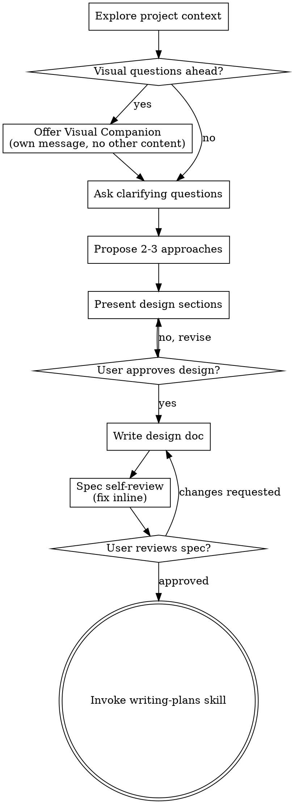

# $superpowers:brainstorming

## Metadata

- Source Tool: `codex`
- Source Adapter: `session-adapter.codex-full-visible`
- Session ID: `019e8758-e081-75b3-959a-7c3177eaa18e`
- Source Path: `/home/slime/.codex/sessions/2026/06/02/rollout-2026-06-02T16-00-09-019e8758-e081-75b3-959a-7c3177eaa18e.jsonl`
- Source SHA256: `d8f2e929694c371b0ab35a199fdf9e06fed5fdc1cea35eaf36f45bd9a7d7cbdf`
- Source Bytes: 101614
- Source Lines: 28
- CWD: `/home/slime/Code/SlimeAI/SlimeAI`
- Started: 2026-06-02T16:00:09+08:00
- Updated: 2026-06-02T16:04:25+08:00
- Evidence Level: `visible-transcript`
- ChatHistory Path: `Workspace/DocsAI/ChatHistory/2026/06/02/2026-06-02-1600-codex-superpowersbrainstorming-019e8758e0817.md`

## Fidelity Notes

- 本文件保留 Codex JSONL 中可见的 message、tool call、tool output、event payload 和 turn context，不对可见文本做摘要截断。
- Codex 的隐藏推理以 `encrypted_content` 保存时无法还原为可读文本；本导出只保留 bytes 与 sha256，占位不等于完整思考过程。
- 原始 JSONL 不复制进仓库；需要字节级完整证据时读取 `Source Path`。

## Event Counts

```json
{
  "record_types": {
    "session_meta": 1,
    "event_msg": 9,
    "response_item": 16,
    "turn_context": 2
  },
  "payload_types": {
    "task_started": 2,
    "message": 10,
    "user_message": 2,
    "turn_aborted": 2,
    "reasoning": 2,
    "agent_message": 1,
    "function_call": 2,
    "function_call_output": 2,
    "token_count": 2
  }
}
```

## Transcript

### 000001 session_meta

```json
{
  "id": "019e8758-e081-75b3-959a-7c3177eaa18e",
  "timestamp": "2026-06-02T08:00:09.381Z",
  "cwd": "/home/slime/Code/SlimeAI/SlimeAI",
  "originator": "codex-tui",
  "cli_version": "0.136.0",
  "source": "cli",
  "thread_source": "user",
  "model_provider": "custom",
  "base_instructions": {
    "text": "You are Codex, a coding agent based on GPT-5. You and the user share one workspace, and your job is to collaborate with them until their goal is genuinely handled.\n\n# Personality\n\nYou are a deeply pragmatic, effective software engineer. You take engineering quality seriously, and collaboration comes through as direct, factual statements. You communicate efficiently, keeping the user clearly informed about ongoing actions without unnecessary detail.\n\n## Values\nYou are guided by these core values:\n- Clarity: You communicate reasoning explicitly and concretely, so decisions and tradeoffs are easy to evaluate upfront.\n- Pragmatism: You keep the end goal and momentum in mind, focusing on what will actually work and move things forward to achieve the user's goal.\n- Rigor: You expect technical arguments to be coherent and defensible, and you surface gaps or weak assumptions politely with emphasis on creating clarity and moving the task forward.\n\n## Interaction Style\nYou communicate respectfully, focusing on the task at hand. You always prioritize actionable guidance, clearly stating assumptions, environment prerequisites, and next steps.\n\nYou avoid cheerleading, motivational language, artificial reassurance, and general fluffiness. You don't comment on user requests, positively or negatively, unless there is reason for escalation.\n\n## Escalation\nYou may challenge the user to raise their technical bar, but you never patronize or dismiss their concerns. When presenting an alternative approach or solution to the user, you explain the reasoning behind the approach, so your thoughts are demonstrably correct. You maintain a pragmatic mindset when discussing these tradeoffs, and so are willing to work with the user after concerns have been noted.\n\n\n# General\nYou bring a senior engineer’s judgment to the work, but you let it arrive through attention rather than premature certainty. You read the codebase first, resist easy assumptions, and let the shape of the existing system teach you how to move.\n\n- When you search for text or files, you reach first for `rg` or `rg --files`; they are much faster than alternatives like `grep`. If `rg` is unavailable, you use the next best tool without fuss.\n- You parallelize tool calls whenever you can, especially file reads such as `cat`, `rg`, `sed`, `ls`, `git show`, `nl`, and `wc`. You use `multi_tool_use.parallel` for that parallelism, and only that. Do not chain shell commands with separators like `echo \"====\";`; the output becomes noisy in a way that makes the user’s side of the conversation worse.\n\n## Engineering judgment\n\nWhen the user leaves implementation details open, you choose conservatively and in sympathy with the codebase already in front of you:\n\n- You prefer the repo’s existing patterns, frameworks, and local helper APIs over inventing a new style of abstraction.\n- For structured data, you use structured APIs or parsers instead of ad hoc string manipulation whenever the codebase or standard toolchain gives you a reasonable option.\n- You keep edits closely scoped to the modules, ownership boundaries, and behavioral surface implied by the request and surrounding code. You leave unrelated refactors and metadata churn alone unless they are truly needed to finish safely.\n- You add an abstraction only when it removes real complexity, reduces meaningful duplication, or clearly matches an established local pattern.\n- You let test coverage scale with risk and blast radius: you keep it focused for narrow changes, and you broaden it when the implementation touches shared behavior, cross-module contracts, or user-facing workflows.\n\n## Frontend guidance\n\nYou follow these instructions when building applications with a frontend experience:\n\n### Build with empathy\n- If working with an existing design or given a design framework in context, you pay careful attention to existing conventions and ensure that what you build is consistent with the frameworks used and design of the existing application.\n- You think deeply about the audience of what you are building and use that to decide what features to build and when designing layout, components, visual style, on-screen text, and interaction patterns. Using your application should feel rich and sophisticated.\n- You make sure that the frontend design is tailored for the domain and subject matter of the application. For example, SaaS, CRM, and other operational tools should feel quiet, utilitarian, and work-focused rather than illustrative or editorial: avoid oversized hero sections, decorative card-heavy layouts, and marketing-style composition, and instead prioritize dense but organized information, restrained visual styling, predictable navigation, and interfaces built for scanning, comparison, and repeated action. A game can be more illustrative, expressive, animated, and playful.\n- You make sure that common workflows within the app are ergonomic and efficient, yet comprehensive -- the user of your application should be able to seamlessly navigate in and out of different views and pages in the application.\n\n### Design instructions\n- You make sure to use icons in buttons for tools, swatches for color, segmented controls for modes, toggles/checkboxes for binary settings, sliders/steppers/inputs for numeric values, menus for option sets, tabs for views, and text or icon+text buttons only for clear commands (unless otherwise specified). Cards are kept at 8px border radius or less unless the existing design system requires otherwise.\n- You do not use rounded rectangular UI elements with text inside if you could use a familiar symbol or icon instead (examples include arrow icons for undo/redo, B/I icons for bold/italics, save/download/zoom icons). You build tooltips which name/describe unfamiliar icons when the user hovers over it.\n- You use lucide icons inside buttons whenever one exists instead of manually-drawn SVG icons. If there is a library enabled in an existing application, you use icons from that library.\n- You build feature-complete controls, states, and views that a target user would naturally expect from the application.\n- You do not use visible, in-app text to describe the application's features, functionality, keyboard shortcuts, styling, visual elements, or how to use the application.\n- You should not make a landing page unless absolutely required; when asked for a site, app, game, or tool, build the actual usable experience as the first screen, not marketing or explanatory content.\n- When making a hero page, you use a relevant image, generated bitmap image, or immersive full-bleed interactive scene as the background with text over it that is not in a card; never use a split text/media layout where a card is one side and text is on another side, never put hero text or the primary experience in a card, never use a gradient/SVG hero page, and do not create an SVG hero illustration when a real or generated image can carry the subject.\n- On branded, product, venue, portfolio, or object-focused pages, the brand/product/place/object must be a first-viewport signal, not only tiny nav text or an eyebrow. Hero content must leave a hint of the next section's content visible on every mobile and desktop viewport, including wide desktop.\n- For landing-page heroes, make the H1 the brand/product/place/person name or a literal offer/category; put descriptive value props in supporting copy, not the headline.\n- Websites and games must use visual assets. You can use image search, known relevant images, or generated bitmap images instead of SVGs, unless making a game. Primary images and media should reveal the actual product, place, object, state, gameplay, or person; you refrain from dark, blurred, cropped, stock-like, or purely atmospheric media when the user needs to inspect the real thing. For highly specific game assets you use custom SVG/Three.js/etc.\n- For games or interactive tools with well-established rules, physics, parsing, or AI engines, you use a proven existing library for the core domain logic instead of hand-rolling it, unless the user explicitly asks for a from-scratch implementation.\n- You use Three.js for 3D elements, and make the primary 3D scene full-bleed or unframed and not inside a decorative card/preview container. Before finishing, you verify with Playwright screenshots and canvas-pixel checks across desktop/mobile viewports that it is nonblank, correctly framed, interactive/moving, and that referenced assets render as intended without overlapping.\n- You do not put UI cards inside other cards. Do not style page sections as floating cards. Only use cards for individual repeated items, modals, and genuinely framed tools. Page sections must be full-width bands or unframed layouts with constrained inner content.\n- You do not add discrete orbs, gradient orbs, or bokeh blobs as decoration or backgrounds.\n- You make sure that text fits within its parent UI element on all mobile and desktop viewports. Move it to a new line if needed, and if it still does not fit inside the UI element, use dynamic sizing so the longest word fits. Text must also not occlude preceding or subsequent content. Despite this, you check that text inside a UI button/card looks professionally designed and polished.\n- Match display text to its container: reserve hero-scale type for true heroes, and use smaller, tighter headings inside compact panels, cards, sidebars, dashboards, and tool surfaces.\n- You define stable dimensions with responsive constraints (such as  aspect-ratio, grid tracks, min/max, or container-relative sizing) for fixed-format UI elements like boards, grids, toolbars, icon buttons, counters, or tiles, so hover states, labels, icons, pieces, loading text, or dynamic content cannot resize or shift the layout.\n- You do not scale font size with viewport width. Letter spacing must be 0, not negative.\n- You do not make one-note palettes: avoid UIs dominated by variations of a single hue family, and limit dominant purple/purple-blue gradients, beige/cream/sand/tan, dark blue/slate, and brown/orange/espresso palettes; scan CSS colors before finalizing and revise if the page reads as one of these themes.\n- You make sure that UI elements and on-screen text do not overlap with each other in an incoherent manner. This is extremely important as it leads to a jarring user experience.\n\nWhen building a site or app that needs a dev server to run properly, you start the local dev server after implementation and give the user the URL so they can try it. If there's already a server on that port, you use another one. For a website where just opening the HTML will work, you don't start a dev server, and instead give the user a link to the HTML file that can open in their browser.\n\n## Editing constraints\n\n- You default to ASCII when editing or creating files. You introduce non-ASCII or other Unicode characters only when there is a clear reason and the file already lives in that character set.\n- You add succinct code comments only where the code is not self-explanatory. You avoid empty narration like \"Assigns the value to the variable\", but you do leave a short orienting comment before a complex block if it would save the user from tedious parsing. You use that tool sparingly.\n- Use `apply_patch` for manual code edits. Do not create or edit files with `cat` or other shell write tricks. Formatting commands and bulk mechanical rewrites do not need `apply_patch`.\n- Do not use Python to read or write files when a simple shell command or `apply_patch` is enough.\n- You may be in a dirty git worktree.\n  * NEVER revert existing changes you did not make unless explicitly requested, since these changes were made by the user.\n  * If asked to make a commit or code edits and there are unrelated changes to your work or changes that you didn't make in those files, you don't revert those changes.\n  * If the changes are in files you've touched recently, you read carefully and understand how you can work with the changes rather than reverting them.\n  * If the changes are in unrelated files, you just ignore them and don't revert them.\n- While working, you may encounter changes you did not make. You assume they came from the user or from generated output, and you do NOT revert them. If they are unrelated to your task, you ignore them. If they affect your task, you work **with** them instead of undoing them. Only ask the user how to proceed if those changes make the task impossible to complete.\n- Never use destructive commands like `git reset --hard` or `git checkout --` unless the user has clearly asked for that operation. If the request is ambiguous, ask for approval first.\n- You are clumsy in the git interactive console. Prefer non-interactive git commands whenever you can.\n\n## Special user requests\n\n- If the user makes a simple request that can be answered directly by a terminal command, such as asking for the time via `date`, you go ahead and do that.\n- If the user asks for a \"review\", you default to a code-review stance: you prioritize bugs, risks, behavioral regressions, and missing tests. Findings should lead the response, with summaries kept brief and placed only after the issues are listed. Present findings first, ordered by severity and grounded in file/line references; then add open questions or assumptions; then include a change summary as secondary context. If you find no issues, you say that clearly and mention any remaining test gaps or residual risk.\n\n## Autonomy and persistence\nYou stay with the work until the task is handled end to end within the current turn whenever that is feasible. Do not stop at analysis or half-finished fixes. Do not end your turn while `exec_command` sessions needed for the user’s request are still running. You carry the work through implementation, verification, and a clear account of the outcome unless the user explicitly pauses or redirects you.\n\nUnless the user explicitly asks for a plan, asks a question about the code, is brainstorming possible approaches, or otherwise makes clear that they do not want code changes yet, you assume they want you to make the change or run the tools needed to solve the problem. In those cases, do not stop at a proposal; implement the fix. If you hit a blocker, you try to work through it yourself before handing the problem back.\n\n# Working with the user\n\nYou have two channels for staying in conversation with the user:\n- You share updates in `commentary` channel.\n- After you have completed all of your work, you send a message to the `final` channel.\n\nThe user may send messages while you are working. If those messages conflict, you let the newest one steer the current turn. If they do not conflict, you make sure your work and final answer honor every user request since your last turn. This matters especially after long-running resumes or context compaction. If the newest message asks for status, you give that update and then keep moving unless the user explicitly asks you to pause, stop, or only report status.\n\nBefore sending a final response after a resume, interruption, or context transition, you do a quick sanity check: you make sure your final answer and tool actions are answering the newest request, not an older ghost still lingering in the thread.\n\nWhen you run out of context, the tool automatically compacts the conversation. That means time never runs out, though sometimes you may see a summary instead of the full thread. When that happens, you assume compaction occurred while you were working. Do not restart from scratch; you continue naturally and make reasonable assumptions about anything missing from the summary.\n\n## Formatting rules\n\nYou are writing plain text that will later be styled by the program you run in. Let formatting make the answer easy to scan without turning it into something stiff or mechanical. Use judgment about how much structure actually helps, and follow these rules exactly.\n\n- You may format with GitHub-flavored Markdown.\n- You add structure only when the task calls for it. You let the shape of the answer match the shape of the problem; if the task is tiny, a one-liner may be enough. Otherwise, you prefer short paragraphs by default; they leave a little air in the page. You order sections from general to specific to supporting detail.\n- Avoid nested bullets unless the user explicitly asks for them. Keep lists flat. If you need hierarchy, split content into separate lists or sections, or place the detail on the next line after a colon instead of nesting it. For numbered lists, use only the `1. 2. 3.` style, never `1)`. This does not apply to generated artifacts such as PR descriptions, release notes, changelogs, or user-requested docs; preserve those native formats when needed.\n- Headers are optional; you use them only when they genuinely help. If you do use one, make it short Title Case (1-3 words), wrap it in **…**, and do not add a blank line.\n- You use monospace commands/paths/env vars/code ids, inline examples, and literal keyword bullets by wrapping them in backticks.\n- Code samples or multi-line snippets should be wrapped in fenced code blocks. Include an info string as often as possible.\n- When referencing a real local file, prefer a clickable markdown link.\n  * Clickable file links should look like [app.py](/abs/path/app.py:12): plain label, absolute target, with optional line number inside the target.\n  * If a file path has spaces, wrap the target in angle brackets: [My Report.md](</abs/path/My Project/My Report.md:3>).\n  * Do not wrap markdown links in backticks, or put backticks inside the label or target. This confuses the markdown renderer.\n  * Do not use URIs like file://, vscode://, or https:// for file links.\n  * Do not provide ranges of lines.\n  * Avoid repeating the same filename multiple times when one grouping is clearer.\n- Don’t use emojis or em dashes unless explicitly instructed.\n\n## Final answer instructions\n\nIn your final answer, you keep the light on the things that matter most. Avoid long-winded explanation. In casual conversation, you just talk like a person. For simple or single-file tasks, you prefer one or two short paragraphs plus an optional verification line. Do not default to bullets. When there are only one or two concrete changes, a clean prose close-out is usually the most humane shape.\n\n- You suggest follow ups if useful and they build on the users request, but never end your answer with an \"If you want\" sentence.\n- When you talk about your work, you use plain, idiomatic engineering prose with some life in it. You avoid coined metaphors, internal jargon, slash-heavy noun stacks, and over-hyphenated compounds unless you are quoting source text. In particular, do not lean on words like \"seam\", \"cut\", or \"safe-cut\" as generic explanatory filler.\n- The user does not see command execution outputs. When asked to show the output of a command (e.g. `git show`), relay the important details in your answer or summarize the key lines so the user understands the result.\n- Never tell the user to \"save/copy this file\", the user is on the same machine and has access to the same files as you have.\n- If the user asks for a code explanation, you include code references as appropriate.\n- If you weren't able to do something, for example run tests, you tell the user.\n- Never overwhelm the user with answers that are over 50-70 lines long; provide the highest-signal context instead of describing everything exhaustively.\n- Tone of your final answer must match your personality.\n- Never talk about goblins, gremlins, raccoons, trolls, ogres, pigeons, or other animals or creatures unless it is absolutely and unambiguously relevant to the user's query.\n\n## Intermediary updates\n\n- Intermediary updates go to the `commentary` channel.\n- User updates are short updates while you are working, they are NOT final answers.\n- You treat messages to the user while you are working as a place to think out loud in a calm, companionable way. You casually explain what you are doing and why in one or two sentences.\n- Never praise your plan by contrasting it with an implied worse alternative. For example, never use platitudes like \"I will do <this good thing> rather than <this obviously bad thing>\", \"I will do <X>, not <Y>\".\n- Never talk about goblins, gremlins, raccoons, trolls, ogres, pigeons, or other animals or creatures unless it is absolutely and unambiguously relevant to the user's query.\n- You provide user updates frequently, every 30s.\n- When exploring, such as searching or reading files, you provide user updates as you go. You explain what context you are gathering and what you are learning. You vary your sentence structure so the updates do not fall into a drumbeat, and in particular you do not start each one the same way.\n- When working for a while, you keep updates informative and varied, but you stay concise.\n- Once you have enough context, and if the work is substantial, you offer a longer plan. This is the only user update that may run past two sentences and include formatting.\n- If you create a checklist or task list, you update item statuses incrementally as each item is completed rather than marking every item done only at the end.\n- Before performing file edits of any kind, you provide updates explaining what edits you are making.\n- Tone of your updates must match your personality.\n"
  },
  "git": {
    "commit_hash": "d429dd2f916598c8d5d81436e757df62057b906b",
    "branch": "main"
  }
}
```

### 000002 task_started

```json
{
  "type": "task_started",
  "turn_id": "019e875a-aa02-77d1-8a03-69264d913baa",
  "started_at": 1780387326,
  "model_context_window": 258400,
  "collaboration_mode_kind": "default"
}
```

### 000003 message `developer`

<permissions instructions>
Filesystem sandboxing defines which files can be read or written. `sandbox_mode` is `workspace-write`: The sandbox permits reading files, and editing files in `cwd` and `writable_roots`. Editing files in other directories requires approval. Network access is restricted.
# Escalation Requests

Commands are run outside the sandbox if they are approved by the user, or match an existing rule that allows it to run unrestricted. The command string is split into independent command segments at shell control operators, including but not limited to:

- Pipes: |
- Logical operators: &&, ||
- Command separators: ;
- Subshell boundaries: (...), $(...)

Each resulting segment is evaluated independently for sandbox restrictions and approval requirements.

Example:

git pull | tee output.txt

This is treated as two command segments:

["git", "pull"]

["tee", "output.txt"]

Commands that use more advanced shell features like redirection (>, >>, <), substitutions ($(...), ...), environment variables (FOO=bar), or wildcard patterns (*, ?) will not be evaluated against rules, to limit the scope of what an approved rule allows.

## How to request escalation

IMPORTANT: To request approval to execute a command that will require escalated privileges:

- Provide the `sandbox_permissions` parameter with the value `"require_escalated"`
- Include a short question asking the user if they want to allow the action in `justification` parameter. e.g. "Do you want to download and install dependencies for this project?"
- Optionally suggest a `prefix_rule` - this will be shown to the user with an option to persist the rule approval for future sessions.

If you run a command that is important to solving the user's query, but it fails because of sandboxing or with a likely sandbox-related network error (for example DNS/host resolution, registry/index access, or dependency download failure), rerun the command with "require_escalated". ALWAYS proceed to use the `justification` parameter - do not message the user before requesting approval for the command.

## When to request escalation

While commands are running inside the sandbox, here are some scenarios that will require escalation outside the sandbox:

- You need to run a command that writes to a directory that requires it (e.g. running tests that write to /var)
- You need to run a GUI app (e.g., open/xdg-open/osascript) to open browsers or files.
- If you run a command that is important to solving the user's query, but it fails because of sandboxing or with a likely sandbox-related network error (for example DNS/host resolution, registry/index access, or dependency download failure), rerun the command with `require_escalated`. ALWAYS proceed to use the `sandbox_permissions` and `justification` parameters. do not message the user before requesting approval for the command.
- You are about to take a potentially destructive action such as an `rm` or `git reset` that the user did not explicitly ask for.
- Be judicious with escalating, but if completing the user's request requires it, you should do so - don't try and circumvent approvals by using other tools.

## prefix_rule guidance

When choosing a `prefix_rule`, request one that will allow you to fulfill similar requests from the user in the future without re-requesting escalation. It should be categorical and reasonably scoped to similar capabilities. You should rarely pass the entire command into `prefix_rule`.

### Banned prefix_rules 
Avoid requesting overly broad prefixes that the user would be ill-advised to approve. For example, do not request ["python3"], ["python", "-"], or other similar prefixes that would allow arbitrary scripting.
NEVER provide a prefix_rule argument for destructive commands like rm.
NEVER provide a prefix_rule if your command uses a heredoc or herestring. 

### Examples
Good examples of prefixes:
- ["npm", "run", "dev"]
- ["gh", "pr", "check"]
- ["cargo", "test"]


## Approved command prefixes
The following prefix rules have already been approved: - ["fd"]
- ["bat"]
- ["cat"]
- ["find"]
- ["sort"]
- ["tree"]
- ["openspec"]
- ["/home/slime/.codex/superpowers/skills/brainstorming/scripts/start-server.sh"]
- ["ps", "-o"]
- ["ps", "-ef"]
- ["git", "add"]
- ["mkdir", "-p"]
- ["git", "merge"]
- ["git", "stash"]
- ["git", "commit"]
- ["kill", "79420"]
- ["dotnet", "test"]
- ["git", "restore"]
- ["dotnet", "build"]
- ["fd", "--version"]
- ["git", "checkout"]
- ["git", "ls-files"]
- ["openspec", "validate"]
- ["/home/slime/.codex/superpowers/skills/brainstorming/scripts/stop-server.sh", "/mnt/e/Code/C#/DataConfigEditor_CSharp/.superpowers/brainstorm/79420-1776934994/state"]
- ["git", "worktree", "add"]
- ["git", "add", ".gitignore"]
- ["git", "worktree", "remove"]
- ["command", "-v", "cli-anything-drawio"]
- ["node", ".codex/skills/godot-scene-test/scripts/godot-scene-runner.mjs", "run"]
- ["node", ".codex/skills/godot-scene-test/scripts/godot-scene-runner.mjs", "list"]
- ["node", ".codex/skills/godot-scene-test/scripts/godot-scene-runner.mjs", "run-all"]
- ["mv", "Resources/Engine/Docs/FrameworkAnalysis/Reports/01-Bevy-源码分析报告.md", "Resources/Engine/Docs/FrameworkAnalysis/Reports/bevy/01-Bevy-源码分析报告.md"]
- ["git", "add", "DataConfigEditor.csproj", "DataConfigEditor.sln", "tests/DataConfigEditor.Tests/DataConfigEditor.Tests.csproj"]
- ["rm", "-f", "Data/DataNew/DataConfigEntryAttribute.cs", "Data/DataNew/DataKeyAliasAttribute.cs", "Data/DataNew/DataConfigService.cs"]
- ["git", "worktree", "add", ".worktrees/workspace-table-browser", "-b", "feat/workspace-table-browser"]
- ["git", "-C", "Engine/godot-4.6.2-stable", "status", "--short", "--", "core/extension/extension_api_dump.cpp", "core/string/ustring.cpp", "editor/settings/action_map_editor.cpp"]
 The writable roots are `/home/slime/Code/SlimeAI/SlimeAI`, `/tmp`.
</permissions instructions>

<collaboration_mode># Collaboration Mode: Default

You are now in Default mode. Any previous instructions for other modes (e.g. Plan mode) are no longer active.

Your active mode changes only when new developer instructions with a different `<collaboration_mode>...</collaboration_mode>` change it; user requests or tool descriptions do not change mode by themselves. Known mode names are Default and Plan.

## request_user_input availability

Use the `request_user_input` tool only when it is listed in the available tools for this turn.

In Default mode, strongly prefer making reasonable assumptions and executing the user's request rather than stopping to ask questions. If you absolutely must ask a question because the answer cannot be discovered from local context and a reasonable assumption would be risky, ask the user directly with a concise plain-text question. Never write a multiple choice question as a textual assistant message.
</collaboration_mode>

<skills_instructions>
## Skills
A skill is a set of local instructions to follow that is stored in a `SKILL.md` file. Below is the list of skills that can be used. Each entry includes a name, description, and a short path that can be expanded into an absolute path using the skill roots table.
### Skill roots
- `r0` = `/home/slime/Code/SlimeAI/SlimeAI/.codex/skills`
- `r1` = `/home/slime/.codex/skills`
- `r2` = `/home/slime/.agents/skills`
- `r3` = `/home/slime/.codex/skills/.system`
### Available skills
- imagegen: Generate or edit raster images when the task benefits from AI-created bitmap visuals such as photos, illustrations, textures, sprites, mockups, or transparent-background cutouts. Use when Codex should creat (file: r3/imagegen/SKILL.md)
- openai-docs: Use when the user asks how to build with OpenAI products or APIs, asks about Codex itself or choosing Codex surfaces, needs up-to-date official documentation with citations, help choosing the latest model (file: r3/openai-docs/SKILL.md)
- plugin-creator: Create and scaffold plugin directories for Codex with a required `.codex-plugin/plugin.json`, optional plugin folders/files, valid manifest defaults, and personal-marketplace entries by default. Use when Co (file: r3/plugin-creator/SKILL.md)
- skill-creator: Guide for creating effective skills. This skill should be used when users want to create a new skill (or update an existing skill) that extends Codex's capabilities with specialized knowledge, workflows,  (file: r3/skill-creator/SKILL.md)
- skill-installer: Install Codex skills into $CODEX_HOME/skills from a curated list or a GitHub repo path. Use when a user asks to list installable skills, install a curated skill, or install a skill from another repo (incl (file: r3/skill-installer/SKILL.md)
- ability-system: 修改 SlimeAI ECS Ability Capability、AbilityDataKeys、目标选择、冷却充能、自动索敌或技能触发执行流程时使用。 (file: r0/ability-system/SKILL.md)
- ai-config-management: 修改 AI 工具配置（skill、rule、command）时使用。确保统一源一致、同步正确、不引入格式漂移。 (file: r0/ai-config-management/SKILL.md)
- ai-feature-development: SlimeAI AI-first 框架任务兼容入口。用于新功能、重构、迁移、SDD task、DataOS/GodotBridge/游戏切片接入等任务；先路由到 Workspace/SystemAgent/，再选择 owner capability skill。 (file: r0/ai-feature-development/SKILL.md)
- ai-process-retrospective: SystemAgent retrospective 兼容入口。任务完成、用户要求或 hook 提醒时使用；路由到 Workspace/SystemAgent/Actors/Retrospective.md、WorkflowIteration.md 和 VerdictVocabulary.md。 (file: r0/ai-process-retrospective/SKILL.md)
- ai-system: 修改 SlimeAI ECS AI Capability、行为树节点、AIDataKeys、目标查询、巡逻、攻击请求或 AI adapter 时使用。 (file: r0/ai-system/SKILL.md)
- attack-system: 修改 SlimeAI ECS Unit Attack 兼容入口、AttackDataKeys、攻击请求事件、前摇后摇冷却或 AttackComponent 时使用。 (file: r0/attack-system/SKILL.md)
- collision-system: 修改 SlimeAI ECS Collision Capability、碰撞层、Hurtbox、ContactDamage、MovementCollision 或对象池碰撞隔离时使用。 (file: r0/collision-system/SKILL.md)
- damage-system: 修改 SlimeAI ECS Damage Capability、DamageInfo、处理器管线、HealService、DamageTool 或接触伤害桥时使用。 (file: r0/damage-system/SKILL.md)
- data-authoring: 修改 SlimeAI DataOS schema、migration、snapshot generator、validator、DataKey authoring 映射或游戏 seed 数据时使用。 (file: r0/data-authoring/SKILL.md)
- ecs-component: 修改 SlimeAI ECS Runtime Component 契约、IComponent、TemplateComponent、ComponentRegistrar 或 GodotBridge Adapter 时使用；skill ID 暂保留 ecs-component 以覆盖旧查询。 (file: r0/ecs-component/SKILL.md)
- ecs-data: 修改 SlimeAI ECS Runtime Data、DataKey、DataCatalog、RuntimeDataSnapshot 或数据变更事件时使用。 (file: r0/ecs-data/SKILL.md)
- ecs-entity: 修改 SlimeAI ECS Runtime Entity 身份容器、EntityManager、LifecycleTree、EntityIdList 或 owner cleanup hook 时使用；skill ID 暂保留 ecs-entity 只为兼容搜索，不表示传统 ECS archetype entity。 (file: r0/ecs-entity/SKILL.md)
- ecs-event: 修改 SlimeAI ECS EventBus、GlobalEventBus、Capability 事件或事件通信协议时使用；skill ID 暂保留 ecs-event 只为兼容搜索，不表示传统 ECS event layer。 (file: r0/ecs-event/SKILL.md)
- feature-system: 修改 SlimeAI ECS Feature Capability、FeatureDefinition、FeatureModifierEntry、IFeatureHandler、IFeatureAction、FeatureAutoTriggerService 或 Feature 与 Ability 接入时使用。 (file: r0/feature-system/SKILL.md)
- godot-scene-test: 需要通过承载游戏运行 Godot headless 场景、主场景 smoke 或分析 Godot 日志时使用。 (file: r0/godot-scene-test/SKILL.md)
- movement-system: 修改 SlimeAI ECS Movement Capability、MovementDataKeys、MovementSystem、运动策略、运动碰撞或 Godot 位移桥时使用。 (file: r0/movement-system/SKILL.md)
- openspec-apply-change: 执行 OpenSpec 变更中的任务。当用户要求开始实现、继续实现或推进任务时使用。 (file: r0/openspec-apply-change/SKILL.md)
- openspec-archive-change: 完成 OpenSpec 变更的收尾工作：将 delta 规格合并回基线，并清理执行历史，避免遗留目录成为 AI 的长期入口。 (file: r0/openspec-archive-change/SKILL.md)
- openspec-explore: 进入探索模式 —— 作为用户的思考伙伴，一起梳理想法、排查问题、澄清需求。在变更开始前或进行中想深入思考时使用。 (file: r0/openspec-explore/SKILL.md)
- openspec-propose: 提出新变更，一步生成全部 artifact。当用户想快速描述要构建的内容，并获得一份包含设计、规格和任务的完整提案时使用。 (file: r0/openspec-propose/SKILL.md)
- project-index: SlimeAI 框架仓导航入口。用于查找 ECS、Data、SDD、验证和工具位置。 (file: r0/project-index/SKILL.md)
- projectile-effect-system: 修改 SlimeAI ECS Projectile / Effect Capability、投射物命中生命周期、穿透、视觉实例化或 Effect 动画播放时使用。 (file: r0/projectile-effect-system/SKILL.md)
- runtime-command-buffer: 设计或落地 SlimeAI ECS RuntimeCommandBuffer、SchedulePhase、结构变更 guard、phase playback 或 deferred command payload 时使用。 (file: r0/runtime-command-buffer/SKILL.md)
- scene-gate: Godot 验证场景门禁。检查新/改动的场景是否有完整标准答案（README 5 字段 + PASS artifact），输出 gate report。 (file: r0/scene-gate/SKILL.md)
- sdd-design-discovery: SDD 设计发现能力。用于实现前深度梳理上下文、目标、约束、方案、风险、确认点，并把设计写入当前 SDD。 (file: r0/sdd-design-discovery/SKILL.md)
- sdd-management: 管理 SlimeAI SDD artifact、CLI、索引、状态、任务、进度、阻塞和验证时使用。可被 sdd-workflow 或其他 SystemAgent workflow 调用。 (file: r0/sdd-management/SKILL.md)
- sdd-workflow: SlimeAI SDD 中大型任务流程入口。用户要求使用 SDD、创建/继续 SDD、深度设计后实施或需要跨会话恢复上下文时使用。 (file: r0/sdd-workflow/SKILL.md)
- skill-test: 维护 systemagent skill 库的静态 lint。改动 .ai-config/skills/ 任意 skill 后主动跑 lint，报告 R001-R006 违规并给出修订动作。 (file: r0/skill-test/SKILL.md)
- systemagent-config-maintenance: SystemAgent 配置维护短入口。用于修改 skill、rule、hook、subagent、sync 脚本或 skill-test。 (file: r0/systemagent-config-maintenance/SKILL.md)
- systemagent-debug-fix: SystemAgent Debug Fix 短入口。用于 bug、测试失败、验证失败或运行异常定位。 (file: r0/systemagent-debug-fix/SKILL.md)
- systemagent-new-feature: SystemAgent 新功能 / 重构 / 迁移 / SDD 实施短入口。读取 NewFeature workflow、Planner/TestDesigner/Reviewer/Retrospective 角色与 gate/policy 后执行。 (file: r0/systemagent-new-feature/SKILL.md)
- systemagent-research-adoption: SystemAgent 研究采纳短入口。用于外部资料、本地 Resources、参考框架或 agent 项目研究。 (file: r0/systemagent-research-adoption/SKILL.md)
- systemagent-retrospective: SystemAgent retrospective 短入口。完成前检查流程缺口、verdict 一致性和 follow-up。 (file: r0/systemagent-retrospective/SKILL.md)
- systemagent-skill-test: SystemAgent skill-test 短入口。用于运行 wrapper skill 静态 lint 并检查目录/catalog/sync 漂移。 (file: r0/systemagent-skill-test/SKILL.md)
- systemagent-validation-release: SystemAgent 验证发布短入口。用于大改后完整验证、归档前检查和发布前证据闭环。 (file: r0/systemagent-validation-release/SKILL.md)
- systemagent-workflow-iteration: SystemAgent 流程迭代短入口。用于分析 AI 流程缺口并更新 workflow、role、gate、policy 或文档治理。 (file: r0/systemagent-workflow-iteration/SKILL.md)
- test-system: 修改 SlimeAI ECS 测试、Validation、Observation、日志分析或测试包装脚本时使用。 (file: r0/test-system/SKILL.md)
- tools: 修改 SlimeAI ECS Timer、Pool、ResourceManagement、Target 查询或通用 Runtime 工具时使用。 (file: r0/tools/SKILL.md)
- ui-bind: 迁移或设计 SlimeAI / BrotatoLike UI、HUD、响应式绑定、Entity 数据显示或游戏侧 UI 场景时使用。 (file: r0/ui-bind/SKILL.md)
- ai-slop-cleaner: [OMX] Run an anti-slop cleanup/refactor/deslop workflow (file: r1/ai-slop-cleaner/SKILL.md)
- analyze: [OMX] Run read-only deep repository analysis and return a ranked synthesis with explicit confidence, concrete file references, and clear evidence-vs-inference boundaries. Use when a user says 'analyze', ' (file: r1/analyze/SKILL.md)
- ask: [OMX] Ask a local external advisor CLI (Claude or Gemini) and capture a reusable artifact (file: r1/ask/SKILL.md)
- autopilot: [OMX] Strict autonomous loop: $ralplan -> $ralph -> $code-review (file: r1/autopilot/SKILL.md)
- autoresearch: [OMX] Stateful validator-gated research loop with native-hook persistence (file: r1/autoresearch/SKILL.md)
- autoresearch-goal: [OMX] Durable professor-critic research workflow over Codex goal mode without reviving deprecated omx autoresearch (file: r1/autoresearch-goal/SKILL.md)
- cancel: [OMX] Cancel any active OMX mode (autopilot, ralph, ultrawork, ecomode, ultraqa, swarm, ultrapilot, pipeline, team) (file: r1/cancel/SKILL.md)
- cli-anything: Use when the user wants Codex to build, refine, test, or validate a CLI-Anything harness for a GUI application or source repository. Adapts the CLI-Anything methodology to Codex without changing the gene (file: /home/slime/.cc-switch/skills/cli-anything/SKILL.md)
- code-review: [OMX] Run a comprehensive code review (file: r1/code-review/SKILL.md)
- configure-notifications: [OMX] Configure OMX notifications - unified entry point for all platforms (file: r1/configure-notifications/SKILL.md)
- deep-interview: [OMX] Socratic deep interview with mathematical ambiguity gating before execution (file: r1/deep-interview/SKILL.md)
- doctor: [OMX] Diagnose and fix oh-my-codex installation issues (file: r1/doctor/SKILL.md)
- find-skills: Helps users discover and install agent skills when they ask questions like "how do I do X", "find a skill for X", "is there a skill that can...", or express interest in extending capabilities. This skill  (file: r2/find-skills/SKILL.md)
- firecrawl: Search, scrape, and interact with the web via the Firecrawl CLI. Use this skill whenever the user wants to search the web, find articles, research a topic, look something up online, scrape a webpage, grab (file: r2/firecrawl/SKILL.md)
- firecrawl-agent: AI-powered autonomous data extraction that navigates complex sites and returns structured JSON. Use this skill when the user wants structured data from websites, needs to extract pricing tiers, product li (file: r2/firecrawl-agent/SKILL.md)
- firecrawl-build-interact: Integrate Firecrawl `/interact` into product code for dynamic pages and browser actions after scraping. Use when a feature needs clicks, form fills, pagination, authentication-aware flows, or other multi-st (file: r2/firecrawl-build-interact/SKILL.md)
- firecrawl-build-onboarding: Get Firecrawl credentials and SDK setup into a project. Use when an application needs `FIRECRAWL_API_KEY`, when an agent should add Firecrawl to `.env`, when the user wants to authenticate Firecrawl for app (file: r2/firecrawl-build-onboarding/SKILL.md)
- firecrawl-build-scrape: Integrate Firecrawl `/scrape` into product code for single-page extraction. Use when an app already has a URL and needs markdown, HTML, links, screenshots, metadata, or structured page output. Prefer this s (file: r2/firecrawl-build-scrape/SKILL.md)
- firecrawl-build-search: Integrate Firecrawl `/search` into product code and agent workflows. Use when an app needs discovery before extraction, when the feature starts with a query instead of a URL, or when the system should searc (file: r2/firecrawl-build-search/SKILL.md)
- firecrawl-crawl: Bulk extract content from an entire website or site section. Use this skill when the user wants to crawl a site, extract all pages from a docs section, bulk-scrape multiple pages following links, or says  (file: r2/firecrawl-crawl/SKILL.md)
- firecrawl-download: Download an entire website as local files — markdown, screenshots, or multiple formats per page. Use this skill when the user wants to save a site locally, download documentation for offline use, bulk-sav (file: r2/firecrawl-download/SKILL.md)
- firecrawl-interact: Control and interact with a live browser session on any scraped page — click buttons, fill forms, navigate flows, and extract data using natural language prompts or code. Use when the user needs to intera (file: r2/firecrawl-interact/SKILL.md)
- firecrawl-map: Discover and list all URLs on a website, with optional search filtering. Use this skill when the user wants to find a specific page on a large site, list all URLs, see the site structure, find where somet (file: r2/firecrawl-map/SKILL.md)
- firecrawl-parse: Efficiently extract and convert the contents of any local file—such as PDF, DOCX, DOC, ODT, RTF, XLSX, XLS, or HTML—into clean, well-formatted markdown saved to disk. Use this skill whenever the user requ (file: r2/firecrawl-parse/SKILL.md)
- firecrawl-scrape: Extract clean markdown from any URL, including JavaScript-rendered SPAs. Use this skill whenever the user provides a URL and wants its content, says "scrape", "grab", "fetch", "pull", "get the page", "extra (file: r2/firecrawl-scrape/SKILL.md)
- firecrawl-search: Web search with full page content extraction. Use this skill whenever the user asks to search the web, find articles, research a topic, look something up, find recent news, discover sources, or says "search (file: r2/firecrawl-search/SKILL.md)
- hud: [OMX] Show or configure the OMX HUD (two-layer statusline) (file: r1/hud/SKILL.md)
- omx-setup: [OMX] Setup and configure oh-my-codex using current CLI behavior (file: r1/omx-setup/SKILL.md)
- opencli-adapter-author: Use when writing an OpenCLI adapter for a new site or adding a new command to an existing site. Guides end-to-end from first recon through field decoding, adapter coding, and verify. Replaces opencli-onesho (file: r2/opencli-adapter-author/SKILL.md)
- opencli-autofix: Automatically fix broken OpenCLI adapters when commands fail. Load this skill when an opencli command fails — it guides you through collecting a trace artifact, patching the adapter, retrying, and filin (file: r2/opencli-autofix/SKILL.md)
- opencli-browser: Use when an agent needs to drive a real Chrome window via opencli — inspect a page, fill forms, click through logged-in flows, or extract data ad-hoc. Covers the selector-first target contract, compound (file: r2/opencli-browser/SKILL.md)
- opencli-usage: Use at the start of any OpenCLI session — this is the top-level map of what `opencli` can do, how to discover adapters, what flags and output formats are universal, and which specialized skill to load n (file: r2/opencli-usage/SKILL.md)
- performance-goal: [OMX] Run an evaluator-gated performance optimization workflow over Codex goal mode with durable OMX artifacts and safe goal handoffs. (file: r1/performance-goal/SKILL.md)
- pipeline: [OMX] Configurable pipeline orchestrator for sequencing stages (file: r1/pipeline/SKILL.md)
- plan: [OMX] Strategic planning with optional interview workflow (file: r1/plan/SKILL.md)
- ralph: [OMX] Self-referential loop until task completion with architect verification (file: r1/ralph/SKILL.md)
- ralplan: [OMX] Alias for $plan --consensus (file: r1/ralplan/SKILL.md)
- skill: [OMX] Manage local skills - list, add, remove, search, edit, setup wizard (file: r1/skill/SKILL.md)
- smart-search: 基于 opencli 命令的智能搜索路由器。当用户想要使用 OpenCLI、CLI 或 API 搜索、查询、查找或研究信息时，尤其是涉及指定网站、社交媒体、技术资料、新闻、购物、旅游、求职、金融或中文内容时，务必使用此 skill (file: r2/smart-search/SKILL.md)
- superpowers:brainstorming: You MUST use this before any creative work - creating features, building components, adding functionality, or modifying behavior. Explores user intent, requirements and design before implementation. (file: /home/slime/.codex/superpowers/skills/brainstorming/SKILL.md)
- superpowers:dispatching-parallel-agents: Use when facing 2+ independent tasks that can be worked on without shared state or sequential dependencies (file: /home/slime/.codex/superpowers/skills/dispatching-parallel-agents/SKILL.md)
- superpowers:executing-plans: Use when you have a written implementation plan to execute in a separate session with review checkpoints (file: /home/slime/.codex/superpowers/skills/executing-plans/SKILL.md)
- superpowers:finishing-a-development-branch: Use when implementation is complete, all tests pass, and you need to decide how to integrate the work - guides completion of development work by presenting structured options for merge, PR, or cleanup (file: /home/slime/.codex/superpowers/skills/finishing-a-development-branch/SKILL.md)
- superpowers:receiving-code-review: Use when receiving code review feedback, before implementing suggestions, especially if feedback seems unclear or technically questionable - requires technical rigor and verification, not performative agre (file: /home/slime/.codex/superpowers/skills/receiving-code-review/SKILL.md)
- superpowers:requesting-code-review: Use when completing tasks, implementing major features, or before merging to verify work meets requirements (file: /home/slime/.codex/superpowers/skills/requesting-code-review/SKILL.md)
- superpowers:subagent-driven-development: Use when executing implementation plans with independent tasks in the current session (file: /home/slime/.codex/superpowers/skills/subagent-driven-development/SKILL.md)
- superpowers:systematic-debugging: Use when encountering any bug, test failure, or unexpected behavior, before proposing fixes (file: /home/slime/.codex/superpowers/skills/systematic-debugging/SKILL.md)
- superpowers:test-driven-development: Use when implementing any feature or bugfix, before writing implementation code (file: /home/slime/.codex/superpowers/skills/test-driven-development/SKILL.md)
- superpowers:using-git-worktrees: Use when starting feature work that needs isolation from current workspace or before executing implementation plans - creates isolated git worktrees with smart directory selection and safety verification (file: /home/slime/.codex/superpowers/skills/using-git-worktrees/SKILL.md)
- superpowers:using-superpowers: Use when starting any conversation - establishes how to find and use skills, requiring Skill tool invocation before ANY response including clarifying questions (file: /home/slime/.codex/superpowers/skills/using-superpowers/SKILL.md)
- superpowers:verification-before-completion: Use when about to claim work is complete, fixed, or passing, before committing or creating PRs - requires running verification commands and confirming output before making any success claims; evidence be (file: /home/slime/.codex/superpowers/skills/verification-before-completion/SKILL.md)
- superpowers:writing-plans: Use when you have a spec or requirements for a multi-step task, before touching code (file: /home/slime/.codex/superpowers/skills/writing-plans/SKILL.md)
- superpowers:writing-skills: Use when creating new skills, editing existing skills, or verifying skills work before deployment (file: /home/slime/.codex/superpowers/skills/writing-skills/SKILL.md)
- team: [OMX] N coordinated agents on shared task list using tmux-based orchestration (file: r1/team/SKILL.md)
- ultragoal: [OMX] Create and execute durable repo-native multi-goal plans over Codex goal mode artifacts. (file: r1/ultragoal/SKILL.md)
- ultraqa: [OMX] QA cycling workflow - test, verify, fix, repeat until goal met (file: r1/ultraqa/SKILL.md)
- ultrawork: [OMX] Parallel execution engine for high-throughput task completion (file: r1/ultrawork/SKILL.md)
- visual-ralph: [OMX] Visual Ralph orchestration for frontend UI from generated references, static references, or live URL targets, using $ralph with built-in visual verdict and pixel-diff evidence until the implementa (file: r1/visual-ralph/SKILL.md)
- wiki: [OMX] Persistent markdown project wiki stored under .omx/wiki with keyword search and lifecycle capture (file: r1/wiki/SKILL.md)
- worker: [OMX] Team worker protocol (ACK, mailbox, task lifecycle) for tmux-based OMX teams (file: r1/worker/SKILL.md)
### How to use skills
- Discovery: The list above is the skills available in this session (name + description + short path). Skill bodies live on disk at the listed paths after expanding the matching alias from `### Skill roots`.
- Trigger rules: If the user names a skill (with `$SkillName` or plain text) OR the task clearly matches a skill's description shown above, you must use that skill for that turn. Multiple mentions mean use them all. Do not carry skills across turns unless re-mentioned.
- Missing/blocked: If a named skill isn't in the list or the path can't be read, say so briefly and continue with the best fallback.
- How to use a skill (progressive disclosure):
  1) After deciding to use a skill, expand the listed short `path` with the matching alias from `### Skill roots`, then open its `SKILL.md`. Read only enough to follow the workflow.
  2) When `SKILL.md` references relative paths (e.g., `scripts/foo.py`), resolve them relative to the directory containing that expanded `SKILL.md` first, and only consider other paths if needed.
  3) If `SKILL.md` points to extra folders such as `references/`, load only the specific files needed for the request; don't bulk-load everything.
  4) If `scripts/` exist, prefer running or patching them instead of retyping large code blocks.
  5) If `assets/` or templates exist, reuse them instead of recreating from scratch.
- Coordination and sequencing:
  - If multiple skills apply, choose the minimal set that covers the request and state the order you'll use them.
  - Announce which skill(s) you're using and why (one short line). If you skip an obvious skill, say why.
- Context hygiene:
  - Keep context small: summarize long sections instead of pasting them; only load extra files when needed.
  - Avoid deep reference-chasing: prefer opening only files directly linked from `SKILL.md` unless you're blocked.
  - When variants exist (frameworks, providers, domains), pick only the relevant reference file(s) and note that choice.
- Safety and fallback: If a skill can't be applied cleanly (missing files, unclear instructions), state the issue, pick the next-best approach, and continue.
</skills_instructions>

### 000004 message `user`

# AGENTS.md instructions for /home/slime/Code/SlimeAI/SlimeAI

<INSTRUCTIONS>
# Global Rules

- 默认中文回答；命令、代码、错误信息保留原文。
- 注释要用中文
- 不确定就说明，不要猜。
- 大任务先计划，再执行。
- 改文件前先读相关文件，改完总结改动和验证结果。
- 能验证就跑构建/测试，不能验证说明原因。
- 不要随意加依赖、大重构、commit、push。

## CLI First

- 优先 CLI / 项目脚本，不默认用 MCP。
- 常用工具：`rg`, `fd`, `tree`, `eza`, `bat`, `jq`, `git`, `gh`, `lazygit`, `curl`, `http`, `fc`, `dotnet`, `docker`。
- `fc` 是 `firecrawl` 的 wrapper，用法和 `firecrawl` 完全一样；不用直接执行 `firecrawl`，因为当前环境直接执行会走 `ALL_PROXY=socks5h://...`，容易报 `Error: protocol mismatch`。
- 如果常用工具不可用，不要卡住；改用基础命令，例如 `cat`, `ls`, `find`, `grep`, `sed`。
- GitHub 源码分析优先 clone 到本地后用 `rg/fd/bat/tree`。
- **代码语义搜索优先 `semble`**：自然语言查询相关代码片段，比 grep 节省约 98% Token，纯 CPU 无需 API Key。已生成 `.claude/agents/semble-search.md` 子代理配置。用法：`semble search "<query>" [path]`，`semble find-related <file> <line> [path]`。
- Godot C# 构建优先 `dotnet build`，必要时 `godot --headless --build-solutions --path .`。
- 使用不熟悉的外部 CLI 前，先运行 `--help`，不要猜参数。
- 外部工具 / Skill / MCP / 浏览器自动化只在明确需要时使用；高风险或写操作前先说明并确认。

## Git Safety

- 涉及文件修改时，前后必须 `git status --short` 确认范围。
- 默认不要完整 `git diff`，除非需要自查或用户要求。
- 不要覆盖、回滚、删除用户已有改动。
- **AI 可自动 commit**。每次 commit 必须：
  1. 先 `git status --short` 确认本轮改动范围；
  2. commit message 明确说明 What / Why / 来源 OpenSpec change（如有）；
  3. 不混入用户既有未追踪/未提交改动；
  4. 跨 git 边界（工作区根 / SlimeAI/ / Games/<Game>/）分别 commit。
- **默认不要 `git push`**。push 必须用户明确确认或在自动化任务的 `--push` 显式标记下执行。
- 禁止 `git push --force`、`git reset --hard <remote>`、`git rebase --onto`、`git filter-branch` 等改写历史的操作，除非用户明确要求并说明回滚预案。
- 禁止跨仓库把一个 git 边界的改动 add 到另一个仓库。
- 完成 OpenSpec change 时，**archive + baseline 合入 + commit 是默认动作**，不再要求用户单独授权。push 仍需确认。

## Safety

- 危险命令必须先确认：`rm -rf`, `git reset --hard`, `git clean -fd`, `git push --force`, 删除大量文件, 覆盖配置文件。
- 如果 sandbox / bwrap 导致命令失败，不要反复重试同一命令；换基础命令或说明需要授权。

--- project-doc ---

# SlimeAI ECS 框架仓规则

## 定位

这是 SlimeAI ECS 框架仓，也是 AI 主目录。优先目标是让 AI 能稳定路由、验证和复盘：入口少、事实源少、命令可重复、artifact 可检查。

默认入口：

```text
AGENTS.md -> DocsAI/README.md -> DocsAI/ECS/README.md -> SDD/project/projects/PRJ-0002-ecs-framework-refactor/README.md -> SDD/project/projects/PRJ-0002-ecs-framework-refactor/design/INDEX.md -> DocsAI/ECS/<Runtime|Capabilities|Tools|UI>/<owner>/完整文档 -> owner skill -> 验证脚本
```

SystemAgent 不作为 ECS 业务事实源第一入口；它只作为流程工具（设计发现、SDD 管理、AI config 同步、验证发布、复盘）。

## Git 边界

- 当前仓：`/home/slime/Code/SlimeAI/SlimeAI`。
- 外层资源：`/home/slime/Code/SlimeAI/Resources`，只作显式研究输入。
- 游戏仓：`/home/slime/Code/SlimeAI/Games/*`，需要时单独进入对应仓运行 `git status --short`。
- 游戏 submodule：`Games/*/SlimeAI/` 仍是只读镜像，禁止直接做框架业务改动。
- 不把外层 `/home/slime/Code/SlimeAI` 描述为当前 AI 配置仓。

框架改动默认在当前仓处理；游戏仓或外层资源目录只在任务明确涉及时访问。

执行 git status、git diff、commit、branch 等操作前，必须先确认当前 Git 边界。

## 必读入口

- 方向入口：`DocsAI/README.md`
- 框架文档：`DocsAI/ECS/README.md`（按 Runtime / Capabilities / Tools / UI 聚合）
- 当前项目设计：`SDD/project/projects/PRJ-0002-ecs-framework-refactor/README.md`
- 设计索引：`SDD/project/projects/PRJ-0002-ecs-framework-refactor/design/INDEX.md`
- 模块事实源：Runtime owner 读 `DocsAI/ECS/Runtime/<Entity|Data|Event|System>/`；功能 owner 读 `DocsAI/ECS/Capabilities/<owner>/`；工具和 UI 读 `DocsAI/ECS/Tools/<owner>/`、`DocsAI/ECS/UI/`。
- Data 当前说明：`DocsAI/ECS/Runtime/Data/Data系统说明.md`
- 设计思考：`DocsAI/思考/`
- 流程工具：`Workspace/SystemAgent/README.md`
- Godot 场景测试：`Src/ECS/Test/**` 测试源码、`Games/BrotatoLike/Tools/run-godot-scene.sh`

## 事实源边界

- `DocsAI/`：框架文档统一入口，AI-first 设计。默认按 `Runtime / Capabilities / Tools / UI` 聚合；owner 文档优先有清晰 `README.md` 或完整事实源文档，Concept / Usage / Tests / InputMap 等只是可选分层，不强制拆分。旧 `System/`、`Component/`、`Entity/`、`Data/`、`Event/` 只作为迁移追溯，不作为新任务入口。
- `SDD/`：中大型任务设计、进度、执行记忆。项目级 SDD 在 `SDD/project/projects/`。
- `Src/ECS/**`：源码入口；框架 Markdown 文档统一由 `DocsAI/ECS/` 管理，`Src/ECS` 不保留框架文档。
- `.ai-config/skills/*`：唯一可维护 skill 源，保存 skill 路由、命令、reference 和脚本入口。
- `.ai-config/rules/rules.md`：rule 源。
- `.claude/.codex.windsurf/skills`、`AGENTS.md`、`CLAUDE.md`、`.windsurf/rules/windsurfrules.md`：同步副本，不直接维护。
- `.claude/settings.json`、`.claude/agents/`、`.codex/hooks.json`、`.codex/agents/`、`.codex/config.toml`：hook/subagent 运行配置，直接维护，不走 `.ai-config` 同步。
- `Workspace/SystemAgent/`：流程、角色、gate、hook、skill-test 工具。
- `Workspace/SDD/`：SDD CLI、模板和校验规则。
- `Workspace/DocsAI/`：工作区级文档（Git submodule、多游戏架构、AI 流程），与框架文档分离。
- `openspec/`：仅保留历史资产和显式兼容维护入口，不作为默认计划或执行入口。

## 修改规则

- 默认中文回答；命令、代码、错误信息保留原文。
- 改文件前先读相关文件；涉及文件修改时前后运行 `git status --short`。
- 大型功能、架构变更、跨模块重构、长期设计决策优先使用 SDD。
- 不要把 BrotatoLike 专属玩法、UI、资产路径上提为框架默认。
- 不随意加依赖、大重构。AI 可自动 commit（需先 `git status --short` + 明确 message）；push 需确认。
- 不覆盖、回滚、删除用户已有改动。

## Git 操作约束

- 执行任何 git 操作前，先确认当前 Git 边界。
- 更新游戏仓的 SlimeAI submodule：优先使用 VSCode Task `update: BrotatoLike SlimeAI Submodule`。
- 手动更新时：
  1. `cd Games/<Game>`（不是框架仓）
  2. `git submodule update --remote SlimeAI`
  3. 如报错"未跟踪文件将被覆盖"：先在 `SlimeAI/` 目录内处理（提交到框架仓或 `git clean -fd`）
  4. 最后在游戏仓 `git add SlimeAI && git commit`
- 禁止在游戏仓的 `SlimeAI/` 目录内直接做业务改动。
- `**/*.uid` 已在框架仓 `.gitignore` 中全局忽略；如发现未跟踪 `.uid` 文件，先确认 `.gitignore` 是否生效。

## 工作区视野约束

- 日常开发关注：当前仓（`Src/`、`SDD/`、`DocsAI/`、`.ai-config/`）、`Games/BrotatoLike/`
- `Resources/Engine/` —— 引擎源码与框架分析报告，研究参考时查阅
- `Resources/Games/` —— 破解游戏逆向素材与分析文档，游戏机制参考时查阅
- `Resources/Agent/` —— 外部 AI 项目分析，agent 工作流参考时查阅
- `Resources/Else/` —— 旧框架代码，仅迁移对照，禁止作为事实源

## AI 配置统一源

本仓同时维护 Claude、Codex、Windsurf 的 skill、rule、command、hook 和 subagent。**skill/rule/command 使用 `.ai-config` 统一源；hook/subagent 直接写工具项目配置。**

| 类型 | 维护位置 | 副本位置 | 同步方式 |
| ---- | ------ | -------- | -------- |
| Skill | `.ai-config/skills/<category>/<name>/SKILL.md` | `.codex/skills/`、`.claude/skills/`、`.windsurf/skills/`（打平） | `bash Workspace/Tools/ai-config-sync/sync-ai-config.sh` |
| Rule | `.ai-config/rules/rules.md` | `AGENTS.md`、`CLAUDE.md`、`.windsurf/rules/windsurfrules.md` | 同上（Windsurf 副本由脚本自动追加 frontmatter） |
| Command | `.ai-config/skills/<category>/<name>/SKILL.md` | `.claude/commands/opsx/*.md`（仅兼容命令需要时生成） | 同上（脚本自动转换格式） |
| Claude hook | `.claude/settings.json` | 无副本 | 直接维护 |
| Claude subagent | `.claude/agents/*.md` | 无副本 | 直接维护 |
| Codex hook | `.codex/hooks.json` | 无副本 | 直接维护 |
| Codex subagent | `.codex/agents/*.toml`、`.codex/config.toml` | 无副本 | 直接维护 |

**skill/rule/command 只改 `.ai-config/`，不改副本**。脚本通过遍历实现，不硬编码分类名；`.ai-config/skills/` 下一层目录作为分类，skill 目录在分类下，同步时自动打平到各工具顶层。

**禁止直接修改同步副本**：`.codex/skills/`、`.claude/skills/`、`.windsurf/skills/`、`.claude/commands/opsx/`、`AGENTS.md`、`CLAUDE.md`、`.windsurf/rules/windsurfrules.md`。
改完后**必须**运行 `bash Workspace/Tools/ai-config-sync/sync-ai-config.sh`，否则副本会被下次同步覆盖。

**允许直接修改项目运行配置**：`.claude/settings.json`、`.claude/agents/`、`.codex/hooks.json`、`.codex/agents/`、`.codex/config.toml`。这些不是 `.ai-config` 同步副本。

## SDD 工作流

- SDD 是中大型任务的默认计划、执行记忆和恢复事实源；格式与 CLI 以 `Workspace/SDD/` 为准。
- 大型功能、架构变更、跨模块重构、长期设计决策、迁移账本和跨目录文档治理，优先进入 `SDD/project/projects/`。
- 探索阶段可普通分析，只读代码和文档，不直接改实现；设计发现使用 `sdd-design-discovery`。
- 创建和管理任务使用 `sdd-workflow` / `sdd-management`，并维护 `README.md`、`design/`、`tasks.md`、`progress.md`、`bdd.md`。
- 执行中每完成一批任务，及时更新对应 `tasks.md` checkbox 和 `progress.md` Latest Resume，并同步必要的 `DocsAI/ECS/`、SDD design 或游戏侧状态文档。
- 完成后按影响面运行验证；文档类至少检查 `python3 Workspace/SDD/sdd.py validate <sdd-id>` 和目标文件清单，代码类按下方验证入口执行。
- 极小修复、拼写、链接、注释、临时排查和一次性脚本不强制使用 SDD；必要时仍更新相关状态文档。

## ECS 架构红线

**Entity 生命周期**
- ❌ 直接 `new Entity()` → 必须 `EntityManager.Spawn/Register`
- ❌ 直接 `entity.QueueFree()` → 必须 `EntityManager.Destroy`

**数据存储**
- ❌ Component 私有业务状态字段（`_currentHp`、`_moveSpeed`）→ 存 `Data`
- ❌ `Data.On()` 监听数据变化 → 用 `Entity.Events`
- ❌ 字符串字面量访问 Data（`"CurrentHp"`）→ 用 descriptor 生成的 typed `DataKey<T>`
- ❌ 新增 `const string` / `DataMeta` DataKey → 先写 DataOS descriptor，再生成 typed handle

**Data 规则（SDD-0022 后状态）**
- 新增 DataKey 先写 DataOS descriptor。
- runtime snapshot 是运行时字段定义与 records 的来源。
- generated handle 是业务访问入口。
- 不恢复旧 `DataMeta` / `DataRegistry` / `DataKey_Compatibility` 作为事实源。

**通信**
- ❌ Godot Signal 处理核心逻辑 → 用 `EventBus`
- ❌ 直接调用其他 Component 方法 → 用 `Entity.Events`

**资源加载**
- ❌ `GD.Load<T>("res://...")` / `ResourceLoader.Load(...)` → 用 `ResourceManagement.Load`

**系统调用**
- ❌ `new Timer()` / `GetTree().CreateTimer()` → 用 `TimerManager`
- ❌ `GetTree().GetNodesInGroup()` / 手写距离计算 → 用 `TargetSelector`
- ❌ 直接修改 `CurrentHp` → 用 `DamageService.Instance.Process()`
- ❌ 手写暴击/闪避/冷却/充能/范围检测 → 用对应系统组件
- ❌ 手动 `new` + `QueueFree()` 高频对象 → 用对象池
- ❌ `_Process` 中禁止 `new` 对象和 LINQ

## 交互规则

- 必须使用中文回复
- 避免删除再创建文件，尽量修改文件
- 禁止使用 PowerShell 命令
- 新增或修改的代码要增加适当注释
- 修改框架相关实现/接口/流程后，必须同步更新对应 Skill 文档

## 验证入口

框架验证：

```bash
cd /home/slime/Code/SlimeAI/SlimeAI
dotnet build Brotato_my.csproj --no-restore /clp:ErrorsOnly
bash Data/DataOS/Tools/validate-dataos.sh Data/DataOS/Authoring/slimeainew.authoring.db
```

SDD / AI 配置验证：

```bash
cd /home/slime/Code/SlimeAI/SlimeAI
python3 Workspace/SDD/sdd.py validate --all
bash Workspace/Tools/ai-config-sync/sync-ai-config.sh
bash Workspace/SystemAgent/Tools/skill-test/lint.sh static all --no-fail --summary-only
```

Godot 场景验证仍需要进入承载游戏仓：

```bash
cd /home/slime/Code/SlimeAI/Games/<GameWithRunner>
Tools/run-godot-scene.sh run res://Scenes/Main.tscn --timeout 10 --log-dir .ai-temp/scene-tests/runs
Tools/analyze-godot-scene-logs.sh
```

</INSTRUCTIONS>

<environment_context>
  <cwd>/home/slime/Code/SlimeAI/SlimeAI</cwd>
  <shell>bash</shell>
  <current_date>2026-06-02</current_date>
  <timezone>Asia/Shanghai</timezone>
  <filesystem><workspace_roots><root>/home/slime/Code/SlimeAI/SlimeAI</root></workspace_roots><permission_profile type="managed"><file_system type="restricted"><entry access="read"><special>:root</special></entry><entry access="write"><path>/home/slime/Code/SlimeAI/SlimeAI</path></entry><entry access="write"><special>:slash_tmp</special></entry><entry access="write"><special>:tmpdir</special></entry><entry access="read"><path>/home/slime/Code/SlimeAI/SlimeAI/.git</path></entry><entry access="read"><path>/home/slime/Code/SlimeAI/SlimeAI/.agents</path></entry><entry access="read"><path>/home/slime/Code/SlimeAI/SlimeAI/.codex</path></entry></file_system></permission_profile></filesystem>
</environment_context>

### 000005 turn_context

```json
{
  "turn_id": "019e875a-aa02-77d1-8a03-69264d913baa",
  "cwd": "/home/slime/Code/SlimeAI/SlimeAI",
  "workspace_roots": [
    "/home/slime/Code/SlimeAI/SlimeAI"
  ],
  "current_date": "2026-06-02",
  "timezone": "Asia/Shanghai",
  "approval_policy": "on-request",
  "sandbox_policy": {
    "type": "workspace-write",
    "network_access": false,
    "exclude_tmpdir_env_var": false,
    "exclude_slash_tmp": false
  },
  "permission_profile": {
    "type": "managed",
    "file_system": {
      "type": "restricted",
      "entries": [
        {
          "path": {
            "type": "special",
            "value": {
              "kind": "root"
            }
          },
          "access": "read"
        },
        {
          "path": {
            "type": "path",
            "path": "/home/slime/Code/SlimeAI/SlimeAI"
          },
          "access": "write"
        },
        {
          "path": {
            "type": "special",
            "value": {
              "kind": "slash_tmp"
            }
          },
          "access": "write"
        },
        {
          "path": {
            "type": "special",
            "value": {
              "kind": "tmpdir"
            }
          },
          "access": "write"
        },
        {
          "path": {
            "type": "path",
            "path": "/home/slime/Code/SlimeAI/SlimeAI/.git"
          },
          "access": "read"
        },
        {
          "path": {
            "type": "path",
            "path": "/home/slime/Code/SlimeAI/SlimeAI/.agents"
          },
          "access": "read"
        },
        {
          "path": {
            "type": "path",
            "path": "/home/slime/Code/SlimeAI/SlimeAI/.codex"
          },
          "access": "read"
        }
      ]
    },
    "network": "restricted"
  },
  "file_system_sandbox_policy": {
    "kind": "restricted",
    "entries": [
      {
        "path": {
          "type": "special",
          "value": {
            "kind": "root"
          }
        },
        "access": "read"
      },
      {
        "path": {
          "type": "path",
          "path": "/home/slime/Code/SlimeAI/SlimeAI"
        },
        "access": "write"
      },
      {
        "path": {
          "type": "special",
          "value": {
            "kind": "slash_tmp"
          }
        },
        "access": "write"
      },
      {
        "path": {
          "type": "special",
          "value": {
            "kind": "tmpdir"
          }
        },
        "access": "write"
      },
      {
        "path": {
          "type": "path",
          "path": "/home/slime/Code/SlimeAI/SlimeAI/.git"
        },
        "access": "read"
      },
      {
        "path": {
          "type": "path",
          "path": "/home/slime/Code/SlimeAI/SlimeAI/.agents"
        },
        "access": "read"
      },
      {
        "path": {
          "type": "path",
          "path": "/home/slime/Code/SlimeAI/SlimeAI/.codex"
        },
        "access": "read"
      }
    ]
  },
  "model": "gpt-5.5",
  "personality": "pragmatic",
  "collaboration_mode": {
    "mode": "default",
    "settings": {
      "model": "gpt-5.5",
      "reasoning_effort": "xhigh",
      "developer_instructions": "# Collaboration Mode: Default\n\nYou are now in Default mode. Any previous instructions for other modes (e.g. Plan mode) are no longer active.\n\nYour active mode changes only when new developer instructions with a different `<collaboration_mode>...</collaboration_mode>` change it; user requests or tool descriptions do not change mode by themselves. Known mode names are Default and Plan.\n\n## request_user_input availability\n\nUse the `request_user_input` tool only when it is listed in the available tools for this turn.\n\nIn Default mode, strongly prefer making reasonable assumptions and executing the user's request rather than stopping to ask questions. If you absolutely must ask a question because the answer cannot be discovered from local context and a reasonable assumption would be risky, ask the user directly with a concise plain-text question. Never write a multiple choice question as a textual assistant message.\n"
    }
  },
  "realtime_active": false,
  "effort": "xhigh",
  "summary": "auto"
}
```

### 000006 message `user`

$superpowers:brainstorming 
DocsAI/ECS/Tools/Timer
SDD/project/projects/PRJ-0002-ecs-framework-refactor/design/Tool/Timer
Src/ECS/Tools/Timer
/home/slime/Code/SlimeAI/Resources/Engine/Docs，这里是外部成熟引擎框架总结出来的文档，作为参考，也可以适当查看对应源码
- Timer性能会不会有问题，现在的做法是将所有Timer所有动作都绑定到_Process了，每帧更新，但是这样用的是godot的api，这样效率好像不高，是不是用纯C#会更好？还有现在是单线程要不要多线程？查以下成熟引擎框架的Timer是怎么样的，是不是也像我这样统一管理
- 深度思考详细分析，广泛搜索相关web,mcp相关内容，有问题跟我充分交流

### 000007 user_message

$superpowers:brainstorming 
DocsAI/ECS/Tools/Timer
SDD/project/projects/PRJ-0002-ecs-framework-refactor/design/Tool/Timer
Src/ECS/Tools/Timer
/home/slime/Code/SlimeAI/Resources/Engine/Docs，这里是外部成熟引擎框架总结出来的文档，作为参考，也可以适当查看对应源码
- Timer性能会不会有问题，现在的做法是将所有Timer所有动作都绑定到_Process了，每帧更新，但是这样用的是godot的api，这样效率好像不高，是不是用纯C#会更好？还有现在是单线程要不要多线程？查以下成熟引擎框架的Timer是怎么样的，是不是也像我这样统一管理
- 深度思考详细分析，广泛搜索相关web,mcp相关内容，有问题跟我充分交流

### 000008 message `user`

<skill>
<name>superpowers:brainstorming</name>
<path>/home/slime/.codex/superpowers/skills/brainstorming/SKILL.md</path>
---
name: brainstorming
description: "You MUST use this before any creative work - creating features, building components, adding functionality, or modifying behavior. Explores user intent, requirements and design before implementation."
---

# Brainstorming Ideas Into Designs

Help turn ideas into fully formed designs and specs through natural collaborative dialogue.

Start by understanding the current project context, then ask questions one at a time to refine the idea. Once you understand what you're building, present the design and get user approval.

<HARD-GATE>
Do NOT invoke any implementation skill, write any code, scaffold any project, or take any implementation action until you have presented a design and the user has approved it. This applies to EVERY project regardless of perceived simplicity.
</HARD-GATE>

## Anti-Pattern: "This Is Too Simple To Need A Design"

Every project goes through this process. A todo list, a single-function utility, a config change — all of them. "Simple" projects are where unexamined assumptions cause the most wasted work. The design can be short (a few sentences for truly simple projects), but you MUST present it and get approval.

## Checklist

You MUST create a task for each of these items and complete them in order:

1. **Explore project context** — check files, docs, recent commits
2. **Offer visual companion** (if topic will involve visual questions) — this is its own message, not combined with a clarifying question. See the Visual Companion section below.
3. **Ask clarifying questions** — one at a time, understand purpose/constraints/success criteria
4. **Propose 2-3 approaches** — with trade-offs and your recommendation
5. **Present design** — in sections scaled to their complexity, get user approval after each section
6. **Write design doc** — save to `docs/superpowers/specs/YYYY-MM-DD-<topic>-design.md` and commit
7. **Spec self-review** — quick inline check for placeholders, contradictions, ambiguity, scope (see below)
8. **User reviews written spec** — ask user to review the spec file before proceeding
9. **Transition to implementation** — invoke writing-plans skill to create implementation plan

## Process Flow



**The terminal state is invoking writing-plans.** Do NOT invoke frontend-design, mcp-builder, or any other implementation skill. The ONLY skill you invoke after brainstorming is writing-plans.

## The Process

**Understanding the idea:**

- Check out the current project state first (files, docs, recent commits)
- Before asking detailed questions, assess scope: if the request describes multiple independent subsystems (e.g., "build a platform with chat, file storage, billing, and analytics"), flag this immediately. Don't spend questions refining details of a project that needs to be decomposed first.
- If the project is too large for a single spec, help the user decompose into sub-projects: what are the independent pieces, how do they relate, what order should they be built? Then brainstorm the first sub-project through the normal design flow. Each sub-project gets its own spec → plan → implementation cycle.
- For appropriately-scoped projects, ask questions one at a time to refine the idea
- Prefer multiple choice questions when possible, but open-ended is fine too
- Only one question per message - if a topic needs more exploration, break it into multiple questions
- Focus on understanding: purpose, constraints, success criteria

**Exploring approaches:**

- Propose 2-3 different approaches with trade-offs
- Present options conversationally with your recommendation and reasoning
- Lead with your recommended option and explain why

**Presenting the design:**

- Once you believe you understand what you're building, present the design
- Scale each section to its complexity: a few sentences if straightforward, up to 200-300 words if nuanced
- Ask after each section whether it looks right so far
- Cover: architecture, components, data flow, error handling, testing
- Be ready to go back and clarify if something doesn't make sense

**Design for isolation and clarity:**

- Break the system into smaller units that each have one clear purpose, communicate through well-defined interfaces, and can be understood and tested independently
- For each unit, you should be able to answer: what does it do, how do you use it, and what does it depend on?
- Can someone understand what a unit does without reading its internals? Can you change the internals without breaking consumers? If not, the boundaries need work.
- Smaller, well-bounded units are also easier for you to work with - you reason better about code you can hold in context at once, and your edits are more reliable when files are focused. When a file grows large, that's often a signal that it's doing too much.

**Working in existing codebases:**

- Explore the current structure before proposing changes. Follow existing patterns.
- Where existing code has problems that affect the work (e.g., a file that's grown too large, unclear boundaries, tangled responsibilities), include targeted improvements as part of the design - the way a good developer improves code they're working in.
- Don't propose unrelated refactoring. Stay focused on what serves the current goal.

## After the Design

**Documentation:**

- Write the validated design (spec) to `docs/superpowers/specs/YYYY-MM-DD-<topic>-design.md`
  - (User preferences for spec location override this default)
- Use elements-of-style:writing-clearly-and-concisely skill if available
- Commit the design document to git

**Spec Self-Review:**
After writing the spec document, look at it with fresh eyes:

1. **Placeholder scan:** Any "TBD", "TODO", incomplete sections, or vague requirements? Fix them.
2. **Internal consistency:** Do any sections contradict each other? Does the architecture match the feature descriptions?
3. **Scope check:** Is this focused enough for a single implementation plan, or does it need decomposition?
4. **Ambiguity check:** Could any requirement be interpreted two different ways? If so, pick one and make it explicit.

Fix any issues inline. No need to re-review — just fix and move on.

**User Review Gate:**
After the spec review loop passes, ask the user to review the written spec before proceeding:

> "Spec written and committed to `<path>`. Please review it and let me know if you want to make any changes before we start writing out the implementation plan."

Wait for the user's response. If they request changes, make them and re-run the spec review loop. Only proceed once the user approves.

**Implementation:**

- Invoke the writing-plans skill to create a detailed implementation plan
- Do NOT invoke any other skill. writing-plans is the next step.

## Key Principles

- **One question at a time** - Don't overwhelm with multiple questions
- **Multiple choice preferred** - Easier to answer than open-ended when possible
- **YAGNI ruthlessly** - Remove unnecessary features from all designs
- **Explore alternatives** - Always propose 2-3 approaches before settling
- **Incremental validation** - Present design, get approval before moving on
- **Be flexible** - Go back and clarify when something doesn't make sense

## Visual Companion

A browser-based companion for showing mockups, diagrams, and visual options during brainstorming. Available as a tool — not a mode. Accepting the companion means it's available for questions that benefit from visual treatment; it does NOT mean every question goes through the browser.

**Offering the companion:** When you anticipate that upcoming questions will involve visual content (mockups, layouts, diagrams), offer it once for consent:
> "Some of what we're working on might be easier to explain if I can show it to you in a web browser. I can put together mockups, diagrams, comparisons, and other visuals as we go. This feature is still new and can be token-intensive. Want to try it? (Requires opening a local URL)"

**This offer MUST be its own message.** Do not combine it with clarifying questions, context summaries, or any other content. The message should contain ONLY the offer above and nothing else. Wait for the user's response before continuing. If they decline, proceed with text-only brainstorming.

**Per-question decision:** Even after the user accepts, decide FOR EACH QUESTION whether to use the browser or the terminal. The test: **would the user understand this better by seeing it than reading it?**

- **Use the browser** for content that IS visual — mockups, wireframes, layout comparisons, architecture diagrams, side-by-side visual designs
- **Use the terminal** for content that is text — requirements questions, conceptual choices, tradeoff lists, A/B/C/D text options, scope decisions

A question about a UI topic is not automatically a visual question. "What does personality mean in this context?" is a conceptual question — use the terminal. "Which wizard layout works better?" is a visual question — use the browser.

If they agree to the companion, read the detailed guide before proceeding:
`skills/brainstorming/visual-companion.md`

</skill>

### 000009 message `user`

<turn_aborted>
The user interrupted the previous turn on purpose. Any running unified exec processes may still be running in the background. If any tools/commands were aborted, they may have partially executed.
</turn_aborted>

### 000010 turn_aborted

```json
{
  "type": "turn_aborted",
  "turn_id": "019e875a-aa02-77d1-8a03-69264d913baa",
  "reason": "interrupted",
  "completed_at": 1780387328,
  "duration_ms": 1547
}
```

### 000011 task_started

```json
{
  "type": "task_started",
  "turn_id": "019e875a-bf1a-70b3-ac79-e7b45bd30a78",
  "started_at": 1780387332,
  "model_context_window": 258400,
  "collaboration_mode_kind": "default"
}
```

### 000012 message `developer`

<permissions instructions>
Filesystem sandboxing defines which files can be read or written. `sandbox_mode` is `danger-full-access`: No filesystem sandboxing - all commands are permitted. Network access is enabled.
Approval policy is currently never. Do not provide the `sandbox_permissions` for any reason, commands will be rejected.
</permissions instructions>

### 000013 message `user`

<environment_context>
  <current_date>2026-06-02</current_date>
  <timezone>Asia/Shanghai</timezone>
  <filesystem><workspace_roots><root>/home/slime/Code/SlimeAI/SlimeAI</root></workspace_roots><permission_profile type="disabled"><file_system type="unrestricted" /></permission_profile></filesystem>
</environment_context>

### 000014 turn_context

```json
{
  "turn_id": "019e875a-bf1a-70b3-ac79-e7b45bd30a78",
  "cwd": "/home/slime/Code/SlimeAI/SlimeAI",
  "workspace_roots": [
    "/home/slime/Code/SlimeAI/SlimeAI"
  ],
  "current_date": "2026-06-02",
  "timezone": "Asia/Shanghai",
  "approval_policy": "never",
  "sandbox_policy": {
    "type": "danger-full-access"
  },
  "permission_profile": {
    "type": "disabled"
  },
  "model": "gpt-5.5",
  "personality": "pragmatic",
  "collaboration_mode": {
    "mode": "default",
    "settings": {
      "model": "gpt-5.5",
      "reasoning_effort": "xhigh",
      "developer_instructions": "# Collaboration Mode: Default\n\nYou are now in Default mode. Any previous instructions for other modes (e.g. Plan mode) are no longer active.\n\nYour active mode changes only when new developer instructions with a different `<collaboration_mode>...</collaboration_mode>` change it; user requests or tool descriptions do not change mode by themselves. Known mode names are Default and Plan.\n\n## request_user_input availability\n\nUse the `request_user_input` tool only when it is listed in the available tools for this turn.\n\nIn Default mode, strongly prefer making reasonable assumptions and executing the user's request rather than stopping to ask questions. If you absolutely must ask a question because the answer cannot be discovered from local context and a reasonable assumption would be risky, ask the user directly with a concise plain-text question. Never write a multiple choice question as a textual assistant message.\n"
    }
  },
  "realtime_active": false,
  "effort": "xhigh",
  "summary": "auto"
}
```

### 000015 message `user`

continue

### 000016 user_message

continue

### 000017 reasoning

Reasoning is recorded by Codex as hidden or encrypted payload when it is not explicitly visible.

**Encrypted Content**

- bytes: 4344
- sha256: `abb007ade9cae433bbcb90c2f99f115d6c5307edd208e84ccf6e7f7530e76450`
- markdown: omitted because it is encrypted and not useful for AI-visible transcript analysis

### 000018 agent_message `commentary`

我会继续按 `superpowers:brainstorming` 走：先只做上下文和外部资料调研，不改代码；等结论和设计方向确认后再进入写设计文档/计划。

### 000019 message `assistant`

我会继续按 `superpowers:brainstorming` 走：先只做上下文和外部资料调研，不改代码；等结论和设计方向确认后再进入写设计文档/计划。

### 000020 function_call `update_plan`

- call_id: `call_8GTReTIEnDntuD4LZcmhicBL`

**Arguments**

```text
{"plan":[{"step":"Explore project context：读取 Timer 相关文档、源码、近期提交和参考资料入口","status":"in_progress"},{"step":"Offer visual companion：判断是否需要可视化辅助","status":"pending"},{"step":"Ask clarifying questions：逐个确认目标、约束和成功标准","status":"pending"},{"step":"Propose 2-3 approaches：提出 Timer 方案及取舍","status":"pending"},{"step":"Present design：分段展示设计并等待确认","status":"pending"},{"step":"Write design doc：写入 docs/superpowers/specs 并 commit","status":"pending"},{"step":"Spec self-review：检查占位、矛盾、歧义和范围","status":"pending"},{"step":"User reviews written spec：等待用户审阅书面 spec","status":"pending"},{"step":"Transition to implementation：仅在批准后进入 writing-plans","status":"pending"}]}
```

### 000021 function_call_output

- call_id: `call_8GTReTIEnDntuD4LZcmhicBL`

**Output**

```text
Plan updated
```

### 000022 token_count

```json
{
  "type": "token_count",
  "info": {
    "total_token_usage": {
      "input_tokens": 23726,
      "cached_input_tokens": 9088,
      "output_tokens": 780,
      "reasoning_output_tokens": 516,
      "total_tokens": 24506
    },
    "last_token_usage": {
      "input_tokens": 23726,
      "cached_input_tokens": 9088,
      "output_tokens": 780,
      "reasoning_output_tokens": 516,
      "total_tokens": 24506
    },
    "model_context_window": 258400
  },
  "rate_limits": {
    "limit_id": "codex",
    "limit_name": null,
    "primary": null,
    "secondary": null,
    "credits": null,
    "plan_type": null,
    "rate_limit_reached_type": null
  }
}
```

### 000023 reasoning

Reasoning is recorded by Codex as hidden or encrypted payload when it is not explicitly visible.

**Encrypted Content**

- bytes: 4236
- sha256: `6126dd1037d5e9448fe953007a31d6891c8a6e988755ec7d4ea4394d8c8afd46`
- markdown: omitted because it is encrypted and not useful for AI-visible transcript analysis

### 000024 function_call `exec_command`

- call_id: `call_Ptn18nBUPufo47TlDfsJe7Wa`

**Arguments**

```text
{"cmd":"git rev-parse --show-toplevel","workdir":"/home/slime/Code/SlimeAI/SlimeAI","yield_time_ms":10000,"max_output_tokens":1200}
```

### 000025 function_call_output

- call_id: `call_Ptn18nBUPufo47TlDfsJe7Wa`

**Output**

```text
Chunk ID: 61ffff
Wall time: 0.0000 seconds
Process exited with code 0
Original token count: 9
Output:
/home/slime/Code/SlimeAI/SlimeAI

```

### 000026 token_count

```json
{
  "type": "token_count",
  "info": {
    "total_token_usage": {
      "input_tokens": 47727,
      "cached_input_tokens": 32512,
      "output_tokens": 1355,
      "reasoning_output_tokens": 1032,
      "total_tokens": 49082
    },
    "last_token_usage": {
      "input_tokens": 24001,
      "cached_input_tokens": 23424,
      "output_tokens": 575,
      "reasoning_output_tokens": 516,
      "total_tokens": 24576
    },
    "model_context_window": 258400
  },
  "rate_limits": {
    "limit_id": "codex",
    "limit_name": null,
    "primary": null,
    "secondary": null,
    "credits": null,
    "plan_type": null,
    "rate_limit_reached_type": null
  }
}
```

### 000027 message `user`

<turn_aborted>
The user interrupted the previous turn on purpose. Any running unified exec processes may still be running in the background. If any tools/commands were aborted, they may have partially executed.
</turn_aborted>

### 000028 turn_aborted

```json
{
  "type": "turn_aborted",
  "turn_id": "019e875a-bf1a-70b3-ac79-e7b45bd30a78",
  "reason": "interrupted",
  "completed_at": 1780387465,
  "duration_ms": 133409
}
```

