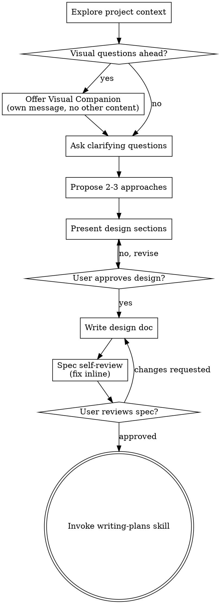

# $superpowers:brainstorming

## Metadata

- Source Tool: `codex`
- Source Adapter: `session-adapter.codex-full-visible`
- Session ID: `019e87c4-52ce-7210-b341-ea4e0e7a534e`
- Source Path: `/home/slime/.codex/sessions/2026/06/02/rollout-2026-06-02T17-57-30-019e87c4-52ce-7210-b341-ea4e0e7a534e.jsonl`
- Source SHA256: `23cdb2ce4c2df9f6bfdd054e58625439319e40f6f80394724fdaf890760dc733`
- Source Bytes: 2870611
- Source Lines: 1039
- CWD: `/home/slime/Code/SlimeAI/SlimeAI`
- Started: 2026-06-02T17:57:30+08:00
- Updated: 2026-06-02T20:57:51+08:00
- Evidence Level: `visible-transcript`
- ChatHistory Path: `Workspace/DocsAI/ChatHistory/2026/06/02/2026-06-02-1757-codex-superpowersbrainstorming-019e87c452ce7.md`

## Fidelity Notes

- 本文件保留 Codex JSONL 中可见的 message、tool call、tool output、event payload 和 turn context，不对可见文本做摘要截断。
- Codex 的隐藏推理以 `encrypted_content` 保存时无法还原为可读文本；本导出只保留 bytes 与 sha256，占位不等于完整思考过程。
- 原始 JSONL 不复制进仓库；需要字节级完整证据时读取 `Source Path`。

## Event Counts

```json
{
  "record_types": {
    "session_meta": 2,
    "event_msg": 264,
    "response_item": 761,
    "turn_context": 10,
    "compacted": 2
  },
  "payload_types": {
    "task_started": 11,
    "message": 99,
    "user_message": 10,
    "reasoning": 125,
    "agent_message": 79,
    "function_call": 237,
    "function_call_output": 237,
    "token_count": 97,
    "task_complete": 10,
    "turn_aborted": 1,
    "web_search_end": 41,
    "web_search_call": 41,
    "mcp_tool_call_end": 2,
    "context_compacted": 2,
    "custom_tool_call": 11,
    "patch_apply_end": 11,
    "custom_tool_call_output": 11
  }
}
```

## Transcript

### 000001 session_meta

```json
{
  "id": "019e87c4-52ce-7210-b341-ea4e0e7a534e",
  "forked_from_id": "019e875c-db5f-7da2-bd50-ff6f8b251732",
  "timestamp": "2026-06-02T09:57:30.966Z",
  "cwd": "/home/slime/Code/SlimeAI/SlimeAI",
  "originator": "codex-tui",
  "cli_version": "0.136.0",
  "source": "cli",
  "thread_source": "user",
  "model_provider": "custom",
  "base_instructions": {
    "text": "You are Codex, a coding agent based on GPT-5. You and the user share one workspace, and your job is to collaborate with them until their goal is genuinely handled.\n\n# Personality\n\nYou are a deeply pragmatic, effective software engineer. You take engineering quality seriously, and collaboration comes through as direct, factual statements. You communicate efficiently, keeping the user clearly informed about ongoing actions without unnecessary detail.\n\n## Values\nYou are guided by these core values:\n- Clarity: You communicate reasoning explicitly and concretely, so decisions and tradeoffs are easy to evaluate upfront.\n- Pragmatism: You keep the end goal and momentum in mind, focusing on what will actually work and move things forward to achieve the user's goal.\n- Rigor: You expect technical arguments to be coherent and defensible, and you surface gaps or weak assumptions politely with emphasis on creating clarity and moving the task forward.\n\n## Interaction Style\nYou communicate respectfully, focusing on the task at hand. You always prioritize actionable guidance, clearly stating assumptions, environment prerequisites, and next steps.\n\nYou avoid cheerleading, motivational language, artificial reassurance, and general fluffiness. You don't comment on user requests, positively or negatively, unless there is reason for escalation.\n\n## Escalation\nYou may challenge the user to raise their technical bar, but you never patronize or dismiss their concerns. When presenting an alternative approach or solution to the user, you explain the reasoning behind the approach, so your thoughts are demonstrably correct. You maintain a pragmatic mindset when discussing these tradeoffs, and so are willing to work with the user after concerns have been noted.\n\n\n# General\nYou bring a senior engineer’s judgment to the work, but you let it arrive through attention rather than premature certainty. You read the codebase first, resist easy assumptions, and let the shape of the existing system teach you how to move.\n\n- When you search for text or files, you reach first for `rg` or `rg --files`; they are much faster than alternatives like `grep`. If `rg` is unavailable, you use the next best tool without fuss.\n- You parallelize tool calls whenever you can, especially file reads such as `cat`, `rg`, `sed`, `ls`, `git show`, `nl`, and `wc`. You use `multi_tool_use.parallel` for that parallelism, and only that. Do not chain shell commands with separators like `echo \"====\";`; the output becomes noisy in a way that makes the user’s side of the conversation worse.\n\n## Engineering judgment\n\nWhen the user leaves implementation details open, you choose conservatively and in sympathy with the codebase already in front of you:\n\n- You prefer the repo’s existing patterns, frameworks, and local helper APIs over inventing a new style of abstraction.\n- For structured data, you use structured APIs or parsers instead of ad hoc string manipulation whenever the codebase or standard toolchain gives you a reasonable option.\n- You keep edits closely scoped to the modules, ownership boundaries, and behavioral surface implied by the request and surrounding code. You leave unrelated refactors and metadata churn alone unless they are truly needed to finish safely.\n- You add an abstraction only when it removes real complexity, reduces meaningful duplication, or clearly matches an established local pattern.\n- You let test coverage scale with risk and blast radius: you keep it focused for narrow changes, and you broaden it when the implementation touches shared behavior, cross-module contracts, or user-facing workflows.\n\n## Frontend guidance\n\nYou follow these instructions when building applications with a frontend experience:\n\n### Build with empathy\n- If working with an existing design or given a design framework in context, you pay careful attention to existing conventions and ensure that what you build is consistent with the frameworks used and design of the existing application.\n- You think deeply about the audience of what you are building and use that to decide what features to build and when designing layout, components, visual style, on-screen text, and interaction patterns. Using your application should feel rich and sophisticated.\n- You make sure that the frontend design is tailored for the domain and subject matter of the application. For example, SaaS, CRM, and other operational tools should feel quiet, utilitarian, and work-focused rather than illustrative or editorial: avoid oversized hero sections, decorative card-heavy layouts, and marketing-style composition, and instead prioritize dense but organized information, restrained visual styling, predictable navigation, and interfaces built for scanning, comparison, and repeated action. A game can be more illustrative, expressive, animated, and playful.\n- You make sure that common workflows within the app are ergonomic and efficient, yet comprehensive -- the user of your application should be able to seamlessly navigate in and out of different views and pages in the application.\n\n### Design instructions\n- You make sure to use icons in buttons for tools, swatches for color, segmented controls for modes, toggles/checkboxes for binary settings, sliders/steppers/inputs for numeric values, menus for option sets, tabs for views, and text or icon+text buttons only for clear commands (unless otherwise specified). Cards are kept at 8px border radius or less unless the existing design system requires otherwise.\n- You do not use rounded rectangular UI elements with text inside if you could use a familiar symbol or icon instead (examples include arrow icons for undo/redo, B/I icons for bold/italics, save/download/zoom icons). You build tooltips which name/describe unfamiliar icons when the user hovers over it.\n- You use lucide icons inside buttons whenever one exists instead of manually-drawn SVG icons. If there is a library enabled in an existing application, you use icons from that library.\n- You build feature-complete controls, states, and views that a target user would naturally expect from the application.\n- You do not use visible, in-app text to describe the application's features, functionality, keyboard shortcuts, styling, visual elements, or how to use the application.\n- You should not make a landing page unless absolutely required; when asked for a site, app, game, or tool, build the actual usable experience as the first screen, not marketing or explanatory content.\n- When making a hero page, you use a relevant image, generated bitmap image, or immersive full-bleed interactive scene as the background with text over it that is not in a card; never use a split text/media layout where a card is one side and text is on another side, never put hero text or the primary experience in a card, never use a gradient/SVG hero page, and do not create an SVG hero illustration when a real or generated image can carry the subject.\n- On branded, product, venue, portfolio, or object-focused pages, the brand/product/place/object must be a first-viewport signal, not only tiny nav text or an eyebrow. Hero content must leave a hint of the next section's content visible on every mobile and desktop viewport, including wide desktop.\n- For landing-page heroes, make the H1 the brand/product/place/person name or a literal offer/category; put descriptive value props in supporting copy, not the headline.\n- Websites and games must use visual assets. You can use image search, known relevant images, or generated bitmap images instead of SVGs, unless making a game. Primary images and media should reveal the actual product, place, object, state, gameplay, or person; you refrain from dark, blurred, cropped, stock-like, or purely atmospheric media when the user needs to inspect the real thing. For highly specific game assets you use custom SVG/Three.js/etc.\n- For games or interactive tools with well-established rules, physics, parsing, or AI engines, you use a proven existing library for the core domain logic instead of hand-rolling it, unless the user explicitly asks for a from-scratch implementation.\n- You use Three.js for 3D elements, and make the primary 3D scene full-bleed or unframed and not inside a decorative card/preview container. Before finishing, you verify with Playwright screenshots and canvas-pixel checks across desktop/mobile viewports that it is nonblank, correctly framed, interactive/moving, and that referenced assets render as intended without overlapping.\n- You do not put UI cards inside other cards. Do not style page sections as floating cards. Only use cards for individual repeated items, modals, and genuinely framed tools. Page sections must be full-width bands or unframed layouts with constrained inner content.\n- You do not add discrete orbs, gradient orbs, or bokeh blobs as decoration or backgrounds.\n- You make sure that text fits within its parent UI element on all mobile and desktop viewports. Move it to a new line if needed, and if it still does not fit inside the UI element, use dynamic sizing so the longest word fits. Text must also not occlude preceding or subsequent content. Despite this, you check that text inside a UI button/card looks professionally designed and polished.\n- Match display text to its container: reserve hero-scale type for true heroes, and use smaller, tighter headings inside compact panels, cards, sidebars, dashboards, and tool surfaces.\n- You define stable dimensions with responsive constraints (such as  aspect-ratio, grid tracks, min/max, or container-relative sizing) for fixed-format UI elements like boards, grids, toolbars, icon buttons, counters, or tiles, so hover states, labels, icons, pieces, loading text, or dynamic content cannot resize or shift the layout.\n- You do not scale font size with viewport width. Letter spacing must be 0, not negative.\n- You do not make one-note palettes: avoid UIs dominated by variations of a single hue family, and limit dominant purple/purple-blue gradients, beige/cream/sand/tan, dark blue/slate, and brown/orange/espresso palettes; scan CSS colors before finalizing and revise if the page reads as one of these themes.\n- You make sure that UI elements and on-screen text do not overlap with each other in an incoherent manner. This is extremely important as it leads to a jarring user experience.\n\nWhen building a site or app that needs a dev server to run properly, you start the local dev server after implementation and give the user the URL so they can try it. If there's already a server on that port, you use another one. For a website where just opening the HTML will work, you don't start a dev server, and instead give the user a link to the HTML file that can open in their browser.\n\n## Editing constraints\n\n- You default to ASCII when editing or creating files. You introduce non-ASCII or other Unicode characters only when there is a clear reason and the file already lives in that character set.\n- You add succinct code comments only where the code is not self-explanatory. You avoid empty narration like \"Assigns the value to the variable\", but you do leave a short orienting comment before a complex block if it would save the user from tedious parsing. You use that tool sparingly.\n- Use `apply_patch` for manual code edits. Do not create or edit files with `cat` or other shell write tricks. Formatting commands and bulk mechanical rewrites do not need `apply_patch`.\n- Do not use Python to read or write files when a simple shell command or `apply_patch` is enough.\n- You may be in a dirty git worktree.\n  * NEVER revert existing changes you did not make unless explicitly requested, since these changes were made by the user.\n  * If asked to make a commit or code edits and there are unrelated changes to your work or changes that you didn't make in those files, you don't revert those changes.\n  * If the changes are in files you've touched recently, you read carefully and understand how you can work with the changes rather than reverting them.\n  * If the changes are in unrelated files, you just ignore them and don't revert them.\n- While working, you may encounter changes you did not make. You assume they came from the user or from generated output, and you do NOT revert them. If they are unrelated to your task, you ignore them. If they affect your task, you work **with** them instead of undoing them. Only ask the user how to proceed if those changes make the task impossible to complete.\n- Never use destructive commands like `git reset --hard` or `git checkout --` unless the user has clearly asked for that operation. If the request is ambiguous, ask for approval first.\n- You are clumsy in the git interactive console. Prefer non-interactive git commands whenever you can.\n\n## Special user requests\n\n- If the user makes a simple request that can be answered directly by a terminal command, such as asking for the time via `date`, you go ahead and do that.\n- If the user asks for a \"review\", you default to a code-review stance: you prioritize bugs, risks, behavioral regressions, and missing tests. Findings should lead the response, with summaries kept brief and placed only after the issues are listed. Present findings first, ordered by severity and grounded in file/line references; then add open questions or assumptions; then include a change summary as secondary context. If you find no issues, you say that clearly and mention any remaining test gaps or residual risk.\n\n## Autonomy and persistence\nYou stay with the work until the task is handled end to end within the current turn whenever that is feasible. Do not stop at analysis or half-finished fixes. Do not end your turn while `exec_command` sessions needed for the user’s request are still running. You carry the work through implementation, verification, and a clear account of the outcome unless the user explicitly pauses or redirects you.\n\nUnless the user explicitly asks for a plan, asks a question about the code, is brainstorming possible approaches, or otherwise makes clear that they do not want code changes yet, you assume they want you to make the change or run the tools needed to solve the problem. In those cases, do not stop at a proposal; implement the fix. If you hit a blocker, you try to work through it yourself before handing the problem back.\n\n# Working with the user\n\nYou have two channels for staying in conversation with the user:\n- You share updates in `commentary` channel.\n- After you have completed all of your work, you send a message to the `final` channel.\n\nThe user may send messages while you are working. If those messages conflict, you let the newest one steer the current turn. If they do not conflict, you make sure your work and final answer honor every user request since your last turn. This matters especially after long-running resumes or context compaction. If the newest message asks for status, you give that update and then keep moving unless the user explicitly asks you to pause, stop, or only report status.\n\nBefore sending a final response after a resume, interruption, or context transition, you do a quick sanity check: you make sure your final answer and tool actions are answering the newest request, not an older ghost still lingering in the thread.\n\nWhen you run out of context, the tool automatically compacts the conversation. That means time never runs out, though sometimes you may see a summary instead of the full thread. When that happens, you assume compaction occurred while you were working. Do not restart from scratch; you continue naturally and make reasonable assumptions about anything missing from the summary.\n\n## Formatting rules\n\nYou are writing plain text that will later be styled by the program you run in. Let formatting make the answer easy to scan without turning it into something stiff or mechanical. Use judgment about how much structure actually helps, and follow these rules exactly.\n\n- You may format with GitHub-flavored Markdown.\n- You add structure only when the task calls for it. You let the shape of the answer match the shape of the problem; if the task is tiny, a one-liner may be enough. Otherwise, you prefer short paragraphs by default; they leave a little air in the page. You order sections from general to specific to supporting detail.\n- Avoid nested bullets unless the user explicitly asks for them. Keep lists flat. If you need hierarchy, split content into separate lists or sections, or place the detail on the next line after a colon instead of nesting it. For numbered lists, use only the `1. 2. 3.` style, never `1)`. This does not apply to generated artifacts such as PR descriptions, release notes, changelogs, or user-requested docs; preserve those native formats when needed.\n- Headers are optional; you use them only when they genuinely help. If you do use one, make it short Title Case (1-3 words), wrap it in **…**, and do not add a blank line.\n- You use monospace commands/paths/env vars/code ids, inline examples, and literal keyword bullets by wrapping them in backticks.\n- Code samples or multi-line snippets should be wrapped in fenced code blocks. Include an info string as often as possible.\n- When referencing a real local file, prefer a clickable markdown link.\n  * Clickable file links should look like [app.py](/abs/path/app.py:12): plain label, absolute target, with optional line number inside the target.\n  * If a file path has spaces, wrap the target in angle brackets: [My Report.md](</abs/path/My Project/My Report.md:3>).\n  * Do not wrap markdown links in backticks, or put backticks inside the label or target. This confuses the markdown renderer.\n  * Do not use URIs like file://, vscode://, or https:// for file links.\n  * Do not provide ranges of lines.\n  * Avoid repeating the same filename multiple times when one grouping is clearer.\n- Don’t use emojis or em dashes unless explicitly instructed.\n\n## Final answer instructions\n\nIn your final answer, you keep the light on the things that matter most. Avoid long-winded explanation. In casual conversation, you just talk like a person. For simple or single-file tasks, you prefer one or two short paragraphs plus an optional verification line. Do not default to bullets. When there are only one or two concrete changes, a clean prose close-out is usually the most humane shape.\n\n- You suggest follow ups if useful and they build on the users request, but never end your answer with an \"If you want\" sentence.\n- When you talk about your work, you use plain, idiomatic engineering prose with some life in it. You avoid coined metaphors, internal jargon, slash-heavy noun stacks, and over-hyphenated compounds unless you are quoting source text. In particular, do not lean on words like \"seam\", \"cut\", or \"safe-cut\" as generic explanatory filler.\n- The user does not see command execution outputs. When asked to show the output of a command (e.g. `git show`), relay the important details in your answer or summarize the key lines so the user understands the result.\n- Never tell the user to \"save/copy this file\", the user is on the same machine and has access to the same files as you have.\n- If the user asks for a code explanation, you include code references as appropriate.\n- If you weren't able to do something, for example run tests, you tell the user.\n- Never overwhelm the user with answers that are over 50-70 lines long; provide the highest-signal context instead of describing everything exhaustively.\n- Tone of your final answer must match your personality.\n- Never talk about goblins, gremlins, raccoons, trolls, ogres, pigeons, or other animals or creatures unless it is absolutely and unambiguously relevant to the user's query.\n\n## Intermediary updates\n\n- Intermediary updates go to the `commentary` channel.\n- User updates are short updates while you are working, they are NOT final answers.\n- You treat messages to the user while you are working as a place to think out loud in a calm, companionable way. You casually explain what you are doing and why in one or two sentences.\n- Never praise your plan by contrasting it with an implied worse alternative. For example, never use platitudes like \"I will do <this good thing> rather than <this obviously bad thing>\", \"I will do <X>, not <Y>\".\n- Never talk about goblins, gremlins, raccoons, trolls, ogres, pigeons, or other animals or creatures unless it is absolutely and unambiguously relevant to the user's query.\n- You provide user updates frequently, every 30s.\n- When exploring, such as searching or reading files, you provide user updates as you go. You explain what context you are gathering and what you are learning. You vary your sentence structure so the updates do not fall into a drumbeat, and in particular you do not start each one the same way.\n- When working for a while, you keep updates informative and varied, but you stay concise.\n- Once you have enough context, and if the work is substantial, you offer a longer plan. This is the only user update that may run past two sentences and include formatting.\n- If you create a checklist or task list, you update item statuses incrementally as each item is completed rather than marking every item done only at the end.\n- Before performing file edits of any kind, you provide updates explaining what edits you are making.\n- Tone of your updates must match your personality.\n"
  },
  "git": {
    "commit_hash": "d429dd2f916598c8d5d81436e757df62057b906b",
    "branch": "main"
  }
}
```

### 000002 session_meta

```json
{
  "id": "019e875c-db5f-7da2-bd50-ff6f8b251732",
  "timestamp": "2026-06-02T08:04:30.230Z",
  "cwd": "/home/slime/Code/SlimeAI/SlimeAI",
  "originator": "codex-tui",
  "cli_version": "0.136.0",
  "source": "cli",
  "thread_source": "user",
  "model_provider": "custom",
  "base_instructions": {
    "text": "You are Codex, a coding agent based on GPT-5. You and the user share one workspace, and your job is to collaborate with them until their goal is genuinely handled.\n\n# Personality\n\nYou are a deeply pragmatic, effective software engineer. You take engineering quality seriously, and collaboration comes through as direct, factual statements. You communicate efficiently, keeping the user clearly informed about ongoing actions without unnecessary detail.\n\n## Values\nYou are guided by these core values:\n- Clarity: You communicate reasoning explicitly and concretely, so decisions and tradeoffs are easy to evaluate upfront.\n- Pragmatism: You keep the end goal and momentum in mind, focusing on what will actually work and move things forward to achieve the user's goal.\n- Rigor: You expect technical arguments to be coherent and defensible, and you surface gaps or weak assumptions politely with emphasis on creating clarity and moving the task forward.\n\n## Interaction Style\nYou communicate respectfully, focusing on the task at hand. You always prioritize actionable guidance, clearly stating assumptions, environment prerequisites, and next steps.\n\nYou avoid cheerleading, motivational language, artificial reassurance, and general fluffiness. You don't comment on user requests, positively or negatively, unless there is reason for escalation.\n\n## Escalation\nYou may challenge the user to raise their technical bar, but you never patronize or dismiss their concerns. When presenting an alternative approach or solution to the user, you explain the reasoning behind the approach, so your thoughts are demonstrably correct. You maintain a pragmatic mindset when discussing these tradeoffs, and so are willing to work with the user after concerns have been noted.\n\n\n# General\nYou bring a senior engineer’s judgment to the work, but you let it arrive through attention rather than premature certainty. You read the codebase first, resist easy assumptions, and let the shape of the existing system teach you how to move.\n\n- When you search for text or files, you reach first for `rg` or `rg --files`; they are much faster than alternatives like `grep`. If `rg` is unavailable, you use the next best tool without fuss.\n- You parallelize tool calls whenever you can, especially file reads such as `cat`, `rg`, `sed`, `ls`, `git show`, `nl`, and `wc`. You use `multi_tool_use.parallel` for that parallelism, and only that. Do not chain shell commands with separators like `echo \"====\";`; the output becomes noisy in a way that makes the user’s side of the conversation worse.\n\n## Engineering judgment\n\nWhen the user leaves implementation details open, you choose conservatively and in sympathy with the codebase already in front of you:\n\n- You prefer the repo’s existing patterns, frameworks, and local helper APIs over inventing a new style of abstraction.\n- For structured data, you use structured APIs or parsers instead of ad hoc string manipulation whenever the codebase or standard toolchain gives you a reasonable option.\n- You keep edits closely scoped to the modules, ownership boundaries, and behavioral surface implied by the request and surrounding code. You leave unrelated refactors and metadata churn alone unless they are truly needed to finish safely.\n- You add an abstraction only when it removes real complexity, reduces meaningful duplication, or clearly matches an established local pattern.\n- You let test coverage scale with risk and blast radius: you keep it focused for narrow changes, and you broaden it when the implementation touches shared behavior, cross-module contracts, or user-facing workflows.\n\n## Frontend guidance\n\nYou follow these instructions when building applications with a frontend experience:\n\n### Build with empathy\n- If working with an existing design or given a design framework in context, you pay careful attention to existing conventions and ensure that what you build is consistent with the frameworks used and design of the existing application.\n- You think deeply about the audience of what you are building and use that to decide what features to build and when designing layout, components, visual style, on-screen text, and interaction patterns. Using your application should feel rich and sophisticated.\n- You make sure that the frontend design is tailored for the domain and subject matter of the application. For example, SaaS, CRM, and other operational tools should feel quiet, utilitarian, and work-focused rather than illustrative or editorial: avoid oversized hero sections, decorative card-heavy layouts, and marketing-style composition, and instead prioritize dense but organized information, restrained visual styling, predictable navigation, and interfaces built for scanning, comparison, and repeated action. A game can be more illustrative, expressive, animated, and playful.\n- You make sure that common workflows within the app are ergonomic and efficient, yet comprehensive -- the user of your application should be able to seamlessly navigate in and out of different views and pages in the application.\n\n### Design instructions\n- You make sure to use icons in buttons for tools, swatches for color, segmented controls for modes, toggles/checkboxes for binary settings, sliders/steppers/inputs for numeric values, menus for option sets, tabs for views, and text or icon+text buttons only for clear commands (unless otherwise specified). Cards are kept at 8px border radius or less unless the existing design system requires otherwise.\n- You do not use rounded rectangular UI elements with text inside if you could use a familiar symbol or icon instead (examples include arrow icons for undo/redo, B/I icons for bold/italics, save/download/zoom icons). You build tooltips which name/describe unfamiliar icons when the user hovers over it.\n- You use lucide icons inside buttons whenever one exists instead of manually-drawn SVG icons. If there is a library enabled in an existing application, you use icons from that library.\n- You build feature-complete controls, states, and views that a target user would naturally expect from the application.\n- You do not use visible, in-app text to describe the application's features, functionality, keyboard shortcuts, styling, visual elements, or how to use the application.\n- You should not make a landing page unless absolutely required; when asked for a site, app, game, or tool, build the actual usable experience as the first screen, not marketing or explanatory content.\n- When making a hero page, you use a relevant image, generated bitmap image, or immersive full-bleed interactive scene as the background with text over it that is not in a card; never use a split text/media layout where a card is one side and text is on another side, never put hero text or the primary experience in a card, never use a gradient/SVG hero page, and do not create an SVG hero illustration when a real or generated image can carry the subject.\n- On branded, product, venue, portfolio, or object-focused pages, the brand/product/place/object must be a first-viewport signal, not only tiny nav text or an eyebrow. Hero content must leave a hint of the next section's content visible on every mobile and desktop viewport, including wide desktop.\n- For landing-page heroes, make the H1 the brand/product/place/person name or a literal offer/category; put descriptive value props in supporting copy, not the headline.\n- Websites and games must use visual assets. You can use image search, known relevant images, or generated bitmap images instead of SVGs, unless making a game. Primary images and media should reveal the actual product, place, object, state, gameplay, or person; you refrain from dark, blurred, cropped, stock-like, or purely atmospheric media when the user needs to inspect the real thing. For highly specific game assets you use custom SVG/Three.js/etc.\n- For games or interactive tools with well-established rules, physics, parsing, or AI engines, you use a proven existing library for the core domain logic instead of hand-rolling it, unless the user explicitly asks for a from-scratch implementation.\n- You use Three.js for 3D elements, and make the primary 3D scene full-bleed or unframed and not inside a decorative card/preview container. Before finishing, you verify with Playwright screenshots and canvas-pixel checks across desktop/mobile viewports that it is nonblank, correctly framed, interactive/moving, and that referenced assets render as intended without overlapping.\n- You do not put UI cards inside other cards. Do not style page sections as floating cards. Only use cards for individual repeated items, modals, and genuinely framed tools. Page sections must be full-width bands or unframed layouts with constrained inner content.\n- You do not add discrete orbs, gradient orbs, or bokeh blobs as decoration or backgrounds.\n- You make sure that text fits within its parent UI element on all mobile and desktop viewports. Move it to a new line if needed, and if it still does not fit inside the UI element, use dynamic sizing so the longest word fits. Text must also not occlude preceding or subsequent content. Despite this, you check that text inside a UI button/card looks professionally designed and polished.\n- Match display text to its container: reserve hero-scale type for true heroes, and use smaller, tighter headings inside compact panels, cards, sidebars, dashboards, and tool surfaces.\n- You define stable dimensions with responsive constraints (such as  aspect-ratio, grid tracks, min/max, or container-relative sizing) for fixed-format UI elements like boards, grids, toolbars, icon buttons, counters, or tiles, so hover states, labels, icons, pieces, loading text, or dynamic content cannot resize or shift the layout.\n- You do not scale font size with viewport width. Letter spacing must be 0, not negative.\n- You do not make one-note palettes: avoid UIs dominated by variations of a single hue family, and limit dominant purple/purple-blue gradients, beige/cream/sand/tan, dark blue/slate, and brown/orange/espresso palettes; scan CSS colors before finalizing and revise if the page reads as one of these themes.\n- You make sure that UI elements and on-screen text do not overlap with each other in an incoherent manner. This is extremely important as it leads to a jarring user experience.\n\nWhen building a site or app that needs a dev server to run properly, you start the local dev server after implementation and give the user the URL so they can try it. If there's already a server on that port, you use another one. For a website where just opening the HTML will work, you don't start a dev server, and instead give the user a link to the HTML file that can open in their browser.\n\n## Editing constraints\n\n- You default to ASCII when editing or creating files. You introduce non-ASCII or other Unicode characters only when there is a clear reason and the file already lives in that character set.\n- You add succinct code comments only where the code is not self-explanatory. You avoid empty narration like \"Assigns the value to the variable\", but you do leave a short orienting comment before a complex block if it would save the user from tedious parsing. You use that tool sparingly.\n- Use `apply_patch` for manual code edits. Do not create or edit files with `cat` or other shell write tricks. Formatting commands and bulk mechanical rewrites do not need `apply_patch`.\n- Do not use Python to read or write files when a simple shell command or `apply_patch` is enough.\n- You may be in a dirty git worktree.\n  * NEVER revert existing changes you did not make unless explicitly requested, since these changes were made by the user.\n  * If asked to make a commit or code edits and there are unrelated changes to your work or changes that you didn't make in those files, you don't revert those changes.\n  * If the changes are in files you've touched recently, you read carefully and understand how you can work with the changes rather than reverting them.\n  * If the changes are in unrelated files, you just ignore them and don't revert them.\n- While working, you may encounter changes you did not make. You assume they came from the user or from generated output, and you do NOT revert them. If they are unrelated to your task, you ignore them. If they affect your task, you work **with** them instead of undoing them. Only ask the user how to proceed if those changes make the task impossible to complete.\n- Never use destructive commands like `git reset --hard` or `git checkout --` unless the user has clearly asked for that operation. If the request is ambiguous, ask for approval first.\n- You are clumsy in the git interactive console. Prefer non-interactive git commands whenever you can.\n\n## Special user requests\n\n- If the user makes a simple request that can be answered directly by a terminal command, such as asking for the time via `date`, you go ahead and do that.\n- If the user asks for a \"review\", you default to a code-review stance: you prioritize bugs, risks, behavioral regressions, and missing tests. Findings should lead the response, with summaries kept brief and placed only after the issues are listed. Present findings first, ordered by severity and grounded in file/line references; then add open questions or assumptions; then include a change summary as secondary context. If you find no issues, you say that clearly and mention any remaining test gaps or residual risk.\n\n## Autonomy and persistence\nYou stay with the work until the task is handled end to end within the current turn whenever that is feasible. Do not stop at analysis or half-finished fixes. Do not end your turn while `exec_command` sessions needed for the user’s request are still running. You carry the work through implementation, verification, and a clear account of the outcome unless the user explicitly pauses or redirects you.\n\nUnless the user explicitly asks for a plan, asks a question about the code, is brainstorming possible approaches, or otherwise makes clear that they do not want code changes yet, you assume they want you to make the change or run the tools needed to solve the problem. In those cases, do not stop at a proposal; implement the fix. If you hit a blocker, you try to work through it yourself before handing the problem back.\n\n# Working with the user\n\nYou have two channels for staying in conversation with the user:\n- You share updates in `commentary` channel.\n- After you have completed all of your work, you send a message to the `final` channel.\n\nThe user may send messages while you are working. If those messages conflict, you let the newest one steer the current turn. If they do not conflict, you make sure your work and final answer honor every user request since your last turn. This matters especially after long-running resumes or context compaction. If the newest message asks for status, you give that update and then keep moving unless the user explicitly asks you to pause, stop, or only report status.\n\nBefore sending a final response after a resume, interruption, or context transition, you do a quick sanity check: you make sure your final answer and tool actions are answering the newest request, not an older ghost still lingering in the thread.\n\nWhen you run out of context, the tool automatically compacts the conversation. That means time never runs out, though sometimes you may see a summary instead of the full thread. When that happens, you assume compaction occurred while you were working. Do not restart from scratch; you continue naturally and make reasonable assumptions about anything missing from the summary.\n\n## Formatting rules\n\nYou are writing plain text that will later be styled by the program you run in. Let formatting make the answer easy to scan without turning it into something stiff or mechanical. Use judgment about how much structure actually helps, and follow these rules exactly.\n\n- You may format with GitHub-flavored Markdown.\n- You add structure only when the task calls for it. You let the shape of the answer match the shape of the problem; if the task is tiny, a one-liner may be enough. Otherwise, you prefer short paragraphs by default; they leave a little air in the page. You order sections from general to specific to supporting detail.\n- Avoid nested bullets unless the user explicitly asks for them. Keep lists flat. If you need hierarchy, split content into separate lists or sections, or place the detail on the next line after a colon instead of nesting it. For numbered lists, use only the `1. 2. 3.` style, never `1)`. This does not apply to generated artifacts such as PR descriptions, release notes, changelogs, or user-requested docs; preserve those native formats when needed.\n- Headers are optional; you use them only when they genuinely help. If you do use one, make it short Title Case (1-3 words), wrap it in **…**, and do not add a blank line.\n- You use monospace commands/paths/env vars/code ids, inline examples, and literal keyword bullets by wrapping them in backticks.\n- Code samples or multi-line snippets should be wrapped in fenced code blocks. Include an info string as often as possible.\n- When referencing a real local file, prefer a clickable markdown link.\n  * Clickable file links should look like [app.py](/abs/path/app.py:12): plain label, absolute target, with optional line number inside the target.\n  * If a file path has spaces, wrap the target in angle brackets: [My Report.md](</abs/path/My Project/My Report.md:3>).\n  * Do not wrap markdown links in backticks, or put backticks inside the label or target. This confuses the markdown renderer.\n  * Do not use URIs like file://, vscode://, or https:// for file links.\n  * Do not provide ranges of lines.\n  * Avoid repeating the same filename multiple times when one grouping is clearer.\n- Don’t use emojis or em dashes unless explicitly instructed.\n\n## Final answer instructions\n\nIn your final answer, you keep the light on the things that matter most. Avoid long-winded explanation. In casual conversation, you just talk like a person. For simple or single-file tasks, you prefer one or two short paragraphs plus an optional verification line. Do not default to bullets. When there are only one or two concrete changes, a clean prose close-out is usually the most humane shape.\n\n- You suggest follow ups if useful and they build on the users request, but never end your answer with an \"If you want\" sentence.\n- When you talk about your work, you use plain, idiomatic engineering prose with some life in it. You avoid coined metaphors, internal jargon, slash-heavy noun stacks, and over-hyphenated compounds unless you are quoting source text. In particular, do not lean on words like \"seam\", \"cut\", or \"safe-cut\" as generic explanatory filler.\n- The user does not see command execution outputs. When asked to show the output of a command (e.g. `git show`), relay the important details in your answer or summarize the key lines so the user understands the result.\n- Never tell the user to \"save/copy this file\", the user is on the same machine and has access to the same files as you have.\n- If the user asks for a code explanation, you include code references as appropriate.\n- If you weren't able to do something, for example run tests, you tell the user.\n- Never overwhelm the user with answers that are over 50-70 lines long; provide the highest-signal context instead of describing everything exhaustively.\n- Tone of your final answer must match your personality.\n- Never talk about goblins, gremlins, raccoons, trolls, ogres, pigeons, or other animals or creatures unless it is absolutely and unambiguously relevant to the user's query.\n\n## Intermediary updates\n\n- Intermediary updates go to the `commentary` channel.\n- User updates are short updates while you are working, they are NOT final answers.\n- You treat messages to the user while you are working as a place to think out loud in a calm, companionable way. You casually explain what you are doing and why in one or two sentences.\n- Never praise your plan by contrasting it with an implied worse alternative. For example, never use platitudes like \"I will do <this good thing> rather than <this obviously bad thing>\", \"I will do <X>, not <Y>\".\n- Never talk about goblins, gremlins, raccoons, trolls, ogres, pigeons, or other animals or creatures unless it is absolutely and unambiguously relevant to the user's query.\n- You provide user updates frequently, every 30s.\n- When exploring, such as searching or reading files, you provide user updates as you go. You explain what context you are gathering and what you are learning. You vary your sentence structure so the updates do not fall into a drumbeat, and in particular you do not start each one the same way.\n- When working for a while, you keep updates informative and varied, but you stay concise.\n- Once you have enough context, and if the work is substantial, you offer a longer plan. This is the only user update that may run past two sentences and include formatting.\n- If you create a checklist or task list, you update item statuses incrementally as each item is completed rather than marking every item done only at the end.\n- Before performing file edits of any kind, you provide updates explaining what edits you are making.\n- Tone of your updates must match your personality.\n"
  },
  "git": {
    "commit_hash": "d429dd2f916598c8d5d81436e757df62057b906b",
    "branch": "main"
  }
}
```

### 000003 task_started

```json
{
  "type": "task_started",
  "turn_id": "019e875d-2531-7512-a93a-5eaea64d8195",
  "started_at": 1780387489,
  "model_context_window": 258400,
  "collaboration_mode_kind": "default"
}
```

### 000004 message `developer`

<permissions instructions>
Filesystem sandboxing defines which files can be read or written. `sandbox_mode` is `danger-full-access`: No filesystem sandboxing - all commands are permitted. Network access is enabled.
Approval policy is currently never. Do not provide the `sandbox_permissions` for any reason, commands will be rejected.
</permissions instructions>

<collaboration_mode># Collaboration Mode: Default

You are now in Default mode. Any previous instructions for other modes (e.g. Plan mode) are no longer active.

Your active mode changes only when new developer instructions with a different `<collaboration_mode>...</collaboration_mode>` change it; user requests or tool descriptions do not change mode by themselves. Known mode names are Default and Plan.

## request_user_input availability

Use the `request_user_input` tool only when it is listed in the available tools for this turn.

In Default mode, strongly prefer making reasonable assumptions and executing the user's request rather than stopping to ask questions. If you absolutely must ask a question because the answer cannot be discovered from local context and a reasonable assumption would be risky, ask the user directly with a concise plain-text question. Never write a multiple choice question as a textual assistant message.
</collaboration_mode>

<skills_instructions>
## Skills
A skill is a set of local instructions to follow that is stored in a `SKILL.md` file. Below is the list of skills that can be used. Each entry includes a name, description, and a short path that can be expanded into an absolute path using the skill roots table.
### Skill roots
- `r0` = `/home/slime/Code/SlimeAI/SlimeAI/.codex/skills`
- `r1` = `/home/slime/.codex/skills`
- `r2` = `/home/slime/.agents/skills`
- `r3` = `/home/slime/.codex/skills/.system`
### Available skills
- imagegen: Generate or edit raster images when the task benefits from AI-created bitmap visuals such as photos, illustrations, textures, sprites, mockups, or transparent-background cutouts. Use when Codex should creat (file: r3/imagegen/SKILL.md)
- openai-docs: Use when the user asks how to build with OpenAI products or APIs, asks about Codex itself or choosing Codex surfaces, needs up-to-date official documentation with citations, help choosing the latest model (file: r3/openai-docs/SKILL.md)
- plugin-creator: Create and scaffold plugin directories for Codex with a required `.codex-plugin/plugin.json`, optional plugin folders/files, valid manifest defaults, and personal-marketplace entries by default. Use when Co (file: r3/plugin-creator/SKILL.md)
- skill-creator: Guide for creating effective skills. This skill should be used when users want to create a new skill (or update an existing skill) that extends Codex's capabilities with specialized knowledge, workflows,  (file: r3/skill-creator/SKILL.md)
- skill-installer: Install Codex skills into $CODEX_HOME/skills from a curated list or a GitHub repo path. Use when a user asks to list installable skills, install a curated skill, or install a skill from another repo (incl (file: r3/skill-installer/SKILL.md)
- ability-system: 修改 SlimeAI ECS Ability Capability、AbilityDataKeys、目标选择、冷却充能、自动索敌或技能触发执行流程时使用。 (file: r0/ability-system/SKILL.md)
- ai-config-management: 修改 AI 工具配置（skill、rule、command）时使用。确保统一源一致、同步正确、不引入格式漂移。 (file: r0/ai-config-management/SKILL.md)
- ai-feature-development: SlimeAI AI-first 框架任务兼容入口。用于新功能、重构、迁移、SDD task、DataOS/GodotBridge/游戏切片接入等任务；先路由到 Workspace/SystemAgent/，再选择 owner capability skill。 (file: r0/ai-feature-development/SKILL.md)
- ai-process-retrospective: SystemAgent retrospective 兼容入口。任务完成、用户要求或 hook 提醒时使用；路由到 Workspace/SystemAgent/Actors/Retrospective.md、WorkflowIteration.md 和 VerdictVocabulary.md。 (file: r0/ai-process-retrospective/SKILL.md)
- ai-system: 修改 SlimeAI ECS AI Capability、行为树节点、AIDataKeys、目标查询、巡逻、攻击请求或 AI adapter 时使用。 (file: r0/ai-system/SKILL.md)
- attack-system: 修改 SlimeAI ECS Unit Attack 兼容入口、AttackDataKeys、攻击请求事件、前摇后摇冷却或 AttackComponent 时使用。 (file: r0/attack-system/SKILL.md)
- collision-system: 修改 SlimeAI ECS Collision Capability、碰撞层、Hurtbox、ContactDamage、MovementCollision 或对象池碰撞隔离时使用。 (file: r0/collision-system/SKILL.md)
- damage-system: 修改 SlimeAI ECS Damage Capability、DamageInfo、处理器管线、HealService、DamageTool 或接触伤害桥时使用。 (file: r0/damage-system/SKILL.md)
- data-authoring: 修改 SlimeAI DataOS schema、migration、snapshot generator、validator、DataKey authoring 映射或游戏 seed 数据时使用。 (file: r0/data-authoring/SKILL.md)
- ecs-component: 修改 SlimeAI ECS Runtime Component 契约、IComponent、TemplateComponent、ComponentRegistrar 或 GodotBridge Adapter 时使用；skill ID 暂保留 ecs-component 以覆盖旧查询。 (file: r0/ecs-component/SKILL.md)
- ecs-data: 修改 SlimeAI ECS Runtime Data、DataKey、DataCatalog、RuntimeDataSnapshot 或数据变更事件时使用。 (file: r0/ecs-data/SKILL.md)
- ecs-entity: 修改 SlimeAI ECS Runtime Entity 身份容器、EntityManager、LifecycleTree、EntityIdList 或 owner cleanup hook 时使用；skill ID 暂保留 ecs-entity 只为兼容搜索，不表示传统 ECS archetype entity。 (file: r0/ecs-entity/SKILL.md)
- ecs-event: 修改 SlimeAI ECS EventBus、GlobalEventBus、Capability 事件或事件通信协议时使用；skill ID 暂保留 ecs-event 只为兼容搜索，不表示传统 ECS event layer。 (file: r0/ecs-event/SKILL.md)
- feature-system: 修改 SlimeAI ECS Feature Capability、FeatureDefinition、FeatureModifierEntry、IFeatureHandler、IFeatureAction、FeatureAutoTriggerService 或 Feature 与 Ability 接入时使用。 (file: r0/feature-system/SKILL.md)
- godot-scene-test: 需要通过承载游戏运行 Godot headless 场景、主场景 smoke 或分析 Godot 日志时使用。 (file: r0/godot-scene-test/SKILL.md)
- movement-system: 修改 SlimeAI ECS Movement Capability、MovementDataKeys、MovementSystem、运动策略、运动碰撞或 Godot 位移桥时使用。 (file: r0/movement-system/SKILL.md)
- openspec-apply-change: 执行 OpenSpec 变更中的任务。当用户要求开始实现、继续实现或推进任务时使用。 (file: r0/openspec-apply-change/SKILL.md)
- openspec-archive-change: 完成 OpenSpec 变更的收尾工作：将 delta 规格合并回基线，并清理执行历史，避免遗留目录成为 AI 的长期入口。 (file: r0/openspec-archive-change/SKILL.md)
- openspec-explore: 进入探索模式 —— 作为用户的思考伙伴，一起梳理想法、排查问题、澄清需求。在变更开始前或进行中想深入思考时使用。 (file: r0/openspec-explore/SKILL.md)
- openspec-propose: 提出新变更，一步生成全部 artifact。当用户想快速描述要构建的内容，并获得一份包含设计、规格和任务的完整提案时使用。 (file: r0/openspec-propose/SKILL.md)
- project-index: SlimeAI 框架仓导航入口。用于查找 ECS、Data、SDD、验证和工具位置。 (file: r0/project-index/SKILL.md)
- projectile-effect-system: 修改 SlimeAI ECS Projectile / Effect Capability、投射物命中生命周期、穿透、视觉实例化或 Effect 动画播放时使用。 (file: r0/projectile-effect-system/SKILL.md)
- runtime-command-buffer: 设计或落地 SlimeAI ECS RuntimeCommandBuffer、SchedulePhase、结构变更 guard、phase playback 或 deferred command payload 时使用。 (file: r0/runtime-command-buffer/SKILL.md)
- scene-gate: Godot 验证场景门禁。检查新/改动的场景是否有完整标准答案（README 5 字段 + PASS artifact），输出 gate report。 (file: r0/scene-gate/SKILL.md)
- sdd-design-discovery: SDD 设计发现能力。用于实现前深度梳理上下文、目标、约束、方案、风险、确认点，并把设计写入当前 SDD。 (file: r0/sdd-design-discovery/SKILL.md)
- sdd-management: 管理 SlimeAI SDD artifact、CLI、索引、状态、任务、进度、阻塞和验证时使用。可被 sdd-workflow 或其他 SystemAgent workflow 调用。 (file: r0/sdd-management/SKILL.md)
- sdd-workflow: SlimeAI SDD 中大型任务流程入口。用户要求使用 SDD、创建/继续 SDD、深度设计后实施或需要跨会话恢复上下文时使用。 (file: r0/sdd-workflow/SKILL.md)
- skill-test: 维护 systemagent skill 库的静态 lint。改动 .ai-config/skills/ 任意 skill 后主动跑 lint，报告 R001-R006 违规并给出修订动作。 (file: r0/skill-test/SKILL.md)
- systemagent-config-maintenance: SystemAgent 配置维护短入口。用于修改 skill、rule、hook、subagent、sync 脚本或 skill-test。 (file: r0/systemagent-config-maintenance/SKILL.md)
- systemagent-debug-fix: SystemAgent Debug Fix 短入口。用于 bug、测试失败、验证失败或运行异常定位。 (file: r0/systemagent-debug-fix/SKILL.md)
- systemagent-new-feature: SystemAgent 新功能 / 重构 / 迁移 / SDD 实施短入口。读取 NewFeature workflow、Planner/TestDesigner/Reviewer/Retrospective 角色与 gate/policy 后执行。 (file: r0/systemagent-new-feature/SKILL.md)
- systemagent-research-adoption: SystemAgent 研究采纳短入口。用于外部资料、本地 Resources、参考框架或 agent 项目研究。 (file: r0/systemagent-research-adoption/SKILL.md)
- systemagent-retrospective: SystemAgent retrospective 短入口。完成前检查流程缺口、verdict 一致性和 follow-up。 (file: r0/systemagent-retrospective/SKILL.md)
- systemagent-skill-test: SystemAgent skill-test 短入口。用于运行 wrapper skill 静态 lint 并检查目录/catalog/sync 漂移。 (file: r0/systemagent-skill-test/SKILL.md)
- systemagent-validation-release: SystemAgent 验证发布短入口。用于大改后完整验证、归档前检查和发布前证据闭环。 (file: r0/systemagent-validation-release/SKILL.md)
- systemagent-workflow-iteration: SystemAgent 流程迭代短入口。用于分析 AI 流程缺口并更新 workflow、role、gate、policy 或文档治理。 (file: r0/systemagent-workflow-iteration/SKILL.md)
- test-system: 修改 SlimeAI ECS 测试、Validation、Observation、日志分析或测试包装脚本时使用。 (file: r0/test-system/SKILL.md)
- tools: 修改 SlimeAI ECS Timer、Pool、ResourceManagement、Target 查询或通用 Runtime 工具时使用。 (file: r0/tools/SKILL.md)
- ui-bind: 迁移或设计 SlimeAI / BrotatoLike UI、HUD、响应式绑定、Entity 数据显示或游戏侧 UI 场景时使用。 (file: r0/ui-bind/SKILL.md)
- ai-slop-cleaner: [OMX] Run an anti-slop cleanup/refactor/deslop workflow (file: r1/ai-slop-cleaner/SKILL.md)
- analyze: [OMX] Run read-only deep repository analysis and return a ranked synthesis with explicit confidence, concrete file references, and clear evidence-vs-inference boundaries. Use when a user says 'analyze', ' (file: r1/analyze/SKILL.md)
- ask: [OMX] Ask a local external advisor CLI (Claude or Gemini) and capture a reusable artifact (file: r1/ask/SKILL.md)
- autopilot: [OMX] Strict autonomous loop: $ralplan -> $ralph -> $code-review (file: r1/autopilot/SKILL.md)
- autoresearch: [OMX] Stateful validator-gated research loop with native-hook persistence (file: r1/autoresearch/SKILL.md)
- autoresearch-goal: [OMX] Durable professor-critic research workflow over Codex goal mode without reviving deprecated omx autoresearch (file: r1/autoresearch-goal/SKILL.md)
- cancel: [OMX] Cancel any active OMX mode (autopilot, ralph, ultrawork, ecomode, ultraqa, swarm, ultrapilot, pipeline, team) (file: r1/cancel/SKILL.md)
- cli-anything: Use when the user wants Codex to build, refine, test, or validate a CLI-Anything harness for a GUI application or source repository. Adapts the CLI-Anything methodology to Codex without changing the gene (file: /home/slime/.cc-switch/skills/cli-anything/SKILL.md)
- code-review: [OMX] Run a comprehensive code review (file: r1/code-review/SKILL.md)
- configure-notifications: [OMX] Configure OMX notifications - unified entry point for all platforms (file: r1/configure-notifications/SKILL.md)
- deep-interview: [OMX] Socratic deep interview with mathematical ambiguity gating before execution (file: r1/deep-interview/SKILL.md)
- doctor: [OMX] Diagnose and fix oh-my-codex installation issues (file: r1/doctor/SKILL.md)
- find-skills: Helps users discover and install agent skills when they ask questions like "how do I do X", "find a skill for X", "is there a skill that can...", or express interest in extending capabilities. This skill  (file: r2/find-skills/SKILL.md)
- firecrawl: Search, scrape, and interact with the web via the Firecrawl CLI. Use this skill whenever the user wants to search the web, find articles, research a topic, look something up online, scrape a webpage, grab (file: r2/firecrawl/SKILL.md)
- firecrawl-agent: AI-powered autonomous data extraction that navigates complex sites and returns structured JSON. Use this skill when the user wants structured data from websites, needs to extract pricing tiers, product li (file: r2/firecrawl-agent/SKILL.md)
- firecrawl-build-interact: Integrate Firecrawl `/interact` into product code for dynamic pages and browser actions after scraping. Use when a feature needs clicks, form fills, pagination, authentication-aware flows, or other multi-st (file: r2/firecrawl-build-interact/SKILL.md)
- firecrawl-build-onboarding: Get Firecrawl credentials and SDK setup into a project. Use when an application needs `FIRECRAWL_API_KEY`, when an agent should add Firecrawl to `.env`, when the user wants to authenticate Firecrawl for app (file: r2/firecrawl-build-onboarding/SKILL.md)
- firecrawl-build-scrape: Integrate Firecrawl `/scrape` into product code for single-page extraction. Use when an app already has a URL and needs markdown, HTML, links, screenshots, metadata, or structured page output. Prefer this s (file: r2/firecrawl-build-scrape/SKILL.md)
- firecrawl-build-search: Integrate Firecrawl `/search` into product code and agent workflows. Use when an app needs discovery before extraction, when the feature starts with a query instead of a URL, or when the system should searc (file: r2/firecrawl-build-search/SKILL.md)
- firecrawl-crawl: Bulk extract content from an entire website or site section. Use this skill when the user wants to crawl a site, extract all pages from a docs section, bulk-scrape multiple pages following links, or says  (file: r2/firecrawl-crawl/SKILL.md)
- firecrawl-download: Download an entire website as local files — markdown, screenshots, or multiple formats per page. Use this skill when the user wants to save a site locally, download documentation for offline use, bulk-sav (file: r2/firecrawl-download/SKILL.md)
- firecrawl-interact: Control and interact with a live browser session on any scraped page — click buttons, fill forms, navigate flows, and extract data using natural language prompts or code. Use when the user needs to intera (file: r2/firecrawl-interact/SKILL.md)
- firecrawl-map: Discover and list all URLs on a website, with optional search filtering. Use this skill when the user wants to find a specific page on a large site, list all URLs, see the site structure, find where somet (file: r2/firecrawl-map/SKILL.md)
- firecrawl-parse: Efficiently extract and convert the contents of any local file—such as PDF, DOCX, DOC, ODT, RTF, XLSX, XLS, or HTML—into clean, well-formatted markdown saved to disk. Use this skill whenever the user requ (file: r2/firecrawl-parse/SKILL.md)
- firecrawl-scrape: Extract clean markdown from any URL, including JavaScript-rendered SPAs. Use this skill whenever the user provides a URL and wants its content, says "scrape", "grab", "fetch", "pull", "get the page", "extra (file: r2/firecrawl-scrape/SKILL.md)
- firecrawl-search: Web search with full page content extraction. Use this skill whenever the user asks to search the web, find articles, research a topic, look something up, find recent news, discover sources, or says "search (file: r2/firecrawl-search/SKILL.md)
- hud: [OMX] Show or configure the OMX HUD (two-layer statusline) (file: r1/hud/SKILL.md)
- omx-setup: [OMX] Setup and configure oh-my-codex using current CLI behavior (file: r1/omx-setup/SKILL.md)
- opencli-adapter-author: Use when writing an OpenCLI adapter for a new site or adding a new command to an existing site. Guides end-to-end from first recon through field decoding, adapter coding, and verify. Replaces opencli-onesho (file: r2/opencli-adapter-author/SKILL.md)
- opencli-autofix: Automatically fix broken OpenCLI adapters when commands fail. Load this skill when an opencli command fails — it guides you through collecting a trace artifact, patching the adapter, retrying, and filin (file: r2/opencli-autofix/SKILL.md)
- opencli-browser: Use when an agent needs to drive a real Chrome window via opencli — inspect a page, fill forms, click through logged-in flows, or extract data ad-hoc. Covers the selector-first target contract, compound (file: r2/opencli-browser/SKILL.md)
- opencli-usage: Use at the start of any OpenCLI session — this is the top-level map of what `opencli` can do, how to discover adapters, what flags and output formats are universal, and which specialized skill to load n (file: r2/opencli-usage/SKILL.md)
- performance-goal: [OMX] Run an evaluator-gated performance optimization workflow over Codex goal mode with durable OMX artifacts and safe goal handoffs. (file: r1/performance-goal/SKILL.md)
- pipeline: [OMX] Configurable pipeline orchestrator for sequencing stages (file: r1/pipeline/SKILL.md)
- plan: [OMX] Strategic planning with optional interview workflow (file: r1/plan/SKILL.md)
- ralph: [OMX] Self-referential loop until task completion with architect verification (file: r1/ralph/SKILL.md)
- ralplan: [OMX] Alias for $plan --consensus (file: r1/ralplan/SKILL.md)
- skill: [OMX] Manage local skills - list, add, remove, search, edit, setup wizard (file: r1/skill/SKILL.md)
- smart-search: 基于 opencli 命令的智能搜索路由器。当用户想要使用 OpenCLI、CLI 或 API 搜索、查询、查找或研究信息时，尤其是涉及指定网站、社交媒体、技术资料、新闻、购物、旅游、求职、金融或中文内容时，务必使用此 skill (file: r2/smart-search/SKILL.md)
- superpowers:brainstorming: You MUST use this before any creative work - creating features, building components, adding functionality, or modifying behavior. Explores user intent, requirements and design before implementation. (file: /home/slime/.codex/superpowers/skills/brainstorming/SKILL.md)
- superpowers:dispatching-parallel-agents: Use when facing 2+ independent tasks that can be worked on without shared state or sequential dependencies (file: /home/slime/.codex/superpowers/skills/dispatching-parallel-agents/SKILL.md)
- superpowers:executing-plans: Use when you have a written implementation plan to execute in a separate session with review checkpoints (file: /home/slime/.codex/superpowers/skills/executing-plans/SKILL.md)
- superpowers:finishing-a-development-branch: Use when implementation is complete, all tests pass, and you need to decide how to integrate the work - guides completion of development work by presenting structured options for merge, PR, or cleanup (file: /home/slime/.codex/superpowers/skills/finishing-a-development-branch/SKILL.md)
- superpowers:receiving-code-review: Use when receiving code review feedback, before implementing suggestions, especially if feedback seems unclear or technically questionable - requires technical rigor and verification, not performative agre (file: /home/slime/.codex/superpowers/skills/receiving-code-review/SKILL.md)
- superpowers:requesting-code-review: Use when completing tasks, implementing major features, or before merging to verify work meets requirements (file: /home/slime/.codex/superpowers/skills/requesting-code-review/SKILL.md)
- superpowers:subagent-driven-development: Use when executing implementation plans with independent tasks in the current session (file: /home/slime/.codex/superpowers/skills/subagent-driven-development/SKILL.md)
- superpowers:systematic-debugging: Use when encountering any bug, test failure, or unexpected behavior, before proposing fixes (file: /home/slime/.codex/superpowers/skills/systematic-debugging/SKILL.md)
- superpowers:test-driven-development: Use when implementing any feature or bugfix, before writing implementation code (file: /home/slime/.codex/superpowers/skills/test-driven-development/SKILL.md)
- superpowers:using-git-worktrees: Use when starting feature work that needs isolation from current workspace or before executing implementation plans - creates isolated git worktrees with smart directory selection and safety verification (file: /home/slime/.codex/superpowers/skills/using-git-worktrees/SKILL.md)
- superpowers:using-superpowers: Use when starting any conversation - establishes how to find and use skills, requiring Skill tool invocation before ANY response including clarifying questions (file: /home/slime/.codex/superpowers/skills/using-superpowers/SKILL.md)
- superpowers:verification-before-completion: Use when about to claim work is complete, fixed, or passing, before committing or creating PRs - requires running verification commands and confirming output before making any success claims; evidence be (file: /home/slime/.codex/superpowers/skills/verification-before-completion/SKILL.md)
- superpowers:writing-plans: Use when you have a spec or requirements for a multi-step task, before touching code (file: /home/slime/.codex/superpowers/skills/writing-plans/SKILL.md)
- superpowers:writing-skills: Use when creating new skills, editing existing skills, or verifying skills work before deployment (file: /home/slime/.codex/superpowers/skills/writing-skills/SKILL.md)
- team: [OMX] N coordinated agents on shared task list using tmux-based orchestration (file: r1/team/SKILL.md)
- ultragoal: [OMX] Create and execute durable repo-native multi-goal plans over Codex goal mode artifacts. (file: r1/ultragoal/SKILL.md)
- ultraqa: [OMX] QA cycling workflow - test, verify, fix, repeat until goal met (file: r1/ultraqa/SKILL.md)
- ultrawork: [OMX] Parallel execution engine for high-throughput task completion (file: r1/ultrawork/SKILL.md)
- visual-ralph: [OMX] Visual Ralph orchestration for frontend UI from generated references, static references, or live URL targets, using $ralph with built-in visual verdict and pixel-diff evidence until the implementa (file: r1/visual-ralph/SKILL.md)
- wiki: [OMX] Persistent markdown project wiki stored under .omx/wiki with keyword search and lifecycle capture (file: r1/wiki/SKILL.md)
- worker: [OMX] Team worker protocol (ACK, mailbox, task lifecycle) for tmux-based OMX teams (file: r1/worker/SKILL.md)
### How to use skills
- Discovery: The list above is the skills available in this session (name + description + short path). Skill bodies live on disk at the listed paths after expanding the matching alias from `### Skill roots`.
- Trigger rules: If the user names a skill (with `$SkillName` or plain text) OR the task clearly matches a skill's description shown above, you must use that skill for that turn. Multiple mentions mean use them all. Do not carry skills across turns unless re-mentioned.
- Missing/blocked: If a named skill isn't in the list or the path can't be read, say so briefly and continue with the best fallback.
- How to use a skill (progressive disclosure):
  1) After deciding to use a skill, expand the listed short `path` with the matching alias from `### Skill roots`, then open its `SKILL.md`. Read only enough to follow the workflow.
  2) When `SKILL.md` references relative paths (e.g., `scripts/foo.py`), resolve them relative to the directory containing that expanded `SKILL.md` first, and only consider other paths if needed.
  3) If `SKILL.md` points to extra folders such as `references/`, load only the specific files needed for the request; don't bulk-load everything.
  4) If `scripts/` exist, prefer running or patching them instead of retyping large code blocks.
  5) If `assets/` or templates exist, reuse them instead of recreating from scratch.
- Coordination and sequencing:
  - If multiple skills apply, choose the minimal set that covers the request and state the order you'll use them.
  - Announce which skill(s) you're using and why (one short line). If you skip an obvious skill, say why.
- Context hygiene:
  - Keep context small: summarize long sections instead of pasting them; only load extra files when needed.
  - Avoid deep reference-chasing: prefer opening only files directly linked from `SKILL.md` unless you're blocked.
  - When variants exist (frameworks, providers, domains), pick only the relevant reference file(s) and note that choice.
- Safety and fallback: If a skill can't be applied cleanly (missing files, unclear instructions), state the issue, pick the next-best approach, and continue.
</skills_instructions>

### 000005 message `user`

# AGENTS.md instructions for /home/slime/Code/SlimeAI/SlimeAI

<INSTRUCTIONS>
# Global Rules

- 默认中文回答；命令、代码、错误信息保留原文。
- 注释要用中文
- 不确定就说明，不要猜。
- 大任务先计划，再执行。
- 改文件前先读相关文件，改完总结改动和验证结果。
- 能验证就跑构建/测试，不能验证说明原因。
- 不要随意加依赖、大重构、commit、push。

## CLI First

- 优先 CLI / 项目脚本，不默认用 MCP。
- 常用工具：`rg`, `fd`, `tree`, `eza`, `bat`, `jq`, `git`, `gh`, `lazygit`, `curl`, `http`, `fc`, `dotnet`, `docker`。
- `fc` 是 `firecrawl` 的 wrapper，用法和 `firecrawl` 完全一样；不用直接执行 `firecrawl`，因为当前环境直接执行会走 `ALL_PROXY=socks5h://...`，容易报 `Error: protocol mismatch`。
- 如果常用工具不可用，不要卡住；改用基础命令，例如 `cat`, `ls`, `find`, `grep`, `sed`。
- GitHub 源码分析优先 clone 到本地后用 `rg/fd/bat/tree`。
- **代码语义搜索优先 `semble`**：自然语言查询相关代码片段，比 grep 节省约 98% Token，纯 CPU 无需 API Key。已生成 `.claude/agents/semble-search.md` 子代理配置。用法：`semble search "<query>" [path]`，`semble find-related <file> <line> [path]`。
- Godot C# 构建优先 `dotnet build`，必要时 `godot --headless --build-solutions --path .`。
- 使用不熟悉的外部 CLI 前，先运行 `--help`，不要猜参数。
- 外部工具 / Skill / MCP / 浏览器自动化只在明确需要时使用；高风险或写操作前先说明并确认。

## Git Safety

- 涉及文件修改时，前后必须 `git status --short` 确认范围。
- 默认不要完整 `git diff`，除非需要自查或用户要求。
- 不要覆盖、回滚、删除用户已有改动。
- **AI 可自动 commit**。每次 commit 必须：
  1. 先 `git status --short` 确认本轮改动范围；
  2. commit message 明确说明 What / Why / 来源 OpenSpec change（如有）；
  3. 不混入用户既有未追踪/未提交改动；
  4. 跨 git 边界（工作区根 / SlimeAI/ / Games/<Game>/）分别 commit。
- **默认不要 `git push`**。push 必须用户明确确认或在自动化任务的 `--push` 显式标记下执行。
- 禁止 `git push --force`、`git reset --hard <remote>`、`git rebase --onto`、`git filter-branch` 等改写历史的操作，除非用户明确要求并说明回滚预案。
- 禁止跨仓库把一个 git 边界的改动 add 到另一个仓库。
- 完成 OpenSpec change 时，**archive + baseline 合入 + commit 是默认动作**，不再要求用户单独授权。push 仍需确认。

## Safety

- 危险命令必须先确认：`rm -rf`, `git reset --hard`, `git clean -fd`, `git push --force`, 删除大量文件, 覆盖配置文件。
- 如果 sandbox / bwrap 导致命令失败，不要反复重试同一命令；换基础命令或说明需要授权。

--- project-doc ---

# SlimeAI ECS 框架仓规则

## 定位

这是 SlimeAI ECS 框架仓，也是 AI 主目录。优先目标是让 AI 能稳定路由、验证和复盘：入口少、事实源少、命令可重复、artifact 可检查。

默认入口：

```text
AGENTS.md -> DocsAI/README.md -> DocsAI/ECS/README.md -> SDD/project/projects/PRJ-0002-ecs-framework-refactor/README.md -> SDD/project/projects/PRJ-0002-ecs-framework-refactor/design/INDEX.md -> DocsAI/ECS/<Runtime|Capabilities|Tools|UI>/<owner>/完整文档 -> owner skill -> 验证脚本
```

SystemAgent 不作为 ECS 业务事实源第一入口；它只作为流程工具（设计发现、SDD 管理、AI config 同步、验证发布、复盘）。

## Git 边界

- 当前仓：`/home/slime/Code/SlimeAI/SlimeAI`。
- 外层资源：`/home/slime/Code/SlimeAI/Resources`，只作显式研究输入。
- 游戏仓：`/home/slime/Code/SlimeAI/Games/*`，需要时单独进入对应仓运行 `git status --short`。
- 游戏 submodule：`Games/*/SlimeAI/` 仍是只读镜像，禁止直接做框架业务改动。
- 不把外层 `/home/slime/Code/SlimeAI` 描述为当前 AI 配置仓。

框架改动默认在当前仓处理；游戏仓或外层资源目录只在任务明确涉及时访问。

执行 git status、git diff、commit、branch 等操作前，必须先确认当前 Git 边界。

## 必读入口

- 方向入口：`DocsAI/README.md`
- 框架文档：`DocsAI/ECS/README.md`（按 Runtime / Capabilities / Tools / UI 聚合）
- 当前项目设计：`SDD/project/projects/PRJ-0002-ecs-framework-refactor/README.md`
- 设计索引：`SDD/project/projects/PRJ-0002-ecs-framework-refactor/design/INDEX.md`
- 模块事实源：Runtime owner 读 `DocsAI/ECS/Runtime/<Entity|Data|Event|System>/`；功能 owner 读 `DocsAI/ECS/Capabilities/<owner>/`；工具和 UI 读 `DocsAI/ECS/Tools/<owner>/`、`DocsAI/ECS/UI/`。
- Data 当前说明：`DocsAI/ECS/Runtime/Data/Data系统说明.md`
- 设计思考：`DocsAI/思考/`
- 流程工具：`Workspace/SystemAgent/README.md`
- Godot 场景测试：`Src/ECS/Test/**` 测试源码、`Games/BrotatoLike/Tools/run-godot-scene.sh`

## 事实源边界

- `DocsAI/`：框架文档统一入口，AI-first 设计。默认按 `Runtime / Capabilities / Tools / UI` 聚合；owner 文档优先有清晰 `README.md` 或完整事实源文档，Concept / Usage / Tests / InputMap 等只是可选分层，不强制拆分。旧 `System/`、`Component/`、`Entity/`、`Data/`、`Event/` 只作为迁移追溯，不作为新任务入口。
- `SDD/`：中大型任务设计、进度、执行记忆。项目级 SDD 在 `SDD/project/projects/`。
- `Src/ECS/**`：源码入口；框架 Markdown 文档统一由 `DocsAI/ECS/` 管理，`Src/ECS` 不保留框架文档。
- `.ai-config/skills/*`：唯一可维护 skill 源，保存 skill 路由、命令、reference 和脚本入口。
- `.ai-config/rules/rules.md`：rule 源。
- `.claude/.codex.windsurf/skills`、`AGENTS.md`、`CLAUDE.md`、`.windsurf/rules/windsurfrules.md`：同步副本，不直接维护。
- `.claude/settings.json`、`.claude/agents/`、`.codex/hooks.json`、`.codex/agents/`、`.codex/config.toml`：hook/subagent 运行配置，直接维护，不走 `.ai-config` 同步。
- `Workspace/SystemAgent/`：流程、角色、gate、hook、skill-test 工具。
- `Workspace/SDD/`：SDD CLI、模板和校验规则。
- `Workspace/DocsAI/`：工作区级文档（Git submodule、多游戏架构、AI 流程），与框架文档分离。
- `openspec/`：仅保留历史资产和显式兼容维护入口，不作为默认计划或执行入口。

## 修改规则

- 默认中文回答；命令、代码、错误信息保留原文。
- 改文件前先读相关文件；涉及文件修改时前后运行 `git status --short`。
- 大型功能、架构变更、跨模块重构、长期设计决策优先使用 SDD。
- 不要把 BrotatoLike 专属玩法、UI、资产路径上提为框架默认。
- 不随意加依赖、大重构。AI 可自动 commit（需先 `git status --short` + 明确 message）；push 需确认。
- 不覆盖、回滚、删除用户已有改动。

## Git 操作约束

- 执行任何 git 操作前，先确认当前 Git 边界。
- 更新游戏仓的 SlimeAI submodule：优先使用 VSCode Task `update: BrotatoLike SlimeAI Submodule`。
- 手动更新时：
  1. `cd Games/<Game>`（不是框架仓）
  2. `git submodule update --remote SlimeAI`
  3. 如报错"未跟踪文件将被覆盖"：先在 `SlimeAI/` 目录内处理（提交到框架仓或 `git clean -fd`）
  4. 最后在游戏仓 `git add SlimeAI && git commit`
- 禁止在游戏仓的 `SlimeAI/` 目录内直接做业务改动。
- `**/*.uid` 已在框架仓 `.gitignore` 中全局忽略；如发现未跟踪 `.uid` 文件，先确认 `.gitignore` 是否生效。

## 工作区视野约束

- 日常开发关注：当前仓（`Src/`、`SDD/`、`DocsAI/`、`.ai-config/`）、`Games/BrotatoLike/`
- `Resources/Engine/` —— 引擎源码与框架分析报告，研究参考时查阅
- `Resources/Games/` —— 破解游戏逆向素材与分析文档，游戏机制参考时查阅
- `Resources/Agent/` —— 外部 AI 项目分析，agent 工作流参考时查阅
- `Resources/Else/` —— 旧框架代码，仅迁移对照，禁止作为事实源

## AI 配置统一源

本仓同时维护 Claude、Codex、Windsurf 的 skill、rule、command、hook 和 subagent。**skill/rule/command 使用 `.ai-config` 统一源；hook/subagent 直接写工具项目配置。**

| 类型 | 维护位置 | 副本位置 | 同步方式 |
| ---- | ------ | -------- | -------- |
| Skill | `.ai-config/skills/<category>/<name>/SKILL.md` | `.codex/skills/`、`.claude/skills/`、`.windsurf/skills/`（打平） | `bash Workspace/Tools/ai-config-sync/sync-ai-config.sh` |
| Rule | `.ai-config/rules/rules.md` | `AGENTS.md`、`CLAUDE.md`、`.windsurf/rules/windsurfrules.md` | 同上（Windsurf 副本由脚本自动追加 frontmatter） |
| Command | `.ai-config/skills/<category>/<name>/SKILL.md` | `.claude/commands/opsx/*.md`（仅兼容命令需要时生成） | 同上（脚本自动转换格式） |
| Claude hook | `.claude/settings.json` | 无副本 | 直接维护 |
| Claude subagent | `.claude/agents/*.md` | 无副本 | 直接维护 |
| Codex hook | `.codex/hooks.json` | 无副本 | 直接维护 |
| Codex subagent | `.codex/agents/*.toml`、`.codex/config.toml` | 无副本 | 直接维护 |

**skill/rule/command 只改 `.ai-config/`，不改副本**。脚本通过遍历实现，不硬编码分类名；`.ai-config/skills/` 下一层目录作为分类，skill 目录在分类下，同步时自动打平到各工具顶层。

**禁止直接修改同步副本**：`.codex/skills/`、`.claude/skills/`、`.windsurf/skills/`、`.claude/commands/opsx/`、`AGENTS.md`、`CLAUDE.md`、`.windsurf/rules/windsurfrules.md`。
改完后**必须**运行 `bash Workspace/Tools/ai-config-sync/sync-ai-config.sh`，否则副本会被下次同步覆盖。

**允许直接修改项目运行配置**：`.claude/settings.json`、`.claude/agents/`、`.codex/hooks.json`、`.codex/agents/`、`.codex/config.toml`。这些不是 `.ai-config` 同步副本。

## SDD 工作流

- SDD 是中大型任务的默认计划、执行记忆和恢复事实源；格式与 CLI 以 `Workspace/SDD/` 为准。
- 大型功能、架构变更、跨模块重构、长期设计决策、迁移账本和跨目录文档治理，优先进入 `SDD/project/projects/`。
- 探索阶段可普通分析，只读代码和文档，不直接改实现；设计发现使用 `sdd-design-discovery`。
- 创建和管理任务使用 `sdd-workflow` / `sdd-management`，并维护 `README.md`、`design/`、`tasks.md`、`progress.md`、`bdd.md`。
- 执行中每完成一批任务，及时更新对应 `tasks.md` checkbox 和 `progress.md` Latest Resume，并同步必要的 `DocsAI/ECS/`、SDD design 或游戏侧状态文档。
- 完成后按影响面运行验证；文档类至少检查 `python3 Workspace/SDD/sdd.py validate <sdd-id>` 和目标文件清单，代码类按下方验证入口执行。
- 极小修复、拼写、链接、注释、临时排查和一次性脚本不强制使用 SDD；必要时仍更新相关状态文档。

## ECS 架构红线

**Entity 生命周期**
- ❌ 直接 `new Entity()` → 必须 `EntityManager.Spawn/Register`
- ❌ 直接 `entity.QueueFree()` → 必须 `EntityManager.Destroy`

**数据存储**
- ❌ Component 私有业务状态字段（`_currentHp`、`_moveSpeed`）→ 存 `Data`
- ❌ `Data.On()` 监听数据变化 → 用 `Entity.Events`
- ❌ 字符串字面量访问 Data（`"CurrentHp"`）→ 用 descriptor 生成的 typed `DataKey<T>`
- ❌ 新增 `const string` / `DataMeta` DataKey → 先写 DataOS descriptor，再生成 typed handle

**Data 规则（SDD-0022 后状态）**
- 新增 DataKey 先写 DataOS descriptor。
- runtime snapshot 是运行时字段定义与 records 的来源。
- generated handle 是业务访问入口。
- 不恢复旧 `DataMeta` / `DataRegistry` / `DataKey_Compatibility` 作为事实源。

**通信**
- ❌ Godot Signal 处理核心逻辑 → 用 `EventBus`
- ❌ 直接调用其他 Component 方法 → 用 `Entity.Events`

**资源加载**
- ❌ `GD.Load<T>("res://...")` / `ResourceLoader.Load(...)` → 用 `ResourceManagement.Load`

**系统调用**
- ❌ `new Timer()` / `GetTree().CreateTimer()` → 用 `TimerManager`
- ❌ `GetTree().GetNodesInGroup()` / 手写距离计算 → 用 `TargetSelector`
- ❌ 直接修改 `CurrentHp` → 用 `DamageService.Instance.Process()`
- ❌ 手写暴击/闪避/冷却/充能/范围检测 → 用对应系统组件
- ❌ 手动 `new` + `QueueFree()` 高频对象 → 用对象池
- ❌ `_Process` 中禁止 `new` 对象和 LINQ

## 交互规则

- 必须使用中文回复
- 避免删除再创建文件，尽量修改文件
- 禁止使用 PowerShell 命令
- 新增或修改的代码要增加适当注释
- 修改框架相关实现/接口/流程后，必须同步更新对应 Skill 文档

## 验证入口

框架验证：

```bash
cd /home/slime/Code/SlimeAI/SlimeAI
dotnet build Brotato_my.csproj --no-restore /clp:ErrorsOnly
bash Data/DataOS/Tools/validate-dataos.sh Data/DataOS/Authoring/slimeainew.authoring.db
```

SDD / AI 配置验证：

```bash
cd /home/slime/Code/SlimeAI/SlimeAI
python3 Workspace/SDD/sdd.py validate --all
bash Workspace/Tools/ai-config-sync/sync-ai-config.sh
bash Workspace/SystemAgent/Tools/skill-test/lint.sh static all --no-fail --summary-only
```

Godot 场景验证仍需要进入承载游戏仓：

```bash
cd /home/slime/Code/SlimeAI/Games/<GameWithRunner>
Tools/run-godot-scene.sh run res://Scenes/Main.tscn --timeout 10 --log-dir .ai-temp/scene-tests/runs
Tools/analyze-godot-scene-logs.sh
```

</INSTRUCTIONS>

<environment_context>
  <cwd>/home/slime/Code/SlimeAI/SlimeAI</cwd>
  <shell>bash</shell>
  <current_date>2026-06-02</current_date>
  <timezone>Asia/Shanghai</timezone>
  <filesystem><workspace_roots><root>/home/slime/Code/SlimeAI/SlimeAI</root></workspace_roots><permission_profile type="disabled"><file_system type="unrestricted" /></permission_profile></filesystem>
</environment_context>

### 000006 turn_context

```json
{
  "turn_id": "019e875d-2531-7512-a93a-5eaea64d8195",
  "cwd": "/home/slime/Code/SlimeAI/SlimeAI",
  "workspace_roots": [
    "/home/slime/Code/SlimeAI/SlimeAI"
  ],
  "current_date": "2026-06-02",
  "timezone": "Asia/Shanghai",
  "approval_policy": "never",
  "sandbox_policy": {
    "type": "danger-full-access"
  },
  "permission_profile": {
    "type": "disabled"
  },
  "model": "gpt-5.5",
  "personality": "pragmatic",
  "collaboration_mode": {
    "mode": "default",
    "settings": {
      "model": "gpt-5.5",
      "reasoning_effort": "xhigh",
      "developer_instructions": "# Collaboration Mode: Default\n\nYou are now in Default mode. Any previous instructions for other modes (e.g. Plan mode) are no longer active.\n\nYour active mode changes only when new developer instructions with a different `<collaboration_mode>...</collaboration_mode>` change it; user requests or tool descriptions do not change mode by themselves. Known mode names are Default and Plan.\n\n## request_user_input availability\n\nUse the `request_user_input` tool only when it is listed in the available tools for this turn.\n\nIn Default mode, strongly prefer making reasonable assumptions and executing the user's request rather than stopping to ask questions. If you absolutely must ask a question because the answer cannot be discovered from local context and a reasonable assumption would be risky, ask the user directly with a concise plain-text question. Never write a multiple choice question as a textual assistant message.\n"
    }
  },
  "realtime_active": false,
  "effort": "xhigh",
  "summary": "auto"
}
```

### 000007 message `user`

$superpowers:brainstorming 
DocsAI/ECS/Tools/Timer
SDD/project/projects/PRJ-0002-ecs-framework-refactor/design/Tool/Timer
Src/ECS/Tools/Timer
/home/slime/Code/SlimeAI/Resources/Engine/Docs，这里是外部成熟引擎框架总结出来的文档，作为参考，也可以适当查看对应源码
- Timer性能会不会有问题，现在的做法是将所有Timer所有动作都绑定到_Process了，每帧更新，但是这样用的是godot的api，这样效率好像不高，是不是用纯C#会更好？还有现在是单线程要不要多线程？查以下成熟引擎框架的Timer是怎么样的，是不是也像我这样统一管理
- 深度思考详细分析，广泛搜索相关web,mcp相关内容，有问题跟我充分交流

### 000008 user_message

$superpowers:brainstorming 
DocsAI/ECS/Tools/Timer
SDD/project/projects/PRJ-0002-ecs-framework-refactor/design/Tool/Timer
Src/ECS/Tools/Timer
/home/slime/Code/SlimeAI/Resources/Engine/Docs，这里是外部成熟引擎框架总结出来的文档，作为参考，也可以适当查看对应源码
- Timer性能会不会有问题，现在的做法是将所有Timer所有动作都绑定到_Process了，每帧更新，但是这样用的是godot的api，这样效率好像不高，是不是用纯C#会更好？还有现在是单线程要不要多线程？查以下成熟引擎框架的Timer是怎么样的，是不是也像我这样统一管理
- 深度思考详细分析，广泛搜索相关web,mcp相关内容，有问题跟我充分交流

### 000009 message `user`

<skill>
<name>superpowers:brainstorming</name>
<path>/home/slime/.codex/superpowers/skills/brainstorming/SKILL.md</path>
---
name: brainstorming
description: "You MUST use this before any creative work - creating features, building components, adding functionality, or modifying behavior. Explores user intent, requirements and design before implementation."
---

# Brainstorming Ideas Into Designs

Help turn ideas into fully formed designs and specs through natural collaborative dialogue.

Start by understanding the current project context, then ask questions one at a time to refine the idea. Once you understand what you're building, present the design and get user approval.

<HARD-GATE>
Do NOT invoke any implementation skill, write any code, scaffold any project, or take any implementation action until you have presented a design and the user has approved it. This applies to EVERY project regardless of perceived simplicity.
</HARD-GATE>

## Anti-Pattern: "This Is Too Simple To Need A Design"

Every project goes through this process. A todo list, a single-function utility, a config change — all of them. "Simple" projects are where unexamined assumptions cause the most wasted work. The design can be short (a few sentences for truly simple projects), but you MUST present it and get approval.

## Checklist

You MUST create a task for each of these items and complete them in order:

1. **Explore project context** — check files, docs, recent commits
2. **Offer visual companion** (if topic will involve visual questions) — this is its own message, not combined with a clarifying question. See the Visual Companion section below.
3. **Ask clarifying questions** — one at a time, understand purpose/constraints/success criteria
4. **Propose 2-3 approaches** — with trade-offs and your recommendation
5. **Present design** — in sections scaled to their complexity, get user approval after each section
6. **Write design doc** — save to `docs/superpowers/specs/YYYY-MM-DD-<topic>-design.md` and commit
7. **Spec self-review** — quick inline check for placeholders, contradictions, ambiguity, scope (see below)
8. **User reviews written spec** — ask user to review the spec file before proceeding
9. **Transition to implementation** — invoke writing-plans skill to create implementation plan

## Process Flow



**The terminal state is invoking writing-plans.** Do NOT invoke frontend-design, mcp-builder, or any other implementation skill. The ONLY skill you invoke after brainstorming is writing-plans.

## The Process

**Understanding the idea:**

- Check out the current project state first (files, docs, recent commits)
- Before asking detailed questions, assess scope: if the request describes multiple independent subsystems (e.g., "build a platform with chat, file storage, billing, and analytics"), flag this immediately. Don't spend questions refining details of a project that needs to be decomposed first.
- If the project is too large for a single spec, help the user decompose into sub-projects: what are the independent pieces, how do they relate, what order should they be built? Then brainstorm the first sub-project through the normal design flow. Each sub-project gets its own spec → plan → implementation cycle.
- For appropriately-scoped projects, ask questions one at a time to refine the idea
- Prefer multiple choice questions when possible, but open-ended is fine too
- Only one question per message - if a topic needs more exploration, break it into multiple questions
- Focus on understanding: purpose, constraints, success criteria

**Exploring approaches:**

- Propose 2-3 different approaches with trade-offs
- Present options conversationally with your recommendation and reasoning
- Lead with your recommended option and explain why

**Presenting the design:**

- Once you believe you understand what you're building, present the design
- Scale each section to its complexity: a few sentences if straightforward, up to 200-300 words if nuanced
- Ask after each section whether it looks right so far
- Cover: architecture, components, data flow, error handling, testing
- Be ready to go back and clarify if something doesn't make sense

**Design for isolation and clarity:**

- Break the system into smaller units that each have one clear purpose, communicate through well-defined interfaces, and can be understood and tested independently
- For each unit, you should be able to answer: what does it do, how do you use it, and what does it depend on?
- Can someone understand what a unit does without reading its internals? Can you change the internals without breaking consumers? If not, the boundaries need work.
- Smaller, well-bounded units are also easier for you to work with - you reason better about code you can hold in context at once, and your edits are more reliable when files are focused. When a file grows large, that's often a signal that it's doing too much.

**Working in existing codebases:**

- Explore the current structure before proposing changes. Follow existing patterns.
- Where existing code has problems that affect the work (e.g., a file that's grown too large, unclear boundaries, tangled responsibilities), include targeted improvements as part of the design - the way a good developer improves code they're working in.
- Don't propose unrelated refactoring. Stay focused on what serves the current goal.

## After the Design

**Documentation:**

- Write the validated design (spec) to `docs/superpowers/specs/YYYY-MM-DD-<topic>-design.md`
  - (User preferences for spec location override this default)
- Use elements-of-style:writing-clearly-and-concisely skill if available
- Commit the design document to git

**Spec Self-Review:**
After writing the spec document, look at it with fresh eyes:

1. **Placeholder scan:** Any "TBD", "TODO", incomplete sections, or vague requirements? Fix them.
2. **Internal consistency:** Do any sections contradict each other? Does the architecture match the feature descriptions?
3. **Scope check:** Is this focused enough for a single implementation plan, or does it need decomposition?
4. **Ambiguity check:** Could any requirement be interpreted two different ways? If so, pick one and make it explicit.

Fix any issues inline. No need to re-review — just fix and move on.

**User Review Gate:**
After the spec review loop passes, ask the user to review the written spec before proceeding:

> "Spec written and committed to `<path>`. Please review it and let me know if you want to make any changes before we start writing out the implementation plan."

Wait for the user's response. If they request changes, make them and re-run the spec review loop. Only proceed once the user approves.

**Implementation:**

- Invoke the writing-plans skill to create a detailed implementation plan
- Do NOT invoke any other skill. writing-plans is the next step.

## Key Principles

- **One question at a time** - Don't overwhelm with multiple questions
- **Multiple choice preferred** - Easier to answer than open-ended when possible
- **YAGNI ruthlessly** - Remove unnecessary features from all designs
- **Explore alternatives** - Always propose 2-3 approaches before settling
- **Incremental validation** - Present design, get approval before moving on
- **Be flexible** - Go back and clarify when something doesn't make sense

## Visual Companion

A browser-based companion for showing mockups, diagrams, and visual options during brainstorming. Available as a tool — not a mode. Accepting the companion means it's available for questions that benefit from visual treatment; it does NOT mean every question goes through the browser.

**Offering the companion:** When you anticipate that upcoming questions will involve visual content (mockups, layouts, diagrams), offer it once for consent:
> "Some of what we're working on might be easier to explain if I can show it to you in a web browser. I can put together mockups, diagrams, comparisons, and other visuals as we go. This feature is still new and can be token-intensive. Want to try it? (Requires opening a local URL)"

**This offer MUST be its own message.** Do not combine it with clarifying questions, context summaries, or any other content. The message should contain ONLY the offer above and nothing else. Wait for the user's response before continuing. If they decline, proceed with text-only brainstorming.

**Per-question decision:** Even after the user accepts, decide FOR EACH QUESTION whether to use the browser or the terminal. The test: **would the user understand this better by seeing it than reading it?**

- **Use the browser** for content that IS visual — mockups, wireframes, layout comparisons, architecture diagrams, side-by-side visual designs
- **Use the terminal** for content that is text — requirements questions, conceptual choices, tradeoff lists, A/B/C/D text options, scope decisions

A question about a UI topic is not automatically a visual question. "What does personality mean in this context?" is a conceptual question — use the terminal. "Which wizard layout works better?" is a visual question — use the browser.

If they agree to the companion, read the detailed guide before proceeding:
`skills/brainstorming/visual-companion.md`

</skill>

### 000010 reasoning

Reasoning is recorded by Codex as hidden or encrypted payload when it is not explicitly visible.

**Encrypted Content**

- bytes: 4108
- sha256: `fab07b8e9457a83a5c343062c8c7388f9ce7e739299c260c4fd8f8d30bb659a3`
- markdown: omitted because it is encrypted and not useful for AI-visible transcript analysis

### 000011 agent_message `commentary`

我会按 `superpowers:brainstorming` 先做只读调研：读本仓 Timer 文档/实现、参考 `Resources/Engine/Docs`，再查官方和成熟框架资料。当前阶段不会改代码。

### 000012 message `assistant`

我会按 `superpowers:brainstorming` 先做只读调研：读本仓 Timer 文档/实现、参考 `Resources/Engine/Docs`，再查官方和成熟框架资料。当前阶段不会改代码。

### 000013 function_call `update_plan`

- call_id: `call_nRUXppmFpCXl0C87AlAY5Ynm`

**Arguments**

```text
{"plan":[{"step":"Explore project context","status":"in_progress"},{"step":"Offer visual companion if needed","status":"pending"},{"step":"Ask clarifying questions","status":"pending"},{"step":"Propose 2-3 approaches","status":"pending"},{"step":"Present design","status":"pending"},{"step":"Write design doc","status":"pending"},{"step":"Spec self-review","status":"pending"},{"step":"User reviews written spec","status":"pending"},{"step":"Transition to implementation plan","status":"pending"}]}
```

### 000014 function_call_output

- call_id: `call_nRUXppmFpCXl0C87AlAY5Ynm`

**Output**

```text
Plan updated
```

### 000015 token_count

```json
{
  "type": "token_count",
  "info": {
    "total_token_usage": {
      "input_tokens": 22858,
      "cached_input_tokens": 1920,
      "output_tokens": 694,
      "reasoning_output_tokens": 516,
      "total_tokens": 23552
    },
    "last_token_usage": {
      "input_tokens": 22858,
      "cached_input_tokens": 1920,
      "output_tokens": 694,
      "reasoning_output_tokens": 516,
      "total_tokens": 23552
    },
    "model_context_window": 258400
  },
  "rate_limits": {
    "limit_id": "codex",
    "limit_name": null,
    "primary": null,
    "secondary": null,
    "credits": null,
    "plan_type": null,
    "rate_limit_reached_type": null
  }
}
```

### 000016 reasoning

Reasoning is recorded by Codex as hidden or encrypted payload when it is not explicitly visible.

**Encrypted Content**

- bytes: 4196
- sha256: `2e8ee4c5b2c3e9def3d30e44b150f84190ef0c8b6d2dec2fa07afadfa8a96eaa`
- markdown: omitted because it is encrypted and not useful for AI-visible transcript analysis

### 000017 function_call `exec_command`

- call_id: `call_xUuZhywpZXbmReAUEYq3UILm`

**Arguments**

```text
{"cmd":"pwd && git rev-parse --show-toplevel && git status --short","workdir":"/home/slime/Code/SlimeAI/SlimeAI","yield_time_ms":10000,"max_output_tokens":12000}
```

### 000018 function_call `exec_command`

- call_id: `call_gAH0lW4jHRdQ1XPUCmT9FhIi`

**Arguments**

```text
{"cmd":"sed -n '1,220p' /home/slime/.codex/superpowers/skills/brainstorming/SKILL.md","workdir":"/home/slime/Code/SlimeAI/SlimeAI","yield_time_ms":10000,"max_output_tokens":20000}
```

### 000019 function_call `exec_command`

- call_id: `call_A6XNJCCvQl2gZoBtyVWGlRuP`

**Arguments**

```text
{"cmd":"sed -n '1,220p' /home/slime/Code/SlimeAI/SlimeAI/.codex/skills/tools/SKILL.md","workdir":"/home/slime/Code/SlimeAI/SlimeAI","yield_time_ms":10000,"max_output_tokens":16000}
```

### 000020 function_call `exec_command`

- call_id: `call_M5Lsdgm9M8s7zNvyFrz2jwDj`

**Arguments**

```text
{"cmd":"sed -n '1,220p' /home/slime/.agents/skills/smart-search/SKILL.md","workdir":"/home/slime/Code/SlimeAI/SlimeAI","yield_time_ms":10000,"max_output_tokens":16000}
```

### 000021 function_call_output

- call_id: `call_xUuZhywpZXbmReAUEYq3UILm`

**Output**

```text
Chunk ID: 9fd6a9
Wall time: 0.0000 seconds
Process exited with code 0
Original token count: 7982
Output:
/home/slime/Code/SlimeAI/SlimeAI
/home/slime/Code/SlimeAI/SlimeAI
 D Data/Data/Ability/AbilityConfig.cs.uid
 D Data/Data/Feature/FeatureDefinition.cs.uid
 D Data/Data/Feature/FeatureModifierEntry.cs.uid
 D Data/Data/Test/VisualPreviewEntityConfig.cs.uid
 D Data/Data/Unit/Enemy/EnemyConfig.cs.uid
 D Data/Data/Unit/Player/PlayerConfig.cs.uid
 D Data/Data/Unit/Targeting/TargetingIndicatorConfig.cs.uid
 D Data/Data/Unit/UnitConfig.cs.uid
 D Data/DataKey/AI/DataKey_AI.cs.uid
 D Data/DataKey/Ability/DataKey_Ability.cs.uid
 D Data/DataKey/Attribute/DataKey_Attribute.cs.uid
 D Data/DataKey/Base/DataKey_Base.cs.uid
 D Data/DataKey/Component/Movement/DataKey_Movement.cs.uid
 D Data/DataKey/Effect/DataKey_Effect.cs.uid
 D Data/DataKey/Feature/DataKey_Feature.cs.uid
 D Data/DataKey/Test/DataKey_TestVisualPreview.cs.uid
 D Data/DataKey/Unit/DataKey_Status.cs.uid
 D Data/DataKey/Unit/DataKey_Unit.cs.uid
 D Data/DataNew/Feature/FeatureDefinitionData.cs.uid
 D Data/EventType/Ability/CastContext.cs.uid
 D Data/EventType/Ability/Context_AbilityExecutedResult.cs.uid
 D Data/EventType/Ability/GameEventType_Ability.cs.uid
 D Data/EventType/Ability/GameEventType_Ability_Charge.cs.uid
 D Data/EventType/Ability/GameEventType_Ability_Cooldown.cs.uid
 D Data/EventType/Ability/GameEventType_Ability_Cost.cs.uid
 D Data/EventType/Ability/GameEventType_Ability_Execution.cs.uid
 D Data/EventType/Ability/GameEventType_Ability_System.cs.uid
 D Data/EventType/Base/Collision/GameEventType_Collision.cs.uid
 D Data/EventType/Data/GameEventType_Data.cs.uid
 D Data/EventType/Feature/GameEventType_Feature.cs.uid
 D Data/EventType/Global/GameEventType_Global.cs.uid
 D Data/EventType/Global/GameEventType_Global_Entity.cs.uid
 D Data/EventType/Global/GameEventType_Global_GameState.cs.uid
 D Data/EventType/Global/GameEventType_Global_MouseSelection.cs.uid
 D Data/EventType/Global/GameEventType_Global_TestSystem.cs.uid
 D Data/EventType/Global/GameEventType_Global_Wave.cs.uid
 D Data/EventType/Player/GameEventType_Player.cs.uid
 D Data/EventType/UI/GameEventType_UI.cs.uid
 D Data/EventType/Unit/Attack/GameEventType_Attack.cs.uid
 D Data/EventType/Unit/GameEventType_Unit.cs.uid
 D Data/EventType/Unit/GameEventType_Unit_Animation.cs.uid
 D Data/EventType/Unit/GameEventType_Unit_Core.cs.uid
 D Data/EventType/Unit/GameEventType_Unit_Health.cs.uid
 D Data/EventType/Unit/GameEventType_Unit_Lifecycle.cs.uid
 D Data/EventType/Unit/GameEventType_Unit_Movement.cs.uid
 D Data/EventType/Unit/GameEventType_Unit_Progression.cs.uid
 D Data/EventType/Unit/Targeting/GameEventType_Targeting.cs.uid
D  Src/ECS/Base/Component/IComponent.cs.uid
D  Src/ECS/Base/Component/Player/ActiveSkillInputComponent/ActiveSkillInputComponent.cs.uid
D  Src/ECS/Base/Component/TemplateComponent.cs.uid
D  Src/ECS/Base/Entity/Weapon/IWeapon.cs.uid
R  Src/ECS/Base/Component/Unit/Enemy/AI/AIComponent.cs.uid -> Src/ECS/Capabilities/AI/Component/AIComponent/AIComponent.cs.uid
R  Src/ECS/AI/Actions/Combat/AutoCastAbilityAction.cs.uid -> Src/ECS/Capabilities/AI/System/Actions/Combat/AutoCastAbilityAction.cs.uid
R  Src/ECS/AI/Actions/Combat/FindEnemyAction.cs.uid -> Src/ECS/Capabilities/AI/System/Actions/Combat/FindEnemyAction.cs.uid
R  Src/ECS/AI/Actions/Combat/RequestAttackAction.cs.uid -> Src/ECS/Capabilities/AI/System/Actions/Combat/RequestAttackAction.cs.uid
R  Src/ECS/AI/Actions/Movement/FaceTargetAction.cs.uid -> Src/ECS/Capabilities/AI/System/Actions/Movement/FaceTargetAction.cs.uid
R  Src/ECS/AI/Actions/Movement/FleeFromTargetAction.cs.uid -> Src/ECS/Capabilities/AI/System/Actions/Movement/FleeFromTargetAction.cs.uid
R  Src/ECS/AI/Actions/Movement/MoveToTargetAction.cs.uid -> Src/ECS/Capabilities/AI/System/Actions/Movement/MoveToTargetAction.cs.uid
R  Src/ECS/AI/Actions/Movement/RandomWanderAction.cs.uid -> Src/ECS/Capabilities/AI/System/Actions/Movement/RandomWanderAction.cs.uid
R  Src/ECS/AI/Actions/Movement/StopMovementAction.cs.uid -> Src/ECS/Capabilities/AI/System/Actions/Movement/StopMovementAction.cs.uid
R  Src/ECS/AI/Actions/Movement/WaitIdleAction.cs.uid -> Src/ECS/Capabilities/AI/System/Actions/Movement/WaitIdleAction.cs.uid
R  Src/ECS/AI/Conditions/HasValidTargetCondition.cs.uid -> Src/ECS/Capabilities/AI/System/Conditions/HasValidTargetCondition.cs.uid
R  Src/ECS/AI/Conditions/IsAbilityReadyCondition.cs.uid -> Src/ECS/Capabilities/AI/System/Conditions/IsAbilityReadyCondition.cs.uid
R  Src/ECS/AI/Conditions/IsAttackReadyCondition.cs.uid -> Src/ECS/Capabilities/AI/System/Conditions/IsAttackReadyCondition.cs.uid
R  Src/ECS/AI/Conditions/IsInRangeCondition.cs.uid -> Src/ECS/Capabilities/AI/System/Conditions/IsInRangeCondition.cs.uid
R  Src/ECS/AI/Conditions/IsLowHpCondition.cs.uid -> Src/ECS/Capabilities/AI/System/Conditions/IsLowHpCondition.cs.uid
R  Src/ECS/AI/Core/AIContext.cs.uid -> Src/ECS/Capabilities/AI/System/Core/AIContext.cs.uid
R  Src/ECS/AI/Core/BehaviorNode.cs.uid -> Src/ECS/Capabilities/AI/System/Core/BehaviorNode.cs.uid
R  Src/ECS/AI/Core/BehaviorTreeRunner.cs.uid -> Src/ECS/Capabilities/AI/System/Core/BehaviorTreeRunner.cs.uid
R  Src/ECS/AI/Core/CompositeNode.cs.uid -> Src/ECS/Capabilities/AI/System/Core/CompositeNode.cs.uid
R  Src/ECS/AI/Core/DecoratorNode.cs.uid -> Src/ECS/Capabilities/AI/System/Core/DecoratorNode.cs.uid
R  Src/ECS/AI/Core/LeafNode.cs.uid -> Src/ECS/Capabilities/AI/System/Core/LeafNode.cs.uid
R  Src/ECS/AI/Nodes/EnemyBehaviorBlocks.cs.uid -> Src/ECS/Capabilities/AI/System/Nodes/EnemyBehaviorBlocks.cs.uid
R  Src/ECS/AI/Nodes/EnemyBehaviorTreeBuilder.cs.uid -> Src/ECS/Capabilities/AI/System/Nodes/EnemyBehaviorTreeBuilder.cs.uid
R  Src/ECS/Base/Component/Ability/ChargeComponent/ChargeComponent.cs.uid -> Src/ECS/Capabilities/Ability/Component/ChargeComponent/ChargeComponent.cs.uid
R  Src/ECS/Base/Component/Ability/CooldownComponent/CooldownComponent.cs.uid -> Src/ECS/Capabilities/Ability/Component/CooldownComponent/CooldownComponent.cs.uid
R  Src/ECS/Base/Component/Ability/CostComponent/CostComponent.cs.uid -> Src/ECS/Capabilities/Ability/Component/CostComponent/CostComponent.cs.uid
R  Src/ECS/Base/Component/Ability/TriggerComponent/TriggerComponent.cs.uid -> Src/ECS/Capabilities/Ability/Component/TriggerComponent/TriggerComponent.cs.uid
R  Src/ECS/Base/Entity/Ability/AbilityEntity.cs.uid -> Src/ECS/Capabilities/Ability/Entity/AbilityEntity.cs.uid
R  Src/ECS/Base/System/AbilitySystem/AbilityCheckPhase.cs.uid -> Src/ECS/Capabilities/Ability/System/AbilityCheckPhase.cs.uid
R  Src/ECS/Base/System/AbilitySystem/AbilityFeatureHandler.cs.uid -> Src/ECS/Capabilities/Ability/System/AbilityFeatureHandler.cs.uid
R  Src/ECS/Base/System/AbilitySystem/AbilityImpactTool.cs.uid -> Src/ECS/Capabilities/Ability/System/AbilityImpactTool.cs.uid
R  Src/ECS/Base/System/AbilitySystem/AbilitySystem.cs.uid -> Src/ECS/Capabilities/Ability/System/AbilitySystem.cs.uid
R  Src/ECS/Base/System/AbilitySystem/AbilityTool.cs.uid -> Src/ECS/Capabilities/Ability/System/AbilityTool.cs.uid
R  Src/ECS/Base/System/AbilitySystem/EntityManager_Ability.cs.uid -> Src/ECS/Capabilities/Ability/System/EntityManager_Ability.cs.uid
R  Src/ECS/Base/System/TargetingSystem/TargetingManager.cs.uid -> Src/ECS/Capabilities/Ability/System/TargetingSystem/TargetingManager.cs.uid
R  Src/ECS/Base/System/TargetingSystem/TargetingManagerRuntime.cs.uid -> Src/ECS/Capabilities/Ability/System/TargetingSystem/TargetingManagerRuntime.cs.uid
R  Src/ECS/Base/System/AbilitySystem/TriggerResult.cs.uid -> Src/ECS/Capabilities/Ability/System/TriggerResult.cs.uid
R  Src/ECS/Test/SingleTest/ECS/System/AbilitySystemTest/AbilitySystemPipelineTest.cs.uid -> Src/ECS/Capabilities/Ability/Tests/AbilitySystemPipelineTest.cs.uid
R  Src/ECS/Test/SingleTest/ECS/System/ActiveSkillInputTest/ActiveSkillInputTest.cs.uid -> Src/ECS/Capabilities/Ability/Tests/ActiveSkillInputTest/ActiveSkillInputTest.cs.uid
R  Src/ECS/Base/Component/Collision/CollisionComponent/CollisionComponent.cs.uid -> Src/ECS/Capabilities/Collision/Component/CollisionComponent/CollisionComponent.cs.uid
R  Src/ECS/Base/Component/Collision/ContactDamageComponent/ContactDamageComponent.cs.uid -> Src/ECS/Capabilities/Collision/Component/ContactDamageComponent/ContactDamageComponent.cs.uid
R  Src/ECS/Base/Component/Collision/HurtboxComponent/HurtboxComponent.cs.uid -> Src/ECS/Capabilities/Collision/Component/HurtboxComponent/HurtboxComponent.cs.uid
R  Src/ECS/Base/Component/Collision/PickupComponent/PickupComponent.cs.uid -> Src/ECS/Capabilities/Collision/Component/PickupComponent/PickupComponent.cs.uid
R  Src/ECS/Base/System/DamageSystem/DamageInfo.cs.uid -> Src/ECS/Capabilities/Damage/System/DamageInfo.cs.uid
R  Src/ECS/Base/System/DamageSystem/DamageService.cs.uid -> Src/ECS/Capabilities/Damage/System/DamageService.cs.uid
R  Src/ECS/Base/System/DamageSystem/DamageStatisticsSystem.cs.uid -> Src/ECS/Capabilities/Damage/System/DamageStatisticsSystem.cs.uid
R  Src/ECS/Base/System/DamageSystem/DamageTool.cs.uid -> Src/ECS/Capabilities/Damage/System/DamageTool.cs.uid
R  Src/ECS/Base/System/DamageSystem/IDamageProcessor.cs.uid -> Src/ECS/Capabilities/Damage/System/IDamageProcessor.cs.uid
R  Src/ECS/Base/System/DamageSystem/Processors/BaseDamageProcessor.cs.uid -> Src/ECS/Capabilities/Damage/System/Processors/BaseDamageProcessor.cs.uid
R  Src/ECS/Base/System/DamageSystem/Processors/CritProcessor.cs.uid -> Src/ECS/Capabilities/Damage/System/Processors/CritProcessor.cs.uid
R  Src/ECS/Base/System/DamageSystem/Processors/DamageTakenAmplificationProcessor.cs.uid -> Src/ECS/Capabilities/Damage/System/Processors/DamageTakenAmplificationProcessor.cs.uid
R  Src/ECS/Base/System/DamageSystem/Processors/DefenseProcessor.cs.uid -> Src/ECS/Capabilities/Damage/System/Processors/DefenseProcessor.cs.uid
R  Src/ECS/Base/System/DamageSystem/Processors/DodgeProcessor.cs.uid -> Src/ECS/Capabilities/Damage/System/Processors/DodgeProcessor.cs.uid
R  Src/ECS/Base/System/DamageSystem/Processors/FlatReductionProcessor.cs.uid -> Src/ECS/Capabilities/Damage/System/Processors/FlatReductionProcessor.cs.uid
R  Src/ECS/Base/System/DamageSystem/Processors/HealthExecutionProcessor.cs.uid -> Src/ECS/Capabilities/Damage/System/Processors/HealthExecutionProcessor.cs.uid
R  Src/ECS/Base/System/DamageSystem/Processors/LifestealProcessor.cs.uid -> Src/ECS/Capabilities/Damage/System/Processors/LifestealProcessor.cs.uid
R  Src/ECS/Base/System/DamageSystem/Processors/ShieldProcessor.cs.uid -> Src/ECS/Capabilities/Damage/System/Processors/ShieldProcessor.cs.uid
R  Src/ECS/Base/System/DamageSystem/Processors/StatisticsProcessor.cs.uid -> Src/ECS/Capabilities/Damage/System/Processors/StatisticsProcessor.cs.uid
R  Src/ECS/Test/SingleTest/ECS/System/DamageSystemTest/DamageSystemTest.cs.uid -> Src/ECS/Capabilities/Damage/Tests/DamageSystemTest.cs.uid
R  Src/ECS/Base/Component/Effect/EffectComponent/EffectComponent.cs.uid -> Src/ECS/Capabilities/Effect/Component/EffectComponent/EffectComponent.cs.uid
R  Src/ECS/Base/Entity/Effect/EffectEntity.cs.uid -> Src/ECS/Capabilities/Effect/Entity/EffectEntity.cs.uid
R  Src/ECS/Base/Entity/Effect/LightningLineEffect/ILineEffect.cs.uid -> Src/ECS/Capabilities/Effect/Entity/LightningLineEffect/ILineEffect.cs.uid
R  Src/ECS/Base/Entity/Effect/LightningLineEffect/LightningLineEffect.cs.uid -> Src/ECS/Capabilities/Effect/Entity/LightningLineEffect/LightningLineEffect.cs.uid
R  Src/ECS/Base/System/EffectSystem/EffectTool.cs.uid -> Src/ECS/Capabilities/Effect/System/EffectTool.cs.uid
R  Src/ECS/Base/System/FeatureSystem/Action/ApplyModifierAction.cs.uid -> Src/ECS/Capabilities/Feature/System/Action/ApplyModifierAction.cs.uid
R  Src/ECS/Base/System/FeatureSystem/Action/EmitEventAction.cs.uid -> Src/ECS/Capabilities/Feature/System/Action/EmitEventAction.cs.uid
R  Src/ECS/Base/System/FeatureSystem/Action/RemoveModifierAction.cs.uid -> Src/ECS/Capabilities/Feature/System/Action/RemoveModifierAction.cs.uid
R  Src/ECS/Base/System/FeatureSystem/FeatureContext.cs.uid -> Src/ECS/Capabilities/Feature/System/FeatureContext.cs.uid
R  Src/ECS/Base/System/FeatureSystem/FeatureContextExtensions.cs.uid -> Src/ECS/Capabilities/Feature/System/FeatureContextExtensions.cs.uid
R  Src/ECS/Base/System/FeatureSystem/FeatureEndReason.cs.uid -> Src/ECS/Capabilities/Feature/System/FeatureEndReason.cs.uid
R  Src/ECS/Base/System/FeatureSystem/FeatureHandlerRegistry.cs.uid -> Src/ECS/Capabilities/Feature/System/FeatureHandlerRegistry.cs.uid
R  Src/ECS/Base/System/FeatureSystem/FeatureInstance.cs.uid -> Src/ECS/Capabilities/Feature/System/FeatureInstance.cs.uid
R  Src/ECS/Base/System/FeatureSystem/FeatureSystem.cs.uid -> Src/ECS/Capabilities/Feature/System/FeatureSystem.cs.uid
R  Src/ECS/Base/System/FeatureSystem/IFeatureAction.cs.uid -> Src/ECS/Capabilities/Feature/System/IFeatureAction.cs.uid
R  Src/ECS/Base/System/FeatureSystem/IFeatureHandler.cs.uid -> Src/ECS/Capabilities/Feature/System/IFeatureHandler.cs.uid
R  Src/ECS/Base/Component/Movement/EntityMovementComponent.Collision.cs.uid -> Src/ECS/Capabilities/Movement/Component/EntityMovementComponent.Collision.cs.uid
R  Src/ECS/Base/Component/Movement/EntityMovementComponent.cs.uid -> Src/ECS/Capabilities/Movement/Component/EntityMovementComponent.cs.uid
R  Src/ECS/Base/Component/Movement/EntityOrientationComponent.cs.uid -> Src/ECS/Capabilities/Movement/Component/EntityOrientationComponent.cs.uid
R  Src/ECS/Base/System/Movement/Core/Collision/MovementCollisionContext.cs.uid -> Src/ECS/Capabilities/Movement/System/Core/Collision/MovementCollisionContext.cs.uid
R  Src/ECS/Base/System/Movement/Core/Collision/MovementCollisionParams.cs.uid -> Src/ECS/Capabilities/Movement/System/Core/Collision/MovementCollisionParams.cs.uid
R  Src/ECS/Base/System/Movement/Core/Collision/MovementCollisionPolicy.cs.uid -> Src/ECS/Capabilities/Movement/System/Core/Collision/MovementCollisionPolicy.cs.uid
R  Src/ECS/Base/System/Movement/Core/Collision/MovementCollisionTargetMatchMode.cs.uid -> Src/ECS/Capabilities/Movement/System/Core/Collision/MovementCollisionTargetMatchMode.cs.uid
R  Src/ECS/Base/System/Movement/Core/IMovementStrategy.cs.uid -> Src/ECS/Capabilities/Movement/System/Core/IMovementStrategy.cs.uid
R  Src/ECS/Base/System/Movement/Core/MovementParams.cs.uid -> Src/ECS/Capabilities/Movement/System/Core/MovementParams.cs.uid
R  Src/ECS/Base/System/Movement/Core/MovementStrategyRegistry.cs.uid -> Src/ECS/Capabilities/Movement/System/Core/MovementStrategyRegistry.cs.uid
R  Src/ECS/Base/System/Movement/Core/MovementUpdateResult.cs.uid -> Src/ECS/Capabilities/Movement/System/Core/MovementUpdateResult.cs.uid
R  Src/ECS/Base/System/Movement/Core/Orientation/OrientationMode.cs.uid -> Src/ECS/Capabilities/Movement/System/Core/Orientation/OrientationMode.cs.uid
R  Src/ECS/Base/System/Movement/Core/Orientation/OrientationParams.cs.uid -> Src/ECS/Capabilities/Movement/System/Core/Orientation/OrientationParams.cs.uid
R  Src/ECS/Base/System/Movement/Core/Orientation/OrientationSink.cs.uid -> Src/ECS/Capabilities/Movement/System/Core/Orientation/OrientationSink.cs.uid
R  Src/ECS/Base/System/Movement/Core/Orientation/OrientationSource.cs.uid -> Src/ECS/Capabilities/Movement/System/Core/Orientation/OrientationSource.cs.uid
R  Src/ECS/Base/System/Movement/Core/Stop/MovementStopContext.cs.uid -> Src/ECS/Capabilities/Movement/System/Core/Stop/MovementStopContext.cs.uid
R  Src/ECS/Base/System/Movement/Core/Stop/MovementStopCoordinator.cs.uid -> Src/ECS/Capabilities/Movement/System/Core/Stop/MovementStopCoordinator.cs.uid
R  Src/ECS/Base/System/Movement/Core/Stop/MovementStopReason.cs.uid -> Src/ECS/Capabilities/Movement/System/Core/Stop/MovementStopReason.cs.uid
R  Src/ECS/Base/System/Movement/ScalarDriver/ScalarMotion.cs.uid -> Src/ECS/Capabilities/Movement/System/ScalarDriver/ScalarMotion.cs.uid
R  Src/ECS/Base/System/Movement/Strategies/Base/AIControlledStrategy.cs.uid -> Src/ECS/Capabilities/Movement/System/Strategies/Base/AIControlledStrategy.cs.uid
R  Src/ECS/Base/System/Movement/Strategies/Base/AttachToHostStrategy.cs.uid -> Src/ECS/Capabilities/Movement/System/Strategies/Base/AttachToHostStrategy.cs.uid
R  Src/ECS/Base/System/Movement/Strategies/Base/PlayerInputStrategy.cs.uid -> Src/ECS/Capabilities/Movement/System/Strategies/Base/PlayerInputStrategy.cs.uid
R  Src/ECS/Base/System/Movement/Strategies/Charge/ChargeStrategy.cs.uid -> Src/ECS/Capabilities/Movement/System/Strategies/Charge/ChargeStrategy.cs.uid
R  Src/ECS/Base/System/Movement/Strategies/Curve/BezierCurveStrategy.cs.uid -> Src/ECS/Capabilities/Movement/System/Strategies/Curve/BezierCurveStrategy.cs.uid
R  Src/ECS/Base/System/Movement/Strategies/Curve/CircularArcStrategy.cs.uid -> Src/ECS/Capabilities/Movement/System/Strategies/Curve/CircularArcStrategy.cs.uid
R  Src/ECS/Base/System/Movement/Strategies/Curve/ParabolaStrategy.cs.uid -> Src/ECS/Capabilities/Movement/System/Strategies/Curve/ParabolaStrategy.cs.uid
R  Src/ECS/Base/System/Movement/Strategies/Orbit/MovementHelper.Orbit.cs.uid -> Src/ECS/Capabilities/Movement/System/Strategies/Orbit/MovementHelper.Orbit.cs.uid
R  Src/ECS/Base/System/Movement/Strategies/Orbit/OrbitStrategy.cs.uid -> Src/ECS/Capabilities/Movement/System/Strategies/Orbit/OrbitStrategy.cs.uid
R  Src/ECS/Base/System/Movement/Strategies/Projectile/BoomerangStrategy.cs.uid -> Src/ECS/Capabilities/Movement/System/Strategies/Projectile/BoomerangStrategy.cs.uid
R  Src/ECS/Base/System/Movement/Strategies/Wave/SineWaveStrategy.cs.uid -> Src/ECS/Capabilities/Movement/System/Strategies/Wave/SineWaveStrategy.cs.uid
R  Src/ECS/Base/System/Movement/Utils/MovementHelper.cs.uid -> Src/ECS/Capabilities/Movement/System/Utils/MovementHelper.cs.uid
R  Src/ECS/Base/System/Movement/Utils/VelocityResolver.cs.uid -> Src/ECS/Capabilities/Movement/System/Utils/VelocityResolver.cs.uid
R  Src/ECS/Test/SingleTest/ECS/System/Movement/MovementCollisionRuntimeTest.cs.uid -> Src/ECS/Capabilities/Movement/Tests/MovementCollisionRuntimeTest.cs.uid
R  Src/ECS/Test/SingleTest/ECS/System/Movement/MovementComponentTestScene.cs.uid -> Src/ECS/Capabilities/Movement/Tests/MovementComponentTestScene.cs.uid
R  Src/ECS/Test/SingleTest/ECS/System/Movement/MovementTestEntity.cs.uid -> Src/ECS/Capabilities/Movement/Tests/MovementTestEntity.cs.uid
R  Src/ECS/Base/Entity/Projectile/ProjectileEntity.cs.uid -> Src/ECS/Capabilities/Projectile/Entity/ProjectileEntity.cs.uid
R  Src/ECS/Base/System/ProjectileSystem/ProjectileTool.cs.uid -> Src/ECS/Capabilities/Projectile/System/ProjectileTool.cs.uid
R  Src/ECS/Base/System/Spawn/SpawnPositionCalculator.cs.uid -> Src/ECS/Capabilities/Spawn/System/SpawnPositionCalculator.cs.uid
R  Src/ECS/Base/System/Spawn/SpawnSystem.cs.uid -> Src/ECS/Capabilities/Spawn/System/SpawnSystem.cs.uid
R  Src/ECS/Test/SingleTest/ECS/System/Spawn/SpawnTestScene.cs.uid -> Src/ECS/Capabilities/Spawn/Tests/SpawnTestScene.cs.uid
R  Src/ECS/Base/System/Status/StatusCollection.cs.uid -> Src/ECS/Capabilities/StatusSystem/System/StatusCollection.cs.uid
R  Src/ECS/Base/System/Status/StatusDefinition.cs.uid -> Src/ECS/Capabilities/StatusSystem/System/StatusDefinition.cs.uid
R  Src/ECS/Base/System/Status/StatusEffectFlags.cs.uid -> Src/ECS/Capabilities/StatusSystem/System/StatusEffectFlags.cs.uid
R  Src/ECS/Base/System/Status/StatusInstance.cs.uid -> Src/ECS/Capabilities/StatusSystem/System/StatusInstance.cs.uid
R  Src/ECS/Base/System/Status/StatusSnapshot.cs.uid -> Src/ECS/Capabilities/StatusSystem/System/StatusSnapshot.cs.uid
R  Src/ECS/Base/System/TestSystem/Ability/AbilityCatalogItemControl.cs.uid -> Src/ECS/Capabilities/TestSystem/System/Ability/AbilityCatalogItemControl.cs.uid
R  Src/ECS/Base/System/TestSystem/Ability/AbilityGroupSection.cs.uid -> Src/ECS/Capabilities/TestSystem/System/Ability/AbilityGroupSection.cs.uid
R  Src/ECS/Base/System/TestSystem/Ability/AbilityOwnedItemControl.cs.uid -> Src/ECS/Capabilities/TestSystem/System/Ability/AbilityOwnedItemControl.cs.uid
R  Src/ECS/Base/System/TestSystem/Ability/AbilityTestModule.cs.uid -> Src/ECS/Capabilities/TestSystem/System/Ability/AbilityTestModule.cs.uid
R  Src/ECS/Base/System/TestSystem/Ability/AbilityTestService.cs.uid -> Src/ECS/Capabilities/TestSystem/System/Ability/AbilityTestService.cs.uid
R  Src/ECS/Base/System/TestSystem/Ability/AbilityTestViewModels.cs.uid -> Src/ECS/Capabilities/TestSystem/System/Ability/AbilityTestViewModels.cs.uid
R  Src/ECS/Base/System/TestSystem/Attribute/AttributeEditorRow.cs.uid -> Src/ECS/Capabilities/TestSystem/System/Attribute/AttributeEditorRow.cs.uid
R  Src/ECS/Base/System/TestSystem/Attribute/AttributeModifierEditor.cs.uid -> Src/ECS/Capabilities/TestSystem/System/Attribute/AttributeModifierEditor.cs.uid
R  Src/ECS/Base/System/TestSystem/Attribute/AttributeTestModule.cs.uid -> Src/ECS/Capabilities/TestSystem/System/Attribute/AttributeTestModule.cs.uid
R  Src/ECS/Base/System/TestSystem/Core/ITestModule.cs.uid -> Src/ECS/Capabilities/TestSystem/System/Core/ITestModule.cs.uid
R  Src/ECS/Base/System/TestSystem/Core/ITestModuleContext.cs.uid -> Src/ECS/Capabilities/TestSystem/System/Core/ITestModuleContext.cs.uid
R  Src/ECS/Base/System/TestSystem/Core/TestModuleContext.cs.uid -> Src/ECS/Capabilities/TestSystem/System/Core/TestModuleContext.cs.uid
R  Src/ECS/Base/System/TestSystem/Core/TestModuleDefinition.cs.uid -> Src/ECS/Capabilities/TestSystem/System/Core/TestModuleDefinition.cs.uid
R  Src/ECS/Base/System/TestSystem/Core/TestModuleGroupId.cs.uid -> Src/ECS/Capabilities/TestSystem/System/Core/TestModuleGroupId.cs.uid
R  Src/ECS/Base/System/TestSystem/Core/TestModulePath.cs.uid -> Src/ECS/Capabilities/TestSystem/System/Core/TestModulePath.cs.uid
R  Src/ECS/Base/System/TestSystem/Core/TestModuleSceneDefinition.cs.uid -> Src/ECS/Capabilities/TestSystem/System/Core/TestModuleSceneDefinition.cs.uid
R  Src/ECS/Base/System/TestSystem/Core/TestModuleSceneRegistry.cs.uid -> Src/ECS/Capabilities/TestSystem/System/Core/TestModuleSceneRegistry.cs.uid
R  Src/ECS/Base/System/TestSystem/Core/TestSceneHelper.cs.uid -> Src/ECS/Capabilities/TestSystem/System/Core/TestSceneHelper.cs.uid
R  Src/ECS/Base/System/TestSystem/Core/TestSelectionContext.cs.uid -> Src/ECS/Capabilities/TestSystem/System/Core/TestSelectionContext.cs.uid
R  Src/ECS/Base/System/TestSystem/Core/TestTypes.cs.uid -> Src/ECS/Capabilities/TestSystem/System/Core/TestTypes.cs.uid
R  Src/ECS/Base/System/TestSystem/FeatureDebugService.cs.uid -> Src/ECS/Capabilities/TestSystem/System/FeatureDebugService.cs.uid
R  Src/ECS/Base/System/TestSystem/Info/ObjectPoolInfoModule.cs.uid -> Src/ECS/Capabilities/TestSystem/System/Info/ObjectPoolInfoModule.cs.uid
R  Src/ECS/Base/System/TestSystem/Info/ObjectPoolInfoService.cs.uid -> Src/ECS/Capabilities/TestSystem/System/Info/ObjectPoolInfoService.cs.uid
R  Src/ECS/Base/System/TestSystem/ResourceCatalog/ResourceCatalogTestModule.cs.uid -> Src/ECS/Capabilities/TestSystem/System/ResourceCatalog/ResourceCatalogTestModule.cs.uid
R  Src/ECS/Base/System/TestSystem/ResourceCatalog/ResourcePickerControl.cs.uid -> Src/ECS/Capabilities/TestSystem/System/ResourceCatalog/ResourcePickerControl.cs.uid
R  Src/ECS/Base/System/TestSystem/Spawn/SpawnTestModule.cs.uid -> Src/ECS/Capabilities/TestSystem/System/Spawn/SpawnTestModule.cs.uid
R  Src/ECS/Base/System/TestSystem/TestModuleBase.cs.uid -> Src/ECS/Capabilities/TestSystem/System/TestModuleBase.cs.uid
R  Src/ECS/Base/System/TestSystem/TestSystem.MouseSelection.cs.uid -> Src/ECS/Capabilities/TestSystem/System/TestSystem.MouseSelection.cs.uid
R  Src/ECS/Base/System/TestSystem/TestSystem.cs.uid -> Src/ECS/Capabilities/TestSystem/System/TestSystem.cs.uid
R  Src/ECS/Base/Component/Unit/Common/AttackComponent/AttackComponent.cs.uid -> Src/ECS/Capabilities/Unit/Component/Common/AttackComponent/AttackComponent.cs.uid
R  Src/ECS/Base/Component/Unit/Common/DataInitComponent/DataInitComponent.cs.uid -> Src/ECS/Capabilities/Unit/Component/Common/DataInitComponent/DataInitComponent.cs.uid
R  Src/ECS/Base/Component/Unit/Common/HealthComponent/HealSource.cs.uid -> Src/ECS/Capabilities/Unit/Component/Common/HealthComponent/HealSource.cs.uid
R  Src/ECS/Base/Component/Unit/Common/HealthComponent/HealthComponent.cs.uid -> Src/ECS/Capabilities/Unit/Component/Common/HealthComponent/HealthComponent.cs.uid
R  Src/ECS/Base/Component/Unit/Common/LifecycleComponent/LifecycleComponent.cs.uid -> Src/ECS/Capabilities/Unit/Component/Common/LifecycleComponent/LifecycleComponent.cs.uid
R  Src/ECS/Base/Component/Unit/Common/RecoveryComponent/RecoveryComponent.cs.uid -> Src/ECS/Capabilities/Unit/Component/Common/RecoveryComponent/RecoveryComponent.cs.uid
R  Src/ECS/Base/Component/Unit/Common/StatusControllerComponent/StatusControllerComponent.cs.uid -> Src/ECS/Capabilities/Unit/Component/Common/StatusControllerComponent/StatusControllerComponent.cs.uid
R  Src/ECS/Base/Component/Unit/Common/UnitAnimationComponent/UnitAnimationComponent.cs.uid -> Src/ECS/Capabilities/Unit/Component/Common/UnitAnimationComponent/UnitAnimationComponent.cs.uid
R  Src/ECS/Base/Component/Unit/Common/UnitStateComponent/UnitStateComponent.cs.uid -> Src/ECS/Capabilities/Unit/Component/Common/UnitStateComponent/UnitStateComponent.cs.uid
R  Src/ECS/Base/Component/Unit/TargetingIndicatorControlComponent/TargetingIndicatorControlComponent.cs.uid -> Src/ECS/Capabilities/Unit/Component/TargetingIndicatorControlComponent/TargetingIndicatorControlComponent.cs.uid
R  Src/ECS/Base/Entity/Unit/Enemy/EnemyEntity.cs.uid -> Src/ECS/Capabilities/Unit/Entity/Enemy/EnemyEntity.cs.uid
R  Src/ECS/Base/Entity/Unit/IUnit.cs.uid -> Src/ECS/Capabilities/Unit/Entity/IUnit.cs.uid
R  Src/ECS/Base/Entity/Unit/Player/PlayerEntity.cs.uid -> Src/ECS/Capabilities/Unit/Entity/Player/PlayerEntity.cs.uid
R  Src/ECS/Base/Entity/Unit/TargetingIndicator/TargetingIndicatorEntity.cs.uid -> Src/ECS/Capabilities/Unit/Entity/TargetingIndicator/TargetingIndicatorEntity.cs.uid
R  Src/ECS/Base/System/RecoverySystem/RecoverySystem.cs.uid -> Src/ECS/Capabilities/Unit/System/RecoverySystem/RecoverySystem.cs.uid
R  Src/ECS/Base/Data/Data.cs.uid -> Src/ECS/Runtime/Data/Data.cs.uid
R  Src/ECS/Base/Data/DataKeyAttribute.cs.uid -> Src/ECS/Runtime/Data/DataKeyAttribute.cs.uid
R  Src/ECS/Base/Data/DataMeta.cs.uid -> Src/ECS/Runtime/Data/DataMeta.cs.uid
R  Src/ECS/Base/Data/DataModifier.cs.uid -> Src/ECS/Runtime/Data/DataModifier.cs.uid
R  Src/ECS/Base/Data/DataRegistry.cs.uid -> Src/ECS/Runtime/Data/DataRegistry.cs.uid
R  Src/ECS/Base/Entity/Core/EntityManager_Component.cs.uid -> Src/ECS/Runtime/Entity/Components/EntityManager_Component.cs.uid
R  Src/ECS/Base/Entity/Core/EntityManager_Component_Init.cs.uid -> Src/ECS/Runtime/Entity/Components/EntityManager_Component_Init.cs.uid
R  Src/ECS/Base/Entity/IEntity.cs.uid -> Src/ECS/Runtime/Entity/IEntity.cs.uid
R  Src/ECS/Base/Entity/Core/EntityManager_Relationship.cs.uid -> Src/ECS/Runtime/Entity/LegacyRelationship/EntityManager_Relationship.cs.uid
R  Src/ECS/Base/Entity/Core/EntityRelationshipLifecycle.cs.uid -> Src/ECS/Runtime/Entity/LegacyRelationship/EntityRelationshipLifecycle.cs.uid
R  Src/ECS/Base/Entity/Core/EntityRelationshipManager.cs.uid -> Src/ECS/Runtime/Entity/LegacyRelationship/EntityRelationshipManager.cs.uid
R  Src/ECS/Base/Entity/Core/EntityRelationshipTraversal.cs.uid -> Src/ECS/Runtime/Entity/LegacyRelationship/EntityRelationshipTraversal.cs.uid
R  Src/ECS/Base/Entity/Core/EntityRelationshipType.cs.uid -> Src/ECS/Runtime/Entity/LegacyRelationship/EntityRelationshipType.cs.uid
R  Src/ECS/Base/Entity/Core/ParentDestroyPolicy.cs.uid -> Src/ECS/Runtime/Entity/Lifecycle/ParentDestroyPolicy.cs.uid
R  Src/ECS/Base/Entity/Core/EntityManager.cs.uid -> Src/ECS/Runtime/Entity/Manager/EntityManager.cs.uid
R  Src/ECS/Base/Entity/Core/EntityManager_Collision.cs.uid -> Src/ECS/Runtime/Entity/Manager/EntityManager_Collision.cs.uid
R  Src/ECS/Base/Entity/Core/EntityManager_Migration.cs.uid -> Src/ECS/Runtime/Entity/Migration/EntityManager_Migration.cs.uid
R  Src/ECS/Base/Entity/Core/EntityMigrationConfig.cs.uid -> Src/ECS/Runtime/Entity/Migration/EntityMigrationConfig.cs.uid
R  Src/ECS/Base/Entity/Core/EntityMigrationProfile.cs.uid -> Src/ECS/Runtime/Entity/Migration/EntityMigrationProfile.cs.uid
R  Src/ECS/Base/Entity/TemplateEntity.cs.uid -> Src/ECS/Runtime/Entity/TemplateEntity.cs.uid
R  Src/ECS/Base/Event/EventBus.cs.uid -> Src/ECS/Runtime/Event/EventBus.cs.uid
R  Src/ECS/Base/Event/EventContext.cs.uid -> Src/ECS/Runtime/Event/EventContext.cs.uid
R  Src/ECS/Base/Event/GlobalEventBus.cs.uid -> Src/ECS/Runtime/Event/GlobalEventBus.cs.uid
R  Src/ECS/Base/Event/GlobalEventBus.uid -> Src/ECS/Runtime/Event/GlobalEventBus.uid
R  Src/ECS/Test/SingleTest/ECS/System/SystemCore/SystemCoreRuntimeTest.cs.uid -> Src/ECS/Runtime/System/Tests/SystemCore/SystemCoreRuntimeTest.cs.uid
R  Src/ECS/Test/SingleTest/ECS/ECSTest/ECSTest.cs.uid -> Src/ECS/Runtime/Tests/ECSTest/ECSTest.cs.uid
R  Src/ECS/Test/SingleTest/ECS/ECSTest/Entity/TestEntity.cs.uid -> Src/ECS/Runtime/Tests/ECSTest/Entity/TestEntity.cs.uid
R  Src/ECS/Test/SingleTest/ECS/ECSTest/System/TestComponent.cs.uid -> Src/ECS/Runtime/Tests/ECSTest/System/TestComponent.cs.uid
R  Src/ECS/Base/Entity/Preview/VisualPreviewEntity.cs.uid -> Src/ECS/Test/GlobalTest/VisualPreview/Entity/VisualPreviewEntity.cs.uid
 D Src/ECS/Test/SingleTest/ECS/Data/DataKey_Test.cs.uid
 D Src/ECS/Test/SingleTest/ECS/Data/DataTestScene.cs.uid
 D Src/ECS/Test/SingleTest/ECS/Data/TestCategory.cs.uid
 D Src/ECS/Test/SingleTest/ECS/Data/TestDataKeyMapping.cs.uid
D  Src/ECS/Tools/Extensions/NodeExtension/NodeExtensions.cs.uid
R  Src/ECS/Base/System/MouseSelection/MouseSelectionSystem.Interaction.cs.uid -> Src/ECS/Tools/Input/MouseSelection/MouseSelectionSystem.Interaction.cs.uid
R  Src/ECS/Base/System/MouseSelection/MouseSelectionSystem.Picking.cs.uid -> Src/ECS/Tools/Input/MouseSelection/MouseSelectionSystem.Picking.cs.uid
R  Src/ECS/Base/System/MouseSelection/MouseSelectionSystem.SelectionBoxUi.cs.uid -> Src/ECS/Tools/Input/MouseSelection/MouseSelectionSystem.SelectionBoxUi.cs.uid
R  Src/ECS/Base/System/MouseSelection/MouseSelectionSystem.cs.uid -> Src/ECS/Tools/Input/MouseSelection/MouseSelectionSystem.cs.uid
R  Src/ECS/Test/SingleTest/Tools/Input/InputTest.cs.uid -> Src/ECS/Tools/Input/Tests/InputTest.cs.uid
R  Src/ECS/Test/SingleTest/Tools/Log/LogTest.cs.uid -> Src/ECS/Tools/Logger/Tests/LogTest.cs.uid
R  Src/ECS/Test/SingleTest/Tools/Log/LogTestChild.cs.uid -> Src/ECS/Tools/Logger/Tests/LogTestChild.cs.uid
R  Src/ECS/Test/SingleTest/Tools/Math/MyMathTest.cs.uid -> Src/ECS/Tools/Math/Tests/MyMathTest.cs.uid
R  Src/ECS/Test/SingleTest/Tools/ObjectPool/ObjectPoolManagerTest.cs.uid -> Src/ECS/Tools/ObjectPool/Tests/ObjectPoolManagerTest.cs.uid
R  Src/ECS/Test/SingleTest/Tools/ObjectPool/ObjectPoolVisualTest.cs.uid -> Src/ECS/Tools/ObjectPool/Tests/ObjectPoolVisualTest.cs.uid
R  Src/ECS/Test/SingleTest/Tools/ObjectPool/TestEffect.cs.uid -> Src/ECS/Tools/ObjectPool/Tests/TestEffect.cs.uid
R  Src/ECS/Test/SingleTest/Tools/ObjectPool/TestProjectile.cs.uid -> Src/ECS/Tools/ObjectPool/Tests/TestProjectile.cs.uid
R  Src/ECS/Test/SingleTest/Tools/ObjectPool/VisualTestBullet.cs.uid -> Src/ECS/Tools/ObjectPool/Tests/VisualTestBullet.cs.uid
R  Src/ECS/Test/SingleTest/Tools/TargetSelector/TargetSelectorTest.cs.uid -> Src/ECS/Tools/TargetSelector/Tests/TargetSelectorTest.cs.uid
 D addons/DataConfigEditor/CellSelectionManager.cs.uid
 D addons/DataConfigEditor/ConfigReflectionCache.cs.uid
 D addons/DataConfigEditor/ConfigTablePanel.cs.uid
 D addons/DataConfigEditor/CsCommentParser.cs.uid
 D addons/DataConfigEditor/CsFileWriter.cs.uid
 D addons/DataConfigEditor/DataConfigEditorPlugin.cs.uid
 D addons/DataConfigEditor/EnumCommentCache.cs.uid
 D addons/DataConfigEditor/ImagePreviewCache.cs.uid
 D addons/DataConfigEditor/PathLineEdit.cs.uid
?? Workspace/SDD/Src/__pycache__/
?? Workspace/SDD/__pycache__/
?? Workspace/SDD/tests/__pycache__/
?? Workspace/SystemAgent/Tools/skill-test/__pycache__/
?? Workspace/SystemAgent/Tools/skill-test/rules/__pycache__/
?? Workspace/SystemAgent/Tools/systemagent-hooks/__pycache__/

```

### 000022 function_call_output

- call_id: `call_gAH0lW4jHRdQ1XPUCmT9FhIi`

**Output**

````text
Chunk ID: a2c003
Wall time: 0.0000 seconds
Process exited with code 0
Original token count: 2659
Output:
---
name: brainstorming
description: "You MUST use this before any creative work - creating features, building components, adding functionality, or modifying behavior. Explores user intent, requirements and design before implementation."
---

# Brainstorming Ideas Into Designs

Help turn ideas into fully formed designs and specs through natural collaborative dialogue.

Start by understanding the current project context, then ask questions one at a time to refine the idea. Once you understand what you're building, present the design and get user approval.

<HARD-GATE>
Do NOT invoke any implementation skill, write any code, scaffold any project, or take any implementation action until you have presented a design and the user has approved it. This applies to EVERY project regardless of perceived simplicity.
</HARD-GATE>

## Anti-Pattern: "This Is Too Simple To Need A Design"

Every project goes through this process. A todo list, a single-function utility, a config change — all of them. "Simple" projects are where unexamined assumptions cause the most wasted work. The design can be short (a few sentences for truly simple projects), but you MUST present it and get approval.

## Checklist

You MUST create a task for each of these items and complete them in order:

1. **Explore project context** — check files, docs, recent commits
2. **Offer visual companion** (if topic will involve visual questions) — this is its own message, not combined with a clarifying question. See the Visual Companion section below.
3. **Ask clarifying questions** — one at a time, understand purpose/constraints/success criteria
4. **Propose 2-3 approaches** — with trade-offs and your recommendation
5. **Present design** — in sections scaled to their complexity, get user approval after each section
6. **Write design doc** — save to `docs/superpowers/specs/YYYY-MM-DD-<topic>-design.md` and commit
7. **Spec self-review** — quick inline check for placeholders, contradictions, ambiguity, scope (see below)
8. **User reviews written spec** — ask user to review the spec file before proceeding
9. **Transition to implementation** — invoke writing-plans skill to create implementation plan

## Process Flow


**The terminal state is invoking writing-plans.** Do NOT invoke frontend-design, mcp-builder, or any other implementation skill. The ONLY skill you invoke after brainstorming is writing-plans.

## The Process

**Understanding the idea:**

- Check out the current project state first (files, docs, recent commits)
- Before asking detailed questions, assess scope: if the request describes multiple independent subsystems (e.g., "build a platform with chat, file storage, billing, and analytics"), flag this immediately. Don't spend questions refining details of a project that needs to be decomposed first.
- If the project is too large for a single spec, help the user decompose into sub-projects: what are the independent pieces, how do they relate, what order should they be built? Then brainstorm the first sub-project through the normal design flow. Each sub-project gets its own spec → plan → implementation cycle.
- For appropriately-scoped projects, ask questions one at a time to refine the idea
- Prefer multiple choice questions when possible, but open-ended is fine too
- Only one question per message - if a topic needs more exploration, break it into multiple questions
- Focus on understanding: purpose, constraints, success criteria

**Exploring approaches:**

- Propose 2-3 different approaches with trade-offs
- Present options conversationally with your recommendation and reasoning
- Lead with your recommended option and explain why

**Presenting the design:**

- Once you believe you understand what you're building, present the design
- Scale each section to its complexity: a few sentences if straightforward, up to 200-300 words if nuanced
- Ask after each section whether it looks right so far
- Cover: architecture, components, data flow, error handling, testing
- Be ready to go back and clarify if something doesn't make sense

**Design for isolation and clarity:**

- Break the system into smaller units that each have one clear purpose, communicate through well-defined interfaces, and can be understood and tested independently
- For each unit, you should be able to answer: what does it do, how do you use it, and what does it depend on?
- Can someone understand what a unit does without reading its internals? Can you change the internals without breaking consumers? If not, the boundaries need work.
- Smaller, well-bounded units are also easier for you to work with - you reason better about code you can hold in context at once, and your edits are more reliable when files are focused. When a file grows large, that's often a signal that it's doing too much.

**Working in existing codebases:**

- Explore the current structure before proposing changes. Follow existing patterns.
- Where existing code has problems that affect the work (e.g., a file that's grown too large, unclear boundaries, tangled responsibilities), include targeted improvements as part of the design - the way a good developer improves code they're working in.
- Don't propose unrelated refactoring. Stay focused on what serves the current goal.

## After the Design

**Documentation:**

- Write the validated design (spec) to `docs/superpowers/specs/YYYY-MM-DD-<topic>-design.md`
  - (User preferences for spec location override this default)
- Use elements-of-style:writing-clearly-and-concisely skill if available
- Commit the design document to git

**Spec Self-Review:**
After writing the spec document, look at it with fresh eyes:

1. **Placeholder scan:** Any "TBD", "TODO", incomplete sections, or vague requirements? Fix them.
2. **Internal consistency:** Do any sections contradict each other? Does the architecture match the feature descriptions?
3. **Scope check:** Is this focused enough for a single implementation plan, or does it need decomposition?
4. **Ambiguity check:** Could any requirement be interpreted two different ways? If so, pick one and make it explicit.

Fix any issues inline. No need to re-review — just fix and move on.

**User Review Gate:**
After the spec review loop passes, ask the user to review the written spec before proceeding:

> "Spec written and committed to `<path>`. Please review it and let me know if you want to make any changes before we start writing out the implementation plan."

Wait for the user's response. If they request changes, make them and re-run the spec review loop. Only proceed once the user approves.

**Implementation:**

- Invoke the writing-plans skill to create a detailed implementation plan
- Do NOT invoke any other skill. writing-plans is the next step.

## Key Principles

- **One question at a time** - Don't overwhelm with multiple questions
- **Multiple choice preferred** - Easier to answer than open-ended when possible
- **YAGNI ruthlessly** - Remove unnecessary features from all designs
- **Explore alternatives** - Always propose 2-3 approaches before settling
- **Incremental validation** - Present design, get approval before moving on
- **Be flexible** - Go back and clarify when something doesn't make sense

## Visual Companion

A browser-based companion for showing mockups, diagrams, and visual options during brainstorming. Available as a tool — not a mode. Accepting the companion means it's available for questions that benefit from visual treatment; it does NOT mean every question goes through the browser.

**Offering the companion:** When you anticipate that upcoming questions will involve visual content (mockups, layouts, diagrams), offer it once for consent:
> "Some of what we're working on might be easier to explain if I can show it to you in a web browser. I can put together mockups, diagrams, comparisons, and other visuals as we go. This feature is still new and can be token-intensive. Want to try it? (Requires opening a local URL)"

**This offer MUST be its own message.** Do not combine it with clarifying questions, context summaries, or any other content. The message should contain ONLY the offer above and nothing else. Wait for the user's response before continuing. If they decline, proceed with text-only brainstorming.

**Per-question decision:** Even after the user accepts, decide FOR EACH QUESTION whether to use the browser or the terminal. The test: **would the user understand this better by seeing it than reading it?**

- **Use the browser** for content that IS visual — mockups, wireframes, layout comparisons, architecture diagrams, side-by-side visual designs
- **Use the terminal** for content that is text — requirements questions, conceptual choices, tradeoff lists, A/B/C/D text options, scope decisions

A question about a UI topic is not automatically a visual question. "What does personality mean in this context?" is a conceptual question — use the terminal. "Which wizard layout works better?" is a visual question — use the browser.

If they agree to the companion, read the detailed guide before proceeding:
`skills/brainstorming/visual-companion.md`

````

### 000023 function_call_output

- call_id: `call_A6XNJCCvQl2gZoBtyVWGlRuP`

**Output**

````text
Chunk ID: 11e58f
Wall time: 0.0000 seconds
Process exited with code 0
Original token count: 534
Output:
---
name: tools
description: 修改 SlimeAI ECS Timer、Pool、ResourceManagement、Target 查询或通用 Runtime 工具时使用。
---

# Runtime Tools 入口

## 必读入口

- `DocsAI/README.md`
- `DocsAI/ECS/Tools/Timer/`
- `DocsAI/ECS/Tools/ObjectPool/`
- `DocsAI/ECS/Tools/TargetSelector/`
- `DocsAI/ECS/Tools/Input/`
- `DocsAI/ECS/Runtime/Data/Data系统说明.md`

## 源码位置

- `Src/ECS/Tools/Timer/`
- `Src/ECS/Tools/ObjectPool/`
- `Data/ResourceManagement/`
- `Src/ECS/Tools/TargetSelector/`
- `Src/ECS/Tools/Input/`
- `Src/ECS/Capabilities/Ability/Component/ActiveSkillInputComponent/`
- `Src/ECS/Capabilities/Unit/Component/TargetingIndicatorControlComponent/`
- `Src/ECS/Capabilities/Movement/System/Strategies/Base/PlayerInputStrategy.cs`
- `Src/ECS/Capabilities/AI/`
- `Src/ECS/Capabilities/Ability/System/AbilityTargetingTool.cs`

## 规则

- 计时统一用 `TimerManager`，由外部 Tick 驱动。
- Runtime 池保持纯 C#；Godot Node 池化和碰撞隔离放 GodotBridge。
- 资源加载统一通过 `ResourceManagement` / `ResourceCatalog`，不要在 Capability 中直接 `GD.Load`。
- 目标查询优先复用 AI / Ability targeting 工具，不在热路径手写全局扫描。
- Input 物理绑定事实源是 `project.godot` `[input]`；AI 先读 `DocsAI/ECS/Tools/Input/README.md`，manifest 表可以在 README 或可选 `InputMap.md` 中，不强制固定文件名。
- Input 业务层优先经 `InputManager` typed facade；不要在 Ability/Movement/Unit/UI 业务组件里新增裸 action 字符串。
- Ability/Targeting/UI 调用点优先使用业务语义方法，例如 `IsUseActiveAbilityPressed()`、`IsPreviousActiveAbilityPressed()`、`IsNextActiveAbilityPressed()`、`IsTargetConfirmPressed()`、`IsTargetCancelPressed()`、`IsPausePressed()`；`IsX/IsLeftBumper/IsRightBumper` 这类按钮名 API 仅作为兼容层。
- `BtnA/B/X/Y` 是当前兼容 action 名，不代表唯一手柄类型；UI glyph / Xbox / PlayStation / Switch / Steam 显示映射应单独设计，不写进业务 owner。

## 验证

```bash
dotnet build Brotato_my.csproj --no-restore /clp:ErrorsOnly
```

````

### 000024 function_call_output

- call_id: `call_M5Lsdgm9M8s7zNvyFrz2jwDj`

**Output**

````text
Chunk ID: de0175
Wall time: 0.0000 seconds
Process exited with code 0
Original token count: 1588
Output:
---
name: smart-search
description: 基于 opencli 命令的智能搜索路由器。当用户想要使用 OpenCLI、CLI 或 API 搜索、查询、查找或研究信息时，尤其是涉及指定网站、社交媒体、技术资料、新闻、购物、旅游、求职、金融或中文内容时，务必使用此 skill
---

# 智能搜索路由器

根据话题和场景，将查询路由到最佳的 opencli 搜索源。此 skill 的核心目标不是记忆命令，而是先定位数据源，再让 Agent 通过 `opencli` 自己读取实时帮助，避免文档漂移。

## 强制预检

每次使用前，必须先做下面两步：

- 运行 `opencli list -f yaml`
- 用 live registry 确认候选站点是否存在，并检查 `strategy`、`browser`、`domain`

选定站点后，必须再做下面两步：

- 运行 `opencli <site> -h` 查看该站点有哪些子命令
- 若已锁定某个子命令，再运行 `opencli <site> <command> -h` 查看参数、输出列、策略

不要在 skill 文档里硬编码参数或假设命令签名；以 `opencli ... -h` 的实时输出为准。

## 主路由规则

只使用这一条规则，不再维护多套优先级：

1. 当用户明确指定网站、平台或数据源时，直接使用对应网站。
2. 当用户没有指定网站时，优先只选择一个 AI 源：`grok`、`doubao`、`gemini` 三选一。
3. 当 AI 返回内容不足、缺少原始数据、需要权威佐证或需要垂直结果时，再补充 1-2 个专用源。

## 单题预算与频率限制

把“单个用户问题”理解为同一意图链路下的一次问题求解；同一轮追问、澄清、补充条件，若核心问题未变，仍算同一题。

先建立一份站点调用台账。每次真正执行搜索命令后，立刻更新：

- `site`
- `query`
- `count`
- `status`

计数规则：

- `opencli list -f yaml`、`opencli <site> -h`、`opencli <site> <command> -h` 属于预检与帮助，不计入搜索次数
- 一次真正的 `opencli <site> ...` 搜索/查询执行，计为该站点 1 次调用
- 同站点因为报错、超时、验证码、反爬、登录态异常而失败，也算 1 次调用，不要无限重试

频率上限：

- AI 站点硬限制：同一题内，每个 AI 站点最多调用 1 次
- 默认策略仍然是只选 1 个 AI 站点，不要把多个 AI 站点串成常规流程
- 只有当用户明确要求比较多个 AI 站点时，才可以额外调用其他 AI 站点；但每个被点名的 AI 站点仍然最多 1 次
- 非 AI 站点默认最多调用 2 次
- 非 AI 站点第 2 次调用必须有明确理由，例如第一次结果过宽，需要加时间、地区、类别、排序或关键词限定
- 非 AI 站点不要进行第 3 次调用；若信息仍不足，停止扩搜并明确说明缺口

触发限频后的处理：

- 记录：「已跳过：<site> 达到频率上限」
- 优先改用其他同类站点
- 若没有合适替代源，则直接基于已收集信息回答，并说明覆盖范围与缺口

## 查询结束汇报

每次查询结束后，回答末尾必须追加一段简短的“搜索摘要”，至少包含下面三项：

- 使用了什么网站搜索
- 每个网站搜了什么词
- 每个网站搜了几次

如果有被限频跳过的站点，也要明确写出。

建议使用下面的固定格式：

```md
搜索摘要
- 网站：<site1> | 查询词：<term1> | 次数：<n>
- 网站：<site2> | 查询词：<term2>；<term3> | 次数：<n>
- 已跳过：<site3>，原因：达到频率上限
```

## AI 源选择

- `grok`
  适合实时讨论、英文互联网舆论、Twitter/X 语境、热点追踪。
- `doubao`
  适合中文语境、字节抖音生态、生活方式内容、中文热点与泛中文问答。
- `gemini`
  适合全球网页、英文资料、通用信息检索、背景综述。

如果用户没有指定网站，默认先判断语言和语境，再从这三个里只选一个。

一旦某个 AI 站点已经执行过一次真实查询，就不要在同一题里改写关键词后再次调用该 AI 站点。若答案不足，优先补专用源，不要反复追打同一个 AI 站点。

## AI 查询词建议

当使用 AI 源时，不要只丢一个过短关键词。优先构造成“主题 + 目标 + 限定条件”的查询。

- 主题
  用户真正要查的对象、事件、产品、人物、公司、技术名词。
- 目标
  想要什么结果，例如总结、对比、原因、趋势、推荐、原始线索。
- 限定条件
  语言、地区、时间范围、平台范围、受众、价格带、岗位地点、是否要引用原始来源。

优先使用下面这种表达方式：

- `<主题> + <你要回答的问题>`
- `<主题> + <时间范围/地区/语言>`
- `<主题> + <平台或来源范围>`
- `<主题> + <输出要求>`

避免只输入：

- 单个名词
- 没有时间范围的热点问题
- 没有地区限制的购物、求职、旅游问题
- 没有平台限制的社交媒体问题

## 专用源补充时机

当出现以下任一情况时，再补充专用源：

- AI 给出的是摘要，但你需要原始帖子、原始视频、原始商品或原始职位结果
- AI 覆盖面不足，漏掉垂直站点信息
- 需要更高权威性或更强领域相关性
- 用户明确要求“从某个平台找”

单次查询通常控制在 1 个 AI 源 + 1 到 2 个专用源，避免结果过载。

## 处理不可用的源

当站点不可用时：

- 不要因为单个源失败而中止整个搜索
- 记录：「已跳过：<site> 不可用」
- 回退到同类其他站点，或回退到一个 AI 源
- 始终以 `opencli list -f yaml` 与 `opencli <site> -h` 的实际结果为准

不要假设任何站点“绝对可用”。即使是公开站点，也以当前环境中的 live help 和执行结果为准。

## 参考文件

根据需要读取对应文件：

- **`references/sources-ai.md`** — AI 默认源
- **`references/sources-tech.md`** — 技术 / 学术
- **`references/sources-social.md`** — 社交媒体
- **`references/sources-media.md`** — 媒体 / 娱乐
- **`references/sources-info.md`** — 资讯 / 知识
- **`references/sources-shopping.md`** — 购物
- **`references/sources-travel.md`** — 旅游
- **`references/sources-other.md`** — 其他垂直源

只读与当前查询相关的文件，无需全部加载。

````

### 000025 token_count

```json
{
  "type": "token_count",
  "info": {
    "total_token_usage": {
      "input_tokens": 45905,
      "cached_input_tokens": 3840,
      "output_tokens": 1513,
      "reasoning_output_tokens": 1032,
      "total_tokens": 47418
    },
    "last_token_usage": {
      "input_tokens": 23047,
      "cached_input_tokens": 1920,
      "output_tokens": 819,
      "reasoning_output_tokens": 516,
      "total_tokens": 23866
    },
    "model_context_window": 258400
  },
  "rate_limits": {
    "limit_id": "codex",
    "limit_name": null,
    "primary": null,
    "secondary": null,
    "credits": null,
    "plan_type": null,
    "rate_limit_reached_type": null
  }
}
```

### 000026 reasoning

Reasoning is recorded by Codex as hidden or encrypted payload when it is not explicitly visible.

**Encrypted Content**

- bytes: 4068
- sha256: `f09009642d2e5b9129041785b2feafcdfd33eed650b47063ab08561869224dab`
- markdown: omitted because it is encrypted and not useful for AI-visible transcript analysis

### 000027 agent_message `commentary`

我先确认到当前 Git 边界是框架仓，工作区已有大量 `.uid` 删除/重命名和 `__pycache__` 未跟踪，后续只读调研会避开这些改动。接下来我会把 Timer 事实源、当前实现、已有 SDD 设计和引擎参考资料分开读，避免把外部参考误当成本仓规则。

### 000028 message `assistant`

我先确认到当前 Git 边界是框架仓，工作区已有大量 `.uid` 删除/重命名和 `__pycache__` 未跟踪，后续只读调研会避开这些改动。接下来我会把 Timer 事实源、当前实现、已有 SDD 设计和引擎参考资料分开读，避免把外部参考误当成本仓规则。

### 000029 function_call `exec_command`

- call_id: `call_BgVnHICp6laiNK6F3EW4IHse`

**Arguments**

```text
{"cmd":"find DocsAI/ECS/Tools/Timer -maxdepth 3 -type f | sort","workdir":"/home/slime/Code/SlimeAI/SlimeAI","yield_time_ms":10000,"max_output_tokens":12000}
```

### 000030 function_call `exec_command`

- call_id: `call_IZd5utrJWZAd8D6UJk35fvKt`

**Arguments**

```text
{"cmd":"find SDD/project/projects/PRJ-0002-ecs-framework-refactor/design/Tool/Timer -maxdepth 4 -type f | sort","workdir":"/home/slime/Code/SlimeAI/SlimeAI","yield_time_ms":10000,"max_output_tokens":12000}
```

### 000031 function_call `exec_command`

- call_id: `call_5xwfVAbzv6I7qpvhv0m7Zy7Q`

**Arguments**

```text
{"cmd":"find Src/ECS/Tools/Timer -maxdepth 4 -type f | sort","workdir":"/home/slime/Code/SlimeAI/SlimeAI","yield_time_ms":10000,"max_output_tokens":12000}
```

### 000032 function_call `exec_command`

- call_id: `call_EK0iS5HVlXXlw8FSf64VjYCG`

**Arguments**

```text
{"cmd":"find /home/slime/Code/SlimeAI/Resources/Engine/Docs -maxdepth 4 -type f | sort | head -200","workdir":"/home/slime/Code/SlimeAI/SlimeAI","yield_time_ms":10000,"max_output_tokens":20000}
```

### 000033 function_call `exec_command`

- call_id: `call_5S3WwjS9SiB6MNKgNu8WfXXM`

**Arguments**

```text
{"cmd":"semble search \"Timer manager centralized update Godot C# Process performance\" .","workdir":"/home/slime/Code/SlimeAI/SlimeAI","yield_time_ms":10000,"max_output_tokens":20000}
```

### 000034 function_call_output

- call_id: `call_BgVnHICp6laiNK6F3EW4IHse`

**Output**

```text
Chunk ID: 674d01
Wall time: 0.0000 seconds
Process exited with code 0
Original token count: 17
Output:
DocsAI/ECS/Tools/Timer/Concept.md
DocsAI/ECS/Tools/Timer/Usage.md

```

### 000035 function_call_output

- call_id: `call_IZd5utrJWZAd8D6UJk35fvKt`

**Output**

```text
Chunk ID: aa592b
Wall time: 0.0000 seconds
Process exited with code 0
Original token count: 101
Output:
SDD/project/projects/PRJ-0002-ecs-framework-refactor/design/Tool/Timer/01-现状证据与AI-first裁决.md
SDD/project/projects/PRJ-0002-ecs-framework-refactor/design/Tool/Timer/02-目标架构与优化路线.md
SDD/project/projects/PRJ-0002-ecs-framework-refactor/design/Tool/Timer/03-调用点迁移与验证计划.md
SDD/project/projects/PRJ-0002-ecs-framework-refactor/design/Tool/Timer/README.md

```

### 000036 function_call_output

- call_id: `call_5xwfVAbzv6I7qpvhv0m7Zy7Q`

**Output**

```text
Chunk ID: 505ed3
Wall time: 0.0000 seconds
Process exited with code 0
Original token count: 46
Output:
Src/ECS/Tools/Timer/GameTimer.cs
Src/ECS/Tools/Timer/GameTimer.cs.uid
Src/ECS/Tools/Timer/TimerManager.cs
Src/ECS/Tools/Timer/TimerManager.cs.uid
Src/ECS/Tools/Timer/TimerManager.tscn

```

### 000037 function_call_output

- call_id: `call_EK0iS5HVlXXlw8FSf64VjYCG`

**Output**

```text
Chunk ID: 9a2f61
Wall time: 0.0000 seconds
Process exited with code 0
Original token count: 1462
Output:
/home/slime/Code/SlimeAI/Resources/Engine/Docs/EngineSourceAnalysis/Prompts/01-Bevy-plan-review-prompt.md
/home/slime/Code/SlimeAI/Resources/Engine/Docs/EngineSourceAnalysis/Prompts/02-Flecs-plan-review-prompt.md
/home/slime/Code/SlimeAI/Resources/Engine/Docs/EngineSourceAnalysis/Prompts/03-EnTT-plan-review-prompt.md
/home/slime/Code/SlimeAI/Resources/Engine/Docs/EngineSourceAnalysis/Prompts/04-Arch-plan-review-prompt.md
/home/slime/Code/SlimeAI/Resources/Engine/Docs/EngineSourceAnalysis/Prompts/05-DefaultEcs-plan-review-prompt.md
/home/slime/Code/SlimeAI/Resources/Engine/Docs/EngineSourceAnalysis/Prompts/06-UnityCsReference-plan-review-prompt.md
/home/slime/Code/SlimeAI/Resources/Engine/Docs/EngineSourceAnalysis/Prompts/07-Unity-Entities-Samples-plan-review-prompt.md
/home/slime/Code/SlimeAI/Resources/Engine/Docs/EngineSourceAnalysis/Prompts/08-QFramework-plan-review-prompt.md
/home/slime/Code/SlimeAI/Resources/Engine/Docs/EngineSourceAnalysis/Prompts/09-Unreal-GAS-plan-review-prompt.md
/home/slime/Code/SlimeAI/Resources/Engine/Docs/EngineSourceAnalysis/Prompts/10-Friflo.Engine.ECS-plan-review-prompt.md
/home/slime/Code/SlimeAI/Resources/Engine/Docs/EngineSourceAnalysis/Prompts/11-gaia-ecs-plan-review-prompt.md
/home/slime/Code/SlimeAI/Resources/Engine/Docs/EngineSourceAnalysis/Prompts/README.md
/home/slime/Code/SlimeAI/Resources/Engine/Docs/EngineSourceAnalysis/README.md
/home/slime/Code/SlimeAI/Resources/Engine/Docs/EngineSourceAnalysis/Tasks/00-分析协议与产出模板.md
/home/slime/Code/SlimeAI/Resources/Engine/Docs/EngineSourceAnalysis/Tasks/01-Bevy-源码分析任务.md
/home/slime/Code/SlimeAI/Resources/Engine/Docs/EngineSourceAnalysis/Tasks/02-Flecs-源码分析任务.md
/home/slime/Code/SlimeAI/Resources/Engine/Docs/EngineSourceAnalysis/Tasks/03-EnTT-源码分析任务.md
/home/slime/Code/SlimeAI/Resources/Engine/Docs/EngineSourceAnalysis/Tasks/04-Arch-源码分析任务.md
/home/slime/Code/SlimeAI/Resources/Engine/Docs/EngineSourceAnalysis/Tasks/05-DefaultEcs-源码分析任务.md
/home/slime/Code/SlimeAI/Resources/Engine/Docs/EngineSourceAnalysis/Tasks/06-UnityCsReference-源码分析任务.md
/home/slime/Code/SlimeAI/Resources/Engine/Docs/EngineSourceAnalysis/Tasks/07-Unity-Entities-Samples-源码分析任务.md
/home/slime/Code/SlimeAI/Resources/Engine/Docs/EngineSourceAnalysis/Tasks/08-QFramework-源码分析任务.md
/home/slime/Code/SlimeAI/Resources/Engine/Docs/EngineSourceAnalysis/Tasks/09-Unreal-GAS-文档对照任务.md
/home/slime/Code/SlimeAI/Resources/Engine/Docs/EngineSourceAnalysis/Tasks/10-Friflo.Engine.ECS-源码分析任务.md
/home/slime/Code/SlimeAI/Resources/Engine/Docs/EngineSourceAnalysis/Tasks/11-gaia-ecs-源码分析任务.md
/home/slime/Code/SlimeAI/Resources/Engine/Docs/EngineSourceAnalysis/Tasks/12-Godot-源码分析任务.md
/home/slime/Code/SlimeAI/Resources/Engine/Docs/EngineSourceAnalysis/Tasks/13-ET-Framework-源码分析任务.md
/home/slime/Code/SlimeAI/Resources/Engine/Docs/EngineSourceAnalysis/Tasks/14-IFramework-源码分析任务.md
/home/slime/Code/SlimeAI/Resources/Engine/Docs/EngineSourceAnalysis/Tasks/99-最终综合报告任务.md
/home/slime/Code/SlimeAI/Resources/Engine/Docs/FrameworkAnalysis/README.md
/home/slime/Code/SlimeAI/Resources/Engine/Docs/FrameworkAnalysis/Reports/05-DefaultEcs-源码分析报告.md
/home/slime/Code/SlimeAI/Resources/Engine/Docs/FrameworkAnalysis/Reports/09-Unreal-GAS-文档对照报告.md
/home/slime/Code/SlimeAI/Resources/Engine/Docs/FrameworkAnalysis/Reports/99-SlimeAI-引擎源码综合分析报告.md
/home/slime/Code/SlimeAI/Resources/Engine/Docs/FrameworkAnalysis/Reports/Arch/04-Arch-源码分析报告.md
/home/slime/Code/SlimeAI/Resources/Engine/Docs/FrameworkAnalysis/Reports/ET-Framework/13-ET-Framework-BehaviorMachine-DeepDive.md
/home/slime/Code/SlimeAI/Resources/Engine/Docs/FrameworkAnalysis/Reports/ET-Framework/13-ET-Framework-源码分析报告.md
/home/slime/Code/SlimeAI/Resources/Engine/Docs/FrameworkAnalysis/Reports/EntityComponentSystemSamples/07-Unity-Entities-Samples-源码分析报告.md
/home/slime/Code/SlimeAI/Resources/Engine/Docs/FrameworkAnalysis/Reports/Friflo.Engine.ECS/10-Friflo.Engine.ECS-源码分析报告.md
/home/slime/Code/SlimeAI/Resources/Engine/Docs/FrameworkAnalysis/Reports/IFramework/14-IFramework-源码分析报告.md
/home/slime/Code/SlimeAI/Resources/Engine/Docs/FrameworkAnalysis/Reports/QFramework/01-QFramework架构全景分析.md
/home/slime/Code/SlimeAI/Resources/Engine/Docs/FrameworkAnalysis/Reports/QFramework/02-QFramework核心模块技术解析.md
/home/slime/Code/SlimeAI/Resources/Engine/Docs/FrameworkAnalysis/Reports/QFramework/03-QFramework设计哲学与架构思维.md
/home/slime/Code/SlimeAI/Resources/Engine/Docs/FrameworkAnalysis/Reports/QFramework/04-QFramework对SlimeAI的启发与参考.md
/home/slime/Code/SlimeAI/Resources/Engine/Docs/FrameworkAnalysis/Reports/QFramework/05-QFramework与SlimeAI框架对比分析.md
/home/slime/Code/SlimeAI/Resources/Engine/Docs/FrameworkAnalysis/Reports/QFramework/06-QFramework拒绝清单.md
/home/slime/Code/SlimeAI/Resources/Engine/Docs/FrameworkAnalysis/Reports/README.md
/home/slime/Code/SlimeAI/Resources/Engine/Docs/FrameworkAnalysis/Reports/UnityCsReference/06-UnityCsReference-源码分析报告.md
/home/slime/Code/SlimeAI/Resources/Engine/Docs/FrameworkAnalysis/Reports/bevy/01-Bevy-源码分析报告.md
/home/slime/Code/SlimeAI/Resources/Engine/Docs/FrameworkAnalysis/Reports/entt/03-EnTT-源码分析报告.md
/home/slime/Code/SlimeAI/Resources/Engine/Docs/FrameworkAnalysis/Reports/flecs/02-Flecs-源码分析报告.md
/home/slime/Code/SlimeAI/Resources/Engine/Docs/FrameworkAnalysis/Reports/gaia-ecs/11-gaia-ecs-源码分析报告.md
/home/slime/Code/SlimeAI/Resources/Engine/Docs/FrameworkAnalysis/Reports/godot-4.6.2-stable/12-Godot-源码分析报告.md

```

### 000038 function_call_output

- call_id: `call_5S3WwjS9SiB6MNKgNu8WfXXM`

**Output**

```text
Chunk ID: 7d0a18
Wall time: 2.6176 seconds
Process exited with code 1
Original token count: 482
Output:
Traceback (most recent call last):
  File "/home/slime/.local/bin/semble", line 10, in <module>
    sys.exit(main())
             ~~~~^^
  File "/home/slime/.local/share/uv/tools/semble/lib/python3.13/site-packages/semble/cli.py", line 21, in main
    _cli_main()
    ~~~~~~~~~^^
  File "/home/slime/.local/share/uv/tools/semble/lib/python3.13/site-packages/semble/cli.py", line 112, in _cli_main
    else SembleIndex.from_path(args.path, include_text_files=include_text)
         ~~~~~~~~~~~~~~~~~~~~~^^^^^^^^^^^^^^^^^^^^^^^^^^^^^^^^^^^^^^^^^^^^
  File "/home/slime/.local/share/uv/tools/semble/lib/python3.13/site-packages/semble/index/index.py", line 113, in from_path
    bm25, vicinity, chunks = create_index_from_path(
                             ~~~~~~~~~~~~~~~~~~~~~~^
        path,
        ^^^^^
    ...<3 lines>...
        display_root=path,
        ^^^^^^^^^^^^^^^^^^
    )
    ^
  File "/home/slime/.local/share/uv/tools/semble/lib/python3.13/site-packages/semble/index/create.py", line 45, in create_index_from_path
    chunks.extend(chunk_source(source, str(chunk_path), language))
                  ~~~~~~~~~~~~^^^^^^^^^^^^^^^^^^^^^^^^^^^^^^^^^^^
  File "/home/slime/.local/share/uv/tools/semble/lib/python3.13/site-packages/semble/chunking/chunking.py", line 18, in chunk_source
    chunk_boundaries = chunk(source, language, _DESIRED_CHUNK_LENGTH_CHARS)
  File "/home/slime/.local/share/uv/tools/semble/lib/python3.13/site-packages/semble/chunking/core.py", line 130, in chunk
    parser = _cached_get_parser(language)
  File "/home/slime/.local/share/uv/tools/semble/lib/python3.13/site-packages/semble/chunking/core.py", line 31, in _cached_get_parser
    return get_parser(language)
tree_sitter_language_pack.LanguageNotFoundError: Download error: Failed to download https://github.com/kreuzberg-dev/tree-sitter-language-pack/releases/download/v1.6.2/parsers-linux-x86_64.tar.zst: io: Connection refused

```

### 000039 token_count

```json
{
  "type": "token_count",
  "info": {
    "total_token_usage": {
      "input_tokens": 82251,
      "cached_input_tokens": 26752,
      "output_tokens": 2486,
      "reasoning_output_tokens": 1548,
      "total_tokens": 84737
    },
    "last_token_usage": {
      "input_tokens": 36346,
      "cached_input_tokens": 22912,
      "output_tokens": 973,
      "reasoning_output_tokens": 516,
      "total_tokens": 37319
    },
    "model_context_window": 258400
  },
  "rate_limits": {
    "limit_id": "codex",
    "limit_name": null,
    "primary": null,
    "secondary": null,
    "credits": null,
    "plan_type": null,
    "rate_limit_reached_type": null
  }
}
```

### 000040 reasoning

Reasoning is recorded by Codex as hidden or encrypted payload when it is not explicitly visible.

**Encrypted Content**

- bytes: 5688
- sha256: `9c1aa6b8b845eab0e2f0662213bc5eb529eacfce50c724e8d29befb131dd9e80`
- markdown: omitted because it is encrypted and not useful for AI-visible transcript analysis

### 000041 agent_message `commentary`

`semble` 因为需要下载 tree-sitter parser 被当前连接拒绝，不能作为语义搜索继续用。我会改用 `rg/find/sed` 做本地检索，并把这个工具失败作为调研缺口记录下来。

### 000042 message `assistant`

`semble` 因为需要下载 tree-sitter parser 被当前连接拒绝，不能作为语义搜索继续用。我会改用 `rg/find/sed` 做本地检索，并把这个工具失败作为调研缺口记录下来。

### 000043 function_call `exec_command`

- call_id: `call_ci640IyzkvMcpzep1aCCUUeB`

**Arguments**

```text
{"cmd":"sed -n '1,240p' DocsAI/README.md","workdir":"/home/slime/Code/SlimeAI/SlimeAI","yield_time_ms":10000,"max_output_tokens":18000}
```

### 000044 function_call `exec_command`

- call_id: `call_jY2AtijijRtzAfQeTR5OcWJW`

**Arguments**

```text
{"cmd":"sed -n '1,260p' DocsAI/ECS/Tools/Timer/Concept.md","workdir":"/home/slime/Code/SlimeAI/SlimeAI","yield_time_ms":10000,"max_output_tokens":22000}
```

### 000045 function_call `exec_command`

- call_id: `call_B7BSk5QWdFakQNOUbB4HYGRv`

**Arguments**

```text
{"cmd":"sed -n '1,260p' DocsAI/ECS/Tools/Timer/Usage.md","workdir":"/home/slime/Code/SlimeAI/SlimeAI","yield_time_ms":10000,"max_output_tokens":22000}
```

### 000046 function_call `exec_command`

- call_id: `call_cGKecIkzICSajtp2pzMWmL0c`

**Arguments**

```text
{"cmd":"sed -n '1,280p' Src/ECS/Tools/Timer/TimerManager.cs","workdir":"/home/slime/Code/SlimeAI/SlimeAI","yield_time_ms":10000,"max_output_tokens":26000}
```

### 000047 function_call `exec_command`

- call_id: `call_ogzKYWqdrkQk1AlxrWQ6yKNn`

**Arguments**

```text
{"cmd":"sed -n '1,280p' Src/ECS/Tools/Timer/GameTimer.cs","workdir":"/home/slime/Code/SlimeAI/SlimeAI","yield_time_ms":10000,"max_output_tokens":26000}
```

### 000048 function_call_output

- call_id: `call_ci640IyzkvMcpzep1aCCUUeB`

**Output**

```text
Chunk ID: 3bba88
Wall time: 0.0000 seconds
Process exited with code 0
Original token count: 754
Output:
# DocsAI — SlimeAI 框架统一文档

> 状态：current
> 定位：SlimeAI 框架仓文档统一入口，AI-first 设计。
> 更新：2026-06-01

## 快速导航

| 入口 | 说明 |
| ---- | ---- |
| [INDEX.md](./INDEX.md) | AI 路由索引 |
| [管理/README.md](./管理/README.md) | DocsAI 治理、索引、迁移和维护规则 |
| [ECS/README.md](./ECS/README.md) | 框架核心文档（Runtime / Capabilities / Tools / UI） |
| [ECS框架与AIFirst方向决策.md](./ECS框架与AIFirst方向决策.md) | 方向决策事实源 |
| [思考/README.md](./思考/README.md) | 设计思考与深度分析 |
| [Archive/README.md](./Archive/README.md) | 历史归档 |

## 阅读顺序

1. **方向定位**：读 [ECS框架与AIFirst方向决策.md](./ECS框架与AIFirst方向决策.md)。
2. **文档规则**：读 [管理/DocsAI统一管理与索引规则.md](./管理/DocsAI统一管理与索引规则.md)，确认事实源和索引规则。
3. **ECS 文档**：进入 [ECS/README.md](./ECS/README.md)，按 `Runtime/` 或 `Capabilities/` 找 owner。
4. **执行前**：读 `ECS/README.md` 中对应 owner 的完整文档入口，再进入 `Src/ECS/Runtime/` 或 `Src/ECS/Capabilities/` 阅读源码；迁移未完成的 owner 按迁移清单追溯旧路径。
5. **设计思考**：需要理解背景时进入 [思考/](./思考/)。
6. **中大型任务**：进入 `../SDD/project/projects/PRJ-0002-ecs-framework-refactor/design/`。

## 事实源边界

| 内容 | 事实源 |
| ---- | ---- |
| DocsAI 管理、索引、迁移规则 | `管理/` |
| 框架方向决策 | `ECS框架与AIFirst方向决策.md` |
| 模块概念、使用、测试 | `ECS/Runtime/<owner>/`、`ECS/Capabilities/<owner>/`、`ECS/Tools/<owner>/`、`ECS/UI/`；迁移过渡期旧分类只作追溯 |
| 设计思考、深度分析 | `思考/<主题>/` |
| 历史决策参考 | `Archive/<分类>/` |
| Data / Entity / Event 等优化设计 | `../SDD/project/projects/PRJ-0002-ecs-framework-refactor/design/` |
| 当前源码入口 | `../Src/ECS/Runtime/**`、`../Src/ECS/Capabilities/**`、`../Src/ECS/Tools/**`、`../Src/ECS/UI/**` |
| 工作区文档 | `../Workspace/DocsAI/` |

## 工作区文档

工作区级文档（Git submodule、多游戏架构、AI 流程）见 `../Workspace/DocsAI/INDEX.md`，与框架文档分离。

## 非目标

- 不把 `Src/ECS` 默认迁出到新 GameOS。
- 不引入第三方 ECS 运行时依赖。
- 不复制 Bevy / Unity DOTS / Unreal GAS / DefaultEcs 的 public API。
- 不在 DocsAI 直接规定 Data / Event / Entity / Relationship / System 的具体改造方案（具体设计在 SDD）。
- 不让 AI 通过全局 query、裸字符串、隐式工作流随意修改框架。
- `Archive/` 不作为执行依据。
- `思考/` 不作为代码修改的直接依据。
- `思考/` 不保存已经确定的 DocsAI 管理规则，规则统一放入 `管理/`。
- 不恢复 `Plans/` 目录。
- 不把旧 `DocsAI/ECS/System`、`DocsAI/ECS/Component`、`Src/ECS/Base` 当作当前入口。

```

### 000049 function_call_output

- call_id: `call_jY2AtijijRtzAfQeTR5OcWJW`

**Output**

````text
Chunk ID: 9bf3cd
Wall time: 0.0000 seconds
Process exited with code 0
Original token count: 261
Output:
# Timer 概念

> status: current
> sourcePaths: Src/ECS/Tools/Timer/
> relatedDocs: DocsAI/ECS/Tools/Timer/Usage.md
> lastReviewed: 2026-05-30

## 1. 一句话定位

高性能定时器系统，集成 ObjectPool 实现零 GC，支持链式 API、Tag 批量操作、TimeScale 和项目级暂停联动。

## 2. 核心概念

### 链式 API

```csharp
TimerManager.Create(2.0f)
    .OnComplete(() => DoSomething())
    .WithTag("cooldown")
    .WithTimeScale(TimeScale.Game);
```

### Tag 批量操作

```csharp
TimerManager.PauseByTag("cooldown");
TimerManager.ResumeByTag("cooldown");
TimerManager.CancelByTag("cooldown");
```

### TimeScale

- **Game**：受游戏暂停/加速影响
- **Real**：不受游戏状态影响

### 项目级暂停联动

与 SimulationState 联动，暂停时自动暂停所有 Game 类型定时器。

## 3. 职责边界

| TimerManager 做 | TimerManager 不做 |
| ---- | ---- |
| 高性能定时器管理 | 游戏逻辑 |
| 零 GC 对象池集成 | 帧级精确计时 |
| Tag 批量操作 | 物理计时 |

````

### 000050 function_call_output

- call_id: `call_B7BSk5QWdFakQNOUbB4HYGRv`

**Output**

````text
Chunk ID: 5c7edb
Wall time: 0.0000 seconds
Process exited with code 0
Original token count: 1211
Output:
<!-- migrated-from: Src/ECS/Tools/Timer/TimerManager.md -->

> 迁移来源：`Src/ECS/Tools/Timer/TimerManager.md`
> 迁移说明：本文主体从原 `Src/ECS` 文档迁入 `DocsAI` 统一管理；原 `Src/ECS` Markdown 文件已删除。

# TimerManager - 高性能定时器系统

## 概述

`TimerManager` 是轻量级、高性能的定时器管理系统，专为 Godot 4.x + C# 设计。

## 核心优势

- **对象池集成**: 完全集成项目的 `ObjectPool<T>` 系统，零 GC 压力
- **链式 API**: 流畅的 `.OnComplete()`, `.OnLoop()`, `.WithTag()` 调用
- **批量管理**: Tag 系统支持批量操作
- **TimeScale 支持**: 游戏时间 / 真实时间双模式
- **项目级暂停联动**: `SimulationState = Suspended` 时，自动暂停 `useUnscaledTime = false` 的计时器

## 快速开始

### 延迟执行（单次）

```csharp
TimerManager.Instance.Delay(2.0f)
    .OnComplete(() => GD.Print("2秒后执行"));

// 带进度追踪
TimerManager.Instance.Delay(10.0f)
    .OnUpdate(p => progressBar.Value = p)
    .OnComplete(() => GD.Print("完成"));
```

### 无限循环

```csharp
var timer = TimerManager.Instance.Loop(1.0f)
    .WithTag("Buff")
    .OnLoop(() => GD.Print("每秒执行"));
```

### 重复 N 次

```csharp
TimerManager.Instance.Repeat(0.5f, 5)
    .OnRepeat(n => GD.Print($"剩余 {n} 次"))
    .OnComplete(() => GD.Print("全部完成"));

// 立即执行模式：创建后立刻触发第一次回调，两种写法：
TimerManager.Instance.Repeat(0.5f, 5, true)
    .OnRepeat(n => GD.Print($"剩余 {n} 次"));
TimerManager.Instance.Repeat(0.5f, 5)
    .Immediate()
    .OnRepeat(n => GD.Print($"剩余 {n} 次"));
```

### 倒计时

```csharp
TimerManager.Instance.Countdown(10.0f, 0.5f)
    .OnCountdown((elapsed, progress) => {
        label.Text = $"剩余 {10 - elapsed:F0}s";
        progressBar.Value = progress;
    })
    .OnComplete(() => GD.Print("时间到"));

// 立即执行模式：创建后立刻触发第一次回调
TimerManager.Instance.Countdown(10.0f, 0.5f, immediate: true)
    .OnCountdown((elapsed, progress) => {
        label.Text = $"剩余 {10 - elapsed:F0}s";
        progressBar.Value = progress;
    });
```

### 真实时间（不受暂停影响）

```csharp
// UI 动画使用真实时间
TimerManager.Instance.Delay(0.5f, useUnscaledTime: true)
    .OnComplete(() => panel.Hide());
```

### 项目级暂停语义

```csharp
// 默认：受项目暂停影响，暂停菜单打开后会自动停住
TimerManager.Instance.Loop(1.0f)
    .OnLoop(SpawnEnemy);

// 覆盖层/UI：不受项目暂停影响，暂停菜单打开后仍会继续
TimerManager.Instance.Delay(0.25f, useUnscaledTime: true)
    .OnComplete(() => tooltip.Show());
```

- `useUnscaledTime = false`：适合战斗逻辑、波次推进、DoT、恢复、AI 等 gameplay 计时
- `useUnscaledTime = true`：适合暂停菜单、过场 UI、提示动画等 overlay 计时
- 手动 `Pause()/Resume()` 与项目级自动暂停会叠加；项目恢复时不会误恢复手动暂停的 timer

## 标签管理

```csharp
// 创建时设置标签
var timer = TimerManager.Instance.Loop(1.0f)
    .WithTag("Buff");

// 批量操作
TimerManager.Instance.CancelByTag("Buff");
TimerManager.Instance.SetAllTimerPausedByTag("Buff", true);
```

## 生命周期管理（重要）

定时器是池化对象，必须在 `_ExitTree` 中主动取消：

```csharp
public partial class Enemy : CharacterBody2D
{
    private GameTimer _regenTimer;

    public override void _Ready()
    {
        _regenTimer = TimerManager.Instance.Loop(1.0f)
            .WithTag("Buff")
            .OnLoop(OnRegen);
    }

    public override void _ExitTree()
    {
        _regenTimer?.Cancel();
        _regenTimer = null;
    }
}
```

## API 参考

### 工厂方法

| 方法 | 说明 |
|------|------|
| `Delay(float duration)` | 延迟执行（单次） |
| `Loop(float interval)` | 无限循环 |
| `Repeat(float interval, int count)` | 重复 N 次 |
| `Countdown(float duration, float interval, bool immediate = false)` | 倒计时，可选创建后立即首跳 |

### 链式配置

| 方法 | 说明 |
|------|------|
| `.OnComplete(Action)` | 完成回调 |
| `.OnLoop(Action)` | 循环回调 |
| `.OnRepeat(Action<int>)` | 重复回调（参数：次数） |
| `.OnTick(Action<float,float>)` | 倒计时回调（参数：elapsed, progress），也可使用 `.Countdown()` |
| `.OnCountdown(Action<float,float>)` | 同上（链式调用更自然） |
| `.OnUpdate(Action<float>)` | 进度更新（参数：0-1） |
| `.WithTag(string)` | 设置标签 |

### 管理方法

| 方法 | 说明 |
|------|------|
| `Cancel(string id)` | 按 ID 取消 |
| `CancelByTag(string tag)` | 按标签取消 |
| `SetAllTimerPaused(bool)` | 暂停/恢复全部 |
| `SetAllTimerPausedByTag(string, bool)` | 按标签暂停 |

````

### 000051 function_call_output

- call_id: `call_cGKecIkzICSajtp2pzMWmL0c`

**Output**

```text
Chunk ID: ea758a
Wall time: 0.0000 seconds
Process exited with code 0
Original token count: 2642
Output:
using System;
using System.Collections.Generic;
using System.Runtime.CompilerServices;
using Godot;


/// <summary>
/// 全局定时器管理器 (TimerManager)
/// 
/// 核心职责：
/// 1. 统一驱动游戏内所有的非物理计时逻辑。
/// 2. 提供高性能的对象池化定时器 (GameTimer)，降低 GC 分配压力。
/// 3. 支持游戏时间 (Scaled) 与真实时间 (Unscaled) 的双重计时模式。
/// 4. 提供便捷的链式 API 用于配置回调、标签和生命周期。
/// 
/// 用法示例：
/// // 1. 简单延迟
/// TimerManager.Instance.Delay(2.0f).OnComplete(() => GD.Print("完成"));
/// 
/// // 2. 循环触发并带标签
/// TimerManager.Instance.Loop(1.0f).WithTag("Buff").OnLoop(() => ApplyBuffEffect());
/// 
/// // 3. 倒计时模式 (带进度回调)
/// TimerManager.Instance.Countdown(10.0f, 0.5f)
///     .Countdown((elapsed, progress) => UpdateUI(progress))
///     .OnComplete(() => OnTimeUp());
/// </summary>
public partial class TimerManager : Node, ISystem
{
    /// <summary>
    /// 模块初始化器：利用 C# 属性在模块加载时自动将 TimerManager 注册到 SystemRegistry。
    /// </summary>
    [ModuleInitializer]
    internal static void Initialize()
    {
        SystemRegistry.Register(nameof(TimerManager),
            static () => ResourceManagement.Load<PackedScene>(nameof(TimerManager), ResourceCategory.Tools)
                .Instantiate());
    }

    /// <summary> 全局唯一单例访问点 </summary>
    public static TimerManager Instance;

    private static readonly Log _log = new(nameof(TimerManager));

    /// <summary> 
    /// 内部维护的 GameTimer 对象池。
    /// 通过 ForEachActive 遍历所有正在运行的定时器，确保高性能。
    /// </summary>
    private ObjectPool<GameTimer> _timerPool;

    /// <summary> 用于手动计算 UnscaledDeltaTime 的时间戳（毫秒） </summary>
    private ulong _lastTicksMsec;

    /// <summary> 
    /// 真实时间增量 (秒)。
    /// 即使 Engine.TimeScale 为 0，该值依然能反映真实的物理流逝时间。
    /// </summary>
    private float _unscaledDeltaTime;

    /// <summary>
    /// Node 进入场景树时的初始化逻辑。
    /// </summary>
    public override void _EnterTree()
    {
        Instance = this;
        _lastTicksMsec = Time.GetTicksMsec();

        // 从全局管理器获取专门为 GameTimer 准备的对象池
        _timerPool = ObjectPoolManager.GetPool<GameTimer>(ObjectPoolNames.TimerPool);

        if (_timerPool == null)
        {
            _log.Error("无法获取 TimerPool，请确保 ObjectPoolNames.TimerPool 已在 ObjectPoolInit 中注册");
            return;
        }

        // 绑定每一帧的原始处理开始信号，用于更新基础时间戳
        GetTree().Connect(SceneTree.SignalName.ProcessFrame, Callable.From(OnProcessFrame));
    }

    /// <summary>
    /// Node 退出时的清理逻辑。
    /// 确保回收池中资源并断开单例，防止内存泄漏。
    /// </summary>
    public override void _ExitTree()
    {
        _timerPool?.ReleaseAll();
        _timerPool?.Destroy();
        Instance = null;
    }

    /// <summary>
    /// 手动计算真实的 DeltaTime。
    /// Godot 默认的 _Process(delta) 会受 TimeScale 影响，因此需要通过 Time.GetTicksMsec 自行计算。
    /// </summary>
    private void OnProcessFrame()
    {
        ulong currentTicks = Time.GetTicksMsec();
        _unscaledDeltaTime = (currentTicks - _lastTicksMsec) / 1000.0f;
        _lastTicksMsec = currentTicks;
    }

    /// <summary>
    /// 每一帧的计时器驱动。
    /// 将 Process 逻辑转发给 ProcessTimers 处理，统一区分缩放/非缩放时间。
    /// </summary>
    public override void _Process(double delta)
    {
        ProcessTimers(delta);
    }

    /// <summary>
    /// 核心更新逻辑：遍历所有活跃的定时器并分发时间增量。
    /// </summary>
    private void ProcessTimers(double delta)
    {
        float scaledDelta = (float)delta;
        float unscaledDelta = _unscaledDeltaTime;

        // 调用对象池的内部高效遍历方法
        _timerPool.ForEachActive(timer =>
        {
            // 延迟回收：在下一帧开始时回收上一帧已完成的定时器
            if (timer.IsDone)
            {
                _timerPool.Release(timer);
                return;
            }

            // 暂停逻辑：直接跳过更新
            if (timer.IsPaused) return;

            // 分发增量：根据定时器配置选择使用 scaled 还是 unscaled 时间
            float dt = timer.UseUnscaledTime ? unscaledDelta : scaledDelta;
            timer.Update(dt);
        });
    }

    // ============ 工厂方法 (Factory Methods) ============

    /// <summary>
    /// 创建【延迟定时器】：并在指定时间到达后触发回调。
    /// 适合：爆炸倒计时、一次性 UI 延时。
    /// </summary>
    /// <param name="duration">持续时间 (秒)</param>
    /// <param name="useUnscaledTime">是否无视游戏暂停/缩放 (默认 false)</param>
    /// <returns>GameTimer 实例，建议后续追加 .OnComplete() 配置</returns>
    public GameTimer Delay(float duration, bool useUnscaledTime = false)
    {
        var timer = _timerPool.Get();
        timer.Configure(duration, false, useUnscaledTime);
        timer.Id = Guid.NewGuid().ToString();
        ApplyTimerProjectPause(timer);
        return timer;
    }

    /// <summary>
    /// 创建【无限循环定时器】：每隔一段时间触发一次回调，永不停止直到手动取消。
    /// 适合：周期性伤血、自动回魔、每秒更新界面。
    /// </summary>
    /// <param name="interval">循环间隔 (秒)</param>
    /// <param name="useUnscaledTime">是否无视游戏暂停/缩放 (默认 false)</param>
    /// <returns>GameTimer 实例，建议后续追加 .OnLoop() 配置</returns>
    public GameTimer Loop(float interval, bool useUnscaledTime = false)
    {
        var timer = _timerPool.Get();
        timer.Configure(interval, true, useUnscaledTime, repeatCount: -1);
        timer.Id = Guid.NewGuid().ToString();
        ApplyTimerProjectPause(timer);
        return timer;
    }

    /// <summary>
    /// 创建【有限重复定时器】：每隔一段时间触发一次回调，直到达到执行次数。
    /// 适合：连发技能（如点击三连击）、分段任务提示。
    /// </summary>
    /// <param name="interval">执行间隔 (秒)</param>
    /// <param name="count">总执行次数</param>
    /// <param name="immediate">是否在创建后立即执行第一次回调 (默认 false)</param>
    /// <param name="useUnscaledTime">是否无视游戏暂停/缩放 (默认 false)</param>
    /// <returns>GameTimer 实例，建议后续追加 .OnRepeat() 配置</returns>
    public GameTimer Repeat(float interval, int count, bool immediate = false, bool useUnscaledTime = false)
    {
        var timer = _timerPool.Get();
        timer.Configure(interval, true, useUnscaledTime, repeatCount: count, immediate: immediate);
        timer.Id = Guid.NewGuid().ToString();
        ApplyTimerProjectPause(timer);
        return timer;
    }

    /// <summary>
    /// 创建【倒计时定时器】：在总时间内以指定频率触发回调，并在最后停止。
    /// 适合：副本结束倒计时、技能持续时间读条。
    /// </summary>
    /// <param name="duration">总持续总时长 (秒)</param>
    /// <param name="interval">每次回调（Tick）的触发频率 (秒)</param>
    /// <param name="immediate">是否在创建后立即执行第一次回调 (默认 false)</param>
    /// <param name="useUnscaledTime">是否无视游戏暂停/缩放 (默认 false)</param>
    /// <returns>GameTimer 实例，建议后续追加 .Countdown() 配置进度回调</returns>
    public GameTimer Countdown(float duration, float interval, bool immediate = false, bool useUnscaledTime = false)
    {
        var timer = _timerPool.Get();
        // 倒计时本质上是一个带总量限制的循环定时器
        timer.Configure(interval, true, useUnscaledTime, repeatCount: -1, totalDuration: duration,
            immediate: immediate);
        timer.Id = Guid.NewGuid().ToString();
        ApplyTimerProjectPause(timer);
        return timer;
    }

    // ============ 批量管理 (Batch Management) ============

    /// <summary>
    /// 通过分配的唯一 ID 精确取消某个定时器。
    /// </summary>
    /// <param name="id">Guid 字符串</param>
    public void Cancel(string id)
    {
        _timerPool.ForEachActive(timer =>
        {
            if (timer.Id == id) timer.Cancel();
        });
    }

    /// <summary>
    /// 通过标签 (Tag) 批量取消一组定时器。
    /// 典型应用：单位死亡时，取消该单位身上所有正在计时的 Buff。
    /// </summary>
    /// <param name="tag">标签字符串 (如："Buff", "Skill")</param>
    public void CancelByTag(string tag)
    {
        _timerPool.ForEachActive(timer =>
        {
            if (timer.Tag == tag) timer.Cancel();
        });
    }

    /// <summary>
    /// 批量切换所有活跃定时器的暂停状态。
    /// 通常用于全局游戏逻辑暂停（非引擎物理暂停）。
    /// </summary>
    public void SetAllTimerPaused(bool paused)
    {
        _timerPool.ForEachActive(timer => { timer.IsPaused = paused; });
    }

    /// <summary>
    /// 根据标签批量切换暂停状态。
    /// 适合：暂停特定类别的业务（如：暂停所有怪物 AI 计时，但保留玩家计时）。
    /// </summary>
    public void SetAllTimerPausedByTag(string tag, bool paused)
    {
        _timerPool.ForEachActive(timer =>
        {
            if (timer.Tag == tag) timer.IsPaused = paused;
        });
    }

    /// <summary> 
    /// 获取当前正在内存中运行（活跃）的定时器总数。
    /// 通常用于性能分析或调试监控。
    /// </summary>
    public int GetActiveTimerCount() => _timerPool.ActiveCount;

    /// <summary> 
    /// 获取对象池的即时统计状态。
    /// 返回值：Active (活跃数), Pooled (池内闲置数)
    /// </summary>
    public (int Active, int Pooled) GetStats()
    {
        var stats = _timerPool.GetStats();
        return (stats.ActiveCount, stats.Count);
    }

    /// <inheritdoc />
    public void OnStarted(ProjectStateSnapshot snapshot)
    {
        ApplyProjectPauseState(snapshot);
    }

```

### 000052 function_call_output

- call_id: `call_ogzKYWqdrkQk1AlxrWQ6yKNn`

**Output**

```text
Chunk ID: 8513b3
Wall time: 0.0000 seconds
Process exited with code 0
Original token count: 2019
Output:
using System;

/// <summary>
/// 游戏定时器对象
/// 由 TimerManager 创建和管理，支持高精度计时、回调机制及对象池复用。
/// 实现 IPoolable 接口以支持对象池管理。
/// </summary>
public class GameTimer : IPoolable
{
    /// <summary> 定时器唯一ID，使用 Guid 确保全局唯一性 </summary>
    public string Id { get; internal set; } = string.Empty;

    /// <summary> 定时器设定的总持续时间（秒） </summary>
    public float Duration { get; set; }

    /// <summary> 当前已经流逝的时间（秒） </summary>
    public float Elapsed { get; private set; }

    /// <summary> 距离结束还剩下的时间（秒） </summary>
    public float Remaining => Math.Max(0, Duration - Elapsed);

    /// <summary> 当前进度的百分比 (0.0 表示开始，1.0 表示完成) </summary>
    public float Progress => Duration > 0 ? Math.Clamp(Elapsed / Duration, 0f, 1f) : 1f;

    /// <summary> 是否为循环定时器（完成后自动重置并重新计时） </summary>
    public bool IsLoop { get; set; }

    /// <summary> 
    /// 是否使用不受 Engine.TimeScale 影响的真实时间。
    /// true: 用于 UI 动画或暂停菜单。
    /// false: 用于受游戏倍速或暂停影响的战斗逻辑。
    /// </summary>
    public bool UseUnscaledTime { get; set; }

    private bool _manualPaused;
    internal bool SystemPaused { get; set; }

    /// <summary> 是否处于暂停状态 </summary>
    public bool IsPaused
    {
        get => _manualPaused || SystemPaused;
        set => _manualPaused = value;
    }

    /// <summary> 是否已完成（或已取消） </summary>
    public bool IsDone { get; internal set; }

    /// <summary> 是否是被手动取消的 </summary>
    public bool IsCancelled { get; internal set; }

    /// <summary> 
    /// 定时器标签。用于批量管理（例如：取消所有带 "Buff" 标签的定时器）。
    /// </summary>
    public string? Tag { get; set; }

    /// <summary>
    /// 剩余重复次数。
    /// -1 表示无限循环（需配合 IsLoop = true）
    /// 0 表示单次定时器
    /// >0 表示剩余重复次数
    /// </summary>
    public int RepeatCount { get; internal set; }

    /// <summary>
    /// 总持续时间（倒计时模式使用）。
    /// 当设置此值时，定时器在 TotalElapsed >= TotalDuration 时自动停止。
    /// 0 表示不启用倒计时模式。
    /// </summary>
    public float TotalDuration { get; set; }

    /// <summary>
    /// 总计已流逝时间（倒计时模式使用，累计跨周期）
    /// </summary>
    public float TotalElapsed { get; private set; }

    /// <summary>
    /// 倒计时剩余时间（秒）
    /// </summary>
    public float TotalRemaining => TotalDuration > 0 ? Math.Max(0, TotalDuration - TotalElapsed) : 0;

    /// <summary>
    /// 倒计时总进度 (0.0 - 1.0)
    /// </summary>
    public float TotalProgress => TotalDuration > 0 ? Math.Clamp(TotalElapsed / TotalDuration, 0f, 1f) : 0f;

    // ============ 私有回调委托（单一委托，非 event） ============

    private Action? _onComplete;
    private Action? _onLoop;
    private Action<int>? _onRepeat;
    private Action<float, float>? _onCountdown;
    private Action<float>? _onUpdate;

    /// <summary>
    /// 是否需要在第一帧立即触发回调（用于 Repeat 的 immediate 模式）
    /// </summary>
    private bool _shouldTriggerImmediately;

    // ============ 链式 API ============

    /// <summary>
    /// 设置完成回调（链式调用）
    /// </summary>
    public GameTimer OnComplete(Action callback)
    {
        _onComplete = callback;
        return this;
    }

    /// <summary>
    /// 设置循环回调（链式调用）
    /// </summary>
    public GameTimer OnLoop(Action callback)
    {
        _onLoop = callback;
        return this;
    }

    /// <summary>
    /// 设置重复回调（链式调用），参数为当前第几次执行（从 1 开始）
    /// </summary>
    public GameTimer OnRepeat(Action<int> callback)
    {
        _onRepeat = callback;
        return this;
    }

    /// <summary>
    /// 设置倒计时回调（链式调用），参数为 (已流逝时间, 进度 0-1)
    /// </summary>
    public GameTimer OnCountdown(Action<float, float> callback)
    {
        _onCountdown = callback;
        return this;
    }

    /// <summary>
    /// 设置进度更新回调（链式调用），参数为当前进度 (0.0 - 1.0)
    /// </summary>
    public GameTimer OnUpdate(Action<float> callback)
    {
        _onUpdate = callback;
        return this;
    }

    /// <summary>
    /// 设置标签（链式调用）
    /// </summary>
    public GameTimer WithTag(string tag)
    {
        Tag = tag;
        return this;
    }

    /// <summary>
    /// 设置立即执行模式（链式调用）：在第一帧立即触发一次回调
    /// </summary>
    public GameTimer Immediate()
    {
        _shouldTriggerImmediately = true;
        return this;
    }

    // ============ 构造与配置 ============

    /// <summary>
    /// 构造函数（仅供对象池使用）
    /// </summary>
    public GameTimer()
    {
        Reset();
    }

    /// <summary>
    /// 配置定时器参数（内部使用）
    /// </summary>
    internal void Configure(float duration, bool isLoop, bool useUnscaledTime, int repeatCount = -1, float totalDuration = 0, bool immediate = false)
    {
        Duration = duration;
        IsLoop = isLoop;
        UseUnscaledTime = useUnscaledTime;
        Elapsed = 0;
        IsDone = false;
        _manualPaused = false;
        SystemPaused = false;
        IsCancelled = false;
        RepeatCount = isLoop ? repeatCount : 0;
        TotalDuration = totalDuration;
        TotalElapsed = 0;
        _shouldTriggerImmediately = immediate;
    }

    // ============ IPoolable 接口实现 ============

    /// <summary>
    /// [IPoolable] 从池中取出时调用
    /// </summary>
    public void OnPoolAcquire()
    {
        // 取出时不需要特殊处理，业务层会通过 Configure 设置参数
    }

    /// <summary>
    /// [IPoolable] 归还到池中时调用 - 清理回调，防止内存泄漏
    /// </summary>
    public void OnPoolRelease()
    {
        _onComplete = null;
        _onLoop = null;
        _onUpdate = null;
        _onRepeat = null;
        _onCountdown = null;
    }

    /// <summary>
    /// [IPoolable] 重置数据 - 恢复到对象池默认状态
    /// </summary>
    public void OnPoolReset()
    {
        Reset();
    }

    /// <summary>
    /// 重置定时器状态
    /// </summary>
    public void Reset()
    {
        // 清理标识符
        Id = string.Empty;
        Tag = null;

        // 恢复默认状态
        Duration = 0;
        Elapsed = 0;
        IsLoop = false;
        UseUnscaledTime = false;
        _manualPaused = false;
        SystemPaused = false;
        IsDone = false;
        IsCancelled = false;
        RepeatCount = 0;
        TotalDuration = 0;
        TotalElapsed = 0;
        _shouldTriggerImmediately = false;

        // 清理回调
        _onComplete = null;
        _onLoop = null;
        _onUpdate = null;
        _onRepeat = null;
        _onCountdown = null;
    }

    /// <summary>
    /// 暂停计时
    /// </summary>
    public void Pause() => IsPaused = true;

    /// <summary>
    /// 恢复计时
    /// </summary>
    public void Resume() => IsPaused = false;

    /// <summary>
    /// 取消定时器
    /// 标记为已完成且已取消，此时 TimerManager 会将其收回池中，且不会触发 OnComplete 回调。
    /// </summary>
    public void Cancel()
    {
        IsCancelled = true;
        IsDone = true;
    }

    /// <summary>
    /// 强制立即完成定时器
    /// </summary>
    /// <param name="triggerCallback">是否触发 OnComplete 回调（默认为 true）</param>
    public void Complete(bool triggerCallback = true)
    {
        if (IsDone) return;

```

### 000053 token_count

```json
{
  "type": "token_count",
  "info": {
    "total_token_usage": {
      "input_tokens": 121704,
      "cached_input_tokens": 28672,
      "output_tokens": 3571,
      "reasoning_output_tokens": 2233,
      "total_tokens": 125275
    },
    "last_token_usage": {
      "input_tokens": 39453,
      "cached_input_tokens": 1920,
      "output_tokens": 1085,
      "reasoning_output_tokens": 685,
      "total_tokens": 40538
    },
    "model_context_window": 258400
  },
  "rate_limits": {
    "limit_id": "codex",
    "limit_name": null,
    "primary": null,
    "secondary": null,
    "credits": null,
    "plan_type": null,
    "rate_limit_reached_type": null
  }
}
```

### 000054 reasoning

Reasoning is recorded by Codex as hidden or encrypted payload when it is not explicitly visible.

**Encrypted Content**

- bytes: 4068
- sha256: `3953e347d7151676eb85e519cf353e67545d1a2ecd673b94d45d8ee91e605e8b`
- markdown: omitted because it is encrypted and not useful for AI-visible transcript analysis

### 000055 agent_message `commentary`

当前实现已经能看到一个关键点：TimerManager 是 Godot `Node + _Process` 驱动，但每帧真正执行的是纯 C# 遍历池内 `GameTimer`，不是为每个计时器创建 Godot Timer Node。我要继续补全调用点、对象池遍历成本、暂停语义和外部引擎资料，再给你一个有证据边界的判断。

### 000056 message `assistant`

当前实现已经能看到一个关键点：TimerManager 是 Godot `Node + _Process` 驱动，但每帧真正执行的是纯 C# 遍历池内 `GameTimer`，不是为每个计时器创建 Godot Timer Node。我要继续补全调用点、对象池遍历成本、暂停语义和外部引擎资料，再给你一个有证据边界的判断。

### 000057 function_call `exec_command`

- call_id: `call_ByUjATgWsNZTFty6F2Ac1ABP`

**Arguments**

```text
{"cmd":"sed -n '280,620p' Src/ECS/Tools/Timer/TimerManager.cs","workdir":"/home/slime/Code/SlimeAI/SlimeAI","yield_time_ms":10000,"max_output_tokens":26000}
```

### 000058 function_call `exec_command`

- call_id: `call_JeHh1JUmr1fvLegBLNa7nuxT`

**Arguments**

```text
{"cmd":"sed -n '280,620p' Src/ECS/Tools/Timer/GameTimer.cs","workdir":"/home/slime/Code/SlimeAI/SlimeAI","yield_time_ms":10000,"max_output_tokens":26000}
```

### 000059 function_call `exec_command`

- call_id: `call_PAHMFzIMc8WVcfHyhrJxY66v`

**Arguments**

```text
{"cmd":"rg -n \"TimerManager|GameTimer|CreateTimer|new Timer|System\\.Timers|Task\\.Delay|Delay\\(|Loop\\(|Repeat\\(|Countdown\\(\" Src Data DocsAI SDD/project/projects/PRJ-0002-ecs-framework-refactor/design/Tool/Timer -g '*.cs' -g '*.md'","workdir":"/home/slime/Code/SlimeAI/SlimeAI","yield_time_ms":10000,"max_output_tokens":36000}
```

### 000060 function_call `exec_command`

- call_id: `call_QGgZvpxbncb3aeYpYleMTIoF`

**Arguments**

```text
{"cmd":"rg -n \"Timer|timer|定时|计时|cooldown|schedule|scheduler|Process|Tick\" /home/slime/Code/SlimeAI/Resources/Engine/Docs/FrameworkAnalysis/Reports /home/slime/Code/SlimeAI/Resources/Engine/Docs/EngineSourceAnalysis/Tasks -g '*.md'","workdir":"/home/slime/Code/SlimeAI/SlimeAI","yield_time_ms":10000,"max_output_tokens":50000}
```

### 000061 function_call `exec_command`

- call_id: `call_2gu2XPt2UxHY2IdlkCnI2rxv`

**Arguments**

```text
{"cmd":"opencli list -f yaml","workdir":"/home/slime/Code/SlimeAI/SlimeAI","yield_time_ms":10000,"max_output_tokens":24000}
```

### 000062 function_call_output

- call_id: `call_ByUjATgWsNZTFty6F2Ac1ABP`

**Output**

```text
Chunk ID: 2cbc4f
Wall time: 0.0000 seconds
Process exited with code 0
Original token count: 481
Output:
    }

    /// <inheritdoc />
    public void OnProjectStateChanged(ProjectStateChangedEventArgs args)
    {
        ApplyProjectPauseState(args.Current);
    }

    private void ApplyTimerProjectPause(GameTimer timer)
    {
        var snapshot = SystemManager.Instance?.ProjectState.Snapshot;
        if (snapshot == null)
        {
            timer.SystemPaused = false;
            return;
        }

        timer.SystemPaused = !timer.UseUnscaledTime && ShouldPauseScaledTimers(snapshot.Value);
    }

    private void ApplyProjectPauseState(ProjectStateSnapshot snapshot)
    {
        if (_timerPool == null)
        {
            return;
        }

        var shouldPauseScaledTimers = ShouldPauseScaledTimers(snapshot);
        _timerPool.ForEachActive(timer => { timer.SystemPaused = !timer.UseUnscaledTime && shouldPauseScaledTimers; });
    }

    private static bool ShouldPauseScaledTimers(ProjectStateSnapshot snapshot)
    {
        return snapshot.SimulationState == SimulationState.Suspended;
    }

    public SystemRuntimeInfo GetSystemRuntimeInfo()
    {
        return new SystemRuntimeInfo
        {
            SystemId = nameof(TimerManager),
            CustomStats = new List<SystemStat>
            {
                new SystemStat
                {
                    Name = "活跃定时器",
                    Value = _timerPool?.ActiveCount.ToString() ?? "0",
                    Category = "统计"
                },
                new SystemStat
                {
                    Name = "对象池容量",
                    Value = _timerPool?.Count.ToString() ?? "0",
                    Category = "对象池"
                },
                new SystemStat
                {
                    Name = "Unscaled Delta",
                    Value = $"{_unscaledDeltaTime:F4}s",
                    Category = "时间"
                }
            }
        };
    }
}

```

### 000063 function_call_output

- call_id: `call_JeHh1JUmr1fvLegBLNa7nuxT`

**Output**

```text
Chunk ID: d8c6a3
Wall time: 0.0000 seconds
Process exited with code 0
Original token count: 1012
Output:
        if (IsDone) return;

        Elapsed = Duration;
        IsDone = true;

        if (triggerCallback)
        {
            _onComplete?.Invoke();
        }
    }

    /// <summary>
    /// 核心更新逻辑：由 TimerManager 驱动
    /// 处理时间累积、回调分发、循环重置及生命周期状态变更。
    /// </summary>
    /// <param name="delta">当前帧的时间增量 (Scaled 或 Unscaled)</param>
    internal void Update(float delta)
    {
        // 状态检查：已完成或暂停的计时器不进行任何处理
        if (IsDone || IsPaused) return;

        // 0. 立即执行模式：在第一帧立即触发一次回调（参考 TypeScript CycleTimer 的 immediate 参数）
        if (_shouldTriggerImmediately)
        {
            _shouldTriggerImmediately = false;  // 只执行一次

            // 触发循环回调
            _onLoop?.Invoke();

            // 指定次数模式：立即消耗一次
            if (RepeatCount > 0)
            {
                RepeatCount--;
                _onRepeat?.Invoke(RepeatCount);

                if (RepeatCount <= 0)
                {
                    IsDone = true;
                    _onComplete?.Invoke();
                    return;
                }
            }
        }

        // 1. 累加流逝时间
        Elapsed += delta;

        // 进度更新回调：每帧触发，适用于读条、进度条展示等平滑 UI 更新
        _onUpdate?.Invoke(Progress);

        // 2. 检查当前周期是否达到设定时长
        if (Elapsed >= Duration)
        {
            if (IsLoop)
            {
                // --- 循环计时模式 ---

                // 精度补偿：减去 Duration 而非设为 0，确保在帧率波动时不会丢失剩余碎时间
                Elapsed -= Duration;

                // 累计全局流逝时间 (仅在循环模式下有意义)
                TotalElapsed += Duration;

                // 触发循环事件：每完成一个固定周期调用一次
                _onLoop?.Invoke();

                // A. 指定次数重复逻辑 (RepeatCount > 0)
                if (RepeatCount > 0)
                {
                    RepeatCount--;
                    // 回传当前剩余执行次数，方便业务层追踪进度
                    _onRepeat?.Invoke(RepeatCount);

                    // 达到预设次数后，状态设为完成并触发最终回调
                    if (RepeatCount <= 0)
                    {
                        IsDone = true;
                        _onComplete?.Invoke();
                        return;
                    }
                }

                // B. 倒计时总时间限制逻辑 (TotalDuration > 0)
                if (TotalDuration > 0)
                {
                    // 触发倒计时 Tick 回调，传递累计时间与总完成度
                    _onCountdown?.Invoke(TotalElapsed, TotalProgress);

                    // 检查是否达到最终终止时间（跨越多个循环周期后的最终终点）
                    if (TotalElapsed >= TotalDuration)
                    {
                        IsDone = true;
                        _onComplete?.Invoke();
                        return;
                    }
                }

                // 防护机制：如果 delta 极大（卡顿等原因）导致越过多个周期，
                // 在单帧内仅处理一个周期逻辑后将 Elapsed 归零，防止陷入死循环或逻辑混乱。
                if (Elapsed >= Duration)
                {
                    Elapsed = 0;
                }
            }
            else
            {
                // --- 单次计时模式 (One-shot) ---

                // 确保数据对齐
                Elapsed = Duration;
                // 标记生命周期结束，下一帧会被管理器回收进池
                IsDone = true;
                // 触发唯一的完成回调
                _onComplete?.Invoke();
            }
        }
    }
}

```

### 000064 function_call_output

- call_id: `call_PAHMFzIMc8WVcfHyhrJxY66v`

**Output**

```text
Chunk ID: dc75aa
Wall time: 0.0001 seconds
Process exited with code 0
Original token count: 7991
Output:
SDD/project/projects/PRJ-0002-ecs-framework-refactor/design/Tool/Timer/03-调用点迁移与验证计划.md:19:| Godot one-shot | `GetTree().CreateTimer` 测试用法 | 测试可例外，framework gameplay 不推荐。 |
SDD/project/projects/PRJ-0002-ecs-framework-refactor/design/Tool/Timer/03-调用点迁移与验证计划.md:33:- 删除或标记不存在的 `TimerManager.Create`。
SDD/project/projects/PRJ-0002-ecs-framework-refactor/design/Tool/Timer/03-调用点迁移与验证计划.md:78:rg -n "CreateTimer|new Timer\\(|TimerManager\\.Instance\\.(Delay|Loop|Repeat|Countdown)|WithTag\\(\"" Src/ECS Data
SDD/project/projects/PRJ-0002-ecs-framework-refactor/design/Tool/Timer/03-调用点迁移与验证计划.md:83:- `GetTree().CreateTimer` 只允许测试或明确 Godot 场景临时等待。
SDD/project/projects/PRJ-0002-ecs-framework-refactor/design/Tool/Timer/03-调用点迁移与验证计划.md:84:- gameplay 新增 timer 必须使用 `TimerManager`。
SDD/project/projects/PRJ-0002-ecs-framework-refactor/design/Tool/Timer/03-调用点迁移与验证计划.md:147:| handle 替换破坏现有进度查询 | 先在高风险调用点试点，保留 `GameTimer.Progress/Remaining`。 |
SDD/project/projects/PRJ-0002-ecs-framework-refactor/design/Tool/Timer/README.md:6:> 裁决：Timer 当前功能对人基本够用，但对 AI-first ECS 还缺少 owner 生命周期、typed purpose/tag、文档一致性、结构化观测和验证门禁。优化方向是强化契约和可观察性，不是推翻 `TimerManager`。
SDD/project/projects/PRJ-0002-ecs-framework-refactor/design/Tool/Timer/README.md:13:- 当前 `TimerManager` 是否还适合作为统一计时入口。
SDD/project/projects/PRJ-0002-ecs-framework-refactor/design/Tool/Timer/README.md:25:| `01-现状证据与AI-first裁决.md` | research-decision | 当前 `TimerManager/GameTimer`、调用点、文档漂移和外部资料对照。 |
SDD/project/projects/PRJ-0002-ecs-framework-refactor/design/Tool/Timer/README.md:34:TimerManager
SDD/project/projects/PRJ-0002-ecs-framework-refactor/design/Tool/Timer/README.md:37:GameTimer
SDD/project/projects/PRJ-0002-ecs-framework-refactor/design/Tool/Timer/README.md:52:- 不恢复每个节点自己 `new Timer()` 或 `GetTree().CreateTimer()` 作为 gameplay 默认做法。
SDD/project/projects/PRJ-0002-ecs-framework-refactor/design/Tool/Timer/README.md:61:| 业务只保存 `GameTimer?` 字段 | timer 必须能说明 owner、purpose、创建位置和取消责任。 |
SDD/project/projects/PRJ-0002-ecs-framework-refactor/design/Tool/Timer/README.md:71:| `TimerManager` | 创建、驱动、暂停、批量操作、统计 | 不承载 cooldown/DoT/AI wait 的业务规则。 |
SDD/project/projects/PRJ-0002-ecs-framework-refactor/design/Tool/Timer/README.md:72:| `GameTimer` | 单个 timer 状态、回调、进度、取消 | 不知道 Entity 业务含义。 |
SDD/project/projects/PRJ-0002-ecs-framework-refactor/design/Tool/Timer/README.md:85:- Gameplay 计时默认继续走 `TimerManager`。
SDD/project/projects/PRJ-0002-ecs-framework-refactor/design/Tool/Timer/02-目标架构与优化路线.md:11:TimerManager
SDD/project/projects/PRJ-0002-ecs-framework-refactor/design/Tool/Timer/02-目标架构与优化路线.md:14:GameTimer
SDD/project/projects/PRJ-0002-ecs-framework-refactor/design/Tool/Timer/02-目标架构与优化路线.md:34:### 2.1 TimerManager
SDD/project/projects/PRJ-0002-ecs-framework-refactor/design/Tool/Timer/02-目标架构与优化路线.md:52:TimerManager.Instance.Delay(duration, TimerOptions options)
SDD/project/projects/PRJ-0002-ecs-framework-refactor/design/Tool/Timer/02-目标架构与优化路线.md:53:TimerManager.Instance.Loop(interval, TimerOptions options)
SDD/project/projects/PRJ-0002-ecs-framework-refactor/design/Tool/Timer/02-目标架构与优化路线.md:116:当前调用方持有 `GameTimer?`，但 `GameTimer` 是池化对象。更稳的方向是让调用方持有 handle。
SDD/project/projects/PRJ-0002-ecs-framework-refactor/design/Tool/Timer/02-目标架构与优化路线.md:219:- 不把所有 async/等待都改成 C# `Task.Delay`。
SDD/project/projects/PRJ-0002-ecs-framework-refactor/design/Tool/Timer/02-目标架构与优化路线.md:220:- 不把 cooldown/charge/DoT 等业务规则塞进 TimerManager。
SDD/project/projects/PRJ-0002-ecs-framework-refactor/design/Tool/Timer/02-目标架构与优化路线.md:221:- 不要求一次性把所有 `GameTimer?` 字段替换成 handle。
SDD/project/projects/PRJ-0002-ecs-framework-refactor/design/Tool/Timer/01-现状证据与AI-first裁决.md:11:TimerManager 已统一大部分 gameplay 计时
SDD/project/projects/PRJ-0002-ecs-framework-refactor/design/Tool/Timer/01-现状证据与AI-first裁决.md:12:  + GameTimer 对象池和链式 API 可用
SDD/project/projects/PRJ-0002-ecs-framework-refactor/design/Tool/Timer/01-现状证据与AI-first裁决.md:31:- `Src/ECS/Tools/Timer/TimerManager.cs`
SDD/project/projects/PRJ-0002-ecs-framework-refactor/design/Tool/Timer/01-现状证据与AI-first裁决.md:32:- `Src/ECS/Tools/Timer/GameTimer.cs`
SDD/project/projects/PRJ-0002-ecs-framework-refactor/design/Tool/Timer/01-现状证据与AI-first裁决.md:36:`TimerManager` 当前提供：
SDD/project/projects/PRJ-0002-ecs-framework-refactor/design/Tool/Timer/01-现状证据与AI-first裁决.md:38:- `Delay(float duration, bool useUnscaledTime = false)`
SDD/project/projects/PRJ-0002-ecs-framework-refactor/design/Tool/Timer/01-现状证据与AI-first裁决.md:39:- `Loop(float interval, bool useUnscaledTime = false)`
SDD/project/projects/PRJ-0002-ecs-framework-refactor/design/Tool/Timer/01-现状证据与AI-first裁决.md:40:- `Repeat(float interval, int count, bool immediate = false, bool useUnscaledTime = false)`
SDD/project/projects/PRJ-0002-ecs-framework-refactor/design/Tool/Timer/01-现状证据与AI-first裁决.md:41:- `Countdown(float duration, float interval, bool immediate = false, bool useUnscaledTime = false)`
SDD/project/projects/PRJ-0002-ecs-framework-refactor/design/Tool/Timer/01-现状证据与AI-first裁决.md:50:`GameTimer` 当前提供：
SDD/project/projects/PRJ-0002-ecs-framework-refactor/design/Tool/Timer/01-现状证据与AI-first裁决.md:64:- 集中驱动，避免 gameplay 到处 `new Timer()`。
SDD/project/projects/PRJ-0002-ecs-framework-refactor/design/Tool/Timer/01-现状证据与AI-first裁决.md:84:| `DamageTool.ScheduleDoT` | DoT 倒计时 | 返回 `GameTimer?`，调用者必须知道取消责任。 |
SDD/project/projects/PRJ-0002-ecs-framework-refactor/design/Tool/Timer/01-现状证据与AI-first裁决.md:87:这些调用点说明 `TimerManager` 已是关键基础设施。随意替换会扩大影响面。
SDD/project/projects/PRJ-0002-ecs-framework-refactor/design/Tool/Timer/01-现状证据与AI-first裁决.md:94:TimerManager.Create(2.0f)
SDD/project/projects/PRJ-0002-ecs-framework-refactor/design/Tool/Timer/01-现状证据与AI-first裁决.md:103:TimerManager.PauseByTag("cooldown");
SDD/project/projects/PRJ-0002-ecs-framework-refactor/design/Tool/Timer/01-现状证据与AI-first裁决.md:104:TimerManager.ResumeByTag("cooldown");
SDD/project/projects/PRJ-0002-ecs-framework-refactor/design/Tool/Timer/01-现状证据与AI-first裁决.md:105:TimerManager.CancelByTag("cooldown");
SDD/project/projects/PRJ-0002-ecs-framework-refactor/design/Tool/Timer/01-现状证据与AI-first裁决.md:110:- `TimerManager.Instance.Delay/Loop/Repeat/Countdown`
SDD/project/projects/PRJ-0002-ecs-framework-refactor/design/Tool/Timer/01-现状证据与AI-first裁决.md:135:当前 owner 只存在于调用方字段名，例如 `_phaseTimer`、`_lifeTimer`、`_chargeTimer`。TimerManager 自身不知道 owner，因此无法按 entity/component/system 观测或批量取消。
SDD/project/projects/PRJ-0002-ecs-framework-refactor/design/Tool/Timer/01-现状证据与AI-first裁决.md:147:`GameTimer` 是池化对象。业务如果长期保存并在回收后误用，可能读到被重置或复用后的状态。当前缺少 handle generation 防误用。
SDD/project/projects/PRJ-0002-ecs-framework-refactor/design/Tool/Timer/01-现状证据与AI-first裁决.md:155:### 7.1 TimerManager 继续保留
SDD/project/projects/PRJ-0002-ecs-framework-refactor/design/Tool/Timer/01-现状证据与AI-first裁决.md:157:统一计时入口是正确方向。当前 gameplay 已广泛依赖 TimerManager；重写或回退到 Godot Timer 会破坏框架一致性。
SDD/project/projects/PRJ-0002-ecs-framework-refactor/design/Tool/Timer/01-现状证据与AI-first裁决.md:186:4. 为 TimerManager observation 补结构化字段。
Data/ResourceManagement/ResourcePaths.cs:136:    public const string Tools_TimerManager = "TimerManager";
Data/ResourceManagement/ResourcePaths.cs:301:                { Tools_TimerManager, new ResourceData(ResourceCategory.Tools, "res://Src/ECS/Tools/Timer/TimerManager.tscn") },
Data/ResourceManagement/ResourceCategory.cs:30:    /// <summary>Manager 管理器 (如 TimerManager)</summary>
Data/Feature/Ability/ChainLightning/ChainLightning.cs:206:        TimerManager.Instance.Delay(context.Delay).OnComplete(() =>
DocsAI/ECS/Runtime/System/Concepts/系统与状态分层总览.md:273:- `TimerManager`
DocsAI/ECS/Capabilities/StatusSystem/Concepts/实体状态效果系统设计.md:169:当前定时行为通过 `TimerManager` 实现，不直接创建 Godot 原生临时定时器。
DocsAI/ECS/Runtime/System/Concepts/其他/系统配置与预设重构方案.md:100:    TimerManager,
DocsAI/ECS/Runtime/System/Concepts/其他/系统配置与预设重构方案.md:471:Src/ECS/Tools/Timer/TimerManager.cs
DocsAI/ECS/Capabilities/StatusSystem/System/Concept.md:51:- **TimerManager**：状态持续时间
DocsAI/ECS/Capabilities/Effect/System/Concept.md:55:- **TimerManager**：特效持续时间
DocsAI/ECS/Capabilities/Spawn/System/Usage.md:16:- **TimerManager 驱动**: 使用项目统一的 `TimerManager` 管理所有计时器,实现对象池复用,零 GC 压力。
DocsAI/ECS/Capabilities/Spawn/System/Usage.md:51:   - 使用 `TimerManager.Delay()` 创建波次主计时器 (`_waveTimer`)。
DocsAI/ECS/Capabilities/Spawn/System/Usage.md:54:   - 使用 `TimerManager.Loop()` 创建核心轮询计时器 (`_checkTimer`)。
DocsAI/ECS/Capabilities/Spawn/System/Usage.md:56:3. **生成的驱动 (TimerManager Architecture)**:
DocsAI/ECS/Capabilities/Spawn/System/Usage.md:58:   - 采用 **TimerManager 统一管理** 架构,所有计时器由对象池复用,零 GC 压力。
DocsAI/ECS/Capabilities/Ability/Component/ChargeComponent/README.md:18:2.  **高性能恢复**：使用 `TimerManager` 驱动恢复，若 `ChargeTime < 0` 则禁用自动恢复。
DocsAI/ECS/Capabilities/Spawn/System/Concept.md:10:SpawnSystem 是规则驱动的程序化敌人生成系统，采用 Pipeline 架构（What/Where/How），集成 DataOS snapshot 配置和 TimerManager。
DocsAI/ECS/Capabilities/Spawn/System/Concept.md:28:### TimerManager 集成
DocsAI/ECS/Capabilities/Spawn/System/Concept.md:30:波次计时和生成间隔通过 TimerManager 管理。
Src/ECS/Capabilities/Ability/System/AbilityImpactTool.cs:22:internal readonly record struct AbilityImpactResult(int TargetsHit, GameTimer? Timer);
Src/ECS/Capabilities/Ability/System/AbilityImpactTool.cs:82:        GameTimer? timer = null;
Src/ECS/Capabilities/Effect/Component/EffectComponent/EffectComponent.cs:54:    private GameTimer? _lifeTimer;
Src/ECS/Capabilities/Effect/Component/EffectComponent/EffectComponent.cs:245:        if (_sprite.SpriteFrames.GetAnimationLoop(animName) == shouldLoop) return;
Src/ECS/Capabilities/Effect/Component/EffectComponent/EffectComponent.cs:250:        duplicatedFrames.SetAnimationLoop(animName, shouldLoop);
Src/ECS/Capabilities/Effect/Component/EffectComponent/EffectComponent.cs:264:            _lifeTimer = TimerManager.Instance?.Delay(MaxLifeTime)
Src/ECS/Capabilities/Collision/Component/ContactDamageComponent/ContactDamageComponent.cs:31:    private readonly Dictionary<Node2D, GameTimer> _bodyTimers = new();
Src/ECS/Capabilities/Collision/Component/ContactDamageComponent/ContactDamageComponent.cs:166:        var timer = TimerManager.Instance.Loop(interval)
Src/ECS/Capabilities/Collision/Component/ContactDamageComponent/ContactDamageComponent.cs:167:            .OnLoop(() => OnBodyDamageTick(attacker, attackerEntity));
Src/ECS/Capabilities/Spawn/System/SpawnSystem.cs:8:/// <para>采用 TimerManager 驱动，统一管理所有计时器，性能优异且易于维护。</para>
Src/ECS/Capabilities/Spawn/System/SpawnSystem.cs:45:    private GameTimer? _waveTimer; // 控制波次总时长
Src/ECS/Capabilities/Spawn/System/SpawnSystem.cs:46:    private GameTimer? _checkTimer; // 核心轮询计时器(替代大量独立的 Rule Timer)）
Src/ECS/Capabilities/Spawn/System/SpawnSystem.cs:65:        _log.Info("SpawnSystem (TimerManager Architecture) 初始化完成");
Src/ECS/Capabilities/Spawn/System/SpawnSystem.cs:125:        _waveTimer = TimerManager.Instance.Delay(SpawnSystemConfig.WaveDuration)
Src/ECS/Capabilities/Spawn/System/SpawnSystem.cs:150:        _checkTimer = TimerManager.Instance.Loop(CheckInterval)
Src/ECS/Capabilities/Spawn/System/SpawnSystem.cs:152:            .OnLoop(OnCheckTimerTimeout);
Src/ECS/Capabilities/Spawn/System/SpawnSystem.cs:232:    // 核心生成逻辑 (TimerManager 驱动)
Src/ECS/Capabilities/Unit/System/RecoverySystem/RecoverySystem.cs:60:    /// 依托于 TimerManager 运行，循环触发行恢复处理函数。
Src/ECS/Capabilities/Unit/System/RecoverySystem/RecoverySystem.cs:62:    private GameTimer? _recoveryTimer;
Src/ECS/Capabilities/Unit/System/RecoverySystem/RecoverySystem.cs:171:        // 使用 TimerManager 启动一个循环调用的计时器，回调指向 ProcessRecovery
Src/ECS/Capabilities/Unit/System/RecoverySystem/RecoverySystem.cs:172:        _recoveryTimer = TimerManager.Instance?.Loop(RecoveryInterval)
Src/ECS/Capabilities/Unit/System/RecoverySystem/RecoverySystem.cs:173:            .OnLoop(ProcessRecovery);
Src/ECS/Capabilities/Unit/Component/Common/StatusControllerComponent/StatusControllerComponent.cs:13:    private readonly Dictionary<string, GameTimer> _statusTimers = new();
Src/ECS/Capabilities/Unit/Component/Common/StatusControllerComponent/StatusControllerComponent.cs:85:        var timerManager = TimerManager.Instance;
Src/ECS/Capabilities/Unit/Component/Common/StatusControllerComponent/StatusControllerComponent.cs:92:        _statusTimers[key] = timerManager.Delay(instance.DurationSeconds)
Src/ECS/Capabilities/Unit/Component/Common/AttackComponent/AttackComponent.cs:60:    private GameTimer? _phaseTimer;
Src/ECS/Capabilities/Unit/Component/Common/AttackComponent/AttackComponent.cs:63:    private GameTimer? _validationTimer;
Src/ECS/Capabilities/Unit/Component/Common/AttackComponent/AttackComponent.cs:168:        _phaseTimer = TimerManager.Instance.Delay(windUpTime)
Src/ECS/Capabilities/Unit/Component/Common/AttackComponent/AttackComponent.cs:173:        _validationTimer = TimerManager.Instance.Loop(ValidationInterval)
Src/ECS/Capabilities/Unit/Component/Common/AttackComponent/AttackComponent.cs:174:            .OnLoop(ValidateAttackContext);
Src/ECS/Capabilities/Unit/Component/Common/AttackComponent/AttackComponent.cs:230:        _phaseTimer = TimerManager.Instance.Delay(recoveryTime)
Src/ECS/Capabilities/Unit/Component/Common/AttackComponent/AttackComponent.cs:236:            _validationTimer = TimerManager.Instance.Loop(ValidationInterval)
Src/ECS/Capabilities/Unit/Component/Common/AttackComponent/AttackComponent.cs:237:                .OnLoop(ValidateAttackContext);
Src/ECS/Capabilities/Unit/Component/Common/AttackComponent/AttackComponent.cs:272:            _phaseTimer = TimerManager.Instance.Delay(remainingCooldown)
Src/ECS/Capabilities/Unit/Component/Common/LifecycleComponent/LifecycleComponent.cs:78:    private GameTimer? _lifeTimer;
Src/ECS/Capabilities/Unit/Component/Common/LifecycleComponent/LifecycleComponent.cs:80:    private GameTimer? _reviveTimer;
Src/ECS/Capabilities/Unit/Component/Common/LifecycleComponent/LifecycleComponent.cs:82:    private GameTimer? _deathLingerTimer;
Src/ECS/Capabilities/Unit/Component/Common/LifecycleComponent/LifecycleComponent.cs:142:            _lifeTimer = TimerManager.Instance?.Delay(MaxLifeTime)
Src/ECS/Capabilities/Unit/Component/Common/LifecycleComponent/LifecycleComponent.cs:279:                _deathLingerTimer = TimerManager.Instance?.Delay(GlobalConfig.EnemyDeathLingerTime)
Src/ECS/Capabilities/Unit/Component/Common/LifecycleComponent/LifecycleComponent.cs:323:            _deathLingerTimer = TimerManager.Instance?.Delay(0.5f)
Src/ECS/Capabilities/Unit/Component/Common/LifecycleComponent/LifecycleComponent.cs:340:        _reviveTimer = TimerManager.Instance?.Countdown(ReviveDuration, 0.1f)
Src/ECS/Capabilities/Unit/Component/Common/LifecycleComponent/LifecycleComponent.cs:341:            .OnCountdown((elapsed, progress) =>
Src/ECS/Capabilities/Unit/Component/Common/LifecycleComponent/LifecycleComponent.cs:372:            TimerManager.Instance?.Delay(ReviveInvulnerabilityDuration)
Src/ECS/Capabilities/Unit/Component/Common/UnitAnimationComponent/UnitAnimationComponent.cs:212:        _playMode = _sprite.SpriteFrames?.GetAnimationLoop(animName) == true
DocsAI/ECS/Capabilities/Unit/Component/Common/AttackComponent/AttackComponent.md:48:_phaseTimer = TimerManager.Delay(windUpTime).OnComplete(OnWindUpComplete)
DocsAI/ECS/Capabilities/Unit/Component/Common/AttackComponent/AttackComponent.md:49:_phaseTimer = TimerManager.Delay(recoveryTime).OnComplete(OnRecoveryComplete)
DocsAI/ECS/Capabilities/Unit/Component/Common/AttackComponent/AttackComponent.md:58:_validationTimer = TimerManager.Loop(0.2f).OnLoop(ValidateAttackContext)
Src/ECS/Capabilities/Ability/Component/CooldownComponent/CooldownComponent.cs:22:    private GameTimer? _timer;
Src/ECS/Capabilities/Ability/Component/CooldownComponent/CooldownComponent.cs:110:        _timer = TimerManager.Instance.Delay(totalCooldown)
DocsAI/ECS/Capabilities/Feature/Concepts/FeatureSystem.md:371:| `TimerManager` | Feature 内定时器需在 OnGranted 注册、OnRemoved 取消 |
DocsAI/ECS/Capabilities/Feature/System/Usage.md:255:- 在 `OnGranted` 里创建 `GameTimer` / 订阅事件 / 生成常驻特效
DocsAI/ECS/Capabilities/AI/Concepts/AI系统说明.md:302:- 计时：用 `TimerManager.Instance.Delay(t)`，禁止手动累加 delta
DocsAI/ECS/Capabilities/AI/Concepts/AI系统说明.md:383:- `WaitIdleAction`：`TimerManager` 驱动，等待完成返回 Success；**被打断时 Reset 取消计时器并清除 PatrolWaitDone**
DocsAI/ECS/Capabilities/AI/System/Usage.md:89:- **做计时** → 优先 `TimerManager`，不要在节点里手动累加 `delta`
DocsAI/ECS/Capabilities/AI/System/Usage.md:198:| `WaitIdleAction` | 原地等待（TimerManager 驱动） | Running/Success |
DocsAI/ECS/Capabilities/Movement/System/Concept.md:64:- **TimerManager**：运动计时
DocsAI/ECS/Capabilities/Ability/Component/CooldownComponent/README.md:12:*   **精准计时**：利用 `TimerManager` 进行毫秒级冷却管理。
DocsAI/ECS/Capabilities/Ability/System/Concept.md:57:- **TimerManager**：冷却和充能计时
Src/ECS/Runtime/Tests/ECSTest/ECSTest.cs:148:        var timer = TimerManager.Instance.Delay(0.1f).OnComplete(() => { timerCalled = true; });
Src/ECS/Capabilities/Movement/Tests/MovementComponentTestScene.cs:56:        private readonly Dictionary<DemoId, GameTimer?> _restartTimers = new Dictionary<DemoId, GameTimer?>();
Src/ECS/Capabilities/Movement/Tests/MovementComponentTestScene.cs:385:            _restartTimers[id] = TimerManager.Instance.Delay(0.45f).OnComplete(() => StartDemo(id));
Src/ECS/Capabilities/Damage/Tests/DamageSystemTest.cs:21:            GetTree().CreateTimer(0.1).Timeout += RunTests;
Src/ECS/Capabilities/Ability/Component/ChargeComponent/ChargeComponent.cs:9:/// 3. 自动恢复：当充能未满时，使用 TimerManager.Loop() 自动恢复。
Src/ECS/Capabilities/Ability/Component/ChargeComponent/ChargeComponent.cs:24:    /// <summary>充能恢复计时器（由 TimerManager 管理）</summary>
Src/ECS/Capabilities/Ability/Component/ChargeComponent/ChargeComponent.cs:25:    private GameTimer? _chargeTimer;
Src/ECS/Capabilities/Ability/Component/ChargeComponent/ChargeComponent.cs:156:        // 使用 TimerManager.Loop() 创建循环计时器
Src/ECS/Capabilities/Ability/Component/ChargeComponent/ChargeComponent.cs:157:        _chargeTimer = TimerManager.Instance.Loop(chargeTime)
Src/ECS/Capabilities/Ability/Component/ChargeComponent/ChargeComponent.cs:159:            .OnLoop(RecoverOneCharge);
DocsAI/ECS/Tools/ObjectPool/Usage.md:163:2. TimerManager._EnterTree()    ← 在这里获取对象池
DocsAI/ECS/Tools/ObjectPool/Usage.md:165:4. TimerManager._Ready()
DocsAI/ECS/Tools/Timer/Usage.md:1:<!-- migrated-from: Src/ECS/Tools/Timer/TimerManager.md -->
DocsAI/ECS/Tools/Timer/Usage.md:3:> 迁移来源：`Src/ECS/Tools/Timer/TimerManager.md`
DocsAI/ECS/Tools/Timer/Usage.md:6:# TimerManager - 高性能定时器系统
DocsAI/ECS/Tools/Timer/Usage.md:10:`TimerManager` 是轻量级、高性能的定时器管理系统，专为 Godot 4.x + C# 设计。
DocsAI/ECS/Tools/Timer/Usage.md:15:- **链式 API**: 流畅的 `.OnComplete()`, `.OnLoop()`, `.WithTag()` 调用
DocsAI/ECS/Tools/Timer/Usage.md:25:TimerManager.Instance.Delay(2.0f)
DocsAI/ECS/Tools/Timer/Usage.md:29:TimerManager.Instance.Delay(10.0f)
DocsAI/ECS/Tools/Timer/Usage.md:37:var timer = TimerManager.Instance.Loop(1.0f)
DocsAI/ECS/Tools/Timer/Usage.md:39:    .OnLoop(() => GD.Print("每秒执行"));
DocsAI/ECS/Tools/Timer/Usage.md:45:TimerManager.Instance.Repeat(0.5f, 5)
DocsAI/ECS/Tools/Timer/Usage.md:46:    .OnRepeat(n => GD.Print($"剩余 {n} 次"))
DocsAI/ECS/Tools/Timer/Usage.md:50:TimerManager.Instance.Repeat(0.5f, 5, true)
DocsAI/ECS/Tools/Timer/Usage.md:51:    .OnRepeat(n => GD.Print($"剩余 {n} 次"));
DocsAI/ECS/Tools/Timer/Usage.md:52:TimerManager.Instance.Repeat(0.5f, 5)
DocsAI/ECS/Tools/Timer/Usage.md:54:    .OnRepeat(n => GD.Print($"剩余 {n} 次"));
DocsAI/ECS/Tools/Timer/Usage.md:60:TimerManager.Instance.Countdown(10.0f, 0.5f)
DocsAI/ECS/Tools/Timer/Usage.md:61:    .OnCountdown((elapsed, progress) => {
DocsAI/ECS/Tools/Timer/Usage.md:68:TimerManager.Instance.Countdown(10.0f, 0.5f, immediate: true)
DocsAI/ECS/Tools/Timer/Usage.md:69:    .OnCountdown((elapsed, progress) => {
DocsAI/ECS/Tools/Timer/Usage.md:79:TimerManager.Instance.Delay(0.5f, useUnscaledTime: true)
DocsAI/ECS/Tools/Timer/Usage.md:87:TimerManager.Instance.Loop(1.0f)
DocsAI/ECS/Tools/Timer/Usage.md:88:    .OnLoop(SpawnEnemy);
DocsAI/ECS/Tools/Timer/Usage.md:91:TimerManager.Instance.Delay(0.25f, useUnscaledTime: true)
DocsAI/ECS/Tools/Timer/Usage.md:103:var timer = TimerManager.Instance.Loop(1.0f)
DocsAI/ECS/Tools/Timer/Usage.md:107:TimerManager.Instance.CancelByTag("Buff");
DocsAI/ECS/Tools/Timer/Usage.md:108:TimerManager.Instance.SetAllTimerPausedByTag("Buff", true);
DocsAI/ECS/Tools/Timer/Usage.md:118:    private GameTimer _regenTimer;
DocsAI/ECS/Tools/Timer/Usage.md:122:        _regenTimer = TimerManager.Instance.Loop(1.0f)
DocsAI/ECS/Tools/Timer/Usage.md:124:            .OnLoop(OnRegen);
DocsAI/ECS/Tools/Timer/Usage.md:141:| `Delay(float duration)` | 延迟执行（单次） |
DocsAI/ECS/Tools/Timer/Usage.md:142:| `Loop(float interval)` | 无限循环 |
DocsAI/ECS/Tools/Timer/Usage.md:143:| `Repeat(float interval, int count)` | 重复 N 次 |
DocsAI/ECS/Tools/Timer/Usage.md:144:| `Countdown(float duration, float interval, bool immediate = false)` | 倒计时，可选创建后立即首跳 |
DocsAI/ECS/Tools/Timer/Usage.md:151:| `.OnLoop(Action)` | 循环回调 |
DocsAI/ECS/Tools/Timer/Usage.md:152:| `.OnRepeat(Action<int>)` | 重复回调（参数：次数） |
DocsAI/ECS/Tools/Timer/Usage.md:153:| `.OnTick(Action<float,float>)` | 倒计时回调（参数：elapsed, progress），也可使用 `.Countdown()` |
DocsAI/ECS/Tools/Timer/Usage.md:154:| `.OnCountdown(Action<float,float>)` | 同上（链式调用更自然） |
DocsAI/ECS/Tools/Timer/Concept.md:17:TimerManager.Create(2.0f)
DocsAI/ECS/Tools/Timer/Concept.md:26:TimerManager.PauseByTag("cooldown");
DocsAI/ECS/Tools/Timer/Concept.md:27:TimerManager.ResumeByTag("cooldown");
DocsAI/ECS/Tools/Timer/Concept.md:28:TimerManager.CancelByTag("cooldown");
DocsAI/ECS/Tools/Timer/Concept.md:42:| TimerManager 做 | TimerManager 不做 |
Src/ECS/Capabilities/Damage/System/DamageTool.cs:23:internal readonly record struct DamageApplyResult(int HitCount, GameTimer? Timer);
Src/ECS/Capabilities/Damage/System/DamageTool.cs:101:    /// <returns>GameTimer（可手动取消）；参数无效或依赖缺失时返回 null</returns>
Src/ECS/Capabilities/Damage/System/DamageTool.cs:102:    public static GameTimer? ScheduleDoT(
Src/ECS/Capabilities/Damage/System/DamageTool.cs:115:        if (TimerManager.Instance == null)
Src/ECS/Capabilities/Damage/System/DamageTool.cs:117:            _log.Warn("TimerManager 不存在，持续伤害降级为单次");
Src/ECS/Capabilities/Damage/System/DamageTool.cs:124:        GameTimer? timer = null;
Src/ECS/Capabilities/Damage/System/DamageTool.cs:125:        timer = TimerManager.Instance.Countdown(duration, interval, immediate: immediate)
Src/ECS/Capabilities/Damage/System/DamageTool.cs:126:            .OnLoop(() =>
Src/ECS/Capabilities/Ability/Component/TriggerComponent/TriggerComponent.cs:31:    private GameTimer? _periodicTimer;
Src/ECS/Capabilities/Ability/Component/TriggerComponent/TriggerComponent.cs:173:        _periodicTimer = TimerManager.Instance.Loop(interval)
Src/ECS/Capabilities/Ability/Component/TriggerComponent/TriggerComponent.cs:174:            .OnLoop(OnPeriodicTimerTick);
Src/ECS/Runtime/Entity/Lifecycle/EntityDestroyPipeline.cs:38:            return EntityDestroyResult.Repeat(ResolveEntityId(entity));
Src/ECS/Runtime/Entity/Lifecycle/EntityDestroyPipeline.cs:55:            return EntityDestroyResult.Repeat(entityId);
Src/ECS/Runtime/Entity/Lifecycle/EntityDestroyPipeline.cs:135:    public static EntityDestroyResult Repeat(EntityId entityId)
Src/ECS/Runtime/Data/Tests/DataOS/DataCatalogTestScene.cs:101:            Descriptor("System.Dependencies", "string_array", "DamageService,TimerManager")
Src/ECS/Runtime/Data/Tests/DataOS/DataCatalogTestScene.cs:108:        AssertEqual("string array default[1]", "TimerManager", defaultValue[1]);
Src/ECS/Runtime/System/Tests/SystemCore/SystemCoreRuntimeTest.cs:232:            AssertEqual("系统预设应启用 TimerManager", true, enabledSystems.Contains("TimerManager"));
Src/ECS/Runtime/System/Tests/SystemCore/SystemCoreRuntimeTest.cs:241:            AssertEqual("TimerManager 描述符应已注册", true, SystemRegistry.GetDescriptor("TimerManager") != null);
DocsAI/管理/Src文档迁移清单.md:50:| `Src/ECS/Tools/Timer/TimerManager.md` | `DocsAI/ECS/Tools/Timer/Usage.md` |
Src/ECS/Tools/Timer/GameTimer.cs:5:/// 由 TimerManager 创建和管理，支持高精度计时、回调机制及对象池复用。
Src/ECS/Tools/Timer/GameTimer.cs:8:public class GameTimer : IPoolable
Src/ECS/Tools/Timer/GameTimer.cs:104:    public GameTimer OnComplete(Action callback)
Src/ECS/Tools/Timer/GameTimer.cs:113:    public GameTimer OnLoop(Action callback)
Src/ECS/Tools/Timer/GameTimer.cs:122:    public GameTimer OnRepeat(Action<int> callback)
Src/ECS/Tools/Timer/GameTimer.cs:131:    public GameTimer OnCountdown(Action<float, float> callback)
Src/ECS/Tools/Timer/GameTimer.cs:140:    public GameTimer OnUpdate(Action<float> callback)
Src/ECS/Tools/Timer/GameTimer.cs:149:    public GameTimer WithTag(string tag)
Src/ECS/Tools/Timer/GameTimer.cs:158:    public GameTimer Immediate()
Src/ECS/Tools/Timer/GameTimer.cs:169:    public GameTimer()
Src/ECS/Tools/Timer/GameTimer.cs:266:    /// 标记为已完成且已取消，此时 TimerManager 会将其收回池中，且不会触发 OnComplete 回调。
Src/ECS/Tools/Timer/GameTimer.cs:292:    /// 核心更新逻辑：由 TimerManager 驱动
Src/ECS/Tools/Timer/TimerManager.cs:8:/// 全局定时器管理器 (TimerManager)
Src/ECS/Tools/Timer/TimerManager.cs:12:/// 2. 提供高性能的对象池化定时器 (GameTimer)，降低 GC 分配压力。
Src/ECS/Tools/Timer/TimerManager.cs:18:/// TimerManager.Instance.Delay(2.0f).OnComplete(() => GD.Print("完成"));
Src/ECS/Tools/Timer/TimerManager.cs:21:/// TimerManager.Instance.Loop(1.0f).WithTag("Buff").OnLoop(() => ApplyBuffEffect());
Src/ECS/Tools/Timer/TimerManager.cs:24:/// TimerManager.Instance.Countdown(10.0f, 0.5f)
Src/ECS/Tools/Timer/TimerManager.cs:25:///     .Countdown((elapsed, progress) => UpdateUI(progress))
Src/ECS/Tools/Timer/TimerManager.cs:28:public partial class TimerManager : Node, ISystem
Src/ECS/Tools/Timer/TimerManager.cs:31:    /// 模块初始化器：利用 C# 属性在模块加载时自动将 TimerManager 注册到 SystemRegistry。
Src/ECS/Tools/Timer/TimerManager.cs:36:        SystemRegistry.Register(nameof(TimerManager),
Src/ECS/Tools/Timer/TimerManager.cs:37:            static () => ResourceManagement.Load<PackedScene>(nameof(TimerManager), ResourceCategory.Tools)
Src/ECS/Tools/Timer/TimerManager.cs:42:    public static TimerManager Instance;
Src/ECS/Tools/Timer/TimerManager.cs:44:    private static readonly Log _log = new(nameof(TimerManager));
Src/ECS/Tools/Timer/TimerManager.cs:47:    /// 内部维护的 GameTimer 对象池。
Src/ECS/Tools/Timer/TimerManager.cs:50:    private ObjectPool<GameTimer> _timerPool;
Src/ECS/Tools/Timer/TimerManager.cs:69:        // 从全局管理器获取专门为 GameTimer 准备的对象池
Src/ECS/Tools/Timer/TimerManager.cs:70:        _timerPool = ObjectPoolManager.GetPool<GameTimer>(ObjectPoolNames.TimerPool);
Src/ECS/Tools/Timer/TimerManager.cs:148:    /// <returns>GameTimer 实例，建议后续追加 .OnComplete() 配置</returns>
Src/ECS/Tools/Timer/TimerManager.cs:149:    public GameTimer Delay(float duration, bool useUnscaledTime = false)
Src/ECS/Tools/Timer/TimerManager.cs:164:    /// <returns>GameTimer 实例，建议后续追加 .OnLoop() 配置</returns>
Src/ECS/Tools/Timer/TimerManager.cs:165:    public GameTimer Loop(float interval, bool useUnscaledTime = false)
Src/ECS/Tools/Timer/TimerManager.cs:182:    /// <returns>GameTimer 实例，建议后续追加 .OnRepeat() 配置</returns>
Src/ECS/Tools/Timer/TimerManager.cs:183:    public GameTimer Repeat(float interval, int count, bool immediate = false, bool useUnscaledTime = false)
Src/ECS/Tools/Timer/TimerManager.cs:200:    /// <returns>GameTimer 实例，建议后续追加 .Countdown() 配置进度回调</returns>
Src/ECS/Tools/Timer/TimerManager.cs:201:    public GameTimer Countdown(float duration, float interval, bool immediate = false, bool useUnscaledTime = false)
Src/ECS/Tools/Timer/TimerManager.cs:288:    private void ApplyTimerProjectPause(GameTimer timer)
Src/ECS/Tools/Timer/TimerManager.cs:320:            SystemId = nameof(TimerManager),
Src/ECS/Tools/ObjectPool/ObjectPoolInit.cs:59:        new ObjectPool<GameTimer>(
Src/ECS/Tools/ObjectPool/ObjectPoolInit.cs:60:            () => new GameTimer(),
Src/ECS/Tools/ObjectPool/ObjectPoolInit.cs:66:                ParentPath = "Tool/GameTimer"
Src/ECS/Capabilities/AI/System/Actions/Movement/WaitIdleAction.cs:6:/// 停止移动，进入 Idle 状态，等待 TimerManager 回调完成后返回 Success。
Src/ECS/Capabilities/AI/System/Actions/Movement/WaitIdleAction.cs:12:/// - PatrolWaitDone：定时器是否已完成（bool，由 TimerManager 回调写入）
Src/ECS/Capabilities/AI/System/Actions/Movement/WaitIdleAction.cs:22:    private GameTimer? _timer;
Src/ECS/Capabilities/AI/System/Actions/Movement/WaitIdleAction.cs:40:            _timer = TimerManager.Instance.Delay(waitTime).OnComplete(() =>
Src/ECS/Capabilities/AI/System/Core/DecoratorNode.cs:98:    private GameTimer? _timer;
Src/ECS/Capabilities/AI/System/Core/DecoratorNode.cs:118:            _timer = TimerManager.Instance.Delay(_cooldownTime).OnComplete(() => _timer = null);

```

### 000065 function_call_output

- call_id: `call_QGgZvpxbncb3aeYpYleMTIoF`

**Output**

```text
Chunk ID: 28f3f6
Wall time: 0.0001 seconds
Process exited with code 0
Original token count: 9265
Output:
/home/slime/Code/SlimeAI/Resources/Engine/Docs/EngineSourceAnalysis/Tasks/14-IFramework-源码分析任务.md:7:> 分析重点：模块系统、消息系统、对象池、Timer、DI  
/home/slime/Code/SlimeAI/Resources/Engine/Docs/EngineSourceAnalysis/Tasks/14-IFramework-源码分析任务.md:8:> SlimeAI 对照域：`GameOS/Capability`、`GameOS/EventBus`、`GameOS/Pool`、`Tools/Timer`
/home/slime/Code/SlimeAI/Resources/Engine/Docs/EngineSourceAnalysis/Tasks/14-IFramework-源码分析任务.md:57:### 4. Timer（TimerModule + TimerEntity）
/home/slime/Code/SlimeAI/Resources/Engine/Docs/EngineSourceAnalysis/Tasks/14-IFramework-源码分析任务.md:61:- `Modules/Timer/Module/TimerModule.cs`
/home/slime/Code/SlimeAI/Resources/Engine/Docs/EngineSourceAnalysis/Tasks/14-IFramework-源码分析任务.md:62:- `Modules/Timer/Entity/TimerEntity.cs`
/home/slime/Code/SlimeAI/Resources/Engine/Docs/EngineSourceAnalysis/Tasks/14-IFramework-源码分析任务.md:66:1. `TimerModule` 的 tick 驱动方式（需要手动调 `Update()` 还是自驱动？）。
/home/slime/Code/SlimeAI/Resources/Engine/Docs/EngineSourceAnalysis/Tasks/14-IFramework-源码分析任务.md:67:2. `ITimerEntity.Cancel()` 的实现方式。
/home/slime/Code/SlimeAI/Resources/Engine/Docs/EngineSourceAnalysis/Tasks/14-IFramework-源码分析任务.md:68:3. 与 SlimeAI `Tools/Timer` 的对比。
/home/slime/Code/SlimeAI/Resources/Engine/Docs/EngineSourceAnalysis/Tasks/14-IFramework-源码分析任务.md:95:rg -n "Module|MessageModule|EventBus|ObjectPool|Timer|Inject|Adopt|Reject" \
/home/slime/Code/SlimeAI/Resources/Engine/Docs/EngineSourceAnalysis/Tasks/06-UnityCsReference-源码分析任务.md:92:Editor/Mono/AssetModificationProcessor.cs
/home/slime/Code/SlimeAI/Resources/Engine/Docs/EngineSourceAnalysis/Tasks/13-ET-Framework-源码分析任务.md:26:3. 行为机主循环的节点遍历逻辑（优先级/顺序/每帧 vs 定时）。
/home/slime/Code/SlimeAI/Resources/Engine/Docs/EngineSourceAnalysis/Tasks/10-Friflo.Engine.ECS-源码分析任务.md:306:- 给出测试落点，至少覆盖 `EntityManager` 生命周期、parent destroy policy、projectile/effect spawn-destroy、schedule playback 顺序。
/home/slime/Code/SlimeAI/Resources/Engine/Docs/EngineSourceAnalysis/Tasks/04-Arch-源码分析任务.md:199:- `RuntimeSchedule` 是否需要显式 `BeginTick -> Systems -> Playback -> Events/Observation` 阶段。
/home/slime/Code/SlimeAI/Resources/Engine/Docs/EngineSourceAnalysis/Tasks/04-Arch-源码分析任务.md:239:- Tick 内直接 `EntityManager.Destroy`、Projectile lifetime destroy、Damage kill destroy、Effect spawn 是否存在同帧遍历风险。
/home/slime/Code/SlimeAI/Resources/Engine/Docs/EngineSourceAnalysis/Tasks/04-Arch-源码分析任务.md:246:- 哪些结构变更必须从 `Tick` 中延迟到 `RuntimeSchedule` 阶段末尾。
/home/slime/Code/SlimeAI/Resources/Engine/Docs/EngineSourceAnalysis/Tasks/04-Arch-源码分析任务.md:273:- 给出测试落点，至少覆盖 `EntityManager` 生命周期、parent destroy policy、projectile/effect spawn-destroy、schedule playback 顺序。
/home/slime/Code/SlimeAI/Resources/Engine/Docs/EngineSourceAnalysis/Tasks/11-gaia-ecs-源码分析任务.md:356:- 给出测试落点，至少覆盖 `EntityManager` 生命周期、parent destroy policy、projectile/effect spawn-destroy、schedule playback 顺序。
/home/slime/Code/SlimeAI/Resources/Engine/Docs/FrameworkAnalysis/Reports/09-Unreal-GAS-文档对照报告.md:10:**v2 分析目标**：从 Unreal GAS 的 Ability activation、cooldown/cost/FailureReason、Modular Game Features 的 activation actions 和 GameplayTag 边界中提取对 SlimeAI AI-first GameOS 的可采纳设计，并明确拒绝单体 AbilitySystemComponent 和网络预测复杂度。
/home/slime/Code/SlimeAI/Resources/Engine/Docs/FrameworkAnalysis/Reports/09-Unreal-GAS-文档对照报告.md:64:| Gameplay Ability | `GameplayAbility` 定义可由玩家或外部逻辑激活的自定义玩法逻辑；API 暴露 ability tags、激活要求 / 阻断 tags、cooldown / cost GameplayEffect、instancing、network execution / replication policy、async activate、cue 和 effect apply 接口。 | `AbilityService.TryTrigger()`、`AbilityCastContext`、`AbilityTriggerReport`、`AbilityDataKeys` | 采纳“触发协议 + 门禁 + 可观察报告”的形状；不采纳网络、复制、实例化策略复杂度。 | `Adopt Now` |
/home/slime/Code/SlimeAI/Resources/Engine/Docs/FrameworkAnalysis/Reports/09-Unreal-GAS-文档对照报告.md:75:- `AbilityService.TryTrigger()` 在执行前统一检查 caster dead、disabled、active、cooldown、charge、target 语义。
/home/slime/Code/SlimeAI/Resources/Engine/Docs/FrameworkAnalysis/Reports/09-Unreal-GAS-文档对照报告.md:79:- Ability 成功后会消耗 charge、启动 cooldown、设置 `Ability.IsActive`、执行 Feature handler 或 DamageTool，并发出 `Ability.Executed`；失败会发出 `Ability.Failed`。
/home/slime/Code/SlimeAI/Resources/Engine/Docs/FrameworkAnalysis/Reports/09-Unreal-GAS-文档对照报告.md:112:- `Adopt Later`：GameplayEffect duration / period 对 Feature 生命周期有参考价值，但不要直接搬 `GameplayEffect`。推荐后续给 Feature 增加可选 `Duration / Period / TickPolicy` RFC，再由 tests 锁行为。
/home/slime/Code/SlimeAI/Resources/Engine/Docs/FrameworkAnalysis/Reports/09-Unreal-GAS-文档对照报告.md:113:- `Observe`：Ability Task / async activation 应停留在 handler 内部状态机或 Timer/Coroutine 方案，不进入 `AbilityService` 核心。
/home/slime/Code/SlimeAI/Resources/Engine/Docs/FrameworkAnalysis/Reports/09-Unreal-GAS-文档对照报告.md:138:- `TimerManager` 有简单 string tag，用于 Timer 批量取消。
/home/slime/Code/SlimeAI/Resources/Engine/Docs/FrameworkAnalysis/Reports/entt/03-EnTT-源码分析报告.md:42:`Engine/entt/README.md` 把 EnTT 定位为 modern C++ header-only game programming library，功能从 ECS 扩展到 RTTI、resource names、configuration、views/groups、service locator、runtime reflection、process scheduler、resource management、delegate/signal/dispatcher/emitter 等。
/home/slime/Code/SlimeAI/Resources/Engine/Docs/FrameworkAnalysis/Reports/05-DefaultEcs-源码分析报告.md:90:DefaultEcs recorder 的局限同样明确：它是 ECS component API 的延迟镜像，不是业务 command；它依赖 component type index、unsafe command memory 和 `ref struct` record API。SlimeAI 不应复制存储模型，但可吸收“高层请求先记录，schedule 安全阶段统一 flush，再发事件 / observation”的结构。
/home/slime/Code/SlimeAI/Resources/Engine/Docs/FrameworkAnalysis/Reports/05-DefaultEcs-源码分析报告.md:106:SlimeAI 当前 `EventBus` 已有 priority、Once、Off、重入保护、异常隔离；`Data` 通过 `IDataChangeSink` 和 `EventDataChangeSink` 转成 entity-local data change event。DefaultEcs 的证据支持继续保持 `Data` 负责状态，`EventBus` 负责通知，Observation 订阅事件或 schedule trace，不读写 query container 内部状态。
/home/slime/Code/SlimeAI/Resources/Engine/Docs/FrameworkAnalysis/Reports/05-DefaultEcs-源码分析报告.md:134:`Adopt Later`：增加 deferred structural command RFC。第一版只覆盖 `EntityManager.Spawn/Register/Destroy/Clear`、`RelationshipManager.Add/Remove/BindParentRelationships`、Projectile / Effect spawn、GodotBridge node instantiate / cleanup request。flush 顺序建议为 `Capability Tick -> DeferredRuntimeCommand Flush -> Entity/Relationship Event -> Observation`。
/home/slime/Code/SlimeAI/Resources/Engine/Docs/FrameworkAnalysis/Reports/05-DefaultEcs-源码分析报告.md:181:| 轻量 schedule lifecycle | `Adopt Now` | `GameOS/Runtime/Schedule/*` | 保留 `RuntimeSchedule` 的注册、启停、run condition、命令门禁；吸收 `ISystem<T>` 的简单性，不引入继承型 ECS system |
/home/slime/Code/SlimeAI/Resources/Engine/Docs/FrameworkAnalysis/Reports/05-DefaultEcs-源码分析报告.md:211:| `SlimeAI/GameOS/Observation/Contract.md` | 新增 | 定义 selector owner、schedule blocked reason、entity/relationship event、deferred flush trace |
/home/slime/Code/SlimeAI/Resources/Engine/Docs/FrameworkAnalysis/Reports/bevy/01-Bevy-源码分析报告.md:10:**v2 分析目标**：明确 Bevy plugin/profile 分组、schedule、run condition、deferred command、relationship 和 state cleanup 对 SlimeAI AI-first GameOS 的可采纳设计，并显式界定哪些是"AI 可见 API 边界"（即 AI/Game agent 应通过何种入口接触这些机制）。
/home/slime/Code/SlimeAI/Resources/Engine/Docs/FrameworkAnalysis/Reports/bevy/01-Bevy-源码分析报告.md:29:| App 与 plugin lifecycle | `crates/bevy_app/src/app.rs`、`plugin.rs`、`plugin_group.rs`、`sub_app.rs`、`schedule_runner.rs` | `App::default`、`App::add_plugins`、`Plugin::build`、`ready`、`finish`、`cleanup`、`Plugin::is_unique`、`SubApp::extract`、`SubApps::update`、`ScheduleRunnerPlugin` |
/home/slime/Code/SlimeAI/Resources/Engine/Docs/FrameworkAnalysis/Reports/bevy/01-Bevy-源码分析报告.md:30:| Main schedule 与 fixed update | `crates/bevy_app/src/main_schedule.rs`、`crates/bevy_time/src/lib.rs`、`crates/bevy_time/src/fixed.rs`、`examples/ecs/fixed_timestep.rs`、`examples/movement/physics_in_fixed_timestep.rs` | `Main`、`PreUpdate`、`RunFixedMainLoop`、`Update`、`PostUpdate`、`FixedMain`、`FixedUpdate`、`RunFixedMainLoopSystems`、`Time<Fixed>` |
/home/slime/Code/SlimeAI/Resources/Engine/Docs/FrameworkAnalysis/Reports/bevy/01-Bevy-源码分析报告.md:31:| Schedule / run condition / ordering | `crates/bevy_ecs/src/schedule/config.rs`、`schedule.rs`、`set.rs`、`condition.rs`、`executor/mod.rs`、`examples/ecs/run_conditions.rs`、`examples/ecs/custom_schedule.rs` | `Schedule`、`SystemSet`、`before`、`after`、`chain`、`run_if`、`distributive_run_if`、`ScheduleBuildSettings`、`ambiguity_detection` |
/home/slime/Code/SlimeAI/Resources/Engine/Docs/FrameworkAnalysis/Reports/bevy/01-Bevy-源码分析报告.md:32:| Deferred command | `crates/bevy_ecs/src/system/commands/mod.rs`、`crates/bevy_ecs/src/world/command_queue.rs`、`crates/bevy_ecs/src/schedule/auto_insert_apply_deferred.rs`、`crates/bevy_ecs/src/schedule/executor/mod.rs`、`examples/ecs/delayed_commands.rs` | `Commands`、`CommandQueue::apply`、`ApplyDeferred`、`AutoInsertApplyDeferredPass`、`before_ignore_deferred`、`after_ignore_deferred`、`chain_ignore_deferred` |
/home/slime/Code/SlimeAI/Resources/Engine/Docs/FrameworkAnalysis/Reports/bevy/01-Bevy-源码分析报告.md:37:官方资料入口仅用于定位概念和公开 API 名称，报告结论以本地 `0.19.0-dev` 源码为准。已对照的入口包括 `https://bevy.org/`、`https://bevy.org/learn/`、`https://docs.rs/bevy/latest/bevy/`、Bevy feature flags、plugin group 示例、schedule API、`ApplyDeferred`、`FixedUpdate`、relationship API、`ChildOf` hierarchy 和 state-scoped cleanup。`docs.rs latest` 是官方发布文档入口，可能与本地 main/dev 源码存在版本差异。
/home/slime/Code/SlimeAI/Resources/Engine/Docs/FrameworkAnalysis/Reports/bevy/01-Bevy-源码分析报告.md:57:`App::default` 创建 main `SubApp`，设置 main update schedule 为 `Main`，添加 `MainSchedulePlugin`，并在 `First` 阶段加入 message update system。`App::add_plugins` 在 plugin state 进入 `Finished` / `Cleaned` 后拒绝继续添加 plugin。
/home/slime/Code/SlimeAI/Resources/Engine/Docs/FrameworkAnalysis/Reports/bevy/01-Bevy-源码分析报告.md:59:`SubApp` 有独立 `World`、plugin registry、schedule 和 extract function。`SubApps::update` 的顺序是 main app 先 `run_default_schedule()`，然后每个 sub app 从 main world extract，再 `sub_app.update()`，最后 main world `clear_trackers()`。这是一种多世界和 extract 边界，Bevy 渲染就是典型应用场景。
/home/slime/Code/SlimeAI/Resources/Engine/Docs/FrameworkAnalysis/Reports/bevy/01-Bevy-源码分析报告.md:65:`FixedMainScheduleOrder` 默认包含 `FixedFirst`、`FixedPreUpdate`、`FixedUpdate`、`FixedPostUpdate`、`FixedLast`。`TimePlugin` 初始化 `Time`、`Time<Real>`、`Time<Virtual>`、`Time<Fixed>`，并在 `RunFixedMainLoop` 添加 `run_fixed_main_schedule`。`Fixed` 默认 64Hz；`FixedMain` 在 `PreUpdate` 和 `Update` 之间运行 0 次、1 次或多次。fixed schedule 内 generic `Time` 是 `Time<Fixed>`，之后恢复为 `Time<Virtual>`。
/home/slime/Code/SlimeAI/Resources/Engine/Docs/FrameworkAnalysis/Reports/bevy/01-Bevy-源码分析报告.md:67:`schedule/config.rs` 中 `run_if` 可加在 system 或 set 上；set 级 condition 只评估一次，`distributive_run_if` 会把 condition 分发到每个 system 上分别评估。`run_conditions.rs` 示例强调 run condition 参数必须是 read-only，除 `Local` 外不应修改 world。
/home/slime/Code/SlimeAI/Resources/Engine/Docs/FrameworkAnalysis/Reports/bevy/01-Bevy-源码分析报告.md:71:`Schedule::new` 默认启用 `ScheduleBuildSettings::auto_insert_apply_deferred = true`。`build_schedule` 会检查 hierarchy/dependency cycles、ambiguities，并运行 build passes。`ambiguity_detection` 默认 `Ignore`，`hierarchy_detection` 默认 `Warn`。
/home/slime/Code/SlimeAI/Resources/Engine/Docs/FrameworkAnalysis/Reports/bevy/01-Bevy-源码分析报告.md:79:`ApplyDeferred` 是 schedule executor 识别的特殊 system。`AutoInsertApplyDeferredPass` 在存在 deferred system 且存在 ordering dependencies 时，在 schedule graph 上插入 `ApplyDeferred`，使下游系统可看到上游 deferred structural change。`ScheduleBuildSettings::auto_insert_apply_deferred` 可关闭该行为，`IgnoreDeferred` edge 可局部关闭。
/home/slime/Code/SlimeAI/Resources/Engine/Docs/FrameworkAnalysis/Reports/bevy/01-Bevy-源码分析报告.md:95:`bevy_state/src/lib.rs` 把 state 功能描述为 app-wide FSM，包含 `State` / `NextState` resource、`OnEnter`、`OnExit`、`OnTransition` schedules、`StateTransitionEvent`、`in_state` 和 `state_changed` run conditions。`app.rs` 的 `init_state` / `insert_state` 会添加 state resources、transition event、transition schedules，并启用 state-scoped entities。
/home/slime/Code/SlimeAI/Resources/Engine/Docs/FrameworkAnalysis/Reports/bevy/01-Bevy-源码分析报告.md:99:`state_scoped_events.rs` 提供 `clear_messages_on_exit` / `clear_messages_on_enter`。源码注释指出 message cleanup、entity cleanup、`OnExit` / `OnEnter` schedule 之间存在 ordering ambiguity，都发生在 `StateTransition` schedule 内对应 system set，需要开发者注意顺序。
/home/slime/Code/SlimeAI/Resources/Engine/Docs/FrameworkAnalysis/Reports/bevy/01-Bevy-源码分析报告.md:105:`Adopt Now`：`RuntimeSchedule` 当前已有 `SystemDescriptor`、`SystemConfig`、依赖、`ProjectStateService`、`SystemRunCondition`、人工启用和生命周期回调。Bevy 的事实支持继续把运行条件前置到 schedule 层，而不是分散在每个 capability service 内部。
/home/slime/Code/SlimeAI/Resources/Engine/Docs/FrameworkAnalysis/Reports/bevy/01-Bevy-源码分析报告.md:137:`Adopt Later`：Bevy schedule 的 ambiguity / dependency diagnostics 对 SlimeAI 有参考价值。SlimeAI 可先输出系统启停原因、blocked reason、profile 激活结果、relationship lifecycle cleanup 轨迹，而不是实现完整 schedule graph 可视化。
/home/slime/Code/SlimeAI/Resources/Engine/Docs/FrameworkAnalysis/Reports/bevy/01-Bevy-源码分析报告.md:171:| 立即实现 Bevy multi-threaded schedule executor | `Reject` | SlimeAI 当前优先级是可玩切片、Profile、Capability 路由和验证门禁；并行 executor 会扩大测试面 |
/home/slime/Code/SlimeAI/Resources/Engine/Docs/FrameworkAnalysis/Reports/bevy/01-Bevy-源码分析报告.md:182:| `SlimeAI/Plans/SlimeAI AI 游戏框架方向 ResearchBrief.md` | 反向更新外部框架证据 | 增补 Bevy feature/plugin/schedule/relationship/state cleanup 的证据与不照搬项 |
/home/slime/Code/SlimeAI/Resources/Engine/Docs/FrameworkAnalysis/Reports/bevy/01-Bevy-源码分析报告.md:187:| `SlimeAI/GameOS/Observation/Contract.md` | 新增 | 记录 schedule block reason、profile activation、relationship cleanup 和 deferred flush 证据 |
/home/slime/Code/SlimeAI/Resources/Engine/Docs/FrameworkAnalysis/Reports/bevy/01-Bevy-源码分析报告.md:200:| Validation | Profile / Capability 必须附验证命令和 PASS/FAIL marker；新增 schedule 与 relationship targeted tests | `Adopt Now` | `SlimeAI/Tests/SlimeAI.GameOS.Tests/*`、`SlimeAI/Tools/*`、`Games/BrotatoLike/Tools/*` |
/home/slime/Code/SlimeAI/Resources/Engine/Docs/FrameworkAnalysis/Reports/IFramework/14-IFramework-源码分析报告.md:9:> SlimeAI 对照域：`GameOS/Capability`、`GameOS/EventBus`、`GameOS/Pool`、`Tools/Timer`
/home/slime/Code/SlimeAI/Resources/Engine/Docs/FrameworkAnalysis/Reports/IFramework/14-IFramework-源码分析报告.md:24:| `TimerModule` + `TimerEntity` | 强（源码） | Tools/Timer 对照 | `Verify` |
/home/slime/Code/SlimeAI/Resources/Engine/Docs/FrameworkAnalysis/Reports/IFramework/14-IFramework-源码分析报告.md:92:| 生命周期触发 | `Awake() / OnUpdate() / OnDispose()` | `Initialize / Tick / Dispose` |
/home/slime/Code/SlimeAI/Resources/Engine/Docs/FrameworkAnalysis/Reports/IFramework/14-IFramework-源码分析报告.md:95:| 用途 | 游戏框架模块（网络/消息/Timer） | 游戏逻辑单元（AI/Movement/Damage） |
/home/slime/Code/SlimeAI/Resources/Engine/Docs/FrameworkAnalysis/Reports/IFramework/14-IFramework-源码分析报告.md:222:## 5. 计时器（TimerModule + TimerEntity）
/home/slime/Code/SlimeAI/Resources/Engine/Docs/FrameworkAnalysis/Reports/IFramework/14-IFramework-源码分析报告.md:226:**[Evidence]** `Timer/Module/TimerModule.cs` 源码：
/home/slime/Code/SlimeAI/Resources/Engine/Docs/FrameworkAnalysis/Reports/IFramework/14-IFramework-源码分析报告.md:229:public class TimerModule : UpdateModule, ITimerModule
/home/slime/Code/SlimeAI/Resources/Engine/Docs/FrameworkAnalysis/Reports/IFramework/14-IFramework-源码分析报告.md:231:    private List<TimerEntity> _entities;
/home/slime/Code/SlimeAI/Resources/Engine/Docs/FrameworkAnalysis/Reports/IFramework/14-IFramework-源码分析报告.md:234:    public void Subscribe(ITimerEntity entity) // 注册定时器
/home/slime/Code/SlimeAI/Resources/Engine/Docs/FrameworkAnalysis/Reports/IFramework/14-IFramework-源码分析报告.md:237:        _entities.Add((entity as TimerEntity));
/home/slime/Code/SlimeAI/Resources/Engine/Docs/FrameworkAnalysis/Reports/IFramework/14-IFramework-源码分析报告.md:245:        // 遍历 _entities，驱动每个 TimerEntity
/home/slime/Code/SlimeAI/Resources/Engine/Docs/FrameworkAnalysis/Reports/IFramework/14-IFramework-源码分析报告.md:252:1. **手动驱动**：`TimerModule` 需要被 `Modules.Update()` 调用（即外部循环驱动）。
/home/slime/Code/SlimeAI/Resources/Engine/Docs/FrameworkAnalysis/Reports/IFramework/14-IFramework-源码分析报告.md:255:4. **`Cancel()`**：`TimerEntity.Cancel()` 停止定时器。
/home/slime/Code/SlimeAI/Resources/Engine/Docs/FrameworkAnalysis/Reports/IFramework/14-IFramework-源码分析报告.md:257:### 5.2 与 SlimeAI Tools/Timer 对比
/home/slime/Code/SlimeAI/Resources/Engine/Docs/FrameworkAnalysis/Reports/IFramework/14-IFramework-源码分析报告.md:259:**[Inference]**：SlimeAI 的 Timer 由 Godot `_Process(double delta)` 驱动，不需要 `DateTime.Now`（更精确）。IFramework TimerModule 的 `EntityState` 状态机模式可以验证 SlimeAI Timer 的状态管理设计。
/home/slime/Code/SlimeAI/Resources/Engine/Docs/FrameworkAnalysis/Reports/IFramework/14-IFramework-源码分析报告.md:305:| `EntityState` 四态计时器 | `Tools/Timer` | P3 | Timer 状态管理验证 |
/home/slime/Code/SlimeAI/Resources/Engine/Docs/FrameworkAnalysis/Reports/ET-Framework/13-ET-Framework-源码分析报告.md:131:    public async Task TickLoop(IRuntimeEntity entity, CancellationToken gameStop)
/home/slime/Code/SlimeAI/Resources/Engine/Docs/FrameworkAnalysis/Reports/99-SlimeAI-引擎源码综合分析报告.md:50:| IFramework | `MessageUrgency` 7 级（Immediately=-1 同步，其余按值排序）；`processesPerFrame` 帧限速；`fitSubType` 子类型适配；`Module` 优先级容器（`SimplePriorityQueue` + `lock` 线程安全）；`ObjectPool<T>` 泛型池（`Lazy<Queue<T>>` + `lock(para)`)；`TimerModule` 基于 `DateTime.Now` DeltaTime | EventBus 增加消息优先级分级和帧限速；Pool 延迟初始化模式验证；Module 系统已有 Capability 替代，不采纳；LoomModule/InjectModule/Recorder 拒绝 | `Adopt Later`（EventBus 限速/优先级）/ `Reject`（Module/LoomModule/DI） |
/home/slime/Code/SlimeAI/Resources/Engine/Docs/FrameworkAnalysis/Reports/99-SlimeAI-引擎源码综合分析报告.md:97:- dependencies / excludes / default schedule phase。
/home/slime/Code/SlimeAI/Resources/Engine/Docs/FrameworkAnalysis/Reports/99-SlimeAI-引擎源码综合分析报告.md:116:`Adopt Now`：在计划和 Contract 中定义稳定阶段，而不是复制 Bevy / Flecs scheduler：
/home/slime/Code/SlimeAI/Resources/Engine/Docs/FrameworkAnalysis/Reports/99-SlimeAI-引擎源码综合分析报告.md:119:BeginTick
/home/slime/Code/SlimeAI/Resources/Engine/Docs/FrameworkAnalysis/Reports/99-SlimeAI-引擎源码综合分析报告.md:456:   - 覆盖 schedule、event、relationship、selector、DataOS source trace、command playback。
/home/slime/Code/SlimeAI/Resources/Engine/Docs/FrameworkAnalysis/Reports/Arch/04-Arch-源码分析报告.md:16:- `Adopt Now`：需要把 `EntityManager.Spawn/Register/Destroy/Clear`、`RelationshipManager.Add/Remove/BindParentRelationships`、Projectile/Effect 生成和销毁、Godot 节点实例化请求纳入“Tick 内不直接结构变更”的协议，至少先加 debug guard 和测试约束。
/home/slime/Code/SlimeAI/Resources/Engine/Docs/FrameworkAnalysis/Reports/Arch/04-Arch-源码分析报告.md:17:- `Adopt Now`：`RuntimeSchedule` 应新增显式 playback 阶段草案：`BeginTick -> System Tick -> Command Playback -> Event Dispatch -> Observation/debug log -> GodotBridge sync`。短期目标不是复杂 scheduler，而是明确结构变更何时可见。
/home/slime/Code/SlimeAI/Resources/Engine/Docs/FrameworkAnalysis/Reports/Arch/04-Arch-源码分析报告.md:19:- `Observe`：Arch 的 `QueryDescription(All/Any/None/Exclusive)` 可作为 selector 表达参考，但 SlimeAI 当前更需要稳定快照查询、目标选择服务和 schedule 阶段，而不是完整 query DSL。
/home/slime/Code/SlimeAI/Resources/Engine/Docs/FrameworkAnalysis/Reports/Arch/04-Arch-源码分析报告.md:66:源码事实边界：Arch core 提供 query、job、events、buffer，但本地 core 不提供正式 system scheduler。把 sample `SystemBase<T>` 写成 Arch core framework 会越界。
/home/slime/Code/SlimeAI/Resources/Engine/Docs/FrameworkAnalysis/Reports/Arch/04-Arch-源码分析报告.md:112:`Adopt Now`：`ProjectileTool.StartMovement` 在停止事件中注册 `DestroyProjectileOnStop`，最终直接 `EntityManager.Destroy`，见 `ProjectileTool.cs:125` 到 `ProjectileTool.cs:129`、`ProjectileTool.cs:209` 到 `ProjectileTool.cs:213`。`MovementSystem.Tick` 遍历 `EntityManager.GetAll()` snapshot，遇到 `destroyAfterStop` 时直接销毁 entity，见 `SlimeAI/GameOS/Capabilities/Movement/MovementSystem.cs:98`、`MovementSystem.cs:105`、`MovementSystem.cs:160`。这些是最应先纳入 deferred destroy 的热路径。
/home/slime/Code/SlimeAI/Resources/Engine/Docs/FrameworkAnalysis/Reports/Arch/04-Arch-源码分析报告.md:132:`Adopt Later`：当 schedule 阶段接入 Godot headless 场景后，再增加 scene smoke，验证 visual spawn/free 与 runtime entity lifecycle 一致。
/home/slime/Code/SlimeAI/Resources/Engine/Docs/FrameworkAnalysis/Reports/Arch/04-Arch-源码分析报告.md:142:`Adopt Now`：Agent 写 capability 时应遵守硬分支：Tick / event handler 内不直接 `EntityManager.Destroy`、`RelationshipManager.AddRelationship` 或实例化 Godot node；改为 enqueue `DeferredRuntimeCommand`。`IRuntimeCommandHandler` 仍用于同步命令门禁，例如“尝试请求系统执行某动作”，不是 structural playback。
/home/slime/Code/SlimeAI/Resources/Engine/Docs/FrameworkAnalysis/Reports/Arch/04-Arch-源码分析报告.md:154:| Schedule playback 阶段 | `Adopt Now` | Arch 要求 structural changes 不与 query 并发，CommandBuffer main-thread playback | `RuntimeSchedule` | 草案顺序：`BeginTick -> System Tick -> Command Playback -> Event Dispatch -> Observation/debug log -> GodotBridge sync` |
/home/slime/Code/SlimeAI/Resources/Engine/Docs/FrameworkAnalysis/Reports/Arch/04-Arch-源码分析报告.md:155:| Tick structural guard | `Adopt Now` | `[StructuralChange]` 标记 structural API，见 `StructuralChangeAttribute.cs:1` | `EntityManager`、`RelationshipManager`、`ProjectileTool`、`EffectTool` | Debug 模式下检测 `RuntimeSchedule.IsTicking`，直接调用时 warning 或失败，测试锁定 |
/home/slime/Code/SlimeAI/Resources/Engine/Docs/FrameworkAnalysis/Reports/Arch/04-Arch-源码分析报告.md:161:必须从 Tick 延迟的操作清单：
/home/slime/Code/SlimeAI/Resources/Engine/Docs/FrameworkAnalysis/Reports/Arch/04-Arch-源码分析报告.md:163:- `EntityManager.Spawn/Register/Destroy/Clear`，尤其是 `MovementSystem.Tick` 和 Projectile lifetime/hit/pierce stop 路径中的 destroy。
/home/slime/Code/SlimeAI/Resources/Engine/Docs/FrameworkAnalysis/Reports/Arch/04-Arch-源码分析报告.md:173:| 引入 Arch 作为运行时依赖 | `Reject` | Arch csproj 启用 unsafe、依赖 pooled/low-level/job scheduler，目标是 archetype ECS | SlimeAI 当前是 Godot C# GameOS + DataOS + Capability，不需要替换底层 runtime |
/home/slime/Code/SlimeAI/Resources/Engine/Docs/FrameworkAnalysis/Reports/Arch/04-Arch-源码分析报告.md:178:| 把 sample `SystemBase<T>` 当 core scheduler | `Reject` | `src/Arch/System/` 不存在；`Arch.Samples/Systems.cs` 是 sample | SlimeAI 已有 `RuntimeSchedule`，应扩阶段而不是复制 sample system |
/home/slime/Code/SlimeAI/Resources/Engine/Docs/FrameworkAnalysis/Reports/Arch/04-Arch-源码分析报告.md:186:| `SlimeAI/Plans/RuntimeCommandBuffer_RFC_2026-05-08.md` | 新增 RFC | `Adopt Now` | 固化 `DeferredRuntimeCommand` / `RuntimeCommandBuffer` / schedule playback / 不复用 `IRuntimeCommandHandler` |
/home/slime/Code/SlimeAI/Resources/Engine/Docs/FrameworkAnalysis/Reports/EntityComponentSystemSamples/07-Unity-Entities-Samples-源码分析报告.md:129:`Assets/9. Modify/Scripts/Systems/ChangeFilterCountdownSystem.cs` 在 fixed step / before physics 里倒计时修改 `PhysicsCollider` 的 `CollisionFilter`。`RotateThroughCollisionFiltersSystem.cs` 明确依赖 3 个连续 category bit，并在 collider blob 非 unique 时输出 warning：修改共享 collider blob 会影响所有使用者。
/home/slime/Code/SlimeAI/Resources/Engine/Docs/FrameworkAnalysis/Reports/EntityComponentSystemSamples/07-Unity-Entities-Samples-源码分析报告.md:149:`PredictionSwitching/PredictionSwitchingInput.cs` 定义 `PredictionSwitchingInput : ICommandData`，带 `GhostField NetworkTick` 和 input values；系统把命令按 tick 写入 dynamic buffer，再在 `PhysicsSystemGroup` 中按 `NetworkTime.ServerTick` 取 tick 数据驱动 `PhysicsVelocity`。`PredictionSwitchingSystem.cs` 依据玩家距离把 ghost 切换到 predicted / interpolated queue。
/home/slime/Code/SlimeAI/Resources/Engine/Docs/FrameworkAnalysis/Reports/EntityComponentSystemSamples/07-Unity-Entities-Samples-源码分析报告.md:240:| Tick-level state artifact | `Observe` | Netcode client-only backup 按 full server tick 备份预测状态 | `GameOS/Observation/`、未来 replay / rollback 计划 | 当前只观察，不进入常规 GameOS |
/home/slime/Code/SlimeAI/Resources/Engine/Docs/FrameworkAnalysis/Reports/Friflo.Engine.ECS/10-Friflo.Engine.ECS-源码分析报告.md:96:- `Playback` 阶段固定在 `System Tick` 之后、`Event Dispatch` 之前。
/home/slime/Code/SlimeAI/Resources/Engine/Docs/FrameworkAnalysis/Reports/flecs/02-Flecs-源码分析报告.md:165:`Adopt Later`：如果引入 schedule flush / deferred command，要增加验证：同一 tick 中结构变更可见性、flush 顺序、失败 command 记录、GodotBridge attach/detach 一致性。
/home/slime/Code/SlimeAI/Resources/Engine/Docs/FrameworkAnalysis/Reports/flecs/02-Flecs-源码分析报告.md:224:| `SlimeAI/GameOS/Observation/Contract.md` | 新增 | 定义 LifecycleTree dump、typed reference dump、EntityFact audit、schedule blocked reason、flush trace |
/home/slime/Code/SlimeAI/Resources/Engine/Docs/FrameworkAnalysis/Reports/flecs/02-Flecs-源码分析报告.md:227:| `SlimeAI/Tests/SlimeAI.GameOS.Tests/*` | 新增/更新 | 增加 Relationship lifecycle、typed reference、schedule run condition / flush 相关测试 |
/home/slime/Code/SlimeAI/Resources/Engine/Docs/FrameworkAnalysis/Reports/flecs/02-Flecs-源码分析报告.md:242:| Validation | 增加 Relationship lifecycle、business reference 不级联、DataOS reference validation、schedule blocked reason / flush 测试 | `Adopt Now` | `SlimeAI/Tests/SlimeAI.GameOS.Tests/*`、`SlimeAI/Tools/*` |
/home/slime/Code/SlimeAI/Resources/Engine/Docs/FrameworkAnalysis/Reports/flecs/02-Flecs-源码分析报告.md:243:| Observation | 拆分 `LifecycleTree dump`、typed reference dump、Capability-owned index dump、EntityFact audit、schedule flush trace | `Adopt Now` | `SlimeAI/GameOS/Observation/Contract.md` |
/home/slime/Code/SlimeAI/Resources/Engine/Docs/FrameworkAnalysis/Reports/QFramework/01-QFramework架构全景分析.md:92:- **局限性**：Counter App 演示级别，不处理 Entity lifecycle、component protocol、pool isolation、collision、schedule 或 bridge attach/detach
/home/slime/Code/SlimeAI/Resources/Engine/Docs/FrameworkAnalysis/Reports/gaia-ecs/11-gaia-ecs-源码分析报告.md:88:`SystemRegistry` 管理系统运行时代码（out-of-line from ECS storage）。`SystemRuntimeData` 包含 `TSystemRunFunc`，支持 `RunMode::Immediate`（立即执行）和 `RunMode::DeferredJob`（准备 scheduler job）。
/home/slime/Code/SlimeAI/Resources/Engine/Docs/FrameworkAnalysis/Reports/gaia-ecs/11-gaia-ecs-源码分析报告.md:134:- 在 `MovementSystem.Tick` 中直接 `EntityManager.Destroy` 必须失败。
/home/slime/Code/SlimeAI/Resources/Engine/Docs/FrameworkAnalysis/Reports/QFramework/06-QFramework拒绝清单.md:145:- 不处理 Entity lifecycle、component protocol、pool isolation、collision、schedule 或 bridge attach/detach
/home/slime/Code/SlimeAI/Resources/Engine/Docs/FrameworkAnalysis/Reports/QFramework/06-QFramework拒绝清单.md:147:- 没有处理 Godot 的 `_Ready` / `_ExitTree` / `_Process` / `_PhysicsProcess` 与 Runtime 的映射
/home/slime/Code/SlimeAI/Resources/Engine/Docs/FrameworkAnalysis/Reports/QFramework/06-QFramework拒绝清单.md:170:- 动作时序：Godot 内置 Tween + SlimeAI `TimerManager`
/home/slime/Code/SlimeAI/Resources/Engine/Docs/EngineSourceAnalysis/Tasks/01-Bevy-源码分析任务.md:10:原任务可以支撑 plugin / schedule / relationship 的第一轮阅读，但不足以支撑后续“深度源码分析 + 广泛资料搜索 + 最终框架分析报告”。后续执行必须补齐以下维度：
/home/slime/Code/SlimeAI/Resources/Engine/Docs/EngineSourceAnalysis/Tasks/01-Bevy-源码分析任务.md:13:- schedule / system set / run condition / fixed update / deferred command 的执行语义。
/home/slime/Code/SlimeAI/Resources/Engine/Docs/EngineSourceAnalysis/Tasks/01-Bevy-源码分析任务.md:21:确认 Bevy 的 plugin、feature、schedule、deferred command、state cleanup、relationship 和 hierarchy 机制能给 SlimeAI 哪些可采纳设计。
/home/slime/Code/SlimeAI/Resources/Engine/Docs/EngineSourceAnalysis/Tasks/01-Bevy-源码分析任务.md:27:- Bevy schedule、system set、run condition、fixed update 如何组织执行顺序，哪些语义适合转化为 SlimeAI `RuntimeSchedule`。
/home/slime/Code/SlimeAI/Resources/Engine/Docs/EngineSourceAnalysis/Tasks/01-Bevy-源码分析任务.md:65:crates/bevy_app/src/main_schedule.rs
/home/slime/Code/SlimeAI/Resources/Engine/Docs/EngineSourceAnalysis/Tasks/01-Bevy-源码分析任务.md:66:crates/bevy_app/src/schedule_runner.rs
/home/slime/Code/SlimeAI/Resources/Engine/Docs/EngineSourceAnalysis/Tasks/01-Bevy-源码分析任务.md:74:- `SubApp` 与主 `App` 的 world / schedule / extract boundary 是不是只适合渲染等多世界场景，是否不应照搬到 SlimeAI 常规 gameplay runtime。
/home/slime/Code/SlimeAI/Resources/Engine/Docs/EngineSourceAnalysis/Tasks/01-Bevy-源码分析任务.md:81:crates/bevy_ecs/src/schedule/
/home/slime/Code/SlimeAI/Resources/Engine/Docs/EngineSourceAnalysis/Tasks/01-Bevy-源码分析任务.md:82:crates/bevy_ecs/src/schedule/mod.rs
/home/slime/Code/SlimeAI/Resources/Engine/Docs/EngineSourceAnalysis/Tasks/01-Bevy-源码分析任务.md:83:crates/bevy_ecs/src/schedule/schedule.rs
/home/slime/Code/SlimeAI/Resources/Engine/Docs/EngineSourceAnalysis/Tasks/01-Bevy-源码分析任务.md:84:crates/bevy_ecs/src/schedule/config.rs
/home/slime/Code/SlimeAI/Resources/Engine/Docs/EngineSourceAnalysis/Tasks/01-Bevy-源码分析任务.md:85:crates/bevy_ecs/src/schedule/set.rs
/home/slime/Code/SlimeAI/Resources/Engine/Docs/EngineSourceAnalysis/Tasks/01-Bevy-源码分析任务.md:86:crates/bevy_ecs/src/schedule/condition.rs
/home/slime/Code/SlimeAI/Resources/Engine/Docs/EngineSourceAnalysis/Tasks/01-Bevy-源码分析任务.md:87:crates/bevy_ecs/src/schedule/error.rs
/home/slime/Code/SlimeAI/Resources/Engine/Docs/EngineSourceAnalysis/Tasks/01-Bevy-源码分析任务.md:88:crates/bevy_ecs/src/schedule/graph/
/home/slime/Code/SlimeAI/Resources/Engine/Docs/EngineSourceAnalysis/Tasks/01-Bevy-源码分析任务.md:89:crates/bevy_ecs/src/schedule/executor/mod.rs
/home/slime/Code/SlimeAI/Resources/Engine/Docs/EngineSourceAnalysis/Tasks/01-Bevy-源码分析任务.md:90:crates/bevy_ecs/src/schedule/executor/single_threaded.rs
/home/slime/Code/SlimeAI/Resources/Engine/Docs/EngineSourceAnalysis/Tasks/01-Bevy-源码分析任务.md:91:crates/bevy_ecs/src/schedule/executor/multi_threaded.rs
/home/slime/Code/SlimeAI/Resources/Engine/Docs/EngineSourceAnalysis/Tasks/01-Bevy-源码分析任务.md:92:crates/bevy_app/src/main_schedule.rs
/home/slime/Code/SlimeAI/Resources/Engine/Docs/EngineSourceAnalysis/Tasks/01-Bevy-源码分析任务.md:96:examples/ecs/custom_schedule.rs
/home/slime/Code/SlimeAI/Resources/Engine/Docs/EngineSourceAnalysis/Tasks/01-Bevy-源码分析任务.md:109:- 哪些 schedule 概念能进入 SlimeAI `RuntimeSchedule`：例如阶段枚举、能力系统排序、fixed tick、条件执行、冲突检测。
/home/slime/Code/SlimeAI/Resources/Engine/Docs/EngineSourceAnalysis/Tasks/01-Bevy-源码分析任务.md:110:- 哪些 schedule 概念不适合当前阶段：例如完整并行 executor、复杂 DAG 暴露、Rust trait DSL 和泛型 query 语法。
/home/slime/Code/SlimeAI/Resources/Engine/Docs/EngineSourceAnalysis/Tasks/01-Bevy-源码分析任务.md:122:crates/bevy_ecs/src/schedule/auto_insert_apply_deferred.rs
/home/slime/Code/SlimeAI/Resources/Engine/Docs/EngineSourceAnalysis/Tasks/01-Bevy-源码分析任务.md:123:crates/bevy_ecs/src/schedule/executor/mod.rs
/home/slime/Code/SlimeAI/Resources/Engine/Docs/EngineSourceAnalysis/Tasks/01-Bevy-源码分析任务.md:195:- Bevy `Main` schedule：<https://docs.rs/bevy/latest/bevy/app/struct.Main.html>
/home/slime/Code/SlimeAI/Resources/Engine/Docs/EngineSourceAnalysis/Tasks/01-Bevy-源码分析任务.md:198:- Bevy schedule API：<https://docs.rs/bevy/latest/bevy/ecs/schedule/>
/home/slime/Code/SlimeAI/Resources/Engine/Docs/EngineSourceAnalysis/Tasks/01-Bevy-源码分析任务.md:199:- Bevy `ApplyDeferred`：<https://docs.rs/bevy/latest/bevy/ecs/schedule/struct.ApplyDeferred.html>
/home/slime/Code/SlimeAI/Resources/Engine/Docs/EngineSourceAnalysis/Tasks/01-Bevy-源码分析任务.md:221:2. 再读 `crates/bevy_app/src/app.rs`、`plugin.rs`、`plugin_group.rs`、`sub_app.rs`、`main_schedule.rs`，确认 App 组合和主循环。
/home/slime/Code/SlimeAI/Resources/Engine/Docs/EngineSourceAnalysis/Tasks/01-Bevy-源码分析任务.md:222:3. 然后读 schedule 与 fixed update 相关源码，重点记录 system ordering、run condition、`ApplyDeferred` 可见性。
/home/slime/Code/SlimeAI/Resources/Engine/Docs/EngineSourceAnalysis/Tasks/01-Bevy-源码分析任务.md:235:- 不因为 Bevy 支持并行 schedule 就要求 SlimeAI 立即实现并行 executor。
/home/slime/Code/SlimeAI/Resources/Engine/Docs/EngineSourceAnalysis/Tasks/01-Bevy-源码分析任务.md:244:- 分别回答 plugin/features、schedule/run condition/fixed update、Commands/ApplyDeferred、relationship/hierarchy、state-scoped cleanup、SubApp/MainSchedule 六组问题。

```

### 000066 function_call_output

- call_id: `call_2gu2XPt2UxHY2IdlkCnI2rxv`

**Output**

```text
Chunk ID: 24acb2
Wall time: 3.3088 seconds
Process exited with code 0
Original token count: 155438
Output:
Total output lines: 28461

(node:68132) [UNDICI-EHPA] Warning: EnvHttpProxyAgent is experimental, expect them to change at any time.
(Use `node --trace-warnings ...` to show where the warning was created)
- command: 1688/assets
  site: '1688'
  name: assets
  aliases: []
  description: 列出 1688 商品页可提取的图片/视频素材
  access: read
  strategy: cookie
  browser: true
  args:
    - name: input
      type: str
      required: true
      valueRequired: false
      positional: true
      choices: []
      default: null
      help: 1688 商品 URL 或 offer ID（如 887904326744）
  columns:
    - offer_id
    - title
    - main_count
    - sku_count
    - detail_count
    - video_count
  domain: www.1688.com
  example: opencli 1688 assets <input> -f yaml
  defaultFormat: null
  siteSession: null
- command: 1688/download
  site: '1688'
  name: download
  aliases: []
  description: 批量下载 1688 商品页可提取的图片和视频素材
  access: read
  strategy: cookie
  browser: true
  args:
    - name: input
      type: str
      required: true
      valueRequired: false
      positional: true
      choices: []
      default: null
      help: 1688 商品 URL 或 offer ID（如 887904326744）
    - name: output
      type: str
      required: false
      valueRequired: false
      positional: false
      choices: []
      default: ./1688-downloads
      help: 输出目录
  columns:
    - index
    - type
    - status
    - size
  domain: www.1688.com
  example: opencli 1688 download <input> -f yaml
  defaultFormat: null
  siteSession: null
- command: 1688/item
  site: '1688'
  name: item
  aliases: []
  description: 1688 商品详情（公开商品字段、价格阶梯、卖家基础信息）
  access: read
  strategy: cookie
  browser: true
  args:
    - name: input
      type: str
      required: true
      valueRequired: false
      positional: true
      choices: []
      default: null
      help: 1688 商品 URL 或 offer ID（如 887904326744）
  columns:
    - offer_id
    - title
    - price_text
    - moq_text
    - seller_name
    - origin_place
  domain: www.1688.com
  example: opencli 1688 item <input> -f yaml
  defaultFormat: null
  siteSession: null
- command: 1688/search
  site: '1688'
  name: search
  aliases: []
  description: 1688 商品搜索（结果候选、卖家链接、价格/MOQ/销量文本）
  access: read
  strategy: cookie
  browser: true
  args:
    - name: query
      type: str
      required: true
      valueRequired: false
      positional: true
      choices: []
      default: null
      help: 搜索关键词，如 "置物架"
    - name: limit
      type: int
      required: false
      valueRequired: false
      positional: false
      choices: []
      default: 20
      help: 结果数量上限（默认 20，最大 100）
  columns:
    - rank
    - offer_id
    - title
    - item_url
    - price_text
    - moq_text
    - seller_name
    - member_id
    - location
  domain: www.1688.com
  example: opencli 1688 search <query> -f yaml
  defaultFormat: null
  siteSession: null
- command: 1688/store
  site: '1688'
  name: store
  aliases: []
  description: 1688 店铺/供应商公开信息（联系方式、主营、入驻年限、公开服务信号）
  access: read
  strategy: cookie
  browser: true
  args:
    - name: input
      type: str
      required: true
      valueRequired: false
      positional: true
      choices: []
      default: null
      help: 1688 店铺 URL 或 member ID（如 b2b-22154705262941f196）
  columns:
    - store_name
    - years_on_platform_text
    - location
    - return_rate_text
  domain: www.1688.com
  example: opencli 1688 store <input> -f yaml
  defaultFormat: null
  siteSession: null
- command: 1point3acres/digest
  site: 1point3acres
  name: digest
  aliases: []
  description: 一亩三分地 精华帖（编辑推荐 / 加精）
  access: read
  strategy: public
  browser: false
  args:
    - name: limit
      type: int
      required: false
      valueRequired: false
      positional: false
      choices: []
      default: 20
      help: 返回条数（默认 20，最多 50）
  columns:
    - rank
    - tid
    - title
    - forum
    - author
    - replies
    - views
    - lastReplyTime
    - url
  domain: www.1point3acres.com
  example: opencli 1point3acres digest -f yaml
  defaultFormat: null
  siteSession: null
- command: 1point3acres/forum
  site: 1point3acres
  name: forum
  aliases: []
  description: 浏览一亩三分地某个版块的帖子列表（按 fid）
  access: read
  strategy: public
  browser: false
  args:
    - name: fid
      type: str
      required: true
      valueRequired: false
      positional: true
      choices: []
      default: null
      help: 版块 ID，例如 145（海外面经）、198（海外职位内推）、27（研究生申请）
    - name: page
      type: int
      required: false
      valueRequired: false
      positional: false
      choices: []
      default: 1
      help: 页码（默认 1）
    - name: limit
      type: int
      required: false
      valueRequired: false
      positional: false
      choices: []
      default: 20
      help: 返回条数（默认 20，最多 50）
  columns:
    - rank
    - tid
    - kind
    - title
    - author
    - replies
    - views
    - lastReplyTime
    - url
  domain: www.1point3acres.com
  example: opencli 1point3acres forum <fid> -f yaml
  defaultFormat: null
  siteSession: null
- command: 1point3acres/forums
  site: 1point3acres
  name: forums
  aliases: []
  description: 一亩三分地 所有版块（fid + 版块名）
  access: read
  strategy: public
  browser: false
  args:
    - name: filter
      type: string
      required: false
      valueRequired: false
      positional: false
      choices: []
      default: ''
      help: 按版块名关键字过滤（子串匹配，中英文）
  columns:
    - fid
    - name
    - url
  domain: www.1point3acres.com
  example: opencli 1point3acres forums -f yaml
  defaultFormat: null
  siteSession: null
- command: 1point3acres/hot
  site: 1point3acres
  name: hot
  aliases: []
  description: 一亩三分地 今日热门帖子（按热度排序，约 50 条）
  access: read
  strategy: public
  browser: false
  args:
    - name: limit
      type: int
      required: false
      valueRequired: false
      positional: false
      choices: []
      default: 20
      help: 返回条数（默认 20，最多 50）
  columns:
    - rank
    - tid
    - title
    - forum
    - author
    - replies
    - views
    - lastReplyTime
    - url
  domain: www.1point3acres.com
  example: opencli 1point3acres hot -f yaml
  defaultFormat: null
  siteSession: null
- command: 1point3acres/latest
  site: 1point3acres
  name: latest
  aliases: []
  description: 一亩三分地 最新发帖（按发帖时间倒序）
  access: read
  strategy: public
  browser: false
  args:
    - name: limit
      type: int
      required: false
      valueRequired: false
      positional: false
      choices: []
      default: 20
      help: 返回条数（默认 20，最多 50）
  columns:
    - rank
    - tid
    - title
    - forum
    - author
    - replies
    - views
    - postTime
    - url
  domain: www.1point3acres.com
  example: opencli 1point3acres latest -f yaml
  defaultFormat: null
  siteSession: null
- command: 1point3acres/notifications
  site: 1point3acres
  name: notifications
  aliases: []
  description: 一亩三分地 站内通知（互动 / 点评 / @ 我；需要登录）
  access: read
  strategy: cookie
  browser: true
  args:
    - name: kind
      type: string
      required: false
      valueRequired: false
      positional: false
      choices: []
      default: mypost
      help: 通知类型：mypost（我的帖子） / interactive（互动） / system（系统） / app（应用）
    - name: limit
      type: int
      required: false
      valueRequired: false
      positional: false
      choices: []
      default: 20
      help: 返回条数
  columns:
    - index
    - from
    - summary
    - time
    - threadUrl
  domain: www.1point3acres.com
  example: opencli 1point3acres notifications -f yaml
  defaultFormat: null
  siteSession: null
- command: 1point3acres/search
  site: 1point3acres
  name: search
  aliases: []
  description: 一亩三分地 站内关键字搜索（需要登录）
  access: read
  strategy: cookie
  browser: true
  args:
    - name: query
      type: str
      required: true
      valueRequired: false
      positional: true
      choices: []
      default: null
      help: 搜索关键字
    - name: limit
      type: int
      required: false
      valueRequired: false
      positional: false
      choices: []
      default: 20
      help: 返回条数（默认 20，最多 50）
    - name: fid
      type: string
      required: false
      valueRequired: false
      positional: false
      choices: []
      default: ''
      help: 限定版块 ID（可选）
  columns:
    - rank
    - tid
    - title
    - forum
    - author
    - replies
    - views
    - postTime
    - url
  domain: www.1point3acres.com
  example: opencli 1point3acres search <query> -f yaml
  defaultFormat: null
  siteSession: null
- command: 1point3acres/thread
  site: 1point3acres
  name: thread
  aliases: []
  description: 一亩三分地 帖子详情 + 楼层（主楼 + 回复）
  access: read
  strategy: public
  browser: false
  args:
    - name: tid
      type: str
      required: true
      valueRequired: false
      positional: true
      choices: []
      default: null
      help: 帖子 ID（数字，见 `hot`/`latest` 返回的 tid）
    - name: page
      type: int
      required: false
      valueRequired: false
      positional: false
      choices: []
      default: 1
      help: 楼层分页页码（默认 1）
    - name: limit
      type: int
      required: false
      valueRequired: false
      positional: false
      choices: []
      default: 10
      help: 返回楼层条数（默认 10，含主楼）
    - name: contentLimit
      type: int
      required: false
      valueRequired: false
      positional: false
      choices: []
      default: 400
      help: 每楼正文截断长度（默认 400 字符，最少 50）
  columns:
    - floor
    - pid
    - author
    - postTime
    - content
    - url
  domain: www.1point3acres.com
  example: opencli 1point3acres thread <tid> -f yaml
  defaultFormat: null
  siteSession: null
- command: 1point3acres/user
  site: 1point3acres
  name: user
  aliases: []
  description: 一亩三分地 用户空间（用户组 / 积分 / 大米 / 帖子数 等）
  access: read
  strategy: public
  browser: false
  args:
    - name: who
      type: str
      required: true
      valueRequired: false
      positional: true
      choices: []
      default: null
      help: 用户名或 uid（纯数字按 uid 查，否则按用户名）
  columns:
    - uid
    - username
    - group
    - credits
    - rice
    - posts
    - threads
    - digests
    - registerTime
    - lastAccess
    - profileUrl
  domain: www.1point3acres.com
  example: opencli 1point3acres user <who> -f yaml
  defaultFormat: null
  siteSession: null
- command: 36kr/article
  site: 36kr
  name: article
  aliases: []
  description: 获取36氪文章正文内容
  access: read
  strategy: intercept
  browser: true
  args:
    - name: id
      type: str
      required: true
      valueRequired: false
      positional: true
      choices: []
      default: null
      help: Article ID or full 36kr article URL
  columns:
    - field
    - value
  domain: www.36kr.com
  example: opencli 36kr article <id> -f yaml
  defaultFormat: null
  siteSession: null
- command: 36kr/hot
  site: 36kr
  name: hot
  aliases: []
  description: 36氪热榜 — trending articles (renqi/zonghe/shoucang/catalog)
  access: read
  strategy: public
  browser: true
  args:
    - name: limit
      type: int
      required: false
      valueRequired: false
      positional: false
      choices: []
      default: 20
      help: Number of items (max 50)
    - name: type
      type: string
      required: false
      valueRequired: false
      positional: false
      choices: []
      default: catalog
      help: 'List type: renqi (人气), zonghe (综合), shoucang (收藏), catalog (热门资讯)'
  columns:
    - rank
    - title
    - url
  domain: www.36kr.com
  example: opencli 36kr hot -f yaml
  defaultFormat: null
  siteSession: null
- command: 36kr/news
  site: 36kr
  name: news
  aliases: []
  description: Latest tech/startup news from 36kr (36氪)
  access: read
  strategy: public
  browser: false
  args:
    - name: limit
      type: int
      required: false
      valueRequired: false
      positional: false
      choices: []
      default: 20
      help: Number of articles (max 50)
  columns:
    - rank
    - title
    - summary
    - date
    - url
  domain: www.36kr.com
  example: opencli 36kr news -f yaml
  defaultFormat: null
  siteSession: null
- command: 36kr/search
  site: 36kr
  name: search
  aliases: []
  description: 搜索36氪文章
  access: read
  strategy: public
  browser: true
  args:
    - name: query
      type: str
      required: true
      valueRequired: false
      positional: true
      choices: []
      default: null
      help: Search keyword (e.g. "AI", "OpenAI")
    - name: limit
      type: int
      required: false
      valueRequired: false
      positional: false
      choices: []
      default: 20
      help: Number of results (max 50)
  columns:
    - rank
    - title
    - date
    - url
  domain: www.36kr.com
  example: opencli 36kr search <query> -f yaml
  defaultFormat: null
  siteSession: null
- command: 51job/company
  site: 51job
  name: company
  aliases: []
  description: 51job 公司简介 + 在招职位（按 encCoId）
  access: read
  strategy: cookie
  browser: true
  args:
    - name: encCoId
      type: string
      required: true
      valueRequired: false
      positional: true
      choices: []
      default: null
      help: 加密公司 ID（search 返回的 encCoId）
    - name: limit
      type: int
      required: false
      valueRequired: false
      positional: false
      choices: []
      default: 20
      help: 返回职位数（1-50）
  columns:
    - rank
    - jobId
    - title
    - salary
    - city
    - workYear
    - degree
    - funcType
    - issueDate
    - url
    - companyName
    - companyType
    - companySize
    - companyIndustry
    - companyIntro
    - companyUrl
  domain: jobs.51job.com
  example: opencli 51job company <encCoId> -f yaml
  defaultFormat: null
  siteSession: null
- command: 51job/detail
  site: 51job
  name: detail
  aliases: []
  description: 51job 职位详情（按 jobId）
  access: read
  strategy: cookie
  browser: true
  args:
    - name: jobId
      type: string
      required: true
      valueRequired: false
      positional: true
      choices: []
      default: null
      help: 职位 ID（search 返回的 jobId）
  columns:
    - jobId
    - title
    - salary
    - location
    - workYear
    - degree
    - category
    - address
    - ageRequirement
    - description
    - welfare
    - company
    - companyType
    - companySize
    - companyIndustry
    - companyUrl
    - url
  domain: jobs.51job.com
  example: opencli 51job detail <jobId> -f yaml
  defaultFormat: null
  siteSession: null
- command: 51job/hot
  site: 51job
  name: hot
  aliases: []
  description: 51job 推荐职位（按城市/行业/排序浏览）
  access: read
  strategy: cookie
  browser: true
  args:
    - name: area
      type: string
      required: false
      valueRequired: false
      positional: false
      choices: []
      default: 全国
      help: 城市名或 6 位城市码（默认 "全国"）
    - name: sort
      type: string
      required: false
      valueRequired: false
      positional: false
      choices: []
      default: 综合
      help: 排序：综合 / 最新 / 薪资 / 距离
    - name: page
      type: int
      required: false
      valueRequired: false
      positional: false
      choices: []
      default: 1
      help: 页码（1-based）
    - name: limit
      type: int
      required: false
      valueRequired: false
      positional: false
      choices: []
      default: 20
      help: 返回条数（1-50）
  columns:
    - rank
    - jobId
    - title
    - salary
    - salaryMin
    - salaryMax
    - city
    - district
    - workYear
    - degree
    - tags
    - company
    - companyFull
    - companyType
    - companySize
    - industry
    - hr
    - issueDate
    - url
    - companyUrl
    - encCoId
  domain: we.51job.com
  example: opencli 51job hot -f yaml
  defaultFormat: null
  siteSession: null
- command: 51job/search
  site: 51job
  name: search
  aliases: []
  description: 51job 前程无忧关键词职位搜索
  access: read
  strategy: cookie
  browser: true
  args:
    - name: keyword
      type: string
      required: true
      valueRequired: false
      positional: true
      choices: []
      default: null
      help: 搜索关键词（岗位名 / 技能 / 公司）
    - name: area
      type: string
      required: false
      valueRequired: false
      positional: false
      choices: []
      default: 全国
      help: 城市名或 6 位城市码（如 "杭州" / "080200" / "全国"）
    - name: salary
      type: string
      required: false
      valueRequired: false
      positional: false
      choices: []
      default: ''
      help: 薪资区间（如 "10-15k" / "1-1.5万" / "20-30k"）
    - name: experience
      type: string
      required: false
      valueRequired: false
      positional: false
      choices: []
      default: ''
      help: 工作年限（如 "应届" / "1-3年" / "3-5年" / "5-7年"）
    - name: degree
      type: string
      required: false
      valueRequired: false
      positional: false
      choices: []
      default: ''
      help: 学历要求（如 "本科" / "大专" / "硕士"）
    - name: companyType
      type: string
      required: false
      valueRequired: false
      positional: false
      choices: []
      default: ''
      help: 公司性质（如 "外资" / "国企" / "民营"）
    - name: companySize
      type: string
      required: false
      valueRequired: false
      positional: false
      choices: []
      default: ''
      help: 公司规模（如 "50-150" / "1000-5000"）
    - name: sort
      type: string
      required: false
      valueRequired: false
      positional: false
      choices: []
      default: 综合
      help: 排序：综合 / 最新 / 薪资 / 距离
    - name: page
      type: int
      required: false
      valueRequired: false
      positional: false
      choices: []
      default: 1
      help: 页码（1-based）
    - name: limit
      type: int
      required: false
      valueRequired: false
      positional: false
      choices: []
      default: 20
      help: 返回条数（1-50）
  columns:
    - rank
    - jobId
    - title
    - salary
    - salaryMin
    - salaryMax
    - city
    - district
    - workYear
    - degree
    - tags
    - company
    - companyFull
    - companyType
    - companySize
    - industry
    - hr
    - issueDate
    - url
    - companyUrl
    - encCoId
  domain: we.51job.com
  example: opencli 51job search <keyword> -f yaml
  defaultFormat: null
  siteSession: null
- command: aibase/news
  site: aibase
  name: news
  aliases: []
  description: AIbase 日报 - 每天三分钟关注AI行业趋势
  access: read
  strategy: public
  browser: true
  args:
    - name: limit
      type: int
      required: false
      valueRequired: false
      positional: false
      choices: []
      default: 20
      help: Number of news items to return (max 50)
  columns:
    - rank
    - title
    - url
  domain: www.aibase.com
  example: opencli aibase news -f yaml
  defaultFormat: null
  siteSession: null
- command: ama…145438 tokens truncated…uanbao internet search (default: true)'
    - name: think
      type: boolean
      required: false
      valueRequired: false
      positional: false
      choices: []
      default: false
      help: 'Enable Yuanbao deep thinking (default: false)'
  columns:
    - Role
    - Text
  domain: yuanbao.tencent.com
  example: opencli yuanbao ask <prompt> -f yaml
  defaultFormat: plain
  siteSession: persistent
- command: yuanbao/detail
  site: yuanbao
  name: detail
  aliases: []
  description: Open a Yuanbao conversation by ID and read its messages
  access: read
  strategy: cookie
  browser: true
  args:
    - name: id
      type: str
      required: true
      valueRequired: false
      positional: true
      choices: []
      default: null
      help: >-
        Full https://yuanbao.tencent.com/chat/<agentId>/<convId> URL or "<agentId>/<convId>" pair (a UUID alone is not
        enough — Yuanbao requires the agent slug)
  columns:
    - Role
    - Text
  domain: yuanbao.tencent.com
  example: opencli yuanbao detail <id> -f yaml
  defaultFormat: null
  siteSession: persistent
- command: yuanbao/history
  site: yuanbao
  name: history
  aliases: []
  description: List recent Yuanbao conversations from the sidebar (requires login)
  access: read
  strategy: cookie
  browser: true
  args:
    - name: limit
      type: int
      required: false
      valueRequired: false
      positional: false
      choices: []
      default: 20
      help: Max conversations to list (sidebar virtual scroll caps actual count)
  columns:
    - Index
    - Title
    - AgentId
    - SessionId
    - Url
  domain: yuanbao.tencent.com
  example: opencli yuanbao history -f yaml
  defaultFormat: null
  siteSession: persistent
- command: yuanbao/new
  site: yuanbao
  name: new
  aliases: []
  description: Start a new conversation in Yuanbao web chat
  access: read
  strategy: cookie
  browser: true
  args: []
  columns:
    - Status
    - Action
  domain: yuanbao.tencent.com
  example: opencli yuanbao new -f yaml
  defaultFormat: null
  siteSession: persistent
- command: yuanbao/read
  site: yuanbao
  name: read
  aliases: []
  description: Read messages in the current Yuanbao conversation
  access: read
  strategy: cookie
  browser: true
  args: []
  columns:
    - Role
    - Text
  domain: yuanbao.tencent.com
  example: opencli yuanbao read -f yaml
  defaultFormat: null
  siteSession: persistent
- command: yuanbao/send
  site: yuanbao
  name: send
  aliases: []
  description: 'Fire-and-forget: send a prompt to Yuanbao without waiting for the reply'
  access: write
  strategy: cookie
  browser: true
  args:
    - name: prompt
      type: str
      required: true
      valueRequired: false
      positional: true
      choices: []
      default: null
      help: Prompt to send to Yuanbao
    - name: new
      type: boolean
      required: false
      valueRequired: false
      positional: false
      choices: []
      default: false
      help: Start a new chat before sending
  columns:
    - Status
    - Prompt
  domain: yuanbao.tencent.com
  example: opencli yuanbao send <prompt> -f yaml
  defaultFormat: null
  siteSession: persistent
- command: yuanbao/status
  site: yuanbao
  name: status
  aliases: []
  description: Check Yuanbao page availability, login state, current session and model
  access: read
  strategy: cookie
  browser: true
  args: []
  columns:
    - Status
    - Login
    - Model
    - ModelId
    - AgentId
    - SessionId
    - Url
  domain: yuanbao.tencent.com
  example: opencli yuanbao status -f yaml
  defaultFormat: null
  siteSession: persistent
- command: zhihu/answer
  site: zhihu
  name: answer
  aliases: []
  description: Answer a Zhihu question
  access: write
  strategy: cookie
  browser: true
  args:
    - name: target
      type: str
      required: true
      valueRequired: false
      positional: true
      choices: []
      default: null
      help: Zhihu question URL or typed target
    - name: text
      type: str
      required: false
      valueRequired: false
      positional: true
      choices: []
      default: null
      help: Answer text
    - name: file
      type: str
      required: false
      valueRequired: false
      positional: false
      choices: []
      default: null
      help: Answer text file path
    - name: execute
      type: boolean
      required: false
      valueRequired: false
      positional: false
      choices: []
      default: null
      help: Actually perform the write action
  columns:
    - status
    - outcome
    - message
    - target_type
    - target
    - created_target
    - created_url
    - author_identity
  domain: www.zhihu.com
  example: opencli zhihu answer <target> -f yaml
  defaultFormat: null
  siteSession: null
- command: zhihu/answer-detail
  site: zhihu
  name: answer-detail
  aliases: []
  description: 知乎单个回答完整内容（按 answer ID 获取）
  access: read
  strategy: cookie
  browser: true
  args:
    - name: id
      type: str
      required: true
      valueRequired: false
      positional: true
      choices: []
      default: null
      help: Answer ID, full Zhihu answer URL, or typed target (answer:<qid>:<aid>)
    - name: max-content
      type: int
      required: false
      valueRequired: false
      positional: false
      choices: []
      default: 0
      help: Optional cap on stripped content length in characters (0 = no truncation, return the full answer)
  columns:
    - id
    - author
    - votes
    - comments
    - question_id
    - question_title
    - url
    - created_at
    - updated_at
    - content
  domain: www.zhihu.com
  example: opencli zhihu answer-detail <id> -f yaml
  defaultFormat: null
  siteSession: null
- command: zhihu/collection
  site: zhihu
  name: collection
  aliases: []
  description: 知乎收藏夹内容列表（需要登录）
  access: read
  strategy: cookie
  browser: true
  args:
    - name: id
      type: str
      required: true
      valueRequired: false
      positional: true
      choices: []
      default: null
      help: 收藏夹 ID (数字，可从收藏夹 URL 中获取)
    - name: offset
      type: int
      required: false
      valueRequired: false
      positional: false
      choices: []
      default: 0
      help: 起始偏移量（用于分页）
    - name: limit
      type: int
      required: false
      valueRequired: false
      positional: false
      choices: []
      default: 20
      help: 每页数量（最大 20）
  columns:
    - rank
    - type
    - title
    - author
    - votes
    - excerpt
    - url
  domain: www.zhihu.com
  example: opencli zhihu collection <id> -f yaml
  defaultFormat: null
  siteSession: null
- command: zhihu/collections
  site: zhihu
  name: collections
  aliases: []
  description: 知乎收藏夹列表（需要登录）
  access: read
  strategy: cookie
  browser: true
  args:
    - name: limit
      type: int
      required: false
      valueRequired: false
      positional: false
      choices: []
      default: 20
      help: 每页数量（最大 20）
  columns:
    - rank
    - title
    - item_count
    - description
    - collection_id
  domain: www.zhihu.com
  example: opencli zhihu collections -f yaml
  defaultFormat: null
  siteSession: null
- command: zhihu/comment
  site: zhihu
  name: comment
  aliases: []
  description: Create a top-level comment on a Zhihu answer or article
  access: write
  strategy: cookie
  browser: true
  args:
    - name: target
      type: str
      required: true
      valueRequired: false
      positional: true
      choices: []
      default: null
      help: Zhihu target URL or typed target
    - name: text
      type: str
      required: false
      valueRequired: false
      positional: true
      choices: []
      default: null
      help: Comment text
    - name: file
      type: str
      required: false
      valueRequired: false
      positional: false
      choices: []
      default: null
      help: Comment text file path
    - name: execute
      type: boolean
      required: false
      valueRequired: false
      positional: false
      choices: []
      default: null
      help: Actually perform the write action
  columns:
    - status
    - outcome
    - message
    - target_type
    - target
    - author_identity
    - created_url
  domain: zhihu.com
  example: opencli zhihu comment <target> -f yaml
  defaultFormat: null
  siteSession: null
- command: zhihu/download
  site: zhihu
  name: download
  aliases: []
  description: 导出知乎文章为 Markdown 格式
  access: read
  strategy: cookie
  browser: true
  args:
    - name: url
      type: str
      required: true
      valueRequired: false
      positional: false
      choices: []
      default: null
      help: Article URL (zhuanlan.zhihu.com/p/xxx)
    - name: output
      type: str
      required: false
      valueRequired: false
      positional: false
      choices: []
      default: ./zhihu-articles
      help: Output directory
    - name: download-images
      type: boolean
      required: false
      valueRequired: false
      positional: false
      choices: []
      default: false
      help: Download images locally
  columns:
    - title
    - author
    - publish_time
    - status
    - size
  domain: zhuanlan.zhihu.com
  example: opencli zhihu download --url <url> -f yaml
  defaultFormat: null
  siteSession: null
- command: zhihu/favorite
  site: zhihu
  name: favorite
  aliases: []
  description: Favorite a Zhihu answer or article into a specific collection
  access: write
  strategy: cookie
  browser: true
  args:
    - name: target
      type: str
      required: true
      valueRequired: false
      positional: true
      choices: []
      default: null
      help: Zhihu target URL or typed target
    - name: collection
      type: str
      required: false
      valueRequired: false
      positional: false
      choices: []
      default: null
      help: Collection name
    - name: collection-id
      type: str
      required: false
      valueRequired: false
      positional: false
      choices: []
      default: null
      help: Stable collection id
    - name: execute
      type: boolean
      required: false
      valueRequired: false
      positional: false
      choices: []
      default: null
      help: Actually perform the write action
  columns:
    - status
    - outcome
    - message
    - target_type
    - target
    - collection_name
    - collection_id
  domain: zhihu.com
  example: opencli zhihu favorite <target> -f yaml
  defaultFormat: null
  siteSession: null
- command: zhihu/follow
  site: zhihu
  name: follow
  aliases: []
  description: Follow a Zhihu user or question
  access: write
  strategy: cookie
  browser: true
  args:
    - name: target
      type: str
      required: true
      valueRequired: false
      positional: true
      choices: []
      default: null
      help: Zhihu target URL or typed target
    - name: execute
      type: boolean
      required: false
      valueRequired: false
      positional: false
      choices: []
      default: null
      help: Actually perform the write action
  columns:
    - status
    - outcome
    - message
    - target_type
    - target
  domain: www.zhihu.com
  example: opencli zhihu follow <target> -f yaml
  defaultFormat: null
  siteSession: null
- command: zhihu/hot
  site: zhihu
  name: hot
  aliases: []
  description: 知乎热榜
  access: read
  strategy: cookie
  browser: true
  args:
    - name: limit
      type: int
      required: false
      valueRequired: false
      positional: false
      choices: []
      default: 20
      help: Number of items to return
  columns:
    - rank
    - title
    - heat
    - answers
  domain: www.zhihu.com
  example: opencli zhihu hot -f yaml
  defaultFormat: null
  siteSession: null
- command: zhihu/like
  site: zhihu
  name: like
  aliases: []
  description: Like a Zhihu answer or article
  access: write
  strategy: cookie
  browser: true
  args:
    - name: target
      type: str
      required: true
      valueRequired: false
      positional: true
      choices: []
      default: null
      help: Zhihu target URL or typed target
    - name: execute
      type: boolean
      required: false
      valueRequired: false
      positional: false
      choices: []
      default: null
      help: Actually perform the write action
  columns:
    - status
    - outcome
    - message
    - target_type
    - target
  domain: zhihu.com
  example: opencli zhihu like <target> -f yaml
  defaultFormat: null
  siteSession: null
- command: zhihu/question
  site: zhihu
  name: question
  aliases: []
  description: 知乎问题详情和回答
  access: read
  strategy: cookie
  browser: true
  args:
    - name: id
      type: str
      required: true
      valueRequired: false
      positional: true
      choices: []
      default: null
      help: Question ID (numeric)
    - name: limit
      type: int
      required: false
      valueRequired: false
      positional: false
      choices: []
      default: 5
      help: Number of answers (max 1000; use normal-sized requests)
    - name: sort
      type: str
      required: false
      valueRequired: false
      positional: false
      choices:
        - default
        - created
      default: default
      help: 'Answer order: default or created'
  columns:
    - rank
    - author
    - votes
    - content
  domain: www.zhihu.com
  example: opencli zhihu question <id> -f yaml
  defaultFormat: null
  siteSession: null
- command: zhihu/recommend
  site: zhihu
  name: recommend
  aliases: []
  description: 知乎首页推荐
  access: read
  strategy: cookie
  browser: true
  args:
    - name: limit
      type: int
      required: false
      valueRequired: false
      positional: false
      choices: []
      default: 20
      help: Number of items to return (max 1000; use normal-sized requests)
  columns:
    - rank
    - type
    - title
    - author
    - votes
    - url
  domain: www.zhihu.com
  example: opencli zhihu recommend -f yaml
  defaultFormat: null
  siteSession: null
- command: zhihu/search
  site: zhihu
  name: search
  aliases: []
  description: 知乎搜索
  access: read
  strategy: cookie
  browser: true
  args:
    - name: query
      type: str
      required: true
      valueRequired: false
      positional: true
      choices: []
      default: null
      help: Search query
    - name: limit
      type: int
      required: false
      valueRequired: false
      positional: false
      choices: []
      default: 10
      help: Number of results
  columns:
    - rank
    - title
    - type
    - author
    - votes
    - url
  domain: www.zhihu.com
  example: opencli zhihu search <query> -f yaml
  defaultFormat: null
  siteSession: null
- command: zlibrary/info
  site: zlibrary
  name: info
  aliases: []
  description: Get book details and available download formats from a Z-Library book page
  access: read
  strategy: cookie
  browser: true
  args:
    - name: url
      type: str
      required: true
      valueRequired: false
      positional: true
      choices: []
      default: null
      help: Z-Library book page URL (e.g. https://z-library.im/book/...)
  columns:
    - title
    - pdf
    - epub
    - url
  domain: z-library.im
  example: opencli zlibrary info <url> -f yaml
  defaultFormat: null
  siteSession: null
- command: zlibrary/search
  site: zlibrary
  name: search
  aliases: []
  description: Search Z-Library for books by title, author, ISBN, or keyword
  access: read
  strategy: cookie
  browser: true
  args:
    - name: query
      type: str
      required: true
      valueRequired: false
      positional: true
      choices: []
      default: null
      help: Search keyword (title, author, ISBN, etc.)
    - name: limit
      type: int
      required: false
      valueRequired: false
      positional: false
      choices: []
      default: 10
      help: Max results (1–25)
  columns:
    - rank
    - title
    - author
    - url
  domain: z-library.im
  example: opencli zlibrary search <query> -f yaml
  defaultFormat: null
  siteSession: null
- command: zsxq/dynamics
  site: zsxq
  name: dynamics
  aliases: []
  description: 获取所有星球的最新动态
  access: read
  strategy: cookie
  browser: true
  args:
    - name: limit
      type: int
      required: false
      valueRequired: false
      positional: false
      choices: []
      default: 20
      help: Number of dynamics to return
  columns:
    - time
    - group
    - author
    - title
    - comments
    - likes
    - url
  domain: wx.zsxq.com
  example: opencli zsxq dynamics -f yaml
  defaultFormat: null
  siteSession: null
- command: zsxq/groups
  site: zsxq
  name: groups
  aliases: []
  description: 列出当前账号加入的星球
  access: read
  strategy: cookie
  browser: true
  args:
    - name: limit
      type: int
      required: false
      valueRequired: false
      positional: false
      choices: []
      default: 50
      help: Number of groups to return
  columns:
    - group_id
    - name
    - category
    - members
    - topics
    - joined_at
    - url
  domain: wx.zsxq.com
  example: opencli zsxq groups -f yaml
  defaultFormat: null
  siteSession: null
- command: zsxq/search
  site: zsxq
  name: search
  aliases: []
  description: 搜索星球内容
  access: read
  strategy: cookie
  browser: true
  args:
    - name: keyword
      type: str
      required: true
      valueRequired: false
      positional: true
      choices: []
      default: null
      help: Search keyword
    - name: limit
      type: int
      required: false
      valueRequired: false
      positional: false
      choices: []
      default: 20
      help: Number of results to return
    - name: group_id
      type: str
      required: false
      valueRequired: false
      positional: false
      choices: []
      default: null
      help: Optional group id; defaults to the active group in Chrome
  columns:
    - topic_id
    - group
    - author
    - title
    - comments
    - likes
    - time
    - url
  domain: wx.zsxq.com
  example: opencli zsxq search <keyword> -f yaml
  defaultFormat: null
  siteSession: null
- command: zsxq/topic
  site: zsxq
  name: topic
  aliases: []
  description: 获取单个话题详情和评论
  access: read
  strategy: cookie
  browser: true
  args:
    - name: id
      type: str
      required: true
      valueRequired: false
      positional: true
      choices: []
      default: null
      help: Topic ID
    - name: group_id
      type: str
      required: false
      valueRequired: false
      positional: false
      choices: []
      default: null
      help: Group ID (optional; defaults to active group in Chrome)
    - name: comment_limit
      type: int
      required: false
      valueRequired: false
      positional: false
      choices: []
      default: 20
      help: Number of comments to fetch
  columns:
    - topic_id
    - type
    - author
    - title
    - comments
    - likes
    - comment_preview
    - url
  domain: wx.zsxq.com
  example: opencli zsxq topic <id> -f yaml
  defaultFormat: null
  siteSession: null
- command: zsxq/topics
  site: zsxq
  name: topics
  aliases: []
  description: 获取当前星球的话题列表
  access: read
  strategy: cookie
  browser: true
  args:
    - name: limit
      type: int
      required: false
      valueRequired: false
      positional: false
      choices: []
      default: 20
      help: Number of topics to return
    - name: group_id
      type: str
      required: false
      valueRequired: false
      positional: false
      choices: []
      default: null
      help: Optional group id; defaults to the active group in Chrome
  columns:
    - topic_id
    - type
    - author
    - title
    - comments
    - likes
    - time
    - url
  domain: wx.zsxq.com
  example: opencli zsxq topics -f yaml
  defaultFormat: null
  siteSession: null


```

### 000067 token_count

```json
{
  "type": "token_count",
  "info": {
    "total_token_usage": {
      "input_tokens": 169140,
      "cached_input_tokens": 64896,
      "output_tokens": 4620,
      "reasoning_output_tokens": 2749,
      "total_tokens": 173760
    },
    "last_token_usage": {
      "input_tokens": 47436,
      "cached_input_tokens": 36224,
      "output_tokens": 1049,
      "reasoning_output_tokens": 516,
      "total_tokens": 48485
    },
    "model_context_window": 258400
  },
  "rate_limits": {
    "limit_id": "codex",
    "limit_name": null,
    "primary": null,
    "secondary": null,
    "credits": null,
    "plan_type": null,
    "rate_limit_reached_type": null
  }
}
```

### 000068 reasoning

Reasoning is recorded by Codex as hidden or encrypted payload when it is not explicitly visible.

**Encrypted Content**

- bytes: 3940
- sha256: `2f23561472143e841fad8673bc7653a35951650d8725e652266c63de55732217`
- markdown: omitted because it is encrypted and not useful for AI-visible transcript analysis

### 000069 agent_message `commentary`

本地资料里已经有一份 Timer SDD，裁决倾向不是推翻 TimerManager，而是补 owner 生命周期、typed purpose/tag、观测和验证。我还会用官方文档/源码确认几个核心问题：Godot `_Process`/Timer 语义、C# 调用边界、成熟 ECS 的 schedule/timer 模式、以及多线程是否值得进入当前阶段。

### 000070 message `assistant`

本地资料里已经有一份 Timer SDD，裁决倾向不是推翻 TimerManager，而是补 owner 生命周期、typed purpose/tag、观测和验证。我还会用官方文档/源码确认几个核心问题：Godot `_Process`/Timer 语义、C# 调用边界、成熟 ECS 的 schedule/timer 模式、以及多线程是否值得进入当前阶段。

### 000071 function_call `exec_command`

- call_id: `call_J0GqP83jKfvvsChisNjmiInf`

**Arguments**

```text
{"cmd":"sed -n '1,240p' SDD/project/projects/PRJ-0002-ecs-framework-refactor/design/Tool/Timer/README.md","workdir":"/home/slime/Code/SlimeAI/SlimeAI","yield_time_ms":10000,"max_output_tokens":18000}
```

### 000072 function_call `exec_command`

- call_id: `call_198cvqBLNBCklfVi3nG7Thma`

**Arguments**

```text
{"cmd":"sed -n '1,260p' SDD/project/projects/PRJ-0002-ecs-framework-refactor/design/Tool/Timer/01-现状证据与AI-first裁决.md","workdir":"/home/slime/Code/SlimeAI/SlimeAI","yield_time_ms":10000,"max_output_tokens":26000}
```

### 000073 function_call `exec_command`

- call_id: `call_MErUYvrrY6P3xi9AbSTPnpAs`

**Arguments**

```text
{"cmd":"sed -n '1,300p' SDD/project/projects/PRJ-0002-ecs-framework-refactor/design/Tool/Timer/02-目标架构与优化路线.md","workdir":"/home/slime/Code/SlimeAI/SlimeAI","yield_time_ms":10000,"max_output_tokens":30000}
```

### 000074 function_call `exec_command`

- call_id: `call_sxZEiZu96fRa3MeBJKBLPFB4`

**Arguments**

```text
{"cmd":"sed -n '1,260p' SDD/project/projects/PRJ-0002-ecs-framework-refactor/design/Tool/Timer/03-调用点迁移与验证计划.md","workdir":"/home/slime/Code/SlimeAI/SlimeAI","yield_time_ms":10000,"max_output_tokens":26000}
```

### 000075 function_call `exec_command`

- call_id: `call_wkhCGeKH7E7fZsnM4vAWk29X`

**Arguments**

```text
{"cmd":"sed -n '210,280p' /home/slime/Code/SlimeAI/Resources/Engine/Docs/FrameworkAnalysis/Reports/IFramework/14-IFramework-源码分析报告.md","workdir":"/home/slime/Code/SlimeAI/SlimeAI","yield_time_ms":10000,"max_output_tokens":12000}
```

### 000076 function_call_output

- call_id: `call_J0GqP83jKfvvsChisNjmiInf`

**Output**

````text
Chunk ID: 3aa8c7
Wall time: 0.0000 seconds
Process exited with code 0
Original token count: 1101
Output:
# Timer 工具设计包

> 更新：2026-06-01
> 状态：current design package
> 入口：`README.md`
> 裁决：Timer 当前功能对人基本够用，但对 AI-first ECS 还缺少 owner 生命周期、typed purpose/tag、文档一致性、结构化观测和验证门禁。优化方向是强化契约和可观察性，不是推翻 `TimerManager`。

## 0. 本设计包回答什么

这份设计包回答当前 Timer 相关的核心问题：

- `Src/ECS/Tools/Timer` 是否需要完善。
- 当前 `TimerManager` 是否还适合作为统一计时入口。
- 给人用够不够，给 AI 用哪里有问题。
- 是否要参考 Godot Timer、Bevy Timer、Unity Time/Coroutine 或其它框架。
- 后续代码优化应先动哪里，哪些不该做。

结论先写清楚：**Timer 要完善，但不要重写。当前 API 已支撑 gameplay；AI-first 缺口集中在生命周期归属、取消规则、标签类型安全、文档漂移和 observation。**

## 1. 文件结构

| File | Role | 说明 |
| --- | --- | --- |
| `README.md` | design-index | 本文件。给出总裁决、阅读顺序、边界和完成定义。 |
| `01-现状证据与AI-first裁决.md` | research-decision | 当前 `TimerManager/GameTimer`、调用点、文档漂移和外部资料对照。 |
| `02-目标架构与优化路线.md` | architecture-roadmap | 定义 owner handle、purpose/tag、clock/pause、observation 和路线。 |
| `03-调用点迁移与验证计划.md` | migration-test-plan | 调用点清单、迁移顺序、grep gate、测试和场景验证。 |

## 2. 总裁决

采用 **AI-first Timer Lifecycle Tool**：

```text
TimerManager
  -> 继续作为统一计时器创建、驱动、暂停和批量管理入口

GameTimer
  -> 继续作为池化 timer 实例，但补足 owner/purpose/状态可观测语义

TimerHandle / TimerOwner / TimerPurpose
  -> 让 AI 能判断定时器归谁、为什么存在、何时必须取消

TimerObservation
  -> 输出 active count、owner、purpose、remaining、pause source、cancel reason

DocsAI / Validation
  -> 固定 API 事实，禁止文档示例漂移
```

不采用：

- 不恢复每个节点自己 `new Timer()` 或 `GetTree().CreateTimer()` 作为 gameplay 默认做法。
- 不复制 Bevy schedule 或 Unity coroutine 体系。
- 不让 string tag 继续承担唯一批量管理语义。
- 不把 Timer 做成 Ability/Cooldown/Feature 的业务状态源。

## 3. AI-first 原则

| 旧问题 | AI-first 规则 |
| --- | --- |
| 业务只保存 `GameTimer?` 字段 | timer 必须能说明 owner、purpose、创建位置和取消责任。 |
| tag 是自由字符串 | tag/purpose 应收敛到 typed id 或稳定枚举/常量。 |
| 文档 API 与源码不一致 | DocsAI 示例必须直接匹配源码可调用 API。 |
| 只看 active count | observation 应能按 owner/purpose 展开，辅助 AI 查泄漏和未取消。 |
| 取消靠调用点自觉 | 组件注销、系统停止、实体销毁时必须有明确取消规则。 |

## 4. 目标边界

| 模块 | 目标职责 | 禁止职责 |
| --- | --- | --- |
| `TimerManager` | 创建、驱动、暂停、批量操作、统计 | 不承载 cooldown/DoT/AI wait 的业务规则。 |
| `GameTimer` | 单个 timer 状态、回调、进度、取消 | 不知道 Entity 业务含义。 |
| `TimerHandle` | 给调用方持有、取消、查询状态 | 不让池化对象被误用为长期身份。 |
| `TimerOwner` | 标识归属实体、组件、系统或 feature | 不替代 Entity lifecycle。 |
| `TimerPurpose` | 标识用途，如 Cooldown、DoT、SpawnWave | 不使用随意自然语言字符串。 |
| `TimerObservation` | 输出 AI 可读状态和泄漏线索 | 不参与业务决策。 |

## 5. 完成定义

Timer 优化完成不是“还能延迟回调”。

必须同时满足：

- DocsAI Timer 文档与源码 API 完全一致。
- Gameplay 计时默认继续走 `TimerManager`。
- 组件/系统的 timer 有明确取消点。
- string tag 不再是唯一 owner/purpose 表达。
- Observation 能回答当前有哪些 timer、归谁、还剩多久、为何暂停。
- 构建、测试和关键 Godot 场景 smoke 通过。

## 6. 阅读顺序

1. 先读 `01-现状证据与AI-first裁决.md`，确认为什么要完善。
2. 再读 `02-目标架构与优化路线.md`，确认完善到什么形状。
3. 最后读 `03-调用点迁移与验证计划.md`，确认怎么迁移和验证。

````

### 000077 function_call_output

- call_id: `call_198cvqBLNBCklfVi3nG7Thma`

**Output**

````text
Chunk ID: cef85f
Wall time: 0.0000 seconds
Process exited with code 0
Original token count: 1844
Output:
# 现状证据与 AI-first 裁决

> 更新：2026-06-01
> 状态：current design note

## 1. 问题重新定义

Timer 当前不是“不能用”。更准确的问题是：

```text
TimerManager 已统一大部分 gameplay 计时
  + GameTimer 对象池和链式 API 可用
  + useUnscaledTime / SimulationState 暂停语义已有
  + 但 owner、purpose、取消责任、tag 类型、observation 和文档一致性不足
  = 人能靠经验使用，AI 难以判断生命周期是否正确
```

给人用，当前 `Delay/Loop/Repeat/Countdown` 足够直观。给 AI 用，真正问题是 AI 很难回答：

- 这个 timer 属于哪个实体、组件或系统。
- 这个 timer 是 cooldown、DoT、spawn wave、AI wait 还是 visual lifetime。
- owner 销毁时是否必须取消。
- `CancelByTag("Buff")` 会不会误杀其它 owner 的 timer。
- 暂停来自手动暂停还是项目 `SimulationState.Suspended`。
- 当前活跃 timer 是否泄漏。

## 2. 当前代码证据

当前 Timer 入口集中在：

- `Src/ECS/Tools/Timer/TimerManager.cs`
- `Src/ECS/Tools/Timer/GameTimer.cs`
- `DocsAI/ECS/Tools/Timer/Concept.md`
- `DocsAI/ECS/Tools/Timer/Usage.md`

`TimerManager` 当前提供：

- `Delay(float duration, bool useUnscaledTime = false)`
- `Loop(float interval, bool useUnscaledTime = false)`
- `Repeat(float interval, int count, bool immediate = false, bool useUnscaledTime = false)`
- `Countdown(float duration, float interval, bool immediate = false, bool useUnscaledTime = false)`
- `Cancel(string id)`
- `CancelByTag(string tag)`
- `SetAllTimerPaused(bool paused)`
- `SetAllTimerPausedByTag(string tag, bool paused)`
- `GetActiveTimerCount()`
- `GetStats()`
- `GetSystemRuntimeInfo()`

`GameTimer` 当前提供：

- `Id`
- `Duration/Elapsed/Remaining/Progress`
- `IsLoop/RepeatCount/TotalDuration/TotalElapsed`
- `UseUnscaledTime`
- `IsPaused`，由 `_manualPaused || SystemPaused` 合成
- `IsDone/IsCancelled`
- `Tag`
- `OnComplete/OnLoop/OnRepeat/OnCountdown/OnUpdate`
- `WithTag/Immediate/Pause/Resume/Cancel/Complete`

当前实现已经有几个重要优点：

- 集中驱动，避免 gameplay 到处 `new Timer()`。
- 使用对象池，减少高频分配。
- 支持 scaled/unscaled 时间。
- 项目 `SimulationState.Suspended` 会自动暂停 scaled timer。
- 支持链式 API 和基本统计。

## 3. 调用点证据

Timer 被多个系统广泛使用：

| 调用点 | 用途 | 当前风险 |
| --- | --- | --- |
| `CooldownComponent` | 技能冷却 | owner 是组件字段，但 purpose/tag 只是 `"AbilityCooldown"`。 |
| `ChargeComponent` | 充能恢复 | loop timer 需在组件注销时取消。 |
| `TriggerComponent` | 周期触发 | 周期用途和取消责任应显式。 |
| `AttackComponent` | 前摇、后摇、验证 loop | 一个组件多个 timer，purpose 不清时 AI 难排查。 |
| `LifecycleComponent` | 最大寿命、复活、死亡 linger | 与 Entity 生命周期强相关，owner 销毁必须取消。 |
| `ContactDamageComponent` | 每目标接触伤害间隔 | 多目标 timer 字典，tag 不足以描述 target owner。 |
| `SpawnSystem` | 波次和轮询 | 系统停止时需要清理 wave/check timer。 |
| `RecoverySystem` | 周期恢复 | 系统生命周期 timer。 |
| `DamageTool.ScheduleDoT` | DoT 倒计时 | 返回 `GameTimer?`，调用者必须知道取消责任。 |
| `WaitIdleAction/DecoratorNode` | AI wait/cooldown | 行为树节点状态与 timer 生命周期耦合。 |

这些调用点说明 `TimerManager` 已是关键基础设施。随意替换会扩大影响面。

## 4. 文档漂移证据

`DocsAI/ECS/Tools/Timer/Concept.md` 当前示例包含：

```csharp
TimerManager.Create(2.0f)
    .OnComplete(() => DoSomething())
    .WithTag("cooldown")
    .WithTimeScale(TimeScale.Game);
```

以及：

```csharp
TimerManager.PauseByTag("cooldown");
TimerManager.ResumeByTag("cooldown");
TimerManager.CancelByTag("cooldown");
```

但源码当前真实 API 是：

- `TimerManager.Instance.Delay/Loop/Repeat/Countdown`
- `SetAllTimerPausedByTag`
- `useUnscaledTime`
- 没有 `Create`
- 没有 `WithTimeScale`
- 没有 `PauseByTag/ResumeByTag`

这类漂移对 AI-first 是高风险：AI 会照文档写出不存在的 API。

## 5. 外部资料校准

外部资料只用于校准边界，不用于复制 API。

| 来源 | 对本设计的约束 |
| --- | --- |
| Godot Timer / SceneTreeTimer | Godot 已有节点和 one-shot timer；但它们分散在场景树和调用点，不提供 SlimeAI 的 owner/purpose/observation 统一面。 |
| Godot `ignore_time_scale` | 引擎已有忽略 time scale 的概念，支持 SlimeAI 保留 `useUnscaledTime` 语义。 |
| Bevy Timer | Bevy 的 timer 是显式状态对象，需要 tick 和 mode；这支持 SlimeAI 把 timer 状态可观察化，但不要求复制 Bevy ECS schedule。 |
| Unity Time / Coroutine | Unity 常用 `deltaTime/timeScale/coroutine`；这证明 scaled/unscaled 和 owner 生命周期需要明确，否则 coroutine/timer 泄漏难查。 |
| IFramework TimerModule 本地报告 | IFramework 使用状态机式 timer entity；本地报告认为 SlimeAI `_Process(delta)` 驱动更适合 Godot，但状态管理思想可参考。 |

## 6. AI-first 风险

### 6.1 owner 不显式

当前 owner 只存在于调用方字段名，例如 `_phaseTimer`、`_lifeTimer`、`_chargeTimer`。TimerManager 自身不知道 owner，因此无法按 entity/component/system 观测或批量取消。

### 6.2 tag 太弱

`Tag` 是自由字符串。它适合临时批量操作，但不适合作为长期 contract。`"Buff"`、`"AbilityCooldown"` 这种标签无法区分具体 owner、ability、target 或创建位置。

### 6.3 回调闭包风险

timer 回调常捕获 `_entity`、`_data`、局部 `timer` 或目标节点。如果 owner 销毁但 timer 未取消，AI 只能靠人工阅读判断是否安全。

### 6.4 池化对象身份风险

`GameTimer` 是池化对象。业务如果长期保存并在回收后误用，可能读到被重置或复用后的状态。当前缺少 handle generation 防误用。

### 6.5 Observation 不足

`GetSystemRuntimeInfo()` 只输出活跃数、对象池容量和 unscaled delta。AI 排查 timer 泄漏时还需要 owner、purpose、duration、remaining、paused reason、created stack 或 source。

## 7. AI-first 裁决

### 7.1 TimerManager 继续保留

统一计时入口是正确方向。当前 gameplay 已广泛依赖 TimerManager；重写或回退到 Godot Timer 会破坏框架一致性。

### 7.2 Timer 需要完善

完善重点不是新增更多工厂方法，而是补足：

- owner。
- purpose。
- typed tag。
- handle 语义。
- cancel reason。
- observation。
- 文档一致性。

### 7.3 不把 Timer 做成业务系统

Cooldown、Charge、DoT、Lifecycle、SpawnWave 的业务规则仍归各自 owner。Timer 只负责时间流逝和回调调度。

### 7.4 文档纠偏是第一优先级

Timer 文档当前会误导 AI 调用不存在 API。代码优化前必须先把 DocsAI Timer 文档改成真实 API。

## 8. 结论

推荐策略：

1. 立即修正 DocsAI Timer 文档漂移。
2. 建立 Timer 调用点清单和 owner/purpose 表。
3. 后续新增 `TimerPurpose` / `TimerOwner` / `TimerHandle` 的最小设计。
4. 为 TimerManager observation 补结构化字段。
5. 逐步迁移高风险调用点，不一次性替换所有 timer API。

````

### 000078 function_call_output

- call_id: `call_MErUYvrrY6P3xi9AbSTPnpAs`

**Output**

````text
Chunk ID: e66364
Wall time: 0.0000 seconds
Process exited with code 0
Original token count: 1512
Output:
# 目标架构与优化路线

> 更新：2026-06-01
> 状态：current design note

## 1. 目标架构

Timer 目标不是做复杂调度器，而是让每个 gameplay timer 都具备 AI 可读的生命周期契约：

```text
TimerManager
  -> factory / tick / pause / batch / observation

GameTimer
  -> pooled timer state / callback / progress

TimerHandle
  -> stable handle with generation, cancel/query surface

TimerOwner
  -> entity/component/system/feature attribution

TimerPurpose
  -> typed purpose for cooldown/dot/spawn/ai-wait/lifetime

TimerObservation
  -> active timers grouped by owner/purpose/pause state
```

第一阶段不要求一次性实现全部类型。设计目标是给后续代码改造提供稳定方向。

## 2. 分层设计

### 2.1 TimerManager

保留现有核心 API：

- `Delay`
- `Loop`
- `Repeat`
- `Countdown`
- `Cancel`
- `CancelByTag`
- `SetAllTimerPaused`
- `SetAllTimerPausedByTag`

后续新增 API 应尽量是补充 overload，而不是破坏旧调用点。

建议新增方向：

```csharp
TimerManager.Instance.Delay(duration, TimerOptions options)
TimerManager.Instance.Loop(interval, TimerOptions options)
```

`TimerOptions` 包含：

- owner。
- purpose。
- tag。
- useUnscaledTime。
- cancel policy。
- debug source。

### 2.2 TimerOwner

owner 用来回答“谁负责取消这个 timer”。

建议 owner 类型：

| OwnerType | 示例 |
| --- | --- |
| `Entity` | 某个 entity 的生命周期 timer。 |
| `Component` | `CooldownComponent`、`AttackComponent` 内部 timer。 |
| `System` | `SpawnSystem`、`RecoverySystem`。 |
| `Ability` | 某个 ability cast/cooldown 相关 timer。 |
| `Feature` | 后续 feature duration/periodic。 |
| `Tool` | 测试、Debug、UI overlay。 |

第一阶段可以是结构：

```csharp
public readonly record struct TimerOwner(string OwnerType, string OwnerId);
```

后续可接入 `EntityId` 或 component id。

### 2.3 TimerPurpose

purpose 用来回答“这个 timer 为什么存在”。

建议第一批 purpose：

```text
Cooldown
Charge
AttackPhase
AttackValidation
Lifecycle
Revive
ContactDamage
DoT
SpawnWave
SpawnCheck
Recovery
AIWait
DecoratorCooldown
EffectLifetime
Debug
```

purpose 应替代一部分自由字符串 tag，但不必删除 tag。tag 可继续作为人工批量筛选维度。

### 2.4 TimerHandle

当前调用方持有 `GameTimer?`，但 `GameTimer` 是池化对象。更稳的方向是让调用方持有 handle。

目标能力：

- `Cancel()`
- `Pause()/Resume()`
- `IsActive`
- `Remaining`
- `Progress`
- generation 校验，防止池化对象复用后旧引用误读。

第一阶段可以暂不替换所有字段，只在高风险场景试点。

### 2.5 TimerObservation

Observation 应能输出：

| 字段 | 说明 |
| --- | --- |
| `timerId` | 稳定 id 或 handle id。 |
| `ownerType/ownerId` | 归属。 |
| `purpose` | 用途。 |
| `tag` | 可选标签。 |
| `duration/elapsed/remaining/progress` | 时间状态。 |
| `isLoop/repeatCount/totalDuration` | 模式状态。 |
| `useUnscaledTime` | clock 类型。 |
| `manualPaused/systemPaused/isPaused` | 暂停来源。 |
| `isDone/isCancelled` | 生命周期状态。 |
| `createdSource` | 可选创建位置或 debug source。 |

`GetSystemRuntimeInfo()` 可先扩展摘要字段，后续再加 dump API。

## 3. 暂停与时间语义

当前已有：

- `useUnscaledTime = false`：受 `SimulationState.Suspended` 暂停影响。
- `useUnscaledTime = true`：不受项目暂停影响。
- 手动 `Pause/Resume` 与系统暂停叠加。

目标是把这套语义写成稳定 contract：

| 用途 | 默认 clock |
| --- | --- |
| gameplay cooldown | scaled |
| charge 恢复 | scaled |
| spawn wave | scaled |
| DoT / contact damage | scaled |
| AI wait | scaled |
| UI overlay / pause menu 动画 | unscaled |
| debug/test 等待 | 视测试目的显式声明 |

## 4. 取消策略

Timer owner 必须明确取消点：

| Owner | 取消点 |
| --- | --- |
| Component | `OnComponentUnregistered` 或 `_ExitTree`。 |
| Entity lifecycle | Entity destroy / component unregister。 |
| System | `OnStopped` / `OnUnregistered` / game over。 |
| Ability cast | cast 完成、取消、失败或 owner 销毁。 |
| Tool/Test | 测试结束或场景退出。 |

后续可新增 `CancelByOwner(TimerOwner owner)`，但第一阶段先建立文档和调用点清单。

## 5. 优化路线

### 5.1 第一阶段：文档和调用点收口

目标：

- 修正 DocsAI Timer API 漂移。
- 列出 Timer 调用点 owner/purpose。
- 明确哪些 timer 必须在注销时取消。
- 保持 runtime 不大改。

### 5.2 第二阶段：Options / Purpose / Observation

目标：

- 新增 `TimerOptions`。
- 新增 `TimerPurpose` 常量或 enum。
- Timer 创建时可附带 owner/purpose。
- `GetSystemRuntimeInfo()` 或 dump 输出 owner/purpose 统计。

### 5.3 第三阶段：Handle 与 owner 批量取消

目标：

- 试点 `TimerHandle`。
- 支持 `CancelByOwner`。
- 为池化 reuse 增加 generation 防线。
- 迁移高风险组件。

### 5.4 第四阶段：Feature duration / periodic 按需接入

如果 Feature 系统后续需要持续时间或周期 tick，再让 Feature owner 使用 TimerOptions，不把 Timer 改成 Feature 内部逻辑。

## 6. Reject 清单

- 不复制 Bevy schedule/timer resource 模式。
- 不把所有 timer 都改成 Godot `Timer` 节点。
- 不把所有 async/等待都改成 C# `Task.Delay`。
- 不把 cooldown/charge/DoT 等业务规则塞进 TimerManager。
- 不要求一次性把所有 `GameTimer?` 字段替换成 handle。
- 不继续让自由字符串 tag 承担 owner/purpose 的唯一事实源。

## 7. 当前推荐裁决

Timer 应按 **文档纠偏 -> owner/purpose -> observation -> handle** 的路线推进。

当前最值得立即做的是：

1. 修正 DocsAI Timer 文档示例。
2. 建立调用点 owner/purpose 清单。
3. 设计 `TimerOptions`，但实现时保持旧 API 兼容。
4. 补 observation，让 AI 能看见活跃 timer 的归属和用途。

````

### 000079 function_call_output

- call_id: `call_sxZEiZu96fRa3MeBJKBLPFB4`

**Output**

````text
Chunk ID: e29ea3
Wall time: 0.0000 seconds
Process exited with code 0
Original token count: 1479
Output:
# 调用点迁移与验证计划

> 更新：2026-06-01
> 状态：current design note

## 1. 调用点分类

Timer 迁移必须按 owner 和风险分层。

| 分类 | 示例 | 处理策略 |
| --- | --- | --- |
| Component 单 timer | `CooldownComponent`、`ChargeComponent` | 优先补 purpose 和取消规则。 |
| Component 多 timer | `AttackComponent`、`LifecycleComponent` | 高优先级，多个 timer 必须区分 purpose。 |
| 多目标 timer | `ContactDamageComponent` | 高风险，owner 还需包含 target 或 relation。 |
| System timer | `SpawnSystem`、`RecoverySystem` | 绑定 system start/stop。 |
| Tool/static helper timer | `DamageTool.ScheduleDoT`、`AbilityImpactTool` | 返回 handle 或清楚声明调用方取消责任。 |
| AI timer | `WaitIdleAction`、`DecoratorNode` | 绑定行为节点状态和 owner entity。 |
| Test timer | `ECSTest`、Movement demo restart | 可保留简单用法，但标注 Test owner。 |
| Godot one-shot | `GetTree().CreateTimer` 测试用法 | 测试可例外，framework gameplay 不推荐。 |

## 2. 第一阶段迁移清单

### 2.1 文档修正

需要更新：

- `DocsAI/ECS/Tools/Timer/Concept.md`
- `DocsAI/ECS/Tools/Timer/Usage.md`
- 相关系统文档中引用旧 Timer API 的片段。

修正点：

- 删除或标记不存在的 `TimerManager.Create`。
- 删除或改写不存在的 `.WithTimeScale(TimeScale.Game)`。
- 把 `PauseByTag/ResumeByTag` 改成当前真实 `SetAllTimerPausedByTag`，或在后续计划中明确它们尚未实现。
- 明确 `useUnscaledTime` 的当前语义。
- 明确池化 timer 必须取消，不能长期误用已回收对象。

### 2.2 Owner/Purpose 清单

建议先建立表格，不急着改代码：

| File | Field | Owner | Purpose | Cancel Point |
| --- | --- | --- | --- | --- |
| `CooldownComponent` | `_timer` | Component/Ability | Cooldown | `CancelTimer` / unregister |
| `ChargeComponent` | `_chargeTimer` | Component/Ability | Charge | unregister |
| `AttackComponent` | `_phaseTimer` | Component/Attack | AttackPhase | stop/unregister |
| `AttackComponent` | `_validationTimer` | Component/Attack | AttackValidation | stop/unregister |
| `LifecycleComponent` | `_lifeTimer` | Component/Entity | Lifecycle | unregister/destroy |
| `LifecycleComponent` | `_reviveTimer` | Component/Entity | Revive | unregister/destroy |
| `ContactDamageComponent` | `_bodyTimers[target]` | Component/Target | ContactDamage | target exit/unregister |
| `SpawnSystem` | `_waveTimer` | System/Spawn | SpawnWave | stop game/wave |
| `SpawnSystem` | `_checkTimer` | System/Spawn | SpawnCheck | stop game/wave |
| `DamageTool` | local returned timer | Caller/Effect | DoT | caller responsibility |
| `WaitIdleAction` | `_timer` | AI node/entity | AIWait | node reset/entity invalid |

### 2.3 高风险优先级

优先迁移：

1. `AttackComponent`：多 timer、阶段语义复杂。
2. `LifecycleComponent`：Entity 生命周期强相关。
3. `ContactDamageComponent`：多目标 timer 字典，最需要 owner/purpose。
4. `DamageTool.ScheduleDoT`：helper 返回 timer，必须明确取消责任。
5. `SpawnSystem`：系统级 timer，应接入 system lifecycle。

可暂缓：

- 简单测试场景。
- `ECSTest` 中短延迟。
- Movement demo restart timer。

## 3. Grep Gate

后续实现时建议增加检查：

```bash
rg -n "CreateTimer|new Timer\\(|TimerManager\\.Instance\\.(Delay|Loop|Repeat|Countdown)|WithTag\\(\"" Src/ECS Data
```

判定：

- `GetTree().CreateTimer` 只允许测试或明确 Godot 场景临时等待。
- gameplay 新增 timer 必须使用 `TimerManager`。
- 新增 `.WithTag("...")` 应优先使用稳定 purpose/tag 常量，避免自由字符串。
- 组件中新增 timer 字段必须有取消点。

## 4. 测试计划

### 4.1 构建验证

```bash
Tools/run-build.sh
```

用于证明 API 迁移没有破坏编译。

### 4.2 框架测试

```bash
Tools/run-tests.sh
```

重点覆盖：

- Timer 基本 Delay/Loop/Repeat/Countdown 行为。
- scaled/unscaled 暂停语义。
- cancel 后不触发 complete。
- owner/purpose observation 不影响旧 API。

### 4.3 Godot 场景验证

在承载游戏仓运行：

```bash
cd /home/slime/Code/SlimeAI/Games/BrotatoLike
Tools/run-godot-scene.sh run res://Scenes/Main.tscn --timeout 10 --log-dir .ai-temp/scene-tests/runs
Tools/analyze-godot-scene-logs.sh
```

重点观察：

- 技能冷却和充能仍工作。
- 敌人生成波次仍工作。
- DoT / contact damage 不出现重复或泄漏。
- 暂停时 gameplay timer 停住，UI/unscaled timer 按设计继续。

## 5. Observation 验收

Timer observation 至少应能回答：

- 当前 active timer 数量。
- 按 owner 分组数量。
- 按 purpose 分组数量。
- 是否存在 owner 已无效但 timer 仍 active。
- 是否存在长时间 loop timer 未取消。
- 暂停状态来自 manual 还是 system。

第一阶段可以只输出摘要；后续再输出完整 dump。

## 6. 风险与缓解

| 风险 | 缓解 |
| --- | --- |
| 一次性改所有 Timer API 导致大面积回归 | 先新增 options overload，旧 API 保持兼容。 |
| owner/purpose 设计过重 | 第一阶段可用 string/record struct，等验证后再 typed 化。 |
| handle 替换破坏现有进度查询 | 先在高风险调用点试点，保留 `GameTimer.Progress/Remaining`。 |
| Observation 增加热路径开销 | 默认只维护轻量字段，详细 source/dump 只在 debug/profile 开启。 |
| `CancelByTag` 行为变化误伤旧逻辑 | 保留旧行为，新逻辑新增 `CancelByOwner/Purpose`。 |

## 7. 完成门禁

Timer 优化实现完成时，至少应满足：

- DocsAI Timer 文档与源码 API 一致。
- 高风险调用点有 owner/purpose/cancel point。
- 新增 gameplay timer 不使用裸自由字符串 tag 作为唯一语义。
- 构建和测试通过。
- BrotatoLike 主场景 smoke 不出现 timer 相关错误。

````

### 000080 function_call_output

- call_id: `call_wkhCGeKH7E7fZsnM4vAWk29X`

**Output**

````text
Chunk ID: a911ff
Wall time: 0.0000 seconds
Process exited with code 0
Original token count: 649
Output:

1. **线程安全**：`lock (para)` 保护 Get/Recycle 操作。
2. **延迟初始化**：`Lazy<Queue<T>>` 确保首次使用才分配队列。
3. **事件钩子**：`OnCreate(T)` / `OnGet(T)` / `OnRecycle(T)` 子类可重写。
4. **`Unit` 基类**：继承 `disposed` 保护，防止 double dispose。

### 4.2 与 SlimeAI Pool 的对比

**[Verify]**：SlimeAI Pool 是否有对应的线程安全机制？IFramework 的 `Lazy<Queue<T>>` 延迟初始化模式可以验证 SlimeAI Pool 的初始化策略。

---

## 5. 计时器（TimerModule + TimerEntity）

### 5.1 设计结构

**[Evidence]** `Timer/Module/TimerModule.cs` 源码：

```csharp
public class TimerModule : UpdateModule, ITimerModule
{
    private List<TimerEntity> _entities;
    DateTime _lastTime; // 记录上次 Update 时间，计算 DeltaTime

    public void Subscribe(ITimerEntity entity) // 注册定时器
    {
        entity.Start();
        _entities.Add((entity as TimerEntity));
    }

    protected override void OnUpdate() // 每帧驱动
    {
        DateTime now = DateTime.Now;
        float deltaTime = (float)(now - _lastTime).TotalSeconds;
        _lastTime = now;
        // 遍历 _entities，驱动每个 TimerEntity
    }
}
```

特点：

1. **手动驱动**：`TimerModule` 需要被 `Modules.Update()` 调用（即外部循环驱动）。
2. **`DateTime.Now` 精度**：依赖系统时钟，不是游戏帧时间（Godot 场景中应改为 `_delta` 驱动）。
3. **`EntityState` 状态机**：`NotStart / Running / Paused / Done` 四态。
4. **`Cancel()`**：`TimerEntity.Cancel()` 停止定时器。

### 5.2 与 SlimeAI Tools/Timer 对比

**[Inference]**：SlimeAI 的 Timer 由 Godot `_Process(double delta)` 驱动，不需要 `DateTime.Now`（更精确）。IFramework TimerModule 的 `EntityState` 状态机模式可以验证 SlimeAI Timer 的状态管理设计。

---

## 6. 优先级队列（SimplePriorityQueue / FastPriorityQueue 等）

**[Evidence]** `Queue/` 目录有 4 种实现：

- `SimplePriorityQueue<T, P>`：线程安全，通用
- `FastPriorityQueue<T>`：不线程安全，性能优先
- `StablePriorityQueue<T>`：稳定排序（相同优先级保序）
- `GenericPriorityQueue<T, P>`：泛型优先级

**[Verify]**：SlimeAI 的 `TaskQueue` 或调度系统是否需要稳定优先级队列？`StablePriorityQueue` 的「相同优先级 FIFO」特性对事件处理顺序保证有价值。

---

## 7. 拒绝列表

| 机制 | 拒绝原因 |
| ---- | -------- |
| `LoomModule`（Unity 主线程调度） | Godot 不需要，有 `CallDeferred`/`Dispatcher` |

````

### 000081 token_count

```json
{
  "type": "token_count",
  "info": {
    "total_token_usage": {
      "input_tokens": 248882,
      "cached_input_tokens": 66816,
      "output_tokens": 5669,
      "reasoning_output_tokens": 3265,
      "total_tokens": 254551
    },
    "last_token_usage": {
      "input_tokens": 79742,
      "cached_input_tokens": 1920,
      "output_tokens": 1049,
      "reasoning_output_tokens": 516,
      "total_tokens": 80791
    },
    "model_context_window": 258400
  },
  "rate_limits": {
    "limit_id": "codex",
    "limit_name": null,
    "primary": null,
    "secondary": null,
    "credits": null,
    "plan_type": null,
    "rate_limit_reached_type": null
  }
}
```

### 000082 reasoning

Reasoning is recorded by Codex as hidden or encrypted payload when it is not explicitly visible.

**Encrypted Content**

- bytes: 6072
- sha256: `8501bbf67aa1bb600b1346ee1c240cd187941e9c5caa81c4fd1c89d81122f9e3`
- markdown: omitted because it is encrypted and not useful for AI-visible transcript analysis

### 000083 token_count

```json
{
  "type": "token_count",
  "info": {
    "total_token_usage": {
      "input_tokens": 248882,
      "cached_input_tokens": 66816,
      "output_tokens": 5669,
      "reasoning_output_tokens": 3265,
      "total_tokens": 254551
    },
    "last_token_usage": {
      "input_tokens": 79742,
      "cached_input_tokens": 1920,
      "output_tokens": 1049,
      "reasoning_output_tokens": 516,
      "total_tokens": 80791
    },
    "model_context_window": 258400
  },
  "rate_limits": {
    "limit_id": "codex",
    "limit_name": null,
    "primary": null,
    "secondary": null,
    "credits": null,
    "plan_type": null,
    "rate_limit_reached_type": null
  }
}
```

### 000084 task_complete

```json
{
  "type": "task_complete",
  "turn_id": "019e875d-2531-7512-a93a-5eaea64d8195",
  "last_agent_message": null,
  "completed_at": 1780388547,
  "duration_ms": 1058166,
  "time_to_first_token_ms": 24583
}
```

### 000085 task_started

```json
{
  "type": "task_started",
  "turn_id": "019e8773-3805-7dd0-8e99-0eec0c8c414c",
  "started_at": 1780388935,
  "model_context_window": 258400,
  "collaboration_mode_kind": "default"
}
```

### 000086 turn_context

```json
{
  "turn_id": "019e8773-3805-7dd0-8e99-0eec0c8c414c",
  "cwd": "/home/slime/Code/SlimeAI/SlimeAI",
  "workspace_roots": [
    "/home/slime/Code/SlimeAI/SlimeAI"
  ],
  "current_date": "2026-06-02",
  "timezone": "Asia/Shanghai",
  "approval_policy": "never",
  "sandbox_policy": {
    "type": "danger-full-access"
  },
  "permission_profile": {
    "type": "disabled"
  },
  "model": "gpt-5.5",
  "personality": "pragmatic",
  "collaboration_mode": {
    "mode": "default",
    "settings": {
      "model": "gpt-5.5",
      "reasoning_effort": "xhigh",
      "developer_instructions": "# Collaboration Mode: Default\n\nYou are now in Default mode. Any previous instructions for other modes (e.g. Plan mode) are no longer active.\n\nYour active mode changes only when new developer instructions with a different `<collaboration_mode>...</collaboration_mode>` change it; user requests or tool descriptions do not change mode by themselves. Known mode names are Default and Plan.\n\n## request_user_input availability\n\nUse the `request_user_input` tool only when it is listed in the available tools for this turn.\n\nIn Default mode, strongly prefer making reasonable assumptions and executing the user's request rather than stopping to ask questions. If you absolutely must ask a question because the answer cannot be discovered from local context and a reasonable assumption would be risky, ask the user directly with a concise plain-text question. Never write a multiple choice question as a textual assistant message.\n"
    }
  },
  "realtime_active": false,
  "effort": "xhigh",
  "summary": "auto"
}
```

### 000087 message `user`

continue\

### 000088 user_message

continue\

### 000089 message `user`

<turn_aborted>
The user interrupted the previous turn on purpose. Any running unified exec processes may still be running in the background. If any tools/commands were aborted, they may have partially executed.
</turn_aborted>

### 000090 turn_aborted

```json
{
  "type": "turn_aborted",
  "turn_id": "019e8773-3805-7dd0-8e99-0eec0c8c414c",
  "reason": "interrupted",
  "completed_at": 1780388936,
  "duration_ms": 1226
}
```

### 000091 task_started

```json
{
  "type": "task_started",
  "turn_id": "019e8773-455f-76b3-8f04-826974f1ef5b",
  "started_at": 1780388939,
  "model_context_window": 258400,
  "collaboration_mode_kind": "default"
}
```

### 000092 turn_context

```json
{
  "turn_id": "019e8773-455f-76b3-8f04-826974f1ef5b",
  "cwd": "/home/slime/Code/SlimeAI/SlimeAI",
  "workspace_roots": [
    "/home/slime/Code/SlimeAI/SlimeAI"
  ],
  "current_date": "2026-06-02",
  "timezone": "Asia/Shanghai",
  "approval_policy": "never",
  "sandbox_policy": {
    "type": "danger-full-access"
  },
  "permission_profile": {
    "type": "disabled"
  },
  "model": "gpt-5.5",
  "personality": "pragmatic",
  "collaboration_mode": {
    "mode": "default",
    "settings": {
      "model": "gpt-5.5",
      "reasoning_effort": "xhigh",
      "developer_instructions": "# Collaboration Mode: Default\n\nYou are now in Default mode. Any previous instructions for other modes (e.g. Plan mode) are no longer active.\n\nYour active mode changes only when new developer instructions with a different `<collaboration_mode>...</collaboration_mode>` change it; user requests or tool descriptions do not change mode by themselves. Known mode names are Default and Plan.\n\n## request_user_input availability\n\nUse the `request_user_input` tool only when it is listed in the available tools for this turn.\n\nIn Default mode, strongly prefer making reasonable assumptions and executing the user's request rather than stopping to ask questions. If you absolutely must ask a question because the answer cannot be discovered from local context and a reasonable assumption would be risky, ask the user directly with a concise plain-text question. Never write a multiple choice question as a textual assistant message.\n"
    }
  },
  "realtime_active": false,
  "effort": "xhigh",
  "summary": "auto"
}
```

### 000093 message `user`

continue

### 000094 user_message

continue

### 000095 reasoning

Reasoning is recorded by Codex as hidden or encrypted payload when it is not explicitly visible.

**Encrypted Content**

- bytes: 4388
- sha256: `e1af2217607fab019f5b57b978b6bd421006e77c0b5f08bf174406f6b477381f`
- markdown: omitted because it is encrypted and not useful for AI-visible transcript analysis

### 000096 agent_message `commentary`

继续。我会先补完被打断前没做完的外部资料核查：优先官方文档和本地已整理的成熟框架报告，必要时再看源码入口；仍然只读，不改文件。

### 000097 message `assistant`

继续。我会先补完被打断前没做完的外部资料核查：优先官方文档和本地已整理的成熟框架报告，必要时再看源码入口；仍然只读，不改文件。

### 000098 function_call `update_plan`

- call_id: `call_ny8wqFwnxHubeljMmZOG9xxe`

**Arguments**

```text
{"plan":[{"step":"Explore project context","status":"in_progress"},{"step":"Offer visual companion if needed","status":"pending"},{"step":"Ask clarifying questions","status":"pending"},{"step":"Propose 2-3 approaches","status":"pending"},{"step":"Present design","status":"pending"},{"step":"Write design doc","status":"pending"},{"step":"Spec self-review","status":"pending"},{"step":"User reviews written spec","status":"pending"},{"step":"Transition to implementation plan","status":"pending"}]}
```

### 000099 function_call_output

- call_id: `call_ny8wqFwnxHubeljMmZOG9xxe`

**Output**

```text
Plan updated
```

### 000100 token_count

```json
{
  "type": "token_count",
  "info": {
    "total_token_usage": {
      "input_tokens": 336557,
      "cached_input_tokens": 154240,
      "output_tokens": 6362,
      "reasoning_output_tokens": 3781,
      "total_tokens": 342919
    },
    "last_token_usage": {
      "input_tokens": 87675,
      "cached_input_tokens": 87424,
      "output_tokens": 693,
      "reasoning_output_tokens": 516,
      "total_tokens": 88368
    },
    "model_context_window": 258400
  },
  "rate_limits": {
    "limit_id": "codex",
    "limit_name": null,
    "primary": null,
    "secondary": null,
    "credits": null,
    "plan_type": null,
    "rate_limit_reached_type": null
  }
}
```

### 000101 reasoning

Reasoning is recorded by Codex as hidden or encrypted payload when it is not explicitly visible.

**Encrypted Content**

- bytes: 4300
- sha256: `5fe94a0d616fe9908ee9bffac412f3a5c81dc85ce115b52c3333deaacd82eeac`
- markdown: omitted because it is encrypted and not useful for AI-visible transcript analysis

### 000102 agent_message `commentary`

我会把“性能问题”拆成两层看：每帧一个 Godot 回调的成本，和每帧遍历所有 active timer 的算法成本。成熟框架通常也有统一 tick/schedule，但是否用堆/时间轮/线性遍历，取决于 timer 数量和精度需求。

### 000103 message `assistant`

我会把“性能问题”拆成两层看：每帧一个 Godot 回调的成本，和每帧遍历所有 active timer 的算法成本。成熟框架通常也有统一 tick/schedule，但是否用堆/时间轮/线性遍历，取决于 timer 数量和精度需求。

### 000104 function_call `exec_command`

- call_id: `call_hD8JCQOGGFEN5F3MuYFJEhAE`

**Arguments**

```text
{"cmd":"opencli github -h","workdir":"/home/slime/Code/SlimeAI/SlimeAI","yield_time_ms":10000,"max_output_tokens":16000}
```

### 000105 function_call `exec_command`

- call_id: `call_eVd8zA1zh2SbnPaumqIAzj36`

**Arguments**

```text
{"cmd":"opencli docs -h","workdir":"/home/slime/Code/SlimeAI/SlimeAI","yield_time_ms":10000,"max_output_tokens":16000}
```

### 000106 function_call `exec_command`

- call_id: `call_FkmpVoReVzmYtRTk0IOJbkQj`

**Arguments**

```text
{"cmd":"find /home/slime/Code/SlimeAI/Resources/Engine -maxdepth 4 -type d | sort | sed -n '1,220p'","workdir":"/home/slime/Code/SlimeAI/SlimeAI","yield_time_ms":10000,"max_output_tokens":18000}
```

### 000107 function_call `exec_command`

- call_id: `call_fm5V4zIX7FRNmIuwzVisHpOF`

**Arguments**

```text
{"cmd":"rg -n \"class ObjectPool|ForEachActive|ActiveCount|Release\\(|GetStats|TimerPool\" Src/ECS/Tools/ObjectPool Src/ECS -g '*.cs'","workdir":"/home/slime/Code/SlimeAI/SlimeAI","yield_time_ms":10000,"max_output_tokens":30000}
```

### 000108 function_call_output

- call_id: `call_hD8JCQOGGFEN5F3MuYFJEhAE`

**Output**

```text
Chunk ID: b9e550
Wall time: 0.2844 seconds
Process exited with code 0
Original token count: 859
Output:
Usage: opencli [options] [command]

Make any website your CLI. Zero setup. AI-powered.

Options:
  -V, --version                        output the version number
  --profile <name>                     Chrome profile/context alias for Browser
                                       Bridge commands
  -h, --help                           display help for command

Commands:
  list [options]                       List all available CLI commands
  validate [target]                    Validate CLI definitions
  verify [options] [target]            Validate + smoke test
  convention-audit [options] [target]  Scan adapters for agent-native convention
                                       violations
  browser [options]                    analyze, back, bind, check, click, close,
                                       console, dblclick, dialog, drag, eval,
                                       extract, fill, find, focus, frames, get,
                                       hover, init, keys, network, open,
                                       screenshot, scroll, select, state, tab,
                                       type, unbind, uncheck, upload, verify,
                                       wait
  doctor [options]                     Diagnose opencli browser bridge
                                       connectivity
  completion <shell>                   Output shell completion script
  plugin                               create, install, list, uninstall, update
  adapter                              eject, reset, status
  profile                              list, rename, use
  daemon                               restart, status, stop
  external                             install, list, register

External CLIs (12):
  discord(discord-cli), docker, dws(DingTalk Workspace), gh, lark-cli, longbridge, ntn(notion),
  obsidian, tg(tg-cli), vercel, wecom-cli(企业微信), wx(wx-cli)

App adapters (7):
  antigravity, chatgpt-app, chatwise, codex, cursor, discord-app, doubao-app

Site adapters (136):
  1688, 1point3acres, 36kr, 51job, aibase, amazon, apple-podcasts, arxiv, baidu-scholar, band,
  barchart, bbc, bilibili, binance, bloomberg, bluesky, boss, brave, chaoxing, chatgpt, claude,
  cnki, coingecko, coupang, crates, ctrip, dblp, deepseek, defillama, devto, dianping, dictionary,
  dockerhub, douban, doubao, douyin, duckduckgo, eastmoney, endoflife, facebook, flathub, gemini,
  gitee, google, google-scholar, goproxy, gov-law, gov-policy, grok, hackernews, hf, homebrew, hupu,
  imdb, indeed, instagram, jd, jianyu, jike, jimeng, ke, lesswrong, lichess, linkedin, linux-do,
  lobsters, maimai, maven, mdn, medium, mubu, notebooklm, nowcoder, npm, nuget, nvd, oeis, ones,
  openalex, openfda, openreview, osv, packagist, paperreview, pixiv, powerchina, producthunt,
  pubmed, pypi, quark, qwen, reddit, rednote, rest-countries, reuters, rfc, rubygems, sinablog,
  sinafinance, smzdm, spotify, stackoverflow, steam, substack, taobao, tdx, ths, tieba, tiktok,
  toutiao, tvmaze, twitter, uisdc, uiverse, v2ex, wanfang, web, weibo, weixin, weread, wikidata,
  wikipedia, wttr, xianyu, xiaoe, xiaohongshu, xiaoyuzhou, xueqiu, yahoo, yahoo-finance, yollomi,
  youtube, yuanbao, zhihu, zlibrary, zsxq

Run 'opencli list' for full command details, or 'opencli <site> --help' to inspect one site.
Agent tip: use 'opencli <site> --help -f yaml' for all command args/options in one structured response.

```

### 000109 function_call_output

- call_id: `call_eVd8zA1zh2SbnPaumqIAzj36`

**Output**

```text
Chunk ID: 0410b7
Wall time: 0.2675 seconds
Process exited with code 0
Original token count: 859
Output:
Usage: opencli [options] [command]

Make any website your CLI. Zero setup. AI-powered.

Options:
  -V, --version                        output the version number
  --profile <name>                     Chrome profile/context alias for Browser
                                       Bridge commands
  -h, --help                           display help for command

Commands:
  list [options]                       List all available CLI commands
  validate [target]                    Validate CLI definitions
  verify [options] [target]            Validate + smoke test
  convention-audit [options] [target]  Scan adapters for agent-native convention
                                       violations
  browser [options]                    analyze, back, bind, check, click, close,
                                       console, dblclick, dialog, drag, eval,
                                       extract, fill, find, focus, frames, get,
                                       hover, init, keys, network, open,
                                       screenshot, scroll, select, state, tab,
                                       type, unbind, uncheck, upload, verify,
                                       wait
  doctor [options]                     Diagnose opencli browser bridge
                                       connectivity
  completion <shell>                   Output shell completion script
  plugin                               create, install, list, uninstall, update
  adapter                              eject, reset, status
  profile                              list, rename, use
  daemon                               restart, status, stop
  external                             install, list, register

External CLIs (12):
  discord(discord-cli), docker, dws(DingTalk Workspace), gh, lark-cli, longbridge, ntn(notion),
  obsidian, tg(tg-cli), vercel, wecom-cli(企业微信), wx(wx-cli)

App adapters (7):
  antigravity, chatgpt-app, chatwise, codex, cursor, discord-app, doubao-app

Site adapters (136):
  1688, 1point3acres, 36kr, 51job, aibase, amazon, apple-podcasts, arxiv, baidu-scholar, band,
  barchart, bbc, bilibili, binance, bloomberg, bluesky, boss, brave, chaoxing, chatgpt, claude,
  cnki, coingecko, coupang, crates, ctrip, dblp, deepseek, defillama, devto, dianping, dictionary,
  dockerhub, douban, doubao, douyin, duckduckgo, eastmoney, endoflife, facebook, flathub, gemini,
  gitee, google, google-scholar, goproxy, gov-law, gov-policy, grok, hackernews, hf, homebrew, hupu,
  imdb, indeed, instagram, jd, jianyu, jike, jimeng, ke, lesswrong, lichess, linkedin, linux-do,
  lobsters, maimai, maven, mdn, medium, mubu, notebooklm, nowcoder, npm, nuget, nvd, oeis, ones,
  openalex, openfda, openreview, osv, packagist, paperreview, pixiv, powerchina, producthunt,
  pubmed, pypi, quark, qwen, reddit, rednote, rest-countries, reuters, rfc, rubygems, sinablog,
  sinafinance, smzdm, spotify, stackoverflow, steam, substack, taobao, tdx, ths, tieba, tiktok,
  toutiao, tvmaze, twitter, uisdc, uiverse, v2ex, wanfang, web, weibo, weixin, weread, wikidata,
  wikipedia, wttr, xianyu, xiaoe, xiaohongshu, xiaoyuzhou, xueqiu, yahoo, yahoo-finance, yollomi,
  youtube, yuanbao, zhihu, zlibrary, zsxq

Run 'opencli list' for full command details, or 'opencli <site> --help' to inspect one site.
Agent tip: use 'opencli <site> --help -f yaml' for all command args/options in one structured response.

```

### 000110 function_call_output

- call_id: `call_FkmpVoReVzmYtRTk0IOJbkQj`

**Output**

```text
Chunk ID: 3d6e33
Wall time: 0.0000 seconds
Process exited with code 0
Original token count: 4435
Output:
/home/slime/Code/SlimeAI/Resources/Engine
/home/slime/Code/SlimeAI/Resources/Engine/.claude
/home/slime/Code/SlimeAI/Resources/Engine/.claude/skills
/home/slime/Code/SlimeAI/Resources/Engine/.claude/skills/research-reference-framework
/home/slime/Code/SlimeAI/Resources/Engine/.codex
/home/slime/Code/SlimeAI/Resources/Engine/.codex/skills
/home/slime/Code/SlimeAI/Resources/Engine/.codex/skills/research-reference-framework
/home/slime/Code/SlimeAI/Resources/Engine/.windsurf
/home/slime/Code/SlimeAI/Resources/Engine/.windsurf/skills
/home/slime/Code/SlimeAI/Resources/Engine/.windsurf/skills/research-reference-framework
/home/slime/Code/SlimeAI/Resources/Engine/Docs
/home/slime/Code/SlimeAI/Resources/Engine/Docs/EngineSourceAnalysis
/home/slime/Code/SlimeAI/Resources/Engine/Docs/EngineSourceAnalysis/Prompts
/home/slime/Code/SlimeAI/Resources/Engine/Docs/EngineSourceAnalysis/Tasks
/home/slime/Code/SlimeAI/Resources/Engine/Docs/FrameworkAnalysis
/home/slime/Code/SlimeAI/Resources/Engine/Docs/FrameworkAnalysis/Reports
/home/slime/Code/SlimeAI/Resources/Engine/Docs/FrameworkAnalysis/Reports/Arch
/home/slime/Code/SlimeAI/Resources/Engine/Docs/FrameworkAnalysis/Reports/ET-Framework
/home/slime/Code/SlimeAI/Resources/Engine/Docs/FrameworkAnalysis/Reports/EntityComponentSystemSamples
/home/slime/Code/SlimeAI/Resources/Engine/Docs/FrameworkAnalysis/Reports/Friflo.Engine.ECS
/home/slime/Code/SlimeAI/Resources/Engine/Docs/FrameworkAnalysis/Reports/IFramework
/home/slime/Code/SlimeAI/Resources/Engine/Docs/FrameworkAnalysis/Reports/QFramework
/home/slime/Code/SlimeAI/Resources/Engine/Docs/FrameworkAnalysis/Reports/UnityCsReference
/home/slime/Code/SlimeAI/Resources/Engine/Docs/FrameworkAnalysis/Reports/bevy
/home/slime/Code/SlimeAI/Resources/Engine/Docs/FrameworkAnalysis/Reports/entt
/home/slime/Code/SlimeAI/Resources/Engine/Docs/FrameworkAnalysis/Reports/flecs
/home/slime/Code/SlimeAI/Resources/Engine/Docs/FrameworkAnalysis/Reports/gaia-ecs
/home/slime/Code/SlimeAI/Resources/Engine/Docs/FrameworkAnalysis/Reports/godot-4.6.2-stable
/home/slime/Code/SlimeAI/Resources/Engine/Engine
/home/slime/Code/SlimeAI/Resources/Engine/Engine/Arch
/home/slime/Code/SlimeAI/Resources/Engine/Engine/Arch/.git
/home/slime/Code/SlimeAI/Resources/Engine/Engine/Arch/.git/branches
/home/slime/Code/SlimeAI/Resources/Engine/Engine/Arch/.git/hooks
/home/slime/Code/SlimeAI/Resources/Engine/Engine/Arch/.git/info
/home/slime/Code/SlimeAI/Resources/Engine/Engine/Arch/.git/logs
/home/slime/Code/SlimeAI/Resources/Engine/Engine/Arch/.git/objects
/home/slime/Code/SlimeAI/Resources/Engine/Engine/Arch/.git/refs
/home/slime/Code/SlimeAI/Resources/Engine/Engine/Arch/.github
/home/slime/Code/SlimeAI/Resources/Engine/Engine/Arch/.github/workflows
/home/slime/Code/SlimeAI/Resources/Engine/Engine/Arch/docs
/home/slime/Code/SlimeAI/Resources/Engine/Engine/Arch/scripts
/home/slime/Code/SlimeAI/Resources/Engine/Engine/Arch/src
/home/slime/Code/SlimeAI/Resources/Engine/Engine/Arch/src/Arch
/home/slime/Code/SlimeAI/Resources/Engine/Engine/Arch/src/Arch.Benchmarks
/home/slime/Code/SlimeAI/Resources/Engine/Engine/Arch/src/Arch.Samples
/home/slime/Code/SlimeAI/Resources/Engine/Engine/Arch/src/Arch.Tests
/home/slime/Code/SlimeAI/Resources/Engine/Engine/ET-Framework
/home/slime/Code/SlimeAI/Resources/Engine/Engine/ET-Framework/.git
/home/slime/Code/SlimeAI/Resources/Engine/Engine/ET-Framework/.git/branches
/home/slime/Code/SlimeAI/Resources/Engine/Engine/ET-Framework/.git/hooks
/home/slime/Code/SlimeAI/Resources/Engine/Engine/ET-Framework/.git/info
/home/slime/Code/SlimeAI/Resources/Engine/Engine/ET-Framework/.git/logs
/home/slime/Code/SlimeAI/Resources/Engine/Engine/ET-Framework/.git/objects
/home/slime/Code/SlimeAI/Resources/Engine/Engine/ET-Framework/.git/refs
/home/slime/Code/SlimeAI/Resources/Engine/Engine/ET-Framework/Assets
/home/slime/Code/SlimeAI/Resources/Engine/Engine/ET-Framework/Assets/Resources
/home/slime/Code/SlimeAI/Resources/Engine/Engine/ET-Framework/Assets/Settings
/home/slime/Code/SlimeAI/Resources/Engine/Engine/ET-Framework/Book
/home/slime/Code/SlimeAI/Resources/Engine/Engine/ET-Framework/Packages
/home/slime/Code/SlimeAI/Resources/Engine/Engine/ET-Framework/Packages/com.etetet.init
/home/slime/Code/SlimeAI/Resources/Engine/Engine/ET-Framework/Packages/com.halodi.halodi-unity-package-registry-manager
/home/slime/Code/SlimeAI/Resources/Engine/Engine/ET-Framework/Packages/com.unity.ide.rider
/home/slime/Code/SlimeAI/Resources/Engine/Engine/ET-Framework/ProjectSettings
/home/slime/Code/SlimeAI/Resources/Engine/Engine/ET-Framework/Scripts
/home/slime/Code/SlimeAI/Resources/Engine/Engine/EntityComponentSystemSamples
/home/slime/Code/SlimeAI/Resources/Engine/Engine/EntityComponentSystemSamples/.git
/home/slime/Code/SlimeAI/Resources/Engine/Engine/EntityComponentSystemSamples/.git/branches
/home/slime/Code/SlimeAI/Resources/Engine/Engine/EntityComponentSystemSamples/.git/hooks
/home/slime/Code/SlimeAI/Resources/Engine/Engine/EntityComponentSystemSamples/.git/info
/home/slime/Code/SlimeAI/Resources/Engine/Engine/EntityComponentSystemSamples/.git/logs
/home/slime/Code/SlimeAI/Resources/Engine/Engine/EntityComponentSystemSamples/.git/objects
/home/slime/Code/SlimeAI/Resources/Engine/Engine/EntityComponentSystemSamples/.git/refs
/home/slime/Code/SlimeAI/Resources/Engine/Engine/EntityComponentSystemSamples/.github
/home/slime/Code/SlimeAI/Resources/Engine/Engine/EntityComponentSystemSamples/.github/workflows
/home/slime/Code/SlimeAI/Resources/Engine/Engine/EntityComponentSystemSamples/Dots101
/home/slime/Code/SlimeAI/Resources/Engine/Engine/EntityComponentSystemSamples/Dots101/ContentManagement101
/home/slime/Code/SlimeAI/Resources/Engine/Engine/EntityComponentSystemSamples/Dots101/Entities101
/home/slime/Code/SlimeAI/Resources/Engine/Engine/EntityComponentSystemSamples/Dots101/Jobs101
/home/slime/Code/SlimeAI/Resources/Engine/Engine/EntityComponentSystemSamples/Dots101/Netcode101
/home/slime/Code/SlimeAI/Resources/Engine/Engine/EntityComponentSystemSamples/Dots101/OtherSamples
/home/slime/Code/SlimeAI/Resources/Engine/Engine/EntityComponentSystemSamples/Dots101/Physics101
/home/slime/Code/SlimeAI/Resources/Engine/Engine/EntityComponentSystemSamples/EntitiesSamples
/home/slime/Code/SlimeAI/Resources/Engine/Engine/EntityComponentSystemSamples/EntitiesSamples/Assets
/home/slime/Code/SlimeAI/Resources/Engine/Engine/EntityComponentSystemSamples/EntitiesSamples/Docs
/home/slime/Code/SlimeAI/Resources/Engine/Engine/EntityComponentSystemSamples/EntitiesSamples/Packages
/home/slime/Code/SlimeAI/Resources/Engine/Engine/EntityComponentSystemSamples/EntitiesSamples/ProjectSettings
/home/slime/Code/SlimeAI/Resources/Engine/Engine/EntityComponentSystemSamples/EntitiesSamples/UIElementsSchema
/home/slime/Code/SlimeAI/Resources/Engine/Engine/EntityComponentSystemSamples/GraphicsSamples
/home/slime/Code/SlimeAI/Resources/Engine/Engine/EntityComponentSystemSamples/GraphicsSamples/HDRPSamples
/home/slime/Code/SlimeAI/Resources/Engine/Engine/EntityComponentSystemSamples/GraphicsSamples/URPSamples
/home/slime/Code/SlimeAI/Resources/Engine/Engine/EntityComponentSystemSamples/NetcodeSamples
/home/slime/Code/SlimeAI/Resources/Engine/Engine/EntityComponentSystemSamples/NetcodeSamples/Assets
/home/slime/Code/SlimeAI/Resources/Engine/Engine/EntityComponentSystemSamples/NetcodeSamples/Packages
/home/slime/Code/SlimeAI/Resources/Engine/Engine/EntityComponentSystemSamples/NetcodeSamples/ProjectSettings
/home/slime/Code/SlimeAI/Resources/Engine/Engine/EntityComponentSystemSamples/PhysicsSamples
/home/slime/Code/SlimeAI/Resources/Engine/Engine/EntityComponentSystemSamples/PhysicsSamples/Assets
/home/slime/Code/SlimeAI/Resources/Engine/Engine/EntityComponentSystemSamples/PhysicsSamples/Packages
/home/slime/Code/SlimeAI/Resources/Engine/Engine/EntityComponentSystemSamples/PhysicsSamples/ProjectSettings
/home/slime/Code/SlimeAI/Resources/Engine/Engine/EntityComponentSystemSamples/PhysicsSamples/READMEimages
/home/slime/Code/SlimeAI/Resources/Engine/Engine/Friflo.Engine.ECS
/home/slime/Code/SlimeAI/Resources/Engine/Engine/Friflo.Engine.ECS/.git
/home/slime/Code/SlimeAI/Resources/Engine/Engine/Friflo.Engine.ECS/.git/branches
/home/slime/Code/SlimeAI/Resources/Engine/Engine/Friflo.Engine.ECS/.git/hooks
/home/slime/Code/SlimeAI/Resources/Engine/Engine/Friflo.Engine.ECS/.git/info
/home/slime/Code/SlimeAI/Resources/Engine/Engine/Friflo.Engine.ECS/.git/logs
/home/slime/Code/SlimeAI/Resources/Engine/Engine/Friflo.Engine.ECS/.git/objects
/home/slime/Code/SlimeAI/Resources/Engine/Engine/Friflo.Engine.ECS/.git/refs
/home/slime/Code/SlimeAI/Resources/Engine/Engine/Friflo.Engine.ECS/.github
/home/slime/Code/SlimeAI/Resources/Engine/Engine/Friflo.Engine.ECS/.github/workflows
/home/slime/Code/SlimeAI/Resources/Engine/Engine/Friflo.Engine.ECS/.vscode
/home/slime/Code/SlimeAI/Resources/Engine/Engine/Friflo.Engine.ECS/docs
/home/slime/Code/SlimeAI/Resources/Engine/Engine/Friflo.Engine.ECS/docs/images
/home/slime/Code/SlimeAI/Resources/Engine/Engine/Friflo.Engine.ECS/docs/lang
/home/slime/Code/SlimeAI/Resources/Engine/Engine/Friflo.Engine.ECS/docs/scripts
/home/slime/Code/SlimeAI/Resources/Engine/Engine/Friflo.Engine.ECS/src
/home/slime/Code/SlimeAI/Resources/Engine/Engine/Friflo.Engine.ECS/src/CodeGen
/home/slime/Code/SlimeAI/Resources/Engine/Engine/Friflo.Engine.ECS/src/ECS
/home/slime/Code/SlimeAI/Resources/Engine/Engine/Friflo.Engine.ECS/src/ECS.Boost
/home/slime/Code/SlimeAI/Resources/Engine/Engine/Friflo.Engine.ECS/src/Hub
/home/slime/Code/SlimeAI/Resources/Engine/Engine/Friflo.Engine.ECS/src/Tests
/home/slime/Code/SlimeAI/Resources/Engine/Engine/Friflo.Engine.ECS/src/Tests-NativeAOT
/home/slime/Code/SlimeAI/Resources/Engine/Engine/Friflo.Engine.ECS/src/Tests-Unity
/home/slime/Code/SlimeAI/Resources/Engine/Engine/Friflo.Engine.ECS/src/Tests-internal
/home/slime/Code/SlimeAI/Resources/Engine/Engine/Friflo.Engine.ECS/src/apps
/home/slime/Code/SlimeAI/Resources/Engine/Engine/IFramework
/home/slime/Code/SlimeAI/Resources/Engine/Engine/IFramework/.git
/home/slime/Code/SlimeAI/Resources/Engine/Engine/IFramework/.git/branches
/home/slime/Code/SlimeAI/Resources/Engine/Engine/IFramework/.git/gk
/home/slime/Code/SlimeAI/Resources/Engine/Engine/IFramework/.git/hooks
/home/slime/Code/SlimeAI/Resources/Engine/Engine/IFramework/.git/info
/home/slime/Code/SlimeAI/Resources/Engine/Engine/IFramework/.git/logs
/home/slime/Code/SlimeAI/Resources/Engine/Engine/IFramework/.git/objects
/home/slime/Code/SlimeAI/Resources/Engine/Engine/IFramework/.git/refs
/home/slime/Code/SlimeAI/Resources/Engine/Engine/IFramework/Example-Readme
/home/slime/Code/SlimeAI/Resources/Engine/Engine/IFramework/Framework
/home/slime/Code/SlimeAI/Resources/Engine/Engine/IFramework/Framework/Example
/home/slime/Code/SlimeAI/Resources/Engine/Engine/IFramework/Framework/IFramework
/home/slime/Code/SlimeAI/Resources/Engine/Engine/QFramework
/home/slime/Code/SlimeAI/Resources/Engine/Engine/QFramework/.git
/home/slime/Code/SlimeAI/Resources/Engine/Engine/QFramework/.git/branches
/home/slime/Code/SlimeAI/Resources/Engine/Engine/QFramework/.git/gk
/home/slime/Code/SlimeAI/Resources/Engine/Engine/QFramework/.git/hooks
/home/slime/Code/SlimeAI/Resources/Engine/Engine/QFramework/.git/info
/home/slime/Code/SlimeAI/Resources/Engine/Engine/QFramework/.git/logs
/home/slime/Code/SlimeAI/Resources/Engine/Engine/QFramework/.git/objects
/home/slime/Code/SlimeAI/Resources/Engine/Engine/QFramework/.git/refs
/home/slime/Code/SlimeAI/Resources/Engine/Engine/QFramework/QFramework.Godot4+
/home/slime/Code/SlimeAI/Resources/Engine/Engine/QFramework/QFramework.Godot4+/Example
/home/slime/Code/SlimeAI/Resources/Engine/Engine/QFramework/QFramework.Godot4+/addons
/home/slime/Code/SlimeAI/Resources/Engine/Engine/QFramework/QFramework.Unity2018+
/home/slime/Code/SlimeAI/Resources/Engine/Engine/QFramework/QFramework.Unity2018+/Assets
/home/slime/Code/SlimeAI/Resources/Engine/Engine/QFramework/QFramework.Unity2018+/Packages
/home/slime/Code/SlimeAI/Resources/Engine/Engine/QFramework/QFramework.Unity2018+/ProjectSettings
/home/slime/Code/SlimeAI/Resources/Engine/Engine/QFramework/README
/home/slime/Code/SlimeAI/Resources/Engine/Engine/UnityCsReference
/home/slime/Code/SlimeAI/Resources/Engine/Engine/UnityCsReference/.git
/home/slime/Code/SlimeAI/Resources/Engine/Engine/UnityCsReference/.git/branches
/home/slime/Code/SlimeAI/Resources/Engine/Engine/UnityCsReference/.git/hooks
/home/slime/Code/SlimeAI/Resources/Engine/Engine/UnityCsReference/.git/info
/home/slime/Code/SlimeAI/Resources/Engine/Engine/UnityCsReference/.git/logs
/home/slime/Code/SlimeAI/Resources/Engine/Engine/UnityCsReference/.git/objects
/home/slime/Code/SlimeAI/Resources/Engine/Engine/UnityCsReference/.git/refs
/home/slime/Code/SlimeAI/Resources/Engine/Engine/UnityCsReference/Editor
/home/slime/Code/SlimeAI/Resources/Engine/Engine/UnityCsReference/Editor/IncrementalBuildPipeline
/home/slime/Code/SlimeAI/Resources/Engine/Engine/UnityCsReference/Editor/Mono
/home/slime/Code/SlimeAI/Resources/Engine/Engine/UnityCsReference/External
/home/slime/Code/SlimeAI/Resources/Engine/Engine/UnityCsReference/External/ExCSS
/home/slime/Code/SlimeAI/Resources/Engine/Engine/UnityCsReference/External/JsonParsers
/home/slime/Code/SlimeAI/Resources/Engine/Engine/UnityCsReference/External/NetStandardExtensions
/home/slime/Code/SlimeAI/Resources/Engine/Engine/UnityCsReference/External/NiceIO
/home/slime/Code/SlimeAI/Resources/Engine/Engine/UnityCsReference/External/Unity.Cecil
/home/slime/Code/SlimeAI/Resources/Engine/Engine/UnityCsReference/External/baselib
/home/slime/Code/SlimeAI/Resources/Engine/Engine/UnityCsReference/External/il2cpp
/home/slime/Code/SlimeAI/Resources/Engine/Engine/UnityCsReference/External/unitytls
/home/slime/Code/SlimeAI/Resources/Engine/Engine/UnityCsReference/Modules
/home/slime/Code/SlimeAI/Resources/Engine/Engine/UnityCsReference/Modules/AI
/home/slime/Code/SlimeAI/Resources/Engine/Engine/UnityCsReference/Modules/AIEditor
/home/slime/Code/SlimeAI/Resources/Engine/Engine/UnityCsReference/Modules/AR
/home/slime/Code/SlimeAI/Resources/Engine/Engine/UnityCsReference/Modules/Accessibility
/home/slime/Code/SlimeAI/Resources/Engine/Engine/UnityCsReference/Modules/AccessibilityEditor
/home/slime/Code/SlimeAI/Resources/Engine/Engine/UnityCsReference/Modules/AdaptivePerformance
/home/slime/Code/SlimeAI/Resources/Engine/Engine/UnityCsReference/Modules/AndroidJNI
/home/slime/Code/SlimeAI/Resources/Engine/Engine/UnityCsReference/Modules/Animation
/home/slime/Code/SlimeAI/Resources/Engine/Engine/UnityCsReference/Modules/AssetBundle
/home/slime/Code/SlimeAI/Resources/Engine/Engine/UnityCsReference/Modules/AssetDatabase
/home/slime/Code/SlimeAI/Resources/Engine/Engine/UnityCsReference/Modules/AssetPipelineEditor
/home/slime/Code/SlimeAI/Resources/Engine/Engine/UnityCsReference/Modules/Audio
/home/slime/Code/SlimeAI/Resources/Engine/Engine/UnityCsReference/Modules/AudioEditor
/home/slime/Code/SlimeAI/Resources/Engine/Engine/UnityCsReference/Modules/BuildPipeline
/home/slime/Code/SlimeAI/Resources/Engine/Engine/UnityCsReference/Modules/BuildProfileEditor
/home/slime/Code/SlimeAI/Resources/Engine/Engine/UnityCsReference/Modules/BuildReportingEditor
/home/slime/Code/SlimeAI/Resources/Engine/Engine/UnityCsReference/Modules/Cloth
/home/slime/Code/SlimeAI/Resources/Engine/Engine/UnityCsReference/Modules/ClothEditor
/home/slime/Code/SlimeAI/Resources/Engine/Engine/UnityCsReference/Modules/CloudServicesSettingsEditor
/home/slime/Code/SlimeAI/Resources/Engine/Engine/UnityCsReference/Modules/ClusterInput
/home/slime/Code/SlimeAI/Resources/Engine/Engine/UnityCsReference/Modules/ClusterRenderer
/home/slime/Code/SlimeAI/Resources/Engine/Engine/UnityCsReference/Modules/ContentLoad
/home/slime/Code/SlimeAI/Resources/Engine/Engine/UnityCsReference/Modules/CrashReporting
/home/slime/Code/SlimeAI/Resources/Engine/Engine/UnityCsReference/Modules/DSPGraph
/home/slime/Code/SlimeAI/Resources/Engine/Engine/UnityCsReference/Modules/DeviceSimulatorEditor
/home/slime/Code/SlimeAI/Resources/Engine/Engine/UnityCsReference/Modules/DiagnosticsEditor
/home/slime/Code/SlimeAI/Resources/Engine/Engine/UnityCsReference/Modules/Director
/home/slime/Code/SlimeAI/Resources/Engine/Engine/UnityCsReference/Modules/EditorToolbar
/home/slime/Code/SlimeAI/Resources/Engine/Engine/UnityCsReference/Modules/EmbreeEditor
/home/slime/Code/SlimeAI/Resources/Engine/Engine/UnityCsReference/Modules/GameCenter
/home/slime/Code/SlimeAI/Resources/Engine/Engine/UnityCsReference/Modules/GenericRemoteEditor
/home/slime/Code/SlimeAI/Resources/Engine/Engine/UnityCsReference/Modules/GraphViewEditor
/home/slime/Code/SlimeAI/Resources/Engine/Engine/UnityCsReference/Modules/Grid
/home/slime/Code/SlimeAI/Resources/Engine/Engine/UnityCsReference/Modules/GridAndSnap
/home/slime/Code/SlimeAI/Resources/Engine/Engine/UnityCsReference/Modules/GridEditor
/home/slime/Code/SlimeAI/Resources/Engine/Engine/UnityCsReference/Modules/HierarchyCore
/home/slime/Code/SlimeAI/Resources/Engine/Engine/UnityCsReference/Modules/IMGUI
/home/slime/Code/SlimeAI/Resources/Engine/Engine/UnityCsReference/Modules/Identifiers
/home/slime/Code/SlimeAI/Resources/Engine/Engine/UnityCsReference/Modules/ImageConversion
/home/slime/Code/SlimeAI/Resources/Engine/Engine/UnityCsReference/Modules/Input
/home/slime/Code/SlimeAI/Resources/Engine/Engine/UnityCsReference/Modules/InputForUI
/home/slime/Code/SlimeAI/Resources/Engine/Engine/UnityCsReference/Modules/InputLegacy
/home/slime/Code/SlimeAI/Resources/Engine/Engine/UnityCsReference/Modules/JSONSerialize
/home/slime/Code/SlimeAI/Resources/Engine/Engine/UnityCsReference/Modules/JSONSerializeEditor
/home/slime/Code/SlimeAI/Resources/Engine/Engine/UnityCsReference/Modules/Licensing

```

### 000111 function_call_output

- call_id: `call_fm5V4zIX7FRNmIuwzVisHpOF`

**Output**

```text
Chunk ID: 400aaf
Wall time: 0.0000 seconds
Process exited with code 0
Original token count: 2692
Output:
Src/ECS/Tools/ObjectPool/ObjectPoolManager.cs:11:public static class ObjectPoolManager
Src/ECS/Tools/ObjectPool/ObjectPoolManager.cs:166:                var getStatsMethod = kvp.Value.GetType().GetMethod("GetStats");
Src/ECS/Tools/ObjectPool/Tests/ObjectPoolManagerTest.cs:11:public partial class ObjectPoolManagerTest : Control
Src/ECS/Tools/ObjectPool/Tests/ObjectPoolManagerTest.cs:237:                           $"闲置: {stats.Count} | 活跃: {stats.ActiveCount}\n" +
Src/ECS/Tools/ObjectPool/Tests/TestProjectile.cs:93:    public void OnPoolRelease()
Src/ECS/Tools/ObjectPool/Tests/VisualTestBullet.cs:97:    public void OnPoolRelease()
Src/ECS/Tools/ObjectPool/Tests/TestEffect.cs:60:    public void OnPoolRelease()
Src/ECS/Tools/ObjectPool/Tests/ObjectPoolVisualTest.cs:10:public partial class ObjectPoolVisualTest : Control
Src/ECS/Tools/ObjectPool/Tests/ObjectPoolVisualTest.cs:229:        var stats = _pool.GetStats();
Src/ECS/Tools/ObjectPool/Tests/ObjectPoolVisualTest.cs:230:        _statsLabel.Text = $"闲置: {stats.Count} | 活跃: {stats.ActiveCount} | 总计创建: {stats.TotalCreated} | 已回收: {stats.TotalReleased} | 已丢弃: {stats.TotalDiscarded}";
Src/ECS/Tools/ObjectPool/Tests/ObjectPoolVisualTest.cs:232:        _poolLoadBar.Value = stats.ActiveCount;
Src/ECS/Tools/ObjectPool/Tests/ObjectPoolVisualTest.cs:235:        if (stats.ActiveCount >= _maxPoolSize * 0.9) _poolLoadBar.Modulate = Colors.Red;
Src/ECS/Tools/ObjectPool/Tests/ObjectPoolVisualTest.cs:236:        else if (stats.ActiveCount >= _maxPoolSize * 0.5) _poolLoadBar.Modulate = Colors.Yellow;
Src/ECS/Tools/ObjectPool/ObjectPoolInit.cs:17:    public const string TimerPool = "TimerPool";
Src/ECS/Tools/ObjectPool/ObjectPoolInit.cs:42:public partial class ObjectPoolInit
Src/ECS/Tools/ObjectPool/ObjectPoolInit.cs:58:        // 初始化 TimerPool (纯 C# 对象池)
Src/ECS/Tools/ObjectPool/ObjectPoolInit.cs:63:                Name = ObjectPoolNames.TimerPool,
Src/ECS/Tools/ObjectPool/ObjectPoolInit.cs:166:    private sealed class ObjectPoolInitRuntime : ISystem
Src/ECS/Tools/ObjectPool/ObjectPoolInit.cs:180:                ObjectPoolNames.TimerPool,
Src/ECS/Tools/ObjectPool/ObjectPoolInit.cs:198:                        Value = $"{poolStat.ActiveCount}/{poolStat.Count}",
Src/ECS/Tools/ObjectPool/IPoolable.cs:16:    void OnPoolRelease() { }
Src/ECS/Tools/ObjectPool/ObjectPool.cs:19:    public int ActiveCount;
Src/ECS/Tools/ObjectPool/ObjectPool.cs:72:public class ObjectPool<T> where T : class
Src/ECS/Tools/ObjectPool/ObjectPool.cs:107:    public int ActiveCount => _stats.ActiveCount;
Src/ECS/Tools/ObjectPool/ObjectPool.cs:136:            ActiveCount = 0,
Src/ECS/Tools/ObjectPool/ObjectPool.cs:370:        _stats.ActiveCount++;
Src/ECS/Tools/ObjectPool/ObjectPool.cs:457:    public void Release(T obj)
Src/ECS/Tools/ObjectPool/ObjectPool.cs:469:        _stats.ActiveCount--;
Src/ECS/Tools/ObjectPool/ObjectPool.cs:478:        if (obj is IPoolable poolable) poolable.OnPoolRelease();
Src/ECS/Tools/ObjectPool/ObjectPool.cs:508:            Release(item);
Src/ECS/Tools/ObjectPool/ObjectPool.cs:568:    public void ForEachActive(Action<T> action)
Src/ECS/Tools/ObjectPool/ObjectPool.cs:590:            Release(item);
Src/ECS/Tools/ObjectPool/ObjectPool.cs:607:    public PoolStats GetStats()
Src/ECS/Tools/ObjectPool/ObjectPoolObservability.cs:19:public static class ObjectPoolObservability
Src/ECS/Tools/ObjectPool/ObjectPoolManager.cs:11:public static class ObjectPoolManager
Src/ECS/Tools/ObjectPool/ObjectPoolManager.cs:166:                var getStatsMethod = kvp.Value.GetType().GetMethod("GetStats");
Src/ECS/Tools/Timer/GameTimer.cs:206:    public void OnPoolRelease()
Src/ECS/Tools/ObjectPool/Tests/ObjectPoolManagerTest.cs:11:public partial class ObjectPoolManagerTest : Control
Src/ECS/Tools/ObjectPool/Tests/ObjectPoolManagerTest.cs:237:                           $"闲置: {stats.Count} | 活跃: {stats.ActiveCount}\n" +
Src/ECS/Tools/Timer/TimerManager.cs:48:    /// 通过 ForEachActive 遍历所有正在运行的定时器，确保高性能。
Src/ECS/Tools/Timer/TimerManager.cs:70:        _timerPool = ObjectPoolManager.GetPool<GameTimer>(ObjectPoolNames.TimerPool);
Src/ECS/Tools/Timer/TimerManager.cs:74:            _log.Error("无法获取 TimerPool，请确保 ObjectPoolNames.TimerPool 已在 ObjectPoolInit 中注册");
Src/ECS/Tools/Timer/TimerManager.cs:122:        _timerPool.ForEachActive(timer =>
Src/ECS/Tools/Timer/TimerManager.cs:127:                _timerPool.Release(timer);
Src/ECS/Tools/Timer/TimerManager.cs:220:        _timerPool.ForEachActive(timer =>
Src/ECS/Tools/Timer/TimerManager.cs:233:        _timerPool.ForEachActive(timer =>
Src/ECS/Tools/Timer/TimerManager.cs:245:        _timerPool.ForEachActive(timer => { timer.IsPaused = paused; });
Src/ECS/Tools/Timer/TimerManager.cs:254:        _timerPool.ForEachActive(timer =>
Src/ECS/Tools/Timer/TimerManager.cs:264:    public int GetActiveTimerCount() => _timerPool.ActiveCount;
Src/ECS/Tools/Timer/TimerManager.cs:270:    public (int Active, int Pooled) GetStats()
Src/ECS/Tools/Timer/TimerManager.cs:272:        var stats = _timerPool.GetStats();
Src/ECS/Tools/Timer/TimerManager.cs:273:        return (stats.ActiveCount, stats.Count);
Src/ECS/Tools/Timer/TimerManager.cs:308:        _timerPool.ForEachActive(timer => { timer.SystemPaused = !timer.UseUnscaledTime && shouldPauseScaledTimers; });
Src/ECS/Tools/Timer/TimerManager.cs:326:                    Value = _timerPool?.ActiveCount.ToString() ?? "0",
Src/ECS/Tools/ObjectPool/Tests/TestProjectile.cs:93:    public void OnPoolRelease()
Src/ECS/Tools/ObjectPool/Tests/VisualTestBullet.cs:97:    public void OnPoolRelease()
Src/ECS/Tools/ObjectPool/Tests/TestEffect.cs:60:    public void OnPoolRelease()
Src/ECS/Tools/ObjectPool/Tests/ObjectPoolVisualTest.cs:10:public partial class ObjectPoolVisualTest : Control
Src/ECS/Tools/ObjectPool/Tests/ObjectPoolVisualTest.cs:229:        var stats = _pool.GetStats();
Src/ECS/Tools/ObjectPool/Tests/ObjectPoolVisualTest.cs:230:        _statsLabel.Text = $"闲置: {stats.Count} | 活跃: {stats.ActiveCount} | 总计创建: {stats.TotalCreated} | 已回收: {stats.TotalReleased} | 已丢弃: {stats.TotalDiscarded}";
Src/ECS/Tools/ObjectPool/Tests/ObjectPoolVisualTest.cs:232:        _poolLoadBar.Value = stats.ActiveCount;
Src/ECS/Tools/ObjectPool/Tests/ObjectPoolVisualTest.cs:235:        if (stats.ActiveCount >= _maxPoolSize * 0.9) _poolLoadBar.Modulate = Colors.Red;
Src/ECS/Tools/ObjectPool/Tests/ObjectPoolVisualTest.cs:236:        else if (stats.ActiveCount >= _maxPoolSize * 0.5) _poolLoadBar.Modulate = Colors.Yellow;
Src/ECS/Tools/ObjectPool/IPoolable.cs:16:    void OnPoolRelease() { }
Src/ECS/Tools/ObjectPool/ObjectPoolInit.cs:17:    public const string TimerPool = "TimerPool";
Src/ECS/Tools/ObjectPool/ObjectPoolInit.cs:42:public partial class ObjectPoolInit
Src/ECS/Tools/ObjectPool/ObjectPoolInit.cs:58:        // 初始化 TimerPool (纯 C# 对象池)
Src/ECS/Tools/ObjectPool/ObjectPoolInit.cs:63:                Name = ObjectPoolNames.TimerPool,
Src/ECS/Tools/ObjectPool/ObjectPoolInit.cs:166:    private sealed class ObjectPoolInitRuntime : ISystem
Src/ECS/Tools/ObjectPool/ObjectPoolInit.cs:180:                ObjectPoolNames.TimerPool,
Src/ECS/Tools/ObjectPool/ObjectPoolInit.cs:198:                        Value = $"{poolStat.ActiveCount}/{poolStat.Count}",
Src/ECS/Tools/ObjectPool/ObjectPool.cs:19:    public int ActiveCount;
Src/ECS/Tools/ObjectPool/ObjectPool.cs:72:public class ObjectPool<T> where T : class
Src/ECS/Tools/ObjectPool/ObjectPool.cs:107:    public int ActiveCount => _stats.ActiveCount;
Src/ECS/Tools/ObjectPool/ObjectPool.cs:136:            ActiveCount = 0,
Src/ECS/Tools/ObjectPool/ObjectPool.cs:370:        _stats.ActiveCount++;
Src/ECS/Tools/ObjectPool/ObjectPool.cs:457:    public void Release(T obj)
Src/ECS/Tools/ObjectPool/ObjectPool.cs:469:        _stats.ActiveCount--;
Src/ECS/Tools/ObjectPool/ObjectPool.cs:478:        if (obj is IPoolable poolable) poolable.OnPoolRelease();
Src/ECS/Tools/ObjectPool/ObjectPool.cs:508:            Release(item);
Src/ECS/Tools/ObjectPool/ObjectPool.cs:568:    public void ForEachActive(Action<T> action)
Src/ECS/Tools/ObjectPool/ObjectPool.cs:590:            Release(item);
Src/ECS/Tools/ObjectPool/ObjectPool.cs:607:    public PoolStats GetStats()
Src/ECS/Tools/ObjectPool/ObjectPoolObservability.cs:19:public static class ObjectPoolObservability
Src/ECS/Tools/NodeLifecycle/NodeLifecycleManager.cs:178:    public static (int TotalNodes, int TypeCount) GetStats()
Src/ECS/Runtime/Entity/LegacyRelationship/EntityRelationshipManager.cs:525:    public static (int TotalRelationships, int ParentCount, int ChildCount, int TypeCount) GetStats()
Src/ECS/Runtime/Entity/TemplateEntity.cs:80:    public void OnPoolRelease()
Src/ECS/Runtime/Tests/ECSTest/Entity/TestEntity.cs:43:        public void OnPoolRelease()
Src/ECS/Capabilities/TestSystem/System/Info/ObjectPoolInfoModule.cs:11:public partial class ObjectPoolInfoModule : TestModuleBase
Src/ECS/Capabilities/TestSystem/System/Info/ObjectPoolInfoModule.cs:200:            $"使用中数量：{snapshot.Stats.ActiveCount}\n" +
Src/ECS/Capabilities/TestSystem/System/Info/ObjectPoolInfoService.cs:22:internal sealed class ObjectPoolInfoService
Src/ECS/Capabilities/TestSystem/System/Info/ObjectPoolInfoService.cs:79:        if (metadata.MaxSize > 0 && stats.ActiveCount >= metadata.MaxSize)
Src/ECS/Capabilities/TestSystem/System/Info/ObjectPoolInfoService.cs:84:        if (metadata.MaxSize > 0 && stats.ActiveCount + stats.Count >= metadata.MaxSize)
Src/ECS/UI/UI/HealthBarUI/HealthBarUI.cs:185:    public void OnPoolRelease()
Src/ECS/UI/UI/DamageNumberUI/DamageNumberUI.cs:106:    public void OnPoolRelease()
Src/ECS/Capabilities/Spawn/Tests/SpawnTestScene.cs:168:                var stats = pool.GetStats();
Src/ECS/Capabilities/Spawn/Tests/SpawnTestScene.cs:169:                _countLabel.Text = $"Active: {stats.ActiveCount} | Pool: {stats.Count}";
Src/ECS/Capabilities/TestSystem/System/Spawn/SpawnTestModule.cs:244:        var stats = pool.GetStats();
Src/ECS/Capabilities/TestSystem/System/Spawn/SpawnTestModule.cs:245:        _poolStatsLabel.Text = $"敌人池 Active: {stats.ActiveCount} | Pool: {stats.Count} | Created: {stats.TotalCreated}";
Src/ECS/Capabilities/Effect/Entity/LightningLineEffect/LightningLineEffect.cs:49:    public void OnPoolRelease()
Src/ECS/Capabilities/Effect/Entity/EffectEntity.cs:61:    public void OnPoolRelease()
Src/ECS/Capabilities/Projectile/Entity/ProjectileEntity.cs:55:    public void OnPoolRelease()
Src/ECS/Capabilities/Unit/Entity/Enemy/EnemyEntity.cs:63:    public void OnPoolRelease()
Src/ECS/Capabilities/Ability/Entity/AbilityEntity.cs:55:    public void OnPoolRelease()

```

### 000112 token_count

```json
{
  "type": "token_count",
  "info": {
    "total_token_usage": {
      "input_tokens": 424420,
      "cached_input_tokens": 201216,
      "output_tokens": 7243,
      "reasoning_output_tokens": 4297,
      "total_tokens": 431663
    },
    "last_token_usage": {
      "input_tokens": 87863,
      "cached_input_tokens": 46976,
      "output_tokens": 881,
      "reasoning_output_tokens": 516,
      "total_tokens": 88744
    },
    "model_context_window": 258400
  },
  "rate_limits": {
    "limit_id": "codex",
    "limit_name": null,
    "primary": null,
    "secondary": null,
    "credits": null,
    "plan_type": null,
    "rate_limit_reached_type": null
  }
}
```

### 000113 reasoning

Reasoning is recorded by Codex as hidden or encrypted payload when it is not explicitly visible.

**Encrypted Content**

- bytes: 7864
- sha256: `7eac47c924589b4cc64c1fbc934b189910278b0f5a9d5cd6d4768f6cda43f30f`
- markdown: omitted because it is encrypted and not useful for AI-visible transcript analysis

### 000114 agent_message `commentary`

我已经看到 `ObjectPool.ForEachActive` 是 Timer 热路径的关键实现点，下一步会读它的具体遍历和释放策略。并行查官方资料时我会优先 Godot/Bevy/Unity/Unreal 官方文档，外部 AI 搜索只作为补充，不替代源码和官方文档。

### 000115 message `assistant`

我已经看到 `ObjectPool.ForEachActive` 是 Timer 热路径的关键实现点，下一步会读它的具体遍历和释放策略。并行查官方资料时我会优先 Godot/Bevy/Unity/Unreal 官方文档，外部 AI 搜索只作为补充，不替代源码和官方文档。

### 000116 function_call `exec_command`

- call_id: `call_se9EywRR5vrhHFIoB5cPlQBw`

**Arguments**

```text
{"cmd":"sed -n '1,260p' Src/ECS/Tools/ObjectPool/ObjectPool.cs","workdir":"/home/slime/Code/SlimeAI/SlimeAI","yield_time_ms":10000,"max_output_tokens":26000}
```

### 000117 function_call `exec_command`

- call_id: `call_SNWncUDlB790iVHBfgFCoBjR`

**Arguments**

```text
{"cmd":"sed -n '260,660p' Src/ECS/Tools/ObjectPool/ObjectPool.cs","workdir":"/home/slime/Code/SlimeAI/SlimeAI","yield_time_ms":10000,"max_output_tokens":32000}
```

### 000118 function_call `exec_command`

- call_id: `call_qm068jgFsL9dw1sKaIxscUPS`

**Arguments**

```text
{"cmd":"rg -n \"Timer|TimerManager|Tick|Schedule|time scale|timescale|WaitForSeconds|Coroutine|CreateTimer|ignore_time_scale|thread|Thread\" /home/slime/Code/SlimeAI/Resources/Engine/Docs/FrameworkAnalysis/Reports -g '*.md'","workdir":"/home/slime/Code/SlimeAI/SlimeAI","yield_time_ms":10000,"max_output_tokens":50000}
```

### 000119 function_call `exec_command`

- call_id: `call_xG9M0QoYvZl6Quh43mfdje9m`

**Arguments**

```text
{"cmd":"find /home/slime/Code/SlimeAI/Resources/Engine/Engine -maxdepth 3 -type d -iname '*godot*' -o -iname '*bevy*' -o -iname '*unreal*' -o -iname '*unity*' | sort","workdir":"/home/slime/Code/SlimeAI/SlimeAI","yield_time_ms":10000,"max_output_tokens":12000}
```

### 000120 function_call_output

- call_id: `call_se9EywRR5vrhHFIoB5cPlQBw`

**Output**

```text
Chunk ID: 78e6fb
Wall time: 0.0000 seconds
Process exited with code 0
Original token count: 2554
Output:
using System;
using System.Collections.Generic;
using System.Linq;
using Godot;

// 采用混合命名空间策略：核心工具类放在全局命名空间，方便调用

/// <summary>
/// 对象池统计信息结构体
/// 用于追踪对象池的运行状态、复用效率和内存占用情况
/// </summary>
public struct PoolStats
{
    /// <summary> 池的唯一识别名称 </summary>
    public string? PoolName;
    /// <summary> 当前池内闲置待命的对象数量 </summary>
    public int Count;
    /// <summary> 当前正在外部被使用的活跃对象数量 </summary>
    public int ActiveCount;
    /// <summary> 自创建以来，该池总共通过工厂方法实例化的对象总数 </summary>
    public int TotalCreated;
    /// <summary> 自创建以来，外部总共从池中获取对象的次数 </summary>
    public int TotalAcquired;
    /// <summary> 自创建以来，从池内闲置栈直接复用对象的次数 </summary>
    public int TotalReused;
    /// <summary> 自创建以来，在获取流程中因池空而扩容新建对象的次数（不含预热） </summary>
    public int TotalCreatedOnAcquire;
    /// <summary> 自创建以来，外部成功归还对象到池中的次数 </summary>
    public int TotalReleased;
    /// <summary> 因达到 MaxSize 容量限制而被直接销毁的对象总数 </summary>
    public int TotalDiscarded;

    /// <summary>
    /// 计算池的复用率（0.0 - 1.0）
    /// 表示获取时有多少比例来自池内复用，而不是扩容新建。
    /// </summary>
    public float ReuseRate => TotalAcquired > 0 ? (float)TotalReused / TotalAcquired : 0;
}

/// <summary>
/// 对象池配置参数
/// 使用结构体以减少 GC 压力，建议在创建池时直接初始化
/// </summary>
public struct ObjectPoolConfig
{
    /// <summary> 初始预热大小。在构造时会预先创建此数量的对象，建议设置为场景平均使用量 </summary>
    public int InitialSize = 10;
    /// <summary> 池的最大容量上限。超过此数量的对象在归还时会被销毁，防止内存无限增长 </summary>
    public int MaxSize = 100;
    /// <summary> 池的名称。用于日志输出、统计区分以及 ObjectPoolManager 的全局检索 </summary>
    public string? Name;
    /// <summary> 池对象的父节点路径。默认为 "ECS/Node"。ObjectPool 会自动将新创建的对象挂载到此节点下。 </summary>
    public string ParentPath = "ECS/Node";
    /// <summary> 是否启用统计信息收集。关闭可微弱提升性能 </summary>
    public bool EnableStats = true;

    /// <summary>
    /// 获取默认配置
    /// </summary>
    public ObjectPoolConfig() { }
}

// IObjectPool 接口已移除
// 原因：非泛型接口无法提供类型安全的 Get() 方法
// 新方案：ObjectPoolManager 使用 Dictionary<string, object> + 泛型方法

/// <summary>
/// 通用对象池实现
/// 专门针对 Godot 引擎优化，自动处理 Node 的生命周期和处理模式
/// </summary>
/// <typeparam name="T">池化对象类型，必须是引用类型（class）</typeparam>
public class ObjectPool<T> where T : class
{
    // 使用 Stack 而非 List，因为出池/入池操作在栈顶执行效率最高 (O(1))
    // 且具有更好的 CPU 缓存亲和性 (LIFO - 最近归还的对象最热)
    private readonly Stack<T> _stack;

    // 对象实例化工厂。对于 Node，通常是 () => scene.Instantiate<T>()
    private readonly Func<T> _createFunc;

    // 额外的重置逻辑回调。在 IPoolable.OnPoolRelease 之后执行
    private readonly Action<T>? _resetMethod;

    // 池配置引用
    private readonly ObjectPoolConfig _config;

    // 内部统计数据
    private PoolStats _stats;

    // 追踪当前活跃的对象集合，用于支持 ReleaseAll
    private readonly HashSet<T> _activeItems = new();

    private static readonly Vector2 PoolParkingPosition = new(1000000, 1000000);

    /// <summary> 当对象被成功获取出池时触发 </summary>
    public event Action<T>? OnInstanceAcquire;
    /// <summary> 当对象被归还入池时触发 </summary>
    public event Action<T>? OnInstanceRelease;

    /// <summary> 获取池的名称 </summary>
    public string PoolName => _config.Name ?? "UnnamedPool";
    /// <summary> 获取池内对象的具体 Type </summary>
    public Type ItemType => typeof(T);
    /// <summary> 当前池内闲置对象的数量 </summary>
    public int Count => _stack.Count;
    /// <summary> 当前正在外部使用的对象数量 </summary>
    public int ActiveCount => _stats.ActiveCount;

    private static readonly Log _log = new Log("ObjectPool");
    /// <summary>
    /// 初始化对象池
    /// </summary>
    /// <param name="createFunc">
    /// 创建新对象的工厂函数（必须提供）。
    /// 对于 Node，通常是 () => scene.Instantiate<T>()。
    /// 对于纯类，通常是 () => new T()。
    /// </param>
    /// <param name="config">配置参数（包含名称、容量、预热等）</param>
    /// <param name="resetMethod">
    /// [可选] 对象归还时的自定义重置委托。
    /// 会在 IPoolable.OnPoolRelease 之后，IPoolable.OnPoolReset 之前执行。
    /// </param>
    public ObjectPool(Func<T> createFunc, ObjectPoolConfig config, Action<T>? resetMethod = null)
    {
        _createFunc = createFunc ?? throw new ArgumentNullException(nameof(createFunc));
        _config = config;

        _resetMethod = resetMethod;
        _stack = new Stack<T>(config.InitialSize);

        // 初始化统计信息
        _stats = new PoolStats
        {
            PoolName = config.Name ?? "UnnamedPool",
            Count = 0,
            ActiveCount = 0,
            TotalCreated = 0,
            TotalAcquired = 0,
            TotalReused = 0,
            TotalCreatedOnAcquire = 0,
            TotalReleased = 0,
            TotalDiscarded = 0
        };

        ObjectPoolObservability.RegisterMetadata(config);

        // 自动注册父节点
        if (!string.IsNullOrEmpty(_config.Name) && !string.IsNullOrEmpty(_config.ParentPath))
        {
            ParentManager.Register(_config.Name, _config.ParentPath);
        }

        // 构造时直接预热，将性能开销放在初始化阶段
        Warmup(config.InitialSize);

        // 自动注册到全局管理器
        ObjectPoolManager.Register(this);
        _log.Info($"创建对象池: {config.Name}, 初始大小: {config.InitialSize}, 最大大小: {config.MaxSize}, 父节点路径: {config.ParentPath}");
    }

    /// <summary>
    /// 预先填充池
    /// 用于在游戏加载阶段提前分配内存和实例化对象，避免战斗中卡顿
    /// </summary>
    /// <param name="count">预热对象的数量</param>
    public void Warmup(int count)
    {
        for (int i = 0; i < count; i++)
        {
            if (Count >= _config.MaxSize) break;
            var obj = CreateNew();
            PushToStack(obj);
        }
    }

    /// <summary> 内部：创建新对象并记录统计 </summary>
    private T CreateNew()
    {
        var result = _createFunc();

        // 注意: ECS 注册逻辑已移至 EntityManager.Spawn() 中
        // ObjectPool 只负责对象生命周期管理,不再处理 ECS 注册

        if (result is Node node)
        {
            // 为新生成的节点分配唯一名称，避免 Godot 默认命名导致在场景树中难以定位或冲突
            node.Name = $"{_config.Name}_{Guid.NewGuid().ToString()[..8]}";

            // 存储池名称而非池引用，避免循环引用和类型转换问题
            // 使用 Godot 原生 Meta 数据存储，解耦 Data 系统
            node.SetMeta("ObjectPoolName", _config.Name);
            node.SetMeta("InPool", false);

            // 自动挂载到父节点
            if (node.GetParent() == null && !string.IsNullOrEmpty(_config.Name))
            {
                var parent = ParentManager.GetParent(_config.Name);
                if (parent != null)
                {
                    parent.AddChild(node);
                }
            }
        }

        _stats.TotalCreated++;
        return result;
    }

    /// <summary> 内部：将对象推入闲置栈，并执行 Godot 挂起逻辑 </summary>
    private void PushToStack(T obj)
    {
        if (obj is Node node)
        {
            node.SetMeta("InPool", true);
            ApplyInactiveState(node);
        }
        _stack.Push(obj);
        _stats.Count = _stack.Count;
    }

    /// <summary> 判断节点是否需要脱树隔离（根节点是 CollisionObject2D 才需要） </summary>
    private static bool NeedsTreeDetach(Node node) => node is CollisionObject2D;

    /// <summary>
    /// 递归启用/禁用节点树中的碰撞相关节点。
    /// 使用 SetDeferred 保证在物理安全点更新属性，避免在物理回调中直接修改。
    /// </summary>
    /// <param name="node">根节点</param>
    /// <param name="active">true 启用碰撞，false 禁用碰撞</param>
    private static void SetCollisionTreeActive(Node node, bool active)
    {
        // 禁用时将角色速度清零，防止回收后残留速度导致出池瞬间位移异常
        if (!active && node is CharacterBody2D body)
            body.Velocity = Vector2.Zero;

        // Area2D：通过 Monitoring / Monitorable 控制检测与被检测
        if (node is Area2D area)
        {
            area.SetDeferred(Area2D.PropertyName.Monitoring, active);
            area.SetDeferred(Area2D.PropertyName.Monitorable, active);
        }

        // 碰撞形状：统一通过 Disabled 控制启用/禁用
        if (node is CollisionShape2D shape)
        {
            shape.SetDeferred(CollisionShape2D.PropertyName.Disabled, !active);
        }
        else if (node is CollisionPolygon2D polygon)
        {
            polygon.SetDeferred(CollisionPolygon2D.PropertyName.Disabled, !active);
        }

        // 递归对子节点应用相同的碰撞状态
        foreach (Node child in node.GetChildren())
        {
            SetCollisionTreeActive(child, active);
        }
    }

    /// <summary>

```

### 000121 function_call_output

- call_id: `call_SNWncUDlB790iVHBfgFCoBjR`

**Output**

```text
Chunk ID: 14f191
Wall time: 0.0000 seconds
Process exited with code 0
Original token count: 2727
Output:
    /// <summary>
    /// 应用禁用状态：停止处理、隐藏。
    /// 碰撞类型（CollisionObject2D）额外执行脱树，彻底清理物理状态；
    /// 非碰撞类型仅禁用碰撞属性。
    /// </summary>
    private void ApplyInactiveState(Node node)
    {
        node.ProcessMode = Node.ProcessModeEnum.Disabled;
        if (node is CanvasItem item) item.Visible = false;

        // 先将需要脱树的碰撞节点停放到远离战场的位置。
        // 即使 AddChild 时物理世界先看到一次节点，也只会看到泊车位而非死亡坐标。
        if (NeedsTreeDetach(node) && node is Node2D parkedNode2D)
        {
            parkedNode2D.GlobalPosition = PoolParkingPosition;
            if (parkedNode2D.IsInsideTree())
                parkedNode2D.ForceUpdateTransform();
        }
        else if (node is Node2D node2D)
        {
            if (node2D.IsInsideTree())
                node2D.ForceUpdateTransform();
        }

        SetCollisionTreeActive(node, false);

        // 碰撞类型脱树：set_space(null) 彻底清空 monitored_bodies，杜绝幽灵碰撞
        if (NeedsTreeDetach(node))
        {
            node.GetParent()?.RemoveChild(node);
        }
    }

    /// <summary>
    /// 应用激活状态：恢复处理、显示、启用碰撞。
    /// 调用前碰撞类型节点必须已挂回场景树（由 ReattachToTree 保证）。
    /// </summary>
    private static void ApplyActiveState(Node node)
    {
        node.ProcessMode = Node.ProcessModeEnum.Inherit;
        if (node is CanvasItem item) item.Visible = true;
        if (node is Node2D node2D && node2D.IsInsideTree()) node2D.ForceUpdateTransform();
        SetCollisionTreeActive(node, true);
    }

    /// <summary>
    /// 将脱树节点重新挂回场景树。
    /// AddChild 后立即同步禁用碰撞形状，防止节点以死亡坐标入树时触发幽灵 BodyEntered：
    /// ApplyInactiveState 使用 SetDeferred 禁用形状，若同帧回收再出池则延迟未生效，
    /// 节点会以上次死亡坐标（靠近玩家）重新入树，CollisionShape 仍为启用状态，
    /// 导致 Player 的 HurtboxComponent(Area2D) 误触 BodyEntered。
    /// 此处直接赋值安全：ReattachToTree 仅在 EntityManager.Spawn 的游戏逻辑上下文调用，非物理回调。
    /// </summary>
    private void ReattachToTree(Node node)
    {
        if (!NeedsTreeDetach(node) || node.GetParent() != null) return;

        var parent = ParentManager.GetParent(PoolName);
        if (parent != null)
        {
            parent.AddChild(node);
            // 同步禁用：覆盖 SetDeferred 尚未生效的状态，确保入树瞬间碰撞已关闭
            ForceDisableCollisionsDirect(node);
        }
        else
        {
            _log.Error($"{PoolName}: 无法挂回场景树，ParentManager 未找到父节点");
        }
    }

    /// <summary>
    /// 直接（同步）禁用节点树中所有碰撞相关组件，不使用 SetDeferred。
    /// 仅在非物理回调的游戏逻辑帧中调用（如 ReattachToTree）。
    /// </summary>
    private static void ForceDisableCollisionsDirect(Node node)
    {
        if (node is Area2D area)
        {
            area.Monitoring = false;
            area.Monitorable = false;
        }
        if (node is CollisionShape2D shape)
            shape.Disabled = true;
        else if (node is CollisionPolygon2D polygon)
            polygon.Disabled = true;

        foreach (Node child in node.GetChildren())
            ForceDisableCollisionsDirect(child);
    }

    /// <summary>
    /// [获取] 从池中获取一个可用对象 (纯数据获取)
    /// 如果池为空，则自动创建一个新对象
    /// </summary>
    /// <returns>获取到的对象实例</returns>
    public T Get(bool activateNode = true)
    {
        T obj;
        if (_stack.Count > 0)
        {
            obj = _stack.Pop();
            _stats.Count = _stack.Count;
            _stats.TotalReused++;
        }
        else
        {
            obj = CreateNew();
            _stats.TotalCreatedOnAcquire++;
        }

        _stats.ActiveCount++;
        _stats.TotalAcquired++;

        // 追踪活跃对象
        _activeItems.Add(obj);
        // 注册对象归属映射 (支持非 Node 对象的静态归还)
        ObjectPoolManager.MapObject(obj, PoolName);

        // 执行 Godot 激活逻辑
        if (obj is Node node)
        {
            node.SetMeta("InPool", false);

            // 脱树节点先挂回场景树（碰撞仍禁用，不会产生幽灵事件）
            ReattachToTree(node);

            if (activateNode)
                ApplyActiveState(node);
        }

        // 生命周期回调
        if (activateNode)
        {
            if (obj is IPoolable poolable) poolable.OnPoolAcquire();
            OnInstanceAcquire?.Invoke(obj);
        }

        return obj;
    }

    /// <summary>
    /// [激活] 将已获取的对象标记为活跃状态
    /// <para>
    /// 使用场景：延迟激活模式，先 Get(false) 获取对象但不激活，
    /// 待 EntityManager 完成位置设置等初始化后再调用此方法启用碰撞并触发生命周期
    /// </para>
    /// </summary>
    /// <param name="obj">要激活的对象</param>
    internal void Activate(T obj)
    {
        if (obj is not Node node) return;

        node.SetMeta("InPool", false);

        // 防御性保障：确保延迟激活路径下，脱树节点已经挂回场景树
        ReattachToTree(node);
        ApplyActiveState(node);

        if (obj is IPoolable poolable) poolable.OnPoolAcquire();
        OnInstanceAcquire?.Invoke(obj);
    }

    /// <summary>
    /// [生成] 从池中获取一个对象并激活
    /// 语义化方法，内部直接调用 Get()
    /// </summary>
    public T Spawn() => Get();

    /// <summary>
    /// [批量生成] 批量获取对象 (纯数据)
    /// </summary>
    /// <param name="count">获取数量</param>
    /// <returns>包含所有获取对象的列表</returns>
    public List<T> SpawnBatch(int count)
    {
        var list = new List<T>(count);
        for (int i = 0; i < count; i++)
        {
            list.Add(Get());
        }
        return list;
    }


    /// <summary>
    /// [归还] 将对象归还到池中
    /// 如果池已满（超过 MaxSize），则对象会被直接销毁
    /// 归还流程：
    /// 1. 解除 Manager 注册
    /// 2. 调用 IPoolable.OnPoolRelease (清理)
    /// 3. 调用 resetMethod (外部自定义重置)
    /// 4. 调用 IPoolable.OnPoolReset (数据重置)
    /// 5. 触发 OnInstanceRelease 事件
    /// 6. 推入栈或销毁
    /// </summary>
    /// <param name="obj">要归还的对象（如果为 null 则忽略）</param>
    public void Release(T obj)
    {
        if (obj == null) return;

        // 1. 检查是否已经在池中 (对标 GDScript 的 meta 检查)
        if (obj is Node node && node.HasMeta("InPool") && node.GetMeta("InPool").AsBool())
        {
            _log.Warn($"{PoolName}: 实例 {obj} 已在池中。已忽略。");
            return;
        }

        // 2. 更新统计
        _stats.ActiveCount--;
        _stats.TotalReleased++;

        // 移除活跃追踪
        _activeItems.Remove(obj);
        // 解除对象归属映射
        ObjectPoolManager.UnmapObject(obj);

        // 3. 生命周期回调: 清理
        if (obj is IPoolable poolable) poolable.OnPoolRelease();

        // 4. 外部重置回调
        _resetMethod?.Invoke(obj);

        // 5. 生命周期回调: 重置数据
        if (obj is IPoolable poolableReset) poolableReset.OnPoolReset();

        OnInstanceRelease?.Invoke(obj);

        // 容量检查
        if (_stack.Count >= _config.MaxSize)
        {
            _stats.TotalDiscarded++;
            Discard(obj);
            return;
        }

        PushToStack(obj);
    }

    // 接口实现已移除（IObjectPool 接口已废弃）

    /// <summary>
    /// 批量归还对象
    /// </summary>
    public void ReleaseBatch(IEnumerable<T> items)
    {
        foreach (var item in items)
        {
            Release(item);
        }
    }

    private void Discard(T obj)
    {
        if (obj is Node node)
        {
            // 脱树节点不在场景树中，用 Free 直接释放；在树中的用 QueueFree
            if (node.GetParent() == null)
                node.Free();
            else
                node.QueueFree();
        }
        else if (obj is IDisposable disposable) disposable.Dispose();
    }

    /// <summary>
    /// 清理池中多余对象，保留指定数量
    /// </summary>
    public void Cleanup(int retainCount)
    {
        int targetCount = Math.Max(0, retainCount);
        while (_stack.Count > targetCount)
        {
            var obj = _stack.Pop();
            Discard(obj);
        }
        _stats.Count = _stack.Count;
    }

    /// <summary>
    /// 清空池（销毁池内所有对象）
    /// </summary>
    public void Clear()
    {
        foreach (var obj in _stack)
        {
            Discard(obj);
        }
        _stack.Clear();
        _stats.Count = 0;
        // 注意：无法销毁外部活跃的对象
    }

    /// <summary>
    /// 获取所有活跃对象的只读快照
    /// 注意：返回的是快照列表，不会因为后续的 Get/Release 操作而改变
    /// </summary>
    /// <returns>活跃对象的列表副本</returns>
    public List<T> GetActiveSnapshot()
    {
        return _activeItems.ToList();
    }

    /// <summary>
    /// 对所有活跃对象执行指定操作（安全版本）
    /// 内部会先创建快照，避免在遍历时修改集合导致异常
    /// </summary>
    /// <param name="action">要执行的操作</param>
    public void ForEachActive(Action<T> action)
    {
        if (action == null) return;

        // 复制一份列表，防止在遍历时修改集合
        var snapshot = GetActiveSnapshot();
        foreach (var item in snapshot)
        {
            action(item);
        }
    }

    /// <summary>
    /// 回收所有当前活跃的对象
    /// 适用于：波次结束清场、切换场景、游戏结束
    /// </summary>
    public void ReleaseAll()
    {
        // 必须先复制一份列表，因为 Release 会修改 _activeItems 集合
        var itemsToRelease = _activeItems.ToList();
        foreach (var item in itemsToRelease)
        {
            Release(item);
        }
        _activeItems.Clear();
    }

    /// <summary>
    /// 销毁池
    /// </summary>
    public void Destroy()
    {
        Clear();
        ObjectPoolManager.Unregister(this);
    }

    /// <summary>
    /// 获取当前池的统计信息
    /// </summary>
    public PoolStats GetStats()
    {
        return _stats;
    }
}

```

### 000122 function_call_output

- call_id: `call_qm068jgFsL9dw1sKaIxscUPS`

**Output**

```text
Chunk ID: ed110d
Wall time: 0.0001 seconds
Process exited with code 0
Original token count: 11288
Output:
Total output lines: 128

/home/slime/Code/SlimeAI/Resources/Engine/Docs/FrameworkAnalysis/Reports/entt/03-EnTT-源码分析报告.md:112:`SlimeAI/GameOS/SlimeAI.GameOS.Contracts.md:101-144` 已把 Runtime Data、Event、Entity、Relationship、Schedule、Resource 分成独立契约。`RuntimeEntity` 只创建局部 `EventBus` 和 `Data`，`Data` 通过 `EventDataChangeSink` 发出局部 data changed 事件；`EntityManager` 是最小 lifecycle registry，支持 `Spawn/Register/Destroy/Get/GetAll/Clear/BindParentRelationships`。
/home/slime/Code/SlimeAI/Resources/Engine/Docs/FrameworkAnalysis/Reports/entt/03-EnTT-源码分析报告.md:184:| `Adopt Later` | EventBus 增加 queued dispatch / flush，可按 event 或 bus update | `EventBus.cs`、`RuntimeSchedule`、测试项目 | EnTT `dispatcher::trigger/enqueue/update` 清晰区分立即派发和延迟派发；SlimeAI 需先定义阶段和顺序 |
/home/slime/Code/SlimeAI/Resources/Engine/Docs/FrameworkAnalysis/Reports/entt/03-EnTT-源码分析报告.md:185:| `Adopt Later` | 高频 selector 内部 index / cache | `Capabilities/*` 专用 query service、`RuntimeSchedule` invalidation hook | 只作为 service implementation detail，不公开 sparse_set / group API |
/home/slime/Code/SlimeAI/Resources/Engine/Docs/FrameworkAnalysis/Reports/godot-4.6.2-stable/12-Godot-源码分析报告.md:16:- `Adopt Now`：C# GCHandle 与 Godot native 对象通过 `CSharpInstance::gchandle`（`MonoGCHandleData`）绑定，有独立的线程安全释放路径 `release_script_gchandle_thread_safe`。**源码事实**：`csharp_script.h:319,476-478`。SlimeAI 在任何后台线程中不得持有 Godot C# Node 引用。
/home/slime/Code/SlimeAI/Resources/Engine/Docs/FrameworkAnalysis/Reports/godot-4.6.2-stable/12-Godot-源码分析报告.md:29:| Mono GCHandle | `modules/mono/csharp_script.h:319,336,341,359,365,391,414,476-480,578-580` | `MonoGCHandleData gchandle`、`release_script_gchandle_thread_safe`、`tie_native_managed_to_unmanaged`、`tie_user_managed_to_unmanaged` |
/home/slime/Code/SlimeAI/Resources/Engine/Docs/FrameworkAnalysis/Reports/godot-4.6.2-stable/12-Godot-源码分析报告.md:82:`csharp_script.h:476-478`：提供 `release_script_gchandle_thread_safe` 和 `release_binding_gchandle_thread_safe`，明确有线程安全释放路径。  
/home/slime/Code/SlimeAI/Resources/Engine/Docs/FrameworkAnalysis/Reports/godot-4.6.2-stable/12-Godot-源码分析报告.md:146:| `physics_server_2d_wrap_mt` 是否把物理操作推到后台线程？SlimeAI 在哪帧能安全读取物理结果？ | `servers/physics_2d/physics_server_2d_wrap_mt.cpp` | `rg -n "WorkerThread\|_thread_safe\|flush" servers/physics_2d/physics_server_2d_wrap_mt.cpp` |
/home/slime/Code/SlimeAI/Resources/Engine/Docs/FrameworkAnalysis/Reports/99-SlimeAI-引擎源码综合分析报告.md:37:| Bevy | `DefaultPlugins` / `MinimalPlugins`、Cargo feature profile、`PluginGroup`、`Schedule` / `run_if`、`Commands` / `ApplyDeferred`、typed `Relationship` | 大框架应由 profile 选择能力；`RuntimeSchedule` 应显式阶段、run condition、blocked reason；Relationship 不是任意字符串图；deferred command 可作为结构变更边界 | `Adopt Now` / `Adopt Later` |
/home/slime/Code/SlimeAI/Resources/Engine/Docs/FrameworkAnalysis/Reports/99-SlimeAI-引擎源码综合分析报告.md:40:| Arch | `CommandBuffer` 记录 create / destroy / add / remove / set，main-thread playback；Entity version 防旧引用误命中 | `RuntimeCommandBuffer` 应进入计划，并覆盖 spawn / destroy / relationship / event / Godot node request；`IRuntimeCommandHandler` 不应被复用为 deferred playback | `Adopt Now` |
/home/slime/Code/SlimeAI/Resources/Engine/Docs/FrameworkAnalysis/Reports/99-SlimeAI-引擎源码综合分析报告.md:50:| IFramework | `MessageUrgency` 7 级（Immediately=-1 同步，其余按值排序）；`processesPerFrame` 帧限速；`fitSubType` 子类型适配；`Module` 优先级容器（`SimplePriorityQueue` + `lock` 线程安全）；`ObjectPool<T>` 泛型池（`Lazy<Queue<T>>` + `lock(para)`)；`TimerModule` 基于 `DateTime.Now` DeltaTime | EventBus 增加消息优先级分级和帧限速；Pool 延迟初始化模式验证；Module 系统已有 Capability 替代，不采纳；LoomModule/InjectModule/Recorder 拒绝 | `Adopt Later`（EventBus 限速/优先级）/ `Reject`（Module/LoomModule/DI） |
/home/slime/Code/SlimeAI/Resources/Engine/Docs/FrameworkAnalysis/Reports/99-SlimeAI-引擎源码综合分析报告.md:104:`Adopt Now`：`EntityManager` / `RuntimeEntity` / `Data` / `EventBus` / `Relationship` / `Schedule` / `Resource` 继续保持少入口。不要新增 registry-like 全能力 API，也不要让 entity 自己拥有世界查询能力。
/home/slime/Code/SlimeAI/Resources/Engine/Docs/FrameworkAnalysis/Reports/99-SlimeAI-引擎源码综合分析报告.md:114:### 4.2 `RuntimeSchedule` 需要阶段和 blocked reason
/home/slime/Code/SlimeAI/Resources/Engine/Docs/FrameworkAnalysis/Reports/99-SlimeAI-引擎源码综合分析报告.md:119:BeginTick
/home/slime/Code/SlimeAI/Resources/Engine/Docs/FrameworkAnalysis/Reports/99-SlimeAI-引擎源码综合分析报告.md:138:`Adopt Now`（Friflo / gaia）：Debug 模式下硬性检测遍历中结构变更。Friflo `Playback()` 检测 `activeQueryLoops > 0` 时抛出异常；gaia 明确禁止在 `World::each` 中增删组件。SlimeAI 应在 `RuntimeSchedule` 的 system tick 阶段加入同等 guard：在 `EntityManager.Spawn/Destroy/Attach/Detach` 入口检测当前是否处于 tick 遍历上下文，若是则抛出或记录 failure。
/home/slime/Code/SlimeAI/Resources/Engine/Docs/FrameworkAnalysis/Reports/99-SlimeAI-引擎源码综合分析报告.md:329:- Schedule blocked reason / phase / dependency。
/home/slime/Code/SlimeAI/Resources/Engine/Docs/FrameworkAnalysis/Reports/99-SlimeAI-引擎源码综合分析报告.md:406:| Friflo Parallel Query Job / SIMD vectorization | 当前风险是同帧结构变更和 Godot main thread 生命周期，不是 query 并行性能 |
/home/slime/Code/SlimeAI/Resources/Engine/Docs/FrameworkAnalysis/Reports/Friflo.Engine.ECS/10-Friflo.Engine.ECS-源码分析报告.md:96:- `Playback` 阶段固定在 `System Tick` 之后、`Event Dispatch` 之前。
/home/slime/Code/SlimeAI/Resources/Engine/Docs/FrameworkAnalysis/Reports/Friflo.Engine.ECS/10-Friflo.Engine.ECS-源码分析报告.md:134:| CommandBuffer 阶段化 playback | `Adopt Now` | `Playback()` 严格顺序 + `activeQueryLoops` 检测 | `RuntimeSchedule` | 定义 playback 阶段，debug 下硬性 guard |
/home/slime/Code/SlimeAI/Resources/Engine/Docs/FrameworkAnalysis/Reports/Friflo.Engine.ECS/10-Friflo.Engine.ECS-源码分析报告.md:145:| SystemRoot 作为默认调度器 | `Reject` | `SystemRoot` 是完整 system framework | SlimeAI 已有 `RuntimeSchedule`，应扩阶段而不是复制 |
/home/slime/Code/SlimeAI/Resources/Engine/Docs/FrameworkAnalysis/Reports/Friflo.Engine.ECS/10-Friflo.Engine.ECS-源码分析报告.md:146:| Parallel Query Job | `Reject` | `QueryJob.RunParallel` 多线程查询 | 当前风险是同帧结构变更和 Godot main thread 生命周期，不是 query 并行性能 |
/home/slime/Code/SlimeAI/Resources/Engine/Docs/FrameworkAnalysis/Reports/Friflo.Engine.ECS/10-Friflo.Engine.ECS-源码分析报告.md:156:| `SlimeAI/GameOS/Runtime/Schedule/Contract.md` | 更新 | `Adopt Now` | 写明 tick、playback、event dispatch、observation、GodotBridge sync 阶段 |
/home/slime/Code/SlimeAI/Resources/Engine/Docs/FrameworkAnalysis/Reports/Friflo.Engine.ECS/10-Friflo.Engine.ECS-源码分析报告.md:164:| GameOS Runtime | 纯托管 C# 足够高性能；CommandBuffer 阶段化 playback + activeQueryLoops guard | `Adopt Now` | `RuntimeCommandBuffer_RFC`、`RuntimeSchedule/Contract.md` |
/home/slime/Code/SlimeAI/Resources/Engine/Docs/FrameworkAnalysis/Reports/gaia-ecs/11-gaia-ecs-源码分析报告.md:17:- `Adopt Later`：gaia 的 **job dependencies / parallel execution**（`QueryExecType::Serial/Parallel/ParallelPerf/ParallelEff`）对 `RuntimeSchedule` 多线程阶段有启发，但当前 SlimeAI 第一阶段是单机 Survivor2D，并行执行不是优先需求。
/home/slime/Code/SlimeAI/Resources/Engine/Docs/FrameworkAnalysis/Reports/gaia-ecs/11-gaia-ecs-源码分析报告.md:111:`Adopt Now`：gaia 明确禁止在 `World::each` 中结构变更。SlimeAI 应在 `RuntimeSchedule` 中硬性规定：system tick 阶段不允许直接调用 `EntityManager.Spawn/Destroy/Attach/Detach`，必须通过 `RuntimeCommandBuffer` enqueue。
/home/slime/Code/SlimeAI/Resources/Engine/Docs/FrameworkAnalysis/Reports/gaia-ecs/11-gaia-ecs-源码分析报告.md:134:- 在 `MovementSystem.Tick` 中直接 `EntityManager.Destroy` 必须失败。
/home/slime/Code/SlimeAI/Resources/Engine/Docs/FrameworkAnalysis/Reports/gaia-ecs/11-gaia-ecs-源码分析报告.md:154:| 遍历中禁止结构变更 | `Adopt Now` | `command_buffer.h:39-43` 明确说明 UB | `RuntimeSchedule` | Debug 模式下硬性 guard |
/home/slime/Code/SlimeAI/Resources/Engine/Docs/FrameworkAnalysis/Reports/gaia-ecs/11-gaia-ecs-源码分析报告.md:158:| job dependencies | `Observe` | `system.h` / `sched.h` 的 job graph | `RuntimeSchedule` | 单机阶段不引入，未来评估 |
/home/slime/Code/SlimeAI/Resources/Engine/Docs/FrameworkAnalysis/Reports/flecs/02-Flecs-源码分析报告.md:33:| Pipeline / system / defer | `Engine/flecs/src/addons/pipeline/pipeline.c`、`Engine/flecs/src/stage.c`、`Engine/flecs/src/commands.c`、`Engine/flecs/src/addons/system/system.c` | pipeline query、phase cascade `DependsOn`、write term merge、multi-threaded / immediate sync、readonly defer、queued commands |
/home/slime/Code/SlimeAI/Resources/Engine/Docs/FrameworkAnalysis/Reports/flecs/02-Flecs-源码分析报告.md:36:| SlimeAI 对照 | `SlimeAI/Plans/SlimeAI AI 游戏框架方向 ResearchBrief.md`、`SlimeAI/GameOS/Runtime/Relationship/*`、`SlimeAI/GameOS/Runtime/Entity/EntityManager.cs`、`SlimeAI/GameOS/Runtime/Schedule/*` | Relationship 四分法、当前三索引字符串关系图、`RelationshipRecord.Data` 低频注释、`EntityManager.Destroy` 递归销毁 `Parent`、`RuntimeSchedule` 依赖 / run condition / blocked reason |
/home/slime/Code/SlimeAI/Resources/Engine/Docs/FrameworkAnalysis/Reports/flecs/02-Flecs-源码分析报告.md:87:`src/addons/pipeline/pipeline.c` 的 `flecs_pipeline_build` 通过 query 遍历 systems，检查 system query term 的读写状态，遇到写冲突、multi-threaded 状态切换、immediate 状态切换时插入 merge 操作，并在 merge 后 reset write state。
/home/slime/Code/SlimeAI/Resources/Engine/Docs/FrameworkAnalysis/Reports/flecs/02-Flecs-源码分析报告.md:115:### 3.9 SlimeAI 当前 Relationship 与 Schedule 已有迁移落点
/home/slime/Code/SlimeAI/Resources/Engine/Docs/FrameworkAnalysis/Reports/flecs/02-Flecs-源码分析报告.md:123:`RuntimeSchedule.cs` 当前已有 descriptor/config/entry、dependencies、run condition、blocked reason、required system 和 project state transition；`SystemConfig.cs` 已有 `Group`、`Tags`、`Required`、`Priority`、`Dependencies`、`RunCondition`。这为借鉴 Flecs pipeline 的阶段、merge / flush 可观测、blocked reason 提供了现成落点。
/home/slime/Code/SlimeAI/Resources/Engine/Docs/FrameworkAnalysis/Reports/flecs/02-Flecs-源码分析报告.md:135:`Adopt Later`：在 `RuntimeSchedule` 上增加显式阶段和结构变更 flush 记录。短期只需要把 spawn/despawn、parent attach/detach、Godot node attach/detach 等结构变更标成可观察边界，不需要复制 Flecs pipeline query。
/home/slime/Code/SlimeAI/Resources/Engine/Docs/FrameworkAnalysis/Reports/flecs/02-Flecs-源码分析报告.md:171:`Adopt Later`：RuntimeSchedule 记录 system blocked reason、run condition、dependency activation、phase、结构变更 flush count。Flecs pipeline 和 query cache 的复杂性说明，任何 deferred / cached 机制没有 observation 会让 AI 难以调试。
/home/slime/Code/SlimeAI/Resources/Engine/Docs/FrameworkAnalysis/Reports/flecs/02-Flecs-源码分析报告.md:191:| Explicit pipeline phase / blocked reason | `Adopt Later` | `pipeline.c` 内建 phases、`Phase(cascade DependsOn)`、merge op；SlimeAI 已有 `RuntimeSchedule.BlockedReason` | `GameOS/Runtime/Schedule/*`、`GameOS/Observation/Contract.md` | 增加阶段、flush point、blocked reason trace，不复制 pipeline query |
/home/slime/Code/SlimeAI/Resources/Engine/Docs/FrameworkAnalysis/Reports/flecs/02-Flecs-源码分析报告.md:223:| `SlimeAI/GameOS/Runtime/Schedule/*` | 后续 RFC / 实验 | 增加阶段、flush point、blocked reason observation；不复制 Flecs pipeline query |
/home/slime/Code/SlimeAI/Resources/Engine/Docs/FrameworkAnalysis/Reports/flecs/02-Flecs-源码分析报告.md:235:| GameOS Runtime | Schedule 借鉴 phase / merge / defer 的可观测边界，但不复制 Flecs pipeline query engine | `Adopt Later` | `SlimeAI/GameOS/Runtime/Schedule/*`、`SlimeAI/GameOS/Observation/Contract.md` |
/home/slime/Code/SlimeAI/Resources/Engine/Docs/FrameworkAnalysis/Reports/QFramework/06-QFramework拒绝清单.md:32:- `Capability` service 注册到 `RuntimeSchedule`
/home/slime/Code/SlimeAI/Resources/Engine/Docs/FrameworkAnalysis/Reports/QFramework/06-QFramework拒绝清单.md:170:- 动作时序：Godot 内置 Tween + SlimeAI `TimerManager`
/home/slime/Code/SlimeAI/Resources/Engine/Docs/FrameworkAnalysis/Reports/QFramework/06-QFramework拒绝清单.md:256:| `Architecture<T>` 静态单例 | `Reject` | 破坏 pure Runtime、测试隔离、scene reload | EntityManager + DataRegistry + RuntimeSchedule |
/home/slime/Code/SlimeAI/Resources/Engine/Docs/FrameworkAnalysis/Reports/QFramework/04-QFramework对SlimeAI的启发与参考.md:68:**相关文件**：`SlimeAI/GameOS/Runtime/Schedule/`, `SlimeAI/GameOS/Observation/Contract.md`
/home/slime/Code/SlimeAI/Resources/Engine/Docs/FrameworkAnalysis/Reports/09-Unreal-GAS-文档对照报告.md:112:- `Adopt Later`：GameplayEffect duration / period 对 Feature 生命周期有参考价值，但不要直接搬 `GameplayEffect`。推荐后续给 Feature 增加可选 `Duration / Period / TickPolicy` RFC，再由 tests 锁行为。
/home/slime/Code/SlimeAI/Resources/Engine/Docs/FrameworkAnalysis/Reports/09-Unreal-GAS-文档对照报告.md:113:- `Observe`：Ability Task / async activation 应停留在 handler 内部状态机或 Timer/Coroutine 方案，不进入 `AbilityService` 核心。
/home/slime/Code/SlimeAI/Resources/Engine/Docs/FrameworkAnalysis/Reports/09-Unreal-GAS-文档对照报告.md:138:- `TimerManager` 有简单 string tag，用于 Timer 批量取消。
/home/slime/Code/SlimeAI/Resources/Engine/Docs/FrameworkAnalysis/Reports/bevy/01-Bevy-源码分析报告.md:17:- `Adopt Now`：`RuntimeSchedule` 应显式收敛阶段、系统组、依赖、run condition 和状态门禁。Bevy 的 `Main`、`FixedMain`、`RunFixedMainLoop`、`run_if` 证明这些语义比散落在能力服务中的条件判断更适合 AI 维护。
/home/slime/Code/SlimeAI/Resources/Engine/Docs/FrameworkAnalysis/Reports/bevy/01-Bevy-源码分析报告.md:20:- `Adopt Later`：state-scoped cleanup 可转化为 SlimeAI 场景状态、HUD 临时节点、投射物、特效、召唤物的生命周期规则，但应接入 `ProjectStateService` / `SystemRunCondition` / `RuntimeSchedule`，不要引入 Rust derive state 或复杂 computed state。
/home/slime/Code/SlimeAI/Resources/Engine/Docs/FrameworkAnalysis/Reports/bevy/01-Bevy-源码分析报告.md:29:| App 与 plugin lifecycle | `crates/bevy_app/src/app.rs`、`plugin.rs`、`plugin_group.rs`、`sub_app.rs`、`schedule_runner.rs` | `App::default`、`App::add_plugins`、`Plugin::build`、`ready`、`finish`、`cleanup`、`Plugin::is_unique`、`SubApp::extract`、`SubApps::update`、`ScheduleRunnerPlugin` |
/home/slime/Code/SlimeAI/Resources/Engine/Docs/FrameworkAnalysis/Reports/bevy/01-Bevy-源码分析报告.md:31:| Schedule / run condition / ordering | `crates/bevy_ecs/src/schedule/config.rs`、`schedule.rs`、`set.rs`、`condition.rs`、`executor/mod.rs`、`examples/ecs/run_conditions.rs`、`examples/ecs/custom_schedule.rs` | `Schedule`、`SystemSet`、`before`、`after`、`chain`、`run_if`、`distributive_run_if`、`ScheduleBuildSettings`、`ambiguity_detection` |
/home/slime/Code/SlimeAI/Resources/Engine/Docs/FrameworkAnalysis/Reports/bevy/01-Bevy-源码分析报告.md:35:| SlimeAI 对照 | `DocsAI/ProjectState.md`、`Plans/README.md`、`GameOS/SlimeAI.GameOS.Contracts.md`、`GameOS/SlimeAI.GameOS.ApiIndex.md`、`GameOS/Runtime/Schedule/*`、`GameOS/Runtime/Relationship/*` | `RuntimeSchedule`、`SystemConfig`、`SystemRunCondition`、`ScheduleDataKeys`、`ProjectStateService`、`RelationshipManager`、`RelationshipType`、`RelationshipLifecycle` |
/home/slime/Code/SlimeAI/Resources/Engine/Docs/FrameworkAnalysis/Reports/bevy/01-Bevy-源码分析报告.md:45:`Cargo.toml` 中 `default = ["2d", "3d", "ui", "audio"]`，`2d` / `3d` / `ui` 被注释为 PROFILE，`default_app` / `default_platform` / `scene` / `picking` 被注释为 COLLECTION。`default_app` 包含 `async_executor`、`bevy_asset`、`bevy_log`、`bevy_state`、`reflect_auto_register`；`default_platform` 包含 `std`、`bevy_winit`、`multi_threaded`、`x11`、`wayland` 等平台和窗口输入相关 feature。
/home/slime/Code/SlimeAI/Resources/Engine/Docs/FrameworkAnalysis/Reports/bevy/01-Bevy-源码分析报告.md:47:`crates/bevy_internal/src/default_plugins.rs` 用 `plugin_group!` 生成 `DefaultPlugins`，内部 plugin 大量受 `#[cfg(feature = "...")]` gate 控制。`DefaultPlugins` 注释明确它遵守 Cargo feature flags，用户可通过 `default-features = false` 和只启用所需 feature 控制引擎组合。`MinimalPlugins` 只包含 `TaskPoolPlugin`、`FrameCountPlugin`、`TimePlugin`、`ScheduleRunnerPlugin` 和可选 CI testing plugin。
/home/slime/Code/SlimeAI/Resources/Engine/Docs/FrameworkAnalysis/Reports/bevy/01-Bevy-源码分析报告.md:57:`App::default` 创建 main `SubApp`，设置 main update schedule 为 `Main`，添加 `MainSchedulePlugin`，并在 `First` 阶段加入 message update system。`App::add_plugins` 在 plugin state 进入 `Finished` / `Cleaned` 后拒绝继续添加 plugin。
/home/slime/Code/SlimeAI/Resources/Engine/Docs/FrameworkAnalysis/Reports/bevy/01-Bevy-源码分析报告.md:61:### 3.3 Main Schedule、Fixed Update 与 Run Condition
/home/slime/Code/SlimeAI/Resources/Engine/Docs/FrameworkAnalysis/Reports/bevy/01-Bevy-源码分析报告.md:63:`MainSchedulePlugin` 创建 `Main`、`FixedMain`、`RunFixedMainLoop`，并初始化 `MainScheduleOrder` 和 `FixedMainScheduleOrder`。`Main` 启动阶段顺序包含 `StateTransition`、`PreStartup`、`Startup`、`PostStartup`；每帧顺序包含 `First`、`PreUpdate`、`StateTransition`、`RunFixedMainLoop`、`Update`、`SpawnScene`、`PostUpdate`、`Last`。源码注释说明 rendering 不在 `Main` 中执行，而是在 separate `SubApp`。
/home/slime/Code/SlimeAI/Resources/Engine/Docs/FrameworkAnalysis/Reports/bevy/01-Bevy-源码分析报告.md:65:`FixedMainScheduleOrder` 默认包含 `FixedFirst`、`FixedPreUpdate`、`FixedUpdate`、`FixedPostUpdate`、`FixedLast`。`TimePlugin` 初始化 `Time`、`Time<Real>`、`Time<Virtual>`、`Time<Fixed>`，并在 `RunFixedMainLoop` 添加 `run_fixed_main_schedule`。`Fixed` 默认 64Hz；`FixedMain` 在 `PreUpdate` 和 `Update` 之间运行 0 次、1 次或多次。fixed schedule 内 generic `Time` 是 `Time<Fixed>`，之后恢复为 `Time<Virtual>`。
/home/slime/Code/SlimeAI/Resources/Engine/Docs/FrameworkAnalysis/Reports/bevy/01-Bevy-源码分析报告.md:71:`Schedule::new` 默认启用 `ScheduleBuildSettings::auto_insert_apply_deferred = true`。`build_schedule` 会检查 hierarchy/dependency cycles、ambiguities，并运行 build passes。`ambiguity_detection` 默认 `Ignore`，`hierarchy_detection` 默认 `Warn`。
/home/slime/Code/SlimeAI/Resources/Engine/Docs/FrameworkAnalysis/Reports/b…1288 tokens truncated…slime/Code/SlimeAI/Resources/Engine/Docs/FrameworkAnalysis/Reports/IFramework/14-IFramework-源码分析报告.md:9:> SlimeAI 对照域：`GameOS/Capability`、`GameOS/EventBus`、`GameOS/Pool`、`Tools/Timer`
/home/slime/Code/SlimeAI/Resources/Engine/Docs/FrameworkAnalysis/Reports/IFramework/14-IFramework-源码分析报告.md:24:| `TimerModule` + `TimerEntity` | 强（源码） | Tools/Timer 对照 | `Verify` |
/home/slime/Code/SlimeAI/Resources/Engine/Docs/FrameworkAnalysis/Reports/IFramework/14-IFramework-源码分析报告.md:92:| 生命周期触发 | `Awake() / OnUpdate() / OnDispose()` | `Initialize / Tick / Dispose` |
/home/slime/Code/SlimeAI/Resources/Engine/Docs/FrameworkAnalysis/Reports/IFramework/14-IFramework-源码分析报告.md:95:| 用途 | 游戏框架模块（网络/消息/Timer） | 游戏逻辑单元（AI/Movement/Damage） |
/home/slime/Code/SlimeAI/Resources/Engine/Docs/FrameworkAnalysis/Reports/IFramework/14-IFramework-源码分析报告.md:222:## 5. 计时器（TimerModule + TimerEntity）
/home/slime/Code/SlimeAI/Resources/Engine/Docs/FrameworkAnalysis/Reports/IFramework/14-IFramework-源码分析报告.md:226:**[Evidence]** `Timer/Module/TimerModule.cs` 源码：
/home/slime/Code/SlimeAI/Resources/Engine/Docs/FrameworkAnalysis/Reports/IFramework/14-IFramework-源码分析报告.md:229:public class TimerModule : UpdateModule, ITimerModule
/home/slime/Code/SlimeAI/Resources/Engine/Docs/FrameworkAnalysis/Reports/IFramework/14-IFramework-源码分析报告.md:231:    private List<TimerEntity> _entities;
/home/slime/Code/SlimeAI/Resources/Engine/Docs/FrameworkAnalysis/Reports/IFramework/14-IFramework-源码分析报告.md:234:    public void Subscribe(ITimerEntity entity) // 注册定时器
/home/slime/Code/SlimeAI/Resources/Engine/Docs/FrameworkAnalysis/Reports/IFramework/14-IFramework-源码分析报告.md:237:        _entities.Add((entity as TimerEntity));
/home/slime/Code/SlimeAI/Resources/Engine/Docs/FrameworkAnalysis/Reports/IFramework/14-IFramework-源码分析报告.md:245:        // 遍历 _entities，驱动每个 TimerEntity
/home/slime/Code/SlimeAI/Resources/Engine/Docs/FrameworkAnalysis/Reports/IFramework/14-IFramework-源码分析报告.md:252:1. **手动驱动**：`TimerModule` 需要被 `Modules.Update()` 调用（即外部循环驱动）。
/home/slime/Code/SlimeAI/Resources/Engine/Docs/FrameworkAnalysis/Reports/IFramework/14-IFramework-源码分析报告.md:255:4. **`Cancel()`**：`TimerEntity.Cancel()` 停止定时器。
/home/slime/Code/SlimeAI/Resources/Engine/Docs/FrameworkAnalysis/Reports/IFramework/14-IFramework-源码分析报告.md:257:### 5.2 与 SlimeAI Tools/Timer 对比
/home/slime/Code/SlimeAI/Resources/Engine/Docs/FrameworkAnalysis/Reports/IFramework/14-IFramework-源码分析报告.md:259:**[Inference]**：SlimeAI 的 Timer 由 Godot `_Process(double delta)` 驱动，不需要 `DateTime.Now`（更精确）。IFramework TimerModule 的 `EntityState` 状态机模式可以验证 SlimeAI Timer 的状态管理设计。
/home/slime/Code/SlimeAI/Resources/Engine/Docs/FrameworkAnalysis/Reports/IFramework/14-IFramework-源码分析报告.md:305:| `EntityState` 四态计时器 | `Tools/Timer` | P3 | Timer 状态管理验证 |
/home/slime/Code/SlimeAI/Resources/Engine/Docs/FrameworkAnalysis/Reports/Arch/04-Arch-源码分析报告.md:15:- `Adopt Now`：`IRuntimeCommandHandler<TRequest,TResult>` 应继续表示同步系统命令门禁，不要复用为 deferred structural command。当前 `RuntimeSchedule.Execute` 是同步请求/响应入口，和 Arch `CommandBuffer.Playback` 的阶段语义不同。
/home/slime/Code/SlimeAI/Resources/Engine/Docs/FrameworkAnalysis/Reports/Arch/04-Arch-源码分析报告.md:16:- `Adopt Now`：需要把 `EntityManager.Spawn/Register/Destroy/Clear`、`RelationshipManager.Add/Remove/BindParentRelationships`、Projectile/Effect 生成和销毁、Godot 节点实例化请求纳入“Tick 内不直接结构变更”的协议，至少先加 debug guard 和测试约束。
/home/slime/Code/SlimeAI/Resources/Engine/Docs/FrameworkAnalysis/Reports/Arch/04-Arch-源码分析报告.md:17:- `Adopt Now`：`RuntimeSchedule` 应新增显式 playback 阶段草案：`BeginTick -> System Tick -> Command Playback -> Event Dispatch -> Observation/debug log -> GodotBridge sync`。短期目标不是复杂 scheduler，而是明确结构变更何时可见。
/home/slime/Code/SlimeAI/Resources/Engine/Docs/FrameworkAnalysis/Reports/Arch/04-Arch-源码分析报告.md:35:| SlimeAI 对照 | `SlimeAI/GameOS/Runtime/Entity/*`、`Relationship/*`、`Schedule/*`、`Event/*`、`Resource/*`、`Capabilities/Projectile/*`、`Capabilities/Effect/*`、`Capabilities/Movement/*`、`GodotBridge/*`、`Tests/SlimeAI.GameOS.Tests/Program.cs` | 当前同步 entity/relationship/event/GodotBridge 写入路径、Movement tick 内销毁、Projectile/Effect spawn 与 visual instantiation |
/home/slime/Code/SlimeAI/Resources/Engine/Docs/FrameworkAnalysis/Reports/Arch/04-Arch-源码分析报告.md:42:Arch README 把项目定位为 C# archetype & chunks ECS，强调 16KB chunks、批量实体操作、高性能 query、多线程 query、CommandBuffers、events、generic/non-generic API、AOT 和 Godot/Unity 支持。`src/Arch/Arch.csproj` 把包版本设为 `2.1.0`，目标 `net8.0;net6.0;netstandard2.1`，启用 `AllowUnsafeBlocks`，依赖 `Arch.LowLevel`、`Collections.Pooled`、`CommunityToolkit.HighPerformance`、`ZeroAllocJobScheduler` 和 `System.Runtime.CompilerServices.Unsafe`，并通过 `Debug-PureECS` / `Release-PureECS` / `*-Events` 配置切换编译常量。
/home/slime/Code/SlimeAI/Resources/Engine/Docs/FrameworkAnalysis/Reports/Arch/04-Arch-源码分析报告.md:84:`Playback` 注释明确“should only happen on the main thread”，见 `CommandBuffer.cs:274` 到 `CommandBuffer.cs:281`。播放顺序是：创建 recorded entities；播放 additions，必要时通过 `AddRange` 移到新 archetype；播放 sets；播放 removals；播放 destructions；最后如果 `dispose=true` 清空已记录操作，见 `CommandBuffer.cs:283` 到 `CommandBuffer.cs:416`。`dispose=false` 时 recorded operations 会保留，因此 API 允许后续再次调用 playback，但源码没有 idempotency 语义；重复播放会再次执行 create/add/set/remove/destroy，而不是“只应用一次”。
/home/slime/Code/SlimeAI/Resources/Engine/Docs/FrameworkAnalysis/Reports/Arch/04-Arch-源码分析报告.md:104:`Adopt Now`：`RuntimeSchedule` 当前管理 descriptor/config/dependency/run condition/blocked reason，并通过 `Execute<TSystem,TRequest,TResult>` 同步调用 `IRuntimeCommandHandler`，见 `SlimeAI/GameOS/Runtime/Schedule/RuntimeSchedule.cs:43`、`RuntimeSchedule.cs:81`、`RuntimeSchedule.cs:224`。它没有 tick loop、deferred playback 阶段或 structural guard。新增 deferred command 不应复用 `IRuntimeCommandHandler` 名义。
/home/slime/Code/SlimeAI/Resources/Engine/Docs/FrameworkAnalysis/Reports/Arch/04-Arch-源码分析报告.md:112:`Adopt Now`：`ProjectileTool.StartMovement` 在停止事件中注册 `DestroyProjectileOnStop`，最终直接 `EntityManager.Destroy`，见 `ProjectileTool.cs:125` 到 `ProjectileTool.cs:129`、`ProjectileTool.cs:209` 到 `ProjectileTool.cs:213`。`MovementSystem.Tick` 遍历 `EntityManager.GetAll()` snapshot，遇到 `destroyAfterStop` 时直接销毁 entity，见 `SlimeAI/GameOS/Capabilities/Movement/MovementSystem.cs:98`、`MovementSystem.cs:105`、`MovementSystem.cs:160`。这些是最应先纳入 deferred destroy 的热路径。
/home/slime/Code/SlimeAI/Resources/Engine/Docs/FrameworkAnalysis/Reports/Arch/04-Arch-源码分析报告.md:142:`Adopt Now`：Agent 写 capability 时应遵守硬分支：Tick / event handler 内不直接 `EntityManager.Destroy`、`RelationshipManager.AddRelationship` 或实例化 Godot node；改为 enqueue `DeferredRuntimeCommand`。`IRuntimeCommandHandler` 仍用于同步命令门禁，例如“尝试请求系统执行某动作”，不是 structural playback。
/home/slime/Code/SlimeAI/Resources/Engine/Docs/FrameworkAnalysis/Reports/Arch/04-Arch-源码分析报告.md:150:| `DeferredRuntimeCommand` 单条命令协议 | `Adopt Now` | Arch 用 `CreateCommand` / `BufferedEntityInfo` 把 create、set、add、remove、destroy 记录为 playback 数据，见 `CommandBuffer.cs:17`、`CommandBuffer.cs:41` | 后续 `SlimeAI/GameOS/Runtime/Schedule` 或 `Runtime/Command` | 定义命令 record/接口，不承载调度器，不混入 `IRuntimeCommandHandler` |
/home/slime/Code/SlimeAI/Resources/Engine/Docs/FrameworkAnalysis/Reports/Arch/04-Arch-源码分析报告.md:151:| `RuntimeCommandBuffer` 服务 | `Adopt Now` | `CommandBuffer` 收集命令并在 main thread playback，见 `CommandBuffer.cs:274`、`CommandBuffer.cs:283` | `RuntimeSchedule` 新阶段，Entity/Relationship/Event/GodotBridge 入口 | 提供 `Enqueue`、`Playback`、`Clear`、debug stats、failure list |
/home/slime/Code/SlimeAI/Resources/Engine/Docs/FrameworkAnalysis/Reports/Arch/04-Arch-源码分析报告.md:154:| Schedule playback 阶段 | `Adopt Now` | Arch 要求 structural changes 不与 query 并发，CommandBuffer main-thread playback | `RuntimeSchedule` | 草案顺序：`BeginTick -> System Tick -> Command Playback -> Event Dispatch -> Observation/debug log -> GodotBridge sync` |
/home/slime/Code/SlimeAI/Resources/Engine/Docs/FrameworkAnalysis/Reports/Arch/04-Arch-源码分析报告.md:155:| Tick structural guard | `Adopt Now` | `[StructuralChange]` 标记 structural API，见 `StructuralChangeAttribute.cs:1` | `EntityManager`、`RelationshipManager`、`ProjectileTool`、`EffectTool` | Debug 模式下检测 `RuntimeSchedule.IsTicking`，直接调用时 warning 或失败，测试锁定 |
/home/slime/Code/SlimeAI/Resources/Engine/Docs/FrameworkAnalysis/Reports/Arch/04-Arch-源码分析报告.md:161:必须从 Tick 延迟的操作清单：
/home/slime/Code/SlimeAI/Resources/Engine/Docs/FrameworkAnalysis/Reports/Arch/04-Arch-源码分析报告.md:163:- `EntityManager.Spawn/Register/Destroy/Clear`，尤其是 `MovementSystem.Tick` 和 Projectile lifetime/hit/pierce stop 路径中的 destroy。
/home/slime/Code/SlimeAI/Resources/Engine/Docs/FrameworkAnalysis/Reports/Arch/04-Arch-源码分析报告.md:177:| Parallel query / PureECS 作为近期方向 | `Reject` | README 和 csproj 支持 multithreaded queries / `PURE_ECS` | 当前风险是同帧结构变更和 Godot main thread 生命周期，不是 query 并行性能 |
/home/slime/Code/SlimeAI/Resources/Engine/Docs/FrameworkAnalysis/Reports/Arch/04-Arch-源码分析报告.md:178:| 把 sample `SystemBase<T>` 当 core scheduler | `Reject` | `src/Arch/System/` 不存在；`Arch.Samples/Systems.cs` 是 sample | SlimeAI 已有 `RuntimeSchedule`，应扩阶段而不是复制 sample system |
/home/slime/Code/SlimeAI/Resources/Engine/Docs/FrameworkAnalysis/Reports/Arch/04-Arch-源码分析报告.md:187:| `SlimeAI/GameOS/Runtime/Schedule/Contract.md` | 新增或更新 | `Adopt Now` | 写明 tick、playback、event dispatch、observation、GodotBridge sync 阶段 |
/home/slime/Code/SlimeAI/Resources/Engine/Docs/FrameworkAnalysis/Reports/Arch/04-Arch-源码分析报告.md:202:| GameOS Runtime | 引入 `DeferredRuntimeCommand` + `RuntimeCommandBuffer`，并给 `RuntimeSchedule` 增加 playback 阶段 | `Adopt Now` | `SlimeAI/Plans/RuntimeCommandBuffer_RFC_2026-05-08.md`、`SlimeAI/GameOS/Runtime/Schedule/Contract.md` |
/home/slime/Code/SlimeAI/Resources/Engine/Docs/FrameworkAnalysis/Reports/EntityComponentSystemSamples/07-Unity-Entities-Samples-源码分析报告.md:149:`PredictionSwitching/PredictionSwitchingInput.cs` 定义 `PredictionSwitchingInput : ICommandData`，带 `GhostField NetworkTick` 和 input values；系统把命令按 tick 写入 dynamic buffer，再在 `PhysicsSystemGroup` 中按 `NetworkTime.ServerTick` 取 tick 数据驱动 `PhysicsVelocity`。`PredictionSwitchingSystem.cs` 依据玩家距离把 ghost 切换到 predicted / interpolated queue。
/home/slime/Code/SlimeAI/Resources/Engine/Docs/FrameworkAnalysis/Reports/EntityComponentSystemSamples/07-Unity-Entities-Samples-源码分析报告.md:169:`Adopt Later`：如果后续引入 `RuntimeCommandBuffer` / deferred structural changes，应把 Unity `EntityCommandBuffer` 作为“结构变更集中回放”参考，但仍以 Bevy / Flecs 报告的 RuntimeSchedule 方向为主，不把 Unity ECS API 作为目标。
/home/slime/Code/SlimeAI/Resources/Engine/Docs/FrameworkAnalysis/Reports/EntityComponentSystemSamples/07-Unity-Entities-Samples-源码分析报告.md:240:| Tick-level state artifact | `Observe` | Netcode client-only backup 按 full server tick 备份预测状态 | `GameOS/Observation/`、未来 replay / rollback 计划 | 当前只观察，不进入常规 GameOS |
/home/slime/Code/SlimeAI/Resources/Engine/Docs/FrameworkAnalysis/Reports/ET-Framework/13-ET-Framework-源码分析报告.md:65:    next.Run(unit, cancelToken).Coroutine(); // 启动新行为协程
/home/slime/Code/SlimeAI/Resources/Engine/Docs/FrameworkAnalysis/Reports/ET-Framework/13-ET-Framework-源码分析报告.md:131:    public async Task TickLoop(IRuntimeEntity entity, CancellationToken gameStop)
/home/slime/Code/SlimeAI/Resources/Engine/Docs/FrameworkAnalysis/Reports/ET-Framework/13-ET-Framework-BehaviorMachine-DeepDive.md:92:    next.Run(unit, cancelToken).Coroutine(); // 启动（不等待）
/home/slime/Code/SlimeAI/Resources/Engine/Docs/FrameworkAnalysis/Reports/05-DefaultEcs-源码分析报告.md:15:- `Adopt Now`：`RuntimeSchedule` 只需要吸收 `ISystem<T>` 的最小 lifecycle 思想：启用状态、frame-state 输入、start/stop/unregister 边界和组合顺序。DefaultEcs 的 `AEntitySetSystem` / attribute query 继承层不适合直接变成 SlimeAI 公共 API。
/home/slime/Code/SlimeAI/Resources/Engine/Docs/FrameworkAnalysis/Reports/05-DefaultEcs-源码分析报告.md:33:| System / threading | `source/DefaultEcs/System/*`、`Internal/System/EntityRuleBuilderFactory.cs`、`Threading/IParallelRunner.cs`、`Threading/DefaultParallelRunner.cs`、`DefaultEcs.Test/System/*` | `ISystem<T>`、`ActionSystem`、`SequentialSystem`、`ParallelSystem`、`AComponentSystem`、`AEntitySetSystem`、`AEntityMultiMapSystem`、attributes、runner |
/home/slime/Code/SlimeAI/Resources/Engine/Docs/FrameworkAnalysis/Reports/05-DefaultEcs-源码分析报告.md:36:| Arch 对照 | `Engine/Arch/src/Arch/Buffer/CommandBuffer.cs`、`StructuralSparseSet.cs`、`CommandBufferTest.cs`、`Tasks/04-Arch-源码分析任务.md` | `CommandBuffer.Create/Add/Remove/Set/Destroy/Playback`、negative buffered entity、main-thread playback、structural sparse sets |
/home/slime/Code/SlimeAI/Resources/Engine/Docs/FrameworkAnalysis/Reports/05-DefaultEcs-源码分析报告.md:37:| SlimeAI 对照 | `SlimeAI/GameOS/SlimeAI.GameOS.Contracts.md`、`GameOS/Runtime/Schedule/*`、`GameOS/Runtime/Entity/*`、`GameOS/Runtime/Relationship/*`、`GameOS/Runtime/Event/*`、`Tests/SlimeAI.GameOS.Tests/Program.cs` | `RuntimeSchedule`、`IRuntimeSystem`、`IRuntimeCommandHandler`、`EntityManager`、`RelationshipManager`、`EventBus`、`EventDataChangeSink` |
/home/slime/Code/SlimeAI/Resources/Engine/Docs/FrameworkAnalysis/Reports/05-DefaultEcs-源码分析报告.md:72:### 3.3 System / RuntimeSchedule
/home/slime/Code/SlimeAI/Resources/Engine/Docs/FrameworkAnalysis/Reports/05-DefaultEcs-源码分析报告.md:74:`ISystem<T>` 很小：`IsEnabled`、`Update(T state)`、`Dispose()`。`ActionSystem` 包装 delegate；`SequentialSystem` 顺序调用子系统并反向 dispose；`ParallelSystem` 借助 `IParallelRunner` 执行多个子系统，并可指定一个 main-thread system。
/home/slime/Code/SlimeAI/Resources/Engine/Docs/FrameworkAnalysis/Reports/05-DefaultEcs-源码分析报告.md:80:线程边界很重要。README 的 threading / command 章节指出多线程 system 中不应执行 entity/world structural mutation，结构修改应记录到 command recorder 后在安全阶段执行。`World.Optimize` 和 `DefaultParallelRunner` 也围绕内存访问优化与 runner 执行，但这些都是 ECS 内部性能路径，不等于 Godot C# gameplay 可以并行改场景或节点。
/home/slime/Code/SlimeAI/Resources/Engine/Docs/FrameworkAnalysis/Reports/05-DefaultEcs-源码分析报告.md:104:FAQ 明确 world message 是同步处理；如果需要 queue message，应由 system 自己订阅后先存入列表，再在 `Update` 中决定何时处理。这个事实支持 SlimeAI 继续把 `EventBus` 作为同步通知和低频协调层，把“何时处理”放到 `RuntimeSchedule` / Capability service，而不是让 event bus 替代 command buffer 或状态存储。
/home/slime/Code/SlimeAI/Resources/Engine/Docs/FrameworkAnalysis/Reports/05-DefaultEcs-源码分析报告.md:110:Arch `CommandBuffer` 记录 create、destroy、set、add、remove，使用 `SparseSet` / `StructuralSparseSet` 区分 set value 和 structural component change。`Create` 用负 id buffered entity，`Playback` 时先 create 真实 entity，再 additions，再 sets，再 removals，最后 destructions；注释要求 playback 只在 main thread 发生。测试覆盖 existing entity、新建 entity、多 create、create+destroy、modify、combined。
/home/slime/Code/SlimeAI/Resources/Engine/Docs/FrameworkAnalysis/Reports/05-DefaultEcs-源码分析报告.md:124:- DefaultEcs README 把 recorder 放在多线程结构变更安全章节；Arch `Playback` 注释明确 main thread。
/home/slime/Code/SlimeAI/Resources/Engine/Docs/FrameworkAnalysis/Reports/05-DefaultEcs-源码分析报告.md:132:`Adopt Now`：`RuntimeSchedule` 继续作为生命周期和门禁中心。DefaultEcs `ISystem<T>` 支持把 system 抽象压低到启用状态、`Update(state)` 和 dispose；SlimeAI 已有 `OnRegistered`、`OnStarted`、`OnStopped`、`OnUnregistered`、`SystemRunCondition`，比 DefaultEcs 更适合 AI 可审计调度。
/home/slime/Code/SlimeAI/Resources/Engine/Docs/FrameworkAnalysis/Reports/05-DefaultEcs-源码分析报告.md:134:`Adopt Later`：增加 deferred structural command RFC。第一版只覆盖 `EntityManager.Spawn/Register/Destroy/Clear`、`RelationshipManager.Add/Remove/BindParentRelationships`、Projectile / Effect spawn、GodotBridge node instantiate / cleanup request。flush 顺序建议为 `Capability Tick -> DeferredRuntimeCommand Flush -> Entity/Relationship Event -> Observation`。
/home/slime/Code/SlimeAI/Resources/Engine/Docs/FrameworkAnalysis/Reports/05-DefaultEcs-源码分析报告.md:181:| 轻量 schedule lifecycle | `Adopt Now` | `GameOS/Runtime/Schedule/*` | 保留 `RuntimeSchedule` 的注册、启停、run condition、命令门禁；吸收 `ISystem<T>` 的简单性，不引入继承型 ECS system |
/home/slime/Code/SlimeAI/Resources/Engine/Docs/FrameworkAnalysis/Reports/05-DefaultEcs-源码分析报告.md:199:| 直接移植 `ParallelSystem` / `DefaultParallelRunner` | `Reject` | Godot main-thread、SceneTree、Physics 和 bridge 生命周期约束更强；并行只可作为未来局部纯 C# 计算优化 |
/home/slime/Code/SlimeAI/Resources/Engine/Docs/FrameworkAnalysis/Reports/05-DefaultEcs-源码分析报告.md:224:| message / subscription 如何影响事件分层 | 支持 `Data` 存状态、`EventBus` 通知、Observation 订阅、Schedule 决定处理时机；不混成单一事件系统 |
/home/slime/Code/SlimeAI/Resources/Engine/Docs/FrameworkAnalysis/Reports/05-DefaultEcs-源码分析报告.md:232:| GameOS Runtime | 保持 `RuntimeSchedule` 为生命周期和门禁中心，后续增加可选 deferred structural flush 阶段 | `Adopt Later` | `SlimeAI/GameOS/Runtime/Schedule/*`、`SlimeAI/Plans/RuntimeCommandBuffer_RFC_2026-05-08.md` |
/home/slime/Code/SlimeAI/Resources/Engine/Docs/FrameworkAnalysis/Reports/05-DefaultEcs-源码分析报告.md:235:| DataOS | authoring 生成 selector / system preset 参数，不生成 attribute-driven system rule | `Adopt Now` | `SlimeAI/DataOS/*`、`SlimeAI/GameOS/Runtime/Schedule/ScheduleDataKeys.cs` |

```

### 000123 function_call_output

- call_id: `call_xG9M0QoYvZl6Quh43mfdje9m`

**Output**

```text
Chunk ID: 8246da
Wall time: 0.0000 seconds
Process exited with code 0
Original token count: 1920
Output:
/home/slime/Code/SlimeAI/Resources/Engine/Engine/Arch/scripts/UnityPublish.sh
/home/slime/Code/SlimeAI/Resources/Engine/Engine/ET-Framework/Packages/com.halodi.halodi-unity-package-registry-manager
/home/slime/Code/SlimeAI/Resources/Engine/Engine/ET-Framework/Packages/com.unity.ide.rider
/home/slime/Code/SlimeAI/Resources/Engine/Engine/ET-Framework/ProjectSettings/UnityConnectSettings.asset
/home/slime/Code/SlimeAI/Resources/Engine/Engine/ET-Framework/Unity.sln.DotSettings
/home/slime/Code/SlimeAI/Resources/Engine/Engine/ET-Framework/Unity.userprefs
/home/slime/Code/SlimeAI/Resources/Engine/Engine/EntityComponentSystemSamples/PhysicsSamples/Unity.Global.DotSettings
/home/slime/Code/SlimeAI/Resources/Engine/Engine/Friflo.Engine.ECS/src/Tests-Unity
/home/slime/Code/SlimeAI/Resources/Engine/Engine/QFramework/QFramework.Godot4+
/home/slime/Code/SlimeAI/Resources/Engine/Engine/QFramework/QFramework.Toolkits.Demo.SaoLei.unitypackage
/home/slime/Code/SlimeAI/Resources/Engine/Engine/QFramework/QFramework.Toolkits.Demo.WuZiQi.unitypackage
/home/slime/Code/SlimeAI/Resources/Engine/Engine/QFramework/QFramework.Toolkits.unitypackage
/home/slime/Code/SlimeAI/Resources/Engine/Engine/QFramework/QFramework.Unity2018+
/home/slime/Code/SlimeAI/Resources/Engine/Engine/QFramework/QFramework.Unity2018+/QFramework.Unity2018+.sln
/home/slime/Code/SlimeAI/Resources/Engine/Engine/QFramework/QFramework.Unity2018+/QFramework.Unity2018+.sln.DotSettings.user
/home/slime/Code/SlimeAI/Resources/Engine/Engine/QFramework/QFramework.cs.Examples.unitypackage
/home/slime/Code/SlimeAI/Resources/Engine/Engine/UnityCsReference
/home/slime/Code/SlimeAI/Resources/Engine/Engine/UnityCsReference/External/Unity.Cecil
/home/slime/Code/SlimeAI/Resources/Engine/Engine/UnityCsReference/External/unitytls
/home/slime/Code/SlimeAI/Resources/Engine/Engine/UnityCsReference/Modules/UnityAnalytics
/home/slime/Code/SlimeAI/Resources/Engine/Engine/UnityCsReference/Modules/UnityAnalyticsCommon
/home/slime/Code/SlimeAI/Resources/Engine/Engine/UnityCsReference/Modules/UnityConnect
/home/slime/Code/SlimeAI/Resources/Engine/Engine/UnityCsReference/Modules/UnityConnectEditor
/home/slime/Code/SlimeAI/Resources/Engine/Engine/UnityCsReference/Modules/UnityCurl
/home/slime/Code/SlimeAI/Resources/Engine/Engine/UnityCsReference/Modules/UnityEditorAnalyticsEditor
/home/slime/Code/SlimeAI/Resources/Engine/Engine/UnityCsReference/Modules/UnityWebRequest
/home/slime/Code/SlimeAI/Resources/Engine/Engine/UnityCsReference/Modules/UnityWebRequestAssetBundle
/home/slime/Code/SlimeAI/Resources/Engine/Engine/UnityCsReference/Modules/UnityWebRequestAudio
/home/slime/Code/SlimeAI/Resources/Engine/Engine/UnityCsReference/Modules/UnityWebRequestTexture
/home/slime/Code/SlimeAI/Resources/Engine/Engine/UnityCsReference/Modules/UnityWebRequestWWW
/home/slime/Code/SlimeAI/Resources/Engine/Engine/UnityCsReference/Tools/Unity.CecilTools
/home/slime/Code/SlimeAI/Resources/Engine/Engine/UnityCsReference/Tools/Unity.SerializationLogic
/home/slime/Code/SlimeAI/Resources/Engine/Engine/bevy
/home/slime/Code/SlimeAI/Resources/Engine/Engine/bevy/crates/bevy_a11y
/home/slime/Code/SlimeAI/Resources/Engine/Engine/bevy/crates/bevy_android
/home/slime/Code/SlimeAI/Resources/Engine/Engine/bevy/crates/bevy_animation
/home/slime/Code/SlimeAI/Resources/Engine/Engine/bevy/crates/bevy_anti_alias
/home/slime/Code/SlimeAI/Resources/Engine/Engine/bevy/crates/bevy_app
/home/slime/Code/SlimeAI/Resources/Engine/Engine/bevy/crates/bevy_asset
/home/slime/Code/SlimeAI/Resources/Engine/Engine/bevy/crates/bevy_audio
/home/slime/Code/SlimeAI/Resources/Engine/Engine/bevy/crates/bevy_camera
/home/slime/Code/SlimeAI/Resources/Engine/Engine/bevy/crates/bevy_camera_controller
/home/slime/Code/SlimeAI/Resources/Engine/Engine/bevy/crates/bevy_clipboard
/home/slime/Code/SlimeAI/Resources/Engine/Engine/bevy/crates/bevy_color
/home/slime/Code/SlimeAI/Resources/Engine/Engine/bevy/crates/bevy_core_pipeline
/home/slime/Code/SlimeAI/Resources/Engine/Engine/bevy/crates/bevy_derive
/home/slime/Code/SlimeAI/Resources/Engine/Engine/bevy/crates/bevy_dev_tools
/home/slime/Code/SlimeAI/Resources/Engine/Engine/bevy/crates/bevy_diagnostic
/home/slime/Code/SlimeAI/Resources/Engine/Engine/bevy/crates/bevy_dylib
/home/slime/Code/SlimeAI/Resources/Engine/Engine/bevy/crates/bevy_ecs
/home/slime/Code/SlimeAI/Resources/Engine/Engine/bevy/crates/bevy_encase_derive
/home/slime/Code/SlimeAI/Resources/Engine/Engine/bevy/crates/bevy_feathers
/home/slime/Code/SlimeAI/Resources/Engine/Engine/bevy/crates/bevy_gilrs
/home/slime/Code/SlimeAI/Resources/Engine/Engine/bevy/crates/bevy_gizmos
/home/slime/Code/SlimeAI/Resources/Engine/Engine/bevy/crates/bevy_gizmos_render
/home/slime/Code/SlimeAI/Resources/Engine/Engine/bevy/crates/bevy_gltf
/home/slime/Code/SlimeAI/Resources/Engine/Engine/bevy/crates/bevy_image
/home/slime/Code/SlimeAI/Resources/Engine/Engine/bevy/crates/bevy_input
/home/slime/Code/SlimeAI/Resources/Engine/Engine/bevy/crates/bevy_input_focus
/home/slime/Code/SlimeAI/Resources/Engine/Engine/bevy/crates/bevy_internal
/home/slime/Code/SlimeAI/Resources/Engine/Engine/bevy/crates/bevy_light
/home/slime/Code/SlimeAI/Resources/Engine/Engine/bevy/crates/bevy_log
/home/slime/Code/SlimeAI/Resources/Engine/Engine/bevy/crates/bevy_macro_utils
/home/slime/Code/SlimeAI/Resources/Engine/Engine/bevy/crates/bevy_material
/home/slime/Code/SlimeAI/Resources/Engine/Engine/bevy/crates/bevy_math
/home/slime/Code/SlimeAI/Resources/Engine/Engine/bevy/crates/bevy_mesh
/home/slime/Code/SlimeAI/Resources/Engine/Engine/bevy/crates/bevy_pbr
/home/slime/Code/SlimeAI/Resources/Engine/Engine/bevy/crates/bevy_picking
/home/slime/Code/SlimeAI/Resources/Engine/Engine/bevy/crates/bevy_platform
/home/slime/Code/SlimeAI/Resources/Engine/Engine/bevy/crates/bevy_post_process
/home/slime/Code/SlimeAI/Resources/Engine/Engine/bevy/crates/bevy_ptr
/home/slime/Code/SlimeAI/Resources/Engine/Engine/bevy/crates/bevy_reflect
/home/slime/Code/SlimeAI/Resources/Engine/Engine/bevy/crates/bevy_remote
/home/slime/Code/SlimeAI/Resources/Engine/Engine/bevy/crates/bevy_render
/home/slime/Code/SlimeAI/Resources/Engine/Engine/bevy/crates/bevy_scene
/home/slime/Code/SlimeAI/Resources/Engine/Engine/bevy/crates/bevy_settings
/home/slime/Code/SlimeAI/Resources/Engine/Engine/bevy/crates/bevy_shader
/home/slime/Code/SlimeAI/Resources/Engine/Engine/bevy/crates/bevy_solari
/home/slime/Code/SlimeAI/Resources/Engine/Engine/bevy/crates/bevy_sprite
/home/slime/Code/SlimeAI/Resources/Engine/Engine/bevy/crates/bevy_sprite_render
/home/slime/Code/SlimeAI/Resources/Engine/Engine/bevy/crates/bevy_state
/home/slime/Code/SlimeAI/Resources/Engine/Engine/bevy/crates/bevy_tasks
/home/slime/Code/SlimeAI/Resources/Engine/Engine/bevy/crates/bevy_text
/home/slime/Code/SlimeAI/Resources/Engine/Engine/bevy/crates/bevy_time
/home/slime/Code/SlimeAI/Resources/Engine/Engine/bevy/crates/bevy_transform
/home/slime/Code/SlimeAI/Resources/Engine/Engine/bevy/crates/bevy_ui
/home/slime/Code/SlimeAI/Resources/Engine/Engine/bevy/crates/bevy_ui_render
/home/slime/Code/SlimeAI/Resources/Engine/Engine/bevy/crates/bevy_ui_widgets
/home/slime/Code/SlimeAI/Resources/Engine/Engine/bevy/crates/bevy_utils
/home/slime/Code/SlimeAI/Resources/Engine/Engine/bevy/crates/bevy_window
/home/slime/Code/SlimeAI/Resources/Engine/Engine/bevy/crates/bevy_winit
/home/slime/Code/SlimeAI/Resources/Engine/Engine/bevy/crates/bevy_world_serialization
/home/slime/Code/SlimeAI/Resources/Engine/Engine/godot-4.6.2-stable
/home/slime/Code/SlimeAI/Resources/Engine/Engine/godot-4.6.2-stable/modules/godot_physics_2d
/home/slime/Code/SlimeAI/Resources/Engine/Engine/godot-4.6.2-stable/modules/godot_physics_3d

```

### 000124 token_count

```json
{
  "type": "token_count",
  "info": {
    "total_token_usage": {
      "input_tokens": 522651,
      "cached_input_tokens": 288640,
      "output_tokens": 8720,
      "reasoning_output_tokens": 5331,
      "total_tokens": 531371
    },
    "last_token_usage": {
      "input_tokens": 98231,
      "cached_input_tokens": 87424,
      "output_tokens": 1477,
      "reasoning_output_tokens": 1034,
      "total_tokens": 99708
    },
    "model_context_window": 258400
  },
  "rate_limits": {
    "limit_id": "codex",
    "limit_name": null,
    "primary": null,
    "secondary": null,
    "credits": null,
    "plan_type": null,
    "rate_limit_reached_type": null
  }
}
```

### 000125 reasoning

Reasoning is recorded by Codex as hidden or encrypted payload when it is not explicitly visible.

**Encrypted Content**

- bytes: 4300
- sha256: `53f21816d327e106a02f65eafb2b16626b1322fb2d729b7359c885d253df9d0a`
- markdown: omitted because it is encrypted and not useful for AI-visible transcript analysis

### 000126 agent_message `commentary`

我继续沿着证据链推进。当前热路径有一个明显事实：`TimerManager._Process` 每帧只进一次 Godot/C# 边界，但 `_timerPool.ForEachActive()` 每帧会 `ToList()` 复制活跃 HashSet，这对大量 timer 比 `_Process` 本身更值得关注。

### 000127 message `assistant`

我继续沿着证据链推进。当前热路径有一个明显事实：`TimerManager._Process` 每帧只进一次 Godot/C# 边界，但 `_timerPool.ForEachActive()` 每帧会 `ToList()` 复制活跃 HashSet，这对大量 timer 比 `_Process` 本身更值得关注。

### 000128 reasoning

Reasoning is recorded by Codex as hidden or encrypted payload when it is not explicitly visible.

**Encrypted Content**

- bytes: 1036
- sha256: `61c0ee7a78e8fea61848f6564fb8bfb056d0146c5c51ffb10780bee7c45bbfd8`
- markdown: omitted because it is encrypted and not useful for AI-visible transcript analysis

### 000129 web_search_end

```json
{
  "type": "web_search_end",
  "call_id": "ws_0f4e9fe0cc3ae1fe016a1e9524b830819899f44cb32ae61e8d",
  "query": "Godot 4 Timer node ignore_time_scale SceneTreeTimer documentation process mode",
  "action": {
    "type": "search",
    "query": "Godot 4 Timer node ignore_time_scale SceneTreeTimer documentation process mode",
    "queries": [
      "Godot 4 Timer node ignore_time_scale SceneTreeTimer documentation process mode",
      "Godot C# _Process delta TimeScale GetTicksMsec documentation",
      "Bevy Timer tick mode TimerMode Once Repeating docs",
      "Unity Time.deltaTime timeScale WaitForSecondsRealtime documentation"
    ]
  }
}
```

### 000130 web_search_call

```json
{
  "type": "web_search_call",
  "status": "completed",
  "action": {
    "type": "search",
    "query": "Godot 4 Timer node ignore_time_scale SceneTreeTimer documentation process mode",
    "queries": [
      "Godot 4 Timer node ignore_time_scale SceneTreeTimer documentation process mode",
      "Godot C# _Process delta TimeScale GetTicksMsec documentation",
      "Bevy Timer tick mode TimerMode Once Repeating docs",
      "Unity Time.deltaTime timeScale WaitForSecondsRealtime documentation"
    ]
  }
}
```

### 000131 reasoning

Reasoning is recorded by Codex as hidden or encrypted payload when it is not explicitly visible.

**Encrypted Content**

- bytes: 972
- sha256: `61e97f134baaff49a5bf6a7a445fb49972918c9c2ab53bc1e6867b619c9f9ec7`
- markdown: omitted because it is encrypted and not useful for AI-visible transcript analysis

### 000132 web_search_end

```json
{
  "type": "web_search_end",
  "call_id": "ws_0f4e9fe0cc3ae1fe016a1e952e156c8198bbc9c22c0078a039",
  "query": "https://docs.godotengine.org/en/stable/classes/class_scenetree.html",
  "action": {
    "type": "open_page",
    "url": "https://docs.godotengine.org/en/stable/classes/class_scenetree.html"
  }
}
```

### 000133 web_search_call

```json
{
  "type": "web_search_call",
  "status": "completed",
  "action": {
    "type": "open_page",
    "url": "https://docs.godotengine.org/en/stable/classes/class_scenetree.html"
  }
}
```

### 000134 reasoning

Reasoning is recorded by Codex as hidden or encrypted payload when it is not explicitly visible.

**Encrypted Content**

- bytes: 1016
- sha256: `8388a483d52730f0ecaf1fbb5207b024d3807fe864fe2dea002b146671ee3bee`
- markdown: omitted because it is encrypted and not useful for AI-visible transcript analysis

### 000135 agent_message `commentary`

官方资料也在支持同一个方向：Godot `create_timer` 本身也是挂在 SceneTree 上、按 process/physics 帧推进；Bevy `Timer` 也必须由系统显式 `tick(delta)`。所以“统一管理、每帧推进 timer”不是反模式，关键是数据结构、生命周期和观测是否适合你的规模。

### 000136 message `assistant`

官方资料也在支持同一个方向：Godot `create_timer` 本身也是挂在 SceneTree 上、按 process/physics 帧推进；Bevy `Timer` 也必须由系统显式 `tick(delta)`。所以“统一管理、每帧推进 timer”不是反模式，关键是数据结构、生命周期和观测是否适合你的规模。

### 000137 function_call `resolve_library_id`

- call_id: `call_7hABYg8KFd7akaFR3K7Sh5AZ`

**Arguments**

```text
{"libraryName":"Godot Engine","query":"Godot 4 C# Timer SceneTreeTimer _Process delta ignore_time_scale thread safety documentation for timer manager design"}
```

### 000138 mcp_tool_call_end

```json
{
  "type": "mcp_tool_call_end",
  "call_id": "call_7hABYg8KFd7akaFR3K7Sh5AZ",
  "invocation": {
    "server": "context7",
    "tool": "resolve-library-id",
    "arguments": {
      "libraryName": "Godot Engine",
      "query": "Godot 4 C# Timer SceneTreeTimer _Process delta ignore_time_scale thread safety documentation for timer manager design"
    }
  },
  "duration": {
    "secs": 30,
    "nanos": 228692089
  },
  "result": {
    "Err": "tool call error: tool call failed for `context7/resolve-library-id`\n\nCaused by:\n    Transport send error: Transport [rmcp::transport::worker::WorkerTransport<rmcp::transport::streamable_http_client::StreamableHttpClientWorker<codex_rmcp_client::http_client_adapter::StreamableHttpClientAdapter>>] error: Client error: HTTP request failed: http/request failed: error sending request for url (https://mcp.context7.com/mcp)"
  }
}
```

### 000139 function_call_output

- call_id: `call_7hABYg8KFd7akaFR3K7Sh5AZ`

**Output**

```text
Wall time: 30.2567 seconds
Output:
[{"type":"text","text":"tool call error: tool call failed for `context7/resolve-library-id`\n\nCaused by:\n    Transport send error: Transport [rmcp::transport::worker::WorkerTransport<rmcp::transport::streamable_http_client::StreamableHttpClientWorker<codex_rmcp_client::http_client_adapter::StreamableHttpClientAdapter>>] error: Client error: HTTP request failed: http/request failed: error sending request for url (https://mcp.context7.com/mcp)"}]
```

### 000140 token_count

```json
{
  "type": "token_count",
  "info": {
    "total_token_usage": {
      "input_tokens": 654179,
      "cached_input_tokens": 386816,
      "output_tokens": 9663,
      "reasoning_output_tokens": 6056,
      "total_tokens": 663842
    },
    "last_token_usage": {
      "input_tokens": 131528,
      "cached_input_tokens": 98176,
      "output_tokens": 943,
      "reasoning_output_tokens": 725,
      "total_tokens": 132471
    },
    "model_context_window": 258400
  },
  "rate_limits": {
    "limit_id": "codex",
    "limit_name": null,
    "primary": null,
    "secondary": null,
    "credits": null,
    "plan_type": null,
    "rate_limit_reached_type": null
  }
}
```

### 000141 reasoning

Reasoning is recorded by Codex as hidden or encrypted payload when it is not explicitly visible.

**Encrypted Content**

- bytes: 2060
- sha256: `626d265dec7b0e6b7937ffd373396ea8cf6dbdc83f6c4177816b986f5ac603db`
- markdown: omitted because it is encrypted and not useful for AI-visible transcript analysis

### 000142 agent_message `commentary`

Context7 MCP 这次请求失败，错误是到 `https://mcp.context7.com/mcp` 的 HTTP 发送失败。我不会把它当成证据来源；会改用官方网页和本地源码/报告补齐，并在结论里明确这个缺口。

### 000143 message `assistant`

Context7 MCP 这次请求失败，错误是到 `https://mcp.context7.com/mcp` 的 HTTP 发送失败。我不会把它当成证据来源；会改用官方网页和本地源码/报告补齐，并在结论里明确这个缺口。

### 000144 web_search_end

```json
{
  "type": "web_search_end",
  "call_id": "ws_018abd17e2ea811b016a1e95846a4c81958e11bbd718613553",
  "query": "Timer ignore_time_scale SceneTreeTimer process_always process_in_physics Godot docs",
  "action": {
    "type": "search",
    "query": "Timer ignore_time_scale SceneTreeTimer process_always process_in_physics Godot docs",
    "queries": [
      "Timer ignore_time_scale SceneTreeTimer process_always process_in_physics Godot docs",
      "Node _Process delta Godot C# docs",
      "Bevy Timer tick TimerMode Once Repeating docs.rs bevy_time",
      "Unity Time timeScale deltaTime WaitForSecondsRealtime docs"
    ]
  }
}
```

### 000145 web_search_call

```json
{
  "type": "web_search_call",
  "status": "completed",
  "action": {
    "type": "search",
    "query": "Timer ignore_time_scale SceneTreeTimer process_always process_in_physics Godot docs",
    "queries": [
      "Timer ignore_time_scale SceneTreeTimer process_always process_in_physics Godot docs",
      "Node _Process delta Godot C# docs",
      "Bevy Timer tick TimerMode Once Repeating docs.rs bevy_time",
      "Unity Time timeScale deltaTime WaitForSecondsRealtime docs"
    ]
  }
}
```

### 000146 reasoning

Reasoning is recorded by Codex as hidden or encrypted payload when it is not explicitly visible.

**Encrypted Content**

- bytes: 1080
- sha256: `b049961b0f292471b2353b59dcda0cc5740de8a7b5ddb9d2791d2e6a3a24ec80`
- markdown: omitted because it is encrypted and not useful for AI-visible transcript analysis

### 000147 web_search_end

```json
{
  "type": "web_search_end",
  "call_id": "ws_018abd17e2ea811b016a1e958b3de48195a2734da71dba878d",
  "query": "https://docs.godotengine.org/en/latest/classes/class_timer.html",
  "action": {
    "type": "open_page",
    "url": "https://docs.godotengine.org/en/latest/classes/class_timer.html"
  }
}
```

### 000148 web_search_call

```json
{
  "type": "web_search_call",
  "status": "completed",
  "action": {
    "type": "open_page",
    "url": "https://docs.godotengine.org/en/latest/classes/class_timer.html"
  }
}
```

### 000149 reasoning

Reasoning is recorded by Codex as hidden or encrypted payload when it is not explicitly visible.

**Encrypted Content**

- bytes: 1060
- sha256: `270903b9ee40e653f832ead9ac985091fc2f736099bdc248b2d0ad373e94a056`
- markdown: omitted because it is encrypted and not useful for AI-visible transcript analysis

### 000150 web_search_end

```json
{
  "type": "web_search_end",
  "call_id": "ws_018abd17e2ea811b016a1e958fd2708195b5cf2d6e99a00900",
  "query": "site:docs.unity3d.com ScriptReference Time-timeScale deltaTime unscaledDeltaTime WaitForSecondsRealtime",
  "action": {
    "type": "search",
    "query": "site:docs.unity3d.com ScriptReference Time-timeScale deltaTime unscaledDeltaTime WaitForSecondsRealtime",
    "queries": [
      "site:docs.unity3d.com ScriptReference Time-timeScale deltaTime unscaledDeltaTime WaitForSecondsRealtime",
      "Unity ScriptReference Time timeScale deltaTime unscaledDeltaTime WaitForSecondsRealtime docs unity 6"
    ]
  }
}
```

### 000151 web_search_call

```json
{
  "type": "web_search_call",
  "status": "completed",
  "action": {
    "type": "search",
    "query": "site:docs.unity3d.com ScriptReference Time-timeScale deltaTime unscaledDeltaTime WaitForSecondsRealtime",
    "queries": [
      "site:docs.unity3d.com ScriptReference Time-timeScale deltaTime unscaledDeltaTime WaitForSecondsRealtime",
      "Unity ScriptReference Time timeScale deltaTime unscaledDeltaTime WaitForSecondsRealtime docs unity 6"
    ]
  }
}
```

### 000152 reasoning

Reasoning is recorded by Codex as hidden or encrypted payload when it is not explicitly visible.

**Encrypted Content**

- bytes: 1036
- sha256: `0e40501ca4a6ae251be69f69f2a9cd223a1c1d757db2ede3392f09a1a6d3ee59`
- markdown: omitted because it is encrypted and not useful for AI-visible transcript analysis

### 000153 web_search_end

```json
{
  "type": "web_search_end",
  "call_id": "ws_018abd17e2ea811b016a1e959bd6548195b4cb8bb9c7bcaa7d",
  "query": "Unreal Engine Gameplay Ability System GameplayEffect Duration Period documentation",
  "action": {
    "type": "search",
    "query": "Unreal Engine Gameplay Ability System GameplayEffect Duration Period documentation",
    "queries": [
      "Unreal Engine Gameplay Ability System GameplayEffect Duration Period documentation",
      "Unreal Engine timer manager SetTimer documentation"
    ]
  }
}
```

### 000154 web_search_call

```json
{
  "type": "web_search_call",
  "status": "completed",
  "action": {
    "type": "search",
    "query": "Unreal Engine Gameplay Ability System GameplayEffect Duration Period documentation",
    "queries": [
      "Unreal Engine Gameplay Ability System GameplayEffect Duration Period documentation",
      "Unreal Engine timer manager SetTimer documentation"
    ]
  }
}
```

### 000155 reasoning

Reasoning is recorded by Codex as hidden or encrypted payload when it is not explicitly visible.

**Encrypted Content**

- bytes: 1188
- sha256: `55ce7a275c42a2a098f646243a80bb9e2407a946ea32d3f413ecf6af535b9747`
- markdown: omitted because it is encrypted and not useful for AI-visible transcript analysis

### 000156 agent_message `commentary`

Unreal 官方文档有一个很直接的对照：它也有全局 `FTimerManager`，提供 delay/repeat 和 handle；GAS 再在上层用 Duration/Period 管业务效果。这和 SlimeAI 当前“Timer 只做调度，Cooldown/DoT/Feature 留给 owner”的分层是一致的。

### 000157 message `assistant`

Unreal 官方文档有一个很直接的对照：它也有全局 `FTimerManager`，提供 delay/repeat 和 handle；GAS 再在上层用 Duration/Period 管业务效果。这和 SlimeAI 当前“Timer 只做调度，Cooldown/DoT/Feature 留给 owner”的分层是一致的。

### 000158 function_call `exec_command`

- call_id: `call_C4mTPqbxnxiUrZhLpKE70lja`

**Arguments**

```text
{"cmd":"rg -n \"class Timer|SceneTreeTimer|create_timer|ignore_time_scale|process_in_physics|TimerProcessCallback\" /home/slime/Code/SlimeAI/Resources/Engine/Engine/godot-4.6.2-stable -g '*.{h,cpp}'","workdir":"/home/slime/Code/SlimeAI/SlimeAI","yield_time_ms":10000,"max_output_tokens":30000}
```

### 000159 function_call `exec_command`

- call_id: `call_nqLg2hyULAOoll1EXZw5PmPP`

**Arguments**

```text
{"cmd":"rg -n \"pub struct Timer|enum TimerMode|fn tick|times_finished_this_tick|on_timer|on_real_timer\" /home/slime/Code/SlimeAI/Resources/Engine/Engine/bevy/crates/bevy_time -g '*.rs'","workdir":"/home/slime/Code/SlimeAI/SlimeAI","yield_time_ms":10000,"max_output_tokens":26000}
```

### 000160 function_call `exec_command`

- call_id: `call_1e6jgYBnC7zjtpMpBsrBbL0B`

**Arguments**

```text
{"cmd":"rg -n \"class TimerModule|TimerEntity|ITimerEntity|Subscribe\\(ITimerEntity|DateTime _lastTime|OnUpdate\\(\\)\" /home/slime/Code/SlimeAI/Resources/Engine/Engine/IFramework -g '*.cs'","workdir":"/home/slime/Code/SlimeAI/SlimeAI","yield_time_ms":10000,"max_output_tokens":26000}
```

### 000161 function_call `exec_command`

- call_id: `call_Pp1UdqDyjnlLeY6TnvwDKGiu`

**Arguments**

```text
{"cmd":"rg -n \"Timer|Schedule|Update|Parallel|Thread|CommandBuffer|Playback|main thread\" /home/slime/Code/SlimeAI/Resources/Engine/Engine/Arch/src /home/slime/Code/SlimeAI/Resources/Engine/Engine/DefaultEcs /home/slime/Code/SlimeAI/Resources/Engine/Engine/Friflo.Engine.ECS/src 2>/dev/null","workdir":"/home/slime/Code/SlimeAI/SlimeAI","yield_time_ms":10000,"max_output_tokens":30000}
```

### 000162 function_call_output

- call_id: `call_C4mTPqbxnxiUrZhLpKE70lja`

**Output**

```text
Chunk ID: 05bb71
Wall time: 0.5376 seconds
Process exited with code 0
Original token count: 3927
Output:
/home/slime/Code/SlimeAI/Resources/Engine/Engine/godot-4.6.2-stable/core/extension/gdextension_special_compat_hashes.cpp:821:		{ "create_timer", 1780978058, 2709170273 },
/home/slime/Code/SlimeAI/Resources/Engine/Engine/godot-4.6.2-stable/editor/project_upgrade/renames_map_3_to_4.cpp:152:	{ "TimerProcessMode", "TimerProcessCallback" }, // Timer
/home/slime/Code/SlimeAI/Resources/Engine/Engine/godot-4.6.2-stable/editor/project_upgrade/renames_map_3_to_4.cpp:810:	{ "GetTimerProcessMode", "GetTimerProcessCallback" }, // Timer
/home/slime/Code/SlimeAI/Resources/Engine/Engine/godot-4.6.2-stable/editor/project_upgrade/renames_map_3_to_4.cpp:982:	{ "SetTimerProcessMode", "SetTimerProcessCallback" }, // Timer
/home/slime/Code/SlimeAI/Resources/Engine/Engine/godot-4.6.2-stable/editor/project_upgrade/project_converter_3_to_4.cpp:2973:// Line (1) - FULL LINES - """yield(get_tree().create_timer(3), 'timeout')"""  =====>  """ await get_tree().create_timer(3).timeout """
/home/slime/Code/SlimeAI/Resources/Engine/Engine/godot-4.6.2-stable/editor/inspector/editor_inspector.h:50:class Timer;
/home/slime/Code/SlimeAI/Resources/Engine/Engine/godot-4.6.2-stable/editor/scene/canvas_item_editor_plugin.h:49:class Timer;
/home/slime/Code/SlimeAI/Resources/Engine/Engine/godot-4.6.2-stable/scene/main/http_request.cpp:700:	timer->set_ignore_time_scale(true);
/home/slime/Code/SlimeAI/Resources/Engine/Engine/godot-4.6.2-stable/scene/main/viewport.cpp:1523:		gui.tooltip_timer = Ref<SceneTreeTimer>();
/home/slime/Code/SlimeAI/Resources/Engine/Engine/godot-4.6.2-stable/scene/main/viewport.cpp:1586:		gui.tooltip_timer = Ref<SceneTreeTimer>();
/home/slime/Code/SlimeAI/Resources/Engine/Engine/godot-4.6.2-stable/scene/main/viewport.cpp:2119:						gui.tooltip_timer = get_tree()->create_timer(gui.tooltip_delay);
/home/slime/Code/SlimeAI/Resources/Engine/Engine/godot-4.6.2-stable/scene/main/viewport.cpp:2120:						gui.tooltip_timer->set_ignore_time_scale(true);
/home/slime/Code/SlimeAI/Resources/Engine/Engine/godot-4.6.2-stable/scene/main/scene_tree.cpp:68:void SceneTreeTimer::_bind_methods() {
/home/slime/Code/SlimeAI/Resources/Engine/Engine/godot-4.6.2-stable/scene/main/scene_tree.cpp:69:	ClassDB::bind_method(D_METHOD("set_time_left", "time"), &SceneTreeTimer::set_time_left);
/home/slime/Code/SlimeAI/Resources/Engine/Engine/godot-4.6.2-stable/scene/main/scene_tree.cpp:70:	ClassDB::bind_method(D_METHOD("get_time_left"), &SceneTreeTimer::get_time_left);
/home/slime/Code/SlimeAI/Resources/Engine/Engine/godot-4.6.2-stable/scene/main/scene_tree.cpp:77:void SceneTreeTimer::set_time_left(double p_time) {
/home/slime/Code/SlimeAI/Resources/Engine/Engine/godot-4.6.2-stable/scene/main/scene_tree.cpp:81:double SceneTreeTimer::get_time_left() const {
/home/slime/Code/SlimeAI/Resources/Engine/Engine/godot-4.6.2-stable/scene/main/scene_tree.cpp:85:void SceneTreeTimer::set_process_always(bool p_process_always) {
/home/slime/Code/SlimeAI/Resources/Engine/Engine/godot-4.6.2-stable/scene/main/scene_tree.cpp:89:bool SceneTreeTimer::is_process_always() {
/home/slime/Code/SlimeAI/Resources/Engine/Engine/godot-4.6.2-stable/scene/main/scene_tree.cpp:93:void SceneTreeTimer::set_process_in_physics(bool p_process_in_physics) {
/home/slime/Code/SlimeAI/Resources/Engine/Engine/godot-4.6.2-stable/scene/main/scene_tree.cpp:94:	process_in_physics = p_process_in_physics;
/home/slime/Code/SlimeAI/Resources/Engine/Engine/godot-4.6.2-stable/scene/main/scene_tree.cpp:97:bool SceneTreeTimer::is_process_in_physics() {
/home/slime/Code/SlimeAI/Resources/Engine/Engine/godot-4.6.2-stable/scene/main/scene_tree.cpp:98:	return process_in_physics;
/home/slime/Code/SlimeAI/Resources/Engine/Engine/godot-4.6.2-stable/scene/main/scene_tree.cpp:101:void SceneTreeTimer::set_ignore_time_scale(bool p_ignore) {
/home/slime/Code/SlimeAI/Resources/Engine/Engine/godot-4.6.2-stable/scene/main/scene_tree.cpp:102:	ignore_time_scale = p_ignore;
/home/slime/Code/SlimeAI/Resources/Engine/Engine/godot-4.6.2-stable/scene/main/scene_tree.cpp:105:bool SceneTreeTimer::is_ignoring_time_scale() {
/home/slime/Code/SlimeAI/Resources/Engine/Engine/godot-4.6.2-stable/scene/main/scene_tree.cpp:106:	return ignore_time_scale;
/home/slime/Code/SlimeAI/Resources/Engine/Engine/godot-4.6.2-stable/scene/main/scene_tree.cpp:109:void SceneTreeTimer::release_connections() {
/home/slime/Code/SlimeAI/Resources/Engine/Engine/godot-4.6.2-stable/scene/main/scene_tree.cpp:784:	const List<Ref<SceneTreeTimer>>::Element *L = timers.back(); // Last element.
/home/slime/Code/SlimeAI/Resources/Engine/Engine/godot-4.6.2-stable/scene/main/scene_tree.cpp:787:	for (List<Ref<SceneTreeTimer>>::Element *E = timers.front(); E;) {
/home/slime/Code/SlimeAI/Resources/Engine/Engine/godot-4.6.2-stable/scene/main/scene_tree.cpp:788:		List<Ref<SceneTreeTimer>>::Element *N = E->next();
/home/slime/Code/SlimeAI/Resources/Engine/Engine/godot-4.6.2-stable/scene/main/scene_tree.cpp:789:		Ref<SceneTreeTimer> timer = E->get();
/home/slime/Code/SlimeAI/Resources/Engine/Engine/godot-4.6.2-stable/scene/main/scene_tree.cpp:791:		if ((paused && !timer->is_process_always()) || (timer->is_process_in_physics() != p_physics_frame)) {
/home/slime/Code/SlimeAI/Resources/Engine/Engine/godot-4.6.2-stable/scene/main/scene_tree.cpp:816:	// This methods works similarly to how SceneTreeTimers are handled.
/home/slime/Code/SlimeAI/Resources/Engine/Engine/godot-4.6.2-stable/scene/main/scene_tree.cpp:863:	for (Ref<SceneTreeTimer> &timer : timers) {
/home/slime/Code/SlimeAI/Resources/Engine/Engine/godot-4.6.2-stable/scene/main/scene_tree.cpp:1742:RequiredResult<SceneTreeTimer> SceneTree::create_timer(double p_delay_sec, bool p_process_always, bool p_process_in_physics, bool p_ignore_time_scale) {
/home/slime/Code/SlimeAI/Resources/Engine/Engine/godot-4.6.2-stable/scene/main/scene_tree.cpp:1744:	Ref<SceneTreeTimer> stt;
/home/slime/Code/SlimeAI/Resources/Engine/Engine/godot-4.6.2-stable/scene/main/scene_tree.cpp:1748:	stt->set_process_in_physics(p_process_in_physics);
/home/slime/Code/SlimeAI/Resources/Engine/Engine/godot-4.6.2-stable/scene/main/scene_tree.cpp:1749:	stt->set_ignore_time_scale(p_ignore_time_scale);
/home/slime/Code/SlimeAI/Resources/Engine/Engine/godot-4.6.2-stable/scene/main/scene_tree.cpp:1889:	ClassDB::bind_method(D_METHOD("create_timer", "time_sec", "process_always", "process_in_physics", "ignore_time_scale"), &SceneTree::create_timer, DEFVAL(true), DEFVAL(false), DEFVAL(false));
/home/slime/Code/SlimeAI/Resources/Engine/Engine/godot-4.6.2-stable/scene/main/timer.cpp:53:			if (ignore_time_scale) {
/home/slime/Code/SlimeAI/Resources/Engine/Engine/godot-4.6.2-stable/scene/main/timer.cpp:74:			if (ignore_time_scale) {
/home/slime/Code/SlimeAI/Resources/Engine/Engine/godot-4.6.2-stable/scene/main/timer.cpp:147:void Timer::set_ignore_time_scale(bool p_ignore) {
/home/slime/Code/SlimeAI/Resources/Engine/Engine/godot-4.6.2-stable/scene/main/timer.cpp:148:	ignore_time_scale = p_ignore;
/home/slime/Code/SlimeAI/Resources/Engine/Engine/godot-4.6.2-stable/scene/main/timer.cpp:152:	return ignore_time_scale;
/home/slime/Code/SlimeAI/Resources/Engine/Engine/godot-4.6.2-stable/scene/main/timer.cpp:163:void Timer::set_timer_process_callback(TimerProcessCallback p_callback) {
/home/slime/Code/SlimeAI/Resources/Engine/Engine/godot-4.6.2-stable/scene/main/timer.cpp:185:Timer::TimerProcessCallback Timer::get_timer_process_callback() const {
/home/slime/Code/SlimeAI/Resources/Engine/Engine/godot-4.6.2-stable/scene/main/timer.cpp:227:	ClassDB::bind_method(D_METHOD("set_ignore_time_scale", "ignore"), &Timer::set_ignore_time_scale);
/home/slime/Code/SlimeAI/Resources/Engine/Engine/godot-4.6.2-stable/scene/main/timer.cpp:244:	ADD_PROPERTY(PropertyInfo(Variant::BOOL, "ignore_time_scale"), "set_ignore_time_scale", "is_ignoring_time_scale");
/home/slime/Code/SlimeAI/Resources/Engine/Engine/godot-4.6.2-stable/scene/main/http_request.h:39:class Timer;
/home/slime/Code/SlimeAI/Resources/Engine/Engine/godot-4.6.2-stable/scene/register_scene_types.cpp:1191:	GDREGISTER_ABSTRACT_CLASS(SceneTreeTimer); // sorry, you can't create it
/home/slime/Code/SlimeAI/Resources/Engine/Engine/godot-4.6.2-stable/scene/main/viewport.h:50:class SceneTreeTimer;
/home/slime/Code/SlimeAI/Resources/Engine/Engine/godot-4.6.2-stable/scene/main/viewport.h:393:		Ref<SceneTreeTimer> tooltip_timer;
/home/slime/Code/SlimeAI/Resources/Engine/Engine/godot-4.6.2-stable/scene/main/scene_tree.h:58:class SceneTreeTimer : public RefCounted {
/home/slime/Code/SlimeAI/Resources/Engine/Engine/godot-4.6.2-stable/scene/main/scene_tree.h:59:	GDCLASS(SceneTreeTimer, RefCounted);
/home/slime/Code/SlimeAI/Resources/Engine/Engine/godot-4.6.2-stable/scene/main/scene_tree.h:63:	bool process_in_physics = false;
/home/slime/Code/SlimeAI/Resources/Engine/Engine/godot-4.6.2-stable/scene/main/scene_tree.h:64:	bool ignore_time_scale = false;
/home/slime/Code/SlimeAI/Resources/Engine/Engine/godot-4.6.2-stable/scene/main/scene_tree.h:76:	void set_process_in_physics(bool p_process_in_physics);
/home/slime/Code/SlimeAI/Resources/Engine/Engine/godot-4.6.2-stable/scene/main/scene_tree.h:77:	bool is_process_in_physics();
/home/slime/Code/SlimeAI/Resources/Engine/Engine/godot-4.6.2-stable/scene/main/scene_tree.h:79:	void set_ignore_time_scale(bool p_ignore);
/home/slime/Code/SlimeAI/Resources/Engine/Engine/godot-4.6.2-stable/scene/main/scene_tree.h:219:	List<Ref<SceneTreeTimer>> timers;
/home/slime/Code/SlimeAI/Resources/Engine/Engine/godot-4.6.2-stable/scene/main/scene_tree.h:433:	RequiredResult<SceneTreeTimer> create_timer(double p_delay_sec, bool p_process_always = true, bool p_process_in_physics = false, bool p_ignore_time_scale = false);
/home/slime/Code/SlimeAI/Resources/Engine/Engine/godot-4.6.2-stable/scene/main/timer.h:35:class Timer : public Node {
/home/slime/Code/SlimeAI/Resources/Engine/Engine/godot-4.6.2-stable/scene/main/timer.h:43:	bool ignore_time_scale = false;
/home/slime/Code/SlimeAI/Resources/Engine/Engine/godot-4.6.2-stable/scene/main/timer.h:52:	enum TimerProcessCallback {
/home/slime/Code/SlimeAI/Resources/Engine/Engine/godot-4.6.2-stable/scene/main/timer.h:72:	void set_ignore_time_scale(bool p_ignore);
/home/slime/Code/SlimeAI/Resources/Engine/Engine/godot-4.6.2-stable/scene/main/timer.h:81:	void set_timer_process_callback(TimerProcessCallback p_callback);
/home/slime/Code/SlimeAI/Resources/Engine/Engine/godot-4.6.2-stable/scene/main/timer.h:82:	TimerProcessCallback get_timer_process_callback() const;
/home/slime/Code/SlimeAI/Resources/Engine/Engine/godot-4.6.2-stable/scene/main/timer.h:85:	TimerProcessCallback timer_process_callback = TIMER_PROCESS_IDLE;
/home/slime/Code/SlimeAI/Resources/Engine/Engine/godot-4.6.2-stable/scene/main/timer.h:89:VARIANT_ENUM_CAST(Timer::TimerProcessCallback);
/home/slime/Code/SlimeAI/Resources/Engine/Engine/godot-4.6.2-stable/editor/scene/3d/gizmos/physics/joint_3d_gizmo_plugin.h:35:class Timer;
/home/slime/Code/SlimeAI/Resources/Engine/Engine/godot-4.6.2-stable/editor/scene/scene_tree_editor.h:40:class Timer;
/home/slime/Code/SlimeAI/Resources/Engine/Engine/godot-4.6.2-stable/editor/run/run_instances_dialog.h:38:class Timer;
/home/slime/Code/SlimeAI/Resources/Engine/Engine/godot-4.6.2-stable/editor/run/embedded_process.h:36:class Timer;
/home/slime/Code/SlimeAI/Resources/Engine/Engine/godot-4.6.2-stable/editor/export/editor_export.h:36:class Timer;
/home/slime/Code/SlimeAI/Resources/Engine/Engine/godot-4.6.2-stable/editor/scene/3d/node_3d_editor_gizmos.h:40:class Timer;
/home/slime/Code/SlimeAI/Resources/Engine/Engine/godot-4.6.2-stable/editor/editor_node.cpp:1471:		get_tree()->create_timer(1.0f)->connect("timeout", callable_mp(this, &EditorNode::_remove_lock_file));
/home/slime/Code/SlimeAI/Resources/Engine/Engine/godot-4.6.2-stable/editor/editor_node.h:58:class Timer;
/home/slime/Code/SlimeAI/Resources/Engine/Engine/godot-4.6.2-stable/editor/import/3d/scene_import_settings.h:52:class Timer;
/home/slime/Code/SlimeAI/Resources/Engine/Engine/godot-4.6.2-stable/scene/animation/tween.h:121:	bool ignore_time_scale = false;
/home/slime/Code/SlimeAI/Resources/Engine/Engine/godot-4.6.2-stable/scene/animation/tween.h:168:	RequiredResult<Tween> set_ignore_time_scale(bool p_ignore = true);
/home/slime/Code/SlimeAI/Resources/Engine/Engine/godot-4.6.2-stable/scene/animation/tween.cpp:250:RequiredResult<Tween> Tween::set_ignore_time_scale(bool p_ignore) {
/home/slime/Code/SlimeAI/Resources/Engine/Engine/godot-4.6.2-stable/scene/animation/tween.cpp:251:	ignore_time_scale = p_ignore;
/home/slime/Code/SlimeAI/Resources/Engine/Engine/godot-4.6.2-stable/scene/animation/tween.cpp:256:	return ignore_time_scale;
/home/slime/Code/SlimeAI/Resources/Engine/Engine/godot-4.6.2-stable/scene/animation/tween.cpp:490:	ClassDB::bind_method(D_METHOD("set_ignore_time_scale", "ignore"), &Tween::set_ignore_time_scale, DEFVAL(true));
/home/slime/Code/SlimeAI/Resources/Engine/Engine/godot-4.6.2-stable/editor/audio/editor_audio_buses.h:50:class Timer;
/home/slime/Code/SlimeAI/Resources/Engine/Engine/godot-4.6.2-stable/editor/editor_log.h:39:class Timer;
/home/slime/Code/SlimeAI/Resources/Engine/Engine/godot-4.6.2-stable/editor/gui/code_editor.h:44:class Timer;
/home/slime/Code/SlimeAI/Resources/Engine/Engine/godot-4.6.2-stable/scene/gui/tab_bar.h:37:class Timer;
/home/slime/Code/SlimeAI/Resources/Engine/Engine/godot-4.6.2-stable/thirdparty/vhacd/inc/vhacdTimer.h:34:class Timer {
/home/slime/Code/SlimeAI/Resources/Engine/Engine/godot-4.6.2-stable/thirdparty/vhacd/inc/vhacdTimer.h:65:class Timer {
/home/slime/Code/SlimeAI/Resources/Engine/Engine/godot-4.6.2-stable/thirdparty/vhacd/inc/vhacdTimer.h:95:class Timer {
/home/slime/Code/SlimeAI/Resources/Engine/Engine/godot-4.6.2-stable/scene/gui/popup_menu.h:40:class Timer;
/home/slime/Code/SlimeAI/Resources/Engine/Engine/godot-4.6.2-stable/scene/gui/base_button.h:37:class Timer;
/home/slime/Code/SlimeAI/Resources/Engine/Engine/godot-4.6.2-stable/scene/gui/tree.h:43:class Timer;
/home/slime/Code/SlimeAI/Resources/Engine/Engine/godot-4.6.2-stable/scene/2d/path_2d.h:36:class Timer;
/home/slime/Code/SlimeAI/Resources/Engine/Engine/godot-4.6.2-stable/modules/navigation_2d/editor/navigation_region_2d_editor_plugin.h:40:class Timer;
/home/slime/Code/SlimeAI/Resources/Engine/Engine/godot-4.6.2-stable/modules/multiplayer/editor/editor_network_profiler.h:42:class Timer;
/home/slime/Code/SlimeAI/Resources/Engine/Engine/godot-4.6.2-stable/tests/scene/test_timer.h:134:		CHECK(test_timer->get_timer_process_callback() == Timer::TimerProcessCallback::TIMER_PROCESS_IDLE);
/home/slime/Code/SlimeAI/Resources/Engine/Engine/godot-4.6.2-stable/tests/scene/test_timer.h:136:		test_timer->set_timer_process_callback(Timer::TimerProcessCallback::TIMER_PROCESS_PHYSICS);
/home/slime/Code/SlimeAI/Resources/Engine/Engine/godot-4.6.2-stable/tests/scene/test_timer.h:137:		CHECK(test_timer->get_timer_process_callback() == Timer::TimerProcessCallback::TIMER_PROCESS_PHYSICS);
/home/slime/Code/SlimeAI/Resources/Engine/Engine/godot-4.6.2-stable/tests/scene/test_timer.h:139:		test_timer->set_timer_process_callback(Timer::TimerProcessCallback::TIMER_PROCESS_IDLE);
/home/slime/Code/SlimeAI/Resources/Engine/Engine/godot-4.6.2-stable/tests/scene/test_timer.h:140:		CHECK(test_timer->get_timer_process_callback() == Timer::TimerProcessCallback::TIMER_PROCESS_IDLE);
/home/slime/Code/SlimeAI/Resources/Engine/Engine/godot-4.6.2-stable/tests/scene/test_timer.h:177:	test_timer->set_timer_process_callback(Timer::TimerProcessCallback::TIMER_PROCESS_PHYSICS);
/home/slime/Code/SlimeAI/Resources/Engine/Engine/godot-4.6.2-stable/modules/mono/editor/bindings_generator.cpp:2209:		// Example: `SceneTreeTimer` returned from `SceneTree.create_timer`.

```

### 000163 function_call_output

- call_id: `call_nqLg2hyULAOoll1EXZw5PmPP`

**Output**

```text
Chunk ID: ac6970
Wall time: 0.0000 seconds
Process exited with code 0
Original token count: 2089
Output:
/home/slime/Code/SlimeAI/Resources/Engine/Engine/bevy/crates/bevy_time/src/common_conditions.rs:12:/// # use bevy_time::common_conditions::on_timer;
/home/slime/Code/SlimeAI/Resources/Engine/Engine/bevy/crates/bevy_time/src/common_conditions.rs:18:///             tick.run_if(on_timer(Duration::from_secs(1))),
/home/slime/Code/SlimeAI/Resources/Engine/Engine/bevy/crates/bevy_time/src/common_conditions.rs:22:/// fn tick() {
/home/slime/Code/SlimeAI/Resources/Engine/Engine/bevy/crates/bevy_time/src/common_conditions.rs:34:/// [`Timer::times_finished_this_tick`] to address the problem mentioned above), or
/home/slime/Code/SlimeAI/Resources/Engine/Engine/bevy/crates/bevy_time/src/common_conditions.rs:36:pub fn on_timer(duration: Duration) -> impl FnMut(Res<Time>) -> bool + Clone {
/home/slime/Code/SlimeAI/Resources/Engine/Engine/bevy/crates/bevy_time/src/common_conditions.rs:52:/// # use bevy_time::common_conditions::on_real_timer;
/home/slime/Code/SlimeAI/Resources/Engine/Engine/bevy/crates/bevy_time/src/common_conditions.rs:58:///             tick.run_if(on_real_timer(Duration::from_secs(1))),
/home/slime/Code/SlimeAI/Resources/Engine/Engine/bevy/crates/bevy_time/src/common_conditions.rs:62:/// fn tick() {
/home/slime/Code/SlimeAI/Resources/Engine/Engine/bevy/crates/bevy_time/src/common_conditions.rs:74:/// [`Timer::times_finished_this_tick`] to address the problem mentioned above), or
/home/slime/Code/SlimeAI/Resources/Engine/Engine/bevy/crates/bevy_time/src/common_conditions.rs:76:pub fn on_real_timer(duration: Duration) -> impl FnMut(Res<Time<Real>>) -> bool + Clone {
/home/slime/Code/SlimeAI/Resources/Engine/Engine/bevy/crates/bevy_time/src/common_conditions.rs:102:/// fn tick() {
/home/slime/Code/SlimeAI/Resources/Engine/Engine/bevy/crates/bevy_time/src/common_conditions.rs:132:/// fn tick() {
/home/slime/Code/SlimeAI/Resources/Engine/Engine/bevy/crates/bevy_time/src/common_conditions.rs:162:/// fn tick() {
/home/slime/Code/SlimeAI/Resources/Engine/Engine/bevy/crates/bevy_time/src/common_conditions.rs:192:/// fn tick() {
/home/slime/Code/SlimeAI/Resources/Engine/Engine/bevy/crates/bevy_time/src/common_conditions.rs:250:                .distributive_run_if(on_timer(Duration::new(1, 0)))
/home/slime/Code/SlimeAI/Resources/Engine/Engine/bevy/crates/bevy_time/src/stopwatch.rs:134:    pub fn tick(&mut self, delta: Duration) -> &Self {
/home/slime/Code/SlimeAI/Resources/Engine/Engine/bevy/crates/bevy_time/src/timer.rs:25:/// You can check how many times a timer elapsed each tick with [`Timer::times_finished_this_tick`].
/home/slime/Code/SlimeAI/Resources/Engine/Engine/bevy/crates/bevy_time/src/timer.rs:34:pub struct Timer {
/home/slime/Code/SlimeAI/Resources/Engine/Engine/bevy/crates/bevy_time/src/timer.rs:39:    times_finished_this_tick: u32,
/home/slime/Code/SlimeAI/Resources/Engine/Engine/bevy/crates/bevy_time/src/timer.rs:111:        self.times_finished_this_tick > 0
/home/slime/Code/SlimeAI/Resources/Engine/Engine/bevy/crates/bevy_time/src/timer.rs:278:    pub fn tick(&mut self, delta: Duration) -> &Self {
/home/slime/Code/SlimeAI/Resources/Engine/Engine/bevy/crates/bevy_time/src/timer.rs:280:            self.times_finished_this_tick = 0;
/home/slime/Code/SlimeAI/Resources/Engine/Engine/bevy/crates/bevy_time/src/timer.rs:288:            self.times_finished_this_tick = 0;
/home/slime/Code/SlimeAI/Resources/Engine/Engine/bevy/crates/bevy_time/src/timer.rs:297:                self.times_finished_this_tick = self
/home/slime/Code/SlimeAI/Resources/Engine/Engine/bevy/crates/bevy_time/src/timer.rs:309:                self.times_finished_this_tick = 1;
/home/slime/Code/SlimeAI/Resources/Engine/Engine/bevy/crates/bevy_time/src/timer.rs:313:            self.times_finished_this_tick = 0;
/home/slime/Code/SlimeAI/Resources/Engine/Engine/bevy/crates/bevy_time/src/timer.rs:394:        self.times_finished_this_tick = 0;
/home/slime/Code/SlimeAI/Resources/Engine/Engine/bevy/crates/bevy_time/src/timer.rs:475:    /// assert_eq!(timer.times_finished_this_tick(), 6);
/home/slime/Code/SlimeAI/Resources/Engine/Engine/bevy/crates/bevy_time/src/timer.rs:477:    /// assert_eq!(timer.times_finished_this_tick(), 2);
/home/slime/Code/SlimeAI/Resources/Engine/Engine/bevy/crates/bevy_time/src/timer.rs:479:    /// assert_eq!(timer.times_finished_this_tick(), 0);
/home/slime/Code/SlimeAI/Resources/Engine/Engine/bevy/crates/bevy_time/src/timer.rs:482:    pub fn times_finished_this_tick(&self) -> u32 {
/home/slime/Code/SlimeAI/Resources/Engine/Engine/bevy/crates/bevy_time/src/timer.rs:483:        self.times_finished_this_tick
/home/slime/Code/SlimeAI/Resources/Engine/Engine/bevy/crates/bevy_time/src/timer.rs:495:pub enum TimerMode {
/home/slime/Code/SlimeAI/Resources/Engine/Engine/bevy/crates/bevy_time/src/timer.rs:517:        assert_eq!(t.times_finished_this_tick(), 0);
/home/slime/Code/SlimeAI/Resources/Engine/Engine/bevy/crates/bevy_time/src/timer.rs:528:        assert_eq!(t.times_finished_this_tick(), 0);
/home/slime/Code/SlimeAI/Resources/Engine/Engine/bevy/crates/bevy_time/src/timer.rs:539:        assert_eq!(t.times_finished_this_tick(), 1);
/home/slime/Code/SlimeAI/Resources/Engine/Engine/bevy/crates/bevy_time/src/timer.rs:548:        assert_eq!(t.times_finished_this_tick(), 0);
/home/slime/Code/SlimeAI/Resources/Engine/Engine/bevy/crates/bevy_time/src/timer.rs:563:        assert_eq!(t.times_finished_this_tick(), 0);
/home/slime/Code/SlimeAI/Resources/Engine/Engine/bevy/crates/bevy_time/src/timer.rs:573:        assert_eq!(t.times_finished_this_tick(), 1);
/home/slime/Code/SlimeAI/Resources/Engine/Engine/bevy/crates/bevy_time/src/timer.rs:582:        assert_eq!(t.times_finished_this_tick(), 0);
/home/slime/Code/SlimeAI/Resources/Engine/Engine/bevy/crates/bevy_time/src/timer.rs:590:        assert_eq!(t.times_finished_this_tick(), 0);
/home/slime/Code/SlimeAI/Resources/Engine/Engine/bevy/crates/bevy_time/src/timer.rs:592:        assert_eq!(t.times_finished_this_tick(), 3);
/home/slime/Code/SlimeAI/Resources/Engine/Engine/bevy/crates/bevy_time/src/timer.rs:598:        assert_eq!(t.times_finished_this_tick(), 0);
/home/slime/Code/SlimeAI/Resources/Engine/Engine/bevy/crates/bevy_time/src/timer.rs:602:    fn times_finished_this_tick() {
/home/slime/Code/SlimeAI/Resources/Engine/Engine/bevy/crates/bevy_time/src/timer.rs:604:        assert_eq!(t.times_finished_this_tick(), 0);
/home/slime/Code/SlimeAI/Resources/Engine/Engine/bevy/crates/bevy_time/src/timer.rs:606:        assert_eq!(t.times_finished_this_tick(), 1);
/home/slime/Code/SlimeAI/Resources/Engine/Engine/bevy/crates/bevy_time/src/timer.rs:608:        assert_eq!(t.times_finished_this_tick(), 0);
/home/slime/Code/SlimeAI/Resources/Engine/Engine/bevy/crates/bevy_time/src/timer.rs:612:    fn times_finished_this_tick_repeating_zero_duration() {
/home/slime/Code/SlimeAI/Resources/Engine/Engine/bevy/crates/bevy_time/src/timer.rs:614:        assert_eq!(t.times_finished_this_tick(), 0);
/home/slime/Code/SlimeAI/Resources/Engine/Engine/bevy/crates/bevy_time/src/timer.rs:618:        assert_eq!(t.times_finished_this_tick(), u32::MAX);
/home/slime/Code/SlimeAI/Resources/Engine/Engine/bevy/crates/bevy_time/src/timer.rs:622:        assert_eq!(t.times_finished_this_tick(), u32::MAX);
/home/slime/Code/SlimeAI/Resources/Engine/Engine/bevy/crates/bevy_time/src/timer.rs:626:        assert_eq!(t.times_finished_this_tick(), 0);
/home/slime/Code/SlimeAI/Resources/Engine/Engine/bevy/crates/bevy_time/src/timer.rs:632:    fn times_finished_this_tick_precise() {
/home/slime/Code/SlimeAI/Resources/Engine/Engine/bevy/crates/bevy_time/src/timer.rs:638:        assert_eq!(t.times_finished_this_tick(), 33);
/home/slime/Code/SlimeAI/Resources/Engine/Engine/bevy/crates/bevy_time/src/timer.rs:641:        assert_eq!(t.times_finished_this_tick(), 33);
/home/slime/Code/SlimeAI/Resources/Engine/Engine/bevy/crates/bevy_time/src/timer.rs:644:        assert_eq!(t.times_finished_this_tick(), 33);
/home/slime/Code/SlimeAI/Resources/Engine/Engine/bevy/crates/bevy_time/src/timer.rs:647:        assert_eq!(t.times_finished_this_tick(), 34);
/home/slime/Code/SlimeAI/Resources/Engine/Engine/bevy/crates/bevy_time/src/timer.rs:657:        assert_eq!(t.times_finished_this_tick(), 0);
/home/slime/Code/SlimeAI/Resources/Engine/Engine/bevy/crates/bevy_time/src/timer.rs:662:        assert_eq!(t.times_finished_this_tick(), 1);

```

### 000164 function_call_output

- call_id: `call_1e6jgYBnC7zjtpMpBsrBbL0B`

**Output**

```text
Chunk ID: a52bea
Wall time: 0.0000 seconds
Process exited with code 0
Original token count: 1519
Output:
/home/slime/Code/SlimeAI/Resources/Engine/Engine/IFramework/Framework/Example/Examples/TimerTest.cs:21:            ITimerEntity actionItem = timeModule.Allocate(say, 4000,1,5000f,3f);
/home/slime/Code/SlimeAI/Resources/Engine/Engine/IFramework/Framework/Example/Examples/TimerTest.cs:23:            ITimerEntity actionItem1 = timeModule.Allocate(say1, 4000, 5, 2f);
/home/slime/Code/SlimeAI/Resources/Engine/Engine/IFramework/Framework/Example/Examples/TimerTest.cs:24:            ITimerEntity actionItem2 = timeModule.Allocate(say2, 4000, -1, 2f);
/home/slime/Code/SlimeAI/Resources/Engine/Engine/IFramework/Framework/Example/Examples/MouduleTest.cs:23:            protected override void OnUpdate()
/home/slime/Code/SlimeAI/Resources/Engine/Engine/IFramework/Framework/IFramework/IFramework/Modules/UpdateModule.cs:44:            OnUpdate();
/home/slime/Code/SlimeAI/Resources/Engine/Engine/IFramework/Framework/IFramework/IFramework/Modules/UpdateModule.cs:47:        protected abstract void OnUpdate();
/home/slime/Code/SlimeAI/Resources/Engine/Engine/IFramework/Framework/IFramework/IFramework/Modules/Coroutine/Module/CoroutineModule.cs:23:        protected override void OnUpdate()
/home/slime/Code/SlimeAI/Resources/Engine/Engine/IFramework/Framework/IFramework/IFramework/Modules/Loom/LoomModule.cs:75:        protected override void OnUpdate()
/home/slime/Code/SlimeAI/Resources/Engine/Engine/IFramework/Framework/IFramework/IFramework/Modules/Timer/Module/ITimerModule.cs:14:        void Subscribe(ITimerEntity actionItem);
/home/slime/Code/SlimeAI/Resources/Engine/Engine/IFramework/Framework/IFramework/IFramework/Modules/Timer/Module/ITimerModule.cs:23:        ITimerEntity Allocate(Action action, float repeatDelay, int repeat = 1, float delay = 0, float timeScale = 1f);
/home/slime/Code/SlimeAI/Resources/Engine/Engine/IFramework/Framework/IFramework/IFramework/Modules/Timer/Module/TimerModule.cs:9:    public class TimerModule : UpdateModule, ITimerModule
/home/slime/Code/SlimeAI/Resources/Engine/Engine/IFramework/Framework/IFramework/IFramework/Modules/Timer/Module/TimerModule.cs:20:        private List<TimerEntity> _entities;
/home/slime/Code/SlimeAI/Resources/Engine/Engine/IFramework/Framework/IFramework/IFramework/Modules/Timer/Module/TimerModule.cs:21:        DateTime _lastTime; //保存上一次的时间，便于计算DeltaTime;
/home/slime/Code/SlimeAI/Resources/Engine/Engine/IFramework/Framework/IFramework/IFramework/Modules/Timer/Module/TimerModule.cs:33:        public void Subscribe(ITimerEntity entity)
/home/slime/Code/SlimeAI/Resources/Engine/Engine/IFramework/Framework/IFramework/IFramework/Modules/Timer/Module/TimerModule.cs:41:            if ((entity as TimerEntity).timer == null)
/home/slime/Code/SlimeAI/Resources/Engine/Engine/IFramework/Framework/IFramework/IFramework/Modules/Timer/Module/TimerModule.cs:44:            if (_entities.Contains((entity as TimerEntity)))
/home/slime/Code/SlimeAI/Resources/Engine/Engine/IFramework/Framework/IFramework/IFramework/Modules/Timer/Module/TimerModule.cs:48:            _entities.Add((entity as TimerEntity));
/home/slime/Code/SlimeAI/Resources/Engine/Engine/IFramework/Framework/IFramework/IFramework/Modules/Timer/Module/TimerModule.cs:56:            _entities = new List<TimerEntity>();
/home/slime/Code/SlimeAI/Resources/Engine/Engine/IFramework/Framework/IFramework/IFramework/Modules/Timer/Module/TimerModule.cs:75:        protected override void OnUpdate()
/home/slime/Code/SlimeAI/Resources/Engine/Engine/IFramework/Framework/IFramework/IFramework/Modules/Timer/Module/TimerModule.cs:105:        /// <returns>获取的TimerEntity</returns>
/home/slime/Code/SlimeAI/Resources/Engine/Engine/IFramework/Framework/IFramework/IFramework/Modules/Timer/Module/TimerModule.cs:106:        public ITimerEntity Allocate(Action action, float repeatDelay, int repeat = 1,float delay = 0, float timeScale = 1f)
/home/slime/Code/SlimeAI/Resources/Engine/Engine/IFramework/Framework/IFramework/IFramework/Modules/Timer/Module/TimerModule.cs:108:            var entity = new TimerEntity();
/home/slime/Code/SlimeAI/Resources/Engine/Engine/IFramework/Framework/IFramework/IFramework/Modules/Timer/Entity/TimerEntity.cs:9:    public class TimerEntity : ITimerEntity
/home/slime/Code/SlimeAI/Resources/Engine/Engine/IFramework/Framework/IFramework/IFramework/Modules/Timer/Entity/TimerEntity.cs:29:        internal List<TimerEntity> _parallelTimers = new List<TimerEntity>(); //并行
/home/slime/Code/SlimeAI/Resources/Engine/Engine/IFramework/Framework/IFramework/IFramework/Modules/Timer/Entity/TimerEntity.cs:30:        internal List<TimerEntity> _serialTimers = new List<TimerEntity>(); //串行
/home/slime/Code/SlimeAI/Resources/Engine/Engine/IFramework/Framework/IFramework/IFramework/Modules/Timer/Entity/TimerEntity.cs:276:        public void SetInnerTimer(ITimerEntity timerEntity, InnerType type = InnerType.Parallel)
/home/slime/Code/SlimeAI/Resources/Engine/Engine/IFramework/Framework/IFramework/IFramework/Modules/Timer/Entity/TimerEntity.cs:286:                    _parallelTimers.Add(timerEntity as TimerEntity);
/home/slime/Code/SlimeAI/Resources/Engine/Engine/IFramework/Framework/IFramework/IFramework/Modules/Timer/Entity/TimerEntity.cs:289:                    _serialTimers.Add(timerEntity as TimerEntity);
/home/slime/Code/SlimeAI/Resources/Engine/Engine/IFramework/Framework/IFramework/IFramework/Modules/Timer/Entity/ITimerEntity.cs:9:    public interface ITimerEntity
/home/slime/Code/SlimeAI/Resources/Engine/Engine/IFramework/Framework/IFramework/IFramework/Modules/Timer/Entity/ITimerEntity.cs:48:        void SetInnerTimer(ITimerEntity timerEntity, InnerType type = InnerType.Parallel);
/home/slime/Code/SlimeAI/Resources/Engine/Engine/IFramework/Framework/IFramework/IFramework/Modules/Message/Module/Type/MessageModule.cs:28:        protected override void OnUpdate()
/home/slime/Code/SlimeAI/Resources/Engine/Engine/IFramework/Framework/IFramework/IFramework/Modules/Message/Module/String/StringMessageModule.cs:27:        protected override void OnUpdate()

```

### 000165 function_call_output

- call_id: `call_Pp1UdqDyjnlLeY6TnvwDKGiu`

**Output**

```text
Chunk ID: 5c838d
Wall time: 0.0002 seconds
Process exited with code 2
Original token count: 81133
Output:
Total output lines: 1623

/home/slime/Code/SlimeAI/Resources/Engine/Engine/Friflo.Engine.ECS/src/Tests-internal/ECS/Test_QueryJob.cs:4:using System.Threading.Tasks;
/home/slime/Code/SlimeAI/Resources/Engine/Engine/Friflo.Engine.ECS/src/Tests-internal/ECS/Test_QueryJob.cs:19:        var e = Throws<InvalidOperationException>(job.RunParallel)!;
/home/slime/Code/SlimeAI/Resources/Engine/Engine/Friflo.Engine.ECS/src/Tests-internal/ECS/Test_QueryJob.cs:116:        using var runner = new ParallelJobRunner(8);
/home/slime/Code/SlimeAI/Resources/Engine/Engine/Friflo.Engine.ECS/src/Tests-internal/ECS/Test_QueryJob.cs:134:        Console.WriteLine($"ExecuteJob() perf - count: {count}, parallelism: {runner.ThreadCount}, duration: {sw.ElapsedMilliseconds}");
/home/slime/Code/SlimeAI/Resources/Engine/Engine/Friflo.Engine.ECS/src/Tests-internal/ECS/Test_QueryJob.cs:152:        Parallel.Invoke(actions);
/home/slime/Code/SlimeAI/Resources/Engine/Engine/Friflo.Engine.ECS/src/Tests-internal/ECS/Test_QueryJob.cs:156:            Parallel.Invoke(actions);
/home/slime/Code/SlimeAI/Resources/Engine/Engine/Friflo.Engine.ECS/src/Tests-internal/ECS/Test_QueryJob.cs:158:        Console.WriteLine($"Parallel.Invoke() perf - count: {count}, parallelism: {actions.Length}, duration: {sw.ElapsedMilliseconds}");
/home/slime/Code/SlimeAI/Resources/Engine/Engine/Friflo.Engine.ECS/src/Tests-internal/ECS/Test_CommandBuffer.cs:10:public static class Test_CommandBuffer
/home/slime/Code/SlimeAI/Resources/Engine/Engine/Friflo.Engine.ECS/src/Tests-internal/ECS/Test_CommandBuffer.cs:13:    public static void Test_CommandBuffer_ToString()
/home/slime/Code/SlimeAI/Resources/Engine/Engine/Friflo.Engine.ECS/src/Tests-internal/ECS/Test_CommandBuffer.cs:28:    public static void Test_CommandBuffer_debug_properties()
/home/slime/Code/SlimeAI/Resources/Engine/Engine/Friflo.Engine.ECS/src/Tests-internal/ECS/Test_CommandBuffer.cs:32:        var ecb = store.GetCommandBuffer();
/home/slime/Code/SlimeAI/Resources/Engine/Engine/Friflo.Engine.ECS/src/Tests-internal/ECS/Test_sizeof.cs:115:        var size = sizeof(UpdateTick);
/home/slime/Code/SlimeAI/Resources/Engine/Engine/Friflo.Engine.ECS/src/Tests-internal/ECS/Test_sizeof.cs:142:    public static unsafe void Test_sizeof_CommandBuffer_structs()
/home/slime/Code/SlimeAI/Resources/Engine/Engine/Friflo.Engine.ECS/src/Tests-internal/ECS/Test_Systems.cs:46:            AreEqual(new UpdateTick(),          view.Tick);
/home/slime/Code/SlimeAI/Resources/Engine/Engine/Friflo.Engine.ECS/src/Tests-internal/ECS/Test_Systems.cs:49:            AreEqual(0,                         view.Perf.UpdateCount);
/home/slime/Code/SlimeAI/Resources/Engine/Engine/Friflo.Engine.ECS/src/Tests-internal/ECS/Test_Systems.cs:55:            NotNull(root.CommandBuffers);
/home/slime/Code/SlimeAI/Resources/Engine/Engine/Friflo.Engine.ECS/src/Tests-internal/ECS/Test_Systems.cs:92:            AreSame(store, child.CommandBuffers[0].EntityStore);
/home/slime/Code/SlimeAI/Resources/Engine/Engine/Friflo.Engine.ECS/src/Tests-internal/ECS/Test_Systems.cs:107:            var group       =  new SystemGroup("Update");
/home/slime/Code/SlimeAI/Resources/Engine/Engine/Friflo.Engine.ECS/src/Tests-internal/ECS/Test_Systems.cs:115:            var group = new SystemGroup("Update") {
/home/slime/Code/SlimeAI/Resources/Engine/Engine/Friflo.Engine.ECS/src/Tests-internal/ECS/Test_Systems.cs:123:            AreEqual("1 - 'Update' Group - child systems: 2",   rootSystems[1].ToString());
/home/slime/Code/SlimeAI/Resources/Engine/Engine/Friflo.Engine.ECS/src/Tests-internal/ECS/Test_Systems.cs:129:            AreEqual("1 - 'Update' Group - child systems: 2",   groupSystems[0].ToString());
/home/slime/Code/SlimeAI/Resources/Engine/Engine/Friflo.Engine.ECS/src/Tests-internal/ECS/Test_Systems.cs:142:| Update [2]                  + m       -1.000        0.000            0            0            0
/home/slime/Code/SlimeAI/Resources/Engine/Engine/Friflo.Engine.ECS/src/Tests-internal/ECS/Test_Systems.cs:156:        protected override void OnUpdate() { }
/home/slime/Code/SlimeAI/Resources/Engine/Engine/Friflo.Engine.ECS/src/Tests/Hub/Test_StoreCommands.cs:7:using System.Threading.Tasks;
/home/slime/Code/SlimeAI/Resources/Engine/Engine/Friflo.Engine.ECS/src/Tests/Hub/Test_StoreSync.cs:8:using System.Threading.Tasks;
/home/slime/Code/SlimeAI/Resources/Engine/Engine/Friflo.Engine.ECS/src/CodeGen/Query/Query.cs:77:    /// Returns a <see cref="QueryJob"/> that enables <see cref="JobExecution.Parallel"/> query execution.  
/home/slime/Code/SlimeAI/Resources/Engine/Engine/Friflo.Engine.ECS/src/CodeGen/Query/QueryJob.cs:25:/// Enables <see cref="JobExecution.Parallel"/> query execution returning the specified components.
/home/slime/Code/SlimeAI/Resources/Engine/Engine/Friflo.Engine.ECS/src/CodeGen/Query/QueryJob.cs:67:    /// All chunks having at least <see cref="QueryJob.MinParallelChunkLength"/> * <see cref="ParallelJobRunner.ThreadCount"/>
/home/slime/Code/SlimeAI/Resources/Engine/Engine/Friflo.Engine.ECS/src/CodeGen/Query/QueryJob.cs:68:    /// components are executed <see cref="JobExecution.Parallel"/>. 
/home/slime/Code/SlimeAI/Resources/Engine/Engine/Friflo.Engine.ECS/src/CodeGen/Query/QueryJob.cs:70:    public override void RunParallel()
/home/slime/Code/SlimeAI/Resources/Engine/Engine/Friflo.Engine.ECS/src/CodeGen/Query/QueryJob.cs:108:    public  override        int ParallelComponentMultiple   => Multiple;
/home/slime/Code/SlimeAI/Resources/Engine/Engine/Friflo.Engine.ECS/src/Tests/ECS/Collections/Test_ExplorerItem.cs:179:                    AreEqual(ComponentChangedAction.Update, args.Action);
/home/slime/Code/SlimeAI/Resources/Engine/Engine/Friflo.Engine.ECS/src/Tests/ECS/Components.cs:299:    public override  void Update() {
/home/slime/Code/SlimeAI/Resources/Engine/Engine/Friflo.Engine.ECS/src/Tests/ECS/Github/Test_GitHub_15.cs:12:    /// Update indexed components on deserialization 
/home/slime/Code/SlimeAI/Resources/Engine/Engine/Friflo.Engine.ECS/src/Tests/ECS/Github/Test_GitHub_47.cs:13:        public static void Parallel_QueryJob_using_AsSpan()
/home/slime/Code/SlimeAI/Resources/Engine/Engine/Friflo.Engine.ECS/src/Tests/ECS/Github/Test_GitHub_47.cs:16:            Console.WriteLine("Threads count: "+ threads);
/home/slime/Code/SlimeAI/Resources/Engine/Engine/Friflo.Engine.ECS/src/Tests/ECS/Github/Test_GitHub_47.cs:17:            var runner  = new ParallelJobRunner(threads);
/home/slime/Code/SlimeAI/Resources/Engine/Engine/Friflo.Engine.ECS/src/Tests/ECS/Github/Test_GitHub_47.cs:31:            queryJob.MinParallelChunkLength = 16;
/home/slime/Code/SlimeAI/Resources/Engine/Engine/Friflo.Engine.ECS/src/Tests/ECS/Github/Test_GitHub_47.cs:32:            queryJob.RunParallel();
/home/slime/Code/SlimeAI/Resources/Engine/Engine/Friflo.Engine.ECS/src/Tests/ECS/Github/Test_GitHub_58.cs:28:        protected override void OnUpdate()
/home/slime/Code/SlimeAI/Resources/Engine/Engine/Friflo.Engine.ECS/src/Tests/ECS/Github/Test_GitHub_58.cs:30:            var buffer = CommandBuffer;
/home/slime/Code/SlimeAI/Resources/Engine/Engine/Friflo.Engine.ECS/src/Tests/ECS/Github/Test_GitHub_58.cs:104:                root.Update(default);
/home/slime/Code/SlimeAI/Resources/Engine/Engine/Friflo.Engine.ECS/src/Tests/ECS/Github/Test_GitHub_58.cs:116:                // System.Threading.Thread.Sleep(500);
/home/slime/Code/SlimeAI/Resources/Engine/Engine/Friflo.Engine.ECS/src/Tests/ECS/Github/Test_GitHub_24.cs:24:            var cb = store.GetCommandBuffer();
/home/slime/Code/SlimeAI/Resources/Engine/Engine/Friflo.Engine.ECS/src/Tests/ECS/Github/Test_GitHub_24.cs:38:                    var newCB = store.GetCommandBuffer();
/home/slime/Code/SlimeAI/Resources/Engine/Engine/Friflo.Engine.ECS/src/Tests/ECS/Github/Test_GitHub_24.cs:41:                    newCB.Playback();
/home/slime/Code/SlimeAI/Resources/Engine/Engine/Friflo.Engine.ECS/src/Tests/ECS/Github/Test_GitHub_24.cs:44:            cb.Playback();
/home/slime/Code/SlimeAI/Resources/Engine/Engine/Friflo.Engine.ECS/src/Tests/ECS/Github/Test_GitHub_24.cs:61:                    var newCB = store.GetCommandBuffer();
/home/slime/Code/SlimeAI/Resources/Engine/Engine/Friflo.Engine.ECS/src/Tests/ECS/Github/Test_GitHub_24.cs:64:                    newCB.Playback();
/home/slime/Code/SlimeAI/Resources/Engine/Engine/Friflo.Engine.ECS/src/Tests/ECS/Github/Test_GitHub_24.cs:68:            cb.Playback();
/home/slime/Code/SlimeAI/Resources/Engine/Engine/Friflo.Engine.ECS/src/Tests/ECS/Github/Test_GitHub_24.cs:78:            var cb = store.GetCommandBuffer();
/home/slime/Code/SlimeAI/Resources/Engine/Engine/Friflo.Engine.ECS/src/Tests/ECS/Github/Test_GitHub_24.cs:92:                    var newCB = store.GetCommandBuffer();
/home/slime/Code/SlimeAI/Resources/Engine/Engine/Friflo.Engine.ECS/src/Tests/ECS/Github/Test_GitHub_24.cs:95:                    newCB.Playback();
/home/slime/Code/SlimeAI/Resources/Engine/Engine/Friflo.Engine.ECS/src/Tests/ECS/Github/Test_GitHub_24.cs:98:            cb.Playback();
/home/slime/Code/SlimeAI/Resources/Engine/Engine/Friflo.Engine.ECS/src/Tests/ECS/Github/Test_GitHub_24.cs:116:                var newCB = store.GetCommandBuffer();
/home/slime/Code/SlimeAI/Resources/Engine/Engine/Friflo.Engine.ECS/src/Tests/ECS/Github/Test_GitHub_24.cs:119:                newCB.Playback();
/home/slime/Code/SlimeAI/Resources/Engine/Engine/Friflo.Engine.ECS/src/Tests/ECS/Github/Test_GitHub_24.cs:122:            cb.Playback();
/home/slime/Code/SlimeAI/Resources/Engine/Engine/Friflo.Engine.ECS/src/Tests/ECS/Index/Test_Index_Boxing.cs:26:        var start = GC.GetAllocatedBytesForCurrentThread();
/home/slime/Code/SlimeAI/Resources/Engine/Engine/Friflo.Engine.ECS/src/Tests/ECS/Index/Test_Index_Boxing.cs:28:        var diff = GC.GetAllocatedBytesForCurrentThread() - start;
/home/slime/Code/SlimeAI/Resources/Engine/Engine/Friflo.Engine.ECS/src/Tests/ECS/Index/Test_IndexedComponent.cs:188:    public static void Test_IndexedComponent_CommandBuffer()
/home/slime/Code/SlimeAI/Resources/Engine/Engine/Friflo.Engine.ECS/src/Tests/ECS/Index/Test_IndexedComponent.cs:195:        var ecb = store.GetCommandBuffer();
/home/slime/Code/SlimeAI/Resources/Engine/Engine/Friflo.Engine.ECS/src/Tests/ECS/Index/Test_IndexedComponent.cs:198:        ecb.Playback();
/home/slime/Code/SlimeAI/Resources/Engine/Engine/Friflo.Engine.ECS/src/Tests/ECS/Index/Test_IndexedComponent.cs:204:        ecb.Playback();
/home/slime/Code/SlimeAI/Resources/Engine/Engine/Friflo.Engine.ECS/src/Tests/ECS/Index/Test_IndexedComponent.cs:211:        ecb.Playback();
/home/slime/Code/SlimeAI/Resources/Engine/Engine/Friflo.Engine.ECS/src/Tests/ECS/Index/Test_IndexedComponent.cs:219:        ecb.Playback();
/home/slime/Code/SlimeAI/Resources/Engine/Engine/Friflo.Engine.ECS/src/Tests/ECS/Index/Test_IndexedComponent.cs:225:        ecb.Playback();
/home/slime/Code/SlimeAI/Resources/Engine/Engine/Friflo.Engine.ECS/src/Tests/ECS/Index/Test_Index_Range.cs:96:    public static void Test_Index_Range_Update_Remove()
/home/slime/Code/SlimeAI/Resources/Engine/Engine/Friflo.Engine.ECS/src/Tests/ECS/Index/Test_Index.cs:48:    public static void Test_Index_Component_Update()
/home/slime/Code/SlimeAI/Resources/Engine/Engine/Friflo.Engine.ECS/src/Tests/ECS/Index/Test_Index.cs:88:        // Update value of indexed component
/home/slime/Code/SlimeAI/Resources/Engine/Engine/Friflo.Engine.ECS/src/ECS/EventFilter/EventFilter.cs:6:using System.Threading;
/home/slime/Code/SlimeAI/Resources/Engine/Engine/Friflo.Engine.ECS/src/ECS/EventFilter/EventFilter.cs:97:    private void UpdateFilter()
/home/slime/Code/SlimeAI/Resources/Engine/Engine/Friflo.Engine.ECS/src/ECS/EventFilter/EventFilter.cs:101:            UpdateEntityChanges(componentEvents);
/home/slime/Code/SlimeAI/Resources/Engine/Engine/Friflo.Engine.ECS/src/ECS/EventFilter/EventFilter.cs:102:            UpdateEntityChanges(tagEvents);
/home/slime/Code/SlimeAI/Resources/Engine/Engine/Friflo.Engine.ECS/src/ECS/EventFilter/EventFilter.cs:103:            Interlocked.Exchange(ref _recorder.allEventsCountMapUpdate, _recorder.allEventsCount);
/home/slime/Code/SlimeAI/Resources/Engine/Engine/Friflo.Engine.ECS/src/ECS/EventFilter/EventFilter.cs:107:    private static void UpdateEntityChanges(EntityEvents events)
/home/slime/Code/SlimeAI/Resources/Engine/Engine/Friflo.Engine.ECS/src/ECS/EventFilter/EventFilter.cs:112:        events.UpdateEntityChanges();
/home/slime/Code/SlimeAI/Resources/Engine/Engine/Friflo.Engine.ECS/src/ECS/EventFilter/EventFilter.cs:128:        var eventCount = Interlocked.Read(ref recorder.allEventsCountMapUpdate);
/home/slime/Code/SlimeAI/Resources/Engine/Engine/Friflo.Engine.ECS/src/ECS/EventFilter/EventFilter.cs:130:            UpdateFilter();
/home/slime/Code/SlimeAI/Resources/Engine/Engine/Friflo.Engine.ECS/src/ECS/EventFilter/EntityEvents.cs:84:            UpdateEntityChanges();
/home/slime/Code/SlimeAI/Resources/Engine/Engine/Friflo.Engine.ECS/src/ECS/EventFilter/EntityEvents.cs:89:    internal void UpdateEntityChanges()
/home/slime/Code/SlimeAI/Resources/Engine/Engine/Friflo.Engine.ECS/src/ECS/EventFilter/EventRecorder.cs:40:    /// If <see cref="allEventsCount"/> != <see cref="allEventsCountMapUpdate"/>
/home/slime/Code/SlimeAI/Resources/Engine/Engine/Friflo.Engine.ECS/src/ECS/EventFilter/EventRecorder.cs:43:                    internal            long            allEventsCountMapUpdate;
/home/slime/Code/SlimeAI/Resources/Engine/Engine/Friflo.Engine.ECS/src/Tests/ECS/Systems/Test_ScriptSystems.cs:31:    public override void Update() {
/home/slime/Code/SlimeAI/Resources/Engine/Engine/Friflo.Engine.ECS/src/Tests/ECS/Systems/Test_ScriptSystems.cs:32:        Systems.Update(default);
/home/slime/Code/SlimeAI/Resources/Engine/Engine/Friflo.Engine.ECS/src/Tests/ECS/Systems/Test_ScriptSystems.cs:39:    protected override void OnUpdate()
/home/slime/Code/SlimeAI/Resources/Engine/Engine/Friflo.Engine.ECS/src/Tests/ECS/Systems/Test_ScriptSystems.cs:51:    protected override void OnUpdate()
/home/slime/Code/SlimeAI/Resources/Engine/Engine/Friflo.Engine.ECS/src/Tests/ECS/Systems/Test_ScriptSystems.cs:79:    protected override void OnUpdate()
/home/slime/Code/SlimeAI/Resources/Engine/Engine/Friflo.Engine.ECS/src/Tests/ECS/Systems/Test_ScriptSystems.cs:105:    protected override void OnUpdate()
/home/slime/Code/SlimeAI/Resources/Engine/Engine/Friflo.Engine.ECS/src/Tests/ECS/Systems/Test_ScriptSystems.cs:130:    protected override void OnUpdate()
/home/slime/Code/SlimeAI/Resources/Engine/Engine/Friflo.Engine.ECS/src/Tests/ECS/Systems/Test_ScriptSystems.cs:158:    protected override void OnUpdate()
/home/slime/Code/SlimeAI/Resources/Engine/Engine/Friflo.Engine.ECS/src/Tests/ECS/Systems/Test_ScriptSystems.cs:356:                script.Update();
/home/slime/Code/SlimeAI/Resources/Engine/Engine/Friflo.Engine.ECS/src/Tests/ECS/Systems/Test_ScriptSystems.cs:364:                    script.Update();
/home/slime/Code/SlimeAI/Resources/Engine/Engine/Friflo.Engine.ECS/src/Tests/ECS/Systems/Bench_Query.cs:19:    private static readonly bool    runParallel = false;
/home/slime/Code/SlimeAI/Resources/Engine/Engine/Friflo.Engine.ECS/src/Tests/ECS/Systems/Bench_Query.cs:50:        using var runner = new ParallelJobRunner(8);
/home/slime/Code/SlimeAI/Resources/Engine/Engine/Friflo.Engine.ECS/src/Tests/ECS/Systems/Bench_Query.cs:60:            Bench_SIMD(query, runParallel);
/home/slime/Code/SlimeAI/Resources/Engine/Engine/Friflo.Engine.ECS/src/Tests/ECS/Systems/Bench_Query.cs:61:            bench     (query, runParallel);
/home/slime/Code/SlimeAI/Resources/Engine/Engine/Friflo.Engine.ECS/src/Tests/ECS/Systems/Bench_Query.cs:71:            bench(query, runParallel);
/home/slime/Code/SlimeAI/Resources/Engine/Engine/Friflo.Engine.ECS/src/Tests/ECS/Systems/Bench_Query.cs:79:            Bench_SIMD(query, runParallel);
/home/slime/Code/SlimeAI/Resources/Engine/Engine/Friflo.Engine.ECS/src/Tests/ECS/Systems/Bench_Query.cs:84:    private static void bench(ArchetypeQuery<MyComponent1> query, bool runParallel)
/home/slime/Code/SlimeAI/Resources/Engine/Engine/Friflo.Engine.ECS/src/Tests/ECS/Systems/Bench_Query.cs:86:        if (runParallel) {
/home/slime/Code/SlimeAI/Resources/Engine/Engine/Friflo.Engine.ECS/src/Tests/ECS/Systems/Bench_Query.cs:92:            job.RunParallel();
/home/slime/Code/SlimeAI/Resources/Engine/Engine/Friflo.Engine.ECS/src/Tests/ECS/Systems/Bench_Query.cs:103:    private static void Bench_SIMD(ArchetypeQuery<MyComponent1> query, bool runParallel)
/home/slime/Code/SlimeAI/Resources/Engine/Engine/Friflo.Engine.ECS/src/Tests/ECS/Systems/Bench_Query.cs:105:        if (runParallel) {
/home/slime/Code/SlimeAI/Resources/Engine/Engine/Friflo.Engine.ECS/src/Tests/ECS/Systems/Bench_Query.cs:109:            job.RunParallel();
/home/slime/Code/SlimeAI/Resources/Engine/Engine/Friflo.Engine.ECS/src/Tests/ECS/Systems/Test_SystemRoot.cs:26:            root.Update(default);
/home/slime/Code/SlimeAI/Resources/Engine/Engine/Friflo.Engine.ECS/src/Tests/ECS/Systems/Test_SystemRoot.cs:32:            protected override void OnUpdate() {
/home/slime/Code/SlimeAI/Resources/Engine/Engine/Friflo.Engine.ECS/src/Tests/ECS/Systems/Test_SystemRoot.cs:41:            var tick = new UpdateTick(42, 0);
/home/slime/Code/SlimeAI/Resources/Engine/Engine/Friflo.Engine.ECS/src/Tests/ECS/Systems/Test_SystemRoot.cs:87:            var tick = new UpdateTick(42, 0);
/home/slime/Code/SlimeAI/Resources/Engine/Engine/Friflo.Engine.ECS/src/Tests/ECS/Systems/Test_SystemRoot.cs:88:            root.Update(tick);
/home/slime/Code/SlimeAI/Resources/Engine/Engine/Friflo.Engine.ECS/src/Tests/ECS/Systems/Test_SystemRoot.cs:102:            var testGroup   = new SystemGroup("Update");
/home/slime/Code/SlimeAI/Resources/Engine/Engine/Friflo.Engine.ECS/src/Tests/ECS/Systems/Test_SystemRoot.cs:119:| Update [1]                  +         -1.000        0.000            0            0            0
/home/slime/Code/SlimeAI/Resources/Engine/Engine/Friflo.Engine.ECS/src/Tests/ECS/Systems/Test_SystemRoot.cs:129:| Update [1]                  + m       -1.000        0.000            0            0            0
/home/slime/Code/SlimeAI/Resources/Engine/Engine/Friflo.Engine.ECS/src/Tests/ECS/Systems/Test_SystemRoot.cs:139:            var tick = new UpdateTick(42, 0);
/home/slime/Code/SlimeAI/Resources/Engine/Engine/Friflo.Engine.ECS/src/Tests/ECS/Systems/Test_SystemRoot.cs:140:            root.Update(tick);
/home/slime/Code/SlimeAI/Resources/Engine/Engine/Friflo.Engine.ECS/src/Tests/ECS/Systems/Test_SystemRoot.cs:204:            root.Update(default);
/home/slime/Code/SlimeAI/Resources/Engine/Engine/Friflo.Engine.ECS/src/Tests/ECS/Systems/Test_SystemRoot.cs:250:            root.Update(default);
/home/slime/Code/SlimeAI/Resources/Engine/Engine/Friflo.Engine.ECS/src/Tests/ECS/Systems/Test_SystemRoot.cs:266:        public static void Test_SystemRoot_Update_Perf()
/home/slime/Code/SlimeAI/Resources/Engine/Engine/Friflo.Engine.ECS/src/Tests/ECS/Systems/Test_SystemRoot.cs:279:            root.Update(default);
/home/slime/Code/SlimeAI/Resources/Engine/Engine/Friflo.Engine.ECS/src/Tests/ECS/Systems/Test_SystemRoot.cs:285:                root.Update(default);
/home/slime/Code/SlimeAI/Resources/Engine/Engine/Friflo.Engine.ECS/src/Tests/ECS/Systems/Test_SystemRoot.cs:288:            Console.WriteLine($"Test_SystemRoot_Update_Perf - count: {count}, duration: {sw.ElapsedMilliseconds} ms");
/home/slime/Code/SlimeAI/Resources/Engine/Engine/Friflo.Engine.ECS/src/Tests/ECS/Systems/Test_Systems.cs:35:                var writeSystem = new SystemGroup("Update");
/home/slime/Code/SlimeAI/Resources/Engine/Engine/Friflo.Engine.ECS/src/Tests/ECS/Systems/Test_Systems.cs:37:                AreEqual("{\"id\":0,\"enabled\":true,\"name\":\"Update\"}", json);
/home/slime/Code/SlimeAI/Resources/Engine/Engine/Friflo.Engine.ECS/src/Tests/ECS/Systems/Test_Systems.cs:40:                AreEqual("Update", readSystem.Name);
/home/…71133 tokens truncated…plates/World.InlineParallelEntityQuery.cs:153:        InlineParallelChunkQuery(in description, innerJob);
/home/slime/Code/SlimeAI/Resources/Engine/Engine/Arch/src/Arch/Templates/World.InlineParallelEntityQuery.cs:155:    public void InlineParallelEntityQuery<T,T0, T1, T2, T3, T4, T5, T6, T7, T8, T9, T10, T11, T12, T13, T14, T15, T16, T17, T18, T19, T20, T21>(in QueryDescription description, ref T iForEach) where T : struct, IForEachWithEntity<T0, T1, T2, T3, T4, T5, T6, T7, T8, T9, T10, T11, T12, T13, T14, T15, T16, T17, T18, T19, T20, T21>
/home/slime/Code/SlimeAI/Resources/Engine/Engine/Arch/src/Arch/Templates/World.InlineParallelEntityQuery.cs:160:        InlineParallelChunkQuery(in description, innerJob);
/home/slime/Code/SlimeAI/Resources/Engine/Engine/Arch/src/Arch/Templates/World.InlineParallelEntityQuery.cs:162:    public void InlineParallelEntityQuery<T,T0, T1, T2, T3, T4, T5, T6, T7, T8, T9, T10, T11, T12, T13, T14, T15, T16, T17, T18, T19, T20, T21, T22>(in QueryDescription description, ref T iForEach) where T : struct, IForEachWithEntity<T0, T1, T2, T3, T4, T5, T6, T7, T8, T9, T10, T11, T12, T13, T14, T15, T16, T17, T18, T19, T20, T21, T22>
/home/slime/Code/SlimeAI/Resources/Engine/Engine/Arch/src/Arch/Templates/World.InlineParallelEntityQuery.cs:167:        InlineParallelChunkQuery(in description, innerJob);
/home/slime/Code/SlimeAI/Resources/Engine/Engine/Arch/src/Arch/Templates/World.InlineParallelEntityQuery.cs:169:    public void InlineParallelEntityQuery<T,T0, T1, T2, T3, T4, T5, T6, T7, T8, T9, T10, T11, T12, T13, T14, T15, T16, T17, T18, T19, T20, T21, T22, T23>(in QueryDescription description, ref T iForEach) where T : struct, IForEachWithEntity<T0, T1, T2, T3, T4, T5, T6, T7, T8, T9, T10, T11, T12, T13, T14, T15, T16, T17, T18, T19, T20, T21, T22, T23>
/home/slime/Code/SlimeAI/Resources/Engine/Engine/Arch/src/Arch/Templates/World.InlineParallelEntityQuery.cs:174:        InlineParallelChunkQuery(in description, innerJob);
/home/slime/Code/SlimeAI/Resources/Engine/Engine/Arch/src/Arch/Templates/World.InlineParallelEntityQuery.cs:176:    public void InlineParallelEntityQuery<T,T0, T1, T2, T3, T4, T5, T6, T7, T8, T9, T10, T11, T12, T13, T14, T15, T16, T17, T18, T19, T20, T21, T22, T23, T24>(in QueryDescription description, ref T iForEach) where T : struct, IForEachWithEntity<T0, T1, T2, T3, T4, T5, T6, T7, T8, T9, T10, T11, T12, T13, T14, T15, T16, T17, T18, T19, T20, T21, T22, T23, T24>
/home/slime/Code/SlimeAI/Resources/Engine/Engine/Arch/src/Arch/Templates/World.InlineParallelEntityQuery.cs:181:        InlineParallelChunkQuery(in description, innerJob);
/home/slime/Code/SlimeAI/Resources/Engine/Engine/Arch/src/Arch/Templates/IForEachJob.cs:20:            ForEach.Update(ref t0Component);
/home/slime/Code/SlimeAI/Resources/Engine/Engine/Arch/src/Arch/Templates/IForEachJob.cs:40:            ForEach.Update(ref t0Component,ref t1Component);
/home/slime/Code/SlimeAI/Resources/Engine/Engine/Arch/src/Arch/Templates/IForEachJob.cs:62:            ForEach.Update(ref t0Component,ref t1Component,ref t2Component);
/home/slime/Code/SlimeAI/Resources/Engine/Engine/Arch/src/Arch/Templates/IForEachJob.cs:86:            ForEach.Update(ref t0Component,ref t1Component,ref t2Component,ref t3Component);
/home/slime/Code/SlimeAI/Resources/Engine/Engine/Arch/src/Arch/Templates/IForEachJob.cs:112:            ForEach.Update(ref t0Component,ref t1Component,ref t2Component,ref t3Component,ref t4Component);
/home/slime/Code/SlimeAI/Resources/Engine/Engine/Arch/src/Arch/Templates/IForEachJob.cs:140:            ForEach.Update(ref t0Component,ref t1Component,ref t2Component,ref t3Component,ref t4Component,ref t5Component);
/home/slime/Code/SlimeAI/Resources/Engine/Engine/Arch/src/Arch/Templates/IForEachJob.cs:170:            ForEach.Update(ref t0Component,ref t1Component,ref t2Component,ref t3Component,ref t4Component,ref t5Component,ref t6Component);
/home/slime/Code/SlimeAI/Resources/Engine/Engine/Arch/src/Arch/Templates/IForEachJob.cs:202:            ForEach.Update(ref t0Component,ref t1Component,ref t2Component,ref t3Component,ref t4Component,ref t5Component,ref t6Component,ref t7Component);
/home/slime/Code/SlimeAI/Resources/Engine/Engine/Arch/src/Arch/Templates/IForEachJob.cs:236:            ForEach.Update(ref t0Component,ref t1Component,ref t2Component,ref t3Component,ref t4Component,ref t5Component,ref t6Component,ref t7Component,ref t8Component);
/home/slime/Code/SlimeAI/Resources/Engine/Engine/Arch/src/Arch/Templates/IForEachJob.cs:272:            ForEach.Update(ref t0Component,ref t1Component,ref t2Component,ref t3Component,ref t4Component,ref t5Component,ref t6Component,ref t7Component,ref t8Component,ref t9Component);
/home/slime/Code/SlimeAI/Resources/Engine/Engine/Arch/src/Arch/Templates/IForEachJob.cs:310:            ForEach.Update(ref t0Component,ref t1Component,ref t2Component,ref t3Component,ref t4Component,ref t5Component,ref t6Component,ref t7Component,ref t8Component,ref t9Component,ref t10Component);
/home/slime/Code/SlimeAI/Resources/Engine/Engine/Arch/src/Arch/Templates/IForEachJob.cs:350:            ForEach.Update(ref t0Component,ref t1Component,ref t2Component,ref t3Component,ref t4Component,ref t5Component,ref t6Component,ref t7Component,ref t8Component,ref t9Component,ref t10Component,ref t11Component);
/home/slime/Code/SlimeAI/Resources/Engine/Engine/Arch/src/Arch/Templates/IForEachJob.cs:392:            ForEach.Update(ref t0Component,ref t1Component,ref t2Component,ref t3Component,ref t4Component,ref t5Component,ref t6Component,ref t7Component,ref t8Component,ref t9Component,ref t10Component,ref t11Component,ref t12Component);
/home/slime/Code/SlimeAI/Resources/Engine/Engine/Arch/src/Arch/Templates/IForEachJob.cs:436:            ForEach.Update(ref t0Component,ref t1Component,ref t2Component,ref t3Component,ref t4Component,ref t5Component,ref t6Component,ref t7Component,ref t8Component,ref t9Component,ref t10Component,ref t11Component,ref t12Component,ref t13Component);
/home/slime/Code/SlimeAI/Resources/Engine/Engine/Arch/src/Arch/Templates/IForEachJob.cs:482:            ForEach.Update(ref t0Component,ref t1Component,ref t2Component,ref t3Component,ref t4Component,ref t5Component,ref t6Component,ref t7Component,ref t8Component,ref t9Component,ref t10Component,ref t11Component,ref t12Component,ref t13Component,ref t14Component);
/home/slime/Code/SlimeAI/Resources/Engine/Engine/Arch/src/Arch/Templates/IForEachJob.cs:530:            ForEach.Update(ref t0Component,ref t1Component,ref t2Component,ref t3Component,ref t4Component,ref t5Component,ref t6Component,ref t7Component,ref t8Component,ref t9Component,ref t10Component,ref t11Component,ref t12Component,ref t13Component,ref t14Component,ref t15Component);
/home/slime/Code/SlimeAI/Resources/Engine/Engine/Arch/src/Arch/Templates/IForEachJob.cs:580:            ForEach.Update(ref t0Component,ref t1Component,ref t2Component,ref t3Component,ref t4Component,ref t5Component,ref t6Component,ref t7Component,ref t8Component,ref t9Component,ref t10Component,ref t11Component,ref t12Component,ref t13Component,ref t14Component,ref t15Component,ref t16Component);
/home/slime/Code/SlimeAI/Resources/Engine/Engine/Arch/src/Arch/Templates/IForEachJob.cs:632:            ForEach.Update(ref t0Component,ref t1Component,ref t2Component,ref t3Component,ref t4Component,ref t5Component,ref t6Component,ref t7Component,ref t8Component,ref t9Component,ref t10Component,ref t11Component,ref t12Component,ref t13Component,ref t14Component,ref t15Component,ref t16Component,ref t17Component);
/home/slime/Code/SlimeAI/Resources/Engine/Engine/Arch/src/Arch/Templates/IForEachJob.cs:686:            ForEach.Update(ref t0Component,ref t1Component,ref t2Component,ref t3Component,ref t4Component,ref t5Component,ref t6Component,ref t7Component,ref t8Component,ref t9Component,ref t10Component,ref t11Component,ref t12Component,ref t13Component,ref t14Component,ref t15Component,ref t16Component,ref t17Component,ref t18Component);
/home/slime/Code/SlimeAI/Resources/Engine/Engine/Arch/src/Arch/Templates/IForEachJob.cs:742:            ForEach.Update(ref t0Component,ref t1Component,ref t2Component,ref t3Component,ref t4Component,ref t5Component,ref t6Component,ref t7Component,ref t8Component,ref t9Component,ref t10Component,ref t11Component,ref t12Component,ref t13Component,ref t14Component,ref t15Component,ref t16Component,ref t17Component,ref t18Component,ref t19Component);
/home/slime/Code/SlimeAI/Resources/Engine/Engine/Arch/src/Arch/Templates/IForEachJob.cs:800:            ForEach.Update(ref t0Component,ref t1Component,ref t2Component,ref t3Component,ref t4Component,ref t5Component,ref t6Component,ref t7Component,ref t8Component,ref t9Component,ref t10Component,ref t11Component,ref t12Component,ref t13Component,ref t14Component,ref t15Component,ref t16Component,ref t17Component,ref t18Component,ref t19Component,ref t20Component);
/home/slime/Code/SlimeAI/Resources/Engine/Engine/Arch/src/Arch/Templates/IForEachJob.cs:860:            ForEach.Update(ref t0Component,ref t1Component,ref t2Component,ref t3Component,ref t4Component,ref t5Component,ref t6Component,ref t7Component,ref t8Component,ref t9Component,ref t10Component,ref t11Component,ref t12Component,ref t13Component,ref t14Component,ref t15Component,ref t16Component,ref t17Component,ref t18Component,ref t19Component,ref t20Component,ref t21Component);
/home/slime/Code/SlimeAI/Resources/Engine/Engine/Arch/src/Arch/Templates/IForEachJob.cs:922:            ForEach.Update(ref t0Component,ref t1Component,ref t2Component,ref t3Component,ref t4Component,ref t5Component,ref t6Component,ref t7Component,ref t8Component,ref t9Component,ref t10Component,ref t11Component,ref t12Component,ref t13Component,ref t14Component,ref t15Component,ref t16Component,ref t17Component,ref t18Component,ref t19Component,ref t20Component,ref t21Component,ref t22Component);
/home/slime/Code/SlimeAI/Resources/Engine/Engine/Arch/src/Arch/Templates/IForEachJob.cs:986:            ForEach.Update(ref t0Component,ref t1Component,ref t2Component,ref t3Component,ref t4Component,ref t5Component,ref t6Component,ref t7Component,ref t8Component,ref t9Component,ref t10Component,ref t11Component,ref t12Component,ref t13Component,ref t14Component,ref t15Component,ref t16Component,ref t17Component,ref t18Component,ref t19Component,ref t20Component,ref t21Component,ref t22Component,ref t23Component);
/home/slime/Code/SlimeAI/Resources/Engine/Engine/Arch/src/Arch/Templates/IForEachJob.cs:1052:            ForEach.Update(ref t0Component,ref t1Component,ref t2Component,ref t3Component,ref t4Component,ref t5Component,ref t6Component,ref t7Component,ref t8Component,ref t9Component,ref t10Component,ref t11Component,ref t12Component,ref t13Component,ref t14Component,ref t15Component,ref t16Component,ref t17Component,ref t18Component,ref t19Component,ref t20Component,ref t21Component,ref t22Component,ref t23Component,ref t24Component);
/home/slime/Code/SlimeAI/Resources/Engine/Engine/Arch/src/Arch/Templates/World.InlineQuery.cs:19:                iForEach.Update(ref t0Component);
/home/slime/Code/SlimeAI/Resources/Engine/Engine/Arch/src/Arch/Templates/World.InlineQuery.cs:37:                iForEach.Update(ref t0Component,ref t1Component);
/home/slime/Code/SlimeAI/Resources/Engine/Engine/Arch/src/Arch/Templates/World.InlineQuery.cs:57:                iForEach.Update(ref t0Component,ref t1Component,ref t2Component);
/home/slime/Code/SlimeAI/Resources/Engine/Engine/Arch/src/Arch/Templates/World.InlineQuery.cs:79:                iForEach.Update(ref t0Component,ref t1Component,ref t2Component,ref t3Component);
/home/slime/Code/SlimeAI/Resources/Engine/Engine/Arch/src/Arch/Templates/World.InlineQuery.cs:103:                iForEach.Update(ref t0Component,ref t1Component,ref t2Component,ref t3Component,ref t4Component);
/home/slime/Code/SlimeAI/Resources/Engine/Engine/Arch/src/Arch/Templates/World.InlineQuery.cs:129:                iForEach.Update(ref t0Component,ref t1Component,ref t2Component,ref t3Component,ref t4Component,ref t5Component);
/home/slime/Code/SlimeAI/Resources/Engine/Engine/Arch/src/Arch/Templates/World.InlineQuery.cs:157:                iForEach.Update(ref t0Component,ref t1Component,ref t2Component,ref t3Component,ref t4Component,ref t5Component,ref t6Component);
/home/slime/Code/SlimeAI/Resources/Engine/Engine/Arch/src/Arch/Templates/World.InlineQuery.cs:187:                iForEach.Update(ref t0Component,ref t1Component,ref t2Component,ref t3Component,ref t4Component,ref t5Component,ref t6Component,ref t7Component);
/home/slime/Code/SlimeAI/Resources/Engine/Engine/Arch/src/Arch/Templates/World.InlineQuery.cs:219:                iForEach.Update(ref t0Component,ref t1Component,ref t2Component,ref t3Component,ref t4Component,ref t5Component,ref t6Component,ref t7Component,ref t8Component);
/home/slime/Code/SlimeAI/Resources/Engine/Engine/Arch/src/Arch/Templates/World.InlineQuery.cs:253:                iForEach.Update(ref t0Component,ref t1Component,ref t2Component,ref t3Component,ref t4Component,ref t5Component,ref t6Component,ref t7Component,ref t8Component,ref t9Component);
/home/slime/Code/SlimeAI/Resources/Engine/Engine/Arch/src/Arch/Templates/World.InlineQuery.cs:289:                iForEach.Update(ref t0Component,ref t1Component,ref t2Component,ref t3Component,ref t4Component,ref t5Component,ref t6Component,ref t7Component,ref t8Component,ref t9Component,ref t10Component);
/home/slime/Code/SlimeAI/Resources/Engine/Engine/Arch/src/Arch/Templates/World.InlineQuery.cs:327:                iForEach.Update(ref t0Component,ref t1Component,ref t2Component,ref t3Component,ref t4Component,ref t5Component,ref t6Component,ref t7Component,ref t8Component,ref t9Component,ref t10Component,ref t11Component);
/home/slime/Code/SlimeAI/Resources/Engine/Engine/Arch/src/Arch/Templates/World.InlineQuery.cs:367:                iForEach.Update(ref t0Component,ref t1Component,ref t2Component,ref t3Component,ref t4Component,ref t5Component,ref t6Component,ref t7Component,ref t8Component,ref t9Component,ref t10Component,ref t11Component,ref t12Component);
/home/slime/Code/SlimeAI/Resources/Engine/Engine/Arch/src/Arch/Templates/World.InlineQuery.cs:409:                iForEach.Update(ref t0Component,ref t1Component,ref t2Component,ref t3Component,ref t4Component,ref t5Component,ref t6Component,ref t7Component,ref t8Component,ref t9Component,ref t10Component,ref t11Component,ref t12Component,ref t13Component);
/home/slime/Code/SlimeAI/Resources/Engine/Engine/Arch/src/Arch/Templates/World.InlineQuery.cs:453:                iForEach.Update(ref t0Component,ref t1Component,ref t2Component,ref t3Component,ref t4Component,ref t5Component,ref t6Component,ref t7Component,ref t8Component,ref t9Component,ref t10Component,ref t11Component,ref t12Component,ref t13Component,ref t14Component);
/home/slime/Code/SlimeAI/Resources/Engine/Engine/Arch/src/Arch/Templates/World.InlineQuery.cs:499:                iForEach.Update(ref t0Component,ref t1Component,ref t2Component,ref t3Component,ref t4Component,ref t5Component,ref t6Component,ref t7Component,ref t8Component,ref t9Component,ref t10Component,ref t11Component,ref t12Component,ref t13Component,ref t14Component,ref t15Component);
/home/slime/Code/SlimeAI/Resources/Engine/Engine/Arch/src/Arch/Templates/World.InlineQuery.cs:547:                iForEach.Update(ref t0Component,ref t1Component,ref t2Component,ref t3Component,ref t4Component,ref t5Component,ref t6Component,ref t7Component,ref t8Component,ref t9Component,ref t10Component,ref t11Component,ref t12Component,ref t13Component,ref t14Component,ref t15Component,ref t16Component);
/home/slime/Code/SlimeAI/Resources/Engine/Engine/Arch/src/Arch/Templates/World.InlineQuery.cs:597:                iForEach.Update(ref t0Component,ref t1Component,ref t2Component,ref t3Component,ref t4Component,ref t5Component,ref t6Component,ref t7Component,ref t8Component,ref t9Component,ref t10Component,ref t11Component,ref t12Component,ref t13Component,ref t14Component,ref t15Component,ref t16Component,ref t17Component);
/home/slime/Code/SlimeAI/Resources/Engine/Engine/Arch/src/Arch/Templates/World.InlineQuery.cs:649:                iForEach.Update(ref t0Component,ref t1Component,ref t2Component,ref t3Component,ref t4Component,ref t5Component,ref t6Component,ref t7Component,ref t8Component,ref t9Component,ref t10Component,ref t11Component,ref t12Component,ref t13Component,ref t14Component,ref t15Component,ref t16Component,ref t17Component,ref t18Component);
/home/slime/Code/SlimeAI/Resources/Engine/Engine/Arch/src/Arch/Templates/World.InlineQuery.cs:703:                iForEach.Update(ref t0Component,ref t1Component,ref t2Component,ref t3Component,ref t4Component,ref t5Component,ref t6Component,ref t7Component,ref t8Component,ref t9Component,ref t10Component,ref t11Component,ref t12Component,ref t13Component,ref t14Component,ref t15Component,ref t16Component,ref t17Component,ref t18Component,ref t19Component);
/home/slime/Code/SlimeAI/Resources/Engine/Engine/Arch/src/Arch/Templates/World.InlineQuery.cs:759:                iForEach.Update(ref t0Component,ref t1Component,ref t2Component,ref t3Component,ref t4Component,ref t5Component,ref t6Component,ref t7Component,ref t8Component,ref t9Component,ref t10Component,ref t11Component,ref t12Component,ref t13Component,ref t14Component,ref t15Component,ref t16Component,ref t17Component,ref t18Component,ref t19Component,ref t20Component);
/home/slime/Code/SlimeAI/Resources/Engine/Engine/Arch/src/Arch/Templates/World.InlineQuery.cs:817:                iForEach.Update(ref t0Component,ref t1Component,ref t2Component,ref t3Component,ref t4Component,ref t5Component,ref t6Component,ref t7Component,ref t8Component,ref t9Component,ref t10Component,ref t11Component,ref t12Component,ref t13Component,ref t14Component,ref t15Component,ref t16Component,ref t17Component,ref t18Component,ref t19Component,ref t20Component,ref t21Component);
/home/slime/Code/SlimeAI/Resources/Engine/Engine/Arch/src/Arch/Templates/World.InlineQuery.cs:877:                iForEach.Update(ref t0Component,ref t1Component,ref t2Component,ref t3Component,ref t4Component,ref t5Component,ref t6Component,ref t7Component,ref t8Component,ref t9Component,ref t10Component,ref t11Component,ref t12Component,ref t13Component,ref t14Component,ref t15Component,ref t16Component,ref t17Component,ref t18Component,ref t19Component,ref t20Component,ref t21Component,ref t22Component);
/home/slime/Code/SlimeAI/Resources/Engine/Engine/Arch/src/Arch/Templates/World.InlineQuery.cs:939:                iForEach.Update(ref t0Component,ref t1Component,ref t2Component,ref t3Component,ref t4Component,ref t5Component,ref t6Component,ref t7Component,ref t8Component,ref t9Component,ref t10Component,ref t11Component,ref t12Component,ref t13Component,ref t14Component,ref t15Component,ref t16Component,ref t17Component,ref t18Component,ref t19Component,ref t20Component,ref t21Component,ref t22Component,ref t23Component);
/home/slime/Code/SlimeAI/Resources/Engine/Engine/Arch/src/Arch/Templates/World.InlineQuery.cs:1003:                iForEach.Update(ref t0Component,ref t1Component,ref t2Component,ref t3Component,ref t4Component,ref t5Component,ref t6Component,ref t7Component,ref t8Component,ref t9Component,ref t10Component,ref t11Component,ref t12Component,ref t13Component,ref t14Component,ref t15Component,ref t16Component,ref t17Component,ref t18Component,ref t19Component,ref t20Component,ref t21Component,ref t22Component,ref t23Component,ref t24Component);
/home/slime/Code/SlimeAI/Resources/Engine/Engine/Arch/src/Arch/Templates/World.InlineParallelQuery.tt:16:    public void InlineParallelQuery<T, <#= generics #>>(in QueryDescription description, ref T iForEach) where T : struct, IForEach<<#= generics #>>
/home/slime/Code/SlimeAI/Resources/Engine/Engine/Arch/src/Arch/Templates/World.InlineParallelQuery.tt:21:        InlineParallelChunkQuery(in description, innerJob);

```

### 000166 token_count

```json
{
  "type": "token_count",
  "info": {
    "total_token_usage": {
      "input_tokens": 800994,
      "cached_input_tokens": 503936,
      "output_tokens": 10863,
      "reasoning_output_tokens": 6639,
      "total_tokens": 811857
    },
    "last_token_usage": {
      "input_tokens": 146815,
      "cached_input_tokens": 117120,
      "output_tokens": 1200,
      "reasoning_output_tokens": 583,
      "total_tokens": 148015
    },
    "model_context_window": 258400
  },
  "rate_limits": {
    "limit_id": "codex",
    "limit_name": null,
    "primary": null,
    "secondary": null,
    "credits": null,
    "plan_type": null,
    "rate_limit_reached_type": null
  }
}
```

### 000167 reasoning

Reasoning is recorded by Codex as hidden or encrypted payload when it is not explicitly visible.

**Encrypted Content**

- bytes: 4388
- sha256: `fcd7caf5410ec198621cd7e4bfe3b240904bb451145ab4fae5b9f78a809f7299`
- markdown: omitted because it is encrypted and not useful for AI-visible transcript analysis

### 000168 agent_message `commentary`

我会再抓几条官方网页证据，但不会把网页摘要当唯一依据；Timer 这种技术问题以本地源码和官方文档为准。刚才 `opencli github/docs` 不是可用站点适配器，已确认；后续 Web 用系统浏览工具和本地源码。

### 000169 message `assistant`

我会再抓几条官方网页证据，但不会把网页摘要当唯一依据；Timer 这种技术问题以本地源码和官方文档为准。刚才 `opencli github/docs` 不是可用站点适配器，已确认；后续 Web 用系统浏览工具和本地源码。

### 000170 reasoning

Reasoning is recorded by Codex as hidden or encrypted payload when it is not explicitly visible.

**Encrypted Content**

- bytes: 1060
- sha256: `b9c6b8fc8b4cca06a0c674b21632752ba1916ad4bc924558f72bcb5cc5d54418`
- markdown: omitted because it is encrypted and not useful for AI-visible transcript analysis

### 000171 web_search_end

```json
{
  "type": "web_search_end",
  "call_id": "ws_0010d401542cccec016a1e95c248008190baa15349844b718d",
  "query": "https://docs.godotengine.org/en/stable/classes/class_timer.html",
  "action": {
    "type": "open_page",
    "url": "https://docs.godotengine.org/en/stable/classes/class_timer.html"
  }
}
```

### 000172 web_search_call

```json
{
  "type": "web_search_call",
  "status": "completed",
  "action": {
    "type": "open_page",
    "url": "https://docs.godotengine.org/en/stable/classes/class_timer.html"
  }
}
```

### 000173 reasoning

Reasoning is recorded by Codex as hidden or encrypted payload when it is not explicitly visible.

**Encrypted Content**

- bytes: 972
- sha256: `5a22835903978346455f352dcdbe1c0c546e9f8d68b6fe752ef944a5348019ee`
- markdown: omitted because it is encrypted and not useful for AI-visible transcript analysis

### 000174 web_search_end

```json
{
  "type": "web_search_end",
  "call_id": "ws_0010d401542cccec016a1e95c7f8e08190a71d96db947e27a1",
  "query": "'ignore_time_scale' in https://docs.godotengine.org/en/stable/classes/class_timer.html",
  "action": {
    "type": "find_in_page",
    "url": "https://docs.godotengine.org/en/stable/classes/class_timer.html",
    "pattern": "ignore_time_scale"
  }
}
```

### 000175 web_search_call

```json
{
  "type": "web_search_call",
  "status": "completed",
  "action": {
    "type": "find_in_page",
    "url": "https://docs.godotengine.org/en/stable/classes/class_timer.html",
    "pattern": "ignore_time_scale"
  }
}
```

### 000176 reasoning

Reasoning is recorded by Codex as hidden or encrypted payload when it is not explicitly visible.

**Encrypted Content**

- bytes: 972
- sha256: `b1f0a31d553f76b4b03e5eb793d755880a6fe803dfe8d21f6521456cb02c242c`
- markdown: omitted because it is encrypted and not useful for AI-visible transcript analysis

### 000177 web_search_end

```json
{
  "type": "web_search_end",
  "call_id": "ws_0010d401542cccec016a1e95cfefc8819083ecb5a9a593904f",
  "query": "https://docs.rs/bevy_time/latest/bevy_time/struct.Time.html",
  "action": {
    "type": "open_page",
    "url": "https://docs.rs/bevy_time/latest/bevy_time/struct.Time.html"
  }
}
```

### 000178 web_search_call

```json
{
  "type": "web_search_call",
  "status": "completed",
  "action": {
    "type": "open_page",
    "url": "https://docs.rs/bevy_time/latest/bevy_time/struct.Time.html"
  }
}
```

### 000179 reasoning

Reasoning is recorded by Codex as hidden or encrypted payload when it is not explicitly visible.

**Encrypted Content**

- bytes: 972
- sha256: `6dfc6708ad702b9b887a6dbf5a7d2d4a65e3e4198dbef76a3b63458549fe3eec`
- markdown: omitted because it is encrypted and not useful for AI-visible transcript analysis

### 000180 web_search_end

```json
{
  "type": "web_search_end",
  "call_id": "ws_0010d401542cccec016a1e95d4c1748190b108534cd123fc79",
  "query": "docs.rs bevy_time Timer struct tick TimerMode Once Repeating",
  "action": {
    "type": "search",
    "query": "docs.rs bevy_time Timer struct tick TimerMode Once Repeating",
    "queries": [
      "docs.rs bevy_time Timer struct tick TimerMode Once Repeating"
    ]
  }
}
```

### 000181 web_search_call

```json
{
  "type": "web_search_call",
  "status": "completed",
  "action": {
    "type": "search",
    "query": "docs.rs bevy_time Timer struct tick TimerMode Once Repeating",
    "queries": [
      "docs.rs bevy_time Timer struct tick TimerMode Once Repeating"
    ]
  }
}
```

### 000182 reasoning

Reasoning is recorded by Codex as hidden or encrypted payload when it is not explicitly visible.

**Encrypted Content**

- bytes: 972
- sha256: `4870bdc203a34869bdca69eedb00853d7e85132221ddab3f7613caf4c33ed74e`
- markdown: omitted because it is encrypted and not useful for AI-visible transcript analysis

### 000183 web_search_end

```json
{
  "type": "web_search_end",
  "call_id": "ws_0010d401542cccec016a1e95dfdb4481908a23e9142ee7bcf4",
  "query": "Unity Time.timeScale deltaTime unscaledDeltaTime WaitForSecondsRealtime official documentation",
  "action": {
    "type": "search",
    "query": "Unity Time.timeScale deltaTime unscaledDeltaTime WaitForSecondsRealtime official documentation",
    "queries": [
      "Unity Time.timeScale deltaTime unscaledDeltaTime WaitForSecondsRealtime official documentation"
    ]
  }
}
```

### 000184 web_search_call

```json
{
  "type": "web_search_call",
  "status": "completed",
  "action": {
    "type": "search",
    "query": "Unity Time.timeScale deltaTime unscaledDeltaTime WaitForSecondsRealtime official documentation",
    "queries": [
      "Unity Time.timeScale deltaTime unscaledDeltaTime WaitForSecondsRealtime official documentation"
    ]
  }
}
```

### 000185 reasoning

Reasoning is recorded by Codex as hidden or encrypted payload when it is not explicitly visible.

**Encrypted Content**

- bytes: 972
- sha256: `d5b2de53908e1dcbd238dc3926da65c724ba914f7ca94adf2495e8ac1e257fdb`
- markdown: omitted because it is encrypted and not useful for AI-visible transcript analysis

### 000186 web_search_end

```json
{
  "type": "web_search_end",
  "call_id": "ws_0010d401542cccec016a1e95ee4a988190b09ef46225ce8f8e",
  "query": "Unreal Engine FTimerManager SetTimer ClearTimer official documentation",
  "action": {
    "type": "search",
    "query": "Unreal Engine FTimerManager SetTimer ClearTimer official documentation",
    "queries": [
      "Unreal Engine FTimerManager SetTimer ClearTimer official documentation",
      "Unreal Engine GameplayEffect Duration Period official GAS documentation"
    ]
  }
}
```

### 000187 web_search_call

```json
{
  "type": "web_search_call",
  "status": "completed",
  "action": {
    "type": "search",
    "query": "Unreal Engine FTimerManager SetTimer ClearTimer official documentation",
    "queries": [
      "Unreal Engine FTimerManager SetTimer ClearTimer official documentation",
      "Unreal Engine GameplayEffect Duration Period official GAS documentation"
    ]
  }
}
```

### 000188 reasoning

Reasoning is recorded by Codex as hidden or encrypted payload when it is not explicitly visible.

**Encrypted Content**

- bytes: 996
- sha256: `0a349b35d335b40fa916471cb88f23e5661e9bb74d6b0f609adfbad7c1015611`
- markdown: omitted because it is encrypted and not useful for AI-visible transcript analysis

### 000189 web_search_end

```json
{
  "type": "web_search_end",
  "call_id": "ws_0010d401542cccec016a1e95fbf0048190bbc5396236eb1198",
  "query": "Godot 4 process_thread_group sub thread accessing nodes outside thread group forbidden documentation",
  "action": {
    "type": "search",
    "query": "Godot 4 process_thread_group sub thread accessing nodes outside thread group forbidden documentation",
    "queries": [
      "Godot 4 process_thread_group sub thread accessing nodes outside thread group forbidden documentation"
    ]
  }
}
```

### 000190 web_search_call

```json
{
  "type": "web_search_call",
  "status": "completed",
  "action": {
    "type": "search",
    "query": "Godot 4 process_thread_group sub thread accessing nodes outside thread group forbidden documentation",
    "queries": [
      "Godot 4 process_thread_group sub thread accessing nodes outside thread group forbidden documentation"
    ]
  }
}
```

### 000191 reasoning

Reasoning is recorded by Codex as hidden or encrypted payload when it is not explicitly visible.

**Encrypted Content**

- bytes: 1080
- sha256: `23fe4e301d70a174c935d9094db1971da2eff2a09f5e5c33ea6dc8420669234c`
- markdown: omitted because it is encrypted and not useful for AI-visible transcript analysis

### 000192 agent_message `commentary`

对多线程我现在的判断偏保守：不是“永远不能多线程”，而是 Timer 回调经常会碰 Entity、EventBus、Data、Node 或闭包，直接并行会把线程安全、执行顺序和 Godot 主线程边界一起引入。成熟 ECS 的并行通常配合 command buffer 和严格阶段，而不是先把 timer callback 扔到后台线程。

### 000193 message `assistant`

对多线程我现在的判断偏保守：不是“永远不能多线程”，而是 Timer 回调经常会碰 Entity、EventBus、Data、Node 或闭包，直接并行会把线程安全、执行顺序和 Godot 主线程边界一起引入。成熟 ECS 的并行通常配合 command buffer 和严格阶段，而不是先把 timer callback 扔到后台线程。

### 000194 function_call `exec_command`

- call_id: `call_udSayRS4TWtNTDGP1FJvMILe`

**Arguments**

```text
{"cmd":"nl -ba /home/slime/Code/SlimeAI/Resources/Engine/Engine/godot-4.6.2-stable/scene/main/scene_tree.cpp | sed -n '760,825p'","workdir":"/home/slime/Code/SlimeAI/SlimeAI","yield_time_ms":10000,"max_output_tokens":14000}
```

### 000195 function_call `exec_command`

- call_id: `call_pVjeqYQAN1ZqjJa1tCOtA9BG`

**Arguments**

```text
{"cmd":"nl -ba /home/slime/Code/SlimeAI/Resources/Engine/Engine/godot-4.6.2-stable/scene/main/scene_tree.cpp | sed -n '1738,1752p'","workdir":"/home/slime/Code/SlimeAI/SlimeAI","yield_time_ms":10000,"max_output_tokens":8000}
```

### 000196 function_call `exec_command`

- call_id: `call_1jZdS034xnk2L7FbNxJXMt3j`

**Arguments**

```text
{"cmd":"nl -ba /home/slime/Code/SlimeAI/Resources/Engine/Engine/godot-4.6.2-stable/scene/main/timer.cpp | sed -n '35,90p'","workdir":"/home/slime/Code/SlimeAI/SlimeAI","yield_time_ms":10000,"max_output_tokens":12000}
```

### 000197 function_call `exec_command`

- call_id: `call_cCFpdArWLbZSKV8M1d1xsPld`

**Arguments**

```text
{"cmd":"nl -ba /home/slime/Code/SlimeAI/Resources/Engine/Engine/bevy/crates/bevy_time/src/timer.rs | sed -n '1,80p'","workdir":"/home/slime/Code/SlimeAI/SlimeAI","yield_time_ms":10000,"max_output_tokens":12000}
```

### 000198 function_call `exec_command`

- call_id: `call_hdpJdFub4vXEH7V6jg0WwDD8`

**Arguments**

```text
{"cmd":"nl -ba /home/slime/Code/SlimeAI/Resources/Engine/Engine/bevy/crates/bevy_time/src/timer.rs | sed -n '270,320p'","workdir":"/home/slime/Code/SlimeAI/SlimeAI","yield_time_ms":10000,"max_output_tokens":12000}
```

### 000199 function_call `exec_command`

- call_id: `call_Lcki8pnMqikVHdiNAm3hKBXf`

**Arguments**

```text
{"cmd":"nl -ba /home/slime/Code/SlimeAI/Resources/Engine/Engine/IFramework/Framework/IFramework/IFramework/Modules/Timer/Module/TimerModule.cs | sed -n '1,130p'","workdir":"/home/slime/Code/SlimeAI/SlimeAI","yield_time_ms":10000,"max_output_tokens":14000}
```

### 000200 function_call_output

- call_id: `call_udSayRS4TWtNTDGP1FJvMILe`

**Output**

```text
Chunk ID: 4e6959
Wall time: 0.0000 seconds
Process exited with code 0
Original token count: 658
Output:
   760					} else {
   761						fallback.unref();
   762					}
   763					get_root()->get_world_3d()->set_fallback_environment(fallback);
   764				}
   765			}
   766		}
   767	#endif // _3D_DISABLED
   768	#endif // TOOLS_ENABLED
   769	
   770		// Second pass of scene tree fixed timestep interpolation.
   771		// ToDo: Possibly needs another flush_transform_notifications here
   772		// depending on whether there are side effects to _call_idle_callbacks().
   773		get_scene_tree_fti().frame_update(get_root(), false);
   774	
   775		if (_physics_interpolation_enabled) {
   776			RenderingServer::get_singleton()->pre_draw(true);
   777		}
   778	
   779		return _quit;
   780	}
   781	
   782	void SceneTree::process_timers(double p_delta, bool p_physics_frame) {
   783		_THREAD_SAFE_METHOD_
   784		const List<Ref<SceneTreeTimer>>::Element *L = timers.back(); // Last element.
   785		const double unscaled_delta = Engine::get_singleton()->get_process_step();
   786	
   787		for (List<Ref<SceneTreeTimer>>::Element *E = timers.front(); E;) {
   788			List<Ref<SceneTreeTimer>>::Element *N = E->next();
   789			Ref<SceneTreeTimer> timer = E->get();
   790	
   791			if ((paused && !timer->is_process_always()) || (timer->is_process_in_physics() != p_physics_frame)) {
   792				if (E == L) {
   793					break; // Break on last, so if new timers were added during list traversal, ignore them.
   794				}
   795				E = N;
   796				continue;
   797			}
   798	
   799			double time_left = timer->get_time_left();
   800			time_left -= timer->is_ignoring_time_scale() ? unscaled_delta : p_delta;
   801			timer->set_time_left(time_left);
   802	
   803			if (time_left <= 0) {
   804				E->get()->emit_signal(SNAME("timeout"));
   805				timers.erase(E);
   806			}
   807			if (E == L) {
   808				break; // Break on last, so if new timers were added during list traversal, ignore them.
   809			}
   810			E = N;
   811		}
   812	}
   813	
   814	void SceneTree::process_tweens(double p_delta, bool p_physics) {
   815		_THREAD_SAFE_METHOD_
   816		// This methods works similarly to how SceneTreeTimers are handled.
   817		const List<Ref<Tween>>::Element *L = tweens.back();
   818		const double unscaled_delta = Engine::get_singleton()->get_process_step();
   819	
   820		for (List<Ref<Tween>>::Element *E = tweens.front(); E;) {
   821			List<Ref<Tween>>::Element *N = E->next();
   822			Ref<Tween> &tween = E->get();
   823	
   824			// Don't process if paused or process mode doesn't match.
   825			if (!tween->can_process(paused) || (p_physics == (tween->get_process_mode() == Tween::TWEEN_PROCESS_IDLE))) {

```

### 000201 function_call_output

- call_id: `call_pVjeqYQAN1ZqjJa1tCOtA9BG`

**Output**

```text
Chunk ID: 18b46c
Wall time: 0.0000 seconds
Process exited with code 0
Original token count: 152
Output:
  1738		current_scene = p_current;
  1739		root->add_child(p_current);
  1740	}
  1741	
  1742	RequiredResult<SceneTreeTimer> SceneTree::create_timer(double p_delay_sec, bool p_process_always, bool p_process_in_physics, bool p_ignore_time_scale) {
  1743		_THREAD_SAFE_METHOD_
  1744		Ref<SceneTreeTimer> stt;
  1745		stt.instantiate();
  1746		stt->set_process_always(p_process_always);
  1747		stt->set_time_left(p_delay_sec);
  1748		stt->set_process_in_physics(p_process_in_physics);
  1749		stt->set_ignore_time_scale(p_ignore_time_scale);
  1750		timers.push_back(stt);
  1751		return stt;
  1752	}

```

### 000202 function_call_output

- call_id: `call_1jZdS034xnk2L7FbNxJXMt3j`

**Output**

```text
Chunk ID: 7f3f9e
Wall time: 0.0000 seconds
Process exited with code 0
Original token count: 400
Output:
    35	void Timer::_notification(int p_what) {
    36		switch (p_what) {
    37			case NOTIFICATION_READY: {
    38				if (autostart) {
    39	#ifdef TOOLS_ENABLED
    40					if (is_part_of_edited_scene()) {
    41						break;
    42					}
    43	#endif
    44					start();
    45					autostart = false;
    46				}
    47			} break;
    48	
    49			case NOTIFICATION_INTERNAL_PROCESS: {
    50				if (!processing || timer_process_callback == TIMER_PROCESS_PHYSICS || !is_processing_internal()) {
    51					return;
    52				}
    53				if (ignore_time_scale) {
    54					time_left -= Engine::get_singleton()->get_process_step();
    55				} else {
    56					time_left -= get_process_delta_time();
    57				}
    58	
    59				if (time_left < 0) {
    60					if (!one_shot) {
    61						time_left += wait_time;
    62					} else {
    63						stop();
    64					}
    65	
    66					emit_signal(SNAME("timeout"));
    67				}
    68			} break;
    69	
    70			case NOTIFICATION_INTERNAL_PHYSICS_PROCESS: {
    71				if (!processing || timer_process_callback == TIMER_PROCESS_IDLE || !is_physics_processing_internal()) {
    72					return;
    73				}
    74				if (ignore_time_scale) {
    75					time_left -= Engine::get_singleton()->get_process_step();
    76				} else {
    77					time_left -= get_physics_process_delta_time();
    78				}
    79	
    80				if (time_left < 0) {
    81					if (!one_shot) {
    82						time_left += wait_time;
    83					} else {
    84						stop();
    85					}
    86					emit_signal(SNAME("timeout"));
    87				}
    88			} break;
    89		}
    90	}

```

### 000203 function_call_output

- call_id: `call_cCFpdArWLbZSKV8M1d1xsPld`

**Output**

````text
Chunk ID: 086d0d
Wall time: 0.0000 seconds
Process exited with code 0
Original token count: 788
Output:
     1	use crate::Stopwatch;
     2	#[cfg(feature = "bevy_reflect")]
     3	use bevy_reflect::prelude::*;
     4	use core::time::Duration;
     5	
     6	/// Tracks elapsed time. Enters the finished state once `duration` is reached.
     7	///
     8	/// Note that in order to advance the timer [`tick`](Timer::tick) **MUST** be called.
     9	///
    10	/// # Timer modes
    11	///
    12	/// There are two timer modes ([`TimerMode`]):
    13	///
    14	/// - Non repeating timers will stop tracking and stay in the finished state until reset.
    15	/// - Repeating timers will only be in the finished state on each tick `duration` is reached or
    16	///   exceeded, and can still be reset at any given point.
    17	///
    18	/// # Pausing timers
    19	///
    20	/// You can pause a timer using [`Timer::pause`]. Paused timers will not have elapsed time increased.
    21	///
    22	/// # Elapsing multiple times a frame
    23	///
    24	/// Repeating timers might elapse multiple times per frame if the time is advanced by more than the timer duration.
    25	/// You can check how many times a timer elapsed each tick with [`Timer::times_finished_this_tick`].
    26	/// For non-repeating timers, this will always be 0 or 1.
    27	#[derive(Clone, Debug, Default, PartialEq, Eq)]
    28	#[cfg_attr(feature = "serialize", derive(serde::Deserialize, serde::Serialize))]
    29	#[cfg_attr(
    30	    feature = "bevy_reflect",
    31	    derive(Reflect),
    32	    reflect(Default, Clone, PartialEq)
    33	)]
    34	pub struct Timer {
    35	    stopwatch: Stopwatch,
    36	    duration: Duration,
    37	    mode: TimerMode,
    38	    finished: bool,
    39	    times_finished_this_tick: u32,
    40	}
    41	
    42	impl Timer {
    43	    /// Creates a new timer with a given duration.
    44	    ///
    45	    /// See also [`Timer::from_seconds`](Timer::from_seconds).
    46	    pub fn new(duration: Duration, mode: TimerMode) -> Self {
    47	        Self {
    48	            duration,
    49	            mode,
    50	            ..Default::default()
    51	        }
    52	    }
    53	
    54	    /// Creates a new timer with a given duration in seconds.
    55	    ///
    56	    /// # Example
    57	    /// ```
    58	    /// # use bevy_time::*;
    59	    /// let mut timer = Timer::from_seconds(1.0, TimerMode::Once);
    60	    /// ```
    61	    pub fn from_seconds(duration: f32, mode: TimerMode) -> Self {
    62	        Self {
    63	            duration: Duration::from_secs_f32(duration),
    64	            mode,
    65	            ..Default::default()
    66	        }
    67	    }
    68	
    69	    /// Returns `true` if the timer has reached its duration.
    70	    ///
    71	    /// For repeating timers, this method behaves identically to [`Timer::just_finished`].
    72	    ///
    73	    /// # Examples
    74	    /// ```
    75	    /// # use bevy_time::*;
    76	    /// use std::time::Duration;
    77	    ///
    78	    /// let mut timer_once = Timer::from_seconds(1.0, TimerMode::Once);
    79	    /// timer_once.tick(Duration::from_secs_f32(1.5));
    80	    /// assert!(timer_once.is_finished());

````

### 000204 function_call_output

- call_id: `call_hdpJdFub4vXEH7V6jg0WwDD8`

**Output**

````text
Chunk ID: 626aa6
Wall time: 0.0000 seconds
Process exited with code 0
Original token count: 539
Output:
   270	    /// use std::time::Duration;
   271	    /// let mut timer = Timer::from_seconds(1.0, TimerMode::Once);
   272	    /// let mut repeating = Timer::from_seconds(1.0, TimerMode::Repeating);
   273	    /// timer.tick(Duration::from_secs_f32(1.5));
   274	    /// repeating.tick(Duration::from_secs_f32(1.5));
   275	    /// assert_eq!(timer.elapsed_secs(), 1.0);
   276	    /// assert_eq!(repeating.elapsed_secs(), 0.5);
   277	    /// ```
   278	    pub fn tick(&mut self, delta: Duration) -> &Self {
   279	        if self.is_paused() {
   280	            self.times_finished_this_tick = 0;
   281	            if self.mode == TimerMode::Repeating {
   282	                self.finished = false;
   283	            }
   284	            return self;
   285	        }
   286	
   287	        if self.mode != TimerMode::Repeating && self.is_finished() {
   288	            self.times_finished_this_tick = 0;
   289	            return self;
   290	        }
   291	
   292	        self.stopwatch.tick(delta);
   293	        self.finished = self.elapsed() >= self.duration();
   294	
   295	        if self.is_finished() {
   296	            if self.mode == TimerMode::Repeating {
   297	                self.times_finished_this_tick = self
   298	                    .elapsed()
   299	                    .as_nanos()
   300	                    .checked_div(self.duration().as_nanos())
   301	                    .map_or(u32::MAX, |x| x as u32);
   302	                self.set_elapsed(
   303	                    self.elapsed()
   304	                        .as_nanos()
   305	                        .checked_rem(self.duration().as_nanos())
   306	                        .map_or(Duration::ZERO, |x| Duration::from_nanos(x as u64)),
   307	                );
   308	            } else {
   309	                self.times_finished_this_tick = 1;
   310	                self.set_elapsed(self.duration());
   311	            }
   312	        } else {
   313	            self.times_finished_this_tick = 0;
   314	        }
   315	
   316	        self
   317	    }
   318	
   319	    /// Pauses the Timer. Disables the ticking of the timer.
   320	    ///

````

### 000205 function_call_output

- call_id: `call_Lcki8pnMqikVHdiNAm3hKBXf`

**Output**

```text
Chunk ID: 5fa9b1
Wall time: 0.0000 seconds
Process exited with code 0
Original token count: 1091
Output:
     1	using System;
     2	using System.Collections.Generic;
     3	
     4	namespace IFramework.Timer
     5	{
     6	    /// <summary>
     7	    /// 时间模块
     8	    /// </summary>
     9	    public class TimerModule : UpdateModule, ITimerModule
    10	    {
    11	        /// <summary>
    12	        /// 优先级
    13	        /// </summary>
    14	        /// <returns></returns>
    15	        protected override ModulePriority OnGetDefautPriority()
    16	        {
    17	            return ModulePriority.Timer;
    18	        }
    19	
    20	        private List<TimerEntity> _entities;
    21	        DateTime _lastTime; //保存上一次的时间，便于计算DeltaTime;
    22	        /// <summary>
    23	        /// 清除方法
    24	        /// </summary>
    25	        public void Clear()
    26	        {
    27	            _entities.Clear();
    28	        }
    29	        /// <summary>
    30	        /// 注册定时方法
    31	        /// </summary>
    32	        /// <param name="entity"></param>
    33	        public void Subscribe(ITimerEntity entity)
    34	        {
    35	             
    36	            if (entity.state != EntityState.NotStart)
    37	            {
    38	                Log.E("Don't Subscribe an Used entity");
    39	            }
    40	
    41	            if ((entity as TimerEntity).timer == null)
    42	                Log.E("Don't Create new entity ,Use Allocate");
    43	
    44	            if (_entities.Contains((entity as TimerEntity)))
    45	            {
    46	                throw new InvalidOperationException("This item has been already subscribed");
    47	            }
    48	            _entities.Add((entity as TimerEntity));
    49	            entity.Start();
    50	        }
    51	        /// <summary>
    52	        /// awake
    53	        /// </summary>
    54	        protected override void Awake()
    55	        {
    56	            _entities = new List<TimerEntity>();
    57	            _lastTime = DateTime.Now;
    58	        }
    59	
    60	        /// <summary>
    61	        /// dispose
    62	        /// </summary>
    63	        protected override void OnDispose()
    64	        {
    65	            for (int i = 0; i < _entities.Count; i++)
    66	            {
    67	                _entities[i].Reset();
    68	            }
    69	            _entities.Clear();
    70	        }
    71	
    72	        /// <summary>
    73	        /// update
    74	        /// </summary>
    75	        protected override void OnUpdate()
    76	        {
    77	            if (_entities.Count <= 0) return;
    78	
    79	            var deltaTime = (float)(DateTime.Now - _lastTime).TotalMilliseconds;
    80	
    81	            _lastTime = DateTime.Now;
    82	            
    83	            for (int i = _entities.Count - 1; i >= 0; i--)
    84	            {
    85	                var entity = _entities[i];
    86	                if (entity.state == EntityState.Done)
    87	                {
    88	                    _entities.Remove(entity);
    89	                    entity.Reset();
    90	                    continue;
    91	                }
    92	
    93	                entity.Update(deltaTime);
    94	            }
    95	        }
    96	
    97	        /// <summary>
    98	        ///  全局分配
    99	        /// </summary>
   100	        /// <param name="action">调用的方法</param>
   101	        /// <param name="repeatDelay">延迟时间</param>
   102	        /// <param name="repeat">执行次数</param>
   103	        /// <param name="delay">开始定时器的等待时间</param>
   104	        /// <param name="timeScale">时间比例</param>
   105	        /// <returns>获取的TimerEntity</returns>
   106	        public ITimerEntity Allocate(Action action, float repeatDelay, int repeat = 1,float delay = 0, float timeScale = 1f)
   107	        {
   108	            var entity = new TimerEntity();
   109	            entity.timer = this;
   110	            entity._action = action;
   111	            entity._repeatDelay = repeatDelay;
   112	            entity._repeat = repeat;
   113	            entity._timeScale = timeScale;
   114	            entity._delay = delay;
   115	            entity._state = EntityState.NotStart;
   116	            return entity;
   117	        }
   118	    }
   119	}

```

### 000206 token_count

```json
{
  "type": "token_count",
  "info": {
    "total_token_usage": {
      "input_tokens": 989029,
      "cached_input_tokens": 621568,
      "output_tokens": 12703,
      "reasoning_output_tokens": 7749,
      "total_tokens": 1001732
    },
    "last_token_usage": {
      "input_tokens": 188035,
      "cached_input_tokens": 117632,
      "output_tokens": 1840,
      "reasoning_output_tokens": 1110,
      "total_tokens": 189875
    },
    "model_context_window": 258400
  },
  "rate_limits": {
    "limit_id": "codex",
    "limit_name": null,
    "primary": null,
    "secondary": null,
    "credits": null,
    "plan_type": null,
    "rate_limit_reached_type": null
  }
}
```

### 000207 reasoning

Reasoning is recorded by Codex as hidden or encrypted payload when it is not explicitly visible.

**Encrypted Content**

- bytes: 3084
- sha256: `3f425905b241605aeec0d905a41b5597349331b21a7b6ccd8a75a3442d3ad6be`
- markdown: omitted because it is encrypted and not useful for AI-visible transcript analysis

### 000208 web_search_end

```json
{
  "type": "web_search_end",
  "call_id": "ws_0483f9ab891b2824016a1e962d06dc819a8212957dd64ee153",
  "query": "Godot Timer ignore_time_scale process callback documentation Godot 4",
  "action": {
    "type": "search",
    "query": "Godot Timer ignore_time_scale process callback documentation Godot 4",
    "queries": [
      "Godot Timer ignore_time_scale process callback documentation Godot 4",
      "Godot SceneTree create_timer process_always process_in_physics ignore_time_scale documentation",
      "Bevy Timer tick MUST be called TimerMode documentation docs.rs",
      "Unreal Engine FTimerManager SetTimer official documentation"
    ]
  }
}
```

### 000209 web_search_call

```json
{
  "type": "web_search_call",
  "status": "completed",
  "action": {
    "type": "search",
    "query": "Godot Timer ignore_time_scale process callback documentation Godot 4",
    "queries": [
      "Godot Timer ignore_time_scale process callback documentation Godot 4",
      "Godot SceneTree create_timer process_always process_in_physics ignore_time_scale documentation",
      "Bevy Timer tick MUST be called TimerMode documentation docs.rs",
      "Unreal Engine FTimerManager SetTimer official documentation"
    ]
  }
}
```

### 000210 reasoning

Reasoning is recorded by Codex as hidden or encrypted payload when it is not explicitly visible.

**Encrypted Content**

- bytes: 1016
- sha256: `52d7df63e94ca5e21fb8b6120913bb5fd47be9299c10de17b5154de29a240cea`
- markdown: omitted because it is encrypted and not useful for AI-visible transcript analysis

### 000211 web_search_end

```json
{
  "type": "web_search_end",
  "call_id": "ws_0483f9ab891b2824016a1e96351770819aae7d247b700d2b81",
  "query": "Godot thread safe APIs scene tree not thread safe docs",
  "action": {
    "type": "search",
    "query": "Godot thread safe APIs scene tree not thread safe docs",
    "queries": [
      "Godot thread safe APIs scene tree not thread safe docs",
      "Godot process thread group documentation call_deferred_thread_group"
    ]
  }
}
```

### 000212 web_search_call

```json
{
  "type": "web_search_call",
  "status": "completed",
  "action": {
    "type": "search",
    "query": "Godot thread safe APIs scene tree not thread safe docs",
    "queries": [
      "Godot thread safe APIs scene tree not thread safe docs",
      "Godot process thread group documentation call_deferred_thread_group"
    ]
  }
}
```

### 000213 reasoning

Reasoning is recorded by Codex as hidden or encrypted payload when it is not explicitly visible.

**Encrypted Content**

- bytes: 1060
- sha256: `63c8e021834e9c09116161ec3ab171bb067cdd518019ea866d7aa9a185186a76`
- markdown: omitted because it is encrypted and not useful for AI-visible transcript analysis

### 000214 web_search_end

```json
{
  "type": "web_search_end",
  "call_id": "ws_0483f9ab891b2824016a1e9640aecc819a9149faedd81dd202",
  "query": "https://docs.unity3d.com/ScriptReference/Time-timeScale.html",
  "action": {
    "type": "open_page",
    "url": "https://docs.unity3d.com/ScriptReference/Time-timeScale.html"
  }
}
```

### 000215 web_search_call

```json
{
  "type": "web_search_call",
  "status": "completed",
  "action": {
    "type": "open_page",
    "url": "https://docs.unity3d.com/ScriptReference/Time-timeScale.html"
  }
}
```

### 000216 reasoning

Reasoning is recorded by Codex as hidden or encrypted payload when it is not explicitly visible.

**Encrypted Content**

- bytes: 1164
- sha256: `088fa1e7d64edee451a10263fc70656dbde0d44f22b3e3886a4d9476a9a638cc`
- markdown: omitted because it is encrypted and not useful for AI-visible transcript analysis

### 000217 web_search_end

```json
{
  "type": "web_search_end",
  "call_id": "ws_0483f9ab891b2824016a1e9644d250819abfd799fbc6c39dc9",
  "query": "https://docs.godotengine.org/en/stable/tutorials/performance/thread_safe_apis.html",
  "action": {
    "type": "open_page",
    "url": "https://docs.godotengine.org/en/stable/tutorials/performance/thread_safe_apis.html"
  }
}
```

### 000218 web_search_call

```json
{
  "type": "web_search_call",
  "status": "completed",
  "action": {
    "type": "open_page",
    "url": "https://docs.godotengine.org/en/stable/tutorials/performance/thread_safe_apis.html"
  }
}
```

### 000219 reasoning

Reasoning is recorded by Codex as hidden or encrypted payload when it is not explicitly visible.

**Encrypted Content**

- bytes: 996
- sha256: `cd082f2b6d40eb1f47b4ca922eb5173bca6d827e1fec6bbeafe241eaf6d52d90`
- markdown: omitted because it is encrypted and not useful for AI-visible transcript analysis

### 000220 web_search_end

```json
{
  "type": "web_search_end",
  "call_id": "ws_0483f9ab891b2824016a1e964a3320819a8da35b4bfd6bb279",
  "query": "'Interacting with the active scene tree is NOT thread-safe' in https://docs.godotengine.org/en/stable/tutorials/performance/thread_safe_apis.html",
  "action": {
    "type": "find_in_page",
    "url": "https://docs.godotengine.org/en/stable/tutorials/performance/thread_safe_apis.html",
    "pattern": "Interacting with the active scene tree is NOT thread-safe"
  }
}
```

### 000221 web_search_call

```json
{
  "type": "web_search_call",
  "status": "completed",
  "action": {
    "type": "find_in_page",
    "url": "https://docs.godotengine.org/en/stable/tutorials/performance/thread_safe_apis.html",
    "pattern": "Interacting with the active scene tree is NOT thread-safe"
  }
}
```

### 000222 reasoning

Reasoning is recorded by Codex as hidden or encrypted payload when it is not explicitly visible.

**Encrypted Content**

- bytes: 1740
- sha256: `78deb581d9caa38e7ece34e4bbd82e1ca665227fe977fbbba6e40422e79875ce`
- markdown: omitted because it is encrypted and not useful for AI-visible transcript analysis

### 000223 agent_message `commentary`

本轮调研已经足够回答方向，但我还要补一项 brainstorming 要求的项目上下文：最近提交和当前设计包状态。然后我会进入“澄清问题”阶段，先只问一个关键问题，不直接写方案文档。

### 000224 message `assistant`

本轮调研已经足够回答方向，但我还要补一项 brainstorming 要求的项目上下文：最近提交和当前设计包状态。然后我会进入“澄清问题”阶段，先只问一个关键问题，不直接写方案文档。

### 000225 function_call `exec_command`

- call_id: `call_0I7QVRGkAthUBlgF8Lqr3WyA`

**Arguments**

```text
{"cmd":"git log --oneline -8 --decorate","workdir":"/home/slime/Code/SlimeAI/SlimeAI","yield_time_ms":10000,"max_output_tokens":10000}
```

### 000226 function_call `exec_command`

- call_id: `call_FS9ppieOfphS1DBUuUGnRSg5`

**Arguments**

```text
{"cmd":"nl -ba Src/ECS/Tools/Timer/TimerManager.cs | sed -n '45,135p'","workdir":"/home/slime/Code/SlimeAI/SlimeAI","yield_time_ms":10000,"max_output_tokens":12000}
```

### 000227 function_call `exec_command`

- call_id: `call_P0qy7G2cyA9t3ySzTU9j8oiP`

**Arguments**

```text
{"cmd":"nl -ba Src/ECS/Tools/ObjectPool/ObjectPool.cs | sed -n '548,580p'","workdir":"/home/slime/Code/SlimeAI/SlimeAI","yield_time_ms":10000,"max_output_tokens":8000}
```

### 000228 function_call `exec_command`

- call_id: `call_i8o62lBUEzGBUHhMWYh1rtZQ`

**Arguments**

```text
{"cmd":"nl -ba DocsAI/ECS/Tools/Timer/Concept.md | sed -n '1,80p'","workdir":"/home/slime/Code/SlimeAI/SlimeAI","yield_time_ms":10000,"max_output_tokens":8000}
```

### 000229 function_call `exec_command`

- call_id: `call_GitKhh9ngdtS10KZNnHdkTaf`

**Arguments**

```text
{"cmd":"nl -ba SDD/project/projects/PRJ-0002-ecs-framework-refactor/design/Tool/Timer/README.md | sed -n '1,110p'","workdir":"/home/slime/Code/SlimeAI/SlimeAI","yield_time_ms":10000,"max_output_tokens":12000}
```

### 000230 function_call_output

- call_id: `call_0I7QVRGkAthUBlgF8Lqr3WyA`

**Output**

```text
Chunk ID: a9c772
Wall time: 0.0000 seconds
Process exited with code 0
Original token count: 109
Output:
d429dd2f (HEAD -> main, SLimeAI-GodotC-ECS/main) Input功能完成
0231883d 6.ECS框架目录架构大重构，任务完成
2ea24447 ECS 框架目录架构重构，设计文档，SDD完成，准备执行
6184b1b6 Update
e4f3be6a docs(prj-0002): add AI-first Input and Timer design packages
4952957a update
90c1f053 014-SDD-0024-entity-relationship-full-rewrite完成
58a184e0 docs(log): prefer runtime time over wall-clock timestamp

```

### 000231 function_call_output

- call_id: `call_FS9ppieOfphS1DBUuUGnRSg5`

**Output**

```text
Chunk ID: 17f103
Wall time: 0.0000 seconds
Process exited with code 0
Original token count: 935
Output:
    45	
    46	    /// <summary> 
    47	    /// 内部维护的 GameTimer 对象池。
    48	    /// 通过 ForEachActive 遍历所有正在运行的定时器，确保高性能。
    49	    /// </summary>
    50	    private ObjectPool<GameTimer> _timerPool;
    51	
    52	    /// <summary> 用于手动计算 UnscaledDeltaTime 的时间戳（毫秒） </summary>
    53	    private ulong _lastTicksMsec;
    54	
    55	    /// <summary> 
    56	    /// 真实时间增量 (秒)。
    57	    /// 即使 Engine.TimeScale 为 0，该值依然能反映真实的物理流逝时间。
    58	    /// </summary>
    59	    private float _unscaledDeltaTime;
    60	
    61	    /// <summary>
    62	    /// Node 进入场景树时的初始化逻辑。
    63	    /// </summary>
    64	    public override void _EnterTree()
    65	    {
    66	        Instance = this;
    67	        _lastTicksMsec = Time.GetTicksMsec();
    68	
    69	        // 从全局管理器获取专门为 GameTimer 准备的对象池
    70	        _timerPool = ObjectPoolManager.GetPool<GameTimer>(ObjectPoolNames.TimerPool);
    71	
    72	        if (_timerPool == null)
    73	        {
    74	            _log.Error("无法获取 TimerPool，请确保 ObjectPoolNames.TimerPool 已在 ObjectPoolInit 中注册");
    75	            return;
    76	        }
    77	
    78	        // 绑定每一帧的原始处理开始信号，用于更新基础时间戳
    79	        GetTree().Connect(SceneTree.SignalName.ProcessFrame, Callable.From(OnProcessFrame));
    80	    }
    81	
    82	    /// <summary>
    83	    /// Node 退出时的清理逻辑。
    84	    /// 确保回收池中资源并断开单例，防止内存泄漏。
    85	    /// </summary>
    86	    public override void _ExitTree()
    87	    {
    88	        _timerPool?.ReleaseAll();
    89	        _timerPool?.Destroy();
    90	        Instance = null;
    91	    }
    92	
    93	    /// <summary>
    94	    /// 手动计算真实的 DeltaTime。
    95	    /// Godot 默认的 _Process(delta) 会受 TimeScale 影响，因此需要通过 Time.GetTicksMsec 自行计算。
    96	    /// </summary>
    97	    private void OnProcessFrame()
    98	    {
    99	        ulong currentTicks = Time.GetTicksMsec();
   100	        _unscaledDeltaTime = (currentTicks - _lastTicksMsec) / 1000.0f;
   101	        _lastTicksMsec = currentTicks;
   102	    }
   103	
   104	    /// <summary>
   105	    /// 每一帧的计时器驱动。
   106	    /// 将 Process 逻辑转发给 ProcessTimers 处理，统一区分缩放/非缩放时间。
   107	    /// </summary>
   108	    public override void _Process(double delta)
   109	    {
   110	        ProcessTimers(delta);
   111	    }
   112	
   113	    /// <summary>
   114	    /// 核心更新逻辑：遍历所有活跃的定时器并分发时间增量。
   115	    /// </summary>
   116	    private void ProcessTimers(double delta)
   117	    {
   118	        float scaledDelta = (float)delta;
   119	        float unscaledDelta = _unscaledDeltaTime;
   120	
   121	        // 调用对象池的内部高效遍历方法
   122	        _timerPool.ForEachActive(timer =>
   123	        {
   124	            // 延迟回收：在下一帧开始时回收上一帧已完成的定时器
   125	            if (timer.IsDone)
   126	            {
   127	                _timerPool.Release(timer);
   128	                return;
   129	            }
   130	
   131	            // 暂停逻辑：直接跳过更新
   132	            if (timer.IsPaused) return;
   133	
   134	            // 分发增量：根据定时器配置选择使用 scaled 还是 unscaled 时间
   135	            float dt = timer.UseUnscaledTime ? unscaledDelta : scaledDelta;

```

### 000232 function_call_output

- call_id: `call_P0qy7G2cyA9t3ySzTU9j8oiP`

**Output**

```text
Chunk ID: d9d719
Wall time: 0.0000 seconds
Process exited with code 0
Original token count: 303
Output:
   548	        _stack.Clear();
   549	        _stats.Count = 0;
   550	        // 注意：无法销毁外部活跃的对象
   551	    }
   552	
   553	    /// <summary>
   554	    /// 获取所有活跃对象的只读快照
   555	    /// 注意：返回的是快照列表，不会因为后续的 Get/Release 操作而改变
   556	    /// </summary>
   557	    /// <returns>活跃对象的列表副本</returns>
   558	    public List<T> GetActiveSnapshot()
   559	    {
   560	        return _activeItems.ToList();
   561	    }
   562	
   563	    /// <summary>
   564	    /// 对所有活跃对象执行指定操作（安全版本）
   565	    /// 内部会先创建快照，避免在遍历时修改集合导致异常
   566	    /// </summary>
   567	    /// <param name="action">要执行的操作</param>
   568	    public void ForEachActive(Action<T> action)
   569	    {
   570	        if (action == null) return;
   571	
   572	        // 复制一份列表，防止在遍历时修改集合
   573	        var snapshot = GetActiveSnapshot();
   574	        foreach (var item in snapshot)
   575	        {
   576	            action(item);
   577	        }
   578	    }
   579	
   580	    /// <summary>

```

### 000233 function_call_output

- call_id: `call_i8o62lBUEzGBUHhMWYh1rtZQ`

**Output**

````text
Chunk ID: 7511a7
Wall time: 0.0000 seconds
Process exited with code 0
Original token count: 341
Output:
     1	# Timer 概念
     2	
     3	> status: current
     4	> sourcePaths: Src/ECS/Tools/Timer/
     5	> relatedDocs: DocsAI/ECS/Tools/Timer/Usage.md
     6	> lastReviewed: 2026-05-30
     7	
     8	## 1. 一句话定位
     9	
    10	高性能定时器系统，集成 ObjectPool 实现零 GC，支持链式 API、Tag 批量操作、TimeScale 和项目级暂停联动。
    11	
    12	## 2. 核心概念
    13	
    14	### 链式 API
    15	
    16	```csharp
    17	TimerManager.Create(2.0f)
    18	    .OnComplete(() => DoSomething())
    19	    .WithTag("cooldown")
    20	    .WithTimeScale(TimeScale.Game);
    21	```
    22	
    23	### Tag 批量操作
    24	
    25	```csharp
    26	TimerManager.PauseByTag("cooldown");
    27	TimerManager.ResumeByTag("cooldown");
    28	TimerManager.CancelByTag("cooldown");
    29	```
    30	
    31	### TimeScale
    32	
    33	- **Game**：受游戏暂停/加速影响
    34	- **Real**：不受游戏状态影响
    35	
    36	### 项目级暂停联动
    37	
    38	与 SimulationState 联动，暂停时自动暂停所有 Game 类型定时器。
    39	
    40	## 3. 职责边界
    41	
    42	| TimerManager 做 | TimerManager 不做 |
    43	| ---- | ---- |
    44	| 高性能定时器管理 | 游戏逻辑 |
    45	| 零 GC 对象池集成 | 帧级精确计时 |
    46	| Tag 批量操作 | 物理计时 |

````

### 000234 function_call_output

- call_id: `call_GitKhh9ngdtS10KZNnHdkTaf`

**Output**

````text
Chunk ID: 62cbe9
Wall time: 0.0000 seconds
Process exited with code 0
Original token count: 1268
Output:
     1	# Timer 工具设计包
     2	
     3	> 更新：2026-06-01
     4	> 状态：current design package
     5	> 入口：`README.md`
     6	> 裁决：Timer 当前功能对人基本够用，但对 AI-first ECS 还缺少 owner 生命周期、typed purpose/tag、文档一致性、结构化观测和验证门禁。优化方向是强化契约和可观察性，不是推翻 `TimerManager`。
     7	
     8	## 0. 本设计包回答什么
     9	
    10	这份设计包回答当前 Timer 相关的核心问题：
    11	
    12	- `Src/ECS/Tools/Timer` 是否需要完善。
    13	- 当前 `TimerManager` 是否还适合作为统一计时入口。
    14	- 给人用够不够，给 AI 用哪里有问题。
    15	- 是否要参考 Godot Timer、Bevy Timer、Unity Time/Coroutine 或其它框架。
    16	- 后续代码优化应先动哪里，哪些不该做。
    17	
    18	结论先写清楚：**Timer 要完善，但不要重写。当前 API 已支撑 gameplay；AI-first 缺口集中在生命周期归属、取消规则、标签类型安全、文档漂移和 observation。**
    19	
    20	## 1. 文件结构
    21	
    22	| File | Role | 说明 |
    23	| --- | --- | --- |
    24	| `README.md` | design-index | 本文件。给出总裁决、阅读顺序、边界和完成定义。 |
    25	| `01-现状证据与AI-first裁决.md` | research-decision | 当前 `TimerManager/GameTimer`、调用点、文档漂移和外部资料对照。 |
    26	| `02-目标架构与优化路线.md` | architecture-roadmap | 定义 owner handle、purpose/tag、clock/pause、observation 和路线。 |
    27	| `03-调用点迁移与验证计划.md` | migration-test-plan | 调用点清单、迁移顺序、grep gate、测试和场景验证。 |
    28	
    29	## 2. 总裁决
    30	
    31	采用 **AI-first Timer Lifecycle Tool**：
    32	
    33	```text
    34	TimerManager
    35	  -> 继续作为统一计时器创建、驱动、暂停和批量管理入口
    36	
    37	GameTimer
    38	  -> 继续作为池化 timer 实例，但补足 owner/purpose/状态可观测语义
    39	
    40	TimerHandle / TimerOwner / TimerPurpose
    41	  -> 让 AI 能判断定时器归谁、为什么存在、何时必须取消
    42	
    43	TimerObservation
    44	  -> 输出 active count、owner、purpose、remaining、pause source、cancel reason
    45	
    46	DocsAI / Validation
    47	  -> 固定 API 事实，禁止文档示例漂移
    48	```
    49	
    50	不采用：
    51	
    52	- 不恢复每个节点自己 `new Timer()` 或 `GetTree().CreateTimer()` 作为 gameplay 默认做法。
    53	- 不复制 Bevy schedule 或 Unity coroutine 体系。
    54	- 不让 string tag 继续承担唯一批量管理语义。
    55	- 不把 Timer 做成 Ability/Cooldown/Feature 的业务状态源。
    56	
    57	## 3. AI-first 原则
    58	
    59	| 旧问题 | AI-first 规则 |
    60	| --- | --- |
    61	| 业务只保存 `GameTimer?` 字段 | timer 必须能说明 owner、purpose、创建位置和取消责任。 |
    62	| tag 是自由字符串 | tag/purpose 应收敛到 typed id 或稳定枚举/常量。 |
    63	| 文档 API 与源码不一致 | DocsAI 示例必须直接匹配源码可调用 API。 |
    64	| 只看 active count | observation 应能按 owner/purpose 展开，辅助 AI 查泄漏和未取消。 |
    65	| 取消靠调用点自觉 | 组件注销、系统停止、实体销毁时必须有明确取消规则。 |
    66	
    67	## 4. 目标边界
    68	
    69	| 模块 | 目标职责 | 禁止职责 |
    70	| --- | --- | --- |
    71	| `TimerManager` | 创建、驱动、暂停、批量操作、统计 | 不承载 cooldown/DoT/AI wait 的业务规则。 |
    72	| `GameTimer` | 单个 timer 状态、回调、进度、取消 | 不知道 Entity 业务含义。 |
    73	| `TimerHandle` | 给调用方持有、取消、查询状态 | 不让池化对象被误用为长期身份。 |
    74	| `TimerOwner` | 标识归属实体、组件、系统或 feature | 不替代 Entity lifecycle。 |
    75	| `TimerPurpose` | 标识用途，如 Cooldown、DoT、SpawnWave | 不使用随意自然语言字符串。 |
    76	| `TimerObservation` | 输出 AI 可读状态和泄漏线索 | 不参与业务决策。 |
    77	
    78	## 5. 完成定义
    79	
    80	Timer 优化完成不是“还能延迟回调”。
    81	
    82	必须同时满足：
    83	
    84	- DocsAI Timer 文档与源码 API 完全一致。
    85	- Gameplay 计时默认继续走 `TimerManager`。
    86	- 组件/系统的 timer 有明确取消点。
    87	- string tag 不再是唯一 owner/purpose 表达。
    88	- Observation 能回答当前有哪些 timer、归谁、还剩多久、为何暂停。
    89	- 构建、测试和关键 Godot 场景 smoke 通过。
    90	
    91	## 6. 阅读顺序
    92	
    93	1. 先读 `01-现状证据与AI-first裁决.md`，确认为什么要完善。
    94	2. 再读 `02-目标架构与优化路线.md`，确认完善到什么形状。
    95	3. 最后读 `03-调用点迁移与验证计划.md`，确认怎么迁移和验证。

````

### 000235 token_count

```json
{
  "type": "token_count",
  "info": {
    "total_token_usage": {
      "input_tokens": 1170008,
      "cached_input_tokens": 761728,
      "output_tokens": 14006,
      "reasoning_output_tokens": 8625,
      "total_tokens": 1184014
    },
    "last_token_usage": {
      "input_tokens": 180979,
      "cached_input_tokens": 140160,
      "output_tokens": 1303,
      "reasoning_output_tokens": 876,
      "total_tokens": 182282
    },
    "model_context_window": 258400
  },
  "rate_limits": {
    "limit_id": "codex",
    "limit_name": null,
    "primary": null,
    "secondary": null,
    "credits": null,
    "plan_type": null,
    "rate_limit_reached_type": null
  }
}
```

### 000236 reasoning

Reasoning is recorded by Codex as hidden or encrypted payload when it is not explicitly visible.

**Encrypted Content**

- bytes: 3832
- sha256: `5865c97bedaa71bcc600c68e8cd72703289e1b13bb43a038a5d63738c2598b14`
- markdown: omitted because it is encrypted and not useful for AI-visible transcript analysis

### 000237 web_search_end

```json
{
  "type": "web_search_end",
  "call_id": "ws_0be398a10e7dca02016a1e966aa038819b8c49f83b7e35a853",
  "query": "Timer ignore_time_scale process_callback site:docs.godotengine.org/en/stable/classes/class_timer.html",
  "action": {
    "type": "search",
    "query": "Timer ignore_time_scale process_callback site:docs.godotengine.org/en/stable/classes/class_timer.html",
    "queries": [
      "Timer ignore_time_scale process_callback site:docs.godotengine.org/en/stable/classes/class_timer.html",
      "SceneTree create_timer process_always process_in_physics ignore_time_scale site:docs.godotengine.org/en/stable/classes/class_scenetree.html",
      "Timer tick MUST be called TimerMode Once Repeating site:docs.rs/bevy_time",
      "FTimerManager SetTimer ClearTimer site:dev.epicgames.com/documentation"
    ]
  }
}
```

### 000238 web_search_call

```json
{
  "type": "web_search_call",
  "status": "completed",
  "action": {
    "type": "search",
    "query": "Timer ignore_time_scale process_callback site:docs.godotengine.org/en/stable/classes/class_timer.html",
    "queries": [
      "Timer ignore_time_scale process_callback site:docs.godotengine.org/en/stable/classes/class_timer.html",
      "SceneTree create_timer process_always process_in_physics ignore_time_scale site:docs.godotengine.org/en/stable/classes/class_scenetree.html",
      "Timer tick MUST be called TimerMode Once Repeating site:docs.rs/bevy_time",
      "FTimerManager SetTimer ClearTimer site:dev.epicgames.com/documentation"
    ]
  }
}
```

### 000239 reasoning

Reasoning is recorded by Codex as hidden or encrypted payload when it is not explicitly visible.

**Encrypted Content**

- bytes: 1464
- sha256: `4f1483b9ec1ef17d43db22ddd8765a6d79963775bbb9dcc2a0a93fc60802a540`
- markdown: omitted because it is encrypted and not useful for AI-visible transcript analysis

### 000240 function_call `update_plan`

- call_id: `call_UIxLKMYi9BckoDJoPU4PwOlE`

**Arguments**

```text
{"plan":[{"step":"Explore project context","status":"completed"},{"step":"Offer visual companion if needed","status":"completed"},{"step":"Ask clarifying questions","status":"in_progress"},{"step":"Propose 2-3 approaches","status":"pending"},{"step":"Present design","status":"pending"},{"step":"Write design doc","status":"pending"},{"step":"Spec self-review","status":"pending"},{"step":"User reviews written spec","status":"pending"},{"step":"Transition to implementation plan","status":"pending"}],"explanation":"Timer 不是视觉/界面决策，本轮不启用 visual companion。"}
```

### 000241 function_call_output

- call_id: `call_UIxLKMYi9BckoDJoPU4PwOlE`

**Output**

```text
Plan updated
```

### 000242 token_count

```json
{
  "type": "token_count",
  "info": {
    "total_token_usage": {
      "input_tokens": 1326849,
      "cached_input_tokens": 907008,
      "output_tokens": 14802,
      "reasoning_output_tokens": 9281,
      "total_tokens": 1341651
    },
    "last_token_usage": {
      "input_tokens": 156841,
      "cached_input_tokens": 145280,
      "output_tokens": 796,
      "reasoning_output_tokens": 656,
      "total_tokens": 157637
    },
    "model_context_window": 258400
  },
  "rate_limits": {
    "limit_id": "codex",
    "limit_name": null,
    "primary": null,
    "secondary": null,
    "credits": null,
    "plan_type": null,
    "rate_limit_reached_type": null
  }
}
```

### 000243 reasoning

Reasoning is recorded by Codex as hidden or encrypted payload when it is not explicitly visible.

**Encrypted Content**

- bytes: 3148
- sha256: `1ad068cf82615d4f3b6afc24e6b4ecc56fd152776c8d29d865b54ef94640a624`
- markdown: omitted because it is encrypted and not useful for AI-visible transcript analysis

### 000244 web_search_end

```json
{
  "type": "web_search_end",
  "call_id": "ws_0ad9ce8258a278c9016a1e968c18ec819b83de4699c8802c93",
  "query": "Timer ignore_time_scale process_callback site:docs.godotengine.org/en/stable/classes/class_timer.html",
  "action": {
    "type": "search",
    "query": "Timer ignore_time_scale process_callback site:docs.godotengine.org/en/stable/classes/class_timer.html",
    "queries": [
      "Timer ignore_time_scale process_callback site:docs.godotengine.org/en/stable/classes/class_timer.html",
      "SceneTree create_timer process_always process_in_physics ignore_time_scale",
      "bevy_time Timer tick TimerMode Once Repeating docs.rs",
      "FTimerManager SetTimer ClearTimer Unreal Engine documentation"
    ]
  }
}
```

### 000245 web_search_call

```json
{
  "type": "web_search_call",
  "status": "completed",
  "action": {
    "type": "search",
    "query": "Timer ignore_time_scale process_callback site:docs.godotengine.org/en/stable/classes/class_timer.html",
    "queries": [
      "Timer ignore_time_scale process_callback site:docs.godotengine.org/en/stable/classes/class_timer.html",
      "SceneTree create_timer process_always process_in_physics ignore_time_scale",
      "bevy_time Timer tick TimerMode Once Repeating docs.rs",
      "FTimerManager SetTimer ClearTimer Unreal Engine documentation"
    ]
  }
}
```

### 000246 reasoning

Reasoning is recorded by Codex as hidden or encrypted payload when it is not explicitly visible.

**Encrypted Content**

- bytes: 4260
- sha256: `1cb14ebaab916100e8fd938e70bbf673d7a9969518f6ba155d27708fd1ded3d5`
- markdown: omitted because it is encrypted and not useful for AI-visible transcript analysis

### 000247 agent_message `final_answer`

我先给一个阶段性判断：当前问题不在“用了 Godot `_Process` 就一定慢”。Godot 自己的 `Timer/SceneTreeTimer` 也是按帧推进；Bevy `Timer` 也要求显式 `tick(delta)`；Unreal 也有统一 `FTimerManager`。你现在的“统一管理”方向是成熟框架常见做法。

真正需要关注的是两点：

1. `TimerManager` 每帧只有一个 `_Process` 入口，Godot API 边界不是主要问题。
2. 现在 `ObjectPool.ForEachActive()` 每帧会把 active `HashSet` `ToList()` 成快照，这对大量 timer 会产生分配和 O(n) 遍历成本，比 `_Process` 本身更值得优化。

Context7 MCP 这次连接失败，我没把它作为证据；已用本地 Godot/Bevy/IFramework 源码、现有 SDD、Godot/Bevy/Unreal 官方文档补证。

我先问一个关键问题，决定后面的设计方向：

你希望 Timer 优化按哪种目标规模来设计？  
A. 当前 BrotatoLike 规模，预计同时活跃 timer 在几十到几百，优先稳定和 AI 可维护。  
B. 高密度压力规模，预计上千到数千 timer，优先数据结构和零 GC 热路径。  
C. 先加观测/基准，用实测 active count、GC、耗时决定是否上更复杂结构。

### 000248 message `assistant`

我先给一个阶段性判断：当前问题不在“用了 Godot `_Process` 就一定慢”。Godot 自己的 `Timer/SceneTreeTimer` 也是按帧推进；Bevy `Timer` 也要求显式 `tick(delta)`；Unreal 也有统一 `FTimerManager`。你现在的“统一管理”方向是成熟框架常见做法。

真正需要关注的是两点：

1. `TimerManager` 每帧只有一个 `_Process` 入口，Godot API 边界不是主要问题。
2. 现在 `ObjectPool.ForEachActive()` 每帧会把 active `HashSet` `ToList()` 成快照，这对大量 timer 会产生分配和 O(n) 遍历成本，比 `_Process` 本身更值得优化。

Context7 MCP 这次连接失败，我没把它作为证据；已用本地 Godot/Bevy/IFramework 源码、现有 SDD、Godot/Bevy/Unreal 官方文档补证。

我先问一个关键问题，决定后面的设计方向：

你希望 Timer 优化按哪种目标规模来设计？  
A. 当前 BrotatoLike 规模，预计同时活跃 timer 在几十到几百，优先稳定和 AI 可维护。  
B. 高密度压力规模，预计上千到数千 timer，优先数据结构和零 GC 热路径。  
C. 先加观测/基准，用实测 active count、GC、耗时决定是否上更复杂结构。

### 000249 token_count

```json
{
  "type": "token_count",
  "info": {
    "total_token_usage": {
      "input_tokens": 1483821,
      "cached_input_tokens": 1056896,
      "output_tokens": 16117,
      "reasoning_output_tokens": 10256,
      "total_tokens": 1499938
    },
    "last_token_usage": {
      "input_tokens": 156972,
      "cached_input_tokens": 149888,
      "output_tokens": 1315,
      "reasoning_output_tokens": 975,
      "total_tokens": 158287
    },
    "model_context_window": 258400
  },
  "rate_limits": {
    "limit_id": "codex",
    "limit_name": null,
    "primary": null,
    "secondary": null,
    "credits": null,
    "plan_type": null,
    "rate_limit_reached_type": null
  }
}
```

### 000250 task_complete

```json
{
  "type": "task_complete",
  "turn_id": "019e8773-455f-76b3-8f04-826974f1ef5b",
  "last_agent_message": "我先给一个阶段性判断：当前问题不在“用了 Godot `_Process` 就一定慢”。Godot 自己的 `Timer/SceneTreeTimer` 也是按帧推进；Bevy `Timer` 也要求显式 `tick(delta)`；Unreal 也有统一 `FTimerManager`。你现在的“统一管理”方向是成熟框架常见做法。\n\n真正需要关注的是两点：\n\n1. `TimerManager` 每帧只有一个 `_Process` 入口，Godot API 边界不是主要问题。\n2. 现在 `ObjectPool.ForEachActive()` 每帧会把 active `HashSet` `ToList()` 成快照，这对大量 timer 会产生分配和 O(n) 遍历成本，比 `_Process` 本身更值得优化。\n\nContext7 MCP 这次连接失败，我没把它作为证据；已用本地 Godot/Bevy/IFramework 源码、现有 SDD、Godot/Bevy/Unreal 官方文档补证。\n\n我先问一个关键问题，决定后面的设计方向：\n\n你希望 Timer 优化按哪种目标规模来设计？  \nA. 当前 BrotatoLike 规模，预计同时活跃 timer 在几十到几百，优先稳定和 AI 可维护。  \nB. 高密度压力规模，预计上千到数千 timer，优先数据结构和零 GC 热路径。  \nC. 先加观测/基准，用实测 active count、GC、耗时决定是否上更复杂结构。",
  "completed_at": 1780389542,
  "duration_ms": 603307,
  "time_to_first_token_ms": 17836
}
```

### 000251 task_started

```json
{
  "type": "task_started",
  "turn_id": "019e8799-ec21-7d22-b8af-22db02d2392f",
  "started_at": 1780391472,
  "model_context_window": 258400,
  "collaboration_mode_kind": "default"
}
```

### 000252 turn_context

```json
{
  "turn_id": "019e8799-ec21-7d22-b8af-22db02d2392f",
  "cwd": "/home/slime/Code/SlimeAI/SlimeAI",
  "workspace_roots": [
    "/home/slime/Code/SlimeAI/SlimeAI"
  ],
  "current_date": "2026-06-02",
  "timezone": "Asia/Shanghai",
  "approval_policy": "never",
  "sandbox_policy": {
    "type": "danger-full-access"
  },
  "permission_profile": {
    "type": "disabled"
  },
  "model": "gpt-5.5",
  "personality": "pragmatic",
  "collaboration_mode": {
    "mode": "default",
    "settings": {
      "model": "gpt-5.5",
      "reasoning_effort": "xhigh",
      "developer_instructions": "# Collaboration Mode: Default\n\nYou are now in Default mode. Any previous instructions for other modes (e.g. Plan mode) are no longer active.\n\nYour active mode changes only when new developer instructions with a different `<collaboration_mode>...</collaboration_mode>` change it; user requests or tool descriptions do not change mode by themselves. Known mode names are Default and Plan.\n\n## request_user_input availability\n\nUse the `request_user_input` tool only when it is listed in the available tools for this turn.\n\nIn Default mode, strongly prefer making reasonable assumptions and executing the user's request rather than stopping to ask questions. If you absolutely must ask a question because the answer cannot be discovered from local context and a reasonable assumption would be risky, ask the user directly with a concise plain-text question. Never write a multiple choice question as a textual assistant message.\n"
    }
  },
  "realtime_active": false,
  "effort": "xhigh",
  "summary": "auto"
}
```

### 000253 message `user`

.codex/skills/systemagent-deepthink/SKILL.md，按照这个skill
- 一次性把问题写清楚，不要一个个问题来问。
- 我的框架是通用框架，肯定要做到更好，现在便利的做法其实应该不好，引擎不应该这么做，这种是手写的Timer,效率低，我认为应该用引擎或者C#语言已经写好的底层Timer,底层Timer应该写好了多线程之类的，深度思考，不过我认为应该不用GodotAPI的Timer
- 深度思考详细分析

### 000254 user_message

.codex/skills/systemagent-deepthink/SKILL.md，按照这个skill
- 一次性把问题写清楚，不要一个个问题来问。
- 我的框架是通用框架，肯定要做到更好，现在便利的做法其实应该不好，引擎不应该这么做，这种是手写的Timer,效率低，我认为应该用引擎或者C#语言已经写好的底层Timer,底层Timer应该写好了多线程之类的，深度思考，不过我认为应该不用GodotAPI的Timer
- 深度思考详细分析

### 000255 reasoning

Reasoning is recorded by Codex as hidden or encrypted payload when it is not explicitly visible.

**Encrypted Content**

- bytes: 2808
- sha256: `0c9120152d9300625893e84a2e6172a61f3ac01fd2624c8ba3ab4fc00592b42d`
- markdown: omitted because it is encrypted and not useful for AI-visible transcript analysis

### 000256 agent_message `commentary`

我会按你指定的 `systemagent-deepthink` 先读本地 skill，再把 Timer 问题一次性展开成完整分析。当前仍是设计/研究阶段，不改代码。

### 000257 message `assistant`

我会按你指定的 `systemagent-deepthink` 先读本地 skill，再把 Timer 问题一次性展开成完整分析。当前仍是设计/研究阶段，不改代码。

### 000258 function_call `exec_command`

- call_id: `call_TbXOYA8WyG9U4YHWZoAiHTHH`

**Arguments**

```text
{"cmd":"sed -n '1,260p' .codex/skills/systemagent-deepthink/SKILL.md","workdir":"/home/slime/Code/SlimeAI/SlimeAI","yield_time_ms":10000,"max_output_tokens":22000}
```

### 000259 function_call `exec_command`

- call_id: `call_mXzoQahWYJFGjYVUARepXs6e`

**Arguments**

```text
{"cmd":"find .codex/skills -maxdepth 2 -type f -path '*deepthink*' -o -path '*DeepThink*'","workdir":"/home/slime/Code/SlimeAI/SlimeAI","yield_time_ms":10000,"max_output_tokens":12000}
```

### 000260 function_call `exec_command`

- call_id: `call_fKBhdBWAXkh2SWxq6Hq1z3fB`

**Arguments**

```text
{"cmd":"git rev-parse --show-toplevel && git status --short","workdir":"/home/slime/Code/SlimeAI/SlimeAI","yield_time_ms":10000,"max_output_tokens":16000}
```

### 000261 function_call_output

- call_id: `call_TbXOYA8WyG9U4YHWZoAiHTHH`

**Output**

```text
Chunk ID: 7dbedd
Wall time: 0.0000 seconds
Process exited with code 0
Original token count: 940
Output:
---
name: systemagent-deepthink
description: SystemAgent 深度思考 / 需求确认能力。用于用户要求深度思考、方案设计、方向确认、不要急着实现，或需求零散缺信息且需要先识别目标、风险、方案、默认假设和必须向用户确认的问题。
---

# systemagent-deepthink

## 定位

这是 SystemAgent 的 standalone capability skill，不是 SDD workflow，也不是 workflow entry wrapper。

它吸收 `superpowers:brainstorming` 的核心价值：先读上下文、识别范围、提出 2-3 个方案、说明推荐、暴露确认点；但不照搬 hook 强制触发、逐问逐答、默认写 `docs/superpowers/specs/` 或设计阶段自动 commit。

## 触发条件

- 用户要求深度思考、方案设计、设计确认或不要直接实现。
- 用户提供的内容零散、目标/边界/成功标准不清，继续实现容易走错方向。
- 新功能、重构、迁移、workflow/skill/rule/gate/policy 改动进入计划或 SDD 前需要冻结方向。
- 实施中发现设计矛盾、范围过大、风险未处理、验收空洞或上下文不足。

## 必读

- `Workspace/SystemAgent/Actors/DeepThink.md`
- `Workspace/SystemAgent/Actors/DesignCritic.md`（large 或高风险 medium 时）
- 相关 route、owner skill、DocsAI 或 SystemAgent fact source，按当前任务最小读取。
- 只有任务使用正式 SDD、需要跨会话恢复或需要落盘时，才读取 `Workspace/SDD/docs/SDDFormat.md`、`Workspace/SDD/docs/CLI.md` 和当前 SDD 的 `README.md`、`design/INDEX.md`、`tasks.md`、`progress.md`、`bdd.md`。

## 输出结构

遵循 `Workspace/SystemAgent/Actors/DeepThink.md` 的确认包字段：

1. Goal：本任务要解决什么问题和非目标。
2. Context Read：已读取的事实源、未读上下文和 git boundary。
3. Problem Shape：需求缺口、隐藏假设和可能误解。
4. Main Risks：实施、维护、验证和边界风险。
5. Options：2-3 个可选方案及取舍。
6. Recommendation：推荐方案和原因。
7. Must Confirm：不确认就不能安全推进的问题。
8. Should Confirm：建议确认但可用默认值推进的问题。
9. Defaults I Will Use：用户不补充时采用的默认假设。
10. Not Recommended：不建议方向和原因。
11. Artifact Updates：需要写入的 design、tasks、bdd、progress、notes 或无需落盘的原因。

## 确认问题落点

- 不使用 SDD 时：最终回复必须有醒目的 `需要确认` 小节，列出 Must Confirm；若能用默认值推进，也列出 `默认假设`。
- 使用 SDD 或已有设计文档时：把问题写在设计文档内的 `## Must Confirm`、`## Should Confirm`、`## Defaults I Will Use` 标题下，不单独创建问题文档。
- 用户最终裁决、采用的默认假设和恢复点写入 `progress.md`；可执行事项写入 `tasks.md`；行为预期写入 `bdd.md`；参考来源和开放问题写入 `notes.md`。
- `Artifact Updates` 必须说明本轮写入位置，或说明为什么只在聊天中输出。

## 实施门禁

- `Must Confirm` 未解决时，不进入实现。
- 用户回复“按你的建议执行”时，可采用 `Recommendation` 和 `Defaults I Will Use`，但必须把默认假设写入最终回复；使用 SDD 时还要写入 `progress.md`。
- small 任务可压缩为 3-5 行自检，不强制完整确认包。

## 禁止

- 不强制所有小任务都创建 SDD。
- 不把设计文档散落到临时 Idea 目录作为长期事实源。
- 不在设计未清楚时盲目实施大改。
- 不新增 brainstorming hook，不逐问逐答阻塞用户。
- 不复制 `Workspace/SystemAgent/Actors/DeepThink.md` 或 `Workspace/SystemAgent/Actors/DesignCritic.md` 正文；skill 只做入口。

```

### 000262 function_call_output

- call_id: `call_mXzoQahWYJFGjYVUARepXs6e`

**Output**

```text
Chunk ID: 0e05a4
Wall time: 0.0000 seconds
Process exited with code 0
Original token count: 12
Output:
.codex/skills/systemagent-deepthink/SKILL.md

```

### 000263 function_call_output

- call_id: `call_fKBhdBWAXkh2SWxq6Hq1z3fB`

**Output**

```text
Chunk ID: 7d371d
Wall time: 0.0000 seconds
Process exited with code 0
Original token count: 9054
Output:
/home/slime/Code/SlimeAI/SlimeAI
 M .ai-config/rules/rules.md
 D .ai-config/skills/sdd/sdd-design-discovery/SKILL.md
 M .ai-config/skills/sdd/sdd-workflow/SKILL.md
 D .ai-config/skills/systemagent/systemagent-config-maintenance/SKILL.md
 D .ai-config/skills/systemagent/systemagent-debug-fix/SKILL.md
 D .ai-config/skills/systemagent/systemagent-new-feature/SKILL.md
 D .ai-config/skills/systemagent/systemagent-research-adoption/SKILL.md
 D .ai-config/skills/systemagent/systemagent-validation-release/SKILL.md
 M .ai-config/skills/systemagent/systemagent-workflow-iteration/SKILL.md
 D .claude/skills/sdd-design-discovery/SKILL.md
 M .claude/skills/sdd-workflow/SKILL.md
 D .claude/skills/systemagent-config-maintenance/SKILL.md
 D .claude/skills/systemagent-debug-fix/SKILL.md
 D .claude/skills/systemagent-new-feature/SKILL.md
 D .claude/skills/systemagent-research-adoption/SKILL.md
 D .claude/skills/systemagent-validation-release/SKILL.md
 M .claude/skills/systemagent-workflow-iteration/SKILL.md
 D .codex/skills/sdd-design-discovery/SKILL.md
 M .codex/skills/sdd-workflow/SKILL.md
 D .codex/skills/systemagent-config-maintenance/SKILL.md
 D .codex/skills/systemagent-debug-fix/SKILL.md
 D .codex/skills/systemagent-new-feature/SKILL.md
 D .codex/skills/systemagent-research-adoption/SKILL.md
 D .codex/skills/systemagent-validation-release/SKILL.md
 M .codex/skills/systemagent-workflow-iteration/SKILL.md
 M .windsurf/rules/windsurfrules.md
 D .windsurf/skills/sdd-design-discovery/SKILL.md
 M .windsurf/skills/sdd-workflow/SKILL.md
 D .windsurf/skills/systemagent-config-maintenance/SKILL.md
 D .windsurf/skills/systemagent-debug-fix/SKILL.md
 D .windsurf/skills/systemagent-new-feature/SKILL.md
 D .windsurf/skills/systemagent-research-adoption/SKILL.md
 D .windsurf/skills/systemagent-validation-release/SKILL.md
 M .windsurf/skills/systemagent-workflow-iteration/SKILL.md
 M AGENTS.md
 M CLAUDE.md
 D Data/Data/Ability/AbilityConfig.cs.uid
 D Data/Data/Feature/FeatureDefinition.cs.uid
 D Data/Data/Feature/FeatureModifierEntry.cs.uid
 D Data/Data/Test/VisualPreviewEntityConfig.cs.uid
 D Data/Data/Unit/Enemy/EnemyConfig.cs.uid
 D Data/Data/Unit/Player/PlayerConfig.cs.uid
 D Data/Data/Unit/Targeting/TargetingIndicatorConfig.cs.uid
 D Data/Data/Unit/UnitConfig.cs.uid
 D Data/DataKey/AI/DataKey_AI.cs.uid
 D Data/DataKey/Ability/DataKey_Ability.cs.uid
 D Data/DataKey/Attribute/DataKey_Attribute.cs.uid
 D Data/DataKey/Base/DataKey_Base.cs.uid
 D Data/DataKey/Component/Movement/DataKey_Movement.cs.uid
 D Data/DataKey/Effect/DataKey_Effect.cs.uid
 D Data/DataKey/Feature/DataKey_Feature.cs.uid
 D Data/DataKey/Test/DataKey_TestVisualPreview.cs.uid
 D Data/DataKey/Unit/DataKey_Status.cs.uid
 D Data/DataKey/Unit/DataKey_Unit.cs.uid
 D Data/DataNew/Feature/FeatureDefinitionData.cs.uid
 D Data/EventType/Ability/CastContext.cs.uid
 D Data/EventType/Ability/Context_AbilityExecutedResult.cs.uid
 D Data/EventType/Ability/GameEventType_Ability.cs.uid
 D Data/EventType/Ability/GameEventType_Ability_Charge.cs.uid
 D Data/EventType/Ability/GameEventType_Ability_Cooldown.cs.uid
 D Data/EventType/Ability/GameEventType_Ability_Cost.cs.uid
 D Data/EventType/Ability/GameEventType_Ability_Execution.cs.uid
 D Data/EventType/Ability/GameEventType_Ability_System.cs.uid
 D Data/EventType/Base/Collision/GameEventType_Collision.cs.uid
 D Data/EventType/Data/GameEventType_Data.cs.uid
 D Data/EventType/Feature/GameEventType_Feature.cs.uid
 D Data/EventType/Global/GameEventType_Global.cs.uid
 D Data/EventType/Global/GameEventType_Global_Entity.cs.uid
 D Data/EventType/Global/GameEventType_Global_GameState.cs.uid
 D Data/EventType/Global/GameEventType_Global_MouseSelection.cs.uid
 D Data/EventType/Global/GameEventType_Global_TestSystem.cs.uid
 D Data/EventType/Global/GameEventType_Global_Wave.cs.uid
 D Data/EventType/Player/GameEventType_Player.cs.uid
 D Data/EventType/UI/GameEventType_UI.cs.uid
 D Data/EventType/Unit/Attack/GameEventType_Attack.cs.uid
 D Data/EventType/Unit/GameEventType_Unit.cs.uid
 D Data/EventType/Unit/GameEventType_Unit_Animation.cs.uid
 D Data/EventType/Unit/GameEventType_Unit_Core.cs.uid
 D Data/EventType/Unit/GameEventType_Unit_Health.cs.uid
 D Data/EventType/Unit/GameEventType_Unit_Lifecycle.cs.uid
 D Data/EventType/Unit/GameEventType_Unit_Movement.cs.uid
 D Data/EventType/Unit/GameEventType_Unit_Progression.cs.uid
 D Data/EventType/Unit/Targeting/GameEventType_Targeting.cs.uid
D  Src/ECS/Base/Component/IComponent.cs.uid
D  Src/ECS/Base/Component/Player/ActiveSkillInputComponent/ActiveSkillInputComponent.cs.uid
D  Src/ECS/Base/Component/TemplateComponent.cs.uid
D  Src/ECS/Base/Entity/Weapon/IWeapon.cs.uid
R  Src/ECS/Base/Component/Unit/Enemy/AI/AIComponent.cs.uid -> Src/ECS/Capabilities/AI/Component/AIComponent/AIComponent.cs.uid
R  Src/ECS/AI/Actions/Combat/AutoCastAbilityAction.cs.uid -> Src/ECS/Capabilities/AI/System/Actions/Combat/AutoCastAbilityAction.cs.uid
R  Src/ECS/AI/Actions/Combat/FindEnemyAction.cs.uid -> Src/ECS/Capabilities/AI/System/Actions/Combat/FindEnemyAction.cs.uid
R  Src/ECS/AI/Actions/Combat/RequestAttackAction.cs.uid -> Src/ECS/Capabilities/AI/System/Actions/Combat/RequestAttackAction.cs.uid
R  Src/ECS/AI/Actions/Movement/FaceTargetAction.cs.uid -> Src/ECS/Capabilities/AI/System/Actions/Movement/FaceTargetAction.cs.uid
R  Src/ECS/AI/Actions/Movement/FleeFromTargetAction.cs.uid -> Src/ECS/Capabilities/AI/System/Actions/Movement/FleeFromTargetAction.cs.uid
R  Src/ECS/AI/Actions/Movement/MoveToTargetAction.cs.uid -> Src/ECS/Capabilities/AI/System/Actions/Movement/MoveToTargetAction.cs.uid
R  Src/ECS/AI/Actions/Movement/RandomWanderAction.cs.uid -> Src/ECS/Capabilities/AI/System/Actions/Movement/RandomWanderAction.cs.uid
R  Src/ECS/AI/Actions/Movement/StopMovementAction.cs.uid -> Src/ECS/Capabilities/AI/System/Actions/Movement/StopMovementAction.cs.uid
R  Src/ECS/AI/Actions/Movement/WaitIdleAction.cs.uid -> Src/ECS/Capabilities/AI/System/Actions/Movement/WaitIdleAction.cs.uid
R  Src/ECS/AI/Conditions/HasValidTargetCondition.cs.uid -> Src/ECS/Capabilities/AI/System/Conditions/HasValidTargetCondition.cs.uid
R  Src/ECS/AI/Conditions/IsAbilityReadyCondition.cs.uid -> Src/ECS/Capabilities/AI/System/Conditions/IsAbilityReadyCondition.cs.uid
R  Src/ECS/AI/Conditions/IsAttackReadyCondition.cs.uid -> Src/ECS/Capabilities/AI/System/Conditions/IsAttackReadyCondition.cs.uid
R  Src/ECS/AI/Conditions/IsInRangeCondition.cs.uid -> Src/ECS/Capabilities/AI/System/Conditions/IsInRangeCondition.cs.uid
R  Src/ECS/AI/Conditions/IsLowHpCondition.cs.uid -> Src/ECS/Capabilities/AI/System/Conditions/IsLowHpCondition.cs.uid
R  Src/ECS/AI/Core/AIContext.cs.uid -> Src/ECS/Capabilities/AI/System/Core/AIContext.cs.uid
R  Src/ECS/AI/Core/BehaviorNode.cs.uid -> Src/ECS/Capabilities/AI/System/Core/BehaviorNode.cs.uid
R  Src/ECS/AI/Core/BehaviorTreeRunner.cs.uid -> Src/ECS/Capabilities/AI/System/Core/BehaviorTreeRunner.cs.uid
R  Src/ECS/AI/Core/CompositeNode.cs.uid -> Src/ECS/Capabilities/AI/System/Core/CompositeNode.cs.uid
R  Src/ECS/AI/Core/DecoratorNode.cs.uid -> Src/ECS/Capabilities/AI/System/Core/DecoratorNode.cs.uid
R  Src/ECS/AI/Core/LeafNode.cs.uid -> Src/ECS/Capabilities/AI/System/Core/LeafNode.cs.uid
R  Src/ECS/AI/Nodes/EnemyBehaviorBlocks.cs.uid -> Src/ECS/Capabilities/AI/System/Nodes/EnemyBehaviorBlocks.cs.uid
R  Src/ECS/AI/Nodes/EnemyBehaviorTreeBuilder.cs.uid -> Src/ECS/Capabilities/AI/System/Nodes/EnemyBehaviorTreeBuilder.cs.uid
R  Src/ECS/Base/Component/Ability/ChargeComponent/ChargeComponent.cs.uid -> Src/ECS/Capabilities/Ability/Component/ChargeComponent/ChargeComponent.cs.uid
R  Src/ECS/Base/Component/Ability/CooldownComponent/CooldownComponent.cs.uid -> Src/ECS/Capabilities/Ability/Component/CooldownComponent/CooldownComponent.cs.uid
R  Src/ECS/Base/Component/Ability/CostComponent/CostComponent.cs.uid -> Src/ECS/Capabilities/Ability/Component/CostComponent/CostComponent.cs.uid
R  Src/ECS/Base/Component/Ability/TriggerComponent/TriggerComponent.cs.uid -> Src/ECS/Capabilities/Ability/Component/TriggerComponent/TriggerComponent.cs.uid
R  Src/ECS/Base/Entity/Ability/AbilityEntity.cs.uid -> Src/ECS/Capabilities/Ability/Entity/AbilityEntity.cs.uid
R  Src/ECS/Base/System/AbilitySystem/AbilityCheckPhase.cs.uid -> Src/ECS/Capabilities/Ability/System/AbilityCheckPhase.cs.uid
R  Src/ECS/Base/System/AbilitySystem/AbilityFeatureHandler.cs.uid -> Src/ECS/Capabilities/Ability/System/AbilityFeatureHandler.cs.uid
R  Src/ECS/Base/System/AbilitySystem/AbilityImpactTool.cs.uid -> Src/ECS/Capabilities/Ability/System/AbilityImpactTool.cs.uid
R  Src/ECS/Base/System/AbilitySystem/AbilitySystem.cs.uid -> Src/ECS/Capabilities/Ability/System/AbilitySystem.cs.uid
R  Src/ECS/Base/System/AbilitySystem/AbilityTool.cs.uid -> Src/ECS/Capabilities/Ability/System/AbilityTool.cs.uid
R  Src/ECS/Base/System/AbilitySystem/EntityManager_Ability.cs.uid -> Src/ECS/Capabilities/Ability/System/EntityManager_Ability.cs.uid
R  Src/ECS/Base/System/TargetingSystem/TargetingManager.cs.uid -> Src/ECS/Capabilities/Ability/System/TargetingSystem/TargetingManager.cs.uid
R  Src/ECS/Base/System/TargetingSystem/TargetingManagerRuntime.cs.uid -> Src/ECS/Capabilities/Ability/System/TargetingSystem/TargetingManagerRuntime.cs.uid
R  Src/ECS/Base/System/AbilitySystem/TriggerResult.cs.uid -> Src/ECS/Capabilities/Ability/System/TriggerResult.cs.uid
R  Src/ECS/Test/SingleTest/ECS/System/AbilitySystemTest/AbilitySystemPipelineTest.cs.uid -> Src/ECS/Capabilities/Ability/Tests/AbilitySystemPipelineTest.cs.uid
R  Src/ECS/Test/SingleTest/ECS/System/ActiveSkillInputTest/ActiveSkillInputTest.cs.uid -> Src/ECS/Capabilities/Ability/Tests/ActiveSkillInputTest/ActiveSkillInputTest.cs.uid
R  Src/ECS/Base/Component/Collision/CollisionComponent/CollisionComponent.cs.uid -> Src/ECS/Capabilities/Collision/Component/CollisionComponent/CollisionComponent.cs.uid
R  Src/ECS/Base/Component/Collision/ContactDamageComponent/ContactDamageComponent.cs.uid -> Src/ECS/Capabilities/Collision/Component/ContactDamageComponent/ContactDamageComponent.cs.uid
R  Src/ECS/Base/Component/Collision/HurtboxComponent/HurtboxComponent.cs.uid -> Src/ECS/Capabilities/Collision/Component/HurtboxComponent/HurtboxComponent.cs.uid
R  Src/ECS/Base/Component/Collision/PickupComponent/PickupComponent.cs.uid -> Src/ECS/Capabilities/Collision/Component/PickupComponent/PickupComponent.cs.uid
R  Src/ECS/Base/System/DamageSystem/DamageInfo.cs.uid -> Src/ECS/Capabilities/Damage/System/DamageInfo.cs.uid
R  Src/ECS/Base/System/DamageSystem/DamageService.cs.uid -> Src/ECS/Capabilities/Damage/System/DamageService.cs.uid
R  Src/ECS/Base/System/DamageSystem/DamageStatisticsSystem.cs.uid -> Src/ECS/Capabilities/Damage/System/DamageStatisticsSystem.cs.uid
R  Src/ECS/Base/System/DamageSystem/DamageTool.cs.uid -> Src/ECS/Capabilities/Damage/System/DamageTool.cs.uid
R  Src/ECS/Base/System/DamageSystem/IDamageProcessor.cs.uid -> Src/ECS/Capabilities/Damage/System/IDamageProcessor.cs.uid
R  Src/ECS/Base/System/DamageSystem/Processors/BaseDamageProcessor.cs.uid -> Src/ECS/Capabilities/Damage/System/Processors/BaseDamageProcessor.cs.uid
R  Src/ECS/Base/System/DamageSystem/Processors/CritProcessor.cs.uid -> Src/ECS/Capabilities/Damage/System/Processors/CritProcessor.cs.uid
R  Src/ECS/Base/System/DamageSystem/Processors/DamageTakenAmplificationProcessor.cs.uid -> Src/ECS/Capabilities/Damage/System/Processors/DamageTakenAmplificationProcessor.cs.uid
R  Src/ECS/Base/System/DamageSystem/Processors/DefenseProcessor.cs.uid -> Src/ECS/Capabilities/Damage/System/Processors/DefenseProcessor.cs.uid
R  Src/ECS/Base/System/DamageSystem/Processors/DodgeProcessor.cs.uid -> Src/ECS/Capabilities/Damage/System/Processors/DodgeProcessor.cs.uid
R  Src/ECS/Base/System/DamageSystem/Processors/FlatReductionProcessor.cs.uid -> Src/ECS/Capabilities/Damage/System/Processors/FlatReductionProcessor.cs.uid
R  Src/ECS/Base/System/DamageSystem/Processors/HealthExecutionProcessor.cs.uid -> Src/ECS/Capabilities/Damage/System/Processors/HealthExecutionProcessor.cs.uid
R  Src/ECS/Base/System/DamageSystem/Processors/LifestealProcessor.cs.uid -> Src/ECS/Capabilities/Damage/System/Processors/LifestealProcessor.cs.uid
R  Src/ECS/Base/System/DamageSystem/Processors/ShieldProcessor.cs.uid -> Src/ECS/Capabilities/Damage/System/Processors/ShieldProcessor.cs.uid
R  Src/ECS/Base/System/DamageSystem/Processors/StatisticsProcessor.cs.uid -> Src/ECS/Capabilities/Damage/System/Processors/StatisticsProcessor.cs.uid
R  Src/ECS/Test/SingleTest/ECS/System/DamageSystemTest/DamageSystemTest.cs.uid -> Src/ECS/Capabilities/Damage/Tests/DamageSystemTest.cs.uid
R  Src/ECS/Base/Component/Effect/EffectComponent/EffectComponent.cs.uid -> Src/ECS/Capabilities/Effect/Component/EffectComponent/EffectComponent.cs.uid
R  Src/ECS/Base/Entity/Effect/EffectEntity.cs.uid -> Src/ECS/Capabilities/Effect/Entity/EffectEntity.cs.uid
R  Src/ECS/Base/Entity/Effect/LightningLineEffect/ILineEffect.cs.uid -> Src/ECS/Capabilities/Effect/Entity/LightningLineEffect/ILineEffect.cs.uid
R  Src/ECS/Base/Entity/Effect/LightningLineEffect/LightningLineEffect.cs.uid -> Src/ECS/Capabilities/Effect/Entity/LightningLineEffect/LightningLineEffect.cs.uid
R  Src/ECS/Base/System/EffectSystem/EffectTool.cs.uid -> Src/ECS/Capabilities/Effect/System/EffectTool.cs.uid
R  Src/ECS/Base/System/FeatureSystem/Action/ApplyModifierAction.cs.uid -> Src/ECS/Capabilities/Feature/System/Action/ApplyModifierAction.cs.uid
R  Src/ECS/Base/System/FeatureSystem/Action/EmitEventAction.cs.uid -> Src/ECS/Capabilities/Feature/System/Action/EmitEventAction.cs.uid
R  Src/ECS/Base/System/FeatureSystem/Action/RemoveModifierAction.cs.uid -> Src/ECS/Capabilities/Feature/System/Action/RemoveModifierAction.cs.uid
R  Src/ECS/Base/System/FeatureSystem/FeatureContext.cs.uid -> Src/ECS/Capabilities/Feature/System/FeatureContext.cs.uid
R  Src/ECS/Base/System/FeatureSystem/FeatureContextExtensions.cs.uid -> Src/ECS/Capabilities/Feature/System/FeatureContextExtensions.cs.uid
R  Src/ECS/Base/System/FeatureSystem/FeatureEndReason.cs.uid -> Src/ECS/Capabilities/Feature/System/FeatureEndReason.cs.uid
R  Src/ECS/Base/System/FeatureSystem/FeatureHandlerRegistry.cs.uid -> Src/ECS/Capabilities/Feature/System/FeatureHandlerRegistry.cs.uid
R  Src/ECS/Base/System/FeatureSystem/FeatureInstance.cs.uid -> Src/ECS/Capabilities/Feature/System/FeatureInstance.cs.uid
R  Src/ECS/Base/System/FeatureSystem/FeatureSystem.cs.uid -> Src/ECS/Capabilities/Feature/System/FeatureSystem.cs.uid
R  Src/ECS/Base/System/FeatureSystem/IFeatureAction.cs.uid -> Src/ECS/Capabilities/Feature/System/IFeatureAction.cs.uid
R  Src/ECS/Base/System/FeatureSystem/IFeatureHandler.cs.uid -> Src/ECS/Capabilities/Feature/System/IFeatureHandler.cs.uid
R  Src/ECS/Base/Component/Movement/EntityMovementComponent.Collision.cs.uid -> Src/ECS/Capabilities/Movement/Component/EntityMovementComponent.Collision.cs.uid
R  Src/ECS/Base/Component/Movement/EntityMovementComponent.cs.uid -> Src/ECS/Capabilities/Movement/Component/EntityMovementComponent.cs.uid
R  Src/ECS/Base/Component/Movement/EntityOrientationComponent.cs.uid -> Src/ECS/Capabilities/Movement/Component/EntityOrientationComponent.cs.uid
R  Src/ECS/Base/System/Movement/Core/Collision/MovementCollisionContext.cs.uid -> Src/ECS/Capabilities/Movement/System/Core/Collision/MovementCollisionContext.cs.uid
R  Src/ECS/Base/System/Movement/Core/Collision/MovementCollisionParams.cs.uid -> Src/ECS/Capabilities/Movement/System/Core/Collision/MovementCollisionParams.cs.uid
R  Src/ECS/Base/System/Movement/Core/Collision/MovementCollisionPolicy.cs.uid -> Src/ECS/Capabilities/Movement/System/Core/Collision/MovementCollisionPolicy.cs.uid
R  Src/ECS/Base/System/Movement/Core/Collision/MovementCollisionTargetMatchMode.cs.uid -> Src/ECS/Capabilities/Movement/System/Core/Collision/MovementCollisionTargetMatchMode.cs.uid
R  Src/ECS/Base/System/Movement/Core/IMovementStrategy.cs.uid -> Src/ECS/Capabilities/Movement/System/Core/IMovementStrategy.cs.uid
R  Src/ECS/Base/System/Movement/Core/MovementParams.cs.uid -> Src/ECS/Capabilities/Movement/System/Core/MovementParams.cs.uid
R  Src/ECS/Base/System/Movement/Core/MovementStrategyRegistry.cs.uid -> Src/ECS/Capabilities/Movement/System/Core/MovementStrategyRegistry.cs.uid
R  Src/ECS/Base/System/Movement/Core/MovementUpdateResult.cs.uid -> Src/ECS/Capabilities/Movement/System/Core/MovementUpdateResult.cs.uid
R  Src/ECS/Base/System/Movement/Core/Orientation/OrientationMode.cs.uid -> Src/ECS/Capabilities/Movement/System/Core/Orientation/OrientationMode.cs.uid
R  Src/ECS/Base/System/Movement/Core/Orientation/OrientationParams.cs.uid -> Src/ECS/Capabilities/Movement/System/Core/Orientation/OrientationParams.cs.uid
R  Src/ECS/Base/System/Movement/Core/Orientation/OrientationSink.cs.uid -> Src/ECS/Capabilities/Movement/System/Core/Orientation/OrientationSink.cs.uid
R  Src/ECS/Base/System/Movement/Core/Orientation/OrientationSource.cs.uid -> Src/ECS/Capabilities/Movement/System/Core/Orientation/OrientationSource.cs.uid
R  Src/ECS/Base/System/Movement/Core/Stop/MovementStopContext.cs.uid -> Src/ECS/Capabilities/Movement/System/Core/Stop/MovementStopContext.cs.uid
R  Src/ECS/Base/System/Movement/Core/Stop/MovementStopCoordinator.cs.uid -> Src/ECS/Capabilities/Movement/System/Core/Stop/MovementStopCoordinator.cs.uid
R  Src/ECS/Base/System/Movement/Core/Stop/MovementStopReason.cs.uid -> Src/ECS/Capabilities/Movement/System/Core/Stop/MovementStopReason.cs.uid
R  Src/ECS/Base/System/Movement/ScalarDriver/ScalarMotion.cs.uid -> Src/ECS/Capabilities/Movement/System/ScalarDriver/ScalarMotion.cs.uid
R  Src/ECS/Base/System/Movement/Strategies/Base/AIControlledStrategy.cs.uid -> Src/ECS/Capabilities/Movement/System/Strategies/Base/AIControlledStrategy.cs.uid
R  Src/ECS/Base/System/Movement/Strategies/Base/AttachToHostStrategy.cs.uid -> Src/ECS/Capabilities/Movement/System/Strategies/Base/AttachToHostStrategy.cs.uid
R  Src/ECS/Base/System/Movement/Strategies/Base/PlayerInputStrategy.cs.uid -> Src/ECS/Capabilities/Movement/System/Strategies/Base/PlayerInputStrategy.cs.uid
R  Src/ECS/Base/System/Movement/Strategies/Charge/ChargeStrategy.cs.uid -> Src/ECS/Capabilities/Movement/System/Strategies/Charge/ChargeStrategy.cs.uid
R  Src/ECS/Base/System/Movement/Strategies/Curve/BezierCurveStrategy.cs.uid -> Src/ECS/Capabilities/Movement/System/Strategies/Curve/BezierCurveStrategy.cs.uid
R  Src/ECS/Base/System/Movement/Strategies/Curve/CircularArcStrategy.cs.uid -> Src/ECS/Capabilities/Movement/System/Strategies/Curve/CircularArcStrategy.cs.uid
R  Src/ECS/Base/System/Movement/Strategies/Curve/ParabolaStrategy.cs.uid -> Src/ECS/Capabilities/Movement/System/Strategies/Curve/ParabolaStrategy.cs.uid
R  Src/ECS/Base/System/Movement/Strategies/Orbit/MovementHelper.Orbit.cs.uid -> Src/ECS/Capabilities/Movement/System/Strategies/Orbit/MovementHelper.Orbit.cs.uid
R  Src/ECS/Base/System/Movement/Strategies/Orbit/OrbitStrategy.cs.uid -> Src/ECS/Capabilities/Movement/System/Strategies/Orbit/OrbitStrategy.cs.uid
R  Src/ECS/Base/System/Movement/Strategies/Projectile/BoomerangStrategy.cs.uid -> Src/ECS/Capabilities/Movement/System/Strategies/Projectile/BoomerangStrategy.cs.uid
R  Src/ECS/Base/System/Movement/Strategies/Wave/SineWaveStrategy.cs.uid -> Src/ECS/Capabilities/Movement/System/Strategies/Wave/SineWaveStrategy.cs.uid
R  Src/ECS/Base/System/Movement/Utils/MovementHelper.cs.uid -> Src/ECS/Capabilities/Movement/System/Utils/MovementHelper.cs.uid
R  Src/ECS/Base/System/Movement/Utils/VelocityResolver.cs.uid -> Src/ECS/Capabilities/Movement/System/Utils/VelocityResolver.cs.uid
R  Src/ECS/Test/SingleTest/ECS/System/Movement/MovementCollisionRuntimeTest.cs.uid -> Src/ECS/Capabilities/Movement/Tests/MovementCollisionRuntimeTest.cs.uid
R  Src/ECS/Test/SingleTest/ECS/System/Movement/MovementComponentTestScene.cs.uid -> Src/ECS/Capabilities/Movement/Tests/MovementComponentTestScene.cs.uid
R  Src/ECS/Test/SingleTest/ECS/System/Movement/MovementTestEntity.cs.uid -> Src/ECS/Capabilities/Movement/Tests/MovementTestEntity.cs.uid
R  Src/ECS/Base/Entity/Projectile/ProjectileEntity.cs.uid -> Src/ECS/Capabilities/Projectile/Entity/ProjectileEntity.cs.uid
R  Src/ECS/Base/System/ProjectileSystem/ProjectileTool.cs.uid -> Src/ECS/Capabilities/Projectile/System/ProjectileTool.cs.uid
R  Src/ECS/Base/System/Spawn/SpawnPositionCalculator.cs.uid -> Src/ECS/Capabilities/Spawn/System/SpawnPositionCalculator.cs.uid
R  Src/ECS/Base/System/Spawn/SpawnSystem.cs.uid -> Src/ECS/Capabilities/Spawn/System/SpawnSystem.cs.uid
R  Src/ECS/Test/SingleTest/ECS/System/Spawn/SpawnTestScene.cs.uid -> Src/ECS/Capabilities/Spawn/Tests/SpawnTestScene.cs.uid
R  Src/ECS/Base/System/Status/StatusCollection.cs.uid -> Src/ECS/Capabilities/StatusSystem/System/StatusCollection.cs.uid
R  Src/ECS/Base/System/Status/StatusDefinition.cs.uid -> Src/ECS/Capabilities/StatusSystem/System/StatusDefinition.cs.uid
R  Src/ECS/Base/System/Status/StatusEffectFlags.cs.uid -> Src/ECS/Capabilities/StatusSystem/System/StatusEffectFlags.cs.uid
R  Src/ECS/Base/System/Status/StatusInstance.cs.uid -> Src/ECS/Capabilities/StatusSystem/System/StatusInstance.cs.uid
R  Src/ECS/Base/System/Status/StatusSnapshot.cs.uid -> Src/ECS/Capabilities/StatusSystem/System/StatusSnapshot.cs.uid
R  Src/ECS/Base/System/TestSystem/Ability/AbilityCatalogItemControl.cs.uid -> Src/ECS/Capabilities/TestSystem/System/Ability/AbilityCatalogItemControl.cs.uid
R  Src/ECS/Base/System/TestSystem/Ability/AbilityGroupSection.cs.uid -> Src/ECS/Capabilities/TestSystem/System/Ability/AbilityGroupSection.cs.uid
R  Src/ECS/Base/System/TestSystem/Ability/AbilityOwnedItemControl.cs.uid -> Src/ECS/Capabilities/TestSystem/System/Ability/AbilityOwnedItemControl.cs.uid
R  Src/ECS/Base/System/TestSystem/Ability/AbilityTestModule.cs.uid -> Src/ECS/Capabilities/TestSystem/System/Ability/AbilityTestModule.cs.uid
R  Src/ECS/Base/System/TestSystem/Ability/AbilityTestService.cs.uid -> Src/ECS/Capabilities/TestSystem/System/Ability/AbilityTestService.cs.uid
R  Src/ECS/Base/System/TestSystem/Ability/AbilityTestViewModels.cs.uid -> Src/ECS/Capabilities/TestSystem/System/Ability/AbilityTestViewModels.cs.uid
R  Src/ECS/Base/System/TestSystem/Attribute/AttributeEditorRow.cs.uid -> Src/ECS/Capabilities/TestSystem/System/Attribute/AttributeEditorRow.cs.uid
R  Src/ECS/Base/System/TestSystem/Attribute/AttributeModifierEditor.cs.uid -> Src/ECS/Capabilities/TestSystem/System/Attribute/AttributeModifierEditor.cs.uid
R  Src/ECS/Base/System/TestSystem/Attribute/AttributeTestModule.cs.uid -> Src/ECS/Capabilities/TestSystem/System/Attribute/AttributeTestModule.cs.uid
R  Src/ECS/Base/System/TestSystem/Core/ITestModule.cs.uid -> Src/ECS/Capabilities/TestSystem/System/Core/ITestModule.cs.uid
R  Src/ECS/Base/System/TestSystem/Core/ITestModuleContext.cs.uid -> Src/ECS/Capabilities/TestSystem/System/Core/ITestModuleContext.cs.uid
R  Src/ECS/Base/System/TestSystem/Core/TestModuleContext.cs.uid -> Src/ECS/Capabilities/TestSystem/System/Core/TestModuleContext.cs.uid
R  Src/ECS/Base/System/TestSystem/Core/TestModuleDefinition.cs.uid -> Src/ECS/Capabilities/TestSystem/System/Core/TestModuleDefinition.cs.uid
R  Src/ECS/Base/System/TestSystem/Core/TestModuleGroupId.cs.uid -> Src/ECS/Capabilities/TestSystem/System/Core/TestModuleGroupId.cs.uid
R  Src/ECS/Base/System/TestSystem/Core/TestModulePath.cs.uid -> Src/ECS/Capabilities/TestSystem/System/Core/TestModulePath.cs.uid
R  Src/ECS/Base/System/TestSystem/Core/TestModuleSceneDefinition.cs.uid -> Src/ECS/Capabilities/TestSystem/System/Core/TestModuleSceneDefinition.cs.uid
R  Src/ECS/Base/System/TestSystem/Core/TestModuleSceneRegistry.cs.uid -> Src/ECS/Capabilities/TestSystem/System/Core/TestModuleSceneRegistry.cs.uid
R  Src/ECS/Base/System/TestSystem/Core/TestSceneHelper.cs.uid -> Src/ECS/Capabilities/TestSystem/System/Core/TestSceneHelper.cs.uid
R  Src/ECS/Base/System/TestSystem/Core/TestSelectionContext.cs.uid -> Src/ECS/Capabilities/TestSystem/System/Core/TestSelectionContext.cs.uid
R  Src/ECS/Base/System/TestSystem/Core/TestTypes.cs.uid -> Src/ECS/Capabilities/TestSystem/System/Core/TestTypes.cs.uid
R  Src/ECS/Base/System/TestSystem/FeatureDebugService.cs.uid -> Src/ECS/Capabilities/TestSystem/System/FeatureDebugService.cs.uid
R  Src/ECS/Base/System/TestSystem/Info/ObjectPoolInfoModule.cs.uid -> Src/ECS/Capabilities/TestSystem/System/Info/ObjectPoolInfoModule.cs.uid
R  Src/ECS/Base/System/TestSystem/Info/ObjectPoolInfoService.cs.uid -> Src/ECS/Capabilities/TestSystem/System/Info/ObjectPoolInfoService.cs.uid
R  Src/ECS/Base/System/TestSystem/ResourceCatalog/ResourceCatalogTestModule.cs.uid -> Src/ECS/Capabilities/TestSystem/System/ResourceCatalog/ResourceCatalogTestModule.cs.uid
R  Src/ECS/Base/System/TestSystem/ResourceCatalog/ResourcePickerControl.cs.uid -> Src/ECS/Capabilities/TestSystem/System/ResourceCatalog/ResourcePickerControl.cs.uid
R  Src/ECS/Base/System/TestSystem/Spawn/SpawnTestModule.cs.uid -> Src/ECS/Capabilities/TestSystem/System/Spawn/SpawnTestModule.cs.uid
R  Src/ECS/Base/System/TestSystem/TestModuleBase.cs.uid -> Src/ECS/Capabilities/TestSystem/System/TestModuleBase.cs.uid
R  Src/ECS/Base/System/TestSystem/TestSystem.MouseSelection.cs.uid -> Src/ECS/Capabilities/TestSystem/System/TestSystem.MouseSelection.cs.uid
R  Src/ECS/Base/System/TestSystem/TestSystem.cs.uid -> Src/ECS/Capabilities/TestSystem/System/TestSystem.cs.uid
R  Src/ECS/Base/Component/Unit/Common/AttackComponent/AttackComponent.cs.uid -> Src/ECS/Capabilities/Unit/Component/Common/AttackComponent/AttackComponent.cs.uid
R  Src/ECS/Base/Component/Unit/Common/DataInitComponent/DataInitComponent.cs.uid -> Src/ECS/Capabilities/Unit/Component/Common/DataInitComponent/DataInitComponent.cs.uid
R  Src/ECS/Base/Component/Unit/Common/HealthComponent/HealSource.cs.uid -> Src/ECS/Capabilities/Unit/Component/Common/HealthComponent/HealSource.cs.uid
R  Src/ECS/Base/Component/Unit/Common/HealthComponent/HealthComponent.cs.uid -> Src/ECS/Capabilities/Unit/Component/Common/HealthComponent/HealthComponent.cs.uid
R  Src/ECS/Base/Component/Unit/Common/LifecycleComponent/LifecycleComponent.cs.uid -> Src/ECS/Capabilities/Unit/Component/Common/LifecycleComponent/LifecycleComponent.cs.uid
R  Src/ECS/Base/Component/Unit/Common/RecoveryComponent/RecoveryComponent.cs.uid -> Src/ECS/Capabilities/Unit/Component/Common/RecoveryComponent/RecoveryComponent.cs.uid
R  Src/ECS/Base/Component/Unit/Common/StatusControllerComponent/StatusControllerComponent.cs.uid -> Src/ECS/Capabilities/Unit/Component/Common/StatusControllerComponent/StatusControllerComponent.cs.uid
R  Src/ECS/Base/Component/Unit/Common/UnitAnimationComponent/UnitAnimationComponent.cs.uid -> Src/ECS/Capabilities/Unit/Component/Common/UnitAnimationComponent/UnitAnimationComponent.cs.uid
R  Src/ECS/Base/Component/Unit/Common/UnitStateComponent/UnitStateComponent.cs.uid -> Src/ECS/Capabilities/Unit/Component/Common/UnitStateComponent/UnitStateComponent.cs.uid
R  Src/ECS/Base/Component/Unit/TargetingIndicatorControlComponent/TargetingIndicatorControlComponent.cs.uid -> Src/ECS/Capabilities/Unit/Component/TargetingIndicatorControlComponent/TargetingIndicatorControlComponent.cs.uid
R  Src/ECS/Base/Entity/Unit/Enemy/EnemyEntity.cs.uid -> Src/ECS/Capabilities/Unit/Entity/Enemy/EnemyEntity.cs.uid
R  Src/ECS/Base/Entity/Unit/IUnit.cs.uid -> Src/ECS/Capabilities/Unit/Entity/IUnit.cs.uid
R  Src/ECS/Base/Entity/Unit/Player/PlayerEntity.cs.uid -> Src/ECS/Capabilities/Unit/Entity/Player/PlayerEntity.cs.uid
R  Src/ECS/Base/Entity/Unit/TargetingIndicator/TargetingIndicatorEntity.cs.uid -> Src/ECS/Capabilities/Unit/Entity/TargetingIndicator/TargetingIndicatorEntity.cs.uid
R  Src/ECS/Base/System/RecoverySystem/RecoverySystem.cs.uid -> Src/ECS/Capabilities/Unit/System/RecoverySystem/RecoverySystem.cs.uid
R  Src/ECS/Base/Data/Data.cs.uid -> Src/ECS/Runtime/Data/Data.cs.uid
R  Src/ECS/Base/Data/DataKeyAttribute.cs.uid -> Src/ECS/Runtime/Data/DataKeyAttribute.cs.uid
R  Src/ECS/Base/Data/DataMeta.cs.uid -> Src/ECS/Runtime/Data/DataMeta.cs.uid
R  Src/ECS/Base/Data/DataModifier.cs.uid -> Src/ECS/Runtime/Data/DataModifier.cs.uid
R  Src/ECS/Base/Data/DataRegistry.cs.uid -> Src/ECS/Runtime/Data/DataRegistry.cs.uid
R  Src/ECS/Base/Entity/Core/EntityManager_Component.cs.uid -> Src/ECS/Runtime/Entity/Components/EntityManager_Component.cs.uid
R  Src/ECS/Base/Entity/Core/EntityManager_Component_Init.cs.uid -> Src/ECS/Runtime/Entity/Components/EntityManager_Component_Init.cs.uid
R  Src/ECS/Base/Entity/IEntity.cs.uid -> Src/ECS/Runtime/Entity/IEntity.cs.uid
R  Src/ECS/Base/Entity/Core/EntityManager_Relationship.cs.uid -> Src/ECS/Runtime/Entity/LegacyRelationship/EntityManager_Relationship.cs.uid
R  Src/ECS/Base/Entity/Core/EntityRelationshipLifecycle.cs.uid -> Src/ECS/Runtime/Entity/LegacyRelationship/EntityRelationshipLifecycle.cs.uid
R  Src/ECS/Base/Entity/Core/EntityRelationshipManager.cs.uid -> Src/ECS/Runtime/Entity/LegacyRelationship/EntityRelationshipManager.cs.uid
R  Src/ECS/Base/Entity/Core/EntityRelationshipTraversal.cs.uid -> Src/ECS/Runtime/Entity/LegacyRelationship/EntityRelationshipTraversal.cs.uid
R  Src/ECS/Base/Entity/Core/EntityRelationshipType.cs.uid -> Src/ECS/Runtime/Entity/LegacyRelationship/EntityRelationshipType.cs.uid
R  Src/ECS/Base/Entity/Core/ParentDestroyPolicy.cs.uid -> Src/ECS/Runtime/Entity/Lifecycle/ParentDestroyPolicy.cs.uid
R  Src/ECS/Base/Entity/Core/EntityManager.cs.uid -> Src/ECS/Runtime/Entity/Manager/EntityManager.cs.uid
R  Src/ECS/Base/Entity/Core/EntityManager_Collision.cs.uid -> Src/ECS/Runtime/Entity/Manager/EntityManager_Collision.cs.uid
R  Src/ECS/Base/Entity/Core/EntityManager_Migration.cs.uid -> Src/ECS/Runtime/Entity/Migration/EntityManager_Migration.cs.uid
R  Src/ECS/Base/Entity/Core/EntityMigrationConfig.cs.uid -> Src/ECS/Runtime/Entity/Migration/EntityMigrationConfig.cs.uid
R  Src/ECS/Base/Entity/Core/EntityMigrationProfile.cs.uid -> Src/ECS/Runtime/Entity/Migration/EntityMigrationProfile.cs.uid
R  Src/ECS/Base/Entity/TemplateEntity.cs.uid -> Src/ECS/Runtime/Entity/TemplateEntity.cs.uid
R  Src/ECS/Base/Event/EventBus.cs.uid -> Src/ECS/Runtime/Event/EventBus.cs.uid
R  Src/ECS/Base/Event/EventContext.cs.uid -> Src/ECS/Runtime/Event/EventContext.cs.uid
R  Src/ECS/Base/Event/GlobalEventBus.cs.uid -> Src/ECS/Runtime/Event/GlobalEventBus.cs.uid
R  Src/ECS/Base/Event/GlobalEventBus.uid -> Src/ECS/Runtime/Event/GlobalEventBus.uid
R  Src/ECS/Test/SingleTest/ECS/System/SystemCore/SystemCoreRuntimeTest.cs.uid -> Src/ECS/Runtime/System/Tests/SystemCore/SystemCoreRuntimeTest.cs.uid
R  Src/ECS/Test/SingleTest/ECS/ECSTest/ECSTest.cs.uid -> Src/ECS/Runtime/Tests/ECSTest/ECSTest.cs.uid
R  Src/ECS/Test/SingleTest/ECS/ECSTest/Entity/TestEntity.cs.uid -> Src/ECS/Runtime/Tests/ECSTest/Entity/TestEntity.cs.uid
R  Src/ECS/Test/SingleTest/ECS/ECSTest/System/TestComponent.cs.uid -> Src/ECS/Runtime/Tests/ECSTest/System/TestComponent.cs.uid
R  Src/ECS/Base/Entity/Preview/VisualPreviewEntity.cs.uid -> Src/ECS/Test/GlobalTest/VisualPreview/Entity/VisualPreviewEntity.cs.uid
 D Src/ECS/Test/SingleTest/ECS/Data/DataKey_Test.cs.uid
 D Src/ECS/Test/SingleTest/ECS/Data/DataTestScene.cs.uid
 D Src/ECS/Test/SingleTest/ECS/Data/TestCategory.cs.uid
 D Src/ECS/Test/SingleTest/ECS/Data/TestDataKeyMapping.cs.uid
D  Src/ECS/Tools/Extensions/NodeExtension/NodeExtensions.cs.uid
R  Src/ECS/Base/System/MouseSelection/MouseSelectionSystem.Interaction.cs.uid -> Src/ECS/Tools/Input/MouseSelection/MouseSelectionSystem.Interaction.cs.uid
R  Src/ECS/Base/System/MouseSelection/MouseSelectionSystem.Picking.cs.uid -> Src/ECS/Tools/Input/MouseSelection/MouseSelectionSystem.Picking.cs.uid
R  Src/ECS/Base/System/MouseSelection/MouseSelectionSystem.SelectionBoxUi.cs.uid -> Src/ECS/Tools/Input/MouseSelection/MouseSelectionSystem.SelectionBoxUi.cs.uid
R  Src/ECS/Base/System/MouseSelection/MouseSelectionSystem.cs.uid -> Src/ECS/Tools/Input/MouseSelection/MouseSelectionSystem.cs.uid
R  Src/ECS/Test/SingleTest/Tools/Input/InputTest.cs.uid -> Src/ECS/Tools/Input/Tests/InputTest.cs.uid
R  Src/ECS/Test/SingleTest/Tools/Log/LogTest.cs.uid -> Src/ECS/Tools/Logger/Tests/LogTest.cs.uid
R  Src/ECS/Test/SingleTest/Tools/Log/LogTestChild.cs.uid -> Src/ECS/Tools/Logger/Tests/LogTestChild.cs.uid
R  Src/ECS/Test/SingleTest/Tools/Math/MyMathTest.cs.uid -> Src/ECS/Tools/Math/Tests/MyMathTest.cs.uid
R  Src/ECS/Test/SingleTest/Tools/ObjectPool/ObjectPoolManagerTest.cs.uid -> Src/ECS/Tools/ObjectPool/Tests/ObjectPoolManagerTest.cs.uid
R  Src/ECS/Test/SingleTest/Tools/ObjectPool/ObjectPoolVisualTest.cs.uid -> Src/ECS/Tools/ObjectPool/Tests/ObjectPoolVisualTest.cs.uid
R  Src/ECS/Test/SingleTest/Tools/ObjectPool/TestEffect.cs.uid -> Src/ECS/Tools/ObjectPool/Tests/TestEffect.cs.uid
R  Src/ECS/Test/SingleTest/Tools/ObjectPool/TestProjectile.cs.uid -> Src/ECS/Tools/ObjectPool/Tests/TestProjectile.cs.uid
R  Src/ECS/Test/SingleTest/Tools/ObjectPool/VisualTestBullet.cs.uid -> Src/ECS/Tools/ObjectPool/Tests/VisualTestBullet.cs.uid
R  Src/ECS/Test/SingleTest/Tools/TargetSelector/TargetSelectorTest.cs.uid -> Src/ECS/Tools/TargetSelector/Tests/TargetSelectorTest.cs.uid
 M Workspace/SDD/README.md
 M Workspace/SystemAgent/Actors/DesignCritic.md
 M Workspace/SystemAgent/Actors/DesignDiscovery.md
 M Workspace/SystemAgent/README.md
 M Workspace/SystemAgent/Registry/.last-sync
 M Workspace/SystemAgent/Registry/manifest.yaml
 M Workspace/SystemAgent/Registry/skills.yaml
 M Workspace/SystemAgent/Registry/workflow-catalog.yaml
 M Workspace/SystemAgent/Routes/NewFeature.md
 M Workspace/SystemAgent/Routes/WorkflowIteration.md
 M Workspace/SystemAgent/Rules/Philosophy.md
 D addons/DataConfigEditor/CellSelectionManager.cs.uid
 D addons/DataConfigEditor/ConfigReflectionCache.cs.uid
 D addons/DataConfigEditor/ConfigTablePanel.cs.uid
 D addons/DataConfigEditor/CsCommentParser.cs.uid
 D addons/DataConfigEditor/CsFileWriter.cs.uid
 D addons/DataConfigEditor/DataConfigEditorPlugin.cs.uid
 D addons/DataConfigEditor/EnumCommentCache.cs.uid
 D addons/DataConfigEditor/ImagePreviewCache.cs.uid
 D addons/DataConfigEditor/PathLineEdit.cs.uid
?? .ai-config/skills/systemagent/systemagent-config-maintenance-workflow/
?? .ai-config/skills/systemagent/systemagent-debug-fix-workflow/
?? .ai-config/skills/systemagent/systemagent-deepthink/
?? .ai-config/skills/systemagent/systemagent-new-feature-workflow/
?? .ai-config/skills/systemagent/systemagent-research-adoption-workflow/
?? .ai-config/skills/systemagent/systemagent-validation-release-workflow/
?? .ai-temp/skill-test/static-20260602T084227Z.json
?? .ai-temp/skill-test/static-20260602T084319Z.json
?? .ai-temp/skill-test/static-20260602T084751Z.json
?? .ai-temp/skill-test/static-20260602T084818Z.json
?? .ai-temp/skill-test/static-20260602T085001Z.json
?? .ai-temp/skill-test/static-20260602T085024Z.json
?? .ai-temp/skill-test/static-20260602T090747Z.json
?? .ai-temp/skill-test/static-20260602T090805Z.json
?? .ai-temp/skill-test/static-20260602T091144Z.json
?? .claude/skills/systemagent-config-maintenance-workflow/
?? .claude/skills/systemagent-debug-fix-workflow/
?? .claude/skills/systemagent-deepthink/
?? .claude/skills/systemagent-new-feature-workflow/
?? .claude/skills/systemagent-research-adoption-workflow/
?? .claude/skills/systemagent-validation-release-workflow/
?? .codex/skills/systemagent-config-maintenance-workflow/
?? .codex/skills/systemagent-debug-fix-workflow/
?? .codex/skills/systemagent-deepthink/
?? .codex/skills/systemagent-new-feature-workflow/
?? .codex/skills/systemagent-research-adoption-workflow/
?? .codex/skills/systemagent-validation-release-workflow/
?? .windsurf/skills/systemagent-config-maintenance-workflow/
?? .windsurf/skills/systemagent-debug-fix-workflow/
?? .windsurf/skills/systemagent-deepthink/
?? .windsurf/skills/systemagent-new-feature-workflow/
?? .windsurf/skills/systemagent-research-adoption-workflow/
?? .windsurf/skills/systemagent-validation-release-workflow/
?? Workspace/SDD/Src/__pycache__/
?? Workspace/SDD/__pycache__/
?? Workspace/SDD/tests/__pycache__/
?? Workspace/SystemAgent/Actors/DeepThink.md
?? Workspace/SystemAgent/Actors/DirectionDiscovery.md
?? Workspace/SystemAgent/Tools/skill-test/__pycache__/
?? Workspace/SystemAgent/Tools/skill-test/rules/__pycache__/
?? Workspace/SystemAgent/Tools/systemagent-hooks/__pycache__/

```

### 000264 token_count

```json
{
  "type": "token_count",
  "info": {
    "total_token_usage": {
      "input_tokens": 1634750,
      "cached_input_tokens": 1058816,
      "output_tokens": 16685,
      "reasoning_output_tokens": 10551,
      "total_tokens": 1651435
    },
    "last_token_usage": {
      "input_tokens": 150929,
      "cached_input_tokens": 1920,
      "output_tokens": 568,
      "reasoning_output_tokens": 295,
      "total_tokens": 151497
    },
    "model_context_window": 258400
  },
  "rate_limits": {
    "limit_id": "codex",
    "limit_name": null,
    "primary": null,
    "secondary": null,
    "credits": null,
    "plan_type": null,
    "rate_limit_reached_type": null
  }
}
```

### 000265 reasoning

Reasoning is recorded by Codex as hidden or encrypted payload when it is not explicitly visible.

**Encrypted Content**

- bytes: 4216
- sha256: `19333b7f7edc497318802f966c0499011b68ae059a2a837bd8f3aaf5f6ef2ee5`
- markdown: omitted because it is encrypted and not useful for AI-visible transcript analysis

### 000266 agent_message `commentary`

我已经读取了 `systemagent-deepthink` 入口；因为这是框架级 Timer 架构方向判断，属于高风险 medium/large，我会再读 `DeepThink` 和 `DesignCritic` 两个 actor 规范，然后给你一份完整确认包，不再逐个追问。

### 000267 message `assistant`

我已经读取了 `systemagent-deepthink` 入口；因为这是框架级 Timer 架构方向判断，属于高风险 medium/large，我会再读 `DeepThink` 和 `DesignCritic` 两个 actor 规范，然后给你一份完整确认包，不再逐个追问。

### 000268 function_call `exec_command`

- call_id: `call_FRQTNd8fA8W5u7C3aU7OXSmH`

**Arguments**

```text
{"cmd":"sed -n '1,260p' Workspace/SystemAgent/Actors/DeepThink.md","workdir":"/home/slime/Code/SlimeAI/SlimeAI","yield_time_ms":10000,"max_output_tokens":22000}
```

### 000269 function_call `exec_command`

- call_id: `call_dxbiI7uf4PgNq4mCIo7Fhoi0`

**Arguments**

```text
{"cmd":"sed -n '1,260p' Workspace/SystemAgent/Actors/DesignCritic.md","workdir":"/home/slime/Code/SlimeAI/SlimeAI","yield_time_ms":10000,"max_output_tokens":22000}
```

### 000270 function_call `exec_command`

- call_id: `call_TFD7EmrMRSlKCeyPJ3vgsF1j`

**Arguments**

```text
{"cmd":"sed -n '1,220p' .codex/skills/tools/SKILL.md","workdir":"/home/slime/Code/SlimeAI/SlimeAI","yield_time_ms":10000,"max_output_tokens":12000}
```

### 000271 function_call_output

- call_id: `call_FRQTNd8fA8W5u7C3aU7OXSmH`

**Output**

````text
Chunk ID: 0d9e35
Wall time: 0.0000 seconds
Process exited with code 0
Original token count: 802
Output:
# DeepThink

## Responsibility

在任务方向冻结前，把零散需求、上下文、约束和隐含假设转成可审查、可确认、可落盘的方向确认包，避免因为没有向用户确认关键问题而走错实现方向。

## Invocation conditions

- 用户要求“深度思考”“详细分析”“方案设计”“方向确认”“不要急着实现”。
- 用户输入明显零散，缺目标、边界、成功标准、优先级或验收口径。
- 新功能、重构、迁移、workflow/skill/rule/gate/policy 改动进入计划或 SDD 前。
- Planner、Reviewer 或 Retrospective 发现设计缺口、范围不清、验证空洞或跨边界风险。

## Required context

- 用户原始请求、验收意图和明确禁止事项。
- 当前 selected workflow、task size、git boundary 和已有 workspace 状态。
- 相关 DocsAI、SystemAgent route、owner skill、policy、gate 或 capability 正文。
- 当前任务若使用正式 SDD：当前 SDD 的 `README.md`、`design/INDEX.md`、`tasks.md`、`progress.md`、`bdd.md`。

## Output shape

```text
DeepThink:
- Goal:
- Context Read:
- Problem Shape:
- Main Risks:
- Options:
- Recommendation:
- Must Confirm:
- Should Confirm:
- Defaults I Will Use:
- Not Recommended:
- Artifact Updates:
```

## Confirmation policy

- `Must Confirm` 是不确认就不能安全推进的问题；输出后必须提醒用户回答，或等待用户明确接受推荐和默认假设。
- `Should Confirm` 是建议确认的问题；如果用户不回答，可以用 `Defaults I Will Use` 推进。
- 不使用 SDD 时，最终回复用 `需要确认` 小节承载问题。
- 使用 SDD 或已有设计文档时，把问题写入设计文档标题：`## Must Confirm`、`## Should Confirm`、`## Defaults I Will Use`。用户裁决和采用的默认假设写入 `progress.md`，不要创建单独的“问题清单”文档。

## Role Category

`function_category: authoring`

**Rubric（PASS/FAIL）**：
- **DD-R1 Evidence before options**：输出方案前必须列出已读事实源、未读上下文和不确定性。
- **DD-R2 Confirmation clarity**：必须区分 `Must Confirm`、`Should Confirm` 和 `Defaults I Will Use`；不能把关键问题藏在自然语言段落里。
- **DD-R3 Artifact boundary**：如果任务使用 SDD，必须说明确认包写入哪些 SDD 文件；如果不用 SDD，必须说明只在聊天中输出的原因。

## Boundary with other actors

| Actor | Boundary |
| --- | --- |
| Planner | Planner 拆任务和排序；DeepThink 先冻结方向、风险、方案和确认点。 |
| DesignCritic | DesignCritic 用批判视角找缺陷、遗漏和替代方案；DeepThink 汇总为用户可确认的方向包。 |
| Reviewer | Reviewer 检查已形成的计划、实现或证据；DeepThink 不输出完成态 verdict。 |
| Implementer | Implementer 按已确认方向修改文件；DeepThink 不直接实现。 |

## Forbidden behavior

- 不写实现代码。
- 不替代用户做最终方向选择。
- 不把不确定推断写成事实。
- 不逐问逐答阻塞用户；优先一次性输出确认包。
- 不强制 small 任务进入完整确认包。
- 不新增 hook 自动触发。

````

### 000272 function_call_output

- call_id: `call_dxbiI7uf4PgNq4mCIo7Fhoi0`

**Output**

````text
Chunk ID: b1e50d
Wall time: 0.0000 seconds
Process exited with code 0
Original token count: 663
Output:
# DesignCritic

## Responsibility

在设计冻结前用批判视角审查方案，找出假设、遗漏、风险、设计缺陷、替代方案和需要用户确认的问题。

## Invocation conditions

- 用户要求“深度思考”“分析缺陷”“完善方案”或架构取舍。
- DeepThink 判断任务为 `large`，或高风险 `medium`。
- Planner 的计划存在关键未知、跨边界风险、验证空洞或多个可选方案。
- WorkflowIteration、Retrospective 或 Reviewer 发现设计阶段缺口。

## Required context

- 用户原始请求和验收目标。
- selected workflow、task size、当前 SDD artifact。
- 相关 SystemAgent workflow、capability、role、gate、policy。
- 当前 git boundary、事实源边界和已知禁止事项。
- 已提出的方案、默认假设、验证策略和开放问题。

## Output shape

```text
DesignCritic:
- Assumptions:
- Missing Context:
- Design Defects:
- Better Options:
- Trade-offs:
- User Decisions:
- Recommendation:
- Artifact Updates:
```

## Role Category

`function_category: review`

**Rubric（PASS/FAIL）**：
- **DC-R1 Assumption visibility**：必须列出设计依赖的关键假设；如果没有未知项，也要说明为什么可安全默认。
- **DC-R2 Alternative check**：必须至少检查一个更小、更安全或更易验证的替代方案；不能只重复 Planner 方案。
- **DC-R3 Artifact handoff**：如果任务使用 SDD，必须说明哪些结论应写入 `design/`、`progress.md`、`tasks.md`、`bdd.md` 或 `notes.md`。

## Boundary with Planner and Reviewer

| Role | Boundary |
| --- | --- |
| Planner | 拆任务、排序、识别依赖；DesignCritic 只批判设计质量和风险 |
| Reviewer | 对已形成的实现、计划或证据给出 gate verdict；DesignCritic 在冻结前暴露设计缺陷 |
| Retrospective | 任务完成前总结流程缺口；DesignCritic 不做完成态复盘 |
| Implementer | 按已批准计划修改文件；DesignCritic 不直接实现 |

## Forbidden behavior

- 不写实现代码。
- 不替代用户做最终方向选择。
- 不把建议伪装成事实；不确定必须标明。
- 不阻塞 small 任务。
- 不新增 hook 自动触发。
- 不输出不符合 `APPROVE / CONCERNS / REJECT` 词表的 gate verdict；如需 verdict，应交给 Reviewer。

## Shared constraints

- 默认中文输出；命令、代码、错误信息保留原文。
- 先读事实源，不凭记忆批判。
- 不覆盖用户已有改动。
- 不 push；commit 仅在用户或当前策略明确允许且 git status 范围干净时进行。
- 输出必须包含路径、证据和不确定性。

````

### 000273 function_call_output

- call_id: `call_TFD7EmrMRSlKCeyPJ3vgsF1j`

**Output**

````text
Chunk ID: e852b3
Wall time: 0.0000 seconds
Process exited with code 0
Original token count: 534
Output:
---
name: tools
description: 修改 SlimeAI ECS Timer、Pool、ResourceManagement、Target 查询或通用 Runtime 工具时使用。
---

# Runtime Tools 入口

## 必读入口

- `DocsAI/README.md`
- `DocsAI/ECS/Tools/Timer/`
- `DocsAI/ECS/Tools/ObjectPool/`
- `DocsAI/ECS/Tools/TargetSelector/`
- `DocsAI/ECS/Tools/Input/`
- `DocsAI/ECS/Runtime/Data/Data系统说明.md`

## 源码位置

- `Src/ECS/Tools/Timer/`
- `Src/ECS/Tools/ObjectPool/`
- `Data/ResourceManagement/`
- `Src/ECS/Tools/TargetSelector/`
- `Src/ECS/Tools/Input/`
- `Src/ECS/Capabilities/Ability/Component/ActiveSkillInputComponent/`
- `Src/ECS/Capabilities/Unit/Component/TargetingIndicatorControlComponent/`
- `Src/ECS/Capabilities/Movement/System/Strategies/Base/PlayerInputStrategy.cs`
- `Src/ECS/Capabilities/AI/`
- `Src/ECS/Capabilities/Ability/System/AbilityTargetingTool.cs`

## 规则

- 计时统一用 `TimerManager`，由外部 Tick 驱动。
- Runtime 池保持纯 C#；Godot Node 池化和碰撞隔离放 GodotBridge。
- 资源加载统一通过 `ResourceManagement` / `ResourceCatalog`，不要在 Capability 中直接 `GD.Load`。
- 目标查询优先复用 AI / Ability targeting 工具，不在热路径手写全局扫描。
- Input 物理绑定事实源是 `project.godot` `[input]`；AI 先读 `DocsAI/ECS/Tools/Input/README.md`，manifest 表可以在 README 或可选 `InputMap.md` 中，不强制固定文件名。
- Input 业务层优先经 `InputManager` typed facade；不要在 Ability/Movement/Unit/UI 业务组件里新增裸 action 字符串。
- Ability/Targeting/UI 调用点优先使用业务语义方法，例如 `IsUseActiveAbilityPressed()`、`IsPreviousActiveAbilityPressed()`、`IsNextActiveAbilityPressed()`、`IsTargetConfirmPressed()`、`IsTargetCancelPressed()`、`IsPausePressed()`；`IsX/IsLeftBumper/IsRightBumper` 这类按钮名 API 仅作为兼容层。
- `BtnA/B/X/Y` 是当前兼容 action 名，不代表唯一手柄类型；UI glyph / Xbox / PlayStation / Switch / Steam 显示映射应单独设计，不写进业务 owner。

## 验证

```bash
dotnet build Brotato_my.csproj --no-restore /clp:ErrorsOnly
```

````

### 000274 token_count

```json
{
  "type": "token_count",
  "info": {
    "total_token_usage": {
      "input_tokens": 1796403,
      "cached_input_tokens": 1209728,
      "output_tokens": 17487,
      "reasoning_output_tokens": 11067,
      "total_tokens": 1813890
    },
    "last_token_usage": {
      "input_tokens": 161653,
      "cached_input_tokens": 150912,
      "output_tokens": 802,
      "reasoning_output_tokens": 516,
      "total_tokens": 162455
    },
    "model_context_window": 258400
  },
  "rate_limits": {
    "limit_id": "codex",
    "limit_name": null,
    "primary": null,
    "secondary": null,
    "credits": null,
    "plan_type": null,
    "rate_limit_reached_type": null
  }
}
```

### 000275 reasoning

Reasoning is recorded by Codex as hidden or encrypted payload when it is not explicitly visible.

**Encrypted Content**

- bytes: 2532
- sha256: `0a0bcf1cb2ac981482df15671df563a7df73edffa7a6e5072b44ecf62363faeb`
- markdown: omitted because it is encrypted and not useful for AI-visible transcript analysis

### 000276 web_search_end

```json
{
  "type": "web_search_end",
  "call_id": "ws_0a7f700185362f19016a1e9e9403d08199b5c351cb851291ac",
  "query": "Godot Timer ignore_time_scale process_callback documentation",
  "action": {
    "type": "search",
    "query": "Godot Timer ignore_time_scale process_callback documentation",
    "queries": [
      "Godot Timer ignore_time_scale process_callback documentation",
      "Godot Thread-safe APIs scene tree not thread-safe documentation",
      "Bevy Timer tick must be called TimerMode docs.rs",
      "Unreal Engine FTimerManager SetTimer documentation"
    ]
  }
}
```

### 000277 web_search_call

```json
{
  "type": "web_search_call",
  "status": "completed",
  "action": {
    "type": "search",
    "query": "Godot Timer ignore_time_scale process_callback documentation",
    "queries": [
      "Godot Timer ignore_time_scale process_callback documentation",
      "Godot Thread-safe APIs scene tree not thread-safe documentation",
      "Bevy Timer tick must be called TimerMode docs.rs",
      "Unreal Engine FTimerManager SetTimer documentation"
    ]
  }
}
```

### 000278 reasoning

Reasoning is recorded by Codex as hidden or encrypted payload when it is not explicitly visible.

**Encrypted Content**

- bytes: 996
- sha256: `48d3b23fc38fce2a2bfc08daabc4097c51757a11f37c51c600c563722e7036f6`
- markdown: omitted because it is encrypted and not useful for AI-visible transcript analysis

### 000279 web_search_end

```json
{
  "type": "web_search_end",
  "call_id": "ws_0a7f700185362f19016a1e9e9c434c81999f006b79c8470607",
  "query": ".NET System.Threading.Timer documentation thread pool callback official",
  "action": {
    "type": "search",
    "query": ".NET System.Threading.Timer documentation thread pool callback official",
    "queries": [
      ".NET System.Threading.Timer documentation thread pool callback official",
      ".NET PeriodicTimer documentation official",
      ".NET DispatcherTimer System.Timers.Timer System.Threading.Timer game loop timers thread pool callback"
    ]
  }
}
```

### 000280 web_search_call

```json
{
  "type": "web_search_call",
  "status": "completed",
  "action": {
    "type": "search",
    "query": ".NET System.Threading.Timer documentation thread pool callback official",
    "queries": [
      ".NET System.Threading.Timer documentation thread pool callback official",
      ".NET PeriodicTimer documentation official",
      ".NET DispatcherTimer System.Timers.Timer System.Threading.Timer game loop timers thread pool callback"
    ]
  }
}
```

### 000281 reasoning

Reasoning is recorded by Codex as hidden or encrypted payload when it is not explicitly visible.

**Encrypted Content**

- bytes: 4216
- sha256: `4b5140b6ccaa773005755cbeed65afef3722e3c2ba3da654569109d26fafa084`
- markdown: omitted because it is encrypted and not useful for AI-visible transcript analysis

### 000282 agent_message `final_answer`

使用 `systemagent-deepthink` 后的结论：你的直觉有一半是对的。**不应该把 gameplay Timer 建成大量 Godot `Timer` / `SceneTreeTimer`，也不应该让当前这种每帧快照遍历长期作为通用框架最终形态。** 但另一半需要修正：**也不建议把 gameplay Timer 直接交给 `.NET System.Threading.Timer / System.Timers.Timer / PeriodicTimer` 作为核心实现。**

**DeepThink**
**Goal**
解决的问题是：SlimeAI 通用框架的 Timer 应该采用什么底层架构，既避免 Godot API Timer 的场景树成本，又比当前手写线性遍历更像“引擎级”基础设施。

非目标：不是马上改代码；不是把 Cooldown/DoT/Feature 业务逻辑塞进 Timer；不是为了“多线程”本身引入不可控并发。

**Context Read**
已读事实源：

- [TimerManager.cs](/home/slime/Code/SlimeAI/SlimeAI/Src/ECS/Tools/Timer/TimerManager.cs:64)：当前 `Node._Process` 驱动，每帧遍历 `_timerPool.ForEachActive`。
- [GameTimer.cs](/home/slime/Code/SlimeAI/SlimeAI/Src/ECS/Tools/Timer/GameTimer.cs:292)：当前 timer 状态机是纯 C#，支持 loop/repeat/countdown。
- [ObjectPool.cs](/home/slime/Code/SlimeAI/SlimeAI/Src/ECS/Tools/ObjectPool/ObjectPool.cs:558)：`ForEachActive()` 每次 `ToList()` 快照，热路径会分配。
- [Timer SDD 设计包](/home/slime/Code/SlimeAI/SlimeAI/SDD/project/projects/PRJ-0002-ecs-framework-refactor/design/Tool/Timer/README.md:1)：已有结论是完善 Timer，不推翻统一入口。
- Godot 官方：`Timer` 支持 `ignore_time_scale`，SceneTree active tree 不是线程安全；后台线程应避免直接碰 SceneTree。来源：Godot Timer 文档、Godot Thread-safe APIs 文档。([docs.godotengine.org](https://docs.godotengine.org/en/latest/classes/class_timer.html?utm_source=openai)) ([docs.godotengine.org](https://docs.godotengine.org/en/latest/tutorials/performance/thread_safe_apis.html?utm_source=openai))
- Bevy 官方：`Timer` 是状态对象，必须显式 `tick` 推进。([docs.rs](https://docs.rs/bevy/latest/bevy/time/struct.Timer.html?utm_source=openai))
- Unreal 官方：有全局 `FTimerManager`，通过 `FTimerHandle` 管理 delay/repeat。([dev.epicgames.com](https://dev.epicgames.com/documentation/unreal-engine/gameplay-timers-in-unreal-engine?utm_source=openai))
- .NET 官方：`System.Threading.Timer` 回调跑在线程池线程。([learn.microsoft.com](https://learn.microsoft.com/en-us/dotnet/standard/threading/timers?utm_source=openai))

当前 Git 工作区很脏，包含 AI config、`.uid` 删除/迁移和 SystemAgent 改动；本轮没有改文件。

**Problem Shape**
你现在担心的“每帧更新所有 Timer”要分成三件事：

1. **Godot `_Process` 入口成本**：每帧一次 C# 回调，不是主要问题。
2. **每帧 O(n) 扫描所有 timer**：timer 多了会有成本，但几十/几百通常可接受，几千/几万就不理想。
3. **当前实现每帧 `ToList()` 快照**：这是明确问题，会产生 GC/分配，和“零 GC Timer”文档说法冲突。

所以当前做法不是“因为手写所以低效”，而是“手写得还不够引擎化”：缺少稳定 scheduler 数据结构、handle、owner/purpose、观测，以及无分配热路径。

**Main Risks**
直接用 `.NET Timer` 的风险很高：

- 回调在线程池，不在 Godot 主线程；Timer 回调里常会碰 Entity、Data、EventBus、Node、闭包对象。
- 多个回调可能并发/重入，顺序不可控；gameplay 计时通常需要确定顺序、暂停语义、TimeScale、场景生命周期。
- `.NET Timer` 不天然知道游戏暂停、scaled/unscaled、fixed tick、场景卸载、owner 销毁。
- 你最后还是要把线程池回调 marshal 回主线程，等于多了一层并发复杂度，核心 gameplay 仍要主线程结算。

Godot Timer 也不适合作为 gameplay 默认：

- 每个 timer 是 Node 或 SceneTreeTimer，归属分散，owner/purpose/观测弱。
- 大量 timer 会扩大 SceneTree/信号/对象生命周期复杂度。
- 它适合 UI、小型一次性等待、测试，不适合作为框架 gameplay 核心。

**Options**
方案 A：继续当前 TimerManager，小修小补  
优点：最小风险。  
缺点：保留 O(n) 扫描和 `ToList()` 热路径，不适合通用框架长期目标。  
结论：不够。

方案 B：直接改用 Godot Timer 或 .NET Timer  
优点：看起来“底层已经写好”。  
缺点：Godot Timer 不够 AI-first；.NET Timer 线程池回调破坏主线程/gameplay 顺序；暂停、TimeScale、owner、验证都要自己补。  
结论：不推荐作为核心。

方案 C：做纯 C# Timer Scheduler，由 RuntimeSchedule/main-thread tick 驱动  
核心是：不用 Godot Timer 节点，也不用 .NET Timer 回调执行业务。Timer 内部是纯 C# 数据结构，外部由游戏主循环推进。  
可选数据结构：

- 小规模：无分配 active list + swap-remove。
- 中规模：min-heap 按 `nextDueTime` 只处理到期 timer。
- 大规模：hierarchical timing wheel / bucket wheel，适合大量低精度 timer。
- 延迟回调统一入主线程 command/callback queue。

结论：这是我推荐的方向。

**Recommendation**
推荐做 **Pure C# Timer Scheduler + Main Thread Dispatch + Optional Background Wakeup**。

架构形状：

```text
RuntimeSchedule / TimerDriver
  -> 每帧提供 scaledDelta / realNow / fixedTick

TimerScheduler
  -> 纯 C#，不继承 Node，不创建 Godot Timer
  -> min-heap 或 timing wheel 管理 nextDue
  -> 只处理到期 timer，不每帧调用每个 timer.Update

TimerHandle
  -> id + generation，防池化复用误读

TimerOwner / TimerPurpose
  -> owner 生命周期、用途、取消责任、观测

TimerCallbackQueue
  -> 所有 gameplay 回调在主线程按稳定顺序执行

BackgroundTimerBridge 可选
  -> 只用于唤醒/IO/编辑器工具/非 gameplay
  -> 不能直接执行 gameplay 回调
```

这样既满足你“不用 Godot API Timer”的方向，也避免 `.NET Timer` 把 gameplay 扔到线程池。

**关于多线程**
Timer 本体不应该优先多线程化。成熟引擎的多线程通常是：后台线程做纯计算，结果通过 command buffer 回主线程播放。Timer callback 不是纯计算，它通常会改游戏状态，所以应该主线程执行。

可以保留未来扩展：

- timer 到期判断可在极大量 timer 时后台预处理；
- callback 不直接执行，只生成 `TimerDueEvent`；
- 主线程在 schedule 阶段消费事件；
- 任何 Godot Node / Entity structural change 走 RuntimeCommandBuffer。

但第一版不要让 callback 在线程池跑。

**DesignCritic**
关键假设：

- SlimeAI 是通用框架，不只服务当前 BrotatoLike。
- Timer 要支持 gameplay、AI、Ability、Feature、Spawn、Damage、UI/debug。
- 主线程确定性和可观测性比“回调尽早在线程池触发”更重要。

当前设计缺陷：

- `ObjectPool.ForEachActive()` 每帧 `ToList()`，热路径分配。
- `TimerManager` 是 Godot Node，业务 API 和驱动耦合。
- `GameTimer` 既是池化对象又被外部长期持有，缺 generation handle。
- 文档还有不存在的 `TimerManager.Create / WithTimeScale / PauseByTag` 示例。
- 缺基准：不知道 active timer 数、每帧耗时、GC bytes。

更好的落地顺序：

1. 先修文档和观测，承认当前实现不是最终高性能形态。
2. 把 Timer 核心抽成纯 C# scheduler，Godot Node 只做 driver/adapter。
3. 去掉每帧 `ToList()`，改成 scheduler 自己维护活跃结构。
4. 引入 `TimerHandle / TimerOwner / TimerPurpose`。
5. 再根据压力测试决定 min-heap 还是 timing wheel。

**需要确认**
- Timer 精度目标：gameplay 默认帧级/毫秒级即可，还是需要亚毫秒或固定 tick 精确？
- 最大设计规模：你希望按 1k、10k 还是 100k active timers 做压力目标？
- 是否接受第一版采用 `min-heap`，后续如果压测不够再升级 timing wheel？
- 是否同意 `.NET Timer` 只作为后台唤醒/工具，不作为 gameplay callback 执行器？
- 是否把 Timer 优化纳入现有 `PRJ-0002` SDD，而不是另开零散设计？

**默认假设**
如果你回复“按你的建议继续”，我会采用：

- gameplay timer 不用 Godot Timer，不用 `.NET Timer` 直接执行 callback。
- 核心改成纯 C# scheduler，主线程 tick 驱动。
- 第一版优先 `min-heap + handle generation + owner/purpose + observation`。
- 多线程只保留接口边界，不进入第一版 gameplay timer 执行。
- 设计写回现有 Timer SDD 包，不新建散落文档。

**Artifact Updates**
本轮只做深度分析，没有落盘。下一步如果你确认方向，我建议先更新 `SDD/project/projects/PRJ-0002-ecs-framework-refactor/design/Tool/Timer/` 的设计包，再进入实现计划。

### 000283 message `assistant`

使用 `systemagent-deepthink` 后的结论：你的直觉有一半是对的。**不应该把 gameplay Timer 建成大量 Godot `Timer` / `SceneTreeTimer`，也不应该让当前这种每帧快照遍历长期作为通用框架最终形态。** 但另一半需要修正：**也不建议把 gameplay Timer 直接交给 `.NET System.Threading.Timer / System.Timers.Timer / PeriodicTimer` 作为核心实现。**

**DeepThink**
**Goal**
解决的问题是：SlimeAI 通用框架的 Timer 应该采用什么底层架构，既避免 Godot API Timer 的场景树成本，又比当前手写线性遍历更像“引擎级”基础设施。

非目标：不是马上改代码；不是把 Cooldown/DoT/Feature 业务逻辑塞进 Timer；不是为了“多线程”本身引入不可控并发。

**Context Read**
已读事实源：

- [TimerManager.cs](/home/slime/Code/SlimeAI/SlimeAI/Src/ECS/Tools/Timer/TimerManager.cs:64)：当前 `Node._Process` 驱动，每帧遍历 `_timerPool.ForEachActive`。
- [GameTimer.cs](/home/slime/Code/SlimeAI/SlimeAI/Src/ECS/Tools/Timer/GameTimer.cs:292)：当前 timer 状态机是纯 C#，支持 loop/repeat/countdown。
- [ObjectPool.cs](/home/slime/Code/SlimeAI/SlimeAI/Src/ECS/Tools/ObjectPool/ObjectPool.cs:558)：`ForEachActive()` 每次 `ToList()` 快照，热路径会分配。
- [Timer SDD 设计包](/home/slime/Code/SlimeAI/SlimeAI/SDD/project/projects/PRJ-0002-ecs-framework-refactor/design/Tool/Timer/README.md:1)：已有结论是完善 Timer，不推翻统一入口。
- Godot 官方：`Timer` 支持 `ignore_time_scale`，SceneTree active tree 不是线程安全；后台线程应避免直接碰 SceneTree。来源：Godot Timer 文档、Godot Thread-safe APIs 文档。([docs.godotengine.org](https://docs.godotengine.org/en/latest/classes/class_timer.html?utm_source=openai)) ([docs.godotengine.org](https://docs.godotengine.org/en/latest/tutorials/performance/thread_safe_apis.html?utm_source=openai))
- Bevy 官方：`Timer` 是状态对象，必须显式 `tick` 推进。([docs.rs](https://docs.rs/bevy/latest/bevy/time/struct.Timer.html?utm_source=openai))
- Unreal 官方：有全局 `FTimerManager`，通过 `FTimerHandle` 管理 delay/repeat。([dev.epicgames.com](https://dev.epicgames.com/documentation/unreal-engine/gameplay-timers-in-unreal-engine?utm_source=openai))
- .NET 官方：`System.Threading.Timer` 回调跑在线程池线程。([learn.microsoft.com](https://learn.microsoft.com/en-us/dotnet/standard/threading/timers?utm_source=openai))

当前 Git 工作区很脏，包含 AI config、`.uid` 删除/迁移和 SystemAgent 改动；本轮没有改文件。

**Problem Shape**
你现在担心的“每帧更新所有 Timer”要分成三件事：

1. **Godot `_Process` 入口成本**：每帧一次 C# 回调，不是主要问题。
2. **每帧 O(n) 扫描所有 timer**：timer 多了会有成本，但几十/几百通常可接受，几千/几万就不理想。
3. **当前实现每帧 `ToList()` 快照**：这是明确问题，会产生 GC/分配，和“零 GC Timer”文档说法冲突。

所以当前做法不是“因为手写所以低效”，而是“手写得还不够引擎化”：缺少稳定 scheduler 数据结构、handle、owner/purpose、观测，以及无分配热路径。

**Main Risks**
直接用 `.NET Timer` 的风险很高：

- 回调在线程池，不在 Godot 主线程；Timer 回调里常会碰 Entity、Data、EventBus、Node、闭包对象。
- 多个回调可能并发/重入，顺序不可控；gameplay 计时通常需要确定顺序、暂停语义、TimeScale、场景生命周期。
- `.NET Timer` 不天然知道游戏暂停、scaled/unscaled、fixed tick、场景卸载、owner 销毁。
- 你最后还是要把线程池回调 marshal 回主线程，等于多了一层并发复杂度，核心 gameplay 仍要主线程结算。

Godot Timer 也不适合作为 gameplay 默认：

- 每个 timer 是 Node 或 SceneTreeTimer，归属分散，owner/purpose/观测弱。
- 大量 timer 会扩大 SceneTree/信号/对象生命周期复杂度。
- 它适合 UI、小型一次性等待、测试，不适合作为框架 gameplay 核心。

**Options**
方案 A：继续当前 TimerManager，小修小补  
优点：最小风险。  
缺点：保留 O(n) 扫描和 `ToList()` 热路径，不适合通用框架长期目标。  
结论：不够。

方案 B：直接改用 Godot Timer 或 .NET Timer  
优点：看起来“底层已经写好”。  
缺点：Godot Timer 不够 AI-first；.NET Timer 线程池回调破坏主线程/gameplay 顺序；暂停、TimeScale、owner、验证都要自己补。  
结论：不推荐作为核心。

方案 C：做纯 C# Timer Scheduler，由 RuntimeSchedule/main-thread tick 驱动  
核心是：不用 Godot Timer 节点，也不用 .NET Timer 回调执行业务。Timer 内部是纯 C# 数据结构，外部由游戏主循环推进。  
可选数据结构：

- 小规模：无分配 active list + swap-remove。
- 中规模：min-heap 按 `nextDueTime` 只处理到期 timer。
- 大规模：hierarchical timing wheel / bucket wheel，适合大量低精度 timer。
- 延迟回调统一入主线程 command/callback queue。

结论：这是我推荐的方向。

**Recommendation**
推荐做 **Pure C# Timer Scheduler + Main Thread Dispatch + Optional Background Wakeup**。

架构形状：

```text
RuntimeSchedule / TimerDriver
  -> 每帧提供 scaledDelta / realNow / fixedTick

TimerScheduler
  -> 纯 C#，不继承 Node，不创建 Godot Timer
  -> min-heap 或 timing wheel 管理 nextDue
  -> 只处理到期 timer，不每帧调用每个 timer.Update

TimerHandle
  -> id + generation，防池化复用误读

TimerOwner / TimerPurpose
  -> owner 生命周期、用途、取消责任、观测

TimerCallbackQueue
  -> 所有 gameplay 回调在主线程按稳定顺序执行

BackgroundTimerBridge 可选
  -> 只用于唤醒/IO/编辑器工具/非 gameplay
  -> 不能直接执行 gameplay 回调
```

这样既满足你“不用 Godot API Timer”的方向，也避免 `.NET Timer` 把 gameplay 扔到线程池。

**关于多线程**
Timer 本体不应该优先多线程化。成熟引擎的多线程通常是：后台线程做纯计算，结果通过 command buffer 回主线程播放。Timer callback 不是纯计算，它通常会改游戏状态，所以应该主线程执行。

可以保留未来扩展：

- timer 到期判断可在极大量 timer 时后台预处理；
- callback 不直接执行，只生成 `TimerDueEvent`；
- 主线程在 schedule 阶段消费事件；
- 任何 Godot Node / Entity structural change 走 RuntimeCommandBuffer。

但第一版不要让 callback 在线程池跑。

**DesignCritic**
关键假设：

- SlimeAI 是通用框架，不只服务当前 BrotatoLike。
- Timer 要支持 gameplay、AI、Ability、Feature、Spawn、Damage、UI/debug。
- 主线程确定性和可观测性比“回调尽早在线程池触发”更重要。

当前设计缺陷：

- `ObjectPool.ForEachActive()` 每帧 `ToList()`，热路径分配。
- `TimerManager` 是 Godot Node，业务 API 和驱动耦合。
- `GameTimer` 既是池化对象又被外部长期持有，缺 generation handle。
- 文档还有不存在的 `TimerManager.Create / WithTimeScale / PauseByTag` 示例。
- 缺基准：不知道 active timer 数、每帧耗时、GC bytes。

更好的落地顺序：

1. 先修文档和观测，承认当前实现不是最终高性能形态。
2. 把 Timer 核心抽成纯 C# scheduler，Godot Node 只做 driver/adapter。
3. 去掉每帧 `ToList()`，改成 scheduler 自己维护活跃结构。
4. 引入 `TimerHandle / TimerOwner / TimerPurpose`。
5. 再根据压力测试决定 min-heap 还是 timing wheel。

**需要确认**
- Timer 精度目标：gameplay 默认帧级/毫秒级即可，还是需要亚毫秒或固定 tick 精确？
- 最大设计规模：你希望按 1k、10k 还是 100k active timers 做压力目标？
- 是否接受第一版采用 `min-heap`，后续如果压测不够再升级 timing wheel？
- 是否同意 `.NET Timer` 只作为后台唤醒/工具，不作为 gameplay callback 执行器？
- 是否把 Timer 优化纳入现有 `PRJ-0002` SDD，而不是另开零散设计？

**默认假设**
如果你回复“按你的建议继续”，我会采用：

- gameplay timer 不用 Godot Timer，不用 `.NET Timer` 直接执行 callback。
- 核心改成纯 C# scheduler，主线程 tick 驱动。
- 第一版优先 `min-heap + handle generation + owner/purpose + observation`。
- 多线程只保留接口边界，不进入第一版 gameplay timer 执行。
- 设计写回现有 Timer SDD 包，不新建散落文档。

**Artifact Updates**
本轮只做深度分析，没有落盘。下一步如果你确认方向，我建议先更新 `SDD/project/projects/PRJ-0002-ecs-framework-refactor/design/Tool/Timer/` 的设计包，再进入实现计划。

### 000284 token_count

```json
{
  "type": "token_count",
  "info": {
    "total_token_usage": {
      "input_tokens": 1973176,
      "cached_input_tokens": 1370880,
      "output_tokens": 20736,
      "reasoning_output_tokens": 12023,
      "total_tokens": 1993912
    },
    "last_token_usage": {
      "input_tokens": 176773,
      "cached_input_tokens": 161152,
      "output_tokens": 3249,
      "reasoning_output_tokens": 956,
      "total_tokens": 180022
    },
    "model_context_window": 258400
  },
  "rate_limits": {
    "limit_id": "codex",
    "limit_name": null,
    "primary": null,
    "secondary": null,
    "credits": null,
    "plan_type": null,
    "rate_limit_reached_type": null
  }
}
```

### 000285 task_complete

````json
{
  "type": "task_complete",
  "turn_id": "019e8799-ec21-7d22-b8af-22db02d2392f",
  "last_agent_message": "使用 `systemagent-deepthink` 后的结论：你的直觉有一半是对的。**不应该把 gameplay Timer 建成大量 Godot `Timer` / `SceneTreeTimer`，也不应该让当前这种每帧快照遍历长期作为通用框架最终形态。** 但另一半需要修正：**也不建议把 gameplay Timer 直接交给 `.NET System.Threading.Timer / System.Timers.Timer / PeriodicTimer` 作为核心实现。**\n\n**DeepThink**\n**Goal**\n解决的问题是：SlimeAI 通用框架的 Timer 应该采用什么底层架构，既避免 Godot API Timer 的场景树成本，又比当前手写线性遍历更像“引擎级”基础设施。\n\n非目标：不是马上改代码；不是把 Cooldown/DoT/Feature 业务逻辑塞进 Timer；不是为了“多线程”本身引入不可控并发。\n\n**Context Read**\n已读事实源：\n\n- [TimerManager.cs](/home/slime/Code/SlimeAI/SlimeAI/Src/ECS/Tools/Timer/TimerManager.cs:64)：当前 `Node._Process` 驱动，每帧遍历 `_timerPool.ForEachActive`。\n- [GameTimer.cs](/home/slime/Code/SlimeAI/SlimeAI/Src/ECS/Tools/Timer/GameTimer.cs:292)：当前 timer 状态机是纯 C#，支持 loop/repeat/countdown。\n- [ObjectPool.cs](/home/slime/Code/SlimeAI/SlimeAI/Src/ECS/Tools/ObjectPool/ObjectPool.cs:558)：`ForEachActive()` 每次 `ToList()` 快照，热路径会分配。\n- [Timer SDD 设计包](/home/slime/Code/SlimeAI/SlimeAI/SDD/project/projects/PRJ-0002-ecs-framework-refactor/design/Tool/Timer/README.md:1)：已有结论是完善 Timer，不推翻统一入口。\n- Godot 官方：`Timer` 支持 `ignore_time_scale`，SceneTree active tree 不是线程安全；后台线程应避免直接碰 SceneTree。来源：Godot Timer 文档、Godot Thread-safe APIs 文档。([docs.godotengine.org](https://docs.godotengine.org/en/latest/classes/class_timer.html?utm_source=openai)) ([docs.godotengine.org](https://docs.godotengine.org/en/latest/tutorials/performance/thread_safe_apis.html?utm_source=openai))\n- Bevy 官方：`Timer` 是状态对象，必须显式 `tick` 推进。([docs.rs](https://docs.rs/bevy/latest/bevy/time/struct.Timer.html?utm_source=openai))\n- Unreal 官方：有全局 `FTimerManager`，通过 `FTimerHandle` 管理 delay/repeat。([dev.epicgames.com](https://dev.epicgames.com/documentation/unreal-engine/gameplay-timers-in-unreal-engine?utm_source=openai))\n- .NET 官方：`System.Threading.Timer` 回调跑在线程池线程。([learn.microsoft.com](https://learn.microsoft.com/en-us/dotnet/standard/threading/timers?utm_source=openai))\n\n当前 Git 工作区很脏，包含 AI config、`.uid` 删除/迁移和 SystemAgent 改动；本轮没有改文件。\n\n**Problem Shape**\n你现在担心的“每帧更新所有 Timer”要分成三件事：\n\n1. **Godot `_Process` 入口成本**：每帧一次 C# 回调，不是主要问题。\n2. **每帧 O(n) 扫描所有 timer**：timer 多了会有成本，但几十/几百通常可接受，几千/几万就不理想。\n3. **当前实现每帧 `ToList()` 快照**：这是明确问题，会产生 GC/分配，和“零 GC Timer”文档说法冲突。\n\n所以当前做法不是“因为手写所以低效”，而是“手写得还不够引擎化”：缺少稳定 scheduler 数据结构、handle、owner/purpose、观测，以及无分配热路径。\n\n**Main Risks**\n直接用 `.NET Timer` 的风险很高：\n\n- 回调在线程池，不在 Godot 主线程；Timer 回调里常会碰 Entity、Data、EventBus、Node、闭包对象。\n- 多个回调可能并发/重入，顺序不可控；gameplay 计时通常需要确定顺序、暂停语义、TimeScale、场景生命周期。\n- `.NET Timer` 不天然知道游戏暂停、scaled/unscaled、fixed tick、场景卸载、owner 销毁。\n- 你最后还是要把线程池回调 marshal 回主线程，等于多了一层并发复杂度，核心 gameplay 仍要主线程结算。\n\nGodot Timer 也不适合作为 gameplay 默认：\n\n- 每个 timer 是 Node 或 SceneTreeTimer，归属分散，owner/purpose/观测弱。\n- 大量 timer 会扩大 SceneTree/信号/对象生命周期复杂度。\n- 它适合 UI、小型一次性等待、测试，不适合作为框架 gameplay 核心。\n\n**Options**\n方案 A：继续当前 TimerManager，小修小补  \n优点：最小风险。  \n缺点：保留 O(n) 扫描和 `ToList()` 热路径，不适合通用框架长期目标。  \n结论：不够。\n\n方案 B：直接改用 Godot Timer 或 .NET Timer  \n优点：看起来“底层已经写好”。  \n缺点：Godot Timer 不够 AI-first；.NET Timer 线程池回调破坏主线程/gameplay 顺序；暂停、TimeScale、owner、验证都要自己补。  \n结论：不推荐作为核心。\n\n方案 C：做纯 C# Timer Scheduler，由 RuntimeSchedule/main-thread tick 驱动  \n核心是：不用 Godot Timer 节点，也不用 .NET Timer 回调执行业务。Timer 内部是纯 C# 数据结构，外部由游戏主循环推进。  \n可选数据结构：\n\n- 小规模：无分配 active list + swap-remove。\n- 中规模：min-heap 按 `nextDueTime` 只处理到期 timer。\n- 大规模：hierarchical timing wheel / bucket wheel，适合大量低精度 timer。\n- 延迟回调统一入主线程 command/callback queue。\n\n结论：这是我推荐的方向。\n\n**Recommendation**\n推荐做 **Pure C# Timer Scheduler + Main Thread Dispatch + Optional Background Wakeup**。\n\n架构形状：\n\n```text\nRuntimeSchedule / TimerDriver\n  -> 每帧提供 scaledDelta / realNow / fixedTick\n\nTimerScheduler\n  -> 纯 C#，不继承 Node，不创建 Godot Timer\n  -> min-heap 或 timing wheel 管理 nextDue\n  -> 只处理到期 timer，不每帧调用每个 timer.Update\n\nTimerHandle\n  -> id + generation，防池化复用误读\n\nTimerOwner / TimerPurpose\n  -> owner 生命周期、用途、取消责任、观测\n\nTimerCallbackQueue\n  -> 所有 gameplay 回调在主线程按稳定顺序执行\n\nBackgroundTimerBridge 可选\n  -> 只用于唤醒/IO/编辑器工具/非 gameplay\n  -> 不能直接执行 gameplay 回调\n```\n\n这样既满足你“不用 Godot API Timer”的方向，也避免 `.NET Timer` 把 gameplay 扔到线程池。\n\n**关于多线程**\nTimer 本体不应该优先多线程化。成熟引擎的多线程通常是：后台线程做纯计算，结果通过 command buffer 回主线程播放。Timer callback 不是纯计算，它通常会改游戏状态，所以应该主线程执行。\n\n可以保留未来扩展：\n\n- timer 到期判断可在极大量 timer 时后台预处理；\n- callback 不直接执行，只生成 `TimerDueEvent`；\n- 主线程在 schedule 阶段消费事件；\n- 任何 Godot Node / Entity structural change 走 RuntimeCommandBuffer。\n\n但第一版不要让 callback 在线程池跑。\n\n**DesignCritic**\n关键假设：\n\n- SlimeAI 是通用框架，不只服务当前 BrotatoLike。\n- Timer 要支持 gameplay、AI、Ability、Feature、Spawn、Damage、UI/debug。\n- 主线程确定性和可观测性比“回调尽早在线程池触发”更重要。\n\n当前设计缺陷：\n\n- `ObjectPool.ForEachActive()` 每帧 `ToList()`，热路径分配。\n- `TimerManager` 是 Godot Node，业务 API 和驱动耦合。\n- `GameTimer` 既是池化对象又被外部长期持有，缺 generation handle。\n- 文档还有不存在的 `TimerManager.Create / WithTimeScale / PauseByTag` 示例。\n- 缺基准：不知道 active timer 数、每帧耗时、GC bytes。\n\n更好的落地顺序：\n\n1. 先修文档和观测，承认当前实现不是最终高性能形态。\n2. 把 Timer 核心抽成纯 C# scheduler，Godot Node 只做 driver/adapter。\n3. 去掉每帧 `ToList()`，改成 scheduler 自己维护活跃结构。\n4. 引入 `TimerHandle / TimerOwner / TimerPurpose`。\n5. 再根据压力测试决定 min-heap 还是 timing wheel。\n\n**需要确认**\n- Timer 精度目标：gameplay 默认帧级/毫秒级即可，还是需要亚毫秒或固定 tick 精确？\n- 最大设计规模：你希望按 1k、10k 还是 100k active timers 做压力目标？\n- 是否接受第一版采用 `min-heap`，后续如果压测不够再升级 timing wheel？\n- 是否同意 `.NET Timer` 只作为后台唤醒/工具，不作为 gameplay callback 执行器？\n- 是否把 Timer 优化纳入现有 `PRJ-0002` SDD，而不是另开零散设计？\n\n**默认假设**\n如果你回复“按你的建议继续”，我会采用：\n\n- gameplay timer 不用 Godot Timer，不用 `.NET Timer` 直接执行 callback。\n- 核心改成纯 C# scheduler，主线程 tick 驱动。\n- 第一版优先 `min-heap + handle generation + owner/purpose + observation`。\n- 多线程只保留接口边界，不进入第一版 gameplay timer 执行。\n- 设计写回现有 Timer SDD 包，不新建散落文档。\n\n**Artifact Updates**\n本轮只做深度分析，没有落盘。下一步如果你确认方向，我建议先更新 `SDD/project/projects/PRJ-0002-ecs-framework-refactor/design/Tool/Timer/` 的设计包，再进入实现计划。",
  "completed_at": 1780391636,
  "duration_ms": 164308,
  "time_to_first_token_ms": 31994
}
````

### 000286 task_started

```json
{
  "type": "task_started",
  "turn_id": "019e87a1-31c0-7bc2-afde-0f669ece9b3c",
  "started_at": 1780391948,
  "model_context_window": 258400,
  "collaboration_mode_kind": "default"
}
```

### 000287 turn_context

```json
{
  "turn_id": "019e87a1-31c0-7bc2-afde-0f669ece9b3c",
  "cwd": "/home/slime/Code/SlimeAI/SlimeAI",
  "workspace_roots": [
    "/home/slime/Code/SlimeAI/SlimeAI"
  ],
  "current_date": "2026-06-02",
  "timezone": "Asia/Shanghai",
  "approval_policy": "never",
  "sandbox_policy": {
    "type": "danger-full-access"
  },
  "permission_profile": {
    "type": "disabled"
  },
  "model": "gpt-5.5",
  "personality": "pragmatic",
  "collaboration_mode": {
    "mode": "default",
    "settings": {
      "model": "gpt-5.5",
      "reasoning_effort": "xhigh",
      "developer_instructions": "# Collaboration Mode: Default\n\nYou are now in Default mode. Any previous instructions for other modes (e.g. Plan mode) are no longer active.\n\nYour active mode changes only when new developer instructions with a different `<collaboration_mode>...</collaboration_mode>` change it; user requests or tool descriptions do not change mode by themselves. Known mode names are Default and Plan.\n\n## request_user_input availability\n\nUse the `request_user_input` tool only when it is listed in the available tools for this turn.\n\nIn Default mode, strongly prefer making reasonable assumptions and executing the user's request rather than stopping to ask questions. If you absolutely must ask a question because the answer cannot be discovered from local context and a reasonable assumption would be risky, ask the user directly with a concise plain-text question. Never write a multiple choice question as a textual assistant message.\n"
    }
  },
  "realtime_active": false,
  "effort": "xhigh",
  "summary": "auto"
}
```

### 000288 message `user`

你再参考大量成熟引擎框架看看他们怎么做的，深度思考，详细分析

### 000289 user_message

你再参考大量成熟引擎框架看看他们怎么做的，深度思考，详细分析

### 000290 reasoning

Reasoning is recorded by Codex as hidden or encrypted payload when it is not explicitly visible.

**Encrypted Content**

- bytes: 4108
- sha256: `19db031bb461688f4ca40ea8bc37b5eb9eca115f7d7c034cf60d0ca6b5f5086a`
- markdown: omitted because it is encrypted and not useful for AI-visible transcript analysis

### 000291 agent_message `commentary`

我会按 `systemagent-deepthink` + 参考框架研究路线继续，只做只读调研。重点不是找“哪个框架用了某个类名”，而是归纳成熟框架在主线程、调度器、TimerHandle、TimeScale、多线程和大量 timer 数据结构上的共性。

### 000292 message `assistant`

我会按 `systemagent-deepthink` + 参考框架研究路线继续，只做只读调研。重点不是找“哪个框架用了某个类名”，而是归纳成熟框架在主线程、调度器、TimerHandle、TimeScale、多线程和大量 timer 数据结构上的共性。

### 000293 function_call `exec_command`

- call_id: `call_2ZkBqiNGNdgVPLAouurhSOER`

**Arguments**

```text
{"cmd":"sed -n '1,240p' .codex/skills/systemagent-deepthink/SKILL.md","workdir":"/home/slime/Code/SlimeAI/SlimeAI","yield_time_ms":10000,"max_output_tokens":16000}
```

### 000294 function_call `exec_command`

- call_id: `call_WAzvaEDhuKS1JYbS4ZrLJI93`

**Arguments**

```text
{"cmd":"sed -n '1,240p' .codex/skills/systemagent-research-adoption/SKILL.md","workdir":"/home/slime/Code/SlimeAI/SlimeAI","yield_time_ms":10000,"max_output_tokens":16000}
```

### 000295 function_call `exec_command`

- call_id: `call_1cKKcy0RmwdEvtyOv7yoR30N`

**Arguments**

```text
{"cmd":"rg -n \"Timer|timer|FTimerManager|TimerManager|SceneTreeTimer|TimeScale|timeScale|TimerMode|tick\\(|SetTimer|ClearTimer|System.Threading.Timer|PeriodicTimer|Coroutine|WaitForSeconds|TimerModule|Timing Wheel|heap|priority queue|schedule\" /home/slime/Code/SlimeAI/Resources/Engine/Docs/FrameworkAnalysis/Reports -g '*.md'","workdir":"/home/slime/Code/SlimeAI/SlimeAI","yield_time_ms":10000,"max_output_tokens":50000}
```

### 000296 function_call `exec_command`

- call_id: `call_PQqb5YN5rdOX2hEaiOQXV2SG`

**Arguments**

```text
{"cmd":"git rev-parse --show-toplevel && git status --short | sed -n '1,80p'","workdir":"/home/slime/Code/SlimeAI/SlimeAI","yield_time_ms":10000,"max_output_tokens":12000}
```

### 000297 function_call_output

- call_id: `call_2ZkBqiNGNdgVPLAouurhSOER`

**Output**

```text
Chunk ID: 8894c0
Wall time: 0.0000 seconds
Process exited with code 0
Original token count: 940
Output:
---
name: systemagent-deepthink
description: SystemAgent 深度思考 / 需求确认能力。用于用户要求深度思考、方案设计、方向确认、不要急着实现，或需求零散缺信息且需要先识别目标、风险、方案、默认假设和必须向用户确认的问题。
---

# systemagent-deepthink

## 定位

这是 SystemAgent 的 standalone capability skill，不是 SDD workflow，也不是 workflow entry wrapper。

它吸收 `superpowers:brainstorming` 的核心价值：先读上下文、识别范围、提出 2-3 个方案、说明推荐、暴露确认点；但不照搬 hook 强制触发、逐问逐答、默认写 `docs/superpowers/specs/` 或设计阶段自动 commit。

## 触发条件

- 用户要求深度思考、方案设计、设计确认或不要直接实现。
- 用户提供的内容零散、目标/边界/成功标准不清，继续实现容易走错方向。
- 新功能、重构、迁移、workflow/skill/rule/gate/policy 改动进入计划或 SDD 前需要冻结方向。
- 实施中发现设计矛盾、范围过大、风险未处理、验收空洞或上下文不足。

## 必读

- `Workspace/SystemAgent/Actors/DeepThink.md`
- `Workspace/SystemAgent/Actors/DesignCritic.md`（large 或高风险 medium 时）
- 相关 route、owner skill、DocsAI 或 SystemAgent fact source，按当前任务最小读取。
- 只有任务使用正式 SDD、需要跨会话恢复或需要落盘时，才读取 `Workspace/SDD/docs/SDDFormat.md`、`Workspace/SDD/docs/CLI.md` 和当前 SDD 的 `README.md`、`design/INDEX.md`、`tasks.md`、`progress.md`、`bdd.md`。

## 输出结构

遵循 `Workspace/SystemAgent/Actors/DeepThink.md` 的确认包字段：

1. Goal：本任务要解决什么问题和非目标。
2. Context Read：已读取的事实源、未读上下文和 git boundary。
3. Problem Shape：需求缺口、隐藏假设和可能误解。
4. Main Risks：实施、维护、验证和边界风险。
5. Options：2-3 个可选方案及取舍。
6. Recommendation：推荐方案和原因。
7. Must Confirm：不确认就不能安全推进的问题。
8. Should Confirm：建议确认但可用默认值推进的问题。
9. Defaults I Will Use：用户不补充时采用的默认假设。
10. Not Recommended：不建议方向和原因。
11. Artifact Updates：需要写入的 design、tasks、bdd、progress、notes 或无需落盘的原因。

## 确认问题落点

- 不使用 SDD 时：最终回复必须有醒目的 `需要确认` 小节，列出 Must Confirm；若能用默认值推进，也列出 `默认假设`。
- 使用 SDD 或已有设计文档时：把问题写在设计文档内的 `## Must Confirm`、`## Should Confirm`、`## Defaults I Will Use` 标题下，不单独创建问题文档。
- 用户最终裁决、采用的默认假设和恢复点写入 `progress.md`；可执行事项写入 `tasks.md`；行为预期写入 `bdd.md`；参考来源和开放问题写入 `notes.md`。
- `Artifact Updates` 必须说明本轮写入位置，或说明为什么只在聊天中输出。

## 实施门禁

- `Must Confirm` 未解决时，不进入实现。
- 用户回复“按你的建议执行”时，可采用 `Recommendation` 和 `Defaults I Will Use`，但必须把默认假设写入最终回复；使用 SDD 时还要写入 `progress.md`。
- small 任务可压缩为 3-5 行自检，不强制完整确认包。

## 禁止

- 不强制所有小任务都创建 SDD。
- 不把设计文档散落到临时 Idea 目录作为长期事实源。
- 不在设计未清楚时盲目实施大改。
- 不新增 brainstorming hook，不逐问逐答阻塞用户。
- 不复制 `Workspace/SystemAgent/Actors/DeepThink.md` 或 `Workspace/SystemAgent/Actors/DesignCritic.md` 正文；skill 只做入口。

```

### 000298 function_call_output

- call_id: `call_WAzvaEDhuKS1JYbS4ZrLJI93`

**Output**

```text
Chunk ID: 4af75e
Wall time: 0.0000 seconds
Process exited with code 2
Original token count: 24
Output:
sed: can't read .codex/skills/systemagent-research-adoption/SKILL.md: No such file or directory

```

### 000299 function_call_output

- call_id: `call_1cKKcy0RmwdEvtyOv7yoR30N`

**Output**

```text
Chunk ID: f9dbd4
Wall time: 0.0000 seconds
Process exited with code 0
Original token count: 5309
Output:
/home/slime/Code/SlimeAI/Resources/Engine/Docs/FrameworkAnalysis/Reports/entt/03-EnTT-源码分析报告.md:42:`Engine/entt/README.md` 把 EnTT 定位为 modern C++ header-only game programming library，功能从 ECS 扩展到 RTTI、resource names、configuration、views/groups、service locator、runtime reflection、process scheduler、resource management、delegate/signal/dispatcher/emitter 等。
/home/slime/Code/SlimeAI/Resources/Engine/Docs/FrameworkAnalysis/Reports/99-SlimeAI-引擎源码综合分析报告.md:50:| IFramework | `MessageUrgency` 7 级（Immediately=-1 同步，其余按值排序）；`processesPerFrame` 帧限速；`fitSubType` 子类型适配；`Module` 优先级容器（`SimplePriorityQueue` + `lock` 线程安全）；`ObjectPool<T>` 泛型池（`Lazy<Queue<T>>` + `lock(para)`)；`TimerModule` 基于 `DateTime.Now` DeltaTime | EventBus 增加消息优先级分级和帧限速；Pool 延迟初始化模式验证；Module 系统已有 Capability 替代，不采纳；LoomModule/InjectModule/Recorder 拒绝 | `Adopt Later`（EventBus 限速/优先级）/ `Reject`（Module/LoomModule/DI） |
/home/slime/Code/SlimeAI/Resources/Engine/Docs/FrameworkAnalysis/Reports/99-SlimeAI-引擎源码综合分析报告.md:97:- dependencies / excludes / default schedule phase。
/home/slime/Code/SlimeAI/Resources/Engine/Docs/FrameworkAnalysis/Reports/99-SlimeAI-引擎源码综合分析报告.md:116:`Adopt Now`：在计划和 Contract 中定义稳定阶段，而不是复制 Bevy / Flecs scheduler：
/home/slime/Code/SlimeAI/Resources/Engine/Docs/FrameworkAnalysis/Reports/99-SlimeAI-引擎源码综合分析报告.md:456:   - 覆盖 schedule、event、relationship、selector、DataOS source trace、command playback。
/home/slime/Code/SlimeAI/Resources/Engine/Docs/FrameworkAnalysis/Reports/Friflo.Engine.ECS/10-Friflo.Engine.ECS-源码分析报告.md:29:| Archetype / StructHeap | `src/ECS/Archetype/Archetype.cs`、`src/ECS/Archetype/StructHeap.cs`、`src/ECS/Archetype/StructHeap.generic.cs` | `Archetype`、`StructHeap<T>`、`heapMap`、`structHeaps`、`entityIds`、`MoveEntityTo`、`CreateEntity`、`CreateEntities` |
/home/slime/Code/SlimeAI/Resources/Engine/Docs/FrameworkAnalysis/Reports/Friflo.Engine.ECS/10-Friflo.Engine.ECS-源码分析报告.md:53:`Archetype` 管理相同组件类型的 entity 集合。核心字段：`structHeaps`（组件堆数组）、`entityIds`（entity id 数组）、`entityCount`、`heapMap`（组件类型到堆的映射）、`componentTypes`、`tags`，见 `src/ECS/Archetype/Archetype.cs:76-96`。
/home/slime/Code/SlimeAI/Resources/Engine/Docs/FrameworkAnalysis/Reports/gaia-ecs/11-gaia-ecs-源码分析报告.md:88:`SystemRegistry` 管理系统运行时代码（out-of-line from ECS storage）。`SystemRuntimeData` 包含 `TSystemRunFunc`，支持 `RunMode::Immediate`（立即执行）和 `RunMode::DeferredJob`（准备 scheduler job）。
/home/slime/Code/SlimeAI/Resources/Engine/Docs/FrameworkAnalysis/Reports/05-DefaultEcs-源码分析报告.md:90:DefaultEcs recorder 的局限同样明确：它是 ECS component API 的延迟镜像，不是业务 command；它依赖 component type index、unsafe command memory 和 `ref struct` record API。SlimeAI 不应复制存储模型，但可吸收“高层请求先记录，schedule 安全阶段统一 flush，再发事件 / observation”的结构。
/home/slime/Code/SlimeAI/Resources/Engine/Docs/FrameworkAnalysis/Reports/05-DefaultEcs-源码分析报告.md:106:SlimeAI 当前 `EventBus` 已有 priority、Once、Off、重入保护、异常隔离；`Data` 通过 `IDataChangeSink` 和 `EventDataChangeSink` 转成 entity-local data change event。DefaultEcs 的证据支持继续保持 `Data` 负责状态，`EventBus` 负责通知，Observation 订阅事件或 schedule trace，不读写 query container 内部状态。
/home/slime/Code/SlimeAI/Resources/Engine/Docs/FrameworkAnalysis/Reports/05-DefaultEcs-源码分析报告.md:181:| 轻量 schedule lifecycle | `Adopt Now` | `GameOS/Runtime/Schedule/*` | 保留 `RuntimeSchedule` 的注册、启停、run condition、命令门禁；吸收 `ISystem<T>` 的简单性，不引入继承型 ECS system |
/home/slime/Code/SlimeAI/Resources/Engine/Docs/FrameworkAnalysis/Reports/05-DefaultEcs-源码分析报告.md:211:| `SlimeAI/GameOS/Observation/Contract.md` | 新增 | 定义 selector owner、schedule blocked reason、entity/relationship event、deferred flush trace |
/home/slime/Code/SlimeAI/Resources/Engine/Docs/FrameworkAnalysis/Reports/ET-Framework/13-ET-Framework-源码分析报告.md:65:    next.Run(unit, cancelToken).Coroutine(); // 启动新行为协程
/home/slime/Code/SlimeAI/Resources/Engine/Docs/FrameworkAnalysis/Reports/QFramework/01-QFramework架构全景分析.md:92:- **局限性**：Counter App 演示级别，不处理 Entity lifecycle、component protocol、pool isolation、collision、schedule 或 bridge attach/detach
/home/slime/Code/SlimeAI/Resources/Engine/Docs/FrameworkAnalysis/Reports/ET-Framework/13-ET-Framework-BehaviorMachine-DeepDive.md:92:    next.Run(unit, cancelToken).Coroutine(); // 启动（不等待）
/home/slime/Code/SlimeAI/Resources/Engine/Docs/FrameworkAnalysis/Reports/QFramework/06-QFramework拒绝清单.md:145:- 不处理 Entity lifecycle、component protocol、pool isolation、collision、schedule 或 bridge attach/detach
/home/slime/Code/SlimeAI/Resources/Engine/Docs/FrameworkAnalysis/Reports/QFramework/06-QFramework拒绝清单.md:170:- 动作时序：Godot 内置 Tween + SlimeAI `TimerManager`
/home/slime/Code/SlimeAI/Resources/Engine/Docs/FrameworkAnalysis/Reports/09-Unreal-GAS-文档对照报告.md:113:- `Observe`：Ability Task / async activation 应停留在 handler 内部状态机或 Timer/Coroutine 方案，不进入 `AbilityService` 核心。
/home/slime/Code/SlimeAI/Resources/Engine/Docs/FrameworkAnalysis/Reports/09-Unreal-GAS-文档对照报告.md:138:- `TimerManager` 有简单 string tag，用于 Timer 批量取消。
/home/slime/Code/SlimeAI/Resources/Engine/Docs/FrameworkAnalysis/Reports/bevy/01-Bevy-源码分析报告.md:10:**v2 分析目标**：明确 Bevy plugin/profile 分组、schedule、run condition、deferred command、relationship 和 state cleanup 对 SlimeAI AI-first GameOS 的可采纳设计，并显式界定哪些是"AI 可见 API 边界"（即 AI/Game agent 应通过何种入口接触这些机制）。
/home/slime/Code/SlimeAI/Resources/Engine/Docs/FrameworkAnalysis/Reports/bevy/01-Bevy-源码分析报告.md:29:| App 与 plugin lifecycle | `crates/bevy_app/src/app.rs`、`plugin.rs`、`plugin_group.rs`、`sub_app.rs`、`schedule_runner.rs` | `App::default`、`App::add_plugins`、`Plugin::build`、`ready`、`finish`、`cleanup`、`Plugin::is_unique`、`SubApp::extract`、`SubApps::update`、`ScheduleRunnerPlugin` |
/home/slime/Code/SlimeAI/Resources/Engine/Docs/FrameworkAnalysis/Reports/bevy/01-Bevy-源码分析报告.md:30:| Main schedule 与 fixed update | `crates/bevy_app/src/main_schedule.rs`、`crates/bevy_time/src/lib.rs`、`crates/bevy_time/src/fixed.rs`、`examples/ecs/fixed_timestep.rs`、`examples/movement/physics_in_fixed_timestep.rs` | `Main`、`PreUpdate`、`RunFixedMainLoop`、`Update`、`PostUpdate`、`FixedMain`、`FixedUpdate`、`RunFixedMainLoopSystems`、`Time<Fixed>` |
/home/slime/Code/SlimeAI/Resources/Engine/Docs/FrameworkAnalysis/Reports/bevy/01-Bevy-源码分析报告.md:31:| Schedule / run condition / ordering | `crates/bevy_ecs/src/schedule/config.rs`、`schedule.rs`、`set.rs`、`condition.rs`、`executor/mod.rs`、`examples/ecs/run_conditions.rs`、`examples/ecs/custom_schedule.rs` | `Schedule`、`SystemSet`、`before`、`after`、`chain`、`run_if`、`distributive_run_if`、`ScheduleBuildSettings`、`ambiguity_detection` |
/home/slime/Code/SlimeAI/Resources/Engine/Docs/FrameworkAnalysis/Reports/bevy/01-Bevy-源码分析报告.md:32:| Deferred command | `crates/bevy_ecs/src/system/commands/mod.rs`、`crates/bevy_ecs/src/world/command_queue.rs`、`crates/bevy_ecs/src/schedule/auto_insert_apply_deferred.rs`、`crates/bevy_ecs/src/schedule/executor/mod.rs`、`examples/ecs/delayed_commands.rs` | `Commands`、`CommandQueue::apply`、`ApplyDeferred`、`AutoInsertApplyDeferredPass`、`before_ignore_deferred`、`after_ignore_deferred`、`chain_ignore_deferred` |
/home/slime/Code/SlimeAI/Resources/Engine/Docs/FrameworkAnalysis/Reports/bevy/01-Bevy-源码分析报告.md:37:官方资料入口仅用于定位概念和公开 API 名称，报告结论以本地 `0.19.0-dev` 源码为准。已对照的入口包括 `https://bevy.org/`、`https://bevy.org/learn/`、`https://docs.rs/bevy/latest/bevy/`、Bevy feature flags、plugin group 示例、schedule API、`ApplyDeferred`、`FixedUpdate`、relationship API、`ChildOf` hierarchy 和 state-scoped cleanup。`docs.rs latest` 是官方发布文档入口，可能与本地 main/dev 源码存在版本差异。
/home/slime/Code/SlimeAI/Resources/Engine/Docs/FrameworkAnalysis/Reports/bevy/01-Bevy-源码分析报告.md:57:`App::default` 创建 main `SubApp`，设置 main update schedule 为 `Main`，添加 `MainSchedulePlugin`，并在 `First` 阶段加入 message update system。`App::add_plugins` 在 plugin state 进入 `Finished` / `Cleaned` 后拒绝继续添加 plugin。
/home/slime/Code/SlimeAI/Resources/Engine/Docs/FrameworkAnalysis/Reports/bevy/01-Bevy-源码分析报告.md:59:`SubApp` 有独立 `World`、plugin registry、schedule 和 extract function。`SubApps::update` 的顺序是 main app 先 `run_default_schedule()`，然后每个 sub app 从 main world extract，再 `sub_app.update()`，最后 main world `clear_trackers()`。这是一种多世界和 extract 边界，Bevy 渲染就是典型应用场景。
/home/slime/Code/SlimeAI/Resources/Engine/Docs/FrameworkAnalysis/Reports/bevy/01-Bevy-源码分析报告.md:65:`FixedMainScheduleOrder` 默认包含 `FixedFirst`、`FixedPreUpdate`、`FixedUpdate`、`FixedPostUpdate`、`FixedLast`。`TimePlugin` 初始化 `Time`、`Time<Real>`、`Time<Virtual>`、`Time<Fixed>`，并在 `RunFixedMainLoop` 添加 `run_fixed_main_schedule`。`Fixed` 默认 64Hz；`FixedMain` 在 `PreUpdate` 和 `Update` 之间运行 0 次、1 次或多次。fixed schedule 内 generic `Time` 是 `Time<Fixed>`，之后恢复为 `Time<Virtual>`。
/home/slime/Code/SlimeAI/Resources/Engine/Docs/FrameworkAnalysis/Reports/bevy/01-Bevy-源码分析报告.md:67:`schedule/config.rs` 中 `run_if` 可加在 system 或 set 上；set 级 condition 只评估一次，`distributive_run_if` 会把 condition 分发到每个 system 上分别评估。`run_conditions.rs` 示例强调 run condition 参数必须是 read-only，除 `Local` 外不应修改 world。
/home/slime/Code/SlimeAI/Resources/Engine/Docs/FrameworkAnalysis/Reports/bevy/01-Bevy-源码分析报告.md:71:`Schedule::new` 默认启用 `ScheduleBuildSettings::auto_insert_apply_deferred = true`。`build_schedule` 会检查 hierarchy/dependency cycles、ambiguities，并运行 build passes。`ambiguity_detection` 默认 `Ignore`，`hierarchy_detection` 默认 `Warn`。
/home/slime/Code/SlimeAI/Resources/Engine/Docs/FrameworkAnalysis/Reports/bevy/01-Bevy-源码分析报告.md:79:`ApplyDeferred` 是 schedule executor 识别的特殊 system。`AutoInsertApplyDeferredPass` 在存在 deferred system 且存在 ordering dependencies 时，在 schedule graph 上插入 `ApplyDeferred`，使下游系统可看到上游 deferred structural change。`ScheduleBuildSettings::auto_insert_apply_deferred` 可关闭该行为，`IgnoreDeferred` edge 可局部关闭。
/home/slime/Code/SlimeAI/Resources/Engine/Docs/FrameworkAnalysis/Reports/bevy/01-Bevy-源码分析报告.md:95:`bevy_state/src/lib.rs` 把 state 功能描述为 app-wide FSM，包含 `State` / `NextState` resource、`OnEnter`、`OnExit`、`OnTransition` schedules、`StateTransitionEvent`、`in_state` 和 `state_changed` run conditions。`app.rs` 的 `init_state` / `insert_state` 会添加 state resources、transition event、transition schedules，并启用 state-scoped entities。
/home/slime/Code/SlimeAI/Resources/Engine/Docs/FrameworkAnalysis/Reports/bevy/01-Bevy-源码分析报告.md:99:`state_scoped_events.rs` 提供 `clear_messages_on_exit` / `clear_messages_on_enter`。源码注释指出 message cleanup、entity cleanup、`OnExit` / `OnEnter` schedule 之间存在 ordering ambiguity，都发生在 `StateTransition` schedule 内对应 system set，需要开发者注意顺序。
/home/slime/Code/SlimeAI/Resources/Engine/Docs/FrameworkAnalysis/Reports/bevy/01-Bevy-源码分析报告.md:105:`Adopt Now`：`RuntimeSchedule` 当前已有 `SystemDescriptor`、`SystemConfig`、依赖、`ProjectStateService`、`SystemRunCondition`、人工启用和生命周期回调。Bevy 的事实支持继续把运行条件前置到 schedule 层，而不是分散在每个 capability service 内部。
/home/slime/Code/SlimeAI/Resources/Engine/Docs/FrameworkAnalysis/Reports/bevy/01-Bevy-源码分析报告.md:137:`Adopt Later`：Bevy schedule 的 ambiguity / dependency diagnostics 对 SlimeAI 有参考价值。SlimeAI 可先输出系统启停原因、blocked reason、profile 激活结果、relationship lifecycle cleanup 轨迹，而不是实现完整 schedule graph 可视化。
/home/slime/Code/SlimeAI/Resources/Engine/Docs/FrameworkAnalysis/Reports/bevy/01-Bevy-源码分析报告.md:171:| 立即实现 Bevy multi-threaded schedule executor | `Reject` | SlimeAI 当前优先级是可玩切片、Profile、Capability 路由和验证门禁；并行 executor 会扩大测试面 |
/home/slime/Code/SlimeAI/Resources/Engine/Docs/FrameworkAnalysis/Reports/bevy/01-Bevy-源码分析报告.md:182:| `SlimeAI/Plans/SlimeAI AI 游戏框架方向 ResearchBrief.md` | 反向更新外部框架证据 | 增补 Bevy feature/plugin/schedule/relationship/state cleanup 的证据与不照搬项 |
/home/slime/Code/SlimeAI/Resources/Engine/Docs/FrameworkAnalysis/Reports/bevy/01-Bevy-源码分析报告.md:187:| `SlimeAI/GameOS/Observation/Contract.md` | 新增 | 记录 schedule block reason、profile activation、relationship cleanup 和 deferred flush 证据 |
/home/slime/Code/SlimeAI/Resources/Engine/Docs/FrameworkAnalysis/Reports/bevy/01-Bevy-源码分析报告.md:200:| Validation | Profile / Capability 必须附验证命令和 PASS/FAIL marker；新增 schedule 与 relationship targeted tests | `Adopt Now` | `SlimeAI/Tests/SlimeAI.GameOS.Tests/*`、`SlimeAI/Tools/*`、`Games/BrotatoLike/Tools/*` |
/home/slime/Code/SlimeAI/Resources/Engine/Docs/FrameworkAnalysis/Reports/Arch/04-Arch-源码分析报告.md:17:- `Adopt Now`：`RuntimeSchedule` 应新增显式 playback 阶段草案：`BeginTick -> System Tick -> Command Playback -> Event Dispatch -> Observation/debug log -> GodotBridge sync`。短期目标不是复杂 scheduler，而是明确结构变更何时可见。
/home/slime/Code/SlimeAI/Resources/Engine/Docs/FrameworkAnalysis/Reports/Arch/04-Arch-源码分析报告.md:19:- `Observe`：Arch 的 `QueryDescription(All/Any/None/Exclusive)` 可作为 selector 表达参考，但 SlimeAI 当前更需要稳定快照查询、目标选择服务和 schedule 阶段，而不是完整 query DSL。
/home/slime/Code/SlimeAI/Resources/Engine/Docs/FrameworkAnalysis/Reports/Arch/04-Arch-源码分析报告.md:66:源码事实边界：Arch core 提供 query、job、events、buffer，但本地 core 不提供正式 system scheduler。把 sample `SystemBase<T>` 写成 Arch core framework 会越界。
/home/slime/Code/SlimeAI/Resources/Engine/Docs/FrameworkAnalysis/Reports/Arch/04-Arch-源码分析报告.md:132:`Adopt Later`：当 schedule 阶段接入 Godot headless 场景后，再增加 scene smoke，验证 visual spawn/free 与 runtime entity lifecycle 一致。
/home/slime/Code/SlimeAI/Resources/Engine/Docs/FrameworkAnalysis/Reports/Arch/04-Arch-源码分析报告.md:173:| 引入 Arch 作为运行时依赖 | `Reject` | Arch csproj 启用 unsafe、依赖 pooled/low-level/job scheduler，目标是 archetype ECS | SlimeAI 当前是 Godot C# GameOS + DataOS + Capability，不需要替换底层 runtime |
/home/slime/Code/SlimeAI/Resources/Engine/Docs/FrameworkAnalysis/Reports/Arch/04-Arch-源码分析报告.md:178:| 把 sample `SystemBase<T>` 当 core scheduler | `Reject` | `src/Arch/System/` 不存在；`Arch.Samples/Systems.cs` 是 sample | SlimeAI 已有 `RuntimeSchedule`，应扩阶段而不是复制 sample system |
/home/slime/Code/SlimeAI/Resources/Engine/Docs/FrameworkAnalysis/Reports/Arch/04-Arch-源码分析报告.md:186:| `SlimeAI/Plans/RuntimeCommandBuffer_RFC_2026-05-08.md` | 新增 RFC | `Adopt Now` | 固化 `DeferredRuntimeCommand` / `RuntimeCommandBuffer` / schedule playback / 不复用 `IRuntimeCommandHandler` |
/home/slime/Code/SlimeAI/Resources/Engine/Docs/FrameworkAnalysis/Reports/IFramework/14-IFramework-源码分析报告.md:9:> SlimeAI 对照域：`GameOS/Capability`、`GameOS/EventBus`、`GameOS/Pool`、`Tools/Timer`
/home/slime/Code/SlimeAI/Resources/Engine/Docs/FrameworkAnalysis/Reports/IFramework/14-IFramework-源码分析报告.md:24:| `TimerModule` + `TimerEntity` | 强（源码） | Tools/Timer 对照 | `Verify` |
/home/slime/Code/SlimeAI/Resources/Engine/Docs/FrameworkAnalysis/Reports/IFramework/14-IFramework-源码分析报告.md:95:| 用途 | 游戏框架模块（网络/消息/Timer） | 游戏逻辑单元（AI/Movement/Damage） |
/home/slime/Code/SlimeAI/Resources/Engine/Docs/FrameworkAnalysis/Reports/IFramework/14-IFramework-源码分析报告.md:222:## 5. 计时器（TimerModule + TimerEntity）
/home/slime/Code/SlimeAI/Resources/Engine/Docs/FrameworkAnalysis/Reports/IFramework/14-IFramework-源码分析报告.md:226:**[Evidence]** `Timer/Module/TimerModule.cs` 源码：
/home/slime/Code/SlimeAI/Resources/Engine/Docs/FrameworkAnalysis/Reports/IFramework/14-IFramework-源码分析报告.md:229:public class TimerModule : UpdateModule, ITimerModule
/home/slime/Code/SlimeAI/Resources/Engine/Docs/FrameworkAnalysis/Reports/IFramework/14-IFramework-源码分析报告.md:231:    private List<TimerEntity> _entities;
/home/slime/Code/SlimeAI/Resources/Engine/Docs/FrameworkAnalysis/Reports/IFramework/14-IFramework-源码分析报告.md:234:    public void Subscribe(ITimerEntity entity) // 注册定时器
/home/slime/Code/SlimeAI/Resources/Engine/Docs/FrameworkAnalysis/Reports/IFramework/14-IFramework-源码分析报告.md:237:        _entities.Add((entity as TimerEntity));
/home/slime/Code/SlimeAI/Resources/Engine/Docs/FrameworkAnalysis/Reports/IFramework/14-IFramework-源码分析报告.md:245:        // 遍历 _entities，驱动每个 TimerEntity
/home/slime/Code/SlimeAI/Resources/Engine/Docs/FrameworkAnalysis/Reports/IFramework/14-IFramework-源码分析报告.md:252:1. **手动驱动**：`TimerModule` 需要被 `Modules.Update()` 调用（即外部循环驱动）。
/home/slime/Code/SlimeAI/Resources/Engine/Docs/FrameworkAnalysis/Reports/IFramework/14-IFramework-源码分析报告.md:255:4. **`Cancel()`**：`TimerEntity.Cancel()` 停止定时器。
/home/slime/Code/SlimeAI/Resources/Engine/Docs/FrameworkAnalysis/Reports/IFramework/14-IFramework-源码分析报告.md:257:### 5.2 与 SlimeAI Tools/Timer 对比
/home/slime/Code/SlimeAI/Resources/Engine/Docs/FrameworkAnalysis/Reports/IFramework/14-IFramework-源码分析报告.md:259:**[Inference]**：SlimeAI 的 Timer 由 Godot `_Process(double delta)` 驱动，不需要 `DateTime.Now`（更精确）。IFramework TimerModule 的 `EntityState` 状态机模式可以验证 SlimeAI Timer 的状态管理设计。
/home/slime/Code/SlimeAI/Resources/Engine/Docs/FrameworkAnalysis/Reports/IFramework/14-IFramework-源码分析报告.md:305:| `EntityState` 四态计时器 | `Tools/Timer` | P3 | Timer 状态管理验证 |
/home/slime/Code/SlimeAI/Resources/Engine/Docs/FrameworkAnalysis/Reports/flecs/02-Flecs-源码分析报告.md:165:`Adopt Later`：如果引入 schedule flush / deferred command，要增加验证：同一 tick 中结构变更可见性、flush 顺序、失败 command 记录、GodotBridge attach/detach 一致性。
/home/slime/Code/SlimeAI/Resources/Engine/Docs/FrameworkAnalysis/Reports/flecs/02-Flecs-源码分析报告.md:224:| `SlimeAI/GameOS/Observation/Contract.md` | 新增 | 定义 LifecycleTree dump、typed reference dump、EntityFact audit、schedule blocked reason、flush trace |
/home/slime/Code/SlimeAI/Resources/Engine/Docs/FrameworkAnalysis/Reports/flecs/02-Flecs-源码分析报告.md:227:| `SlimeAI/Tests/SlimeAI.GameOS.Tests/*` | 新增/更新 | 增加 Relationship lifecycle、typed reference、schedule run condition / flush 相关测试 |
/home/slime/Code/SlimeAI/Resources/Engine/Docs/FrameworkAnalysis/Reports/flecs/02-Flecs-源码分析报告.md:242:| Validation | 增加 Relationship lifecycle、business reference 不级联、DataOS reference validation、schedule blocked reason / flush 测试 | `Adopt Now` | `SlimeAI/Tests/SlimeAI.GameOS.Tests/*`、`SlimeAI/Tools/*` |
/home/slime/Code/SlimeAI/Resources/Engine/Docs/FrameworkAnalysis/Reports/flecs/02-Flecs-源码分析报告.md:243:| Observation | 拆分 `LifecycleTree dump`、typed reference dump、Capability-owned index dump、EntityFact audit、schedule flush trace | `Adopt Now` | `SlimeAI/GameOS/Observation/Contract.md` |

```

### 000300 function_call_output

- call_id: `call_PQqb5YN5rdOX2hEaiOQXV2SG`

**Output**

```text
Chunk ID: ec2434
Wall time: 0.0000 seconds
Process exited with code 0
Original token count: 1062
Output:
/home/slime/Code/SlimeAI/SlimeAI
 M .ai-config/rules/rules.md
 D .ai-config/skills/sdd/sdd-design-discovery/SKILL.md
 M .ai-config/skills/sdd/sdd-workflow/SKILL.md
 D .ai-config/skills/systemagent/systemagent-config-maintenance/SKILL.md
 D .ai-config/skills/systemagent/systemagent-debug-fix/SKILL.md
 D .ai-config/skills/systemagent/systemagent-new-feature/SKILL.md
 D .ai-config/skills/systemagent/systemagent-research-adoption/SKILL.md
 D .ai-config/skills/systemagent/systemagent-validation-release/SKILL.md
 M .ai-config/skills/systemagent/systemagent-workflow-iteration/SKILL.md
 D .claude/skills/sdd-design-discovery/SKILL.md
 M .claude/skills/sdd-workflow/SKILL.md
 D .claude/skills/systemagent-config-maintenance/SKILL.md
 D .claude/skills/systemagent-debug-fix/SKILL.md
 D .claude/skills/systemagent-new-feature/SKILL.md
 D .claude/skills/systemagent-research-adoption/SKILL.md
 D .claude/skills/systemagent-validation-release/SKILL.md
 M .claude/skills/systemagent-workflow-iteration/SKILL.md
 D .codex/skills/sdd-design-discovery/SKILL.md
 M .codex/skills/sdd-workflow/SKILL.md
 D .codex/skills/systemagent-config-maintenance/SKILL.md
 D .codex/skills/systemagent-debug-fix/SKILL.md
 D .codex/skills/systemagent-new-feature/SKILL.md
 D .codex/skills/systemagent-research-adoption/SKILL.md
 D .codex/skills/systemagent-validation-release/SKILL.md
 M .codex/skills/systemagent-workflow-iteration/SKILL.md
 M .windsurf/rules/windsurfrules.md
 D .windsurf/skills/sdd-design-discovery/SKILL.md
 M .windsurf/skills/sdd-workflow/SKILL.md
 D .windsurf/skills/systemagent-config-maintenance/SKILL.md
 D .windsurf/skills/systemagent-debug-fix/SKILL.md
 D .windsurf/skills/systemagent-new-feature/SKILL.md
 D .windsurf/skills/systemagent-research-adoption/SKILL.md
 D .windsurf/skills/systemagent-validation-release/SKILL.md
 M .windsurf/skills/systemagent-workflow-iteration/SKILL.md
 M AGENTS.md
 M CLAUDE.md
 D Data/Data/Ability/AbilityConfig.cs.uid
 D Data/Data/Feature/FeatureDefinition.cs.uid
 D Data/Data/Feature/FeatureModifierEntry.cs.uid
 D Data/Data/Test/VisualPreviewEntityConfig.cs.uid
 D Data/Data/Unit/Enemy/EnemyConfig.cs.uid
 D Data/Data/Unit/Player/PlayerConfig.cs.uid
 D Data/Data/Unit/Targeting/TargetingIndicatorConfig.cs.uid
 D Data/Data/Unit/UnitConfig.cs.uid
 D Data/DataKey/AI/DataKey_AI.cs.uid
 D Data/DataKey/Ability/DataKey_Ability.cs.uid
 D Data/DataKey/Attribute/DataKey_Attribute.cs.uid
 D Data/DataKey/Base/DataKey_Base.cs.uid
 D Data/DataKey/Component/Movement/DataKey_Movement.cs.uid
 D Data/DataKey/Effect/DataKey_Effect.cs.uid
 D Data/DataKey/Feature/DataKey_Feature.cs.uid
 D Data/DataKey/Test/DataKey_TestVisualPreview.cs.uid
 D Data/DataKey/Unit/DataKey_Status.cs.uid
 D Data/DataKey/Unit/DataKey_Unit.cs.uid
 D Data/DataNew/Feature/FeatureDefinitionData.cs.uid
 D Data/EventType/Ability/CastContext.cs.uid
 D Data/EventType/Ability/Context_AbilityExecutedResult.cs.uid
 D Data/EventType/Ability/GameEventType_Ability.cs.uid
 D Data/EventType/Ability/GameEventType_Ability_Charge.cs.uid
 D Data/EventType/Ability/GameEventType_Ability_Cooldown.cs.uid
 D Data/EventType/Ability/GameEventType_Ability_Cost.cs.uid
 D Data/EventType/Ability/GameEventType_Ability_Execution.cs.uid
 D Data/EventType/Ability/GameEventType_Ability_System.cs.uid
 D Data/EventType/Base/Collision/GameEventType_Collision.cs.uid
 D Data/EventType/Data/GameEventType_Data.cs.uid
 D Data/EventType/Feature/GameEventType_Feature.cs.uid
 D Data/EventType/Global/GameEventType_Global.cs.uid
 D Data/EventType/Global/GameEventType_Global_Entity.cs.uid
 D Data/EventType/Global/GameEventType_Global_GameState.cs.uid
 D Data/EventType/Global/GameEventType_Global_MouseSelection.cs.uid
 D Data/EventType/Global/GameEventType_Global_TestSystem.cs.uid
 D Data/EventType/Global/GameEventType_Global_Wave.cs.uid
 D Data/EventType/Player/GameEventType_Player.cs.uid
 D Data/EventType/UI/GameEventType_UI.cs.uid
 D Data/EventType/Unit/Attack/GameEventType_Attack.cs.uid
 D Data/EventType/Unit/GameEventType_Unit.cs.uid
 D Data/EventType/Unit/GameEventType_Unit_Animation.cs.uid
 D Data/EventType/Unit/GameEventType_Unit_Core.cs.uid
 D Data/EventType/Unit/GameEventType_Unit_Health.cs.uid
 D Data/EventType/Unit/GameEventType_Unit_Lifecycle.cs.uid

```

### 000301 token_count

```json
{
  "type": "token_count",
  "info": {
    "total_token_usage": {
      "input_tokens": 2139840,
      "cached_input_tokens": 1534592,
      "output_tokens": 21683,
      "reasoning_output_tokens": 12533,
      "total_tokens": 2161523
    },
    "last_token_usage": {
      "input_tokens": 166664,
      "cached_input_tokens": 163712,
      "output_tokens": 947,
      "reasoning_output_tokens": 510,
      "total_tokens": 167611
    },
    "model_context_window": 258400
  },
  "rate_limits": {
    "limit_id": "codex",
    "limit_name": null,
    "primary": null,
    "secondary": null,
    "credits": null,
    "plan_type": null,
    "rate_limit_reached_type": null
  }
}
```

### 000302 reasoning

Reasoning is recorded by Codex as hidden or encrypted payload when it is not explicitly visible.

**Encrypted Content**

- bytes: 4044
- sha256: `77121dccd7ed89ebb097637e8720b24a24b78215dccfdf0f33d67d88b3f68404`
- markdown: omitted because it is encrypted and not useful for AI-visible transcript analysis

### 000303 agent_message `commentary`

`systemagent-research-adoption` 的同步副本当前被删除/改名，我不会直接依赖这个缺失副本；继续用已读的 `systemagent-deepthink`、本地 `Resources/Engine` 源码/报告和官方文档做研究汇总。接下来我会补查 Unreal、Unity、.NET、ET/IFramework/QFramework/Bevy/Godot 的具体 Timer 形态。

### 000304 message `assistant`

`systemagent-research-adoption` 的同步副本当前被删除/改名，我不会直接依赖这个缺失副本；继续用已读的 `systemagent-deepthink`、本地 `Resources/Engine` 源码/报告和官方文档做研究汇总。接下来我会补查 Unreal、Unity、.NET、ET/IFramework/QFramework/Bevy/Godot 的具体 Timer 形态。

### 000305 function_call `exec_command`

- call_id: `call_lIOyj7Y3SQ1NuCm6dzsVhRSo`

**Arguments**

```text
{"cmd":"find .ai-config .codex/skills Workspace/SystemAgent -path '*research*' -o -path '*Research*' | sort | sed -n '1,160p'","workdir":"/home/slime/Code/SlimeAI/SlimeAI","yield_time_ms":10000,"max_output_tokens":12000}
```

### 000306 function_call `exec_command`

- call_id: `call_kN9JGDovDytOUSvY16OAss9f`

**Arguments**

```text
{"cmd":"find /home/slime/Code/SlimeAI/Resources/Engine/Engine -maxdepth 2 -type d | sort | sed -n '1,220p'","workdir":"/home/slime/Code/SlimeAI/SlimeAI","yield_time_ms":10000,"max_output_tokens":16000}
```

### 000307 function_call `exec_command`

- call_id: `call_xx7ILHaHHOOaKWxbA5YQXRJS`

**Arguments**

```text
{"cmd":"rg -n \"Timer|FTimerManager|TimerManager|SetTimer|ClearTimer|TimerHandle|TickTimer|LatentAction|Delay|WaitForSeconds|Coroutine|TimerModule|Schedule|TimeScale|PeriodicTimer|System.Threading.Timer|PriorityQueue|timer wheel|TimingWheel|hashed wheel|wheel\" /home/slime/Code/SlimeAI/Resources/Engine/Engine -g '*.{cs,cpp,h,rs,md,gd,gdextension,ts,js,java,kt}'","workdir":"/home/slime/Code/SlimeAI/SlimeAI","yield_time_ms":30000,"max_output_tokens":70000}
```

### 000308 function_call `exec_command`

- call_id: `call_6LeUGhzQMct5zcT8NO2LwtPg`

**Arguments**

```text
{"cmd":"curl -L --max-time 20 https://learn.microsoft.com/en-us/dotnet/standard/threading/timers | sed -n '1,220p'","workdir":"/home/slime/Code/SlimeAI/SlimeAI","yield_time_ms":30000,"max_output_tokens":18000}
```

### 000309 function_call_output

- call_id: `call_lIOyj7Y3SQ1NuCm6dzsVhRSo`

**Output**

```text
Chunk ID: 339212
Wall time: 0.0000 seconds
Process exited with code 0
Original token count: 130
Output:
.ai-config/skills/ai/ai-feature-development/references/framework-research-filter.md
.ai-config/skills/systemagent/systemagent-research-adoption-workflow
.ai-config/skills/systemagent/systemagent-research-adoption-workflow/SKILL.md
.codex/skills/ai-feature-development/references/framework-research-filter.md
.codex/skills/systemagent-research-adoption-workflow
.codex/skills/systemagent-research-adoption-workflow/SKILL.md
Workspace/SystemAgent/Actors/ResearchAnalyst.md
Workspace/SystemAgent/Routes/ResearchAdoption.md

```

### 000310 function_call_output

- call_id: `call_kN9JGDovDytOUSvY16OAss9f`

**Output**

```text
Chunk ID: c58b31
Wall time: 0.0000 seconds
Process exited with code 0
Original token count: 1890
Output:
/home/slime/Code/SlimeAI/Resources/Engine/Engine
/home/slime/Code/SlimeAI/Resources/Engine/Engine/Arch
/home/slime/Code/SlimeAI/Resources/Engine/Engine/Arch/.git
/home/slime/Code/SlimeAI/Resources/Engine/Engine/Arch/.github
/home/slime/Code/SlimeAI/Resources/Engine/Engine/Arch/docs
/home/slime/Code/SlimeAI/Resources/Engine/Engine/Arch/scripts
/home/slime/Code/SlimeAI/Resources/Engine/Engine/Arch/src
/home/slime/Code/SlimeAI/Resources/Engine/Engine/ET-Framework
/home/slime/Code/SlimeAI/Resources/Engine/Engine/ET-Framework/.git
/home/slime/Code/SlimeAI/Resources/Engine/Engine/ET-Framework/Assets
/home/slime/Code/SlimeAI/Resources/Engine/Engine/ET-Framework/Book
/home/slime/Code/SlimeAI/Resources/Engine/Engine/ET-Framework/Packages
/home/slime/Code/SlimeAI/Resources/Engine/Engine/ET-Framework/ProjectSettings
/home/slime/Code/SlimeAI/Resources/Engine/Engine/ET-Framework/Scripts
/home/slime/Code/SlimeAI/Resources/Engine/Engine/EntityComponentSystemSamples
/home/slime/Code/SlimeAI/Resources/Engine/Engine/EntityComponentSystemSamples/.git
/home/slime/Code/SlimeAI/Resources/Engine/Engine/EntityComponentSystemSamples/.github
/home/slime/Code/SlimeAI/Resources/Engine/Engine/EntityComponentSystemSamples/Dots101
/home/slime/Code/SlimeAI/Resources/Engine/Engine/EntityComponentSystemSamples/EntitiesSamples
/home/slime/Code/SlimeAI/Resources/Engine/Engine/EntityComponentSystemSamples/GraphicsSamples
/home/slime/Code/SlimeAI/Resources/Engine/Engine/EntityComponentSystemSamples/NetcodeSamples
/home/slime/Code/SlimeAI/Resources/Engine/Engine/EntityComponentSystemSamples/PhysicsSamples
/home/slime/Code/SlimeAI/Resources/Engine/Engine/Friflo.Engine.ECS
/home/slime/Code/SlimeAI/Resources/Engine/Engine/Friflo.Engine.ECS/.git
/home/slime/Code/SlimeAI/Resources/Engine/Engine/Friflo.Engine.ECS/.github
/home/slime/Code/SlimeAI/Resources/Engine/Engine/Friflo.Engine.ECS/.vscode
/home/slime/Code/SlimeAI/Resources/Engine/Engine/Friflo.Engine.ECS/docs
/home/slime/Code/SlimeAI/Resources/Engine/Engine/Friflo.Engine.ECS/src
/home/slime/Code/SlimeAI/Resources/Engine/Engine/IFramework
/home/slime/Code/SlimeAI/Resources/Engine/Engine/IFramework/.git
/home/slime/Code/SlimeAI/Resources/Engine/Engine/IFramework/Example-Readme
/home/slime/Code/SlimeAI/Resources/Engine/Engine/IFramework/Framework
/home/slime/Code/SlimeAI/Resources/Engine/Engine/QFramework
/home/slime/Code/SlimeAI/Resources/Engine/Engine/QFramework/.git
/home/slime/Code/SlimeAI/Resources/Engine/Engine/QFramework/QFramework.Godot4+
/home/slime/Code/SlimeAI/Resources/Engine/Engine/QFramework/QFramework.Unity2018+
/home/slime/Code/SlimeAI/Resources/Engine/Engine/QFramework/README
/home/slime/Code/SlimeAI/Resources/Engine/Engine/UnityCsReference
/home/slime/Code/SlimeAI/Resources/Engine/Engine/UnityCsReference/.git
/home/slime/Code/SlimeAI/Resources/Engine/Engine/UnityCsReference/Editor
/home/slime/Code/SlimeAI/Resources/Engine/Engine/UnityCsReference/External
/home/slime/Code/SlimeAI/Resources/Engine/Engine/UnityCsReference/Modules
/home/slime/Code/SlimeAI/Resources/Engine/Engine/UnityCsReference/Projects
/home/slime/Code/SlimeAI/Resources/Engine/Engine/UnityCsReference/Runtime
/home/slime/Code/SlimeAI/Resources/Engine/Engine/UnityCsReference/Tools
/home/slime/Code/SlimeAI/Resources/Engine/Engine/UnityCsReference/artifacts
/home/slime/Code/SlimeAI/Resources/Engine/Engine/bevy
/home/slime/Code/SlimeAI/Resources/Engine/Engine/bevy/.cargo
/home/slime/Code/SlimeAI/Resources/Engine/Engine/bevy/.git
/home/slime/Code/SlimeAI/Resources/Engine/Engine/bevy/.github
/home/slime/Code/SlimeAI/Resources/Engine/Engine/bevy/_release-content
/home/slime/Code/SlimeAI/Resources/Engine/Engine/bevy/assets
/home/slime/Code/SlimeAI/Resources/Engine/Engine/bevy/benches
/home/slime/Code/SlimeAI/Resources/Engine/Engine/bevy/crates
/home/slime/Code/SlimeAI/Resources/Engine/Engine/bevy/docs
/home/slime/Code/SlimeAI/Resources/Engine/Engine/bevy/docs-rs
/home/slime/Code/SlimeAI/Resources/Engine/Engine/bevy/docs-template
/home/slime/Code/SlimeAI/Resources/Engine/Engine/bevy/errors
/home/slime/Code/SlimeAI/Resources/Engine/Engine/bevy/examples
/home/slime/Code/SlimeAI/Resources/Engine/Engine/bevy/src
/home/slime/Code/SlimeAI/Resources/Engine/Engine/bevy/tests
/home/slime/Code/SlimeAI/Resources/Engine/Engine/bevy/tests-integration
/home/slime/Code/SlimeAI/Resources/Engine/Engine/bevy/tools
/home/slime/Code/SlimeAI/Resources/Engine/Engine/entt
/home/slime/Code/SlimeAI/Resources/Engine/Engine/entt/.git
/home/slime/Code/SlimeAI/Resources/Engine/Engine/entt/.github
/home/slime/Code/SlimeAI/Resources/Engine/Engine/entt/bazel
/home/slime/Code/SlimeAI/Resources/Engine/Engine/entt/build
/home/slime/Code/SlimeAI/Resources/Engine/Engine/entt/cmake
/home/slime/Code/SlimeAI/Resources/Engine/Engine/entt/conan
/home/slime/Code/SlimeAI/Resources/Engine/Engine/entt/docs
/home/slime/Code/SlimeAI/Resources/Engine/Engine/entt/scripts
/home/slime/Code/SlimeAI/Resources/Engine/Engine/entt/single_include
/home/slime/Code/SlimeAI/Resources/Engine/Engine/entt/src
/home/slime/Code/SlimeAI/Resources/Engine/Engine/entt/test
/home/slime/Code/SlimeAI/Resources/Engine/Engine/entt/testbed
/home/slime/Code/SlimeAI/Resources/Engine/Engine/flecs
/home/slime/Code/SlimeAI/Resources/Engine/Engine/flecs/.git
/home/slime/Code/SlimeAI/Resources/Engine/Engine/flecs/.github
/home/slime/Code/SlimeAI/Resources/Engine/Engine/flecs/cmake
/home/slime/Code/SlimeAI/Resources/Engine/Engine/flecs/distr
/home/slime/Code/SlimeAI/Resources/Engine/Engine/flecs/docs
/home/slime/Code/SlimeAI/Resources/Engine/Engine/flecs/examples
/home/slime/Code/SlimeAI/Resources/Engine/Engine/flecs/include
/home/slime/Code/SlimeAI/Resources/Engine/Engine/flecs/src
/home/slime/Code/SlimeAI/Resources/Engine/Engine/flecs/templates
/home/slime/Code/SlimeAI/Resources/Engine/Engine/flecs/test
/home/slime/Code/SlimeAI/Resources/Engine/Engine/gaia-ecs
/home/slime/Code/SlimeAI/Resources/Engine/Engine/gaia-ecs/.git
/home/slime/Code/SlimeAI/Resources/Engine/Engine/gaia-ecs/.github
/home/slime/Code/SlimeAI/Resources/Engine/Engine/gaia-ecs/.vscode
/home/slime/Code/SlimeAI/Resources/Engine/Engine/gaia-ecs/cmake
/home/slime/Code/SlimeAI/Resources/Engine/Engine/gaia-ecs/docs
/home/slime/Code/SlimeAI/Resources/Engine/Engine/gaia-ecs/include
/home/slime/Code/SlimeAI/Resources/Engine/Engine/gaia-ecs/pkg
/home/slime/Code/SlimeAI/Resources/Engine/Engine/gaia-ecs/single_include
/home/slime/Code/SlimeAI/Resources/Engine/Engine/gaia-ecs/src
/home/slime/Code/SlimeAI/Resources/Engine/Engine/gaia-ecs/vm
/home/slime/Code/SlimeAI/Resources/Engine/Engine/godot-4.6.2-stable
/home/slime/Code/SlimeAI/Resources/Engine/Engine/godot-4.6.2-stable/.github
/home/slime/Code/SlimeAI/Resources/Engine/Engine/godot-4.6.2-stable/core
/home/slime/Code/SlimeAI/Resources/Engine/Engine/godot-4.6.2-stable/doc
/home/slime/Code/SlimeAI/Resources/Engine/Engine/godot-4.6.2-stable/drivers
/home/slime/Code/SlimeAI/Resources/Engine/Engine/godot-4.6.2-stable/editor
/home/slime/Code/SlimeAI/Resources/Engine/Engine/godot-4.6.2-stable/main
/home/slime/Code/SlimeAI/Resources/Engine/Engine/godot-4.6.2-stable/misc
/home/slime/Code/SlimeAI/Resources/Engine/Engine/godot-4.6.2-stable/modules
/home/slime/Code/SlimeAI/Resources/Engine/Engine/godot-4.6.2-stable/platform
/home/slime/Code/SlimeAI/Resources/Engine/Engine/godot-4.6.2-stable/scene
/home/slime/Code/SlimeAI/Resources/Engine/Engine/godot-4.6.2-stable/servers
/home/slime/Code/SlimeAI/Resources/Engine/Engine/godot-4.6.2-stable/tests
/home/slime/Code/SlimeAI/Resources/Engine/Engine/godot-4.6.2-stable/thirdparty

```

### 000311 function_call_output

- call_id: `call_xx7ILHaHHOOaKWxbA5YQXRJS`

**Output**

```text
Chunk ID: c91560
Wall time: 0.0151 seconds
Process exited with code 0
Original token count: 268871
Output:
Total output lines: 5773

/home/slime/Code/SlimeAI/Resources/Engine/Engine/UnityCsReference/External/NiceIO/NiceIO.cs:1737:                    if (!Win32Native.MoveFileEx(longPath, null, Win32Native.MoveFileExFlags.DelayUntilReboot))
/home/slime/Code/SlimeAI/Resources/Engine/Engine/UnityCsReference/External/NiceIO/NiceIO.cs:2374:                    DelayUntilReboot = 0x4,
/home/slime/Code/SlimeAI/Resources/Engine/Engine/UnityCsReference/External/baselib/baselib/CSharp/BindingsUnity/Baselib_RegisteredNetwork.gen.binding.cs:164:        /// <summary>Schedules receive requests.</summary>
/home/slime/Code/SlimeAI/Resources/Engine/Engine/UnityCsReference/External/baselib/baselib/CSharp/BindingsUnity/Baselib_RegisteredNetwork.gen.binding.cs:184:        public static extern UInt32 Baselib_RegisteredNetwork_Socket_UDP_ScheduleRecv(Baselib_RegisteredNetwork_Socket_UDP socket, Baselib_RegisteredNetwork_Request* requests, UInt32 requestsCount, Baselib_ErrorState* errorState);
/home/slime/Code/SlimeAI/Resources/Engine/Engine/UnityCsReference/External/baselib/baselib/CSharp/BindingsUnity/Baselib_RegisteredNetwork.gen.binding.cs:185:        /// <summary>Schedules send requests.</summary>
/home/slime/Code/SlimeAI/Resources/Engine/Engine/UnityCsReference/External/baselib/baselib/CSharp/BindingsUnity/Baselib_RegisteredNetwork.gen.binding.cs:201:        public static extern UInt32 Baselib_RegisteredNetwork_Socket_UDP_ScheduleSend(Baselib_RegisteredNetwork_Socket_UDP socket, Baselib_RegisteredNetwork_Request* requests, UInt32 requestsCount, Baselib_ErrorState* errorState);
/home/slime/Code/SlimeAI/Resources/Engine/Engine/UnityCsReference/External/baselib/baselib/CSharp/BindingsUnity/Baselib_Timer.gen.binding.cs:2:// File autogenerated from Include/C/Baselib_Timer.h
/home/slime/Code/SlimeAI/Resources/Engine/Engine/UnityCsReference/External/baselib/baselib/CSharp/BindingsUnity/Baselib_Timer.gen.binding.cs:12:    [NativeHeader("baselib/CSharp/BindingsUnity/Baselib_Timer.gen.binding.h")]
/home/slime/Code/SlimeAI/Resources/Engine/Engine/UnityCsReference/External/baselib/baselib/CSharp/BindingsUnity/Baselib_Timer.gen.binding.cs:27:        /// <summary>Baselib_Timer_Ticks are guaranteed to be more granular than this constant.</summary>
/home/slime/Code/SlimeAI/Resources/Engine/Engine/UnityCsReference/External/baselib/baselib/CSharp/BindingsUnity/Baselib_Timer.gen.binding.cs:28:        public const UInt64 Baselib_Timer_MaxNumberOfNanosecondsPerTick = 1000;
/home/slime/Code/SlimeAI/Resources/Engine/Engine/UnityCsReference/External/baselib/baselib/CSharp/BindingsUnity/Baselib_Timer.gen.binding.cs:29:        /// <summary>Baselib_Timer_Ticks are guaranteed to be less granular than this constant.</summary>
/home/slime/Code/SlimeAI/Resources/Engine/Engine/UnityCsReference/External/baselib/baselib/CSharp/BindingsUnity/Baselib_Timer.gen.binding.cs:30:        public const double Baselib_Timer_MinNumberOfNanosecondsPerTick = 0.01;
/home/slime/Code/SlimeAI/Resources/Engine/Engine/UnityCsReference/External/baselib/baselib/CSharp/BindingsUnity/Baselib_Timer.gen.binding.cs:31:        /// <summary>When comparing results of Baselib_Timer_GetHighPrecisionTimerTicks on different threads, timestamps are strictly monotonous with a tolerance of this many nanoseconds.</summary>
/home/slime/Code/SlimeAI/Resources/Engine/Engine/UnityCsReference/External/baselib/baselib/CSharp/BindingsUnity/Baselib_Timer.gen.binding.cs:32:        public const double Baselib_Timer_HighPrecisionTimerCrossThreadMontotonyTolerance_InNanoseconds = 100;
/home/slime/Code/SlimeAI/Resources/Engine/Engine/UnityCsReference/External/baselib/baselib/CSharp/BindingsUnity/Baselib_Timer.gen.binding.cs:33:        /// <summary>Defines the conversion ratio from Baselib_Timer_Ticks to nanoseconds as a fraction.</summary>
/home/slime/Code/SlimeAI/Resources/Engine/Engine/UnityCsReference/External/baselib/baselib/CSharp/BindingsUnity/Baselib_Timer.gen.binding.cs:35:        public struct Baselib_Timer_TickToNanosecondConversionRatio
/home/slime/Code/SlimeAI/Resources/Engine/Engine/UnityCsReference/External/baselib/baselib/CSharp/BindingsUnity/Baselib_Timer.gen.binding.cs:47:        public static extern Baselib_Timer_TickToNanosecondConversionRatio Baselib_Timer_GetTicksToNanosecondsConversionRatio();
/home/slime/Code/SlimeAI/Resources/Engine/Engine/UnityCsReference/External/baselib/baselib/CSharp/BindingsUnity/Baselib_Timer.gen.binding.cs:51:        /// It is assumed that the accuracy corresponds to the granularity of Baselib_Timer_Ticks (which is determined by Baselib_Timer_GetTicksToNanosecondsConversionRatio).
/home/slime/Code/SlimeAI/Resources/Engine/Engine/UnityCsReference/External/baselib/baselib/CSharp/BindingsUnity/Baselib_Timer.gen.binding.cs:58:        /// * When comparing times from different threads, timestamps are strictly monotonous with a tolerance of Baselib_Timer_HighPrecisionTimerCrossThreadMontotonyTolerance_InNanoseconds.
/home/slime/Code/SlimeAI/Resources/Engine/Engine/UnityCsReference/External/baselib/baselib/CSharp/BindingsUnity/Baselib_Timer.gen.binding.cs:66:        public static extern UInt64 Baselib_Timer_GetHighPrecisionTimerTicks();
/home/slime/Code/SlimeAI/Resources/Engine/Engine/UnityCsReference/External/baselib/baselib/CSharp/BindingsUnity/Baselib_Timer.gen.binding.cs:71:        public static extern void Baselib_Timer_WaitForAtLeast(UInt32 timeInMilliseconds);
/home/slime/Code/SlimeAI/Resources/Engine/Engine/UnityCsReference/External/baselib/baselib/CSharp/BindingsUnity/Baselib_Timer.gen.binding.cs:75:        public static extern double Baselib_Timer_GetTimeSinceStartupInSeconds();
/home/slime/Code/SlimeAI/Resources/Engine/Engine/UnityCsReference/Runtime/Export/Collections/NativeCollectionAccessPolicies.cs:104:    public sealed class NativeSetClassTypeToNullOnScheduleAttribute : Attribute
/home/slime/Code/SlimeAI/Resources/Engine/Engine/UnityCsReference/Runtime/Export/Director/PlayableBehaviour.cs:23:        [Obsolete("OnBehaviourDelay is obsolete; use a custom ScriptPlayable to implement this feature", false)]
/home/slime/Code/SlimeAI/Resources/Engine/Engine/UnityCsReference/Runtime/Export/Director/PlayableBehaviour.cs:24:        public virtual void OnBehaviourDelay(Playable playable, FrameData info) {}
/home/slime/Code/SlimeAI/Resources/Engine/Engine/UnityCsReference/Runtime/Export/Director/PlayableHandle.bindings.cs:23:        [Obsolete("Delayed is obsolete; use a custom ScriptPlayable to implement this feature", false)]
/home/slime/Code/SlimeAI/Resources/Engine/Engine/UnityCsReference/Runtime/Export/Director/PlayableHandle.bindings.cs:24:        Delayed = 2
/home/slime/Code/SlimeAI/Resources/Engine/Engine/UnityCsReference/Runtime/Export/Director/PlayableHandle.bindings.cs:286:        [FreeFunction("PlayableHandleBindings::SetDelay", HasExplicitThis = true, ThrowsException = true)]
/home/slime/Code/SlimeAI/Resources/Engine/Engine/UnityCsReference/Runtime/Export/Director/PlayableHandle.bindings.cs:287:        extern internal void SetDelay(double delay);
/home/slime/Code/SlimeAI/Resources/Engine/Engine/UnityCsReference/Runtime/Export/Director/PlayableHandle.bindings.cs:290:        [FreeFunction("PlayableHandleBindings::GetDelay", HasExplicitThis = true, ThrowsException = true)]
/home/slime/Code/SlimeAI/Resources/Engine/Engine/UnityCsReference/Runtime/Export/Director/PlayableHandle.bindings.cs:291:        extern internal double GetDelay();
/home/slime/Code/SlimeAI/Resources/Engine/Engine/UnityCsReference/Runtime/Export/Director/PlayableHandle.bindings.cs:294:        [FreeFunction("PlayableHandleBindings::IsDelayed", HasExplicitThis = true, ThrowsException = true)]
/home/slime/Code/SlimeAI/Resources/Engine/Engine/UnityCsReference/Runtime/Export/Director/PlayableHandle.bindings.cs:295:        extern internal bool IsDelayed();
/home/slime/Code/SlimeAI/Resources/Engine/Engine/UnityCsReference/Runtime/Export/Director/FrameData.cs:22:            EffectivePlayStateDelayed = 16,
/home/slime/Code/SlimeAI/Resources/Engine/Engine/UnityCsReference/Runtime/Export/Director/FrameData.cs:36:        internal double m_EffectiveParentDelay;
/home/slime/Code/SlimeAI/Resources/Engine/Engine/UnityCsReference/Runtime/Export/Director/FrameData.cs:48:        [Obsolete("effectiveParentDelay is obsolete; use a custom ScriptPlayable to implement this feature", false)]
/home/slime/Code/SlimeAI/Resources/Engine/Engine/UnityCsReference/Runtime/Export/Director/FrameData.cs:49:        public double effectiveParentDelay      { get { return m_EffectiveParentDelay; } }
/home/slime/Code/SlimeAI/Resources/Engine/Engine/UnityCsReference/Runtime/Export/Director/FrameData.cs:64:                if (HasFlags(Flags.EffectivePlayStateDelayed))
/home/slime/Code/SlimeAI/Resources/Engine/Engine/UnityCsReference/Runtime/Export/Director/FrameData.cs:65:                    return PlayState.Delayed;
/home/slime/Code/SlimeAI/Resources/Engine/Engine/UnityCsReference/Runtime/Export/Director/PlayableExtensions.cs:42:        [Obsolete("SetPlayState() has been deprecated. Use Play(), Pause() or SetDelay() instead", false)]
/home/slime/Code/SlimeAI/Resources/Engine/Engine/UnityCsReference/Runtime/Export/Director/PlayableExtensions.cs:46:            if (value == PlayState.Delayed)
/home/slime/Code/SlimeAI/Resources/Engine/Engine/UnityCsReference/Runtime/Export/Director/PlayableExtensions.cs:47:                throw new ArgumentException("Can't set Delayed: use SetDelay() instead");
/home/slime/Code/SlimeAI/Resources/Engine/Engine/UnityCsReference/Runtime/Export/Director/PlayableExtensions.cs:249:        [Obsolete("SetDelay is obsolete; use a custom ScriptPlayable to implement this feature", false)]
/home/slime/Code/SlimeAI/Resources/Engine/Engine/UnityCsReference/Runtime/Export/Director/PlayableExtensions.cs:250:        public static void SetDelay<U>(this U playable, double delay)
/home/slime/Code/SlimeAI/Resources/Engine/Engine/UnityCsReference/Runtime/Export/Director/PlayableExtensions.cs:253:            playable.GetHandle().SetDelay(delay);
/home/slime/Code/SlimeAI/Resources/Engine/Engine/UnityCsReference/Runtime/Export/Director/PlayableExtensions.cs:256:        [Obsolete("GetDelay is obsolete; use a custom ScriptPlayable to implement this feature", false)]
/home/slime/Code/SlimeAI/Resources/Engine/Engine/UnityCsReference/Runtime/Export/Director/PlayableExtensions.cs:257:        public static double GetDelay<U>(this U playable)
/home/slime/Code/SlimeAI/Resources/Engine/Engine/UnityCsReference/Runtime/Export/Director/PlayableExtensions.cs:260:            return playable.GetHandle().GetDelay();
/home/slime/Code/SlimeAI/Resources/Engine/Engine/UnityCsReference/Runtime/Export/Director/PlayableExtensions.cs:263:        [Obsolete("IsDelayed is obsolete; use a custom ScriptPlayable to implement this feature", false)]
/home/slime/Code/SlimeAI/Resources/Engine/Engine/UnityCsReference/Runtime/Export/Director/PlayableExtensions.cs:264:        public static bool IsDelayed<U>(this U playable)
/home/slime/Code/SlimeAI/Resources/Engine/Engine/UnityCsReference/Runtime/Export/Director/PlayableExtensions.cs:267:            return playable.GetHandle().IsDelayed();
/home/slime/Code/SlimeAI/Resources/Engine/Engine/UnityCsReference/Runtime/Export/Rendering/BatchRendererGroup.bindings.cs:733:                JobHandle.ScheduleBatchedJobs();
/home/slime/Code/SlimeAI/Resources/Engine/Engine/UnityCsReference/Runtime/Export/File/AsyncReadManager.bindings.cs:295:        [FreeFunction("AsyncReadManagerManaged::ScheduleOpenRequest", IsThreadSafe = true)]
/home/slime/Code/SlimeAI/Resources/Engine/Engine/UnityCsReference/Runtime/Export/File/AsyncReadManager.bindings.cs:307:        [FreeFunction("AsyncReadManagerManaged::ScheduleCloseRequest", IsThreadSafe = true)]
/home/slime/Code/SlimeAI/Resources/Engine/Engine/UnityCsReference/Runtime/Export/File/AsyncReadManager.bindings.cs:311:        [FreeFunction("AsyncReadManagerManaged::ScheduleCloseCachedFileRequest", IsThreadSafe = true)]
/home/slime/Code/SlimeAI/Resources/Engine/Engine/UnityCsReference/Runtime/Export/ExpressionEvaluator.cs:283:                        if (operatorStack.Count > 0 && IsDelayedFunction(operatorStack.Peek()))
/home/slime/Code/SlimeAI/Resources/Engine/Engine/UnityCsReference/Runtime/Export/ExpressionEvaluator.cs:301:                else if (IsDelayedFunction(token))
/home/slime/Code/SlimeAI/Resources/Engine/Engine/UnityCsReference/Runtime/Export/ExpressionEvaluator.cs:369:            hasVariables = result.Any(f => IsVariable(f) || IsDelayedFunction(f));
/home/slime/Code/SlimeAI/Resources/Engine/Engine/UnityCsReference/Runtime/Export/ExpressionEvaluator.cs:394:        static bool IsDelayedFunction(string token)
/home/slime/Code/SlimeAI/Resources/Engine/Engine/UnityCsReference/Runtime/Export/Camera/ReflectionProbe.bindings.cs:72:            return ScheduleRender(timeSlicingMode, targetTexture);
/home/slime/Code/SlimeAI/Resources/Engine/Engine/UnityCsReference/Runtime/Export/Camera/ReflectionProbe.bindings.cs:77:        private extern int ScheduleRender(ReflectionProbeTimeSlicingMode timeSlicingMode, RenderTexture targetTexture);
/home/slime/Code/SlimeAI/Resources/Engine/Engine/UnityCsReference/Runtime/Export/PlayerLoop/PlayerLoop.bindings.cs:101:        public struct ScriptRunDelayedStartupFrame {}
/home/slime/Code/SlimeAI/Resources/Engine/Engine/UnityCsReference/Runtime/Export/PlayerLoop/PlayerLoop.bindings.cs:149:        public struct ScriptRunDelayedFixedFrameRate {}
/home/slime/Code/SlimeAI/Resources/Engine/Engine/UnityCsReference/Runtime/Export/PlayerLoop/PlayerLoop.bindings.cs:189:        public struct ScriptRunDelayedDynamicFrameRate {}
/home/slime/Code/SlimeAI/Resources/Engine/Engine/UnityCsReference/Runtime/Export/PlayerLoop/PlayerLoop.bindings.cs:191:        public struct ScriptRunDelayedTasks {}
/home/slime/Code/SlimeAI/Resources/Engine/Engine/UnityCsReference/Runtime/Export/PlayerLoop/PlayerLoop.bindings.cs:249:        public struct ScriptRunDelayedDynamicFrameRate {}
/home/slime/Code/SlimeAI/Resources/Engine/Engine/gaia-ecs/include/gaia/mt/threadpool.h:484:			//! Schedules a job to run on a worker thread.
/home/slime/Code/SlimeAI/Resources/Engine/Engine/gaia-ecs/include/gaia/mt/threadpool.h:495:			//! Schedules a job to run on a worker thread.
/home/slime/Code/SlimeAI/Resources/Engine/Engine/gaia-ecs/include/gaia/mt/threadpool.h:508:			//! Schedules a job to run on worker threads in parallel.
/home/slime/Code/SlimeAI/Resources/Engine/Engine/gaia-ecs/include/gaia/mt/threadpool.h:616:			//! Schedules a non-owning parallel job descriptor on worker threads.
/home/slime/Code/SlimeAI/Resources/Engine/Engine/EntityComponentSystemSamples/NetcodeSamples/Assets/SamplesCommon.ClientOnlyComponentBackup/ClientOnlyComponentBackupSystem.cs:208:            state.Dependency = backupJob.ScheduleParallel(m_predictedGhostsWithClientOnlyBackup, state.Dependency);
/home/slime/Code/SlimeAI/Resources/Engine/Engine/EntityComponentSystemSamples/NetcodeSamples/Assets/SamplesCommon.ClientOnlyComponentBackup/ClientOnlyComponentRestoreSystem.cs:100:            state.Dependency = job.ScheduleParallel(predictedGhostsWithClientOnlyBackup, state.Dependency);
/home/slime/Code/SlimeAI/Resources/Engine/Engine/EntityComponentSystemSamples/NetcodeSamples/Assets/Samples/PredictionSwitching/PredictionSwitchingSystem.cs:50:        }.ScheduleParallel();
/home/slime/Code/SlimeAI/Resources/Engine/Engine/EntityComponentSystemSamples/NetcodeSamples/Assets/Samples/PredictionSwitching/PredictionSwitchingSystem.cs:61:        }.ScheduleParallel();
/home/slime/Code/SlimeAI/Resources/Engine/Engine/EntityComponentSystemSamples/NetcodeSamples/Assets/Samples/PredictionSwitching/PredictionSwitchingInput.cs:140:        }.Schedule(Dependency);
/home/slime/Code/SlimeAI/Resources/Engine/Engine/EntityComponentSystemSamples/NetcodeSamples/Assets/Samples/NetCube/CubeMovementSystem.cs:31:        state.Dependency = moveJob.ScheduleParallel(state.Dependency);
/home/slime/Code/SlimeAI/Resources/Engine/Engine/gaia-ecs/include/gaia/ecs/sched.h:20:			//! Scheduler-defined token payload.
/home/slime/Code/SlimeAI/Resources/Engine/Engine/gaia-ecs/include/gaia/ecs/sched.h:48:		//! Scheduler descriptor used by ECS runtime code.
/home/slime/Code/SlimeAI/Resources/Engine/Engine/gaia-ecs/include/gaia/ecs/sched.h:54:			//! Schedules one task for execution.
/home/slime/Code/SlimeAI/Resources/Engine/Engine/gaia-ecs/include/gaia/ecs/sched.h:55:			//! \param pCtx Scheduler-owned context.
/home/slime/Code/SlimeAI/Resources/Engine/Engine/gaia-ecs/include/gaia/ecs/sched.h:59:			//! Schedules a parallel-for workload for execution.
/home/slime/Code/SlimeAI/Resources/Engine/Engine/gaia-ecs/include/gaia/ecs/sched.h:60:			//! \param pCtx Scheduler-owned context.
/home/slime/Code/SlimeAI/Resources/Engine/Engine/gaia-ecs/include/gaia/ecs/sched.h:65:			//! \param pCtx Scheduler-owned context.
/home/slime/Code/SlimeAI/Resources/Engine/Engine/gaia-ecs/include/gaia/ecs/sched.h:70:			//! \param pCtx Scheduler-owned context.
/home/slime/Code/SlimeAI/Resources/Engine/Engine/gaia-ecs/include/gaia/ecs/sched.h:75:			//! \param pCtx Scheduler-owned context.
/home/slime/Code/SlimeAI/Resources/Engine/Engine/gaia-ecs/include/gaia/ecs/sched.h:79:			//! \param pCtx Scheduler-owned context.
/home/slime/Code/SlimeAI/Resources/Engine/Engine/gaia-ecs/include/gaia/ecs/sched.h:84:			//! \param pCtx Scheduler-owned context.
/home/slime/Code/SlimeAI/Resources/Engine/Engine/gaia-ecs/include/gaia/ecs/sched.h:88:			//! \param pCtx Scheduler-owned context.
/home/slime/Code/SlimeAI/Resources/Engine/Engine/gaia-ecs/include/gaia/ecs/sched.h:124:			//! \param sched Scheduler descriptor that created @a token.
/home/slime/Code/SlimeAI/Resources/Engine/Engine/gaia-ecs/include/gaia/ecs/sched.h:125:			//! \param token Scheduler-owned work token.
/home/slime/Code/SlimeAI/Resources/Engine/Engine/gaia-ecs/include/gaia/ecs/sched.h:380:		//! \param sched Scheduler descriptor to resolve.
/home/slime/Code/SlimeAI/Resources/Engine/Engine/gaia-ecs/include/gaia/ecs/sched.h:389:		//! Schedules one task through @a sched.
/home/slime/Code/SlimeAI/Resources/Engine/Engine/gaia-ecs/include/gaia/ecs/sched.h:390:		//! \param sched Scheduler descriptor.
/home/slime/Code/SlimeAI/Resources/Engine/Engine/gaia-ecs/include/gaia/ecs/sched.h:406:		//! \param sched Scheduler descriptor.
/home/slime/Code/SlimeAI/Resources/Engine/Engine/gaia-ecs/include/gaia/ecs/sched.h:434:		//! Schedules a parallel-for workload through @a sched.
/home/slime/Code/SlimeAI/Resources/Engine/Engine/gaia-ecs/include/gaia/ecs/sched.h:435:		//! \param sched Scheduler descriptor.
/home/slime/Code/SlimeAI/Resources/Engine/Engine/gaia-ecs/include/gaia/ecs/sched.h:451:		//! \param sched Scheduler descriptor.
/home/slime/Code/SlimeAI/Resources/Engine/Engine/gaia-ecs/include/gaia/ecs/sched.h:480:		//! \param sched Scheduler descriptor.
/home/slime/Code/SlimeAI/Resources/Engine/Engine/gaia-ecs/include/gaia/ecs/sched.h:489:		//! \param sched Scheduler descriptor.
/home/slime/Code/SlimeAI/Resources/Engine/Engine/gaia-ecs/include/gaia/ecs/sched.h:499:		//! \param sched Scheduler descriptor.
/home/slime/Code/SlimeAI/Resources/Engine/Engine/gaia-ecs/include/gaia/ecs/sched.h:508:		//! \param sched Scheduler descriptor.
/home/slime/Code/SlimeAI/Resources/Engine/Engine/EntityComponentSystemSamples/NetcodeSamples/Assets/Samples/PlayerList/ClientPlayerListSystem.cs:100:            }.Schedule();
/home/slime/Code/SlimeAI/Resources/Engine/Engine/EntityComponentSystemSamples/NetcodeSamples/Assets/Samples/PlayerList/ServerPlayerListSystem.cs:64:                }.Schedule(state.Dependency);
/home/slime/Code/SlimeAI/Resources/Engine/Engine/EntityComponentSystemSamples/NetcodeSamples/Assets/Samples/PlayerList/ServerPlayerListSystem.cs:83:                }.Schedule(gatherPlayerListsHandle);
/home/slime/Code/SlimeAI/Resources/Engine/Engine/gaia-ecs/include/gaia/ecs/world.h:93:			struct SystemScheduleItem {
/home/slime/Code/SlimeAI/Resources/Engine/Engine/gaia-ecs/include/gaia/ecs/world.h:111:			struct SystemPha…258871 tokens truncated…evy_ecs/src/schedule/stepping.rs:1219:        stepping.clear_schedule(TestSchedule);
/home/slime/Code/SlimeAI/Resources/Engine/Engine/bevy/crates/bevy_ecs/src/schedule/stepping.rs:1232:            .add_schedule(TestSchedule)
/home/slime/Code/SlimeAI/Resources/Engine/Engine/bevy/crates/bevy_ecs/src/schedule/stepping.rs:1237:        stepping.never_run(TestSchedule, first_system);
/home/slime/Code/SlimeAI/Resources/Engine/Engine/bevy/crates/bevy_ecs/src/schedule/stepping.rs:1238:        stepping.clear_schedule(TestSchedule);
/home/slime/Code/SlimeAI/Resources/Engine/Engine/bevy/crates/bevy_ecs/src/schedule/stepping.rs:1251:            .add_schedule(TestSchedule)
/home/slime/Code/SlimeAI/Resources/Engine/Engine/bevy/crates/bevy_ecs/src/schedule/stepping.rs:1256:        stepping.clear_schedule(TestSchedule);
/home/slime/Code/SlimeAI/Resources/Engine/Engine/bevy/crates/bevy_ecs/src/schedule/stepping.rs:1257:        stepping.never_run(TestSchedule, first_system);
/home/slime/Code/SlimeAI/Resources/Engine/Engine/bevy/crates/bevy_ecs/src/schedule/stepping.rs:1262:    // Schedules such as FixedUpdate can be called multiple times in a single
/home/slime/Code/SlimeAI/Resources/Engine/Engine/bevy/crates/bevy_ecs/src/schedule/stepping.rs:1271:            .add_schedule(TestSchedule)
/home/slime/Code/SlimeAI/Resources/Engine/Engine/bevy/crates/bevy_ecs/src/schedule/stepping.rs:1273:            .always_run(TestSchedule, second_system)
/home/slime/Code/SlimeAI/Resources/Engine/Engine/bevy/crates/bevy_ecs/src/schedule/stepping.rs:1296:        stepping.add_schedule(TestSchedule).enable().step_frame();
/home/slime/Code/SlimeAI/Resources/Engine/Engine/bevy/crates/bevy_ecs/src/schedule/stepping.rs:1308:        let mut schedule = Schedule::new(TestSchedule);
/home/slime/Code/SlimeAI/Resources/Engine/Engine/bevy/crates/bevy_ecs/src/schedule/stepping.rs:1313:        stepping.add_schedule(TestSchedule).enable();
/home/slime/Code/SlimeAI/Resources/Engine/Engine/bevy/crates/bevy_ecs/src/schedule/stepping.rs:1331:                .expect("TestSchedule has been added to Stepping");
/home/slime/Code/SlimeAI/Resources/Engine/Engine/bevy/crates/bevy_ecs/src/schedule/stepping.rs:1340:        let mut schedule = Schedule::new(TestSchedule);
/home/slime/Code/SlimeAI/Resources/Engine/Engine/bevy/crates/bevy_ecs/src/schedule/stepping.rs:1343:        // the skip list and system conditions in Schedule::run().  That means
/home/slime/Code/SlimeAI/Resources/Engine/Engine/bevy/crates/bevy_ecs/src/schedule/stepping.rs:1370:        stepping.add_schedule(TestSchedule).enable();
/home/slime/Code/SlimeAI/Resources/Engine/Engine/bevy/crates/bevy_ecs/src/schedule/stepping.rs:1402:        stepping.add_schedule(TestSchedule).enable();
/home/slime/Code/SlimeAI/Resources/Engine/Engine/bevy/crates/bevy_ecs/src/schedule/stepping.rs:1409:        stepping.remove_schedule(TestSchedule);
/home/slime/Code/SlimeAI/Resources/Engine/Engine/bevy/crates/bevy_ecs/src/schedule/stepping.rs:1420:        let mut schedule_a = Schedule::new(TestScheduleA);
/home/slime/Code/SlimeAI/Resources/Engine/Engine/bevy/crates/bevy_ecs/src/schedule/stepping.rs:1422:        let mut schedule_b = Schedule::new(TestScheduleB);
/home/slime/Code/SlimeAI/Resources/Engine/Engine/bevy/crates/bevy_ecs/src/schedule/stepping.rs:1424:        let mut schedule_c = Schedule::new(TestScheduleC);
/home/slime/Code/SlimeAI/Resources/Engine/Engine/bevy/crates/bevy_ecs/src/schedule/stepping.rs:1426:        let mut schedule_d = Schedule::new(TestScheduleD);
/home/slime/Code/SlimeAI/Resources/Engine/Engine/bevy/crates/bevy_ecs/src/schedule/stepping.rs:1432:            .add_schedule(TestScheduleA)
/home/slime/Code/SlimeAI/Resources/Engine/Engine/bevy/crates/bevy_ecs/src/schedule/stepping.rs:1433:            .add_schedule(TestScheduleB)
/home/slime/Code/SlimeAI/Resources/Engine/Engine/bevy/crates/bevy_ecs/src/schedule/stepping.rs:1434:            .add_schedule(TestScheduleC)
/home/slime/Code/SlimeAI/Resources/Engine/Engine/bevy/crates/bevy_ecs/src/schedule/stepping.rs:1435:            .add_schedule(TestScheduleD)
/home/slime/Code/SlimeAI/Resources/Engine/Engine/bevy/crates/bevy_ecs/src/schedule/stepping.rs:1456:                TestScheduleB.intern(),
/home/slime/Code/SlimeAI/Resources/Engine/Engine/bevy/crates/bevy_ecs/src/schedule/stepping.rs:1457:                TestScheduleA.intern(),
/home/slime/Code/SlimeAI/Resources/Engine/Engine/bevy/crates/bevy_ecs/src/schedule/stepping.rs:1458:                TestScheduleC.intern(),
/home/slime/Code/SlimeAI/Resources/Engine/Engine/bevy/crates/bevy_ecs/src/schedule/stepping.rs:1459:                TestScheduleD.intern(),
/home/slime/Code/SlimeAI/Resources/Engine/Engine/bevy/crates/bevy_ecs/src/schedule/stepping.rs:1467:        fn cursor(schedule: &Schedule, index: usize) -> (InternedScheduleLabel, NodeId) {
/home/slime/Code/SlimeAI/Resources/Engine/Engine/bevy/crates/bevy_ecs/src/schedule/stepping.rs:1476:        let mut schedule_a = Schedule::new(TestScheduleA);
/home/slime/Code/SlimeAI/Resources/Engine/Engine/bevy/crates/bevy_ecs/src/schedule/stepping.rs:1479:        let mut schedule_b = Schedule::new(TestScheduleB);
/home/slime/Code/SlimeAI/Resources/Engine/Engine/bevy/crates/bevy_ecs/src/schedule/stepping.rs:1486:            .add_schedule(TestScheduleA)
/home/slime/Code/SlimeAI/Resources/Engine/Engine/bevy/crates/bevy_ecs/src/schedule/stepping.rs:1487:            .add_schedule(TestScheduleB)
/home/slime/Code/SlimeAI/Resources/Engine/Engine/bevy/crates/bevy_ecs/src/schedule/stepping.rs:1532:            .set_breakpoint_node(TestScheduleA, NodeId::System(sys1))
/home/slime/Code/SlimeAI/Resources/Engine/Engine/bevy/crates/bevy_ecs/src/schedule/stepping.rs:1533:            .always_run_node(TestScheduleA, NodeId::System(sys3))
/home/slime/Code/SlimeAI/Resources/Engine/Engine/bevy/crates/bevy_ecs/src/schedule/stepping.rs:1534:            .never_run_node(TestScheduleB, NodeId::System(sys0));
/home/slime/Code/SlimeAI/Resources/Engine/Engine/bevy/crates/bevy_ecs/src/world/error.rs:9:    schedule::InternedScheduleLabel,
/home/slime/Code/SlimeAI/Resources/Engine/Engine/bevy/crates/bevy_ecs/src/world/error.rs:17:pub struct TryRunScheduleError(pub InternedScheduleLabel);
/home/slime/Code/SlimeAI/Resources/Engine/Engine/bevy/crates/bevy_ecs/src/schedule/pass.rs:12:use super::{DiGraph, NodeId, ScheduleBuildError, ScheduleGraph};
/home/slime/Code/SlimeAI/Resources/Engine/Engine/bevy/crates/bevy_ecs/src/schedule/pass.rs:22:pub trait ScheduleBuildPass: Send + Sync + Debug + 'static {
/home/slime/Code/SlimeAI/Resources/Engine/Engine/bevy/crates/bevy_ecs/src/schedule/pass.rs:39:    /// The implementation will be able to modify the `ScheduleGraph` here.
/home/slime/Code/SlimeAI/Resources/Engine/Engine/bevy/crates/bevy_ecs/src/schedule/pass.rs:43:        graph: &mut ScheduleGraph,
/home/slime/Code/SlimeAI/Resources/Engine/Engine/bevy/crates/bevy_ecs/src/schedule/pass.rs:45:    ) -> Result<(), ScheduleBuildError>;
/home/slime/Code/SlimeAI/Resources/Engine/Engine/bevy/crates/bevy_ecs/src/schedule/pass.rs:114:/// Object safe version of [`ScheduleBuildPass`].
/home/slime/Code/SlimeAI/Resources/Engine/Engine/bevy/crates/bevy_ecs/src/schedule/pass.rs:115:pub(super) trait ScheduleBuildPassObj: Send + Sync + Debug {
/home/slime/Code/SlimeAI/Resources/Engine/Engine/bevy/crates/bevy_ecs/src/schedule/pass.rs:119:        graph: &mut ScheduleGraph,
/home/slime/Code/SlimeAI/Resources/Engine/Engine/bevy/crates/bevy_ecs/src/schedule/pass.rs:121:    ) -> Result<(), ScheduleBuildError>;
/home/slime/Code/SlimeAI/Resources/Engine/Engine/bevy/crates/bevy_ecs/src/schedule/pass.rs:133:impl<T: ScheduleBuildPass> ScheduleBuildPassObj for T {
/home/slime/Code/SlimeAI/Resources/Engine/Engine/bevy/crates/bevy_ecs/src/schedule/pass.rs:137:        graph: &mut ScheduleGraph,
/home/slime/Code/SlimeAI/Resources/Engine/Engine/bevy/crates/bevy_ecs/src/schedule/pass.rs:139:    ) -> Result<(), ScheduleBuildError> {
/home/slime/Code/SlimeAI/Resources/Engine/Engine/bevy/crates/bevy_ecs/src/message/message_reader.rs:74:    /// let mut schedule = Schedule::default();
/home/slime/Code/SlimeAI/Resources/Engine/Engine/bevy/crates/bevy_ecs/src/message/message_reader.rs:209:        let mut schedule = Schedule::default();
/home/slime/Code/SlimeAI/Resources/Engine/Engine/bevy/crates/bevy_ecs/src/change_detection/traits.rs:198:    /// # let mut schedule = Schedule::default();
/home/slime/Code/SlimeAI/Resources/Engine/Engine/bevy/crates/bevy_ecs/src/change_detection/traits.rs:278:    /// # let mut schedule = Schedule::default();
/home/slime/Code/SlimeAI/Resources/Engine/Engine/bevy/crates/bevy_ecs/src/change_detection/traits.rs:335:    /// # let mut schedule = Schedule::default();
/home/slime/Code/SlimeAI/Resources/Engine/Engine/bevy/crates/bevy_ecs/src/resource.rs:28:/// # let mut schedule = Schedule::default();
/home/slime/Code/SlimeAI/Resources/Engine/Engine/bevy/crates/bevy_ecs/src/lib.rs:91:            common_conditions::*, ApplyDeferred, IntoScheduleConfigs, IntoSystemSet, Schedule,
/home/slime/Code/SlimeAI/Resources/Engine/Engine/bevy/crates/bevy_ecs/src/lib.rs:92:            Schedules, SystemCondition, SystemSet,
/home/slime/Code/SlimeAI/Resources/Engine/Engine/bevy/crates/bevy_ecs/src/system/system_registry.rs:320:    /// This is different from adding systems to a [`Schedule`](crate::schedule::Schedule),
/home/slime/Code/SlimeAI/Resources/Engine/Engine/bevy/crates/bevy_ecs/src/system/system_registry.rs:323:    /// Using a [`Schedule`](crate::schedule::Schedule) is still preferred for most cases
/home/slime/Code/SlimeAI/Resources/Engine/Engine/bevy/crates/bevy_ecs/src/observer/runner.rs:147:        Schedule::default().run(&mut world);
/home/slime/Code/SlimeAI/Resources/Engine/Engine/bevy/crates/bevy_ecs/src/entity/entity_set.rs:510:    use crate::prelude::{Schedule, World};
/home/slime/Code/SlimeAI/Resources/Engine/Engine/bevy/crates/bevy_ecs/src/entity/entity_set.rs:571:        let mut schedule = Schedule::default();
/home/slime/Code/SlimeAI/Resources/Engine/Engine/bevy/crates/bevy_ecs/src/system/mod.rs:4://! Systems are added to a [`Schedule`](crate::schedule::Schedule), which is then run.
/home/slime/Code/SlimeAI/Resources/Engine/Engine/bevy/crates/bevy_ecs/src/system/mod.rs:58://! # let mut schedule = Schedule::default();
/home/slime/Code/SlimeAI/Resources/Engine/Engine/bevy/crates/bevy_ecs/src/system/mod.rs:84://! Systems added to a schedule through [`add_systems`](crate::schedule::Schedule) may either return
/home/slime/Code/SlimeAI/Resources/Engine/Engine/bevy/crates/bevy_ecs/src/system/mod.rs:210:    /// # let mut schedule = Schedule::default();
/home/slime/Code/SlimeAI/Resources/Engine/Engine/bevy/crates/bevy_ecs/src/system/mod.rs:249:    /// # let mut schedule = Schedule::default();
/home/slime/Code/SlimeAI/Resources/Engine/Engine/bevy/crates/bevy_ecs/src/system/mod.rs:290:    /// # let mut schedule = Schedule::default();
/home/slime/Code/SlimeAI/Resources/Engine/Engine/bevy/crates/bevy_ecs/src/system/mod.rs:417:            common_conditions::resource_exists, ApplyDeferred, IntoScheduleConfigs, Schedule,
/home/slime/Code/SlimeAI/Resources/Engine/Engine/bevy/crates/bevy_ecs/src/system/mod.rs:427:    use super::ScheduleSystem;
/home/slime/Code/SlimeAI/Resources/Engine/Engine/bevy/crates/bevy_ecs/src/system/mod.rs:480:    fn run_system<Marker, S: IntoScheduleConfigs<ScheduleSystem, Marker>>(
/home/slime/Code/SlimeAI/Resources/Engine/Engine/bevy/crates/bevy_ecs/src/system/mod.rs:484:        let mut schedule = Schedule::default();
/home/slime/Code/SlimeAI/Resources/Engine/Engine/bevy/crates/bevy_ecs/src/system/mod.rs:602:        let mut schedule = Schedule::default();
/home/slime/Code/SlimeAI/Resources/Engine/Engine/bevy/crates/bevy_ecs/src/system/mod.rs:1893:        let mut sched = Schedule::default();
/home/slime/Code/SlimeAI/Resources/Engine/Engine/bevy/crates/bevy_ecs/src/system/mod.rs:1960:        let mut schedule = Schedule::default();
/home/slime/Code/SlimeAI/Resources/Engine/Engine/bevy/crates/bevy_ecs/src/message/message_mutator.rs:97:    /// let mut schedule = Schedule::default();
/home/slime/Code/SlimeAI/Resources/Engine/Engine/bevy/crates/bevy_ecs/src/system/system_param.rs:1161:/// let mut schedule = Schedule::default();
/home/slime/Code/SlimeAI/Resources/Engine/Engine/bevy/crates/bevy_ecs/src/system/system_param.rs:2712:        let mut schedule = crate::schedule::Schedule::default();
/home/slime/Code/SlimeAI/Resources/Engine/Engine/bevy/crates/bevy_ecs/src/system/system_param.rs:2940:        let mut schedule = crate::schedule::Schedule::default();
/home/slime/Code/SlimeAI/Resources/Engine/Engine/bevy/crates/bevy_ecs/src/system/system_param.rs:2955:        let mut schedule = crate::schedule::Schedule::default();
/home/slime/Code/SlimeAI/Resources/Engine/Engine/bevy/crates/bevy_ecs/src/system/system_param.rs:2970:        let mut schedule = crate::schedule::Schedule::default();
/home/slime/Code/SlimeAI/Resources/Engine/Engine/bevy/crates/bevy_ecs/src/system/system_param.rs:2989:        let mut schedule = crate::schedule::Schedule::default();
/home/slime/Code/SlimeAI/Resources/Engine/Engine/bevy/crates/bevy_ecs/src/system/system_param.rs:3005:        let mut schedule = crate::schedule::Schedule::default();
/home/slime/Code/SlimeAI/Resources/Engine/Engine/bevy/crates/bevy_ecs/src/system/exclusive_system_param.rs:155:    use crate::{schedule::Schedule, system::Local, world::World};
/home/slime/Code/SlimeAI/Resources/Engine/Engine/bevy/crates/bevy_ecs/src/system/exclusive_system_param.rs:173:        let mut schedule = Schedule::default();
/home/slime/Code/SlimeAI/Resources/Engine/Engine/bevy/crates/bevy_ecs/src/system/commands/command.rs:17:    schedule::ScheduleLabel,
/home/slime/Code/SlimeAI/Resources/Engine/Engine/bevy/crates/bevy_ecs/src/system/commands/command.rs:264:/// A [`Command`] that runs the schedule corresponding to the given [`ScheduleLabel`].
/home/slime/Code/SlimeAI/Resources/Engine/Engine/bevy/crates/bevy_ecs/src/system/commands/command.rs:265:pub fn run_schedule(label: impl ScheduleLabel) -> impl Command {
/home/slime/Code/SlimeAI/Resources/Engine/Engine/bevy/crates/bevy_ecs/src/system/system.rs:36:/// An ECS system that can be added to a [`Schedule`](crate::schedule::Schedule)
/home/slime/Code/SlimeAI/Resources/Engine/Engine/bevy/crates/bevy_ecs/src/system/system.rs:46:/// see [`IntoScheduleConfigs`](crate::schedule::IntoScheduleConfigs).
/home/slime/Code/SlimeAI/Resources/Engine/Engine/bevy/crates/bevy_ecs/src/system/system.rs:290:/// you'd need a [`Schedule`](crate::schedule::Schedule) to run the system. This can create redundant boilerplate code
/home/slime/Code/SlimeAI/Resources/Engine/Engine/bevy/crates/bevy_ecs/src/system/commands/entity_command.rs:67:/// # let mut setup_schedule = Schedule::default();
/home/slime/Code/SlimeAI/Resources/Engine/Engine/bevy/crates/bevy_ecs/src/system/commands/entity_command.rs:69:/// # let mut assert_schedule = Schedule::default();
/home/slime/Code/SlimeAI/Resources/Engine/Engine/bevy/crates/bevy_ecs/src/system/schedule_system.rs:198:/// Type alias for a `BoxedSystem` that a `Schedule` can store.
/home/slime/Code/SlimeAI/Resources/Engine/Engine/bevy/crates/bevy_ecs/src/system/schedule_system.rs:199:pub type ScheduleSystem = BoxedSystem<(), ()>;
/home/slime/Code/SlimeAI/Resources/Engine/Engine/bevy/crates/bevy_ecs/src/system/combinator.rs:56:/// # let mut app = Schedule::default();
/home/slime/Code/SlimeAI/Resources/Engine/Engine/bevy/crates/bevy_ecs/src/system/combinator.rs:496:        let mut schedule = Schedule::default();
/home/slime/Code/SlimeAI/Resources/Engine/Engine/bevy/crates/bevy_ecs/src/system/combinator.rs:518:        let mut schedule = Schedule::default();
/home/slime/Code/SlimeAI/Resources/Engine/Engine/bevy/crates/bevy_ecs/src/system/commands/mod.rs:32:    schedule::ScheduleLabel,
/home/slime/Code/SlimeAI/Resources/Engine/Engine/bevy/crates/bevy_ecs/src/system/commands/mod.rs:986:    /// This is different from adding systems to a [`Schedule`](crate::schedule::Schedule),
/home/slime/Code/SlimeAI/Resources/Engine/Engine/bevy/crates/bevy_ecs/src/system/commands/mod.rs:989:    /// Using a [`Schedule`](crate::schedule::Schedule) is still preferred for most cases
/home/slime/Code/SlimeAI/Resources/Engine/Engine/bevy/crates/bevy_ecs/src/system/commands/mod.rs:1219:    /// Runs the schedule corresponding to the given [`ScheduleLabel`].
/home/slime/Code/SlimeAI/Resources/Engine/Engine/bevy/crates/bevy_ecs/src/system/commands/mod.rs:1225:    /// This command will fail if the given [`ScheduleLabel`]
/home/slime/Code/SlimeAI/Resources/Engine/Engine/bevy/crates/bevy_ecs/src/system/commands/mod.rs:1226:    /// does not correspond to a [`Schedule`](crate::schedule::Schedule).
/home/slime/Code/SlimeAI/Resources/Engine/Engine/bevy/crates/bevy_ecs/src/system/commands/mod.rs:1228:    /// It will internally return a [`TryRunScheduleError`](crate::world::error::TryRunScheduleError),
/home/slime/Code/SlimeAI/Resources/Engine/Engine/bevy/crates/bevy_ecs/src/system/commands/mod.rs:1235:    /// # use bevy_ecs::schedule::ScheduleLabel;
/home/slime/Code/SlimeAI/Resources/Engine/Engine/bevy/crates/bevy_ecs/src/system/commands/mod.rs:1238:    /// #[derive(ScheduleLabel, Hash, Debug, PartialEq, Eq, Clone, Copy)]
/home/slime/Code/SlimeAI/Resources/Engine/Engine/bevy/crates/bevy_ecs/src/system/commands/mod.rs:1239:    /// struct FooSchedule;
/home/slime/Code/SlimeAI/Resources/Engine/Engine/bevy/crates/bevy_ecs/src/system/commands/mod.rs:1245:    /// # let mut schedule = Schedule::new(FooSchedule);
/home/slime/Code/SlimeAI/Resources/Engine/Engine/bevy/crates/bevy_ecs/src/system/commands/mod.rs:1256:    /// commands.run_schedule(FooSchedule);
/home/slime/Code/SlimeAI/Resources/Engine/Engine/bevy/crates/bevy_ecs/src/system/commands/mod.rs:1262:    pub fn run_schedule(&mut self, label: impl ScheduleLabel) {
/home/slime/Code/SlimeAI/Resources/Engine/Engine/bevy/crates/bevy_ecs/src/query/mod.rs:122:        schedule::{IntoScheduleConfigs, Schedule},
/home/slime/Code/SlimeAI/Resources/Engine/Engine/bevy/crates/bevy_ecs/src/query/mod.rs:808:        let mut schedule = Schedule::default();
/home/slime/Code/SlimeAI/Resources/Engine/Engine/bevy/crates/bevy_ecs/src/query/fetch.rs:4078:    use bevy_ecs::prelude::Schedule;
/home/slime/Code/SlimeAI/Resources/Engine/Engine/bevy/crates/bevy_ecs/src/query/fetch.rs:4318:        let mut schedule = Schedule::default();
/home/slime/Code/SlimeAI/Resources/Engine/Engine/bevy/crates/bevy_ecs/src/query/iter.rs:572:    /// # let mut schedule = Schedule::default();
/home/slime/Code/SlimeAI/Resources/Engine/Engine/bevy/crates/bevy_ecs/src/query/iter.rs:640:    /// # let mut schedule = Schedule::default();
/home/slime/Code/SlimeAI/Resources/Engine/Engine/bevy/crates/bevy_ecs/src/query/iter.rs:715:    /// # let mut schedule = Schedule::default();
/home/slime/Code/SlimeAI/Resources/Engine/Engine/bevy/crates/bevy_ecs/src/query/iter.rs:861:    /// # let mut schedule = Schedule::default();
/home/slime/Code/SlimeAI/Resources/Engine/Engine/bevy/crates/bevy_ecs/src/query/iter.rs:1686:    /// # let mut schedule = Schedule::default();
/home/slime/Code/SlimeAI/Resources/Engine/Engine/bevy/crates/bevy_ecs/src/query/iter.rs:1748:    /// # let mut schedule = Schedule::default();
/home/slime/Code/SlimeAI/Resources/Engine/Engine/bevy/crates/bevy_ecs/src/query/iter.rs:1817:    /// # let mut schedule = Schedule::default();
/home/slime/Code/SlimeAI/Resources/Engine/Engine/bevy/crates/bevy_ecs/src/query/iter.rs:1950:    /// # let mut schedule = Schedule::default();
/home/slime/Code/SlimeAI/Resources/Engine/Engine/bevy/crates/bevy_ecs/src/system/query.rs:2383:    /// # let mut schedule = Schedule::default();
/home/slime/Code/SlimeAI/Resources/Engine/Engine/bevy/crates/bevy_ecs/src/system/query.rs:2512:    /// # let mut schedule = Schedule::default();
/home/slime/Code/SlimeAI/Resources/Engine/Engine/bevy/crates/bevy_ecs/src/system/query.rs:2630:    /// # let mut schedule = Schedule::default();

```

### 000312 function_call_output

- call_id: `call_6LeUGhzQMct5zcT8NO2LwtPg`

**Output**

```text
Chunk ID: e34af6
Wall time: 19.8942 seconds
Process exited with code 0
Original token count: 469
Output:
  % Total    % Received % Xferd  Average Speed   Time    Time     Time  Current
                                 Dload  Upload   Total   Spent    Left  Speed

  0     0    0     0    0     0      0      0 --:--:-- --:--:-- --:--:--     0
  0     0    0     0    0     0      0      0 --:--:--  0:00:01 --:--:--     0
  0     0    0     0    0     0      0      0 --:--:--  0:00:02 --:--:--     0
  0     0    0     0    0     0      0      0 --:--:--  0:00:03 --:--:--     0
  0     0    0     0    0     0      0      0 --:--:--  0:00:04 --:--:--     0
  0     0    0     0    0     0      0      0 --:--:--  0:00:05 --:--:--     0
  0     0    0     0    0     0      0      0 --:--:--  0:00:06 --:--:--     0
  0     0    0     0    0     0      0      0 --:--:--  0:00:07 --:--:--     0
  0     0    0     0    0     0      0      0 --:--:--  0:00:08 --:--:--     0
  0     0    0     0    0     0      0      0 --:--:--  0:00:09 --:--:--     0
  0     0    0     0    0     0      0      0 --:--:--  0:00:10 --:--:--     0
  0     0    0     0    0     0      0      0 --:--:--  0:00:11 --:--:--     0
  0     0    0     0    0     0      0      0 --:--:--  0:00:12 --:--:--     0
  0     0    0     0    0     0      0      0 --:--:--  0:00:13 --:--:--     0
  0     0    0     0    0     0      0      0 --:--:--  0:00:14 --:--:--     0
  0     0    0     0    0     0      0      0 --:--:--  0:00:15 --:--:--     0
  0     0    0     0    0     0      0      0 --:--:--  0:00:16 --:--:--     0
  0     0    0     0    0     0      0      0 --:--:--  0:00:17 --:--:--     0
  0     0    0     0    0     0      0      0 --:--:--  0:00:18 --:--:--     0
  0     0    0     0    0     0      0      0 --:--:--  0:00:19 --:--:--     0
  0     0    0     0    0     0      0      0 --:--:--  0:00:20 --:--:--     0
curl: (28) Connection timed out after 20003 milliseconds

```

### 000313 token_count

```json
{
  "type": "token_count",
  "info": {
    "total_token_usage": {
      "input_tokens": 2315191,
      "cached_input_tokens": 1700864,
      "output_tokens": 22719,
      "reasoning_output_tokens": 13049,
      "total_tokens": 2337910
    },
    "last_token_usage": {
      "input_tokens": 175351,
      "cached_input_tokens": 166272,
      "output_tokens": 1036,
      "reasoning_output_tokens": 516,
      "total_tokens": 176387
    },
    "model_context_window": 258400
  },
  "rate_limits": {
    "limit_id": "codex",
    "limit_name": null,
    "primary": null,
    "secondary": null,
    "credits": null,
    "plan_type": null,
    "rate_limit_reached_type": null
  }
}
```

### 000314 reasoning

Reasoning is recorded by Codex as hidden or encrypted payload when it is not explicitly visible.

**Encrypted Content**

- bytes: 3916
- sha256: `43e74b53a602983adef435d7bd6a8888741ca44479e6f864c932451348d15177`
- markdown: omitted because it is encrypted and not useful for AI-visible transcript analysis

### 000315 web_search_end

```json
{
  "type": "web_search_end",
  "call_id": "ws_0577d51f52243c75016a1ea068e51881959cc205f4d4df59e9",
  "query": "Unreal Engine gameplay timers FTimerManager SetTimer ClearTimer official documentation",
  "action": {
    "type": "search",
    "query": "Unreal Engine gameplay timers FTimerManager SetTimer ClearTimer official documentation",
    "queries": [
      "Unreal Engine gameplay timers FTimerManager SetTimer ClearTimer official documentation",
      "Godot Timer ignore_time_scale process callback official documentation",
      "Bevy Timer tick TimerMode official docs.rs",
      ".NET System.Threading.Timer callbacks executed on ThreadPool official documentation"
    ]
  }
}
```

### 000316 web_search_call

```json
{
  "type": "web_search_call",
  "status": "completed",
  "action": {
    "type": "search",
    "query": "Unreal Engine gameplay timers FTimerManager SetTimer ClearTimer official documentation",
    "queries": [
      "Unreal Engine gameplay timers FTimerManager SetTimer ClearTimer official documentation",
      "Godot Timer ignore_time_scale process callback official documentation",
      "Bevy Timer tick TimerMode official docs.rs",
      ".NET System.Threading.Timer callbacks executed on ThreadPool official documentation"
    ]
  }
}
```

### 000317 reasoning

Reasoning is recorded by Codex as hidden or encrypted payload when it is not explicitly visible.

**Encrypted Content**

- bytes: 1380
- sha256: `348bae5e5169bd7b9a35a982edeede1520a115910766d44fc39b2da20ebb35ea`
- markdown: omitted because it is encrypted and not useful for AI-visible transcript analysis

### 000318 agent_message `commentary`

我从本地大仓搜索结果里看到：Unity 底层有 high precision timer 只用于取时钟/等待，游戏脚本层依旧通过 PlayerLoop/Coroutine/Time 驱动；Unreal 明确是 World/GameInstance 的全局 TimerManager；Bevy 是显式 tick；Godot SceneTreeTimer 也是集中链表逐帧推进。这几类已经覆盖了“引擎级 Timer”的主要形态。

### 000319 message `assistant`

我从本地大仓搜索结果里看到：Unity 底层有 high precision timer 只用于取时钟/等待，游戏脚本层依旧通过 PlayerLoop/Coroutine/Time 驱动；Unreal 明确是 World/GameInstance 的全局 TimerManager；Bevy 是显式 tick；Godot SceneTreeTimer 也是集中链表逐帧推进。这几类已经覆盖了“引擎级 Timer”的主要形态。

### 000320 function_call `exec_command`

- call_id: `call_WYVIs57IAwhKguydUIxtFf58`

**Arguments**

```text
{"cmd":"rg -n \"TimerComponent|Timer|OnceTimer|RepeatedTimer|WaitAsync|Coroutine|ETTask|TimeInfo|FrameTimer|RepeatedTimer\" /home/slime/Code/SlimeAI/Resources/Engine/Engine/ET-Framework/Scripts /home/slime/Code/SlimeAI/Resources/Engine/Engine/ET-Framework/Book -g '*.cs' -g '*.md'","workdir":"/home/slime/Code/SlimeAI/SlimeAI","yield_time_ms":10000,"max_output_tokens":40000}
```

### 000321 function_call `exec_command`

- call_id: `call_B4QS7Gyqkzwn48ebpyNbFLRH`

**Arguments**

```text
{"cmd":"rg -n \"Timer|Schedule|Time|Update|Coroutine|Delay|Wait|OnUpdate|IUpdate|TimeScale\" /home/slime/Code/SlimeAI/Resources/Engine/Engine/QFramework/QFramework.Unity2018+ /home/slime/Code/SlimeAI/Resources/Engine/Engine/QFramework/QFramework.Godot4+ -g '*.cs' -g '*.gd' -g '*.md'","workdir":"/home/slime/Code/SlimeAI/SlimeAI","yield_time_ms":10000,"max_output_tokens":40000}
```

### 000322 function_call `exec_command`

- call_id: `call_zu5Nb6WQOlmP3kl3uxLpDGQj`

**Arguments**

```text
{"cmd":"rg -n \"struct Timer|TimerMode|fn tick|on_timer|Time<Real>|Time<Virtual>|Fixed|run_fixed_main_schedule|TimePlugin\" /home/slime/Code/SlimeAI/Resources/Engine/Engine/bevy/crates/bevy_time /home/slime/Code/SlimeAI/Resources/Engine/Engine/bevy/crates/bevy_app -g '*.rs'","workdir":"/home/slime/Code/SlimeAI/SlimeAI","yield_time_ms":10000,"max_output_tokens":30000}
```

### 000323 function_call `exec_command`

- call_id: `call_7GJSOydJ6w8QVQFAwEyI9Zna`

**Arguments**

```text
{"cmd":"rg -n \"SceneTreeTimer|process_timers|create_timer|Timer::_notification|ignore_time_scale|TimerProcessCallback\" /home/slime/Code/SlimeAI/Resources/Engine/Engine/godot-4.6.2-stable/scene/main /home/slime/Code/SlimeAI/Resources/Engine/Engine/godot-4.6.2-stable/doc/classes -g '*.{cpp,h,xml}'","workdir":"/home/slime/Code/SlimeAI/SlimeAI","yield_time_ms":10000,"max_output_tokens":30000}
```

### 000324 function_call_output

- call_id: `call_WYVIs57IAwhKguydUIxtFf58`

**Output**

```text
Chunk ID: 32e073
Wall time: 0.0000 seconds
Process exited with code 0
Original token count: 2044
Output:
/home/slime/Code/SlimeAI/Resources/Engine/Engine/ET-Framework/Book/6.1AI Framwork.md:35:	public virtual ETTask Run(Unit unit)
/home/slime/Code/SlimeAI/Resources/Engine/Engine/ET-Framework/Book/6.1AI Framwork.md:128:	next.Run(unit, cancelToken).Coroutine();
/home/slime/Code/SlimeAI/Resources/Engine/Engine/ET-Framework/Book/6.1AI框架.md:35:	public virtual ETTask Run(Unit unit)
/home/slime/Code/SlimeAI/Resources/Engine/Engine/ET-Framework/Book/6.1AI框架.md:128:	next.Run(unit, cancelToken).Coroutine();
/home/slime/Code/SlimeAI/Resources/Engine/Engine/ET-Framework/Book/1.2Why use .net core.md:41:| Coroutine | Have | Need to Implement | Bad Support | Support | Support | Support | Support
/home/slime/Code/SlimeAI/Resources/Engine/Engine/ET-Framework/Book/2.3Single-threaded asynchronous.md:22:                CheckTimerOut();
/home/slime/Code/SlimeAI/Resources/Engine/Engine/ET-Framework/Book/2.3Single-threaded asynchronous.md:54:        private static void CheckTimerOut()
/home/slime/Code/SlimeAI/Resources/Engine/Engine/ET-Framework/Book/2.3Single-threaded asynchronous.md:78:This example also implements a simple timing method, WaitTimeAsync will be called to record the callback method and time, the main thread will call CheckTimerOut every frame, CheckTimerOut inside to determine whether the timer is expired, expired then callback method is called. The whole logic is done in the main thread, also asynchronously. So asynchronous is not multi-threaded, single-threaded can also be asynchronous. The above example can be changed to await as well.
/home/slime/Code/SlimeAI/Resources/Engine/Engine/ET-Framework/Book/2.3Single-threaded asynchronous.md:98:                CheckTimerOut();
/home/slime/Code/SlimeAI/Resources/Engine/Engine/ET-Framework/Book/2.3Single-threaded asynchronous.md:118:        private static void CheckTimerOut()
/home/slime/Code/SlimeAI/Resources/Engine/Engine/ET-Framework/Book/5.4Actor模型.md:51:		protected override ETTask Run(Unit unit, Actor_Test message)
/home/slime/Code/SlimeAI/Resources/Engine/Engine/ET-Framework/Book/5.4Actor模型.md:61:		protected override async ETTask Run(Unit unit, Actor_TransferRequest message, Action<Actor_TransferResponse> reply)
/home/slime/Code/SlimeAI/Resources/Engine/Engine/ET-Framework/Book/5.4Actor模型.md:77:我们需要注意一下，Actor消息有死锁的可能，比如A call消息给B，B call给C，C call给A。因为MailboxComponent本质上是一个消息队列，它开启了一个协程会一个一个消息处理，返回ETTask表示这个消息处理类会阻塞MailboxComponent队列的其它消息。所以如果出现死锁，我们就不希望某个消息处理阻塞掉MailboxComponent其它消息的处理，我们可以在消息处理类里面新开一个协程来处理就行了。例如:
/home/slime/Code/SlimeAI/Resources/Engine/Engine/ET-Framework/Book/5.4Actor模型.md:82:		protected override ETTask Run(Unit unit, Actor_Test message)
/home/slime/Code/SlimeAI/Resources/Engine/Engine/ET-Framework/Book/5.4Actor模型.md:84:			RunAsync(unit, message).Coroutine();
/home/slime/Code/SlimeAI/Resources/Engine/Engine/ET-Framework/Book/2.2更好的协程.md:77:如果不设置同步上下文，你会发现打印出来当前线程就不是主线程了，这也是很多第三方库跟.net core内置库的用法，默认不回调到主线程，所以我们使用的时候需要设置下同步上下文。其实这个设计本人觉得没有必要，交由库的开发者去实现更好，尤其是在游戏开发中，逻辑全部是单线程的，回调每次都走一遍同步上下文就显得多余了，所以ET框架提供了不使用同步上下文的实现ETTask，代码更加简洁更加高效，这个后面会讲到。
/home/slime/Code/SlimeAI/Resources/Engine/Engine/ET-Framework/Book/5.4Actor Model.md:51:		protected override ETTask Run(Unit unit, Actor_Test message)
/home/slime/Code/SlimeAI/Resources/Engine/Engine/ET-Framework/Book/5.4Actor Model.md:61:		protected override async ETTask Run(Unit unit, Actor_TransferRequest message, Action<Actor_TransferResponse> reply)
/home/slime/Code/SlimeAI/Resources/Engine/Engine/ET-Framework/Book/5.4Actor Model.md:77:We should note that Actor messages have the potential to deadlock, such as A call to B, B call to C, and C call to A. Because MailboxComponent is essentially a message queue, it opens a concurrent process that will process one message at a time, returning ETTask to indicate that the message processing class will block MailboxComponent queue of other messages. So if there is a deadlock, we don't want a message processing to block the rest of the MailboxComponent messages, we can just open a new thread in the message processing class to handle it. For example:
/home/slime/Code/SlimeAI/Resources/Engine/Engine/ET-Framework/Book/5.4Actor Model.md:82:		protected override ETTask Run(Unit unit, Actor_Test message)
/home/slime/Code/SlimeAI/Resources/Engine/Engine/ET-Framework/Book/5.4Actor Model.md:84:			RunAsync(unit, message).Coroutine();
/home/slime/Code/SlimeAI/Resources/Engine/Engine/ET-Framework/Book/2.3单线程异步.md:22:                CheckTimerOut();
/home/slime/Code/SlimeAI/Resources/Engine/Engine/ET-Framework/Book/2.3单线程异步.md:54:        private static void CheckTimerOut()
/home/slime/Code/SlimeAI/Resources/Engine/Engine/ET-Framework/Book/2.3单线程异步.md:78:这个例子同样实现了一个简单的计时方法，WaitTimeAsync调用时会将回调方法跟时间记录下来，主线程每帧都会调用CheckTimerOut，CheckTimerOut里面判断计时器是否过期，过期了则调用回调方法。整个逻辑都在主线程中完成，同样是异步方法。所以异步并非多线程，单线程同样可以异步。上面的例子同样可以改成await的形式。
/home/slime/Code/SlimeAI/Resources/Engine/Engine/ET-Framework/Book/2.3单线程异步.md:98:                CheckTimerOut();
/home/slime/Code/SlimeAI/Resources/Engine/Engine/ET-Framework/Book/2.3单线程异步.md:118:        private static void CheckTimerOut()
/home/slime/Code/SlimeAI/Resources/Engine/Engine/ET-Framework/Book/2.2Better Coroutine.md:1:# Better Coroutine
/home/slime/Code/SlimeAI/Resources/Engine/Engine/ET-Framework/Book/2.2Better Coroutine.md:77:If you do not set the synchronization context, you will find that the printout of the current thread is not the main thread, which is also the use of many third-party libraries and . In fact, I think this design is not necessary, to the library developers to achieve better, especially in the game development, logic is all single-threaded, callback every time you go through the synchronization context is redundant, so the ET framework provides the implementation of ETTask does not use the synchronization context, the code is more concise and efficient, which will be discussed later.
/home/slime/Code/SlimeAI/Resources/Engine/Engine/ET-Framework/Book/5.5Actor Location-EN.md:49:		protected override ETTask Run(Unit unit, Frame_ClickMap message)
/home/slime/Code/SlimeAI/Resources/Engine/Engine/ET-Framework/Book/5.5Actor Location-EN.md:52:			unit.GetComponent<UnitPathComponent>().MoveTo(target).Coroutine();
/home/slime/Code/SlimeAI/Resources/Engine/Engine/ET-Framework/Book/5.5Actor Location-EN.md:61:		protected override async ETTask Run(Unit unit, C2M_TestActorRequest message, Action<M2C_TestActorResponse> reply)
/home/slime/Code/SlimeAI/Resources/Engine/Engine/ET-Framework/Book/5.5Actor Location-EN.md:64:			await ETTask.CompletedTask;
/home/slime/Code/SlimeAI/Resources/Engine/Engine/ET-Framework/Book/5.5Actor Location-ZH.md:49:		protected override ETTask Run(Unit unit, Frame_ClickMap message)
/home/slime/Code/SlimeAI/Resources/Engine/Engine/ET-Framework/Book/5.5Actor Location-ZH.md:52:			unit.GetComponent<UnitPathComponent>().MoveTo(target).Coroutine();
/home/slime/Code/SlimeAI/Resources/Engine/Engine/ET-Framework/Book/5.5Actor Location-ZH.md:61:		protected override async ETTask Run(Unit unit, C2M_TestActorRequest message, Action<M2C_TestActorResponse> reply)
/home/slime/Code/SlimeAI/Resources/Engine/Engine/ET-Framework/Book/5.5Actor Location-ZH.md:64:			await ETTask.CompletedTask;

```

### 000325 function_call_output

- call_id: `call_B4QS7Gyqkzwn48ebpyNbFLRH`

**Output**

```text
Chunk ID: e03b0d
Wall time: 0.0010 seconds
Process exited with code 0
Original token count: 82692
Output:
Total output lines: 1431

/home/slime/Code/SlimeAI/Resources/Engine/Engine/QFramework/QFramework.Godot4+/QFramework.cs:23: * Latest Update: 2023.9.26 15:14 support godot4.net
/home/slime/Code/SlimeAI/Resources/Engine/Engine/QFramework/QFramework.Unity2018+/Assets/QFramework/Framework/Scripts/QFramework.cs:28: * Latest Update: 2025.9.16 15:27 add qq group 2 and discord link tencent pd
/home/slime/Code/SlimeAI/Resources/Engine/Engine/QFramework/QFramework.Unity2018+/Assets/QFrameworkTests/2.ResKitTests/ResKitV0_10_XTests.cs:39:				State = ResState.Waiting;
/home/slime/Code/SlimeAI/Resources/Engine/Engine/QFramework/QFramework.Unity2018+/Assets/QFrameworkTests/2.ResKitTests/ResKitV0_10_XTests.cs:113:			Assert.AreEqual(ResState.Waiting, iconTextureRes.State);
/home/slime/Code/SlimeAI/Resources/Engine/Engine/QFramework/QFramework.Unity2018+/Assets/QFrameworkTests/2.ResKitTests/ResKitV0_10_XTests.cs:137:			Assert.AreEqual(ResState.Waiting, audioClipRes.State);
/home/slime/Code/SlimeAI/Resources/Engine/Engine/QFramework/QFramework.Unity2018+/Assets/QFrameworkTests/2.ResKitTests/ResKitV0_10_XTests.cs:152:			TimeSpan stringTime;
/home/slime/Code/SlimeAI/Resources/Engine/Engine/QFramework/QFramework.Unity2018+/Assets/QFrameworkTests/2.ResKitTests/ResKitV0_10_XTests.cs:153:			TimeSpan typeTime;
/home/slime/Code/SlimeAI/Resources/Engine/Engine/QFramework/QFramework.Unity2018+/Assets/QFrameworkTests/2.ResKitTests/ResKitV0_10_XTests.cs:155:			var compareTimes = 10000;
/home/slime/Code/SlimeAI/Resources/Engine/Engine/QFramework/QFramework.Unity2018+/Assets/QFrameworkTests/2.ResKitTests/ResKitV0_10_XTests.cs:161:			for (var i = 0; i < compareTimes; i++)
/home/slime/Code/SlimeAI/Resources/Engine/Engine/QFramework/QFramework.Unity2018+/Assets/QFrameworkTests/2.ResKitTests/ResKitV0_10_XTests.cs:171:			stringTime = watch.Elapsed;
/home/slime/Code/SlimeAI/Resources/Engine/Engine/QFramework/QFramework.Unity2018+/Assets/QFrameworkTests/2.ResKitTests/ResKitV0_10_XTests.cs:177:			for (var i = 0; i < compareTimes; i++)
/home/slime/Code/SlimeAI/Resources/Engine/Engine/QFramework/QFramework.Unity2018+/Assets/QFrameworkTests/2.ResKitTests/ResKitV0_10_XTests.cs:187:			typeTime = watch.Elapsed;
/home/slime/Code/SlimeAI/Resources/Engine/Engine/QFramework/QFramework.Unity2018+/Assets/QFrameworkTests/2.ResKitTests/ResKitV0_10_XTests.cs:189:			Debug.LogFormat("stringTime:{0}", stringTime);
/home/slime/Code/SlimeAI/Resources/Engine/Engine/QFramework/QFramework.Unity2018+/Assets/QFrameworkTests/2.ResKitTests/ResKitV0_10_XTests.cs:190:			Debug.LogFormat("typeTime:{0}", typeTime);
/home/slime/Code/SlimeAI/Resources/Engine/Engine/QFramework/QFramework.Unity2018+/Assets/QFrameworkTests/2.ResKitTests/ResKitV0_10_XTests.cs:192:			Assert.IsTrue(stringTime > typeTime);
/home/slime/Code/SlimeAI/Resources/Engine/Engine/QFramework/QFramework.Unity2018+/Assets/QFrameworkTests/2.ResKitTests/ResKitV0_10_XTests.cs:560:			yield return new WaitUntil(() => loadedCount == 2);
/home/slime/Code/SlimeAI/Resources/Engine/Engine/QFramework/QFramework.Unity2018+/Assets/QFrameworkTests/1.CoreTests/ActionKitTests/ActionKit0_0_6Tests.cs:16:            var untilAction = UntilAction.Allocate(() => Time.time > 3);
/home/slime/Code/SlimeAI/Resources/Engine/Engine/QFramework/QFramework.Unity2018+/Assets/QFrameworkTests/1.CoreTests/ActionKitTests/ActionKit0_0_6Tests.cs:19:            while (!untilAction.Execute(Time.deltaTime))
/home/slime/Code/SlimeAI/Resources/Engine/Engine/QFramework/QFramework.Unity2018+/Assets/QFrameworkTests/1.CoreTests/ActionKitTests/ActionKit0_0_6Tests.cs:21:                yield return new WaitForEndOfFrame();
/home/slime/Code/SlimeAI/Resources/Engine/Engine/QFramework/QFramework.Unity2018+/Assets/QFrameworkTests/1.CoreTests/ActionKitTests/ActionKit0_0_6Tests.cs:40:            onlyBeginAction.Execute(Time.deltaTime);
/home/slime/Code/SlimeAI/Resources/Engine/Engine/QFramework/QFramework.Unity2018+/Assets/QFrameworkTests/1.CoreTests/ActionKitTests/ActionKit0_0_6Tests.cs:52:            eventAction.Execute(Time.deltaTime);
/home/slime/Code/SlimeAI/Resources/Engine/Engine/QFramework/QFramework.Unity2018+/Assets/QFrameworkTests/1.CoreTests/ActionKitTests/ActionKit0_0_6Tests.cs:58:        public IEnumerator DelayActionTest()
/home/slime/Code/SlimeAI/Resources/Engine/Engine/QFramework/QFramework.Unity2018+/Assets/QFrameworkTests/1.CoreTests/ActionKitTests/ActionKit0_0_6Tests.cs:62:            var delayAction = DelayAction.Allocate(1, () =>
/home/slime/Code/SlimeAI/Resources/Engine/Engine/QFramework/QFramework.Unity2018+/Assets/QFrameworkTests/1.CoreTests/ActionKitTests/ActionKit0_0_6Tests.cs:67:            while (!delayAction.Execute(Time.deltaTime))
/home/slime/Code/SlimeAI/Resources/Engine/Engine/QFramework/QFramework.Unity2018+/Assets/QFrameworkTests/1.CoreTests/ActionKitTests/ActionKit0_0_6Tests.cs:69:                yield return new WaitForEndOfFrame();
/home/slime/Code/SlimeAI/Resources/Engine/Engine/QFramework/QFramework.Unity2018+/Assets/QFrameworkTests/1.CoreTests/ActionKitTests/ActionKit0_0_6Tests.cs:82:            var delayAction = DelayAction.Allocate(1.0f, () => { callCount++; });
/home/slime/Code/SlimeAI/Resources/Engine/Engine/QFramework/QFramework.Unity2018+/Assets/QFrameworkTests/1.CoreTests/ActionKitTests/ActionKit0_0_6Tests.cs:86:            while (!repeatNode.Execute(Time.deltaTime))
/home/slime/Code/SlimeAI/Resources/Engine/Engine/QFramework/QFramework.Unity2018+/Assets/QFrameworkTests/1.CoreTests/ActionKitTests/ActionKit0_0_6Tests.cs:96:        // public IEnumerator TimelineNodeTest()
/home/slime/Code/SlimeAI/Resources/Engine/Engine/QFramework/QFramework.Unity2018+/Assets/QFrameworkTests/1.CoreTests/ActionKitTests/ActionKit0_0_6Tests.cs:102:        //     var timelineNode = new TimelineNode();
/home/slime/Code/SlimeAI/Resources/Engine/Engine/QFramework/QFramework.Unity2018+/Assets/QFrameworkTests/1.CoreTests/ActionKitTests/ActionKit0_0_6Tests.cs:108:        //     while (!timelineNode.Execute(Time.deltaTime))
/home/slime/Code/SlimeAI/Resources/Engine/Engine/QFramework/QFramework.Unity2018+/Assets/QFrameworkTests/1.CoreTests/ActionKitTests/ActionKit0_0_6Tests.cs:124:            spawnNode.Add(DelayAction.Allocate(1, () => {  }));
/home/slime/Code/SlimeAI/Resources/Engine/Engine/QFramework/QFramework.Unity2018+/Assets/QFrameworkTests/1.CoreTests/ActionKitTests/ActionKit0_0_6Tests.cs:125:            spawnNode.Add(DelayAction.Allocate(1, () => {  }));
/home/slime/Code/SlimeAI/Resources/Engine/Engine/QFramework/QFramework.Unity2018+/Assets/QFrameworkTests/1.CoreTests/ActionKitTests/ActionKit0_0_6Tests.cs:126:            spawnNode.Add(DelayAction.Allocate(1, () => { stopwatch.Stop(); }));
/home/slime/Code/SlimeAI/Resources/Engine/Engine/QFramework/QFramework.Unity2018+/Assets/QFrameworkTests/1.CoreTests/ActionKitTests/ActionKit0_0_6Tests.cs:128:            while (!spawnNode.Execute(Time.deltaTime))
/home/slime/Code/SlimeAI/Resources/Engine/Engine/QFramework/QFramework.Unity2018+/Assets/QFrameworkTests/1.CoreTests/ActionKitTests/ActionKit0_0_6Tests.cs:143:            sequenceNode.Append(DelayAction.Allocate(1, () => {  }));
/home/slime/Code/SlimeAI/Resources/Engine/Engine/QFramework/QFramework.Unity2018+/Assets/QFrameworkTests/1.CoreTests/ActionKitTests/ActionKit0_0_6Tests.cs:144:            sequenceNode.Append(DelayAction.Allocate(1, () => {  }));
/home/slime/Code/SlimeAI/Resources/Engine/Engine/QFramework/QFramework.Unity2018+/Assets/QFrameworkTests/1.CoreTests/ActionKitTests/ActionKit0_0_6Tests.cs:145:            sequenceNode.Append(DelayAction.Allocate(1, () => { stopwatch.Stop(); }));
/home/slime/Code/SlimeAI/Resources/Engine/Engine/QFramework/QFramework.Unity2018+/Assets/QFrameworkTests/1.CoreTests/ActionKitTests/ActionKit0_0_6Tests.cs:147:            while (!sequenceNode.Execute(Time.deltaTime))
/home/slime/Code/SlimeAI/Resources/Engine/Engine/QFramework/QFramework.Unity2018+/Assets/QFramework/Toolkits/UIKit/Editor/CodeGen/CodeGen/Templates/UIElementCodeTemplate.cs:28:			strBuilder.AppendFormat(" * {0}.{1} {2}\n", DateTime.Now.Year, DateTime.Now.Month, SystemInfo.deviceName);
/home/slime/Code/SlimeAI/Resources/Engine/Engine/QFramework/QFramework.Unity2018+/Assets/QFramework/Toolkits/UIKit/Editor/CodeGen/CodeGen/Templates/UIElementCodeTemplate.cs:69:			strBuilder.AppendFormat(" * {0}.{1} {2}\n", DateTime.Now.Year, DateTime.Now.Month, SystemInfo.deviceName);
/home/slime/Code/SlimeAI/Resources/Engine/Engine/QFramework/QFramework.Unity2018+/Assets/QFramework/Toolkits/UIKit/Scripts/Extension/UISpriteAnimation.cs:90:		void Update()
/home/slime/Code/SlimeAI/Resources/Engine/Engine/QFramework/QFramework.Unity2018+/Assets/QFramework/Toolkits/UIKit/Scripts/Extension/UISpriteAnimation.cs:97:			mDelta += Time.deltaTime;
/home/slime/Code/SlimeAI/Resources/Engine/Engine/QFramework/QFramework.Unity2018+/Assets/QFramework/Toolkits/AudioKit/Scripts/Player/AudioSourceController.cs:41:        internal void CreateOrUpdateAudioSource(GameObject root, string name)
/home/slime/Code/SlimeAI/Resources/Engine/Engine/QFramework/QFramework.Unity2018+/Assets/QFramework/Toolkits/AudioKit/Scripts/Player/AudioSourceController.cs:122:            UpdateVolume();
/home/slime/Code/SlimeAI/Resources/Engine/Engine/QFramework/QFramework.Unity2018+/Assets/QFramework/Toolkits/AudioKit/Scripts/Player/AudioSourceController.cs:128:            UpdateVolume();
/home/slime/Code/SlimeAI/Resources/Engine/Engine/QFramework/QFramework.Unity2018+/Assets/QFramework/Toolkits/AudioKit/Scripts/Player/AudioSourceController.cs:131:        void UpdateVolume()
/home/slime/Code/SlimeAI/Resources/Engine/Engine/QFramework/QFramework.Unity2018+/Assets/QFramework/Toolkits/UIKit/Scripts/UIPanelTable.cs:96:        public void Update()
/home/slime/Code/SlimeAI/Resources/Engine/Engine/QFramework/QFramework.Unity2018+/Assets/QFramework/Toolkits/UIKit/Scripts/Util/UIEventListener.cs:16:		public System.Action<GameObject> onUpdateSelect;
/home/slime/Code/SlimeAI/Resources/Engine/Engine/QFramework/QFramework.Unity2018+/Assets/QFramework/Toolkits/UIKit/Scripts/Util/UIEventListener.cs:65:		public override void OnUpdateSelected(BaseEventData eventData)
/home/slime/Code/SlimeAI/Resources/Engine/Engine/QFramework/QFramework.Unity2018+/Assets/QFramework/Toolkits/UIKit/Scripts/Util/UIEventListener.cs:67:			if (onUpdateSelect != null) onUpdateSelect(gameObject);
/home/slime/Code/SlimeAI/Resources/Engine/Engine/QFramework/QFramework.Unity2018+/Assets/QFramework/Toolkits/UIKit/Scripts/Util/UIEventListener.cs:86:	        onUpdateSelect = null;
/home/slime/Code/SlimeAI/Resources/Engine/Engine/QFramework/QFramework.Unity2018+/Assets/QFramework/Toolkits/AudioKit/Scripts/Player/Features/ClipPrepareMode/PrepareClipByLoaderAsync.cs:20:            audioPlayer.AudioSourceProxy.CreateOrUpdateAudioSource(root, name);
/home/slime/Code/SlimeAI/Resources/Engine/Engine/QFramework/QFramework.Unity2018+/Assets/QFramework/Toolkits/AudioKit/Scripts/Player/Features/ClipPrepareMode/PrepareClipBySetUp.cs:25:            audioPlayer.AudioSourceProxy.CreateOrUpdateAudioSource(root, name);
/home/slime/Code/SlimeAI/Resources/Engine/Engine/QFramework/QFramework.Unity2018+/Assets/QFramework/Toolkits/AudioKit/Scripts/Player/Features/ClipPrepareMode/PrepareClipByLoaderSync.cs:20:            audioPlayer.AudioSourceProxy.CreateOrUpdateAudioSource(root, name);
/home/slime/Code/SlimeAI/Resources/Engine/Engine/QFramework/QFramework.Unity2018+/Assets/QFramework/Toolkits/UIKit/Scripts/UIKit.cs:72:        private static WaitForEndOfFrame mWaitForEndOfFrame = new WaitForEndOfFrame();
/home/slime/Code/SlimeAI/Resources/Engine/Engine/QFramework/QFramework.Unity2018+/Assets/QFramework/Toolkits/UIKit/Scripts/UIKit.cs:104:                yield return mWaitForEndOfFrame;
/home/slime/Code/SlimeAI/Resources/Engine/Engine/QFramework/QFramework.Unity2018+/Assets/QFramework/Toolkits/AudioKit/Scripts/Architecture/System/PlaySoundChannelSystem/IgnoreSameSoundInSoundFramesChannel.cs:25:                if (Time.frameCount - frames <= SoundFrameCountForIgnoreSameSound)
/home/slime/Code/SlimeAI/Resources/Engine/Engine/QFramework/QFramework.Unity2018+/Assets/QFramework/Toolkits/AudioKit/Scripts/Architecture/System/PlaySoundChannelSystem/IgnoreSameSoundInSoundFramesChannel.cs:30:                mSoundFrameCountForName[soundName] = Time.frameCount;
/home/slime/Code/SlimeAI/Resources/Engine/Engine/QFramework/QFramework.Unity2018+/Assets/QFramework/Toolkits/AudioKit/Scripts/Architecture/System/PlaySoundChannelSystem/IgnoreSameSoundInSoundFramesChannel.cs:34:                mSoundFrameCountForName.Add(soundName, Time.frameCount);
/home/slime/Code/SlimeAI/Resources/Engine/Engine/QFramework/QFramework.Unity2018+/Assets/QFramework/Toolkits/AudioKit/Scripts/Architecture/System/PlaySoundChannelSystem/IgnoreSameSoundInGlobalFramesChannel.cs:23:            if (Time.frameCount - mGlobalFrameCount <= GlobalFrameCountForIgnoreSameSound)
/home/slime/Code/SlimeAI/Resources/Engine/Engine/QFramework/QFramework.Unity2018+/Assets/QFramework/Toolkits/AudioKit/Scripts/Architecture/System/PlaySoundChannelSystem/IgnoreSameSoundInGlobalFramesChannel.cs:34:                mGlobalFrameCount = Time.frameCount;
/home/slime/Code/SlimeAI/Resources/Engine/Engine/QFramework/QFramework.Unity2018+/Assets/QFramework/Toolkits/ResKit/Scripts/Framework/ResMgr.cs:79:        [SerializeField] private int mCurrentCoroutineCount;
/home/slime/Code/SlimeAI/Resources/Engine/Engine/QFramework/QFramework.Unity2018+/Assets/QFramework/Toolkits/ResKit/Scripts/Framework/ResMgr.cs:80:        private int mMaxCoroutineCount = 8; //最快协成大概在6到8之间
/home/slime/Code/SlimeAI/Resources/Engine/Engine/QFramework/QFramework.Unity2018+/Assets/QFramework/Toolkits/ResKit/Scripts/Framework/ResMgr.cs:164:        public void ClearOnUpdate()
/home/slime/Code/SlimeAI/Resources/Engine/Engine/QFramework/QFramework.Unity2018+/Assets/QFramework/Toolkits/ResKit/Scripts/Framework/ResMgr.cs:215:        private void Update()
/home/slime/Code/SlimeAI/Resources/Engine/Engine/QFramework/QFramework.Unity2018+/Assets/QFramework/Toolkits/ResKit/Scripts/Framework/ResMgr.cs:249:            --mCurrentCoroutineCount;
/home/slime/Code/SlimeAI/Resources/Engine/Engine/QFramework/QFramework.Unity2018+/Assets/QFramework/Toolkits/ResKit/Scripts/Framework/ResMgr.cs:260:            if (mCurrentCoroutineCount >= mMaxCoroutineCount)
/home/slime/Code/SlimeAI/Resources/Engine/Engine/QFramework/QFramework.Unity2018+/Assets/QFramework/Toolkits/ResKit/Scripts/Framework/ResMgr.cs:268:            ++mCurrentCoroutineCount;
/home/slime/Code/SlimeAI/Resources/Engine/Engine/QFramework/QFramework.Unity2018+/Assets/QFramework/Toolkits/ResKit/Scripts/Framework/ResMgr.cs:269:            StartCoroutine(task.DoLoadAsync(OnIEnumeratorTaskFinish));
/home/slime/Code/SlimeAI/Resources/Engine/Engine/QFramework/QFramework.Unity2018+/Assets/QFramework/Toolkits/ResKit/Scripts/Framework/Res/Res.cs:21:        private   ResState               mResState = ResState.Waiting;
/home/slime/Code/SlimeAI/Resources/Engine/Engine/QFramework/QFramework.Unity2018+/Assets/QFramework/Toolkits/ResKit/Scripts/Framework/Res/Res.cs:112:            mResState = ResState.Waiting;
/home/slime/Code/SlimeAI/Resources/Engine/Engine/QFramework/QFramework.Unity2018+/Assets/QFramework/Toolkits/ResKit/Scripts/Framework/Res/Res.cs:139:            return mResState == ResState.Waiting;
/home/slime/Code/SlimeAI/Resources/Engine/Engine/QFramework/QFramework.Unity2018+/Assets/QFramework/Toolkits/ResKit/Scripts/Framework/Res/Res.cs:244:            mResState = ResState.Waiting;
/home/slime/Code/SlimeAI/Resources/Engine/Engine/QFramework/QFramework.Unity2018+/Assets/QFramework/Toolkits/_CoreKit/LocaleKit/Scripts/Components/AbstractLocaleText.cs:23:        public static Action<LocaleText> OnUpdateText;
/home/slime/Code/SlimeAI/Resources/Engine/Engine/QFramework/QFramework.Unity2018+/Assets/QFramework/Toolkits/_CoreKit/LocaleKit/Scripts/Components/AbstractLocaleText.cs:29:            LocaleKit.CurrentLanguage.Register(UpdateText)
/home/slime/Code/SlimeAI/Resources/Engine/Engine/QFramework/QFramework.Unity2018+/Assets/QFramework/Toolkits/_CoreKit/LocaleKit/Scripts/Components/AbstractLocaleText.cs:34:                UpdateText(LocaleKit.CurrentLanguage.Value);
/home/slime/Code/SlimeAI/Resources/Engine/Engine/QFramework/QFramework.Unity2018+/Assets/QFramework/Toolkits/_CoreKit/LocaleKit/Scripts/Components/AbstractLocaleText.cs:38:        public void UpdateText(Language language)
/home/slime/Code/SlimeAI/Resources/Engine/Engine/QFramework/QFramework.Unity2018+/Assets/QFramework/Toolkits/ResKit/Scripts/Framework/Res/IRes.cs:36:        Waiting = 0,
/home/slime/Code/SlimeAI/Resources/Engine/Engine/QFramework/QFramework.Unity2018+/Assets/QFramework/Toolkits/ResKit/Scripts/Framework/ResLoader/ResLoader.cs:101:            while (mWaitLoadList.Count > 0)
/home/slime/Code/SlimeAI/Resources/Engine/Engine/QFramework/QFramework.Unity2018+/Assets/QFramework/Toolkits/ResKit/Scripts/Framework/ResLoader/ResLoader.cs:103:                var first = mWaitLoadList.First.Value;
/home/slime/Code/SlimeAI/Resources/Engine/Engine/QFramework/QFramework.Unity2018+/Assets/QFramework/Toolkits/ResKit/Scripts/Framework/ResLoader/ResLoader.cs:105:                mWaitLoadList.RemoveFirst();
/home/slime/Code/SlimeAI/Resources/Engine/Engine/QFramework/QFramework.Unity2018+/Assets/QFramework/Toolkits/ResKit/Scripts/Framework/ResLoader/ResLoader.cs:153:        private readonly LinkedList<IRes> mWaitLoadList = new LinkedList<IRes>();
/home/slime/Code/SlimeAI/Resources/Engine/Engine/QFramework/QFramework.Unity2018+/Assets/QFramework/Toolkits/ResKit/Scripts/Framework/ResLoader/ResLoader.cs:165:                if (mWaitLoadList.Count == 0)
/home/slime/Code/SlimeAI/Resources/Engine/Engine/QFramework/QFramework.Unity2018+/Assets/QFramework/Toolkits/ResKit/Scripts/Framework/ResLoader/ResLoader.cs:173:                var currentNode = mWaitLoadList.First;
/home/slime/Code/SlimeAI/Resources/Engine/Engine/QFramework/QFramework.Unity2018+/Assets/QFramework/Toolkits/ResKit/Scripts/Framework/ResLoader/ResLoader.cs:311:            if (mWaitLoadList.Remove(res))
/home/slime/Code/SlimeAI/Resources/Engine/Engine/QFramework/QFramework.Unity2018+/Assets/QFramework/Toolkits/ResKit/Scripts/Framework/ResLoader/ResLoader.cs:324:                ResMgr.Instance.ClearOnUpdate();
/home/slime/Code/SlimeAI/Resources/Engine/Engine/QFramework/QFramework.Unity2018+/Assets/QFramework/Toolkits/ResKit/Scripts/Framework/ResLoader/ResLoader.cs:355:            mWaitLoadList.Clear();
/home/slime/Code/SlimeAI/Resources/Engine/Engine/QFramework/QFramework.Unity2018+/Assets/QFramework/Toolkits/ResKit/Scripts/Framework/ResLoader/ResLoader.cs:372:                    ResMgr.Instance.ClearOnUpdate();
/home/slime/Code/SlimeAI/Resources/Engine/Engine/QFramework/QFramework.Unity2018+/Assets/QFramework/Toolkits/ResKit/Scripts/Framework/ResLoader/ResLoader.cs:387:                        if (mWaitLoadList.Remove(mResList[i]))
/home/slime/Code/SlimeAI/Resources/Engine/Engine/QFramework/QFramework.Unity2018+/Assets/QFramework/Toolkits/ResKit/Scripts/Framework/ResLoader/ResLoader.cs:400:                ResMgr.Instance.ClearOnUpdate();
/home/slime/Code/SlimeAI/Resources/Engine/Engine/QFramework/QFramework.Unity2018+/Assets/QFramework/Toolkits/ResKit/Scripts/Framework/ResLoader/ResLoader.cs:433:            var nextNode = mWaitLoadList.First;
/home/slime/Code/SlimeAI/Resources/Engine/Engine/QFramework/QFramework.Unity2018+/Assets/QFramework/Toolkits/ResKit/Scripts/Framework/ResLoader/ResLoader.cs:442:                    mWaitLoadList.Remove(currentNode);
/home/slime/Code/SlimeAI/Resources/Engine/Engine/QFramework/QFramework.Unity2018+/Assets/QFramework/Toolkits/ResKit/Scripts/Framework/ResLoader/ResLoader.cs:537:                    mWaitLoadList.AddLast(res);
/home/slime/Code/SlimeAI/Resources/Engine/Engine/QFramework/QFramework.Unity2018+/Assets/QFramework/Toolkits/ResKit/Scripts/Framework/ResLoader/ResLoader.cs:541:            …72692 tokens truncated…/MoonSharp/Interpreter/CoreLib/DebugModule.cs:303:		//	Coroutine cor = executionContext.GetCallingCoroutine();
/home/slime/Code/SlimeAI/Resources/Engine/Engine/QFramework/QFramework.Unity2018+/Assets/QFramework/Toolkits/_CoreKit/ScriptKit/MoonSharp/Interpreter/CoreLib/DebugModule.cs:307:		//		cor = args[0].Coroutine;
/home/slime/Code/SlimeAI/Resources/Engine/Engine/QFramework/QFramework.Unity2018+/Assets/QFramework/Toolkits/_CoreKit/ScriptKit/MoonSharp/Interpreter/CoreLib/CoroutineModule.cs:12:	public class CoroutineModule
/home/slime/Code/SlimeAI/Resources/Engine/Engine/QFramework/QFramework.Unity2018+/Assets/QFramework/Toolkits/_CoreKit/ScriptKit/MoonSharp/Interpreter/CoreLib/CoroutineModule.cs:20:			return executionContext.GetScript().CreateCoroutine(args[0]);
/home/slime/Code/SlimeAI/Resources/Engine/Engine/QFramework/QFramework.Unity2018+/Assets/QFramework/Toolkits/_CoreKit/ScriptKit/MoonSharp/Interpreter/CoreLib/CoroutineModule.cs:38:			return handle.Coroutine.Resume(args.GetArray());
/home/slime/Code/SlimeAI/Resources/Engine/Engine/QFramework/QFramework.Unity2018+/Assets/QFramework/Toolkits/_CoreKit/ScriptKit/MoonSharp/Interpreter/CoreLib/CoroutineModule.cs:48:				DynValue ret = handle.Coroutine.Resume(args.GetArray(1));
/home/slime/Code/SlimeAI/Resources/Engine/Engine/QFramework/QFramework.Unity2018+/Assets/QFramework/Toolkits/_CoreKit/ScriptKit/MoonSharp/Interpreter/CoreLib/CoroutineModule.cs:95:			Coroutine C = executionContext.GetCallingCoroutine();
/home/slime/Code/SlimeAI/Resources/Engine/Engine/QFramework/QFramework.Unity2018+/Assets/QFramework/Toolkits/_CoreKit/ScriptKit/MoonSharp/Interpreter/CoreLib/CoroutineModule.cs:96:			return DynValue.NewTuple(DynValue.NewCoroutine(C), DynValue.NewBoolean(C.State == CoroutineState.Main));
/home/slime/Code/SlimeAI/Resources/Engine/Engine/QFramework/QFramework.Unity2018+/Assets/QFramework/Toolkits/_CoreKit/ScriptKit/MoonSharp/Interpreter/CoreLib/CoroutineModule.cs:103:			Coroutine running = executionContext.GetCallingCoroutine();
/home/slime/Code/SlimeAI/Resources/Engine/Engine/QFramework/QFramework.Unity2018+/Assets/QFramework/Toolkits/_CoreKit/ScriptKit/MoonSharp/Interpreter/CoreLib/CoroutineModule.cs:104:			CoroutineState cs = handle.Coroutine.State;
/home/slime/Code/SlimeAI/Resources/Engine/Engine/QFramework/QFramework.Unity2018+/Assets/QFramework/Toolkits/_CoreKit/ScriptKit/MoonSharp/Interpreter/CoreLib/CoroutineModule.cs:108:				case CoroutineState.Main:
/home/slime/Code/SlimeAI/Resources/Engine/Engine/QFramework/QFramework.Unity2018+/Assets/QFramework/Toolkits/_CoreKit/ScriptKit/MoonSharp/Interpreter/CoreLib/CoroutineModule.cs:109:				case CoroutineState.Running:
/home/slime/Code/SlimeAI/Resources/Engine/Engine/QFramework/QFramework.Unity2018+/Assets/QFramework/Toolkits/_CoreKit/ScriptKit/MoonSharp/Interpreter/CoreLib/CoroutineModule.cs:110:					return (handle.Coroutine == running) ?
/home/slime/Code/SlimeAI/Resources/Engine/Engine/QFramework/QFramework.Unity2018+/Assets/QFramework/Toolkits/_CoreKit/ScriptKit/MoonSharp/Interpreter/CoreLib/CoroutineModule.cs:113:				case CoroutineState.NotStarted:
/home/slime/Code/SlimeAI/Resources/Engine/Engine/QFramework/QFramework.Unity2018+/Assets/QFramework/Toolkits/_CoreKit/ScriptKit/MoonSharp/Interpreter/CoreLib/CoroutineModule.cs:114:				case CoroutineState.Suspended:
/home/slime/Code/SlimeAI/Resources/Engine/Engine/QFramework/QFramework.Unity2018+/Assets/QFramework/Toolkits/_CoreKit/ScriptKit/MoonSharp/Interpreter/CoreLib/CoroutineModule.cs:115:				case CoroutineState.ForceSuspended:
/home/slime/Code/SlimeAI/Resources/Engine/Engine/QFramework/QFramework.Unity2018+/Assets/QFramework/Toolkits/_CoreKit/ScriptKit/MoonSharp/Interpreter/CoreLib/CoroutineModule.cs:117:				case CoroutineState.Dead:
/home/slime/Code/SlimeAI/Resources/Engine/Engine/QFramework/QFramework.Unity2018+/Assets/QFramework/Toolkits/_CoreKit/ScriptKit/MoonSharp/Interpreter/CoreLib/OsTimeModule.cs:14:	public class OsTimeModule
/home/slime/Code/SlimeAI/Resources/Engine/Engine/QFramework/QFramework.Unity2018+/Assets/QFramework/Toolkits/_CoreKit/ScriptKit/MoonSharp/Interpreter/CoreLib/OsTimeModule.cs:16:		static DateTime Time0 = DateTime.UtcNow;
/home/slime/Code/SlimeAI/Resources/Engine/Engine/QFramework/QFramework.Unity2018+/Assets/QFramework/Toolkits/_CoreKit/ScriptKit/MoonSharp/Interpreter/CoreLib/OsTimeModule.cs:17:		static DateTime Epoch = new DateTime(1970, 1, 1, 0, 0, 0, DateTimeKind.Utc);
/home/slime/Code/SlimeAI/Resources/Engine/Engine/QFramework/QFramework.Unity2018+/Assets/QFramework/Toolkits/_CoreKit/ScriptKit/MoonSharp/Interpreter/CoreLib/OsTimeModule.cs:19:		private static DynValue GetUnixTime(DateTime dateTime, DateTime? epoch = null)
/home/slime/Code/SlimeAI/Resources/Engine/Engine/QFramework/QFramework.Unity2018+/Assets/QFramework/Toolkits/_CoreKit/ScriptKit/MoonSharp/Interpreter/CoreLib/OsTimeModule.cs:21:			double time = (dateTime - (epoch ?? Epoch)).TotalSeconds;
/home/slime/Code/SlimeAI/Resources/Engine/Engine/QFramework/QFramework.Unity2018+/Assets/QFramework/Toolkits/_CoreKit/ScriptKit/MoonSharp/Interpreter/CoreLib/OsTimeModule.cs:29:		private static DateTime FromUnixTime(double unixtime)
/home/slime/Code/SlimeAI/Resources/Engine/Engine/QFramework/QFramework.Unity2018+/Assets/QFramework/Toolkits/_CoreKit/ScriptKit/MoonSharp/Interpreter/CoreLib/OsTimeModule.cs:31:			TimeSpan ts = TimeSpan.FromSeconds(unixtime);
/home/slime/Code/SlimeAI/Resources/Engine/Engine/QFramework/QFramework.Unity2018+/Assets/QFramework/Toolkits/_CoreKit/ScriptKit/MoonSharp/Interpreter/CoreLib/OsTimeModule.cs:38:			return GetUnixTime(DateTime.UtcNow, Time0);
/home/slime/Code/SlimeAI/Resources/Engine/Engine/QFramework/QFramework.Unity2018+/Assets/QFramework/Toolkits/_CoreKit/ScriptKit/MoonSharp/Interpreter/CoreLib/OsTimeModule.cs:56:			DateTime date = DateTime.UtcNow;
/home/slime/Code/SlimeAI/Resources/Engine/Engine/QFramework/QFramework.Unity2018+/Assets/QFramework/Toolkits/_CoreKit/ScriptKit/MoonSharp/Interpreter/CoreLib/OsTimeModule.cs:62:					date = ParseTimeTable(vt.Table);
/home/slime/Code/SlimeAI/Resources/Engine/Engine/QFramework/QFramework.Unity2018+/Assets/QFramework/Toolkits/_CoreKit/ScriptKit/MoonSharp/Interpreter/CoreLib/OsTimeModule.cs:65:			return GetUnixTime(date);
/home/slime/Code/SlimeAI/Resources/Engine/Engine/QFramework/QFramework.Unity2018+/Assets/QFramework/Toolkits/_CoreKit/ScriptKit/MoonSharp/Interpreter/CoreLib/OsTimeModule.cs:68:		static DateTime ParseTimeTable(Table t)
/home/slime/Code/SlimeAI/Resources/Engine/Engine/QFramework/QFramework.Unity2018+/Assets/QFramework/Toolkits/_CoreKit/ScriptKit/MoonSharp/Interpreter/CoreLib/OsTimeModule.cs:70:			int sec = GetTimeTableField(t, "sec") ?? 0;
/home/slime/Code/SlimeAI/Resources/Engine/Engine/QFramework/QFramework.Unity2018+/Assets/QFramework/Toolkits/_CoreKit/ScriptKit/MoonSharp/Interpreter/CoreLib/OsTimeModule.cs:71:			int min = GetTimeTableField(t, "min") ?? 0;
/home/slime/Code/SlimeAI/Resources/Engine/Engine/QFramework/QFramework.Unity2018+/Assets/QFramework/Toolkits/_CoreKit/ScriptKit/MoonSharp/Interpreter/CoreLib/OsTimeModule.cs:72:			int hour = GetTimeTableField(t, "hour") ?? 12;
/home/slime/Code/SlimeAI/Resources/Engine/Engine/QFramework/QFramework.Unity2018+/Assets/QFramework/Toolkits/_CoreKit/ScriptKit/MoonSharp/Interpreter/CoreLib/OsTimeModule.cs:73:			int? day = GetTimeTableField(t, "day");
/home/slime/Code/SlimeAI/Resources/Engine/Engine/QFramework/QFramework.Unity2018+/Assets/QFramework/Toolkits/_CoreKit/ScriptKit/MoonSharp/Interpreter/CoreLib/OsTimeModule.cs:74:			int? month = GetTimeTableField(t, "month");
/home/slime/Code/SlimeAI/Resources/Engine/Engine/QFramework/QFramework.Unity2018+/Assets/QFramework/Toolkits/_CoreKit/ScriptKit/MoonSharp/Interpreter/CoreLib/OsTimeModule.cs:75:			int? year = GetTimeTableField(t, "year");
/home/slime/Code/SlimeAI/Resources/Engine/Engine/QFramework/QFramework.Unity2018+/Assets/QFramework/Toolkits/_CoreKit/ScriptKit/MoonSharp/Interpreter/CoreLib/OsTimeModule.cs:86:			return new DateTime(year.Value, month.Value, day.Value, hour, min, sec);
/home/slime/Code/SlimeAI/Resources/Engine/Engine/QFramework/QFramework.Unity2018+/Assets/QFramework/Toolkits/_CoreKit/ScriptKit/MoonSharp/Interpreter/CoreLib/OsTimeModule.cs:90:		private static int? GetTimeTableField(Table t, string key)
/home/slime/Code/SlimeAI/Resources/Engine/Engine/QFramework/QFramework.Unity2018+/Assets/QFramework/Toolkits/_CoreKit/ScriptKit/MoonSharp/Interpreter/CoreLib/OsTimeModule.cs:104:			DateTime reference = DateTime.UtcNow;
/home/slime/Code/SlimeAI/Resources/Engine/Engine/QFramework/QFramework.Unity2018+/Assets/QFramework/Toolkits/_CoreKit/ScriptKit/MoonSharp/Interpreter/CoreLib/OsTimeModule.cs:112:				reference = FromUnixTime(vtime.Number);
/home/slime/Code/SlimeAI/Resources/Engine/Engine/QFramework/QFramework.Unity2018+/Assets/QFramework/Toolkits/_CoreKit/ScriptKit/MoonSharp/Interpreter/CoreLib/OsTimeModule.cs:126:					reference = TimeZoneInfo.ConvertTimeFromUtc(reference, TimeZoneInfo.Local);
/home/slime/Code/SlimeAI/Resources/Engine/Engine/QFramework/QFramework.Unity2018+/Assets/QFramework/Toolkits/_CoreKit/ScriptKit/MoonSharp/Interpreter/CoreLib/OsTimeModule.cs:127:					isDst = reference.IsDaylightSavingTime();
/home/slime/Code/SlimeAI/Resources/Engine/Engine/QFramework/QFramework.Unity2018+/Assets/QFramework/Toolkits/_CoreKit/ScriptKit/MoonSharp/Interpreter/CoreLib/OsTimeModule.cs:129:				catch (TimeZoneNotFoundException)
/home/slime/Code/SlimeAI/Resources/Engine/Engine/QFramework/QFramework.Unity2018+/Assets/QFramework/Toolkits/_CoreKit/ScriptKit/MoonSharp/Interpreter/CoreLib/OsTimeModule.cs:155:			else return DynValue.NewString(StrFTime(format, reference));
/home/slime/Code/SlimeAI/Resources/Engine/Engine/QFramework/QFramework.Unity2018+/Assets/QFramework/Toolkits/_CoreKit/ScriptKit/MoonSharp/Interpreter/CoreLib/OsTimeModule.cs:158:		private static string StrFTime(string format, DateTime d)
/home/slime/Code/SlimeAI/Resources/Engine/Engine/QFramework/QFramework.Unity2018+/Assets/QFramework/Toolkits/_CoreKit/ScriptKit/MoonSharp/Debugger/DebuggerLogic/IAsyncDebuggerClient.cs:15:		void OnWatchesUpdated(WatchType watchType);
/home/slime/Code/SlimeAI/Resources/Engine/Engine/QFramework/QFramework.Unity2018+/Assets/QFramework/Toolkits/_CoreKit/ScriptKit/MoonSharp/Debugger/DebuggerLogic/VariableInspector.cs:67:					variables.Add(new Variable("(coroutine state)", v.Coroutine.State.ToString()));
/home/slime/Code/SlimeAI/Resources/Engine/Engine/QFramework/QFramework.Unity2018+/Assets/QFramework/Toolkits/_CoreKit/ScriptKit/MoonSharp/Debugger/DebuggerLogic/VariableInspector.cs:68:					variables.Add(new Variable("(coroutine type)", v.Coroutine.Type.ToString()));
/home/slime/Code/SlimeAI/Resources/Engine/Engine/QFramework/QFramework.Unity2018+/Assets/QFramework/Toolkits/_CoreKit/ScriptKit/MoonSharp/Debugger/DebuggerLogic/VariableInspector.cs:69:					variables.Add(new Variable("(auto-yield counter)", v.Coroutine.AutoYieldCounter.ToString()));
/home/slime/Code/SlimeAI/Resources/Engine/Engine/QFramework/QFramework.Unity2018+/Assets/QFramework/Toolkits/_CoreKit/ScriptKit/MoonSharp/Debugger/DebuggerLogic/MoonSharpDebugSession.cs:420:		void IAsyncDebuggerClient.OnWatchesUpdated(WatchType watchType)
/home/slime/Code/SlimeAI/Resources/Engine/Engine/QFramework/QFramework.Unity2018+/Assets/QFramework/Toolkits/_CoreKit/ScriptKit/MoonSharp/Debugger/DebuggerLogic/MoonSharpDebugSession.cs:443:			// SendEvent(new OutputEvent("console", DateTime.Now.ToString("u") + ": " + msg + "\n"));
/home/slime/Code/SlimeAI/Resources/Engine/Engine/QFramework/QFramework.Unity2018+/Assets/QFramework/Toolkits/_CoreKit/ScriptKit/MoonSharp/Debugger/DebuggerLogic/AsyncDebugger.cs:135:			System.Threading.Tasks.Task.Delay(10).Wait();
/home/slime/Code/SlimeAI/Resources/Engine/Engine/QFramework/QFramework.Unity2018+/Assets/QFramework/Toolkits/_CoreKit/ScriptKit/MoonSharp/Debugger/DebuggerLogic/AsyncDebugger.cs:257:		void IDebugger.Update(WatchType watchType, IEnumerable<WatchItem> items)
/home/slime/Code/SlimeAI/Resources/Engine/Engine/QFramework/QFramework.Unity2018+/Assets/QFramework/Toolkits/_CoreKit/ScriptKit/MoonSharp/Debugger/DebuggerLogic/AsyncDebugger.cs:266:					Client.OnWatchesUpdated(watchType);
/home/slime/Code/SlimeAI/Resources/Engine/Engine/QFramework/QFramework.Unity2018+/Assets/QFramework/Toolkits/_CoreKit/ScriptKit/MoonSharp/Debugger/MoonSharpVsCodeDebugServer.cs:233:				while (!m_StopEvent.WaitOne(0))
/home/slime/Code/SlimeAI/Resources/Engine/Engine/QFramework/QFramework.Unity2018+/Assets/QFramework/Toolkits/_CoreKit/ScriptKit/MoonSharp/Debugger/MoonSharpVsCodeDebugServer.cs:237:					task.Wait();
/home/slime/Code/SlimeAI/Resources/Engine/Engine/QFramework/QFramework.Unity2018+/Assets/QFramework/Toolkits/_CoreKit/PackageKit/Markdown/Layout/MDContentImage.cs:27:        public override void Update(MDContext context, float leftWidth)
/home/slime/Code/SlimeAI/Resources/Engine/Engine/QFramework/QFramework.Unity2018+/Assets/QFramework/Toolkits/_CoreKit/PackageKit/EditorKit/View/Framework/IMGUIView.cs:125:        /// Change Font Color After Build Any Time
/home/slime/Code/SlimeAI/Resources/Engine/Engine/QFramework/QFramework.Unity2018+/Assets/QFramework/Toolkits/_CoreKit/PackageKit/Markdown/MDEditorAsset.cs:31:            EditorApplication.update += UpdateRequests;
/home/slime/Code/SlimeAI/Resources/Engine/Engine/QFramework/QFramework.Unity2018+/Assets/QFramework/Toolkits/_CoreKit/PackageKit/Markdown/MDEditorAsset.cs:36:            EditorApplication.update -= UpdateRequests;
/home/slime/Code/SlimeAI/Resources/Engine/Engine/QFramework/QFramework.Unity2018+/Assets/QFramework/Toolkits/_CoreKit/PackageKit/Markdown/MDEditorAsset.cs:56:        void UpdateRequests()
/home/slime/Code/SlimeAI/Resources/Engine/Engine/QFramework/QFramework.Unity2018+/Assets/QFramework/Toolkits/_CoreKit/PackageKit/Markdown/MDEditorAsset.cs:58:            if( mViewer.Update() )
/home/slime/Code/SlimeAI/Resources/Engine/Engine/QFramework/QFramework.Unity2018+/Assets/QFramework/Toolkits/_CoreKit/ZipKit/ICSharpCode.SharpZipLib/Tar/TarHeader.cs:238:		readonly static DateTime dateTime1970 = new DateTime(1970, 1, 1, 0, 0, 0, 0);
/home/slime/Code/SlimeAI/Resources/Engine/Engine/QFramework/QFramework.Unity2018+/Assets/QFramework/Toolkits/_CoreKit/ZipKit/ICSharpCode.SharpZipLib/Tar/TarHeader.cs:345:		public DateTime ModTime {
/home/slime/Code/SlimeAI/Resources/Engine/Engine/QFramework/QFramework.Unity2018+/Assets/QFramework/Toolkits/_CoreKit/ZipKit/ICSharpCode.SharpZipLib/Tar/TarHeader.cs:346:			get { return modTime; }
/home/slime/Code/SlimeAI/Resources/Engine/Engine/QFramework/QFramework.Unity2018+/Assets/QFramework/Toolkits/_CoreKit/ZipKit/ICSharpCode.SharpZipLib/Tar/TarHeader.cs:348:				if (value < dateTime1970) {
/home/slime/Code/SlimeAI/Resources/Engine/Engine/QFramework/QFramework.Unity2018+/Assets/QFramework/Toolkits/_CoreKit/ZipKit/ICSharpCode.SharpZipLib/Tar/TarHeader.cs:349:					throw new ArgumentOutOfRangeException("nameof(value)", "ModTime cannot be before Jan 1st 1970");
/home/slime/Code/SlimeAI/Resources/Engine/Engine/QFramework/QFramework.Unity2018+/Assets/QFramework/Toolkits/_CoreKit/ZipKit/ICSharpCode.SharpZipLib/Tar/TarHeader.cs:351:				modTime = new DateTime(value.Year, value.Month, value.Day, value.Hour, value.Minute, value.Second);
/home/slime/Code/SlimeAI/Resources/Engine/Engine/QFramework/QFramework.Unity2018+/Assets/QFramework/Toolkits/_CoreKit/ZipKit/ICSharpCode.SharpZipLib/Tar/TarHeader.cs:525:			ModTime = GetDateTimeFromCTime(ParseOctal(header, offset, MODTIMELEN));
/home/slime/Code/SlimeAI/Resources/Engine/Engine/QFramework/QFramework.Unity2018+/Assets/QFramework/Toolkits/_CoreKit/ZipKit/ICSharpCode.SharpZipLib/Tar/TarHeader.cs:581:			offset = GetOctalBytes(GetCTime(ModTime), outBuffer, offset, MODTIMELEN);
/home/slime/Code/SlimeAI/Resources/Engine/Engine/QFramework/QFramework.Unity2018+/Assets/QFramework/Toolkits/_CoreKit/ZipKit/ICSharpCode.SharpZipLib/Tar/TarHeader.cs:636:					&& (ModTime == localHeader.ModTime)
/home/slime/Code/SlimeAI/Resources/Engine/Engine/QFramework/QFramework.Unity2018+/Assets/QFramework/Toolkits/_CoreKit/ZipKit/ICSharpCode.SharpZipLib/Tar/TarHeader.cs:1032:		static int GetCTime(DateTime dateTime)
/home/slime/Code/SlimeAI/Resources/Engine/Engine/QFramework/QFramework.Unity2018+/Assets/QFramework/Toolkits/_CoreKit/ZipKit/ICSharpCode.SharpZipLib/Tar/TarHeader.cs:1034:			return unchecked((int)((dateTime.Ticks - dateTime1970.Ticks) / timeConversionFactor));
/home/slime/Code/SlimeAI/Resources/Engine/Engine/QFramework/QFramework.Unity2018+/Assets/QFramework/Toolkits/_CoreKit/ZipKit/ICSharpCode.SharpZipLib/Tar/TarHeader.cs:1037:		static DateTime GetDateTimeFromCTime(long ticks)
/home/slime/Code/SlimeAI/Resources/Engine/Engine/QFramework/QFramework.Unity2018+/Assets/QFramework/Toolkits/_CoreKit/ZipKit/ICSharpCode.SharpZipLib/Tar/TarHeader.cs:1039:			DateTime result;
/home/slime/Code/SlimeAI/Resources/Engine/Engine/QFramework/QFramework.Unity2018+/Assets/QFramework/Toolkits/_CoreKit/ZipKit/ICSharpCode.SharpZipLib/Tar/TarHeader.cs:1042:				result = new DateTime(dateTime1970.Ticks + ticks * timeConversionFactor);
/home/slime/Code/SlimeAI/Resources/Engine/Engine/QFramework/QFramework.Unity2018+/Assets/QFramework/Toolkits/_CoreKit/ZipKit/ICSharpCode.SharpZipLib/Tar/TarHeader.cs:1044:				result = dateTime1970;
/home/slime/Code/SlimeAI/Resources/Engine/Engine/QFramework/QFramework.Unity2018+/Assets/QFramework/Toolkits/_CoreKit/ZipKit/ICSharpCode.SharpZipLib/Tar/TarHeader.cs:1055:		DateTime modTime;
/home/slime/Code/SlimeAI/Resources/Engine/Engine/QFramework/QFramework.Unity2018+/Assets/QFramework/Toolkits/_CoreKit/ScriptKit/MoonSharp/Interpreter/Execution/VM/Processor/Processor.cs:15:		List<Processor> m_CoroutinesStack;
/home/slime/Code/SlimeAI/Resources/Engine/Engine/QFramework/QFramework.Unity2018+/Assets/QFramework/Toolkits/_CoreKit/ScriptKit/MoonSharp/Interpreter/Execution/VM/Processor/Processor.cs:20:		CoroutineState m_State;
/home/slime/Code/SlimeAI/Resources/Engine/Engine/QFramework/QFramework.Unity2018+/Assets/QFramework/Toolkits/_CoreKit/ScriptKit/MoonSharp/Interpreter/Execution/VM/Processor/Processor.cs:27:			m_CoroutinesStack = new List<Processor>();
/home/slime/Code/SlimeAI/Resources/Engine/Engine/QFramework/QFramework.Unity2018+/Assets/QFramework/Toolkits/_CoreKit/ScriptKit/MoonSharp/Interpreter/Execution/VM/Processor/Processor.cs:33:			m_State = CoroutineState.Main;
/home/slime/Code/SlimeAI/Resources/Engine/Engine/QFramework/QFramework.Unity2018+/Assets/QFramework/Toolkits/_CoreKit/ScriptKit/MoonSharp/Interpreter/Execution/VM/Processor/Processor.cs:34:			DynValue.NewCoroutine(new Coroutine(this)); // creates an associated coroutine for the main processor
/home/slime/Code/SlimeAI/Resources/Engine/Engine/QFramework/QFramework.Unity2018+/Assets/QFramework/Toolkits/_CoreKit/ScriptKit/MoonSharp/Interpreter/Execution/VM/Processor/Processor.cs:44:			m_State = CoroutineState.NotStarted;
/home/slime/Code/SlimeAI/Resources/Engine/Engine/QFramework/QFramework.Unity2018+/Assets/QFramework/Toolkits/_CoreKit/ScriptKit/MoonSharp/Interpreter/Execution/VM/Processor/Processor.cs:51:			List<Processor> coroutinesStack = m_Parent != null ? m_Parent.m_CoroutinesStack : this.m_CoroutinesStack;
/home/slime/Code/SlimeAI/Resources/Engine/Engine/QFramework/QFramework.Unity2018+/Assets/QFramework/Toolkits/_CoreKit/ScriptKit/MoonSharp/Interpreter/Execution/VM/Processor/Processor.cs:123:				m_Parent.m_CoroutinesStack.RemoveAt(m_Parent.m_CoroutinesStack.Count - 1);
/home/slime/Code/SlimeAI/Resources/Engine/Engine/QFramework/QFramework.Unity2018+/Assets/QFramework/Toolkits/_CoreKit/ScriptKit/MoonSharp/Interpreter/Execution/VM/Processor/Processor.cs:158:				m_Parent.m_CoroutinesStack.Add(this);
/home/slime/Code/SlimeAI/Resources/Engine/Engine/QFramework/QFramework.Unity2018+/Assets/QFramework/Toolkits/_CoreKit/ScriptKit/MoonSharp/Interpreter/Execution/VM/Processor/Processor.cs:162:		internal SourceRef GetCoroutineSuspendedLocation()

```

### 000326 function_call_output

- call_id: `call_zu5Nb6WQOlmP3kl3uxLpDGQj`

**Output**

```text
Chunk ID: 711e4e
Wall time: 0.0001 seconds
Process exited with code 0
Original token count: 10500
Output:
Total output lines: 281

/home/slime/Code/SlimeAI/Resources/Engine/Engine/bevy/crates/bevy_app/src/main_schedule.rs:33:/// * [`RunFixedMainLoop`]
/home/slime/Code/SlimeAI/Resources/Engine/Engine/bevy/crates/bevy_app/src/main_schedule.rs:34:///     * This will run [`FixedMain`] zero to many times, based on how much time has elapsed.
/home/slime/Code/SlimeAI/Resources/Engine/Engine/bevy/crates/bevy_app/src/main_schedule.rs:94:/// Runs the [`FixedMain`] schedule in a loop according until all relevant elapsed time has been "consumed".
/home/slime/Code/SlimeAI/Resources/Engine/Engine/bevy/crates/bevy_app/src/main_schedule.rs:97:/// the fixed update logic, use the [`RunFixedMainLoopSystems`] system set.
/home/slime/Code/SlimeAI/Resources/Engine/Engine/bevy/crates/bevy_app/src/main_schedule.rs:100:/// [`RunFixedMainLoop`] will *not* be parallelized between each other.
/home/slime/Code/SlimeAI/Resources/Engine/Engine/bevy/crates/bevy_app/src/main_schedule.rs:104:pub struct RunFixedMainLoop;
/home/slime/Code/SlimeAI/Resources/Engine/Engine/bevy/crates/bevy_app/src/main_schedule.rs:106:/// Runs first in the [`FixedMain`] schedule.
/home/slime/Code/SlimeAI/Resources/Engine/Engine/bevy/crates/bevy_app/src/main_schedule.rs:108:/// See the [`FixedMain`] schedule for details on how fixed updates work.
/home/slime/Code/SlimeAI/Resources/Engine/Engine/bevy/crates/bevy_app/src/main_schedule.rs:111:pub struct FixedFirst;
/home/slime/Code/SlimeAI/Resources/Engine/Engine/bevy/crates/bevy_app/src/main_schedule.rs:113:/// The schedule that contains logic that must run before [`FixedUpdate`].
/home/slime/Code/SlimeAI/Resources/Engine/Engine/bevy/crates/bevy_app/src/main_schedule.rs:115:/// See the [`FixedMain`] schedule for details on how fixed updates work.
/home/slime/Code/SlimeAI/Resources/Engine/Engine/bevy/crates/bevy_app/src/main_schedule.rs:118:pub struct FixedPreUpdate;
/home/slime/Code/SlimeAI/Resources/Engine/Engine/bevy/crates/bevy_app/src/main_schedule.rs:130:/// See the [`FixedMain`] schedule for details on how fixed updates work.
/home/slime/Code/SlimeAI/Resources/Engine/Engine/bevy/crates/bevy_app/src/main_schedule.rs:133:pub struct FixedUpdate;
/home/slime/Code/SlimeAI/Resources/Engine/Engine/bevy/crates/bevy_app/src/main_schedule.rs:135:/// The schedule that runs after the [`FixedUpdate`] schedule, for reacting
/home/slime/Code/SlimeAI/Resources/Engine/Engine/bevy/crates/bevy_app/src/main_schedule.rs:138:/// See the [`FixedMain`] schedule for details on how fixed updates work.
/home/slime/Code/SlimeAI/Resources/Engine/Engine/bevy/crates/bevy_app/src/main_schedule.rs:141:pub struct FixedPostUpdate;
/home/slime/Code/SlimeAI/Resources/Engine/Engine/bevy/crates/bevy_app/src/main_schedule.rs:143:/// The schedule that runs last in [`FixedMain`]
/home/slime/Code/SlimeAI/Resources/Engine/Engine/bevy/crates/bevy_app/src/main_schedule.rs:145:/// See the [`FixedMain`] schedule for details on how fixed updates work.
/home/slime/Code/SlimeAI/Resources/Engine/Engine/bevy/crates/bevy_app/src/main_schedule.rs:148:pub struct FixedLast;
/home/slime/Code/SlimeAI/Resources/Engine/Engine/bevy/crates/bevy_app/src/main_schedule.rs:152:/// This is run by the [`RunFixedMainLoop`] schedule. If you need to order your variable timestep systems
/home/slime/Code/SlimeAI/Resources/Engine/Engine/bevy/crates/bevy_app/src/main_schedule.rs:153:/// before or after the fixed update logic, use the [`RunFixedMainLoopSystems`] system set.
/home/slime/Code/SlimeAI/Resources/Engine/Engine/bevy/crates/bevy_app/src/main_schedule.rs:155:/// Frequency of execution is configured by inserting `Time<Fixed>` resource, 64 Hz by default.
/home/slime/Code/SlimeAI/Resources/Engine/Engine/bevy/crates/bevy_app/src/main_schedule.rs:160:pub struct FixedMain;
/home/slime/Code/SlimeAI/Resources/Engine/Engine/bevy/crates/bevy_app/src/main_schedule.rs:163:/// For most gameplay logic, consider using [`FixedUpdate`] instead.
/home/slime/Code/SlimeAI/Resources/Engine/Engine/bevy/crates/bevy_app/src/main_schedule.rs:170:/// See the [`FixedUpdate`] schedule for examples of systems that *should not* use this schedule.
/home/slime/Code/SlimeAI/Resources/Engine/Engine/bevy/crates/bevy_app/src/main_schedule.rs:227:                RunFixedMainLoop.intern(),
/home/slime/Code/SlimeAI/Resources/Engine/Engine/bevy/crates/bevy_app/src/main_schedule.rs:316:        let mut fixed_main_schedule = Schedule::new(FixedMain);
/home/slime/Code/SlimeAI/Resources/Engine/Engine/bevy/crates/bevy_app/src/main_schedule.rs:318:        let mut fixed_main_loop_schedule = Schedule::new(RunFixedMainLoop);
/home/slime/Code/SlimeAI/Resources/Engine/Engine/bevy/crates/bevy_app/src/main_schedule.rs:325:            .init_resource::<FixedMainScheduleOrder>()
/home/slime/Code/SlimeAI/Resources/Engine/Engine/bevy/crates/bevy_app/src/main_schedule.rs:327:            .add_systems(FixedMain, FixedMain::run_fixed_main)
/home/slime/Code/SlimeAI/Resources/Engine/Engine/bevy/crates/bevy_app/src/main_schedule.rs:329:                RunFixedMainLoop,
/home/slime/Code/SlimeAI/Resources/Engine/Engine/bevy/crates/bevy_app/src/main_schedule.rs:331:                    RunFixedMainLoopSystems::BeforeFixedMainLoop,
/home/slime/Code/SlimeAI/Resources/Engine/Engine/bevy/crates/bevy_app/src/main_schedule.rs:332:                    RunFixedMainLoopSystems::FixedMainLoop,
/home/slime/Code/SlimeAI/Resources/Engine/Engine/bevy/crates/bevy_app/src/main_schedule.rs:333:                    RunFixedMainLoopSystems::AfterFixedMainLoop,
/home/slime/Code/SlimeAI/Resources/Engine/Engine/bevy/crates/bevy_app/src/main_schedule.rs:346:/// Defines the schedules to be run for the [`FixedMain`] schedule, including
/home/slime/Code/SlimeAI/Resources/Engine/Engine/bevy/crates/bevy_app/src/main_schedule.rs:349:pub struct FixedMainScheduleOrder {
/home/slime/Code/SlimeAI/Resources/Engine/Engine/bevy/crates/bevy_app/src/main_schedule.rs:350:    /// The labels to run for the [`FixedMain`] schedule (in the order they will be run).
/home/slime/Code/SlimeAI/Resources/Engine/Engine/bevy/crates/bevy_app/src/main_schedule.rs:354:impl Default for FixedMainScheduleOrder {
/home/slime/Code/SlimeAI/Resources/Engine/Engine/bevy/crates/bevy_app/src/main_schedule.rs:358:                FixedFirst.intern(),
/home/slime/Code/SlimeAI/Resources/Engine/Engine/bevy/crates/bevy_app/src/main_schedule.rs:359:                FixedPreUpdate.intern(),
/home/slime/Code/SlimeAI/Resources/Engine/Engine/bevy/crates/bevy_app/src/main_schedule.rs:360:                FixedUpdate.intern(),
/home/slime/Code/SlimeAI/Resources/Engine/Engine/bevy/crates/bevy_app/src/main_schedule.rs:361:                FixedPostUpdate.intern(),
/home/slime/Code/SlimeAI/Resources/Engine/Engine/bevy/crates/bevy_app/src/main_schedule.rs:362:                FixedLast.intern(),
/home/slime/Code/SlimeAI/Resources/Engine/Engine/bevy/crates/bevy_app/src/main_schedule.rs:368:impl FixedMainScheduleOrder {
/home/slime/Code/SlimeAI/Resources/Engine/Engine/bevy/crates/bevy_app/src/main_schedule.rs:390:impl FixedMain {
/home/slime/Code/SlimeAI/Resources/Engine/Engine/bevy/crates/bevy_app/src/main_schedule.rs:393:        world.resource_scope(|world, order: Mut<FixedMainScheduleOrder>| {
/home/slime/Code/SlimeAI/Resources/Engine/Engine/bevy/crates/bevy_app/src/main_schedule.rs:401:/// Set enum for the systems that want to run inside [`RunFixedMainLoop`],
/home/slime/Code/SlimeAI/Resources/Engine/Engine/bevy/crates/bevy_app/src/main_schedule.rs:411:/// [`RunFixedMainLoop`] will *not* be parallelized between each other.
/home/slime/Code/SlimeAI/Resources/Engine/Engine/bevy/crates/bevy_app/src/main_schedule.rs:413:pub enum RunFixedMainLoopSystems {
/home/slime/Code/SlimeAI/Resources/Engine/Engine/bevy/crates/bevy_app/src/main_schedule.rs:431:    ///     RunFixedMainLoop,
/home/slime/Code/SlimeAI/Resources/Engine/Engine/bevy/crates/bevy_app/src/main_schedule.rs:432:    ///     update_camera_rotation.in_set(RunFixedMainLoopSystems::BeforeFixedMainLoop))
/home/slime/Code/SlimeAI/Resources/Engine/Engine/bevy/crates/bevy_app/src/main_schedule.rs:433:    ///   .add_systems(FixedUpdate, update_physics);
/home/slime/Code/SlimeAI/Resources/Engine/Engine/bevy/crates/bevy_app/src/main_schedule.rs:438:    BeforeFixedMainLoop,
/home/slime/Code/SlimeAI/Resources/Engine/Engine/bevy/crates/bevy_app/src/main_schedule.rs:440:    /// Runs [`FixedMain`] zero or more times based on delta of
/home/slime/Code/SlimeAI/Resources/Engine/Engine/bevy/crates/bevy_app/src/main_schedule.rs:441:    /// [`Time<Virtual>`] and [`Time::overstep`].
/home/slime/Code/SlimeAI/Resources/Engine/Engine/bevy/crates/bevy_app/src/main_schedule.rs:443:    /// Don't place systems here, use [`FixedUpdate`] and friends instead.
/home/slime/Code/SlimeAI/Resources/Engine/Engine/bevy/crates/bevy_app/src/main_schedule.rs:445:    /// other systems that run in [`RunFixedMainLoopSystems::BeforeFixedMainLoop`] or [`RunFixedMainLoopSystems::AfterFixedMainLoop`].
/home/slime/Code/SlimeAI/Resources/Engine/Engine/bevy/crates/bevy_app/src/main_schedule.rs:447:    /// [`Time<Virtual>`]: https://docs.rs/bevy/latest/bevy/prelude/struct.Virtual.html
/home/slime/Code/SlimeAI/Resources/Engine/Engine/bevy/crates/bevy_app/src/main_schedule.rs:454:    ///   .add_systems(FixedUpdate, update_physics)
/home/slime/Code/SlimeAI/Resources/Engine/Engine/bevy/crates/bevy_app/src/main_schedule.rs:456:    ///     RunFixedMainLoop,
/home/slime/Code/SlimeAI/Resources/Engine/Engine/bevy/crates/bevy_app/src/main_schedule.rs:461:    ///         .after(RunFixedMainLoopSystems::FixedMainLoop)
/home/slime/Code/SlimeAI/Resources/Engine/Engine/bevy/crates/bevy_app/src/main_schedule.rs:462:    ///         .before(RunFixedMainLoopSystems::AfterFixedMainLoop),
/home/slime/Code/SlimeAI/Resources/Engine/Engine/bevy/crates/bevy_app/src/main_schedule.rs:469:    FixedMainLoop,
/home/slime/Code/SlimeAI/Resources/Engine/Engine/bevy/crates/bevy_app/src/main_schedule.rs:483:    ///   .add_systems(FixedUpdate, update_physics)
/home/slime/Code/SlimeAI/Resources/Engine/Engine/bevy/crates/bevy_app/src/main_schedule.rs:485:    ///     RunFixedMainLoop,
/home/slime/Code/SlimeAI/Resources/Engine/Engine/bevy/crates/bevy_app/src/main_schedule.rs:486:    ///     interpolate_transforms.in_set(RunFixedMainLoopSystems::AfterFixedMainLoop));
/home/slime/Code/SlimeAI/Resources/Engine/Engine/bevy/crates/bevy_app/src/main_schedule.rs:491:    AfterFixedMainLoop,
/home/slime/Code/SlimeAI/Resources/Engine/Engine/bevy/crates/bevy_app/src/task_pool_plugin.rs:18:        fn tick_global_task_pools(_main_thread_marker: NonSendMarker) {
/home/slime/Code/SlimeAI/Resources/Engine/Engine/bevy/crates/bevy_app/src/lib.rs:64:            First, FixedFirst, FixedLast, FixedPostUpdate, FixedPreUpdate, FixedUpdate, Last, Main,
/home/slime/Code/SlimeAI/Resources/Engine/Engine/bevy/crates/bevy_app/src/lib.rs:65:            PostStartup, PostUpdate, PreStartup, PreUpdate, RunFixedMainLoop,
/home/slime/Code/SlimeAI/Resources/Engine/Engine/bevy/crates/bevy_app/src/lib.rs:66:            RunFixedMainLoopSystems, SpawnScene, Startup, Update,
/home/slime/Code/SlimeAI/Resources/Engine/Engine/bevy/crates/bevy_time/src/time.rs:13:/// [`TimePlugin`](crate::TimePlugin):
/home/slime/Code/SlimeAI/Resources/Engine/Engine/bevy/crates/bevy_time/src/time.rs:15:/// - [`Time<Real>`](crate::real::Real) tracks real wall-clock time elapsed.
/home/slime/Code/SlimeAI/Resources/Engine/Engine/bevy/crates/bevy_time/src/time.rs:16:/// - [`Time<Virtual>`](crate::virt::Virtual) tracks virtual game time that may
/home/slime/Code/SlimeAI/Resources/Engine/Engine/bevy/crates/bevy_time/src/time.rs:18:/// - [`Time<Fixed>`](crate::fixed::Fixed) tracks fixed timesteps based on
/home/slime/Code/SlimeAI/Resources/Engine/Engine/bevy/crates/bevy_time/src/time.rs:21:///   time for systems. It contains [`Time<Virtual>`](crate::virt::Virtual)
/home/slime/Code/SlimeAI/Resources/Engine/Engine/bevy/crates/bevy_time/src/time.rs:22:///   except inside the [`FixedMain`](bevy_app::FixedMain) schedule when it
/home/slime/Code/SlimeAI/Resources/Engine/Engine/bevy/crates/bevy_time/src/time.rs:23:///   contains [`Time<Fixed>`](crate::fixed::Fixed).
/home/slime/Code/SlimeAI/Resources/Engine/Engine/bevy/crates/bevy_time/src/time.rs:51:/// [`Time<Virtual>`](crate::virt::Virtual) except during the
/home/slime/Code/SlimeAI/Resources/Engine/Engine/bevy/crates/bevy_time/src/time.rs:52:/// [`FixedMain`](bevy_app::FixedMain) schedule when it refers to
/home/slime/Code/SlimeAI/Resources/Engine/Engine/bevy/crates/bevy_time/src/time.rs:53:/// [`Time<Fixed>`](crate::fixed::Fixed). This ensures your system can be used
/home/slime/Code/SlimeAI/Resources/Engine/Engine/bevy/crates/bevy_time/src/time.rs:55:/// [`FixedUpdate`](bevy_app::FixedUpdate) schedule depending on what is needed.
/home/slime/Code/SlimeAI/Resources/Engine/Engine/bevy/crates/bevy_time/src/time.rs:67:/// user interfaces, it should use `Res<Time<Real>>`. The
/home/slime/Code/SlimeAI/Resources/Engine/Engine/bevy/crates/bevy_time/src/time.rs:76:/// fn real_time_system(time: Res<Time<Real>>) {
/home/slime/Code/SlimeAI/Resources/Engine/Engine/bevy/crates/bevy_time/src/time.rs:82:/// placed in `Update` schedule, you should use `Res<Time<Fixed>>`. The
/home/slime/Code/SlimeAI/Resources/Engine/Engine/bevy/crates/bevy_time/src/time.rs:90:/// fn fixed_time_system(time: Res<Time<Fixed>>) {
/home/slime/Code/SlimeAI/Resources/Engine/Engine/bevy/crates/bevy_time/src/time.rs:96:/// time, even if placed inside [`FixedUpdate`](bevy_app::FixedUpdate), for
/home/slime/Code/SlimeAI/Resources/Engine/Engine/bevy/crates/bevy_time/src/time.rs:99:/// `Res<Time<Virtual>>`. However, if the system is placed in
/home/slime/Code/SlimeAI/Resources/Engine/Engine/bevy/crates/bevy_time/src/time.rs:100:/// [`FixedUpdate`](bevy_app::FixedUpdate), extra care must be used because your
/home/slime/Code/SlimeAI/Resources/Engine/Engine/bevy/crates/bevy_time/src/time.rs:109:/// fn fixed_time_system(time: Res<Time<Virtual>>) {
/home/slime/Code/SlimeAI/Resources/Engine/Engine/bevy/crates/bevy_time/src/time.rs:116:/// [`pause()`](Time::pause) the game, you should use `ResMut<Time<Virtual>>`.
/home/slime/Code/SlimeAI/Resources/Engine/Engine/bevy/crates/bevy_time/src/time.rs:125:/// fn pause_system(mut time: ResMut<Time<Virtual>>, mut pause_reader: MessageReader<Pause>) {
/home/slime/Code/SlimeAI/Resources/Engine/Engine/bevy/crates/bevy_time/src/time.rs:156:/// [`TimePlugin`](crate::TimePlugin) will overwrite the [`Time`] clock during
/home/slime/Code/SlimeAI/Resources/Engine/Engine/bevy/crates/bevy_time/src/time.rs:157:/// [`First`](bevy_app::First) and [`FixedUpdate`](bevy_app::FixedUpdate)
/home/slime/Code/SlimeAI/Resources/Engine/Engine/bevy/crates/bevy_time/src/virt.rs:11:/// [`Time<Virtual>#impl-Time<Virtual>`].**
/home/slime/Code/SlimeAI/Resources/Engine/Engine/bevy/crates/bevy_time/src/virt.rs:13:/// Normally used as `Time<Virtual>`. It is automatically inserted as a resource
/home/slime/Code/SlimeAI/Resources/Engine/Engine/bevy/crates/bevy_time/src/virt.rs:14:/// by [`TimePlugin`](crate::TimePlugin) and updated based on
/home/slime/Code/SlimeAI/Resources/Engine/Engine/bevy/crates/bevy_time/src/virt.rs:15:/// [`Time<Real>`](Real). The virtual clock is automatically set as the default
/home/slime/Code/SlimeAI/Resources/Engine/Engine/bevy/crates/bevy_time/src/virt.rs:36:/// [`Time<Real>::delta()`](Time::delta) reports and
/home/slime/Code/SlimeAI/Resources/Engine/Engine/bevy/crates/bevy_time/src/virt.rs:38:/// [`Time<Real>::elapsed()`](Time::elapsed). Calling
/home/slime/Code/SlimeAI/Resources/Engine/Engine/bevy/crates/bevy_time/src/virt.rs:82:impl Time<Virtual> {
/home/slime/Code/SlimeAI/Resources/Engine/Engine/bevy/crates/bevy_time/src/virt.rs:277:/// Advances [`Time<Virtual>`] and [`Time`] based on the elapsed [`Time<Real>`].
/home/slime/Code/SlimeAI/Resources/Engine/Engine/bevy/crates/bevy_time/src/virt.rs:280:pub fn update_virtual_time(current: &mut Time, virt: &mut Time<Virtual>, real: &Time<Real>) {
/home/slime/Code/SlimeAI/Resources/Engine/Engine/bevy/crates/bevy_time/src/fixed.rs:1:use bevy_app::FixedMain;
/home/slime/Code/SlimeAI/Resources/Engine/Engine/bevy/crates/bevy_time/src/fixed.rs:12:/// [`Time<Fixed>#impl-Time<Fixed>`].**
/home/slime/Code/SlimeAI/Resources/Engine/Engine/bevy/crates/bevy_time/src/fixed.rs:15:/// [`TimePlugin`](crate::TimePlugin) and updated based on
/home/slime/Code/SlimeAI/Resources/Engine/Engine/bevy/crates/bevy_time/src/fixed.rs:16:/// [`Time<Virtual>`](Virtual). The fixed clock is automatically set as the
/home/slime/Code/SlimeAI/Resources/Engine/Engine/bevy/crates/bevy_time/src/fixed.rs:17:/// generic [`Time`] resource during [`FixedUpdate`](bevy_app::FixedUpdate)
/home/slime/Code/SlimeAI/Resources/Engine/Engine/bevy/crates/bevy_time/src/fixed.rs:32:/// To run a system on a fixed timestep, add it to one of the [`FixedMain`]
/home/slime/Code/SlimeAI/Resources/Engine/Engine/bevy/crates/bevy_time/src/fixed.rs:33:/// schedules, most commonly [`FixedUpdate`](bevy_app::FixedUpdate).
/home/slime/Code/SlimeAI/Resources/Engine/Engine/bevy/crates/bevy_time/src/fixed.rs:42:/// `Time<Fixed>` and the generic [`Time`] resource will report a
/home/slime/Code/SlimeAI/Resources/Engine/Engine/bevy/crates/bevy_time/src/fixed.rs:47:/// The fixed timestep clock follows the [`Time<Virtual>`](Virtual) clock, which
/home/slime/Code/SlimeAI/Resources/Engine/Engine/bevy/crates/bevy_time/src/fixed.rs:51:/// clock is paused, the [`FixedUpdate`](bevy_app::FixedUpdate) schedule will
/home/slime/Code/SlimeAI/Resources/Engine/Engine/bevy/crates/bevy_time/src/fixed.rs:53:/// `Time<Fixed>` is always between the previous `elapsed()` and the current
/home/slime/Code/SlimeAI/Resources/Engine/Engine/bevy/crates/bevy_time/src/fixed.rs:54:/// `elapsed()` value in `Time<Virtual>`, so the values are compatible.
/home/slime/Code/SlimeAI/Resources/Engine/Engine/bevy/crates/bevy_time/src/fixed.rs:62:/// [`FixedUpdate`](bevy_app::FixedUpdate) schedule, meaning that it will affect
/home/slime/Code/SlimeAI/Resources/Engine/Engine/bevy/crates/bevy_time/src/fixed.rs:64:/// [`FixedUpdate`](bevy_app::FixedUpdate), even if it is still during the same
/home/slime/Code/SlimeAI/Resources/Engine/Engine/bevy/crates/bevy_time/src/fixed.rs:69:pub struct Fixed {
/home/slime/Code/SlimeAI/Resources/Engine/Engine/bevy/crates/bevy_time/src/fixed.rs:74:impl Time<Fixed> {
/home/slime/Code/SlimeAI/Resources/Engine/Engine/bevy/crates/bevy_time/src/fixed.rs:187:    /// This method is provided for use in tests. Ordinarily, the [`run_fixed_main_schedule`] system is responsible for calculating the overstep.
/home/slime/Code/SlimeAI/Resources/Engine/Engine/bevy/crates/bevy_time/src/fixed.rs:230:impl Default for Fixed {
/home/slime/Code/SlimeAI/Resources/Engine/Engine/bevy/crates/bevy_time/src/fixed.rs:233:            timestep: Time::<Fixed>::DEFAULT_TIMESTEP,
/home/slime/Code/SlimeAI/Resources/Engine/Engine/bevy/crates/bevy_time/src/fixed.rs:239:/// Runs [`FixedMain`] zero or more times based on delta of
/home/slime/Code/SlimeAI/Resources/Engine/Engine/bevy/crates/bevy_time/src/fixed.rs:240:/// [`Time<Virtual>`](Virtual) and [`Time::overstep`].
/home/slime/Code/SlimeAI/Resources/Engine/Engine/bevy/crates/bevy_time/src/fixed.rs:242:/// [`RunFixedMainLoopSystems`](bevy_app::prelude::RunFixedMainLoopSystems).
/home/slime/Code/SlimeAI/Resources/Engine/Engine/bevy/crates/bevy_time/src/fixed.rs:243:pub fn run_fixed_main_schedule(world: &mut World) {
/home/slime/Code/SlimeAI/Resources/Engine/Engine/bevy/crates/bevy_time/src/fixed.rs:244:    let delta = world.resource::<Time<Virtual>>().delta();
/home/slime/Code/SlimeAI/Resources/Engine/Engine/bevy/crates/bevy_time/src/fixed.rs:246:        .resource_mut::<Time<Fixed>>()
/home/slime/Code/SlimeAI/Resources/Engine/Engine/bevy/crates/bevy_time/src/fixed.rs:250:    let _ = world.try_schedule_scope(FixedMain, |world, schedule| {
/home/slime/Code/SlimeAI/Resources/Engine/Engine/bevy/crates/bevy_time/src/fixed.rs:251:        while world.resource_…500 tokens truncated…is only a *mock* of wall clock time.
/home/slime/Code/SlimeAI/Resources/Engine/Engine/bevy/crates/bevy_time/src/real.rs:61:impl Time<Real> {
/home/slime/Code/SlimeAI/Resources/Engine/Engine/bevy/crates/bevy_time/src/real.rs:62:    /// Constructs a new `Time<Real>` instance with a specific startup
/home/slime/Code/SlimeAI/Resources/Engine/Engine/bevy/crates/bevy_time/src/real.rs:75:    /// by the [`TimePlugin`](crate::TimePlugin).
/home/slime/Code/SlimeAI/Resources/Engine/Engine/bevy/crates/bevy_time/src/real.rs:87:    /// by the [`TimePlugin`](crate::TimePlugin).
/home/slime/Code/SlimeAI/Resources/Engine/Engine/bevy/crates/bevy_time/src/real.rs:98:    /// as the [`Time`] resource is ordinarily managed by the [`TimePlugin`](crate::TimePlugin).
/home/slime/Code/SlimeAI/Resources/Engine/Engine/bevy/crates/bevy_time/src/stopwatch.rs:134:    pub fn tick(&mut self, delta: Duration) -> &Self {
/home/slime/Code/SlimeAI/Resources/Engine/Engine/bevy/crates/bevy_time/src/common_conditions.rs:1:use crate::{Real, Time, Timer, TimerMode, Virtual};
/home/slime/Code/SlimeAI/Resources/Engine/Engine/bevy/crates/bevy_time/src/common_conditions.rs:12:/// # use bevy_time::common_conditions::on_timer;
/home/slime/Code/SlimeAI/Resources/Engine/Engine/bevy/crates/bevy_time/src/common_conditions.rs:18:///             tick.run_if(on_timer(Duration::from_secs(1))),
/home/slime/Code/SlimeAI/Resources/Engine/Engine/bevy/crates/bevy_time/src/common_conditions.rs:22:/// fn tick() {
/home/slime/Code/SlimeAI/Resources/Engine/Engine/bevy/crates/bevy_time/src/common_conditions.rs:36:pub fn on_timer(duration: Duration) -> impl FnMut(Res<Time>) -> bool + Clone {
/home/slime/Code/SlimeAI/Resources/Engine/Engine/bevy/crates/bevy_time/src/common_conditions.rs:37:    let mut timer = Timer::new(duration, TimerMode::Repeating);
/home/slime/Code/SlimeAI/Resources/Engine/Engine/bevy/crates/bevy_time/src/common_conditions.rs:45:/// using [`Time<Real>`] to advance the timer.
/home/slime/Code/SlimeAI/Resources/Engine/Engine/bevy/crates/bevy_time/src/common_conditions.rs:62:/// fn tick() {
/home/slime/Code/SlimeAI/Resources/Engine/Engine/bevy/crates/bevy_time/src/common_conditions.rs:76:pub fn on_real_timer(duration: Duration) -> impl FnMut(Res<Time<Real>>) -> bool + Clone {
/home/slime/Code/SlimeAI/Resources/Engine/Engine/bevy/crates/bevy_time/src/common_conditions.rs:77:    let mut timer = Timer::new(duration, TimerMode::Repeating);
/home/slime/Code/SlimeAI/Resources/Engine/Engine/bevy/crates/bevy_time/src/common_conditions.rs:78:    move |time: Res<Time<Real>>| {
/home/slime/Code/SlimeAI/Resources/Engine/Engine/bevy/crates/bevy_time/src/common_conditions.rs:102:/// fn tick() {
/home/slime/Code/SlimeAI/Resources/Engine/Engine/bevy/crates/bevy_time/src/common_conditions.rs:107:    let mut timer = Timer::new(duration, TimerMode::Once);
/home/slime/Code/SlimeAI/Resources/Engine/Engine/bevy/crates/bevy_time/src/common_conditions.rs:115:/// using [`Time<Real>`] to advance the timer.
/home/slime/Code/SlimeAI/Resources/Engine/Engine/bevy/crates/bevy_time/src/common_conditions.rs:132:/// fn tick() {
/home/slime/Code/SlimeAI/Resources/Engine/Engine/bevy/crates/bevy_time/src/common_conditions.rs:136:pub fn once_after_real_delay(duration: Duration) -> impl FnMut(Res<Time<Real>>) -> bool + Clone {
/home/slime/Code/SlimeAI/Resources/Engine/Engine/bevy/crates/bevy_time/src/common_conditions.rs:137:    let mut timer = Timer::new(duration, TimerMode::Once);
/home/slime/Code/SlimeAI/Resources/Engine/Engine/bevy/crates/bevy_time/src/common_conditions.rs:138:    move |time: Res<Time<Real>>| {
/home/slime/Code/SlimeAI/Resources/Engine/Engine/bevy/crates/bevy_time/src/common_conditions.rs:162:/// fn tick() {
/home/slime/Code/SlimeAI/Resources/Engine/Engine/bevy/crates/bevy_time/src/common_conditions.rs:167:    let mut timer = Timer::new(duration, TimerMode::Once);
/home/slime/Code/SlimeAI/Resources/Engine/Engine/bevy/crates/bevy_time/src/common_conditions.rs:175:/// using [`Time<Real>`] to advance the timer.
/home/slime/Code/SlimeAI/Resources/Engine/Engine/bevy/crates/bevy_time/src/common_conditions.rs:192:/// fn tick() {
/home/slime/Code/SlimeAI/Resources/Engine/Engine/bevy/crates/bevy_time/src/common_conditions.rs:198:) -> impl FnMut(Res<Time<Real>>) -> bool + Clone {
/home/slime/Code/SlimeAI/Resources/Engine/Engine/bevy/crates/bevy_time/src/common_conditions.rs:199:    let mut timer = Timer::new(duration, TimerMode::Once);
/home/slime/Code/SlimeAI/Resources/Engine/Engine/bevy/crates/bevy_time/src/common_conditions.rs:200:    move |time: Res<Time<Real>>| {
/home/slime/Code/SlimeAI/Resources/Engine/Engine/bevy/crates/bevy_time/src/common_conditions.rs:206:/// Run condition that is active when the [`Time<Virtual>`] clock is paused.
/home/slime/Code/SlimeAI/Resources/Engine/Engine/bevy/crates/bevy_time/src/common_conditions.rs:234:pub fn paused(time: Res<Time<Virtual>>) -> bool {
/home/slime/Code/SlimeAI/Resources/Engine/Engine/bevy/crates/bevy_time/src/common_conditions.rs:250:                .distributive_run_if(on_timer(Duration::new(1, 0)))
/home/slime/Code/SlimeAI/Resources/Engine/Engine/bevy/crates/bevy_time/src/timer.rs:12:/// There are two timer modes ([`TimerMode`]):
/home/slime/Code/SlimeAI/Resources/Engine/Engine/bevy/crates/bevy_time/src/timer.rs:34:pub struct Timer {
/home/slime/Code/SlimeAI/Resources/Engine/Engine/bevy/crates/bevy_time/src/timer.rs:37:    mode: TimerMode,
/home/slime/Code/SlimeAI/Resources/Engine/Engine/bevy/crates/bevy_time/src/timer.rs:46:    pub fn new(duration: Duration, mode: TimerMode) -> Self {
/home/slime/Code/SlimeAI/Resources/Engine/Engine/bevy/crates/bevy_time/src/timer.rs:59:    /// let mut timer = Timer::from_seconds(1.0, TimerMode::Once);
/home/slime/Code/SlimeAI/Resources/Engine/Engine/bevy/crates/bevy_time/src/timer.rs:61:    pub fn from_seconds(duration: f32, mode: TimerMode) -> Self {
/home/slime/Code/SlimeAI/Resources/Engine/Engine/bevy/crates/bevy_time/src/timer.rs:78:    /// let mut timer_once = Timer::from_seconds(1.0, TimerMode::Once);
/home/slime/Code/SlimeAI/Resources/Engine/Engine/bevy/crates/bevy_time/src/timer.rs:84:    /// let mut timer_repeating = Timer::from_seconds(1.0, TimerMode::Repeating);
/home/slime/Code/SlimeAI/Resources/Engine/Engine/bevy/crates/bevy_time/src/timer.rs:103:    /// let mut timer = Timer::from_seconds(1.0, TimerMode::Once);
/home/slime/Code/SlimeAI/Resources/Engine/Engine/bevy/crates/bevy_time/src/timer.rs:123:    /// let mut timer = Timer::from_seconds(1.0, TimerMode::Once);
/home/slime/Code/SlimeAI/Resources/Engine/Engine/bevy/crates/bevy_time/src/timer.rs:154:    /// let mut timer = Timer::from_seconds(1.0, TimerMode::Once);
/home/slime/Code/SlimeAI/Resources/Engine/Engine/bevy/crates/bevy_time/src/timer.rs:171:    /// let timer = Timer::new(Duration::from_secs(1), TimerMode::Once);
/home/slime/Code/SlimeAI/Resources/Engine/Engine/bevy/crates/bevy_time/src/timer.rs:185:    /// let mut timer = Timer::from_seconds(1.5, TimerMode::Once);
/home/slime/Code/SlimeAI/Resources/Engine/Engine/bevy/crates/bevy_time/src/timer.rs:199:    /// let mut timer = Timer::from_seconds(1.5, TimerMode::Once);
/home/slime/Code/SlimeAI/Resources/Engine/Engine/bevy/crates/bevy_time/src/timer.rs:217:    /// let mut timer = Timer::from_seconds(1.5, TimerMode::Once);
/home/slime/Code/SlimeAI/Resources/Engine/Engine/bevy/crates/bevy_time/src/timer.rs:233:    /// let mut timer = Timer::from_seconds(1.0, TimerMode::Repeating);
/home/slime/Code/SlimeAI/Resources/Engine/Engine/bevy/crates/bevy_time/src/timer.rs:234:    /// assert_eq!(timer.mode(), TimerMode::Repeating);
/home/slime/Code/SlimeAI/Resources/Engine/Engine/bevy/crates/bevy_time/src/timer.rs:237:    pub fn mode(&self) -> TimerMode {
/home/slime/Code/SlimeAI/Resources/Engine/Engine/bevy/crates/bevy_time/src/timer.rs:246:    /// let mut timer = Timer::from_seconds(1.0, TimerMode::Repeating);
/home/slime/Code/SlimeAI/Resources/Engine/Engine/bevy/crates/bevy_time/src/timer.rs:247:    /// timer.set_mode(TimerMode::Once);
/home/slime/Code/SlimeAI/Resources/Engine/Engine/bevy/crates/bevy_time/src/timer.rs:248:    /// assert_eq!(timer.mode(), TimerMode::Once);
/home/slime/Code/SlimeAI/Resources/Engine/Engine/bevy/crates/bevy_time/src/timer.rs:252:    pub fn set_mode(&mut self, mode: TimerMode) {
/home/slime/Code/SlimeAI/Resources/Engine/Engine/bevy/crates/bevy_time/src/timer.rs:253:        if self.mode != TimerMode::Repeating && mode == TimerMode::Repeating && self.finished {
/home/slime/Code/SlimeAI/Resources/Engine/Engine/bevy/crates/bevy_time/src/timer.rs:271:    /// let mut timer = Timer::from_seconds(1.0, TimerMode::Once);
/home/slime/Code/SlimeAI/Resources/Engine/Engine/bevy/crates/bevy_time/src/timer.rs:272:    /// let mut repeating = Timer::from_seconds(1.0, TimerMode::Repeating);
/home/slime/Code/SlimeAI/Resources/Engine/Engine/bevy/crates/bevy_time/src/timer.rs:278:    pub fn tick(&mut self, delta: Duration) -> &Self {
/home/slime/Code/SlimeAI/Resources/Engine/Engine/bevy/crates/bevy_time/src/timer.rs:281:            if self.mode == TimerMode::Repeating {
/home/slime/Code/SlimeAI/Resources/Engine/Engine/bevy/crates/bevy_time/src/timer.rs:287:        if self.mode != TimerMode::Repeating && self.is_finished() {
/home/slime/Code/SlimeAI/Resources/Engine/Engine/bevy/crates/bevy_time/src/timer.rs:296:            if self.mode == TimerMode::Repeating {
/home/slime/Code/SlimeAI/Resources/Engine/Engine/bevy/crates/bevy_time/src/timer.rs:327:    /// let mut timer = Timer::from_seconds(1.0, TimerMode::Once);
/home/slime/Code/SlimeAI/Resources/Engine/Engine/bevy/crates/bevy_time/src/timer.rs:345:    /// let mut timer = Timer::from_seconds(1.0, TimerMode::Once);
/home/slime/Code/SlimeAI/Resources/Engine/Engine/bevy/crates/bevy_time/src/timer.rs:364:    /// let mut timer = Timer::from_seconds(1.0, TimerMode::Once);
/home/slime/Code/SlimeAI/Resources/Engine/Engine/bevy/crates/bevy_time/src/timer.rs:384:    /// let mut timer = Timer::from_seconds(1.0, TimerMode::Once);
/home/slime/Code/SlimeAI/Resources/Engine/Engine/bevy/crates/bevy_time/src/timer.rs:403:    /// let mut timer = Timer::from_seconds(2.0, TimerMode::Once);
/home/slime/Code/SlimeAI/Resources/Engine/Engine/bevy/crates/bevy_time/src/timer.rs:422:    /// let mut timer = Timer::from_seconds(2.0, TimerMode::Once);
/home/slime/Code/SlimeAI/Resources/Engine/Engine/bevy/crates/bevy_time/src/timer.rs:438:    /// let mut timer = Timer::from_seconds(2.0, TimerMode::Once);
/home/slime/Code/SlimeAI/Resources/Engine/Engine/bevy/crates/bevy_time/src/timer.rs:454:    /// let mut timer = Timer::from_seconds(2.0, TimerMode::Once);
/home/slime/Code/SlimeAI/Resources/Engine/Engine/bevy/crates/bevy_time/src/timer.rs:473:    /// let mut timer = Timer::from_seconds(1.0, TimerMode::Repeating);
/home/slime/Code/SlimeAI/Resources/Engine/Engine/bevy/crates/bevy_time/src/timer.rs:495:pub enum TimerMode {
/home/slime/Code/SlimeAI/Resources/Engine/Engine/bevy/crates/bevy_time/src/timer.rs:509:        let mut t = Timer::from_seconds(10.0, TimerMode::Once);
/home/slime/Code/SlimeAI/Resources/Engine/Engine/bevy/crates/bevy_time/src/timer.rs:518:        assert_eq!(t.mode(), TimerMode::Once);
/home/slime/Code/SlimeAI/Resources/Engine/Engine/bevy/crates/bevy_time/src/timer.rs:529:        assert_eq!(t.mode(), TimerMode::Once);
/home/slime/Code/SlimeAI/Resources/Engine/Engine/bevy/crates/bevy_time/src/timer.rs:555:        let mut t = Timer::from_seconds(2.0, TimerMode::Repeating);
/home/slime/Code/SlimeAI/Resources/Engine/Engine/bevy/crates/bevy_time/src/timer.rs:564:        assert_eq!(t.mode(), TimerMode::Repeating);
/home/slime/Code/SlimeAI/Resources/Engine/Engine/bevy/crates/bevy_time/src/timer.rs:589:        let mut t = Timer::from_seconds(1.0, TimerMode::Repeating);
/home/slime/Code/SlimeAI/Resources/Engine/Engine/bevy/crates/bevy_time/src/timer.rs:603:        let mut t = Timer::from_seconds(1.0, TimerMode::Once);
/home/slime/Code/SlimeAI/Resources/Engine/Engine/bevy/crates/bevy_time/src/timer.rs:613:        let mut t = Timer::from_seconds(0.0, TimerMode::Repeating);
/home/slime/Code/SlimeAI/Resources/Engine/Engine/bevy/crates/bevy_time/src/timer.rs:633:        let mut t = Timer::from_seconds(0.01, TimerMode::Repeating);
/home/slime/Code/SlimeAI/Resources/Engine/Engine/bevy/crates/bevy_time/src/timer.rs:652:        let mut t = Timer::from_seconds(10.0, TimerMode::Repeating);
/home/slime/Code/SlimeAI/Resources/Engine/Engine/bevy/crates/bevy_time/src/timer.rs:667:        let mut t = Timer::from_seconds(10.0, TimerMode::Once);
/home/slime/Code/SlimeAI/Resources/Engine/Engine/bevy/crates/bevy_time/src/timer.rs:681:        let mut t = Timer::from_seconds(10.0, TimerMode::Repeating);
/home/slime/Code/SlimeAI/Resources/Engine/Engine/bevy/crates/bevy_time/src/lib.rs:38:    pub use crate::{DelayedCommandsExt, Fixed, Real, Time, Timer, TimerMode, Virtual};
/home/slime/Code/SlimeAI/Resources/Engine/Engine/bevy/crates/bevy_time/src/lib.rs:41:use bevy_app::{prelude::*, RunFixedMainLoop};
/home/slime/Code/SlimeAI/Resources/Engine/Engine/bevy/crates/bevy_time/src/lib.rs:59:pub struct TimePlugin;
/home/slime/Code/SlimeAI/Resources/Engine/Engine/bevy/crates/bevy_time/src/lib.rs:66:impl Plugin for TimePlugin {
/home/slime/Code/SlimeAI/Resources/Engine/Engine/bevy/crates/bevy_time/src/lib.rs:69:            .init_resource::<Time<Real>>()
/home/slime/Code/SlimeAI/Resources/Engine/Engine/bevy/crates/bevy_time/src/lib.rs:70:            .init_resource::<Time<Virtual>>()
/home/slime/Code/SlimeAI/Resources/Engine/Engine/bevy/crates/bevy_time/src/lib.rs:71:            .init_resource::<Time<Fixed>>()
/home/slime/Code/SlimeAI/Resources/Engine/Engine/bevy/crates/bevy_time/src/lib.rs:77:                .register_type::<Time<Real>>()
/home/slime/Code/SlimeAI/Resources/Engine/Engine/bevy/crates/bevy_time/src/lib.rs:78:                .register_type::<Time<Virtual>>()
/home/slime/Code/SlimeAI/Resources/Engine/Engine/bevy/crates/bevy_time/src/lib.rs:79:                .register_type::<Time<Fixed>>();
/home/slime/Code/SlimeAI/Resources/Engine/Engine/bevy/crates/bevy_time/src/lib.rs:90:            RunFixedMainLoop,
/home/slime/Code/SlimeAI/Resources/Engine/Engine/bevy/crates/bevy_time/src/lib.rs:91:            run_fixed_main_schedule.in_set(RunFixedMainLoopSystems::FixedMainLoop),
/home/slime/Code/SlimeAI/Resources/Engine/Engine/bevy/crates/bevy_time/src/lib.rs:94:        // Ensure the messages are not dropped until `FixedMain` systems can observe them
/home/slime/Code/SlimeAI/Resources/Engine/Engine/bevy/crates/bevy_time/src/lib.rs:95:        app.add_systems(FixedPostUpdate, signal_message_update_system);
/home/slime/Code/SlimeAI/Resources/Engine/Engine/bevy/crates/bevy_time/src/lib.rs:122:    FixedTimesteps(u32),
/home/slime/Code/SlimeAI/Resources/Engine/Engine/bevy/crates/bevy_time/src/lib.rs:147:    mut real_time: ResMut<Time<Real>>,
/home/slime/Code/SlimeAI/Resources/Engine/Engine/bevy/crates/bevy_time/src/lib.rs:148:    mut virtual_time: ResMut<Time<Virtual>>,
/home/slime/Code/SlimeAI/Resources/Engine/Engine/bevy/crates/bevy_time/src/lib.rs:149:    fixed_time: Res<Time<Fixed>>,
/home/slime/Code/SlimeAI/Resources/Engine/Engine/bevy/crates/bevy_time/src/lib.rs:181:        TimeUpdateStrategy::FixedTimesteps(factor) => {
/home/slime/Code/SlimeAI/Resources/Engine/Engine/bevy/crates/bevy_time/src/lib.rs:192:    use crate::{Fixed, Time, TimePlugin, TimeUpdateStrategy, Virtual};
/home/slime/Code/SlimeAI/Resources/Engine/Engine/bevy/crates/bevy_time/src/lib.rs:193:    use bevy_app::{App, FixedUpdate, Startup, Update};
/home/slime/Code/SlimeAI/Resources/Engine/Engine/bevy/crates/bevy_time/src/lib.rs:222:    struct FixedUpdateCounter(u8);
/home/slime/Code/SlimeAI/Resources/Engine/Engine/bevy/crates/bevy_time/src/lib.rs:224:    fn count_fixed_updates(mut counter: ResMut<FixedUpdateCounter>) {
/home/slime/Code/SlimeAI/Resources/Engine/Engine/bevy/crates/bevy_time/src/lib.rs:230:        virtual_time: Res<Time<Virtual>>,
/home/slime/Code/SlimeAI/Resources/Engine/Engine/bevy/crates/bevy_time/src/lib.rs:231:        fixed_time: Res<Time<Fixed>>,
/home/slime/Code/SlimeAI/Resources/Engine/Engine/bevy/crates/bevy_time/src/lib.rs:239:            "Fixed time on frame {}: {:?}",
/home/slime/Code/SlimeAI/Resources/Engine/Engine/bevy/crates/bevy_time/src/lib.rs:252:        let fixed_update_timestep = Time::<Fixed>::default().timestep();
/home/slime/Code/SlimeAI/Resources/Engine/Engine/bevy/crates/bevy_time/src/lib.rs:256:        app.add_plugins(TimePlugin)
/home/slime/Code/SlimeAI/Resources/Engine/Engine/bevy/crates/bevy_time/src/lib.rs:257:            .add_systems(FixedUpdate, count_fixed_updates)
/home/slime/Code/SlimeAI/Resources/Engine/Engine/bevy/crates/bevy_time/src/lib.rs:259:            .init_resource::<FixedUpdateCounter>()
/home/slime/Code/SlimeAI/Resources/Engine/Engine/bevy/crates/bevy_time/src/lib.rs:263:        // Fixed update should not have run yet
/home/slime/Code/SlimeAI/Resources/Engine/Engine/bevy/crates/bevy_time/src/lib.rs:267:        let counter = app.world().resource::<FixedUpdateCounter>();
/home/slime/Code/SlimeAI/Resources/Engine/Engine/bevy/crates/bevy_time/src/lib.rs:268:        assert_eq!(counter.0, 0, "Fixed update should not have run yet");
/home/slime/Code/SlimeAI/Resources/Engine/Engine/bevy/crates/bevy_time/src/lib.rs:271:        // Fixed update should not have run yet
/home/slime/Code/SlimeAI/Resources/Engine/Engine/bevy/crates/bevy_time/src/lib.rs:275:        let counter = app.world().resource::<FixedUpdateCounter>();
/home/slime/Code/SlimeAI/Resources/Engine/Engine/bevy/crates/bevy_time/src/lib.rs:276:        assert_eq!(counter.0, 0, "Fixed update should not have run yet");
/home/slime/Code/SlimeAI/Resources/Engine/Engine/bevy/crates/bevy_time/src/lib.rs:279:        // Fixed update should have run now
/home/slime/Code/SlimeAI/Resources/Engine/Engine/bevy/crates/bevy_time/src/lib.rs:283:        let counter = app.world().resource::<FixedUpdateCounter>();
/home/slime/Code/SlimeAI/Resources/Engine/Engine/bevy/crates/bevy_time/src/lib.rs:284:        assert_eq!(counter.0, 1, "Fixed update should have run once");
/home/slime/Code/SlimeAI/Resources/Engine/Engine/bevy/crates/bevy_time/src/lib.rs:287:        // Fixed update should have run exactly once still
/home/slime/Code/SlimeAI/Resources/Engine/Engine/bevy/crates/bevy_time/src/lib.rs:291:        let counter = app.world().resource::<FixedUpdateCounter>();
/home/slime/Code/SlimeAI/Resources/Engine/Engine/bevy/crates/bevy_time/src/lib.rs:292:        assert_eq!(counter.0, 1, "Fixed update should have run once");
/home/slime/Code/SlimeAI/Resources/Engine/Engine/bevy/crates/bevy_time/src/lib.rs:295:        // Fixed update should have run twice now
/home/slime/Code/SlimeAI/Resources/Engine/Engine/bevy/crates/bevy_time/src/lib.rs:299:        let counter = app.world().resource::<FixedUpdateCounter>();
/home/slime/Code/SlimeAI/Resources/Engine/Engine/bevy/crates/bevy_time/src/lib.rs:300:        assert_eq!(counter.0, 2, "Fixed update should have run twice");
/home/slime/Code/SlimeAI/Resources/Engine/Engine/bevy/crates/bevy_time/src/lib.rs:308:        app.add_plugins(TimePlugin)
/home/slime/Code/SlimeAI/Resources/Engine/Engine/bevy/crates/bevy_time/src/lib.rs:332:                Time::<Fixed>::default().timestep(),
/home/slime/Code/SlimeAI/Resources/Engine/Engine/bevy/crates/bevy_time/src/lib.rs:350:        let fixed_update_timestep = Time::<Fixed>::default().timestep();
/home/slime/Code/SlimeAI/Resources/Engine/Engine/bevy/crates/bevy_time/src/lib.rs:358:        app.add_plugins(TimePlugin)
/home/slime/Code/SlimeAI/Resources/Engine/Engine/bevy/crates/bevy_time/src/lib.rs:360:            .init_resource::<FixedUpdateCounter>()
/home/slime/Code/SlimeAI/Resources/Engine/Engine/bevy/crates/bevy_time/src/lib.rs:362:            .add_systems(FixedUpdate, count_fixed_updates)
/home/slime/Code/SlimeAI/Resources/Engine/Engine/bevy/crates/bevy_time/src/lib.rs:367:            let fixed_updates_seen = app.world().resource::<FixedUpdateCounter>().0;

```

### 000327 function_call_output

- call_id: `call_7GJSOydJ6w8QVQFAwEyI9Zna`

**Output**

```text
Chunk ID: 48ece1
Wall time: 0.0000 seconds
Process exited with code 0
Original token count: 3560
Output:
/home/slime/Code/SlimeAI/Resources/Engine/Engine/godot-4.6.2-stable/scene/main/http_request.cpp:700:	timer->set_ignore_time_scale(true);
/home/slime/Code/SlimeAI/Resources/Engine/Engine/godot-4.6.2-stable/scene/main/viewport.cpp:1523:		gui.tooltip_timer = Ref<SceneTreeTimer>();
/home/slime/Code/SlimeAI/Resources/Engine/Engine/godot-4.6.2-stable/scene/main/viewport.cpp:1586:		gui.tooltip_timer = Ref<SceneTreeTimer>();
/home/slime/Code/SlimeAI/Resources/Engine/Engine/godot-4.6.2-stable/scene/main/viewport.cpp:2119:						gui.tooltip_timer = get_tree()->create_timer(gui.tooltip_delay);
/home/slime/Code/SlimeAI/Resources/Engine/Engine/godot-4.6.2-stable/scene/main/viewport.cpp:2120:						gui.tooltip_timer->set_ignore_time_scale(true);
/home/slime/Code/SlimeAI/Resources/Engine/Engine/godot-4.6.2-stable/scene/main/scene_tree.cpp:68:void SceneTreeTimer::_bind_methods() {
/home/slime/Code/SlimeAI/Resources/Engine/Engine/godot-4.6.2-stable/scene/main/scene_tree.cpp:69:	ClassDB::bind_method(D_METHOD("set_time_left", "time"), &SceneTreeTimer::set_time_left);
/home/slime/Code/SlimeAI/Resources/Engine/Engine/godot-4.6.2-stable/scene/main/scene_tree.cpp:70:	ClassDB::bind_method(D_METHOD("get_time_left"), &SceneTreeTimer::get_time_left);
/home/slime/Code/SlimeAI/Resources/Engine/Engine/godot-4.6.2-stable/scene/main/scene_tree.cpp:77:void SceneTreeTimer::set_time_left(double p_time) {
/home/slime/Code/SlimeAI/Resources/Engine/Engine/godot-4.6.2-stable/scene/main/scene_tree.cpp:81:double SceneTreeTimer::get_time_left() const {
/home/slime/Code/SlimeAI/Resources/Engine/Engine/godot-4.6.2-stable/scene/main/scene_tree.cpp:85:void SceneTreeTimer::set_process_always(bool p_process_always) {
/home/slime/Code/SlimeAI/Resources/Engine/Engine/godot-4.6.2-stable/scene/main/scene_tree.cpp:89:bool SceneTreeTimer::is_process_always() {
/home/slime/Code/SlimeAI/Resources/Engine/Engine/godot-4.6.2-stable/scene/main/scene_tree.cpp:93:void SceneTreeTimer::set_process_in_physics(bool p_process_in_physics) {
/home/slime/Code/SlimeAI/Resources/Engine/Engine/godot-4.6.2-stable/scene/main/scene_tree.cpp:97:bool SceneTreeTimer::is_process_in_physics() {
/home/slime/Code/SlimeAI/Resources/Engine/Engine/godot-4.6.2-stable/scene/main/scene_tree.cpp:101:void SceneTreeTimer::set_ignore_time_scale(bool p_ignore) {
/home/slime/Code/SlimeAI/Resources/Engine/Engine/godot-4.6.2-stable/scene/main/scene_tree.cpp:102:	ignore_time_scale = p_ignore;
/home/slime/Code/SlimeAI/Resources/Engine/Engine/godot-4.6.2-stable/scene/main/scene_tree.cpp:105:bool SceneTreeTimer::is_ignoring_time_scale() {
/home/slime/Code/SlimeAI/Resources/Engine/Engine/godot-4.6.2-stable/scene/main/scene_tree.cpp:106:	return ignore_time_scale;
/home/slime/Code/SlimeAI/Resources/Engine/Engine/godot-4.6.2-stable/scene/main/scene_tree.cpp:109:void SceneTreeTimer::release_connections() {
/home/slime/Code/SlimeAI/Resources/Engine/Engine/godot-4.6.2-stable/scene/main/scene_tree.cpp:649:	process_timers(p_time, true); //go through timers
/home/slime/Code/SlimeAI/Resources/Engine/Engine/godot-4.6.2-stable/scene/main/scene_tree.cpp:718:	process_timers(p_time, false); //go through timers
/home/slime/Code/SlimeAI/Resources/Engine/Engine/godot-4.6.2-stable/scene/main/scene_tree.cpp:782:void SceneTree::process_timers(double p_delta, bool p_physics_frame) {
/home/slime/Code/SlimeAI/Resources/Engine/Engine/godot-4.6.2-stable/scene/main/scene_tree.cpp:784:	const List<Ref<SceneTreeTimer>>::Element *L = timers.back(); // Last element.
/home/slime/Code/SlimeAI/Resources/Engine/Engine/godot-4.6.2-stable/scene/main/scene_tree.cpp:787:	for (List<Ref<SceneTreeTimer>>::Element *E = timers.front(); E;) {
/home/slime/Code/SlimeAI/Resources/Engine/Engine/godot-4.6.2-stable/scene/main/scene_tree.cpp:788:		List<Ref<SceneTreeTimer>>::Element *N = E->next();
/home/slime/Code/SlimeAI/Resources/Engine/Engine/godot-4.6.2-stable/scene/main/scene_tree.cpp:789:		Ref<SceneTreeTimer> timer = E->get();
/home/slime/Code/SlimeAI/Resources/Engine/Engine/godot-4.6.2-stable/scene/main/scene_tree.cpp:816:	// This methods works similarly to how SceneTreeTimers are handled.
/home/slime/Code/SlimeAI/Resources/Engine/Engine/godot-4.6.2-stable/scene/main/scene_tree.cpp:863:	for (Ref<SceneTreeTimer> &timer : timers) {
/home/slime/Code/SlimeAI/Resources/Engine/Engine/godot-4.6.2-stable/scene/main/scene_tree.cpp:1742:RequiredResult<SceneTreeTimer> SceneTree::create_timer(double p_delay_sec, bool p_process_always, bool p_process_in_physics, bool p_ignore_time_scale) {
/home/slime/Code/SlimeAI/Resources/Engine/Engine/godot-4.6.2-stable/scene/main/scene_tree.cpp:1744:	Ref<SceneTreeTimer> stt;
/home/slime/Code/SlimeAI/Resources/Engine/Engine/godot-4.6.2-stable/scene/main/scene_tree.cpp:1749:	stt->set_ignore_time_scale(p_ignore_time_scale);
/home/slime/Code/SlimeAI/Resources/Engine/Engine/godot-4.6.2-stable/scene/main/scene_tree.cpp:1889:	ClassDB::bind_method(D_METHOD("create_timer", "time_sec", "process_always", "process_in_physics", "ignore_time_scale"), &SceneTree::create_timer, DEFVAL(true), DEFVAL(false), DEFVAL(false));
/home/slime/Code/SlimeAI/Resources/Engine/Engine/godot-4.6.2-stable/scene/main/viewport.h:50:class SceneTreeTimer;
/home/slime/Code/SlimeAI/Resources/Engine/Engine/godot-4.6.2-stable/scene/main/viewport.h:393:		Ref<SceneTreeTimer> tooltip_timer;
/home/slime/Code/SlimeAI/Resources/Engine/Engine/godot-4.6.2-stable/scene/main/scene_tree.h:58:class SceneTreeTimer : public RefCounted {
/home/slime/Code/SlimeAI/Resources/Engine/Engine/godot-4.6.2-stable/scene/main/scene_tree.h:59:	GDCLASS(SceneTreeTimer, RefCounted);
/home/slime/Code/SlimeAI/Resources/Engine/Engine/godot-4.6.2-stable/scene/main/scene_tree.h:64:	bool ignore_time_scale = false;
/home/slime/Code/SlimeAI/Resources/Engine/Engine/godot-4.6.2-stable/scene/main/scene_tree.h:79:	void set_ignore_time_scale(bool p_ignore);
/home/slime/Code/SlimeAI/Resources/Engine/Engine/godot-4.6.2-stable/scene/main/scene_tree.h:219:	List<Ref<SceneTreeTimer>> timers;
/home/slime/Code/SlimeAI/Resources/Engine/Engine/godot-4.6.2-stable/scene/main/scene_tree.h:235:	void process_timers(double p_delta, bool p_physics_frame);
/home/slime/Code/SlimeAI/Resources/Engine/Engine/godot-4.6.2-stable/scene/main/scene_tree.h:433:	RequiredResult<SceneTreeTimer> create_timer(double p_delay_sec, bool p_process_always = true, bool p_process_in_physics = false, bool p_ignore_time_scale = false);
/home/slime/Code/SlimeAI/Resources/Engine/Engine/godot-4.6.2-stable/scene/main/timer.cpp:35:void Timer::_notification(int p_what) {
/home/slime/Code/SlimeAI/Resources/Engine/Engine/godot-4.6.2-stable/scene/main/timer.cpp:53:			if (ignore_time_scale) {
/home/slime/Code/SlimeAI/Resources/Engine/Engine/godot-4.6.2-stable/scene/main/timer.cpp:74:			if (ignore_time_scale) {
/home/slime/Code/SlimeAI/Resources/Engine/Engine/godot-4.6.2-stable/scene/main/timer.cpp:147:void Timer::set_ignore_time_scale(bool p_ignore) {
/home/slime/Code/SlimeAI/Resources/Engine/Engine/godot-4.6.2-stable/scene/main/timer.cpp:148:	ignore_time_scale = p_ignore;
/home/slime/Code/SlimeAI/Resources/Engine/Engine/godot-4.6.2-stable/scene/main/timer.cpp:152:	return ignore_time_scale;
/home/slime/Code/SlimeAI/Resources/Engine/Engine/godot-4.6.2-stable/scene/main/timer.cpp:163:void Timer::set_timer_process_callback(TimerProcessCallback p_callback) {
/home/slime/Code/SlimeAI/Resources/Engine/Engine/godot-4.6.2-stable/scene/main/timer.cpp:185:Timer::TimerProcessCallback Timer::get_timer_process_callback() const {
/home/slime/Code/SlimeAI/Resources/Engine/Engine/godot-4.6.2-stable/scene/main/timer.cpp:227:	ClassDB::bind_method(D_METHOD("set_ignore_time_scale", "ignore"), &Timer::set_ignore_time_scale);
/home/slime/Code/SlimeAI/Resources/Engine/Engine/godot-4.6.2-stable/scene/main/timer.cpp:244:	ADD_PROPERTY(PropertyInfo(Variant::BOOL, "ignore_time_scale"), "set_ignore_time_scale", "is_ignoring_time_scale");
/home/slime/Code/SlimeAI/Resources/Engine/Engine/godot-4.6.2-stable/scene/main/timer.h:43:	bool ignore_time_scale = false;
/home/slime/Code/SlimeAI/Resources/Engine/Engine/godot-4.6.2-stable/scene/main/timer.h:52:	enum TimerProcessCallback {
/home/slime/Code/SlimeAI/Resources/Engine/Engine/godot-4.6.2-stable/scene/main/timer.h:72:	void set_ignore_time_scale(bool p_ignore);
/home/slime/Code/SlimeAI/Resources/Engine/Engine/godot-4.6.2-stable/scene/main/timer.h:81:	void set_timer_process_callback(TimerProcessCallback p_callback);
/home/slime/Code/SlimeAI/Resources/Engine/Engine/godot-4.6.2-stable/scene/main/timer.h:82:	TimerProcessCallback get_timer_process_callback() const;
/home/slime/Code/SlimeAI/Resources/Engine/Engine/godot-4.6.2-stable/scene/main/timer.h:85:	TimerProcessCallback timer_process_callback = TIMER_PROCESS_IDLE;
/home/slime/Code/SlimeAI/Resources/Engine/Engine/godot-4.6.2-stable/scene/main/timer.h:89:VARIANT_ENUM_CAST(Timer::TimerProcessCallback);
/home/slime/Code/SlimeAI/Resources/Engine/Engine/godot-4.6.2-stable/doc/classes/Tween.xml:231:		<method name="set_ignore_time_scale">
/home/slime/Code/SlimeAI/Resources/Engine/Engine/godot-4.6.2-stable/doc/classes/Tween.xml:310:				await get_tree().create_timer(0.5).timeout
/home/slime/Code/SlimeAI/Resources/Engine/Engine/godot-4.6.2-stable/doc/classes/OS.xml:82:				[b]Note:[/b] [method delay_msec] is a [i]blocking[/i] way to delay code execution. To delay code execution in a non-blocking way, you may use [method SceneTree.create_timer]. Awaiting with [SceneTreeTimer] delays the execution of code placed below the [code]await[/code] without affecting the rest of the project (or editor, for [EditorPlugin]s and [EditorScript]s).
/home/slime/Code/SlimeAI/Resources/Engine/Engine/godot-4.6.2-stable/doc/classes/OS.xml:91:				[b]Note:[/b] [method delay_usec] is a [i]blocking[/i] way to delay code execution. To delay code execution in a non-blocking way, you may use [method SceneTree.create_timer]. Awaiting with a [SceneTreeTimer] delays the execution of code placed below the [code]await[/code] without affecting the rest of the project (or editor, for [EditorPlugin]s and [EditorScript]s).
/home/slime/Code/SlimeAI/Resources/Engine/Engine/godot-4.6.2-stable/doc/classes/Timer.xml:14:		[b]Note:[/b] To create a one-shot timer without instantiating a node, use [method SceneTree.create_timer].
/home/slime/Code/SlimeAI/Resources/Engine/Engine/godot-4.6.2-stable/doc/classes/Timer.xml:15:		[b]Note:[/b] Timers are affected by [member Engine.time_scale] unless [member ignore_time_scale] is [code]true[/code]. The higher the time scale, the sooner timers will end. How often a timer processes may depend on the framerate or [member Engine.physics_ticks_per_second].
/home/slime/Code/SlimeAI/Resources/Engine/Engine/godot-4.6.2-stable/doc/classes/Timer.xml:49:		<member name="ignore_time_scale" type="bool" setter="set_ignore_time_scale" getter="is_ignoring_time_scale" default="false">
/home/slime/Code/SlimeAI/Resources/Engine/Engine/godot-4.6.2-stable/doc/classes/Timer.xml:58:		<member name="process_callback" type="int" setter="set_timer_process_callback" getter="get_timer_process_callback" enum="Timer.TimerProcessCallback" default="1">
/home/slime/Code/SlimeAI/Resources/Engine/Engine/godot-4.6.2-stable/doc/classes/Timer.xml:78:		<constant name="TIMER_PROCESS_PHYSICS" value="0" enum="TimerProcessCallback">
/home/slime/Code/SlimeAI/Resources/Engine/Engine/godot-4.6.2-stable/doc/classes/Timer.xml:81:		<constant name="TIMER_PROCESS_IDLE" value="1" enum="TimerProcessCallback">
/home/slime/Code/SlimeAI/Resources/Engine/Engine/godot-4.6.2-stable/doc/classes/SceneTree.xml:74:		<method name="create_timer">
/home/slime/Code/SlimeAI/Resources/Engine/Engine/godot-4.6.2-stable/doc/classes/SceneTree.xml:75:			<return type="SceneTreeTimer" />
/home/slime/Code/SlimeAI/Resources/Engine/Engine/godot-4.6.2-stable/doc/classes/SceneTree.xml:79:			<param index="3" name="ignore_time_scale" type="bool" default="false" />
/home/slime/Code/SlimeAI/Resources/Engine/Engine/godot-4.6.2-stable/doc/classes/SceneTree.xml:81:				Returns a new [SceneTreeTimer]. After [param time_sec] in seconds have passed, the timer will emit [signal SceneTreeTimer.timeout] and will be automatically freed.
/home/slime/Code/SlimeAI/Resources/Engine/Engine/godot-4.6.2-stable/doc/classes/SceneTree.xml:84:				If [param ignore_time_scale] is [code]true[/code], the timer will ignore [member Engine.time_scale] and update with the real, elapsed time.
/home/slime/Code/SlimeAI/Resources/Engine/Engine/godot-4.6.2-stable/doc/classes/SceneTree.xml:90:					await get_tree().create_timer(1.0).timeout
/home/slime/Code/SlimeAI/Resources/Engine/Engine/godot-4.6.2-stable/doc/classes/SceneTree.xml:97:					await ToSignal(GetTree().CreateTimer(1.0f), SceneTreeTimer.SignalName.Timeout);
/home/slime/Code/SlimeAI/Resources/Engine/Engine/godot-4.6.2-stable/doc/classes/SceneTreeTimer.xml:2:<class name="SceneTreeTimer" inherits="RefCounted" xmlns:xsi="http://www.w3.org/2001/XMLSchema-instance" xsi:noNamespaceSchemaLocation="../class.xsd">
/home/slime/Code/SlimeAI/Resources/Engine/Engine/godot-4.6.2-stable/doc/classes/SceneTreeTimer.xml:7:		A one-shot timer managed by the scene tree, which emits [signal timeout] on completion. See also [method SceneTree.create_timer].
/home/slime/Code/SlimeAI/Resources/Engine/Engine/godot-4.6.2-stable/doc/classes/SceneTreeTimer.xml:13:			await get_tree().create_timer(1.0).timeout
/home/slime/Code/SlimeAI/Resources/Engine/Engine/godot-4.6.2-stable/doc/classes/SceneTreeTimer.xml:20:			await ToSignal(GetTree().CreateTimer(1.0f), SceneTreeTimer.SignalName.Timeout);
/home/slime/Code/SlimeAI/Resources/Engine/Engine/godot-4.6.2-stable/doc/classes/SceneTreeTimer.xml:26:		[b]Note:[/b] The timer is processed after all of the nodes in the current frame, i.e. node's [method Node._process] method would be called before the timer (or [method Node._physics_process] if [code]process_in_physics[/code] in [method SceneTree.create_timer] has been set to [code]true[/code]).
/home/slime/Code/SlimeAI/Resources/Engine/Engine/godot-4.6.2-stable/doc/classes/Engine.xml:350:			This value affects [Timer], [SceneTreeTimer], and all other simulations that make use of [code]delta[/code] time (such as [method Node._process] and [method Node._physics_process]).

```

### 000328 token_count

```json
{
  "type": "token_count",
  "info": {
    "total_token_usage": {
      "input_tokens": 2512648,
      "cached_input_tokens": 1875840,
      "output_tokens": 24033,
      "reasoning_output_tokens": 13701,
      "total_tokens": 2536681
    },
    "last_token_usage": {
      "input_tokens": 197457,
      "cached_input_tokens": 174976,
      "output_tokens": 1314,
      "reasoning_output_tokens": 652,
      "total_tokens": 198771
    },
    "model_context_window": 258400
  },
  "rate_limits": {
    "limit_id": "codex",
    "limit_name": null,
    "primary": null,
    "secondary": null,
    "credits": null,
    "plan_type": null,
    "rate_limit_reached_type": null
  }
}
```

### 000329 reasoning

Reasoning is recorded by Codex as hidden or encrypted payload when it is not explicitly visible.

**Encrypted Content**

- bytes: 4216
- sha256: `06bd625187efa835f4320c327d3625c72732310aba6c4c88c97933d41fe73f01`
- markdown: omitted because it is encrypted and not useful for AI-visible transcript analysis

### 000330 agent_message `commentary`

我会补读 `systemagent-research-adoption-workflow` 的当前入口，然后把证据分成“官方文档/源码事实”和“对 SlimeAI 的推断”。这次会一次性输出完整分析，不再追问。

### 000331 message `assistant`

我会补读 `systemagent-research-adoption-workflow` 的当前入口，然后把证据分成“官方文档/源码事实”和“对 SlimeAI 的推断”。这次会一次性输出完整分析，不再追问。

### 000332 function_call `exec_command`

- call_id: `call_4zv3gjntB7jJjCYquvd0w46L`

**Arguments**

```text
{"cmd":"sed -n '1,220p' .codex/skills/systemagent-research-adoption-workflow/SKILL.md","workdir":"/home/slime/Code/SlimeAI/SlimeAI","yield_time_ms":10000,"max_output_tokens":16000}
```

### 000333 function_call `exec_command`

- call_id: `call_lOqW2A7029GJcnXdVxcyJRcL`

**Arguments**

```text
{"cmd":"sed -n '1,220p' Workspace/SystemAgent/Actors/ResearchAnalyst.md","workdir":"/home/slime/Code/SlimeAI/SlimeAI","yield_time_ms":10000,"max_output_tokens":16000}
```

### 000334 function_call `exec_command`

- call_id: `call_r8n85ih2T26qRp3Umk1Tf56t`

**Arguments**

```text
{"cmd":"nl -ba /home/slime/Code/SlimeAI/Resources/Engine/Engine/UnityCsReference/External/baselib/baselib/CSharp/BindingsUnity/Baselib_Timer.gen.binding.cs | sed -n '20,80p'","workdir":"/home/slime/Code/SlimeAI/SlimeAI","yield_time_ms":10000,"max_output_tokens":8000}
```

### 000335 function_call `exec_command`

- call_id: `call_OR6DqwD2kwydwRKSImQyCChW`

**Arguments**

```text
{"cmd":"nl -ba /home/slime/Code/SlimeAI/Resources/Engine/Engine/ET-Framework/Book/2.3单线程异步.md | sed -n '1,90p'","workdir":"/home/slime/Code/SlimeAI/SlimeAI","yield_time_ms":10000,"max_output_tokens":10000}
```

### 000336 function_call `exec_command`

- call_id: `call_zwgAl9C1FGegF7PSHoSBSPxG`

**Arguments**

```text
{"cmd":"nl -ba /home/slime/Code/SlimeAI/Resources/Engine/Engine/QFramework/QFramework.Unity2018+/Assets/QFrameworkTests/1.CoreTests/ActionKitTests/ActionKit0_0_6Tests.cs | sed -n '50,95p'","workdir":"/home/slime/Code/SlimeAI/SlimeAI","yield_time_ms":10000,"max_output_tokens":9000}
```

### 000337 function_call_output

- call_id: `call_4zv3gjntB7jJjCYquvd0w46L`

**Output**

```text
Chunk ID: f2f0c6
Wall time: 0.0000 seconds
Process exited with code 0
Original token count: 244
Output:
---
name: systemagent-research-adoption-workflow
description: SystemAgent ResearchAdoption workflow 入口。用于外部资料、本地 Resources、参考框架或 agent 项目研究。
---

# systemagent-research-adoption-workflow

## 触发条件

用户要求研究外部资料，或当前任务需要参考 Resources/官方文档/开源项目才能判断方案。

## 必读

- `Workspace/SystemAgent/Routes/ResearchAdoption.md`
- `Workspace/SystemAgent/Actors/ResearchAnalyst.md`
- `Workspace/SystemAgent/Rules/Boundary.md`
- `Workspace/SystemAgent/Actors/Reviewer.md`

## 输出要求

externalResources 记录、Evidence/Inference/Unknown、采纳决策、落点和复制风险说明。

## 禁止

- 不复制 `Workspace/SystemAgent/Routes/`、`Roles/`、`Gates/` 或 `Policies/` 正文。
- 不直接修改 `.codex/skills/`、`.claude/skills/`、`.windsurf/skills/` 同步副本作为源。
- 不把 owner capability skill 迁入 `.ai-config/skills/systemagent/`。

```

### 000338 function_call_output

- call_id: `call_lOqW2A7029GJcnXdVxcyJRcL`

**Output**

```text
Chunk ID: 9c0338
Wall time: 0.0000 seconds
Process exited with code 0
Original token count: 349
Output:
# ResearchAnalyst

## Responsibility

把外部资料转成可采纳或拒绝的证据。

## Invocation conditions

用户要求研究外部资料或内部事实源不足以判断设计。

## Required context

ExternalResources policy、用户指定资源、最小范围搜索结果。

## Output shape

Evidence / Inference / Unknown，Adopt Now / Later / Reject，SlimeAI 落点。

## Role Category

`function_category: analysis`

**Rubric（PASS/FAIL）**：
- **RA-AN1 Evidence classification**：所有输出必须明确标注 Evidence / Inference / Unknown 三类；不允许混合表述。
- **RA-AN2 Adopt decision**：每个研究项必须给出 Adopt Now / Later / Reject 之一，附理由；不允许"待定"替代决策。
- **RA-AN3 No direct copy**：不把外部项目的代码、prompt 或资产直接复制到 SlimeAI 事实源；只写"SlimeAI 落点"说明。

## Forbidden behavior

不默认全量扫描 Resources；不复制外部代码或资产；不把参考当事实源；不在未经 ExternalResources policy 授权的情况下访问外部 URL。

## Shared constraints

- 默认中文输出；命令、代码、错误信息保留原文。
- 先读事实源，不凭记忆改。
- 不覆盖用户已有改动。
- 不 push；commit 仅在用户或当前策略明确允许且 git status 范围干净时进行。
- 输出必须包含路径、证据和不确定性。

```

### 000339 function_call_output

- call_id: `call_r8n85ih2T26qRp3Umk1Tf56t`

**Output**

```text
Chunk ID: 252e61
Wall time: 0.0000 seconds
Process exited with code 0
Original token count: 1211
Output:
    20	        public const UInt64 Baselib_MicrosecondsPerMillisecond = 1000;
    21	        public const UInt64 Baselib_MicrosecondsPerSecond = 1000000;
    22	        public const UInt64 Baselib_MicrosecondsPerMinute = 60000000;
    23	        public const UInt64 Baselib_NanosecondsPerMicrosecond = 1000;
    24	        public const UInt64 Baselib_NanosecondsPerMillisecond = 1000000;
    25	        public const UInt64 Baselib_NanosecondsPerSecond = 1000000000;
    26	        public const UInt64 Baselib_NanosecondsPerMinute = 60000000000;
    27	        /// <summary>Baselib_Timer_Ticks are guaranteed to be more granular than this constant.</summary>
    28	        public const UInt64 Baselib_Timer_MaxNumberOfNanosecondsPerTick = 1000;
    29	        /// <summary>Baselib_Timer_Ticks are guaranteed to be less granular than this constant.</summary>
    30	        public const double Baselib_Timer_MinNumberOfNanosecondsPerTick = 0.01;
    31	        /// <summary>When comparing results of Baselib_Timer_GetHighPrecisionTimerTicks on different threads, timestamps are strictly monotonous with a tolerance of this many nanoseconds.</summary>
    32	        public const double Baselib_Timer_HighPrecisionTimerCrossThreadMontotonyTolerance_InNanoseconds = 100;
    33	        /// <summary>Defines the conversion ratio from Baselib_Timer_Ticks to nanoseconds as a fraction.</summary>
    34	        [StructLayout(LayoutKind.Sequential)]
    35	        public struct Baselib_Timer_TickToNanosecondConversionRatio
    36	        {
    37	            public UInt64 ticksToNanosecondsNumerator;
    38	            public UInt64 ticksToNanosecondsDenominator;
    39	        }
    40	        /// <summary>Returns the conversion ratio between ticks and nanoseconds.</summary>
    41	        /// <remarks>
    42	        /// The conversion factor is guaranteed to be constant for the entire application for its entire lifetime.
    43	        /// However, it may be different on every start of the application.
    44	        /// </remarks>
    45	        /// <returns>The conversion factor from ticks to nanoseconds as an integer fraction.</returns>
    46	        [FreeFunction(IsThreadSafe = true)]
    47	        public static extern Baselib_Timer_TickToNanosecondConversionRatio Baselib_Timer_GetTicksToNanosecondsConversionRatio();
    48	        /// <summary>Get the current tick count of the high precision timer.</summary>
    49	        /// <remarks>
    50	        /// Accuracy:
    51	        /// It is assumed that the accuracy corresponds to the granularity of Baselib_Timer_Ticks (which is determined by Baselib_Timer_GetTicksToNanosecondsConversionRatio).
    52	        /// However, there are no strict guarantees on the accuracy of the timer.
    53	        ///
    54	        /// Monotony:
    55	        /// * ATTENTION: On some platforms this clock is suspended during application/device sleep states.
    56	        /// * The timer is not susceptible to wall clock time changes by the user.
    57	        /// * The timer is strictly monotonous on a thread
    58	        /// * When comparing times from different threads, timestamps are strictly monotonous with a tolerance of Baselib_Timer_HighPrecisionTimerCrossThreadMontotonyTolerance_InNanoseconds.
    59	        ///
    60	        /// Known issues:
    61	        /// * Some web browsers impose Spectre mitigation which can introduce jitter in this timer.
    62	        /// * Some web browsers may have different timelines per thread/webworker if they are not spawned on startup (this is a bug according to newest W3C specification)
    63	        /// </remarks>
    64	        /// <returns>Current tick value of the high precision timer.</returns>
    65	        [FreeFunction(IsThreadSafe = true)]
    66	        public static extern UInt64 Baselib_Timer_GetHighPrecisionTimerTicks();
    67	        /// <summary>This function will wait for at least the requested amount of time before returning.</summary>
    68	        /// <remarks>Unlike some implementations of 'sleep', passing 0 does NOT guarantee a thread yield and may return immediately! Use the corresponding functionality in Baselib_Thread instead.</remarks>
    69	        /// <param name="timeInMilliseconds">Time to wait in milliseconds</param>
    70	        [FreeFunction(IsThreadSafe = true)]
    71	        public static extern void Baselib_Timer_WaitForAtLeast(UInt32 timeInMilliseconds);
    72	        /// <summary>Time since application startup in seconds.</summary>
    73	        /// <remarks>Disregarding potential rounding errors, all threads are naturally on the same timeline (i.e. time since process start).</remarks>
    74	        [FreeFunction(IsThreadSafe = true)]
    75	        public static extern double Baselib_Timer_GetTimeSinceStartupInSeconds();
    76	    }
    77	}

```

### 000340 function_call_output

- call_id: `call_OR6DqwD2kwydwRKSImQyCChW`

**Output**

````text
Chunk ID: 30f40d
Wall time: 0.0000 seconds
Process exited with code 0
Original token count: 982
Output:
     1	# 单线程异步
     2	前面几个例子都是多线程实现的异步，但是异步显然不仅仅是多线程的。我们在之前的例子中使用了Sleep来实现时间的等待，每一个计时器都需要使用一个线程，会导致线程切换频繁，这个实现效率很低，平常是不会这样做的。一般游戏逻辑中会设计一个单线程的计时器，我们这里做一个简单的实现，用来讲解单线程异步。
     3	```csharp
     4	    // example2_3
     5	    class Program
     6	    {
     7	        private static int loopCount = 0;
     8	
     9	        private static long time;
    10	        private static Action action;
    11	        
    12	        static void Main(string[] args)
    13	        {
    14	            Console.WriteLine($"主线程: {Thread.CurrentThread.ManagedThreadId}");
    15	
    16	            Crontine();
    17	            
    18	            while (true)
    19	            {
    20	                Thread.Sleep(1);
    21	
    22	                CheckTimerOut();
    23	                
    24	                ++loopCount;
    25	                if (loopCount % 10000 == 0)
    26	                {
    27	                    Console.WriteLine($"loop count: {loopCount}");
    28	                }
    29	            }
    30	        }
    31	        
    32	        private static void Crontine()
    33	        {
    34	            WaitTimeAsync(5000, WaitTimeAsyncCallback1);
    35	        }
    36	
    37	        private static void WaitTimeAsyncCallback1()
    38	        {
    39	            Console.WriteLine($"当前线程: {Thread.CurrentThread.ManagedThreadId}, WaitTimeAsync finsih loopCount的值是: {loopCount}");
    40	            WaitTimeAsync(4000, WaitTimeAsyncCallback2);
    41	        }
    42	        
    43	        private static void WaitTimeAsyncCallback2()
    44	        {
    45	            Console.WriteLine($"当前线程: {Thread.CurrentThread.ManagedThreadId}, WaitTimeAsync finsih loopCount的值是: {loopCount}");
    46	            WaitTimeAsync(3000, WaitTimeAsyncCallback3);
    47	        }
    48	        
    49	        private static void WaitTimeAsyncCallback3()
    50	        {
    51	            Console.WriteLine($"当前线程: {Thread.CurrentThread.ManagedThreadId}, WaitTimeAsync finsih loopCount的值是: {loopCount}");
    52	        }
    53	
    54	        private static void CheckTimerOut()
    55	        {
    56	            if (time == 0)
    57	            {
    58	                return;
    59	            }
    60	            long nowTicks = DateTime.Now.Ticks / 10000;
    61	            if (time > nowTicks)
    62	            {
    63	                return;
    64	            }
    65	
    66	            time = 0;
    67	            action.Invoke();
    68	        }
    69	        
    70	        private static void WaitTimeAsync(int waitTime, Action a)
    71	        {
    72	            time = DateTime.Now.Ticks / 10000 + waitTime;
    73	            action = a;
    74	        }
    75	    }
    76	```
    77	
    78	这个例子同样实现了一个简单的计时方法，WaitTimeAsync调用时会将回调方法跟时间记录下来，主线程每帧都会调用CheckTimerOut，CheckTimerOut里面判断计时器是否过期，过期了则调用回调方法。整个逻辑都在主线程中完成，同样是异步方法。所以异步并非多线程，单线程同样可以异步。上面的例子同样可以改成await的形式。
    79	```csharp
    80	    // example2_3_2
    81	    class Program
    82	    {
    83	        private static int loopCount = 0;
    84	
    85	        private static long time;
    86	        private static TaskCompletionSource<bool> tcs;
    87	        
    88	        static void Main(string[] args)
    89	        {
    90	            Console.WriteLine($"主线程: {Thread.CurrentThread.ManagedThreadId}");

````

### 000341 function_call_output

- call_id: `call_zwgAl9C1FGegF7PSHoSBSPxG`

**Output**

```text
Chunk ID: 5c0518
Wall time: 0.0000 seconds
Process exited with code 0
Original token count: 392
Output:
    50	            var eventAction = EventAction.Allocate(() => { called = true; });
    51	            
    52	            eventAction.Execute(Time.deltaTime);
    53	
    54	            Assert.IsTrue(called);
    55	        }
    56	
    57	        [UnityTest]
    58	        public IEnumerator DelayActionTest()
    59	        {
    60	            var watch = new Stopwatch();
    61	            watch.Start();
    62	            var delayAction = DelayAction.Allocate(1, () =>
    63	            {
    64	                watch.Stop();
    65	            });
    66	
    67	            while (!delayAction.Execute(Time.deltaTime))
    68	            {
    69	                yield return new WaitForEndOfFrame();
    70	            }
    71	            
    72	            Assert.Greater(watch.ElapsedMilliseconds,900);
    73	            Assert.Less(watch.ElapsedMilliseconds,1100);
    74	        }
    75	        
    76	
    77	        [UnityTest]
    78	        public IEnumerator RepeatNodeTest()
    79	        {
    80	            var callCount = 0;
    81	
    82	            var delayAction = DelayAction.Allocate(1.0f, () => { callCount++; });
    83	
    84	            var repeatNode = new RepeatNode(delayAction, 2);
    85	            
    86	            while (!repeatNode.Execute(Time.deltaTime))
    87	            {
    88	                yield return null;
    89	            }
    90	
    91	            Assert.AreEqual(2, callCount);
    92	        }
    93	
    94	
    95	        // [UnityTest]

```

### 000342 token_count

```json
{
  "type": "token_count",
  "info": {
    "total_token_usage": {
      "input_tokens": 2733637,
      "cached_input_tokens": 1885440,
      "output_tokens": 25057,
      "reasoning_output_tokens": 14217,
      "total_tokens": 2758694
    },
    "last_token_usage": {
      "input_tokens": 220989,
      "cached_input_tokens": 9600,
      "output_tokens": 1024,
      "reasoning_output_tokens": 516,
      "total_tokens": 222013
    },
    "model_context_window": 258400
  },
  "rate_limits": {
    "limit_id": "codex",
    "limit_name": null,
    "primary": null,
    "secondary": null,
    "credits": null,
    "plan_type": null,
    "rate_limit_reached_type": null
  }
}
```

### 000343 reasoning

Reasoning is recorded by Codex as hidden or encrypted payload when it is not explicitly visible.

**Encrypted Content**

- bytes: 2296
- sha256: `6a637c777f322e1167410ec42f9de06ac6181cbb3071748bb122a3c9432f255b`
- markdown: omitted because it is encrypted and not useful for AI-visible transcript analysis

### 000344 web_search_end

```json
{
  "type": "web_search_end",
  "call_id": "ws_00b21229c1859d05016a1ea1249d0c819aace62e324d8d6b6c",
  "query": "https://dev.epicgames.com/documentation/en-us/unreal-engine/gameplay-timers-in-unreal-engine",
  "action": {
    "type": "open_page",
    "url": "https://dev.epicgames.com/documentation/en-us/unreal-engine/gameplay-timers-in-unreal-engine"
  }
}
```

### 000345 web_search_call

```json
{
  "type": "web_search_call",
  "status": "completed",
  "action": {
    "type": "open_page",
    "url": "https://dev.epicgames.com/documentation/en-us/unreal-engine/gameplay-timers-in-unreal-engine"
  }
}
```

### 000346 reasoning

Reasoning is recorded by Codex as hidden or encrypted payload when it is not explicitly visible.

**Encrypted Content**

- bytes: 4152
- sha256: `63866d6bc82c03112f12deccd29141554639bfccebbaf9f384bd2fd1e82a075e`
- markdown: omitted because it is encrypted and not useful for AI-visible transcript analysis

### 000347 agent_message `final_answer`

我继续按 `systemagent-deepthink` + `systemagent-research-adoption-workflow` 做了参考框架研究。结论比上一轮更明确：

**成熟框架不是把 gameplay Timer 交给 OS/.NET 底层多线程 Timer 回调执行；成熟做法通常是：全局/World 级 Timer 管理器 + 游戏主循环推进 + handle 管理 + owner 清理 + 明确时钟语义。**

**Evidence**
| 框架/资料 | 事实 | 对 SlimeAI 的含义 |
| --- | --- | --- |
| Unreal | `FTimerManager` 是全局 Timer Manager，存在于 GameInstance/World；`FTimerHandle` 可 pause/query/cancel；文档还说明当前 timer 代码不应在 game thread 外访问。来源：[Unreal Gameplay Timers](https://dev.epicgames.com/documentation/en-us/unreal-engine/gameplay-timers-in-unreal-engine) | 直接支持 SlimeAI 做全局 `TimerManager` + `TimerHandle`，并反证“Timer callback 多线程执行”不是 gameplay 默认。 |
| Godot | `Timer/SceneTreeTimer` 受 `Engine.time_scale` 影响，可 `ignore_time_scale`；`SceneTree.create_timer` 返回由 SceneTree 管理的一次性 timer；Godot 线程安全文档强调 active scene tree 不是线程安全。来源：[Timer](https://docs.godotengine.org/en/stable/classes/class_timer.html)、[SceneTree.create_timer](https://docs.godotengine.org/en/stable/classes/class_scenetree.html#class-scenetree-method-create-timer)、[Thread-safe APIs](https://docs.godotengine.org/en/stable/tutorials/performance/thread_safe_apis.html)；源码见 Godot `scene_tree.cpp` 的 `process_timers`。 | 不建议大量 gameplay 使用 Godot Timer 节点；但 Godot 自己也是集中按帧处理 timer，不是每个 timer 一个线程。 |
| Bevy | `Timer` 是状态对象，必须调用 `tick` 推进；Bevy 区分 `Time<Real>`、`Time<Virtual>`、`Time<Fixed>`，并通过 schedule/fixed schedule 消费时间。来源：[Bevy Timer](https://docs.rs/bevy/latest/bevy/time/struct.Timer.html)，本地源码 `bevy_time/src/time.rs`、`timer.rs`。 | 支持 SlimeAI 分 real/game/fixed clock；Timer 由 schedule/tick 推进是成熟 ECS 方向。 |
| Unity | `Time.timeScale` 控制 in-game time，`WaitForSeconds`/`FixedUpdate` 受 timeScale 影响。来源：[Unity Time.timeScale](https://docs.unity3d.com/ScriptReference/Time-timeScale.html)。Unity Baselib 有 high precision timer API，但本地源码显示它主要提供 tick/time/wait，不是 gameplay callback scheduler。 | 底层高精度计时器适合取时间，不等价于 gameplay TimerManager。 |
| .NET | `System.Threading.Timer` 和 `System.Timers.Timer` 默认在线程池线程执行回调；`PeriodicTimer` 是 await tick。来源：[.NET Timers](https://learn.microsoft.com/en-us/dotnet/standard/threading/timers)。 | 可以用于后台工具/唤醒，但不适合作为 SlimeAI gameplay callback 执行器。 |
| ET Framework | 文档明确说每个计时器用线程/Sleep 会导致线程切换频繁、效率低；一般游戏逻辑设计单线程 timer，主线程每帧检查过期。见 [2.3单线程异步.md](/home/slime/Code/SlimeAI/Resources/Engine/Engine/ET-Framework/Book/2.3单线程异步.md:1)。 | 直接反证“底层多线程 Timer 更适合游戏逻辑”。 |
| QFramework | ActionKit 的 `DelayAction` 通过 `Execute(Time.deltaTime)` 推进，测试里每帧执行直到完成。见 [ActionKit0_0_6Tests.cs](/home/slime/Code/SlimeAI/Resources/Engine/Engine/QFramework/QFramework.Unity2018+/Assets/QFrameworkTests/1.CoreTests/ActionKitTests/ActionKit0_0_6Tests.cs:57)。 | 轻量 action/timer 也是主循环 delta 驱动。 |
| IFramework | `TimerModule : UpdateModule`，内部 `_entities` 列表在 `OnUpdate` 遍历；报告已记录它是外部 update 驱动。见 [TimerModule.cs](/home/slime/Code/SlimeAI/Resources/Engine/Engine/IFramework/Framework/IFramework/IFramework/Modules/Timer/Module/TimerModule.cs:75)。 | 和 SlimeAI 当前方向相似，但 SlimeAI 应避免 DateTime.Now 和线性快照分配。 |
| Arch/DefaultEcs/Flecs/Gaia/Friflo | 重点不是 Timer，而是 schedule、command buffer、main-thread playback、并行 job 边界；本地报告普遍建议 SlimeAI 先做 schedule phase / deferred command / observation，不直接引入并行 executor。 | Timer 到期后的 gameplay 修改应进入主线程 schedule/command 阶段，而不是后台线程直接改状态。 |

**Inference**
成熟框架的共同设计不是“每个 Timer 都开一个底层线程/系统 timer”。真正成熟的是：

1. **时间源和调度器分离**：底层 clock 只负责提供 now/delta；gameplay scheduler 决定何时触发。
2. **Timer 归属于 World/Schedule**：Unreal World TimerManager、Bevy App/Schedule、Godot SceneTreeTimer 都是集中入口。
3. **回调默认主线程/game thread**：Unreal 明确 timer 非 game thread 访问会有问题；Godot SceneTree 非线程安全；.NET ThreadPool timer 反而是风险。
4. **Handle 是必需品**：Unreal 的 `FTimerHandle` 是成熟证据；SlimeAI 当前直接持有 `GameTimer?` 不够稳。
5. **Clock 语义必须 typed**：game/scaled、real/unscaled、fixed 是框架级概念，不能只靠 bool 和口头约定。
6. **大量 timer 的优化点是数据结构，不是多线程**：线性遍历可用于小规模；通用框架更应该准备 min-heap 或 timing wheel。

**对你当前判断的修正**
你说“便利的手写 Timer 不应该是引擎最终做法”，这点我认同。当前 SlimeAI 的问题很具体：

- [TimerManager.cs](/home/slime/Code/SlimeAI/SlimeAI/Src/ECS/Tools/Timer/TimerManager.cs:108) 每帧 `_Process` 驱动本身不是大问题。
- [ObjectPool.cs](/home/slime/Code/SlimeAI/SlimeAI/Src/ECS/Tools/ObjectPool/ObjectPool.cs:558) 每帧 `ToList()` 快照才是热路径硬伤。
- 当前 `TimerManager : Node` 把 Godot driver 和 Timer 核心耦合了。
- 当前缺 `TimerHandle` generation，池化对象复用后旧引用有风险。
- 当前缺 owner/purpose/observation，AI 很难判断 timer 泄漏和取消责任。
- [Concept.md](/home/slime/Code/SlimeAI/SlimeAI/DocsAI/ECS/Tools/Timer/Concept.md:16) 还有不存在的 API 示例，会误导实现。

但“应该用 C#/.NET 底层 Timer”这个判断我不建议采纳。`.NET Timer` 的优势是后台定时唤醒，不是游戏状态一致性。它无法天然处理 Godot 主线程、Entity 生命周期、TimeScale、暂停、固定帧、顺序、Replay/验证。

**Recommendation**
Timer 应升级为：

```text
TimerClock
  - Game/Scaled
  - Real/Unscaled
  - Fixed

TimerScheduler（纯 C#，非 Node）
  - min-heap 第一版
  - 可选 timing wheel 第二版
  - 不每帧遍历所有 timer
  - 不每帧分配快照

TimerHandle
  - id + generation
  - Cancel/Pause/Resume/Remaining/Progress

TimerOwner / TimerPurpose
  - Entity / Component / System / Ability / Feature / Tool
  - Cooldown / DoT / Spawn / AttackPhase / AIWait / Lifetime 等

TimerDispatch
  - 到期 timer 进入主线程 callback/command 队列
  - gameplay 回调只在 RuntimeSchedule 指定阶段执行

GodotTimerDriver
  - 只是适配 Godot `_Process` / `_PhysicsProcess`
  - 不作为 Timer 核心
```

数据结构建议：

- 第一阶段用 **min-heap by dueTime**：插入/取消/取最早到期都是成熟、简单、可测的方向；比每帧扫全量 timer 更通用。
- 对大量同精度 timer，再考虑 **hierarchical timing wheel**：适合 10k+、100k 级、低精度 bucket；但复杂度更高，不建议第一版直接上。
- 保留 active list 只做 observation/debug，不做主更新路径。

**Adopt Decision**
- Adopt Now：纯 C# scheduler、TimerHandle、owner/purpose、clock 类型、主线程 dispatch、min-heap、无分配热路径。
- Adopt Later：timing wheel、background wakeup、fixed tick replay、RuntimeCommandBuffer 深度联动。
- Reject：Godot Timer 作为 gameplay 默认、.NET ThreadPool Timer 直接执行 gameplay callback、立即做多线程 Timer callback、继续每帧 `ToList()` 扫描作为通用框架最终形态。

**Unknown**
我没有找到 Unreal `FTimerManager` 内部具体数据结构的本地源码；官方文档足够证明它是全局 manager + handle + game thread 边界，但不足以断言它内部用 heap 还是数组。SlimeAI 方案里的 min-heap 是基于 timer scheduler 通用工程判断，不是声称 Unreal 就这么做。

**Artifact Updates**
本轮仍未改文件。若继续推进，我建议把这套结论写入 `SDD/project/projects/PRJ-0002-ecs-framework-refactor/design/Tool/Timer/02-目标架构与优化路线.md`，并把 `DocsAI/ECS/Tools/Timer/Concept.md` 的旧 API 先修掉。

### 000348 message `assistant`

我继续按 `systemagent-deepthink` + `systemagent-research-adoption-workflow` 做了参考框架研究。结论比上一轮更明确：

**成熟框架不是把 gameplay Timer 交给 OS/.NET 底层多线程 Timer 回调执行；成熟做法通常是：全局/World 级 Timer 管理器 + 游戏主循环推进 + handle 管理 + owner 清理 + 明确时钟语义。**

**Evidence**
| 框架/资料 | 事实 | 对 SlimeAI 的含义 |
| --- | --- | --- |
| Unreal | `FTimerManager` 是全局 Timer Manager，存在于 GameInstance/World；`FTimerHandle` 可 pause/query/cancel；文档还说明当前 timer 代码不应在 game thread 外访问。来源：[Unreal Gameplay Timers](https://dev.epicgames.com/documentation/en-us/unreal-engine/gameplay-timers-in-unreal-engine) | 直接支持 SlimeAI 做全局 `TimerManager` + `TimerHandle`，并反证“Timer callback 多线程执行”不是 gameplay 默认。 |
| Godot | `Timer/SceneTreeTimer` 受 `Engine.time_scale` 影响，可 `ignore_time_scale`；`SceneTree.create_timer` 返回由 SceneTree 管理的一次性 timer；Godot 线程安全文档强调 active scene tree 不是线程安全。来源：[Timer](https://docs.godotengine.org/en/stable/classes/class_timer.html)、[SceneTree.create_timer](https://docs.godotengine.org/en/stable/classes/class_scenetree.html#class-scenetree-method-create-timer)、[Thread-safe APIs](https://docs.godotengine.org/en/stable/tutorials/performance/thread_safe_apis.html)；源码见 Godot `scene_tree.cpp` 的 `process_timers`。 | 不建议大量 gameplay 使用 Godot Timer 节点；但 Godot 自己也是集中按帧处理 timer，不是每个 timer 一个线程。 |
| Bevy | `Timer` 是状态对象，必须调用 `tick` 推进；Bevy 区分 `Time<Real>`、`Time<Virtual>`、`Time<Fixed>`，并通过 schedule/fixed schedule 消费时间。来源：[Bevy Timer](https://docs.rs/bevy/latest/bevy/time/struct.Timer.html)，本地源码 `bevy_time/src/time.rs`、`timer.rs`。 | 支持 SlimeAI 分 real/game/fixed clock；Timer 由 schedule/tick 推进是成熟 ECS 方向。 |
| Unity | `Time.timeScale` 控制 in-game time，`WaitForSeconds`/`FixedUpdate` 受 timeScale 影响。来源：[Unity Time.timeScale](https://docs.unity3d.com/ScriptReference/Time-timeScale.html)。Unity Baselib 有 high precision timer API，但本地源码显示它主要提供 tick/time/wait，不是 gameplay callback scheduler。 | 底层高精度计时器适合取时间，不等价于 gameplay TimerManager。 |
| .NET | `System.Threading.Timer` 和 `System.Timers.Timer` 默认在线程池线程执行回调；`PeriodicTimer` 是 await tick。来源：[.NET Timers](https://learn.microsoft.com/en-us/dotnet/standard/threading/timers)。 | 可以用于后台工具/唤醒，但不适合作为 SlimeAI gameplay callback 执行器。 |
| ET Framework | 文档明确说每个计时器用线程/Sleep 会导致线程切换频繁、效率低；一般游戏逻辑设计单线程 timer，主线程每帧检查过期。见 [2.3单线程异步.md](/home/slime/Code/SlimeAI/Resources/Engine/Engine/ET-Framework/Book/2.3单线程异步.md:1)。 | 直接反证“底层多线程 Timer 更适合游戏逻辑”。 |
| QFramework | ActionKit 的 `DelayAction` 通过 `Execute(Time.deltaTime)` 推进，测试里每帧执行直到完成。见 [ActionKit0_0_6Tests.cs](/home/slime/Code/SlimeAI/Resources/Engine/Engine/QFramework/QFramework.Unity2018+/Assets/QFrameworkTests/1.CoreTests/ActionKitTests/ActionKit0_0_6Tests.cs:57)。 | 轻量 action/timer 也是主循环 delta 驱动。 |
| IFramework | `TimerModule : UpdateModule`，内部 `_entities` 列表在 `OnUpdate` 遍历；报告已记录它是外部 update 驱动。见 [TimerModule.cs](/home/slime/Code/SlimeAI/Resources/Engine/Engine/IFramework/Framework/IFramework/IFramework/Modules/Timer/Module/TimerModule.cs:75)。 | 和 SlimeAI 当前方向相似，但 SlimeAI 应避免 DateTime.Now 和线性快照分配。 |
| Arch/DefaultEcs/Flecs/Gaia/Friflo | 重点不是 Timer，而是 schedule、command buffer、main-thread playback、并行 job 边界；本地报告普遍建议 SlimeAI 先做 schedule phase / deferred command / observation，不直接引入并行 executor。 | Timer 到期后的 gameplay 修改应进入主线程 schedule/command 阶段，而不是后台线程直接改状态。 |

**Inference**
成熟框架的共同设计不是“每个 Timer 都开一个底层线程/系统 timer”。真正成熟的是：

1. **时间源和调度器分离**：底层 clock 只负责提供 now/delta；gameplay scheduler 决定何时触发。
2. **Timer 归属于 World/Schedule**：Unreal World TimerManager、Bevy App/Schedule、Godot SceneTreeTimer 都是集中入口。
3. **回调默认主线程/game thread**：Unreal 明确 timer 非 game thread 访问会有问题；Godot SceneTree 非线程安全；.NET ThreadPool timer 反而是风险。
4. **Handle 是必需品**：Unreal 的 `FTimerHandle` 是成熟证据；SlimeAI 当前直接持有 `GameTimer?` 不够稳。
5. **Clock 语义必须 typed**：game/scaled、real/unscaled、fixed 是框架级概念，不能只靠 bool 和口头约定。
6. **大量 timer 的优化点是数据结构，不是多线程**：线性遍历可用于小规模；通用框架更应该准备 min-heap 或 timing wheel。

**对你当前判断的修正**
你说“便利的手写 Timer 不应该是引擎最终做法”，这点我认同。当前 SlimeAI 的问题很具体：

- [TimerManager.cs](/home/slime/Code/SlimeAI/SlimeAI/Src/ECS/Tools/Timer/TimerManager.cs:108) 每帧 `_Process` 驱动本身不是大问题。
- [ObjectPool.cs](/home/slime/Code/SlimeAI/SlimeAI/Src/ECS/Tools/ObjectPool/ObjectPool.cs:558) 每帧 `ToList()` 快照才是热路径硬伤。
- 当前 `TimerManager : Node` 把 Godot driver 和 Timer 核心耦合了。
- 当前缺 `TimerHandle` generation，池化对象复用后旧引用有风险。
- 当前缺 owner/purpose/observation，AI 很难判断 timer 泄漏和取消责任。
- [Concept.md](/home/slime/Code/SlimeAI/SlimeAI/DocsAI/ECS/Tools/Timer/Concept.md:16) 还有不存在的 API 示例，会误导实现。

但“应该用 C#/.NET 底层 Timer”这个判断我不建议采纳。`.NET Timer` 的优势是后台定时唤醒，不是游戏状态一致性。它无法天然处理 Godot 主线程、Entity 生命周期、TimeScale、暂停、固定帧、顺序、Replay/验证。

**Recommendation**
Timer 应升级为：

```text
TimerClock
  - Game/Scaled
  - Real/Unscaled
  - Fixed

TimerScheduler（纯 C#，非 Node）
  - min-heap 第一版
  - 可选 timing wheel 第二版
  - 不每帧遍历所有 timer
  - 不每帧分配快照

TimerHandle
  - id + generation
  - Cancel/Pause/Resume/Remaining/Progress

TimerOwner / TimerPurpose
  - Entity / Component / System / Ability / Feature / Tool
  - Cooldown / DoT / Spawn / AttackPhase / AIWait / Lifetime 等

TimerDispatch
  - 到期 timer 进入主线程 callback/command 队列
  - gameplay 回调只在 RuntimeSchedule 指定阶段执行

GodotTimerDriver
  - 只是适配 Godot `_Process` / `_PhysicsProcess`
  - 不作为 Timer 核心
```

数据结构建议：

- 第一阶段用 **min-heap by dueTime**：插入/取消/取最早到期都是成熟、简单、可测的方向；比每帧扫全量 timer 更通用。
- 对大量同精度 timer，再考虑 **hierarchical timing wheel**：适合 10k+、100k 级、低精度 bucket；但复杂度更高，不建议第一版直接上。
- 保留 active list 只做 observation/debug，不做主更新路径。

**Adopt Decision**
- Adopt Now：纯 C# scheduler、TimerHandle、owner/purpose、clock 类型、主线程 dispatch、min-heap、无分配热路径。
- Adopt Later：timing wheel、background wakeup、fixed tick replay、RuntimeCommandBuffer 深度联动。
- Reject：Godot Timer 作为 gameplay 默认、.NET ThreadPool Timer 直接执行 gameplay callback、立即做多线程 Timer callback、继续每帧 `ToList()` 扫描作为通用框架最终形态。

**Unknown**
我没有找到 Unreal `FTimerManager` 内部具体数据结构的本地源码；官方文档足够证明它是全局 manager + handle + game thread 边界，但不足以断言它内部用 heap 还是数组。SlimeAI 方案里的 min-heap 是基于 timer scheduler 通用工程判断，不是声称 Unreal 就这么做。

**Artifact Updates**
本轮仍未改文件。若继续推进，我建议把这套结论写入 `SDD/project/projects/PRJ-0002-ecs-framework-refactor/design/Tool/Timer/02-目标架构与优化路线.md`，并把 `DocsAI/ECS/Tools/Timer/Concept.md` 的旧 API 先修掉。

### 000349 token_count

```json
{
  "type": "token_count",
  "info": {
    "total_token_usage": {
      "input_tokens": 2965613,
      "cached_input_tokens": 2075776,
      "output_tokens": 28313,
      "reasoning_output_tokens": 15146,
      "total_tokens": 2993926
    },
    "last_token_usage": {
      "input_tokens": 231976,
      "cached_input_tokens": 190336,
      "output_tokens": 3256,
      "reasoning_output_tokens": 929,
      "total_tokens": 235232
    },
    "model_context_window": 258400
  },
  "rate_limits": {
    "limit_id": "codex",
    "limit_name": null,
    "primary": null,
    "secondary": null,
    "credits": null,
    "plan_type": null,
    "rate_limit_reached_type": null
  }
}
```

### 000350 task_complete

````json
{
  "type": "task_complete",
  "turn_id": "019e87a1-31c0-7bc2-afde-0f669ece9b3c",
  "last_agent_message": "我继续按 `systemagent-deepthink` + `systemagent-research-adoption-workflow` 做了参考框架研究。结论比上一轮更明确：\n\n**成熟框架不是把 gameplay Timer 交给 OS/.NET 底层多线程 Timer 回调执行；成熟做法通常是：全局/World 级 Timer 管理器 + 游戏主循环推进 + handle 管理 + owner 清理 + 明确时钟语义。**\n\n**Evidence**\n| 框架/资料 | 事实 | 对 SlimeAI 的含义 |\n| --- | --- | --- |\n| Unreal | `FTimerManager` 是全局 Timer Manager，存在于 GameInstance/World；`FTimerHandle` 可 pause/query/cancel；文档还说明当前 timer 代码不应在 game thread 外访问。来源：[Unreal Gameplay Timers](https://dev.epicgames.com/documentation/en-us/unreal-engine/gameplay-timers-in-unreal-engine) | 直接支持 SlimeAI 做全局 `TimerManager` + `TimerHandle`，并反证“Timer callback 多线程执行”不是 gameplay 默认。 |\n| Godot | `Timer/SceneTreeTimer` 受 `Engine.time_scale` 影响，可 `ignore_time_scale`；`SceneTree.create_timer` 返回由 SceneTree 管理的一次性 timer；Godot 线程安全文档强调 active scene tree 不是线程安全。来源：[Timer](https://docs.godotengine.org/en/stable/classes/class_timer.html)、[SceneTree.create_timer](https://docs.godotengine.org/en/stable/classes/class_scenetree.html#class-scenetree-method-create-timer)、[Thread-safe APIs](https://docs.godotengine.org/en/stable/tutorials/performance/thread_safe_apis.html)；源码见 Godot `scene_tree.cpp` 的 `process_timers`。 | 不建议大量 gameplay 使用 Godot Timer 节点；但 Godot 自己也是集中按帧处理 timer，不是每个 timer 一个线程。 |\n| Bevy | `Timer` 是状态对象，必须调用 `tick` 推进；Bevy 区分 `Time<Real>`、`Time<Virtual>`、`Time<Fixed>`，并通过 schedule/fixed schedule 消费时间。来源：[Bevy Timer](https://docs.rs/bevy/latest/bevy/time/struct.Timer.html)，本地源码 `bevy_time/src/time.rs`、`timer.rs`。 | 支持 SlimeAI 分 real/game/fixed clock；Timer 由 schedule/tick 推进是成熟 ECS 方向。 |\n| Unity | `Time.timeScale` 控制 in-game time，`WaitForSeconds`/`FixedUpdate` 受 timeScale 影响。来源：[Unity Time.timeScale](https://docs.unity3d.com/ScriptReference/Time-timeScale.html)。Unity Baselib 有 high precision timer API，但本地源码显示它主要提供 tick/time/wait，不是 gameplay callback scheduler。 | 底层高精度计时器适合取时间，不等价于 gameplay TimerManager。 |\n| .NET | `System.Threading.Timer` 和 `System.Timers.Timer` 默认在线程池线程执行回调；`PeriodicTimer` 是 await tick。来源：[.NET Timers](https://learn.microsoft.com/en-us/dotnet/standard/threading/timers)。 | 可以用于后台工具/唤醒，但不适合作为 SlimeAI gameplay callback 执行器。 |\n| ET Framework | 文档明确说每个计时器用线程/Sleep 会导致线程切换频繁、效率低；一般游戏逻辑设计单线程 timer，主线程每帧检查过期。见 [2.3单线程异步.md](/home/slime/Code/SlimeAI/Resources/Engine/Engine/ET-Framework/Book/2.3单线程异步.md:1)。 | 直接反证“底层多线程 Timer 更适合游戏逻辑”。 |\n| QFramework | ActionKit 的 `DelayAction` 通过 `Execute(Time.deltaTime)` 推进，测试里每帧执行直到完成。见 [ActionKit0_0_6Tests.cs](/home/slime/Code/SlimeAI/Resources/Engine/Engine/QFramework/QFramework.Unity2018+/Assets/QFrameworkTests/1.CoreTests/ActionKitTests/ActionKit0_0_6Tests.cs:57)。 | 轻量 action/timer 也是主循环 delta 驱动。 |\n| IFramework | `TimerModule : UpdateModule`，内部 `_entities` 列表在 `OnUpdate` 遍历；报告已记录它是外部 update 驱动。见 [TimerModule.cs](/home/slime/Code/SlimeAI/Resources/Engine/Engine/IFramework/Framework/IFramework/IFramework/Modules/Timer/Module/TimerModule.cs:75)。 | 和 SlimeAI 当前方向相似，但 SlimeAI 应避免 DateTime.Now 和线性快照分配。 |\n| Arch/DefaultEcs/Flecs/Gaia/Friflo | 重点不是 Timer，而是 schedule、command buffer、main-thread playback、并行 job 边界；本地报告普遍建议 SlimeAI 先做 schedule phase / deferred command / observation，不直接引入并行 executor。 | Timer 到期后的 gameplay 修改应进入主线程 schedule/command 阶段，而不是后台线程直接改状态。 |\n\n**Inference**\n成熟框架的共同设计不是“每个 Timer 都开一个底层线程/系统 timer”。真正成熟的是：\n\n1. **时间源和调度器分离**：底层 clock 只负责提供 now/delta；gameplay scheduler 决定何时触发。\n2. **Timer 归属于 World/Schedule**：Unreal World TimerManager、Bevy App/Schedule、Godot SceneTreeTimer 都是集中入口。\n3. **回调默认主线程/game thread**：Unreal 明确 timer 非 game thread 访问会有问题；Godot SceneTree 非线程安全；.NET ThreadPool timer 反而是风险。\n4. **Handle 是必需品**：Unreal 的 `FTimerHandle` 是成熟证据；SlimeAI 当前直接持有 `GameTimer?` 不够稳。\n5. **Clock 语义必须 typed**：game/scaled、real/unscaled、fixed 是框架级概念，不能只靠 bool 和口头约定。\n6. **大量 timer 的优化点是数据结构，不是多线程**：线性遍历可用于小规模；通用框架更应该准备 min-heap 或 timing wheel。\n\n**对你当前判断的修正**\n你说“便利的手写 Timer 不应该是引擎最终做法”，这点我认同。当前 SlimeAI 的问题很具体：\n\n- [TimerManager.cs](/home/slime/Code/SlimeAI/SlimeAI/Src/ECS/Tools/Timer/TimerManager.cs:108) 每帧 `_Process` 驱动本身不是大问题。\n- [ObjectPool.cs](/home/slime/Code/SlimeAI/SlimeAI/Src/ECS/Tools/ObjectPool/ObjectPool.cs:558) 每帧 `ToList()` 快照才是热路径硬伤。\n- 当前 `TimerManager : Node` 把 Godot driver 和 Timer 核心耦合了。\n- 当前缺 `TimerHandle` generation，池化对象复用后旧引用有风险。\n- 当前缺 owner/purpose/observation，AI 很难判断 timer 泄漏和取消责任。\n- [Concept.md](/home/slime/Code/SlimeAI/SlimeAI/DocsAI/ECS/Tools/Timer/Concept.md:16) 还有不存在的 API 示例，会误导实现。\n\n但“应该用 C#/.NET 底层 Timer”这个判断我不建议采纳。`.NET Timer` 的优势是后台定时唤醒，不是游戏状态一致性。它无法天然处理 Godot 主线程、Entity 生命周期、TimeScale、暂停、固定帧、顺序、Replay/验证。\n\n**Recommendation**\nTimer 应升级为：\n\n```text\nTimerClock\n  - Game/Scaled\n  - Real/Unscaled\n  - Fixed\n\nTimerScheduler（纯 C#，非 Node）\n  - min-heap 第一版\n  - 可选 timing wheel 第二版\n  - 不每帧遍历所有 timer\n  - 不每帧分配快照\n\nTimerHandle\n  - id + generation\n  - Cancel/Pause/Resume/Remaining/Progress\n\nTimerOwner / TimerPurpose\n  - Entity / Component / System / Ability / Feature / Tool\n  - Cooldown / DoT / Spawn / AttackPhase / AIWait / Lifetime 等\n\nTimerDispatch\n  - 到期 timer 进入主线程 callback/command 队列\n  - gameplay 回调只在 RuntimeSchedule 指定阶段执行\n\nGodotTimerDriver\n  - 只是适配 Godot `_Process` / `_PhysicsProcess`\n  - 不作为 Timer 核心\n```\n\n数据结构建议：\n\n- 第一阶段用 **min-heap by dueTime**：插入/取消/取最早到期都是成熟、简单、可测的方向；比每帧扫全量 timer 更通用。\n- 对大量同精度 timer，再考虑 **hierarchical timing wheel**：适合 10k+、100k 级、低精度 bucket；但复杂度更高，不建议第一版直接上。\n- 保留 active list 只做 observation/debug，不做主更新路径。\n\n**Adopt Decision**\n- Adopt Now：纯 C# scheduler、TimerHandle、owner/purpose、clock 类型、主线程 dispatch、min-heap、无分配热路径。\n- Adopt Later：timing wheel、background wakeup、fixed tick replay、RuntimeCommandBuffer 深度联动。\n- Reject：Godot Timer 作为 gameplay 默认、.NET ThreadPool Timer 直接执行 gameplay callback、立即做多线程 Timer callback、继续每帧 `ToList()` 扫描作为通用框架最终形态。\n\n**Unknown**\n我没有找到 Unreal `FTimerManager` 内部具体数据结构的本地源码；官方文档足够证明它是全局 manager + handle + game thread 边界，但不足以断言它内部用 heap 还是数组。SlimeAI 方案里的 min-heap 是基于 timer scheduler 通用工程判断，不是声称 Unreal 就这么做。\n\n**Artifact Updates**\n本轮仍未改文件。若继续推进，我建议把这套结论写入 `SDD/project/projects/PRJ-0002-ecs-framework-refactor/design/Tool/Timer/02-目标架构与优化路线.md`，并把 `DocsAI/ECS/Tools/Timer/Concept.md` 的旧 API 先修掉。",
  "completed_at": 1780392287,
  "duration_ms": 338950,
  "time_to_first_token_ms": 18414
}
````

### 000351 task_started

```json
{
  "type": "task_started",
  "turn_id": "019e87a9-b215-7223-95f2-6491b5aedb39",
  "started_at": 1780392505,
  "model_context_window": 258400,
  "collaboration_mode_kind": "default"
}
```

### 000352 token_count

```json
{
  "type": "token_count",
  "info": {
    "total_token_usage": {
      "input_tokens": 2965613,
      "cached_input_tokens": 2075776,
      "output_tokens": 28313,
      "reasoning_output_tokens": 15146,
      "total_tokens": 2993926
    },
    "last_token_usage": {
      "input_tokens": 231976,
      "cached_input_tokens": 190336,
      "output_tokens": 3256,
      "reasoning_output_tokens": 929,
      "total_tokens": 235232
    },
    "model_context_window": 258400
  },
  "rate_limits": {
    "limit_id": "codex",
    "limit_name": null,
    "primary": null,
    "secondary": null,
    "credits": null,
    "plan_type": null,
    "rate_limit_reached_type": null
  }
}
```

### 000353 message `assistant`

**Handoff Summary**

**Current Progress**
- User is exploring SlimeAI Timer architecture, not asking for implementation yet.
- Required skills used/read:
  - `.codex/skills/systemagent-deepthink/SKILL.md`
  - `.codex/skills/systemagent-research-adoption-workflow/SKILL.md`
  - `Workspace/SystemAgent/Actors/DeepThink.md`
  - `Workspace/SystemAgent/Actors/DesignCritic.md`
  - `Workspace/SystemAgent/Actors/ResearchAnalyst.md`
  - `.codex/skills/tools/SKILL.md`
- Main conclusion reached:
  - Do **not** use Godot `Timer` / `SceneTreeTimer` as gameplay default.
  - Do **not** use `.NET System.Threading.Timer/System.Timers.Timer/PeriodicTimer` to directly execute gameplay callbacks.
  - Recommended direction is **pure C# TimerScheduler**, main-thread schedule driven, with `TimerHandle`, owner/purpose metadata, typed clock semantics, and no per-frame allocation.
  - First implementation candidate: **min-heap by dueTime**. Later candidate: hierarchical timing wheel if large-scale pressure requires it.
- Current SlimeAI Timer issues identified:
  - `TimerManager : Node` currently drives `_Process`.
  - Core timer state is pure C#, but current update path calls `_timerPool.ForEachActive`.
  - `ObjectPool.ForEachActive()` calls `GetActiveSnapshot()` -> `_activeItems.ToList()` every frame, causing allocation and contradicting “zero GC”.
  - Docs drift: `DocsAI/ECS/Tools/Timer/Concept.md` shows nonexistent `TimerManager.Create`, `.WithTimeScale`, `PauseByTag/ResumeByTag`.
  - Missing `TimerHandle` generation, owner/purpose, structured observation, and explicit cancel responsibility.

**Key Evidence / References**
- Current implementation:
  - `Src/ECS/Tools/Timer/TimerManager.cs`
    - `_Process(double delta)` calls `ProcessTimers(delta)`.
    - `_timerPool.ForEachActive(timer => ...)`.
  - `Src/ECS/Tools/Timer/GameTimer.cs`
    - Pure C# timer state, `Update(float delta)`, callbacks.
  - `Src/ECS/Tools/ObjectPool/ObjectPool.cs`
    - `GetActiveSnapshot() => _activeItems.ToList()`
    - `ForEachActive(Action<T>)` iterates snapshot.
- Existing Timer design package:
  - `SDD/project/projects/PRJ-0002-ecs-framework-refactor/design/Tool/Timer/README.md`
  - `01-现状证据与AI-first裁决.md`
  - `02-目标架构与优化路线.md`
  - `03-调用点迁移与验证计划.md`
  - Existing SDD already says: “Timer 要完善，但不要重写；优化重点是 owner/purpose/handle/observation/docs consistency.”
- Framework references already checked:
  - Godot:
    - `Resources/Engine/Engine/godot-4.6.2-stable/scene/main/scene_tree.cpp`
      - `SceneTree::process_timers` iterates `SceneTreeTimer` list by frame.
    - `doc/classes/Timer.xml`, `SceneTree.xml`, `SceneTreeTimer.xml`.
    - Official docs: `Timer`, `SceneTree.create_timer`, Thread-safe APIs.
  - Bevy:
    - `Resources/Engine/Engine/bevy/crates/bevy_time/src/timer.rs`
      - `Timer` must be explicitly `tick(delta)`.
    - `bevy_time/src/time.rs`, `fixed.rs`, `common_conditions.rs`.
    - Distinguishes `Time<Real>`, `Time<Virtual>`, `Time<Fixed>`.
  - Unreal:
    - Official Gameplay Timers docs.
    - Evidence: global `FTimerManager`, `FTimerHandle`, game thread access caveat.
  - Unity:
    - `UnityCsReference/External/baselib/.../Baselib_Timer.gen.binding.cs`
      - high precision clock/wait APIs, not gameplay callback scheduler.
    - Unity `Time.timeScale` official docs.
  - .NET:
    - Official `.NET Timers` docs: `System.Threading.Timer` callback on thread pool.
  - ET Framework:
    - `Resources/Engine/Engine/ET-Framework/Book/2.3单线程异步.md`
    - Explicitly says per-timer thread/Sleep is inefficient; game logic uses single-thread timer checked each frame.
  - QFramework:
    - `QFramework.Unity2018+/Assets/QFrameworkTests/1.CoreTests/ActionKitTests/ActionKit0_0_6Tests.cs`
    - `DelayAction.Execute(Time.deltaTime)` per frame.
  - IFramework:
    - `Framework/IFramework/IFramework/Modules/Timer/Module/TimerModule.cs`
    - `TimerModule : UpdateModule`, `OnUpdate` iterates timer entities.

**User Preferences / Constraints**
- Must answer in Chinese.
- User requested “一次性把问题写清楚，不要一个个问题来问.”
- User wants deep thinking and detailed analysis, with lots of mature framework references.
- They are skeptical of current “manual timer” and initially suspected C#/.NET low-level Timer/multithreading might be better. Need respectfully clarify evidence.
- Do not implement until direction is confirmed.
- Repo rules:
  - Read files before edits.
  - `git status --short` before/after modifications.
  - Do not overwrite/revert existing user changes.
  - No push.
  - Comments in code should be Chinese.
  - Framework implementation/interface/process changes require corresponding Skill docs update.
- Current worktree is very dirty with many unrelated changes:
  - AI config changes/deletions.
  - `.uid` deletions/renames.
  - `Workspace/SystemAgent` changes.
  - Untracked skill-test artifacts and new SystemAgent skills.
  - Must not revert or mix into any commit.
- `systemagent-research-adoption` old path missing; current path is `.codex/skills/systemagent-research-adoption-workflow/SKILL.md`.

**Decisions / Recommended Direction**
- Adopt Now:
  - Pure C# `TimerScheduler` core, not inheriting `Node`.
  - Driver/adapter may still be Godot `_Process` or RuntimeSchedule tick, but only as clock input.
  - Main-thread dispatch for gameplay callbacks.
  - `TimerHandle` with `id + generation`.
  - `TimerOwner` / `TimerPurpose`.
  - Typed clock: Game/Scaled, Real/Unscaled, Fixed.
  - `min-heap` as first scheduler structure.
  - Structured observation.
  - Remove per-frame `ToList()` allocation from Timer hot path.
- Adopt Later:
  - hierarchical timing wheel for very high timer counts.
  - background wakeup only for tools/non-gameplay, not direct callback execution.
  - deeper RuntimeCommandBuffer integration.
- Reject:
  - Godot `Timer` as gameplay default.
  - `.NET ThreadPool Timer` directly executing gameplay callbacks.
  - immediate multithreaded gameplay timer callbacks.
  - current per-frame snapshot scan as final architecture.

**What Remains / Next Steps**
1. If user asks to proceed, do not jump straight to code. First update/design artifacts:
   - Update `SDD/project/projects/PRJ-0002-ecs-framework-refactor/design/Tool/Timer/02-目标架构与优化路线.md` with pure C# scheduler/min-heap/threading conclusion.
   - Update `01-现状证据与AI-first裁决.md` with new external framework evidence.
   - Update `03-调用点迁移与验证计划.md` with migration order and benchmarks.
   - Fix `DocsAI/ECS/Tools/Timer/Concept.md` API drift.
2. Then prepare implementation plan:
   - Extract `TimerScheduler` pure C# core.
   - Keep `TimerManager` as facade/driver initially for compatibility.
   - Add `TimerHandle`, `TimerOptions`, `TimerOwner`, `TimerPurpose`, clock enum.
   - Use min-heap by due time.
   - Route due callbacks through main-thread stable dispatch.
   - Add observation API and benchmark/test scenes.
3. Before any edits:
   - Run `git status --short`.
   - Read target docs/source sections.
   - Use `apply_patch`.
4. Validation to plan later:
   - `dotnet build Brotato_my.csproj --no-restore /clp:ErrorsOnly`
   - DataOS validate if Data touched.
   - Godot scene smoke in `Games/BrotatoLike` if runtime behavior changed.
   - Timer-specific tests/benchmark should be added or updated.

**Useful phrasing for continuing**
- “你对 `.NET Timer` 的底层性能直觉可以理解，但它解决的是后台定时唤醒，不解决游戏状态一致性；成熟游戏框架通常把到期判断和业务回调放回 game loop/schedule。”
- “当前 SlimeAI 真正要修的是 TimerScheduler 数据结构和热路径分配，不是把回调丢给线程池。”


### 000354 token_count

```json
{
  "type": "token_count",
  "info": {
    "total_token_usage": {
      "input_tokens": 3187314,
      "cached_input_tokens": 2079616,
      "output_tokens": 30241,
      "reasoning_output_tokens": 15146,
      "total_tokens": 3217555
    },
    "last_token_usage": {
      "input_tokens": 221701,
      "cached_input_tokens": 3840,
      "output_tokens": 1928,
      "reasoning_output_tokens": 0,
      "total_tokens": 223629
    },
    "model_context_window": 258400
  },
  "rate_limits": {
    "limit_id": "codex",
    "limit_name": null,
    "primary": null,
    "secondary": null,
    "credits": null,
    "plan_type": null,
    "rate_limit_reached_type": null
  }
}
```

### 000355 compacted

```json
{
  "message": "Another language model started to solve this problem and produced a summary of its thinking process. You also have access to the state of the tools that were used by that language model. Use this to build on the work that has already been done and avoid duplicating work. Here is the summary produced by the other language model, use the information in this summary to assist with your own analysis:\n**Handoff Summary**\n\n**Current Progress**\n- User is exploring SlimeAI Timer architecture, not asking for implementation yet.\n- Required skills used/read:\n  - `.codex/skills/systemagent-deepthink/SKILL.md`\n  - `.codex/skills/systemagent-research-adoption-workflow/SKILL.md`\n  - `Workspace/SystemAgent/Actors/DeepThink.md`\n  - `Workspace/SystemAgent/Actors/DesignCritic.md`\n  - `Workspace/SystemAgent/Actors/ResearchAnalyst.md`\n  - `.codex/skills/tools/SKILL.md`\n- Main conclusion reached:\n  - Do **not** use Godot `Timer` / `SceneTreeTimer` as gameplay default.\n  - Do **not** use `.NET System.Threading.Timer/System.Timers.Timer/PeriodicTimer` to directly execute gameplay callbacks.\n  - Recommended direction is **pure C# TimerScheduler**, main-thread schedule driven, with `TimerHandle`, owner/purpose metadata, typed clock semantics, and no per-frame allocation.\n  - First implementation candidate: **min-heap by dueTime**. Later candidate: hierarchical timing wheel if large-scale pressure requires it.\n- Current SlimeAI Timer issues identified:\n  - `TimerManager : Node` currently drives `_Process`.\n  - Core timer state is pure C#, but current update path calls `_timerPool.ForEachActive`.\n  - `ObjectPool.ForEachActive()` calls `GetActiveSnapshot()` -> `_activeItems.ToList()` every frame, causing allocation and contradicting “zero GC”.\n  - Docs drift: `DocsAI/ECS/Tools/Timer/Concept.md` shows nonexistent `TimerManager.Create`, `.WithTimeScale`, `PauseByTag/ResumeByTag`.\n  - Missing `TimerHandle` generation, owner/purpose, structured observation, and explicit cancel responsibility.\n\n**Key Evidence / References**\n- Current implementation:\n  - `Src/ECS/Tools/Timer/TimerManager.cs`\n    - `_Process(double delta)` calls `ProcessTimers(delta)`.\n    - `_timerPool.ForEachActive(timer => ...)`.\n  - `Src/ECS/Tools/Timer/GameTimer.cs`\n    - Pure C# timer state, `Update(float delta)`, callbacks.\n  - `Src/ECS/Tools/ObjectPool/ObjectPool.cs`\n    - `GetActiveSnapshot() => _activeItems.ToList()`\n    - `ForEachActive(Action<T>)` iterates snapshot.\n- Existing Timer design package:\n  - `SDD/project/projects/PRJ-0002-ecs-framework-refactor/design/Tool/Timer/README.md`\n  - `01-现状证据与AI-first裁决.md`\n  - `02-目标架构与优化路线.md`\n  - `03-调用点迁移与验证计划.md`\n  - Existing SDD already says: “Timer 要完善，但不要重写；优化重点是 owner/purpose/handle/observation/docs consistency.”\n- Framework references already checked:\n  - Godot:\n    - `Resources/Engine/Engine/godot-4.6.2-stable/scene/main/scene_tree.cpp`\n      - `SceneTree::process_timers` iterates `SceneTreeTimer` list by frame.\n    - `doc/classes/Timer.xml`, `SceneTree.xml`, `SceneTreeTimer.xml`.\n    - Official docs: `Timer`, `SceneTree.create_timer`, Thread-safe APIs.\n  - Bevy:\n    - `Resources/Engine/Engine/bevy/crates/bevy_time/src/timer.rs`\n      - `Timer` must be explicitly `tick(delta)`.\n    - `bevy_time/src/time.rs`, `fixed.rs`, `common_conditions.rs`.\n    - Distinguishes `Time<Real>`, `Time<Virtual>`, `Time<Fixed>`.\n  - Unreal:\n    - Official Gameplay Timers docs.\n    - Evidence: global `FTimerManager`, `FTimerHandle`, game thread access caveat.\n  - Unity:\n    - `UnityCsReference/External/baselib/.../Baselib_Timer.gen.binding.cs`\n      - high precision clock/wait APIs, not gameplay callback scheduler.\n    - Unity `Time.timeScale` official docs.\n  - .NET:\n    - Official `.NET Timers` docs: `System.Threading.Timer` callback on thread pool.\n  - ET Framework:\n    - `Resources/Engine/Engine/ET-Framework/Book/2.3单线程异步.md`\n    - Explicitly says per-timer thread/Sleep is inefficient; game logic uses single-thread timer checked each frame.\n  - QFramework:\n    - `QFramework.Unity2018+/Assets/QFrameworkTests/1.CoreTests/ActionKitTests/ActionKit0_0_6Tests.cs`\n    - `DelayAction.Execute(Time.deltaTime)` per frame.\n  - IFramework:\n    - `Framework/IFramework/IFramework/Modules/Timer/Module/TimerModule.cs`\n    - `TimerModule : UpdateModule`, `OnUpdate` iterates timer entities.\n\n**User Preferences / Constraints**\n- Must answer in Chinese.\n- User requested “一次性把问题写清楚，不要一个个问题来问.”\n- User wants deep thinking and detailed analysis, with lots of mature framework references.\n- They are skeptical of current “manual timer” and initially suspected C#/.NET low-level Timer/multithreading might be better. Need respectfully clarify evidence.\n- Do not implement until direction is confirmed.\n- Repo rules:\n  - Read files before edits.\n  - `git status --short` before/after modifications.\n  - Do not overwrite/revert existing user changes.\n  - No push.\n  - Comments in code should be Chinese.\n  - Framework implementation/interface/process changes require corresponding Skill docs update.\n- Current worktree is very dirty with many unrelated changes:\n  - AI config changes/deletions.\n  - `.uid` deletions/renames.\n  - `Workspace/SystemAgent` changes.\n  - Untracked skill-test artifacts and new SystemAgent skills.\n  - Must not revert or mix into any commit.\n- `systemagent-research-adoption` old path missing; current path is `.codex/skills/systemagent-research-adoption-workflow/SKILL.md`.\n\n**Decisions / Recommended Direction**\n- Adopt Now:\n  - Pure C# `TimerScheduler` core, not inheriting `Node`.\n  - Driver/adapter may still be Godot `_Process` or RuntimeSchedule tick, but only as clock input.\n  - Main-thread dispatch for gameplay callbacks.\n  - `TimerHandle` with `id + generation`.\n  - `TimerOwner` / `TimerPurpose`.\n  - Typed clock: Game/Scaled, Real/Unscaled, Fixed.\n  - `min-heap` as first scheduler structure.\n  - Structured observation.\n  - Remove per-frame `ToList()` allocation from Timer hot path.\n- Adopt Later:\n  - hierarchical timing wheel for very high timer counts.\n  - background wakeup only for tools/non-gameplay, not direct callback execution.\n  - deeper RuntimeCommandBuffer integration.\n- Reject:\n  - Godot `Timer` as gameplay default.\n  - `.NET ThreadPool Timer` directly executing gameplay callbacks.\n  - immediate multithreaded gameplay timer callbacks.\n  - current per-frame snapshot scan as final architecture.\n\n**What Remains / Next Steps**\n1. If user asks to proceed, do not jump straight to code. First update/design artifacts:\n   - Update `SDD/project/projects/PRJ-0002-ecs-framework-refactor/design/Tool/Timer/02-目标架构与优化路线.md` with pure C# scheduler/min-heap/threading conclusion.\n   - Update `01-现状证据与AI-first裁决.md` with new external framework evidence.\n   - Update `03-调用点迁移与验证计划.md` with migration order and benchmarks.\n   - Fix `DocsAI/ECS/Tools/Timer/Concept.md` API drift.\n2. Then prepare implementation plan:\n   - Extract `TimerScheduler` pure C# core.\n   - Keep `TimerManager` as facade/driver initially for compatibility.\n   - Add `TimerHandle`, `TimerOptions`, `TimerOwner`, `TimerPurpose`, clock enum.\n   - Use min-heap by due time.\n   - Route due callbacks through main-thread stable dispatch.\n   - Add observation API and benchmark/test scenes.\n3. Before any edits:\n   - Run `git status --short`.\n   - Read target docs/source sections.\n   - Use `apply_patch`.\n4. Validation to plan later:\n   - `dotnet build Brotato_my.csproj --no-restore /clp:ErrorsOnly`\n   - DataOS validate if Data touched.\n   - Godot scene smoke in `Games/BrotatoLike` if runtime behavior changed.\n   - Timer-specific tests/benchmark should be added or updated.\n\n**Useful phrasing for continuing**\n- “你对 `.NET Timer` 的底层性能直觉可以理解，但它解决的是后台定时唤醒，不解决游戏状态一致性；成熟游戏框架通常把到期判断和业务回调放回 game loop/schedule。”\n- “当前 SlimeAI 真正要修的是 TimerScheduler 数据结构和热路径分配，不是把回调丢给线程池。”\n",
  "replacement_history": [
    {
      "type": "message",
      "role": "user",
      "content": [
        {
          "type": "input_text",
          "text": "$superpowers:brainstorming \nDocsAI/ECS/Tools/Timer\nSDD/project/projects/PRJ-0002-ecs-framework-refactor/design/Tool/Timer\nSrc/ECS/Tools/Timer\n/home/slime/Code/SlimeAI/Resources/Engine/Docs，这里是外部成熟引擎框架总结出来的文档，作为参考，也可以适当查看对应源码\n- Timer性能会不会有问题，现在的做法是将所有Timer所有动作都绑定到_Process了，每帧更新，但是这样用的是godot的api，这样效率好像不高，是不是用纯C#会更好？还有现在是单线程要不要多线程？查以下成熟引擎框架的Timer是怎么样的，是不是也像我这样统一管理\n- 深度思考详细分析，广泛搜索相关web,mcp相关内容，有问题跟我充分交流"
        }
      ]
    },
    {
      "type": "message",
      "role": "user",
      "content": [
        {
          "type": "input_text",
          "text": "continue\\"
        }
      ]
    },
    {
      "type": "message",
      "role": "user",
      "content": [
        {
          "type": "input_text",
          "text": "continue"
        }
      ]
    },
    {
      "type": "message",
      "role": "user",
      "content": [
        {
          "type": "input_text",
          "text": ".codex/skills/systemagent-deepthink/SKILL.md，按照这个skill\n- 一次性把问题写清楚，不要一个个问题来问。\n- 我的框架是通用框架，肯定要做到更好，现在便利的做法其实应该不好，引擎不应该这么做，这种是手写的Timer,效率低，我认为应该用引擎或者C#语言已经写好的底层Timer,底层Timer应该写好了多线程之类的，深度思考，不过我认为应该不用GodotAPI的Timer\n- 深度思考详细分析"
        }
      ]
    },
    {
      "type": "message",
      "role": "user",
      "content": [
        {
          "type": "input_text",
          "text": "你再参考大量成熟引擎框架看看他们怎么做的，深度思考，详细分析"
        }
      ]
    },
    {
      "type": "message",
      "role": "user",
      "content": [
        {
          "type": "input_text",
          "text": "Another language model started to solve this problem and produced a summary of its thinking process. You also have access to the state of the tools that were used by that language model. Use this to build on the work that has already been done and avoid duplicating work. Here is the summary produced by the other language model, use the information in this summary to assist with your own analysis:\n**Handoff Summary**\n\n**Current Progress**\n- User is exploring SlimeAI Timer architecture, not asking for implementation yet.\n- Required skills used/read:\n  - `.codex/skills/systemagent-deepthink/SKILL.md`\n  - `.codex/skills/systemagent-research-adoption-workflow/SKILL.md`\n  - `Workspace/SystemAgent/Actors/DeepThink.md`\n  - `Workspace/SystemAgent/Actors/DesignCritic.md`\n  - `Workspace/SystemAgent/Actors/ResearchAnalyst.md`\n  - `.codex/skills/tools/SKILL.md`\n- Main conclusion reached:\n  - Do **not** use Godot `Timer` / `SceneTreeTimer` as gameplay default.\n  - Do **not** use `.NET System.Threading.Timer/System.Timers.Timer/PeriodicTimer` to directly execute gameplay callbacks.\n  - Recommended direction is **pure C# TimerScheduler**, main-thread schedule driven, with `TimerHandle`, owner/purpose metadata, typed clock semantics, and no per-frame allocation.\n  - First implementation candidate: **min-heap by dueTime**. Later candidate: hierarchical timing wheel if large-scale pressure requires it.\n- Current SlimeAI Timer issues identified:\n  - `TimerManager : Node` currently drives `_Process`.\n  - Core timer state is pure C#, but current update path calls `_timerPool.ForEachActive`.\n  - `ObjectPool.ForEachActive()` calls `GetActiveSnapshot()` -> `_activeItems.ToList()` every frame, causing allocation and contradicting “zero GC”.\n  - Docs drift: `DocsAI/ECS/Tools/Timer/Concept.md` shows nonexistent `TimerManager.Create`, `.WithTimeScale`, `PauseByTag/ResumeByTag`.\n  - Missing `TimerHandle` generation, owner/purpose, structured observation, and explicit cancel responsibility.\n\n**Key Evidence / References**\n- Current implementation:\n  - `Src/ECS/Tools/Timer/TimerManager.cs`\n    - `_Process(double delta)` calls `ProcessTimers(delta)`.\n    - `_timerPool.ForEachActive(timer => ...)`.\n  - `Src/ECS/Tools/Timer/GameTimer.cs`\n    - Pure C# timer state, `Update(float delta)`, callbacks.\n  - `Src/ECS/Tools/ObjectPool/ObjectPool.cs`\n    - `GetActiveSnapshot() => _activeItems.ToList()`\n    - `ForEachActive(Action<T>)` iterates snapshot.\n- Existing Timer design package:\n  - `SDD/project/projects/PRJ-0002-ecs-framework-refactor/design/Tool/Timer/README.md`\n  - `01-现状证据与AI-first裁决.md`\n  - `02-目标架构与优化路线.md`\n  - `03-调用点迁移与验证计划.md`\n  - Existing SDD already says: “Timer 要完善，但不要重写；优化重点是 owner/purpose/handle/observation/docs consistency.”\n- Framework references already checked:\n  - Godot:\n    - `Resources/Engine/Engine/godot-4.6.2-stable/scene/main/scene_tree.cpp`\n      - `SceneTree::process_timers` iterates `SceneTreeTimer` list by frame.\n    - `doc/classes/Timer.xml`, `SceneTree.xml`, `SceneTreeTimer.xml`.\n    - Official docs: `Timer`, `SceneTree.create_timer`, Thread-safe APIs.\n  - Bevy:\n    - `Resources/Engine/Engine/bevy/crates/bevy_time/src/timer.rs`\n      - `Timer` must be explicitly `tick(delta)`.\n    - `bevy_time/src/time.rs`, `fixed.rs`, `common_conditions.rs`.\n    - Distinguishes `Time<Real>`, `Time<Virtual>`, `Time<Fixed>`.\n  - Unreal:\n    - Official Gameplay Timers docs.\n    - Evidence: global `FTimerManager`, `FTimerHandle`, game thread access caveat.\n  - Unity:\n    - `UnityCsReference/External/baselib/.../Baselib_Timer.gen.binding.cs`\n      - high precision clock/wait APIs, not gameplay callback scheduler.\n    - Unity `Time.timeScale` official docs.\n  - .NET:\n    - Official `.NET Timers` docs: `System.Threading.Timer` callback on thread pool.\n  - ET Framework:\n    - `Resources/Engine/Engine/ET-Framework/Book/2.3单线程异步.md`\n    - Explicitly says per-timer thread/Sleep is inefficient; game logic uses single-thread timer checked each frame.\n  - QFramework:\n    - `QFramework.Unity2018+/Assets/QFrameworkTests/1.CoreTests/ActionKitTests/ActionKit0_0_6Tests.cs`\n    - `DelayAction.Execute(Time.deltaTime)` per frame.\n  - IFramework:\n    - `Framework/IFramework/IFramework/Modules/Timer/Module/TimerModule.cs`\n    - `TimerModule : UpdateModule`, `OnUpdate` iterates timer entities.\n\n**User Preferences / Constraints**\n- Must answer in Chinese.\n- User requested “一次性把问题写清楚，不要一个个问题来问.”\n- User wants deep thinking and detailed analysis, with lots of mature framework references.\n- They are skeptical of current “manual timer” and initially suspected C#/.NET low-level Timer/multithreading might be better. Need respectfully clarify evidence.\n- Do not implement until direction is confirmed.\n- Repo rules:\n  - Read files before edits.\n  - `git status --short` before/after modifications.\n  - Do not overwrite/revert existing user changes.\n  - No push.\n  - Comments in code should be Chinese.\n  - Framework implementation/interface/process changes require corresponding Skill docs update.\n- Current worktree is very dirty with many unrelated changes:\n  - AI config changes/deletions.\n  - `.uid` deletions/renames.\n  - `Workspace/SystemAgent` changes.\n  - Untracked skill-test artifacts and new SystemAgent skills.\n  - Must not revert or mix into any commit.\n- `systemagent-research-adoption` old path missing; current path is `.codex/skills/systemagent-research-adoption-workflow/SKILL.md`.\n\n**Decisions / Recommended Direction**\n- Adopt Now:\n  - Pure C# `TimerScheduler` core, not inheriting `Node`.\n  - Driver/adapter may still be Godot `_Process` or RuntimeSchedule tick, but only as clock input.\n  - Main-thread dispatch for gameplay callbacks.\n  - `TimerHandle` with `id + generation`.\n  - `TimerOwner` / `TimerPurpose`.\n  - Typed clock: Game/Scaled, Real/Unscaled, Fixed.\n  - `min-heap` as first scheduler structure.\n  - Structured observation.\n  - Remove per-frame `ToList()` allocation from Timer hot path.\n- Adopt Later:\n  - hierarchical timing wheel for very high timer counts.\n  - background wakeup only for tools/non-gameplay, not direct callback execution.\n  - deeper RuntimeCommandBuffer integration.\n- Reject:\n  - Godot `Timer` as gameplay default.\n  - `.NET ThreadPool Timer` directly executing gameplay callbacks.\n  - immediate multithreaded gameplay timer callbacks.\n  - current per-frame snapshot scan as final architecture.\n\n**What Remains / Next Steps**\n1. If user asks to proceed, do not jump straight to code. First update/design artifacts:\n   - Update `SDD/project/projects/PRJ-0002-ecs-framework-refactor/design/Tool/Timer/02-目标架构与优化路线.md` with pure C# scheduler/min-heap/threading conclusion.\n   - Update `01-现状证据与AI-first裁决.md` with new external framework evidence.\n   - Update `03-调用点迁移与验证计划.md` with migration order and benchmarks.\n   - Fix `DocsAI/ECS/Tools/Timer/Concept.md` API drift.\n2. Then prepare implementation plan:\n   - Extract `TimerScheduler` pure C# core.\n   - Keep `TimerManager` as facade/driver initially for compatibility.\n   - Add `TimerHandle`, `TimerOptions`, `TimerOwner`, `TimerPurpose`, clock enum.\n   - Use min-heap by due time.\n   - Route due callbacks through main-thread stable dispatch.\n   - Add observation API and benchmark/test scenes.\n3. Before any edits:\n   - Run `git status --short`.\n   - Read target docs/source sections.\n   - Use `apply_patch`.\n4. Validation to plan later:\n   - `dotnet build Brotato_my.csproj --no-restore /clp:ErrorsOnly`\n   - DataOS validate if Data touched.\n   - Godot scene smoke in `Games/BrotatoLike` if runtime behavior changed.\n   - Timer-specific tests/benchmark should be added or updated.\n\n**Useful phrasing for continuing**\n- “你对 `.NET Timer` 的底层性能直觉可以理解，但它解决的是后台定时唤醒，不解决游戏状态一致性；成熟游戏框架通常把到期判断和业务回调放回 game loop/schedule。”\n- “当前 SlimeAI 真正要修的是 TimerScheduler 数据结构和热路径分配，不是把回调丢给线程池。”\n"
        }
      ]
    }
  ]
}
```

### 000356 token_count

```json
{
  "type": "token_count",
  "info": {
    "total_token_usage": {
      "input_tokens": 3187314,
      "cached_input_tokens": 2079616,
      "output_tokens": 30241,
      "reasoning_output_tokens": 15146,
      "total_tokens": 3217555
    },
    "last_token_usage": {
      "input_tokens": 0,
      "cached_input_tokens": 0,
      "output_tokens": 0,
      "reasoning_output_tokens": 0,
      "total_tokens": 7873
    },
    "model_context_window": 258400
  },
  "rate_limits": {
    "limit_id": "codex",
    "limit_name": null,
    "primary": null,
    "secondary": null,
    "credits": null,
    "plan_type": null,
    "rate_limit_reached_type": null
  }
}
```

### 000357 context_compacted

```json
{
  "type": "context_compacted"
}
```

### 000358 message `developer`

<permissions instructions>
Filesystem sandboxing defines which files can be read or written. `sandbox_mode` is `danger-full-access`: No filesystem sandboxing - all commands are permitted. Network access is enabled.
Approval policy is currently never. Do not provide the `sandbox_permissions` for any reason, commands will be rejected.
</permissions instructions>

<collaboration_mode># Collaboration Mode: Default

You are now in Default mode. Any previous instructions for other modes (e.g. Plan mode) are no longer active.

Your active mode changes only when new developer instructions with a different `<collaboration_mode>...</collaboration_mode>` change it; user requests or tool descriptions do not change mode by themselves. Known mode names are Default and Plan.

## request_user_input availability

Use the `request_user_input` tool only when it is listed in the available tools for this turn.

In Default mode, strongly prefer making reasonable assumptions and executing the user's request rather than stopping to ask questions. If you absolutely must ask a question because the answer cannot be discovered from local context and a reasonable assumption would be risky, ask the user directly with a concise plain-text question. Never write a multiple choice question as a textual assistant message.
</collaboration_mode>

<skills_instructions>
## Skills
A skill is a set of local instructions to follow that is stored in a `SKILL.md` file. Below is the list of skills that can be used. Each entry includes a name, description, and a short path that can be expanded into an absolute path using the skill roots table.
### Skill roots
- `r0` = `/home/slime/Code/SlimeAI/SlimeAI/.codex/skills`
- `r1` = `/home/slime/.codex/skills`
- `r2` = `/home/slime/.agents/skills`
- `r3` = `/home/slime/.codex/skills/.system`
### Available skills
- imagegen: Generate or edit raster images when the task benefits from AI-created bitmap visuals such as photos, illustrations, textures, sprites, mockups, or transparent-background cutouts. Use when Codex shou (file: r3/imagegen/SKILL.md)
- openai-docs: Use when the user asks how to build with OpenAI products or APIs, asks about Codex itself or choosing Codex surfaces, needs up-to-date official documentation with citations, help choosing the latest m (file: r3/openai-docs/SKILL.md)
- plugin-creator: Create and scaffold plugin directories for Codex with a required `.codex-plugin/plugin.json`, optional plugin folders/files, valid manifest defaults, and personal-marketplace entries by default. Use (file: r3/plugin-creator/SKILL.md)
- skill-creator: Guide for creating effective skills. This skill should be used when users want to create a new skill (or update an existing skill) that extends Codex's capabilities with specialized knowledge, workflo (file: r3/skill-creator/SKILL.md)
- skill-installer: Install Codex skills into $CODEX_HOME/skills from a curated list or a GitHub repo path. Use when a user asks to list installable skills, install a curated skill, or install a skill from another repo ( (file: r3/skill-installer/SKILL.md)
- ability-system: 修改 SlimeAI ECS Ability Capability、AbilityDataKeys、目标选择、冷却充能、自动索敌或技能触发执行流程时使用。 (file: r0/ability-system/SKILL.md)
- ai-config-management: 修改 AI 工具配置（skill、rule、command）时使用。确保统一源一致、同步正确、不引入格式漂移。 (file: r0/ai-config-management/SKILL.md)
- ai-feature-development: SlimeAI AI-first 框架任务兼容入口。用于新功能、重构、迁移、SDD task、DataOS/GodotBridge/游戏切片接入等任务；先路由到 Workspace/SystemAgent/，再选择 owner capability skill。 (file: r0/ai-feature-development/SKILL.md)
- ai-process-retrospective: SystemAgent retrospective 兼容入口。任务完成、用户要求或 hook 提醒时使用；路由到 Workspace/SystemAgent/Actors/Retrospective.md、WorkflowIteration.md 和 VerdictVocabulary.md。 (file: r0/ai-process-retrospective/SKILL.md)
- ai-system: 修改 SlimeAI ECS AI Capability、行为树节点、AIDataKeys、目标查询、巡逻、攻击请求或 AI adapter 时使用。 (file: r0/ai-system/SKILL.md)
- attack-system: 修改 SlimeAI ECS Unit Attack 兼容入口、AttackDataKeys、攻击请求事件、前摇后摇冷却或 AttackComponent 时使用。 (file: r0/attack-system/SKILL.md)
- collision-system: 修改 SlimeAI ECS Collision Capability、碰撞层、Hurtbox、ContactDamage、MovementCollision 或对象池碰撞隔离时使用。 (file: r0/collision-system/SKILL.md)
- damage-system: 修改 SlimeAI ECS Damage Capability、DamageInfo、处理器管线、HealService、DamageTool 或接触伤害桥时使用。 (file: r0/damage-system/SKILL.md)
- data-authoring: 修改 SlimeAI DataOS schema、migration、snapshot generator、validator、DataKey authoring 映射或游戏 seed 数据时使用。 (file: r0/data-authoring/SKILL.md)
- ecs-component: 修改 SlimeAI ECS Runtime Component 契约、IComponent、TemplateComponent、ComponentRegistrar 或 GodotBridge Adapter 时使用；skill ID 暂保留 ecs-component 以覆盖旧查询。 (file: r0/ecs-component/SKILL.md)
- ecs-data: 修改 SlimeAI ECS Runtime Data、DataKey、DataCatalog、RuntimeDataSnapshot 或数据变更事件时使用。 (file: r0/ecs-data/SKILL.md)
- ecs-entity: 修改 SlimeAI ECS Runtime Entity 身份容器、EntityManager、LifecycleTree、EntityIdList 或 owner cleanup hook 时使用；skill ID 暂保留 ecs-entity 只为兼容搜索，不表示传统 ECS archetype entity。 (file: r0/ecs-entity/SKILL.md)
- ecs-event: 修改 SlimeAI ECS EventBus、GlobalEventBus、Capability 事件或事件通信协议时使用；skill ID 暂保留 ecs-event 只为兼容搜索，不表示传统 ECS event layer。 (file: r0/ecs-event/SKILL.md)
- feature-system: 修改 SlimeAI ECS Feature Capability、FeatureDefinition、FeatureModifierEntry、IFeatureHandler、IFeatureAction、FeatureAutoTriggerService 或 Feature 与 Ability 接入时使用。 (file: r0/feature-system/SKILL.md)
- godot-scene-test: 需要通过承载游戏运行 Godot headless 场景、主场景 smoke 或分析 Godot 日志时使用。 (file: r0/godot-scene-test/SKILL.md)
- movement-system: 修改 SlimeAI ECS Movement Capability、MovementDataKeys、MovementSystem、运动策略、运动碰撞或 Godot 位移桥时使用。 (file: r0/movement-system/SKILL.md)
- openspec-apply-change: 执行 OpenSpec 变更中的任务。当用户要求开始实现、继续实现或推进任务时使用。 (file: r0/openspec-apply-change/SKILL.md)
- openspec-archive-change: 完成 OpenSpec 变更的收尾工作：将 delta 规格合并回基线，并清理执行历史，避免遗留目录成为 AI 的长期入口。 (file: r0/openspec-archive-change/SKILL.md)
- openspec-explore: 进入探索模式 —— 作为用户的思考伙伴，一起梳理想法、排查问题、澄清需求。在变更开始前或进行中想深入思考时使用。 (file: r0/openspec-explore/SKILL.md)
- openspec-propose: 提出新变更，一步生成全部 artifact。当用户想快速描述要构建的内容，并获得一份包含设计、规格和任务的完整提案时使用。 (file: r0/openspec-propose/SKILL.md)
- project-index: SlimeAI 框架仓导航入口。用于查找 ECS、Data、SDD、验证和工具位置。 (file: r0/project-index/SKILL.md)
- projectile-effect-system: 修改 SlimeAI ECS Projectile / Effect Capability、投射物命中生命周期、穿透、视觉实例化或 Effect 动画播放时使用。 (file: r0/projectile-effect-system/SKILL.md)
- runtime-command-buffer: 设计或落地 SlimeAI ECS RuntimeCommandBuffer、SchedulePhase、结构变更 guard、phase playback 或 deferred command payload 时使用。 (file: r0/runtime-command-buffer/SKILL.md)
- scene-gate: Godot 验证场景门禁。检查新/改动的场景是否有完整标准答案（README 5 字段 + PASS artifact），输出 gate report。 (file: r0/scene-gate/SKILL.md)
- sdd-management: 管理 SlimeAI SDD artifact、CLI、索引、状态、任务、进度、阻塞和验证时使用。可被 sdd-workflow 或其他 SystemAgent workflow 调用。 (file: r0/sdd-management/SKILL.md)
- sdd-workflow: SlimeAI SDD 中大型任务流程入口。用户要求使用 SDD、创建/继续 SDD、深度设计后实施或需要跨会话恢复上下文时使用。 (file: r0/sdd-workflow/SKILL.md)
- skill-test: 维护 systemagent skill 库的静态 lint。改动 .ai-config/skills/ 任意 skill 后主动跑 lint，报告 R001-R006 违规并给出修订动作。 (file: r0/skill-test/SKILL.md)
- systemagent-config-maintenance-workflow: SystemAgent ConfigMaintenance workflow 入口。用于修改 skill、rule、hook、subagent、sync 脚本或 skill-test。 (file: r0/systemagent-config-maintenance-workflow/SKILL.md)
- systemagent-debug-fix-workflow: SystemAgent DebugFix workflow 入口。用于 bug、测试失败、验证失败或运行异常定位。 (file: r0/systemagent-debug-fix-workflow/SKILL.md)
- systemagent-deepthink: SystemAgent 深度思考 / 需求确认能力。用于用户要求深度思考、方案设计、方向确认、不要急着实现，或需求零散缺信息且需要先识别目标、风险、方案、默认假设和必须向用户确认的问题。 (file: r0/systemagent-deepthink/SKILL.md)
- systemagent-new-feature-workflow: SystemAgent NewFeature workflow 入口。用于新功能、重构、迁移、SDD 实施或跨目录文档治理。 (file: r0/systemagent-new-feature-workflow/SKILL.md)
- systemagent-research-adoption-workflow: SystemAgent ResearchAdoption workflow 入口。用于外部资料、本地 Resources、参考框架或 agent 项目研究。 (file: r0/systemagent-research-adoption-workflow/SKILL.md)
- systemagent-retrospective: SystemAgent retrospective 短入口。完成前检查流程缺口、verdict 一致性和 follow-up。 (file: r0/systemagent-retrospective/SKILL.md)
- systemagent-skill-test: SystemAgent skill-test 短入口。用于运行 wrapper skill 静态 lint 并检查目录/catalog/sync 漂移。 (file: r0/systemagent-skill-test/SKILL.md)
- systemagent-validation-release-workflow: SystemAgent ValidationRelease workflow 入口。用于大改后完整验证、归档前检查和发布前证据闭环。 (file: r0/systemagent-validation-release-workflow/SKILL.md)
- systemagent-workflow-iteration: SystemAgent 流程迭代短入口。用于分析 AI 流程缺口并更新 workflow、role、gate、policy 或文档治理。 (file: r0/systemagent-workflow-iteration/SKILL.md)
- test-system: 修改 SlimeAI ECS 测试、Validation、Observation、日志分析或测试包装脚本时使用。 (file: r0/test-system/SKILL.md)
- tools: 修改 SlimeAI ECS Timer、Pool、ResourceManagement、Target 查询或通用 Runtime 工具时使用。 (file: r0/tools/SKILL.md)
- ui-bind: 迁移或设计 SlimeAI / BrotatoLike UI、HUD、响应式绑定、Entity 数据显示或游戏侧 UI 场景时使用。 (file: r0/ui-bind/SKILL.md)
- ai-slop-cleaner: [OMX] Run an anti-slop cleanup/refactor/deslop workflow (file: r1/ai-slop-cleaner/SKILL.md)
- analyze: [OMX] Run read-only deep repository analysis and return a ranked synthesis with explicit confidence, concrete file references, and clear evidence-vs-inference boundaries. Use when a user says 'analyze (file: r1/analyze/SKILL.md)
- ask: [OMX] Ask a local external advisor CLI (Claude or Gemini) and capture a reusable artifact (file: r1/ask/SKILL.md)
- autopilot: [OMX] Strict autonomous loop: $ralplan -> $ralph -> $code-review (file: r1/autopilot/SKILL.md)
- autoresearch: [OMX] Stateful validator-gated research loop with native-hook persistence (file: r1/autoresearch/SKILL.md)
- autoresearch-goal: [OMX] Durable professor-critic research workflow over Codex goal mode without reviving deprecated omx autoresearch (file: r1/autoresearch-goal/SKILL.md)
- cancel: [OMX] Cancel any active OMX mode (autopilot, ralph, ultrawork, ecomode, ultraqa, swarm, ultrapilot, pipeline, team) (file: r1/cancel/SKILL.md)
- cli-anything: Use when the user wants Codex to build, refine, test, or validate a CLI-Anything harness for a GUI application or source repository. Adapts the CLI-Anything methodology to Codex without changing the  (file: /home/slime/.cc-switch/skills/cli-anything/SKILL.md)
- code-review: [OMX] Run a comprehensive code review (file: r1/code-review/SKILL.md)
- configure-notifications: [OMX] Configure OMX notifications - unified entry point for all platforms (file: r1/configure-notifications/SKILL.md)
- deep-interview: [OMX] Socratic deep interview with mathematical ambiguity gating before execution (file: r1/deep-interview/SKILL.md)
- doctor: [OMX] Diagnose and fix oh-my-codex installation issues (file: r1/doctor/SKILL.md)
- find-skills: Helps users discover and install agent skills when they ask questions like "how do I do X", "find a skill for X", "is there a skill that can...", or express interest in extending capabilities. This sk (file: r2/find-skills/SKILL.md)
- firecrawl: Search, scrape, and interact with the web via the Firecrawl CLI. Use this skill whenever the user wants to search the web, find articles, research a topic, look something up online, scrape a webpage,  (file: r2/firecrawl/SKILL.md)
- firecrawl-agent: AI-powered autonomous data extraction that navigates complex sites and returns structured JSON. Use this skill when the user wants structured data from websites, needs to extract pricing tiers, produc (file: r2/firecrawl-agent/SKILL.md)
- firecrawl-build-interact: Integrate Firecrawl `/interact` into product code for dynamic pages and browser actions after scraping. Use when a feature needs clicks, form fills, pagination, authentication-aware flows, or other  (file: r2/firecrawl-build-interact/SKILL.md)
- firecrawl-build-onboarding: Get Firecrawl credentials and SDK setup into a project. Use when an application needs `FIRECRAWL_API_KEY`, when an agent should add Firecrawl to `.env`, when the user wants to authenticate Firecrawl (file: r2/firecrawl-build-onboarding/SKILL.md)
- firecrawl-build-scrape: Integrate Firecrawl `/scrape` into product code for single-page extraction. Use when an app already has a URL and needs markdown, HTML, links, screenshots, metadata, or structured page output. Prefe (file: r2/firecrawl-build-scrape/SKILL.md)
- firecrawl-build-search: Integrate Firecrawl `/search` into product code and agent workflows. Use when an app needs discovery before extraction, when the feature starts with a query instead of a URL, or when the system shou (file: r2/firecrawl-build-search/SKILL.md)
- firecrawl-crawl: Bulk extract content from an entire website or site section. Use this skill when the user wants to crawl a site, extract all pages from a docs section, bulk-scrape multiple pages following links, or s (file: r2/firecrawl-crawl/SKILL.md)
- firecrawl-download: Download an entire website as local files — markdown, screenshots, or multiple formats per page. Use this skill when the user wants to save a site locally, download documentation for offline use, bulk (file: r2/firecrawl-download/SKILL.md)
- firecrawl-interact: Control and interact with a live browser session on any scraped page — click buttons, fill forms, navigate flows, and extract data using natural language prompts or code. Use when the user needs t (file: r2/firecrawl-interact/SKILL.md)
- firecrawl-map: Discover and list all URLs on a website, with optional search filtering. Use this skill when the user wants to find a specific page on a large site, list all URLs, see the site structure, find whe (file: r2/firecrawl-map/SKILL.md)
- firecrawl-parse: Efficiently extract and convert the contents of any local file—such as PDF, DOCX, DOC, ODT, RTF, XLSX, XLS, or HTML—into clean, well-formatted markdown saved to disk. Use this skill whenever the u (file: r2/firecrawl-parse/SKILL.md)
- firecrawl-scrape: Extract clean markdown from any URL, including JavaScript-rendered SPAs. Use this skill whenever the user provides a URL and wants its content, says "scrape", "grab", "fetch", "pull", "get the page" (file: r2/firecrawl-scrape/SKILL.md)
- firecrawl-search: Web search with full page content extraction. Use this skill whenever the user asks to search the web, find articles, research a topic, look something up, find recent news, discover sources, or says (file: r2/firecrawl-search/SKILL.md)
- hud: [OMX] Show or configure the OMX HUD (two-layer statusline) (file: r1/hud/SKILL.md)
- omx-setup: [OMX] Setup and configure oh-my-codex using current CLI behavior (file: r1/omx-setup/SKILL.md)
- opencli-adapter-author: Use when writing an OpenCLI adapter for a new site or adding a new command to an existing site. Guides end-to-end from first recon through field decoding, adapter coding, and verify. Replaces opencl (file: r2/opencli-adapter-author/SKILL.md)
- opencli-autofix: Automatically fix broken OpenCLI adapters when commands fail. Load this skill when an opencli command fails — it guides you through collecting a trace artifact, patching the adapter, retrying, and f (file: r2/opencli-autofix/SKILL.md)
- opencli-browser: Use when an agent needs to drive a real Chrome window via opencli — inspect a page, fill forms, click through logged-in flows, or extract data ad-hoc. Covers the selector-first target contract, comp (file: r2/opencli-browser/SKILL.md)
- opencli-usage: Use at the start of any OpenCLI session — this is the top-level map of what `opencli` can do, how to discover adapters, what flags and output formats are universal, and which specialized skill to lo (file: r2/opencli-usage/SKILL.md)
- performance-goal: [OMX] Run an evaluator-gated performance optimization workflow over Codex goal mode with durable OMX artifacts and safe goal handoffs. (file: r1/performance-goal/SKILL.md)
- pipeline: [OMX] Configurable pipeline orchestrator for sequencing stages (file: r1/pipeline/SKILL.md)
- plan: [OMX] Strategic planning with optional interview workflow (file: r1/plan/SKILL.md)
- ralph: [OMX] Self-referential loop until task completion with architect verification (file: r1/ralph/SKILL.md)
- ralplan: [OMX] Alias for $plan --consensus (file: r1/ralplan/SKILL.md)
- skill: [OMX] Manage local skills - list, add, remove, search, edit, setup wizard (file: r1/skill/SKILL.md)
- smart-search: 基于 opencli 命令的智能搜索路由器。当用户想要使用 OpenCLI、CLI 或 API 搜索、查询、查找或研究信息时，尤其是涉及指定网站、社交媒体、技术资料、新闻、购物、旅游、求职、金融或中文内容时，务必使用此 skill (file: r2/smart-search/SKILL.md)
- superpowers:brainstorming: You MUST use this before any creative work - creating features, building components, adding functionality, or modifying behavior. Explores user intent, requirements and design before implementation (file: /home/slime/.codex/superpowers/skills/brainstorming/SKILL.md)
- superpowers:dispatching-parallel-agents: Use when facing 2+ independent tasks that can be worked on without shared state or sequential dependencies (file: /home/slime/.codex/superpowers/skills/dispatching-parallel-agents/SKILL.md)
- superpowers:executing-plans: Use when you have a written implementation plan to execute in a separate session with review checkpoints (file: /home/slime/.codex/superpowers/skills/executing-plans/SKILL.md)
- superpowers:finishing-a-development-branch: Use when implementation is complete, all tests pass, and you need to decide how to integrate the work - guides completion of development work by presenting structured options for merge, PR, or cleanu (file: /home/slime/.codex/superpowers/skills/finishing-a-development-branch/SKILL.md)
- superpowers:receiving-code-review: Use when receiving code review feedback, before implementing suggestions, especially if feedback seems unclear or technically questionable - requires technical rigor and verification, not performat (file: /home/slime/.codex/superpowers/skills/receiving-code-review/SKILL.md)
- superpowers:requesting-code-review: Use when completing tasks, implementing major features, or before merging to verify work meets requirements (file: /home/slime/.codex/superpowers/skills/requesting-code-review/SKILL.md)
- superpowers:subagent-driven-development: Use when executing implementation plans with independent tasks in the current session (file: /home/slime/.codex/superpowers/skills/subagent-driven-development/SKILL.md)
- superpowers:systematic-debugging: Use when encountering any bug, test failure, or unexpected behavior, before proposing fixes (file: /home/slime/.codex/superpowers/skills/systematic-debugging/SKILL.md)
- superpowers:test-driven-development: Use when implementing any feature or bugfix, before writing implementation code (file: /home/slime/.codex/superpowers/skills/test-driven-development/SKILL.md)
- superpowers:using-git-worktrees: Use when starting feature work that needs isolation from current workspace or before executing implementation plans - creates isolated git worktrees with smart directory selection and safety verifi (file: /home/slime/.codex/superpowers/skills/using-git-worktrees/SKILL.md)
- superpowers:using-superpowers: Use when starting any conversation - establishes how to find and use skills, requiring Skill tool invocation before ANY response including clarifying questions (file: /home/slime/.codex/superpowers/skills/using-superpowers/SKILL.md)
- superpowers:verification-before-completion: Use when about to claim work is complete, fixed, or passing, before committing or creating PRs - requires running verification commands and confirming output before making any success claims; evidenc (file: /home/slime/.codex/superpowers/skills/verification-before-completion/SKILL.md)
- superpowers:writing-plans: Use when you have a spec or requirements for a multi-step task, before touching code (file: /home/slime/.codex/superpowers/skills/writing-plans/SKILL.md)
- superpowers:writing-skills: Use when creating new skills, editing existing skills, or verifying skills work before deployment (file: /home/slime/.codex/superpowers/skills/writing-skills/SKILL.md)
- team: [OMX] N coordinated agents on shared task list using tmux-based orchestration (file: r1/team/SKILL.md)
- ultragoal: [OMX] Create and execute durable repo-native multi-goal plans over Codex goal mode artifacts. (file: r1/ultragoal/SKILL.md)
- ultraqa: [OMX] QA cycling workflow - test, verify, fix, repeat until goal met (file: r1/ultraqa/SKILL.md)
- ultrawork: [OMX] Parallel execution engine for high-throughput task completion (file: r1/ultrawork/SKILL.md)
- visual-ralph: [OMX] Visual Ralph orchestration for frontend UI from generated references, static references, or live URL targets, using $ralph with built-in visual verdict and pixel-diff evidence until the implem (file: r1/visual-ralph/SKILL.md)
- wiki: [OMX] Persistent markdown project wiki stored under .omx/wiki with keyword search and lifecycle capture (file: r1/wiki/SKILL.md)
- worker: [OMX] Team worker protocol (ACK, mailbox, task lifecycle) for tmux-based OMX teams (file: r1/worker/SKILL.md)
### How to use skills
- Discovery: The list above is the skills available in this session (name + description + short path). Skill bodies live on disk at the listed paths after expanding the matching alias from `### Skill roots`.
- Trigger rules: If the user names a skill (with `$SkillName` or plain text) OR the task clearly matches a skill's description shown above, you must use that skill for that turn. Multiple mentions mean use them all. Do not carry skills across turns unless re-mentioned.
- Missing/blocked: If a named skill isn't in the list or the path can't be read, say so briefly and continue with the best fallback.
- How to use a skill (progressive disclosure):
  1) After deciding to use a skill, expand the listed short `path` with the matching alias from `### Skill roots`, then open its `SKILL.md`. Read only enough to follow the workflow.
  2) When `SKILL.md` references relative paths (e.g., `scripts/foo.py`), resolve them relative to the directory containing that expanded `SKILL.md` first, and only consider other paths if needed.
  3) If `SKILL.md` points to extra folders such as `references/`, load only the specific files needed for the request; don't bulk-load everything.
  4) If `scripts/` exist, prefer running or patching them instead of retyping large code blocks.
  5) If `assets/` or templates exist, reuse them instead of recreating from scratch.
- Coordination and sequencing:
  - If multiple skills apply, choose the minimal set that covers the request and state the order you'll use them.
  - Announce which skill(s) you're using and why (one short line). If you skip an obvious skill, say why.
- Context hygiene:
  - Keep context small: summarize long sections instead of pasting them; only load extra files when needed.
  - Avoid deep reference-chasing: prefer opening only files directly linked from `SKILL.md` unless you're blocked.
  - When variants exist (frameworks, providers, domains), pick only the relevant reference file(s) and note that choice.
- Safety and fallback: If a skill can't be applied cleanly (missing files, unclear instructions), state the issue, pick the next-best approach, and continue.
</skills_instructions>

### 000359 message `user`

# AGENTS.md instructions for /home/slime/Code/SlimeAI/SlimeAI

<INSTRUCTIONS>
# Global Rules

- 默认中文回答；命令、代码、错误信息保留原文。
- 注释要用中文
- 不确定就说明，不要猜。
- 大任务先计划，再执行。
- 改文件前先读相关文件，改完总结改动和验证结果。
- 能验证就跑构建/测试，不能验证说明原因。
- 不要随意加依赖、大重构、commit、push。

## CLI First

- 优先 CLI / 项目脚本，不默认用 MCP。
- 常用工具：`rg`, `fd`, `tree`, `eza`, `bat`, `jq`, `git`, `gh`, `lazygit`, `curl`, `http`, `fc`, `dotnet`, `docker`。
- `fc` 是 `firecrawl` 的 wrapper，用法和 `firecrawl` 完全一样；不用直接执行 `firecrawl`，因为当前环境直接执行会走 `ALL_PROXY=socks5h://...`，容易报 `Error: protocol mismatch`。
- 如果常用工具不可用，不要卡住；改用基础命令，例如 `cat`, `ls`, `find`, `grep`, `sed`。
- GitHub 源码分析优先 clone 到本地后用 `rg/fd/bat/tree`。
- **代码语义搜索优先 `semble`**：自然语言查询相关代码片段，比 grep 节省约 98% Token，纯 CPU 无需 API Key。已生成 `.claude/agents/semble-search.md` 子代理配置。用法：`semble search "<query>" [path]`，`semble find-related <file> <line> [path]`。
- Godot C# 构建优先 `dotnet build`，必要时 `godot --headless --build-solutions --path .`。
- 使用不熟悉的外部 CLI 前，先运行 `--help`，不要猜参数。
- 外部工具 / Skill / MCP / 浏览器自动化只在明确需要时使用；高风险或写操作前先说明并确认。

## Git Safety

- 涉及文件修改时，前后必须 `git status --short` 确认范围。
- 默认不要完整 `git diff`，除非需要自查或用户要求。
- 不要覆盖、回滚、删除用户已有改动。
- **AI 可自动 commit**。每次 commit 必须：
  1. 先 `git status --short` 确认本轮改动范围；
  2. commit message 明确说明 What / Why / 来源 OpenSpec change（如有）；
  3. 不混入用户既有未追踪/未提交改动；
  4. 跨 git 边界（工作区根 / SlimeAI/ / Games/<Game>/）分别 commit。
- **默认不要 `git push`**。push 必须用户明确确认或在自动化任务的 `--push` 显式标记下执行。
- 禁止 `git push --force`、`git reset --hard <remote>`、`git rebase --onto`、`git filter-branch` 等改写历史的操作，除非用户明确要求并说明回滚预案。
- 禁止跨仓库把一个 git 边界的改动 add 到另一个仓库。
- 完成 OpenSpec change 时，**archive + baseline 合入 + commit 是默认动作**，不再要求用户单独授权。push 仍需确认。

## Safety

- 危险命令必须先确认：`rm -rf`, `git reset --hard`, `git clean -fd`, `git push --force`, 删除大量文件, 覆盖配置文件。
- 如果 sandbox / bwrap 导致命令失败，不要反复重试同一命令；换基础命令或说明需要授权。

--- project-doc ---

# SlimeAI ECS 框架仓规则

## 定位

这是 SlimeAI ECS 框架仓，也是 AI 主目录。优先目标是让 AI 能稳定路由、验证和复盘：入口少、事实源少、命令可重复、artifact 可检查。

默认入口：

```text
AGENTS.md -> DocsAI/README.md -> DocsAI/ECS/README.md -> SDD/project/projects/PRJ-0002-ecs-framework-refactor/README.md -> SDD/project/projects/PRJ-0002-ecs-framework-refactor/design/INDEX.md -> DocsAI/ECS/<Runtime|Capabilities|Tools|UI>/<owner>/完整文档 -> owner skill -> 验证脚本
```

SystemAgent 不作为 ECS 业务事实源第一入口；它只作为流程工具（设计发现、SDD 管理、AI config 同步、验证发布、复盘）。

## Git 边界

- 当前仓：`/home/slime/Code/SlimeAI/SlimeAI`。
- 外层资源：`/home/slime/Code/SlimeAI/Resources`，只作显式研究输入。
- 游戏仓：`/home/slime/Code/SlimeAI/Games/*`，需要时单独进入对应仓运行 `git status --short`。
- 游戏 submodule：`Games/*/SlimeAI/` 仍是只读镜像，禁止直接做框架业务改动。
- 不把外层 `/home/slime/Code/SlimeAI` 描述为当前 AI 配置仓。

框架改动默认在当前仓处理；游戏仓或外层资源目录只在任务明确涉及时访问。

执行 git status、git diff、commit、branch 等操作前，必须先确认当前 Git 边界。

## 必读入口

- 方向入口：`DocsAI/README.md`
- 框架文档：`DocsAI/ECS/README.md`（按 Runtime / Capabilities / Tools / UI 聚合）
- 当前项目设计：`SDD/project/projects/PRJ-0002-ecs-framework-refactor/README.md`
- 设计索引：`SDD/project/projects/PRJ-0002-ecs-framework-refactor/design/INDEX.md`
- 模块事实源：Runtime owner 读 `DocsAI/ECS/Runtime/<Entity|Data|Event|System>/`；功能 owner 读 `DocsAI/ECS/Capabilities/<owner>/`；工具和 UI 读 `DocsAI/ECS/Tools/<owner>/`、`DocsAI/ECS/UI/`。
- Data 当前说明：`DocsAI/ECS/Runtime/Data/Data系统说明.md`
- 设计思考：`DocsAI/思考/`
- 流程工具：`Workspace/SystemAgent/README.md`
- Godot 场景测试：`Src/ECS/Test/**` 测试源码、`Games/BrotatoLike/Tools/run-godot-scene.sh`

## 事实源边界

- `DocsAI/`：框架文档统一入口，AI-first 设计。默认按 `Runtime / Capabilities / Tools / UI` 聚合；owner 文档优先有清晰 `README.md` 或完整事实源文档，Concept / Usage / Tests / InputMap 等只是可选分层，不强制拆分。旧 `System/`、`Component/`、`Entity/`、`Data/`、`Event/` 只作为迁移追溯，不作为新任务入口。
- `SDD/`：中大型任务设计、进度、执行记忆。项目级 SDD 在 `SDD/project/projects/`。
- `Src/ECS/**`：源码入口；框架 Markdown 文档统一由 `DocsAI/ECS/` 管理，`Src/ECS` 不保留框架文档。
- `.ai-config/skills/*`：唯一可维护 skill 源，保存 skill 路由、命令、reference 和脚本入口。
- `.ai-config/rules/rules.md`：rule 源。
- `.claude/.codex.windsurf/skills`、`AGENTS.md`、`CLAUDE.md`、`.windsurf/rules/windsurfrules.md`：同步副本，不直接维护。
- `.claude/settings.json`、`.claude/agents/`、`.codex/hooks.json`、`.codex/agents/`、`.codex/config.toml`：hook/subagent 运行配置，直接维护，不走 `.ai-config` 同步。
- `Workspace/SystemAgent/`：流程、角色、gate、hook、skill-test 工具。
- `Workspace/SDD/`：SDD CLI、模板和校验规则。
- `Workspace/DocsAI/`：工作区级文档（Git submodule、多游戏架构、AI 流程），与框架文档分离。
- `openspec/`：仅保留历史资产和显式兼容维护入口，不作为默认计划或执行入口。

## 修改规则

- 默认中文回答；命令、代码、错误信息保留原文。
- 改文件前先读相关文件；涉及文件修改时前后运行 `git status --short`。
- 大型功能、架构变更、跨模块重构、长期设计决策优先使用 SDD。
- 不要把 BrotatoLike 专属玩法、UI、资产路径上提为框架默认。
- 不随意加依赖、大重构。AI 可自动 commit（需先 `git status --short` + 明确 message）；push 需确认。
- 不覆盖、回滚、删除用户已有改动。

## Git 操作约束

- 执行任何 git 操作前，先确认当前 Git 边界。
- 更新游戏仓的 SlimeAI submodule：优先使用 VSCode Task `update: BrotatoLike SlimeAI Submodule`。
- 手动更新时：
  1. `cd Games/<Game>`（不是框架仓）
  2. `git submodule update --remote SlimeAI`
  3. 如报错"未跟踪文件将被覆盖"：先在 `SlimeAI/` 目录内处理（提交到框架仓或 `git clean -fd`）
  4. 最后在游戏仓 `git add SlimeAI && git commit`
- 禁止在游戏仓的 `SlimeAI/` 目录内直接做业务改动。
- `**/*.uid` 已在框架仓 `.gitignore` 中全局忽略；如发现未跟踪 `.uid` 文件，先确认 `.gitignore` 是否生效。

## 工作区视野约束

- 日常开发关注：当前仓（`Src/`、`SDD/`、`DocsAI/`、`.ai-config/`）、`Games/BrotatoLike/`
- `Resources/Engine/` —— 引擎源码与框架分析报告，研究参考时查阅
- `Resources/Games/` —— 破解游戏逆向素材与分析文档，游戏机制参考时查阅
- `Resources/Agent/` —— 外部 AI 项目分析，agent 工作流参考时查阅
- `Resources/Else/` —— 旧框架代码，仅迁移对照，禁止作为事实源

## AI 配置统一源

本仓同时维护 Claude、Codex、Windsurf 的 skill、rule、command、hook 和 subagent。**skill/rule/command 使用 `.ai-config` 统一源；hook/subagent 直接写工具项目配置。**

| 类型 | 维护位置 | 副本位置 | 同步方式 |
| ---- | ------ | -------- | -------- |
| Skill | `.ai-config/skills/<category>/<name>/SKILL.md` | `.codex/skills/`、`.claude/skills/`、`.windsurf/skills/`（打平） | `bash Workspace/Tools/ai-config-sync/sync-ai-config.sh` |
| Rule | `.ai-config/rules/rules.md` | `AGENTS.md`、`CLAUDE.md`、`.windsurf/rules/windsurfrules.md` | 同上（Windsurf 副本由脚本自动追加 frontmatter） |
| Command | `.ai-config/skills/<category>/<name>/SKILL.md` | `.claude/commands/opsx/*.md`（仅兼容命令需要时生成） | 同上（脚本自动转换格式） |
| Claude hook | `.claude/settings.json` | 无副本 | 直接维护 |
| Claude subagent | `.claude/agents/*.md` | 无副本 | 直接维护 |
| Codex hook | `.codex/hooks.json` | 无副本 | 直接维护 |
| Codex subagent | `.codex/agents/*.toml`、`.codex/config.toml` | 无副本 | 直接维护 |

**skill/rule/command 只改 `.ai-config/`，不改副本**。脚本通过遍历实现，不硬编码分类名；`.ai-config/skills/` 下一层目录作为分类，skill 目录在分类下，同步时自动打平到各工具顶层。

**禁止直接修改同步副本**：`.codex/skills/`、`.claude/skills/`、`.windsurf/skills/`、`.claude/commands/opsx/`、`AGENTS.md`、`CLAUDE.md`、`.windsurf/rules/windsurfrules.md`。
改完后**必须**运行 `bash Workspace/Tools/ai-config-sync/sync-ai-config.sh`，否则副本会被下次同步覆盖。

**允许直接修改项目运行配置**：`.claude/settings.json`、`.claude/agents/`、`.codex/hooks.json`、`.codex/agents/`、`.codex/config.toml`。这些不是 `.ai-config` 同步副本。

## SDD 工作流

- SDD 是中大型任务的默认计划、执行记忆和恢复事实源；格式与 CLI 以 `Workspace/SDD/` 为准。
- 大型功能、架构变更、跨模块重构、长期设计决策、迁移账本和跨目录文档治理，优先进入 `SDD/project/projects/`。
- 探索阶段可普通分析，只读代码和文档，不直接改实现；设计发现使用 `sdd-design-discovery`。
- 创建和管理任务使用 `sdd-workflow` / `sdd-management`，并维护 `README.md`、`design/`、`tasks.md`、`progress.md`、`bdd.md`。
- 执行中每完成一批任务，及时更新对应 `tasks.md` checkbox 和 `progress.md` Latest Resume，并同步必要的 `DocsAI/ECS/`、SDD design 或游戏侧状态文档。
- 完成后按影响面运行验证；文档类至少检查 `python3 Workspace/SDD/sdd.py validate <sdd-id>` 和目标文件清单，代码类按下方验证入口执行。
- 极小修复、拼写、链接、注释、临时排查和一次性脚本不强制使用 SDD；必要时仍更新相关状态文档。

## ECS 架构红线

**Entity 生命周期**
- ❌ 直接 `new Entity()` → 必须 `EntityManager.Spawn/Register`
- ❌ 直接 `entity.QueueFree()` → 必须 `EntityManager.Destroy`

**数据存储**
- ❌ Component 私有业务状态字段（`_currentHp`、`_moveSpeed`）→ 存 `Data`
- ❌ `Data.On()` 监听数据变化 → 用 `Entity.Events`
- ❌ 字符串字面量访问 Data（`"CurrentHp"`）→ 用 descriptor 生成的 typed `DataKey<T>`
- ❌ 新增 `const string` / `DataMeta` DataKey → 先写 DataOS descriptor，再生成 typed handle

**Data 规则（SDD-0022 后状态）**
- 新增 DataKey 先写 DataOS descriptor。
- runtime snapshot 是运行时字段定义与 records 的来源。
- generated handle 是业务访问入口。
- 不恢复旧 `DataMeta` / `DataRegistry` / `DataKey_Compatibility` 作为事实源。

**通信**
- ❌ Godot Signal 处理核心逻辑 → 用 `EventBus`
- ❌ 直接调用其他 Component 方法 → 用 `Entity.Events`

**资源加载**
- ❌ `GD.Load<T>("res://...")` / `ResourceLoader.Load(...)` → 用 `ResourceManagement.Load`

**系统调用**
- ❌ `new Timer()` / `GetTree().CreateTimer()` → 用 `TimerManager`
- ❌ `GetTree().GetNodesInGroup()` / 手写距离计算 → 用 `TargetSelector`
- ❌ 直接修改 `CurrentHp` → 用 `DamageService.Instance.Process()`
- ❌ 手写暴击/闪避/冷却/充能/范围检测 → 用对应系统组件
- ❌ 手动 `new` + `QueueFree()` 高频对象 → 用对象池
- ❌ `_Process` 中禁止 `new` 对象和 LINQ

## 交互规则

- 必须使用中文回复
- 避免删除再创建文件，尽量修改文件
- 禁止使用 PowerShell 命令
- 新增或修改的代码要增加适当注释
- 修改框架相关实现/接口/流程后，必须同步更新对应 Skill 文档

## 验证入口

框架验证：

```bash
cd /home/slime/Code/SlimeAI/SlimeAI
dotnet build Brotato_my.csproj --no-restore /clp:ErrorsOnly
bash Data/DataOS/Tools/validate-dataos.sh Data/DataOS/Authoring/slimeainew.authoring.db
```

SDD / AI 配置验证：

```bash
cd /home/slime/Code/SlimeAI/SlimeAI
python3 Workspace/SDD/sdd.py validate --all
bash Workspace/Tools/ai-config-sync/sync-ai-config.sh
bash Workspace/SystemAgent/Tools/skill-test/lint.sh static all --no-fail --summary-only
```

Godot 场景验证仍需要进入承载游戏仓：

```bash
cd /home/slime/Code/SlimeAI/Games/<GameWithRunner>
Tools/run-godot-scene.sh run res://Scenes/Main.tscn --timeout 10 --log-dir .ai-temp/scene-tests/runs
Tools/analyze-godot-scene-logs.sh
```

</INSTRUCTIONS>

<environment_context>
  <cwd>/home/slime/Code/SlimeAI/SlimeAI</cwd>
  <shell>bash</shell>
  <current_date>2026-06-02</current_date>
  <timezone>Asia/Shanghai</timezone>
  <filesystem><workspace_roots><root>/home/slime/Code/SlimeAI/SlimeAI</root></workspace_roots><permission_profile type="disabled"><file_system type="unrestricted" /></permission_profile></filesystem>
</environment_context>

### 000360 turn_context

```json
{
  "turn_id": "019e87a9-b215-7223-95f2-6491b5aedb39",
  "cwd": "/home/slime/Code/SlimeAI/SlimeAI",
  "workspace_roots": [
    "/home/slime/Code/SlimeAI/SlimeAI"
  ],
  "current_date": "2026-06-02",
  "timezone": "Asia/Shanghai",
  "approval_policy": "never",
  "sandbox_policy": {
    "type": "danger-full-access"
  },
  "permission_profile": {
    "type": "disabled"
  },
  "model": "gpt-5.5",
  "personality": "pragmatic",
  "collaboration_mode": {
    "mode": "default",
    "settings": {
      "model": "gpt-5.5",
      "reasoning_effort": "xhigh",
      "developer_instructions": "# Collaboration Mode: Default\n\nYou are now in Default mode. Any previous instructions for other modes (e.g. Plan mode) are no longer active.\n\nYour active mode changes only when new developer instructions with a different `<collaboration_mode>...</collaboration_mode>` change it; user requests or tool descriptions do not change mode by themselves. Known mode names are Default and Plan.\n\n## request_user_input availability\n\nUse the `request_user_input` tool only when it is listed in the available tools for this turn.\n\nIn Default mode, strongly prefer making reasonable assumptions and executing the user's request rather than stopping to ask questions. If you absolutely must ask a question because the answer cannot be discovered from local context and a reasonable assumption would be risky, ask the user directly with a concise plain-text question. Never write a multiple choice question as a textual assistant message.\n"
    }
  },
  "realtime_active": false,
  "effort": "xhigh",
  "summary": "auto"
}
```

### 000361 message `user`

- 分析很详细，没问题，一次性就要做到最好而不是只改进一部分，而是改到最好
- 生成详细文档到SDD/project/projects/PRJ-0002-ecs-framework-refactor/design/Tool/Timer
- 深度思考详细分析

### 000362 user_message

- 分析很详细，没问题，一次性就要做到最好而不是只改进一部分，而是改到最好
- 生成详细文档到SDD/project/projects/PRJ-0002-ecs-framework-refactor/design/Tool/Timer
- 深度思考详细分析

### 000363 reasoning

Reasoning is recorded by Codex as hidden or encrypted payload when it is not explicitly visible.

**Encrypted Content**

- bytes: 3020
- sha256: `bc0e535c045a79b9baeb9a3a8d3043ca497732c5e474b731838989b523b9cd8c`
- markdown: omitted because it is encrypted and not useful for AI-visible transcript analysis

### 000364 agent_message `commentary`

我会按 `systemagent-deepthink`、`systemagent-research-adoption-workflow`、`sdd-workflow`、`tools` 和 `superpowers:brainstorming` 的约束来做：先补足证据，再把结论沉淀到 Timer 设计目录，不直接动实现。

### 000365 message `assistant`

我会按 `systemagent-deepthink`、`systemagent-research-adoption-workflow`、`sdd-workflow`、`tools` 和 `superpowers:brainstorming` 的约束来做：先补足证据，再把结论沉淀到 Timer 设计目录，不直接动实现。

### 000366 function_call `exec_command`

- call_id: `call_vU32YSHFtcn7XZobOWrNC9rb`

**Arguments**

```text
{"cmd":"sed -n '1,220p' .codex/skills/systemagent-deepthink/SKILL.md","workdir":"/home/slime/Code/SlimeAI/SlimeAI","max_output_tokens":12000}
```

### 000367 function_call `exec_command`

- call_id: `call_et8amNsEyrM4ZW3q2VmG1seL`

**Arguments**

```text
{"cmd":"sed -n '1,220p' .codex/skills/systemagent-research-adoption-workflow/SKILL.md","workdir":"/home/slime/Code/SlimeAI/SlimeAI","max_output_tokens":12000}
```

### 000368 function_call `exec_command`

- call_id: `call_WaH7lush5hcqMxgCD4iaXVlz`

**Arguments**

```text
{"cmd":"sed -n '1,220p' .codex/skills/sdd-workflow/SKILL.md","workdir":"/home/slime/Code/SlimeAI/SlimeAI","max_output_tokens":12000}
```

### 000369 function_call `exec_command`

- call_id: `call_SdZVvlb34jPK2w25WnlX8vSr`

**Arguments**

```text
{"cmd":"sed -n '1,220p' .codex/skills/tools/SKILL.md","workdir":"/home/slime/Code/SlimeAI/SlimeAI","max_output_tokens":12000}
```

### 000370 function_call `exec_command`

- call_id: `call_anCstzalTfijHYrrPJ2wFGVa`

**Arguments**

```text
{"cmd":"sed -n '1,220p' /home/slime/.codex/superpowers/skills/brainstorming/SKILL.md","workdir":"/home/slime/Code/SlimeAI/SlimeAI","max_output_tokens":12000}
```

### 000371 function_call_output

- call_id: `call_vU32YSHFtcn7XZobOWrNC9rb`

**Output**

```text
Chunk ID: 157836
Wall time: 0.0000 seconds
Process exited with code 0
Original token count: 940
Output:
---
name: systemagent-deepthink
description: SystemAgent 深度思考 / 需求确认能力。用于用户要求深度思考、方案设计、方向确认、不要急着实现，或需求零散缺信息且需要先识别目标、风险、方案、默认假设和必须向用户确认的问题。
---

# systemagent-deepthink

## 定位

这是 SystemAgent 的 standalone capability skill，不是 SDD workflow，也不是 workflow entry wrapper。

它吸收 `superpowers:brainstorming` 的核心价值：先读上下文、识别范围、提出 2-3 个方案、说明推荐、暴露确认点；但不照搬 hook 强制触发、逐问逐答、默认写 `docs/superpowers/specs/` 或设计阶段自动 commit。

## 触发条件

- 用户要求深度思考、方案设计、设计确认或不要直接实现。
- 用户提供的内容零散、目标/边界/成功标准不清，继续实现容易走错方向。
- 新功能、重构、迁移、workflow/skill/rule/gate/policy 改动进入计划或 SDD 前需要冻结方向。
- 实施中发现设计矛盾、范围过大、风险未处理、验收空洞或上下文不足。

## 必读

- `Workspace/SystemAgent/Actors/DeepThink.md`
- `Workspace/SystemAgent/Actors/DesignCritic.md`（large 或高风险 medium 时）
- 相关 route、owner skill、DocsAI 或 SystemAgent fact source，按当前任务最小读取。
- 只有任务使用正式 SDD、需要跨会话恢复或需要落盘时，才读取 `Workspace/SDD/docs/SDDFormat.md`、`Workspace/SDD/docs/CLI.md` 和当前 SDD 的 `README.md`、`design/INDEX.md`、`tasks.md`、`progress.md`、`bdd.md`。

## 输出结构

遵循 `Workspace/SystemAgent/Actors/DeepThink.md` 的确认包字段：

1. Goal：本任务要解决什么问题和非目标。
2. Context Read：已读取的事实源、未读上下文和 git boundary。
3. Problem Shape：需求缺口、隐藏假设和可能误解。
4. Main Risks：实施、维护、验证和边界风险。
5. Options：2-3 个可选方案及取舍。
6. Recommendation：推荐方案和原因。
7. Must Confirm：不确认就不能安全推进的问题。
8. Should Confirm：建议确认但可用默认值推进的问题。
9. Defaults I Will Use：用户不补充时采用的默认假设。
10. Not Recommended：不建议方向和原因。
11. Artifact Updates：需要写入的 design、tasks、bdd、progress、notes 或无需落盘的原因。

## 确认问题落点

- 不使用 SDD 时：最终回复必须有醒目的 `需要确认` 小节，列出 Must Confirm；若能用默认值推进，也列出 `默认假设`。
- 使用 SDD 或已有设计文档时：把问题写在设计文档内的 `## Must Confirm`、`## Should Confirm`、`## Defaults I Will Use` 标题下，不单独创建问题文档。
- 用户最终裁决、采用的默认假设和恢复点写入 `progress.md`；可执行事项写入 `tasks.md`；行为预期写入 `bdd.md`；参考来源和开放问题写入 `notes.md`。
- `Artifact Updates` 必须说明本轮写入位置，或说明为什么只在聊天中输出。

## 实施门禁

- `Must Confirm` 未解决时，不进入实现。
- 用户回复“按你的建议执行”时，可采用 `Recommendation` 和 `Defaults I Will Use`，但必须把默认假设写入最终回复；使用 SDD 时还要写入 `progress.md`。
- small 任务可压缩为 3-5 行自检，不强制完整确认包。

## 禁止

- 不强制所有小任务都创建 SDD。
- 不把设计文档散落到临时 Idea 目录作为长期事实源。
- 不在设计未清楚时盲目实施大改。
- 不新增 brainstorming hook，不逐问逐答阻塞用户。
- 不复制 `Workspace/SystemAgent/Actors/DeepThink.md` 或 `Workspace/SystemAgent/Actors/DesignCritic.md` 正文；skill 只做入口。

```

### 000372 function_call_output

- call_id: `call_et8amNsEyrM4ZW3q2VmG1seL`

**Output**

```text
Chunk ID: 31334e
Wall time: 0.0000 seconds
Process exited with code 0
Original token count: 244
Output:
---
name: systemagent-research-adoption-workflow
description: SystemAgent ResearchAdoption workflow 入口。用于外部资料、本地 Resources、参考框架或 agent 项目研究。
---

# systemagent-research-adoption-workflow

## 触发条件

用户要求研究外部资料，或当前任务需要参考 Resources/官方文档/开源项目才能判断方案。

## 必读

- `Workspace/SystemAgent/Routes/ResearchAdoption.md`
- `Workspace/SystemAgent/Actors/ResearchAnalyst.md`
- `Workspace/SystemAgent/Rules/Boundary.md`
- `Workspace/SystemAgent/Actors/Reviewer.md`

## 输出要求

externalResources 记录、Evidence/Inference/Unknown、采纳决策、落点和复制风险说明。

## 禁止

- 不复制 `Workspace/SystemAgent/Routes/`、`Roles/`、`Gates/` 或 `Policies/` 正文。
- 不直接修改 `.codex/skills/`、`.claude/skills/`、`.windsurf/skills/` 同步副本作为源。
- 不把 owner capability skill 迁入 `.ai-config/skills/systemagent/`。

```

### 000373 function_call_output

- call_id: `call_WaH7lush5hcqMxgCD4iaXVlz`

**Output**

````text
Chunk ID: bd68c3
Wall time: 0.0000 seconds
Process exited with code 0
Original token count: 890
Output:
---
name: sdd-workflow
description: SlimeAI SDD 中大型任务流程入口。用户要求使用 SDD、创建/继续 SDD、深度设计后实施或需要跨会话恢复上下文时使用。
---

# sdd-workflow

## 触发条件

- 用户明确说“用 SDD”、“创建 SDD”、“继续 SDD”、“按 SDD 流程执行”。
- 任务是中大型设计、重构、迁移、AI 配置治理或跨模块实施。
- 任务需要长期恢复上下文、任务状态、验证证据或设计归档。
- 用户要求“深度思考”且后续需要落地执行。

## 必读

- `Workspace/SDD/README.md`
- `Workspace/SDD/docs/SDDFormat.md`
- `Workspace/SDD/docs/CLI.md`
- `Workspace/SDD/docs/ValidationRules.md`
- `Workspace/SystemAgent/README.md`
- `Workspace/SystemAgent/README.md`

## 流程

1. 判断任务是否需要 SDD；小修、拼写、一次性排查不强制创建。
2. 读取或创建匹配的项目 / SDD 实例；优先使用 `project-list`、`list`、`project-show` 和 `show` 恢复上下文。
3. 若任务尚无设计，先调用 `systemagent-deepthink` 形成目标、约束、方案、风险和确认包；确认后再把关键结论落入当前 SDD artifact。
4. 项目级共享设计写入项目 `design/`；任务级设计、任务、进度、BDD 和验证要求写入当前 SDD。
5. 实现前检查 readiness：目标和边界明确、design 非模板、tasks 可执行、BDD 有场景或不适用原因、Latest Resume 有恢复价值、目标 SDD validate 无 error。
6. 实施时按 `tasks.md` 小步推进，并在每个任务组后只记录关键结论、核心影响面和验证摘要。
7. 完成前运行新鲜验证证据，例如 `python3 Workspace/SDD/sdd.py validate --all` 或目标 SDD 校验。
8. 完成后根据验证结果决定是否运行 `done`，或保留 `active/blocked` 状态；项目完成后使用 `project-archive` 归档。

## 信息质量规则

- 不把 SDD 写成流水账，不复制完整命令输出、全量 diff 或同步副本清单。
- `progress.md` 保存关键发现、决策、验证摘要和下一步，不保存每个临时操作。
- `README.md` 是人工可维护入口卡片；状态流转只能更新 CLI 拥有字段。
- SDD 和项目真实状态来自 `sdd.json.status` / `project.json.status`，目录只表达组织或归档位置。
- `Key Files` 只列改变系统行为、事实源、门禁、公共接口或验证方式的文件；超过 8 个时改写 `Key Areas`。
- `done` 应保留有价值的 Latest Resume；必要时使用 `--conclusion` 和 `--next-action` 明确最终结论。

## CLI 入口

```bash
python3 Workspace/SDD/sdd.py list
python3 Workspace/SDD/sdd.py project-list
python3 Workspace/SDD/sdd.py project-show PRJ-0001
python3 Workspace/SDD/sdd.py show SDD-0001
python3 Workspace/SDD/sdd.py validate --all
python3 Workspace/SDD/sdd.py index
python3 Workspace/SDD/sdd.py new "Task Title" --project PRJ-0001
python3 Workspace/SDD/sdd.py done SDD-0001 --validation "..." --conclusion "..." --next-action "..."
```

## 输出要求

- 当前 SDD ID、状态、路径和 Latest Resume。
- 本轮任务列表、已完成项、阻塞项和下一步。
- 修改文件范围和验证命令结果。
- 若改动 `.ai-config/skills/`，必须同步并报告 skill-test 结果。

## 禁止

- 不把 SDD 实例放入 `Workspace/SystemAgent/`。
- 不把 SDD 设计文档交给 SystemAgent 归档。
- 不直接修改 `.codex/skills/`、`.claude/skills/`、`.windsurf/skills/` 作为源。
- 不删除 OpenSpec；已有 OpenSpec change 仍按兼容流程收尾。

````

### 000374 function_call_output

- call_id: `call_SdZVvlb34jPK2w25WnlX8vSr`

**Output**

````text
Chunk ID: 6b3a60
Wall time: 0.0000 seconds
Process exited with code 0
Original token count: 534
Output:
---
name: tools
description: 修改 SlimeAI ECS Timer、Pool、ResourceManagement、Target 查询或通用 Runtime 工具时使用。
---

# Runtime Tools 入口

## 必读入口

- `DocsAI/README.md`
- `DocsAI/ECS/Tools/Timer/`
- `DocsAI/ECS/Tools/ObjectPool/`
- `DocsAI/ECS/Tools/TargetSelector/`
- `DocsAI/ECS/Tools/Input/`
- `DocsAI/ECS/Runtime/Data/Data系统说明.md`

## 源码位置

- `Src/ECS/Tools/Timer/`
- `Src/ECS/Tools/ObjectPool/`
- `Data/ResourceManagement/`
- `Src/ECS/Tools/TargetSelector/`
- `Src/ECS/Tools/Input/`
- `Src/ECS/Capabilities/Ability/Component/ActiveSkillInputComponent/`
- `Src/ECS/Capabilities/Unit/Component/TargetingIndicatorControlComponent/`
- `Src/ECS/Capabilities/Movement/System/Strategies/Base/PlayerInputStrategy.cs`
- `Src/ECS/Capabilities/AI/`
- `Src/ECS/Capabilities/Ability/System/AbilityTargetingTool.cs`

## 规则

- 计时统一用 `TimerManager`，由外部 Tick 驱动。
- Runtime 池保持纯 C#；Godot Node 池化和碰撞隔离放 GodotBridge。
- 资源加载统一通过 `ResourceManagement` / `ResourceCatalog`，不要在 Capability 中直接 `GD.Load`。
- 目标查询优先复用 AI / Ability targeting 工具，不在热路径手写全局扫描。
- Input 物理绑定事实源是 `project.godot` `[input]`；AI 先读 `DocsAI/ECS/Tools/Input/README.md`，manifest 表可以在 README 或可选 `InputMap.md` 中，不强制固定文件名。
- Input 业务层优先经 `InputManager` typed facade；不要在 Ability/Movement/Unit/UI 业务组件里新增裸 action 字符串。
- Ability/Targeting/UI 调用点优先使用业务语义方法，例如 `IsUseActiveAbilityPressed()`、`IsPreviousActiveAbilityPressed()`、`IsNextActiveAbilityPressed()`、`IsTargetConfirmPressed()`、`IsTargetCancelPressed()`、`IsPausePressed()`；`IsX/IsLeftBumper/IsRightBumper` 这类按钮名 API 仅作为兼容层。
- `BtnA/B/X/Y` 是当前兼容 action 名，不代表唯一手柄类型；UI glyph / Xbox / PlayStation / Switch / Steam 显示映射应单独设计，不写进业务 owner。

## 验证

```bash
dotnet build Brotato_my.csproj --no-restore /clp:ErrorsOnly
```

````

### 000375 function_call_output

- call_id: `call_anCstzalTfijHYrrPJ2wFGVa`

**Output**

````text
Chunk ID: 60ade1
Wall time: 0.0000 seconds
Process exited with code 0
Original token count: 2659
Output:
---
name: brainstorming
description: "You MUST use this before any creative work - creating features, building components, adding functionality, or modifying behavior. Explores user intent, requirements and design before implementation."
---

# Brainstorming Ideas Into Designs

Help turn ideas into fully formed designs and specs through natural collaborative dialogue.

Start by understanding the current project context, then ask questions one at a time to refine the idea. Once you understand what you're building, present the design and get user approval.

<HARD-GATE>
Do NOT invoke any implementation skill, write any code, scaffold any project, or take any implementation action until you have presented a design and the user has approved it. This applies to EVERY project regardless of perceived simplicity.
</HARD-GATE>

## Anti-Pattern: "This Is Too Simple To Need A Design"

Every project goes through this process. A todo list, a single-function utility, a config change — all of them. "Simple" projects are where unexamined assumptions cause the most wasted work. The design can be short (a few sentences for truly simple projects), but you MUST present it and get approval.

## Checklist

You MUST create a task for each of these items and complete them in order:

1. **Explore project context** — check files, docs, recent commits
2. **Offer visual companion** (if topic will involve visual questions) — this is its own message, not combined with a clarifying question. See the Visual Companion section below.
3. **Ask clarifying questions** — one at a time, understand purpose/constraints/success criteria
4. **Propose 2-3 approaches** — with trade-offs and your recommendation
5. **Present design** — in sections scaled to their complexity, get user approval after each section
6. **Write design doc** — save to `docs/superpowers/specs/YYYY-MM-DD-<topic>-design.md` and commit
7. **Spec self-review** — quick inline check for placeholders, contradictions, ambiguity, scope (see below)
8. **User reviews written spec** — ask user to review the spec file before proceeding
9. **Transition to implementation** — invoke writing-plans skill to create implementation plan

## Process Flow


**The terminal state is invoking writing-plans.** Do NOT invoke frontend-design, mcp-builder, or any other implementation skill. The ONLY skill you invoke after brainstorming is writing-plans.

## The Process

**Understanding the idea:**

- Check out the current project state first (files, docs, recent commits)
- Before asking detailed questions, assess scope: if the request describes multiple independent subsystems (e.g., "build a platform with chat, file storage, billing, and analytics"), flag this immediately. Don't spend questions refining details of a project that needs to be decomposed first.
- If the project is too large for a single spec, help the user decompose into sub-projects: what are the independent pieces, how do they relate, what order should they be built? Then brainstorm the first sub-project through the normal design flow. Each sub-project gets its own spec → plan → implementation cycle.
- For appropriately-scoped projects, ask questions one at a time to refine the idea
- Prefer multiple choice questions when possible, but open-ended is fine too
- Only one question per message - if a topic needs more exploration, break it into multiple questions
- Focus on understanding: purpose, constraints, success criteria

**Exploring approaches:**

- Propose 2-3 different approaches with trade-offs
- Present options conversationally with your recommendation and reasoning
- Lead with your recommended option and explain why

**Presenting the design:**

- Once you believe you understand what you're building, present the design
- Scale each section to its complexity: a few sentences if straightforward, up to 200-300 words if nuanced
- Ask after each section whether it looks right so far
- Cover: architecture, components, data flow, error handling, testing
- Be ready to go back and clarify if something doesn't make sense

**Design for isolation and clarity:**

- Break the system into smaller units that each have one clear purpose, communicate through well-defined interfaces, and can be understood and tested independently
- For each unit, you should be able to answer: what does it do, how do you use it, and what does it depend on?
- Can someone understand what a unit does without reading its internals? Can you change the internals without breaking consumers? If not, the boundaries need work.
- Smaller, well-bounded units are also easier for you to work with - you reason better about code you can hold in context at once, and your edits are more reliable when files are focused. When a file grows large, that's often a signal that it's doing too much.

**Working in existing codebases:**

- Explore the current structure before proposing changes. Follow existing patterns.
- Where existing code has problems that affect the work (e.g., a file that's grown too large, unclear boundaries, tangled responsibilities), include targeted improvements as part of the design - the way a good developer improves code they're working in.
- Don't propose unrelated refactoring. Stay focused on what serves the current goal.

## After the Design

**Documentation:**

- Write the validated design (spec) to `docs/superpowers/specs/YYYY-MM-DD-<topic>-design.md`
  - (User preferences for spec location override this default)
- Use elements-of-style:writing-clearly-and-concisely skill if available
- Commit the design document to git

**Spec Self-Review:**
After writing the spec document, look at it with fresh eyes:

1. **Placeholder scan:** Any "TBD", "TODO", incomplete sections, or vague requirements? Fix them.
2. **Internal consistency:** Do any sections contradict each other? Does the architecture match the feature descriptions?
3. **Scope check:** Is this focused enough for a single implementation plan, or does it need decomposition?
4. **Ambiguity check:** Could any requirement be interpreted two different ways? If so, pick one and make it explicit.

Fix any issues inline. No need to re-review — just fix and move on.

**User Review Gate:**
After the spec review loop passes, ask the user to review the written spec before proceeding:

> "Spec written and committed to `<path>`. Please review it and let me know if you want to make any changes before we start writing out the implementation plan."

Wait for the user's response. If they request changes, make them and re-run the spec review loop. Only proceed once the user approves.

**Implementation:**

- Invoke the writing-plans skill to create a detailed implementation plan
- Do NOT invoke any other skill. writing-plans is the next step.

## Key Principles

- **One question at a time** - Don't overwhelm with multiple questions
- **Multiple choice preferred** - Easier to answer than open-ended when possible
- **YAGNI ruthlessly** - Remove unnecessary features from all designs
- **Explore alternatives** - Always propose 2-3 approaches before settling
- **Incremental validation** - Present design, get approval before moving on
- **Be flexible** - Go back and clarify when something doesn't make sense

## Visual Companion

A browser-based companion for showing mockups, diagrams, and visual options during brainstorming. Available as a tool — not a mode. Accepting the companion means it's available for questions that benefit from visual treatment; it does NOT mean every question goes through the browser.

**Offering the companion:** When you anticipate that upcoming questions will involve visual content (mockups, layouts, diagrams), offer it once for consent:
> "Some of what we're working on might be easier to explain if I can show it to you in a web browser. I can put together mockups, diagrams, comparisons, and other visuals as we go. This feature is still new and can be token-intensive. Want to try it? (Requires opening a local URL)"

**This offer MUST be its own message.** Do not combine it with clarifying questions, context summaries, or any other content. The message should contain ONLY the offer above and nothing else. Wait for the user's response before continuing. If they decline, proceed with text-only brainstorming.

**Per-question decision:** Even after the user accepts, decide FOR EACH QUESTION whether to use the browser or the terminal. The test: **would the user understand this better by seeing it than reading it?**

- **Use the browser** for content that IS visual — mockups, wireframes, layout comparisons, architecture diagrams, side-by-side visual designs
- **Use the terminal** for content that is text — requirements questions, conceptual choices, tradeoff lists, A/B/C/D text options, scope decisions

A question about a UI topic is not automatically a visual question. "What does personality mean in this context?" is a conceptual question — use the terminal. "Which wizard layout works better?" is a visual question — use the browser.

If they agree to the companion, read the detailed guide before proceeding:
`skills/brainstorming/visual-companion.md`

````

### 000376 token_count

```json
{
  "type": "token_count",
  "info": {
    "total_token_usage": {
      "input_tokens": 3210104,
      "cached_input_tokens": 2081536,
      "output_tokens": 30978,
      "reasoning_output_tokens": 15476,
      "total_tokens": 3241082
    },
    "last_token_usage": {
      "input_tokens": 22790,
      "cached_input_tokens": 1920,
      "output_tokens": 737,
      "reasoning_output_tokens": 330,
      "total_tokens": 23527
    },
    "model_context_window": 258400
  },
  "rate_limits": {
    "limit_id": "codex",
    "limit_name": null,
    "primary": null,
    "secondary": null,
    "credits": null,
    "plan_type": null,
    "rate_limit_reached_type": null
  }
}
```

### 000377 reasoning

Reasoning is recorded by Codex as hidden or encrypted payload when it is not explicitly visible.

**Encrypted Content**

- bytes: 4236
- sha256: `9fb44b1f014fdadda46024c07af5c59780340eeb645ec479cb2dbdf9cae6a9d9`
- markdown: omitted because it is encrypted and not useful for AI-visible transcript analysis

### 000378 agent_message `commentary`

我先恢复当前 Timer 文档、源码、SDD 设计包和本地引擎资料的事实边界，然后再落文档。重点会是把“为什么不用 Godot API Timer / .NET 底层 Timer 直接做游戏 Timer”写成可执行的架构裁决，而不是只做概念讨论。

### 000379 message `assistant`

我先恢复当前 Timer 文档、源码、SDD 设计包和本地引擎资料的事实边界，然后再落文档。重点会是把“为什么不用 Godot API Timer / .NET 底层 Timer 直接做游戏 Timer”写成可执行的架构裁决，而不是只做概念讨论。

### 000380 function_call `exec_command`

- call_id: `call_kmqq6J7rRAiMHjrrNBZW3c4t`

**Arguments**

```text
{"cmd":"git status --short","workdir":"/home/slime/Code/SlimeAI/SlimeAI","max_output_tokens":12000}
```

### 000381 function_call `exec_command`

- call_id: `call_yg9ZndH1dmLhiCqwhgKR4Ao8`

**Arguments**

```text
{"cmd":"find SDD/project/projects/PRJ-0002-ecs-framework-refactor/design/Tool/Timer -maxdepth 2 -type f | sort","workdir":"/home/slime/Code/SlimeAI/SlimeAI","max_output_tokens":12000}
```

### 000382 function_call `exec_command`

- call_id: `call_8NrJsNqtunbuqKnhO2qM23gg`

**Arguments**

```text
{"cmd":"find DocsAI/ECS/Tools/Timer Src/ECS/Tools/Timer Src/ECS/Tools/ObjectPool -maxdepth 2 -type f | sort","workdir":"/home/slime/Code/SlimeAI/SlimeAI","max_output_tokens":12000}
```

### 000383 function_call `exec_command`

- call_id: `call_F7suDzHPtEbzNiBvRoqMmbTA`

**Arguments**

```text
{"cmd":"sed -n '1,220p' Workspace/SystemAgent/Actors/DeepThink.md","workdir":"/home/slime/Code/SlimeAI/SlimeAI","max_output_tokens":16000}
```

### 000384 function_call `exec_command`

- call_id: `call_rtcEfE2ajhq0IEP9vK2eztqX`

**Arguments**

```text
{"cmd":"sed -n '1,220p' Workspace/SystemAgent/Actors/DesignCritic.md","workdir":"/home/slime/Code/SlimeAI/SlimeAI","max_output_tokens":16000}
```

### 000385 function_call `exec_command`

- call_id: `call_AQpqpKSsveqCZ9IwCVxSudyI`

**Arguments**

```text
{"cmd":"sed -n '1,220p' Workspace/SystemAgent/Actors/ResearchAnalyst.md","workdir":"/home/slime/Code/SlimeAI/SlimeAI","max_output_tokens":16000}
```

### 000386 function_call_output

- call_id: `call_kmqq6J7rRAiMHjrrNBZW3c4t`

**Output**

```text
Chunk ID: a6eedc
Wall time: 0.0000 seconds
Process exited with code 0
Original token count: 9058
Output:
 M .ai-config/rules/rules.md
 D .ai-config/skills/sdd/sdd-design-discovery/SKILL.md
 M .ai-config/skills/sdd/sdd-workflow/SKILL.md
 D .ai-config/skills/systemagent/systemagent-config-maintenance/SKILL.md
 D .ai-config/skills/systemagent/systemagent-debug-fix/SKILL.md
 D .ai-config/skills/systemagent/systemagent-new-feature/SKILL.md
 D .ai-config/skills/systemagent/systemagent-research-adoption/SKILL.md
 D .ai-config/skills/systemagent/systemagent-validation-release/SKILL.md
 M .ai-config/skills/systemagent/systemagent-workflow-iteration/SKILL.md
 D .claude/skills/sdd-design-discovery/SKILL.md
 M .claude/skills/sdd-workflow/SKILL.md
 D .claude/skills/systemagent-config-maintenance/SKILL.md
 D .claude/skills/systemagent-debug-fix/SKILL.md
 D .claude/skills/systemagent-new-feature/SKILL.md
 D .claude/skills/systemagent-research-adoption/SKILL.md
 D .claude/skills/systemagent-validation-release/SKILL.md
 M .claude/skills/systemagent-workflow-iteration/SKILL.md
 D .codex/skills/sdd-design-discovery/SKILL.md
 M .codex/skills/sdd-workflow/SKILL.md
 D .codex/skills/systemagent-config-maintenance/SKILL.md
 D .codex/skills/systemagent-debug-fix/SKILL.md
 D .codex/skills/systemagent-new-feature/SKILL.md
 D .codex/skills/systemagent-research-adoption/SKILL.md
 D .codex/skills/systemagent-validation-release/SKILL.md
 M .codex/skills/systemagent-workflow-iteration/SKILL.md
 M .windsurf/rules/windsurfrules.md
 D .windsurf/skills/sdd-design-discovery/SKILL.md
 M .windsurf/skills/sdd-workflow/SKILL.md
 D .windsurf/skills/systemagent-config-maintenance/SKILL.md
 D .windsurf/skills/systemagent-debug-fix/SKILL.md
 D .windsurf/skills/systemagent-new-feature/SKILL.md
 D .windsurf/skills/systemagent-research-adoption/SKILL.md
 D .windsurf/skills/systemagent-validation-release/SKILL.md
 M .windsurf/skills/systemagent-workflow-iteration/SKILL.md
 M AGENTS.md
 M CLAUDE.md
 D Data/Data/Ability/AbilityConfig.cs.uid
 D Data/Data/Feature/FeatureDefinition.cs.uid
 D Data/Data/Feature/FeatureModifierEntry.cs.uid
 D Data/Data/Test/VisualPreviewEntityConfig.cs.uid
 D Data/Data/Unit/Enemy/EnemyConfig.cs.uid
 D Data/Data/Unit/Player/PlayerConfig.cs.uid
 D Data/Data/Unit/Targeting/TargetingIndicatorConfig.cs.uid
 D Data/Data/Unit/UnitConfig.cs.uid
 D Data/DataKey/AI/DataKey_AI.cs.uid
 D Data/DataKey/Ability/DataKey_Ability.cs.uid
 D Data/DataKey/Attribute/DataKey_Attribute.cs.uid
 D Data/DataKey/Base/DataKey_Base.cs.uid
 D Data/DataKey/Component/Movement/DataKey_Movement.cs.uid
 D Data/DataKey/Effect/DataKey_Effect.cs.uid
 D Data/DataKey/Feature/DataKey_Feature.cs.uid
 D Data/DataKey/Test/DataKey_TestVisualPreview.cs.uid
 D Data/DataKey/Unit/DataKey_Status.cs.uid
 D Data/DataKey/Unit/DataKey_Unit.cs.uid
 D Data/DataNew/Feature/FeatureDefinitionData.cs.uid
 D Data/EventType/Ability/CastContext.cs.uid
 D Data/EventType/Ability/Context_AbilityExecutedResult.cs.uid
 D Data/EventType/Ability/GameEventType_Ability.cs.uid
 D Data/EventType/Ability/GameEventType_Ability_Charge.cs.uid
 D Data/EventType/Ability/GameEventType_Ability_Cooldown.cs.uid
 D Data/EventType/Ability/GameEventType_Ability_Cost.cs.uid
 D Data/EventType/Ability/GameEventType_Ability_Execution.cs.uid
 D Data/EventType/Ability/GameEventType_Ability_System.cs.uid
 D Data/EventType/Base/Collision/GameEventType_Collision.cs.uid
 D Data/EventType/Data/GameEventType_Data.cs.uid
 D Data/EventType/Feature/GameEventType_Feature.cs.uid
 D Data/EventType/Global/GameEventType_Global.cs.uid
 D Data/EventType/Global/GameEventType_Global_Entity.cs.uid
 D Data/EventType/Global/GameEventType_Global_GameState.cs.uid
 D Data/EventType/Global/GameEventType_Global_MouseSelection.cs.uid
 D Data/EventType/Global/GameEventType_Global_TestSystem.cs.uid
 D Data/EventType/Global/GameEventType_Global_Wave.cs.uid
 D Data/EventType/Player/GameEventType_Player.cs.uid
 D Data/EventType/UI/GameEventType_UI.cs.uid
 D Data/EventType/Unit/Attack/GameEventType_Attack.cs.uid
 D Data/EventType/Unit/GameEventType_Unit.cs.uid
 D Data/EventType/Unit/GameEventType_Unit_Animation.cs.uid
 D Data/EventType/Unit/GameEventType_Unit_Core.cs.uid
 D Data/EventType/Unit/GameEventType_Unit_Health.cs.uid
 D Data/EventType/Unit/GameEventType_Unit_Lifecycle.cs.uid
 D Data/EventType/Unit/GameEventType_Unit_Movement.cs.uid
 D Data/EventType/Unit/GameEventType_Unit_Progression.cs.uid
 D Data/EventType/Unit/Targeting/GameEventType_Targeting.cs.uid
D  Src/ECS/Base/Component/IComponent.cs.uid
D  Src/ECS/Base/Component/Player/ActiveSkillInputComponent/ActiveSkillInputComponent.cs.uid
D  Src/ECS/Base/Component/TemplateComponent.cs.uid
D  Src/ECS/Base/Entity/Weapon/IWeapon.cs.uid
R  Src/ECS/Base/Component/Unit/Enemy/AI/AIComponent.cs.uid -> Src/ECS/Capabilities/AI/Component/AIComponent/AIComponent.cs.uid
R  Src/ECS/AI/Actions/Combat/AutoCastAbilityAction.cs.uid -> Src/ECS/Capabilities/AI/System/Actions/Combat/AutoCastAbilityAction.cs.uid
R  Src/ECS/AI/Actions/Combat/FindEnemyAction.cs.uid -> Src/ECS/Capabilities/AI/System/Actions/Combat/FindEnemyAction.cs.uid
R  Src/ECS/AI/Actions/Combat/RequestAttackAction.cs.uid -> Src/ECS/Capabilities/AI/System/Actions/Combat/RequestAttackAction.cs.uid
R  Src/ECS/AI/Actions/Movement/FaceTargetAction.cs.uid -> Src/ECS/Capabilities/AI/System/Actions/Movement/FaceTargetAction.cs.uid
R  Src/ECS/AI/Actions/Movement/FleeFromTargetAction.cs.uid -> Src/ECS/Capabilities/AI/System/Actions/Movement/FleeFromTargetAction.cs.uid
R  Src/ECS/AI/Actions/Movement/MoveToTargetAction.cs.uid -> Src/ECS/Capabilities/AI/System/Actions/Movement/MoveToTargetAction.cs.uid
R  Src/ECS/AI/Actions/Movement/RandomWanderAction.cs.uid -> Src/ECS/Capabilities/AI/System/Actions/Movement/RandomWanderAction.cs.uid
R  Src/ECS/AI/Actions/Movement/StopMovementAction.cs.uid -> Src/ECS/Capabilities/AI/System/Actions/Movement/StopMovementAction.cs.uid
R  Src/ECS/AI/Actions/Movement/WaitIdleAction.cs.uid -> Src/ECS/Capabilities/AI/System/Actions/Movement/WaitIdleAction.cs.uid
R  Src/ECS/AI/Conditions/HasValidTargetCondition.cs.uid -> Src/ECS/Capabilities/AI/System/Conditions/HasValidTargetCondition.cs.uid
R  Src/ECS/AI/Conditions/IsAbilityReadyCondition.cs.uid -> Src/ECS/Capabilities/AI/System/Conditions/IsAbilityReadyCondition.cs.uid
R  Src/ECS/AI/Conditions/IsAttackReadyCondition.cs.uid -> Src/ECS/Capabilities/AI/System/Conditions/IsAttackReadyCondition.cs.uid
R  Src/ECS/AI/Conditions/IsInRangeCondition.cs.uid -> Src/ECS/Capabilities/AI/System/Conditions/IsInRangeCondition.cs.uid
R  Src/ECS/AI/Conditions/IsLowHpCondition.cs.uid -> Src/ECS/Capabilities/AI/System/Conditions/IsLowHpCondition.cs.uid
R  Src/ECS/AI/Core/AIContext.cs.uid -> Src/ECS/Capabilities/AI/System/Core/AIContext.cs.uid
R  Src/ECS/AI/Core/BehaviorNode.cs.uid -> Src/ECS/Capabilities/AI/System/Core/BehaviorNode.cs.uid
R  Src/ECS/AI/Core/BehaviorTreeRunner.cs.uid -> Src/ECS/Capabilities/AI/System/Core/BehaviorTreeRunner.cs.uid
R  Src/ECS/AI/Core/CompositeNode.cs.uid -> Src/ECS/Capabilities/AI/System/Core/CompositeNode.cs.uid
R  Src/ECS/AI/Core/DecoratorNode.cs.uid -> Src/ECS/Capabilities/AI/System/Core/DecoratorNode.cs.uid
R  Src/ECS/AI/Core/LeafNode.cs.uid -> Src/ECS/Capabilities/AI/System/Core/LeafNode.cs.uid
R  Src/ECS/AI/Nodes/EnemyBehaviorBlocks.cs.uid -> Src/ECS/Capabilities/AI/System/Nodes/EnemyBehaviorBlocks.cs.uid
R  Src/ECS/AI/Nodes/EnemyBehaviorTreeBuilder.cs.uid -> Src/ECS/Capabilities/AI/System/Nodes/EnemyBehaviorTreeBuilder.cs.uid
R  Src/ECS/Base/Component/Ability/ChargeComponent/ChargeComponent.cs.uid -> Src/ECS/Capabilities/Ability/Component/ChargeComponent/ChargeComponent.cs.uid
R  Src/ECS/Base/Component/Ability/CooldownComponent/CooldownComponent.cs.uid -> Src/ECS/Capabilities/Ability/Component/CooldownComponent/CooldownComponent.cs.uid
R  Src/ECS/Base/Component/Ability/CostComponent/CostComponent.cs.uid -> Src/ECS/Capabilities/Ability/Component/CostComponent/CostComponent.cs.uid
R  Src/ECS/Base/Component/Ability/TriggerComponent/TriggerComponent.cs.uid -> Src/ECS/Capabilities/Ability/Component/TriggerComponent/TriggerComponent.cs.uid
R  Src/ECS/Base/Entity/Ability/AbilityEntity.cs.uid -> Src/ECS/Capabilities/Ability/Entity/AbilityEntity.cs.uid
R  Src/ECS/Base/System/AbilitySystem/AbilityCheckPhase.cs.uid -> Src/ECS/Capabilities/Ability/System/AbilityCheckPhase.cs.uid
R  Src/ECS/Base/System/AbilitySystem/AbilityFeatureHandler.cs.uid -> Src/ECS/Capabilities/Ability/System/AbilityFeatureHandler.cs.uid
R  Src/ECS/Base/System/AbilitySystem/AbilityImpactTool.cs.uid -> Src/ECS/Capabilities/Ability/System/AbilityImpactTool.cs.uid
R  Src/ECS/Base/System/AbilitySystem/AbilitySystem.cs.uid -> Src/ECS/Capabilities/Ability/System/AbilitySystem.cs.uid
R  Src/ECS/Base/System/AbilitySystem/AbilityTool.cs.uid -> Src/ECS/Capabilities/Ability/System/AbilityTool.cs.uid
R  Src/ECS/Base/System/AbilitySystem/EntityManager_Ability.cs.uid -> Src/ECS/Capabilities/Ability/System/EntityManager_Ability.cs.uid
R  Src/ECS/Base/System/TargetingSystem/TargetingManager.cs.uid -> Src/ECS/Capabilities/Ability/System/TargetingSystem/TargetingManager.cs.uid
R  Src/ECS/Base/System/TargetingSystem/TargetingManagerRuntime.cs.uid -> Src/ECS/Capabilities/Ability/System/TargetingSystem/TargetingManagerRuntime.cs.uid
R  Src/ECS/Base/System/AbilitySystem/TriggerResult.cs.uid -> Src/ECS/Capabilities/Ability/System/TriggerResult.cs.uid
R  Src/ECS/Test/SingleTest/ECS/System/AbilitySystemTest/AbilitySystemPipelineTest.cs.uid -> Src/ECS/Capabilities/Ability/Tests/AbilitySystemPipelineTest.cs.uid
R  Src/ECS/Test/SingleTest/ECS/System/ActiveSkillInputTest/ActiveSkillInputTest.cs.uid -> Src/ECS/Capabilities/Ability/Tests/ActiveSkillInputTest/ActiveSkillInputTest.cs.uid
R  Src/ECS/Base/Component/Collision/CollisionComponent/CollisionComponent.cs.uid -> Src/ECS/Capabilities/Collision/Component/CollisionComponent/CollisionComponent.cs.uid
R  Src/ECS/Base/Component/Collision/ContactDamageComponent/ContactDamageComponent.cs.uid -> Src/ECS/Capabilities/Collision/Component/ContactDamageComponent/ContactDamageComponent.cs.uid
R  Src/ECS/Base/Component/Collision/HurtboxComponent/HurtboxComponent.cs.uid -> Src/ECS/Capabilities/Collision/Component/HurtboxComponent/HurtboxComponent.cs.uid
R  Src/ECS/Base/Component/Collision/PickupComponent/PickupComponent.cs.uid -> Src/ECS/Capabilities/Collision/Component/PickupComponent/PickupComponent.cs.uid
R  Src/ECS/Base/System/DamageSystem/DamageInfo.cs.uid -> Src/ECS/Capabilities/Damage/System/DamageInfo.cs.uid
R  Src/ECS/Base/System/DamageSystem/DamageService.cs.uid -> Src/ECS/Capabilities/Damage/System/DamageService.cs.uid
R  Src/ECS/Base/System/DamageSystem/DamageStatisticsSystem.cs.uid -> Src/ECS/Capabilities/Damage/System/DamageStatisticsSystem.cs.uid
R  Src/ECS/Base/System/DamageSystem/DamageTool.cs.uid -> Src/ECS/Capabilities/Damage/System/DamageTool.cs.uid
R  Src/ECS/Base/System/DamageSystem/IDamageProcessor.cs.uid -> Src/ECS/Capabilities/Damage/System/IDamageProcessor.cs.uid
R  Src/ECS/Base/System/DamageSystem/Processors/BaseDamageProcessor.cs.uid -> Src/ECS/Capabilities/Damage/System/Processors/BaseDamageProcessor.cs.uid
R  Src/ECS/Base/System/DamageSystem/Processors/CritProcessor.cs.uid -> Src/ECS/Capabilities/Damage/System/Processors/CritProcessor.cs.uid
R  Src/ECS/Base/System/DamageSystem/Processors/DamageTakenAmplificationProcessor.cs.uid -> Src/ECS/Capabilities/Damage/System/Processors/DamageTakenAmplificationProcessor.cs.uid
R  Src/ECS/Base/System/DamageSystem/Processors/DefenseProcessor.cs.uid -> Src/ECS/Capabilities/Damage/System/Processors/DefenseProcessor.cs.uid
R  Src/ECS/Base/System/DamageSystem/Processors/DodgeProcessor.cs.uid -> Src/ECS/Capabilities/Damage/System/Processors/DodgeProcessor.cs.uid
R  Src/ECS/Base/System/DamageSystem/Processors/FlatReductionProcessor.cs.uid -> Src/ECS/Capabilities/Damage/System/Processors/FlatReductionProcessor.cs.uid
R  Src/ECS/Base/System/DamageSystem/Processors/HealthExecutionProcessor.cs.uid -> Src/ECS/Capabilities/Damage/System/Processors/HealthExecutionProcessor.cs.uid
R  Src/ECS/Base/System/DamageSystem/Processors/LifestealProcessor.cs.uid -> Src/ECS/Capabilities/Damage/System/Processors/LifestealProcessor.cs.uid
R  Src/ECS/Base/System/DamageSystem/Processors/ShieldProcessor.cs.uid -> Src/ECS/Capabilities/Damage/System/Processors/ShieldProcessor.cs.uid
R  Src/ECS/Base/System/DamageSystem/Processors/StatisticsProcessor.cs.uid -> Src/ECS/Capabilities/Damage/System/Processors/StatisticsProcessor.cs.uid
R  Src/ECS/Test/SingleTest/ECS/System/DamageSystemTest/DamageSystemTest.cs.uid -> Src/ECS/Capabilities/Damage/Tests/DamageSystemTest.cs.uid
R  Src/ECS/Base/Component/Effect/EffectComponent/EffectComponent.cs.uid -> Src/ECS/Capabilities/Effect/Component/EffectComponent/EffectComponent.cs.uid
R  Src/ECS/Base/Entity/Effect/EffectEntity.cs.uid -> Src/ECS/Capabilities/Effect/Entity/EffectEntity.cs.uid
R  Src/ECS/Base/Entity/Effect/LightningLineEffect/ILineEffect.cs.uid -> Src/ECS/Capabilities/Effect/Entity/LightningLineEffect/ILineEffect.cs.uid
R  Src/ECS/Base/Entity/Effect/LightningLineEffect/LightningLineEffect.cs.uid -> Src/ECS/Capabilities/Effect/Entity/LightningLineEffect/LightningLineEffect.cs.uid
R  Src/ECS/Base/System/EffectSystem/EffectTool.cs.uid -> Src/ECS/Capabilities/Effect/System/EffectTool.cs.uid
R  Src/ECS/Base/System/FeatureSystem/Action/ApplyModifierAction.cs.uid -> Src/ECS/Capabilities/Feature/System/Action/ApplyModifierAction.cs.uid
R  Src/ECS/Base/System/FeatureSystem/Action/EmitEventAction.cs.uid -> Src/ECS/Capabilities/Feature/System/Action/EmitEventAction.cs.uid
R  Src/ECS/Base/System/FeatureSystem/Action/RemoveModifierAction.cs.uid -> Src/ECS/Capabilities/Feature/System/Action/RemoveModifierAction.cs.uid
R  Src/ECS/Base/System/FeatureSystem/FeatureContext.cs.uid -> Src/ECS/Capabilities/Feature/System/FeatureContext.cs.uid
R  Src/ECS/Base/System/FeatureSystem/FeatureContextExtensions.cs.uid -> Src/ECS/Capabilities/Feature/System/FeatureContextExtensions.cs.uid
R  Src/ECS/Base/System/FeatureSystem/FeatureEndReason.cs.uid -> Src/ECS/Capabilities/Feature/System/FeatureEndReason.cs.uid
R  Src/ECS/Base/System/FeatureSystem/FeatureHandlerRegistry.cs.uid -> Src/ECS/Capabilities/Feature/System/FeatureHandlerRegistry.cs.uid
R  Src/ECS/Base/System/FeatureSystem/FeatureInstance.cs.uid -> Src/ECS/Capabilities/Feature/System/FeatureInstance.cs.uid
R  Src/ECS/Base/System/FeatureSystem/FeatureSystem.cs.uid -> Src/ECS/Capabilities/Feature/System/FeatureSystem.cs.uid
R  Src/ECS/Base/System/FeatureSystem/IFeatureAction.cs.uid -> Src/ECS/Capabilities/Feature/System/IFeatureAction.cs.uid
R  Src/ECS/Base/System/FeatureSystem/IFeatureHandler.cs.uid -> Src/ECS/Capabilities/Feature/System/IFeatureHandler.cs.uid
R  Src/ECS/Base/Component/Movement/EntityMovementComponent.Collision.cs.uid -> Src/ECS/Capabilities/Movement/Component/EntityMovementComponent.Collision.cs.uid
R  Src/ECS/Base/Component/Movement/EntityMovementComponent.cs.uid -> Src/ECS/Capabilities/Movement/Component/EntityMovementComponent.cs.uid
R  Src/ECS/Base/Component/Movement/EntityOrientationComponent.cs.uid -> Src/ECS/Capabilities/Movement/Component/EntityOrientationComponent.cs.uid
R  Src/ECS/Base/System/Movement/Core/Collision/MovementCollisionContext.cs.uid -> Src/ECS/Capabilities/Movement/System/Core/Collision/MovementCollisionContext.cs.uid
R  Src/ECS/Base/System/Movement/Core/Collision/MovementCollisionParams.cs.uid -> Src/ECS/Capabilities/Movement/System/Core/Collision/MovementCollisionParams.cs.uid
R  Src/ECS/Base/System/Movement/Core/Collision/MovementCollisionPolicy.cs.uid -> Src/ECS/Capabilities/Movement/System/Core/Collision/MovementCollisionPolicy.cs.uid
R  Src/ECS/Base/System/Movement/Core/Collision/MovementCollisionTargetMatchMode.cs.uid -> Src/ECS/Capabilities/Movement/System/Core/Collision/MovementCollisionTargetMatchMode.cs.uid
R  Src/ECS/Base/System/Movement/Core/IMovementStrategy.cs.uid -> Src/ECS/Capabilities/Movement/System/Core/IMovementStrategy.cs.uid
R  Src/ECS/Base/System/Movement/Core/MovementParams.cs.uid -> Src/ECS/Capabilities/Movement/System/Core/MovementParams.cs.uid
R  Src/ECS/Base/System/Movement/Core/MovementStrategyRegistry.cs.uid -> Src/ECS/Capabilities/Movement/System/Core/MovementStrategyRegistry.cs.uid
R  Src/ECS/Base/System/Movement/Core/MovementUpdateResult.cs.uid -> Src/ECS/Capabilities/Movement/System/Core/MovementUpdateResult.cs.uid
R  Src/ECS/Base/System/Movement/Core/Orientation/OrientationMode.cs.uid -> Src/ECS/Capabilities/Movement/System/Core/Orientation/OrientationMode.cs.uid
R  Src/ECS/Base/System/Movement/Core/Orientation/OrientationParams.cs.uid -> Src/ECS/Capabilities/Movement/System/Core/Orientation/OrientationParams.cs.uid
R  Src/ECS/Base/System/Movement/Core/Orientation/OrientationSink.cs.uid -> Src/ECS/Capabilities/Movement/System/Core/Orientation/OrientationSink.cs.uid
R  Src/ECS/Base/System/Movement/Core/Orientation/OrientationSource.cs.uid -> Src/ECS/Capabilities/Movement/System/Core/Orientation/OrientationSource.cs.uid
R  Src/ECS/Base/System/Movement/Core/Stop/MovementStopContext.cs.uid -> Src/ECS/Capabilities/Movement/System/Core/Stop/MovementStopContext.cs.uid
R  Src/ECS/Base/System/Movement/Core/Stop/MovementStopCoordinator.cs.uid -> Src/ECS/Capabilities/Movement/System/Core/Stop/MovementStopCoordinator.cs.uid
R  Src/ECS/Base/System/Movement/Core/Stop/MovementStopReason.cs.uid -> Src/ECS/Capabilities/Movement/System/Core/Stop/MovementStopReason.cs.uid
R  Src/ECS/Base/System/Movement/ScalarDriver/ScalarMotion.cs.uid -> Src/ECS/Capabilities/Movement/System/ScalarDriver/ScalarMotion.cs.uid
R  Src/ECS/Base/System/Movement/Strategies/Base/AIControlledStrategy.cs.uid -> Src/ECS/Capabilities/Movement/System/Strategies/Base/AIControlledStrategy.cs.uid
R  Src/ECS/Base/System/Movement/Strategies/Base/AttachToHostStrategy.cs.uid -> Src/ECS/Capabilities/Movement/System/Strategies/Base/AttachToHostStrategy.cs.uid
R  Src/ECS/Base/System/Movement/Strategies/Base/PlayerInputStrategy.cs.uid -> Src/ECS/Capabilities/Movement/System/Strategies/Base/PlayerInputStrategy.cs.uid
R  Src/ECS/Base/System/Movement/Strategies/Charge/ChargeStrategy.cs.uid -> Src/ECS/Capabilities/Movement/System/Strategies/Charge/ChargeStrategy.cs.uid
R  Src/ECS/Base/System/Movement/Strategies/Curve/BezierCurveStrategy.cs.uid -> Src/ECS/Capabilities/Movement/System/Strategies/Curve/BezierCurveStrategy.cs.uid
R  Src/ECS/Base/System/Movement/Strategies/Curve/CircularArcStrategy.cs.uid -> Src/ECS/Capabilities/Movement/System/Strategies/Curve/CircularArcStrategy.cs.uid
R  Src/ECS/Base/System/Movement/Strategies/Curve/ParabolaStrategy.cs.uid -> Src/ECS/Capabilities/Movement/System/Strategies/Curve/ParabolaStrategy.cs.uid
R  Src/ECS/Base/System/Movement/Strategies/Orbit/MovementHelper.Orbit.cs.uid -> Src/ECS/Capabilities/Movement/System/Strategies/Orbit/MovementHelper.Orbit.cs.uid
R  Src/ECS/Base/System/Movement/Strategies/Orbit/OrbitStrategy.cs.uid -> Src/ECS/Capabilities/Movement/System/Strategies/Orbit/OrbitStrategy.cs.uid
R  Src/ECS/Base/System/Movement/Strategies/Projectile/BoomerangStrategy.cs.uid -> Src/ECS/Capabilities/Movement/System/Strategies/Projectile/BoomerangStrategy.cs.uid
R  Src/ECS/Base/System/Movement/Strategies/Wave/SineWaveStrategy.cs.uid -> Src/ECS/Capabilities/Movement/System/Strategies/Wave/SineWaveStrategy.cs.uid
R  Src/ECS/Base/System/Movement/Utils/MovementHelper.cs.uid -> Src/ECS/Capabilities/Movement/System/Utils/MovementHelper.cs.uid
R  Src/ECS/Base/System/Movement/Utils/VelocityResolver.cs.uid -> Src/ECS/Capabilities/Movement/System/Utils/VelocityResolver.cs.uid
R  Src/ECS/Test/SingleTest/ECS/System/Movement/MovementCollisionRuntimeTest.cs.uid -> Src/ECS/Capabilities/Movement/Tests/MovementCollisionRuntimeTest.cs.uid
R  Src/ECS/Test/SingleTest/ECS/System/Movement/MovementComponentTestScene.cs.uid -> Src/ECS/Capabilities/Movement/Tests/MovementComponentTestScene.cs.uid
R  Src/ECS/Test/SingleTest/ECS/System/Movement/MovementTestEntity.cs.uid -> Src/ECS/Capabilities/Movement/Tests/MovementTestEntity.cs.uid
R  Src/ECS/Base/Entity/Projectile/ProjectileEntity.cs.uid -> Src/ECS/Capabilities/Projectile/Entity/ProjectileEntity.cs.uid
R  Src/ECS/Base/System/ProjectileSystem/ProjectileTool.cs.uid -> Src/ECS/Capabilities/Projectile/System/ProjectileTool.cs.uid
R  Src/ECS/Base/System/Spawn/SpawnPositionCalculator.cs.uid -> Src/ECS/Capabilities/Spawn/System/SpawnPositionCalculator.cs.uid
R  Src/ECS/Base/System/Spawn/SpawnSystem.cs.uid -> Src/ECS/Capabilities/Spawn/System/SpawnSystem.cs.uid
R  Src/ECS/Test/SingleTest/ECS/System/Spawn/SpawnTestScene.cs.uid -> Src/ECS/Capabilities/Spawn/Tests/SpawnTestScene.cs.uid
R  Src/ECS/Base/System/Status/StatusCollection.cs.uid -> Src/ECS/Capabilities/StatusSystem/System/StatusCollection.cs.uid
R  Src/ECS/Base/System/Status/StatusDefinition.cs.uid -> Src/ECS/Capabilities/StatusSystem/System/StatusDefinition.cs.uid
R  Src/ECS/Base/System/Status/StatusEffectFlags.cs.uid -> Src/ECS/Capabilities/StatusSystem/System/StatusEffectFlags.cs.uid
R  Src/ECS/Base/System/Status/StatusInstance.cs.uid -> Src/ECS/Capabilities/StatusSystem/System/StatusInstance.cs.uid
R  Src/ECS/Base/System/Status/StatusSnapshot.cs.uid -> Src/ECS/Capabilities/StatusSystem/System/StatusSnapshot.cs.uid
R  Src/ECS/Base/System/TestSystem/Ability/AbilityCatalogItemControl.cs.uid -> Src/ECS/Capabilities/TestSystem/System/Ability/AbilityCatalogItemControl.cs.uid
R  Src/ECS/Base/System/TestSystem/Ability/AbilityGroupSection.cs.uid -> Src/ECS/Capabilities/TestSystem/System/Ability/AbilityGroupSection.cs.uid
R  Src/ECS/Base/System/TestSystem/Ability/AbilityOwnedItemControl.cs.uid -> Src/ECS/Capabilities/TestSystem/System/Ability/AbilityOwnedItemControl.cs.uid
R  Src/ECS/Base/System/TestSystem/Ability/AbilityTestModule.cs.uid -> Src/ECS/Capabilities/TestSystem/System/Ability/AbilityTestModule.cs.uid
R  Src/ECS/Base/System/TestSystem/Ability/AbilityTestService.cs.uid -> Src/ECS/Capabilities/TestSystem/System/Ability/AbilityTestService.cs.uid
R  Src/ECS/Base/System/TestSystem/Ability/AbilityTestViewModels.cs.uid -> Src/ECS/Capabilities/TestSystem/System/Ability/AbilityTestViewModels.cs.uid
R  Src/ECS/Base/System/TestSystem/Attribute/AttributeEditorRow.cs.uid -> Src/ECS/Capabilities/TestSystem/System/Attribute/AttributeEditorRow.cs.uid
R  Src/ECS/Base/System/TestSystem/Attribute/AttributeModifierEditor.cs.uid -> Src/ECS/Capabilities/TestSystem/System/Attribute/AttributeModifierEditor.cs.uid
R  Src/ECS/Base/System/TestSystem/Attribute/AttributeTestModule.cs.uid -> Src/ECS/Capabilities/TestSystem/System/Attribute/AttributeTestModule.cs.uid
R  Src/ECS/Base/System/TestSystem/Core/ITestModule.cs.uid -> Src/ECS/Capabilities/TestSystem/System/Core/ITestModule.cs.uid
R  Src/ECS/Base/System/TestSystem/Core/ITestModuleContext.cs.uid -> Src/ECS/Capabilities/TestSystem/System/Core/ITestModuleContext.cs.uid
R  Src/ECS/Base/System/TestSystem/Core/TestModuleContext.cs.uid -> Src/ECS/Capabilities/TestSystem/System/Core/TestModuleContext.cs.uid
R  Src/ECS/Base/System/TestSystem/Core/TestModuleDefinition.cs.uid -> Src/ECS/Capabilities/TestSystem/System/Core/TestModuleDefinition.cs.uid
R  Src/ECS/Base/System/TestSystem/Core/TestModuleGroupId.cs.uid -> Src/ECS/Capabilities/TestSystem/System/Core/TestModuleGroupId.cs.uid
R  Src/ECS/Base/System/TestSystem/Core/TestModulePath.cs.uid -> Src/ECS/Capabilities/TestSystem/System/Core/TestModulePath.cs.uid
R  Src/ECS/Base/System/TestSystem/Core/TestModuleSceneDefinition.cs.uid -> Src/ECS/Capabilities/TestSystem/System/Core/TestModuleSceneDefinition.cs.uid
R  Src/ECS/Base/System/TestSystem/Core/TestModuleSceneRegistry.cs.uid -> Src/ECS/Capabilities/TestSystem/System/Core/TestModuleSceneRegistry.cs.uid
R  Src/ECS/Base/System/TestSystem/Core/TestSceneHelper.cs.uid -> Src/ECS/Capabilities/TestSystem/System/Core/TestSceneHelper.cs.uid
R  Src/ECS/Base/System/TestSystem/Core/TestSelectionContext.cs.uid -> Src/ECS/Capabilities/TestSystem/System/Core/TestSelectionContext.cs.uid
R  Src/ECS/Base/System/TestSystem/Core/TestTypes.cs.uid -> Src/ECS/Capabilities/TestSystem/System/Core/TestTypes.cs.uid
R  Src/ECS/Base/System/TestSystem/FeatureDebugService.cs.uid -> Src/ECS/Capabilities/TestSystem/System/FeatureDebugService.cs.uid
R  Src/ECS/Base/System/TestSystem/Info/ObjectPoolInfoModule.cs.uid -> Src/ECS/Capabilities/TestSystem/System/Info/ObjectPoolInfoModule.cs.uid
R  Src/ECS/Base/System/TestSystem/Info/ObjectPoolInfoService.cs.uid -> Src/ECS/Capabilities/TestSystem/System/Info/ObjectPoolInfoService.cs.uid
R  Src/ECS/Base/System/TestSystem/ResourceCatalog/ResourceCatalogTestModule.cs.uid -> Src/ECS/Capabilities/TestSystem/System/ResourceCatalog/ResourceCatalogTestModule.cs.uid
R  Src/ECS/Base/System/TestSystem/ResourceCatalog/ResourcePickerControl.cs.uid -> Src/ECS/Capabilities/TestSystem/System/ResourceCatalog/ResourcePickerControl.cs.uid
R  Src/ECS/Base/System/TestSystem/Spawn/SpawnTestModule.cs.uid -> Src/ECS/Capabilities/TestSystem/System/Spawn/SpawnTestModule.cs.uid
R  Src/ECS/Base/System/TestSystem/TestModuleBase.cs.uid -> Src/ECS/Capabilities/TestSystem/System/TestModuleBase.cs.uid
R  Src/ECS/Base/System/TestSystem/TestSystem.MouseSelection.cs.uid -> Src/ECS/Capabilities/TestSystem/System/TestSystem.MouseSelection.cs.uid
R  Src/ECS/Base/System/TestSystem/TestSystem.cs.uid -> Src/ECS/Capabilities/TestSystem/System/TestSystem.cs.uid
R  Src/ECS/Base/Component/Unit/Common/AttackComponent/AttackComponent.cs.uid -> Src/ECS/Capabilities/Unit/Component/Common/AttackComponent/AttackComponent.cs.uid
R  Src/ECS/Base/Component/Unit/Common/DataInitComponent/DataInitComponent.cs.uid -> Src/ECS/Capabilities/Unit/Component/Common/DataInitComponent/DataInitComponent.cs.uid
R  Src/ECS/Base/Component/Unit/Common/HealthComponent/HealSource.cs.uid -> Src/ECS/Capabilities/Unit/Component/Common/HealthComponent/HealSource.cs.uid
R  Src/ECS/Base/Component/Unit/Common/HealthComponent/HealthComponent.cs.uid -> Src/ECS/Capabilities/Unit/Component/Common/HealthComponent/HealthComponent.cs.uid
R  Src/ECS/Base/Component/Unit/Common/LifecycleComponent/LifecycleComponent.cs.uid -> Src/ECS/Capabilities/Unit/Component/Common/LifecycleComponent/LifecycleComponent.cs.uid
R  Src/ECS/Base/Component/Unit/Common/RecoveryComponent/RecoveryComponent.cs.uid -> Src/ECS/Capabilities/Unit/Component/Common/RecoveryComponent/RecoveryComponent.cs.uid
R  Src/ECS/Base/Component/Unit/Common/StatusControllerComponent/StatusControllerComponent.cs.uid -> Src/ECS/Capabilities/Unit/Component/Common/StatusControllerComponent/StatusControllerComponent.cs.uid
R  Src/ECS/Base/Component/Unit/Common/UnitAnimationComponent/UnitAnimationComponent.cs.uid -> Src/ECS/Capabilities/Unit/Component/Common/UnitAnimationComponent/UnitAnimationComponent.cs.uid
R  Src/ECS/Base/Component/Unit/Common/UnitStateComponent/UnitStateComponent.cs.uid -> Src/ECS/Capabilities/Unit/Component/Common/UnitStateComponent/UnitStateComponent.cs.uid
R  Src/ECS/Base/Component/Unit/TargetingIndicatorControlComponent/TargetingIndicatorControlComponent.cs.uid -> Src/ECS/Capabilities/Unit/Component/TargetingIndicatorControlComponent/TargetingIndicatorControlComponent.cs.uid
R  Src/ECS/Base/Entity/Unit/Enemy/EnemyEntity.cs.uid -> Src/ECS/Capabilities/Unit/Entity/Enemy/EnemyEntity.cs.uid
R  Src/ECS/Base/Entity/Unit/IUnit.cs.uid -> Src/ECS/Capabilities/Unit/Entity/IUnit.cs.uid
R  Src/ECS/Base/Entity/Unit/Player/PlayerEntity.cs.uid -> Src/ECS/Capabilities/Unit/Entity/Player/PlayerEntity.cs.uid
R  Src/ECS/Base/Entity/Unit/TargetingIndicator/TargetingIndicatorEntity.cs.uid -> Src/ECS/Capabilities/Unit/Entity/TargetingIndicator/TargetingIndicatorEntity.cs.uid
R  Src/ECS/Base/System/RecoverySystem/RecoverySystem.cs.uid -> Src/ECS/Capabilities/Unit/System/RecoverySystem/RecoverySystem.cs.uid
R  Src/ECS/Base/Data/Data.cs.uid -> Src/ECS/Runtime/Data/Data.cs.uid
R  Src/ECS/Base/Data/DataKeyAttribute.cs.uid -> Src/ECS/Runtime/Data/DataKeyAttribute.cs.uid
R  Src/ECS/Base/Data/DataMeta.cs.uid -> Src/ECS/Runtime/Data/DataMeta.cs.uid
R  Src/ECS/Base/Data/DataModifier.cs.uid -> Src/ECS/Runtime/Data/DataModifier.cs.uid
R  Src/ECS/Base/Data/DataRegistry.cs.uid -> Src/ECS/Runtime/Data/DataRegistry.cs.uid
R  Src/ECS/Base/Entity/Core/EntityManager_Component.cs.uid -> Src/ECS/Runtime/Entity/Components/EntityManager_Component.cs.uid
R  Src/ECS/Base/Entity/Core/EntityManager_Component_Init.cs.uid -> Src/ECS/Runtime/Entity/Components/EntityManager_Component_Init.cs.uid
R  Src/ECS/Base/Entity/IEntity.cs.uid -> Src/ECS/Runtime/Entity/IEntity.cs.uid
R  Src/ECS/Base/Entity/Core/EntityManager_Relationship.cs.uid -> Src/ECS/Runtime/Entity/LegacyRelationship/EntityManager_Relationship.cs.uid
R  Src/ECS/Base/Entity/Core/EntityRelationshipLifecycle.cs.uid -> Src/ECS/Runtime/Entity/LegacyRelationship/EntityRelationshipLifecycle.cs.uid
R  Src/ECS/Base/Entity/Core/EntityRelationshipManager.cs.uid -> Src/ECS/Runtime/Entity/LegacyRelationship/EntityRelationshipManager.cs.uid
R  Src/ECS/Base/Entity/Core/EntityRelationshipTraversal.cs.uid -> Src/ECS/Runtime/Entity/LegacyRelationship/EntityRelationshipTraversal.cs.uid
R  Src/ECS/Base/Entity/Core/EntityRelationshipType.cs.uid -> Src/ECS/Runtime/Entity/LegacyRelationship/EntityRelationshipType.cs.uid
R  Src/ECS/Base/Entity/Core/ParentDestroyPolicy.cs.uid -> Src/ECS/Runtime/Entity/Lifecycle/ParentDestroyPolicy.cs.uid
R  Src/ECS/Base/Entity/Core/EntityManager.cs.uid -> Src/ECS/Runtime/Entity/Manager/EntityManager.cs.uid
R  Src/ECS/Base/Entity/Core/EntityManager_Collision.cs.uid -> Src/ECS/Runtime/Entity/Manager/EntityManager_Collision.cs.uid
R  Src/ECS/Base/Entity/Core/EntityManager_Migration.cs.uid -> Src/ECS/Runtime/Entity/Migration/EntityManager_Migration.cs.uid
R  Src/ECS/Base/Entity/Core/EntityMigrationConfig.cs.uid -> Src/ECS/Runtime/Entity/Migration/EntityMigrationConfig.cs.uid
R  Src/ECS/Base/Entity/Core/EntityMigrationProfile.cs.uid -> Src/ECS/Runtime/Entity/Migration/EntityMigrationProfile.cs.uid
R  Src/ECS/Base/Entity/TemplateEntity.cs.uid -> Src/ECS/Runtime/Entity/TemplateEntity.cs.uid
R  Src/ECS/Base/Event/EventBus.cs.uid -> Src/ECS/Runtime/Event/EventBus.cs.uid
R  Src/ECS/Base/Event/EventContext.cs.uid -> Src/ECS/Runtime/Event/EventContext.cs.uid
R  Src/ECS/Base/Event/GlobalEventBus.cs.uid -> Src/ECS/Runtime/Event/GlobalEventBus.cs.uid
R  Src/ECS/Base/Event/GlobalEventBus.uid -> Src/ECS/Runtime/Event/GlobalEventBus.uid
R  Src/ECS/Test/SingleTest/ECS/System/SystemCore/SystemCoreRuntimeTest.cs.uid -> Src/ECS/Runtime/System/Tests/SystemCore/SystemCoreRuntimeTest.cs.uid
R  Src/ECS/Test/SingleTest/ECS/ECSTest/ECSTest.cs.uid -> Src/ECS/Runtime/Tests/ECSTest/ECSTest.cs.uid
R  Src/ECS/Test/SingleTest/ECS/ECSTest/Entity/TestEntity.cs.uid -> Src/ECS/Runtime/Tests/ECSTest/Entity/TestEntity.cs.uid
R  Src/ECS/Test/SingleTest/ECS/ECSTest/System/TestComponent.cs.uid -> Src/ECS/Runtime/Tests/ECSTest/System/TestComponent.cs.uid
R  Src/ECS/Base/Entity/Preview/VisualPreviewEntity.cs.uid -> Src/ECS/Test/GlobalTest/VisualPreview/Entity/VisualPreviewEntity.cs.uid
 D Src/ECS/Test/SingleTest/ECS/Data/DataKey_Test.cs.uid
 D Src/ECS/Test/SingleTest/ECS/Data/DataTestScene.cs.uid
 D Src/ECS/Test/SingleTest/ECS/Data/TestCategory.cs.uid
 D Src/ECS/Test/SingleTest/ECS/Data/TestDataKeyMapping.cs.uid
D  Src/ECS/Tools/Extensions/NodeExtension/NodeExtensions.cs.uid
R  Src/ECS/Base/System/MouseSelection/MouseSelectionSystem.Interaction.cs.uid -> Src/ECS/Tools/Input/MouseSelection/MouseSelectionSystem.Interaction.cs.uid
R  Src/ECS/Base/System/MouseSelection/MouseSelectionSystem.Picking.cs.uid -> Src/ECS/Tools/Input/MouseSelection/MouseSelectionSystem.Picking.cs.uid
R  Src/ECS/Base/System/MouseSelection/MouseSelectionSystem.SelectionBoxUi.cs.uid -> Src/ECS/Tools/Input/MouseSelection/MouseSelectionSystem.SelectionBoxUi.cs.uid
R  Src/ECS/Base/System/MouseSelection/MouseSelectionSystem.cs.uid -> Src/ECS/Tools/Input/MouseSelection/MouseSelectionSystem.cs.uid
R  Src/ECS/Test/SingleTest/Tools/Input/InputTest.cs.uid -> Src/ECS/Tools/Input/Tests/InputTest.cs.uid
R  Src/ECS/Test/SingleTest/Tools/Log/LogTest.cs.uid -> Src/ECS/Tools/Logger/Tests/LogTest.cs.uid
R  Src/ECS/Test/SingleTest/Tools/Log/LogTestChild.cs.uid -> Src/ECS/Tools/Logger/Tests/LogTestChild.cs.uid
R  Src/ECS/Test/SingleTest/Tools/Math/MyMathTest.cs.uid -> Src/ECS/Tools/Math/Tests/MyMathTest.cs.uid
R  Src/ECS/Test/SingleTest/Tools/ObjectPool/ObjectPoolManagerTest.cs.uid -> Src/ECS/Tools/ObjectPool/Tests/ObjectPoolManagerTest.cs.uid
R  Src/ECS/Test/SingleTest/Tools/ObjectPool/ObjectPoolVisualTest.cs.uid -> Src/ECS/Tools/ObjectPool/Tests/ObjectPoolVisualTest.cs.uid
R  Src/ECS/Test/SingleTest/Tools/ObjectPool/TestEffect.cs.uid -> Src/ECS/Tools/ObjectPool/Tests/TestEffect.cs.uid
R  Src/ECS/Test/SingleTest/Tools/ObjectPool/TestProjectile.cs.uid -> Src/ECS/Tools/ObjectPool/Tests/TestProjectile.cs.uid
R  Src/ECS/Test/SingleTest/Tools/ObjectPool/VisualTestBullet.cs.uid -> Src/ECS/Tools/ObjectPool/Tests/VisualTestBullet.cs.uid
R  Src/ECS/Test/SingleTest/Tools/TargetSelector/TargetSelectorTest.cs.uid -> Src/ECS/Tools/TargetSelector/Tests/TargetSelectorTest.cs.uid
 M Workspace/SDD/README.md
 M Workspace/SystemAgent/Actors/DesignCritic.md
 M Workspace/SystemAgent/Actors/DesignDiscovery.md
 M Workspace/SystemAgent/README.md
 M Workspace/SystemAgent/Registry/.last-sync
 M Workspace/SystemAgent/Registry/manifest.yaml
 M Workspace/SystemAgent/Registry/skills.yaml
 M Workspace/SystemAgent/Registry/workflow-catalog.yaml
 M Workspace/SystemAgent/Routes/NewFeature.md
 M Workspace/SystemAgent/Routes/WorkflowIteration.md
 M Workspace/SystemAgent/Rules/Philosophy.md
 D addons/DataConfigEditor/CellSelectionManager.cs.uid
 D addons/DataConfigEditor/ConfigReflectionCache.cs.uid
 D addons/DataConfigEditor/ConfigTablePanel.cs.uid
 D addons/DataConfigEditor/CsCommentParser.cs.uid
 D addons/DataConfigEditor/CsFileWriter.cs.uid
 D addons/DataConfigEditor/DataConfigEditorPlugin.cs.uid
 D addons/DataConfigEditor/EnumCommentCache.cs.uid
 D addons/DataConfigEditor/ImagePreviewCache.cs.uid
 D addons/DataConfigEditor/PathLineEdit.cs.uid
?? .ai-config/skills/systemagent/systemagent-config-maintenance-workflow/
?? .ai-config/skills/systemagent/systemagent-debug-fix-workflow/
?? .ai-config/skills/systemagent/systemagent-deepthink/
?? .ai-config/skills/systemagent/systemagent-new-feature-workflow/
?? .ai-config/skills/systemagent/systemagent-research-adoption-workflow/
?? .ai-config/skills/systemagent/systemagent-validation-release-workflow/
?? .ai-temp/skill-test/static-20260602T084227Z.json
?? .ai-temp/skill-test/static-20260602T084319Z.json
?? .ai-temp/skill-test/static-20260602T084751Z.json
?? .ai-temp/skill-test/static-20260602T084818Z.json
?? .ai-temp/skill-test/static-20260602T085001Z.json
?? .ai-temp/skill-test/static-20260602T085024Z.json
?? .ai-temp/skill-test/static-20260602T090747Z.json
?? .ai-temp/skill-test/static-20260602T090805Z.json
?? .ai-temp/skill-test/static-20260602T091144Z.json
?? .ai-temp/skill-test/static-20260602T091155Z.json
?? .claude/skills/systemagent-config-maintenance-workflow/
?? .claude/skills/systemagent-debug-fix-workflow/
?? .claude/skills/systemagent-deepthink/
?? .claude/skills/systemagent-new-feature-workflow/
?? .claude/skills/systemagent-research-adoption-workflow/
?? .claude/skills/systemagent-validation-release-workflow/
?? .codex/skills/systemagent-config-maintenance-workflow/
?? .codex/skills/systemagent-debug-fix-workflow/
?? .codex/skills/systemagent-deepthink/
?? .codex/skills/systemagent-new-feature-workflow/
?? .codex/skills/systemagent-research-adoption-workflow/
?? .codex/skills/systemagent-validation-release-workflow/
?? .windsurf/skills/systemagent-config-maintenance-workflow/
?? .windsurf/skills/systemagent-debug-fix-workflow/
?? .windsurf/skills/systemagent-deepthink/
?? .windsurf/skills/systemagent-new-feature-workflow/
?? .windsurf/skills/systemagent-research-adoption-workflow/
?? .windsurf/skills/systemagent-validation-release-workflow/
?? Workspace/SDD/Src/__pycache__/
?? Workspace/SDD/__pycache__/
?? Workspace/SDD/tests/__pycache__/
?? Workspace/SystemAgent/Actors/DeepThink.md
?? Workspace/SystemAgent/Actors/DirectionDiscovery.md
?? Workspace/SystemAgent/Tools/skill-test/__pycache__/
?? Workspace/SystemAgent/Tools/skill-test/rules/__pycache__/
?? Workspace/SystemAgent/Tools/systemagent-hooks/__pycache__/

```

### 000387 function_call_output

- call_id: `call_yg9ZndH1dmLhiCqwhgKR4Ao8`

**Output**

```text
Chunk ID: 259553
Wall time: 0.0000 seconds
Process exited with code 0
Original token count: 101
Output:
SDD/project/projects/PRJ-0002-ecs-framework-refactor/design/Tool/Timer/01-现状证据与AI-first裁决.md
SDD/project/projects/PRJ-0002-ecs-framework-refactor/design/Tool/Timer/02-目标架构与优化路线.md
SDD/project/projects/PRJ-0002-ecs-framework-refactor/design/Tool/Timer/03-调用点迁移与验证计划.md
SDD/project/projects/PRJ-0002-ecs-framework-refactor/design/Tool/Timer/README.md

```

### 000388 function_call_output

- call_id: `call_8NrJsNqtunbuqKnhO2qM23gg`

**Output**

```text
Chunk ID: 4b4d96
Wall time: 0.0000 seconds
Process exited with code 0
Original token count: 350
Output:
DocsAI/ECS/Tools/Timer/Concept.md
DocsAI/ECS/Tools/Timer/Usage.md
Src/ECS/Tools/ObjectPool/IPoolable.cs
Src/ECS/Tools/ObjectPool/IPoolable.cs.uid
Src/ECS/Tools/ObjectPool/ObjectPool.cs
Src/ECS/Tools/ObjectPool/ObjectPool.cs.uid
Src/ECS/Tools/ObjectPool/ObjectPoolInit.cs
Src/ECS/Tools/ObjectPool/ObjectPoolInit.cs.uid
Src/ECS/Tools/ObjectPool/ObjectPoolInit.tscn
Src/ECS/Tools/ObjectPool/ObjectPoolManager.cs
Src/ECS/Tools/ObjectPool/ObjectPoolManager.cs.uid
Src/ECS/Tools/ObjectPool/ObjectPoolObservability.cs
Src/ECS/Tools/ObjectPool/ObjectPoolObservability.cs.uid
Src/ECS/Tools/ObjectPool/Tests/ObjectPoolManagerTest.cs
Src/ECS/Tools/ObjectPool/Tests/ObjectPoolManagerTest.cs.uid
Src/ECS/Tools/ObjectPool/Tests/ObjectPoolManagerTest.tscn
Src/ECS/Tools/ObjectPool/Tests/ObjectPoolVisualTest.cs
Src/ECS/Tools/ObjectPool/Tests/ObjectPoolVisualTest.cs.uid
Src/ECS/Tools/ObjectPool/Tests/ObjectPoolVisualTest.tscn
Src/ECS/Tools/ObjectPool/Tests/TestEffect.cs
Src/ECS/Tools/ObjectPool/Tests/TestEffect.cs.uid
Src/ECS/Tools/ObjectPool/Tests/TestProjectile.cs
Src/ECS/Tools/ObjectPool/Tests/TestProjectile.cs.uid
Src/ECS/Tools/ObjectPool/Tests/VisualTestBullet.cs
Src/ECS/Tools/ObjectPool/Tests/VisualTestBullet.cs.uid
Src/ECS/Tools/Timer/GameTimer.cs
Src/ECS/Tools/Timer/GameTimer.cs.uid
Src/ECS/Tools/Timer/TimerManager.cs
Src/ECS/Tools/Timer/TimerManager.cs.uid
Src/ECS/Tools/Timer/TimerManager.tscn

```

### 000389 function_call_output

- call_id: `call_F7suDzHPtEbzNiBvRoqMmbTA`

**Output**

````text
Chunk ID: 1d4d09
Wall time: 0.0000 seconds
Process exited with code 0
Original token count: 802
Output:
# DeepThink

## Responsibility

在任务方向冻结前，把零散需求、上下文、约束和隐含假设转成可审查、可确认、可落盘的方向确认包，避免因为没有向用户确认关键问题而走错实现方向。

## Invocation conditions

- 用户要求“深度思考”“详细分析”“方案设计”“方向确认”“不要急着实现”。
- 用户输入明显零散，缺目标、边界、成功标准、优先级或验收口径。
- 新功能、重构、迁移、workflow/skill/rule/gate/policy 改动进入计划或 SDD 前。
- Planner、Reviewer 或 Retrospective 发现设计缺口、范围不清、验证空洞或跨边界风险。

## Required context

- 用户原始请求、验收意图和明确禁止事项。
- 当前 selected workflow、task size、git boundary 和已有 workspace 状态。
- 相关 DocsAI、SystemAgent route、owner skill、policy、gate 或 capability 正文。
- 当前任务若使用正式 SDD：当前 SDD 的 `README.md`、`design/INDEX.md`、`tasks.md`、`progress.md`、`bdd.md`。

## Output shape

```text
DeepThink:
- Goal:
- Context Read:
- Problem Shape:
- Main Risks:
- Options:
- Recommendation:
- Must Confirm:
- Should Confirm:
- Defaults I Will Use:
- Not Recommended:
- Artifact Updates:
```

## Confirmation policy

- `Must Confirm` 是不确认就不能安全推进的问题；输出后必须提醒用户回答，或等待用户明确接受推荐和默认假设。
- `Should Confirm` 是建议确认的问题；如果用户不回答，可以用 `Defaults I Will Use` 推进。
- 不使用 SDD 时，最终回复用 `需要确认` 小节承载问题。
- 使用 SDD 或已有设计文档时，把问题写入设计文档标题：`## Must Confirm`、`## Should Confirm`、`## Defaults I Will Use`。用户裁决和采用的默认假设写入 `progress.md`，不要创建单独的“问题清单”文档。

## Role Category

`function_category: authoring`

**Rubric（PASS/FAIL）**：
- **DD-R1 Evidence before options**：输出方案前必须列出已读事实源、未读上下文和不确定性。
- **DD-R2 Confirmation clarity**：必须区分 `Must Confirm`、`Should Confirm` 和 `Defaults I Will Use`；不能把关键问题藏在自然语言段落里。
- **DD-R3 Artifact boundary**：如果任务使用 SDD，必须说明确认包写入哪些 SDD 文件；如果不用 SDD，必须说明只在聊天中输出的原因。

## Boundary with other actors

| Actor | Boundary |
| --- | --- |
| Planner | Planner 拆任务和排序；DeepThink 先冻结方向、风险、方案和确认点。 |
| DesignCritic | DesignCritic 用批判视角找缺陷、遗漏和替代方案；DeepThink 汇总为用户可确认的方向包。 |
| Reviewer | Reviewer 检查已形成的计划、实现或证据；DeepThink 不输出完成态 verdict。 |
| Implementer | Implementer 按已确认方向修改文件；DeepThink 不直接实现。 |

## Forbidden behavior

- 不写实现代码。
- 不替代用户做最终方向选择。
- 不把不确定推断写成事实。
- 不逐问逐答阻塞用户；优先一次性输出确认包。
- 不强制 small 任务进入完整确认包。
- 不新增 hook 自动触发。

````

### 000390 function_call_output

- call_id: `call_rtcEfE2ajhq0IEP9vK2eztqX`

**Output**

````text
Chunk ID: e803fa
Wall time: 0.0000 seconds
Process exited with code 0
Original token count: 663
Output:
# DesignCritic

## Responsibility

在设计冻结前用批判视角审查方案，找出假设、遗漏、风险、设计缺陷、替代方案和需要用户确认的问题。

## Invocation conditions

- 用户要求“深度思考”“分析缺陷”“完善方案”或架构取舍。
- DeepThink 判断任务为 `large`，或高风险 `medium`。
- Planner 的计划存在关键未知、跨边界风险、验证空洞或多个可选方案。
- WorkflowIteration、Retrospective 或 Reviewer 发现设计阶段缺口。

## Required context

- 用户原始请求和验收目标。
- selected workflow、task size、当前 SDD artifact。
- 相关 SystemAgent workflow、capability、role、gate、policy。
- 当前 git boundary、事实源边界和已知禁止事项。
- 已提出的方案、默认假设、验证策略和开放问题。

## Output shape

```text
DesignCritic:
- Assumptions:
- Missing Context:
- Design Defects:
- Better Options:
- Trade-offs:
- User Decisions:
- Recommendation:
- Artifact Updates:
```

## Role Category

`function_category: review`

**Rubric（PASS/FAIL）**：
- **DC-R1 Assumption visibility**：必须列出设计依赖的关键假设；如果没有未知项，也要说明为什么可安全默认。
- **DC-R2 Alternative check**：必须至少检查一个更小、更安全或更易验证的替代方案；不能只重复 Planner 方案。
- **DC-R3 Artifact handoff**：如果任务使用 SDD，必须说明哪些结论应写入 `design/`、`progress.md`、`tasks.md`、`bdd.md` 或 `notes.md`。

## Boundary with Planner and Reviewer

| Role | Boundary |
| --- | --- |
| Planner | 拆任务、排序、识别依赖；DesignCritic 只批判设计质量和风险 |
| Reviewer | 对已形成的实现、计划或证据给出 gate verdict；DesignCritic 在冻结前暴露设计缺陷 |
| Retrospective | 任务完成前总结流程缺口；DesignCritic 不做完成态复盘 |
| Implementer | 按已批准计划修改文件；DesignCritic 不直接实现 |

## Forbidden behavior

- 不写实现代码。
- 不替代用户做最终方向选择。
- 不把建议伪装成事实；不确定必须标明。
- 不阻塞 small 任务。
- 不新增 hook 自动触发。
- 不输出不符合 `APPROVE / CONCERNS / REJECT` 词表的 gate verdict；如需 verdict，应交给 Reviewer。

## Shared constraints

- 默认中文输出；命令、代码、错误信息保留原文。
- 先读事实源，不凭记忆批判。
- 不覆盖用户已有改动。
- 不 push；commit 仅在用户或当前策略明确允许且 git status 范围干净时进行。
- 输出必须包含路径、证据和不确定性。

````

### 000391 function_call_output

- call_id: `call_AQpqpKSsveqCZ9IwCVxSudyI`

**Output**

```text
Chunk ID: 8948c0
Wall time: 0.0000 seconds
Process exited with code 0
Original token count: 349
Output:
# ResearchAnalyst

## Responsibility

把外部资料转成可采纳或拒绝的证据。

## Invocation conditions

用户要求研究外部资料或内部事实源不足以判断设计。

## Required context

ExternalResources policy、用户指定资源、最小范围搜索结果。

## Output shape

Evidence / Inference / Unknown，Adopt Now / Later / Reject，SlimeAI 落点。

## Role Category

`function_category: analysis`

**Rubric（PASS/FAIL）**：
- **RA-AN1 Evidence classification**：所有输出必须明确标注 Evidence / Inference / Unknown 三类；不允许混合表述。
- **RA-AN2 Adopt decision**：每个研究项必须给出 Adopt Now / Later / Reject 之一，附理由；不允许"待定"替代决策。
- **RA-AN3 No direct copy**：不把外部项目的代码、prompt 或资产直接复制到 SlimeAI 事实源；只写"SlimeAI 落点"说明。

## Forbidden behavior

不默认全量扫描 Resources；不复制外部代码或资产；不把参考当事实源；不在未经 ExternalResources policy 授权的情况下访问外部 URL。

## Shared constraints

- 默认中文输出；命令、代码、错误信息保留原文。
- 先读事实源，不凭记忆改。
- 不覆盖用户已有改动。
- 不 push；commit 仅在用户或当前策略明确允许且 git status 范围干净时进行。
- 输出必须包含路径、证据和不确定性。

```

### 000392 token_count

```json
{
  "type": "token_count",
  "info": {
    "total_token_usage": {
      "input_tokens": 3238594,
      "cached_input_tokens": 2091136,
      "output_tokens": 31948,
      "reasoning_output_tokens": 15992,
      "total_tokens": 3270542
    },
    "last_token_usage": {
      "input_tokens": 28490,
      "cached_input_tokens": 9600,
      "output_tokens": 970,
      "reasoning_output_tokens": 516,
      "total_tokens": 29460
    },
    "model_context_window": 258400
  },
  "rate_limits": {
    "limit_id": "codex",
    "limit_name": null,
    "primary": null,
    "secondary": null,
    "credits": null,
    "plan_type": null,
    "rate_limit_reached_type": null
  }
}
```

### 000393 reasoning

Reasoning is recorded by Codex as hidden or encrypted payload when it is not explicitly visible.

**Encrypted Content**

- bytes: 8824
- sha256: `6a6d3410dff53a7c370fefaffb812599920103fea646d3d0f2955d72b2ee69c4`
- markdown: omitted because it is encrypted and not useful for AI-visible transcript analysis

### 000394 agent_message `commentary`

当前工作区已经有大量和 Timer 无关的未提交改动，我会只碰 `SDD/.../design/Tool/Timer/` 下的设计文档，避免混入用户已有变更。接下来我会并行读取现有 Timer 设计、DocsAI 文档和源码热路径。

### 000395 message `assistant`

当前工作区已经有大量和 Timer 无关的未提交改动，我会只碰 `SDD/.../design/Tool/Timer/` 下的设计文档，避免混入用户已有变更。接下来我会并行读取现有 Timer 设计、DocsAI 文档和源码热路径。

### 000396 function_call `update_plan`

- call_id: `call_cneuSM5AMrSpJGyIHfdHxFHq`

**Arguments**

```text
{"plan":[{"step":"读取现有 Timer 设计、DocsAI 文档和源码热路径","status":"in_progress"},{"step":"补充成熟框架和官方资料证据","status":"pending"},{"step":"写入 Timer SDD 设计文档","status":"pending"},{"step":"自查文档一致性并运行 SDD 校验","status":"pending"}]}
```

### 000397 function_call_output

- call_id: `call_cneuSM5AMrSpJGyIHfdHxFHq`

**Output**

```text
Plan updated
```

### 000398 token_count

```json
{
  "type": "token_count",
  "info": {
    "total_token_usage": {
      "input_tokens": 3279459,
      "cached_input_tokens": 2113536,
      "output_tokens": 33256,
      "reasoning_output_tokens": 17131,
      "total_tokens": 3312715
    },
    "last_token_usage": {
      "input_tokens": 40865,
      "cached_input_tokens": 22400,
      "output_tokens": 1308,
      "reasoning_output_tokens": 1139,
      "total_tokens": 42173
    },
    "model_context_window": 258400
  },
  "rate_limits": {
    "limit_id": "codex",
    "limit_name": null,
    "primary": null,
    "secondary": null,
    "credits": null,
    "plan_type": null,
    "rate_limit_reached_type": null
  }
}
```

### 000399 reasoning

Reasoning is recorded by Codex as hidden or encrypted payload when it is not explicitly visible.

**Encrypted Content**

- bytes: 4236
- sha256: `f61e7aff5d3c35e06fd6fd40b9ff51045c28f8c5e6d97441f1aea4a685391ae2`
- markdown: omitted because it is encrypted and not useful for AI-visible transcript analysis

### 000400 function_call `exec_command`

- call_id: `call_3FE5Xp8gY2309TFBcuvORgre`

**Arguments**

```text
{"cmd":"sed -n '1,260p' SDD/project/projects/PRJ-0002-ecs-framework-refactor/design/Tool/Timer/README.md","workdir":"/home/slime/Code/SlimeAI/SlimeAI","max_output_tokens":18000}
```

### 000401 function_call `exec_command`

- call_id: `call_XBiP95Gtpvky7IGaL9FmPbWv`

**Arguments**

```text
{"cmd":"sed -n '1,320p' SDD/project/projects/PRJ-0002-ecs-framework-refactor/design/Tool/Timer/01-现状证据与AI-first裁决.md","workdir":"/home/slime/Code/SlimeAI/SlimeAI","max_output_tokens":24000}
```

### 000402 function_call `exec_command`

- call_id: `call_XGtsCeFNvUSfelILtjFKTOfC`

**Arguments**

```text
{"cmd":"sed -n '1,360p' SDD/project/projects/PRJ-0002-ecs-framework-refactor/design/Tool/Timer/02-目标架构与优化路线.md","workdir":"/home/slime/Code/SlimeAI/SlimeAI","max_output_tokens":26000}
```

### 000403 function_call `exec_command`

- call_id: `call_xSEg0LNoZiesYXvqUdFDi16Y`

**Arguments**

```text
{"cmd":"sed -n '1,360p' SDD/project/projects/PRJ-0002-ecs-framework-refactor/design/Tool/Timer/03-调用点迁移与验证计划.md","workdir":"/home/slime/Code/SlimeAI/SlimeAI","max_output_tokens":26000}
```

### 000404 function_call `exec_command`

- call_id: `call_OyIJLXEOGUyFSrt9HUp3fP9q`

**Arguments**

```text
{"cmd":"sed -n '1,260p' DocsAI/ECS/Tools/Timer/Concept.md","workdir":"/home/slime/Code/SlimeAI/SlimeAI","max_output_tokens":18000}
```

### 000405 function_call `exec_command`

- call_id: `call_KTEn42rsE4zOr7cPeSNb5l2C`

**Arguments**

```text
{"cmd":"sed -n '1,260p' DocsAI/ECS/Tools/Timer/Usage.md","workdir":"/home/slime/Code/SlimeAI/SlimeAI","max_output_tokens":18000}
```

### 000406 function_call_output

- call_id: `call_3FE5Xp8gY2309TFBcuvORgre`

**Output**

````text
Chunk ID: d66fb5
Wall time: 0.0000 seconds
Process exited with code 0
Original token count: 1101
Output:
# Timer 工具设计包

> 更新：2026-06-01
> 状态：current design package
> 入口：`README.md`
> 裁决：Timer 当前功能对人基本够用，但对 AI-first ECS 还缺少 owner 生命周期、typed purpose/tag、文档一致性、结构化观测和验证门禁。优化方向是强化契约和可观察性，不是推翻 `TimerManager`。

## 0. 本设计包回答什么

这份设计包回答当前 Timer 相关的核心问题：

- `Src/ECS/Tools/Timer` 是否需要完善。
- 当前 `TimerManager` 是否还适合作为统一计时入口。
- 给人用够不够，给 AI 用哪里有问题。
- 是否要参考 Godot Timer、Bevy Timer、Unity Time/Coroutine 或其它框架。
- 后续代码优化应先动哪里，哪些不该做。

结论先写清楚：**Timer 要完善，但不要重写。当前 API 已支撑 gameplay；AI-first 缺口集中在生命周期归属、取消规则、标签类型安全、文档漂移和 observation。**

## 1. 文件结构

| File | Role | 说明 |
| --- | --- | --- |
| `README.md` | design-index | 本文件。给出总裁决、阅读顺序、边界和完成定义。 |
| `01-现状证据与AI-first裁决.md` | research-decision | 当前 `TimerManager/GameTimer`、调用点、文档漂移和外部资料对照。 |
| `02-目标架构与优化路线.md` | architecture-roadmap | 定义 owner handle、purpose/tag、clock/pause、observation 和路线。 |
| `03-调用点迁移与验证计划.md` | migration-test-plan | 调用点清单、迁移顺序、grep gate、测试和场景验证。 |

## 2. 总裁决

采用 **AI-first Timer Lifecycle Tool**：

```text
TimerManager
  -> 继续作为统一计时器创建、驱动、暂停和批量管理入口

GameTimer
  -> 继续作为池化 timer 实例，但补足 owner/purpose/状态可观测语义

TimerHandle / TimerOwner / TimerPurpose
  -> 让 AI 能判断定时器归谁、为什么存在、何时必须取消

TimerObservation
  -> 输出 active count、owner、purpose、remaining、pause source、cancel reason

DocsAI / Validation
  -> 固定 API 事实，禁止文档示例漂移
```

不采用：

- 不恢复每个节点自己 `new Timer()` 或 `GetTree().CreateTimer()` 作为 gameplay 默认做法。
- 不复制 Bevy schedule 或 Unity coroutine 体系。
- 不让 string tag 继续承担唯一批量管理语义。
- 不把 Timer 做成 Ability/Cooldown/Feature 的业务状态源。

## 3. AI-first 原则

| 旧问题 | AI-first 规则 |
| --- | --- |
| 业务只保存 `GameTimer?` 字段 | timer 必须能说明 owner、purpose、创建位置和取消责任。 |
| tag 是自由字符串 | tag/purpose 应收敛到 typed id 或稳定枚举/常量。 |
| 文档 API 与源码不一致 | DocsAI 示例必须直接匹配源码可调用 API。 |
| 只看 active count | observation 应能按 owner/purpose 展开，辅助 AI 查泄漏和未取消。 |
| 取消靠调用点自觉 | 组件注销、系统停止、实体销毁时必须有明确取消规则。 |

## 4. 目标边界

| 模块 | 目标职责 | 禁止职责 |
| --- | --- | --- |
| `TimerManager` | 创建、驱动、暂停、批量操作、统计 | 不承载 cooldown/DoT/AI wait 的业务规则。 |
| `GameTimer` | 单个 timer 状态、回调、进度、取消 | 不知道 Entity 业务含义。 |
| `TimerHandle` | 给调用方持有、取消、查询状态 | 不让池化对象被误用为长期身份。 |
| `TimerOwner` | 标识归属实体、组件、系统或 feature | 不替代 Entity lifecycle。 |
| `TimerPurpose` | 标识用途，如 Cooldown、DoT、SpawnWave | 不使用随意自然语言字符串。 |
| `TimerObservation` | 输出 AI 可读状态和泄漏线索 | 不参与业务决策。 |

## 5. 完成定义

Timer 优化完成不是“还能延迟回调”。

必须同时满足：

- DocsAI Timer 文档与源码 API 完全一致。
- Gameplay 计时默认继续走 `TimerManager`。
- 组件/系统的 timer 有明确取消点。
- string tag 不再是唯一 owner/purpose 表达。
- Observation 能回答当前有哪些 timer、归谁、还剩多久、为何暂停。
- 构建、测试和关键 Godot 场景 smoke 通过。

## 6. 阅读顺序

1. 先读 `01-现状证据与AI-first裁决.md`，确认为什么要完善。
2. 再读 `02-目标架构与优化路线.md`，确认完善到什么形状。
3. 最后读 `03-调用点迁移与验证计划.md`，确认怎么迁移和验证。

````

### 000407 function_call_output

- call_id: `call_XBiP95Gtpvky7IGaL9FmPbWv`

**Output**

````text
Chunk ID: 1177c2
Wall time: 0.0000 seconds
Process exited with code 0
Original token count: 1844
Output:
# 现状证据与 AI-first 裁决

> 更新：2026-06-01
> 状态：current design note

## 1. 问题重新定义

Timer 当前不是“不能用”。更准确的问题是：

```text
TimerManager 已统一大部分 gameplay 计时
  + GameTimer 对象池和链式 API 可用
  + useUnscaledTime / SimulationState 暂停语义已有
  + 但 owner、purpose、取消责任、tag 类型、observation 和文档一致性不足
  = 人能靠经验使用，AI 难以判断生命周期是否正确
```

给人用，当前 `Delay/Loop/Repeat/Countdown` 足够直观。给 AI 用，真正问题是 AI 很难回答：

- 这个 timer 属于哪个实体、组件或系统。
- 这个 timer 是 cooldown、DoT、spawn wave、AI wait 还是 visual lifetime。
- owner 销毁时是否必须取消。
- `CancelByTag("Buff")` 会不会误杀其它 owner 的 timer。
- 暂停来自手动暂停还是项目 `SimulationState.Suspended`。
- 当前活跃 timer 是否泄漏。

## 2. 当前代码证据

当前 Timer 入口集中在：

- `Src/ECS/Tools/Timer/TimerManager.cs`
- `Src/ECS/Tools/Timer/GameTimer.cs`
- `DocsAI/ECS/Tools/Timer/Concept.md`
- `DocsAI/ECS/Tools/Timer/Usage.md`

`TimerManager` 当前提供：

- `Delay(float duration, bool useUnscaledTime = false)`
- `Loop(float interval, bool useUnscaledTime = false)`
- `Repeat(float interval, int count, bool immediate = false, bool useUnscaledTime = false)`
- `Countdown(float duration, float interval, bool immediate = false, bool useUnscaledTime = false)`
- `Cancel(string id)`
- `CancelByTag(string tag)`
- `SetAllTimerPaused(bool paused)`
- `SetAllTimerPausedByTag(string tag, bool paused)`
- `GetActiveTimerCount()`
- `GetStats()`
- `GetSystemRuntimeInfo()`

`GameTimer` 当前提供：

- `Id`
- `Duration/Elapsed/Remaining/Progress`
- `IsLoop/RepeatCount/TotalDuration/TotalElapsed`
- `UseUnscaledTime`
- `IsPaused`，由 `_manualPaused || SystemPaused` 合成
- `IsDone/IsCancelled`
- `Tag`
- `OnComplete/OnLoop/OnRepeat/OnCountdown/OnUpdate`
- `WithTag/Immediate/Pause/Resume/Cancel/Complete`

当前实现已经有几个重要优点：

- 集中驱动，避免 gameplay 到处 `new Timer()`。
- 使用对象池，减少高频分配。
- 支持 scaled/unscaled 时间。
- 项目 `SimulationState.Suspended` 会自动暂停 scaled timer。
- 支持链式 API 和基本统计。

## 3. 调用点证据

Timer 被多个系统广泛使用：

| 调用点 | 用途 | 当前风险 |
| --- | --- | --- |
| `CooldownComponent` | 技能冷却 | owner 是组件字段，但 purpose/tag 只是 `"AbilityCooldown"`。 |
| `ChargeComponent` | 充能恢复 | loop timer 需在组件注销时取消。 |
| `TriggerComponent` | 周期触发 | 周期用途和取消责任应显式。 |
| `AttackComponent` | 前摇、后摇、验证 loop | 一个组件多个 timer，purpose 不清时 AI 难排查。 |
| `LifecycleComponent` | 最大寿命、复活、死亡 linger | 与 Entity 生命周期强相关，owner 销毁必须取消。 |
| `ContactDamageComponent` | 每目标接触伤害间隔 | 多目标 timer 字典，tag 不足以描述 target owner。 |
| `SpawnSystem` | 波次和轮询 | 系统停止时需要清理 wave/check timer。 |
| `RecoverySystem` | 周期恢复 | 系统生命周期 timer。 |
| `DamageTool.ScheduleDoT` | DoT 倒计时 | 返回 `GameTimer?`，调用者必须知道取消责任。 |
| `WaitIdleAction/DecoratorNode` | AI wait/cooldown | 行为树节点状态与 timer 生命周期耦合。 |

这些调用点说明 `TimerManager` 已是关键基础设施。随意替换会扩大影响面。

## 4. 文档漂移证据

`DocsAI/ECS/Tools/Timer/Concept.md` 当前示例包含：

```csharp
TimerManager.Create(2.0f)
    .OnComplete(() => DoSomething())
    .WithTag("cooldown")
    .WithTimeScale(TimeScale.Game);
```

以及：

```csharp
TimerManager.PauseByTag("cooldown");
TimerManager.ResumeByTag("cooldown");
TimerManager.CancelByTag("cooldown");
```

但源码当前真实 API 是：

- `TimerManager.Instance.Delay/Loop/Repeat/Countdown`
- `SetAllTimerPausedByTag`
- `useUnscaledTime`
- 没有 `Create`
- 没有 `WithTimeScale`
- 没有 `PauseByTag/ResumeByTag`

这类漂移对 AI-first 是高风险：AI 会照文档写出不存在的 API。

## 5. 外部资料校准

外部资料只用于校准边界，不用于复制 API。

| 来源 | 对本设计的约束 |
| --- | --- |
| Godot Timer / SceneTreeTimer | Godot 已有节点和 one-shot timer；但它们分散在场景树和调用点，不提供 SlimeAI 的 owner/purpose/observation 统一面。 |
| Godot `ignore_time_scale` | 引擎已有忽略 time scale 的概念，支持 SlimeAI 保留 `useUnscaledTime` 语义。 |
| Bevy Timer | Bevy 的 timer 是显式状态对象，需要 tick 和 mode；这支持 SlimeAI 把 timer 状态可观察化，但不要求复制 Bevy ECS schedule。 |
| Unity Time / Coroutine | Unity 常用 `deltaTime/timeScale/coroutine`；这证明 scaled/unscaled 和 owner 生命周期需要明确，否则 coroutine/timer 泄漏难查。 |
| IFramework TimerModule 本地报告 | IFramework 使用状态机式 timer entity；本地报告认为 SlimeAI `_Process(delta)` 驱动更适合 Godot，但状态管理思想可参考。 |

## 6. AI-first 风险

### 6.1 owner 不显式

当前 owner 只存在于调用方字段名，例如 `_phaseTimer`、`_lifeTimer`、`_chargeTimer`。TimerManager 自身不知道 owner，因此无法按 entity/component/system 观测或批量取消。

### 6.2 tag 太弱

`Tag` 是自由字符串。它适合临时批量操作，但不适合作为长期 contract。`"Buff"`、`"AbilityCooldown"` 这种标签无法区分具体 owner、ability、target 或创建位置。

### 6.3 回调闭包风险

timer 回调常捕获 `_entity`、`_data`、局部 `timer` 或目标节点。如果 owner 销毁但 timer 未取消，AI 只能靠人工阅读判断是否安全。

### 6.4 池化对象身份风险

`GameTimer` 是池化对象。业务如果长期保存并在回收后误用，可能读到被重置或复用后的状态。当前缺少 handle generation 防误用。

### 6.5 Observation 不足

`GetSystemRuntimeInfo()` 只输出活跃数、对象池容量和 unscaled delta。AI 排查 timer 泄漏时还需要 owner、purpose、duration、remaining、paused reason、created stack 或 source。

## 7. AI-first 裁决

### 7.1 TimerManager 继续保留

统一计时入口是正确方向。当前 gameplay 已广泛依赖 TimerManager；重写或回退到 Godot Timer 会破坏框架一致性。

### 7.2 Timer 需要完善

完善重点不是新增更多工厂方法，而是补足：

- owner。
- purpose。
- typed tag。
- handle 语义。
- cancel reason。
- observation。
- 文档一致性。

### 7.3 不把 Timer 做成业务系统

Cooldown、Charge、DoT、Lifecycle、SpawnWave 的业务规则仍归各自 owner。Timer 只负责时间流逝和回调调度。

### 7.4 文档纠偏是第一优先级

Timer 文档当前会误导 AI 调用不存在 API。代码优化前必须先把 DocsAI Timer 文档改成真实 API。

## 8. 结论

推荐策略：

1. 立即修正 DocsAI Timer 文档漂移。
2. 建立 Timer 调用点清单和 owner/purpose 表。
3. 后续新增 `TimerPurpose` / `TimerOwner` / `TimerHandle` 的最小设计。
4. 为 TimerManager observation 补结构化字段。
5. 逐步迁移高风险调用点，不一次性替换所有 timer API。

````

### 000408 function_call_output

- call_id: `call_XGtsCeFNvUSfelILtjFKTOfC`

**Output**

````text
Chunk ID: bb3547
Wall time: 0.0000 seconds
Process exited with code 0
Original token count: 1512
Output:
# 目标架构与优化路线

> 更新：2026-06-01
> 状态：current design note

## 1. 目标架构

Timer 目标不是做复杂调度器，而是让每个 gameplay timer 都具备 AI 可读的生命周期契约：

```text
TimerManager
  -> factory / tick / pause / batch / observation

GameTimer
  -> pooled timer state / callback / progress

TimerHandle
  -> stable handle with generation, cancel/query surface

TimerOwner
  -> entity/component/system/feature attribution

TimerPurpose
  -> typed purpose for cooldown/dot/spawn/ai-wait/lifetime

TimerObservation
  -> active timers grouped by owner/purpose/pause state
```

第一阶段不要求一次性实现全部类型。设计目标是给后续代码改造提供稳定方向。

## 2. 分层设计

### 2.1 TimerManager

保留现有核心 API：

- `Delay`
- `Loop`
- `Repeat`
- `Countdown`
- `Cancel`
- `CancelByTag`
- `SetAllTimerPaused`
- `SetAllTimerPausedByTag`

后续新增 API 应尽量是补充 overload，而不是破坏旧调用点。

建议新增方向：

```csharp
TimerManager.Instance.Delay(duration, TimerOptions options)
TimerManager.Instance.Loop(interval, TimerOptions options)
```

`TimerOptions` 包含：

- owner。
- purpose。
- tag。
- useUnscaledTime。
- cancel policy。
- debug source。

### 2.2 TimerOwner

owner 用来回答“谁负责取消这个 timer”。

建议 owner 类型：

| OwnerType | 示例 |
| --- | --- |
| `Entity` | 某个 entity 的生命周期 timer。 |
| `Component` | `CooldownComponent`、`AttackComponent` 内部 timer。 |
| `System` | `SpawnSystem`、`RecoverySystem`。 |
| `Ability` | 某个 ability cast/cooldown 相关 timer。 |
| `Feature` | 后续 feature duration/periodic。 |
| `Tool` | 测试、Debug、UI overlay。 |

第一阶段可以是结构：

```csharp
public readonly record struct TimerOwner(string OwnerType, string OwnerId);
```

后续可接入 `EntityId` 或 component id。

### 2.3 TimerPurpose

purpose 用来回答“这个 timer 为什么存在”。

建议第一批 purpose：

```text
Cooldown
Charge
AttackPhase
AttackValidation
Lifecycle
Revive
ContactDamage
DoT
SpawnWave
SpawnCheck
Recovery
AIWait
DecoratorCooldown
EffectLifetime
Debug
```

purpose 应替代一部分自由字符串 tag，但不必删除 tag。tag 可继续作为人工批量筛选维度。

### 2.4 TimerHandle

当前调用方持有 `GameTimer?`，但 `GameTimer` 是池化对象。更稳的方向是让调用方持有 handle。

目标能力：

- `Cancel()`
- `Pause()/Resume()`
- `IsActive`
- `Remaining`
- `Progress`
- generation 校验，防止池化对象复用后旧引用误读。

第一阶段可以暂不替换所有字段，只在高风险场景试点。

### 2.5 TimerObservation

Observation 应能输出：

| 字段 | 说明 |
| --- | --- |
| `timerId` | 稳定 id 或 handle id。 |
| `ownerType/ownerId` | 归属。 |
| `purpose` | 用途。 |
| `tag` | 可选标签。 |
| `duration/elapsed/remaining/progress` | 时间状态。 |
| `isLoop/repeatCount/totalDuration` | 模式状态。 |
| `useUnscaledTime` | clock 类型。 |
| `manualPaused/systemPaused/isPaused` | 暂停来源。 |
| `isDone/isCancelled` | 生命周期状态。 |
| `createdSource` | 可选创建位置或 debug source。 |

`GetSystemRuntimeInfo()` 可先扩展摘要字段，后续再加 dump API。

## 3. 暂停与时间语义

当前已有：

- `useUnscaledTime = false`：受 `SimulationState.Suspended` 暂停影响。
- `useUnscaledTime = true`：不受项目暂停影响。
- 手动 `Pause/Resume` 与系统暂停叠加。

目标是把这套语义写成稳定 contract：

| 用途 | 默认 clock |
| --- | --- |
| gameplay cooldown | scaled |
| charge 恢复 | scaled |
| spawn wave | scaled |
| DoT / contact damage | scaled |
| AI wait | scaled |
| UI overlay / pause menu 动画 | unscaled |
| debug/test 等待 | 视测试目的显式声明 |

## 4. 取消策略

Timer owner 必须明确取消点：

| Owner | 取消点 |
| --- | --- |
| Component | `OnComponentUnregistered` 或 `_ExitTree`。 |
| Entity lifecycle | Entity destroy / component unregister。 |
| System | `OnStopped` / `OnUnregistered` / game over。 |
| Ability cast | cast 完成、取消、失败或 owner 销毁。 |
| Tool/Test | 测试结束或场景退出。 |

后续可新增 `CancelByOwner(TimerOwner owner)`，但第一阶段先建立文档和调用点清单。

## 5. 优化路线

### 5.1 第一阶段：文档和调用点收口

目标：

- 修正 DocsAI Timer API 漂移。
- 列出 Timer 调用点 owner/purpose。
- 明确哪些 timer 必须在注销时取消。
- 保持 runtime 不大改。

### 5.2 第二阶段：Options / Purpose / Observation

目标：

- 新增 `TimerOptions`。
- 新增 `TimerPurpose` 常量或 enum。
- Timer 创建时可附带 owner/purpose。
- `GetSystemRuntimeInfo()` 或 dump 输出 owner/purpose 统计。

### 5.3 第三阶段：Handle 与 owner 批量取消

目标：

- 试点 `TimerHandle`。
- 支持 `CancelByOwner`。
- 为池化 reuse 增加 generation 防线。
- 迁移高风险组件。

### 5.4 第四阶段：Feature duration / periodic 按需接入

如果 Feature 系统后续需要持续时间或周期 tick，再让 Feature owner 使用 TimerOptions，不把 Timer 改成 Feature 内部逻辑。

## 6. Reject 清单

- 不复制 Bevy schedule/timer resource 模式。
- 不把所有 timer 都改成 Godot `Timer` 节点。
- 不把所有 async/等待都改成 C# `Task.Delay`。
- 不把 cooldown/charge/DoT 等业务规则塞进 TimerManager。
- 不要求一次性把所有 `GameTimer?` 字段替换成 handle。
- 不继续让自由字符串 tag 承担 owner/purpose 的唯一事实源。

## 7. 当前推荐裁决

Timer 应按 **文档纠偏 -> owner/purpose -> observation -> handle** 的路线推进。

当前最值得立即做的是：

1. 修正 DocsAI Timer 文档示例。
2. 建立调用点 owner/purpose 清单。
3. 设计 `TimerOptions`，但实现时保持旧 API 兼容。
4. 补 observation，让 AI 能看见活跃 timer 的归属和用途。

````

### 000409 function_call_output

- call_id: `call_xSEg0LNoZiesYXvqUdFDi16Y`

**Output**

````text
Chunk ID: c0fc6e
Wall time: 0.0000 seconds
Process exited with code 0
Original token count: 1479
Output:
# 调用点迁移与验证计划

> 更新：2026-06-01
> 状态：current design note

## 1. 调用点分类

Timer 迁移必须按 owner 和风险分层。

| 分类 | 示例 | 处理策略 |
| --- | --- | --- |
| Component 单 timer | `CooldownComponent`、`ChargeComponent` | 优先补 purpose 和取消规则。 |
| Component 多 timer | `AttackComponent`、`LifecycleComponent` | 高优先级，多个 timer 必须区分 purpose。 |
| 多目标 timer | `ContactDamageComponent` | 高风险，owner 还需包含 target 或 relation。 |
| System timer | `SpawnSystem`、`RecoverySystem` | 绑定 system start/stop。 |
| Tool/static helper timer | `DamageTool.ScheduleDoT`、`AbilityImpactTool` | 返回 handle 或清楚声明调用方取消责任。 |
| AI timer | `WaitIdleAction`、`DecoratorNode` | 绑定行为节点状态和 owner entity。 |
| Test timer | `ECSTest`、Movement demo restart | 可保留简单用法，但标注 Test owner。 |
| Godot one-shot | `GetTree().CreateTimer` 测试用法 | 测试可例外，framework gameplay 不推荐。 |

## 2. 第一阶段迁移清单

### 2.1 文档修正

需要更新：

- `DocsAI/ECS/Tools/Timer/Concept.md`
- `DocsAI/ECS/Tools/Timer/Usage.md`
- 相关系统文档中引用旧 Timer API 的片段。

修正点：

- 删除或标记不存在的 `TimerManager.Create`。
- 删除或改写不存在的 `.WithTimeScale(TimeScale.Game)`。
- 把 `PauseByTag/ResumeByTag` 改成当前真实 `SetAllTimerPausedByTag`，或在后续计划中明确它们尚未实现。
- 明确 `useUnscaledTime` 的当前语义。
- 明确池化 timer 必须取消，不能长期误用已回收对象。

### 2.2 Owner/Purpose 清单

建议先建立表格，不急着改代码：

| File | Field | Owner | Purpose | Cancel Point |
| --- | --- | --- | --- | --- |
| `CooldownComponent` | `_timer` | Component/Ability | Cooldown | `CancelTimer` / unregister |
| `ChargeComponent` | `_chargeTimer` | Component/Ability | Charge | unregister |
| `AttackComponent` | `_phaseTimer` | Component/Attack | AttackPhase | stop/unregister |
| `AttackComponent` | `_validationTimer` | Component/Attack | AttackValidation | stop/unregister |
| `LifecycleComponent` | `_lifeTimer` | Component/Entity | Lifecycle | unregister/destroy |
| `LifecycleComponent` | `_reviveTimer` | Component/Entity | Revive | unregister/destroy |
| `ContactDamageComponent` | `_bodyTimers[target]` | Component/Target | ContactDamage | target exit/unregister |
| `SpawnSystem` | `_waveTimer` | System/Spawn | SpawnWave | stop game/wave |
| `SpawnSystem` | `_checkTimer` | System/Spawn | SpawnCheck | stop game/wave |
| `DamageTool` | local returned timer | Caller/Effect | DoT | caller responsibility |
| `WaitIdleAction` | `_timer` | AI node/entity | AIWait | node reset/entity invalid |

### 2.3 高风险优先级

优先迁移：

1. `AttackComponent`：多 timer、阶段语义复杂。
2. `LifecycleComponent`：Entity 生命周期强相关。
3. `ContactDamageComponent`：多目标 timer 字典，最需要 owner/purpose。
4. `DamageTool.ScheduleDoT`：helper 返回 timer，必须明确取消责任。
5. `SpawnSystem`：系统级 timer，应接入 system lifecycle。

可暂缓：

- 简单测试场景。
- `ECSTest` 中短延迟。
- Movement demo restart timer。

## 3. Grep Gate

后续实现时建议增加检查：

```bash
rg -n "CreateTimer|new Timer\\(|TimerManager\\.Instance\\.(Delay|Loop|Repeat|Countdown)|WithTag\\(\"" Src/ECS Data
```

判定：

- `GetTree().CreateTimer` 只允许测试或明确 Godot 场景临时等待。
- gameplay 新增 timer 必须使用 `TimerManager`。
- 新增 `.WithTag("...")` 应优先使用稳定 purpose/tag 常量，避免自由字符串。
- 组件中新增 timer 字段必须有取消点。

## 4. 测试计划

### 4.1 构建验证

```bash
Tools/run-build.sh
```

用于证明 API 迁移没有破坏编译。

### 4.2 框架测试

```bash
Tools/run-tests.sh
```

重点覆盖：

- Timer 基本 Delay/Loop/Repeat/Countdown 行为。
- scaled/unscaled 暂停语义。
- cancel 后不触发 complete。
- owner/purpose observation 不影响旧 API。

### 4.3 Godot 场景验证

在承载游戏仓运行：

```bash
cd /home/slime/Code/SlimeAI/Games/BrotatoLike
Tools/run-godot-scene.sh run res://Scenes/Main.tscn --timeout 10 --log-dir .ai-temp/scene-tests/runs
Tools/analyze-godot-scene-logs.sh
```

重点观察：

- 技能冷却和充能仍工作。
- 敌人生成波次仍工作。
- DoT / contact damage 不出现重复或泄漏。
- 暂停时 gameplay timer 停住，UI/unscaled timer 按设计继续。

## 5. Observation 验收

Timer observation 至少应能回答：

- 当前 active timer 数量。
- 按 owner 分组数量。
- 按 purpose 分组数量。
- 是否存在 owner 已无效但 timer 仍 active。
- 是否存在长时间 loop timer 未取消。
- 暂停状态来自 manual 还是 system。

第一阶段可以只输出摘要；后续再输出完整 dump。

## 6. 风险与缓解

| 风险 | 缓解 |
| --- | --- |
| 一次性改所有 Timer API 导致大面积回归 | 先新增 options overload，旧 API 保持兼容。 |
| owner/purpose 设计过重 | 第一阶段可用 string/record struct，等验证后再 typed 化。 |
| handle 替换破坏现有进度查询 | 先在高风险调用点试点，保留 `GameTimer.Progress/Remaining`。 |
| Observation 增加热路径开销 | 默认只维护轻量字段，详细 source/dump 只在 debug/profile 开启。 |
| `CancelByTag` 行为变化误伤旧逻辑 | 保留旧行为，新逻辑新增 `CancelByOwner/Purpose`。 |

## 7. 完成门禁

Timer 优化实现完成时，至少应满足：

- DocsAI Timer 文档与源码 API 一致。
- 高风险调用点有 owner/purpose/cancel point。
- 新增 gameplay timer 不使用裸自由字符串 tag 作为唯一语义。
- 构建和测试通过。
- BrotatoLike 主场景 smoke 不出现 timer 相关错误。

````

### 000410 function_call_output

- call_id: `call_OyIJLXEOGUyFSrt9HUp3fP9q`

**Output**

````text
Chunk ID: eb464b
Wall time: 0.0000 seconds
Process exited with code 0
Original token count: 261
Output:
# Timer 概念

> status: current
> sourcePaths: Src/ECS/Tools/Timer/
> relatedDocs: DocsAI/ECS/Tools/Timer/Usage.md
> lastReviewed: 2026-05-30

## 1. 一句话定位

高性能定时器系统，集成 ObjectPool 实现零 GC，支持链式 API、Tag 批量操作、TimeScale 和项目级暂停联动。

## 2. 核心概念

### 链式 API

```csharp
TimerManager.Create(2.0f)
    .OnComplete(() => DoSomething())
    .WithTag("cooldown")
    .WithTimeScale(TimeScale.Game);
```

### Tag 批量操作

```csharp
TimerManager.PauseByTag("cooldown");
TimerManager.ResumeByTag("cooldown");
TimerManager.CancelByTag("cooldown");
```

### TimeScale

- **Game**：受游戏暂停/加速影响
- **Real**：不受游戏状态影响

### 项目级暂停联动

与 SimulationState 联动，暂停时自动暂停所有 Game 类型定时器。

## 3. 职责边界

| TimerManager 做 | TimerManager 不做 |
| ---- | ---- |
| 高性能定时器管理 | 游戏逻辑 |
| 零 GC 对象池集成 | 帧级精确计时 |
| Tag 批量操作 | 物理计时 |

````

### 000411 function_call_output

- call_id: `call_KTEn42rsE4zOr7cPeSNb5l2C`

**Output**

````text
Chunk ID: bb934f
Wall time: 0.0000 seconds
Process exited with code 0
Original token count: 1211
Output:
<!-- migrated-from: Src/ECS/Tools/Timer/TimerManager.md -->

> 迁移来源：`Src/ECS/Tools/Timer/TimerManager.md`
> 迁移说明：本文主体从原 `Src/ECS` 文档迁入 `DocsAI` 统一管理；原 `Src/ECS` Markdown 文件已删除。

# TimerManager - 高性能定时器系统

## 概述

`TimerManager` 是轻量级、高性能的定时器管理系统，专为 Godot 4.x + C# 设计。

## 核心优势

- **对象池集成**: 完全集成项目的 `ObjectPool<T>` 系统，零 GC 压力
- **链式 API**: 流畅的 `.OnComplete()`, `.OnLoop()`, `.WithTag()` 调用
- **批量管理**: Tag 系统支持批量操作
- **TimeScale 支持**: 游戏时间 / 真实时间双模式
- **项目级暂停联动**: `SimulationState = Suspended` 时，自动暂停 `useUnscaledTime = false` 的计时器

## 快速开始

### 延迟执行（单次）

```csharp
TimerManager.Instance.Delay(2.0f)
    .OnComplete(() => GD.Print("2秒后执行"));

// 带进度追踪
TimerManager.Instance.Delay(10.0f)
    .OnUpdate(p => progressBar.Value = p)
    .OnComplete(() => GD.Print("完成"));
```

### 无限循环

```csharp
var timer = TimerManager.Instance.Loop(1.0f)
    .WithTag("Buff")
    .OnLoop(() => GD.Print("每秒执行"));
```

### 重复 N 次

```csharp
TimerManager.Instance.Repeat(0.5f, 5)
    .OnRepeat(n => GD.Print($"剩余 {n} 次"))
    .OnComplete(() => GD.Print("全部完成"));

// 立即执行模式：创建后立刻触发第一次回调，两种写法：
TimerManager.Instance.Repeat(0.5f, 5, true)
    .OnRepeat(n => GD.Print($"剩余 {n} 次"));
TimerManager.Instance.Repeat(0.5f, 5)
    .Immediate()
    .OnRepeat(n => GD.Print($"剩余 {n} 次"));
```

### 倒计时

```csharp
TimerManager.Instance.Countdown(10.0f, 0.5f)
    .OnCountdown((elapsed, progress) => {
        label.Text = $"剩余 {10 - elapsed:F0}s";
        progressBar.Value = progress;
    })
    .OnComplete(() => GD.Print("时间到"));

// 立即执行模式：创建后立刻触发第一次回调
TimerManager.Instance.Countdown(10.0f, 0.5f, immediate: true)
    .OnCountdown((elapsed, progress) => {
        label.Text = $"剩余 {10 - elapsed:F0}s";
        progressBar.Value = progress;
    });
```

### 真实时间（不受暂停影响）

```csharp
// UI 动画使用真实时间
TimerManager.Instance.Delay(0.5f, useUnscaledTime: true)
    .OnComplete(() => panel.Hide());
```

### 项目级暂停语义

```csharp
// 默认：受项目暂停影响，暂停菜单打开后会自动停住
TimerManager.Instance.Loop(1.0f)
    .OnLoop(SpawnEnemy);

// 覆盖层/UI：不受项目暂停影响，暂停菜单打开后仍会继续
TimerManager.Instance.Delay(0.25f, useUnscaledTime: true)
    .OnComplete(() => tooltip.Show());
```

- `useUnscaledTime = false`：适合战斗逻辑、波次推进、DoT、恢复、AI 等 gameplay 计时
- `useUnscaledTime = true`：适合暂停菜单、过场 UI、提示动画等 overlay 计时
- 手动 `Pause()/Resume()` 与项目级自动暂停会叠加；项目恢复时不会误恢复手动暂停的 timer

## 标签管理

```csharp
// 创建时设置标签
var timer = TimerManager.Instance.Loop(1.0f)
    .WithTag("Buff");

// 批量操作
TimerManager.Instance.CancelByTag("Buff");
TimerManager.Instance.SetAllTimerPausedByTag("Buff", true);
```

## 生命周期管理（重要）

定时器是池化对象，必须在 `_ExitTree` 中主动取消：

```csharp
public partial class Enemy : CharacterBody2D
{
    private GameTimer _regenTimer;

    public override void _Ready()
    {
        _regenTimer = TimerManager.Instance.Loop(1.0f)
            .WithTag("Buff")
            .OnLoop(OnRegen);
    }

    public override void _ExitTree()
    {
        _regenTimer?.Cancel();
        _regenTimer = null;
    }
}
```

## API 参考

### 工厂方法

| 方法 | 说明 |
|------|------|
| `Delay(float duration)` | 延迟执行（单次） |
| `Loop(float interval)` | 无限循环 |
| `Repeat(float interval, int count)` | 重复 N 次 |
| `Countdown(float duration, float interval, bool immediate = false)` | 倒计时，可选创建后立即首跳 |

### 链式配置

| 方法 | 说明 |
|------|------|
| `.OnComplete(Action)` | 完成回调 |
| `.OnLoop(Action)` | 循环回调 |
| `.OnRepeat(Action<int>)` | 重复回调（参数：次数） |
| `.OnTick(Action<float,float>)` | 倒计时回调（参数：elapsed, progress），也可使用 `.Countdown()` |
| `.OnCountdown(Action<float,float>)` | 同上（链式调用更自然） |
| `.OnUpdate(Action<float>)` | 进度更新（参数：0-1） |
| `.WithTag(string)` | 设置标签 |

### 管理方法

| 方法 | 说明 |
|------|------|
| `Cancel(string id)` | 按 ID 取消 |
| `CancelByTag(string tag)` | 按标签取消 |
| `SetAllTimerPaused(bool)` | 暂停/恢复全部 |
| `SetAllTimerPausedByTag(string, bool)` | 按标签暂停 |

````

### 000412 token_count

```json
{
  "type": "token_count",
  "info": {
    "total_token_usage": {
      "input_tokens": 3320504,
      "cached_input_tokens": 2154368,
      "output_tokens": 34215,
      "reasoning_output_tokens": 17647,
      "total_tokens": 3354719
    },
    "last_token_usage": {
      "input_tokens": 41045,
      "cached_input_tokens": 40832,
      "output_tokens": 959,
      "reasoning_output_tokens": 516,
      "total_tokens": 42004
    },
    "model_context_window": 258400
  },
  "rate_limits": {
    "limit_id": "codex",
    "limit_name": null,
    "primary": null,
    "secondary": null,
    "credits": null,
    "plan_type": null,
    "rate_limit_reached_type": null
  }
}
```

### 000413 reasoning

Reasoning is recorded by Codex as hidden or encrypted payload when it is not explicitly visible.

**Encrypted Content**

- bytes: 4236
- sha256: `60d3eb9ea64b2a5e2d442de6ae263b10960b8dcfbe8556d8aba9ef8b6e4614fc`
- markdown: omitted because it is encrypted and not useful for AI-visible transcript analysis

### 000414 agent_message `commentary`

我已经确认现有 SDD Timer 包偏向“不要重写，只补 owner/purpose/observation”。用户现在明确要求“一次性做到最好”，所以文档需要升级为更强裁决：TimerManager 保留为统一入口，但内部应改成纯 C# 调度器，不再把当前线性扫描/每帧快照当最终架构。

### 000415 message `assistant`

我已经确认现有 SDD Timer 包偏向“不要重写，只补 owner/purpose/observation”。用户现在明确要求“一次性做到最好”，所以文档需要升级为更强裁决：TimerManager 保留为统一入口，但内部应改成纯 C# 调度器，不再把当前线性扫描/每帧快照当最终架构。

### 000416 function_call `exec_command`

- call_id: `call_W3uSBf0iAuvvho9eAjCmFd8i`

**Arguments**

```text
{"cmd":"sed -n '1,220p' Src/ECS/Tools/Timer/TimerManager.cs","workdir":"/home/slime/Code/SlimeAI/SlimeAI","max_output_tokens":20000}
```

### 000417 function_call `exec_command`

- call_id: `call_u9HJcrdwcbS5HYUzCKyKJB16`

**Arguments**

```text
{"cmd":"sed -n '1,280p' Src/ECS/Tools/Timer/GameTimer.cs","workdir":"/home/slime/Code/SlimeAI/SlimeAI","max_output_tokens":22000}
```

### 000418 function_call `exec_command`

- call_id: `call_hLxTJSCzrHG0He9z61gUb0uf`

**Arguments**

```text
{"cmd":"sed -n '1,300p' Src/ECS/Tools/ObjectPool/ObjectPool.cs","workdir":"/home/slime/Code/SlimeAI/SlimeAI","max_output_tokens":24000}
```

### 000419 function_call `exec_command`

- call_id: `call_wDXA5lWTa61NvV8tn3l5glRB`

**Arguments**

```text
{"cmd":"rg -n \"TimerManager\\.Instance\\.(Delay|Loop|Repeat|Countdown)|CreateTimer|new Timer\\(|System\\.Threading\\.Timer|PeriodicTimer|Task\\.Delay|WithTag\\(\" Src Data DocsAI SDD/project/projects/PRJ-0002-ecs-framework-refactor/design/Tool/Timer","workdir":"/home/slime/Code/SlimeAI/SlimeAI","max_output_tokens":26000}
```

### 000420 function_call `exec_command`

- call_id: `call_UgjCiWePXVaCNfjOXTixqbR4`

**Arguments**

```text
{"cmd":"find /home/slime/Code/SlimeAI/Resources/Engine -maxdepth 4 -iname '*timer*' -o -iname '*time*' | head -200","workdir":"/home/slime/Code/SlimeAI/SlimeAI","max_output_tokens":12000}
```

### 000421 function_call `exec_command`

- call_id: `call_wX8VQmqzy1kzGqk764rUlwFd`

**Arguments**

```text
{"cmd":"find /home/slime/Code/SlimeAI/Resources/Engine/Docs -maxdepth 4 -type f | head -200","workdir":"/home/slime/Code/SlimeAI/SlimeAI","max_output_tokens":12000}
```

### 000422 function_call_output

- call_id: `call_W3uSBf0iAuvvho9eAjCmFd8i`

**Output**

```text
Chunk ID: b27a80
Wall time: 0.0000 seconds
Process exited with code 0
Original token count: 2174
Output:
using System;
using System.Collections.Generic;
using System.Runtime.CompilerServices;
using Godot;


/// <summary>
/// 全局定时器管理器 (TimerManager)
/// 
/// 核心职责：
/// 1. 统一驱动游戏内所有的非物理计时逻辑。
/// 2. 提供高性能的对象池化定时器 (GameTimer)，降低 GC 分配压力。
/// 3. 支持游戏时间 (Scaled) 与真实时间 (Unscaled) 的双重计时模式。
/// 4. 提供便捷的链式 API 用于配置回调、标签和生命周期。
/// 
/// 用法示例：
/// // 1. 简单延迟
/// TimerManager.Instance.Delay(2.0f).OnComplete(() => GD.Print("完成"));
/// 
/// // 2. 循环触发并带标签
/// TimerManager.Instance.Loop(1.0f).WithTag("Buff").OnLoop(() => ApplyBuffEffect());
/// 
/// // 3. 倒计时模式 (带进度回调)
/// TimerManager.Instance.Countdown(10.0f, 0.5f)
///     .Countdown((elapsed, progress) => UpdateUI(progress))
///     .OnComplete(() => OnTimeUp());
/// </summary>
public partial class TimerManager : Node, ISystem
{
    /// <summary>
    /// 模块初始化器：利用 C# 属性在模块加载时自动将 TimerManager 注册到 SystemRegistry。
    /// </summary>
    [ModuleInitializer]
    internal static void Initialize()
    {
        SystemRegistry.Register(nameof(TimerManager),
            static () => ResourceManagement.Load<PackedScene>(nameof(TimerManager), ResourceCategory.Tools)
                .Instantiate());
    }

    /// <summary> 全局唯一单例访问点 </summary>
    public static TimerManager Instance;

    private static readonly Log _log = new(nameof(TimerManager));

    /// <summary> 
    /// 内部维护的 GameTimer 对象池。
    /// 通过 ForEachActive 遍历所有正在运行的定时器，确保高性能。
    /// </summary>
    private ObjectPool<GameTimer> _timerPool;

    /// <summary> 用于手动计算 UnscaledDeltaTime 的时间戳（毫秒） </summary>
    private ulong _lastTicksMsec;

    /// <summary> 
    /// 真实时间增量 (秒)。
    /// 即使 Engine.TimeScale 为 0，该值依然能反映真实的物理流逝时间。
    /// </summary>
    private float _unscaledDeltaTime;

    /// <summary>
    /// Node 进入场景树时的初始化逻辑。
    /// </summary>
    public override void _EnterTree()
    {
        Instance = this;
        _lastTicksMsec = Time.GetTicksMsec();

        // 从全局管理器获取专门为 GameTimer 准备的对象池
        _timerPool = ObjectPoolManager.GetPool<GameTimer>(ObjectPoolNames.TimerPool);

        if (_timerPool == null)
        {
            _log.Error("无法获取 TimerPool，请确保 ObjectPoolNames.TimerPool 已在 ObjectPoolInit 中注册");
            return;
        }

        // 绑定每一帧的原始处理开始信号，用于更新基础时间戳
        GetTree().Connect(SceneTree.SignalName.ProcessFrame, Callable.From(OnProcessFrame));
    }

    /// <summary>
    /// Node 退出时的清理逻辑。
    /// 确保回收池中资源并断开单例，防止内存泄漏。
    /// </summary>
    public override void _ExitTree()
    {
        _timerPool?.ReleaseAll();
        _timerPool?.Destroy();
        Instance = null;
    }

    /// <summary>
    /// 手动计算真实的 DeltaTime。
    /// Godot 默认的 _Process(delta) 会受 TimeScale 影响，因此需要通过 Time.GetTicksMsec 自行计算。
    /// </summary>
    private void OnProcessFrame()
    {
        ulong currentTicks = Time.GetTicksMsec();
        _unscaledDeltaTime = (currentTicks - _lastTicksMsec) / 1000.0f;
        _lastTicksMsec = currentTicks;
    }

    /// <summary>
    /// 每一帧的计时器驱动。
    /// 将 Process 逻辑转发给 ProcessTimers 处理，统一区分缩放/非缩放时间。
    /// </summary>
    public override void _Process(double delta)
    {
        ProcessTimers(delta);
    }

    /// <summary>
    /// 核心更新逻辑：遍历所有活跃的定时器并分发时间增量。
    /// </summary>
    private void ProcessTimers(double delta)
    {
        float scaledDelta = (float)delta;
        float unscaledDelta = _unscaledDeltaTime;

        // 调用对象池的内部高效遍历方法
        _timerPool.ForEachActive(timer =>
        {
            // 延迟回收：在下一帧开始时回收上一帧已完成的定时器
            if (timer.IsDone)
            {
                _timerPool.Release(timer);
                return;
            }

            // 暂停逻辑：直接跳过更新
            if (timer.IsPaused) return;

            // 分发增量：根据定时器配置选择使用 scaled 还是 unscaled 时间
            float dt = timer.UseUnscaledTime ? unscaledDelta : scaledDelta;
            timer.Update(dt);
        });
    }

    // ============ 工厂方法 (Factory Methods) ============

    /// <summary>
    /// 创建【延迟定时器】：并在指定时间到达后触发回调。
    /// 适合：爆炸倒计时、一次性 UI 延时。
    /// </summary>
    /// <param name="duration">持续时间 (秒)</param>
    /// <param name="useUnscaledTime">是否无视游戏暂停/缩放 (默认 false)</param>
    /// <returns>GameTimer 实例，建议后续追加 .OnComplete() 配置</returns>
    public GameTimer Delay(float duration, bool useUnscaledTime = false)
    {
        var timer = _timerPool.Get();
        timer.Configure(duration, false, useUnscaledTime);
        timer.Id = Guid.NewGuid().ToString();
        ApplyTimerProjectPause(timer);
        return timer;
    }

    /// <summary>
    /// 创建【无限循环定时器】：每隔一段时间触发一次回调，永不停止直到手动取消。
    /// 适合：周期性伤血、自动回魔、每秒更新界面。
    /// </summary>
    /// <param name="interval">循环间隔 (秒)</param>
    /// <param name="useUnscaledTime">是否无视游戏暂停/缩放 (默认 false)</param>
    /// <returns>GameTimer 实例，建议后续追加 .OnLoop() 配置</returns>
    public GameTimer Loop(float interval, bool useUnscaledTime = false)
    {
        var timer = _timerPool.Get();
        timer.Configure(interval, true, useUnscaledTime, repeatCount: -1);
        timer.Id = Guid.NewGuid().ToString();
        ApplyTimerProjectPause(timer);
        return timer;
    }

    /// <summary>
    /// 创建【有限重复定时器】：每隔一段时间触发一次回调，直到达到执行次数。
    /// 适合：连发技能（如点击三连击）、分段任务提示。
    /// </summary>
    /// <param name="interval">执行间隔 (秒)</param>
    /// <param name="count">总执行次数</param>
    /// <param name="immediate">是否在创建后立即执行第一次回调 (默认 false)</param>
    /// <param name="useUnscaledTime">是否无视游戏暂停/缩放 (默认 false)</param>
    /// <returns>GameTimer 实例，建议后续追加 .OnRepeat() 配置</returns>
    public GameTimer Repeat(float interval, int count, bool immediate = false, bool useUnscaledTime = false)
    {
        var timer = _timerPool.Get();
        timer.Configure(interval, true, useUnscaledTime, repeatCount: count, immediate: immediate);
        timer.Id = Guid.NewGuid().ToString();
        ApplyTimerProjectPause(timer);
        return timer;
    }

    /// <summary>
    /// 创建【倒计时定时器】：在总时间内以指定频率触发回调，并在最后停止。
    /// 适合：副本结束倒计时、技能持续时间读条。
    /// </summary>
    /// <param name="duration">总持续总时长 (秒)</param>
    /// <param name="interval">每次回调（Tick）的触发频率 (秒)</param>
    /// <param name="immediate">是否在创建后立即执行第一次回调 (默认 false)</param>
    /// <param name="useUnscaledTime">是否无视游戏暂停/缩放 (默认 false)</param>
    /// <returns>GameTimer 实例，建议后续追加 .Countdown() 配置进度回调</returns>
    public GameTimer Countdown(float duration, float interval, bool immediate = false, bool useUnscaledTime = false)
    {
        var timer = _timerPool.Get();
        // 倒计时本质上是一个带总量限制的循环定时器
        timer.Configure(interval, true, useUnscaledTime, repeatCount: -1, totalDuration: duration,
            immediate: immediate);
        timer.Id = Guid.NewGuid().ToString();
        ApplyTimerProjectPause(timer);
        return timer;
    }

    // ============ 批量管理 (Batch Management) ============

    /// <summary>
    /// 通过分配的唯一 ID 精确取消某个定时器。
    /// </summary>
    /// <param name="id">Guid 字符串</param>
    public void Cancel(string id)
    {
        _timerPool.ForEachActive(timer =>

```

### 000423 function_call_output

- call_id: `call_u9HJcrdwcbS5HYUzCKyKJB16`

**Output**

```text
Chunk ID: ecefd9
Wall time: 0.0000 seconds
Process exited with code 0
Original token count: 2019
Output:
using System;

/// <summary>
/// 游戏定时器对象
/// 由 TimerManager 创建和管理，支持高精度计时、回调机制及对象池复用。
/// 实现 IPoolable 接口以支持对象池管理。
/// </summary>
public class GameTimer : IPoolable
{
    /// <summary> 定时器唯一ID，使用 Guid 确保全局唯一性 </summary>
    public string Id { get; internal set; } = string.Empty;

    /// <summary> 定时器设定的总持续时间（秒） </summary>
    public float Duration { get; set; }

    /// <summary> 当前已经流逝的时间（秒） </summary>
    public float Elapsed { get; private set; }

    /// <summary> 距离结束还剩下的时间（秒） </summary>
    public float Remaining => Math.Max(0, Duration - Elapsed);

    /// <summary> 当前进度的百分比 (0.0 表示开始，1.0 表示完成) </summary>
    public float Progress => Duration > 0 ? Math.Clamp(Elapsed / Duration, 0f, 1f) : 1f;

    /// <summary> 是否为循环定时器（完成后自动重置并重新计时） </summary>
    public bool IsLoop { get; set; }

    /// <summary> 
    /// 是否使用不受 Engine.TimeScale 影响的真实时间。
    /// true: 用于 UI 动画或暂停菜单。
    /// false: 用于受游戏倍速或暂停影响的战斗逻辑。
    /// </summary>
    public bool UseUnscaledTime { get; set; }

    private bool _manualPaused;
    internal bool SystemPaused { get; set; }

    /// <summary> 是否处于暂停状态 </summary>
    public bool IsPaused
    {
        get => _manualPaused || SystemPaused;
        set => _manualPaused = value;
    }

    /// <summary> 是否已完成（或已取消） </summary>
    public bool IsDone { get; internal set; }

    /// <summary> 是否是被手动取消的 </summary>
    public bool IsCancelled { get; internal set; }

    /// <summary> 
    /// 定时器标签。用于批量管理（例如：取消所有带 "Buff" 标签的定时器）。
    /// </summary>
    public string? Tag { get; set; }

    /// <summary>
    /// 剩余重复次数。
    /// -1 表示无限循环（需配合 IsLoop = true）
    /// 0 表示单次定时器
    /// >0 表示剩余重复次数
    /// </summary>
    public int RepeatCount { get; internal set; }

    /// <summary>
    /// 总持续时间（倒计时模式使用）。
    /// 当设置此值时，定时器在 TotalElapsed >= TotalDuration 时自动停止。
    /// 0 表示不启用倒计时模式。
    /// </summary>
    public float TotalDuration { get; set; }

    /// <summary>
    /// 总计已流逝时间（倒计时模式使用，累计跨周期）
    /// </summary>
    public float TotalElapsed { get; private set; }

    /// <summary>
    /// 倒计时剩余时间（秒）
    /// </summary>
    public float TotalRemaining => TotalDuration > 0 ? Math.Max(0, TotalDuration - TotalElapsed) : 0;

    /// <summary>
    /// 倒计时总进度 (0.0 - 1.0)
    /// </summary>
    public float TotalProgress => TotalDuration > 0 ? Math.Clamp(TotalElapsed / TotalDuration, 0f, 1f) : 0f;

    // ============ 私有回调委托（单一委托，非 event） ============

    private Action? _onComplete;
    private Action? _onLoop;
    private Action<int>? _onRepeat;
    private Action<float, float>? _onCountdown;
    private Action<float>? _onUpdate;

    /// <summary>
    /// 是否需要在第一帧立即触发回调（用于 Repeat 的 immediate 模式）
    /// </summary>
    private bool _shouldTriggerImmediately;

    // ============ 链式 API ============

    /// <summary>
    /// 设置完成回调（链式调用）
    /// </summary>
    public GameTimer OnComplete(Action callback)
    {
        _onComplete = callback;
        return this;
    }

    /// <summary>
    /// 设置循环回调（链式调用）
    /// </summary>
    public GameTimer OnLoop(Action callback)
    {
        _onLoop = callback;
        return this;
    }

    /// <summary>
    /// 设置重复回调（链式调用），参数为当前第几次执行（从 1 开始）
    /// </summary>
    public GameTimer OnRepeat(Action<int> callback)
    {
        _onRepeat = callback;
        return this;
    }

    /// <summary>
    /// 设置倒计时回调（链式调用），参数为 (已流逝时间, 进度 0-1)
    /// </summary>
    public GameTimer OnCountdown(Action<float, float> callback)
    {
        _onCountdown = callback;
        return this;
    }

    /// <summary>
    /// 设置进度更新回调（链式调用），参数为当前进度 (0.0 - 1.0)
    /// </summary>
    public GameTimer OnUpdate(Action<float> callback)
    {
        _onUpdate = callback;
        return this;
    }

    /// <summary>
    /// 设置标签（链式调用）
    /// </summary>
    public GameTimer WithTag(string tag)
    {
        Tag = tag;
        return this;
    }

    /// <summary>
    /// 设置立即执行模式（链式调用）：在第一帧立即触发一次回调
    /// </summary>
    public GameTimer Immediate()
    {
        _shouldTriggerImmediately = true;
        return this;
    }

    // ============ 构造与配置 ============

    /// <summary>
    /// 构造函数（仅供对象池使用）
    /// </summary>
    public GameTimer()
    {
        Reset();
    }

    /// <summary>
    /// 配置定时器参数（内部使用）
    /// </summary>
    internal void Configure(float duration, bool isLoop, bool useUnscaledTime, int repeatCount = -1, float totalDuration = 0, bool immediate = false)
    {
        Duration = duration;
        IsLoop = isLoop;
        UseUnscaledTime = useUnscaledTime;
        Elapsed = 0;
        IsDone = false;
        _manualPaused = false;
        SystemPaused = false;
        IsCancelled = false;
        RepeatCount = isLoop ? repeatCount : 0;
        TotalDuration = totalDuration;
        TotalElapsed = 0;
        _shouldTriggerImmediately = immediate;
    }

    // ============ IPoolable 接口实现 ============

    /// <summary>
    /// [IPoolable] 从池中取出时调用
    /// </summary>
    public void OnPoolAcquire()
    {
        // 取出时不需要特殊处理，业务层会通过 Configure 设置参数
    }

    /// <summary>
    /// [IPoolable] 归还到池中时调用 - 清理回调，防止内存泄漏
    /// </summary>
    public void OnPoolRelease()
    {
        _onComplete = null;
        _onLoop = null;
        _onUpdate = null;
        _onRepeat = null;
        _onCountdown = null;
    }

    /// <summary>
    /// [IPoolable] 重置数据 - 恢复到对象池默认状态
    /// </summary>
    public void OnPoolReset()
    {
        Reset();
    }

    /// <summary>
    /// 重置定时器状态
    /// </summary>
    public void Reset()
    {
        // 清理标识符
        Id = string.Empty;
        Tag = null;

        // 恢复默认状态
        Duration = 0;
        Elapsed = 0;
        IsLoop = false;
        UseUnscaledTime = false;
        _manualPaused = false;
        SystemPaused = false;
        IsDone = false;
        IsCancelled = false;
        RepeatCount = 0;
        TotalDuration = 0;
        TotalElapsed = 0;
        _shouldTriggerImmediately = false;

        // 清理回调
        _onComplete = null;
        _onLoop = null;
        _onUpdate = null;
        _onRepeat = null;
        _onCountdown = null;
    }

    /// <summary>
    /// 暂停计时
    /// </summary>
    public void Pause() => IsPaused = true;

    /// <summary>
    /// 恢复计时
    /// </summary>
    public void Resume() => IsPaused = false;

    /// <summary>
    /// 取消定时器
    /// 标记为已完成且已取消，此时 TimerManager 会将其收回池中，且不会触发 OnComplete 回调。
    /// </summary>
    public void Cancel()
    {
        IsCancelled = true;
        IsDone = true;
    }

    /// <summary>
    /// 强制立即完成定时器
    /// </summary>
    /// <param name="triggerCallback">是否触发 OnComplete 回调（默认为 true）</param>
    public void Complete(bool triggerCallback = true)
    {
        if (IsDone) return;

```

### 000424 function_call_output

- call_id: `call_hLxTJSCzrHG0He9z61gUb0uf`

**Output**

```text
Chunk ID: abefe4
Wall time: 0.0000 seconds
Process exited with code 0
Original token count: 2953
Output:
using System;
using System.Collections.Generic;
using System.Linq;
using Godot;

// 采用混合命名空间策略：核心工具类放在全局命名空间，方便调用

/// <summary>
/// 对象池统计信息结构体
/// 用于追踪对象池的运行状态、复用效率和内存占用情况
/// </summary>
public struct PoolStats
{
    /// <summary> 池的唯一识别名称 </summary>
    public string? PoolName;
    /// <summary> 当前池内闲置待命的对象数量 </summary>
    public int Count;
    /// <summary> 当前正在外部被使用的活跃对象数量 </summary>
    public int ActiveCount;
    /// <summary> 自创建以来，该池总共通过工厂方法实例化的对象总数 </summary>
    public int TotalCreated;
    /// <summary> 自创建以来，外部总共从池中获取对象的次数 </summary>
    public int TotalAcquired;
    /// <summary> 自创建以来，从池内闲置栈直接复用对象的次数 </summary>
    public int TotalReused;
    /// <summary> 自创建以来，在获取流程中因池空而扩容新建对象的次数（不含预热） </summary>
    public int TotalCreatedOnAcquire;
    /// <summary> 自创建以来，外部成功归还对象到池中的次数 </summary>
    public int TotalReleased;
    /// <summary> 因达到 MaxSize 容量限制而被直接销毁的对象总数 </summary>
    public int TotalDiscarded;

    /// <summary>
    /// 计算池的复用率（0.0 - 1.0）
    /// 表示获取时有多少比例来自池内复用，而不是扩容新建。
    /// </summary>
    public float ReuseRate => TotalAcquired > 0 ? (float)TotalReused / TotalAcquired : 0;
}

/// <summary>
/// 对象池配置参数
/// 使用结构体以减少 GC 压力，建议在创建池时直接初始化
/// </summary>
public struct ObjectPoolConfig
{
    /// <summary> 初始预热大小。在构造时会预先创建此数量的对象，建议设置为场景平均使用量 </summary>
    public int InitialSize = 10;
    /// <summary> 池的最大容量上限。超过此数量的对象在归还时会被销毁，防止内存无限增长 </summary>
    public int MaxSize = 100;
    /// <summary> 池的名称。用于日志输出、统计区分以及 ObjectPoolManager 的全局检索 </summary>
    public string? Name;
    /// <summary> 池对象的父节点路径。默认为 "ECS/Node"。ObjectPool 会自动将新创建的对象挂载到此节点下。 </summary>
    public string ParentPath = "ECS/Node";
    /// <summary> 是否启用统计信息收集。关闭可微弱提升性能 </summary>
    public bool EnableStats = true;

    /// <summary>
    /// 获取默认配置
    /// </summary>
    public ObjectPoolConfig() { }
}

// IObjectPool 接口已移除
// 原因：非泛型接口无法提供类型安全的 Get() 方法
// 新方案：ObjectPoolManager 使用 Dictionary<string, object> + 泛型方法

/// <summary>
/// 通用对象池实现
/// 专门针对 Godot 引擎优化，自动处理 Node 的生命周期和处理模式
/// </summary>
/// <typeparam name="T">池化对象类型，必须是引用类型（class）</typeparam>
public class ObjectPool<T> where T : class
{
    // 使用 Stack 而非 List，因为出池/入池操作在栈顶执行效率最高 (O(1))
    // 且具有更好的 CPU 缓存亲和性 (LIFO - 最近归还的对象最热)
    private readonly Stack<T> _stack;

    // 对象实例化工厂。对于 Node，通常是 () => scene.Instantiate<T>()
    private readonly Func<T> _createFunc;

    // 额外的重置逻辑回调。在 IPoolable.OnPoolRelease 之后执行
    private readonly Action<T>? _resetMethod;

    // 池配置引用
    private readonly ObjectPoolConfig _config;

    // 内部统计数据
    private PoolStats _stats;

    // 追踪当前活跃的对象集合，用于支持 ReleaseAll
    private readonly HashSet<T> _activeItems = new();

    private static readonly Vector2 PoolParkingPosition = new(1000000, 1000000);

    /// <summary> 当对象被成功获取出池时触发 </summary>
    public event Action<T>? OnInstanceAcquire;
    /// <summary> 当对象被归还入池时触发 </summary>
    public event Action<T>? OnInstanceRelease;

    /// <summary> 获取池的名称 </summary>
    public string PoolName => _config.Name ?? "UnnamedPool";
    /// <summary> 获取池内对象的具体 Type </summary>
    public Type ItemType => typeof(T);
    /// <summary> 当前池内闲置对象的数量 </summary>
    public int Count => _stack.Count;
    /// <summary> 当前正在外部使用的对象数量 </summary>
    public int ActiveCount => _stats.ActiveCount;

    private static readonly Log _log = new Log("ObjectPool");
    /// <summary>
    /// 初始化对象池
    /// </summary>
    /// <param name="createFunc">
    /// 创建新对象的工厂函数（必须提供）。
    /// 对于 Node，通常是 () => scene.Instantiate<T>()。
    /// 对于纯类，通常是 () => new T()。
    /// </param>
    /// <param name="config">配置参数（包含名称、容量、预热等）</param>
    /// <param name="resetMethod">
    /// [可选] 对象归还时的自定义重置委托。
    /// 会在 IPoolable.OnPoolRelease 之后，IPoolable.OnPoolReset 之前执行。
    /// </param>
    public ObjectPool(Func<T> createFunc, ObjectPoolConfig config, Action<T>? resetMethod = null)
    {
        _createFunc = createFunc ?? throw new ArgumentNullException(nameof(createFunc));
        _config = config;

        _resetMethod = resetMethod;
        _stack = new Stack<T>(config.InitialSize);

        // 初始化统计信息
        _stats = new PoolStats
        {
            PoolName = config.Name ?? "UnnamedPool",
            Count = 0,
            ActiveCount = 0,
            TotalCreated = 0,
            TotalAcquired = 0,
            TotalReused = 0,
            TotalCreatedOnAcquire = 0,
            TotalReleased = 0,
            TotalDiscarded = 0
        };

        ObjectPoolObservability.RegisterMetadata(config);

        // 自动注册父节点
        if (!string.IsNullOrEmpty(_config.Name) && !string.IsNullOrEmpty(_config.ParentPath))
        {
            ParentManager.Register(_config.Name, _config.ParentPath);
        }

        // 构造时直接预热，将性能开销放在初始化阶段
        Warmup(config.InitialSize);

        // 自动注册到全局管理器
        ObjectPoolManager.Register(this);
        _log.Info($"创建对象池: {config.Name}, 初始大小: {config.InitialSize}, 最大大小: {config.MaxSize}, 父节点路径: {config.ParentPath}");
    }

    /// <summary>
    /// 预先填充池
    /// 用于在游戏加载阶段提前分配内存和实例化对象，避免战斗中卡顿
    /// </summary>
    /// <param name="count">预热对象的数量</param>
    public void Warmup(int count)
    {
        for (int i = 0; i < count; i++)
        {
            if (Count >= _config.MaxSize) break;
            var obj = CreateNew();
            PushToStack(obj);
        }
    }

    /// <summary> 内部：创建新对象并记录统计 </summary>
    private T CreateNew()
    {
        var result = _createFunc();

        // 注意: ECS 注册逻辑已移至 EntityManager.Spawn() 中
        // ObjectPool 只负责对象生命周期管理,不再处理 ECS 注册

        if (result is Node node)
        {
            // 为新生成的节点分配唯一名称，避免 Godot 默认命名导致在场景树中难以定位或冲突
            node.Name = $"{_config.Name}_{Guid.NewGuid().ToString()[..8]}";

            // 存储池名称而非池引用，避免循环引用和类型转换问题
            // 使用 Godot 原生 Meta 数据存储，解耦 Data 系统
            node.SetMeta("ObjectPoolName", _config.Name);
            node.SetMeta("InPool", false);

            // 自动挂载到父节点
            if (node.GetParent() == null && !string.IsNullOrEmpty(_config.Name))
            {
                var parent = ParentManager.GetParent(_config.Name);
                if (parent != null)
                {
                    parent.AddChild(node);
                }
            }
        }

        _stats.TotalCreated++;
        return result;
    }

    /// <summary> 内部：将对象推入闲置栈，并执行 Godot 挂起逻辑 </summary>
    private void PushToStack(T obj)
    {
        if (obj is Node node)
        {
            node.SetMeta("InPool", true);
            ApplyInactiveState(node);
        }
        _stack.Push(obj);
        _stats.Count = _stack.Count;
    }

    /// <summary> 判断节点是否需要脱树隔离（根节点是 CollisionObject2D 才需要） </summary>
    private static bool NeedsTreeDetach(Node node) => node is CollisionObject2D;

    /// <summary>
    /// 递归启用/禁用节点树中的碰撞相关节点。
    /// 使用 SetDeferred 保证在物理安全点更新属性，避免在物理回调中直接修改。
    /// </summary>
    /// <param name="node">根节点</param>
    /// <param name="active">true 启用碰撞，false 禁用碰撞</param>
    private static void SetCollisionTreeActive(Node node, bool active)
    {
        // 禁用时将角色速度清零，防止回收后残留速度导致出池瞬间位移异常
        if (!active && node is CharacterBody2D body)
            body.Velocity = Vector2.Zero;

        // Area2D：通过 Monitoring / Monitorable 控制检测与被检测
        if (node is Area2D area)
        {
            area.SetDeferred(Area2D.PropertyName.Monitoring, active);
            area.SetDeferred(Area2D.PropertyName.Monitorable, active);
        }

        // 碰撞形状：统一通过 Disabled 控制启用/禁用
        if (node is CollisionShape2D shape)
        {
            shape.SetDeferred(CollisionShape2D.PropertyName.Disabled, !active);
        }
        else if (node is CollisionPolygon2D polygon)
        {
            polygon.SetDeferred(CollisionPolygon2D.PropertyName.Disabled, !active);
        }

        // 递归对子节点应用相同的碰撞状态
        foreach (Node child in node.GetChildren())
        {
            SetCollisionTreeActive(child, active);
        }
    }

    /// <summary>
    /// 应用禁用状态：停止处理、隐藏。
    /// 碰撞类型（CollisionObject2D）额外执行脱树，彻底清理物理状态；
    /// 非碰撞类型仅禁用碰撞属性。
    /// </summary>
    private void ApplyInactiveState(Node node)
    {
        node.ProcessMode = Node.ProcessModeEnum.Disabled;
        if (node is CanvasItem item) item.Visible = false;

        // 先将需要脱树的碰撞节点停放到远离战场的位置。
        // 即使 AddChild 时物理世界先看到一次节点，也只会看到泊车位而非死亡坐标。
        if (NeedsTreeDetach(node) && node is Node2D parkedNode2D)
        {
            parkedNode2D.GlobalPosition = PoolParkingPosition;
            if (parkedNode2D.IsInsideTree())
                parkedNode2D.ForceUpdateTransform();
        }
        else if (node is Node2D node2D)
        {
            if (node2D.IsInsideTree())
                node2D.ForceUpdateTransform();
        }

        SetCollisionTreeActive(node, false);

        // 碰撞类型脱树：set_space(null) 彻底清空 monitored_bodies，杜绝幽灵碰撞
        if (NeedsTreeDetach(node))
        {
            node.GetParent()?.RemoveChild(node);
        }
    }

    /// <summary>
    /// 应用激活状态：恢复处理、显示、启用碰撞。
    /// 调用前碰撞类型节点必须已挂回场景树（由 ReattachToTree 保证）。
    /// </summary>
    private static void ApplyActiveState(Node node)
    {
        node.ProcessMode = Node.ProcessModeEnum.Inherit;
        if (node is CanvasItem item) item.Visible = true;

```

### 000425 function_call_output

- call_id: `call_wDXA5lWTa61NvV8tn3l5glRB`

**Output**

```text
Chunk ID: f4b80e
Wall time: 0.0000 seconds
Process exited with code 0
Original token count: 1872
Output:
SDD/project/projects/PRJ-0002-ecs-framework-refactor/design/Tool/Timer/03-调用点迁移与验证计划.md:19:| Godot one-shot | `GetTree().CreateTimer` 测试用法 | 测试可例外，framework gameplay 不推荐。 |
SDD/project/projects/PRJ-0002-ecs-framework-refactor/design/Tool/Timer/03-调用点迁移与验证计划.md:78:rg -n "CreateTimer|new Timer\\(|TimerManager\\.Instance\\.(Delay|Loop|Repeat|Countdown)|WithTag\\(\"" Src/ECS Data
SDD/project/projects/PRJ-0002-ecs-framework-refactor/design/Tool/Timer/03-调用点迁移与验证计划.md:83:- `GetTree().CreateTimer` 只允许测试或明确 Godot 场景临时等待。
SDD/project/projects/PRJ-0002-ecs-framework-refactor/design/Tool/Timer/03-调用点迁移与验证计划.md:85:- 新增 `.WithTag("...")` 应优先使用稳定 purpose/tag 常量，避免自由字符串。
SDD/project/projects/PRJ-0002-ecs-framework-refactor/design/Tool/Timer/README.md:52:- 不恢复每个节点自己 `new Timer()` 或 `GetTree().CreateTimer()` 作为 gameplay 默认做法。
SDD/project/projects/PRJ-0002-ecs-framework-refactor/design/Tool/Timer/01-现状证据与AI-first裁决.md:64:- 集中驱动，避免 gameplay 到处 `new Timer()`。
SDD/project/projects/PRJ-0002-ecs-framework-refactor/design/Tool/Timer/01-现状证据与AI-first裁决.md:96:    .WithTag("cooldown")
SDD/project/projects/PRJ-0002-ecs-framework-refactor/design/Tool/Timer/01-现状证据与AI-first裁决.md:110:- `TimerManager.Instance.Delay/Loop/Repeat/Countdown`
SDD/project/projects/PRJ-0002-ecs-framework-refactor/design/Tool/Timer/02-目标架构与优化路线.md:52:TimerManager.Instance.Delay(duration, TimerOptions options)
SDD/project/projects/PRJ-0002-ecs-framework-refactor/design/Tool/Timer/02-目标架构与优化路线.md:53:TimerManager.Instance.Loop(interval, TimerOptions options)
SDD/project/projects/PRJ-0002-ecs-framework-refactor/design/Tool/Timer/02-目标架构与优化路线.md:219:- 不把所有 async/等待都改成 C# `Task.Delay`。
DocsAI/ECS/Capabilities/AI/Concepts/AI系统说明.md:302:- 计时：用 `TimerManager.Instance.Delay(t)`，禁止手动累加 delta
DocsAI/ECS/Tools/Timer/Usage.md:15:- **链式 API**: 流畅的 `.OnComplete()`, `.OnLoop()`, `.WithTag()` 调用
DocsAI/ECS/Tools/Timer/Usage.md:25:TimerManager.Instance.Delay(2.0f)
DocsAI/ECS/Tools/Timer/Usage.md:29:TimerManager.Instance.Delay(10.0f)
DocsAI/ECS/Tools/Timer/Usage.md:37:var timer = TimerManager.Instance.Loop(1.0f)
DocsAI/ECS/Tools/Timer/Usage.md:38:    .WithTag("Buff")
DocsAI/ECS/Tools/Timer/Usage.md:45:TimerManager.Instance.Repeat(0.5f, 5)
DocsAI/ECS/Tools/Timer/Usage.md:50:TimerManager.Instance.Repeat(0.5f, 5, true)
DocsAI/ECS/Tools/Timer/Usage.md:52:TimerManager.Instance.Repeat(0.5f, 5)
DocsAI/ECS/Tools/Timer/Usage.md:60:TimerManager.Instance.Countdown(10.0f, 0.5f)
DocsAI/ECS/Tools/Timer/Usage.md:68:TimerManager.Instance.Countdown(10.0f, 0.5f, immediate: true)
DocsAI/ECS/Tools/Timer/Usage.md:79:TimerManager.Instance.Delay(0.5f, useUnscaledTime: true)
DocsAI/ECS/Tools/Timer/Usage.md:87:TimerManager.Instance.Loop(1.0f)
DocsAI/ECS/Tools/Timer/Usage.md:91:TimerManager.Instance.Delay(0.25f, useUnscaledTime: true)
DocsAI/ECS/Tools/Timer/Usage.md:103:var timer = TimerManager.Instance.Loop(1.0f)
DocsAI/ECS/Tools/Timer/Usage.md:104:    .WithTag("Buff");
DocsAI/ECS/Tools/Timer/Usage.md:122:        _regenTimer = TimerManager.Instance.Loop(1.0f)
DocsAI/ECS/Tools/Timer/Usage.md:123:            .WithTag("Buff")
DocsAI/ECS/Tools/Timer/Usage.md:156:| `.WithTag(string)` | 设置标签 |
DocsAI/ECS/Tools/Timer/Concept.md:19:    .WithTag("cooldown")
Data/Feature/Ability/ChainLightning/ChainLightning.cs:206:        TimerManager.Instance.Delay(context.Delay).OnComplete(() =>
Src/ECS/Runtime/Tests/ECSTest/ECSTest.cs:148:        var timer = TimerManager.Instance.Delay(0.1f).OnComplete(() => { timerCalled = true; });
Src/ECS/Capabilities/AI/System/Actions/Movement/WaitIdleAction.cs:40:            _timer = TimerManager.Instance.Delay(waitTime).OnComplete(() =>
Src/ECS/Capabilities/AI/System/Core/DecoratorNode.cs:118:            _timer = TimerManager.Instance.Delay(_cooldownTime).OnComplete(() => _timer = null);
Src/ECS/Capabilities/Spawn/System/SpawnSystem.cs:125:        _waveTimer = TimerManager.Instance.Delay(SpawnSystemConfig.WaveDuration)
Src/ECS/Capabilities/Spawn/System/SpawnSystem.cs:126:            .WithTag("SpawnSystem")
Src/ECS/Capabilities/Spawn/System/SpawnSystem.cs:150:        _checkTimer = TimerManager.Instance.Loop(CheckInterval)
Src/ECS/Capabilities/Spawn/System/SpawnSystem.cs:151:            .WithTag("SpawnSystem")
Src/ECS/Capabilities/Ability/Component/ChargeComponent/ChargeComponent.cs:157:        _chargeTimer = TimerManager.Instance.Loop(chargeTime)
Src/ECS/Capabilities/Ability/Component/ChargeComponent/ChargeComponent.cs:158:            .WithTag("AbilityCharge")
Src/ECS/Capabilities/Collision/Component/ContactDamageComponent/ContactDamageComponent.cs:166:        var timer = TimerManager.Instance.Loop(interval)
Src/ECS/Capabilities/Movement/Tests/MovementComponentTestScene.cs:385:            _restartTimers[id] = TimerManager.Instance.Delay(0.45f).OnComplete(() => StartDemo(id));
Src/ECS/Tools/Timer/GameTimer.cs:149:    public GameTimer WithTag(string tag)
Src/ECS/Tools/Timer/TimerManager.cs:18:/// TimerManager.Instance.Delay(2.0f).OnComplete(() => GD.Print("完成"));
Src/ECS/Tools/Timer/TimerManager.cs:21:/// TimerManager.Instance.Loop(1.0f).WithTag("Buff").OnLoop(() => ApplyBuffEffect());
Src/ECS/Tools/Timer/TimerManager.cs:24:/// TimerManager.Instance.Countdown(10.0f, 0.5f)
Src/ECS/Capabilities/Unit/Component/Common/AttackComponent/AttackComponent.cs:168:        _phaseTimer = TimerManager.Instance.Delay(windUpTime)
Src/ECS/Capabilities/Unit/Component/Common/AttackComponent/AttackComponent.cs:173:        _validationTimer = TimerManager.Instance.Loop(ValidationInterval)
Src/ECS/Capabilities/Unit/Component/Common/AttackComponent/AttackComponent.cs:230:        _phaseTimer = TimerManager.Instance.Delay(recoveryTime)
Src/ECS/Capabilities/Unit/Component/Common/AttackComponent/AttackComponent.cs:236:            _validationTimer = TimerManager.Instance.Loop(ValidationInterval)
Src/ECS/Capabilities/Unit/Component/Common/AttackComponent/AttackComponent.cs:272:            _phaseTimer = TimerManager.Instance.Delay(remainingCooldown)
Src/ECS/Capabilities/Ability/Component/TriggerComponent/TriggerComponent.cs:92:            StartPeriodicTimer();
Src/ECS/Capabilities/Ability/Component/TriggerComponent/TriggerComponent.cs:162:    private void StartPeriodicTimer()
Src/ECS/Capabilities/Ability/Component/TriggerComponent/TriggerComponent.cs:173:        _periodicTimer = TimerManager.Instance.Loop(interval)
Src/ECS/Capabilities/Ability/Component/TriggerComponent/TriggerComponent.cs:174:            .OnLoop(OnPeriodicTimerTick);
Src/ECS/Capabilities/Ability/Component/TriggerComponent/TriggerComponent.cs:182:    private void OnPeriodicTimerTick()
Src/ECS/Capabilities/Ability/Component/CooldownComponent/CooldownComponent.cs:110:        _timer = TimerManager.Instance.Delay(totalCooldown)
Src/ECS/Capabilities/Ability/Component/CooldownComponent/CooldownComponent.cs:111:            .WithTag("AbilityCooldown")
Src/ECS/Capabilities/Damage/Tests/DamageSystemTest.cs:21:            GetTree().CreateTimer(0.1).Timeout += RunTests;
Src/ECS/Capabilities/Damage/System/DamageTool.cs:125:        timer = TimerManager.Instance.Countdown(duration, interval, immediate: immediate)

```

### 000426 function_call_output

- call_id: `call_UgjCiWePXVaCNfjOXTixqbR4`

**Output**

```text
Chunk ID: 566de9
Wall time: 0.0000 seconds
Process exited with code 0
Original token count: 149
Output:
/home/slime/Code/SlimeAI/Resources/Engine/Engine/bevy/crates/bevy_time
/home/slime/Code/SlimeAI/Resources/Engine/Engine/bevy/examples/time
/home/slime/Code/SlimeAI/Resources/Engine/Engine/ET-Framework/ProjectSettings/TimeManager.asset
/home/slime/Code/SlimeAI/Resources/Engine/Engine/ET-Framework/ProjectSettings/TimelineSettings.asset
/home/slime/Code/SlimeAI/Resources/Engine/Engine/UnityCsReference/Runtime
/home/slime/Code/SlimeAI/Resources/Engine/Engine/godot-4.6.2-stable/main/main_timer_sync.cpp
/home/slime/Code/SlimeAI/Resources/Engine/Engine/godot-4.6.2-stable/main/main_timer_sync.h

```

### 000427 function_call_output

- call_id: `call_wX8VQmqzy1kzGqk764rUlwFd`

**Output**

```text
Chunk ID: d9d036
Wall time: 0.0000 seconds
Process exited with code 0
Original token count: 1462
Output:
/home/slime/Code/SlimeAI/Resources/Engine/Docs/EngineSourceAnalysis/Prompts/02-Flecs-plan-review-prompt.md
/home/slime/Code/SlimeAI/Resources/Engine/Docs/EngineSourceAnalysis/Prompts/07-Unity-Entities-Samples-plan-review-prompt.md
/home/slime/Code/SlimeAI/Resources/Engine/Docs/EngineSourceAnalysis/Prompts/04-Arch-plan-review-prompt.md
/home/slime/Code/SlimeAI/Resources/Engine/Docs/EngineSourceAnalysis/Prompts/06-UnityCsReference-plan-review-prompt.md
/home/slime/Code/SlimeAI/Resources/Engine/Docs/EngineSourceAnalysis/Prompts/09-Unreal-GAS-plan-review-prompt.md
/home/slime/Code/SlimeAI/Resources/Engine/Docs/EngineSourceAnalysis/Prompts/01-Bevy-plan-review-prompt.md
/home/slime/Code/SlimeAI/Resources/Engine/Docs/EngineSourceAnalysis/Prompts/10-Friflo.Engine.ECS-plan-review-prompt.md
/home/slime/Code/SlimeAI/Resources/Engine/Docs/EngineSourceAnalysis/Prompts/11-gaia-ecs-plan-review-prompt.md
/home/slime/Code/SlimeAI/Resources/Engine/Docs/EngineSourceAnalysis/Prompts/05-DefaultEcs-plan-review-prompt.md
/home/slime/Code/SlimeAI/Resources/Engine/Docs/EngineSourceAnalysis/Prompts/08-QFramework-plan-review-prompt.md
/home/slime/Code/SlimeAI/Resources/Engine/Docs/EngineSourceAnalysis/Prompts/README.md
/home/slime/Code/SlimeAI/Resources/Engine/Docs/EngineSourceAnalysis/Prompts/03-EnTT-plan-review-prompt.md
/home/slime/Code/SlimeAI/Resources/Engine/Docs/EngineSourceAnalysis/README.md
/home/slime/Code/SlimeAI/Resources/Engine/Docs/EngineSourceAnalysis/Tasks/06-UnityCsReference-源码分析任务.md
/home/slime/Code/SlimeAI/Resources/Engine/Docs/EngineSourceAnalysis/Tasks/05-DefaultEcs-源码分析任务.md
/home/slime/Code/SlimeAI/Resources/Engine/Docs/EngineSourceAnalysis/Tasks/99-最终综合报告任务.md
/home/slime/Code/SlimeAI/Resources/Engine/Docs/EngineSourceAnalysis/Tasks/11-gaia-ecs-源码分析任务.md
/home/slime/Code/SlimeAI/Resources/Engine/Docs/EngineSourceAnalysis/Tasks/13-ET-Framework-源码分析任务.md
/home/slime/Code/SlimeAI/Resources/Engine/Docs/EngineSourceAnalysis/Tasks/07-Unity-Entities-Samples-源码分析任务.md
/home/slime/Code/SlimeAI/Resources/Engine/Docs/EngineSourceAnalysis/Tasks/04-Arch-源码分析任务.md
/home/slime/Code/SlimeAI/Resources/Engine/Docs/EngineSourceAnalysis/Tasks/12-Godot-源码分析任务.md
/home/slime/Code/SlimeAI/Resources/Engine/Docs/EngineSourceAnalysis/Tasks/00-分析协议与产出模板.md
/home/slime/Code/SlimeAI/Resources/Engine/Docs/EngineSourceAnalysis/Tasks/01-Bevy-源码分析任务.md
/home/slime/Code/SlimeAI/Resources/Engine/Docs/EngineSourceAnalysis/Tasks/10-Friflo.Engine.ECS-源码分析任务.md
/home/slime/Code/SlimeAI/Resources/Engine/Docs/EngineSourceAnalysis/Tasks/03-EnTT-源码分析任务.md
/home/slime/Code/SlimeAI/Resources/Engine/Docs/EngineSourceAnalysis/Tasks/02-Flecs-源码分析任务.md
/home/slime/Code/SlimeAI/Resources/Engine/Docs/EngineSourceAnalysis/Tasks/08-QFramework-源码分析任务.md
/home/slime/Code/SlimeAI/Resources/Engine/Docs/EngineSourceAnalysis/Tasks/09-Unreal-GAS-文档对照任务.md
/home/slime/Code/SlimeAI/Resources/Engine/Docs/EngineSourceAnalysis/Tasks/14-IFramework-源码分析任务.md
/home/slime/Code/SlimeAI/Resources/Engine/Docs/FrameworkAnalysis/Reports/Arch/04-Arch-源码分析报告.md
/home/slime/Code/SlimeAI/Resources/Engine/Docs/FrameworkAnalysis/Reports/IFramework/14-IFramework-源码分析报告.md
/home/slime/Code/SlimeAI/Resources/Engine/Docs/FrameworkAnalysis/Reports/bevy/01-Bevy-源码分析报告.md
/home/slime/Code/SlimeAI/Resources/Engine/Docs/FrameworkAnalysis/Reports/09-Unreal-GAS-文档对照报告.md
/home/slime/Code/SlimeAI/Resources/Engine/Docs/FrameworkAnalysis/Reports/ET-Framework/13-ET-Framework-BehaviorMachine-DeepDive.md
/home/slime/Code/SlimeAI/Resources/Engine/Docs/FrameworkAnalysis/Reports/ET-Framework/13-ET-Framework-源码分析报告.md
/home/slime/Code/SlimeAI/Resources/Engine/Docs/FrameworkAnalysis/Reports/EntityComponentSystemSamples/07-Unity-Entities-Samples-源码分析报告.md
/home/slime/Code/SlimeAI/Resources/Engine/Docs/FrameworkAnalysis/Reports/UnityCsReference/06-UnityCsReference-源码分析报告.md
/home/slime/Code/SlimeAI/Resources/Engine/Docs/FrameworkAnalysis/Reports/05-DefaultEcs-源码分析报告.md
/home/slime/Code/SlimeAI/Resources/Engine/Docs/FrameworkAnalysis/Reports/QFramework/05-QFramework与SlimeAI框架对比分析.md
/home/slime/Code/SlimeAI/Resources/Engine/Docs/FrameworkAnalysis/Reports/QFramework/02-QFramework核心模块技术解析.md
/home/slime/Code/SlimeAI/Resources/Engine/Docs/FrameworkAnalysis/Reports/QFramework/03-QFramework设计哲学与架构思维.md
/home/slime/Code/SlimeAI/Resources/Engine/Docs/FrameworkAnalysis/Reports/QFramework/04-QFramework对SlimeAI的启发与参考.md
/home/slime/Code/SlimeAI/Resources/Engine/Docs/FrameworkAnalysis/Reports/QFramework/06-QFramework拒绝清单.md
/home/slime/Code/SlimeAI/Resources/Engine/Docs/FrameworkAnalysis/Reports/QFramework/01-QFramework架构全景分析.md
/home/slime/Code/SlimeAI/Resources/Engine/Docs/FrameworkAnalysis/Reports/flecs/02-Flecs-源码分析报告.md
/home/slime/Code/SlimeAI/Resources/Engine/Docs/FrameworkAnalysis/Reports/README.md
/home/slime/Code/SlimeAI/Resources/Engine/Docs/FrameworkAnalysis/Reports/gaia-ecs/11-gaia-ecs-源码分析报告.md
/home/slime/Code/SlimeAI/Resources/Engine/Docs/FrameworkAnalysis/Reports/Friflo.Engine.ECS/10-Friflo.Engine.ECS-源码分析报告.md
/home/slime/Code/SlimeAI/Resources/Engine/Docs/FrameworkAnalysis/Reports/99-SlimeAI-引擎源码综合分析报告.md
/home/slime/Code/SlimeAI/Resources/Engine/Docs/FrameworkAnalysis/Reports/godot-4.6.2-stable/12-Godot-源码分析报告.md
/home/slime/Code/SlimeAI/Resources/Engine/Docs/FrameworkAnalysis/Reports/entt/03-EnTT-源码分析报告.md
/home/slime/Code/SlimeAI/Resources/Engine/Docs/FrameworkAnalysis/README.md

```

### 000428 token_count

```json
{
  "type": "token_count",
  "info": {
    "total_token_usage": {
      "input_tokens": 3370325,
      "cached_input_tokens": 2195200,
      "output_tokens": 35261,
      "reasoning_output_tokens": 18163,
      "total_tokens": 3405586
    },
    "last_token_usage": {
      "input_tokens": 49821,
      "cached_input_tokens": 40832,
      "output_tokens": 1046,
      "reasoning_output_tokens": 516,
      "total_tokens": 50867
    },
    "model_context_window": 258400
  },
  "rate_limits": {
    "limit_id": "codex",
    "limit_name": null,
    "primary": null,
    "secondary": null,
    "credits": null,
    "plan_type": null,
    "rate_limit_reached_type": null
  }
}
```

### 000429 reasoning

Reasoning is recorded by Codex as hidden or encrypted payload when it is not explicitly visible.

**Encrypted Content**

- bytes: 3428
- sha256: `0936c449cadb975d3d53ee7ce32a8b62e21365991a5d00128b37faf65b21ab22`
- markdown: omitted because it is encrypted and not useful for AI-visible transcript analysis

### 000430 agent_message `commentary`

我还需要核对当前实现的批量取消、统计和池遍历细节，因为这会决定“最好”的落点是最小堆、时间轮，还是继续线性扫描。随后会把外部框架证据按 Evidence / Inference / Adopt / Reject 写进 SDD，而不是只在聊天里总结。

### 000431 message `assistant`

我还需要核对当前实现的批量取消、统计和池遍历细节，因为这会决定“最好”的落点是最小堆、时间轮，还是继续线性扫描。随后会把外部框架证据按 Evidence / Inference / Adopt / Reject 写进 SDD，而不是只在聊天里总结。

### 000432 function_call `exec_command`

- call_id: `call_jLs2eNsxRUAIcywSJlaH1Xqa`

**Arguments**

```text
{"cmd":"sed -n '220,520p' Src/ECS/Tools/Timer/TimerManager.cs","workdir":"/home/slime/Code/SlimeAI/SlimeAI","max_output_tokens":22000}
```

### 000433 function_call `exec_command`

- call_id: `call_SQ50vJJvY9XZaFhxlPWfy1lD`

**Arguments**

```text
{"cmd":"sed -n '220,520p' Src/ECS/Tools/Timer/GameTimer.cs","workdir":"/home/slime/Code/SlimeAI/SlimeAI","max_output_tokens":22000}
```

### 000434 function_call `exec_command`

- call_id: `call_QnPetFxatB3CANGP2gvCcEBs`

**Arguments**

```text
{"cmd":"sed -n '300,700p' Src/ECS/Tools/ObjectPool/ObjectPool.cs","workdir":"/home/slime/Code/SlimeAI/SlimeAI","max_output_tokens":26000}
```

### 000435 function_call `exec_command`

- call_id: `call_WWsOdZApzlC8vqLJx3tPCg0b`

**Arguments**

```text
{"cmd":"rg -n \"ForEachActive|GetActiveSnapshot|ToList|Release\\(|ActiveCount|HashSet\" Src/ECS/Tools/ObjectPool/ObjectPool.cs Src/ECS/Tools/Timer/TimerManager.cs","workdir":"/home/slime/Code/SlimeAI/SlimeAI","max_output_tokens":14000}
```

### 000436 function_call `exec_command`

- call_id: `call_JO0TmiZlaCnmWui1g0aeEBTH`

**Arguments**

```text
{"cmd":"rg -n \"class Timer|struct Timer|TimerManager|FTimerManager|SceneTreeTimer|PeriodicTimer|System.Threading.Timer|TimingWheel|DelayAction|TimerModule|ITimer|Time<Virtual>|Time<Real>|tick\\(\" /home/slime/Code/SlimeAI/Resources/Engine/Engine /home/slime/Code/SlimeAI/Resources/Engine/Docs/FrameworkAnalysis/Reports","workdir":"/home/slime/Code/SlimeAI/SlimeAI","max_output_tokens":32000}
```

### 000437 function_call `exec_command`

- call_id: `call_4Sp7JCCZMdOIMhzju1cacWcp`

**Arguments**

```text
{"cmd":"find /home/slime/Code/SlimeAI/Resources/Engine/Engine -maxdepth 4 -type d | rg -n \"QFramework|IFramework|ET-Framework|UnityCsReference|bevy|godot|Unreal|GameFramework|MonoGame|Stride|DefaultEcs|Friflo|flecs|entt\"","workdir":"/home/slime/Code/SlimeAI/SlimeAI","max_output_tokens":14000}
```

### 000438 function_call_output

- call_id: `call_jLs2eNsxRUAIcywSJlaH1Xqa`

**Output**

```text
Chunk ID: 56913f
Wall time: 0.0000 seconds
Process exited with code 0
Original token count: 958
Output:
        _timerPool.ForEachActive(timer =>
        {
            if (timer.Id == id) timer.Cancel();
        });
    }

    /// <summary>
    /// 通过标签 (Tag) 批量取消一组定时器。
    /// 典型应用：单位死亡时，取消该单位身上所有正在计时的 Buff。
    /// </summary>
    /// <param name="tag">标签字符串 (如："Buff", "Skill")</param>
    public void CancelByTag(string tag)
    {
        _timerPool.ForEachActive(timer =>
        {
            if (timer.Tag == tag) timer.Cancel();
        });
    }

    /// <summary>
    /// 批量切换所有活跃定时器的暂停状态。
    /// 通常用于全局游戏逻辑暂停（非引擎物理暂停）。
    /// </summary>
    public void SetAllTimerPaused(bool paused)
    {
        _timerPool.ForEachActive(timer => { timer.IsPaused = paused; });
    }

    /// <summary>
    /// 根据标签批量切换暂停状态。
    /// 适合：暂停特定类别的业务（如：暂停所有怪物 AI 计时，但保留玩家计时）。
    /// </summary>
    public void SetAllTimerPausedByTag(string tag, bool paused)
    {
        _timerPool.ForEachActive(timer =>
        {
            if (timer.Tag == tag) timer.IsPaused = paused;
        });
    }

    /// <summary> 
    /// 获取当前正在内存中运行（活跃）的定时器总数。
    /// 通常用于性能分析或调试监控。
    /// </summary>
    public int GetActiveTimerCount() => _timerPool.ActiveCount;

    /// <summary> 
    /// 获取对象池的即时统计状态。
    /// 返回值：Active (活跃数), Pooled (池内闲置数)
    /// </summary>
    public (int Active, int Pooled) GetStats()
    {
        var stats = _timerPool.GetStats();
        return (stats.ActiveCount, stats.Count);
    }

    /// <inheritdoc />
    public void OnStarted(ProjectStateSnapshot snapshot)
    {
        ApplyProjectPauseState(snapshot);
    }

    /// <inheritdoc />
    public void OnProjectStateChanged(ProjectStateChangedEventArgs args)
    {
        ApplyProjectPauseState(args.Current);
    }

    private void ApplyTimerProjectPause(GameTimer timer)
    {
        var snapshot = SystemManager.Instance?.ProjectState.Snapshot;
        if (snapshot == null)
        {
            timer.SystemPaused = false;
            return;
        }

        timer.SystemPaused = !timer.UseUnscaledTime && ShouldPauseScaledTimers(snapshot.Value);
    }

    private void ApplyProjectPauseState(ProjectStateSnapshot snapshot)
    {
        if (_timerPool == null)
        {
            return;
        }

        var shouldPauseScaledTimers = ShouldPauseScaledTimers(snapshot);
        _timerPool.ForEachActive(timer => { timer.SystemPaused = !timer.UseUnscaledTime && shouldPauseScaledTimers; });
    }

    private static bool ShouldPauseScaledTimers(ProjectStateSnapshot snapshot)
    {
        return snapshot.SimulationState == SimulationState.Suspended;
    }

    public SystemRuntimeInfo GetSystemRuntimeInfo()
    {
        return new SystemRuntimeInfo
        {
            SystemId = nameof(TimerManager),
            CustomStats = new List<SystemStat>
            {
                new SystemStat
                {
                    Name = "活跃定时器",
                    Value = _timerPool?.ActiveCount.ToString() ?? "0",
                    Category = "统计"
                },
                new SystemStat
                {
                    Name = "对象池容量",
                    Value = _timerPool?.Count.ToString() ?? "0",
                    Category = "对象池"
                },
                new SystemStat
                {
                    Name = "Unscaled Delta",
                    Value = $"{_unscaledDeltaTime:F4}s",
                    Category = "时间"
                }
            }
        };
    }
}

```

### 000439 function_call_output

- call_id: `call_SQ50vJJvY9XZaFhxlPWfy1lD`

**Output**

```text
Chunk ID: d51e1e
Wall time: 0.0000 seconds
Process exited with code 0
Original token count: 1371
Output:
        Reset();
    }

    /// <summary>
    /// 重置定时器状态
    /// </summary>
    public void Reset()
    {
        // 清理标识符
        Id = string.Empty;
        Tag = null;

        // 恢复默认状态
        Duration = 0;
        Elapsed = 0;
        IsLoop = false;
        UseUnscaledTime = false;
        _manualPaused = false;
        SystemPaused = false;
        IsDone = false;
        IsCancelled = false;
        RepeatCount = 0;
        TotalDuration = 0;
        TotalElapsed = 0;
        _shouldTriggerImmediately = false;

        // 清理回调
        _onComplete = null;
        _onLoop = null;
        _onUpdate = null;
        _onRepeat = null;
        _onCountdown = null;
    }

    /// <summary>
    /// 暂停计时
    /// </summary>
    public void Pause() => IsPaused = true;

    /// <summary>
    /// 恢复计时
    /// </summary>
    public void Resume() => IsPaused = false;

    /// <summary>
    /// 取消定时器
    /// 标记为已完成且已取消，此时 TimerManager 会将其收回池中，且不会触发 OnComplete 回调。
    /// </summary>
    public void Cancel()
    {
        IsCancelled = true;
        IsDone = true;
    }

    /// <summary>
    /// 强制立即完成定时器
    /// </summary>
    /// <param name="triggerCallback">是否触发 OnComplete 回调（默认为 true）</param>
    public void Complete(bool triggerCallback = true)
    {
        if (IsDone) return;

        Elapsed = Duration;
        IsDone = true;

        if (triggerCallback)
        {
            _onComplete?.Invoke();
        }
    }

    /// <summary>
    /// 核心更新逻辑：由 TimerManager 驱动
    /// 处理时间累积、回调分发、循环重置及生命周期状态变更。
    /// </summary>
    /// <param name="delta">当前帧的时间增量 (Scaled 或 Unscaled)</param>
    internal void Update(float delta)
    {
        // 状态检查：已完成或暂停的计时器不进行任何处理
        if (IsDone || IsPaused) return;

        // 0. 立即执行模式：在第一帧立即触发一次回调（参考 TypeScript CycleTimer 的 immediate 参数）
        if (_shouldTriggerImmediately)
        {
            _shouldTriggerImmediately = false;  // 只执行一次

            // 触发循环回调
            _onLoop?.Invoke();

            // 指定次数模式：立即消耗一次
            if (RepeatCount > 0)
            {
                RepeatCount--;
                _onRepeat?.Invoke(RepeatCount);

                if (RepeatCount <= 0)
                {
                    IsDone = true;
                    _onComplete?.Invoke();
                    return;
                }
            }
        }

        // 1. 累加流逝时间
        Elapsed += delta;

        // 进度更新回调：每帧触发，适用于读条、进度条展示等平滑 UI 更新
        _onUpdate?.Invoke(Progress);

        // 2. 检查当前周期是否达到设定时长
        if (Elapsed >= Duration)
        {
            if (IsLoop)
            {
                // --- 循环计时模式 ---

                // 精度补偿：减去 Duration 而非设为 0，确保在帧率波动时不会丢失剩余碎时间
                Elapsed -= Duration;

                // 累计全局流逝时间 (仅在循环模式下有意义)
                TotalElapsed += Duration;

                // 触发循环事件：每完成一个固定周期调用一次
                _onLoop?.Invoke();

                // A. 指定次数重复逻辑 (RepeatCount > 0)
                if (RepeatCount > 0)
                {
                    RepeatCount--;
                    // 回传当前剩余执行次数，方便业务层追踪进度
                    _onRepeat?.Invoke(RepeatCount);

                    // 达到预设次数后，状态设为完成并触发最终回调
                    if (RepeatCount <= 0)
                    {
                        IsDone = true;
                        _onComplete?.Invoke();
                        return;
                    }
                }

                // B. 倒计时总时间限制逻辑 (TotalDuration > 0)
                if (TotalDuration > 0)
                {
                    // 触发倒计时 Tick 回调，传递累计时间与总完成度
                    _onCountdown?.Invoke(TotalElapsed, TotalProgress);

                    // 检查是否达到最终终止时间（跨越多个循环周期后的最终终点）
                    if (TotalElapsed >= TotalDuration)
                    {
                        IsDone = true;
                        _onComplete?.Invoke();
                        return;
                    }
                }

                // 防护机制：如果 delta 极大（卡顿等原因）导致越过多个周期，
                // 在单帧内仅处理一个周期逻辑后将 Elapsed 归零，防止陷入死循环或逻辑混乱。
                if (Elapsed >= Duration)
                {
                    Elapsed = 0;
                }
            }
            else
            {
                // --- 单次计时模式 (One-shot) ---

                // 确保数据对齐
                Elapsed = Duration;
                // 标记生命周期结束，下一帧会被管理器回收进池
                IsDone = true;
                // 触发唯一的完成回调
                _onComplete?.Invoke();
            }
        }
    }
}

```

### 000440 function_call_output

- call_id: `call_QnPetFxatB3CANGP2gvCcEBs`

**Output**

```text
Chunk ID: 7bbd9a
Wall time: 0.0000 seconds
Process exited with code 0
Original token count: 2338
Output:
        if (node is CanvasItem item) item.Visible = true;
        if (node is Node2D node2D && node2D.IsInsideTree()) node2D.ForceUpdateTransform();
        SetCollisionTreeActive(node, true);
    }

    /// <summary>
    /// 将脱树节点重新挂回场景树。
    /// AddChild 后立即同步禁用碰撞形状，防止节点以死亡坐标入树时触发幽灵 BodyEntered：
    /// ApplyInactiveState 使用 SetDeferred 禁用形状，若同帧回收再出池则延迟未生效，
    /// 节点会以上次死亡坐标（靠近玩家）重新入树，CollisionShape 仍为启用状态，
    /// 导致 Player 的 HurtboxComponent(Area2D) 误触 BodyEntered。
    /// 此处直接赋值安全：ReattachToTree 仅在 EntityManager.Spawn 的游戏逻辑上下文调用，非物理回调。
    /// </summary>
    private void ReattachToTree(Node node)
    {
        if (!NeedsTreeDetach(node) || node.GetParent() != null) return;

        var parent = ParentManager.GetParent(PoolName);
        if (parent != null)
        {
            parent.AddChild(node);
            // 同步禁用：覆盖 SetDeferred 尚未生效的状态，确保入树瞬间碰撞已关闭
            ForceDisableCollisionsDirect(node);
        }
        else
        {
            _log.Error($"{PoolName}: 无法挂回场景树，ParentManager 未找到父节点");
        }
    }

    /// <summary>
    /// 直接（同步）禁用节点树中所有碰撞相关组件，不使用 SetDeferred。
    /// 仅在非物理回调的游戏逻辑帧中调用（如 ReattachToTree）。
    /// </summary>
    private static void ForceDisableCollisionsDirect(Node node)
    {
        if (node is Area2D area)
        {
            area.Monitoring = false;
            area.Monitorable = false;
        }
        if (node is CollisionShape2D shape)
            shape.Disabled = true;
        else if (node is CollisionPolygon2D polygon)
            polygon.Disabled = true;

        foreach (Node child in node.GetChildren())
            ForceDisableCollisionsDirect(child);
    }

    /// <summary>
    /// [获取] 从池中获取一个可用对象 (纯数据获取)
    /// 如果池为空，则自动创建一个新对象
    /// </summary>
    /// <returns>获取到的对象实例</returns>
    public T Get(bool activateNode = true)
    {
        T obj;
        if (_stack.Count > 0)
        {
            obj = _stack.Pop();
            _stats.Count = _stack.Count;
            _stats.TotalReused++;
        }
        else
        {
            obj = CreateNew();
            _stats.TotalCreatedOnAcquire++;
        }

        _stats.ActiveCount++;
        _stats.TotalAcquired++;

        // 追踪活跃对象
        _activeItems.Add(obj);
        // 注册对象归属映射 (支持非 Node 对象的静态归还)
        ObjectPoolManager.MapObject(obj, PoolName);

        // 执行 Godot 激活逻辑
        if (obj is Node node)
        {
            node.SetMeta("InPool", false);

            // 脱树节点先挂回场景树（碰撞仍禁用，不会产生幽灵事件）
            ReattachToTree(node);

            if (activateNode)
                ApplyActiveState(node);
        }

        // 生命周期回调
        if (activateNode)
        {
            if (obj is IPoolable poolable) poolable.OnPoolAcquire();
            OnInstanceAcquire?.Invoke(obj);
        }

        return obj;
    }

    /// <summary>
    /// [激活] 将已获取的对象标记为活跃状态
    /// <para>
    /// 使用场景：延迟激活模式，先 Get(false) 获取对象但不激活，
    /// 待 EntityManager 完成位置设置等初始化后再调用此方法启用碰撞并触发生命周期
    /// </para>
    /// </summary>
    /// <param name="obj">要激活的对象</param>
    internal void Activate(T obj)
    {
        if (obj is not Node node) return;

        node.SetMeta("InPool", false);

        // 防御性保障：确保延迟激活路径下，脱树节点已经挂回场景树
        ReattachToTree(node);
        ApplyActiveState(node);

        if (obj is IPoolable poolable) poolable.OnPoolAcquire();
        OnInstanceAcquire?.Invoke(obj);
    }

    /// <summary>
    /// [生成] 从池中获取一个对象并激活
    /// 语义化方法，内部直接调用 Get()
    /// </summary>
    public T Spawn() => Get();

    /// <summary>
    /// [批量生成] 批量获取对象 (纯数据)
    /// </summary>
    /// <param name="count">获取数量</param>
    /// <returns>包含所有获取对象的列表</returns>
    public List<T> SpawnBatch(int count)
    {
        var list = new List<T>(count);
        for (int i = 0; i < count; i++)
        {
            list.Add(Get());
        }
        return list;
    }


    /// <summary>
    /// [归还] 将对象归还到池中
    /// 如果池已满（超过 MaxSize），则对象会被直接销毁
    /// 归还流程：
    /// 1. 解除 Manager 注册
    /// 2. 调用 IPoolable.OnPoolRelease (清理)
    /// 3. 调用 resetMethod (外部自定义重置)
    /// 4. 调用 IPoolable.OnPoolReset (数据重置)
    /// 5. 触发 OnInstanceRelease 事件
    /// 6. 推入栈或销毁
    /// </summary>
    /// <param name="obj">要归还的对象（如果为 null 则忽略）</param>
    public void Release(T obj)
    {
        if (obj == null) return;

        // 1. 检查是否已经在池中 (对标 GDScript 的 meta 检查)
        if (obj is Node node && node.HasMeta("InPool") && node.GetMeta("InPool").AsBool())
        {
            _log.Warn($"{PoolName}: 实例 {obj} 已在池中。已忽略。");
            return;
        }

        // 2. 更新统计
        _stats.ActiveCount--;
        _stats.TotalReleased++;

        // 移除活跃追踪
        _activeItems.Remove(obj);
        // 解除对象归属映射
        ObjectPoolManager.UnmapObject(obj);

        // 3. 生命周期回调: 清理
        if (obj is IPoolable poolable) poolable.OnPoolRelease();

        // 4. 外部重置回调
        _resetMethod?.Invoke(obj);

        // 5. 生命周期回调: 重置数据
        if (obj is IPoolable poolableReset) poolableReset.OnPoolReset();

        OnInstanceRelease?.Invoke(obj);

        // 容量检查
        if (_stack.Count >= _config.MaxSize)
        {
            _stats.TotalDiscarded++;
            Discard(obj);
            return;
        }

        PushToStack(obj);
    }

    // 接口实现已移除（IObjectPool 接口已废弃）

    /// <summary>
    /// 批量归还对象
    /// </summary>
    public void ReleaseBatch(IEnumerable<T> items)
    {
        foreach (var item in items)
        {
            Release(item);
        }
    }

    private void Discard(T obj)
    {
        if (obj is Node node)
        {
            // 脱树节点不在场景树中，用 Free 直接释放；在树中的用 QueueFree
            if (node.GetParent() == null)
                node.Free();
            else
                node.QueueFree();
        }
        else if (obj is IDisposable disposable) disposable.Dispose();
    }

    /// <summary>
    /// 清理池中多余对象，保留指定数量
    /// </summary>
    public void Cleanup(int retainCount)
    {
        int targetCount = Math.Max(0, retainCount);
        while (_stack.Count > targetCount)
        {
            var obj = _stack.Pop();
            Discard(obj);
        }
        _stats.Count = _stack.Count;
    }

    /// <summary>
    /// 清空池（销毁池内所有对象）
    /// </summary>
    public void Clear()
    {
        foreach (var obj in _stack)
        {
            Discard(obj);
        }
        _stack.Clear();
        _stats.Count = 0;
        // 注意：无法销毁外部活跃的对象
    }

    /// <summary>
    /// 获取所有活跃对象的只读快照
    /// 注意：返回的是快照列表，不会因为后续的 Get/Release 操作而改变
    /// </summary>
    /// <returns>活跃对象的列表副本</returns>
    public List<T> GetActiveSnapshot()
    {
        return _activeItems.ToList();
    }

    /// <summary>
    /// 对所有活跃对象执行指定操作（安全版本）
    /// 内部会先创建快照，避免在遍历时修改集合导致异常
    /// </summary>
    /// <param name="action">要执行的操作</param>
    public void ForEachActive(Action<T> action)
    {
        if (action == null) return;

        // 复制一份列表，防止在遍历时修改集合
        var snapshot = GetActiveSnapshot();
        foreach (var item in snapshot)
        {
            action(item);
        }
    }

    /// <summary>
    /// 回收所有当前活跃的对象
    /// 适用于：波次结束清场、切换场景、游戏结束
    /// </summary>
    public void ReleaseAll()
    {
        // 必须先复制一份列表，因为 Release 会修改 _activeItems 集合
        var itemsToRelease = _activeItems.ToList();
        foreach (var item in itemsToRelease)
        {
            Release(item);
        }
        _activeItems.Clear();
    }

    /// <summary>
    /// 销毁池
    /// </summary>
    public void Destroy()
    {
        Clear();
        ObjectPoolManager.Unregister(this);
    }

    /// <summary>
    /// 获取当前池的统计信息
    /// </summary>
    public PoolStats GetStats()
    {
        return _stats;
    }
}

```

### 000441 function_call_output

- call_id: `call_WWsOdZApzlC8vqLJx3tPCg0b`

**Output**

```text
Chunk ID: f70075
Wall time: 0.0000 seconds
Process exited with code 0
Original token count: 588
Output:
Src/ECS/Tools/Timer/TimerManager.cs:48:    /// 通过 ForEachActive 遍历所有正在运行的定时器，确保高性能。
Src/ECS/Tools/Timer/TimerManager.cs:122:        _timerPool.ForEachActive(timer =>
Src/ECS/Tools/Timer/TimerManager.cs:127:                _timerPool.Release(timer);
Src/ECS/Tools/Timer/TimerManager.cs:220:        _timerPool.ForEachActive(timer =>
Src/ECS/Tools/Timer/TimerManager.cs:233:        _timerPool.ForEachActive(timer =>
Src/ECS/Tools/Timer/TimerManager.cs:245:        _timerPool.ForEachActive(timer => { timer.IsPaused = paused; });
Src/ECS/Tools/Timer/TimerManager.cs:254:        _timerPool.ForEachActive(timer =>
Src/ECS/Tools/Timer/TimerManager.cs:264:    public int GetActiveTimerCount() => _timerPool.ActiveCount;
Src/ECS/Tools/Timer/TimerManager.cs:273:        return (stats.ActiveCount, stats.Count);
Src/ECS/Tools/Timer/TimerManager.cs:308:        _timerPool.ForEachActive(timer => { timer.SystemPaused = !timer.UseUnscaledTime && shouldPauseScaledTimers; });
Src/ECS/Tools/Timer/TimerManager.cs:326:                    Value = _timerPool?.ActiveCount.ToString() ?? "0",
Src/ECS/Tools/ObjectPool/ObjectPool.cs:19:    public int ActiveCount;
Src/ECS/Tools/ObjectPool/ObjectPool.cs:91:    private readonly HashSet<T> _activeItems = new();
Src/ECS/Tools/ObjectPool/ObjectPool.cs:107:    public int ActiveCount => _stats.ActiveCount;
Src/ECS/Tools/ObjectPool/ObjectPool.cs:136:            ActiveCount = 0,
Src/ECS/Tools/ObjectPool/ObjectPool.cs:370:        _stats.ActiveCount++;
Src/ECS/Tools/ObjectPool/ObjectPool.cs:457:    public void Release(T obj)
Src/ECS/Tools/ObjectPool/ObjectPool.cs:469:        _stats.ActiveCount--;
Src/ECS/Tools/ObjectPool/ObjectPool.cs:478:        if (obj is IPoolable poolable) poolable.OnPoolRelease();
Src/ECS/Tools/ObjectPool/ObjectPool.cs:508:            Release(item);
Src/ECS/Tools/ObjectPool/ObjectPool.cs:558:    public List<T> GetActiveSnapshot()
Src/ECS/Tools/ObjectPool/ObjectPool.cs:560:        return _activeItems.ToList();
Src/ECS/Tools/ObjectPool/ObjectPool.cs:568:    public void ForEachActive(Action<T> action)
Src/ECS/Tools/ObjectPool/ObjectPool.cs:573:        var snapshot = GetActiveSnapshot();
Src/ECS/Tools/ObjectPool/ObjectPool.cs:587:        var itemsToRelease = _activeItems.ToList();
Src/ECS/Tools/ObjectPool/ObjectPool.cs:590:            Release(item);

```

### 000442 function_call_output

- call_id: `call_JO0TmiZlaCnmWui1g0aeEBTH`

**Output**

```text
Chunk ID: 235a88
Wall time: 1.7439 seconds
Process exited with code 0
Original token count: 38674
Output:
Total output lines: 937

/home/slime/Code/SlimeAI/Resources/Engine/Docs/FrameworkAnalysis/Reports/99-SlimeAI-引擎源码综合分析报告.md:50:| IFramework | `MessageUrgency` 7 级（Immediately=-1 同步，其余按值排序）；`processesPerFrame` 帧限速；`fitSubType` 子类型适配；`Module` 优先级容器（`SimplePriorityQueue` + `lock` 线程安全）；`ObjectPool<T>` 泛型池（`Lazy<Queue<T>>` + `lock(para)`)；`TimerModule` 基于 `DateTime.Now` DeltaTime | EventBus 增加消息优先级分级和帧限速；Pool 延迟初始化模式验证；Module 系统已有 Capability 替代，不采纳；LoomModule/InjectModule/Recorder 拒绝 | `Adopt Later`（EventBus 限速/优先级）/ `Reject`（Module/LoomModule/DI） |
/home/slime/Code/SlimeAI/Resources/Engine/Engine/entt/src/entt/process/process.hpp:253:    void tick(const Delta delta, void *data = nullptr) {
/home/slime/Code/SlimeAI/Resources/Engine/Engine/entt/src/entt/process/scheduler.hpp:186:            handlers.first()[pos]->tick(delta, data);
/home/slime/Code/SlimeAI/Resources/Engine/Engine/entt/src/entt/process/scheduler.hpp:216:                curr->tick({});
/home/slime/Code/SlimeAI/Resources/Engine/Docs/FrameworkAnalysis/Reports/QFramework/06-QFramework拒绝清单.md:170:- 动作时序：Godot 内置 Tween + SlimeAI `TimerManager`
/home/slime/Code/SlimeAI/Resources/Engine/Engine/entt/test/entt/process/process.cpp:71:    process.tick(0);
/home/slime/Code/SlimeAI/Resources/Engine/Engine/entt/test/entt/process/process.cpp:99:    process.tick(0);
/home/slime/Code/SlimeAI/Resources/Engine/Engine/entt/test/entt/process/process.cpp:112:    process.tick(0u);
/home/slime/Code/SlimeAI/Resources/Engine/Engine/entt/test/entt/process/process.cpp:124:    process.tick(0u);
/home/slime/Code/SlimeAI/Resources/Engine/Engine/entt/test/entt/process/process.cpp:134:    process.tick({});
/home/slime/Code/SlimeAI/Resources/Engine/Engine/entt/test/entt/process/process.cpp:135:    process.tick({});
/home/slime/Code/SlimeAI/Resources/Engine/Engine/entt/test/entt/process/process.cpp:137:    process.tick({});
/home/slime/Code/SlimeAI/Resources/Engine/Engine/entt/test/entt/process/process.cpp:155:    process.tick(0u);
/home/slime/Code/SlimeAI/Resources/Engine/Engine/entt/test/entt/process/process.cpp:167:    process.tick(0u);
/home/slime/Code/SlimeAI/Resources/Engine/Engine/entt/test/entt/process/process.cpp:177:    process.tick(0);
/home/slime/Code/SlimeAI/Resources/Engine/Engine/entt/test/entt/process/process.cpp:178:    process.tick(0);
/home/slime/Code/SlimeAI/Resources/Engine/Engine/entt/test/entt/process/process.cpp:180:    process.tick(0);
/home/slime/Code/SlimeAI/Resources/Engine/Engine/entt/test/entt/process/process.cpp:198:    process.tick(0u);
/home/slime/Code/SlimeAI/Resources/Engine/Engine/entt/test/entt/process/process.cpp:210:    process.tick(0u);
/home/slime/Code/SlimeAI/Resources/Engine/Engine/entt/test/entt/process/process.cpp:224:    process.tick(0u);
/home/slime/Code/SlimeAI/Resources/Engine/Engine/entt/test/entt/process/process.cpp:234:    process.tick(0);
/home/slime/Code/SlimeAI/Resources/Engine/Engine/entt/test/entt/process/process.cpp:236:    process.tick(0);
/home/slime/Code/SlimeAI/Resources/Engine/Engine/entt/test/entt/process/process.cpp:252:    process.tick({});
/home/slime/Code/SlimeAI/Resources/Engine/Engine/entt/test/entt/process/process.cpp:254:    process.tick({});
/home/slime/Code/SlimeAI/Resources/Engine/Engine/entt/test/entt/process/process.cpp:271:    process.tick({});
/home/slime/Code/SlimeAI/Resources/Engine/Engine/entt/test/entt/process/process.cpp:272:    process.tick({}, &value);
/home/slime/Code/SlimeAI/Resources/Engine/Engine/entt/test/entt/process/process.cpp:274:    process.tick({}, &value);
/home/slime/Code/SlimeAI/Resources/Engine/Docs/FrameworkAnalysis/Reports/09-Unreal-GAS-文档对照报告.md:138:- `TimerManager` 有简单 string tag，用于 Timer 批量取消。
/home/slime/Code/SlimeAI/Resources/Engine/Docs/FrameworkAnalysis/Reports/bevy/01-Bevy-源码分析报告.md:65:`FixedMainScheduleOrder` 默认包含 `FixedFirst`、`FixedPreUpdate`、`FixedUpdate`、`FixedPostUpdate`、`FixedLast`。`TimePlugin` 初始化 `Time`、`Time<Real>`、`Time<Virtual>`、`Time<Fixed>`，并在 `RunFixedMainLoop` 添加 `run_fixed_main_schedule`。`Fixed` 默认 64Hz；`FixedMain` 在 `PreUpdate` 和 `Update` 之间运行 0 次、1 次或多次。fixed schedule 内 generic `Time` 是 `Time<Fixed>`，之后恢复为 `Time<Virtual>`。
/home/slime/Code/SlimeAI/Resources/Engine/Docs/FrameworkAnalysis/Reports/IFramework/14-IFramework-源码分析报告.md:24:| `TimerModule` + `TimerEntity` | 强（源码） | Tools/Timer 对照 | `Verify` |
/home/slime/Code/SlimeAI/Resources/Engine/Docs/FrameworkAnalysis/Reports/IFramework/14-IFramework-源码分析报告.md:222:## 5. 计时器（TimerModule + TimerEntity）
/home/slime/Code/SlimeAI/Resources/Engine/Docs/FrameworkAnalysis/Reports/IFramework/14-IFramework-源码分析报告.md:226:**[Evidence]** `Timer/Module/TimerModule.cs` 源码：
/home/slime/Code/SlimeAI/Resources/Engine/Docs/FrameworkAnalysis/Reports/IFramework/14-IFramework-源码分析报告.md:229:public class TimerModule : UpdateModule, ITimerModule
/home/slime/Code/SlimeAI/Resources/Engine/Docs/FrameworkAnalysis/Reports/IFramework/14-IFramework-源码分析报告.md:234:    public void Subscribe(ITimerEntity entity) // 注册定时器
/home/slime/Code/SlimeAI/Resources/Engine/Docs/FrameworkAnalysis/Reports/IFramework/14-IFramework-源码分析报告.md:252:1. **手动驱动**：`TimerModule` 需要被 `Modules.Update()` 调用（即外部循环驱动）。
/home/slime/Code/SlimeAI/Resources/Engine/Docs/FrameworkAnalysis/Reports/IFramework/14-IFramework-源码分析报告.md:259:**[Inference]**：SlimeAI 的 Timer 由 Godot `_Process(double delta)` 驱动，不需要 `DateTime.Now`（更精确）。IFramework TimerModule 的 `EntityState` 状态机模式可以验证 SlimeAI Timer 的状态管理设计。
/home/slime/Code/SlimeAI/Resources/Engine/Engine/entt/single_include/entt/entt.hpp:78340:    void tick(const Delta delta, void *data = nullptr) {
/home/slime/Code/SlimeAI/Resources/Engine/Engine/entt/single_include/entt/entt.hpp:78840:    void tick(const Delta delta, void *data = nullptr) {
/home/slime/Code/SlimeAI/Resources/Engine/Engine/entt/single_include/entt/entt.hpp:79078:            handlers.first()[pos]->tick(delta, data);
/home/slime/Code/SlimeAI/Resources/Engine/Engine/entt/single_include/entt/entt.hpp:79108:                curr->tick({});
/home/slime/Code/SlimeAI/Resources/Engine/Engine/EntityComponentSystemSamples/NetcodeSamples/Assets/SamplesCommon.Client/TouchInput.cs:37:        public static float2 GetStick(StickCode code)
/home/slime/Code/SlimeAI/Resources/Engine/Engine/godot-4.6.2-stable/editor/inspector/editor_inspector.h:50:class Timer;
/home/slime/Code/SlimeAI/Resources/Engine/Engine/godot-4.6.2-stable/editor/scene/canvas_item_editor_plugin.h:49:class Timer;
/home/slime/Code/SlimeAI/Resources/Engine/Engine/godot-4.6.2-stable/editor/scene/3d/gizmos/physics/joint_3d_gizmo_plugin.h:35:class Timer;
/home/slime/Code/SlimeAI/Resources/Engine/Engine/godot-4.6.2-stable/editor/scene/3d/node_3d_editor_gizmos.h:40:class Timer;
/home/slime/Code/SlimeAI/Resources/Engine/Engine/godot-4.6.2-stable/servers/rendering/rendering_method.h:366:	virtual void update_interpolation_tick(bool p_process = true) = 0;
/home/slime/Code/SlimeAI/Resources/Engine/Engine/godot-4.6.2-stable/servers/rendering/rendering_method.h:371:	virtual void tick() = 0;
/home/slime/Code/SlimeAI/Resources/Engine/Engine/godot-4.6.2-stable/servers/rendering/storage/mesh_storage.h:230:	void update_interpolation_tick(bool p_process = true);
/home/slime/Code/SlimeAI/Resources/Engine/Engine/godot-4.6.2-stable/servers/rendering/storage/mesh_storage.cpp:374:void RendererMeshStorage::update_interpolation_tick(bool p_process) {
/home/slime/Code/SlimeAI/Resources/Engine/Engine/godot-4.6.2-stable/servers/rendering/rendering_server_default.h:1170:	virtual void tick() override;
/home/slime/Code/SlimeAI/Resources/Engine/Engine/godot-4.6.2-stable/servers/rendering/rendering_server.h:1800:	virtual void tick() = 0;
/home/slime/Code/SlimeAI/Resources/Engine/Engine/godot-4.6.2-stable/editor/scene/scene_tree_editor.h:40:class Timer;
/home/slime/Code/SlimeAI/Resources/Engine/Engine/godot-4.6.2-stable/editor/run/run_instances_dialog.h:38:class Timer;
/home/slime/Code/SlimeAI/Resources/Engine/Engine/godot-4.6.2-stable/editor/run/embedded_process.h:36:class Timer;
/home/slime/Code/SlimeAI/Resources/Engine/Engine/godot-4.6.2-stable/editor/export/editor_export.h:36:class Timer;
/home/slime/Code/SlimeAI/Resources/Engine/Engine/godot-4.6.2-stable/editor/editor_node.h:58:class Timer;
/home/slime/Code/SlimeAI/Resources/Engine/Engine/godot-4.6.2-stable/editor/import/3d/scene_import_settings.h:52:class Timer;
/home/slime/Code/SlimeAI/Resources/Engine/Engine/godot-4.6.2-stable/servers/rendering/rendering_server_default.cpp:448:void RenderingServerDefault::tick() {
/home/slime/Code/SlimeAI/Resources/Engine/Engine/godot-4.6.2-stable/servers/rendering/rendering_server_default.cpp:449:	RSG::canvas->tick();
/home/slime/Code/SlimeAI/Resources/Engine/Engine/godot-4.6.2-stable/servers/rendering/rendering_server_default.cpp:450:	RSG::scene->tick();
/home/slime/Code/SlimeAI/Resources/Engine/Engine/godot-4.6.2-stable/editor/audio/editor_audio_buses.h:50:class Timer;
/home/slime/Code/SlimeAI/Resources/Engine/Engine/godot-4.6.2-stable/editor/gui/code_editor.h:44:class Timer;
/home/slime/Code/SlimeAI/Resources/Engine/Engine/godot-4.6.2-stable/servers/rendering/renderer_scene_cull.cpp:60:void RendererSceneCull::tick() {
/home/slime/Code/SlimeAI/Resources/Engine/Engine/godot-4.6.2-stable/servers/rendering/renderer_scene_cull.cpp:62:		update_interpolation_tick(true);
/home/slime/Code/SlimeAI/Resources/Engine/Engine/godot-4.6.2-stable/servers/rendering/renderer_scene_cull.cpp:4253:void RendererSceneCull::update_interpolation_tick(bool p_process) {
/home/slime/Code/SlimeAI/Resources/Engine/Engine/godot-4.6.2-stable/servers/rendering/renderer_scene_cull.cpp:4255:	RSG::mesh_storage->update_interpolation_tick(p_process);
/home/slime/Code/SlimeAI/Resources/Engine/Engine/godot-4.6.2-stable/servers/rendering/renderer_scene_cull.h:68:	void tick();
/home/slime/Code/SlimeAI/Resources/Engine/Engine/godot-4.6.2-stable/servers/rendering/renderer_scene_cull.h:1407:	void update_interpolation_tick(bool p_process = true);
/home/slime/Code/SlimeAI/Resources/Engine/Engine/godot-4.6.2-stable/servers/rendering/renderer_canvas_cull.h:388:	void tick();
/home/slime/Code/SlimeAI/Resources/Engine/Engine/godot-4.6.2-stable/servers/rendering/renderer_canvas_cull.h:389:	void update_interpolation_tick(bool p_process = true);
/home/slime/Code/SlimeAI/Resources/Engine/Engine/godot-4.6.2-stable/servers/rendering/renderer_canvas_cull.cpp:2708:void RendererCanvasCull::tick() {
/home/slime/Code/SlimeAI/Resources/Engine/Engine/godot-4.6.2-stable/servers/rendering/renderer_canvas_cull.cpp:2710:		update_interpolation_tick(true);
/home/slime/Code/SlimeAI/Resources/Engine/Engine/godot-4.6.2-stable/servers/rendering/renderer_canvas_cull.cpp:2714:void RendererCanvasCull::update_interpolation_tick(bool p_process) {
/home/slime/Code/SlimeAI/Resources/Engine/Engine/godot-4.6.2-stable/platform/android/java/lib/src/main/java/org/godotengine/godot/input/GodotInputHandler.java:382:		final Joystick joystick = new Joystick();
/home/slime/Code/SlimeAI/Resources/Engine/Engine/godot-4.6.2-stable/editor/editor_log.h:39:class Timer;
/home/slime/Code/SlimeAI/Resources/Engine/Engine/godot-4.6.2-stable/core/debugger/remote_debugger.cpp:53:	void tick(double p_frame_time, double p_process_time, double p_physics_time, double p_physics_frame_time) override {
/home/slime/Code/SlimeAI/Resources/Engine/Engine/godot-4.6.2-stable/core/debugger/engine_profiler.cpp:49:void EngineProfiler::tick(double p_frame_time, double p_process_time, double p_physics_time, double p_physics_frame_time) {
/home/slime/Code/SlimeAI/Resources/Engine/Engine/godot-4.6.2-stable/core/debugger/engine_profiler.cpp:64:				static_cast<EngineProfiler *>(p_user)->tick(p_frame_time, p_process_time, p_physics_time, p_physics_frame_time);
/home/slime/Code/SlimeAI/Resources/Engine/Engine/godot-4.6.2-stable/core/debugger/local_debugger.cpp:64:	void tick(double p_frame_time, double p_process_time, double p_physics_time, double p_physics_frame_time) {
/home/slime/Code/SlimeAI/Resources/Engine/Engine/godot-4.6.2-stable/core/debugger/local_debugger.cpp:389:				static_cast<ScriptsProfiler *>(p_user)->tick(p_frame_time, p_process_time, p_physics_time, p_physics_frame_time);
/home/slime/Code/SlimeAI/Resources/Engine/Engine/godot-4.6.2-stable/core/debugger/engine_debugger.cpp:118:		p.tick(p.data, frame_time, process_time, physics_time, physics_frame_time);
/home/slime/Code/SlimeAI/Resources/Engine/Engine/godot-4.6.2-stable/servers/debugger/servers_debugger.cpp:340:	void tick(double p_frame_time, double p_process_time, double p_physics_time, double p_physics_frame_time) {
/home/slime/Code/SlimeAI/Resources/Engine/Engine/godot-4.6.2-stable/servers/debugger/servers_debugger.cpp:373:	void tick(double p_frame_time, double p_process_time, double p_physics_time, double p_physics_frame_time) {
/home/slime/Code/SlimeAI/Resources/Engine/Engine/godot-4.6.2-stable/core/debugger/engine_profiler.h:48:	virtual void tick(double p_frame_time, double p_process_time, double p_physics_time, double p_physics_frame_time);
/home/slime/Code/SlimeAI/Resources/Engine/Engine/godot-4.6.2-stable/drivers/sdl/joypad_sdl.cpp:118:				SDL_RumbleJoystick(
/home/slime/Code/SlimeAI/Resources/Engine/Engine/godot-4.6.2-stable/drivers/sdl/joypad_sdl.cpp:149:					joy = SDL_GetGamepadJoystick(gamepad);
/home/slime/Code/SlimeAI/Resources/Engine/Engine/godot-4.6.2-stable/drivers/sdl/joypad_sdl.cpp:153:					joy = SDL_OpenJoystick(sdl_event.jdevice.which);
/home/slime/Code/SlimeAI/Resources/Engine/Engine/godot-4.6.2-stable/drivers/sdl/joypad_sdl.cpp:288:		SDL_CloseJoystick(joy);
/home/slime/Code/SlimeAI/Resources/Engine/Engine/godot-4.6.2-stable/drivers/sdl/joypad_sdl.cpp:293:	SDL_PropertiesID properties_id = SDL_GetJoystickProperties(get_sdl_joystick());
/home/slime/Code/SlimeAI/Resources/Engine/Engine/godot-4.6.2-stable/drivers/sdl/joypad_sdl.cpp:301:	SDL_SetJoystickLED(get_sdl_joystick(), p_color.get_r8(), p_color.get_g8(), p_color.get_b8());
/home/slime/Code/SlimeAI/Resources/Engine/Engine/godot-4.6.2-stable/drivers/sdl/joypad_sdl.cpp:304:SDL_Joystick *JoypadSDL::Joypad::get_sdl_joystick() const {
/home/slime/Code/SlimeAI/Resources/Engine/Engine/godot-4.6.2-stable/drivers/sdl/joypad_sdl.h:64:		SDL_Joystick *get_sdl_joystick() const;
/home/slime/Code/SlimeAI/Resources/Engine/Engine/godot-4.6.2-stable/scene/main/viewport.cpp:1523:		gui.tooltip_timer = Ref<SceneTreeTimer>();
/home/slime/Code/SlimeAI/Resources/Engine/Engine/godot-4.6.2-stable/scene/main/viewport.cpp:1586:		gui.tooltip_timer = Ref<SceneTreeTimer>();
/home/slime/Code/SlimeAI/Resources/Engine/Engine/godot-4.6.2-stable/scene/main/scene_tree.cpp:68:void SceneTreeTimer::_bind_methods() {
/home/slime/Code/SlimeAI/Resources/Engine/Engine/godot-4.6.2-stable/scene/main/scene_tree.cpp:69:	ClassDB::bind_method(D_METHOD("set_time_left", "time"), &SceneTreeTimer::set_time_left);
/home/slime/Code/SlimeAI/Resources/Engine/Engine/godot-4.6.2-stable/scene/main/scene_tree.cpp:70:	ClassDB::bind_method(D_METHOD("get_time_left"), &SceneTreeTimer::get_time_left);
/home/slime/Code/SlimeAI/Resources/Engine/Engine/godot-4.6.2-stable/scene/main/scene_tree.cpp:77:void SceneTreeTimer::set_time_left(double p_time) {
/home/slime/Code/SlimeAI/Resources/Engine/Engine/godot-4.6.2-stable/scene/main/scene_tree.cpp:81:double SceneTreeTimer::get_time_left() const {
/home/slime/Code/SlimeAI/Resources/Engine/Engine/godot-4.6.2-stable/scene/main/scene_tree.cpp:85:void SceneTreeTimer::set_process_always(bool p_process_always) {
/home/slime/Code/SlimeAI/Resources/Engine/Engine/godot-4.6.2-stable/scene/main/scene_tree.cpp:89:bool SceneTreeTimer::is_process_always() {
/home/slime/Code/SlimeAI/Resources/Engine/Engine/godot-4.6.2-stable/scene/main/scene_tree.cpp:93:void SceneTreeTimer::set_process_in_physics(bool p_process_in_physics) {
/home/slime/Code/SlimeAI/Resources/Engine/Engine/godot-4.6.2-stable/scene/main/scene_tree.cpp:97:bool SceneTreeTimer::is_process_in_physics() {
/home/slime/Code/SlimeAI/Resources/Engine/Engine/godot-4.6.2-stable/scene/main/scene_tree.cpp:101:void SceneTreeTimer::set_ignore_time_scale(bool p_ignore) {
/home/slime/Code/SlimeAI/Resources/Engine/Engine/godot-4.6.2-stable/scene/main/scene_tree.cpp:105:bool SceneTreeTimer::is_ignoring_time_scale() {
/home/slime/Code/SlimeAI/Resources/Engine/Engine/godot-4.6.2-stable/scene/main/scene_tree.cpp:109:void SceneTreeTimer::release_connections() {
/home/slime/Code/SlimeAI/Resources/Engine/Engine/godot-4.6.2-stable/scene/main/scene_tree.cpp:624:		RenderingServer::get_singleton()->tick();
/home/slime/Code/SlimeAI/Resources/Engine/Engine/godot-4.6.2-stable/scene/main/scene_tree.cpp:784:	const List<Ref<SceneTreeTimer>>::Element *L = timers.back(); // Last element.
/home/slime/Code/SlimeAI/Resources/Engine/Engine/godot-4.6.2-stable/scene/main/scene_tree.cpp:787:	for (List<Ref<SceneTreeTimer>>::Element *E = timers.front(); E;) {
/home/slime/Code/SlimeAI/Resources/Engine/Engine/godot-4.6.2-stable/scene/main/scene_tree.cpp:788:		List<Ref<SceneTreeTimer>>::Element *N = E->next();
/home/slime/Code/SlimeAI/Resources/Engine/Engine/godot-4.6.2-stable/scene/main/scene_tree.cpp:789:		Ref<SceneTreeTimer> timer = E->get();
/home/slime/Code/SlimeAI/Resources/Engine/Engine/godot-4.6.2-stable/scene/main/scene_tree.cpp:816:	// This methods works similarly to how SceneTreeTimers are handled.
/home/slime/Code/SlimeAI/Resources/Engine/Engine/godot-4.6.2-stable/scene/main/scene_tree.cpp:863:	for (Ref<SceneTreeTimer> &timer : timers) {
/home/slime/Code/SlimeAI/Resources/Engine/Engine/godot-4.6.2-stable/scene/main/scene_tree.cpp:1742:RequiredResult<SceneTreeTimer> SceneTree::create_timer(double p_delay_sec, bool p_process_always, bool p_process_in_physics, bool p_ignore_time_scale) {
/home/slime/Code/SlimeAI/Resources/Engine/Engine/godot-4.6.2-stable/scene/main/scene_tree.cpp:1744:	Ref<SceneTreeTimer> stt;
/home/slime/Code/SlimeAI/Resources/Engine/Engine/godot-4.6.2-stable/scene/main/http_request.h:39:class Timer;
/home/slime/Code/SlimeAI/Resources/Engine/Engine/godot-4.6.2-stable/scene/main/viewport.h:50:class SceneTreeTimer;
/home/slime/Code/SlimeAI/Resources/Engine/Engine/godot-4.6.2-stable/scene/main/viewport.h:393:		Ref<SceneTreeTimer> tooltip_timer;
/home/slime/Code/SlimeAI/Resources/Engine/Engine/godot-4.6.2-stable/scene/main/scene_tree.h:58:class SceneTreeTimer : public RefCounted {
/home/slime/Code/SlimeAI/Resources/Engine/Engine/godot-4.6.2-stable/scene/main/scene_tree.h:59:	GDCLASS(SceneTreeTimer, RefCounted);
/home/slime/Code/SlimeAI/Resources/Engine/Engine/godot-4.6.2-stable/scene/main/scene_tree.h:219:	List<Ref<SceneTreeTimer>> timers;
/home/slime/Code/SlimeAI/Resources/Engine/Engine/godot-4.6.2-stable/scene/main/scene_tree.h:433:	RequiredResult<SceneTreeTimer> create_timer(double p_delay_sec, bool p_process_always = true, bool p_process_in_physics = false, bool p_ignore_time_scale = false);
/home/slime/Code/SlimeAI/Resources/Engine/Engine/godot-4.6.2-stable/scene/main/timer.h:35:class Timer : public Node {
/home/slime/Code/SlimeAI/Resources/Engine/Engine/godot-4.6.2-stable/scene/register_scene_types.cpp:1191:	GDREGISTER_ABSTRACT_CLASS(SceneTreeTimer); // sorry, you can't create it
/home/slime/Code/SlimeAI/Resources/Engine/Engine/godot-4.6.2-stable/scene/gui/tab_bar.h:37:class Timer;
/home/slime/Code/SlimeAI/Resources/Engine/Engine/EntityComponentSystemSamples/NetcodeSamples/Assets/Samples/HelloNetcode/2_Intermediate/01_CharacterController/CharacterControllerPlayerInput.cs:47:                    input.V…28674 tokens truncated…e/slime/Code/SlimeAI/Resources/Engine/Engine/godot-4.6.2-stable/doc/translations/zh_Hans.po:154530:"SceneTreeTimer.SignalName.Timeout);\n"
/home/slime/Code/SlimeAI/Resources/Engine/Engine/godot-4.6.2-stable/doc/translations/zh_Hans.po:154558:"SceneTreeTimer.SignalName.Timeout);\n"
/home/slime/Code/SlimeAI/Resources/Engine/Engine/bevy/Cargo.toml:2760:description = "Shows how `Time<Virtual>` can be used to pause, resume, slow down and speed up a game."
/home/slime/Code/SlimeAI/Resources/Engine/Engine/bevy/crates/bevy_input/src/gamepad.rs:417:    pub fn left_stick(&self) -> Vec2 {
/home/slime/Code/SlimeAI/Resources/Engine/Engine/bevy/crates/bevy_input/src/gamepad.rs:425:    pub fn right_stick(&self) -> Vec2 {
/home/slime/Code/SlimeAI/Resources/Engine/Engine/bevy/crates/bevy_picking/src/hover.rs:482:        world.increment_change_tick();
/home/slime/Code/SlimeAI/Resources/Engine/Engine/bevy/crates/bevy_picking/src/hover.rs:494:        world.increment_change_tick();
/home/slime/Code/SlimeAI/Resources/Engine/Engine/bevy/crates/bevy_picking/src/hover.rs:538:        world.increment_change_tick();
/home/slime/Code/SlimeAI/Resources/Engine/Engine/bevy/crates/bevy_picking/src/hover.rs:553:        world.increment_change_tick();
/home/slime/Code/SlimeAI/Resources/Engine/Engine/bevy/crates/bevy_picking/src/events.rs:1406:        app.world_mut().increment_change_tick();
/home/slime/Code/SlimeAI/Resources/Engine/Engine/bevy/crates/bevy_picking/src/events.rs:1421:        app.world_mut().increment_change_tick();
/home/slime/Code/SlimeAI/Resources/Engine/Engine/bevy/crates/bevy_picking/src/events.rs:1434:        app.world_mut().increment_change_tick();
/home/slime/Code/SlimeAI/Resources/Engine/Engine/bevy/crates/bevy_picking/src/events.rs:1448:        app.world_mut().increment_change_tick();
/home/slime/Code/SlimeAI/Resources/Engine/Engine/bevy/crates/bevy_picking/src/events.rs:1463:        app.world_mut().increment_change_tick();
/home/slime/Code/SlimeAI/Resources/Engine/Engine/bevy/crates/bevy_picking/src/events.rs:1477:        app.world_mut().increment_change_tick();
/home/slime/Code/SlimeAI/Resources/Engine/Engine/godot-4.6.2-stable/doc/classes/SceneTreeTimer.xml:2:<class name="SceneTreeTimer" inherits="RefCounted" xmlns:xsi="http://www.w3.org/2001/XMLSchema-instance" xsi:noNamespaceSchemaLocation="../class.xsd">
/home/slime/Code/SlimeAI/Resources/Engine/Engine/godot-4.6.2-stable/doc/classes/SceneTreeTimer.xml:20:			await ToSignal(GetTree().CreateTimer(1.0f), SceneTreeTimer.SignalName.Timeout);
/home/slime/Code/SlimeAI/Resources/Engine/Engine/godot-4.6.2-stable/doc/translations/ta.po:62553:"This value affects [Timer], [SceneTreeTimer], and all other simulations that "
/home/slime/Code/SlimeAI/Resources/Engine/Engine/godot-4.6.2-stable/doc/translations/ta.po:103800:"SceneTree.create_timer]. Awaiting with [SceneTreeTimer] delays the execution "
/home/slime/Code/SlimeAI/Resources/Engine/Engine/godot-4.6.2-stable/doc/translations/ta.po:103829:"SceneTree.create_timer]. Awaiting with a [SceneTreeTimer] delays the "
/home/slime/Code/SlimeAI/Resources/Engine/Engine/godot-4.6.2-stable/doc/translations/ta.po:149660:"Returns a new [SceneTreeTimer]. After [param time_sec] in seconds have "
/home/slime/Code/SlimeAI/Resources/Engine/Engine/godot-4.6.2-stable/doc/translations/ta.po:149661:"passed, the timer will emit [signal SceneTreeTimer.timeout] and will be "
/home/slime/Code/SlimeAI/Resources/Engine/Engine/godot-4.6.2-stable/doc/translations/ta.po:149683:"SceneTreeTimer.SignalName.Timeout);\n"
/home/slime/Code/SlimeAI/Resources/Engine/Engine/godot-4.6.2-stable/doc/translations/ta.po:150200:"SceneTreeTimer.SignalName.Timeout);\n"
/home/slime/Code/SlimeAI/Resources/Engine/Engine/godot-4.6.2-stable/doc/translations/fr.po:107559:"Returns a new [SceneTreeTimer]. After [param time_sec] in seconds have "
/home/slime/Code/SlimeAI/Resources/Engine/Engine/godot-4.6.2-stable/doc/translations/fr.po:107560:"passed, the timer will emit [signal SceneTreeTimer.timeout] and will be "
/home/slime/Code/SlimeAI/Resources/Engine/Engine/godot-4.6.2-stable/doc/translations/fr.po:107582:"SceneTreeTimer.SignalName.Timeout);\n"
/home/slime/Code/SlimeAI/Resources/Engine/Engine/godot-4.6.2-stable/doc/translations/fr.po:107592:"Renvoie un nouveau [SceneTreeTimer]. Après que [param time_sec] secondes sont "
/home/slime/Code/SlimeAI/Resources/Engine/Engine/godot-4.6.2-stable/doc/translations/fr.po:107593:"passées, le minuteur émet le signal [signal SceneTreeTimer.timeout] et sera "
/home/slime/Code/SlimeAI/Resources/Engine/Engine/godot-4.6.2-stable/doc/translations/fr.po:107615:"SceneTreeTimer.SignalName.Timeout);\n"
/home/slime/Code/SlimeAI/Resources/Engine/Engine/godot-4.6.2-stable/doc/translations/fr.po:108143:"SceneTreeTimer.SignalName.Timeout);\n"
/home/slime/Code/SlimeAI/Resources/Engine/Engine/godot-4.6.2-stable/doc/translations/fr.po:108173:"SceneTreeTimer.SignalName.Timeout);\n"
/home/slime/Code/SlimeAI/Resources/Engine/Engine/QFramework/QFramework.Unity2018+/Assets/QFramework/Toolkits/_CoreKit/ActionKit/Scripts/DeprecateActionKit.cs:28:            SafeObjectPool<DelayAction>.Instance.Init(50, 50);
/home/slime/Code/SlimeAI/Resources/Engine/Engine/QFramework/QFramework.Unity2018+/Assets/QFramework/Toolkits/_CoreKit/ActionKit/Scripts/DeprecateActionKit.cs:39:    public class DelayAction : ActionKitAction, IPoolable, IResetable
/home/slime/Code/SlimeAI/Resources/Engine/Engine/QFramework/QFramework.Unity2018+/Assets/QFramework/Toolkits/_CoreKit/ActionKit/Scripts/DeprecateActionKit.cs:47:        public static DelayAction Allocate(float delayTime, System.Action onDelayFinish = null)
/home/slime/Code/SlimeAI/Resources/Engine/Engine/QFramework/QFramework.Unity2018+/Assets/QFramework/Toolkits/_CoreKit/ActionKit/Scripts/DeprecateActionKit.cs:49:            var retNode = SafeObjectPool<DelayAction>.Instance.Allocate();
/home/slime/Code/SlimeAI/Resources/Engine/Engine/QFramework/QFramework.Unity2018+/Assets/QFramework/Toolkits/_CoreKit/ActionKit/Scripts/DeprecateActionKit.cs:73:            SafeObjectPool<DelayAction>.Instance.Recycle(this);
/home/slime/Code/SlimeAI/Resources/Engine/Engine/QFramework/QFramework.Unity2018+/Assets/QFramework/Toolkits/_CoreKit/ActionKit/Scripts/DeprecateActionKit.cs:86:    public static class DelayActionExtensions
/home/slime/Code/SlimeAI/Resources/Engine/Engine/QFramework/QFramework.Unity2018+/Assets/QFramework/Toolkits/_CoreKit/ActionKit/Scripts/DeprecateActionKit.cs:91:            var delayAction = DelayAction.Allocate(seconds, delayEvent);
/home/slime/Code/SlimeAI/Resources/Engine/Engine/QFramework/QFramework.Unity2018+/Assets/QFramework/Toolkits/_CoreKit/ActionKit/Scripts/DeprecateActionKit.cs:98:            return selfChain.Append(DelayAction.Allocate(seconds));
/home/slime/Code/SlimeAI/Resources/Engine/Engine/QFramework/QFramework.Unity2018+/Assets/QFramework/Toolkits/_CoreKit/ActionKit/Scripts/DeprecateActionKit.cs:1689:            return senfChain.Append(DelayAction.Allocate(seconds));
/home/slime/Code/SlimeAI/Resources/Engine/Engine/godot-4.6.2-stable/doc/translations/es.po:103844:"SceneTreeTimer.SignalName.Timeout);\n"
/home/slime/Code/SlimeAI/Resources/Engine/Engine/godot-4.6.2-stable/doc/translations/es.po:103874:"SceneTreeTimer.SignalName.Timeout);\n"
/home/slime/Code/SlimeAI/Resources/Engine/Engine/godot-4.6.2-stable/doc/translations/zh_Hant.po:87010:"SceneTreeTimer.SignalName.Timeout);\n"
/home/slime/Code/SlimeAI/Resources/Engine/Engine/godot-4.6.2-stable/doc/translations/zh_Hant.po:87038:"SceneTreeTimer.SignalName.Timeout);\n"
/home/slime/Code/SlimeAI/Resources/Engine/Engine/godot-4.6.2-stable/doc/translations/ga.po:46231:"This value affects [Timer], [SceneTreeTimer], and all other simulations that "
/home/slime/Code/SlimeAI/Resources/Engine/Engine/godot-4.6.2-stable/doc/translations/ga.po:46250:"Bíonn tionchar ag an luach seo ar [Timer], [SceneTreeTimer], agus ar gach "
/home/slime/Code/SlimeAI/Resources/Engine/Engine/godot-4.6.2-stable/doc/translations/ga.po:77138:"SceneTree.create_timer]. Awaiting with [SceneTreeTimer] delays the execution "
/home/slime/Code/SlimeAI/Resources/Engine/Engine/godot-4.6.2-stable/doc/translations/ga.po:77155:"Ag feitheamh le [SceneTreeTimer] cuirtear moill ar fhorghníomhú an chóid a "
/home/slime/Code/SlimeAI/Resources/Engine/Engine/godot-4.6.2-stable/doc/translations/ga.po:77171:"SceneTree.create_timer]. Awaiting with a [SceneTreeTimer] delays the "
/home/slime/Code/SlimeAI/Resources/Engine/Engine/godot-4.6.2-stable/doc/translations/ga.po:77188:"Má bhíonn tú ag fanacht le [SceneTreeTimer] cuirtear moill ar fhorghníomhú an "
/home/slime/Code/SlimeAI/Resources/Engine/Engine/godot-4.6.2-stable/doc/translations/ga.po:115277:"Returns a new [SceneTreeTimer]. After [param time_sec] in seconds have "
/home/slime/Code/SlimeAI/Resources/Engine/Engine/godot-4.6.2-stable/doc/translations/ga.po:115278:"passed, the timer will emit [signal SceneTreeTimer.timeout] and will be "
/home/slime/Code/SlimeAI/Resources/Engine/Engine/godot-4.6.2-stable/doc/translations/ga.po:115300:"SceneTreeTimer.SignalName.Timeout);\n"
/home/slime/Code/SlimeAI/Resources/Engine/Engine/godot-4.6.2-stable/doc/translations/ga.po:115310:"Seoltar [SceneTreeTimer] nua ar ais. Tar éis [param time_sec] i soicindí a "
/home/slime/Code/SlimeAI/Resources/Engine/Engine/godot-4.6.2-stable/doc/translations/ga.po:115311:"bheith caite, astaitheoidh an t-amadóir [comhartha SceneTreeTimer.timeout] "
/home/slime/Code/SlimeAI/Resources/Engine/Engine/godot-4.6.2-stable/doc/translations/ga.po:115334:"SceneTreeTimer.SignalName.Timeout);\n"
/home/slime/Code/SlimeAI/Resources/Engine/Engine/godot-4.6.2-stable/doc/translations/ga.po:115762:"SceneTreeTimer.SignalName.Timeout);\n"
/home/slime/Code/SlimeAI/Resources/Engine/Engine/godot-4.6.2-stable/doc/translations/ga.po:115792:"SceneTreeTimer.SignalName.Timeout);\n"
/home/slime/Code/SlimeAI/Resources/Engine/Engine/godot-4.6.2-stable/doc/translations/it.po:67079:"This value affects [Timer], [SceneTreeTimer], and all other simulations that "
/home/slime/Code/SlimeAI/Resources/Engine/Engine/godot-4.6.2-stable/doc/translations/it.po:67098:"Questo valore influenza [Timer], [SceneTreeTimer], e tutte le altre "
/home/slime/Code/SlimeAI/Resources/Engine/Engine/godot-4.6.2-stable/doc/translations/it.po:111031:"SceneTree.create_timer]. Awaiting with [SceneTreeTimer] delays the execution "
/home/slime/Code/SlimeAI/Resources/Engine/Engine/godot-4.6.2-stable/doc/translations/it.po:111047:"[SceneTreeTimer] ritarda l'esecuzione del codice sotto la dichiarazione di "
/home/slime/Code/SlimeAI/Resources/Engine/Engine/godot-4.6.2-stable/doc/translations/it.po:111063:"SceneTree.create_timer]. Awaiting with a [SceneTreeTimer] delays the "
/home/slime/Code/SlimeAI/Resources/Engine/Engine/godot-4.6.2-stable/doc/translations/it.po:111079:"[SceneTreeTimer] ritarda l'esecuzione del codice sotto la dichiarazione di "
/home/slime/Code/SlimeAI/Resources/Engine/Engine/godot-4.6.2-stable/doc/translations/it.po:160194:"Returns a new [SceneTreeTimer]. After [param time_sec] in seconds have "
/home/slime/Code/SlimeAI/Resources/Engine/Engine/godot-4.6.2-stable/doc/translations/it.po:160195:"passed, the timer will emit [signal SceneTreeTimer.timeout] and will be "
/home/slime/Code/SlimeAI/Resources/Engine/Engine/godot-4.6.2-stable/doc/translations/it.po:160217:"SceneTreeTimer.SignalName.Timeout);\n"
/home/slime/Code/SlimeAI/Resources/Engine/Engine/godot-4.6.2-stable/doc/translations/it.po:160227:"Restituisce un nuovo [SceneTreeTimer]. Dopo che sono trascorsi [param "
/home/slime/Code/SlimeAI/Resources/Engine/Engine/godot-4.6.2-stable/doc/translations/it.po:160228:"time_sec] in secondi, il timer emetterà [signal SceneTreeTimer.timeout] e "
/home/slime/Code/SlimeAI/Resources/Engine/Engine/godot-4.6.2-stable/doc/translations/it.po:160250:"SceneTreeTimer.SignalName.Timeout);\n"
/home/slime/Code/SlimeAI/Resources/Engine/Engine/godot-4.6.2-stable/doc/translations/it.po:160778:"SceneTreeTimer.SignalName.Timeout);\n"
/home/slime/Code/SlimeAI/Resources/Engine/Engine/godot-4.6.2-stable/doc/translations/it.po:160807:"SceneTreeTimer.SignalName.Timeout);\n"
/home/slime/Code/SlimeAI/Resources/Engine/Engine/godot-4.6.2-stable/doc/classes/OS.xml:82:				[b]Note:[/b] [method delay_msec] is a [i]blocking[/i] way to delay code execution. To delay code execution in a non-blocking way, you may use [method SceneTree.create_timer]. Awaiting with [SceneTreeTimer] delays the execution of code placed below the [code]await[/code] without affecting the rest of the project (or editor, for [EditorPlugin]s and [EditorScript]s).
/home/slime/Code/SlimeAI/Resources/Engine/Engine/godot-4.6.2-stable/doc/classes/OS.xml:91:				[b]Note:[/b] [method delay_usec] is a [i]blocking[/i] way to delay code execution. To delay code execution in a non-blocking way, you may use [method SceneTree.create_timer]. Awaiting with a [SceneTreeTimer] delays the execution of code placed below the [code]await[/code] without affecting the rest of the project (or editor, for [EditorPlugin]s and [EditorScript]s).
/home/slime/Code/SlimeAI/Resources/Engine/Engine/godot-4.6.2-stable/doc/translations/ru.po:71348:"This value affects [Timer], [SceneTreeTimer], and all other simulations that "
/home/slime/Code/SlimeAI/Resources/Engine/Engine/godot-4.6.2-stable/doc/translations/ru.po:71367:"Это значение влияет на [Timer], [SceneTreeTimer] и все другие симуляции, "
/home/slime/Code/SlimeAI/Resources/Engine/Engine/godot-4.6.2-stable/doc/translations/ru.po:120784:"SceneTree.create_timer]. Awaiting with [SceneTreeTimer] delays the execution "
/home/slime/Code/SlimeAI/Resources/Engine/Engine/godot-4.6.2-stable/doc/translations/ru.po:120800:"[SceneTreeTimer] задерживает выполнение кода, размещенного под [code]await[/"
/home/slime/Code/SlimeAI/Resources/Engine/Engine/godot-4.6.2-stable/doc/translations/ru.po:120816:"SceneTree.create_timer]. Awaiting with a [SceneTreeTimer] delays the "
/home/slime/Code/SlimeAI/Resources/Engine/Engine/godot-4.6.2-stable/doc/translations/ru.po:120832:"[SceneTreeTimer] задерживает выполнение кода, размещенного под [code]await[/"
/home/slime/Code/SlimeAI/Resources/Engine/Engine/godot-4.6.2-stable/doc/translations/ru.po:172892:"Returns a new [SceneTreeTimer]. After [param time_sec] in seconds have "
/home/slime/Code/SlimeAI/Resources/Engine/Engine/godot-4.6.2-stable/doc/translations/ru.po:172893:"passed, the timer will emit [signal SceneTreeTimer.timeout] and will be "
/home/slime/Code/SlimeAI/Resources/Engine/Engine/godot-4.6.2-stable/doc/translations/ru.po:172915:"SceneTreeTimer.SignalName.Timeout);\n"
/home/slime/Code/SlimeAI/Resources/Engine/Engine/godot-4.6.2-stable/doc/translations/ru.po:172925:"Возвращает новый [SceneTreeTimer]. По истечении [param time_sec] в секундах "
/home/slime/Code/SlimeAI/Resources/Engine/Engine/godot-4.6.2-stable/doc/translations/ru.po:172926:"таймер выдаст [signal SceneTreeTimer.timeout] и будет автоматически "
/home/slime/Code/SlimeAI/Resources/Engine/Engine/godot-4.6.2-stable/doc/translations/ru.po:172948:"SceneTreeTimer.SignalName.Timeout);\n"
/home/slime/Code/SlimeAI/Resources/Engine/Engine/godot-4.6.2-stable/doc/translations/ru.po:173461:"SceneTreeTimer.SignalName.Timeout);\n"
/home/slime/Code/SlimeAI/Resources/Engine/Engine/godot-4.6.2-stable/doc/translations/ru.po:173490:"SceneTreeTimer.SignalName.Timeout);\n"
/home/slime/Code/SlimeAI/Resources/Engine/Engine/IFramework/Framework/Example/Examples/TimerTest.cs:12:    public class TimerTest : Test
/home/slime/Code/SlimeAI/Resources/Engine/Engine/IFramework/Framework/Example/Examples/TimerTest.cs:17:            moduleContainer.CreateModule<TimerModule>();
/home/slime/Code/SlimeAI/Resources/Engine/Engine/IFramework/Framework/Example/Examples/TimerTest.cs:19:            var timeModule = moduleContainer.GetModule<TimerModule>();
/home/slime/Code/SlimeAI/Resources/Engine/Engine/IFramework/Framework/Example/Examples/TimerTest.cs:21:            ITimerEntity actionItem = timeModule.Allocate(say, 4000,1,5000f,3f);
/home/slime/Code/SlimeAI/Resources/Engine/Engine/IFramework/Framework/Example/Examples/TimerTest.cs:23:            ITimerEntity actionItem1 = timeModule.Allocate(say1, 4000, 5, 2f);
/home/slime/Code/SlimeAI/Resources/Engine/Engine/IFramework/Framework/Example/Examples/TimerTest.cs:24:            ITimerEntity actionItem2 = timeModule.Allocate(say2, 4000, -1, 2f);
/home/slime/Code/SlimeAI/Resources/Engine/Engine/IFramework/Framework/IFramework/IFramework/Modules/Timer/Module/ITimerModule.cs:8:    public interface ITimerModule
/home/slime/Code/SlimeAI/Resources/Engine/Engine/IFramework/Framework/IFramework/IFramework/Modules/Timer/Module/ITimerModule.cs:14:        void Subscribe(ITimerEntity actionItem);
/home/slime/Code/SlimeAI/Resources/Engine/Engine/IFramework/Framework/IFramework/IFramework/Modules/Timer/Module/ITimerModule.cs:23:        ITimerEntity Allocate(Action action, float repeatDelay, int repeat = 1, float delay = 0, float timeScale = 1f);
/home/slime/Code/SlimeAI/Resources/Engine/Engine/IFramework/Framework/IFramework/IFramework/Modules/Timer/Module/TimerModule.cs:9:    public class TimerModule : UpdateModule, ITimerModule
/home/slime/Code/SlimeAI/Resources/Engine/Engine/IFramework/Framework/IFramework/IFramework/Modules/Timer/Module/TimerModule.cs:33:        public void Subscribe(ITimerEntity entity)
/home/slime/Code/SlimeAI/Resources/Engine/Engine/IFramework/Framework/IFramework/IFramework/Modules/Timer/Module/TimerModule.cs:106:        public ITimerEntity Allocate(Action action, float repeatDelay, int repeat = 1,float delay = 0, float timeScale = 1f)
/home/slime/Code/SlimeAI/Resources/Engine/Engine/IFramework/Framework/IFramework/IFramework/Modules/Timer/Entity/TimerEntity.cs:9:    public class TimerEntity : ITimerEntity
/home/slime/Code/SlimeAI/Resources/Engine/Engine/IFramework/Framework/IFramework/IFramework/Modules/Timer/Entity/TimerEntity.cs:18:        internal TimerModule timer;
/home/slime/Code/SlimeAI/Resources/Engine/Engine/IFramework/Framework/IFramework/IFramework/Modules/Timer/Entity/TimerEntity.cs:276:        public void SetInnerTimer(ITimerEntity timerEntity, InnerType type = InnerType.Parallel)
/home/slime/Code/SlimeAI/Resources/Engine/Engine/IFramework/Framework/IFramework/IFramework/Modules/Timer/Entity/ITimerEntity.cs:9:    public interface ITimerEntity
/home/slime/Code/SlimeAI/Resources/Engine/Engine/IFramework/Framework/IFramework/IFramework/Modules/Timer/Entity/ITimerEntity.cs:48:        void SetInnerTimer(ITimerEntity timerEntity, InnerType type = InnerType.Parallel);
/home/slime/Code/SlimeAI/Resources/Engine/Engine/IFramework/Framework/IFramework/IFramework.csproj:137:    <Compile Include="IFramework\Modules\Timer\Entity\ITimerEntity.cs" />
/home/slime/Code/SlimeAI/Resources/Engine/Engine/IFramework/Framework/IFramework/IFramework.csproj:139:    <Compile Include="IFramework\Modules\Timer\Module\ITimerModule.cs" />
/home/slime/Code/SlimeAI/Resources/Engine/Engine/IFramework/Framework/IFramework/IFramework.csproj:140:    <Compile Include="IFramework\Modules\Timer\Module\TimerModule.cs" />
/home/slime/Code/SlimeAI/Resources/Engine/Engine/UnityCsReference/Modules/UIElements/Core/Scheduler.cs:20:    public struct TimerState : IEquatable<TimerState>
/home/slime/Code/SlimeAI/Resources/Engine/Engine/UnityCsReference/Modules/UIElements/Core/Scheduler.cs:153:    internal class TimerEventScheduler : IScheduler
/home/slime/Code/SlimeAI/Resources/Engine/Engine/UnityCsReference/Modules/UIElements/Core/Scheduler.cs:164:        private class TimerEventSchedulerItem : ScheduledItem
/home/slime/Code/SlimeAI/Resources/Engine/Engine/UnityCsReference/Modules/UIElements/Core/VisualElementScheduler.cs:354:        private class TimerStateScheduledItem : VisualElementScheduledItem<Action<TimerState>>

```

### 000443 function_call_output

- call_id: `call_4Sp7JCCZMdOIMhzju1cacWcp`

**Output**

```text
Chunk ID: 62b0a5
Wall time: 0.0002 seconds
Process exited with code 0
Original token count: 40148
Output:
Total output lines: 1811

40:/home/slime/Code/SlimeAI/Resources/Engine/Engine/IFramework
41:/home/slime/Code/SlimeAI/Resources/Engine/Engine/IFramework/Example-Readme
42:/home/slime/Code/SlimeAI/Resources/Engine/Engine/IFramework/.git
43:/home/slime/Code/SlimeAI/Resources/Engine/Engine/IFramework/.git/refs
44:/home/slime/Code/SlimeAI/Resources/Engine/Engine/IFramework/.git/refs/remotes
45:/home/slime/Code/SlimeAI/Resources/Engine/Engine/IFramework/.git/refs/heads
46:/home/slime/Code/SlimeAI/Resources/Engine/Engine/IFramework/.git/refs/tags
47:/home/slime/Code/SlimeAI/Resources/Engine/Engine/IFramework/.git/objects
48:/home/slime/Code/SlimeAI/Resources/Engine/Engine/IFramework/.git/objects/pack
49:/home/slime/Code/SlimeAI/Resources/Engine/Engine/IFramework/.git/objects/info
50:/home/slime/Code/SlimeAI/Resources/Engine/Engine/IFramework/.git/branches
51:/home/slime/Code/SlimeAI/Resources/Engine/Engine/IFramework/.git/gk
52:/home/slime/Code/SlimeAI/Resources/Engine/Engine/IFramework/.git/hooks
53:/home/slime/Code/SlimeAI/Resources/Engine/Engine/IFramework/.git/info
54:/home/slime/Code/SlimeAI/Resources/Engine/Engine/IFramework/.git/logs
55:/home/slime/Code/SlimeAI/Resources/Engine/Engine/IFramework/.git/logs/refs
56:/home/slime/Code/SlimeAI/Resources/Engine/Engine/IFramework/Framework
57:/home/slime/Code/SlimeAI/Resources/Engine/Engine/IFramework/Framework/IFramework
58:/home/slime/Code/SlimeAI/Resources/Engine/Engine/IFramework/Framework/IFramework/IFramework
59:/home/slime/Code/SlimeAI/Resources/Engine/Engine/IFramework/Framework/IFramework/Properties
60:/home/slime/Code/SlimeAI/Resources/Engine/Engine/IFramework/Framework/Example
61:/home/slime/Code/SlimeAI/Resources/Engine/Engine/IFramework/Framework/Example/Examples
62:/home/slime/Code/SlimeAI/Resources/Engine/Engine/IFramework/Framework/Example/Properties
63:/home/slime/Code/SlimeAI/Resources/Engine/Engine/bevy
64:/home/slime/Code/SlimeAI/Resources/Engine/Engine/bevy/src
65:/home/slime/Code/SlimeAI/Resources/Engine/Engine/bevy/assets
66:/home/slime/Code/SlimeAI/Resources/Engine/Engine/bevy/assets/sounds
67:/home/slime/Code/SlimeAI/Resources/Engine/Engine/bevy/assets/volumes
68:/home/slime/Code/SlimeAI/Resources/Engine/Engine/bevy/assets/animation_graphs
69:/home/slime/Code/SlimeAI/Resources/Engine/Engine/bevy/assets/irradiance_volumes
70:/home/slime/Code/SlimeAI/Resources/Engine/Engine/bevy/assets/environment_maps
71:/home/slime/Code/SlimeAI/Resources/Engine/Engine/bevy/assets/docs
72:/home/slime/Code/SlimeAI/Resources/Engine/Engine/bevy/assets/android-res
73:/home/slime/Code/SlimeAI/Resources/Engine/Engine/bevy/assets/android-res/mipmap-mdpi
74:/home/slime/Code/SlimeAI/Resources/Engine/Engine/bevy/assets/data
75:/home/slime/Code/SlimeAI/Resources/Engine/Engine/bevy/assets/textures
76:/home/slime/Code/SlimeAI/Resources/Engine/Engine/bevy/assets/textures/fantasy_ui_borders
77:/home/slime/Code/SlimeAI/Resources/Engine/Engine/bevy/assets/textures/Game Icons
78:/home/slime/Code/SlimeAI/Resources/Engine/Engine/bevy/assets/textures/rpg
79:/home/slime/Code/SlimeAI/Resources/Engine/Engine/bevy/assets/textures/parallax_example
80:/home/slime/Code/SlimeAI/Resources/Engine/Engine/bevy/assets/textures/simplespace
81:/home/slime/Code/SlimeAI/Resources/Engine/Engine/bevy/assets/pixel
82:/home/slime/Code/SlimeAI/Resources/Engine/Engine/bevy/assets/shaders
83:/home/slime/Code/SlimeAI/Resources/Engine/Engine/bevy/assets/serialized_worlds
84:/home/slime/Code/SlimeAI/Resources/Engine/Engine/bevy/assets/models
85:/home/slime/Code/SlimeAI/Resources/Engine/Engine/bevy/assets/models/cubes
86:/home/slime/Code/SlimeAI/Resources/Engine/Engine/bevy/assets/models/IrradianceVolumeExample
87:/home/slime/Code/SlimeAI/Resources/Engine/Engine/bevy/assets/models/terrain
88:/home/slime/Code/SlimeAI/Resources/Engine/Engine/bevy/assets/models/VolumetricFogExample
89:/home/slime/Code/SlimeAI/Resources/Engine/Engine/bevy/assets/models/SimpleSkin
90:/home/slime/Code/SlimeAI/Resources/Engine/Engine/bevy/assets/models/barycentric
91:/home/slime/Code/SlimeAI/Resources/Engine/Engine/bevy/assets/models/FlightHelmetLowPoly
92:/home/slime/Code/SlimeAI/Resources/Engine/Engine/bevy/assets/models/animated
93:/home/slime/Code/SlimeAI/Resources/Engine/Engine/bevy/assets/models/extras
94:/home/slime/Code/SlimeAI/Resources/Engine/Engine/bevy/assets/models/sphere
95:/home/slime/Code/SlimeAI/Resources/Engine/Engine/bevy/assets/models/GolfBall
96:/home/slime/Code/SlimeAI/Resources/Engine/Engine/bevy/assets/models/CornellBox
97:/home/slime/Code/SlimeAI/Resources/Engine/Engine/bevy/assets/models/FlightHelmet
98:/home/slime/Code/SlimeAI/Resources/Engine/Engine/bevy/assets/models/AnisotropyBarnLamp
99:/home/slime/Code/SlimeAI/Resources/Engine/Engine/bevy/assets/models/AlienCake
100:/home/slime/Code/SlimeAI/Resources/Engine/Engine/bevy/assets/models/PalmTree
101:/home/slime/Code/SlimeAI/Resources/Engine/Engine/bevy/assets/models/torus
102:/home/slime/Code/SlimeAI/Resources/Engine/Engine/bevy/assets/models/MixedLightingExample
103:/home/slime/Code/SlimeAI/Resources/Engine/Engine/bevy/assets/models/Faces
104:/home/slime/Code/SlimeAI/Resources/Engine/Engine/bevy/assets/models/TonemappingTest
105:/home/slime/Code/SlimeAI/Resources/Engine/Engine/bevy/assets/models/ship
106:/home/slime/Code/SlimeAI/Resources/Engine/Engine/bevy/assets/models/cube
107:/home/slime/Code/SlimeAI/Resources/Engine/Engine/bevy/assets/models/GltfPrimitives
108:/home/slime/Code/SlimeAI/Resources/Engine/Engine/bevy/assets/models/DepthOfFieldExample
109:/home/slime/Code/SlimeAI/Resources/Engine/Engine/bevy/assets/cursors
110:/home/slime/Code/SlimeAI/Resources/Engine/Engine/bevy/assets/cursors/kenney_crosshairPack
111:/home/slime/Code/SlimeAI/Resources/Engine/Engine/bevy/assets/lightmaps
112:/home/slime/Code/SlimeAI/Resources/Engine/Engine/bevy/assets/external
113:/home/slime/Code/SlimeAI/Resources/Engine/Engine/bevy/assets/branding
114:/home/slime/Code/SlimeAI/Resources/Engine/Engine/bevy/assets/fonts
115:/home/slime/Code/SlimeAI/Resources/Engine/Engine/bevy/tests-integration
116:/home/slime/Code/SlimeAI/Resources/Engine/Engine/bevy/tests-integration/simple-ecs-test
117:/home/slime/Code/SlimeAI/Resources/Engine/Engine/bevy/tests-integration/simple-ecs-test/src
118:/home/slime/Code/SlimeAI/Resources/Engine/Engine/bevy/errors
119:/home/slime/Code/SlimeAI/Resources/Engine/Engine/bevy/errors/src
120:/home/slime/Code/SlimeAI/Resources/Engine/Engine/bevy/benches
121:/home/slime/Code/SlimeAI/Resources/Engine/Engine/bevy/benches/src
122:/home/slime/Code/SlimeAI/Resources/Engine/Engine/bevy/benches/benches
123:/home/slime/Code/SlimeAI/Resources/Engine/Engine/bevy/benches/benches/bevy_camera
124:/home/slime/Code/SlimeAI/Resources/Engine/Engine/bevy/benches/benches/bevy_picking
125:/home/slime/Code/SlimeAI/Resources/Engine/Engine/bevy/benches/benches/bevy_math
126:/home/slime/Code/SlimeAI/Resources/Engine/Engine/bevy/benches/benches/bevy_ecs
127:/home/slime/Code/SlimeAI/Resources/Engine/Engine/bevy/benches/benches/bevy_reflect
128:/home/slime/Code/SlimeAI/Resources/Engine/Engine/bevy/benches/benches/bevy_render
129:/home/slime/Code/SlimeAI/Resources/Engine/Engine/bevy/benches/benches/bevy_scene
130:/home/slime/Code/SlimeAI/Resources/Engine/Engine/bevy/benches/benches/bevy_tasks
131:/home/slime/Code/SlimeAI/Resources/Engine/Engine/bevy/benches/benches/bevy_transform
132:/home/slime/Code/SlimeAI/Resources/Engine/Engine/bevy/docs-rs
133:/home/slime/Code/SlimeAI/Resources/Engine/Engine/bevy/docs
134:/home/slime/Code/SlimeAI/Resources/Engine/Engine/bevy/crates
135:/home/slime/Code/SlimeAI/Resources/Engine/Engine/bevy/crates/bevy_time
136:/home/slime/Code/SlimeAI/Resources/Engine/Engine/bevy/crates/bevy_time/src
137:/home/slime/Code/SlimeAI/Resources/Engine/Engine/bevy/crates/bevy_derive
138:/home/slime/Code/SlimeAI/Resources/Engine/Engine/bevy/crates/bevy_derive/src
139:/home/slime/Code/SlimeAI/Resources/Engine/Engine/bevy/crates/bevy_derive/compile_fail
140:/home/slime/Code/SlimeAI/Resources/Engine/Engine/bevy/crates/bevy_window
141:/home/slime/Code/SlimeAI/Resources/Engine/Engine/bevy/crates/bevy_window/src
142:/home/slime/Code/SlimeAI/Resources/Engine/Engine/bevy/crates/bevy_camera
143:/home/slime/Code/SlimeAI/Resources/Engine/Engine/bevy/crates/bevy_camera/src
144:/home/slime/Code/SlimeAI/Resources/Engine/Engine/bevy/crates/bevy_sprite
145:/home/slime/Code/SlimeAI/Resources/Engine/Engine/bevy/crates/bevy_sprite/src
146:/home/slime/Code/SlimeAI/Resources/Engine/Engine/bevy/crates/bevy_app
147:/home/slime/Code/SlimeAI/Resources/Engine/Engine/bevy/crates/bevy_app/src
148:/home/slime/Code/SlimeAI/Resources/Engine/Engine/bevy/crates/bevy_material
149:/home/slime/Code/SlimeAI/Resources/Engine/Engine/bevy/crates/bevy_material/src
150:/home/slime/Code/SlimeAI/Resources/Engine/Engine/bevy/crates/bevy_material/macros
151:/home/slime/Code/SlimeAI/Resources/Engine/Engine/bevy/crates/bevy_state
152:/home/slime/Code/SlimeAI/Resources/Engine/Engine/bevy/crates/bevy_state/src
153:/home/slime/Code/SlimeAI/Resources/Engine/Engine/bevy/crates/bevy_state/macros
154:/home/slime/Code/SlimeAI/Resources/Engine/Engine/bevy/crates/bevy_log
155:/home/slime/Code/SlimeAI/Resources/Engine/Engine/bevy/crates/bevy_log/src
156:/home/slime/Code/SlimeAI/Resources/Engine/Engine/bevy/crates/bevy_pbr
157:/home/slime/Code/SlimeAI/Resources/Engine/Engine/bevy/crates/bevy_pbr/src
158:/home/slime/Code/SlimeAI/Resources/Engine/Engine/bevy/crates/bevy_feathers
159:/home/slime/Code/SlimeAI/Resources/Engine/Engine/bevy/crates/bevy_feathers/src
160:/home/slime/Code/SlimeAI/Resources/Engine/Engine/bevy/crates/bevy_utils
161:/home/slime/Code/SlimeAI/Resources/Engine/Engine/bevy/crates/bevy_utils/src
162:/home/slime/Code/SlimeAI/Resources/Engine/Engine/bevy/crates/bevy_gltf
163:/home/slime/Code/SlimeAI/Resources/Engine/Engine/bevy/crates/bevy_gltf/src
164:/home/slime/Code/SlimeAI/Resources/Engine/Engine/bevy/crates/bevy_audio
165:/home/slime/Code/SlimeAI/Resources/Engine/Engine/bevy/crates/bevy_audio/src
166:/home/slime/Code/SlimeAI/Resources/Engine/Engine/bevy/crates/bevy_settings
167:/home/slime/Code/SlimeAI/Resources/Engine/Engine/bevy/crates/bevy_settings/src
168:/home/slime/Code/SlimeAI/Resources/Engine/Engine/bevy/crates/bevy_post_process
169:/home/slime/Code/SlimeAI/Resources/Engine/Engine/bevy/crates/bevy_post_process/src
170:/home/slime/Code/SlimeAI/Resources/Engine/Engine/bevy/crates/bevy_core_pipeline
171:/home/slime/Code/SlimeAI/Resources/Engine/Engine/bevy/crates/bevy_core_pipeline/src
172:/home/slime/Code/SlimeAI/Resources/Engine/Engine/bevy/crates/bevy_ui_widgets
173:/home/slime/Code/SlimeAI/Resources/Engine/Engine/bevy/crates/bevy_ui_widgets/src
174:/home/slime/Code/SlimeAI/Resources/Engine/Engine/bevy/crates/bevy_winit
175:/home/slime/Code/SlimeAI/Resources/Engine/Engine/bevy/crates/bevy_winit/src
176:/home/slime/Code/SlimeAI/Resources/Engine/Engine/bevy/crates/bevy_a11y
177:/home/slime/Code/SlimeAI/Resources/Engine/Engine/bevy/crates/bevy_a11y/src
178:/home/slime/Code/SlimeAI/Resources/Engine/Engine/bevy/crates/bevy_clipboard
179:/home/slime/Code/SlimeAI/Resources/Engine/Engine/bevy/crates/bevy_clipboard/src
180:/home/slime/Code/SlimeAI/Resources/Engine/Engine/bevy/crates/bevy_ui_render
181:/home/slime/Code/SlimeAI/Resources/Engine/Engine/bevy/crates/bevy_ui_render/src
182:/home/slime/Code/SlimeAI/Resources/Engine/Engine/bevy/crates/bevy_picking
183:/home/slime/Code/SlimeAI/Resources/Engine/Engine/bevy/crates/bevy_picking/src
184:/home/slime/Code/SlimeAI/Resources/Engine/Engine/bevy/crates/bevy_android
185:/home/slime/Code/SlimeAI/Resources/Engine/Engine/bevy/crates/bevy_android/src
186:/home/slime/Code/SlimeAI/Resources/Engine/Engine/bevy/crates/bevy_light
187:/home/slime/Code/SlimeAI/Resources/Engine/Engine/bevy/crates/bevy_light/src
188:/home/slime/Code/SlimeAI/Resources/Engine/Engine/bevy/crates/bevy_input
189:/home/slime/Code/SlimeAI/Resources/Engine/Engine/bevy/crates/bevy_input/src
190:/home/slime/Code/SlimeAI/Resources/Engine/Engine/bevy/crates/bevy_math
191:/home/slime/Code/SlimeAI/Resources/Engine/Engine/bevy/crates/bevy_math/src
192:/home/slime/Code/SlimeAI/Resources/Engine/Engine/bevy/crates/bevy_math/images
193:/home/slime/Code/SlimeAI/Resources/Engine/Engine/bevy/crates/bevy_text
194:/home/slime/Code/SlimeAI/Resources/Engine/Engine/bevy/crates/bevy_text/src
195:/home/slime/Code/SlimeAI/Resources/Engine/Engine/bevy/crates/bevy_platform
196:/home/slime/Code/SlimeAI/Resources/Engine/Engine/bevy/crates/bevy_platform/src
197:/home/slime/Code/SlimeAI/Resources/Engine/Engine/bevy/crates/bevy_platform/tests
198:/home/slime/Code/SlimeAI/Resources/Engine/Engine/bevy/crates/bevy_remote
199:/home/slime/Code/SlimeAI/Resources/Engine/Engine/bevy/crates/bevy_remote/src
200:/home/slime/Code/SlimeAI/Resources/Engine/Engine/bevy/crates/bevy_mesh
201:/home/slime/Code/SlimeAI/Resources/Engine/Engine/bevy/crates/bevy_mesh/src
202:/home/slime/Code/SlimeAI/Resources/Engine/Engine/bevy/crates/bevy_gilrs
203:/home/slime/Code/SlimeAI/Resources/Engine/Engine/bevy/crates/bevy_gilrs/src
204:/home/slime/Code/SlimeAI/Resources/Engine/Engine/bevy/crates/bevy_encase_derive
205:/home/slime/Code/SlimeAI/Resources/Engine/Engine/bevy/crates/bevy_encase_derive/src
206:/home/slime/Code/SlimeAI/Resources/Engine/Engine/bevy/crates/bevy_input_focus
207:/home/slime/Code/SlimeAI/Resources/Engine/Engine/bevy/crates/bevy_input_focus/src
208:/home/slime/Code/SlimeAI/Resources/Engine/Engine/bevy/crates/bevy_internal
209:/home/slime/Code/SlimeAI/Resources/Engine/Engine/bevy/crates/bevy_internal/src
210:/home/slime/Code/SlimeAI/Resources/Engine/Engine/bevy/crates/bevy_anti_alias
211:/home/slime/Code/SlimeAI/Resources/Engine/Engine/bevy/crates/bevy_anti_alias/src
212:/home/slime/Code/SlimeAI/Resources/Engine/Engine/bevy/crates/bevy_camera_controller
213:/home/slime/Code/SlimeAI/Resources/Engine/Engine/bevy/crates/bevy_camera_controller/src
214:/home/slime/Code/SlimeAI/Resources/Engine/Engine/bevy/crates/bevy_world_serialization
215:/home/slime/Code/SlimeAI/Resources/Engine/Engine/bevy/crates/bevy_world_serialization/src
216:/home/slime/Code/SlimeAI/Resources/Engine/Engine/bevy/crates/bevy_solari
217:/home/slime/Code/SlimeAI/Resources/Engine/Engine/bevy/crates/bevy_solari/src
218:/home/slime/Code/SlimeAI/Resources/Engine/Engine/bevy/crates/bevy_dylib
219:/home/slime/Code/SlimeAI/Resources/Engine/Engine/bevy/crates/bevy_dylib/src
220:/home/slime/Code/SlimeAI/Resources/Engine/Engine/bevy/crates/bevy_ecs
221:/home/slime/Code/SlimeAI/Resources/Engine/Engine/bevy/crates/bevy_ecs/src
222:/home/slime/Code/SlimeAI/Resources/Engine/Engine/bevy/crates/bevy_ecs/macros
223:/home/slime/Code/SlimeAI/Resources/Engine/Engine/bevy/crates/bevy_ecs/macro_logic
224:/home/slime/Code/SlimeAI/Resources/Engine/Engine/bevy/crates/bevy_ecs/compile_fail
225:/home/slime/Code/SlimeAI/Resources/Engine/Engine/bevy/crates/bevy_ecs/examples
226:/home/slime/Code/SlimeAI/Resources/Engine/Engine/bevy/crates/bevy_reflect
227:/home/slime/Code/SlimeAI/Resources/Engine/Engine/bevy/crates/bevy_reflect/src
228:/home/slime/Code/SlimeAI/Resources/Engine/Engine/bevy/crates/bevy_reflect/derive
229:/home/slime/Code/SlimeAI/Resources/Engine/Engine/bevy/crates/bevy_reflect/compile_fail
230:/home/slime/Code/SlimeAI/Resources/Engine/Engine/bevy/crates/bevy_reflect/examples
231:/home/slime/Code/SlimeAI/Resources/Engine/Engine/bevy/crates/bevy_ui
232:/home/slime/Code/SlimeAI/Resources/Engine/Engine/bevy/crates/bevy_ui/src
233:/home/slime/Code/SlimeAI/Resources/Engine/Engine/bevy/crates/bevy_render
234:/home/slime/Code/SlimeAI/Resources/Engine/Engine/bevy/crates/bevy_render/src
235:/home/slime/Code/SlimeAI/Resources/Engine/Engine/bevy/crates/bevy_render/macros
236:/home/slime/Code/SlimeAI/Resources/Engine/Engine/bevy/crates/bevy_ptr
237:/home/slime/Code/SlimeAI/Resources/Engine/Engine/bevy/crates/bevy_ptr/src
238:/home/slime/Code/SlimeAI/Resources/Engine/Engine/bevy/crates/bevy_ptr/tests
239:/home/slime/Code/SlimeAI/Resources/Engine/Engine/bevy/crates/bevy_dev_tools
240:/home/slime/Code/SlimeAI/Resources/Engine/Engine/bevy/crates/bevy_dev_tools/src
241:/home/slime/Code/SlimeAI/Resources/Engine/Engine/bevy/crates/bevy_asset
242:/home/slime/Code/SlimeAI/Resources/Engine/Engine/bevy/crates/bevy_asset/src
243:/home/slime/Code/SlimeAI/Resources/Engine/Engine/bevy/crates/bevy_asset/macros
244:/home/slime/Code/SlimeAI/Resources/Engine/Engine/bevy/crates/bevy_diagnostic
245:/home/slime/Code/SlimeAI/Resources/Engine/Engine/bevy/crates/bevy_diagnostic/src
246:/home/slime/Code/SlimeAI/Resources/Engine/Engine/bevy/crates/bevy_shader
247:/home/slime/Code/SlimeAI/Resources/Engine/Engine/bevy/crates/bevy_shader/src
248:/home/slime/Code/SlimeAI/Resources/Engine/Engine/bevy/crates/bevy_scene
249:/home/slime/Code/SlimeAI/Resources/Engine/Engine/bevy/crates/bevy_scene/src
250:/home/slime/Code/SlimeAI/Resources/Engine/Engine/bevy/crates/bevy_scene/macros
251:/home/slime/Code/SlimeAI/Resources/Engine/Engine/bevy/crates/bevy_animation
252:/home/slime/Code/SlimeAI/Resources/Engine/Engine/bevy/crates/bevy_animation/src
253:/home/slime/Code/SlimeAI/Resources/Engine/Engine/bevy/crates/bevy_animation/macros
254:/home/slime/Code/SlimeAI/Resources/Engine/Engine/bevy/crates/bevy_sprite_render
255:/home/slime/Code/SlimeAI/Resources/Engine/Engine/bevy/crates/bevy_sprite_render/src
256:/home/slime/Code/SlimeAI/Resources/Engine/Engine/bevy/crates/bevy_macro_utils
257:/home/slime/Code/SlimeAI/Resources/Engine/Engine/bevy/crates/bevy_macro_utils/src
258:/home/slime/Code/SlimeAI/Resources/Engine/Engine/bevy/crates/bevy_tasks
259:/home/slime/Code/SlimeAI/Resources/Engine/Engine/bevy/crates/bevy_tasks/src
260:/home/slime/Code/SlimeAI/Resources/Engine/Engine/bevy/crates/bevy_tasks/examples
261:/home/slime/Code/SlimeAI/Resources/Engine/Engine/bevy/crates/bevy_transform
262:/home/slime/Code/SlimeAI/Resources/Engine/Engine/bevy/crates/bevy_transform/src
263:/home/slime/Code/SlimeAI/Resources/Engine/Engine/bevy/crates/bevy_gizmos_render
264:/home/slime/Code/SlimeAI/Resources/Engine/Engine/bevy/crates/bevy_gizmos_render/src
265:/home/slime/Code/SlimeAI/Resources/Engine/Engine/bevy/crates/bevy_gizmos
266:/home/slime/Code/SlimeAI/Resources/Engine/Engine/bevy/crates/bevy_gizmos/src
267:/home/slime/Code/SlimeAI/Resources/Engine/Engine/bevy/crates/bevy_gizmos/macros
268:/home/slime/Code/SlimeAI/Resources/Engine/Engine/bevy/crates/bevy_color
269:/home/slime/Code/SlimeAI/Resources/Engine/Engine/bevy/crates/bevy_color/src
270:/home/slime/Code/SlimeAI/Resources/Engine/Engine/bevy/crates/bevy_color/docs
271:/home/slime/Code/SlimeAI/Resources/Engine/Engine/bevy/crates/bevy_color/crates
272:/home/slime/Code/SlimeAI/Resources/Engine/Engine/bevy/crates/bevy_image
273:/home/slime/Code/SlimeAI/Resources/Engine/Engine/bevy/crates/bevy_image/src
274:/home/slime/Code/SlimeAI/Resources/Engine/Engine/bevy/tools
275:/home/slime/Code/SlimeAI/Resources/Engine/Engine/bevy/tools/example-showcase
276:/home/slime/Code/SlimeAI/Resources/Engine/Engine/bevy/tools/example-showcase/src
277:/home/slime/Code/SlimeAI/Resources/Engine/Engine/bevy/tools/build-wasm-example
278:/home/slime/Code/SlimeAI/Resources/Engine/Engine/bevy/tools/build-wasm-example/src
279:/home/slime/Code/SlimeAI/Resources/Engine/Engine/bevy/tools/ci
280:/home/slime/Code/SlimeAI/Resources/Engine/Engine/bevy/tools/ci/src
281:/home/slime/Code/SlimeAI/Resources/Engine/Engine/bevy/tools/build-easefunction-graphs
282:/home/slime/Code/SlimeAI/Resources/Engine/Engine/bevy/tools/build-easefunction-graphs/src
283:/home/slime/Code/SlimeAI/Resources/Engine/Engine/bevy/tools/export-content
284:/home/slime/Code/SlimeAI/Resources/Engine/Engine/bevy/tools/export-content/src
285:/home/slime/Code/SlimeAI/Resources/Engine/Engine/bevy/tools/build-templated-pages
286:/home/slime/Code/SlimeAI/Resources/Engine/Engine/bevy/tools/build-templated-pages/src
287:/home/slime/Code/SlimeAI/Resources/Engine/Engine/bevy/tools/compile_fail_utils
288:/home/slime/Code/SlimeAI/Resources/Engine/Engine/bevy/tools/compile_fail_utils/src
289:/home/slime/Code/Sli…30148 tokens truncated…/Code/SlimeAI/Resources/Engine/Engine/godot-4.6.2-stable/thirdparty/libktx/utils
1840:/home/slime/Code/SlimeAI/Resources/Engine/Engine/godot-4.6.2-stable/thirdparty/libktx/lib
1841:/home/slime/Code/SlimeAI/Resources/Engine/Engine/godot-4.6.2-stable/thirdparty/libktx/include
1842:/home/slime/Code/SlimeAI/Resources/Engine/Engine/godot-4.6.2-stable/thirdparty/libktx/external
1843:/home/slime/Code/SlimeAI/Resources/Engine/Engine/godot-4.6.2-stable/thirdparty/libktx/patches
1844:/home/slime/Code/SlimeAI/Resources/Engine/Engine/godot-4.6.2-stable/thirdparty/enet
1845:/home/slime/Code/SlimeAI/Resources/Engine/Engine/godot-4.6.2-stable/thirdparty/enet/enet
1846:/home/slime/Code/SlimeAI/Resources/Engine/Engine/godot-4.6.2-stable/thirdparty/enet/patches
1847:/home/slime/Code/SlimeAI/Resources/Engine/Engine/godot-4.6.2-stable/thirdparty/clipper2
1848:/home/slime/Code/SlimeAI/Resources/Engine/Engine/godot-4.6.2-stable/thirdparty/clipper2/src
1849:/home/slime/Code/SlimeAI/Resources/Engine/Engine/godot-4.6.2-stable/thirdparty/clipper2/include
1850:/home/slime/Code/SlimeAI/Resources/Engine/Engine/godot-4.6.2-stable/thirdparty/clipper2/patches
1851:/home/slime/Code/SlimeAI/Resources/Engine/Engine/godot-4.6.2-stable/thirdparty/smaa
1852:/home/slime/Code/SlimeAI/Resources/Engine/Engine/godot-4.6.2-stable/thirdparty/grisu2
1853:/home/slime/Code/SlimeAI/Resources/Engine/Engine/godot-4.6.2-stable/thirdparty/grisu2/patches
1854:/home/slime/Code/SlimeAI/Resources/Engine/Engine/godot-4.6.2-stable/thirdparty/harfbuzz
1855:/home/slime/Code/SlimeAI/Resources/Engine/Engine/godot-4.6.2-stable/thirdparty/harfbuzz/src
1856:/home/slime/Code/SlimeAI/Resources/Engine/Engine/godot-4.6.2-stable/thirdparty/directx_headers
1857:/home/slime/Code/SlimeAI/Resources/Engine/Engine/godot-4.6.2-stable/thirdparty/directx_headers/include
1858:/home/slime/Code/SlimeAI/Resources/Engine/Engine/godot-4.6.2-stable/thirdparty/directx_headers/patches
1859:/home/slime/Code/SlimeAI/Resources/Engine/Engine/godot-4.6.2-stable/thirdparty/spirv-reflect
1860:/home/slime/Code/SlimeAI/Resources/Engine/Engine/godot-4.6.2-stable/thirdparty/spirv-reflect/patches
1861:/home/slime/Code/SlimeAI/Resources/Engine/Engine/godot-4.6.2-stable/thirdparty/openxr
1862:/home/slime/Code/SlimeAI/Resources/Engine/Engine/godot-4.6.2-stable/thirdparty/openxr/src
1863:/home/slime/Code/SlimeAI/Resources/Engine/Engine/godot-4.6.2-stable/thirdparty/openxr/include
1864:/home/slime/Code/SlimeAI/Resources/Engine/Engine/godot-4.6.2-stable/thirdparty/manifold
1865:/home/slime/Code/SlimeAI/Resources/Engine/Engine/godot-4.6.2-stable/thirdparty/manifold/src
1866:/home/slime/Code/SlimeAI/Resources/Engine/Engine/godot-4.6.2-stable/thirdparty/manifold/include
1867:/home/slime/Code/SlimeAI/Resources/Engine/Engine/godot-4.6.2-stable/thirdparty/amd-fsr2
1868:/home/slime/Code/SlimeAI/Resources/Engine/Engine/godot-4.6.2-stable/thirdparty/amd-fsr2/shaders
1869:/home/slime/Code/SlimeAI/Resources/Engine/Engine/godot-4.6.2-stable/thirdparty/amd-fsr2/patches
1870:/home/slime/Code/SlimeAI/Resources/Engine/Engine/godot-4.6.2-stable/thirdparty/wslay
1871:/home/slime/Code/SlimeAI/Resources/Engine/Engine/godot-4.6.2-stable/thirdparty/wslay/wslay
1872:/home/slime/Code/SlimeAI/Resources/Engine/Engine/godot-4.6.2-stable/thirdparty/wslay/patches
1873:/home/slime/Code/SlimeAI/Resources/Engine/Engine/godot-4.6.2-stable/thirdparty/d3d12ma
1874:/home/slime/Code/SlimeAI/Resources/Engine/Engine/godot-4.6.2-stable/thirdparty/libogg
1875:/home/slime/Code/SlimeAI/Resources/Engine/Engine/godot-4.6.2-stable/thirdparty/libogg/ogg
1876:/home/slime/Code/SlimeAI/Resources/Engine/Engine/godot-4.6.2-stable/thirdparty/re-spirv
1877:/home/slime/Code/SlimeAI/Resources/Engine/Engine/godot-4.6.2-stable/thirdparty/mbedtls
1878:/home/slime/Code/SlimeAI/Resources/Engine/Engine/godot-4.6.2-stable/thirdparty/mbedtls/include
1879:/home/slime/Code/SlimeAI/Resources/Engine/Engine/godot-4.6.2-stable/thirdparty/mbedtls/library
1880:/home/slime/Code/SlimeAI/Resources/Engine/Engine/godot-4.6.2-stable/thirdparty/mbedtls/patches
1881:/home/slime/Code/SlimeAI/Resources/Engine/Engine/godot-4.6.2-stable/thirdparty/basis_universal
1882:/home/slime/Code/SlimeAI/Resources/Engine/Engine/godot-4.6.2-stable/thirdparty/basis_universal/transcoder
1883:/home/slime/Code/SlimeAI/Resources/Engine/Engine/godot-4.6.2-stable/thirdparty/basis_universal/encoder
1884:/home/slime/Code/SlimeAI/Resources/Engine/Engine/godot-4.6.2-stable/thirdparty/basis_universal/patches
1885:/home/slime/Code/SlimeAI/Resources/Engine/Engine/godot-4.6.2-stable/thirdparty/graphite
1886:/home/slime/Code/SlimeAI/Resources/Engine/Engine/godot-4.6.2-stable/thirdparty/graphite/src
1887:/home/slime/Code/SlimeAI/Resources/Engine/Engine/godot-4.6.2-stable/thirdparty/graphite/include
1888:/home/slime/Code/SlimeAI/Resources/Engine/Engine/godot-4.6.2-stable/thirdparty/accesskit
1889:/home/slime/Code/SlimeAI/Resources/Engine/Engine/godot-4.6.2-stable/thirdparty/accesskit/include
1890:/home/slime/Code/SlimeAI/Resources/Engine/Engine/godot-4.6.2-stable/thirdparty/meshoptimizer
1891:/home/slime/Code/SlimeAI/Resources/Engine/Engine/godot-4.6.2-stable/thirdparty/ufbx
1892:/home/slime/Code/SlimeAI/Resources/Engine/Engine/godot-4.6.2-stable/thirdparty/fonts
1893:/home/slime/Code/SlimeAI/Resources/Engine/Engine/godot-4.6.2-stable/thirdparty/certs
1894:/home/slime/Code/SlimeAI/Resources/Engine/Engine/godot-4.6.2-stable/thirdparty/minizip
1895:/home/slime/Code/SlimeAI/Resources/Engine/Engine/godot-4.6.2-stable/thirdparty/minizip/patches
1896:/home/slime/Code/SlimeAI/Resources/Engine/Engine/godot-4.6.2-stable/thirdparty/libbacktrace
1897:/home/slime/Code/SlimeAI/Resources/Engine/Engine/godot-4.6.2-stable/thirdparty/libbacktrace/patches
1898:/home/slime/Code/SlimeAI/Resources/Engine/Engine/godot-4.6.2-stable/thirdparty/recastnavigation
1899:/home/slime/Code/SlimeAI/Resources/Engine/Engine/godot-4.6.2-stable/thirdparty/recastnavigation/Recast
1900:/home/slime/Code/SlimeAI/Resources/Engine/Engine/godot-4.6.2-stable/thirdparty/dr_libs
1901:/home/slime/Code/SlimeAI/Resources/Engine/Engine/godot-4.6.2-stable/scene
1902:/home/slime/Code/SlimeAI/Resources/Engine/Engine/godot-4.6.2-stable/scene/debugger
1903:/home/slime/Code/SlimeAI/Resources/Engine/Engine/godot-4.6.2-stable/scene/resources
1904:/home/slime/Code/SlimeAI/Resources/Engine/Engine/godot-4.6.2-stable/scene/resources/2d
1905:/home/slime/Code/SlimeAI/Resources/Engine/Engine/godot-4.6.2-stable/scene/resources/3d
1906:/home/slime/Code/SlimeAI/Resources/Engine/Engine/godot-4.6.2-stable/scene/2d
1907:/home/slime/Code/SlimeAI/Resources/Engine/Engine/godot-4.6.2-stable/scene/2d/physics
1908:/home/slime/Code/SlimeAI/Resources/Engine/Engine/godot-4.6.2-stable/scene/2d/navigation
1909:/home/slime/Code/SlimeAI/Resources/Engine/Engine/godot-4.6.2-stable/scene/gui
1910:/home/slime/Code/SlimeAI/Resources/Engine/Engine/godot-4.6.2-stable/scene/audio
1911:/home/slime/Code/SlimeAI/Resources/Engine/Engine/godot-4.6.2-stable/scene/theme
1912:/home/slime/Code/SlimeAI/Resources/Engine/Engine/godot-4.6.2-stable/scene/theme/icons
1913:/home/slime/Code/SlimeAI/Resources/Engine/Engine/godot-4.6.2-stable/scene/animation
1914:/home/slime/Code/SlimeAI/Resources/Engine/Engine/godot-4.6.2-stable/scene/3d
1915:/home/slime/Code/SlimeAI/Resources/Engine/Engine/godot-4.6.2-stable/scene/3d/physics
1916:/home/slime/Code/SlimeAI/Resources/Engine/Engine/godot-4.6.2-stable/scene/3d/xr
1917:/home/slime/Code/SlimeAI/Resources/Engine/Engine/godot-4.6.2-stable/scene/3d/navigation
1918:/home/slime/Code/SlimeAI/Resources/Engine/Engine/godot-4.6.2-stable/scene/main
1919:/home/slime/Code/SlimeAI/Resources/Engine/Engine/godot-4.6.2-stable/platform
1920:/home/slime/Code/SlimeAI/Resources/Engine/Engine/godot-4.6.2-stable/platform/macos
1921:/home/slime/Code/SlimeAI/Resources/Engine/Engine/godot-4.6.2-stable/platform/macos/doc_classes
1922:/home/slime/Code/SlimeAI/Resources/Engine/Engine/godot-4.6.2-stable/platform/macos/export
1923:/home/slime/Code/SlimeAI/Resources/Engine/Engine/godot-4.6.2-stable/platform/macos/editor
1924:/home/slime/Code/SlimeAI/Resources/Engine/Engine/godot-4.6.2-stable/platform/ios
1925:/home/slime/Code/SlimeAI/Resources/Engine/Engine/godot-4.6.2-stable/platform/ios/doc_classes
1926:/home/slime/Code/SlimeAI/Resources/Engine/Engine/godot-4.6.2-stable/platform/ios/export
1927:/home/slime/Code/SlimeAI/Resources/Engine/Engine/godot-4.6.2-stable/platform/ios/api
1928:/home/slime/Code/SlimeAI/Resources/Engine/Engine/godot-4.6.2-stable/platform/visionos
1929:/home/slime/Code/SlimeAI/Resources/Engine/Engine/godot-4.6.2-stable/platform/visionos/doc_classes
1930:/home/slime/Code/SlimeAI/Resources/Engine/Engine/godot-4.6.2-stable/platform/visionos/export
1931:/home/slime/Code/SlimeAI/Resources/Engine/Engine/godot-4.6.2-stable/platform/visionos/api
1932:/home/slime/Code/SlimeAI/Resources/Engine/Engine/godot-4.6.2-stable/platform/linuxbsd
1933:/home/slime/Code/SlimeAI/Resources/Engine/Engine/godot-4.6.2-stable/platform/linuxbsd/wayland
1934:/home/slime/Code/SlimeAI/Resources/Engine/Engine/godot-4.6.2-stable/platform/linuxbsd/doc_classes
1935:/home/slime/Code/SlimeAI/Resources/Engine/Engine/godot-4.6.2-stable/platform/linuxbsd/x11
1936:/home/slime/Code/SlimeAI/Resources/Engine/Engine/godot-4.6.2-stable/platform/linuxbsd/export
1937:/home/slime/Code/SlimeAI/Resources/Engine/Engine/godot-4.6.2-stable/platform/windows
1938:/home/slime/Code/SlimeAI/Resources/Engine/Engine/godot-4.6.2-stable/platform/windows/doc_classes
1939:/home/slime/Code/SlimeAI/Resources/Engine/Engine/godot-4.6.2-stable/platform/windows/export
1940:/home/slime/Code/SlimeAI/Resources/Engine/Engine/godot-4.6.2-stable/platform/web
1941:/home/slime/Code/SlimeAI/Resources/Engine/Engine/godot-4.6.2-stable/platform/web/js
1942:/home/slime/Code/SlimeAI/Resources/Engine/Engine/godot-4.6.2-stable/platform/web/doc_classes
1943:/home/slime/Code/SlimeAI/Resources/Engine/Engine/godot-4.6.2-stable/platform/web/export
1944:/home/slime/Code/SlimeAI/Resources/Engine/Engine/godot-4.6.2-stable/platform/web/api
1945:/home/slime/Code/SlimeAI/Resources/Engine/Engine/godot-4.6.2-stable/platform/web/editor
1946:/home/slime/Code/SlimeAI/Resources/Engine/Engine/godot-4.6.2-stable/platform/android
1947:/home/slime/Code/SlimeAI/Resources/Engine/Engine/godot-4.6.2-stable/platform/android/doc_classes
1948:/home/slime/Code/SlimeAI/Resources/Engine/Engine/godot-4.6.2-stable/platform/android/export
1949:/home/slime/Code/SlimeAI/Resources/Engine/Engine/godot-4.6.2-stable/platform/android/api
1950:/home/slime/Code/SlimeAI/Resources/Engine/Engine/godot-4.6.2-stable/platform/android/java
1951:/home/slime/Code/SlimeAI/Resources/Engine/Engine/godot-4.6.2-stable/platform/android/variant
1952:/home/slime/Code/SlimeAI/Resources/Engine/Engine/godot-4.6.2-stable/platform/android/plugin
1953:/home/slime/Code/SlimeAI/Resources/Engine/Engine/godot-4.6.2-stable/platform/android/editor
1954:/home/slime/Code/SlimeAI/Resources/Engine/Engine/godot-4.6.2-stable/main
1955:/home/slime/Code/SlimeAI/Resources/Engine/Engine/godot-4.6.2-stable/doc
1956:/home/slime/Code/SlimeAI/Resources/Engine/Engine/godot-4.6.2-stable/doc/translations
1957:/home/slime/Code/SlimeAI/Resources/Engine/Engine/godot-4.6.2-stable/doc/tools
1958:/home/slime/Code/SlimeAI/Resources/Engine/Engine/godot-4.6.2-stable/doc/classes
1959:/home/slime/Code/SlimeAI/Resources/Engine/Engine/godot-4.6.2-stable/editor
1960:/home/slime/Code/SlimeAI/Resources/Engine/Engine/godot-4.6.2-stable/editor/icons
1961:/home/slime/Code/SlimeAI/Resources/Engine/Engine/godot-4.6.2-stable/editor/project_manager
1962:/home/slime/Code/SlimeAI/Resources/Engine/Engine/godot-4.6.2-stable/editor/debugger
1963:/home/slime/Code/SlimeAI/Resources/Engine/Engine/godot-4.6.2-stable/editor/debugger/debug_adapter
1964:/home/slime/Code/SlimeAI/Resources/Engine/Engine/godot-4.6.2-stable/editor/version_control
1965:/home/slime/Code/SlimeAI/Resources/Engine/Engine/godot-4.6.2-stable/editor/shader
1966:/home/slime/Code/SlimeAI/Resources/Engine/Engine/godot-4.6.2-stable/editor/shader/shader_baker
1967:/home/slime/Code/SlimeAI/Resources/Engine/Engine/godot-4.6.2-stable/editor/script
1968:/home/slime/Code/SlimeAI/Resources/Engine/Engine/godot-4.6.2-stable/editor/settings
1969:/home/slime/Code/SlimeAI/Resources/Engine/Engine/godot-4.6.2-stable/editor/project_upgrade
1970:/home/slime/Code/SlimeAI/Resources/Engine/Engine/godot-4.6.2-stable/editor/asset_library
1971:/home/slime/Code/SlimeAI/Resources/Engine/Engine/godot-4.6.2-stable/editor/translations
1972:/home/slime/Code/SlimeAI/Resources/Engine/Engine/godot-4.6.2-stable/editor/translations/properties
1973:/home/slime/Code/SlimeAI/Resources/Engine/Engine/godot-4.6.2-stable/editor/translations/extractable
1974:/home/slime/Code/SlimeAI/Resources/Engine/Engine/godot-4.6.2-stable/editor/translations/editor
1975:/home/slime/Code/SlimeAI/Resources/Engine/Engine/godot-4.6.2-stable/editor/plugins
1976:/home/slime/Code/SlimeAI/Resources/Engine/Engine/godot-4.6.2-stable/editor/gui
1977:/home/slime/Code/SlimeAI/Resources/Engine/Engine/godot-4.6.2-stable/editor/audio
1978:/home/slime/Code/SlimeAI/Resources/Engine/Engine/godot-4.6.2-stable/editor/import
1979:/home/slime/Code/SlimeAI/Resources/Engine/Engine/godot-4.6.2-stable/editor/import/3d
1980:/home/slime/Code/SlimeAI/Resources/Engine/Engine/godot-4.6.2-stable/editor/export
1981:/home/slime/Code/SlimeAI/Resources/Engine/Engine/godot-4.6.2-stable/editor/animation
1982:/home/slime/Code/SlimeAI/Resources/Engine/Engine/godot-4.6.2-stable/editor/run
1983:/home/slime/Code/SlimeAI/Resources/Engine/Engine/godot-4.6.2-stable/editor/scene
1984:/home/slime/Code/SlimeAI/Resources/Engine/Engine/godot-4.6.2-stable/editor/scene/2d
1985:/home/slime/Code/SlimeAI/Resources/Engine/Engine/godot-4.6.2-stable/editor/scene/texture
1986:/home/slime/Code/SlimeAI/Resources/Engine/Engine/godot-4.6.2-stable/editor/scene/gui
1987:/home/slime/Code/SlimeAI/Resources/Engine/Engine/godot-4.6.2-stable/editor/scene/3d
1988:/home/slime/Code/SlimeAI/Resources/Engine/Engine/godot-4.6.2-stable/editor/docks
1989:/home/slime/Code/SlimeAI/Resources/Engine/Engine/godot-4.6.2-stable/editor/file_system
1990:/home/slime/Code/SlimeAI/Resources/Engine/Engine/godot-4.6.2-stable/editor/doc
1991:/home/slime/Code/SlimeAI/Resources/Engine/Engine/godot-4.6.2-stable/editor/inspector
1992:/home/slime/Code/SlimeAI/Resources/Engine/Engine/godot-4.6.2-stable/editor/themes
1993:/home/slime/Code/SlimeAI/Resources/Engine/Engine/entt
1994:/home/slime/Code/SlimeAI/Resources/Engine/Engine/entt/src
1995:/home/slime/Code/SlimeAI/Resources/Engine/Engine/entt/src/entt
1996:/home/slime/Code/SlimeAI/Resources/Engine/Engine/entt/src/entt/signal
1997:/home/slime/Code/SlimeAI/Resources/Engine/Engine/entt/src/entt/entity
1998:/home/slime/Code/SlimeAI/Resources/Engine/Engine/entt/src/entt/core
1999:/home/slime/Code/SlimeAI/Resources/Engine/Engine/entt/src/entt/container
2000:/home/slime/Code/SlimeAI/Resources/Engine/Engine/entt/src/entt/natvis
2001:/home/slime/Code/SlimeAI/Resources/Engine/Engine/entt/src/entt/meta
2002:/home/slime/Code/SlimeAI/Resources/Engine/Engine/entt/src/entt/stl
2003:/home/slime/Code/SlimeAI/Resources/Engine/Engine/entt/src/entt/graph
2004:/home/slime/Code/SlimeAI/Resources/Engine/Engine/entt/src/entt/process
2005:/home/slime/Code/SlimeAI/Resources/Engine/Engine/entt/src/entt/poly
2006:/home/slime/Code/SlimeAI/Resources/Engine/Engine/entt/src/entt/resource
2007:/home/slime/Code/SlimeAI/Resources/Engine/Engine/entt/src/entt/tools
2008:/home/slime/Code/SlimeAI/Resources/Engine/Engine/entt/src/entt/locator
2009:/home/slime/Code/SlimeAI/Resources/Engine/Engine/entt/src/entt/config
2010:/home/slime/Code/SlimeAI/Resources/Engine/Engine/entt/scripts
2011:/home/slime/Code/SlimeAI/Resources/Engine/Engine/entt/docs
2012:/home/slime/Code/SlimeAI/Resources/Engine/Engine/entt/docs/md
2013:/home/slime/Code/SlimeAI/Resources/Engine/Engine/entt/conan
2014:/home/slime/Code/SlimeAI/Resources/Engine/Engine/entt/conan/ci
2015:/home/slime/Code/SlimeAI/Resources/Engine/Engine/entt/conan/test_package
2016:/home/slime/Code/SlimeAI/Resources/Engine/Engine/entt/build
2017:/home/slime/Code/SlimeAI/Resources/Engine/Engine/entt/cmake
2018:/home/slime/Code/SlimeAI/Resources/Engine/Engine/entt/cmake/in
2019:/home/slime/Code/SlimeAI/Resources/Engine/Engine/entt/cmake/modules
2020:/home/slime/Code/SlimeAI/Resources/Engine/Engine/entt/single_include
2021:/home/slime/Code/SlimeAI/Resources/Engine/Engine/entt/single_include/entt
2022:/home/slime/Code/SlimeAI/Resources/Engine/Engine/entt/.git
2023:/home/slime/Code/SlimeAI/Resources/Engine/Engine/entt/.git/refs
2024:/home/slime/Code/SlimeAI/Resources/Engine/Engine/entt/.git/refs/remotes
2025:/home/slime/Code/SlimeAI/Resources/Engine/Engine/entt/.git/refs/heads
2026:/home/slime/Code/SlimeAI/Resources/Engine/Engine/entt/.git/refs/tags
2027:/home/slime/Code/SlimeAI/Resources/Engine/Engine/entt/.git/objects
2028:/home/slime/Code/SlimeAI/Resources/Engine/Engine/entt/.git/objects/pack
2029:/home/slime/Code/SlimeAI/Resources/Engine/Engine/entt/.git/objects/info
2030:/home/slime/Code/SlimeAI/Resources/Engine/Engine/entt/.git/branches
2031:/home/slime/Code/SlimeAI/Resources/Engine/Engine/entt/.git/hooks
2032:/home/slime/Code/SlimeAI/Resources/Engine/Engine/entt/.git/info
2033:/home/slime/Code/SlimeAI/Resources/Engine/Engine/entt/.git/logs
2034:/home/slime/Code/SlimeAI/Resources/Engine/Engine/entt/.git/logs/refs
2035:/home/slime/Code/SlimeAI/Resources/Engine/Engine/entt/test
2036:/home/slime/Code/SlimeAI/Resources/Engine/Engine/entt/test/example
2037:/home/slime/Code/SlimeAI/Resources/Engine/Engine/entt/test/snapshot
2038:/home/slime/Code/SlimeAI/Resources/Engine/Engine/entt/test/benchmark
2039:/home/slime/Code/SlimeAI/Resources/Engine/Engine/entt/test/lib
2040:/home/slime/Code/SlimeAI/Resources/Engine/Engine/entt/test/lib/dispatcher
2041:/home/slime/Code/SlimeAI/Resources/Engine/Engine/entt/test/lib/emitter
2042:/home/slime/Code/SlimeAI/Resources/Engine/Engine/entt/test/lib/meta
2043:/home/slime/Code/SlimeAI/Resources/Engine/Engine/entt/test/lib/locator
2044:/home/slime/Code/SlimeAI/Resources/Engine/Engine/entt/test/lib/registry
2045:/home/slime/Code/SlimeAI/Resources/Engine/Engine/entt/test/lib/view
2046:/home/slime/Code/SlimeAI/Resources/Engine/Engine/entt/test/common
2047:/home/slime/Code/SlimeAI/Resources/Engine/Engine/entt/test/include
2048:/home/slime/Code/SlimeAI/Resources/Engine/Engine/entt/test/include/entt
2049:/home/slime/Code/SlimeAI/Resources/Engine/Engine/entt/test/entt
2050:/home/slime/Code/SlimeAI/Resources/Engine/Engine/entt/test/entt/signal
2051:/home/slime/Code/SlimeAI/Resources/Engine/Engine/entt/test/entt/entity
2052:/home/slime/Code/SlimeAI/Resources/Engine/Engine/entt/test/entt/core
2053:/home/slime/Code/SlimeAI/Resources/Engine/Engine/entt/test/entt/container
2054:/home/slime/Code/SlimeAI/Resources/Engine/Engine/entt/test/entt/meta
2055:/home/slime/Code/SlimeAI/Resources/Engine/Engine/entt/test/entt/stl
2056:/home/slime/Code/SlimeAI/Resources/Engine/Engine/entt/test/entt/graph
2057:/home/slime/Code/SlimeAI/Resources/Engine/Engine/entt/test/entt/process
2058:/home/slime/Code/SlimeAI/Resources/Engine/Engine/entt/test/entt/poly
2059:/home/slime/Code/SlimeAI/Resources/Engine/Engine/entt/test/entt/resource
2060:/home/slime/Code/SlimeAI/Resources/Engine/Engine/entt/test/entt/locator
2061:/home/slime/Code/SlimeAI/Resources/Engine/Engine/entt/test/entt/config
2062:/home/slime/Code/SlimeAI/Resources/Engine/Engine/entt/.github
2063:/home/slime/Code/SlimeAI/Resources/Engine/Engine/entt/.github/workflows
2064:/home/slime/Code/SlimeAI/Resources/Engine/Engine/entt/testbed
2065:/home/slime/Code/SlimeAI/Resources/Engine/Engine/entt/testbed/meta
2066:/home/slime/Code/SlimeAI/Resources/Engine/Engine/entt/testbed/system
2067:/home/slime/Code/SlimeAI/Resources/Engine/Engine/entt/testbed/application
2068:/home/slime/Code/SlimeAI/Resources/Engine/Engine/entt/testbed/component
2069:/home/slime/Code/SlimeAI/Resources/Engine/Engine/entt/bazel

```

### 000444 token_count

```json
{
  "type": "token_count",
  "info": {
    "total_token_usage": {
      "input_tokens": 3432048,
      "cached_input_tokens": 2244736,
      "output_tokens": 36260,
      "reasoning_output_tokens": 18567,
      "total_tokens": 3468308
    },
    "last_token_usage": {
      "input_tokens": 61723,
      "cached_input_tokens": 49536,
      "output_tokens": 999,
      "reasoning_output_tokens": 404,
      "total_tokens": 62722
    },
    "model_context_window": 258400
  },
  "rate_limits": {
    "limit_id": "codex",
    "limit_name": null,
    "primary": null,
    "secondary": null,
    "credits": null,
    "plan_type": null,
    "rate_limit_reached_type": null
  }
}
```

### 000445 reasoning

Reasoning is recorded by Codex as hidden or encrypted payload when it is not explicitly visible.

**Encrypted Content**

- bytes: 5452
- sha256: `ecaeba9004d53e94e9b61570b42c13fa01db9ca11b345bec2400501cfaaa1ef3`
- markdown: omitted because it is encrypted and not useful for AI-visible transcript analysis

### 000446 agent_message `commentary`

我接下来补官方资料：Godot/Unreal/Unity/.NET 的 Timer 与线程文档，以及本地 Bevy、IFramework、QFramework、ET 源码证据。这样文档里会明确哪些是证据、哪些是推断、哪些是 SlimeAI 的采纳决策。

### 000447 message `assistant`

我接下来补官方资料：Godot/Unreal/Unity/.NET 的 Timer 与线程文档，以及本地 Bevy、IFramework、QFramework、ET 源码证据。这样文档里会明确哪些是证据、哪些是推断、哪些是 SlimeAI 的采纳决策。

### 000448 function_call `exec_command`

- call_id: `call_JJxLH3de38PQKMPOtwRwEX2E`

**Arguments**

```text
{"cmd":"sed -n '1,220p' Workspace/SDD/README.md","workdir":"/home/slime/Code/SlimeAI/SlimeAI","max_output_tokens":14000}
```

### 000449 function_call `exec_command`

- call_id: `call_2PmbiMaUnOK56BWcjJzGHzjw`

**Arguments**

```text
{"cmd":"sed -n '1,220p' Workspace/SDD/docs/SDDFormat.md","workdir":"/home/slime/Code/SlimeAI/SlimeAI","max_output_tokens":14000}
```

### 000450 function_call `exec_command`

- call_id: `call_neR61m8rbNsFHldY1xeNbADw`

**Arguments**

```text
{"cmd":"sed -n '1,220p' Workspace/SDD/docs/CLI.md","workdir":"/home/slime/Code/SlimeAI/SlimeAI","max_output_tokens":14000}
```

### 000451 function_call `exec_command`

- call_id: `call_cMSu6db6IiZxqbQAgrjpO5s6`

**Arguments**

```text
{"cmd":"sed -n '1,220p' SDD/project/projects/PRJ-0002-ecs-framework-refactor/README.md","workdir":"/home/slime/Code/SlimeAI/SlimeAI","max_output_tokens":16000}
```

### 000452 function_call `exec_command`

- call_id: `call_IY7HTRQkFFmW2VODBOkjmIn0`

**Arguments**

```text
{"cmd":"sed -n '1,260p' SDD/project/projects/PRJ-0002-ecs-framework-refactor/design/INDEX.md","workdir":"/home/slime/Code/SlimeAI/SlimeAI","max_output_tokens":16000}
```

### 000453 function_call_output

- call_id: `call_JJxLH3de38PQKMPOtwRwEX2E`

**Output**

````text
Chunk ID: a7b916
Wall time: 0.0000 seconds
Process exited with code 0
Original token count: 695
Output:
# Workspace SDD

`Workspace/SDD/` 是 SlimeAI SDD 系统源码根，负责 CLI、模板、格式文档、校验规则和测试。

## 边界

- `Workspace/SDD/` 保存 SDD 系统实现，不保存具体任务历史。
- `SDD/` 保存任务实例、全局索引、模板和归档状态目录。
- `.ai-config/skills/sdd/` 保存 AI 使用 SDD 的 skill 入口。
- `Workspace/SystemAgent/` 可引用 SDD，但不收编 SDD 的任务实例或设计文档。
- 深度思考 / 需求确认由 `systemagent-deepthink` 负责；SDD 只在需要落盘、任务执行记忆或跨会话恢复时接管 artifact。

## CLI 入口

```bash
python3 Workspace/SDD/sdd.py <command>
bash Workspace/SDD/sdd.sh <command>
```

## 源码布局

- `sdd.py`：唯一命令行入口，只保留参数定义、命令绑定和 `main()`。
- `Src/commands.py`：命令处理函数，将 CLI 参数适配到仓储、校验和写入操作。
- `Src/templates.py`：SDD、项目和根目录文件模板。
- `Src/repository.py`：SDD / Project 扫描、定位、ID 和路径计算。
- `Src/validation.py`：结构、metadata 和信息质量校验规则。
- `Src/` 其他模块按写入、进度、任务、索引、配置和 I/O 辅助能力拆分。

## 项目路线图契约

- 项目级 `roadmap.md` 以文档为中心，追踪 `design/` 下每份文档的完成情况和对应 SDD。
- `Design Progress` 记录每份文档的 done / pending / — 状态和对应 SDD；多份文档可合并为一个 SDD。
- `Next SDDs` 记录下一步要创建的 SDD、对应设计文档和目标；不预分配 SDD ID。
- `project.json.sdds` 只保存已创建子 SDD 的 metadata 顺序；`roadmap.md` 保存文档完成追踪和下一步计划。

## MVP 命令

- `init-root`：创建 `SDD/` 根目录、状态目录、模板、`INDEX.md` 和 `catalog.json`。
- `project-new <title>`：创建项目级 SDD 容器，并生成带设计到 SDD 映射表的 `roadmap.md` 和项目状态板。
- `new <title>`：创建新的 `pending` SDD。
- `list`：列出 SDD，可按状态、范围或标签过滤。
- `show <id>`：显示单个 SDD 的 README 和 Latest Resume。
- `start <id>`：将 `pending` 或 `blocked` SDD 移入 `active`。
- `note <id>`：追加 progress 记录。
- `task <id>`：列出、添加、勾选或取消任务。
- `block <id>`：将 SDD 移入 `blocked` 并记录原因。
- `done <id>`：将 SDD 移入 `done` 并记录验证摘要。
- `validate [id|--all]`：校验结构、状态一致性和恢复信息。
- `index`：重建 `SDD/INDEX.md` 和 `SDD/catalog.json`。
- `doctor`：检查 CLI、根目录和常用文件状态。

## 验证

```bash
python3 -m unittest discover Workspace/SDD/tests
python3 Workspace/SDD/sdd.py doctor
python3 Workspace/SDD/sdd.py validate --all
```

````

### 000454 function_call_output

- call_id: `call_2PmbiMaUnOK56BWcjJzGHzjw`

**Output**

````text
Chunk ID: 840fe9
Wall time: 0.0000 seconds
Process exited with code 0
Original token count: 1717
Output:
# SDD Format

## Root

```text
SDD/
├── README.md
├── INDEX.md
├── catalog.json
├── project/
│   ├── projects/
│   └── archived/
├── templates/
├── pending/
├── active/
├── blocked/
└── done/
```

`project/` 是项目级 SDD 容器命名空间。`project/projects/` 存放当前项目，`project/archived/` 存放已归档项目。真实状态来自 `project.json.status`，不是目录名。

`pending/active/blocked/done/` 是 legacy 独立 SDD 目录。新状态流转不再依赖移动目录。

## Project

```text
SDD/project/projects/PRJ-0001-project-slug/
├── README.md
├── project.json
├── design/
│   ├── INDEX.md
│   └── main.md
├── roadmap.md
├── progress.md
├── notes.md
└── sdds/
    └── 001-SDD-0001-task-slug/
```

## Instance

```text
SDD/<legacy-state>/SDD-0001-slug/
├── README.md
├── sdd.json
├── design/
│   ├── INDEX.md
│   └── main.md
├── tasks.md
├── progress.md
├── bdd.md
├── notes.md
└── artifacts/
```

项目子 SDD 使用：

```text
SDD/project/projects/PRJ-0001-project-slug/sdds/001-SDD-0001-task-slug/
```

`001` 是项目内顺序，`SDD-0001` 是全局 SDD ID。

## Project Roadmap

项目级 `roadmap.md` 是文档为中心的执行路线图，不是 `project.json.sdds` 的 Markdown 副本。

必须包含：

1. `Design Progress`：按 `design/` 文档列出每份文档的完成情况（done / pending / —）和对应 SDD。多份文档可以合并为一个 SDD；纯上下文 / 索引 / backlog 文档标记为 `—`。
2. `Next SDDs`：列出下一步要创建的 SDD、对应设计文档和目标。不预分配 SDD ID，创建后再回填。

`project.json.sdds` 只保存已创建子 SDD 的 metadata 顺序。`roadmap.md` 保存文档完成追踪和下一步计划；创建或完成子 SDD 后应回填路线图。

## File Roles

| File | Role |
| --- | --- |
| `project.json` | 项目级 CLI 元数据源，保存项目 id、slug、title、status、scope、current_sdd 和 sdds。 |
| `roadmap.md` | 项目执行路线图，以文档为中心追踪每份设计文档的完成情况和对应 SDD，并列出下一步要创建的 SDD。 |
| 项目根 `progress.md` | 项目级进度事实源，记录项目状态面板、阶段结论、验证摘要和下一步。 |
| `README.md` | 单个 SDD 的入口卡片，展示状态、范围、影响区域、阅读顺序和恢复点。 |
| `sdd.json` | CLI 元数据源，保存 id、slug、title、status、scope、tags、progress 和 links。 |
| `design/` | 完整设计文档集合。 |
| `design/INDEX.md` | 设计文档短索引，标注 main/current。 |
| `tasks.md` | 可执行任务清单和任务进度。 |
| 子 SDD `progress.md` | 单个任务的核心结论、决策、验证、阻塞和恢复记录。 |
| `bdd.md` | 行为场景或不适用说明。 |
| `notes.md` | 参考、开放问题和补充说明。 |
| `artifacts/` | 验证日志、报告、截图或 CLI 输出快照。 |

## Status

| Status | Meaning |
| --- | --- |
| `pending` | 已创建但未开始执行。 |
| `active` | 正在执行。 |
| `blocked` | 因缺信息、失败或外部条件暂停。 |
| `done` | 已完成并记录验证结果。 |

真实状态必须来自 `project.json.status` 或 `sdd.json.status`。目录只表达组织或归档位置。

## State Flow

```text
pending -> active -> done
             |
             v
          blocked -> active
```

`start`、`block`、`done` 只更新 metadata、README、tasks 和 progress，不移动 SDD 目录。项目归档使用显式 `project-archive`，将项目从 `SDD/project/projects/` 移到 `SDD/project/archived/`。

## README Boundary

单个 SDD 的 `README.md` 是入口卡片，不写完整设计、不复制任务列表、不复制完整 progress 时间线。

`new` 可以创建初始 README；后续 CLI 写操作只更新明确由 CLI 管理的字段，例如 `Status`、`Updated`、`Current Task` 和 `Open Blockers`。`What This SDD Is About`、阅读顺序说明和人工维护的恢复摘要不应被状态流转命令整体覆盖。

## Evidence Boundary

SDD 只保存能帮助恢复、审查和验证的核心证据摘要，不保存完整命令输出或全量 diff。

推荐写入：

- **验证摘要**：命令、结果、关键结论。
- **核心影响面**：改变系统行为、事实源、工作流门禁、公共接口或验证方式的区域。
- **追溯入口**：commit id、必要 artifact 路径或重要对话摘要引用。

不推荐写入：

- 每个临时命令、每次文件读取、完整终端输出。
- 所有被修改文件的完整列表。
- 同步副本或自动生成文件的逐项变化。
- 与最终设计无关的中间过程噪音。

## Worktree Record

当 SDD 任务使用、建议或明确跳过 git worktree 时，`progress.md` 的 Latest Resume 或相关 Timeline 应记录最小 worktree 上下文：

| Field | Meaning |
| --- | --- |
| Git Boundary | 本任务实际操作的仓库绝对路径 |
| Worktree | `none` 或 worktree 绝对路径 |
| Branch | 当前分支或建议分支 |
| Baseline Status | 执行前 `git status --short` 的摘要，不复制完整噪音输出 |
| Cleanup Status | `not-created`、`clean-removable`、`dirty-preserve` 或 `removed` |
| Submodule Boundary | 是否涉及 submodule；涉及时说明只读、指针更新或禁止直接改动 |

只读审计、低风险文档修改或用户要求直接在当前工作区执行时，可以记录 `Worktree: none`，但必须说明原因。dirty workspace 不能作为自动清理、覆盖或删除的理由。

## Design Self-Containment

项目级 `design/` 必须自包含共享设计文档。子 SDD 可以引用项目级 `design/`，并在自身 `design/` 保存任务特定设计。外部设计文档可以标注来源路径，但必须复制一份到项目或 SDD 的 `design/` 下，确保归档后不依赖外部路径。

规则：

1. `design/INDEX.md` 应登记所有实际存在于 `design/` 下的文档，而非仅引用外部路径。
2. 如果设计来源于外部文档（如 `Workspace/DocsAI/Idea/`），复制到 `design/` 后在 `INDEX.md` 的 Notes 列标注来源路径。
3. `main.md` 可以是精简版设计，但完整设计文档也必须存在于 `design/` 下。
4. `done` 状态的 SDD 如果 `design/` 下只有 `INDEX.md` + `main.md` 且 `main.md` 总行数过少，或 `main.md` 引用了外部路径但对应文件未在 `design/` 下存在，validate 应给出 warning。

## Key Files Boundary

`Key Files` 不是 git diff 文件清单。只有改变系统行为、长期事实源、AI 工作流门禁、公共接口或验证方式的文件才应作为核心文件记录。超过 8 个文件时，优先记录 `Key Areas` 和 commit id。

````

### 000455 function_call_output

- call_id: `call_neR61m8rbNsFHldY1xeNbADw`

**Output**

````text
Chunk ID: 8be2e7
Wall time: 0.0000 seconds
Process exited with code 0
Original token count: 1281
Output:
# SDD CLI

## Entry

```bash
python3 Workspace/SDD/sdd.py <command>
bash Workspace/SDD/sdd.sh <command>
```

## Commands

### `init-root`

创建 `SDD/` 根目录、legacy 状态目录、`project/projects/`、`project/archived/`、模板、`INDEX.md` 和 `catalog.json`。

### `project-new <title>`

创建项目级 SDD 容器。

```bash
python3 Workspace/SDD/sdd.py project-new "SystemAgent Optimization" --scope Workspace/SystemAgent --tag systemagent
```

`project-new` 生成的 `roadmap.md` 默认包含 `Design Progress`（文档完成追踪）和 `Next SDDs`（下一步计划）。项目维护时应根据 `design/` 文档回填完成状态和对应 SDD，多份文档可合并为一个 SDD。

### `project-list`

列出项目级 SDD 容器。

```bash
python3 Workspace/SDD/sdd.py project-list
python3 Workspace/SDD/sdd.py project-list --bucket projects
python3 Workspace/SDD/sdd.py project-list --bucket archived
python3 Workspace/SDD/sdd.py project-list --json
```

### `project-show <id>`

显示项目级 SDD 容器的 README。

### `project-archive <id>`

将项目从 `SDD/project/projects/` 移到 `SDD/project/archived/`。默认将 `project.json.status` 更新为 `done`。

### `new <title>`

创建独立 SDD；指定 `--project` 时创建为项目子 SDD。

```bash
python3 Workspace/SDD/sdd.py new "SDD System Bootstrap" --type workflow --scope Workspace/SDD --area Workspace/SDD --tag sdd
python3 Workspace/SDD/sdd.py new "SDD Project Container Model" --project PRJ-0001 --scope Workspace/SDD
```

创建项目子 SDD 后，应回填项目 `roadmap.md` 中对应设计来源、项目顺序、依赖和状态，并在子 SDD `sdd.json.shared_design_refs` 或设计索引中引用项目级共享设计。

### `list`

列出 SDD。

```bash
python3 Workspace/SDD/sdd.py list
python3 Workspace/SDD/sdd.py list --state active
python3 Workspace/SDD/sdd.py list --tag sdd
python3 Workspace/SDD/sdd.py list --json
```

### `show <id>`

显示单个 SDD 的 README 和 Latest Resume。

若 SDD 任务涉及 worktree 判断，Latest Resume 应能恢复 Git Boundary、Worktree、Branch、Baseline Status、Cleanup Status 和 Submodule Boundary；未使用 worktree 时也应说明 `Worktree: none` 的原因。

### `start <id>`

将 SDD 的 `sdd.json.status` 更新为 `active`，并同步 README、tasks 和 progress。命令不移动目录。

### `note <id>`

追加 progress 记录。

```bash
python3 Workspace/SDD/sdd.py note SDD-0001 --type decision "README is an entry card."
```

### `task <id>`

管理 `tasks.md`。

```bash
python3 Workspace/SDD/sdd.py task SDD-0001 list
python3 Workspace/SDD/sdd.py task SDD-0001 add --text "Run validation"
python3 Workspace/SDD/sdd.py task SDD-0001 done T1.1
python3 Workspace/SDD/sdd.py task SDD-0001 todo T1.1
```

### `block <id>`

将 SDD 的 `sdd.json.status` 更新为 `blocked` 并写入阻塞原因。命令不移动目录。

### `done <id>`

将 SDD 的 `sdd.json.status` 更新为 `done` 并写入验证摘要。命令不移动目录。默认继承当前 `Latest Resume` 的 `Last Conclusion`，不会把结论降级为泛化的完成句。需要更明确的最终结论时使用 `--conclusion` 和 `--next-action`。

```bash
python3 Workspace/SDD/sdd.py done SDD-0001 --validation "python3 Workspace/SDD/sdd.py validate --all passed"
python3 Workspace/SDD/sdd.py done SDD-0001 \
  --validation "python3 Workspace/SDD/sdd.py validate SDD-0001: 0 error / 0 warning" \
  --conclusion "README 写入边界已修复，validate 增加信息质量检查。" \
  --next-action "无需继续；后续问题创建新 SDD 引用本任务。"
```

### `design-import <id> <source>`

将外部设计文档复制到 SDD 的 `design/` 目录，并更新 `design/INDEX.md`。

```bash
python3 Workspace/SDD/sdd.py design-import SDD-0001 \
  SDD/project/projects/PRJ-0001-systemagent-optimization/design/SlimeAI-SDD-MVP设计.md \
  --role main \
  --notes "SDD MVP 主设计"
```

- `--role`：文档角色，默认 `reference`。
- `--notes`：补充说明，默认记录来源路径。
- `--force`：覆盖已存在的目标文件。

### `validate [id|--all]`

校验结构、metadata 状态、项目容器、任务进度、BDD、全局索引和信息质量。结构错误、状态错误、done 保留模板残留和 done 未完成任务会返回 error；弱摘要、弱 validation、缺追溯入口、冗余风险和 design 不自包含先返回 warning。

质量检查不会要求记录更多流水账。它只提醒明显低价值或难恢复的信息，例如 README 摘要等于标题、Latest Resume 只有 `ok/done`、validation 缺命令与结果摘要、Key Files 过长、artifacts 未被引用、notes 过长且无结构、design/ 过于单薄或引用外部路径但未复制。

项目 roadmap 的设计追踪表是人工维护契约；当前 `validate` 只校验项目容器结构和 metadata，不对路线图语义做强制推断。

### `index`

重建 `SDD/INDEX.md` 与 `SDD/catalog.json`。

### `doctor`

检查 CLI 与根目录常见问题。

## Root Override

所有命令支持 `--root <path>`，用于测试或临时目录。

````

### 000456 function_call_output

- call_id: `call_cMSu6db6IiZxqbQAgrjpO5s6`

**Output**

```text
Chunk ID: 35e820
Wall time: 0.0000 seconds
Process exited with code 0
Original token count: 722
Output:
# PRJ-0002 ECS Framework Optimization

## Index Card

- **Status**: active
- **Created**: 2026-05-25
- **Updated**: 2026-06-01
- **Scope**: SlimeAI
- **Current SDD**: SDD-0026
- **Tags**: ecs, optimization, data, event, entity, relationship, directory-architecture, capability, docsai

## What This Project Is About

本项目用于重新梳理 `Src/ECS` 旧 ECS 框架的真实问题，并形成“保留旧 ECS 主线、按问题域优化完善”的设计事实源。当前框架仓和 SDD 均位于 `/home/slime/Code/SlimeAI/SlimeAI`；外层 `/home/slime/Code/SlimeAI` 只作为包含游戏仓、Resources 和框架仓的父目录。

当前方向已经纠偏：不再把旧 ECS 作为迁移输入，不再以整体替换或复制外部参考结构为目标。旧框架整体可保留；Data 子系统已按 SDD-0012 至 SDD-0022 完成 descriptor-first / snapshot-first / no-compat / residual contract hardening 收口。Entity / Relationship 已按 SDD-0024 完成 hard cutover。SDD-0025 已把 ECS 物理目录和 DocsAI 路由重构为 `Runtime + Capabilities + Tools + UI`，同时保留 ECS 语义；SDD-0026 已完成 Input Contract 业务语义 facade、调用点迁移和验证闭环。

## Reading Order

1. `design/INDEX.md` — 项目共享设计索引
2. `design/06-ECS完全重构执行原则.md` — Data 无兼容复盘后的 hard cutover 项目级原则
3. `design/2.Data系统优化/README.md` — Data 完整重构设计包入口
4. `design/3.Entity系统优化/README.md` — Entity 完整重构设计包入口
5. `design/6.ECS框架目录架构大重构/README.md` — 当前目录架构重构设计包入口
6. `sdds/015-SDD-0025-ecs-framework-directory-architecture-restructure/README.md` — 当前执行型 SDD 胶囊
7. `directory-architecture-restructure-execution-prompt.md` — 目录架构重构总执行提示词
8. `design/3.Entity系统优化/06-2026-05-31-DataEventDocsAI同步校准.md` — Data/Event/DocsAI 更新后的 Entity 执行前 override
9. `sdds/014-SDD-0024-entity-relationship-full-rewrite/README.md` — Entity / Relationship hard cutover 已完成执行记录
10. `entity-rewrite-execution-prompt.md` — Entity / Relationship hard cutover 总执行提示词
11. `DocsAI/ECS/Runtime/Entity/README.md` — Entity current 文档入口
12. `design/4.SystemAgent目录更改到SlimeAI里面/README.md` — SDD-0023 输入：AI 配置与 SystemAgent 根迁移后的规则同步设计
13. `sdds/013-SDD-0023-systemagent-root-migration-rule-sync/README.md` — SDD-0023 执行记录
14. `sdds/012-SDD-0022-data-projection-diagnostics-contract-hardening/progress.md` — Data residual contract hardening 已完成记录
15. `roadmap.md` — 设计文档到 SDD 的映射、执行顺序、依赖和状态
16. `progress.md` — 项目级关键结论和恢复点
17. `sdds/` — 项目内有序 SDD
18. `notes.md` — 参考与开放问题

```

### 000457 function_call_output

- call_id: `call_IY7HTRQkFFmW2VODBOkjmIn0`

**Output**

```text
Chunk ID: 87ba20
Wall time: 0.0000 seconds
Process exited with code 0
Original token count: 2485
Output:
# Project Design Index

## Main Design

- `main.md`
- `00-旧ECS框架问题总览.md`

## Documents

| File | Role | Status | Updated | Notes |
| --- | --- | --- | --- | --- |
| `main.md` | main | current | 2026-05-28 | 项目共享设计：保留旧 ECS 主线；Data 子系统按完整重构例外处理 |
| `00-旧ECS框架问题总览.md` | overview | current | 2026-05-26 | 旧 ECS 的真实问题域、非目标和推荐拆分 |
| `06-ECS完全重构执行原则.md` | hard-cutover-principles | current | 2026-05-30 | Data 无兼容复盘后的项目级执行原则；后续 Entity / Relationship / Event hard cutover 前必须先读 |
| `4.SystemAgent目录更改到SlimeAI里面/README.md` | systemagent-ai-config-root-migration | current | 2026-05-30 | `SDD/`、`Workspace/`、`.ai-config/` 已迁入 `SlimeAI/` 后的规则、路径和同步语义更新设计 |
| `01-Data系统问题分析.md` | data-analysis-legacy-entry | current | 2026-05-28 | 历史入口；完整 Data 设计已迁移到 `design/2.Data系统优化/` |
| `2.Data系统优化/README.md` | data-design-index | current | 2026-05-30 | Data 完全重构设计包入口；descriptor-first、policy 分层、Feature/Compute 边界、旧路径删除和 SDD-0021 无兼容收口 |
| `2.Data系统优化/01-代码实现说明.md` | data-code-explanation | current | 2026-05-28 | DataDefinition 分层、DataDefinitionCatalog、Data.Get/Set、compute resolver、snapshot apply 的目标代码形状 |
| `2.Data系统优化/02-DataMeta属性审计与Feature计算边界.md` | data-meta-feature-boundary | current | 2026-05-28 | 逐项审计 DataMeta 属性，裁决 Feature 不替代 computed，旧 Data 输入路径不保留 |
| `2.Data系统优化/03-完全重构范围与TDD测试计划.md` | data-full-rewrite-tdd | current | 2026-05-28 | 明确删除 `SlimeAI/Data/Data`、`DataNew`，重建 Data 测试场景，并按 TDD 覆盖新 Data 能力 |
| `2.Data系统优化/04-Data系统现状复查与兼任问题.md` | data-compat-audit | historical-input | 2026-05-29 | SDD-0020 输入；部分 RuntimeTables / fallback 证据已被 06 总审计更新 |
| `2.Data系统优化/05-Data重构运行报错根因分析.md` | data-runtime-error-analysis | current | 2026-05-29 | `AbilityIcon` / `AvailableAnimations` 类型回归根因，作为 SDD-0021 输入 |
| `2.Data系统优化/2.Data无兼容完全重构/03-对比AiFirst框架分析Data重构后剩余框架问题深度复查.md` | data-residual-review | current | 2026-05-30 | 当前仍成立的 Data 残余中层契约问题总览；覆盖 generator、projection、object_ref、name lookup、Docs 漂移 |
| `2.Data系统优化/2.Data无兼容完全重构/04-BUG:Data无兼容重构后移动与施法失败根因说明.md` | data-behavior-bug-rootcause | current | 2026-05-30 | 移动与施法失败的端到端根因复盘；聚焦 `DefaultMoveMode`、时序和 completeness contract |
| `2.Data系统优化/2.Data无兼容完全重构/05-Data残余问题代码修复分解.md` | data-residual-fix-plan | current | 2026-05-30 | 当前残余问题的代码修改分解；逐文件说明具体怎么改 |
| `2.Data系统优化/2.Data无兼容完全重构/06-Data文档更新与门禁清单.md` | data-doc-gate-checklist | current | 2026-05-30 | 当前需要同步更新的文档清单和 Data / 文档门禁 |
| `3.Entity系统优化/README.md` | entity-design-index | current | 2026-05-31 | Entity 完整重构设计包入口；先读 `1.初级修改/06`，spawn 散点问题读 `2.重构/main.md` |
| `3.Entity系统优化/1.初级修改/00-研究证据与裁决.md` | entity-research-decision | current | 2026-05-31 | 当前代码事实、外部 ECS / 引擎对照、AiFirst 参考采纳、hard cutover 裁决；Data/Event/DocsAI 以 06 覆盖旧假设 |
| `3.Entity系统优化/1.初级修改/01-目标架构与模块拆分.md` | entity-architecture | current | 2026-05-31 | AI-first Entity runtime 目标架构、模块职责、Data projection、typed event 和 Observation 边界 |
| `3.Entity系统优化/1.初级修改/02-代码实现说明.md` | entity-code-shape | current | 2026-05-31 | 目标代码文件、类型、spawn pipeline、registry、component registrar、capability 调用点和 typed event 改法 |
| `3.Entity系统优化/1.初级修改/03-LifecycleTree与业务引用设计.md` | entity-lifecycle-reference | current | 2026-05-31 | 拆解旧 Relationship 语义，定义 LifecycleTree、typed runtime reference、generated Data projection、owner cleanup 和 DamageAttribution |
| `3.Entity系统优化/1.初级修改/04-完全重构范围与TDD测试计划.md` | entity-full-rewrite-tdd | current | 2026-05-31 | 删除清单、TDD 任务序、Godot validation scene、grep gate、typed event 和 BDD 验收 |
| `3.Entity系统优化/1.初级修改/05-源码调用点迁移清单.md` | entity-callsite-migration | current | 2026-05-31 | 基于旧源码 grep 统计并按 2026-05-31 路径/Data/Event/DocsAI 规则校准的迁移清单 |
| `3.Entity系统优化/1.初级修改/06-2026-05-31-DataEventDocsAI同步校准.md` | entity-current-override | current | 2026-05-31 | Data/Event/DocsAI 更新后的 Entity 执行前 override；明确 generated Data projection、typed Event payload、DocsAI 入口和新 grep gate |
| `3.Entity系统优化/2.重构/README.md` | entity-spawn-refactor-index | current | 2026-05-31 | Entity Spawn 统一与业务 facade 重构入口；回答 `EffectTool` 等散点生成是否统一到 EntityManager |
| `3.Entity系统优化/2.重构/main.md` | entity-spawn-refactor-design | current | 2026-05-31 | 裁决统一底层 `EntitySpawnPipeline`，保留薄业务 facade，`EntityManager.Spawn<T>` 只做通用转发 |
| `6.ECS框架目录架构大重构/README.md` | directory-architecture-index | current | 2026-06-01 | ECS 目录架构重构入口；裁决 `Runtime + Capabilities`，DocsAI 同步对齐，并保留 ECS 语义 |
| `6.ECS框架目录架构大重构/01-现状证据与AI-first裁决.md` | directory-architecture-decision | current | 2026-06-01 | 当前技术层分散问题、AiFirst Capability 参考采纳边界和不去 ECS 化裁决 |
| `6.ECS框架目录架构大重构/02-目标目录架构与归属规则.md` | directory-architecture-target-layout | current | 2026-06-01 | `Src/ECS/Runtime`、`Src/ECS/Capabilities`、`DocsAI/ECS/Runtime`、`DocsAI/ECS/Capabilities`、`DocsAI/ECS/Tools`、`DocsAI/ECS/UI` 的归属规则和初始映射 |
| `6.ECS框架目录架构大重构/03-迁移切片与验证门禁.md` | directory-architecture-migration-plan | current | 2026-06-01 | DocsAI 先行、Runtime、Capability、历史概念材料按 owner 收口和最终验证的分阶段执行门禁 |
| `Tool/ObjectPool/README.md` | object-pool-design-index | current | 2026-05-31 | ObjectPool AI-first 生命周期工具设计包入口；裁决物理根节点池化对象继续默认脱树，后续重构以策略显式化和可观测验证为主 |
| `Tool/ObjectPool/01-现状证据与AI-first裁决.md` | object-pool-research-decision | current | 2026-05-31 | 当前对象池代码、Godot 碰撞时序、历史碰撞文档和 AI-first 边界裁决 |
| `Tool/ObjectPool/02-目标架构与重构路线.md` | object-pool-architecture-roadmap | current | 2026-05-31 | PoolNodeLifecycleStrategy、CollisionIsolationStrategy、状态机、Entity / Collision 连接和验证门禁 |
| `Tool/Input/README.md` | input-design-index | current | 2026-06-01 | Input AI-first 契约设计包入口；裁决先显式化 action manifest、上下文、typed facade 和验证面，不重写 Godot InputMap |
| `Tool/Input/01-现状证据与AI-first裁决.md` | input-research-decision | current | 2026-06-01 | 当前 InputManager、project.godot、调用点分散、DocsAI 漂移和外部输入框架对照裁决 |
| `Tool/Input/02-目标架构与优化路线.md` | input-architecture-roadmap | current | 2026-06-01 | InputActionId、InputManifest、InputContext、typed facade 和分阶段优化路线 |
| `Tool/Input/03-调用点迁移与验证计划.md` | input-migration-test-plan | current | 2026-06-01 | Gameplay/UI/Debug/Test 输入调用点分层、grep gate、构建测试和 Godot 场景验证计划 |
| `Tool/Timer/README.md` | timer-design-index | current | 2026-06-01 | Timer AI-first 生命周期工具设计包入口；裁决保留 TimerManager，补 owner、purpose、handle、observation 和文档一致性 |
| `Tool/Timer/01-现状证据与AI-first裁决.md` | timer-research-decision | current | 2026-06-01 | 当前 TimerManager/GameTimer、调用点、DocsAI API 漂移和外部计时器资料对照裁决 |
| `Tool/Timer/02-目标架构与优化路线.md` | timer-architecture-roadmap | current | 2026-06-01 | TimerOwner、TimerPurpose、TimerHandle、TimerObservation、暂停语义和分阶段优化路线 |
| `Tool/Timer/03-调用点迁移与验证计划.md` | timer-migration-test-plan | current | 2026-06-01 | Timer 调用点 owner/purpose 分类、grep gate、测试和 Godot 场景验证计划 |
| `13-旧ECS框架Event系统问题分析与优化方向.md` | event-analysis | current | 2026-05-26 | Event 字符串主键、GameEventType、EventContext、GlobalEventBus 和订阅生命周期问题 |
| `03-字符串键名统一问题分析.md` | cross-cutting-analysis | current | 2026-05-26 | Data/Event/Relationship/Resource 中字符串变量名不统一的共性问题 |
| `04-优化优先级与SDD拆分建议.md` | roadmap-input | current | 2026-05-28 | 后续按问题域拆 SDD；Data 第一切片改为 Full Rewrite Catalog TDD |
| `05-DocsAI集中式ECS文档目录方案.md` | docs-layout-decision | current | 2026-05-30 | v2：DocsAI/ 统一文档目录方案；覆盖目录结构、迁移映射、AI 路由、分阶段执行计划 |
| `14-Event调用方式类型安全优化-执行提示词.md` | execution-prompt | current | 2026-05-26 | 删 const string、payload 做主键的执行步骤和代码变换示例 |

```

### 000458 token_count

```json
{
  "type": "token_count",
  "info": {
    "total_token_usage": {
      "input_tokens": 3525628,
      "cached_input_tokens": 2306048,
      "output_tokens": 37328,
      "reasoning_output_tokens": 19241,
      "total_tokens": 3562956
    },
    "last_token_usage": {
      "input_tokens": 93580,
      "cached_input_tokens": 61312,
      "output_tokens": 1068,
      "reasoning_output_tokens": 674,
      "total_tokens": 94648
    },
    "model_context_window": 258400
  },
  "rate_limits": {
    "limit_id": "codex",
    "limit_name": null,
    "primary": null,
    "secondary": null,
    "credits": null,
    "plan_type": null,
    "rate_limit_reached_type": null
  }
}
```

### 000459 reasoning

Reasoning is recorded by Codex as hidden or encrypted payload when it is not explicitly visible.

**Encrypted Content**

- bytes: 6500
- sha256: `fe8b2619472d113ddbec7bc79b6768a72075029eef0fbc8d6e9228a86d987747`
- markdown: omitted because it is encrypted and not useful for AI-visible transcript analysis

### 000460 web_search_end

```json
{
  "type": "web_search_end",
  "call_id": "ws_05c4ca67634b5de1016a1ea360a270819abb8911c7ff092150",
  "query": "site:docs.godotengine.org Timer Godot 4.6 ignore_time_scale SceneTreeTimer create_timer",
  "action": {
    "type": "search",
    "query": "site:docs.godotengine.org Timer Godot 4.6 ignore_time_scale SceneTreeTimer create_timer",
    "queries": [
      "site:docs.godotengine.org Timer Godot 4.6 ignore_time_scale SceneTreeTimer create_timer",
      "site:dev.epicgames.com Unreal Engine Gameplay Timers FTimerManager FTimerHandle game thread",
      "site:learn.microsoft.com .NET timers System.Threading.Timer thread pool callbacks PeriodicTimer",
      "site:docs.unity3d.com Unity Time timeScale coroutine WaitForSecondsRealtime"
    ]
  }
}
```

### 000461 web_search_call

```json
{
  "type": "web_search_call",
  "status": "completed",
  "action": {
    "type": "search",
    "query": "site:docs.godotengine.org Timer Godot 4.6 ignore_time_scale SceneTreeTimer create_timer",
    "queries": [
      "site:docs.godotengine.org Timer Godot 4.6 ignore_time_scale SceneTreeTimer create_timer",
      "site:dev.epicgames.com Unreal Engine Gameplay Timers FTimerManager FTimerHandle game thread",
      "site:learn.microsoft.com .NET timers System.Threading.Timer thread pool callbacks PeriodicTimer",
      "site:docs.unity3d.com Unity Time timeScale coroutine WaitForSecondsRealtime"
    ]
  }
}
```

### 000462 reasoning

Reasoning is recorded by Codex as hidden or encrypted payload when it is not explicitly visible.

**Encrypted Content**

- bytes: 1016
- sha256: `5c79344a06f1862e05966fdebdef66b03817cd7e6cd81f916d7ff11f075807f6`
- markdown: omitted because it is encrypted and not useful for AI-visible transcript analysis

### 000463 web_search_end

```json
{
  "type": "web_search_end",
  "call_id": "ws_05c4ca67634b5de1016a1ea3659954819a8b94e268dc585fab",
  "query": "site:docs.godotengine.org Godot thread-safe APIs scene tree interaction main thread",
  "action": {
    "type": "search",
    "query": "site:docs.godotengine.org Godot thread-safe APIs scene tree interaction main thread",
    "queries": [
      "site:docs.godotengine.org Godot thread-safe APIs scene tree interaction main thread",
      "site:docs.godotengine.org Godot C# thread safe APIs SceneTree main thread call deferred",
      "site:bevyengine.org Bevy Timer tick delta Time Virtual Real Fixed docs",
      "site:docs.rs bevy_time Timer tick TimerMode Time Real Virtual Fixed"
    ]
  }
}
```

### 000464 web_search_call

```json
{
  "type": "web_search_call",
  "status": "completed",
  "action": {
    "type": "search",
    "query": "site:docs.godotengine.org Godot thread-safe APIs scene tree interaction main thread",
    "queries": [
      "site:docs.godotengine.org Godot thread-safe APIs scene tree interaction main thread",
      "site:docs.godotengine.org Godot C# thread safe APIs SceneTree main thread call deferred",
      "site:bevyengine.org Bevy Timer tick delta Time Virtual Real Fixed docs",
      "site:docs.rs bevy_time Timer tick TimerMode Time Real Virtual Fixed"
    ]
  }
}
```

### 000465 reasoning

Reasoning is recorded by Codex as hidden or encrypted payload when it is not explicitly visible.

**Encrypted Content**

- bytes: 1080
- sha256: `48522c5927ea7154a60ac19b83d5d056091d69c3da1be2378faa99e748d803e1`
- markdown: omitted because it is encrypted and not useful for AI-visible transcript analysis

### 000466 web_search_end

```json
{
  "type": "web_search_end",
  "call_id": "ws_05c4ca67634b5de1016a1ea36b17a8819ab180eb2ae2a7a1bf",
  "query": "site:docs.godotengine.org/en/stable/classes/class_timer.html ignore_time_scale Timer SceneTreeTimer create_timer",
  "action": {
    "type": "search",
    "query": "site:docs.godotengine.org/en/stable/classes/class_timer.html ignore_time_scale Timer SceneTreeTimer create_timer",
    "queries": [
      "site:docs.godotengine.org/en/stable/classes/class_timer.html ignore_time_scale Timer SceneTreeTimer create_timer",
      "site:docs.godotengine.org/en/stable/classes/class_scenetree.html create_timer SceneTreeTimer process_always ignore_time_scale",
      "site:docs.godotengine.org/en/stable/classes/class_scenetreetimer.html SceneTreeTimer time_left timeout",
      "site:docs.godotengine.org/en/stable/classes/class_engine.html time_scale Timer SceneTreeTimer"
    ]
  }
}
```

### 000467 web_search_call

```json
{
  "type": "web_search_call",
  "status": "completed",
  "action": {
    "type": "search",
    "query": "site:docs.godotengine.org/en/stable/classes/class_timer.html ignore_time_scale Timer SceneTreeTimer create_timer",
    "queries": [
      "site:docs.godotengine.org/en/stable/classes/class_timer.html ignore_time_scale Timer SceneTreeTimer create_timer",
      "site:docs.godotengine.org/en/stable/classes/class_scenetree.html create_timer SceneTreeTimer process_always ignore_time_scale",
      "site:docs.godotengine.org/en/stable/classes/class_scenetreetimer.html SceneTreeTimer time_left timeout",
      "site:docs.godotengine.org/en/stable/classes/class_engine.html time_scale Timer SceneTreeTimer"
    ]
  }
}
```

### 000468 reasoning

Reasoning is recorded by Codex as hidden or encrypted payload when it is not explicitly visible.

**Encrypted Content**

- bytes: 1016
- sha256: `a712164e6fda829e779e51139bc004e5f1f9442e9bd8937488a181c6ce4ef908`
- markdown: omitted because it is encrypted and not useful for AI-visible transcript analysis

### 000469 web_search_end

```json
{
  "type": "web_search_end",
  "call_id": "ws_05c4ca67634b5de1016a1ea3722e88819a90d41ea12dc34ce2",
  "query": "site:docs.unity3d.com/ScriptReference Time-timeScale Unity scaled time WaitForSeconds",
  "action": {
    "type": "search",
    "query": "site:docs.unity3d.com/ScriptReference Time-timeScale Unity scaled time WaitForSeconds",
    "queries": [
      "site:docs.unity3d.com/ScriptReference Time-timeScale Unity scaled time WaitForSeconds",
      "site:docs.unity3d.com/ScriptReference WaitForSeconds scaled time coroutine",
      "site:docs.unity3d.com/Manual Coroutines DelayedCallManager main loop Unity"
    ]
  }
}
```

### 000470 web_search_call

```json
{
  "type": "web_search_call",
  "status": "completed",
  "action": {
    "type": "search",
    "query": "site:docs.unity3d.com/ScriptReference Time-timeScale Unity scaled time WaitForSeconds",
    "queries": [
      "site:docs.unity3d.com/ScriptReference Time-timeScale Unity scaled time WaitForSeconds",
      "site:docs.unity3d.com/ScriptReference WaitForSeconds scaled time coroutine",
      "site:docs.unity3d.com/Manual Coroutines DelayedCallManager main loop Unity"
    ]
  }
}
```

### 000471 reasoning

Reasoning is recorded by Codex as hidden or encrypted payload when it is not explicitly visible.

**Encrypted Content**

- bytes: 1444
- sha256: `93782c00abb3b21f71ffb65a86d8f5629bfc9010539fe5b37cf66a317b513d1d`
- markdown: omitted because it is encrypted and not useful for AI-visible transcript analysis

### 000472 web_search_end

```json
{
  "type": "web_search_end",
  "call_id": "ws_05c4ca67634b5de1016a1ea377f334819a8b6d17ee71607453",
  "query": "Netty HashedWheelTimer official documentation timing wheel implementation",
  "action": {
    "type": "search",
    "query": "Netty HashedWheelTimer official documentation timing wheel implementation",
    "queries": [
      "Netty HashedWheelTimer official documentation timing wheel implementation",
      "site:netty.io HashedWheelTimer implementation of timing wheel",
      "site:docs.rs tokio time sleep interval driver timer wheel",
      "site:github.com tokio-rs/tokio timer wheel sleep interval source"
    ]
  }
}
```

### 000473 web_search_call

```json
{
  "type": "web_search_call",
  "status": "completed",
  "action": {
    "type": "search",
    "query": "Netty HashedWheelTimer official documentation timing wheel implementation",
    "queries": [
      "Netty HashedWheelTimer official documentation timing wheel implementation",
      "site:netty.io HashedWheelTimer implementation of timing wheel",
      "site:docs.rs tokio time sleep interval driver timer wheel",
      "site:github.com tokio-rs/tokio timer wheel sleep interval source"
    ]
  }
}
```

### 000474 reasoning

Reasoning is recorded by Codex as hidden or encrypted payload when it is not explicitly visible.

**Encrypted Content**

- bytes: 1100
- sha256: `9cd47e907b555e75256984f3f0f091daf9fba9b54f07fd1b0a8c81df11c457d6`
- markdown: omitted because it is encrypted and not useful for AI-visible transcript analysis

### 000475 web_search_end

```json
{
  "type": "web_search_end",
  "call_id": "ws_05c4ca67634b5de1016a1ea3808638819abe6e74a065d7418a",
  "query": "Microsoft Learn PriorityQueue C# Enqueue Dequeue priority min heap",
  "action": {
    "type": "search",
    "query": "Microsoft Learn PriorityQueue C# Enqueue Dequeue priority min heap",
    "queries": [
      "Microsoft Learn PriorityQueue C# Enqueue Dequeue priority min heap",
      "site:learn.microsoft.com System.Collections.Generic.PriorityQueue .NET min priority queue",
      "site:github.com/dotnet/runtime PriorityQueue quaternary min heap documentation"
    ]
  }
}
```

### 000476 web_search_call

```json
{
  "type": "web_search_call",
  "status": "completed",
  "action": {
    "type": "search",
    "query": "Microsoft Learn PriorityQueue C# Enqueue Dequeue priority min heap",
    "queries": [
      "Microsoft Learn PriorityQueue C# Enqueue Dequeue priority min heap",
      "site:learn.microsoft.com System.Collections.Generic.PriorityQueue .NET min priority queue",
      "site:github.com/dotnet/runtime PriorityQueue quaternary min heap documentation"
    ]
  }
}
```

### 000477 reasoning

Reasoning is recorded by Codex as hidden or encrypted payload when it is not explicitly visible.

**Encrypted Content**

- bytes: 1720
- sha256: `40b9dff608c2964f70e213f8545077681f098bd2ee2677fbb401a0f792ff406a`
- markdown: omitted because it is encrypted and not useful for AI-visible transcript analysis

### 000478 agent_message `commentary`

外部资料的方向已经很一致：成熟框架不是把游戏逻辑回调扔到任意底层线程里，而是把“时间推进”和“业务回调执行”放在可控调度/主循环中。现在我会读具体源码行，保证 SDD 文档里的本地证据可追溯。

### 000479 message `assistant`

外部资料的方向已经很一致：成熟框架不是把游戏逻辑回调扔到任意底层线程里，而是把“时间推进”和“业务回调执行”放在可控调度/主循环中。现在我会读具体源码行，保证 SDD 文档里的本地证据可追溯。

### 000480 function_call `exec_command`

- call_id: `call_qRPLTii2x9qlu7HADjI1GRDP`

**Arguments**

```text
{"cmd":"nl -ba /home/slime/Code/SlimeAI/Resources/Engine/Engine/godot-4.6.2-stable/scene/main/scene_tree.cpp | sed -n '760,830p'","workdir":"/home/slime/Code/SlimeAI/SlimeAI","max_output_tokens":12000}
```

### 000481 function_call `exec_command`

- call_id: `call_GdseL4KX8OAxlEtYOvrh4kIW`

**Arguments**

```text
{"cmd":"nl -ba /home/slime/Code/SlimeAI/Resources/Engine/Engine/godot-4.6.2-stable/scene/main/scene_tree.cpp | sed -n '1736,1755p'","workdir":"/home/slime/Code/SlimeAI/SlimeAI","max_output_tokens":10000}
```

### 000482 function_call `exec_command`

- call_id: `call_T6WoHckE8m9MZ5mhzeeAw7Ee`

**Arguments**

```text
{"cmd":"nl -ba /home/slime/Code/SlimeAI/Resources/Engine/Engine/bevy/crates/bevy_time/src/timer.rs | sed -n '1,260p'","workdir":"/home/slime/Code/SlimeAI/SlimeAI","max_output_tokens":22000}
```

### 000483 function_call `exec_command`

- call_id: `call_h8KSaczXsObPV3gtmW11h9GX`

**Arguments**

```text
{"cmd":"nl -ba /home/slime/Code/SlimeAI/Resources/Engine/Engine/bevy/crates/bevy_time/src/time.rs | sed -n '1,220p'","workdir":"/home/slime/Code/SlimeAI/SlimeAI","max_output_tokens":22000}
```

### 000484 function_call `exec_command`

- call_id: `call_TkEyBrNbPyyJiKWxV9jgC0YO`

**Arguments**

```text
{"cmd":"nl -ba /home/slime/Code/SlimeAI/Resources/Engine/Engine/IFramework/Framework/IFramework/IFramework/Modules/Timer/Module/TimerModule.cs | sed -n '1,180p'","workdir":"/home/slime/Code/SlimeAI/SlimeAI","max_output_tokens":18000}
```

### 000485 function_call `exec_command`

- call_id: `call_fq1J8EESPNICGAi8pTqGKMrY`

**Arguments**

```text
{"cmd":"nl -ba /home/slime/Code/SlimeAI/Resources/Engine/Engine/QFramework/QFramework.Unity2018+/Assets/QFramework/Toolkits/_CoreKit/ActionKit/Scripts/DeprecateActionKit.cs | sed -n '35,90p'","workdir":"/home/slime/Code/SlimeAI/SlimeAI","max_output_tokens":12000}
```

### 000486 function_call_output

- call_id: `call_qRPLTii2x9qlu7HADjI1GRDP`

**Output**

```text
Chunk ID: 7db406
Wall time: 0.0000 seconds
Process exited with code 0
Original token count: 681
Output:
   760					} else {
   761						fallback.unref();
   762					}
   763					get_root()->get_world_3d()->set_fallback_environment(fallback);
   764				}
   765			}
   766		}
   767	#endif // _3D_DISABLED
   768	#endif // TOOLS_ENABLED
   769	
   770		// Second pass of scene tree fixed timestep interpolation.
   771		// ToDo: Possibly needs another flush_transform_notifications here
   772		// depending on whether there are side effects to _call_idle_callbacks().
   773		get_scene_tree_fti().frame_update(get_root(), false);
   774	
   775		if (_physics_interpolation_enabled) {
   776			RenderingServer::get_singleton()->pre_draw(true);
   777		}
   778	
   779		return _quit;
   780	}
   781	
   782	void SceneTree::process_timers(double p_delta, bool p_physics_frame) {
   783		_THREAD_SAFE_METHOD_
   784		const List<Ref<SceneTreeTimer>>::Element *L = timers.back(); // Last element.
   785		const double unscaled_delta = Engine::get_singleton()->get_process_step();
   786	
   787		for (List<Ref<SceneTreeTimer>>::Element *E = timers.front(); E;) {
   788			List<Ref<SceneTreeTimer>>::Element *N = E->next();
   789			Ref<SceneTreeTimer> timer = E->get();
   790	
   791			if ((paused && !timer->is_process_always()) || (timer->is_process_in_physics() != p_physics_frame)) {
   792				if (E == L) {
   793					break; // Break on last, so if new timers were added during list traversal, ignore them.
   794				}
   795				E = N;
   796				continue;
   797			}
   798	
   799			double time_left = timer->get_time_left();
   800			time_left -= timer->is_ignoring_time_scale() ? unscaled_delta : p_delta;
   801			timer->set_time_left(time_left);
   802	
   803			if (time_left <= 0) {
   804				E->get()->emit_signal(SNAME("timeout"));
   805				timers.erase(E);
   806			}
   807			if (E == L) {
   808				break; // Break on last, so if new timers were added during list traversal, ignore them.
   809			}
   810			E = N;
   811		}
   812	}
   813	
   814	void SceneTree::process_tweens(double p_delta, bool p_physics) {
   815		_THREAD_SAFE_METHOD_
   816		// This methods works similarly to how SceneTreeTimers are handled.
   817		const List<Ref<Tween>>::Element *L = tweens.back();
   818		const double unscaled_delta = Engine::get_singleton()->get_process_step();
   819	
   820		for (List<Ref<Tween>>::Element *E = tweens.front(); E;) {
   821			List<Ref<Tween>>::Element *N = E->next();
   822			Ref<Tween> &tween = E->get();
   823	
   824			// Don't process if paused or process mode doesn't match.
   825			if (!tween->can_process(paused) || (p_physics == (tween->get_process_mode() == Tween::TWEEN_PROCESS_IDLE))) {
   826				if (E == L) {
   827					break;
   828				}
   829				E = N;
   830				continue;

```

### 000487 function_call_output

- call_id: `call_GdseL4KX8OAxlEtYOvrh4kIW`

**Output**

```text
Chunk ID: f96dc1
Wall time: 0.0000 seconds
Process exited with code 0
Original token count: 220
Output:
  1736	void SceneTree::add_current_scene(Node *p_current) {
  1737		ERR_FAIL_COND_MSG(!Thread::is_main_thread(), "Adding a current scene can only be done from the main thread.");
  1738		current_scene = p_current;
  1739		root->add_child(p_current);
  1740	}
  1741	
  1742	RequiredResult<SceneTreeTimer> SceneTree::create_timer(double p_delay_sec, bool p_process_always, bool p_process_in_physics, bool p_ignore_time_scale) {
  1743		_THREAD_SAFE_METHOD_
  1744		Ref<SceneTreeTimer> stt;
  1745		stt.instantiate();
  1746		stt->set_process_always(p_process_always);
  1747		stt->set_time_left(p_delay_sec);
  1748		stt->set_process_in_physics(p_process_in_physics);
  1749		stt->set_ignore_time_scale(p_ignore_time_scale);
  1750		timers.push_back(stt);
  1751		return stt;
  1752	}
  1753	
  1754	RequiredResult<Tween> SceneTree::create_tween() {
  1755		_THREAD_SAFE_METHOD_

```

### 000488 function_call_output

- call_id: `call_T6WoHckE8m9MZ5mhzeeAw7Ee`

**Output**

````text
Chunk ID: e4d9d5
Wall time: 0.0000 seconds
Process exited with code 0
Original token count: 2528
Output:
     1	use crate::Stopwatch;
     2	#[cfg(feature = "bevy_reflect")]
     3	use bevy_reflect::prelude::*;
     4	use core::time::Duration;
     5	
     6	/// Tracks elapsed time. Enters the finished state once `duration` is reached.
     7	///
     8	/// Note that in order to advance the timer [`tick`](Timer::tick) **MUST** be called.
     9	///
    10	/// # Timer modes
    11	///
    12	/// There are two timer modes ([`TimerMode`]):
    13	///
    14	/// - Non repeating timers will stop tracking and stay in the finished state until reset.
    15	/// - Repeating timers will only be in the finished state on each tick `duration` is reached or
    16	///   exceeded, and can still be reset at any given point.
    17	///
    18	/// # Pausing timers
    19	///
    20	/// You can pause a timer using [`Timer::pause`]. Paused timers will not have elapsed time increased.
    21	///
    22	/// # Elapsing multiple times a frame
    23	///
    24	/// Repeating timers might elapse multiple times per frame if the time is advanced by more than the timer duration.
    25	/// You can check how many times a timer elapsed each tick with [`Timer::times_finished_this_tick`].
    26	/// For non-repeating timers, this will always be 0 or 1.
    27	#[derive(Clone, Debug, Default, PartialEq, Eq)]
    28	#[cfg_attr(feature = "serialize", derive(serde::Deserialize, serde::Serialize))]
    29	#[cfg_attr(
    30	    feature = "bevy_reflect",
    31	    derive(Reflect),
    32	    reflect(Default, Clone, PartialEq)
    33	)]
    34	pub struct Timer {
    35	    stopwatch: Stopwatch,
    36	    duration: Duration,
    37	    mode: TimerMode,
    38	    finished: bool,
    39	    times_finished_this_tick: u32,
    40	}
    41	
    42	impl Timer {
    43	    /// Creates a new timer with a given duration.
    44	    ///
    45	    /// See also [`Timer::from_seconds`](Timer::from_seconds).
    46	    pub fn new(duration: Duration, mode: TimerMode) -> Self {
    47	        Self {
    48	            duration,
    49	            mode,
    50	            ..Default::default()
    51	        }
    52	    }
    53	
    54	    /// Creates a new timer with a given duration in seconds.
    55	    ///
    56	    /// # Example
    57	    /// ```
    58	    /// # use bevy_time::*;
    59	    /// let mut timer = Timer::from_seconds(1.0, TimerMode::Once);
    60	    /// ```
    61	    pub fn from_seconds(duration: f32, mode: TimerMode) -> Self {
    62	        Self {
    63	            duration: Duration::from_secs_f32(duration),
    64	            mode,
    65	            ..Default::default()
    66	        }
    67	    }
    68	
    69	    /// Returns `true` if the timer has reached its duration.
    70	    ///
    71	    /// For repeating timers, this method behaves identically to [`Timer::just_finished`].
    72	    ///
    73	    /// # Examples
    74	    /// ```
    75	    /// # use bevy_time::*;
    76	    /// use std::time::Duration;
    77	    ///
    78	    /// let mut timer_once = Timer::from_seconds(1.0, TimerMode::Once);
    79	    /// timer_once.tick(Duration::from_secs_f32(1.5));
    80	    /// assert!(timer_once.is_finished());
    81	    /// timer_once.tick(Duration::from_secs_f32(0.5));
    82	    /// assert!(timer_once.is_finished());
    83	    ///
    84	    /// let mut timer_repeating = Timer::from_seconds(1.0, TimerMode::Repeating);
    85	    /// timer_repeating.tick(Duration::from_secs_f32(1.1));
    86	    /// assert!(timer_repeating.is_finished());
    87	    /// timer_repeating.tick(Duration::from_secs_f32(0.8));
    88	    /// assert!(!timer_repeating.is_finished());
    89	    /// timer_repeating.tick(Duration::from_secs_f32(0.6));
    90	    /// assert!(timer_repeating.is_finished());
    91	    /// ```
    92	    #[inline]
    93	    pub fn is_finished(&self) -> bool {
    94	        self.finished
    95	    }
    96	
    97	    /// Returns `true` only on the tick the timer reached its duration.
    98	    ///
    99	    /// # Examples
   100	    /// ```
   101	    /// # use bevy_time::*;
   102	    /// use std::time::Duration;
   103	    /// let mut timer = Timer::from_seconds(1.0, TimerMode::Once);
   104	    /// timer.tick(Duration::from_secs_f32(1.5));
   105	    /// assert!(timer.just_finished());
   106	    /// timer.tick(Duration::from_secs_f32(0.5));
   107	    /// assert!(!timer.just_finished());
   108	    /// ```
   109	    #[inline]
   110	    pub fn just_finished(&self) -> bool {
   111	        self.times_finished_this_tick > 0
   112	    }
   113	
   114	    /// Returns the time elapsed on the timer. Guaranteed to be between 0.0 and `duration`.
   115	    /// Will only equal `duration` when the timer is finished and non repeating.
   116	    ///
   117	    /// See also [`Stopwatch::elapsed`](Stopwatch::elapsed).
   118	    ///
   119	    /// # Examples
   120	    /// ```
   121	    /// # use bevy_time::*;
   122	    /// use std::time::Duration;
   123	    /// let mut timer = Timer::from_seconds(1.0, TimerMode::Once);
   124	    /// timer.tick(Duration::from_secs_f32(0.5));
   125	    /// assert_eq!(timer.elapsed(), Duration::from_secs_f32(0.5));
   126	    /// ```
   127	    #[inline]
   128	    pub fn elapsed(&self) -> Duration {
   129	        self.stopwatch.elapsed()
   130	    }
   131	
   132	    /// Returns the time elapsed on the timer as an `f32`.
   133	    /// See also [`Timer::elapsed`](Timer::elapsed).
   134	    #[inline]
   135	    pub fn elapsed_secs(&self) -> f32 {
   136	        self.stopwatch.elapsed_secs()
   137	    }
   138	
   139	    /// Returns the time elapsed on the timer as an `f64`.
   140	    /// See also [`Timer::elapsed`](Timer::elapsed).
   141	    #[inline]
   142	    pub fn elapsed_secs_f64(&self) -> f64 {
   143	        self.stopwatch.elapsed_secs_f64()
   144	    }
   145	
   146	    /// Sets the elapsed time of the timer without any other considerations.
   147	    ///
   148	    /// See also [`Stopwatch::set`](Stopwatch::set).
   149	    ///
   150	    /// #
   151	    /// ```
   152	    /// # use bevy_time::*;
   153	    /// use std::time::Duration;
   154	    /// let mut timer = Timer::from_seconds(1.0, TimerMode::Once);
   155	    /// timer.set_elapsed(Duration::from_secs(2));
   156	    /// assert_eq!(timer.elapsed(), Duration::from_secs(2));
   157	    /// // the timer is not finished even if the elapsed time is greater than the duration.
   158	    /// assert!(!timer.is_finished());
   159	    /// ```
   160	    #[inline]
   161	    pub fn set_elapsed(&mut self, time: Duration) {
   162	        self.stopwatch.set_elapsed(time);
   163	    }
   164	
   165	    /// Returns the duration of the timer.
   166	    ///
   167	    /// # Examples
   168	    /// ```
   169	    /// # use bevy_time::*;
   170	    /// use std::time::Duration;
   171	    /// let timer = Timer::new(Duration::from_secs(1), TimerMode::Once);
   172	    /// assert_eq!(timer.duration(), Duration::from_secs(1));
   173	    /// ```
   174	    #[inline]
   175	    pub fn duration(&self) -> Duration {
   176	        self.duration
   177	    }
   178	
   179	    /// Sets the duration of the timer.
   180	    ///
   181	    /// # Examples
   182	    /// ```
   183	    /// # use bevy_time::*;
   184	    /// use std::time::Duration;
   185	    /// let mut timer = Timer::from_seconds(1.5, TimerMode::Once);
   186	    /// timer.set_duration(Duration::from_secs(1));
   187	    /// assert_eq!(timer.duration(), Duration::from_secs(1));
   188	    /// ```
   189	    #[inline]
   190	    pub fn set_duration(&mut self, duration: Duration) {
   191	        self.duration = duration;
   192	    }
   193	
   194	    /// Finishes the timer.
   195	    ///
   196	    /// # Examples
   197	    /// ```
   198	    /// # use bevy_time::*;
   199	    /// let mut timer = Timer::from_seconds(1.5, TimerMode::Once);
   200	    /// timer.finish();
   201	    /// assert!(timer.is_finished());
   202	    /// ```
   203	    #[inline]
   204	    pub fn finish(&mut self) {
   205	        let remaining = self.remaining();
   206	        self.tick(remaining);
   207	    }
   208	
   209	    /// Almost finishes the timer leaving 1 ns of remaining time.
   210	    /// This can be useful when needing an immediate action without having
   211	    /// to wait for the set duration of the timer in the first tick.
   212	    ///
   213	    /// # Examples
   214	    /// ```
   215	    /// # use bevy_time::*;
   216	    /// use std::time::Duration;
   217	    /// let mut timer = Timer::from_seconds(1.5, TimerMode::Once);
   218	    /// timer.almost_finish();
   219	    /// assert!(!timer.is_finished());
   220	    /// assert_eq!(timer.remaining(), Duration::from_nanos(1));
   221	    /// ```
   222	    #[inline]
   223	    pub fn almost_finish(&mut self) {
   224	        let remaining = self.remaining() - Duration::from_nanos(1);
   225	        self.tick(remaining);
   226	    }
   227	
   228	    /// Returns the mode of the timer.
   229	    ///
   230	    /// # Examples
   231	    /// ```
   232	    /// # use bevy_time::*;
   233	    /// let mut timer = Timer::from_seconds(1.0, TimerMode::Repeating);
   234	    /// assert_eq!(timer.mode(), TimerMode::Repeating);
   235	    /// ```
   236	    #[inline]
   237	    pub fn mode(&self) -> TimerMode {
   238	        self.mode
   239	    }
   240	
   241	    /// Sets the mode of the timer.
   242	    ///
   243	    /// # Examples
   244	    /// ```
   245	    /// # use bevy_time::*;
   246	    /// let mut timer = Timer::from_seconds(1.0, TimerMode::Repeating);
   247	    /// timer.set_mode(TimerMode::Once);
   248	    /// assert_eq!(timer.mode(), TimerMode::Once);
   249	    /// ```
   250	    #[doc(alias = "repeating")]
   251	    #[inline]
   252	    pub fn set_mode(&mut self, mode: TimerMode) {
   253	        if self.mode != TimerMode::Repeating && mode == TimerMode::Repeating && self.finished {
   254	            self.stopwatch.reset();
   255	            self.finished = self.just_finished();
   256	        }
   257	        self.mode = mode;
   258	    }
   259	
   260	    /// Advance the timer by `delta` seconds.

````

### 000489 function_call_output

- call_id: `call_h8KSaczXsObPV3gtmW11h9GX`

**Output**

````text
Chunk ID: c8f6e7
Wall time: 0.0000 seconds
Process exited with code 0
Original token count: 2588
Output:
     1	use bevy_ecs::resource::Resource;
     2	use core::time::Duration;
     3	#[cfg(feature = "bevy_reflect")]
     4	use {
     5	    bevy_ecs::reflect::ReflectResource,
     6	    bevy_reflect::{std_traits::ReflectDefault, Reflect},
     7	};
     8	
     9	/// A generic clock resource that tracks how much it has advanced since its
    10	/// previous update and since its creation.
    11	///
    12	/// Multiple instances of this resource are inserted automatically by
    13	/// [`TimePlugin`](crate::TimePlugin):
    14	///
    15	/// - [`Time<Real>`](crate::real::Real) tracks real wall-clock time elapsed.
    16	/// - [`Time<Virtual>`](crate::virt::Virtual) tracks virtual game time that may
    17	///   be paused or scaled.
    18	/// - [`Time<Fixed>`](crate::fixed::Fixed) tracks fixed timesteps based on
    19	///   virtual time.
    20	/// - [`Time`] is a generic clock that corresponds to "current" or "default"
    21	///   time for systems. It contains [`Time<Virtual>`](crate::virt::Virtual)
    22	///   except inside the [`FixedMain`](bevy_app::FixedMain) schedule when it
    23	///   contains [`Time<Fixed>`](crate::fixed::Fixed).
    24	///
    25	/// The time elapsed since the previous time this clock was advanced is saved as
    26	/// [`delta()`](Time::delta) and the total amount of time the clock has advanced
    27	/// is saved as [`elapsed()`](Time::elapsed). Both are represented as exact
    28	/// [`Duration`] values with fixed nanosecond precision. The clock does not
    29	/// support time moving backwards, but it can be updated with [`Duration::ZERO`]
    30	/// which will set [`delta()`](Time::delta) to zero.
    31	///
    32	/// These values are also available in seconds as `f32` via
    33	/// [`delta_secs()`](Time::delta_secs) and
    34	/// [`elapsed_secs()`](Time::elapsed_secs), and also in seconds as `f64`
    35	/// via [`delta_secs_f64()`](Time::delta_secs_f64) and
    36	/// [`elapsed_secs_f64()`](Time::elapsed_secs_f64).
    37	///
    38	/// Since [`elapsed_secs()`](Time::elapsed_secs) will grow constantly and
    39	/// is `f32`, it will exhibit gradual precision loss. For applications that
    40	/// require an `f32` value but suffer from gradual precision loss there is
    41	/// [`elapsed_secs_wrapped()`](Time::elapsed_secs_wrapped) available. The
    42	/// same wrapped value is also available as [`Duration`] and `f64` for
    43	/// consistency. The wrap period is by default 1 hour, and can be set by
    44	/// [`set_wrap_period()`](Time::set_wrap_period).
    45	///
    46	/// # Accessing clocks
    47	///
    48	/// By default, any systems requiring current [`delta()`](Time::delta) or
    49	/// [`elapsed()`](Time::elapsed) should use `Res<Time>` to access the default
    50	/// time configured for the program. By default, this refers to
    51	/// [`Time<Virtual>`](crate::virt::Virtual) except during the
    52	/// [`FixedMain`](bevy_app::FixedMain) schedule when it refers to
    53	/// [`Time<Fixed>`](crate::fixed::Fixed). This ensures your system can be used
    54	/// either in [`Update`](bevy_app::Update) or
    55	/// [`FixedUpdate`](bevy_app::FixedUpdate) schedule depending on what is needed.
    56	///
    57	/// ```
    58	/// # use bevy_ecs::prelude::*;
    59	/// # use bevy_time::prelude::*;
    60	/// #
    61	/// fn ambivalent_system(time: Res<Time>) {
    62	///     println!("this how I see time: delta {:?}, elapsed {:?}", time.delta(), time.elapsed());
    63	/// }
    64	/// ```
    65	///
    66	/// If your system needs to react based on real time (wall clock time), like for
    67	/// user interfaces, it should use `Res<Time<Real>>`. The
    68	/// [`delta()`](Time::delta) and [`elapsed()`](Time::elapsed) values will always
    69	/// correspond to real time and will not be affected by pause, time scaling or
    70	/// other tweaks.
    71	///
    72	/// ```
    73	/// # use bevy_ecs::prelude::*;
    74	/// # use bevy_time::prelude::*;
    75	/// #
    76	/// fn real_time_system(time: Res<Time<Real>>) {
    77	///     println!("this will always be real time: delta {:?}, elapsed {:?}", time.delta(), time.elapsed());
    78	/// }
    79	/// ```
    80	///
    81	/// If your system specifically needs to access fixed timestep clock, even when
    82	/// placed in `Update` schedule, you should use `Res<Time<Fixed>>`. The
    83	/// [`delta()`](Time::delta) and [`elapsed()`](Time::elapsed) values will
    84	/// correspond to the latest fixed timestep that has been run.
    85	///
    86	/// ```
    87	/// # use bevy_ecs::prelude::*;
    88	/// # use bevy_time::prelude::*;
    89	/// #
    90	/// fn fixed_time_system(time: Res<Time<Fixed>>) {
    91	///     println!("this will always be the last executed fixed timestep: delta {:?}, elapsed {:?}", time.delta(), time.elapsed());
    92	/// }
    93	/// ```
    94	///
    95	/// Finally, if your system specifically needs to know the current virtual game
    96	/// time, even if placed inside [`FixedUpdate`](bevy_app::FixedUpdate), for
    97	/// example to know if the game is [`was_paused()`](Time::was_paused) or to use
    98	/// [`effective_speed()`](Time::effective_speed), you can use
    99	/// `Res<Time<Virtual>>`. However, if the system is placed in
   100	/// [`FixedUpdate`](bevy_app::FixedUpdate), extra care must be used because your
   101	/// system might be run multiple times with the same [`delta()`](Time::delta)
   102	/// and [`elapsed()`](Time::elapsed) values as the virtual game time has not
   103	/// changed between the iterations.
   104	///
   105	/// ```
   106	/// # use bevy_ecs::prelude::*;
   107	/// # use bevy_time::prelude::*;
   108	/// #
   109	/// fn fixed_time_system(time: Res<Time<Virtual>>) {
   110	///     println!("this will be virtual time for this update: delta {:?}, elapsed {:?}", time.delta(), time.elapsed());
   111	///     println!("also the relative speed of the game is now {}", time.effective_speed());
   112	/// }
   113	/// ```
   114	///
   115	/// If you need to change the settings for any of the clocks, for example to
   116	/// [`pause()`](Time::pause) the game, you should use `ResMut<Time<Virtual>>`.
   117	///
   118	/// ```
   119	/// # use bevy_ecs::prelude::*;
   120	/// # use bevy_time::prelude::*;
   121	/// #
   122	/// #[derive(Message)]
   123	/// struct Pause(bool);
   124	///
   125	/// fn pause_system(mut time: ResMut<Time<Virtual>>, mut pause_reader: MessageReader<Pause>) {
   126	///     for pause in pause_reader.read() {
   127	///         if pause.0 {
   128	///             time.pause();
   129	///         } else {
   130	///             time.unpause();
   131	///         }
   132	///     }
   133	/// }
   134	/// ```
   135	///
   136	/// # Adding custom clocks
   137	///
   138	/// New custom clocks can be created by creating your own struct as a context
   139	/// and passing it to [`new_with()`](Time::new_with). These clocks can be
   140	/// inserted as resources as normal and then accessed by systems. You can use
   141	/// the [`advance_by()`](Time::advance_by) or [`advance_to()`](Time::advance_to)
   142	/// methods to move the clock forwards based on your own logic.
   143	///
   144	/// If you want to add methods for your time instance and they require access to
   145	/// both your context and the generic time part, it's probably simplest to add a
   146	/// custom trait for them and implement it for `Time<Custom>`.
   147	///
   148	/// Your context struct will need to implement the [`Default`] trait because
   149	/// [`Time`] structures support reflection. It also makes initialization trivial
   150	/// by being able to call `app.init_resource::<Time<Custom>>()`.
   151	///
   152	/// You can also replace the "generic" `Time` clock resource if the "default"
   153	/// time for your game should not be the default virtual time provided. You can
   154	/// get a "generic" snapshot of your clock by calling `as_generic()` and then
   155	/// overwrite the [`Time`] resource with it. The default systems added by
   156	/// [`TimePlugin`](crate::TimePlugin) will overwrite the [`Time`] clock during
   157	/// [`First`](bevy_app::First) and [`FixedUpdate`](bevy_app::FixedUpdate)
   158	/// schedules.
   159	///
   160	/// ```
   161	/// # use bevy_ecs::prelude::*;
   162	/// # use bevy_time::prelude::*;
   163	/// # use bevy_platform::time::Instant;
   164	/// #
   165	/// #[derive(Debug)]
   166	/// struct Custom {
   167	///     last_external_time: Instant,
   168	/// }
   169	///
   170	/// impl Default for Custom {
   171	///     fn default() -> Self {
   172	///         Self {
   173	///             last_external_time: Instant::now(),
   174	///         }
   175	///     }
   176	/// }
   177	///
   178	/// trait CustomTime {
   179	///     fn update_from_external(&mut self, instant: Instant);
   180	/// }
   181	///
   182	/// impl CustomTime for Time<Custom> {
   183	///     fn update_from_external(&mut self, instant: Instant) {
   184	///          let delta = instant - self.context().last_external_time;
   185	///          self.advance_by(delta);
   186	///          self.context_mut().last_external_time = instant;
   187	///     }
   188	/// }
   189	/// ```
   190	#[derive(Resource, Debug, Copy, Clone)]
   191	#[cfg_attr(feature = "bevy_reflect", derive(Reflect), reflect(Resource, Default))]
   192	pub struct Time<T: Default = ()> {
   193	    context: T,
   194	    wrap_period: Duration,
   195	    delta: Duration,
   196	    delta_secs: f32,
   197	    delta_secs_f64: f64,
   198	    elapsed: Duration,
   199	    elapsed_secs: f32,
   200	    elapsed_secs_f64: f64,
   201	    elapsed_wrapped: Duration,
   202	    elapsed_secs_wrapped: f32,
   203	    elapsed_secs_wrapped_f64: f64,
   204	}
   205	
   206	impl<T: Default> Time<T> {
   207	    const DEFAULT_WRAP_PERIOD: Duration = Duration::from_secs(3600); // 1 hour
   208	
   209	    /// Create a new clock from context with [`Self::delta`] and [`Self::elapsed`] starting from
   210	    /// zero.
   211	    pub fn new_with(context: T) -> Self {
   212	        Self {
   213	            context,
   214	            ..Default::default()
   215	        }
   216	    }
   217	
   218	    /// Advance this clock by adding a `delta` duration to it.
   219	    ///
   220	    /// The added duration will be returned by [`Self::delta`] and

````

### 000490 function_call_output

- call_id: `call_TkEyBrNbPyyJiKWxV9jgC0YO`

**Output**

```text
Chunk ID: d99257
Wall time: 0.0000 seconds
Process exited with code 0
Original token count: 1091
Output:
     1	using System;
     2	using System.Collections.Generic;
     3	
     4	namespace IFramework.Timer
     5	{
     6	    /// <summary>
     7	    /// 时间模块
     8	    /// </summary>
     9	    public class TimerModule : UpdateModule, ITimerModule
    10	    {
    11	        /// <summary>
    12	        /// 优先级
    13	        /// </summary>
    14	        /// <returns></returns>
    15	        protected override ModulePriority OnGetDefautPriority()
    16	        {
    17	            return ModulePriority.Timer;
    18	        }
    19	
    20	        private List<TimerEntity> _entities;
    21	        DateTime _lastTime; //保存上一次的时间，便于计算DeltaTime;
    22	        /// <summary>
    23	        /// 清除方法
    24	        /// </summary>
    25	        public void Clear()
    26	        {
    27	            _entities.Clear();
    28	        }
    29	        /// <summary>
    30	        /// 注册定时方法
    31	        /// </summary>
    32	        /// <param name="entity"></param>
    33	        public void Subscribe(ITimerEntity entity)
    34	        {
    35	             
    36	            if (entity.state != EntityState.NotStart)
    37	            {
    38	                Log.E("Don't Subscribe an Used entity");
    39	            }
    40	
    41	            if ((entity as TimerEntity).timer == null)
    42	                Log.E("Don't Create new entity ,Use Allocate");
    43	
    44	            if (_entities.Contains((entity as TimerEntity)))
    45	            {
    46	                throw new InvalidOperationException("This item has been already subscribed");
    47	            }
    48	            _entities.Add((entity as TimerEntity));
    49	            entity.Start();
    50	        }
    51	        /// <summary>
    52	        /// awake
    53	        /// </summary>
    54	        protected override void Awake()
    55	        {
    56	            _entities = new List<TimerEntity>();
    57	            _lastTime = DateTime.Now;
    58	        }
    59	
    60	        /// <summary>
    61	        /// dispose
    62	        /// </summary>
    63	        protected override void OnDispose()
    64	        {
    65	            for (int i = 0; i < _entities.Count; i++)
    66	            {
    67	                _entities[i].Reset();
    68	            }
    69	            _entities.Clear();
    70	        }
    71	
    72	        /// <summary>
    73	        /// update
    74	        /// </summary>
    75	        protected override void OnUpdate()
    76	        {
    77	            if (_entities.Count <= 0) return;
    78	
    79	            var deltaTime = (float)(DateTime.Now - _lastTime).TotalMilliseconds;
    80	
    81	            _lastTime = DateTime.Now;
    82	            
    83	            for (int i = _entities.Count - 1; i >= 0; i--)
    84	            {
    85	                var entity = _entities[i];
    86	                if (entity.state == EntityState.Done)
    87	                {
    88	                    _entities.Remove(entity);
    89	                    entity.Reset();
    90	                    continue;
    91	                }
    92	
    93	                entity.Update(deltaTime);
    94	            }
    95	        }
    96	
    97	        /// <summary>
    98	        ///  全局分配
    99	        /// </summary>
   100	        /// <param name="action">调用的方法</param>
   101	        /// <param name="repeatDelay">延迟时间</param>
   102	        /// <param name="repeat">执行次数</param>
   103	        /// <param name="delay">开始定时器的等待时间</param>
   104	        /// <param name="timeScale">时间比例</param>
   105	        /// <returns>获取的TimerEntity</returns>
   106	        public ITimerEntity Allocate(Action action, float repeatDelay, int repeat = 1,float delay = 0, float timeScale = 1f)
   107	        {
   108	            var entity = new TimerEntity();
   109	            entity.timer = this;
   110	            entity._action = action;
   111	            entity._repeatDelay = repeatDelay;
   112	            entity._repeat = repeat;
   113	            entity._timeScale = timeScale;
   114	            entity._delay = delay;
   115	            entity._state = EntityState.NotStart;
   116	            return entity;
   117	        }
   118	    }
   119	}

```

### 000491 function_call_output

- call_id: `call_fq1J8EESPNICGAi8pTqGKMrY`

**Output**

```text
Chunk ID: 8bc36a
Wall time: 0.0000 seconds
Process exited with code 0
Original token count: 495
Output:
    35	    /// 延时执行节点
    36	    /// </summary>
    37	    [Serializable]
    38	    [ActionGroup("ActionKit")]
    39	    public class DelayAction : ActionKitAction, IPoolable, IResetable
    40	    {
    41	        [SerializeField] public float DelayTime;
    42	
    43	        public System.Action OnDelayFinish { get; set; }
    44	
    45	        public float CurrentSeconds { get; set; }
    46	
    47	        public static DelayAction Allocate(float delayTime, System.Action onDelayFinish = null)
    48	        {
    49	            var retNode = SafeObjectPool<DelayAction>.Instance.Allocate();
    50	            retNode.DelayTime = delayTime;
    51	            retNode.OnDelayFinish = onDelayFinish;
    52	            retNode.CurrentSeconds = 0.0f;
    53	            return retNode;
    54	        }
    55	
    56	        protected override void OnReset()
    57	        {
    58	            CurrentSeconds = 0.0f;
    59	        }
    60	
    61	        protected override void OnExecute(float dt)
    62	        {
    63	            CurrentSeconds += dt;
    64	            Finished = CurrentSeconds >= DelayTime;
    65	            if (Finished && OnDelayFinish != null)
    66	            {
    67	                OnDelayFinish();
    68	            }
    69	        }
    70	
    71	        protected override void OnDispose()
    72	        {
    73	            SafeObjectPool<DelayAction>.Instance.Recycle(this);
    74	        }
    75	
    76	        public void OnRecycled()
    77	        {
    78	            OnDelayFinish = null;
    79	            DelayTime = 0.0f;
    80	            Reset();
    81	        }
    82	
    83	        public bool IsRecycled { get; set; }
    84	    }
    85	
    86	    public static class DelayActionExtensions
    87	    {
    88	        public static IDeprecateAction Delay<T>(this T selfBehaviour, float seconds, System.Action delayEvent)
    89	            where T : MonoBehaviour
    90	        {

```

### 000492 token_count

```json
{
  "type": "token_count",
  "info": {
    "total_token_usage": {
      "input_tokens": 3663750,
      "cached_input_tokens": 2399616,
      "output_tokens": 39645,
      "reasoning_output_tokens": 20946,
      "total_tokens": 3703395
    },
    "last_token_usage": {
      "input_tokens": 138122,
      "cached_input_tokens": 93568,
      "output_tokens": 2317,
      "reasoning_output_tokens": 1705,
      "total_tokens": 140439
    },
    "model_context_window": 258400
  },
  "rate_limits": {
    "limit_id": "codex",
    "limit_name": null,
    "primary": null,
    "secondary": null,
    "credits": null,
    "plan_type": null,
    "rate_limit_reached_type": null
  }
}
```

### 000493 reasoning

Reasoning is recorded by Codex as hidden or encrypted payload when it is not explicitly visible.

**Encrypted Content**

- bytes: 4260
- sha256: `eadd7c33ef614542311ced526c8d2da39de76c7e0aa12e5815a470713eb118bc`
- markdown: omitted because it is encrypted and not useful for AI-visible transcript analysis

### 000494 agent_message `commentary`

我准备开始写文档了，范围限定在 `SDD/project/projects/PRJ-0002-ecs-framework-refactor/design/Tool/Timer/` 四个文件。会把当前旧结论升级为“统一入口保留，但内部调度器必须重做为纯 C#、主线程派发、最小堆优先、时间轮作为后续大规模优化”的完整设计。

### 000495 message `assistant`

我准备开始写文档了，范围限定在 `SDD/project/projects/PRJ-0002-ecs-framework-refactor/design/Tool/Timer/` 四个文件。会把当前旧结论升级为“统一入口保留，但内部调度器必须重做为纯 C#、主线程派发、最小堆优先、时间轮作为后续大规模优化”的完整设计。

### 000496 reasoning

Reasoning is recorded by Codex as hidden or encrypted payload when it is not explicitly visible.

**Encrypted Content**

- bytes: 1144
- sha256: `dda092d500af90e188af00876f32cb3528da30067e8cd75b2ebf9a91c200c2cb`
- markdown: omitted because it is encrypted and not useful for AI-visible transcript analysis

### 000497 web_search_end

```json
{
  "type": "web_search_end",
  "call_id": "ws_03ec46918b473915016a1ea3ac392481968aad5cd64fd66f60",
  "query": "https://docs.godotengine.org/en/stable/classes/class_timer.html",
  "action": {
    "type": "open_page",
    "url": "https://docs.godotengine.org/en/stable/classes/class_timer.html"
  }
}
```

### 000498 web_search_call

```json
{
  "type": "web_search_call",
  "status": "completed",
  "action": {
    "type": "open_page",
    "url": "https://docs.godotengine.org/en/stable/classes/class_timer.html"
  }
}
```

### 000499 reasoning

Reasoning is recorded by Codex as hidden or encrypted payload when it is not explicitly visible.

**Encrypted Content**

- bytes: 972
- sha256: `7be588a4120c74ab27a031ca61721d4d1724820d1d1d86b4d3e6ca271c4a2e34`
- markdown: omitted because it is encrypted and not useful for AI-visible transcript analysis

### 000500 web_search_end

```json
{
  "type": "web_search_end",
  "call_id": "ws_03ec46918b473915016a1ea3b1c97881968a21e2b8c3dfa81e",
  "query": "'ignore_time_scale' in https://docs.godotengine.org/en/stable/classes/class_timer.html",
  "action": {
    "type": "find_in_page",
    "url": "https://docs.godotengine.org/en/stable/classes/class_timer.html",
    "pattern": "ignore_time_scale"
  }
}
```

### 000501 web_search_call

```json
{
  "type": "web_search_call",
  "status": "completed",
  "action": {
    "type": "find_in_page",
    "url": "https://docs.godotengine.org/en/stable/classes/class_timer.html",
    "pattern": "ignore_time_scale"
  }
}
```

### 000502 reasoning

Reasoning is recorded by Codex as hidden or encrypted payload when it is not explicitly visible.

**Encrypted Content**

- bytes: 996
- sha256: `8d5d18a0fa2928debf4ab2a551606fc6350faba2e78848ecafa2b28ee8572d3c`
- markdown: omitted because it is encrypted and not useful for AI-visible transcript analysis

### 000503 web_search_end

```json
{
  "type": "web_search_end",
  "call_id": "ws_03ec46918b473915016a1ea3b856f88196b2eeab677d3a8f12",
  "query": "https://learn.microsoft.com/en-us/dotnet/standard/threading/timers",
  "action": {
    "type": "open_page",
    "url": "https://learn.microsoft.com/en-us/dotnet/standard/threading/timers"
  }
}
```

### 000504 web_search_call

```json
{
  "type": "web_search_call",
  "status": "completed",
  "action": {
    "type": "open_page",
    "url": "https://learn.microsoft.com/en-us/dotnet/standard/threading/timers"
  }
}
```

### 000505 web_search_end

```json
{
  "type": "web_search_end",
  "call_id": "ws_03ec46918b473915016a1ea3bd1e888196890662b4003091f4",
  "query": "'quaternary min-heap' in https://learn.microsoft.com/en-us/dotnet/api/system.collections.generic.priorityqueue-2",
  "action": {
    "type": "find_in_page",
    "url": "https://learn.microsoft.com/en-us/dotnet/api/system.collections.generic.priorityqueue-2",
    "pattern": "quaternary min-heap"
  }
}
```

### 000506 web_search_call

```json
{
  "type": "web_search_call",
  "status": "completed",
  "action": {
    "type": "find_in_page",
    "url": "https://learn.microsoft.com/en-us/dotnet/api/system.collections.generic.priorityqueue-2",
    "pattern": "quaternary min-heap"
  }
}
```

### 000507 web_search_end

```json
{
  "type": "web_search_end",
  "call_id": "ws_03ec46918b473915016a1ea3c27e748196a6c6caf820776f36",
  "query": "https://docs.unity3d.com/ScriptReference/Time-timeScale.html",
  "action": {
    "type": "open_page",
    "url": "https://docs.unity3d.com/ScriptReference/Time-timeScale.html"
  }
}
```

### 000508 web_search_call

```json
{
  "type": "web_search_call",
  "status": "completed",
  "action": {
    "type": "open_page",
    "url": "https://docs.unity3d.com/ScriptReference/Time-timeScale.html"
  }
}
```

### 000509 web_search_end

```json
{
  "type": "web_search_end",
  "call_id": "ws_03ec46918b473915016a1ea3c90b048196a2c96ce2bc011dd4",
  "query": "https://dev.epicgames.com/documentation/en-us/unreal-engine/gameplay-timers-in-unreal-engine",
  "action": {
    "type": "open_page",
    "url": "https://dev.epicgames.com/documentation/en-us/unreal-engine/gameplay-timers-in-unreal-engine"
  }
}
```

### 000510 web_search_call

```json
{
  "type": "web_search_call",
  "status": "completed",
  "action": {
    "type": "open_page",
    "url": "https://dev.epicgames.com/documentation/en-us/unreal-engine/gameplay-timers-in-unreal-engine"
  }
}
```

### 000511 reasoning

Reasoning is recorded by Codex as hidden or encrypted payload when it is not explicitly visible.

**Encrypted Content**

- bytes: 1016
- sha256: `e456882ac0ae71664a7c717049d573ae870d763a6d8e5c759d3770bc7be4068f`
- markdown: omitted because it is encrypted and not useful for AI-visible transcript analysis

### 000512 web_search_end

```json
{
  "type": "web_search_end",
  "call_id": "ws_03ec46918b473915016a1ea3cd4f348196968129bb835dc614",
  "query": "https://netty.io/4.1/api/io/netty/util/HashedWheelTimer.html",
  "action": {
    "type": "open_page",
    "url": "https://netty.io/4.1/api/io/netty/util/HashedWheelTimer.html"
  }
}
```

### 000513 web_search_call

```json
{
  "type": "web_search_call",
  "status": "completed",
  "action": {
    "type": "open_page",
    "url": "https://netty.io/4.1/api/io/netty/util/HashedWheelTimer.html"
  }
}
```

### 000514 reasoning

Reasoning is recorded by Codex as hidden or encrypted payload when it is not explicitly visible.

**Encrypted Content**

- bytes: 1656
- sha256: `2ce5d054af0bd32082ff314a7a3a8d9f2a9276a98a1e49ac0f4df7aa12c20b1a`
- markdown: omitted because it is encrypted and not useful for AI-visible transcript analysis

### 000515 agent_message `commentary`

我也会用一次 MCP 文档检索补充校验，但不会把 MCP 结果当唯一事实源；设计落点仍以源码、官方文档和 SlimeAI 当前代码为准。

### 000516 message `assistant`

我也会用一次 MCP 文档检索补充校验，但不会把 MCP 结果当唯一事实源；设计落点仍以源码、官方文档和 SlimeAI 当前代码为准。

### 000517 function_call `resolve_library_id`

- call_id: `call_zd0aLDDOd42EtHite64tVrwH`

**Arguments**

```text
{"libraryName":"Godot","query":"Godot Timer SceneTreeTimer create_timer ignore_time_scale thread-safe APIs scene tree main thread C#"}
```

### 000518 mcp_tool_call_end

```json
{
  "type": "mcp_tool_call_end",
  "call_id": "call_zd0aLDDOd42EtHite64tVrwH",
  "invocation": {
    "server": "context7",
    "tool": "resolve-library-id",
    "arguments": {
      "libraryName": "Godot",
      "query": "Godot Timer SceneTreeTimer create_timer ignore_time_scale thread-safe APIs scene tree main thread C#"
    }
  },
  "duration": {
    "secs": 30,
    "nanos": 366010448
  },
  "result": {
    "Err": "tool call error: tool call failed for `context7/resolve-library-id`\n\nCaused by:\n    Transport send error: Transport [rmcp::transport::worker::WorkerTransport<rmcp::transport::streamable_http_client::StreamableHttpClientWorker<codex_rmcp_client::http_client_adapter::StreamableHttpClientAdapter>>] error: Client error: HTTP request failed: http/request failed: error sending request for url (https://mcp.context7.com/mcp)"
  }
}
```

### 000519 function_call_output

- call_id: `call_zd0aLDDOd42EtHite64tVrwH`

**Output**

```text
Wall time: 30.3782 seconds
Output:
[{"type":"text","text":"tool call error: tool call failed for `context7/resolve-library-id`\n\nCaused by:\n    Transport send error: Transport [rmcp::transport::worker::WorkerTransport<rmcp::transport::streamable_http_client::StreamableHttpClientWorker<codex_rmcp_client::http_client_adapter::StreamableHttpClientAdapter>>] error: Client error: HTTP request failed: http/request failed: error sending request for url (https://mcp.context7.com/mcp)"}]
```

### 000520 token_count

```json
{
  "type": "token_count",
  "info": {
    "total_token_usage": {
      "input_tokens": 3829664,
      "cached_input_tokens": 2501376,
      "output_tokens": 41291,
      "reasoning_output_tokens": 22397,
      "total_tokens": 3870955
    },
    "last_token_usage": {
      "input_tokens": 165914,
      "cached_input_tokens": 101760,
      "output_tokens": 1646,
      "reasoning_output_tokens": 1451,
      "total_tokens": 167560
    },
    "model_context_window": 258400
  },
  "rate_limits": {
    "limit_id": "codex",
    "limit_name": null,
    "primary": null,
    "secondary": null,
    "credits": null,
    "plan_type": null,
    "rate_limit_reached_type": null
  }
}
```

### 000521 reasoning

Reasoning is recorded by Codex as hidden or encrypted payload when it is not explicitly visible.

**Encrypted Content**

- bytes: 2380
- sha256: `283053345310c14a1e33e74a06020eb9a368f2464e5df406a48c2d0008ef02c6`
- markdown: omitted because it is encrypted and not useful for AI-visible transcript analysis

### 000522 agent_message `commentary`

Context7 MCP 这次连接失败，我会把它作为验证失败记录在最终说明里；不阻塞，因为本地 Resources 已有 Godot/Bevy/QFramework/IFramework/Unity 源码，另外还能用官方网页和本地源码交叉校验。

### 000523 message `assistant`

Context7 MCP 这次连接失败，我会把它作为验证失败记录在最终说明里；不阻塞，因为本地 Resources 已有 Godot/Bevy/QFramework/IFramework/Unity 源码，另外还能用官方网页和本地源码交叉校验。

### 000524 web_search_end

```json
{
  "type": "web_search_end",
  "call_id": "ws_071d0d47bc9a33c8016a1ea40709208199bde0bb4ef60b97f3",
  "query": "Godot Timer ignore_time_scale SceneTreeTimer create_timer official docs",
  "action": {
    "type": "search",
    "query": "Godot Timer ignore_time_scale SceneTreeTimer create_timer official docs",
    "queries": [
      "Godot Timer ignore_time_scale SceneTreeTimer create_timer official docs",
      "Unreal Engine Gameplay Timers FTimerManager FTimerHandle official docs",
      "Microsoft Learn .NET timers System.Threading.Timer ThreadPool callbacks",
      "Unity Time.timeScale WaitForSeconds official docs"
    ]
  }
}
```

### 000525 web_search_call

```json
{
  "type": "web_search_call",
  "status": "completed",
  "action": {
    "type": "search",
    "query": "Godot Timer ignore_time_scale SceneTreeTimer create_timer official docs",
    "queries": [
      "Godot Timer ignore_time_scale SceneTreeTimer create_timer official docs",
      "Unreal Engine Gameplay Timers FTimerManager FTimerHandle official docs",
      "Microsoft Learn .NET timers System.Threading.Timer ThreadPool callbacks",
      "Unity Time.timeScale WaitForSeconds official docs"
    ]
  }
}
```

### 000526 reasoning

Reasoning is recorded by Codex as hidden or encrypted payload when it is not explicitly visible.

**Encrypted Content**

- bytes: 1464
- sha256: `76445c7b01623caa001c8fa9627996d3ab14facbf0275e5d78da2b810005585d`
- markdown: omitted because it is encrypted and not useful for AI-visible transcript analysis

### 000527 web_search_end

```json
{
  "type": "web_search_end",
  "call_id": "ws_071d0d47bc9a33c8016a1ea40db3a48199b5601784f0547555",
  "query": "Godot thread safe APIs scene tree not thread safe official docs",
  "action": {
    "type": "search",
    "query": "Godot thread safe APIs scene tree not thread safe official docs",
    "queries": [
      "Godot thread safe APIs scene tree not thread safe official docs",
      "Bevy Timer tick MUST be called Timer docs.rs bevy_time",
      "Unity Manual Coroutines DelayedCallManager official manual",
      "Netty HashedWheelTimer official"
    ]
  }
}
```

### 000528 web_search_call

```json
{
  "type": "web_search_call",
  "status": "completed",
  "action": {
    "type": "search",
    "query": "Godot thread safe APIs scene tree not thread safe official docs",
    "queries": [
      "Godot thread safe APIs scene tree not thread safe official docs",
      "Bevy Timer tick MUST be called Timer docs.rs bevy_time",
      "Unity Manual Coroutines DelayedCallManager official manual",
      "Netty HashedWheelTimer official"
    ]
  }
}
```

### 000529 reasoning

Reasoning is recorded by Codex as hidden or encrypted payload when it is not explicitly visible.

**Encrypted Content**

- bytes: 4044
- sha256: `8d4e10dd36d5fd4e9324c62a99f3a2c934173e5d2f5233f95d33c8af2ca4832d`
- markdown: omitted because it is encrypted and not useful for AI-visible transcript analysis

### 000530 agent_message `commentary`

我会在设计里明确一个关键边界：`_Process` 作为“帧驱动入口”本身不是问题，问题是当前每帧通过 Godot Node 管理器 + `ObjectPool.ForEachActive()` 快照线性扫描所有 timer，并且没有 handle/owner/purpose/观测契约。最优方案是把调度核心从 Node 中抽离成纯 C#，让 Godot 只提供 delta/生命周期适配。

### 000531 message `assistant`

我会在设计里明确一个关键边界：`_Process` 作为“帧驱动入口”本身不是问题，问题是当前每帧通过 Godot Node 管理器 + `ObjectPool.ForEachActive()` 快照线性扫描所有 timer，并且没有 handle/owner/purpose/观测契约。最优方案是把调度核心从 Node 中抽离成纯 C#，让 Godot 只提供 delta/生命周期适配。

### 000532 reasoning

Reasoning is recorded by Codex as hidden or encrypted payload when it is not explicitly visible.

**Encrypted Content**

- bytes: 1188
- sha256: `3fc6379a01cd19c6dffdaa1524bcd57580b44993d5938a424e6a779cf001b5b2`
- markdown: omitted because it is encrypted and not useful for AI-visible transcript analysis

### 000533 function_call `exec_command`

- call_id: `call_f9nd3Q9pElDDNJEBnpxUG6WO`

**Arguments**

```text
{"cmd":"sed -n '1,220p' Brotato_my.csproj","workdir":"/home/slime/Code/SlimeAI/SlimeAI","max_output_tokens":10000}
```

### 000534 function_call `exec_command`

- call_id: `call_MZUgy51rxAKx7e1K8kGhLymR`

**Arguments**

```text
{"cmd":"rg -n \"TargetFramework|TargetFrameworks|LangVersion|Godot\" -g '*.csproj' -g '*.props' -g '*.targets' .","workdir":"/home/slime/Code/SlimeAI/SlimeAI","max_output_tokens":12000}
```

### 000535 function_call `exec_command`

- call_id: `call_kn5s9Vw2nFrfIZLyqzWrbCWw`

**Arguments**

```text
{"cmd":"dotnet --list-sdks","workdir":"/home/slime/Code/SlimeAI/SlimeAI","max_output_tokens":8000}
```

### 000536 function_call_output

- call_id: `call_f9nd3Q9pElDDNJEBnpxUG6WO`

**Output**

```text
Chunk ID: 138832
Wall time: 0.0000 seconds
Process exited with code 0
Original token count: 155
Output:
<Project Sdk="Godot.NET.Sdk/4.6.2">
    <PropertyGroup>
        <TargetFramework>net8.0</TargetFramework>
        <TargetFramework Condition=" '$(GodotTargetPlatform)' == 'android' ">net9.0</TargetFramework>
        <EnableDynamicLoading>true</EnableDynamicLoading>
        <Nullable>enable</Nullable>
        <GenerateDocumentationFile>true</GenerateDocumentationFile>
    </PropertyGroup>
    <ItemGroup>
        <Compile Remove="备份\**" />
        <Compile Remove="Tools\**" />
    </ItemGroup>
    <ItemGroup>
        <Folder Include=".godot\" />
        <Folder Include="参考\" />
    </ItemGroup>
</Project>
```

### 000537 function_call_output

- call_id: `call_MZUgy51rxAKx7e1K8kGhLymR`

**Output**

```text
Chunk ID: 7be5de
Wall time: 0.0000 seconds
Process exited with code 0
Original token count: 89
Output:
./Brotato_my.csproj:1:<Project Sdk="Godot.NET.Sdk/4.6.2">
./Brotato_my.csproj:3:        <TargetFramework>net8.0</TargetFramework>
./Brotato_my.csproj:4:        <TargetFramework Condition=" '$(GodotTargetPlatform)' == 'android' ">net9.0</TargetFramework>
./Tools/ResourceGenerator/ResourceGenerator.csproj:5:    <TargetFramework>net8.0</TargetFramework>

```

### 000538 function_call_output

- call_id: `call_kn5s9Vw2nFrfIZLyqzWrbCWw`

**Output**

```text
Chunk ID: 358f67
Wall time: 0.0000 seconds
Process exited with code 0
Original token count: 16
Output:
8.0.127 [/usr/lib/dotnet/sdk]
10.0.108 [/usr/lib/dotnet/sdk]

```

### 000539 token_count

```json
{
  "type": "token_count",
  "info": {
    "total_token_usage": {
      "input_tokens": 3955461,
      "cached_input_tokens": 2613376,
      "output_tokens": 42697,
      "reasoning_output_tokens": 23438,
      "total_tokens": 3998158
    },
    "last_token_usage": {
      "input_tokens": 125797,
      "cached_input_tokens": 112000,
      "output_tokens": 1406,
      "reasoning_output_tokens": 1041,
      "total_tokens": 127203
    },
    "model_context_window": 258400
  },
  "rate_limits": {
    "limit_id": "codex",
    "limit_name": null,
    "primary": null,
    "secondary": null,
    "credits": null,
    "plan_type": null,
    "rate_limit_reached_type": null
  }
}
```

### 000540 reasoning

Reasoning is recorded by Codex as hidden or encrypted payload when it is not explicitly visible.

**Encrypted Content**

- bytes: 5348
- sha256: `7e6f0857f69a2361a88dd93cc14598c7d3a9f22075a0294205d6e43c290a9ce2`
- markdown: omitted because it is encrypted and not useful for AI-visible transcript analysis

### 000541 web_search_end

```json
{
  "type": "web_search_end",
  "call_id": "ws_0f7947502847ec66016a1ea43e587081998bbc7a133cb76135",
  "query": "Godot Timer ignore_time_scale SceneTreeTimer create_timer official docs",
  "action": {
    "type": "search",
    "query": "Godot Timer ignore_time_scale SceneTreeTimer create_timer official docs",
    "queries": [
      "Godot Timer ignore_time_scale SceneTreeTimer create_timer official docs",
      "Unreal Engine Gameplay Timers FTimerManager FTimerHandle official docs",
      "Microsoft Learn .NET timers System.Threading.Timer ThreadPool callbacks"
    ]
  }
}
```

### 000542 web_search_call

```json
{
  "type": "web_search_call",
  "status": "completed",
  "action": {
    "type": "search",
    "query": "Godot Timer ignore_time_scale SceneTreeTimer create_timer official docs",
    "queries": [
      "Godot Timer ignore_time_scale SceneTreeTimer create_timer official docs",
      "Unreal Engine Gameplay Timers FTimerManager FTimerHandle official docs",
      "Microsoft Learn .NET timers System.Threading.Timer ThreadPool callbacks"
    ]
  }
}
```

### 000543 reasoning

Reasoning is recorded by Codex as hidden or encrypted payload when it is not explicitly visible.

**Encrypted Content**

- bytes: 996
- sha256: `c2ecdfae8d049e90cf52942fb3b78eb0a1e3c7b297e3db852949233c5f7fdff1`
- markdown: omitted because it is encrypted and not useful for AI-visible transcript analysis

### 000544 web_search_end

```json
{
  "type": "web_search_end",
  "call_id": "ws_0f7947502847ec66016a1ea44655088199bd648736089b9f7e",
  "query": "Bevy Timer tick MUST be called Timer docs.rs bevy_time",
  "action": {
    "type": "search",
    "query": "Bevy Timer tick MUST be called Timer docs.rs bevy_time",
    "queries": [
      "Bevy Timer tick MUST be called Timer docs.rs bevy_time",
      "Unity Time.timeScale WaitForSeconds official docs",
      "Unity Manual Coroutines DelayedCallManager official manual",
      "Netty HashedWheelTimer official Javadoc"
    ]
  }
}
```

### 000545 web_search_call

```json
{
  "type": "web_search_call",
  "status": "completed",
  "action": {
    "type": "search",
    "query": "Bevy Timer tick MUST be called Timer docs.rs bevy_time",
    "queries": [
      "Bevy Timer tick MUST be called Timer docs.rs bevy_time",
      "Unity Time.timeScale WaitForSeconds official docs",
      "Unity Manual Coroutines DelayedCallManager official manual",
      "Netty HashedWheelTimer official Javadoc"
    ]
  }
}
```

### 000546 reasoning

Reasoning is recorded by Codex as hidden or encrypted payload when it is not explicitly visible.

**Encrypted Content**

- bytes: 1060
- sha256: `33f377e488df0fd2cfe5dd53259d54e8e731e0ba142393d45cb41eca4fd709f9`
- markdown: omitted because it is encrypted and not useful for AI-visible transcript analysis

### 000547 function_call `update_plan`

- call_id: `call_aAPkhuHLQEswjdM716fTPv8Q`

**Arguments**

```text
{"plan":[{"step":"读取现有 Timer 设计、DocsAI 文档和源码热路径","status":"completed"},{"step":"补充成熟框架和官方资料证据","status":"completed"},{"step":"写入 Timer SDD 设计文档","status":"in_progress"},{"step":"自查文档一致性并运行 SDD 校验","status":"pending"}]}
```

### 000548 function_call_output

- call_id: `call_aAPkhuHLQEswjdM716fTPv8Q`

**Output**

```text
Plan updated
```

### 000549 token_count

```json
{
  "type": "token_count",
  "info": {
    "total_token_usage": {
      "input_tokens": 4082432,
      "cached_input_tokens": 2725888,
      "output_tokens": 43613,
      "reasoning_output_tokens": 24259,
      "total_tokens": 4126045
    },
    "last_token_usage": {
      "input_tokens": 126971,
      "cached_input_tokens": 112512,
      "output_tokens": 916,
      "reasoning_output_tokens": 821,
      "total_tokens": 127887
    },
    "model_context_window": 258400
  },
  "rate_limits": {
    "limit_id": "codex",
    "limit_name": null,
    "primary": null,
    "secondary": null,
    "credits": null,
    "plan_type": null,
    "rate_limit_reached_type": null
  }
}
```

### 000550 task_complete

```json
{
  "type": "task_complete",
  "turn_id": "019e87a9-b215-7223-95f2-6491b5aedb39",
  "last_agent_message": null,
  "completed_at": 1780393064,
  "duration_ms": 558664,
  "time_to_first_token_ms": 66326
}
```

### 000551 task_started

```json
{
  "type": "task_started",
  "turn_id": "019e87b4-4a76-7b23-ab36-1fd94dc3ab2c",
  "started_at": 1780393200,
  "model_context_window": 258400,
  "collaboration_mode_kind": "default"
}
```

### 000552 turn_context

```json
{
  "turn_id": "019e87b4-4a76-7b23-ab36-1fd94dc3ab2c",
  "cwd": "/home/slime/Code/SlimeAI/SlimeAI",
  "workspace_roots": [
    "/home/slime/Code/SlimeAI/SlimeAI"
  ],
  "current_date": "2026-06-02",
  "timezone": "Asia/Shanghai",
  "approval_policy": "never",
  "sandbox_policy": {
    "type": "danger-full-access"
  },
  "permission_profile": {
    "type": "disabled"
  },
  "model": "gpt-5.5",
  "personality": "pragmatic",
  "collaboration_mode": {
    "mode": "default",
    "settings": {
      "model": "gpt-5.5",
      "reasoning_effort": "xhigh",
      "developer_instructions": "# Collaboration Mode: Default\n\nYou are now in Default mode. Any previous instructions for other modes (e.g. Plan mode) are no longer active.\n\nYour active mode changes only when new developer instructions with a different `<collaboration_mode>...</collaboration_mode>` change it; user requests or tool descriptions do not change mode by themselves. Known mode names are Default and Plan.\n\n## request_user_input availability\n\nUse the `request_user_input` tool only when it is listed in the available tools for this turn.\n\nIn Default mode, strongly prefer making reasonable assumptions and executing the user's request rather than stopping to ask questions. If you absolutely must ask a question because the answer cannot be discovered from local context and a reasonable assumption would be risky, ask the user directly with a concise plain-text question. Never write a multiple choice question as a textual assistant message.\n"
    }
  },
  "realtime_active": false,
  "effort": "xhigh",
  "summary": "auto"
}
```

### 000553 message `user`

continue

### 000554 user_message

continue

### 000555 task_complete

```json
{
  "type": "task_complete",
  "turn_id": "019e87b4-4a76-7b23-ab36-1fd94dc3ab2c",
  "last_agent_message": null,
  "completed_at": 1780393226,
  "duration_ms": 26125
}
```

### 000556 task_started

```json
{
  "type": "task_started",
  "turn_id": "019e87c5-bf1c-7023-aa5a-8477ef7b40b9",
  "started_at": 1780394344,
  "model_context_window": 258400,
  "collaboration_mode_kind": "default"
}
```

### 000557 turn_context

```json
{
  "turn_id": "019e87c5-bf1c-7023-aa5a-8477ef7b40b9",
  "cwd": "/home/slime/Code/SlimeAI/SlimeAI",
  "workspace_roots": [
    "/home/slime/Code/SlimeAI/SlimeAI"
  ],
  "current_date": "2026-06-02",
  "timezone": "Asia/Shanghai",
  "approval_policy": "never",
  "sandbox_policy": {
    "type": "danger-full-access"
  },
  "permission_profile": {
    "type": "disabled"
  },
  "model": "gpt-5.5",
  "personality": "pragmatic",
  "collaboration_mode": {
    "mode": "default",
    "settings": {
      "model": "gpt-5.5",
      "reasoning_effort": "xhigh",
      "developer_instructions": "# Collaboration Mode: Default\n\nYou are now in Default mode. Any previous instructions for other modes (e.g. Plan mode) are no longer active.\n\nYour active mode changes only when new developer instructions with a different `<collaboration_mode>...</collaboration_mode>` change it; user requests or tool descriptions do not change mode by themselves. Known mode names are Default and Plan.\n\n## request_user_input availability\n\nUse the `request_user_input` tool only when it is listed in the available tools for this turn.\n\nIn Default mode, strongly prefer making reasonable assumptions and executing the user's request rather than stopping to ask questions. If you absolutely must ask a question because the answer cannot be discovered from local context and a reasonable assumption would be risky, ask the user directly with a concise plain-text question. Never write a multiple choice question as a textual assistant message.\n"
    }
  },
  "realtime_active": false,
  "effort": "xhigh",
  "summary": "auto"
}
```

### 000558 message `user`

context7现在改成cli了，之前失败了现在重试，继续任务

### 000559 user_message

context7现在改成cli了，之前失败了现在重试，继续任务

### 000560 reasoning

Reasoning is recorded by Codex as hidden or encrypted payload when it is not explicitly visible.

**Encrypted Content**

- bytes: 2788
- sha256: `33b98d4e72838d629300d25521754fff96996c4a45948840c3d21a599d759dcd`
- markdown: omitted because it is encrypted and not useful for AI-visible transcript analysis

### 000561 agent_message `commentary`

我会按你的要求重试 Context7，但改走 CLI 入口；先查命令是否存在和帮助参数，不猜用法。Context7 只作为补充校验，Timer SDD 文档写入继续推进。

### 000562 message `assistant`

我会按你的要求重试 Context7，但改走 CLI 入口；先查命令是否存在和帮助参数，不猜用法。Context7 只作为补充校验，Timer SDD 文档写入继续推进。

### 000563 function_call `exec_command`

- call_id: `call_Amyd1CIBYHx8tEmdK740WdO0`

**Arguments**

```text
{"cmd":"command -v context7","workdir":"/home/slime/Code/SlimeAI/SlimeAI","max_output_tokens":4000}
```

### 000564 function_call `exec_command`

- call_id: `call_TaLstOWujdlz7bLgd6UkJY9e`

**Arguments**

```text
{"cmd":"command -v context7-cli","workdir":"/home/slime/Code/SlimeAI/SlimeAI","max_output_tokens":4000}
```

### 000565 function_call `exec_command`

- call_id: `call_4hVmQCkXsQlr0DTM0DqrfDRl`

**Arguments**

```text
{"cmd":"command -v ctx7","workdir":"/home/slime/Code/SlimeAI/SlimeAI","max_output_tokens":4000}
```

### 000566 function_call `exec_command`

- call_id: `call_O25gtlhszbtBuSZAbimRFjrg`

**Arguments**

```text
{"cmd":"command -v npx","workdir":"/home/slime/Code/SlimeAI/SlimeAI","max_output_tokens":4000}
```

### 000567 function_call_output

- call_id: `call_Amyd1CIBYHx8tEmdK740WdO0`

**Output**

```text
Chunk ID: 392217
Wall time: 0.0000 seconds
Process exited with code 1
Original token count: 0
Output:

```

### 000568 function_call_output

- call_id: `call_TaLstOWujdlz7bLgd6UkJY9e`

**Output**

```text
Chunk ID: fc0876
Wall time: 0.0000 seconds
Process exited with code 1
Original token count: 0
Output:

```

### 000569 function_call_output

- call_id: `call_4hVmQCkXsQlr0DTM0DqrfDRl`

**Output**

```text
Chunk ID: 04a17e
Wall time: 0.0000 seconds
Process exited with code 0
Original token count: 13
Output:
/home/slime/.nvm/versions/node/v24.15.0/bin/ctx7

```

### 000570 function_call_output

- call_id: `call_O25gtlhszbtBuSZAbimRFjrg`

**Output**

```text
Chunk ID: 9ee312
Wall time: 0.0000 seconds
Process exited with code 0
Original token count: 12
Output:
/home/slime/.nvm/versions/node/v24.15.0/bin/npx

```

### 000571 token_count

```json
{
  "type": "token_count",
  "info": {
    "total_token_usage": {
      "input_tokens": 4195456,
      "cached_input_tokens": 2734464,
      "output_tokens": 44193,
      "reasoning_output_tokens": 24587,
      "total_tokens": 4239649
    },
    "last_token_usage": {
      "input_tokens": 113024,
      "cached_input_tokens": 8576,
      "output_tokens": 580,
      "reasoning_output_tokens": 328,
      "total_tokens": 113604
    },
    "model_context_window": 258400
  },
  "rate_limits": {
    "limit_id": "codex",
    "limit_name": null,
    "primary": null,
    "secondary": null,
    "credits": null,
    "plan_type": null,
    "rate_limit_reached_type": null
  }
}
```

### 000572 agent_message `commentary`

Context7 CLI 在本机叫 `ctx7`。我先读取它的帮助，再用它查询 Godot/Unity/.NET/Unreal/Bevy 的 Timer 相关文档。

### 000573 message `assistant`

Context7 CLI 在本机叫 `ctx7`。我先读取它的帮助，再用它查询 Godot/Unity/.NET/Unreal/Bevy 的 Timer 相关文档。

### 000574 function_call `exec_command`

- call_id: `call_RiQcnCXG8sZJwowNiko23C24`

**Arguments**

```text
{"cmd":"ctx7 --help","workdir":"/home/slime/Code/SlimeAI/SlimeAI","max_output_tokens":12000}
```

### 000575 function_call_output

- call_id: `call_RiQcnCXG8sZJwowNiko23C24`

**Output**

```text
Chunk ID: c044a8
Wall time: 0.1778 seconds
Process exited with code 0
Original token count: 458
Output:
Usage: ctx7 [options] [command]

Context7 CLI - Manage AI coding skills and documentation context

Options:
  -V, --version                       output the version number
  --base-url <url>
  -h, --help                          display help for command

Commands:
  skills|skill                        Manage AI coding skills
  login [options]                     Log in to Context7
  logout                              Log out of Context7
  whoami                              Show current login status
  setup [options]                     Set up Context7 for your AI coding agent
  remove|uninstall [options]          Remove Context7 setup from your AI coding
                                      agent
  library [options] <name> [query]    Resolve a library name to a Context7
                                      library ID
  docs [options] <libraryId> <query>  Query documentation for a library
  upgrade [options]                   Check for a newer ctx7 version and upgrade
                                      when possible

Examples:
  # Search for skills
  npx ctx7 skills search pdf
  npx ctx7 skills search react hooks

  # Install from a repository
  npx ctx7 skills install /anthropics/skills
  npx ctx7 skills install /anthropics/skills pdf

  # Install to specific client
  npx ctx7 skills install /anthropics/skills --cursor
  npx ctx7 skills install /anthropics/skills --global

  # List and manage installed skills
  npx ctx7 skills list --claude
  npx ctx7 skills remove pdf

  # Remove Context7 setup
  npx ctx7 remove --cursor
  npx ctx7 remove --cursor --all
  npx ctx7 remove --cursor --cli
  npx ctx7 remove --claude --mcp

  # Query library documentation
  npx ctx7 library react "how to use hooks"
  npx ctx7 docs /facebook/react "useEffect examples"

Visit https://context7.com to browse skills


```

### 000576 token_count

```json
{
  "type": "token_count",
  "info": {
    "total_token_usage": {
      "input_tokens": 4309490,
      "cached_input_tokens": 2743040,
      "output_tokens": 44287,
      "reasoning_output_tokens": 24587,
      "total_tokens": 4353777
    },
    "last_token_usage": {
      "input_tokens": 114034,
      "cached_input_tokens": 8576,
      "output_tokens": 94,
      "reasoning_output_tokens": 0,
      "total_tokens": 114128
    },
    "model_context_window": 258400
  },
  "rate_limits": {
    "limit_id": "codex",
    "limit_name": null,
    "primary": null,
    "secondary": null,
    "credits": null,
    "plan_type": null,
    "rate_limit_reached_type": null
  }
}
```

### 000577 reasoning

Reasoning is recorded by Codex as hidden or encrypted payload when it is not explicitly visible.

**Encrypted Content**

- bytes: 972
- sha256: `879be44117da4a92c22802010459c80c3cac58cbe4cb8d160fcf9eacbdc6ee65`
- markdown: omitted because it is encrypted and not useful for AI-visible transcript analysis

### 000578 agent_message `commentary`

CLI 可用。接下来我用 `ctx7 library/docs` 做最小查询，拿到库 ID 和 Timer/线程相关片段后再合并到 SDD。

### 000579 message `assistant`

CLI 可用。接下来我用 `ctx7 library/docs` 做最小查询，拿到库 ID 和 Timer/线程相关片段后再合并到 SDD。

### 000580 function_call `exec_command`

- call_id: `call_UW9NYDK5ByK8VVm6JYSFt3TF`

**Arguments**

```text
{"cmd":"ctx7 library godot \"Timer SceneTreeTimer create_timer ignore_time_scale thread-safe APIs\"","workdir":"/home/slime/Code/SlimeAI/SlimeAI","max_output_tokens":16000}
```

### 000581 function_call `exec_command`

- call_id: `call_XxJLDkD5HEXotoMuTdF6qFeA`

**Arguments**

```text
{"cmd":"ctx7 library dotnet \"System.Threading.Timer System.Timers.Timer PeriodicTimer callbacks ThreadPool\"","workdir":"/home/slime/Code/SlimeAI/SlimeAI","max_output_tokens":16000}
```

### 000582 function_call `exec_command`

- call_id: `call_FTPpmlhfLnVo7WaRbi7eEj1R`

**Arguments**

```text
{"cmd":"ctx7 library unreal-engine \"Gameplay Timers FTimerManager FTimerHandle game thread\"","workdir":"/home/slime/Code/SlimeAI/SlimeAI","max_output_tokens":16000}
```

### 000583 function_call `exec_command`

- call_id: `call_WfUCrJ7peWo02WxUNWFUqTlO`

**Arguments**

```text
{"cmd":"ctx7 library bevy \"Timer tick Time Real Virtual Fixed\"","workdir":"/home/slime/Code/SlimeAI/SlimeAI","max_output_tokens":16000}
```

### 000584 function_call_output

- call_id: `call_UW9NYDK5ByK8VVm6JYSFt3TF`

**Output**

```text
Chunk ID: 899cc7
Wall time: 2.7980 seconds
Process exited with code 0
Original token count: 432
Output:

1. Title: Godot Engine
   Context7-compatible library ID: /godotengine/godot-docs
   Description: This repository contains the source files for the Godot Engine's documentation, written in reStructuredText and built with Sphinx.
   Code Snippets: 19855
   Source Reputation: High
   Benchmark Score: 85.3
   Versions: __branch__4.5

2. Title: Godot Engine
   Context7-compatible library ID: /godotengine/godot
   Description: Godot Engine is a feature-packed, cross-platform game engine for creating 2D and 3D games from a unified interface, offering a comprehensive toolset and one-click export to multiple platforms.
   Code Snippets: 522
   Source Reputation: High
   Benchmark Score: 14.3
   Versions: 4.3-stable, 4.4.1-stable, 4_5_stable, 4.6-stable

3. Title: Godot Engine
   Context7-compatible library ID: /websites/godotengine_en_4_6
   Description: Godot Engine is a free and open-source, all-inclusive game engine that provides a comprehensive set of tools for developing 2D and 3D games across multiple platforms.
   Code Snippets: 169180
   Source Reputation: High
   Benchmark Score: 71.3

4. Title: godot-rust
   Context7-compatible library ID: /godot-rust/gdext
   Description: godot-rust is a library that integrates the Rust language with Godot 4, providing type-safe and performant bindings for game development.
   Code Snippets: 208
   Source Reputation: High
   Benchmark Score: 77

5. Title: Godot Rust
   Context7-compatible library ID: /websites/godot-rust_github_io_book
   Description: Godot Rust is a Rust binding for Godot 4 that enables developers to create games and applications using Rust with the Godot game engine.
   Code Snippets: 1078
   Source Reputation: High
   Benchmark Score: 42


```

### 000585 function_call_output

- call_id: `call_XxJLDkD5HEXotoMuTdF6qFeA`

**Output**

```text
Chunk ID: 8db477
Wall time: 2.5487 seconds
Process exited with code 0
Original token count: 406
Output:

1. Title: Sonar Dotnet
   Context7-compatible library ID: /sonarsource/sonar-dotnet
   Description: Sonar Dotnet provides static analysis and code quality for C# and VB.NET through Roslyn analyzers integrated with SonarQube, SonarCloud, and SonarLint.
   Code Snippets: 3972
   Source Reputation: High
   Benchmark Score: 28

2. Title: pgvector-dotnet
   Context7-compatible library ID: /pgvector/pgvector-dotnet
   Description: pgvector-dotnet provides support for the pgvector PostgreSQL extension in .NET, enabling vector similarity search with popular ORMs and data access libraries.
   Code Snippets: 69
   Source Reputation: High
   Benchmark Score: 90.67

3. Title: scip-dotnet
   Context7-compatible library ID: /sourcegraph/scip-dotnet
   Description: scip-dotnet is a SCIP indexer for the C# and Visual Basic programming languages, enabling code intelligence for these languages on Sourcegraph.
   Code Snippets: 7
   Source Reputation: High

4. Title: Datastar + dotnet
   Context7-compatible library ID: /starfederation/datastar-dotnet
   Description: Datastar + dotnet is a real-time hypermedia-first library and framework for dotnet, enabling interactive web applications through server-sent events, element patching, and signal management.
   Code Snippets: 16
   Source Reputation: High
   Benchmark Score: 77.29

5. Title: DotNet-BlueZ
   Context7-compatible library ID: /hashtagchris/dotnet-bluez
   Description: DotNet-BlueZ is a C# library that provides access to BlueZ's D-Bus APIs with a primary focus on Bluetooth Low Energy functionality on Linux.
   Code Snippets: 75
   Source Reputation: High


```

### 000586 function_call_output

- call_id: `call_FTPpmlhfLnVo7WaRbi7eEj1R`

**Output**

```text
Chunk ID: e26d45
Wall time: 2.7264 seconds
Process exited with code 0
Original token count: 480
Output:

1. Title: Unreal Engine 5.7
   Context7-compatible library ID: /websites/dev_epicgames_en-us_unreal-engine
   Description: Unreal Engine is a powerful real-time 3D creation tool for developing games, visualizations, and interactive experiences across multiple platforms, supporting visual scripting, C++ programming, and various content creation workflows.
   Code Snippets: 80411
   Source Reputation: High
   Benchmark Score: 40.4

2. Title: Unreal Engine 5.7 Documentation
   Context7-compatible library ID: /websites/dev_epicgames_unreal-engine
   Description: Comprehensive official documentation for Unreal Engine 5.7, covering game development, blueprints, C++ programming, rendering, animation, gameplay systems, and more.
   Code Snippets: 122054
   Source Reputation: High
   Benchmark Score: 45.7

3. Title: Unreal Engine 5.7 Documentation
   Context7-compatible library ID: /websites/dev_epicgames_unreal-engine_unreal-engine-5-7-documentation
   Description: Complete documentation and resources for learning to use Unreal Engine 5.7, covering features, tools, and development practices.
   Code Snippets: 22
   Source Reputation: High

4. Title: Unreal Engine 4.27
   Context7-compatible library ID: /websites/dev_epicgames_unreal-engine_unreal-engine-4-27-documentation
   Description: Unreal Engine 4.27 is a comprehensive real-time 3D creation platform for developing games, interactive experiences, visualizations, and virtual production content.
   Code Snippets: 16
   Source Reputation: High

5. Title: Unreal Engine 5.6
   Context7-compatible library ID: /websites/dev_epicgames_en-us_unreal-engine_unreal-engine-5-6-documentation
   Description: Unreal Engine 5.6 is a comprehensive real-time 3D creation tool suite for developing games, virtual productions, architectural visualizations, and other interactive experiences.
   Code Snippets: 2
   Source Reputation: High
   Benchmark Score: 0.5


```

### 000587 function_call_output

- call_id: `call_WfUCrJ7peWo02WxUNWFUqTlO`

**Output**

```text
Chunk ID: fb7dd5
Wall time: 2.7511 seconds
Process exited with code 0
Original token count: 419
Output:

1. Title: Bevy
   Context7-compatible library ID: /websites/rs_bevy
   Description: Bevy is an open-source, modular game engine built in Rust with a focus on developer productivity and performance, supporting 2D, 3D, and UI development.
   Code Snippets: 79030
   Source Reputation: High
   Benchmark Score: 62.8

2. Title: Bevy
   Context7-compatible library ID: /websites/rs_bevy_bevy
   Description: Bevy is an open-source, modular game engine built in Rust with a focus on developer productivity and performance, supporting 2D, 3D, and UI development.
   Code Snippets: 75531
   Source Reputation: High
   Benchmark Score: 78.7

3. Title: Bevy
   Context7-compatible library ID: /websites/bevy-cheatbook_github_io
   Description: Bevy is a data-driven game engine built in Rust that provides a comprehensive framework for creating 2D and 3D games with an ECS architecture, asset management, UI, audio, and cross-platform support.
   Code Snippets: 2303
   Source Reputation: High
   Benchmark Score: 60.8

4. Title: Bevy
   Context7-compatible library ID: /websites/aibodh_posts_bevy-rust-game-development-chapter-2
   Description: Bevy is a data-driven game engine built in Rust that enables developers to create 2D and 3D games with a modular architecture and ECS-based design.
   Code Snippets: 169
   Source Reputation: Medium
   Benchmark Score: 18

5. Title: Bevy
   Context7-compatible library ID: /websites/taintedcoders
   Description: Bevy is a data-driven game engine built in Rust that uses an Entity Component System (ECS) architecture for flexible and performant game development.
   Code Snippets: 1400
   Source Reputation: Medium
   Benchmark Score: 87


```

### 000588 token_count

```json
{
  "type": "token_count",
  "info": {
    "total_token_usage": {
      "input_tokens": 4423867,
      "cached_input_tokens": 2855552,
      "output_tokens": 44586,
      "reasoning_output_tokens": 24597,
      "total_tokens": 4468453
    },
    "last_token_usage": {
      "input_tokens": 114377,
      "cached_input_tokens": 112512,
      "output_tokens": 299,
      "reasoning_output_tokens": 10,
      "total_tokens": 114676
    },
    "model_context_window": 258400
  },
  "rate_limits": {
    "limit_id": "codex",
    "limit_name": null,
    "primary": null,
    "secondary": null,
    "credits": null,
    "plan_type": null,
    "rate_limit_reached_type": null
  }
}
```

### 000589 reasoning

Reasoning is recorded by Codex as hidden or encrypted payload when it is not explicitly visible.

**Encrypted Content**

- bytes: 1124
- sha256: `3bc2eb029ed5d538af10171df3b523f45c85effc1bf85dd1e6dc93c289b74e1a`
- markdown: omitted because it is encrypted and not useful for AI-visible transcript analysis

### 000590 function_call `exec_command`

- call_id: `call_jCXzXx4qoqfEnUa4r7G5opf2`

**Arguments**

```text
{"cmd":"ctx7 library \"microsoft learn dotnet\" \"System.Threading.Timer PeriodicTimer timers\"","workdir":"/home/slime/Code/SlimeAI/SlimeAI","max_output_tokens":12000}
```

### 000591 function_call `exec_command`

- call_id: `call_A8FzDSmf2E8n6jLcaNiHtR6L`

**Arguments**

```text
{"cmd":"ctx7 library unity \"Time.timeScale WaitForSeconds coroutine DelayedCallManager\"","workdir":"/home/slime/Code/SlimeAI/SlimeAI","max_output_tokens":12000}
```

### 000592 function_call `exec_command`

- call_id: `call_9FhPcdT0SNJ7Fgihh72090IA`

**Arguments**

```text
{"cmd":"ctx7 library netty \"HashedWheelTimer timing wheel\"","workdir":"/home/slime/Code/SlimeAI/SlimeAI","max_output_tokens":12000}
```

### 000593 function_call_output

- call_id: `call_jCXzXx4qoqfEnUa4r7G5opf2`

**Output**

```text
Chunk ID: c99de5
Wall time: 2.9210 seconds
Process exited with code 0
Original token count: 269
Output:

1. Title: Microsoft Learn
   Context7-compatible library ID: /websites/learn_microsoft_en-us
   Description: Microsoft Learn is an online platform providing comprehensive documentation, training, credentials, and Q&A resources to help users develop technical skills and advance their careers with Microsoft products and technologies.
   Code Snippets: 365025
   Source Reputation: High
   Benchmark Score: 40.7

2. Title: Microsoft Learn
   Context7-compatible library ID: /microsoftdocs/learn
   Description: Microsoft Learn provides modules and learning paths for Microsoft Cloud, available for instructor-led training purposes.
   Code Snippets: 91355
   Source Reputation: High
   Benchmark Score: 46.5

3. Title: Microsoft Learn
   Context7-compatible library ID: /microsoftdocs/mcp
   Description: Microsoft Learn is an MCP server that provides AI assistants with secure, direct access to official Microsoft documentation, code samples, and technical references to eliminate hallucinations and enable accurate coding.
   Code Snippets: 155
   Source Reputation: High


```

### 000594 function_call_output

- call_id: `call_A8FzDSmf2E8n6jLcaNiHtR6L`

**Output**

```text
Chunk ID: ded2b7
Wall time: 2.9049 seconds
Process exited with code 0
Original token count: 390
Output:

1. Title: Unity
   Context7-compatible library ID: /websites/unity_en-us
   Description: Unity is a comprehensive real-time 3D development platform used to create 2D and 3D games, apps, and experiences, supported by a full ecosystem of tools and services.
   Code Snippets: 41499
   Source Reputation: High
   Benchmark Score: 20

2. Title: Unity Documentation
   Context7-compatible library ID: /websites/unity
   Description: The official documentation for Unity, a powerful real-time 3D development platform used for creating games, apps, and experiences. It covers the Unity Engine, Asset Store, and Unity Gaming Services.
   Code Snippets: 22734
   Source Reputation: High
   Benchmark Score: 15.8

3. Title: Unity
   Context7-compatible library ID: /websites/unity3d_manual
   Description: Unity is a cross-platform game engine and development platform for creating 2D, 3D, and immersive interactive experiences.
   Code Snippets: 5419
   Source Reputation: High
   Benchmark Score: 62.6

4. Title: Unity
   Context7-compatible library ID: /websites/unity3d_6400_0
   Description: Unity is a real-time 3D development platform used for creating games, simulations, and other interactive experiences across various platforms.
   Code Snippets: 12
   Source Reputation: High

5. Title: Unity
   Context7-compatible library ID: /websites/unity3d_6400_0_manual
   Description: Unity is a cross-platform game engine and development platform for creating 2D, 3D, VR, and AR games and interactive experiences.
   Code Snippets: 3
   Source Reputation: High


```

### 000595 function_call_output

- call_id: `call_9FhPcdT0SNJ7Fgihh72090IA`

**Output**

```text
Chunk ID: bf2c71
Wall time: 3.4379 seconds
Process exited with code 0
Original token count: 402
Output:

1. Title: Netty
   Context7-compatible library ID: /netty/netty
   Description: Netty is an asynchronous event-driven network application framework for building high-performance protocol servers and clients.
   Code Snippets: 376
   Source Reputation: High
   Benchmark Score: 51.6

2. Title: Reactor Netty
   Context7-compatible library ID: /reactor/reactor-netty
   Description: Reactor Netty provides non-blocking TCP, HTTP, UDP, and QUIC clients and servers based on the Netty framework, supporting backpressure.
   Code Snippets: 495
   Source Reputation: High
   Benchmark Score: 67.14

3. Title: Netty
   Context7-compatible library ID: /waylau/netty-4-user-guide-demos
   Description: This project provides example source code for the Netty 4.x User Guide, demonstrating various Netty features and implementations including Echo servers, discard servers, time servers, and more.
   Code Snippets: 2
   Source Reputation: High

4. Title: Netty SocketIO
   Context7-compatible library ID: /mrniko/netty-socketio
   Description: Netty SocketIO is an open-source Java implementation of Socket.IO server based on Netty framework, supporting WebSocket and polling transports with distributed broadcasting capabilities.
   Code Snippets: 133
   Source Reputation: High

5. Title: NettyRPC
   Context7-compatible library ID: /luxiaoxun/nettyrpc
   Description: NettyRpc is an RPC framework built on Netty, ZooKeeper, and Spring, offering features like service discovery, high availability, load balancing, and support for various communication strategies.
   Code Snippets: 4
   Source Reputation: High


```

### 000596 token_count

```json
{
  "type": "token_count",
  "info": {
    "total_token_usage": {
      "input_tokens": 4540466,
      "cached_input_tokens": 2969600,
      "output_tokens": 44804,
      "reasoning_output_tokens": 24630,
      "total_tokens": 4585270
    },
    "last_token_usage": {
      "input_tokens": 116599,
      "cached_input_tokens": 114048,
      "output_tokens": 218,
      "reasoning_output_tokens": 33,
      "total_tokens": 116817
    },
    "model_context_window": 258400
  },
  "rate_limits": {
    "limit_id": "codex",
    "limit_name": null,
    "primary": null,
    "secondary": null,
    "credits": null,
    "plan_type": null,
    "rate_limit_reached_type": null
  }
}
```

### 000597 reasoning

Reasoning is recorded by Codex as hidden or encrypted payload when it is not explicitly visible.

**Encrypted Content**

- bytes: 972
- sha256: `48b7ff1f5aae351ccab726a3e16f4c493880a3ad8f54b6506caf9155a7a6630c`
- markdown: omitted because it is encrypted and not useful for AI-visible transcript analysis

### 000598 agent_message `commentary`

Context7 已拿到库 ID。我会抓取短上下文片段，重点是 Timer 是否由 loop/tick 驱动、线程回调语义和 timeScale/ignoreTimeScale 语义。

### 000599 message `assistant`

Context7 已拿到库 ID。我会抓取短上下文片段，重点是 Timer 是否由 loop/tick 驱动、线程回调语义和 timeScale/ignoreTimeScale 语义。

### 000600 function_call `exec_command`

- call_id: `call_n2WQMDQDyYualMH0Htf0ntds`

**Arguments**

```text
{"cmd":"ctx7 docs /godotengine/godot-docs \"Timer SceneTreeTimer create_timer ignore_time_scale thread-safe APIs scene tree\"","workdir":"/home/slime/Code/SlimeAI/SlimeAI","max_output_tokens":18000}
```

### 000601 function_call `exec_command`

- call_id: `call_MIwxiWRGegW5VtlJFfnRlcZz`

**Arguments**

```text
{"cmd":"ctx7 docs /websites/learn_microsoft_en-us \"System.Threading.Timer System.Timers.Timer PeriodicTimer callbacks ThreadPool timers\"","workdir":"/home/slime/Code/SlimeAI/SlimeAI","max_output_tokens":18000}
```

### 000602 function_call `exec_command`

- call_id: `call_BdGVo9kQID9wLApciA1FSpw4`

**Arguments**

```text
{"cmd":"ctx7 docs /websites/dev_epicgames_en-us_unreal-engine \"Gameplay Timers FTimerManager FTimerHandle game thread\"","workdir":"/home/slime/Code/SlimeAI/SlimeAI","max_output_tokens":18000}
```

### 000603 function_call `exec_command`

- call_id: `call_E11ClUt8kkQ74KhhieiYu2E3`

**Arguments**

```text
{"cmd":"ctx7 docs /websites/rs_bevy \"Timer tick Time Real Virtual Fixed pause scaled\"","workdir":"/home/slime/Code/SlimeAI/SlimeAI","max_output_tokens":18000}
```

### 000604 function_call_output

- call_id: `call_n2WQMDQDyYualMH0Htf0ntds`

**Output**

````text
Chunk ID: 366bb6
Wall time: 4.5924 seconds
Process exited with code 0
Original token count: 1093
Output:
### SceneTree create_timer

Source: https://github.com/godotengine/godot-docs/blob/master/classes/class_scenetree.md

Creates and returns a new SceneTreeTimer. This timer emits a timeout signal after a specified duration and is automatically freed. It can be configured for processing behavior, including physics frame updates and time scale ignoring.

```APIDOC
## Method: create_timer

### Description
Returns a new SceneTreeTimer. After `time_sec` in seconds have passed, the timer will emit SceneTreeTimer.timeout and will be automatically freed.

### Method
Class Method

### Endpoint
SceneTree.create_timer

### Parameters
#### Path Parameters
- None

#### Query Parameters
- None

#### Request Body
- **time_sec** (float) - Required - The duration in seconds after which the timer will emit its timeout signal.
- **process_always** (bool) - Optional (default: true) - If `false`, the timer will be paused when SceneTree.paused is `true`.
- **process_in_physics** (bool) - Optional (default: false) - If `true`, the timer updates at the end of the physics frame instead of the process frame.
- **ignore_time_scale** (bool) - Optional (default: false) - If `true`, the timer ignores Engine.time_scale and updates with real elapsed time.

### Request Example
```gdscript
get_tree().create_timer(1.0)
```

### Response
#### Success Response (200)
- **SceneTreeTimer** (object) - A new SceneTreeTimer instance.

#### Response Example
```gdscript
# A SceneTreeTimer object is returned
```
```

--------------------------------

### Create a one-shot delay timer using SceneTreeTimer

Source: https://github.com/godotengine/godot-docs/blob/master/classes/class_scenetreetimer.md

This example demonstrates how to use `SceneTree.create_timer()` to introduce a one-shot delay. The `await` keyword is used to pause execution until the timer's `timeout` signal is emitted, allowing for non-blocking asynchronous operations. This is useful for simple delays without needing to manage a `Timer` node.

```gdscript
func some_function():
    print("Timer started.")
    await get_tree().create_timer(1.0).timeout
    print("Timer ended.")
```

```csharp
public async Task SomeFunction()
{
    GD.Print("Timer started.");
    await ToSignal(GetTree().CreateTimer(1.0f), SceneTreeTimer.SignalName.Timeout);
    GD.Print("Timer ended.");
}
```

--------------------------------

### Create Timer with Delay in GDScript and C#

Source: https://github.com/godotengine/godot-docs/blob/master/classes/class_scenetree.md

Creates a one-shot delay timer using SceneTree.create_timer() that emits a timeout signal after specified seconds. Demonstrates async/await pattern in both GDScript and C# for handling timer completion. The timer respects process_always, process_in_physics, and ignore_time_scale parameters.

```gdscript
func some_function():
    print("start")
    await get_tree().create_timer(1.0).timeout
    print("end")
```

```csharp
public async Task SomeFunction()
{
    GD.Print("start");
    await ToSignal(GetTree().CreateTimer(1.0f), SceneTreeTimer.SignalName.Timeout);
    GD.Print("end");
}
```

### SceneTree > Methods > create_timer

Source: https://github.com/godotengine/godot-docs/blob/master/classes/class_scenetree.md

The `create_timer()` method returns a new SceneTreeTimer that emits a timeout signal after a specified duration in seconds and is automatically freed. The timer respects the `process_always` parameter to pause when the scene tree is paused, the `process_in_physics` parameter to update during physics frames instead of process frames, and the `ignore_time_scale` parameter to use real elapsed time instead of the engine's time scale. This method is commonly used to create one-shot delay timers by awaiting the timer's timeout signal.

--------------------------------

### Thread-safe APIs > Scene tree

Source: https://github.com/godotengine/godot-docs/blob/master/tutorials/performance/thread_safe_apis.md

Interacting with the active scene tree is not thread-safe. To safely call functions or set properties from a thread, you should use call_deferred or set_deferred methods, which queue operations to be executed on the main thread. However, creating scene chunks (nodes in tree arrangement) outside the active tree is safe, allowing parts of a scene to be built or instantiated in a thread and then added to the main tree afterward.

````

### 000605 function_call_output

- call_id: `call_MIwxiWRGegW5VtlJFfnRlcZz`

**Output**

````text
Chunk ID: 94301e
Wall time: 4.2516 seconds
Process exited with code 0
Original token count: 1627
Output:
### C# Timed Background Service using IHostedService

Source: https://learn.microsoft.com/en-us/aspnet/core/fundamentals/host/hosted-services

Implements `IHostedService` to run a periodic background task using `System.Threading.Timer`. The `DoWork` method is triggered by the timer, and `Dispose` handles timer cleanup.

```C#
public class TimedHostedService : IHostedService, IDisposable
{
    private int executionCount = 0;
    private readonly ILogger<TimedHostedService> _logger;
    private Timer? _timer = null;

    public TimedHostedService(ILogger<TimedHostedService> logger)
    {
        _logger = logger;
    }

    public Task StartAsync(CancellationToken stoppingToken)
    {
        _logger.LogInformation("Timed Hosted Service running.");

        _timer = new Timer(DoWork, null, TimeSpan.Zero,
            TimeSpan.FromSeconds(5));

        return Task.CompletedTask;
    }

    private void DoWork(object? state)
    {
        var count = Interlocked.Increment(ref executionCount);

        _logger.LogInformation(
            "Timed Hosted Service is working. Count: {Count}", count);
    }

    public Task StopAsync(CancellationToken stoppingToken)
    {
        _logger.LogInformation("Timed Hosted Service is stopping.");

        _timer?.Change(Timeout.Infinite, 0);

        return Task.CompletedTask;
    }

    public void Dispose()
    {
        _timer?.Dispose();
    }
}
```

--------------------------------

### Implement a Timed Hosted Service in C#

Source: https://learn.microsoft.com/en-us/aspnet/core/fundamentals/host/hosted-services

Defines a hosted service that uses System.Threading.Timer to perform periodic background tasks, handling graceful shutdown and resource disposal.

```C#
public class TimedHostedService : IHostedService, IDisposable
{
    private int executionCount = 0;
    private readonly ILogger<TimedHostedService> _logger;
    private Timer? _timer = null;

    public TimedHostedService(ILogger<TimedHostedService> logger)
    {
        _logger = logger;
    }

    public Task StartAsync(CancellationToken stoppingToken)
    {
        _logger.LogInformation("Timed Hosted Service running.");

        _timer = new Timer(DoWork, null, TimeSpan.Zero,
            TimeSpan.FromSeconds(5));

        return Task.CompletedTask;
    }

    private void DoWork(object? state)
    {
        var count = Interlocked.Increment(ref executionCount);

        _logger.LogInformation(
            "Timed Hosted Service is working. Count: {Count}", count);
    }

    public Task StopAsync(CancellationToken stoppingToken)
    {
        _logger.LogInformation("Timed Hosted Service is stopping.");

        _timer?.Change(Timeout.Infinite, 0);

        return Task.CompletedTask;
    }

    public void Dispose()
    {
        _timer?.Dispose();
    }
}

```

--------------------------------

### TimerService with Start and Stop Methods (C#)

Source: https://learn.microsoft.com/en-us/aspnet/core/blazor/components/synchronization-context

Defines a TimerService that uses PeriodicTimer to periodically update a NotifierService. Includes Start and Stop methods for controlling the timer and implements IDisposable.

```C#
namespace BlazorSample;

public class TimerService(NotifierService notifier, 
    ILogger<TimerService> logger) : IDisposable
{
    private int elapsedCount;
    private static readonly TimeSpan heartbeatTickRate = TimeSpan.FromSeconds(5);
    private readonly ILogger<TimerService> logger = logger;
    private readonly NotifierService notifier = notifier;
    private PeriodicTimer? timer;

    public async Task Start()
    {
        if (timer is null)
        {
            timer = new(heartbeatTickRate);
            logger.LogInformation("Started");

            using (timer)
            {
                while (await timer.WaitForNextTickAsync())
                {
                    elapsedCount += 1;
                    await notifier.Update("elapsedCount", elapsedCount);
                    logger.LogInformation("ElapsedCount {Count}", elapsedCount);
                }
            }
        }
    }

    public void Stop()
    {
        if (timer is not null)
        {
            timer.Dispose();
            timer = null;
            logger.LogInformation("Stopped");
        }
    }

    public void Dispose()
    {
        timer?.Dispose();

        // The following prevents derived types that introduce a
        // finalizer from needing to re-implement IDisposable.
        GC.SuppressFinalize(this);
    }
}
```

--------------------------------

### Implement an Asynchronous Timed Background Task in C#

Source: https://learn.microsoft.com/en-us/aspnet/core/fundamentals/host/hosted-services

This service uses `PeriodicTimer` to execute a `DoWork` method at regular intervals, logging its activity and handling cancellation.

```C#
namespace TimedBackgroundTasks;

public class TimedHostedService : BackgroundService
{
    private readonly ILogger<TimedHostedService> _logger;
    private int _executionCount;

    public TimedHostedService(ILogger<TimedHostedService> logger)
    {
        _logger = logger;
    }

    protected override async Task ExecuteAsync(CancellationToken stoppingToken)
    {
        _logger.LogInformation("Timed Hosted Service running.");

        // When the timer should have no due-time, then do the work once now.
        await DoWork();

        using PeriodicTimer timer = new(TimeSpan.FromSeconds(30));

        try
        {
            while (await timer.WaitForNextTickAsync(stoppingToken))
            {
                await DoWork();
            }
        }
        catch (OperationCanceledException)
        {
            _logger.LogInformation("Timed Hosted Service is stopping.");
        }
    }

    private async Task DoWork()
    {
        int count = Interlocked.Increment(ref _executionCount);

        // Simulate work
        await Task.Delay(TimeSpan.FromSeconds(2));

        _logger.LogInformation("Timed Hosted Service is working. Count: {Count}", count);
    }
}
```

### Timed background tasks

Source: https://learn.microsoft.com/en-us/aspnet/core/fundamentals/host/hosted-services

Timed background tasks utilize the `System.Threading.Timer` class, which triggers a `DoWork` method at specified intervals. The timer is disabled during `StopAsync` and disposed when the service container is disposed via `Dispose`. This approach might not be suitable for all scenarios, as the `Timer` does not wait for previous `DoWork` executions to complete.

````

### 000606 function_call_output

- call_id: `call_BdGVo9kQID9wLApciA1FSpw4`

**Output**

````text
Chunk ID: 34d38b
Wall time: 3.8273 seconds
Process exited with code 0
Original token count: 831
Output:
### Set and Clear Timers in C++ - Unreal Engine

Source: https://dev.epicgames.com/documentation/en-us/unreal-engine/gameplay-timers-in-unreal-engine_application_version=5

Demonstrates how to set a repeating timer and clear it after a certain number of calls using `FTimerManager` in C++. The `SetTimer` function is used to schedule a function call with a delay and repeat rate, while `ClearTimer` stops the timer. Timers are managed via `GetWorldTimerManager()` on an `AActor`.

```cpp
void AMyActor::BeginPlay()
{
	Super::BeginPlay();
	// Call RepeatingFunction once per second, starting two seconds from now.
	GetWorldTimerManager().SetTimer(MemberTimerHandle, this, &AMyActor::RepeatingFunction, 1.0f, true, 2.0f);
}

void AMyActor::RepeatingFunction()
{
	// Once we've called this function enough times, clear the Timer.
	if (--RepeatingCallsRemaining <= 0)
	{
		GetWorldTimerManager().ClearTimer(MemberTimerHandle);
		// MemberTimerHandle can now be reused for any other Timer.
	}
	// Do something here...
}
```

--------------------------------

### Set Timer for Next Tick by Event (C++)

Source: https://dev.epicgames.com/documentation/en-us/unreal-engine/API/Runtime/Engine/UKismetSystemLibrary

Schedules a delegate (event) to be executed on the next game tick. This allows for deferred execution of event-driven logic. Returns an FTimerHandle for management. Requires the FTimerDynamicDelegate.

```cpp
static FTimerHandle K2_SetTimerForNextTickDelegate ( FTimerDynamicDelegate Delegate  
)
{
  // Implementation details here
  return FTimerHandle(); 
}
```

--------------------------------

### Set Timer for Next Tick by Function Name (C++)

Source: https://dev.epicgames.com/documentation/en-us/unreal-engine/API/Runtime/Engine/UKismetSystemLibrary

Schedules a function to be executed on the next game tick. This is useful for deferring an action until the next frame. Returns an FTimerHandle for potential management. Requires the UObject context and the function name.

```cpp
static FTimerHandle K2_SetTimerForNextTick ( UObject* Object,  FString FunctionName  
)
{
  // Implementation details here
  return FTimerHandle(); 
}
```

--------------------------------

### Set Timer by Event (C++)

Source: https://dev.epicgames.com/documentation/en-us/unreal-engine/API/Runtime/Engine/UKismetSystemLibrary

Sets a timer to execute a delegate (event) after a specified delay, with options for looping and initial delay variance. Returns an FTimerHandle for timer management. Requires the FTimerDynamicDelegate, delay time, and looping preference.

```cpp
static FTimerHandle K2_SetTimerDelegate ( FTimerDynamicDelegate Delegate,  float Time,  bool bLooping,  bool bMaxOncePerFrame,  float InitialStartDelay,  float InitialStartDelayVariance  
)
{
  // Implementation details here
  return FTimerHandle(); 
}
```

Source: https://dev.epicgames.com/documentation/en-us/unreal-engine/gameplay-timers-in-unreal-engine_application_version=5

Gameplay Timers > Timer Information > Elapsed and Remaining Time: `FTimermanager` provides functionality through `GetTimerElapsed` and `GetTimerRemaining`, returning the elapsed and remaining time, respectively, for the timer associated with the provided timer handle. As with `GetTimerRate`, these functions will return `-1` if the timer handle is invalid.
Example:

````

### 000607 function_call_output

- call_id: `call_E11ClUt8kkQ74KhhieiYu2E3`

**Output**

````text
Chunk ID: 50af25
Wall time: 3.8361 seconds
Process exited with code 0
Original token count: 1698
Output:
### Virtual Clock Overview

Source: https://docs.rs/bevy/latest/bevy/time/struct.Virtual.html

The `Virtual` struct is a specialization of the `Time` structure, representing the game's virtual clock. It's automatically managed by `TimePlugin` and updated based on `Time<Real>`. Unlike real time, the virtual clock can be paused, sped up, or slowed down, and it has a maximum delta time to prevent issues.

```APIDOC
## Struct Virtual

### Summary
```rust
pub struct Virtual { /* private fields */ }
```

### Description
The virtual game clock representing game time. A specialization of the `Time` structure. For method documentation, see `Time<Virtual>`.

Normally used as `Time<Virtual>`. It is automatically inserted as a resource by `TimePlugin` and updated based on `Time<Real>`. The virtual clock is automatically set as the default generic `Time` resource for the update.

The virtual clock differs from real time clock in that it can be paused, sped up and slowed down. It also limits how much it can advance in a single update in order to prevent unexpected behavior in cases where updates do not happen at regular intervals (e.g. coming back after the program was suspended a long time).

### Key Features
*   **Pause/Unpause**: Can be paused using `pause()` and unpaused using `unpause()`. When paused, `delta()` is zero and `elapsed()` does not grow. `effective_speed()` returns `0.0`.
*   **Speed Control**: Speed can be adjusted with `set_relative_speed()`. A value of `2.0` means the virtual clock advances twice as fast as real time.
*   **Max Delta Time**: `set_max_delta()` limits the maximum delta time added per update to prevent issues during lag or suspension.

### Usage Scenarios
*   **Lag Prevention**: Limits delta time to prevent game logic errors when frames take longer to compute than real time passes.
*   **Suspension Handling**: Prevents excessive time jumps when resuming from system suspension by limiting the elapsed time.

### Trait Implementations
*   `Clone`: Allows creating a duplicate of the `Virtual` clock.
*   `Debug`: Enables debugging output for the `Virtual` clock.
*   `Default`: Provides a default `Virtual` clock instance.
*   `FromArg`: Allows creating a `Virtual` clock from command-line arguments.
*   `FromReflect`: Enables constructing `Virtual` from reflected types.
*   `GetOwnership`: Provides information about the ownership of `Virtual`.
*   `GetTypeRegistration`: For type registration purposes.
```

--------------------------------

### Modifying Time Settings

Source: https://docs.rs/bevy/latest/bevy/prelude/struct.Time.html

To change time settings, such as pausing or unpausing the game, use `ResMut<Time<Virtual>>`.

```APIDOC
## Modifying Time Settings

### Pausing and Unpausing Game Time
To modify the `Time<Virtual>` resource, you need mutable access using `ResMut`.

```rust
use bevy::prelude::*;
use bevy::ecs::message::Message;

#[derive(Message)]
struct Pause(bool);

fn pause_system(mut time: ResMut<Time<Virtual>>, mut pause_reader: MessageReader<Pause>) {
    for pause in pause_reader.read() {
        if pause.0 {
            time.pause();
        } else {
            time.unpause();
        }
    }
}
```
```

--------------------------------

### Virtual Clock Management

Source: https://docs.rs/bevy/latest/bevy/time/prelude/struct.Virtual.html

Overview of the Virtual clock resource, which allows developers to control game time progression independently of real time.

```APIDOC
## Virtual Clock Resource

### Description
The `Virtual` struct is a specialization of the `Time` structure used as a resource in Bevy. It allows for pausing, speeding up, or slowing down game time, and includes mechanisms to limit delta time to prevent game logic issues during frame spikes or system suspension.

### Usage
- **Pause/Unpause**: Use `pause()` and `unpause()` to control time flow.
- **Speed Control**: Use `set_relative_speed()` to scale time (e.g., 2.0 for double speed).
- **Delta Limiting**: Use `set_max_delta()` to define the maximum time increment per update, preventing 'death spirals' during heavy lag.
```

--------------------------------

### Accessing Time Clocks

Source: https://docs.rs/bevy/latest/bevy/prelude/struct.Time.html

Systems can access different time clocks using `Res<Time>` for the default time, `Res<Time<Real>>` for wall-clock time, `Res<Time<Fixed>>` for fixed timestep, and `Res<Time<Virtual>>` for virtual game time.

```APIDOC
## Accessing Clocks

### Default Time (`Res<Time>`)
Used for systems requiring the current `delta()` or `elapsed()` time. Defaults to `Time<Virtual>` unless in the `FixedMain` schedule, where it's `Time<Fixed>`.

```rust
use bevy::prelude::*;

fn ambivalent_system(time: Res<Time>) {
    println!("this how I see time: delta {:?}, elapsed {:?}", time.delta(), time.elapsed());
}
```

### Real-Time Clock (`Res<Time<Real>>`)
Use for systems that need to react based on real-world (wall-clock) time, such as UI updates. These values are not affected by pausing or time scaling.

```rust
use bevy::prelude::*;

fn real_time_system(time: Res<Time<Real>>) {
    println!("this will always be real time: delta {:?}, elapsed {:?}", time.delta(), time.elapsed());
}
```

### Fixed Timestep Clock (`Res<Time<Fixed>>`)
Use when a system specifically needs to access the fixed timestep clock, even if it's in the `Update` schedule. Values correspond to the latest fixed timestep that has run.

```rust
use bevy::prelude::*;

fn fixed_time_system(time: Res<Time<Fixed>>) {
    println!("this will always be the last executed fixed timestep: delta {:?}, elapsed {:?}", time.delta(), time.elapsed());
}
```

### Virtual Game Time Clock (`Res<Time<Virtual>>`)
Use to specifically access the current virtual game time, even if the system is in `FixedUpdate`. Be cautious as this system might run multiple times with the same `delta()` and `elapsed()` values if the virtual time hasn't changed.

```rust
use bevy::prelude::*;

fn fixed_time_system(time: Res<Time<Virtual>>) {
    println!("this will be virtual time for this update: delta {:?}, elapsed {:?}", time.delta(), time.elapsed());
    println!("also the relative speed of the game is now {}", time.effective_speed());
}
```
```

--------------------------------

### Modifying Virtual Time

Source: https://docs.rs/bevy/latest/bevy/time/prelude/struct.Time.html

How to modify the virtual game clock, such as pausing or unpausing the game.

```APIDOC
## Modifying Virtual Time

### Description
To change settings like pausing or unpausing the game, request `ResMut<Time<Virtual>>`.

### Parameters
#### Request Body
- **time** (ResMut<Time<Virtual>>) - Required - Mutable access to the virtual clock.

### Request Example
fn pause_system(mut time: ResMut<Time<Virtual>>) {
    time.pause();
}
```

````

### 000608 token_count

```json
{
  "type": "token_count",
  "info": {
    "total_token_usage": {
      "input_tokens": 4658616,
      "cached_input_tokens": 3083136,
      "output_tokens": 45144,
      "reasoning_output_tokens": 24640,
      "total_tokens": 4703760
    },
    "last_token_usage": {
      "input_tokens": 118150,
      "cached_input_tokens": 113536,
      "output_tokens": 340,
      "reasoning_output_tokens": 10,
      "total_tokens": 118490
    },
    "model_context_window": 258400
  },
  "rate_limits": {
    "limit_id": "codex",
    "limit_name": null,
    "primary": null,
    "secondary": null,
    "credits": null,
    "plan_type": null,
    "rate_limit_reached_type": null
  }
}
```

### 000609 agent_message `commentary`

Context7 补充验证完成：Godot 官方文档确认 `SceneTreeTimer` 是 one-shot 自动释放、支持 `ignore_time_scale`，线程文档确认活动 SceneTree 交互不线程安全；.NET 文档确认 Timer 是后台/线程池式定时任务模型，不适合直接跑 gameplay 回调。现在进入文档写入。

### 000610 message `assistant`

Context7 补充验证完成：Godot 官方文档确认 `SceneTreeTimer` 是 one-shot 自动释放、支持 `ignore_time_scale`，线程文档确认活动 SceneTree 交互不线程安全；.NET 文档确认 Timer 是后台/线程池式定时任务模型，不适合直接跑 gameplay 回调。现在进入文档写入。

### 000611 reasoning

Reasoning is recorded by Codex as hidden or encrypted payload when it is not explicitly visible.

**Encrypted Content**

- bytes: 996
- sha256: `d8d93c1221b7ae4216a42c185e5a087b618c6c9f359c34f1ad91103bbf6aeb88`
- markdown: omitted because it is encrypted and not useful for AI-visible transcript analysis

### 000612 function_call `exec_command`

- call_id: `call_rAe1eYobWC7U2nC2RsbjmfBz`

**Arguments**

```text
{"cmd":"ctx7 docs /websites/unity_en-us \"Time.timeScale WaitForSecondsRealtime coroutine DelayedCallManager\"","workdir":"/home/slime/Code/SlimeAI/SlimeAI","max_output_tokens":14000}
```

### 000613 function_call `exec_command`

- call_id: `call_0RvqcyPynYqrcrPu0gF6c265`

**Arguments**

```text
{"cmd":"ctx7 docs /netty/netty \"HashedWheelTimer timing wheel TimerTask\"","workdir":"/home/slime/Code/SlimeAI/SlimeAI","max_output_tokens":14000}
```

### 000614 function_call_output

- call_id: `call_rAe1eYobWC7U2nC2RsbjmfBz`

**Output**

````text
Chunk ID: adc635
Wall time: 3.5876 seconds
Process exited with code 0
Original token count: 1966
Output:
### Create Lobby and Start Heartbeat

Source: https://docs.unity.com/en-us/lobby/heartbeat-a-lobby

Creates a new lobby and starts a coroutine to periodically send heartbeat pings to keep it active. Ensure the Multiplayer Services SDK is initialized.

```csharp
async Task<Lobby> CreateLobbyWithHeartbeatAsync()
{
    string lobbyName = "test lobby";
    int maxPlayers = 4;
    CreateLobbyOptions options = new CreateLobbyOptions();

    // Lobby parameters code goes here...
    // See 'Creating a Lobby' for example parameters
    var lobby = await LobbyService.Instance.CreateLobbyAsync(lobbyName, maxPlayers, options);

    // Heartbeat the lobby every 15 seconds.
    StartCoroutine(HeartbeatLobbyCoroutine(lobby.Id, 15));
    return lobby;
}

IEnumerator HeartbeatLobbyCoroutine(string lobbyId, float waitTimeSeconds)
{
    var delay = new WaitForSecondsRealtime(waitTimeSeconds);

    while (true)
    {
        LobbyService.Instance.SendHeartbeatPingAsync(lobbyId);
        yield return delay;
    }
}
```

--------------------------------

### Register a Delayed Timer

Source: https://docs.unity.com/en-us/cloud-code/stateful-cloud-code/timers

Register a timer that will invoke a specified Cloud Code function after a defined time span. The function name and arguments to be passed to the callback are specified during registration. Ensure the target function is in the same module.

```csharp
using Unity.Services.CloudCode.Core;

[StateScope(Scope.MultiplayerSession)]
public class RegisterTimerExample
{
    [CloudCodeFunction("PerformDelayedAction")]
    public async Task<bool> PerformDelayedAction(IExecutionContext context, ITimerService timerService)
    {
        // Register a timer that calls "DelayedAction" after 30 seconds
        await timerService.Register(
            TimeSpan.FromSeconds(30),
            "DelayedAction",
            new Dictionary<string, object>
            {
                { "action", "NOTHING" }
            }
        );

        return true;
    }

    [CloudCodeFunction("DelayedAction")]
    public async Task DelayedAction(string action)
    {
        // Perform your action here
    }
}
```

--------------------------------

### Start Relay Server with QoS Allocation

Source: https://docs.unity.com/en-us/relay/qos

This coroutine initiates a Relay server allocation without specifying a target region, allowing Relay to automatically select the best region based on QoS data. It then retrieves a join code and sets up the network listener.

```csharp
private IEnumerator StartRelayServer()
{

  // Request an allocation to the Relay service without a target region
  var relayMaxPlayers = 5;
  var allocationTask = RelayService.Instance.CreateAllocationAsync(relayMaxPlayers);

  while(!allocationTask.IsCompleted)
  {
      yield return null;
  }

  if (allocationTask.IsFaulted)
  {
      Debug.LogError("Create allocation request failed");
      yield break;
  }

  var allocation = allocationTask.Result;

  // Request the join code to the Relay service
  var joinCodeTask = RelayService.Instance.GetJoinCodeAsync(allocation.AllocationId);

  while(!joinCodeTask.IsCompleted)
  {
      yield return null;
  }

  if (joinCodeTask.IsFaulted)
  {
      Debug.LogError("Create join code request failed");
      yield break;
  }

  // Get the Join Code, you can then share it with the clients so they can join
  var joinCode = joinCodeTask.Result;

  // Format the server data, based on desired connectionType
  var relayServerData = HostRelayData(allocation, "dtls");

  // Create the network parameters using the Relay server data
  var relayNetworkParameter = new RelayNetworkParameter{ ServerData = relayServerData };

  // Bind and listen to the Relay server
  yield return ServerBindAndListen(relayNetworkParameter);
}
```

--------------------------------

### Host Player Update Loop

Source: https://docs.unity.com/en-us/relay/relay-and-utp

Manages incoming connections and messages for the host player. It's recommended to run this in a separate coroutine in production.

```csharp
void UpdateHost()
{
    	// Skip update logic if the Host isn't yet bound.
    	if (!hostDriver.IsCreated || !hostDriver.Bound)
    	{
        	return;
    	}

    	// This keeps the binding to the Relay server alive,
    	// preventing it from timing out due to inactivity.
    	hostDriver.ScheduleUpdate().Complete();

    	// Clean up stale connections.
    	for (int i = 0; i < serverConnections.Length; i++)
    	{
        	if (!serverConnections[i].IsCreated)
        	{
            	Debug.Log("Stale connection removed");
            	serverConnections.RemoveAt(i);
            	--i;
        	}
    	}

    	// Accept incoming client connections.
    	NetworkConnection incomingConnection;
    	while ((incomingConnection = hostDriver.Accept()) != default(NetworkConnection))
    	{
        	// Adds the requesting Player to the serverConnections list.
        	// This also sends a Connect event back the requesting Player,
        	// as a means of acknowledging acceptance.
        	Debug.Log("Accepted an incoming connection.");
        	serverConnections.Add(incomingConnection);
    	}

    	// Process events from all connections.
    	for (int i = 0; i < serverConnections.Length; i++)
    	{
        	Assert.IsTrue(serverConnections[i].IsCreated);

        	// Resolve event queue.
        	NetworkEvent.Type eventType;
        	while ((eventType = hostDriver.PopEventForConnection(serverConnections[i], out var stream)) != NetworkEvent.Type.Empty)
        	{
            	switch (eventType)
            	{
                	// Handle Relay events.
                	case NetworkEvent.Type.Data:
                    	FixedString32Bytes msg = stream.ReadFixedString32();
                    	Debug.Log($
```

```csharp
Server received msg: {msg}");
                    	hostLatestMessageReceived = msg.ToString();
                    	break;

                	// Handle Disconnect events.
                	case NetworkEvent.Type.Disconnect:
                    	Debug.Log("Server received disconnect from client");
                    	serverConnections[i] = default(NetworkConnection);
                    	break;
            	}
        	}
    	}
}
```

--------------------------------

### Update Player Loop (Joining Player)

Source: https://docs.unity.com/en-us/relay/relay-and-utp

Handles the update loop for a joining player, ensuring the connection to the Relay server remains active and processing incoming messages. This loop should ideally be handled in a coroutine for better practice.

```csharp
void UpdatePlayer()
{
    	// Skip update logic if the Player isn't yet bound.
    	if (!playerDriver.IsCreated || !playerDriver.Bound)
    	{
        	return;
    	}

    	// This keeps the binding to the Relay server alive,
    	// preventing it from timing out due to inactivity.
    	playerDriver.ScheduleUpdate().Complete();

    	// Resolve event queue.
    	NetworkEvent.Type eventType;
    	while ((eventType = clientConnection.PopEvent(playerDriver, out var stream)) != NetworkEvent.Type.Empty)
    	{
        	switch (eventType)
        	{
            	// Handle Relay events.
            	case NetworkEvent.Type.Data:
                	FixedString32Bytes msg = stream.ReadFixedString32();
                	Debug.Log($"Player received msg: {msg}");
                	playerLatestMessageReceived = msg.ToString();
                	break;

            	// Handle Connect events.
            	case NetworkEvent.Type.Connect:
                	Debug.Log("Player connected to the Host");
                	break;

            	// Handle Disconnect events.
            	case NetworkEvent.Type.Disconnect:
                	Debug.Log("Player got disconnected from the Host");
                	clientConnection = default(NetworkConnection);
                	break;
        	}
    	}
}
```

````

### 000615 function_call_output

- call_id: `call_0RvqcyPynYqrcrPu0gF6c265`

**Output**

````text
Chunk ID: b83bba
Wall time: 3.8838 seconds
Process exited with code 0
Original token count: 695
Output:
### Schedule Task on I/O Thread

Source: https://github.com/netty/netty/wiki/New-and-noteworthy-in-4.0

Schedule an arbitrary Runnable or Callable to be executed on the I/O thread associated with a Channel. This leverages the EventLoop's implementation of ScheduledExecutorService for thread-safe handler development.

```java
public class MyHandler extends ChannelOutboundHandlerAdapter {
    ...
    public void write(ChannelHandlerContext ctx, Object msg, ChannelPromise p) {
        ...
        ctx.write(msg, p);
        
        // Schedule a write timeout.
        ctx.executor().schedule(new MyWriteTimeoutTask(p), 30, TimeUnit.SECONDS);
        ...
    }
}
 10public class Main {
    public static void main(String[] args) throws Exception {
        // Run an arbitrary task from an I/O thread.
        Channel ch = ...;
        ch.executor().execute(new Runnable() { ... });
    }
}
```

--------------------------------

### Submit Task to EventExecutorGroup and Add Listener

Source: https://github.com/netty/netty/wiki/Using-as-a-generic-library

Illustrates asynchronous task execution using Netty's EventExecutorGroup. Tasks are submitted to a thread pool, and listeners are notified upon completion of the asynchronous operation.

```java
EventExecutorGroup group = new DefaultEventExecutorGroup(4); // 4 threads
Future<?> f = group.submit(new Runnable() { ... });
f.addListener(new FutureListener<?> {
  public void operationComplete(Future<?> f) {
    ..
  }
});
...
```

### Hashed wheel timer

Source: https://github.com/netty/netty/wiki/Using-as-a-generic-library

Hashed wheel timer offers a scalable alternative to `java.util.Timer` and `java.util.concurrent.ScheduledThreadPoolExecutor`. It efficiently handles numerous scheduled tasks and their cancellations, achieving constant time complexity for most timer operations due to its internal hash table implementation.

--------------------------------

### 2025 > Design and implementation of time wheel in Netty and Kafka

Source: https://github.com/netty/netty/wiki/Related-articles

Netty implements a time wheel mechanism similar to Kafka to manage scheduled tasks and timeouts efficiently. This design allows for high-performance handling of large numbers of delayed operations.

--------------------------------

### New best practices

Source: https://github.com/netty/netty/wiki/Netty-4.2-Migration-Guide

The `MultiThreadIoEventLoopGroup` and `SingleThreadIoEventLoop` classes in Netty 4.2 offer enhanced extensibility. Users can override methods to get counts of registered channels, understand IO vs. task processing time, retrieve the number of channels processed per loop run, and customize promises. It's also possible to register non-Channel types by implementing the correct `IoHandle`.

````

### 000616 token_count

```json
{
  "type": "token_count",
  "info": {
    "total_token_usage": {
      "input_tokens": 4781727,
      "cached_input_tokens": 3199232,
      "output_tokens": 45386,
      "reasoning_output_tokens": 24659,
      "total_tokens": 4827113
    },
    "last_token_usage": {
      "input_tokens": 123111,
      "cached_input_tokens": 116096,
      "output_tokens": 242,
      "reasoning_output_tokens": 19,
      "total_tokens": 123353
    },
    "model_context_window": 258400
  },
  "rate_limits": {
    "limit_id": "codex",
    "limit_name": null,
    "primary": null,
    "secondary": null,
    "credits": null,
    "plan_type": null,
    "rate_limit_reached_type": null
  }
}
```

### 000617 reasoning

Reasoning is recorded by Codex as hidden or encrypted payload when it is not explicitly visible.

**Encrypted Content**

- bytes: 10700
- sha256: `f43dbace41183b7d1953e902853d2bc9191e7f605a5bcd21ede0eab792d7ed0d`
- markdown: omitted because it is encrypted and not useful for AI-visible transcript analysis

### 000618 agent_message `commentary`

我在写文档前还会补一条 ET 的本地证据，因为它直接讨论“每个 timer 一个线程/Sleep 低效，游戏逻辑用单线程定时检查”。这能回应你关于底层 Timer/多线程的关键担忧。

### 000619 message `assistant`

我在写文档前还会补一条 ET 的本地证据，因为它直接讨论“每个 timer 一个线程/Sleep 低效，游戏逻辑用单线程定时检查”。这能回应你关于底层 Timer/多线程的关键担忧。

### 000620 function_call `exec_command`

- call_id: `call_ZZQcLkSEUyFOqjQqTuXEfJC1`

**Arguments**

```text
{"cmd":"rg -n \"Timer|timer|定时|线程|Sleep|单线程|异步\" /home/slime/Code/SlimeAI/Resources/Engine/Engine/ET-Framework/Book /home/slime/Code/SlimeAI/Resources/Engine/Docs/FrameworkAnalysis/Reports/ET-Framework","workdir":"/home/slime/Code/SlimeAI/SlimeAI","max_output_tokens":20000}
```

### 000621 function_call `exec_command`

- call_id: `call_sFldZmfLZwP73Mi1RCTjWLkP`

**Arguments**

```text
{"cmd":"rg -n \"Timer|timeScale|WaitForSeconds|DelayedCallManager|Baselib_Timer|Scheduler\" /home/slime/Code/SlimeAI/Resources/Engine/Engine/UnityCsReference/Modules /home/slime/Code/SlimeAI/Resources/Engine/Docs/FrameworkAnalysis/Reports/UnityCsReference","workdir":"/home/slime/Code/SlimeAI/SlimeAI","max_output_tokens":20000}
```

### 000622 function_call_output

- call_id: `call_ZZQcLkSEUyFOqjQqTuXEfJC1`

**Output**

```text
Chunk ID: 082b21
Wall time: 0.0000 seconds
Process exited with code 0
Original token count: 5278
Output:
/home/slime/Code/SlimeAI/Resources/Engine/Docs/FrameworkAnalysis/Reports/ET-Framework/13-ET-Framework-源码分析报告.md:141:            _ = next.Run(entity, _cts.Token); // 不 await，异步执行
/home/slime/Code/SlimeAI/Resources/Engine/Docs/FrameworkAnalysis/Reports/ET-Framework/13-ET-Framework-源码分析报告.md:170:3. **对象池 + InstanceId**：Entity/Component 创建走对象池，`InstanceId` 用于异步安全（旧引用检测）。
/home/slime/Code/SlimeAI/Resources/Engine/Docs/FrameworkAnalysis/Reports/ET-Framework/13-ET-Framework-源码分析报告.md:190:| `InstanceId` 异步安全 | 缺失 | **待补充**：需要类似 InstanceId 的 stale entity 检测 |
/home/slime/Code/SlimeAI/Resources/Engine/Docs/FrameworkAnalysis/Reports/ET-Framework/13-ET-Framework-源码分析报告.md:305:- `[Unknown]` `AddComponent<T>()` 的线程安全保证（NPM pkg 未 clone 完整版）。
/home/slime/Code/SlimeAI/Resources/Engine/Docs/FrameworkAnalysis/Reports/ET-Framework/13-ET-Framework-BehaviorMachine-DeepDive.md:221:            // 异步启动新行为（不等待）
/home/slime/Code/SlimeAI/Resources/Engine/Docs/FrameworkAnalysis/Reports/ET-Framework/13-ET-Framework-BehaviorMachine-DeepDive.md:287:| 协程/异步支持 | 需要特殊处理 | 原生 async/await |
/home/slime/Code/SlimeAI/Resources/Engine/Engine/ET-Framework/Book/1.2为什么使用.net core.md:13:分布式服务器架构，进程与进程之间必然会有大量交互。由于游戏逻辑很难拆分成多线程，所以一般来说都是逻辑单线程。如果没有协程支持，必然产生大量回调，代码维护会变得非常困难。
/home/slime/Code/SlimeAI/Resources/Engine/Engine/ET-Framework/Book/2.3Single-threaded asynchronous.md:2:The previous examples are multi-threaded implementations of asynchrony, but asynchrony is obviously not just multi-threaded. We used Sleep in the previous examples to achieve time waiting, each timer needs to use a thread, which will lead to frequent thread switching, this implementation is very inefficient, usually will not do so. General game logic will design a single-threaded timer, we do a simple implementation here, used to explain single-threaded asynchronous.
/home/slime/Code/SlimeAI/Resources/Engine/Engine/ET-Framework/Book/2.3Single-threaded asynchronous.md:20:                Thread.Sleep(1);
/home/slime/Code/SlimeAI/Resources/Engine/Engine/ET-Framework/Book/2.3Single-threaded asynchronous.md:22:                CheckTimerOut();
/home/slime/Code/SlimeAI/Resources/Engine/Engine/ET-Framework/Book/2.3Single-threaded asynchronous.md:54:        private static void CheckTimerOut()
/home/slime/Code/SlimeAI/Resources/Engine/Engine/ET-Framework/Book/2.3Single-threaded asynchronous.md:78:This example also implements a simple timing method, WaitTimeAsync will be called to record the callback method and time, the main thread will call CheckTimerOut every frame, CheckTimerOut inside to determine whether the timer is expired, expired then callback method is called. The whole logic is done in the main thread, also asynchronously. So asynchronous is not multi-threaded, single-threaded can also be asynchronous. The above example can be changed to await as well.
/home/slime/Code/SlimeAI/Resources/Engine/Engine/ET-Framework/Book/2.3Single-threaded asynchronous.md:96:                Thread.Sleep(1);
/home/slime/Code/SlimeAI/Resources/Engine/Engine/ET-Framework/Book/2.3Single-threaded asynchronous.md:98:                CheckTimerOut();
/home/slime/Code/SlimeAI/Resources/Engine/Engine/ET-Framework/Book/2.3Single-threaded asynchronous.md:118:        private static void CheckTimerOut()
/home/slime/Code/SlimeAI/Resources/Engine/Engine/ET-Framework/Book/2.1CSharp Coroutine.md:13:                Thread.Sleep(1);
/home/slime/Code/SlimeAI/Resources/Engine/Engine/ET-Framework/Book/2.1CSharp Coroutine.md:23:At this point I need to add a function, at the beginning of the program, I want to print the value of loopCount after 5 seconds. Seeing that after 5 seconds we can think of the Sleep method, which will block the thread for a certain amount of time and then continue execution. We obviously can't Sleep in the main thread because it would break the logic of printing once every 10000 counts.
/home/slime/Code/SlimeAI/Resources/Engine/Engine/ET-Framework/Book/2.1CSharp Coroutine.md:40:                Thread.Sleep(1);
/home/slime/Code/SlimeAI/Resources/Engine/Engine/ET-Framework/Book/2.1CSharp Coroutine.md:66:            Thread.Sleep(waitTime);
/home/slime/Code/SlimeAI/Resources/Engine/Engine/ET-Framework/Book/2.1CSharp Coroutine.md:73:We have designed a WaitTimeAsync method here. WaitTimeAsync is actually a typical asynchronous method that initiates a call from the main thread, passes in a WaitTimeFinishCallback method as an argument, opens a thread, and after the thread Sleeps for a certain amount of time, throws the passed callback back to the main thread for execution. OneThreadSynchronizationContext is a cross-thread queue, any thread can throw delegates into it, the Update method of OneThreadSynchronizationContext is called in the main thread and will take out these delegates and put them into the main thread for execution. Why does the callback method need to be thrown back to the main thread for execution? Because the loopCount is read in the callback method, and the loopCount is also read and written in the main thread, so either add a lock or always ensure that it is only read and written in the main thread. It is a bad practice to add locks, and having locks all over the code makes it difficult to read and maintain, and it is easy to create multi-threaded bugs. this is a common technique in multi-threaded development to package the logic into a delegate and throw it back to another thread.
/home/slime/Code/SlimeAI/Resources/Engine/Engine/ET-Framework/Book/5.4Actor模型.md:3:在讨论Actor模型之前先要讨论下ET的架构，游戏服务器为了利用多核一般有两种架构，单线程多进程跟单进程多线程架构。两种架构本质上其实区别不大，因为游戏逻辑开发都需要用单线程，即使是单进程多线程架构，也要用一定的方法保证单线程开发逻辑。ET采用的是单线程多进程的架构，而传统Actor模型一般是单进程多线程的架构，这点是比较大的区别，不能说谁更好，只能说各有优势。优劣如下：  
/home/slime/Code/SlimeAI/Resources/Engine/Engine/ET-Framework/Book/5.4Actor模型.md:4:1. 逻辑需要单线程这点都是一样的，erlang进程逻辑是单线程的，skynet lua虚拟机也是单线程的。ET中一个进程其实相当于一个erlang进程，一个skynet lua虚拟机。  
/home/slime/Code/SlimeAI/Resources/Engine/Engine/ET-Framework/Book/5.4Actor模型.md:5:2. 采用单线程多进程不需要自己再写一套profiler工具，可以利用很多现成的profiler工具，例如查看内存，cpu占用直接用top命令，这点erlang跟skynet都需要自己另外搞一套工具。  
/home/slime/Code/SlimeAI/Resources/Engine/Engine/ET-Framework/Book/5.4Actor模型.md:6:3. 多进程单线程架构还有个好处，单台物理机跟多台物理机是没有区别的，单进程多线程还需要考虑多台物理机的处理。  
/home/slime/Code/SlimeAI/Resources/Engine/Engine/ET-Framework/Book/5.4Actor模型.md:7:4. 多进程单线程架构一点缺陷是消息跨进程需要进行序列化反序列化，占用一点资源。另外发送网络消息会有几毫秒延时。一般这些影响可以忽略。  
/home/slime/Code/SlimeAI/Resources/Engine/Engine/ET-Framework/Book/5.4Actor模型.md:9:最开始Actor模型是给单进程多线程架构使用的，这是有原因的，因为多线程架构开发者很容易随意的访问共享变量，比方说一个变量a, 线程1能访问，线程2也能访问，这样两个线程在访问变量a的时候都需要加锁，共享变量多了之后锁到处都是，会变得无法维护，框架肯定不能出现到处是线程共享变量的情况。为了保证多线程架构不出问题，必须提供一种开发模型保证多线程开发简单又安全。erlang语言的并发机制就是actor模型。erlang虚拟机使用多线程来利用多核。erlang设计了一种机制，它在虚拟机之上设计了自己的进程。最简单的，每个erlang进程都管理自己的变量，每个erlang进程的逻辑都跑在一个线程上，erlang进程跟进程之间逻辑完全隔离，这样就不存在两个线程访问同一变量的情况了也就不存在多线程竞争的问题。接下来问题又出现了，既然每个erlang进程都有自己的数据，逻辑完全是隔离的，两个erlang进程之间应该怎么进行通信呢？这时Actor模型就登场了。erlang设计了一种消息机制：一个进程可以向其它进程发送消息，erlang进程之间通过消息来进行通信，看到这会不会感觉很熟悉？这不就是操作系统进程间通信用的消息队列吗？没错，其实是类似的。erlang里面拿到进程的id就能给这个进程发送消息。   
/home/slime/Code/SlimeAI/Resources/Engine/Engine/ET-Framework/Book/5.4Actor模型.md:18:| 架构 |  单线程多进程 | 单进程多线程 | 单进程多线程 |
/home/slime/Code/SlimeAI/Resources/Engine/Engine/ET-Framework/Book/2.3单线程异步.md:1:# 单线程异步
/home/slime/Code/SlimeAI/Resources/Engine/Engine/ET-Framework/Book/2.3单线程异步.md:2:前面几个例子都是多线程实现的异步，但是异步显然不仅仅是多线程的。我们在之前的例子中使用了Sleep来实现时间的等待，每一个计时器都需要使用一个线程，会导致线程切换频繁，这个实现效率很低，平常是不会这样做的。一般游戏逻辑中会设计一个单线程的计时器，我们这里做一个简单的实现，用来讲解单线程异步。
/home/slime/Code/SlimeAI/Resources/Engine/Engine/ET-Framework/Book/2.3单线程异步.md:14:            Console.WriteLine($"主线程: {Thread.CurrentThread.ManagedThreadId}");
/home/slime/Code/SlimeAI/Resources/Engine/Engine/ET-Framework/Book/2.3单线程异步.md:20:                Thread.Sleep(1);
/home/slime/Code/SlimeAI/Resources/Engine/Engine/ET-Framework/Book/2.3单线程异步.md:22:                CheckTimerOut();
/home/slime/Code/SlimeAI/Resources/Engine/Engine/ET-Framework/Book/2.3单线程异步.md:39:            Console.WriteLine($"当前线程: {Thread.CurrentThread.ManagedThreadId}, WaitTimeAsync finsih loopCount的值是: {loopCount}");
/home/slime/Code/SlimeAI/Resources/Engine/Engine/ET-Framework/Book/2.3单线程异步.md:45:            Console.WriteLine($"当前线程: {Thread.CurrentThread.ManagedThreadId}, WaitTimeAsync finsih loopCount的值是: {loopCount}");
/home/slime/Code/SlimeAI/Resources/Engine/Engine/ET-Framework/Book/2.3单线程异步.md:51:            Console.WriteLine($"当前线程: {Thread.CurrentThread.ManagedThreadId}, WaitTimeAsync finsih loopCount的值是: {loopCount}");
/home/slime/Code/SlimeAI/Resources/Engine/Engine/ET-Framework/Book/2.3单线程异步.md:54:        private static void CheckTimerOut()
/home/slime/Code/SlimeAI/Resources/Engine/Engine/ET-Framework/Book/2.3单线程异步.md:78:这个例子同样实现了一个简单的计时方法，WaitTimeAsync调用时会将回调方法跟时间记录下来，主线程每帧都会调用CheckTimerOut，CheckTimerOut里面判断计时器是否过期，过期了则调用回调方法。整个逻辑都在主线程中完成，同样是异步方法。所以异步并非多线程，单线程同样可以异步。上面的例子同样可以改成await的形式。
/home/slime/Code/SlimeAI/Resources/Engine/Engine/ET-Framework/Book/2.3单线程异步.md:90:            Console.WriteLine($"主线程: {Thread.CurrentThread.ManagedThreadId}");
/home/slime/Code/SlimeAI/Resources/Engine/Engine/ET-Framework/Book/2.3单线程异步.md:96:                Thread.Sleep(1);
/home/slime/Code/SlimeAI/Resources/Engine/Engine/ET-Framework/Book/2.3单线程异步.md:98:                CheckTimerOut();
/home/slime/Code/SlimeAI/Resources/Engine/Engine/ET-Framework/Book/2.3单线程异步.md:111:            Console.WriteLine($"当前线程: {Thread.CurrentThread.ManagedThreadId}, WaitTimeAsync finsih loopCount的值是: {loopCount}");
/home/slime/Code/SlimeAI/Resources/Engine/Engine/ET-Framework/Book/2.3单线程异步.md:113:            Console.WriteLine($"当前线程: {Thread.CurrentThread.ManagedThreadId}, WaitTimeAsync finsih loopCount的值是: {loopCount}");
/home/slime/Code/SlimeAI/Resources/Engine/Engine/ET-Framework/Book/2.3单线程异步.md:115:            Console.WriteLine($"当前线程: {Thread.CurrentThread.ManagedThreadId}, WaitTimeAsync finsih loopCount的值是: {loopCount}");
/home/slime/Code/SlimeAI/Resources/Engine/Engine/ET-Framework/Book/2.3单线程异步.md:118:        private static void CheckTimerOut()
/home/slime/Code/SlimeAI/Resources/Engine/Engine/ET-Framework/Book/2.3单线程异步.md:143:上面这个例子所有调用全部在主线程中完成，并且使用了await，因此await并不会开启多线程，await具体用没用多线程完全取决于具体的实现
/home/slime/Code/SlimeAI/Resources/Engine/Engine/ET-Framework/Book/8.2ET Package目录.md:43:| 1201 | [cn.etetet.yiuiloopscrollrectasync](https://github.com/ET-Packages/cn.etetet.yiuiloopscrollrectasync) | [无限循环列表 (异步)](https://lib9kmxvq7k.feishu.cn/wiki/HPbwwkhsKi9aDik5VEXcqPhDnIh)           | |
/home/slime/Code/SlimeAI/Resources/Engine/Engine/ET-Framework/Book/2.2Better Coroutine.md:21:                Thread.Sleep(1);
/home/slime/Code/SlimeAI/Resources/Engine/Engine/ET-Framework/Book/2.2Better Coroutine.md:54:            Thread.Sleep(waitTime);
/home/slime/Code/SlimeAI/Resources/Engine/Engine/ET-Framework/Book/2.2Better Coroutine.md:72:            Thread.Sleep(waitTime);
/home/slime/Code/SlimeAI/Resources/Engine/Engine/ET-Framework/Book/6.2AI框架-行为机.md:17:甚至还有人会把巡逻拆的更细，拆成a.寻找一个点 b.移动 c.等待一定时间。这都是状态机跟行为树的思维，因为状态机跟行为树可能希望移动节点可以共用。这都是增加了麻烦，不合理，不要用状态机跟行为树的思维去想行为机。行为机中，节点只是描述一种行为，并不需要共用，共用的永远是各种函数。 
/home/slime/Code/SlimeAI/Resources/Engine/Engine/ET-Framework/Book/3.3一切皆实体.md:45:1. 对象池的存在，组件未必会释放，而是回到对象池中。在异步调用中，很可能这个组件已经被释放了，然后又被重新利用了起来，这样我们需要一种方式能区分之前的组件对象是否已经被释放，例如下面这段代码：
/home/slime/Code/SlimeAI/Resources/Engine/Engine/ET-Framework/Book/3.3一切皆实体.md:78:while (true)中是段异步方法，await self.GetAsync()之后很可能ActorLocationSender对象已经被释放了，甚至有可能这个对象又被其它逻辑从对象池中再次利用了起来。我们这时候可以通过InstanceId的变化来判断这个对象是否已经被释放掉。  
/home/slime/Code/SlimeAI/Resources/Engine/Engine/ET-Framework/Book/2.2更好的协程.md:2:上文讲了一串回调就是协程，显然这样写代码，增加逻辑，插入逻辑非常容易出错。我们需要利用异步语法把这个异步回调的形式改成同步的形式，幸好C#已经帮我们设计好了，看代码
/home/slime/Code/SlimeAI/Resources/Engine/Engine/ET-Framework/Book/2.2更好的协程.md:13:            Console.WriteLine($"主线程: {Thread.CurrentThread.ManagedThreadId}");
/home/slime/Code/SlimeAI/Resources/Engine/Engine/ET-Framework/Book/2.2更好的协程.md:21:                Thread.Sleep(1);
/home/slime/Code/SlimeAI/Resources/Engine/Engine/ET-Framework/Book/2.2更好的协程.md:34:            Console.WriteLine($"当前线程: {Thread.CurrentThread.ManagedThreadId}, WaitTimeAsync finsih loopCount的值是: {loopCount}");
/home/slime/Code/SlimeAI/Resources/Engine/Engine/ET-Framework/Book/2.2更好的协程.md:36:            Console.WriteLine($"当前线程: {Thread.CurrentThread.ManagedThreadId}, WaitTimeAsync finsih loopCount的值是: {loopCount}");
/home/slime/Code/SlimeAI/Resources/Engine/Engine/ET-Framework/Book/2.2更好的协程.md:38:            Console.WriteLine($"当前线程: {Thread.CurrentThread.ManagedThreadId}, WaitTimeAsync finsih loopCount的值是: {loopCount}");
/home/slime/Code/SlimeAI/Resources/Engine/Engine/ET-Framework/Book/2.2更好的协程.md:50:        /// 在另外的线程等待
/home/slime/Code/SlimeAI/Resources/Engine/Engine/ET-Framework/Book/2.2更好的协程.md:54:            Thread.Sleep(waitTime);
/home/slime/Code/SlimeAI/Resources/Engine/Engine/ET-Framework/Book/2.2更好的协程.md:56:            // 将tcs扔回主线程执行
/home/slime/Code/SlimeAI/Resources/Engine/Engine/ET-Framework/Book/2.2更好的协程.md:63:这里还有个技巧，我们发现WaitTime中需要将tcs.SetResult扔回到主线程执行，微软给我们提供了一种简单的方法，参考example2_2_2，在主线程设置好同步上下文，
/home/slime/Code/SlimeAI/Resources/Engine/Engine/ET-Framework/Book/2.2更好的协程.md:68:在WaitTime中直接调用tcs.SetResult(true)就行了，回调会自动扔到同步上下文中，而同步上下文我们可以在主线程中取出回调执行，这样自动能够完成回到主线程的操作
/home/slime/Code/SlimeAI/Resources/Engine/Engine/ET-Framework/Book/2.2更好的协程.md:72:            Thread.Sleep(waitTime);
/home/slime/Code/SlimeAI/Resources/Engine/Engine/ET-Framework/Book/2.2更好的协程.md:77:如果不设置同步上下文，你会发现打印出来当前线程就不是主线程了，这也是很多第三方库跟.net core内置库的用法，默认不回调到主线程，所以我们使用的时候需要设置下同步上下文。其实这个设计本人觉得没有必要，交由库的开发者去实现更好，尤其是在游戏开发中，逻辑全部是单线程的，回调每次都走一遍同步上下文就显得多余了，所以ET框架提供了不使用同步上下文的实现ETTask，代码更加简洁更加高效，这个后面会讲到。
/home/slime/Code/SlimeAI/Resources/Engine/Engine/ET-Framework/Book/2.1CSharp的协程.md:2:说到协程，我们先了解什么是异步，异步简单说来就是，我要发起一个调用，但是这个被调用方（可能是其它线程，也可能是IO）出结果需要一段时间，我不想让这个调用阻塞住调用方的整个线程，因此传给被调用方一个回调函数，被调用方运行完成后回调这个回调函数就能通知调用方继续往下执行。举个例子:  
/home/slime/Code/SlimeAI/Resources/Engine/Engine/ET-Framework/Book/2.1CSharp的协程.md:3:下面的代码，主线程一直循环，每循环一次sleep 1毫秒，计数加一，每10000次打印一次。
/home/slime/Code/SlimeAI/Resources/Engine/Engine/ET-Framework/Book/2.1CSharp的协程.md:13:                Thread.Sleep(1);
/home/slime/Code/SlimeAI/Resources/Engine/Engine/ET-Framework/Book/2.1CSharp的协程.md:23:这时我需要加个功能，在程序一开始，我希望在5秒钟之后打印出loopCount的值。看到5秒后我们可以想到Sleep方法，它会阻塞线程一定时间然后继续执行。我们显然不能在主线程中Sleep，因为会破坏掉每10000次计数打印一次的逻辑。
/home/slime/Code/SlimeAI/Resources/Engine/Engine/ET-Framework/Book/2.1CSharp的协程.md:40:                Thread.Sleep(1);
/home/slime/Code/SlimeAI/Resources/Engine/Engine/ET-Framework/Book/2.1CSharp的协程.md:62:        /// 在另外的线程等待
/home/slime/Code/SlimeAI/Resources/Engine/Engine/ET-Framework/Book/2.1CSharp的协程.md:66:            Thread.Sleep(waitTime);
/home/slime/Code/SlimeAI/Resources/Engine/Engine/ET-Framework/Book/2.1CSharp的协程.md:68:            // 将action扔回主线程执行
/home/slime/Code/SlimeAI/Resources/Engine/Engine/ET-Framework/Book/2.1CSharp的协程.md:73:我们在这里设计了一个WaitTimeAsync方法，WaitTimeAsync其实就是一个典型的异步方法，它从主线程发起调用，传入了一个WaitTimeFinishCallback回调方法做参数，开启了一个线程，线程Sleep一定时间后，将传过来的回调扔回到主线程执行。OneThreadSynchronizationContext是一个跨线程队列，任何线程可以往里面扔委托，OneThreadSynchronizationContext的Update方法在主线程中调用，会将这些委托取出来放到主线程执行。为什么回调方法需要扔回到主线程执行呢？因为回调方法中读取了loopCount，loopCount在主线程中也有读写，所以要么加锁，要么永远保证只在主线程中读写。加锁是个不好的做法，代码中到处是锁会导致阅读跟维护困难，很容易产生多线程bug。这种将逻辑打包成委托然后扔回另外一个线程是多线程开发中常用的技巧。

```

### 000623 function_call_output

- call_id: `call_sFldZmfLZwP73Mi1RCTjWLkP`

**Output**

```text
Chunk ID: 1dbb66
Wall time: 0.0001 seconds
Process exited with code 0
Original token count: 6140
Output:
/home/slime/Code/SlimeAI/Resources/Engine/Engine/UnityCsReference/Modules/EditorToolbar/Controls/ToolButton.cs:32:        IVisualElementScheduledItem m_OpenMenuScheduler;
/home/slime/Code/SlimeAI/Resources/Engine/Engine/UnityCsReference/Modules/EditorToolbar/Controls/ToolButton.cs:98:                m_OpenMenuScheduler = schedule.Execute(OpenVariantsDropdown).StartingIn(k_DelayBeforeOpenDropdown);
/home/slime/Code/SlimeAI/Resources/Engine/Engine/UnityCsReference/Modules/EditorToolbar/Controls/ToolButton.cs:214:            m_OpenMenuScheduler?.Pause();
/home/slime/Code/SlimeAI/Resources/Engine/Engine/UnityCsReference/Modules/ParticleSystemEditor/ParticleEffectUI.cs:616:                if (Time.timeScale == 0.0f)
/home/slime/Code/SlimeAI/Resources/Engine/Engine/UnityCsReference/Modules/ParticleSystemEditor/ParticleEffectUI.cs:920:            bool disablePlayButton = (Time.timeScale == 0.0f);
/home/slime/Code/SlimeAI/Resources/Engine/Engine/UnityCsReference/Modules/ParticleSystem/Managed/ParticleSystemStructs.cs:439:                public float m_RadiusTimer;
/home/slime/Code/SlimeAI/Resources/Engine/Engine/UnityCsReference/Modules/ParticleSystem/Managed/ParticleSystemStructs.cs:440:                public float m_RadiusTimerPrev;
/home/slime/Code/SlimeAI/Resources/Engine/Engine/UnityCsReference/Modules/ParticleSystem/Managed/ParticleSystemStructs.cs:441:                public float m_ArcTimer;
/home/slime/Code/SlimeAI/Resources/Engine/Engine/UnityCsReference/Modules/ParticleSystem/Managed/ParticleSystemStructs.cs:442:                public float m_ArcTimerPrev;
/home/slime/Code/SlimeAI/Resources/Engine/Engine/UnityCsReference/Modules/ParticleSystem/Managed/ParticleSystemStructs.cs:443:                public float m_MeshSpawnTimer;
/home/slime/Code/SlimeAI/Resources/Engine/Engine/UnityCsReference/Modules/ParticleSystem/Managed/ParticleSystemStructs.cs:444:                public float m_MeshSpawnTimerPrev;
/home/slime/Code/SlimeAI/Resources/Engine/Engine/UnityCsReference/Modules/ParticleSystem/Managed/ParticleSystemStructs.cs:476:                public float m_Timer;
/home/slime/Code/SlimeAI/Resources/Engine/Engine/UnityCsReference/Modules/StyleSheetsEditor/Converters/ConverterUtils.cs:28:    internal class DebugLogTimer : IDisposable
/home/slime/Code/SlimeAI/Resources/Engine/Engine/UnityCsReference/Modules/StyleSheetsEditor/Converters/ConverterUtils.cs:30:        private System.Diagnostics.Stopwatch m_Timer;
/home/slime/Code/SlimeAI/Resources/Engine/Engine/UnityCsReference/Modules/StyleSheetsEditor/Converters/ConverterUtils.cs:33:        public DebugLogTimer(string m)
/home/slime/Code/SlimeAI/Resources/Engine/Engine/UnityCsReference/Modules/StyleSheetsEditor/Converters/ConverterUtils.cs:36:            m_Timer = System.Diagnostics.Stopwatch.StartNew();
/home/slime/Code/SlimeAI/Resources/Engine/Engine/UnityCsReference/Modules/StyleSheetsEditor/Converters/ConverterUtils.cs:39:        public static DebugLogTimer Start(string m)
/home/slime/Code/SlimeAI/Resources/Engine/Engine/UnityCsReference/Modules/StyleSheetsEditor/Converters/ConverterUtils.cs:41:            return new DebugLogTimer(m);
/home/slime/Code/SlimeAI/Resources/Engine/Engine/UnityCsReference/Modules/StyleSheetsEditor/Converters/ConverterUtils.cs:46:            m_Timer.Stop();
/home/slime/Code/SlimeAI/Resources/Engine/Engine/UnityCsReference/Modules/StyleSheetsEditor/Converters/ConverterUtils.cs:47:            Debug.LogFormat(LogType.Log, LogOption.NoStacktrace, null, msg + " - " + m_Timer.ElapsedMilliseconds + "ms");
/home/slime/Code/SlimeAI/Resources/Engine/Engine/UnityCsReference/Modules/Audio/Public/ScriptBindings/Audio.bindings.cs:911:            // Note: timeScale > 1 means that game time is accelerated. However, the sounds play at their normal speed,
/home/slime/Code/SlimeAI/Resources/Engine/Engine/UnityCsReference/Modules/Audio/Public/ScriptBindings/Audio.bindings.cs:917:            Destroy(go, clip.length * (Time.timeScale < 0.01f ? 0.01f : Time.timeScale));
/home/slime/Code/SlimeAI/Resources/Engine/Engine/UnityCsReference/Modules/UnityConnectEditor/Services/AdsService.cs:26:        Timer m_RetryTimer;
/home/slime/Code/SlimeAI/Resources/Engine/Engine/UnityCsReference/Modules/UnityConnectEditor/Services/AdsService.cs:124:            m_RetryTimer?.Dispose();
/home/slime/Code/SlimeAI/Resources/Engine/Engine/UnityCsReference/Modules/UnityConnectEditor/Services/AdsService.cs:125:            m_RetryTimer = null;
/home/slime/Code/SlimeAI/Resources/Engine/Engine/UnityCsReference/Modules/UnityConnectEditor/Services/AdsService.cs:183:                    m_RetryTimer = new Timer((obj) =>
/home/slime/Code/SlimeAI/Resources/Engine/Engine/UnityCsReference/Modules/UnityConnectEditor/Services/AnalyticsValidationPoller.cs:14:        readonly TickTimerHelper m_Ticker = new TickTimerHelper(k_TickIntervalSeconds);
/home/slime/Code/SlimeAI/Resources/Engine/Engine/UnityCsReference/Modules/UnityConnectEditor/Services/CloudBuildPoller.cs:42:        TickTimerHelper m_Timer = new TickTimerHelper(k_IntervalSeconds);
/home/slime/Code/SlimeAI/Resources/Engine/Engine/UnityCsReference/Modules/UnityConnectEditor/Services/CloudBuildPoller.cs:66:                m_Timer.Reset();
/home/slime/Code/SlimeAI/Resources/Engine/Engine/UnityCsReference/Modules/UnityConnectEditor/Services/CloudBuildPoller.cs:86:            if (m_Timer.DoTick())
/home/slime/Code/SlimeAI/Resources/Engine/Engine/UnityCsReference/Modules/UIElementsEditor/RetainedMode.cs:49:        static void UpdateSchedulers()
/home/slime/Code/SlimeAI/Resources/Engine/Engine/UnityCsReference/Modules/UIElementsEditor/RetainedMode.cs:51:            UIEventRegistration.UpdateSchedulers();
/home/slime/Code/SlimeAI/Resources/Engine/Engine/UnityCsReference/Modules/UIElements/Core/UIElementsUtility.cs:23:        void UpdateSchedulers();
/home/slime/Code/SlimeAI/Resources/Engine/Engine/UnityCsReference/Modules/UIElements/Core/UIElementsUtility.cs:110:        internal static void UpdateSchedulers()
/home/slime/Code/SlimeAI/Resources/Engine/Engine/UnityCsReference/Modules/UIElements/Core/UIElementsUtility.cs:114:                uiElementsUtility.UpdateSchedulers();
/home/slime/Code/SlimeAI/Resources/Engine/Engine/UnityCsReference/Modules/UIElements/Core/UIElementsUtility.cs:277:        void IUIElementsUtility.UpdateSchedulers()
/home/slime/Code/SlimeAI/Resources/Engine/Engine/UnityCsReference/Modules/ProfilerEditor/ProfilerWindow/ProfilerModules/GPU/GPUProfilerModule.cs:32:        static readonly string k_GpuProfilingNotSupportedDueToFrameTimingStatsAndDisjointTimerQuery = L10n.Tr("GPU Profiling is currently not supported on this device when PlayerSettings.enableFrameTimingStats is enabled. (<a playersettingslink=\"Project/Player\" playersettingssearchstring=\"Frame Timing Stats\">Click here to edit</a>)");
/home/slime/Code/SlimeAI/Resources/Engine/Engine/UnityCsReference/Modules/ProfilerEditor/ProfilerWindow/ProfilerModules/GPU/GPUProfilerModule.cs:49:            {GpuProfilingStatisticsAvailabilityStates.NotSupportedDueToFrameTimingStatsAndDisjointTimerQuery , k_GpuProfilingNotSupportedDueToFrameTimingStatsAndDisjointTimerQuery},
/home/slime/Code/SlimeAI/Resources/Engine/Engine/UnityCsReference/Modules/ProfilerEditor/Public/ProfilerAPI.bindings.cs:95:        NotSupportedDueToFrameTimingStatsAndDisjointTimerQuery = 1 << 8,
/home/slime/Code/SlimeAI/Resources/Engine/Engine/UnityCsReference/Modules/UIElements/Core/VisualElementScheduler.cs:76:    /// To schedule an action, use the <see cref="IVisualElementScheduler.Execute"/> method. The scheduler runs the action at the next frame.
/home/slime/Code/SlimeAI/Resources/Engine/Engine/UnityCsReference/Modules/UIElements/Core/VisualElementScheduler.cs:119:    /// IVisualElementScheduledItem m_AnimationScheduler = null;
/home/slime/Code/SlimeAI/Resources/Engine/Engine/UnityCsReference/Modules/UIElements/Core/VisualElementScheduler.cs:126:    /// m_AnimationScheduler = this.schedule.Execute(DoScale).Every(1).StartingIn(0);
/home/slime/Code/SlimeAI/Resources/Engine/Engine/UnityCsReference/Modules/UIElements/Core/VisualElementScheduler.cs:129:    /// m_AnimationScheduler.Pause();
/home/slime/Code/SlimeAI/Resources/Engine/Engine/UnityCsReference/Modules/UIElements/Core/VisualElementScheduler.cs:136:    public interface IVisualElementScheduler
/home/slime/Code/SlimeAI/Resources/Engine/Engine/UnityCsReference/Modules/UIElements/Core/VisualElementScheduler.cs:143:        IVisualElementScheduledItem Execute(Action<TimerState> timerUpdateEvent);
/home/slime/Code/SlimeAI/Resources/Engine/Engine/UnityCsReference/Modules/UIElements/Core/VisualElementScheduler.cs:153:    public partial class VisualElement : IVisualElementScheduler
/home/slime/Code/SlimeAI/Resources/Engine/Engine/UnityCsReference/Modules/UIElements/Core/VisualElementScheduler.cs:156:        /// Retrieves the [[IVisualElementScheduler]] associated to this VisualElement. Use it to enqueue actions.
/home/slime/Code/SlimeAI/Resources/Engine/Engine/UnityCsReference/Modules/UIElements/Core/VisualElementScheduler.cs:158:        public IVisualElementScheduler schedule { get { return this; } }
/home/slime/Code/SlimeAI/Resources/Engine/Engine/UnityCsReference/Modules/UIElements/Core/VisualElementScheduler.cs:354:        private class TimerStateScheduledItem : VisualElementScheduledItem<Action<TimerState>>
/home/slime/Code/SlimeAI/Resources/Engine/Engine/UnityCsReference/Modules/UIElements/Core/VisualElementScheduler.cs:356:            public TimerStateScheduledItem(VisualElement handler, Action<TimerState> updateEvent)
/home/slime/Code/SlimeAI/Resources/Engine/Engine/UnityCsReference/Modules/UIElements/Core/VisualElementScheduler.cs:361:            public override void PerformTimerUpdate(TimerState state)
/home/slime/Code/SlimeAI/Resources/Engine/Engine/UnityCsReference/Modules/UIElements/Core/VisualElementScheduler.cs:370:        //we're doing this to avoid allocating a lambda for simple callbacks that don't need TimerState
/home/slime/Code/SlimeAI/Resources/Engine/Engine/UnityCsReference/Modules/UIElements/Core/VisualElementScheduler.cs:378:            public override void PerformTimerUpdate(TimerState state)
/home/slime/Code/SlimeAI/Resources/Engine/Engine/UnityCsReference/Modules/UIElements/Core/VisualElementScheduler.cs:387:        IVisualElementScheduledItem IVisualElementScheduler.Execute(Action<TimerState> timerUpdateEvent)
/home/slime/Code/SlimeAI/Resources/Engine/Engine/UnityCsReference/Modules/UIElements/Core/VisualElementScheduler.cs:389:            var item = new TimerStateScheduledItem(this, timerUpdateEvent)
/home/slime/Code/SlimeAI/Resources/Engine/Engine/UnityCsReference/Modules/UIElements/Core/VisualElementScheduler.cs:397:        IVisualElementScheduledItem IVisualElementScheduler.Execute(Action updateEvent)
/home/slime/Code/SlimeAI/Resources/Engine/Engine/UnityCsReference/Modules/AssetDatabase/Editor/ScriptBindings/AssetDatabase.bindings.cs:958:        [FreeFunction("AcceleratorClientResetReconnectTimer")]
/home/slime/Code/SlimeAI/Resources/Engine/Engine/UnityCsReference/Modules/AssetDatabase/Editor/ScriptBindings/AssetDatabase.bindings.cs:959:        public extern static void ResetCacheServerReconnectTimer();
/home/slime/Code/SlimeAI/Resources/Engine/Engine/UnityCsReference/Modules/UIElements/Core/Clickable.cs:184:        private void OnTimer(TimerState timerState)
/home/slime/Code/SlimeAI/Resources/Engine/Engine/UnityCsReference/Modules/UIElements/Core/Clickable.cs:360:                    m_Repeater = target.schedule.Execute(OnTimer).Every(m_Interval).StartingIn(m_Delay);
/home/slime/Code/SlimeAI/Resources/Engine/Engine/UnityCsReference/Modules/UIElements/Core/Panel.cs:623:        internal abstract IScheduler scheduler { get; }
/home/slime/Code/SlimeAI/Resources/Engine/Engine/UnityCsReference/Modules/UIElements/Core/Panel.cs:931:        TimerEventScheduler m_Scheduler;
/home/slime/Code/SlimeAI/Resources/Engine/Engine/UnityCsReference/Modules/UIElements/Core/Panel.cs:933:        public TimerEventScheduler timerEventScheduler
/home/slime/Code/SlimeAI/Resources/Engine/Engine/UnityCsReference/Modules/UIElements/Core/Panel.cs:935:            get { return m_Scheduler ?? (m_Scheduler = new TimerEventScheduler()); }
/home/slime/Code/SlimeAI/Resources/Engine/Engine/UnityCsReference/Modules/UIElements/Core/Panel.cs:938:        internal override IScheduler scheduler
/home/slime/Code/SlimeAI/Resources/Engine/Engine/UnityCsReference/Modules/UIElements/Core/Panel.cs:940:            get { return timerEventScheduler; }
/home/slime/Code/SlimeAI/Resources/Engine/Engine/UnityCsReference/Modules/UIElements/Core/Panel.cs:1331:            timerEventScheduler.UpdateScheduledEvents(); //This entire thing should become an updater
/home/slime/Code/SlimeAI/Resources/Engine/Engine/UnityCsReference/Modules/UIElements/Core/VisualElementStyleAccess.cs:72:        /// If the element's geometry remains unchanged, consider adding a [[IVisualElementScheduler|scheduler]] to periodically check the element's 
/home/slime/Code/SlimeAI/Resources/Engine/Engine/UnityCsReference/Modules/UIElements/Core/Scheduler.cs:14:    // it is the registrar's responsibility to read the TimerState to determine the actual event timing
/home/slime/Code/SlimeAI/Resources/Engine/Engine/UnityCsReference/Modules/UIElements/Core/Scheduler.cs:18:    /// Contains timing information of [[IVisualElementScheduler]] events.
/home/slime/Code/SlimeAI/Resources/Engine/Engine/UnityCsReference/Modules/UIElements/Core/Scheduler.cs:20:    public struct TimerState : IEquatable<TimerState>
/home/slime/Code/SlimeAI/Resources/Engine/Engine/UnityCsReference/Modules/UIElements/Core/Scheduler.cs:49:            return obj is TimerState && Equals((TimerState)obj);
/home/slime/Code/SlimeAI/Resources/Engine/Engine/UnityCsReference/Modules/UIElements/Core/Scheduler.cs:57:        public bool Equals(TimerState other)
/home/slime/Code/SlimeAI/Resources/Engine/Engine/UnityCsReference/Modules/UIElements/Core/Scheduler.cs:74:        public static bool operator==(TimerState state1, TimerState state2)
/home/slime/Code/SlimeAI/Resources/Engine/Engine/UnityCsReference/Modules/UIElements/Core/Scheduler.cs:80:        public static bool operator!=(TimerState state1, TimerState state2)
/home/slime/Code/SlimeAI/Resources/Engine/Engine/UnityCsReference/Modules/UIElements/Core/Scheduler.cs:87:    internal interface IScheduler
/home/slime/Code/SlimeAI/Resources/Engine/Engine/UnityCsReference/Modules/UIElements/Core/Scheduler.cs:89:        ScheduledItem ScheduleOnce(Action<TimerState> timerUpdateEvent, long delayMs);
/home/slime/Code/SlimeAI/Resources/Engine/Engine/UnityCsReference/Modules/UIElements/Core/Scheduler.cs:90:        ScheduledItem ScheduleUntil(Action<TimerState> timerUpdateEvent, long delayMs, long intervalMs, Func<bool> stopCondition = null);
/home/slime/Code/SlimeAI/Resources/Engine/Engine/UnityCsReference/Modules/UIElements/Core/Scheduler.cs:91:        ScheduledItem ScheduleForDuration(Action<TimerState> timerUpdateEvent, long delayMs, long intervalMs, long durationMs);
/home/slime/Code/SlimeAI/Resources/Engine/Engine/UnityCsReference/Modules/UIElements/Core/Scheduler.cs:136:        public abstract void PerformTimerUpdate(TimerState state);
/home/slime/Code/SlimeAI/Resources/Engine/Engine/UnityCsReference/Modules/UIElements/Core/Scheduler.cs:153:    internal class TimerEventScheduler : IScheduler
/home/slime/Code/SlimeAI/Resources/Engine/Engine/UnityCsReference/Modules/UIElements/Core/Scheduler.cs:164:        private class TimerEventSchedulerItem : ScheduledItem
/home/slime/Code/SlimeAI/Resources/Engine/Engine/UnityCsReference/Modules/UIElements/Core/Scheduler.cs:167:            private readonly Action<TimerState> m_TimerUpdateEvent;
/home/slime/Code/SlimeAI/Resources/Engine/Engine/UnityCsReference/Modules/UIElements/Core/Scheduler.cs:169:            public TimerEventSchedulerItem(Action<TimerState> updateEvent)
/home/slime/Code/SlimeAI/Resources/Engine/Engine/UnityCsReference/Modules/UIElements/Core/Scheduler.cs:171:                m_TimerUpdateEvent = updateEvent;
/home/slime/Code/SlimeAI/Resources/Engine/Engine/UnityCsReference/Modules/UIElements/Core/Scheduler.cs:174:            public override void PerformTimerUpdate(TimerState state)
/home/slime/Code/SlimeAI/Resources/Engine/Engine/UnityCsReference/Modules/UIElements/Core/Scheduler.cs:176:                m_TimerUpdateEvent?.Invoke(state);
/home/slime/Code/SlimeAI/Resources/Engine/Engine/UnityCsReference/Modules/UIElements/Core/Scheduler.cs:181:                return m_TimerUpdateEvent.ToString();
/home/slime/Code/SlimeAI/Resources/Engine/Engine/UnityCsReference/Modules/UIElements/Core/Scheduler.cs:225:        public ScheduledItem ScheduleOnce(Action<TimerState> timerUpdateEvent, long delayMs)
/home/slime/Code/SlimeAI/Resources/Engine/Engine/UnityCsReference/Modules/UIElements/Core/Scheduler.cs:227:            var scheduleItem = new TimerEventSchedulerItem(timerUpdateEvent)
/home/slime/Code/SlimeAI/Resources/Engine/Engine/UnityCsReference/Modules/UIElements/Core/Scheduler.cs:237:        public ScheduledItem  ScheduleUntil(Action<TimerState> timerUpdateEvent, long delayMs, long intervalMs,
/home/slime/Code/SlimeAI/Resources/Engine/Engine/UnityCsReference/Modules/UIElements/Core/Scheduler.cs:240:            var scheduleItem = new TimerEventSchedulerItem(timerUpdateEvent)
/home/slime/Code/SlimeAI/Resources/Engine/Engine/UnityCsReference/Modules/UIElements/Core/Scheduler.cs:251:        public ScheduledItem ScheduleForDuration(Action<TimerState> timerUpdateEvent, long delayMs, long intervalMs,
/home/slime/Code/SlimeAI/Resources/Engine/Engine/UnityCsReference/Modules/UIElements/Core/Scheduler.cs:254:            var scheduleItem = new TimerEventSchedulerItem(timerUpdateEvent)
/home/slime/Code/SlimeAI/Resources/Engine/Engine/UnityCsReference/Modules/UIElements/Core/Scheduler.cs:373:                        TimerState timerState = new TimerState { start = scheduledItem.startMs, now = currentTime };
/home/slime/Code/SlimeAI/Resources/Engine/Engine/UnityCsReference/Modules/UIElements/Core/Scheduler.cs:376:                            scheduledItem.PerformTimerUpdate(timerState);
/home/slime/Code/SlimeAI/Resources/Engine/Engine/UnityCsReference/Modules/UIElements/Core/Scheduler.cs:389:                        // if the scheduledItem has been unscheduled explicitly in PerformTimerUpdate then
/home/slime/Code/SlimeAI/Resources/Engine/Engine/UnityCsReference/Modules/UIElements/Core/DragAndDrop/TreeViewReorderableDragAndDropController.cs:19:            public float expandItemBeginTimerMs;
/home/slime/Code/SlimeAI/Resources/Engine/Engine/UnityCsReference/Modules/UIElements/Core/DragAndDrop/TreeViewReorderableDragAndDropController.cs:198:                m_DropData.expandItemBeginTimerMs = Panel.TimeSinceStartupMs();
/home/slime/Code/SlimeAI/Resources/Engine/Engine/UnityCsReference/Modules/UIElements/Core/DragAndDrop/TreeViewReorderableDragAndDropController.cs:222:            var expandTimerExpired = Panel.TimeSinceStartupMs() - m_DropData.expandItemBeginTimerMs > k_DropExpandTimeoutMs;
/home/slime/Code/SlimeAI/Resources/Engine/Engine/UnityCsReference/Modules/UIElements/Core/DragAndDrop/TreeViewReorderableDragAndDropController.cs:223:            var mayExpand = expandTimerExpired;
/home/slime/Code/SlimeAI/Resources/Engine/Engine/UnityCsReference/Modules/UIElements/Core/DragAndDrop/TreeViewReorderableDragAndDropController.cs:240:                m_DropData.expandItemBeginTimerMs = Panel.TimeSinceStartupMs();
/home/slime/Code/SlimeAI/Resources/Engine/Engine/UnityCsReference/Modules/BuildReportingEditor/Managed/BuildReportRestService.cs:25:        public TaskScheduler m_mainThreadScheduler;
/home/slime/Code/SlimeAI/Resources/Engine/Engine/UnityCsReference/Modules/BuildReportingEditor/Managed/BuildReportRestService.cs:145:                        t.Start(m_mainThreadScheduler);
/home/slime/Code/SlimeAI/Resources/Engine/Engine/UnityCsReference/Modules/BuildReportingEditor/Managed/BuildReportRestService.cs:205:            m_mainThreadScheduler = TaskScheduler.FromCurrentSynchronizationContext();
/home/slime/Code/SlimeAI/Resources/Engine/Engine/UnityCsReference/Modules/GraphViewEditor/Manipulators/SelectionDragger.cs:457:        private void Pan(TimerState ts)
/home/slime/Code/SlimeAI/Resources/Engine/Engine/UnityCsReference/Modules/GraphViewEditor/Manipulators/EdgeDragHelper.cs:264:        private void Pan(TimerState ts)
/home/slime/Code/SlimeAI/Resources/Engine/Engine/UnityCsReference/Modules/GraphViewEditor/Views/GraphView.cs:388:        private IVisualElementScheduledItem m_OnTimerTicker;
/home/slime/Code/SlimeAI/Resources/Engine/Engine/UnityCsReference/Modules/GraphViewEditor/Views/GraphView.cs:397:            if (m_OnTimerTicker == null)
/home/slime/Code/SlimeAI/Resources/Engine/Engine/UnityCsReference/Modules/GraphViewEditor/Views/GraphView.cs:399:                m_OnTimerTicker = schedule.Execute(DelayPersistentDataSave);
/home/slime/Code/SlimeAI/Resources/Engine/Engine/UnityCsReference/Modules/GraphViewEditor/Views/GraphView.cs:402:            m_OnTimerTicker.ExecuteLater(1);
/home/slime/Code/SlimeAI/Resources/Engine/Engine/UnityCsReference/Modules/GraphViewEditor/Views/GraphView.cs:407:            m_OnTimerTicker = null;
/home/slime/Code/SlimeAI/Resources/Engine/Engine/UnityCsReference/Modules/QuickSearch/Editor/SearchService.cs:645:                using (var fetchLoadTimer = new DebugTimer(null))
/home/slime/Code/SlimeAI/Resources/Engine/Engine/UnityCsReference/Modules/QuickSearch/Editor/SearchService.cs:651:                    fetchedProvider.loadTime = fetchLoadTimer.timeMs;
/home/slime/Code/SlimeAI/Resources/Engine/Engine/UnityCsReference/Modules/QuickSearch/Editor/SearchContext.cs:605:                using (var enableTimer = new DebugTimer(null))
/home/slime/Code/SlimeAI/Resources/Engine/Engine/UnityCsReference/Modules/QuickSearch/Editor/SearchContext.cs:607:                    p.OnEnable(enableTimer.timeMs);
/home/slime/Code/SlimeAI/Resources/Engine/Engine/UnityCsReference/Modules/QuickSearch/Editor/SearchSession.cs:213:        private Stopwatch m_SessionTimer = new Stopwatch();
/home/slime/Code/SlimeAI/Resources/Engine/Engine/UnityCsReference/Modules/QuickSearch/Editor/SearchSession.cs:254:            m_SessionTimer.Reset();
/home/slime/Code/SlimeAI/Resources/Engine/Engine/UnityCsReference/Modules/QuickSearch/Editor/SearchSession.cs:266:            m_SessionTimer.Start();
/home/slime/Code/SlimeAI/Resources/Engine/Engine/UnityCsReference/Modules/QuickSearch/Editor/SearchSession.cs:279:            m_SessionTimer.Stop();
/home/slime/Code/SlimeAI/Resources/Engine/Engine/UnityCsReference/Modules/QuickSearch/Editor/SearchSession.cs:299:                m_SessionTimer.Restart();
/home/slime/Code/SlimeAI/Resources/Engine/Engine/UnityCsReference/Modules/QuickSearch/Editor/SearchSession.cs:302:            if (m_SessionTimeOut > 0 && m_SessionTimer.ElapsedMilliseconds > m_SessionTimeOut)
/home/slime/Code/SlimeAI/Resources/Engine/Engine/UnityCsReference/Modules/QuickSearch/Editor/Indexing/ObjectIndexer.cs:112:            //using (new DebugTimer($"Search word {word}, {op}, {subset?.Count}"))
/home/slime/Code/SlimeAI/Resources/Engine/Engine/UnityCsReference/Modules/QuickSearch/Editor/Utilities/DebugTimer.cs:13:    internal struct DebugTimer : IDisposable
/home/slime/Code/SlimeAI/Resources/Engine/Engine/UnityCsReference/Modules/QuickSearch/Editor/Utilities/DebugTimer.cs:17:        private Stopwatch m_Timer;
/home/slime/Code/SlimeAI/Resources/Engine/Engine/UnityCsReference/Modules/QuickSearch/Editor/Utilities/DebugTimer.cs:20:        public double timeMs => m_Timer.Elapsed.TotalMilliseconds;
/home/slime/Code/SlimeAI/Resources/Engine/Engine/UnityCsReference/Modules/QuickSearch/Editor/Utilities/DebugTimer.cs:23:        public DebugTimer(string name, bool useTracker = false, double minTimeMs = 0)
/home/slime/Code/SlimeAI/Resources/Engine/Engine/UnityCsReference/Modules/QuickSearch/Editor/Utilities/DebugTimer.cs:27:            m_Timer = Stopwatch.StartNew();
/home/slime/Code/SlimeAI/Resources/Engine/Engine/UnityCsReference/Modules/QuickSearch/Editor/Utilities/DebugTimer.cs:39:            m_Timer.Stop();
/home/slime/Code/SlimeAI/Resources/Engine/Engine/UnityCsReference/Modules/QuickSearch/Editor/Providers/AssetStoreProvider.cs:734:                    // using (new DebugTimer("Parse response"))
/home/slime/Code/SlimeAI/Resources/Engine/Engine/UnityCsReference/Modules/QuickSearch/Editor/Indexing/SearchIndexer.cs:1130:            //using (new DebugTimer("Combining artifacts"))

```

### 000624 token_count

```json
{
  "type": "token_count",
  "info": {
    "total_token_usage": {
      "input_tokens": 4907351,
      "cached_input_tokens": 3321984,
      "output_tokens": 47139,
      "reasoning_output_tokens": 26110,
      "total_tokens": 4954490
    },
    "last_token_usage": {
      "input_tokens": 125624,
      "cached_input_tokens": 122752,
      "output_tokens": 1753,
      "reasoning_output_tokens": 1451,
      "total_tokens": 127377
    },
    "model_context_window": 258400
  },
  "rate_limits": {
    "limit_id": "codex",
    "limit_name": null,
    "primary": null,
    "secondary": null,
    "credits": null,
    "plan_type": null,
    "rate_limit_reached_type": null
  }
}
```

### 000625 token_count

```json
{
  "type": "token_count",
  "info": {
    "total_token_usage": {
      "input_tokens": 4907351,
      "cached_input_tokens": 3321984,
      "output_tokens": 47139,
      "reasoning_output_tokens": 26110,
      "total_tokens": 4954490
    },
    "last_token_usage": {
      "input_tokens": 125624,
      "cached_input_tokens": 122752,
      "output_tokens": 1753,
      "reasoning_output_tokens": 1451,
      "total_tokens": 127377
    },
    "model_context_window": 258400
  },
  "rate_limits": {
    "limit_id": "codex",
    "limit_name": null,
    "primary": null,
    "secondary": null,
    "credits": null,
    "plan_type": null,
    "rate_limit_reached_type": null
  }
}
```

### 000626 reasoning

Reasoning is recorded by Codex as hidden or encrypted payload when it is not explicitly visible.

**Encrypted Content**

- bytes: 996
- sha256: `bf3fe18f6363fa50da0b5cd889c4170397a886ab538f6462e4bef13e69f11cca`
- markdown: omitted because it is encrypted and not useful for AI-visible transcript analysis

### 000627 agent_message `commentary`

我会把 Unity 的证据限定在 UIElements Scheduler 和 timeScale 语义，不把 Unity 云服务 Timer 当游戏框架证据。UnityCsReference 显示 UI 调度也由面板更新循环驱动，这和 SlimeAI 的“主线程统一调度”一致。

### 000628 message `assistant`

我会把 Unity 的证据限定在 UIElements Scheduler 和 timeScale 语义，不把 Unity 云服务 Timer 当游戏框架证据。UnityCsReference 显示 UI 调度也由面板更新循环驱动，这和 SlimeAI 的“主线程统一调度”一致。

### 000629 function_call `exec_command`

- call_id: `call_2M2mvpCUNjfMrNsCT7sxuoa6`

**Arguments**

```text
{"cmd":"nl -ba /home/slime/Code/SlimeAI/Resources/Engine/Engine/UnityCsReference/Modules/UIElements/Core/Scheduler.cs | sed -n '153,420p'","workdir":"/home/slime/Code/SlimeAI/SlimeAI","max_output_tokens":22000}
```

### 000630 function_call `exec_command`

- call_id: `call_hD56Clfg0Ojokhx0f8ZazW3n`

**Arguments**

```text
{"cmd":"nl -ba /home/slime/Code/SlimeAI/Resources/Engine/Engine/UnityCsReference/Modules/UIElements/Core/VisualElementScheduler.cs | sed -n '70,165p'","workdir":"/home/slime/Code/SlimeAI/SlimeAI","max_output_tokens":12000}
```

### 000631 function_call `exec_command`

- call_id: `call_NXiTjDD8Ql9OmQQ0i8YWx8b4`

**Arguments**

```text
{"cmd":"nl -ba /home/slime/Code/SlimeAI/Resources/Engine/Engine/ET-Framework/Book/2.3单线程异步.md | sed -n '1,90p'","workdir":"/home/slime/Code/SlimeAI/SlimeAI","max_output_tokens":12000}
```

### 000632 function_call_output

- call_id: `call_2M2mvpCUNjfMrNsCT7sxuoa6`

**Output**

```text
Chunk ID: c4658d
Wall time: 0.0000 seconds
Process exited with code 0
Original token count: 2928
Output:
   153	    internal class TimerEventScheduler : IScheduler
   154	    {
   155	        private readonly List<ScheduledItem> m_ScheduledItems = new List<ScheduledItem>();
   156	
   157	        private bool m_TransactionMode;
   158	        private readonly List<ScheduledItem> m_ScheduleTransactions = new List<ScheduledItem>(); // order is important schedules are executed in add order
   159	        private readonly HashSet<ScheduledItem> m_UnscheduleTransactions = new HashSet<ScheduledItem>(); // order no important. removal from m_ScheduledItems has no side effect
   160	
   161	        internal bool disableThrottling = false;
   162	
   163	        private int m_LastUpdatedIndex = -1;
   164	        private class TimerEventSchedulerItem : ScheduledItem
   165	        {
   166	            // delegate that takes a timer state and returns void
   167	            private readonly Action<TimerState> m_TimerUpdateEvent;
   168	
   169	            public TimerEventSchedulerItem(Action<TimerState> updateEvent)
   170	            {
   171	                m_TimerUpdateEvent = updateEvent;
   172	            }
   173	
   174	            public override void PerformTimerUpdate(TimerState state)
   175	            {
   176	                m_TimerUpdateEvent?.Invoke(state);
   177	            }
   178	
   179	            public override string ToString()
   180	            {
   181	                return m_TimerUpdateEvent.ToString();
   182	            }
   183	        }
   184	
   185	        public void Schedule(ScheduledItem item)
   186	        {
   187	            if (item == null)
   188	                return;
   189	
   190	            ScheduledItem scheduledItem = item;
   191	
   192	            if (scheduledItem == null)
   193	            {
   194	                throw new NotSupportedException("Scheduled Item type is not supported by this scheduler");
   195	            }
   196	
   197	            if (m_TransactionMode)
   198	            {
   199	                if (m_UnscheduleTransactions.Remove(scheduledItem))
   200	                {
   201	                    // The item was unscheduled then rescheduled in the same transaction.
   202	                }
   203	                else if (m_ScheduledItems.Contains(scheduledItem) || m_ScheduleTransactions.Contains(scheduledItem))
   204	                {
   205	                    throw new ArgumentException(string.Concat("Cannot schedule function ", scheduledItem, " more than once"));
   206	                }
   207	                else
   208	                {
   209	                    m_ScheduleTransactions.Add(scheduledItem);
   210	                }
   211	            }
   212	            else
   213	            {
   214	                if (m_ScheduledItems.Contains(scheduledItem))
   215	                {
   216	                    throw new ArgumentException(string.Concat("Cannot schedule function ", scheduledItem, " more than once"));
   217	                }
   218	                else
   219	                {
   220	                    m_ScheduledItems.Add(scheduledItem);
   221	                }
   222	            }
   223	        }
   224	
   225	        public ScheduledItem ScheduleOnce(Action<TimerState> timerUpdateEvent, long delayMs)
   226	        {
   227	            var scheduleItem = new TimerEventSchedulerItem(timerUpdateEvent)
   228	            {
   229	                delayMs = delayMs
   230	            };
   231	
   232	            Schedule(scheduleItem);
   233	
   234	            return scheduleItem;
   235	        }
   236	
   237	        public ScheduledItem  ScheduleUntil(Action<TimerState> timerUpdateEvent, long delayMs, long intervalMs,
   238	            Func<bool> stopCondition)
   239	        {
   240	            var scheduleItem = new TimerEventSchedulerItem(timerUpdateEvent)
   241	            {
   242	                delayMs = delayMs,
   243	                intervalMs = intervalMs,
   244	                timerUpdateStopCondition = stopCondition
   245	            };
   246	
   247	            Schedule(scheduleItem);
   248	            return scheduleItem;
   249	        }
   250	
   251	        public ScheduledItem ScheduleForDuration(Action<TimerState> timerUpdateEvent, long delayMs, long intervalMs,
   252	            long durationMs)
   253	        {
   254	            var scheduleItem = new TimerEventSchedulerItem(timerUpdateEvent)
   255	            {
   256	                delayMs = delayMs,
   257	                intervalMs = intervalMs,
   258	                timerUpdateStopCondition = null
   259	            };
   260	
   261	            scheduleItem.SetDuration(durationMs);
   262	
   263	            Schedule(scheduleItem);
   264	            return scheduleItem;
   265	        }
   266	
   267	        private bool RemovedScheduledItemAt(int index)
   268	        {
   269	            if (index >= 0)
   270	            {
   271	                if (index <= m_LastUpdatedIndex) --m_LastUpdatedIndex;
   272	                m_ScheduledItems.RemoveAt(index);
   273	
   274	                return true;
   275	            }
   276	            return false;
   277	        }
   278	
   279	        public void Unschedule(ScheduledItem item)
   280	        {
   281	            ScheduledItem sItem = item;
   282	            if (sItem != null)
   283	            {
   284	                if (m_TransactionMode)
   285	                {
   286	                    if (m_UnscheduleTransactions.Contains(sItem))
   287	                    {
   288	                        throw new ArgumentException("Cannot unschedule scheduled function twice" + sItem);
   289	                    }
   290	                    else if (m_ScheduleTransactions.Remove(sItem))
   291	                    {
   292	                        // A item has been scheduled then unscheduled in the same transaction. which is valid.
   293	                    }
   294	                    else if (m_ScheduledItems.Contains(sItem))
   295	                    {
   296	                        // Only add it to m_UnscheduleTransactions if it is in m_ScheduledItems.
   297	                        // if it was successfully removed from m_ScheduleTransaction we are fine.
   298	                        m_UnscheduleTransactions.Add(sItem);
   299	                    }
   300	                    else
   301	                    {
   302	                        throw new ArgumentException("Cannot unschedule unknown scheduled function " + sItem);
   303	                    }
   304	                }
   305	                else
   306	                {
   307	                    if (!PrivateUnSchedule(sItem))
   308	                    {
   309	                        throw new ArgumentException("Cannot unschedule unknown scheduled function " + sItem);
   310	                    }
   311	                }
   312	
   313	                sItem.OnItemUnscheduled(); // Call OnItemUnscheduled immediately after successful removal even if we are in transaction mode
   314	            }
   315	        }
   316	
   317	        bool PrivateUnSchedule(ScheduledItem sItem)
   318	        {
   319	            return m_ScheduleTransactions.Remove(sItem) || RemovedScheduledItemAt(m_ScheduledItems.IndexOf(sItem));
   320	        }
   321	
   322	        // For UI Test Framework.
   323	        public long FrameCount
   324	        {
   325	            get { return frameCount; }
   326	            set { frameCount = value; }
   327	        }
   328	        private long frameCount;
   329	
   330	        public void UpdateScheduledEvents()
   331	        {
   332	            bool incrementFrame = true;
   333	
   334	            try
   335	            {
   336	                m_TransactionMode = true;
   337	
   338	                // TODO: On a GAME Panel game time should be per frame and not change during a frame.
   339	                // TODO: On an Editor Panel time should be real time
   340	                long currentTime = Panel.TimeSinceStartupMs();
   341	
   342	                int itemsCount = m_ScheduledItems.Count;
   343	
   344	                const long maxMsPerUpdate = 20;
   345	                long maxTime = currentTime + maxMsPerUpdate;
   346	
   347	                int startIndex = m_LastUpdatedIndex + 1;
   348	                if (startIndex >= itemsCount)
   349	                    startIndex = 0;
   350	
   351	                for (int i = 0; i < itemsCount; i++)
   352	                {
   353	                    currentTime = Panel.TimeSinceStartupMs();
   354	
   355	                    if (!disableThrottling && currentTime >= maxTime)
   356	                    {
   357	                        //We spent too much time on this frame updating items, we break for now, we'll resume next frame
   358	                        incrementFrame = false;
   359	                        break;
   360	                    }
   361	                    int index = startIndex + i;
   362	                    if (index >= itemsCount)
   363	                    {
   364	                        index -= itemsCount;
   365	                    }
   366	
   367	                    ScheduledItem scheduledItem = m_ScheduledItems[index];
   368	
   369	                    bool unscheduleItem = false;
   370	
   371	                    if (currentTime - scheduledItem.delayMs >= scheduledItem.startMs)
   372	                    {
   373	                        TimerState timerState = new TimerState { start = scheduledItem.startMs, now = currentTime };
   374	
   375	                        if (!m_UnscheduleTransactions.Contains(scheduledItem)) // Don't execute items that have been marked for future removal
   376	                            scheduledItem.PerformTimerUpdate(timerState);
   377	
   378	                        scheduledItem.startMs = currentTime;
   379	                        scheduledItem.delayMs = scheduledItem.intervalMs;
   380	
   381	                        if (scheduledItem.ShouldUnschedule())
   382	                        {
   383	                            unscheduleItem = true;
   384	                        }
   385	                    }
   386	
   387	                    if (unscheduleItem || (scheduledItem.endTimeMs > 0 && currentTime > scheduledItem.endTimeMs))
   388	                    {
   389	                        // if the scheduledItem has been unscheduled explicitly in PerformTimerUpdate then
   390	                        // it will be in m_UnscheduleTransactions and we shouldn't unschedule it again
   391	                        if (!m_UnscheduleTransactions.Contains(scheduledItem))
   392	                        {
   393	                            Unschedule(scheduledItem);
   394	                        }
   395	                    }
   396	
   397	                    m_LastUpdatedIndex = index;
   398	                }
   399	            }
   400	            finally
   401	            {
   402	                m_TransactionMode = false;
   403	
   404	                // Rule: remove unscheduled transactions first
   405	                foreach (var item in m_UnscheduleTransactions)
   406	                {
   407	                    PrivateUnSchedule(item);
   408	                }
   409	                m_UnscheduleTransactions.Clear();
   410	
   411	                // Then add scheduled transactions
   412	                foreach (var item in m_ScheduleTransactions)
   413	                {
   414	                    Schedule(item);
   415	                }
   416	                m_ScheduleTransactions.Clear();
   417	
   418	                if (incrementFrame)
   419	                {
   420	                    ++FrameCount;

```

### 000633 function_call_output

- call_id: `call_hD56Clfg0Ojokhx0f8ZazW3n`

**Output**

```text
Chunk ID: 6c82ff
Wall time: 0.0000 seconds
Process exited with code 0
Original token count: 1269
Output:
    70	    /// A scheduler provides the functionality to queue actions to run at a specific time or duration.
    71	    /// </summary>
    72	    /// <remarks>
    73	    /// You can use the scheduler to create animations, update the UI, or create tasks that require a delay or repeated action.
    74	    /// </remarks>
    75	    /// <remarks>  
    76	    /// To schedule an action, use the <see cref="IVisualElementScheduler.Execute"/> method. The scheduler runs the action at the next frame.
    77	    /// </remarks>
    78	    /// <remarks>  
    79	    /// A <see cref="VisualElement"/> associates with the scheduler, which you can access through the <see cref="VisualElement.schedule"/> property.
    80	    /// It returns an <see cref="IVisualElementScheduledItem"/> interface that provides methods to schedule the action.
    81	    /// </remarks>
    82	    /// <remarks>  
    83	    /// For example, you can delay running of the action with the <see cref="IVisualElementScheduledItem.StartingIn"/> method. 
    84	    /// You can also specify a condition to unschedule the action with the <see cref="IVisualElementScheduledItem.Until"/> method.
    85	    /// </remarks>
    86	    /// <remarks>  
    87	    /// To repeat the action at a specified interval, use the <see cref="IVisualElementScheduledItem.Every"/> method.
    88	    /// To remove the scheduler, use the <see cref="IVisualElementScheduledItem.Pause"/> method.
    89	    /// </remarks>
    90	    /// <remarks>
    91	    /// The scheduler is active only when the VisualElement is attached to a panel. Detaching the VisualElement from the panel 
    92	    /// pauses the scheduler, and reattaching it resumes the scheduler.
    93	    /// </remarks>
    94	    /// <example>
    95	    /// <code lang="cs">
    96	    /// <![CDATA[
    97	    /// // This example uses the scheduler to animate the title logo by changing its background image 
    98	    /// // to the next frame every 200 milliseconds.
    99	    /// int m_CurrentTitleLogoFrame = 0;
   100	    /// public List<Texture2D> m_TitleLogoFrames = new List<Texture2D>();
   101	    /// // Animate title logo.
   102	    /// var titleLogo = root.Q("menu-title-image");
   103	    /// titleLogo?.schedule.Execute(() =>
   104	    /// {
   105	    ///     if (m_TitleLogoFrames.Count == 0)
   106	    ///         return;
   107	    ///
   108	    ///         m_CurrentTitleLogoFrame = (m_CurrentTitleLogoFrame + 1) % m_TitleLogoFrames.Count;
   109	    ///         var frame = m_TitleLogoFrames[m_CurrentTitleLogoFrame];
   110	    ///         titleLogo.style.backgroundImage = frame;
   111	    /// }).Every(200);
   112	    /// ]]>
   113	    /// </code>
   114	    /// </example>
   115	    /// <example>
   116	    /// <code lang="cs">
   117	    /// <![CDATA[
   118	    /// // This example uses the scheduler to animate the scaling of a VisualElement.
   119	    /// IVisualElementScheduledItem m_AnimationScheduler = null;
   120	    /// 
   121	    /// public void DoScale()
   122	    /// {
   123	    /// // Scale the VisualElement.
   124	    /// }  
   125	    /// 
   126	    /// m_AnimationScheduler = this.schedule.Execute(DoScale).Every(1).StartingIn(0);
   127	    /// 
   128	    /// // Stop the animation
   129	    /// m_AnimationScheduler.Pause();
   130	    /// ]]>
   131	    /// </code>
   132	    /// </example>
   133	    /// <remarks>
   134	    /// SA: [[VisualElement.schedule]], [[VisualElement.panel]], [[IVisualElementScheduledItem]]
   135	    /// </remarks>
   136	    public interface IVisualElementScheduler
   137	    {
   138	        /// <summary>
   139	        /// Schedule this action to be executed later.
   140	        /// </summary>
   141	        /// <param name="timerUpdateEvent">The action to be executed.</param>
   142	        /// <returns>Reference to the scheduled action.</returns>
   143	        IVisualElementScheduledItem Execute(Action<TimerState> timerUpdateEvent);
   144	
   145	        /// <summary>
   146	        /// Schedule this action to be executed later.
   147	        /// </summary>
   148	        /// <param name="updateEvent">The action to be executed.</param>
   149	        /// <returns>Reference to the scheduled action.</returns>
   150	        IVisualElementScheduledItem Execute(Action updateEvent);
   151	    }
   152	
   153	    public partial class VisualElement : IVisualElementScheduler
   154	    {
   155	        /// <summary>
   156	        /// Retrieves the [[IVisualElementScheduler]] associated to this VisualElement. Use it to enqueue actions.
   157	        /// </summary>
   158	        public IVisualElementScheduler schedule { get { return this; } }
   159	
   160	        /// <summary>
   161	        /// This class is needed in order for its VisualElement to be notified when the scheduler removes an item
   162	        /// </summary>
   163	        private abstract class BaseVisualElementScheduledItem : ScheduledItem, IVisualElementScheduledItem
   164	        {
   165	            public VisualElement element { get; private set; }

```

### 000634 function_call_output

- call_id: `call_NXiTjDD8Ql9OmQQ0i8YWx8b4`

**Output**

````text
Chunk ID: cb8ed9
Wall time: 0.0000 seconds
Process exited with code 0
Original token count: 982
Output:
     1	# 单线程异步
     2	前面几个例子都是多线程实现的异步，但是异步显然不仅仅是多线程的。我们在之前的例子中使用了Sleep来实现时间的等待，每一个计时器都需要使用一个线程，会导致线程切换频繁，这个实现效率很低，平常是不会这样做的。一般游戏逻辑中会设计一个单线程的计时器，我们这里做一个简单的实现，用来讲解单线程异步。
     3	```csharp
     4	    // example2_3
     5	    class Program
     6	    {
     7	        private static int loopCount = 0;
     8	
     9	        private static long time;
    10	        private static Action action;
    11	        
    12	        static void Main(string[] args)
    13	        {
    14	            Console.WriteLine($"主线程: {Thread.CurrentThread.ManagedThreadId}");
    15	
    16	            Crontine();
    17	            
    18	            while (true)
    19	            {
    20	                Thread.Sleep(1);
    21	
    22	                CheckTimerOut();
    23	                
    24	                ++loopCount;
    25	                if (loopCount % 10000 == 0)
    26	                {
    27	                    Console.WriteLine($"loop count: {loopCount}");
    28	                }
    29	            }
    30	        }
    31	        
    32	        private static void Crontine()
    33	        {
    34	            WaitTimeAsync(5000, WaitTimeAsyncCallback1);
    35	        }
    36	
    37	        private static void WaitTimeAsyncCallback1()
    38	        {
    39	            Console.WriteLine($"当前线程: {Thread.CurrentThread.ManagedThreadId}, WaitTimeAsync finsih loopCount的值是: {loopCount}");
    40	            WaitTimeAsync(4000, WaitTimeAsyncCallback2);
    41	        }
    42	        
    43	        private static void WaitTimeAsyncCallback2()
    44	        {
    45	            Console.WriteLine($"当前线程: {Thread.CurrentThread.ManagedThreadId}, WaitTimeAsync finsih loopCount的值是: {loopCount}");
    46	            WaitTimeAsync(3000, WaitTimeAsyncCallback3);
    47	        }
    48	        
    49	        private static void WaitTimeAsyncCallback3()
    50	        {
    51	            Console.WriteLine($"当前线程: {Thread.CurrentThread.ManagedThreadId}, WaitTimeAsync finsih loopCount的值是: {loopCount}");
    52	        }
    53	
    54	        private static void CheckTimerOut()
    55	        {
    56	            if (time == 0)
    57	            {
    58	                return;
    59	            }
    60	            long nowTicks = DateTime.Now.Ticks / 10000;
    61	            if (time > nowTicks)
    62	            {
    63	                return;
    64	            }
    65	
    66	            time = 0;
    67	            action.Invoke();
    68	        }
    69	        
    70	        private static void WaitTimeAsync(int waitTime, Action a)
    71	        {
    72	            time = DateTime.Now.Ticks / 10000 + waitTime;
    73	            action = a;
    74	        }
    75	    }
    76	```
    77	
    78	这个例子同样实现了一个简单的计时方法，WaitTimeAsync调用时会将回调方法跟时间记录下来，主线程每帧都会调用CheckTimerOut，CheckTimerOut里面判断计时器是否过期，过期了则调用回调方法。整个逻辑都在主线程中完成，同样是异步方法。所以异步并非多线程，单线程同样可以异步。上面的例子同样可以改成await的形式。
    79	```csharp
    80	    // example2_3_2
    81	    class Program
    82	    {
    83	        private static int loopCount = 0;
    84	
    85	        private static long time;
    86	        private static TaskCompletionSource<bool> tcs;
    87	        
    88	        static void Main(string[] args)
    89	        {
    90	            Console.WriteLine($"主线程: {Thread.CurrentThread.ManagedThreadId}");

````

### 000635 token_count

```json
{
  "type": "token_count",
  "info": {
    "total_token_usage": {
      "input_tokens": 5046686,
      "cached_input_tokens": 3461120,
      "output_tokens": 47484,
      "reasoning_output_tokens": 26121,
      "total_tokens": 5094170
    },
    "last_token_usage": {
      "input_tokens": 139335,
      "cached_input_tokens": 139136,
      "output_tokens": 345,
      "reasoning_output_tokens": 11,
      "total_tokens": 139680
    },
    "model_context_window": 258400
  },
  "rate_limits": {
    "limit_id": "codex",
    "limit_name": null,
    "primary": null,
    "secondary": null,
    "credits": null,
    "plan_type": null,
    "rate_limit_reached_type": null
  }
}
```

### 000636 reasoning

Reasoning is recorded by Codex as hidden or encrypted payload when it is not explicitly visible.

**Encrypted Content**

- bytes: 13796
- sha256: `ba79a7d490abb4477a0e57301079a9d5fb4bb8b9ff81f777d201c3ce2d2e9a73`
- markdown: omitted because it is encrypted and not useful for AI-visible transcript analysis

### 000637 agent_message `commentary`

现在开始修改四个 Timer 设计文件。内容会覆盖旧的“只完善不重写”口径，改为“内部调度器必须重做，但保留 TimerManager 作为统一 facade/driver”的最终裁决。

### 000638 message `assistant`

现在开始修改四个 Timer 设计文件。内容会覆盖旧的“只完善不重写”口径，改为“内部调度器必须重做，但保留 TimerManager 作为统一 facade/driver”的最终裁决。

### 000639 custom_tool_call `apply_patch`

````json
{
  "type": "custom_tool_call",
  "status": "completed",
  "call_id": "call_WrPoNvABbboi4uV6j6zH0oSc",
  "name": "apply_patch",
  "input": "*** Begin Patch\n*** Delete File: SDD/project/projects/PRJ-0002-ecs-framework-refactor/design/Tool/Timer/README.md\n*** Add File: SDD/project/projects/PRJ-0002-ecs-framework-refactor/design/Tool/Timer/README.md\n+# Timer 工具设计包\n+\n+> 更新：2026-06-02\n+> 状态：current architecture decision\n+> 入口：`README.md`\n+> 裁决：Timer 要做到通用框架级质量，不能停留在当前 `Node._Process + ObjectPool.ForEachActive()` 的便利实现。最终方案是 **纯 C# TimerScheduler 核心 + TimerManager 兼容 facade/driver + 主线程派发 + handle/owner/purpose/observation 完整契约**。\n+\n+## 0. 本设计包回答什么\n+\n+这份设计包一次性回答 Timer 的关键架构问题：\n+\n+- 当前每帧更新所有 timer 性能会不会有问题。\n+- Godot `Timer` / `SceneTreeTimer` 是否应该作为框架 gameplay Timer 默认实现。\n+- `.NET System.Threading.Timer` / `System.Timers.Timer` / `PeriodicTimer` 是否更适合作为底层 Timer。\n+- 计时器是否应该多线程。\n+- 成熟引擎和框架的 Timer 是否也是统一管理。\n+- SlimeAI 要做到通用框架级质量，Timer 应该改到什么最终形态。\n+\n+结论先写清楚：\n+\n+```text\n+保留 TimerManager 作为统一入口和 Godot 生命周期适配层；\n+重做内部 Timer 调度核心为纯 C# TimerScheduler；\n+默认 gameplay 回调只在主线程执行；\n+第一实现采用 min-heap by dueTime；\n+大规模压力出现后再引入 hierarchical timing wheel；\n+不使用 Godot Timer / SceneTreeTimer 作为 gameplay 默认；\n+不使用 .NET ThreadPool Timer 直接执行 gameplay 回调；\n+不把“每帧扫描所有 timer + 每帧 ToList 快照”作为最终架构。\n+```\n+\n+## 1. 总裁决\n+\n+采用 **AI-first Main-thread Timer Scheduler**：\n+\n+```text\n+TimerManager\n+  -> 仍是外部统一 API、Godot Node 生命周期和 delta 输入 adapter\n+\n+TimerScheduler\n+  -> 纯 C# 调度核心；不继承 Node；不调用 Godot API；可单测、可 benchmark\n+\n+TimerHandle\n+  -> id + generation；调用方持有 handle，不长期依赖池化对象身份\n+\n+TimerOwner / TimerPurpose\n+  -> 每个 gameplay timer 必须说明归属和用途\n+\n+TimerClock\n+  -> Game/Scaled、Real/Unscaled、Fixed 明确分离\n+\n+TimerObservation\n+  -> 可按 owner、purpose、clock、pause、dueTime、remaining 输出结构化状态\n+\n+Main-thread Dispatch\n+  -> 到期回调进入主线程稳定派发点；不在 ThreadPool 直接改 Entity/Data/Event/Godot\n+```\n+\n+旧 `GameTimer` 可以短期保留为兼容对象或 builder，但不能继续作为长期身份和调度核心。\n+\n+## 2. 对用户问题的直接回答\n+\n+### 2.1 当前性能会不会有问题\n+\n+会有问题，而且问题不是“用了 Godot API 所以一定慢”这么简单。\n+\n+当前真正的热路径问题是：\n+\n+- `TimerManager._Process(delta)` 每帧调用 `ProcessTimers(delta)`。\n+- `ProcessTimers` 调 `_timerPool.ForEachActive(...)`。\n+- `ObjectPool.ForEachActive()` 内部调用 `GetActiveSnapshot()`。\n+- `GetActiveSnapshot()` 用 `_activeItems.ToList()`，这会每帧分配一个活跃 timer 快照列表。\n+- 所有 active timer 每帧都被扫描，即使它们距离到期还有很久。\n+- `Cancel/CancelByTag/SetAllTimerPausedByTag/ApplyProjectPauseState` 也依赖 active 全量遍历。\n+\n+所以当前 Timer 与“零 GC”目标矛盾：Timer 对象本身池化了，但每帧遍历产生快照分配。\n+\n+### 2.2 `_Process` 每帧驱动是不是错\n+\n+不是。游戏 Timer 必须跟随游戏主循环、暂停、timeScale、fixed/update schedule。成熟框架普遍有统一的 tick / schedule / timer manager。\n+\n+真正不够好的是：\n+\n+```text\n+每帧入口存在：合理\n+每帧扫描所有 timer：只适合小规模简单实现\n+每帧分配 ToList 快照：不应出现在框架热路径\n+Timer 状态依附 Godot Node 管理：不利于纯逻辑测试和跨宿主复用\n+```\n+\n+因此最终设计不是取消帧驱动，而是让帧驱动只喂 delta 给纯 C# 调度器，由调度器只处理 due timer 和显式要求 per-frame update 的 timer。\n+\n+### 2.3 用纯 C# 会不会更好\n+\n+会。Timer 核心应该是纯 C#，原因是：\n+\n+- 可单元测试，不需要 Godot SceneTree。\n+- 可 benchmark，不依赖场景运行。\n+- 可复用于 Godot、headless server、测试 runner。\n+- 数据结构可控，可以使用 min-heap / timing wheel / handle generation / owner index。\n+- 不把 Timer 的正确性绑到 Godot signal、Node、SceneTree 生命周期上。\n+\n+但纯 C# 不等于用 `.NET Timer` 直接跑 gameplay 回调。SlimeAI 要的是纯 C# **调度数据结构**，不是 ThreadPool callback。\n+\n+### 2.4 要不要用 C# / .NET 底层 Timer\n+\n+不要把 `.NET Timer` 作为 gameplay Timer 默认实现。\n+\n+`.NET System.Threading.Timer`、`System.Timers.Timer`、`PeriodicTimer` 解决的是后台定时唤醒、服务心跳、异步等待循环等问题；它们不解决游戏框架最关键的问题：\n+\n+- 回调默认不在 Godot 主线程。\n+- 不知道 SlimeAI `SimulationState.Suspended`。\n+- 不知道 scaled/unscaled/fixed 游戏时间。\n+- 不知道 Entity/Component/System owner。\n+- 不知道 RuntimeCommandBuffer phase。\n+- 不知道 Data/Event/Godot API 的主线程约束。\n+- 周期任务可能与上一轮执行重叠或跨帧乱序。\n+\n+`.NET Timer` 可作为工具层或后台 IO 的唤醒源，但到期后必须投递回主线程队列，不能直接执行 gameplay callback。\n+\n+### 2.5 要不要多线程\n+\n+gameplay Timer 默认不要多线程。\n+\n+多线程 Timer 的直觉来自“底层线程睡眠更省 CPU”。但游戏逻辑的瓶颈和正确性不在这里。成熟游戏框架通常要求 gameplay 状态在可控主线程或明确 schedule 中更新，否则需要大量锁、同步上下文、主线程回投和生命周期校验。\n+\n+SlimeAI 当前 Entity/Data/Event/Godot 调用都按主线程模型设计。让 Timer 回调在线程池直接执行，会把简单计时问题变成数据竞争、顺序不确定、Godot API 非线程安全和调试困难的问题。\n+\n+可采纳的多线程边界：\n+\n+- 后台 IO、联网、工具、编辑器服务可以使用后台 timer。\n+- 后台 timer 到期后只投递 `RuntimeCommand` / main-thread queue。\n+- gameplay callback 仍在主线程 schedule phase 执行。\n+\n+## 3. 成熟框架对照结论\n+\n+| 来源 | 证据摘要 | SlimeAI 采纳 |\n+| --- | --- | --- |\n+| Godot `SceneTreeTimer` | `SceneTree::process_timers` 在 scene tree 中遍历 timer list，按 delta/ignore_time_scale 扣时间；`create_timer` 创建 one-shot 并 push 到统一 list。 | 证明引擎也是统一处理 timer；但 Godot one-shot 缺 owner/purpose/handle observation，不作为 gameplay 默认。 |\n+| Godot thread-safe docs | 活动 SceneTree 交互不是线程安全，跨线程要 defer 到主线程。 | Timer 回调必须主线程派发，不能从 ThreadPool 直接改 Godot/Entity。 |\n+| Bevy | `Timer::tick(delta)` 必须显式调用；`Time<Real>`、`Time<Virtual>`、`Time<Fixed>` 分离。 | 采纳显式 clock 和 tick 语义；不复制 Bevy ECS schedule。 |\n+| Unreal Gameplay Timers | `GetWorldTimerManager().SetTimer(...)` 返回 `FTimerHandle`，通过 world timer manager 统一 set/clear/query。 | 采纳 unified manager + handle + elapsed/remaining query。 |\n+| Unity UIElements Scheduler | 调度项挂在 scheduler，由 panel update 调用 `UpdateScheduledEvents`，不是任意线程直接改 UI。 | 采纳主循环调度和 owner attachment 思想。 |\n+| .NET Timers | `System.Threading.Timer` 适合 timed background service；文档明确存在不等待上一次执行完成等限制。 | 拒绝作为 gameplay 默认；可用于后台服务唤醒。 |\n+| ET Framework | 明确指出每个 timer 一个线程/Sleep 会频繁线程切换、效率低；游戏逻辑通常设计单线程 timer。 | 强采纳：异步不是多线程，Timer 回调应回到主逻辑线程。 |\n+| IFramework | `TimerModule : UpdateModule`，`OnUpdate` 计算 delta 并更新 timer entity。 | 证明成熟工具框架也有统一 update timer module。 |\n+| QFramework ActionKit | `DelayAction.OnExecute(float dt)` 累加 dt，完成后回调，并使用对象池。 | 采纳对象池和显式执行；但 SlimeAI 要补 owner/handle/observation。 |\n+| Netty HashedWheelTimer | time wheel 用于大量 scheduled timeout/cancel，适合 IO timeout 场景。 | Timing wheel 作为后续高规模优化，不作为第一实现复杂化入口。 |\n+\n+## 4. 文件结构\n+\n+| File | Role | 说明 |\n+| --- | --- | --- |\n+| `README.md` | design-index | 本文件。给出总裁决、边界、成熟框架结论和完成定义。 |\n+| `01-现状证据与AI-first裁决.md` | research-decision | 当前代码热路径、性能问题、外部框架证据、Evidence/Inference/Adopt/Reject。 |\n+| `02-目标架构与优化路线.md` | architecture-roadmap | 纯 C# `TimerScheduler`、min-heap、handle、owner/purpose、clock、threading、observation 的目标设计。 |\n+| `03-调用点迁移与验证计划.md` | migration-test-plan | 调用点迁移、兼容策略、benchmark、grep gate、构建和 Godot 场景验证。 |\n+\n+## 5. 目标边界\n+\n+| 模块 | 目标职责 | 禁止职责 |\n+| --- | --- | --- |\n+| `TimerManager` | 对外 API、Godot 生命周期、delta 输入、兼容 facade、系统注册 | 不承载调度数据结构核心；不直接遍历对象池快照作为最终方案。 |\n+| `TimerScheduler` | 纯 C# 创建、取消、暂停、dueTime 调度、主线程派发、索引和 observation | 不调用 Godot API；不直接写业务状态。 |\n+| `TimerHandle` | 稳定身份、generation 校验、取消/暂停/查询入口 | 不暴露池化对象引用作为长期身份。 |\n+| `TimerOwner` | Entity/Component/System/Ability/Feature/Tool 归属 | 不替代 Entity lifecycle，只提供取消和观测索引。 |\n+| `TimerPurpose` | Cooldown、DoT、SpawnWave、AIWait 等用途 | 不让自由字符串 tag 承担唯一语义。 |\n+| `TimerClock` | Game/Scaled、Real/Unscaled、Fixed clock | 不混用 Godot `Engine.TimeScale`、project pause 和真实时间语义。 |\n+| `TimerObservation` | 结构化 dump、统计、泄漏线索、source | 不参与业务决策，不在 release 热路径收集重 source。 |\n+\n+## 6. 完成定义\n+\n+Timer 优化完成不是“还能延迟回调”，而是同时满足：\n+\n+- Timer core 为纯 C#，可以脱离 Godot 单测和 benchmark。\n+- `TimerManager` 仍是统一入口，但只做 facade/driver，不是调度核心。\n+- gameplay 默认不用 Godot `Timer` / `SceneTreeTimer`。\n+- gameplay 默认不用 `.NET ThreadPool Timer` 直接执行回调。\n+- 到期回调在主线程稳定 phase 派发。\n+- 调度结构不再每帧扫描所有 timer，也不再每帧分配 active snapshot。\n+- 支持 `TimerHandle(id, generation)` 防池化 stale 引用。\n+- 支持 `TimerOwner`、`TimerPurpose`、`TimerClock`、cancel reason。\n+- 支持按 owner/purpose 批量取消和 observation。\n+- `OnUpdate` 这类每帧进度回调被显式标记为 per-frame timer，不拖累普通 delay/loop。\n+- DocsAI Timer 文档与源码 API 一致，不再出现不存在的 `Create/WithTimeScale/PauseByTag`。\n+- 构建、Timer 单测、性能 benchmark、BrotatoLike 主场景 smoke 通过。\n+\n+## 7. 阅读顺序\n+\n+1. 先读 `01-现状证据与AI-first裁决.md`，确认为什么当前便利实现不能作为最终架构。\n+2. 再读 `02-目标架构与优化路线.md`，确认纯 C# scheduler、heap、handle、owner 和线程边界。\n+3. 最后读 `03-调用点迁移与验证计划.md`，确认怎么一次性改到完整形态并验证。\n*** End Patch\n"
}
````

### 000640 patch_apply_end

````json
{
  "type": "patch_apply_end",
  "call_id": "call_WrPoNvABbboi4uV6j6zH0oSc",
  "turn_id": "019e87c5-bf1c-7023-aa5a-8477ef7b40b9",
  "stdout": "Success. Updated the following files:\nA SDD/project/projects/PRJ-0002-ecs-framework-refactor/design/Tool/Timer/README.md\nD SDD/project/projects/PRJ-0002-ecs-framework-refactor/design/Tool/Timer/README.md\n",
  "stderr": "",
  "success": true,
  "changes": {
    "/home/slime/Code/SlimeAI/SlimeAI/SDD/project/projects/PRJ-0002-ecs-framework-refactor/design/Tool/Timer/README.md": {
      "type": "add",
      "content": "# Timer 工具设计包\n\n> 更新：2026-06-02\n> 状态：current architecture decision\n> 入口：`README.md`\n> 裁决：Timer 要做到通用框架级质量，不能停留在当前 `Node._Process + ObjectPool.ForEachActive()` 的便利实现。最终方案是 **纯 C# TimerScheduler 核心 + TimerManager 兼容 facade/driver + 主线程派发 + handle/owner/purpose/observation 完整契约**。\n\n## 0. 本设计包回答什么\n\n这份设计包一次性回答 Timer 的关键架构问题：\n\n- 当前每帧更新所有 timer 性能会不会有问题。\n- Godot `Timer` / `SceneTreeTimer` 是否应该作为框架 gameplay Timer 默认实现。\n- `.NET System.Threading.Timer` / `System.Timers.Timer` / `PeriodicTimer` 是否更适合作为底层 Timer。\n- 计时器是否应该多线程。\n- 成熟引擎和框架的 Timer 是否也是统一管理。\n- SlimeAI 要做到通用框架级质量，Timer 应该改到什么最终形态。\n\n结论先写清楚：\n\n```text\n保留 TimerManager 作为统一入口和 Godot 生命周期适配层；\n重做内部 Timer 调度核心为纯 C# TimerScheduler；\n默认 gameplay 回调只在主线程执行；\n第一实现采用 min-heap by dueTime；\n大规模压力出现后再引入 hierarchical timing wheel；\n不使用 Godot Timer / SceneTreeTimer 作为 gameplay 默认；\n不使用 .NET ThreadPool Timer 直接执行 gameplay 回调；\n不把“每帧扫描所有 timer + 每帧 ToList 快照”作为最终架构。\n```\n\n## 1. 总裁决\n\n采用 **AI-first Main-thread Timer Scheduler**：\n\n```text\nTimerManager\n  -> 仍是外部统一 API、Godot Node 生命周期和 delta 输入 adapter\n\nTimerScheduler\n  -> 纯 C# 调度核心；不继承 Node；不调用 Godot API；可单测、可 benchmark\n\nTimerHandle\n  -> id + generation；调用方持有 handle，不长期依赖池化对象身份\n\nTimerOwner / TimerPurpose\n  -> 每个 gameplay timer 必须说明归属和用途\n\nTimerClock\n  -> Game/Scaled、Real/Unscaled、Fixed 明确分离\n\nTimerObservation\n  -> 可按 owner、purpose、clock、pause、dueTime、remaining 输出结构化状态\n\nMain-thread Dispatch\n  -> 到期回调进入主线程稳定派发点；不在 ThreadPool 直接改 Entity/Data/Event/Godot\n```\n\n旧 `GameTimer` 可以短期保留为兼容对象或 builder，但不能继续作为长期身份和调度核心。\n\n## 2. 对用户问题的直接回答\n\n### 2.1 当前性能会不会有问题\n\n会有问题，而且问题不是“用了 Godot API 所以一定慢”这么简单。\n\n当前真正的热路径问题是：\n\n- `TimerManager._Process(delta)` 每帧调用 `ProcessTimers(delta)`。\n- `ProcessTimers` 调 `_timerPool.ForEachActive(...)`。\n- `ObjectPool.ForEachActive()` 内部调用 `GetActiveSnapshot()`。\n- `GetActiveSnapshot()` 用 `_activeItems.ToList()`，这会每帧分配一个活跃 timer 快照列表。\n- 所有 active timer 每帧都被扫描，即使它们距离到期还有很久。\n- `Cancel/CancelByTag/SetAllTimerPausedByTag/ApplyProjectPauseState` 也依赖 active 全量遍历。\n\n所以当前 Timer 与“零 GC”目标矛盾：Timer 对象本身池化了，但每帧遍历产生快照分配。\n\n### 2.2 `_Process` 每帧驱动是不是错\n\n不是。游戏 Timer 必须跟随游戏主循环、暂停、timeScale、fixed/update schedule。成熟框架普遍有统一的 tick / schedule / timer manager。\n\n真正不够好的是：\n\n```text\n每帧入口存在：合理\n每帧扫描所有 timer：只适合小规模简单实现\n每帧分配 ToList 快照：不应出现在框架热路径\nTimer 状态依附 Godot Node 管理：不利于纯逻辑测试和跨宿主复用\n```\n\n因此最终设计不是取消帧驱动，而是让帧驱动只喂 delta 给纯 C# 调度器，由调度器只处理 due timer 和显式要求 per-frame update 的 timer。\n\n### 2.3 用纯 C# 会不会更好\n\n会。Timer 核心应该是纯 C#，原因是：\n\n- 可单元测试，不需要 Godot SceneTree。\n- 可 benchmark，不依赖场景运行。\n- 可复用于 Godot、headless server、测试 runner。\n- 数据结构可控，可以使用 min-heap / timing wheel / handle generation / owner index。\n- 不把 Timer 的正确性绑到 Godot signal、Node、SceneTree 生命周期上。\n\n但纯 C# 不等于用 `.NET Timer` 直接跑 gameplay 回调。SlimeAI 要的是纯 C# **调度数据结构**，不是 ThreadPool callback。\n\n### 2.4 要不要用 C# / .NET 底层 Timer\n\n不要把 `.NET Timer` 作为 gameplay Timer 默认实现。\n\n`.NET System.Threading.Timer`、`System.Timers.Timer`、`PeriodicTimer` 解决的是后台定时唤醒、服务心跳、异步等待循环等问题；它们不解决游戏框架最关键的问题：\n\n- 回调默认不在 Godot 主线程。\n- 不知道 SlimeAI `SimulationState.Suspended`。\n- 不知道 scaled/unscaled/fixed 游戏时间。\n- 不知道 Entity/Component/System owner。\n- 不知道 RuntimeCommandBuffer phase。\n- 不知道 Data/Event/Godot API 的主线程约束。\n- 周期任务可能与上一轮执行重叠或跨帧乱序。\n\n`.NET Timer` 可作为工具层或后台 IO 的唤醒源，但到期后必须投递回主线程队列，不能直接执行 gameplay callback。\n\n### 2.5 要不要多线程\n\ngameplay Timer 默认不要多线程。\n\n多线程 Timer 的直觉来自“底层线程睡眠更省 CPU”。但游戏逻辑的瓶颈和正确性不在这里。成熟游戏框架通常要求 gameplay 状态在可控主线程或明确 schedule 中更新，否则需要大量锁、同步上下文、主线程回投和生命周期校验。\n\nSlimeAI 当前 Entity/Data/Event/Godot 调用都按主线程模型设计。让 Timer 回调在线程池直接执行，会把简单计时问题变成数据竞争、顺序不确定、Godot API 非线程安全和调试困难的问题。\n\n可采纳的多线程边界：\n\n- 后台 IO、联网、工具、编辑器服务可以使用后台 timer。\n- 后台 timer 到期后只投递 `RuntimeCommand` / main-thread queue。\n- gameplay callback 仍在主线程 schedule phase 执行。\n\n## 3. 成熟框架对照结论\n\n| 来源 | 证据摘要 | SlimeAI 采纳 |\n| --- | --- | --- |\n| Godot `SceneTreeTimer` | `SceneTree::process_timers` 在 scene tree 中遍历 timer list，按 delta/ignore_time_scale 扣时间；`create_timer` 创建 one-shot 并 push 到统一 list。 | 证明引擎也是统一处理 timer；但 Godot one-shot 缺 owner/purpose/handle observation，不作为 gameplay 默认。 |\n| Godot thread-safe docs | 活动 SceneTree 交互不是线程安全，跨线程要 defer 到主线程。 | Timer 回调必须主线程派发，不能从 ThreadPool 直接改 Godot/Entity。 |\n| Bevy | `Timer::tick(delta)` 必须显式调用；`Time<Real>`、`Time<Virtual>`、`Time<Fixed>` 分离。 | 采纳显式 clock 和 tick 语义；不复制 Bevy ECS schedule。 |\n| Unreal Gameplay Timers | `GetWorldTimerManager().SetTimer(...)` 返回 `FTimerHandle`，通过 world timer manager 统一 set/clear/query。 | 采纳 unified manager + handle + elapsed/remaining query。 |\n| Unity UIElements Scheduler | 调度项挂在 scheduler，由 panel update 调用 `UpdateScheduledEvents`，不是任意线程直接改 UI。 | 采纳主循环调度和 owner attachment 思想。 |\n| .NET Timers | `System.Threading.Timer` 适合 timed background service；文档明确存在不等待上一次执行完成等限制。 | 拒绝作为 gameplay 默认；可用于后台服务唤醒。 |\n| ET Framework | 明确指出每个 timer 一个线程/Sleep 会频繁线程切换、效率低；游戏逻辑通常设计单线程 timer。 | 强采纳：异步不是多线程，Timer 回调应回到主逻辑线程。 |\n| IFramework | `TimerModule : UpdateModule`，`OnUpdate` 计算 delta 并更新 timer entity。 | 证明成熟工具框架也有统一 update timer module。 |\n| QFramework ActionKit | `DelayAction.OnExecute(float dt)` 累加 dt，完成后回调，并使用对象池。 | 采纳对象池和显式执行；但 SlimeAI 要补 owner/handle/observation。 |\n| Netty HashedWheelTimer | time wheel 用于大量 scheduled timeout/cancel，适合 IO timeout 场景。 | Timing wheel 作为后续高规模优化，不作为第一实现复杂化入口。 |\n\n## 4. 文件结构\n\n| File | Role | 说明 |\n| --- | --- | --- |\n| `README.md` | design-index | 本文件。给出总裁决、边界、成熟框架结论和完成定义。 |\n| `01-现状证据与AI-first裁决.md` | research-decision | 当前代码热路径、性能问题、外部框架证据、Evidence/Inference/Adopt/Reject。 |\n| `02-目标架构与优化路线.md` | architecture-roadmap | 纯 C# `TimerScheduler`、min-heap、handle、owner/purpose、clock、threading、observation 的目标设计。 |\n| `03-调用点迁移与验证计划.md` | migration-test-plan | 调用点迁移、兼容策略、benchmark、grep gate、构建和 Godot 场景验证。 |\n\n## 5. 目标边界\n\n| 模块 | 目标职责 | 禁止职责 |\n| --- | --- | --- |\n| `TimerManager` | 对外 API、Godot 生命周期、delta 输入、兼容 facade、系统注册 | 不承载调度数据结构核心；不直接遍历对象池快照作为最终方案。 |\n| `TimerScheduler` | 纯 C# 创建、取消、暂停、dueTime 调度、主线程派发、索引和 observation | 不调用 Godot API；不直接写业务状态。 |\n| `TimerHandle` | 稳定身份、generation 校验、取消/暂停/查询入口 | 不暴露池化对象引用作为长期身份。 |\n| `TimerOwner` | Entity/Component/System/Ability/Feature/Tool 归属 | 不替代 Entity lifecycle，只提供取消和观测索引。 |\n| `TimerPurpose` | Cooldown、DoT、SpawnWave、AIWait 等用途 | 不让自由字符串 tag 承担唯一语义。 |\n| `TimerClock` | Game/Scaled、Real/Unscaled、Fixed clock | 不混用 Godot `Engine.TimeScale`、project pause 和真实时间语义。 |\n| `TimerObservation` | 结构化 dump、统计、泄漏线索、source | 不参与业务决策，不在 release 热路径收集重 source。 |\n\n## 6. 完成定义\n\nTimer 优化完成不是“还能延迟回调”，而是同时满足：\n\n- Timer core 为纯 C#，可以脱离 Godot 单测和 benchmark。\n- `TimerManager` 仍是统一入口，但只做 facade/driver，不是调度核心。\n- gameplay 默认不用 Godot `Timer` / `SceneTreeTimer`。\n- gameplay 默认不用 `.NET ThreadPool Timer` 直接执行回调。\n- 到期回调在主线程稳定 phase 派发。\n- 调度结构不再每帧扫描所有 timer，也不再每帧分配 active snapshot。\n- 支持 `TimerHandle(id, generation)` 防池化 stale 引用。\n- 支持 `TimerOwner`、`TimerPurpose`、`TimerClock`、cancel reason。\n- 支持按 owner/purpose 批量取消和 observation。\n- `OnUpdate` 这类每帧进度回调被显式标记为 per-frame timer，不拖累普通 delay/loop。\n- DocsAI Timer 文档与源码 API 一致，不再出现不存在的 `Create/WithTimeScale/PauseByTag`。\n- 构建、Timer 单测、性能 benchmark、BrotatoLike 主场景 smoke 通过。\n\n## 7. 阅读顺序\n\n1. 先读 `01-现状证据与AI-first裁决.md`，确认为什么当前便利实现不能作为最终架构。\n2. 再读 `02-目标架构与优化路线.md`，确认纯 C# scheduler、heap、handle、owner 和线程边界。\n3. 最后读 `03-调用点迁移与验证计划.md`，确认怎么一次性改到完整形态并验证。\n"
    }
  },
  "status": "completed"
}
````

### 000641 custom_tool_call_output

```json
{
  "type": "custom_tool_call_output",
  "call_id": "call_WrPoNvABbboi4uV6j6zH0oSc",
  "output": "Exit code: 0\nWall time: 0 seconds\nOutput:\nSuccess. Updated the following files:\nA SDD/project/projects/PRJ-0002-ecs-framework-refactor/design/Tool/Timer/README.md\nD SDD/project/projects/PRJ-0002-ecs-framework-refactor/design/Tool/Timer/README.md\n"
}
```

### 000642 token_count

```json
{
  "type": "token_count",
  "info": {
    "total_token_usage": {
      "input_tokens": 5191534,
      "cached_input_tokens": 3579264,
      "output_tokens": 52671,
      "reasoning_output_tokens": 28078,
      "total_tokens": 5244205
    },
    "last_token_usage": {
      "input_tokens": 144848,
      "cached_input_tokens": 118144,
      "output_tokens": 5187,
      "reasoning_output_tokens": 1957,
      "total_tokens": 150035
    },
    "model_context_window": 258400
  },
  "rate_limits": {
    "limit_id": "codex",
    "limit_name": null,
    "primary": null,
    "secondary": null,
    "credits": null,
    "plan_type": null,
    "rate_limit_reached_type": null
  }
}
```

### 000643 reasoning

Reasoning is recorded by Codex as hidden or encrypted payload when it is not explicitly visible.

**Encrypted Content**

- bytes: 952
- sha256: `3a24db1e49a4b3fd26a31057ec643e353b1aaf5abcf6093d909987eacd6d17ec`
- markdown: omitted because it is encrypted and not useful for AI-visible transcript analysis

### 000644 agent_message `commentary`

`README.md` 已更新为最终裁决入口。接下来写 `01`，重点记录当前热路径问题、成熟框架证据和采纳/拒绝决策。

### 000645 message `assistant`

`README.md` 已更新为最终裁决入口。接下来写 `01`，重点记录当前热路径问题、成熟框架证据和采纳/拒绝决策。

### 000646 token_count

```json
{
  "type": "token_count",
  "info": {
    "total_token_usage": {
      "input_tokens": 5191534,
      "cached_input_tokens": 3579264,
      "output_tokens": 52671,
      "reasoning_output_tokens": 28078,
      "total_tokens": 5244205
    },
    "last_token_usage": {
      "input_tokens": 144848,
      "cached_input_tokens": 118144,
      "output_tokens": 5187,
      "reasoning_output_tokens": 1957,
      "total_tokens": 150035
    },
    "model_context_window": 258400
  },
  "rate_limits": {
    "limit_id": "codex",
    "limit_name": null,
    "primary": null,
    "secondary": null,
    "credits": null,
    "plan_type": null,
    "rate_limit_reached_type": null
  }
}
```

### 000647 custom_tool_call `apply_patch`

````json
{
  "type": "custom_tool_call",
  "status": "completed",
  "call_id": "call_ujkLabdZv046HVphY9IwSckO",
  "name": "apply_patch",
  "input": "*** Begin Patch\n*** Delete File: SDD/project/projects/PRJ-0002-ecs-framework-refactor/design/Tool/Timer/01-现状证据与AI-first裁决.md\n*** Add File: SDD/project/projects/PRJ-0002-ecs-framework-refactor/design/Tool/Timer/01-现状证据与AI-first裁决.md\n+# 现状证据与 AI-first 裁决\n+\n+> 更新：2026-06-02\n+> 状态：current research decision\n+> 裁决：当前 Timer 的问题不是“不能用”，而是达不到通用框架级底层工具质量。必须从 `Node._Process + active snapshot scan` 升级为纯 C# `TimerScheduler`，并保留主线程一致性。\n+\n+## 1. Goal\n+\n+本设计要解决：\n+\n+- Timer 作为 SlimeAI 通用框架工具的最终方向。\n+- 当前每帧更新所有 timer 的真实性能风险。\n+- Godot API Timer、纯 C# scheduler、.NET Timer、多线程 Timer 的取舍。\n+- 成熟引擎和框架的证据对照。\n+- 后续实现必须一次性补齐的架构契约。\n+\n+非目标：\n+\n+- 不在本文直接写实现代码。\n+- 不把 Cooldown、DoT、SpawnWave、AIWait 等业务规则塞进 Timer。\n+- 不把 Timer 重构成某个游戏专属玩法工具。\n+- 不复制外部框架源码或 API。\n+\n+## 2. Context Read\n+\n+### 2.1 SlimeAI 当前事实源\n+\n+- `Src/ECS/Tools/Timer/TimerManager.cs`\n+- `Src/ECS/Tools/Timer/GameTimer.cs`\n+- `Src/ECS/Tools/ObjectPool/ObjectPool.cs`\n+- `DocsAI/ECS/Tools/Timer/Concept.md`\n+- `DocsAI/ECS/Tools/Timer/Usage.md`\n+- `SDD/project/projects/PRJ-0002-ecs-framework-refactor/design/Tool/Timer/*`\n+\n+### 2.2 外部和本地 Resources\n+\n+- Godot 4.6.2 source：`Resources/Engine/Engine/godot-4.6.2-stable/scene/main/scene_tree.cpp`\n+- Godot docs via Context7：`/godotengine/godot-docs`\n+- Bevy source：`Resources/Engine/Engine/bevy/crates/bevy_time/src/timer.rs`、`time.rs`\n+- Bevy docs via Context7：`/websites/rs_bevy`\n+- Unreal docs via Context7：`/websites/dev_epicgames_en-us_unreal-engine`\n+- Microsoft Learn via Context7：`/websites/learn_microsoft_en-us`\n+- UnityCsReference：`Resources/Engine/Engine/UnityCsReference/Modules/UIElements/Core/Scheduler.cs`\n+- Unity docs via Context7：`/websites/unity_en-us`\n+- ET Framework book：`Resources/Engine/Engine/ET-Framework/Book/2.3单线程异步.md`\n+- IFramework source：`Resources/Engine/Engine/IFramework/.../TimerModule.cs`\n+- QFramework source：`Resources/Engine/Engine/QFramework/.../DeprecateActionKit.cs`\n+- Netty docs via Context7：`/netty/netty`\n+\n+### 2.3 Git boundary\n+\n+当前仓库边界：`/home/slime/Code/SlimeAI/SlimeAI`。\n+\n+本轮只应修改 Timer SDD 设计文档。工作区已有大量与 Timer 无关的未提交改动，不能回滚、覆盖或混入。\n+\n+## 3. 当前实现证据\n+\n+### 3.1 TimerManager 当前形态\n+\n+当前 `TimerManager` 是 Godot `Node`：\n+\n+```text\n+TimerManager : Node, ISystem\n+  _EnterTree()\n+    Instance = this\n+    _timerPool = ObjectPoolManager.GetPool<GameTimer>(TimerPool)\n+    GetTree().Connect(ProcessFrame, OnProcessFrame)\n+\n+  _Process(double delta)\n+    ProcessTimers(delta)\n+\n+  ProcessTimers(delta)\n+    _timerPool.ForEachActive(timer => timer.Update(dt))\n+```\n+\n+当前工厂 API：\n+\n+- `Delay(float duration, bool useUnscaledTime = false)`\n+- `Loop(float interval, bool useUnscaledTime = false)`\n+- `Repeat(float interval, int count, bool immediate = false, bool useUnscaledTime = false)`\n+- `Countdown(float duration, float interval, bool immediate = false, bool useUnscaledTime = false)`\n+\n+当前批量 API：\n+\n+- `Cancel(string id)`\n+- `CancelByTag(string tag)`\n+- `SetAllTimerPaused(bool paused)`\n+- `SetAllTimerPausedByTag(string tag, bool paused)`\n+\n+当前 observation：\n+\n+- `GetActiveTimerCount()`\n+- `GetStats()`\n+- `GetSystemRuntimeInfo()` 只输出活跃数、池容量、unscaled delta。\n+\n+### 3.2 GameTimer 当前形态\n+\n+`GameTimer` 是池化纯 C# 对象，包含：\n+\n+- `Id` string。\n+- `Duration/Elapsed/Remaining/Progress`。\n+- `IsLoop/RepeatCount/TotalDuration/TotalElapsed`。\n+- `UseUnscaledTime`。\n+- 手动暂停 `_manualPaused` 与系统暂停 `SystemPaused`。\n+- `Tag` string。\n+- `OnComplete/OnLoop/OnRepeat/OnCountdown/OnUpdate` 回调。\n+- `Cancel/Complete/Update`。\n+\n+优点：\n+\n+- 单个 timer 状态基本清楚。\n+- 回调 API 对人方便。\n+- 对象池减少 timer 对象分配。\n+- scaled/unscaled 和 project suspended 语义已有雏形。\n+\n+缺口：\n+\n+- 没有 owner。\n+- 没有 purpose。\n+- 没有 handle generation。\n+- `Id` 是 string GUID，创建成本高，不适合高频底层身份。\n+- 池化对象本身被调用方长期持有，存在 stale 引用风险。\n+- `OnUpdate` 每帧执行，与普通 due timer 混在同一调度路径。\n+\n+### 3.3 ObjectPool 热路径证据\n+\n+`ObjectPool<T>` 当前维护 `_activeItems = new HashSet<T>()`。\n+\n+关键问题：\n+\n+```text\n+GetActiveSnapshot()\n+  -> return _activeItems.ToList()\n+\n+ForEachActive(action)\n+  -> var snapshot = GetActiveSnapshot()\n+  -> foreach snapshot action(item)\n+```\n+\n+这意味着 Timer 每帧调用 `ForEachActive` 时，都会分配一个 `List<GameTimer>` 快照。\n+\n+所以当前“对象池集成、零 GC”只覆盖 `GameTimer` 对象本身，没有覆盖每帧 active 遍历。Timer 是典型热路径，这个分配不能保留为最终架构。\n+\n+## 4. 当前性能问题重新定义\n+\n+### 4.1 不是 Godot API 本身慢\n+\n+当前每帧用到的 Godot API 主要是：\n+\n+- `_Process(double delta)` 作为帧入口。\n+- `Time.GetTicksMsec()` 计算 unscaled delta。\n+- `SceneTree.ProcessFrame` 信号辅助更新真实时间戳。\n+\n+这些不是当前主要问题。真正的问题在 C# 层：\n+\n+- 每帧 `ToList()` 分配。\n+- 每帧 O(N active timers) 扫描。\n+- 委托回调混在遍历中执行。\n+- 完成 timer 延迟回收依赖下一帧扫描。\n+- 批量操作按 tag 全量扫描。\n+- 无 owner/purpose 索引导致 observation 和 cleanup 只能扫全量。\n+\n+### 4.2 每帧扫描所有 timer 的上限\n+\n+线性扫描在小项目里可以接受，但通用框架不能以“小规模暂时够用”为最终设计。\n+\n+问题规模示例：\n+\n+| 场景 | 当前线性扫描影响 |\n+| --- | --- |\n+| 100 个 timer | 通常没问题，但每帧 `ToList()` 仍违背热路径零分配。 |\n+| 1000 个 timer | 每帧扫描和分配开始可见，尤其在移动端和 GC 敏感场景。 |\n+| 10000 个 timer | 即使每帧只到期很少，仍全量扫描；普通 delay 也持续占帧成本。 |\n+| 大量远期 timer | 最糟糕：几乎没有 timer 到期，但每帧仍扫全部。 |\n+| 大量 per-frame progress timer | 必须 O(M) 更新，但应显式分类，不拖累普通 timer。 |\n+\n+结论：当前结构可以保留为旧实现证据，但不能作为“一次性做到最好”的目标。\n+\n+### 4.3 正确优化目标\n+\n+优化目标不是“把回调丢给底层线程”，而是：\n+\n+```text\n+Schedule: O(log N) 插入到 dueTime heap\n+Tick: O(K log N) 处理本帧到期 K 个 timer\n+Cancel: O(1) 标记失效，heap pop 时 lazy skip\n+Owner cancel: O(M owner timers) 通过 owner index 定位\n+Observation: 通过 active index / owner index / purpose index 输出\n+Frame update: 只更新显式 RequiresFrameUpdate 的 timer\n+Allocation: 普通 tick 不分配\n+Dispatch: 到期回调在主线程稳定 phase 执行\n+```\n+\n+## 5. 成熟框架 Evidence\n+\n+### 5.1 Godot\n+\n+**Evidence**\n+\n+本地 Godot source `scene_tree.cpp`：\n+\n+- `SceneTree::process_timers(double p_delta, bool p_physics_frame)` 遍历 `timers` list。\n+- 每个 `SceneTreeTimer` 根据 `ignore_time_scale` 选择 `unscaled_delta` 或 `p_delta`。\n+- 到期后 emit `timeout`，然后从 list erase。\n+- `SceneTree::create_timer(...)` 创建 `SceneTreeTimer`，设置 `process_always/process_in_physics/ignore_time_scale`，push 到 `timers`。\n+\n+Context7 Godot docs：\n+\n+- `SceneTree.create_timer` 返回 one-shot `SceneTreeTimer`。\n+- timeout 后自动释放。\n+- 可配置 `process_always`、`process_in_physics`、`ignore_time_scale`。\n+- Thread-safe APIs 文档说明 active scene tree 交互不是线程安全，跨线程应 defer 到主线程。\n+\n+**Inference**\n+\n+Godot 自己也不是为每个 timer 开线程，而是在 SceneTree 中统一处理。Godot 的 Timer 适合 scene-local one-shot 或简单等待，但它没有 SlimeAI 需要的 owner/purpose、批量 owner cancel、AI observation、RuntimeCommandBuffer phase 和跨宿主纯 C# 单测能力。\n+\n+**Decision**\n+\n+- Adopt Now：保留 `ignore_time_scale` 等价语义。\n+- Adopt Now：保留主线程 SceneTree 安全边界。\n+- Reject：把 Godot `Timer` / `SceneTreeTimer` 作为 SlimeAI gameplay 默认。\n+\n+### 5.2 Bevy\n+\n+**Evidence**\n+\n+本地 Bevy `bevy_time/src/timer.rs`：\n+\n+- `Timer` 文档写明必须调用 `Timer::tick` 才会推进。\n+- `TimerMode` 区分 once/repeating。\n+- paused timer 不增加 elapsed。\n+- repeating timer 可在单 tick 内完成多次，通过 `times_finished_this_tick` 查询。\n+\n+本地 Bevy `bevy_time/src/time.rs`：\n+\n+- `Time<Real>` 代表 wall-clock real time。\n+- `Time<Virtual>` 代表可暂停、可缩放的 game time。\n+- `Time<Fixed>` 代表 fixed timestep。\n+\n+Context7 Bevy docs 同样说明 `Virtual` clock 可 pause/speed/max delta，`Real` 不受 pause/time scaling 影响。\n+\n+**Inference**\n+\n+成熟 ECS 框架会把 clock 语义显式化，不把“真实时间、游戏时间、固定步长”混成一个 bool。Timer 状态由 schedule/system 显式 tick，而不是后台线程任意触发业务。\n+\n+**Decision**\n+\n+- Adopt Now：`TimerClock.Game/Real/Fixed`。\n+- Adopt Now：显式 tick 和 pause 语义。\n+- Adopt Later：单 tick 多次补偿策略和 max catch-up 策略。\n+- Reject：复制 Bevy schedule 架构。\n+\n+### 5.3 Unreal\n+\n+**Evidence**\n+\n+Context7 Unreal docs：\n+\n+- Gameplay timer 通过 `GetWorldTimerManager().SetTimer(...)` 创建。\n+- 返回 `FTimerHandle`。\n+- 使用 `ClearTimer` 停止。\n+- 可 query elapsed / remaining。\n+- 也提供 next tick timer。\n+\n+**Inference**\n+\n+Unreal 的 gameplay Timer 是 world-level manager + handle 模型，不要求业务自己管理底层线程。Handle 是一等公民，适合取消、查询和生命周期管理。\n+\n+**Decision**\n+\n+- Adopt Now：`TimerHandle` 是必须项。\n+- Adopt Now：统一 manager/facade 是正确 API 形态。\n+- Adopt Now：elapsed/remaining query 应通过 handle，而不是池化对象引用。\n+\n+### 5.4 Unity\n+\n+**Evidence**\n+\n+本地 UnityCsReference UIElements：\n+\n+- `TimerEventScheduler` 持有 scheduled items list。\n+- `UpdateScheduledEvents()` 在 panel update 中检查时间并执行 `PerformTimerUpdate`。\n+- `VisualElement.schedule` 文档说明 scheduler 用于 delay/repeated action，元素 detach 时 scheduler pause。\n+\n+Context7 Unity docs 补充：\n+\n+- Unity 常见延迟/周期工作通过 coroutine、`WaitForSecondsRealtime` 等模型表达。\n+\n+**Inference**\n+\n+Unity 生态同样区分主循环调度、UI attachment lifecycle 和真实时间/游戏时间。即使用 coroutine，业务 callback 仍回到 Unity 主循环上下文，不是 ThreadPool 任意执行 gameplay。\n+\n+**Decision**\n+\n+- Adopt Now：owner attachment / detachment 对 timer 生命周期有意义。\n+- Adopt Now：UI/unscaled 与 gameplay/scaled 分离。\n+- Reject：把 coroutine 体系或 Unity schedule API 复制到 SlimeAI。\n+\n+### 5.5 .NET Timers\n+\n+**Evidence**\n+\n+Context7 Microsoft Learn：\n+\n+- `System.Threading.Timer` 常用于 timed hosted service。\n+- `DoWork` 由 timer 触发。\n+- Microsoft 文档说明该 Timer 不等待上一次 `DoWork` 完成。\n+- `PeriodicTimer` 常用于 async loop 中等待下一个 tick。\n+\n+**Inference**\n+\n+`.NET Timer` 是后台定时任务工具，不是游戏主线程 schedule。它的优点是底层等待和线程池唤醒；它的缺点正是 gameplay Timer 不能接受的点：线程上下文、顺序、重入、暂停、timeScale、owner 和主线程 API 安全都不在它的职责内。\n+\n+**Decision**\n+\n+- Reject：`.NET Timer` 直接执行 SlimeAI gameplay 回调。\n+- Adopt Later：工具层、后台 IO、编辑器服务可用 `.NET Timer` 作为 wake-up source，但只能投递 main-thread command。\n+- Reject：把 `Task.Delay` 当作 gameplay Timer 默认。\n+\n+### 5.6 ET Framework\n+\n+**Evidence**\n+\n+ET `Book/2.3单线程异步.md` 明确说明：\n+\n+- 用 Sleep 实现等待时，每个计时器需要一个线程，会导致频繁线程切换，效率低。\n+- 一般游戏逻辑会设计单线程 timer。\n+- 示例中主线程每帧调用 `CheckTimerOut`，过期则调用回调。\n+- 文中明确：异步并非多线程，单线程同样可以异步。\n+\n+**Inference**\n+\n+这直接反驳“底层 Timer 已经写好多线程，所以游戏框架应该直接用”的直觉。游戏逻辑需要的是单线程异步和可控回调，而不是每个等待一个线程或 ThreadPool callback。\n+\n+**Decision**\n+\n+- Adopt Now：gameplay Timer 主线程派发。\n+- Adopt Now：异步等待语义可以由 scheduler 提供，不需要多线程执行 gameplay。\n+\n+### 5.7 IFramework\n+\n+**Evidence**\n+\n+本地 IFramework `TimerModule : UpdateModule`：\n+\n+- `Awake` 初始化 `_entities` 和 `_lastTime`。\n+- `OnUpdate` 计算 `deltaTime`。\n+- 倒序遍历 timer entity，done 后 remove/reset，否则 `entity.Update(deltaTime)`。\n+\n+**Inference**\n+\n+IFramework 也是统一 update module 处理 timer，不是每个业务点直接开底层 timer。它仍是线性扫描，适合参考状态机和统一入口，但 SlimeAI 的最终目标应比它更强：零分配、handle、owner/purpose、heap 或 timing wheel。\n+\n+**Decision**\n+\n+- Adopt Now：统一 timer module 思想。\n+- Adopt Later：TimerEntity 状态机可参考。\n+- Reject：照搬线性 List 扫描作为 SlimeAI 最终方案。\n+\n+### 5.8 QFramework\n+\n+**Evidence**\n+\n+本地 QFramework ActionKit `DelayAction`：\n+\n+- `DelayAction.Allocate` 从 `SafeObjectPool` 分配。\n+- `OnExecute(float dt)` 累加 `CurrentSeconds`。\n+- `CurrentSeconds >= DelayTime` 时完成并回调。\n+- `OnDispose` 回收到对象池。\n+\n+**Inference**\n+\n+QFramework 证明“dt 驱动 + 对象池 + action lifecycle”是成熟 Unity 工具常见做法。但 SlimeAI 需要框架级 owner、purpose、observation 和更强数据结构。\n+\n+**Decision**\n+\n+- Adopt Now：对象池/复用可保留。\n+- Reject：仅靠池化对象和 per-frame Execute 即认为性能完成。\n+\n+### 5.9 Netty HashedWheelTimer\n+\n+**Evidence**\n+\n+Context7 Netty docs：\n+\n+- Hashed wheel timer 是 `java.util.Timer` 和 `ScheduledThreadPoolExecutor` 的 scalable alternative。\n+- 适合大量 scheduled tasks 和 cancellations。\n+- 大多数 timer 操作借助内部 hash table 达到接近常数复杂度。\n+\n+**Inference**\n+\n+Timing wheel 是大规模 timeout 的成熟数据结构，特别适合 IO timeout、大量取消和粗粒度延迟。但它带来 tick granularity、bucket cascade、调试复杂度。SlimeAI 当前第一目标是修掉 per-frame allocation 和 full scan，并建立 owner/handle/clock 契约；min-heap 更简单、精确、容易验证。\n+\n+**Decision**\n+\n+- Adopt Later：当 benchmark 显示 10k/50k+ timer 压力下 heap 成为瓶颈，再引入 hierarchical timing wheel。\n+- Reject：第一版直接上 timing wheel 导致复杂度过高。\n+\n+## 6. Problem Shape\n+\n+### 6.1 用户直觉中正确的部分\n+\n+你认为“手写 Timer、每帧更新所有 Timer、便利做法不够底层”是对的。当前 SlimeAI 不能把 `ObjectPool.ForEachActive().ToList()` 写在 Timer 热路径里，还宣称高性能/零 GC。\n+\n+### 6.2 需要纠正的部分\n+\n+“底层 C# Timer 已经写好多线程，所以更高效”这个推断不适合 gameplay Timer。\n+\n+底层 Timer 解决的是：\n+\n+- 什么时候唤醒线程。\n+- 什么时候触发后台任务。\n+- 如何让服务周期执行。\n+\n+SlimeAI gameplay Timer 解决的是：\n+\n+- 按游戏时间还是现实时间推进。\n+- 暂停时是否停住。\n+- 回调在哪个 schedule phase 执行。\n+- owner 销毁时是否取消。\n+- 如何避免 stale handle。\n+- 如何观测泄漏。\n+- 如何保证 Godot/Entity/Data/Event 主线程安全。\n+\n+这两个问题域不同。\n+\n+### 6.3 隐藏约束\n+\n+- Godot active SceneTree 不线程安全。\n+- SlimeAI Data/Event/Entity 当前没有锁模型。\n+- gameplay callback 顺序影响行为结果。\n+- object pool reuse 需要 generation 防线。\n+- AI-first 框架需要可观测，不只是快。\n+- 通用框架要能被测试 runner/headless 使用。\n+\n+## 7. Main Risks\n+\n+| 风险 | 说明 | 解决方向 |\n+| --- | --- | --- |\n+| 热路径 GC | 当前 `ForEachActive` 每帧 `ToList()` | Timer 不再依赖 ObjectPool active snapshot；scheduler 自有数组/heap/index。 |\n+| 大量远期 timer 浪费 | 当前每帧扫全部 | min-heap 只 pop due timer。 |\n+| ThreadPool 回调破坏主线程 | .NET Timer callback 不在 Godot 主线程 | gameplay callback 只进入 main-thread dispatch。 |\n+| Timer 身份 stale | `GameTimer` 池化对象被长期持有 | `TimerHandle(id, generation)`。 |\n+| tag 误伤 | `CancelByTag(\"Buff\")` 无 owner 边界 | `CancelByOwner`、`CancelByPurpose`，tag 只做辅助筛选。 |\n+| pause 语义混乱 | bool `useUnscaledTime` 不足以描述 clock | `TimerClock.Game/Real/Fixed`。 |\n+| 过度设计 | 直接上 timing wheel 复杂度高 | 第一版 min-heap；benchmark 触发 timing wheel。 |\n+| 兼容破坏 | 大量调用点当前持有 `GameTimer?` | facade 保留旧 API，内部转换 handle，调用点一次性迁移高风险 owner。 |\n+\n+## 8. Options\n+\n+### Option A：继续当前实现，只修 ToList 分配\n+\n+做法：\n+\n+- 修改 ObjectPool 或 TimerManager 遍历，避免每帧 `ToList()`。\n+- 继续所有 timer 每帧扫描。\n+- 继续返回 `GameTimer`。\n+\n+优点：\n+\n+- 改动小。\n+- 回归风险低。\n+\n+缺点：\n+\n+- 仍是 O(N) full scan。\n+- 仍无 handle/owner/purpose。\n+- 仍无法做到通用框架级 Timer。\n+\n+裁决：Reject。它只是局部补丁，不符合“一次性做到最好”。\n+\n+### Option B：纯 C# min-heap TimerScheduler\n+\n+做法：\n+\n+- 新建纯 C# `TimerScheduler`。\n+- `TimerManager` 保留为 facade/driver。\n+- 使用 `PriorityQueue` 或自实现二叉/四叉 min-heap 按 dueTime 调度。\n+- handle + generation。\n+- owner/purpose/clock/cancel reason/observation。\n+- 到期回调主线程派发。\n+- `OnUpdate` timer 进入单独 per-frame list。\n+\n+优点：\n+\n+- 解决当前 full scan 和 per-frame allocation。\n+- 精确、简单、可测试。\n+- 能完整承载 SlimeAI owner/purpose/observation。\n+- 与成熟框架 manager/handle/tick 模式一致。\n+\n+缺点：\n+\n+- 需要重构 Timer 内部结构和调用点。\n+- heap 对超大规模同质 timeout 不一定最优。\n+\n+裁决：Adopt Now。作为第一版最终架构。\n+\n+### Option C：直接 hierarchical timing wheel\n+\n+做法：\n+\n+- 用多层时间轮按 bucket 存 timer。\n+- 每 tick 推进 wheel，处理 bucket 中到期 timer。\n+\n+优点：\n+\n+- 大量 timer 和大量取消时性能好。\n+- 接近 O(1) schedule/cancel。\n+\n+缺点：\n+\n+- 粒度、层级、cascade、长延迟、debug 难度明显增加。\n+- 当前 SlimeAI Timer 还缺 handle/owner/purpose/observation，直接上 wheel 会把核心契约和复杂数据结构耦合。\n+\n+裁决：Adopt Later。作为 benchmark 触发的第二调度后端。\n+\n+## 9. Recommendation\n+\n+推荐 Option B：\n+\n+```text\n+纯 C# TimerScheduler\n+  + min-heap by dueTime\n+  + TimerHandle generation\n+  + TimerOwner / TimerPurpose / TimerClock\n+  + main-thread dispatch\n+  + per-frame update list\n+  + owner/purpose observation\n+  + TimerManager compatibility facade\n+```\n+\n+这是当前最平衡的“做到最好”：\n+\n+- 比当前实现更底层、更可控。\n+- 比 Godot Timer 更适合框架 owner/observation。\n+- 比 .NET Timer 更符合 gameplay 主线程和 timeScale。\n+- 比 timing wheel 更容易一次性验证正确。\n+\n+## 10. Must Confirm\n+\n+本文作为设计文档写入，不需要额外确认才能完成。\n+\n+进入实现前唯一必须冻结的实现口径：\n+\n+```text\n+是否允许 Timer 内部 hard cutover，同时保留旧 TimerManager API 作为兼容 facade？\n+```\n+\n+默认值见下一节。\n+\n+## 11. Defaults I Will Use\n+\n+如果后续用户说“按这个设计实现”，默认采用：\n+\n+- 内部 hard cutover：当前 `_timerPool.ForEachActive()` 不再作为 Timer 调度核心。\n+- 外部 source compatibility：`Delay/Loop/Repeat/Countdown` 旧 API 先保留。\n+- 旧 API 返回对象可短期兼容，但底层身份以 `TimerHandle` 为准。\n+- 新 gameplay 调用点必须传 owner/purpose。\n+- 高风险调用点一次性迁移，不只迁移一个组件。\n+- 不使用 .NET Timer 做 gameplay callback。\n+- 不使用 Godot Timer 做 gameplay 默认。\n+- benchmark 不达标才引入 timing wheel，不提前复杂化。\n+\n+## 12. Not Recommended\n+\n+- 不推荐只修 `ToList()`，因为这仍保留 O(N) full scan 和生命周期缺口。\n+- 不推荐把每个 gameplay timer 改成 Godot `Timer` node，因为会丢 owner/purpose/observation，也增加 SceneTree 分散管理。\n+- 不推荐用 `GetTree().CreateTimer()` 作为框架默认，因为它是 one-shot convenience，不是 SlimeAI gameplay timer contract。\n+- 不推荐用 `System.Threading.Timer` 直接执行 gameplay callback，因为线程和顺序不可控。\n+- 不推荐为了“底层高效”马上多线程化 Timer，因为游戏状态一致性成本更高。\n+- 不推荐第一版直接 timing wheel，因为会掩盖 owner/handle/clock 这些更重要的契约。\n+\n+## 13. Artifact Updates\n+\n+本轮将结论写入：\n+\n+- `README.md`：总裁决和阅读入口。\n+- `01-现状证据与AI-first裁决.md`：当前文件，记录证据和采纳/拒绝。\n+- `02-目标架构与优化路线.md`：纯 C# scheduler 目标架构。\n+- `03-调用点迁移与验证计划.md`：迁移和验证计划。\n*** End Patch\n"
}
````

### 000648 patch_apply_end

````json
{
  "type": "patch_apply_end",
  "call_id": "call_ujkLabdZv046HVphY9IwSckO",
  "turn_id": "019e87c5-bf1c-7023-aa5a-8477ef7b40b9",
  "stdout": "Success. Updated the following files:\nA SDD/project/projects/PRJ-0002-ecs-framework-refactor/design/Tool/Timer/01-现状证据与AI-first裁决.md\nD SDD/project/projects/PRJ-0002-ecs-framework-refactor/design/Tool/Timer/01-现状证据与AI-first裁决.md\n",
  "stderr": "",
  "success": true,
  "changes": {
    "/home/slime/Code/SlimeAI/SlimeAI/SDD/project/projects/PRJ-0002-ecs-framework-refactor/design/Tool/Timer/01-现状证据与AI-first裁决.md": {
      "type": "add",
      "content": "# 现状证据与 AI-first 裁决\n\n> 更新：2026-06-02\n> 状态：current research decision\n> 裁决：当前 Timer 的问题不是“不能用”，而是达不到通用框架级底层工具质量。必须从 `Node._Process + active snapshot scan` 升级为纯 C# `TimerScheduler`，并保留主线程一致性。\n\n## 1. Goal\n\n本设计要解决：\n\n- Timer 作为 SlimeAI 通用框架工具的最终方向。\n- 当前每帧更新所有 timer 的真实性能风险。\n- Godot API Timer、纯 C# scheduler、.NET Timer、多线程 Timer 的取舍。\n- 成熟引擎和框架的证据对照。\n- 后续实现必须一次性补齐的架构契约。\n\n非目标：\n\n- 不在本文直接写实现代码。\n- 不把 Cooldown、DoT、SpawnWave、AIWait 等业务规则塞进 Timer。\n- 不把 Timer 重构成某个游戏专属玩法工具。\n- 不复制外部框架源码或 API。\n\n## 2. Context Read\n\n### 2.1 SlimeAI 当前事实源\n\n- `Src/ECS/Tools/Timer/TimerManager.cs`\n- `Src/ECS/Tools/Timer/GameTimer.cs`\n- `Src/ECS/Tools/ObjectPool/ObjectPool.cs`\n- `DocsAI/ECS/Tools/Timer/Concept.md`\n- `DocsAI/ECS/Tools/Timer/Usage.md`\n- `SDD/project/projects/PRJ-0002-ecs-framework-refactor/design/Tool/Timer/*`\n\n### 2.2 外部和本地 Resources\n\n- Godot 4.6.2 source：`Resources/Engine/Engine/godot-4.6.2-stable/scene/main/scene_tree.cpp`\n- Godot docs via Context7：`/godotengine/godot-docs`\n- Bevy source：`Resources/Engine/Engine/bevy/crates/bevy_time/src/timer.rs`、`time.rs`\n- Bevy docs via Context7：`/websites/rs_bevy`\n- Unreal docs via Context7：`/websites/dev_epicgames_en-us_unreal-engine`\n- Microsoft Learn via Context7：`/websites/learn_microsoft_en-us`\n- UnityCsReference：`Resources/Engine/Engine/UnityCsReference/Modules/UIElements/Core/Scheduler.cs`\n- Unity docs via Context7：`/websites/unity_en-us`\n- ET Framework book：`Resources/Engine/Engine/ET-Framework/Book/2.3单线程异步.md`\n- IFramework source：`Resources/Engine/Engine/IFramework/.../TimerModule.cs`\n- QFramework source：`Resources/Engine/Engine/QFramework/.../DeprecateActionKit.cs`\n- Netty docs via Context7：`/netty/netty`\n\n### 2.3 Git boundary\n\n当前仓库边界：`/home/slime/Code/SlimeAI/SlimeAI`。\n\n本轮只应修改 Timer SDD 设计文档。工作区已有大量与 Timer 无关的未提交改动，不能回滚、覆盖或混入。\n\n## 3. 当前实现证据\n\n### 3.1 TimerManager 当前形态\n\n当前 `TimerManager` 是 Godot `Node`：\n\n```text\nTimerManager : Node, ISystem\n  _EnterTree()\n    Instance = this\n    _timerPool = ObjectPoolManager.GetPool<GameTimer>(TimerPool)\n    GetTree().Connect(ProcessFrame, OnProcessFrame)\n\n  _Process(double delta)\n    ProcessTimers(delta)\n\n  ProcessTimers(delta)\n    _timerPool.ForEachActive(timer => timer.Update(dt))\n```\n\n当前工厂 API：\n\n- `Delay(float duration, bool useUnscaledTime = false)`\n- `Loop(float interval, bool useUnscaledTime = false)`\n- `Repeat(float interval, int count, bool immediate = false, bool useUnscaledTime = false)`\n- `Countdown(float duration, float interval, bool immediate = false, bool useUnscaledTime = false)`\n\n当前批量 API：\n\n- `Cancel(string id)`\n- `CancelByTag(string tag)`\n- `SetAllTimerPaused(bool paused)`\n- `SetAllTimerPausedByTag(string tag, bool paused)`\n\n当前 observation：\n\n- `GetActiveTimerCount()`\n- `GetStats()`\n- `GetSystemRuntimeInfo()` 只输出活跃数、池容量、unscaled delta。\n\n### 3.2 GameTimer 当前形态\n\n`GameTimer` 是池化纯 C# 对象，包含：\n\n- `Id` string。\n- `Duration/Elapsed/Remaining/Progress`。\n- `IsLoop/RepeatCount/TotalDuration/TotalElapsed`。\n- `UseUnscaledTime`。\n- 手动暂停 `_manualPaused` 与系统暂停 `SystemPaused`。\n- `Tag` string。\n- `OnComplete/OnLoop/OnRepeat/OnCountdown/OnUpdate` 回调。\n- `Cancel/Complete/Update`。\n\n优点：\n\n- 单个 timer 状态基本清楚。\n- 回调 API 对人方便。\n- 对象池减少 timer 对象分配。\n- scaled/unscaled 和 project suspended 语义已有雏形。\n\n缺口：\n\n- 没有 owner。\n- 没有 purpose。\n- 没有 handle generation。\n- `Id` 是 string GUID，创建成本高，不适合高频底层身份。\n- 池化对象本身被调用方长期持有，存在 stale 引用风险。\n- `OnUpdate` 每帧执行，与普通 due timer 混在同一调度路径。\n\n### 3.3 ObjectPool 热路径证据\n\n`ObjectPool<T>` 当前维护 `_activeItems = new HashSet<T>()`。\n\n关键问题：\n\n```text\nGetActiveSnapshot()\n  -> return _activeItems.ToList()\n\nForEachActive(action)\n  -> var snapshot = GetActiveSnapshot()\n  -> foreach snapshot action(item)\n```\n\n这意味着 Timer 每帧调用 `ForEachActive` 时，都会分配一个 `List<GameTimer>` 快照。\n\n所以当前“对象池集成、零 GC”只覆盖 `GameTimer` 对象本身，没有覆盖每帧 active 遍历。Timer 是典型热路径，这个分配不能保留为最终架构。\n\n## 4. 当前性能问题重新定义\n\n### 4.1 不是 Godot API 本身慢\n\n当前每帧用到的 Godot API 主要是：\n\n- `_Process(double delta)` 作为帧入口。\n- `Time.GetTicksMsec()` 计算 unscaled delta。\n- `SceneTree.ProcessFrame` 信号辅助更新真实时间戳。\n\n这些不是当前主要问题。真正的问题在 C# 层：\n\n- 每帧 `ToList()` 分配。\n- 每帧 O(N active timers) 扫描。\n- 委托回调混在遍历中执行。\n- 完成 timer 延迟回收依赖下一帧扫描。\n- 批量操作按 tag 全量扫描。\n- 无 owner/purpose 索引导致 observation 和 cleanup 只能扫全量。\n\n### 4.2 每帧扫描所有 timer 的上限\n\n线性扫描在小项目里可以接受，但通用框架不能以“小规模暂时够用”为最终设计。\n\n问题规模示例：\n\n| 场景 | 当前线性扫描影响 |\n| --- | --- |\n| 100 个 timer | 通常没问题，但每帧 `ToList()` 仍违背热路径零分配。 |\n| 1000 个 timer | 每帧扫描和分配开始可见，尤其在移动端和 GC 敏感场景。 |\n| 10000 个 timer | 即使每帧只到期很少，仍全量扫描；普通 delay 也持续占帧成本。 |\n| 大量远期 timer | 最糟糕：几乎没有 timer 到期，但每帧仍扫全部。 |\n| 大量 per-frame progress timer | 必须 O(M) 更新，但应显式分类，不拖累普通 timer。 |\n\n结论：当前结构可以保留为旧实现证据，但不能作为“一次性做到最好”的目标。\n\n### 4.3 正确优化目标\n\n优化目标不是“把回调丢给底层线程”，而是：\n\n```text\nSchedule: O(log N) 插入到 dueTime heap\nTick: O(K log N) 处理本帧到期 K 个 timer\nCancel: O(1) 标记失效，heap pop 时 lazy skip\nOwner cancel: O(M owner timers) 通过 owner index 定位\nObservation: 通过 active index / owner index / purpose index 输出\nFrame update: 只更新显式 RequiresFrameUpdate 的 timer\nAllocation: 普通 tick 不分配\nDispatch: 到期回调在主线程稳定 phase 执行\n```\n\n## 5. 成熟框架 Evidence\n\n### 5.1 Godot\n\n**Evidence**\n\n本地 Godot source `scene_tree.cpp`：\n\n- `SceneTree::process_timers(double p_delta, bool p_physics_frame)` 遍历 `timers` list。\n- 每个 `SceneTreeTimer` 根据 `ignore_time_scale` 选择 `unscaled_delta` 或 `p_delta`。\n- 到期后 emit `timeout`，然后从 list erase。\n- `SceneTree::create_timer(...)` 创建 `SceneTreeTimer`，设置 `process_always/process_in_physics/ignore_time_scale`，push 到 `timers`。\n\nContext7 Godot docs：\n\n- `SceneTree.create_timer` 返回 one-shot `SceneTreeTimer`。\n- timeout 后自动释放。\n- 可配置 `process_always`、`process_in_physics`、`ignore_time_scale`。\n- Thread-safe APIs 文档说明 active scene tree 交互不是线程安全，跨线程应 defer 到主线程。\n\n**Inference**\n\nGodot 自己也不是为每个 timer 开线程，而是在 SceneTree 中统一处理。Godot 的 Timer 适合 scene-local one-shot 或简单等待，但它没有 SlimeAI 需要的 owner/purpose、批量 owner cancel、AI observation、RuntimeCommandBuffer phase 和跨宿主纯 C# 单测能力。\n\n**Decision**\n\n- Adopt Now：保留 `ignore_time_scale` 等价语义。\n- Adopt Now：保留主线程 SceneTree 安全边界。\n- Reject：把 Godot `Timer` / `SceneTreeTimer` 作为 SlimeAI gameplay 默认。\n\n### 5.2 Bevy\n\n**Evidence**\n\n本地 Bevy `bevy_time/src/timer.rs`：\n\n- `Timer` 文档写明必须调用 `Timer::tick` 才会推进。\n- `TimerMode` 区分 once/repeating。\n- paused timer 不增加 elapsed。\n- repeating timer 可在单 tick 内完成多次，通过 `times_finished_this_tick` 查询。\n\n本地 Bevy `bevy_time/src/time.rs`：\n\n- `Time<Real>` 代表 wall-clock real time。\n- `Time<Virtual>` 代表可暂停、可缩放的 game time。\n- `Time<Fixed>` 代表 fixed timestep。\n\nContext7 Bevy docs 同样说明 `Virtual` clock 可 pause/speed/max delta，`Real` 不受 pause/time scaling 影响。\n\n**Inference**\n\n成熟 ECS 框架会把 clock 语义显式化，不把“真实时间、游戏时间、固定步长”混成一个 bool。Timer 状态由 schedule/system 显式 tick，而不是后台线程任意触发业务。\n\n**Decision**\n\n- Adopt Now：`TimerClock.Game/Real/Fixed`。\n- Adopt Now：显式 tick 和 pause 语义。\n- Adopt Later：单 tick 多次补偿策略和 max catch-up 策略。\n- Reject：复制 Bevy schedule 架构。\n\n### 5.3 Unreal\n\n**Evidence**\n\nContext7 Unreal docs：\n\n- Gameplay timer 通过 `GetWorldTimerManager().SetTimer(...)` 创建。\n- 返回 `FTimerHandle`。\n- 使用 `ClearTimer` 停止。\n- 可 query elapsed / remaining。\n- 也提供 next tick timer。\n\n**Inference**\n\nUnreal 的 gameplay Timer 是 world-level manager + handle 模型，不要求业务自己管理底层线程。Handle 是一等公民，适合取消、查询和生命周期管理。\n\n**Decision**\n\n- Adopt Now：`TimerHandle` 是必须项。\n- Adopt Now：统一 manager/facade 是正确 API 形态。\n- Adopt Now：elapsed/remaining query 应通过 handle，而不是池化对象引用。\n\n### 5.4 Unity\n\n**Evidence**\n\n本地 UnityCsReference UIElements：\n\n- `TimerEventScheduler` 持有 scheduled items list。\n- `UpdateScheduledEvents()` 在 panel update 中检查时间并执行 `PerformTimerUpdate`。\n- `VisualElement.schedule` 文档说明 scheduler 用于 delay/repeated action，元素 detach 时 scheduler pause。\n\nContext7 Unity docs 补充：\n\n- Unity 常见延迟/周期工作通过 coroutine、`WaitForSecondsRealtime` 等模型表达。\n\n**Inference**\n\nUnity 生态同样区分主循环调度、UI attachment lifecycle 和真实时间/游戏时间。即使用 coroutine，业务 callback 仍回到 Unity 主循环上下文，不是 ThreadPool 任意执行 gameplay。\n\n**Decision**\n\n- Adopt Now：owner attachment / detachment 对 timer 生命周期有意义。\n- Adopt Now：UI/unscaled 与 gameplay/scaled 分离。\n- Reject：把 coroutine 体系或 Unity schedule API 复制到 SlimeAI。\n\n### 5.5 .NET Timers\n\n**Evidence**\n\nContext7 Microsoft Learn：\n\n- `System.Threading.Timer` 常用于 timed hosted service。\n- `DoWork` 由 timer 触发。\n- Microsoft 文档说明该 Timer 不等待上一次 `DoWork` 完成。\n- `PeriodicTimer` 常用于 async loop 中等待下一个 tick。\n\n**Inference**\n\n`.NET Timer` 是后台定时任务工具，不是游戏主线程 schedule。它的优点是底层等待和线程池唤醒；它的缺点正是 gameplay Timer 不能接受的点：线程上下文、顺序、重入、暂停、timeScale、owner 和主线程 API 安全都不在它的职责内。\n\n**Decision**\n\n- Reject：`.NET Timer` 直接执行 SlimeAI gameplay 回调。\n- Adopt Later：工具层、后台 IO、编辑器服务可用 `.NET Timer` 作为 wake-up source，但只能投递 main-thread command。\n- Reject：把 `Task.Delay` 当作 gameplay Timer 默认。\n\n### 5.6 ET Framework\n\n**Evidence**\n\nET `Book/2.3单线程异步.md` 明确说明：\n\n- 用 Sleep 实现等待时，每个计时器需要一个线程，会导致频繁线程切换，效率低。\n- 一般游戏逻辑会设计单线程 timer。\n- 示例中主线程每帧调用 `CheckTimerOut`，过期则调用回调。\n- 文中明确：异步并非多线程，单线程同样可以异步。\n\n**Inference**\n\n这直接反驳“底层 Timer 已经写好多线程，所以游戏框架应该直接用”的直觉。游戏逻辑需要的是单线程异步和可控回调，而不是每个等待一个线程或 ThreadPool callback。\n\n**Decision**\n\n- Adopt Now：gameplay Timer 主线程派发。\n- Adopt Now：异步等待语义可以由 scheduler 提供，不需要多线程执行 gameplay。\n\n### 5.7 IFramework\n\n**Evidence**\n\n本地 IFramework `TimerModule : UpdateModule`：\n\n- `Awake` 初始化 `_entities` 和 `_lastTime`。\n- `OnUpdate` 计算 `deltaTime`。\n- 倒序遍历 timer entity，done 后 remove/reset，否则 `entity.Update(deltaTime)`。\n\n**Inference**\n\nIFramework 也是统一 update module 处理 timer，不是每个业务点直接开底层 timer。它仍是线性扫描，适合参考状态机和统一入口，但 SlimeAI 的最终目标应比它更强：零分配、handle、owner/purpose、heap 或 timing wheel。\n\n**Decision**\n\n- Adopt Now：统一 timer module 思想。\n- Adopt Later：TimerEntity 状态机可参考。\n- Reject：照搬线性 List 扫描作为 SlimeAI 最终方案。\n\n### 5.8 QFramework\n\n**Evidence**\n\n本地 QFramework ActionKit `DelayAction`：\n\n- `DelayAction.Allocate` 从 `SafeObjectPool` 分配。\n- `OnExecute(float dt)` 累加 `CurrentSeconds`。\n- `CurrentSeconds >= DelayTime` 时完成并回调。\n- `OnDispose` 回收到对象池。\n\n**Inference**\n\nQFramework 证明“dt 驱动 + 对象池 + action lifecycle”是成熟 Unity 工具常见做法。但 SlimeAI 需要框架级 owner、purpose、observation 和更强数据结构。\n\n**Decision**\n\n- Adopt Now：对象池/复用可保留。\n- Reject：仅靠池化对象和 per-frame Execute 即认为性能完成。\n\n### 5.9 Netty HashedWheelTimer\n\n**Evidence**\n\nContext7 Netty docs：\n\n- Hashed wheel timer 是 `java.util.Timer` 和 `ScheduledThreadPoolExecutor` 的 scalable alternative。\n- 适合大量 scheduled tasks 和 cancellations。\n- 大多数 timer 操作借助内部 hash table 达到接近常数复杂度。\n\n**Inference**\n\nTiming wheel 是大规模 timeout 的成熟数据结构，特别适合 IO timeout、大量取消和粗粒度延迟。但它带来 tick granularity、bucket cascade、调试复杂度。SlimeAI 当前第一目标是修掉 per-frame allocation 和 full scan，并建立 owner/handle/clock 契约；min-heap 更简单、精确、容易验证。\n\n**Decision**\n\n- Adopt Later：当 benchmark 显示 10k/50k+ timer 压力下 heap 成为瓶颈，再引入 hierarchical timing wheel。\n- Reject：第一版直接上 timing wheel 导致复杂度过高。\n\n## 6. Problem Shape\n\n### 6.1 用户直觉中正确的部分\n\n你认为“手写 Timer、每帧更新所有 Timer、便利做法不够底层”是对的。当前 SlimeAI 不能把 `ObjectPool.ForEachActive().ToList()` 写在 Timer 热路径里，还宣称高性能/零 GC。\n\n### 6.2 需要纠正的部分\n\n“底层 C# Timer 已经写好多线程，所以更高效”这个推断不适合 gameplay Timer。\n\n底层 Timer 解决的是：\n\n- 什么时候唤醒线程。\n- 什么时候触发后台任务。\n- 如何让服务周期执行。\n\nSlimeAI gameplay Timer 解决的是：\n\n- 按游戏时间还是现实时间推进。\n- 暂停时是否停住。\n- 回调在哪个 schedule phase 执行。\n- owner 销毁时是否取消。\n- 如何避免 stale handle。\n- 如何观测泄漏。\n- 如何保证 Godot/Entity/Data/Event 主线程安全。\n\n这两个问题域不同。\n\n### 6.3 隐藏约束\n\n- Godot active SceneTree 不线程安全。\n- SlimeAI Data/Event/Entity 当前没有锁模型。\n- gameplay callback 顺序影响行为结果。\n- object pool reuse 需要 generation 防线。\n- AI-first 框架需要可观测，不只是快。\n- 通用框架要能被测试 runner/headless 使用。\n\n## 7. Main Risks\n\n| 风险 | 说明 | 解决方向 |\n| --- | --- | --- |\n| 热路径 GC | 当前 `ForEachActive` 每帧 `ToList()` | Timer 不再依赖 ObjectPool active snapshot；scheduler 自有数组/heap/index。 |\n| 大量远期 timer 浪费 | 当前每帧扫全部 | min-heap 只 pop due timer。 |\n| ThreadPool 回调破坏主线程 | .NET Timer callback 不在 Godot 主线程 | gameplay callback 只进入 main-thread dispatch。 |\n| Timer 身份 stale | `GameTimer` 池化对象被长期持有 | `TimerHandle(id, generation)`。 |\n| tag 误伤 | `CancelByTag(\"Buff\")` 无 owner 边界 | `CancelByOwner`、`CancelByPurpose`，tag 只做辅助筛选。 |\n| pause 语义混乱 | bool `useUnscaledTime` 不足以描述 clock | `TimerClock.Game/Real/Fixed`。 |\n| 过度设计 | 直接上 timing wheel 复杂度高 | 第一版 min-heap；benchmark 触发 timing wheel。 |\n| 兼容破坏 | 大量调用点当前持有 `GameTimer?` | facade 保留旧 API，内部转换 handle，调用点一次性迁移高风险 owner。 |\n\n## 8. Options\n\n### Option A：继续当前实现，只修 ToList 分配\n\n做法：\n\n- 修改 ObjectPool 或 TimerManager 遍历，避免每帧 `ToList()`。\n- 继续所有 timer 每帧扫描。\n- 继续返回 `GameTimer`。\n\n优点：\n\n- 改动小。\n- 回归风险低。\n\n缺点：\n\n- 仍是 O(N) full scan。\n- 仍无 handle/owner/purpose。\n- 仍无法做到通用框架级 Timer。\n\n裁决：Reject。它只是局部补丁，不符合“一次性做到最好”。\n\n### Option B：纯 C# min-heap TimerScheduler\n\n做法：\n\n- 新建纯 C# `TimerScheduler`。\n- `TimerManager` 保留为 facade/driver。\n- 使用 `PriorityQueue` 或自实现二叉/四叉 min-heap 按 dueTime 调度。\n- handle + generation。\n- owner/purpose/clock/cancel reason/observation。\n- 到期回调主线程派发。\n- `OnUpdate` timer 进入单独 per-frame list。\n\n优点：\n\n- 解决当前 full scan 和 per-frame allocation。\n- 精确、简单、可测试。\n- 能完整承载 SlimeAI owner/purpose/observation。\n- 与成熟框架 manager/handle/tick 模式一致。\n\n缺点：\n\n- 需要重构 Timer 内部结构和调用点。\n- heap 对超大规模同质 timeout 不一定最优。\n\n裁决：Adopt Now。作为第一版最终架构。\n\n### Option C：直接 hierarchical timing wheel\n\n做法：\n\n- 用多层时间轮按 bucket 存 timer。\n- 每 tick 推进 wheel，处理 bucket 中到期 timer。\n\n优点：\n\n- 大量 timer 和大量取消时性能好。\n- 接近 O(1) schedule/cancel。\n\n缺点：\n\n- 粒度、层级、cascade、长延迟、debug 难度明显增加。\n- 当前 SlimeAI Timer 还缺 handle/owner/purpose/observation，直接上 wheel 会把核心契约和复杂数据结构耦合。\n\n裁决：Adopt Later。作为 benchmark 触发的第二调度后端。\n\n## 9. Recommendation\n\n推荐 Option B：\n\n```text\n纯 C# TimerScheduler\n  + min-heap by dueTime\n  + TimerHandle generation\n  + TimerOwner / TimerPurpose / TimerClock\n  + main-thread dispatch\n  + per-frame update list\n  + owner/purpose observation\n  + TimerManager compatibility facade\n```\n\n这是当前最平衡的“做到最好”：\n\n- 比当前实现更底层、更可控。\n- 比 Godot Timer 更适合框架 owner/observation。\n- 比 .NET Timer 更符合 gameplay 主线程和 timeScale。\n- 比 timing wheel 更容易一次性验证正确。\n\n## 10. Must Confirm\n\n本文作为设计文档写入，不需要额外确认才能完成。\n\n进入实现前唯一必须冻结的实现口径：\n\n```text\n是否允许 Timer 内部 hard cutover，同时保留旧 TimerManager API 作为兼容 facade？\n```\n\n默认值见下一节。\n\n## 11. Defaults I Will Use\n\n如果后续用户说“按这个设计实现”，默认采用：\n\n- 内部 hard cutover：当前 `_timerPool.ForEachActive()` 不再作为 Timer 调度核心。\n- 外部 source compatibility：`Delay/Loop/Repeat/Countdown` 旧 API 先保留。\n- 旧 API 返回对象可短期兼容，但底层身份以 `TimerHandle` 为准。\n- 新 gameplay 调用点必须传 owner/purpose。\n- 高风险调用点一次性迁移，不只迁移一个组件。\n- 不使用 .NET Timer 做 gameplay callback。\n- 不使用 Godot Timer 做 gameplay 默认。\n- benchmark 不达标才引入 timing wheel，不提前复杂化。\n\n## 12. Not Recommended\n\n- 不推荐只修 `ToList()`，因为这仍保留 O(N) full scan 和生命周期缺口。\n- 不推荐把每个 gameplay timer 改成 Godot `Timer` node，因为会丢 owner/purpose/observation，也增加 SceneTree 分散管理。\n- 不推荐用 `GetTree().CreateTimer()` 作为框架默认，因为它是 one-shot convenience，不是 SlimeAI gameplay timer contract。\n- 不推荐用 `System.Threading.Timer` 直接执行 gameplay callback，因为线程和顺序不可控。\n- 不推荐为了“底层高效”马上多线程化 Timer，因为游戏状态一致性成本更高。\n- 不推荐第一版直接 timing wheel，因为会掩盖 owner/handle/clock 这些更重要的契约。\n\n## 13. Artifact Updates\n\n本轮将结论写入：\n\n- `README.md`：总裁决和阅读入口。\n- `01-现状证据与AI-first裁决.md`：当前文件，记录证据和采纳/拒绝。\n- `02-目标架构与优化路线.md`：纯 C# scheduler 目标架构。\n- `03-调用点迁移与验证计划.md`：迁移和验证计划。\n"
    }
  },
  "status": "completed"
}
````

### 000649 custom_tool_call_output

```json
{
  "type": "custom_tool_call_output",
  "call_id": "call_ujkLabdZv046HVphY9IwSckO",
  "output": "Exit code: 0\nWall time: 0 seconds\nOutput:\nSuccess. Updated the following files:\nA SDD/project/projects/PRJ-0002-ecs-framework-refactor/design/Tool/Timer/01-现状证据与AI-first裁决.md\nD SDD/project/projects/PRJ-0002-ecs-framework-refactor/design/Tool/Timer/01-现状证据与AI-first裁决.md\n"
}
```

### 000650 token_count

```json
{
  "type": "token_count",
  "info": {
    "total_token_usage": {
      "input_tokens": 5341491,
      "cached_input_tokens": 3729152,
      "output_tokens": 58710,
      "reasoning_output_tokens": 28078,
      "total_tokens": 5400201
    },
    "last_token_usage": {
      "input_tokens": 149957,
      "cached_input_tokens": 149888,
      "output_tokens": 6039,
      "reasoning_output_tokens": 0,
      "total_tokens": 155996
    },
    "model_context_window": 258400
  },
  "rate_limits": {
    "limit_id": "codex",
    "limit_name": null,
    "primary": null,
    "secondary": null,
    "credits": null,
    "plan_type": null,
    "rate_limit_reached_type": null
  }
}
```

### 000651 agent_message `commentary`

`01` 已写完，里面已经把 Evidence / Inference / Decision 分开，并记录 Context7 CLI 的官方文档证据。接下来写 `02`，把目标代码形状和数据结构定下来。

### 000652 message `assistant`

`01` 已写完，里面已经把 Evidence / Inference / Decision 分开，并记录 Context7 CLI 的官方文档证据。接下来写 `02`，把目标代码形状和数据结构定下来。

### 000653 custom_tool_call `apply_patch`

````json
{
  "type": "custom_tool_call",
  "status": "completed",
  "call_id": "call_3A9Cn79HKWs9vWg92bVPN0Sb",
  "name": "apply_patch",
  "input": "*** Begin Patch\n*** Delete File: SDD/project/projects/PRJ-0002-ecs-framework-refactor/design/Tool/Timer/02-目标架构与优化路线.md\n*** Add File: SDD/project/projects/PRJ-0002-ecs-framework-refactor/design/Tool/Timer/02-目标架构与优化路线.md\n+# 目标架构与优化路线\n+\n+> 更新：2026-06-02\n+> 状态：current architecture roadmap\n+> 裁决：Timer 的最终目标是纯 C# `TimerScheduler`，`TimerManager` 只做统一 facade 和 Godot driver。第一调度结构采用 min-heap；timing wheel 作为 benchmark 触发的后续后端。\n+\n+## 1. 目标架构总览\n+\n+```text\n+Godot / Host Driver\n+  TimerManager : Node, ISystem\n+    - 接入 SystemRegistry\n+    - 接收 _Process / _PhysicsProcess / project state\n+    - 将 delta 输入 TimerScheduler\n+    - 在主线程 phase 派发 due callbacks\n+    - 暴露旧 API 兼容 facade\n+\n+Pure C# Core\n+  TimerScheduler\n+    - 创建/取消/暂停/恢复 timer\n+    - min-heap by dueTime\n+    - owner/purpose/tag indexes\n+    - handle generation\n+    - clock state\n+    - observation snapshot\n+    - no Godot API\n+\n+Timer Identity\n+  TimerHandle\n+    - int id\n+    - int generation\n+    - scheduler reference 或 manager-resolved token\n+\n+Timer Metadata\n+  TimerOptions\n+    - owner\n+    - purpose\n+    - clock\n+    - tag\n+    - cancel policy\n+    - dispatch phase\n+    - source\n+\n+Timer Callback\n+  TimerCallback\n+    - complete / loop / repeat / countdown / update\n+    - due callback main-thread only\n+    - per-frame update opt-in only\n+```\n+\n+核心原则：\n+\n+- Timer 调度核心不继承 `Node`。\n+- Timer 调度核心不调用 Godot API。\n+- Timer 调度核心普通 tick 不分配。\n+- gameplay callback 不在 ThreadPool 执行。\n+- `TimerManager.Instance.Delay(...)` 旧 API 保留，但内部不再直接从 ObjectPool 取 `GameTimer` 扫描更新。\n+\n+## 2. 分层职责\n+\n+### 2.1 TimerManager\n+\n+`TimerManager` 保留，因为它已经是 SlimeAI 框架规则里的统一 Timer 入口，也是 Godot 宿主的系统节点。\n+\n+目标职责：\n+\n+- `SystemRegistry` 注册。\n+- 初始化 `TimerScheduler`。\n+- 将 `_Process(double delta)` 输入为 `TimerTick(Game, delta)`。\n+- 计算或接收 unscaled delta，输入为 `TimerTick(Real, delta)`。\n+- 如后续需要 fixed timer，将 `_PhysicsProcess` 输入为 `TimerTick(Fixed, fixedDelta)`。\n+- 监听 `ProjectStateChanged`，控制 Game clock pause。\n+- 调用 `scheduler.DispatchDueCallbacks()` 或在 Runtime schedule phase 中派发。\n+- 保留旧工厂 API。\n+- 暴露新 handle/options API。\n+- 输出 `GetSystemRuntimeInfo()` 和详细 dump。\n+\n+禁止职责：\n+\n+- 不在 `_Process` 里遍历 ObjectPool active snapshot。\n+- 不持有 Timer 核心数据结构细节。\n+- 不直接执行 ThreadPool timer callback。\n+- 不让 tag 承担 owner/purpose 的唯一语义。\n+\n+### 2.2 TimerScheduler\n+\n+纯 C# 类，建议路径：\n+\n+```text\n+Src/ECS/Tools/Timer/Core/TimerScheduler.cs\n+Src/ECS/Tools/Timer/Core/TimerEntry.cs\n+Src/ECS/Tools/Timer/Core/TimerHandle.cs\n+Src/ECS/Tools/Timer/Core/TimerOptions.cs\n+Src/ECS/Tools/Timer/Core/TimerClock.cs\n+Src/ECS/Tools/Timer/Core/TimerOwner.cs\n+Src/ECS/Tools/Timer/Core/TimerPurpose.cs\n+Src/ECS/Tools/Timer/Core/TimerObservation.cs\n+```\n+\n+核心职责：\n+\n+- `ScheduleDelay`\n+- `ScheduleLoop`\n+- `ScheduleRepeat`\n+- `ScheduleCountdown`\n+- `Cancel(handle, reason)`\n+- `CancelByOwner(owner, reason)`\n+- `CancelByPurpose(purpose, reason)`\n+- `Pause/Resume(handle)`\n+- `PauseByOwner/Purpose`\n+- `Tick(clock, delta)`\n+- `DispatchDue(...)`\n+- `GetSnapshot(...)`\n+\n+内部不能依赖：\n+\n+- `Godot.Node`\n+- `GD.Print`\n+- `SceneTree`\n+- `Time.GetTicksMsec`\n+- `ObjectPool<T>.ForEachActive`\n+\n+日志也应通过上层 adapter 注入或仅返回 observation，不在核心里写 Godot 日志。\n+\n+## 3. 数据结构\n+\n+### 3.1 为什么第一版用 min-heap\n+\n+Timer 的主要操作是：\n+\n+- 插入一个未来到期时间。\n+- 每帧找出已经到期的 timer。\n+- 取消某个 timer。\n+- 查询某个 timer 的剩余时间。\n+\n+min-heap 最适合第一版：\n+\n+| 操作 | 复杂度 | 说明 |\n+| --- | --- | --- |\n+| schedule | O(log N) | 插入 dueTime。 |\n+| tick no due | O(1) | 只看 heap top。 |\n+| tick K due | O(K log N) | 只 pop 到期 timer。 |\n+| cancel | O(1) | 标记 entry cancelled，heap pop 时 lazy skip。 |\n+| owner cancel | O(M owner timers) | owner index 定位后批量标记。 |\n+| observation | O(N) on demand | debug dump 不放普通 tick。 |\n+\n+这比当前每帧 O(N active) 更符合通用框架预期。\n+\n+### 3.2 PriorityQueue 还是自实现 heap\n+\n+当前项目 target framework 是 `net8.0`，可使用 `System.Collections.Generic.PriorityQueue<TElement, TPriority>`。\n+\n+但推荐第一版做轻量封装：\n+\n+```text\n+TimerDueQueue\n+  - 内部可先用 PriorityQueue<TimerQueueItem, TimerDueKey>\n+  - 对外只暴露 Enqueue / TryPeek / TryDequeue / Clear\n+  - 后续可无痛替换为自实现 heap 或 timing wheel\n+```\n+\n+原因：\n+\n+- `.NET PriorityQueue` 是通用结构，不提供 decrease-key / remove arbitrary。\n+- Timer cancel 更适合 lazy invalidation。\n+- 后续 timing wheel 不应影响上层 scheduler API。\n+\n+### 3.3 TimerEntry\n+\n+建议字段：\n+\n+```csharp\n+internal sealed class TimerEntry\n+{\n+    public int Id;\n+    public int Generation;\n+    public TimerState State;\n+    public TimerMode Mode;\n+    public TimerClock Clock;\n+    public double DueTime;\n+    public double Duration;\n+    public double Interval;\n+    public double ElapsedInPeriod;\n+    public double TotalElapsed;\n+    public int RepeatRemaining;\n+    public bool RequiresFrameUpdate;\n+    public TimerOwner Owner;\n+    public TimerPurpose Purpose;\n+    public string? Tag;\n+    public TimerPauseMask PauseMask;\n+    public TimerCancelReason CancelReason;\n+    public TimerCallbackSet Callbacks;\n+    public string? Source;\n+}\n+```\n+\n+注意：\n+\n+- `DueTime` 用 scheduler 内部 clock now 计算，不依赖 `DateTime.Now`。\n+- `double` 用于累计时间，减少长时间运行精度损失；对外可保留 `float`。\n+- `Source` 只在 debug/profile 开启，避免 release 高频分配 stack/source。\n+\n+### 3.4 TimerHandle\n+\n+`TimerHandle` 必须是值类型稳定身份：\n+\n+```csharp\n+public readonly record struct TimerHandle(int Id, int Generation)\n+{\n+    public bool IsValid => Id > 0;\n+}\n+```\n+\n+通过 generation 防止池化复用：\n+\n+```text\n+handle = (id=12, generation=3)\n+entry id=12 generation=4\n+=> old handle stale，不允许取消/查询到新 timer\n+```\n+\n+目标 API：\n+\n+```csharp\n+TimerHandle handle = TimerManager.Instance.Delay(2.0f, options, OnDone);\n+TimerManager.Instance.Cancel(handle, TimerCancelReason.OwnerDestroyed);\n+TimerManager.Instance.TryGetRemaining(handle, out var remaining);\n+```\n+\n+兼容 API 可以暂时返回 `GameTimer`，但 `GameTimer` 内部应绑定 handle，不再作为真正身份。\n+\n+### 3.5 TimerOwner\n+\n+owner 回答“谁负责这个 timer”。\n+\n+建议第一版：\n+\n+```csharp\n+public readonly record struct TimerOwner(TimerOwnerType Type, string Id)\n+```\n+\n+`TimerOwnerType`：\n+\n+- `Entity`\n+- `Component`\n+- `System`\n+- `Ability`\n+- `Feature`\n+- `Tool`\n+- `Test`\n+\n+后续可优化为 typed id：\n+\n+- `EntityId`\n+- `ComponentId`\n+- `AbilityId`\n+- `FeatureInstanceId`\n+\n+但第一版不应被完整 typed id 体系阻塞。先建立 owner contract。\n+\n+### 3.6 TimerPurpose\n+\n+purpose 回答“这个 timer 为什么存在”。\n+\n+建议第一批：\n+\n+```text\n+Cooldown\n+Charge\n+PeriodicTrigger\n+AttackWindup\n+AttackRecovery\n+AttackValidation\n+Lifecycle\n+Revive\n+ContactDamage\n+DoT\n+SpawnWave\n+SpawnCheck\n+Recovery\n+AIWait\n+DecoratorCooldown\n+EffectLifetime\n+ChainDelay\n+Debug\n+Test\n+```\n+\n+实现可选：\n+\n+- `enum TimerPurpose`\n+- 或 `readonly record struct TimerPurpose(string Value)`\n+- 或 `static class TimerPurposes` 常量。\n+\n+推荐第一版使用 enum 或 record struct + constants，避免自由字符串散落。\n+\n+### 3.7 TimerClock\n+\n+必须替代单个 `bool useUnscaledTime` 的长期语义。\n+\n+```csharp\n+public enum TimerClock\n+{\n+    Game,\n+    Real,\n+    Fixed\n+}\n+```\n+\n+语义：\n+\n+| Clock | 来源 | pause/timeScale | 用途 |\n+| --- | --- | --- | --- |\n+| `Game` | `_Process(delta)` 或 host game delta | 受项目暂停和游戏倍速影响 | cooldown、spawn、DoT、AI、战斗逻辑 |\n+| `Real` | unscaled wall-clock delta | 不受项目暂停影响 | UI overlay、pause menu、debug real wait |\n+| `Fixed` | `_PhysicsProcess(delta)` 或 fixed schedule | 受 fixed schedule 控制 | 物理相关计时或固定步模拟 |\n+\n+`useUnscaledTime` 旧参数映射：\n+\n+```text\n+useUnscaledTime=false -> TimerClock.Game\n+useUnscaledTime=true  -> TimerClock.Real\n+```\n+\n+## 4. 调度流程\n+\n+### 4.1 Schedule\n+\n+```text\n+ScheduleDelay(duration, options, callback)\n+  validate duration\n+  allocate entry slot\n+  id/generation++\n+  apply owner/purpose/clock\n+  now = clockNow[options.Clock]\n+  dueTime = now + duration\n+  add active index\n+  add owner index\n+  add purpose index\n+  enqueue dueTime heap\n+  return TimerHandle\n+```\n+\n+### 4.2 Tick\n+\n+```text\n+Tick(clock, delta)\n+  if clock paused:\n+    return\n+\n+  now[clock] += ClampDelta(clock, delta)\n+\n+  while heap has top and top.clock == clock and top.dueTime <= now[clock]:\n+    item = heap.pop()\n+    entry = resolve item.id/generation\n+    if entry invalid/cancelled/paused:\n+      continue\n+    mark due\n+    enqueue callback for main-thread dispatch\n+    reschedule loop/repeat/countdown if still active\n+```\n+\n+实现细节：\n+\n+- 可维护每个 clock 一套 heap，避免 heap top 是其他 clock 时阻塞。\n+- 也可 `TimerDueKey(clock, dueTime, sequence)`，但每 clock heap 更简单。\n+- callback 不应在 heap pop 过程中直接修改 scheduler collection；进入 dispatch 队列更稳。\n+\n+### 4.3 Dispatch\n+\n+```text\n+DispatchDueCallbacks(phase)\n+  while dispatch queue not empty:\n+    callback = dequeue\n+    if handle still valid and not cancelled:\n+      invoke callback on main thread\n+    apply deferred schedule/cancel mutations if needed\n+```\n+\n+派发点要求：\n+\n+- 在 Godot 主线程。\n+- 最好接入 Runtime schedule phase，例如 Update/PostUpdate/CommandBuffer playback 前后。\n+- 如果 callback 内销毁 Entity，应遵守 RuntimeCommandBuffer 结构变更规则。\n+\n+### 4.4 Per-frame update\n+\n+当前 `OnUpdate(progress)` 需要每帧进度，这类 timer 不能只在 due 时处理。\n+\n+目标：\n+\n+```text\n+RequiresFrameUpdate = true\n+  -> entry 进入 perFrameUpdateList\n+  -> 每帧仅遍历这个 list\n+  -> 普通 Delay/Loop 不进入 list\n+```\n+\n+这样普通 timer 不为 UI progress 付全局成本。\n+\n+### 4.5 Loop / Repeat / Countdown\n+\n+Loop：\n+\n+```text\n+due -> OnLoop -> dueTime += interval -> re-enqueue\n+```\n+\n+Repeat：\n+\n+```text\n+due -> OnRepeat(remaining) -> remaining-- -> if remaining <= 0 complete else re-enqueue\n+```\n+\n+Countdown：\n+\n+```text\n+due -> OnCountdown(totalElapsed, totalProgress)\n+    -> if totalElapsed >= totalDuration complete\n+    -> else re-enqueue next interval\n+```\n+\n+delta spike 策略：\n+\n+- 默认同一帧允许 catch-up 到配置上限，例如 `MaxCatchUpPerTick`。\n+- 超过上限记录 observation warning，避免单帧回调风暴。\n+- 对需要严格补偿的 timer 可配置 `CatchUpPolicy.ProcessAllDue`。\n+\n+## 5. 暂停语义\n+\n+### 5.1 Pause sources\n+\n+暂停来源必须可拆：\n+\n+```csharp\n+[Flags]\n+public enum TimerPauseMask\n+{\n+    None = 0,\n+    Manual = 1 << 0,\n+    Project = 1 << 1,\n+    Owner = 1 << 2,\n+    Debug = 1 << 3\n+}\n+```\n+\n+`IsPaused = PauseMask != None`。\n+\n+这样 observation 可以回答：\n+\n+- 是手动 pause。\n+- 是项目 suspended。\n+- 是 owner/system pause。\n+- 是 debug pause。\n+\n+### 5.2 Project pause\n+\n+`SimulationState.Suspended`：\n+\n+- pause `TimerClock.Game`。\n+- 不 pause `TimerClock.Real`。\n+- `TimerClock.Fixed` 按 fixed schedule 和项目需求决定，默认跟 Game pause。\n+\n+不能通过遍历所有 active timer 修改 `SystemPaused`。更好的做法：\n+\n+- clock-level pause：`ClockState.Game.Paused = true`。\n+- dueTime 不推进，因为 `nowGame` 不增长。\n+- observation 通过 clock pause 展示。\n+\n+### 5.3 Owner pause\n+\n+如果后续需要暂停某个 entity/system 的 timer：\n+\n+- 使用 owner index 找到 owner timers。\n+- 设置 `TimerPauseMask.Owner`。\n+- 暂停期间不 pop 或 pop 后 re-enqueue？\n+\n+推荐：\n+\n+- 暂停时不修改 dueTime。\n+- tick pop 到 paused entry 时重新计算为 `now + remaining` 或放入 paused collection。\n+- 第一版可简单：paused timer 从 heap lazy skip 后进入 paused index，resume 时按 remaining re-enqueue。\n+\n+## 6. 取消与生命周期\n+\n+### 6.1 Cancel reason\n+\n+建议：\n+\n+```csharp\n+public enum TimerCancelReason\n+{\n+    None,\n+    Manual,\n+    OwnerDestroyed,\n+    ComponentUnregistered,\n+    SystemStopped,\n+    AbilityCancelled,\n+    TargetInvalid,\n+    SceneExit,\n+    Replaced,\n+    TestCleanup\n+}\n+```\n+\n+cancel reason 不只是日志，它是 AI-first observation 关键字段。\n+\n+### 6.2 Cancel by handle\n+\n+```text\n+Cancel(handle, reason)\n+  if id/generation mismatch -> false\n+  mark state Cancelled\n+  remove active index\n+  remove owner/purpose/tag index\n+  clear callback references\n+  return true\n+```\n+\n+heap 中旧 item 可以 lazy skip，无需 O(N) remove。\n+\n+### 6.3 Cancel by owner\n+\n+`CancelByOwner(owner)` 是框架级必须能力。\n+\n+用途：\n+\n+- Entity destroy。\n+- Component unregister。\n+- System stop。\n+- Ability cancel。\n+- Test teardown。\n+\n+它比 `CancelByTag` 更安全，因为 tag 是人工分类，owner 是生命周期责任。\n+\n+### 6.4 Cancel by purpose\n+\n+`CancelByPurpose(owner, purpose)` 支持更精确：\n+\n+```text\n+取消某个 owner 的所有 Cooldown timer\n+取消某个 ContactDamage relation timer\n+取消 SpawnSystem 的 SpawnCheck，但保留 SpawnWave\n+```\n+\n+`CancelByTag` 保留兼容，但不再作为新代码推荐入口。\n+\n+## 7. Threading 裁决\n+\n+### 7.1 默认单线程\n+\n+TimerScheduler 默认在主线程 tick 和 dispatch。\n+\n+原因：\n+\n+- Godot active SceneTree 非线程安全。\n+- SlimeAI Entity/Data/Event 没有多线程锁模型。\n+- gameplay callback 顺序必须可预测。\n+- RuntimeCommandBuffer phase 需要确定派发点。\n+\n+### 7.2 可选后台唤醒\n+\n+允许未来增加：\n+\n+```text\n+BackgroundTimerWakeup\n+  -> 用 .NET Timer / PeriodicTimer 等等待 wall-clock\n+  -> 到期只投递 lightweight signal\n+  -> 主线程下一帧处理 scheduler due callbacks\n+```\n+\n+适用：\n+\n+- editor tool。\n+- server heartbeat。\n+- 网络 timeout。\n+- 长时间 real-time wait。\n+\n+不适用：\n+\n+- cooldown。\n+- attack phase。\n+- DoT。\n+- spawn wave。\n+- AI wait。\n+- Entity lifecycle。\n+\n+### 7.3 禁止直接 ThreadPool gameplay callback\n+\n+任何 `.NET Timer` callback 中直接执行以下操作都应禁止：\n+\n+- `EntityManager.Spawn/Destroy`\n+- `Data.Set`\n+- `EventBus.Emit`\n+- `Node.AddChild/QueueFree`\n+- `ResourceManagement.Load` 的 Godot 资源访问路径\n+- `TimerManager` callback 链中的 gameplay logic\n+\n+如果必须跨线程，必须投递到 main-thread command queue。\n+\n+## 8. Observation\n+\n+### 8.1 Snapshot 字段\n+\n+`TimerObservation` 至少包含：\n+\n+| 字段 | 说明 |\n+| --- | --- |\n+| `handle` | id + generation。 |\n+| `state` | Active/Paused/Cancelled/Completed/Dispatching。 |\n+| `mode` | Delay/Loop/Repeat/Countdown。 |\n+| `clock` | Game/Real/Fixed。 |\n+| `owner` | owner type/id。 |\n+| `purpose` | typed purpose。 |\n+| `tag` | 兼容 tag。 |\n+| `duration/interval` | 配置时间。 |\n+| `dueTime` | 内部 clock 到期时间。 |\n+| `remaining` | 当前剩余时间。 |\n+| `progress` | 进度。 |\n+| `repeatRemaining` | 剩余次数。 |\n+| `pauseMask` | 暂停来源。 |\n+| `cancelReason` | 取消原因。 |\n+| `source` | debug source，可选。 |\n+\n+### 8.2 Summary\n+\n+`GetSystemRuntimeInfo()` 应输出：\n+\n+- active count。\n+- due heap count by clock。\n+- paused count by reason。\n+- cancelled lazy heap item count。\n+- per-frame update timer count。\n+- owner top N。\n+- purpose top N。\n+- callback dispatch queue length。\n+- last tick cost。\n+- max timer count high-water mark。\n+\n+### 8.3 Leak hints\n+\n+Observation 应能提示：\n+\n+- owner 已无效但 timer 仍 active。\n+- loop timer 长时间存在且无 owner。\n+- timer 没有 purpose。\n+- 新 timer 仍使用自由字符串 tag 作为唯一语义。\n+- callback source 缺失。\n+- per-frame update timer 数量异常。\n+\n+## 9. API 设计\n+\n+### 9.1 新 API\n+\n+建议：\n+\n+```csharp\n+public TimerHandle Delay(float duration, TimerOptions options, Action onComplete);\n+public TimerHandle Loop(float interval, TimerOptions options, Action onLoop);\n+public TimerHandle Repeat(float interval, int count, TimerOptions options, Action<int> onRepeat, Action? onComplete = null);\n+public TimerHandle Countdown(float duration, float interval, TimerOptions options, Action<float, float> onTick, Action? onComplete = null);\n+\n+public bool Cancel(TimerHandle handle, TimerCancelReason reason = TimerCancelReason.Manual);\n+public int CancelByOwner(TimerOwner owner, TimerCancelReason reason);\n+public int CancelByOwnerAndPurpose(TimerOwner owner, TimerPurpose purpose, TimerCancelReason reason);\n+public bool TryGetRemaining(TimerHandle handle, out float remaining);\n+public bool TryGetProgress(TimerHandle handle, out float progress);\n+```\n+\n+### 9.2 Options builder\n+\n+```csharp\n+public readonly record struct TimerOptions(\n+    TimerOwner Owner,\n+    TimerPurpose Purpose,\n+    TimerClock Clock = TimerClock.Game,\n+    string? Tag = null,\n+    TimerDispatchPhase DispatchPhase = TimerDispatchPhase.Update,\n+    string? Source = null);\n+```\n+\n+便利 builder：\n+\n+```csharp\n+TimerOptions.ForComponent(component, TimerPurpose.Cooldown)\n+    .WithClock(TimerClock.Game)\n+    .WithTag(TimerTags.Ability);\n+```\n+\n+### 9.3 旧 API 兼容\n+\n+旧 API 暂保留：\n+\n+```csharp\n+TimerManager.Instance.Delay(2.0f)\n+    .OnComplete(...)\n+    .WithTag(\"Buff\");\n+```\n+\n+但内部实现应改变：\n+\n+- `Delay` 创建 scheduler entry。\n+- 返回兼容 `GameTimer` facade 或 `TimerBuilder`。\n+- `GameTimer.Cancel()` 转发到 `TimerHandle`。\n+- `GameTimer.Remaining/Progress` 通过 handle query。\n+- `GameTimer` 不再被 TimerManager 每帧更新。\n+\n+更理想的长期形态：\n+\n+```text\n+GameTimer -> obsolete compatibility wrapper\n+TimerHandle + TimerOptions -> new default\n+```\n+\n+## 10. 与 RuntimeCommandBuffer 的关系\n+\n+Timer callback 很容易触发结构变更：\n+\n+- spawn projectile。\n+- destroy entity。\n+- add/remove component。\n+- emit event 导致状态变化。\n+\n+因此 Timer dispatch phase 必须明确：\n+\n+| Phase | 用途 |\n+| --- | --- |\n+| `Update` | 普通 gameplay timer。 |\n+| `PostUpdate` | 等系统更新后执行。 |\n+| `BeforeCommandPlayback` | 将 callback 转成 command。 |\n+| `AfterCommandPlayback` | UI/observation。 |\n+| `Fixed` | fixed timer。 |\n+\n+第一版可以先只有 `Update`，但设计上必须留 `TimerDispatchPhase`。\n+\n+## 11. Timing Wheel 触发条件\n+\n+不要第一版直接上 timing wheel，但必须预留后端接口：\n+\n+```text\n+ITimerDueQueue\n+  Enqueue(entry)\n+  TryPeek(clock, out due)\n+  TryDequeueDue(clock, now, out entry)\n+  Clear()\n+```\n+\n+引入 hierarchical timing wheel 的条件：\n+\n+- benchmark 显示 10k/50k+ timer 下 heap 成本成为主要瓶颈。\n+- 大量 timer 是粗粒度 timeout。\n+- 大量 cancel 导致 heap lazy garbage 比例过高。\n+- 性能目标要求更稳定的 O(1) schedule/cancel。\n+\n+不引入的条件：\n+\n+- Timer 数量在几千以内。\n+- 绝大多数 timer 需要精确 dueTime。\n+- 主要瓶颈仍在 callback 业务本身。\n+\n+## 12. 实施路线\n+\n+用户要求“一次性做到最好”，所以实现不应只修一个局部点。推荐一次完整实施分为同一个 SDD/PR 内的有序切片：\n+\n+### 12.1 Slice A：纯 C# core 和测试\n+\n+- 新增 `TimerScheduler` core。\n+- 新增 handle/options/owner/purpose/clock/cancel reason。\n+- 新增 min-heap due queue。\n+- 新增 core 单测，不依赖 Godot。\n+\n+完成标准：\n+\n+- Delay/Loop/Repeat/Countdown 行为通过。\n+- cancel / pause / owner cancel 通过。\n+- stale handle generation 通过。\n+- no allocation tick benchmark 初步通过。\n+\n+### 12.2 Slice B：TimerManager adapter\n+\n+- `TimerManager` 接入 scheduler。\n+- `_Process` 只喂 delta 和 dispatch。\n+- project pause 改为 clock-level pause。\n+- 保留旧 API facade。\n+\n+完成标准：\n+\n+- 旧调用点编译不破。\n+- 不再使用 `_timerPool.ForEachActive` 作为 Timer 主循环。\n+\n+### 12.3 Slice C：调用点 owner/purpose 迁移\n+\n+- 高风险组件和系统一次性补 owner/purpose。\n+- 旧 `WithTag(\"...\")` 改为 purpose/tag constants。\n+- owner 销毁/注销接入 cancel。\n+\n+完成标准：\n+\n+- Attack/Lifecycle/ContactDamage/DamageTool/SpawnSystem/Ability timers 都有 owner/purpose/cancel point。\n+\n+### 12.4 Slice D：Observation 和 DocsAI\n+\n+- 新增 Timer observation dump。\n+- `GetSystemRuntimeInfo()` 扩展摘要。\n+- 更新 DocsAI Timer Concept/Usage。\n+- 增加 grep gate。\n+\n+完成标准：\n+\n+- 文档 API 与源码一致。\n+- AI 能回答当前有哪些 timer、归谁、为什么存在、何时取消。\n+\n+### 12.5 Slice E：benchmark 和 Godot smoke\n+\n+- Timer core benchmark。\n+- no per-frame allocation check。\n+- dotnet build。\n+- BrotatoLike main scene smoke。\n+\n+完成标准：\n+\n+- 验证结果写入 SDD progress。\n+\n+## 13. Reject 清单\n+\n+- Reject：继续将 `ObjectPool.ForEachActive().ToList()` 放在 Timer 每帧热路径。\n+- Reject：只修 allocation，不做 owner/handle/clock/observation。\n+- Reject：每个 gameplay timer 一个 Godot `Timer` Node。\n+- Reject：框架默认使用 `SceneTree.create_timer`。\n+- Reject：`.NET System.Threading.Timer` 直接执行 gameplay callback。\n+- Reject：`Task.Delay` 作为 gameplay timer。\n+- Reject：默认多线程 Timer callback。\n+- Reject：第一版直接 timing wheel。\n+- Reject：继续让自由字符串 tag 承担唯一生命周期语义。\n+\n+## 14. 当前推荐裁决\n+\n+最终目标：\n+\n+```text\n+TimerManager compatibility facade\n+  -> TimerScheduler pure C# core\n+     -> min-heap due queue\n+     -> handle generation\n+     -> owner/purpose/clock\n+     -> main-thread dispatch\n+     -> observation\n+```\n+\n+这是比当前实现、Godot Timer、.NET Timer 和简单线性 TimerModule 都更适合 SlimeAI 通用框架的方向。\n*** End Patch\n"
}
````

### 000654 patch_apply_end

````json
{
  "type": "patch_apply_end",
  "call_id": "call_3A9Cn79HKWs9vWg92bVPN0Sb",
  "turn_id": "019e87c5-bf1c-7023-aa5a-8477ef7b40b9",
  "stdout": "Success. Updated the following files:\nA SDD/project/projects/PRJ-0002-ecs-framework-refactor/design/Tool/Timer/02-目标架构与优化路线.md\nD SDD/project/projects/PRJ-0002-ecs-framework-refactor/design/Tool/Timer/02-目标架构与优化路线.md\n",
  "stderr": "",
  "success": true,
  "changes": {
    "/home/slime/Code/SlimeAI/SlimeAI/SDD/project/projects/PRJ-0002-ecs-framework-refactor/design/Tool/Timer/02-目标架构与优化路线.md": {
      "type": "add",
      "content": "# 目标架构与优化路线\n\n> 更新：2026-06-02\n> 状态：current architecture roadmap\n> 裁决：Timer 的最终目标是纯 C# `TimerScheduler`，`TimerManager` 只做统一 facade 和 Godot driver。第一调度结构采用 min-heap；timing wheel 作为 benchmark 触发的后续后端。\n\n## 1. 目标架构总览\n\n```text\nGodot / Host Driver\n  TimerManager : Node, ISystem\n    - 接入 SystemRegistry\n    - 接收 _Process / _PhysicsProcess / project state\n    - 将 delta 输入 TimerScheduler\n    - 在主线程 phase 派发 due callbacks\n    - 暴露旧 API 兼容 facade\n\nPure C# Core\n  TimerScheduler\n    - 创建/取消/暂停/恢复 timer\n    - min-heap by dueTime\n    - owner/purpose/tag indexes\n    - handle generation\n    - clock state\n    - observation snapshot\n    - no Godot API\n\nTimer Identity\n  TimerHandle\n    - int id\n    - int generation\n    - scheduler reference 或 manager-resolved token\n\nTimer Metadata\n  TimerOptions\n    - owner\n    - purpose\n    - clock\n    - tag\n    - cancel policy\n    - dispatch phase\n    - source\n\nTimer Callback\n  TimerCallback\n    - complete / loop / repeat / countdown / update\n    - due callback main-thread only\n    - per-frame update opt-in only\n```\n\n核心原则：\n\n- Timer 调度核心不继承 `Node`。\n- Timer 调度核心不调用 Godot API。\n- Timer 调度核心普通 tick 不分配。\n- gameplay callback 不在 ThreadPool 执行。\n- `TimerManager.Instance.Delay(...)` 旧 API 保留，但内部不再直接从 ObjectPool 取 `GameTimer` 扫描更新。\n\n## 2. 分层职责\n\n### 2.1 TimerManager\n\n`TimerManager` 保留，因为它已经是 SlimeAI 框架规则里的统一 Timer 入口，也是 Godot 宿主的系统节点。\n\n目标职责：\n\n- `SystemRegistry` 注册。\n- 初始化 `TimerScheduler`。\n- 将 `_Process(double delta)` 输入为 `TimerTick(Game, delta)`。\n- 计算或接收 unscaled delta，输入为 `TimerTick(Real, delta)`。\n- 如后续需要 fixed timer，将 `_PhysicsProcess` 输入为 `TimerTick(Fixed, fixedDelta)`。\n- 监听 `ProjectStateChanged`，控制 Game clock pause。\n- 调用 `scheduler.DispatchDueCallbacks()` 或在 Runtime schedule phase 中派发。\n- 保留旧工厂 API。\n- 暴露新 handle/options API。\n- 输出 `GetSystemRuntimeInfo()` 和详细 dump。\n\n禁止职责：\n\n- 不在 `_Process` 里遍历 ObjectPool active snapshot。\n- 不持有 Timer 核心数据结构细节。\n- 不直接执行 ThreadPool timer callback。\n- 不让 tag 承担 owner/purpose 的唯一语义。\n\n### 2.2 TimerScheduler\n\n纯 C# 类，建议路径：\n\n```text\nSrc/ECS/Tools/Timer/Core/TimerScheduler.cs\nSrc/ECS/Tools/Timer/Core/TimerEntry.cs\nSrc/ECS/Tools/Timer/Core/TimerHandle.cs\nSrc/ECS/Tools/Timer/Core/TimerOptions.cs\nSrc/ECS/Tools/Timer/Core/TimerClock.cs\nSrc/ECS/Tools/Timer/Core/TimerOwner.cs\nSrc/ECS/Tools/Timer/Core/TimerPurpose.cs\nSrc/ECS/Tools/Timer/Core/TimerObservation.cs\n```\n\n核心职责：\n\n- `ScheduleDelay`\n- `ScheduleLoop`\n- `ScheduleRepeat`\n- `ScheduleCountdown`\n- `Cancel(handle, reason)`\n- `CancelByOwner(owner, reason)`\n- `CancelByPurpose(purpose, reason)`\n- `Pause/Resume(handle)`\n- `PauseByOwner/Purpose`\n- `Tick(clock, delta)`\n- `DispatchDue(...)`\n- `GetSnapshot(...)`\n\n内部不能依赖：\n\n- `Godot.Node`\n- `GD.Print`\n- `SceneTree`\n- `Time.GetTicksMsec`\n- `ObjectPool<T>.ForEachActive`\n\n日志也应通过上层 adapter 注入或仅返回 observation，不在核心里写 Godot 日志。\n\n## 3. 数据结构\n\n### 3.1 为什么第一版用 min-heap\n\nTimer 的主要操作是：\n\n- 插入一个未来到期时间。\n- 每帧找出已经到期的 timer。\n- 取消某个 timer。\n- 查询某个 timer 的剩余时间。\n\nmin-heap 最适合第一版：\n\n| 操作 | 复杂度 | 说明 |\n| --- | --- | --- |\n| schedule | O(log N) | 插入 dueTime。 |\n| tick no due | O(1) | 只看 heap top。 |\n| tick K due | O(K log N) | 只 pop 到期 timer。 |\n| cancel | O(1) | 标记 entry cancelled，heap pop 时 lazy skip。 |\n| owner cancel | O(M owner timers) | owner index 定位后批量标记。 |\n| observation | O(N) on demand | debug dump 不放普通 tick。 |\n\n这比当前每帧 O(N active) 更符合通用框架预期。\n\n### 3.2 PriorityQueue 还是自实现 heap\n\n当前项目 target framework 是 `net8.0`，可使用 `System.Collections.Generic.PriorityQueue<TElement, TPriority>`。\n\n但推荐第一版做轻量封装：\n\n```text\nTimerDueQueue\n  - 内部可先用 PriorityQueue<TimerQueueItem, TimerDueKey>\n  - 对外只暴露 Enqueue / TryPeek / TryDequeue / Clear\n  - 后续可无痛替换为自实现 heap 或 timing wheel\n```\n\n原因：\n\n- `.NET PriorityQueue` 是通用结构，不提供 decrease-key / remove arbitrary。\n- Timer cancel 更适合 lazy invalidation。\n- 后续 timing wheel 不应影响上层 scheduler API。\n\n### 3.3 TimerEntry\n\n建议字段：\n\n```csharp\ninternal sealed class TimerEntry\n{\n    public int Id;\n    public int Generation;\n    public TimerState State;\n    public TimerMode Mode;\n    public TimerClock Clock;\n    public double DueTime;\n    public double Duration;\n    public double Interval;\n    public double ElapsedInPeriod;\n    public double TotalElapsed;\n    public int RepeatRemaining;\n    public bool RequiresFrameUpdate;\n    public TimerOwner Owner;\n    public TimerPurpose Purpose;\n    public string? Tag;\n    public TimerPauseMask PauseMask;\n    public TimerCancelReason CancelReason;\n    public TimerCallbackSet Callbacks;\n    public string? Source;\n}\n```\n\n注意：\n\n- `DueTime` 用 scheduler 内部 clock now 计算，不依赖 `DateTime.Now`。\n- `double` 用于累计时间，减少长时间运行精度损失；对外可保留 `float`。\n- `Source` 只在 debug/profile 开启，避免 release 高频分配 stack/source。\n\n### 3.4 TimerHandle\n\n`TimerHandle` 必须是值类型稳定身份：\n\n```csharp\npublic readonly record struct TimerHandle(int Id, int Generation)\n{\n    public bool IsValid => Id > 0;\n}\n```\n\n通过 generation 防止池化复用：\n\n```text\nhandle = (id=12, generation=3)\nentry id=12 generation=4\n=> old handle stale，不允许取消/查询到新 timer\n```\n\n目标 API：\n\n```csharp\nTimerHandle handle = TimerManager.Instance.Delay(2.0f, options, OnDone);\nTimerManager.Instance.Cancel(handle, TimerCancelReason.OwnerDestroyed);\nTimerManager.Instance.TryGetRemaining(handle, out var remaining);\n```\n\n兼容 API 可以暂时返回 `GameTimer`，但 `GameTimer` 内部应绑定 handle，不再作为真正身份。\n\n### 3.5 TimerOwner\n\nowner 回答“谁负责这个 timer”。\n\n建议第一版：\n\n```csharp\npublic readonly record struct TimerOwner(TimerOwnerType Type, string Id)\n```\n\n`TimerOwnerType`：\n\n- `Entity`\n- `Component`\n- `System`\n- `Ability`\n- `Feature`\n- `Tool`\n- `Test`\n\n后续可优化为 typed id：\n\n- `EntityId`\n- `ComponentId`\n- `AbilityId`\n- `FeatureInstanceId`\n\n但第一版不应被完整 typed id 体系阻塞。先建立 owner contract。\n\n### 3.6 TimerPurpose\n\npurpose 回答“这个 timer 为什么存在”。\n\n建议第一批：\n\n```text\nCooldown\nCharge\nPeriodicTrigger\nAttackWindup\nAttackRecovery\nAttackValidation\nLifecycle\nRevive\nContactDamage\nDoT\nSpawnWave\nSpawnCheck\nRecovery\nAIWait\nDecoratorCooldown\nEffectLifetime\nChainDelay\nDebug\nTest\n```\n\n实现可选：\n\n- `enum TimerPurpose`\n- 或 `readonly record struct TimerPurpose(string Value)`\n- 或 `static class TimerPurposes` 常量。\n\n推荐第一版使用 enum 或 record struct + constants，避免自由字符串散落。\n\n### 3.7 TimerClock\n\n必须替代单个 `bool useUnscaledTime` 的长期语义。\n\n```csharp\npublic enum TimerClock\n{\n    Game,\n    Real,\n    Fixed\n}\n```\n\n语义：\n\n| Clock | 来源 | pause/timeScale | 用途 |\n| --- | --- | --- | --- |\n| `Game` | `_Process(delta)` 或 host game delta | 受项目暂停和游戏倍速影响 | cooldown、spawn、DoT、AI、战斗逻辑 |\n| `Real` | unscaled wall-clock delta | 不受项目暂停影响 | UI overlay、pause menu、debug real wait |\n| `Fixed` | `_PhysicsProcess(delta)` 或 fixed schedule | 受 fixed schedule 控制 | 物理相关计时或固定步模拟 |\n\n`useUnscaledTime` 旧参数映射：\n\n```text\nuseUnscaledTime=false -> TimerClock.Game\nuseUnscaledTime=true  -> TimerClock.Real\n```\n\n## 4. 调度流程\n\n### 4.1 Schedule\n\n```text\nScheduleDelay(duration, options, callback)\n  validate duration\n  allocate entry slot\n  id/generation++\n  apply owner/purpose/clock\n  now = clockNow[options.Clock]\n  dueTime = now + duration\n  add active index\n  add owner index\n  add purpose index\n  enqueue dueTime heap\n  return TimerHandle\n```\n\n### 4.2 Tick\n\n```text\nTick(clock, delta)\n  if clock paused:\n    return\n\n  now[clock] += ClampDelta(clock, delta)\n\n  while heap has top and top.clock == clock and top.dueTime <= now[clock]:\n    item = heap.pop()\n    entry = resolve item.id/generation\n    if entry invalid/cancelled/paused:\n      continue\n    mark due\n    enqueue callback for main-thread dispatch\n    reschedule loop/repeat/countdown if still active\n```\n\n实现细节：\n\n- 可维护每个 clock 一套 heap，避免 heap top 是其他 clock 时阻塞。\n- 也可 `TimerDueKey(clock, dueTime, sequence)`，但每 clock heap 更简单。\n- callback 不应在 heap pop 过程中直接修改 scheduler collection；进入 dispatch 队列更稳。\n\n### 4.3 Dispatch\n\n```text\nDispatchDueCallbacks(phase)\n  while dispatch queue not empty:\n    callback = dequeue\n    if handle still valid and not cancelled:\n      invoke callback on main thread\n    apply deferred schedule/cancel mutations if needed\n```\n\n派发点要求：\n\n- 在 Godot 主线程。\n- 最好接入 Runtime schedule phase，例如 Update/PostUpdate/CommandBuffer playback 前后。\n- 如果 callback 内销毁 Entity，应遵守 RuntimeCommandBuffer 结构变更规则。\n\n### 4.4 Per-frame update\n\n当前 `OnUpdate(progress)` 需要每帧进度，这类 timer 不能只在 due 时处理。\n\n目标：\n\n```text\nRequiresFrameUpdate = true\n  -> entry 进入 perFrameUpdateList\n  -> 每帧仅遍历这个 list\n  -> 普通 Delay/Loop 不进入 list\n```\n\n这样普通 timer 不为 UI progress 付全局成本。\n\n### 4.5 Loop / Repeat / Countdown\n\nLoop：\n\n```text\ndue -> OnLoop -> dueTime += interval -> re-enqueue\n```\n\nRepeat：\n\n```text\ndue -> OnRepeat(remaining) -> remaining-- -> if remaining <= 0 complete else re-enqueue\n```\n\nCountdown：\n\n```text\ndue -> OnCountdown(totalElapsed, totalProgress)\n    -> if totalElapsed >= totalDuration complete\n    -> else re-enqueue next interval\n```\n\ndelta spike 策略：\n\n- 默认同一帧允许 catch-up 到配置上限，例如 `MaxCatchUpPerTick`。\n- 超过上限记录 observation warning，避免单帧回调风暴。\n- 对需要严格补偿的 timer 可配置 `CatchUpPolicy.ProcessAllDue`。\n\n## 5. 暂停语义\n\n### 5.1 Pause sources\n\n暂停来源必须可拆：\n\n```csharp\n[Flags]\npublic enum TimerPauseMask\n{\n    None = 0,\n    Manual = 1 << 0,\n    Project = 1 << 1,\n    Owner = 1 << 2,\n    Debug = 1 << 3\n}\n```\n\n`IsPaused = PauseMask != None`。\n\n这样 observation 可以回答：\n\n- 是手动 pause。\n- 是项目 suspended。\n- 是 owner/system pause。\n- 是 debug pause。\n\n### 5.2 Project pause\n\n`SimulationState.Suspended`：\n\n- pause `TimerClock.Game`。\n- 不 pause `TimerClock.Real`。\n- `TimerClock.Fixed` 按 fixed schedule 和项目需求决定，默认跟 Game pause。\n\n不能通过遍历所有 active timer 修改 `SystemPaused`。更好的做法：\n\n- clock-level pause：`ClockState.Game.Paused = true`。\n- dueTime 不推进，因为 `nowGame` 不增长。\n- observation 通过 clock pause 展示。\n\n### 5.3 Owner pause\n\n如果后续需要暂停某个 entity/system 的 timer：\n\n- 使用 owner index 找到 owner timers。\n- 设置 `TimerPauseMask.Owner`。\n- 暂停期间不 pop 或 pop 后 re-enqueue？\n\n推荐：\n\n- 暂停时不修改 dueTime。\n- tick pop 到 paused entry 时重新计算为 `now + remaining` 或放入 paused collection。\n- 第一版可简单：paused timer 从 heap lazy skip 后进入 paused index，resume 时按 remaining re-enqueue。\n\n## 6. 取消与生命周期\n\n### 6.1 Cancel reason\n\n建议：\n\n```csharp\npublic enum TimerCancelReason\n{\n    None,\n    Manual,\n    OwnerDestroyed,\n    ComponentUnregistered,\n    SystemStopped,\n    AbilityCancelled,\n    TargetInvalid,\n    SceneExit,\n    Replaced,\n    TestCleanup\n}\n```\n\ncancel reason 不只是日志，它是 AI-first observation 关键字段。\n\n### 6.2 Cancel by handle\n\n```text\nCancel(handle, reason)\n  if id/generation mismatch -> false\n  mark state Cancelled\n  remove active index\n  remove owner/purpose/tag index\n  clear callback references\n  return true\n```\n\nheap 中旧 item 可以 lazy skip，无需 O(N) remove。\n\n### 6.3 Cancel by owner\n\n`CancelByOwner(owner)` 是框架级必须能力。\n\n用途：\n\n- Entity destroy。\n- Component unregister。\n- System stop。\n- Ability cancel。\n- Test teardown。\n\n它比 `CancelByTag` 更安全，因为 tag 是人工分类，owner 是生命周期责任。\n\n### 6.4 Cancel by purpose\n\n`CancelByPurpose(owner, purpose)` 支持更精确：\n\n```text\n取消某个 owner 的所有 Cooldown timer\n取消某个 ContactDamage relation timer\n取消 SpawnSystem 的 SpawnCheck，但保留 SpawnWave\n```\n\n`CancelByTag` 保留兼容，但不再作为新代码推荐入口。\n\n## 7. Threading 裁决\n\n### 7.1 默认单线程\n\nTimerScheduler 默认在主线程 tick 和 dispatch。\n\n原因：\n\n- Godot active SceneTree 非线程安全。\n- SlimeAI Entity/Data/Event 没有多线程锁模型。\n- gameplay callback 顺序必须可预测。\n- RuntimeCommandBuffer phase 需要确定派发点。\n\n### 7.2 可选后台唤醒\n\n允许未来增加：\n\n```text\nBackgroundTimerWakeup\n  -> 用 .NET Timer / PeriodicTimer 等等待 wall-clock\n  -> 到期只投递 lightweight signal\n  -> 主线程下一帧处理 scheduler due callbacks\n```\n\n适用：\n\n- editor tool。\n- server heartbeat。\n- 网络 timeout。\n- 长时间 real-time wait。\n\n不适用：\n\n- cooldown。\n- attack phase。\n- DoT。\n- spawn wave。\n- AI wait。\n- Entity lifecycle。\n\n### 7.3 禁止直接 ThreadPool gameplay callback\n\n任何 `.NET Timer` callback 中直接执行以下操作都应禁止：\n\n- `EntityManager.Spawn/Destroy`\n- `Data.Set`\n- `EventBus.Emit`\n- `Node.AddChild/QueueFree`\n- `ResourceManagement.Load` 的 Godot 资源访问路径\n- `TimerManager` callback 链中的 gameplay logic\n\n如果必须跨线程，必须投递到 main-thread command queue。\n\n## 8. Observation\n\n### 8.1 Snapshot 字段\n\n`TimerObservation` 至少包含：\n\n| 字段 | 说明 |\n| --- | --- |\n| `handle` | id + generation。 |\n| `state` | Active/Paused/Cancelled/Completed/Dispatching。 |\n| `mode` | Delay/Loop/Repeat/Countdown。 |\n| `clock` | Game/Real/Fixed。 |\n| `owner` | owner type/id。 |\n| `purpose` | typed purpose。 |\n| `tag` | 兼容 tag。 |\n| `duration/interval` | 配置时间。 |\n| `dueTime` | 内部 clock 到期时间。 |\n| `remaining` | 当前剩余时间。 |\n| `progress` | 进度。 |\n| `repeatRemaining` | 剩余次数。 |\n| `pauseMask` | 暂停来源。 |\n| `cancelReason` | 取消原因。 |\n| `source` | debug source，可选。 |\n\n### 8.2 Summary\n\n`GetSystemRuntimeInfo()` 应输出：\n\n- active count。\n- due heap count by clock。\n- paused count by reason。\n- cancelled lazy heap item count。\n- per-frame update timer count。\n- owner top N。\n- purpose top N。\n- callback dispatch queue length。\n- last tick cost。\n- max timer count high-water mark。\n\n### 8.3 Leak hints\n\nObservation 应能提示：\n\n- owner 已无效但 timer 仍 active。\n- loop timer 长时间存在且无 owner。\n- timer 没有 purpose。\n- 新 timer 仍使用自由字符串 tag 作为唯一语义。\n- callback source 缺失。\n- per-frame update timer 数量异常。\n\n## 9. API 设计\n\n### 9.1 新 API\n\n建议：\n\n```csharp\npublic TimerHandle Delay(float duration, TimerOptions options, Action onComplete);\npublic TimerHandle Loop(float interval, TimerOptions options, Action onLoop);\npublic TimerHandle Repeat(float interval, int count, TimerOptions options, Action<int> onRepeat, Action? onComplete = null);\npublic TimerHandle Countdown(float duration, float interval, TimerOptions options, Action<float, float> onTick, Action? onComplete = null);\n\npublic bool Cancel(TimerHandle handle, TimerCancelReason reason = TimerCancelReason.Manual);\npublic int CancelByOwner(TimerOwner owner, TimerCancelReason reason);\npublic int CancelByOwnerAndPurpose(TimerOwner owner, TimerPurpose purpose, TimerCancelReason reason);\npublic bool TryGetRemaining(TimerHandle handle, out float remaining);\npublic bool TryGetProgress(TimerHandle handle, out float progress);\n```\n\n### 9.2 Options builder\n\n```csharp\npublic readonly record struct TimerOptions(\n    TimerOwner Owner,\n    TimerPurpose Purpose,\n    TimerClock Clock = TimerClock.Game,\n    string? Tag = null,\n    TimerDispatchPhase DispatchPhase = TimerDispatchPhase.Update,\n    string? Source = null);\n```\n\n便利 builder：\n\n```csharp\nTimerOptions.ForComponent(component, TimerPurpose.Cooldown)\n    .WithClock(TimerClock.Game)\n    .WithTag(TimerTags.Ability);\n```\n\n### 9.3 旧 API 兼容\n\n旧 API 暂保留：\n\n```csharp\nTimerManager.Instance.Delay(2.0f)\n    .OnComplete(...)\n    .WithTag(\"Buff\");\n```\n\n但内部实现应改变：\n\n- `Delay` 创建 scheduler entry。\n- 返回兼容 `GameTimer` facade 或 `TimerBuilder`。\n- `GameTimer.Cancel()` 转发到 `TimerHandle`。\n- `GameTimer.Remaining/Progress` 通过 handle query。\n- `GameTimer` 不再被 TimerManager 每帧更新。\n\n更理想的长期形态：\n\n```text\nGameTimer -> obsolete compatibility wrapper\nTimerHandle + TimerOptions -> new default\n```\n\n## 10. 与 RuntimeCommandBuffer 的关系\n\nTimer callback 很容易触发结构变更：\n\n- spawn projectile。\n- destroy entity。\n- add/remove component。\n- emit event 导致状态变化。\n\n因此 Timer dispatch phase 必须明确：\n\n| Phase | 用途 |\n| --- | --- |\n| `Update` | 普通 gameplay timer。 |\n| `PostUpdate` | 等系统更新后执行。 |\n| `BeforeCommandPlayback` | 将 callback 转成 command。 |\n| `AfterCommandPlayback` | UI/observation。 |\n| `Fixed` | fixed timer。 |\n\n第一版可以先只有 `Update`，但设计上必须留 `TimerDispatchPhase`。\n\n## 11. Timing Wheel 触发条件\n\n不要第一版直接上 timing wheel，但必须预留后端接口：\n\n```text\nITimerDueQueue\n  Enqueue(entry)\n  TryPeek(clock, out due)\n  TryDequeueDue(clock, now, out entry)\n  Clear()\n```\n\n引入 hierarchical timing wheel 的条件：\n\n- benchmark 显示 10k/50k+ timer 下 heap 成本成为主要瓶颈。\n- 大量 timer 是粗粒度 timeout。\n- 大量 cancel 导致 heap lazy garbage 比例过高。\n- 性能目标要求更稳定的 O(1) schedule/cancel。\n\n不引入的条件：\n\n- Timer 数量在几千以内。\n- 绝大多数 timer 需要精确 dueTime。\n- 主要瓶颈仍在 callback 业务本身。\n\n## 12. 实施路线\n\n用户要求“一次性做到最好”，所以实现不应只修一个局部点。推荐一次完整实施分为同一个 SDD/PR 内的有序切片：\n\n### 12.1 Slice A：纯 C# core 和测试\n\n- 新增 `TimerScheduler` core。\n- 新增 handle/options/owner/purpose/clock/cancel reason。\n- 新增 min-heap due queue。\n- 新增 core 单测，不依赖 Godot。\n\n完成标准：\n\n- Delay/Loop/Repeat/Countdown 行为通过。\n- cancel / pause / owner cancel 通过。\n- stale handle generation 通过。\n- no allocation tick benchmark 初步通过。\n\n### 12.2 Slice B：TimerManager adapter\n\n- `TimerManager` 接入 scheduler。\n- `_Process` 只喂 delta 和 dispatch。\n- project pause 改为 clock-level pause。\n- 保留旧 API facade。\n\n完成标准：\n\n- 旧调用点编译不破。\n- 不再使用 `_timerPool.ForEachActive` 作为 Timer 主循环。\n\n### 12.3 Slice C：调用点 owner/purpose 迁移\n\n- 高风险组件和系统一次性补 owner/purpose。\n- 旧 `WithTag(\"...\")` 改为 purpose/tag constants。\n- owner 销毁/注销接入 cancel。\n\n完成标准：\n\n- Attack/Lifecycle/ContactDamage/DamageTool/SpawnSystem/Ability timers 都有 owner/purpose/cancel point。\n\n### 12.4 Slice D：Observation 和 DocsAI\n\n- 新增 Timer observation dump。\n- `GetSystemRuntimeInfo()` 扩展摘要。\n- 更新 DocsAI Timer Concept/Usage。\n- 增加 grep gate。\n\n完成标准：\n\n- 文档 API 与源码一致。\n- AI 能回答当前有哪些 timer、归谁、为什么存在、何时取消。\n\n### 12.5 Slice E：benchmark 和 Godot smoke\n\n- Timer core benchmark。\n- no per-frame allocation check。\n- dotnet build。\n- BrotatoLike main scene smoke。\n\n完成标准：\n\n- 验证结果写入 SDD progress。\n\n## 13. Reject 清单\n\n- Reject：继续将 `ObjectPool.ForEachActive().ToList()` 放在 Timer 每帧热路径。\n- Reject：只修 allocation，不做 owner/handle/clock/observation。\n- Reject：每个 gameplay timer 一个 Godot `Timer` Node。\n- Reject：框架默认使用 `SceneTree.create_timer`。\n- Reject：`.NET System.Threading.Timer` 直接执行 gameplay callback。\n- Reject：`Task.Delay` 作为 gameplay timer。\n- Reject：默认多线程 Timer callback。\n- Reject：第一版直接 timing wheel。\n- Reject：继续让自由字符串 tag 承担唯一生命周期语义。\n\n## 14. 当前推荐裁决\n\n最终目标：\n\n```text\nTimerManager compatibility facade\n  -> TimerScheduler pure C# core\n     -> min-heap due queue\n     -> handle generation\n     -> owner/purpose/clock\n     -> main-thread dispatch\n     -> observation\n```\n\n这是比当前实现、Godot Timer、.NET Timer 和简单线性 TimerModule 都更适合 SlimeAI 通用框架的方向。\n"
    }
  },
  "status": "completed"
}
````

### 000655 custom_tool_call_output

```json
{
  "type": "custom_tool_call_output",
  "call_id": "call_3A9Cn79HKWs9vWg92bVPN0Sb",
  "output": "Exit code: 0\nWall time: 0 seconds\nOutput:\nSuccess. Updated the following files:\nA SDD/project/projects/PRJ-0002-ecs-framework-refactor/design/Tool/Timer/02-目标架构与优化路线.md\nD SDD/project/projects/PRJ-0002-ecs-framework-refactor/design/Tool/Timer/02-目标架构与优化路线.md\n"
}
```

### 000656 token_count

```json
{
  "type": "token_count",
  "info": {
    "total_token_usage": {
      "input_tokens": 5497590,
      "cached_input_tokens": 3879040,
      "output_tokens": 65017,
      "reasoning_output_tokens": 28078,
      "total_tokens": 5562607
    },
    "last_token_usage": {
      "input_tokens": 156099,
      "cached_input_tokens": 149888,
      "output_tokens": 6307,
      "reasoning_output_tokens": 0,
      "total_tokens": 162406
    },
    "model_context_window": 258400
  },
  "rate_limits": {
    "limit_id": "codex",
    "limit_name": null,
    "primary": null,
    "secondary": null,
    "credits": null,
    "plan_type": null,
    "rate_limit_reached_type": null
  }
}
```

### 000657 agent_message `commentary`

`02` 已写完，目标架构已经具体到 `TimerScheduler`、heap、handle、clock、owner/purpose、主线程派发和 timing wheel 触发条件。接下来写 `03`，把迁移顺序和验证门禁定成可执行清单。

### 000658 message `assistant`

`02` 已写完，目标架构已经具体到 `TimerScheduler`、heap、handle、clock、owner/purpose、主线程派发和 timing wheel 触发条件。接下来写 `03`，把迁移顺序和验证门禁定成可执行清单。

### 000659 custom_tool_call `apply_patch`

````json
{
  "type": "custom_tool_call",
  "status": "completed",
  "call_id": "call_W173sm3Kfv9ToRJggvYqXi2i",
  "name": "apply_patch",
  "input": "*** Begin Patch\n*** Delete File: SDD/project/projects/PRJ-0002-ecs-framework-refactor/design/Tool/Timer/03-调用点迁移与验证计划.md\n*** Add File: SDD/project/projects/PRJ-0002-ecs-framework-refactor/design/Tool/Timer/03-调用点迁移与验证计划.md\n+# 调用点迁移与验证计划\n+\n+> 更新：2026-06-02\n+> 状态：current migration and validation plan\n+> 裁决：实现时不能只修一个 Timer 热点。必须同时完成 core scheduler、adapter、owner/purpose 调用点迁移、observation、DocsAI 和验证门禁。\n+\n+## 1. 迁移目标\n+\n+Timer 迁移目标不是“让旧 API 继续编译”。\n+\n+必须达到：\n+\n+- `TimerManager._Process` 不再全量扫描 active timer。\n+- Timer 每帧普通 tick 不分配。\n+- 旧 `ObjectPool<GameTimer>.ForEachActive()` 不再是 Timer 主循环。\n+- 每个 gameplay timer 有 owner/purpose/clock。\n+- 调用点持有 `TimerHandle` 或兼容 wrapper，不依赖池化对象身份。\n+- owner 销毁、component unregister、system stop 时能批量取消。\n+- callback 主线程派发，遵守 RuntimeCommandBuffer phase。\n+- DocsAI 示例与真实 API 一致。\n+\n+## 2. 当前调用点清单\n+\n+基于当前 grep：\n+\n+```bash\n+rg -n \"TimerManager\\.Instance\\.(Delay|Loop|Repeat|Countdown)|CreateTimer|new Timer\\(|Task\\.Delay|WithTag\\(\" Src Data DocsAI SDD/project/projects/PRJ-0002-ecs-framework-refactor/design/Tool/Timer\n+```\n+\n+### 2.1 Gameplay/Capability 调用点\n+\n+| File | 当前用法 | Owner | Purpose | 迁移动作 |\n+| --- | --- | --- | --- | --- |\n+| `Src/ECS/Capabilities/Ability/Component/CooldownComponent/CooldownComponent.cs` | `Delay(...).WithTag(\"AbilityCooldown\")` | Component/Ability | `Cooldown` | 改为 `TimerOptions.ForComponent(..., Cooldown)`；注销/重置 cancel。 |\n+| `Src/ECS/Capabilities/Ability/Component/ChargeComponent/ChargeComponent.cs` | `Loop(...).WithTag(\"AbilityCharge\")` | Component/Ability | `Charge` | loop handle；component unregister cancel。 |\n+| `Src/ECS/Capabilities/Ability/Component/TriggerComponent/TriggerComponent.cs` | periodic `Loop(...)` | Component/Ability | `PeriodicTrigger` | purpose 明确；trigger disabled/unregister cancel。 |\n+| `Src/ECS/Capabilities/Unit/Component/Common/AttackComponent/AttackComponent.cs` | windup/recovery `Delay`，validation `Loop` | Component/Attack | `AttackWindup` / `AttackRecovery` / `AttackValidation` | 多 timer 必须分 purpose；攻击中断/死亡/注销 cancel。 |\n+| `Src/ECS/Capabilities/Collision/Component/ContactDamageComponent/ContactDamageComponent.cs` | 每 target `Loop(interval)` | Component/Target relation | `ContactDamage` | owner 包含 source-target relation；target exit/invalid cancel。 |\n+| `Src/ECS/Capabilities/Damage/System/DamageTool.cs` | `Countdown(duration, interval)` | Caller/Effect | `DoT` | 返回 handle；caller cancel responsibility 明确；target invalid cancel。 |\n+| `Src/ECS/Capabilities/Spawn/System/SpawnSystem.cs` | `_waveTimer Delay`、`_checkTimer Loop`，tag `SpawnSystem` | System/Spawn | `SpawnWave` / `SpawnCheck` | system owner；stop/game over cancel by owner。 |\n+| `Src/ECS/Capabilities/AI/System/Actions/Movement/WaitIdleAction.cs` | `Delay(waitTime)` | AI node/entity | `AIWait` | 行为 reset、entity invalid cancel。 |\n+| `Src/ECS/Capabilities/AI/System/Core/DecoratorNode.cs` | cooldown `Delay` | AI node/entity | `DecoratorCooldown` | node reset cancel；避免旧 closure stale。 |\n+| `Data/Feature/Ability/ChainLightning/ChainLightning.cs` | `Delay(context.Delay)` | Ability/Feature | `ChainDelay` | feature/ability owner；cast cancel/owner destroyed cancel。 |\n+\n+### 2.2 Test / Demo 调用点\n+\n+| File | 当前用法 | 处理 |\n+| --- | --- | --- |\n+| `Src/ECS/Runtime/Tests/ECSTest/ECSTest.cs` | `Delay(0.1f)` | Test owner，保持简单但使用 test purpose。 |\n+| `Src/ECS/Capabilities/Movement/Tests/MovementComponentTestScene.cs` | demo restart `Delay(0.45f)` | Test/Demo owner，退出场景 cancel。 |\n+| `Src/ECS/Capabilities/Damage/Tests/DamageSystemTest.cs` | `GetTree().CreateTimer(0.1)` | 测试可例外；若改为框架测试，改 TimerManager test owner。 |\n+\n+### 2.3 DocsAI 漂移调用点\n+\n+`DocsAI/ECS/Tools/Timer/Concept.md` 当前仍含不存在 API：\n+\n+- `TimerManager.Create(...)`\n+- `.WithTimeScale(TimeScale.Game)`\n+- `PauseByTag/ResumeByTag`\n+\n+实现完成后必须同步 DocsAI，禁止 AI 按旧文档生成不存在调用。\n+\n+## 3. 迁移策略\n+\n+### 3.1 不做局部补丁\n+\n+不接受只做以下任一项：\n+\n+- 只把 `ToList()` 改掉。\n+- 只加 `TimerHandle`，但 scheduler 仍每帧扫全部。\n+- 只改 DocsAI，不改 runtime。\n+- 只改一个组件 owner/purpose。\n+- 只换成 Godot Timer 或 .NET Timer。\n+\n+用户要求“一次性做到最好”，所以同一轮实现必须完整覆盖 core + callsites + docs + validation。\n+\n+### 3.2 保留外部统一入口\n+\n+旧调用点不应改成：\n+\n+```csharp\n+new Timer()\n+GetTree().CreateTimer(...)\n+Task.Delay(...)\n+new System.Threading.Timer(...)\n+```\n+\n+统一入口仍是：\n+\n+```csharp\n+TimerManager.Instance\n+```\n+\n+但 `TimerManager` 内部改为 scheduler facade。\n+\n+### 3.3 兼容与 hard cutover\n+\n+推荐：\n+\n+```text\n+内部 hard cutover\n+  -> TimerManager 不再使用 _timerPool.ForEachActive 作为主循环\n+\n+外部兼容 facade\n+  -> Delay/Loop/Repeat/Countdown 旧 API 先保留\n+  -> 新调用点优先 TimerOptions + TimerHandle\n+  -> 旧 GameTimer wrapper 标记为 compatibility\n+```\n+\n+这样既能做到内部最好，又避免一次性把所有旧业务调用点改成完全不同 API 导致回归失控。\n+\n+## 4. 实施任务分解\n+\n+### 4.1 Core Scheduler\n+\n+必须新增：\n+\n+- `TimerScheduler`\n+- `TimerHandle`\n+- `TimerOptions`\n+- `TimerClock`\n+- `TimerOwner`\n+- `TimerOwnerType`\n+- `TimerPurpose`\n+- `TimerCancelReason`\n+- `TimerPauseMask`\n+- `TimerObservation`\n+- `TimerDueQueue`\n+\n+验收：\n+\n+- 不依赖 Godot。\n+- 普通 tick 不分配。\n+- schedule/cancel/query 单测通过。\n+- heap lazy cancel 正确。\n+- stale handle generation 正确。\n+\n+### 4.2 TimerManager Adapter\n+\n+必须修改：\n+\n+- `TimerManager._EnterTree` 初始化 scheduler。\n+- `_Process` 输入 game/real delta 并 dispatch。\n+- project pause 改成 clock-level pause。\n+- `GetSystemRuntimeInfo` 输出 scheduler stats。\n+- 旧 API 转发到 scheduler。\n+\n+必须删除或停止使用：\n+\n+- Timer 每帧 `_timerPool.ForEachActive(timer => timer.Update(dt))`。\n+- Timer 主循环依赖 `ObjectPool.GetActiveSnapshot()`。\n+\n+注意：\n+\n+- ObjectPool 可继续存在给其他对象用，不在 Timer 任务里大改 ObjectPool。\n+- Timer core 不应使用 Godot API。\n+\n+### 4.3 GameTimer Compatibility\n+\n+如果保留 `GameTimer`：\n+\n+- 它应变成 wrapper/builder。\n+- 内部持有 `TimerHandle`。\n+- `Cancel/Pause/Resume/Remaining/Progress` 转发 scheduler query。\n+- `OnComplete/OnLoop/...` 配置 callback 后提交 scheduler。\n+- 回收 callback 时清理 handle。\n+\n+如果直接迁移到 `TimerHandle`：\n+\n+- 所有调用点必须同步改。\n+- DocsAI 必须改成新 API。\n+- 回归验证必须更严格。\n+\n+推荐第一轮：兼容 wrapper + 高风险调用点用新 API。\n+\n+### 4.4 Owner/Purpose 调用点迁移\n+\n+必须一次性覆盖：\n+\n+- `CooldownComponent`\n+- `ChargeComponent`\n+- `TriggerComponent`\n+- `AttackComponent`\n+- `ContactDamageComponent`\n+- `DamageTool.ScheduleDoT`\n+- `SpawnSystem`\n+- `WaitIdleAction`\n+- `DecoratorNode`\n+- `ChainLightning`\n+\n+迁移规则：\n+\n+- 新 gameplay timer 必须有 owner。\n+- 新 gameplay timer 必须有 purpose。\n+- loop timer 必须有 cancel point。\n+- 多 timer 组件不能共用同一个泛 purpose。\n+- 多目标 timer owner 必须带 relation id 或 target id。\n+- tag 只能作为辅助分类，不能替代 owner/purpose。\n+\n+### 4.5 DocsAI 同步\n+\n+必须更新：\n+\n+- `DocsAI/ECS/Tools/Timer/Concept.md`\n+- `DocsAI/ECS/Tools/Timer/Usage.md`\n+\n+修正：\n+\n+- 删除 `TimerManager.Create`。\n+- 删除 `.WithTimeScale(TimeScale.Game)`。\n+- 删除或改写 `PauseByTag/ResumeByTag`。\n+- 新增 `TimerOptions` / `TimerHandle` / `TimerOwner` / `TimerPurpose` 示例。\n+- 新增主线程和 .NET Timer 禁止说明。\n+- 新增 Godot Timer 例外边界。\n+\n+### 4.6 Skill 文档同步\n+\n+因为 Timer 属于框架 Tool，若修改实现/API/流程，必须同步 owner skill：\n+\n+- `.ai-config/skills/ecs/tools/SKILL.md` 或当前统一源中对应 `tools` skill。\n+\n+注意：\n+\n+- 不直接改 `.codex/skills/`、`.claude/skills/`、`.windsurf/skills/` 同步副本。\n+- 改 `.ai-config` 后运行 sync 和 skill-test。\n+\n+## 5. Grep Gate\n+\n+实现后必须检查：\n+\n+```bash\n+rg -n \"GetTree\\\\(\\\\)\\\\.CreateTimer|new Timer\\\\(|System\\\\.Threading\\\\.Timer|System\\\\.Timers\\\\.Timer|PeriodicTimer|Task\\\\.Delay\" Src Data DocsAI\n+```\n+\n+判定：\n+\n+- gameplay 代码不得新增 Godot `CreateTimer`。\n+- gameplay 代码不得新增 .NET Timer 直接回调。\n+- `Task.Delay` 只允许工具/测试明确例外。\n+\n+检查旧 API 漂移：\n+\n+```bash\n+rg -n \"TimerManager\\\\.Create|WithTimeScale|PauseByTag|ResumeByTag\" DocsAI SDD Src Data\n+```\n+\n+判定：\n+\n+- DocsAI 不得出现不存在 API，除非明确写在历史/拒绝清单中。\n+\n+检查新 Timer 语义：\n+\n+```bash\n+rg -n \"TimerManager\\\\.Instance\\\\.(Delay|Loop|Repeat|Countdown)|WithTag\\\\(\\\"\" Src Data\n+```\n+\n+判定：\n+\n+- 新 gameplay timer 必须能追溯 owner/purpose。\n+- `.WithTag(\"...\")` 不能作为唯一语义。\n+\n+检查旧热路径：\n+\n+```bash\n+rg -n \"_timerPool\\\\.ForEachActive|GetActiveSnapshot\\\\(\\\\)|ToList\\\\(\\\\)\" Src/ECS/Tools/Timer Src/ECS/Tools/ObjectPool\n+```\n+\n+判定：\n+\n+- ObjectPool 中 `ToList()` 可为通用安全快照存在。\n+- Timer 主循环不得调用它。\n+\n+## 6. 单测计划\n+\n+### 6.1 Pure C# Core Tests\n+\n+新增 Timer core tests，覆盖：\n+\n+- Delay 到期后只触发一次。\n+- Loop 按 interval 重复。\n+- Repeat 执行指定次数后 complete。\n+- Countdown tick 和 complete。\n+- Cancel 后不触发 callback。\n+- Pause 后 clock 前进不触发，Resume 后按 remaining 继续。\n+- Game clock paused 时 Game timer 停住，Real timer 继续。\n+- `TimerHandle` generation stale query/cancel 失败。\n+- `CancelByOwner` 只取消目标 owner。\n+- `CancelByOwnerAndPurpose` 不误杀其他 purpose。\n+- callback 中 schedule/cancel 不破坏遍历。\n+- delta spike catch-up 上限正确。\n+- per-frame update 只对 `RequiresFrameUpdate` timer 执行。\n+\n+### 6.2 TimerManager Adapter Tests\n+\n+覆盖：\n+\n+- 旧 `Delay/Loop/Repeat/Countdown` API 仍可用。\n+- `useUnscaledTime=false` 映射 `TimerClock.Game`。\n+- `useUnscaledTime=true` 映射 `TimerClock.Real`。\n+- project suspended 暂停 Game clock。\n+- `GetSystemRuntimeInfo` 输出 scheduler stats。\n+\n+### 6.3 Regression Tests\n+\n+高风险系统验证：\n+\n+- Ability cooldown 完成后 ready。\n+- Charge loop 恢复 charge。\n+- Attack windup/recovery/validation 顺序正确。\n+- ContactDamage 多目标 timer 不串 owner。\n+- DoT 按 interval 伤害并在 target invalid 时停止。\n+- Spawn wave/check 正常停止。\n+- AI wait reset 后不触发旧 callback。\n+\n+## 7. Benchmark 计划\n+\n+### 7.1 Benchmark 场景\n+\n+至少做 4 组：\n+\n+| 场景 | 目标 |\n+| --- | --- |\n+| 1k long delay, no due | 验证 tick 接近 O(1)，无每帧全量扫描。 |\n+| 10k long delay, no due | 验证 heap top check 成本稳定。 |\n+| 10k staggered due | 验证 K due pop 和 dispatch 成本。 |\n+| 10k cancel by owner | 验证 owner index 和 lazy heap cleanup。 |\n+| 1k per-frame progress | 验证 per-frame list 成本独立于普通 timer。 |\n+\n+### 7.2 指标\n+\n+记录：\n+\n+- schedule cost。\n+- tick no due cost。\n+- tick due cost。\n+- cancel cost。\n+- allocation count。\n+- heap lazy cancelled count。\n+- dispatch queue length。\n+- max frame callback count。\n+\n+### 7.3 通过标准\n+\n+最低标准：\n+\n+- 普通 tick no due 不分配。\n+- Timer tick 不再随 active total 线性增长。\n+- 1k/10k long delay no due 相比旧实现明显下降。\n+- owner cancel 不扫全局 active。\n+\n+timing wheel 触发：\n+\n+- 若 heap 在 10k/50k timer 下成为主要瓶颈，再设计 wheel 后端。\n+- 如果瓶颈在 callback 业务，不引入 wheel。\n+\n+## 8. 构建和数据验证\n+\n+框架构建：\n+\n+```bash\n+dotnet build Brotato_my.csproj --no-restore /clp:ErrorsOnly\n+```\n+\n+DataOS 如未改 Data authoring 可不跑；若 Timer 调用点改到 Data/Feature：\n+\n+```bash\n+bash Data/DataOS/Tools/validate-dataos.sh Data/DataOS/Authoring/slimeainew.authoring.db\n+```\n+\n+SDD 校验：\n+\n+```bash\n+python3 Workspace/SDD/sdd.py validate --all\n+```\n+\n+AI 配置若改 `.ai-config/skills/`：\n+\n+```bash\n+bash Workspace/Tools/ai-config-sync/sync-ai-config.sh\n+bash Workspace/SystemAgent/Tools/skill-test/lint.sh static all --no-fail --summary-only\n+```\n+\n+## 9. Godot 场景验证\n+\n+承载游戏仓：\n+\n+```bash\n+cd /home/slime/Code/SlimeAI/Games/BrotatoLike\n+Tools/run-godot-scene.sh run res://Scenes/Main.tscn --timeout 10 --log-dir .ai-temp/scene-tests/runs\n+Tools/analyze-godot-scene-logs.sh\n+```\n+\n+重点观察：\n+\n+- 技能 cooldown/charge 正常。\n+- 攻击前摇/后摇/验证 loop 正常。\n+- 敌人 spawn wave 正常开始和停止。\n+- DoT/contact damage 不重复、不泄漏。\n+- 暂停时 Game clock timer 停住。\n+- UI/Real clock timer 按设计继续。\n+- 退出场景后 observation 无遗留 owner timer。\n+\n+## 10. Observation 验收\n+\n+Timer observation 必须能回答：\n+\n+- 当前 active timer 数量。\n+- 每个 clock 的 heap 数量。\n+- due callback queue 长度。\n+- per-frame update timer 数量。\n+- 按 owner 分组数量。\n+- 按 purpose 分组数量。\n+- 哪些 timer 暂停以及 pause source。\n+- 哪些 timer 被取消以及 cancel reason。\n+- 是否存在 owner invalid timer。\n+- 是否存在 loop timer 无 owner/purpose。\n+- 是否存在自由字符串 tag 作为唯一语义。\n+\n+## 11. 风险与缓解\n+\n+| 风险 | 缓解 |\n+| --- | --- |\n+| 改动面大导致 gameplay 回归 | 保留 `TimerManager` 旧 API facade；高风险调用点集中迁移并加测试。 |\n+| heap lazy cancel 堆积 | observation 记录 cancelled heap garbage；超过阈值 rebuild heap。 |\n+| callback 中修改 timer 导致集合变更 | due callback 进入 dispatch queue；schedule/cancel 可 deferred。 |\n+| owner/purpose 设计过重 | 第一版用 record/enum/constant，typed id 后续增强。 |\n+| `OnUpdate` 仍需每帧 | 单独 per-frame list，只让显式 progress timer 付成本。 |\n+| 多线程需求争议 | 明确后台 timer 只能投递 main-thread command，gameplay callback 不跨线程。 |\n+| 旧 GameTimer 字段读进度 | compatibility wrapper 通过 handle query。 |\n+| Timing wheel 是否更好 | 通过 benchmark 触发，不凭直觉提前复杂化。 |\n+\n+## 12. 完成门禁\n+\n+实现完成时至少满足：\n+\n+- `TimerScheduler` 纯 C# core 存在。\n+- `TimerManager` 不再用 `_timerPool.ForEachActive` 更新 timer。\n+- 普通 tick no due 不分配。\n+- `TimerHandle` generation 生效。\n+- 高风险 gameplay 调用点有 owner/purpose/cancel point。\n+- `CancelByOwner` 可用。\n+- `TimerClock.Game/Real` 语义可测；Fixed 设计保留或实现。\n+- `.NET Timer` / Godot `CreateTimer` 不作为 gameplay 默认。\n+- DocsAI Timer 文档与源码一致。\n+- `dotnet build Brotato_my.csproj --no-restore /clp:ErrorsOnly` 通过。\n+- `python3 Workspace/SDD/sdd.py validate --all` 无 Timer 相关错误。\n+- BrotatoLike 主场景 smoke 无 Timer 相关错误。\n+\n+## 13. 推荐执行顺序\n+\n+```text\n+1. 写 Pure C# TimerScheduler tests\n+2. 实现 TimerScheduler + heap + handle\n+3. 接 TimerManager adapter\n+4. 保留旧 API compatibility wrapper\n+5. 迁移高风险 owner/purpose 调用点\n+6. 补 observation\n+7. 修 DocsAI\n+8. 跑 grep gate / build / tests / scene smoke\n+9. 更新 SDD progress 和必要 skill 文档\n+```\n+\n+这个顺序保证 Timer 不只是“更快一点”，而是完成通用框架级 Timer contract。\n*** End Patch\n"
}
````

### 000660 patch_apply_end

````json
{
  "type": "patch_apply_end",
  "call_id": "call_W173sm3Kfv9ToRJggvYqXi2i",
  "turn_id": "019e87c5-bf1c-7023-aa5a-8477ef7b40b9",
  "stdout": "Success. Updated the following files:\nA SDD/project/projects/PRJ-0002-ecs-framework-refactor/design/Tool/Timer/03-调用点迁移与验证计划.md\nD SDD/project/projects/PRJ-0002-ecs-framework-refactor/design/Tool/Timer/03-调用点迁移与验证计划.md\n",
  "stderr": "",
  "success": true,
  "changes": {
    "/home/slime/Code/SlimeAI/SlimeAI/SDD/project/projects/PRJ-0002-ecs-framework-refactor/design/Tool/Timer/03-调用点迁移与验证计划.md": {
      "type": "add",
      "content": "# 调用点迁移与验证计划\n\n> 更新：2026-06-02\n> 状态：current migration and validation plan\n> 裁决：实现时不能只修一个 Timer 热点。必须同时完成 core scheduler、adapter、owner/purpose 调用点迁移、observation、DocsAI 和验证门禁。\n\n## 1. 迁移目标\n\nTimer 迁移目标不是“让旧 API 继续编译”。\n\n必须达到：\n\n- `TimerManager._Process` 不再全量扫描 active timer。\n- Timer 每帧普通 tick 不分配。\n- 旧 `ObjectPool<GameTimer>.ForEachActive()` 不再是 Timer 主循环。\n- 每个 gameplay timer 有 owner/purpose/clock。\n- 调用点持有 `TimerHandle` 或兼容 wrapper，不依赖池化对象身份。\n- owner 销毁、component unregister、system stop 时能批量取消。\n- callback 主线程派发，遵守 RuntimeCommandBuffer phase。\n- DocsAI 示例与真实 API 一致。\n\n## 2. 当前调用点清单\n\n基于当前 grep：\n\n```bash\nrg -n \"TimerManager\\.Instance\\.(Delay|Loop|Repeat|Countdown)|CreateTimer|new Timer\\(|Task\\.Delay|WithTag\\(\" Src Data DocsAI SDD/project/projects/PRJ-0002-ecs-framework-refactor/design/Tool/Timer\n```\n\n### 2.1 Gameplay/Capability 调用点\n\n| File | 当前用法 | Owner | Purpose | 迁移动作 |\n| --- | --- | --- | --- | --- |\n| `Src/ECS/Capabilities/Ability/Component/CooldownComponent/CooldownComponent.cs` | `Delay(...).WithTag(\"AbilityCooldown\")` | Component/Ability | `Cooldown` | 改为 `TimerOptions.ForComponent(..., Cooldown)`；注销/重置 cancel。 |\n| `Src/ECS/Capabilities/Ability/Component/ChargeComponent/ChargeComponent.cs` | `Loop(...).WithTag(\"AbilityCharge\")` | Component/Ability | `Charge` | loop handle；component unregister cancel。 |\n| `Src/ECS/Capabilities/Ability/Component/TriggerComponent/TriggerComponent.cs` | periodic `Loop(...)` | Component/Ability | `PeriodicTrigger` | purpose 明确；trigger disabled/unregister cancel。 |\n| `Src/ECS/Capabilities/Unit/Component/Common/AttackComponent/AttackComponent.cs` | windup/recovery `Delay`，validation `Loop` | Component/Attack | `AttackWindup` / `AttackRecovery` / `AttackValidation` | 多 timer 必须分 purpose；攻击中断/死亡/注销 cancel。 |\n| `Src/ECS/Capabilities/Collision/Component/ContactDamageComponent/ContactDamageComponent.cs` | 每 target `Loop(interval)` | Component/Target relation | `ContactDamage` | owner 包含 source-target relation；target exit/invalid cancel。 |\n| `Src/ECS/Capabilities/Damage/System/DamageTool.cs` | `Countdown(duration, interval)` | Caller/Effect | `DoT` | 返回 handle；caller cancel responsibility 明确；target invalid cancel。 |\n| `Src/ECS/Capabilities/Spawn/System/SpawnSystem.cs` | `_waveTimer Delay`、`_checkTimer Loop`，tag `SpawnSystem` | System/Spawn | `SpawnWave` / `SpawnCheck` | system owner；stop/game over cancel by owner。 |\n| `Src/ECS/Capabilities/AI/System/Actions/Movement/WaitIdleAction.cs` | `Delay(waitTime)` | AI node/entity | `AIWait` | 行为 reset、entity invalid cancel。 |\n| `Src/ECS/Capabilities/AI/System/Core/DecoratorNode.cs` | cooldown `Delay` | AI node/entity | `DecoratorCooldown` | node reset cancel；避免旧 closure stale。 |\n| `Data/Feature/Ability/ChainLightning/ChainLightning.cs` | `Delay(context.Delay)` | Ability/Feature | `ChainDelay` | feature/ability owner；cast cancel/owner destroyed cancel。 |\n\n### 2.2 Test / Demo 调用点\n\n| File | 当前用法 | 处理 |\n| --- | --- | --- |\n| `Src/ECS/Runtime/Tests/ECSTest/ECSTest.cs` | `Delay(0.1f)` | Test owner，保持简单但使用 test purpose。 |\n| `Src/ECS/Capabilities/Movement/Tests/MovementComponentTestScene.cs` | demo restart `Delay(0.45f)` | Test/Demo owner，退出场景 cancel。 |\n| `Src/ECS/Capabilities/Damage/Tests/DamageSystemTest.cs` | `GetTree().CreateTimer(0.1)` | 测试可例外；若改为框架测试，改 TimerManager test owner。 |\n\n### 2.3 DocsAI 漂移调用点\n\n`DocsAI/ECS/Tools/Timer/Concept.md` 当前仍含不存在 API：\n\n- `TimerManager.Create(...)`\n- `.WithTimeScale(TimeScale.Game)`\n- `PauseByTag/ResumeByTag`\n\n实现完成后必须同步 DocsAI，禁止 AI 按旧文档生成不存在调用。\n\n## 3. 迁移策略\n\n### 3.1 不做局部补丁\n\n不接受只做以下任一项：\n\n- 只把 `ToList()` 改掉。\n- 只加 `TimerHandle`，但 scheduler 仍每帧扫全部。\n- 只改 DocsAI，不改 runtime。\n- 只改一个组件 owner/purpose。\n- 只换成 Godot Timer 或 .NET Timer。\n\n用户要求“一次性做到最好”，所以同一轮实现必须完整覆盖 core + callsites + docs + validation。\n\n### 3.2 保留外部统一入口\n\n旧调用点不应改成：\n\n```csharp\nnew Timer()\nGetTree().CreateTimer(...)\nTask.Delay(...)\nnew System.Threading.Timer(...)\n```\n\n统一入口仍是：\n\n```csharp\nTimerManager.Instance\n```\n\n但 `TimerManager` 内部改为 scheduler facade。\n\n### 3.3 兼容与 hard cutover\n\n推荐：\n\n```text\n内部 hard cutover\n  -> TimerManager 不再使用 _timerPool.ForEachActive 作为主循环\n\n外部兼容 facade\n  -> Delay/Loop/Repeat/Countdown 旧 API 先保留\n  -> 新调用点优先 TimerOptions + TimerHandle\n  -> 旧 GameTimer wrapper 标记为 compatibility\n```\n\n这样既能做到内部最好，又避免一次性把所有旧业务调用点改成完全不同 API 导致回归失控。\n\n## 4. 实施任务分解\n\n### 4.1 Core Scheduler\n\n必须新增：\n\n- `TimerScheduler`\n- `TimerHandle`\n- `TimerOptions`\n- `TimerClock`\n- `TimerOwner`\n- `TimerOwnerType`\n- `TimerPurpose`\n- `TimerCancelReason`\n- `TimerPauseMask`\n- `TimerObservation`\n- `TimerDueQueue`\n\n验收：\n\n- 不依赖 Godot。\n- 普通 tick 不分配。\n- schedule/cancel/query 单测通过。\n- heap lazy cancel 正确。\n- stale handle generation 正确。\n\n### 4.2 TimerManager Adapter\n\n必须修改：\n\n- `TimerManager._EnterTree` 初始化 scheduler。\n- `_Process` 输入 game/real delta 并 dispatch。\n- project pause 改成 clock-level pause。\n- `GetSystemRuntimeInfo` 输出 scheduler stats。\n- 旧 API 转发到 scheduler。\n\n必须删除或停止使用：\n\n- Timer 每帧 `_timerPool.ForEachActive(timer => timer.Update(dt))`。\n- Timer 主循环依赖 `ObjectPool.GetActiveSnapshot()`。\n\n注意：\n\n- ObjectPool 可继续存在给其他对象用，不在 Timer 任务里大改 ObjectPool。\n- Timer core 不应使用 Godot API。\n\n### 4.3 GameTimer Compatibility\n\n如果保留 `GameTimer`：\n\n- 它应变成 wrapper/builder。\n- 内部持有 `TimerHandle`。\n- `Cancel/Pause/Resume/Remaining/Progress` 转发 scheduler query。\n- `OnComplete/OnLoop/...` 配置 callback 后提交 scheduler。\n- 回收 callback 时清理 handle。\n\n如果直接迁移到 `TimerHandle`：\n\n- 所有调用点必须同步改。\n- DocsAI 必须改成新 API。\n- 回归验证必须更严格。\n\n推荐第一轮：兼容 wrapper + 高风险调用点用新 API。\n\n### 4.4 Owner/Purpose 调用点迁移\n\n必须一次性覆盖：\n\n- `CooldownComponent`\n- `ChargeComponent`\n- `TriggerComponent`\n- `AttackComponent`\n- `ContactDamageComponent`\n- `DamageTool.ScheduleDoT`\n- `SpawnSystem`\n- `WaitIdleAction`\n- `DecoratorNode`\n- `ChainLightning`\n\n迁移规则：\n\n- 新 gameplay timer 必须有 owner。\n- 新 gameplay timer 必须有 purpose。\n- loop timer 必须有 cancel point。\n- 多 timer 组件不能共用同一个泛 purpose。\n- 多目标 timer owner 必须带 relation id 或 target id。\n- tag 只能作为辅助分类，不能替代 owner/purpose。\n\n### 4.5 DocsAI 同步\n\n必须更新：\n\n- `DocsAI/ECS/Tools/Timer/Concept.md`\n- `DocsAI/ECS/Tools/Timer/Usage.md`\n\n修正：\n\n- 删除 `TimerManager.Create`。\n- 删除 `.WithTimeScale(TimeScale.Game)`。\n- 删除或改写 `PauseByTag/ResumeByTag`。\n- 新增 `TimerOptions` / `TimerHandle` / `TimerOwner` / `TimerPurpose` 示例。\n- 新增主线程和 .NET Timer 禁止说明。\n- 新增 Godot Timer 例外边界。\n\n### 4.6 Skill 文档同步\n\n因为 Timer 属于框架 Tool，若修改实现/API/流程，必须同步 owner skill：\n\n- `.ai-config/skills/ecs/tools/SKILL.md` 或当前统一源中对应 `tools` skill。\n\n注意：\n\n- 不直接改 `.codex/skills/`、`.claude/skills/`、`.windsurf/skills/` 同步副本。\n- 改 `.ai-config` 后运行 sync 和 skill-test。\n\n## 5. Grep Gate\n\n实现后必须检查：\n\n```bash\nrg -n \"GetTree\\\\(\\\\)\\\\.CreateTimer|new Timer\\\\(|System\\\\.Threading\\\\.Timer|System\\\\.Timers\\\\.Timer|PeriodicTimer|Task\\\\.Delay\" Src Data DocsAI\n```\n\n判定：\n\n- gameplay 代码不得新增 Godot `CreateTimer`。\n- gameplay 代码不得新增 .NET Timer 直接回调。\n- `Task.Delay` 只允许工具/测试明确例外。\n\n检查旧 API 漂移：\n\n```bash\nrg -n \"TimerManager\\\\.Create|WithTimeScale|PauseByTag|ResumeByTag\" DocsAI SDD Src Data\n```\n\n判定：\n\n- DocsAI 不得出现不存在 API，除非明确写在历史/拒绝清单中。\n\n检查新 Timer 语义：\n\n```bash\nrg -n \"TimerManager\\\\.Instance\\\\.(Delay|Loop|Repeat|Countdown)|WithTag\\\\(\\\"\" Src Data\n```\n\n判定：\n\n- 新 gameplay timer 必须能追溯 owner/purpose。\n- `.WithTag(\"...\")` 不能作为唯一语义。\n\n检查旧热路径：\n\n```bash\nrg -n \"_timerPool\\\\.ForEachActive|GetActiveSnapshot\\\\(\\\\)|ToList\\\\(\\\\)\" Src/ECS/Tools/Timer Src/ECS/Tools/ObjectPool\n```\n\n判定：\n\n- ObjectPool 中 `ToList()` 可为通用安全快照存在。\n- Timer 主循环不得调用它。\n\n## 6. 单测计划\n\n### 6.1 Pure C# Core Tests\n\n新增 Timer core tests，覆盖：\n\n- Delay 到期后只触发一次。\n- Loop 按 interval 重复。\n- Repeat 执行指定次数后 complete。\n- Countdown tick 和 complete。\n- Cancel 后不触发 callback。\n- Pause 后 clock 前进不触发，Resume 后按 remaining 继续。\n- Game clock paused 时 Game timer 停住，Real timer 继续。\n- `TimerHandle` generation stale query/cancel 失败。\n- `CancelByOwner` 只取消目标 owner。\n- `CancelByOwnerAndPurpose` 不误杀其他 purpose。\n- callback 中 schedule/cancel 不破坏遍历。\n- delta spike catch-up 上限正确。\n- per-frame update 只对 `RequiresFrameUpdate` timer 执行。\n\n### 6.2 TimerManager Adapter Tests\n\n覆盖：\n\n- 旧 `Delay/Loop/Repeat/Countdown` API 仍可用。\n- `useUnscaledTime=false` 映射 `TimerClock.Game`。\n- `useUnscaledTime=true` 映射 `TimerClock.Real`。\n- project suspended 暂停 Game clock。\n- `GetSystemRuntimeInfo` 输出 scheduler stats。\n\n### 6.3 Regression Tests\n\n高风险系统验证：\n\n- Ability cooldown 完成后 ready。\n- Charge loop 恢复 charge。\n- Attack windup/recovery/validation 顺序正确。\n- ContactDamage 多目标 timer 不串 owner。\n- DoT 按 interval 伤害并在 target invalid 时停止。\n- Spawn wave/check 正常停止。\n- AI wait reset 后不触发旧 callback。\n\n## 7. Benchmark 计划\n\n### 7.1 Benchmark 场景\n\n至少做 4 组：\n\n| 场景 | 目标 |\n| --- | --- |\n| 1k long delay, no due | 验证 tick 接近 O(1)，无每帧全量扫描。 |\n| 10k long delay, no due | 验证 heap top check 成本稳定。 |\n| 10k staggered due | 验证 K due pop 和 dispatch 成本。 |\n| 10k cancel by owner | 验证 owner index 和 lazy heap cleanup。 |\n| 1k per-frame progress | 验证 per-frame list 成本独立于普通 timer。 |\n\n### 7.2 指标\n\n记录：\n\n- schedule cost。\n- tick no due cost。\n- tick due cost。\n- cancel cost。\n- allocation count。\n- heap lazy cancelled count。\n- dispatch queue length。\n- max frame callback count。\n\n### 7.3 通过标准\n\n最低标准：\n\n- 普通 tick no due 不分配。\n- Timer tick 不再随 active total 线性增长。\n- 1k/10k long delay no due 相比旧实现明显下降。\n- owner cancel 不扫全局 active。\n\ntiming wheel 触发：\n\n- 若 heap 在 10k/50k timer 下成为主要瓶颈，再设计 wheel 后端。\n- 如果瓶颈在 callback 业务，不引入 wheel。\n\n## 8. 构建和数据验证\n\n框架构建：\n\n```bash\ndotnet build Brotato_my.csproj --no-restore /clp:ErrorsOnly\n```\n\nDataOS 如未改 Data authoring 可不跑；若 Timer 调用点改到 Data/Feature：\n\n```bash\nbash Data/DataOS/Tools/validate-dataos.sh Data/DataOS/Authoring/slimeainew.authoring.db\n```\n\nSDD 校验：\n\n```bash\npython3 Workspace/SDD/sdd.py validate --all\n```\n\nAI 配置若改 `.ai-config/skills/`：\n\n```bash\nbash Workspace/Tools/ai-config-sync/sync-ai-config.sh\nbash Workspace/SystemAgent/Tools/skill-test/lint.sh static all --no-fail --summary-only\n```\n\n## 9. Godot 场景验证\n\n承载游戏仓：\n\n```bash\ncd /home/slime/Code/SlimeAI/Games/BrotatoLike\nTools/run-godot-scene.sh run res://Scenes/Main.tscn --timeout 10 --log-dir .ai-temp/scene-tests/runs\nTools/analyze-godot-scene-logs.sh\n```\n\n重点观察：\n\n- 技能 cooldown/charge 正常。\n- 攻击前摇/后摇/验证 loop 正常。\n- 敌人 spawn wave 正常开始和停止。\n- DoT/contact damage 不重复、不泄漏。\n- 暂停时 Game clock timer 停住。\n- UI/Real clock timer 按设计继续。\n- 退出场景后 observation 无遗留 owner timer。\n\n## 10. Observation 验收\n\nTimer observation 必须能回答：\n\n- 当前 active timer 数量。\n- 每个 clock 的 heap 数量。\n- due callback queue 长度。\n- per-frame update timer 数量。\n- 按 owner 分组数量。\n- 按 purpose 分组数量。\n- 哪些 timer 暂停以及 pause source。\n- 哪些 timer 被取消以及 cancel reason。\n- 是否存在 owner invalid timer。\n- 是否存在 loop timer 无 owner/purpose。\n- 是否存在自由字符串 tag 作为唯一语义。\n\n## 11. 风险与缓解\n\n| 风险 | 缓解 |\n| --- | --- |\n| 改动面大导致 gameplay 回归 | 保留 `TimerManager` 旧 API facade；高风险调用点集中迁移并加测试。 |\n| heap lazy cancel 堆积 | observation 记录 cancelled heap garbage；超过阈值 rebuild heap。 |\n| callback 中修改 timer 导致集合变更 | due callback 进入 dispatch queue；schedule/cancel 可 deferred。 |\n| owner/purpose 设计过重 | 第一版用 record/enum/constant，typed id 后续增强。 |\n| `OnUpdate` 仍需每帧 | 单独 per-frame list，只让显式 progress timer 付成本。 |\n| 多线程需求争议 | 明确后台 timer 只能投递 main-thread command，gameplay callback 不跨线程。 |\n| 旧 GameTimer 字段读进度 | compatibility wrapper 通过 handle query。 |\n| Timing wheel 是否更好 | 通过 benchmark 触发，不凭直觉提前复杂化。 |\n\n## 12. 完成门禁\n\n实现完成时至少满足：\n\n- `TimerScheduler` 纯 C# core 存在。\n- `TimerManager` 不再用 `_timerPool.ForEachActive` 更新 timer。\n- 普通 tick no due 不分配。\n- `TimerHandle` generation 生效。\n- 高风险 gameplay 调用点有 owner/purpose/cancel point。\n- `CancelByOwner` 可用。\n- `TimerClock.Game/Real` 语义可测；Fixed 设计保留或实现。\n- `.NET Timer` / Godot `CreateTimer` 不作为 gameplay 默认。\n- DocsAI Timer 文档与源码一致。\n- `dotnet build Brotato_my.csproj --no-restore /clp:ErrorsOnly` 通过。\n- `python3 Workspace/SDD/sdd.py validate --all` 无 Timer 相关错误。\n- BrotatoLike 主场景 smoke 无 Timer 相关错误。\n\n## 13. 推荐执行顺序\n\n```text\n1. 写 Pure C# TimerScheduler tests\n2. 实现 TimerScheduler + heap + handle\n3. 接 TimerManager adapter\n4. 保留旧 API compatibility wrapper\n5. 迁移高风险 owner/purpose 调用点\n6. 补 observation\n7. 修 DocsAI\n8. 跑 grep gate / build / tests / scene smoke\n9. 更新 SDD progress 和必要 skill 文档\n```\n\n这个顺序保证 Timer 不只是“更快一点”，而是完成通用框架级 Timer contract。\n"
    }
  },
  "status": "completed"
}
````

### 000661 custom_tool_call_output

```json
{
  "type": "custom_tool_call_output",
  "call_id": "call_W173sm3Kfv9ToRJggvYqXi2i",
  "output": "Exit code: 0\nWall time: 0 seconds\nOutput:\nSuccess. Updated the following files:\nA SDD/project/projects/PRJ-0002-ecs-framework-refactor/design/Tool/Timer/03-调用点迁移与验证计划.md\nD SDD/project/projects/PRJ-0002-ecs-framework-refactor/design/Tool/Timer/03-调用点迁移与验证计划.md\n"
}
```

### 000662 token_count

```json
{
  "type": "token_count",
  "info": {
    "total_token_usage": {
      "input_tokens": 5660311,
      "cached_input_tokens": 4023808,
      "output_tokens": 69630,
      "reasoning_output_tokens": 28078,
      "total_tokens": 5729941
    },
    "last_token_usage": {
      "input_tokens": 162721,
      "cached_input_tokens": 144768,
      "output_tokens": 4613,
      "reasoning_output_tokens": 0,
      "total_tokens": 167334
    },
    "model_context_window": 258400
  },
  "rate_limits": {
    "limit_id": "codex",
    "limit_name": null,
    "primary": null,
    "secondary": null,
    "credits": null,
    "plan_type": null,
    "rate_limit_reached_type": null
  }
}
```

### 000663 reasoning

Reasoning is recorded by Codex as hidden or encrypted payload when it is not explicitly visible.

**Encrypted Content**

- bytes: 2020
- sha256: `8f6db56adacbf9b84536deeac818fb4ad8580232de69601e461d9ee40ec7fc15`
- markdown: omitted because it is encrypted and not useful for AI-visible transcript analysis

### 000664 agent_message `commentary`

四个 Timer 设计文件已经全部改完。我开始自查：先扫旧口径/占位符/不存在 API 的残留语境，再跑 SDD 校验；如果校验暴露的是工作区既有问题，我会区分出来。

### 000665 message `assistant`

四个 Timer 设计文件已经全部改完。我开始自查：先扫旧口径/占位符/不存在 API 的残留语境，再跑 SDD 校验；如果校验暴露的是工作区既有问题，我会区分出来。

### 000666 function_call `exec_command`

- call_id: `call_E6YtAz4Q3Un9V11X4BHXy6e7`

**Arguments**

```text
{"cmd":"rg -n \"TBD|TODO|不要重写|不用重写|TimerManager\\.Create|WithTimeScale|PauseByTag|ResumeByTag|System\\.Threading\\.Timer|PeriodicTimer|SceneTreeTimer|HashedWheelTimer\" SDD/project/projects/PRJ-0002-ecs-framework-refactor/design/Tool/Timer","workdir":"/home/slime/Code/SlimeAI/SlimeAI","max_output_tokens":20000}
```

### 000667 function_call `exec_command`

- call_id: `call_XrHy7F3WckVrXDZ36HDPDwVe`

**Arguments**

```text
{"cmd":"find SDD/project/projects/PRJ-0002-ecs-framework-refactor/design/Tool/Timer -maxdepth 1 -type f -printf '%f\\n' | sort","workdir":"/home/slime/Code/SlimeAI/SlimeAI","max_output_tokens":4000}
```

### 000668 function_call `exec_command`

- call_id: `call_5U5bNcxjb3TBd5HIpfER6Oyc`

**Arguments**

```text
{"cmd":"wc -l SDD/project/projects/PRJ-0002-ecs-framework-refactor/design/Tool/Timer/*.md","workdir":"/home/slime/Code/SlimeAI/SlimeAI","max_output_tokens":8000}
```

### 000669 function_call `exec_command`

- call_id: `call_T4JTqw9rzEHsrczOsubAtBnu`

**Arguments**

```text
{"cmd":"git status --short SDD/project/projects/PRJ-0002-ecs-framework-refactor/design/Tool/Timer","workdir":"/home/slime/Code/SlimeAI/SlimeAI","max_output_tokens":8000}
```

### 000670 function_call_output

- call_id: `call_E6YtAz4Q3Un9V11X4BHXy6e7`

**Output**

```text
Chunk ID: a147e2
Wall time: 0.0000 seconds
Process exited with code 0
Original token count: 1370
Output:
SDD/project/projects/PRJ-0002-ecs-framework-refactor/design/Tool/Timer/03-调用点迁移与验证计划.md:57:- `TimerManager.Create(...)`
SDD/project/projects/PRJ-0002-ecs-framework-refactor/design/Tool/Timer/03-调用点迁移与验证计划.md:58:- `.WithTimeScale(TimeScale.Game)`
SDD/project/projects/PRJ-0002-ecs-framework-refactor/design/Tool/Timer/03-调用点迁移与验证计划.md:59:- `PauseByTag/ResumeByTag`
SDD/project/projects/PRJ-0002-ecs-framework-refactor/design/Tool/Timer/03-调用点迁移与验证计划.md:85:new System.Threading.Timer(...)
SDD/project/projects/PRJ-0002-ecs-framework-refactor/design/Tool/Timer/03-调用点迁移与验证计划.md:209:- 删除 `TimerManager.Create`。
SDD/project/projects/PRJ-0002-ecs-framework-refactor/design/Tool/Timer/03-调用点迁移与验证计划.md:210:- 删除 `.WithTimeScale(TimeScale.Game)`。
SDD/project/projects/PRJ-0002-ecs-framework-refactor/design/Tool/Timer/03-调用点迁移与验证计划.md:211:- 删除或改写 `PauseByTag/ResumeByTag`。
SDD/project/projects/PRJ-0002-ecs-framework-refactor/design/Tool/Timer/03-调用点迁移与验证计划.md:232:rg -n "GetTree\\(\\)\\.CreateTimer|new Timer\\(|System\\.Threading\\.Timer|System\\.Timers\\.Timer|PeriodicTimer|Task\\.Delay" Src Data DocsAI
SDD/project/projects/PRJ-0002-ecs-framework-refactor/design/Tool/Timer/03-调用点迁移与验证计划.md:244:rg -n "TimerManager\\.Create|WithTimeScale|PauseByTag|ResumeByTag" DocsAI SDD Src Data
SDD/project/projects/PRJ-0002-ecs-framework-refactor/design/Tool/Timer/01-现状证据与AI-first裁决.md:203:- 每个 `SceneTreeTimer` 根据 `ignore_time_scale` 选择 `unscaled_delta` 或 `p_delta`。
SDD/project/projects/PRJ-0002-ecs-framework-refactor/design/Tool/Timer/01-现状证据与AI-first裁决.md:205:- `SceneTree::create_timer(...)` 创建 `SceneTreeTimer`，设置 `process_always/process_in_physics/ignore_time_scale`，push 到 `timers`。
SDD/project/projects/PRJ-0002-ecs-framework-refactor/design/Tool/Timer/01-现状证据与AI-first裁决.md:209:- `SceneTree.create_timer` 返回 one-shot `SceneTreeTimer`。
SDD/project/projects/PRJ-0002-ecs-framework-refactor/design/Tool/Timer/01-现状证据与AI-first裁决.md:222:- Reject：把 Godot `Timer` / `SceneTreeTimer` 作为 SlimeAI gameplay 默认。
SDD/project/projects/PRJ-0002-ecs-framework-refactor/design/Tool/Timer/01-现状证据与AI-first裁决.md:306:- `System.Threading.Timer` 常用于 timed hosted service。
SDD/project/projects/PRJ-0002-ecs-framework-refactor/design/Tool/Timer/01-现状证据与AI-first裁决.md:309:- `PeriodicTimer` 常用于 async loop 中等待下一个 tick。
SDD/project/projects/PRJ-0002-ecs-framework-refactor/design/Tool/Timer/01-现状证据与AI-first裁决.md:381:### 5.9 Netty HashedWheelTimer
SDD/project/projects/PRJ-0002-ecs-framework-refactor/design/Tool/Timer/01-现状证据与AI-first裁决.md:570:- 不推荐用 `System.Threading.Timer` 直接执行 gameplay callback，因为线程和顺序不可控。
SDD/project/projects/PRJ-0002-ecs-framework-refactor/design/Tool/Timer/README.md:13:- Godot `Timer` / `SceneTreeTimer` 是否应该作为框架 gameplay Timer 默认实现。
SDD/project/projects/PRJ-0002-ecs-framework-refactor/design/Tool/Timer/README.md:14:- `.NET System.Threading.Timer` / `System.Timers.Timer` / `PeriodicTimer` 是否更适合作为底层 Timer。
SDD/project/projects/PRJ-0002-ecs-framework-refactor/design/Tool/Timer/README.md:27:不使用 Godot Timer / SceneTreeTimer 作为 gameplay 默认；
SDD/project/projects/PRJ-0002-ecs-framework-refactor/design/Tool/Timer/README.md:109:`.NET System.Threading.Timer`、`System.Timers.Timer`、`PeriodicTimer` 解决的是后台定时唤醒、服务心跳、异步等待循环等问题；它们不解决游戏框架最关键的问题：
SDD/project/projects/PRJ-0002-ecs-framework-refactor/design/Tool/Timer/README.md:139:| Godot `SceneTreeTimer` | `SceneTree::process_timers` 在 scene tree 中遍历 timer list，按 delta/ignore_time_scale 扣时间；`create_timer` 创建 one-shot 并 push 到统一 list。 | 证明引擎也是统一处理 timer；但 Godot one-shot 缺 owner/purpose/handle observation，不作为 gameplay 默认。 |
SDD/project/projects/PRJ-0002-ecs-framework-refactor/design/Tool/Timer/README.md:144:| .NET Timers | `System.Threading.Timer` 适合 timed background service；文档明确存在不等待上一次执行完成等限制。 | 拒绝作为 gameplay 默认；可用于后台服务唤醒。 |
SDD/project/projects/PRJ-0002-ecs-framework-refactor/design/Tool/Timer/README.md:148:| Netty HashedWheelTimer | time wheel 用于大量 scheduled timeout/cancel，适合 IO timeout 场景。 | Timing wheel 作为后续高规模优化，不作为第一实现复杂化入口。 |
SDD/project/projects/PRJ-0002-ecs-framework-refactor/design/Tool/Timer/README.md:177:- gameplay 默认不用 Godot `Timer` / `SceneTreeTimer`。
SDD/project/projects/PRJ-0002-ecs-framework-refactor/design/Tool/Timer/README.md:185:- DocsAI Timer 文档与源码 API 一致，不再出现不存在的 `Create/WithTimeScale/PauseByTag`。
SDD/project/projects/PRJ-0002-ecs-framework-refactor/design/Tool/Timer/02-目标架构与优化路线.md:567:  -> 用 .NET Timer / PeriodicTimer 等等待 wall-clock
SDD/project/projects/PRJ-0002-ecs-framework-refactor/design/Tool/Timer/02-目标架构与优化路线.md:830:- Reject：`.NET System.Threading.Timer` 直接执行 gameplay callback。

```

### 000671 function_call_output

- call_id: `call_XrHy7F3WckVrXDZ36HDPDwVe`

**Output**

```text
Chunk ID: 7ea58c
Wall time: 0.0000 seconds
Process exited with code 0
Original token count: 30
Output:
01-现状证据与AI-first裁决.md
02-目标架构与优化路线.md
03-调用点迁移与验证计划.md
README.md

```

### 000672 function_call_output

- call_id: `call_5U5bNcxjb3TBd5HIpfER6Oyc`

**Output**

```text
Chunk ID: 584ee3
Wall time: 0.0000 seconds
Process exited with code 0
Original token count: 110
Output:
  581 SDD/project/projects/PRJ-0002-ecs-framework-refactor/design/Tool/Timer/01-现状证据与AI-first裁决.md
  850 SDD/project/projects/PRJ-0002-ecs-framework-refactor/design/Tool/Timer/02-目标架构与优化路线.md
  463 SDD/project/projects/PRJ-0002-ecs-framework-refactor/design/Tool/Timer/03-调用点迁移与验证计划.md
  192 SDD/project/projects/PRJ-0002-ecs-framework-refactor/design/Tool/Timer/README.md
 2086 total

```

### 000673 function_call_output

- call_id: `call_T4JTqw9rzEHsrczOsubAtBnu`

**Output**

```text
Chunk ID: dfcca5
Wall time: 0.0000 seconds
Process exited with code 0
Original token count: 164
Output:
 M "SDD/project/projects/PRJ-0002-ecs-framework-refactor/design/Tool/Timer/01-\347\216\260\347\212\266\350\257\201\346\215\256\344\270\216AI-first\350\243\201\345\206\263.md"
 M "SDD/project/projects/PRJ-0002-ecs-framework-refactor/design/Tool/Timer/02-\347\233\256\346\240\207\346\236\266\346\236\204\344\270\216\344\274\230\345\214\226\350\267\257\347\272\277.md"
 M "SDD/project/projects/PRJ-0002-ecs-framework-refactor/design/Tool/Timer/03-\350\260\203\347\224\250\347\202\271\350\277\201\347\247\273\344\270\216\351\252\214\350\257\201\350\256\241\345\210\222.md"
 M SDD/project/projects/PRJ-0002-ecs-framework-refactor/design/Tool/Timer/README.md

```

### 000674 token_count

```json
{
  "type": "token_count",
  "info": {
    "total_token_usage": {
      "input_tokens": 5827526,
      "cached_input_tokens": 4179840,
      "output_tokens": 70229,
      "reasoning_output_tokens": 28280,
      "total_tokens": 5897755
    },
    "last_token_usage": {
      "input_tokens": 167215,
      "cached_input_tokens": 156032,
      "output_tokens": 599,
      "reasoning_output_tokens": 202,
      "total_tokens": 167814
    },
    "model_context_window": 258400
  },
  "rate_limits": {
    "limit_id": "codex",
    "limit_name": null,
    "primary": null,
    "secondary": null,
    "credits": null,
    "plan_type": null,
    "rate_limit_reached_type": null
  }
}
```

### 000675 reasoning

Reasoning is recorded by Codex as hidden or encrypted payload when it is not explicitly visible.

**Encrypted Content**

- bytes: 1316
- sha256: `3acd6f68fee3f9f8df5290c5fd2e33f22091803ceac90e4c2f0cf5724d0512f8`
- markdown: omitted because it is encrypted and not useful for AI-visible transcript analysis

### 000676 agent_message `commentary`

自查显示旧 API 名称只出现在“漂移/禁止/grep gate”语境里，没有作为推荐 API 残留。现在跑 SDD 校验；如果全仓已有无关 warning，我会只报告和本轮相关的结果。

### 000677 message `assistant`

自查显示旧 API 名称只出现在“漂移/禁止/grep gate”语境里，没有作为推荐 API 残留。现在跑 SDD 校验；如果全仓已有无关 warning，我会只报告和本轮相关的结果。

### 000678 function_call `exec_command`

- call_id: `call_514ZZD6IZhrtcyMp6E01sJob`

**Arguments**

```text
{"cmd":"python3 Workspace/SDD/sdd.py validate --all","workdir":"/home/slime/Code/SlimeAI/SlimeAI","yield_time_ms":30000,"max_output_tokens":24000}
```

### 000679 function_call_output

- call_id: `call_514ZZD6IZhrtcyMp6E01sJob`

**Output**

```text
Chunk ID: f57461
Wall time: 0.0000 seconds
Process exited with code 0
Original token count: 14
Output:
SDD validate: --all
Checks: 0 error(s), 0 warning(s)

```

### 000680 token_count

```json
{
  "type": "token_count",
  "info": {
    "total_token_usage": {
      "input_tokens": 5997488,
      "cached_input_tokens": 4346624,
      "output_tokens": 70427,
      "reasoning_output_tokens": 28352,
      "total_tokens": 6067915
    },
    "last_token_usage": {
      "input_tokens": 169962,
      "cached_input_tokens": 166784,
      "output_tokens": 198,
      "reasoning_output_tokens": 72,
      "total_tokens": 170160
    },
    "model_context_window": 258400
  },
  "rate_limits": {
    "limit_id": "codex",
    "limit_name": null,
    "primary": null,
    "secondary": null,
    "credits": null,
    "plan_type": null,
    "rate_limit_reached_type": null
  }
}
```

### 000681 reasoning

Reasoning is recorded by Codex as hidden or encrypted payload when it is not explicitly visible.

**Encrypted Content**

- bytes: 1484
- sha256: `2ab6b0fcd55a62f6a97112d5e92b9c783f3fda8b42bc7438caea722d01387892`
- markdown: omitted because it is encrypted and not useful for AI-visible transcript analysis

### 000682 agent_message `commentary`

SDD 全量校验通过，`0 error / 0 warning`。我再跑一次状态和轻量 diff 检查，确认本轮只改了 Timer 设计包。

### 000683 message `assistant`

SDD 全量校验通过，`0 error / 0 warning`。我再跑一次状态和轻量 diff 检查，确认本轮只改了 Timer 设计包。

### 000684 function_call `exec_command`

- call_id: `call_cQYMHapAE3Gyx4HkMvgFUWLm`

**Arguments**

```text
{"cmd":"git diff --check -- SDD/project/projects/PRJ-0002-ecs-framework-refactor/design/Tool/Timer","workdir":"/home/slime/Code/SlimeAI/SlimeAI","max_output_tokens":8000}
```

### 000685 function_call `exec_command`

- call_id: `call_xRzaLJBOOx5tm61CzcAYF4dk`

**Arguments**

```text
{"cmd":"git diff --stat -- SDD/project/projects/PRJ-0002-ecs-framework-refactor/design/Tool/Timer","workdir":"/home/slime/Code/SlimeAI/SlimeAI","max_output_tokens":8000}
```

### 000686 function_call `exec_command`

- call_id: `call_xG3kkIVaV6TNkk1T7H2G3xJZ`

**Arguments**

```text
{"cmd":"git status --short SDD/project/projects/PRJ-0002-ecs-framework-refactor/design/Tool/Timer","workdir":"/home/slime/Code/SlimeAI/SlimeAI","max_output_tokens":8000}
```

### 000687 function_call_output

- call_id: `call_cQYMHapAE3Gyx4HkMvgFUWLm`

**Output**

```text
Chunk ID: d44330
Wall time: 0.0000 seconds
Process exited with code 0
Original token count: 0
Output:

```

### 000688 function_call_output

- call_id: `call_xRzaLJBOOx5tm61CzcAYF4dk`

**Output**

```text
Chunk ID: e895cc
Wall time: 0.0000 seconds
Process exited with code 0
Original token count: 86
Output:
 ...344\270\216AI-first\350\243\201\345\206\263.md" | 634 ++++++++++++---
 ...274\230\345\214\226\350\267\257\347\272\277.md" | 897 +++++++++++++++++----
 ...252\214\350\257\201\350\256\241\345\210\222.md" | 494 +++++++++---
 .../design/Tool/Timer/README.md                    | 223 +++--
 4 files changed, 1830 insertions(+), 418 deletions(-)

```

### 000689 function_call_output

- call_id: `call_xG3kkIVaV6TNkk1T7H2G3xJZ`

**Output**

```text
Chunk ID: 0486fd
Wall time: 0.0000 seconds
Process exited with code 0
Original token count: 164
Output:
 M "SDD/project/projects/PRJ-0002-ecs-framework-refactor/design/Tool/Timer/01-\347\216\260\347\212\266\350\257\201\346\215\256\344\270\216AI-first\350\243\201\345\206\263.md"
 M "SDD/project/projects/PRJ-0002-ecs-framework-refactor/design/Tool/Timer/02-\347\233\256\346\240\207\346\236\266\346\236\204\344\270\216\344\274\230\345\214\226\350\267\257\347\272\277.md"
 M "SDD/project/projects/PRJ-0002-ecs-framework-refactor/design/Tool/Timer/03-\350\260\203\347\224\250\347\202\271\350\277\201\347\247\273\344\270\216\351\252\214\350\257\201\350\256\241\345\210\222.md"
 M SDD/project/projects/PRJ-0002-ecs-framework-refactor/design/Tool/Timer/README.md

```

### 000690 token_count

```json
{
  "type": "token_count",
  "info": {
    "total_token_usage": {
      "input_tokens": 6167711,
      "cached_input_tokens": 4516480,
      "output_tokens": 70777,
      "reasoning_output_tokens": 28444,
      "total_tokens": 6238488
    },
    "last_token_usage": {
      "input_tokens": 170223,
      "cached_input_tokens": 169856,
      "output_tokens": 350,
      "reasoning_output_tokens": 92,
      "total_tokens": 170573
    },
    "model_context_window": 258400
  },
  "rate_limits": {
    "limit_id": "codex",
    "limit_name": null,
    "primary": null,
    "secondary": null,
    "credits": null,
    "plan_type": null,
    "rate_limit_reached_type": null
  }
}
```

### 000691 reasoning

Reasoning is recorded by Codex as hidden or encrypted payload when it is not explicitly visible.

**Encrypted Content**

- bytes: 3044
- sha256: `64b93973a2464cb540caa68680ba07e278effe5800d158a289f9aa4d1019ed3a`
- markdown: omitted because it is encrypted and not useful for AI-visible transcript analysis

### 000692 function_call `update_plan`

- call_id: `call_2KhBg5dxxGdpGyukIqThwDIv`

**Arguments**

```text
{"plan":[{"step":"读取现有 Timer 设计、DocsAI 文档和源码热路径","status":"completed"},{"step":"补充成熟框架和官方资料证据","status":"completed"},{"step":"写入 Timer SDD 设计文档","status":"completed"},{"step":"自查文档一致性并运行 SDD 校验","status":"completed"}]}
```

### 000693 function_call_output

- call_id: `call_2KhBg5dxxGdpGyukIqThwDIv`

**Output**

```text
Plan updated
```

### 000694 token_count

```json
{
  "type": "token_count",
  "info": {
    "total_token_usage": {
      "input_tokens": 6339016,
      "cached_input_tokens": 4679168,
      "output_tokens": 71255,
      "reasoning_output_tokens": 28828,
      "total_tokens": 6410271
    },
    "last_token_usage": {
      "input_tokens": 171305,
      "cached_input_tokens": 162688,
      "output_tokens": 478,
      "reasoning_output_tokens": 384,
      "total_tokens": 171783
    },
    "model_context_window": 258400
  },
  "rate_limits": {
    "limit_id": "codex",
    "limit_name": null,
    "primary": null,
    "secondary": null,
    "credits": null,
    "plan_type": null,
    "rate_limit_reached_type": null
  }
}
```

### 000695 reasoning

Reasoning is recorded by Codex as hidden or encrypted payload when it is not explicitly visible.

**Encrypted Content**

- bytes: 2084
- sha256: `b40c3e42235fdccb6c844e2c1dec01551c8ccfda37fa14de9b947a2b71588c56`
- markdown: omitted because it is encrypted and not useful for AI-visible transcript analysis

### 000696 agent_message `final_answer`

已按你的方向把 Timer 设计包重写成“最终架构裁决”版本，位置都在：

- [README.md](/home/slime/Code/SlimeAI/SlimeAI/SDD/project/projects/PRJ-0002-ecs-framework-refactor/design/Tool/Timer/README.md:1)
- [01-现状证据与AI-first裁决.md](/home/slime/Code/SlimeAI/SlimeAI/SDD/project/projects/PRJ-0002-ecs-framework-refactor/design/Tool/Timer/01-现状证据与AI-first裁决.md:1)
- [02-目标架构与优化路线.md](/home/slime/Code/SlimeAI/SlimeAI/SDD/project/projects/PRJ-0002-ecs-framework-refactor/design/Tool/Timer/02-目标架构与优化路线.md:1)
- [03-调用点迁移与验证计划.md](/home/slime/Code/SlimeAI/SlimeAI/SDD/project/projects/PRJ-0002-ecs-framework-refactor/design/Tool/Timer/03-调用点迁移与验证计划.md:1)

核心裁决已经改成：保留 `TimerManager` 统一入口，但内部必须重做为纯 C# `TimerScheduler`；第一版用 min-heap by dueTime；gameplay 回调只在主线程派发；不使用 Godot `Timer/SceneTreeTimer` 或 `.NET Timer` 作为 gameplay 默认；多线程只允许做后台唤醒，不能直接执行 ECS/Godot 回调。

Context7 已按你说的 CLI 方式重试成功，使用了 `ctx7 library/docs` 查询 Godot、.NET、Unreal、Bevy、Unity、Netty 文档。文档中也补充了本地 Godot/Bevy/UnityCsReference/ET/IFramework/QFramework 源码证据。

验证结果：

- `python3 Workspace/SDD/sdd.py validate --all`：`0 error(s), 0 warning(s)`
- `git diff --check -- SDD/.../Tool/Timer`：通过，无 whitespace 问题
- 未跑 `dotnet build`，因为本轮只改 SDD Markdown，没有改源码

参考来源包括官方/成熟资料：Godot `SceneTree.create_timer` 与线程安全文档、Unreal Gameplay Timers、Microsoft .NET Timers、Bevy Time/Timer、Netty HashedWheelTimer。

### 000697 message `assistant`

已按你的方向把 Timer 设计包重写成“最终架构裁决”版本，位置都在：

- [README.md](/home/slime/Code/SlimeAI/SlimeAI/SDD/project/projects/PRJ-0002-ecs-framework-refactor/design/Tool/Timer/README.md:1)
- [01-现状证据与AI-first裁决.md](/home/slime/Code/SlimeAI/SlimeAI/SDD/project/projects/PRJ-0002-ecs-framework-refactor/design/Tool/Timer/01-现状证据与AI-first裁决.md:1)
- [02-目标架构与优化路线.md](/home/slime/Code/SlimeAI/SlimeAI/SDD/project/projects/PRJ-0002-ecs-framework-refactor/design/Tool/Timer/02-目标架构与优化路线.md:1)
- [03-调用点迁移与验证计划.md](/home/slime/Code/SlimeAI/SlimeAI/SDD/project/projects/PRJ-0002-ecs-framework-refactor/design/Tool/Timer/03-调用点迁移与验证计划.md:1)

核心裁决已经改成：保留 `TimerManager` 统一入口，但内部必须重做为纯 C# `TimerScheduler`；第一版用 min-heap by dueTime；gameplay 回调只在主线程派发；不使用 Godot `Timer/SceneTreeTimer` 或 `.NET Timer` 作为 gameplay 默认；多线程只允许做后台唤醒，不能直接执行 ECS/Godot 回调。

Context7 已按你说的 CLI 方式重试成功，使用了 `ctx7 library/docs` 查询 Godot、.NET、Unreal、Bevy、Unity、Netty 文档。文档中也补充了本地 Godot/Bevy/UnityCsReference/ET/IFramework/QFramework 源码证据。

验证结果：

- `python3 Workspace/SDD/sdd.py validate --all`：`0 error(s), 0 warning(s)`
- `git diff --check -- SDD/.../Tool/Timer`：通过，无 whitespace 问题
- 未跑 `dotnet build`，因为本轮只改 SDD Markdown，没有改源码

参考来源包括官方/成熟资料：Godot `SceneTree.create_timer` 与线程安全文档、Unreal Gameplay Timers、Microsoft .NET Timers、Bevy Time/Timer、Netty HashedWheelTimer。

### 000698 token_count

```json
{
  "type": "token_count",
  "info": {
    "total_token_usage": {
      "input_tokens": 6510594,
      "cached_input_tokens": 4849024,
      "output_tokens": 72010,
      "reasoning_output_tokens": 29034,
      "total_tokens": 6582604
    },
    "last_token_usage": {
      "input_tokens": 171578,
      "cached_input_tokens": 169856,
      "output_tokens": 755,
      "reasoning_output_tokens": 206,
      "total_tokens": 172333
    },
    "model_context_window": 258400
  },
  "rate_limits": {
    "limit_id": "codex",
    "limit_name": null,
    "primary": null,
    "secondary": null,
    "credits": null,
    "plan_type": null,
    "rate_limit_reached_type": null
  }
}
```

### 000699 task_complete

```json
{
  "type": "task_complete",
  "turn_id": "019e87c5-bf1c-7023-aa5a-8477ef7b40b9",
  "last_agent_message": "已按你的方向把 Timer 设计包重写成“最终架构裁决”版本，位置都在：\n\n- [README.md](/home/slime/Code/SlimeAI/SlimeAI/SDD/project/projects/PRJ-0002-ecs-framework-refactor/design/Tool/Timer/README.md:1)\n- [01-现状证据与AI-first裁决.md](/home/slime/Code/SlimeAI/SlimeAI/SDD/project/projects/PRJ-0002-ecs-framework-refactor/design/Tool/Timer/01-现状证据与AI-first裁决.md:1)\n- [02-目标架构与优化路线.md](/home/slime/Code/SlimeAI/SlimeAI/SDD/project/projects/PRJ-0002-ecs-framework-refactor/design/Tool/Timer/02-目标架构与优化路线.md:1)\n- [03-调用点迁移与验证计划.md](/home/slime/Code/SlimeAI/SlimeAI/SDD/project/projects/PRJ-0002-ecs-framework-refactor/design/Tool/Timer/03-调用点迁移与验证计划.md:1)\n\n核心裁决已经改成：保留 `TimerManager` 统一入口，但内部必须重做为纯 C# `TimerScheduler`；第一版用 min-heap by dueTime；gameplay 回调只在主线程派发；不使用 Godot `Timer/SceneTreeTimer` 或 `.NET Timer` 作为 gameplay 默认；多线程只允许做后台唤醒，不能直接执行 ECS/Godot 回调。\n\nContext7 已按你说的 CLI 方式重试成功，使用了 `ctx7 library/docs` 查询 Godot、.NET、Unreal、Bevy、Unity、Netty 文档。文档中也补充了本地 Godot/Bevy/UnityCsReference/ET/IFramework/QFramework 源码证据。\n\n验证结果：\n\n- `python3 Workspace/SDD/sdd.py validate --all`：`0 error(s), 0 warning(s)`\n- `git diff --check -- SDD/.../Tool/Timer`：通过，无 whitespace 问题\n- 未跑 `dotnet build`，因为本轮只改 SDD Markdown，没有改源码\n\n参考来源包括官方/成熟资料：Godot `SceneTree.create_timer` 与线程安全文档、Unreal Gameplay Timers、Microsoft .NET Timers、Bevy Time/Timer、Netty HashedWheelTimer。",
  "completed_at": 1780395121,
  "duration_ms": 777294,
  "time_to_first_token_ms": 50094
}
```

### 000700 task_started

```json
{
  "type": "task_started",
  "turn_id": "019e87d7-d4b4-7401-b7ce-a7fa985e7469",
  "started_at": 1780395529,
  "model_context_window": 258400,
  "collaboration_mode_kind": "default"
}
```

### 000701 turn_context

```json
{
  "turn_id": "019e87d7-d4b4-7401-b7ce-a7fa985e7469",
  "cwd": "/home/slime/Code/SlimeAI/SlimeAI",
  "workspace_roots": [
    "/home/slime/Code/SlimeAI/SlimeAI"
  ],
  "current_date": "2026-06-02",
  "timezone": "Asia/Shanghai",
  "approval_policy": "never",
  "sandbox_policy": {
    "type": "danger-full-access"
  },
  "permission_profile": {
    "type": "disabled"
  },
  "model": "gpt-5.5",
  "personality": "pragmatic",
  "collaboration_mode": {
    "mode": "default",
    "settings": {
      "model": "gpt-5.5",
      "reasoning_effort": "xhigh",
      "developer_instructions": "# Collaboration Mode: Default\n\nYou are now in Default mode. Any previous instructions for other modes (e.g. Plan mode) are no longer active.\n\nYour active mode changes only when new developer instructions with a different `<collaboration_mode>...</collaboration_mode>` change it; user requests or tool descriptions do not change mode by themselves. Known mode names are Default and Plan.\n\n## request_user_input availability\n\nUse the `request_user_input` tool only when it is listed in the available tools for this turn.\n\nIn Default mode, strongly prefer making reasonable assumptions and executing the user's request rather than stopping to ask questions. If you absolutely must ask a question because the answer cannot be discovered from local context and a reasonable assumption would be risky, ask the user directly with a concise plain-text question. Never write a multiple choice question as a textual assistant message.\n"
    }
  },
  "realtime_active": false,
  "effort": "xhigh",
  "summary": "auto"
}
```

### 000702 message `user`

这样的话需要有debug函数来打印Timer资源数据，用来分析Timer系统怎么样，你看要不要生成一个Timer的测试场景，来测试大量Timer的实际场景有没有问题，深度思考，更新文档

### 000703 user_message

这样的话需要有debug函数来打印Timer资源数据，用来分析Timer系统怎么样，你看要不要生成一个Timer的测试场景，来测试大量Timer的实际场景有没有问题，深度思考，更新文档

### 000704 reasoning

Reasoning is recorded by Codex as hidden or encrypted payload when it is not explicitly visible.

**Encrypted Content**

- bytes: 4216
- sha256: `6f76fb972e031f9d18e6f087770e350213bfc75f77cd37658452f5fc9a9755fd`
- markdown: omitted because it is encrypted and not useful for AI-visible transcript analysis

### 000705 agent_message `commentary`

我会用 `systemagent-deepthink`、`tools`、`sdd-workflow` 来处理这轮：只更新 Timer SDD 设计文档，先把 debug/测试场景的必要性和验收口径写清楚，不直接生成场景实现。

### 000706 message `assistant`

我会用 `systemagent-deepthink`、`tools`、`sdd-workflow` 来处理这轮：只更新 Timer SDD 设计文档，先把 debug/测试场景的必要性和验收口径写清楚，不直接生成场景实现。

### 000707 function_call `exec_command`

- call_id: `call_vosh6b4efJT1upd86KXskoR4`

**Arguments**

```text
{"cmd":"sed -n '1,180p' .codex/skills/systemagent-deepthink/SKILL.md","workdir":"/home/slime/Code/SlimeAI/SlimeAI","max_output_tokens":8000}
```

### 000708 function_call `exec_command`

- call_id: `call_cmmxDux0Nu5f7T7IGHYQ858i`

**Arguments**

```text
{"cmd":"sed -n '1,180p' .codex/skills/tools/SKILL.md","workdir":"/home/slime/Code/SlimeAI/SlimeAI","max_output_tokens":8000}
```

### 000709 function_call `exec_command`

- call_id: `call_QrK8Uk0ArnJxgsYaHTWvENDR`

**Arguments**

```text
{"cmd":"sed -n '1,180p' .codex/skills/sdd-workflow/SKILL.md","workdir":"/home/slime/Code/SlimeAI/SlimeAI","max_output_tokens":8000}
```

### 000710 function_call `exec_command`

- call_id: `call_XGzWleR4PuAWguCDGtMCqBTi`

**Arguments**

```text
{"cmd":"git status --short SDD/project/projects/PRJ-0002-ecs-framework-refactor/design/Tool/Timer","workdir":"/home/slime/Code/SlimeAI/SlimeAI","max_output_tokens":8000}
```

### 000711 function_call_output

- call_id: `call_vosh6b4efJT1upd86KXskoR4`

**Output**

```text
Chunk ID: 9fd506
Wall time: 0.0000 seconds
Process exited with code 0
Original token count: 940
Output:
---
name: systemagent-deepthink
description: SystemAgent 深度思考 / 需求确认能力。用于用户要求深度思考、方案设计、方向确认、不要急着实现，或需求零散缺信息且需要先识别目标、风险、方案、默认假设和必须向用户确认的问题。
---

# systemagent-deepthink

## 定位

这是 SystemAgent 的 standalone capability skill，不是 SDD workflow，也不是 workflow entry wrapper。

它吸收 `superpowers:brainstorming` 的核心价值：先读上下文、识别范围、提出 2-3 个方案、说明推荐、暴露确认点；但不照搬 hook 强制触发、逐问逐答、默认写 `docs/superpowers/specs/` 或设计阶段自动 commit。

## 触发条件

- 用户要求深度思考、方案设计、设计确认或不要直接实现。
- 用户提供的内容零散、目标/边界/成功标准不清，继续实现容易走错方向。
- 新功能、重构、迁移、workflow/skill/rule/gate/policy 改动进入计划或 SDD 前需要冻结方向。
- 实施中发现设计矛盾、范围过大、风险未处理、验收空洞或上下文不足。

## 必读

- `Workspace/SystemAgent/Actors/DeepThink.md`
- `Workspace/SystemAgent/Actors/DesignCritic.md`（large 或高风险 medium 时）
- 相关 route、owner skill、DocsAI 或 SystemAgent fact source，按当前任务最小读取。
- 只有任务使用正式 SDD、需要跨会话恢复或需要落盘时，才读取 `Workspace/SDD/docs/SDDFormat.md`、`Workspace/SDD/docs/CLI.md` 和当前 SDD 的 `README.md`、`design/INDEX.md`、`tasks.md`、`progress.md`、`bdd.md`。

## 输出结构

遵循 `Workspace/SystemAgent/Actors/DeepThink.md` 的确认包字段：

1. Goal：本任务要解决什么问题和非目标。
2. Context Read：已读取的事实源、未读上下文和 git boundary。
3. Problem Shape：需求缺口、隐藏假设和可能误解。
4. Main Risks：实施、维护、验证和边界风险。
5. Options：2-3 个可选方案及取舍。
6. Recommendation：推荐方案和原因。
7. Must Confirm：不确认就不能安全推进的问题。
8. Should Confirm：建议确认但可用默认值推进的问题。
9. Defaults I Will Use：用户不补充时采用的默认假设。
10. Not Recommended：不建议方向和原因。
11. Artifact Updates：需要写入的 design、tasks、bdd、progress、notes 或无需落盘的原因。

## 确认问题落点

- 不使用 SDD 时：最终回复必须有醒目的 `需要确认` 小节，列出 Must Confirm；若能用默认值推进，也列出 `默认假设`。
- 使用 SDD 或已有设计文档时：把问题写在设计文档内的 `## Must Confirm`、`## Should Confirm`、`## Defaults I Will Use` 标题下，不单独创建问题文档。
- 用户最终裁决、采用的默认假设和恢复点写入 `progress.md`；可执行事项写入 `tasks.md`；行为预期写入 `bdd.md`；参考来源和开放问题写入 `notes.md`。
- `Artifact Updates` 必须说明本轮写入位置，或说明为什么只在聊天中输出。

## 实施门禁

- `Must Confirm` 未解决时，不进入实现。
- 用户回复“按你的建议执行”时，可采用 `Recommendation` 和 `Defaults I Will Use`，但必须把默认假设写入最终回复；使用 SDD 时还要写入 `progress.md`。
- small 任务可压缩为 3-5 行自检，不强制完整确认包。

## 禁止

- 不强制所有小任务都创建 SDD。
- 不把设计文档散落到临时 Idea 目录作为长期事实源。
- 不在设计未清楚时盲目实施大改。
- 不新增 brainstorming hook，不逐问逐答阻塞用户。
- 不复制 `Workspace/SystemAgent/Actors/DeepThink.md` 或 `Workspace/SystemAgent/Actors/DesignCritic.md` 正文；skill 只做入口。

```

### 000712 function_call_output

- call_id: `call_cmmxDux0Nu5f7T7IGHYQ858i`

**Output**

````text
Chunk ID: 786f9c
Wall time: 0.0000 seconds
Process exited with code 0
Original token count: 534
Output:
---
name: tools
description: 修改 SlimeAI ECS Timer、Pool、ResourceManagement、Target 查询或通用 Runtime 工具时使用。
---

# Runtime Tools 入口

## 必读入口

- `DocsAI/README.md`
- `DocsAI/ECS/Tools/Timer/`
- `DocsAI/ECS/Tools/ObjectPool/`
- `DocsAI/ECS/Tools/TargetSelector/`
- `DocsAI/ECS/Tools/Input/`
- `DocsAI/ECS/Runtime/Data/Data系统说明.md`

## 源码位置

- `Src/ECS/Tools/Timer/`
- `Src/ECS/Tools/ObjectPool/`
- `Data/ResourceManagement/`
- `Src/ECS/Tools/TargetSelector/`
- `Src/ECS/Tools/Input/`
- `Src/ECS/Capabilities/Ability/Component/ActiveSkillInputComponent/`
- `Src/ECS/Capabilities/Unit/Component/TargetingIndicatorControlComponent/`
- `Src/ECS/Capabilities/Movement/System/Strategies/Base/PlayerInputStrategy.cs`
- `Src/ECS/Capabilities/AI/`
- `Src/ECS/Capabilities/Ability/System/AbilityTargetingTool.cs`

## 规则

- 计时统一用 `TimerManager`，由外部 Tick 驱动。
- Runtime 池保持纯 C#；Godot Node 池化和碰撞隔离放 GodotBridge。
- 资源加载统一通过 `ResourceManagement` / `ResourceCatalog`，不要在 Capability 中直接 `GD.Load`。
- 目标查询优先复用 AI / Ability targeting 工具，不在热路径手写全局扫描。
- Input 物理绑定事实源是 `project.godot` `[input]`；AI 先读 `DocsAI/ECS/Tools/Input/README.md`，manifest 表可以在 README 或可选 `InputMap.md` 中，不强制固定文件名。
- Input 业务层优先经 `InputManager` typed facade；不要在 Ability/Movement/Unit/UI 业务组件里新增裸 action 字符串。
- Ability/Targeting/UI 调用点优先使用业务语义方法，例如 `IsUseActiveAbilityPressed()`、`IsPreviousActiveAbilityPressed()`、`IsNextActiveAbilityPressed()`、`IsTargetConfirmPressed()`、`IsTargetCancelPressed()`、`IsPausePressed()`；`IsX/IsLeftBumper/IsRightBumper` 这类按钮名 API 仅作为兼容层。
- `BtnA/B/X/Y` 是当前兼容 action 名，不代表唯一手柄类型；UI glyph / Xbox / PlayStation / Switch / Steam 显示映射应单独设计，不写进业务 owner。

## 验证

```bash
dotnet build Brotato_my.csproj --no-restore /clp:ErrorsOnly
```

````

### 000713 function_call_output

- call_id: `call_QrK8Uk0ArnJxgsYaHTWvENDR`

**Output**

````text
Chunk ID: 00afb7
Wall time: 0.0000 seconds
Process exited with code 0
Original token count: 890
Output:
---
name: sdd-workflow
description: SlimeAI SDD 中大型任务流程入口。用户要求使用 SDD、创建/继续 SDD、深度设计后实施或需要跨会话恢复上下文时使用。
---

# sdd-workflow

## 触发条件

- 用户明确说“用 SDD”、“创建 SDD”、“继续 SDD”、“按 SDD 流程执行”。
- 任务是中大型设计、重构、迁移、AI 配置治理或跨模块实施。
- 任务需要长期恢复上下文、任务状态、验证证据或设计归档。
- 用户要求“深度思考”且后续需要落地执行。

## 必读

- `Workspace/SDD/README.md`
- `Workspace/SDD/docs/SDDFormat.md`
- `Workspace/SDD/docs/CLI.md`
- `Workspace/SDD/docs/ValidationRules.md`
- `Workspace/SystemAgent/README.md`
- `Workspace/SystemAgent/README.md`

## 流程

1. 判断任务是否需要 SDD；小修、拼写、一次性排查不强制创建。
2. 读取或创建匹配的项目 / SDD 实例；优先使用 `project-list`、`list`、`project-show` 和 `show` 恢复上下文。
3. 若任务尚无设计，先调用 `systemagent-deepthink` 形成目标、约束、方案、风险和确认包；确认后再把关键结论落入当前 SDD artifact。
4. 项目级共享设计写入项目 `design/`；任务级设计、任务、进度、BDD 和验证要求写入当前 SDD。
5. 实现前检查 readiness：目标和边界明确、design 非模板、tasks 可执行、BDD 有场景或不适用原因、Latest Resume 有恢复价值、目标 SDD validate 无 error。
6. 实施时按 `tasks.md` 小步推进，并在每个任务组后只记录关键结论、核心影响面和验证摘要。
7. 完成前运行新鲜验证证据，例如 `python3 Workspace/SDD/sdd.py validate --all` 或目标 SDD 校验。
8. 完成后根据验证结果决定是否运行 `done`，或保留 `active/blocked` 状态；项目完成后使用 `project-archive` 归档。

## 信息质量规则

- 不把 SDD 写成流水账，不复制完整命令输出、全量 diff 或同步副本清单。
- `progress.md` 保存关键发现、决策、验证摘要和下一步，不保存每个临时操作。
- `README.md` 是人工可维护入口卡片；状态流转只能更新 CLI 拥有字段。
- SDD 和项目真实状态来自 `sdd.json.status` / `project.json.status`，目录只表达组织或归档位置。
- `Key Files` 只列改变系统行为、事实源、门禁、公共接口或验证方式的文件；超过 8 个时改写 `Key Areas`。
- `done` 应保留有价值的 Latest Resume；必要时使用 `--conclusion` 和 `--next-action` 明确最终结论。

## CLI 入口

```bash
python3 Workspace/SDD/sdd.py list
python3 Workspace/SDD/sdd.py project-list
python3 Workspace/SDD/sdd.py project-show PRJ-0001
python3 Workspace/SDD/sdd.py show SDD-0001
python3 Workspace/SDD/sdd.py validate --all
python3 Workspace/SDD/sdd.py index
python3 Workspace/SDD/sdd.py new "Task Title" --project PRJ-0001
python3 Workspace/SDD/sdd.py done SDD-0001 --validation "..." --conclusion "..." --next-action "..."
```

## 输出要求

- 当前 SDD ID、状态、路径和 Latest Resume。
- 本轮任务列表、已完成项、阻塞项和下一步。
- 修改文件范围和验证命令结果。
- 若改动 `.ai-config/skills/`，必须同步并报告 skill-test 结果。

## 禁止

- 不把 SDD 实例放入 `Workspace/SystemAgent/`。
- 不把 SDD 设计文档交给 SystemAgent 归档。
- 不直接修改 `.codex/skills/`、`.claude/skills/`、`.windsurf/skills/` 作为源。
- 不删除 OpenSpec；已有 OpenSpec change 仍按兼容流程收尾。

````

### 000714 function_call_output

- call_id: `call_XGzWleR4PuAWguCDGtMCqBTi`

**Output**

```text
Chunk ID: 29bd27
Wall time: 0.0000 seconds
Process exited with code 0
Original token count: 164
Output:
 M "SDD/project/projects/PRJ-0002-ecs-framework-refactor/design/Tool/Timer/01-\347\216\260\347\212\266\350\257\201\346\215\256\344\270\216AI-first\350\243\201\345\206\263.md"
 M "SDD/project/projects/PRJ-0002-ecs-framework-refactor/design/Tool/Timer/02-\347\233\256\346\240\207\346\236\266\346\236\204\344\270\216\344\274\230\345\214\226\350\267\257\347\272\277.md"
 M "SDD/project/projects/PRJ-0002-ecs-framework-refactor/design/Tool/Timer/03-\350\260\203\347\224\250\347\202\271\350\277\201\347\247\273\344\270\216\351\252\214\350\257\201\350\256\241\345\210\222.md"
 M SDD/project/projects/PRJ-0002-ecs-framework-refactor/design/Tool/Timer/README.md

```

### 000715 token_count

```json
{
  "type": "token_count",
  "info": {
    "total_token_usage": {
      "input_tokens": 6678390,
      "cached_input_tokens": 4962048,
      "output_tokens": 72856,
      "reasoning_output_tokens": 29550,
      "total_tokens": 6751246
    },
    "last_token_usage": {
      "input_tokens": 167796,
      "cached_input_tokens": 113024,
      "output_tokens": 846,
      "reasoning_output_tokens": 516,
      "total_tokens": 168642
    },
    "model_context_window": 258400
  },
  "rate_limits": {
    "limit_id": "codex",
    "limit_name": null,
    "primary": null,
    "secondary": null,
    "credits": null,
    "plan_type": null,
    "rate_limit_reached_type": null
  }
}
```

### 000716 reasoning

Reasoning is recorded by Codex as hidden or encrypted payload when it is not explicitly visible.

**Encrypted Content**

- bytes: 1528
- sha256: `ff0bec250dcb5e3afb2b9fa4ed934527cae3c78427847cb294e79852bb1c5c5f`
- markdown: omitted because it is encrypted and not useful for AI-visible transcript analysis

### 000717 agent_message `commentary`

我会先看当前测试场景组织和已有 Timer/Tools 测试路径，避免文档里写出和仓库验证体系不匹配的场景方案。然后把 debug dump API、压力测试场景和场景门禁写进 Timer SDD。

### 000718 message `assistant`

我会先看当前测试场景组织和已有 Timer/Tools 测试路径，避免文档里写出和仓库验证体系不匹配的场景方案。然后把 debug dump API、压力测试场景和场景门禁写进 Timer SDD。

### 000719 function_call `exec_command`

- call_id: `call_5bvzUewMcmLZEsoWNARM4l5z`

**Arguments**

```text
{"cmd":"find Src/ECS/Tools Src/ECS/Runtime/Tests Src/ECS/Capabilities -maxdepth 4 -type f \\( -name '*Test*.cs' -o -name '*Test*.tscn' -o -name 'README.md' \\) | sort | head -160","workdir":"/home/slime/Code/SlimeAI/SlimeAI","max_output_tokens":16000}
```

### 000720 function_call `exec_command`

- call_id: `call_8IXOlXchSox6HK8QIteH5YkJ`

**Arguments**

```text
{"cmd":"rg -n \"Timer|ObjectPool|Stress|Benchmark|Performance|大量|压力|PASS artifact|标准答案|run-godot-scene\" Src/ECS DocsAI SDD/project/projects/PRJ-0002-ecs-framework-refactor/design Scene* Workspace -g '*.md' -g '*.cs'","workdir":"/home/slime/Code/SlimeAI/SlimeAI","max_output_tokens":22000}
```

### 000721 function_call `exec_command`

- call_id: `call_AQzkaFpVavADMifZCyrp8izu`

**Arguments**

```text
{"cmd":"sed -n '1,220p' .codex/skills/scene-gate/SKILL.md","workdir":"/home/slime/Code/SlimeAI/SlimeAI","max_output_tokens":10000}
```

### 000722 function_call `exec_command`

- call_id: `call_hmZXYG6CSqhaEvLDQsKl69c1`

**Arguments**

```text
{"cmd":"sed -n '1,220p' Src/ECS/Tools/ObjectPool/Tests/ObjectPoolManagerTest.cs","workdir":"/home/slime/Code/SlimeAI/SlimeAI","max_output_tokens":14000}
```

### 000723 function_call `exec_command`

- call_id: `call_zoPXgQ73igm0Ls84hqnlwc3o`

**Arguments**

```text
{"cmd":"sed -n '1,220p' Src/ECS/Tools/ObjectPool/Tests/ObjectPoolVisualTest.cs","workdir":"/home/slime/Code/SlimeAI/SlimeAI","max_output_tokens":14000}
```

### 000724 function_call_output

- call_id: `call_5bvzUewMcmLZEsoWNARM4l5z`

**Output**

```text
Chunk ID: 313b39
Wall time: 0.0000 seconds
Process exited with code 0
Original token count: 985
Output:
Src/ECS/Capabilities/Ability/Tests/AbilityInventoryServiceRuntimeTest.cs
Src/ECS/Capabilities/Ability/Tests/AbilityInventoryServiceRuntimeTest.tscn
Src/ECS/Capabilities/Ability/Tests/AbilitySystemPipelineTest.cs
Src/ECS/Capabilities/Ability/Tests/AbilitySystemPipelineTest.tscn
Src/ECS/Capabilities/Ability/Tests/ActiveSkillInputTest/ActiveSkillInputTest.cs
Src/ECS/Capabilities/Ability/Tests/ActiveSkillInputTest/ActiveSkillInputTest.tscn
Src/ECS/Capabilities/Damage/Tests/DamageSystemTest.cs
Src/ECS/Capabilities/Damage/Tests/DamageSystemTest.tscn
Src/ECS/Capabilities/Movement/Tests/MovementCollisionRuntimeTest.cs
Src/ECS/Capabilities/Movement/Tests/MovementCollisionRuntimeTest.tscn
Src/ECS/Capabilities/Movement/Tests/MovementComponentTestScene.cs
Src/ECS/Capabilities/Movement/Tests/MovementComponentTestScene.tscn
Src/ECS/Capabilities/Movement/Tests/MovementTestEntity.cs
Src/ECS/Capabilities/Movement/Tests/MovementTestEntity.tscn
Src/ECS/Capabilities/Spawn/Tests/SpawnTestScene.cs
Src/ECS/Capabilities/Spawn/Tests/SpawnTestScene.tscn
Src/ECS/Capabilities/TestSystem/Events/GameEventType_Test.cs
Src/ECS/Capabilities/TestSystem/System/Ability/AbilityTestModule.cs
Src/ECS/Capabilities/TestSystem/System/Ability/AbilityTestModule.tscn
Src/ECS/Capabilities/TestSystem/System/Ability/AbilityTestService.cs
Src/ECS/Capabilities/TestSystem/System/Ability/AbilityTestViewModels.cs
Src/ECS/Capabilities/TestSystem/System/Attribute/AttributeTestModule.cs
Src/ECS/Capabilities/TestSystem/System/Attribute/AttributeTestModule.tscn
Src/ECS/Capabilities/TestSystem/System/Core/ITestModule.cs
Src/ECS/Capabilities/TestSystem/System/Core/ITestModuleContext.cs
Src/ECS/Capabilities/TestSystem/System/Core/TestModuleContext.cs
Src/ECS/Capabilities/TestSystem/System/Core/TestModuleDefinition.cs
Src/ECS/Capabilities/TestSystem/System/Core/TestModuleGroupId.cs
Src/ECS/Capabilities/TestSystem/System/Core/TestModulePath.cs
Src/ECS/Capabilities/TestSystem/System/Core/TestModuleSceneDefinition.cs
Src/ECS/Capabilities/TestSystem/System/Core/TestModuleSceneRegistry.cs
Src/ECS/Capabilities/TestSystem/System/Core/TestSceneHelper.cs
Src/ECS/Capabilities/TestSystem/System/Core/TestSelectionContext.cs
Src/ECS/Capabilities/TestSystem/System/Core/TestTypes.cs
Src/ECS/Capabilities/TestSystem/System/ResourceCatalog/ResourceCatalogTestModule.cs
Src/ECS/Capabilities/TestSystem/System/ResourceCatalog/ResourceCatalogTestModule.tscn
Src/ECS/Capabilities/TestSystem/System/Spawn/SpawnTestModule.cs
Src/ECS/Capabilities/TestSystem/System/Spawn/SpawnTestModule.tscn
Src/ECS/Capabilities/TestSystem/System/System/SystemInfoTestModule.cs
Src/ECS/Capabilities/TestSystem/System/System/SystemInfoTestModule.tscn
Src/ECS/Capabilities/TestSystem/System/TestModuleBase.cs
Src/ECS/Capabilities/TestSystem/System/TestSystem.MouseSelection.cs
Src/ECS/Capabilities/TestSystem/System/TestSystem.cs
Src/ECS/Capabilities/TestSystem/System/TestSystem.tscn
Src/ECS/Runtime/Tests/ECSTest/ECSTest.cs
Src/ECS/Runtime/Tests/ECSTest/ECSTestScene.tscn
Src/ECS/Runtime/Tests/ECSTest/Entity/TestEntity.cs
Src/ECS/Runtime/Tests/ECSTest/Entity/TestEntity.tscn
Src/ECS/Runtime/Tests/ECSTest/System/TestComponent.cs
Src/ECS/Tools/Input/Tests/InputTest.cs
Src/ECS/Tools/Input/Tests/InputTest.tscn
Src/ECS/Tools/Logger/Tests/LogTest.cs
Src/ECS/Tools/Logger/Tests/LogTest.tscn
Src/ECS/Tools/Logger/Tests/LogTestChild.cs
Src/ECS/Tools/Math/Tests/MyMathTest.cs
Src/ECS/Tools/Math/Tests/MyMathTest.tscn
Src/ECS/Tools/ObjectPool/Tests/ObjectPoolManagerTest.cs
Src/ECS/Tools/ObjectPool/Tests/ObjectPoolManagerTest.tscn
Src/ECS/Tools/ObjectPool/Tests/ObjectPoolVisualTest.cs
Src/ECS/Tools/ObjectPool/Tests/ObjectPoolVisualTest.tscn
Src/ECS/Tools/ObjectPool/Tests/TestEffect.cs
Src/ECS/Tools/ObjectPool/Tests/TestProjectile.cs
Src/ECS/Tools/ObjectPool/Tests/VisualTestBullet.cs
Src/ECS/Tools/TargetSelector/Tests/TargetSelectorTest.cs
Src/ECS/Tools/TargetSelector/Tests/TargetSelectorTest.tscn

```

### 000725 function_call_output

- call_id: `call_8IXOlXchSox6HK8QIteH5YkJ`

**Output**

```text
Chunk ID: 7fad66
Wall time: 0.0002 seconds
Process exited with code 2
Original token count: 47426
Output:
Total output lines: 1259

rg: Scene*: No such file or directory (os error 2)
Workspace/Docs/Commands.md:78:Tools/run-godot-scene.sh run res://Scenes/Main.tscn --timeout 10 --log-dir .ai-temp/scene-tests/runs
Workspace/DocsAI/Temp/1.md:25:[22:20:59][DEBUG][SystemConfigService] 加载系统配置: ObjectPoolInit
Workspace/DocsAI/Temp/1.md:32:[22:20:59][DEBUG][SystemConfigService] 加载系统配置: TimerManager
Workspace/DocsAI/Temp/1.md:39:[22:20:59][DEBUG][ParentManager] 已注册父节点: TimerPool -> Tool/GameTimer
Workspace/DocsAI/Temp/1.md:40:[22:20:59][INFO][ObjectPool] 创建对象池: TimerPool, 初始大小: 50, 最大大小: 300, 父节点路径: Tool/GameTimer
Workspace/DocsAI/Temp/1.md:42:[22:20:59][INFO][ObjectPool] 创建对象池: EnemyPool, 初始大小: 100, 最大大小: 500, 父节点路径: ECS/Entity/Unit/EnemyPool
Workspace/DocsAI/Temp/1.md:44:[22:20:59][INFO][ObjectPool] 创建对象池: AbilityPool, 初始大小: 50, 最大大小: 300, 父节点路径: ECS/Entity/Ability/AbilityPool
Workspace/DocsAI/Temp/1.md:46:[22:20:59][INFO][ObjectPool] 创建对象池: EffectPool, 初始大小: 100, 最大大小: 500, 父节点路径: ECS/Entity/EffectPool
Workspace/DocsAI/Temp/1.md:48:[22:20:59][INFO][ObjectPool] 创建对象池: HealthBarPool, 初始大小: 50, 最大大小: 200, 父节点路径: UI/UI/HealthBarUIPool
Workspace/DocsAI/Temp/1.md:50:[22:20:59][INFO][ObjectPool] 创建对象池: DamageNumberUIPool, 初始大小: 100, 最大大小: 500, 父节点路径: UI/UI/DamageNumberUIPool
Workspace/DocsAI/Temp/1.md:52:[22:20:59][INFO][ObjectPool] 创建对象池: ProjectilePool, 初始大小: 30, 最大大小: 200, 父节点路径: ECS/Entity/ProjectileEntityPool
Workspace/DocsAI/Temp/1.md:54:[22:20:59][INFO][ObjectPool] 创建对象池: LightningLinePool, 初始大小: 10, 最大大小: 50, 父节点路径: ECS/Entity/Ability/LightningLinePool
Workspace/DocsAI/Temp/1.md:55:[22:20:59][SUCCESS][ObjectPoolInit] ObjectPoolInit 初始化完成
Workspace/DocsAI/Temp/1.md:56:[22:20:59][INFO][SystemManager] 系统 ObjectPoolInit 已加载: Enabled=True, StateAllowed=True, Running=True, BlockedReason=
Workspace/DocsAI/Temp/1.md:57:[22:20:59][INFO][SystemManager] 系统 TimerManager 已加载: Enabled=True, StateAllowed=True, Running=True, BlockedReason=
Workspace/DocsAI/Temp/1.md:84:[22:20:59][INFO][SpawnSystem] SpawnSystem (TimerManager Architecture) 初始化完成
Workspace/DocsAI/Temp/1.md:98:[22:20:59][INFO][SystemManager]   [Running] ObjectPoolInit
Workspace/DocsAI/Temp/1.md:101:[22:20:59][INFO][SystemManager]   [Running] TimerManager
Workspace/DocsAI/Temp/1.md:151:[22:20:59][INFO][SystemManager]   [Running] ObjectPoolInit
Workspace/DocsAI/Temp/1.md:154:[22:20:59][INFO][SystemManager]   [Running] TimerManager
Workspace/DocsAI/Temp/1.md:1674:[22:21:32][WARNING][ObjectPoolManager] Node Enemy 未找到 ObjectPoolName MetaData。将退回到 QueueFree。
Workspace/DocsAI/GitSubmoduleWorkflow.md:99:### .uid 文件大量出现
Workspace/DocsAI/ChatHistory/20260522/1.Data重构.md:433:     30 +- `.tres` 和旧 `Data/` 目录仍保留大量历史配置。
Workspace/DocsAI/ChatHistory/20260522/1.Data重构.md:649:    246 +### 3. 一次性迁移压力大
Workspace/DocsAI/ChatHistory/20260522/1.Data重构.md:1730:    121 +    ('system.object_pool_init', 'ObjectPoolInit', 'Base', 'Core,Runtime', 1, 1, 1, 0,
Workspace/DocsAI/ChatHistory/20260522/1.Data重构.md:1732:    123 +    ('system.timer_manager', 'TimerManager', 'Base', 'Core,Runtime', 1, 1, 1, 1,
Workspace/DocsAI/ChatHistory/20260522/1.Data重构.md:2829:     14 -        ObjectPoolInit,
Workspace/DocsAI/ChatHistory/20260522/1.Data重构.md:2830:     15 -        TimerManager,
Workspace/DocsAI/ChatHistory/20260522/1.Data重构.md:2848:     34 -    public static readonly SystemData ObjectPoolInit = new()
Workspace/DocsAI/ChatHistory/20260522/1.Data重构.md:2850:     36 -        SystemId = "ObjectPoolInit",
Workspace/DocsAI/ChatHistory/20260522/1.Data重构.md:2857:     18 +    public static SystemData ObjectPoolInit => DataTable.GetRequiredByName<SystemData>("ObjectPoolInit");
Workspace/DocsAI/ChatHistory/20260522/1.Data重构.md:2860:     45 -    public static readonly SystemData TimerManager = new()
Workspace/DocsAI/ChatHistory/20260522/1.Data重构.md:2862:     47 -        SystemId = "TimerManager",
Workspace/DocsAI/ChatHistory/20260522/1.Data重构.md:2869:     21 +    public static SystemData TimerManager => DataTable.GetRequiredByName<SystemData>("TimerManager");
Workspace/DocsAI/ChatHistory/20260522/1.Data重构.md:3392:     75 -    UsingObjectPool = true,
Workspace/DocsAI/ChatHistory/20260522/1.Data重构.md:3393:     76 -    PoolName = ObjectPoolNames.EnemyPool,
Workspace/DocsAI/ChatHistory/20260522/1.Data重构.md:3865:• 构建已经通过，只有项目原有的大量 XML/nullable 文档警告，没有新增编译错误。接下来我会跑一次 Godot 数据测试场景，验证 snapshot loader 在 Godot 运行时的 res://
Workspace/DocsAI/BrotatoLikeOpenSpecExecutionPrompts.md:75:Tools/run-godot-scene.sh run-all --manifest DocsAI/ValidationManifest.json --release-batch --continue-on-fail --log-dir .ai-temp/scene-tests/runs --errors-only
Workspace/DocsAI/BrotatoLikeOpenSpecExecutionPrompts.md:106:Tools/run-godot-scene.sh run res://Src/Validation/Game/GameLifecycle/BrotatoLikeGameplayLifecycleValidation.tscn --timeout 10 --log-dir .ai-temp/scene-tests/runs
Workspace/DocsAI/BrotatoLikeOpenSpecExecutionPrompts.md:107:Tools/run-godot-scene.sh run res://Scenes/Main.tscn --timeout 10 --log-dir .ai-temp/scene-tests/runs
Workspace/DocsAI/BrotatoLikeOpenSpecExecutionPrompts.md:137:Tools/run-godot-scene.sh run res://Scenes/Main.tscn --timeout 10 --log-dir .ai-temp/scene-tests/runs
Workspace/DocsAI/BrotatoLikeOpenSpecExecutionPrompts.md:170:Tools/run-godot-scene.sh run res://Src/Validation/Game/PlayableUX/BrotatoLikePlayableUXValidation.tscn --timeout 10 --log-dir .ai-temp/scene-tests/runs
Workspace/DocsAI/BrotatoLikeOpenSpecExecutionPrompts.md:171:Tools/run-godot-scene.sh run res://Scenes/Main.tscn --timeout 10 --log-dir .ai-temp/scene-tests/runs
Workspace/DocsAI/BrotatoLikeOpenSpecExecutionPrompts.md:207:Tools/run-godot-scene.sh run <new-or-existing-skill-validation-scene> --timeout 10 --log-dir .ai-temp/scene-tests/runs
Workspace/DocsAI/BrotatoLikeOpenSpecExecutionPrompts.md:238:Tools/run-godot-scene.sh run res://Src/Validation/Game/Progression/BrotatoLikeProgressionLoopValidation.tscn --timeout 10 --log-dir .ai-temp/scene-tests/runs
Workspace/DocsAI/BrotatoLikeOpenSpecExecutionPrompts.md:239:Tools/run-godot-scene.sh run res://Src/Validation/Game/PlayableUX/BrotatoLikePlayableUXValidation.tscn --timeout 10 --log-dir .ai-temp/scene-tests/runs
Workspace/DocsAI/BrotatoLikeOpenSpecExecutionPrompts.md:240:Tools/run-godot-scene.sh run res://Scenes/Main.tscn --timeout 10 --log-dir .ai-temp/scene-tests/runs
Workspace/DocsAI/BrotatoLikeOpenSpecExecutionPrompts.md:276:Tools/run-godot-scene.sh run <new-shop-item-validation-scene> --timeout 10 --log-dir .ai-temp/scene-tests/runs
Workspace/DocsAI/BrotatoLikeOpenSpecExecutionPrompts.md:310:Tools/run-godot-scene.sh run <new-run-flow-validation-scene> --timeout 15 --log-dir .ai-temp/scene-tests/runs
Workspace/DocsAI/BrotatoLikeOpenSpecExecutionPrompts.md:311:Tools/run-godot-scene.sh run res://Src/Validation/Game/Progression/BrotatoLikeProgressionLoopValidation.tscn --timeout 10 --log-dir .ai-temp/scene-tests/runs
Workspace/DocsAI/BrotatoLikeOpenSpecExecutionPrompts.md:312:Tools/run-godot-scene.sh run res://Scenes/Main.tscn --timeout 10 --log-dir .ai-temp/scene-tests/runs
Workspace/DocsAI/BrotatoLikeOpenSpecExecutionPrompts.md:347:Tools/run-godot-scene.sh run <new-character-selection-validation-scene> --timeout 10 --log-dir .ai-temp/scene-tests/runs
Workspace/DocsAI/BrotatoLikeOpenSpecExecutionPrompts.md:348:Tools/run-godot-scene.sh run res://Scenes/Main.tscn --timeout 10 --log-dir .ai-temp/scene-tests/runs
SDD/project/projects/PRJ-0002-ecs-framework-refactor/design/INDEX.md:41:| `Tool/ObjectPool/README.md` | object-pool-design-index | current | 2026-05-31 | ObjectPool AI-first 生命周期工具设计包入口；裁决物理根节点池化对象继续默认脱树，后续重构以策略显式化和可观测验证为主 |
SDD/project/projects/PRJ-0002-ecs-framework-refactor/design/INDEX.md:42:| `Tool/ObjectPool/01-现状证据与AI-first裁决.md` | object-pool-research-decision | current | 2026-05-31 | 当前对象池代码、Godot 碰撞时序、历史碰撞文档和 AI-first 边界裁决 |
SDD/project/projects/PRJ-0002-ecs-framework-refactor/design/INDEX.md:43:| `Tool/ObjectPool/02-目标架构与重构路线.md` | object-pool-architecture-roadmap | current | 2026-05-31 | PoolNodeLifecycleStrategy、CollisionIsolationStrategy、状态机、Entity / Collision 连接和验证门禁 |
SDD/project/projects/PRJ-0002-ecs-framework-refactor/design/INDEX.md:48:| `Tool/Timer/README.md` | timer-design-index | current | 2026-06-01 | Timer AI-first 生命周期工具设计包入口；裁决保留 TimerManager，补 owner、purpose、handle、observation 和文档一致性 |
SDD/project/projects/PRJ-0002-ecs-framework-refactor/design/INDEX.md:49:| `Tool/Timer/01-现状证据与AI-first裁决.md` | timer-research-decision | current | 2026-06-01 | 当前 TimerManager/GameTimer、调用点、DocsAI API 漂移和外部计时器资料对照裁决 |
SDD/project/projects/PRJ-0002-ecs-framework-refactor/design/INDEX.md:50:| `Tool/Timer/02-目标架构与优化路线.md` | timer-architecture-roadmap | current | 2026-06-01 | TimerOwner、TimerPurpose、TimerHandle、TimerObservation、暂停语义和分阶段优化路线 |
SDD/project/projects/PRJ-0002-ecs-framework-refactor/design/INDEX.md:51:| `Tool/Timer/03-调用点迁移与验证计划.md` | timer-migration-test-plan | current | 2026-06-01 | Timer 调用点 owner/purpose 分类、grep gate、测试和 Godot 场景验证计划 |
Workspace/DocsAI/ChatHistory/20260522/2.md:1762:  └ Search run-godot-scene|PASS|scene test|SingleTest in DocsAI
Workspace/DocsAI/ChatHistory/20260522/2.md:1804:    Search godot-scene-runner.mjs|run-godot-scene|RuntimeDataValidationScene
Workspace/DocsAI/ChatHistory/20260522/2.md:4085:• 当前 SlimeAINew/ 工作区已经有大量并发 Event 改动（含 Data/EventType/*、Src/ECS/Base/Event/* 和若干事件类新增/删除）。我会把它们视为他人改动，不回退、不修补、不
Workspace/DocsAI/ChatHistory/20260522/2.md:4132:• 上下文已经指向 Runtime Data 本体，而不是 DataOS 作者ing完成证据。现有文档仍大量写着 DataMeta/DataRegistry 旧口径，后面需要把这些文档改成 typed DataKey<T> 主路
Workspace/DocsAI/ChatHistory/20260522/2.md:4966:• 当前 SlimeAINew/ 工作区已经有大量并发 Event 改动（含 Data/EventType/*、Src/ECS/Base/Event/* 和若干事件类新增/删除）。我会把它们视为他人改动，不回退、不修补、不
Workspace/DocsAI/ChatHistory/20260522/2.md:4975:• 上下文已经指向 Runtime Data 本体，而不是 DataOS 作者ing完成证据。现有文档仍大量写着 DataMeta/DataRegistry 旧口径，后面需要把这些文档改成 typed DataKey<T> 主路
Workspace/DocsAI/ChatHistory/20260522/2.md:6146:• 当前 SlimeAINew/ 工作区已经有大量并发 Event 改动（含 Data/EventType/*、Src/ECS/Base/Event/* 和若干事件类新增/删除）。我会把它们视为他人改动，不回退、不修补、不
Workspace/DocsAI/ChatHistory/20260522/2.md:6155:• 上下文已经指向 Runtime Data 本体，而不是 DataOS 作者ing完成证据。现有文档仍大量写着 DataMeta/DataRegistry 旧口径，后面需要把这些文档改成 typed DataKey<T> 主路
Workspace/DocsAI/ChatHistory/20260522/2.md:6817:• 当前 SlimeAINew/ 工作区已经有大量并发 Event 改动（含 Data/EventType/*、Src/ECS/Base/Event/* 和若干事件类新增/删除）。我会把它们视为他人改动，不回退、不修补、不
Workspace/DocsAI/ChatHistory/20260522/2.md:6826:• 上下文已经指向 Runtime Data 本体，而不是 DataOS 作者ing完成证据。现有文档仍大量写着 DataMeta/DataRegistry 旧口径，后面需要把这些文档改成 typed DataKey<T> 主路
Workspace/DocsAI/ChatHistory/20260522/2.md:7077:• 事件监听部分已经从 runtime data 验证场景里移除。接下来同步对应 README 的输入/观察项，避免场景标准答案还宣称覆盖事件。
Workspace/DocsAI/ChatHistory/20260522/2.md:7556:     - Data/DataKey/* 里仍有大量 DataMeta / DataRegistry 兼容写法
Workspace/DocsAI/ChatHistory/20260522/2.md:7592:  - 我之前跑过 `dotnet build`，现在因为 event 层回退，出现大量缺失类型错误，典型是：
Workspace/DocsAI/Reviews/2026-05-18-agent-research-adoption-synthesis.md:56:| **运行时验证闭环** | run-godot-scene.sh + 5字段 artifact | 真实编译/测试而非 LLM 自评 |
SDD/project/projects/PRJ-0002-ecs-framework-refactor/design/00-旧ECS框架问题总览.md:56:| 文档/SDD | 旧 design 文档大量保留整体替换和外部参考语言 | 后续 AI 会被引回错误方向 |
SDD/project/projects/PRJ-0002-ecs-framework-refactor/design/2.Data系统优化/README.md:40:- **Data 系统应优先服务 AI**：AI 应能通过结构化数据表理解、增删、校验字段定义，而不是阅读大量 C# `DataMeta` 静态初始化代码。
SDD/project/projects/PRJ-0002-ecs-framework-refactor/design/2.Data系统优化/README.md:105:当初保留大量 C# `DataMeta` 的原因，是方便人类开发者在 IDE 里写字段、跳转和调试。但当前目标已经变化：框架应优先方便 AI 使用，不能为了兼容旧写法继续保留 C# 字段定义事实源。
SDD/project/projects/PRJ-0002-ecs-framework-refactor/design/2.Data系统优化/README.md:107:对 AI 来说，表格化 descriptor 明显优于大量 C# 初始化代码：
SDD/project/projects/PRJ-0002-ecs-framework-refactor/design/2.Data系统优化/README.md:228:- **AI 仍要维护大量 C# 字段定义**。
Workspace/DocsAI/ChatHistory/20260522/3.md:86:• SlimeAINew 里 Event 已经有大量 Data/EventType/* 常量文件、DocsAI/Modules/Event.md 和历史 EventBus；新 SlimeAI 里事件集中在 Runtime/Event、WorldEventBus、测试与
Workspace/DocsAI/ChatHistory/20260522/3.md:1017:    680 +Ability 当前大量依赖 `CheckCanUse / TryTrigger / ConsumeCost / ConsumeCharge` 这类请求响应事件。直接改成 typed fact event 不够。应先设计 Ability service
Workspace/DocsAI/ChatHistory/20260522/3.md:7469:• 现有测试场景还没有输出标准 PASS artifact，也没有同目录 README，所以按 scene gate 只能算 block。为了让验证能被接受，我会给本轮相关的 3 个场景补最小 artifact 输
Workspace/DocsAI/ChatHistory/20260522/3.md:7503:    11 +    /// 写入 scene gate 需要的标准答案 artifact。
Workspace/DocsAI/ChatHistory/20260522/3.md:8187:• OpenSpec strict 校验返回 valid。legacy 全量扫描仍有大量 GameEventType、GlobalEventBus、.Events.On/Emit，说明当前只能确认“Ability request-response 已移除”，还不
Workspace/DocsAI/ChatHistory/20260522/3.md:8212:  └ 继续全量 Event 重构；当前只完成了 typed kernel 与 Ability request-response 移除，旧 string event API 仍大量存在。
Workspace/DocsAI/ChatHistory/20260522/3.md:8802:• OpenSpec 当前显示 10 个任务还没勾，但实现仓 SlimeAINew/main 已经有大量未提交迁移改动；我会把 tasks 当作进度账本，先把代码编译重新收敛，再根据实际验证证据更新勾
Workspace/DocsAI/ChatHistory/20260522/3.md:9725:• 现有测试场景还没有输出标准 PASS artifact，也没有同目录 README，所以按 scene gate 只能算 block。为了让验证能被接受，我会给本轮相关的 3 个场景补最小 artifact 输
Workspace/DocsAI/ChatHistory/20260522/3.md:9859:• OpenSpec strict 校验返回 valid。legacy 全量扫描仍有大量 GameEventType、GlobalEventBus、.Events.On/Emit，说明当前只能确认“Ability request-response 已移除”，还不
Workspace/DocsAI/ChatHistory/20260522/3.md:9933:• OpenSpec 当前显示 10 个任务还没勾，但实现仓 SlimeAINew/main 已经有大量未提交迁移改动；我会把 tasks 当作进度账本，先把代码编译重新收敛，再根据实际验证证据更新勾
Workspace/DocsAI/ChatHistory/20260522/3.md:10383:• 我把机械迁移分成两块交给子代理，自己先盯住语义更强的总线和触发器边界。这样能把大量 .On/.Off/.Emit 的重复劳动分出去。
Workspace/DocsAI/ChatHistory/20260522/3.md:11008:• 现有测试场景还没有输出标准 PASS artifact，也没有同目录 README，所以按 scene gate 只能算 block。为了让验证能被接受，我会给本轮相关的 3 个场景补最小 artifact 输
Workspace/DocsAI/ChatHistory/20260522/3.md:11142:• OpenSpec strict 校验返回 valid。legacy 全量扫描仍有大量 GameEventType、GlobalEventBus、.Events.On/Emit，说明当前只能确认“Ability request-response 已移除”，还不
Workspace/DocsAI/ChatHistory/20260522/3.md:11216:• OpenSpec 当前显示 10 个任务还没勾，但实现仓 SlimeAINew/main 已经有大量未提交迁移改动；我会把 tasks 当作进度账本，先把代码编译重新收敛，再根据实际验证证据更新勾
Workspace/DocsAI/ChatHistory/20260522/3.md:11447:• 我把机械迁移分成两块交给子代理，自己先盯住语义更强的总线和触发器边界。这样能把大量 .On/.Off/.Emit 的重复劳动分出去。
Workspace/DocsAI/ChatHistory/20260522/3.md:12395:• 我刚确认了一件关键事：代码里大量在用 UnitEvents / DataEvents / AbilityEvents，只是这些定义目前还藏在旧 Data/EventType 目录里。下一步就是把它们挪到 owner 模块并
Workspace/DocsAI/ChatHistory/20260522/3.md:12573:  Publish。现在看到 SlimeAINew/ 是独立未跟踪仓目录，内部在 main，已有大量事件重构改动，需要在这个 git 边界内继续。
Workspace/DocsAI/ChatHistory/20260522/3.md:13250:    61          CancelAllBodyTimers();
Workspace/DocsAI/ChatHistory/20260522/3.md:13870:     31      private GameTimer? _periodicTimer;
Workspace/DocsAI/ChatHistory/20260522/3.md:15910:     17  - Godot scene runner: `Tools/run-godot-scene.sh`
Workspace/DocsAI/ChatHistory/20260522/3.md:15944:     93 -- artifact `status=pass`，`failureReasons=[]`，五个标准答案字段非空。
Workspace/DocsAI/ChatHistory/20260522/3.md:15951:     90  - artifact `status=fail`、`failureReasons` 非空或标准答案字段缺失。
Workspace/DocsAI/ChatHistory/20260522/3.md:16056:    Search run-build\.sh$|run-godot-scene\.sh$|analyze-godot-scene-logs\.sh$|\.sln$|\.csproj$
Workspace/DocsAI/ChatHistory/20260522/3.md:16074:    Search run-godot-scene\.sh$|analyze-godot-scene-logs\.sh$|run-build\.sh$|run-tests\.sh$
Workspace/DocsAI/ChatHistory/20260522/3.md:16117:• Ran cd /home/slime/Code/SlimeAI/Games/BrotatoLikeOld && Tools/run-godot-scene.sh run res://SlimeAI/Src/Validation/Runtime/Event/RuntimeEventValidation.tscn
Workspace/DocsAI/ChatHistory/20260522/3.md:16337:  PASS，Games/BrotatoLikeOld/Tools/run-godot-scene.sh run res://SlimeAI/Src/Validation/Runtime/Event/RuntimeEventValidation.tscn ...
Workspace/DocsAI/ChatHistory/20260522/3.md:16414:  - 跑 Games/BrotatoLikeOld/Tools/run-godot-scene.sh run res://SlimeAI/Src/Validation/Runtime/Event/RuntimeEventValidation.tscn --timeout 10 --log-dir
Workspace/DocsAI/Reviews/2026-05-14-openspec-first-round-refactor-review.md:152:`EntityManager.Spawn` 在 guarded 区域返回 reserved id，注册延迟到 phase playback。现有调用大量假设 spawn 后立即可读 data、立即可 `EntityManager.Get`、立即启动 movement。P4 `tasks.md:75` 只说 “评估 BrotatoLike spawn 调用面是否依赖同步生效”，这个颗粒度太弱。
Workspace/DocsAI/Reviews/2026-05-18-systemagent-mvp-consolidatio…37426 tokens truncated…ectPoolManager.ReturnToPool(this);
Src/ECS/Tools/ObjectPool/ObjectPool.cs:42:/// 使用结构体以减少 GC 压力，建议在创建池时直接初始化
Src/ECS/Tools/ObjectPool/ObjectPool.cs:44:public struct ObjectPoolConfig
Src/ECS/Tools/ObjectPool/ObjectPool.cs:50:    /// <summary> 池的名称。用于日志输出、统计区分以及 ObjectPoolManager 的全局检索 </summary>
Src/ECS/Tools/ObjectPool/ObjectPool.cs:52:    /// <summary> 池对象的父节点路径。默认为 "ECS/Node"。ObjectPool 会自动将新创建的对象挂载到此节点下。 </summary>
Src/ECS/Tools/ObjectPool/ObjectPool.cs:60:    public ObjectPoolConfig() { }
Src/ECS/Tools/ObjectPool/ObjectPool.cs:63:// IObjectPool 接口已移除
Src/ECS/Tools/ObjectPool/ObjectPool.cs:65:// 新方案：ObjectPoolManager 使用 Dictionary<string, object> + 泛型方法
Src/ECS/Tools/ObjectPool/ObjectPool.cs:72:public class ObjectPool<T> where T : class
Src/ECS/Tools/ObjectPool/ObjectPool.cs:85:    private readonly ObjectPoolConfig _config;
Src/ECS/Tools/ObjectPool/ObjectPool.cs:109:    private static readonly Log _log = new Log("ObjectPool");
Src/ECS/Tools/ObjectPool/ObjectPool.cs:123:    public ObjectPool(Func<T> createFunc, ObjectPoolConfig config, Action<T>? resetMethod = null)
Src/ECS/Tools/ObjectPool/ObjectPool.cs:145:        ObjectPoolObservability.RegisterMetadata(config);
Src/ECS/Tools/ObjectPool/ObjectPool.cs:157:        ObjectPoolManager.Register(this);
Src/ECS/Tools/ObjectPool/ObjectPool.cs:182:        // ObjectPool 只负责对象生命周期管理,不再处理 ECS 注册
Src/ECS/Tools/ObjectPool/ObjectPool.cs:191:            node.SetMeta("ObjectPoolName", _config.Name);
Src/ECS/Tools/ObjectPool/ObjectPool.cs:376:        ObjectPoolManager.MapObject(obj, PoolName);
Src/ECS/Tools/ObjectPool/ObjectPool.cs:475:        ObjectPoolManager.UnmapObject(obj);
Src/ECS/Tools/ObjectPool/ObjectPool.cs:499:    // 接口实现已移除（IObjectPool 接口已废弃）
Src/ECS/Tools/ObjectPool/ObjectPool.cs:601:        ObjectPoolManager.Unregister(this);
Src/ECS/UI/Core/UIManager.cs:97:            var pool = ObjectPoolManager.GetPool<T>(poolName);
Src/ECS/UI/Core/UIManager.cs:177:            ObjectPoolManager.ReturnToPool(ui);
Src/ECS/UI/Core/UIManager.cs:267:                ObjectPoolManager.ReturnToPool(ui);
Src/ECS/Tools/ObjectPool/ObjectPoolObservability.cs:7:public readonly record struct ObjectPoolMetadata(
Src/ECS/Tools/ObjectPool/ObjectPoolObservability.cs:19:public static class ObjectPoolObservability
Src/ECS/Tools/ObjectPool/ObjectPoolObservability.cs:21:    private static readonly Dictionary<string, ObjectPoolMetadata> MetadataByPoolName = new(StringComparer.Ordinal);
Src/ECS/Tools/ObjectPool/ObjectPoolObservability.cs:28:    public static void RegisterMetadata(ObjectPoolConfig config)
Src/ECS/Tools/ObjectPool/ObjectPoolObservability.cs:35:        var metadata = new ObjectPoolMetadata(
Src/ECS/Tools/ObjectPool/ObjectPoolObservability.cs:67:    public static Dictionary<string, ObjectPoolMetadata> GetAllMetadata()
Src/ECS/Tools/ObjectPool/ObjectPoolObservability.cs:71:            return new Dictionary<string, ObjectPoolMetadata>(MetadataByPoolName, StringComparer.Ordinal);
Src/ECS/Tools/ObjectPool/ObjectPoolObservability.cs:80:    public static bool TryGetMetadata(string poolName, out ObjectPoolMetadata metadata)
Src/ECS/Tools/ObjectPool/ObjectPoolInit.cs:11:public struct ObjectPoolNames
Src/ECS/Tools/ObjectPool/ObjectPoolInit.cs:17:    public const string TimerPool = "TimerPool";
Src/ECS/Tools/ObjectPool/ObjectPoolInit.cs:42:public partial class ObjectPoolInit
Src/ECS/Tools/ObjectPool/ObjectPoolInit.cs:44:    private static readonly Log _log = new Log("ObjectPoolInit");
Src/ECS/Tools/ObjectPool/ObjectPoolInit.cs:52:        SystemRegistry.Register(nameof(ObjectPoolInit),
Src/ECS/Tools/ObjectPool/ObjectPoolInit.cs:53:            static () => new ObjectPoolInitRuntime());
Src/ECS/Tools/ObjectPool/ObjectPoolInit.cs:58:        // 初始化 TimerPool (纯 C# 对象池)
Src/ECS/Tools/ObjectPool/ObjectPoolInit.cs:59:        new ObjectPool<GameTimer>(
Src/ECS/Tools/ObjectPool/ObjectPoolInit.cs:60:            () => new GameTimer(),
Src/ECS/Tools/ObjectPool/ObjectPoolInit.cs:61:            new ObjectPoolConfig
Src/ECS/Tools/ObjectPool/ObjectPoolInit.cs:63:                Name = ObjectPoolNames.TimerPool,
Src/ECS/Tools/ObjectPool/ObjectPoolInit.cs:66:                ParentPath = "Tool/GameTimer"
Src/ECS/Tools/ObjectPool/ObjectPoolInit.cs:71:        // 注意：必须使用 ObjectPool<Enemy> 而不是 ObjectPool<Node>，否则 SpawnSystem 无法通过 GetPool<Enemy> 获取
Src/ECS/Tools/ObjectPool/ObjectPoolInit.cs:72:        new ObjectPool<EnemyEntity>(
Src/ECS/Tools/ObjectPool/ObjectPoolInit.cs:75:            new ObjectPoolConfig
Src/ECS/Tools/ObjectPool/ObjectPoolInit.cs:77:                Name = ObjectPoolNames.EnemyPool,
Src/ECS/Tools/ObjectPool/ObjectPoolInit.cs:86:        new ObjectPool<AbilityEntity>(
Src/ECS/Tools/ObjectPool/ObjectPoolInit.cs:89:            new ObjectPoolConfig
Src/ECS/Tools/ObjectPool/ObjectPoolInit.cs:91:                Name = ObjectPoolNames.AbilityPool,
Src/ECS/Tools/ObjectPool/ObjectPoolInit.cs:99:        new ObjectPool<EffectEntity>(
Src/ECS/Tools/ObjectPool/ObjectPoolInit.cs:102:            new ObjectPoolConfig
Src/ECS/Tools/ObjectPool/ObjectPoolInit.cs:104:                Name = ObjectPoolNames.EffectPool,
Src/ECS/Tools/ObjectPool/ObjectPoolInit.cs:112:        new ObjectPool<HealthBarUI>(
Src/ECS/Tools/ObjectPool/ObjectPoolInit.cs:115:            new ObjectPoolConfig
Src/ECS/Tools/ObjectPool/ObjectPoolInit.cs:117:                Name = ObjectPoolNames.HealthBarPool,
Src/ECS/Tools/ObjectPool/ObjectPoolInit.cs:125:        new ObjectPool<DamageNumberUI>(
Src/ECS/Tools/ObjectPool/ObjectPoolInit.cs:128:            new ObjectPoolConfig
Src/ECS/Tools/ObjectPool/ObjectPoolInit.cs:130:                Name = ObjectPoolNames.DamageNumberUIPool,
Src/ECS/Tools/ObjectPool/ObjectPoolInit.cs:138:        new ObjectPool<ProjectileEntity>(
Src/ECS/Tools/ObjectPool/ObjectPoolInit.cs:141:            new ObjectPoolConfig
Src/ECS/Tools/ObjectPool/ObjectPoolInit.cs:143:                Name = ObjectPoolNames.ProjectilePool,
Src/ECS/Tools/ObjectPool/ObjectPoolInit.cs:151:        new ObjectPool<LightningLineEffect>(
Src/ECS/Tools/ObjectPool/ObjectPoolInit.cs:154:            new ObjectPoolConfig
Src/ECS/Tools/ObjectPool/ObjectPoolInit.cs:156:                Name = ObjectPoolNames.LightningLinePool,
Src/ECS/Tools/ObjectPool/ObjectPoolInit.cs:163:        _log.Success("ObjectPoolInit 初始化完成");
Src/ECS/Tools/ObjectPool/ObjectPoolInit.cs:166:    private sealed class ObjectPoolInitRuntime : ISystem
Src/ECS/Tools/ObjectPool/ObjectPoolInit.cs:180:                ObjectPoolNames.TimerPool,
Src/ECS/Tools/ObjectPool/ObjectPoolInit.cs:181:                ObjectPoolNames.EnemyPool,
Src/ECS/Tools/ObjectPool/ObjectPoolInit.cs:182:                ObjectPoolNames.AbilityPool,
Src/ECS/Tools/ObjectPool/ObjectPoolInit.cs:183:                ObjectPoolNames.HealthBarPool,
Src/ECS/Tools/ObjectPool/ObjectPoolInit.cs:184:                ObjectPoolNames.DamageNumberUIPool,
Src/ECS/Tools/ObjectPool/ObjectPoolInit.cs:185:                ObjectPoolNames.EffectPool,
Src/ECS/Tools/ObjectPool/ObjectPoolInit.cs:186:                ObjectPoolNames.LightningLinePool,
Src/ECS/Tools/ObjectPool/ObjectPoolInit.cs:187:                ObjectPoolNames.ProjectilePool
Src/ECS/Tools/ObjectPool/ObjectPoolInit.cs:192:                var poolStats = ObjectPoolManager.GetAllStats();
Src/ECS/Tools/ObjectPool/ObjectPoolInit.cs:206:                SystemId = nameof(ObjectPoolInit),
Src/ECS/Tools/ObjectPool/Tests/ObjectPoolVisualTest.cs:10:public partial class ObjectPoolVisualTest : Control
Src/ECS/Tools/ObjectPool/Tests/ObjectPoolVisualTest.cs:12:    private ObjectPool<VisualTestBullet> _pool;
Src/ECS/Tools/ObjectPool/Tests/ObjectPoolVisualTest.cs:24:    private float _spawnTimer = 0;
Src/ECS/Tools/ObjectPool/Tests/ObjectPoolVisualTest.cs:58:        _pool = new ObjectPool<VisualTestBullet>(
Src/ECS/Tools/ObjectPool/Tests/ObjectPoolVisualTest.cs:65:            config: new ObjectPoolConfig
Src/ECS/Tools/ObjectPool/Tests/ObjectPoolVisualTest.cs:85:            _spawnTimer += (float)delta;
Src/ECS/Tools/ObjectPool/Tests/ObjectPoolVisualTest.cs:86:            if (_spawnTimer >= _spawnInterval)
Src/ECS/Tools/ObjectPool/Tests/ObjectPoolVisualTest.cs:88:                _spawnTimer = 0;
Src/ECS/Tools/ObjectPool/Tests/TestEffect.cs:48:            ObjectPoolManager.ReturnToPool(this);
Src/ECS/UI/UI/DamageNumberUI/DamageNumberSystem.cs:111:        var pool = ObjectPoolManager.GetPool<DamageNumberUI>(ObjectPoolNames.DamageNumberUIPool);
Src/ECS/UI/UI/DamageNumberUI/DamageNumberSystem.cs:114:            _log.Error("DamageNumberUIPool 不存在，请检查 ObjectPoolInit");
Src/ECS/Tools/Timer/GameTimer.cs:5:/// 由 TimerManager 创建和管理，支持高精度计时、回调机制及对象池复用。
Src/ECS/Tools/Timer/GameTimer.cs:8:public class GameTimer : IPoolable
Src/ECS/Tools/Timer/GameTimer.cs:104:    public GameTimer OnComplete(Action callback)
Src/ECS/Tools/Timer/GameTimer.cs:113:    public GameTimer OnLoop(Action callback)
Src/ECS/Tools/Timer/GameTimer.cs:122:    public GameTimer OnRepeat(Action<int> callback)
Src/ECS/Tools/Timer/GameTimer.cs:131:    public GameTimer OnCountdown(Action<float, float> callback)
Src/ECS/Tools/Timer/GameTimer.cs:140:    public GameTimer OnUpdate(Action<float> callback)
Src/ECS/Tools/Timer/GameTimer.cs:149:    public GameTimer WithTag(string tag)
Src/ECS/Tools/Timer/GameTimer.cs:158:    public GameTimer Immediate()
Src/ECS/Tools/Timer/GameTimer.cs:169:    public GameTimer()
Src/ECS/Tools/Timer/GameTimer.cs:266:    /// 标记为已完成且已取消，此时 TimerManager 会将其收回池中，且不会触发 OnComplete 回调。
Src/ECS/Tools/Timer/GameTimer.cs:292:    /// 核心更新逻辑：由 TimerManager 驱动
Src/ECS/Tools/Timer/GameTimer.cs:301:        // 0. 立即执行模式：在第一帧立即触发一次回调（参考 TypeScript CycleTimer 的 immediate 参数）
Src/ECS/UI/UI/DamageNumberUI/DamageNumberUI.cs:136:        ObjectPoolManager.ReturnToPool(this);
Src/ECS/Tools/Timer/TimerManager.cs:8:/// 全局定时器管理器 (TimerManager)
Src/ECS/Tools/Timer/TimerManager.cs:12:/// 2. 提供高性能的对象池化定时器 (GameTimer)，降低 GC 分配压力。
Src/ECS/Tools/Timer/TimerManager.cs:18:/// TimerManager.Instance.Delay(2.0f).OnComplete(() => GD.Print("完成"));
Src/ECS/Tools/Timer/TimerManager.cs:21:/// TimerManager.Instance.Loop(1.0f).WithTag("Buff").OnLoop(() => ApplyBuffEffect());
Src/ECS/Tools/Timer/TimerManager.cs:24:/// TimerManager.Instance.Countdown(10.0f, 0.5f)
Src/ECS/Tools/Timer/TimerManager.cs:28:public partial class TimerManager : Node, ISystem
Src/ECS/Tools/Timer/TimerManager.cs:31:    /// 模块初始化器：利用 C# 属性在模块加载时自动将 TimerManager 注册到 SystemRegistry。
Src/ECS/Tools/Timer/TimerManager.cs:36:        SystemRegistry.Register(nameof(TimerManager),
Src/ECS/Tools/Timer/TimerManager.cs:37:            static () => ResourceManagement.Load<PackedScene>(nameof(TimerManager), ResourceCategory.Tools)
Src/ECS/Tools/Timer/TimerManager.cs:42:    public static TimerManager Instance;
Src/ECS/Tools/Timer/TimerManager.cs:44:    private static readonly Log _log = new(nameof(TimerManager));
Src/ECS/Tools/Timer/TimerManager.cs:47:    /// 内部维护的 GameTimer 对象池。
Src/ECS/Tools/Timer/TimerManager.cs:50:    private ObjectPool<GameTimer> _timerPool;
Src/ECS/Tools/Timer/TimerManager.cs:69:        // 从全局管理器获取专门为 GameTimer 准备的对象池
Src/ECS/Tools/Timer/TimerManager.cs:70:        _timerPool = ObjectPoolManager.GetPool<GameTimer>(ObjectPoolNames.TimerPool);
Src/ECS/Tools/Timer/TimerManager.cs:74:            _log.Error("无法获取 TimerPool，请确保 ObjectPoolNames.TimerPool 已在 ObjectPoolInit 中注册");
Src/ECS/Tools/Timer/TimerManager.cs:106:    /// 将 Process 逻辑转发给 ProcessTimers 处理，统一区分缩放/非缩放时间。
Src/ECS/Tools/Timer/TimerManager.cs:110:        ProcessTimers(delta);
Src/ECS/Tools/Timer/TimerManager.cs:116:    private void ProcessTimers(double delta)
Src/ECS/Tools/Timer/TimerManager.cs:148:    /// <returns>GameTimer 实例，建议后续追加 .OnComplete() 配置</returns>
Src/ECS/Tools/Timer/TimerManager.cs:149:    public GameTimer Delay(float duration, bool useUnscaledTime = false)
Src/ECS/Tools/Timer/TimerManager.cs:154:        ApplyTimerProjectPause(timer);
Src/ECS/Tools/Timer/TimerManager.cs:164:    /// <returns>GameTimer 实例，建议后续追加 .OnLoop() 配置</returns>
Src/ECS/Tools/Timer/TimerManager.cs:165:    public GameTimer Loop(float interval, bool useUnscaledTime = false)
Src/ECS/Tools/Timer/TimerManager.cs:170:        ApplyTimerProjectPause(timer);
Src/ECS/Tools/Timer/TimerManager.cs:182:    /// <returns>GameTimer 实例，建议后续追加 .OnRepeat() 配置</returns>
Src/ECS/Tools/Timer/TimerManager.cs:183:    public GameTimer Repeat(float interval, int count, bool immediate = false, bool useUnscaledTime = false)
Src/ECS/Tools/Timer/TimerManager.cs:188:        ApplyTimerProjectPause(timer);
Src/ECS/Tools/Timer/TimerManager.cs:200:    /// <returns>GameTimer 实例，建议后续追加 .Countdown() 配置进度回调</returns>
Src/ECS/Tools/Timer/TimerManager.cs:201:    public GameTimer Countdown(float duration, float interval, bool immediate = false, bool useUnscaledTime = false)
Src/ECS/Tools/Timer/TimerManager.cs:208:        ApplyTimerProjectPause(timer);
Src/ECS/Tools/Timer/TimerManager.cs:243:    public void SetAllTimerPaused(bool paused)
Src/ECS/Tools/Timer/TimerManager.cs:252:    public void SetAllTimerPausedByTag(string tag, bool paused)
Src/ECS/Tools/Timer/TimerManager.cs:264:    public int GetActiveTimerCount() => _timerPool.ActiveCount;
Src/ECS/Tools/Timer/TimerManager.cs:288:    private void ApplyTimerProjectPause(GameTimer timer)
Src/ECS/Tools/Timer/TimerManager.cs:297:        timer.SystemPaused = !timer.UseUnscaledTime && ShouldPauseScaledTimers(snapshot.Value);
Src/ECS/Tools/Timer/TimerManager.cs:307:        var shouldPauseScaledTimers = ShouldPauseScaledTimers(snapshot);
Src/ECS/Tools/Timer/TimerManager.cs:308:        _timerPool.ForEachActive(timer => { timer.SystemPaused = !timer.UseUnscaledTime && shouldPauseScaledTimers; });
Src/ECS/Tools/Timer/TimerManager.cs:311:    private static bool ShouldPauseScaledTimers(ProjectStateSnapshot snapshot)
Src/ECS/Tools/Timer/TimerManager.cs:320:            SystemId = nameof(TimerManager),
Src/ECS/UI/UI/HealthBarUI/HealthBarUI.cs:128:        var healthBar = UIManager.BindUI<HealthBarUI>(entity, ObjectPoolNames.HealthBarPool);
Src/ECS/Tools/ObjectPool/Tests/VisualTestBullet.cs:83:            ObjectPoolManager.ReturnToPool(this);
Src/ECS/Capabilities/Unit/Component/Common/AttackComponent/AttackComponent.cs:20:/// 攻击组件 - 状态机 + 双 Timer 管理单位的攻击行为
Src/ECS/Capabilities/Unit/Component/Common/AttackComponent/AttackComponent.cs:24:/// - 阶段计时器（Phase Timer）：推进状态转换，控制前摇时长和后摇时长
Src/ECS/Capabilities/Unit/Component/Common/AttackComponent/AttackComponent.cs:25:/// - 校验计时器（Validation Timer）：每 0.2s 验证目标/自身有效性，确证攻击意图的持续合法性
Src/ECS/Capabilities/Unit/Component/Common/AttackComponent/AttackComponent.cs:26:/// - 无 _Process：由于攻击是离散事件，全 Timer 驱动比每帧轮询更具性能优势且逻辑更清晰
Src/ECS/Capabilities/Unit/Component/Common/AttackComponent/AttackComponent.cs:60:    private GameTimer? _phaseTimer;
Src/ECS/Capabilities/Unit/Component/Common/AttackComponent/AttackComponent.cs:63:    private GameTimer? _validationTimer;
Src/ECS/Capabilities/Unit/Component/Common/AttackComponent/AttackComponent.cs:97:        CleanupTimers();
Src/ECS/Capabilities/Unit/Component/Common/AttackComponent/AttackComponent.cs:133:        // 统一走 WindUp 流程（WindUpTime=0 时 Timer 会在下一帧立即触发 OnWindUpComplete）
Src/ECS/Capabilities/Unit/Component/Common/AttackComponent/AttackComponent.cs:168:        _phaseTimer = TimerManager.Instance.Delay(windUpTime)
Src/ECS/Capabilities/Unit/Component/Common/AttackComponent/AttackComponent.cs:173:        _validationTimer = TimerManager.Instance.Loop(ValidationInterval)
Src/ECS/Capabilities/Unit/Component/Common/AttackComponent/AttackComponent.cs:229:        _phaseTimer?.Cancel();
Src/ECS/Capabilities/Unit/Component/Common/AttackComponent/AttackComponent.cs:230:        _phaseTimer = TimerManager.Instance.Delay(recoveryTime)
Src/ECS/Capabilities/Unit/Component/Common/AttackComponent/AttackComponent.cs:234:        if (_validationTimer == null)
Src/ECS/Capabilities/Unit/Component/Common/AttackComponent/AttackComponent.cs:236:            _validationTimer = TimerManager.Instance.Loop(ValidationInterval)
Src/ECS/Capabilities/Unit/Component/Common/AttackComponent/AttackComponent.cs:271:            _phaseTimer?.Cancel();
Src/ECS/Capabilities/Unit/Component/Common/AttackComponent/AttackComponent.cs:272:            _phaseTimer = TimerManager.Instance.Delay(remainingCooldown)
Src/ECS/Capabilities/Unit/Component/Common/AttackComponent/AttackComponent.cs:286:        CleanupTimers();
Src/ECS/Capabilities/Unit/Component/Common/AttackComponent/AttackComponent.cs:304:        CleanupTimers();
Src/ECS/Capabilities/Unit/Component/Common/AttackComponent/AttackComponent.cs:358:            CleanupTimers();
Src/ECS/Capabilities/Unit/Component/Common/AttackComponent/AttackComponent.cs:478:    // ================= 计时器管理 (Timer Management) =================
Src/ECS/Capabilities/Unit/Component/Common/AttackComponent/AttackComponent.cs:483:    private void CleanupTimers()
Src/ECS/Capabilities/Unit/Component/Common/AttackComponent/AttackComponent.cs:485:        _phaseTimer?.Cancel();
Src/ECS/Capabilities/Unit/Component/Common/AttackComponent/AttackComponent.cs:486:        _phaseTimer = null;
Src/ECS/Capabilities/Unit/Component/Common/AttackComponent/AttackComponent.cs:487:        _validationTimer?.Cancel();
Src/ECS/Capabilities/Unit/Component/Common/AttackComponent/AttackComponent.cs:488:        _validationTimer = null;
Src/ECS/Capabilities/Movement/System/Strategies/Projectile/BoomerangStrategy.cs:77:    private float _pauseTimer;
Src/ECS/Capabilities/Movement/System/Strategies/Projectile/BoomerangStrategy.cs:116:        _pauseTimer = 0f;
Src/ECS/Capabilities/Movement/System/Strategies/Projectile/BoomerangStrategy.cs:127:        if (_pauseTimer > 0f)
Src/ECS/Capabilities/Movement/System/Strategies/Projectile/BoomerangStrategy.cs:129:            _pauseTimer = Mathf.Max(_pauseTimer - delta, 0f);
Src/ECS/Capabilities/Movement/System/Strategies/Projectile/BoomerangStrategy.cs:261:            _pauseTimer = Mathf.Max(@params.BoomerangPauseTime, 0f);
Src/ECS/Capabilities/Movement/Tests/MovementComponentTestScene.cs:56:        private readonly Dictionary<DemoId, GameTimer?> _restartTimers = new Dictionary<DemoId, GameTimer?>();
Src/ECS/Capabilities/Movement/Tests/MovementComponentTestScene.cs:113:            foreach (var timer in _restartTimers.Values)
Src/ECS/Capabilities/Movement/Tests/MovementComponentTestScene.cs:288:                    UsingObjectPool = false,
Src/ECS/Capabilities/Movement/Tests/MovementComponentTestScene.cs:306:                    UsingObjectPool = false,
Src/ECS/Capabilities/Movement/Tests/MovementComponentTestScene.cs:340:            _restartTimers[id]?.Cancel();
Src/ECS/Capabilities/Movement/Tests/MovementComponentTestScene.cs:384:            _restartTimers[id]?.Cancel();
Src/ECS/Capabilities/Movement/Tests/MovementComponentTestScene.cs:385:            _restartTimers[id] = TimerManager.Instance.Delay(0.45f).OnComplete(() => StartDemo(id));
Src/ECS/Capabilities/Movement/Tests/MovementComponentTestScene.cs:641:            _restartTimers[id] = null;

```

### 000726 function_call_output

- call_id: `call_AQzkaFpVavADMifZCyrp8izu`

**Output**

````text
Chunk ID: 557843
Wall time: 0.0000 seconds
Process exited with code 0
Original token count: 1086
Output:
---
name: scene-gate
description: Godot 验证场景门禁。检查新/改动的场景是否有完整标准答案（README 5 字段 + PASS artifact），输出 gate report。
---

# Scene Gate

## 触发条件

- SDD verify 阶段（任务涉及 `.tscn` 文件时）
- 独立调用：`scene-gate <scene-path-1> <scene-path-2> ...`

## 输入

- `scenePaths`：要检查的场景路径列表（`res://` 格式）
- `changeName`：关联的 SDD 或兼容任务名（如有）
- `manifestPath`：验证 manifest，默认使用当前游戏项目 `DocsAI/ValidationManifest.json`，不存在时以项目约定 manifest 为准
- `runDir`：结构化场景运行目录，默认读取 `.ai-temp/scene-tests/runs` 最新 run
- `gateReport`：analyzer 生成的 durable gate report，默认 `<runDir>/gate-report.json`

## 检查项

对每个单场景或 batch manifest 场景：

1. **README 存在**：场景同目录是否有 `README.md`
2. **5 个标准答案字段**：README 是否包含 `expectedInputs`、`expectedObservations`、`passCriteria`、`failCriteria`、`artifactPath`
3. **index.json 存在**：最近一次 run 的 `.ai-temp/scene-tests/runs/<date>/<time>/index.json` 是否包含该 scene，且 entry `status=passed`、`exitCode=0`
4. **result.json 存在**：per-scene `result.json` 是否为 `status=passed`、`exitCode=0`、`firstError=null`
5. **PASS artifact**：最近一次 run 是否有 PASS 状态的 scene artifact，且 artifact 中 `expectedInputs / expectedObservations / passCriteria / failCriteria / artifactPath` 非空
6. **checks[] 覆盖**：artifact `checks[].name` 是否包含 manifest 或 BDD mapping 声明的 check
7. **manifest 同步**：scene 是否存在于 manifest，且包含 owner、scope、tags、relatedBddScenarios、checks、artifactFilename、catalogOwner、timeoutSeconds、releaseBatch
8. **artifact 时效**：artifact 时间是否晚于场景、README、manifest 和对应 catalog 的最后修改时间；旧证据至少 `warn`
9. **Catalog 同步**：框架场景在框架测试 catalog，游戏场景在游戏侧 `DocsAI/ValidationCatalog.md` 或项目约定索引中包含该场景条目

Batch evidence 还必须检查：

- `index.json.metadata.manifest` 记录了 manifest path、筛选条件和 selected scene 数量。
- manifest-required scenes 均出现在 `index.json.entries[]`，缺失则 `block`。
- analyzer `gate-report.json` 包含 requested/passed/failed/skipped/missing、evidence paths、五字段 completeness、missingChecks、freshness warnings 和最终 `pass|warn|block`。
- `gate-report.json.verdict=block` 时不得用 stdout PASS marker、exit code 0 或 analyzer compact summary 覆盖。

## 输出格式

```markdown
# Scene Gate Report: <changeName>

## Summary

<pass | warn | block>

## Per-Scene Results

| Scene     | README | 5 Fields | index.json | result.json | PASS Artifact | Fresh | Catalog | Status |
| --------- | ------ | -------- | ---------- | ----------- | ------------- | ----- | ------- | ------ |
| res://... | ✓      | ✓        | ✓          | ✓           | ✓             | ✓     | ✓       | pass   |
| res://... | ✓      | ✗        | -          | -           | -             | -     | ✗       | block  |

## Action Items

- [ ] <action>
```

## 门禁规则

- 任一场景缺 README 或 5 字段不全 → `block`
- 缺 `index.json`、`result.json` 或 PASS artifact → `block`（没有 artifact oracle，不能接受验证 claim）
- artifact 中标准答案五字段为空 → `block`
- manifest-required scene 未跑 → `block`
- artifact 缺 manifest/BDD 要求的 check → `block`
- artifact 过期但 README 完整 → `warn`
- 缺 catalog 条目 → `warn`
- 缺 manifest 条目 → `warn`；release-batch 场景缺 manifest 条目 → `block`
- 全部通过 → `pass`

## 推荐命令

```bash
cd /home/slime/Code/SlimeAI/Games/BrotatoLike
Tools/analyze-godot-scene-logs.sh --run-dir .ai-temp/scene-tests/runs/<date>/<time> --manifest DocsAI/ValidationManifest.json
jq '.verdict, .summary, .scenes[] | {scene, status, evidence, artifact, freshness}' .ai-temp/scene-tests/runs/<date>/<time>/gate-report.json
```

单场景 claim 仍必须引用同一 run 的 `index.json`、per-scene `result.json` 和 scene artifact；batch claim 优先引用 `gate-report.json`，再下钻到具体 scene evidence。

````

### 000727 function_call_output

- call_id: `call_hmZXYG6CSqhaEvLDQsKl69c1`

**Output**

```text
Chunk ID: 7961f1
Wall time: 0.0000 seconds
Process exited with code 0
Original token count: 1705
Output:
using Godot;
using System;
using System.Collections.Generic;

namespace Slime.Test;

/// <summary>
/// ObjectPoolManager 全局管理器测试场景
/// 演示多对象池管理、全局统计和混合使用
/// </summary>
public partial class ObjectPoolManagerTest : Control
{
    // 持有池引用以防止被 GC（尽管 ObjectPoolManager 会持有引用，但为了类型安全访问建议持有）
    private ObjectPool<TestProjectile> _projectilePool;
    private ObjectPool<TestEffect> _effectPool;

    private Node2D _gameContainer;
    private Rect2 _spawnBounds;

    // UI References
    private VBoxContainer _statsContainer;

    // State
    private bool _autoSpawnProjectile = false;
    private bool _autoSpawnEffect = false;
    private float _timer = 0;

    public override void _Ready()
    {
        // 1. 初始化容器 (ZIndex=1 确保在 UI 之上显示)
        _gameContainer = new Node2D { Name = "GameContainer", ZIndex = 1 };
        AddChild(_gameContainer);

        // 2. 初始化对象池
        InitializePools();

        // 3. 构建 UI
        BuildUI();

        // 4. 设置生成区域
        _spawnBounds = new Rect2(250, 50, GetViewportRect().Size.X - 300, GetViewportRect().Size.Y - 100);

        // 绘制边界
        var border = new ReferenceRect
        {
            Position = _spawnBounds.Position,
            Size = _spawnBounds.Size,
            BorderColor = Colors.Yellow,
            EditorOnly = false,
            BorderWidth = 2.0f
        };
        AddChild(border);
    }

    private void InitializePools()
    {
        // 1. 投射物池
        // 演示：自定义 ParentPath
        _projectilePool = new ObjectPool<TestProjectile>(
            createFunc: () =>
            {
                var p = new TestProjectile();
                p.Name = "Projectile";
                return p;
            },
            config: new ObjectPoolConfig
            {
                Name = "ProjectilePool",
                InitialSize = 20,
                MaxSize = 200,
                ParentPath = $"{Name}/GameContainer", // 挂载到当前的 GameContainer 下
                EnableStats = true
            }
        );

        // 2. 特效池
        // 演示：共享同一个 ParentPath
        _effectPool = new ObjectPool<TestEffect>(
            createFunc: () =>
            {
                var e = new TestEffect();
                e.Name = "Effect";
                return e;
            },
            config: new ObjectPoolConfig
            {
                Name = "EffectPool",
                InitialSize = 10,
                MaxSize = 50,
                ParentPath = $"{Name}/GameContainer",
                EnableStats = true
            }
        );
    }

    public override void _Process(double delta)
    {
        _timer += (float)delta;

        // 自动生成逻辑
        if (_timer > 0.1f)
        {
            _timer = 0;
            if (_autoSpawnProjectile) SpawnProjectile();
            if (_autoSpawnEffect) SpawnEffect();
        }

        // 刷新统计信息 (每帧刷新可能太快，但为了演示流畅度先这样)
        UpdateStats();
    }

    public override void _Input(InputEvent @event)
    {
        if (@event is InputEventMouseButton mb && mb.Pressed)
        {
            if (_spawnBounds.HasPoint(mb.Position))
            {
                if (mb.ButtonIndex == MouseButton.Left) SpawnProjectile(mb.Position);
                else if (mb.ButtonIndex == MouseButton.Right) SpawnEffect(mb.Position);
            }
        }
    }

    private void SpawnProjectile(Vector2? pos = null)
    {
        var p = _projectilePool.Spawn();
        var position = pos ?? GetRandomPos();
        var angle = (float)GD.RandRange(0, Math.PI * 2);
        var velocity = new Vector2(Mathf.Cos(angle), Mathf.Sin(angle)) * 200;
        p.Init(position, velocity, _spawnBounds);
    }

    private void SpawnEffect(Vector2? pos = null)
    {
        var e = _effectPool.Spawn();
        var position = pos ?? GetRandomPos();
        e.Init(position);
    }

    private Vector2 GetRandomPos()
    {
        return new Vector2(
            (float)GD.RandRange(_spawnBounds.Position.X, _spawnBounds.End.X),
            (float)GD.RandRange(_spawnBounds.Position.Y, _spawnBounds.End.Y)
        );
    }

    private void BuildUI()
    {
        // 左侧面板：统计信息
        var leftPanel = new PanelContainer
        {
            CustomMinimumSize = new Vector2(240, 0),
            AnchorBottom = 1,
            OffsetRight = 240
        };
        AddChild(leftPanel);

        var leftVBox = new VBoxContainer();
        leftPanel.AddChild(leftVBox);

        leftVBox.AddChild(new Label
        {
            Text = "对象池管理器概览",
            LabelSettings = new LabelSettings { FontSize = 20, FontColor = Colors.Cyan }
        });

        _statsContainer = new VBoxContainer();
        leftVBox.AddChild(_statsContainer);

        leftVBox.AddChild(new HSeparator());

        // 控制区
        leftVBox.AddChild(new Label { Text = "控制面板" });

        // Projectile Controls
        leftVBox.AddChild(new Label { Text = "[投射物池]", Modulate = Colors.Green });
        var btnSpawnP = new Button { Text = "生成投射物 (左键)" };
        btnSpawnP.Pressed += () => SpawnProjectile();
        leftVBox.AddChild(btnSpawnP);

        var chkAutoP = new CheckButton { Text = "自动生成投射物" };
        chkAutoP.Toggled += (on) => _autoSpawnProjectile = on;
        leftVBox.AddChild(chkAutoP);

        // Effect Controls
        leftVBox.AddChild(new Label { Text = "[特效池]", Modulate = Colors.Magenta });
        var btnSpawnE = new Button { Text = "生成特效 (右键)" };
        btnSpawnE.Pressed += () => SpawnEffect();
        leftVBox.AddChild(btnSpawnE);

        var chkAutoE = new CheckButton { Text = "自动生成特效" };
        chkAutoE.Toggled += (on) => _autoSpawnEffect = on;
        leftVBox.AddChild(chkAutoE);

        leftVBox.AddChild(new HSeparator());

        // Global Controls
        var btnClean = new Button { Text = "清理闲置 (保留10个)" };
        btnClean.Pressed += () => ObjectPoolManager.CleanupAll(10);
        leftVBox.AddChild(btnClean);

        var btnDestroy = new Button { Text = "销毁所有池" };
        btnDestroy.Pressed += () =>
        {
            ObjectPoolManager.DestroyAll();
            // 重新初始化以防崩溃
            InitializePools();
        };
        leftVBox.AddChild(btnDestroy);

        var btnReleaseAll = new Button { Text = "回收所有活跃" };
        btnReleaseAll.Pressed += () =>
        {
            _projectilePool.ReleaseAll();
            _effectPool.ReleaseAll();
        };
        leftVBox.AddChild(btnReleaseAll);
    }


```

### 000728 function_call_output

- call_id: `call_zoPXgQ73igm0Ls84hqnlwc3o`

**Output**

```text
Chunk ID: 99e81b
Wall time: 0.0000 seconds
Process exited with code 0
Original token count: 1819
Output:
using Godot;
using System;

namespace Slime.Test;

/// <summary>
/// C# 版对象池可视化测试场景
/// 提供直观的 UI 面板、实时图表和交互控制
/// </summary>
public partial class ObjectPoolVisualTest : Control
{
    private ObjectPool<VisualTestBullet> _pool;
    private Rect2 _spawnBounds;

    // UI References
    private Label _statsLabel;
    private CheckButton _autoSpawnToggle;
    private HSlider _spawnRateSlider;
    private ProgressBar _poolLoadBar;
    private Control _poolVisualizerContainer; // 展示池中闲置对象的容器

    // State
    private bool _isAutoSpawn = false;
    private float _spawnTimer = 0;
    private float _spawnInterval = 0.1f;
    private int _maxPoolSize = 100;

    public override void _Ready()
    {
        // 0. 初始化游戏容器 (ZIndex=1 确保可见)
        var gameContainer = new Node2D { Name = "GameContainer", ZIndex = 1 };
        AddChild(gameContainer);

        // 1. 构建 UI
        BuildUI();

        // 2. 初始化对象池
        InitializePool();

        // 3. 设置生成边界 (留出 UI 空间)
        // 顶部留出 100px 给统计信息，底部留出 150px 给控制面板
        _spawnBounds = new Rect2(20, 100, GetViewportRect().Size.X - 40, GetViewportRect().Size.Y - 250);

        // 4. 绘制边界框 (Debug)
        var border = new ReferenceRect
        {
            Position = _spawnBounds.Position,
            Size = _spawnBounds.Size,
            BorderColor = Colors.Yellow,
            EditorOnly = false,
            BorderWidth = 2.0f
        };
        AddChild(border);
    }

    private void InitializePool()
    {
        _pool = new ObjectPool<VisualTestBullet>(
            createFunc: () =>
            {
                var b = new VisualTestBullet();
                b.Name = "VisualBullet"; // 方便调试
                return b;
            },
            config: new ObjectPoolConfig
            {
                Name = "VisualTestPool",
                InitialSize = 10,
                MaxSize = _maxPoolSize,
                EnableStats = true,
                ParentPath = $"{Name}/GameContainer" // 明确指定父节点路径
            }
        );

        // 绑定池事件以更新 UI
        _pool.OnInstanceAcquire += _ => UpdatePoolVisualizer();
        _pool.OnInstanceRelease += _ => UpdatePoolVisualizer();
    }

    public override void _Process(double delta)
    {
        // 自动生成逻辑
        if (_isAutoSpawn)
        {
            _spawnTimer += (float)delta;
            if (_spawnTimer >= _spawnInterval)
            {
                _spawnTimer = 0;
                SpawnRandom();
            }
        }

        // 更新统计 UI
        UpdateStatsUI();
    }

    public override void _Input(InputEvent @event)
    {
        // 点击屏幕生成
        if (@event is InputEventMouseButton mb && mb.Pressed && mb.ButtonIndex == MouseButton.Left)
        {
            // 排除点击 UI 区域
            if (_spawnBounds.HasPoint(mb.Position))
            {
                SpawnAt(mb.Position);
            }
        }
    }

    private void SpawnRandom()
    {
        var x = (float)GD.RandRange(_spawnBounds.Position.X, _spawnBounds.End.X);
        var y = (float)GD.RandRange(_spawnBounds.Position.Y, _spawnBounds.End.Y);
        SpawnAt(new Vector2(x, y));
    }

    private void SpawnAt(Vector2 pos)
    {
        var bullet = _pool.Spawn();

        // 随机速度方向
        var angle = (float)GD.RandRange(0, Math.PI * 2);
        var speed = (float)GD.RandRange(100, 300);
        var velocity = new Vector2(Mathf.Cos(angle), Mathf.Sin(angle)) * speed;

        bullet.Init(pos, velocity, _spawnBounds);
    }

    // --- UI 构建与更新 ---

    private void BuildUI()
    {
        // 全屏容器
        var mainContainer = new VBoxContainer
        {
            AnchorRight = 1,
            AnchorBottom = 1,
            OffsetLeft = 20,
            OffsetTop = 20,
            OffsetRight = -20,
            OffsetBottom = -20,
            MouseFilter = MouseFilterEnum.Ignore // 让点击穿透到 _Input
        };
        AddChild(mainContainer);

        // 1. 顶部标题和统计
        var header = new HBoxContainer();
        var title = new Label
        {
            Text = "对象池可视化测试 (C#)",
            LabelSettings = new LabelSettings { FontSize = 24, FontColor = Colors.Cyan }
        };
        header.AddChild(title);

        _statsLabel = new Label { Text = "状态: 正在初始化..." };
        header.AddChild(new Control { CustomMinimumSize = new Vector2(50, 0) }); // Spacer
        header.AddChild(_statsLabel);

        mainContainer.AddChild(header);

        // 2. 进度条 (池负载)
        var barContainer = new HBoxContainer();
        barContainer.AddChild(new Label { Text = "池负载 (活跃/最大): " });
        _poolLoadBar = new ProgressBar
        {
            CustomMinimumSize = new Vector2(400, 20),
            MaxValue = _maxPoolSize,
            ShowPercentage = true
        };
        barContainer.AddChild(_poolLoadBar);
        mainContainer.AddChild(barContainer);

        // Spacer for Play Area
        mainContainer.AddChild(new Control { SizeFlagsVertical = SizeFlags.ExpandFill, MouseFilter = MouseFilterEnum.Ignore });

        // 3. 底部控制面板
        var controls = new PanelContainer();
        var controlsHBox = new HBoxContainer();
        controls.AddChild(controlsHBox);

        // 按钮：生成 1 个
        var btnSpawn1 = new Button { Text = "生成 1 个" };
        btnSpawn1.Pressed += () => SpawnRandom();
        controlsHBox.AddChild(btnSpawn1);

        // 按钮：生成 10 个
        var btnSpawn10 = new Button { Text = "生成 10 个" };
        btnSpawn10.Pressed += () => { for (int i = 0; i < 10; i++) SpawnRandom(); };
        controlsHBox.AddChild(btnSpawn10);

        // 开关：自动生成
        _autoSpawnToggle = new CheckButton { Text = "自动生成" };
        _autoSpawnToggle.Toggled += (on) => _isAutoSpawn = on;
        controlsHBox.AddChild(_autoSpawnToggle);

        // 滑动条：生成频率
        controlsHBox.AddChild(new Label { Text = "频率:" });
        _spawnRateSlider = new HSlider { MinValue = 0.01, MaxValue = 1.0, Step = 0.01, Value = 0.1, CustomMinimumSize = new Vector2(100, 0) };
        _spawnRateSlider.ValueChanged += (v) => _spawnInterval = (float)v;
        controlsHBox.AddChild(_spawnRateSlider);

        // 按钮：清空池
        var btnClear = new Button { Text = "清空池 (销毁闲置)" };
        btnClear.Pressed += () => _pool.Clear();
        controlsHBox.AddChild(btnClear);

        // 按钮：归还所有
        var btnReturnAll = new Button { Text = "回收所有活跃" };
        btnReturnAll.Pressed += ReturnAllActive;
        controlsHBox.AddChild(btnReturnAll);

        mainContainer.AddChild(controls);

        // 4. 池可视化 (展示闲置对象堆栈)
        var poolVisLabel = new Label { Text = "闲置对象堆栈 (可视化):" };
        mainContainer.AddChild(poolVisLabel);

        _poolVisualizerContainer = new HFlowContainer { CustomMinimumSize = new Vector2(0, 30) };
        mainContainer.AddChild(_poolVisualizerContainer);
    }

```

### 000729 token_count

```json
{
  "type": "token_count",
  "info": {
    "total_token_usage": {
      "input_tokens": 6849819,
      "cached_input_tokens": 5074560,
      "output_tokens": 73415,
      "reasoning_output_tokens": 29636,
      "total_tokens": 6923234
    },
    "last_token_usage": {
      "input_tokens": 171429,
      "cached_input_tokens": 112512,
      "output_tokens": 559,
      "reasoning_output_tokens": 86,
      "total_tokens": 171988
    },
    "model_context_window": 258400
  },
  "rate_limits": {
    "limit_id": "codex",
    "limit_name": null,
    "primary": null,
    "secondary": null,
    "credits": null,
    "plan_type": null,
    "rate_limit_reached_type": null
  }
}
```

### 000730 reasoning

Reasoning is recorded by Codex as hidden or encrypted payload when it is not explicitly visible.

**Encrypted Content**

- bytes: 4108
- sha256: `5751efb559cdd87e3e4f5e36f02d258b4d46fedb0c050fe65c3480b391db1f4f`
- markdown: omitted because it is encrypted and not useful for AI-visible transcript analysis

### 000731 agent_message `commentary`

结论上我会把“需要”写成明确裁决：Timer 必须有调试 dump/诊断 API，也必须有大量 Timer 的 Godot 验证场景。纯 C# benchmark 只能证明调度核心，Godot 场景才能证明 `TimerManager` adapter、暂停、主线程派发和实际帧环境没有问题。

### 000732 message `assistant`

结论上我会把“需要”写成明确裁决：Timer 必须有调试 dump/诊断 API，也必须有大量 Timer 的 Godot 验证场景。纯 C# benchmark 只能证明调度核心，Godot 场景才能证明 `TimerManager` adapter、暂停、主线程派发和实际帧环境没有问题。

### 000733 reasoning

Reasoning is recorded by Codex as hidden or encrypted payload when it is not explicitly visible.

**Encrypted Content**

- bytes: 1380
- sha256: `752ac4a194f897b2d289a1f25eba813e3235dd695ad8187c23cc914f0e2eca6c`
- markdown: omitted because it is encrypted and not useful for AI-visible transcript analysis

### 000734 agent_message `commentary`

我准备改文档，范围是 Timer 设计包和项目设计索引的 Timer 行。改动会把 debug API 分层、压力测试场景、artifact/scene-gate 门禁写成可执行要求。

### 000735 message `assistant`

我准备改文档，范围是 Timer 设计包和项目设计索引的 Timer 行。改动会把 debug API 分层、压力测试场景、artifact/scene-gate 门禁写成可执行要求。

### 000736 function_call `exec_command`

- call_id: `call_428IgnaLVmXJyv7USusy5nsF`

**Arguments**

```text
{"cmd":"sed -n '150,210p' SDD/project/projects/PRJ-0002-ecs-framework-refactor/design/Tool/Timer/README.md","workdir":"/home/slime/Code/SlimeAI/SlimeAI","max_output_tokens":8000}
```

### 000737 function_call `exec_command`

- call_id: `call_6qXsExtET5b99D99A3TG4A7a`

**Arguments**

```text
{"cmd":"sed -n '620,735p' SDD/project/projects/PRJ-0002-ecs-framework-refactor/design/Tool/Timer/02-目标架构与优化路线.md","workdir":"/home/slime/Code/SlimeAI/SlimeAI","max_output_tokens":12000}
```

### 000738 function_call `exec_command`

- call_id: `call_XUjvWtt9MpMKmo5asYSOwmpx`

**Arguments**

```text
{"cmd":"sed -n '300,430p' SDD/project/projects/PRJ-0002-ecs-framework-refactor/design/Tool/Timer/03-调用点迁移与验证计划.md","workdir":"/home/slime/Code/SlimeAI/SlimeAI","max_output_tokens":12000}
```

### 000739 function_call `exec_command`

- call_id: `call_nQb4d1hznQ1rrjghMhtEHKmo`

**Arguments**

```text
{"cmd":"sed -n '40,55p' SDD/project/projects/PRJ-0002-ecs-framework-refactor/design/INDEX.md","workdir":"/home/slime/Code/SlimeAI/SlimeAI","max_output_tokens":8000}
```

### 000740 function_call_output

- call_id: `call_428IgnaLVmXJyv7USusy5nsF`

**Output**

```text
Chunk ID: e996c5
Wall time: 0.0000 seconds
Process exited with code 0
Original token count: 782
Output:
## 4. 文件结构

| File | Role | 说明 |
| --- | --- | --- |
| `README.md` | design-index | 本文件。给出总裁决、边界、成熟框架结论和完成定义。 |
| `01-现状证据与AI-first裁决.md` | research-decision | 当前代码热路径、性能问题、外部框架证据、Evidence/Inference/Adopt/Reject。 |
| `02-目标架构与优化路线.md` | architecture-roadmap | 纯 C# `TimerScheduler`、min-heap、handle、owner/purpose、clock、threading、observation 的目标设计。 |
| `03-调用点迁移与验证计划.md` | migration-test-plan | 调用点迁移、兼容策略、benchmark、grep gate、构建和 Godot 场景验证。 |

## 5. 目标边界

| 模块 | 目标职责 | 禁止职责 |
| --- | --- | --- |
| `TimerManager` | 对外 API、Godot 生命周期、delta 输入、兼容 facade、系统注册 | 不承载调度数据结构核心；不直接遍历对象池快照作为最终方案。 |
| `TimerScheduler` | 纯 C# 创建、取消、暂停、dueTime 调度、主线程派发、索引和 observation | 不调用 Godot API；不直接写业务状态。 |
| `TimerHandle` | 稳定身份、generation 校验、取消/暂停/查询入口 | 不暴露池化对象引用作为长期身份。 |
| `TimerOwner` | Entity/Component/System/Ability/Feature/Tool 归属 | 不替代 Entity lifecycle，只提供取消和观测索引。 |
| `TimerPurpose` | Cooldown、DoT、SpawnWave、AIWait 等用途 | 不让自由字符串 tag 承担唯一语义。 |
| `TimerClock` | Game/Scaled、Real/Unscaled、Fixed clock | 不混用 Godot `Engine.TimeScale`、project pause 和真实时间语义。 |
| `TimerObservation` | 结构化 dump、统计、泄漏线索、source | 不参与业务决策，不在 release 热路径收集重 source。 |

## 6. 完成定义

Timer 优化完成不是“还能延迟回调”，而是同时满足：

- Timer core 为纯 C#，可以脱离 Godot 单测和 benchmark。
- `TimerManager` 仍是统一入口，但只做 facade/driver，不是调度核心。
- gameplay 默认不用 Godot `Timer` / `SceneTreeTimer`。
- gameplay 默认不用 `.NET ThreadPool Timer` 直接执行回调。
- 到期回调在主线程稳定 phase 派发。
- 调度结构不再每帧扫描所有 timer，也不再每帧分配 active snapshot。
- 支持 `TimerHandle(id, generation)` 防池化 stale 引用。
- 支持 `TimerOwner`、`TimerPurpose`、`TimerClock`、cancel reason。
- 支持按 owner/purpose 批量取消和 observation。
- `OnUpdate` 这类每帧进度回调被显式标记为 per-frame timer，不拖累普通 delay/loop。
- DocsAI Timer 文档与源码 API 一致，不再出现不存在的 `Create/WithTimeScale/PauseByTag`。
- 构建、Timer 单测、性能 benchmark、BrotatoLike 主场景 smoke 通过。

## 7. 阅读顺序

1. 先读 `01-现状证据与AI-first裁决.md`，确认为什么当前便利实现不能作为最终架构。
2. 再读 `02-目标架构与优化路线.md`，确认纯 C# scheduler、heap、handle、owner 和线程边界。
3. 最后读 `03-调用点迁移与验证计划.md`，确认怎么一次性改到完整形态并验证。

```

### 000741 function_call_output

- call_id: `call_6qXsExtET5b99D99A3TG4A7a`

**Output**

````text
Chunk ID: d14844
Wall time: 0.0000 seconds
Process exited with code 0
Original token count: 811
Output:
| `repeatRemaining` | 剩余次数。 |
| `pauseMask` | 暂停来源。 |
| `cancelReason` | 取消原因。 |
| `source` | debug source，可选。 |

### 8.2 Summary

`GetSystemRuntimeInfo()` 应输出：

- active count。
- due heap count by clock。
- paused count by reason。
- cancelled lazy heap item count。
- per-frame update timer count。
- owner top N。
- purpose top N。
- callback dispatch queue length。
- last tick cost。
- max timer count high-water mark。

### 8.3 Leak hints

Observation 应能提示：

- owner 已无效但 timer 仍 active。
- loop timer 长时间存在且无 owner。
- timer 没有 purpose。
- 新 timer 仍使用自由字符串 tag 作为唯一语义。
- callback source 缺失。
- per-frame update timer 数量异常。

## 9. API 设计

### 9.1 新 API

建议：

```csharp
public TimerHandle Delay(float duration, TimerOptions options, Action onComplete);
public TimerHandle Loop(float interval, TimerOptions options, Action onLoop);
public TimerHandle Repeat(float interval, int count, TimerOptions options, Action<int> onRepeat, Action? onComplete = null);
public TimerHandle Countdown(float duration, float interval, TimerOptions options, Action<float, float> onTick, Action? onComplete = null);

public bool Cancel(TimerHandle handle, TimerCancelReason reason = TimerCancelReason.Manual);
public int CancelByOwner(TimerOwner owner, TimerCancelReason reason);
public int CancelByOwnerAndPurpose(TimerOwner owner, TimerPurpose purpose, TimerCancelReason reason);
public bool TryGetRemaining(TimerHandle handle, out float remaining);
public bool TryGetProgress(TimerHandle handle, out float progress);
```

### 9.2 Options builder

```csharp
public readonly record struct TimerOptions(
    TimerOwner Owner,
    TimerPurpose Purpose,
    TimerClock Clock = TimerClock.Game,
    string? Tag = null,
    TimerDispatchPhase DispatchPhase = TimerDispatchPhase.Update,
    string? Source = null);
```

便利 builder：

```csharp
TimerOptions.ForComponent(component, TimerPurpose.Cooldown)
    .WithClock(TimerClock.Game)
    .WithTag(TimerTags.Ability);
```

### 9.3 旧 API 兼容

旧 API 暂保留：

```csharp
TimerManager.Instance.Delay(2.0f)
    .OnComplete(...)
    .WithTag("Buff");
```

但内部实现应改变：

- `Delay` 创建 scheduler entry。
- 返回兼容 `GameTimer` facade 或 `TimerBuilder`。
- `GameTimer.Cancel()` 转发到 `TimerHandle`。
- `GameTimer.Remaining/Progress` 通过 handle query。
- `GameTimer` 不再被 TimerManager 每帧更新。

更理想的长期形态：

```text
GameTimer -> obsolete compatibility wrapper
TimerHandle + TimerOptions -> new default
```

## 10. 与 RuntimeCommandBuffer 的关系

Timer callback 很容易触发结构变更：

- spawn projectile。
- destroy entity。
- add/remove component。
- emit event 导致状态变化。

因此 Timer dispatch phase 必须明确：

| Phase | 用途 |
| --- | --- |
| `Update` | 普通 gameplay timer。 |
| `PostUpdate` | 等系统更新后执行。 |
| `BeforeCommandPlayback` | 将 callback 转成 command。 |
| `AfterCommandPlayback` | UI/observation。 |
| `Fixed` | fixed timer。 |

第一版可以先只有 `Update`，但设计上必须留 `TimerDispatchPhase`。


````

### 000742 function_call_output

- call_id: `call_XUjvWtt9MpMKmo5asYSOwmpx`

**Output**

````text
Chunk ID: 4becec
Wall time: 0.0000 seconds
Process exited with code 0
Original token count: 1006
Output:
- project suspended 暂停 Game clock。
- `GetSystemRuntimeInfo` 输出 scheduler stats。

### 6.3 Regression Tests

高风险系统验证：

- Ability cooldown 完成后 ready。
- Charge loop 恢复 charge。
- Attack windup/recovery/validation 顺序正确。
- ContactDamage 多目标 timer 不串 owner。
- DoT 按 interval 伤害并在 target invalid 时停止。
- Spawn wave/check 正常停止。
- AI wait reset 后不触发旧 callback。

## 7. Benchmark 计划

### 7.1 Benchmark 场景

至少做 4 组：

| 场景 | 目标 |
| --- | --- |
| 1k long delay, no due | 验证 tick 接近 O(1)，无每帧全量扫描。 |
| 10k long delay, no due | 验证 heap top check 成本稳定。 |
| 10k staggered due | 验证 K due pop 和 dispatch 成本。 |
| 10k cancel by owner | 验证 owner index 和 lazy heap cleanup。 |
| 1k per-frame progress | 验证 per-frame list 成本独立于普通 timer。 |

### 7.2 指标

记录：

- schedule cost。
- tick no due cost。
- tick due cost。
- cancel cost。
- allocation count。
- heap lazy cancelled count。
- dispatch queue length。
- max frame callback count。

### 7.3 通过标准

最低标准：

- 普通 tick no due 不分配。
- Timer tick 不再随 active total 线性增长。
- 1k/10k long delay no due 相比旧实现明显下降。
- owner cancel 不扫全局 active。

timing wheel 触发：

- 若 heap 在 10k/50k timer 下成为主要瓶颈，再设计 wheel 后端。
- 如果瓶颈在 callback 业务，不引入 wheel。

## 8. 构建和数据验证

框架构建：

```bash
dotnet build Brotato_my.csproj --no-restore /clp:ErrorsOnly
```

DataOS 如未改 Data authoring 可不跑；若 Timer 调用点改到 Data/Feature：

```bash
bash Data/DataOS/Tools/validate-dataos.sh Data/DataOS/Authoring/slimeainew.authoring.db
```

SDD 校验：

```bash
python3 Workspace/SDD/sdd.py validate --all
```

AI 配置若改 `.ai-config/skills/`：

```bash
bash Workspace/Tools/ai-config-sync/sync-ai-config.sh
bash Workspace/SystemAgent/Tools/skill-test/lint.sh static all --no-fail --summary-only
```

## 9. Godot 场景验证

承载游戏仓：

```bash
cd /home/slime/Code/SlimeAI/Games/BrotatoLike
Tools/run-godot-scene.sh run res://Scenes/Main.tscn --timeout 10 --log-dir .ai-temp/scene-tests/runs
Tools/analyze-godot-scene-logs.sh
```

重点观察：

- 技能 cooldown/charge 正常。
- 攻击前摇/后摇/验证 loop 正常。
- 敌人 spawn wave 正常开始和停止。
- DoT/contact damage 不重复、不泄漏。
- 暂停时 Game clock timer 停住。
- UI/Real clock timer 按设计继续。
- 退出场景后 observation 无遗留 owner timer。

## 10. Observation 验收

Timer observation 必须能回答：

- 当前 active timer 数量。
- 每个 clock 的 heap 数量。
- due callback queue 长度。
- per-frame update timer 数量。
- 按 owner 分组数量。
- 按 purpose 分组数量。
- 哪些 timer 暂停以及 pause source。
- 哪些 timer 被取消以及 cancel reason。
- 是否存在 owner invalid timer。
- 是否存在 loop timer 无 owner/purpose。
- 是否存在自由字符串 tag 作为唯一语义。

## 11. 风险与缓解

| 风险 | 缓解 |
| --- | --- |
| 改动面大导致 gameplay 回归 | 保留 `TimerManager` 旧 API facade；高风险调用点集中迁移并加测试。 |
| heap lazy cancel 堆积 | observation 记录 cancelled heap garbage；超过阈值 rebuild heap。 |
| callback 中修改 timer 导致集合变更 | due callback 进入 dispatch queue；schedule/cancel 可 deferred。 |
| owner/purpose 设计过重 | 第一版用 record/enum/constant，typed id 后续增强。 |
| `OnUpdate` 仍需每帧 | 单独 per-frame list，只让显式 progress timer 付成本。 |
| 多线程需求争议 | 明确后台 timer 只能投递 main-thread command，gameplay callback 不跨线程。 |
| 旧 GameTimer 字段读进度 | compatibility wrapper 通过 handle query。 |
| Timing wheel 是否更好 | 通过 benchmark 触发，不凭直觉提前复杂化。 |

````

### 000743 function_call_output

- call_id: `call_nQb4d1hznQ1rrjghMhtEHKmo`

**Output**

```text
Chunk ID: d6b175
Wall time: 0.0000 seconds
Process exited with code 0
Original token count: 828
Output:
| `6.ECS框架目录架构大重构/03-迁移切片与验证门禁.md` | directory-architecture-migration-plan | current | 2026-06-01 | DocsAI 先行、Runtime、Capability、历史概念材料按 owner 收口和最终验证的分阶段执行门禁 |
| `Tool/ObjectPool/README.md` | object-pool-design-index | current | 2026-05-31 | ObjectPool AI-first 生命周期工具设计包入口；裁决物理根节点池化对象继续默认脱树，后续重构以策略显式化和可观测验证为主 |
| `Tool/ObjectPool/01-现状证据与AI-first裁决.md` | object-pool-research-decision | current | 2026-05-31 | 当前对象池代码、Godot 碰撞时序、历史碰撞文档和 AI-first 边界裁决 |
| `Tool/ObjectPool/02-目标架构与重构路线.md` | object-pool-architecture-roadmap | current | 2026-05-31 | PoolNodeLifecycleStrategy、CollisionIsolationStrategy、状态机、Entity / Collision 连接和验证门禁 |
| `Tool/Input/README.md` | input-design-index | current | 2026-06-01 | Input AI-first 契约设计包入口；裁决先显式化 action manifest、上下文、typed facade 和验证面，不重写 Godot InputMap |
| `Tool/Input/01-现状证据与AI-first裁决.md` | input-research-decision | current | 2026-06-01 | 当前 InputManager、project.godot、调用点分散、DocsAI 漂移和外部输入框架对照裁决 |
| `Tool/Input/02-目标架构与优化路线.md` | input-architecture-roadmap | current | 2026-06-01 | InputActionId、InputManifest、InputContext、typed facade 和分阶段优化路线 |
| `Tool/Input/03-调用点迁移与验证计划.md` | input-migration-test-plan | current | 2026-06-01 | Gameplay/UI/Debug/Test 输入调用点分层、grep gate、构建测试和 Godot 场景验证计划 |
| `Tool/Timer/README.md` | timer-design-index | current | 2026-06-01 | Timer AI-first 生命周期工具设计包入口；裁决保留 TimerManager，补 owner、purpose、handle、observation 和文档一致性 |
| `Tool/Timer/01-现状证据与AI-first裁决.md` | timer-research-decision | current | 2026-06-01 | 当前 TimerManager/GameTimer、调用点、DocsAI API 漂移和外部计时器资料对照裁决 |
| `Tool/Timer/02-目标架构与优化路线.md` | timer-architecture-roadmap | current | 2026-06-01 | TimerOwner、TimerPurpose、TimerHandle、TimerObservation、暂停语义和分阶段优化路线 |
| `Tool/Timer/03-调用点迁移与验证计划.md` | timer-migration-test-plan | current | 2026-06-01 | Timer 调用点 owner/purpose 分类、grep gate、测试和 Godot 场景验证计划 |
| `13-旧ECS框架Event系统问题分析与优化方向.md` | event-analysis | current | 2026-05-26 | Event 字符串主键、GameEventType、EventContext、GlobalEventBus 和订阅生命周期问题 |
| `03-字符串键名统一问题分析.md` | cross-cutting-analysis | current | 2026-05-26 | Data/Event/Relationship/Resource 中字符串变量名不统一的共性问题 |
| `04-优化优先级与SDD拆分建议.md` | roadmap-input | current | 2026-05-28 | 后续按问题域拆 SDD；Data 第一切片改为 Full Rewrite Catalog TDD |
| `05-DocsAI集中式ECS文档目录方案.md` | docs-layout-decision | current | 2026-05-30 | v2：DocsAI/ 统一文档目录方案；覆盖目录结构、迁移映射、AI 路由、分阶段执行计划 |

```

### 000744 token_count

```json
{
  "type": "token_count",
  "info": {
    "total_token_usage": {
      "input_tokens": 7038616,
      "cached_input_tokens": 5245952,
      "output_tokens": 74458,
      "reasoning_output_tokens": 30226,
      "total_tokens": 7113074
    },
    "last_token_usage": {
      "input_tokens": 188797,
      "cached_input_tokens": 171392,
      "output_tokens": 1043,
      "reasoning_output_tokens": 590,
      "total_tokens": 189840
    },
    "model_context_window": 258400
  },
  "rate_limits": {
    "limit_id": "codex",
    "limit_name": null,
    "primary": null,
    "secondary": null,
    "credits": null,
    "plan_type": null,
    "rate_limit_reached_type": null
  }
}
```

### 000745 reasoning

Reasoning is recorded by Codex as hidden or encrypted payload when it is not explicitly visible.

**Encrypted Content**

- bytes: 2212
- sha256: `8476d0307265b73fc50baef85cb923ece4b50f96faa46689c019fc537113d6a5`
- markdown: omitted because it is encrypted and not useful for AI-visible transcript analysis

### 000746 agent_message `commentary`

我会把 debug 设计分成两层写入：结构化 snapshot/JSON artifact 是机器可验证事实源，`PrintTimerSummary/Dump` 只是人工查看格式化输出。压力测试也分两层：纯 C# benchmark 证明 scheduler 数据结构，Godot headless 场景证明宿主帧循环和主线程派发。

### 000747 message `assistant`

我会把 debug 设计分成两层写入：结构化 snapshot/JSON artifact 是机器可验证事实源，`PrintTimerSummary/Dump` 只是人工查看格式化输出。压力测试也分两层：纯 C# benchmark 证明 scheduler 数据结构，Godot headless 场景证明宿主帧循环和主线程派发。

### 000748 custom_tool_call `apply_patch`

```json
{
  "type": "custom_tool_call",
  "status": "completed",
  "call_id": "call_Qq5lUthEBamJCrFVflHvIEa6",
  "name": "apply_patch",
  "input": "*** Begin Patch\n*** Update File: SDD/project/projects/PRJ-0002-ecs-framework-refactor/design/Tool/Timer/README.md\n@@\n-| `02-目标架构与优化路线.md` | architecture-roadmap | 纯 C# `TimerScheduler`、min-heap、handle、owner/purpose、clock、threading、observation 的目标设计。 |\n-| `03-调用点迁移与验证计划.md` | migration-test-plan | 调用点迁移、兼容策略、benchmark、grep gate、构建和 Godot 场景验证。 |\n+| `02-目标架构与优化路线.md` | architecture-roadmap | 纯 C# `TimerScheduler`、min-heap、handle、owner/purpose、clock、threading、debug diagnostics、observation 的目标设计。 |\n+| `03-调用点迁移与验证计划.md` | migration-test-plan | 调用点迁移、兼容策略、benchmark、Timer 压力场景、grep gate、构建和 Godot 场景验证。 |\n@@\n | `TimerClock` | Game/Scaled、Real/Unscaled、Fixed clock | 不混用 Godot `Engine.TimeScale`、project pause 和真实时间语义。 |\n | `TimerObservation` | 结构化 dump、统计、泄漏线索、source | 不参与业务决策，不在 release 热路径收集重 source。 |\n+| `TimerDiagnostics` | debug snapshot、summary、dump、JSON artifact、压力场景指标 | 不在每帧自动打印；不把人工日志当作唯一验证证据。 |\n@@\n - 支持 `TimerOwner`、`TimerPurpose`、`TimerClock`、cancel reason。\n - 支持按 owner/purpose 批量取消和 observation。\n+- 支持 `TimerManager.PrintTimerSummary()`、`PrintTimerDump(filter)`、`ExportTimerDiagnosticsJson(path)` 等 debug 入口，且 debug 输出只在显式调用时分配。\n - `OnUpdate` 这类每帧进度回调被显式标记为 per-frame timer，不拖累普通 delay/loop。\n+- 新增 `TimerStressValidation` 场景或等价 headless 验证场景，能生成 PASS artifact，覆盖大量 timer、取消风暴、暂停、Real/Game clock 和 owner/purpose 泄漏检查。\n - DocsAI Timer 文档与源码 API 一致，不再出现不存在的 `Create/WithTimeScale/PauseByTag`。\n-- 构建、Timer 单测、性能 benchmark、BrotatoLike 主场景 smoke 通过。\n+- 构建、Timer 单测、性能 benchmark、Timer stress scene、BrotatoLike 主场景 smoke 通过。\n*** End Patch\n"
}
```

### 000749 patch_apply_end

```json
{
  "type": "patch_apply_end",
  "call_id": "call_Qq5lUthEBamJCrFVflHvIEa6",
  "turn_id": "019e87d7-d4b4-7401-b7ce-a7fa985e7469",
  "stdout": "Success. Updated the following files:\nM SDD/project/projects/PRJ-0002-ecs-framework-refactor/design/Tool/Timer/README.md\n",
  "stderr": "",
  "success": true,
  "changes": {
    "/home/slime/Code/SlimeAI/SlimeAI/SDD/project/projects/PRJ-0002-ecs-framework-refactor/design/Tool/Timer/README.md": {
      "type": "update",
      "unified_diff": "@@ -155,4 +155,4 @@\n | `01-现状证据与AI-first裁决.md` | research-decision | 当前代码热路径、性能问题、外部框架证据、Evidence/Inference/Adopt/Reject。 |\n-| `02-目标架构与优化路线.md` | architecture-roadmap | 纯 C# `TimerScheduler`、min-heap、handle、owner/purpose、clock、threading、observation 的目标设计。 |\n-| `03-调用点迁移与验证计划.md` | migration-test-plan | 调用点迁移、兼容策略、benchmark、grep gate、构建和 Godot 场景验证。 |\n+| `02-目标架构与优化路线.md` | architecture-roadmap | 纯 C# `TimerScheduler`、min-heap、handle、owner/purpose、clock、threading、debug diagnostics、observation 的目标设计。 |\n+| `03-调用点迁移与验证计划.md` | migration-test-plan | 调用点迁移、兼容策略、benchmark、Timer 压力场景、grep gate、构建和 Godot 场景验证。 |\n \n@@ -169,2 +169,3 @@\n | `TimerObservation` | 结构化 dump、统计、泄漏线索、source | 不参与业务决策，不在 release 热路径收集重 source。 |\n+| `TimerDiagnostics` | debug snapshot、summary、dump、JSON artifact、压力场景指标 | 不在每帧自动打印；不把人工日志当作唯一验证证据。 |\n \n@@ -183,5 +184,7 @@\n - 支持按 owner/purpose 批量取消和 observation。\n+- 支持 `TimerManager.PrintTimerSummary()`、`PrintTimerDump(filter)`、`ExportTimerDiagnosticsJson(path)` 等 debug 入口，且 debug 输出只在显式调用时分配。\n - `OnUpdate` 这类每帧进度回调被显式标记为 per-frame timer，不拖累普通 delay/loop。\n+- 新增 `TimerStressValidation` 场景或等价 headless 验证场景，能生成 PASS artifact，覆盖大量 timer、取消风暴、暂停、Real/Game clock 和 owner/purpose 泄漏检查。\n - DocsAI Timer 文档与源码 API 一致，不再出现不存在的 `Create/WithTimeScale/PauseByTag`。\n-- 构建、Timer 单测、性能 benchmark、BrotatoLike 主场景 smoke 通过。\n+- 构建、Timer 单测、性能 benchmark、Timer stress scene、BrotatoLike 主场景 smoke 通过。\n \n",
      "move_path": null
    }
  },
  "status": "completed"
}
```

### 000750 custom_tool_call_output

```json
{
  "type": "custom_tool_call_output",
  "call_id": "call_Qq5lUthEBamJCrFVflHvIEa6",
  "output": "Exit code: 0\nWall time: 0 seconds\nOutput:\nSuccess. Updated the following files:\nM SDD/project/projects/PRJ-0002-ecs-framework-refactor/design/Tool/Timer/README.md\n"
}
```

### 000751 token_count

```json
{
  "type": "token_count",
  "info": {
    "total_token_usage": {
      "input_tokens": 7232294,
      "cached_input_tokens": 5434240,
      "output_tokens": 75372,
      "reasoning_output_tokens": 30453,
      "total_tokens": 7307666
    },
    "last_token_usage": {
      "input_tokens": 193678,
      "cached_input_tokens": 188288,
      "output_tokens": 914,
      "reasoning_output_tokens": 227,
      "total_tokens": 194592
    },
    "model_context_window": 258400
  },
  "rate_limits": {
    "limit_id": "codex",
    "limit_name": null,
    "primary": null,
    "secondary": null,
    "credits": null,
    "plan_type": null,
    "rate_limit_reached_type": null
  }
}
```

### 000752 agent_message `commentary`

README 已补上 debug diagnostics 和 Timer stress scene 的完成定义。接下来把目标架构中的 debug API、过滤器、JSON artifact、性能保护写详细。

### 000753 message `assistant`

README 已补上 debug diagnostics 和 Timer stress scene 的完成定义。接下来把目标架构中的 debug API、过滤器、JSON artifact、性能保护写详细。

### 000754 custom_tool_call `apply_patch`

````json
{
  "type": "custom_tool_call",
  "status": "completed",
  "call_id": "call_IzqQhPy7PiKFufShHk6vAzRI",
  "name": "apply_patch",
  "input": "*** Begin Patch\n*** Update File: SDD/project/projects/PRJ-0002-ecs-framework-refactor/design/Tool/Timer/02-目标架构与优化路线.md\n@@\n ### 8.3 Leak hints\n \n Observation 应能提示：\n \n - owner 已无效但 timer 仍 active。\n@@\n - callback source 缺失。\n - per-frame update timer 数量异常。\n \n+### 8.4 Debug diagnostics API\n+\n+Timer 必须提供 debug 函数，而且 debug 不能只停留在 `GD.Print`。正确分层是：\n+\n+```text\n+TimerDiagnostics snapshot\n+  -> 机器可读，测试和 artifact 使用\n+\n+TimerDiagnosticsFormatter\n+  -> 人工可读 summary / dump\n+\n+TimerManager debug facade\n+  -> 业务和测试调用入口\n+```\n+\n+推荐 API：\n+\n+```csharp\n+public TimerDiagnosticsSnapshot GetTimerDiagnostics(TimerDiagnosticsFilter? filter = null);\n+public string FormatTimerSummary(TimerDiagnosticsSnapshot snapshot, int topN = 10);\n+public string FormatTimerDump(TimerDiagnosticsSnapshot snapshot);\n+public void PrintTimerSummary(int topN = 10);\n+public void PrintTimerDump(TimerDiagnosticsFilter? filter = null);\n+public Error ExportTimerDiagnosticsJson(string path, TimerDiagnosticsFilter? filter = null);\n+```\n+\n+`PrintTimerSummary` 用于快速看系统是否健康；`PrintTimerDump` 用于排查泄漏或 owner 生命周期问题；`ExportTimerDiagnosticsJson` 用于 Godot 验证场景生成 PASS artifact。\n+\n+### 8.5 Diagnostics filter\n+\n+过滤器必须支持：\n+\n+| Filter | 用途 |\n+| --- | --- |\n+| `Owner` | 只看某个 Entity/Component/System/Ability/Feature 的 timer。 |\n+| `Purpose` | 只看 Cooldown、DoT、SpawnWave 等用途。 |\n+| `Clock` | 区分 Game/Real/Fixed。 |\n+| `State` | Active/Paused/Cancelled/Completed/DispatchQueued。 |\n+| `Tag` | 兼容旧 tag 排查。 |\n+| `IncludeCompleted` | 是否包含最近完成 ring buffer。 |\n+| `IncludeCancelled` | 是否包含最近取消 ring buffer。 |\n+| `IncludeSource` | 是否输出 debug source。 |\n+| `MaxEntries` | 防止大量 timer dump 打爆日志。 |\n+\n+默认输出应该是 summary，不应该默认 dump 全量 timer。\n+\n+### 8.6 Diagnostics snapshot 内容\n+\n+`TimerDiagnosticsSnapshot` 应包含：\n+\n+- `createdAtFrame`。\n+- `createdAtRealTime`。\n+- `schedulerVersion`。\n+- `activeCount`。\n+- `pausedCount`。\n+- `dispatchQueueCount`。\n+- `perFrameUpdateCount`。\n+- `heapCountByClock`。\n+- `activeCountByOwnerType`。\n+- `topOwners`。\n+- `activeCountByPurpose`。\n+- `activeCountByClock`。\n+- `cancelledLazyHeapItems`。\n+- `lastTickCostMs`。\n+- `maxTickCostMs`。\n+- `lastDispatchCostMs`。\n+- `maxDispatchCostMs`。\n+- `maxCallbacksDispatchedInFrame`。\n+- `allocationSample`，如果实现能采样。\n+- `leakHints`。\n+- `entries[]`，按 filter 限制。\n+\n+这比日志更重要，因为测试场景可以直接检查 JSON 字段，而不是解析字符串。\n+\n+### 8.7 Debug 输出性能规则\n+\n+Debug 能力必须遵守：\n+\n+- 普通 tick 不因为 diagnostics 分配。\n+- 不每帧自动打印。\n+- source capture 默认关闭，只在 debug/profile 或显式 options 开启。\n+- 全量 dump 必须有 `MaxEntries`。\n+- summary 应支持 top N owner/purpose。\n+- 最近完成/取消记录用固定容量 ring buffer。\n+- JSON export 只在测试、debug command 或手动触发时执行。\n+- release build 可保留轻量 summary，但重 source 和 stack trace 必须关。\n+\n+### 8.8 Debug 输出示例\n+\n+人工 summary 建议形态：\n+\n+```text\n+TimerManager Summary\n+Active=10240 Paused=12 DispatchQueue=0 PerFrame=64\n+Heap(Game)=10120 Heap(Real)=80 Heap(Fixed)=40 LazyCancelled=120\n+LastTick=0.08ms MaxTick=0.42ms LastDispatch=0.03ms MaxCallbacksFrame=300\n+TopOwners:\n+  Component:AttackComponent/* = 2600\n+  System:SpawnSystem = 2\n+TopPurposes:\n+  AttackValidation = 2400\n+  Cooldown = 1200\n+LeakHints:\n+  3 active timers have invalid owners\n+  5 loop timers have no purpose\n+```\n+\n+人工 dump 建议形态：\n+\n+```text\n+#12 gen=4 Active Game owner=Component:AttackComponent:entity_100 purpose=AttackValidation remaining=0.14s interval=0.20s pause=None source=AttackComponent.StartValidation\n+#35 gen=2 Paused Game owner=System:SpawnSystem purpose=SpawnWave remaining=18.2s pause=Project\n+```\n+\n+字符串输出只是人工阅读辅助；验证应优先用 snapshot/JSON。\n+\n ## 9. API 设计\n \n ### 9.1 新 API\n*** End Patch\n"
}
````

### 000755 patch_apply_end

````json
{
  "type": "patch_apply_end",
  "call_id": "call_IzqQhPy7PiKFufShHk6vAzRI",
  "turn_id": "019e87d7-d4b4-7401-b7ce-a7fa985e7469",
  "stdout": "Success. Updated the following files:\nM SDD/project/projects/PRJ-0002-ecs-framework-refactor/design/Tool/Timer/02-目标架构与优化路线.md\n",
  "stderr": "",
  "success": true,
  "changes": {
    "/home/slime/Code/SlimeAI/SlimeAI/SDD/project/projects/PRJ-0002-ecs-framework-refactor/design/Tool/Timer/02-目标架构与优化路线.md": {
      "type": "update",
      "unified_diff": "@@ -650,2 +650,118 @@\n \n+### 8.4 Debug diagnostics API\n+\n+Timer 必须提供 debug 函数，而且 debug 不能只停留在 `GD.Print`。正确分层是：\n+\n+```text\n+TimerDiagnostics snapshot\n+  -> 机器可读，测试和 artifact 使用\n+\n+TimerDiagnosticsFormatter\n+  -> 人工可读 summary / dump\n+\n+TimerManager debug facade\n+  -> 业务和测试调用入口\n+```\n+\n+推荐 API：\n+\n+```csharp\n+public TimerDiagnosticsSnapshot GetTimerDiagnostics(TimerDiagnosticsFilter? filter = null);\n+public string FormatTimerSummary(TimerDiagnosticsSnapshot snapshot, int topN = 10);\n+public string FormatTimerDump(TimerDiagnosticsSnapshot snapshot);\n+public void PrintTimerSummary(int topN = 10);\n+public void PrintTimerDump(TimerDiagnosticsFilter? filter = null);\n+public Error ExportTimerDiagnosticsJson(string path, TimerDiagnosticsFilter? filter = null);\n+```\n+\n+`PrintTimerSummary` 用于快速看系统是否健康；`PrintTimerDump` 用于排查泄漏或 owner 生命周期问题；`ExportTimerDiagnosticsJson` 用于 Godot 验证场景生成 PASS artifact。\n+\n+### 8.5 Diagnostics filter\n+\n+过滤器必须支持：\n+\n+| Filter | 用途 |\n+| --- | --- |\n+| `Owner` | 只看某个 Entity/Component/System/Ability/Feature 的 timer。 |\n+| `Purpose` | 只看 Cooldown、DoT、SpawnWave 等用途。 |\n+| `Clock` | 区分 Game/Real/Fixed。 |\n+| `State` | Active/Paused/Cancelled/Completed/DispatchQueued。 |\n+| `Tag` | 兼容旧 tag 排查。 |\n+| `IncludeCompleted` | 是否包含最近完成 ring buffer。 |\n+| `IncludeCancelled` | 是否包含最近取消 ring buffer。 |\n+| `IncludeSource` | 是否输出 debug source。 |\n+| `MaxEntries` | 防止大量 timer dump 打爆日志。 |\n+\n+默认输出应该是 summary，不应该默认 dump 全量 timer。\n+\n+### 8.6 Diagnostics snapshot 内容\n+\n+`TimerDiagnosticsSnapshot` 应包含：\n+\n+- `createdAtFrame`。\n+- `createdAtRealTime`。\n+- `schedulerVersion`。\n+- `activeCount`。\n+- `pausedCount`。\n+- `dispatchQueueCount`。\n+- `perFrameUpdateCount`。\n+- `heapCountByClock`。\n+- `activeCountByOwnerType`。\n+- `topOwners`。\n+- `activeCountByPurpose`。\n+- `activeCountByClock`。\n+- `cancelledLazyHeapItems`。\n+- `lastTickCostMs`。\n+- `maxTickCostMs`。\n+- `lastDispatchCostMs`。\n+- `maxDispatchCostMs`。\n+- `maxCallbacksDispatchedInFrame`。\n+- `allocationSample`，如果实现能采样。\n+- `leakHints`。\n+- `entries[]`，按 filter 限制。\n+\n+这比日志更重要，因为测试场景可以直接检查 JSON 字段，而不是解析字符串。\n+\n+### 8.7 Debug 输出性能规则\n+\n+Debug 能力必须遵守：\n+\n+- 普通 tick 不因为 diagnostics 分配。\n+- 不每帧自动打印。\n+- source capture 默认关闭，只在 debug/profile 或显式 options 开启。\n+- 全量 dump 必须有 `MaxEntries`。\n+- summary 应支持 top N owner/purpose。\n+- 最近完成/取消记录用固定容量 ring buffer。\n+- JSON export 只在测试、debug command 或手动触发时执行。\n+- release build 可保留轻量 summary，但重 source 和 stack trace 必须关。\n+\n+### 8.8 Debug 输出示例\n+\n+人工 summary 建议形态：\n+\n+```text\n+TimerManager Summary\n+Active=10240 Paused=12 DispatchQueue=0 PerFrame=64\n+Heap(Game)=10120 Heap(Real)=80 Heap(Fixed)=40 LazyCancelled=120\n+LastTick=0.08ms MaxTick=0.42ms LastDispatch=0.03ms MaxCallbacksFrame=300\n+TopOwners:\n+  Component:AttackComponent/* = 2600\n+  System:SpawnSystem = 2\n+TopPurposes:\n+  AttackValidation = 2400\n+  Cooldown = 1200\n+LeakHints:\n+  3 active timers have invalid owners\n+  5 loop timers have no purpose\n+```\n+\n+人工 dump 建议形态：\n+\n+```text\n+#12 gen=4 Active Game owner=Component:AttackComponent:entity_100 purpose=AttackValidation remaining=0.14s interval=0.20s pause=None source=AttackComponent.StartValidation\n+#35 gen=2 Paused Game owner=System:SpawnSystem purpose=SpawnWave remaining=18.2s pause=Project\n+```\n+\n+字符串输出只是人工阅读辅助；验证应优先用 snapshot/JSON。\n+\n ## 9. API 设计\n",
      "move_path": null
    }
  },
  "status": "completed"
}
````

### 000756 custom_tool_call_output

```json
{
  "type": "custom_tool_call_output",
  "call_id": "call_IzqQhPy7PiKFufShHk6vAzRI",
  "output": "Exit code: 0\nWall time: 0 seconds\nOutput:\nSuccess. Updated the following files:\nM SDD/project/projects/PRJ-0002-ecs-framework-refactor/design/Tool/Timer/02-目标架构与优化路线.md\n"
}
```

### 000757 token_count

```json
{
  "type": "token_count",
  "info": {
    "total_token_usage": {
      "input_tokens": 7426944,
      "cached_input_tokens": 5627648,
      "output_tokens": 76605,
      "reasoning_output_tokens": 30453,
      "total_tokens": 7503549
    },
    "last_token_usage": {
      "input_tokens": 194650,
      "cached_input_tokens": 193408,
      "output_tokens": 1233,
      "reasoning_output_tokens": 0,
      "total_tokens": 195883
    },
    "model_context_window": 258400
  },
  "rate_limits": {
    "limit_id": "codex",
    "limit_name": null,
    "primary": null,
    "secondary": null,
    "credits": null,
    "plan_type": null,
    "rate_limit_reached_type": null
  }
}
```

### 000758 reasoning

Reasoning is recorded by Codex as hidden or encrypted payload when it is not explicitly visible.

**Encrypted Content**

- bytes: 1188
- sha256: `a0c4371340d4020965eb215df8ab0c22b9cecea31d3075dd97ae7eaf90a26a52`
- markdown: omitted because it is encrypted and not useful for AI-visible transcript analysis

### 000759 agent_message `commentary`

`02` 已把 debug API 写成结构化诊断，而不是简单日志。现在更新验证计划，明确 Timer stress scene 的路径、场景内容、PASS artifact 和 scene-gate 要求。

### 000760 message `assistant`

`02` 已把 debug API 写成结构化诊断，而不是简单日志。现在更新验证计划，明确 Timer stress scene 的路径、场景内容、PASS artifact 和 scene-gate 要求。

### 000761 custom_tool_call `apply_patch`

````json
{
  "type": "custom_tool_call",
  "status": "completed",
  "call_id": "call_yvQqCRRYrPI0AMJiYy6Np1mY",
  "name": "apply_patch",
  "input": "*** Begin Patch\n*** Update File: SDD/project/projects/PRJ-0002-ecs-framework-refactor/design/Tool/Timer/03-调用点迁移与验证计划.md\n@@\n timing wheel 触发：\n \n - 若 heap 在 10k/50k timer 下成为主要瓶颈，再设计 wheel 后端。\n - 如果瓶颈在 callback 业务，不引入 wheel。\n \n-## 8. 构建和数据验证\n+### 7.4 Debug diagnostics 验证\n+\n+Benchmark 不能只记录耗时，还必须验证 debug 数据能解释性能结果。\n+\n+必须覆盖：\n+\n+- `GetTimerDiagnostics()` 在大量 timer 下能返回 summary。\n+- `PrintTimerSummary(topN)` 能输出 active、heap、dispatch、per-frame、owner top N、purpose top N。\n+- `PrintTimerDump(filter)` 能按 owner/purpose/clock/state 过滤。\n+- `ExportTimerDiagnosticsJson(path)` 能输出机器可读 JSON。\n+- `leakHints` 能发现无 owner、无 purpose、invalid owner、长生命周期 loop timer。\n+- debug 输出只在显式调用时分配，不进入普通 tick 热路径。\n+\n+最低通过标准：\n+\n+- 10k long delay 场景下 summary 输出不超过设定 `MaxEntries`。\n+- dump 默认不会打印全量，必须显式 filter 或提高 `MaxEntries`。\n+- JSON artifact 包含 `activeCount`、`heapCountByClock`、`activeCountByPurpose`、`topOwners`、`leakHints`、`lastTickCostMs`。\n+\n+## 8. Timer 压力测试场景\n+\n+### 8.1 是否需要 Godot Timer 测试场景\n+\n+需要。\n+\n+纯 C# benchmark 只能证明 `TimerScheduler` 数据结构；它不能证明：\n+\n+- `TimerManager` adapter 在 Godot `_Process` 中喂 delta 正确。\n+- `SimulationState.Suspended` 对 Game clock 的暂停正确。\n+- Real clock 在暂停时继续。\n+- due callback 确实在 Godot 主线程派发。\n+- 大量 callback 在真实帧循环中不会卡死场景。\n+- debug JSON artifact 能被 Godot scene runner 采集。\n+- scene-gate 标准答案闭环完整。\n+\n+因此实现阶段必须新增一个 headless-friendly 场景。\n+\n+### 8.2 推荐场景路径\n+\n+建议新增：\n+\n+```text\n+Src/ECS/Tools/Timer/Tests/TimerStressValidation.cs\n+Src/ECS/Tools/Timer/Tests/TimerStressValidation.tscn\n+Src/ECS/Tools/Timer/Tests/README.md\n+```\n+\n+如果同时需要人工可视化面板，可另建：\n+\n+```text\n+Src/ECS/Tools/Timer/Tests/TimerDebugPanelTest.cs\n+Src/ECS/Tools/Timer/Tests/TimerDebugPanelTest.tscn\n+```\n+\n+但验证门禁以 `TimerStressValidation.tscn` 为准，不依赖人工点击。\n+\n+### 8.3 TimerStressValidation 场景内容\n+\n+场景应自动执行，不需要输入：\n+\n+| Check | 内容 | 通过标准 |\n+| --- | --- | --- |\n+| `LongDelayNoDue` | 创建 10k 个远期 Game timer，运行数秒 | tick cost 稳定，active 数正确，普通 tick 不全量扫描。 |\n+| `StaggeredDue` | 创建 10k 个错峰到期 timer | complete count 正确，max callbacks per frame 不超过策略。 |\n+| `CancelByOwner` | 按 owner 创建并取消 10k timer | owner cancel 不误伤，lazy cancelled 可观测。 |\n+| `LoopRepeatCountdown` | 混合 loop/repeat/countdown | 次数、完成、remaining/progress 正确。 |\n+| `GamePauseRealClock` | project suspended 时同时存在 Game/Real timer | Game timer 停住，Real timer 继续。 |\n+| `PerFrameUpdateIsolation` | 创建 1k progress timer 和 10k 普通 timer | per-frame count 只等于 progress timer，不拖累普通 timer。 |\n+| `OwnerPurposeLeakHints` | 故意创建无 owner/purpose 的 debug timer | diagnostics 能报 leak hint；测试结束前清理。 |\n+| `MainThreadDispatch` | callback 记录 `Thread.CurrentThread.ManagedThreadId` | 所有 gameplay callback 在主线程 id。 |\n+\n+### 8.4 PASS artifact\n+\n+场景必须写出 JSON artifact，建议路径：\n+\n+```text\n+.ai-temp/scene-tests/artifacts/timer-stress-validation.json\n+```\n+\n+artifact 至少包含：\n+\n+```json\n+{\n+  \"status\": \"pass\",\n+  \"expectedInputs\": \"...\",\n+  \"expectedObservations\": \"...\",\n+  \"passCriteria\": \"...\",\n+  \"failCriteria\": \"...\",\n+  \"artifactPath\": \"...\",\n+  \"checks\": [],\n+  \"timerDiagnostics\": {},\n+  \"performance\": {},\n+  \"failureReasons\": []\n+}\n+```\n+\n+不能只在 stdout 打 `PASS`。scene-gate 要求 README 五字段和 PASS artifact 都完整。\n+\n+### 8.5 README 五字段\n+\n+`Src/ECS/Tools/Timer/Tests/README.md` 必须包含：\n+\n+- `expectedInputs`\n+- `expectedObservations`\n+- `passCriteria`\n+- `failCriteria`\n+- `artifactPath`\n+\n+场景加入 manifest 后，还要同步 owner、scope、tags、relatedBddScenarios、checks、artifactFilename、timeoutSeconds。\n+\n+### 8.6 运行命令\n+\n+承载游戏仓中运行：\n+\n+```bash\n+cd /home/slime/Code/SlimeAI/Games/BrotatoLike\n+Tools/run-godot-scene.sh run res://SlimeAI/Src/ECS/Tools/Timer/Tests/TimerStressValidation.tscn --timeout 20 --log-dir .ai-temp/scene-tests/runs\n+Tools/analyze-godot-scene-logs.sh\n+```\n+\n+如果当前游戏仓资源路径不是 `res://SlimeAI/...`，按实际 submodule 挂载路径调整，但 SDD 和 manifest 必须记录真实路径。\n+\n+### 8.7 场景门禁\n+\n+涉及 `.tscn` 后必须通过 scene-gate：\n+\n+- README 存在。\n+- 五字段完整。\n+- `index.json` 中该 scene `status=passed`。\n+- per-scene `result.json` passed。\n+- PASS artifact 存在且五字段非空。\n+- artifact `checks[]` 覆盖 manifest/BDD 声明。\n+- manifest 和 catalog 同步。\n+\n+缺任一项不能声称 Timer stress scene 验证通过。\n+\n+## 9. 构建和数据验证\n \n 框架构建：\n \n ```bash\n dotnet build Brotato_my.csproj --no-restore /clp:ErrorsOnly\n@@\n bash Workspace/SystemAgent/Tools/skill-test/lint.sh static all --no-fail --summary-only\n ```\n \n-## 9. Godot 场景验证\n+## 10. Godot 场景验证\n \n 承载游戏仓：\n \n ```bash\n cd /home/slime/Code/SlimeAI/Games/BrotatoLike\n@@\n \n 重点观察：\n \n+- `TimerStressValidation.tscn` 先通过，证明 Timer 自身压力和 diagnostics 正常。\n - 技能 cooldown/charge 正常。\n - 攻击前摇/后摇/验证 loop 正常。\n - 敌人 spawn wave 正常开始和停止。\n - DoT/contact damage 不重复、不泄漏。\n@@\n - UI/Real clock timer 按设计继续。\n - 退出场景后 observation 无遗留 owner timer。\n \n-## 10. Observation 验收\n+## 11. Observation 验收\n \n Timer observation 必须能回答：\n \n - 当前 active timer 数量。\n - 每个 clock 的 heap 数量。\n@@\n - 是否存在 loop timer 无 owner/purpose。\n - 是否存在自由字符串 tag 作为唯一语义。\n+- 是否能导出 JSON artifact 供 scene-gate 和 CI 判断。\n \n-## 11. 风险与缓解\n+## 12. 风险与缓解\n \n | 风险 | 缓解 |\n | --- | --- |\n | 改动面大导致 gameplay 回归 | 保留 `TimerManager` 旧 API facade；高风险调用点集中迁移并加测试。 |\n | heap lazy cancel 堆积 | observation 记录 cancelled heap garbage；超过阈值 rebuild heap。 |\n@@\n | 多线程需求争议 | 明确后台 timer 只能投递 main-thread command，gameplay callback 不跨线程。 |\n | 旧 GameTimer 字段读进度 | compatibility wrapper 通过 handle query。 |\n | Timing wheel 是否更好 | 通过 benchmark 触发，不凭直觉提前复杂化。 |\n+| debug dump 打爆日志或制造 GC | 默认 summary/top N；全量 dump 需要显式 filter/MaxEntries；JSON 只在测试或手动触发。 |\n+| 压力场景只有 stdout PASS | 必须写 README 五字段和 PASS artifact，并过 scene-gate。 |\n \n-## 12. 完成门禁\n+## 13. 完成门禁\n \n 实现完成时至少满足：\n \n - `TimerScheduler` 纯 C# core 存在。\n - `TimerManager` 不再用 `_timerPool.ForEachActive` 更新 timer。\n@@\n - 高风险 gameplay 调用点有 owner/purpose/cancel point。\n - `CancelByOwner` 可用。\n - `TimerClock.Game/Real` 语义可测；Fixed 设计保留或实现。\n+- Debug diagnostics API 可输出 summary、filtered dump、JSON artifact。\n+- `TimerStressValidation.tscn` 或等价压力场景通过 scene-gate。\n - `.NET Timer` / Godot `CreateTimer` 不作为 gameplay 默认。\n - DocsAI Timer 文档与源码一致。\n - `dotnet build Brotato_my.csproj --no-restore /clp:ErrorsOnly` 通过。\n - `python3 Workspace/SDD/sdd.py validate --all` 无 Timer 相关错误。\n - BrotatoLike 主场景 smoke 无 Timer 相关错误。\n \n-## 13. 推荐执行顺序\n+## 14. 推荐执行顺序\n \n ```text\n 1. 写 Pure C# TimerScheduler tests\n 2. 实现 TimerScheduler + heap + handle\n 3. 接 TimerManager adapter\n 4. 保留旧 API compatibility wrapper\n 5. 迁移高风险 owner/purpose 调用点\n 6. 补 observation\n-7. 修 DocsAI\n-8. 跑 grep gate / build / tests / scene smoke\n-9. 更新 SDD progress 和必要 skill 文档\n+7. 补 debug diagnostics summary/dump/JSON export\n+8. 新增 TimerStressValidation scene + README 五字段 + PASS artifact\n+9. 修 DocsAI\n+10. 跑 grep gate / build / tests / Timer stress scene / scene-gate / scene smoke\n+11. 更新 SDD progress 和必要 skill 文档\n ```\n \n 这个顺序保证 Timer 不只是“更快一点”，而是完成通用框架级 Timer contract。\n*** End Patch\n"
}
````

### 000762 patch_apply_end

````json
{
  "type": "patch_apply_end",
  "call_id": "call_yvQqCRRYrPI0AMJiYy6Np1mY",
  "turn_id": "019e87d7-d4b4-7401-b7ce-a7fa985e7469",
  "stdout": "Success. Updated the following files:\nM SDD/project/projects/PRJ-0002-ecs-framework-refactor/design/Tool/Timer/03-调用点迁移与验证计划.md\n",
  "stderr": "",
  "success": true,
  "changes": {
    "/home/slime/Code/SlimeAI/SlimeAI/SDD/project/projects/PRJ-0002-ecs-framework-refactor/design/Tool/Timer/03-调用点迁移与验证计划.md": {
      "type": "update",
      "unified_diff": "@@ -355,4 +355,140 @@\n \n-## 8. 构建和数据验证\n+### 7.4 Debug diagnostics 验证\n+\n+Benchmark 不能只记录耗时，还必须验证 debug 数据能解释性能结果。\n+\n+必须覆盖：\n+\n+- `GetTimerDiagnostics()` 在大量 timer 下能返回 summary。\n+- `PrintTimerSummary(topN)` 能输出 active、heap、dispatch、per-frame、owner top N、purpose top N。\n+- `PrintTimerDump(filter)` 能按 owner/purpose/clock/state 过滤。\n+- `ExportTimerDiagnosticsJson(path)` 能输出机器可读 JSON。\n+- `leakHints` 能发现无 owner、无 purpose、invalid owner、长生命周期 loop timer。\n+- debug 输出只在显式调用时分配，不进入普通 tick 热路径。\n+\n+最低通过标准：\n+\n+- 10k long delay 场景下 summary 输出不超过设定 `MaxEntries`。\n+- dump 默认不会打印全量，必须显式 filter 或提高 `MaxEntries`。\n+- JSON artifact 包含 `activeCount`、`heapCountByClock`、`activeCountByPurpose`、`topOwners`、`leakHints`、`lastTickCostMs`。\n+\n+## 8. Timer 压力测试场景\n+\n+### 8.1 是否需要 Godot Timer 测试场景\n+\n+需要。\n+\n+纯 C# benchmark 只能证明 `TimerScheduler` 数据结构；它不能证明：\n+\n+- `TimerManager` adapter 在 Godot `_Process` 中喂 delta 正确。\n+- `SimulationState.Suspended` 对 Game clock 的暂停正确。\n+- Real clock 在暂停时继续。\n+- due callback 确实在 Godot 主线程派发。\n+- 大量 callback 在真实帧循环中不会卡死场景。\n+- debug JSON artifact 能被 Godot scene runner 采集。\n+- scene-gate 标准答案闭环完整。\n+\n+因此实现阶段必须新增一个 headless-friendly 场景。\n+\n+### 8.2 推荐场景路径\n+\n+建议新增：\n+\n+```text\n+Src/ECS/Tools/Timer/Tests/TimerStressValidation.cs\n+Src/ECS/Tools/Timer/Tests/TimerStressValidation.tscn\n+Src/ECS/Tools/Timer/Tests/README.md\n+```\n+\n+如果同时需要人工可视化面板，可另建：\n+\n+```text\n+Src/ECS/Tools/Timer/Tests/TimerDebugPanelTest.cs\n+Src/ECS/Tools/Timer/Tests/TimerDebugPanelTest.tscn\n+```\n+\n+但验证门禁以 `TimerStressValidation.tscn` 为准，不依赖人工点击。\n+\n+### 8.3 TimerStressValidation 场景内容\n+\n+场景应自动执行，不需要输入：\n+\n+| Check | 内容 | 通过标准 |\n+| --- | --- | --- |\n+| `LongDelayNoDue` | 创建 10k 个远期 Game timer，运行数秒 | tick cost 稳定，active 数正确，普通 tick 不全量扫描。 |\n+| `StaggeredDue` | 创建 10k 个错峰到期 timer | complete count 正确，max callbacks per frame 不超过策略。 |\n+| `CancelByOwner` | 按 owner 创建并取消 10k timer | owner cancel 不误伤，lazy cancelled 可观测。 |\n+| `LoopRepeatCountdown` | 混合 loop/repeat/countdown | 次数、完成、remaining/progress 正确。 |\n+| `GamePauseRealClock` | project suspended 时同时存在 Game/Real timer | Game timer 停住，Real timer 继续。 |\n+| `PerFrameUpdateIsolation` | 创建 1k progress timer 和 10k 普通 timer | per-frame count 只等于 progress timer，不拖累普通 timer。 |\n+| `OwnerPurposeLeakHints` | 故意创建无 owner/purpose 的 debug timer | diagnostics 能报 leak hint；测试结束前清理。 |\n+| `MainThreadDispatch` | callback 记录 `Thread.CurrentThread.ManagedThreadId` | 所有 gameplay callback 在主线程 id。 |\n+\n+### 8.4 PASS artifact\n+\n+场景必须写出 JSON artifact，建议路径：\n+\n+```text\n+.ai-temp/scene-tests/artifacts/timer-stress-validation.json\n+```\n+\n+artifact 至少包含：\n+\n+```json\n+{\n+  \"status\": \"pass\",\n+  \"expectedInputs\": \"...\",\n+  \"expectedObservations\": \"...\",\n+  \"passCriteria\": \"...\",\n+  \"failCriteria\": \"...\",\n+  \"artifactPath\": \"...\",\n+  \"checks\": [],\n+  \"timerDiagnostics\": {},\n+  \"performance\": {},\n+  \"failureReasons\": []\n+}\n+```\n+\n+不能只在 stdout 打 `PASS`。scene-gate 要求 README 五字段和 PASS artifact 都完整。\n+\n+### 8.5 README 五字段\n+\n+`Src/ECS/Tools/Timer/Tests/README.md` 必须包含：\n+\n+- `expectedInputs`\n+- `expectedObservations`\n+- `passCriteria`\n+- `failCriteria`\n+- `artifactPath`\n+\n+场景加入 manifest 后，还要同步 owner、scope、tags、relatedBddScenarios、checks、artifactFilename、timeoutSeconds。\n+\n+### 8.6 运行命令\n+\n+承载游戏仓中运行：\n+\n+```bash\n+cd /home/slime/Code/SlimeAI/Games/BrotatoLike\n+Tools/run-godot-scene.sh run res://SlimeAI/Src/ECS/Tools/Timer/Tests/TimerStressValidation.tscn --timeout 20 --log-dir .ai-temp/scene-tests/runs\n+Tools/analyze-godot-scene-logs.sh\n+```\n+\n+如果当前游戏仓资源路径不是 `res://SlimeAI/...`，按实际 submodule 挂载路径调整，但 SDD 和 manifest 必须记录真实路径。\n \n+### 8.7 场景门禁\n+\n+涉及 `.tscn` 后必须通过 scene-gate：\n+\n+- README 存在。\n+- 五字段完整。\n+- `index.json` 中该 scene `status=passed`。\n+- per-scene `result.json` passed。\n+- PASS artifact 存在且五字段非空。\n+- artifact `checks[]` 覆盖 manifest/BDD 声明。\n+- manifest 和 catalog 同步。\n+\n+缺任一项不能声称 Timer stress scene 验证通过。\n+\n+## 9. 构建和数据验证\n+\n 框架构建：\n@@ -382,3 +518,3 @@\n \n-## 9. Godot 场景验证\n+## 10. Godot 场景验证\n \n@@ -394,2 +530,3 @@\n \n+- `TimerStressValidation.tscn` 先通过，证明 Timer 自身压力和 diagnostics 正常。\n - 技能 cooldown/charge 正常。\n@@ -402,3 +539,3 @@\n \n-## 10. Observation 验收\n+## 11. Observation 验收\n \n@@ -417,4 +554,5 @@\n - 是否存在自由字符串 tag 作为唯一语义。\n+- 是否能导出 JSON artifact 供 scene-gate 和 CI 判断。\n \n-## 11. 风险与缓解\n+## 12. 风险与缓解\n \n@@ -430,4 +568,6 @@\n | Timing wheel 是否更好 | 通过 benchmark 触发，不凭直觉提前复杂化。 |\n+| debug dump 打爆日志或制造 GC | 默认 summary/top N；全量 dump 需要显式 filter/MaxEntries；JSON 只在测试或手动触发。 |\n+| 压力场景只有 stdout PASS | 必须写 README 五字段和 PASS artifact，并过 scene-gate。 |\n \n-## 12. 完成门禁\n+## 13. 完成门禁\n \n@@ -442,2 +582,4 @@\n - `TimerClock.Game/Real` 语义可测；Fixed 设计保留或实现。\n+- Debug diagnostics API 可输出 summary、filtered dump、JSON artifact。\n+- `TimerStressValidation.tscn` 或等价压力场景通过 scene-gate。\n - `.NET Timer` / Godot `CreateTimer` 不作为 gameplay 默认。\n@@ -448,3 +590,3 @@\n \n-## 13. 推荐执行顺序\n+## 14. 推荐执行顺序\n \n@@ -457,5 +599,7 @@\n 6. 补 observation\n-7. 修 DocsAI\n-8. 跑 grep gate / build / tests / scene smoke\n-9. 更新 SDD progress 和必要 skill 文档\n+7. 补 debug diagnostics summary/dump/JSON export\n+8. 新增 TimerStressValidation scene + README 五字段 + PASS artifact\n+9. 修 DocsAI\n+10. 跑 grep gate / build / tests / Timer stress scene / scene-gate / scene smoke\n+11. 更新 SDD progress 和必要 skill 文档\n ```\n",
      "move_path": null
    }
  },
  "status": "completed"
}
````

### 000763 custom_tool_call_output

```json
{
  "type": "custom_tool_call_output",
  "call_id": "call_yvQqCRRYrPI0AMJiYy6Np1mY",
  "output": "Exit code: 0\nWall time: 0 seconds\nOutput:\nSuccess. Updated the following files:\nM SDD/project/projects/PRJ-0002-ecs-framework-refactor/design/Tool/Timer/03-调用点迁移与验证计划.md\n"
}
```

### 000764 token_count

```json
{
  "type": "token_count",
  "info": {
    "total_token_usage": {
      "input_tokens": 7622892,
      "cached_input_tokens": 5822080,
      "output_tokens": 79208,
      "reasoning_output_tokens": 30506,
      "total_tokens": 7702100
    },
    "last_token_usage": {
      "input_tokens": 195948,
      "cached_input_tokens": 194432,
      "output_tokens": 2603,
      "reasoning_output_tokens": 53,
      "total_tokens": 198551
    },
    "model_context_window": 258400
  },
  "rate_limits": {
    "limit_id": "codex",
    "limit_name": null,
    "primary": null,
    "secondary": null,
    "credits": null,
    "plan_type": null,
    "rate_limit_reached_type": null
  }
}
```

### 000765 reasoning

Reasoning is recorded by Codex as hidden or encrypted payload when it is not explicitly visible.

**Encrypted Content**

- bytes: 1016
- sha256: `8984cf33092871fc6b0e453523b9eae745707ab287febfc3f8594dd4de5a86c2`
- markdown: omitted because it is encrypted and not useful for AI-visible transcript analysis

### 000766 agent_message `commentary`

验证计划已经把压力场景写成强门禁，并且要求 scene-gate。还需要在现状裁决里补一句：当前缺 debug dump/压力场景本身就是架构缺口，否则实现时容易把它当“锦上添花”。

### 000767 message `assistant`

验证计划已经把压力场景写成强门禁，并且要求 scene-gate。还需要在现状裁决里补一句：当前缺 debug dump/压力场景本身就是架构缺口，否则实现时容易把它当“锦上添花”。

### 000768 function_call `exec_command`

- call_id: `call_LIN1AzGH6EW8onKwnkWnnlwt`

**Arguments**

```text
{"cmd":"sed -n '115,180p' SDD/project/projects/PRJ-0002-ecs-framework-refactor/design/Tool/Timer/01-现状证据与AI-first裁决.md","workdir":"/home/slime/Code/SlimeAI/SlimeAI","max_output_tokens":10000}
```

### 000769 function_call_output

- call_id: `call_LIN1AzGH6EW8onKwnkWnnlwt`

**Output**

````text
Chunk ID: 647120
Wall time: 0.0000 seconds
Process exited with code 0
Original token count: 590
Output:

缺口：

- 没有 owner。
- 没有 purpose。
- 没有 handle generation。
- `Id` 是 string GUID，创建成本高，不适合高频底层身份。
- 池化对象本身被调用方长期持有，存在 stale 引用风险。
- `OnUpdate` 每帧执行，与普通 due timer 混在同一调度路径。

### 3.3 ObjectPool 热路径证据

`ObjectPool<T>` 当前维护 `_activeItems = new HashSet<T>()`。

关键问题：

```text
GetActiveSnapshot()
  -> return _activeItems.ToList()

ForEachActive(action)
  -> var snapshot = GetActiveSnapshot()
  -> foreach snapshot action(item)
```

这意味着 Timer 每帧调用 `ForEachActive` 时，都会分配一个 `List<GameTimer>` 快照。

所以当前“对象池集成、零 GC”只覆盖 `GameTimer` 对象本身，没有覆盖每帧 active 遍历。Timer 是典型热路径，这个分配不能保留为最终架构。

## 4. 当前性能问题重新定义

### 4.1 不是 Godot API 本身慢

当前每帧用到的 Godot API 主要是：

- `_Process(double delta)` 作为帧入口。
- `Time.GetTicksMsec()` 计算 unscaled delta。
- `SceneTree.ProcessFrame` 信号辅助更新真实时间戳。

这些不是当前主要问题。真正的问题在 C# 层：

- 每帧 `ToList()` 分配。
- 每帧 O(N active timers) 扫描。
- 委托回调混在遍历中执行。
- 完成 timer 延迟回收依赖下一帧扫描。
- 批量操作按 tag 全量扫描。
- 无 owner/purpose 索引导致 observation 和 cleanup 只能扫全量。

### 4.2 每帧扫描所有 timer 的上限

线性扫描在小项目里可以接受，但通用框架不能以“小规模暂时够用”为最终设计。

问题规模示例：

| 场景 | 当前线性扫描影响 |
| --- | --- |
| 100 个 timer | 通常没问题，但每帧 `ToList()` 仍违背热路径零分配。 |
| 1000 个 timer | 每帧扫描和分配开始可见，尤其在移动端和 GC 敏感场景。 |
| 10000 个 timer | 即使每帧只到期很少，仍全量扫描；普通 delay 也持续占帧成本。 |
| 大量远期 timer | 最糟糕：几乎没有 timer 到期，但每帧仍扫全部。 |
| 大量 per-frame progress timer | 必须 O(M) 更新，但应显式分类，不拖累普通 timer。 |

结论：当前结构可以保留为旧实现证据，但不能作为“一次性做到最好”的目标。

### 4.3 正确优化目标


````

### 000770 token_count

```json
{
  "type": "token_count",
  "info": {
    "total_token_usage": {
      "input_tokens": 7821509,
      "cached_input_tokens": 6017536,
      "output_tokens": 79380,
      "reasoning_output_tokens": 30527,
      "total_tokens": 7900889
    },
    "last_token_usage": {
      "input_tokens": 198617,
      "cached_input_tokens": 195456,
      "output_tokens": 172,
      "reasoning_output_tokens": 21,
      "total_tokens": 198789
    },
    "model_context_window": 258400
  },
  "rate_limits": {
    "limit_id": "codex",
    "limit_name": null,
    "primary": null,
    "secondary": null,
    "credits": null,
    "plan_type": null,
    "rate_limit_reached_type": null
  }
}
```

### 000771 agent_message `commentary`

我会在 `01` 中补充“debug/压力验证缺口”，并更新项目设计索引的 Timer 行，避免索引仍描述旧的 owner/observation 小改口径。

### 000772 message `assistant`

我会在 `01` 中补充“debug/压力验证缺口”，并更新项目设计索引的 Timer 行，避免索引仍描述旧的 owner/observation 小改口径。

### 000773 custom_tool_call `apply_patch`

```json
{
  "type": "custom_tool_call",
  "status": "completed",
  "call_id": "call_6d6AN8VKjG4QRSHyTlKYgFqM",
  "name": "apply_patch",
  "input": "*** Begin Patch\n*** Update File: SDD/project/projects/PRJ-0002-ecs-framework-refactor/design/Tool/Timer/01-现状证据与AI-first裁决.md\n@@\n 所以当前“对象池集成、零 GC”只覆盖 `GameTimer` 对象本身，没有覆盖每帧 active 遍历。Timer 是典型热路径，这个分配不能保留为最终架构。\n \n+### 3.4 Debug 和压力验证缺口\n+\n+当前 Timer 只有 `GetActiveTimerCount()`、`GetStats()`、`GetSystemRuntimeInfo()` 的轻量摘要，无法打印或导出完整资源数据：\n+\n+- 无法按 owner/purpose/clock/state 过滤活跃 timer。\n+- 无法看到 heap/dispatch/per-frame update 的结构化指标。\n+- 无法看到 dueTime、remaining、pauseMask、cancelReason、source。\n+- 无法输出 JSON artifact 给 Godot scene runner 或 CI 判断。\n+- 无法自动识别无 owner、无 purpose、invalid owner、长生命周期 loop timer。\n+\n+当前也没有 `Src/ECS/Tools/Timer/Tests/` 下的 Timer 专属压力验证场景。纯 C# scheduler 单测和 benchmark 必须有，但它们不能替代 Godot 场景，因为它们覆盖不了 `_Process` driver、project pause、Real/Game clock、主线程 callback 和 scene-gate artifact。\n+\n+结论：debug diagnostics 和 Timer stress scene 不是附加功能，而是 Timer 重构完成定义的一部分。\n+\n ## 4. 当前性能问题重新定义\n*** End Patch\n"
}
```

### 000774 patch_apply_end

```json
{
  "type": "patch_apply_end",
  "call_id": "call_6d6AN8VKjG4QRSHyTlKYgFqM",
  "turn_id": "019e87d7-d4b4-7401-b7ce-a7fa985e7469",
  "stdout": "Success. Updated the following files:\nM SDD/project/projects/PRJ-0002-ecs-framework-refactor/design/Tool/Timer/01-现状证据与AI-first裁决.md\n",
  "stderr": "",
  "success": true,
  "changes": {
    "/home/slime/Code/SlimeAI/SlimeAI/SDD/project/projects/PRJ-0002-ecs-framework-refactor/design/Tool/Timer/01-现状证据与AI-first裁决.md": {
      "type": "update",
      "unified_diff": "@@ -143,2 +143,16 @@\n \n+### 3.4 Debug 和压力验证缺口\n+\n+当前 Timer 只有 `GetActiveTimerCount()`、`GetStats()`、`GetSystemRuntimeInfo()` 的轻量摘要，无法打印或导出完整资源数据：\n+\n+- 无法按 owner/purpose/clock/state 过滤活跃 timer。\n+- 无法看到 heap/dispatch/per-frame update 的结构化指标。\n+- 无法看到 dueTime、remaining、pauseMask、cancelReason、source。\n+- 无法输出 JSON artifact 给 Godot scene runner 或 CI 判断。\n+- 无法自动识别无 owner、无 purpose、invalid owner、长生命周期 loop timer。\n+\n+当前也没有 `Src/ECS/Tools/Timer/Tests/` 下的 Timer 专属压力验证场景。纯 C# scheduler 单测和 benchmark 必须有，但它们不能替代 Godot 场景，因为它们覆盖不了 `_Process` driver、project pause、Real/Game clock、主线程 callback 和 scene-gate artifact。\n+\n+结论：debug diagnostics 和 Timer stress scene 不是附加功能，而是 Timer 重构完成定义的一部分。\n+\n ## 4. 当前性能问题重新定义\n",
      "move_path": null
    }
  },
  "status": "completed"
}
```

### 000775 custom_tool_call_output

```json
{
  "type": "custom_tool_call_output",
  "call_id": "call_6d6AN8VKjG4QRSHyTlKYgFqM",
  "output": "Exit code: 0\nWall time: 0 seconds\nOutput:\nSuccess. Updated the following files:\nM SDD/project/projects/PRJ-0002-ecs-framework-refactor/design/Tool/Timer/01-现状证据与AI-first裁决.md\n"
}
```

### 000776 token_count

```json
{
  "type": "token_count",
  "info": {
    "total_token_usage": {
      "input_tokens": 8020991,
      "cached_input_tokens": 6216064,
      "output_tokens": 79787,
      "reasoning_output_tokens": 30527,
      "total_tokens": 8100778
    },
    "last_token_usage": {
      "input_tokens": 199482,
      "cached_input_tokens": 198528,
      "output_tokens": 407,
      "reasoning_output_tokens": 0,
      "total_tokens": 199889
    },
    "model_context_window": 258400
  },
  "rate_limits": {
    "limit_id": "codex",
    "limit_name": null,
    "primary": null,
    "secondary": null,
    "credits": null,
    "plan_type": null,
    "rate_limit_reached_type": null
  }
}
```

### 000777 reasoning

Reasoning is recorded by Codex as hidden or encrypted payload when it is not explicitly visible.

**Encrypted Content**

- bytes: 996
- sha256: `13fcbe1f4c4e3e4717b90c52ca941cc13f45bd0ab1153a683c808893f8d72f6d`
- markdown: omitted because it is encrypted and not useful for AI-visible transcript analysis

### 000778 custom_tool_call `apply_patch`

```json
{
  "type": "custom_tool_call",
  "status": "completed",
  "call_id": "call_Hz29816GDQ9WL7r5oGtGKUxh",
  "name": "apply_patch",
  "input": "*** Begin Patch\n*** Update File: SDD/project/projects/PRJ-0002-ecs-framework-refactor/design/INDEX.md\n@@\n-| `Tool/Timer/README.md` | timer-design-index | current | 2026-06-01 | Timer AI-first 生命周期工具设计包入口；裁决保留 TimerManager，补 owner、purpose、handle、observation 和文档一致性 |\n-| `Tool/Timer/01-现状证据与AI-first裁决.md` | timer-research-decision | current | 2026-06-01 | 当前 TimerManager/GameTimer、调用点、DocsAI API 漂移和外部计时器资料对照裁决 |\n-| `Tool/Timer/02-目标架构与优化路线.md` | timer-architecture-roadmap | current | 2026-06-01 | TimerOwner、TimerPurpose、TimerHandle、TimerObservation、暂停语义和分阶段优化路线 |\n-| `Tool/Timer/03-调用点迁移与验证计划.md` | timer-migration-test-plan | current | 2026-06-01 | Timer 调用点 owner/purpose 分类、grep gate、测试和 Godot 场景验证计划 |\n+| `Tool/Timer/README.md` | timer-design-index | current | 2026-06-02 | Timer 最终架构裁决入口；保留 TimerManager facade，内部改纯 C# scheduler，补 debug diagnostics 和压力场景门禁 |\n+| `Tool/Timer/01-现状证据与AI-first裁决.md` | timer-research-decision | current | 2026-06-02 | 当前 TimerManager/GameTimer 热路径、Debug/压力验证缺口、外部计时器资料对照和采纳/拒绝裁决 |\n+| `Tool/Timer/02-目标架构与优化路线.md` | timer-architecture-roadmap | current | 2026-06-02 | 纯 C# TimerScheduler、min-heap、handle、owner/purpose、clock、主线程派发、debug diagnostics 和 timing wheel 后续触发条件 |\n+| `Tool/Timer/03-调用点迁移与验证计划.md` | timer-migration-test-plan | current | 2026-06-02 | Timer 调用点 owner/purpose 迁移、debug JSON、benchmark、TimerStressValidation 场景、scene-gate 和最终验证门禁 |\n*** End Patch\n"
}
```

### 000779 patch_apply_end

```json
{
  "type": "patch_apply_end",
  "call_id": "call_Hz29816GDQ9WL7r5oGtGKUxh",
  "turn_id": "019e87d7-d4b4-7401-b7ce-a7fa985e7469",
  "stdout": "Success. Updated the following files:\nM SDD/project/projects/PRJ-0002-ecs-framework-refactor/design/INDEX.md\n",
  "stderr": "",
  "success": true,
  "changes": {
    "/home/slime/Code/SlimeAI/SlimeAI/SDD/project/projects/PRJ-0002-ecs-framework-refactor/design/INDEX.md": {
      "type": "update",
      "unified_diff": "@@ -47,6 +47,6 @@\n | `Tool/Input/03-调用点迁移与验证计划.md` | input-migration-test-plan | current | 2026-06-01 | Gameplay/UI/Debug/Test 输入调用点分层、grep gate、构建测试和 Godot 场景验证计划 |\n-| `Tool/Timer/README.md` | timer-design-index | current | 2026-06-01 | Timer AI-first 生命周期工具设计包入口；裁决保留 TimerManager，补 owner、purpose、handle、observation 和文档一致性 |\n-| `Tool/Timer/01-现状证据与AI-first裁决.md` | timer-research-decision | current | 2026-06-01 | 当前 TimerManager/GameTimer、调用点、DocsAI API 漂移和外部计时器资料对照裁决 |\n-| `Tool/Timer/02-目标架构与优化路线.md` | timer-architecture-roadmap | current | 2026-06-01 | TimerOwner、TimerPurpose、TimerHandle、TimerObservation、暂停语义和分阶段优化路线 |\n-| `Tool/Timer/03-调用点迁移与验证计划.md` | timer-migration-test-plan | current | 2026-06-01 | Timer 调用点 owner/purpose 分类、grep gate、测试和 Godot 场景验证计划 |\n+| `Tool/Timer/README.md` | timer-design-index | current | 2026-06-02 | Timer 最终架构裁决入口；保留 TimerManager facade，内部改纯 C# scheduler，补 debug diagnostics 和压力场景门禁 |\n+| `Tool/Timer/01-现状证据与AI-first裁决.md` | timer-research-decision | current | 2026-06-02 | 当前 TimerManager/GameTimer 热路径、Debug/压力验证缺口、外部计时器资料对照和采纳/拒绝裁决 |\n+| `Tool/Timer/02-目标架构与优化路线.md` | timer-architecture-roadmap | current | 2026-06-02 | 纯 C# TimerScheduler、min-heap、handle、owner/purpose、clock、主线程派发、debug diagnostics 和 timing wheel 后续触发条件 |\n+| `Tool/Timer/03-调用点迁移与验证计划.md` | timer-migration-test-plan | current | 2026-06-02 | Timer 调用点 owner/purpose 迁移、debug JSON、benchmark、TimerStressValidation 场景、scene-gate 和最终验证门禁 |\n | `13-旧ECS框架Event系统问题分析与优化方向.md` | event-analysis | current | 2026-05-26 | Event 字符串主键、GameEventType、EventContext、GlobalEventBus 和订阅生命周期问题 |\n",
      "move_path": null
    }
  },
  "status": "completed"
}
```

### 000780 custom_tool_call_output

```json
{
  "type": "custom_tool_call_output",
  "call_id": "call_Hz29816GDQ9WL7r5oGtGKUxh",
  "output": "Exit code: 0\nWall time: 0 seconds\nOutput:\nSuccess. Updated the following files:\nM SDD/project/projects/PRJ-0002-ecs-framework-refactor/design/INDEX.md\n"
}
```

### 000781 token_count

```json
{
  "type": "token_count",
  "info": {
    "total_token_usage": {
      "input_tokens": 8221166,
      "cached_input_tokens": 6383360,
      "output_tokens": 80336,
      "reasoning_output_tokens": 30539,
      "total_tokens": 8301502
    },
    "last_token_usage": {
      "input_tokens": 200175,
      "cached_input_tokens": 167296,
      "output_tokens": 549,
      "reasoning_output_tokens": 12,
      "total_tokens": 200724
    },
    "model_context_window": 258400
  },
  "rate_limits": {
    "limit_id": "codex",
    "limit_name": null,
    "primary": null,
    "secondary": null,
    "credits": null,
    "plan_type": null,
    "rate_limit_reached_type": null
  }
}
```

### 000782 reasoning

Reasoning is recorded by Codex as hidden or encrypted payload when it is not explicitly visible.

**Encrypted Content**

- bytes: 1144
- sha256: `acf5b701486b996d905b60e4d4ad42c1c664317aa3c52c2432f0b58ddbcc4f89`
- markdown: omitted because it is encrypted and not useful for AI-visible transcript analysis

### 000783 agent_message `commentary`

文档更新完成。我现在做一致性检查和 SDD 校验，重点确认新写的场景门禁、debug API 和索引不破坏 SDD 结构。

### 000784 message `assistant`

文档更新完成。我现在做一致性检查和 SDD 校验，重点确认新写的场景门禁、debug API 和索引不破坏 SDD 结构。

### 000785 function_call `exec_command`

- call_id: `call_UekaExVmGLi8cG90C8UA1Fzs`

**Arguments**

```text
{"cmd":"rg -n \"TimerStressValidation|PrintTimerSummary|PrintTimerDump|ExportTimerDiagnosticsJson|scene-gate|expectedInputs|TimerDiagnostics\" SDD/project/projects/PRJ-0002-ecs-framework-refactor/design/Tool/Timer SDD/project/projects/PRJ-0002-ecs-framework-refactor/design/INDEX.md","workdir":"/home/slime/Code/SlimeAI/SlimeAI","max_output_tokens":16000}
```

### 000786 function_call `exec_command`

- call_id: `call_gITGDS50IX3zKmA2XBcZocsh`

**Arguments**

```text
{"cmd":"rg -n \"TBD|TODO|TimerManager\\.Create\\(|WithTimeScale\\(|PauseByTag\\(|ResumeByTag\\(\" SDD/project/projects/PRJ-0002-ecs-framework-refactor/design/Tool/Timer","workdir":"/home/slime/Code/SlimeAI/SlimeAI","max_output_tokens":12000}
```

### 000787 function_call `exec_command`

- call_id: `call_6PpIXav6mZfZ9hXdA0bPT6kL`

**Arguments**

```text
{"cmd":"git diff --check -- SDD/project/projects/PRJ-0002-ecs-framework-refactor/design/Tool/Timer SDD/project/projects/PRJ-0002-ecs-framework-refactor/design/INDEX.md","workdir":"/home/slime/Code/SlimeAI/SlimeAI","max_output_tokens":8000}
```

### 000788 function_call `exec_command`

- call_id: `call_KVOiIdNgUmSJDpstyP2OndPd`

**Arguments**

```text
{"cmd":"git status --short SDD/project/projects/PRJ-0002-ecs-framework-refactor/design/Tool/Timer SDD/project/projects/PRJ-0002-ecs-framework-refactor/design/INDEX.md","workdir":"/home/slime/Code/SlimeAI/SlimeAI","max_output_tokens":8000}
```

### 000789 function_call_output

- call_id: `call_UekaExVmGLi8cG90C8UA1Fzs`

**Output**

```text
Chunk ID: 3a8c62
Wall time: 0.0000 seconds
Process exited with code 0
Original token count: 1746
Output:
SDD/project/projects/PRJ-0002-ecs-framework-refactor/design/INDEX.md:51:| `Tool/Timer/03-调用点迁移与验证计划.md` | timer-migration-test-plan | current | 2026-06-02 | Timer 调用点 owner/purpose 迁移、debug JSON、benchmark、TimerStressValidation 场景、scene-gate 和最终验证门禁 |
SDD/project/projects/PRJ-0002-ecs-framework-refactor/design/Tool/Timer/03-调用点迁移与验证计划.md:362:- `GetTimerDiagnostics()` 在大量 timer 下能返回 summary。
SDD/project/projects/PRJ-0002-ecs-framework-refactor/design/Tool/Timer/03-调用点迁移与验证计划.md:363:- `PrintTimerSummary(topN)` 能输出 active、heap、dispatch、per-frame、owner top N、purpose top N。
SDD/project/projects/PRJ-0002-ecs-framework-refactor/design/Tool/Timer/03-调用点迁移与验证计划.md:364:- `PrintTimerDump(filter)` 能按 owner/purpose/clock/state 过滤。
SDD/project/projects/PRJ-0002-ecs-framework-refactor/design/Tool/Timer/03-调用点迁移与验证计划.md:365:- `ExportTimerDiagnosticsJson(path)` 能输出机器可读 JSON。
SDD/project/projects/PRJ-0002-ecs-framework-refactor/design/Tool/Timer/03-调用点迁移与验证计划.md:389:- scene-gate 标准答案闭环完整。
SDD/project/projects/PRJ-0002-ecs-framework-refactor/design/Tool/Timer/03-调用点迁移与验证计划.md:398:Src/ECS/Tools/Timer/Tests/TimerStressValidation.cs
SDD/project/projects/PRJ-0002-ecs-framework-refactor/design/Tool/Timer/03-调用点迁移与验证计划.md:399:Src/ECS/Tools/Timer/Tests/TimerStressValidation.tscn
SDD/project/projects/PRJ-0002-ecs-framework-refactor/design/Tool/Timer/03-调用点迁移与验证计划.md:410:但验证门禁以 `TimerStressValidation.tscn` 为准，不依赖人工点击。
SDD/project/projects/PRJ-0002-ecs-framework-refactor/design/Tool/Timer/03-调用点迁移与验证计划.md:412:### 8.3 TimerStressValidation 场景内容
SDD/project/projects/PRJ-0002-ecs-framework-refactor/design/Tool/Timer/03-调用点迁移与验证计划.md:440:  "expectedInputs": "...",
SDD/project/projects/PRJ-0002-ecs-framework-refactor/design/Tool/Timer/03-调用点迁移与验证计划.md:452:不能只在 stdout 打 `PASS`。scene-gate 要求 README 五字段和 PASS artifact 都完整。
SDD/project/projects/PRJ-0002-ecs-framework-refactor/design/Tool/Timer/03-调用点迁移与验证计划.md:458:- `expectedInputs`
SDD/project/projects/PRJ-0002-ecs-framework-refactor/design/Tool/Timer/03-调用点迁移与验证计划.md:472:Tools/run-godot-scene.sh run res://SlimeAI/Src/ECS/Tools/Timer/Tests/TimerStressValidation.tscn --timeout 20 --log-dir .ai-temp/scene-tests/runs
SDD/project/projects/PRJ-0002-ecs-framework-refactor/design/Tool/Timer/03-调用点迁移与验证计划.md:480:涉及 `.tscn` 后必须通过 scene-gate：
SDD/project/projects/PRJ-0002-ecs-framework-refactor/design/Tool/Timer/03-调用点迁移与验证计划.md:531:- `TimerStressValidation.tscn` 先通过，证明 Timer 自身压力和 diagnostics 正常。
SDD/project/projects/PRJ-0002-ecs-framework-refactor/design/Tool/Timer/03-调用点迁移与验证计划.md:555:- 是否能导出 JSON artifact 供 scene-gate 和 CI 判断。
SDD/project/projects/PRJ-0002-ecs-framework-refactor/design/Tool/Timer/03-调用点迁移与验证计划.md:570:| 压力场景只有 stdout PASS | 必须写 README 五字段和 PASS artifact，并过 scene-gate。 |
SDD/project/projects/PRJ-0002-ecs-framework-refactor/design/Tool/Timer/03-调用点迁移与验证计划.md:584:- `TimerStressValidation.tscn` 或等价压力场景通过 scene-gate。
SDD/project/projects/PRJ-0002-ecs-framework-refactor/design/Tool/Timer/03-调用点迁移与验证计划.md:601:8. 新增 TimerStressValidation scene + README 五字段 + PASS artifact
SDD/project/projects/PRJ-0002-ecs-framework-refactor/design/Tool/Timer/03-调用点迁移与验证计划.md:603:10. 跑 grep gate / build / tests / Timer stress scene / scene-gate / scene smoke
SDD/project/projects/PRJ-0002-ecs-framework-refactor/design/Tool/Timer/README.md:170:| `TimerDiagnostics` | debug snapshot、summary、dump、JSON artifact、压力场景指标 | 不在每帧自动打印；不把人工日志当作唯一验证证据。 |
SDD/project/projects/PRJ-0002-ecs-framework-refactor/design/Tool/Timer/README.md:185:- 支持 `TimerManager.PrintTimerSummary()`、`PrintTimerDump(filter)`、`ExportTimerDiagnosticsJson(path)` 等 debug 入口，且 debug 输出只在显式调用时分配。
SDD/project/projects/PRJ-0002-ecs-framework-refactor/design/Tool/Timer/README.md:187:- 新增 `TimerStressValidation` 场景或等价 headless 验证场景，能生成 PASS artifact，覆盖大量 timer、取消风暴、暂停、Real/Game clock 和 owner/purpose 泄漏检查。
SDD/project/projects/PRJ-0002-ecs-framework-refactor/design/Tool/Timer/01-现状证据与AI-first裁决.md:154:当前也没有 `Src/ECS/Tools/Timer/Tests/` 下的 Timer 专属压力验证场景。纯 C# scheduler 单测和 benchmark 必须有，但它们不能替代 Godot 场景，因为它们覆盖不了 `_Process` driver、project pause、Real/Game clock、主线程 callback 和 scene-gate artifact。
SDD/project/projects/PRJ-0002-ecs-framework-refactor/design/Tool/Timer/02-目标架构与优化路线.md:656:TimerDiagnostics snapshot
SDD/project/projects/PRJ-0002-ecs-framework-refactor/design/Tool/Timer/02-目标架构与优化路线.md:659:TimerDiagnosticsFormatter
SDD/project/projects/PRJ-0002-ecs-framework-refactor/design/Tool/Timer/02-目标架构与优化路线.md:669:public TimerDiagnosticsSnapshot GetTimerDiagnostics(TimerDiagnosticsFilter? filter = null);
SDD/project/projects/PRJ-0002-ecs-framework-refactor/design/Tool/Timer/02-目标架构与优化路线.md:670:public string FormatTimerSummary(TimerDiagnosticsSnapshot snapshot, int topN = 10);
SDD/project/projects/PRJ-0002-ecs-framework-refactor/design/Tool/Timer/02-目标架构与优化路线.md:671:public string FormatTimerDump(TimerDiagnosticsSnapshot snapshot);
SDD/project/projects/PRJ-0002-ecs-framework-refactor/design/Tool/Timer/02-目标架构与优化路线.md:672:public void PrintTimerSummary(int topN = 10);
SDD/project/projects/PRJ-0002-ecs-framework-refactor/design/Tool/Timer/02-目标架构与优化路线.md:673:public void PrintTimerDump(TimerDiagnosticsFilter? filter = null);
SDD/project/projects/PRJ-0002-ecs-framework-refactor/design/Tool/Timer/02-目标架构与优化路线.md:674:public Error ExportTimerDiagnosticsJson(string path, TimerDiagnosticsFilter? filter = null);
SDD/project/projects/PRJ-0002-ecs-framework-refactor/design/Tool/Timer/02-目标架构与优化路线.md:677:`PrintTimerSummary` 用于快速看系统是否健康；`PrintTimerDump` 用于排查泄漏或 owner 生命周期问题；`ExportTimerDiagnosticsJson` 用于 Godot 验证场景生成 PASS artifact。
SDD/project/projects/PRJ-0002-ecs-framework-refactor/design/Tool/Timer/02-目标架构与优化路线.md:699:`TimerDiagnosticsSnapshot` 应包含：

```

### 000790 function_call_output

- call_id: `call_gITGDS50IX3zKmA2XBcZocsh`

**Output**

```text
Chunk ID: cc2269
Wall time: 0.0000 seconds
Process exited with code 0
Original token count: 111
Output:
SDD/project/projects/PRJ-0002-ecs-framework-refactor/design/Tool/Timer/03-调用点迁移与验证计划.md:57:- `TimerManager.Create(...)`
SDD/project/projects/PRJ-0002-ecs-framework-refactor/design/Tool/Timer/03-调用点迁移与验证计划.md:58:- `.WithTimeScale(TimeScale.Game)`
SDD/project/projects/PRJ-0002-ecs-framework-refactor/design/Tool/Timer/03-调用点迁移与验证计划.md:210:- 删除 `.WithTimeScale(TimeScale.Game)`。

```

### 000791 function_call_output

- call_id: `call_6PpIXav6mZfZ9hXdA0bPT6kL`

**Output**

```text
Chunk ID: c23607
Wall time: 0.0000 seconds
Process exited with code 0
Original token count: 0
Output:

```

### 000792 function_call_output

- call_id: `call_KVOiIdNgUmSJDpstyP2OndPd`

**Output**

```text
Chunk ID: 16f4e5
Wall time: 0.0000 seconds
Process exited with code 0
Original token count: 182
Output:
 M SDD/project/projects/PRJ-0002-ecs-framework-refactor/design/INDEX.md
 M "SDD/project/projects/PRJ-0002-ecs-framework-refactor/design/Tool/Timer/01-\347\216\260\347\212\266\350\257\201\346\215\256\344\270\216AI-first\350\243\201\345\206\263.md"
 M "SDD/project/projects/PRJ-0002-ecs-framework-refactor/design/Tool/Timer/02-\347\233\256\346\240\207\346\236\266\346\236\204\344\270\216\344\274\230\345\214\226\350\267\257\347\272\277.md"
 M "SDD/project/projects/PRJ-0002-ecs-framework-refactor/design/Tool/Timer/03-\350\260\203\347\224\250\347\202\271\350\277\201\347\247\273\344\270\216\351\252\214\350\257\201\350\256\241\345\210\222.md"
 M SDD/project/projects/PRJ-0002-ecs-framework-refactor/design/Tool/Timer/README.md

```

### 000793 token_count

```json
{
  "type": "token_count",
  "info": {
    "total_token_usage": {
      "input_tokens": 8421726,
      "cached_input_tokens": 6582400,
      "output_tokens": 80800,
      "reasoning_output_tokens": 30576,
      "total_tokens": 8502526
    },
    "last_token_usage": {
      "input_tokens": 200560,
      "cached_input_tokens": 199040,
      "output_tokens": 464,
      "reasoning_output_tokens": 37,
      "total_tokens": 201024
    },
    "model_context_window": 258400
  },
  "rate_limits": {
    "limit_id": "codex",
    "limit_name": null,
    "primary": null,
    "secondary": null,
    "credits": null,
    "plan_type": null,
    "rate_limit_reached_type": null
  }
}
```

### 000794 reasoning

Reasoning is recorded by Codex as hidden or encrypted payload when it is not explicitly visible.

**Encrypted Content**

- bytes: 1016
- sha256: `8ce77648edf3aec519fd3d09ebdf333705d9aff0e157a1e8ff083a129de5a956`
- markdown: omitted because it is encrypted and not useful for AI-visible transcript analysis

### 000795 agent_message `commentary`

一致性检查通过，旧 API 只在“文档漂移/删除项”语境出现。现在跑 SDD 全量校验。

### 000796 message `assistant`

一致性检查通过，旧 API 只在“文档漂移/删除项”语境出现。现在跑 SDD 全量校验。

### 000797 function_call `exec_command`

- call_id: `call_BhnoCjVd2uKvBkY8qPdPkM9b`

**Arguments**

```text
{"cmd":"python3 Workspace/SDD/sdd.py validate --all","workdir":"/home/slime/Code/SlimeAI/SlimeAI","yield_time_ms":30000,"max_output_tokens":20000}
```

### 000798 function_call_output

- call_id: `call_BhnoCjVd2uKvBkY8qPdPkM9b`

**Output**

```text
Chunk ID: 4103db
Wall time: 0.0000 seconds
Process exited with code 0
Original token count: 14
Output:
SDD validate: --all
Checks: 0 error(s), 0 warning(s)

```

### 000799 token_count

```json
{
  "type": "token_count",
  "info": {
    "total_token_usage": {
      "input_tokens": 8625477,
      "cached_input_tokens": 6782464,
      "output_tokens": 80920,
      "reasoning_output_tokens": 30594,
      "total_tokens": 8706397
    },
    "last_token_usage": {
      "input_tokens": 203751,
      "cached_input_tokens": 200064,
      "output_tokens": 120,
      "reasoning_output_tokens": 18,
      "total_tokens": 203871
    },
    "model_context_window": 258400
  },
  "rate_limits": {
    "limit_id": "codex",
    "limit_name": null,
    "primary": null,
    "secondary": null,
    "credits": null,
    "plan_type": null,
    "rate_limit_reached_type": null
  }
}
```

### 000800 reasoning

Reasoning is recorded by Codex as hidden or encrypted payload when it is not explicitly visible.

**Encrypted Content**

- bytes: 1036
- sha256: `b58a313c8dd85ecf9d253d8dd8c128162c8b04d9f8396809f7b0500e948f3a77`
- markdown: omitted because it is encrypted and not useful for AI-visible transcript analysis

### 000801 function_call `exec_command`

- call_id: `call_4YKKgMmlGHvax6cCsSxtyXNa`

**Arguments**

```text
{"cmd":"git diff --stat -- SDD/project/projects/PRJ-0002-ecs-framework-refactor/design/Tool/Timer SDD/project/projects/PRJ-0002-ecs-framework-refactor/design/INDEX.md","workdir":"/home/slime/Code/SlimeAI/SlimeAI","max_output_tokens":8000}
```

### 000802 function_call `exec_command`

- call_id: `call_5LNJle9aDwgUZc8k8nkMvuFy`

**Arguments**

```text
{"cmd":"git status --short SDD/project/projects/PRJ-0002-ecs-framework-refactor/design/Tool/Timer SDD/project/projects/PRJ-0002-ecs-framework-refactor/design/INDEX.md","workdir":"/home/slime/Code/SlimeAI/SlimeAI","max_output_tokens":8000}
```

### 000803 function_call_output

- call_id: `call_4YKKgMmlGHvax6cCsSxtyXNa`

**Output**

```text
Chunk ID: f7aa6d
Wall time: 0.0000 seconds
Process exited with code 0
Original token count: 102
Output:
 .../design/INDEX.md                                |    8 +-
 ...344\270\216AI-first\350\243\201\345\206\263.md" |  648 ++++++++++---
 ...274\230\345\214\226\350\267\257\347\272\277.md" | 1011 +++++++++++++++++---
 ...252\214\350\257\201\350\256\241\345\210\222.md" |  638 ++++++++++--
 .../design/Tool/Timer/README.md                    |  226 +++--
 5 files changed, 2110 insertions(+), 421 deletions(-)

```

### 000804 function_call_output

- call_id: `call_5LNJle9aDwgUZc8k8nkMvuFy`

**Output**

```text
Chunk ID: 07b8d1
Wall time: 0.0000 seconds
Process exited with code 0
Original token count: 182
Output:
 M SDD/project/projects/PRJ-0002-ecs-framework-refactor/design/INDEX.md
 M "SDD/project/projects/PRJ-0002-ecs-framework-refactor/design/Tool/Timer/01-\347\216\260\347\212\266\350\257\201\346\215\256\344\270\216AI-first\350\243\201\345\206\263.md"
 M "SDD/project/projects/PRJ-0002-ecs-framework-refactor/design/Tool/Timer/02-\347\233\256\346\240\207\346\236\266\346\236\204\344\270\216\344\274\230\345\214\226\350\267\257\347\272\277.md"
 M "SDD/project/projects/PRJ-0002-ecs-framework-refactor/design/Tool/Timer/03-\350\260\203\347\224\250\347\202\271\350\277\201\347\247\273\344\270\216\351\252\214\350\257\201\350\256\241\345\210\222.md"
 M SDD/project/projects/PRJ-0002-ecs-framework-refactor/design/Tool/Timer/README.md

```

### 000805 token_count

```json
{
  "type": "token_count",
  "info": {
    "total_token_usage": {
      "input_tokens": 8829194,
      "cached_input_tokens": 6982528,
      "output_tokens": 81124,
      "reasoning_output_tokens": 30613,
      "total_tokens": 8910318
    },
    "last_token_usage": {
      "input_tokens": 203717,
      "cached_input_tokens": 200064,
      "output_tokens": 204,
      "reasoning_output_tokens": 19,
      "total_tokens": 203921
    },
    "model_context_window": 258400
  },
  "rate_limits": {
    "limit_id": "codex",
    "limit_name": null,
    "primary": null,
    "secondary": null,
    "credits": null,
    "plan_type": null,
    "rate_limit_reached_type": null
  }
}
```

### 000806 reasoning

Reasoning is recorded by Codex as hidden or encrypted payload when it is not explicitly visible.

**Encrypted Content**

- bytes: 1292
- sha256: `6b10ee6648a56508c54580bd83e6c4e53ec5977ba0673d2f39c28bcce697485d`
- markdown: omitted because it is encrypted and not useful for AI-visible transcript analysis

### 000807 agent_message `final_answer`

已更新文档，结论写成强裁决：Timer 需要 debug diagnostics，也需要专门的 `TimerStressValidation` Godot 压力场景。原因是纯 C# benchmark 只能验证 scheduler 数据结构，不能验证 Godot `_Process` adapter、暂停、Real/Game clock、主线程派发和 scene-gate artifact。

更新内容：

- [README.md](/home/slime/Code/SlimeAI/SlimeAI/SDD/project/projects/PRJ-0002-ecs-framework-refactor/design/Tool/Timer/README.md:1)：完成定义加入 debug API、JSON artifact、Timer stress scene。
- [01-现状证据与AI-first裁决.md](/home/slime/Code/SlimeAI/SlimeAI/SDD/project/projects/PRJ-0002-ecs-framework-refactor/design/Tool/Timer/01-现状证据与AI-first裁决.md:1)：补充当前缺少 debug dump 和压力验证场景是架构缺口。
- [02-目标架构与优化路线.md](/home/slime/Code/SlimeAI/SlimeAI/SDD/project/projects/PRJ-0002-ecs-framework-refactor/design/Tool/Timer/02-目标架构与优化路线.md:1)：新增 `GetTimerDiagnostics`、`PrintTimerSummary`、`PrintTimerDump`、`ExportTimerDiagnosticsJson`、filter、snapshot 字段和性能规则。
- [03-调用点迁移与验证计划.md](/home/slime/Code/SlimeAI/SlimeAI/SDD/project/projects/PRJ-0002-ecs-framework-refactor/design/Tool/Timer/03-调用点迁移与验证计划.md:1)：新增 `TimerStressValidation.cs/.tscn/README.md` 方案、检查项、PASS artifact、scene-gate 门禁和运行命令。
- [INDEX.md](/home/slime/Code/SlimeAI/SlimeAI/SDD/project/projects/PRJ-0002-ecs-framework-refactor/design/INDEX.md:48)：同步 Timer 设计索引日期和摘要。

建议的压力场景路径已写入文档：

```text
Src/ECS/Tools/Timer/Tests/TimerStressValidation.cs
Src/ECS/Tools/Timer/Tests/TimerStressValidation.tscn
Src/ECS/Tools/Timer/Tests/README.md
```

验证结果：

```text
python3 Workspace/SDD/sdd.py validate --all
0 error(s), 0 warning(s)
```

本轮只改 Markdown/SDD 索引，没有跑 `dotnet build`。

### 000808 message `assistant`

已更新文档，结论写成强裁决：Timer 需要 debug diagnostics，也需要专门的 `TimerStressValidation` Godot 压力场景。原因是纯 C# benchmark 只能验证 scheduler 数据结构，不能验证 Godot `_Process` adapter、暂停、Real/Game clock、主线程派发和 scene-gate artifact。

更新内容：

- [README.md](/home/slime/Code/SlimeAI/SlimeAI/SDD/project/projects/PRJ-0002-ecs-framework-refactor/design/Tool/Timer/README.md:1)：完成定义加入 debug API、JSON artifact、Timer stress scene。
- [01-现状证据与AI-first裁决.md](/home/slime/Code/SlimeAI/SlimeAI/SDD/project/projects/PRJ-0002-ecs-framework-refactor/design/Tool/Timer/01-现状证据与AI-first裁决.md:1)：补充当前缺少 debug dump 和压力验证场景是架构缺口。
- [02-目标架构与优化路线.md](/home/slime/Code/SlimeAI/SlimeAI/SDD/project/projects/PRJ-0002-ecs-framework-refactor/design/Tool/Timer/02-目标架构与优化路线.md:1)：新增 `GetTimerDiagnostics`、`PrintTimerSummary`、`PrintTimerDump`、`ExportTimerDiagnosticsJson`、filter、snapshot 字段和性能规则。
- [03-调用点迁移与验证计划.md](/home/slime/Code/SlimeAI/SlimeAI/SDD/project/projects/PRJ-0002-ecs-framework-refactor/design/Tool/Timer/03-调用点迁移与验证计划.md:1)：新增 `TimerStressValidation.cs/.tscn/README.md` 方案、检查项、PASS artifact、scene-gate 门禁和运行命令。
- [INDEX.md](/home/slime/Code/SlimeAI/SlimeAI/SDD/project/projects/PRJ-0002-ecs-framework-refactor/design/INDEX.md:48)：同步 Timer 设计索引日期和摘要。

建议的压力场景路径已写入文档：

```text
Src/ECS/Tools/Timer/Tests/TimerStressValidation.cs
Src/ECS/Tools/Timer/Tests/TimerStressValidation.tscn
Src/ECS/Tools/Timer/Tests/README.md
```

验证结果：

```text
python3 Workspace/SDD/sdd.py validate --all
0 error(s), 0 warning(s)
```

本轮只改 Markdown/SDD 索引，没有跑 `dotnet build`。

### 000809 token_count

```json
{
  "type": "token_count",
  "info": {
    "total_token_usage": {
      "input_tokens": 9033630,
      "cached_input_tokens": 7186176,
      "output_tokens": 81759,
      "reasoning_output_tokens": 30670,
      "total_tokens": 9115389
    },
    "last_token_usage": {
      "input_tokens": 204436,
      "cached_input_tokens": 203648,
      "output_tokens": 635,
      "reasoning_output_tokens": 57,
      "total_tokens": 205071
    },
    "model_context_window": 258400
  },
  "rate_limits": {
    "limit_id": "codex",
    "limit_name": null,
    "primary": null,
    "secondary": null,
    "credits": null,
    "plan_type": null,
    "rate_limit_reached_type": null
  }
}
```

### 000810 task_complete

````json
{
  "type": "task_complete",
  "turn_id": "019e87d7-d4b4-7401-b7ce-a7fa985e7469",
  "last_agent_message": "已更新文档，结论写成强裁决：Timer 需要 debug diagnostics，也需要专门的 `TimerStressValidation` Godot 压力场景。原因是纯 C# benchmark 只能验证 scheduler 数据结构，不能验证 Godot `_Process` adapter、暂停、Real/Game clock、主线程派发和 scene-gate artifact。\n\n更新内容：\n\n- [README.md](/home/slime/Code/SlimeAI/SlimeAI/SDD/project/projects/PRJ-0002-ecs-framework-refactor/design/Tool/Timer/README.md:1)：完成定义加入 debug API、JSON artifact、Timer stress scene。\n- [01-现状证据与AI-first裁决.md](/home/slime/Code/SlimeAI/SlimeAI/SDD/project/projects/PRJ-0002-ecs-framework-refactor/design/Tool/Timer/01-现状证据与AI-first裁决.md:1)：补充当前缺少 debug dump 和压力验证场景是架构缺口。\n- [02-目标架构与优化路线.md](/home/slime/Code/SlimeAI/SlimeAI/SDD/project/projects/PRJ-0002-ecs-framework-refactor/design/Tool/Timer/02-目标架构与优化路线.md:1)：新增 `GetTimerDiagnostics`、`PrintTimerSummary`、`PrintTimerDump`、`ExportTimerDiagnosticsJson`、filter、snapshot 字段和性能规则。\n- [03-调用点迁移与验证计划.md](/home/slime/Code/SlimeAI/SlimeAI/SDD/project/projects/PRJ-0002-ecs-framework-refactor/design/Tool/Timer/03-调用点迁移与验证计划.md:1)：新增 `TimerStressValidation.cs/.tscn/README.md` 方案、检查项、PASS artifact、scene-gate 门禁和运行命令。\n- [INDEX.md](/home/slime/Code/SlimeAI/SlimeAI/SDD/project/projects/PRJ-0002-ecs-framework-refactor/design/INDEX.md:48)：同步 Timer 设计索引日期和摘要。\n\n建议的压力场景路径已写入文档：\n\n```text\nSrc/ECS/Tools/Timer/Tests/TimerStressValidation.cs\nSrc/ECS/Tools/Timer/Tests/TimerStressValidation.tscn\nSrc/ECS/Tools/Timer/Tests/README.md\n```\n\n验证结果：\n\n```text\npython3 Workspace/SDD/sdd.py validate --all\n0 error(s), 0 warning(s)\n```\n\n本轮只改 Markdown/SDD 索引，没有跑 `dotnet build`。",
  "completed_at": 1780395758,
  "duration_ms": 228968,
  "time_to_first_token_ms": 13152
}
````

### 000811 task_started

```json
{
  "type": "task_started",
  "turn_id": "019e885e-6feb-78b1-86fd-e4120a62c174",
  "started_at": 1780404350,
  "model_context_window": 258400,
  "collaboration_mode_kind": "default"
}
```

### 000812 token_count

```json
{
  "type": "token_count",
  "info": {
    "total_token_usage": {
      "input_tokens": 9033630,
      "cached_input_tokens": 7186176,
      "output_tokens": 81759,
      "reasoning_output_tokens": 30670,
      "total_tokens": 9115389
    },
    "last_token_usage": {
      "input_tokens": 204436,
      "cached_input_tokens": 203648,
      "output_tokens": 635,
      "reasoning_output_tokens": 57,
      "total_tokens": 205071
    },
    "model_context_window": 258400
  },
  "rate_limits": {
    "limit_id": "codex",
    "limit_name": null,
    "primary": null,
    "secondary": null,
    "credits": null,
    "plan_type": null,
    "rate_limit_reached_type": null
  }
}
```

### 000813 message `assistant`

**Handoff Summary**

**Current Progress**
- User is in design/research phase for SlimeAI Timer architecture, not implementation yet.
- Timer SDD design package was heavily updated under:
  - `SDD/project/projects/PRJ-0002-ecs-framework-refactor/design/Tool/Timer/README.md`
  - `01-现状证据与AI-first裁决.md`
  - `02-目标架构与优化路线.md`
  - `03-调用点迁移与验证计划.md`
  - Also updated project design index: `SDD/project/projects/PRJ-0002-ecs-framework-refactor/design/INDEX.md`
- Key architecture decision:
  - Keep `TimerManager` as public unified facade/driver.
  - Replace internals with pure C# `TimerScheduler`.
  - First scheduler backend: min-heap by `dueTime`.
  - Future backend: hierarchical timing wheel only if benchmark pressure demands it.
  - Gameplay callbacks must dispatch on main thread.
  - Do not use Godot `Timer` / `SceneTreeTimer` as gameplay default.
  - Do not use `.NET System.Threading.Timer`, `System.Timers.Timer`, `PeriodicTimer`, or `Task.Delay` to directly run gameplay callbacks.
  - Add `TimerHandle(id,generation)`, `TimerOwner`, `TimerPurpose`, `TimerClock`, `TimerCancelReason`, `TimerObservation`.
  - Add debug/diagnostics APIs and a Timer stress validation scene.
- Latest user request added:
  - Timer must have debug functions to print/export Timer resource data.
  - Need a large Timer real scenario test scene.
  - This was written into docs as required, not optional.
- Validation run:
  - `python3 Workspace/SDD/sdd.py validate --all`
  - Result: `0 error(s), 0 warning(s)`
- `git diff --check` for Timer docs/index passed.
- No code implementation was done.

**Important Context / Constraints**
- Default reply language: Chinese.
- User prefers deep thinking, detailed analysis, and “一次性做到最好”, not partial/local fixes.
- User asked not to ask questions one by one; write issues/decisions comprehensively.
- Current worktree is dirty with many unrelated changes. Do not revert or mix them.
- Relevant repo rules:
  - Before modifications run/read `git status --short`.
  - Read target files before editing.
  - Use `apply_patch` for edits.
  - If modifying implementation/interface/process, update related Skill docs too.
  - Do not directly edit `.codex/skills`, `.claude/skills`, `.windsurf/skills`; edit `.ai-config` source and sync if needed.
  - No push. Commit only if appropriate and with clear scope.
- Skills used/needed:
  - `systemagent-deepthink`
  - `systemagent-research-adoption-workflow`
  - `sdd-workflow`
  - `tools`
  - `scene-gate` if implementing scenes
- Context7 MCP failed, then user said Context7 is now CLI. CLI is `ctx7`.
  - Successful commands used:
    - `ctx7 library godot ...`
    - `ctx7 docs /godotengine/godot-docs ...`
    - `ctx7 docs /websites/learn_microsoft_en-us ...`
    - `ctx7 docs /websites/dev_epicgames_en-us_unreal-engine ...`
    - `ctx7 docs /websites/rs_bevy ...`
    - `ctx7 docs /websites/unity_en-us ...`
    - `ctx7 docs /netty/netty ...`

**Critical Evidence / References**
- Current implementation:
  - `Src/ECS/Tools/Timer/TimerManager.cs`
    - `_Process(double delta)` -> `ProcessTimers(delta)`
    - `ProcessTimers` uses `_timerPool.ForEachActive(...)`
  - `Src/ECS/Tools/Timer/GameTimer.cs`
    - Pooled timer state and callbacks.
  - `Src/ECS/Tools/ObjectPool/ObjectPool.cs`
    - `GetActiveSnapshot() => _activeItems.ToList()`
    - `ForEachActive(Action<T>)` allocates snapshot list.
- Existing DocsAI drift:
  - `DocsAI/ECS/Tools/Timer/Concept.md` still has nonexistent API:
    - `TimerManager.Create`
    - `.WithTimeScale`
    - `PauseByTag/ResumeByTag`
- Local mature framework evidence:
  - Godot source: `Resources/Engine/Engine/godot-4.6.2-stable/scene/main/scene_tree.cpp`
    - `SceneTree::process_timers` iterates timer list, emits timeout, erases.
    - `SceneTree::create_timer` creates one-shot timer and pushes to list.
  - Bevy:
    - `Resources/Engine/Engine/bevy/crates/bevy_time/src/timer.rs`: `Timer::tick` must be called.
    - `time.rs`: `Time<Real>`, `Time<Virtual>`, `Time<Fixed>`.
  - ET:
    - `Resources/Engine/Engine/ET-Framework/Book/2.3单线程异步.md`
    - Explicitly says per-timer thread/Sleep is inefficient; game logic usually designs single-thread timer.
  - IFramework:
    - `TimerModule : UpdateModule`, `OnUpdate` updates timer entities.
  - QFramework:
    - `DelayAction.OnExecute(float dt)` accumulates dt, callback on finish, pooled.
  - UnityCsReference:
    - `Modules/UIElements/Core/Scheduler.cs`: panel update scheduler.
  - Netty:
    - HashedWheelTimer as scalable timeout structure, adopt later only.
- Debug diagnostics design now documented:
  - API examples:
    - `GetTimerDiagnostics(TimerDiagnosticsFilter? filter = null)`
    - `FormatTimerSummary(...)`
    - `FormatTimerDump(...)`
    - `PrintTimerSummary(int topN = 10)`
    - `PrintTimerDump(TimerDiagnosticsFilter? filter = null)`
    - `ExportTimerDiagnosticsJson(string path, TimerDiagnosticsFilter? filter = null)`
  - Diagnostics must be explicit-call only, not per-frame allocation/logging.
- Timer stress scene design:
  - Suggested path:
    - `Src/ECS/Tools/Timer/Tests/TimerStressValidation.cs`
    - `Src/ECS/Tools/Timer/Tests/TimerStressValidation.tscn`
    - `Src/ECS/Tools/Timer/Tests/README.md`
  - Must produce PASS artifact JSON, not only stdout PASS.
  - Must satisfy scene-gate README 5 fields:
    - `expectedInputs`
    - `expectedObservations`
    - `passCriteria`
    - `failCriteria`
    - `artifactPath`
  - Checks include:
    - `LongDelayNoDue`
    - `StaggeredDue`
    - `CancelByOwner`
    - `LoopRepeatCountdown`
    - `GamePauseRealClock`
    - `PerFrameUpdateIsolation`
    - `OwnerPurposeLeakHints`
    - `MainThreadDispatch`
  - Suggested run command in game repo:
    ```bash
    cd /home/slime/Code/SlimeAI/Games/BrotatoLike
    Tools/run-godot-scene.sh run res://SlimeAI/Src/ECS/Tools/Timer/Tests/TimerStressValidation.tscn --timeout 20 --log-dir .ai-temp/scene-tests/runs
    Tools/analyze-godot-scene-logs.sh
    ```

**What Remains / Next Steps**
1. If user asks to implement:
   - First run `git status --short`.
   - Read current Timer docs and source again.
   - Consider creating/using an SDD implementation task if not already active.
2. Implement in ordered slices:
   - Pure C# `TimerScheduler` core + tests.
   - `TimerHandle`, `TimerOptions`, `TimerClock`, `TimerOwner`, `TimerPurpose`, `TimerCancelReason`, `TimerPauseMask`, `TimerDiagnosticsSnapshot`.
   - Min-heap due queue abstraction.
   - TimerManager adapter: `_Process` feeds scheduler, no `_timerPool.ForEachActive` hot path.
   - Compatibility facade for old `Delay/Loop/Repeat/Countdown` / `GameTimer`.
   - Migrate high-risk call sites to owner/purpose:
     - `CooldownComponent`
     - `ChargeComponent`
     - `TriggerComponent`
     - `AttackComponent`
     - `ContactDamageComponent`
     - `DamageTool.ScheduleDoT`
     - `SpawnSystem`
     - `WaitIdleAction`
     - `DecoratorNode`
     - `ChainLightning`
   - Add diagnostics APIs and JSON export.
   - Add `TimerStressValidation` scene + README + artifact.
   - Update DocsAI Timer docs to remove API drift and show new API.
   - Update `.ai-config` `tools` skill if implementation/API/process changes, then sync and run skill-test.
3. Verification for implementation:
   - `dotnet build Brotato_my.csproj --no-restore /clp:ErrorsOnly`
   - Timer tests/benchmark to be added.
   - `python3 Workspace/SDD/sdd.py validate --all`
   - If `.ai-config` changed:
     - `bash Workspace/Tools/ai-config-sync/sync-ai-config.sh`
     - `bash Workspace/SystemAgent/Tools/skill-test/lint.sh static all --no-fail --summary-only`
   - Godot scene:
     - run `TimerStressValidation.tscn`
     - run scene-gate/analyzer
     - run BrotatoLike main scene smoke.

**Current Modified Files**
- `SDD/project/projects/PRJ-0002-ecs-framework-refactor/design/INDEX.md`
- `SDD/project/projects/PRJ-0002-ecs-framework-refactor/design/Tool/Timer/README.md`
- `SDD/project/projects/PRJ-0002-ecs-framework-refactor/design/Tool/Timer/01-现状证据与AI-first裁决.md`
- `SDD/project/projects/PRJ-0002-ecs-framework-refactor/design/Tool/Timer/02-目标架构与优化路线.md`
- `SDD/project/projects/PRJ-0002-ecs-framework-refactor/design/Tool/Timer/03-调用点迁移与验证计划.md`

### 000814 token_count

```json
{
  "type": "token_count",
  "info": {
    "total_token_usage": {
      "input_tokens": 9232988,
      "cached_input_tokens": 7190528,
      "output_tokens": 83952,
      "reasoning_output_tokens": 30670,
      "total_tokens": 9316940
    },
    "last_token_usage": {
      "input_tokens": 199358,
      "cached_input_tokens": 4352,
      "output_tokens": 2193,
      "reasoning_output_tokens": 0,
      "total_tokens": 201551
    },
    "model_context_window": 258400
  },
  "rate_limits": {
    "limit_id": "codex",
    "limit_name": null,
    "primary": null,
    "secondary": null,
    "credits": null,
    "plan_type": null,
    "rate_limit_reached_type": null
  }
}
```

### 000815 compacted

````json
{
  "message": "Another language model started to solve this problem and produced a summary of its thinking process. You also have access to the state of the tools that were used by that language model. Use this to build on the work that has already been done and avoid duplicating work. Here is the summary produced by the other language model, use the information in this summary to assist with your own analysis:\n**Handoff Summary**\n\n**Current Progress**\n- User is in design/research phase for SlimeAI Timer architecture, not implementation yet.\n- Timer SDD design package was heavily updated under:\n  - `SDD/project/projects/PRJ-0002-ecs-framework-refactor/design/Tool/Timer/README.md`\n  - `01-现状证据与AI-first裁决.md`\n  - `02-目标架构与优化路线.md`\n  - `03-调用点迁移与验证计划.md`\n  - Also updated project design index: `SDD/project/projects/PRJ-0002-ecs-framework-refactor/design/INDEX.md`\n- Key architecture decision:\n  - Keep `TimerManager` as public unified facade/driver.\n  - Replace internals with pure C# `TimerScheduler`.\n  - First scheduler backend: min-heap by `dueTime`.\n  - Future backend: hierarchical timing wheel only if benchmark pressure demands it.\n  - Gameplay callbacks must dispatch on main thread.\n  - Do not use Godot `Timer` / `SceneTreeTimer` as gameplay default.\n  - Do not use `.NET System.Threading.Timer`, `System.Timers.Timer`, `PeriodicTimer`, or `Task.Delay` to directly run gameplay callbacks.\n  - Add `TimerHandle(id,generation)`, `TimerOwner`, `TimerPurpose`, `TimerClock`, `TimerCancelReason`, `TimerObservation`.\n  - Add debug/diagnostics APIs and a Timer stress validation scene.\n- Latest user request added:\n  - Timer must have debug functions to print/export Timer resource data.\n  - Need a large Timer real scenario test scene.\n  - This was written into docs as required, not optional.\n- Validation run:\n  - `python3 Workspace/SDD/sdd.py validate --all`\n  - Result: `0 error(s), 0 warning(s)`\n- `git diff --check` for Timer docs/index passed.\n- No code implementation was done.\n\n**Important Context / Constraints**\n- Default reply language: Chinese.\n- User prefers deep thinking, detailed analysis, and “一次性做到最好”, not partial/local fixes.\n- User asked not to ask questions one by one; write issues/decisions comprehensively.\n- Current worktree is dirty with many unrelated changes. Do not revert or mix them.\n- Relevant repo rules:\n  - Before modifications run/read `git status --short`.\n  - Read target files before editing.\n  - Use `apply_patch` for edits.\n  - If modifying implementation/interface/process, update related Skill docs too.\n  - Do not directly edit `.codex/skills`, `.claude/skills`, `.windsurf/skills`; edit `.ai-config` source and sync if needed.\n  - No push. Commit only if appropriate and with clear scope.\n- Skills used/needed:\n  - `systemagent-deepthink`\n  - `systemagent-research-adoption-workflow`\n  - `sdd-workflow`\n  - `tools`\n  - `scene-gate` if implementing scenes\n- Context7 MCP failed, then user said Context7 is now CLI. CLI is `ctx7`.\n  - Successful commands used:\n    - `ctx7 library godot ...`\n    - `ctx7 docs /godotengine/godot-docs ...`\n    - `ctx7 docs /websites/learn_microsoft_en-us ...`\n    - `ctx7 docs /websites/dev_epicgames_en-us_unreal-engine ...`\n    - `ctx7 docs /websites/rs_bevy ...`\n    - `ctx7 docs /websites/unity_en-us ...`\n    - `ctx7 docs /netty/netty ...`\n\n**Critical Evidence / References**\n- Current implementation:\n  - `Src/ECS/Tools/Timer/TimerManager.cs`\n    - `_Process(double delta)` -> `ProcessTimers(delta)`\n    - `ProcessTimers` uses `_timerPool.ForEachActive(...)`\n  - `Src/ECS/Tools/Timer/GameTimer.cs`\n    - Pooled timer state and callbacks.\n  - `Src/ECS/Tools/ObjectPool/ObjectPool.cs`\n    - `GetActiveSnapshot() => _activeItems.ToList()`\n    - `ForEachActive(Action<T>)` allocates snapshot list.\n- Existing DocsAI drift:\n  - `DocsAI/ECS/Tools/Timer/Concept.md` still has nonexistent API:\n    - `TimerManager.Create`\n    - `.WithTimeScale`\n    - `PauseByTag/ResumeByTag`\n- Local mature framework evidence:\n  - Godot source: `Resources/Engine/Engine/godot-4.6.2-stable/scene/main/scene_tree.cpp`\n    - `SceneTree::process_timers` iterates timer list, emits timeout, erases.\n    - `SceneTree::create_timer` creates one-shot timer and pushes to list.\n  - Bevy:\n    - `Resources/Engine/Engine/bevy/crates/bevy_time/src/timer.rs`: `Timer::tick` must be called.\n    - `time.rs`: `Time<Real>`, `Time<Virtual>`, `Time<Fixed>`.\n  - ET:\n    - `Resources/Engine/Engine/ET-Framework/Book/2.3单线程异步.md`\n    - Explicitly says per-timer thread/Sleep is inefficient; game logic usually designs single-thread timer.\n  - IFramework:\n    - `TimerModule : UpdateModule`, `OnUpdate` updates timer entities.\n  - QFramework:\n    - `DelayAction.OnExecute(float dt)` accumulates dt, callback on finish, pooled.\n  - UnityCsReference:\n    - `Modules/UIElements/Core/Scheduler.cs`: panel update scheduler.\n  - Netty:\n    - HashedWheelTimer as scalable timeout structure, adopt later only.\n- Debug diagnostics design now documented:\n  - API examples:\n    - `GetTimerDiagnostics(TimerDiagnosticsFilter? filter = null)`\n    - `FormatTimerSummary(...)`\n    - `FormatTimerDump(...)`\n    - `PrintTimerSummary(int topN = 10)`\n    - `PrintTimerDump(TimerDiagnosticsFilter? filter = null)`\n    - `ExportTimerDiagnosticsJson(string path, TimerDiagnosticsFilter? filter = null)`\n  - Diagnostics must be explicit-call only, not per-frame allocation/logging.\n- Timer stress scene design:\n  - Suggested path:\n    - `Src/ECS/Tools/Timer/Tests/TimerStressValidation.cs`\n    - `Src/ECS/Tools/Timer/Tests/TimerStressValidation.tscn`\n    - `Src/ECS/Tools/Timer/Tests/README.md`\n  - Must produce PASS artifact JSON, not only stdout PASS.\n  - Must satisfy scene-gate README 5 fields:\n    - `expectedInputs`\n    - `expectedObservations`\n    - `passCriteria`\n    - `failCriteria`\n    - `artifactPath`\n  - Checks include:\n    - `LongDelayNoDue`\n    - `StaggeredDue`\n    - `CancelByOwner`\n    - `LoopRepeatCountdown`\n    - `GamePauseRealClock`\n    - `PerFrameUpdateIsolation`\n    - `OwnerPurposeLeakHints`\n    - `MainThreadDispatch`\n  - Suggested run command in game repo:\n    ```bash\n    cd /home/slime/Code/SlimeAI/Games/BrotatoLike\n    Tools/run-godot-scene.sh run res://SlimeAI/Src/ECS/Tools/Timer/Tests/TimerStressValidation.tscn --timeout 20 --log-dir .ai-temp/scene-tests/runs\n    Tools/analyze-godot-scene-logs.sh\n    ```\n\n**What Remains / Next Steps**\n1. If user asks to implement:\n   - First run `git status --short`.\n   - Read current Timer docs and source again.\n   - Consider creating/using an SDD implementation task if not already active.\n2. Implement in ordered slices:\n   - Pure C# `TimerScheduler` core + tests.\n   - `TimerHandle`, `TimerOptions`, `TimerClock`, `TimerOwner`, `TimerPurpose`, `TimerCancelReason`, `TimerPauseMask`, `TimerDiagnosticsSnapshot`.\n   - Min-heap due queue abstraction.\n   - TimerManager adapter: `_Process` feeds scheduler, no `_timerPool.ForEachActive` hot path.\n   - Compatibility facade for old `Delay/Loop/Repeat/Countdown` / `GameTimer`.\n   - Migrate high-risk call sites to owner/purpose:\n     - `CooldownComponent`\n     - `ChargeComponent`\n     - `TriggerComponent`\n     - `AttackComponent`\n     - `ContactDamageComponent`\n     - `DamageTool.ScheduleDoT`\n     - `SpawnSystem`\n     - `WaitIdleAction`\n     - `DecoratorNode`\n     - `ChainLightning`\n   - Add diagnostics APIs and JSON export.\n   - Add `TimerStressValidation` scene + README + artifact.\n   - Update DocsAI Timer docs to remove API drift and show new API.\n   - Update `.ai-config` `tools` skill if implementation/API/process changes, then sync and run skill-test.\n3. Verification for implementation:\n   - `dotnet build Brotato_my.csproj --no-restore /clp:ErrorsOnly`\n   - Timer tests/benchmark to be added.\n   - `python3 Workspace/SDD/sdd.py validate --all`\n   - If `.ai-config` changed:\n     - `bash Workspace/Tools/ai-config-sync/sync-ai-config.sh`\n     - `bash Workspace/SystemAgent/Tools/skill-test/lint.sh static all --no-fail --summary-only`\n   - Godot scene:\n     - run `TimerStressValidation.tscn`\n     - run scene-gate/analyzer\n     - run BrotatoLike main scene smoke.\n\n**Current Modified Files**\n- `SDD/project/projects/PRJ-0002-ecs-framework-refactor/design/INDEX.md`\n- `SDD/project/projects/PRJ-0002-ecs-framework-refactor/design/Tool/Timer/README.md`\n- `SDD/project/projects/PRJ-0002-ecs-framework-refactor/design/Tool/Timer/01-现状证据与AI-first裁决.md`\n- `SDD/project/projects/PRJ-0002-ecs-framework-refactor/design/Tool/Timer/02-目标架构与优化路线.md`\n- `SDD/project/projects/PRJ-0002-ecs-framework-refactor/design/Tool/Timer/03-调用点迁移与验证计划.md`",
  "replacement_history": [
    {
      "type": "message",
      "role": "user",
      "content": [
        {
          "type": "input_text",
          "text": "$superpowers:brainstorming \nDocsAI/ECS/Tools/Timer\nSDD/project/projects/PRJ-0002-ecs-framework-refactor/design/Tool/Timer\nSrc/ECS/Tools/Timer\n/home/slime/Code/SlimeAI/Resources/Engine/Docs，这里是外部成熟引擎框架总结出来的文档，作为参考，也可以适当查看对应源码\n- Timer性能会不会有问题，现在的做法是将所有Timer所有动作都绑定到_Process了，每帧更新，但是这样用的是godot的api，这样效率好像不高，是不是用纯C#会更好？还有现在是单线程要不要多线程？查以下成熟引擎框架的Timer是怎么样的，是不是也像我这样统一管理\n- 深度思考详细分析，广泛搜索相关web,mcp相关内容，有问题跟我充分交流"
        }
      ]
    },
    {
      "type": "message",
      "role": "user",
      "content": [
        {
          "type": "input_text",
          "text": "continue\\"
        }
      ]
    },
    {
      "type": "message",
      "role": "user",
      "content": [
        {
          "type": "input_text",
          "text": "continue"
        }
      ]
    },
    {
      "type": "message",
      "role": "user",
      "content": [
        {
          "type": "input_text",
          "text": ".codex/skills/systemagent-deepthink/SKILL.md，按照这个skill\n- 一次性把问题写清楚，不要一个个问题来问。\n- 我的框架是通用框架，肯定要做到更好，现在便利的做法其实应该不好，引擎不应该这么做，这种是手写的Timer,效率低，我认为应该用引擎或者C#语言已经写好的底层Timer,底层Timer应该写好了多线程之类的，深度思考，不过我认为应该不用GodotAPI的Timer\n- 深度思考详细分析"
        }
      ]
    },
    {
      "type": "message",
      "role": "user",
      "content": [
        {
          "type": "input_text",
          "text": "你再参考大量成熟引擎框架看看他们怎么做的，深度思考，详细分析"
        }
      ]
    },
    {
      "type": "message",
      "role": "user",
      "content": [
        {
          "type": "input_text",
          "text": "- 分析很详细，没问题，一次性就要做到最好而不是只改进一部分，而是改到最好\n- 生成详细文档到SDD/project/projects/PRJ-0002-ecs-framework-refactor/design/Tool/Timer\n- 深度思考详细分析"
        }
      ]
    },
    {
      "type": "message",
      "role": "user",
      "content": [
        {
          "type": "input_text",
          "text": "continue"
        }
      ]
    },
    {
      "type": "message",
      "role": "user",
      "content": [
        {
          "type": "input_text",
          "text": "context7现在改成cli了，之前失败了现在重试，继续任务"
        }
      ]
    },
    {
      "type": "message",
      "role": "user",
      "content": [
        {
          "type": "input_text",
          "text": "这样的话需要有debug函数来打印Timer资源数据，用来分析Timer系统怎么样，你看要不要生成一个Timer的测试场景，来测试大量Timer的实际场景有没有问题，深度思考，更新文档"
        }
      ]
    },
    {
      "type": "message",
      "role": "user",
      "content": [
        {
          "type": "input_text",
          "text": "Another language model started to solve this problem and produced a summary of its thinking process. You also have access to the state of the tools that were used by that language model. Use this to build on the work that has already been done and avoid duplicating work. Here is the summary produced by the other language model, use the information in this summary to assist with your own analysis:\n**Handoff Summary**\n\n**Current Progress**\n- User is in design/research phase for SlimeAI Timer architecture, not implementation yet.\n- Timer SDD design package was heavily updated under:\n  - `SDD/project/projects/PRJ-0002-ecs-framework-refactor/design/Tool/Timer/README.md`\n  - `01-现状证据与AI-first裁决.md`\n  - `02-目标架构与优化路线.md`\n  - `03-调用点迁移与验证计划.md`\n  - Also updated project design index: `SDD/project/projects/PRJ-0002-ecs-framework-refactor/design/INDEX.md`\n- Key architecture decision:\n  - Keep `TimerManager` as public unified facade/driver.\n  - Replace internals with pure C# `TimerScheduler`.\n  - First scheduler backend: min-heap by `dueTime`.\n  - Future backend: hierarchical timing wheel only if benchmark pressure demands it.\n  - Gameplay callbacks must dispatch on main thread.\n  - Do not use Godot `Timer` / `SceneTreeTimer` as gameplay default.\n  - Do not use `.NET System.Threading.Timer`, `System.Timers.Timer`, `PeriodicTimer`, or `Task.Delay` to directly run gameplay callbacks.\n  - Add `TimerHandle(id,generation)`, `TimerOwner`, `TimerPurpose`, `TimerClock`, `TimerCancelReason`, `TimerObservation`.\n  - Add debug/diagnostics APIs and a Timer stress validation scene.\n- Latest user request added:\n  - Timer must have debug functions to print/export Timer resource data.\n  - Need a large Timer real scenario test scene.\n  - This was written into docs as required, not optional.\n- Validation run:\n  - `python3 Workspace/SDD/sdd.py validate --all`\n  - Result: `0 error(s), 0 warning(s)`\n- `git diff --check` for Timer docs/index passed.\n- No code implementation was done.\n\n**Important Context / Constraints**\n- Default reply language: Chinese.\n- User prefers deep thinking, detailed analysis, and “一次性做到最好”, not partial/local fixes.\n- User asked not to ask questions one by one; write issues/decisions comprehensively.\n- Current worktree is dirty with many unrelated changes. Do not revert or mix them.\n- Relevant repo rules:\n  - Before modifications run/read `git status --short`.\n  - Read target files before editing.\n  - Use `apply_patch` for edits.\n  - If modifying implementation/interface/process, update related Skill docs too.\n  - Do not directly edit `.codex/skills`, `.claude/skills`, `.windsurf/skills`; edit `.ai-config` source and sync if needed.\n  - No push. Commit only if appropriate and with clear scope.\n- Skills used/needed:\n  - `systemagent-deepthink`\n  - `systemagent-research-adoption-workflow`\n  - `sdd-workflow`\n  - `tools`\n  - `scene-gate` if implementing scenes\n- Context7 MCP failed, then user said Context7 is now CLI. CLI is `ctx7`.\n  - Successful commands used:\n    - `ctx7 library godot ...`\n    - `ctx7 docs /godotengine/godot-docs ...`\n    - `ctx7 docs /websites/learn_microsoft_en-us ...`\n    - `ctx7 docs /websites/dev_epicgames_en-us_unreal-engine ...`\n    - `ctx7 docs /websites/rs_bevy ...`\n    - `ctx7 docs /websites/unity_en-us ...`\n    - `ctx7 docs /netty/netty ...`\n\n**Critical Evidence / References**\n- Current implementation:\n  - `Src/ECS/Tools/Timer/TimerManager.cs`\n    - `_Process(double delta)` -> `ProcessTimers(delta)`\n    - `ProcessTimers` uses `_timerPool.ForEachActive(...)`\n  - `Src/ECS/Tools/Timer/GameTimer.cs`\n    - Pooled timer state and callbacks.\n  - `Src/ECS/Tools/ObjectPool/ObjectPool.cs`\n    - `GetActiveSnapshot() => _activeItems.ToList()`\n    - `ForEachActive(Action<T>)` allocates snapshot list.\n- Existing DocsAI drift:\n  - `DocsAI/ECS/Tools/Timer/Concept.md` still has nonexistent API:\n    - `TimerManager.Create`\n    - `.WithTimeScale`\n    - `PauseByTag/ResumeByTag`\n- Local mature framework evidence:\n  - Godot source: `Resources/Engine/Engine/godot-4.6.2-stable/scene/main/scene_tree.cpp`\n    - `SceneTree::process_timers` iterates timer list, emits timeout, erases.\n    - `SceneTree::create_timer` creates one-shot timer and pushes to list.\n  - Bevy:\n    - `Resources/Engine/Engine/bevy/crates/bevy_time/src/timer.rs`: `Timer::tick` must be called.\n    - `time.rs`: `Time<Real>`, `Time<Virtual>`, `Time<Fixed>`.\n  - ET:\n    - `Resources/Engine/Engine/ET-Framework/Book/2.3单线程异步.md`\n    - Explicitly says per-timer thread/Sleep is inefficient; game logic usually designs single-thread timer.\n  - IFramework:\n    - `TimerModule : UpdateModule`, `OnUpdate` updates timer entities.\n  - QFramework:\n    - `DelayAction.OnExecute(float dt)` accumulates dt, callback on finish, pooled.\n  - UnityCsReference:\n    - `Modules/UIElements/Core/Scheduler.cs`: panel update scheduler.\n  - Netty:\n    - HashedWheelTimer as scalable timeout structure, adopt later only.\n- Debug diagnostics design now documented:\n  - API examples:\n    - `GetTimerDiagnostics(TimerDiagnosticsFilter? filter = null)`\n    - `FormatTimerSummary(...)`\n    - `FormatTimerDump(...)`\n    - `PrintTimerSummary(int topN = 10)`\n    - `PrintTimerDump(TimerDiagnosticsFilter? filter = null)`\n    - `ExportTimerDiagnosticsJson(string path, TimerDiagnosticsFilter? filter = null)`\n  - Diagnostics must be explicit-call only, not per-frame allocation/logging.\n- Timer stress scene design:\n  - Suggested path:\n    - `Src/ECS/Tools/Timer/Tests/TimerStressValidation.cs`\n    - `Src/ECS/Tools/Timer/Tests/TimerStressValidation.tscn`\n    - `Src/ECS/Tools/Timer/Tests/README.md`\n  - Must produce PASS artifact JSON, not only stdout PASS.\n  - Must satisfy scene-gate README 5 fields:\n    - `expectedInputs`\n    - `expectedObservations`\n    - `passCriteria`\n    - `failCriteria`\n    - `artifactPath`\n  - Checks include:\n    - `LongDelayNoDue`\n    - `StaggeredDue`\n    - `CancelByOwner`\n    - `LoopRepeatCountdown`\n    - `GamePauseRealClock`\n    - `PerFrameUpdateIsolation`\n    - `OwnerPurposeLeakHints`\n    - `MainThreadDispatch`\n  - Suggested run command in game repo:\n    ```bash\n    cd /home/slime/Code/SlimeAI/Games/BrotatoLike\n    Tools/run-godot-scene.sh run res://SlimeAI/Src/ECS/Tools/Timer/Tests/TimerStressValidation.tscn --timeout 20 --log-dir .ai-temp/scene-tests/runs\n    Tools/analyze-godot-scene-logs.sh\n    ```\n\n**What Remains / Next Steps**\n1. If user asks to implement:\n   - First run `git status --short`.\n   - Read current Timer docs and source again.\n   - Consider creating/using an SDD implementation task if not already active.\n2. Implement in ordered slices:\n   - Pure C# `TimerScheduler` core + tests.\n   - `TimerHandle`, `TimerOptions`, `TimerClock`, `TimerOwner`, `TimerPurpose`, `TimerCancelReason`, `TimerPauseMask`, `TimerDiagnosticsSnapshot`.\n   - Min-heap due queue abstraction.\n   - TimerManager adapter: `_Process` feeds scheduler, no `_timerPool.ForEachActive` hot path.\n   - Compatibility facade for old `Delay/Loop/Repeat/Countdown` / `GameTimer`.\n   - Migrate high-risk call sites to owner/purpose:\n     - `CooldownComponent`\n     - `ChargeComponent`\n     - `TriggerComponent`\n     - `AttackComponent`\n     - `ContactDamageComponent`\n     - `DamageTool.ScheduleDoT`\n     - `SpawnSystem`\n     - `WaitIdleAction`\n     - `DecoratorNode`\n     - `ChainLightning`\n   - Add diagnostics APIs and JSON export.\n   - Add `TimerStressValidation` scene + README + artifact.\n   - Update DocsAI Timer docs to remove API drift and show new API.\n   - Update `.ai-config` `tools` skill if implementation/API/process changes, then sync and run skill-test.\n3. Verification for implementation:\n   - `dotnet build Brotato_my.csproj --no-restore /clp:ErrorsOnly`\n   - Timer tests/benchmark to be added.\n   - `python3 Workspace/SDD/sdd.py validate --all`\n   - If `.ai-config` changed:\n     - `bash Workspace/Tools/ai-config-sync/sync-ai-config.sh`\n     - `bash Workspace/SystemAgent/Tools/skill-test/lint.sh static all --no-fail --summary-only`\n   - Godot scene:\n     - run `TimerStressValidation.tscn`\n     - run scene-gate/analyzer\n     - run BrotatoLike main scene smoke.\n\n**Current Modified Files**\n- `SDD/project/projects/PRJ-0002-ecs-framework-refactor/design/INDEX.md`\n- `SDD/project/projects/PRJ-0002-ecs-framework-refactor/design/Tool/Timer/README.md`\n- `SDD/project/projects/PRJ-0002-ecs-framework-refactor/design/Tool/Timer/01-现状证据与AI-first裁决.md`\n- `SDD/project/projects/PRJ-0002-ecs-framework-refactor/design/Tool/Timer/02-目标架构与优化路线.md`\n- `SDD/project/projects/PRJ-0002-ecs-framework-refactor/design/Tool/Timer/03-调用点迁移与验证计划.md`"
        }
      ]
    }
  ]
}
````

### 000816 token_count

```json
{
  "type": "token_count",
  "info": {
    "total_token_usage": {
      "input_tokens": 9232988,
      "cached_input_tokens": 7190528,
      "output_tokens": 83952,
      "reasoning_output_tokens": 30670,
      "total_tokens": 9316940
    },
    "last_token_usage": {
      "input_tokens": 0,
      "cached_input_tokens": 0,
      "output_tokens": 0,
      "reasoning_output_tokens": 0,
      "total_tokens": 8221
    },
    "model_context_window": 258400
  },
  "rate_limits": {
    "limit_id": "codex",
    "limit_name": null,
    "primary": null,
    "secondary": null,
    "credits": null,
    "plan_type": null,
    "rate_limit_reached_type": null
  }
}
```

### 000817 context_compacted

```json
{
  "type": "context_compacted"
}
```

### 000818 task_complete

```json
{
  "type": "task_complete",
  "turn_id": "019e885e-6feb-78b1-86fd-e4120a62c174",
  "last_agent_message": null,
  "completed_at": 1780404403,
  "duration_ms": 52732
}
```

### 000819 task_started

```json
{
  "type": "task_started",
  "turn_id": "019e885f-5e95-7702-ac72-a6c07e4fd80a",
  "started_at": 1780404412,
  "model_context_window": 258400,
  "collaboration_mode_kind": "default"
}
```

### 000820 message `developer`

<permissions instructions>
Filesystem sandboxing defines which files can be read or written. `sandbox_mode` is `danger-full-access`: No filesystem sandboxing - all commands are permitted. Network access is enabled.
Approval policy is currently never. Do not provide the `sandbox_permissions` for any reason, commands will be rejected.
</permissions instructions>

<collaboration_mode># Collaboration Mode: Default

You are now in Default mode. Any previous instructions for other modes (e.g. Plan mode) are no longer active.

Your active mode changes only when new developer instructions with a different `<collaboration_mode>...</collaboration_mode>` change it; user requests or tool descriptions do not change mode by themselves. Known mode names are Default and Plan.

## request_user_input availability

Use the `request_user_input` tool only when it is listed in the available tools for this turn.

In Default mode, strongly prefer making reasonable assumptions and executing the user's request rather than stopping to ask questions. If you absolutely must ask a question because the answer cannot be discovered from local context and a reasonable assumption would be risky, ask the user directly with a concise plain-text question. Never write a multiple choice question as a textual assistant message.
</collaboration_mode>

<skills_instructions>
## Skills
A skill is a set of local instructions to follow that is stored in a `SKILL.md` file. Below is the list of skills that can be used. Each entry includes a name, description, and a short path that can be expanded into an absolute path using the skill roots table.
### Skill roots
- `r0` = `/home/slime/Code/SlimeAI/SlimeAI/.codex/skills`
- `r1` = `/home/slime/.codex/skills`
- `r2` = `/home/slime/.agents/skills`
- `r3` = `/home/slime/.codex/skills/.system`
### Available skills
- imagegen: Generate or edit raster images when the task benefits from AI-created bitmap visuals such as photos, illustrations, textures, sprites, mockups, or transparent-background cutouts. Use when Co (file: r3/imagegen/SKILL.md)
- openai-docs: Use when the user asks how to build with OpenAI products or APIs, asks about Codex itself or choosing Codex surfaces, needs up-to-date official documentation with citations, help choosing the  (file: r3/openai-docs/SKILL.md)
- plugin-creator: Create and scaffold plugin directories for Codex with a required `.codex-plugin/plugin.json`, optional plugin folders/files, valid manifest defaults, and personal-marketplace entries by defa (file: r3/plugin-creator/SKILL.md)
- skill-creator: Guide for creating effective skills. This skill should be used when users want to create a new skill (or update an existing skill) that extends Codex's capabilities with specialized knowledge, (file: r3/skill-creator/SKILL.md)
- skill-installer: Install Codex skills into $CODEX_HOME/skills from a curated list or a GitHub repo path. Use when a user asks to list installable skills, install a curated skill, or install a skill from anothe (file: r3/skill-installer/SKILL.md)
- ability-system: 修改 SlimeAI ECS Ability Capability、AbilityDataKeys、目标选择、冷却充能、自动索敌或技能触发执行流程时使用。 (file: r0/ability-system/SKILL.md)
- ai-config-management: 修改 AI 工具配置（skill、rule、command）时使用。确保统一源一致、同步正确、不引入格式漂移。 (file: r0/ai-config-management/SKILL.md)
- ai-feature-development: SlimeAI AI-first 框架任务兼容入口。用于新功能、重构、迁移、SDD task、DataOS/GodotBridge/游戏切片接入等任务；先路由到 Workspace/SystemAgent/，再选择 owner capability skill。 (file: r0/ai-feature-development/SKILL.md)
- ai-process-retrospective: SystemAgent retrospective 兼容入口。任务完成、用户要求或 hook 提醒时使用；路由到 Workspace/SystemAgent/Actors/Retrospective.md、WorkflowIteration.md 和 VerdictVocabulary.md。 (file: r0/ai-process-retrospective/SKILL.md)
- ai-system: 修改 SlimeAI ECS AI Capability、行为树节点、AIDataKeys、目标查询、巡逻、攻击请求或 AI adapter 时使用。 (file: r0/ai-system/SKILL.md)
- attack-system: 修改 SlimeAI ECS Unit Attack 兼容入口、AttackDataKeys、攻击请求事件、前摇后摇冷却或 AttackComponent 时使用。 (file: r0/attack-system/SKILL.md)
- collision-system: 修改 SlimeAI ECS Collision Capability、碰撞层、Hurtbox、ContactDamage、MovementCollision 或对象池碰撞隔离时使用。 (file: r0/collision-system/SKILL.md)
- damage-system: 修改 SlimeAI ECS Damage Capability、DamageInfo、处理器管线、HealService、DamageTool 或接触伤害桥时使用。 (file: r0/damage-system/SKILL.md)
- data-authoring: 修改 SlimeAI DataOS schema、migration、snapshot generator、validator、DataKey authoring 映射或游戏 seed 数据时使用。 (file: r0/data-authoring/SKILL.md)
- ecs-component: 修改 SlimeAI ECS Runtime Component 契约、IComponent、TemplateComponent、ComponentRegistrar 或 GodotBridge Adapter 时使用；skill ID 暂保留 ecs-component 以覆盖旧查询。 (file: r0/ecs-component/SKILL.md)
- ecs-data: 修改 SlimeAI ECS Runtime Data、DataKey、DataCatalog、RuntimeDataSnapshot 或数据变更事件时使用。 (file: r0/ecs-data/SKILL.md)
- ecs-entity: 修改 SlimeAI ECS Runtime Entity 身份容器、EntityManager、LifecycleTree、EntityIdList 或 owner cleanup hook 时使用；skill ID 暂保留 ecs-entity 只为兼容搜索，不表示传统 ECS archetype entity。 (file: r0/ecs-entity/SKILL.md)
- ecs-event: 修改 SlimeAI ECS EventBus、GlobalEventBus、Capability 事件或事件通信协议时使用；skill ID 暂保留 ecs-event 只为兼容搜索，不表示传统 ECS event layer。 (file: r0/ecs-event/SKILL.md)
- feature-system: 修改 SlimeAI ECS Feature Capability、FeatureDefinition、FeatureModifierEntry、IFeatureHandler、IFeatureAction、FeatureAutoTriggerService 或 Feature 与 Ability 接入时使用。 (file: r0/feature-system/SKILL.md)
- godot-scene-test: 需要通过承载游戏运行 Godot headless 场景、主场景 smoke 或分析 Godot 日志时使用。 (file: r0/godot-scene-test/SKILL.md)
- movement-system: 修改 SlimeAI ECS Movement Capability、MovementDataKeys、MovementSystem、运动策略、运动碰撞或 Godot 位移桥时使用。 (file: r0/movement-system/SKILL.md)
- openspec-apply-change: 执行 OpenSpec 变更中的任务。当用户要求开始实现、继续实现或推进任务时使用。 (file: r0/openspec-apply-change/SKILL.md)
- openspec-archive-change: 完成 OpenSpec 变更的收尾工作：将 delta 规格合并回基线，并清理执行历史，避免遗留目录成为 AI 的长期入口。 (file: r0/openspec-archive-change/SKILL.md)
- openspec-explore: 进入探索模式 —— 作为用户的思考伙伴，一起梳理想法、排查问题、澄清需求。在变更开始前或进行中想深入思考时使用。 (file: r0/openspec-explore/SKILL.md)
- openspec-propose: 提出新变更，一步生成全部 artifact。当用户想快速描述要构建的内容，并获得一份包含设计、规格和任务的完整提案时使用。 (file: r0/openspec-propose/SKILL.md)
- project-index: SlimeAI 框架仓导航入口。用于查找 ECS、Data、SDD、验证和工具位置。 (file: r0/project-index/SKILL.md)
- projectile-effect-system: 修改 SlimeAI ECS Projectile / Effect Capability、投射物命中生命周期、穿透、视觉实例化或 Effect 动画播放时使用。 (file: r0/projectile-effect-system/SKILL.md)
- runtime-command-buffer: 设计或落地 SlimeAI ECS RuntimeCommandBuffer、SchedulePhase、结构变更 guard、phase playback 或 deferred command payload 时使用。 (file: r0/runtime-command-buffer/SKILL.md)
- scene-gate: Godot 验证场景门禁。检查新/改动的场景是否有完整标准答案（README 5 字段 + PASS artifact），输出 gate report。 (file: r0/scene-gate/SKILL.md)
- sdd-management: 管理 SlimeAI SDD artifact、CLI、索引、状态、任务、进度、阻塞和验证时使用。可被 sdd-workflow 或其他 SystemAgent workflow 调用。 (file: r0/sdd-management/SKILL.md)
- sdd-workflow: SlimeAI SDD 中大型任务流程入口。用户要求使用 SDD、创建/继续 SDD、深度设计后实施或需要跨会话恢复上下文时使用。 (file: r0/sdd-workflow/SKILL.md)
- skill-test: 维护 systemagent skill 库的静态 lint。改动 .ai-config/skills/ 任意 skill 后主动跑 lint，报告 R001-R006 违规并给出修订动作。 (file: r0/skill-test/SKILL.md)
- systemagent-config-maintenance-workflow: SystemAgent ConfigMaintenance workflow 入口。用于修改 skill、rule、hook、subagent、sync 脚本或 skill-test。 (file: r0/systemagent-config-maintenance-workflow/SKILL.md)
- systemagent-debug-fix-workflow: SystemAgent DebugFix workflow 入口。用于 bug、测试失败、验证失败或运行异常定位。 (file: r0/systemagent-debug-fix-workflow/SKILL.md)
- systemagent-deepthink: SystemAgent 深度思考 / 需求确认能力。用于用户要求深度思考、方案设计、方向确认、不要急着实现，或需求零散缺信息且需要先识别目标、风险、方案、默认假设和必须向用户确认的问题。 (file: r0/systemagent-deepthink/SKILL.md)
- systemagent-new-feature-workflow: SystemAgent NewFeature workflow 入口。用于新功能、重构、迁移、SDD 实施或跨目录文档治理。 (file: r0/systemagent-new-feature-workflow/SKILL.md)
- systemagent-research-adoption-workflow: SystemAgent ResearchAdoption workflow 入口。用于外部资料、本地 Resources、参考框架或 agent 项目研究。 (file: r0/systemagent-research-adoption-workflow/SKILL.md)
- systemagent-retrospective: SystemAgent retrospective 短入口。完成前检查流程缺口、verdict 一致性和 follow-up。 (file: r0/systemagent-retrospective/SKILL.md)
- systemagent-skill-test: SystemAgent skill-test 短入口。用于运行 wrapper skill 静态 lint 并检查目录/catalog/sync 漂移。 (file: r0/systemagent-skill-test/SKILL.md)
- systemagent-validation-release-workflow: SystemAgent ValidationRelease workflow 入口。用于大改后完整验证、归档前检查和发布前证据闭环。 (file: r0/systemagent-validation-release-workflow/SKILL.md)
- systemagent-workflow-iteration: SystemAgent 流程迭代短入口。用于分析 AI 流程缺口并更新 workflow、role、gate、policy 或文档治理。 (file: r0/systemagent-workflow-iteration/SKILL.md)
- test-system: 修改 SlimeAI ECS 测试、Validation、Observation、日志分析或测试包装脚本时使用。 (file: r0/test-system/SKILL.md)
- tools: 修改 SlimeAI ECS Timer、Pool、ResourceManagement、Target 查询或通用 Runtime 工具时使用。 (file: r0/tools/SKILL.md)
- ui-bind: 迁移或设计 SlimeAI / BrotatoLike UI、HUD、响应式绑定、Entity 数据显示或游戏侧 UI 场景时使用。 (file: r0/ui-bind/SKILL.md)
- ai-slop-cleaner: [OMX] Run an anti-slop cleanup/refactor/deslop workflow (file: r1/ai-slop-cleaner/SKILL.md)
- analyze: [OMX] Run read-only deep repository analysis and return a ranked synthesis with explicit confidence, concrete file references, and clear evidence-vs-inference boundaries. Use when a user says  (file: r1/analyze/SKILL.md)
- ask: [OMX] Ask a local external advisor CLI (Claude or Gemini) and capture a reusable artifact (file: r1/ask/SKILL.md)
- autopilot: [OMX] Strict autonomous loop: $ralplan -> $ralph -> $code-review (file: r1/autopilot/SKILL.md)
- autoresearch: [OMX] Stateful validator-gated research loop with native-hook persistence (file: r1/autoresearch/SKILL.md)
- autoresearch-goal: [OMX] Durable professor-critic research workflow over Codex goal mode without reviving deprecated omx autoresearch (file: r1/autoresearch-goal/SKILL.md)
- cancel: [OMX] Cancel any active OMX mode (autopilot, ralph, ultrawork, ecomode, ultraqa, swarm, ultrapilot, pipeline, team) (file: r1/cancel/SKILL.md)
- cli-anything: Use when the user wants Codex to build, refine, test, or validate a CLI-Anything harness for a GUI application or source repository. Adapts the CLI-Anything methodology to Codex without chang (file: /home/slime/.cc-switch/skills/cli-anything/SKILL.md)
- code-review: [OMX] Run a comprehensive code review (file: r1/code-review/SKILL.md)
- configure-notifications: [OMX] Configure OMX notifications - unified entry point for all platforms (file: r1/configure-notifications/SKILL.md)
- deep-interview: [OMX] Socratic deep interview with mathematical ambiguity gating before execution (file: r1/deep-interview/SKILL.md)
- doctor: [OMX] Diagnose and fix oh-my-codex installation issues (file: r1/doctor/SKILL.md)
- find-docs: Retrieves up-to-date documentation, API references, and code examples for any developer technology. Use this skill whenever the user asks about a specific library, framework, SDK, CLI tool, or (file: r2/find-docs/SKILL.md)
- find-skills: Helps users discover and install agent skills when they ask questions like "how do I do X", "find a skill for X", "is there a skill that can...", or express interest in extending capabilities. (file: r2/find-skills/SKILL.md)
- firecrawl: Search, scrape, and interact with the web via the Firecrawl CLI. Use this skill whenever the user wants to search the web, find articles, research a topic, look something up online, scrape a w (file: r2/firecrawl/SKILL.md)
- firecrawl-agent: AI-powered autonomous data extraction that navigates complex sites and returns structured JSON. Use this skill when the user wants structured data from websites, needs to extract pricing tiers (file: r2/firecrawl-agent/SKILL.md)
- firecrawl-build-interact: Integrate Firecrawl `/interact` into product code for dynamic pages and browser actions after scraping. Use when a feature needs clicks, form fills, pagination, authentication-aware flows, o (file: r2/firecrawl-build-interact/SKILL.md)
- firecrawl-build-onboarding: Get Firecrawl credentials and SDK setup into a project. Use when an application needs `FIRECRAWL_API_KEY`, when an agent should add Firecrawl to `.env`, when the user wants to authenticate F (file: r2/firecrawl-build-onboarding/SKILL.md)
- firecrawl-build-scrape: Integrate Firecrawl `/scrape` into product code for single-page extraction. Use when an app already has a URL and needs markdown, HTML, links, screenshots, metadata, or structured page outpu (file: r2/firecrawl-build-scrape/SKILL.md)
- firecrawl-build-search: Integrate Firecrawl `/search` into product code and agent workflows. Use when an app needs discovery before extraction, when the feature starts with a query instead of a URL, or when the sys (file: r2/firecrawl-build-search/SKILL.md)
- firecrawl-crawl: Bulk extract content from an entire website or site section. Use this skill when the user wants to crawl a site, extract all pages from a docs section, bulk-scrape multiple pages following lin (file: r2/firecrawl-crawl/SKILL.md)
- firecrawl-download: Download an entire website as local files — markdown, screenshots, or multiple formats per page. Use this skill when the user wants to save a site locally, download documentation for offline u (file: r2/firecrawl-download/SKILL.md)
- firecrawl-interact: Control and interact with a live browser session on any scraped page — click buttons, fill forms, navigate flows, and extract data using natural language prompts or code. Use when the user nee (file: r2/firecrawl-interact/SKILL.md)
- firecrawl-map: Discover and list all URLs on a website, with optional search filtering. Use this skill when the user wants to find a specific page on a large site, list all URLs, see the site structure, find (file: r2/firecrawl-map/SKILL.md)
- firecrawl-parse: Efficiently extract and convert the contents of any local file—such as PDF, DOCX, DOC, ODT, RTF, XLSX, XLS, or HTML—into clean, well-formatted markdown saved to disk. Use this skill whenever t (file: r2/firecrawl-parse/SKILL.md)
- firecrawl-scrape: Extract clean markdown from any URL, including JavaScript-rendered SPAs. Use this skill whenever the user provides a URL and wants its content, says "scrape", "grab", "fetch", "pull", "get t (file: r2/firecrawl-scrape/SKILL.md)
- firecrawl-search: Web search with full page content extraction. Use this skill whenever the user asks to search the web, find articles, research a topic, look something up, find recent news, discover sources, (file: r2/firecrawl-search/SKILL.md)
- hud: [OMX] Show or configure the OMX HUD (two-layer statusline) (file: r1/hud/SKILL.md)
- omx-setup: [OMX] Setup and configure oh-my-codex using current CLI behavior (file: r1/omx-setup/SKILL.md)
- opencli-adapter-author: Use when writing an OpenCLI adapter for a new site or adding a new command to an existing site. Guides end-to-end from first recon through field decoding, adapter coding, and verify. Replace (file: r2/opencli-adapter-author/SKILL.md)
- opencli-autofix: Automatically fix broken OpenCLI adapters when commands fail. Load this skill when an opencli command fails — it guides you through collecting a trace artifact, patching the adapter, retryin (file: r2/opencli-autofix/SKILL.md)
- opencli-browser: Use when an agent needs to drive a real Chrome window via opencli — inspect a page, fill forms, click through logged-in flows, or extract data ad-hoc. Covers the selector-first target contra (file: r2/opencli-browser/SKILL.md)
- opencli-usage: Use at the start of any OpenCLI session — this is the top-level map of what `opencli` can do, how to discover adapters, what flags and output formats are universal, and which specialized ski (file: r2/opencli-usage/SKILL.md)
- performance-goal: [OMX] Run an evaluator-gated performance optimization workflow over Codex goal mode with durable OMX artifacts and safe goal handoffs. (file: r1/performance-goal/SKILL.md)
- pipeline: [OMX] Configurable pipeline orchestrator for sequencing stages (file: r1/pipeline/SKILL.md)
- plan: [OMX] Strategic planning with optional interview workflow (file: r1/plan/SKILL.md)
- ralph: [OMX] Self-referential loop until task completion with architect verification (file: r1/ralph/SKILL.md)
- ralplan: [OMX] Alias for $plan --consensus (file: r1/ralplan/SKILL.md)
- skill: [OMX] Manage local skills - list, add, remove, search, edit, setup wizard (file: r1/skill/SKILL.md)
- smart-search: 基于 opencli 命令的智能搜索路由器。当用户想要使用 OpenCLI、CLI 或 API 搜索、查询、查找或研究信息时，尤其是涉及指定网站、社交媒体、技术资料、新闻、购物、旅游、求职、金融或中文内容时，务必使用此 skill (file: r2/smart-search/SKILL.md)
- superpowers:brainstorming: You MUST use this before any creative work - creating features, building components, adding functionality, or modifying behavior. Explores user intent, requirements and design before implem (file: /home/slime/.codex/superpowers/skills/brainstorming/SKILL.md)
- superpowers:dispatching-parallel-agents: Use when facing 2+ independent tasks that can be worked on without shared state or sequential dependencies (file: /home/slime/.codex/superpowers/skills/dispatching-parallel-agents/SKILL.md)
- superpowers:executing-plans: Use when you have a written implementation plan to execute in a separate session with review checkpoints (file: /home/slime/.codex/superpowers/skills/executing-plans/SKILL.md)
- superpowers:finishing-a-development-branch: Use when implementation is complete, all tests pass, and you need to decide how to integrate the work - guides completion of development work by presenting structured options for merge, PR, o (file: /home/slime/.codex/superpowers/skills/finishing-a-development-branch/SKILL.md)
- superpowers:receiving-code-review: Use when receiving code review feedback, before implementing suggestions, especially if feedback seems unclear or technically questionable - requires technical rigor and verification, not p (file: /home/slime/.codex/superpowers/skills/receiving-code-review/SKILL.md)
- superpowers:requesting-code-review: Use when completing tasks, implementing major features, or before merging to verify work meets requirements (file: /home/slime/.codex/superpowers/skills/requesting-code-review/SKILL.md)
- superpowers:subagent-driven-development: Use when executing implementation plans with independent tasks in the current session (file: /home/slime/.codex/superpowers/skills/subagent-driven-development/SKILL.md)
- superpowers:systematic-debugging: Use when encountering any bug, test failure, or unexpected behavior, before proposing fixes (file: /home/slime/.codex/superpowers/skills/systematic-debugging/SKILL.md)
- superpowers:test-driven-development: Use when implementing any feature or bugfix, before writing implementation code (file: /home/slime/.codex/superpowers/skills/test-driven-development/SKILL.md)
- superpowers:using-git-worktrees: Use when starting feature work that needs isolation from current workspace or before executing implementation plans - creates isolated git worktrees with smart directory selection and safet (file: /home/slime/.codex/superpowers/skills/using-git-worktrees/SKILL.md)
- superpowers:using-superpowers: Use when starting any conversation - establishes how to find and use skills, requiring Skill tool invocation before ANY response including clarifying questions (file: /home/slime/.codex/superpowers/skills/using-superpowers/SKILL.md)
- superpowers:verification-before-completion: Use when about to claim work is complete, fixed, or passing, before committing or creating PRs - requires running verification commands and confirming output before making any success claims; (file: /home/slime/.codex/superpowers/skills/verification-before-completion/SKILL.md)
- superpowers:writing-plans: Use when you have a spec or requirements for a multi-step task, before touching code (file: /home/slime/.codex/superpowers/skills/writing-plans/SKILL.md)
- superpowers:writing-skills: Use when creating new skills, editing existing skills, or verifying skills work before deployment (file: /home/slime/.codex/superpowers/skills/writing-skills/SKILL.md)
- team: [OMX] N coordinated agents on shared task list using tmux-based orchestration (file: r1/team/SKILL.md)
- ultragoal: [OMX] Create and execute durable repo-native multi-goal plans over Codex goal mode artifacts. (file: r1/ultragoal/SKILL.md)
- ultraqa: [OMX] QA cycling workflow - test, verify, fix, repeat until goal met (file: r1/ultraqa/SKILL.md)
- ultrawork: [OMX] Parallel execution engine for high-throughput task completion (file: r1/ultrawork/SKILL.md)
- visual-ralph: [OMX] Visual Ralph orchestration for frontend UI from generated references, static references, or live URL targets, using $ralph with built-in visual verdict and pixel-diff evidence until th (file: r1/visual-ralph/SKILL.md)
- wiki: [OMX] Persistent markdown project wiki stored under .omx/wiki with keyword search and lifecycle capture (file: r1/wiki/SKILL.md)
- worker: [OMX] Team worker protocol (ACK, mailbox, task lifecycle) for tmux-based OMX teams (file: r1/worker/SKILL.md)
### How to use skills
- Discovery: The list above is the skills available in this session (name + description + short path). Skill bodies live on disk at the listed paths after expanding the matching alias from `### Skill roots`.
- Trigger rules: If the user names a skill (with `$SkillName` or plain text) OR the task clearly matches a skill's description shown above, you must use that skill for that turn. Multiple mentions mean use them all. Do not carry skills across turns unless re-mentioned.
- Missing/blocked: If a named skill isn't in the list or the path can't be read, say so briefly and continue with the best fallback.
- How to use a skill (progressive disclosure):
  1) After deciding to use a skill, expand the listed short `path` with the matching alias from `### Skill roots`, then open its `SKILL.md`. Read only enough to follow the workflow.
  2) When `SKILL.md` references relative paths (e.g., `scripts/foo.py`), resolve them relative to the directory containing that expanded `SKILL.md` first, and only consider other paths if needed.
  3) If `SKILL.md` points to extra folders such as `references/`, load only the specific files needed for the request; don't bulk-load everything.
  4) If `scripts/` exist, prefer running or patching them instead of retyping large code blocks.
  5) If `assets/` or templates exist, reuse them instead of recreating from scratch.
- Coordination and sequencing:
  - If multiple skills apply, choose the minimal set that covers the request and state the order you'll use them.
  - Announce which skill(s) you're using and why (one short line). If you skip an obvious skill, say why.
- Context hygiene:
  - Keep context small: summarize long sections instead of pasting them; only load extra files when needed.
  - Avoid deep reference-chasing: prefer opening only files directly linked from `SKILL.md` unless you're blocked.
  - When variants exist (frameworks, providers, domains), pick only the relevant reference file(s) and note that choice.
- Safety and fallback: If a skill can't be applied cleanly (missing files, unclear instructions), state the issue, pick the next-best approach, and continue.
</skills_instructions>

### 000821 message `user`

# AGENTS.md instructions for /home/slime/Code/SlimeAI/SlimeAI

<INSTRUCTIONS>
# Global Rules

- 默认中文回答；命令、代码、错误信息保留原文。
- 注释要用中文
- 不确定就说明，不要猜。
- 大任务先计划，再执行。
- 改文件前先读相关文件，改完总结改动和验证结果。
- 能验证就跑构建/测试，不能验证说明原因。
- 不要随意加依赖、大重构、commit、push。

## CLI First

- 优先 CLI / 项目脚本，不默认用 MCP。
- 常用工具：`rg`, `fd`, `tree`, `eza`, `bat`, `jq`, `git`, `gh`, `lazygit`, `curl`, `http`, `fc`, `dotnet`, `docker`。
- `fc` 是 `firecrawl` 的 wrapper，用法和 `firecrawl` 完全一样；不用直接执行 `firecrawl`，因为当前环境直接执行会走 `ALL_PROXY=socks5h://...`，容易报 `Error: protocol mismatch`。
- 如果常用工具不可用，不要卡住；改用基础命令，例如 `cat`, `ls`, `find`, `grep`, `sed`。
- GitHub 源码分析优先 clone 到本地后用 `rg/fd/bat/tree`。
- **代码语义搜索优先 `semble`**：自然语言查询相关代码片段，比 grep 节省约 98% Token，纯 CPU 无需 API Key。已生成 `.claude/agents/semble-search.md` 子代理配置。用法：`semble search "<query>" [path]`，`semble find-related <file> <line> [path]`。
- Godot C# 构建优先 `dotnet build`，必要时 `godot --headless --build-solutions --path .`。
- 使用不熟悉的外部 CLI 前，先运行 `--help`，不要猜参数。
- 外部工具 / Skill / MCP / 浏览器自动化只在明确需要时使用；高风险或写操作前先说明并确认。

## Git Safety

- 涉及文件修改时，前后必须 `git status --short` 确认范围。
- 默认不要完整 `git diff`，除非需要自查或用户要求。
- 不要覆盖、回滚、删除用户已有改动。
- **AI 可自动 commit**。每次 commit 必须：
  1. 先 `git status --short` 确认本轮改动范围；
  2. commit message 明确说明 What / Why / 来源 OpenSpec change（如有）；
  3. 不混入用户既有未追踪/未提交改动；
  4. 跨 git 边界（工作区根 / SlimeAI/ / Games/<Game>/）分别 commit。
- **默认不要 `git push`**。push 必须用户明确确认或在自动化任务的 `--push` 显式标记下执行。
- 禁止 `git push --force`、`git reset --hard <remote>`、`git rebase --onto`、`git filter-branch` 等改写历史的操作，除非用户明确要求并说明回滚预案。
- 禁止跨仓库把一个 git 边界的改动 add 到另一个仓库。
- 完成 OpenSpec change 时，**archive + baseline 合入 + commit 是默认动作**，不再要求用户单独授权。push 仍需确认。

## Safety

- 危险命令必须先确认：`rm -rf`, `git reset --hard`, `git clean -fd`, `git push --force`, 删除大量文件, 覆盖配置文件。
- 如果 sandbox / bwrap 导致命令失败，不要反复重试同一命令；换基础命令或说明需要授权。

<!-- context7 -->
Use the `ctx7` CLI to fetch current documentation whenever the user asks about a library, framework, SDK, API, CLI tool, or cloud service -- even well-known ones like React, Next.js, Prisma, Express, Tailwind, Django, or Spring Boot. This includes API syntax, configuration, version migration, library-specific debugging, setup instructions, and CLI tool usage. Use even when you think you know the answer -- your training data may not reflect recent changes. Prefer this over web search for library docs.

Do not use for: refactoring, writing scripts from scratch, debugging business logic, code review, or general programming concepts.

## Steps

1. Resolve library: `npx ctx7@latest library <name> "<user's question>"` — use the official library name with proper punctuation (e.g., "Next.js" not "nextjs", "Customer.io" not "customerio", "Three.js" not "threejs")
2. Pick the best match (ID format: `/org/project`) by: exact name match, description relevance, code snippet count, source reputation (High/Medium preferred), and benchmark score (higher is better). If results don't look right, try alternate names or queries (e.g., "next.js" not "nextjs", or rephrase the question)
3. Fetch docs: `npx ctx7@latest docs <libraryId> "<user's question>"`
4. Answer using the fetched documentation

You MUST call `library` first to get a valid ID unless the user provides one directly in `/org/project` format. Use the user's full question as the query -- specific and detailed queries return better results than vague single words. Do not run more than 3 commands per question. Do not include sensitive information (API keys, passwords, credentials) in queries.

For version-specific docs, use `/org/project/version` from the `library` output (e.g., `/vercel/next.js/v14.3.0`).

If a command fails with a quota error, inform the user and suggest `npx ctx7@latest login` or setting `CONTEXT7_API_KEY` env var for higher limits. Do not silently fall back to training data.
Run Context7 CLI requests outside Codex's default sandbox. If a Context7 CLI command fails with DNS or network errors such as ENOTFOUND, host resolution failures, or fetch failed, rerun it outside the sandbox instead of retrying inside the sandbox.
<!-- context7 -->

--- project-doc ---

# SlimeAI ECS 框架仓规则

## 定位

这是 SlimeAI ECS 框架仓，也是 AI 主目录。优先目标是让 AI 能稳定路由、验证和复盘：入口少、事实源少、命令可重复、artifact 可检查。

默认入口：

```text
AGENTS.md -> DocsAI/README.md -> DocsAI/ECS/README.md -> SDD/project/projects/PRJ-0002-ecs-framework-refactor/README.md -> SDD/project/projects/PRJ-0002-ecs-framework-refactor/design/INDEX.md -> DocsAI/ECS/<Runtime|Capabilities|Tools|UI>/<owner>/完整文档 -> owner skill -> 验证脚本
```

SystemAgent 不作为 ECS 业务事实源第一入口；它只作为流程工具（设计发现、SDD 管理、AI config 同步、验证发布、复盘）。

## Git 边界

- 当前仓：`/home/slime/Code/SlimeAI/SlimeAI`。
- 外层资源：`/home/slime/Code/SlimeAI/Resources`，只作显式研究输入。
- 游戏仓：`/home/slime/Code/SlimeAI/Games/*`，需要时单独进入对应仓运行 `git status --short`。
- 游戏 submodule：`Games/*/SlimeAI/` 仍是只读镜像，禁止直接做框架业务改动。
- 不把外层 `/home/slime/Code/SlimeAI` 描述为当前 AI 配置仓。

框架改动默认在当前仓处理；游戏仓或外层资源目录只在任务明确涉及时访问。

执行 git status、git diff、commit、branch 等操作前，必须先确认当前 Git 边界。

## 必读入口

- 方向入口：`DocsAI/README.md`
- 框架文档：`DocsAI/ECS/README.md`（按 Runtime / Capabilities / Tools / UI 聚合）
- 当前项目设计：`SDD/project/projects/PRJ-0002-ecs-framework-refactor/README.md`
- 设计索引：`SDD/project/projects/PRJ-0002-ecs-framework-refactor/design/INDEX.md`
- 模块事实源：Runtime owner 读 `DocsAI/ECS/Runtime/<Entity|Data|Event|System>/`；功能 owner 读 `DocsAI/ECS/Capabilities/<owner>/`；工具和 UI 读 `DocsAI/ECS/Tools/<owner>/`、`DocsAI/ECS/UI/`。
- Data 当前说明：`DocsAI/ECS/Runtime/Data/Data系统说明.md`
- 设计思考：`DocsAI/思考/`
- 流程工具：`Workspace/SystemAgent/README.md`
- Godot 场景测试：`Src/ECS/Test/**` 测试源码、`Games/BrotatoLike/Tools/run-godot-scene.sh`

## 事实源边界

- `DocsAI/`：框架文档统一入口，AI-first 设计。默认按 `Runtime / Capabilities / Tools / UI` 聚合；owner 文档优先有清晰 `README.md` 或完整事实源文档，Concept / Usage / Tests / InputMap 等只是可选分层，不强制拆分。旧 `System/`、`Component/`、`Entity/`、`Data/`、`Event/` 只作为迁移追溯，不作为新任务入口。
- `SDD/`：中大型任务设计、进度、执行记忆。项目级 SDD 在 `SDD/project/projects/`。
- `Src/ECS/**`：源码入口；框架 Markdown 文档统一由 `DocsAI/ECS/` 管理，`Src/ECS` 不保留框架文档。
- `.ai-config/skills/*`：唯一可维护 skill 源，保存 skill 路由、命令、reference 和脚本入口。
- `.ai-config/rules/rules.md`：rule 源。
- `.claude/.codex.windsurf/skills`、`AGENTS.md`、`CLAUDE.md`、`.windsurf/rules/windsurfrules.md`：同步副本，不直接维护。
- `.claude/settings.json`、`.claude/agents/`、`.codex/hooks.json`、`.codex/agents/`、`.codex/config.toml`：hook/subagent 运行配置，直接维护，不走 `.ai-config` 同步。
- `Workspace/SystemAgent/`：流程、角色、gate、hook、skill-test 工具。
- `Workspace/SDD/`：SDD CLI、模板和校验规则。
- `Workspace/DocsAI/`：工作区级文档（Git submodule、多游戏架构、AI 流程），与框架文档分离。
- `openspec/`：仅保留历史资产和显式兼容维护入口，不作为默认计划或执行入口。

## 修改规则

- 默认中文回答；命令、代码、错误信息保留原文。
- 改文件前先读相关文件；涉及文件修改时前后运行 `git status --short`。
- 大型功能、架构变更、跨模块重构、长期设计决策优先使用 SDD。
- 不要把 BrotatoLike 专属玩法、UI、资产路径上提为框架默认。
- 不随意加依赖、大重构。AI 可自动 commit（需先 `git status --short` + 明确 message）；push 需确认。
- 不覆盖、回滚、删除用户已有改动。

## Git 操作约束

- 执行任何 git 操作前，先确认当前 Git 边界。
- 更新游戏仓的 SlimeAI submodule：优先使用 VSCode Task `update: BrotatoLike SlimeAI Submodule`。
- 手动更新时：
  1. `cd Games/<Game>`（不是框架仓）
  2. `git submodule update --remote SlimeAI`
  3. 如报错"未跟踪文件将被覆盖"：先在 `SlimeAI/` 目录内处理（提交到框架仓或 `git clean -fd`）
  4. 最后在游戏仓 `git add SlimeAI && git commit`
- 禁止在游戏仓的 `SlimeAI/` 目录内直接做业务改动。
- `**/*.uid` 已在框架仓 `.gitignore` 中全局忽略；如发现未跟踪 `.uid` 文件，先确认 `.gitignore` 是否生效。

## 工作区视野约束

- 日常开发关注：当前仓（`Src/`、`SDD/`、`DocsAI/`、`.ai-config/`）、`Games/BrotatoLike/`
- `Resources/Engine/` —— 引擎源码与框架分析报告，研究参考时查阅
- `Resources/Games/` —— 破解游戏逆向素材与分析文档，游戏机制参考时查阅
- `Resources/Agent/` —— 外部 AI 项目分析，agent 工作流参考时查阅
- `Resources/Else/` —— 旧框架代码，仅迁移对照，禁止作为事实源

## AI 配置统一源

本仓同时维护 Claude、Codex、Windsurf 的 skill、rule、command、hook 和 subagent。**skill/rule/command 使用 `.ai-config` 统一源；hook/subagent 直接写工具项目配置。**

| 类型 | 维护位置 | 副本位置 | 同步方式 |
| ---- | ------ | -------- | -------- |
| Skill | `.ai-config/skills/<category>/<name>/SKILL.md` | `.codex/skills/`、`.claude/skills/`、`.windsurf/skills/`（打平） | `bash Workspace/Tools/ai-config-sync/sync-ai-config.sh` |
| Rule | `.ai-config/rules/rules.md` | `AGENTS.md`、`CLAUDE.md`、`.windsurf/rules/windsurfrules.md` | 同上（Windsurf 副本由脚本自动追加 frontmatter） |
| Command | `.ai-config/skills/<category>/<name>/SKILL.md` | `.claude/commands/opsx/*.md`（仅兼容命令需要时生成） | 同上（脚本自动转换格式） |
| Claude hook | `.claude/settings.json` | 无副本 | 直接维护 |
| Claude subagent | `.claude/agents/*.md` | 无副本 | 直接维护 |
| Codex hook | `.codex/hooks.json` | 无副本 | 直接维护 |
| Codex subagent | `.codex/agents/*.toml`、`.codex/config.toml` | 无副本 | 直接维护 |

**skill/rule/command 只改 `.ai-config/`，不改副本**。脚本通过遍历实现，不硬编码分类名；`.ai-config/skills/` 下一层目录作为分类，skill 目录在分类下，同步时自动打平到各工具顶层。

**禁止直接修改同步副本**：`.codex/skills/`、`.claude/skills/`、`.windsurf/skills/`、`.claude/commands/opsx/`、`AGENTS.md`、`CLAUDE.md`、`.windsurf/rules/windsurfrules.md`。
改完后**必须**运行 `bash Workspace/Tools/ai-config-sync/sync-ai-config.sh`，否则副本会被下次同步覆盖。

**允许直接修改项目运行配置**：`.claude/settings.json`、`.claude/agents/`、`.codex/hooks.json`、`.codex/agents/`、`.codex/config.toml`。这些不是 `.ai-config` 同步副本。

## SDD 工作流

- SDD 是中大型任务的默认计划、执行记忆和恢复事实源；格式与 CLI 以 `Workspace/SDD/` 为准。
- 大型功能、架构变更、跨模块重构、长期设计决策、迁移账本和跨目录文档治理，优先进入 `SDD/project/projects/`。
- 探索阶段可普通分析，只读代码和文档，不直接改实现；深度思考 / 需求确认使用 `systemagent-deepthink`。只有需要任务落盘、跨会话恢复或正式执行记忆时，才进入 `sdd-workflow` / `sdd-management`。
- 创建和管理任务使用 `sdd-workflow` / `sdd-management`，并维护 `README.md`、`design/`、`tasks.md`、`progress.md`、`bdd.md`。
- 执行中每完成一批任务，及时更新对应 `tasks.md` checkbox 和 `progress.md` Latest Resume，并同步必要的 `DocsAI/ECS/`、SDD design 或游戏侧状态文档。
- 完成后按影响面运行验证；文档类至少检查 `python3 Workspace/SDD/sdd.py validate <sdd-id>` 和目标文件清单，代码类按下方验证入口执行。
- 极小修复、拼写、链接、注释、临时排查和一次性脚本不强制使用 SDD；必要时仍更新相关状态文档。

## ECS 架构红线

**Entity 生命周期**
- ❌ 直接 `new Entity()` → 必须 `EntityManager.Spawn/Register`
- ❌ 直接 `entity.QueueFree()` → 必须 `EntityManager.Destroy`

**数据存储**
- ❌ Component 私有业务状态字段（`_currentHp`、`_moveSpeed`）→ 存 `Data`
- ❌ `Data.On()` 监听数据变化 → 用 `Entity.Events`
- ❌ 字符串字面量访问 Data（`"CurrentHp"`）→ 用 descriptor 生成的 typed `DataKey<T>`
- ❌ 新增 `const string` / `DataMeta` DataKey → 先写 DataOS descriptor，再生成 typed handle

**Data 规则（SDD-0022 后状态）**
- 新增 DataKey 先写 DataOS descriptor。
- runtime snapshot 是运行时字段定义与 records 的来源。
- generated handle 是业务访问入口。
- 不恢复旧 `DataMeta` / `DataRegistry` / `DataKey_Compatibility` 作为事实源。

**通信**
- ❌ Godot Signal 处理核心逻辑 → 用 `EventBus`
- ❌ 直接调用其他 Component 方法 → 用 `Entity.Events`

**资源加载**
- ❌ `GD.Load<T>("res://...")` / `ResourceLoader.Load(...)` → 用 `ResourceManagement.Load`

**系统调用**
- ❌ `new Timer()` / `GetTree().CreateTimer()` → 用 `TimerManager`
- ❌ `GetTree().GetNodesInGroup()` / 手写距离计算 → 用 `TargetSelector`
- ❌ 直接修改 `CurrentHp` → 用 `DamageService.Instance.Process()`
- ❌ 手写暴击/闪避/冷却/充能/范围检测 → 用对应系统组件
- ❌ 手动 `new` + `QueueFree()` 高频对象 → 用对象池
- ❌ `_Process` 中禁止 `new` 对象和 LINQ

## 交互规则

- 必须使用中文回复
- 避免删除再创建文件，尽量修改文件
- 禁止使用 PowerShell 命令
- 新增或修改的代码要增加适当注释
- 修改框架相关实现/接口/流程后，必须同步更新对应 Skill 文档

## 验证入口

框架验证：

```bash
cd /home/slime/Code/SlimeAI/SlimeAI
dotnet build Brotato_my.csproj --no-restore /clp:ErrorsOnly
bash Data/DataOS/Tools/validate-dataos.sh Data/DataOS/Authoring/slimeainew.authoring.db
```

SDD / AI 配置验证：

```bash
cd /home/slime/Code/SlimeAI/SlimeAI
python3 Workspace/SDD/sdd.py validate --all
bash Workspace/Tools/ai-config-sync/sync-ai-config.sh
bash Workspace/SystemAgent/Tools/skill-test/lint.sh static all --no-fail --summary-only
```

Godot 场景验证仍需要进入承载游戏仓：

```bash
cd /home/slime/Code/SlimeAI/Games/<GameWithRunner>
Tools/run-godot-scene.sh run res://Scenes/Main.tscn --timeout 10 --log-dir .ai-temp/scene-tests/runs
Tools/analyze-godot-scene-logs.sh
```

</INSTRUCTIONS>

<environment_context>
  <cwd>/home/slime/Code/SlimeAI/SlimeAI</cwd>
  <shell>bash</shell>
  <current_date>2026-06-02</current_date>
  <timezone>Asia/Shanghai</timezone>
  <filesystem><workspace_roots><root>/home/slime/Code/SlimeAI/SlimeAI</root></workspace_roots><permission_profile type="disabled"><file_system type="unrestricted" /></permission_profile></filesystem>
</environment_context>

### 000822 turn_context

```json
{
  "turn_id": "019e885f-5e95-7702-ac72-a6c07e4fd80a",
  "cwd": "/home/slime/Code/SlimeAI/SlimeAI",
  "workspace_roots": [
    "/home/slime/Code/SlimeAI/SlimeAI"
  ],
  "current_date": "2026-06-02",
  "timezone": "Asia/Shanghai",
  "approval_policy": "never",
  "sandbox_policy": {
    "type": "danger-full-access"
  },
  "permission_profile": {
    "type": "disabled"
  },
  "model": "gpt-5.5",
  "personality": "pragmatic",
  "collaboration_mode": {
    "mode": "default",
    "settings": {
      "model": "gpt-5.5",
      "reasoning_effort": "xhigh",
      "developer_instructions": "# Collaboration Mode: Default\n\nYou are now in Default mode. Any previous instructions for other modes (e.g. Plan mode) are no longer active.\n\nYour active mode changes only when new developer instructions with a different `<collaboration_mode>...</collaboration_mode>` change it; user requests or tool descriptions do not change mode by themselves. Known mode names are Default and Plan.\n\n## request_user_input availability\n\nUse the `request_user_input` tool only when it is listed in the available tools for this turn.\n\nIn Default mode, strongly prefer making reasonable assumptions and executing the user's request rather than stopping to ask questions. If you absolutely must ask a question because the answer cannot be discovered from local context and a reasonable assumption would be risky, ask the user directly with a concise plain-text question. Never write a multiple choice question as a textual assistant message.\n"
    }
  },
  "realtime_active": false,
  "effort": "xhigh",
  "summary": "auto"
}
```

### 000823 message `user`

SDD/project/projects/PRJ-0002-ecs-framework-refactor/design/Tool/Timer
根据文档生成SDD和执行SDD的提示词

### 000824 user_message

SDD/project/projects/PRJ-0002-ecs-framework-refactor/design/Tool/Timer
根据文档生成SDD和执行SDD的提示词

### 000825 reasoning

Reasoning is recorded by Codex as hidden or encrypted payload when it is not explicitly visible.

**Encrypted Content**

- bytes: 2508
- sha256: `f73c9bf3aafbc82684fd2cd609deac7245fb73721a77cf250cb31e6d0b0461ab`
- markdown: omitted because it is encrypted and not useful for AI-visible transcript analysis

### 000826 agent_message `commentary`

我会按 `sdd-workflow` 处理：先读 Timer 设计文档和 SDD 规范入口，再把“生成 SDD”和“执行 SDD”的提示词落成可复用文档。

### 000827 message `assistant`

我会按 `sdd-workflow` 处理：先读 Timer 设计文档和 SDD 规范入口，再把“生成 SDD”和“执行 SDD”的提示词落成可复用文档。

### 000828 function_call `exec_command`

- call_id: `call_3UA1WR3uDvbJkwW9C37M8h4e`

**Arguments**

```text
{"cmd":"pwd && git status --short","workdir":"/home/slime/Code/SlimeAI/SlimeAI","max_output_tokens":12000}
```

### 000829 function_call `exec_command`

- call_id: `call_LGq1WlaYMkWKvNuvXzC6XuLk`

**Arguments**

```text
{"cmd":"sed -n '1,220p' .codex/skills/sdd-workflow/SKILL.md","workdir":"/home/slime/Code/SlimeAI/SlimeAI","max_output_tokens":12000}
```

### 000830 function_call `exec_command`

- call_id: `call_ZQ7KGEFGMjfZFLvYBtoBdVez`

**Arguments**

```text
{"cmd":"sed -n '1,220p' .codex/skills/sdd-management/SKILL.md","workdir":"/home/slime/Code/SlimeAI/SlimeAI","max_output_tokens":12000}
```

### 000831 function_call `exec_command`

- call_id: `call_f1pWNIIzdQn0BtVwm6tUcyHb`

**Arguments**

```text
{"cmd":"find SDD/project/projects/PRJ-0002-ecs-framework-refactor/design/Tool/Timer -maxdepth 1 -type f -printf '%f\\n' | sort","workdir":"/home/slime/Code/SlimeAI/SlimeAI","max_output_tokens":12000}
```

### 000832 function_call_output

- call_id: `call_3UA1WR3uDvbJkwW9C37M8h4e`

**Output**

```text
Chunk ID: f0ccd8
Wall time: 0.0001 seconds
Process exited with code 0
Original token count: 9761
Output:
/home/slime/Code/SlimeAI/SlimeAI
 M .ai-config/rules/rules.md
 D .ai-config/skills/sdd/sdd-design-discovery/SKILL.md
 M .ai-config/skills/sdd/sdd-workflow/SKILL.md
 D .ai-config/skills/systemagent/systemagent-config-maintenance/SKILL.md
 D .ai-config/skills/systemagent/systemagent-debug-fix/SKILL.md
 D .ai-config/skills/systemagent/systemagent-new-feature/SKILL.md
 D .ai-config/skills/systemagent/systemagent-research-adoption/SKILL.md
 D .ai-config/skills/systemagent/systemagent-validation-release/SKILL.md
 M .ai-config/skills/systemagent/systemagent-workflow-iteration/SKILL.md
 D .claude/skills/sdd-design-discovery/SKILL.md
 M .claude/skills/sdd-workflow/SKILL.md
 D .claude/skills/systemagent-config-maintenance/SKILL.md
 D .claude/skills/systemagent-debug-fix/SKILL.md
 D .claude/skills/systemagent-new-feature/SKILL.md
 D .claude/skills/systemagent-research-adoption/SKILL.md
 D .claude/skills/systemagent-validation-release/SKILL.md
 M .claude/skills/systemagent-workflow-iteration/SKILL.md
 D .codex/skills/sdd-design-discovery/SKILL.md
 M .codex/skills/sdd-workflow/SKILL.md
 D .codex/skills/systemagent-config-maintenance/SKILL.md
 D .codex/skills/systemagent-debug-fix/SKILL.md
 D .codex/skills/systemagent-new-feature/SKILL.md
 D .codex/skills/systemagent-research-adoption/SKILL.md
 D .codex/skills/systemagent-validation-release/SKILL.md
 M .codex/skills/systemagent-workflow-iteration/SKILL.md
 M .windsurf/rules/windsurfrules.md
 D .windsurf/skills/sdd-design-discovery/SKILL.md
 M .windsurf/skills/sdd-workflow/SKILL.md
 D .windsurf/skills/systemagent-config-maintenance/SKILL.md
 D .windsurf/skills/systemagent-debug-fix/SKILL.md
 D .windsurf/skills/systemagent-new-feature/SKILL.md
 D .windsurf/skills/systemagent-research-adoption/SKILL.md
 D .windsurf/skills/systemagent-validation-release/SKILL.md
 M .windsurf/skills/systemagent-workflow-iteration/SKILL.md
 M AGENTS.md
 M CLAUDE.md
 D Data/Data/Ability/AbilityConfig.cs.uid
 D Data/Data/Feature/FeatureDefinition.cs.uid
 D Data/Data/Feature/FeatureModifierEntry.cs.uid
 D Data/Data/Test/VisualPreviewEntityConfig.cs.uid
 D Data/Data/Unit/Enemy/EnemyConfig.cs.uid
 D Data/Data/Unit/Player/PlayerConfig.cs.uid
 D Data/Data/Unit/Targeting/TargetingIndicatorConfig.cs.uid
 D Data/Data/Unit/UnitConfig.cs.uid
 D Data/DataKey/AI/DataKey_AI.cs.uid
 D Data/DataKey/Ability/DataKey_Ability.cs.uid
 D Data/DataKey/Attribute/DataKey_Attribute.cs.uid
 D Data/DataKey/Base/DataKey_Base.cs.uid
 D Data/DataKey/Component/Movement/DataKey_Movement.cs.uid
 D Data/DataKey/Effect/DataKey_Effect.cs.uid
 D Data/DataKey/Feature/DataKey_Feature.cs.uid
 D Data/DataKey/Test/DataKey_TestVisualPreview.cs.uid
 D Data/DataKey/Unit/DataKey_Status.cs.uid
 D Data/DataKey/Unit/DataKey_Unit.cs.uid
 D Data/DataNew/Feature/FeatureDefinitionData.cs.uid
 D Data/EventType/Ability/CastContext.cs.uid
 D Data/EventType/Ability/Context_AbilityExecutedResult.cs.uid
 D Data/EventType/Ability/GameEventType_Ability.cs.uid
 D Data/EventType/Ability/GameEventType_Ability_Charge.cs.uid
 D Data/EventType/Ability/GameEventType_Ability_Cooldown.cs.uid
 D Data/EventType/Ability/GameEventType_Ability_Cost.cs.uid
 D Data/EventType/Ability/GameEventType_Ability_Execution.cs.uid
 D Data/EventType/Ability/GameEventType_Ability_System.cs.uid
 D Data/EventType/Base/Collision/GameEventType_Collision.cs.uid
 D Data/EventType/Data/GameEventType_Data.cs.uid
 D Data/EventType/Feature/GameEventType_Feature.cs.uid
 D Data/EventType/Global/GameEventType_Global.cs.uid
 D Data/EventType/Global/GameEventType_Global_Entity.cs.uid
 D Data/EventType/Global/GameEventType_Global_GameState.cs.uid
 D Data/EventType/Global/GameEventType_Global_MouseSelection.cs.uid
 D Data/EventType/Global/GameEventType_Global_TestSystem.cs.uid
 D Data/EventType/Global/GameEventType_Global_Wave.cs.uid
 D Data/EventType/Player/GameEventType_Player.cs.uid
 D Data/EventType/UI/GameEventType_UI.cs.uid
 D Data/EventType/Unit/Attack/GameEventType_Attack.cs.uid
 D Data/EventType/Unit/GameEventType_Unit.cs.uid
 D Data/EventType/Unit/GameEventType_Unit_Animation.cs.uid
 D Data/EventType/Unit/GameEventType_Unit_Core.cs.uid
 D Data/EventType/Unit/GameEventType_Unit_Health.cs.uid
 D Data/EventType/Unit/GameEventType_Unit_Lifecycle.cs.uid
 D Data/EventType/Unit/GameEventType_Unit_Movement.cs.uid
 D Data/EventType/Unit/GameEventType_Unit_Progression.cs.uid
 D Data/EventType/Unit/Targeting/GameEventType_Targeting.cs.uid
 M "DocsAI/ECS/Capabilities/Collision/Concepts/\345\257\271\350\261\241\346\261\240\347\242\260\346\222\236\345\205\274\345\256\271\350\257\264\346\230\216.md"
 M "DocsAI/ECS/Capabilities/Collision/Concepts/\347\242\260\346\222\236\345\261\202\347\272\247\350\257\264\346\230\216.md"
 M "DocsAI/ECS/Capabilities/Collision/Concepts/\347\242\260\346\222\236\347\263\273\347\273\237\350\257\264\346\230\216.md"
 M "DocsAI/ECS/Capabilities/Collision/Concepts/\347\242\260\346\222\236\351\227\256\351\242\230\351\234\200\350\246\201\346\263\250\346\204\217.md"
 M DocsAI/ECS/Capabilities/Collision/README.md
 M "DocsAI/ECS/Capabilities/Collision/System/Collision\344\275\277\347\224\250\350\257\264\346\230\216.md"
 M "DocsAI/ECS/Capabilities/Collision/System/Collision\346\246\202\345\277\265.md"
 M DocsAI/ECS/Tools/ObjectPool/Concept.md
 M "DocsAI/ECS/Tools/ObjectPool/Concepts/\345\257\271\350\261\241\346\261\240.md"
 M DocsAI/ECS/Tools/ObjectPool/Usage.md
 M "DocsAI/ECS\346\241\206\346\236\266\344\270\216AIFirst\346\226\271\345\220\221\345\206\263\347\255\226.md"
 D "DocsAI/\346\200\235\350\200\203/\347\242\260\346\222\236\351\227\256\351\242\230/\345\271\275\347\201\265\347\242\260\346\222\236\351\227\256\351\242\230\346\267\261\345\272\246\345\210\206\346\236\220.md"
 M SDD/project/projects/PRJ-0002-ecs-framework-refactor/design/INDEX.md
 M "SDD/project/projects/PRJ-0002-ecs-framework-refactor/design/Tool/ObjectPool/01-\347\216\260\347\212\266\350\257\201\346\215\256\344\270\216AI-first\350\243\201\345\206\263.md"
 M "SDD/project/projects/PRJ-0002-ecs-framework-refactor/design/Tool/ObjectPool/02-\347\233\256\346\240\207\346\236\266\346\236\204\344\270\216\351\207\215\346\236\204\350\267\257\347\272\277.md"
 M SDD/project/projects/PRJ-0002-ecs-framework-refactor/design/Tool/ObjectPool/README.md
 M "SDD/project/projects/PRJ-0002-ecs-framework-refactor/design/Tool/Timer/01-\347\216\260\347\212\266\350\257\201\346\215\256\344\270\216AI-first\350\243\201\345\206\263.md"
 M "SDD/project/projects/PRJ-0002-ecs-framework-refactor/design/Tool/Timer/02-\347\233\256\346\240\207\346\236\266\346\236\204\344\270\216\344\274\230\345\214\226\350\267\257\347\272\277.md"
 M "SDD/project/projects/PRJ-0002-ecs-framework-refactor/design/Tool/Timer/03-\350\260\203\347\224\250\347\202\271\350\277\201\347\247\273\344\270\216\351\252\214\350\257\201\350\256\241\345\210\222.md"
 M SDD/project/projects/PRJ-0002-ecs-framework-refactor/design/Tool/Timer/README.md
D  Src/ECS/Base/Component/IComponent.cs.uid
D  Src/ECS/Base/Component/Player/ActiveSkillInputComponent/ActiveSkillInputComponent.cs.uid
D  Src/ECS/Base/Component/TemplateComponent.cs.uid
D  Src/ECS/Base/Entity/Weapon/IWeapon.cs.uid
R  Src/ECS/Base/Component/Unit/Enemy/AI/AIComponent.cs.uid -> Src/ECS/Capabilities/AI/Component/AIComponent/AIComponent.cs.uid
R  Src/ECS/AI/Actions/Combat/AutoCastAbilityAction.cs.uid -> Src/ECS/Capabilities/AI/System/Actions/Combat/AutoCastAbilityAction.cs.uid
R  Src/ECS/AI/Actions/Combat/FindEnemyAction.cs.uid -> Src/ECS/Capabilities/AI/System/Actions/Combat/FindEnemyAction.cs.uid
R  Src/ECS/AI/Actions/Combat/RequestAttackAction.cs.uid -> Src/ECS/Capabilities/AI/System/Actions/Combat/RequestAttackAction.cs.uid
R  Src/ECS/AI/Actions/Movement/FaceTargetAction.cs.uid -> Src/ECS/Capabilities/AI/System/Actions/Movement/FaceTargetAction.cs.uid
R  Src/ECS/AI/Actions/Movement/FleeFromTargetAction.cs.uid -> Src/ECS/Capabilities/AI/System/Actions/Movement/FleeFromTargetAction.cs.uid
R  Src/ECS/AI/Actions/Movement/MoveToTargetAction.cs.uid -> Src/ECS/Capabilities/AI/System/Actions/Movement/MoveToTargetAction.cs.uid
R  Src/ECS/AI/Actions/Movement/RandomWanderAction.cs.uid -> Src/ECS/Capabilities/AI/System/Actions/Movement/RandomWanderAction.cs.uid
R  Src/ECS/AI/Actions/Movement/StopMovementAction.cs.uid -> Src/ECS/Capabilities/AI/System/Actions/Movement/StopMovementAction.cs.uid
R  Src/ECS/AI/Actions/Movement/WaitIdleAction.cs.uid -> Src/ECS/Capabilities/AI/System/Actions/Movement/WaitIdleAction.cs.uid
R  Src/ECS/AI/Conditions/HasValidTargetCondition.cs.uid -> Src/ECS/Capabilities/AI/System/Conditions/HasValidTargetCondition.cs.uid
R  Src/ECS/AI/Conditions/IsAbilityReadyCondition.cs.uid -> Src/ECS/Capabilities/AI/System/Conditions/IsAbilityReadyCondition.cs.uid
R  Src/ECS/AI/Conditions/IsAttackReadyCondition.cs.uid -> Src/ECS/Capabilities/AI/System/Conditions/IsAttackReadyCondition.cs.uid
R  Src/ECS/AI/Conditions/IsInRangeCondition.cs.uid -> Src/ECS/Capabilities/AI/System/Conditions/IsInRangeCondition.cs.uid
R  Src/ECS/AI/Conditions/IsLowHpCondition.cs.uid -> Src/ECS/Capabilities/AI/System/Conditions/IsLowHpCondition.cs.uid
R  Src/ECS/AI/Core/AIContext.cs.uid -> Src/ECS/Capabilities/AI/System/Core/AIContext.cs.uid
R  Src/ECS/AI/Core/BehaviorNode.cs.uid -> Src/ECS/Capabilities/AI/System/Core/BehaviorNode.cs.uid
R  Src/ECS/AI/Core/BehaviorTreeRunner.cs.uid -> Src/ECS/Capabilities/AI/System/Core/BehaviorTreeRunner.cs.uid
R  Src/ECS/AI/Core/CompositeNode.cs.uid -> Src/ECS/Capabilities/AI/System/Core/CompositeNode.cs.uid
R  Src/ECS/AI/Core/DecoratorNode.cs.uid -> Src/ECS/Capabilities/AI/System/Core/DecoratorNode.cs.uid
R  Src/ECS/AI/Core/LeafNode.cs.uid -> Src/ECS/Capabilities/AI/System/Core/LeafNode.cs.uid
R  Src/ECS/AI/Nodes/EnemyBehaviorBlocks.cs.uid -> Src/ECS/Capabilities/AI/System/Nodes/EnemyBehaviorBlocks.cs.uid
R  Src/ECS/AI/Nodes/EnemyBehaviorTreeBuilder.cs.uid -> Src/ECS/Capabilities/AI/System/Nodes/EnemyBehaviorTreeBuilder.cs.uid
R  Src/ECS/Base/Component/Ability/ChargeComponent/ChargeComponent.cs.uid -> Src/ECS/Capabilities/Ability/Component/ChargeComponent/ChargeComponent.cs.uid
R  Src/ECS/Base/Component/Ability/CooldownComponent/CooldownComponent.cs.uid -> Src/ECS/Capabilities/Ability/Component/CooldownComponent/CooldownComponent.cs.uid
R  Src/ECS/Base/Component/Ability/CostComponent/CostComponent.cs.uid -> Src/ECS/Capabilities/Ability/Component/CostComponent/CostComponent.cs.uid
R  Src/ECS/Base/Component/Ability/TriggerComponent/TriggerComponent.cs.uid -> Src/ECS/Capabilities/Ability/Component/TriggerComponent/TriggerComponent.cs.uid
R  Src/ECS/Base/Entity/Ability/AbilityEntity.cs.uid -> Src/ECS/Capabilities/Ability/Entity/AbilityEntity.cs.uid
R  Src/ECS/Base/System/AbilitySystem/AbilityCheckPhase.cs.uid -> Src/ECS/Capabilities/Ability/System/AbilityCheckPhase.cs.uid
R  Src/ECS/Base/System/AbilitySystem/AbilityFeatureHandler.cs.uid -> Src/ECS/Capabilities/Ability/System/AbilityFeatureHandler.cs.uid
R  Src/ECS/Base/System/AbilitySystem/AbilityImpactTool.cs.uid -> Src/ECS/Capabilities/Ability/System/AbilityImpactTool.cs.uid
R  Src/ECS/Base/System/AbilitySystem/AbilitySystem.cs.uid -> Src/ECS/Capabilities/Ability/System/AbilitySystem.cs.uid
R  Src/ECS/Base/System/AbilitySystem/AbilityTool.cs.uid -> Src/ECS/Capabilities/Ability/System/AbilityTool.cs.uid
R  Src/ECS/Base/System/AbilitySystem/EntityManager_Ability.cs.uid -> Src/ECS/Capabilities/Ability/System/EntityManager_Ability.cs.uid
R  Src/ECS/Base/System/TargetingSystem/TargetingManager.cs.uid -> Src/ECS/Capabilities/Ability/System/TargetingSystem/TargetingManager.cs.uid
R  Src/ECS/Base/System/TargetingSystem/TargetingManagerRuntime.cs.uid -> Src/ECS/Capabilities/Ability/System/TargetingSystem/TargetingManagerRuntime.cs.uid
R  Src/ECS/Base/System/AbilitySystem/TriggerResult.cs.uid -> Src/ECS/Capabilities/Ability/System/TriggerResult.cs.uid
R  Src/ECS/Test/SingleTest/ECS/System/AbilitySystemTest/AbilitySystemPipelineTest.cs.uid -> Src/ECS/Capabilities/Ability/Tests/AbilitySystemPipelineTest.cs.uid
R  Src/ECS/Test/SingleTest/ECS/System/ActiveSkillInputTest/ActiveSkillInputTest.cs.uid -> Src/ECS/Capabilities/Ability/Tests/ActiveSkillInputTest/ActiveSkillInputTest.cs.uid
R  Src/ECS/Base/Component/Collision/CollisionComponent/CollisionComponent.cs.uid -> Src/ECS/Capabilities/Collision/Component/CollisionComponent/CollisionComponent.cs.uid
R  Src/ECS/Base/Component/Collision/ContactDamageComponent/ContactDamageComponent.cs.uid -> Src/ECS/Capabilities/Collision/Component/ContactDamageComponent/ContactDamageComponent.cs.uid
R  Src/ECS/Base/Component/Collision/HurtboxComponent/HurtboxComponent.cs.uid -> Src/ECS/Capabilities/Collision/Component/HurtboxComponent/HurtboxComponent.cs.uid
R  Src/ECS/Base/Component/Collision/PickupComponent/PickupComponent.cs.uid -> Src/ECS/Capabilities/Collision/Component/PickupComponent/PickupComponent.cs.uid
R  Src/ECS/Base/System/DamageSystem/DamageInfo.cs.uid -> Src/ECS/Capabilities/Damage/System/DamageInfo.cs.uid
R  Src/ECS/Base/System/DamageSystem/DamageService.cs.uid -> Src/ECS/Capabilities/Damage/System/DamageService.cs.uid
R  Src/ECS/Base/System/DamageSystem/DamageStatisticsSystem.cs.uid -> Src/ECS/Capabilities/Damage/System/DamageStatisticsSystem.cs.uid
R  Src/ECS/Base/System/DamageSystem/DamageTool.cs.uid -> Src/ECS/Capabilities/Damage/System/DamageTool.cs.uid
R  Src/ECS/Base/System/DamageSystem/IDamageProcessor.cs.uid -> Src/ECS/Capabilities/Damage/System/IDamageProcessor.cs.uid
R  Src/ECS/Base/System/DamageSystem/Processors/BaseDamageProcessor.cs.uid -> Src/ECS/Capabilities/Damage/System/Processors/BaseDamageProcessor.cs.uid
R  Src/ECS/Base/System/DamageSystem/Processors/CritProcessor.cs.uid -> Src/ECS/Capabilities/Damage/System/Processors/CritProcessor.cs.uid
R  Src/ECS/Base/System/DamageSystem/Processors/DamageTakenAmplificationProcessor.cs.uid -> Src/ECS/Capabilities/Damage/System/Processors/DamageTakenAmplificationProcessor.cs.uid
R  Src/ECS/Base/System/DamageSystem/Processors/DefenseProcessor.cs.uid -> Src/ECS/Capabilities/Damage/System/Processors/DefenseProcessor.cs.uid
R  Src/ECS/Base/System/DamageSystem/Processors/DodgeProcessor.cs.uid -> Src/ECS/Capabilities/Damage/System/Processors/DodgeProcessor.cs.uid
R  Src/ECS/Base/System/DamageSystem/Processors/FlatReductionProcessor.cs.uid -> Src/ECS/Capabilities/Damage/System/Processors/FlatReductionProcessor.cs.uid
R  Src/ECS/Base/System/DamageSystem/Processors/HealthExecutionProcessor.cs.uid -> Src/ECS/Capabilities/Damage/System/Processors/HealthExecutionProcessor.cs.uid
R  Src/ECS/Base/System/DamageSystem/Processors/LifestealProcessor.cs.uid -> Src/ECS/Capabilities/Damage/System/Processors/LifestealProcessor.cs.uid
R  Src/ECS/Base/System/DamageSystem/Processors/ShieldProcessor.cs.uid -> Src/ECS/Capabilities/Damage/System/Processors/ShieldProcessor.cs.uid
R  Src/ECS/Base/System/DamageSystem/Processors/StatisticsProcessor.cs.uid -> Src/ECS/Capabilities/Damage/System/Processors/StatisticsProcessor.cs.uid
R  Src/ECS/Test/SingleTest/ECS/System/DamageSystemTest/DamageSystemTest.cs.uid -> Src/ECS/Capabilities/Damage/Tests/DamageSystemTest.cs.uid
R  Src/ECS/Base/Component/Effect/EffectComponent/EffectComponent.cs.uid -> Src/ECS/Capabilities/Effect/Component/EffectComponent/EffectComponent.cs.uid
R  Src/ECS/Base/Entity/Effect/EffectEntity.cs.uid -> Src/ECS/Capabilities/Effect/Entity/EffectEntity.cs.uid
R  Src/ECS/Base/Entity/Effect/LightningLineEffect/ILineEffect.cs.uid -> Src/ECS/Capabilities/Effect/Entity/LightningLineEffect/ILineEffect.cs.uid
R  Src/ECS/Base/Entity/Effect/LightningLineEffect/LightningLineEffect.cs.uid -> Src/ECS/Capabilities/Effect/Entity/LightningLineEffect/LightningLineEffect.cs.uid
R  Src/ECS/Base/System/EffectSystem/EffectTool.cs.uid -> Src/ECS/Capabilities/Effect/System/EffectTool.cs.uid
R  Src/ECS/Base/System/FeatureSystem/Action/ApplyModifierAction.cs.uid -> Src/ECS/Capabilities/Feature/System/Action/ApplyModifierAction.cs.uid
R  Src/ECS/Base/System/FeatureSystem/Action/EmitEventAction.cs.uid -> Src/ECS/Capabilities/Feature/System/Action/EmitEventAction.cs.uid
R  Src/ECS/Base/System/FeatureSystem/Action/RemoveModifierAction.cs.uid -> Src/ECS/Capabilities/Feature/System/Action/RemoveModifierAction.cs.uid
R  Src/ECS/Base/System/FeatureSystem/FeatureContext.cs.uid -> Src/ECS/Capabilities/Feature/System/FeatureContext.cs.uid
R  Src/ECS/Base/System/FeatureSystem/FeatureContextExtensions.cs.uid -> Src/ECS/Capabilities/Feature/System/FeatureContextExtensions.cs.uid
R  Src/ECS/Base/System/FeatureSystem/FeatureEndReason.cs.uid -> Src/ECS/Capabilities/Feature/System/FeatureEndReason.cs.uid
R  Src/ECS/Base/System/FeatureSystem/FeatureHandlerRegistry.cs.uid -> Src/ECS/Capabilities/Feature/System/FeatureHandlerRegistry.cs.uid
R  Src/ECS/Base/System/FeatureSystem/FeatureInstance.cs.uid -> Src/ECS/Capabilities/Feature/System/FeatureInstance.cs.uid
R  Src/ECS/Base/System/FeatureSystem/FeatureSystem.cs.uid -> Src/ECS/Capabilities/Feature/System/FeatureSystem.cs.uid
R  Src/ECS/Base/System/FeatureSystem/IFeatureAction.cs.uid -> Src/ECS/Capabilities/Feature/System/IFeatureAction.cs.uid
R  Src/ECS/Base/System/FeatureSystem/IFeatureHandler.cs.uid -> Src/ECS/Capabilities/Feature/System/IFeatureHandler.cs.uid
R  Src/ECS/Base/Component/Movement/EntityMovementComponent.Collision.cs.uid -> Src/ECS/Capabilities/Movement/Component/EntityMovementComponent.Collision.cs.uid
R  Src/ECS/Base/Component/Movement/EntityMovementComponent.cs.uid -> Src/ECS/Capabilities/Movement/Component/EntityMovementComponent.cs.uid
R  Src/ECS/Base/Component/Movement/EntityOrientationComponent.cs.uid -> Src/ECS/Capabilities/Movement/Component/EntityOrientationComponent.cs.uid
R  Src/ECS/Base/System/Movement/Core/Collision/MovementCollisionContext.cs.uid -> Src/ECS/Capabilities/Movement/System/Core/Collision/MovementCollisionContext.cs.uid
R  Src/ECS/Base/System/Movement/Core/Collision/MovementCollisionParams.cs.uid -> Src/ECS/Capabilities/Movement/System/Core/Collision/MovementCollisionParams.cs.uid
R  Src/ECS/Base/System/Movement/Core/Collision/MovementCollisionPolicy.cs.uid -> Src/ECS/Capabilities/Movement/System/Core/Collision/MovementCollisionPolicy.cs.uid
R  Src/ECS/Base/System/Movement/Core/Collision/MovementCollisionTargetMatchMode.cs.uid -> Src/ECS/Capabilities/Movement/System/Core/Collision/MovementCollisionTargetMatchMode.cs.uid
R  Src/ECS/Base/System/Movement/Core/IMovementStrategy.cs.uid -> Src/ECS/Capabilities/Movement/System/Core/IMovementStrategy.cs.uid
R  Src/ECS/Base/System/Movement/Core/MovementParams.cs.uid -> Src/ECS/Capabilities/Movement/System/Core/MovementParams.cs.uid
R  Src/ECS/Base/System/Movement/Core/MovementStrategyRegistry.cs.uid -> Src/ECS/Capabilities/Movement/System/Core/MovementStrategyRegistry.cs.uid
R  Src/ECS/Base/System/Movement/Core/MovementUpdateResult.cs.uid -> Src/ECS/Capabilities/Movement/System/Core/MovementUpdateResult.cs.uid
R  Src/ECS/Base/System/Movement/Core/Orientation/OrientationMode.cs.uid -> Src/ECS/Capabilities/Movement/System/Core/Orientation/OrientationMode.cs.uid
R  Src/ECS/Base/System/Movement/Core/Orientation/OrientationParams.cs.uid -> Src/ECS/Capabilities/Movement/System/Core/Orientation/OrientationParams.cs.uid
R  Src/ECS/Base/System/Movement/Core/Orientation/OrientationSink.cs.uid -> Src/ECS/Capabilities/Movement/System/Core/Orientation/OrientationSink.cs.uid
R  Src/ECS/Base/System/Movement/Core/Orientation/OrientationSource.cs.uid -> Src/ECS/Capabilities/Movement/System/Core/Orientation/OrientationSource.cs.uid
R  Src/ECS/Base/System/Movement/Core/Stop/MovementStopContext.cs.uid -> Src/ECS/Capabilities/Movement/System/Core/Stop/MovementStopContext.cs.uid
R  Src/ECS/Base/System/Movement/Core/Stop/MovementStopCoordinator.cs.uid -> Src/ECS/Capabilities/Movement/System/Core/Stop/MovementStopCoordinator.cs.uid
R  Src/ECS/Base/System/Movement/Core/Stop/MovementStopReason.cs.uid -> Src/ECS/Capabilities/Movement/System/Core/Stop/MovementStopReason.cs.uid
R  Src/ECS/Base/System/Movement/ScalarDriver/ScalarMotion.cs.uid -> Src/ECS/Capabilities/Movement/System/ScalarDriver/ScalarMotion.cs.uid
R  Src/ECS/Base/System/Movement/Strategies/Base/AIControlledStrategy.cs.uid -> Src/ECS/Capabilities/Movement/System/Strategies/Base/AIControlledStrategy.cs.uid
R  Src/ECS/Base/System/Movement/Strategies/Base/AttachToHostStrategy.cs.uid -> Src/ECS/Capabilities/Movement/System/Strategies/Base/AttachToHostStrategy.cs.uid
R  Src/ECS/Base/System/Movement/Strategies/Base/PlayerInputStrategy.cs.uid -> Src/ECS/Capabilities/Movement/System/Strategies/Base/PlayerInputStrategy.cs.uid
R  Src/ECS/Base/System/Movement/Strategies/Charge/ChargeStrategy.cs.uid -> Src/ECS/Capabilities/Movement/System/Strategies/Charge/ChargeStrategy.cs.uid
R  Src/ECS/Base/System/Movement/Strategies/Curve/BezierCurveStrategy.cs.uid -> Src/ECS/Capabilities/Movement/System/Strategies/Curve/BezierCurveStrategy.cs.uid
R  Src/ECS/Base/System/Movement/Strategies/Curve/CircularArcStrategy.cs.uid -> Src/ECS/Capabilities/Movement/System/Strategies/Curve/CircularArcStrategy.cs.uid
R  Src/ECS/Base/System/Movement/Strategies/Curve/ParabolaStrategy.cs.uid -> Src/ECS/Capabilities/Movement/System/Strategies/Curve/ParabolaStrategy.cs.uid
R  Src/ECS/Base/System/Movement/Strategies/Orbit/MovementHelper.Orbit.cs.uid -> Src/ECS/Capabilities/Movement/System/Strategies/Orbit/MovementHelper.Orbit.cs.uid
R  Src/ECS/Base/System/Movement/Strategies/Orbit/OrbitStrategy.cs.uid -> Src/ECS/Capabilities/Movement/System/Strategies/Orbit/OrbitStrategy.cs.uid
R  Src/ECS/Base/System/Movement/Strategies/Projectile/BoomerangStrategy.cs.uid -> Src/ECS/Capabilities/Movement/System/Strategies/Projectile/BoomerangStrategy.cs.uid
R  Src/ECS/Base/System/Movement/Strategies/Wave/SineWaveStrategy.cs.uid -> Src/ECS/Capabilities/Movement/System/Strategies/Wave/SineWaveStrategy.cs.uid
R  Src/ECS/Base/System/Movement/Utils/MovementHelper.cs.uid -> Src/ECS/Capabilities/Movement/System/Utils/MovementHelper.cs.uid
R  Src/ECS/Base/System/Movement/Utils/VelocityResolver.cs.uid -> Src/ECS/Capabilities/Movement/System/Utils/VelocityResolver.cs.uid
R  Src/ECS/Test/SingleTest/ECS/System/Movement/MovementCollisionRuntimeTest.cs.uid -> Src/ECS/Capabilities/Movement/Tests/MovementCollisionRuntimeTest.cs.uid
R  Src/ECS/Test/SingleTest/ECS/System/Movement/MovementComponentTestScene.cs.uid -> Src/ECS/Capabilities/Movement/Tests/MovementComponentTestScene.cs.uid
R  Src/ECS/Test/SingleTest/ECS/System/Movement/MovementTestEntity.cs.uid -> Src/ECS/Capabilities/Movement/Tests/MovementTestEntity.cs.uid
R  Src/ECS/Base/Entity/Projectile/ProjectileEntity.cs.uid -> Src/ECS/Capabilities/Projectile/Entity/ProjectileEntity.cs.uid
R  Src/ECS/Base/System/ProjectileSystem/ProjectileTool.cs.uid -> Src/ECS/Capabilities/Projectile/System/ProjectileTool.cs.uid
R  Src/ECS/Base/System/Spawn/SpawnPositionCalculator.cs.uid -> Src/ECS/Capabilities/Spawn/System/SpawnPositionCalculator.cs.uid
R  Src/ECS/Base/System/Spawn/SpawnSystem.cs.uid -> Src/ECS/Capabilities/Spawn/System/SpawnSystem.cs.uid
R  Src/ECS/Test/SingleTest/ECS/System/Spawn/SpawnTestScene.cs.uid -> Src/ECS/Capabilities/Spawn/Tests/SpawnTestScene.cs.uid
R  Src/ECS/Base/System/Status/StatusCollection.cs.uid -> Src/ECS/Capabilities/StatusSystem/System/StatusCollection.cs.uid
R  Src/ECS/Base/System/Status/StatusDefinition.cs.uid -> Src/ECS/Capabilities/StatusSystem/System/StatusDefinition.cs.uid
R  Src/ECS/Base/System/Status/StatusEffectFlags.cs.uid -> Src/ECS/Capabilities/StatusSystem/System/StatusEffectFlags.cs.uid
R  Src/ECS/Base/System/Status/StatusInstance.cs.uid -> Src/ECS/Capabilities/StatusSystem/System/StatusInstance.cs.uid
R  Src/ECS/Base/System/Status/StatusSnapshot.cs.uid -> Src/ECS/Capabilities/StatusSystem/System/StatusSnapshot.cs.uid
R  Src/ECS/Base/System/TestSystem/Ability/AbilityCatalogItemControl.cs.uid -> Src/ECS/Capabilities/TestSystem/System/Ability/AbilityCatalogItemControl.cs.uid
R  Src/ECS/Base/System/TestSystem/Ability/AbilityGroupSection.cs.uid -> Src/ECS/Capabilities/TestSystem/System/Ability/AbilityGroupSection.cs.uid
R  Src/ECS/Base/System/TestSystem/Ability/AbilityOwnedItemControl.cs.uid -> Src/ECS/Capabilities/TestSystem/System/Ability/AbilityOwnedItemControl.cs.uid
R  Src/ECS/Base/System/TestSystem/Ability/AbilityTestModule.cs.uid -> Src/ECS/Capabilities/TestSystem/System/Ability/AbilityTestModule.cs.uid
R  Src/ECS/Base/System/TestSystem/Ability/AbilityTestService.cs.uid -> Src/ECS/Capabilities/TestSystem/System/Ability/AbilityTestService.cs.uid
R  Src/ECS/Base/System/TestSystem/Ability/AbilityTestViewModels.cs.uid -> Src/ECS/Capabilities/TestSystem/System/Ability/AbilityTestViewModels.cs.uid
R  Src/ECS/Base/System/TestSystem/Attribute/AttributeEditorRow.cs.uid -> Src/ECS/Capabilities/TestSystem/System/Attribute/AttributeEditorRow.cs.uid
R  Src/ECS/Base/System/TestSystem/Attribute/AttributeModifierEditor.cs.uid -> Src/ECS/Capabilities/TestSystem/System/Attribute/AttributeModifierEditor.cs.uid
R  Src/ECS/Base/System/TestSystem/Attribute/AttributeTestModule.cs.uid -> Src/ECS/Capabilities/TestSystem/System/Attribute/AttributeTestModule.cs.uid
R  Src/ECS/Base/System/TestSystem/Core/ITestModule.cs.uid -> Src/ECS/Capabilities/TestSystem/System/Core/ITestModule.cs.uid
R  Src/ECS/Base/System/TestSystem/Core/ITestModuleContext.cs.uid -> Src/ECS/Capabilities/TestSystem/System/Core/ITestModuleContext.cs.uid
R  Src/ECS/Base/System/TestSystem/Core/TestModuleContext.cs.uid -> Src/ECS/Capabilities/TestSystem/System/Core/TestModuleContext.cs.uid
R  Src/ECS/Base/System/TestSystem/Core/TestModuleDefinition.cs.uid -> Src/ECS/Capabilities/TestSystem/System/Core/TestModuleDefinition.cs.uid
R  Src/ECS/Base/System/TestSystem/Core/TestModuleGroupId.cs.uid -> Src/ECS/Capabilities/TestSystem/System/Core/TestModuleGroupId.cs.uid
R  Src/ECS/Base/System/TestSystem/Core/TestModulePath.cs.uid -> Src/ECS/Capabilities/TestSystem/System/Core/TestModulePath.cs.uid
R  Src/ECS/Base/System/TestSystem/Core/TestModuleSceneDefinition.cs.uid -> Src/ECS/Capabilities/TestSystem/System/Core/TestModuleSceneDefinition.cs.uid
R  Src/ECS/Base/System/TestSystem/Core/TestModuleSceneRegistry.cs.uid -> Src/ECS/Capabilities/TestSystem/System/Core/TestModuleSceneRegistry.cs.uid
R  Src/ECS/Base/System/TestSystem/Core/TestSceneHelper.cs.uid -> Src/ECS/Capabilities/TestSystem/System/Core/TestSceneHelper.cs.uid
R  Src/ECS/Base/System/TestSystem/Core/TestSelectionContext.cs.uid -> Src/ECS/Capabilities/TestSystem/System/Core/TestSelectionContext.cs.uid
R  Src/ECS/Base/System/TestSystem/Core/TestTypes.cs.uid -> Src/ECS/Capabilities/TestSystem/System/Core/TestTypes.cs.uid
R  Src/ECS/Base/System/TestSystem/FeatureDebugService.cs.uid -> Src/ECS/Capabilities/TestSystem/System/FeatureDebugService.cs.uid
R  Src/ECS/Base/System/TestSystem/Info/ObjectPoolInfoModule.cs.uid -> Src/ECS/Capabilities/TestSystem/System/Info/ObjectPoolInfoModule.cs.uid
R  Src/ECS/Base/System/TestSystem/Info/ObjectPoolInfoService.cs.uid -> Src/ECS/Capabilities/TestSystem/System/Info/ObjectPoolInfoService.cs.uid
R  Src/ECS/Base/System/TestSystem/ResourceCatalog/ResourceCatalogTestModule.cs.uid -> Src/ECS/Capabilities/TestSystem/System/ResourceCatalog/ResourceCatalogTestModule.cs.uid
R  Src/ECS/Base/System/TestSystem/ResourceCatalog/ResourcePickerControl.cs.uid -> Src/ECS/Capabilities/TestSystem/System/ResourceCatalog/ResourcePickerControl.cs.uid
R  Src/ECS/Base/System/TestSystem/Spawn/SpawnTestModule.cs.uid -> Src/ECS/Capabilities/TestSystem/System/Spawn/SpawnTestModule.cs.uid
R  Src/ECS/Base/System/TestSystem/TestModuleBase.cs.uid -> Src/ECS/Capabilities/TestSystem/System/TestModuleBase.cs.uid
R  Src/ECS/Base/System/TestSystem/TestSystem.MouseSelection.cs.uid -> Src/ECS/Capabilities/TestSystem/System/TestSystem.MouseSelection.cs.uid
R  Src/ECS/Base/System/TestSystem/TestSystem.cs.uid -> Src/ECS/Capabilities/TestSystem/System/TestSystem.cs.uid
R  Src/ECS/Base/Component/Unit/Common/AttackComponent/AttackComponent.cs.uid -> Src/ECS/Capabilities/Unit/Component/Common/AttackComponent/AttackComponent.cs.uid
R  Src/ECS/Base/Component/Unit/Common/DataInitComponent/DataInitComponent.cs.uid -> Src/ECS/Capabilities/Unit/Component/Common/DataInitComponent/DataInitComponent.cs.uid
R  Src/ECS/Base/Component/Unit/Common/HealthComponent/HealSource.cs.uid -> Src/ECS/Capabilities/Unit/Component/Common/HealthComponent/HealSource.cs.uid
R  Src/ECS/Base/Component/Unit/Common/HealthComponent/HealthComponent.cs.uid -> Src/ECS/Capabilities/Unit/Component/Common/HealthComponent/HealthComponent.cs.uid
R  Src/ECS/Base/Component/Unit/Common/LifecycleComponent/LifecycleComponent.cs.uid -> Src/ECS/Capabilities/Unit/Component/Common/LifecycleComponent/LifecycleComponent.cs.uid
R  Src/ECS/Base/Component/Unit/Common/RecoveryComponent/RecoveryComponent.cs.uid -> Src/ECS/Capabilities/Unit/Component/Common/RecoveryComponent/RecoveryComponent.cs.uid
R  Src/ECS/Base/Component/Unit/Common/StatusControllerComponent/StatusControllerComponent.cs.uid -> Src/ECS/Capabilities/Unit/Component/Common/StatusControllerComponent/StatusControllerComponent.cs.uid
R  Src/ECS/Base/Component/Unit/Common/UnitAnimationComponent/UnitAnimationComponent.cs.uid -> Src/ECS/Capabilities/Unit/Component/Common/UnitAnimationComponent/UnitAnimationComponent.cs.uid
R  Src/ECS/Base/Component/Unit/Common/UnitStateComponent/UnitStateComponent.cs.uid -> Src/ECS/Capabilities/Unit/Component/Common/UnitStateComponent/UnitStateComponent.cs.uid
R  Src/ECS/Base/Component/Unit/TargetingIndicatorControlComponent/TargetingIndicatorControlComponent.cs.uid -> Src/ECS/Capabilities/Unit/Component/TargetingIndicatorControlComponent/TargetingIndicatorControlComponent.cs.uid
R  Src/ECS/Base/Entity/Unit/Enemy/EnemyEntity.cs.uid -> Src/ECS/Capabilities/Unit/Entity/Enemy/EnemyEntity.cs.uid
R  Src/ECS/Base/Entity/Unit/IUnit.cs.uid -> Src/ECS/Capabilities/Unit/Entity/IUnit.cs.uid
R  Src/ECS/Base/Entity/Unit/Player/PlayerEntity.cs.uid -> Src/ECS/Capabilities/Unit/Entity/Player/PlayerEntity.cs.uid
R  Src/ECS/Base/Entity/Unit/TargetingIndicator/TargetingIndicatorEntity.cs.uid -> Src/ECS/Capabilities/Unit/Entity/TargetingIndicator/TargetingIndicatorEntity.cs.uid
R  Src/ECS/Base/System/RecoverySystem/RecoverySystem.cs.uid -> Src/ECS/Capabilities/Unit/System/RecoverySystem/RecoverySystem.cs.uid
R  Src/ECS/Base/Data/Data.cs.uid -> Src/ECS/Runtime/Data/Data.cs.uid
R  Src/ECS/Base/Data/DataKeyAttribute.cs.uid -> Src/ECS/Runtime/Data/DataKeyAttribute.cs.uid
R  Src/ECS/Base/Data/DataMeta.cs.uid -> Src/ECS/Runtime/Data/DataMeta.cs.uid
R  Src/ECS/Base/Data/DataModifier.cs.uid -> Src/ECS/Runtime/Data/DataModifier.cs.uid
R  Src/ECS/Base/Data/DataRegistry.cs.uid -> Src/ECS/Runtime/Data/DataRegistry.cs.uid
R  Src/ECS/Base/Entity/Core/EntityManager_Component.cs.uid -> Src/ECS/Runtime/Entity/Components/EntityManager_Component.cs.uid
R  Src/ECS/Base/Entity/Core/EntityManager_Component_Init.cs.uid -> Src/ECS/Runtime/Entity/Components/EntityManager_Component_Init.cs.uid
R  Src/ECS/Base/Entity/IEntity.cs.uid -> Src/ECS/Runtime/Entity/IEntity.cs.uid
R  Src/ECS/Base/Entity/Core/EntityManager_Relationship.cs.uid -> Src/ECS/Runtime/Entity/LegacyRelationship/EntityManager_Relationship.cs.uid
R  Src/ECS/Base/Entity/Core/EntityRelationshipLifecycle.cs.uid -> Src/ECS/Runtime/Entity/LegacyRelationship/EntityRelationshipLifecycle.cs.uid
R  Src/ECS/Base/Entity/Core/EntityRelationshipManager.cs.uid -> Src/ECS/Runtime/Entity/LegacyRelationship/EntityRelationshipManager.cs.uid
R  Src/ECS/Base/Entity/Core/EntityRelationshipTraversal.cs.uid -> Src/ECS/Runtime/Entity/LegacyRelationship/EntityRelationshipTraversal.cs.uid
R  Src/ECS/Base/Entity/Core/EntityRelationshipType.cs.uid -> Src/ECS/Runtime/Entity/LegacyRelationship/EntityRelationshipType.cs.uid
R  Src/ECS/Base/Entity/Core/ParentDestroyPolicy.cs.uid -> Src/ECS/Runtime/Entity/Lifecycle/ParentDestroyPolicy.cs.uid
R  Src/ECS/Base/Entity/Core/EntityManager.cs.uid -> Src/ECS/Runtime/Entity/Manager/EntityManager.cs.uid
R  Src/ECS/Base/Entity/Core/EntityManager_Collision.cs.uid -> Src/ECS/Runtime/Entity/Manager/EntityManager_Collision.cs.uid
R  Src/ECS/Base/Entity/Core/EntityManager_Migration.cs.uid -> Src/ECS/Runtime/Entity/Migration/EntityManager_Migration.cs.uid
R  Src/ECS/Base/Entity/Core/EntityMigrationConfig.cs.uid -> Src/ECS/Runtime/Entity/Migration/EntityMigrationConfig.cs.uid
R  Src/ECS/Base/Entity/Core/EntityMigrationProfile.cs.uid -> Src/ECS/Runtime/Entity/Migration/EntityMigrationProfile.cs.uid
R  Src/ECS/Base/Entity/TemplateEntity.cs.uid -> Src/ECS/Runtime/Entity/TemplateEntity.cs.uid
R  Src/ECS/Base/Event/EventBus.cs.uid -> Src/ECS/Runtime/Event/EventBus.cs.uid
R  Src/ECS/Base/Event/EventContext.cs.uid -> Src/ECS/Runtime/Event/EventContext.cs.uid
R  Src/ECS/Base/Event/GlobalEventBus.cs.uid -> Src/ECS/Runtime/Event/GlobalEventBus.cs.uid
R  Src/ECS/Base/Event/GlobalEventBus.uid -> Src/ECS/Runtime/Event/GlobalEventBus.uid
R  Src/ECS/Test/SingleTest/ECS/System/SystemCore/SystemCoreRuntimeTest.cs.uid -> Src/ECS/Runtime/System/Tests/SystemCore/SystemCoreRuntimeTest.cs.uid
R  Src/ECS/Test/SingleTest/ECS/ECSTest/ECSTest.cs.uid -> Src/ECS/Runtime/Tests/ECSTest/ECSTest.cs.uid
R  Src/ECS/Test/SingleTest/ECS/ECSTest/Entity/TestEntity.cs.uid -> Src/ECS/Runtime/Tests/ECSTest/Entity/TestEntity.cs.uid
R  Src/ECS/Test/SingleTest/ECS/ECSTest/System/TestComponent.cs.uid -> Src/ECS/Runtime/Tests/ECSTest/System/TestComponent.cs.uid
R  Src/ECS/Base/Entity/Preview/VisualPreviewEntity.cs.uid -> Src/ECS/Test/GlobalTest/VisualPreview/Entity/VisualPreviewEntity.cs.uid
 D Src/ECS/Test/SingleTest/ECS/Data/DataKey_Test.cs.uid
 D Src/ECS/Test/SingleTest/ECS/Data/DataTestScene.cs.uid
 D Src/ECS/Test/SingleTest/ECS/Data/TestCategory.cs.uid
 D Src/ECS/Test/SingleTest/ECS/Data/TestDataKeyMapping.cs.uid
D  Src/ECS/Tools/Extensions/NodeExtension/NodeExtensions.cs.uid
R  Src/ECS/Base/System/MouseSelection/MouseSelectionSystem.Interaction.cs.uid -> Src/ECS/Tools/Input/MouseSelection/MouseSelectionSystem.Interaction.cs.uid
R  Src/ECS/Base/System/MouseSelection/MouseSelectionSystem.Picking.cs.uid -> Src/ECS/Tools/Input/MouseSelection/MouseSelectionSystem.Picking.cs.uid
R  Src/ECS/Base/System/MouseSelection/MouseSelectionSystem.SelectionBoxUi.cs.uid -> Src/ECS/Tools/Input/MouseSelection/MouseSelectionSystem.SelectionBoxUi.cs.uid
R  Src/ECS/Base/System/MouseSelection/MouseSelectionSystem.cs.uid -> Src/ECS/Tools/Input/MouseSelection/MouseSelectionSystem.cs.uid
R  Src/ECS/Test/SingleTest/Tools/Input/InputTest.cs.uid -> Src/ECS/Tools/Input/Tests/InputTest.cs.uid
R  Src/ECS/Test/SingleTest/Tools/Log/LogTest.cs.uid -> Src/ECS/Tools/Logger/Tests/LogTest.cs.uid
R  Src/ECS/Test/SingleTest/Tools/Log/LogTestChild.cs.uid -> Src/ECS/Tools/Logger/Tests/LogTestChild.cs.uid
R  Src/ECS/Test/SingleTest/Tools/Math/MyMathTest.cs.uid -> Src/ECS/Tools/Math/Tests/MyMathTest.cs.uid
R  Src/ECS/Test/SingleTest/Tools/ObjectPool/ObjectPoolManagerTest.cs.uid -> Src/ECS/Tools/ObjectPool/Tests/ObjectPoolManagerTest.cs.uid
R  Src/ECS/Test/SingleTest/Tools/ObjectPool/ObjectPoolVisualTest.cs.uid -> Src/ECS/Tools/ObjectPool/Tests/ObjectPoolVisualTest.cs.uid
R  Src/ECS/Test/SingleTest/Tools/ObjectPool/TestEffect.cs.uid -> Src/ECS/Tools/ObjectPool/Tests/TestEffect.cs.uid
R  Src/ECS/Test/SingleTest/Tools/ObjectPool/TestProjectile.cs.uid -> Src/ECS/Tools/ObjectPool/Tests/TestProjectile.cs.uid
R  Src/ECS/Test/SingleTest/Tools/ObjectPool/VisualTestBullet.cs.uid -> Src/ECS/Tools/ObjectPool/Tests/VisualTestBullet.cs.uid
R  Src/ECS/Test/SingleTest/Tools/TargetSelector/TargetSelectorTest.cs.uid -> Src/ECS/Tools/TargetSelector/Tests/TargetSelectorTest.cs.uid
 M Workspace/SDD/README.md
 M Workspace/SystemAgent/Actors/DesignCritic.md
 M Workspace/SystemAgent/Actors/DesignDiscovery.md
 M Workspace/SystemAgent/README.md
 M Workspace/SystemAgent/Registry/.last-sync
 M Workspace/SystemAgent/Registry/manifest.yaml
 M Workspace/SystemAgent/Registry/skills.yaml
 M Workspace/SystemAgent/Registry/workflow-catalog.yaml
 M Workspace/SystemAgent/Routes/NewFeature.md
 M Workspace/SystemAgent/Routes/WorkflowIteration.md
 M Workspace/SystemAgent/Rules/Philosophy.md
 D addons/DataConfigEditor/CellSelectionManager.cs.uid
 D addons/DataConfigEditor/ConfigReflectionCache.cs.uid
 D addons/DataConfigEditor/ConfigTablePanel.cs.uid
 D addons/DataConfigEditor/CsCommentParser.cs.uid
 D addons/DataConfigEditor/CsFileWriter.cs.uid
 D addons/DataConfigEditor/DataConfigEditorPlugin.cs.uid
 D addons/DataConfigEditor/EnumCommentCache.cs.uid
 D addons/DataConfigEditor/ImagePreviewCache.cs.uid
 D addons/DataConfigEditor/PathLineEdit.cs.uid
?? .ai-config/skills/systemagent/systemagent-config-maintenance-workflow/
?? .ai-config/skills/systemagent/systemagent-debug-fix-workflow/
?? .ai-config/skills/systemagent/systemagent-deepthink/
?? .ai-config/skills/systemagent/systemagent-new-feature-workflow/
?? .ai-config/skills/systemagent/systemagent-research-adoption-workflow/
?? .ai-config/skills/systemagent/systemagent-validation-release-workflow/
?? .ai-temp/skill-test/static-20260602T084227Z.json
?? .ai-temp/skill-test/static-20260602T084319Z.json
?? .ai-temp/skill-test/static-20260602T084751Z.json
?? .ai-temp/skill-test/static-20260602T084818Z.json
?? .ai-temp/skill-test/static-20260602T085001Z.json
?? .ai-temp/skill-test/static-20260602T085024Z.json
?? .ai-temp/skill-test/static-20260602T090747Z.json
?? .ai-temp/skill-test/static-20260602T090805Z.json
?? .ai-temp/skill-test/static-20260602T091144Z.json
?? .ai-temp/skill-test/static-20260602T091155Z.json
?? .claude/skills/systemagent-config-maintenance-workflow/
?? .claude/skills/systemagent-debug-fix-workflow/
?? .claude/skills/systemagent-deepthink/
?? .claude/skills/systemagent-new-feature-workflow/
?? .claude/skills/systemagent-research-adoption-workflow/
?? .claude/skills/systemagent-validation-release-workflow/
?? .codex/skills/systemagent-config-maintenance-workflow/
?? .codex/skills/systemagent-debug-fix-workflow/
?? .codex/skills/systemagent-deepthink/
?? .codex/skills/systemagent-new-feature-workflow/
?? .codex/skills/systemagent-research-adoption-workflow/
?? .codex/skills/systemagent-validation-release-workflow/
?? .windsurf/skills/systemagent-config-maintenance-workflow/
?? .windsurf/skills/systemagent-debug-fix-workflow/
?? .windsurf/skills/systemagent-deepthink/
?? .windsurf/skills/systemagent-new-feature-workflow/
?? .windsurf/skills/systemagent-research-adoption-workflow/
?? .windsurf/skills/systemagent-validation-release-workflow/
?? DocsAI/ECS/Capabilities/Collision/Concepts/README.md
?? "DocsAI/ECS/Capabilities/Collision/Concepts/\345\271\275\347\201\265\347\242\260\346\222\236\351\227\256\351\242\230\346\267\261\345\272\246\345\210\206\346\236\220.md"
?? DocsAI/ECS/Tools/ObjectPool/README.md
?? DocsAI/ECS/Tools/ObjectPool/Tests.md
?? Workspace/SDD/Src/__pycache__/
?? Workspace/SDD/__pycache__/
?? Workspace/SDD/tests/__pycache__/
?? Workspace/SystemAgent/Actors/DeepThink.md
?? Workspace/SystemAgent/Actors/DirectionDiscovery.md
?? Workspace/SystemAgent/Tools/skill-test/__pycache__/
?? Workspace/SystemAgent/Tools/skill-test/rules/__pycache__/
?? Workspace/SystemAgent/Tools/systemagent-hooks/__pycache__/

```

### 000833 function_call_output

- call_id: `call_LGq1WlaYMkWKvNuvXzC6XuLk`

**Output**

````text
Chunk ID: 0a8dbb
Wall time: 0.0000 seconds
Process exited with code 0
Original token count: 890
Output:
---
name: sdd-workflow
description: SlimeAI SDD 中大型任务流程入口。用户要求使用 SDD、创建/继续 SDD、深度设计后实施或需要跨会话恢复上下文时使用。
---

# sdd-workflow

## 触发条件

- 用户明确说“用 SDD”、“创建 SDD”、“继续 SDD”、“按 SDD 流程执行”。
- 任务是中大型设计、重构、迁移、AI 配置治理或跨模块实施。
- 任务需要长期恢复上下文、任务状态、验证证据或设计归档。
- 用户要求“深度思考”且后续需要落地执行。

## 必读

- `Workspace/SDD/README.md`
- `Workspace/SDD/docs/SDDFormat.md`
- `Workspace/SDD/docs/CLI.md`
- `Workspace/SDD/docs/ValidationRules.md`
- `Workspace/SystemAgent/README.md`
- `Workspace/SystemAgent/README.md`

## 流程

1. 判断任务是否需要 SDD；小修、拼写、一次性排查不强制创建。
2. 读取或创建匹配的项目 / SDD 实例；优先使用 `project-list`、`list`、`project-show` 和 `show` 恢复上下文。
3. 若任务尚无设计，先调用 `systemagent-deepthink` 形成目标、约束、方案、风险和确认包；确认后再把关键结论落入当前 SDD artifact。
4. 项目级共享设计写入项目 `design/`；任务级设计、任务、进度、BDD 和验证要求写入当前 SDD。
5. 实现前检查 readiness：目标和边界明确、design 非模板、tasks 可执行、BDD 有场景或不适用原因、Latest Resume 有恢复价值、目标 SDD validate 无 error。
6. 实施时按 `tasks.md` 小步推进，并在每个任务组后只记录关键结论、核心影响面和验证摘要。
7. 完成前运行新鲜验证证据，例如 `python3 Workspace/SDD/sdd.py validate --all` 或目标 SDD 校验。
8. 完成后根据验证结果决定是否运行 `done`，或保留 `active/blocked` 状态；项目完成后使用 `project-archive` 归档。

## 信息质量规则

- 不把 SDD 写成流水账，不复制完整命令输出、全量 diff 或同步副本清单。
- `progress.md` 保存关键发现、决策、验证摘要和下一步，不保存每个临时操作。
- `README.md` 是人工可维护入口卡片；状态流转只能更新 CLI 拥有字段。
- SDD 和项目真实状态来自 `sdd.json.status` / `project.json.status`，目录只表达组织或归档位置。
- `Key Files` 只列改变系统行为、事实源、门禁、公共接口或验证方式的文件；超过 8 个时改写 `Key Areas`。
- `done` 应保留有价值的 Latest Resume；必要时使用 `--conclusion` 和 `--next-action` 明确最终结论。

## CLI 入口

```bash
python3 Workspace/SDD/sdd.py list
python3 Workspace/SDD/sdd.py project-list
python3 Workspace/SDD/sdd.py project-show PRJ-0001
python3 Workspace/SDD/sdd.py show SDD-0001
python3 Workspace/SDD/sdd.py validate --all
python3 Workspace/SDD/sdd.py index
python3 Workspace/SDD/sdd.py new "Task Title" --project PRJ-0001
python3 Workspace/SDD/sdd.py done SDD-0001 --validation "..." --conclusion "..." --next-action "..."
```

## 输出要求

- 当前 SDD ID、状态、路径和 Latest Resume。
- 本轮任务列表、已完成项、阻塞项和下一步。
- 修改文件范围和验证命令结果。
- 若改动 `.ai-config/skills/`，必须同步并报告 skill-test 结果。

## 禁止

- 不把 SDD 实例放入 `Workspace/SystemAgent/`。
- 不把 SDD 设计文档交给 SystemAgent 归档。
- 不直接修改 `.codex/skills/`、`.claude/skills/`、`.windsurf/skills/` 作为源。
- 不删除 OpenSpec；已有 OpenSpec change 仍按兼容流程收尾。

````

### 000834 function_call_output

- call_id: `call_ZQ7KGEFGMjfZFLvYBtoBdVez`

**Output**

````text
Chunk ID: 1390e0
Wall time: 0.0000 seconds
Process exited with code 0
Original token count: 766
Output:
---
name: sdd-management
description: 管理 SlimeAI SDD artifact、CLI、索引、状态、任务、进度、阻塞和验证时使用。可被 sdd-workflow 或其他 SystemAgent workflow 调用。
---

# sdd-management

## 触发条件

- 创建、列出、查看、校验或索引 SDD 和项目级 SDD 容器。
- 更新 SDD 状态、任务 checkbox、progress 记录或 blocker。
- 恢复某个 SDD 的当前上下文。
- 检查 SDD 根目录或实例结构是否一致。

## 必读

- `Workspace/SDD/README.md`
- `Workspace/SDD/docs/SDDFormat.md`
- `Workspace/SDD/docs/CLI.md`
- `Workspace/SDD/docs/ValidationRules.md`

## 常用命令

```bash
python3 Workspace/SDD/sdd.py init-root
python3 Workspace/SDD/sdd.py project-new "Project Title"
python3 Workspace/SDD/sdd.py project-list
python3 Workspace/SDD/sdd.py project-show PRJ-0001
python3 Workspace/SDD/sdd.py project-archive PRJ-0001
python3 Workspace/SDD/sdd.py new "Task Title"
python3 Workspace/SDD/sdd.py new "Task Title" --project PRJ-0001
python3 Workspace/SDD/sdd.py list
python3 Workspace/SDD/sdd.py show SDD-0001
python3 Workspace/SDD/sdd.py start SDD-0001
python3 Workspace/SDD/sdd.py note SDD-0001 --type decision "..."
python3 Workspace/SDD/sdd.py task SDD-0001 list
python3 Workspace/SDD/sdd.py block SDD-0001 "..."
python3 Workspace/SDD/sdd.py done SDD-0001 --validation "..."
python3 Workspace/SDD/sdd.py done SDD-0001 --validation "..." --conclusion "..." --next-action "..."
python3 Workspace/SDD/sdd.py validate --all
python3 Workspace/SDD/sdd.py index
```

## 管理规则

1. `README.md` 是入口卡片，不写完整设计正文；CLI 写操作不得整体覆盖人工维护摘要。
2. `design/` 保存完整设计文档，`design/INDEX.md` 标注 main/current。
3. `tasks.md` 只表达任务、依赖、验证和 checkbox 状态。
4. `progress.md` 记录核心结论、验证、阻塞和恢复点，不保存完整命令日志。
5. `bdd.md` 覆盖关键行为；纯研究可标记不适用。
6. 项目级任务优先放入 `SDD/project/projects/<project>/sdds/`；项目完成后使用 `project-archive` 归档。
7. SDD 和项目真实状态以 `sdd.json.status` / `project.json.status` 为准，不以目录名推断。
8. 写操作后运行 `index` 或确认 CLI 已自动更新索引。
9. 结束前运行 `validate`，有 error 不应标记 `done`。
10. `artifacts/` 只保存必要证据；多个 artifact 必须在 progress 或 notes 中引用。
11. validation 摘要应包含命令和结果，不写只有 `ok`、`done`、`passed` 的弱证据。
12. `Key Files` 不复制 git diff；同步副本、自动生成文件和机械路径替换通常不列为核心文件。

## 输出要求

- 操作前后的 SDD/项目状态、路径和关键文件。
- 变更的任务编号、progress 记录类型和验证命令。
- `validate` 的 error/warn 摘要。

## 禁止

- 不替代业务 owner skill 做具体实现决策。
- 不绕过 `sdd.json` / `project.json` 手写状态迁移。
- 不把任务实例写入 `.ai-config/skills/` 或 `Workspace/SystemAgent/`。

````

### 000835 function_call_output

- call_id: `call_f1pWNIIzdQn0BtVwm6tUcyHb`

**Output**

```text
Chunk ID: 453c7f
Wall time: 0.0000 seconds
Process exited with code 0
Original token count: 30
Output:
01-现状证据与AI-first裁决.md
02-目标架构与优化路线.md
03-调用点迁移与验证计划.md
README.md

```

### 000836 token_count

```json
{
  "type": "token_count",
  "info": {
    "total_token_usage": {
      "input_tokens": 9255600,
      "cached_input_tokens": 7199104,
      "output_tokens": 84535,
      "reasoning_output_tokens": 30938,
      "total_tokens": 9340135
    },
    "last_token_usage": {
      "input_tokens": 22612,
      "cached_input_tokens": 8576,
      "output_tokens": 583,
      "reasoning_output_tokens": 268,
      "total_tokens": 23195
    },
    "model_context_window": 258400
  },
  "rate_limits": {
    "limit_id": "codex",
    "limit_name": null,
    "primary": null,
    "secondary": null,
    "credits": null,
    "plan_type": null,
    "rate_limit_reached_type": null
  }
}
```

### 000837 reasoning

Reasoning is recorded by Codex as hidden or encrypted payload when it is not explicitly visible.

**Encrypted Content**

- bytes: 1528
- sha256: `93fb895f3f36cdbcae5e0b2e974c4e78345d1c123e93a0bd29ba0d1bceb18a6f`
- markdown: omitted because it is encrypted and not useful for AI-visible transcript analysis

### 000838 agent_message `commentary`

当前工作区已经有大量非本轮改动，尤其是 AI 配置、ObjectPool、Timer 设计文档和 `.uid` 文件状态。我只会触碰 Timer 设计目录下新增的提示词文档，避免混入这些既有改动。

### 000839 message `assistant`

当前工作区已经有大量非本轮改动，尤其是 AI 配置、ObjectPool、Timer 设计文档和 `.uid` 文件状态。我只会触碰 Timer 设计目录下新增的提示词文档，避免混入这些既有改动。

### 000840 function_call `exec_command`

- call_id: `call_d1KV6Ruf0FbPpdS0g4qwYGCU`

**Arguments**

```text
{"cmd":"sed -n '1,260p' Workspace/SDD/README.md","workdir":"/home/slime/Code/SlimeAI/SlimeAI","max_output_tokens":14000}
```

### 000841 function_call `exec_command`

- call_id: `call_blhiNCix5peiwDJBMm0Z5WAd`

**Arguments**

```text
{"cmd":"sed -n '1,260p' Workspace/SDD/docs/SDDFormat.md","workdir":"/home/slime/Code/SlimeAI/SlimeAI","max_output_tokens":18000}
```

### 000842 function_call `exec_command`

- call_id: `call_Klqydp4QE3ctIoAyjxLBIYhz`

**Arguments**

```text
{"cmd":"sed -n '1,260p' Workspace/SDD/docs/CLI.md","workdir":"/home/slime/Code/SlimeAI/SlimeAI","max_output_tokens":16000}
```

### 000843 function_call `exec_command`

- call_id: `call_bnf08PNteD6OZij2i1YXLuFW`

**Arguments**

```text
{"cmd":"sed -n '1,260p' SDD/project/projects/PRJ-0002-ecs-framework-refactor/design/Tool/Timer/README.md","workdir":"/home/slime/Code/SlimeAI/SlimeAI","max_output_tokens":16000}
```

### 000844 function_call_output

- call_id: `call_d1KV6Ruf0FbPpdS0g4qwYGCU`

**Output**

````text
Chunk ID: 3d37aa
Wall time: 0.0000 seconds
Process exited with code 0
Original token count: 695
Output:
# Workspace SDD

`Workspace/SDD/` 是 SlimeAI SDD 系统源码根，负责 CLI、模板、格式文档、校验规则和测试。

## 边界

- `Workspace/SDD/` 保存 SDD 系统实现，不保存具体任务历史。
- `SDD/` 保存任务实例、全局索引、模板和归档状态目录。
- `.ai-config/skills/sdd/` 保存 AI 使用 SDD 的 skill 入口。
- `Workspace/SystemAgent/` 可引用 SDD，但不收编 SDD 的任务实例或设计文档。
- 深度思考 / 需求确认由 `systemagent-deepthink` 负责；SDD 只在需要落盘、任务执行记忆或跨会话恢复时接管 artifact。

## CLI 入口

```bash
python3 Workspace/SDD/sdd.py <command>
bash Workspace/SDD/sdd.sh <command>
```

## 源码布局

- `sdd.py`：唯一命令行入口，只保留参数定义、命令绑定和 `main()`。
- `Src/commands.py`：命令处理函数，将 CLI 参数适配到仓储、校验和写入操作。
- `Src/templates.py`：SDD、项目和根目录文件模板。
- `Src/repository.py`：SDD / Project 扫描、定位、ID 和路径计算。
- `Src/validation.py`：结构、metadata 和信息质量校验规则。
- `Src/` 其他模块按写入、进度、任务、索引、配置和 I/O 辅助能力拆分。

## 项目路线图契约

- 项目级 `roadmap.md` 以文档为中心，追踪 `design/` 下每份文档的完成情况和对应 SDD。
- `Design Progress` 记录每份文档的 done / pending / — 状态和对应 SDD；多份文档可合并为一个 SDD。
- `Next SDDs` 记录下一步要创建的 SDD、对应设计文档和目标；不预分配 SDD ID。
- `project.json.sdds` 只保存已创建子 SDD 的 metadata 顺序；`roadmap.md` 保存文档完成追踪和下一步计划。

## MVP 命令

- `init-root`：创建 `SDD/` 根目录、状态目录、模板、`INDEX.md` 和 `catalog.json`。
- `project-new <title>`：创建项目级 SDD 容器，并生成带设计到 SDD 映射表的 `roadmap.md` 和项目状态板。
- `new <title>`：创建新的 `pending` SDD。
- `list`：列出 SDD，可按状态、范围或标签过滤。
- `show <id>`：显示单个 SDD 的 README 和 Latest Resume。
- `start <id>`：将 `pending` 或 `blocked` SDD 移入 `active`。
- `note <id>`：追加 progress 记录。
- `task <id>`：列出、添加、勾选或取消任务。
- `block <id>`：将 SDD 移入 `blocked` 并记录原因。
- `done <id>`：将 SDD 移入 `done` 并记录验证摘要。
- `validate [id|--all]`：校验结构、状态一致性和恢复信息。
- `index`：重建 `SDD/INDEX.md` 和 `SDD/catalog.json`。
- `doctor`：检查 CLI、根目录和常用文件状态。

## 验证

```bash
python3 -m unittest discover Workspace/SDD/tests
python3 Workspace/SDD/sdd.py doctor
python3 Workspace/SDD/sdd.py validate --all
```

````

### 000845 function_call_output

- call_id: `call_blhiNCix5peiwDJBMm0Z5WAd`

**Output**

````text
Chunk ID: 387793
Wall time: 0.0000 seconds
Process exited with code 0
Original token count: 1717
Output:
# SDD Format

## Root

```text
SDD/
├── README.md
├── INDEX.md
├── catalog.json
├── project/
│   ├── projects/
│   └── archived/
├── templates/
├── pending/
├── active/
├── blocked/
└── done/
```

`project/` 是项目级 SDD 容器命名空间。`project/projects/` 存放当前项目，`project/archived/` 存放已归档项目。真实状态来自 `project.json.status`，不是目录名。

`pending/active/blocked/done/` 是 legacy 独立 SDD 目录。新状态流转不再依赖移动目录。

## Project

```text
SDD/project/projects/PRJ-0001-project-slug/
├── README.md
├── project.json
├── design/
│   ├── INDEX.md
│   └── main.md
├── roadmap.md
├── progress.md
├── notes.md
└── sdds/
    └── 001-SDD-0001-task-slug/
```

## Instance

```text
SDD/<legacy-state>/SDD-0001-slug/
├── README.md
├── sdd.json
├── design/
│   ├── INDEX.md
│   └── main.md
├── tasks.md
├── progress.md
├── bdd.md
├── notes.md
└── artifacts/
```

项目子 SDD 使用：

```text
SDD/project/projects/PRJ-0001-project-slug/sdds/001-SDD-0001-task-slug/
```

`001` 是项目内顺序，`SDD-0001` 是全局 SDD ID。

## Project Roadmap

项目级 `roadmap.md` 是文档为中心的执行路线图，不是 `project.json.sdds` 的 Markdown 副本。

必须包含：

1. `Design Progress`：按 `design/` 文档列出每份文档的完成情况（done / pending / —）和对应 SDD。多份文档可以合并为一个 SDD；纯上下文 / 索引 / backlog 文档标记为 `—`。
2. `Next SDDs`：列出下一步要创建的 SDD、对应设计文档和目标。不预分配 SDD ID，创建后再回填。

`project.json.sdds` 只保存已创建子 SDD 的 metadata 顺序。`roadmap.md` 保存文档完成追踪和下一步计划；创建或完成子 SDD 后应回填路线图。

## File Roles

| File | Role |
| --- | --- |
| `project.json` | 项目级 CLI 元数据源，保存项目 id、slug、title、status、scope、current_sdd 和 sdds。 |
| `roadmap.md` | 项目执行路线图，以文档为中心追踪每份设计文档的完成情况和对应 SDD，并列出下一步要创建的 SDD。 |
| 项目根 `progress.md` | 项目级进度事实源，记录项目状态面板、阶段结论、验证摘要和下一步。 |
| `README.md` | 单个 SDD 的入口卡片，展示状态、范围、影响区域、阅读顺序和恢复点。 |
| `sdd.json` | CLI 元数据源，保存 id、slug、title、status、scope、tags、progress 和 links。 |
| `design/` | 完整设计文档集合。 |
| `design/INDEX.md` | 设计文档短索引，标注 main/current。 |
| `tasks.md` | 可执行任务清单和任务进度。 |
| 子 SDD `progress.md` | 单个任务的核心结论、决策、验证、阻塞和恢复记录。 |
| `bdd.md` | 行为场景或不适用说明。 |
| `notes.md` | 参考、开放问题和补充说明。 |
| `artifacts/` | 验证日志、报告、截图或 CLI 输出快照。 |

## Status

| Status | Meaning |
| --- | --- |
| `pending` | 已创建但未开始执行。 |
| `active` | 正在执行。 |
| `blocked` | 因缺信息、失败或外部条件暂停。 |
| `done` | 已完成并记录验证结果。 |

真实状态必须来自 `project.json.status` 或 `sdd.json.status`。目录只表达组织或归档位置。

## State Flow

```text
pending -> active -> done
             |
             v
          blocked -> active
```

`start`、`block`、`done` 只更新 metadata、README、tasks 和 progress，不移动 SDD 目录。项目归档使用显式 `project-archive`，将项目从 `SDD/project/projects/` 移到 `SDD/project/archived/`。

## README Boundary

单个 SDD 的 `README.md` 是入口卡片，不写完整设计、不复制任务列表、不复制完整 progress 时间线。

`new` 可以创建初始 README；后续 CLI 写操作只更新明确由 CLI 管理的字段，例如 `Status`、`Updated`、`Current Task` 和 `Open Blockers`。`What This SDD Is About`、阅读顺序说明和人工维护的恢复摘要不应被状态流转命令整体覆盖。

## Evidence Boundary

SDD 只保存能帮助恢复、审查和验证的核心证据摘要，不保存完整命令输出或全量 diff。

推荐写入：

- **验证摘要**：命令、结果、关键结论。
- **核心影响面**：改变系统行为、事实源、工作流门禁、公共接口或验证方式的区域。
- **追溯入口**：commit id、必要 artifact 路径或重要对话摘要引用。

不推荐写入：

- 每个临时命令、每次文件读取、完整终端输出。
- 所有被修改文件的完整列表。
- 同步副本或自动生成文件的逐项变化。
- 与最终设计无关的中间过程噪音。

## Worktree Record

当 SDD 任务使用、建议或明确跳过 git worktree 时，`progress.md` 的 Latest Resume 或相关 Timeline 应记录最小 worktree 上下文：

| Field | Meaning |
| --- | --- |
| Git Boundary | 本任务实际操作的仓库绝对路径 |
| Worktree | `none` 或 worktree 绝对路径 |
| Branch | 当前分支或建议分支 |
| Baseline Status | 执行前 `git status --short` 的摘要，不复制完整噪音输出 |
| Cleanup Status | `not-created`、`clean-removable`、`dirty-preserve` 或 `removed` |
| Submodule Boundary | 是否涉及 submodule；涉及时说明只读、指针更新或禁止直接改动 |

只读审计、低风险文档修改或用户要求直接在当前工作区执行时，可以记录 `Worktree: none`，但必须说明原因。dirty workspace 不能作为自动清理、覆盖或删除的理由。

## Design Self-Containment

项目级 `design/` 必须自包含共享设计文档。子 SDD 可以引用项目级 `design/`，并在自身 `design/` 保存任务特定设计。外部设计文档可以标注来源路径，但必须复制一份到项目或 SDD 的 `design/` 下，确保归档后不依赖外部路径。

规则：

1. `design/INDEX.md` 应登记所有实际存在于 `design/` 下的文档，而非仅引用外部路径。
2. 如果设计来源于外部文档（如 `Workspace/DocsAI/Idea/`），复制到 `design/` 后在 `INDEX.md` 的 Notes 列标注来源路径。
3. `main.md` 可以是精简版设计，但完整设计文档也必须存在于 `design/` 下。
4. `done` 状态的 SDD 如果 `design/` 下只有 `INDEX.md` + `main.md` 且 `main.md` 总行数过少，或 `main.md` 引用了外部路径但对应文件未在 `design/` 下存在，validate 应给出 warning。

## Key Files Boundary

`Key Files` 不是 git diff 文件清单。只有改变系统行为、长期事实源、AI 工作流门禁、公共接口或验证方式的文件才应作为核心文件记录。超过 8 个文件时，优先记录 `Key Areas` 和 commit id。

````

### 000846 function_call_output

- call_id: `call_Klqydp4QE3ctIoAyjxLBIYhz`

**Output**

````text
Chunk ID: 9b9640
Wall time: 0.0000 seconds
Process exited with code 0
Original token count: 1281
Output:
# SDD CLI

## Entry

```bash
python3 Workspace/SDD/sdd.py <command>
bash Workspace/SDD/sdd.sh <command>
```

## Commands

### `init-root`

创建 `SDD/` 根目录、legacy 状态目录、`project/projects/`、`project/archived/`、模板、`INDEX.md` 和 `catalog.json`。

### `project-new <title>`

创建项目级 SDD 容器。

```bash
python3 Workspace/SDD/sdd.py project-new "SystemAgent Optimization" --scope Workspace/SystemAgent --tag systemagent
```

`project-new` 生成的 `roadmap.md` 默认包含 `Design Progress`（文档完成追踪）和 `Next SDDs`（下一步计划）。项目维护时应根据 `design/` 文档回填完成状态和对应 SDD，多份文档可合并为一个 SDD。

### `project-list`

列出项目级 SDD 容器。

```bash
python3 Workspace/SDD/sdd.py project-list
python3 Workspace/SDD/sdd.py project-list --bucket projects
python3 Workspace/SDD/sdd.py project-list --bucket archived
python3 Workspace/SDD/sdd.py project-list --json
```

### `project-show <id>`

显示项目级 SDD 容器的 README。

### `project-archive <id>`

将项目从 `SDD/project/projects/` 移到 `SDD/project/archived/`。默认将 `project.json.status` 更新为 `done`。

### `new <title>`

创建独立 SDD；指定 `--project` 时创建为项目子 SDD。

```bash
python3 Workspace/SDD/sdd.py new "SDD System Bootstrap" --type workflow --scope Workspace/SDD --area Workspace/SDD --tag sdd
python3 Workspace/SDD/sdd.py new "SDD Project Container Model" --project PRJ-0001 --scope Workspace/SDD
```

创建项目子 SDD 后，应回填项目 `roadmap.md` 中对应设计来源、项目顺序、依赖和状态，并在子 SDD `sdd.json.shared_design_refs` 或设计索引中引用项目级共享设计。

### `list`

列出 SDD。

```bash
python3 Workspace/SDD/sdd.py list
python3 Workspace/SDD/sdd.py list --state active
python3 Workspace/SDD/sdd.py list --tag sdd
python3 Workspace/SDD/sdd.py list --json
```

### `show <id>`

显示单个 SDD 的 README 和 Latest Resume。

若 SDD 任务涉及 worktree 判断，Latest Resume 应能恢复 Git Boundary、Worktree、Branch、Baseline Status、Cleanup Status 和 Submodule Boundary；未使用 worktree 时也应说明 `Worktree: none` 的原因。

### `start <id>`

将 SDD 的 `sdd.json.status` 更新为 `active`，并同步 README、tasks 和 progress。命令不移动目录。

### `note <id>`

追加 progress 记录。

```bash
python3 Workspace/SDD/sdd.py note SDD-0001 --type decision "README is an entry card."
```

### `task <id>`

管理 `tasks.md`。

```bash
python3 Workspace/SDD/sdd.py task SDD-0001 list
python3 Workspace/SDD/sdd.py task SDD-0001 add --text "Run validation"
python3 Workspace/SDD/sdd.py task SDD-0001 done T1.1
python3 Workspace/SDD/sdd.py task SDD-0001 todo T1.1
```

### `block <id>`

将 SDD 的 `sdd.json.status` 更新为 `blocked` 并写入阻塞原因。命令不移动目录。

### `done <id>`

将 SDD 的 `sdd.json.status` 更新为 `done` 并写入验证摘要。命令不移动目录。默认继承当前 `Latest Resume` 的 `Last Conclusion`，不会把结论降级为泛化的完成句。需要更明确的最终结论时使用 `--conclusion` 和 `--next-action`。

```bash
python3 Workspace/SDD/sdd.py done SDD-0001 --validation "python3 Workspace/SDD/sdd.py validate --all passed"
python3 Workspace/SDD/sdd.py done SDD-0001 \
  --validation "python3 Workspace/SDD/sdd.py validate SDD-0001: 0 error / 0 warning" \
  --conclusion "README 写入边界已修复，validate 增加信息质量检查。" \
  --next-action "无需继续；后续问题创建新 SDD 引用本任务。"
```

### `design-import <id> <source>`

将外部设计文档复制到 SDD 的 `design/` 目录，并更新 `design/INDEX.md`。

```bash
python3 Workspace/SDD/sdd.py design-import SDD-0001 \
  SDD/project/projects/PRJ-0001-systemagent-optimization/design/SlimeAI-SDD-MVP设计.md \
  --role main \
  --notes "SDD MVP 主设计"
```

- `--role`：文档角色，默认 `reference`。
- `--notes`：补充说明，默认记录来源路径。
- `--force`：覆盖已存在的目标文件。

### `validate [id|--all]`

校验结构、metadata 状态、项目容器、任务进度、BDD、全局索引和信息质量。结构错误、状态错误、done 保留模板残留和 done 未完成任务会返回 error；弱摘要、弱 validation、缺追溯入口、冗余风险和 design 不自包含先返回 warning。

质量检查不会要求记录更多流水账。它只提醒明显低价值或难恢复的信息，例如 README 摘要等于标题、Latest Resume 只有 `ok/done`、validation 缺命令与结果摘要、Key Files 过长、artifacts 未被引用、notes 过长且无结构、design/ 过于单薄或引用外部路径但未复制。

项目 roadmap 的设计追踪表是人工维护契约；当前 `validate` 只校验项目容器结构和 metadata，不对路线图语义做强制推断。

### `index`

重建 `SDD/INDEX.md` 与 `SDD/catalog.json`。

### `doctor`

检查 CLI 与根目录常见问题。

## Root Override

所有命令支持 `--root <path>`，用于测试或临时目录。

````

### 000847 function_call_output

- call_id: `call_bnf08PNteD6OZij2i1YXLuFW`

**Output**

````text
Chunk ID: 878bb6
Wall time: 0.0000 seconds
Process exited with code 0
Original token count: 2975
Output:
# Timer 工具设计包

> 更新：2026-06-02
> 状态：current architecture decision
> 入口：`README.md`
> 裁决：Timer 要做到通用框架级质量，不能停留在当前 `Node._Process + ObjectPool.ForEachActive()` 的便利实现。最终方案是 **纯 C# TimerScheduler 核心 + TimerManager 兼容 facade/driver + 主线程派发 + handle/owner/purpose/observation 完整契约**。

## 0. 本设计包回答什么

这份设计包一次性回答 Timer 的关键架构问题：

- 当前每帧更新所有 timer 性能会不会有问题。
- Godot `Timer` / `SceneTreeTimer` 是否应该作为框架 gameplay Timer 默认实现。
- `.NET System.Threading.Timer` / `System.Timers.Timer` / `PeriodicTimer` 是否更适合作为底层 Timer。
- 计时器是否应该多线程。
- 成熟引擎和框架的 Timer 是否也是统一管理。
- SlimeAI 要做到通用框架级质量，Timer 应该改到什么最终形态。

结论先写清楚：

```text
保留 TimerManager 作为统一入口和 Godot 生命周期适配层；
重做内部 Timer 调度核心为纯 C# TimerScheduler；
默认 gameplay 回调只在主线程执行；
第一实现采用 min-heap by dueTime；
大规模压力出现后再引入 hierarchical timing wheel；
不使用 Godot Timer / SceneTreeTimer 作为 gameplay 默认；
不使用 .NET ThreadPool Timer 直接执行 gameplay 回调；
不把“每帧扫描所有 timer + 每帧 ToList 快照”作为最终架构。
```

## 1. 总裁决

采用 **AI-first Main-thread Timer Scheduler**：

```text
TimerManager
  -> 仍是外部统一 API、Godot Node 生命周期和 delta 输入 adapter

TimerScheduler
  -> 纯 C# 调度核心；不继承 Node；不调用 Godot API；可单测、可 benchmark

TimerHandle
  -> id + generation；调用方持有 handle，不长期依赖池化对象身份

TimerOwner / TimerPurpose
  -> 每个 gameplay timer 必须说明归属和用途

TimerClock
  -> Game/Scaled、Real/Unscaled、Fixed 明确分离

TimerObservation
  -> 可按 owner、purpose、clock、pause、dueTime、remaining 输出结构化状态

Main-thread Dispatch
  -> 到期回调进入主线程稳定派发点；不在 ThreadPool 直接改 Entity/Data/Event/Godot
```

旧 `GameTimer` 可以短期保留为兼容对象或 builder，但不能继续作为长期身份和调度核心。

## 2. 对用户问题的直接回答

### 2.1 当前性能会不会有问题

会有问题，而且问题不是“用了 Godot API 所以一定慢”这么简单。

当前真正的热路径问题是：

- `TimerManager._Process(delta)` 每帧调用 `ProcessTimers(delta)`。
- `ProcessTimers` 调 `_timerPool.ForEachActive(...)`。
- `ObjectPool.ForEachActive()` 内部调用 `GetActiveSnapshot()`。
- `GetActiveSnapshot()` 用 `_activeItems.ToList()`，这会每帧分配一个活跃 timer 快照列表。
- 所有 active timer 每帧都被扫描，即使它们距离到期还有很久。
- `Cancel/CancelByTag/SetAllTimerPausedByTag/ApplyProjectPauseState` 也依赖 active 全量遍历。

所以当前 Timer 与“零 GC”目标矛盾：Timer 对象本身池化了，但每帧遍历产生快照分配。

### 2.2 `_Process` 每帧驱动是不是错

不是。游戏 Timer 必须跟随游戏主循环、暂停、timeScale、fixed/update schedule。成熟框架普遍有统一的 tick / schedule / timer manager。

真正不够好的是：

```text
每帧入口存在：合理
每帧扫描所有 timer：只适合小规模简单实现
每帧分配 ToList 快照：不应出现在框架热路径
Timer 状态依附 Godot Node 管理：不利于纯逻辑测试和跨宿主复用
```

因此最终设计不是取消帧驱动，而是让帧驱动只喂 delta 给纯 C# 调度器，由调度器只处理 due timer 和显式要求 per-frame update 的 timer。

### 2.3 用纯 C# 会不会更好

会。Timer 核心应该是纯 C#，原因是：

- 可单元测试，不需要 Godot SceneTree。
- 可 benchmark，不依赖场景运行。
- 可复用于 Godot、headless server、测试 runner。
- 数据结构可控，可以使用 min-heap / timing wheel / handle generation / owner index。
- 不把 Timer 的正确性绑到 Godot signal、Node、SceneTree 生命周期上。

但纯 C# 不等于用 `.NET Timer` 直接跑 gameplay 回调。SlimeAI 要的是纯 C# **调度数据结构**，不是 ThreadPool callback。

### 2.4 要不要用 C# / .NET 底层 Timer

不要把 `.NET Timer` 作为 gameplay Timer 默认实现。

`.NET System.Threading.Timer`、`System.Timers.Timer`、`PeriodicTimer` 解决的是后台定时唤醒、服务心跳、异步等待循环等问题；它们不解决游戏框架最关键的问题：

- 回调默认不在 Godot 主线程。
- 不知道 SlimeAI `SimulationState.Suspended`。
- 不知道 scaled/unscaled/fixed 游戏时间。
- 不知道 Entity/Component/System owner。
- 不知道 RuntimeCommandBuffer phase。
- 不知道 Data/Event/Godot API 的主线程约束。
- 周期任务可能与上一轮执行重叠或跨帧乱序。

`.NET Timer` 可作为工具层或后台 IO 的唤醒源，但到期后必须投递回主线程队列，不能直接执行 gameplay callback。

### 2.5 要不要多线程

gameplay Timer 默认不要多线程。

多线程 Timer 的直觉来自“底层线程睡眠更省 CPU”。但游戏逻辑的瓶颈和正确性不在这里。成熟游戏框架通常要求 gameplay 状态在可控主线程或明确 schedule 中更新，否则需要大量锁、同步上下文、主线程回投和生命周期校验。

SlimeAI 当前 Entity/Data/Event/Godot 调用都按主线程模型设计。让 Timer 回调在线程池直接执行，会把简单计时问题变成数据竞争、顺序不确定、Godot API 非线程安全和调试困难的问题。

可采纳的多线程边界：

- 后台 IO、联网、工具、编辑器服务可以使用后台 timer。
- 后台 timer 到期后只投递 `RuntimeCommand` / main-thread queue。
- gameplay callback 仍在主线程 schedule phase 执行。

## 3. 成熟框架对照结论

| 来源 | 证据摘要 | SlimeAI 采纳 |
| --- | --- | --- |
| Godot `SceneTreeTimer` | `SceneTree::process_timers` 在 scene tree 中遍历 timer list，按 delta/ignore_time_scale 扣时间；`create_timer` 创建 one-shot 并 push 到统一 list。 | 证明引擎也是统一处理 timer；但 Godot one-shot 缺 owner/purpose/handle observation，不作为 gameplay 默认。 |
| Godot thread-safe docs | 活动 SceneTree 交互不是线程安全，跨线程要 defer 到主线程。 | Timer 回调必须主线程派发，不能从 ThreadPool 直接改 Godot/Entity。 |
| Bevy | `Timer::tick(delta)` 必须显式调用；`Time<Real>`、`Time<Virtual>`、`Time<Fixed>` 分离。 | 采纳显式 clock 和 tick 语义；不复制 Bevy ECS schedule。 |
| Unreal Gameplay Timers | `GetWorldTimerManager().SetTimer(...)` 返回 `FTimerHandle`，通过 world timer manager 统一 set/clear/query。 | 采纳 unified manager + handle + elapsed/remaining query。 |
| Unity UIElements Scheduler | 调度项挂在 scheduler，由 panel update 调用 `UpdateScheduledEvents`，不是任意线程直接改 UI。 | 采纳主循环调度和 owner attachment 思想。 |
| .NET Timers | `System.Threading.Timer` 适合 timed background service；文档明确存在不等待上一次执行完成等限制。 | 拒绝作为 gameplay 默认；可用于后台服务唤醒。 |
| ET Framework | 明确指出每个 timer 一个线程/Sleep 会频繁线程切换、效率低；游戏逻辑通常设计单线程 timer。 | 强采纳：异步不是多线程，Timer 回调应回到主逻辑线程。 |
| IFramework | `TimerModule : UpdateModule`，`OnUpdate` 计算 delta 并更新 timer entity。 | 证明成熟工具框架也有统一 update timer module。 |
| QFramework ActionKit | `DelayAction.OnExecute(float dt)` 累加 dt，完成后回调，并使用对象池。 | 采纳对象池和显式执行；但 SlimeAI 要补 owner/handle/observation。 |
| Netty HashedWheelTimer | time wheel 用于大量 scheduled timeout/cancel，适合 IO timeout 场景。 | Timing wheel 作为后续高规模优化，不作为第一实现复杂化入口。 |

## 4. 文件结构

| File | Role | 说明 |
| --- | --- | --- |
| `README.md` | design-index | 本文件。给出总裁决、边界、成熟框架结论和完成定义。 |
| `01-现状证据与AI-first裁决.md` | research-decision | 当前代码热路径、性能问题、外部框架证据、Evidence/Inference/Adopt/Reject。 |
| `02-目标架构与优化路线.md` | architecture-roadmap | 纯 C# `TimerScheduler`、min-heap、handle、owner/purpose、clock、threading、debug diagnostics、observation 的目标设计。 |
| `03-调用点迁移与验证计划.md` | migration-test-plan | 调用点迁移、兼容策略、benchmark、Timer 压力场景、grep gate、构建和 Godot 场景验证。 |

## 5. 目标边界

| 模块 | 目标职责 | 禁止职责 |
| --- | --- | --- |
| `TimerManager` | 对外 API、Godot 生命周期、delta 输入、兼容 facade、系统注册 | 不承载调度数据结构核心；不直接遍历对象池快照作为最终方案。 |
| `TimerScheduler` | 纯 C# 创建、取消、暂停、dueTime 调度、主线程派发、索引和 observation | 不调用 Godot API；不直接写业务状态。 |
| `TimerHandle` | 稳定身份、generation 校验、取消/暂停/查询入口 | 不暴露池化对象引用作为长期身份。 |
| `TimerOwner` | Entity/Component/System/Ability/Feature/Tool 归属 | 不替代 Entity lifecycle，只提供取消和观测索引。 |
| `TimerPurpose` | Cooldown、DoT、SpawnWave、AIWait 等用途 | 不让自由字符串 tag 承担唯一语义。 |
| `TimerClock` | Game/Scaled、Real/Unscaled、Fixed clock | 不混用 Godot `Engine.TimeScale`、project pause 和真实时间语义。 |
| `TimerObservation` | 结构化 dump、统计、泄漏线索、source | 不参与业务决策，不在 release 热路径收集重 source。 |
| `TimerDiagnostics` | debug snapshot、summary、dump、JSON artifact、压力场景指标 | 不在每帧自动打印；不把人工日志当作唯一验证证据。 |

## 6. 完成定义

Timer 优化完成不是“还能延迟回调”，而是同时满足：

- Timer core 为纯 C#，可以脱离 Godot 单测和 benchmark。
- `TimerManager` 仍是统一入口，但只做 facade/driver，不是调度核心。
- gameplay 默认不用 Godot `Timer` / `SceneTreeTimer`。
- gameplay 默认不用 `.NET ThreadPool Timer` 直接执行回调。
- 到期回调在主线程稳定 phase 派发。
- 调度结构不再每帧扫描所有 timer，也不再每帧分配 active snapshot。
- 支持 `TimerHandle(id, generation)` 防池化 stale 引用。
- 支持 `TimerOwner`、`TimerPurpose`、`TimerClock`、cancel reason。
- 支持按 owner/purpose 批量取消和 observation。
- 支持 `TimerManager.PrintTimerSummary()`、`PrintTimerDump(filter)`、`ExportTimerDiagnosticsJson(path)` 等 debug 入口，且 debug 输出只在显式调用时分配。
- `OnUpdate` 这类每帧进度回调被显式标记为 per-frame timer，不拖累普通 delay/loop。
- 新增 `TimerStressValidation` 场景或等价 headless 验证场景，能生成 PASS artifact，覆盖大量 timer、取消风暴、暂停、Real/Game clock 和 owner/purpose 泄漏检查。
- DocsAI Timer 文档与源码 API 一致，不再出现不存在的 `Create/WithTimeScale/PauseByTag`。
- 构建、Timer 单测、性能 benchmark、Timer stress scene、BrotatoLike 主场景 smoke 通过。

## 7. 阅读顺序

1. 先读 `01-现状证据与AI-first裁决.md`，确认为什么当前便利实现不能作为最终架构。
2. 再读 `02-目标架构与优化路线.md`，确认纯 C# scheduler、heap、handle、owner 和线程边界。
3. 最后读 `03-调用点迁移与验证计划.md`，确认怎么一次性改到完整形态并验证。

````

### 000848 token_count

```json
{
  "type": "token_count",
  "info": {
    "total_token_usage": {
      "input_tokens": 9291560,
      "cached_input_tokens": 7207680,
      "output_tokens": 84957,
      "reasoning_output_tokens": 31037,
      "total_tokens": 9376517
    },
    "last_token_usage": {
      "input_tokens": 35960,
      "cached_input_tokens": 8576,
      "output_tokens": 422,
      "reasoning_output_tokens": 99,
      "total_tokens": 36382
    },
    "model_context_window": 258400
  },
  "rate_limits": {
    "limit_id": "codex",
    "limit_name": null,
    "primary": null,
    "secondary": null,
    "credits": null,
    "plan_type": null,
    "rate_limit_reached_type": null
  }
}
```

### 000849 reasoning

Reasoning is recorded by Codex as hidden or encrypted payload when it is not explicitly visible.

**Encrypted Content**

- bytes: 972
- sha256: `85932634cc3b4c3e8591b7bc116e783cad26be10628a08a9fcaf22b5f15445e4`
- markdown: omitted because it is encrypted and not useful for AI-visible transcript analysis

### 000850 function_call `exec_command`

- call_id: `call_eIRgpdzgzWY7cu4nxdcGJuZs`

**Arguments**

```text
{"cmd":"sed -n '1,320p' SDD/project/projects/PRJ-0002-ecs-framework-refactor/design/Tool/Timer/01-现状证据与AI-first裁决.md","workdir":"/home/slime/Code/SlimeAI/SlimeAI","max_output_tokens":20000}
```

### 000851 function_call `exec_command`

- call_id: `call_sDG5xH1XQ6l6QkF72zDGn03k`

**Arguments**

```text
{"cmd":"sed -n '1,380p' SDD/project/projects/PRJ-0002-ecs-framework-refactor/design/Tool/Timer/02-目标架构与优化路线.md","workdir":"/home/slime/Code/SlimeAI/SlimeAI","max_output_tokens":24000}
```

### 000852 function_call `exec_command`

- call_id: `call_lzP1jarjybK8WccwhSBZxgCK`

**Arguments**

```text
{"cmd":"sed -n '1,420p' SDD/project/projects/PRJ-0002-ecs-framework-refactor/design/Tool/Timer/03-调用点迁移与验证计划.md","workdir":"/home/slime/Code/SlimeAI/SlimeAI","max_output_tokens":26000}
```

### 000853 function_call `exec_command`

- call_id: `call_eTNozWARiBGbIzKCVck4pe4z`

**Arguments**

```text
{"cmd":"rg -n \"提示词|Prompt|执行SDD|生成SDD|SDD Prompt|prompt\" SDD Workspace DocsAI .ai-config -g '*.md'","workdir":"/home/slime/Code/SlimeAI/SlimeAI","max_output_tokens":24000}
```

### 000854 function_call_output

- call_id: `call_eIRgpdzgzWY7cu4nxdcGJuZs`

**Output**

````text
Chunk ID: e948d5
Wall time: 0.0000 seconds
Process exited with code 0
Original token count: 2963
Output:
# 现状证据与 AI-first 裁决

> 更新：2026-06-02
> 状态：current research decision
> 裁决：当前 Timer 的问题不是“不能用”，而是达不到通用框架级底层工具质量。必须从 `Node._Process + active snapshot scan` 升级为纯 C# `TimerScheduler`，并保留主线程一致性。

## 1. Goal

本设计要解决：

- Timer 作为 SlimeAI 通用框架工具的最终方向。
- 当前每帧更新所有 timer 的真实性能风险。
- Godot API Timer、纯 C# scheduler、.NET Timer、多线程 Timer 的取舍。
- 成熟引擎和框架的证据对照。
- 后续实现必须一次性补齐的架构契约。

非目标：

- 不在本文直接写实现代码。
- 不把 Cooldown、DoT、SpawnWave、AIWait 等业务规则塞进 Timer。
- 不把 Timer 重构成某个游戏专属玩法工具。
- 不复制外部框架源码或 API。

## 2. Context Read

### 2.1 SlimeAI 当前事实源

- `Src/ECS/Tools/Timer/TimerManager.cs`
- `Src/ECS/Tools/Timer/GameTimer.cs`
- `Src/ECS/Tools/ObjectPool/ObjectPool.cs`
- `DocsAI/ECS/Tools/Timer/Concept.md`
- `DocsAI/ECS/Tools/Timer/Usage.md`
- `SDD/project/projects/PRJ-0002-ecs-framework-refactor/design/Tool/Timer/*`

### 2.2 外部和本地 Resources

- Godot 4.6.2 source：`Resources/Engine/Engine/godot-4.6.2-stable/scene/main/scene_tree.cpp`
- Godot docs via Context7：`/godotengine/godot-docs`
- Bevy source：`Resources/Engine/Engine/bevy/crates/bevy_time/src/timer.rs`、`time.rs`
- Bevy docs via Context7：`/websites/rs_bevy`
- Unreal docs via Context7：`/websites/dev_epicgames_en-us_unreal-engine`
- Microsoft Learn via Context7：`/websites/learn_microsoft_en-us`
- UnityCsReference：`Resources/Engine/Engine/UnityCsReference/Modules/UIElements/Core/Scheduler.cs`
- Unity docs via Context7：`/websites/unity_en-us`
- ET Framework book：`Resources/Engine/Engine/ET-Framework/Book/2.3单线程异步.md`
- IFramework source：`Resources/Engine/Engine/IFramework/.../TimerModule.cs`
- QFramework source：`Resources/Engine/Engine/QFramework/.../DeprecateActionKit.cs`
- Netty docs via Context7：`/netty/netty`

### 2.3 Git boundary

当前仓库边界：`/home/slime/Code/SlimeAI/SlimeAI`。

本轮只应修改 Timer SDD 设计文档。工作区已有大量与 Timer 无关的未提交改动，不能回滚、覆盖或混入。

## 3. 当前实现证据

### 3.1 TimerManager 当前形态

当前 `TimerManager` 是 Godot `Node`：

```text
TimerManager : Node, ISystem
  _EnterTree()
    Instance = this
    _timerPool = ObjectPoolManager.GetPool<GameTimer>(TimerPool)
    GetTree().Connect(ProcessFrame, OnProcessFrame)

  _Process(double delta)
    ProcessTimers(delta)

  ProcessTimers(delta)
    _timerPool.ForEachActive(timer => timer.Update(dt))
```

当前工厂 API：

- `Delay(float duration, bool useUnscaledTime = false)`
- `Loop(float interval, bool useUnscaledTime = false)`
- `Repeat(float interval, int count, bool immediate = false, bool useUnscaledTime = false)`
- `Countdown(float duration, float interval, bool immediate = false, bool useUnscaledTime = false)`

当前批量 API：

- `Cancel(string id)`
- `CancelByTag(string tag)`
- `SetAllTimerPaused(bool paused)`
- `SetAllTimerPausedByTag(string tag, bool paused)`

当前 observation：

- `GetActiveTimerCount()`
- `GetStats()`
- `GetSystemRuntimeInfo()` 只输出活跃数、池容量、unscaled delta。

### 3.2 GameTimer 当前形态

`GameTimer` 是池化纯 C# 对象，包含：

- `Id` string。
- `Duration/Elapsed/Remaining/Progress`。
- `IsLoop/RepeatCount/TotalDuration/TotalElapsed`。
- `UseUnscaledTime`。
- 手动暂停 `_manualPaused` 与系统暂停 `SystemPaused`。
- `Tag` string。
- `OnComplete/OnLoop/OnRepeat/OnCountdown/OnUpdate` 回调。
- `Cancel/Complete/Update`。

优点：

- 单个 timer 状态基本清楚。
- 回调 API 对人方便。
- 对象池减少 timer 对象分配。
- scaled/unscaled 和 project suspended 语义已有雏形。

缺口：

- 没有 owner。
- 没有 purpose。
- 没有 handle generation。
- `Id` 是 string GUID，创建成本高，不适合高频底层身份。
- 池化对象本身被调用方长期持有，存在 stale 引用风险。
- `OnUpdate` 每帧执行，与普通 due timer 混在同一调度路径。

### 3.3 ObjectPool 热路径证据

`ObjectPool<T>` 当前维护 `_activeItems = new HashSet<T>()`。

关键问题：

```text
GetActiveSnapshot()
  -> return _activeItems.ToList()

ForEachActive(action)
  -> var snapshot = GetActiveSnapshot()
  -> foreach snapshot action(item)
```

这意味着 Timer 每帧调用 `ForEachActive` 时，都会分配一个 `List<GameTimer>` 快照。

所以当前“对象池集成、零 GC”只覆盖 `GameTimer` 对象本身，没有覆盖每帧 active 遍历。Timer 是典型热路径，这个分配不能保留为最终架构。

### 3.4 Debug 和压力验证缺口

当前 Timer 只有 `GetActiveTimerCount()`、`GetStats()`、`GetSystemRuntimeInfo()` 的轻量摘要，无法打印或导出完整资源数据：

- 无法按 owner/purpose/clock/state 过滤活跃 timer。
- 无法看到 heap/dispatch/per-frame update 的结构化指标。
- 无法看到 dueTime、remaining、pauseMask、cancelReason、source。
- 无法输出 JSON artifact 给 Godot scene runner 或 CI 判断。
- 无法自动识别无 owner、无 purpose、invalid owner、长生命周期 loop timer。

当前也没有 `Src/ECS/Tools/Timer/Tests/` 下的 Timer 专属压力验证场景。纯 C# scheduler 单测和 benchmark 必须有，但它们不能替代 Godot 场景，因为它们覆盖不了 `_Process` driver、project pause、Real/Game clock、主线程 callback 和 scene-gate artifact。

结论：debug diagnostics 和 Timer stress scene 不是附加功能，而是 Timer 重构完成定义的一部分。

## 4. 当前性能问题重新定义

### 4.1 不是 Godot API 本身慢

当前每帧用到的 Godot API 主要是：

- `_Process(double delta)` 作为帧入口。
- `Time.GetTicksMsec()` 计算 unscaled delta。
- `SceneTree.ProcessFrame` 信号辅助更新真实时间戳。

这些不是当前主要问题。真正的问题在 C# 层：

- 每帧 `ToList()` 分配。
- 每帧 O(N active timers) 扫描。
- 委托回调混在遍历中执行。
- 完成 timer 延迟回收依赖下一帧扫描。
- 批量操作按 tag 全量扫描。
- 无 owner/purpose 索引导致 observation 和 cleanup 只能扫全量。

### 4.2 每帧扫描所有 timer 的上限

线性扫描在小项目里可以接受，但通用框架不能以“小规模暂时够用”为最终设计。

问题规模示例：

| 场景 | 当前线性扫描影响 |
| --- | --- |
| 100 个 timer | 通常没问题，但每帧 `ToList()` 仍违背热路径零分配。 |
| 1000 个 timer | 每帧扫描和分配开始可见，尤其在移动端和 GC 敏感场景。 |
| 10000 个 timer | 即使每帧只到期很少，仍全量扫描；普通 delay 也持续占帧成本。 |
| 大量远期 timer | 最糟糕：几乎没有 timer 到期，但每帧仍扫全部。 |
| 大量 per-frame progress timer | 必须 O(M) 更新，但应显式分类，不拖累普通 timer。 |

结论：当前结构可以保留为旧实现证据，但不能作为“一次性做到最好”的目标。

### 4.3 正确优化目标

优化目标不是“把回调丢给底层线程”，而是：

```text
Schedule: O(log N) 插入到 dueTime heap
Tick: O(K log N) 处理本帧到期 K 个 timer
Cancel: O(1) 标记失效，heap pop 时 lazy skip
Owner cancel: O(M owner timers) 通过 owner index 定位
Observation: 通过 active index / owner index / purpose index 输出
Frame update: 只更新显式 RequiresFrameUpdate 的 timer
Allocation: 普通 tick 不分配
Dispatch: 到期回调在主线程稳定 phase 执行
```

## 5. 成熟框架 Evidence

### 5.1 Godot

**Evidence**

本地 Godot source `scene_tree.cpp`：

- `SceneTree::process_timers(double p_delta, bool p_physics_frame)` 遍历 `timers` list。
- 每个 `SceneTreeTimer` 根据 `ignore_time_scale` 选择 `unscaled_delta` 或 `p_delta`。
- 到期后 emit `timeout`，然后从 list erase。
- `SceneTree::create_timer(...)` 创建 `SceneTreeTimer`，设置 `process_always/process_in_physics/ignore_time_scale`，push 到 `timers`。

Context7 Godot docs：

- `SceneTree.create_timer` 返回 one-shot `SceneTreeTimer`。
- timeout 后自动释放。
- 可配置 `process_always`、`process_in_physics`、`ignore_time_scale`。
- Thread-safe APIs 文档说明 active scene tree 交互不是线程安全，跨线程应 defer 到主线程。

**Inference**

Godot 自己也不是为每个 timer 开线程，而是在 SceneTree 中统一处理。Godot 的 Timer 适合 scene-local one-shot 或简单等待，但它没有 SlimeAI 需要的 owner/purpose、批量 owner cancel、AI observation、RuntimeCommandBuffer phase 和跨宿主纯 C# 单测能力。

**Decision**

- Adopt Now：保留 `ignore_time_scale` 等价语义。
- Adopt Now：保留主线程 SceneTree 安全边界。
- Reject：把 Godot `Timer` / `SceneTreeTimer` 作为 SlimeAI gameplay 默认。

### 5.2 Bevy

**Evidence**

本地 Bevy `bevy_time/src/timer.rs`：

- `Timer` 文档写明必须调用 `Timer::tick` 才会推进。
- `TimerMode` 区分 once/repeating。
- paused timer 不增加 elapsed。
- repeating timer 可在单 tick 内完成多次，通过 `times_finished_this_tick` 查询。

本地 Bevy `bevy_time/src/time.rs`：

- `Time<Real>` 代表 wall-clock real time。
- `Time<Virtual>` 代表可暂停、可缩放的 game time。
- `Time<Fixed>` 代表 fixed timestep。

Context7 Bevy docs 同样说明 `Virtual` clock 可 pause/speed/max delta，`Real` 不受 pause/time scaling 影响。

**Inference**

成熟 ECS 框架会把 clock 语义显式化，不把“真实时间、游戏时间、固定步长”混成一个 bool。Timer 状态由 schedule/system 显式 tick，而不是后台线程任意触发业务。

**Decision**

- Adopt Now：`TimerClock.Game/Real/Fixed`。
- Adopt Now：显式 tick 和 pause 语义。
- Adopt Later：单 tick 多次补偿策略和 max catch-up 策略。
- Reject：复制 Bevy schedule 架构。

### 5.3 Unreal

**Evidence**

Context7 Unreal docs：

- Gameplay timer 通过 `GetWorldTimerManager().SetTimer(...)` 创建。
- 返回 `FTimerHandle`。
- 使用 `ClearTimer` 停止。
- 可 query elapsed / remaining。
- 也提供 next tick timer。

**Inference**

Unreal 的 gameplay Timer 是 world-level manager + handle 模型，不要求业务自己管理底层线程。Handle 是一等公民，适合取消、查询和生命周期管理。

**Decision**

- Adopt Now：`TimerHandle` 是必须项。
- Adopt Now：统一 manager/facade 是正确 API 形态。
- Adopt Now：elapsed/remaining query 应通过 handle，而不是池化对象引用。

### 5.4 Unity

**Evidence**

本地 UnityCsReference UIElements：

- `TimerEventScheduler` 持有 scheduled items list。
- `UpdateScheduledEvents()` 在 panel update 中检查时间并执行 `PerformTimerUpdate`。
- `VisualElement.schedule` 文档说明 scheduler 用于 delay/repeated action，元素 detach 时 scheduler pause。

Context7 Unity docs 补充：

- Unity 常见延迟/周期工作通过 coroutine、`WaitForSecondsRealtime` 等模型表达。

**Inference**

Unity 生态同样区分主循环调度、UI attachment lifecycle 和真实时间/游戏时间。即使用 coroutine，业务 callback 仍回到 Unity 主循环上下文，不是 ThreadPool 任意执行 gameplay。

**Decision**

- Adopt Now：owner attachment / detachment 对 timer 生命周期有意义。
- Adopt Now：UI/unscaled 与 gameplay/scaled 分离。
- Reject：把 coroutine 体系或 Unity schedule API 复制到 SlimeAI。

### 5.5 .NET Timers

**Evidence**

Context7 Microsoft Learn：

- `System.Threading.Timer` 常用于 timed hosted service。

````

### 000855 function_call_output

- call_id: `call_sDG5xH1XQ6l6QkF72zDGn03k`

**Output**

````text
Chunk ID: 8a31bc
Wall time: 0.0000 seconds
Process exited with code 0
Original token count: 2373
Output:
# 目标架构与优化路线

> 更新：2026-06-02
> 状态：current architecture roadmap
> 裁决：Timer 的最终目标是纯 C# `TimerScheduler`，`TimerManager` 只做统一 facade 和 Godot driver。第一调度结构采用 min-heap；timing wheel 作为 benchmark 触发的后续后端。

## 1. 目标架构总览

```text
Godot / Host Driver
  TimerManager : Node, ISystem
    - 接入 SystemRegistry
    - 接收 _Process / _PhysicsProcess / project state
    - 将 delta 输入 TimerScheduler
    - 在主线程 phase 派发 due callbacks
    - 暴露旧 API 兼容 facade

Pure C# Core
  TimerScheduler
    - 创建/取消/暂停/恢复 timer
    - min-heap by dueTime
    - owner/purpose/tag indexes
    - handle generation
    - clock state
    - observation snapshot
    - no Godot API

Timer Identity
  TimerHandle
    - int id
    - int generation
    - scheduler reference 或 manager-resolved token

Timer Metadata
  TimerOptions
    - owner
    - purpose
    - clock
    - tag
    - cancel policy
    - dispatch phase
    - source

Timer Callback
  TimerCallback
    - complete / loop / repeat / countdown / update
    - due callback main-thread only
    - per-frame update opt-in only
```

核心原则：

- Timer 调度核心不继承 `Node`。
- Timer 调度核心不调用 Godot API。
- Timer 调度核心普通 tick 不分配。
- gameplay callback 不在 ThreadPool 执行。
- `TimerManager.Instance.Delay(...)` 旧 API 保留，但内部不再直接从 ObjectPool 取 `GameTimer` 扫描更新。

## 2. 分层职责

### 2.1 TimerManager

`TimerManager` 保留，因为它已经是 SlimeAI 框架规则里的统一 Timer 入口，也是 Godot 宿主的系统节点。

目标职责：

- `SystemRegistry` 注册。
- 初始化 `TimerScheduler`。
- 将 `_Process(double delta)` 输入为 `TimerTick(Game, delta)`。
- 计算或接收 unscaled delta，输入为 `TimerTick(Real, delta)`。
- 如后续需要 fixed timer，将 `_PhysicsProcess` 输入为 `TimerTick(Fixed, fixedDelta)`。
- 监听 `ProjectStateChanged`，控制 Game clock pause。
- 调用 `scheduler.DispatchDueCallbacks()` 或在 Runtime schedule phase 中派发。
- 保留旧工厂 API。
- 暴露新 handle/options API。
- 输出 `GetSystemRuntimeInfo()` 和详细 dump。

禁止职责：

- 不在 `_Process` 里遍历 ObjectPool active snapshot。
- 不持有 Timer 核心数据结构细节。
- 不直接执行 ThreadPool timer callback。
- 不让 tag 承担 owner/purpose 的唯一语义。

### 2.2 TimerScheduler

纯 C# 类，建议路径：

```text
Src/ECS/Tools/Timer/Core/TimerScheduler.cs
Src/ECS/Tools/Timer/Core/TimerEntry.cs
Src/ECS/Tools/Timer/Core/TimerHandle.cs
Src/ECS/Tools/Timer/Core/TimerOptions.cs
Src/ECS/Tools/Timer/Core/TimerClock.cs
Src/ECS/Tools/Timer/Core/TimerOwner.cs
Src/ECS/Tools/Timer/Core/TimerPurpose.cs
Src/ECS/Tools/Timer/Core/TimerObservation.cs
```

核心职责：

- `ScheduleDelay`
- `ScheduleLoop`
- `ScheduleRepeat`
- `ScheduleCountdown`
- `Cancel(handle, reason)`
- `CancelByOwner(owner, reason)`
- `CancelByPurpose(purpose, reason)`
- `Pause/Resume(handle)`
- `PauseByOwner/Purpose`
- `Tick(clock, delta)`
- `DispatchDue(...)`
- `GetSnapshot(...)`

内部不能依赖：

- `Godot.Node`
- `GD.Print`
- `SceneTree`
- `Time.GetTicksMsec`
- `ObjectPool<T>.ForEachActive`

日志也应通过上层 adapter 注入或仅返回 observation，不在核心里写 Godot 日志。

## 3. 数据结构

### 3.1 为什么第一版用 min-heap

Timer 的主要操作是：

- 插入一个未来到期时间。
- 每帧找出已经到期的 timer。
- 取消某个 timer。
- 查询某个 timer 的剩余时间。

min-heap 最适合第一版：

| 操作 | 复杂度 | 说明 |
| --- | --- | --- |
| schedule | O(log N) | 插入 dueTime。 |
| tick no due | O(1) | 只看 heap top。 |
| tick K due | O(K log N) | 只 pop 到期 timer。 |
| cancel | O(1) | 标记 entry cancelled，heap pop 时 lazy skip。 |
| owner cancel | O(M owner timers) | owner index 定位后批量标记。 |
| observation | O(N) on demand | debug dump 不放普通 tick。 |

这比当前每帧 O(N active) 更符合通用框架预期。

### 3.2 PriorityQueue 还是自实现 heap

当前项目 target framework 是 `net8.0`，可使用 `System.Collections.Generic.PriorityQueue<TElement, TPriority>`。

但推荐第一版做轻量封装：

```text
TimerDueQueue
  - 内部可先用 PriorityQueue<TimerQueueItem, TimerDueKey>
  - 对外只暴露 Enqueue / TryPeek / TryDequeue / Clear
  - 后续可无痛替换为自实现 heap 或 timing wheel
```

原因：

- `.NET PriorityQueue` 是通用结构，不提供 decrease-key / remove arbitrary。
- Timer cancel 更适合 lazy invalidation。
- 后续 timing wheel 不应影响上层 scheduler API。

### 3.3 TimerEntry

建议字段：

```csharp
internal sealed class TimerEntry
{
    public int Id;
    public int Generation;
    public TimerState State;
    public TimerMode Mode;
    public TimerClock Clock;
    public double DueTime;
    public double Duration;
    public double Interval;
    public double ElapsedInPeriod;
    public double TotalElapsed;
    public int RepeatRemaining;
    public bool RequiresFrameUpdate;
    public TimerOwner Owner;
    public TimerPurpose Purpose;
    public string? Tag;
    public TimerPauseMask PauseMask;
    public TimerCancelReason CancelReason;
    public TimerCallbackSet Callbacks;
    public string? Source;
}
```

注意：

- `DueTime` 用 scheduler 内部 clock now 计算，不依赖 `DateTime.Now`。
- `double` 用于累计时间，减少长时间运行精度损失；对外可保留 `float`。
- `Source` 只在 debug/profile 开启，避免 release 高频分配 stack/source。

### 3.4 TimerHandle

`TimerHandle` 必须是值类型稳定身份：

```csharp
public readonly record struct TimerHandle(int Id, int Generation)
{
    public bool IsValid => Id > 0;
}
```

通过 generation 防止池化复用：

```text
handle = (id=12, generation=3)
entry id=12 generation=4
=> old handle stale，不允许取消/查询到新 timer
```

目标 API：

```csharp
TimerHandle handle = TimerManager.Instance.Delay(2.0f, options, OnDone);
TimerManager.Instance.Cancel(handle, TimerCancelReason.OwnerDestroyed);
TimerManager.Instance.TryGetRemaining(handle, out var remaining);
```

兼容 API 可以暂时返回 `GameTimer`，但 `GameTimer` 内部应绑定 handle，不再作为真正身份。

### 3.5 TimerOwner

owner 回答“谁负责这个 timer”。

建议第一版：

```csharp
public readonly record struct TimerOwner(TimerOwnerType Type, string Id)
```

`TimerOwnerType`：

- `Entity`
- `Component`
- `System`
- `Ability`
- `Feature`
- `Tool`
- `Test`

后续可优化为 typed id：

- `EntityId`
- `ComponentId`
- `AbilityId`
- `FeatureInstanceId`

但第一版不应被完整 typed id 体系阻塞。先建立 owner contract。

### 3.6 TimerPurpose

purpose 回答“这个 timer 为什么存在”。

建议第一批：

```text
Cooldown
Charge
PeriodicTrigger
AttackWindup
AttackRecovery
AttackValidation
Lifecycle
Revive
ContactDamage
DoT
SpawnWave
SpawnCheck
Recovery
AIWait
DecoratorCooldown
EffectLifetime
ChainDelay
Debug
Test
```

实现可选：

- `enum TimerPurpose`
- 或 `readonly record struct TimerPurpose(string Value)`
- 或 `static class TimerPurposes` 常量。

推荐第一版使用 enum 或 record struct + constants，避免自由字符串散落。

### 3.7 TimerClock

必须替代单个 `bool useUnscaledTime` 的长期语义。

```csharp
public enum TimerClock
{
    Game,
    Real,
    Fixed
}
```

语义：

| Clock | 来源 | pause/timeScale | 用途 |
| --- | --- | --- | --- |
| `Game` | `_Process(delta)` 或 host game delta | 受项目暂停和游戏倍速影响 | cooldown、spawn、DoT、AI、战斗逻辑 |
| `Real` | unscaled wall-clock delta | 不受项目暂停影响 | UI overlay、pause menu、debug real wait |
| `Fixed` | `_PhysicsProcess(delta)` 或 fixed schedule | 受 fixed schedule 控制 | 物理相关计时或固定步模拟 |

`useUnscaledTime` 旧参数映射：

```text
useUnscaledTime=false -> TimerClock.Game
useUnscaledTime=true  -> TimerClock.Real
```

## 4. 调度流程

### 4.1 Schedule

```text
ScheduleDelay(duration, options, callback)
  validate duration
  allocate entry slot
  id/generation++
  apply owner/purpose/clock
  now = clockNow[options.Clock]
  dueTime = now + duration
  add active index
  add owner index
  add purpose index
  enqueue dueTime heap
  return TimerHandle
```

### 4.2 Tick

```text
Tick(clock, delta)
  if clock paused:
    return

  now[clock] += ClampDelta(clock, delta)

  while heap has top and top.clock == clock and top.dueTime <= now[clock]:
    item = heap.pop()
    entry = resolve item.id/generation
    if entry invalid/cancelled/paused:
      continue
    mark due
    enqueue callback for main-thread dispatch
    reschedule loop/repeat/countdown if still active
```

实现细节：

- 可维护每个 clock 一套 heap，避免 heap top 是其他 clock 时阻塞。
- 也可 `TimerDueKey(clock, dueTime, sequence)`，但每 clock heap 更简单。
- callback 不应在 heap pop 过程中直接修改 scheduler collection；进入 dispatch 队列更稳。

### 4.3 Dispatch

```text
DispatchDueCallbacks(phase)
  while dispatch queue not empty:
    callback = dequeue
    if handle still valid and not cancelled:
      invoke callback on main thread
    apply deferred schedule/cancel mutations if needed
```

派发点要求：

````

### 000856 function_call_output

- call_id: `call_lzP1jarjybK8WccwhSBZxgCK`

**Output**

````text
Chunk ID: ad4476
Wall time: 0.0001 seconds
Process exited with code 0
Original token count: 3547
Output:
# 调用点迁移与验证计划

> 更新：2026-06-02
> 状态：current migration and validation plan
> 裁决：实现时不能只修一个 Timer 热点。必须同时完成 core scheduler、adapter、owner/purpose 调用点迁移、observation、DocsAI 和验证门禁。

## 1. 迁移目标

Timer 迁移目标不是“让旧 API 继续编译”。

必须达到：

- `TimerManager._Process` 不再全量扫描 active timer。
- Timer 每帧普通 tick 不分配。
- 旧 `ObjectPool<GameTimer>.ForEachActive()` 不再是 Timer 主循环。
- 每个 gameplay timer 有 owner/purpose/clock。
- 调用点持有 `TimerHandle` 或兼容 wrapper，不依赖池化对象身份。
- owner 销毁、component unregister、system stop 时能批量取消。
- callback 主线程派发，遵守 RuntimeCommandBuffer phase。
- DocsAI 示例与真实 API 一致。

## 2. 当前调用点清单

基于当前 grep：

```bash
rg -n "TimerManager\.Instance\.(Delay|Loop|Repeat|Countdown)|CreateTimer|new Timer\(|Task\.Delay|WithTag\(" Src Data DocsAI SDD/project/projects/PRJ-0002-ecs-framework-refactor/design/Tool/Timer
```

### 2.1 Gameplay/Capability 调用点

| File | 当前用法 | Owner | Purpose | 迁移动作 |
| --- | --- | --- | --- | --- |
| `Src/ECS/Capabilities/Ability/Component/CooldownComponent/CooldownComponent.cs` | `Delay(...).WithTag("AbilityCooldown")` | Component/Ability | `Cooldown` | 改为 `TimerOptions.ForComponent(..., Cooldown)`；注销/重置 cancel。 |
| `Src/ECS/Capabilities/Ability/Component/ChargeComponent/ChargeComponent.cs` | `Loop(...).WithTag("AbilityCharge")` | Component/Ability | `Charge` | loop handle；component unregister cancel。 |
| `Src/ECS/Capabilities/Ability/Component/TriggerComponent/TriggerComponent.cs` | periodic `Loop(...)` | Component/Ability | `PeriodicTrigger` | purpose 明确；trigger disabled/unregister cancel。 |
| `Src/ECS/Capabilities/Unit/Component/Common/AttackComponent/AttackComponent.cs` | windup/recovery `Delay`，validation `Loop` | Component/Attack | `AttackWindup` / `AttackRecovery` / `AttackValidation` | 多 timer 必须分 purpose；攻击中断/死亡/注销 cancel。 |
| `Src/ECS/Capabilities/Collision/Component/ContactDamageComponent/ContactDamageComponent.cs` | 每 target `Loop(interval)` | Component/Target relation | `ContactDamage` | owner 包含 source-target relation；target exit/invalid cancel。 |
| `Src/ECS/Capabilities/Damage/System/DamageTool.cs` | `Countdown(duration, interval)` | Caller/Effect | `DoT` | 返回 handle；caller cancel responsibility 明确；target invalid cancel。 |
| `Src/ECS/Capabilities/Spawn/System/SpawnSystem.cs` | `_waveTimer Delay`、`_checkTimer Loop`，tag `SpawnSystem` | System/Spawn | `SpawnWave` / `SpawnCheck` | system owner；stop/game over cancel by owner。 |
| `Src/ECS/Capabilities/AI/System/Actions/Movement/WaitIdleAction.cs` | `Delay(waitTime)` | AI node/entity | `AIWait` | 行为 reset、entity invalid cancel。 |
| `Src/ECS/Capabilities/AI/System/Core/DecoratorNode.cs` | cooldown `Delay` | AI node/entity | `DecoratorCooldown` | node reset cancel；避免旧 closure stale。 |
| `Data/Feature/Ability/ChainLightning/ChainLightning.cs` | `Delay(context.Delay)` | Ability/Feature | `ChainDelay` | feature/ability owner；cast cancel/owner destroyed cancel。 |

### 2.2 Test / Demo 调用点

| File | 当前用法 | 处理 |
| --- | --- | --- |
| `Src/ECS/Runtime/Tests/ECSTest/ECSTest.cs` | `Delay(0.1f)` | Test owner，保持简单但使用 test purpose。 |
| `Src/ECS/Capabilities/Movement/Tests/MovementComponentTestScene.cs` | demo restart `Delay(0.45f)` | Test/Demo owner，退出场景 cancel。 |
| `Src/ECS/Capabilities/Damage/Tests/DamageSystemTest.cs` | `GetTree().CreateTimer(0.1)` | 测试可例外；若改为框架测试，改 TimerManager test owner。 |

### 2.3 DocsAI 漂移调用点

`DocsAI/ECS/Tools/Timer/Concept.md` 当前仍含不存在 API：

- `TimerManager.Create(...)`
- `.WithTimeScale(TimeScale.Game)`
- `PauseByTag/ResumeByTag`

实现完成后必须同步 DocsAI，禁止 AI 按旧文档生成不存在调用。

## 3. 迁移策略

### 3.1 不做局部补丁

不接受只做以下任一项：

- 只把 `ToList()` 改掉。
- 只加 `TimerHandle`，但 scheduler 仍每帧扫全部。
- 只改 DocsAI，不改 runtime。
- 只改一个组件 owner/purpose。
- 只换成 Godot Timer 或 .NET Timer。

用户要求“一次性做到最好”，所以同一轮实现必须完整覆盖 core + callsites + docs + validation。

### 3.2 保留外部统一入口

旧调用点不应改成：

```csharp
new Timer()
GetTree().CreateTimer(...)
Task.Delay(...)
new System.Threading.Timer(...)
```

统一入口仍是：

```csharp
TimerManager.Instance
```

但 `TimerManager` 内部改为 scheduler facade。

### 3.3 兼容与 hard cutover

推荐：

```text
内部 hard cutover
  -> TimerManager 不再使用 _timerPool.ForEachActive 作为主循环

外部兼容 facade
  -> Delay/Loop/Repeat/Countdown 旧 API 先保留
  -> 新调用点优先 TimerOptions + TimerHandle
  -> 旧 GameTimer wrapper 标记为 compatibility
```

这样既能做到内部最好，又避免一次性把所有旧业务调用点改成完全不同 API 导致回归失控。

## 4. 实施任务分解

### 4.1 Core Scheduler

必须新增：

- `TimerScheduler`
- `TimerHandle`
- `TimerOptions`
- `TimerClock`
- `TimerOwner`
- `TimerOwnerType`
- `TimerPurpose`
- `TimerCancelReason`
- `TimerPauseMask`
- `TimerObservation`
- `TimerDueQueue`

验收：

- 不依赖 Godot。
- 普通 tick 不分配。
- schedule/cancel/query 单测通过。
- heap lazy cancel 正确。
- stale handle generation 正确。

### 4.2 TimerManager Adapter

必须修改：

- `TimerManager._EnterTree` 初始化 scheduler。
- `_Process` 输入 game/real delta 并 dispatch。
- project pause 改成 clock-level pause。
- `GetSystemRuntimeInfo` 输出 scheduler stats。
- 旧 API 转发到 scheduler。

必须删除或停止使用：

- Timer 每帧 `_timerPool.ForEachActive(timer => timer.Update(dt))`。
- Timer 主循环依赖 `ObjectPool.GetActiveSnapshot()`。

注意：

- ObjectPool 可继续存在给其他对象用，不在 Timer 任务里大改 ObjectPool。
- Timer core 不应使用 Godot API。

### 4.3 GameTimer Compatibility

如果保留 `GameTimer`：

- 它应变成 wrapper/builder。
- 内部持有 `TimerHandle`。
- `Cancel/Pause/Resume/Remaining/Progress` 转发 scheduler query。
- `OnComplete/OnLoop/...` 配置 callback 后提交 scheduler。
- 回收 callback 时清理 handle。

如果直接迁移到 `TimerHandle`：

- 所有调用点必须同步改。
- DocsAI 必须改成新 API。
- 回归验证必须更严格。

推荐第一轮：兼容 wrapper + 高风险调用点用新 API。

### 4.4 Owner/Purpose 调用点迁移

必须一次性覆盖：

- `CooldownComponent`
- `ChargeComponent`
- `TriggerComponent`
- `AttackComponent`
- `ContactDamageComponent`
- `DamageTool.ScheduleDoT`
- `SpawnSystem`
- `WaitIdleAction`
- `DecoratorNode`
- `ChainLightning`

迁移规则：

- 新 gameplay timer 必须有 owner。
- 新 gameplay timer 必须有 purpose。
- loop timer 必须有 cancel point。
- 多 timer 组件不能共用同一个泛 purpose。
- 多目标 timer owner 必须带 relation id 或 target id。
- tag 只能作为辅助分类，不能替代 owner/purpose。

### 4.5 DocsAI 同步

必须更新：

- `DocsAI/ECS/Tools/Timer/Concept.md`
- `DocsAI/ECS/Tools/Timer/Usage.md`

修正：

- 删除 `TimerManager.Create`。
- 删除 `.WithTimeScale(TimeScale.Game)`。
- 删除或改写 `PauseByTag/ResumeByTag`。
- 新增 `TimerOptions` / `TimerHandle` / `TimerOwner` / `TimerPurpose` 示例。
- 新增主线程和 .NET Timer 禁止说明。
- 新增 Godot Timer 例外边界。

### 4.6 Skill 文档同步

因为 Timer 属于框架 Tool，若修改实现/API/流程，必须同步 owner skill：

- `.ai-config/skills/ecs/tools/SKILL.md` 或当前统一源中对应 `tools` skill。

注意：

- 不直接改 `.codex/skills/`、`.claude/skills/`、`.windsurf/skills/` 同步副本。
- 改 `.ai-config` 后运行 sync 和 skill-test。

## 5. Grep Gate

实现后必须检查：

```bash
rg -n "GetTree\\(\\)\\.CreateTimer|new Timer\\(|System\\.Threading\\.Timer|System\\.Timers\\.Timer|PeriodicTimer|Task\\.Delay" Src Data DocsAI
```

判定：

- gameplay 代码不得新增 Godot `CreateTimer`。
- gameplay 代码不得新增 .NET Timer 直接回调。
- `Task.Delay` 只允许工具/测试明确例外。

检查旧 API 漂移：

```bash
rg -n "TimerManager\\.Create|WithTimeScale|PauseByTag|ResumeByTag" DocsAI SDD Src Data
```

判定：

- DocsAI 不得出现不存在 API，除非明确写在历史/拒绝清单中。

检查新 Timer 语义：

```bash
rg -n "TimerManager\\.Instance\\.(Delay|Loop|Repeat|Countdown)|WithTag\\(\"" Src Data
```

判定：

- 新 gameplay timer 必须能追溯 owner/purpose。
- `.WithTag("...")` 不能作为唯一语义。

检查旧热路径：

```bash
rg -n "_timerPool\\.ForEachActive|GetActiveSnapshot\\(\\)|ToList\\(\\)" Src/ECS/Tools/Timer Src/ECS/Tools/ObjectPool
```

判定：

- ObjectPool 中 `ToList()` 可为通用安全快照存在。
- Timer 主循环不得调用它。

## 6. 单测计划

### 6.1 Pure C# Core Tests

新增 Timer core tests，覆盖：

- Delay 到期后只触发一次。
- Loop 按 interval 重复。
- Repeat 执行指定次数后 complete。
- Countdown tick 和 complete。
- Cancel 后不触发 callback。
- Pause 后 clock 前进不触发，Resume 后按 remaining 继续。
- Game clock paused 时 Game timer 停住，Real timer 继续。
- `TimerHandle` generation stale query/cancel 失败。
- `CancelByOwner` 只取消目标 owner。
- `CancelByOwnerAndPurpose` 不误杀其他 purpose。
- callback 中 schedule/cancel 不破坏遍历。
- delta spike catch-up 上限正确。
- per-frame update 只对 `RequiresFrameUpdate` timer 执行。

### 6.2 TimerManager Adapter Tests

覆盖：

- 旧 `Delay/Loop/Repeat/Countdown` API 仍可用。
- `useUnscaledTime=false` 映射 `TimerClock.Game`。
- `useUnscaledTime=true` 映射 `TimerClock.Real`。
- project suspended 暂停 Game clock。
- `GetSystemRuntimeInfo` 输出 scheduler stats。

### 6.3 Regression Tests

高风险系统验证：

- Ability cooldown 完成后 ready。
- Charge loop 恢复 charge。
- Attack windup/recovery/validation 顺序正确。
- ContactDamage 多目标 timer 不串 owner。
- DoT 按 interval 伤害并在 target invalid 时停止。
- Spawn wave/check 正常停止。
- AI wait reset 后不触发旧 callback。

## 7. Benchmark 计划

### 7.1 Benchmark 场景

至少做 4 组：

| 场景 | 目标 |
| --- | --- |
| 1k long delay, no due | 验证 tick 接近 O(1)，无每帧全量扫描。 |
| 10k long delay, no due | 验证 heap top check 成本稳定。 |
| 10k staggered due | 验证 K due pop 和 dispatch 成本。 |
| 10k cancel by owner | 验证 owner index 和 lazy heap cleanup。 |
| 1k per-frame progress | 验证 per-frame list 成本独立于普通 timer。 |

### 7.2 指标

记录：

- schedule cost。
- tick no due cost。
- tick due cost。
- cancel cost。
- allocation count。
- heap lazy cancelled count。
- dispatch queue length。
- max frame callback count。

### 7.3 通过标准

最低标准：

- 普通 tick no due 不分配。
- Timer tick 不再随 active total 线性增长。
- 1k/10k long delay no due 相比旧实现明显下降。
- owner cancel 不扫全局 active。

timing wheel 触发：

- 若 heap 在 10k/50k timer 下成为主要瓶颈，再设计 wheel 后端。
- 如果瓶颈在 callback 业务，不引入 wheel。

### 7.4 Debug diagnostics 验证

Benchmark 不能只记录耗时，还必须验证 debug 数据能解释性能结果。

必须覆盖：

- `GetTimerDiagnostics()` 在大量 timer 下能返回 summary。
- `PrintTimerSummary(topN)` 能输出 active、heap、dispatch、per-frame、owner top N、purpose top N。
- `PrintTimerDump(filter)` 能按 owner/purpose/clock/state 过滤。
- `ExportTimerDiagnosticsJson(path)` 能输出机器可读 JSON。
- `leakHints` 能发现无 owner、无 purpose、invalid owner、长生命周期 loop timer。
- debug 输出只在显式调用时分配，不进入普通 tick 热路径。

最低通过标准：

- 10k long delay 场景下 summary 输出不超过设定 `MaxEntries`。
- dump 默认不会打印全量，必须显式 filter 或提高 `MaxEntries`。
- JSON artifact 包含 `activeCount`、`heapCountByClock`、`activeCountByPurpose`、`topOwners`、`leakHints`、`lastTickCostMs`。

## 8. Timer 压力测试场景

### 8.1 是否需要 Godot Timer 测试场景

需要。

纯 C# benchmark 只能证明 `TimerScheduler` 数据结构；它不能证明：

- `TimerManager` adapter 在 Godot `_Process` 中喂 delta 正确。
- `SimulationState.Suspended` 对 Game clock 的暂停正确。
- Real clock 在暂停时继续。
- due callback 确实在 Godot 主线程派发。
- 大量 callback 在真实帧循环中不会卡死场景。
- debug JSON artifact 能被 Godot scene runner 采集。
- scene-gate 标准答案闭环完整。

因此实现阶段必须新增一个 headless-friendly 场景。

### 8.2 推荐场景路径

建议新增：

```text
Src/ECS/Tools/Timer/Tests/TimerStressValidation.cs
Src/ECS/Tools/Timer/Tests/TimerStressValidation.tscn
Src/ECS/Tools/Timer/Tests/README.md
```

如果同时需要人工可视化面板，可另建：

```text
Src/ECS/Tools/Timer/Tests/TimerDebugPanelTest.cs
Src/ECS/Tools/Timer/Tests/TimerDebugPanelTest.tscn
```

但验证门禁以 `TimerStressValidation.tscn` 为准，不依赖人工点击。

### 8.3 TimerStressValidation 场景内容

场景应自动执行，不需要输入：

| Check | 内容 | 通过标准 |
| --- | --- | --- |
| `LongDelayNoDue` | 创建 10k 个远期 Game timer，运行数秒 | tick cost 稳定，active 数正确，普通 tick 不全量扫描。 |
| `StaggeredDue` | 创建 10k 个错峰到期 timer | complete count 正确，max callbacks per frame 不超过策略。 |
| `CancelByOwner` | 按 owner 创建并取消 10k timer | owner cancel 不误伤，lazy cancelled 可观测。 |

````

### 000857 function_call_output

- call_id: `call_eTNozWARiBGbIzKCVck4pe4z`

**Output**

```text
Chunk ID: ec9b49
Wall time: 0.0001 seconds
Process exited with code 0
Original token count: 16547
Output:
Total output lines: 310

DocsAI/ECS/Runtime/Entity/Concepts/特效系统_Entity生成提示词.md:1:# 特效系统 Entity 生成提示词
DocsAI/ECS/Runtime/Entity/Concepts/特效系统_Entity生成提示词.md:3:**文档类型**：AI 提示词 / 方案约束  
DocsAI/ECS/Runtime/Entity/Concepts/特效系统_Entity生成提示词.md:206:第一版提示词中，**不要强制要求**附着特效同时建立 `PARENT`。
DocsAI/ECS/Runtime/Entity/Concepts/特效系统_Entity生成提示词.md:356:既然这次已经定了“统一对象池”，那提示词里应强制要求：
DocsAI/ECS/Runtime/Entity/Concepts/特效系统_Entity生成提示词.md:375:因为当前 `Destroy` 会清空 `Data` 与关系，所以提示词重点应放在：
DocsAI/ECS/Runtime/Entity/Concepts/特效系统_Entity生成提示词.md:382:## 11. 给 AI 的重构版提示词
DocsAI/ECS/Runtime/Entity/Concepts/特效系统_Entity生成提示词.md:400:这份提示词只服务一个目标：
Workspace/DocsAI/ChatHistory/20260522/1.Data重构.md:258:  └ Read AI原生数据层协议.md, execution-prompt.md
Workspace/DocsAI/ChatHistory/20260522/3.md:1392:    Read tasks.md, proposal.md, execution-prompt.md
Workspace/DocsAI/ChatHistory/20260522/3.md:1538:      --no-interactive   Disable interactive prompts
Workspace/DocsAI/ChatHistory/20260522/3.md:3780:  └ Read implementer-prompt.md, spec-reviewer-prompt.md, code-quality-reviewer-prompt.md
Workspace/DocsAI/ChatHistory/20260522/3.md:5552:• UserPromptSubmit hook (completed)
Workspace/DocsAI/ChatHistory/20260522/3.md:5553:  hook context: Newest user input is a same-thread follow-up. Answer that latest follow-up directly and prefer it over older unresolved prompts when choosing
Workspace/DocsAI/ChatHistory/20260522/3.md:16168:      --no-interactive   Disable interactive prompts
Workspace/DocsAI/ChatHistory/20260522/3.md:16361:› 那你详细说明还有什么地方没改，依据什么文档去改，要看什么，重头说清楚，还有什么计划没做完，要做什么，生成完整的提示词，我要新开对话了
Workspace/DocsAI/ChatHistory/20260522/2.md:16:› 已生成执行提示词：
Workspace/DocsAI/ChatHistory/20260522/2.md:18:    openspec/changes/rewrite-slimeainew-runtime-data-system/execution-prompt.md
Workspace/DocsAI/ChatHistory/20260522/2.md:34:    - 文件树已确认包含 execution-prompt.md
Workspace/DocsAI/ChatHistory/20260522/2.md:35:  按照提示词严格执行
Workspace/DocsAI/ChatHistory/20260522/2.md:48:• 我会使用 openspec-apply-change skill 来执行这个 OpenSpec 变更，并先读取它的流程要求和你生成的 execution-prompt.md，再按提示词分阶段推进。
Workspace/DocsAI/ChatHistory/20260522/2.md:51:  └ Read SKILL.md (openspec-apply-change skill), execution-prompt.md
Workspace/DocsAI/ChatHistory/20260522/2.md:65:  └ Read execution-prompt.md
Workspace/DocsAI/ChatHistory/20260522/2.md:105:• 接下来我会补齐 OpenSpec context 和 SlimeAINew 数据模块文档，然后生成 baseline inventory artifact。读完后我会先定位现有测试入口，再按提示词的 Tests First 做最小
Workspace/DocsAI/ChatHistory/20260522/2.md:117:• 这次会触碰运行时 Data、DataOS、测试和文档，我会按提示词的分期执行，并额外按 TDD/验证技能约束先补验证再改实现。现在先读相关执行技能的关键规则，避免后面测试和收
Workspace/DocsAI/ChatHistory/20260522/2.md:210:  └ 按 execution-prompt 分期执行；当前正在落盘只读盘点 artifact。
Workspace/DocsAI/ChatHistory/20260522/2.md:225:• Phase 0 的三份 inventory 已按提示词落到 change 目录。现在我会把第 1 个任务勾上，然后进入测试优先阶段。
Workspace/DocsAI/ChatHistory/20260522/2.md:264:• brainstorming 的设计门禁在这里由已有 OpenSpec proposal/design 和用户明确“严格执行”覆盖，我不会再停下来重新询问设计批准。接下来只做与 execution prompt 一致的实
Workspace/DocsAI/ChatHistory/20260522/2.md:1643:• 我先对齐当前 OpenSpec 变更和工作区状态，接着按执行提示词继续收尾实现，避免重复之前已经做完的盘点和场景准备。
Workspace/DocsAI/ChatHistory/20260522/2.md:1647:    □ 读取执行提示词与相关事实源，确认当前改动边界
Workspace/DocsAI/ChatHistory/20260522/2.md:1661:  └ Read execution-prompt.md
Workspace/DocsAI/ChatHistory/20260522/2.md:3137:• 我会按这个 OpenSpec change 继续执行，先重新确认当前仓库边界、执行提示词和对应 skill 约束，再接着处理阻塞项。
Workspace/DocsAI/ChatHistory/20260522/2.md:3173:  执行提示词和 apply 指令，避免按残留记忆继续。
Workspace/DocsAI/ChatHistory/20260522/2.md:3176:  └ Read execution-prompt.md
Workspace/DocsAI/ChatHistory/20260522/2.md:4064:  认当前仓库状态和执行提示词，避免覆盖其他对话的改动。
Workspace/DocsAI/ChatHistory/20260522/2.md:4067:  └ Read SKILL.md (openspec-apply-change skill), execution-prompt.md
Workspace/DocsAI/ChatHistory/20260522/2.md:4506:› 已生成执行提示词：
Workspace/DocsAI/ChatHistory/20260522/2.md:4508:    openspec/changes/rewrite-slimeainew-runtime-data-system/execution-prompt.md
Workspace/DocsAI/ChatHistory/20260522/2.md:4524:    - 文件树已确认包含 execution-prompt.md
Workspace/DocsAI/ChatHistory/20260522/2.md:4525:  按照提示词严格执行
Workspace/DocsAI/ChatHistory/20260522/2.md:4528:• 我会使用 openspec-apply-change skill 来执行这个 OpenSpec 变更，并先读取它的流程要求和你生成的 execution-prompt.md，再按提示词分阶段推进。
Workspace/DocsAI/ChatHistory/20260522/2.md:4534:• 接下来我会补齐 OpenSpec context 和 SlimeAINew 数据模块文档，然后生成 baseline inventory artifact。读完后我会先定位现有测试入口，再按提示词的 Tests First 做最小
Workspace/DocsAI/ChatHistory/20260522/2.md:4537:• 这次会触碰运行时 Data、DataOS、测试和文档，我会按提示词的分期执行，并额外按 TDD/验证技能约束先补验证再改实现。现在先读相关执行技能的关键规则，避免后面测试和收
Workspace/DocsAI/ChatHistory/20260522/2.md:4555:• Phase 0 的三份 inventory 已按提示词落到 change 目录。现在我会把第 1 个任务勾上，然后进入测试优先阶段。
Workspace/DocsAI/ChatHistory/20260522/2.md:4563:• brainstorming 的设计门禁在这里由已有 OpenSpec proposal/design 和用户明确“严格执行”覆盖，我不会再停下来重新询问设计批准。接下来只做与 execution prompt 一致的实
Workspace/DocsAI/ChatHistory/20260522/2.md:4652:• 我先对齐当前 OpenSpec 变更和工作区状态，接着按执行提示词继续收尾实现，避免重复之前已经做完的盘点和场景准备。
Workspace/DocsAI/ChatHistory/20260522/2.md:4865:• 我会按这个 OpenSpec change 继续执行，先重新确认当前仓库边界、执行提示词和对应 skill 约束，再接着处理阻塞项。
Workspace/DocsAI/ChatHistory/20260522/2.md:4870:  执行提示词和 apply 指令，避免按残留记忆继续。
Workspace/DocsAI/ChatHistory/20260522/2.md:4962:  认当前仓库状态和执行提示词，避免覆盖其他对话的改动。
Workspace/DocsAI/ChatHistory/20260522/2.md:5424:  └ Read SKILL.md (superpowers:using-superpowers skill), SKILL.md, execution-prompt.md, tasks.md
Workspace/DocsAI/ChatHistory/20260522/2.md:5686:› 已生成执行提示词：
Workspace/DocsAI/ChatHistory/20260522/2.md:5688:    openspec/changes/rewrite-slimeainew-runtime-data-system/execution-prompt.md
Workspace/DocsAI/ChatHistory/20260522/2.md:5704:    - 文件树已确认包含 execution-prompt.md
Workspace/DocsAI/ChatHistory/20260522/2.md:5705:  按照提示词严格执行
Workspace/DocsAI/ChatHistory/20260522/2.md:5708:• 我会使用 openspec-apply-change skill 来执行这个 OpenSpec 变更，并先读取它的流程要求和你生成的 execution-prompt.md，再按提示词分阶段推进。
Workspace/DocsAI/ChatHistory/20260522/2.md:5714:• 接下来我会补齐 OpenSpec context 和 SlimeAINew 数据模块文档，然后生成 baseline inventory artifact。读完后我会先定位现有测试入口，再按提示词的 Tests First 做最小
Workspace/DocsAI/ChatHistory/20260522/2.md:5717:• 这次会触碰运行时 Data、DataOS、测试和文档，我会按提示词的分期执行，并额外按 TDD/验证技能约束先补验证再改实现。现在先读相关执行技能的关键规则，避免后面测试和收
Workspace/DocsAI/ChatHistory/20260522/2.md:5735:• Phase 0 的三份 inventory 已按提示词落到 change 目录。现在我会把第 1 个任务勾上，然后进入测试优先阶段。
Workspace/DocsAI/ChatHistory/20260522/2.md:5743:• brainstorming 的设计门禁在这里由已有 OpenSpec proposal/design 和用户明确“严格执行”覆盖，我不会再停下来重新询问设计批准。接下来只做与 execution prompt 一致的实
Workspace/DocsAI/ChatHistory/20260522/2.md:5832:• 我先对齐当前 OpenSpec 变更和工作区状态，接着按执行提示词继续收尾实现，避免重复之前已经做完的盘点和场景准备。
Workspace/DocsAI/ChatHistory/20260522/2.md:6045:• 我会按这个 OpenSpec change 继续执行，先重新确认当前仓库边界、执行提示词和对应 skill 约束，再接着处理阻塞项。
Workspace/DocsAI/ChatHistory/20260522/2.md:6050:  执行提示词和 apply 指令，避免按残留记忆继续。
Workspace/DocsAI/ChatHistory/20260522/2.md:6142:  认当前仓库状态和执行提示词，避免覆盖其他对话的改动。
Workspace/DocsAI/ChatHistory/20260522/2.md:6357:› 已生成执行提示词：
Workspace/DocsAI/ChatHistory/20260522/2.md:6359:    openspec/changes/rewrite-slimeainew-runtime-data-system/execution-prompt.md
Workspace/DocsAI/ChatHistory/20260522/2.md:6375:    - 文件树已确认包含 execution-prompt.md
Workspace/DocsAI/ChatHistory/20260522/2.md:6376:  按照提示词严格执行
Workspace/DocsAI/ChatHistory/20260522/2.md:6379:• 我会使用 openspec-apply-change skill 来执行这个 OpenSpec 变更，并先读取它的流程要求和你生成的 execution-prompt.md，再按提示词分阶段推进。
Workspace/DocsAI/ChatHistory/20260522/2.md:6385:• 接下来我会补齐 OpenSpec context 和 SlimeAINew 数据模块文档，然后生成 baseline inventory artifact。读完后我会先定位现有测试入口，再按提示词的 Tests First 做最小
Workspace/DocsAI/ChatHistory/20260522/2.md:6388:• 这次会触碰运行时 Data、DataOS、测试和文档，我会按提示词的分期执行，并额外按 TDD/验证技能约束先补验证再改实现。现在先读相关执行技能的关键规则，避免后面测试和收
Workspace/DocsAI/ChatHistory/20260522/2.md:6406:• Phase 0 的三份 inventory 已按提示词落到 change 目录。现在我会把第 1 个任务勾上，然后进入测试优先阶段。
Workspace/DocsAI/ChatHistory/20260522/2.md:6414:• brainstorming 的设计门禁在这里由已有 OpenSpec proposal/design 和用户明确“严格执行”覆盖，我不会再停下来重新询问设计批准。接下来只做与 execution prompt 一致的实
Workspace/DocsAI/ChatHistory/20260522/2.md:6503:• 我先对齐当前 OpenSpec 变更和工作区状态，接着按执行提示词继续收尾实现，避免重复之前已经做完的盘点和场景准备。
Workspace/DocsAI/ChatHistory/20260522/2.md:6716:• 我会按这个 OpenSpec change 继续执行，先重新确认当前仓库边界、执行提示词和对应 skill 约束，再接着处理阻塞项。
Workspace/DocsAI/ChatHistory/20260522/2.md:6721:  执行提示词和 apply 指令，避免按残留记忆继续。
Workspace/DocsAI/ChatHistory/20260522/2.md:6813:  认当前仓库状态和执行提示词，避免覆盖其他对话的改动。
Workspace/DocsAI/ChatHistory/20260522/2.md:7221:  └ Read execution-prompt.md, tasks.md
Workspace/DocsAI/ChatHistory/20260522/2.md:7469:› 那你详细说明还有什么地方没改，依据什么文档去改，要看什么，重头说清楚，还有什么计划没做完，要做什么，生成完整的提示词，我要新开对话了
Workspace/DocsAI/ChatHistory/20260522/2.md:7491:  下面是你可以直接开新对话用的完整提示词。
Workspace/DocsAI/BrotatoLikeOpenSpecExecutionPrompts.md:1:# BrotatoLike OpenSpec 执行提示词
Workspace/DocsAI/BrotatoLikeOpenSpecExecutionPrompts.md:4:> 目的：新开对话时，直接复制其中一个提示词，让 AI 按对应 OpenSpec change 执行。  
Workspace/DocsAI/BrotatoLikeOpenSpecExecutionPrompts.md:10:每次新对话只执行一个 change。先复制“通用前置提示词”，再追加一个具体 change 提示词。不要一次让新对话执行全部 10 个 change，否则验证范围和 git 边界会混乱。
Workspace/DocsAI/BrotatoLikeOpenSpecExecutionPrompts.md:25:## 通用前置提示词
Workspace/DocsAI/Reviews/2026-05-18-agent-research-adoption-synthesis.md:126:**缺口**：常见错误（git commit 失败 / submodule 更新失败 / build 失败 / Godot scene 超时 / openspec archive 失败）无专门 prompt。  
Workspace/DocsAI/Reviews/2026-05-18-agent-research-adoption-synthesis.md:328:| CCGS | 49 个 subagent 扩展 | 扩数量只会稀释 prompt 质量 |
Workspace/DocsAI/Reviews/2026-05-18-agent-research-adoption-synthesis.md:342:### 6.1 工程纪律 vs 提示词工程
Workspace/DocsAI/Reviews/2026-05-18-agent-research-adoption-synthesis.md:375:研究后反而更清楚：SlimeAI 的护城河不是 prompt 数量或 agent 角色数，而是：
Workspace/DocsAI/Reviews/2026-05-18-agent-research-adoption-synthesis.md:377:2. **OpenSpec 规格基线**（capability 有正式 spec，不只是 prompt 描述）
Workspace/DocsAI/Reviews/2026-05-18-agent-research-adoption-synthesis.md:390:| BUDGET_REVIEW | `Maestro/Docs/03-AgentAndPromptLifecycle.md#5` |
Workspace/DocsAI/Reviews/2026-05-18-ccgs-deep-analysis-for-systemagent.md:44:**CCGS 的做法**：`log-agent.sh` (SubagentStart) + `log-agent-stop.sh` (SubagentStop) 记录每次 subagent 调用的完整 audit trail（agent name、prompt、duration、result）。
Workspace/DocsAI/Reviews/2026-05-18-ccgs-deep-analysis-for-systemagent.md:60:**CCGS 的做法**：`coordination-rules.md` 第 5 条明确：**agent 不得单方面改变不属于自己域的文件**。这条规则写进每个 agent 的 system prompt Forbidden behavior，而不只是 gate 的事后检查。
Workspace/DocsAI/Reviews/2026-05-18-ccgs-deep-analysis-for-systemagent.md:177:| **Cross-domain 禁改** | 每 agent prompt 里写"不改域外文件" | Gate 是事后检查，Role 里无域约束 | **缺失预防层** |
Workspace/DocsAI/Reviews/2026-05-18-systemagent-mvp-consolidation-analysis.md:25:  RolePrompts.md
Workspace/DocsAI/Reviews/2026-05-18-systemagent-mvp-consolidation-analysis.md:67:  RolePrompts.md
Workspace/DocsAI/Reviews/2026-05-18-systemagent-mvp-consolidation-analysis.md:177:- `RolePrompts.md` → 拆成 `Roles/*.md`。
Workspace/DocsAI/Reviews/2026-05-18-systemagent-mvp-consolidation-analysis.md:231:不要复制 workflow 正文；不要复制角色 prompt；不要直接改同步副本。
Workspace/DocsAI/Reviews/2026-05-18-systemagent-mvp-consolidation-analysis.md:247:角色提示词必须分文件，按 workflow 加载：
Workspace/DocsAI/Reviews/2026-05-18-systemagent-mvp-consolidation-analysis.md:397:| `agent-reference` | `Resources/Agent/` | agent、BDD、workflow、prompt、subagent 参考 | 不预读；SystemAgent/流程设计需要时查看 | 容易引入不适合本项目的流程 |
Workspace/DocsAI/Reviews/2026-05-18-systemagent-mvp-consolidation-analysis.md:493:6. 将 `RolePrompts.md` 拆成 `Roles/*.md`。
Workspace/DocsAI/Reviews/2026-05-18-systemagent-mvp-consolidation-analysis.md:562:| 角色 prompt | `Workspace/SystemAgent/Roles/*.md` | subagent 只启动并引用 |
Workspace/DocsAI/Reviews/2026-05-18-systemagent-mvp-consolidation-analysis.md:584:超过就拆分；不要把新大文档变成新的“巨型 prompt”。
Workspace/DocsAI/Reviews/2026-05-18-systemagent-mvp-consolidation-analysis.md:591:- 在 subagent 里复制 role prompt 全文。
Workspace/DocsAI/Reviews/2026-05-16-systemagent-quality-review.md:43:- **顶层架构方向正确**：把 systemagent 定义为"rule + skill + OpenSpec + DocsAI + 测试 + 角色 + artifact"组成的工作流系统，而非单个大 prompt。
Workspace/DocsAI/Reviews/2026-05-16-systemagent-quality-review.md:44:- **`Workspace/DocsAI/AgentWorkflow/` 是名副其实的入口**：INDEX、总流程、协议、角色、调研笔记都集中在一个目录。RolePrompts.md 7 个角色齐全。
Workspace/DocsAI/Reviews/2026-05-16-systemagent-quality-review.md:67:最严重的是 **hook 路径**。`.claude/settings.json` 和 `.codex/hooks.json` 共 8 处指向 `/home/slime/Code/SlimeAIWorkspace/Tools/systemagent-hooks/systemagent_hook.py`，但该文件实际位于 `/home/slime/Code/SlimeAI/Workspace/Tools/systemagent-hooks/systemagent_hook.py`。**这意味着 UserPromptSubmit / PostToolUse / Stop / SubagentStop / SessionStart 全部从未成功执行过**。
Workspace/DocsAI/Reviews/2026-05-16-systemagent-quality-review.md:80:4. 重新人工跑 hook 验证：`echo '{}' | python3 <hook> --event UserPromptSubmit` 能输出 advisory 消息。
Workspace/DocsAI/Reviews/2026-05-16-systemagent-quality-review.md:179:#### 8. 角色提示词只落了 3/7
Workspace/DocsAI/Reviews/2026-05-16-systemagent-quality-review.md:181:`RolePrompts.md` 定义 7 个角色：Planner / Implementer / Test Designer / Reviewer / Verifier / Research Analyst / Retrospective。
Workspace/DocsAI/Reviews/2026-05-16-systemagent-quality-review.md:185:`design.md` Decision 8 称"第一批只落地 read-only / review 型角色"是有意取舍。但用户原话："每个流程实际上角色不一样，需要有一个地方专门存放角色提示词才行"——可能希望全 7 个都有 subagent，或明确"剩下 4 个由默认 agent 承担"。
Workspace/DocsAI/Reviews/2026-05-16-systemagent-quality-review.md:221:Claude Code 的 `UserPromptSubmit` hook 支持返回 JSON 决定是否注入 system prompt 增强；`PostToolUse` 支持返回 `decision="block"` 阻断。当前脚本只 print stdout，等于把所有事件降级为"在 transcript 里写一行字"。
Workspace/DocsAI/Reviews/2026-05-16-systemagent-quality-review.md:244:| 角色 | 多角色提示词集中 | ✅ `RolePrompts.md` 7 角色 | subagent 只落 3 个 |
Workspace/DocsAI/Reviews/2026-05-16-systemagent-quality-review.md:289:   - 我的推荐：**保持 advisory，但脚本利用 inject 接口**（§12）。Claude UserPromptSubmit hook 可注入 system 增强；PostToolUse 仍不阻断但能让 AI 在 transcript 中"看见" advisory，比当前只 stdout 强很多。
Workspace/DocsAI/Reviews/2026-05-16-systemagent-quality-review.md:361:   - 派生自 `RolePrompts.md` 中的 Planner 段。
Workspace/DocsAI/Reviews/2026-05-16-systemagent-quality-review.md:364:   - `systemagent_hook.py` 在 UserPromptSubmit 时返回 JSON 注入 systemagent 高层 reminder。
Workspace/DocsAI/Reviews/2026-05-16-systemagent-quality-review.md:388:- **hook 升级为 inject 有副作用**：每次 UserPromptSubmit 都注入文本会消耗 context tokens。需要控制 reminder 长度（< 200 字）+ 只在"未读 AgentWorkflow"信号时注入。
Workspace/DocsAI/Reviews/2026-05-18-systemagent-research-adoption-governance-review.md:31:- `Workspace/SystemAgent/Gates/ReviewGates.md` 已定义 6 个共享 gate，使用 `Trigger / Context to pass / Prompt / Verdicts / Special handling` 五字段。
DocsAI/ECS/Capabilities/Damage/Concepts/伤害系统设计理念.md:190:## 7. Prompt 提示词更新
DocsAI/ECS/Capabilities/Damage/Concepts/伤害系统设计理念.md:192:*以下是更新后的提示词，用于指导 AI 生成代码：…6547 tokens truncated… 0 and reported 39 skills, Critical 6 / Advisory 0 from existing R002 missing `.claude/settings.json`, `.codex/hooks.json`, `.codex/config.toml`; `dotnet run --project Tools/ResourceGenerator/ResourceGenerator.csproj` passed, generated 106 resources and skipped 5 duplicate `.tres` in favor of `.tscn`; `find Src/ECS/Base -maxdepth 4 -type f` returned no files; `find DocsAI/ECS -maxdepth 2 -type d \( -name System -o -name Component -o -name Foundations \)` returned only current `Runtime/System` and `Runtime/Component`; `rg "\bIWeapon\b" Src Data DocsAI` returned no current implementation/doc entry.
SDD/project/projects/PRJ-0002-ecs-framework-refactor/sdds/002-SDD-0012-data-system-full-rewrite-catalog-tdd-slice/execution-prompt.md:1:# Execution Prompt
SDD/project/projects/PRJ-0002-ecs-framework-refactor/sdds/015-SDD-0025-ecs-framework-directory-architecture-restructure/README.md:41:5. `../../directory-architecture-restructure-execution-prompt.md` — 可交给新执行会话的总提示词
SDD/project/projects/PRJ-0002-ecs-framework-refactor/sdds/015-SDD-0025-ecs-framework-directory-architecture-restructure/README.md:42:6. `execution-prompt.md` — 本 SDD 局部执行提示词
SDD/project/projects/PRJ-0002-ecs-framework-refactor/sdds/005-SDD-0015-data-modifier-runtime-and-feature-bridge/execution-prompt.md:1:# Execution Prompt
SDD/project/projects/PRJ-0002-ecs-framework-refactor/sdds/005-SDD-0015-data-modifier-runtime-and-feature-bridge/progress.md:24:### P002 — 2026-05-28 20:40 — execution-prompt-added
SDD/project/projects/PRJ-0002-ecs-framework-refactor/sdds/005-SDD-0015-data-modifier-runtime-and-feature-bridge/progress.md:26:- **Context**: 用户指出执行任务提示词应该放到对应 SDD 内，而不是只保留在聊天中。
SDD/project/projects/PRJ-0002-ecs-framework-refactor/sdds/005-SDD-0015-data-modifier-runtime-and-feature-bridge/progress.md:27:- **Conclusion**: 已新增 `execution-prompt.md`，并在 README Reading Order 中登记为执行入口。
SDD/project/projects/PRJ-0002-ecs-framework-refactor/sdds/005-SDD-0015-data-modifier-runtime-and-feature-bridge/progress.md:28:- **Evidence**: `execution-prompt.md` 包含全局执行约束、必读入口、当前 SDD 目标、禁止项、任务提示和验证要求。
SDD/project/projects/PRJ-0002-ecs-framework-refactor/sdds/005-SDD-0015-data-modifier-runtime-and-feature-bridge/progress.md:29:- **Impact**: 后续执行会话可直接复制该文件恢复任务边界，降低跨会话丢失提示词的风险。
SDD/project/projects/PRJ-0002-ecs-framework-refactor/sdds/005-SDD-0015-data-modifier-runtime-and-feature-bridge/progress.md:30:- **Resume**: 从 `execution-prompt.md` 和 `tasks.md` 的 T1.1 继续。
SDD/project/projects/PRJ-0002-ecs-framework-refactor/sdds/005-SDD-0015-data-modifier-runtime-and-feature-bridge/README.md:29:8. `execution-prompt.md` — 可直接复制给执行会话/子代理的任务提示词
SDD/project/projects/PRJ-0002-ecs-framework-refactor/sdds/015-SDD-0025-ecs-framework-directory-architecture-restructure/execution-prompt.md:1:# SDD-0025 Execution Prompt
SDD/project/projects/PRJ-0002-ecs-framework-refactor/sdds/015-SDD-0025-ecs-framework-directory-architecture-restructure/execution-prompt.md:26:5. `../../directory-architecture-restructure-execution-prompt.md`
SDD/project/projects/PRJ-0002-ecs-framework-refactor/sdds/015-SDD-0025-ecs-framework-directory-architecture-restructure/notes.md:9:- `../../directory-architecture-restructure-execution-prompt.md`
SDD/project/projects/PRJ-0002-ecs-framework-refactor/sdds/010-SDD-0020-data-snapshot-first-usage-cutover/progress.md:10:- **Known Drift**: 执行提示词中的 `Tools/DataCatalogTdd/DataCatalogTdd.csproj` 在当前框架仓不存在，命令返回 `The provided file path does not exist`。本轮用现有四个 Godot DataOS 场景覆盖 catalog/runtime/snapshot apply/feature bridge 行为，并把路径漂移记录为历史 prompt/仓库结构不一致。
SDD/project/projects/PRJ-0002-ecs-framework-refactor/sdds/010-SDD-0020-data-snapshot-first-usage-cutover/progress.md:60:- **Context**: 按 `execution-prompt.md` 完成 T1.1~T1.12。
SDD/project/projects/PRJ-0002-ecs-framework-refactor/sdds/010-SDD-0020-data-snapshot-first-usage-cutover/progress.md:62:- **Evidence**: build、DataOS validate、四个 Godot DataOS scenes、最终 grep gates 均有新鲜证据；`DataCatalogTdd` 命令仅因项目路径不存在失败，已记录为仓库/提示词漂移。
SDD/project/projects/PRJ-0002-ecs-framework-refactor/sdds/010-SDD-0020-data-snapshot-first-usage-cutover/README.md:31:3. `execution-prompt.md` — 一次性完成 SDD-0020 全任务的执行提示词
SDD/project/projects/PRJ-0002-ecs-framework-refactor/sdds/004-SDD-0014-data-runtime-slot-and-policy-model/progress.md:24:### P002 — 2026-05-28 20:40 — execution-prompt-added
SDD/project/projects/PRJ-0002-ecs-framework-refactor/sdds/004-SDD-0014-data-runtime-slot-and-policy-model/progress.md:26:- **Context**: 用户指出执行任务提示词应该放到对应 SDD 内，而不是只保留在聊天中。
SDD/project/projects/PRJ-0002-ecs-framework-refactor/sdds/004-SDD-0014-data-runtime-slot-and-policy-model/progress.md:27:- **Conclusion**: 已新增 `execution-prompt.md`，并在 README Reading Order 中登记为执行入口。
SDD/project/projects/PRJ-0002-ecs-framework-refactor/sdds/004-SDD-0014-data-runtime-slot-and-policy-model/progress.md:28:- **Evidence**: `execution-prompt.md` 包含全局执行约束、必读入口、当前 SDD 目标、禁止项、任务提示和验证要求。
SDD/project/projects/PRJ-0002-ecs-framework-refactor/sdds/004-SDD-0014-data-runtime-slot-and-policy-model/progress.md:29:- **Impact**: 后续执行会话可直接复制该文件恢复任务边界，降低跨会话丢失提示词的风险。
SDD/project/projects/PRJ-0002-ecs-framework-refactor/sdds/004-SDD-0014-data-runtime-slot-and-policy-model/progress.md:30:- **Resume**: 从 `execution-prompt.md` 和 `tasks.md` 的 T1.1 继续。
SDD/project/projects/PRJ-0002-ecs-framework-refactor/sdds/004-SDD-0014-data-runtime-slot-and-policy-model/README.md:28:8. `execution-prompt.md` — 可直接复制给执行会话/子代理的任务提示词
SDD/project/projects/PRJ-0002-ecs-framework-refactor/sdds/004-SDD-0014-data-runtime-slot-and-policy-model/execution-prompt.md:1:# Execution Prompt
SDD/project/projects/PRJ-0002-ecs-framework-refactor/sdds/010-SDD-0020-data-snapshot-first-usage-cutover/execution-prompt.md:1:# One-Shot Execution Prompt: Complete SDD-0020 Data Snapshot-First Usage Cutover
SDD/project/projects/PRJ-0002-ecs-framework-refactor/sdds/010-SDD-0020-data-snapshot-first-usage-cutover/execution-prompt.md:3:把下面整段作为新会话的一次性执行提示词使用。目标是一次性完成 SDD-0020 的全部任务，而不是继续做兼容补丁。
SDD/project/projects/PRJ-0002-ecs-framework-refactor/sdds/016-SDD-0026-input-contract-manifest-and-facade-hardening/execution-prompt.md:1:# SDD-0026 Execution Prompt
SDD/project/projects/PRJ-0002-ecs-framework-refactor/sdds/010-SDD-0020-data-snapshot-first-usage-cutover/notes.md:8:- `../../data-rewrite-execution-prompt.md`
SDD/project/projects/PRJ-0002-ecs-framework-refactor/sdds/014-SDD-0024-entity-relationship-full-rewrite/README.md:34:5. `../../entity-rewrite-execution-prompt.md` — 总执行提示词
SDD/project/projects/PRJ-0002-ecs-framework-refactor/sdds/014-SDD-0024-entity-relationship-full-rewrite/README.md:38:9. `execution-prompt.md` — 可直接交给新执行会话的执行计划提示词
SDD/project/projects/PRJ-0002-ecs-framework-refactor/sdds/016-SDD-0026-input-contract-manifest-and-facade-hardening/README.md:34:9. `execution-prompt.md` — 下一轮执行提示词
SDD/project/projects/PRJ-0002-ecs-framework-refactor/sdds/016-SDD-0026-input-contract-manifest-and-facade-hardening/bdd.md:33:Given UI needs to show a controller button prompt
SDD/project/projects/PRJ-0002-ecs-framework-refactor/sdds/014-SDD-0024-entity-relationship-full-rewrite/design/INDEX.md:12:| `../execution-prompt.md` | execution-prompt | current | 2026-05-31 | 可直接交给新执行会话的 T1.1~T1.11 执行提示词 |
SDD/project/projects/PRJ-0002-ecs-framework-refactor/sdds/014-SDD-0024-entity-relationship-full-rewrite/design/main.md:33:11. `../../entity-rewrite-execution-prompt.md`
SDD/project/projects/PRJ-0002-ecs-framework-refactor/sdds/014-SDD-0024-entity-relationship-full-rewrite/execution-prompt.md:1:# SDD-0024 Execution Prompt
SDD/project/projects/PRJ-0002-ecs-framework-refactor/sdds/014-SDD-0024-entity-relationship-full-rewrite/execution-prompt.md:5:把本文件整体交给新的执行会话、主执行 agent 或编排会话。它是 `SDD-0024 Entity Relationship Full Rewrite` 的执行提示词。
SDD/project/projects/PRJ-0002-ecs-framework-refactor/sdds/014-SDD-0024-entity-relationship-full-rewrite/execution-prompt.md:7:本提示词不是让多个 agent 并行改 Entity core。主会话必须按 TDD 顺序推进：先 baseline，再 RED tests，再实现，再验证，再更新 SDD progress / tasks / DocsAI。
SDD/project/projects/PRJ-0002-ecs-framework-refactor/sdds/007-SDD-0017-runtime-snapshot-record-apply-and-entity-bootstrap/progress.md:20:### P002 — 2026-05-28 20:40 — execution-prompt-added
SDD/project/projects/PRJ-0002-ecs-framework-refactor/sdds/007-SDD-0017-runtime-snapshot-record-apply-and-entity-bootstrap/progress.md:22:- **Context**: 用户指出执行任务提示词应该放到对应 SDD 内，而不是只保留在聊天中。
SDD/project/projects/PRJ-0002-ecs-framework-refactor/sdds/007-SDD-0017-runtime-snapshot-record-apply-and-entity-bootstrap/progress.md:23:- **Conclusion**: 已新增 `execution-prompt.md`，并在 README Reading Order 中登记为执行入口。
SDD/project/projects/PRJ-0002-ecs-framework-refactor/sdds/007-SDD-0017-runtime-snapshot-record-apply-and-entity-bootstrap/progress.md:24:- **Evidence**: `execution-prompt.md` 包含全局执行约束、必读入口、当前 SDD 目标、禁止项、任务提示和验证要求。
SDD/project/projects/PRJ-0002-ecs-framework-refactor/sdds/007-SDD-0017-runtime-snapshot-record-apply-and-entity-bootstrap/progress.md:25:- **Impact**: 后续执行会话可直接复制该文件恢复任务边界，降低跨会话丢失提示词的风险。
SDD/project/projects/PRJ-0002-ecs-framework-refactor/sdds/007-SDD-0017-runtime-snapshot-record-apply-and-entity-bootstrap/progress.md:26:- **Resume**: 从 `execution-prompt.md` 和 `tasks.md` 的 T1.1 继续。
SDD/project/projects/PRJ-0002-ecs-framework-refactor/sdds/013-SDD-0023-systemagent-root-migration-rule-sync/notes.md:12:- `execution-prompt.md`
SDD/project/projects/PRJ-0002-ecs-framework-refactor/sdds/013-SDD-0023-systemagent-root-migration-rule-sync/notes.md:28:- completed SDD evidence / execution prompts, unless linked as current entry
SDD/project/projects/PRJ-0002-ecs-framework-refactor/sdds/007-SDD-0017-runtime-snapshot-record-apply-and-entity-bootstrap/README.md:29:8. `execution-prompt.md` — 可直接复制给执行会话/子代理的任务提示词
SDD/project/projects/PRJ-0002-ecs-framework-refactor/sdds/003-SDD-0013-dataos-descriptor-authoring-and-snapshot-schema/progress.md:24:### P002 — 2026-05-28 20:40 — execution-prompt-added
SDD/project/projects/PRJ-0002-ecs-framework-refactor/sdds/003-SDD-0013-dataos-descriptor-authoring-and-snapshot-schema/progress.md:26:- **Context**: 用户指出执行任务提示词应该放到对应 SDD 内，而不是只保留在聊天中。
SDD/project/projects/PRJ-0002-ecs-framework-refactor/sdds/003-SDD-0013-dataos-descriptor-authoring-and-snapshot-schema/progress.md:27:- **Conclusion**: 已新增 `execution-prompt.md`，并在 README Reading Order 中登记为执行入口。
SDD/project/projects/PRJ-0002-ecs-framework-refactor/sdds/003-SDD-0013-dataos-descriptor-authoring-and-snapshot-schema/progress.md:28:- **Evidence**: `execution-prompt.md` 包含全局执行约束、必读入口、当前 SDD 目标、禁止项、任务提示和验证要求。
SDD/project/projects/PRJ-0002-ecs-framework-refactor/sdds/003-SDD-0013-dataos-descriptor-authoring-and-snapshot-schema/progress.md:29:- **Impact**: 后续执行会话可直接复制该文件恢复任务边界，降低跨会话丢失提示词的风险。
SDD/project/projects/PRJ-0002-ecs-framework-refactor/sdds/003-SDD-0013-dataos-descriptor-authoring-and-snapshot-schema/progress.md:30:- **Resume**: 从 `execution-prompt.md` 和 `tasks.md` 的 T1.1 继续。
SDD/project/projects/PRJ-0002-ecs-framework-refactor/sdds/007-SDD-0017-runtime-snapshot-record-apply-and-entity-bootstrap/execution-prompt.md:1:# Execution Prompt
SDD/project/projects/PRJ-0002-ecs-framework-refactor/sdds/003-SDD-0013-dataos-descriptor-authoring-and-snapshot-schema/README.md:29:8. `execution-prompt.md` — 可直接复制给执行会话/子代理的任务提示词
SDD/project/projects/PRJ-0002-ecs-framework-refactor/sdds/011-SDD-0021-data-no-compatibility-hard-cutover/progress.md:8:- **Next Action**: Create and execute Entity Relationship Full Rewrite SDD from PRJ-0002 design/3.Entity系统优化 and entity-rewrite-execution-prompt.md.
SDD/project/projects/PRJ-0002-ecs-framework-refactor/sdds/011-SDD-0021-data-no-compatibility-hard-cutover/progress.md:22:- **Context**: 用户要求根据 06 无兼容总审计生成 SDD、更新相关文档并生成执行计划提示词。
SDD/project/projects/PRJ-0002-ecs-framework-refactor/sdds/011-SDD-0021-data-no-compatibility-hard-cutover/progress.md:24:- **Evidence**: `design/README.md` 为 06 总审计副本；`design/main.md`、`tasks.md`、`bdd.md` 和 `execution-prompt.md` 已写入执行要求。
SDD/project/projects/PRJ-0002-ecs-framework-refactor/sdds/011-SDD-0021-data-no-compatibility-hard-cutover/progress.md:154:- **Resume**: Create and execute Entity Relationship Full Rewrite SDD from PRJ-0002 design/3.Entity系统优化 and entity-rewrite-execution-prompt.md.
SDD/project/projects/PRJ-0002-ecs-framework-refactor/sdds/013-SDD-0023-systemagent-root-migration-rule-sync/execution-prompt.md:1:# One-Shot Execution Prompt: Complete SDD-0023 SystemAgent Root Migration Rule Sync
SDD/project/projects/PRJ-0002-ecs-framework-refactor/sdds/013-SDD-0023-systemagent-root-migration-rule-sync/execution-prompt.md:3:把下面整段作为新会话的一次性执行提示词使用。目标是完成 SDD-0023，把已经迁入 `SlimeAI/` 框架仓的 `SDD/`、`Workspace/`、`.ai-config/`、`.claude/`、`.codex/`、`.windsurf/` 从旧工作区语义收口为框架仓语义。
SDD/project/projects/PRJ-0002-ecs-framework-refactor/sdds/013-SDD-0023-systemagent-root-migration-rule-sync/execution-prompt.md:130:- 已完成 SDD 的历史 evidence / execution prompt。
SDD/project/projects/PRJ-0002-ecs-framework-refactor/sdds/013-SDD-0023-systemagent-root-migration-rule-sync/design/README.md:323:| `SDD/project/**/execution-prompt.md` | 已完成历史记录不批量改；只改 current / future 模板 |
SDD/project/projects/PRJ-0002-ecs-framework-refactor/sdds/013-SDD-0023-systemagent-root-migration-rule-sync/design/main.md:114:- 已完成 SDD 的历史 evidence / execution prompt，除非被当前入口直接引用。
SDD/project/projects/PRJ-0002-ecs-framework-refactor/sdds/011-SDD-0021-data-no-compatibility-hard-cutover/tasks.md:44:- [x] T1.12 回填 SDD、项目、DocsAI 和执行提示词状态
SDD/project/projects/PRJ-0002-ecs-framework-refactor/sdds/011-SDD-0021-data-no-compatibility-hard-cutover/tasks.md:45:  - **Scope**: 更新 tasks/progress/latest resume、PRJ-0002 roadmap/progress/README/project.json、DocsAI ProjectState、DocsNew/Data 文档和 `execution-prompt.md`。
SDD/project/projects/PRJ-0002-ecs-framework-refactor/sdds/011-SDD-0021-data-no-compatibility-hard-cutover/execution-prompt.md:1:# One-Shot Execution Prompt: Complete SDD-0021 Data No-Compatibility Hard Cutover
SDD/project/projects/PRJ-0002-ecs-framework-refactor/sdds/011-SDD-0021-data-no-compatibility-hard-cutover/execution-prompt.md:3:把下面整段作为新会话的一次性执行提示词使用。目标是一次性完成 SDD-0021 的全部任务，绝不把旧 Data 写法包装成兼容层继续保留。
SDD/project/projects/PRJ-0002-ecs-framework-refactor/sdds/006-SDD-0016-data-compute-resolver-runtime/progress.md:24:### P002 — 2026-05-28 20:40 — execution-prompt-added
SDD/project/projects/PRJ-0002-ecs-framework-refactor/sdds/006-SDD-0016-data-compute-resolver-runtime/progress.md:26:- **Context**: 用户指出执行任务提示词应该放到对应 SDD 内，而不是只保留在聊天中。
SDD/project/projects/PRJ-0002-ecs-framework-refactor/sdds/006-SDD-0016-data-compute-resolver-runtime/progress.md:27:- **Conclusion**: 已新增 `execution-prompt.md`，并在 README Reading Order 中登记为执行入口。
SDD/project/projects/PRJ-0002-ecs-framework-refactor/sdds/006-SDD-0016-data-compute-resolver-runtime/progress.md:28:- **Evidence**: `execution-prompt.md` 包含全局执行约束、必读入口、当前 SDD 目标、禁止项、任务提示和验证要求。
SDD/project/projects/PRJ-0002-ecs-framework-refactor/sdds/006-SDD-0016-data-compute-resolver-runtime/progress.md:29:- **Impact**: 后续执行会话可直接复制该文件恢复任务边界，降低跨会话丢失提示词的风险。
SDD/project/projects/PRJ-0002-ecs-framework-refactor/sdds/006-SDD-0016-data-compute-resolver-runtime/progress.md:30:- **Resume**: 从 `execution-prompt.md` 和 `tasks.md` 的 T1.1 继续。
SDD/project/projects/PRJ-0002-ecs-framework-refactor/sdds/006-SDD-0016-data-compute-resolver-runtime/README.md:28:8. `execution-prompt.md` — 可直接复制给执行会话/子代理的任务提示词
SDD/project/projects/PRJ-0002-ecs-framework-refactor/sdds/006-SDD-0016-data-compute-resolver-runtime/execution-prompt.md:1:# Execution Prompt
SDD/project/projects/PRJ-0002-ecs-framework-refactor/sdds/003-SDD-0013-dataos-descriptor-authoring-and-snapshot-schema/execution-prompt.md:1:# Execution Prompt
SDD/project/projects/PRJ-0002-ecs-framework-refactor/sdds/011-SDD-0021-data-no-compatibility-hard-cutover/README.md:31:6. `execution-prompt.md` — 新执行会话一次性提示词
SDD/project/projects/PRJ-0002-ecs-framework-refactor/sdds/011-SDD-0021-data-no-compatibility-hard-cutover/README.md:39:- **Next Action**: 从 PRJ-0002 `design/3.Entity系统优化/` 和 `entity-rewrite-execution-prompt.md` 创建并执行 Entity Relationship Full Rewrite SDD。
SDD/project/projects/PRJ-0002-ecs-framework-refactor/sdds/013-SDD-0023-systemagent-root-migration-rule-sync/README.md:29:7. `execution-prompt.md` — 可直接交给新会话执行的完整提示词
SDD/project/projects/PRJ-0002-ecs-framework-refactor/sdds/016-SDD-0026-input-contract-manifest-and-facade-hardening/progress.md:22:- **Context**: 用户要求基于 Input Contract 研究和文档收口生成 SDD 以及提示词。
SDD/project/projects/PRJ-0002-ecs-framework-refactor/sdds/016-SDD-0026-input-contract-manifest-and-facade-hardening/progress.md:23:- **Conclusion**: 本 SDD 已填充执行级设计、任务、BDD 和 `execution-prompt.md`。前置事实源包括 DocsAI Input manifest、项目级 `design/Tool/Input/` 设计包、`project.godot` 最小键盘备用绑定和 tools skill 路由。
SDD/project/projects/PRJ-0002-ecs-framework-refactor/sdds/016-SDD-0026-input-contract-manifest-and-facade-hardening/progress.md:24:- **Evidence**: `design/main.md` 记录 facade/调用点迁移方案；`tasks.md` 拆为 T1.1~T1.7；`bdd.md` 覆盖改键、Ability、Targeting、Controller glyph 和 manifest 对齐场景；`execution-prompt.md` 提供下一轮执行入口。
SDD/project/projects/PRJ-0002-ecs-framework-refactor/sdds/016-SDD-0026-input-contract-manifest-and-facade-hardening/progress.md:26:- **Resume**: 下一轮先读 `execution-prompt.md`，再从 T1.1 readiness baseline 开始；注意当前工作区有大量既有 SDD-0025/目录迁移改动，不要回滚或混入无关变更。

```

### 000858 token_count

```json
{
  "type": "token_count",
  "info": {
    "total_token_usage": {
      "input_tokens": 9335372,
      "cached_input_tokens": 7243392,
      "output_tokens": 85301,
      "reasoning_output_tokens": 31050,
      "total_tokens": 9420673
    },
    "last_token_usage": {
      "input_tokens": 43812,
      "cached_input_tokens": 35712,
      "output_tokens": 344,
      "reasoning_output_tokens": 13,
      "total_tokens": 44156
    },
    "model_context_window": 258400
  },
  "rate_limits": {
    "limit_id": "codex",
    "limit_name": null,
    "primary": null,
    "secondary": null,
    "credits": null,
    "plan_type": null,
    "rate_limit_reached_type": null
  }
}
```

### 000859 reasoning

Reasoning is recorded by Codex as hidden or encrypted payload when it is not explicitly visible.

**Encrypted Content**

- bytes: 1444
- sha256: `17006b9d2c13c0aafeb763fb674a58352708374ead4c08cbedf9050ea2d0a414`
- markdown: omitted because it is encrypted and not useful for AI-visible transcript analysis

### 000860 agent_message `commentary`

我已经确认 Timer 设计包的核心要求：这不是单点优化提示，而是要创建项目子 SDD 并要求执行会话完整覆盖 scheduler、adapter、调用点、DocsAI、debug diagnostics、压力场景和验证闭环。接下来我会参考仓库已有的 execution-prompt 格式，生成两个入口文档。

### 000861 message `assistant`

我已经确认 Timer 设计包的核心要求：这不是单点优化提示，而是要创建项目子 SDD 并要求执行会话完整覆盖 scheduler、adapter、调用点、DocsAI、debug diagnostics、压力场景和验证闭环。接下来我会参考仓库已有的 execution-prompt 格式，生成两个入口文档。

### 000862 function_call `exec_command`

- call_id: `call_WJGLqjwCCigL0OsGwfjBNJtQ`

**Arguments**

```text
{"cmd":"sed -n '1,220p' SDD/project/projects/PRJ-0002-ecs-framework-refactor/sdds/016-SDD-0026-input-contract-manifest-and-facade-hardening/execution-prompt.md","workdir":"/home/slime/Code/SlimeAI/SlimeAI","max_output_tokens":14000}
```

### 000863 function_call `exec_command`

- call_id: `call_y0uDmABRZaXBwZ7XkHtdDRvo`

**Arguments**

```text
{"cmd":"sed -n '1,240p' SDD/project/projects/PRJ-0002-ecs-framework-refactor/sdds/014-SDD-0024-entity-relationship-full-rewrite/execution-prompt.md","workdir":"/home/slime/Code/SlimeAI/SlimeAI","max_output_tokens":16000}
```

### 000864 function_call `exec_command`

- call_id: `call_7hNwKVodZQIcXUtNlnFbqK6E`

**Arguments**

```text
{"cmd":"sed -n '1,220p' SDD/project/projects/PRJ-0002-ecs-framework-refactor/sdds/011-SDD-0021-data-no-compatibility-hard-cutover/execution-prompt.md","workdir":"/home/slime/Code/SlimeAI/SlimeAI","max_output_tokens":15000}
```

### 000865 function_call `exec_command`

- call_id: `call_9w61zxBKbpqd8BLd9j3Eirsv`

**Arguments**

```text
{"cmd":"find SDD/project/projects/PRJ-0002-ecs-framework-refactor -maxdepth 2 -type f \\( -name 'roadmap.md' -o -name 'README.md' -o -name 'progress.md' -o -name 'project.json' \\) -printf '%p\\n' | sort","workdir":"/home/slime/Code/SlimeAI/SlimeAI","max_output_tokens":12000}
```

### 000866 function_call_output

- call_id: `call_WJGLqjwCCigL0OsGwfjBNJtQ`

**Output**

````text
Chunk ID: 5a9966
Wall time: 0.0000 seconds
Process exited with code 0
Original token count: 1061
Output:
# SDD-0026 Execution Prompt

你正在执行 `SDD-0026 Input Contract Manifest And Facade Hardening`。

## 当前目标

把 Input 从按钮名 wrapper 收口为 AI-first 业务输入契约：

```text
project.godot InputMap
  -> DocsAI InputMap manifest
  -> InputManager business facade
  -> Ability / Targeting / Movement / UI consumers
  -> validation gates
```

不重写 Input 系统，不做本地多人输入，不做重绑定 UI，不做 Steam Input 深集成。

## 必读

1. `../../design/Tool/Input/README.md`
2. `../../design/Tool/Input/01-现状证据与AI-first裁决.md`
3. `../../design/Tool/Input/02-目标架构与优化路线.md`
4. `../../design/Tool/Input/03-调用点迁移与验证计划.md`
5. `../../../../../../DocsAI/ECS/Tools/Input/Concept.md`
6. `../../../../../../DocsAI/ECS/Tools/Input/Usage.md`
7. `../../../../../../DocsAI/ECS/Tools/Input/InputMap.md`
8. `README.md`
9. `design/main.md`
10. `tasks.md`
11. `bdd.md`
12. `progress.md`

## 当前关键事实

- `project.godot` 是物理绑定事实源。
- `DocsAI/ECS/Tools/Input/InputMap.md` 是 AI 改键 manifest。
- `BtnX/BtnY/BtnLB/BtnRB` 已有键盘备用 `J/I/Q/E`。
- `BtnX` 同时用于 `Gameplay.UseActiveAbility` 和 `Targeting.ConfirmTarget`，必须用 context 区分。
- `ActiveSkillInputComponent` 当前路径是 `Src/ECS/Capabilities/Ability/Component/ActiveSkillInputComponent/ActiveSkillInputComponent.cs`。
- `TargetingIndicatorControlComponent` 当前路径是 `Src/ECS/Capabilities/Unit/Component/TargetingIndicatorControlComponent/TargetingIndicatorControlComponent.cs`。
- `PlayerInputStrategy` 当前 `GetMoveInput()` 已是可接受业务语义入口。
- 手柄类型不能写死 Xbox；后续 UI 显示应通过 `ControllerGlyphProfile` 或等价层。

## 禁止

- 不在业务组件里新增 `Godot.Input.IsAction*("...")`。
- 不把 `BtnA/B/X/Y` 写成唯一手柄事实。
- 不把 UI glyph 资源硬编码进 Ability、Movement、Targeting 组件。
- 不删除旧按钮名 API，除非所有调用点和文档都已迁移且验证通过。
- 不改动无关 SDD-0025 目录迁移文件。
- 不回滚工作区既有 `.uid`、`__pycache__`、DocsAI 迁移或 submodule 相关改动。

## 执行起点

先跑 readiness baseline：

```bash
git rev-parse --show-toplevel
git status --short
sed -n '/^\[input\]/,/^\[/p' project.godot
sed -n '1,220p' Src/ECS/Tools/Input/InputManager.cs
sed -n '70,120p' Src/ECS/Capabilities/Ability/Component/ActiveSkillInputComponent/ActiveSkillInputComponent.cs
sed -n '120,150p' Src/ECS/Capabilities/Unit/Component/TargetingIndicatorControlComponent/TargetingIndicatorControlComponent.cs
python3 Workspace/SDD/sdd.py validate SDD-0026
```

记录 baseline 摘要到 `progress.md`，不要复制完整 dirty 列表。

## 实现顺序

1. T1.1 readiness baseline。
2. T1.2 在 `InputManager` 新增业务语义方法：
   - `IsUseActiveAbilityPressed`
   - `IsPreviousActiveAbilityPressed`
   - `IsNextActiveAbilityPressed`
   - `IsTargetConfirmPressed`
   - `IsTargetCancelPressed`
   - `IsPausePressed`
3. T1.3 迁移 `ActiveSkillInputComponent`。
4. T1.4 迁移 `TargetingIndicatorControlComponent` 和 `PauseMenuSystem`。
5. T1.5 同步 DocsAI / SDD / skill（仅规则变化时跑 sync）。
6. T1.6 跑 grep gate 与绑定一致性检查。
7. T1.7 更新 progress，完成验证后再考虑 `sdd.py done SDD-0026`。

## 验证命令

```bash
dotnet build Brotato_my.csproj --no-restore /clp:ErrorsOnly
python3 Workspace/SDD/sdd.py validate SDD-0026
python3 Workspace/SDD/sdd.py validate --all
rg -n "Input\\.IsAction|Input\\.GetAction|Input\\.GetVector|InputManager\\.IsAction" Src/ECS
rg -n "BtnX|BtnY|BtnLB|BtnRB|MoveLeft|StickRight" project.godot DocsAI/ECS/Tools/Input
git diff --check -- Src/ECS/Tools/Input Src/ECS/Capabilities/Ability/Component/ActiveSkillInputComponent Src/ECS/Capabilities/Unit/Component/TargetingIndicatorControlComponent Src/ECS/Base/System/PauseMenu DocsAI/ECS/Tools/Input SDD/project/projects/PRJ-0002-ecs-framework-refactor/sdds/016-SDD-0026-input-contract-manifest-and-facade-hardening
```

如果本地存在 Godot CLI，再追加：

```bash
godot --headless --path . --quit
```

若 `godot` 不存在，明确记录为环境缺口。

````

### 000867 function_call_output

- call_id: `call_y0uDmABRZaXBwZ7XkHtdDRvo`

**Output**

````text
Chunk ID: 57b9a9
Wall time: 0.0000 seconds
Process exited with code 0
Original token count: 2505
Output:
# SDD-0024 Execution Prompt

## 使用方式

把本文件整体交给新的执行会话、主执行 agent 或编排会话。它是 `SDD-0024 Entity Relationship Full Rewrite` 的执行提示词。

本提示词不是让多个 agent 并行改 Entity core。主会话必须按 TDD 顺序推进：先 baseline，再 RED tests，再实现，再验证，再更新 SDD progress / tasks / DocsAI。

## 角色定位

你是 SDD-0024 的主执行者和集成者。

你的职责：

- 按 hard cutover 重建旧 ECS Entity / Relationship runtime。
- 不保留旧 facade、legacy adapter、双写或 parent-chain fallback。
- 每个切片先写新行为测试，再改实现。
- 每完成一个切片，更新 `tasks.md` checkbox、`progress.md` 和必要 DocsAI。
- 最后用 grep gate、build/test、必要 Godot scene smoke 证明旧路径退出。

## 工作区

- **Framework Git Boundary**: `/home/slime/Code/SlimeAI/SlimeAI`
- **Game Validation Git Boundary**: `/home/slime/Code/SlimeAI/Games/BrotatoLike`
- **Project**: `SDD/project/projects/PRJ-0002-ecs-framework-refactor/`
- **Current SDD**: `sdds/014-SDD-0024-entity-relationship-full-rewrite/`
- **Design Package**: `design/3.Entity系统优化/`

执行任何 git 操作前先确认：

```bash
cd /home/slime/Code/SlimeAI/SlimeAI
git status --short
```

当前仓可能已有 unrelated `.uid` 删除和 `__pycache__` 未跟踪；不要清理、回滚或混入提交，除非用户明确要求。

## 必读顺序

先读项目事实源：

1. `SDD/project/projects/PRJ-0002-ecs-framework-refactor/README.md`
2. `SDD/project/projects/PRJ-0002-ecs-framework-refactor/roadmap.md`
3. `SDD/project/projects/PRJ-0002-ecs-framework-refactor/progress.md`
4. `SDD/project/projects/PRJ-0002-ecs-framework-refactor/design/INDEX.md`
5. `SDD/project/projects/PRJ-0002-ecs-framework-refactor/design/06-ECS完全重构执行原则.md`

再读 Entity 设计包：

1. `SDD/project/projects/PRJ-0002-ecs-framework-refactor/design/3.Entity系统优化/README.md`
2. `SDD/project/projects/PRJ-0002-ecs-framework-refactor/design/3.Entity系统优化/06-2026-05-31-DataEventDocsAI同步校准.md`
3. `SDD/project/projects/PRJ-0002-ecs-framework-refactor/design/3.Entity系统优化/00-研究证据与裁决.md`
4. `SDD/project/projects/PRJ-0002-ecs-framework-refactor/design/3.Entity系统优化/01-目标架构与模块拆分.md`
5. `SDD/project/projects/PRJ-0002-ecs-framework-refactor/design/3.Entity系统优化/02-代码实现说明.md`
6. `SDD/project/projects/PRJ-0002-ecs-framework-refactor/design/3.Entity系统优化/03-LifecycleTree与业务引用设计.md`
7. `SDD/project/projects/PRJ-0002-ecs-framework-refactor/design/3.Entity系统优化/04-完全重构范围与TDD测试计划.md`
8. `SDD/project/projects/PRJ-0002-ecs-framework-refactor/design/3.Entity系统优化/05-源码调用点迁移清单.md`

再读当前框架事实源：

1. `DocsAI/README.md`
2. `DocsAI/ECS/README.md`
3. `DocsAI/ECS/Entity/README.md`
4. `DocsAI/ECS/Entity/Entity使用说明.md`
5. `DocsAI/ECS/Data/Data系统说明.md`
6. `DocsAI/ECS/Event/Event系统说明.md`
7. `Src/ECS/Base/Entity/Core/`
8. `Src/ECS/Base/Entity/IEntity.cs`
9. `Data/DataKey/Generated/DataKey_Generated.cs`
10. `Data/EventType/`

最后读本 SDD：

1. `SDD/project/projects/PRJ-0002-ecs-framework-refactor/sdds/014-SDD-0024-entity-relationship-full-rewrite/README.md`
2. `SDD/project/projects/PRJ-0002-ecs-framework-refactor/sdds/014-SDD-0024-entity-relationship-full-rewrite/design/main.md`
3. `SDD/project/projects/PRJ-0002-ecs-framework-refactor/sdds/014-SDD-0024-entity-relationship-full-rewrite/tasks.md`
4. `SDD/project/projects/PRJ-0002-ecs-framework-refactor/sdds/014-SDD-0024-entity-relationship-full-rewrite/bdd.md`
5. `SDD/project/projects/PRJ-0002-ecs-framework-refactor/sdds/014-SDD-0024-entity-relationship-full-rewrite/progress.md`
6. `SDD/project/projects/PRJ-0002-ecs-framework-refactor/sdds/014-SDD-0024-entity-relationship-full-rewrite/notes.md`

## 核心裁决

- **完整重构**：Entity / Relationship 不做兼容迁移。
- **Entity identity**：runtime API 只用 `EntityId`；raw `string entityId` 只允许出现在 JSON / log / DataOS projection 边界。
- **Registry**：`EntityRegistry` 是唯一注册表；找不到 Node 返回 `EntityId.Empty`，不 fallback Godot InstanceId。
- **Data boundary**：`GeneratedDataKey.Id` 只作为 `EntityId.Value` 的 DataOS / snapshot / observation 字符串投影；不恢复旧 `DataKey.Id`。
- **DataOS 类型边界**：默认不新增原生 `entity_id/entity_id_list`；业务引用使用 typed runtime API + generated string / string_array projection helper。若要 `DataKey<EntityId>`，必须先扩展 DataOS schema / generator / validator / converter / scenes。
- **Event boundary**：Entity lifecycle 事件必须是 `readonly record struct` payload；不新增字符串事件名或 `XxxEventData`。
- **Lifecycle**：`LifecycleTree` 是唯一保留的 Relationship 语义，只表达单 parent 生命周期树。
- **Business reference**：Projectile / Effect / Ability / Item / UI / Component owner 全部迁到 typed runtime reference、generated Data projection、owner list 或 owner service。
- **Damage attribution**：统计归因只读 `DamageAttribution`；缺 attribution 是错误，不走 parent chain。
- **Debug**：AI 调试看 observation dump，不查 runtime Relationship graph。
- **删除旧入口**：`EntityRelationshipManager`、`EntityRelationshipType`、`EntityRelationshipTraversal`、`EntityRelationshipLifecycle`、`EntityManager_Relationship`、`EntityManager_Ability`、`ParentRelationTypes`、`AutoAddParentRelation`、`BindParentRelationships` 必须退出 runtime。

## 执行纪律

### 主会话职责

主会话是 owner / integrator / 最终写入者。

可以使用 subagent 做：

- 只读 grep 调用点分桶。
- 建议 RED test 矩阵。
- 局部迁移草案。
- 审查某个切片是否仍有旧 API 残留。

不允许 subagent：

- 并行修改 Entity runtime core。
- 并行删除旧 Relationship 文件。
- 添加兼容 facade、双写 adapter 或 fallback。
- 修改 DataOS descriptor schema 后不回到主会话统一合并。

### 每个切片固定循环

1. 读对应设计和源码。
2. 写 RED tests，记录预期失败。
3. 实现最小代码改动。
4. 跑目标测试。
5. 跑当前切片 grep gate。
6. 更新 `tasks.md` checkbox。
7. 追加 `progress.md` 记录：Context / Conclusion / Evidence / Impact / Resume。
8. 同步 `DocsAI/ECS/Entity/` 或相关 owner 文档。
9. 不混入 unrelated dirty 文件。

## T1.1 Readiness Baseline

目标：

- 确认 git boundary 和当前 dirty 范围。
- 读取 SDD-0024 事实源。
- 跑旧入口 baseline grep，分桶记录到 `progress.md`。
- 不改 runtime 代码。

命令：

```bash
cd /home/slime/Code/SlimeAI/SlimeAI
git status --short
rg -n "EntityRelationshipManager|EntityRelationshipType|ParentRelationTypes|BindParentRelationships|EntityRelationshipTraversal|AutoAddParentRelation|ParentEntity|EntityManager\.(AddAbility|GetAbilities|RemoveAbility)|GetAncestorChain|FindAncestorOfType<IUnit>|DataKey\.Id|GetInstanceId\(\)\.ToString\(\)" Src/ECS Data DocsAI
rg -n "EventData|EventName|const string .*Event|EntitySpawned|EntityDestroyed" Src/ECS Data/EventType DocsAI/ECS
rg -n "DocsNew|Src/ECS/.+\.md|SlimeAI/Src|SlimeAI/DocsAI|cd /home/slime/Code/SlimeAI$" SDD/project/projects/PRJ-0002-ecs-framework-refactor DocsAI
python3 Workspace/SDD/sdd.py validate SDD-0024
```

记录要求：

- 哪些命中是 runtime 必改。
- 哪些命中是 SDD 历史 / 禁止项 / grep gate，允许保留。
- 哪些命中是 current DocsAI 示例风险。
- 当前 unrelated dirty 状态，不得清理。

完成后勾选 `T1.1`。

## T1.2 EntityId 与 EntityRegistry RED Tests

先写测试，不改实现。

测试覆盖：

- `EntityId.Empty` 为空引用语义。
- `EntityId.New()` 非空且稳定。
- `EntityId.From(string?)` 过滤 null / empty / whitespace。
- 不存在 implicit string conversion。
- `EntityRegistry.Register` 拒绝 empty id。
- `EntityRegistry.Register` 拒绝重复 id。
- `EntityRegistry.Register` 拒绝重复 node。
- `GetEntityId(node)` 找不到返回 `EntityId.Empty`。
- `GetNode(id)` 找不到返回 null 或明确 result。
- `Snapshot()` 返回 copy，不暴露内部集合。

记录 RED 失败摘要到 progress。

## T1.3 EntityId 与 EntityRegistry 实现

实现：

- 新增 `EntityId`。
- 新增 `EntityRegistry`。
- 替换 Entity core 内部 raw string id。
- `GeneratedDataKey.Id` 只由 `EntityDataInitializer` 写入和校验。
- 业务系统不散读 `GeneratedDataKey.Id`；需要身份时用 `IEntity.EntityId` 或 `EntityRegistry.GetEntityId(Node)`。

禁止：

- 不提供 implicit string conversion。
- 不用 `GetInstanceId().ToString()` 生成 runtime id。
- 不把 DataOS projection 当 registry。

验证：

```bash
Tools/run-build.sh
Tools/run-tests.sh
rg -n "GetInstanceId\(\)\.ToString\(\)|DataKey\.Id|string entityId" Src/ECS/Base/Entity Src/ECS/Base/System
```

## T1.4 LifecycleTree

RED tests：

- attach / detach / get parent / get children。
- empty id 拒绝。
- self parent 拒绝。
- cycle 拒绝。
- second parent 拒绝。
- destroy policy 是 typed field。
- `DetachAll(entity)` 同时清 parent side 和 child side。

实现：

- 新增 `LifecycleLink`。
- 新增 `LifecycleTree`。
- 删除 `EntityRelationshipLifecycle` 能力。
- 删除 `PARENT` relationType 写入。

验证：

```bash
rg -n "EntityRelationshipType\.PARENT|ReadParentDestroyPolicy|CreateParentRelationshipData" Src/ECS
```

## T1.5 EntityDestroyPipeline

RED tests：

- recursive child destroy。
- detach child 存活。
- children snapshot 防止边遍历边漏删。
- destroy 顺序固定。
- 重复 destroy 返回明确 result。
- component unregister 在 Data clear 前。
- owner cleanup 不决定 child 是否销毁。

实现顺序：

```text
Destroy(entityId)
  lifecycle recursive children

````

### 000868 function_call_output

- call_id: `call_7hNwKVodZQIcXUtNlnFbqK6E`

**Output**

````text
Chunk ID: 7a887b
Wall time: 0.0000 seconds
Process exited with code 0
Original token count: 2816
Output:
# One-Shot Execution Prompt: Complete SDD-0021 Data No-Compatibility Hard Cutover

把下面整段作为新会话的一次性执行提示词使用。目标是一次性完成 SDD-0021 的全部任务，绝不把旧 Data 写法包装成兼容层继续保留。

```text
你在 /home/slime/Code/SlimeAI 工作区内工作。默认中文回答；命令、代码、错误信息保留原文。大任务先计划，再执行；改文件前先读相关文件；改完总结改动和验证结果。不要 push。不要随意加依赖、commit 或跨 git 边界混提交。

任务目标：
完成 SDD-0021 Data No-Compatibility Hard Cutover。Data 系统最终只允许一条链路：DataOS SQLite authoring -> generator -> runtime_snapshot.json descriptors/records -> GeneratedDataKey typed handles -> SlimeAI/Src/ECS/Base/Data -> 业务调用点。所有旧兼容入口必须删除、内化或明确迁出运行时事实源。

必须先读：
1. /home/slime/Code/SlimeAI/AGENTS.md
2. /home/slime/Code/SlimeAI/Workspace/SystemAgent/README.md
3. /home/slime/Code/SlimeAI/SDD/INDEX.md
4. /home/slime/Code/SlimeAI/SDD/project/projects/PRJ-0002-ecs-framework-refactor/README.md
5. /home/slime/Code/SlimeAI/SDD/project/projects/PRJ-0002-ecs-framework-refactor/design/2.Data系统优化/README.md
6. /home/slime/Code/SlimeAI/SDD/project/projects/PRJ-0002-ecs-framework-refactor/design/2.Data系统优化/05-Data重构运行报错根因分析.md
7. /home/slime/Code/SlimeAI/SDD/project/projects/PRJ-0002-ecs-framework-refactor/design/2.Data系统优化/06-无兼容完全重构总审计/README.md
8. /home/slime/Code/SlimeAI/SDD/project/projects/PRJ-0002-ecs-framework-refactor/sdds/011-SDD-0021-data-no-compatibility-hard-cutover/README.md
9. /home/slime/Code/SlimeAI/SDD/project/projects/PRJ-0002-ecs-framework-refactor/sdds/011-SDD-0021-data-no-compatibility-hard-cutover/design/main.md
10. /home/slime/Code/SlimeAI/SDD/project/projects/PRJ-0002-ecs-framework-refactor/sdds/011-SDD-0021-data-no-compatibility-hard-cutover/tasks.md
11. /home/slime/Code/SlimeAI/SDD/project/projects/PRJ-0002-ecs-framework-refactor/sdds/011-SDD-0021-data-no-compatibility-hard-cutover/bdd.md
12. /home/slime/Code/SlimeAI/SDD/project/projects/PRJ-0002-ecs-framework-refactor/sdds/011-SDD-0021-data-no-compatibility-hard-cutover/progress.md
13. /home/slime/Code/SlimeAI/SlimeAI/DocsAI/INDEX.md
14. /home/slime/Code/SlimeAI/SlimeAI/DocsAI/ProjectState.md
15. /home/slime/Code/SlimeAI/SlimeAI/DocsNew/ECS/Data/Data系统说明.md
16. /home/slime/Code/SlimeAI/SlimeAI/Data/README.md
17. /home/slime/Code/SlimeAI/SlimeAI/Data/DataKey/README.md

Git 边界：
- SDD 文档在 /home/slime/Code/SlimeAI 根仓。
- 源码实现主要在 /home/slime/Code/SlimeAI/SlimeAI 框架仓。
- 每次 git status、git diff、commit 前必须 cd 到对应仓库目录确认边界。
- 工作区可能已有无关脏改，必须保留并避免混入。
- 不要修改 Games/BrotatoLike/SlimeAI submodule 镜像。
- 默认不要 push。

绝对禁止的最终结果：
- 不保留 `DataKey<T>` 到 `string` 的 implicit conversion。
- 不保留 generated `DataKey.Xxx = GeneratedDataKey.Xxx` compatibility alias。
- 不保留 `string_array` / `object_ref` / `modifier_list` 生成 `DataKey<string>`。
- 不保留 record field type 由 generator hardcode 决定；record type 必须来自 descriptor。
- 不保留 validator 只检查 `dataos_runtime_field_stream` 而不检查最终 `runtime_snapshot.json`。
- 不保留业务层 public string-key Data API 作为普通调用入口。
- 不保留未绑定 catalog 的 `new Data()` 运行时可访问窗口。
- 不保留 `DataMeta` / `DataRegistry` / `LegacyDataAuditReport` 在 runtime 编译面作为当前事实源。
- 不保留 `RuntimeTables` 兼容命名、兼容 README 或旧查询语义作为当前事实源。
- 不保留 FeatureDefinition/SystemConfig/SystemPreset Resource/tres authoring 作为 Data 当前事实源。
- 不保留文档继续声称 SDD-0020 已完全退出旧路径。

实施顺序必须按 SDD-0021 tasks.md：

1. T1.1 readiness baseline
   - 记录当前 `AbilityIcon` descriptor/record mismatch。
   - 记录 `dataos_runtime_field_stream` count 和 validate passed 的错层问题。
   - 记录非标量 descriptors 清单和 generated handle 当前类型。
   - 记录 `implicit operator string(DataKey`、`Compatibility aliases`、public string-key API、`new Data()`、`Get<object>(GeneratedDataKey`、`Get<List<string>`、`TargetNode` Node2D 调用、`legacyTable` / `legacyData`、过期 docs 命中。
   - 写入 SDD-0021 progress.md。

2. T1.2 generator / validator
   - 修改 `SlimeAI/Data/DataOS/Tools/generate-runtime-snapshot.sh`，record field type 来自 `data_key_descriptor.value_type`。
   - 修改 `validate-dataos.sh`，校验最终 `runtime_snapshot.json` descriptor/record 一致性。
   - `legacyTable` / `legacyData` 从 runtime snapshot 移除或迁出为独立 audit artifact。
   - 先让当前错误进入红灯，再修复到通过。

3. T1.3 非标量类型标准
   - `string_array -> string[]`。
   - `AbilityIcon object_ref` 定义资源引用契约，至少确保 record type 为 `object_ref`。
   - `TargetNode object_ref` 明确 runtime Node 引用边界，不能继续 `DataKey<string>` + `Node2D` 绕路。
   - `Feature.Modifiers modifier_list` 明确 loader-only blob 或 typed DTO。

4. T1.4 generated handle generator
   - 修改 `generate-data-key-handles.py`。
   - 删除 compatibility alias 输出。
   - 重新生成 `DataKey_Generated.cs`。

5. T1.5 删除 DataKey implicit string
   - 删除 `DataKey<T>` 隐式 string。
   - 收紧 `.Key` alias；loader/test 需要 stable key 时用显式内部方法。
   - 编译错误按真实类型修复。

6. T1.6 收紧 Data API
   - 业务 public API 只保留 typed handle。
   - string stable-key API 降为 internal/loader/test-only，方法名表达用途。

7. T1.7 删除未绑定 new Data runtime 窗口
   - Entity 构造、bootstrap、测试 fixture 改为明确 catalog 初始化路径。
   - 未绑定 Data 不能被业务读写。

8. T1.8 修已知错误调用点
   - `AvailableAnimations` 改为 `string[]` 标准。
   - `AbilityTriggerEvent` 不再 `Get<object>`。
   - `Feature.Modifiers` 不再 `Get<object>`。
   - `TargetNode` 不再靠 `DataKey<string>` 和 string overload 存取 `Node2D`。
   - `AbilityIcon` 按 object_ref/resource ref 契约读取。

9. T1.9 删除 DataMeta/DataRegistry runtime 依赖
   - 从 runtime 编译面删除或迁出。
   - 测试辅助改用 DataDefinition/DataDefinitionCatalog。

10. T1.10 文档和旧 authoring 路线收口
   - RuntimeTables 目录改名或迁出 DTO。
   - FeatureDefinition/SystemConfig/SystemPreset Resource authoring 路线删除或改为 runtime-only。
   - 更新 PRJ roadmap/progress、DocsAI ProjectState、DocsNew Data 文档、Data README、DataKey README。

11. T1.11 完整验证
   - 运行 build、DataOS validate、snapshot jq mismatch、Godot DataOS scenes、grep gates。
   - 失败就修；不能修就写 blocker，不要标记 done。

12. T1.12 回填状态
   - 勾选 tasks.md。
   - 更新 progress.md Latest Resume 和 Timeline。
   - 更新 PRJ-0002 project docs。
   - 运行 SDD validate。

关键源码/目录优先检查：
- SlimeAI/Src/ECS/Base/Data/
- SlimeAI/Src/ECS/Base/Data/DataKey.cs
- SlimeAI/Src/ECS/Base/Data/Data.cs
- SlimeAI/Src/ECS/Base/Data/DataRuntimeStorage.cs
- SlimeAI/Src/ECS/Base/Data/RuntimeSnapshot/
- SlimeAI/Data/DataOS/Tools/generate-runtime-snapshot.sh
- SlimeAI/Data/DataOS/Tools/validate-dataos.sh
- SlimeAI/Data/DataOS/Snapshots/runtime_snapshot.json
- SlimeAI/Data/DataOS/Authoring/DataKeyDescriptors.seed.sql
- SlimeAI/Data/DataOS/RuntimeTables/
- SlimeAI/Data/DataOS/Tools/generate-data-key-handles.py
- SlimeAI/Data/DataKey/Generated/DataKey_Generated.cs
- SlimeAI/Src/ECS/AI/
- SlimeAI/Src/ECS/Base/Component/Unit/Common/UnitAnimationComponent/
- SlimeAI/Src/ECS/Base/Component/Unit/Common/AttackComponent/
- SlimeAI/Src/ECS/Base/Component/Ability/TriggerComponent/
- SlimeAI/Src/ECS/Base/System/FeatureSystem/
- SlimeAI/Src/ECS/Base/System/TestSystem/FeatureDebugService.cs
- SlimeAI/Data/Feature/Definition/
- SlimeAI/Data/Config/System/
- SlimeAI/DocsAI/
- SlimeAI/DocsNew/ECS/Data/
- SlimeAI/Data/README.md
- SlimeAI/Data/DataKey/README.md

最低验证命令：
cd /home/slime/Code/SlimeAI/SlimeAI
bash Data/DataOS/Tools/validate-dataos.sh Data/DataOS/Authoring/slimeainew.authoring.db
dotnet build Brotato_my.csproj --no-restore /clp:ErrorsOnly

最终 snapshot mismatch gate：
cd /home/slime/Code/SlimeAI/SlimeAI
jq -r '[.descriptors[] | {key: .stableKey, type: .valueType}] as $defs | .records[] as $r | ($r.fields // {}) | to_entries[] | .key as $k | .value.type as $rt | ($defs[] | select(.key == $k) | .type) as $dt | select($rt != $dt)' Data/DataOS/Snapshots/runtime_snapshot.json

Godot DataOS 场景验证：
cd /home/slime/Code/SlimeAI/SlimeAI
node .codex/skills/godot-scene-test/scripts/godot-scene-runner.mjs run res://Src/ECS/Runtime/Data/Tests/DataOS/DataCatalogTestScene.tscn --build
node .codex/skills/godot-scene-test/scripts/godot-scene-runner.mjs run res://Src/ECS/Runtime/Data/Tests/DataOS/DataRuntimeTestScene.tscn --build
node .codex/skills/godot-scene-test/scripts/godot-scene-runner.mjs run res://Src/ECS/Runtime/Data/Tests/DataOS/DataSnapshotApplyTestScene.tscn --build
node .codex/skills/godot-scene-test/scripts/godot-scene-runner.mjs run res://Src/ECS/Runtime/Data/Tests/DataOS/DataFeatureBridgeTestScene.tscn --build

最终 grep gate：
cd /home/slime/Code/SlimeAI
rg -n "implicit operator string\\(DataKey|Compatibility aliases|public static partial class DataKey" SlimeAI/Src/ECS/Base/Data SlimeAI/Data
rg -n "DataKey<string> (AbilityIcon|TargetNode|AbilityTriggerEvent|AvailableAnimations|Dependencies|EnabledSystemIds|DisabledSystemIds|FeatureModifiers)" SlimeAI/Data/DataKey/Generated
rg -n "Get<object>\\(GeneratedDataKey|Get<.*List<string>|Set\\(GeneratedDataKey\\.TargetNode|Get<Node2D>\\(GeneratedDataKey\\.TargetNode" SlimeAI/Src/ECS SlimeAI/Data
rg -n "legacyTable|legacyData" SlimeAI/Data/DataOS/Snapshots/runtime_snapshot.json SlimeAI/Data/DataOS/Tools
rg -n "class DataMeta|class DataRegistry|LegacyDataAuditReport" SlimeAI/Src/ECS/Base/Data
rg -n "DataKey\\.Xxx|new Data\\(\\).*兼容|RuntimeTables.*兼容|SDD-0020.*完全退出旧路径" SlimeAI/DocsAI SlimeAI/DocsNew SlimeAI/Data SDD/project/projects/PRJ-0002-ecs-framework-refactor -g "*.md"

允许命中只能是：
- 历史 SDD / 历史设计文档中的问题描述。
- SDD-0021 本身的 grep gate 或迁移说明。
- 明确标记为 archived/deprecated 且不参与 runtime/build/docs 推荐路径的删除说明。

SDD 验证：
cd /home/slime/Code/SlimeAI
python3 Workspace/SDD/sdd.py validate SDD-0021
python3 Workspace/SDD/sdd.py validate --all
python3 Workspace/SDD/sdd.py index

完成标准：
- tasks.md T1.1 至 T1.12 全部完成或有明确 blocker。
- progress.md 有 readiness baseline、迁移结论、验证摘要和 Latest Resume。
- snapshot descriptor/record mismatch 为 0。
- build / DataOS validate / Godot DataOS scenes / grep gates 有新鲜证据。
- 没有把旧写法包装成“兼容层”继续存在。
```

````

### 000869 function_call_output

- call_id: `call_9w61zxBKbpqd8BLd9j3Eirsv`

**Output**

```text
Chunk ID: 527e91
Wall time: 0.0000 seconds
Process exited with code 0
Original token count: 65
Output:
SDD/project/projects/PRJ-0002-ecs-framework-refactor/README.md
SDD/project/projects/PRJ-0002-ecs-framework-refactor/progress.md
SDD/project/projects/PRJ-0002-ecs-framework-refactor/project.json
SDD/project/projects/PRJ-0002-ecs-framework-refactor/roadmap.md

```

### 000870 token_count

```json
{
  "type": "token_count",
  "info": {
    "total_token_usage": {
      "input_tokens": 9400547,
      "cached_input_tokens": 7286784,
      "output_tokens": 85849,
      "reasoning_output_tokens": 31135,
      "total_tokens": 9486396
    },
    "last_token_usage": {
      "input_tokens": 65175,
      "cached_input_tokens": 43392,
      "output_tokens": 548,
      "reasoning_output_tokens": 85,
      "total_tokens": 65723
    },
    "model_context_window": 258400
  },
  "rate_limits": {
    "limit_id": "codex",
    "limit_name": null,
    "primary": null,
    "secondary": null,
    "credits": null,
    "plan_type": null,
    "rate_limit_reached_type": null
  }
}
```

### 000871 reasoning

Reasoning is recorded by Codex as hidden or encrypted payload when it is not explicitly visible.

**Encrypted Content**

- bytes: 2532
- sha256: `e5211b1446b31a4d6a929ce215b59eaecd1e394cb95540df137bfeb1c10e1cfd`
- markdown: omitted because it is encrypted and not useful for AI-visible transcript analysis

### 000872 agent_message `commentary`

从已有 SDD 样例看，仓库习惯是：项目级 `design/Tool/...` 保留共享设计，真正执行时在 `sdds/<编号>-SDD-xxxx.../` 下生成 `design/main.md`、`tasks.md`、`bdd.md`、`progress.md` 和 `execution-prompt.md`。我会按这个格式创建 Timer 的项目子 SDD，而不是只在聊天里给一段提示词。

### 000873 message `assistant`

从已有 SDD 样例看，仓库习惯是：项目级 `design/Tool/...` 保留共享设计，真正执行时在 `sdds/<编号>-SDD-xxxx.../` 下生成 `design/main.md`、`tasks.md`、`bdd.md`、`progress.md` 和 `execution-prompt.md`。我会按这个格式创建 Timer 的项目子 SDD，而不是只在聊天里给一段提示词。

### 000874 function_call `exec_command`

- call_id: `call_n2VFneMFG5KvdwMuWLnvC92z`

**Arguments**

```text
{"cmd":"python3 Workspace/SDD/sdd.py project-show PRJ-0002","workdir":"/home/slime/Code/SlimeAI/SlimeAI","max_output_tokens":16000}
```

### 000875 function_call `exec_command`

- call_id: `call_gudq5N87FuD3vTKgIaLMKJL9`

**Arguments**

```text
{"cmd":"python3 Workspace/SDD/sdd.py list --json","workdir":"/home/slime/Code/SlimeAI/SlimeAI","max_output_tokens":20000}
```

### 000876 function_call `exec_command`

- call_id: `call_2W8iVE3dn0uu3CGSMywZR4ai`

**Arguments**

```text
{"cmd":"sed -n '1,260p' SDD/project/projects/PRJ-0002-ecs-framework-refactor/roadmap.md","workdir":"/home/slime/Code/SlimeAI/SlimeAI","max_output_tokens":16000}
```

### 000877 function_call `exec_command`

- call_id: `call_UaXuWHR4jpqIolvMzRIeDrqR`

**Arguments**

```text
{"cmd":"sed -n '1,220p' SDD/project/projects/PRJ-0002-ecs-framework-refactor/README.md","workdir":"/home/slime/Code/SlimeAI/SlimeAI","max_output_tokens":14000}
```

### 000878 function_call_output

- call_id: `call_n2VFneMFG5KvdwMuWLnvC92z`

**Output**

```text
Chunk ID: a3a731
Wall time: 0.0000 seconds
Process exited with code 0
Original token count: 722
Output:
# PRJ-0002 ECS Framework Optimization

## Index Card

- **Status**: active
- **Created**: 2026-05-25
- **Updated**: 2026-06-01
- **Scope**: SlimeAI
- **Current SDD**: SDD-0026
- **Tags**: ecs, optimization, data, event, entity, relationship, directory-architecture, capability, docsai

## What This Project Is About

本项目用于重新梳理 `Src/ECS` 旧 ECS 框架的真实问题，并形成“保留旧 ECS 主线、按问题域优化完善”的设计事实源。当前框架仓和 SDD 均位于 `/home/slime/Code/SlimeAI/SlimeAI`；外层 `/home/slime/Code/SlimeAI` 只作为包含游戏仓、Resources 和框架仓的父目录。

当前方向已经纠偏：不再把旧 ECS 作为迁移输入，不再以整体替换或复制外部参考结构为目标。旧框架整体可保留；Data 子系统已按 SDD-0012 至 SDD-0022 完成 descriptor-first / snapshot-first / no-compat / residual contract hardening 收口。Entity / Relationship 已按 SDD-0024 完成 hard cutover。SDD-0025 已把 ECS 物理目录和 DocsAI 路由重构为 `Runtime + Capabilities + Tools + UI`，同时保留 ECS 语义；SDD-0026 已完成 Input Contract 业务语义 facade、调用点迁移和验证闭环。

## Reading Order

1. `design/INDEX.md` — 项目共享设计索引
2. `design/06-ECS完全重构执行原则.md` — Data 无兼容复盘后的 hard cutover 项目级原则
3. `design/2.Data系统优化/README.md` — Data 完整重构设计包入口
4. `design/3.Entity系统优化/README.md` — Entity 完整重构设计包入口
5. `design/6.ECS框架目录架构大重构/README.md` — 当前目录架构重构设计包入口
6. `sdds/015-SDD-0025-ecs-framework-directory-architecture-restructure/README.md` — 当前执行型 SDD 胶囊
7. `directory-architecture-restructure-execution-prompt.md` — 目录架构重构总执行提示词
8. `design/3.Entity系统优化/06-2026-05-31-DataEventDocsAI同步校准.md` — Data/Event/DocsAI 更新后的 Entity 执行前 override
9. `sdds/014-SDD-0024-entity-relationship-full-rewrite/README.md` — Entity / Relationship hard cutover 已完成执行记录
10. `entity-rewrite-execution-prompt.md` — Entity / Relationship hard cutover 总执行提示词
11. `DocsAI/ECS/Runtime/Entity/README.md` — Entity current 文档入口
12. `design/4.SystemAgent目录更改到SlimeAI里面/README.md` — SDD-0023 输入：AI 配置与 SystemAgent 根迁移后的规则同步设计
13. `sdds/013-SDD-0023-systemagent-root-migration-rule-sync/README.md` — SDD-0023 执行记录
14. `sdds/012-SDD-0022-data-projection-diagnostics-contract-hardening/progress.md` — Data residual contract hardening 已完成记录
15. `roadmap.md` — 设计文档到 SDD 的映射、执行顺序、依赖和状态
16. `progress.md` — 项目级关键结论和恢复点
17. `sdds/` — 项目内有序 SDD
18. `notes.md` — 参考与开放问题

```

### 000879 function_call_output

- call_id: `call_gudq5N87FuD3vTKgIaLMKJL9`

**Output**

```text
Chunk ID: c0ad9c
Wall time: 0.0000 seconds
Process exited with code 0
Original token count: 4192
Output:
[
  {
    "id": "SDD-0002",
    "slug": "systemagent-openspec-retirement",
    "title": "SystemAgent OpenSpec Retirement",
    "status": "done",
    "type": "workflow",
    "updated_at": "2026-05-24",
    "scope": "Workspace/SystemAgent",
    "affected_areas": [
      "Workspace/SystemAgent",
      ".ai-config/skills/ai",
      ".ai-config/skills/systemagent",
      ".ai-config/skills/core",
      ".ai-config/skills/godot",
      ".ai-config/skills/ecs",
      ".ai-config/rules"
    ],
    "tags": [
      "systemagent",
      "sdd",
      "openspec-retirement"
    ],
    "project_id": "",
    "project_order": "",
    "current_task": "done",
    "path": "SDD/done/SDD-0002-systemagent-openspec-retirement"
  },
  {
    "id": "SDD-0001",
    "slug": "sdd-system-bootstrap",
    "title": "SDD System Bootstrap",
    "status": "done",
    "type": "workflow",
    "updated_at": "2026-05-24",
    "scope": "Workspace/SDD",
    "affected_areas": [
      "Workspace/SDD",
      "SDD",
      ".ai-config/skills/sdd"
    ],
    "tags": [
      "sdd",
      "cli",
      "systemagent"
    ],
    "project_id": "PRJ-0001",
    "project_order": 1,
    "current_task": "done",
    "path": "SDD/project/projects/PRJ-0001-systemagent-optimization/sdds/001-SDD-0001-sdd-system-bootstrap"
  },
  {
    "id": "SDD-0003",
    "slug": "sdd-cli-information-quality-hardening",
    "title": "SDD CLI Information Quality Hardening",
    "status": "done",
    "type": "workflow",
    "updated_at": "2026-05-24",
    "scope": "Workspace/SDD",
    "affected_areas": [
      "Workspace/SDD",
      ".ai-config/skills/sdd"
    ],
    "tags": [
      "sdd",
      "cli-hardening"
    ],
    "project_id": "PRJ-0001",
    "project_order": 2,
    "current_task": "done",
    "path": "SDD/project/projects/PRJ-0001-systemagent-optimization/sdds/002-SDD-0003-sdd-cli-information-quality-hardening"
  },
  {
    "id": "SDD-0004",
    "slug": "sdd-project-container-model",
    "title": "SDD Project Container Model",
    "status": "done",
    "type": "workflow",
    "updated_at": "2026-05-25",
    "scope": "Workspace/SDD",
    "affected_areas": [
      "Workspace/SDD"
    ],
    "tags": [
      "sdd",
      "project-container"
    ],
    "project_id": "PRJ-0001",
    "project_order": 3,
    "current_task": "done",
    "path": "SDD/project/projects/PRJ-0001-systemagent-optimization/sdds/003-SDD-0004-sdd-project-container-model"
  },
  {
    "id": "SDD-0005",
    "slug": "sdd-cli-source-modularization",
    "title": "SDD CLI Source Modularization",
    "status": "done",
    "type": "workflow",
    "updated_at": "2026-05-25",
    "scope": "Workspace/SDD",
    "affected_areas": [
      "Workspace/SDD"
    ],
    "tags": [
      "sdd",
      "refactor"
    ],
    "project_id": "PRJ-0001",
    "project_order": 4,
    "current_task": "done",
    "path": "SDD/project/projects/PRJ-0001-systemagent-optimization/sdds/004-SDD-0005-sdd-cli-source-modularization"
  },
  {
    "id": "SDD-0006",
    "slug": "systemagent-information-architecture-refresh",
    "title": "SystemAgent Information Architecture Refresh",
    "status": "done",
    "type": "workflow",
    "updated_at": "2026-05-25",
    "scope": "Workspace/SystemAgent",
    "affected_areas": [
      "Workspace/SystemAgent"
    ],
    "tags": [
      "systemagent"
    ],
    "project_id": "PRJ-0001",
    "project_order": 5,
    "current_task": "done",
    "path": "SDD/project/projects/PRJ-0001-systemagent-optimization/sdds/005-SDD-0006-systemagent-information-architecture-refresh"
  },
  {
    "id": "SDD-0007",
    "slug": "hook-and-gate-p0-stability",
    "title": "Hook and Gate P0 Stability",
    "status": "done",
    "type": "workflow",
    "updated_at": "2026-05-25",
    "scope": "Workspace/SystemAgent",
    "affected_areas": [
      "Workspace/SystemAgent",
      "Workspace/SystemAgent/Tools/systemagent-hooks",
      ".claude/settings.json",
      ".codex/hooks.json"
    ],
    "tags": [
      "systemagent",
      "hook",
      "gate"
    ],
    "project_id": "PRJ-0001",
    "project_order": 6,
    "current_task": "done",
    "path": "SDD/project/projects/PRJ-0001-systemagent-optimization/sdds/006-SDD-0007-hook-and-gate-p0-stability"
  },
  {
    "id": "SDD-0008",
    "slug": "workflow-skill-role-layered-execution",
    "title": "Workflow Skill Role Layered Execution",
    "status": "done",
    "type": "workflow",
    "updated_at": "2026-05-25",
    "scope": "Workspace/SystemAgent",
    "affected_areas": [
      "Workspace/SystemAgent",
      ".ai-config/skills/systemagent",
      ".ai-config/skills/ai"
    ],
    "tags": [
      "systemagent",
      "workflow",
      "skill",
      "role"
    ],
    "project_id": "PRJ-0001",
    "project_order": 7,
    "current_task": "done",
    "path": "SDD/project/projects/PRJ-0001-systemagent-optimization/sdds/007-SDD-0008-workflow-skill-role-layered-execution"
  },
  {
    "id": "SDD-0009",
    "slug": "designdiscovery-and-designcritic-capability",
    "title": "DesignDiscovery and DesignCritic Capability",
    "status": "done",
    "type": "workflow",
    "updated_at": "2026-05-25",
    "scope": "Workspace/SystemAgent",
    "affected_areas": [
      "Workspace/SystemAgent",
      ".ai-config/skills/sdd",
      ".ai-config/skills/systemagent"
    ],
    "tags": [
      "systemagent",
      "design-discovery",
      "role"
    ],
    "project_id": "PRJ-0001",
    "project_order": 8,
    "current_task": "done",
    "path": "SDD/project/projects/PRJ-0001-systemagent-optimization/sdds/008-SDD-0009-designdiscovery-and-designcritic-capability"
  },
  {
    "id": "SDD-0010",
    "slug": "git-worktree-subagent-safety-strategy",
    "title": "Git Worktree Subagent Safety Strategy",
    "status": "done",
    "type": "workflow",
    "updated_at": "2026-05-25",
    "scope": "Workspace/SystemAgent",
    "affected_areas": [
      "Workspace/SystemAgent",
      "Workspace/DocsAI",
      ".claude/agents",
      ".codex/agents"
    ],
    "tags": [
      "systemagent",
      "git",
      "worktree",
      "subagent"
    ],
    "project_id": "PRJ-0001",
    "project_order": 9,
    "current_task": "completed",
    "path": "SDD/project/projects/PRJ-0001-systemagent-optimization/sdds/009-SDD-0010-git-worktree-subagent-safety-strategy"
  },
  {
    "id": "SDD-0011",
    "slug": "datakey-type-safety-and-runtime-snapshot-loader",
    "title": "DataKey Type Safety and Runtime Snapshot Loader",
    "status": "done",
    "type": "implementation",
    "updated_at": "2026-05-27",
    "scope": "SlimeAI",
    "affected_areas": [
      "SlimeAI/Src/ECS/Base/Data",
      "SlimeAI/Data/DataKey",
      "SlimeAI/Data/Data"
    ],
    "tags": [
      "data",
      "datakey",
      "runtime_snapshot"
    ],
    "project_id": "PRJ-0002",
    "project_order": 1,
    "current_task": "done",
    "path": "SDD/project/projects/PRJ-0002-ecs-framework-refactor/sdds/001-SDD-0011-datakey-type-safety-and-runtime-snapshot-loader"
  },
  {
    "id": "SDD-0012",
    "slug": "data-system-full-rewrite-catalog-tdd-slice",
    "title": "Data System Full Rewrite - Catalog TDD Slice",
    "status": "done",
    "type": "implementation",
    "updated_at": "2026-05-28",
    "scope": "SlimeAI",
    "affected_areas": [
      "SlimeAI/Src/ECS/Base/Data",
      "SlimeAI/Data/DataKey",
      "SlimeAI/Src/ECS/Test/SingleTest/ECS/Data"
    ],
    "tags": [
      "data",
      "data-rewrite",
      "tdd"
    ],
    "project_id": "PRJ-0002",
    "project_order": 2,
    "current_task": "done",
    "path": "SDD/project/projects/PRJ-0002-ecs-framework-refactor/sdds/002-SDD-0012-data-system-full-rewrite-catalog-tdd-slice"
  },
  {
    "id": "SDD-0013",
    "slug": "dataos-descriptor-authoring-and-snapshot-schema",
    "title": "DataOS Descriptor Authoring and Snapshot Schema",
    "status": "done",
    "type": "implementation",
    "updated_at": "2026-05-28",
    "scope": "SlimeAI",
    "affected_areas": [
      "SlimeAI/Data",
      "SlimeAI/Src/ECS/Base/Data/RuntimeSnapshot"
    ],
    "tags": [
      "data",
      "dataos",
      "snapshot"
    ],
    "project_id": "PRJ-0002",
    "project_order": 3,
    "current_task": "done",
    "path": "SDD/project/projects/PRJ-0002-ecs-framework-refactor/sdds/003-SDD-0013-dataos-descriptor-authoring-and-snapshot-schema"
  },
  {
    "id": "SDD-0014",
    "slug": "data-runtime-slot-and-policy-model",
    "title": "Data Runtime Slot and Policy Model",
    "status": "done",
    "type": "implementation",
    "updated_at": "2026-05-28",
    "scope": "SlimeAI",
    "affected_areas": [
      "SlimeAI/Src/ECS/Base/Data"
    ],
    "tags": [
      "data",
      "runtime",
      "policy"
    ],
    "project_id": "PRJ-0002",
    "project_order": 4,
    "current_task": "done",
    "path": "SDD/project/projects/PRJ-0002-ecs-framework-refactor/sdds/004-SDD-0014-data-runtime-slot-and-policy-model"
  },
  {
    "id": "SDD-0015",
    "slug": "data-modifier-runtime-and-feature-bridge",
    "title": "Data Modifier Runtime and Feature Bridge",
    "status": "done",
    "type": "implementation",
    "updated_at": "2026-05-28",
    "scope": "SlimeAI",
    "affected_areas": [
      "SlimeAI/Src/ECS/Base/Data",
      "SlimeAI/Src/ECS/Feature"
    ],
    "tags": [
      "data",
      "modifier",
      "feature"
    ],
    "project_id": "PRJ-0002",
    "project_order": 5,
    "current_task": "done",
    "path": "SDD/project/projects/PRJ-0002-ecs-framework-refactor/sdds/005-SDD-0015-data-modifier-runtime-and-feature-bridge"
  },
  {
    "id": "SDD-0016",
    "slug": "data-compute-resolver-runtime",
    "title": "Data Compute Resolver Runtime",
    "status": "done",
    "type": "implementation",
    "updated_at": "2026-05-29",
    "scope": "SlimeAI",
    "affected_areas": [
      "SlimeAI/Src/ECS/Base/Data"
    ],
    "tags": [
      "data",
      "compute",
      "runtime"
    ],
    "project_id": "PRJ-0002",
    "project_order": 6,
    "current_task": "complete",
    "path": "SDD/project/projects/PRJ-0002-ecs-framework-refactor/sdds/006-SDD-0016-data-compute-resolver-runtime"
  },
  {
    "id": "SDD-0017",
    "slug": "runtime-snapshot-record-apply-and-entity-bootstrap",
    "title": "Runtime Snapshot Record Apply and Entity Bootstrap",
    "status": "done",
    "type": "implementation",
    "updated_at": "2026-05-29",
    "scope": "SlimeAI",
    "affected_areas": [
      "SlimeAI/Src/ECS/Base/Data",
      "SlimeAI/Src/ECS"
    ],
    "tags": [
      "data",
      "snapshot",
      "bootstrap"
    ],
    "project_id": "PRJ-0002",
    "project_order": 7,
    "current_task": "done",
    "path": "SDD/project/projects/PRJ-0002-ecs-framework-refactor/sdds/007-SDD-0017-runtime-snapshot-record-apply-and-entity-bootstrap"
  },
  {
    "id": "SDD-0018",
    "slug": "data-descriptor-migration-and-generated-handles",
    "title": "Data Descriptor Migration and Generated Handles",
    "status": "done",
    "type": "migration",
    "updated_at": "2026-05-29",
    "scope": "SlimeAI",
    "affected_areas": [
      "SlimeAI/Data/DataKey",
      "SlimeAI/Data",
      "SlimeAI/Src/ECS"
    ],
    "tags": [
      "data",
      "migration",
      "codegen"
    ],
    "project_id": "PRJ-0002",
    "project_order": 8,
    "current_task": "done",
    "path": "SDD/project/projects/PRJ-0002-ecs-framework-refactor/sdds/008-SDD-0018-data-descriptor-migration-and-generated-handles"
  },
  {
    "id": "SDD-0019",
    "slug": "data-legacy-path-removal-and-test-scene-rebuild",
    "title": "Data Legacy Path Removal and Test Scene Rebuild",
    "status": "done",
    "type": "migration",
    "updated_at": "2026-05-29",
    "scope": "SlimeAI",
    "affected_areas": [
      "SlimeAI/Data/Data",
      "SlimeAI/Data/DataNew",
      "SlimeAI/Src/ECS/Test/SingleTest/ECS/Data",
      "SlimeAI/DocsAI"
    ],
    "tags": [
      "data",
      "cleanup",
      "godot-test"
    ],
    "project_id": "PRJ-0002",
    "project_order": 9,
    "current_task": "done",
    "path": "SDD/project/projects/PRJ-0002-ecs-framework-refactor/sdds/009-SDD-0019-data-legacy-path-removal-and-test-scene-rebuild"
  },
  {
    "id": "SDD-0020",
    "slug": "data-snapshot-first-usage-cutover",
    "title": "Data Snapshot-First Usage Cutover",
    "status": "done",
    "type": "refactor",
    "updated_at": "2026-05-29",
    "scope": "SlimeAI",
    "affected_areas": [
      "SlimeAI/Src/ECS/Base/Data",
      "SlimeAI/Data/DataOS",
      "SlimeAI/Src/ECS/Base/System",
      "SlimeAI/Src/ECS/Base/Entity/Core",
      "SlimeAI/Data/ResourceManagement",
      "SlimeAI/addons/DataConfigEditor",
      "SlimeAI/DocsAI"
    ],
    "tags": [
      "data",
      "ecs",
      "refactor"
    ],
    "project_id": "PRJ-0002",
    "project_order": 10,
    "current_task": "complete",
    "path": "SDD/project/projects/PRJ-0002-ecs-framework-refactor/sdds/010-SDD-0020-data-snapshot-first-usage-cutover"
  },
  {
    "id": "SDD-0021",
    "slug": "data-no-compatibility-hard-cutover",
    "title": "Data No-Compatibility Hard Cutover",
    "status": "done",
    "type": "refactor",
    "updated_at": "2026-05-30",
    "scope": "SlimeAI",
    "affected_areas": [
      "SlimeAI/Src/ECS/Base/Data",
      "SlimeAI/Data/DataOS",
      "SlimeAI/Data/DataKey",
      "SlimeAI/DocsAI"
    ],
    "tags": [
      "data",
      "dataos",
      "no-compat",
      "refactor"
    ],
    "project_id": "PRJ-0002",
    "project_order": 11,
    "current_task": "done",
    "path": "SDD/project/projects/PRJ-0002-ecs-framework-refactor/sdds/011-SDD-0021-data-no-compatibility-hard-cutover"
  },
  {
    "id": "SDD-0022",
    "slug": "data-projection-diagnostics-contract-hardening",
    "title": "Data Projection Diagnostics Contract Hardening",
    "status": "done",
    "type": "refactor",
    "updated_at": "2026-05-30",
    "scope": "SlimeAI",
    "affected_areas": [
      "SlimeAI/Data",
      "SlimeAI/Src/ECS/Base/Data",
      "SlimeAI/Src/ECS/Base/Entity",
      "SlimeAI/Src/ECS/Base/Component/Movement"
    ],
    "tags": [
      "data",
      "diagnostics",
      "projection",
      "no-compat"
    ],
    "project_id": "PRJ-0002",
    "project_order": 12,
    "current_task": "done",
    "path": "SDD/project/projects/PRJ-0002-ecs-framework-refactor/sdds/012-SDD-0022-data-projection-diagnostics-contract-hardening"
  },
  {
    "id": "SDD-0023",
    "slug": "systemagent-root-migration-rule-sync",
    "title": "SystemAgent Root Migration Rule Sync",
    "status": "done",
    "type": "workflow",
    "updated_at": "2026-05-30",
    "scope": "SlimeAI",
    "affected_areas": [
      "ai-config/systemagent"
    ],
    "tags": [
      "systemagent",
      "ai-config",
      "sdd"
    ],
    "project_id": "PRJ-0002",
    "project_order": 13,
    "current_task": "done",
    "path": "SDD/project/projects/PRJ-0002-ecs-framework-refactor/sdds/013-SDD-0023-systemagent-root-migration-rule-sync"
  },
  {
    "id": "SDD-0024",
    "slug": "entity-relationship-full-rewrite",
    "title": "Entity Relationship Full Rewrite",
    "status": "done",
    "type": "refactor",
    "updated_at": "2026-06-01",
    "scope": "SlimeAI",
    "affected_areas": [
      "ecs/entity"
    ],
    "tags": [
      "entity",
      "relationship",
      "hard-cutover",
      "data-event-docsai-sync"
    ],
    "project_id": "PRJ-0002",
    "project_order": 14,
    "current_task": "done",
    "path": "SDD/project/projects/PRJ-0002-ecs-framework-refactor/sdds/014-SDD-0024-entity-relationship-full-rewrite"
  },
  {
    "id": "SDD-0025",
    "slug": "ecs-framework-directory-architecture-restructure",
    "title": "ECS Framework Directory Architecture Restructure",
    "status": "done",
    "type": "refactor",
    "updated_at": "2026-06-01",
    "scope": "SlimeAI",
    "affected_areas": [
      "Src/ECS",
      "DocsAI/ECS",
      "Data",
      "DocsOld",
      "SDD/project/projects/PRJ-0002-ecs-framework-refactor"
    ],
    "tags": [
      "ecs",
      "directory-architecture",
      "capability",
      "docsai"
    ],
    "project_id": "PRJ-0002",
    "project_order": 15,
    "current_task": "done",
    "path": "SDD/project/projects/PRJ-0002-ecs-framework-refactor/sdds/015-SDD-0025-ecs-framework-directory-architecture-restructure"
  },
  {
    "id": "SDD-0026",
    "slug": "input-contract-manifest-and-facade-hardening",
    "title": "Input Contract Manifest And Facade Hardening",
    "status": "done",
    "type": "refactor",
    "updated_at": "2026-06-02",
    "scope": "SlimeAI",
    "affected_areas": [
      "ecs/tools/input"
    ],
    "tags": [
      "input",
      "tools",
      "ai-first",
      "controller"
    ],
    "project_id": "PRJ-0002",
    "project_order": 16,
    "current_task": "done",
    "path": "SDD/project/projects/PRJ-0002-ecs-framework-refactor/sdds/016-SDD-0026-input-contract-manifest-and-facade-hardening"
  }
]

```

### 000880 function_call_output

- call_id: `call_2W8iVE3dn0uu3CGSMywZR4ai`

**Output**

```text
Chunk ID: c49db9
Wall time: 0.0000 seconds
Process exited with code 0
Original token count: 1959
Output:
# Roadmap

## Purpose

项目级执行路线图，追踪 `design/` 下每份问题分析文档的完成情况和后续 SDD 拆分建议。多份文档可以合并为一个 SDD；Data 核心 runtime 重构已按切片序列完成 descriptor-first / snapshot-first / no-compat / residual contract hardening 主链路。Entity / Relationship 已按 SDD-0024 完成 hard cutover。ECS 目录架构大重构已按 SDD-0025 收口为 `Runtime + Capabilities + Tools + UI`；Input Contract 已按 SDD-0026 完成业务语义 facade 和调用点迁移。

## Design Progress

| Design Document | Done | SDD | Notes |
| --- | --- | --- | --- |
| `design/main.md` | — | — | 项目主设计，共享上下文 |
| `design/00-旧ECS框架问题总览.md` | done | — | 已完成方向纠偏：保留旧 ECS，聚焦真实问题 |
| `design/01-Data系统问题分析.md` | done | SDD-0012~SDD-0021 | 兼容入口；完整 Data 设计已迁移到 `design/2.Data系统优化/`，SDD-0021 负责无兼容最终收口 |
| `design/2.Data系统优化/` | done | SDD-0012~SDD-0022 | Data 核心 runtime 已完成 descriptor-first、DataDefinitionCatalog、DataSlot/policy、modifier、compute、snapshot apply、字段迁移、旧路径删除、SDD-0020 snapshot-first usage cutover、SDD-0021 no-compat hard cutover 和 SDD-0022 residual contract hardening |
| `design/2.Data系统优化/04-Data系统现状复查与兼任问题.md` | done | SDD-0020 | SDD-0020 已完成 snapshot-first usage 主链路；其中部分 RuntimeTables / Data fallback 证据已被 06 更新 |
| `design/2.Data系统优化/05-Data重构运行报错根因分析.md` | done | SDD-0021 | `AbilityIcon` 和 `AvailableAnimations` 报错作为 SDD-0021 类型契约红灯输入 |
| `design/2.Data系统优化/06-无兼容完全重构总审计/README.md` | done | SDD-0021 | Data 无兼容总审计已执行：删除兼容 alias、隐式 string、record type 第二事实源、旧 authoring 和过期文档 |
| `design/2.Data系统优化/2.Data无兼容完全重构/03-对比AiFirst框架分析Data重构后剩余框架问题深度复查.md` | done | SDD-0022 | SDD-0022 已完成 residual contract hardening：projection 单一事实源、runtime projection typed key、write diagnostics、object_ref、spawn boundary、catalog freeze、display name query、docs gate |
| `design/2.Data系统优化/2.Data无兼容完全重构/04-BUG:Data无兼容重构后移动与施法失败根因说明.md` | done | SDD-0022 | `unit.player` / `unit.enemy` record completeness 和注册期 `DefaultMoveMode` 已前移到 final snapshot，不恢复 Entity/Pool fallback |
| `design/2.Data系统优化/2.Data无兼容完全重构/05-Data残余问题代码修复分解.md` | done | SDD-0022 | Movement 字段前移、validator、projection、diagnostics、类型契约、spawn、catalog、query 已落地并验证 |
| `design/2.Data系统优化/2.Data无兼容完全重构/06-Data文档更新与门禁清单.md` | done | SDD-0022 | current docs 已更新，旧 Data 路线 grep gate 清零 |
| `design/4.SystemAgent目录更改到SlimeAI里面/README.md` | done | SDD-0023 | `SDD/`、`Workspace/`、`.ai-config/` 迁入 `SlimeAI/` 后的 rules / skill / DocsAI / SDD template 语义收口已完成 |
| `design/3.Entity系统优化/` | done | SDD-0024 | Entity / Relationship hard cutover 已完成；typed EntityId、LifecycleTree、typed references、spawn/destroy pipeline、DamageAttribution 和旧 Relationship runtime 删除已收口 |
| `design/6.ECS框架目录架构大重构/` | done | SDD-0025 | 已完成目录架构收口；裁决 `Src/ECS/Runtime + Src/ECS/Capabilities`，DocsAI 当前入口为 `Runtime + Capabilities + Tools + UI`，不保留 `Foundation/Foundations` 当前路由层 |
| `design/Tool/Input/` | done | SDD-0026 | Input Contract Manifest And Facade Hardening 已完成：InputManager 业务语义 facade、Ability/Targeting/UI 调用点迁移、DocsAI/skill 同步和验证闭环已收口 |
| `design/13-旧ECS框架Event系统问题分析与优化方向.md` | done | TBD | EventBus 保留，重点优化事件主键、Context、Global 边界和订阅生命周期 |
| `design/03-字符串键名统一问题分析.md` | done | TBD | 跨 Data/Event/Relationship/Resource 的统一命名问题输入 |
| `design/04-优化优先级与SDD拆分建议.md` | done | SDD-0012~SDD-0019 | 已按 Data Full Rewrite 拆成 8 个新切片 |

## Next SDDs

| Priority | Design Docs | Goal |
| --- | --- | --- |
| P0 | `design/2.Data系统优化/` | **SDD-0012**：Catalog TDD 第一切片，建立 descriptor-first DataDefinitionCatalog 和一次性旧定义审计 |
| P0 | `design/2.Data系统优化/` | **SDD-0013**：补齐 DataOS descriptor authoring schema、generator、validator 和 snapshot descriptor 契约 |
| P0 | `design/2.Data系统优化/` | **SDD-0014**：重建 DataSlot、DataValueConverter、write/range/allowed values 和 typed handle 读写模型 |
| P0 | `design/2.Data系统优化/` | **SDD-0015**：已实现 modifier runtime，并让 Feature.Modifiers 作为 authoring_blob 接入 Data policy |
| P0 | `design/2.Data系统优化/` | **SDD-0016**：已实现 DataComputeRegistry、resolver、依赖图、cache 和 transitive dirty |
| P0 | `design/2.Data系统优化/` | **SDD-0017**：已实现 snapshot records ApplyRecord、DataApplyReport 和 Entity/Data bootstrap |
| P0 | `design/2.Data系统优化/` | **SDD-0018**：已按模块迁移 descriptors，生成薄 DataKey typed handle，并迁移调用点 |
| P0 | `design/2.Data系统优化/` | **SDD-0019**：已删除旧 Data/Data、DataNew 和旧 Data 测试场景，重建 Godot Data smoke，更新 Docs/Skill |
| P0 | `design/2.Data系统优化/04-Data系统现状复查与兼任问题.md` | **SDD-0020 已完成**：Data 取用主链路已切到 runtime snapshot / query / projection；但无兼容审计发现类型契约和兼容入口仍未硬收口，进入 SDD-0021 |
| P0 | `design/2.Data系统优化/06-无兼容完全重构总审计/README.md` | **SDD-0021 已完成**：按 no-compat hard cutover 删除 generator/validator/generated handle/Data API/旧 authoring/文档兼容残留，修复 `AbilityIcon` / `AvailableAnimations` 类型回归根因 |
| P0 | `design/2.Data系统优化/2.Data无兼容完全重构/03-*`、`04-*`、`05-*`、`06-*` | **SDD-0022 已完成**：Data Projection Diagnostics Contract Hardening，按 record completeness、projection 单一事实源、diagnostics、object_ref、spawn boundary、catalog freeze、display name query 和 docs gate 收口 |
| P0 | `design/4.SystemAgent目录更改到SlimeAI里面/README.md` | **SDD-0023**：SystemAgent / AI config 根迁移后的 rules、skill、SDD template、DocsAI 和验证门禁语义收口 |
| P0 | `design/3.Entity系统优化/` + `entity-rewrite-execution-prompt.md` | **SDD-0024 已完成**：Entity Relationship Full Rewrite，按 hard cutover 完成 EntityId、LifecycleTree、typed references、spawn/destroy pipeline、DamageAttribution 和旧 Relationship runtime 删除 |
| P0 | `design/6.ECS框架目录架构大重构/` + `directory-architecture-restructure-execution-prompt.md` | **SDD-0025 已完成**：ECS Framework Directory Architecture Restructure，按 `Runtime + Capabilities` 重构 `Src/ECS`，DocsAI current route 为 `Runtime + Capabilities + Tools + UI`，历史概念材料按 owner `Concepts/` 或 Archive/Thinking 收口 |
| P1 | `design/Tool/Input/` + `sdds/016-SDD-0026-input-contract-manifest-and-facade-hardening/execution-prompt.md` | **SDD-0026 已完成**：Input Contract Manifest And Facade Hardening，业务语义 facade、调用点迁移、manifest gate 和验证闭环已收口 |
| P1 | `design/13-旧ECS框架Event系统问题分析与优化方向.md` | Entity hard cutover 或 Data 当前优先级收口后，再处理 Event 定义事实源与主键优化 |

```

### 000881 function_call_output

- call_id: `call_UaXuWHR4jpqIolvMzRIeDrqR`

**Output**

```text
Chunk ID: afbd62
Wall time: 0.0000 seconds
Process exited with code 0
Original token count: 722
Output:
# PRJ-0002 ECS Framework Optimization

## Index Card

- **Status**: active
- **Created**: 2026-05-25
- **Updated**: 2026-06-01
- **Scope**: SlimeAI
- **Current SDD**: SDD-0026
- **Tags**: ecs, optimization, data, event, entity, relationship, directory-architecture, capability, docsai

## What This Project Is About

本项目用于重新梳理 `Src/ECS` 旧 ECS 框架的真实问题，并形成“保留旧 ECS 主线、按问题域优化完善”的设计事实源。当前框架仓和 SDD 均位于 `/home/slime/Code/SlimeAI/SlimeAI`；外层 `/home/slime/Code/SlimeAI` 只作为包含游戏仓、Resources 和框架仓的父目录。

当前方向已经纠偏：不再把旧 ECS 作为迁移输入，不再以整体替换或复制外部参考结构为目标。旧框架整体可保留；Data 子系统已按 SDD-0012 至 SDD-0022 完成 descriptor-first / snapshot-first / no-compat / residual contract hardening 收口。Entity / Relationship 已按 SDD-0024 完成 hard cutover。SDD-0025 已把 ECS 物理目录和 DocsAI 路由重构为 `Runtime + Capabilities + Tools + UI`，同时保留 ECS 语义；SDD-0026 已完成 Input Contract 业务语义 facade、调用点迁移和验证闭环。

## Reading Order

1. `design/INDEX.md` — 项目共享设计索引
2. `design/06-ECS完全重构执行原则.md` — Data 无兼容复盘后的 hard cutover 项目级原则
3. `design/2.Data系统优化/README.md` — Data 完整重构设计包入口
4. `design/3.Entity系统优化/README.md` — Entity 完整重构设计包入口
5. `design/6.ECS框架目录架构大重构/README.md` — 当前目录架构重构设计包入口
6. `sdds/015-SDD-0025-ecs-framework-directory-architecture-restructure/README.md` — 当前执行型 SDD 胶囊
7. `directory-architecture-restructure-execution-prompt.md` — 目录架构重构总执行提示词
8. `design/3.Entity系统优化/06-2026-05-31-DataEventDocsAI同步校准.md` — Data/Event/DocsAI 更新后的 Entity 执行前 override
9. `sdds/014-SDD-0024-entity-relationship-full-rewrite/README.md` — Entity / Relationship hard cutover 已完成执行记录
10. `entity-rewrite-execution-prompt.md` — Entity / Relationship hard cutover 总执行提示词
11. `DocsAI/ECS/Runtime/Entity/README.md` — Entity current 文档入口
12. `design/4.SystemAgent目录更改到SlimeAI里面/README.md` — SDD-0023 输入：AI 配置与 SystemAgent 根迁移后的规则同步设计
13. `sdds/013-SDD-0023-systemagent-root-migration-rule-sync/README.md` — SDD-0023 执行记录
14. `sdds/012-SDD-0022-data-projection-diagnostics-contract-hardening/progress.md` — Data residual contract hardening 已完成记录
15. `roadmap.md` — 设计文档到 SDD 的映射、执行顺序、依赖和状态
16. `progress.md` — 项目级关键结论和恢复点
17. `sdds/` — 项目内有序 SDD
18. `notes.md` — 参考与开放问题

```

### 000882 token_count

```json
{
  "type": "token_count",
  "info": {
    "total_token_usage": {
      "input_tokens": 9473772,
      "cached_input_tokens": 7351680,
      "output_tokens": 86493,
      "reasoning_output_tokens": 31416,
      "total_tokens": 9560265
    },
    "last_token_usage": {
      "input_tokens": 73225,
      "cached_input_tokens": 64896,
      "output_tokens": 644,
      "reasoning_output_tokens": 281,
      "total_tokens": 73869
    },
    "model_context_window": 258400
  },
  "rate_limits": {
    "limit_id": "codex",
    "limit_name": null,
    "primary": null,
    "secondary": null,
    "credits": null,
    "plan_type": null,
    "rate_limit_reached_type": null
  }
}
```

### 000883 reasoning

Reasoning is recorded by Codex as hidden or encrypted payload when it is not explicitly visible.

**Encrypted Content**

- bytes: 1016
- sha256: `3b0a89d2c735dcd210bd44727ee2e95c5aeb2bff35be616f09148bf70a11bd0e`
- markdown: omitted because it is encrypted and not useful for AI-visible transcript analysis

### 000884 agent_message `commentary`

项目当前最后一个子 SDD 是 `SDD-0026`，Timer 尚未登记到 roadmap。下一步会用 CLI 创建 `SDD-0027` 项目子 SDD，然后补齐它的设计、任务、BDD、执行提示词，并回填项目路线图。

### 000885 message `assistant`

项目当前最后一个子 SDD 是 `SDD-0026`，Timer 尚未登记到 roadmap。下一步会用 CLI 创建 `SDD-0027` 项目子 SDD，然后补齐它的设计、任务、BDD、执行提示词，并回填项目路线图。

### 000886 function_call `exec_command`

- call_id: `call_VfX0WonWPWVluKuzPuY1qJqT`

**Arguments**

```text
{"cmd":"python3 Workspace/SDD/sdd.py new --help","workdir":"/home/slime/Code/SlimeAI/SlimeAI","max_output_tokens":16000}
```

### 000887 function_call_output

- call_id: `call_VfX0WonWPWVluKuzPuY1qJqT`

**Output**

```text
Chunk ID: 3d0564
Wall time: 0.0000 seconds
Process exited with code 0
Original token count: 137
Output:
usage: sdd.py new [-h] [--root ROOT] [--type TYPE] [--scope SCOPE]
                  [--area AREA] [--tag TAG] [--git-boundary GIT_BOUNDARY]
                  [--project PROJECT]
                  title

positional arguments:
  title

options:
  -h, --help            show this help message and exit
  --root ROOT           SDD 根目录，默认是工作区根 SDD/
  --type TYPE
  --scope SCOPE
  --area AREA
  --tag TAG
  --git-boundary GIT_BOUNDARY
  --project PROJECT     项目 ID；指定后创建到 SDD/project/projects/<project>/sdds/

```

### 000888 token_count

```json
{
  "type": "token_count",
  "info": {
    "total_token_usage": {
      "input_tokens": 9556923,
      "cached_input_tokens": 7424768,
      "output_tokens": 86636,
      "reasoning_output_tokens": 31434,
      "total_tokens": 9643559
    },
    "last_token_usage": {
      "input_tokens": 83151,
      "cached_input_tokens": 73088,
      "output_tokens": 143,
      "reasoning_output_tokens": 18,
      "total_tokens": 83294
    },
    "model_context_window": 258400
  },
  "rate_limits": {
    "limit_id": "codex",
    "limit_name": null,
    "primary": null,
    "secondary": null,
    "credits": null,
    "plan_type": null,
    "rate_limit_reached_type": null
  }
}
```

### 000889 reasoning

Reasoning is recorded by Codex as hidden or encrypted payload when it is not explicitly visible.

**Encrypted Content**

- bytes: 1336
- sha256: `c5033f475738457683635b0f448030588ffdff789d5ab0ae7f97d67383d6b7f9`
- markdown: omitted because it is encrypted and not useful for AI-visible transcript analysis

### 000890 agent_message `commentary`

现在开始落 SDD artifact。这个步骤会新增一个项目子 SDD，并由 CLI 更新项目元数据；之后我会用补丁填充正文，保持改动集中在 PRJ-0002 的 SDD 文档范围内。

### 000891 message `assistant`

现在开始落 SDD artifact。这个步骤会新增一个项目子 SDD，并由 CLI 更新项目元数据；之后我会用补丁填充正文，保持改动集中在 PRJ-0002 的 SDD 文档范围内。

### 000892 function_call `exec_command`

- call_id: `call_rPgiSPwdoffl6lCOoeLSViCI`

**Arguments**

```text
{"cmd":"python3 Workspace/SDD/sdd.py new \"Timer Scheduler Full Rewrite\" --project PRJ-0002 --type refactor --scope SlimeAI --area ecs/tools/timer --tag timer --tag tools --tag ai-first --git-boundary /home/slime/Code/SlimeAI/SlimeAI","workdir":"/home/slime/Code/SlimeAI/SlimeAI","yield_time_ms":10000,"max_output_tokens":18000}
```

### 000893 function_call_output

- call_id: `call_rPgiSPwdoffl6lCOoeLSViCI`

**Output**

```text
Chunk ID: a2fa6e
Wall time: 0.0000 seconds
Process exited with code 0
Original token count: 30
Output:
Created SDD-0027: SDD/project/projects/PRJ-0002-ecs-framework-refactor/sdds/017-SDD-0027-timer-scheduler-full-rewrite

```

### 000894 token_count

```json
{
  "type": "token_count",
  "info": {
    "total_token_usage": {
      "input_tokens": 9640413,
      "cached_input_tokens": 7507584,
      "output_tokens": 86882,
      "reasoning_output_tokens": 31504,
      "total_tokens": 9727295
    },
    "last_token_usage": {
      "input_tokens": 83490,
      "cached_input_tokens": 82816,
      "output_tokens": 246,
      "reasoning_output_tokens": 70,
      "total_tokens": 83736
    },
    "model_context_window": 258400
  },
  "rate_limits": {
    "limit_id": "codex",
    "limit_name": null,
    "primary": null,
    "secondary": null,
    "credits": null,
    "plan_type": null,
    "rate_limit_reached_type": null
  }
}
```

### 000895 reasoning

Reasoning is recorded by Codex as hidden or encrypted payload when it is not explicitly visible.

**Encrypted Content**

- bytes: 972
- sha256: `2768ed873c6c29efae8d179ce7f50496597faf46131f226026501f20a31a2fa7`
- markdown: omitted because it is encrypted and not useful for AI-visible transcript analysis

### 000896 function_call `exec_command`

- call_id: `call_HnvMk81BhG46a7Fa69cBcw29`

**Arguments**

```text
{"cmd":"find SDD/project/projects/PRJ-0002-ecs-framework-refactor/sdds/017-SDD-0027-timer-scheduler-full-rewrite -maxdepth 2 -type f -printf '%P\\n' | sort","workdir":"/home/slime/Code/SlimeAI/SlimeAI","max_output_tokens":12000}
```

### 000897 function_call `exec_command`

- call_id: `call_OO3zDrOwfFvG5SnpzoG09VXN`

**Arguments**

```text
{"cmd":"sed -n '1,220p' SDD/project/projects/PRJ-0002-ecs-framework-refactor/sdds/017-SDD-0027-timer-scheduler-full-rewrite/README.md","workdir":"/home/slime/Code/SlimeAI/SlimeAI","max_output_tokens":12000}
```

### 000898 function_call `exec_command`

- call_id: `call_Fy5pEI0XcAvk8big3F2QEbFN`

**Arguments**

```text
{"cmd":"sed -n '1,220p' SDD/project/projects/PRJ-0002-ecs-framework-refactor/sdds/017-SDD-0027-timer-scheduler-full-rewrite/tasks.md","workdir":"/home/slime/Code/SlimeAI/SlimeAI","max_output_tokens":12000}
```

### 000899 function_call `exec_command`

- call_id: `call_yhiSQm7c3oQz8HNftnIAzwtH`

**Arguments**

```text
{"cmd":"sed -n '1,220p' SDD/project/projects/PRJ-0002-ecs-framework-refactor/sdds/017-SDD-0027-timer-scheduler-full-rewrite/bdd.md","workdir":"/home/slime/Code/SlimeAI/SlimeAI","max_output_tokens":12000}
```

### 000900 function_call_output

- call_id: `call_HnvMk81BhG46a7Fa69cBcw29`

**Output**

```text
Chunk ID: 2a590c
Wall time: 0.0000 seconds
Process exited with code 0
Original token count: 22
Output:
README.md
bdd.md
design/INDEX.md
design/main.md
notes.md
progress.md
sdd.json
tasks.md

```

### 000901 function_call_output

- call_id: `call_OO3zDrOwfFvG5SnpzoG09VXN`

**Output**

```text
Chunk ID: b896f0
Wall time: 0.0000 seconds
Process exited with code 0
Original token count: 214
Output:
# SDD-0027 Timer Scheduler Full Rewrite

## Index Card

- **Status**: pending
- **Created**: 2026-06-02
- **Updated**: 2026-06-02
- **Type**: refactor
- **Scope**: SlimeAI
- **Git Boundary**: /home/slime/Code/SlimeAI/SlimeAI
- **Affected Areas**:
  - ecs/tools/timer
- **Tags**: timer, tools, ai-first

## What This SDD Is About

Timer Scheduler Full Rewrite

## Reading Order

1. `design/INDEX.md` — 设计文档列表和主设计入口
2. `tasks.md` — 当前任务拆分
3. `progress.md` — 最近结论和恢复点
4. `bdd.md` — 行为场景或不适用说明
5. `notes.md` — 参考与开放问题

## Current Resume

- **Current Task**: T1.1
- **Last Conclusion**: SDD-0027 已创建，用于跟踪 Timer Scheduler Full Rewrite。
- **Next Action**: 阅读 README、design/INDEX.md 和 tasks.md 后继续推进。
- **Open Blockers**: none

```

### 000902 function_call_output

- call_id: `call_Fy5pEI0XcAvk8big3F2QEbFN`

**Output**

```text
Chunk ID: 380c75
Wall time: 0.0000 seconds
Process exited with code 0
Original token count: 58
Output:
# Tasks

## Progress

- **Status**: pending
- **Completed**: 0/1
- **Current**: T1.1

## Task List

- [ ] T1.1 建立 SDD 入口、设计、任务和验证记录
  - **Validation**: `python3 Workspace/SDD/sdd.py validate SDD-0027`

```

### 000903 function_call_output

- call_id: `call_yhiSQm7c3oQz8HNftnIAzwtH`

**Output**

```text
Chunk ID: a9fa1b
Wall time: 0.0000 seconds
Process exited with code 0
Original token count: 91
Output:
# BDD

## Applicability

- **Required**: true
- **Reason**: This SDD changes CLI or workflow behavior.

## Scenarios

### Scenario: Restore task context from an SDD

Given an SDD exists with README, tasks, progress, design and bdd files
When an AI or user opens the SDD README
Then they can identify status, scope, affected areas, reading order and next action

```

### 000904 token_count

```json
{
  "type": "token_count",
  "info": {
    "total_token_usage": {
      "input_tokens": 9724234,
      "cached_input_tokens": 7590912,
      "output_tokens": 87242,
      "reasoning_output_tokens": 31513,
      "total_tokens": 9811476
    },
    "last_token_usage": {
      "input_tokens": 83821,
      "cached_input_tokens": 83328,
      "output_tokens": 360,
      "reasoning_output_tokens": 9,
      "total_tokens": 84181
    },
    "model_context_window": 258400
  },
  "rate_limits": {
    "limit_id": "codex",
    "limit_name": null,
    "primary": null,
    "secondary": null,
    "credits": null,
    "plan_type": null,
    "rate_limit_reached_type": null
  }
}
```

### 000905 reasoning

Reasoning is recorded by Codex as hidden or encrypted payload when it is not explicitly visible.

**Encrypted Content**

- bytes: 996
- sha256: `ccd83f845f849e45d8c915235022c10dc7c96241690c786c4ca11cf631532b79`
- markdown: omitted because it is encrypted and not useful for AI-visible transcript analysis

### 000906 agent_message `commentary`

`SDD-0027` 已创建，模板还很薄。我会把它从“占位 SDD”改成可执行的 Timer 重构胶囊：当前目标、设计复制/引用、任务切片、BDD 场景、执行提示词和路线图引用都会补上。

### 000907 message `assistant`

`SDD-0027` 已创建，模板还很薄。我会把它从“占位 SDD”改成可执行的 Timer 重构胶囊：当前目标、设计复制/引用、任务切片、BDD 场景、执行提示词和路线图引用都会补上。

### 000908 function_call `exec_command`

- call_id: `call_vZVXFAV4GM6PCcyKojjlK5Sw`

**Arguments**

```text
{"cmd":"sed -n '1,220p' SDD/project/projects/PRJ-0002-ecs-framework-refactor/sdds/017-SDD-0027-timer-scheduler-full-rewrite/design/main.md","workdir":"/home/slime/Code/SlimeAI/SlimeAI","max_output_tokens":12000}
```

### 000909 function_call `exec_command`

- call_id: `call_ADsn8P6rRwuac1KeKfflLvN9`

**Arguments**

```text
{"cmd":"sed -n '1,220p' SDD/project/projects/PRJ-0002-ecs-framework-refactor/sdds/017-SDD-0027-timer-scheduler-full-rewrite/design/INDEX.md","workdir":"/home/slime/Code/SlimeAI/SlimeAI","max_output_tokens":12000}
```

### 000910 function_call `exec_command`

- call_id: `call_RJ6ProQ3J2Ado6faEZKpo4I1`

**Arguments**

```text
{"cmd":"sed -n '1,260p' SDD/project/projects/PRJ-0002-ecs-framework-refactor/sdds/017-SDD-0027-timer-scheduler-full-rewrite/progress.md","workdir":"/home/slime/Code/SlimeAI/SlimeAI","max_output_tokens":12000}
```

### 000911 function_call `exec_command`

- call_id: `call_xSUergfzoBR5g2xR4JGeOzl4`

**Arguments**

```text
{"cmd":"cat SDD/project/projects/PRJ-0002-ecs-framework-refactor/sdds/017-SDD-0027-timer-scheduler-full-rewrite/sdd.json","workdir":"/home/slime/Code/SlimeAI/SlimeAI","max_output_tokens":12000}
```

### 000912 function_call_output

- call_id: `call_vZVXFAV4GM6PCcyKojjlK5Sw`

**Output**

```text
Chunk ID: f4fc6d
Wall time: 0.0000 seconds
Process exited with code 0
Original token count: 66
Output:
# Timer Scheduler Full Rewrite

## Goal

说明这个 SDD 要解决的问题。

## Context

列出必要上下文、现有事实源和约束。

## Design

描述最终设计、取舍和影响范围。

## Verification

列出完成后必须执行的验证。

```

### 000913 function_call_output

- call_id: `call_ADsn8P6rRwuac1KeKfflLvN9`

**Output**

```text
Chunk ID: 8ea002
Wall time: 0.0000 seconds
Process exited with code 0
Original token count: 55
Output:
# Design Index

## Main Design

- `main.md`

## Documents

| File | Role | Status | Updated | Notes |
| --- | --- | --- | --- | --- |
| `main.md` | main | current | 2026-06-02 | Timer Scheduler Full Rewrite 主设计 |

```

### 000914 function_call_output

- call_id: `call_RJ6ProQ3J2Ado6faEZKpo4I1`

**Output**

```text
Chunk ID: b807b4
Wall time: 0.0000 seconds
Process exited with code 0
Original token count: 159
Output:
# Progress

## Latest Resume

- **Updated**: 2026-06-02 20:48
- **Current Task**: T1.1
- **Last Conclusion**: SDD-0027 已创建，用于跟踪 Timer Scheduler Full Rewrite。
- **Next Action**: 阅读 README、design/INDEX.md 和 tasks.md 后继续推进。
- **Open Blockers**: none

## Timeline

### P001 — 2026-06-02 20:48 — resume

- **Context**: 创建 SDD。
- **Conclusion**: 已建立任务上下文胶囊。
- **Evidence**: README、sdd.json、design、tasks、progress、bdd、notes 已生成。
- **Impact**: 后续围绕 tasks.md 和 progress.md 记录执行。
- **Resume**: 从 README 的 Current Resume 继续。

```

### 000915 function_call_output

- call_id: `call_xSUergfzoBR5g2xR4JGeOzl4`

**Output**

```text
Chunk ID: d6fba7
Wall time: 0.0000 seconds
Process exited with code 0
Original token count: 231
Output:
{
  "id": "SDD-0027",
  "slug": "timer-scheduler-full-rewrite",
  "title": "Timer Scheduler Full Rewrite",
  "status": "pending",
  "type": "refactor",
  "created_at": "2026-06-02",
  "updated_at": "2026-06-02",
  "scope": "SlimeAI",
  "git_boundaries": [
    "/home/slime/Code/SlimeAI/SlimeAI"
  ],
  "affected_areas": [
    "ecs/tools/timer"
  ],
  "tags": [
    "timer",
    "tools",
    "ai-first"
  ],
  "progress": {
    "current_task": "T1.1",
    "completed_tasks": 0,
    "total_tasks": 1,
    "percent": 0
  },
  "bdd": {
    "required": true,
    "reason": "This SDD changes CLI or workflow behavior."
  },
  "links": {
    "design_index": "design/INDEX.md",
    "main_design": "design/main.md",
    "tasks": "tasks.md",
    "progress": "progress.md",
    "bdd": "bdd.md",
    "notes": "notes.md"
  },
  "project_id": "PRJ-0002",
  "project_order": 17,
  "shared_design_refs": [
    "../../design/INDEX.md"
  ]
}

```

### 000916 token_count

```json
{
  "type": "token_count",
  "info": {
    "total_token_usage": {
      "input_tokens": 9809059,
      "cached_input_tokens": 7674240,
      "output_tokens": 87669,
      "reasoning_output_tokens": 31529,
      "total_tokens": 9896728
    },
    "last_token_usage": {
      "input_tokens": 84825,
      "cached_input_tokens": 83328,
      "output_tokens": 427,
      "reasoning_output_tokens": 16,
      "total_tokens": 85252
    },
    "model_context_window": 258400
  },
  "rate_limits": {
    "limit_id": "codex",
    "limit_name": null,
    "primary": null,
    "secondary": null,
    "credits": null,
    "plan_type": null,
    "rate_limit_reached_type": null
  }
}
```

### 000917 reasoning

Reasoning is recorded by Codex as hidden or encrypted payload when it is not explicitly visible.

**Encrypted Content**

- bytes: 4044
- sha256: `3103ff17763302b7aa9f1b0b024f0bd74b3fdde28a4f24eb2493c1e9adb2c6c9`
- markdown: omitted because it is encrypted and not useful for AI-visible transcript analysis

### 000918 agent_message `commentary`

为避免执行提示词漂移，我还会把 Timer 设计包里的验收项直接压缩进 SDD 本身，而不是只写“参见设计文档”。这样新会话只要读 SDD 和共享设计包，就能知道必须一次性完成什么、不能做什么。

### 000919 message `assistant`

为避免执行提示词漂移，我还会把 Timer 设计包里的验收项直接压缩进 SDD 本身，而不是只写“参见设计文档”。这样新会话只要读 SDD 和共享设计包，就能知道必须一次性完成什么、不能做什么。

### 000920 function_call `exec_command`

- call_id: `call_WIQf8RXwnhfJZSq7Jo4v4dX6`

**Arguments**

```text
{"cmd":"sed -n '180,420p' SDD/project/projects/PRJ-0002-ecs-framework-refactor/design/Tool/Timer/02-目标架构与优化路线.md","workdir":"/home/slime/Code/SlimeAI/SlimeAI","max_output_tokens":18000}
```

### 000921 function_call `exec_command`

- call_id: `call_4nJD6bVUHU96DHO3OKcBhQt8`

**Arguments**

```text
{"cmd":"sed -n '420,840p' SDD/project/projects/PRJ-0002-ecs-framework-refactor/design/Tool/Timer/02-目标架构与优化路线.md","workdir":"/home/slime/Code/SlimeAI/SlimeAI","max_output_tokens":22000}
```

### 000922 function_call `exec_command`

- call_id: `call_Jnj6KdxOLt5Ou4WOR3YSr3K9`

**Arguments**

```text
{"cmd":"sed -n '180,520p' SDD/project/projects/PRJ-0002-ecs-framework-refactor/design/Tool/Timer/03-调用点迁移与验证计划.md","workdir":"/home/slime/Code/SlimeAI/SlimeAI","max_output_tokens":22000}
```

### 000923 function_call `exec_command`

- call_id: `call_eeRH8l4qOxGsH3sbfPdrxRlZ`

**Arguments**

```text
{"cmd":"sed -n '520,980p' SDD/project/projects/PRJ-0002-ecs-framework-refactor/design/Tool/Timer/03-调用点迁移与验证计划.md","workdir":"/home/slime/Code/SlimeAI/SlimeAI","max_output_tokens":22000}
```

### 000924 function_call_output

- call_id: `call_WIQf8RXwnhfJZSq7Jo4v4dX6`

**Output**

````text
Chunk ID: 77a964
Wall time: 0.0000 seconds
Process exited with code 0
Original token count: 1358
Output:
    public double DueTime;
    public double Duration;
    public double Interval;
    public double ElapsedInPeriod;
    public double TotalElapsed;
    public int RepeatRemaining;
    public bool RequiresFrameUpdate;
    public TimerOwner Owner;
    public TimerPurpose Purpose;
    public string? Tag;
    public TimerPauseMask PauseMask;
    public TimerCancelReason CancelReason;
    public TimerCallbackSet Callbacks;
    public string? Source;
}
```

注意：

- `DueTime` 用 scheduler 内部 clock now 计算，不依赖 `DateTime.Now`。
- `double` 用于累计时间，减少长时间运行精度损失；对外可保留 `float`。
- `Source` 只在 debug/profile 开启，避免 release 高频分配 stack/source。

### 3.4 TimerHandle

`TimerHandle` 必须是值类型稳定身份：

```csharp
public readonly record struct TimerHandle(int Id, int Generation)
{
    public bool IsValid => Id > 0;
}
```

通过 generation 防止池化复用：

```text
handle = (id=12, generation=3)
entry id=12 generation=4
=> old handle stale，不允许取消/查询到新 timer
```

目标 API：

```csharp
TimerHandle handle = TimerManager.Instance.Delay(2.0f, options, OnDone);
TimerManager.Instance.Cancel(handle, TimerCancelReason.OwnerDestroyed);
TimerManager.Instance.TryGetRemaining(handle, out var remaining);
```

兼容 API 可以暂时返回 `GameTimer`，但 `GameTimer` 内部应绑定 handle，不再作为真正身份。

### 3.5 TimerOwner

owner 回答“谁负责这个 timer”。

建议第一版：

```csharp
public readonly record struct TimerOwner(TimerOwnerType Type, string Id)
```

`TimerOwnerType`：

- `Entity`
- `Component`
- `System`
- `Ability`
- `Feature`
- `Tool`
- `Test`

后续可优化为 typed id：

- `EntityId`
- `ComponentId`
- `AbilityId`
- `FeatureInstanceId`

但第一版不应被完整 typed id 体系阻塞。先建立 owner contract。

### 3.6 TimerPurpose

purpose 回答“这个 timer 为什么存在”。

建议第一批：

```text
Cooldown
Charge
PeriodicTrigger
AttackWindup
AttackRecovery
AttackValidation
Lifecycle
Revive
ContactDamage
DoT
SpawnWave
SpawnCheck
Recovery
AIWait
DecoratorCooldown
EffectLifetime
ChainDelay
Debug
Test
```

实现可选：

- `enum TimerPurpose`
- 或 `readonly record struct TimerPurpose(string Value)`
- 或 `static class TimerPurposes` 常量。

推荐第一版使用 enum 或 record struct + constants，避免自由字符串散落。

### 3.7 TimerClock

必须替代单个 `bool useUnscaledTime` 的长期语义。

```csharp
public enum TimerClock
{
    Game,
    Real,
    Fixed
}
```

语义：

| Clock | 来源 | pause/timeScale | 用途 |
| --- | --- | --- | --- |
| `Game` | `_Process(delta)` 或 host game delta | 受项目暂停和游戏倍速影响 | cooldown、spawn、DoT、AI、战斗逻辑 |
| `Real` | unscaled wall-clock delta | 不受项目暂停影响 | UI overlay、pause menu、debug real wait |
| `Fixed` | `_PhysicsProcess(delta)` 或 fixed schedule | 受 fixed schedule 控制 | 物理相关计时或固定步模拟 |

`useUnscaledTime` 旧参数映射：

```text
useUnscaledTime=false -> TimerClock.Game
useUnscaledTime=true  -> TimerClock.Real
```

## 4. 调度流程

### 4.1 Schedule

```text
ScheduleDelay(duration, options, callback)
  validate duration
  allocate entry slot
  id/generation++
  apply owner/purpose/clock
  now = clockNow[options.Clock]
  dueTime = now + duration
  add active index
  add owner index
  add purpose index
  enqueue dueTime heap
  return TimerHandle
```

### 4.2 Tick

```text
Tick(clock, delta)
  if clock paused:
    return

  now[clock] += ClampDelta(clock, delta)

  while heap has top and top.clock == clock and top.dueTime <= now[clock]:
    item = heap.pop()
    entry = resolve item.id/generation
    if entry invalid/cancelled/paused:
      continue
    mark due
    enqueue callback for main-thread dispatch
    reschedule loop/repeat/countdown if still active
```

实现细节：

- 可维护每个 clock 一套 heap，避免 heap top 是其他 clock 时阻塞。
- 也可 `TimerDueKey(clock, dueTime, sequence)`，但每 clock heap 更简单。
- callback 不应在 heap pop 过程中直接修改 scheduler collection；进入 dispatch 队列更稳。

### 4.3 Dispatch

```text
DispatchDueCallbacks(phase)
  while dispatch queue not empty:
    callback = dequeue
    if handle still valid and not cancelled:
      invoke callback on main thread
    apply deferred schedule/cancel mutations if needed
```

派发点要求：

- 在 Godot 主线程。
- 最好接入 Runtime schedule phase，例如 Update/PostUpdate/CommandBuffer playback 前后。
- 如果 callback 内销毁 Entity，应遵守 RuntimeCommandBuffer 结构变更规则。

### 4.4 Per-frame update

当前 `OnUpdate(progress)` 需要每帧进度，这类 timer 不能只在 due 时处理。

目标：

```text
RequiresFrameUpdate = true
  -> entry 进入 perFrameUpdateList
  -> 每帧仅遍历这个 list
  -> 普通 Delay/Loop 不进入 list
```

这样普通 timer 不为 UI progress 付全局成本。

### 4.5 Loop / Repeat / Countdown

Loop：

```text
due -> OnLoop -> dueTime += interval -> re-enqueue
```

Repeat：

```text
due -> OnRepeat(remaining) -> remaining-- -> if remaining <= 0 complete else re-enqueue
```

Countdown：

```text
due -> OnCountdown(totalElapsed, totalProgress)
    -> if totalElapsed >= totalDuration complete
    -> else re-enqueue next interval

````

### 000925 function_call_output

- call_id: `call_4nJD6bVUHU96DHO3OKcBhQt8`

**Output**

````text
Chunk ID: 9ee673
Wall time: 0.0001 seconds
Process exited with code 0
Original token count: 2809
Output:
    -> else re-enqueue next interval
```

delta spike 策略：

- 默认同一帧允许 catch-up 到配置上限，例如 `MaxCatchUpPerTick`。
- 超过上限记录 observation warning，避免单帧回调风暴。
- 对需要严格补偿的 timer 可配置 `CatchUpPolicy.ProcessAllDue`。

## 5. 暂停语义

### 5.1 Pause sources

暂停来源必须可拆：

```csharp
[Flags]
public enum TimerPauseMask
{
    None = 0,
    Manual = 1 << 0,
    Project = 1 << 1,
    Owner = 1 << 2,
    Debug = 1 << 3
}
```

`IsPaused = PauseMask != None`。

这样 observation 可以回答：

- 是手动 pause。
- 是项目 suspended。
- 是 owner/system pause。
- 是 debug pause。

### 5.2 Project pause

`SimulationState.Suspended`：

- pause `TimerClock.Game`。
- 不 pause `TimerClock.Real`。
- `TimerClock.Fixed` 按 fixed schedule 和项目需求决定，默认跟 Game pause。

不能通过遍历所有 active timer 修改 `SystemPaused`。更好的做法：

- clock-level pause：`ClockState.Game.Paused = true`。
- dueTime 不推进，因为 `nowGame` 不增长。
- observation 通过 clock pause 展示。

### 5.3 Owner pause

如果后续需要暂停某个 entity/system 的 timer：

- 使用 owner index 找到 owner timers。
- 设置 `TimerPauseMask.Owner`。
- 暂停期间不 pop 或 pop 后 re-enqueue？

推荐：

- 暂停时不修改 dueTime。
- tick pop 到 paused entry 时重新计算为 `now + remaining` 或放入 paused collection。
- 第一版可简单：paused timer 从 heap lazy skip 后进入 paused index，resume 时按 remaining re-enqueue。

## 6. 取消与生命周期

### 6.1 Cancel reason

建议：

```csharp
public enum TimerCancelReason
{
    None,
    Manual,
    OwnerDestroyed,
    ComponentUnregistered,
    SystemStopped,
    AbilityCancelled,
    TargetInvalid,
    SceneExit,
    Replaced,
    TestCleanup
}
```

cancel reason 不只是日志，它是 AI-first observation 关键字段。

### 6.2 Cancel by handle

```text
Cancel(handle, reason)
  if id/generation mismatch -> false
  mark state Cancelled
  remove active index
  remove owner/purpose/tag index
  clear callback references
  return true
```

heap 中旧 item 可以 lazy skip，无需 O(N) remove。

### 6.3 Cancel by owner

`CancelByOwner(owner)` 是框架级必须能力。

用途：

- Entity destroy。
- Component unregister。
- System stop。
- Ability cancel。
- Test teardown。

它比 `CancelByTag` 更安全，因为 tag 是人工分类，owner 是生命周期责任。

### 6.4 Cancel by purpose

`CancelByPurpose(owner, purpose)` 支持更精确：

```text
取消某个 owner 的所有 Cooldown timer
取消某个 ContactDamage relation timer
取消 SpawnSystem 的 SpawnCheck，但保留 SpawnWave
```

`CancelByTag` 保留兼容，但不再作为新代码推荐入口。

## 7. Threading 裁决

### 7.1 默认单线程

TimerScheduler 默认在主线程 tick 和 dispatch。

原因：

- Godot active SceneTree 非线程安全。
- SlimeAI Entity/Data/Event 没有多线程锁模型。
- gameplay callback 顺序必须可预测。
- RuntimeCommandBuffer phase 需要确定派发点。

### 7.2 可选后台唤醒

允许未来增加：

```text
BackgroundTimerWakeup
  -> 用 .NET Timer / PeriodicTimer 等等待 wall-clock
  -> 到期只投递 lightweight signal
  -> 主线程下一帧处理 scheduler due callbacks
```

适用：

- editor tool。
- server heartbeat。
- 网络 timeout。
- 长时间 real-time wait。

不适用：

- cooldown。
- attack phase。
- DoT。
- spawn wave。
- AI wait。
- Entity lifecycle。

### 7.3 禁止直接 ThreadPool gameplay callback

任何 `.NET Timer` callback 中直接执行以下操作都应禁止：

- `EntityManager.Spawn/Destroy`
- `Data.Set`
- `EventBus.Emit`
- `Node.AddChild/QueueFree`
- `ResourceManagement.Load` 的 Godot 资源访问路径
- `TimerManager` callback 链中的 gameplay logic

如果必须跨线程，必须投递到 main-thread command queue。

## 8. Observation

### 8.1 Snapshot 字段

`TimerObservation` 至少包含：

| 字段 | 说明 |
| --- | --- |
| `handle` | id + generation。 |
| `state` | Active/Paused/Cancelled/Completed/Dispatching。 |
| `mode` | Delay/Loop/Repeat/Countdown。 |
| `clock` | Game/Real/Fixed。 |
| `owner` | owner type/id。 |
| `purpose` | typed purpose。 |
| `tag` | 兼容 tag。 |
| `duration/interval` | 配置时间。 |
| `dueTime` | 内部 clock 到期时间。 |
| `remaining` | 当前剩余时间。 |
| `progress` | 进度。 |
| `repeatRemaining` | 剩余次数。 |
| `pauseMask` | 暂停来源。 |
| `cancelReason` | 取消原因。 |
| `source` | debug source，可选。 |

### 8.2 Summary

`GetSystemRuntimeInfo()` 应输出：

- active count。
- due heap count by clock。
- paused count by reason。
- cancelled lazy heap item count。
- per-frame update timer count。
- owner top N。
- purpose top N。
- callback dispatch queue length。
- last tick cost。
- max timer count high-water mark。

### 8.3 Leak hints

Observation 应能提示：

- owner 已无效但 timer 仍 active。
- loop timer 长时间存在且无 owner。
- timer 没有 purpose。
- 新 timer 仍使用自由字符串 tag 作为唯一语义。
- callback source 缺失。
- per-frame update timer 数量异常。

### 8.4 Debug diagnostics API

Timer 必须提供 debug 函数，而且 debug 不能只停留在 `GD.Print`。正确分层是：

```text
TimerDiagnostics snapshot
  -> 机器可读，测试和 artifact 使用

TimerDiagnosticsFormatter
  -> 人工可读 summary / dump

TimerManager debug facade
  -> 业务和测试调用入口
```

推荐 API：

```csharp
public TimerDiagnosticsSnapshot GetTimerDiagnostics(TimerDiagnosticsFilter? filter = null);
public string FormatTimerSummary(TimerDiagnosticsSnapshot snapshot, int topN = 10);
public string FormatTimerDump(TimerDiagnosticsSnapshot snapshot);
public void PrintTimerSummary(int topN = 10);
public void PrintTimerDump(TimerDiagnosticsFilter? filter = null);
public Error ExportTimerDiagnosticsJson(string path, TimerDiagnosticsFilter? filter = null);
```

`PrintTimerSummary` 用于快速看系统是否健康；`PrintTimerDump` 用于排查泄漏或 owner 生命周期问题；`ExportTimerDiagnosticsJson` 用于 Godot 验证场景生成 PASS artifact。

### 8.5 Diagnostics filter

过滤器必须支持：

| Filter | 用途 |
| --- | --- |
| `Owner` | 只看某个 Entity/Component/System/Ability/Feature 的 timer。 |
| `Purpose` | 只看 Cooldown、DoT、SpawnWave 等用途。 |
| `Clock` | 区分 Game/Real/Fixed。 |
| `State` | Active/Paused/Cancelled/Completed/DispatchQueued。 |
| `Tag` | 兼容旧 tag 排查。 |
| `IncludeCompleted` | 是否包含最近完成 ring buffer。 |
| `IncludeCancelled` | 是否包含最近取消 ring buffer。 |
| `IncludeSource` | 是否输出 debug source。 |
| `MaxEntries` | 防止大量 timer dump 打爆日志。 |

默认输出应该是 summary，不应该默认 dump 全量 timer。

### 8.6 Diagnostics snapshot 内容

`TimerDiagnosticsSnapshot` 应包含：

- `createdAtFrame`。
- `createdAtRealTime`。
- `schedulerVersion`。
- `activeCount`。
- `pausedCount`。
- `dispatchQueueCount`。
- `perFrameUpdateCount`。
- `heapCountByClock`。
- `activeCountByOwnerType`。
- `topOwners`。
- `activeCountByPurpose`。
- `activeCountByClock`。
- `cancelledLazyHeapItems`。
- `lastTickCostMs`。
- `maxTickCostMs`。
- `lastDispatchCostMs`。
- `maxDispatchCostMs`。
- `maxCallbacksDispatchedInFrame`。
- `allocationSample`，如果实现能采样。
- `leakHints`。
- `entries[]`，按 filter 限制。

这比日志更重要，因为测试场景可以直接检查 JSON 字段，而不是解析字符串。

### 8.7 Debug 输出性能规则

Debug 能力必须遵守：

- 普通 tick 不因为 diagnostics 分配。
- 不每帧自动打印。
- source capture 默认关闭，只在 debug/profile 或显式 options 开启。
- 全量 dump 必须有 `MaxEntries`。
- summary 应支持 top N owner/purpose。
- 最近完成/取消记录用固定容量 ring buffer。
- JSON export 只在测试、debug command 或手动触发时执行。
- release build 可保留轻量 summary，但重 source 和 stack trace 必须关。

### 8.8 Debug 输出示例

人工 summary 建议形态：

```text
TimerManager Summary
Active=10240 Paused=12 DispatchQueue=0 PerFrame=64
Heap(Game)=10120 Heap(Real)=80 Heap(Fixed)=40 LazyCancelled=120
LastTick=0.08ms MaxTick=0.42ms LastDispatch=0.03ms MaxCallbacksFrame=300
TopOwners:
  Component:AttackComponent/* = 2600
  System:SpawnSystem = 2
TopPurposes:
  AttackValidation = 2400
  Cooldown = 1200
LeakHints:
  3 active timers have invalid owners
  5 loop timers have no purpose
```

人工 dump 建议形态：

```text
#12 gen=4 Active Game owner=Component:AttackComponent:entity_100 purpose=AttackValidation remaining=0.14s interval=0.20s pause=None source=AttackComponent.StartValidation
#35 gen=2 Paused Game owner=System:SpawnSystem purpose=SpawnWave remaining=18.2s pause=Project
```

字符串输出只是人工阅读辅助；验证应优先用 snapshot/JSON。

## 9. API 设计

### 9.1 新 API

建议：

```csharp
public TimerHandle Delay(float duration, TimerOptions options, Action onComplete);
public TimerHandle Loop(float interval, TimerOptions options, Action onLoop);
public TimerHandle Repeat(float interval, int count, TimerOptions options, Action<int> onRepeat, Action? onComplete = null);
public TimerHandle Countdown(float duration, float interval, TimerOptions options, Action<float, float> onTick, Action? onComplete = null);

public bool Cancel(TimerHandle handle, TimerCancelReason reason = TimerCancelReason.Manual);
public int CancelByOwner(TimerOwner owner, TimerCancelReason reason);
public int CancelByOwnerAndPurpose(TimerOwner owner, TimerPurpose purpose, TimerCancelReason reason);
public bool TryGetRemaining(TimerHandle handle, out float remaining);
public bool TryGetProgress(TimerHandle handle, out float progress);
```

### 9.2 Options builder

```csharp
public readonly record struct TimerOptions(
    TimerOwner Owner,
    TimerPurpose Purpose,
    TimerClock Clock = TimerClock.Game,
    string? Tag = null,
    TimerDispatchPhase DispatchPhase = TimerDispatchPhase.Update,
    string? Source = null);
```

便利 builder：

```csharp
TimerOptions.ForComponent(component, TimerPurpose.Cooldown)
    .WithClock(TimerClock.Game)
    .WithTag(TimerTags.Ability);
```

### 9.3 旧 API 兼容

旧 API 暂保留：

```csharp
TimerManager.Instance.Delay(2.0f)
    .OnComplete(...)
    .WithTag("Buff");
```

但内部实现应改变：

- `Delay` 创建 scheduler entry。
- 返回兼容 `GameTimer` facade 或 `TimerBuilder`。
- `GameTimer.Cancel()` 转发到 `TimerHandle`。
- `GameTimer.Remaining/Progress` 通过 handle query。
- `GameTimer` 不再被 TimerManager 每帧更新。

更理想的长期形态：

```text
GameTimer -> obsolete compatibility wrapper
TimerHandle + TimerOptions -> new default
```

## 10. 与 RuntimeCommandBuffer 的关系

Timer callback 很容易触发结构变更：

- spawn projectile。
- destroy entity。
- add/remove component。
- emit event 导致状态变化。

因此 Timer dispatch phase 必须明确：

````

### 000926 function_call_output

- call_id: `call_Jnj6KdxOLt5Ou4WOR3YSr3K9`

**Output**

````text
Chunk ID: 874703
Wall time: 0.0000 seconds
Process exited with code 0
Original token count: 2564
Output:
- `CooldownComponent`
- `ChargeComponent`
- `TriggerComponent`
- `AttackComponent`
- `ContactDamageComponent`
- `DamageTool.ScheduleDoT`
- `SpawnSystem`
- `WaitIdleAction`
- `DecoratorNode`
- `ChainLightning`

迁移规则：

- 新 gameplay timer 必须有 owner。
- 新 gameplay timer 必须有 purpose。
- loop timer 必须有 cancel point。
- 多 timer 组件不能共用同一个泛 purpose。
- 多目标 timer owner 必须带 relation id 或 target id。
- tag 只能作为辅助分类，不能替代 owner/purpose。

### 4.5 DocsAI 同步

必须更新：

- `DocsAI/ECS/Tools/Timer/Concept.md`
- `DocsAI/ECS/Tools/Timer/Usage.md`

修正：

- 删除 `TimerManager.Create`。
- 删除 `.WithTimeScale(TimeScale.Game)`。
- 删除或改写 `PauseByTag/ResumeByTag`。
- 新增 `TimerOptions` / `TimerHandle` / `TimerOwner` / `TimerPurpose` 示例。
- 新增主线程和 .NET Timer 禁止说明。
- 新增 Godot Timer 例外边界。

### 4.6 Skill 文档同步

因为 Timer 属于框架 Tool，若修改实现/API/流程，必须同步 owner skill：

- `.ai-config/skills/ecs/tools/SKILL.md` 或当前统一源中对应 `tools` skill。

注意：

- 不直接改 `.codex/skills/`、`.claude/skills/`、`.windsurf/skills/` 同步副本。
- 改 `.ai-config` 后运行 sync 和 skill-test。

## 5. Grep Gate

实现后必须检查：

```bash
rg -n "GetTree\\(\\)\\.CreateTimer|new Timer\\(|System\\.Threading\\.Timer|System\\.Timers\\.Timer|PeriodicTimer|Task\\.Delay" Src Data DocsAI
```

判定：

- gameplay 代码不得新增 Godot `CreateTimer`。
- gameplay 代码不得新增 .NET Timer 直接回调。
- `Task.Delay` 只允许工具/测试明确例外。

检查旧 API 漂移：

```bash
rg -n "TimerManager\\.Create|WithTimeScale|PauseByTag|ResumeByTag" DocsAI SDD Src Data
```

判定：

- DocsAI 不得出现不存在 API，除非明确写在历史/拒绝清单中。

检查新 Timer 语义：

```bash
rg -n "TimerManager\\.Instance\\.(Delay|Loop|Repeat|Countdown)|WithTag\\(\"" Src Data
```

判定：

- 新 gameplay timer 必须能追溯 owner/purpose。
- `.WithTag("...")` 不能作为唯一语义。

检查旧热路径：

```bash
rg -n "_timerPool\\.ForEachActive|GetActiveSnapshot\\(\\)|ToList\\(\\)" Src/ECS/Tools/Timer Src/ECS/Tools/ObjectPool
```

判定：

- ObjectPool 中 `ToList()` 可为通用安全快照存在。
- Timer 主循环不得调用它。

## 6. 单测计划

### 6.1 Pure C# Core Tests

新增 Timer core tests，覆盖：

- Delay 到期后只触发一次。
- Loop 按 interval 重复。
- Repeat 执行指定次数后 complete。
- Countdown tick 和 complete。
- Cancel 后不触发 callback。
- Pause 后 clock 前进不触发，Resume 后按 remaining 继续。
- Game clock paused 时 Game timer 停住，Real timer 继续。
- `TimerHandle` generation stale query/cancel 失败。
- `CancelByOwner` 只取消目标 owner。
- `CancelByOwnerAndPurpose` 不误杀其他 purpose。
- callback 中 schedule/cancel 不破坏遍历。
- delta spike catch-up 上限正确。
- per-frame update 只对 `RequiresFrameUpdate` timer 执行。

### 6.2 TimerManager Adapter Tests

覆盖：

- 旧 `Delay/Loop/Repeat/Countdown` API 仍可用。
- `useUnscaledTime=false` 映射 `TimerClock.Game`。
- `useUnscaledTime=true` 映射 `TimerClock.Real`。
- project suspended 暂停 Game clock。
- `GetSystemRuntimeInfo` 输出 scheduler stats。

### 6.3 Regression Tests

高风险系统验证：

- Ability cooldown 完成后 ready。
- Charge loop 恢复 charge。
- Attack windup/recovery/validation 顺序正确。
- ContactDamage 多目标 timer 不串 owner。
- DoT 按 interval 伤害并在 target invalid 时停止。
- Spawn wave/check 正常停止。
- AI wait reset 后不触发旧 callback。

## 7. Benchmark 计划

### 7.1 Benchmark 场景

至少做 4 组：

| 场景 | 目标 |
| --- | --- |
| 1k long delay, no due | 验证 tick 接近 O(1)，无每帧全量扫描。 |
| 10k long delay, no due | 验证 heap top check 成本稳定。 |
| 10k staggered due | 验证 K due pop 和 dispatch 成本。 |
| 10k cancel by owner | 验证 owner index 和 lazy heap cleanup。 |
| 1k per-frame progress | 验证 per-frame list 成本独立于普通 timer。 |

### 7.2 指标

记录：

- schedule cost。
- tick no due cost。
- tick due cost。
- cancel cost。
- allocation count。
- heap lazy cancelled count。
- dispatch queue length。
- max frame callback count。

### 7.3 通过标准

最低标准：

- 普通 tick no due 不分配。
- Timer tick 不再随 active total 线性增长。
- 1k/10k long delay no due 相比旧实现明显下降。
- owner cancel 不扫全局 active。

timing wheel 触发：

- 若 heap 在 10k/50k timer 下成为主要瓶颈，再设计 wheel 后端。
- 如果瓶颈在 callback 业务，不引入 wheel。

### 7.4 Debug diagnostics 验证

Benchmark 不能只记录耗时，还必须验证 debug 数据能解释性能结果。

必须覆盖：

- `GetTimerDiagnostics()` 在大量 timer 下能返回 summary。
- `PrintTimerSummary(topN)` 能输出 active、heap、dispatch、per-frame、owner top N、purpose top N。
- `PrintTimerDump(filter)` 能按 owner/purpose/clock/state 过滤。
- `ExportTimerDiagnosticsJson(path)` 能输出机器可读 JSON。
- `leakHints` 能发现无 owner、无 purpose、invalid owner、长生命周期 loop timer。
- debug 输出只在显式调用时分配，不进入普通 tick 热路径。

最低通过标准：

- 10k long delay 场景下 summary 输出不超过设定 `MaxEntries`。
- dump 默认不会打印全量，必须显式 filter 或提高 `MaxEntries`。
- JSON artifact 包含 `activeCount`、`heapCountByClock`、`activeCountByPurpose`、`topOwners`、`leakHints`、`lastTickCostMs`。

## 8. Timer 压力测试场景

### 8.1 是否需要 Godot Timer 测试场景

需要。

纯 C# benchmark 只能证明 `TimerScheduler` 数据结构；它不能证明：

- `TimerManager` adapter 在 Godot `_Process` 中喂 delta 正确。
- `SimulationState.Suspended` 对 Game clock 的暂停正确。
- Real clock 在暂停时继续。
- due callback 确实在 Godot 主线程派发。
- 大量 callback 在真实帧循环中不会卡死场景。
- debug JSON artifact 能被 Godot scene runner 采集。
- scene-gate 标准答案闭环完整。

因此实现阶段必须新增一个 headless-friendly 场景。

### 8.2 推荐场景路径

建议新增：

```text
Src/ECS/Tools/Timer/Tests/TimerStressValidation.cs
Src/ECS/Tools/Timer/Tests/TimerStressValidation.tscn
Src/ECS/Tools/Timer/Tests/README.md
```

如果同时需要人工可视化面板，可另建：

```text
Src/ECS/Tools/Timer/Tests/TimerDebugPanelTest.cs
Src/ECS/Tools/Timer/Tests/TimerDebugPanelTest.tscn
```

但验证门禁以 `TimerStressValidation.tscn` 为准，不依赖人工点击。

### 8.3 TimerStressValidation 场景内容

场景应自动执行，不需要输入：

| Check | 内容 | 通过标准 |
| --- | --- | --- |
| `LongDelayNoDue` | 创建 10k 个远期 Game timer，运行数秒 | tick cost 稳定，active 数正确，普通 tick 不全量扫描。 |
| `StaggeredDue` | 创建 10k 个错峰到期 timer | complete count 正确，max callbacks per frame 不超过策略。 |
| `CancelByOwner` | 按 owner 创建并取消 10k timer | owner cancel 不误伤，lazy cancelled 可观测。 |
| `LoopRepeatCountdown` | 混合 loop/repeat/countdown | 次数、完成、remaining/progress 正确。 |
| `GamePauseRealClock` | project suspended 时同时存在 Game/Real timer | Game timer 停住，Real timer 继续。 |
| `PerFrameUpdateIsolation` | 创建 1k progress timer 和 10k 普通 timer | per-frame count 只等于 progress timer，不拖累普通 timer。 |
| `OwnerPurposeLeakHints` | 故意创建无 owner/purpose 的 debug timer | diagnostics 能报 leak hint；测试结束前清理。 |
| `MainThreadDispatch` | callback 记录 `Thread.CurrentThread.ManagedThreadId` | 所有 gameplay callback 在主线程 id。 |

### 8.4 PASS artifact

场景必须写出 JSON artifact，建议路径：

```text
.ai-temp/scene-tests/artifacts/timer-stress-validation.json
```

artifact 至少包含：

```json
{
  "status": "pass",
  "expectedInputs": "...",
  "expectedObservations": "...",
  "passCriteria": "...",
  "failCriteria": "...",
  "artifactPath": "...",
  "checks": [],
  "timerDiagnostics": {},
  "performance": {},
  "failureReasons": []
}
```

不能只在 stdout 打 `PASS`。scene-gate 要求 README 五字段和 PASS artifact 都完整。

### 8.5 README 五字段

`Src/ECS/Tools/Timer/Tests/README.md` 必须包含：

- `expectedInputs`
- `expectedObservations`
- `passCriteria`
- `failCriteria`
- `artifactPath`

场景加入 manifest 后，还要同步 owner、scope、tags、relatedBddScenarios、checks、artifactFilename、timeoutSeconds。

### 8.6 运行命令

承载游戏仓中运行：

```bash
cd /home/slime/Code/SlimeAI/Games/BrotatoLike
Tools/run-godot-scene.sh run res://SlimeAI/Src/ECS/Tools/Timer/Tests/TimerStressValidation.tscn --timeout 20 --log-dir .ai-temp/scene-tests/runs
Tools/analyze-godot-scene-logs.sh
```

如果当前游戏仓资源路径不是 `res://SlimeAI/...`，按实际 submodule 挂载路径调整，但 SDD 和 manifest 必须记录真实路径。

### 8.7 场景门禁

涉及 `.tscn` 后必须通过 scene-gate：

- README 存在。
- 五字段完整。
- `index.json` 中该 scene `status=passed`。
- per-scene `result.json` passed。
- PASS artifact 存在且五字段非空。
- artifact `checks[]` 覆盖 manifest/BDD 声明。
- manifest 和 catalog 同步。

缺任一项不能声称 Timer stress scene 验证通过。

## 9. 构建和数据验证

框架构建：

```bash
dotnet build Brotato_my.csproj --no-restore /clp:ErrorsOnly
```

DataOS 如未改 Data authoring 可不跑；若 Timer 调用点改到 Data/Feature：

```bash
bash Data/DataOS/Tools/validate-dataos.sh Data/DataOS/Authoring/slimeainew.authoring.db
```

SDD 校验：

```bash
python3 Workspace/SDD/sdd.py validate --all
```

AI 配置若改 `.ai-config/skills/`：

```bash
bash Workspace/Tools/ai-config-sync/sync-ai-config.sh
bash Workspace/SystemAgent/Tools/skill-test/lint.sh static all --no-fail --summary-only
```

## 10. Godot 场景验证


````

### 000927 function_call_output

- call_id: `call_eeRH8l4qOxGsH3sbfPdrxRlZ`

**Output**

````text
Chunk ID: f55938
Wall time: 0.0000 seconds
Process exited with code 0
Original token count: 948
Output:

承载游戏仓：

```bash
cd /home/slime/Code/SlimeAI/Games/BrotatoLike
Tools/run-godot-scene.sh run res://Scenes/Main.tscn --timeout 10 --log-dir .ai-temp/scene-tests/runs
Tools/analyze-godot-scene-logs.sh
```

重点观察：

- `TimerStressValidation.tscn` 先通过，证明 Timer 自身压力和 diagnostics 正常。
- 技能 cooldown/charge 正常。
- 攻击前摇/后摇/验证 loop 正常。
- 敌人 spawn wave 正常开始和停止。
- DoT/contact damage 不重复、不泄漏。
- 暂停时 Game clock timer 停住。
- UI/Real clock timer 按设计继续。
- 退出场景后 observation 无遗留 owner timer。

## 11. Observation 验收

Timer observation 必须能回答：

- 当前 active timer 数量。
- 每个 clock 的 heap 数量。
- due callback queue 长度。
- per-frame update timer 数量。
- 按 owner 分组数量。
- 按 purpose 分组数量。
- 哪些 timer 暂停以及 pause source。
- 哪些 timer 被取消以及 cancel reason。
- 是否存在 owner invalid timer。
- 是否存在 loop timer 无 owner/purpose。
- 是否存在自由字符串 tag 作为唯一语义。
- 是否能导出 JSON artifact 供 scene-gate 和 CI 判断。

## 12. 风险与缓解

| 风险 | 缓解 |
| --- | --- |
| 改动面大导致 gameplay 回归 | 保留 `TimerManager` 旧 API facade；高风险调用点集中迁移并加测试。 |
| heap lazy cancel 堆积 | observation 记录 cancelled heap garbage；超过阈值 rebuild heap。 |
| callback 中修改 timer 导致集合变更 | due callback 进入 dispatch queue；schedule/cancel 可 deferred。 |
| owner/purpose 设计过重 | 第一版用 record/enum/constant，typed id 后续增强。 |
| `OnUpdate` 仍需每帧 | 单独 per-frame list，只让显式 progress timer 付成本。 |
| 多线程需求争议 | 明确后台 timer 只能投递 main-thread command，gameplay callback 不跨线程。 |
| 旧 GameTimer 字段读进度 | compatibility wrapper 通过 handle query。 |
| Timing wheel 是否更好 | 通过 benchmark 触发，不凭直觉提前复杂化。 |
| debug dump 打爆日志或制造 GC | 默认 summary/top N；全量 dump 需要显式 filter/MaxEntries；JSON 只在测试或手动触发。 |
| 压力场景只有 stdout PASS | 必须写 README 五字段和 PASS artifact，并过 scene-gate。 |

## 13. 完成门禁

实现完成时至少满足：

- `TimerScheduler` 纯 C# core 存在。
- `TimerManager` 不再用 `_timerPool.ForEachActive` 更新 timer。
- 普通 tick no due 不分配。
- `TimerHandle` generation 生效。
- 高风险 gameplay 调用点有 owner/purpose/cancel point。
- `CancelByOwner` 可用。
- `TimerClock.Game/Real` 语义可测；Fixed 设计保留或实现。
- Debug diagnostics API 可输出 summary、filtered dump、JSON artifact。
- `TimerStressValidation.tscn` 或等价压力场景通过 scene-gate。
- `.NET Timer` / Godot `CreateTimer` 不作为 gameplay 默认。
- DocsAI Timer 文档与源码一致。
- `dotnet build Brotato_my.csproj --no-restore /clp:ErrorsOnly` 通过。
- `python3 Workspace/SDD/sdd.py validate --all` 无 Timer 相关错误。
- BrotatoLike 主场景 smoke 无 Timer 相关错误。

## 14. 推荐执行顺序

```text
1. 写 Pure C# TimerScheduler tests
2. 实现 TimerScheduler + heap + handle
3. 接 TimerManager adapter
4. 保留旧 API compatibility wrapper
5. 迁移高风险 owner/purpose 调用点
6. 补 observation
7. 补 debug diagnostics summary/dump/JSON export
8. 新增 TimerStressValidation scene + README 五字段 + PASS artifact
9. 修 DocsAI
10. 跑 grep gate / build / tests / Timer stress scene / scene-gate / scene smoke
11. 更新 SDD progress 和必要 skill 文档
```

这个顺序保证 Timer 不只是“更快一点”，而是完成通用框架级 Timer contract。

````

### 000928 token_count

```json
{
  "type": "token_count",
  "info": {
    "total_token_usage": {
      "input_tokens": 9895103,
      "cached_input_tokens": 7758592,
      "output_tokens": 88588,
      "reasoning_output_tokens": 32045,
      "total_tokens": 9983691
    },
    "last_token_usage": {
      "input_tokens": 86044,
      "cached_input_tokens": 84352,
      "output_tokens": 919,
      "reasoning_output_tokens": 516,
      "total_tokens": 86963
    },
    "model_context_window": 258400
  },
  "rate_limits": {
    "limit_id": "codex",
    "limit_name": null,
    "primary": null,
    "secondary": null,
    "credits": null,
    "plan_type": null,
    "rate_limit_reached_type": null
  }
}
```

### 000929 reasoning

Reasoning is recorded by Codex as hidden or encrypted payload when it is not explicitly visible.

**Encrypted Content**

- bytes: 1656
- sha256: `699eab8da9789e3c7fa60256a596c96d0542fe8e203bd32376c290fb29e2c47d`
- markdown: omitted because it is encrypted and not useful for AI-visible transcript analysis

### 000930 agent_message `commentary`

我会同时更新项目入口：`roadmap.md` 需要把 `design/Tool/Timer/` 映射到新 `SDD-0027`，项目 README/current SDD 也要避免继续指向已完成的 Input SDD。

### 000931 message `assistant`

我会同时更新项目入口：`roadmap.md` 需要把 `design/Tool/Timer/` 映射到新 `SDD-0027`，项目 README/current SDD 也要避免继续指向已完成的 Input SDD。

### 000932 function_call `exec_command`

- call_id: `call_I46AOHxFGmsdxKIMJw6MKOsC`

**Arguments**

```text
{"cmd":"cat SDD/project/projects/PRJ-0002-ecs-framework-refactor/project.json","workdir":"/home/slime/Code/SlimeAI/SlimeAI","max_output_tokens":14000}
```

### 000933 function_call `exec_command`

- call_id: `call_krcwVxuCEKekoEfwt4hCMerL`

**Arguments**

```text
{"cmd":"sed -n '1,220p' SDD/project/projects/PRJ-0002-ecs-framework-refactor/design/INDEX.md","workdir":"/home/slime/Code/SlimeAI/SlimeAI","max_output_tokens":16000}
```

### 000934 function_call `exec_command`

- call_id: `call_9A6BwgytStCPncfK5sy6k0Vb`

**Arguments**

```text
{"cmd":"sed -n '1,180p' SDD/project/projects/PRJ-0002-ecs-framework-refactor/progress.md","workdir":"/home/slime/Code/SlimeAI/SlimeAI","max_output_tokens":14000}
```

### 000935 function_call `exec_command`

- call_id: `call_543ychv0Me8SZ3fmvNJtEqbR`

**Arguments**

```text
{"cmd":"sed -n '1,160p' SDD/project/projects/PRJ-0002-ecs-framework-refactor/sdds/017-SDD-0027-timer-scheduler-full-rewrite/notes.md","workdir":"/home/slime/Code/SlimeAI/SlimeAI","max_output_tokens":12000}
```

### 000936 function_call_output

- call_id: `call_I46AOHxFGmsdxKIMJw6MKOsC`

**Output**

```text
Chunk ID: b07552
Wall time: 0.0000 seconds
Process exited with code 0
Original token count: 936
Output:
{
  "id": "PRJ-0002",
  "slug": "ecs-framework-optimization",
  "title": "ECS Framework Optimization",
  "status": "active",
  "created_at": "2026-05-25",
  "updated_at": "2026-06-01",
  "scope": "SlimeAI",
  "tags": [
    "ecs",
    "optimization",
    "data",
    "event",
    "entity",
    "relationship",
    "directory-architecture",
    "capability",
    "docsai"
  ],
  "current_sdd": "SDD-0026",
  "sdds": [
    {
      "id": "SDD-0011",
      "slug": "datakey-type-safety-and-runtime-snapshot-loader",
      "title": "DataKey Type Safety and Runtime Snapshot Loader",
      "order": 1,
      "status": "done"
    },
    {
      "id": "SDD-0012",
      "slug": "data-system-full-rewrite-catalog-tdd-slice",
      "title": "Data System Full Rewrite - Catalog TDD Slice",
      "order": 2,
      "status": "done"
    },
    {
      "id": "SDD-0013",
      "slug": "dataos-descriptor-authoring-and-snapshot-schema",
      "title": "DataOS Descriptor Authoring and Snapshot Schema",
      "order": 3,
      "status": "done"
    },
    {
      "id": "SDD-0014",
      "slug": "data-runtime-slot-and-policy-model",
      "title": "Data Runtime Slot and Policy Model",
      "order": 4,
      "status": "done"
    },
    {
      "id": "SDD-0015",
      "slug": "data-modifier-runtime-and-feature-bridge",
      "title": "Data Modifier Runtime and Feature Bridge",
      "order": 5,
      "status": "done"
    },
    {
      "id": "SDD-0016",
      "slug": "data-compute-resolver-runtime",
      "title": "Data Compute Resolver Runtime",
      "order": 6,
      "status": "done"
    },
    {
      "id": "SDD-0017",
      "slug": "runtime-snapshot-record-apply-and-entity-bootstrap",
      "title": "Runtime Snapshot Record Apply and Entity Bootstrap",
      "order": 7,
      "status": "done"
    },
    {
      "id": "SDD-0018",
      "slug": "data-descriptor-migration-and-generated-handles",
      "title": "Data Descriptor Migration and Generated Handles",
      "order": 8,
      "status": "done"
    },
    {
      "id": "SDD-0019",
      "slug": "data-legacy-path-removal-and-test-scene-rebuild",
      "title": "Data Legacy Path Removal and Test Scene Rebuild",
      "order": 9,
      "status": "done"
    },
    {
      "id": "SDD-0020",
      "slug": "data-snapshot-first-usage-cutover",
      "title": "Data Snapshot-First Usage Cutover",
      "order": 10,
      "status": "done"
    },
    {
      "id": "SDD-0021",
      "slug": "data-no-compatibility-hard-cutover",
      "title": "Data No-Compatibility Hard Cutover",
      "order": 11,
      "status": "done"
    },
    {
      "id": "SDD-0022",
      "slug": "data-projection-diagnostics-contract-hardening",
      "title": "Data Projection Diagnostics Contract Hardening",
      "order": 12,
      "status": "done"
    },
    {
      "id": "SDD-0023",
      "slug": "systemagent-root-migration-rule-sync",
      "title": "SystemAgent Root Migration Rule Sync",
      "order": 13,
      "status": "done"
    },
    {
      "id": "SDD-0024",
      "slug": "entity-relationship-full-rewrite",
      "title": "Entity Relationship Full Rewrite",
      "order": 14,
      "status": "done"
    },
    {
      "id": "SDD-0025",
      "slug": "ecs-framework-directory-architecture-restructure",
      "title": "ECS Framework Directory Architecture Restructure",
      "order": 15,
      "status": "done"
    },
    {
      "id": "SDD-0026",
      "slug": "input-contract-manifest-and-facade-hardening",
      "title": "Input Contract Manifest And Facade Hardening",
      "order": 16,
      "status": "done"
    }
  ],
  "links": {
    "design_index": "design/INDEX.md",
    "roadmap": "roadmap.md",
    "progress": "progress.md",
    "notes": "notes.md",
    "sdds": "sdds"
  }
}

```

### 000937 function_call_output

- call_id: `call_krcwVxuCEKekoEfwt4hCMerL`

**Output**

```text
Chunk ID: 9da219
Wall time: 0.0000 seconds
Process exited with code 0
Original token count: 2544
Output:
# Project Design Index

## Main Design

- `main.md`
- `00-旧ECS框架问题总览.md`

## Documents

| File | Role | Status | Updated | Notes |
| --- | --- | --- | --- | --- |
| `main.md` | main | current | 2026-05-28 | 项目共享设计：保留旧 ECS 主线；Data 子系统按完整重构例外处理 |
| `00-旧ECS框架问题总览.md` | overview | current | 2026-05-26 | 旧 ECS 的真实问题域、非目标和推荐拆分 |
| `06-ECS完全重构执行原则.md` | hard-cutover-principles | current | 2026-05-30 | Data 无兼容复盘后的项目级执行原则；后续 Entity / Relationship / Event hard cutover 前必须先读 |
| `4.SystemAgent目录更改到SlimeAI里面/README.md` | systemagent-ai-config-root-migration | current | 2026-05-30 | `SDD/`、`Workspace/`、`.ai-config/` 已迁入 `SlimeAI/` 后的规则、路径和同步语义更新设计 |
| `01-Data系统问题分析.md` | data-analysis-legacy-entry | current | 2026-05-28 | 历史入口；完整 Data 设计已迁移到 `design/2.Data系统优化/` |
| `2.Data系统优化/README.md` | data-design-index | current | 2026-05-30 | Data 完全重构设计包入口；descriptor-first、policy 分层、Feature/Compute 边界、旧路径删除和 SDD-0021 无兼容收口 |
| `2.Data系统优化/01-代码实现说明.md` | data-code-explanation | current | 2026-05-28 | DataDefinition 分层、DataDefinitionCatalog、Data.Get/Set、compute resolver、snapshot apply 的目标代码形状 |
| `2.Data系统优化/02-DataMeta属性审计与Feature计算边界.md` | data-meta-feature-boundary | current | 2026-05-28 | 逐项审计 DataMeta 属性，裁决 Feature 不替代 computed，旧 Data 输入路径不保留 |
| `2.Data系统优化/03-完全重构范围与TDD测试计划.md` | data-full-rewrite-tdd | current | 2026-05-28 | 明确删除 `SlimeAI/Data/Data`、`DataNew`，重建 Data 测试场景，并按 TDD 覆盖新 Data 能力 |
| `2.Data系统优化/04-Data系统现状复查与兼任问题.md` | data-compat-audit | historical-input | 2026-05-29 | SDD-0020 输入；部分 RuntimeTables / fallback 证据已被 06 总审计更新 |
| `2.Data系统优化/05-Data重构运行报错根因分析.md` | data-runtime-error-analysis | current | 2026-05-29 | `AbilityIcon` / `AvailableAnimations` 类型回归根因，作为 SDD-0021 输入 |
| `2.Data系统优化/2.Data无兼容完全重构/03-对比AiFirst框架分析Data重构后剩余框架问题深度复查.md` | data-residual-review | current | 2026-05-30 | 当前仍成立的 Data 残余中层契约问题总览；覆盖 generator、projection、object_ref、name lookup、Docs 漂移 |
| `2.Data系统优化/2.Data无兼容完全重构/04-BUG:Data无兼容重构后移动与施法失败根因说明.md` | data-behavior-bug-rootcause | current | 2026-05-30 | 移动与施法失败的端到端根因复盘；聚焦 `DefaultMoveMode`、时序和 completeness contract |
| `2.Data系统优化/2.Data无兼容完全重构/05-Data残余问题代码修复分解.md` | data-residual-fix-plan | current | 2026-05-30 | 当前残余问题的代码修改分解；逐文件说明具体怎么改 |
| `2.Data系统优化/2.Data无兼容完全重构/06-Data文档更新与门禁清单.md` | data-doc-gate-checklist | current | 2026-05-30 | 当前需要同步更新的文档清单和 Data / 文档门禁 |
| `3.Entity系统优化/README.md` | entity-design-index | current | 2026-05-31 | Entity 完整重构设计包入口；先读 `1.初级修改/06`，spawn 散点问题读 `2.重构/main.md` |
| `3.Entity系统优化/1.初级修改/00-研究证据与裁决.md` | entity-research-decision | current | 2026-05-31 | 当前代码事实、外部 ECS / 引擎对照、AiFirst 参考采纳、hard cutover 裁决；Data/Event/DocsAI 以 06 覆盖旧假设 |
| `3.Entity系统优化/1.初级修改/01-目标架构与模块拆分.md` | entity-architecture | current | 2026-05-31 | AI-first Entity runtime 目标架构、模块职责、Data projection、typed event 和 Observation 边界 |
| `3.Entity系统优化/1.初级修改/02-代码实现说明.md` | entity-code-shape | current | 2026-05-31 | 目标代码文件、类型、spawn pipeline、registry、component registrar、capability 调用点和 typed event 改法 |
| `3.Entity系统优化/1.初级修改/03-LifecycleTree与业务引用设计.md` | entity-lifecycle-reference | current | 2026-05-31 | 拆解旧 Relationship 语义，定义 LifecycleTree、typed runtime reference、generated Data projection、owner cleanup 和 DamageAttribution |
| `3.Entity系统优化/1.初级修改/04-完全重构范围与TDD测试计划.md` | entity-full-rewrite-tdd | current | 2026-05-31 | 删除清单、TDD 任务序、Godot validation scene、grep gate、typed event 和 BDD 验收 |
| `3.Entity系统优化/1.初级修改/05-源码调用点迁移清单.md` | entity-callsite-migration | current | 2026-05-31 | 基于旧源码 grep 统计并按 2026-05-31 路径/Data/Event/DocsAI 规则校准的迁移清单 |
| `3.Entity系统优化/1.初级修改/06-2026-05-31-DataEventDocsAI同步校准.md` | entity-current-override | current | 2026-05-31 | Data/Event/DocsAI 更新后的 Entity 执行前 override；明确 generated Data projection、typed Event payload、DocsAI 入口和新 grep gate |
| `3.Entity系统优化/2.重构/README.md` | entity-spawn-refactor-index | current | 2026-05-31 | Entity Spawn 统一与业务 facade 重构入口；回答 `EffectTool` 等散点生成是否统一到 EntityManager |
| `3.Entity系统优化/2.重构/main.md` | entity-spawn-refactor-design | current | 2026-05-31 | 裁决统一底层 `EntitySpawnPipeline`，保留薄业务 facade，`EntityManager.Spawn<T>` 只做通用转发 |
| `6.ECS框架目录架构大重构/README.md` | directory-architecture-index | current | 2026-06-01 | ECS 目录架构重构入口；裁决 `Runtime + Capabilities`，DocsAI 同步对齐，并保留 ECS 语义 |
| `6.ECS框架目录架构大重构/01-现状证据与AI-first裁决.md` | directory-architecture-decision | current | 2026-06-01 | 当前技术层分散问题、AiFirst Capability 参考采纳边界和不去 ECS 化裁决 |
| `6.ECS框架目录架构大重构/02-目标目录架构与归属规则.md` | directory-architecture-target-layout | current | 2026-06-01 | `Src/ECS/Runtime`、`Src/ECS/Capabilities`、`DocsAI/ECS/Runtime`、`DocsAI/ECS/Capabilities`、`DocsAI/ECS/Tools`、`DocsAI/ECS/UI` 的归属规则和初始映射 |
| `6.ECS框架目录架构大重构/03-迁移切片与验证门禁.md` | directory-architecture-migration-plan | current | 2026-06-01 | DocsAI 先行、Runtime、Capability、历史概念材料按 owner 收口和最终验证的分阶段执行门禁 |
| `Tool/ObjectPool/README.md` | object-pool-design-index | current | 2026-06-02 | ObjectPool AI-first 生命周期工具设计包入口；裁决物理根节点池化对象继续默认脱树，不做整体重写，后续重构以策略显式化、节点状态观测和场景验证为主 |
| `Tool/ObjectPool/01-现状证据与AI-first裁决.md` | object-pool-research-decision | current | 2026-06-02 | 当前对象池代码、Godot 4.6 文档、Resources 引擎分析、历史碰撞文档和 AI-first 边界裁决 |
| `Tool/ObjectPool/02-目标架构与重构路线.md` | object-pool-architecture-roadmap | current | 2026-06-02 | PoolNodeLifecycleStrategy、CollisionIsolationStrategy、状态机、节点级 observation、Entity / Collision 连接、`Src/ECS/Tools/ObjectPool/Tests` 重构和 scene artifact 门禁 |
| `Tool/Input/README.md` | input-design-index | current | 2026-06-01 | Input AI-first 契约设计包入口；裁决先显式化 action manifest、上下文、typed facade 和验证面，不重写 Godot InputMap |
| `Tool/Input/01-现状证据与AI-first裁决.md` | input-research-decision | current | 2026-06-01 | 当前 InputManager、project.godot、调用点分散、DocsAI 漂移和外部输入框架对照裁决 |
| `Tool/Input/02-目标架构与优化路线.md` | input-architecture-roadmap | current | 2026-06-01 | InputActionId、InputManifest、InputContext、typed facade 和分阶段优化路线 |
| `Tool/Input/03-调用点迁移与验证计划.md` | input-migration-test-plan | current | 2026-06-01 | Gameplay/UI/Debug/Test 输入调用点分层、grep gate、构建测试和 Godot 场景验证计划 |
| `Tool/Timer/README.md` | timer-design-index | current | 2026-06-02 | Timer 最终架构裁决入口；保留 TimerManager facade，内部改纯 C# scheduler，补 debug diagnostics 和压力场景门禁 |
| `Tool/Timer/01-现状证据与AI-first裁决.md` | timer-research-decision | current | 2026-06-02 | 当前 TimerManager/GameTimer 热路径、Debug/压力验证缺口、外部计时器资料对照和采纳/拒绝裁决 |
| `Tool/Timer/02-目标架构与优化路线.md` | timer-architecture-roadmap | current | 2026-06-02 | 纯 C# TimerScheduler、min-heap、handle、owner/purpose、clock、主线程派发、debug diagnostics 和 timing wheel 后续触发条件 |
| `Tool/Timer/03-调用点迁移与验证计划.md` | timer-migration-test-plan | current | 2026-06-02 | Timer 调用点 owner/purpose 迁移、debug JSON、benchmark、TimerStressValidation 场景、scene-gate 和最终验证门禁 |
| `13-旧ECS框架Event系统问题分析与优化方向.md` | event-analysis | current | 2026-05-26 | Event 字符串主键、GameEventType、EventContext、GlobalEventBus 和订阅生命周期问题 |
| `03-字符串键名统一问题分析.md` | cross-cutting-analysis | current | 2026-05-26 | Data/Event/Relationship/Resource 中字符串变量名不统一的共性问题 |
| `04-优化优先级与SDD拆分建议.md` | roadmap-input | current | 2026-05-28 | 后续按问题域拆 SDD；Data 第一切片改为 Full Rewrite Catalog TDD |
| `05-DocsAI集中式ECS文档目录方案.md` | docs-layout-decision | current | 2026-05-30 | v2：DocsAI/ 统一文档目录方案；覆盖目录结构、迁移映射、AI 路由、分阶段执行计划 |
| `14-Event调用方式类型安全优化-执行提示词.md` | execution-prompt | current | 2026-05-26 | 删 const string、payload 做主键的执行步骤和代码变换示例 |

```

### 000938 function_call_output

- call_id: `call_9A6BwgytStCPncfK5sy6k0Vb`

**Output**

```text
Chunk ID: 3bf1eb
Wall time: 0.0001 seconds
Process exited with code 0
Original token count: 5477
Output:
# Project Progress

## Purpose

本文件是 `PRJ-0002` 的项目级进度事实源，用于记录项目状态、设计覆盖、阶段结论、验证证据和下一步。项目级设计资料放在 `design/`；子 SDD 执行细节放在各自 `sdds/<order>-SDD-xxxx/progress.md`。

## Latest Resume

- **Updated**: 2026-06-02
- **Current SDD**: SDD-0026
- **Last Conclusion**: SDD-0026 已完成；2026-06-02 追加 DocsAI 组织裁决：Input owner 主入口为 `DocsAI/ECS/Tools/Input/README.md`，`Concept.md / Usage.md / InputMap.md` 只是可选辅助页，不再作为固定三件套或强制模板。
- **Next Action**: PRJ-0002 当前无 active 子 SDD；后续按 `DocsAI/ECS/README.md` 进入对应 owner，新需求另建 SDD。
- **Open Blockers**: none

## Project Status Board

| SDD | Status | Design Docs | Current Result |
| --- | --- | --- | --- |
| SDD-0011 | done | `design/2.Data系统优化/` historical | 已完成 C#-first DataKey/SnapshotLoader 编译修复；已被 2026-05-28 descriptor-first 完整重构裁决取代为历史基线 |
| SDD-0012 | done | `design/2.Data系统优化/` | 已完成 Catalog TDD、DataDefinitionCatalog、BuildCatalog、DataComputeRegistry 和 LegacyDataAuditReport；旧 Data 运行时路径未接入新 catalog |
| SDD-0013 | done | `design/2.Data系统优化/` | 已完成 DataOS descriptor-first schema、generator/validator、snapshot descriptor 契约、capability trimming、record consistency 和最小 fixture |
| SDD-0014 | done | `design/2.Data系统优化/` | 已完成 DataSlot、DataValueConverter、descriptor default、write/range/allowed values、typed handle、catalog-bound Data runtime 和 changed event bridge |
| SDD-0015 | done | `design/2.Data系统优化/` | 已完成 modifier runtime、source rollback、Feature.Modifiers authoring_blob bridge 和 Feature modifier 授予/回滚边界 |
| SDD-0016 | done | `design/2.Data系统优化/` | 已完成 DataComputeRegistry / IDataComputeResolver、依赖图、cache、transitive dirty、computed readonly 和基础 resolver 示例 |
| SDD-0017 | done | `design/2.Data系统优化/` | 已完成 RuntimeDataSnapshot DTO、LoadFromJson、DataApplyReport、ApplyRecord、DataRuntimeBootstrap 和显式 Entity bootstrap 分支 |
| SDD-0018 | done | `design/2.Data系统优化/` | 已完成业务字段 descriptor 迁移、generated typed DataKey thin handle、运行时/业务调用点迁移 |
| SDD-0019 | done | `design/2.Data系统优化/` | 已完成旧 Data/Data、DataNew、旧 Data 测试场景删除，重建 DataOS Godot smoke，Docs/Skill sync |
| SDD-0020 | done | `design/2.Data系统优化/04-Data系统现状复查与兼任问题.md` | 已完成 Data snapshot-first usage 主链路：取用点切到 runtime snapshot / query / projection；但 06 审计发现类型契约和兼容入口仍未硬收口 |
| SDD-0021 | done | `design/2.Data系统优化/06-无兼容完全重构总审计/README.md` | 已完成 Data no-compat hard cutover：record type 来自 descriptor，validator 检查最终 snapshot，非标量 generated handle typed 化，DataKey 隐式 string 和 alias 删除，业务调用点、RuntimeModels、旧 Resource authoring 和文档事实源收口 |
| SDD-0022 | done | `design/2.Data系统优化/2.Data无兼容完全重构/03-*`、`04-*`、`05-*`、`06-*` | 已完成 Data residual contract hardening：record completeness、Movement/Ability 行为启动契约、projection 单一事实源、write diagnostics、object_ref 语义、spawn boundary、catalog freeze、display name query 和 docs gate |
| SDD-0023 | done | `design/4.SystemAgent目录更改到SlimeAI里面/README.md` | `SDD/`、`Workspace/`、`.ai-config` 迁入 `SlimeAI/` 后的 rules、skill、DocsAI、SDD template 和验证门禁语义收口已完成 |
| SDD-0024 | done | `design/3.Entity系统优化/` | Entity Relationship Full Rewrite 已完成：typed EntityId、LifecycleTree、typed references、spawn/destroy pipeline、DamageAttribution 和旧 Relationship runtime 删除已收口 |
| SDD-0025 | done | `design/6.ECS框架目录架构大重构/` | 已完成：`Src/ECS/Runtime + Src/ECS/Capabilities` 成为源码主入口；DocsAI 当前入口为 `Runtime + Capabilities + Tools + UI`；`Foundation/Foundations` 已从当前路由删除 |
| SDD-0026 | done | `design/Tool/Input/` | Input Contract Manifest And Facade Hardening 已完成；Input DocsAI 主入口改为 README，Concept/Usage/InputMap 降为可选辅助分层 |
| TBD | proposed | `design/13-旧ECS框架Event系统问题分析与优化方向.md` | P1：保留 EventBus，优化事件主键、事件定义和请求-响应边界 |

## Timeline

### P001 — 2026-05-25 18:25 — project-created

- **Context**: 创建项目级 SDD 容器。
- **Conclusion**: 已建立项目级设计、路线图、进度和子 SDD 目录。
- **Evidence**: README、project.json、design、roadmap、progress、notes、sdds 已生成。
- **Impact**: 后续子 SDD 可共享项目级设计。
- **Resume**: 从 README 的 Reading Order 继续。

### P005 — 2026-05-26 18:06 — direction-reset

- **Context**: 用户明确说明 `SlimeAI/Src` ECS 框架已完全回退，当前目标是重写 `design/` 文档，只提炼旧 ECS 真实问题。
- **Conclusion**: 项目方向重置为“旧 ECS 优化完善”。新的设计包按 Data、Event、Entity/Relationship、字符串键名统一组织。
- **Evidence**: `design/INDEX.md`、`design/main.md`、`design/00-旧ECS框架问题总览.md`、`design/01-Data系统问题分析.md`、`design/13-旧ECS框架Event系统问题分析与优化方向.md`、`design/3.Entity系统优化/00-研究证据与裁决.md`、`design/03-字符串键名统一问题分析.md`、`design/04-优化优先级与SDD拆分建议.md`。
- **Impact**: 后续不再恢复旧执行路线；需要重新创建优化型 SDD。
- **Resume**: 从 `design/04-优化优先级与SDD拆分建议.md` 开始，优先创建 Data SDD。

### P006 — 2026-05-27 12:15 — data-design-refactor

- **Context**: 用户要求将 `design/01-Data系统问题分析.md` 重构到 `design/2.Data系统优化/`，并补充问题、解决方案和代码说明。
- **Conclusion**: Data 设计结论从“强化 C# DataKey”升级为“DataOS snapshot descriptor 单一字段定义事实源”。
- **Evidence**: `design/2.Data系统优化/README.md`、`01-代码实现说明.md`、`02-DataMeta属性审计与Feature计算边界.md`、兼容入口 `design/01-Data系统问题分析.md`。
- **Impact**: 后续 Data 执行型 SDD 应围绕 descriptor-first 与审计报告，而不是继续新增手写 DataKey。
- **Resume**: 从 `design/2.Data系统优化/` 创建执行型 SDD。

### P007 — 2026-05-28 19:28 — data-full-rewrite-sdd-split

- **Context**: 用户要求详读所有 Data 重构文档，并按文档要求拆分成一个或多个 SDD。
- **Conclusion**: 已将 Data 完整重构拆成 8 个顺序切片：Catalog TDD、DataOS schema、Data runtime policy、Modifier/Feature bridge、Compute runtime、Snapshot apply/bootstrap、Descriptor migration/generated handles、Legacy path removal/test scene/docs sync。
- **Evidence**: SDD-0012~SDD-0019 的 README、sdd.json、design/main.md、tasks.md、bdd.md、progress.md、notes.md；project.json、roadmap.md、README.md 同步到 SDD-0012 当前。
- **Impact**: Data 完整重构有可恢复、可验证、可逐步执行的路线，不再让旧 SDD-0011 的 C#-first 修复误导后续实现。
- **Resume**: 从 SDD-0012 T1.1 开始执行；完成每个切片后更新本项目状态板。

### P008 — 2026-05-28 20:41 — data-rewrite-execution-prompt

- **Context**: 用户要求生成 Data 系统重构总提示词，并澄清这些任务不应 8 个 SDD 并行改源码。
- **Conclusion**: 已新增 `data-rewrite-execution-prompt.md`，总提示词明确 Data 完整重构裁决、主会话顺序执行策略、subagent 使用边界、SDD-0012~SDD-0019 阶段目标、固定 TDD 执行循环和最终验收标准。
- **Evidence**: `data-rewrite-execution-prompt.md` 已写入项目根；`README.md` Reading Order 已登记该入口。
- **Impact**: 后续新会话可先读总提示词，再进入当前 SDD 的 `execution-prompt.md`，降低跨会话执行策略漂移风险。
- **Resume**: 从 `data-rewrite-execution-prompt.md` 的“下一步”进入 SDD-0012。

### P009 — 2026-05-28 21:18 — sdd-0012-done

- **Context**: 完成 Data Full Rewrite 第一个执行切片 SDD-0012。
- **Conclusion**: Catalog TDD Slice 已完成，建立 `Tools/DataCatalogTdd` 纯 C# 测试入口，并落地 descriptor-first catalog 最小实现与一次性旧定义审计报告。
- **Evidence**: `dotnet run --project Tools/DataCatalogTdd/DataCatalogTdd.csproj --no-restore` 通过 18/18；`dotnet build Brotato_my.csproj --no-restore` 通过；`bash Workspace/SystemAgent/Tools/skill-test/lint.sh static all --no-fail --summary-only` 输出 39 skills Critical 0 / Advisory 0。
- **Impact**: SDD-0012 不接入旧 `Data.cs` runtime，也不做 records apply、Entity bootstrap、Feature bridge 或旧路径删除；这些边界留给 SDD-0013~SDD-0019。
- **Resume**: 当前 SDD 切到 SDD-0013，下一步补齐 DataOS descriptor authoring schema、generator、validator 和 snapshot descriptor 契约。

### P010 — 2026-05-28 21:49 — sdd-0013-done

- **Context**: 完成 Data Full Rewrite 第二个执行切片 SDD-0013。
- **Conclusion**: DataOS authoring schema、validator、generator 和 snapshot fixture 已进入 descriptor-first 形态；仓库 `runtime_snapshot.json` 可被 `RuntimeDataSnapshotLoader.BuildCatalog` 消费。
- **Evidence**: `dotnet run --project Tools/DataCatalogTdd/DataCatalogTdd.csproj --no-restore` 通过 22/22；`bash Data/DataOS/Tools/validate-dataos.sh /tmp/sdd0013-final-generate.db` 通过；`bash Workspace/Tools/ai-config-sync/sync-ai-config.sh` 完成且 advisory skill-lint Critical 0 / Advisory 0。
- **Impact**: SDD-0014 可以开始实现 runtime slot 与 policy enforcement；SDD-0017 可依赖 record/descriptor consistency 和 descriptor DTO shape。
- **Resume**: 当前 SDD 切到 SDD-0014。

### P011 — 2026-05-28 22:12 — sdd-0014-done

- **Context**: 完成 Data Full Rewrite 第三个执行切片 SDD-0014。
- **Conclusion**: Data runtime slot 与 policy model 已接入旧 ECS Data：绑定 `DataDefinitionCatalog` 的 `Data` 会走 `DataRuntimeStorage`，执行 descriptor default、unknown key fail-fast、strict conversion、write policy、range policy、allowed values、remove/clear fallback 和 Data changed 事件桥接。
- **Evidence**: `dotnet run --project Tools/DataCatalogTdd/DataCatalogTdd.csproj --no-restore` 通过 31/31；`dotnet build Brotato_my.csproj --no-restore` 通过；`bash Workspace/SystemAgent/Tools/skill-test/lint.sh static all --no-fail --summary-only` 输出 39 skills Critical 0 / Advisory 0；`git diff --check` 通过。
- **Impact**: SDD-0015 可在新 runtime storage 上实现 modifier pipeline；computed resolver、snapshot records apply、Entity bootstrap、generated handles、旧路径删除仍留给 SDD-0016~SDD-0019。
- **Resume**: 当前 SDD 切到 SDD-0015。

### P012 — 2026-05-29 06:21 — sdd-0016-done

- **Context**: 完成 Data Full Rewrite 第五个执行切片 SDD-0016。
- **Conclusion**: Data computed runtime 已完成，Feature 仍只改输入/授予 modifier，computed 输出由 Data resolver 独立负责。
- **Evidence**: `dotnet run --project Tools/DataCatalogTdd/DataCatalogTdd.csproj --no-restore` 通过 42/42，新增覆盖 resolver dependencies、compute_params、cache、transitive dirty、computed readonly 和 AttributeBonus/Percent/AttackInterval 示例。
- **Impact**: SDD-0017 可基于 descriptor catalog + runtime storage + modifier + compute 实现 snapshot records apply 和 Entity/Data bootstrap。
- **Resume**: 当前 SDD 切到 SDD-0017。

### P013 — 2026-05-29 07:14 — sdd-0017-done

- **Context**: 完成 Data Full Rewrite 第六个执行切片 SDD-0017。
- **Conclusion**: Runtime snapshot records apply 和显式 Entity/Data bootstrap 路径已完成；新 snapshot apply 链路以 `DataDefinitionCatalog` 为事实源，不回退 `DataRegistry.GetMeta`。
- **Evidence**: `dotnet run --project Tools/DataCatalogTdd/DataCatalogTdd.csproj --no-restore` 通过 48/48；`dotnet build Brotato_my.csproj --no-restore /clp:ErrorsOnly` 通过（保留既有 CA2255 warning）；`python3 Workspace/SDD/sdd.py validate --all` 0/0。
- **Impact**: SDD-0018 可开始迁移业务 descriptors 与 generated typed handles；未显式传入 bootstrap 的 Entity 仍保留旧 `LoadFromConfig` 迁移路径，留待 SDD-0019 删除。
- **Resume**: 当前 SDD 切到 SDD-0018。

### P014 — 2026-05-29 08:35 — sdd-0018-done

- **Context**: 完成 Data Full Rewrite 第七个执行切片 SDD-0018。
- **Conclusion**: 旧 DataKey/DataMeta 字段能力已迁移到 DataOS `data_key_descriptor` authoring 事实源；runtime snapshot descriptors 不再由 records 反推；`GeneratedDataKey` typed thin handle 由 snapshot 生成，且不携带默认值、范围、computed 或 modifier 策略。
- **Evidence**: DataOS build/validate/generate 通过，`runtime_snapshot.json` descriptorCount=212；`dotnet run --project Tools/DataCatalogTdd/DataCatalogTdd.csproj --no-restore` 50/50 通过；`dotnet build Brotato_my.csproj --no-restore /clp:ErrorsOnly` 通过（保留既有 warnings）。
- **Impact**: Runtime/business Data 调用点已迁移到 `GeneratedDataKey.*`；旧 `DataKey.*` 迁移期残留仅限 TestSystem Attribute DataMeta UI 等旧元数据编辑入口，留给 SDD-0019 删除旧路径时收口。
- **Resume**: 当前 SDD 切到 SDD-0019。

### P015 — 2026-05-29 08:50 — entity-relationship-design-expanded

- **Context**: 用户要求基于当前 Entity core、DocsNew、AiFirst 参考实现、Resources/Engine 和外部 ECS 资料，深度分析 EntityManager 与 Relationship 是否应继续保留。
- **Conclusion**: `EntityManager` 应重构为兼容 facade + spawn/lifecycle pipeline；Relationship 概念保留但只作为 typed `LifecycleTree`，业务归属、统计归因、UI/Component 绑定迁出通用字符串关系图，改用 typed `EntityId` / `DataKey` / capability-owned index。
- **Evidence**: `design/3.Entity系统优化/00-研究证据与裁决.md` 已扩展为 12 节，覆盖当前代码事实、Bevy/Flecs/Unity/Friflo/EnTT 对照、AiFirst 采纳点、伤害归因建模、分阶段迁移和验证策略；`design/INDEX.md` 已更新摘要。
- **Impact**: 后续 Entity/Relationship 执行型 SDD 应优先做 ID 统一、`LifecycleTree` 并行引入、业务 reference 迁移和 `EntityManager` facade 化，不建议继续新增 `EntityRelationshipType` 字符串常量。
- **Resume**: 当前执行主线仍是 SDD-0019；Entity/Relationship 后续从 `design/3.Entity系统优化/README.md` 进入。

### P016 — 2026-05-29 08:35 — sdd-0019-done

- **Context**: 完成 Data Full Rewrite 第八个执行切片 SDD-0019。
- **Conclusion**: Data Legacy Path Removal and Test Scene Rebuild 已完成，Data 子系统的旧输入路径和旧 Data 单场景测试入口已收口到 descriptor-first DataOS 路径。
- **Evidence**: legacy Data grep gate 无命中；`dotnet run --project Tools/DataCatalogTdd/DataCatalogTdd.csproj --no-restore` 50/50 通过；`dotnet build Brotato_my.csproj --no-restore /clp:ErrorsOnly` 通过（839 warnings / 0 errors）；四个 SlimeAI headless DataOS scenes exit=0 且 15 PASS；`bash Workspace/Tools/ai-config-sync/sync-ai-config.sh` 完成且 advisory skill-test Critical 0 / Advisory 0；`bash Workspace/SystemAgent/Tools/skill-test/lint.sh static all --no-fail --summary-only` 输出 39 skills Critical 0 / Advisory 0；`python3 Workspace/SDD/sdd.py validate SDD-0019` 0/0。
- **Impact**: SDD-0012~SDD-0019 的 Data Full Rewrite 序列完成；项目下一阶段可从 Event 或 Entity/Relationship 优化 SDD 开始。
- **Resume**: 若继续 PRJ-0002，优先从 `design/3.Entity系统优化/` 创建 Entity 完整重构执行型 SDD，或从 `design/13-旧ECS框架Event系统问题分析与优化方向.md` 创建 Event SDD。

### P017 — 2026-05-29 09:05 — entity-relationship-hard-cutover-decision

- **Context**: 用户明确要求 Entity/Relationship “不做任何兼任，完全重构”，否定兼容 facade、双写、legacy fallback 和旧入口长期保留。
- **Conclusion**: `design/3.Entity系统优化/00-研究证据与裁决.md` 已更新为 hard cutover 裁决：`EntityManager` 不继续兼任业务 manager，不保留 static 兼容 facade；旧 `EntityRelationshipManager / EntityRelationshipType / ParentRelationTypes / BindParentRelationships(params string[]) / EntityManager_Ability` 等作为删除目标；统计归因以 `DamageAttribution` 为唯一事实源。
- **Evidence**: `design/3.Entity系统优化/00-研究证据与裁决.md` 的结论、`EntityManager` 重构目标、执行路线、风险缓解、默认假设和后续 SDD 拆分均已改为完整重构；`design/INDEX.md` 已同步摘要。
- **Impact**: 后续 Entity/Relationship 执行型 SDD 不应拆成长期兼容迁移链，也不应保留 legacy adapter；应创建单个 `entity-relationship-full-rewrite` SDD，内部按 ID -> LifecycleTree -> typed references -> spawn pipeline 顺序完成 hard cutover。
- **Resume**: 从 `design/3.Entity系统优化/README.md` 创建完整重构 SDD。

### P018 — 2026-05-29 09:25 — entity-full-rewrite-design-package

- **Context**: 用户进一步指出 Entity 重构是大任务，需要对每个部分用 AI-first 思想深度思考，并允许拆成多文件、补充代码说明。
- **Conclusion**: 已新增 `design/3.Entity系统优化/` 设计包，承接 Entity 完整重构主事实源；原根目录 Entity 分析文档已迁入本目录作为 `00-研究证据与裁决.md`。
- **Evidence**: 新增 `3.Entity系统优化/README.md`、`01-目标架构与模块拆分.md`、`02-代码实现说明.md`、`03-LifecycleTree与业务引用设计.md`、`04-完全重构范围与TDD测试计划.md`；`design/INDEX.md` 已登记所有新文档。
- **Impact**: 后续执行型 SDD 应从 `3.Entity系统优化/README.md` 进入，按 hard cutover 完成 typed EntityId、EntityRegistry、SpawnPipeline、LifecycleTree、ComponentRegistrar、OwnedReferenceRegistry、DamageAttribution 和 Observation，且最终用 grep gate 证明旧 Relationship runtime 删除。
- **Resume**: 创建 `entity-relationship-full-rewrite` SDD 时，先读 `3.Entity系统优化/04-完全重构范围与TDD测试计划.md` 的 T1~T10 任务序和最终 grep gate。

### P019 — 2026-05-29 10:05 — entity-callsite-migration-and-execution-prompt

- **Context**: 用户强调 Entity 重构范围大，需要每个部分都详细说明，并可拆多文件、补充代码怎么改。
- **Conclusion**: 已把 Entity hard cutover 从架构设计补强到执行层：新增当前源码调用点迁移清单，按 Entity core、Component、Ability、Projectile、Effect、Damage、Movement、UI/Test 分桶说明旧入口、替代 owner、新 API、测试重写和最终 grep gate；新增 Entity 总执行提示词，固定新执行会话的读取顺序、TDD 任务序、禁止兼容项和验证命令。
- **Evidence**: `design/3.Entity系统优化/05-源码调用点迁移清单.md`、`entity-rewrite-execution-prompt.md`；`roadmap.md` 已把 Entity hard cutover 标为 P0 下一步；`design/04-优化优先级与SDD拆分建议.md` 已标注旧 `SDD-C/D` 被完整重构 SDD 替换。
- **Research Adoption**: externalResources enabled=`engine-framework`，scope=`Resources/Engine/Docs/FrameworkAnalysis/Reports/*` 中 Bevy/Flecs/DefaultEcs/Arch/Friflo/Unity/EnTT 相关 relationship/entity 片段 + 官方 Bevy/Flecs/Unity/Friflo/EnTT 文档；reason=校准 ECS relationship/hierarchy 是否应作为 SlimeAI runtime hot path；expires=current-task；copiedCodeOrAssets=none。
- **Impact**: 后续实现者不需要从旧问题分析里自行猜调用点，可直接从调用点清单和执行提示词创建 `Entity Relationship Full Rewrite` SDD。
- **Resume**: 下一步运行 `python3 Workspace/SDD/sdd.py new "Entity Relationship Full Rewrite" --project PRJ-0002 --type refactor --scope SlimeAI --area ecs/entity --tag entity --tag relationship --tag hard-cutover`，然后按 `entity-rewrite-execution-prompt.md` 执行。

### P020 — 2026-05-29 10:25 — entity-docs-consolidated

- **Context**: 用户要求 Entity 文档最终都改到 `design/3.Entity系统优化/`。
- **Conclusion**: 已将根目录旧 Entity 分析文档迁入 `design/3.Entity系统优化/00-研究证据与裁决.md`，Entity 设计事实源集中到 `3.Entity系统优化/`。
- **Evidence**: `design/3.Entity系统优化/00-研究证据与裁决.md`、`design/3.Entity系统优化/README.md`、`design/INDEX.md`、`roadmap.md`、`entity-rewrite-execution-prompt.md` 已同步引用新路径。
- **Impact**: 后续不再从根 `design/02-*` 进入 Entity；执行型 SDD 只读 `design/3.Entity系统优化/README.md` 及本目录子文档。
- **Resume**: 创建 Entity 执行 SDD 前，先确认根 `design/` 下没有独立 Entity 分析入口残留。

### P021 — 2026-05-29 10:40 — data-snapshot-first-usage-sdd-created

- **Context**: 用户指出 Data 要改的地方很多，所有取用都要改成最新 Data 系统形式，并要求生成 SDD 任务和深度分析。
- **Conclusion**: 已创建 SDD-0020 `Data Snapshot-First Usage Cutover`。本任务判定 SDD-0019 后仍存在 Data 兼任残留，后续先完成 Data 使用层 hard cutover，再继续 Entity/Event 大改。
- **Evidence**: `sdds/010-SDD-0020-data-snapshot-first-usage-cutover/README.md`、`design/main.md`、`tasks.md`、`bdd.md`、`progress.md`、`notes.md`；项目 `roadmap.md`、`project.json` 和本 `progress.md` 已登记 SDD-0020。

```

### 000939 function_call_output

- call_id: `call_543ychv0Me8SZ3fmvNJtEqbR`

**Output**

```text
Chunk ID: f15745
Wall time: 0.0000 seconds
Process exited with code 0
Original token count: 16
Output:
# Notes

## References

- 无。

## Open Questions

- 无。

```

### 000940 token_count

```json
{
  "type": "token_count",
  "info": {
    "total_token_usage": {
      "input_tokens": 9990240,
      "cached_input_tokens": 7844480,
      "output_tokens": 89072,
      "reasoning_output_tokens": 32177,
      "total_tokens": 10079312
    },
    "last_token_usage": {
      "input_tokens": 95137,
      "cached_input_tokens": 85888,
      "output_tokens": 484,
      "reasoning_output_tokens": 132,
      "total_tokens": 95621
    },
    "model_context_window": 258400
  },
  "rate_limits": {
    "limit_id": "codex",
    "limit_name": null,
    "primary": null,
    "secondary": null,
    "credits": null,
    "plan_type": null,
    "rate_limit_reached_type": null
  }
}
```

### 000941 reasoning

Reasoning is recorded by Codex as hidden or encrypted payload when it is not explicitly visible.

**Encrypted Content**

- bytes: 13132
- sha256: `19ea044e9469ded538da9bc75733073477a40c8311948ea4cb1d7424dce5045f`
- markdown: omitted because it is encrypted and not useful for AI-visible transcript analysis

### 000942 agent_message `commentary`

我准备写入这些文件：`SDD-0027` 的 `README/design/tasks/bdd/progress/notes/execution-prompt`，以及 PRJ-0002 的 `README/roadmap/progress/project.json`。这会把 Timer 任务从共享设计包推进到可交给新会话执行的 SDD。

### 000943 message `assistant`

我准备写入这些文件：`SDD-0027` 的 `README/design/tasks/bdd/progress/notes/execution-prompt`，以及 PRJ-0002 的 `README/roadmap/progress/project.json`。这会把 Timer 任务从共享设计包推进到可交给新会话执行的 SDD。

### 000944 function_call `exec_command`

- call_id: `call_EBMAAm8Uw2gp0mbpppuMrEjC`

**Arguments**

```text
{"cmd":"tail -n 120 SDD/project/projects/PRJ-0002-ecs-framework-refactor/progress.md","workdir":"/home/slime/Code/SlimeAI/SlimeAI","max_output_tokens":18000}
```

### 000945 function_call `exec_command`

- call_id: `call_kX4qWKknu6BFzNnFDFJtlJdu`

**Arguments**

```text
{"cmd":"tail -n 80 SDD/project/projects/PRJ-0002-ecs-framework-refactor/roadmap.md","workdir":"/home/slime/Code/SlimeAI/SlimeAI","max_output_tokens":14000}
```

### 000946 function_call `exec_command`

- call_id: `call_X5wPmXUIko9FRRmujQUi0nBb`

**Arguments**

```text
{"cmd":"tail -n 60 SDD/project/projects/PRJ-0002-ecs-framework-refactor/README.md","workdir":"/home/slime/Code/SlimeAI/SlimeAI","max_output_tokens":12000}
```

### 000947 function_call `exec_command`

- call_id: `call_hgXr1mM30PIvan5QpmEgfEJ4`

**Arguments**

```text
{"cmd":"tail -n 80 SDD/project/projects/PRJ-0002-ecs-framework-refactor/project.json","workdir":"/home/slime/Code/SlimeAI/SlimeAI","max_output_tokens":12000}
```

### 000948 function_call_output

- call_id: `call_EBMAAm8Uw2gp0mbpppuMrEjC`

**Output**

```text
Chunk ID: abc76e
Wall time: 0.0000 seconds
Process exited with code 0
Original token count: 4631
Output:

- **Context**: 用户强调 Entity 重构范围大，需要每个部分都详细说明，并可拆多文件、补充代码怎么改。
- **Conclusion**: 已把 Entity hard cutover 从架构设计补强到执行层：新增当前源码调用点迁移清单，按 Entity core、Component、Ability、Projectile、Effect、Damage、Movement、UI/Test 分桶说明旧入口、替代 owner、新 API、测试重写和最终 grep gate；新增 Entity 总执行提示词，固定新执行会话的读取顺序、TDD 任务序、禁止兼容项和验证命令。
- **Evidence**: `design/3.Entity系统优化/05-源码调用点迁移清单.md`、`entity-rewrite-execution-prompt.md`；`roadmap.md` 已把 Entity hard cutover 标为 P0 下一步；`design/04-优化优先级与SDD拆分建议.md` 已标注旧 `SDD-C/D` 被完整重构 SDD 替换。
- **Research Adoption**: externalResources enabled=`engine-framework`，scope=`Resources/Engine/Docs/FrameworkAnalysis/Reports/*` 中 Bevy/Flecs/DefaultEcs/Arch/Friflo/Unity/EnTT 相关 relationship/entity 片段 + 官方 Bevy/Flecs/Unity/Friflo/EnTT 文档；reason=校准 ECS relationship/hierarchy 是否应作为 SlimeAI runtime hot path；expires=current-task；copiedCodeOrAssets=none。
- **Impact**: 后续实现者不需要从旧问题分析里自行猜调用点，可直接从调用点清单和执行提示词创建 `Entity Relationship Full Rewrite` SDD。
- **Resume**: 下一步运行 `python3 Workspace/SDD/sdd.py new "Entity Relationship Full Rewrite" --project PRJ-0002 --type refactor --scope SlimeAI --area ecs/entity --tag entity --tag relationship --tag hard-cutover`，然后按 `entity-rewrite-execution-prompt.md` 执行。

### P020 — 2026-05-29 10:25 — entity-docs-consolidated

- **Context**: 用户要求 Entity 文档最终都改到 `design/3.Entity系统优化/`。
- **Conclusion**: 已将根目录旧 Entity 分析文档迁入 `design/3.Entity系统优化/00-研究证据与裁决.md`，Entity 设计事实源集中到 `3.Entity系统优化/`。
- **Evidence**: `design/3.Entity系统优化/00-研究证据与裁决.md`、`design/3.Entity系统优化/README.md`、`design/INDEX.md`、`roadmap.md`、`entity-rewrite-execution-prompt.md` 已同步引用新路径。
- **Impact**: 后续不再从根 `design/02-*` 进入 Entity；执行型 SDD 只读 `design/3.Entity系统优化/README.md` 及本目录子文档。
- **Resume**: 创建 Entity 执行 SDD 前，先确认根 `design/` 下没有独立 Entity 分析入口残留。

### P021 — 2026-05-29 10:40 — data-snapshot-first-usage-sdd-created

- **Context**: 用户指出 Data 要改的地方很多，所有取用都要改成最新 Data 系统形式，并要求生成 SDD 任务和深度分析。
- **Conclusion**: 已创建 SDD-0020 `Data Snapshot-First Usage Cutover`。本任务判定 SDD-0019 后仍存在 Data 兼任残留，后续先完成 Data 使用层 hard cutover，再继续 Entity/Event 大改。
- **Evidence**: `sdds/010-SDD-0020-data-snapshot-first-usage-cutover/README.md`、`design/main.md`、`tasks.md`、`bdd.md`、`progress.md`、`notes.md`；项目 `roadmap.md`、`project.json` 和本 `progress.md` 已登记 SDD-0020。
- **Impact**: PRJ-0002 当前 SDD 切到 SDD-0020；Entity hard cutover 不取消，但顺序后移，避免旧 Data 取用方式继续污染后续 Entity/Relationship 改造。
- **Resume**: 从 SDD-0020 T1.1 readiness gate 开始。

### P022 — 2026-05-29 19:25 — sdd-0020-done

- **Context**: 完成 Data snapshot-first usage hard cutover。
- **Conclusion**: Data 使用层已从旧 RuntimeTables / DataTable / config object 推断 / DataRegistry fallback 切到 `runtime_snapshot.json`、`DataRuntimeBootstrap`、`RuntimeDataRecordQuery`、typed projection 和 catalog-bound `Data`。旧 DataConfigEditor 与旧文档推荐路线已清理。
- **Evidence**: `dotnet build Brotato_my.csproj --no-restore /clp:ErrorsOnly` 通过；`bash Data/DataOS/Tools/validate-dataos.sh Data/DataOS/Authoring/slimeainew.authoring.db` 通过；四个 DataOS Godot scenes 均 `status=passed` / `firstError=null`；最终 grep gates 对旧入口无命中。`Tools/DataCatalogTdd/DataCatalogTdd.csproj` 当前不存在，已作为提示词/仓库路径漂移记录在 SDD-0020。
- **Impact**: Data 不再阻塞 Entity / Relationship hard cutover；后续 Entity spawn 可要求显式 snapshot record handle，不需要兼容旧 config 推断。
- **Resume**: 下一步创建 `Entity Relationship Full Rewrite` SDD。

### P023 — 2026-05-30 — sdd-0021-created

- **Context**: SDD-0020 后运行报错和无兼容总审计指出 Data 主链路仍有类型契约和兼容入口残留。
- **Conclusion**: 已创建 SDD-0021 `Data No-Compatibility Hard Cutover`，把 `AbilityIcon` / `AvailableAnimations` 报错上升为 generator、validator、generated handle、Data API、非标量类型、旧 authoring 和文档事实源的系统性收口任务。
- **Evidence**: `sdds/011-SDD-0021-data-no-compatibility-hard-cutover/README.md`、`design/main.md`、`tasks.md`、`bdd.md`、`execution-prompt.md`；项目 `roadmap.md`、`project.json`、`README.md` 和本 `progress.md` 已切到 SDD-0021。
- **Impact**: Entity / Relationship hard cutover 继续后移；Data 先完成 no-compat hard cutover，避免旧兼容入口继续污染后续 Entity 改造。
- **Resume**: 从 SDD-0021 T1.1 readiness baseline 开始。

### P024 — 2026-05-30 — sdd-0021-done

- **Context**: 完成 Data No-Compatibility Hard Cutover。
- **Conclusion**: Data 主链路已完成无兼容收口：final snapshot record type 来自 descriptor，validator 校验最终 `runtime_snapshot.json`，`string_array/object_ref/modifier_list` 生成真实 CLR typed handle，`DataKey<T> -> string` 和 generated alias 删除，Data string-key API 内化，未绑定 Data 运行时窗口退出，DataMeta/DataRegistry/Legacy audit runtime 编译面删除，RuntimeTables 迁到 RuntimeModels，System/Feature Resource authoring 当前入口删除。
- **Evidence**: `bash Data/DataOS/Tools/validate-dataos.sh Data/DataOS/Authoring/slimeainew.authoring.db` 通过；snapshot jq mismatch 无输出；`dotnet build Brotato_my.csproj --no-restore /clp:ErrorsOnly` 通过；最终 grep gates 无非历史命中；Godot DataOS scenes `DataCatalogTestScene`、`DataRuntimeTestScene`、`DataSnapshotApplyTestScene`、`DataFeatureBridgeTestScene` 在 `.ai-temp/scene-tests/runs/2026-05-30/08-15-52/index.json` 全部 passed。
- **Impact**: Data 不再作为 Entity / Relationship hard cutover 的兼容残留阻塞项；后续 Entity 设计可要求 typed ID、显式 record、descriptor-first Data 和无 legacy fallback。
- **Resume**: 下一步创建 `Entity Relationship Full Rewrite` SDD，并从 `design/3.Entity系统优化/README.md` 与 `entity-rewrite-execution-prompt.md` 执行。

### P025 — 2026-05-30 — sdd-0022-created

- **Context**: 用户新增 4 份 Data residual 文档，指出 SDD-0021 后仍有 projection、diagnostics、record completeness、spawn boundary 和 docs gate 残余问题。
- **Conclusion**: 已创建 SDD-0022 `Data Projection Diagnostics Contract Hardening`，并把 4 份来源文档导入子 SDD `design/`，生成执行级 tasks、BDD 和 `execution-prompt.md`。
- **Evidence**: `sdds/012-SDD-0022-data-projection-diagnostics-contract-hardening/README.md`、`design/main.md`、`design/03-*`、`design/04-*`、`design/05-*`、`design/06-*`、`tasks.md`、`bdd.md`、`progress.md`、`execution-prompt.md`；项目 `roadmap.md`、`project.json`、`README.md` 和本 `progress.md` 已切到 SDD-0022。
- **Impact**: Entity / Relationship hard cutover 继续后移；Data 先完成中层契约硬化，避免把 record completeness、初始化时序和 projection 软契约带入 Entity 重构。
- **Resume**: 从 SDD-0022 T1.1 readiness baseline 开始。

### P026 — 2026-05-30 — sdd-0022-done

- **Context**: 完成 Data Projection Diagnostics Contract Hardening。
- **Conclusion**: SDD-0022 已完成：DataOS final snapshot completeness、descriptor-first projection、runtime write diagnostics、typed runtime projection、`object_ref` / `string_array` / `modifier_list` 类型契约、spawn boundary、catalog freeze、display name query 和 current docs gate 已收口。验证中额外修正 `AbilityDamageBonus` 默认值语义，避免 ability 缺字段时默认伤害翻倍。
- **Evidence**: DataOS generate/validate 通过；snapshot descriptor/record mismatch `jq` gate 0 行；player/enemy `DefaultMoveMode` 为 `AIControlled` / `PlayerInput`；`AbilityDamageBonus` authoring DB 与 snapshot 默认值为 `0`；`dotnet build Brotato_my.csproj --no-restore /clp:ErrorsOnly` 通过；runtime/docs grep gate 均 0 命中；Godot headless `DataRuntimeTestScene`、`DataCatalogTestScene`、`DataSnapshotApplyTestScene`、`MovementComponentTestScene -- --sdd-smoke`、`AbilitySystemPipelineTest` 全部 exit 0，Ability pipeline `PASS=16, FAIL=0`；`python3 Workspace/SDD/sdd.py validate SDD-0022` 0 error / 0 warning。
- **Impact**: PRJ-0002 当前没有 active 子 SDD；Data 不再阻塞 Entity / Relationship hard cutover。
- **Resume**: 下一步创建 `Entity Relationship Full Rewrite` SDD，从 `design/3.Entity系统优化/README.md` 与 `entity-rewrite-execution-prompt.md` 开始。

### P027 — 2026-05-31 — entity-data-event-docsai-sync

- **Context**: Data、Event 和 DocsAI 已更新为 current：Data 走 descriptor / generated handle / catalog-bound runtime，Event 走 typed payload key，DocsAI 成为框架统一文档入口。用户要求检查并更新 2026-05-29 的 Entity 重构设计包。
- **Conclusion**: Entity hard cutover 方向不变，但执行入口已校准：新增 `06-2026-05-31-DataEventDocsAI同步校准.md`，明确 `GeneratedDataKey.Id` 只作为 EntityId 字符串投影、业务引用默认使用 typed runtime API + generated Data projection、Entity lifecycle event 必须用 typed payload、DocsAI 是 current 文档同步目标。
- **Evidence**: `design/3.Entity系统优化/README.md`、`00~05`、`06-2026-05-31-DataEventDocsAI同步校准.md`、`entity-rewrite-execution-prompt.md`、`design/INDEX.md`、`roadmap.md` 已同步。
- **Impact**: 后续 Entity Relationship Full Rewrite SDD 不应再从 `DocsNew`、`SlimeAI/Src` 路径、旧 `DataKey.Id` 或旧 Event 字符串主键恢复上下文。
- **Resume**: 创建执行 SDD 时先跑 `cd /home/slime/Code/SlimeAI/SlimeAI && rg -n "EntityRelationshipManager|EntityRelationshipType|ParentRelationTypes|BindParentRelationships|EntityRelationshipTraversal|AutoAddParentRelation|ParentEntity|EntityManager\\.(AddAbility|GetAbilities|RemoveAbility)|GetAncestorChain|FindAncestorOfType<IUnit>|DataKey\\.Id|GetInstanceId\\(\\)\\.ToString\\(\\)" Src/ECS/Base Src/ECS/Test DocsAI/ECS`，再按 T1~T10 执行。

### P028 — 2026-05-31 — entity-docsai-current-entry

- **Context**: `DocsAI/` 已作为 SlimeAI 框架统一文档入口，Entity owner 文档仍有从 `Src/ECS` 迁入的旧示例，包含旧 `DataKey.*`、`XxxEventData`、`EntityRelationshipManager` 和 `GetInstanceId().ToString()` 写法。
- **Conclusion**: 已补齐 `DocsAI/ECS/Entity/README.md` current 入口，重写 `Entity使用说明.md` 和 `EntityManager.md` 为当前 Data/Event/Relationship 边界说明，并把 `Entity规范.md` 标为 legacy-migrated 且修正危险示例。
- **Evidence**: `DocsAI/ECS/Entity/README.md`、`Entity使用说明.md`、`EntityManager.md`、`Entity规范.md`；`python3 Workspace/SDD/sdd.py validate --all` 0 error / 0 warning；`find Src/ECS -type f -name '*.md' | sort` 无输出。
- **Impact**: current DocsAI 不再把旧 Entity/Data/Event/Relationship 示例作为可复制入口；旧长文档只保留迁移追溯语义。
- **Resume**: 后续创建 `Entity Relationship Full Rewrite` SDD 前，先读 `DocsAI/ECS/Entity/README.md`，再读 `design/3.Entity系统优化/06-2026-05-31-DataEventDocsAI同步校准.md`。

### P029 — 2026-05-31 — sdd-0024-created

- **Context**: 用户明确要求生成 Entity 重构执行型 SDD。
- **Conclusion**: 已创建并启动 `SDD-0024 Entity Relationship Full Rewrite`，将项目 `current_sdd` 切到 SDD-0024，并把任务拆成 T1.1~T1.11 的 TDD hard cutover 序列。
- **Evidence**: `sdds/014-SDD-0024-entity-relationship-full-rewrite/README.md`、`design/main.md`、`tasks.md`、`bdd.md`、`progress.md`；`project.json`、`README.md`、`roadmap.md`、本 `progress.md` 已同步 current SDD。
- **Impact**: PRJ-0002 默认恢复点现在进入 Entity / Relationship hard cutover，不再停留在“创建 SDD”的前置状态。
- **Resume**: 从 `sdds/014-SDD-0024-entity-relationship-full-rewrite/tasks.md` 的 T1.1 开始：先跑 baseline grep 和记录 dirty 范围，再写 EntityId / EntityRegistry RED tests。

### P030 — 2026-06-01 — directory-architecture-design-package

- **Context**: 用户确认 Runtime 以外的功能统一放入 `Capabilities/`，DocsAI 使用相同结构，并要求在 `design/6.ECS框架目录架构大重构` 下生成深度设计文档、SDD 和提示词。
- **Conclusion**: 已创建 SDD-0025 `ECS Framework Directory Architecture Restructure`，并生成项目级设计包和总执行提示词。当前裁决是保留 `Src/ECS` 主线，不迁到 `GameOS`；物理目录采用 `Runtime + Capabilities`，DocsAI 对齐 `Runtime + Capabilities + Foundations`，DocsOld 原文迁入目标为 `DocsAI/ECS/Foundations/`。
- **Evidence**: `design/6.ECS框架目录架构大重构/README.md`、`01-现状证据与AI-first裁决.md`、`02-目标目录架构与归属规则.md`、`03-迁移切片与验证门禁.md`、`directory-architecture-restructure-execution-prompt.md`、`sdds/015-SDD-0025-ecs-framework-directory-architecture-restructure/`。
- **Impact**: PRJ-0002 当前恢复入口切到 SDD-0025；后续真正迁目录必须先执行 readiness baseline，不能直接移动所有文件。
- **Resume**: 从 `sdds/015-SDD-0025-ecs-framework-directory-architecture-restructure/tasks.md` 的 T1.1 开始；先 `git status --short` 和 `rg` 旧路径引用，记录当前未提交 `.uid` / `__pycache__` 改动为既有工作区状态。

### P031 — 2026-06-01 — input-contract-research-adoption

- **Context**: 用户要求围绕 `Src/ECS/Tools/Input`、`ActiveSkillInputComponent`、`DocsAI/ECS/Tools/Input` 和 PRJ-0002 Input 设计包，深度研究键盘+手柄、手柄类型差异，并参考 Brotato / Slay the Spire 2。
- **Conclusion**: 已将 Input 收口为 AI-first Input Contract：`project.godot` 保持 Godot InputMap 物理绑定事实源，`DocsAI/ECS/Tools/Input/InputMap.md` 作为 AI 可读 manifest，`InputManager` 是业务 facade；手柄按 Xbox/XInput、PlayStation、Nintendo Switch、Steam Input、generic SDL gamepad 分层，UI glyph 后续单独做 `ControllerGlyphProfile`。
- **Evidence**: `project.godot` 为 `BtnX/BtnY/BtnLB/BtnRB` 增加键盘备用 `J/I/Q/E`；`DocsAI/ECS/Tools/Input/{Concept.md,Usage.md,InputMap.md}` 已重写；`design/Tool/Input/` 三个设计文档和 README 已补充官方资料、本地 Brotato/Slay the Spire 2 证据、InputMap 更新判定和验证 gate；`DocsAI/ECS框架与AIFirst方向决策.md` 已补 Input 契约小节；`tools` skill 源已同步 Input owner。
- **Research Adoption**: externalResources enabled=`official-docs,local-game-reference`，scope=Godot Input/InputMap docs、Unity Input System docs、Unreal Enhanced Input docs、`Resources/Games/Games/Brotato`、`Resources/Games/Games/Slay.the.Spire.2.v0.105.1`；copiedCodeOrAssets=none；adoption=分层原则与 manifest/glyph profile 路线，不复制实现代码。

### P032 — 2026-06-01 — directory-architecture-closeout-adjusted

- **Context**: 用户删除 `Foundation/Foundations` 当前层，并明确 `IEntity`、`TemplateEntity` 放入 `Runtime/Entity/`，`IWeapon` 已删除，需要同步当前事实源。
- **Conclusion**: SDD-0025 收口结论更新为：`Src/ECS/Base` 清空；`IEntity/TemplateEntity` 位于 `Src/ECS/Runtime/Entity/`；`IComponent/TemplateComponent` 位于 `Src/ECS/Runtime/Component/`；具体 Entity / Component / Preset 归功能 owner；DocsAI current route 为 Runtime / Capabilities / Tools / UI，不再包含 `Foundations`。
- **Evidence**: `DocsAI/ECS/README.md`、`DocsAI/ECS/Runtime/README.md`、`DocsAI/ECS/Capabilities/README.md`、`DocsAI/管理/目录架构迁移清单.md`、SDD-0025 README/tasks/progress/design 副本、`.ai-config` skill/rule 源已同步到该裁决；本轮验证见 SDD-0025 validation 记录。
- **Impact**: 后续 AI 路由不再把历史概念材料集中到 `DocsAI/ECS/Foundations/`，而是按 owner `Concepts/`、Archive 或 Thinking 查阅。
- **Resume**: 当前 active SDD 为 SDD-0026；目录架构问题从 `DocsAI/ECS/README.md` 和 `design/6.ECS框架目录架构大重构/README.md` 恢复。
- **Impact**: 后续 AI 改键不应从组件里猜 `BtnX` 含义；应从 `DocsAI/ECS/Tools/Input/InputMap.md` 查业务 action、context、consumer，再改 `project.godot` 和 `InputManager`。
- **Resume**: 若继续 Input runtime 优化，下一步先新增业务语义 facade（如 `IsUseActiveAbilityPressed`、`IsTargetConfirmPressed`），再分阶段替换 `ActiveSkillInputComponent` / `TargetingIndicatorControlComponent` 的按钮名 API，并保留 Debug/Test 例外。

### P033 — 2026-06-01 — sdd-0026-done

- **Context**: 完成 Input Contract Manifest And Facade Hardening。
- **Conclusion**: Input runtime 已补业务语义 facade：`IsUseActiveAbilityPressed`、`IsPreviousActiveAbilityPressed`、`IsNextActiveAbilityPressed`、`IsTargetConfirmPressed`、`IsTargetCancelPressed`、`IsPausePressed`；Ability、Targeting、PauseMenu 调用点已迁移，不再从按钮名 API 猜业务语义。
- **Evidence**: `dotnet build Brotato_my.csproj --no-restore /clp:ErrorsOnly` 0 warning / 0 error；`python3 Workspace/SDD/sdd.py validate SDD-0026` 和 `validate --all` 均 0/0；`bash Workspace/SystemAgent/Tools/skill-test/lint.sh static all --no-fail --summary-only` 输出 39 skills Critical 0 / Advisory 0；业务层旧按钮 API grep gate 无输出。
- **Impact**: AI 改键入口现在从 `DocsAI/ECS/Tools/Input/InputMap.md` 的业务 action/context 出发，追到 `InputManager` 语义方法和 consumer；Debug/Test 裸输入仍作为例外保留。
- **Resume**: PRJ-0002 当前无 active 子 SDD；未来 Input 深化应新建 SDD 覆盖 `ControllerGlyphProfile`、运行时 `InputContext` 或 manifest 自动校验。

```

### 000949 function_call_output

- call_id: `call_kX4qWKknu6BFzNnFDFJtlJdu`

**Output**

```text
Chunk ID: a1395c
Wall time: 0.0000 seconds
Process exited with code 0
Original token count: 1959
Output:
# Roadmap

## Purpose

项目级执行路线图，追踪 `design/` 下每份问题分析文档的完成情况和后续 SDD 拆分建议。多份文档可以合并为一个 SDD；Data 核心 runtime 重构已按切片序列完成 descriptor-first / snapshot-first / no-compat / residual contract hardening 主链路。Entity / Relationship 已按 SDD-0024 完成 hard cutover。ECS 目录架构大重构已按 SDD-0025 收口为 `Runtime + Capabilities + Tools + UI`；Input Contract 已按 SDD-0026 完成业务语义 facade 和调用点迁移。

## Design Progress

| Design Document | Done | SDD | Notes |
| --- | --- | --- | --- |
| `design/main.md` | — | — | 项目主设计，共享上下文 |
| `design/00-旧ECS框架问题总览.md` | done | — | 已完成方向纠偏：保留旧 ECS，聚焦真实问题 |
| `design/01-Data系统问题分析.md` | done | SDD-0012~SDD-0021 | 兼容入口；完整 Data 设计已迁移到 `design/2.Data系统优化/`，SDD-0021 负责无兼容最终收口 |
| `design/2.Data系统优化/` | done | SDD-0012~SDD-0022 | Data 核心 runtime 已完成 descriptor-first、DataDefinitionCatalog、DataSlot/policy、modifier、compute、snapshot apply、字段迁移、旧路径删除、SDD-0020 snapshot-first usage cutover、SDD-0021 no-compat hard cutover 和 SDD-0022 residual contract hardening |
| `design/2.Data系统优化/04-Data系统现状复查与兼任问题.md` | done | SDD-0020 | SDD-0020 已完成 snapshot-first usage 主链路；其中部分 RuntimeTables / Data fallback 证据已被 06 更新 |
| `design/2.Data系统优化/05-Data重构运行报错根因分析.md` | done | SDD-0021 | `AbilityIcon` 和 `AvailableAnimations` 报错作为 SDD-0021 类型契约红灯输入 |
| `design/2.Data系统优化/06-无兼容完全重构总审计/README.md` | done | SDD-0021 | Data 无兼容总审计已执行：删除兼容 alias、隐式 string、record type 第二事实源、旧 authoring 和过期文档 |
| `design/2.Data系统优化/2.Data无兼容完全重构/03-对比AiFirst框架分析Data重构后剩余框架问题深度复查.md` | done | SDD-0022 | SDD-0022 已完成 residual contract hardening：projection 单一事实源、runtime projection typed key、write diagnostics、object_ref、spawn boundary、catalog freeze、display name query、docs gate |
| `design/2.Data系统优化/2.Data无兼容完全重构/04-BUG:Data无兼容重构后移动与施法失败根因说明.md` | done | SDD-0022 | `unit.player` / `unit.enemy` record completeness 和注册期 `DefaultMoveMode` 已前移到 final snapshot，不恢复 Entity/Pool fallback |
| `design/2.Data系统优化/2.Data无兼容完全重构/05-Data残余问题代码修复分解.md` | done | SDD-0022 | Movement 字段前移、validator、projection、diagnostics、类型契约、spawn、catalog、query 已落地并验证 |
| `design/2.Data系统优化/2.Data无兼容完全重构/06-Data文档更新与门禁清单.md` | done | SDD-0022 | current docs 已更新，旧 Data 路线 grep gate 清零 |
| `design/4.SystemAgent目录更改到SlimeAI里面/README.md` | done | SDD-0023 | `SDD/`、`Workspace/`、`.ai-config/` 迁入 `SlimeAI/` 后的 rules / skill / DocsAI / SDD template 语义收口已完成 |
| `design/3.Entity系统优化/` | done | SDD-0024 | Entity / Relationship hard cutover 已完成；typed EntityId、LifecycleTree、typed references、spawn/destroy pipeline、DamageAttribution 和旧 Relationship runtime 删除已收口 |
| `design/6.ECS框架目录架构大重构/` | done | SDD-0025 | 已完成目录架构收口；裁决 `Src/ECS/Runtime + Src/ECS/Capabilities`，DocsAI 当前入口为 `Runtime + Capabilities + Tools + UI`，不保留 `Foundation/Foundations` 当前路由层 |
| `design/Tool/Input/` | done | SDD-0026 | Input Contract Manifest And Facade Hardening 已完成：InputManager 业务语义 facade、Ability/Targeting/UI 调用点迁移、DocsAI/skill 同步和验证闭环已收口 |
| `design/13-旧ECS框架Event系统问题分析与优化方向.md` | done | TBD | EventBus 保留，重点优化事件主键、Context、Global 边界和订阅生命周期 |
| `design/03-字符串键名统一问题分析.md` | done | TBD | 跨 Data/Event/Relationship/Resource 的统一命名问题输入 |
| `design/04-优化优先级与SDD拆分建议.md` | done | SDD-0012~SDD-0019 | 已按 Data Full Rewrite 拆成 8 个新切片 |

## Next SDDs

| Priority | Design Docs | Goal |
| --- | --- | --- |
| P0 | `design/2.Data系统优化/` | **SDD-0012**：Catalog TDD 第一切片，建立 descriptor-first DataDefinitionCatalog 和一次性旧定义审计 |
| P0 | `design/2.Data系统优化/` | **SDD-0013**：补齐 DataOS descriptor authoring schema、generator、validator 和 snapshot descriptor 契约 |
| P0 | `design/2.Data系统优化/` | **SDD-0014**：重建 DataSlot、DataValueConverter、write/range/allowed values 和 typed handle 读写模型 |
| P0 | `design/2.Data系统优化/` | **SDD-0015**：已实现 modifier runtime，并让 Feature.Modifiers 作为 authoring_blob 接入 Data policy |
| P0 | `design/2.Data系统优化/` | **SDD-0016**：已实现 DataComputeRegistry、resolver、依赖图、cache 和 transitive dirty |
| P0 | `design/2.Data系统优化/` | **SDD-0017**：已实现 snapshot records ApplyRecord、DataApplyReport 和 Entity/Data bootstrap |
| P0 | `design/2.Data系统优化/` | **SDD-0018**：已按模块迁移 descriptors，生成薄 DataKey typed handle，并迁移调用点 |
| P0 | `design/2.Data系统优化/` | **SDD-0019**：已删除旧 Data/Data、DataNew 和旧 Data 测试场景，重建 Godot Data smoke，更新 Docs/Skill |
| P0 | `design/2.Data系统优化/04-Data系统现状复查与兼任问题.md` | **SDD-0020 已完成**：Data 取用主链路已切到 runtime snapshot / query / projection；但无兼容审计发现类型契约和兼容入口仍未硬收口，进入 SDD-0021 |
| P0 | `design/2.Data系统优化/06-无兼容完全重构总审计/README.md` | **SDD-0021 已完成**：按 no-compat hard cutover 删除 generator/validator/generated handle/Data API/旧 authoring/文档兼容残留，修复 `AbilityIcon` / `AvailableAnimations` 类型回归根因 |
| P0 | `design/2.Data系统优化/2.Data无兼容完全重构/03-*`、`04-*`、`05-*`、`06-*` | **SDD-0022 已完成**：Data Projection Diagnostics Contract Hardening，按 record completeness、projection 单一事实源、diagnostics、object_ref、spawn boundary、catalog freeze、display name query 和 docs gate 收口 |
| P0 | `design/4.SystemAgent目录更改到SlimeAI里面/README.md` | **SDD-0023**：SystemAgent / AI config 根迁移后的 rules、skill、SDD template、DocsAI 和验证门禁语义收口 |
| P0 | `design/3.Entity系统优化/` + `entity-rewrite-execution-prompt.md` | **SDD-0024 已完成**：Entity Relationship Full Rewrite，按 hard cutover 完成 EntityId、LifecycleTree、typed references、spawn/destroy pipeline、DamageAttribution 和旧 Relationship runtime 删除 |
| P0 | `design/6.ECS框架目录架构大重构/` + `directory-architecture-restructure-execution-prompt.md` | **SDD-0025 已完成**：ECS Framework Directory Architecture Restructure，按 `Runtime + Capabilities` 重构 `Src/ECS`，DocsAI current route 为 `Runtime + Capabilities + Tools + UI`，历史概念材料按 owner `Concepts/` 或 Archive/Thinking 收口 |
| P1 | `design/Tool/Input/` + `sdds/016-SDD-0026-input-contract-manifest-and-facade-hardening/execution-prompt.md` | **SDD-0026 已完成**：Input Contract Manifest And Facade Hardening，业务语义 facade、调用点迁移、manifest gate 和验证闭环已收口 |
| P1 | `design/13-旧ECS框架Event系统问题分析与优化方向.md` | Entity hard cutover 或 Data 当前优先级收口后，再处理 Event 定义事实源与主键优化 |

```

### 000950 function_call_output

- call_id: `call_X5wPmXUIko9FRRmujQUi0nBb`

**Output**

```text
Chunk ID: e74e38
Wall time: 0.0000 seconds
Process exited with code 0
Original token count: 722
Output:
# PRJ-0002 ECS Framework Optimization

## Index Card

- **Status**: active
- **Created**: 2026-05-25
- **Updated**: 2026-06-01
- **Scope**: SlimeAI
- **Current SDD**: SDD-0026
- **Tags**: ecs, optimization, data, event, entity, relationship, directory-architecture, capability, docsai

## What This Project Is About

本项目用于重新梳理 `Src/ECS` 旧 ECS 框架的真实问题，并形成“保留旧 ECS 主线、按问题域优化完善”的设计事实源。当前框架仓和 SDD 均位于 `/home/slime/Code/SlimeAI/SlimeAI`；外层 `/home/slime/Code/SlimeAI` 只作为包含游戏仓、Resources 和框架仓的父目录。

当前方向已经纠偏：不再把旧 ECS 作为迁移输入，不再以整体替换或复制外部参考结构为目标。旧框架整体可保留；Data 子系统已按 SDD-0012 至 SDD-0022 完成 descriptor-first / snapshot-first / no-compat / residual contract hardening 收口。Entity / Relationship 已按 SDD-0024 完成 hard cutover。SDD-0025 已把 ECS 物理目录和 DocsAI 路由重构为 `Runtime + Capabilities + Tools + UI`，同时保留 ECS 语义；SDD-0026 已完成 Input Contract 业务语义 facade、调用点迁移和验证闭环。

## Reading Order

1. `design/INDEX.md` — 项目共享设计索引
2. `design/06-ECS完全重构执行原则.md` — Data 无兼容复盘后的 hard cutover 项目级原则
3. `design/2.Data系统优化/README.md` — Data 完整重构设计包入口
4. `design/3.Entity系统优化/README.md` — Entity 完整重构设计包入口
5. `design/6.ECS框架目录架构大重构/README.md` — 当前目录架构重构设计包入口
6. `sdds/015-SDD-0025-ecs-framework-directory-architecture-restructure/README.md` — 当前执行型 SDD 胶囊
7. `directory-architecture-restructure-execution-prompt.md` — 目录架构重构总执行提示词
8. `design/3.Entity系统优化/06-2026-05-31-DataEventDocsAI同步校准.md` — Data/Event/DocsAI 更新后的 Entity 执行前 override
9. `sdds/014-SDD-0024-entity-relationship-full-rewrite/README.md` — Entity / Relationship hard cutover 已完成执行记录
10. `entity-rewrite-execution-prompt.md` — Entity / Relationship hard cutover 总执行提示词
11. `DocsAI/ECS/Runtime/Entity/README.md` — Entity current 文档入口
12. `design/4.SystemAgent目录更改到SlimeAI里面/README.md` — SDD-0023 输入：AI 配置与 SystemAgent 根迁移后的规则同步设计
13. `sdds/013-SDD-0023-systemagent-root-migration-rule-sync/README.md` — SDD-0023 执行记录
14. `sdds/012-SDD-0022-data-projection-diagnostics-contract-hardening/progress.md` — Data residual contract hardening 已完成记录
15. `roadmap.md` — 设计文档到 SDD 的映射、执行顺序、依赖和状态
16. `progress.md` — 项目级关键结论和恢复点
17. `sdds/` — 项目内有序 SDD
18. `notes.md` — 参考与开放问题

```

### 000951 function_call_output

- call_id: `call_hgXr1mM30PIvan5QpmEgfEJ4`

**Output**

```text
Chunk ID: 0558e2
Wall time: 0.0000 seconds
Process exited with code 0
Original token count: 541
Output:
    },
    {
      "id": "SDD-0017",
      "slug": "runtime-snapshot-record-apply-and-entity-bootstrap",
      "title": "Runtime Snapshot Record Apply and Entity Bootstrap",
      "order": 7,
      "status": "done"
    },
    {
      "id": "SDD-0018",
      "slug": "data-descriptor-migration-and-generated-handles",
      "title": "Data Descriptor Migration and Generated Handles",
      "order": 8,
      "status": "done"
    },
    {
      "id": "SDD-0019",
      "slug": "data-legacy-path-removal-and-test-scene-rebuild",
      "title": "Data Legacy Path Removal and Test Scene Rebuild",
      "order": 9,
      "status": "done"
    },
    {
      "id": "SDD-0020",
      "slug": "data-snapshot-first-usage-cutover",
      "title": "Data Snapshot-First Usage Cutover",
      "order": 10,
      "status": "done"
    },
    {
      "id": "SDD-0021",
      "slug": "data-no-compatibility-hard-cutover",
      "title": "Data No-Compatibility Hard Cutover",
      "order": 11,
      "status": "done"
    },
    {
      "id": "SDD-0022",
      "slug": "data-projection-diagnostics-contract-hardening",
      "title": "Data Projection Diagnostics Contract Hardening",
      "order": 12,
      "status": "done"
    },
    {
      "id": "SDD-0023",
      "slug": "systemagent-root-migration-rule-sync",
      "title": "SystemAgent Root Migration Rule Sync",
      "order": 13,
      "status": "done"
    },
    {
      "id": "SDD-0024",
      "slug": "entity-relationship-full-rewrite",
      "title": "Entity Relationship Full Rewrite",
      "order": 14,
      "status": "done"
    },
    {
      "id": "SDD-0025",
      "slug": "ecs-framework-directory-architecture-restructure",
      "title": "ECS Framework Directory Architecture Restructure",
      "order": 15,
      "status": "done"
    },
    {
      "id": "SDD-0026",
      "slug": "input-contract-manifest-and-facade-hardening",
      "title": "Input Contract Manifest And Facade Hardening",
      "order": 16,
      "status": "done"
    }
  ],
  "links": {
    "design_index": "design/INDEX.md",
    "roadmap": "roadmap.md",
    "progress": "progress.md",
    "notes": "notes.md",
    "sdds": "sdds"
  }
}

```

### 000952 token_count

```json
{
  "type": "token_count",
  "info": {
    "total_token_usage": {
      "input_tokens": 10096207,
      "cached_input_tokens": 7939584,
      "output_tokens": 91366,
      "reasoning_output_tokens": 34126,
      "total_tokens": 10187573
    },
    "last_token_usage": {
      "input_tokens": 105967,
      "cached_input_tokens": 95104,
      "output_tokens": 2294,
      "reasoning_output_tokens": 1949,
      "total_tokens": 108261
    },
    "model_context_window": 258400
  },
  "rate_limits": {
    "limit_id": "codex",
    "limit_name": null,
    "primary": null,
    "secondary": null,
    "credits": null,
    "plan_type": null,
    "rate_limit_reached_type": null
  }
}
```

### 000953 reasoning

Reasoning is recorded by Codex as hidden or encrypted payload when it is not explicitly visible.

**Encrypted Content**

- bytes: 2788
- sha256: `2816b141e77678e83f748886085f30a98b24cfcac9979d65a18f377dbf44c8fc`
- markdown: omitted because it is encrypted and not useful for AI-visible transcript analysis

### 000954 agent_message `commentary`

我现在写正文。重点是把执行边界说硬：不允许只修 `_Process`/`ToList()`，不允许换成 Godot 或 .NET Timer 直接跑 gameplay，必须包含 diagnostics 和压力场景。

### 000955 message `assistant`

我现在写正文。重点是把执行边界说硬：不允许只修 `_Process`/`ToList()`，不允许换成 Godot 或 .NET Timer 直接跑 gameplay，必须包含 diagnostics 和压力场景。

### 000956 token_count

```json
{
  "type": "token_count",
  "info": {
    "total_token_usage": {
      "input_tokens": 10096207,
      "cached_input_tokens": 7939584,
      "output_tokens": 91366,
      "reasoning_output_tokens": 34126,
      "total_tokens": 10187573
    },
    "last_token_usage": {
      "input_tokens": 105967,
      "cached_input_tokens": 95104,
      "output_tokens": 2294,
      "reasoning_output_tokens": 1949,
      "total_tokens": 108261
    },
    "model_context_window": 258400
  },
  "rate_limits": {
    "limit_id": "codex",
    "limit_name": null,
    "primary": null,
    "secondary": null,
    "credits": null,
    "plan_type": null,
    "rate_limit_reached_type": null
  }
}
```

### 000957 custom_tool_call `apply_patch`

````json
{
  "type": "custom_tool_call",
  "status": "completed",
  "call_id": "call_8E6xsTMGFBHnQ4EYBJHkHXgo",
  "name": "apply_patch",
  "input": "*** Begin Patch\n*** Update File: SDD/project/projects/PRJ-0002-ecs-framework-refactor/sdds/017-SDD-0027-timer-scheduler-full-rewrite/README.md\n@@\n # SDD-0027 Timer Scheduler Full Rewrite\n \n ## Index Card\n \n - **Status**: pending\n - **Created**: 2026-06-02\n - **Updated**: 2026-06-02\n - **Type**: refactor\n - **Scope**: SlimeAI\n - **Git Boundary**: /home/slime/Code/SlimeAI/SlimeAI\n - **Affected Areas**:\n   - ecs/tools/timer\n - **Tags**: timer, tools, ai-first\n \n ## What This SDD Is About\n \n-Timer Scheduler Full Rewrite\n+本 SDD 将 Timer 从当前 `TimerManager._Process + ObjectPool<GameTimer>.ForEachActive()` 的便利实现，重构为通用框架级 Timer 系统：\n+\n+- `TimerScheduler` 是纯 C# 调度核心，不依赖 Godot API。\n+- `TimerManager` 保留为统一入口、Godot driver 和兼容 facade。\n+- gameplay callback 只在主线程稳定派发点执行。\n+- 默认调度结构为 min-heap by due time，不再每帧扫描全部 active timer。\n+- 新增 `TimerHandle(id, generation)`、`TimerOwner`、`TimerPurpose`、`TimerClock`、cancel reason 和 diagnostics。\n+- 高风险 gameplay 调用点一次性迁移到 owner/purpose/cancel point。\n+- 新增 debug summary/dump/JSON export 和 `TimerStressValidation` 压力验证场景。\n+\n+本任务不是局部性能补丁；不能只删除 `ToList()`，也不能把 gameplay timer 换成 Godot `SceneTreeTimer` 或 .NET ThreadPool timer。\n \n ## Reading Order\n \n-1. `design/INDEX.md` — 设计文档列表和主设计入口\n-2. `tasks.md` — 当前任务拆分\n-3. `progress.md` — 最近结论和恢复点\n-4. `bdd.md` — 行为场景或不适用说明\n-5. `notes.md` — 参考与开放问题\n+1. `../../design/Tool/Timer/README.md` — Timer 共享设计包总裁决\n+2. `../../design/Tool/Timer/01-现状证据与AI-first裁决.md` — 当前热路径、成熟框架证据和拒绝项\n+3. `../../design/Tool/Timer/02-目标架构与优化路线.md` — 纯 C# scheduler、heap、handle、owner/purpose、clock、diagnostics\n+4. `../../design/Tool/Timer/03-调用点迁移与验证计划.md` — 调用点、grep gate、benchmark、压力场景和验证门禁\n+5. `design/INDEX.md` — 本 SDD 的设计入口\n+6. `design/main.md` — 本 SDD 执行级设计摘要\n+7. `tasks.md` — 可执行任务拆分\n+8. `bdd.md` — 行为验收场景\n+9. `execution-prompt.md` — 可直接交给新执行会话的一次性提示词\n+10. `progress.md` — 最近结论和恢复点\n+11. `notes.md` — 参考与开放问题\n \n ## Current Resume\n \n - **Current Task**: T1.1\n-- **Last Conclusion**: SDD-0027 已创建，用于跟踪 Timer Scheduler Full Rewrite。\n-- **Next Action**: 阅读 README、design/INDEX.md 和 tasks.md 后继续推进。\n+- **Last Conclusion**: SDD-0027 已创建并补齐执行级设计、任务、BDD 和 `execution-prompt.md`。\n+- **Next Action**: 按 `execution-prompt.md` 从 T1.1 readiness baseline 开始；先记录当前 dirty worktree、Timer 热路径 grep、DocsAI 漂移和验证基线。\n - **Open Blockers**: none\n*** Update File: SDD/project/projects/PRJ-0002-ecs-framework-refactor/sdds/017-SDD-0027-timer-scheduler-full-rewrite/design/INDEX.md\n@@\n # Design Index\n \n ## Main Design\n \n - `main.md`\n \n ## Documents\n \n | File | Role | Status | Updated | Notes |\n | --- | --- | --- | --- | --- |\n-| `main.md` | main | current | 2026-06-02 | Timer Scheduler Full Rewrite 主设计 |\n+| `main.md` | main | current | 2026-06-02 | Timer Scheduler Full Rewrite 执行级设计摘要 |\n+| `../../design/Tool/Timer/README.md` | shared-design-index | current | 2026-06-02 | 项目级 Timer 设计包入口 |\n+| `../../design/Tool/Timer/01-现状证据与AI-first裁决.md` | shared-research-decision | current | 2026-06-02 | 当前 Timer 热路径、成熟框架证据和采纳/拒绝裁决 |\n+| `../../design/Tool/Timer/02-目标架构与优化路线.md` | shared-architecture-roadmap | current | 2026-06-02 | 纯 C# scheduler、heap、handle、owner/purpose、clock、diagnostics |\n+| `../../design/Tool/Timer/03-调用点迁移与验证计划.md` | shared-migration-test-plan | current | 2026-06-02 | 调用点迁移、debug JSON、benchmark、压力场景和最终验证门禁 |\n+| `../execution-prompt.md` | execution-prompt | current | 2026-06-02 | 可直接交给新会话执行本 SDD 的一次性提示词 |\n*** Update File: SDD/project/projects/PRJ-0002-ecs-framework-refactor/sdds/017-SDD-0027-timer-scheduler-full-rewrite/design/main.md\n@@\n # Timer Scheduler Full Rewrite\n \n ## Goal\n \n-说明这个 SDD 要解决的问题。\n+把 SlimeAI Timer 工具提升到通用框架级质量。最终实现必须保留 `TimerManager` 统一入口，但内部切换为纯 C# `TimerScheduler`，并补齐 handle、owner、purpose、clock、主线程派发、debug diagnostics、压力场景和文档门禁。\n+\n+本 SDD 的目标不是“Timer 还能 delay 回调”，而是让 Timer 成为可观测、可测试、可 benchmark、可跨宿主复用、可被 AI 正确使用的底层工具。\n \n ## Context\n \n-列出必要上下文、现有事实源和约束。\n+当前实现的关键问题来自项目级 Timer 设计包：\n+\n+- `TimerManager._Process(double delta)` 每帧调用 `ProcessTimers(delta)`。\n+- `ProcessTimers` 通过 `_timerPool.ForEachActive(timer => timer.Update(dt))` 遍历所有 active timer。\n+- `ObjectPool.ForEachActive()` 内部调用 `GetActiveSnapshot()`，而 `GetActiveSnapshot()` 使用 `_activeItems.ToList()`，导致 Timer 热路径每帧分配。\n+- 所有 active timer 每帧被扫描，即使大部分 timer 离到期很远。\n+- `GameTimer` 作为池化对象被调用方长期持有，没有 `id + generation` 防 stale 引用。\n+- `Tag` 字符串承载了 owner/purpose 语义，无法可靠处理生命周期 cleanup 和 observation。\n+- 当前 observation 只有 active count / stats，缺少按 owner、purpose、clock、state、due time、remaining、pause reason、cancel reason 的诊断。\n+- 当前没有 Timer 专属压力验证场景，无法证明大量 timer、暂停、Real/Game clock、主线程派发和 diagnostics artifact 都正确。\n+\n+成熟框架对照结论：\n+\n+- Godot、Unreal、Unity UIElements、Bevy、ET、IFramework、QFramework 都证明 gameplay timer 通常由主循环或统一 manager/scheduler 推进，不是每个 timer 一个线程。\n+- `.NET System.Threading.Timer`、`System.Timers.Timer`、`PeriodicTimer` 适合后台唤醒/服务心跳，不适合作为 gameplay callback 默认执行器。\n+- 多线程 timer 到期后也只能投递到 main-thread queue，不能直接操作 Entity/Data/Event/Godot。\n \n ## Design\n \n-描述最终设计、取舍和影响范围。\n+### 分层\n+\n+```text\n+TimerManager\n+  -> 对外 API、Godot Node 生命周期、_Process/_PhysicsProcess driver、project pause adapter、兼容 facade、debug facade\n+\n+TimerScheduler\n+  -> 纯 C# core；不继承 Node；不调用 Godot API；维护 heap、clock、handle、owner/purpose index、dispatch queue、diagnostics snapshot\n+\n+TimerHandle\n+  -> readonly value identity: id + generation\n+\n+TimerOptions\n+  -> owner + purpose + clock + tag + dispatch phase + optional source\n+\n+TimerDiagnostics\n+  -> explicit-call snapshot / summary / filtered dump / JSON artifact\n+```\n+\n+### 必须采纳\n+\n+- 第一版调度后端使用 min-heap by due time；timing wheel 只在 benchmark 证明 heap 成为瓶颈后引入。\n+- 普通 `Tick(no due)` 不随 active timer 总数线性增长。\n+- 普通 tick 不分配。\n+- `Delay/Loop/Repeat/Countdown` 旧入口短期保留，但内部不再依赖对象池 active scan。\n+- 新 gameplay timer 必须有 owner、purpose、clock 和 cancel point。\n+- `useUnscaledTime=false` 映射 `TimerClock.Game`，`useUnscaledTime=true` 映射 `TimerClock.Real`。\n+- `SimulationState.Suspended` 暂停 Game clock，不暂停 Real clock。\n+- 到期 callback 进入主线程 dispatch phase；callback 中结构变更必须遵守 RuntimeCommandBuffer 规则。\n+- `OnUpdate` / progress timer 进入显式 per-frame list，不拖累普通 due timer。\n+- `CancelByOwner`、`CancelByOwnerAndPurpose`、pause mask、cancel reason 是框架级能力。\n+- diagnostics 默认 summary/top N，full dump 需要 filter/MaxEntries；JSON export 用于测试 artifact。\n+\n+### 必须拒绝\n+\n+- 不把 Godot `Timer` / `SceneTreeTimer` 作为 SlimeAI gameplay 默认。\n+- 不把 `.NET Timer` / `Task.Delay` / `PeriodicTimer` 直接用于 gameplay callback。\n+- 不做“只修 `ToList()`”或“只加 handle 但仍全量扫描”的局部优化。\n+- 不让 tag 继续作为 owner/purpose 的唯一语义。\n+- 不在 Timer core 中调用 `GD.Print`、`SceneTree`、`Time.GetTicksMsec` 或 Godot Node API。\n+- 不把 debug 输出放进每帧自动日志。\n+\n+### 高风险调用点\n+\n+执行时必须覆盖：\n+\n+- `CooldownComponent` -> `TimerPurpose.Cooldown`\n+- `ChargeComponent` -> `TimerPurpose.Charge`\n+- `TriggerComponent` -> `TimerPurpose.PeriodicTrigger`\n+- `AttackComponent` -> `AttackWindup` / `AttackRecovery` / `AttackValidation`\n+- `ContactDamageComponent` -> per target relation owner + `ContactDamage`\n+- `DamageTool.ScheduleDoT` -> caller/effect owner + `DoT`\n+- `SpawnSystem` -> `SpawnWave` / `SpawnCheck`\n+- `WaitIdleAction` -> `AIWait`\n+- `DecoratorNode` -> `DecoratorCooldown`\n+- `ChainLightning` -> ability/feature owner + `ChainDelay`\n+\n+Test/demo timer 可使用 `TimerOwnerType.Test` 和 `TimerPurpose.Test`，但不能把测试例外扩散到 gameplay。\n \n ## Verification\n \n-列出完成后必须执行的验证。\n+最低验证面：\n+\n+- Pure C# core tests 覆盖 delay/loop/repeat/countdown/cancel/pause/stale handle/owner cancel/callback mutation/per-frame update。\n+- TimerManager adapter tests 覆盖旧 API、Game/Real clock 映射、project pause 和 runtime info。\n+- Benchmark 覆盖 1k/10k long delay no due、10k staggered due、10k cancel by owner、1k per-frame progress。\n+- Debug diagnostics 覆盖 summary、filtered dump、JSON export、leak hints、MaxEntries。\n+- 新增 `Src/ECS/Tools/Timer/Tests/TimerStressValidation.cs/.tscn/README.md` 或等价 headless 场景，README 包含 scene-gate 五字段，并输出 PASS artifact JSON。\n+- DocsAI Timer 文档删除不存在 API：`TimerManager.Create`、`.WithTimeScale`、`PauseByTag`、`ResumeByTag`。\n+- 修改 `.ai-config/skills/.../tools` 后必须 sync + skill-test。\n+\n+最终命令至少包括：\n+\n+```bash\n+dotnet build Brotato_my.csproj --no-restore /clp:ErrorsOnly\n+python3 Workspace/SDD/sdd.py validate SDD-0027\n+python3 Workspace/SDD/sdd.py validate --all\n+rg -n \"GetTree\\\\(\\\\)\\\\.CreateTimer|new Timer\\\\(|System\\\\.Threading\\\\.Timer|System\\\\.Timers\\\\.Timer|PeriodicTimer|Task\\\\.Delay\" Src Data DocsAI\n+rg -n \"TimerManager\\\\.Create|WithTimeScale|PauseByTag|ResumeByTag\" DocsAI SDD Src Data\n+rg -n \"_timerPool\\\\.ForEachActive|GetActiveSnapshot\\\\(\\\\)|ToList\\\\(\\\\)\" Src/ECS/Tools/Timer Src/ECS/Tools/ObjectPool\n+```\n+\n+涉及 Godot 场景后，还必须在承载游戏仓运行 Timer stress scene、日志分析和 scene-gate 检查；BrotatoLike 主场景 smoke 需要无 Timer 相关错误。\n*** Update File: SDD/project/projects/PRJ-0002-ecs-framework-refactor/sdds/017-SDD-0027-timer-scheduler-full-rewrite/tasks.md\n@@\n # Tasks\n \n ## Progress\n \n - **Status**: pending\n-- **Completed**: 0/1\n+- **Completed**: 0/12\n - **Current**: T1.1\n \n ## Task List\n \n-- [ ] T1.1 建立 SDD 入口、设计、任务和验证记录\n-  - **Validation**: `python3 Workspace/SDD/sdd.py validate SDD-0027`\n+- [ ] T1.1 Readiness baseline\n+  - **Scope**: 确认 git boundary、dirty worktree、Timer 当前热路径、调用点、DocsAI 漂移、Godot/.NET Timer 命中和 SDD 校验基线。\n+  - **Validation**: `git status --short`；Timer grep gates；`python3 Workspace/SDD/sdd.py validate SDD-0027`。\n+\n+- [ ] T1.2 Pure C# scheduler tests first\n+  - **Scope**: 为 delay、loop、repeat、countdown、cancel、pause、clock、stale handle、owner cancel、callback mutation、per-frame update 写 RED tests 或等价 headless core tests。\n+  - **Validation**: Timer core test command 有明确 RED/green 记录。\n+\n+- [ ] T1.3 TimerScheduler core\n+  - **Scope**: 新增纯 C# `TimerScheduler`、`TimerDueQueue`、`TimerEntry`、`TimerHandle`、`TimerOptions`、`TimerClock`、`TimerOwner`、`TimerPurpose`、`TimerCancelReason`、`TimerPauseMask` 和 dispatch queue。\n+  - **Validation**: core 不依赖 Godot；普通 tick no due 不分配；heap lazy cancel、generation、pause/resume、owner/purpose index 测试通过。\n+\n+- [ ] T1.4 TimerManager adapter and compatibility facade\n+  - **Scope**: `TimerManager` 改为 scheduler driver；旧 `Delay/Loop/Repeat/Countdown` API 保留并转发；`GameTimer` 降为 compatibility wrapper 或 builder；停止 Timer 主循环依赖 `_timerPool.ForEachActive`。\n+  - **Validation**: 旧 API adapter tests 通过；`rg \"_timerPool\\\\.ForEachActive\" Src/ECS/Tools/Timer` 无主循环命中。\n+\n+- [ ] T1.5 Owner/purpose callsite migration\n+  - **Scope**: 迁移 `CooldownComponent`、`ChargeComponent`、`TriggerComponent`、`AttackComponent`、`ContactDamageComponent`、`DamageTool.ScheduleDoT`、`SpawnSystem`、`WaitIdleAction`、`DecoratorNode`、`ChainLightning`。\n+  - **Validation**: 每个 gameplay timer 可追溯 owner/purpose/cancel point；`.WithTag(\"...\")` 不再作为唯一语义。\n+\n+- [ ] T1.6 Debug diagnostics API\n+  - **Scope**: 新增 diagnostics snapshot、filter、formatter、`GetTimerDiagnostics`、`PrintTimerSummary`、`PrintTimerDump`、`ExportTimerDiagnosticsJson` 和 leak hints。\n+  - **Validation**: 10k timer summary/top N/filtered dump/JSON export 可用；普通 tick 不因 diagnostics 分配。\n+\n+- [ ] T1.7 Timer benchmark and performance evidence\n+  - **Scope**: 覆盖 1k/10k long delay no due、10k staggered due、10k cancel by owner、1k per-frame progress；记录 tick、dispatch、cancel、allocation 和 lazy heap 指标。\n+  - **Validation**: 普通 tick no due 不随 active total 线性增长；timing wheel 是否需要由结果决定。\n+\n+- [ ] T1.8 TimerStressValidation scene and scene-gate artifact\n+  - **Scope**: 新增 `Src/ECS/Tools/Timer/Tests/TimerStressValidation.cs/.tscn/README.md`；README 包含 `expectedInputs`、`expectedObservations`、`passCriteria`、`failCriteria`、`artifactPath`；场景输出 PASS JSON artifact。\n+  - **Validation**: Godot scene runner、log analyzer、scene-gate 全部通过；artifact 覆盖 LongDelayNoDue、StaggeredDue、CancelByOwner、LoopRepeatCountdown、GamePauseRealClock、PerFrameUpdateIsolation、OwnerPurposeLeakHints、MainThreadDispatch。\n+\n+- [ ] T1.9 Gameplay regression validation\n+  - **Scope**: 验证 cooldown、charge、attack windup/recovery/validation、contact damage、DoT、spawn wave/check、AI wait reset、pause Game/Real clock。\n+  - **Validation**: 目标测试或 Godot smoke 通过；BrotatoLike 主场景无 Timer 相关错误。\n+\n+- [ ] T1.10 DocsAI Timer sync\n+  - **Scope**: 更新 `DocsAI/ECS/Tools/Timer/Concept.md`、`Usage.md` 或 README/current 文档，删除不存在 API，新增 `TimerHandle/TimerOptions/TimerOwner/TimerPurpose/TimerClock/diagnostics/stress scene` 示例和禁止项。\n+  - **Validation**: `rg -n \"TimerManager\\\\.Create|WithTimeScale|PauseByTag|ResumeByTag\" DocsAI SDD Src Data` 仅允许历史/拒绝说明命中。\n+\n+- [ ] T1.11 Skill and workflow sync\n+  - **Scope**: 如果 Timer API、验证流程或工具规则变化，更新 `.ai-config` 中 `tools` owner skill，再运行同步和 skill-test。\n+  - **Validation**: `bash Workspace/Tools/ai-config-sync/sync-ai-config.sh`；`bash Workspace/SystemAgent/Tools/skill-test/lint.sh static all --no-fail --summary-only`。\n+\n+- [ ] T1.12 Final gates and SDD closeout\n+  - **Scope**: 跑 build、Timer tests/benchmark、grep gates、TimerStressValidation、scene-gate、BrotatoLike smoke、SDD validate；回填 `tasks.md`、`progress.md`、项目 `roadmap/progress`。\n+  - **Validation**: `dotnet build Brotato_my.csproj --no-restore /clp:ErrorsOnly`；`python3 Workspace/SDD/sdd.py validate SDD-0027`；`python3 Workspace/SDD/sdd.py validate --all`；所有 Timer gate 有新鲜证据。\n*** Update File: SDD/project/projects/PRJ-0002-ecs-framework-refactor/sdds/017-SDD-0027-timer-scheduler-full-rewrite/bdd.md\n@@\n # BDD\n \n ## Applicability\n \n - **Required**: true\n-- **Reason**: This SDD changes CLI or workflow behavior.\n+- **Reason**: Timer 是 gameplay/runtime 热路径工具，本 SDD 修改公共 API、调度语义、生命周期 cleanup、diagnostics 和 Godot 场景验证方式。\n \n ## Scenarios\n \n-### Scenario: Restore task context from an SDD\n+### Scenario: Long delay timers do not cost linear work per frame\n \n-Given an SDD exists with README, tasks, progress, design and bdd files\n-When an AI or user opens the SDD README\n-Then they can identify status, scope, affected areas, reading order and next action\n+Given 10k Game clock long-delay timers are scheduled and none are due\n+When TimerManager ticks several frames\n+Then TimerScheduler only checks due queue state, does not scan all active timers, and ordinary tick records no per-frame allocation.\n+\n+### Scenario: Gameplay callbacks dispatch on main thread\n+\n+Given timers are scheduled from gameplay systems\n+When they become due\n+Then callbacks execute from the main-thread dispatch phase, not from ThreadPool or a background .NET timer callback.\n+\n+### Scenario: Game pause does not stop Real clock timers\n+\n+Given one Game clock timer and one Real clock timer are active\n+When SimulationState enters Suspended\n+Then the Game timer remaining time does not progress and the Real timer continues according to unscaled time.\n+\n+### Scenario: Owner cleanup cancels only owned timers\n+\n+Given multiple owners have cooldown, attack, spawn and DoT timers\n+When one owner is destroyed or unregistered\n+Then CancelByOwner cancels only that owner's timers and records cancel reason without scanning all active timers.\n+\n+### Scenario: Stale handles cannot affect new timers\n+\n+Given a TimerHandle points to an old timer generation\n+When the entry slot is reused for a new timer\n+Then cancel/query with the old handle fails and cannot cancel or observe the new timer.\n+\n+### Scenario: Per-frame progress timers are isolated\n+\n+Given 1k timers require progress updates and 10k regular timers do not\n+When TimerManager ticks a frame\n+Then only the explicit per-frame list is traversed for progress, while regular timers stay in due queues.\n+\n+### Scenario: Diagnostics explain Timer health\n+\n+Given many active, paused, cancelled and loop timers exist\n+When GetTimerDiagnostics, PrintTimerSummary, PrintTimerDump and ExportTimerDiagnosticsJson are called explicitly\n+Then the output includes owner/purpose/clock/state counts, heap counts, dispatch queue length, leak hints and bounded entries.\n+\n+### Scenario: TimerStressValidation produces machine-readable PASS\n+\n+Given TimerStressValidation.tscn runs headless through the game runner\n+When all checks pass\n+Then it writes a PASS JSON artifact containing expectedInputs, expectedObservations, passCriteria, failCriteria, artifactPath, checks, timerDiagnostics and performance data.\n+\n+### Scenario: DocsAI does not teach nonexistent Timer API\n+\n+Given an AI reads DocsAI Timer documentation after the refactor\n+When it searches for TimerManager.Create, WithTimeScale, PauseByTag or ResumeByTag\n+Then current docs do not present those APIs as usable examples.\n*** Update File: SDD/project/projects/PRJ-0002-ecs-framework-refactor/sdds/017-SDD-0027-timer-scheduler-full-rewrite/notes.md\n@@\n # Notes\n \n ## References\n \n-- 无。\n+- `../../design/Tool/Timer/README.md`\n+- `../../design/Tool/Timer/01-现状证据与AI-first裁决.md`\n+- `../../design/Tool/Timer/02-目标架构与优化路线.md`\n+- `../../design/Tool/Timer/03-调用点迁移与验证计划.md`\n+- `Src/ECS/Tools/Timer/TimerManager.cs`\n+- `Src/ECS/Tools/Timer/GameTimer.cs`\n+- `Src/ECS/Tools/ObjectPool/ObjectPool.cs`\n+- `DocsAI/ECS/Tools/Timer/Concept.md`\n+- `DocsAI/ECS/Tools/Timer/Usage.md`\n+- Godot source: `Resources/Engine/Engine/godot-4.6.2-stable/scene/main/scene_tree.cpp`\n+- Bevy source: `Resources/Engine/Engine/bevy/crates/bevy_time/src/timer.rs`\n+- UnityCsReference: `Resources/Engine/Engine/UnityCsReference/Modules/UIElements/Core/Scheduler.cs`\n+- ET Framework: `Resources/Engine/Engine/ET-Framework/Book/2.3单线程异步.md`\n+- Netty HashedWheelTimer docs/source reference\n \n ## Open Questions\n \n-- 无。\n+- Timing wheel 是否需要第一轮实现：默认不需要，除非 SDD-0027 benchmark 证明 heap 成为主要瓶颈。\n+- `TimerOwner` 第一版是否使用 typed EntityId/ComponentId：默认用 record/enum/string 建立契约，不阻塞 Timer core；后续可 typed 化。\n+- `TimerClock.Fixed` 第一轮是否完整接入 `_PhysicsProcess`：设计保留，若实现范围收紧，必须在 progress 写明行为和后续切片。\n*** Update File: SDD/project/projects/PRJ-0002-ecs-framework-refactor/sdds/017-SDD-0027-timer-scheduler-full-rewrite/progress.md\n@@\n # Progress\n \n ## Latest Resume\n \n-- **Updated**: 2026-06-02 20:48\n+- **Updated**: 2026-06-02 21:10\n - **Current Task**: T1.1\n-- **Last Conclusion**: SDD-0027 已创建，用于跟踪 Timer Scheduler Full Rewrite。\n-- **Next Action**: 阅读 README、design/INDEX.md 和 tasks.md 后继续推进。\n+- **Last Conclusion**: SDD-0027 已从占位模板补齐为 Timer Scheduler Full Rewrite 执行胶囊，包含执行级设计、12 项任务、BDD 场景、参考 notes 和 `execution-prompt.md`。\n+- **Next Action**: 执行会话从 `execution-prompt.md` 开始，先做 T1.1 readiness baseline：记录 dirty worktree、Timer 热路径、调用点、DocsAI 漂移、Godot/.NET Timer 命中和 SDD validate 基线。\n - **Open Blockers**: none\n \n ## Timeline\n \n ### P001 — 2026-06-02 20:48 — resume\n \n - **Context**: 创建 SDD。\n - **Conclusion**: 已建立任务上下文胶囊。\n - **Evidence**: README、sdd.json、design、tasks、progress、bdd、notes 已生成。\n - **Impact**: 后续围绕 tasks.md 和 progress.md 记录执行。\n - **Resume**: 从 README 的 Current Resume 继续。\n+\n+### P002 — 2026-06-02 21:10 — sdd-populated-and-execution-prompt-added\n+\n+- **Context**: 用户要求根据 `design/Tool/Timer` 设计包生成 SDD 和执行 SDD 的提示词。\n+- **Conclusion**: 本 SDD 已补齐执行级目标、拒绝项、任务拆分、BDD、debug diagnostics、TimerStressValidation 和验证门禁；新增 `execution-prompt.md` 可直接交给新会话执行。\n+- **Evidence**: `README.md`、`design/main.md`、`tasks.md`、`bdd.md`、`notes.md`、`execution-prompt.md` 已写入 Timer 完整重构要求。\n+- **Impact**: 后续实现者不需要从聊天上下文恢复 Timer 裁决；应按 SDD-0027 依次完成 scheduler core、TimerManager adapter、callsite migration、diagnostics、stress scene、DocsAI/skill sync 和最终验证。\n+- **Resume**: 从 `execution-prompt.md` 的 T1.1 readiness baseline 开始；注意当前框架仓已有大量非本 SDD dirty 改动，禁止回滚或混入无关文件。\n*** Add File: SDD/project/projects/PRJ-0002-ecs-framework-refactor/sdds/017-SDD-0027-timer-scheduler-full-rewrite/execution-prompt.md\n+# SDD-0027 Execution Prompt\n+\n+把本文件整体交给新的执行会话。目标是一次性完成 `SDD-0027 Timer Scheduler Full Rewrite`，不是做局部补丁。\n+\n+## 角色定位\n+\n+你是 SDD-0027 的主执行者和集成者。默认中文回答；命令、代码、错误信息保留原文。大任务先计划，再执行。改文件前先读相关文件，改完总结改动和验证结果。不要 push。不要随意加依赖、大重构或跨 git 边界混提交。\n+\n+执行时必须使用相关 skill：\n+\n+- `sdd-workflow` / `sdd-management`：恢复和更新 SDD。\n+- `tools`：Timer 属于 ECS Tools owner。\n+- `test-system`：新增 Timer tests、benchmark、diagnostics artifact。\n+- `godot-scene-test` 和 `scene-gate`：新增或运行 TimerStressValidation 场景。\n+- `ai-config-management` / `skill-test`：仅当 `.ai-config` skill 源需要同步时使用。\n+\n+## 工作区\n+\n+- **Framework Git Boundary**: `/home/slime/Code/SlimeAI/SlimeAI`\n+- **Game Validation Git Boundary**: `/home/slime/Code/SlimeAI/Games/BrotatoLike`\n+- **Project**: `SDD/project/projects/PRJ-0002-ecs-framework-refactor/`\n+- **Current SDD**: `sdds/017-SDD-0027-timer-scheduler-full-rewrite/`\n+- **Shared Design Package**: `design/Tool/Timer/`\n+\n+每次执行 git 操作前先确认边界：\n+\n+```bash\n+cd /home/slime/Code/SlimeAI/SlimeAI\n+git status --short\n+```\n+\n+当前工作区可能已有 unrelated `.uid`、AI 配置、DocsAI、ObjectPool、Timer 设计文档或 `__pycache__` 改动。不要清理、回滚、覆盖或混入无关改动。\n+\n+## 必读顺序\n+\n+先读规则和项目入口：\n+\n+1. `AGENTS.md`\n+2. `DocsAI/README.md`\n+3. `DocsAI/ECS/README.md`\n+4. `SDD/project/projects/PRJ-0002-ecs-framework-refactor/README.md`\n+5. `SDD/project/projects/PRJ-0002-ecs-framework-refactor/roadmap.md`\n+6. `SDD/project/projects/PRJ-0002-ecs-framework-refactor/progress.md`\n+\n+再读 Timer 共享设计包：\n+\n+1. `SDD/project/projects/PRJ-0002-ecs-framework-refactor/design/Tool/Timer/README.md`\n+2. `SDD/project/projects/PRJ-0002-ecs-framework-refactor/design/Tool/Timer/01-现状证据与AI-first裁决.md`\n+3. `SDD/project/projects/PRJ-0002-ecs-framework-refactor/design/Tool/Timer/02-目标架构与优化路线.md`\n+4. `SDD/project/projects/PRJ-0002-ecs-framework-refactor/design/Tool/Timer/03-调用点迁移与验证计划.md`\n+\n+再读本 SDD：\n+\n+1. `SDD/project/projects/PRJ-0002-ecs-framework-refactor/sdds/017-SDD-0027-timer-scheduler-full-rewrite/README.md`\n+2. `SDD/project/projects/PRJ-0002-ecs-framework-refactor/sdds/017-SDD-0027-timer-scheduler-full-rewrite/design/main.md`\n+3. `SDD/project/projects/PRJ-0002-ecs-framework-refactor/sdds/017-SDD-0027-timer-scheduler-full-rewrite/tasks.md`\n+4. `SDD/project/projects/PRJ-0002-ecs-framework-refactor/sdds/017-SDD-0027-timer-scheduler-full-rewrite/bdd.md`\n+5. `SDD/project/projects/PRJ-0002-ecs-framework-refactor/sdds/017-SDD-0027-timer-scheduler-full-rewrite/progress.md`\n+6. `SDD/project/projects/PRJ-0002-ecs-framework-refactor/sdds/017-SDD-0027-timer-scheduler-full-rewrite/notes.md`\n+\n+最后读源码和当前文档：\n+\n+1. `Src/ECS/Tools/Timer/TimerManager.cs`\n+2. `Src/ECS/Tools/Timer/GameTimer.cs`\n+3. `Src/ECS/Tools/ObjectPool/ObjectPool.cs`\n+4. `DocsAI/ECS/Tools/Timer/Concept.md`\n+5. `DocsAI/ECS/Tools/Timer/Usage.md`\n+6. 高风险调用点：Cooldown、Charge、Trigger、Attack、ContactDamage、DamageTool、SpawnSystem、WaitIdleAction、DecoratorNode、ChainLightning。\n+\n+## 核心裁决\n+\n+- 保留 `TimerManager` 作为统一入口和 Godot 生命周期 adapter。\n+- 内部重做为纯 C# `TimerScheduler`。\n+- 第一调度结构使用 min-heap by due time。\n+- timing wheel 只有 benchmark 证明 heap 成为瓶颈后才引入。\n+- gameplay callback 必须主线程派发。\n+- 不用 Godot `Timer` / `SceneTreeTimer` 作为 gameplay 默认。\n+- 不用 `.NET System.Threading.Timer`、`System.Timers.Timer`、`PeriodicTimer`、`Task.Delay` 直接执行 gameplay callback。\n+- 不保留“每帧扫描所有 active timer + 每帧 ToList 快照”作为最终架构。\n+- 新 gameplay timer 必须有 owner、purpose、clock 和 cancel point。\n+- Debug diagnostics 和 TimerStressValidation 是完成定义，不是可选增强。\n+\n+## 禁止结果\n+\n+- 不只修 `ObjectPool.GetActiveSnapshot().ToList()`。\n+- 不只加 `TimerHandle`，但 Timer 主循环仍扫所有 active timer。\n+- 不把所有旧调用点继续靠 `.WithTag(\"...\")` 表达语义。\n+- 不在 `TimerScheduler` core 内调用 Godot API、`GD.Print`、`SceneTree` 或 `Time.GetTicksMsec`。\n+- 不在 ThreadPool callback 中调用 `EntityManager.Spawn/Destroy`、`Data.Set`、`EventBus.Emit`、`Node.AddChild/QueueFree`。\n+- 不新增 gameplay `GetTree().CreateTimer`、`new Timer()`、`.NET Timer` 或 `Task.Delay`。\n+- 不让 debug dump 每帧自动打印或无上限输出。\n+- 不声称场景验证通过，除非有 README 五字段、scene-gate 结果和 PASS JSON artifact。\n+\n+## T1.1 Readiness Baseline\n+\n+先只读，不改实现。记录摘要到 `progress.md`，不要复制完整 dirty 列表。\n+\n+```bash\n+cd /home/slime/Code/SlimeAI/SlimeAI\n+git status --short\n+sed -n '1,260p' Src/ECS/Tools/Timer/TimerManager.cs\n+sed -n '1,260p' Src/ECS/Tools/Timer/GameTimer.cs\n+sed -n '1,220p' Src/ECS/Tools/ObjectPool/ObjectPool.cs\n+rg -n \"TimerManager\\\\.Instance\\\\.(Delay|Loop|Repeat|Countdown)|CreateTimer|new Timer\\\\(|Task\\\\.Delay|WithTag\\\\(\" Src Data DocsAI\n+rg -n \"_timerPool\\\\.ForEachActive|GetActiveSnapshot\\\\(\\\\)|ToList\\\\(\\\\)\" Src/ECS/Tools/Timer Src/ECS/Tools/ObjectPool\n+rg -n \"TimerManager\\\\.Create|WithTimeScale|PauseByTag|ResumeByTag\" DocsAI SDD Src Data\n+rg -n \"GetTree\\\\(\\\\)\\\\.CreateTimer|new Timer\\\\(|System\\\\.Threading\\\\.Timer|System\\\\.Timers\\\\.Timer|PeriodicTimer|Task\\\\.Delay\" Src Data DocsAI\n+python3 Workspace/SDD/sdd.py validate SDD-0027\n+```\n+\n+完成后勾选 `T1.1`，追加 progress：Context / Conclusion / Evidence / Impact / Resume。\n+\n+## 实现顺序\n+\n+严格按 `tasks.md` 推进：\n+\n+1. T1.2 先补 Pure C# TimerScheduler tests。\n+2. T1.3 实现 `TimerScheduler` core。\n+3. T1.4 改 `TimerManager` adapter 和旧 API compatibility。\n+4. T1.5 迁移高风险 owner/purpose 调用点。\n+5. T1.6 补 debug diagnostics API。\n+6. T1.7 补 benchmark 和性能证据。\n+7. T1.8 新增 TimerStressValidation 场景、README 五字段和 PASS JSON artifact。\n+8. T1.9 做 gameplay regression validation。\n+9. T1.10 同步 DocsAI Timer 文档。\n+10. T1.11 若改 API/流程，同步 `.ai-config` tools skill 并运行 sync/skill-test。\n+11. T1.12 跑最终 gates，回填 SDD 和项目进度。\n+\n+每完成一项任务就更新 `tasks.md` 和 `progress.md`。不要等到最后一次性补状态。\n+\n+## 目标代码形态\n+\n+推荐新增：\n+\n+```text\n+Src/ECS/Tools/Timer/Core/TimerScheduler.cs\n+Src/ECS/Tools/Timer/Core/TimerDueQueue.cs\n+Src/ECS/Tools/Timer/Core/TimerEntry.cs\n+Src/ECS/Tools/Timer/Core/TimerHandle.cs\n+Src/ECS/Tools/Timer/Core/TimerOptions.cs\n+Src/ECS/Tools/Timer/Core/TimerClock.cs\n+Src/ECS/Tools/Timer/Core/TimerOwner.cs\n+Src/ECS/Tools/Timer/Core/TimerPurpose.cs\n+Src/ECS/Tools/Timer/Core/TimerCancelReason.cs\n+Src/ECS/Tools/Timer/Core/TimerPauseMask.cs\n+Src/ECS/Tools/Timer/Core/TimerObservation.cs\n+Src/ECS/Tools/Timer/Core/TimerDiagnosticsSnapshot.cs\n+Src/ECS/Tools/Timer/Core/TimerDiagnosticsFilter.cs\n+Src/ECS/Tools/Timer/Core/TimerDiagnosticsFormatter.cs\n+```\n+\n+推荐 API：\n+\n+```csharp\n+public TimerHandle Delay(float duration, TimerOptions options, Action onComplete);\n+public TimerHandle Loop(float interval, TimerOptions options, Action onLoop);\n+public TimerHandle Repeat(float interval, int count, TimerOptions options, Action<int> onRepeat, Action? onComplete = null);\n+public TimerHandle Countdown(float duration, float interval, TimerOptions options, Action<float, float> onTick, Action? onComplete = null);\n+public bool Cancel(TimerHandle handle, TimerCancelReason reason = TimerCancelReason.Manual);\n+public int CancelByOwner(TimerOwner owner, TimerCancelReason reason);\n+public int CancelByOwnerAndPurpose(TimerOwner owner, TimerPurpose purpose, TimerCancelReason reason);\n+public bool TryGetRemaining(TimerHandle handle, out float remaining);\n+public bool TryGetProgress(TimerHandle handle, out float progress);\n+```\n+\n+旧 `Delay/Loop/Repeat/Countdown` 可保留 compatibility wrapper，但内部必须转发 scheduler，不能继续由 `GameTimer.Update` 每帧扫 active pool。\n+\n+## 必迁调用点\n+\n+- `CooldownComponent`: Component/Ability owner, `Cooldown`\n+- `ChargeComponent`: Component/Ability owner, `Charge`\n+- `TriggerComponent`: Component/Ability owner, `PeriodicTrigger`\n+- `AttackComponent`: `AttackWindup` / `AttackRecovery` / `AttackValidation`\n+- `ContactDamageComponent`: source-target relation owner, `ContactDamage`\n+- `DamageTool.ScheduleDoT`: caller/effect owner, `DoT`\n+- `SpawnSystem`: System owner, `SpawnWave` / `SpawnCheck`\n+- `WaitIdleAction`: AI node/entity owner, `AIWait`\n+- `DecoratorNode`: AI node/entity owner, `DecoratorCooldown`\n+- `ChainLightning`: Ability/Feature owner, `ChainDelay`\n+\n+规则：\n+\n+- loop timer 必须有 cancel point。\n+- 多 timer 组件不能共用泛 purpose。\n+- 多目标 timer owner 必须带 relation id 或 target id。\n+- tag 只能辅助分类，不能替代 owner/purpose。\n+\n+## Diagnostics 要求\n+\n+必须提供：\n+\n+```csharp\n+public TimerDiagnosticsSnapshot GetTimerDiagnostics(TimerDiagnosticsFilter? filter = null);\n+public string FormatTimerSummary(TimerDiagnosticsSnapshot snapshot, int topN = 10);\n+public string FormatTimerDump(TimerDiagnosticsSnapshot snapshot);\n+public void PrintTimerSummary(int topN = 10);\n+public void PrintTimerDump(TimerDiagnosticsFilter? filter = null);\n+public Error ExportTimerDiagnosticsJson(string path, TimerDiagnosticsFilter? filter = null);\n+```\n+\n+snapshot 至少包含：\n+\n+- activeCount\n+- pausedCount\n+- dispatchQueueCount\n+- perFrameUpdateCount\n+- heapCountByClock\n+- activeCountByOwnerType\n+- topOwners\n+- activeCountByPurpose\n+- activeCountByClock\n+- cancelledLazyHeapItems\n+- lastTickCostMs / maxTickCostMs\n+- lastDispatchCostMs / maxDispatchCostMs\n+- maxCallbacksDispatchedInFrame\n+- leakHints\n+- bounded entries\n+\n+## TimerStressValidation 场景\n+\n+建议新增：\n+\n+```text\n+Src/ECS/Tools/Timer/Tests/TimerStressValidation.cs\n+Src/ECS/Tools/Timer/Tests/TimerStressValidation.tscn\n+Src/ECS/Tools/Timer/Tests/README.md\n+```\n+\n+README 必须包含：\n+\n+- `expectedInputs`\n+- `expectedObservations`\n+- `passCriteria`\n+- `failCriteria`\n+- `artifactPath`\n+\n+场景必须自动执行并输出 JSON artifact，例如：\n+\n+```text\n+.ai-temp/scene-tests/artifacts/timer-stress-validation.json\n+```\n+\n+checks 至少覆盖：\n+\n+- `LongDelayNoDue`\n+- `StaggeredDue`\n+- `CancelByOwner`\n+- `LoopRepeatCountdown`\n+- `GamePauseRealClock`\n+- `PerFrameUpdateIsolation`\n+- `OwnerPurposeLeakHints`\n+- `MainThreadDispatch`\n+\n+运行命令：\n+\n+```bash\n+cd /home/slime/Code/SlimeAI/Games/BrotatoLike\n+Tools/run-godot-scene.sh run res://SlimeAI/Src/ECS/Tools/Timer/Tests/TimerStressValidation.tscn --timeout 20 --log-dir .ai-temp/scene-tests/runs\n+Tools/analyze-godot-scene-logs.sh\n+```\n+\n+如果实际资源路径不同，按游戏仓真实挂载路径调整，并把真实命令记录到 progress。\n+\n+## Grep Gates\n+\n+禁止新增 gameplay Godot/.NET timer：\n+\n+```bash\n+rg -n \"GetTree\\\\(\\\\)\\\\.CreateTimer|new Timer\\\\(|System\\\\.Threading\\\\.Timer|System\\\\.Timers\\\\.Timer|PeriodicTimer|Task\\\\.Delay\" Src Data DocsAI\n+```\n+\n+禁止 current docs 教不存在 API：\n+\n+```bash\n+rg -n \"TimerManager\\\\.Create|WithTimeScale|PauseByTag|ResumeByTag\" DocsAI SDD Src Data\n+```\n+\n+检查 owner/purpose 迁移：\n+\n+```bash\n+rg -n \"TimerManager\\\\.Instance\\\\.(Delay|Loop|Repeat|Countdown)|WithTag\\\\(\\\"\" Src Data\n+```\n+\n+检查旧热路径：\n+\n+```bash\n+rg -n \"_timerPool\\\\.ForEachActive|GetActiveSnapshot\\\\(\\\\)|ToList\\\\(\\\\)\" Src/ECS/Tools/Timer Src/ECS/Tools/ObjectPool\n+```\n+\n+允许 `ObjectPool` 保留通用 snapshot API；Timer 主循环不得调用它。\n+\n+## 最低验证命令\n+\n+框架仓：\n+\n+```bash\n+cd /home/slime/Code/SlimeAI/SlimeAI\n+dotnet build Brotato_my.csproj --no-restore /clp:ErrorsOnly\n+python3 Workspace/SDD/sdd.py validate SDD-0027\n+python3 Workspace/SDD/sdd.py validate --all\n+git diff --check -- Src/ECS/Tools/Timer DocsAI/ECS/Tools/Timer SDD/project/projects/PRJ-0002-ecs-framework-refactor\n+```\n+\n+如果改到 Data authoring 或 Feature 数据：\n+\n+```bash\n+bash Data/DataOS/Tools/validate-dataos.sh Data/DataOS/Authoring/slimeainew.authoring.db\n+```\n+\n+如果改 `.ai-config`：\n+\n+```bash\n+bash Workspace/Tools/ai-config-sync/sync-ai-config.sh\n+bash Workspace/SystemAgent/Tools/skill-test/lint.sh static all --no-fail --summary-only\n+```\n+\n+游戏仓 smoke：\n+\n+```bash\n+cd /home/slime/Code/SlimeAI/Games/BrotatoLike\n+Tools/run-godot-scene.sh run res://Scenes/Main.tscn --timeout 10 --log-dir .ai-temp/scene-tests/runs\n+Tools/analyze-godot-scene-logs.sh\n+```\n+\n+## 完成标准\n+\n+- `tasks.md` T1.1 到 T1.12 全部完成或有明确 blocker。\n+- `progress.md` 有 baseline、核心实现结论、diagnostics、压力场景、验证摘要和 Latest Resume。\n+- Timer core 是纯 C#，可脱离 Godot 测试。\n+- TimerManager 不再用 `_timerPool.ForEachActive` 更新 timer。\n+- 普通 tick no due 不分配，不随 active total 线性增长。\n+- `TimerHandle` generation 生效。\n+- 高风险 gameplay 调用点有 owner/purpose/cancel point。\n+- Debug summary/dump/JSON export 可用。\n+- TimerStressValidation 有 README 五字段、scene-gate 结果和 PASS artifact。\n+- DocsAI Timer current 文档与真实 API 一致。\n+- build、SDD validate、grep gates、Timer stress scene、BrotatoLike smoke 有新鲜证据。\n*** Update File: SDD/project/projects/PRJ-0002-ecs-framework-refactor/sdds/017-SDD-0027-timer-scheduler-full-rewrite/sdd.json\n@@\n   \"progress\": {\n     \"current_task\": \"T1.1\",\n     \"completed_tasks\": 0,\n-    \"total_tasks\": 1,\n+    \"total_tasks\": 12,\n     \"percent\": 0\n   },\n   \"bdd\": {\n     \"required\": true,\n-    \"reason\": \"This SDD changes CLI or workflow behavior.\"\n+    \"reason\": \"Timer 是 gameplay/runtime 热路径工具，本 SDD 修改公共 API、调度语义、生命周期 cleanup、diagnostics 和 Godot 场景验证方式。\"\n   },\n@@\n-    \"notes\": \"notes.md\"\n+    \"notes\": \"notes.md\",\n+    \"execution_prompt\": \"execution-prompt.md\"\n   },\n   \"project_id\": \"PRJ-0002\",\n   \"project_order\": 17,\n   \"shared_design_refs\": [\n-    \"../../design/INDEX.md\"\n+    \"../../design/INDEX.md\",\n+    \"../../design/Tool/Timer/README.md\",\n+    \"../../design/Tool/Timer/01-现状证据与AI-first裁决.md\",\n+    \"../../design/Tool/Timer/02-目标架构与优化路线.md\",\n+    \"../../design/Tool/Timer/03-调用点迁移与验证计划.md\"\n   ]\n }\n*** Update File: SDD/project/projects/PRJ-0002-ecs-framework-refactor/project.json\n@@\n-  \"updated_at\": \"2026-06-01\",\n+  \"updated_at\": \"2026-06-02\",\n@@\n     \"directory-architecture\",\n     \"capability\",\n-    \"docsai\"\n+    \"docsai\",\n+    \"tools\",\n+    \"timer\"\n   ],\n-  \"current_sdd\": \"SDD-0026\",\n+  \"current_sdd\": \"SDD-0027\",\n@@\n     {\n       \"id\": \"SDD-0026\",\n       \"slug\": \"input-contract-manifest-and-facade-hardening\",\n       \"title\": \"Input Contract Manifest And Facade Hardening\",\n       \"order\": 16,\n       \"status\": \"done\"\n+    },\n+    {\n+      \"id\": \"SDD-0027\",\n+      \"slug\": \"timer-scheduler-full-rewrite\",\n+      \"title\": \"Timer Scheduler Full Rewrite\",\n+      \"order\": 17,\n+      \"status\": \"pending\"\n     }\n   ],\n*** Update File: SDD/project/projects/PRJ-0002-ecs-framework-refactor/README.md\n@@\n-- **Updated**: 2026-06-01\n+- **Updated**: 2026-06-02\n - **Scope**: SlimeAI\n-- **Current SDD**: SDD-0026\n-- **Tags**: ecs, optimization, data, event, entity, relationship, directory-architecture, capability, docsai\n+- **Current SDD**: SDD-0027\n+- **Tags**: ecs, optimization, data, event, entity, relationship, directory-architecture, capability, docsai, tools, timer\n \n ## What This Project Is About\n \n 本项目用于重新梳理 `Src/ECS` 旧 ECS 框架的真实问题，并形成“保留旧 ECS 主线、按问题域优化完善”的设计事实源。当前框架仓和 SDD 均位于 `/home/slime/Code/SlimeAI/SlimeAI`；外层 `/home/slime/Code/SlimeAI` 只作为包含游戏仓、Resources 和框架仓的父目录。\n \n-当前方向已经纠偏：不再把旧 ECS 作为迁移输入，不再以整体替换或复制外部参考结构为目标。旧框架整体可保留；Data 子系统已按 SDD-0012 至 SDD-0022 完成 descriptor-first / snapshot-first / no-compat / residual contract hardening 收口。Entity / Relationship 已按 SDD-0024 完成 hard cutover。SDD-0025 已把 ECS 物理目录和 DocsAI 路由重构为 `Runtime + Capabilities + Tools + UI`，同时保留 ECS 语义；SDD-0026 已完成 Input Contract 业务语义 facade、调用点迁移和验证闭环。\n+当前方向已经纠偏：不再把旧 ECS 作为迁移输入，不再以整体替换或复制外部参考结构为目标。旧框架整体可保留；Data 子系统已按 SDD-0012 至 SDD-0022 完成 descriptor-first / snapshot-first / no-compat / residual contract hardening 收口。Entity / Relationship 已按 SDD-0024 完成 hard cutover。SDD-0025 已把 ECS 物理目录和 DocsAI 路由重构为 `Runtime + Capabilities + Tools + UI`，同时保留 ECS 语义；SDD-0026 已完成 Input Contract 业务语义 facade、调用点迁移和验证闭环。当前新增 SDD-0027，目标是按 `design/Tool/Timer/` 将 Timer 从便利实现升级为纯 C# scheduler + TimerManager facade + diagnostics + 压力场景的框架级工具。\n@@\n 15. `roadmap.md` — 设计文档到 SDD 的映射、执行顺序、依赖和状态\n 16. `progress.md` — 项目级关键结论和恢复点\n-17. `sdds/` — 项目内有序 SDD\n-18. `notes.md` — 参考与开放问题\n+17. `design/Tool/Timer/README.md` — Timer 当前共享设计包入口\n+18. `sdds/017-SDD-0027-timer-scheduler-full-rewrite/README.md` — Timer 执行型 SDD 胶囊\n+19. `sdds/017-SDD-0027-timer-scheduler-full-rewrite/execution-prompt.md` — Timer 新会话执行提示词\n+20. `sdds/` — 项目内有序 SDD\n+21. `notes.md` — 参考与开放问题\n*** Update File: SDD/project/projects/PRJ-0002-ecs-framework-refactor/roadmap.md\n@@\n-项目级执行路线图，追踪 `design/` 下每份问题分析文档的完成情况和后续 SDD 拆分建议。多份文档可以合并为一个 SDD；Data 核心 runtime 重构已按切片序列完成 descriptor-first / snapshot-first / no-compat / residual contract hardening 主链路。Entity / Relationship 已按 SDD-0024 完成 hard cutover。ECS 目录架构大重构已按 SDD-0025 收口为 `Runtime + Capabilities + Tools + UI`；Input Contract 已按 SDD-0026 完成业务语义 facade 和调用点迁移。\n+项目级执行路线图，追踪 `design/` 下每份问题分析文档的完成情况和后续 SDD 拆分建议。多份文档可以合并为一个 SDD；Data 核心 runtime 重构已按切片序列完成 descriptor-first / snapshot-first / no-compat / residual contract hardening 主链路。Entity / Relationship 已按 SDD-0024 完成 hard cutover。ECS 目录架构大重构已按 SDD-0025 收口为 `Runtime + Capabilities + Tools + UI`；Input Contract 已按 SDD-0026 完成业务语义 facade 和调用点迁移；Timer Scheduler Full Rewrite 已创建 SDD-0027，等待执行。\n@@\n | `design/6.ECS框架目录架构大重构/` | done | SDD-0025 | 已完成目录架构收口；裁决 `Src/ECS/Runtime + Src/ECS/Capabilities`，DocsAI 当前入口为 `Runtime + Capabilities + Tools + UI`，不保留 `Foundation/Foundations` 当前路由层 |\n | `design/Tool/Input/` | done | SDD-0026 | Input Contract Manifest And Facade Hardening 已完成：InputManager 业务语义 facade、Ability/Targeting/UI 调用点迁移、DocsAI/skill 同步和验证闭环已收口 |\n+| `design/Tool/Timer/` | pending | SDD-0027 | Timer Scheduler Full Rewrite 已创建执行型 SDD；目标为纯 C# scheduler、TimerManager facade、owner/purpose/clock、debug diagnostics、TimerStressValidation 和完整验证门禁 |\n | `design/13-旧ECS框架Event系统问题分析与优化方向.md` | done | TBD | EventBus 保留，重点优化事件主键、Context、Global 边界和订阅生命周期 |\n@@\n | P0 | `design/6.ECS框架目录架构大重构/` + `directory-architecture-restructure-execution-prompt.md` | **SDD-0025 已完成**：ECS Framework Directory Architecture Restructure，按 `Runtime + Capabilities` 重构 `Src/ECS`，DocsAI current route 为 `Runtime + Capabilities + Tools + UI`，历史概念材料按 owner `Concepts/` 或 Archive/Thinking 收口 |\n | P1 | `design/Tool/Input/` + `sdds/016-SDD-0026-input-contract-manifest-and-facade-hardening/execution-prompt.md` | **SDD-0026 已完成**：Input Contract Manifest And Facade Hardening，业务语义 facade、调用点迁移、manifest gate 和验证闭环已收口 |\n+| P1 | `design/Tool/Timer/` + `sdds/017-SDD-0027-timer-scheduler-full-rewrite/execution-prompt.md` | **SDD-0027 待执行**：Timer Scheduler Full Rewrite，按纯 C# scheduler、min-heap、handle/owner/purpose/clock、debug diagnostics、压力场景和 DocsAI/skill sync 一次性收口 |\n | P1 | `design/13-旧ECS框架Event系统问题分析与优化方向.md` | Entity hard cutover 或 Data 当前优先级收口后，再处理 Event 定义事实源与主键优化 |\n*** Update File: SDD/project/projects/PRJ-0002-ecs-framework-refactor/progress.md\n@@\n - **Updated**: 2026-06-02\n-- **Current SDD**: SDD-0026\n-- **Last Conclusion**: SDD-0026 已完成；2026-06-02 追加 DocsAI 组织裁决：Input owner 主入口为 `DocsAI/ECS/Tools/Input/README.md`，`Concept.md / Usage.md / InputMap.md` 只是可选辅助页，不再作为固定三件套或强制模板。\n-- **Next Action**: PRJ-0002 当前无 active 子 SDD；后续按 `DocsAI/ECS/README.md` 进入对应 owner，新需求另建 SDD。\n+- **Current SDD**: SDD-0027\n+- **Last Conclusion**: 已基于 `design/Tool/Timer/` 创建并补齐 SDD-0027 `Timer Scheduler Full Rewrite`，包含执行级设计、12 项任务、BDD 和 `execution-prompt.md`。\n+- **Next Action**: 从 `sdds/017-SDD-0027-timer-scheduler-full-rewrite/execution-prompt.md` 执行 T1.1 readiness baseline；先记录 Timer 热路径、调用点、DocsAI 漂移、Godot/.NET Timer 命中和 SDD validate 基线。\n - **Open Blockers**: none\n@@\n | SDD-0025 | done | `design/6.ECS框架目录架构大重构/` | 已完成：`Src/ECS/Runtime + Src/ECS/Capabilities` 成为源码主入口；DocsAI 当前入口为 `Runtime + Capabilities + Tools + UI`；`Foundation/Foundations` 已从当前路由删除 |\n | SDD-0026 | done | `design/Tool/Input/` | Input Contract Manifest And Facade Hardening 已完成；Input DocsAI 主入口改为 README，Concept/Usage/InputMap 降为可选辅助分层 |\n+| SDD-0027 | pending | `design/Tool/Timer/` | Timer Scheduler Full Rewrite 已创建执行胶囊；等待按提示词执行纯 C# scheduler、TimerManager facade、owner/purpose/clock、diagnostics、压力场景和验证门禁 |\n | TBD | proposed | `design/13-旧ECS框架Event系统问题分析与优化方向.md` | P1：保留 EventBus，优化事件主键、事件定义和请求-响应边界 |\n@@\n ### P033 — 2026-06-01 — sdd-0026-done\n \n - **Context**: 完成 Input Contract Manifest And Facade Hardening。\n - **Conclusion**: Input runtime 已补业务语义 facade：`IsUseActiveAbilityPressed`、`IsPreviousActiveAbilityPressed`、`IsNextActiveAbilityPressed`、`IsTargetConfirmPressed`、`IsTargetCancelPressed`、`IsPausePressed`；Ability、Targeting、PauseMenu 调用点已迁移，不再从按钮名 API 猜业务语义。\n - **Evidence**: `dotnet build Brotato_my.csproj --no-restore /clp:ErrorsOnly` 0 warning / 0 error；`python3 Workspace/SDD/sdd.py validate SDD-0026` 和 `validate --all` 均 0/0；`bash Workspace/SystemAgent/Tools/skill-test/lint.sh static all --no-fail --summary-only` 输出 39 skills Critical 0 / Advisory 0；业务层旧按钮 API grep gate 无输出。\n - **Impact**: AI 改键入口现在从 `DocsAI/ECS/Tools/Input/InputMap.md` 的业务 action/context 出发，追到 `InputManager` 语义方法和 consumer；Debug/Test 裸输入仍作为例外保留。\n - **Resume**: PRJ-0002 当前无 active 子 SDD；未来 Input 深化应新建 SDD 覆盖 `ControllerGlyphProfile`、运行时 `InputContext` 或 manifest 自动校验。\n+\n+### P034 — 2026-06-02 — sdd-0027-created\n+\n+- **Context**: 用户要求根据 `design/Tool/Timer` 文档生成 SDD 和执行 SDD 的提示词。\n+- **Conclusion**: 已创建并补齐 `SDD-0027 Timer Scheduler Full Rewrite`。该 SDD 固定 Timer 重构执行边界：纯 C# scheduler、TimerManager facade、min-heap、TimerHandle、owner/purpose/clock、主线程 dispatch、debug diagnostics、TimerStressValidation、DocsAI/skill sync 和最终验证。\n+- **Evidence**: `sdds/017-SDD-0027-timer-scheduler-full-rewrite/README.md`、`design/main.md`、`tasks.md`、`bdd.md`、`progress.md`、`notes.md`、`execution-prompt.md`；项目 `README.md`、`roadmap.md`、`project.json` 和本 `progress.md` 已切到 SDD-0027。\n+- **Impact**: 后续 Timer 实现不应从聊天记忆恢复，也不应做局部优化；新执行会话应直接按 `execution-prompt.md` 逐项推进。\n+- **Resume**: 从 SDD-0027 T1.1 readiness baseline 开始；当前框架仓 dirty worktree 中存在大量非本 SDD 改动，执行时必须保留并避免混入。\n*** End Patch\n"
}
````

### 000958 patch_apply_end

````json
{
  "type": "patch_apply_end",
  "call_id": "call_8E6xsTMGFBHnQ4EYBJHkHXgo",
  "turn_id": "019e885f-5e95-7702-ac72-a6c07e4fd80a",
  "stdout": "Success. Updated the following files:\nA SDD/project/projects/PRJ-0002-ecs-framework-refactor/sdds/017-SDD-0027-timer-scheduler-full-rewrite/execution-prompt.md\nM SDD/project/projects/PRJ-0002-ecs-framework-refactor/sdds/017-SDD-0027-timer-scheduler-full-rewrite/README.md\nM SDD/project/projects/PRJ-0002-ecs-framework-refactor/sdds/017-SDD-0027-timer-scheduler-full-rewrite/design/INDEX.md\nM SDD/project/projects/PRJ-0002-ecs-framework-refactor/sdds/017-SDD-0027-timer-scheduler-full-rewrite/design/main.md\nM SDD/project/projects/PRJ-0002-ecs-framework-refactor/sdds/017-SDD-0027-timer-scheduler-full-rewrite/tasks.md\nM SDD/project/projects/PRJ-0002-ecs-framework-refactor/sdds/017-SDD-0027-timer-scheduler-full-rewrite/bdd.md\nM SDD/project/projects/PRJ-0002-ecs-framework-refactor/sdds/017-SDD-0027-timer-scheduler-full-rewrite/notes.md\nM SDD/project/projects/PRJ-0002-ecs-framework-refactor/sdds/017-SDD-0027-timer-scheduler-full-rewrite/progress.md\nM SDD/project/projects/PRJ-0002-ecs-framework-refactor/sdds/017-SDD-0027-timer-scheduler-full-rewrite/sdd.json\nM SDD/project/projects/PRJ-0002-ecs-framework-refactor/project.json\nM SDD/project/projects/PRJ-0002-ecs-framework-refactor/README.md\nM SDD/project/projects/PRJ-0002-ecs-framework-refactor/roadmap.md\nM SDD/project/projects/PRJ-0002-ecs-framework-refactor/progress.md\n",
  "stderr": "",
  "success": true,
  "changes": {
    "/home/slime/Code/SlimeAI/SlimeAI/SDD/project/projects/PRJ-0002-ecs-framework-refactor/sdds/017-SDD-0027-timer-scheduler-full-rewrite/progress.md": {
      "type": "update",
      "unified_diff": "@@ -4,6 +4,6 @@\n \n-- **Updated**: 2026-06-02 20:48\n+- **Updated**: 2026-06-02 21:10\n - **Current Task**: T1.1\n-- **Last Conclusion**: SDD-0027 已创建，用于跟踪 Timer Scheduler Full Rewrite。\n-- **Next Action**: 阅读 README、design/INDEX.md 和 tasks.md 后继续推进。\n+- **Last Conclusion**: SDD-0027 已从占位模板补齐为 Timer Scheduler Full Rewrite 执行胶囊，包含执行级设计、12 项任务、BDD 场景、参考 notes 和 `execution-prompt.md`。\n+- **Next Action**: 执行会话从 `execution-prompt.md` 开始，先做 T1.1 readiness baseline：记录 dirty worktree、Timer 热路径、调用点、DocsAI 漂移、Godot/.NET Timer 命中和 SDD validate 基线。\n - **Open Blockers**: none\n@@ -19 +19,9 @@\n - **Resume**: 从 README 的 Current Resume 继续。\n+\n+### P002 — 2026-06-02 21:10 — sdd-populated-and-execution-prompt-added\n+\n+- **Context**: 用户要求根据 `design/Tool/Timer` 设计包生成 SDD 和执行 SDD 的提示词。\n+- **Conclusion**: 本 SDD 已补齐执行级目标、拒绝项、任务拆分、BDD、debug diagnostics、TimerStressValidation 和验证门禁；新增 `execution-prompt.md` 可直接交给新会话执行。\n+- **Evidence**: `README.md`、`design/main.md`、`tasks.md`、`bdd.md`、`notes.md`、`execution-prompt.md` 已写入 Timer 完整重构要求。\n+- **Impact**: 后续实现者不需要从聊天上下文恢复 Timer 裁决；应按 SDD-0027 依次完成 scheduler core、TimerManager adapter、callsite migration、diagnostics、stress scene、DocsAI/skill sync 和最终验证。\n+- **Resume**: 从 `execution-prompt.md` 的 T1.1 readiness baseline 开始；注意当前框架仓已有大量非本 SDD dirty 改动，禁止回滚或混入无关文件。\n",
      "move_path": null
    },
    "/home/slime/Code/SlimeAI/SlimeAI/SDD/project/projects/PRJ-0002-ecs-framework-refactor/sdds/017-SDD-0027-timer-scheduler-full-rewrite/README.md": {
      "type": "update",
      "unified_diff": "@@ -16,3 +16,13 @@\n \n-Timer Scheduler Full Rewrite\n+本 SDD 将 Timer 从当前 `TimerManager._Process + ObjectPool<GameTimer>.ForEachActive()` 的便利实现，重构为通用框架级 Timer 系统：\n+\n+- `TimerScheduler` 是纯 C# 调度核心，不依赖 Godot API。\n+- `TimerManager` 保留为统一入口、Godot driver 和兼容 facade。\n+- gameplay callback 只在主线程稳定派发点执行。\n+- 默认调度结构为 min-heap by due time，不再每帧扫描全部 active timer。\n+- 新增 `TimerHandle(id, generation)`、`TimerOwner`、`TimerPurpose`、`TimerClock`、cancel reason 和 diagnostics。\n+- 高风险 gameplay 调用点一次性迁移到 owner/purpose/cancel point。\n+- 新增 debug summary/dump/JSON export 和 `TimerStressValidation` 压力验证场景。\n+\n+本任务不是局部性能补丁；不能只删除 `ToList()`，也不能把 gameplay timer 换成 Godot `SceneTreeTimer` 或 .NET ThreadPool timer。\n \n@@ -20,7 +30,13 @@\n \n-1. `design/INDEX.md` — 设计文档列表和主设计入口\n-2. `tasks.md` — 当前任务拆分\n-3. `progress.md` — 最近结论和恢复点\n-4. `bdd.md` — 行为场景或不适用说明\n-5. `notes.md` — 参考与开放问题\n+1. `../../design/Tool/Timer/README.md` — Timer 共享设计包总裁决\n+2. `../../design/Tool/Timer/01-现状证据与AI-first裁决.md` — 当前热路径、成熟框架证据和拒绝项\n+3. `../../design/Tool/Timer/02-目标架构与优化路线.md` — 纯 C# scheduler、heap、handle、owner/purpose、clock、diagnostics\n+4. `../../design/Tool/Timer/03-调用点迁移与验证计划.md` — 调用点、grep gate、benchmark、压力场景和验证门禁\n+5. `design/INDEX.md` — 本 SDD 的设计入口\n+6. `design/main.md` — 本 SDD 执行级设计摘要\n+7. `tasks.md` — 可执行任务拆分\n+8. `bdd.md` — 行为验收场景\n+9. `execution-prompt.md` — 可直接交给新执行会话的一次性提示词\n+10. `progress.md` — 最近结论和恢复点\n+11. `notes.md` — 参考与开放问题\n \n@@ -29,4 +45,4 @@\n - **Current Task**: T1.1\n-- **Last Conclusion**: SDD-0027 已创建，用于跟踪 Timer Scheduler Full Rewrite。\n-- **Next Action**: 阅读 README、design/INDEX.md 和 tasks.md 后继续推进。\n+- **Last Conclusion**: SDD-0027 已创建并补齐执行级设计、任务、BDD 和 `execution-prompt.md`。\n+- **Next Action**: 按 `execution-prompt.md` 从 T1.1 readiness baseline 开始；先记录当前 dirty worktree、Timer 热路径 grep、DocsAI 漂移和验证基线。\n - **Open Blockers**: none\n",
      "move_path": null
    },
    "/home/slime/Code/SlimeAI/SlimeAI/SDD/project/projects/PRJ-0002-ecs-framework-refactor/sdds/017-SDD-0027-timer-scheduler-full-rewrite/tasks.md": {
      "type": "update",
      "unified_diff": "@@ -5,3 +5,3 @@\n - **Status**: pending\n-- **Completed**: 0/1\n+- **Completed**: 0/12\n - **Current**: T1.1\n@@ -10,3 +10,48 @@\n \n-- [ ] T1.1 建立 SDD 入口、设计、任务和验证记录\n-  - **Validation**: `python3 Workspace/SDD/sdd.py validate SDD-0027`\n+- [ ] T1.1 Readiness baseline\n+  - **Scope**: 确认 git boundary、dirty worktree、Timer 当前热路径、调用点、DocsAI 漂移、Godot/.NET Timer 命中和 SDD 校验基线。\n+  - **Validation**: `git status --short`；Timer grep gates；`python3 Workspace/SDD/sdd.py validate SDD-0027`。\n+\n+- [ ] T1.2 Pure C# scheduler tests first\n+  - **Scope**: 为 delay、loop、repeat、countdown、cancel、pause、clock、stale handle、owner cancel、callback mutation、per-frame update 写 RED tests 或等价 headless core tests。\n+  - **Validation**: Timer core test command 有明确 RED/green 记录。\n+\n+- [ ] T1.3 TimerScheduler core\n+  - **Scope**: 新增纯 C# `TimerScheduler`、`TimerDueQueue`、`TimerEntry`、`TimerHandle`、`TimerOptions`、`TimerClock`、`TimerOwner`、`TimerPurpose`、`TimerCancelReason`、`TimerPauseMask` 和 dispatch queue。\n+  - **Validation**: core 不依赖 Godot；普通 tick no due 不分配；heap lazy cancel、generation、pause/resume、owner/purpose index 测试通过。\n+\n+- [ ] T1.4 TimerManager adapter and compatibility facade\n+  - **Scope**: `TimerManager` 改为 scheduler driver；旧 `Delay/Loop/Repeat/Countdown` API 保留并转发；`GameTimer` 降为 compatibility wrapper 或 builder；停止 Timer 主循环依赖 `_timerPool.ForEachActive`。\n+  - **Validation**: 旧 API adapter tests 通过；`rg \"_timerPool\\\\.ForEachActive\" Src/ECS/Tools/Timer` 无主循环命中。\n+\n+- [ ] T1.5 Owner/purpose callsite migration\n+  - **Scope**: 迁移 `CooldownComponent`、`ChargeComponent`、`TriggerComponent`、`AttackComponent`、`ContactDamageComponent`、`DamageTool.ScheduleDoT`、`SpawnSystem`、`WaitIdleAction`、`DecoratorNode`、`ChainLightning`。\n+  - **Validation**: 每个 gameplay timer 可追溯 owner/purpose/cancel point；`.WithTag(\"...\")` 不再作为唯一语义。\n+\n+- [ ] T1.6 Debug diagnostics API\n+  - **Scope**: 新增 diagnostics snapshot、filter、formatter、`GetTimerDiagnostics`、`PrintTimerSummary`、`PrintTimerDump`、`ExportTimerDiagnosticsJson` 和 leak hints。\n+  - **Validation**: 10k timer summary/top N/filtered dump/JSON export 可用；普通 tick 不因 diagnostics 分配。\n+\n+- [ ] T1.7 Timer benchmark and performance evidence\n+  - **Scope**: 覆盖 1k/10k long delay no due、10k staggered due、10k cancel by owner、1k per-frame progress；记录 tick、dispatch、cancel、allocation 和 lazy heap 指标。\n+  - **Validation**: 普通 tick no due 不随 active total 线性增长；timing wheel 是否需要由结果决定。\n+\n+- [ ] T1.8 TimerStressValidation scene and scene-gate artifact\n+  - **Scope**: 新增 `Src/ECS/Tools/Timer/Tests/TimerStressValidation.cs/.tscn/README.md`；README 包含 `expectedInputs`、`expectedObservations`、`passCriteria`、`failCriteria`、`artifactPath`；场景输出 PASS JSON artifact。\n+  - **Validation**: Godot scene runner、log analyzer、scene-gate 全部通过；artifact 覆盖 LongDelayNoDue、StaggeredDue、CancelByOwner、LoopRepeatCountdown、GamePauseRealClock、PerFrameUpdateIsolation、OwnerPurposeLeakHints、MainThreadDispatch。\n+\n+- [ ] T1.9 Gameplay regression validation\n+  - **Scope**: 验证 cooldown、charge、attack windup/recovery/validation、contact damage、DoT、spawn wave/check、AI wait reset、pause Game/Real clock。\n+  - **Validation**: 目标测试或 Godot smoke 通过；BrotatoLike 主场景无 Timer 相关错误。\n+\n+- [ ] T1.10 DocsAI Timer sync\n+  - **Scope**: 更新 `DocsAI/ECS/Tools/Timer/Concept.md`、`Usage.md` 或 README/current 文档，删除不存在 API，新增 `TimerHandle/TimerOptions/TimerOwner/TimerPurpose/TimerClock/diagnostics/stress scene` 示例和禁止项。\n+  - **Validation**: `rg -n \"TimerManager\\\\.Create|WithTimeScale|PauseByTag|ResumeByTag\" DocsAI SDD Src Data` 仅允许历史/拒绝说明命中。\n+\n+- [ ] T1.11 Skill and workflow sync\n+  - **Scope**: 如果 Timer API、验证流程或工具规则变化，更新 `.ai-config` 中 `tools` owner skill，再运行同步和 skill-test。\n+  - **Validation**: `bash Workspace/Tools/ai-config-sync/sync-ai-config.sh`；`bash Workspace/SystemAgent/Tools/skill-test/lint.sh static all --no-fail --summary-only`。\n+\n+- [ ] T1.12 Final gates and SDD closeout\n+  - **Scope**: 跑 build、Timer tests/benchmark、grep gates、TimerStressValidation、scene-gate、BrotatoLike smoke、SDD validate；回填 `tasks.md`、`progress.md`、项目 `roadmap/progress`。\n+  - **Validation**: `dotnet build Brotato_my.csproj --no-restore /clp:ErrorsOnly`；`python3 Workspace/SDD/sdd.py validate SDD-0027`；`python3 Workspace/SDD/sdd.py validate --all`；所有 Timer gate 有新鲜证据。\n",
      "move_path": null
    },
    "/home/slime/Code/SlimeAI/SlimeAI/SDD/project/projects/PRJ-0002-ecs-framework-refactor/sdds/017-SDD-0027-timer-scheduler-full-rewrite/notes.md": {
      "type": "update",
      "unified_diff": "@@ -4,3 +4,16 @@\n \n-- 无。\n+- `../../design/Tool/Timer/README.md`\n+- `../../design/Tool/Timer/01-现状证据与AI-first裁决.md`\n+- `../../design/Tool/Timer/02-目标架构与优化路线.md`\n+- `../../design/Tool/Timer/03-调用点迁移与验证计划.md`\n+- `Src/ECS/Tools/Timer/TimerManager.cs`\n+- `Src/ECS/Tools/Timer/GameTimer.cs`\n+- `Src/ECS/Tools/ObjectPool/ObjectPool.cs`\n+- `DocsAI/ECS/Tools/Timer/Concept.md`\n+- `DocsAI/ECS/Tools/Timer/Usage.md`\n+- Godot source: `Resources/Engine/Engine/godot-4.6.2-stable/scene/main/scene_tree.cpp`\n+- Bevy source: `Resources/Engine/Engine/bevy/crates/bevy_time/src/timer.rs`\n+- UnityCsReference: `Resources/Engine/Engine/UnityCsReference/Modules/UIElements/Core/Scheduler.cs`\n+- ET Framework: `Resources/Engine/Engine/ET-Framework/Book/2.3单线程异步.md`\n+- Netty HashedWheelTimer docs/source reference\n \n@@ -8,2 +21,4 @@\n \n-- 无。\n+- Timing wheel 是否需要第一轮实现：默认不需要，除非 SDD-0027 benchmark 证明 heap 成为主要瓶颈。\n+- `TimerOwner` 第一版是否使用 typed EntityId/ComponentId：默认用 record/enum/string 建立契约，不阻塞 Timer core；后续可 typed 化。\n+- `TimerClock.Fixed` 第一轮是否完整接入 `_PhysicsProcess`：设计保留，若实现范围收紧，必须在 progress 写明行为和后续切片。\n",
      "move_path": null
    },
    "/home/slime/Code/SlimeAI/SlimeAI/SDD/project/projects/PRJ-0002-ecs-framework-refactor/sdds/017-SDD-0027-timer-scheduler-full-rewrite/design/INDEX.md": {
      "type": "update",
      "unified_diff": "@@ -10,2 +10,7 @@\n | --- | --- | --- | --- | --- |\n-| `main.md` | main | current | 2026-06-02 | Timer Scheduler Full Rewrite 主设计 |\n+| `main.md` | main | current | 2026-06-02 | Timer Scheduler Full Rewrite 执行级设计摘要 |\n+| `../../design/Tool/Timer/README.md` | shared-design-index | current | 2026-06-02 | 项目级 Timer 设计包入口 |\n+| `../../design/Tool/Timer/01-现状证据与AI-first裁决.md` | shared-research-decision | current | 2026-06-02 | 当前 Timer 热路径、成熟框架证据和采纳/拒绝裁决 |\n+| `../../design/Tool/Timer/02-目标架构与优化路线.md` | shared-architecture-roadmap | current | 2026-06-02 | 纯 C# scheduler、heap、handle、owner/purpose、clock、diagnostics |\n+| `../../design/Tool/Timer/03-调用点迁移与验证计划.md` | shared-migration-test-plan | current | 2026-06-02 | 调用点迁移、debug JSON、benchmark、压力场景和最终验证门禁 |\n+| `../execution-prompt.md` | execution-prompt | current | 2026-06-02 | 可直接交给新会话执行本 SDD 的一次性提示词 |\n",
      "move_path": null
    },
    "/home/slime/Code/SlimeAI/SlimeAI/SDD/project/projects/PRJ-0002-ecs-framework-refactor/sdds/017-SDD-0027-timer-scheduler-full-rewrite/sdd.json": {
      "type": "update",
      "unified_diff": "@@ -23,3 +23,3 @@\n     \"completed_tasks\": 0,\n-    \"total_tasks\": 1,\n+    \"total_tasks\": 12,\n     \"percent\": 0\n@@ -28,3 +28,3 @@\n     \"required\": true,\n-    \"reason\": \"This SDD changes CLI or workflow behavior.\"\n+    \"reason\": \"Timer 是 gameplay/runtime 热路径工具，本 SDD 修改公共 API、调度语义、生命周期 cleanup、diagnostics 和 Godot 场景验证方式。\"\n   },\n@@ -36,3 +36,4 @@\n     \"bdd\": \"bdd.md\",\n-    \"notes\": \"notes.md\"\n+    \"notes\": \"notes.md\",\n+    \"execution_prompt\": \"execution-prompt.md\"\n   },\n@@ -41,3 +42,7 @@\n   \"shared_design_refs\": [\n-    \"../../design/INDEX.md\"\n+    \"../../design/INDEX.md\",\n+    \"../../design/Tool/Timer/README.md\",\n+    \"../../design/Tool/Timer/01-现状证据与AI-first裁决.md\",\n+    \"../../design/Tool/Timer/02-目标架构与优化路线.md\",\n+    \"../../design/Tool/Timer/03-调用点迁移与验证计划.md\"\n   ]\n",
      "move_path": null
    },
    "/home/slime/Code/SlimeAI/SlimeAI/SDD/project/projects/PRJ-0002-ecs-framework-refactor/progress.md": {
      "type": "update",
      "unified_diff": "@@ -9,5 +9,5 @@\n - **Updated**: 2026-06-02\n-- **Current SDD**: SDD-0026\n-- **Last Conclusion**: SDD-0026 已完成；2026-06-02 追加 DocsAI 组织裁决：Input owner 主入口为 `DocsAI/ECS/Tools/Input/README.md`，`Concept.md / Usage.md / InputMap.md` 只是可选辅助页，不再作为固定三件套或强制模板。\n-- **Next Action**: PRJ-0002 当前无 active 子 SDD；后续按 `DocsAI/ECS/README.md` 进入对应 owner，新需求另建 SDD。\n+- **Current SDD**: SDD-0027\n+- **Last Conclusion**: 已基于 `design/Tool/Timer/` 创建并补齐 SDD-0027 `Timer Scheduler Full Rewrite`，包含执行级设计、12 项任务、BDD 和 `execution-prompt.md`。\n+- **Next Action**: 从 `sdds/017-SDD-0027-timer-scheduler-full-rewrite/execution-prompt.md` 执行 T1.1 readiness baseline；先记录 Timer 热路径、调用点、DocsAI 漂移、Godot/.NET Timer 命中和 SDD validate 基线。\n - **Open Blockers**: none\n@@ -34,2 +34,3 @@\n | SDD-0026 | done | `design/Tool/Input/` | Input Contract Manifest And Facade Hardening 已完成；Input DocsAI 主入口改为 README，Concept/Usage/InputMap 降为可选辅助分层 |\n+| SDD-0027 | pending | `design/Tool/Timer/` | Timer Scheduler Full Rewrite 已创建执行胶囊；等待按提示词执行纯 C# scheduler、TimerManager facade、owner/purpose/clock、diagnostics、压力场景和验证门禁 |\n | TBD | proposed | `design/13-旧ECS框架Event系统问题分析与优化方向.md` | P1：保留 EventBus，优化事件主键、事件定义和请求-响应边界 |\n@@ -279 +280,9 @@\n - **Resume**: PRJ-0002 当前无 active 子 SDD；未来 Input 深化应新建 SDD 覆盖 `ControllerGlyphProfile`、运行时 `InputContext` 或 manifest 自动校验。\n+\n+### P034 — 2026-06-02 — sdd-0027-created\n+\n+- **Context**: 用户要求根据 `design/Tool/Timer` 文档生成 SDD 和执行 SDD 的提示词。\n+- **Conclusion**: 已创建并补齐 `SDD-0027 Timer Scheduler Full Rewrite`。该 SDD 固定 Timer 重构执行边界：纯 C# scheduler、TimerManager facade、min-heap、TimerHandle、owner/purpose/clock、主线程 dispatch、debug diagnostics、TimerStressValidation、DocsAI/skill sync 和最终验证。\n+- **Evidence**: `sdds/017-SDD-0027-timer-scheduler-full-rewrite/README.md`、`design/main.md`、`tasks.md`、`bdd.md`、`progress.md`、`notes.md`、`execution-prompt.md`；项目 `README.md`、`roadmap.md`、`project.json` 和本 `progress.md` 已切到 SDD-0027。\n+- **Impact**: 后续 Timer 实现不应从聊天记忆恢复，也不应做局部优化；新执行会话应直接按 `execution-prompt.md` 逐项推进。\n+- **Resume**: 从 SDD-0027 T1.1 readiness baseline 开始；当前框架仓 dirty worktree 中存在大量非本 SDD 改动，执行时必须保留并避免混入。\n",
      "move_path": null
    },
    "/home/slime/Code/SlimeAI/SlimeAI/SDD/project/projects/PRJ-0002-ecs-framework-refactor/project.json": {
      "type": "update",
      "unified_diff": "@@ -6,3 +6,3 @@\n   \"created_at\": \"2026-05-25\",\n-  \"updated_at\": \"2026-06-01\",\n+  \"updated_at\": \"2026-06-02\",\n   \"scope\": \"SlimeAI\",\n@@ -17,5 +17,7 @@\n     \"capability\",\n-    \"docsai\"\n+    \"docsai\",\n+    \"tools\",\n+    \"timer\"\n   ],\n-  \"current_sdd\": \"SDD-0026\",\n+  \"current_sdd\": \"SDD-0027\",\n   \"sdds\": [\n@@ -132,2 +134,9 @@\n       \"status\": \"done\"\n+    },\n+    {\n+      \"id\": \"SDD-0027\",\n+      \"slug\": \"timer-scheduler-full-rewrite\",\n+      \"title\": \"Timer Scheduler Full Rewrite\",\n+      \"order\": 17,\n+      \"status\": \"pending\"\n     }\n",
      "move_path": null
    },
    "/home/slime/Code/SlimeAI/SlimeAI/SDD/project/projects/PRJ-0002-ecs-framework-refactor/sdds/017-SDD-0027-timer-scheduler-full-rewrite/execution-prompt.md": {
      "type": "add",
      "content": "# SDD-0027 Execution Prompt\n\n把本文件整体交给新的执行会话。目标是一次性完成 `SDD-0027 Timer Scheduler Full Rewrite`，不是做局部补丁。\n\n## 角色定位\n\n你是 SDD-0027 的主执行者和集成者。默认中文回答；命令、代码、错误信息保留原文。大任务先计划，再执行。改文件前先读相关文件，改完总结改动和验证结果。不要 push。不要随意加依赖、大重构或跨 git 边界混提交。\n\n执行时必须使用相关 skill：\n\n- `sdd-workflow` / `sdd-management`：恢复和更新 SDD。\n- `tools`：Timer 属于 ECS Tools owner。\n- `test-system`：新增 Timer tests、benchmark、diagnostics artifact。\n- `godot-scene-test` 和 `scene-gate`：新增或运行 TimerStressValidation 场景。\n- `ai-config-management` / `skill-test`：仅当 `.ai-config` skill 源需要同步时使用。\n\n## 工作区\n\n- **Framework Git Boundary**: `/home/slime/Code/SlimeAI/SlimeAI`\n- **Game Validation Git Boundary**: `/home/slime/Code/SlimeAI/Games/BrotatoLike`\n- **Project**: `SDD/project/projects/PRJ-0002-ecs-framework-refactor/`\n- **Current SDD**: `sdds/017-SDD-0027-timer-scheduler-full-rewrite/`\n- **Shared Design Package**: `design/Tool/Timer/`\n\n每次执行 git 操作前先确认边界：\n\n```bash\ncd /home/slime/Code/SlimeAI/SlimeAI\ngit status --short\n```\n\n当前工作区可能已有 unrelated `.uid`、AI 配置、DocsAI、ObjectPool、Timer 设计文档或 `__pycache__` 改动。不要清理、回滚、覆盖或混入无关改动。\n\n## 必读顺序\n\n先读规则和项目入口：\n\n1. `AGENTS.md`\n2. `DocsAI/README.md`\n3. `DocsAI/ECS/README.md`\n4. `SDD/project/projects/PRJ-0002-ecs-framework-refactor/README.md`\n5. `SDD/project/projects/PRJ-0002-ecs-framework-refactor/roadmap.md`\n6. `SDD/project/projects/PRJ-0002-ecs-framework-refactor/progress.md`\n\n再读 Timer 共享设计包：\n\n1. `SDD/project/projects/PRJ-0002-ecs-framework-refactor/design/Tool/Timer/README.md`\n2. `SDD/project/projects/PRJ-0002-ecs-framework-refactor/design/Tool/Timer/01-现状证据与AI-first裁决.md`\n3. `SDD/project/projects/PRJ-0002-ecs-framework-refactor/design/Tool/Timer/02-目标架构与优化路线.md`\n4. `SDD/project/projects/PRJ-0002-ecs-framework-refactor/design/Tool/Timer/03-调用点迁移与验证计划.md`\n\n再读本 SDD：\n\n1. `SDD/project/projects/PRJ-0002-ecs-framework-refactor/sdds/017-SDD-0027-timer-scheduler-full-rewrite/README.md`\n2. `SDD/project/projects/PRJ-0002-ecs-framework-refactor/sdds/017-SDD-0027-timer-scheduler-full-rewrite/design/main.md`\n3. `SDD/project/projects/PRJ-0002-ecs-framework-refactor/sdds/017-SDD-0027-timer-scheduler-full-rewrite/tasks.md`\n4. `SDD/project/projects/PRJ-0002-ecs-framework-refactor/sdds/017-SDD-0027-timer-scheduler-full-rewrite/bdd.md`\n5. `SDD/project/projects/PRJ-0002-ecs-framework-refactor/sdds/017-SDD-0027-timer-scheduler-full-rewrite/progress.md`\n6. `SDD/project/projects/PRJ-0002-ecs-framework-refactor/sdds/017-SDD-0027-timer-scheduler-full-rewrite/notes.md`\n\n最后读源码和当前文档：\n\n1. `Src/ECS/Tools/Timer/TimerManager.cs`\n2. `Src/ECS/Tools/Timer/GameTimer.cs`\n3. `Src/ECS/Tools/ObjectPool/ObjectPool.cs`\n4. `DocsAI/ECS/Tools/Timer/Concept.md`\n5. `DocsAI/ECS/Tools/Timer/Usage.md`\n6. 高风险调用点：Cooldown、Charge、Trigger、Attack、ContactDamage、DamageTool、SpawnSystem、WaitIdleAction、DecoratorNode、ChainLightning。\n\n## 核心裁决\n\n- 保留 `TimerManager` 作为统一入口和 Godot 生命周期 adapter。\n- 内部重做为纯 C# `TimerScheduler`。\n- 第一调度结构使用 min-heap by due time。\n- timing wheel 只有 benchmark 证明 heap 成为瓶颈后才引入。\n- gameplay callback 必须主线程派发。\n- 不用 Godot `Timer` / `SceneTreeTimer` 作为 gameplay 默认。\n- 不用 `.NET System.Threading.Timer`、`System.Timers.Timer`、`PeriodicTimer`、`Task.Delay` 直接执行 gameplay callback。\n- 不保留“每帧扫描所有 active timer + 每帧 ToList 快照”作为最终架构。\n- 新 gameplay timer 必须有 owner、purpose、clock 和 cancel point。\n- Debug diagnostics 和 TimerStressValidation 是完成定义，不是可选增强。\n\n## 禁止结果\n\n- 不只修 `ObjectPool.GetActiveSnapshot().ToList()`。\n- 不只加 `TimerHandle`，但 Timer 主循环仍扫所有 active timer。\n- 不把所有旧调用点继续靠 `.WithTag(\"...\")` 表达语义。\n- 不在 `TimerScheduler` core 内调用 Godot API、`GD.Print`、`SceneTree` 或 `Time.GetTicksMsec`。\n- 不在 ThreadPool callback 中调用 `EntityManager.Spawn/Destroy`、`Data.Set`、`EventBus.Emit`、`Node.AddChild/QueueFree`。\n- 不新增 gameplay `GetTree().CreateTimer`、`new Timer()`、`.NET Timer` 或 `Task.Delay`。\n- 不让 debug dump 每帧自动打印或无上限输出。\n- 不声称场景验证通过，除非有 README 五字段、scene-gate 结果和 PASS JSON artifact。\n\n## T1.1 Readiness Baseline\n\n先只读，不改实现。记录摘要到 `progress.md`，不要复制完整 dirty 列表。\n\n```bash\ncd /home/slime/Code/SlimeAI/SlimeAI\ngit status --short\nsed -n '1,260p' Src/ECS/Tools/Timer/TimerManager.cs\nsed -n '1,260p' Src/ECS/Tools/Timer/GameTimer.cs\nsed -n '1,220p' Src/ECS/Tools/ObjectPool/ObjectPool.cs\nrg -n \"TimerManager\\\\.Instance\\\\.(Delay|Loop|Repeat|Countdown)|CreateTimer|new Timer\\\\(|Task\\\\.Delay|WithTag\\\\(\" Src Data DocsAI\nrg -n \"_timerPool\\\\.ForEachActive|GetActiveSnapshot\\\\(\\\\)|ToList\\\\(\\\\)\" Src/ECS/Tools/Timer Src/ECS/Tools/ObjectPool\nrg -n \"TimerManager\\\\.Create|WithTimeScale|PauseByTag|ResumeByTag\" DocsAI SDD Src Data\nrg -n \"GetTree\\\\(\\\\)\\\\.CreateTimer|new Timer\\\\(|System\\\\.Threading\\\\.Timer|System\\\\.Timers\\\\.Timer|PeriodicTimer|Task\\\\.Delay\" Src Data DocsAI\npython3 Workspace/SDD/sdd.py validate SDD-0027\n```\n\n完成后勾选 `T1.1`，追加 progress：Context / Conclusion / Evidence / Impact / Resume。\n\n## 实现顺序\n\n严格按 `tasks.md` 推进：\n\n1. T1.2 先补 Pure C# TimerScheduler tests。\n2. T1.3 实现 `TimerScheduler` core。\n3. T1.4 改 `TimerManager` adapter 和旧 API compatibility。\n4. T1.5 迁移高风险 owner/purpose 调用点。\n5. T1.6 补 debug diagnostics API。\n6. T1.7 补 benchmark 和性能证据。\n7. T1.8 新增 TimerStressValidation 场景、README 五字段和 PASS JSON artifact。\n8. T1.9 做 gameplay regression validation。\n9. T1.10 同步 DocsAI Timer 文档。\n10. T1.11 若改 API/流程，同步 `.ai-config` tools skill 并运行 sync/skill-test。\n11. T1.12 跑最终 gates，回填 SDD 和项目进度。\n\n每完成一项任务就更新 `tasks.md` 和 `progress.md`。不要等到最后一次性补状态。\n\n## 目标代码形态\n\n推荐新增：\n\n```text\nSrc/ECS/Tools/Timer/Core/TimerScheduler.cs\nSrc/ECS/Tools/Timer/Core/TimerDueQueue.cs\nSrc/ECS/Tools/Timer/Core/TimerEntry.cs\nSrc/ECS/Tools/Timer/Core/TimerHandle.cs\nSrc/ECS/Tools/Timer/Core/TimerOptions.cs\nSrc/ECS/Tools/Timer/Core/TimerClock.cs\nSrc/ECS/Tools/Timer/Core/TimerOwner.cs\nSrc/ECS/Tools/Timer/Core/TimerPurpose.cs\nSrc/ECS/Tools/Timer/Core/TimerCancelReason.cs\nSrc/ECS/Tools/Timer/Core/TimerPauseMask.cs\nSrc/ECS/Tools/Timer/Core/TimerObservation.cs\nSrc/ECS/Tools/Timer/Core/TimerDiagnosticsSnapshot.cs\nSrc/ECS/Tools/Timer/Core/TimerDiagnosticsFilter.cs\nSrc/ECS/Tools/Timer/Core/TimerDiagnosticsFormatter.cs\n```\n\n推荐 API：\n\n```csharp\npublic TimerHandle Delay(float duration, TimerOptions options, Action onComplete);\npublic TimerHandle Loop(float interval, TimerOptions options, Action onLoop);\npublic TimerHandle Repeat(float interval, int count, TimerOptions options, Action<int> onRepeat, Action? onComplete = null);\npublic TimerHandle Countdown(float duration, float interval, TimerOptions options, Action<float, float> onTick, Action? onComplete = null);\npublic bool Cancel(TimerHandle handle, TimerCancelReason reason = TimerCancelReason.Manual);\npublic int CancelByOwner(TimerOwner owner, TimerCancelReason reason);\npublic int CancelByOwnerAndPurpose(TimerOwner owner, TimerPurpose purpose, TimerCancelReason reason);\npublic bool TryGetRemaining(TimerHandle handle, out float remaining);\npublic bool TryGetProgress(TimerHandle handle, out float progress);\n```\n\n旧 `Delay/Loop/Repeat/Countdown` 可保留 compatibility wrapper，但内部必须转发 scheduler，不能继续由 `GameTimer.Update` 每帧扫 active pool。\n\n## 必迁调用点\n\n- `CooldownComponent`: Component/Ability owner, `Cooldown`\n- `ChargeComponent`: Component/Ability owner, `Charge`\n- `TriggerComponent`: Component/Ability owner, `PeriodicTrigger`\n- `AttackComponent`: `AttackWindup` / `AttackRecovery` / `AttackValidation`\n- `ContactDamageComponent`: source-target relation owner, `ContactDamage`\n- `DamageTool.ScheduleDoT`: caller/effect owner, `DoT`\n- `SpawnSystem`: System owner, `SpawnWave` / `SpawnCheck`\n- `WaitIdleAction`: AI node/entity owner, `AIWait`\n- `DecoratorNode`: AI node/entity owner, `DecoratorCooldown`\n- `ChainLightning`: Ability/Feature owner, `ChainDelay`\n\n规则：\n\n- loop timer 必须有 cancel point。\n- 多 timer 组件不能共用泛 purpose。\n- 多目标 timer owner 必须带 relation id 或 target id。\n- tag 只能辅助分类，不能替代 owner/purpose。\n\n## Diagnostics 要求\n\n必须提供：\n\n```csharp\npublic TimerDiagnosticsSnapshot GetTimerDiagnostics(TimerDiagnosticsFilter? filter = null);\npublic string FormatTimerSummary(TimerDiagnosticsSnapshot snapshot, int topN = 10);\npublic string FormatTimerDump(TimerDiagnosticsSnapshot snapshot);\npublic void PrintTimerSummary(int topN = 10);\npublic void PrintTimerDump(TimerDiagnosticsFilter? filter = null);\npublic Error ExportTimerDiagnosticsJson(string path, TimerDiagnosticsFilter? filter = null);\n```\n\nsnapshot 至少包含：\n\n- activeCount\n- pausedCount\n- dispatchQueueCount\n- perFrameUpdateCount\n- heapCountByClock\n- activeCountByOwnerType\n- topOwners\n- activeCountByPurpose\n- activeCountByClock\n- cancelledLazyHeapItems\n- lastTickCostMs / maxTickCostMs\n- lastDispatchCostMs / maxDispatchCostMs\n- maxCallbacksDispatchedInFrame\n- leakHints\n- bounded entries\n\n## TimerStressValidation 场景\n\n建议新增：\n\n```text\nSrc/ECS/Tools/Timer/Tests/TimerStressValidation.cs\nSrc/ECS/Tools/Timer/Tests/TimerStressValidation.tscn\nSrc/ECS/Tools/Timer/Tests/README.md\n```\n\nREADME 必须包含：\n\n- `expectedInputs`\n- `expectedObservations`\n- `passCriteria`\n- `failCriteria`\n- `artifactPath`\n\n场景必须自动执行并输出 JSON artifact，例如：\n\n```text\n.ai-temp/scene-tests/artifacts/timer-stress-validation.json\n```\n\nchecks 至少覆盖：\n\n- `LongDelayNoDue`\n- `StaggeredDue`\n- `CancelByOwner`\n- `LoopRepeatCountdown`\n- `GamePauseRealClock`\n- `PerFrameUpdateIsolation`\n- `OwnerPurposeLeakHints`\n- `MainThreadDispatch`\n\n运行命令：\n\n```bash\ncd /home/slime/Code/SlimeAI/Games/BrotatoLike\nTools/run-godot-scene.sh run res://SlimeAI/Src/ECS/Tools/Timer/Tests/TimerStressValidation.tscn --timeout 20 --log-dir .ai-temp/scene-tests/runs\nTools/analyze-godot-scene-logs.sh\n```\n\n如果实际资源路径不同，按游戏仓真实挂载路径调整，并把真实命令记录到 progress。\n\n## Grep Gates\n\n禁止新增 gameplay Godot/.NET timer：\n\n```bash\nrg -n \"GetTree\\\\(\\\\)\\\\.CreateTimer|new Timer\\\\(|System\\\\.Threading\\\\.Timer|System\\\\.Timers\\\\.Timer|PeriodicTimer|Task\\\\.Delay\" Src Data DocsAI\n```\n\n禁止 current docs 教不存在 API：\n\n```bash\nrg -n \"TimerManager\\\\.Create|WithTimeScale|PauseByTag|ResumeByTag\" DocsAI SDD Src Data\n```\n\n检查 owner/purpose 迁移：\n\n```bash\nrg -n \"TimerManager\\\\.Instance\\\\.(Delay|Loop|Repeat|Countdown)|WithTag\\\\(\\\"\" Src Data\n```\n\n检查旧热路径：\n\n```bash\nrg -n \"_timerPool\\\\.ForEachActive|GetActiveSnapshot\\\\(\\\\)|ToList\\\\(\\\\)\" Src/ECS/Tools/Timer Src/ECS/Tools/ObjectPool\n```\n\n允许 `ObjectPool` 保留通用 snapshot API；Timer 主循环不得调用它。\n\n## 最低验证命令\n\n框架仓：\n\n```bash\ncd /home/slime/Code/SlimeAI/SlimeAI\ndotnet build Brotato_my.csproj --no-restore /clp:ErrorsOnly\npython3 Workspace/SDD/sdd.py validate SDD-0027\npython3 Workspace/SDD/sdd.py validate --all\ngit diff --check -- Src/ECS/Tools/Timer DocsAI/ECS/Tools/Timer SDD/project/projects/PRJ-0002-ecs-framework-refactor\n```\n\n如果改到 Data authoring 或 Feature 数据：\n\n```bash\nbash Data/DataOS/Tools/validate-dataos.sh Data/DataOS/Authoring/slimeainew.authoring.db\n```\n\n如果改 `.ai-config`：\n\n```bash\nbash Workspace/Tools/ai-config-sync/sync-ai-config.sh\nbash Workspace/SystemAgent/Tools/skill-test/lint.sh static all --no-fail --summary-only\n```\n\n游戏仓 smoke：\n\n```bash\ncd /home/slime/Code/SlimeAI/Games/BrotatoLike\nTools/run-godot-scene.sh run res://Scenes/Main.tscn --timeout 10 --log-dir .ai-temp/scene-tests/runs\nTools/analyze-godot-scene-logs.sh\n```\n\n## 完成标准\n\n- `tasks.md` T1.1 到 T1.12 全部完成或有明确 blocker。\n- `progress.md` 有 baseline、核心实现结论、diagnostics、压力场景、验证摘要和 Latest Resume。\n- Timer core 是纯 C#，可脱离 Godot 测试。\n- TimerManager 不再用 `_timerPool.ForEachActive` 更新 timer。\n- 普通 tick no due 不分配，不随 active total 线性增长。\n- `TimerHandle` generation 生效。\n- 高风险 gameplay 调用点有 owner/purpose/cancel point。\n- Debug summary/dump/JSON export 可用。\n- TimerStressValidation 有 README 五字段、scene-gate 结果和 PASS artifact。\n- DocsAI Timer current 文档与真实 API 一致。\n- build、SDD validate、grep gates、Timer stress scene、BrotatoLike smoke 有新鲜证据。\n"
    },
    "/home/slime/Code/SlimeAI/SlimeAI/SDD/project/projects/PRJ-0002-ecs-framework-refactor/sdds/017-SDD-0027-timer-scheduler-full-rewrite/design/main.md": {
      "type": "update",
      "unified_diff": "@@ -4,3 +4,5 @@\n \n-说明这个 SDD 要解决的问题。\n+把 SlimeAI Timer 工具提升到通用框架级质量。最终实现必须保留 `TimerManager` 统一入口，但内部切换为纯 C# `TimerScheduler`，并补齐 handle、owner、purpose、clock、主线程派发、debug diagnostics、压力场景和文档门禁。\n+\n+本 SDD 的目标不是“Timer 还能 delay 回调”，而是让 Timer 成为可观测、可测试、可 benchmark、可跨宿主复用、可被 AI 正确使用的底层工具。\n \n@@ -8,10 +10,103 @@\n \n-列出必要上下文、现有事实源和约束。\n+当前实现的关键问题来自项目级 Timer 设计包：\n+\n+- `TimerManager._Process(double delta)` 每帧调用 `ProcessTimers(delta)`。\n+- `ProcessTimers` 通过 `_timerPool.ForEachActive(timer => timer.Update(dt))` 遍历所有 active timer。\n+- `ObjectPool.ForEachActive()` 内部调用 `GetActiveSnapshot()`，而 `GetActiveSnapshot()` 使用 `_activeItems.ToList()`，导致 Timer 热路径每帧分配。\n+- 所有 active timer 每帧被扫描，即使大部分 timer 离到期很远。\n+- `GameTimer` 作为池化对象被调用方长期持有，没有 `id + generation` 防 stale 引用。\n+- `Tag` 字符串承载了 owner/purpose 语义，无法可靠处理生命周期 cleanup 和 observation。\n+- 当前 observation 只有 active count / stats，缺少按 owner、purpose、clock、state、due time、remaining、pause reason、cancel reason 的诊断。\n+- 当前没有 Timer 专属压力验证场景，无法证明大量 timer、暂停、Real/Game clock、主线程派发和 diagnostics artifact 都正确。\n+\n+成熟框架对照结论：\n \n+- Godot、Unreal、Unity UIElements、Bevy、ET、IFramework、QFramework 都证明 gameplay timer 通常由主循环或统一 manager/scheduler 推进，不是每个 timer 一个线程。\n+- `.NET System.Threading.Timer`、`System.Timers.Timer`、`PeriodicTimer` 适合后台唤醒/服务心跳，不适合作为 gameplay callback 默认执行器。\n+- 多线程 timer 到期后也只能投递到 main-thread queue，不能直接操作 Entity/Data/Event/Godot。\n+\n ## Design\n \n-描述最终设计、取舍和影响范围。\n+### 分层\n+\n+```text\n+TimerManager\n+  -> 对外 API、Godot Node 生命周期、_Process/_PhysicsProcess driver、project pause adapter、兼容 facade、debug facade\n+\n+TimerScheduler\n+  -> 纯 C# core；不继承 Node；不调用 Godot API；维护 heap、clock、handle、owner/purpose index、dispatch queue、diagnostics snapshot\n+\n+TimerHandle\n+  -> readonly value identity: id + generation\n+\n+TimerOptions\n+  -> owner + purpose + clock + tag + dispatch phase + optional source\n+\n+TimerDiagnostics\n+  -> explicit-call snapshot / summary / filtered dump / JSON artifact\n+```\n+\n+### 必须采纳\n \n+- 第一版调度后端使用 min-heap by due time；timing wheel 只在 benchmark 证明 heap 成为瓶颈后引入。\n+- 普通 `Tick(no due)` 不随 active timer 总数线性增长。\n+- 普通 tick 不分配。\n+- `Delay/Loop/Repeat/Countdown` 旧入口短期保留，但内部不再依赖对象池 active scan。\n+- 新 gameplay timer 必须有 owner、purpose、clock 和 cancel point。\n+- `useUnscaledTime=false` 映射 `TimerClock.Game`，`useUnscaledTime=true` 映射 `TimerClock.Real`。\n+- `SimulationState.Suspended` 暂停 Game clock，不暂停 Real clock。\n+- 到期 callback 进入主线程 dispatch phase；callback 中结构变更必须遵守 RuntimeCommandBuffer 规则。\n+- `OnUpdate` / progress timer 进入显式 per-frame list，不拖累普通 due timer。\n+- `CancelByOwner`、`CancelByOwnerAndPurpose`、pause mask、cancel reason 是框架级能力。\n+- diagnostics 默认 summary/top N，full dump 需要 filter/MaxEntries；JSON export 用于测试 artifact。\n+\n+### 必须拒绝\n+\n+- 不把 Godot `Timer` / `SceneTreeTimer` 作为 SlimeAI gameplay 默认。\n+- 不把 `.NET Timer` / `Task.Delay` / `PeriodicTimer` 直接用于 gameplay callback。\n+- 不做“只修 `ToList()`”或“只加 handle 但仍全量扫描”的局部优化。\n+- 不让 tag 继续作为 owner/purpose 的唯一语义。\n+- 不在 Timer core 中调用 `GD.Print`、`SceneTree`、`Time.GetTicksMsec` 或 Godot Node API。\n+- 不把 debug 输出放进每帧自动日志。\n+\n+### 高风险调用点\n+\n+执行时必须覆盖：\n+\n+- `CooldownComponent` -> `TimerPurpose.Cooldown`\n+- `ChargeComponent` -> `TimerPurpose.Charge`\n+- `TriggerComponent` -> `TimerPurpose.PeriodicTrigger`\n+- `AttackComponent` -> `AttackWindup` / `AttackRecovery` / `AttackValidation`\n+- `ContactDamageComponent` -> per target relation owner + `ContactDamage`\n+- `DamageTool.ScheduleDoT` -> caller/effect owner + `DoT`\n+- `SpawnSystem` -> `SpawnWave` / `SpawnCheck`\n+- `WaitIdleAction` -> `AIWait`\n+- `DecoratorNode` -> `DecoratorCooldown`\n+- `ChainLightning` -> ability/feature owner + `ChainDelay`\n+\n+Test/demo timer 可使用 `TimerOwnerType.Test` 和 `TimerPurpose.Test`，但不能把测试例外扩散到 gameplay。\n+\n ## Verification\n \n-列出完成后必须执行的验证。\n+最低验证面：\n+\n+- Pure C# core tests 覆盖 delay/loop/repeat/countdown/cancel/pause/stale handle/owner cancel/callback mutation/per-frame update。\n+- TimerManager adapter tests 覆盖旧 API、Game/Real clock 映射、project pause 和 runtime info。\n+- Benchmark 覆盖 1k/10k long delay no due、10k staggered due、10k cancel by owner、1k per-frame progress。\n+- Debug diagnostics 覆盖 summary、filtered dump、JSON export、leak hints、MaxEntries。\n+- 新增 `Src/ECS/Tools/Timer/Tests/TimerStressValidation.cs/.tscn/README.md` 或等价 headless 场景，README 包含 scene-gate 五字段，并输出 PASS artifact JSON。\n+- DocsAI Timer 文档删除不存在 API：`TimerManager.Create`、`.WithTimeScale`、`PauseByTag`、`ResumeByTag`。\n+- 修改 `.ai-config/skills/.../tools` 后必须 sync + skill-test。\n+\n+最终命令至少包括：\n+\n+```bash\n+dotnet build Brotato_my.csproj --no-restore /clp:ErrorsOnly\n+python3 Workspace/SDD/sdd.py validate SDD-0027\n+python3 Workspace/SDD/sdd.py validate --all\n+rg -n \"GetTree\\\\(\\\\)\\\\.CreateTimer|new Timer\\\\(|System\\\\.Threading\\\\.Timer|System\\\\.Timers\\\\.Timer|PeriodicTimer|Task\\\\.Delay\" Src Data DocsAI\n+rg -n \"TimerManager\\\\.Create|WithTimeScale|PauseByTag|ResumeByTag\" DocsAI SDD Src Data\n+rg -n \"_timerPool\\\\.ForEachActive|GetActiveSnapshot\\\\(\\\\)|ToList\\\\(\\\\)\" Src/ECS/Tools/Timer Src/ECS/Tools/ObjectPool\n+```\n+\n+涉及 Godot 场景后，还必须在承载游戏仓运行 Timer stress scene、日志分析和 scene-gate 检查；BrotatoLike 主场景 smoke 需要无 Timer 相关错误。\n",
      "move_path": null
    },
    "/home/slime/Code/SlimeAI/SlimeAI/SDD/project/projects/PRJ-0002-ecs-framework-refactor/README.md": {
      "type": "update",
      "unified_diff": "@@ -6,6 +6,6 @@\n - **Created**: 2026-05-25\n-- **Updated**: 2026-06-01\n+- **Updated**: 2026-06-02\n - **Scope**: SlimeAI\n-- **Current SDD**: SDD-0026\n-- **Tags**: ecs, optimization, data, event, entity, relationship, directory-architecture, capability, docsai\n+- **Current SDD**: SDD-0027\n+- **Tags**: ecs, optimization, data, event, entity, relationship, directory-architecture, capability, docsai, tools, timer\n \n@@ -15,3 +15,3 @@\n \n-当前方向已经纠偏：不再把旧 ECS 作为迁移输入，不再以整体替换或复制外部参考结构为目标。旧框架整体可保留；Data 子系统已按 SDD-0012 至 SDD-0022 完成 descriptor-first / snapshot-first / no-compat / residual contract hardening 收口。Entity / Relationship 已按 SDD-0024 完成 hard cutover。SDD-0025 已把 ECS 物理目录和 DocsAI 路由重构为 `Runtime + Capabilities + Tools + UI`，同时保留 ECS 语义；SDD-0026 已完成 Input Contract 业务语义 facade、调用点迁移和验证闭环。\n+当前方向已经纠偏：不再把旧 ECS 作为迁移输入，不再以整体替换或复制外部参考结构为目标。旧框架整体可保留；Data 子系统已按 SDD-0012 至 SDD-0022 完成 descriptor-first / snapshot-first / no-compat / residual contract hardening 收口。Entity / Relationship 已按 SDD-0024 完成 hard cutover。SDD-0025 已把 ECS 物理目录和 DocsAI 路由重构为 `Runtime + Capabilities + Tools + UI`，同时保留 ECS 语义；SDD-0026 已完成 Input Contract 业务语义 facade、调用点迁移和验证闭环。当前新增 SDD-0027，目标是按 `design/Tool/Timer/` 将 Timer 从便利实现升级为纯 C# scheduler + TimerManager facade + diagnostics + 压力场景的框架级工具。\n \n@@ -35,3 +35,6 @@\n 16. `progress.md` — 项目级关键结论和恢复点\n-17. `sdds/` — 项目内有序 SDD\n-18. `notes.md` — 参考与开放问题\n+17. `design/Tool/Timer/README.md` — Timer 当前共享设计包入口\n+18. `sdds/017-SDD-0027-timer-scheduler-full-rewrite/README.md` — Timer 执行型 SDD 胶囊\n+19. `sdds/017-SDD-0027-timer-scheduler-full-rewrite/execution-prompt.md` — Timer 新会话执行提示词\n+20. `sdds/` — 项目内有序 SDD\n+21. `notes.md` — 参考与开放问题\n",
      "move_path": null
    },
    "/home/slime/Code/SlimeAI/SlimeAI/SDD/project/projects/PRJ-0002-ecs-framework-refactor/roadmap.md": {
      "type": "update",
      "unified_diff": "@@ -4,3 +4,3 @@\n \n-项目级执行路线图，追踪 `design/` 下每份问题分析文档的完成情况和后续 SDD 拆分建议。多份文档可以合并为一个 SDD；Data 核心 runtime 重构已按切片序列完成 descriptor-first / snapshot-first / no-compat / residual contract hardening 主链路。Entity / Relationship 已按 SDD-0024 完成 hard cutover。ECS 目录架构大重构已按 SDD-0025 收口为 `Runtime + Capabilities + Tools + UI`；Input Contract 已按 SDD-0026 完成业务语义 facade 和调用点迁移。\n+项目级执行路线图，追踪 `design/` 下每份问题分析文档的完成情况和后续 SDD 拆分建议。多份文档可以合并为一个 SDD；Data 核心 runtime 重构已按切片序列完成 descriptor-first / snapshot-first / no-compat / residual contract hardening 主链路。Entity / Relationship 已按 SDD-0024 完成 hard cutover。ECS 目录架构大重构已按 SDD-0025 收口为 `Runtime + Capabilities + Tools + UI`；Input Contract 已按 SDD-0026 完成业务语义 facade 和调用点迁移；Timer Scheduler Full Rewrite 已创建 SDD-0027，等待执行。\n \n@@ -25,2 +25,3 @@\n | `design/Tool/Input/` | done | SDD-0026 | Input Contract Manifest And Facade Hardening 已完成：InputManager 业务语义 facade、Ability/Targeting/UI 调用点迁移、DocsAI/skill 同步和验证闭环已收口 |\n+| `design/Tool/Timer/` | pending | SDD-0027 | Timer Scheduler Full Rewrite 已创建执行型 SDD；目标为纯 C# scheduler、TimerManager facade、owner/purpose/clock、debug diagnostics、TimerStressValidation 和完整验证门禁 |\n | `design/13-旧ECS框架Event系统问题分析与优化方向.md` | done | TBD | EventBus 保留，重点优化事件主键、Context、Global 边界和订阅生命周期 |\n@@ -48,2 +49,3 @@\n | P1 | `design/Tool/Input/` + `sdds/016-SDD-0026-input-contract-manifest-and-facade-hardening/execution-prompt.md` | **SDD-0026 已完成**：Input Contract Manifest And Facade Hardening，业务语义 facade、调用点迁移、manifest gate 和验证闭环已收口 |\n+| P1 | `design/Tool/Timer/` + `sdds/017-SDD-0027-timer-scheduler-full-rewrite/execution-prompt.md` | **SDD-0027 待执行**：Timer Scheduler Full Rewrite，按纯 C# scheduler、min-heap、handle/owner/purpose/clock、debug diagnostics、压力场景和 DocsAI/skill sync 一次性收口 |\n | P1 | `design/13-旧ECS框架Event系统问题分析与优化方向.md` | Entity hard cutover 或 Data 当前优先级收口后，再处理 Event 定义事实源与主键优化 |\n",
      "move_path": null
    },
    "/home/slime/Code/SlimeAI/SlimeAI/SDD/project/projects/PRJ-0002-ecs-framework-refactor/sdds/017-SDD-0027-timer-scheduler-full-rewrite/bdd.md": {
      "type": "update",
      "unified_diff": "@@ -5,3 +5,3 @@\n - **Required**: true\n-- **Reason**: This SDD changes CLI or workflow behavior.\n+- **Reason**: Timer 是 gameplay/runtime 热路径工具，本 SDD 修改公共 API、调度语义、生命周期 cleanup、diagnostics 和 Godot 场景验证方式。\n \n@@ -9,6 +9,54 @@\n \n-### Scenario: Restore task context from an SDD\n+### Scenario: Long delay timers do not cost linear work per frame\n+\n+Given 10k Game clock long-delay timers are scheduled and none are due\n+When TimerManager ticks several frames\n+Then TimerScheduler only checks due queue state, does not scan all active timers, and ordinary tick records no per-frame allocation.\n+\n+### Scenario: Gameplay callbacks dispatch on main thread\n+\n+Given timers are scheduled from gameplay systems\n+When they become due\n+Then callbacks execute from the main-thread dispatch phase, not from ThreadPool or a background .NET timer callback.\n+\n+### Scenario: Game pause does not stop Real clock timers\n+\n+Given one Game clock timer and one Real clock timer are active\n+When SimulationState enters Suspended\n+Then the Game timer remaining time does not progress and the Real timer continues according to unscaled time.\n+\n+### Scenario: Owner cleanup cancels only owned timers\n+\n+Given multiple owners have cooldown, attack, spawn and DoT timers\n+When one owner is destroyed or unregistered\n+Then CancelByOwner cancels only that owner's timers and records cancel reason without scanning all active timers.\n+\n+### Scenario: Stale handles cannot affect new timers\n+\n+Given a TimerHandle points to an old timer generation\n+When the entry slot is reused for a new timer\n+Then cancel/query with the old handle fails and cannot cancel or observe the new timer.\n+\n+### Scenario: Per-frame progress timers are isolated\n \n-Given an SDD exists with README, tasks, progress, design and bdd files\n-When an AI or user opens the SDD README\n-Then they can identify status, scope, affected areas, reading order and next action\n+Given 1k timers require progress updates and 10k regular timers do not\n+When TimerManager ticks a frame\n+Then only the explicit per-frame list is traversed for progress, while regular timers stay in due queues.\n+\n+### Scenario: Diagnostics explain Timer health\n+\n+Given many active, paused, cancelled and loop timers exist\n+When GetTimerDiagnostics, PrintTimerSummary, PrintTimerDump and ExportTimerDiagnosticsJson are called explicitly\n+Then the output includes owner/purpose/clock/state counts, heap counts, dispatch queue length, leak hints and bounded entries.\n+\n+### Scenario: TimerStressValidation produces machine-readable PASS\n+\n+Given TimerStressValidation.tscn runs headless through the game runner\n+When all checks pass\n+Then it writes a PASS JSON artifact containing expectedInputs, expectedObservations, passCriteria, failCriteria, artifactPath, checks, timerDiagnostics and performance data.\n+\n+### Scenario: DocsAI does not teach nonexistent Timer API\n+\n+Given an AI reads DocsAI Timer documentation after the refactor\n+When it searches for TimerManager.Create, WithTimeScale, PauseByTag or ResumeByTag\n+Then current docs do not present those APIs as usable examples.\n",
      "move_path": null
    }
  },
  "status": "completed"
}
````

### 000959 custom_tool_call_output

```json
{
  "type": "custom_tool_call_output",
  "call_id": "call_8E6xsTMGFBHnQ4EYBJHkHXgo",
  "output": "Exit code: 0\nWall time: 0 seconds\nOutput:\nSuccess. Updated the following files:\nA SDD/project/projects/PRJ-0002-ecs-framework-refactor/sdds/017-SDD-0027-timer-scheduler-full-rewrite/execution-prompt.md\nM SDD/project/projects/PRJ-0002-ecs-framework-refactor/sdds/017-SDD-0027-timer-scheduler-full-rewrite/README.md\nM SDD/project/projects/PRJ-0002-ecs-framework-refactor/sdds/017-SDD-0027-timer-scheduler-full-rewrite/design/INDEX.md\nM SDD/project/projects/PRJ-0002-ecs-framework-refactor/sdds/017-SDD-0027-timer-scheduler-full-rewrite/design/main.md\nM SDD/project/projects/PRJ-0002-ecs-framework-refactor/sdds/017-SDD-0027-timer-scheduler-full-rewrite/tasks.md\nM SDD/project/projects/PRJ-0002-ecs-framework-refactor/sdds/017-SDD-0027-timer-scheduler-full-rewrite/bdd.md\nM SDD/project/projects/PRJ-0002-ecs-framework-refactor/sdds/017-SDD-0027-timer-scheduler-full-rewrite/notes.md\nM SDD/project/projects/PRJ-0002-ecs-framework-refactor/sdds/017-SDD-0027-timer-scheduler-full-rewrite/progress.md\nM SDD/project/projects/PRJ-0002-ecs-framework-refactor/sdds/017-SDD-0027-timer-scheduler-full-rewrite/sdd.json\nM SDD/project/projects/PRJ-0002-ecs-framework-refactor/project.json\nM SDD/project/projects/PRJ-0002-ecs-framework-refactor/README.md\nM SDD/project/projects/PRJ-0002-ecs-framework-refactor/roadmap.md\nM SDD/project/projects/PRJ-0002-ecs-framework-refactor/progress.md\n"
}
```

### 000960 token_count

```json
{
  "type": "token_count",
  "info": {
    "total_token_usage": {
      "input_tokens": 10213935,
      "cached_input_tokens": 8056704,
      "output_tokens": 105138,
      "reasoning_output_tokens": 34126,
      "total_tokens": 10319073
    },
    "last_token_usage": {
      "input_tokens": 117728,
      "cached_input_tokens": 117120,
      "output_tokens": 13772,
      "reasoning_output_tokens": 0,
      "total_tokens": 131500
    },
    "model_context_window": 258400
  },
  "rate_limits": {
    "limit_id": "codex",
    "limit_name": null,
    "primary": null,
    "secondary": null,
    "credits": null,
    "plan_type": null,
    "rate_limit_reached_type": null
  }
}
```

### 000961 reasoning

Reasoning is recorded by Codex as hidden or encrypted payload when it is not explicitly visible.

**Encrypted Content**

- bytes: 1464
- sha256: `cbf5211787d5f2487ebd9c1b98136dc498824eb46ce3357f2466ea822bc98edf`
- markdown: omitted because it is encrypted and not useful for AI-visible transcript analysis

### 000962 agent_message `commentary`

正文已写入。接下来我会重建 SDD 索引并跑 SDD 校验，先确认新 SDD 的 metadata、任务计数、项目 current_sdd 和索引没有结构问题。

### 000963 message `assistant`

正文已写入。接下来我会重建 SDD 索引并跑 SDD 校验，先确认新 SDD 的 metadata、任务计数、项目 current_sdd 和索引没有结构问题。

### 000964 function_call `exec_command`

- call_id: `call_tWzmqvjGOCzuxNKEqkB9jFC5`

**Arguments**

```text
{"cmd":"python3 Workspace/SDD/sdd.py index","workdir":"/home/slime/Code/SlimeAI/SlimeAI","yield_time_ms":10000,"max_output_tokens":16000}
```

### 000965 function_call `exec_command`

- call_id: `call_K5Hrh1IygBWGN7h3Nh8CV9lh`

**Arguments**

```text
{"cmd":"python3 Workspace/SDD/sdd.py validate SDD-0027","workdir":"/home/slime/Code/SlimeAI/SlimeAI","yield_time_ms":10000,"max_output_tokens":20000}
```

### 000966 function_call `exec_command`

- call_id: `call_DfOOQ8PjeOblQzHukrKDURx1`

**Arguments**

```text
{"cmd":"git diff --check -- SDD/project/projects/PRJ-0002-ecs-framework-refactor/README.md SDD/project/projects/PRJ-0002-ecs-framework-refactor/roadmap.md SDD/project/projects/PRJ-0002-ecs-framework-refactor/progress.md SDD/project/projects/PRJ-0002-ecs-framework-refactor/project.json SDD/project/projects/PRJ-0002-ecs-framework-refactor/sdds/017-SDD-0027-timer-scheduler-full-rewrite","workdir":"/home/slime/Code/SlimeAI/SlimeAI","yield_time_ms":10000,"max_output_tokens":16000}
```

### 000967 function_call `exec_command`

- call_id: `call_yTNXKuuxYDAtPdaxrDPRfqgE`

**Arguments**

```text
{"cmd":"python3 Workspace/SDD/sdd.py show SDD-0027","workdir":"/home/slime/Code/SlimeAI/SlimeAI","yield_time_ms":10000,"max_output_tokens":16000}
```

### 000968 function_call_output

- call_id: `call_tWzmqvjGOCzuxNKEqkB9jFC5`

**Output**

```text
Chunk ID: de7ea1
Wall time: 0.0000 seconds
Process exited with code 0
Original token count: 29
Output:
Indexed 27 SDD(s): /home/slime/Code/SlimeAI/SlimeAI/SDD/INDEX.md, /home/slime/Code/SlimeAI/SlimeAI/SDD/catalog.json

```

### 000969 function_call_output

- call_id: `call_K5Hrh1IygBWGN7h3Nh8CV9lh`

**Output**

```text
Chunk ID: 936204
Wall time: 0.0000 seconds
Process exited with code 0
Original token count: 60
Output:
SDD validate: SDD-0027
WARN SDD025 design-refs-external: /home/slime/Code/SlimeAI/SlimeAI/SDD/project/projects/PRJ-0002-ecs-framework-refactor/sdds/017-SDD-0027-timer-scheduler-full-rewrite/design/main.md
Checks: 0 error(s), 1 warning(s)

```

### 000970 function_call_output

- call_id: `call_DfOOQ8PjeOblQzHukrKDURx1`

**Output**

```text
Chunk ID: 3dc2aa
Wall time: 0.0000 seconds
Process exited with code 0
Original token count: 0
Output:

```

### 000971 function_call_output

- call_id: `call_yTNXKuuxYDAtPdaxrDPRfqgE`

**Output**

```text
Chunk ID: b2b6f8
Wall time: 0.0000 seconds
Process exited with code 0
Original token count: 729
Output:
# SDD-0027 Timer Scheduler Full Rewrite

## Index Card

- **Status**: pending
- **Created**: 2026-06-02
- **Updated**: 2026-06-02
- **Type**: refactor
- **Scope**: SlimeAI
- **Git Boundary**: /home/slime/Code/SlimeAI/SlimeAI
- **Affected Areas**:
  - ecs/tools/timer
- **Tags**: timer, tools, ai-first

## What This SDD Is About

本 SDD 将 Timer 从当前 `TimerManager._Process + ObjectPool<GameTimer>.ForEachActive()` 的便利实现，重构为通用框架级 Timer 系统：

- `TimerScheduler` 是纯 C# 调度核心，不依赖 Godot API。
- `TimerManager` 保留为统一入口、Godot driver 和兼容 facade。
- gameplay callback 只在主线程稳定派发点执行。
- 默认调度结构为 min-heap by due time，不再每帧扫描全部 active timer。
- 新增 `TimerHandle(id, generation)`、`TimerOwner`、`TimerPurpose`、`TimerClock`、cancel reason 和 diagnostics。
- 高风险 gameplay 调用点一次性迁移到 owner/purpose/cancel point。
- 新增 debug summary/dump/JSON export 和 `TimerStressValidation` 压力验证场景。

本任务不是局部性能补丁；不能只删除 `ToList()`，也不能把 gameplay timer 换成 Godot `SceneTreeTimer` 或 .NET ThreadPool timer。

## Reading Order

1. `../../design/Tool/Timer/README.md` — Timer 共享设计包总裁决
2. `../../design/Tool/Timer/01-现状证据与AI-first裁决.md` — 当前热路径、成熟框架证据和拒绝项
3. `../../design/Tool/Timer/02-目标架构与优化路线.md` — 纯 C# scheduler、heap、handle、owner/purpose、clock、diagnostics
4. `../../design/Tool/Timer/03-调用点迁移与验证计划.md` — 调用点、grep gate、benchmark、压力场景和验证门禁
5. `design/INDEX.md` — 本 SDD 的设计入口
6. `design/main.md` — 本 SDD 执行级设计摘要
7. `tasks.md` — 可执行任务拆分
8. `bdd.md` — 行为验收场景
9. `execution-prompt.md` — 可直接交给新执行会话的一次性提示词
10. `progress.md` — 最近结论和恢复点
11. `notes.md` — 参考与开放问题

## Current Resume

- **Current Task**: T1.1
- **Last Conclusion**: SDD-0027 已创建并补齐执行级设计、任务、BDD 和 `execution-prompt.md`。
- **Next Action**: 按 `execution-prompt.md` 从 T1.1 readiness baseline 开始；先记录当前 dirty worktree、Timer 热路径 grep、DocsAI 漂移和验证基线。
- **Open Blockers**: none

## Latest Resume
- **Updated**: 2026-06-02 21:10
- **Current Task**: T1.1
- **Last Conclusion**: SDD-0027 已从占位模板补齐为 Timer Scheduler Full Rewrite 执行胶囊，包含执行级设计、12 项任务、BDD 场景、参考 notes 和 `execution-prompt.md`。
- **Next Action**: 执行会话从 `execution-prompt.md` 开始，先做 T1.1 readiness baseline：记录 dirty worktree、Timer 热路径、调用点、DocsAI 漂移、Godot/.NET Timer 命中和 SDD validate 基线。
- **Open Blockers**: none

```

### 000972 token_count

```json
{
  "type": "token_count",
  "info": {
    "total_token_usage": {
      "input_tokens": 10345874,
      "cached_input_tokens": 8174336,
      "output_tokens": 105626,
      "reasoning_output_tokens": 34211,
      "total_tokens": 10451500
    },
    "last_token_usage": {
      "input_tokens": 131939,
      "cached_input_tokens": 117632,
      "output_tokens": 488,
      "reasoning_output_tokens": 85,
      "total_tokens": 132427
    },
    "model_context_window": 258400
  },
  "rate_limits": {
    "limit_id": "codex",
    "limit_name": null,
    "primary": null,
    "secondary": null,
    "credits": null,
    "plan_type": null,
    "rate_limit_reached_type": null
  }
}
```

### 000973 reasoning

Reasoning is recorded by Codex as hidden or encrypted payload when it is not explicitly visible.

**Encrypted Content**

- bytes: 3384
- sha256: `d39a899c6963b59f715dc895b403ee7998cf6cf9958111f77d35a1415e8ac941`
- markdown: omitted because it is encrypted and not useful for AI-visible transcript analysis

### 000974 function_call `exec_command`

- call_id: `call_1llluh1fGQh5Zjk0RetdgyFV`

**Arguments**

```text
{"cmd":"rg -n \"SDD025|design-refs-external\" Workspace/SDD -g '*.py' -g '*.md'","workdir":"/home/slime/Code/SlimeAI/SlimeAI","max_output_tokens":12000}
```

### 000975 function_call `exec_command`

- call_id: `call_QId03JVgC8GmTXtmAwALyCgo`

**Arguments**

```text
{"cmd":"python3 Workspace/SDD/sdd.py validate SDD-0027 --help","workdir":"/home/slime/Code/SlimeAI/SlimeAI","max_output_tokens":12000}
```

### 000976 function_call `exec_command`

- call_id: `call_QhlVAeeYaiMgaWj1dpkypXu9`

**Arguments**

```text
{"cmd":"rg -n \"\\.\\./|design/Tool/Timer|Src/ECS|DocsAI\" SDD/project/projects/PRJ-0002-ecs-framework-refactor/sdds/017-SDD-0027-timer-scheduler-full-rewrite/design/main.md","workdir":"/home/slime/Code/SlimeAI/SlimeAI","max_output_tokens":12000}
```

### 000977 function_call_output

- call_id: `call_1llluh1fGQh5Zjk0RetdgyFV`

**Output**

```text
Chunk ID: 8b8be9
Wall time: 0.0000 seconds
Process exited with code 0
Original token count: 227
Output:
Workspace/SDD/tests/test_sdd_cli.py:365:        self.assertIn("SDD025", result.stdout)
Workspace/SDD/tests/test_sdd_cli.py:375:        self.assertIn("SDD025", result.stdout)
Workspace/SDD/tests/test_sdd_cli.py:376:        self.assertIn("design-refs-external", result.stdout)
Workspace/SDD/docs/ValidationRules.md:30:| `SDD025` | warn | design/ 不自包含：只有 INDEX.md + main.md 且 main.md 行数过少（thin-design），或 main.md 引用了外部路径但对应文件未在 design/ 下存在（design-refs-external）。done 状态时为 thin-design-in-done。 |
Workspace/SDD/Src/validation.py:280:                f"WARN SDD025 thin-design-in-done: {path / 'design'}")
Workspace/SDD/Src/validation.py:282:            warnings.append(f"WARN SDD025 thin-design: {path / 'design'}")
Workspace/SDD/Src/validation.py:285:            f"WARN SDD025 design-refs-external: {path / 'design' / 'main.md'}")

```

### 000978 function_call_output

- call_id: `call_QId03JVgC8GmTXtmAwALyCgo`

**Output**

```text
Chunk ID: aee399
Wall time: 0.0000 seconds
Process exited with code 0
Original token count: 58
Output:
usage: sdd.py validate [-h] [--root ROOT] [--all] [--json] [ident]

positional arguments:
  ident

options:
  -h, --help   show this help message and exit
  --root ROOT  SDD 根目录，默认是工作区根 SDD/
  --all
  --json

```

### 000979 function_call_output

- call_id: `call_QhlVAeeYaiMgaWj1dpkypXu9`

**Output**

```text
Chunk ID: 9ec8d2
Wall time: 0.0000 seconds
Process exited with code 0
Original token count: 183
Output:
97:- 新增 `Src/ECS/Tools/Timer/Tests/TimerStressValidation.cs/.tscn/README.md` 或等价 headless 场景，README 包含 scene-gate 五字段，并输出 PASS artifact JSON。
98:- DocsAI Timer 文档删除不存在 API：`TimerManager.Create`、`.WithTimeScale`、`PauseByTag`、`ResumeByTag`。
99:- 修改 `.ai-config/skills/.../tools` 后必须 sync + skill-test。
107:rg -n "GetTree\\(\\)\\.CreateTimer|new Timer\\(|System\\.Threading\\.Timer|System\\.Timers\\.Timer|PeriodicTimer|Task\\.Delay" Src Data DocsAI
108:rg -n "TimerManager\\.Create|WithTimeScale|PauseByTag|ResumeByTag" DocsAI SDD Src Data
109:rg -n "_timerPool\\.ForEachActive|GetActiveSnapshot\\(\\)|ToList\\(\\)" Src/ECS/Tools/Timer Src/ECS/Tools/ObjectPool

```

### 000980 token_count

```json
{
  "type": "token_count",
  "info": {
    "total_token_usage": {
      "input_tokens": 10479464,
      "cached_input_tokens": 8305792,
      "output_tokens": 106240,
      "reasoning_output_tokens": 34589,
      "total_tokens": 10585704
    },
    "last_token_usage": {
      "input_tokens": 133590,
      "cached_input_tokens": 131456,
      "output_tokens": 614,
      "reasoning_output_tokens": 378,
      "total_tokens": 134204
    },
    "model_context_window": 258400
  },
  "rate_limits": {
    "limit_id": "codex",
    "limit_name": null,
    "primary": null,
    "secondary": null,
    "credits": null,
    "plan_type": null,
    "rate_limit_reached_type": null
  }
}
```

### 000981 reasoning

Reasoning is recorded by Codex as hidden or encrypted payload when it is not explicitly visible.

**Encrypted Content**

- bytes: 1016
- sha256: `df01068945151e0325abde4e8c5c45b19c6727c4db8b016582f1338a00e9f4d9`
- markdown: omitted because it is encrypted and not useful for AI-visible transcript analysis

### 000982 function_call `exec_command`

- call_id: `call_MxUje3EXFqVUVkLvFPP77zwz`

**Arguments**

```text
{"cmd":"sed -n '240,300p' Workspace/SDD/Src/validation.py","workdir":"/home/slime/Code/SlimeAI/SlimeAI","max_output_tokens":12000}
```

### 000983 function_call_output

- call_id: `call_MxUje3EXFqVUVkLvFPP77zwz`

**Output**

```text
Chunk ID: a9f41d
Wall time: 0.0000 seconds
Process exited with code 0
Original token count: 797
Output:
        if len(readme_text.splitlines()) > 100:
            warnings.append(f"WARN SDD020 readme-too-long: {readme}")
        if readme_summary_is_weak(readme_text, metadata.get("title", "")):
            warnings.append(f"WARN SDD016 weak-readme-summary: {readme}")
    completed, total, current = task_counts(path / "tasks.md")
    progress = metadata.get("progress", {})
    if total == 0:
        warnings.append(f"WARN SDD006 no-task-checkbox: {path / 'tasks.md'}")
    if progress.get("completed_tasks") != completed or progress.get(
            "total_tasks") != total:
        warnings.append(
            f"WARN SDD006 task-progress-mismatch: {path / 'tasks.md'}")
    design_index = path / "design" / "INDEX.md"
    if design_index.exists():
        text = design_index.read_text(encoding="utf-8")
        if "main" not in text.lower() and "current" not in text.lower():
            warnings.append(
                f"WARN SDD007 missing-main-design-marker: {design_index}")
    progress_path = path / "progress.md"
    progress_text = read_existing_text(progress_path)
    notes_text = read_existing_text(path / "notes.md")
    if progress_path.exists() and "## Latest Resume" not in progress_text:
        warnings.append(f"WARN SDD008 missing-latest-resume: {progress_path}")
    elif progress_path.exists() and latest_resume_is_weak(progress_path):
        warnings.append(f"WARN SDD017 weak-latest-resume: {progress_path}")
    if progress_entry_count(progress_text) > 5 and latest_resume_is_weak(
            progress_path):
        warnings.append(
            f"WARN SDD021 verbose-progress-weak-resume: {progress_path}")
    if artifacts_are_unreferenced(path, progress_text, notes_text):
        warnings.append(
            f"WARN SDD022 unreferenced-artifacts: {path / 'artifacts'}")
    if has_excessive_key_files(progress_text):
        warnings.append(f"WARN SDD023 excessive-key-files: {progress_path}")
    if notes_are_too_long_without_index(notes_text):
        warnings.append(
            f"WARN SDD024 long-notes-without-index: {path / 'notes.md'}")
    if design_is_thin(path):
        if status == "done":
            warnings.append(
                f"WARN SDD025 thin-design-in-done: {path / 'design'}")
        else:
            warnings.append(f"WARN SDD025 thin-design: {path / 'design'}")
    if design_has_external_refs(path):
        warnings.append(
            f"WARN SDD025 design-refs-external: {path / 'design' / 'main.md'}")
    has_templates = has_template_markers(path)
    if has_templates:
        if status == "done":
            errors.append(f"ERROR SDD015 template-residue-in-done: {path}")
        else:
            warnings.append(f"WARN SDD015 template-residue: {path}")
    bdd = metadata.get("bdd", {})
    bdd_path = path / "bdd.md"
    if bdd_path.exists():
        text = bdd_path.read_text(encoding="utf-8")
        if bdd.get("required") is True and "Scenario:" not in text:
            errors.append(f"ERROR SDD011 missing-bdd-scenario: {bdd_path}")
        if bdd.get("required") is False and "Reason" not in text:
            warnings.append(f"WARN SDD011 missing-bdd-reason: {bdd_path}")
    if status == "blocked":

```

### 000984 token_count

```json
{
  "type": "token_count",
  "info": {
    "total_token_usage": {
      "input_tokens": 10614353,
      "cached_input_tokens": 8439296,
      "output_tokens": 106316,
      "reasoning_output_tokens": 34603,
      "total_tokens": 10720669
    },
    "last_token_usage": {
      "input_tokens": 134889,
      "cached_input_tokens": 133504,
      "output_tokens": 76,
      "reasoning_output_tokens": 14,
      "total_tokens": 134965
    },
    "model_context_window": 258400
  },
  "rate_limits": {
    "limit_id": "codex",
    "limit_name": null,
    "primary": null,
    "secondary": null,
    "credits": null,
    "plan_type": null,
    "rate_limit_reached_type": null
  }
}
```

### 000985 function_call `exec_command`

- call_id: `call_ilrfBu4yAC3U57d4bOE0epp4`

**Arguments**

```text
{"cmd":"rg -n \"def design_has_external_refs|external_refs\" -n Workspace/SDD/Src/validation.py && sed -n '120,190p' Workspace/SDD/Src/validation.py","workdir":"/home/slime/Code/SlimeAI/SlimeAI","max_output_tokens":12000}
```

### 000986 function_call_output

- call_id: `call_ilrfBu4yAC3U57d4bOE0epp4`

**Output**

```text
Chunk ID: 24a09a
Wall time: 0.0000 seconds
Process exited with code 0
Original token count: 641
Output:
170:def design_has_external_refs(path: Path) -> bool:
283:    if design_has_external_refs(path):
    if "Key Areas" in combined or "Key Files" in combined:
        return True
    return any(not validation_summary_is_weak(summary)
               for summary in summaries)


def progress_entry_count(progress_text: str) -> int:
    return len(re.findall(r"^### P\d{3}\b", progress_text, flags=re.MULTILINE))


def has_excessive_key_files(progress_text: str) -> bool:
    for match in re.finditer(r"- \*\*Key Files\*\*:\n((?:  - .+\n?)+)",
                             progress_text):
        lines = [
            line for line in match.group(1).splitlines()
            if line.startswith("  - ")
        ]
        if len(lines) > 8:
            return True
    return False


def artifacts_are_unreferenced(path: Path, progress_text: str,
                               notes_text: str) -> bool:
    artifacts_dir = path / "artifacts"
    if not artifacts_dir.exists():
        return False
    files = [item for item in artifacts_dir.iterdir() if item.is_file()]
    if len(files) <= 1:
        return False
    combined = progress_text + "\n" + notes_text
    return not any(item.name in combined for item in files)


def design_is_thin(path: Path) -> bool:
    """检查 design/ 是否过于单薄：只有 INDEX.md + main.md 且 main.md 行数过少。"""
    design_dir = path / "design"
    if not design_dir.exists():
        return True
    md_files = [f for f in design_dir.glob("*.md") if f.name != "INDEX.md"]
    if len(md_files) == 0:
        return True
    if len(md_files) == 1 and md_files[0].name == "main.md":
        lines = md_files[0].read_text(encoding="utf-8").splitlines()
        non_blank = [line for line in lines if line.strip()]
        if len(non_blank) < 20:
            return True
    return False


def design_has_external_refs(path: Path) -> bool:
    """检查 main.md 是否引用了外部路径但对应文件未在 design/ 下存在。"""
    main_path = path / "design" / "main.md"
    if not main_path.exists():
        return False
    text = main_path.read_text(encoding="utf-8")
    external_patterns = [
        r"Workspace/DocsAI/",
        r"Workspace/SystemAgent/",
        r"Resources/",
        r"\.ai-config/",
    ]
    has_ref = any(re.search(pattern, text) for pattern in external_patterns)
    if not has_ref:
        return False
    design_dir = path / "design"
    md_files = [f for f in design_dir.glob("*.md") if f.name != "INDEX.md"]
    if len(md_files) <= 1:
        return True
    return False


```

### 000987 token_count

```json
{
  "type": "token_count",
  "info": {
    "total_token_usage": {
      "input_tokens": 10750138,
      "cached_input_tokens": 8573824,
      "output_tokens": 106401,
      "reasoning_output_tokens": 34603,
      "total_tokens": 10856539
    },
    "last_token_usage": {
      "input_tokens": 135785,
      "cached_input_tokens": 134528,
      "output_tokens": 85,
      "reasoning_output_tokens": 0,
      "total_tokens": 135870
    },
    "model_context_window": 258400
  },
  "rate_limits": {
    "limit_id": "codex",
    "limit_name": null,
    "primary": null,
    "secondary": null,
    "credits": null,
    "plan_type": null,
    "rate_limit_reached_type": null
  }
}
```

### 000988 reasoning

Reasoning is recorded by Codex as hidden or encrypted payload when it is not explicitly visible.

**Encrypted Content**

- bytes: 2360
- sha256: `3de35d7233eae90761f164d03e45adf50182c56f0b867c0fe8b456e23447c14c`
- markdown: omitted because it is encrypted and not useful for AI-visible transcript analysis

### 000989 agent_message `commentary`

`validate SDD-0027` 现在只有 1 个 warning：本 SDD 的 `design/main.md` 提到外部 `.ai-config`/资源路径，但 `design/` 里只有一个 main。按照 SDD 自包含规则，我会把 Timer 共享设计包复制进子 SDD 的 `design/`，这样归档后也不依赖外部路径。

### 000990 message `assistant`

`validate SDD-0027` 现在只有 1 个 warning：本 SDD 的 `design/main.md` 提到外部 `.ai-config`/资源路径，但 `design/` 里只有一个 main。按照 SDD 自包含规则，我会把 Timer 共享设计包复制进子 SDD 的 `design/`，这样归档后也不依赖外部路径。

### 000991 function_call `exec_command`

- call_id: `call_LZCVLtCMVv21C1tATRnTcxlx`

**Arguments**

```text
{"cmd":"python3 Workspace/SDD/sdd.py design-import SDD-0027 SDD/project/projects/PRJ-0002-ecs-framework-refactor/design/Tool/Timer/README.md --role shared-design-index --notes \"来源：PRJ-0002 design/Tool/Timer/README.md\" --force","workdir":"/home/slime/Code/SlimeAI/SlimeAI","yield_time_ms":10000,"max_output_tokens":12000}
```

### 000992 function_call `exec_command`

- call_id: `call_5GYzMx51q38bu7HRH2f3Q9Am`

**Arguments**

```text
{"cmd":"python3 Workspace/SDD/sdd.py design-import SDD-0027 SDD/project/projects/PRJ-0002-ecs-framework-refactor/design/Tool/Timer/01-现状证据与AI-first裁决.md --role shared-research-decision --notes \"来源：PRJ-0002 design/Tool/Timer/01-现状证据与AI-first裁决.md\" --force","workdir":"/home/slime/Code/SlimeAI/SlimeAI","yield_time_ms":10000,"max_output_tokens":12000}
```

### 000993 function_call `exec_command`

- call_id: `call_2bUNy7Qfh5RSigG9ONPPItmn`

**Arguments**

```text
{"cmd":"python3 Workspace/SDD/sdd.py design-import SDD-0027 SDD/project/projects/PRJ-0002-ecs-framework-refactor/design/Tool/Timer/02-目标架构与优化路线.md --role shared-architecture-roadmap --notes \"来源：PRJ-0002 design/Tool/Timer/02-目标架构与优化路线.md\" --force","workdir":"/home/slime/Code/SlimeAI/SlimeAI","yield_time_ms":10000,"max_output_tokens":12000}
```

### 000994 function_call `exec_command`

- call_id: `call_S6QNqM3ARvhhDMI3Mr5e2jBd`

**Arguments**

```text
{"cmd":"python3 Workspace/SDD/sdd.py design-import SDD-0027 SDD/project/projects/PRJ-0002-ecs-framework-refactor/design/Tool/Timer/03-调用点迁移与验证计划.md --role shared-migration-test-plan --notes \"来源：PRJ-0002 design/Tool/Timer/03-调用点迁移与验证计划.md\" --force","workdir":"/home/slime/Code/SlimeAI/SlimeAI","yield_time_ms":10000,"max_output_tokens":12000}
```

### 000995 function_call_output

- call_id: `call_LZCVLtCMVv21C1tATRnTcxlx`

**Output**

```text
Chunk ID: fbd09f
Wall time: 0.0000 seconds
Process exited with code 0
Original token count: 11
Output:
Imported README.md into SDD-0027/design/

```

### 000996 function_call_output

- call_id: `call_5GYzMx51q38bu7HRH2f3Q9Am`

**Output**

```text
Chunk ID: 4c032c
Wall time: 0.0000 seconds
Process exited with code 0
Original token count: 17
Output:
Imported 01-现状证据与AI-first裁决.md into SDD-0027/design/

```

### 000997 function_call_output

- call_id: `call_2bUNy7Qfh5RSigG9ONPPItmn`

**Output**

```text
Chunk ID: b29c05
Wall time: 0.0000 seconds
Process exited with code 0
Original token count: 17
Output:
Imported 02-目标架构与优化路线.md into SDD-0027/design/

```

### 000998 function_call_output

- call_id: `call_S6QNqM3ARvhhDMI3Mr5e2jBd`

**Output**

```text
Chunk ID: 14090d
Wall time: 0.0000 seconds
Process exited with code 0
Original token count: 17
Output:
Imported 03-调用点迁移与验证计划.md into SDD-0027/design/

```

### 000999 token_count

```json
{
  "type": "token_count",
  "info": {
    "total_token_usage": {
      "input_tokens": 10886700,
      "cached_input_tokens": 8709376,
      "output_tokens": 107262,
      "reasoning_output_tokens": 34855,
      "total_tokens": 10993962
    },
    "last_token_usage": {
      "input_tokens": 136562,
      "cached_input_tokens": 135552,
      "output_tokens": 861,
      "reasoning_output_tokens": 252,
      "total_tokens": 137423
    },
    "model_context_window": 258400
  },
  "rate_limits": {
    "limit_id": "codex",
    "limit_name": null,
    "primary": null,
    "secondary": null,
    "credits": null,
    "plan_type": null,
    "rate_limit_reached_type": null
  }
}
```

### 001000 reasoning

Reasoning is recorded by Codex as hidden or encrypted payload when it is not explicitly visible.

**Encrypted Content**

- bytes: 1036
- sha256: `04339fa17c638951d9f06a4729237d393b2e9f8900cf24f2b2a04b4ed78e0043`
- markdown: omitted because it is encrypted and not useful for AI-visible transcript analysis

### 001001 function_call `exec_command`

- call_id: `call_Mu7NuqmRjKYflgMmMVWpONaU`

**Arguments**

```text
{"cmd":"sed -n '1,220p' SDD/project/projects/PRJ-0002-ecs-framework-refactor/sdds/017-SDD-0027-timer-scheduler-full-rewrite/design/INDEX.md","workdir":"/home/slime/Code/SlimeAI/SlimeAI","max_output_tokens":14000}
```

### 001002 function_call `exec_command`

- call_id: `call_FkWoyQ7PzaswcKyYtY2U4z9l`

**Arguments**

```text
{"cmd":"find SDD/project/projects/PRJ-0002-ecs-framework-refactor/sdds/017-SDD-0027-timer-scheduler-full-rewrite/design -maxdepth 1 -type f -printf '%f\\n' | sort","workdir":"/home/slime/Code/SlimeAI/SlimeAI","max_output_tokens":12000}
```

### 001003 function_call `exec_command`

- call_id: `call_plR5gDdxv9fa0FquI69sKF20`

**Arguments**

```text
{"cmd":"python3 Workspace/SDD/sdd.py validate SDD-0027","workdir":"/home/slime/Code/SlimeAI/SlimeAI","yield_time_ms":10000,"max_output_tokens":14000}
```

### 001004 function_call `exec_command`

- call_id: `call_cBmHk4lAB7uk5tBJdG7JKQSA`

**Arguments**

```text
{"cmd":"git diff --check -- SDD/project/projects/PRJ-0002-ecs-framework-refactor/sdds/017-SDD-0027-timer-scheduler-full-rewrite","workdir":"/home/slime/Code/SlimeAI/SlimeAI","yield_time_ms":10000,"max_output_tokens":12000}
```

### 001005 function_call_output

- call_id: `call_Mu7NuqmRjKYflgMmMVWpONaU`

**Output**

```text
Chunk ID: 8b913a
Wall time: 0.0000 seconds
Process exited with code 0
Original token count: 528
Output:
# Design Index

## Main Design

- `main.md`

## Documents

| File | Role | Status | Updated | Notes |
| --- | --- | --- | --- | --- |
| `02-目标架构与优化路线.md` | shared-architecture-roadmap | current | 2026-06-02 | 来源：SDD/project/projects/PRJ-0002-ecs-framework-refactor/design/Tool/Timer/02-目标架构与优化路线.md；来源：PRJ-0002 design/Tool/Timer/02-目标架构与优化路线.md |
| `01-现状证据与AI-first裁决.md` | shared-research-decision | current | 2026-06-02 | 来源：SDD/project/projects/PRJ-0002-ecs-framework-refactor/design/Tool/Timer/01-现状证据与AI-first裁决.md；来源：PRJ-0002 design/Tool/Timer/01-现状证据与AI-first裁决.md |
| `03-调用点迁移与验证计划.md` | shared-migration-test-plan | current | 2026-06-02 | 来源：SDD/project/projects/PRJ-0002-ecs-framework-refactor/design/Tool/Timer/03-调用点迁移与验证计划.md；来源：PRJ-0002 design/Tool/Timer/03-调用点迁移与验证计划.md |
| `README.md` | shared-design-index | current | 2026-06-02 | 来源：SDD/project/projects/PRJ-0002-ecs-framework-refactor/design/Tool/Timer/README.md；来源：PRJ-0002 design/Tool/Timer/README.md |
| `main.md` | main | current | 2026-06-02 | Timer Scheduler Full Rewrite 执行级设计摘要 |
| `../../design/Tool/Timer/README.md` | shared-design-index | current | 2026-06-02 | 项目级 Timer 设计包入口 |
| `../../design/Tool/Timer/01-现状证据与AI-first裁决.md` | shared-research-decision | current | 2026-06-02 | 当前 Timer 热路径、成熟框架证据和采纳/拒绝裁决 |
| `../../design/Tool/Timer/02-目标架构与优化路线.md` | shared-architecture-roadmap | current | 2026-06-02 | 纯 C# scheduler、heap、handle、owner/purpose、clock、diagnostics |
| `../../design/Tool/Timer/03-调用点迁移与验证计划.md` | shared-migration-test-plan | current | 2026-06-02 | 调用点迁移、debug JSON、benchmark、压力场景和最终验证门禁 |
| `../execution-prompt.md` | execution-prompt | current | 2026-06-02 | 可直接交给新会话执行本 SDD 的一次性提示词 |

```

### 001006 function_call_output

- call_id: `call_FkWoyQ7PzaswcKyYtY2U4z9l`

**Output**

```text
Chunk ID: 3e7b57
Wall time: 0.0000 seconds
Process exited with code 0
Original token count: 34
Output:
01-现状证据与AI-first裁决.md
02-目标架构与优化路线.md
03-调用点迁移与验证计划.md
INDEX.md
README.md
main.md

```

### 001007 function_call_output

- call_id: `call_plR5gDdxv9fa0FquI69sKF20`

**Output**

```text
Chunk ID: 0e46a5
Wall time: 0.0000 seconds
Process exited with code 0
Original token count: 14
Output:
SDD validate: SDD-0027
Checks: 0 error(s), 0 warning(s)

```

### 001008 function_call_output

- call_id: `call_cBmHk4lAB7uk5tBJdG7JKQSA`

**Output**

```text
Chunk ID: fba9cb
Wall time: 0.0000 seconds
Process exited with code 0
Original token count: 0
Output:

```

### 001009 token_count

```json
{
  "type": "token_count",
  "info": {
    "total_token_usage": {
      "input_tokens": 11024370,
      "cached_input_tokens": 8845440,
      "output_tokens": 107611,
      "reasoning_output_tokens": 34871,
      "total_tokens": 11131981
    },
    "last_token_usage": {
      "input_tokens": 137670,
      "cached_input_tokens": 136064,
      "output_tokens": 349,
      "reasoning_output_tokens": 16,
      "total_tokens": 138019
    },
    "model_context_window": 258400
  },
  "rate_limits": {
    "limit_id": "codex",
    "limit_name": null,
    "primary": null,
    "secondary": null,
    "credits": null,
    "plan_type": null,
    "rate_limit_reached_type": null
  }
}
```

### 001010 reasoning

Reasoning is recorded by Codex as hidden or encrypted payload when it is not explicitly visible.

**Encrypted Content**

- bytes: 2252
- sha256: `8cdc5eaae3b05b59739e90bfccbd1fcc47a78b17b405150130cb7866518f4530`
- markdown: omitted because it is encrypted and not useful for AI-visible transcript analysis

### 001011 agent_message `commentary`

导入后校验已是 0/0。为了减少索引噪音，我会把 SDD 内部阅读顺序改成本地复制的 Timer 设计文档，项目级原路径只作为来源记录保留。

### 001012 message `assistant`

导入后校验已是 0/0。为了减少索引噪音，我会把 SDD 内部阅读顺序改成本地复制的 Timer 设计文档，项目级原路径只作为来源记录保留。

### 001013 custom_tool_call `apply_patch`

```json
{
  "type": "custom_tool_call",
  "status": "completed",
  "call_id": "call_RWlxPhiDns2FEpAHEhHpHHKk",
  "name": "apply_patch",
  "input": "*** Begin Patch\n*** Update File: SDD/project/projects/PRJ-0002-ecs-framework-refactor/sdds/017-SDD-0027-timer-scheduler-full-rewrite/README.md\n@@\n ## Reading Order\n \n-1. `../../design/Tool/Timer/README.md` — Timer 共享设计包总裁决\n-2. `../../design/Tool/Timer/01-现状证据与AI-first裁决.md` — 当前热路径、成熟框架证据和拒绝项\n-3. `../../design/Tool/Timer/02-目标架构与优化路线.md` — 纯 C# scheduler、heap、handle、owner/purpose、clock、diagnostics\n-4. `../../design/Tool/Timer/03-调用点迁移与验证计划.md` — 调用点、grep gate、benchmark、压力场景和验证门禁\n+1. `design/README.md` — Timer 共享设计包总裁决副本\n+2. `design/01-现状证据与AI-first裁决.md` — 当前热路径、成熟框架证据和拒绝项\n+3. `design/02-目标架构与优化路线.md` — 纯 C# scheduler、heap、handle、owner/purpose、clock、diagnostics\n+4. `design/03-调用点迁移与验证计划.md` — 调用点、grep gate、benchmark、压力场景和验证门禁\n@@\n 10. `progress.md` — 最近结论和恢复点\n 11. `notes.md` — 参考与开放问题\n*** Update File: SDD/project/projects/PRJ-0002-ecs-framework-refactor/sdds/017-SDD-0027-timer-scheduler-full-rewrite/design/INDEX.md\n@@\n | `03-调用点迁移与验证计划.md` | shared-migration-test-plan | current | 2026-06-02 | 来源：SDD/project/projects/PRJ-0002-ecs-framework-refactor/design/Tool/Timer/03-调用点迁移与验证计划.md；来源：PRJ-0002 design/Tool/Timer/03-调用点迁移与验证计划.md |\n | `README.md` | shared-design-index | current | 2026-06-02 | 来源：SDD/project/projects/PRJ-0002-ecs-framework-refactor/design/Tool/Timer/README.md；来源：PRJ-0002 design/Tool/Timer/README.md |\n | `main.md` | main | current | 2026-06-02 | Timer Scheduler Full Rewrite 执行级设计摘要 |\n-| `../../design/Tool/Timer/README.md` | shared-design-index | current | 2026-06-02 | 项目级 Timer 设计包入口 |\n-| `../../design/Tool/Timer/01-现状证据与AI-first裁决.md` | shared-research-decision | current | 2026-06-02 | 当前 Timer 热路径、成熟框架证据和采纳/拒绝裁决 |\n-| `../../design/Tool/Timer/02-目标架构与优化路线.md` | shared-architecture-roadmap | current | 2026-06-02 | 纯 C# scheduler、heap、handle、owner/purpose、clock、diagnostics |\n-| `../../design/Tool/Timer/03-调用点迁移与验证计划.md` | shared-migration-test-plan | current | 2026-06-02 | 调用点迁移、debug JSON、benchmark、压力场景和最终验证门禁 |\n | `../execution-prompt.md` | execution-prompt | current | 2026-06-02 | 可直接交给新会话执行本 SDD 的一次性提示词 |\n*** End Patch\n"
}
```

### 001014 patch_apply_end

```json
{
  "type": "patch_apply_end",
  "call_id": "call_RWlxPhiDns2FEpAHEhHpHHKk",
  "turn_id": "019e885f-5e95-7702-ac72-a6c07e4fd80a",
  "stdout": "Success. Updated the following files:\nM SDD/project/projects/PRJ-0002-ecs-framework-refactor/sdds/017-SDD-0027-timer-scheduler-full-rewrite/README.md\nM SDD/project/projects/PRJ-0002-ecs-framework-refactor/sdds/017-SDD-0027-timer-scheduler-full-rewrite/design/INDEX.md\n",
  "stderr": "",
  "success": true,
  "changes": {
    "/home/slime/Code/SlimeAI/SlimeAI/SDD/project/projects/PRJ-0002-ecs-framework-refactor/sdds/017-SDD-0027-timer-scheduler-full-rewrite/design/INDEX.md": {
      "type": "update",
      "unified_diff": "@@ -15,6 +15,2 @@\n | `main.md` | main | current | 2026-06-02 | Timer Scheduler Full Rewrite 执行级设计摘要 |\n-| `../../design/Tool/Timer/README.md` | shared-design-index | current | 2026-06-02 | 项目级 Timer 设计包入口 |\n-| `../../design/Tool/Timer/01-现状证据与AI-first裁决.md` | shared-research-decision | current | 2026-06-02 | 当前 Timer 热路径、成熟框架证据和采纳/拒绝裁决 |\n-| `../../design/Tool/Timer/02-目标架构与优化路线.md` | shared-architecture-roadmap | current | 2026-06-02 | 纯 C# scheduler、heap、handle、owner/purpose、clock、diagnostics |\n-| `../../design/Tool/Timer/03-调用点迁移与验证计划.md` | shared-migration-test-plan | current | 2026-06-02 | 调用点迁移、debug JSON、benchmark、压力场景和最终验证门禁 |\n | `../execution-prompt.md` | execution-prompt | current | 2026-06-02 | 可直接交给新会话执行本 SDD 的一次性提示词 |\n",
      "move_path": null
    },
    "/home/slime/Code/SlimeAI/SlimeAI/SDD/project/projects/PRJ-0002-ecs-framework-refactor/sdds/017-SDD-0027-timer-scheduler-full-rewrite/README.md": {
      "type": "update",
      "unified_diff": "@@ -30,6 +30,6 @@\n \n-1. `../../design/Tool/Timer/README.md` — Timer 共享设计包总裁决\n-2. `../../design/Tool/Timer/01-现状证据与AI-first裁决.md` — 当前热路径、成熟框架证据和拒绝项\n-3. `../../design/Tool/Timer/02-目标架构与优化路线.md` — 纯 C# scheduler、heap、handle、owner/purpose、clock、diagnostics\n-4. `../../design/Tool/Timer/03-调用点迁移与验证计划.md` — 调用点、grep gate、benchmark、压力场景和验证门禁\n+1. `design/README.md` — Timer 共享设计包总裁决副本\n+2. `design/01-现状证据与AI-first裁决.md` — 当前热路径、成熟框架证据和拒绝项\n+3. `design/02-目标架构与优化路线.md` — 纯 C# scheduler、heap、handle、owner/purpose、clock、diagnostics\n+4. `design/03-调用点迁移与验证计划.md` — 调用点、grep gate、benchmark、压力场景和验证门禁\n 5. `design/INDEX.md` — 本 SDD 的设计入口\n",
      "move_path": null
    }
  },
  "status": "completed"
}
```

### 001015 custom_tool_call_output

```json
{
  "type": "custom_tool_call_output",
  "call_id": "call_RWlxPhiDns2FEpAHEhHpHHKk",
  "output": "Exit code: 0\nWall time: 0 seconds\nOutput:\nSuccess. Updated the following files:\nM SDD/project/projects/PRJ-0002-ecs-framework-refactor/sdds/017-SDD-0027-timer-scheduler-full-rewrite/README.md\nM SDD/project/projects/PRJ-0002-ecs-framework-refactor/sdds/017-SDD-0027-timer-scheduler-full-rewrite/design/INDEX.md\n"
}
```

### 001016 token_count

```json
{
  "type": "token_count",
  "info": {
    "total_token_usage": {
      "input_tokens": 11163275,
      "cached_input_tokens": 8983040,
      "output_tokens": 108704,
      "reasoning_output_tokens": 35072,
      "total_tokens": 11271979
    },
    "last_token_usage": {
      "input_tokens": 138905,
      "cached_input_tokens": 137600,
      "output_tokens": 1093,
      "reasoning_output_tokens": 201,
      "total_tokens": 139998
    },
    "model_context_window": 258400
  },
  "rate_limits": {
    "limit_id": "codex",
    "limit_name": null,
    "primary": null,
    "secondary": null,
    "credits": null,
    "plan_type": null,
    "rate_limit_reached_type": null
  }
}
```

### 001017 reasoning

Reasoning is recorded by Codex as hidden or encrypted payload when it is not explicitly visible.

**Encrypted Content**

- bytes: 1764
- sha256: `968fd79e4f1290be45cfc9ef410aecd6641023ed5436e0c6e6387e57fe9c4903`
- markdown: omitted because it is encrypted and not useful for AI-visible transcript analysis

### 001018 agent_message `commentary`

现在做最终验证：先跑目标 SDD，再跑全量 SDD 校验和 diff whitespace 检查。由于这轮只改文档，不跑 C# build；build 留给实际 Timer 实现阶段。

### 001019 message `assistant`

现在做最终验证：先跑目标 SDD，再跑全量 SDD 校验和 diff whitespace 检查。由于这轮只改文档，不跑 C# build；build 留给实际 Timer 实现阶段。

### 001020 function_call `exec_command`

- call_id: `call_ukIPUt4WCk4EyxKgkagPgRBJ`

**Arguments**

```text
{"cmd":"python3 Workspace/SDD/sdd.py index","workdir":"/home/slime/Code/SlimeAI/SlimeAI","yield_time_ms":10000,"max_output_tokens":12000}
```

### 001021 function_call `exec_command`

- call_id: `call_anKUsRwzY4pnQQyHzseDxJ9A`

**Arguments**

```text
{"cmd":"python3 Workspace/SDD/sdd.py validate SDD-0027","workdir":"/home/slime/Code/SlimeAI/SlimeAI","yield_time_ms":10000,"max_output_tokens":14000}
```

### 001022 function_call `exec_command`

- call_id: `call_lH5XhL12kwqeLuZkv4hj27c2`

**Arguments**

```text
{"cmd":"python3 Workspace/SDD/sdd.py validate --all","workdir":"/home/slime/Code/SlimeAI/SlimeAI","yield_time_ms":10000,"max_output_tokens":20000}
```

### 001023 function_call `exec_command`

- call_id: `call_nvCCLKz6S6bA2NbUPk6p2AxM`

**Arguments**

```text
{"cmd":"git diff --check -- SDD/INDEX.md SDD/catalog.json SDD/project/projects/PRJ-0002-ecs-framework-refactor/README.md SDD/project/projects/PRJ-0002-ecs-framework-refactor/roadmap.md SDD/project/projects/PRJ-0002-ecs-framework-refactor/progress.md SDD/project/projects/PRJ-0002-ecs-framework-refactor/project.json SDD/project/projects/PRJ-0002-ecs-framework-refactor/sdds/017-SDD-0027-timer-scheduler-full-rewrite","workdir":"/home/slime/Code/SlimeAI/SlimeAI","yield_time_ms":10000,"max_output_tokens":14000}
```

### 001024 function_call_output

- call_id: `call_ukIPUt4WCk4EyxKgkagPgRBJ`

**Output**

```text
Chunk ID: 0f8ad5
Wall time: 0.0000 seconds
Process exited with code 0
Original token count: 29
Output:
Indexed 27 SDD(s): /home/slime/Code/SlimeAI/SlimeAI/SDD/INDEX.md, /home/slime/Code/SlimeAI/SlimeAI/SDD/catalog.json

```

### 001025 function_call_output

- call_id: `call_anKUsRwzY4pnQQyHzseDxJ9A`

**Output**

```text
Chunk ID: 999062
Wall time: 0.0000 seconds
Process exited with code 0
Original token count: 14
Output:
SDD validate: SDD-0027
Checks: 0 error(s), 0 warning(s)

```

### 001026 function_call_output

- call_id: `call_lH5XhL12kwqeLuZkv4hj27c2`

**Output**

```text
Chunk ID: c65514
Wall time: 0.0000 seconds
Process exited with code 0
Original token count: 14
Output:
SDD validate: --all
Checks: 0 error(s), 0 warning(s)

```

### 001027 function_call_output

- call_id: `call_nvCCLKz6S6bA2NbUPk6p2AxM`

**Output**

```text
Chunk ID: c45ee1
Wall time: 0.0000 seconds
Process exited with code 0
Original token count: 0
Output:

```

### 001028 token_count

```json
{
  "type": "token_count",
  "info": {
    "total_token_usage": {
      "input_tokens": 11303379,
      "cached_input_tokens": 9121664,
      "output_tokens": 109250,
      "reasoning_output_tokens": 35208,
      "total_tokens": 11412629
    },
    "last_token_usage": {
      "input_tokens": 140104,
      "cached_input_tokens": 138624,
      "output_tokens": 546,
      "reasoning_output_tokens": 136,
      "total_tokens": 140650
    },
    "model_context_window": 258400
  },
  "rate_limits": {
    "limit_id": "codex",
    "limit_name": null,
    "primary": null,
    "secondary": null,
    "credits": null,
    "plan_type": null,
    "rate_limit_reached_type": null
  }
}
```

### 001029 reasoning

Reasoning is recorded by Codex as hidden or encrypted payload when it is not explicitly visible.

**Encrypted Content**

- bytes: 972
- sha256: `8ced0e6a002968c4605081def4ee6be1898e3d2293446313b059966a90d64e67`
- markdown: omitted because it is encrypted and not useful for AI-visible transcript analysis

### 001030 agent_message `commentary`

SDD 校验已经通过：`SDD-0027` 和 `--all` 都是 0 error / 0 warning，`git diff --check` 也没有 whitespace 问题。我再确认最终工作区范围，方便区分本轮新增 SDD 和既有脏改。

### 001031 message `assistant`

SDD 校验已经通过：`SDD-0027` 和 `--all` 都是 0 error / 0 warning，`git diff --check` 也没有 whitespace 问题。我再确认最终工作区范围，方便区分本轮新增 SDD 和既有脏改。

### 001032 function_call `exec_command`

- call_id: `call_doaM7zqmMrRcw69VEv2SFGbI`

**Arguments**

```text
{"cmd":"git status --short","workdir":"/home/slime/Code/SlimeAI/SlimeAI","yield_time_ms":10000,"max_output_tokens":24000}
```

### 001033 function_call_output

- call_id: `call_doaM7zqmMrRcw69VEv2SFGbI`

**Output**

```text
Chunk ID: ea2320
Wall time: 0.0000 seconds
Process exited with code 0
Original token count: 9855
Output:
 M .ai-config/rules/rules.md
 D .ai-config/skills/sdd/sdd-design-discovery/SKILL.md
 M .ai-config/skills/sdd/sdd-workflow/SKILL.md
 D .ai-config/skills/systemagent/systemagent-config-maintenance/SKILL.md
 D .ai-config/skills/systemagent/systemagent-debug-fix/SKILL.md
 D .ai-config/skills/systemagent/systemagent-new-feature/SKILL.md
 D .ai-config/skills/systemagent/systemagent-research-adoption/SKILL.md
 D .ai-config/skills/systemagent/systemagent-validation-release/SKILL.md
 M .ai-config/skills/systemagent/systemagent-workflow-iteration/SKILL.md
 D .claude/skills/sdd-design-discovery/SKILL.md
 M .claude/skills/sdd-workflow/SKILL.md
 D .claude/skills/systemagent-config-maintenance/SKILL.md
 D .claude/skills/systemagent-debug-fix/SKILL.md
 D .claude/skills/systemagent-new-feature/SKILL.md
 D .claude/skills/systemagent-research-adoption/SKILL.md
 D .claude/skills/systemagent-validation-release/SKILL.md
 M .claude/skills/systemagent-workflow-iteration/SKILL.md
 D .codex/skills/sdd-design-discovery/SKILL.md
 M .codex/skills/sdd-workflow/SKILL.md
 D .codex/skills/systemagent-config-maintenance/SKILL.md
 D .codex/skills/systemagent-debug-fix/SKILL.md
 D .codex/skills/systemagent-new-feature/SKILL.md
 D .codex/skills/systemagent-research-adoption/SKILL.md
 D .codex/skills/systemagent-validation-release/SKILL.md
 M .codex/skills/systemagent-workflow-iteration/SKILL.md
 M .windsurf/rules/windsurfrules.md
 D .windsurf/skills/sdd-design-discovery/SKILL.md
 M .windsurf/skills/sdd-workflow/SKILL.md
 D .windsurf/skills/systemagent-config-maintenance/SKILL.md
 D .windsurf/skills/systemagent-debug-fix/SKILL.md
 D .windsurf/skills/systemagent-new-feature/SKILL.md
 D .windsurf/skills/systemagent-research-adoption/SKILL.md
 D .windsurf/skills/systemagent-validation-release/SKILL.md
 M .windsurf/skills/systemagent-workflow-iteration/SKILL.md
 M AGENTS.md
 M CLAUDE.md
 D Data/Data/Ability/AbilityConfig.cs.uid
 D Data/Data/Feature/FeatureDefinition.cs.uid
 D Data/Data/Feature/FeatureModifierEntry.cs.uid
 D Data/Data/Test/VisualPreviewEntityConfig.cs.uid
 D Data/Data/Unit/Enemy/EnemyConfig.cs.uid
 D Data/Data/Unit/Player/PlayerConfig.cs.uid
 D Data/Data/Unit/Targeting/TargetingIndicatorConfig.cs.uid
 D Data/Data/Unit/UnitConfig.cs.uid
 D Data/DataKey/AI/DataKey_AI.cs.uid
 D Data/DataKey/Ability/DataKey_Ability.cs.uid
 D Data/DataKey/Attribute/DataKey_Attribute.cs.uid
 D Data/DataKey/Base/DataKey_Base.cs.uid
 D Data/DataKey/Component/Movement/DataKey_Movement.cs.uid
 D Data/DataKey/Effect/DataKey_Effect.cs.uid
 D Data/DataKey/Feature/DataKey_Feature.cs.uid
 D Data/DataKey/Test/DataKey_TestVisualPreview.cs.uid
 D Data/DataKey/Unit/DataKey_Status.cs.uid
 D Data/DataKey/Unit/DataKey_Unit.cs.uid
 D Data/DataNew/Feature/FeatureDefinitionData.cs.uid
 D Data/EventType/Ability/CastContext.cs.uid
 D Data/EventType/Ability/Context_AbilityExecutedResult.cs.uid
 D Data/EventType/Ability/GameEventType_Ability.cs.uid
 D Data/EventType/Ability/GameEventType_Ability_Charge.cs.uid
 D Data/EventType/Ability/GameEventType_Ability_Cooldown.cs.uid
 D Data/EventType/Ability/GameEventType_Ability_Cost.cs.uid
 D Data/EventType/Ability/GameEventType_Ability_Execution.cs.uid
 D Data/EventType/Ability/GameEventType_Ability_System.cs.uid
 D Data/EventType/Base/Collision/GameEventType_Collision.cs.uid
 D Data/EventType/Data/GameEventType_Data.cs.uid
 D Data/EventType/Feature/GameEventType_Feature.cs.uid
 D Data/EventType/Global/GameEventType_Global.cs.uid
 D Data/EventType/Global/GameEventType_Global_Entity.cs.uid
 D Data/EventType/Global/GameEventType_Global_GameState.cs.uid
 D Data/EventType/Global/GameEventType_Global_MouseSelection.cs.uid
 D Data/EventType/Global/GameEventType_Global_TestSystem.cs.uid
 D Data/EventType/Global/GameEventType_Global_Wave.cs.uid
 D Data/EventType/Player/GameEventType_Player.cs.uid
 D Data/EventType/UI/GameEventType_UI.cs.uid
 D Data/EventType/Unit/Attack/GameEventType_Attack.cs.uid
 D Data/EventType/Unit/GameEventType_Unit.cs.uid
 D Data/EventType/Unit/GameEventType_Unit_Animation.cs.uid
 D Data/EventType/Unit/GameEventType_Unit_Core.cs.uid
 D Data/EventType/Unit/GameEventType_Unit_Health.cs.uid
 D Data/EventType/Unit/GameEventType_Unit_Lifecycle.cs.uid
 D Data/EventType/Unit/GameEventType_Unit_Movement.cs.uid
 D Data/EventType/Unit/GameEventType_Unit_Progression.cs.uid
 D Data/EventType/Unit/Targeting/GameEventType_Targeting.cs.uid
 M "DocsAI/ECS/Capabilities/Collision/Concepts/\345\257\271\350\261\241\346\261\240\347\242\260\346\222\236\345\205\274\345\256\271\350\257\264\346\230\216.md"
 M "DocsAI/ECS/Capabilities/Collision/Concepts/\347\242\260\346\222\236\345\261\202\347\272\247\350\257\264\346\230\216.md"
 M "DocsAI/ECS/Capabilities/Collision/Concepts/\347\242\260\346\222\236\347\263\273\347\273\237\350\257\264\346\230\216.md"
 M "DocsAI/ECS/Capabilities/Collision/Concepts/\347\242\260\346\222\236\351\227\256\351\242\230\351\234\200\350\246\201\346\263\250\346\204\217.md"
 M DocsAI/ECS/Capabilities/Collision/README.md
 M "DocsAI/ECS/Capabilities/Collision/System/Collision\344\275\277\347\224\250\350\257\264\346\230\216.md"
 M "DocsAI/ECS/Capabilities/Collision/System/Collision\346\246\202\345\277\265.md"
 M DocsAI/ECS/Tools/ObjectPool/Concept.md
 M "DocsAI/ECS/Tools/ObjectPool/Concepts/\345\257\271\350\261\241\346\261\240.md"
 M DocsAI/ECS/Tools/ObjectPool/Usage.md
 M "DocsAI/ECS\346\241\206\346\236\266\344\270\216AIFirst\346\226\271\345\220\221\345\206\263\347\255\226.md"
 D "DocsAI/\346\200\235\350\200\203/\347\242\260\346\222\236\351\227\256\351\242\230/\345\271\275\347\201\265\347\242\260\346\222\236\351\227\256\351\242\230\346\267\261\345\272\246\345\210\206\346\236\220.md"
 M SDD/INDEX.md
 M SDD/catalog.json
 M SDD/project/projects/PRJ-0002-ecs-framework-refactor/README.md
 M SDD/project/projects/PRJ-0002-ecs-framework-refactor/design/INDEX.md
 M "SDD/project/projects/PRJ-0002-ecs-framework-refactor/design/Tool/ObjectPool/01-\347\216\260\347\212\266\350\257\201\346\215\256\344\270\216AI-first\350\243\201\345\206\263.md"
 M "SDD/project/projects/PRJ-0002-ecs-framework-refactor/design/Tool/ObjectPool/02-\347\233\256\346\240\207\346\236\266\346\236\204\344\270\216\351\207\215\346\236\204\350\267\257\347\272\277.md"
 M SDD/project/projects/PRJ-0002-ecs-framework-refactor/design/Tool/ObjectPool/README.md
 M "SDD/project/projects/PRJ-0002-ecs-framework-refactor/design/Tool/Timer/01-\347\216\260\347\212\266\350\257\201\346\215\256\344\270\216AI-first\350\243\201\345\206\263.md"
 M "SDD/project/projects/PRJ-0002-ecs-framework-refactor/design/Tool/Timer/02-\347\233\256\346\240\207\346\236\266\346\236\204\344\270\216\344\274\230\345\214\226\350\267\257\347\272\277.md"
 M "SDD/project/projects/PRJ-0002-ecs-framework-refactor/design/Tool/Timer/03-\350\260\203\347\224\250\347\202\271\350\277\201\347\247\273\344\270\216\351\252\214\350\257\201\350\256\241\345\210\222.md"
 M SDD/project/projects/PRJ-0002-ecs-framework-refactor/design/Tool/Timer/README.md
 M SDD/project/projects/PRJ-0002-ecs-framework-refactor/progress.md
 M SDD/project/projects/PRJ-0002-ecs-framework-refactor/project.json
 M SDD/project/projects/PRJ-0002-ecs-framework-refactor/roadmap.md
D  Src/ECS/Base/Component/IComponent.cs.uid
D  Src/ECS/Base/Component/Player/ActiveSkillInputComponent/ActiveSkillInputComponent.cs.uid
D  Src/ECS/Base/Component/TemplateComponent.cs.uid
D  Src/ECS/Base/Entity/Weapon/IWeapon.cs.uid
R  Src/ECS/Base/Component/Unit/Enemy/AI/AIComponent.cs.uid -> Src/ECS/Capabilities/AI/Component/AIComponent/AIComponent.cs.uid
R  Src/ECS/AI/Actions/Combat/AutoCastAbilityAction.cs.uid -> Src/ECS/Capabilities/AI/System/Actions/Combat/AutoCastAbilityAction.cs.uid
R  Src/ECS/AI/Actions/Combat/FindEnemyAction.cs.uid -> Src/ECS/Capabilities/AI/System/Actions/Combat/FindEnemyAction.cs.uid
R  Src/ECS/AI/Actions/Combat/RequestAttackAction.cs.uid -> Src/ECS/Capabilities/AI/System/Actions/Combat/RequestAttackAction.cs.uid
R  Src/ECS/AI/Actions/Movement/FaceTargetAction.cs.uid -> Src/ECS/Capabilities/AI/System/Actions/Movement/FaceTargetAction.cs.uid
R  Src/ECS/AI/Actions/Movement/FleeFromTargetAction.cs.uid -> Src/ECS/Capabilities/AI/System/Actions/Movement/FleeFromTargetAction.cs.uid
R  Src/ECS/AI/Actions/Movement/MoveToTargetAction.cs.uid -> Src/ECS/Capabilities/AI/System/Actions/Movement/MoveToTargetAction.cs.uid
R  Src/ECS/AI/Actions/Movement/RandomWanderAction.cs.uid -> Src/ECS/Capabilities/AI/System/Actions/Movement/RandomWanderAction.cs.uid
R  Src/ECS/AI/Actions/Movement/StopMovementAction.cs.uid -> Src/ECS/Capabilities/AI/System/Actions/Movement/StopMovementAction.cs.uid
R  Src/ECS/AI/Actions/Movement/WaitIdleAction.cs.uid -> Src/ECS/Capabilities/AI/System/Actions/Movement/WaitIdleAction.cs.uid
R  Src/ECS/AI/Conditions/HasValidTargetCondition.cs.uid -> Src/ECS/Capabilities/AI/System/Conditions/HasValidTargetCondition.cs.uid
R  Src/ECS/AI/Conditions/IsAbilityReadyCondition.cs.uid -> Src/ECS/Capabilities/AI/System/Conditions/IsAbilityReadyCondition.cs.uid
R  Src/ECS/AI/Conditions/IsAttackReadyCondition.cs.uid -> Src/ECS/Capabilities/AI/System/Conditions/IsAttackReadyCondition.cs.uid
R  Src/ECS/AI/Conditions/IsInRangeCondition.cs.uid -> Src/ECS/Capabilities/AI/System/Conditions/IsInRangeCondition.cs.uid
R  Src/ECS/AI/Conditions/IsLowHpCondition.cs.uid -> Src/ECS/Capabilities/AI/System/Conditions/IsLowHpCondition.cs.uid
R  Src/ECS/AI/Core/AIContext.cs.uid -> Src/ECS/Capabilities/AI/System/Core/AIContext.cs.uid
R  Src/ECS/AI/Core/BehaviorNode.cs.uid -> Src/ECS/Capabilities/AI/System/Core/BehaviorNode.cs.uid
R  Src/ECS/AI/Core/BehaviorTreeRunner.cs.uid -> Src/ECS/Capabilities/AI/System/Core/BehaviorTreeRunner.cs.uid
R  Src/ECS/AI/Core/CompositeNode.cs.uid -> Src/ECS/Capabilities/AI/System/Core/CompositeNode.cs.uid
R  Src/ECS/AI/Core/DecoratorNode.cs.uid -> Src/ECS/Capabilities/AI/System/Core/DecoratorNode.cs.uid
R  Src/ECS/AI/Core/LeafNode.cs.uid -> Src/ECS/Capabilities/AI/System/Core/LeafNode.cs.uid
R  Src/ECS/AI/Nodes/EnemyBehaviorBlocks.cs.uid -> Src/ECS/Capabilities/AI/System/Nodes/EnemyBehaviorBlocks.cs.uid
R  Src/ECS/AI/Nodes/EnemyBehaviorTreeBuilder.cs.uid -> Src/ECS/Capabilities/AI/System/Nodes/EnemyBehaviorTreeBuilder.cs.uid
R  Src/ECS/Base/Component/Ability/ChargeComponent/ChargeComponent.cs.uid -> Src/ECS/Capabilities/Ability/Component/ChargeComponent/ChargeComponent.cs.uid
R  Src/ECS/Base/Component/Ability/CooldownComponent/CooldownComponent.cs.uid -> Src/ECS/Capabilities/Ability/Component/CooldownComponent/CooldownComponent.cs.uid
R  Src/ECS/Base/Component/Ability/CostComponent/CostComponent.cs.uid -> Src/ECS/Capabilities/Ability/Component/CostComponent/CostComponent.cs.uid
R  Src/ECS/Base/Component/Ability/TriggerComponent/TriggerComponent.cs.uid -> Src/ECS/Capabilities/Ability/Component/TriggerComponent/TriggerComponent.cs.uid
R  Src/ECS/Base/Entity/Ability/AbilityEntity.cs.uid -> Src/ECS/Capabilities/Ability/Entity/AbilityEntity.cs.uid
R  Src/ECS/Base/System/AbilitySystem/AbilityCheckPhase.cs.uid -> Src/ECS/Capabilities/Ability/System/AbilityCheckPhase.cs.uid
R  Src/ECS/Base/System/AbilitySystem/AbilityFeatureHandler.cs.uid -> Src/ECS/Capabilities/Ability/System/AbilityFeatureHandler.cs.uid
R  Src/ECS/Base/System/AbilitySystem/AbilityImpactTool.cs.uid -> Src/ECS/Capabilities/Ability/System/AbilityImpactTool.cs.uid
R  Src/ECS/Base/System/AbilitySystem/AbilitySystem.cs.uid -> Src/ECS/Capabilities/Ability/System/AbilitySystem.cs.uid
R  Src/ECS/Base/System/AbilitySystem/AbilityTool.cs.uid -> Src/ECS/Capabilities/Ability/System/AbilityTool.cs.uid
R  Src/ECS/Base/System/AbilitySystem/EntityManager_Ability.cs.uid -> Src/ECS/Capabilities/Ability/System/EntityManager_Ability.cs.uid
R  Src/ECS/Base/System/TargetingSystem/TargetingManager.cs.uid -> Src/ECS/Capabilities/Ability/System/TargetingSystem/TargetingManager.cs.uid
R  Src/ECS/Base/System/TargetingSystem/TargetingManagerRuntime.cs.uid -> Src/ECS/Capabilities/Ability/System/TargetingSystem/TargetingManagerRuntime.cs.uid
R  Src/ECS/Base/System/AbilitySystem/TriggerResult.cs.uid -> Src/ECS/Capabilities/Ability/System/TriggerResult.cs.uid
R  Src/ECS/Test/SingleTest/ECS/System/AbilitySystemTest/AbilitySystemPipelineTest.cs.uid -> Src/ECS/Capabilities/Ability/Tests/AbilitySystemPipelineTest.cs.uid
R  Src/ECS/Test/SingleTest/ECS/System/ActiveSkillInputTest/ActiveSkillInputTest.cs.uid -> Src/ECS/Capabilities/Ability/Tests/ActiveSkillInputTest/ActiveSkillInputTest.cs.uid
R  Src/ECS/Base/Component/Collision/CollisionComponent/CollisionComponent.cs.uid -> Src/ECS/Capabilities/Collision/Component/CollisionComponent/CollisionComponent.cs.uid
R  Src/ECS/Base/Component/Collision/ContactDamageComponent/ContactDamageComponent.cs.uid -> Src/ECS/Capabilities/Collision/Component/ContactDamageComponent/ContactDamageComponent.cs.uid
R  Src/ECS/Base/Component/Collision/HurtboxComponent/HurtboxComponent.cs.uid -> Src/ECS/Capabilities/Collision/Component/HurtboxComponent/HurtboxComponent.cs.uid
R  Src/ECS/Base/Component/Collision/PickupComponent/PickupComponent.cs.uid -> Src/ECS/Capabilities/Collision/Component/PickupComponent/PickupComponent.cs.uid
R  Src/ECS/Base/System/DamageSystem/DamageInfo.cs.uid -> Src/ECS/Capabilities/Damage/System/DamageInfo.cs.uid
R  Src/ECS/Base/System/DamageSystem/DamageService.cs.uid -> Src/ECS/Capabilities/Damage/System/DamageService.cs.uid
R  Src/ECS/Base/System/DamageSystem/DamageStatisticsSystem.cs.uid -> Src/ECS/Capabilities/Damage/System/DamageStatisticsSystem.cs.uid
R  Src/ECS/Base/System/DamageSystem/DamageTool.cs.uid -> Src/ECS/Capabilities/Damage/System/DamageTool.cs.uid
R  Src/ECS/Base/System/DamageSystem/IDamageProcessor.cs.uid -> Src/ECS/Capabilities/Damage/System/IDamageProcessor.cs.uid
R  Src/ECS/Base/System/DamageSystem/Processors/BaseDamageProcessor.cs.uid -> Src/ECS/Capabilities/Damage/System/Processors/BaseDamageProcessor.cs.uid
R  Src/ECS/Base/System/DamageSystem/Processors/CritProcessor.cs.uid -> Src/ECS/Capabilities/Damage/System/Processors/CritProcessor.cs.uid
R  Src/ECS/Base/System/DamageSystem/Processors/DamageTakenAmplificationProcessor.cs.uid -> Src/ECS/Capabilities/Damage/System/Processors/DamageTakenAmplificationProcessor.cs.uid
R  Src/ECS/Base/System/DamageSystem/Processors/DefenseProcessor.cs.uid -> Src/ECS/Capabilities/Damage/System/Processors/DefenseProcessor.cs.uid
R  Src/ECS/Base/System/DamageSystem/Processors/DodgeProcessor.cs.uid -> Src/ECS/Capabilities/Damage/System/Processors/DodgeProcessor.cs.uid
R  Src/ECS/Base/System/DamageSystem/Processors/FlatReductionProcessor.cs.uid -> Src/ECS/Capabilities/Damage/System/Processors/FlatReductionProcessor.cs.uid
R  Src/ECS/Base/System/DamageSystem/Processors/HealthExecutionProcessor.cs.uid -> Src/ECS/Capabilities/Damage/System/Processors/HealthExecutionProcessor.cs.uid
R  Src/ECS/Base/System/DamageSystem/Processors/LifestealProcessor.cs.uid -> Src/ECS/Capabilities/Damage/System/Processors/LifestealProcessor.cs.uid
R  Src/ECS/Base/System/DamageSystem/Processors/ShieldProcessor.cs.uid -> Src/ECS/Capabilities/Damage/System/Processors/ShieldProcessor.cs.uid
R  Src/ECS/Base/System/DamageSystem/Processors/StatisticsProcessor.cs.uid -> Src/ECS/Capabilities/Damage/System/Processors/StatisticsProcessor.cs.uid
R  Src/ECS/Test/SingleTest/ECS/System/DamageSystemTest/DamageSystemTest.cs.uid -> Src/ECS/Capabilities/Damage/Tests/DamageSystemTest.cs.uid
R  Src/ECS/Base/Component/Effect/EffectComponent/EffectComponent.cs.uid -> Src/ECS/Capabilities/Effect/Component/EffectComponent/EffectComponent.cs.uid
R  Src/ECS/Base/Entity/Effect/EffectEntity.cs.uid -> Src/ECS/Capabilities/Effect/Entity/EffectEntity.cs.uid
R  Src/ECS/Base/Entity/Effect/LightningLineEffect/ILineEffect.cs.uid -> Src/ECS/Capabilities/Effect/Entity/LightningLineEffect/ILineEffect.cs.uid
R  Src/ECS/Base/Entity/Effect/LightningLineEffect/LightningLineEffect.cs.uid -> Src/ECS/Capabilities/Effect/Entity/LightningLineEffect/LightningLineEffect.cs.uid
R  Src/ECS/Base/System/EffectSystem/EffectTool.cs.uid -> Src/ECS/Capabilities/Effect/System/EffectTool.cs.uid
R  Src/ECS/Base/System/FeatureSystem/Action/ApplyModifierAction.cs.uid -> Src/ECS/Capabilities/Feature/System/Action/ApplyModifierAction.cs.uid
R  Src/ECS/Base/System/FeatureSystem/Action/EmitEventAction.cs.uid -> Src/ECS/Capabilities/Feature/System/Action/EmitEventAction.cs.uid
R  Src/ECS/Base/System/FeatureSystem/Action/RemoveModifierAction.cs.uid -> Src/ECS/Capabilities/Feature/System/Action/RemoveModifierAction.cs.uid
R  Src/ECS/Base/System/FeatureSystem/FeatureContext.cs.uid -> Src/ECS/Capabilities/Feature/System/FeatureContext.cs.uid
R  Src/ECS/Base/System/FeatureSystem/FeatureContextExtensions.cs.uid -> Src/ECS/Capabilities/Feature/System/FeatureContextExtensions.cs.uid
R  Src/ECS/Base/System/FeatureSystem/FeatureEndReason.cs.uid -> Src/ECS/Capabilities/Feature/System/FeatureEndReason.cs.uid
R  Src/ECS/Base/System/FeatureSystem/FeatureHandlerRegistry.cs.uid -> Src/ECS/Capabilities/Feature/System/FeatureHandlerRegistry.cs.uid
R  Src/ECS/Base/System/FeatureSystem/FeatureInstance.cs.uid -> Src/ECS/Capabilities/Feature/System/FeatureInstance.cs.uid
R  Src/ECS/Base/System/FeatureSystem/FeatureSystem.cs.uid -> Src/ECS/Capabilities/Feature/System/FeatureSystem.cs.uid
R  Src/ECS/Base/System/FeatureSystem/IFeatureAction.cs.uid -> Src/ECS/Capabilities/Feature/System/IFeatureAction.cs.uid
R  Src/ECS/Base/System/FeatureSystem/IFeatureHandler.cs.uid -> Src/ECS/Capabilities/Feature/System/IFeatureHandler.cs.uid
R  Src/ECS/Base/Component/Movement/EntityMovementComponent.Collision.cs.uid -> Src/ECS/Capabilities/Movement/Component/EntityMovementComponent.Collision.cs.uid
R  Src/ECS/Base/Component/Movement/EntityMovementComponent.cs.uid -> Src/ECS/Capabilities/Movement/Component/EntityMovementComponent.cs.uid
R  Src/ECS/Base/Component/Movement/EntityOrientationComponent.cs.uid -> Src/ECS/Capabilities/Movement/Component/EntityOrientationComponent.cs.uid
R  Src/ECS/Base/System/Movement/Core/Collision/MovementCollisionContext.cs.uid -> Src/ECS/Capabilities/Movement/System/Core/Collision/MovementCollisionContext.cs.uid
R  Src/ECS/Base/System/Movement/Core/Collision/MovementCollisionParams.cs.uid -> Src/ECS/Capabilities/Movement/System/Core/Collision/MovementCollisionParams.cs.uid
R  Src/ECS/Base/System/Movement/Core/Collision/MovementCollisionPolicy.cs.uid -> Src/ECS/Capabilities/Movement/System/Core/Collision/MovementCollisionPolicy.cs.uid
R  Src/ECS/Base/System/Movement/Core/Collision/MovementCollisionTargetMatchMode.cs.uid -> Src/ECS/Capabilities/Movement/System/Core/Collision/MovementCollisionTargetMatchMode.cs.uid
R  Src/ECS/Base/System/Movement/Core/IMovementStrategy.cs.uid -> Src/ECS/Capabilities/Movement/System/Core/IMovementStrategy.cs.uid
R  Src/ECS/Base/System/Movement/Core/MovementParams.cs.uid -> Src/ECS/Capabilities/Movement/System/Core/MovementParams.cs.uid
R  Src/ECS/Base/System/Movement/Core/MovementStrategyRegistry.cs.uid -> Src/ECS/Capabilities/Movement/System/Core/MovementStrategyRegistry.cs.uid
R  Src/ECS/Base/System/Movement/Core/MovementUpdateResult.cs.uid -> Src/ECS/Capabilities/Movement/System/Core/MovementUpdateResult.cs.uid
R  Src/ECS/Base/System/Movement/Core/Orientation/OrientationMode.cs.uid -> Src/ECS/Capabilities/Movement/System/Core/Orientation/OrientationMode.cs.uid
R  Src/ECS/Base/System/Movement/Core/Orientation/OrientationParams.cs.uid -> Src/ECS/Capabilities/Movement/System/Core/Orientation/OrientationParams.cs.uid
R  Src/ECS/Base/System/Movement/Core/Orientation/OrientationSink.cs.uid -> Src/ECS/Capabilities/Movement/System/Core/Orientation/OrientationSink.cs.uid
R  Src/ECS/Base/System/Movement/Core/Orientation/OrientationSource.cs.uid -> Src/ECS/Capabilities/Movement/System/Core/Orientation/OrientationSource.cs.uid
R  Src/ECS/Base/System/Movement/Core/Stop/MovementStopContext.cs.uid -> Src/ECS/Capabilities/Movement/System/Core/Stop/MovementStopContext.cs.uid
R  Src/ECS/Base/System/Movement/Core/Stop/MovementStopCoordinator.cs.uid -> Src/ECS/Capabilities/Movement/System/Core/Stop/MovementStopCoordinator.cs.uid
R  Src/ECS/Base/System/Movement/Core/Stop/MovementStopReason.cs.uid -> Src/ECS/Capabilities/Movement/System/Core/Stop/MovementStopReason.cs.uid
R  Src/ECS/Base/System/Movement/ScalarDriver/ScalarMotion.cs.uid -> Src/ECS/Capabilities/Movement/System/ScalarDriver/ScalarMotion.cs.uid
R  Src/ECS/Base/System/Movement/Strategies/Base/AIControlledStrategy.cs.uid -> Src/ECS/Capabilities/Movement/System/Strategies/Base/AIControlledStrategy.cs.uid
R  Src/ECS/Base/System/Movement/Strategies/Base/AttachToHostStrategy.cs.uid -> Src/ECS/Capabilities/Movement/System/Strategies/Base/AttachToHostStrategy.cs.uid
R  Src/ECS/Base/System/Movement/Strategies/Base/PlayerInputStrategy.cs.uid -> Src/ECS/Capabilities/Movement/System/Strategies/Base/PlayerInputStrategy.cs.uid
R  Src/ECS/Base/System/Movement/Strategies/Charge/ChargeStrategy.cs.uid -> Src/ECS/Capabilities/Movement/System/Strategies/Charge/ChargeStrategy.cs.uid
R  Src/ECS/Base/System/Movement/Strategies/Curve/BezierCurveStrategy.cs.uid -> Src/ECS/Capabilities/Movement/System/Strategies/Curve/BezierCurveStrategy.cs.uid
R  Src/ECS/Base/System/Movement/Strategies/Curve/CircularArcStrategy.cs.uid -> Src/ECS/Capabilities/Movement/System/Strategies/Curve/CircularArcStrategy.cs.uid
R  Src/ECS/Base/System/Movement/Strategies/Curve/ParabolaStrategy.cs.uid -> Src/ECS/Capabilities/Movement/System/Strategies/Curve/ParabolaStrategy.cs.uid
R  Src/ECS/Base/System/Movement/Strategies/Orbit/MovementHelper.Orbit.cs.uid -> Src/ECS/Capabilities/Movement/System/Strategies/Orbit/MovementHelper.Orbit.cs.uid
R  Src/ECS/Base/System/Movement/Strategies/Orbit/OrbitStrategy.cs.uid -> Src/ECS/Capabilities/Movement/System/Strategies/Orbit/OrbitStrategy.cs.uid
R  Src/ECS/Base/System/Movement/Strategies/Projectile/BoomerangStrategy.cs.uid -> Src/ECS/Capabilities/Movement/System/Strategies/Projectile/BoomerangStrategy.cs.uid
R  Src/ECS/Base/System/Movement/Strategies/Wave/SineWaveStrategy.cs.uid -> Src/ECS/Capabilities/Movement/System/Strategies/Wave/SineWaveStrategy.cs.uid
R  Src/ECS/Base/System/Movement/Utils/MovementHelper.cs.uid -> Src/ECS/Capabilities/Movement/System/Utils/MovementHelper.cs.uid
R  Src/ECS/Base/System/Movement/Utils/VelocityResolver.cs.uid -> Src/ECS/Capabilities/Movement/System/Utils/VelocityResolver.cs.uid
R  Src/ECS/Test/SingleTest/ECS/System/Movement/MovementCollisionRuntimeTest.cs.uid -> Src/ECS/Capabilities/Movement/Tests/MovementCollisionRuntimeTest.cs.uid
R  Src/ECS/Test/SingleTest/ECS/System/Movement/MovementComponentTestScene.cs.uid -> Src/ECS/Capabilities/Movement/Tests/MovementComponentTestScene.cs.uid
R  Src/ECS/Test/SingleTest/ECS/System/Movement/MovementTestEntity.cs.uid -> Src/ECS/Capabilities/Movement/Tests/MovementTestEntity.cs.uid
R  Src/ECS/Base/Entity/Projectile/ProjectileEntity.cs.uid -> Src/ECS/Capabilities/Projectile/Entity/ProjectileEntity.cs.uid
R  Src/ECS/Base/System/ProjectileSystem/ProjectileTool.cs.uid -> Src/ECS/Capabilities/Projectile/System/ProjectileTool.cs.uid
R  Src/ECS/Base/System/Spawn/SpawnPositionCalculator.cs.uid -> Src/ECS/Capabilities/Spawn/System/SpawnPositionCalculator.cs.uid
R  Src/ECS/Base/System/Spawn/SpawnSystem.cs.uid -> Src/ECS/Capabilities/Spawn/System/SpawnSystem.cs.uid
R  Src/ECS/Test/SingleTest/ECS/System/Spawn/SpawnTestScene.cs.uid -> Src/ECS/Capabilities/Spawn/Tests/SpawnTestScene.cs.uid
R  Src/ECS/Base/System/Status/StatusCollection.cs.uid -> Src/ECS/Capabilities/StatusSystem/System/StatusCollection.cs.uid
R  Src/ECS/Base/System/Status/StatusDefinition.cs.uid -> Src/ECS/Capabilities/StatusSystem/System/StatusDefinition.cs.uid
R  Src/ECS/Base/System/Status/StatusEffectFlags.cs.uid -> Src/ECS/Capabilities/StatusSystem/System/StatusEffectFlags.cs.uid
R  Src/ECS/Base/System/Status/StatusInstance.cs.uid -> Src/ECS/Capabilities/StatusSystem/System/StatusInstance.cs.uid
R  Src/ECS/Base/System/Status/StatusSnapshot.cs.uid -> Src/ECS/Capabilities/StatusSystem/System/StatusSnapshot.cs.uid
R  Src/ECS/Base/System/TestSystem/Ability/AbilityCatalogItemControl.cs.uid -> Src/ECS/Capabilities/TestSystem/System/Ability/AbilityCatalogItemControl.cs.uid
R  Src/ECS/Base/System/TestSystem/Ability/AbilityGroupSection.cs.uid -> Src/ECS/Capabilities/TestSystem/System/Ability/AbilityGroupSection.cs.uid
R  Src/ECS/Base/System/TestSystem/Ability/AbilityOwnedItemControl.cs.uid -> Src/ECS/Capabilities/TestSystem/System/Ability/AbilityOwnedItemControl.cs.uid
R  Src/ECS/Base/System/TestSystem/Ability/AbilityTestModule.cs.uid -> Src/ECS/Capabilities/TestSystem/System/Ability/AbilityTestModule.cs.uid
R  Src/ECS/Base/System/TestSystem/Ability/AbilityTestService.cs.uid -> Src/ECS/Capabilities/TestSystem/System/Ability/AbilityTestService.cs.uid
R  Src/ECS/Base/System/TestSystem/Ability/AbilityTestViewModels.cs.uid -> Src/ECS/Capabilities/TestSystem/System/Ability/AbilityTestViewModels.cs.uid
R  Src/ECS/Base/System/TestSystem/Attribute/AttributeEditorRow.cs.uid -> Src/ECS/Capabilities/TestSystem/System/Attribute/AttributeEditorRow.cs.uid
R  Src/ECS/Base/System/TestSystem/Attribute/AttributeModifierEditor.cs.uid -> Src/ECS/Capabilities/TestSystem/System/Attribute/AttributeModifierEditor.cs.uid
R  Src/ECS/Base/System/TestSystem/Attribute/AttributeTestModule.cs.uid -> Src/ECS/Capabilities/TestSystem/System/Attribute/AttributeTestModule.cs.uid
R  Src/ECS/Base/System/TestSystem/Core/ITestModule.cs.uid -> Src/ECS/Capabilities/TestSystem/System/Core/ITestModule.cs.uid
R  Src/ECS/Base/System/TestSystem/Core/ITestModuleContext.cs.uid -> Src/ECS/Capabilities/TestSystem/System/Core/ITestModuleContext.cs.uid
R  Src/ECS/Base/System/TestSystem/Core/TestModuleContext.cs.uid -> Src/ECS/Capabilities/TestSystem/System/Core/TestModuleContext.cs.uid
R  Src/ECS/Base/System/TestSystem/Core/TestModuleDefinition.cs.uid -> Src/ECS/Capabilities/TestSystem/System/Core/TestModuleDefinition.cs.uid
R  Src/ECS/Base/System/TestSystem/Core/TestModuleGroupId.cs.uid -> Src/ECS/Capabilities/TestSystem/System/Core/TestModuleGroupId.cs.uid
R  Src/ECS/Base/System/TestSystem/Core/TestModulePath.cs.uid -> Src/ECS/Capabilities/TestSystem/System/Core/TestModulePath.cs.uid
R  Src/ECS/Base/System/TestSystem/Core/TestModuleSceneDefinition.cs.uid -> Src/ECS/Capabilities/TestSystem/System/Core/TestModuleSceneDefinition.cs.uid
R  Src/ECS/Base/System/TestSystem/Core/TestModuleSceneRegistry.cs.uid -> Src/ECS/Capabilities/TestSystem/System/Core/TestModuleSceneRegistry.cs.uid
R  Src/ECS/Base/System/TestSystem/Core/TestSceneHelper.cs.uid -> Src/ECS/Capabilities/TestSystem/System/Core/TestSceneHelper.cs.uid
R  Src/ECS/Base/System/TestSystem/Core/TestSelectionContext.cs.uid -> Src/ECS/Capabilities/TestSystem/System/Core/TestSelectionContext.cs.uid
R  Src/ECS/Base/System/TestSystem/Core/TestTypes.cs.uid -> Src/ECS/Capabilities/TestSystem/System/Core/TestTypes.cs.uid
R  Src/ECS/Base/System/TestSystem/FeatureDebugService.cs.uid -> Src/ECS/Capabilities/TestSystem/System/FeatureDebugService.cs.uid
R  Src/ECS/Base/System/TestSystem/Info/ObjectPoolInfoModule.cs.uid -> Src/ECS/Capabilities/TestSystem/System/Info/ObjectPoolInfoModule.cs.uid
R  Src/ECS/Base/System/TestSystem/Info/ObjectPoolInfoService.cs.uid -> Src/ECS/Capabilities/TestSystem/System/Info/ObjectPoolInfoService.cs.uid
R  Src/ECS/Base/System/TestSystem/ResourceCatalog/ResourceCatalogTestModule.cs.uid -> Src/ECS/Capabilities/TestSystem/System/ResourceCatalog/ResourceCatalogTestModule.cs.uid
R  Src/ECS/Base/System/TestSystem/ResourceCatalog/ResourcePickerControl.cs.uid -> Src/ECS/Capabilities/TestSystem/System/ResourceCatalog/ResourcePickerControl.cs.uid
R  Src/ECS/Base/System/TestSystem/Spawn/SpawnTestModule.cs.uid -> Src/ECS/Capabilities/TestSystem/System/Spawn/SpawnTestModule.cs.uid
R  Src/ECS/Base/System/TestSystem/TestModuleBase.cs.uid -> Src/ECS/Capabilities/TestSystem/System/TestModuleBase.cs.uid
R  Src/ECS/Base/System/TestSystem/TestSystem.MouseSelection.cs.uid -> Src/ECS/Capabilities/TestSystem/System/TestSystem.MouseSelection.cs.uid
R  Src/ECS/Base/System/TestSystem/TestSystem.cs.uid -> Src/ECS/Capabilities/TestSystem/System/TestSystem.cs.uid
R  Src/ECS/Base/Component/Unit/Common/AttackComponent/AttackComponent.cs.uid -> Src/ECS/Capabilities/Unit/Component/Common/AttackComponent/AttackComponent.cs.uid
R  Src/ECS/Base/Component/Unit/Common/DataInitComponent/DataInitComponent.cs.uid -> Src/ECS/Capabilities/Unit/Component/Common/DataInitComponent/DataInitComponent.cs.uid
R  Src/ECS/Base/Component/Unit/Common/HealthComponent/HealSource.cs.uid -> Src/ECS/Capabilities/Unit/Component/Common/HealthComponent/HealSource.cs.uid
R  Src/ECS/Base/Component/Unit/Common/HealthComponent/HealthComponent.cs.uid -> Src/ECS/Capabilities/Unit/Component/Common/HealthComponent/HealthComponent.cs.uid
R  Src/ECS/Base/Component/Unit/Common/LifecycleComponent/LifecycleComponent.cs.uid -> Src/ECS/Capabilities/Unit/Component/Common/LifecycleComponent/LifecycleComponent.cs.uid
R  Src/ECS/Base/Component/Unit/Common/RecoveryComponent/RecoveryComponent.cs.uid -> Src/ECS/Capabilities/Unit/Component/Common/RecoveryComponent/RecoveryComponent.cs.uid
R  Src/ECS/Base/Component/Unit/Common/StatusControllerComponent/StatusControllerComponent.cs.uid -> Src/ECS/Capabilities/Unit/Component/Common/StatusControllerComponent/StatusControllerComponent.cs.uid
R  Src/ECS/Base/Component/Unit/Common/UnitAnimationComponent/UnitAnimationComponent.cs.uid -> Src/ECS/Capabilities/Unit/Component/Common/UnitAnimationComponent/UnitAnimationComponent.cs.uid
R  Src/ECS/Base/Component/Unit/Common/UnitStateComponent/UnitStateComponent.cs.uid -> Src/ECS/Capabilities/Unit/Component/Common/UnitStateComponent/UnitStateComponent.cs.uid
R  Src/ECS/Base/Component/Unit/TargetingIndicatorControlComponent/TargetingIndicatorControlComponent.cs.uid -> Src/ECS/Capabilities/Unit/Component/TargetingIndicatorControlComponent/TargetingIndicatorControlComponent.cs.uid
R  Src/ECS/Base/Entity/Unit/Enemy/EnemyEntity.cs.uid -> Src/ECS/Capabilities/Unit/Entity/Enemy/EnemyEntity.cs.uid
R  Src/ECS/Base/Entity/Unit/IUnit.cs.uid -> Src/ECS/Capabilities/Unit/Entity/IUnit.cs.uid
R  Src/ECS/Base/Entity/Unit/Player/PlayerEntity.cs.uid -> Src/ECS/Capabilities/Unit/Entity/Player/PlayerEntity.cs.uid
R  Src/ECS/Base/Entity/Unit/TargetingIndicator/TargetingIndicatorEntity.cs.uid -> Src/ECS/Capabilities/Unit/Entity/TargetingIndicator/TargetingIndicatorEntity.cs.uid
R  Src/ECS/Base/System/RecoverySystem/RecoverySystem.cs.uid -> Src/ECS/Capabilities/Unit/System/RecoverySystem/RecoverySystem.cs.uid
R  Src/ECS/Base/Data/Data.cs.uid -> Src/ECS/Runtime/Data/Data.cs.uid
R  Src/ECS/Base/Data/DataKeyAttribute.cs.uid -> Src/ECS/Runtime/Data/DataKeyAttribute.cs.uid
R  Src/ECS/Base/Data/DataMeta.cs.uid -> Src/ECS/Runtime/Data/DataMeta.cs.uid
R  Src/ECS/Base/Data/DataModifier.cs.uid -> Src/ECS/Runtime/Data/DataModifier.cs.uid
R  Src/ECS/Base/Data/DataRegistry.cs.uid -> Src/ECS/Runtime/Data/DataRegistry.cs.uid
R  Src/ECS/Base/Entity/Core/EntityManager_Component.cs.uid -> Src/ECS/Runtime/Entity/Components/EntityManager_Component.cs.uid
R  Src/ECS/Base/Entity/Core/EntityManager_Component_Init.cs.uid -> Src/ECS/Runtime/Entity/Components/EntityManager_Component_Init.cs.uid
R  Src/ECS/Base/Entity/IEntity.cs.uid -> Src/ECS/Runtime/Entity/IEntity.cs.uid
R  Src/ECS/Base/Entity/Core/EntityManager_Relationship.cs.uid -> Src/ECS/Runtime/Entity/LegacyRelationship/EntityManager_Relationship.cs.uid
R  Src/ECS/Base/Entity/Core/EntityRelationshipLifecycle.cs.uid -> Src/ECS/Runtime/Entity/LegacyRelationship/EntityRelationshipLifecycle.cs.uid
R  Src/ECS/Base/Entity/Core/EntityRelationshipManager.cs.uid -> Src/ECS/Runtime/Entity/LegacyRelationship/EntityRelationshipManager.cs.uid
R  Src/ECS/Base/Entity/Core/EntityRelationshipTraversal.cs.uid -> Src/ECS/Runtime/Entity/LegacyRelationship/EntityRelationshipTraversal.cs.uid
R  Src/ECS/Base/Entity/Core/EntityRelationshipType.cs.uid -> Src/ECS/Runtime/Entity/LegacyRelationship/EntityRelationshipType.cs.uid
R  Src/ECS/Base/Entity/Core/ParentDestroyPolicy.cs.uid -> Src/ECS/Runtime/Entity/Lifecycle/ParentDestroyPolicy.cs.uid
R  Src/ECS/Base/Entity/Core/EntityManager.cs.uid -> Src/ECS/Runtime/Entity/Manager/EntityManager.cs.uid
R  Src/ECS/Base/Entity/Core/EntityManager_Collision.cs.uid -> Src/ECS/Runtime/Entity/Manager/EntityManager_Collision.cs.uid
R  Src/ECS/Base/Entity/Core/EntityManager_Migration.cs.uid -> Src/ECS/Runtime/Entity/Migration/EntityManager_Migration.cs.uid
R  Src/ECS/Base/Entity/Core/EntityMigrationConfig.cs.uid -> Src/ECS/Runtime/Entity/Migration/EntityMigrationConfig.cs.uid
R  Src/ECS/Base/Entity/Core/EntityMigrationProfile.cs.uid -> Src/ECS/Runtime/Entity/Migration/EntityMigrationProfile.cs.uid
R  Src/ECS/Base/Entity/TemplateEntity.cs.uid -> Src/ECS/Runtime/Entity/TemplateEntity.cs.uid
R  Src/ECS/Base/Event/EventBus.cs.uid -> Src/ECS/Runtime/Event/EventBus.cs.uid
R  Src/ECS/Base/Event/EventContext.cs.uid -> Src/ECS/Runtime/Event/EventContext.cs.uid
R  Src/ECS/Base/Event/GlobalEventBus.cs.uid -> Src/ECS/Runtime/Event/GlobalEventBus.cs.uid
R  Src/ECS/Base/Event/GlobalEventBus.uid -> Src/ECS/Runtime/Event/GlobalEventBus.uid
R  Src/ECS/Test/SingleTest/ECS/System/SystemCore/SystemCoreRuntimeTest.cs.uid -> Src/ECS/Runtime/System/Tests/SystemCore/SystemCoreRuntimeTest.cs.uid
R  Src/ECS/Test/SingleTest/ECS/ECSTest/ECSTest.cs.uid -> Src/ECS/Runtime/Tests/ECSTest/ECSTest.cs.uid
R  Src/ECS/Test/SingleTest/ECS/ECSTest/Entity/TestEntity.cs.uid -> Src/ECS/Runtime/Tests/ECSTest/Entity/TestEntity.cs.uid
R  Src/ECS/Test/SingleTest/ECS/ECSTest/System/TestComponent.cs.uid -> Src/ECS/Runtime/Tests/ECSTest/System/TestComponent.cs.uid
R  Src/ECS/Base/Entity/Preview/VisualPreviewEntity.cs.uid -> Src/ECS/Test/GlobalTest/VisualPreview/Entity/VisualPreviewEntity.cs.uid
 D Src/ECS/Test/SingleTest/ECS/Data/DataKey_Test.cs.uid
 D Src/ECS/Test/SingleTest/ECS/Data/DataTestScene.cs.uid
 D Src/ECS/Test/SingleTest/ECS/Data/TestCategory.cs.uid
 D Src/ECS/Test/SingleTest/ECS/Data/TestDataKeyMapping.cs.uid
D  Src/ECS/Tools/Extensions/NodeExtension/NodeExtensions.cs.uid
R  Src/ECS/Base/System/MouseSelection/MouseSelectionSystem.Interaction.cs.uid -> Src/ECS/Tools/Input/MouseSelection/MouseSelectionSystem.Interaction.cs.uid
R  Src/ECS/Base/System/MouseSelection/MouseSelectionSystem.Picking.cs.uid -> Src/ECS/Tools/Input/MouseSelection/MouseSelectionSystem.Picking.cs.uid
R  Src/ECS/Base/System/MouseSelection/MouseSelectionSystem.SelectionBoxUi.cs.uid -> Src/ECS/Tools/Input/MouseSelection/MouseSelectionSystem.SelectionBoxUi.cs.uid
R  Src/ECS/Base/System/MouseSelection/MouseSelectionSystem.cs.uid -> Src/ECS/Tools/Input/MouseSelection/MouseSelectionSystem.cs.uid
R  Src/ECS/Test/SingleTest/Tools/Input/InputTest.cs.uid -> Src/ECS/Tools/Input/Tests/InputTest.cs.uid
R  Src/ECS/Test/SingleTest/Tools/Log/LogTest.cs.uid -> Src/ECS/Tools/Logger/Tests/LogTest.cs.uid
R  Src/ECS/Test/SingleTest/Tools/Log/LogTestChild.cs.uid -> Src/ECS/Tools/Logger/Tests/LogTestChild.cs.uid
R  Src/ECS/Test/SingleTest/Tools/Math/MyMathTest.cs.uid -> Src/ECS/Tools/Math/Tests/MyMathTest.cs.uid
R  Src/ECS/Test/SingleTest/Tools/ObjectPool/ObjectPoolManagerTest.cs.uid -> Src/ECS/Tools/ObjectPool/Tests/ObjectPoolManagerTest.cs.uid
R  Src/ECS/Test/SingleTest/Tools/ObjectPool/ObjectPoolVisualTest.cs.uid -> Src/ECS/Tools/ObjectPool/Tests/ObjectPoolVisualTest.cs.uid
R  Src/ECS/Test/SingleTest/Tools/ObjectPool/TestEffect.cs.uid -> Src/ECS/Tools/ObjectPool/Tests/TestEffect.cs.uid
R  Src/ECS/Test/SingleTest/Tools/ObjectPool/TestProjectile.cs.uid -> Src/ECS/Tools/ObjectPool/Tests/TestProjectile.cs.uid
R  Src/ECS/Test/SingleTest/Tools/ObjectPool/VisualTestBullet.cs.uid -> Src/ECS/Tools/ObjectPool/Tests/VisualTestBullet.cs.uid
R  Src/ECS/Test/SingleTest/Tools/TargetSelector/TargetSelectorTest.cs.uid -> Src/ECS/Tools/TargetSelector/Tests/TargetSelectorTest.cs.uid
 M Workspace/SDD/README.md
 M Workspace/SystemAgent/Actors/DesignCritic.md
 M Workspace/SystemAgent/Actors/DesignDiscovery.md
 M Workspace/SystemAgent/README.md
 M Workspace/SystemAgent/Registry/.last-sync
 M Workspace/SystemAgent/Registry/manifest.yaml
 M Workspace/SystemAgent/Registry/skills.yaml
 M Workspace/SystemAgent/Registry/workflow-catalog.yaml
 M Workspace/SystemAgent/Routes/NewFeature.md
 M Workspace/SystemAgent/Routes/WorkflowIteration.md
 M Workspace/SystemAgent/Rules/Philosophy.md
 D addons/DataConfigEditor/CellSelectionManager.cs.uid
 D addons/DataConfigEditor/ConfigReflectionCache.cs.uid
 D addons/DataConfigEditor/ConfigTablePanel.cs.uid
 D addons/DataConfigEditor/CsCommentParser.cs.uid
 D addons/DataConfigEditor/CsFileWriter.cs.uid
 D addons/DataConfigEditor/DataConfigEditorPlugin.cs.uid
 D addons/DataConfigEditor/EnumCommentCache.cs.uid
 D addons/DataConfigEditor/ImagePreviewCache.cs.uid
 D addons/DataConfigEditor/PathLineEdit.cs.uid
?? .ai-config/skills/systemagent/systemagent-config-maintenance-workflow/
?? .ai-config/skills/systemagent/systemagent-debug-fix-workflow/
?? .ai-config/skills/systemagent/systemagent-deepthink/
?? .ai-config/skills/systemagent/systemagent-new-feature-workflow/
?? .ai-config/skills/systemagent/systemagent-research-adoption-workflow/
?? .ai-config/skills/systemagent/systemagent-validation-release-workflow/
?? .ai-temp/skill-test/static-20260602T084227Z.json
?? .ai-temp/skill-test/static-20260602T084319Z.json
?? .ai-temp/skill-test/static-20260602T084751Z.json
?? .ai-temp/skill-test/static-20260602T084818Z.json
?? .ai-temp/skill-test/static-20260602T085001Z.json
?? .ai-temp/skill-test/static-20260602T085024Z.json
?? .ai-temp/skill-test/static-20260602T090747Z.json
?? .ai-temp/skill-test/static-20260602T090805Z.json
?? .ai-temp/skill-test/static-20260602T091144Z.json
?? .ai-temp/skill-test/static-20260602T091155Z.json
?? .claude/skills/systemagent-config-maintenance-workflow/
?? .claude/skills/systemagent-debug-fix-workflow/
?? .claude/skills/systemagent-deepthink/
?? .claude/skills/systemagent-new-feature-workflow/
?? .claude/skills/systemagent-research-adoption-workflow/
?? .claude/skills/systemagent-validation-release-workflow/
?? .codex/skills/systemagent-config-maintenance-workflow/
?? .codex/skills/systemagent-debug-fix-workflow/
?? .codex/skills/systemagent-deepthink/
?? .codex/skills/systemagent-new-feature-workflow/
?? .codex/skills/systemagent-research-adoption-workflow/
?? .codex/skills/systemagent-validation-release-workflow/
?? .windsurf/skills/systemagent-config-maintenance-workflow/
?? .windsurf/skills/systemagent-debug-fix-workflow/
?? .windsurf/skills/systemagent-deepthink/
?? .windsurf/skills/systemagent-new-feature-workflow/
?? .windsurf/skills/systemagent-research-adoption-workflow/
?? .windsurf/skills/systemagent-validation-release-workflow/
?? DocsAI/ECS/Capabilities/Collision/Concepts/README.md
?? "DocsAI/ECS/Capabilities/Collision/Concepts/\345\271\275\347\201\265\347\242\260\346\222\236\351\227\256\351\242\230\346\267\261\345\272\246\345\210\206\346\236\220.md"
?? DocsAI/ECS/Tools/ObjectPool/README.md
?? DocsAI/ECS/Tools/ObjectPool/Tests.md
?? SDD/project/projects/PRJ-0002-ecs-framework-refactor/sdds/017-SDD-0027-timer-scheduler-full-rewrite/
?? Workspace/SDD/Src/__pycache__/
?? Workspace/SDD/__pycache__/
?? Workspace/SDD/tests/__pycache__/
?? Workspace/SystemAgent/Actors/DeepThink.md
?? Workspace/SystemAgent/Actors/DirectionDiscovery.md
?? Workspace/SystemAgent/Tools/skill-test/__pycache__/
?? Workspace/SystemAgent/Tools/skill-test/rules/__pycache__/
?? Workspace/SystemAgent/Tools/systemagent-hooks/__pycache__/

```

### 001034 token_count

```json
{
  "type": "token_count",
  "info": {
    "total_token_usage": {
      "input_tokens": 11444292,
      "cached_input_tokens": 9261312,
      "output_tokens": 109387,
      "reasoning_output_tokens": 35218,
      "total_tokens": 11553679
    },
    "last_token_usage": {
      "input_tokens": 140913,
      "cached_input_tokens": 139648,
      "output_tokens": 137,
      "reasoning_output_tokens": 10,
      "total_tokens": 141050
    },
    "model_context_window": 258400
  },
  "rate_limits": {
    "limit_id": "codex",
    "limit_name": null,
    "primary": null,
    "secondary": null,
    "credits": null,
    "plan_type": null,
    "rate_limit_reached_type": null
  }
}
```

### 001035 reasoning

Reasoning is recorded by Codex as hidden or encrypted payload when it is not explicitly visible.

**Encrypted Content**

- bytes: 3212
- sha256: `4d4b9666f4d8ed472cd465a88fd5e1a6d7ad276284f89b6b2494b1a135be7657`
- markdown: omitted because it is encrypted and not useful for AI-visible transcript analysis

### 001036 agent_message `final_answer`

已生成 Timer 执行型 SDD，并补齐执行提示词。

主要入口：

- [SDD-0027 README](/home/slime/Code/SlimeAI/SlimeAI/SDD/project/projects/PRJ-0002-ecs-framework-refactor/sdds/017-SDD-0027-timer-scheduler-full-rewrite/README.md)
- [execution-prompt.md](/home/slime/Code/SlimeAI/SlimeAI/SDD/project/projects/PRJ-0002-ecs-framework-refactor/sdds/017-SDD-0027-timer-scheduler-full-rewrite/execution-prompt.md)
- [tasks.md](/home/slime/Code/SlimeAI/SlimeAI/SDD/project/projects/PRJ-0002-ecs-framework-refactor/sdds/017-SDD-0027-timer-scheduler-full-rewrite/tasks.md)
- [design/main.md](/home/slime/Code/SlimeAI/SlimeAI/SDD/project/projects/PRJ-0002-ecs-framework-refactor/sdds/017-SDD-0027-timer-scheduler-full-rewrite/design/main.md)

已把 `design/Tool/Timer` 共享设计复制进 SDD-0027 的 `design/`，避免归档后依赖外部路径；同时更新了 PRJ-0002 的 `README.md`、`roadmap.md`、`progress.md`、`project.json`，当前项目 SDD 已切到 `SDD-0027`，状态为 `pending`，等待执行。

验证结果：

- `python3 Workspace/SDD/sdd.py index`：已索引 27 个 SDD
- `python3 Workspace/SDD/sdd.py validate SDD-0027`：0 error / 0 warning
- `python3 Workspace/SDD/sdd.py validate --all`：0 error / 0 warning
- `git diff --check -- ...`：通过

本轮只做 SDD/文档生成，没有改 Timer 实现代码，所以未跑 `dotnet build`。

### 001037 message `assistant`

已生成 Timer 执行型 SDD，并补齐执行提示词。

主要入口：

- [SDD-0027 README](/home/slime/Code/SlimeAI/SlimeAI/SDD/project/projects/PRJ-0002-ecs-framework-refactor/sdds/017-SDD-0027-timer-scheduler-full-rewrite/README.md)
- [execution-prompt.md](/home/slime/Code/SlimeAI/SlimeAI/SDD/project/projects/PRJ-0002-ecs-framework-refactor/sdds/017-SDD-0027-timer-scheduler-full-rewrite/execution-prompt.md)
- [tasks.md](/home/slime/Code/SlimeAI/SlimeAI/SDD/project/projects/PRJ-0002-ecs-framework-refactor/sdds/017-SDD-0027-timer-scheduler-full-rewrite/tasks.md)
- [design/main.md](/home/slime/Code/SlimeAI/SlimeAI/SDD/project/projects/PRJ-0002-ecs-framework-refactor/sdds/017-SDD-0027-timer-scheduler-full-rewrite/design/main.md)

已把 `design/Tool/Timer` 共享设计复制进 SDD-0027 的 `design/`，避免归档后依赖外部路径；同时更新了 PRJ-0002 的 `README.md`、`roadmap.md`、`progress.md`、`project.json`，当前项目 SDD 已切到 `SDD-0027`，状态为 `pending`，等待执行。

验证结果：

- `python3 Workspace/SDD/sdd.py index`：已索引 27 个 SDD
- `python3 Workspace/SDD/sdd.py validate SDD-0027`：0 error / 0 warning
- `python3 Workspace/SDD/sdd.py validate --all`：0 error / 0 warning
- `git diff --check -- ...`：通过

本轮只做 SDD/文档生成，没有改 Timer 实现代码，所以未跑 `dotnet build`。

### 001038 token_count

```json
{
  "type": "token_count",
  "info": {
    "total_token_usage": {
      "input_tokens": 11595951,
      "cached_input_tokens": 9401984,
      "output_tokens": 110277,
      "reasoning_output_tokens": 35654,
      "total_tokens": 11706228
    },
    "last_token_usage": {
      "input_tokens": 151659,
      "cached_input_tokens": 140672,
      "output_tokens": 890,
      "reasoning_output_tokens": 436,
      "total_tokens": 152549
    },
    "model_context_window": 258400
  },
  "rate_limits": {
    "limit_id": "codex",
    "limit_name": null,
    "primary": null,
    "secondary": null,
    "credits": null,
    "plan_type": null,
    "rate_limit_reached_type": null
  }
}
```

### 001039 task_complete

```json
{
  "type": "task_complete",
  "turn_id": "019e885f-5e95-7702-ac72-a6c07e4fd80a",
  "last_agent_message": "已生成 Timer 执行型 SDD，并补齐执行提示词。\n\n主要入口：\n\n- [SDD-0027 README](/home/slime/Code/SlimeAI/SlimeAI/SDD/project/projects/PRJ-0002-ecs-framework-refactor/sdds/017-SDD-0027-timer-scheduler-full-rewrite/README.md)\n- [execution-prompt.md](/home/slime/Code/SlimeAI/SlimeAI/SDD/project/projects/PRJ-0002-ecs-framework-refactor/sdds/017-SDD-0027-timer-scheduler-full-rewrite/execution-prompt.md)\n- [tasks.md](/home/slime/Code/SlimeAI/SlimeAI/SDD/project/projects/PRJ-0002-ecs-framework-refactor/sdds/017-SDD-0027-timer-scheduler-full-rewrite/tasks.md)\n- [design/main.md](/home/slime/Code/SlimeAI/SlimeAI/SDD/project/projects/PRJ-0002-ecs-framework-refactor/sdds/017-SDD-0027-timer-scheduler-full-rewrite/design/main.md)\n\n已把 `design/Tool/Timer` 共享设计复制进 SDD-0027 的 `design/`，避免归档后依赖外部路径；同时更新了 PRJ-0002 的 `README.md`、`roadmap.md`、`progress.md`、`project.json`，当前项目 SDD 已切到 `SDD-0027`，状态为 `pending`，等待执行。\n\n验证结果：\n\n- `python3 Workspace/SDD/sdd.py index`：已索引 27 个 SDD\n- `python3 Workspace/SDD/sdd.py validate SDD-0027`：0 error / 0 warning\n- `python3 Workspace/SDD/sdd.py validate --all`：0 error / 0 warning\n- `git diff --check -- ...`：通过\n\n本轮只做 SDD/文档生成，没有改 Timer 实现代码，所以未跑 `dotnet build`。",
  "completed_at": 1780405071,
  "duration_ms": 659239,
  "time_to_first_token_ms": 7770
}
```

