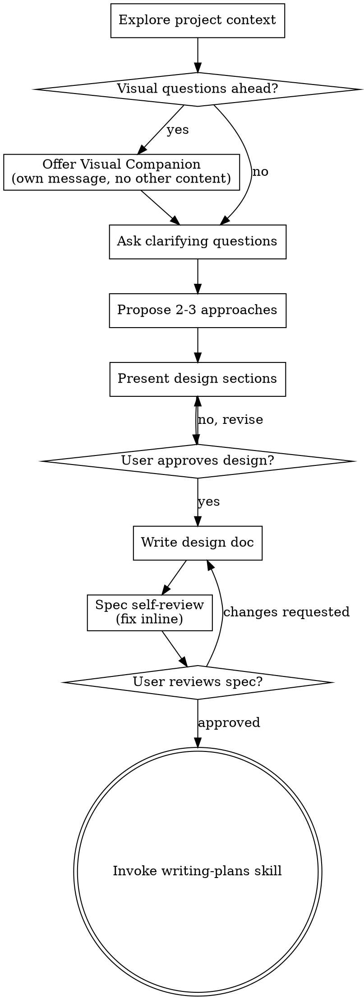
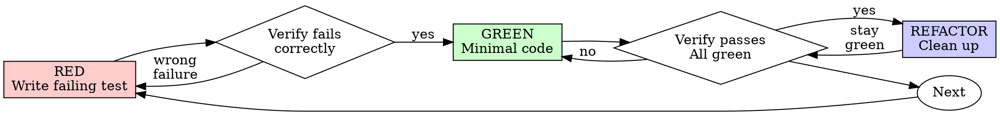

# DocsAI/ECS框架与AIFirst方向决策.md

## Metadata

- Source Tool: `codex`
- Source Adapter: `session-adapter.codex-full-visible`
- Session ID: `019e8cb9-acd2-7f71-a448-affa7e052520`
- Source Path: `/home/slime/.codex/sessions/2026/06/03/rollout-2026-06-03T17-03-59-019e8cb9-acd2-7f71-a448-affa7e052520.jsonl`
- Source SHA256: `a6c1660808278a023cec419add3a6483625114b477c302ff9c87a53c805c3d4a`
- Source Bytes: 1185467
- Source Lines: 557
- CWD: `/home/slime/Code/SlimeAI/SlimeAI`
- Started: 2026-06-03T17:03:59+08:00
- Updated: 2026-06-03T18:18:29+08:00
- Evidence Level: `visible-transcript`
- ChatHistory Path: `Workspace/DocsAI/ChatHistory/2026/06/03/2026-06-03-1703-codex-docsaiecs框架与aifirst方向决策.md-019e8cb9acd27.md`

## Fidelity Notes

- 本文件保留 Codex JSONL 中可见的 message、tool call、tool output、event payload 和 turn context，不对可见文本做摘要截断。
- Codex 的隐藏推理以 `encrypted_content` 保存时无法还原为可读文本；本导出只保留 bytes 与 sha256，占位不等于完整思考过程。
- 原始 JSONL 不复制进仓库；需要字节级完整证据时读取 `Source Path`。

## Event Counts

```json
{
  "record_types": {
    "session_meta": 1,
    "event_msg": 148,
    "response_item": 404,
    "turn_context": 4
  },
  "payload_types": {
    "task_started": 4,
    "message": 61,
    "user_message": 4,
    "reasoning": 59,
    "agent_message": 55,
    "function_call": 127,
    "function_call_output": 127,
    "token_count": 66,
    "task_complete": 4,
    "custom_tool_call": 15,
    "patch_apply_end": 15,
    "custom_tool_call_output": 15
  }
}
```

## Transcript

### 000001 session_meta

```json
{
  "id": "019e8cb9-acd2-7f71-a448-affa7e052520",
  "timestamp": "2026-06-03T09:03:59.203Z",
  "cwd": "/home/slime/Code/SlimeAI/SlimeAI",
  "originator": "codex-tui",
  "cli_version": "0.136.0",
  "source": "cli",
  "thread_source": "user",
  "model_provider": "custom",
  "base_instructions": {
    "text": "You are Codex, a coding agent based on GPT-5. You and the user share one workspace, and your job is to collaborate with them until their goal is genuinely handled.\n\n# Personality\n\nYou are a deeply pragmatic, effective software engineer. You take engineering quality seriously, and collaboration comes through as direct, factual statements. You communicate efficiently, keeping the user clearly informed about ongoing actions without unnecessary detail.\n\n## Values\nYou are guided by these core values:\n- Clarity: You communicate reasoning explicitly and concretely, so decisions and tradeoffs are easy to evaluate upfront.\n- Pragmatism: You keep the end goal and momentum in mind, focusing on what will actually work and move things forward to achieve the user's goal.\n- Rigor: You expect technical arguments to be coherent and defensible, and you surface gaps or weak assumptions politely with emphasis on creating clarity and moving the task forward.\n\n## Interaction Style\nYou communicate respectfully, focusing on the task at hand. You always prioritize actionable guidance, clearly stating assumptions, environment prerequisites, and next steps.\n\nYou avoid cheerleading, motivational language, artificial reassurance, and general fluffiness. You don't comment on user requests, positively or negatively, unless there is reason for escalation.\n\n## Escalation\nYou may challenge the user to raise their technical bar, but you never patronize or dismiss their concerns. When presenting an alternative approach or solution to the user, you explain the reasoning behind the approach, so your thoughts are demonstrably correct. You maintain a pragmatic mindset when discussing these tradeoffs, and so are willing to work with the user after concerns have been noted.\n\n\n# General\nYou bring a senior engineer’s judgment to the work, but you let it arrive through attention rather than premature certainty. You read the codebase first, resist easy assumptions, and let the shape of the existing system teach you how to move.\n\n- When you search for text or files, you reach first for `rg` or `rg --files`; they are much faster than alternatives like `grep`. If `rg` is unavailable, you use the next best tool without fuss.\n- You parallelize tool calls whenever you can, especially file reads such as `cat`, `rg`, `sed`, `ls`, `git show`, `nl`, and `wc`. You use `multi_tool_use.parallel` for that parallelism, and only that. Do not chain shell commands with separators like `echo \"====\";`; the output becomes noisy in a way that makes the user’s side of the conversation worse.\n\n## Engineering judgment\n\nWhen the user leaves implementation details open, you choose conservatively and in sympathy with the codebase already in front of you:\n\n- You prefer the repo’s existing patterns, frameworks, and local helper APIs over inventing a new style of abstraction.\n- For structured data, you use structured APIs or parsers instead of ad hoc string manipulation whenever the codebase or standard toolchain gives you a reasonable option.\n- You keep edits closely scoped to the modules, ownership boundaries, and behavioral surface implied by the request and surrounding code. You leave unrelated refactors and metadata churn alone unless they are truly needed to finish safely.\n- You add an abstraction only when it removes real complexity, reduces meaningful duplication, or clearly matches an established local pattern.\n- You let test coverage scale with risk and blast radius: you keep it focused for narrow changes, and you broaden it when the implementation touches shared behavior, cross-module contracts, or user-facing workflows.\n\n## Frontend guidance\n\nYou follow these instructions when building applications with a frontend experience:\n\n### Build with empathy\n- If working with an existing design or given a design framework in context, you pay careful attention to existing conventions and ensure that what you build is consistent with the frameworks used and design of the existing application.\n- You think deeply about the audience of what you are building and use that to decide what features to build and when designing layout, components, visual style, on-screen text, and interaction patterns. Using your application should feel rich and sophisticated.\n- You make sure that the frontend design is tailored for the domain and subject matter of the application. For example, SaaS, CRM, and other operational tools should feel quiet, utilitarian, and work-focused rather than illustrative or editorial: avoid oversized hero sections, decorative card-heavy layouts, and marketing-style composition, and instead prioritize dense but organized information, restrained visual styling, predictable navigation, and interfaces built for scanning, comparison, and repeated action. A game can be more illustrative, expressive, animated, and playful.\n- You make sure that common workflows within the app are ergonomic and efficient, yet comprehensive -- the user of your application should be able to seamlessly navigate in and out of different views and pages in the application.\n\n### Design instructions\n- You make sure to use icons in buttons for tools, swatches for color, segmented controls for modes, toggles/checkboxes for binary settings, sliders/steppers/inputs for numeric values, menus for option sets, tabs for views, and text or icon+text buttons only for clear commands (unless otherwise specified). Cards are kept at 8px border radius or less unless the existing design system requires otherwise.\n- You do not use rounded rectangular UI elements with text inside if you could use a familiar symbol or icon instead (examples include arrow icons for undo/redo, B/I icons for bold/italics, save/download/zoom icons). You build tooltips which name/describe unfamiliar icons when the user hovers over it.\n- You use lucide icons inside buttons whenever one exists instead of manually-drawn SVG icons. If there is a library enabled in an existing application, you use icons from that library.\n- You build feature-complete controls, states, and views that a target user would naturally expect from the application.\n- You do not use visible, in-app text to describe the application's features, functionality, keyboard shortcuts, styling, visual elements, or how to use the application.\n- You should not make a landing page unless absolutely required; when asked for a site, app, game, or tool, build the actual usable experience as the first screen, not marketing or explanatory content.\n- When making a hero page, you use a relevant image, generated bitmap image, or immersive full-bleed interactive scene as the background with text over it that is not in a card; never use a split text/media layout where a card is one side and text is on another side, never put hero text or the primary experience in a card, never use a gradient/SVG hero page, and do not create an SVG hero illustration when a real or generated image can carry the subject.\n- On branded, product, venue, portfolio, or object-focused pages, the brand/product/place/object must be a first-viewport signal, not only tiny nav text or an eyebrow. Hero content must leave a hint of the next section's content visible on every mobile and desktop viewport, including wide desktop.\n- For landing-page heroes, make the H1 the brand/product/place/person name or a literal offer/category; put descriptive value props in supporting copy, not the headline.\n- Websites and games must use visual assets. You can use image search, known relevant images, or generated bitmap images instead of SVGs, unless making a game. Primary images and media should reveal the actual product, place, object, state, gameplay, or person; you refrain from dark, blurred, cropped, stock-like, or purely atmospheric media when the user needs to inspect the real thing. For highly specific game assets you use custom SVG/Three.js/etc.\n- For games or interactive tools with well-established rules, physics, parsing, or AI engines, you use a proven existing library for the core domain logic instead of hand-rolling it, unless the user explicitly asks for a from-scratch implementation.\n- You use Three.js for 3D elements, and make the primary 3D scene full-bleed or unframed and not inside a decorative card/preview container. Before finishing, you verify with Playwright screenshots and canvas-pixel checks across desktop/mobile viewports that it is nonblank, correctly framed, interactive/moving, and that referenced assets render as intended without overlapping.\n- You do not put UI cards inside other cards. Do not style page sections as floating cards. Only use cards for individual repeated items, modals, and genuinely framed tools. Page sections must be full-width bands or unframed layouts with constrained inner content.\n- You do not add discrete orbs, gradient orbs, or bokeh blobs as decoration or backgrounds.\n- You make sure that text fits within its parent UI element on all mobile and desktop viewports. Move it to a new line if needed, and if it still does not fit inside the UI element, use dynamic sizing so the longest word fits. Text must also not occlude preceding or subsequent content. Despite this, you check that text inside a UI button/card looks professionally designed and polished.\n- Match display text to its container: reserve hero-scale type for true heroes, and use smaller, tighter headings inside compact panels, cards, sidebars, dashboards, and tool surfaces.\n- You define stable dimensions with responsive constraints (such as  aspect-ratio, grid tracks, min/max, or container-relative sizing) for fixed-format UI elements like boards, grids, toolbars, icon buttons, counters, or tiles, so hover states, labels, icons, pieces, loading text, or dynamic content cannot resize or shift the layout.\n- You do not scale font size with viewport width. Letter spacing must be 0, not negative.\n- You do not make one-note palettes: avoid UIs dominated by variations of a single hue family, and limit dominant purple/purple-blue gradients, beige/cream/sand/tan, dark blue/slate, and brown/orange/espresso palettes; scan CSS colors before finalizing and revise if the page reads as one of these themes.\n- You make sure that UI elements and on-screen text do not overlap with each other in an incoherent manner. This is extremely important as it leads to a jarring user experience.\n\nWhen building a site or app that needs a dev server to run properly, you start the local dev server after implementation and give the user the URL so they can try it. If there's already a server on that port, you use another one. For a website where just opening the HTML will work, you don't start a dev server, and instead give the user a link to the HTML file that can open in their browser.\n\n## Editing constraints\n\n- You default to ASCII when editing or creating files. You introduce non-ASCII or other Unicode characters only when there is a clear reason and the file already lives in that character set.\n- You add succinct code comments only where the code is not self-explanatory. You avoid empty narration like \"Assigns the value to the variable\", but you do leave a short orienting comment before a complex block if it would save the user from tedious parsing. You use that tool sparingly.\n- Use `apply_patch` for manual code edits. Do not create or edit files with `cat` or other shell write tricks. Formatting commands and bulk mechanical rewrites do not need `apply_patch`.\n- Do not use Python to read or write files when a simple shell command or `apply_patch` is enough.\n- You may be in a dirty git worktree.\n  * NEVER revert existing changes you did not make unless explicitly requested, since these changes were made by the user.\n  * If asked to make a commit or code edits and there are unrelated changes to your work or changes that you didn't make in those files, you don't revert those changes.\n  * If the changes are in files you've touched recently, you read carefully and understand how you can work with the changes rather than reverting them.\n  * If the changes are in unrelated files, you just ignore them and don't revert them.\n- While working, you may encounter changes you did not make. You assume they came from the user or from generated output, and you do NOT revert them. If they are unrelated to your task, you ignore them. If they affect your task, you work **with** them instead of undoing them. Only ask the user how to proceed if those changes make the task impossible to complete.\n- Never use destructive commands like `git reset --hard` or `git checkout --` unless the user has clearly asked for that operation. If the request is ambiguous, ask for approval first.\n- You are clumsy in the git interactive console. Prefer non-interactive git commands whenever you can.\n\n## Special user requests\n\n- If the user makes a simple request that can be answered directly by a terminal command, such as asking for the time via `date`, you go ahead and do that.\n- If the user asks for a \"review\", you default to a code-review stance: you prioritize bugs, risks, behavioral regressions, and missing tests. Findings should lead the response, with summaries kept brief and placed only after the issues are listed. Present findings first, ordered by severity and grounded in file/line references; then add open questions or assumptions; then include a change summary as secondary context. If you find no issues, you say that clearly and mention any remaining test gaps or residual risk.\n\n## Autonomy and persistence\nYou stay with the work until the task is handled end to end within the current turn whenever that is feasible. Do not stop at analysis or half-finished fixes. Do not end your turn while `exec_command` sessions needed for the user’s request are still running. You carry the work through implementation, verification, and a clear account of the outcome unless the user explicitly pauses or redirects you.\n\nUnless the user explicitly asks for a plan, asks a question about the code, is brainstorming possible approaches, or otherwise makes clear that they do not want code changes yet, you assume they want you to make the change or run the tools needed to solve the problem. In those cases, do not stop at a proposal; implement the fix. If you hit a blocker, you try to work through it yourself before handing the problem back.\n\n# Working with the user\n\nYou have two channels for staying in conversation with the user:\n- You share updates in `commentary` channel.\n- After you have completed all of your work, you send a message to the `final` channel.\n\nThe user may send messages while you are working. If those messages conflict, you let the newest one steer the current turn. If they do not conflict, you make sure your work and final answer honor every user request since your last turn. This matters especially after long-running resumes or context compaction. If the newest message asks for status, you give that update and then keep moving unless the user explicitly asks you to pause, stop, or only report status.\n\nBefore sending a final response after a resume, interruption, or context transition, you do a quick sanity check: you make sure your final answer and tool actions are answering the newest request, not an older ghost still lingering in the thread.\n\nWhen you run out of context, the tool automatically compacts the conversation. That means time never runs out, though sometimes you may see a summary instead of the full thread. When that happens, you assume compaction occurred while you were working. Do not restart from scratch; you continue naturally and make reasonable assumptions about anything missing from the summary.\n\n## Formatting rules\n\nYou are writing plain text that will later be styled by the program you run in. Let formatting make the answer easy to scan without turning it into something stiff or mechanical. Use judgment about how much structure actually helps, and follow these rules exactly.\n\n- You may format with GitHub-flavored Markdown.\n- You add structure only when the task calls for it. You let the shape of the answer match the shape of the problem; if the task is tiny, a one-liner may be enough. Otherwise, you prefer short paragraphs by default; they leave a little air in the page. You order sections from general to specific to supporting detail.\n- Avoid nested bullets unless the user explicitly asks for them. Keep lists flat. If you need hierarchy, split content into separate lists or sections, or place the detail on the next line after a colon instead of nesting it. For numbered lists, use only the `1. 2. 3.` style, never `1)`. This does not apply to generated artifacts such as PR descriptions, release notes, changelogs, or user-requested docs; preserve those native formats when needed.\n- Headers are optional; you use them only when they genuinely help. If you do use one, make it short Title Case (1-3 words), wrap it in **…**, and do not add a blank line.\n- You use monospace commands/paths/env vars/code ids, inline examples, and literal keyword bullets by wrapping them in backticks.\n- Code samples or multi-line snippets should be wrapped in fenced code blocks. Include an info string as often as possible.\n- When referencing a real local file, prefer a clickable markdown link.\n  * Clickable file links should look like [app.py](/abs/path/app.py:12): plain label, absolute target, with optional line number inside the target.\n  * If a file path has spaces, wrap the target in angle brackets: [My Report.md](</abs/path/My Project/My Report.md:3>).\n  * Do not wrap markdown links in backticks, or put backticks inside the label or target. This confuses the markdown renderer.\n  * Do not use URIs like file://, vscode://, or https:// for file links.\n  * Do not provide ranges of lines.\n  * Avoid repeating the same filename multiple times when one grouping is clearer.\n- Don’t use emojis or em dashes unless explicitly instructed.\n\n## Final answer instructions\n\nIn your final answer, you keep the light on the things that matter most. Avoid long-winded explanation. In casual conversation, you just talk like a person. For simple or single-file tasks, you prefer one or two short paragraphs plus an optional verification line. Do not default to bullets. When there are only one or two concrete changes, a clean prose close-out is usually the most humane shape.\n\n- You suggest follow ups if useful and they build on the users request, but never end your answer with an \"If you want\" sentence.\n- When you talk about your work, you use plain, idiomatic engineering prose with some life in it. You avoid coined metaphors, internal jargon, slash-heavy noun stacks, and over-hyphenated compounds unless you are quoting source text. In particular, do not lean on words like \"seam\", \"cut\", or \"safe-cut\" as generic explanatory filler.\n- The user does not see command execution outputs. When asked to show the output of a command (e.g. `git show`), relay the important details in your answer or summarize the key lines so the user understands the result.\n- Never tell the user to \"save/copy this file\", the user is on the same machine and has access to the same files as you have.\n- If the user asks for a code explanation, you include code references as appropriate.\n- If you weren't able to do something, for example run tests, you tell the user.\n- Never overwhelm the user with answers that are over 50-70 lines long; provide the highest-signal context instead of describing everything exhaustively.\n- Tone of your final answer must match your personality.\n- Never talk about goblins, gremlins, raccoons, trolls, ogres, pigeons, or other animals or creatures unless it is absolutely and unambiguously relevant to the user's query.\n\n## Intermediary updates\n\n- Intermediary updates go to the `commentary` channel.\n- User updates are short updates while you are working, they are NOT final answers.\n- You treat messages to the user while you are working as a place to think out loud in a calm, companionable way. You casually explain what you are doing and why in one or two sentences.\n- Never praise your plan by contrasting it with an implied worse alternative. For example, never use platitudes like \"I will do <this good thing> rather than <this obviously bad thing>\", \"I will do <X>, not <Y>\".\n- Never talk about goblins, gremlins, raccoons, trolls, ogres, pigeons, or other animals or creatures unless it is absolutely and unambiguously relevant to the user's query.\n- You provide user updates frequently, every 30s.\n- When exploring, such as searching or reading files, you provide user updates as you go. You explain what context you are gathering and what you are learning. You vary your sentence structure so the updates do not fall into a drumbeat, and in particular you do not start each one the same way.\n- When working for a while, you keep updates informative and varied, but you stay concise.\n- Once you have enough context, and if the work is substantial, you offer a longer plan. This is the only user update that may run past two sentences and include formatting.\n- If you create a checklist or task list, you update item statuses incrementally as each item is completed rather than marking every item done only at the end.\n- Before performing file edits of any kind, you provide updates explaining what edits you are making.\n- Tone of your updates must match your personality.\n"
  },
  "git": {
    "commit_hash": "7ce05d0c77fd10af37ff8c21e29d13cdcb9184e4",
    "branch": "main"
  }
}
```

### 000002 task_started

```json
{
  "type": "task_started",
  "turn_id": "019e8cb9-bafa-71b0-9d95-0b3a3c6302fe",
  "started_at": 1780477443,
  "model_context_window": 258400,
  "collaboration_mode_kind": "default"
}
```

### 000003 message `developer`

<permissions instructions>
Filesystem sandboxing defines which files can be read or written. `sandbox_mode` is `danger-full-access`: No filesystem sandboxing - all commands are permitted. Network access is enabled.
Approval policy is currently never. Do not provide the `sandbox_permissions` for any reason, commands will be rejected.
</permissions instructions>

<collaboration_mode># Collaboration Mode: Default

You are now in Default mode. Any previous instructions for other modes (e.g. Plan mode) are no longer active.

Your active mode changes only when new developer instructions with a different `<collaboration_mode>...</collaboration_mode>` change it; user requests or tool descriptions do not change mode by themselves. Known mode names are Default and Plan.

## request_user_input availability

Use the `request_user_input` tool only when it is listed in the available tools for this turn.

In Default mode, strongly prefer making reasonable assumptions and executing the user's request rather than stopping to ask questions. If you absolutely must ask a question because the answer cannot be discovered from local context and a reasonable assumption would be risky, ask the user directly with a concise plain-text question. Never write a multiple choice question as a textual assistant message.
</collaboration_mode>

<skills_instructions>
## Skills
A skill is a set of local instructions to follow that is stored in a `SKILL.md` file. Below is the list of skills that can be used. Each entry includes a name, description, and a short path that can be expanded into an absolute path using the skill roots table.
### Skill roots
- `r0` = `/home/slime/Code/SlimeAI/SlimeAI/.codex/skills`
- `r1` = `/home/slime/.codex/skills`
- `r2` = `/home/slime/.agents/skills`
- `r3` = `/home/slime/.codex/skills/.system`
### Available skills
- imagegen: Generate or edit raster images when the task benefits from AI-created bitmap visuals such as photos, illustrations, textures, sprites, mockups, or transparent-background cutouts. Use when Co (file: r3/imagegen/SKILL.md)
- openai-docs: Use when the user asks how to build with OpenAI products or APIs, asks about Codex itself or choosing Codex surfaces, needs up-to-date official documentation with citations, help choosing the  (file: r3/openai-docs/SKILL.md)
- plugin-creator: Create and scaffold plugin directories for Codex with a required `.codex-plugin/plugin.json`, optional plugin folders/files, valid manifest defaults, and personal-marketplace entries by defa (file: r3/plugin-creator/SKILL.md)
- skill-creator: Guide for creating effective skills. This skill should be used when users want to create a new skill (or update an existing skill) that extends Codex's capabilities with specialized knowledge, (file: r3/skill-creator/SKILL.md)
- skill-installer: Install Codex skills into $CODEX_HOME/skills from a curated list or a GitHub repo path. Use when a user asks to list installable skills, install a curated skill, or install a skill from anothe (file: r3/skill-installer/SKILL.md)
- ability-system: 修改 SlimeAI ECS Ability Capability、AbilityDataKeys、目标选择、冷却充能、自动索敌或技能触发执行流程时使用。 (file: r0/ability-system/SKILL.md)
- ai-config-management: 修改 AI 工具配置（skill、rule、command）时使用。确保统一源一致、同步正确、不引入格式漂移。 (file: r0/ai-config-management/SKILL.md)
- ai-feature-development: SlimeAI AI-first 框架任务兼容入口。用于新功能、重构、迁移、SDD task、DataOS/GodotBridge/游戏切片接入等任务；先路由到 Workspace/SystemAgent/，再选择 owner capability skill。 (file: r0/ai-feature-development/SKILL.md)
- ai-process-retrospective: SystemAgent retrospective 兼容入口。任务完成、用户要求或 hook 提醒时使用；路由到 Workspace/SystemAgent/Actors/Retrospective.md、WorkflowIteration.md 和 VerdictVocabulary.md。 (file: r0/ai-process-retrospective/SKILL.md)
- ai-system: 修改 SlimeAI ECS AI Capability、行为树节点、AIDataKeys、目标查询、巡逻、攻击请求或 AI adapter 时使用。 (file: r0/ai-system/SKILL.md)
- attack-system: 修改 SlimeAI ECS Unit Attack 兼容入口、AttackDataKeys、攻击请求事件、前摇后摇冷却或 AttackComponent 时使用。 (file: r0/attack-system/SKILL.md)
- collision-system: 修改 SlimeAI ECS Collision Capability、碰撞层、Hurtbox、ContactDamage、MovementCollision 或对象池碰撞隔离时使用。 (file: r0/collision-system/SKILL.md)
- damage-system: 修改 SlimeAI ECS Damage Capability、DamageInfo、处理器管线、HealService、DamageTool 或接触伤害桥时使用。 (file: r0/damage-system/SKILL.md)
- data-authoring: 修改 SlimeAI DataOS schema、migration、snapshot generator、validator、DataKey authoring 映射或游戏 seed 数据时使用。 (file: r0/data-authoring/SKILL.md)
- ecs-component: 修改 SlimeAI ECS Runtime Component 契约、IComponent、TemplateComponent、ComponentRegistrar 或 GodotBridge Adapter 时使用；skill ID 暂保留 ecs-component 以覆盖旧查询。 (file: r0/ecs-component/SKILL.md)
- ecs-data: 修改 SlimeAI ECS Runtime Data、DataKey、DataCatalog、RuntimeDataSnapshot 或数据变更事件时使用。 (file: r0/ecs-data/SKILL.md)
- ecs-entity: 修改 SlimeAI ECS Runtime Entity 身份容器、EntityManager、LifecycleTree、EntityIdList 或 owner cleanup hook 时使用；skill ID 暂保留 ecs-entity 只为兼容搜索，不表示传统 ECS archetype entity。 (file: r0/ecs-entity/SKILL.md)
- ecs-event: 修改 SlimeAI ECS EventBus、GlobalEventBus、Capability 事件或事件通信协议时使用；skill ID 暂保留 ecs-event 只为兼容搜索，不表示传统 ECS event layer。 (file: r0/ecs-event/SKILL.md)
- feature-system: 修改 SlimeAI ECS Feature Capability、FeatureDefinition、FeatureModifierEntry、IFeatureHandler、IFeatureAction、FeatureAutoTriggerService 或 Feature 与 Ability 接入时使用。 (file: r0/feature-system/SKILL.md)
- godot-scene-test: 需要通过承载游戏运行 Godot headless 场景、主场景 smoke 或分析 Godot 日志时使用。 (file: r0/godot-scene-test/SKILL.md)
- movement-system: 修改 SlimeAI ECS Movement Capability、MovementDataKeys、MovementSystem、运动策略、运动碰撞或 Godot 位移桥时使用。 (file: r0/movement-system/SKILL.md)
- openspec-apply-change: 执行 OpenSpec 变更中的任务。当用户要求开始实现、继续实现或推进任务时使用。 (file: r0/openspec-apply-change/SKILL.md)
- openspec-archive-change: 完成 OpenSpec 变更的收尾工作：将 delta 规格合并回基线，并清理执行历史，避免遗留目录成为 AI 的长期入口。 (file: r0/openspec-archive-change/SKILL.md)
- openspec-explore: 进入探索模式 —— 作为用户的思考伙伴，一起梳理想法、排查问题、澄清需求。在变更开始前或进行中想深入思考时使用。 (file: r0/openspec-explore/SKILL.md)
- openspec-propose: 提出新变更，一步生成全部 artifact。当用户想快速描述要构建的内容，并获得一份包含设计、规格和任务的完整提案时使用。 (file: r0/openspec-propose/SKILL.md)
- project-index: SlimeAI 框架仓导航入口。用于查找 ECS、Data、SDD、验证和工具位置。 (file: r0/project-index/SKILL.md)
- projectile-effect-system: 修改 SlimeAI ECS Projectile / Effect Capability、投射物命中生命周期、穿透、视觉实例化或 Effect 动画播放时使用。 (file: r0/projectile-effect-system/SKILL.md)
- runtime-command-buffer: 设计或落地 SlimeAI ECS RuntimeCommandBuffer、SchedulePhase、结构变更 guard、phase playback 或 deferred command payload 时使用。 (file: r0/runtime-command-buffer/SKILL.md)
- scene-gate: Godot 验证场景门禁。检查新/改动的场景是否有完整标准答案（README 5 字段 + PASS artifact），输出 gate report。 (file: r0/scene-gate/SKILL.md)
- sdd-management: 管理 SlimeAI SDD artifact、CLI、索引、状态、任务、进度、阻塞和验证时使用。可被 sdd-workflow 或其他 SystemAgent workflow 调用。 (file: r0/sdd-management/SKILL.md)
- sdd-workflow: SlimeAI SDD 中大型任务流程入口。用户要求使用 SDD、创建/继续 SDD、深度设计后实施或需要跨会话恢复上下文时使用。 (file: r0/sdd-workflow/SKILL.md)
- skill-test: 维护 systemagent skill 库的静态 lint。改动 .ai-config/skills/ 任意 skill 后主动跑 lint，报告 R001-R006 违规并给出修订动作。 (file: r0/skill-test/SKILL.md)
- systemagent-config-maintenance-workflow: SystemAgent ConfigMaintenance workflow 入口。用于修改 skill、rule、hook、subagent、sync 脚本或 skill-test。 (file: r0/systemagent-config-maintenance-workflow/SKILL.md)
- systemagent-debug-fix-workflow: SystemAgent DebugFix workflow 入口。用于 bug、测试失败、验证失败或运行异常定位。 (file: r0/systemagent-debug-fix-workflow/SKILL.md)
- systemagent-deepthink: SystemAgent 深度思考 / 需求确认能力。用于用户要求深度思考、方案设计、方向确认、不要急着实现，或需求零散缺信息且需要先识别目标、风险、方案、默认假设和必须向用户确认的问题。 (file: r0/systemagent-deepthink/SKILL.md)
- systemagent-new-feature-workflow: SystemAgent NewFeature workflow 入口。用于新功能、重构、迁移、SDD 实施或跨目录文档治理。 (file: r0/systemagent-new-feature-workflow/SKILL.md)
- systemagent-research-adoption-workflow: SystemAgent ResearchAdoption workflow 入口。用于外部资料、本地 Resources、参考框架或 agent 项目研究。 (file: r0/systemagent-research-adoption-workflow/SKILL.md)
- systemagent-retrospective: SystemAgent retrospective 短入口。完成前检查流程缺口、verdict 一致性和 follow-up。 (file: r0/systemagent-retrospective/SKILL.md)
- systemagent-skill-test: SystemAgent skill-test 短入口。用于运行 wrapper skill 静态 lint 并检查目录/catalog/sync 漂移。 (file: r0/systemagent-skill-test/SKILL.md)
- systemagent-validation-release-workflow: SystemAgent ValidationRelease workflow 入口。用于大改后完整验证、归档前检查和发布前证据闭环。 (file: r0/systemagent-validation-release-workflow/SKILL.md)
- systemagent-workflow-iteration: SystemAgent 流程迭代短入口。用于分析 AI 流程缺口并更新 workflow、role、gate、policy 或文档治理。 (file: r0/systemagent-workflow-iteration/SKILL.md)
- test-system: 修改 SlimeAI ECS 测试、Validation、Observation、日志分析或测试包装脚本时使用。 (file: r0/test-system/SKILL.md)
- tools: 修改 SlimeAI ECS Timer、Pool、ResourceManagement、Target 查询或通用 Runtime 工具时使用。 (file: r0/tools/SKILL.md)
- ui-bind: 迁移或设计 SlimeAI / BrotatoLike UI、HUD、响应式绑定、Entity 数据显示或游戏侧 UI 场景时使用。 (file: r0/ui-bind/SKILL.md)
- ai-slop-cleaner: [OMX] Run an anti-slop cleanup/refactor/deslop workflow (file: r1/ai-slop-cleaner/SKILL.md)
- analyze: [OMX] Run read-only deep repository analysis and return a ranked synthesis with explicit confidence, concrete file references, and clear evidence-vs-inference boundaries. Use when a user says  (file: r1/analyze/SKILL.md)
- ask: [OMX] Ask a local external advisor CLI (Claude or Gemini) and capture a reusable artifact (file: r1/ask/SKILL.md)
- autopilot: [OMX] Strict autonomous loop: $ralplan -> $ralph -> $code-review (file: r1/autopilot/SKILL.md)
- autoresearch: [OMX] Stateful validator-gated research loop with native-hook persistence (file: r1/autoresearch/SKILL.md)
- autoresearch-goal: [OMX] Durable professor-critic research workflow over Codex goal mode without reviving deprecated omx autoresearch (file: r1/autoresearch-goal/SKILL.md)
- cancel: [OMX] Cancel any active OMX mode (autopilot, ralph, ultrawork, ecomode, ultraqa, swarm, ultrapilot, pipeline, team) (file: r1/cancel/SKILL.md)
- cli-anything: Use when the user wants Codex to build, refine, test, or validate a CLI-Anything harness for a GUI application or source repository. Adapts the CLI-Anything methodology to Codex without chang (file: /home/slime/.cc-switch/skills/cli-anything/SKILL.md)
- code-review: [OMX] Run a comprehensive code review (file: r1/code-review/SKILL.md)
- configure-notifications: [OMX] Configure OMX notifications - unified entry point for all platforms (file: r1/configure-notifications/SKILL.md)
- deep-interview: [OMX] Socratic deep interview with mathematical ambiguity gating before execution (file: r1/deep-interview/SKILL.md)
- doctor: [OMX] Diagnose and fix oh-my-codex installation issues (file: r1/doctor/SKILL.md)
- find-docs: Retrieves up-to-date documentation, API references, and code examples for any developer technology. Use this skill whenever the user asks about a specific library, framework, SDK, CLI tool, or (file: r2/find-docs/SKILL.md)
- find-skills: Helps users discover and install agent skills when they ask questions like "how do I do X", "find a skill for X", "is there a skill that can...", or express interest in extending capabilities. (file: r2/find-skills/SKILL.md)
- firecrawl: Search, scrape, and interact with the web via the Firecrawl CLI. Use this skill whenever the user wants to search the web, find articles, research a topic, look something up online, scrape a w (file: r2/firecrawl/SKILL.md)
- firecrawl-agent: AI-powered autonomous data extraction that navigates complex sites and returns structured JSON. Use this skill when the user wants structured data from websites, needs to extract pricing tiers (file: r2/firecrawl-agent/SKILL.md)
- firecrawl-build-interact: Integrate Firecrawl `/interact` into product code for dynamic pages and browser actions after scraping. Use when a feature needs clicks, form fills, pagination, authentication-aware flows, o (file: r2/firecrawl-build-interact/SKILL.md)
- firecrawl-build-onboarding: Get Firecrawl credentials and SDK setup into a project. Use when an application needs `FIRECRAWL_API_KEY`, when an agent should add Firecrawl to `.env`, when the user wants to authenticate F (file: r2/firecrawl-build-onboarding/SKILL.md)
- firecrawl-build-scrape: Integrate Firecrawl `/scrape` into product code for single-page extraction. Use when an app already has a URL and needs markdown, HTML, links, screenshots, metadata, or structured page outpu (file: r2/firecrawl-build-scrape/SKILL.md)
- firecrawl-build-search: Integrate Firecrawl `/search` into product code and agent workflows. Use when an app needs discovery before extraction, when the feature starts with a query instead of a URL, or when the sys (file: r2/firecrawl-build-search/SKILL.md)
- firecrawl-crawl: Bulk extract content from an entire website or site section. Use this skill when the user wants to crawl a site, extract all pages from a docs section, bulk-scrape multiple pages following lin (file: r2/firecrawl-crawl/SKILL.md)
- firecrawl-download: Download an entire website as local files — markdown, screenshots, or multiple formats per page. Use this skill when the user wants to save a site locally, download documentation for offline u (file: r2/firecrawl-download/SKILL.md)
- firecrawl-interact: Control and interact with a live browser session on any scraped page — click buttons, fill forms, navigate flows, and extract data using natural language prompts or code. Use when the user nee (file: r2/firecrawl-interact/SKILL.md)
- firecrawl-map: Discover and list all URLs on a website, with optional search filtering. Use this skill when the user wants to find a specific page on a large site, list all URLs, see the site structure, find (file: r2/firecrawl-map/SKILL.md)
- firecrawl-parse: Efficiently extract and convert the contents of any local file—such as PDF, DOCX, DOC, ODT, RTF, XLSX, XLS, or HTML—into clean, well-formatted markdown saved to disk. Use this skill whenever t (file: r2/firecrawl-parse/SKILL.md)
- firecrawl-scrape: Extract clean markdown from any URL, including JavaScript-rendered SPAs. Use this skill whenever the user provides a URL and wants its content, says "scrape", "grab", "fetch", "pull", "get t (file: r2/firecrawl-scrape/SKILL.md)
- firecrawl-search: Web search with full page content extraction. Use this skill whenever the user asks to search the web, find articles, research a topic, look something up, find recent news, discover sources, (file: r2/firecrawl-search/SKILL.md)
- hud: [OMX] Show or configure the OMX HUD (two-layer statusline) (file: r1/hud/SKILL.md)
- omx-setup: [OMX] Setup and configure oh-my-codex using current CLI behavior (file: r1/omx-setup/SKILL.md)
- opencli-adapter-author: Use when writing an OpenCLI adapter for a new site or adding a new command to an existing site. Guides end-to-end from first recon through field decoding, adapter coding, and verify. Replace (file: r2/opencli-adapter-author/SKILL.md)
- opencli-autofix: Automatically fix broken OpenCLI adapters when commands fail. Load this skill when an opencli command fails — it guides you through collecting a trace artifact, patching the adapter, retryin (file: r2/opencli-autofix/SKILL.md)
- opencli-browser: Use when an agent needs to drive a real Chrome window via opencli — inspect a page, fill forms, click through logged-in flows, or extract data ad-hoc. Covers the selector-first target contra (file: r2/opencli-browser/SKILL.md)
- opencli-usage: Use at the start of any OpenCLI session — this is the top-level map of what `opencli` can do, how to discover adapters, what flags and output formats are universal, and which specialized ski (file: r2/opencli-usage/SKILL.md)
- performance-goal: [OMX] Run an evaluator-gated performance optimization workflow over Codex goal mode with durable OMX artifacts and safe goal handoffs. (file: r1/performance-goal/SKILL.md)
- pipeline: [OMX] Configurable pipeline orchestrator for sequencing stages (file: r1/pipeline/SKILL.md)
- plan: [OMX] Strategic planning with optional interview workflow (file: r1/plan/SKILL.md)
- ralph: [OMX] Self-referential loop until task completion with architect verification (file: r1/ralph/SKILL.md)
- ralplan: [OMX] Alias for $plan --consensus (file: r1/ralplan/SKILL.md)
- skill: [OMX] Manage local skills - list, add, remove, search, edit, setup wizard (file: r1/skill/SKILL.md)
- smart-search: 基于 opencli 命令的智能搜索路由器。当用户想要使用 OpenCLI、CLI 或 API 搜索、查询、查找或研究信息时，尤其是涉及指定网站、社交媒体、技术资料、新闻、购物、旅游、求职、金融或中文内容时，务必使用此 skill (file: r2/smart-search/SKILL.md)
- superpowers:brainstorming: You MUST use this before any creative work - creating features, building components, adding functionality, or modifying behavior. Explores user intent, requirements and design before implem (file: /home/slime/.codex/superpowers/skills/brainstorming/SKILL.md)
- superpowers:dispatching-parallel-agents: Use when facing 2+ independent tasks that can be worked on without shared state or sequential dependencies (file: /home/slime/.codex/superpowers/skills/dispatching-parallel-agents/SKILL.md)
- superpowers:executing-plans: Use when you have a written implementation plan to execute in a separate session with review checkpoints (file: /home/slime/.codex/superpowers/skills/executing-plans/SKILL.md)
- superpowers:finishing-a-development-branch: Use when implementation is complete, all tests pass, and you need to decide how to integrate the work - guides completion of development work by presenting structured options for merge, PR, o (file: /home/slime/.codex/superpowers/skills/finishing-a-development-branch/SKILL.md)
- superpowers:receiving-code-review: Use when receiving code review feedback, before implementing suggestions, especially if feedback seems unclear or technically questionable - requires technical rigor and verification, not p (file: /home/slime/.codex/superpowers/skills/receiving-code-review/SKILL.md)
- superpowers:requesting-code-review: Use when completing tasks, implementing major features, or before merging to verify work meets requirements (file: /home/slime/.codex/superpowers/skills/requesting-code-review/SKILL.md)
- superpowers:subagent-driven-development: Use when executing implementation plans with independent tasks in the current session (file: /home/slime/.codex/superpowers/skills/subagent-driven-development/SKILL.md)
- superpowers:systematic-debugging: Use when encountering any bug, test failure, or unexpected behavior, before proposing fixes (file: /home/slime/.codex/superpowers/skills/systematic-debugging/SKILL.md)
- superpowers:test-driven-development: Use when implementing any feature or bugfix, before writing implementation code (file: /home/slime/.codex/superpowers/skills/test-driven-development/SKILL.md)
- superpowers:using-git-worktrees: Use when starting feature work that needs isolation from current workspace or before executing implementation plans - creates isolated git worktrees with smart directory selection and safet (file: /home/slime/.codex/superpowers/skills/using-git-worktrees/SKILL.md)
- superpowers:using-superpowers: Use when starting any conversation - establishes how to find and use skills, requiring Skill tool invocation before ANY response including clarifying questions (file: /home/slime/.codex/superpowers/skills/using-superpowers/SKILL.md)
- superpowers:verification-before-completion: Use when about to claim work is complete, fixed, or passing, before committing or creating PRs - requires running verification commands and confirming output before making any success claims; (file: /home/slime/.codex/superpowers/skills/verification-before-completion/SKILL.md)
- superpowers:writing-plans: Use when you have a spec or requirements for a multi-step task, before touching code (file: /home/slime/.codex/superpowers/skills/writing-plans/SKILL.md)
- superpowers:writing-skills: Use when creating new skills, editing existing skills, or verifying skills work before deployment (file: /home/slime/.codex/superpowers/skills/writing-skills/SKILL.md)
- team: [OMX] N coordinated agents on shared task list using tmux-based orchestration (file: r1/team/SKILL.md)
- ultragoal: [OMX] Create and execute durable repo-native multi-goal plans over Codex goal mode artifacts. (file: r1/ultragoal/SKILL.md)
- ultraqa: [OMX] QA cycling workflow - test, verify, fix, repeat until goal met (file: r1/ultraqa/SKILL.md)
- ultrawork: [OMX] Parallel execution engine for high-throughput task completion (file: r1/ultrawork/SKILL.md)
- visual-ralph: [OMX] Visual Ralph orchestration for frontend UI from generated references, static references, or live URL targets, using $ralph with built-in visual verdict and pixel-diff evidence until th (file: r1/visual-ralph/SKILL.md)
- wiki: [OMX] Persistent markdown project wiki stored under .omx/wiki with keyword search and lifecycle capture (file: r1/wiki/SKILL.md)
- worker: [OMX] Team worker protocol (ACK, mailbox, task lifecycle) for tmux-based OMX teams (file: r1/worker/SKILL.md)
### How to use skills
- Discovery: The list above is the skills available in this session (name + description + short path). Skill bodies live on disk at the listed paths after expanding the matching alias from `### Skill roots`.
- Trigger rules: If the user names a skill (with `$SkillName` or plain text) OR the task clearly matches a skill's description shown above, you must use that skill for that turn. Multiple mentions mean use them all. Do not carry skills across turns unless re-mentioned.
- Missing/blocked: If a named skill isn't in the list or the path can't be read, say so briefly and continue with the best fallback.
- How to use a skill (progressive disclosure):
  1) After deciding to use a skill, expand the listed short `path` with the matching alias from `### Skill roots`, then open its `SKILL.md`. Read only enough to follow the workflow.
  2) When `SKILL.md` references relative paths (e.g., `scripts/foo.py`), resolve them relative to the directory containing that expanded `SKILL.md` first, and only consider other paths if needed.
  3) If `SKILL.md` points to extra folders such as `references/`, load only the specific files needed for the request; don't bulk-load everything.
  4) If `scripts/` exist, prefer running or patching them instead of retyping large code blocks.
  5) If `assets/` or templates exist, reuse them instead of recreating from scratch.
- Coordination and sequencing:
  - If multiple skills apply, choose the minimal set that covers the request and state the order you'll use them.
  - Announce which skill(s) you're using and why (one short line). If you skip an obvious skill, say why.
- Context hygiene:
  - Keep context small: summarize long sections instead of pasting them; only load extra files when needed.
  - Avoid deep reference-chasing: prefer opening only files directly linked from `SKILL.md` unless you're blocked.
  - When variants exist (frameworks, providers, domains), pick only the relevant reference file(s) and note that choice.
- Safety and fallback: If a skill can't be applied cleanly (missing files, unclear instructions), state the issue, pick the next-best approach, and continue.
</skills_instructions>

### 000004 message `user`

# AGENTS.md instructions for /home/slime/Code/SlimeAI/SlimeAI

<INSTRUCTIONS>
# Global Rules

- 默认中文回答；命令、代码、错误信息保留原文。
- 注释要用中文
- 不确定就说明，不要猜。
- 大任务先计划，再执行。
- 改文件前先读相关文件，改完总结改动和验证结果。
- 能验证就跑构建/测试，不能验证说明原因。
- 不要随意加依赖、大重构、commit、push。

## CLI First

- 优先 CLI / 项目脚本，不默认用 MCP。
- 常用工具：`rg`, `fd`, `tree`, `eza`, `bat`, `jq`, `git`, `gh`, `lazygit`, `curl`, `http`, `fc`, `dotnet`, `docker`。
- `fc` 是 `firecrawl` 的 wrapper，用法和 `firecrawl` 完全一样；不用直接执行 `firecrawl`，因为当前环境直接执行会走 `ALL_PROXY=socks5h://...`，容易报 `Error: protocol mismatch`。
- 如果常用工具不可用，不要卡住；改用基础命令，例如 `cat`, `ls`, `find`, `grep`, `sed`。
- GitHub 源码分析优先 clone 到本地后用 `rg/fd/bat/tree`。
- **代码语义搜索优先 `semble`**：自然语言查询相关代码片段，比 grep 节省约 98% Token，纯 CPU 无需 API Key。已生成 `.claude/agents/semble-search.md` 子代理配置。用法：`semble search "<query>" [path]`，`semble find-related <file> <line> [path]`。
- Godot C# 构建优先 `dotnet build`，必要时 `godot --headless --build-solutions --path .`。
- 使用不熟悉的外部 CLI 前，先运行 `--help`，不要猜参数。
- 外部工具 / Skill / MCP / 浏览器自动化只在明确需要时使用；高风险或写操作前先说明并确认。

## Git Safety

- 涉及文件修改时，前后必须 `git status --short` 确认范围。
- 默认不要完整 `git diff`，除非需要自查或用户要求。
- 不要覆盖、回滚、删除用户已有改动。
- **AI 可自动 commit**。每次 commit 必须：
  1. 先 `git status --short` 确认本轮改动范围；
  2. commit message 明确说明 What / Why / 来源 OpenSpec change（如有）；
  3. 不混入用户既有未追踪/未提交改动；
  4. 跨 git 边界（工作区根 / SlimeAI/ / Games/<Game>/）分别 commit。
- **默认不要 `git push`**。push 必须用户明确确认或在自动化任务的 `--push` 显式标记下执行。
- 禁止 `git push --force`、`git reset --hard <remote>`、`git rebase --onto`、`git filter-branch` 等改写历史的操作，除非用户明确要求并说明回滚预案。
- 禁止跨仓库把一个 git 边界的改动 add 到另一个仓库。
- 完成 OpenSpec change 时，**archive + baseline 合入 + commit 是默认动作**，不再要求用户单独授权。push 仍需确认。

## Safety

- 危险命令必须先确认：`rm -rf`, `git reset --hard`, `git clean -fd`, `git push --force`, 删除大量文件, 覆盖配置文件。
- 如果 sandbox / bwrap 导致命令失败，不要反复重试同一命令；换基础命令或说明需要授权。

<!-- context7 -->
Use the `ctx7` CLI to fetch current documentation whenever the user asks about a library, framework, SDK, API, CLI tool, or cloud service -- even well-known ones like React, Next.js, Prisma, Express, Tailwind, Django, or Spring Boot. This includes API syntax, configuration, version migration, library-specific debugging, setup instructions, and CLI tool usage. Use even when you think you know the answer -- your training data may not reflect recent changes. Prefer this over web search for library docs.

Do not use for: refactoring, writing scripts from scratch, debugging business logic, code review, or general programming concepts.

## Steps

1. Resolve library: `npx ctx7@latest library <name> "<user's question>"` — use the official library name with proper punctuation (e.g., "Next.js" not "nextjs", "Customer.io" not "customerio", "Three.js" not "threejs")
2. Pick the best match (ID format: `/org/project`) by: exact name match, description relevance, code snippet count, source reputation (High/Medium preferred), and benchmark score (higher is better). If results don't look right, try alternate names or queries (e.g., "next.js" not "nextjs", or rephrase the question)
3. Fetch docs: `npx ctx7@latest docs <libraryId> "<user's question>"`
4. Answer using the fetched documentation

You MUST call `library` first to get a valid ID unless the user provides one directly in `/org/project` format. Use the user's full question as the query -- specific and detailed queries return better results than vague single words. Do not run more than 3 commands per question. Do not include sensitive information (API keys, passwords, credentials) in queries.

For version-specific docs, use `/org/project/version` from the `library` output (e.g., `/vercel/next.js/v14.3.0`).

If a command fails with a quota error, inform the user and suggest `npx ctx7@latest login` or setting `CONTEXT7_API_KEY` env var for higher limits. Do not silently fall back to training data.
Run Context7 CLI requests outside Codex's default sandbox. If a Context7 CLI command fails with DNS or network errors such as ENOTFOUND, host resolution failures, or fetch failed, rerun it outside the sandbox instead of retrying inside the sandbox.
<!-- context7 -->

--- project-doc ---

# SlimeAI ECS 框架仓规则

## 定位

这是 SlimeAI ECS 框架仓，也是 AI 主目录。优先目标是让 AI 能稳定路由、验证和复盘：入口少、事实源少、命令可重复、artifact 可检查。

默认入口：

```text
AGENTS.md -> DocsAI/README.md -> DocsAI/ECS/README.md -> SDD/project/projects/PRJ-0002-ecs-framework-refactor/README.md -> SDD/project/projects/PRJ-0002-ecs-framework-refactor/design/INDEX.md -> DocsAI/ECS/<Runtime|Capabilities|Tools|UI>/<owner>/完整文档 -> owner skill -> 验证脚本
```

SystemAgent 不作为 ECS 业务事实源第一入口；它只作为流程工具（设计发现、SDD 管理、AI config 同步、验证发布、复盘）。

## Git 边界

- 当前仓：`/home/slime/Code/SlimeAI/SlimeAI`。
- 外层资源：`/home/slime/Code/SlimeAI/Resources`，只作显式研究输入。
- 游戏仓：`/home/slime/Code/SlimeAI/Games/*`，需要时单独进入对应仓运行 `git status --short`。
- 游戏 submodule：`Games/*/SlimeAI/` 仍是只读镜像，禁止直接做框架业务改动。
- 不把外层 `/home/slime/Code/SlimeAI` 描述为当前 AI 配置仓。

框架改动默认在当前仓处理；游戏仓或外层资源目录只在任务明确涉及时访问。

执行 git status、git diff、commit、branch 等操作前，必须先确认当前 Git 边界。

## 必读入口

- 方向入口：`DocsAI/README.md`
- 框架文档：`DocsAI/ECS/README.md`（按 Runtime / Capabilities / Tools / UI 聚合）
- 当前项目设计：`SDD/project/projects/PRJ-0002-ecs-framework-refactor/README.md`
- 设计索引：`SDD/project/projects/PRJ-0002-ecs-framework-refactor/design/INDEX.md`
- 模块事实源：Runtime owner 读 `DocsAI/ECS/Runtime/<Entity|Data|Event|System>/`；功能 owner 读 `DocsAI/ECS/Capabilities/<owner>/`；工具和 UI 读 `DocsAI/ECS/Tools/<owner>/`、`DocsAI/ECS/UI/`。
- Data 当前说明：`DocsAI/ECS/Runtime/Data/Data系统说明.md`
- 设计思考：`DocsAI/思考/`
- 流程工具：`Workspace/SystemAgent/README.md`
- Godot 场景测试：`Src/ECS/Test/**` 测试源码、`Games/BrotatoLike/Tools/run-godot-scene.sh`

## 事实源边界

- `DocsAI/`：框架文档统一入口，AI-first 设计。默认按 `Runtime / Capabilities / Tools / UI` 聚合；owner 文档优先有清晰 `README.md` 或完整事实源文档，Concept / Usage / Tests / InputMap 等只是可选分层，不强制拆分。旧 `System/`、`Component/`、`Entity/`、`Data/`、`Event/` 只作为迁移追溯，不作为新任务入口。
- `SDD/`：中大型任务设计、进度、执行记忆。项目级 SDD 在 `SDD/project/projects/`。
- `Src/ECS/**`：源码入口；框架 Markdown 文档统一由 `DocsAI/ECS/` 管理，`Src/ECS` 不保留框架文档。
- `.ai-config/skills/*`：唯一可维护 skill 源，保存 skill 路由、命令、reference 和脚本入口。
- `.ai-config/rules/rules.md`：rule 源。
- `.claude/.codex.windsurf/skills`、`AGENTS.md`、`CLAUDE.md`、`.windsurf/rules/windsurfrules.md`：同步副本，不直接维护。
- `.claude/settings.json`、`.claude/agents/`、`.codex/hooks.json`、`.codex/agents/`、`.codex/config.toml`：hook/subagent 运行配置，直接维护，不走 `.ai-config` 同步。
- `Workspace/SystemAgent/`：流程、角色、gate、hook、skill-test 工具。
- `Workspace/SDD/`：SDD CLI、模板和校验规则。
- `Workspace/DocsAI/`：工作区级文档（Git submodule、多游戏架构、AI 流程），与框架文档分离。
- `openspec/`：仅保留历史资产和显式兼容维护入口，不作为默认计划或执行入口。

## 修改规则

- 默认中文回答；命令、代码、错误信息保留原文。
- 改文件前先读相关文件；涉及文件修改时前后运行 `git status --short`。
- 大型功能、架构变更、跨模块重构、长期设计决策优先使用 SDD。
- 不要把 BrotatoLike 专属玩法、UI、资产路径上提为框架默认。
- 不随意加依赖、大重构。AI 可自动 commit（需先 `git status --short` + 明确 message）；push 需确认。
- 不覆盖、回滚、删除用户已有改动。

## Git 操作约束

- 执行任何 git 操作前，先确认当前 Git 边界。
- 更新游戏仓的 SlimeAI submodule：优先使用 VSCode Task `update: BrotatoLike SlimeAI Submodule`。
- 手动更新时：
  1. `cd Games/<Game>`（不是框架仓）
  2. `git submodule update --remote SlimeAI`
  3. 如报错"未跟踪文件将被覆盖"：先在 `SlimeAI/` 目录内处理（提交到框架仓或 `git clean -fd`）
  4. 最后在游戏仓 `git add SlimeAI && git commit`
- 禁止在游戏仓的 `SlimeAI/` 目录内直接做业务改动。
- `**/*.uid` 已在框架仓 `.gitignore` 中全局忽略；如发现未跟踪 `.uid` 文件，先确认 `.gitignore` 是否生效。

## 工作区视野约束

- 日常开发关注：当前仓（`Src/`、`SDD/`、`DocsAI/`、`.ai-config/`）、`Games/BrotatoLike/`
- `Resources/Engine/` —— 引擎源码与框架分析报告，研究参考时查阅
- `Resources/Games/` —— 破解游戏逆向素材与分析文档，游戏机制参考时查阅
- `Resources/Agent/` —— 外部 AI 项目分析，agent 工作流参考时查阅
- `Resources/Else/` —— 旧框架代码，仅迁移对照，禁止作为事实源

## AI 配置统一源

本仓同时维护 Claude、Codex、Windsurf 的 skill、rule、command、hook 和 subagent。**skill/rule/command 使用 `.ai-config` 统一源；hook/subagent 直接写工具项目配置。**

| 类型 | 维护位置 | 副本位置 | 同步方式 |
| ---- | ------ | -------- | -------- |
| Skill | `.ai-config/skills/<category>/<name>/SKILL.md` | `.codex/skills/`、`.claude/skills/`、`.windsurf/skills/`（打平） | `bash Workspace/Tools/ai-config-sync/sync-ai-config.sh` |
| Rule | `.ai-config/rules/rules.md` | `AGENTS.md`、`CLAUDE.md`、`.windsurf/rules/windsurfrules.md` | 同上（Windsurf 副本由脚本自动追加 frontmatter） |
| Command | `.ai-config/skills/<category>/<name>/SKILL.md` | `.claude/commands/opsx/*.md`（仅兼容命令需要时生成） | 同上（脚本自动转换格式） |
| Claude hook | `.claude/settings.json` | 无副本 | 直接维护 |
| Claude subagent | `.claude/agents/*.md` | 无副本 | 直接维护 |
| Codex hook | `.codex/hooks.json` | 无副本 | 直接维护 |
| Codex subagent | `.codex/agents/*.toml`、`.codex/config.toml` | 无副本 | 直接维护 |

**skill/rule/command 只改 `.ai-config/`，不改副本**。脚本通过遍历实现，不硬编码分类名；`.ai-config/skills/` 下一层目录作为分类，skill 目录在分类下，同步时自动打平到各工具顶层。

**禁止直接修改同步副本**：`.codex/skills/`、`.claude/skills/`、`.windsurf/skills/`、`.claude/commands/opsx/`、`AGENTS.md`、`CLAUDE.md`、`.windsurf/rules/windsurfrules.md`。
改完后**必须**运行 `bash Workspace/Tools/ai-config-sync/sync-ai-config.sh`，否则副本会被下次同步覆盖。

**允许直接修改项目运行配置**：`.claude/settings.json`、`.claude/agents/`、`.codex/hooks.json`、`.codex/agents/`、`.codex/config.toml`。这些不是 `.ai-config` 同步副本。

## SDD 工作流

- SDD 是中大型任务的默认计划、执行记忆和恢复事实源；格式与 CLI 以 `Workspace/SDD/` 为准。
- 大型功能、架构变更、跨模块重构、长期设计决策、迁移账本和跨目录文档治理，优先进入 `SDD/project/projects/`。
- 探索阶段可普通分析，只读代码和文档，不直接改实现；深度思考 / 需求确认使用 `systemagent-deepthink`。只有需要任务落盘、跨会话恢复或正式执行记忆时，才进入 `sdd-workflow` / `sdd-management`。
- 创建和管理任务使用 `sdd-workflow` / `sdd-management`，并维护 `README.md`、`design/`、`tasks.md`、`progress.md`、`bdd.md`。
- 执行中每完成一批任务，及时更新对应 `tasks.md` checkbox 和 `progress.md` Latest Resume，并同步必要的 `DocsAI/ECS/`、SDD design 或游戏侧状态文档。
- 完成后按影响面运行验证；文档类至少检查 `python3 Workspace/SDD/sdd.py validate <sdd-id>` 和目标文件清单，代码类按下方验证入口执行。
- 极小修复、拼写、链接、注释、临时排查和一次性脚本不强制使用 SDD；必要时仍更新相关状态文档。

## ECS 架构红线

**Entity 生命周期**
- ❌ 直接 `new Entity()` → 必须 `EntityManager.Spawn/Register`
- ❌ 直接 `entity.QueueFree()` → 必须 `EntityManager.Destroy`

**数据存储**
- ❌ Component 私有业务状态字段（`_currentHp`、`_moveSpeed`）→ 存 `Data`
- ❌ `Data.On()` 监听数据变化 → 用 `Entity.Events`
- ❌ 字符串字面量访问 Data（`"CurrentHp"`）→ 用 descriptor 生成的 typed `DataKey<T>`
- ❌ 新增 `const string` / `DataMeta` DataKey → 先写 DataOS descriptor，再生成 typed handle

**Data 规则（SDD-0022 后状态）**
- 新增 DataKey 先写 DataOS descriptor。
- runtime snapshot 是运行时字段定义与 records 的来源。
- generated handle 是业务访问入口。
- 不恢复旧 `DataMeta` / `DataRegistry` / `DataKey_Compatibility` 作为事实源。

**通信**
- ❌ Godot Signal 处理核心逻辑 → 用 `EventBus`
- ❌ 直接调用其他 Component 方法 → 用 `Entity.Events`

**资源加载**
- ❌ `GD.Load<T>("res://...")` / `ResourceLoader.Load(...)` → 用 `ResourceManagement.Load`

**系统调用**
- ❌ `new Timer()` / `GetTree().CreateTimer()` → 用 `TimerManager`
- ❌ `GetTree().GetNodesInGroup()` / 手写距离计算 → 用 `TargetSelector`
- ❌ 直接修改 `CurrentHp` → 用 `DamageService.Instance.Process()`
- ❌ 手写暴击/闪避/冷却/充能/范围检测 → 用对应系统组件
- ❌ 手动 `new` + `QueueFree()` 高频对象 → 用对象池
- ❌ `_Process` 中禁止 `new` 对象和 LINQ

## 交互规则

- 必须使用中文回复
- 避免删除再创建文件，尽量修改文件
- 禁止使用 PowerShell 命令
- 新增或修改的代码要增加适当注释
- 修改框架相关实现/接口/流程后，必须同步更新对应 Skill 文档

## 验证入口

框架验证：

```bash
cd /home/slime/Code/SlimeAI/SlimeAI
dotnet build Brotato_my.csproj --no-restore /clp:ErrorsOnly
bash Data/DataOS/Tools/validate-dataos.sh Data/DataOS/Authoring/slimeainew.authoring.db
```

SDD / AI 配置验证：

```bash
cd /home/slime/Code/SlimeAI/SlimeAI
python3 Workspace/SDD/sdd.py validate --all
bash Workspace/Tools/ai-config-sync/sync-ai-config.sh
bash Workspace/SystemAgent/Tools/skill-test/lint.sh static all --no-fail --summary-only
```

Godot 场景验证仍需要进入承载游戏仓：

```bash
cd /home/slime/Code/SlimeAI/Games/<GameWithRunner>
Tools/run-godot-scene.sh run res://Scenes/Main.tscn --timeout 10 --log-dir .ai-temp/scene-tests/runs
Tools/analyze-godot-scene-logs.sh
```

</INSTRUCTIONS>

<environment_context>
  <cwd>/home/slime/Code/SlimeAI/SlimeAI</cwd>
  <shell>bash</shell>
  <current_date>2026-06-03</current_date>
  <timezone>Asia/Shanghai</timezone>
  <filesystem><workspace_roots><root>/home/slime/Code/SlimeAI/SlimeAI</root></workspace_roots><permission_profile type="disabled"><file_system type="unrestricted" /></permission_profile></filesystem>
</environment_context>

### 000005 turn_context

```json
{
  "turn_id": "019e8cb9-bafa-71b0-9d95-0b3a3c6302fe",
  "cwd": "/home/slime/Code/SlimeAI/SlimeAI",
  "workspace_roots": [
    "/home/slime/Code/SlimeAI/SlimeAI"
  ],
  "current_date": "2026-06-03",
  "timezone": "Asia/Shanghai",
  "approval_policy": "never",
  "sandbox_policy": {
    "type": "danger-full-access"
  },
  "permission_profile": {
    "type": "disabled"
  },
  "model": "gpt-5.5",
  "personality": "pragmatic",
  "collaboration_mode": {
    "mode": "default",
    "settings": {
      "model": "gpt-5.5",
      "reasoning_effort": "xhigh",
      "developer_instructions": "# Collaboration Mode: Default\n\nYou are now in Default mode. Any previous instructions for other modes (e.g. Plan mode) are no longer active.\n\nYour active mode changes only when new developer instructions with a different `<collaboration_mode>...</collaboration_mode>` change it; user requests or tool descriptions do not change mode by themselves. Known mode names are Default and Plan.\n\n## request_user_input availability\n\nUse the `request_user_input` tool only when it is listed in the available tools for this turn.\n\nIn Default mode, strongly prefer making reasonable assumptions and executing the user's request rather than stopping to ask questions. If you absolutely must ask a question because the answer cannot be discovered from local context and a reasonable assumption would be risky, ask the user directly with a concise plain-text question. Never write a multiple choice question as a textual assistant message.\n"
    }
  },
  "realtime_active": false,
  "effort": "xhigh",
  "summary": "auto"
}
```

### 000006 message `user`

DocsAI/ECS框架与AIFirst方向决策.md
DocsAI/ECS/Tools/ObjectPool
Src/ECS/Tools/ObjectPool，文件太多了要分目录
Src/ECS/Tools/ObjectPool/Tests，ObjectPool对象池测试场景要重构，按照aifirst思想去写，可以人来执行，我认为要重构，深度思考

### 000007 user_message

DocsAI/ECS框架与AIFirst方向决策.md
DocsAI/ECS/Tools/ObjectPool
Src/ECS/Tools/ObjectPool，文件太多了要分目录
Src/ECS/Tools/ObjectPool/Tests，ObjectPool对象池测试场景要重构，按照aifirst思想去写，可以人来执行，我认为要重构，深度思考

### 000008 reasoning

Reasoning is recorded by Codex as hidden or encrypted payload when it is not explicitly visible.

**Encrypted Content**

- bytes: 3940
- sha256: `20f7cd531e663f51b6e6c3084d6f6e9e8d77022bde30137dbf79edb195067db3`
- markdown: omitted because it is encrypted and not useful for AI-visible transcript analysis

### 000009 agent_message `commentary`

我会先按 `systemagent-deepthink` 做只读分析，再结合 `tools` owner 视角看 ObjectPool 的文档、源码和测试场景现状。先不改文件，先把重构边界、目录拆分和 AI-first 测试设计想清楚。

### 000010 message `assistant`

我会先按 `systemagent-deepthink` 做只读分析，再结合 `tools` owner 视角看 ObjectPool 的文档、源码和测试场景现状。先不改文件，先把重构边界、目录拆分和 AI-first 测试设计想清楚。

### 000011 function_call `exec_command`

- call_id: `call_TTTMn53FfShRMVv59e7IMhmP`

**Arguments**

```text
{"cmd":"sed -n '1,220p' /home/slime/Code/SlimeAI/SlimeAI/.codex/skills/systemagent-deepthink/SKILL.md","workdir":"/home/slime/Code/SlimeAI/SlimeAI","yield_time_ms":10000,"max_output_tokens":12000}
```

### 000012 function_call `exec_command`

- call_id: `call_CGX49EfHE2QiyjcVCvjkaIZE`

**Arguments**

```text
{"cmd":"sed -n '1,220p' /home/slime/Code/SlimeAI/SlimeAI/.codex/skills/tools/SKILL.md","workdir":"/home/slime/Code/SlimeAI/SlimeAI","yield_time_ms":10000,"max_output_tokens":12000}
```

### 000013 function_call `exec_command`

- call_id: `call_vRGqFMdrmsyOC0hKJeQy5szV`

**Arguments**

```text
{"cmd":"sed -n '1,220p' /home/slime/.codex/superpowers/skills/brainstorming/SKILL.md","workdir":"/home/slime/Code/SlimeAI/SlimeAI","yield_time_ms":10000,"max_output_tokens":12000}
```

### 000014 function_call_output

- call_id: `call_TTTMn53FfShRMVv59e7IMhmP`

**Output**

```text
Chunk ID: 4242c0
Wall time: 0.0000 seconds
Process exited with code 0
Original token count: 940
Output:
---
name: systemagent-deepthink
description: SystemAgent 深度思考 / 需求确认能力。用于用户要求深度思考、方案设计、方向确认、不要急着实现，或需求零散缺信息且需要先识别目标、风险、方案、默认假设和必须向用户确认的问题。
---

# systemagent-deepthink

## 定位

这是 SystemAgent 的 standalone capability skill，不是 SDD workflow，也不是 workflow entry wrapper。

它吸收 `superpowers:brainstorming` 的核心价值：先读上下文、识别范围、提出 2-3 个方案、说明推荐、暴露确认点；但不照搬 hook 强制触发、逐问逐答、默认写 `docs/superpowers/specs/` 或设计阶段自动 commit。

## 触发条件

- 用户要求深度思考、方案设计、设计确认或不要直接实现。
- 用户提供的内容零散、目标/边界/成功标准不清，继续实现容易走错方向。
- 新功能、重构、迁移、workflow/skill/rule/gate/policy 改动进入计划或 SDD 前需要冻结方向。
- 实施中发现设计矛盾、范围过大、风险未处理、验收空洞或上下文不足。

## 必读

- `Workspace/SystemAgent/Actors/DeepThink.md`
- `Workspace/SystemAgent/Actors/DesignCritic.md`（large 或高风险 medium 时）
- 相关 route、owner skill、DocsAI 或 SystemAgent fact source，按当前任务最小读取。
- 只有任务使用正式 SDD、需要跨会话恢复或需要落盘时，才读取 `Workspace/SDD/docs/SDDFormat.md`、`Workspace/SDD/docs/CLI.md` 和当前 SDD 的 `README.md`、`design/INDEX.md`、`tasks.md`、`progress.md`、`bdd.md`。

## 输出结构

遵循 `Workspace/SystemAgent/Actors/DeepThink.md` 的确认包字段：

1. Goal：本任务要解决什么问题和非目标。
2. Context Read：已读取的事实源、未读上下文和 git boundary。
3. Problem Shape：需求缺口、隐藏假设和可能误解。
4. Main Risks：实施、维护、验证和边界风险。
5. Options：2-3 个可选方案及取舍。
6. Recommendation：推荐方案和原因。
7. Must Confirm：不确认就不能安全推进的问题。
8. Should Confirm：建议确认但可用默认值推进的问题。
9. Defaults I Will Use：用户不补充时采用的默认假设。
10. Not Recommended：不建议方向和原因。
11. Artifact Updates：需要写入的 design、tasks、bdd、progress、notes 或无需落盘的原因。

## 确认问题落点

- 不使用 SDD 时：最终回复必须有醒目的 `需要确认` 小节，列出 Must Confirm；若能用默认值推进，也列出 `默认假设`。
- 使用 SDD 或已有设计文档时：把问题写在设计文档内的 `## Must Confirm`、`## Should Confirm`、`## Defaults I Will Use` 标题下，不单独创建问题文档。
- 用户最终裁决、采用的默认假设和恢复点写入 `progress.md`；可执行事项写入 `tasks.md`；行为预期写入 `bdd.md`；参考来源和开放问题写入 `notes.md`。
- `Artifact Updates` 必须说明本轮写入位置，或说明为什么只在聊天中输出。

## 实施门禁

- `Must Confirm` 未解决时，不进入实现。
- 用户回复“按你的建议执行”时，可采用 `Recommendation` 和 `Defaults I Will Use`，但必须把默认假设写入最终回复；使用 SDD 时还要写入 `progress.md`。
- small 任务可压缩为 3-5 行自检，不强制完整确认包。

## 禁止

- 不强制所有小任务都创建 SDD。
- 不把设计文档散落到临时 Idea 目录作为长期事实源。
- 不在设计未清楚时盲目实施大改。
- 不新增 brainstorming hook，不逐问逐答阻塞用户。
- 不复制 `Workspace/SystemAgent/Actors/DeepThink.md` 或 `Workspace/SystemAgent/Actors/DesignCritic.md` 正文；skill 只做入口。

```

### 000015 function_call_output

- call_id: `call_CGX49EfHE2QiyjcVCvjkaIZE`

**Output**

````text
Chunk ID: 096265
Wall time: 0.0000 seconds
Process exited with code 0
Original token count: 1069
Output:
---
name: tools
description: 修改 SlimeAI ECS Timer、Pool、ResourceManagement、Target 查询或通用 Runtime 工具时使用。
---

# Runtime Tools 入口

## 必读入口

- `DocsAI/README.md`
- `DocsAI/ECS/Tools/Timer/`
- `DocsAI/ECS/Tools/ObjectPool/`
- `DocsAI/ECS/Tools/TargetSelector/`
- `DocsAI/ECS/Tools/Input/`
- `DocsAI/ECS/Runtime/Data/Data系统说明.md`

## 源码位置

- `Src/ECS/Tools/Timer/`
- `Src/ECS/Tools/ObjectPool/`
- `Data/ResourceManagement/`
- `Src/ECS/Tools/TargetSelector/`
- `Src/ECS/Tools/Input/`
- `Src/ECS/Capabilities/Ability/Component/ActiveSkillInputComponent/`
- `Src/ECS/Capabilities/Unit/Component/TargetingIndicatorControlComponent/`
- `Src/ECS/Capabilities/Movement/System/Strategies/Base/PlayerInputStrategy.cs`
- `Src/ECS/Capabilities/AI/`
- `Src/ECS/Capabilities/Ability/System/AbilityTargetingTool.cs`

## 规则

- 计时统一用 `TimerManager`，由外部 Tick 驱动；`TimerManager` 只是 Godot 生命周期 adapter，调度核心是纯 C# `TimerScheduler`。
- 新 gameplay timer 必须优先使用 `TimerHandle + TimerOptions`，显式声明 `TimerOwner`、`TimerPurpose`、`TimerClock` 和 cancel point；旧 `GameTimer` 链式 API 只作为兼容 facade。
- Timer owner/purpose 不能由 tag 替代；loop、countdown、DoT、AI wait、attack validation 等长生命周期 timer 必须能按 handle 或 owner/purpose 取消。
- Timer core 不依赖 Godot API，不直接调用 `GD.Print`、`SceneTree`、`Node` 或 Godot 时间 API；callback 由 `TimerManager` 主线程 dispatch。
- Gameplay 禁止直接使用 Godot `Timer` / `GetTree().CreateTimer(...)` / `.NET Timer` / `PeriodicTimer` / `Task.Delay` 执行业务 callback。
- Timer 变更后同步 `DocsAI/ECS/Tools/Timer/Concept.md`、`Usage.md`；新增或修改 Godot validation scene 时补 README 五字段和 PASS artifact。
- ObjectPool 变更后同步 `DocsAI/ECS/Tools/ObjectPool/README.md`、`Concept.md`、`Usage.md`、`Tests.md`。
- Godot `CollisionObject2D` 池化默认 `ParkedInTree`：不脱树、不关碰撞、不改 layer/mask/shape；回池隐藏、停处理、移动到 parking grid，并写 `ObjectPoolRuntimeStateStore`。
- `Activate()` 后第一 physics frame 默认不处理业务碰撞；`Detach` / `disable_mode=REMOVE` 只作为 fallback / control check。
- ObjectPool runtime state 入口是 `ObjectPoolRuntimeStateStore`、`CollisionLogicGuard`、`PoolParkingStrategy`、`DetachFallbackStrategy`；不要把 pool state 写入 `Entity.Data`。
- ObjectPool 自动验证入口包括 `Src/ECS/Tools/ObjectPool/Tests/ObjectPoolContractRuntimeTest.tscn` 和 `ObjectPoolCollisionIsolationValidation.tscn`；Godot scene claim 必须有 README 五字段、runner `index.json`、per-scene `result.json` 和 PASS artifact。
- 资源加载统一通过 `ResourceManagement` / `ResourceCatalog`，不要在 Capability 中直接 `GD.Load`。
- 目标查询优先复用 AI / Ability targeting 工具，不在热路径手写全局扫描。
- Input 物理绑定事实源是 `project.godot` `[input]`；AI 先读 `DocsAI/ECS/Tools/Input/README.md`，manifest 表可以在 README 或可选 `InputMap.md` 中，不强制固定文件名。
- Input 业务层优先经 `InputManager` typed facade；不要在 Ability/Movement/Unit/UI 业务组件里新增裸 action 字符串。
- Ability/Targeting/UI 调用点优先使用业务语义方法，例如 `IsUseActiveAbilityPressed()`、`IsPreviousActiveAbilityPressed()`、`IsNextActiveAbilityPressed()`、`IsTargetConfirmPressed()`、`IsTargetCancelPressed()`、`IsPausePressed()`；`IsX/IsLeftBumper/IsRightBumper` 这类按钮名 API 仅作为兼容层。
- `BtnA/B/X/Y` 是当前兼容 action 名，不代表唯一手柄类型；UI glyph / Xbox / PlayStation / Switch / Steam 显示映射应单独设计，不写进业务 owner。

## 验证

```bash
dotnet build Brotato_my.csproj --no-restore /clp:ErrorsOnly
dotnet run --project Tools/TimerSchedulerTdd/TimerSchedulerTdd.csproj
```

Timer Godot 场景验证（承载游戏具备 runner 时）：

```bash
cd /home/slime/Code/SlimeAI/Games/BrotatoLike
Tools/run-godot-scene.sh run res://SlimeAI/Src/ECS/Tools/Timer/Tests/TimerStressValidation.tscn --timeout 20 --log-dir .ai-temp/scene-tests/runs
Tools/analyze-godot-scene-logs.sh
```

````

### 000016 function_call_output

- call_id: `call_vRGqFMdrmsyOC0hKJeQy5szV`

**Output**

````text
Chunk ID: df15dd
Wall time: 0.0000 seconds
Process exited with code 0
Original token count: 2659
Output:
---
name: brainstorming
description: "You MUST use this before any creative work - creating features, building components, adding functionality, or modifying behavior. Explores user intent, requirements and design before implementation."
---

# Brainstorming Ideas Into Designs

Help turn ideas into fully formed designs and specs through natural collaborative dialogue.

Start by understanding the current project context, then ask questions one at a time to refine the idea. Once you understand what you're building, present the design and get user approval.

<HARD-GATE>
Do NOT invoke any implementation skill, write any code, scaffold any project, or take any implementation action until you have presented a design and the user has approved it. This applies to EVERY project regardless of perceived simplicity.
</HARD-GATE>

## Anti-Pattern: "This Is Too Simple To Need A Design"

Every project goes through this process. A todo list, a single-function utility, a config change — all of them. "Simple" projects are where unexamined assumptions cause the most wasted work. The design can be short (a few sentences for truly simple projects), but you MUST present it and get approval.

## Checklist

You MUST create a task for each of these items and complete them in order:

1. **Explore project context** — check files, docs, recent commits
2. **Offer visual companion** (if topic will involve visual questions) — this is its own message, not combined with a clarifying question. See the Visual Companion section below.
3. **Ask clarifying questions** — one at a time, understand purpose/constraints/success criteria
4. **Propose 2-3 approaches** — with trade-offs and your recommendation
5. **Present design** — in sections scaled to their complexity, get user approval after each section
6. **Write design doc** — save to `docs/superpowers/specs/YYYY-MM-DD-<topic>-design.md` and commit
7. **Spec self-review** — quick inline check for placeholders, contradictions, ambiguity, scope (see below)
8. **User reviews written spec** — ask user to review the spec file before proceeding
9. **Transition to implementation** — invoke writing-plans skill to create implementation plan

## Process Flow



**The terminal state is invoking writing-plans.** Do NOT invoke frontend-design, mcp-builder, or any other implementation skill. The ONLY skill you invoke after brainstorming is writing-plans.

## The Process

**Understanding the idea:**

- Check out the current project state first (files, docs, recent commits)
- Before asking detailed questions, assess scope: if the request describes multiple independent subsystems (e.g., "build a platform with chat, file storage, billing, and analytics"), flag this immediately. Don't spend questions refining details of a project that needs to be decomposed first.
- If the project is too large for a single spec, help the user decompose into sub-projects: what are the independent pieces, how do they relate, what order should they be built? Then brainstorm the first sub-project through the normal design flow. Each sub-project gets its own spec → plan → implementation cycle.
- For appropriately-scoped projects, ask questions one at a time to refine the idea
- Prefer multiple choice questions when possible, but open-ended is fine too
- Only one question per message - if a topic needs more exploration, break it into multiple questions
- Focus on understanding: purpose, constraints, success criteria

**Exploring approaches:**

- Propose 2-3 different approaches with trade-offs
- Present options conversationally with your recommendation and reasoning
- Lead with your recommended option and explain why

**Presenting the design:**

- Once you believe you understand what you're building, present the design
- Scale each section to its complexity: a few sentences if straightforward, up to 200-300 words if nuanced
- Ask after each section whether it looks right so far
- Cover: architecture, components, data flow, error handling, testing
- Be ready to go back and clarify if something doesn't make sense

**Design for isolation and clarity:**

- Break the system into smaller units that each have one clear purpose, communicate through well-defined interfaces, and can be understood and tested independently
- For each unit, you should be able to answer: what does it do, how do you use it, and what does it depend on?
- Can someone understand what a unit does without reading its internals? Can you change the internals without breaking consumers? If not, the boundaries need work.
- Smaller, well-bounded units are also easier for you to work with - you reason better about code you can hold in context at once, and your edits are more reliable when files are focused. When a file grows large, that's often a signal that it's doing too much.

**Working in existing codebases:**

- Explore the current structure before proposing changes. Follow existing patterns.
- Where existing code has problems that affect the work (e.g., a file that's grown too large, unclear boundaries, tangled responsibilities), include targeted improvements as part of the design - the way a good developer improves code they're working in.
- Don't propose unrelated refactoring. Stay focused on what serves the current goal.

## After the Design

**Documentation:**

- Write the validated design (spec) to `docs/superpowers/specs/YYYY-MM-DD-<topic>-design.md`
  - (User preferences for spec location override this default)
- Use elements-of-style:writing-clearly-and-concisely skill if available
- Commit the design document to git

**Spec Self-Review:**
After writing the spec document, look at it with fresh eyes:

1. **Placeholder scan:** Any "TBD", "TODO", incomplete sections, or vague requirements? Fix them.
2. **Internal consistency:** Do any sections contradict each other? Does the architecture match the feature descriptions?
3. **Scope check:** Is this focused enough for a single implementation plan, or does it need decomposition?
4. **Ambiguity check:** Could any requirement be interpreted two different ways? If so, pick one and make it explicit.

Fix any issues inline. No need to re-review — just fix and move on.

**User Review Gate:**
After the spec review loop passes, ask the user to review the written spec before proceeding:

> "Spec written and committed to `<path>`. Please review it and let me know if you want to make any changes before we start writing out the implementation plan."

Wait for the user's response. If they request changes, make them and re-run the spec review loop. Only proceed once the user approves.

**Implementation:**

- Invoke the writing-plans skill to create a detailed implementation plan
- Do NOT invoke any other skill. writing-plans is the next step.

## Key Principles

- **One question at a time** - Don't overwhelm with multiple questions
- **Multiple choice preferred** - Easier to answer than open-ended when possible
- **YAGNI ruthlessly** - Remove unnecessary features from all designs
- **Explore alternatives** - Always propose 2-3 approaches before settling
- **Incremental validation** - Present design, get approval before moving on
- **Be flexible** - Go back and clarify when something doesn't make sense

## Visual Companion

A browser-based companion for showing mockups, diagrams, and visual options during brainstorming. Available as a tool — not a mode. Accepting the companion means it's available for questions that benefit from visual treatment; it does NOT mean every question goes through the browser.

**Offering the companion:** When you anticipate that upcoming questions will involve visual content (mockups, layouts, diagrams), offer it once for consent:
> "Some of what we're working on might be easier to explain if I can show it to you in a web browser. I can put together mockups, diagrams, comparisons, and other visuals as we go. This feature is still new and can be token-intensive. Want to try it? (Requires opening a local URL)"

**This offer MUST be its own message.** Do not combine it with clarifying questions, context summaries, or any other content. The message should contain ONLY the offer above and nothing else. Wait for the user's response before continuing. If they decline, proceed with text-only brainstorming.

**Per-question decision:** Even after the user accepts, decide FOR EACH QUESTION whether to use the browser or the terminal. The test: **would the user understand this better by seeing it than reading it?**

- **Use the browser** for content that IS visual — mockups, wireframes, layout comparisons, architecture diagrams, side-by-side visual designs
- **Use the terminal** for content that is text — requirements questions, conceptual choices, tradeoff lists, A/B/C/D text options, scope decisions

A question about a UI topic is not automatically a visual question. "What does personality mean in this context?" is a conceptual question — use the terminal. "Which wizard layout works better?" is a visual question — use the browser.

If they agree to the companion, read the detailed guide before proceeding:
`skills/brainstorming/visual-companion.md`

````

### 000017 token_count

```json
{
  "type": "token_count",
  "info": {
    "total_token_usage": {
      "input_tokens": 20095,
      "cached_input_tokens": 8576,
      "output_tokens": 844,
      "reasoning_output_tokens": 516,
      "total_tokens": 20939
    },
    "last_token_usage": {
      "input_tokens": 20095,
      "cached_input_tokens": 8576,
      "output_tokens": 844,
      "reasoning_output_tokens": 516,
      "total_tokens": 20939
    },
    "model_context_window": 258400
  },
  "rate_limits": {
    "limit_id": "codex",
    "limit_name": null,
    "primary": null,
    "secondary": null,
    "credits": null,
    "plan_type": null,
    "rate_limit_reached_type": null
  }
}
```

### 000018 reasoning

Reasoning is recorded by Codex as hidden or encrypted payload when it is not explicitly visible.

**Encrypted Content**

- bytes: 2444
- sha256: `85c51c8f6ff128ffee749ca62278cd2dbd3a21b83f7811333e28efd76839609a`
- markdown: omitted because it is encrypted and not useful for AI-visible transcript analysis

### 000019 function_call `update_plan`

- call_id: `call_XzbUPIzMOyBNOk7CbImW3aAl`

**Arguments**

```text
{"plan":[{"step":"读取 DeepThink 规则与项目事实源","status":"in_progress"},{"step":"盘点 ObjectPool 文档、源码、测试目录现状","status":"pending"},{"step":"归纳问题形态与 AI-first 重构目标","status":"pending"},{"step":"给出 2-3 个方案、推荐路径和确认问题","status":"pending"}],"explanation":"本轮按只读深度思考处理，先不进入实现。"}
```

### 000020 function_call_output

- call_id: `call_XzbUPIzMOyBNOk7CbImW3aAl`

**Output**

```text
Plan updated
```

### 000021 token_count

```json
{
  "type": "token_count",
  "info": {
    "total_token_usage": {
      "input_tokens": 45578,
      "cached_input_tokens": 28416,
      "output_tokens": 1198,
      "reasoning_output_tokens": 754,
      "total_tokens": 46776
    },
    "last_token_usage": {
      "input_tokens": 25483,
      "cached_input_tokens": 19840,
      "output_tokens": 354,
      "reasoning_output_tokens": 238,
      "total_tokens": 25837
    },
    "model_context_window": 258400
  },
  "rate_limits": {
    "limit_id": "codex",
    "limit_name": null,
    "primary": null,
    "secondary": null,
    "credits": null,
    "plan_type": null,
    "rate_limit_reached_type": null
  }
}
```

### 000022 agent_message `commentary`

我先读取 DeepThink actor、ObjectPool 事实源和当前目录形态，重点看“文件太多”是源码职责混杂、测试场景粒度不清，还是文档与验证入口没有对齐。

### 000023 message `assistant`

我先读取 DeepThink actor、ObjectPool 事实源和当前目录形态，重点看“文件太多”是源码职责混杂、测试场景粒度不清，还是文档与验证入口没有对齐。

### 000024 function_call `exec_command`

- call_id: `call_2MxuqZVrOXfvqF6TNSgHk5zu`

**Arguments**

```text
{"cmd":"sed -n '1,240p' Workspace/SystemAgent/Actors/DeepThink.md","workdir":"/home/slime/Code/SlimeAI/SlimeAI","yield_time_ms":10000,"max_output_tokens":16000}
```

### 000025 function_call `exec_command`

- call_id: `call_XQeFTJcwCYbE9muzAwcGcxTC`

**Arguments**

```text
{"cmd":"sed -n '1,220p' Workspace/SystemAgent/Actors/DesignCritic.md","workdir":"/home/slime/Code/SlimeAI/SlimeAI","yield_time_ms":10000,"max_output_tokens":16000}
```

### 000026 function_call `exec_command`

- call_id: `call_g8IEQeKtRaHQ6SEXZ0v0mWLA`

**Arguments**

```text
{"cmd":"sed -n '1,220p' DocsAI/README.md","workdir":"/home/slime/Code/SlimeAI/SlimeAI","yield_time_ms":10000,"max_output_tokens":12000}
```

### 000027 function_call `exec_command`

- call_id: `call_fi9aiju6E1KHJDClPYe9jIKj`

**Arguments**

```text
{"cmd":"sed -n '1,240p' DocsAI/ECS框架与AIFirst方向决策.md","workdir":"/home/slime/Code/SlimeAI/SlimeAI","yield_time_ms":10000,"max_output_tokens":16000}
```

### 000028 function_call_output

- call_id: `call_2MxuqZVrOXfvqF6TNSgHk5zu`

**Output**

````text
Chunk ID: e34575
Wall time: 0.0000 seconds
Process exited with code 0
Original token count: 802
Output:
# DeepThink

## Responsibility

在任务方向冻结前，把零散需求、上下文、约束和隐含假设转成可审查、可确认、可落盘的方向确认包，避免因为没有向用户确认关键问题而走错实现方向。

## Invocation conditions

- 用户要求“深度思考”“详细分析”“方案设计”“方向确认”“不要急着实现”。
- 用户输入明显零散，缺目标、边界、成功标准、优先级或验收口径。
- 新功能、重构、迁移、workflow/skill/rule/gate/policy 改动进入计划或 SDD 前。
- Planner、Reviewer 或 Retrospective 发现设计缺口、范围不清、验证空洞或跨边界风险。

## Required context

- 用户原始请求、验收意图和明确禁止事项。
- 当前 selected workflow、task size、git boundary 和已有 workspace 状态。
- 相关 DocsAI、SystemAgent route、owner skill、policy、gate 或 capability 正文。
- 当前任务若使用正式 SDD：当前 SDD 的 `README.md`、`design/INDEX.md`、`tasks.md`、`progress.md`、`bdd.md`。

## Output shape

```text
DeepThink:
- Goal:
- Context Read:
- Problem Shape:
- Main Risks:
- Options:
- Recommendation:
- Must Confirm:
- Should Confirm:
- Defaults I Will Use:
- Not Recommended:
- Artifact Updates:
```

## Confirmation policy

- `Must Confirm` 是不确认就不能安全推进的问题；输出后必须提醒用户回答，或等待用户明确接受推荐和默认假设。
- `Should Confirm` 是建议确认的问题；如果用户不回答，可以用 `Defaults I Will Use` 推进。
- 不使用 SDD 时，最终回复用 `需要确认` 小节承载问题。
- 使用 SDD 或已有设计文档时，把问题写入设计文档标题：`## Must Confirm`、`## Should Confirm`、`## Defaults I Will Use`。用户裁决和采用的默认假设写入 `progress.md`，不要创建单独的“问题清单”文档。

## Role Category

`function_category: authoring`

**Rubric（PASS/FAIL）**：
- **DD-R1 Evidence before options**：输出方案前必须列出已读事实源、未读上下文和不确定性。
- **DD-R2 Confirmation clarity**：必须区分 `Must Confirm`、`Should Confirm` 和 `Defaults I Will Use`；不能把关键问题藏在自然语言段落里。
- **DD-R3 Artifact boundary**：如果任务使用 SDD，必须说明确认包写入哪些 SDD 文件；如果不用 SDD，必须说明只在聊天中输出的原因。

## Boundary with other actors

| Actor | Boundary |
| --- | --- |
| Planner | Planner 拆任务和排序；DeepThink 先冻结方向、风险、方案和确认点。 |
| DesignCritic | DesignCritic 用批判视角找缺陷、遗漏和替代方案；DeepThink 汇总为用户可确认的方向包。 |
| Reviewer | Reviewer 检查已形成的计划、实现或证据；DeepThink 不输出完成态 verdict。 |
| Implementer | Implementer 按已确认方向修改文件；DeepThink 不直接实现。 |

## Forbidden behavior

- 不写实现代码。
- 不替代用户做最终方向选择。
- 不把不确定推断写成事实。
- 不逐问逐答阻塞用户；优先一次性输出确认包。
- 不强制 small 任务进入完整确认包。
- 不新增 hook 自动触发。

````

### 000029 function_call_output

- call_id: `call_XQeFTJcwCYbE9muzAwcGcxTC`

**Output**

````text
Chunk ID: 8a61e7
Wall time: 0.0000 seconds
Process exited with code 0
Original token count: 663
Output:
# DesignCritic

## Responsibility

在设计冻结前用批判视角审查方案，找出假设、遗漏、风险、设计缺陷、替代方案和需要用户确认的问题。

## Invocation conditions

- 用户要求“深度思考”“分析缺陷”“完善方案”或架构取舍。
- DeepThink 判断任务为 `large`，或高风险 `medium`。
- Planner 的计划存在关键未知、跨边界风险、验证空洞或多个可选方案。
- WorkflowIteration、Retrospective 或 Reviewer 发现设计阶段缺口。

## Required context

- 用户原始请求和验收目标。
- selected workflow、task size、当前 SDD artifact。
- 相关 SystemAgent workflow、capability、role、gate、policy。
- 当前 git boundary、事实源边界和已知禁止事项。
- 已提出的方案、默认假设、验证策略和开放问题。

## Output shape

```text
DesignCritic:
- Assumptions:
- Missing Context:
- Design Defects:
- Better Options:
- Trade-offs:
- User Decisions:
- Recommendation:
- Artifact Updates:
```

## Role Category

`function_category: review`

**Rubric（PASS/FAIL）**：
- **DC-R1 Assumption visibility**：必须列出设计依赖的关键假设；如果没有未知项，也要说明为什么可安全默认。
- **DC-R2 Alternative check**：必须至少检查一个更小、更安全或更易验证的替代方案；不能只重复 Planner 方案。
- **DC-R3 Artifact handoff**：如果任务使用 SDD，必须说明哪些结论应写入 `design/`、`progress.md`、`tasks.md`、`bdd.md` 或 `notes.md`。

## Boundary with Planner and Reviewer

| Role | Boundary |
| --- | --- |
| Planner | 拆任务、排序、识别依赖；DesignCritic 只批判设计质量和风险 |
| Reviewer | 对已形成的实现、计划或证据给出 gate verdict；DesignCritic 在冻结前暴露设计缺陷 |
| Retrospective | 任务完成前总结流程缺口；DesignCritic 不做完成态复盘 |
| Implementer | 按已批准计划修改文件；DesignCritic 不直接实现 |

## Forbidden behavior

- 不写实现代码。
- 不替代用户做最终方向选择。
- 不把建议伪装成事实；不确定必须标明。
- 不阻塞 small 任务。
- 不新增 hook 自动触发。
- 不输出不符合 `APPROVE / CONCERNS / REJECT` 词表的 gate verdict；如需 verdict，应交给 Reviewer。

## Shared constraints

- 默认中文输出；命令、代码、错误信息保留原文。
- 先读事实源，不凭记忆批判。
- 不覆盖用户已有改动。
- 不 push；commit 仅在用户或当前策略明确允许且 git status 范围干净时进行。
- 输出必须包含路径、证据和不确定性。

````

### 000030 function_call_output

- call_id: `call_g8IEQeKtRaHQ6SEXZ0v0mWLA`

**Output**

```text
Chunk ID: 608a26
Wall time: 0.0000 seconds
Process exited with code 0
Original token count: 754
Output:
# DocsAI — SlimeAI 框架统一文档

> 状态：current
> 定位：SlimeAI 框架仓文档统一入口，AI-first 设计。
> 更新：2026-06-01

## 快速导航

| 入口 | 说明 |
| ---- | ---- |
| [INDEX.md](./INDEX.md) | AI 路由索引 |
| [管理/README.md](./管理/README.md) | DocsAI 治理、索引、迁移和维护规则 |
| [ECS/README.md](./ECS/README.md) | 框架核心文档（Runtime / Capabilities / Tools / UI） |
| [ECS框架与AIFirst方向决策.md](./ECS框架与AIFirst方向决策.md) | 方向决策事实源 |
| [思考/README.md](./思考/README.md) | 设计思考与深度分析 |
| [Archive/README.md](./Archive/README.md) | 历史归档 |

## 阅读顺序

1. **方向定位**：读 [ECS框架与AIFirst方向决策.md](./ECS框架与AIFirst方向决策.md)。
2. **文档规则**：读 [管理/DocsAI统一管理与索引规则.md](./管理/DocsAI统一管理与索引规则.md)，确认事实源和索引规则。
3. **ECS 文档**：进入 [ECS/README.md](./ECS/README.md)，按 `Runtime/` 或 `Capabilities/` 找 owner。
4. **执行前**：读 `ECS/README.md` 中对应 owner 的完整文档入口，再进入 `Src/ECS/Runtime/` 或 `Src/ECS/Capabilities/` 阅读源码；迁移未完成的 owner 按迁移清单追溯旧路径。
5. **设计思考**：需要理解背景时进入 [思考/](./思考/)。
6. **中大型任务**：进入 `../SDD/project/projects/PRJ-0002-ecs-framework-refactor/design/`。

## 事实源边界

| 内容 | 事实源 |
| ---- | ---- |
| DocsAI 管理、索引、迁移规则 | `管理/` |
| 框架方向决策 | `ECS框架与AIFirst方向决策.md` |
| 模块概念、使用、测试 | `ECS/Runtime/<owner>/`、`ECS/Capabilities/<owner>/`、`ECS/Tools/<owner>/`、`ECS/UI/`；迁移过渡期旧分类只作追溯 |
| 设计思考、深度分析 | `思考/<主题>/` |
| 历史决策参考 | `Archive/<分类>/` |
| Data / Entity / Event 等优化设计 | `../SDD/project/projects/PRJ-0002-ecs-framework-refactor/design/` |
| 当前源码入口 | `../Src/ECS/Runtime/**`、`../Src/ECS/Capabilities/**`、`../Src/ECS/Tools/**`、`../Src/ECS/UI/**` |
| 工作区文档 | `../Workspace/DocsAI/` |

## 工作区文档

工作区级文档（Git submodule、多游戏架构、AI 流程）见 `../Workspace/DocsAI/INDEX.md`，与框架文档分离。

## 非目标

- 不把 `Src/ECS` 默认迁出到新 GameOS。
- 不引入第三方 ECS 运行时依赖。
- 不复制 Bevy / Unity DOTS / Unreal GAS / DefaultEcs 的 public API。
- 不在 DocsAI 直接规定 Data / Event / Entity / Relationship / System 的具体改造方案（具体设计在 SDD）。
- 不让 AI 通过全局 query、裸字符串、隐式工作流随意修改框架。
- `Archive/` 不作为执行依据。
- `思考/` 不作为代码修改的直接依据。
- `思考/` 不保存已经确定的 DocsAI 管理规则，规则统一放入 `管理/`。
- 不恢复 `Plans/` 目录。
- 不把旧 `DocsAI/ECS/System`、`DocsAI/ECS/Component`、`Src/ECS/Base` 当作当前入口。

```

### 000031 function_call_output

- call_id: `call_fi9aiju6E1KHJDClPYe9jIKj`

**Output**

````text
Chunk ID: 0d923a
Wall time: 0.0000 seconds
Process exited with code 0
Original token count: 3079
Output:
# ECS 框架与 AI-first 方向决策

> 日期：2026-05-28
> 更新：2026-06-02，SDD-0025 后当前目录入口为 `DocsAI/ECS/Runtime`、`DocsAI/ECS/Capabilities`、`DocsAI/ECS/Tools`、`DocsAI/ECS/UI`；`Foundation/Foundations` 不再作为当前路由层。ObjectPool / Collision 当前作为 AI-first ECS 生命周期边界案例：保留物理根节点脱树策略，但收口到 ObjectPool / Entity / Collision owner 协作和可观测验证。
> 状态：方向决策记录，供后续 SDD / DocsAI / Skill / 代码优化参考。
> 范围：旧 Godot C# ECS 主线、历史 AI-first / GameOS 尝试、PRJ-0002 ECS 优化、Resources/Engine 外部框架分析、网上 ECS 资料。
> 结论类型：架构方向，不是本次代码改造任务。

## 0. 一句话结论

当前方向应从“纯 AI 框架 / 新 GameOS 替代旧 ECS”纠偏为：

```text
AI-first ECS 游戏框架
  = ECS 的对象、数据、事件、系统、解耦和数据逻辑分离继续保留
  + AI-first 的文档、入口、契约、调试、验证、工作流和观察面全面加强
```

AI-first 是框架的工程目标和使用方式，不是放弃 ECS 的理由。

之前“把 ECS 概念丢掉，改成纯 AI-first GameOS / Capability Runtime”的方向有理念价值，但走偏了：它把“让 AI 更容易理解和修改框架”误解成“替换 ECS 心智模型和旧框架主线”。现在应保留旧 ECS 已经证明有效的结构，只围绕真实问题渐进优化。

---

## 1. 本轮判断输入

### 1.1 本地历史资料

- `./README.md`、本文和 `./ECS/` 文档：当前已明确回到旧 Godot C# ECS 框架主线。
- `../../SDD/project/projects/PRJ-0002-ecs-framework-refactor/design/00-旧ECS框架问题总览.md`：明确旧 ECS 不需要整体重构，应围绕真实问题优化。
- `../../SDD/project/projects/PRJ-0002-ecs-framework-refactor/design/`：承接 Data / Event / Entity / Relationship / 字符串键名等具体系统优化设计。
- `../../SlimeAI-AiFirst/DocsAI/ArchitectureDecisionRecords/深度分析：AI-firstGameOS与ECS概念边界.md`：记录旧 AI-first GameOS / Capability Composition Runtime 的探索与判断。
- `../../SlimeAI-AiFirst/DocsAI/Framework/Overview.md`、`../../SlimeAI-AiFirst/DocsAI/Framework/Principles.md`：记录旧纯 AI-first GameOS 的定位。
- `./ECS/README.md` 文档：当前按 Runtime / Capabilities / Tools / UI 路由；`DocsAI/` 是当前框架文档事实源。

### 1.2 引擎与框架资料

- `../../Resources/Engine/Docs/FrameworkAnalysis/Reports/99-SlimeAI-引擎源码综合分析报告.md`
- `../../Resources/Engine/Docs/FrameworkAnalysis/Reports/05-DefaultEcs-源码分析报告.md`
- `../../Resources/Engine/Docs/FrameworkAnalysis/Reports/09-Unreal-GAS-文档对照报告.md`
- `../../Resources/Engine/Docs/EngineSourceAnalysis/README.md`

这些资料的价值不是让 SlimeAI 复制外部框架，而是提取共同边界：小核心、明确系统阶段、数据/逻辑分离、能力边界、可验证、可观察。

### 1.3 网上 ECS 资料校准

本轮额外参考了：

- Bevy ECS：ECS 将程序拆成 Entity、Component、System；强调数据和逻辑拆分、解耦、内存访问和并行友好。
- Unity Entities 文档：Entity 是轻量 ID，不含代码；Component 存数据；System 处理数据。
- Game Programming Patterns - Component：组件模式用于避免巨型对象，把 AI、物理、渲染、音频等领域隔离。
- Meta Spatial SDK ECS 文档：ECS 带来复用、单一职责、易调试/测试、动态组合。

外部资料共同支持一个判断：ECS 最核心的价值不是某个特定 API，而是“稳定身份 + 数据组件 + 系统行为 + 组合替代继承 + 数据逻辑分离 + 易测试”。这些价值不应被 AI-first 抛弃。

---

## 2. 历史尝试复盘

### 2.1 旧 ECS 主线的有效部分

当前旧框架虽然有很多历史包袱，但它不是失败品。它已经有可用的核心能力：

| 模块 | 已有价值 | 为什么不能轻易推翻 |
| ---- | ---- | ---- |
| Entity | Godot Scene / Node 与 `IEntity` 对齐，`EntityManager` 统一 Spawn / Register / Destroy | 贴合 Godot 编辑器、场景树、可视化和生命周期，AI 也容易理解“场景对象就是实体” |
| Component | Godot 可挂节点脚本承接引擎生命周期和表现桥接 | 当前项目不是纯数据 ECS，Godot Component 有实际价值 |
| Data | 运行时状态集中承载 | 具体优化方向待 PRJ-0002 Data 设计重新确认，本文不写死方案 |
| Event | 组件和系统之间的解耦通信 | 具体事件键、payload、调用方式优化放 PRJ-0002 |
| System / Service | Movement、Damage、Ability、AI 等行为入口 | 具体系统边界和调用方式放 PRJ-0002 或后续 SDD |
| DocsAI / Skill | 已恢复为当前模块契约和开发入口 | 这是 AI-first 应继续强化的部分 |
| Test / Scene Runner | 已有 Godot 场景测试和日志分析方向 | AI Debug 必须依赖可运行验证，而不是只写代码 |

旧 ECS 真正的问题不是“不是 AI-first”，而是：

- 字符串键名太多。
- Data / Event / Entity / Relationship 等模块的优化方向曾经摇摆。
- 具体模块设计散落在历史文档里，current / rejected 边界不够稳定。
- 旧计划、SDD、索引之间存在历史残留，AI 容易误路由；当前以 `SlimeAI/DocsAI/` 作为框架文档事实源。
- 测试和观察面还不足，导致 AI 改完以后不能快速证明正确。

这些问题应通过小步优化解决，而不是换掉框架。

### 2.2 纯 AI-first / GameOS 尝试的价值

之前的 `SlimeAI-AiFirst` 和 GameOS 方向不是完全错误，它提出了很多有价值的原则：

- 少入口：AI 先读索引、模块契约、Skill，再动代码。
- 可验证：构建、测试、场景 smoke、日志 artifact 必须成为完成条件。
- 可观察：系统运行状态、事件、Data、selector、命令执行需要可追踪。
- Capability owner：能力边界要清楚，AI 不能在全局乱找入口。
- 数据治理：配置、运行时状态和验证链路需要被清楚区分。
- Reject list：每个模块明确禁止事项，减少 AI 猜测。

这些理念应保留，并反向注入旧 ECS。

### 2.3 纯 AI-first / GameOS 方向为什么不继续

不继续的原因不是 AI-first 错了，而是它在落地时产生了几个问题。

#### 2.3.1 把“AI 可读”误解成“替换 ECS 概念”

旧方向一度强调 `AI-first GameOS`、`Capability Composition Runtime`，并弱化 ECS 术语。这解决了一部分 AI 路由问题，但也制造了新问题：

- AI 和人类失去熟悉的 ECS 心智模型。
- `Entity / Component / System` 的成熟边界被重新命名，理解成本上升。
- 旧框架已有的 Godot Node + ECS 结构被当作迁移输入，而不是可优化主体。
- 大量精力花在新运行时、新目录、新协议，而不是快速改善当前开发速度。

AI-first 不应通过删除 ECS 概念来实现。更好的方式是让 ECS 概念对 AI 更清晰、更可验证。

#### 2.3.2 新 GameOS 把问题扩大了

新 GameOS 试图一次性处理：

- 多仓库拆分。
- Runtime Kernel。
- Capability。
- 数据治理。
- GodotBridge。
- Validation / Observation。
- Agent Protocol。
- 游戏迁移。

这些目标每个都有价值，但放在一起会让工作流变慢：

```text
想改一个玩法问题
  -> 先判断框架仓 / 游戏仓 / submodule
  -> 再判断 GameOS / 旧 ECS / 数据治理 / GodotBridge
  -> 再同步文档 / skill / SDD / validation
  -> 最后才进入代码
```

对 AI 来说，入口变多并不等于更 AI-first。AI-first 的核心是降低路由复杂度，而不是增加抽象层。

#### 2.3.3 “Capability”不能替代 ECS 基础设施

Capability 是很好的 owner 边界，但不能替代 ECS 的基础层。

例如：

- Ability 可以是 Capability，但它仍需要 Entity 身份、Data 状态、Event 通知、System 调度和 Test 证明。
- Movement 可以是 Capability，但仍需要 Component / GodotBridge 执行位移，并需要明确的数据表达速度和方向。
- Damage 可以是 Capability，但仍需要 Data 存 HP、Event 发结果、System 或 Service 管处理流程。

如果只讲 Capability，不讲 ECS 基础设施，AI 会知道“该找哪个能力”，却不知道“能力如何与数据、事件、实体、测试连接”。

#### 2.3.4 过度强调运行时新架构，忽视当前最痛的问题

用户当前最痛的问题是：框架做得慢、AI debug 难、入口不清、Data/Event/System 查找困难、工作流慢。

这些问题的直接解法不是重写 Runtime，而是先把框架入口和问题分层讲清楚：

- `DocsAI` 记录方向、边界和弯路。
- `PRJ-0002` 承接 Data / Event / Entity / Relationship 等具体系统设计。
- `DocsAI/ECS/`、owner skill 承接当前模块契约和任务入口。
- 测试和日志负责证明每一步优化有效。

这正是“AI-first ECS”的目标。

---

## 3. 当前最终定位

### 3.1 新定位

```text
SlimeAI 当前仓库 = AI-first ECS 框架主线
```

展开为：

```text
Godot C# ECS 主线
  保留 Entity / Component / Data / Event / System / Relationship / Test / Docs 等 ECS 基础概念

AI-first 工程层
  用 DocsAI / Skill / SDD / Test / Validation / Observation / Debug Workflow 降低 AI 理解和修改成本

具体系统优化
  不在方向文档直接定义，统一进入 PRJ-0002 和后续 SDD
```

### 3.2 不再使用的定位

不再把当前工作描述为：

- 旧 ECS 只是迁移输入。
- 目标是迁到纯 GameOS。
- 目标是丢掉 ECS 概念。
- 目标是复制 Bevy / Unity DOTS / Unreal GAS / DefaultEcs。
- 在方向文档里直接规定 Data / Event / Entity / Relationship / System 的具体改造方案。

### 3.3 AI-first 的真正含义

AI-first 应该回答这些问题：

| AI 需要做什么 | 框架应提供什么 |
| ---- | ---- |
| 快速知道任务属于哪个模块 | DocsAI / 项目索引 / Skill 路由 |
| 知道某个系统有哪些数据 | 由 PRJ-0002 / Src 旁模块文档定义，不在本文写死 |
| 知道某个系统发什么事件 | 由 PRJ-0002 / Src 旁模块文档定义，不在本文写死 |
| 知道怎么改数据 | 由 Data 系统设计重新确认，不在本文写死 |
| 知道怎么 Debug | 日志、Observation、场景测试、失败原因、artifact |
| 知道哪些不能做 | Reject list、架构红线、测试门禁 |
| 写新功能 | Workflow：需求分析 -> 影响面 -> 数据/事件/系统设计 -> 实现 -> 测试 -> 文档 |
| 重构旧模块 | Workflow：现状扫描 -> 风险分类 -> 小步计划 -> 测试基线 -> 修改 -> 回归 |

AI-first 不等于“AI 可以随意改”。相反，它要求框架更严格、更可查、更可验证。

---

## 4. ECS 概念应如何保留

本文只确认一件事：ECS 的基础概念不应因为 AI-first 而被丢掉。

需要保留的不是某一套具体实现写法，而是这些稳定心智模型：

| 概念 | 本文只确认的边界 |
| ---- | ---- |
| Entity | 稳定身份、生命周期和对象入口仍然需要存在 |
| Component | 组合、挂载和引擎桥接能力仍然需要存在 |
| Data | 运行时状态需要有清晰归属，但具体 Data 系统怎么改待 PRJ-0002 决策 |
| Event | 解耦通信需要存在，但具体事件模型怎么改待 PRJ-0002 决策 |
| System | 行为 owner 和执行入口需要存在，但具体 System 边界怎么改待 PRJ-0002 决策 |
| Relationship | 实体关系需要被描述，但具体关系模型怎么改待 PRJ-0002 决策 |
| Test / Docs | 测试和文档是 AI-first 的必要组成部分，不是附属物 |

后续任何具体系统设计，都应进入 `SDD/project/projects/PRJ-0002-ecs-framework-refactor/design/` 或新的执行型 SDD。方向文档不直接写 Data / Event / Entity / Relationship / System 的改法，避免再次形成错误事实源。

---

## 5. AI 需要框架提供什么

用户提出的重点是：框架要配合 AI，以 AI 为主。这里的“以 AI 为主”不是规定每个系统怎么实现，而是要求框架具备几个面向 AI 的能力。

### 5.1 入口清晰

AI 每次任务开始，应能快速定位：

````

### 000032 token_count

```json
{
  "type": "token_count",
  "info": {
    "total_token_usage": {
      "input_tokens": 71428,
      "cached_input_tokens": 53888,
      "output_tokens": 1528,
      "reasoning_output_tokens": 754,
      "total_tokens": 72956
    },
    "last_token_usage": {
      "input_tokens": 25850,
      "cached_input_tokens": 25472,
      "output_tokens": 330,
      "reasoning_output_tokens": 0,
      "total_tokens": 26180
    },
    "model_context_window": 258400
  },
  "rate_limits": {
    "limit_id": "codex",
    "limit_name": null,
    "primary": null,
    "secondary": null,
    "credits": null,
    "plan_type": null,
    "rate_limit_reached_type": null
  }
}
```

### 000033 agent_message `commentary`

方向文档已经把 ObjectPool 定为 ECS 生命周期边界案例，重点不是“换掉对象池”，而是让 ObjectPool / Entity / Collision 的协作和验证更可观察。接下来我会看 ObjectPool owner 文档和源目录，判断该拆成哪些稳定 owner 子区。

### 000034 message `assistant`

方向文档已经把 ObjectPool 定为 ECS 生命周期边界案例，重点不是“换掉对象池”，而是让 ObjectPool / Entity / Collision 的协作和验证更可观察。接下来我会看 ObjectPool owner 文档和源目录，判断该拆成哪些稳定 owner 子区。

### 000035 function_call `exec_command`

- call_id: `call_odE1utsh1h67PixLqSXpLwOo`

**Arguments**

```text
{"cmd":"sed -n '220,520p' DocsAI/ECS框架与AIFirst方向决策.md","workdir":"/home/slime/Code/SlimeAI/SlimeAI","yield_time_ms":10000,"max_output_tokens":18000}
```

### 000036 function_call `exec_command`

- call_id: `call_YXy5OHFna1QYSQxKpphwXGEl`

**Arguments**

```text
{"cmd":"find DocsAI/ECS/Tools/ObjectPool -maxdepth 2 -type f | sort","workdir":"/home/slime/Code/SlimeAI/SlimeAI","yield_time_ms":10000,"max_output_tokens":12000}
```

### 000037 function_call `exec_command`

- call_id: `call_OZM1i3T8uCJSt7LgOLKIVaD9`

**Arguments**

```text
{"cmd":"find Src/ECS/Tools/ObjectPool -maxdepth 3 -type f | sort","workdir":"/home/slime/Code/SlimeAI/SlimeAI","yield_time_ms":10000,"max_output_tokens":20000}
```

### 000038 function_call `exec_command`

- call_id: `call_eavvPFurq73SdDm8Tr2ZnzG4`

**Arguments**

```text
{"cmd":"pwd && git rev-parse --show-toplevel && git status --short","workdir":"/home/slime/Code/SlimeAI/SlimeAI","yield_time_ms":10000,"max_output_tokens":12000}
```

### 000039 function_call_output

- call_id: `call_odE1utsh1h67PixLqSXpLwOo`

**Output**

````text
Chunk ID: 0cb54d
Wall time: 0.0000 seconds
Process exited with code 0
Original token count: 3199
Output:
| 概念 | 本文只确认的边界 |
| ---- | ---- |
| Entity | 稳定身份、生命周期和对象入口仍然需要存在 |
| Component | 组合、挂载和引擎桥接能力仍然需要存在 |
| Data | 运行时状态需要有清晰归属，但具体 Data 系统怎么改待 PRJ-0002 决策 |
| Event | 解耦通信需要存在，但具体事件模型怎么改待 PRJ-0002 决策 |
| System | 行为 owner 和执行入口需要存在，但具体 System 边界怎么改待 PRJ-0002 决策 |
| Relationship | 实体关系需要被描述，但具体关系模型怎么改待 PRJ-0002 决策 |
| Test / Docs | 测试和文档是 AI-first 的必要组成部分，不是附属物 |

后续任何具体系统设计，都应进入 `SDD/project/projects/PRJ-0002-ecs-framework-refactor/design/` 或新的执行型 SDD。方向文档不直接写 Data / Event / Entity / Relationship / System 的改法，避免再次形成错误事实源。

---

## 5. AI 需要框架提供什么

用户提出的重点是：框架要配合 AI，以 AI 为主。这里的“以 AI 为主”不是规定每个系统怎么实现，而是要求框架具备几个面向 AI 的能力。

### 5.1 入口清晰

AI 每次任务开始，应能快速定位：

```text
我要改的是 Data / Event / Entity / Component / System / Docs / Test / Game Adapter ?
```

推荐入口结构：

```text
DocsAI/README.md
  -> DocsAI/ECS/README.md
  -> DocsAI/ECS/<Runtime|Capabilities|Tools|UI>/<owner>/
  -> SDD/project/projects/PRJ-0002-ecs-framework-refactor/design/
  -> Skill / SDD / 测试命令
```

长期应避免：

- 多个目录同时宣称自己是当前事实源。
- 历史计划不标记 history。
- 旧 AI-first / GameOS 文档继续暗示要迁走旧 ECS。
- SDD 旧设计与最新决策冲突却仍标 current。
- `Foundation/Foundations`、旧 `System/`、旧 `Component/` 或 `Src/ECS/Base` 继续作为当前入口。

### 5.2 系统信息可查

AI 需要能查到框架的 Data / Event / Entity / Component / System / Relationship 信息，但本文不定义这些信息的具体字段和生成方式。

这些设计应由 PRJ-0002 的对应文档决定。方向文档只记录目标：让 AI 能快速知道“数据在哪里、事件在哪里、系统入口在哪里、测试在哪里、风险在哪里”。

### 5.3 Debug 可复盘

AI 自动 Debug 的前提是有可复盘信息。

具体日志、Observation、artifact、测试场景由后续 SDD 定义。本文只确认原则：AI 不应只看“没有报错”，而应能基于可复盘证据判断问题是否解决。

### 5.4 工作流可执行

Agent 侧要做的，不是替代框架，而是围绕框架建立工作流：

| 工作流 | 目标 |
| ---- | ---- |
| 新功能开发 | 需求 -> 归属判断 -> 设计 -> 实现 -> 测试 -> 文档 |
| Debug | 复现 -> 日志/Observation -> 根因 -> 最小修复 -> 回归 |
| 重构 | 现状扫描 -> 影响面 -> 小步计划 -> 测试基线 -> 分阶段改造 |
| 数据改动 | 进入 Data 系统设计和对应验证链路 |
| 文档收敛 | 找冲突事实源 -> 标 history / current -> 更新入口 |

这些工作流已经在 SystemAgent / SDD 方向上不断完善。框架侧要配合这些工作流提供稳定入口和验证证据；具体系统如何提供，放到 PRJ-0002。

### 5.5 Input 体现 AI-first 契约

Input 是“AI 需要快速知道在哪里改、怎么改、怎么验证”的典型系统。当前裁决是：

- `project.godot` 继续作为 Godot InputMap 物理绑定事实源。
- `DocsAI/ECS/Tools/Input/README.md` 作为 Input owner 主入口，AI 可读 manifest 可放在 README 表格或可选 `InputMap.md` 中，记录业务 action、Godot action、默认键盘/手柄绑定、上下文和 consumer。
- `InputManager` 提供业务 typed facade，业务组件不新增裸字符串 action。
- 手柄按 Xbox/XInput、PlayStation、Nintendo Switch、Steam Input、generic SDL gamepad 等类型分层理解；`BtnA/B/X/Y` 只是当前兼容 action 名，不代表唯一设备类型。
- UI 按钮图标和平台显示后续用 `ControllerGlyphProfile` 或等价层处理，不写进 Ability/Movement 等业务 owner。

这类系统不需要先重写 runtime，而应先建立稳定 manifest 和验证 gate，让 AI 不再从散落按键名猜业务语义。

### 5.6 ObjectPool / Collision 体现 AI-first 生命周期边界

ObjectPool 和 Collision 是另一个典型案例。AI-first 不要求删掉对象池、删掉 ECS 或复制外部物理框架；它要求把真实风险拆成 owner、契约、状态和验证。

当前裁决：

- ObjectPool 负责复用、容量、池归属、Node 基础出入池状态和物理根节点隔离。
- 根节点是 `CollisionObject2D` 的池化对象继续默认脱树；这不是临时补丁，而是 Godot 物理节点复用的默认退场语义。
- Entity Runtime 负责 `Get(false)` 后的 Data / Visual / Transform / Component / Registry / Lifecycle 初始化，完成后才 `Activate()`。
- Collision Capability 负责 `Area2D` 信号桥接、组件退场、layer/mask、场景结构门禁和事件过滤。
- Damage / Movement / Projectile / Effect 负责命中解释、伤害、停止、穿透、销毁和业务回调。

这件事体现 AI-first ECS 的原则：不把 Godot 物理时序问题伪装成“对象池万能兜底”，也不因历史包袱取消已验证的隔离策略。正确方向是让策略显式、状态可观察、场景可验证、文档可路由。

当前事实源：

- `DocsAI/ECS/Tools/ObjectPool/README.md`
- `DocsAI/ECS/Capabilities/Collision/README.md`
- `DocsAI/ECS/Capabilities/Collision/Concepts/对象池碰撞兼容说明.md`
- `SDD/project/projects/PRJ-0002-ecs-framework-refactor/design/Tool/ObjectPool/README.md`

---

## 6. 对外部 ECS 资料的吸收与拒绝

### 6.1 应吸收的原则

| 来源 | 可吸收原则 | SlimeAI 形态 |
| ---- | ---- | ---- |
| Bevy ECS | Entity / Component / System 分离，Schedule 显式化 | 证明 ECS 概念本身仍有价值 |
| Unity Entities | Entity、Component、System 分工清晰 | 证明数据和逻辑拆分仍是核心优势 |
| Game Programming Patterns | 组件拆分避免巨型对象和跨领域耦合 | 证明组合思想不应被抛弃 |
| Meta Spatial SDK ECS | 单一职责、动态组合、易调试测试 | 证明 ECS 与调试、测试、组合能力天然相关 |
| DefaultEcs | query container 需要 owner 和生命周期 | 证明强机制要有明确 owner，不应随意暴露给 AI |
| Unreal GAS / MGF | 可学习失败原因、Feature 激活等机制 | 证明只应吸收机制，不应复制整套框架 |

### 6.2 不应复制的东西

| 不复制 | 原因 |
| ---- | ---- |
| 第三方 ECS 运行时依赖 | 会替换当前 Godot C# 框架，而不是优化它 |
| archetype / chunk / sparse-set public API | 当前瓶颈是 AI 可读、可测、可调，不是极限存储性能 |
| global world query DSL | AI 容易绕过系统 owner 和领域规则 |
| AttributeSet / GAS 克隆 | 会制造不必要的复杂度 |
| Unity Baker / SubScene | Unity 编辑器生态不适配当前 Godot C# 主线 |
| 直接在方向文档规定 Data 方案 | Data 系统方向待 PRJ-0002 重审 |
| 任意图 Relationship DSL | 具体关系设计应由 PRJ-0002 决定 |
| 过度抽象 Capability Runtime | 容易再次削弱 ECS 基础概念 |

---

## 7. 当前已知弯路与决策记录

### 7.1 弯路一：把旧 ECS 当成迁移输入

旧说法：旧 ECS 只是迁移输入，最终迁到新 GameOS。

当前结论：错误。旧 ECS 是当前主线，应保留并优化。

原因：

- 旧 ECS 与 Godot 项目贴合。
- 已有大量可用代码、文档和测试入口。
- 迁移成本高，回报不确定。
- 用户真正需要的是更快的开发和 Debug，而不是换一套概念。

### 7.2 弯路二：纯 AI 框架丢掉 ECS 概念

旧说法：SlimeAI 不再对外称 ECS，改称 AI-first GameOS / Capability Runtime。

当前结论：方向过度。AI-first 不应丢掉 ECS。

更准确说法：

```text
不是传统纯 ECS，也不是纯 AI GameOS。
它是 Godot C# ECS + AI-first 工程层。
```

### 7.3 弯路三：过早在方向文档里写死 Data 方案

旧问题：在方向讨论里直接把 Data 字段、外部配置、运行时快照和校验产物的职责写成最终结论。

当前结论：不合适。Data 系统怎么改仍待定，应回到 PRJ-0002 的 Data 设计里重新分析、比较和确认。

本文只记录边界：Data 是 ECS 框架必须解决的核心问题，但方向文档不是 Data 系统方案事实源。

### 7.4 弯路四：复制外部成熟框架 API

旧风险：看到 Bevy、DefaultEcs、Unity DOTS、Unreal GAS 后，想复制其 public API。

当前结论：只学机制，不复制 API。

理由：

- SlimeAI 的约束是 Godot C#、AI 可读、数据可验证、场景可测试。
- 外部框架的 API 服务于它们自己的生态。
- 复制 public API 会显著增加 AI 搜索和误用空间。

### 7.5 弯路五：文档事实源漂移

当前仍存在风险：

- 某些 SDD 文档仍保留旧 Data / Event / Entity / Relationship 结论。
- 某些旧 Plans / 历史文档仍残留迁移到 GameOS 的说法。
- Event 文档与当前代码/历史迁移状态可能不完全一致。
- OpenSpec 历史资产可能继续影响 AI 路由。

后续需要专门做文档收敛任务，标记 current / history / rejected，避免 AI 被旧结论带偏。

---

## 8. 后续框架优化原则

### 8.1 具体系统设计回到 PRJ-0002

后续不应在方向文档继续追加 Data / Event / Entity / Relationship / System 的具体改法。

职责边界应是：

| 位置 | 职责 |
| ---- | ---- |
| `DocsAI` | 记录方向、弯路、定位、理念和非目标 |
| `SDD/project/projects/PRJ-0002-ecs-framework-refactor/design/` | 承接 Data / Event / Entity / Relationship / 字符串键名等具体系统分析 |
| `DocsAI/ECS/`、owner skill | 承接当前可执行模块契约、入口和测试说明 |
| 执行型 SDD | 承接具体代码修改计划和验证矩阵 |

### 8.2 每次优化都要有验证证据

框架优化必须小步验证：

- 能构建就跑构建。
- 有场景测试就跑场景测试。
- 文档改动至少跑 `git diff --check`。
- SDD 改动跑 SDD validate。
- 具体系统改动按对应 SDD 里的验证矩阵执行。
- Debug / Observation 改动要有 artifact 样例。

没有验证的“架构优化”会继续拖慢项目。

### 8.3 AI workflow 和框架结构要互相匹配

Agent 工作流可以继续强化，但必须以框架真实结构为基础。

新功能工作流应要求 AI 输出清晰影响面，但具体字段由对应 SDD 决定：

```text
Owner / Module
Data / Event / Entity / Relationship / System impact
Files to modify
Tests to run
Docs to update
Risk and rollback
```

重构工作流应要求 AI 输出：

```text
Current behavior baseline
Callsite scan
Risk classification
Step-by-step migration
Compatibility boundary
Validation matrix
```

这比泛泛的“AI 自动写功能”更重要。

---

## 9. 推荐的长期形态

长期目标不是“最纯的 ECS”，也不是“最纯的 AI Runtime”。

推荐形态只描述层次，不规定各系统内部实现：

```text
SlimeAI Godot C# ECS AI-first

ECS 主线:
  保留 Entity / Component / Data / Event / System / Relationship 等基础概念

AI-first 工程层:
  用 DocsAI / Skill / SDD / Workflow / Test / Observation 降低 AI 理解和修改成本

具体系统方案:
  进入 PRJ-0002 和后续执行型 SDD，而不是写在方向文档
```

这套结构能保留 ECS 的工程优势，也能实现 AI-first 的目标。

---

## 10. 当前行动建议

### 10.1 立即建议

- 以 `DocsAI/README.md` 作为当前文档入口，本文记录当前方向。
- 后续 Data / Event / Entity / Relationship / System 的具体方案，统一回到 PRJ-0002。
- 不直接修改 `Src/ECS`，直到有清晰 SDD 和验证矩阵。

### 10.2 中期建议

- 建立 AI 自动 Debug 工作流：复现、日志、状态快照、根因、最小修复、回归。
- 建立新功能工作流：先明确影响面和验证，再实现。
- 建立重构工作流：先扫描和基线，再小步改造。
- 补齐 Observation：具体观测项由对应 SDD 决定。

---

## 11. 决策表

| 问题 | 决策 |
| ---- | ---- |
| 是否继续旧 ECS 主线 | 是，旧 ECS 是当前主线，不是迁移输入 |
| 是否继续 AI-first | 是，但作为工程层和工作流，不替代 ECS |
| 是否继续纯 AI/GameOS 替换 | 否，作为历史参考保留 |
| 是否保留 ECS 基础概念 | 是，Entity / Component / Data / Event / System / Relationship 不应因 AI-first 被丢掉 |
| Data 系统怎么改 | 待 PRJ-0002 重新设计确认 |

````

### 000040 function_call_output

- call_id: `call_YXy5OHFna1QYSQxKpphwXGEl`

**Output**

```text
Chunk ID: f2e790
Wall time: 0.0000 seconds
Process exited with code 0
Original token count: 51
Output:
DocsAI/ECS/Tools/ObjectPool/Concept.md
DocsAI/ECS/Tools/ObjectPool/Concepts/对象池.md
DocsAI/ECS/Tools/ObjectPool/README.md
DocsAI/ECS/Tools/ObjectPool/Tests.md
DocsAI/ECS/Tools/ObjectPool/Usage.md

```

### 000041 function_call_output

- call_id: `call_OZM1i3T8uCJSt7LgOLKIVaD9`

**Output**

```text
Chunk ID: e38031
Wall time: 0.0000 seconds
Process exited with code 0
Original token count: 586
Output:
Src/ECS/Tools/ObjectPool/CollisionLogicGuard.cs
Src/ECS/Tools/ObjectPool/CollisionLogicGuard.cs.uid
Src/ECS/Tools/ObjectPool/DetachFallbackStrategy.cs
Src/ECS/Tools/ObjectPool/DetachFallbackStrategy.cs.uid
Src/ECS/Tools/ObjectPool/IPoolable.cs
Src/ECS/Tools/ObjectPool/IPoolable.cs.uid
Src/ECS/Tools/ObjectPool/ObjectPool.cs
Src/ECS/Tools/ObjectPool/ObjectPool.cs.uid
Src/ECS/Tools/ObjectPool/ObjectPoolInit.cs
Src/ECS/Tools/ObjectPool/ObjectPoolInit.cs.uid
Src/ECS/Tools/ObjectPool/ObjectPoolInit.tscn
Src/ECS/Tools/ObjectPool/ObjectPoolManager.cs
Src/ECS/Tools/ObjectPool/ObjectPoolManager.cs.uid
Src/ECS/Tools/ObjectPool/ObjectPoolObservability.cs
Src/ECS/Tools/ObjectPool/ObjectPoolObservability.cs.uid
Src/ECS/Tools/ObjectPool/ObjectPoolRuntimeStateStore.cs
Src/ECS/Tools/ObjectPool/ObjectPoolRuntimeStateStore.cs.uid
Src/ECS/Tools/ObjectPool/PoolLifecycleContext.cs
Src/ECS/Tools/ObjectPool/PoolLifecycleContext.cs.uid
Src/ECS/Tools/ObjectPool/PoolNodeLifecycleStrategy.cs
Src/ECS/Tools/ObjectPool/PoolNodeLifecycleStrategy.cs.uid
Src/ECS/Tools/ObjectPool/PoolParkingStrategy.cs
Src/ECS/Tools/ObjectPool/PoolParkingStrategy.cs.uid
Src/ECS/Tools/ObjectPool/PoolRuntimeState.cs
Src/ECS/Tools/ObjectPool/PoolRuntimeState.cs.uid
Src/ECS/Tools/ObjectPool/Tests/ObjectPoolCollisionIsolationValidation.cs
Src/ECS/Tools/ObjectPool/Tests/ObjectPoolCollisionIsolationValidation.cs.uid
Src/ECS/Tools/ObjectPool/Tests/ObjectPoolCollisionIsolationValidation.tscn
Src/ECS/Tools/ObjectPool/Tests/ObjectPoolContractRuntimeTest.cs
Src/ECS/Tools/ObjectPool/Tests/ObjectPoolContractRuntimeTest.cs.uid
Src/ECS/Tools/ObjectPool/Tests/ObjectPoolContractRuntimeTest.tscn
Src/ECS/Tools/ObjectPool/Tests/ObjectPoolManagerTest.cs
Src/ECS/Tools/ObjectPool/Tests/ObjectPoolManagerTest.cs.uid
Src/ECS/Tools/ObjectPool/Tests/ObjectPoolManagerTest.tscn
Src/ECS/Tools/ObjectPool/Tests/ObjectPoolVisualTest.cs
Src/ECS/Tools/ObjectPool/Tests/ObjectPoolVisualTest.cs.uid
Src/ECS/Tools/ObjectPool/Tests/ObjectPoolVisualTest.tscn
Src/ECS/Tools/ObjectPool/Tests/README.md
Src/ECS/Tools/ObjectPool/Tests/TestEffect.cs
Src/ECS/Tools/ObjectPool/Tests/TestEffect.cs.uid
Src/ECS/Tools/ObjectPool/Tests/TestProjectile.cs
Src/ECS/Tools/ObjectPool/Tests/TestProjectile.cs.uid
Src/ECS/Tools/ObjectPool/Tests/VisualTestBullet.cs
Src/ECS/Tools/ObjectPool/Tests/VisualTestBullet.cs.uid

```

### 000042 function_call_output

- call_id: `call_eavvPFurq73SdDm8Tr2ZnzG4`

**Output**

```text
Chunk ID: 212fa1
Wall time: 0.0001 seconds
Process exited with code 0
Original token count: 5154
Output:
/home/slime/Code/SlimeAI/SlimeAI
/home/slime/Code/SlimeAI/SlimeAI
 M .ai-config/skills/core/test-system/SKILL.md
 M .ai-config/skills/core/tools/SKILL.md
 M .ai-config/skills/gameos/collision-system/SKILL.md
 M .ai-config/skills/gameos/movement-system/SKILL.md
 M .ai-config/skills/godot/godot-scene-test/scripts/analyze-logs.sh
 M .claude/skills/collision-system/SKILL.md
 M .claude/skills/godot-scene-test/scripts/analyze-logs.sh
 M .claude/skills/movement-system/SKILL.md
 M .claude/skills/test-system/SKILL.md
 M .claude/skills/tools/SKILL.md
 M .codex/skills/collision-system/SKILL.md
 M .codex/skills/godot-scene-test/scripts/analyze-logs.sh
 M .codex/skills/movement-system/SKILL.md
 M .codex/skills/test-system/SKILL.md
 M .codex/skills/tools/SKILL.md
 M .windsurf/skills/collision-system/SKILL.md
 M .windsurf/skills/godot-scene-test/scripts/analyze-logs.sh
 M .windsurf/skills/movement-system/SKILL.md
 M .windsurf/skills/test-system/SKILL.md
 M .windsurf/skills/tools/SKILL.md
 D Data/Data/Ability/AbilityConfig.cs.uid
 D Data/Data/Feature/FeatureDefinition.cs.uid
 D Data/Data/Feature/FeatureModifierEntry.cs.uid
 D Data/Data/Test/VisualPreviewEntityConfig.cs.uid
 D Data/Data/Unit/Enemy/EnemyConfig.cs.uid
 D Data/Data/Unit/Player/PlayerConfig.cs.uid
 D Data/Data/Unit/Targeting/TargetingIndicatorConfig.cs.uid
 D Data/Data/Unit/UnitConfig.cs.uid
 D Data/DataKey/AI/DataKey_AI.cs.uid
 D Data/DataKey/Ability/DataKey_Ability.cs.uid
 D Data/DataKey/Attribute/DataKey_Attribute.cs.uid
 D Data/DataKey/Base/DataKey_Base.cs.uid
 D Data/DataKey/Component/Movement/DataKey_Movement.cs.uid
 D Data/DataKey/Effect/DataKey_Effect.cs.uid
 D Data/DataKey/Feature/DataKey_Feature.cs.uid
 D Data/DataKey/Test/DataKey_TestVisualPreview.cs.uid
 D Data/DataKey/Unit/DataKey_Status.cs.uid
 D Data/DataKey/Unit/DataKey_Unit.cs.uid
 D Data/DataNew/Feature/FeatureDefinitionData.cs.uid
 D Data/EventType/Ability/CastContext.cs.uid
 D Data/EventType/Ability/Context_AbilityExecutedResult.cs.uid
 D Data/EventType/Ability/GameEventType_Ability.cs.uid
 D Data/EventType/Ability/GameEventType_Ability_Charge.cs.uid
 D Data/EventType/Ability/GameEventType_Ability_Cooldown.cs.uid
 D Data/EventType/Ability/GameEventType_Ability_Cost.cs.uid
 D Data/EventType/Ability/GameEventType_Ability_Execution.cs.uid
 D Data/EventType/Ability/GameEventType_Ability_System.cs.uid
 D Data/EventType/Base/Collision/GameEventType_Collision.cs.uid
 D Data/EventType/Data/GameEventType_Data.cs.uid
 D Data/EventType/Feature/GameEventType_Feature.cs.uid
 D Data/EventType/Global/GameEventType_Global.cs.uid
 D Data/EventType/Global/GameEventType_Global_Entity.cs.uid
 D Data/EventType/Global/GameEventType_Global_GameState.cs.uid
 D Data/EventType/Global/GameEventType_Global_MouseSelection.cs.uid
 D Data/EventType/Global/GameEventType_Global_TestSystem.cs.uid
 D Data/EventType/Global/GameEventType_Global_Wave.cs.uid
 D Data/EventType/Player/GameEventType_Player.cs.uid
 D Data/EventType/UI/GameEventType_UI.cs.uid
 D Data/EventType/Unit/Attack/GameEventType_Attack.cs.uid
 D Data/EventType/Unit/GameEventType_Unit.cs.uid
 D Data/EventType/Unit/GameEventType_Unit_Animation.cs.uid
 D Data/EventType/Unit/GameEventType_Unit_Core.cs.uid
 D Data/EventType/Unit/GameEventType_Unit_Health.cs.uid
 D Data/EventType/Unit/GameEventType_Unit_Lifecycle.cs.uid
 D Data/EventType/Unit/GameEventType_Unit_Movement.cs.uid
 D Data/EventType/Unit/GameEventType_Unit_Progression.cs.uid
 D Data/EventType/Unit/Targeting/GameEventType_Targeting.cs.uid
 M SDD/INDEX.md
 M SDD/catalog.json
 M SDD/project/projects/PRJ-0002-ecs-framework-refactor/sdds/018-SDD-0028-objectpool-collision-parkedintree-cutover/README.md
 M SDD/project/projects/PRJ-0002-ecs-framework-refactor/sdds/018-SDD-0028-objectpool-collision-parkedintree-cutover/progress.md
 M SDD/project/projects/PRJ-0002-ecs-framework-refactor/sdds/018-SDD-0028-objectpool-collision-parkedintree-cutover/sdd.json
 M SDD/project/projects/PRJ-0002-ecs-framework-refactor/sdds/018-SDD-0028-objectpool-collision-parkedintree-cutover/tasks.md
 D Src/ECS/AI/Actions/Combat/AutoCastAbilityAction.cs.uid
 D Src/ECS/AI/Actions/Combat/FindEnemyAction.cs.uid
 D Src/ECS/AI/Actions/Combat/RequestAttackAction.cs.uid
 D Src/ECS/AI/Actions/Movement/FaceTargetAction.cs.uid
 D Src/ECS/AI/Actions/Movement/FleeFromTargetAction.cs.uid
 D Src/ECS/AI/Actions/Movement/MoveToTargetAction.cs.uid
 D Src/ECS/AI/Actions/Movement/RandomWanderAction.cs.uid
 D Src/ECS/AI/Actions/Movement/StopMovementAction.cs.uid
 D Src/ECS/AI/Actions/Movement/WaitIdleAction.cs.uid
 D Src/ECS/AI/Conditions/HasValidTargetCondition.cs.uid
 D Src/ECS/AI/Conditions/IsAbilityReadyCondition.cs.uid
 D Src/ECS/AI/Conditions/IsAttackReadyCondition.cs.uid
 D Src/ECS/AI/Conditions/IsInRangeCondition.cs.uid
 D Src/ECS/AI/Conditions/IsLowHpCondition.cs.uid
 D Src/ECS/AI/Core/AIContext.cs.uid
 D Src/ECS/AI/Core/BehaviorNode.cs.uid
 D Src/ECS/AI/Core/BehaviorTreeRunner.cs.uid
 D Src/ECS/AI/Core/CompositeNode.cs.uid
 D Src/ECS/AI/Core/DecoratorNode.cs.uid
 D Src/ECS/AI/Core/LeafNode.cs.uid
 D Src/ECS/AI/Nodes/EnemyBehaviorBlocks.cs.uid
 D Src/ECS/AI/Nodes/EnemyBehaviorTreeBuilder.cs.uid
 D Src/ECS/Base/Component/Ability/ChargeComponent/ChargeComponent.cs.uid
 D Src/ECS/Base/Component/Ability/CooldownComponent/CooldownComponent.cs.uid
 D Src/ECS/Base/Component/Ability/CostComponent/CostComponent.cs.uid
 D Src/ECS/Base/Component/Ability/TriggerComponent/TriggerComponent.cs.uid
 D Src/ECS/Base/Component/Collision/CollisionComponent/CollisionComponent.cs.uid
 D Src/ECS/Base/Component/Collision/ContactDamageComponent/ContactDamageComponent.cs.uid
 D Src/ECS/Base/Component/Collision/HurtboxComponent/HurtboxComponent.cs.uid
 D Src/ECS/Base/Component/Collision/PickupComponent/PickupComponent.cs.uid
 D Src/ECS/Base/Component/Effect/EffectComponent/EffectComponent.cs.uid
 D Src/ECS/Base/Component/IComponent.cs.uid
 D Src/ECS/Base/Component/Movement/EntityMovementComponent.Collision.cs.uid
 D Src/ECS/Base/Component/Movement/EntityMovementComponent.cs.uid
 D Src/ECS/Base/Component/Movement/EntityOrientationComponent.cs.uid
 D Src/ECS/Base/Component/Player/ActiveSkillInputComponent/ActiveSkillInputComponent.cs.uid
 D Src/ECS/Base/Component/TemplateComponent.cs.uid
 D Src/ECS/Base/Component/Unit/Common/AttackComponent/AttackComponent.cs.uid
 D Src/ECS/Base/Component/Unit/Common/DataInitComponent/DataInitComponent.cs.uid
 D Src/ECS/Base/Component/Unit/Common/HealthComponent/HealSource.cs.uid
 D Src/ECS/Base/Component/Unit/Common/HealthComponent/HealthComponent.cs.uid
 D Src/ECS/Base/Component/Unit/Common/LifecycleComponent/LifecycleComponent.cs.uid
 D Src/ECS/Base/Component/Unit/Common/RecoveryComponent/RecoveryComponent.cs.uid
 D Src/ECS/Base/Component/Unit/Common/StatusControllerComponent/StatusControllerComponent.cs.uid
 D Src/ECS/Base/Component/Unit/Common/UnitAnimationComponent/UnitAnimationComponent.cs.uid
 D Src/ECS/Base/Component/Unit/Common/UnitStateComponent/UnitStateComponent.cs.uid
 D Src/ECS/Base/Component/Unit/Enemy/AI/AIComponent.cs.uid
 D Src/ECS/Base/Component/Unit/TargetingIndicatorControlComponent/TargetingIndicatorControlComponent.cs.uid
 D Src/ECS/Base/Data/Data.cs.uid
 D Src/ECS/Base/Data/DataKeyAttribute.cs.uid
 D Src/ECS/Base/Data/DataMeta.cs.uid
 D Src/ECS/Base/Data/DataModifier.cs.uid
 D Src/ECS/Base/Data/DataRegistry.cs.uid
 D Src/ECS/Base/Entity/Ability/AbilityEntity.cs.uid
 D Src/ECS/Base/Entity/Core/EntityManager.cs.uid
 D Src/ECS/Base/Entity/Core/EntityManager_Collision.cs.uid
 D Src/ECS/Base/Entity/Core/EntityManager_Component.cs.uid
 D Src/ECS/Base/Entity/Core/EntityManager_Component_Init.cs.uid
 D Src/ECS/Base/Entity/Core/EntityManager_Migration.cs.uid
 D Src/ECS/Base/Entity/Core/EntityManager_Relationship.cs.uid
 D Src/ECS/Base/Entity/Core/EntityMigrationConfig.cs.uid
 D Src/ECS/Base/Entity/Core/EntityMigrationProfile.cs.uid
 D Src/ECS/Base/Entity/Core/EntityRelationshipLifecycle.cs.uid
 D Src/ECS/Base/Entity/Core/EntityRelationshipManager.cs.uid
 D Src/ECS/Base/Entity/Core/EntityRelationshipTraversal.cs.uid
 D Src/ECS/Base/Entity/Core/EntityRelationshipType.cs.uid
 D Src/ECS/Base/Entity/Core/ParentDestroyPolicy.cs.uid
 D Src/ECS/Base/Entity/Effect/EffectEntity.cs.uid
 D Src/ECS/Base/Entity/Effect/LightningLineEffect/ILineEffect.cs.uid
 D Src/ECS/Base/Entity/Effect/LightningLineEffect/LightningLineEffect.cs.uid
 D Src/ECS/Base/Entity/IEntity.cs.uid
 D Src/ECS/Base/Entity/Preview/VisualPreviewEntity.cs.uid
 D Src/ECS/Base/Entity/Projectile/ProjectileEntity.cs.uid
 D Src/ECS/Base/Entity/TemplateEntity.cs.uid
 D Src/ECS/Base/Entity/Unit/Enemy/EnemyEntity.cs.uid
 D Src/ECS/Base/Entity/Unit/IUnit.cs.uid
 D Src/ECS/Base/Entity/Unit/Player/PlayerEntity.cs.uid
 D Src/ECS/Base/Entity/Unit/TargetingIndicator/TargetingIndicatorEntity.cs.uid
 D Src/ECS/Base/Entity/Weapon/IWeapon.cs.uid
 D Src/ECS/Base/Event/EventBus.cs.uid
 D Src/ECS/Base/Event/EventContext.cs.uid
 D Src/ECS/Base/Event/GlobalEventBus.cs.uid
 D Src/ECS/Base/Event/GlobalEventBus.uid
 D Src/ECS/Base/System/AbilitySystem/AbilityCheckPhase.cs.uid
 D Src/ECS/Base/System/AbilitySystem/AbilityFeatureHandler.cs.uid
 D Src/ECS/Base/System/AbilitySystem/AbilityImpactTool.cs.uid
 D Src/ECS/Base/System/AbilitySystem/AbilitySystem.cs.uid
 D Src/ECS/Base/System/AbilitySystem/AbilityTool.cs.uid
 D Src/ECS/Base/System/AbilitySystem/EntityManager_Ability.cs.uid
 D Src/ECS/Base/System/AbilitySystem/TriggerResult.cs.uid
 D Src/ECS/Base/System/DamageSystem/DamageInfo.cs.uid
 D Src/ECS/Base/System/DamageSystem/DamageService.cs.uid
 D Src/ECS/Base/System/DamageSystem/DamageStatisticsSystem.cs.uid
 D Src/ECS/Base/System/DamageSystem/DamageTool.cs.uid
 D Src/ECS/Base/System/DamageSystem/IDamageProcessor.cs.uid
 D Src/ECS/Base/System/DamageSystem/Processors/BaseDamageProcessor.cs.uid
 D Src/ECS/Base/System/DamageSystem/Processors/CritProcessor.cs.uid
 D Src/ECS/Base/System/DamageSystem/Processors/DamageTakenAmplificationProcessor.cs.uid
 D Src/ECS/Base/System/DamageSystem/Processors/DefenseProcessor.cs.uid
 D Src/ECS/Base/System/DamageSystem/Processors/DodgeProcessor.cs.uid
 D Src/ECS/Base/System/DamageSystem/Processors/FlatReductionProcessor.cs.uid
 D Src/ECS/Base/System/DamageSystem/Processors/HealthExecutionProcessor.cs.uid
 D Src/ECS/Base/System/DamageSystem/Processors/LifestealProcessor.cs.uid
 D Src/ECS/Base/System/DamageSystem/Processors/ShieldProcessor.cs.uid
 D Src/ECS/Base/System/DamageSystem/Processors/StatisticsProcessor.cs.uid
 D Src/ECS/Base/System/EffectSystem/EffectTool.cs.uid
 D Src/ECS/Base/System/FeatureSystem/Action/ApplyModifierAction.cs.uid
 D Src/ECS/Base/System/FeatureSystem/Action/EmitEventAction.cs.uid
 D Src/ECS/Base/System/FeatureSystem/Action/RemoveModifierAction.cs.uid
 D Src/ECS/Base/System/FeatureSystem/FeatureContext.cs.uid
 D Src/ECS/Base/System/FeatureSystem/FeatureContextExtensions.cs.uid
 D Src/ECS/Base/System/FeatureSystem/FeatureEndReason.cs.uid
 D Src/ECS/Base/System/FeatureSystem/FeatureHandlerRegistry.cs.uid
 D Src/ECS/Base/System/FeatureSystem/FeatureInstance.cs.uid
 D Src/ECS/Base/System/FeatureSystem/FeatureSystem.cs.uid
 D Src/ECS/Base/System/FeatureSystem/IFeatureAction.cs.uid
 D Src/ECS/Base/System/FeatureSystem/IFeatureHandler.cs.uid
 D Src/ECS/Base/System/MouseSelection/MouseSelectionSystem.Interaction.cs.uid
 D Src/ECS/Base/System/MouseSelection/MouseSelectionSystem.Picking.cs.uid
 D Src/ECS/Base/System/MouseSelection/MouseSelectionSystem.SelectionBoxUi.cs.uid
 D Src/ECS/Base/System/MouseSelection/MouseSelectionSystem.cs.uid
 D Src/ECS/Base/System/Movement/Core/Collision/MovementCollisionContext.cs.uid
 D Src/ECS/Base/System/Movement/Core/Collision/MovementCollisionParams.cs.uid
 D Src/ECS/Base/System/Movement/Core/Collision/MovementCollisionPolicy.cs.uid
 D Src/ECS/Base/System/Movement/Core/Collision/MovementCollisionTargetMatchMode.cs.uid
 D Src/ECS/Base/System/Movement/Core/IMovementStrategy.cs.uid
 D Src/ECS/Base/System/Movement/Core/MovementParams.cs.uid
 D Src/ECS/Base/System/Movement/Core/MovementStrategyRegistry.cs.uid
 D Src/ECS/Base/System/Movement/Core/MovementUpdateResult.cs.uid
 D Src/ECS/Base/System/Movement/Core/Orientation/OrientationMode.cs.uid
 D Src/ECS/Base/System/Movement/Core/Orientation/OrientationParams.cs.uid
 D Src/ECS/Base/System/Movement/Core/Orientation/OrientationSink.cs.uid
 D Src/ECS/Base/System/Movement/Core/Orientation/OrientationSource.cs.uid
 D Src/ECS/Base/System/Movement/Core/Stop/MovementStopContext.cs.uid
 D Src/ECS/Base/System/Movement/Core/Stop/MovementStopCoordinator.cs.uid
 D Src/ECS/Base/System/Movement/Core/Stop/MovementStopReason.cs.uid
 D Src/ECS/Base/System/Movement/ScalarDriver/ScalarMotion.cs.uid
 D Src/ECS/Base/System/Movement/Strategies/Base/AIControlledStrategy.cs.uid
 D Src/ECS/Base/System/Movement/Strategies/Base/AttachToHostStrategy.cs.uid
 D Src/ECS/Base/System/Movement/Strategies/Base/PlayerInputStrategy.cs.uid
 D Src/ECS/Base/System/Movement/Strategies/Charge/ChargeStrategy.cs.uid
 D Src/ECS/Base/System/Movement/Strategies/Curve/BezierCurveStrategy.cs.uid
 D Src/ECS/Base/System/Movement/Strategies/Curve/CircularArcStrategy.cs.uid
 D Src/ECS/Base/System/Movement/Strategies/Curve/ParabolaStrategy.cs.uid
 D Src/ECS/Base/System/Movement/Strategies/Orbit/MovementHelper.Orbit.cs.uid
 D Src/ECS/Base/System/Movement/Strategies/Orbit/OrbitStrategy.cs.uid
 D Src/ECS/Base/System/Movement/Strategies/Projectile/BoomerangStrategy.cs.uid
 D Src/ECS/Base/System/Movement/Strategies/Wave/SineWaveStrategy.cs.uid
 D Src/ECS/Base/System/Movement/Utils/MovementHelper.cs.uid
 D Src/ECS/Base/System/Movement/Utils/VelocityResolver.cs.uid
 D Src/ECS/Base/System/ProjectileSystem/ProjectileTool.cs.uid
 D Src/ECS/Base/System/RecoverySystem/RecoverySystem.cs.uid
 D Src/ECS/Base/System/Spawn/SpawnPositionCalculator.cs.uid
 D Src/ECS/Base/System/Spawn/SpawnSystem.cs.uid
 D Src/ECS/Base/System/Status/StatusCollection.cs.uid
 D Src/ECS/Base/System/Status/StatusDefinition.cs.uid
 D Src/ECS/Base/System/Status/StatusEffectFlags.cs.uid
 D Src/ECS/Base/System/Status/StatusInstance.cs.uid
 D Src/ECS/Base/System/Status/StatusSnapshot.cs.uid
 D Src/ECS/Base/System/TargetingSystem/TargetingManager.cs.uid
 D Src/ECS/Base/System/TargetingSystem/TargetingManagerRuntime.cs.uid
 D Src/ECS/Base/System/TestSystem/Ability/AbilityCatalogItemControl.cs.uid
 D Src/ECS/Base/System/TestSystem/Ability/AbilityGroupSection.cs.uid
 D Src/ECS/Base/System/TestSystem/Ability/AbilityOwnedItemControl.cs.uid
 D Src/ECS/Base/System/TestSystem/Ability/AbilityTestModule.cs.uid
 D Src/ECS/Base/System/TestSystem/Ability/AbilityTestService.cs.uid
 D Src/ECS/Base/System/TestSystem/Ability/AbilityTestViewModels.cs.uid
 D Src/ECS/Base/System/TestSystem/Attribute/AttributeEditorRow.cs.uid
 D Src/ECS/Base/System/TestSystem/Attribute/AttributeModifierEditor.cs.uid
 D Src/ECS/Base/System/TestSystem/Attribute/AttributeTestModule.cs.uid
 D Src/ECS/Base/System/TestSystem/Core/ITestModule.cs.uid
 D Src/ECS/Base/System/TestSystem/Core/ITestModuleContext.cs.uid
 D Src/ECS/Base/System/TestSystem/Core/TestModuleContext.cs.uid
 D Src/ECS/Base/System/TestSystem/Core/TestModuleDefinition.cs.uid
 D Src/ECS/Base/System/TestSystem/Core/TestModuleGroupId.cs.uid
 D Src/ECS/Base/System/TestSystem/Core/TestModulePath.cs.uid
 D Src/ECS/Base/System/TestSystem/Core/TestModuleSceneDefinition.cs.uid
 D Src/ECS/Base/System/TestSystem/Core/TestModuleSceneRegistry.cs.uid
 D Src/ECS/Base/System/TestSystem/Core/TestSceneHelper.cs.uid
 D Src/ECS/Base/System/TestSystem/Core/TestSelectionContext.cs.uid
 D Src/ECS/Base/System/TestSystem/Core/TestTypes.cs.uid
 D Src/ECS/Base/System/TestSystem/FeatureDebugService.cs.uid
 D Src/ECS/Base/System/TestSystem/Info/ObjectPoolInfoModule.cs.uid
 D Src/ECS/Base/System/TestSystem/Info/ObjectPoolInfoService.cs.uid
 D Src/ECS/Base/System/TestSystem/ResourceCatalog/ResourceCatalogTestModule.cs.uid
 D Src/ECS/Base/System/TestSystem/ResourceCatalog/ResourcePickerControl.cs.uid
 D Src/ECS/Base/System/TestSystem/Spawn/SpawnTestModule.cs.uid
 D Src/ECS/Base/System/TestSystem/TestModuleBase.cs.uid
 D Src/ECS/Base/System/TestSystem/TestSystem.MouseSelection.cs.uid
 D Src/ECS/Base/System/TestSystem/TestSystem.cs.uid
 M Src/ECS/Capabilities/Collision/Component/CollisionComponent/CollisionComponent.cs
 M Src/ECS/Capabilities/Collision/Component/ContactDamageComponent/ContactDamageComponent.cs
 M Src/ECS/Capabilities/Collision/Component/HurtboxComponent/HurtboxComponent.cs
 M Src/ECS/Capabilities/Movement/System/Core/Collision/MovementCollisionPolicy.cs
 M Src/ECS/Capabilities/Movement/Tests/MovementCollisionRuntimeTest.cs
 M Src/ECS/Capabilities/TestSystem/System/Info/ObjectPoolInfoModule.cs
 M Src/ECS/Capabilities/TestSystem/System/Info/ObjectPoolInfoService.cs
 D Src/ECS/Test/SingleTest/ECS/Data/DataKey_Test.cs.uid
 D Src/ECS/Test/SingleTest/ECS/Data/DataTestScene.cs.uid
 D Src/ECS/Test/SingleTest/ECS/Data/TestCategory.cs.uid
 D Src/ECS/Test/SingleTest/ECS/Data/TestDataKeyMapping.cs.uid
 D Src/ECS/Test/SingleTest/ECS/ECSTest/ECSTest.cs.uid
 D Src/ECS/Test/SingleTest/ECS/ECSTest/Entity/TestEntity.cs.uid
 D Src/ECS/Test/SingleTest/ECS/ECSTest/System/TestComponent.cs.uid
 D Src/ECS/Test/SingleTest/ECS/System/AbilitySystemTest/AbilitySystemPipelineTest.cs.uid
 D Src/ECS/Test/SingleTest/ECS/System/ActiveSkillInputTest/ActiveSkillInputTest.cs.uid
 D Src/ECS/Test/SingleTest/ECS/System/DamageSystemTest/DamageSystemTest.cs.uid
 D Src/ECS/Test/SingleTest/ECS/System/Movement/MovementCollisionRuntimeTest.cs.uid
 D Src/ECS/Test/SingleTest/ECS/System/Movement/MovementComponentTestScene.cs.uid
 D Src/ECS/Test/SingleTest/ECS/System/Movement/MovementTestEntity.cs.uid
 D Src/ECS/Test/SingleTest/ECS/System/Spawn/SpawnTestScene.cs.uid
 D Src/ECS/Test/SingleTest/ECS/System/SystemCore/SystemCoreRuntimeTest.cs.uid
 D Src/ECS/Test/SingleTest/Tools/Input/InputTest.cs.uid
 D Src/ECS/Test/SingleTest/Tools/Log/LogTest.cs.uid
 D Src/ECS/Test/SingleTest/Tools/Log/LogTestChild.cs.uid
 D Src/ECS/Test/SingleTest/Tools/Math/MyMathTest.cs.uid
 D Src/ECS/Test/SingleTest/Tools/ObjectPool/ObjectPoolManagerTest.cs.uid
 D Src/ECS/Test/SingleTest/Tools/ObjectPool/ObjectPoolVisualTest.cs.uid
 D Src/ECS/Test/SingleTest/Tools/ObjectPool/TestEffect.cs.uid
 D Src/ECS/Test/SingleTest/Tools/ObjectPool/TestProjectile.cs.uid
 D Src/ECS/Test/SingleTest/Tools/ObjectPool/VisualTestBullet.cs.uid
 D Src/ECS/Test/SingleTest/Tools/TargetSelector/TargetSelectorTest.cs.uid
 D Src/ECS/Tools/Extensions/NodeExtension/NodeExtensions.cs.uid
 M Src/ECS/Tools/ObjectPool/ObjectPool.cs
 M Src/ECS/Tools/ObjectPool/ObjectPoolManager.cs
 M Src/ECS/Tools/ObjectPool/Tests/ObjectPoolManagerTest.cs
 M Src/ECS/Tools/ObjectPool/Tests/ObjectPoolVisualTest.cs
 M Workspace/SystemAgent/Registry/.last-sync
 D addons/DataConfigEditor/CellSelectionManager.cs.uid
 D addons/DataConfigEditor/ConfigReflectionCache.cs.uid
 D addons/DataConfigEditor/ConfigTablePanel.cs.uid
 D addons/DataConfigEditor/CsCommentParser.cs.uid
 D addons/DataConfigEditor/CsFileWriter.cs.uid
 D addons/DataConfigEditor/DataConfigEditorPlugin.cs.uid
 D addons/DataConfigEditor/EnumCommentCache.cs.uid
 D addons/DataConfigEditor/ImagePreviewCache.cs.uid
 D addons/DataConfigEditor/PathLineEdit.cs.uid
?? .ai-temp/scene-tests/artifacts/objectpool-collision-isolation-validation.json
?? .ai-temp/scene-tests/runs/2026-06-03/
?? .ai-temp/skill-test/static-20260603T083525Z.json
?? .ai-temp/skill-test/static-20260603T083551Z.json
?? .ai-temp/skill-test/static-20260603T085009Z.json
?? .ai-temp/skill-test/static-20260603T085028Z.json
?? .ai-temp/skill-test/static-20260603T085346Z.json
?? .ai-temp/skill-test/static-20260603T085452Z.json
?? Src/ECS/Tools/ObjectPool/CollisionLogicGuard.cs
?? Src/ECS/Tools/ObjectPool/DetachFallbackStrategy.cs
?? Src/ECS/Tools/ObjectPool/ObjectPoolRuntimeStateStore.cs
?? Src/ECS/Tools/ObjectPool/PoolLifecycleContext.cs
?? Src/ECS/Tools/ObjectPool/PoolNodeLifecycleStrategy.cs
?? Src/ECS/Tools/ObjectPool/PoolParkingStrategy.cs
?? Src/ECS/Tools/ObjectPool/PoolRuntimeState.cs
?? Src/ECS/Tools/ObjectPool/Tests/ObjectPoolCollisionIsolationValidation.cs
?? Src/ECS/Tools/ObjectPool/Tests/ObjectPoolCollisionIsolationValidation.tscn
?? Src/ECS/Tools/ObjectPool/Tests/ObjectPoolContractRuntimeTest.cs
?? Src/ECS/Tools/ObjectPool/Tests/ObjectPoolContractRuntimeTest.tscn
?? Src/ECS/Tools/ObjectPool/Tests/README.md
?? Workspace/SDD/Src/__pycache__/
?? Workspace/SDD/__pycache__/
?? Workspace/SDD/tests/__pycache__/
?? Workspace/SystemAgent/Tools/skill-test/__pycache__/
?? Workspace/SystemAgent/Tools/skill-test/rules/__pycache__/
?? Workspace/SystemAgent/Tools/systemagent-hooks/__pycache__/

```

### 000043 token_count

```json
{
  "type": "token_count",
  "info": {
    "total_token_usage": {
      "input_tokens": 103521,
      "cached_input_tokens": 79360,
      "output_tokens": 1875,
      "reasoning_output_tokens": 754,
      "total_tokens": 105396
    },
    "last_token_usage": {
      "input_tokens": 32093,
      "cached_input_tokens": 25472,
      "output_tokens": 347,
      "reasoning_output_tokens": 0,
      "total_tokens": 32440
    },
    "model_context_window": 258400
  },
  "rate_limits": {
    "limit_id": "codex",
    "limit_name": null,
    "primary": null,
    "secondary": null,
    "credits": null,
    "plan_type": null,
    "rate_limit_reached_type": null
  }
}
```

### 000044 reasoning

Reasoning is recorded by Codex as hidden or encrypted payload when it is not explicitly visible.

**Encrypted Content**

- bytes: 1720
- sha256: `9008251b48804f8e80380c55d574fd10a9d0da99e0c2fc0039dda7e8a91f2242`
- markdown: omitted because it is encrypted and not useful for AI-visible transcript analysis

### 000045 agent_message `commentary`

当前工作区已经有大量未提交/未跟踪变更，包括 ObjectPool、Collision、Movement、skill 同步副本和很多 `.uid` 删除。我本轮会把这些当作既有状态分析，不会覆盖或回滚。

### 000046 message `assistant`

当前工作区已经有大量未提交/未跟踪变更，包括 ObjectPool、Collision、Movement、skill 同步副本和很多 `.uid` 删除。我本轮会把这些当作既有状态分析，不会覆盖或回滚。

### 000047 function_call `exec_command`

- call_id: `call_o4M0VuWNJdUchvZYGBEHoPCr`

**Arguments**

```text
{"cmd":"sed -n '1,260p' DocsAI/ECS/Tools/ObjectPool/README.md","workdir":"/home/slime/Code/SlimeAI/SlimeAI","yield_time_ms":10000,"max_output_tokens":18000}
```

### 000048 function_call `exec_command`

- call_id: `call_Dfz6vnyVLKOGTpgzE6XGnBci`

**Arguments**

```text
{"cmd":"sed -n '1,260p' DocsAI/ECS/Tools/ObjectPool/Concept.md","workdir":"/home/slime/Code/SlimeAI/SlimeAI","yield_time_ms":10000,"max_output_tokens":18000}
```

### 000049 function_call `exec_command`

- call_id: `call_dUONywU6BB2ij9ioOFHSN68d`

**Arguments**

```text
{"cmd":"sed -n '1,260p' DocsAI/ECS/Tools/ObjectPool/Usage.md","workdir":"/home/slime/Code/SlimeAI/SlimeAI","yield_time_ms":10000,"max_output_tokens":18000}
```

### 000050 function_call `exec_command`

- call_id: `call_djVXpc6s1qRB6eXd73OZBRjx`

**Arguments**

```text
{"cmd":"sed -n '1,260p' DocsAI/ECS/Tools/ObjectPool/Tests.md","workdir":"/home/slime/Code/SlimeAI/SlimeAI","yield_time_ms":10000,"max_output_tokens":18000}
```

### 000051 function_call_output

- call_id: `call_o4M0VuWNJdUchvZYGBEHoPCr`

**Output**

````text
Chunk ID: dd9cb8
Wall time: 0.0000 seconds
Process exited with code 0
Original token count: 1596
Output:
# ObjectPool 工具入口

> 状态：current
> 定位：对象复用、池容量、Node 出入池基础生命周期和 Godot 物理根节点隔离策略入口。
> 更新：2026-06-03

## 一句话裁决

ObjectPool 保留。根节点为 `CollisionObject2D` 的池化对象默认改为 `ParkedInTree` 场外常驻策略：回池后仍在 `SceneTree` 中，仍保留碰撞体，不 `RemoveChild`，不关闭碰撞，不改 layer/mask/shape，只隐藏、停处理、移动到分散 parking grid，并由统一碰撞逻辑 guard 拦截回池对象和激活首帧事件。

ObjectPool 需要重构，但重构目标是把隐藏在 `ObjectPool<T>` 内部的 Node lifecycle、parking grid、runtime state 和 fallback detach 策略显式化，不是取消对象池，也不是把 ObjectPool 升级成 EntityManager。

2026-06-03 重新校准后补充：这不应被简单写成“Godot 有 bug，所以脱树”。Godot 4.6 官方文档和社区 issue 共同指向的是 physics step、deferred 属性、broadphase pair 与 Area query flush 的时序约束。SlimeAI 现在的默认做法是不主动切碰撞属性、不脱树，改用显式 pool runtime state、激活第一 physics frame 不处理碰撞，以及 Godot validation artifact 证明旧事件不会进入业务。

## 阅读顺序

| 文档 | 用途 |
| ---- | ---- |
| [Concept.md](Concept.md) | 当前概念、职责边界、AI-first 裁决 |
| [Usage.md](Usage.md) | API、初始化、两阶段激活、常见用法 |
| [Tests.md](Tests.md) | `Src/ECS/Tools/ObjectPool/Tests` 当前问题、重构裁决、scene gate 与 artifact 设计 |
| [Concepts/对象池.md](Concepts/对象池.md) | 历史对象池架构说明，保留作追溯 |
| [../../Capabilities/Collision/Concepts/Godot物理时序与对象池碰撞.md](../../Capabilities/Collision/Concepts/Godot物理时序与对象池碰撞.md) | Godot 物理时序、场外常驻策略、碰撞逻辑 guard 和 fallback 边界 |
| [../../../../SDD/project/projects/PRJ-0002-ecs-framework-refactor/design/Tool/ObjectPool/README.md](../../../../SDD/project/projects/PRJ-0002-ecs-framework-refactor/design/Tool/ObjectPool/README.md) | ObjectPool AI-first 生命周期工具设计包 |

## 当前源码入口

```text
Src/ECS/Tools/ObjectPool/ObjectPool.cs
Src/ECS/Tools/ObjectPool/ObjectPoolManager.cs
Src/ECS/Tools/ObjectPool/ObjectPoolObservability.cs
Src/ECS/Tools/ObjectPool/ObjectPoolInit.cs
Src/ECS/Tools/ObjectPool/Tests/
Src/ECS/Runtime/Entity/Spawn/EntitySpawnPipeline.cs
Src/ECS/Runtime/Entity/Manager/EntityManager.cs
```

## Owner 边界

| Owner | 负责 | 不负责 |
| ---- | ---- | ---- |
| ObjectPool | `Get/Release/Activate`、容量、统计、池归属、Node 基础停用/启用、parking grid、pool runtime state、fallback detach | Data 初始化、Entity 注册、owner/source/target、阵营、伤害、命中语义 |
| Entity Runtime | `Get(false)` 后的 Data / Visual / Transform / Component / Registry / Lifecycle 编排，完成后调用 `pool.Activate()` | Godot 物理 pair 细节 |
| Collision Capability | `Area2D` 信号桥接、组件退场、事件过滤、pool runtime state guard、layer/mask 约定、场景结构门禁 | 对象复用、池容量、节点创建 |
| Damage / Movement | 伤害结算、有效碰撞解释、移动停止/销毁策略 | 池化节点物理退场 |

## 设计原则

- 根节点是 `CollisionObject2D` 的池化对象默认 `ParkedInTree`，不脱树、不关碰撞、不改 layer/mask/shape。
- `Get(false)` 仍只获取对象，不触发业务生命周期；Entity 初始化完成后才 `Activate()`。
- `Activate()` 默认设置 `CollisionReadyPhysicsFrame = currentPhysicsFrame + 1`；激活第一帧不处理业务碰撞。
- parking grid 是降低停车区 pair 压力的手段，不是业务正确性的唯一证明。
- 业务事件必须二次过滤：实体仍有效、未在池中、已过 ready frame、目标仍有效、team / owner / lifecycle 仍匹配。
- ObjectPool 观测应从池级统计扩展到节点级状态：是否在池中、`CollisionLogicActive`、`CollisionReadyPhysicsFrame`、parking position、上次 acquire/release 帧和位置。
- `Detach` / `disable_mode=REMOVE` 保持 fallback / control check：只在 validation 证明需要时显式启用，不再作为根 `CollisionObject2D` 默认路径。

## 不推荐

- 回到默认脱树 / 默认关碰撞；这会让 `ParkedInTree` 方案失去意义。
- 只靠 `Monitoring`、`Monitorable`、`CollisionShape2D.Disabled`、`CollisionLayer=0` 或 `ProcessMode.Disabled` 当默认策略。
- 给所有 Node 一律脱树，导致 UI、纯数据对象、Timer 和非物理节点承担不必要的场景树副作用。
- 让 ObjectPool 写 Data、注册 Component、判断伤害、改阵营或发业务命中事件。
- 把 pool runtime state 写进 `Entity.Data` 的不清空分区。

## Tests / Validation 入口

当前 `Src/ECS/Tools/ObjectPool/Tests` 下的 `ObjectPoolVisualTest` 与 `ObjectPoolManagerTest` 是 legacy/manual demo，不是回归门禁：

- 它们继承 `Control`，依赖 UI、鼠标、随机位置和人工观察。
- 测试对象是 `Node2D`，没有覆盖 `CollisionObject2D` 根节点场外常驻、激活首帧 guard 和 parking grid 压力。
- 没有 README 五字段、PASS artifact、`index.json` / `result.json` / `checks[]`。
- demo 池名接近真实 `ObjectPoolNames`，并且 `DestroyAll()` 有全局污染风险。

新的验证拆三层：

| 层级 | 目标 | 门禁 |
| --- | --- | --- |
| Runtime contract | 验证 `Get/Release/Activate`、统计、容量、重复归还、manager mapping、隔离池名 | 可自动运行的 contract checks，不依赖 UI。 |
| Godot collision validation | 验证 `Area2D` / `CharacterBody2D` 根节点回池场外常驻、激活首帧不进业务、parking grid 压力和 fallback detach 对照 | scene README 五字段 + PASS artifact + `checks[]`。 |
| Manual demo | 保留现有可视化面板用于人工观察池复用和统计 | 不作为 PASS/FAIL；可改名或标记 legacy demo。 |

详细测试设计见 [Tests.md](Tests.md)。

## 验证入口

文档阶段：

```bash
python3 Workspace/SDD/sdd.py validate --all
git diff --check
```

代码阶段：

```bash
dotnet build Brotato_my.csproj --no-restore /clp:ErrorsOnly
```

涉及 Godot 物理行为时，还需要在承载游戏仓补 scene smoke 和日志分析。

````

### 000052 function_call_output

- call_id: `call_Dfz6vnyVLKOGTpgzE6XGnBci`

**Output**

````text
Chunk ID: 0c1c9c
Wall time: 0.0000 seconds
Process exited with code 0
Original token count: 1111
Output:
# ObjectPool 概念

> status: current
> sourcePaths: Src/ECS/Tools/ObjectPool/
> relatedDocs: DocsAI/ECS/Tools/ObjectPool/README.md, DocsAI/ECS/Tools/ObjectPool/Usage.md, DocsAI/ECS/Capabilities/Collision/Concepts/Godot物理时序与对象池碰撞.md
> lastReviewed: 2026-06-03

## 1. 一句话定位

通用 C# 对象池，负责对象复用、容量、池归属、基础 Node 出入池状态；针对 Godot 4.x 的 `CollisionObject2D` 根节点默认采用 `ParkedInTree` 场外常驻策略，支持两阶段激活、pool runtime state、激活首帧碰撞逻辑禁用和 `IPoolable` 生命周期。

当前裁决：**保留对象池，物理根节点默认不脱树、不关碰撞、不改 layer/mask/shape；后续重构重点是把 Node lifecycle、parking grid、ObjectPoolRuntimeStateStore、CollisionLogicGuard 和 fallback detach 显式拆成内部策略，不改变 public API。**

## 2. 核心概念

### ParkedInTree 场外常驻策略

针对 Godot 物理引擎的碰撞对生命周期问题，默认不再切换物理参与状态：

- **回池**：标记 `IsInPool=true`、`CollisionLogicActive=false`，隐藏、停处理，移动到分散 parking grid。
- **出池**：`Get(false)` 后由 Entity pipeline 设置 Data / Visual / Transform / Component。
- **激活**：`Activate()` 标记 `CollisionLogicActive=true`，设置 `CollisionReadyPhysicsFrame=currentPhysicsFrame+1`，激活第一帧不处理业务碰撞。

这条策略的重点是避免默认 `RemoveChild/AddChild` 和 layer/mask/shape/monitoring 反复切换，让旧 signal / 停车区事件在业务入口被 guard 丢弃。

### 两阶段激活

```
pool.Get(false)  → 取出对象，不触发 OnPoolAcquire
pool.Activate()  → 激活对象，触发 OnPoolAcquire
```

两阶段激活的 owner 是 Entity Runtime：

```text
ObjectPool.Get(false)
  -> EntitySpawnPipeline Apply Data / Visual / Transform / Component
  -> ObjectPool.Activate()
  -> CharacterBody2D CallDeferred(MoveAndSlide)
```

ObjectPool 不在 `Get(false)` 阶段提前发业务事件，也不决定这次碰撞是否有效。

### IPoolable 生命周期

```csharp
public interface IPoolable
{
    void OnPoolAcquire();   // 从池中取出并激活后
    void OnPoolRelease();   // 归还池前
    void OnPoolReset();     // 重置（可选）
}
```

### 全局管理器

`ObjectPoolManager` 提供按名查找和静态归还。

- Node 对象通过 `ObjectPoolName` Meta 找回所属池。
- 纯 C# 对象通过 `_objectToPoolMap` 找回所属池。
- `DestroyAll()` 用于场景切换或全局清理，避免旧池继续持有已释放对象。

## 3. 职责边界

| ObjectPool 做 | ObjectPool 不做 |
| ---- | ---- |
| 对象复用、容量、活跃/闲置统计 | 业务逻辑 |
| 池归属映射和静态归还 | Entity 注册、Data 初始化 |
| Node 显隐、ProcessMode、ParentPath 基础挂载 | owner/source/target、阵营、伤害归因 |
| `CollisionObject2D` 根节点 parking grid、pool runtime state、激活首帧 embargo、fallback detach | 判断 `entered/exited` 是否业务有效 |
| `Get(false)` / `Activate()` 两阶段生命周期 | 组件注册、lifecycle parent、GlobalEvent 发送 |

## 4. AI-first 当前判断

ObjectPool 当前问题不是“使用对象池本身错误”，而是策略藏在一个泛型工具类中。AI 读代码时容易把以下职责混在一起：

- 复用工具职责：`Stack<T>`、容量、预热、统计。
- Godot Node 生命周期：显隐、处理模式、ParentPath、QueueFree/Free。
- Godot 物理协作：parking grid、runtime state、激活首帧 embargo、fallback detach。
- Entity 编排配合：`Get(false)`、`Activate()`、`MoveAndSlide` 时序。

后续重构应拆出内部策略：

```text
ObjectPool<T>
  -> PoolNodeLifecycleStrategy
  -> PoolParkingStrategy
  -> ObjectPoolRuntimeStateStore
  -> CollisionLogicGuard
  -> DetachFallbackStrategy
  -> PoolLifecycleContext
  -> PoolNodeStateSnapshot / Observation
```

这类拆分是为了可读、可测、可观测，不是为了引入新的 public abstraction。

## 5. 依赖关系

- **IPoolable**：池化对象接口
- **ObjectPoolManager**：全局池管理
- **EntitySpawnPipeline / EntityManager**：Entity 注册、初始化和最终激活
- **Collision Capability**：Area2D 信号桥接、pool runtime state guard、事件过滤和 layer/mask 约定
- **Godot 物理引擎**：碰撞对、监控队列和物理帧时序

````

### 000053 function_call_output

- call_id: `call_dUONywU6BB2ij9ioOFHSN68d`

**Output**

````text
Chunk ID: 494342
Wall time: 0.0000 seconds
Process exited with code 0
Original token count: 2888
Output:
<!-- migrated-from: Src/ECS/Tools/ObjectPool/ObjectPool.md -->

> 迁移来源：`Src/ECS/Tools/ObjectPool/ObjectPool.md`
> 迁移说明：本文主体从原 `Src/ECS` 文档迁入 `DocsAI` 统一管理；原 `Src/ECS` Markdown 文件已删除。

# ObjectPool C# 版本

> 状态：current
> 更新：2026-06-03
> 当前入口：`DocsAI/ECS/Tools/ObjectPool/README.md`

基于 TypeScript 和 GDScript 版本设计的 Godot 4.x C# 高性能对象池实现。专门针对 Godot Node 的生命周期进行了优化，支持自动处理 `ProcessMode` 和 `Visible`。

## 特性

- **泛型支持** - `ObjectPool<T>` 支持任意引用类型。
- **混合命名空间** - 核心工具类位于全局命名空间，无需 `using` 即可随时随地调用。
- **自动管理 Node** - 出池自动激活（`Inherit` + `Visible`），入池自动挂起（`Disabled` + `Invisible`）。
- **场外常驻策略** - `CollisionObject2D` 节点回池后默认仍留在 `SceneTree`，不脱树、不关碰撞、不改 layer/mask/shape，只隐藏、停处理、移动到分散 parking grid。
- **碰撞逻辑验证** - 所有业务碰撞入口必须查 pool runtime state；回池对象和未到 ready frame 的对象不处理碰撞逻辑。
- **激活首帧保护** - `Activate()` 后设置 `CollisionReadyPhysicsFrame = currentPhysicsFrame + 1`，激活第一帧默认不处理业务碰撞。
- **两阶段激活时序** - `Get(false)` 不提前触发 `OnPoolAcquire`，而是等 `Activate()` 时才真正完成挂树保障、恢复节点并触发生命周期。
- **生命周期回调** - 通过 `IPoolable` 接口实现精准的对象重置逻辑。
- **全局管理器** - `ObjectPoolManager` 自动管理所有创建的池，支持**静态归还**与**按名查找**；Node 走 Meta，纯 C# 对象走内部映射。
- **详细统计** - 实时追踪复用率、活跃数、闲置数及创建/销毁总量。
- **管理器线程锁** - `ObjectPoolManager` 内部用 `lock` 保护全局池字典；Godot Node 生命周期操作仍必须在主线程执行。

## 文件组织

- `ObjectPool.cs`: 核心对象池逻辑与 `IPoolable` 接口定义。
- `ObjectPoolManager.cs`: 全局池管理逻辑，负责池的注册、查找与静态归还。
- `ObjectPoolObservability.cs`: 对象池容量元数据和 TestSystem 观测入口。
- `DocsAI/ECS/Tools/ParentManager/`: 父级挂载工具 owner，负责池化节点的父级路径解析。
- `ObjectPoolInit.cs`: 推荐的全局初始化入口（AutoLoad）。

## 测试与验证状态

`Src/ECS/Tools/ObjectPool/Tests` 当前处于重构前状态：

- `ObjectPoolVisualTest.cs/.tscn` 和 `ObjectPoolManagerTest.cs/.tscn` 是人工可视化 demo，不是自动回归测试。
- `TestProjectile.cs`、`TestEffect.cs`、`VisualTestBullet.cs` 的根节点都是 `Node2D`，不能证明 `CollisionObject2D` 回池场外常驻、激活首帧 guard 或 parking grid 压力。
- 这些 demo 缺少 README 五字段、PASS artifact、`index.json` / `result.json` 和 artifact `checks[]`。
- demo 池名不得继续使用或覆盖真实 `ObjectPoolNames`；测试池名应使用 `Test/ObjectPool/...` 或 `Demo/ObjectPool/...` 前缀。

后续测试重构必须按 [Tests.md](Tests.md) 执行：

1. 保留现有 UI 场景为 manual demo。
2. 新增 Runtime contract checks，覆盖统计、容量、重复归还、manager mapping 和全局污染隔离。
3. 新增 Godot collision validation scene，覆盖 `Area2D` / `CharacterBody2D` 根节点场外常驻、`Activate()` 后首帧 guard、同帧复用旧 signal 和 parking grid 压力。
4. 新增或更新 `Src/ECS/Tools/ObjectPool/Tests/README.md`，包含 `expectedInputs / expectedObservations / passCriteria / failCriteria / artifactPath`。
5. Godot validation 必须写 PASS artifact；不能只看 stdout、exit code 或 UI 面板。

## 重要限制

### 静态归还支持 Node 和已映射的纯 C# 对象

`ObjectPoolManager.ReturnToPool()` 当前支持两类对象：

- Godot `Node`：通过 `ObjectPoolName` Meta 查找所属池。
- 纯 C# 对象：通过 `ObjectPoolManager.MapObject()` 维护的内部映射查找所属池。

限制：纯 C# 对象必须通过 `ObjectPool<T>.Get()` 取出，才能建立映射；手动 `new` 出来的对象不能静态归还。

**支持的用法**：

```csharp
// ✅ Node 对象 - 支持静态归还
var enemy = enemyPool.Get();
ObjectPoolManager.ReturnToPool(enemy);  // 自动查找池并归还
```

```csharp
// ✅ 纯 C# 对象 - 必须先从池中 Get，建立归属映射
var pool = new ObjectPool<MyData>(() => new MyData(), config);
var data = pool.Get();
ObjectPoolManager.ReturnToPool(data);
```

**不支持的用法**：

```csharp
// ❌ 手动 new 出来的纯 C# 对象 - 没有池归属映射
public class MyData { }
var data = new MyData();
ObjectPoolManager.ReturnToPool(data);  // 会报错！
```

**纯 C# 类也可以直接调用池的 Release 方法**：

```csharp
// ✅ 直接调用池的 Release 方法
var pool = new ObjectPool<MyData>(() => new MyData(), config);
var data = pool.Get();
pool.Release(data);  // 必须持有池引用
```

**设计原因**：

- Node 使用 Godot 原生 Meta，避免额外字典和循环引用。
- 纯 C# 对象使用内部映射，只覆盖确实从池里取出的对象。
- 直接持有池引用仍是纯 C# 热路径中最清晰的写法。

## 快速开始

### 1. 全局初始化 (推荐)

项目采用集中式初始化模式，通过 `ObjectPoolInit.cs` (AutoLoad) 统一管理核心对象池。

```csharp
// 在 Src/ECS/Tools/ObjectPool/ObjectPoolInit.cs 中
public override void _Ready()
{
    // 使用 ObjectPoolNames 常量避免字符串硬编码
    new ObjectPool<EnemyEntity>(
        () => (EnemyEntity)ResourceManagement.LoadScene<EnemyEntity>().Instantiate(),
        new ObjectPoolConfig
        {
            Name = ObjectPoolNames.EnemyPool,
            InitialSize = 100,
            MaxSize = 500,
            ParentPath = "ECS/Entity/Enemy"
        }
    );
}
```

### 2. 局部创建 (可选)

```csharp
// 在特定脚本中手动创建，创建后会自动注册到管理器
var pool = new ObjectPool<Bullet>(
    factory: () => BulletScene.Instantiate<Bullet>(),
    config: new ObjectPoolConfig { Name = "BulletPool", InitialSize = 50 }
);
```

### 3. 获取和归还对象

```csharp
// 方式 A: 通过管理器查找 (解耦)
var pool = ObjectPoolManager.GetPool<Node>(ObjectPoolNames.EnemyPool);
var enemy = pool?.Get();

// 方式 B: 静态全局归还 (最整洁，推荐 - 仅限 Node 对象)
// 对象不需要持有池的引用，管理器会自动从 Node Meta 中查找池名称
ObjectPoolManager.ReturnToPool(enemy);

// 方式 C: 直接调用池的 Release (适用于所有类型)
pool.Release(enemy);
```

## IPoolable 接口

实现此接口可获得精准的生命周期控制：

```csharp
public partial class Enemy : CharacterBody2D, IPoolable
{
    public void OnPoolAcquire()
    {
        // 从池中取出时：重置状态、播放出生动画等
    }

    public void OnPoolReset()
    {
        // 归还到池中时：重置 HP、清理特效引用等
        Health = MaxHealth;
    }
}
```

## 常见问题与技术细节

### 0. 为什么默认不再脱树 / 关碰撞？

对象池复用 `Area2D` / `CharacterBody2D` 时，旧策略通过“泊车位 + 脱树 + 关碰撞 + 两阶段激活”规避 Godot 物理时序风险。2026-06-03 重新校准后，默认策略改成 `ParkedInTree`：

- 回池后仍在 `SceneTree`。
- 仍保留碰撞体。
- 不 `RemoveChild`。
- 不调用 `SetCollisionTreeActive(false)`。
- 不改 `monitoring/monitorable`、shape disabled、layer/mask。
- 只隐藏、停处理、移动到分散 parking grid，并写 pool runtime state。

原因：如果默认仍脱树或仍关碰撞，新方案就没有意义；而且反复切 layer/mask/shape/monitoring 会重新引入 deferred 和 pair 重建窗口。业务正确性改由统一 guard 保证。

推荐最小 guard：

```text
release:
  CollisionLogicActive = false
  CollisionReadyPhysicsFrame = int.MaxValue
  move to parking grid

activate:
  CollisionLogicActive = true
  CollisionReadyPhysicsFrame = currentPhysicsFrame + 1

collision callback:
  reject if !CollisionLogicActive
  reject if currentPhysicsFrame < CollisionReadyPhysicsFrame
```

补充边界：

- Godot 文档说明 `Area2D` overlap 列表每个 physics step 更新一次，不会在对象移动后立即同步。
- `SetDeferred` 用于把属性修改提交到安全点，不证明对象已经立即退出物理世界。
- `Detach` / `CollisionObject2D.disable_mode = Remove` 只作为 fallback / 对照验证，不再是默认策略。
- parking grid 不是唯一正确性来源；它负责减少停车区 pair 压力，业务正确性靠 guard。
- 碰撞事件到达后仍由 Collision / Damage / Movement owner 过滤实体有效性、team、owner 和生命周期。

### 1. 为什么 ObjectPoolInit 使用 \_EnterTree 而非 \_Ready？

**关键时序问题**：

```
AutoLoad 加载顺序（按 Priority）：
1. ObjectPoolInit._EnterTree()  ← 必须在这里初始化对象池
2. TimerManager._EnterTree()    ← 在这里获取对象池
3. ObjectPoolInit._Ready()      ← 如果在这里初始化就太晚了！
4. TimerManager._Ready()
```

**原因**：

- Godot 的生命周期是：所有节点的 `_EnterTree()` 执行完后，才开始执行 `_Ready()`
- 如果 ObjectPoolInit 在 `_Ready()` 中初始化，其他系统在 `_EnterTree()` 中就无法获取对象池
- 使用 `_EnterTree()` 确保对象池在所有系统需要时已经就绪

**Priority 的作用**：

- `Priority.System - 10` 确保 ObjectPoolInit 比其他系统先进入场景树
- 但只有在 `_EnterTree()` 中初始化，才能保证时序正确

### 2. 自动初始化时机 (AutoLoad Timing)

**现象**：在 `ObjectPoolInit` (AutoLoad) 的 `_Ready` 中创建 `ParentPath` 时，场景树中不显示节点。
**原因**：Godot 的 AutoLoad 节点在主场景加载前初始化。此时 `SceneTree.Root` 虽然存在，但立即同步调用 `AddChild` 可能会因为引擎内部的状态机尚未切换到“就绪”而导致节点挂载失败或在远程调试器中不可见。
**解决方案**：

- 推荐在 `_Ready` 中使用 `CallDeferred(nameof(MyInitMethod))`。
- 确保初始化逻辑在引擎完成首帧设置后执行。

### 3. 节点层级管理 (ParentManager)

为了保持场景树整洁并防止场景切换时对象池被销毁，`ParentManager` 默认将对象池挂载在 `/root` 下：

- **全局持久化**：挂载在 `root` 下的节点不会随 `CurrentScene` 的切换而销毁。
- **唯一性**：通过 `ObjectPoolConfig.Name` 和 `Guid` 确保每个对象在场景中都有唯一标识，避免 Godot 默认命名导致的挂载冲突。

## API 参考

### 核心 API (`ObjectPool<T>`)

| 方法                                 | 描述                                                 |
| :----------------------------------- | :--------------------------------------------------- |
| `Get()`                              | 获取对象；若为 Node，会处理挂树保障，按参数决定是否立即激活。 |
| `Spawn()`                            | 获取对象，自动处理显隐、处理模式并挂载到预设父节点。 |
| `Activate(T obj)`                    | 完成延迟激活：防御性挂树、恢复显隐/处理/碰撞，并触发生命周期。 |
| `SpawnBatch(int count)`              | 批量执行 `Spawn`。                                   |

````

### 000054 function_call_output

- call_id: `call_djVXpc6s1qRB6eXd73OZBRjx`

**Output**

````text
Chunk ID: 876277
Wall time: 0.0000 seconds
Process exited with code 0
Original token count: 3513
Output:
# ObjectPool 测试与验证设计

> 状态：current test design
> 更新：2026-06-03
> 范围：`Src/ECS/Tools/ObjectPool/Tests`
> 裁决：当前目录里的两个 `Control` 场景保留为人工 demo；回归验证必须新增自动化 contract test 和 Godot collision validation scene，不能继续用 UI/鼠标演示代替场景门禁。

## 1. 当前测试现状

| 文件 | 当前性质 | 可保留价值 | 不能作为门禁的原因 |
| --- | --- | --- | --- |
| `ObjectPoolVisualTest.cs/.tscn` | 单池可视化 demo | 展示复用率、活跃/闲置统计、`ReleaseAll` 和手动生成 | 依赖 UI、鼠标、随机位置、每帧刷新；没有断言、artifact、README 五字段。 |
| `ObjectPoolManagerTest.cs/.tscn` | 多池 manager demo | 展示 `ObjectPoolManager.GetAllStats()`、`CleanupAll()`、`DestroyAll()` | 使用 `ProjectilePool` / `EffectPool` 这类真实池名，存在覆盖全局池风险；`DestroyAll()` 会污染其它测试。 |
| `TestProjectile.cs` / `TestEffect.cs` / `VisualTestBullet.cs` | demo 用 `Node2D` 对象 | 演示 `IPoolable`、生命周期、静态归还 | 根节点不是 `CollisionObject2D`，无法覆盖场外常驻、激活首帧 guard、parking grid 压力和 fallback 对照。 |

结论：这些文件应改名或归类为 `Demo`，不要删除；但它们不再承担 ObjectPool 回归门禁。

## 2. 目标测试分层

### 2.1 Runtime contract

目标：验证对象池作为复用工具的纯契约，不依赖 UI、鼠标或物理帧。

建议路径：

```text
Src/ECS/Tools/ObjectPool/Tests/ObjectPoolContractRuntimeTest.cs
```

必测 check：

| Check | 断言 |
| --- | --- |
| `contract_warmup_stats` | `InitialSize` 后 `Count / TotalCreated / ActiveCount` 正确。 |
| `contract_get_release_stats` | `Get`、`Release` 后 `TotalAcquired / TotalReused / TotalReleased / ReuseRate` 正确。 |
| `contract_duplicate_release_guard` | 重复归还不会让 `ActiveCount` 负数，不重复触发 release 生命周期。 |
| `contract_capacity_discard` | 超过 `MaxSize` 归还时进入 discard，`TotalDiscarded` 可观测。 |
| `contract_static_return_node` | Node 经 `ObjectPoolName` meta 能静态归还到正确池。 |
| `contract_static_return_plain_object` | 纯 C# 对象必须从池 `Get()` 后才允许 `ReturnToPool`。 |
| `contract_active_snapshot_is_copy` | `GetActiveSnapshot()` 是快照，不因后续 `Release` 修改枚举状态。 |
| `contract_manager_pool_isolation` | 测试池名不覆盖真实 `ObjectPoolNames`，退出只清理自己创建的池。 |

命名规则：

- 测试池名使用 `Test/ObjectPool/<CaseName>`，不要使用 `ProjectilePool`、`EffectPool`、`EnemyPool` 等真实池名。
- 测试结束优先调用当前池实例的 `Destroy()`；只有专门验证全局清理时才调用 `ObjectPoolManager.DestroyAll()`。

### 2.2 Godot collision validation

目标：验证当前裁决中的 `ParkedInTree + CollisionLogicGuard + ActivationFrameEmbargo` 确实覆盖 Godot 物理根节点复用风险。

建议路径：

```text
Src/ECS/Tools/ObjectPool/Tests/ObjectPoolCollisionIsolationValidation.cs
Src/ECS/Tools/ObjectPool/Tests/ObjectPoolCollisionIsolationValidation.tscn
Src/ECS/Tools/ObjectPool/Tests/README.md
```

场景必须 headless-friendly，自动执行，不依赖点击、滑条、随机位置或人工观察。

必测 check：

| Check | 验证行为 | 通过标准 |
| --- | --- | --- |
| `collision_area_release_parked_in_tree` | 根节点 `Area2D` 回池 | 节点仍在树中，隐藏、停处理、位于 parking grid，`CollisionLogicActive=false`。 |
| `collision_character_release_parked_in_tree` | 根节点 `CharacterBody2D` 回池 | 节点仍在树中，位于 parking grid，速度清零或不再由业务驱动，`CollisionLogicActive=false`。 |
| `collision_activate_first_frame_embargo` | `Activate()` 后第一 physics frame | 即使收到 entered，也被 guard 丢弃，不触发业务事件 / damage / destroy。 |
| `collision_activate_after_ready_frame` | 到达 `CollisionReadyPhysicsFrame` 后 | 只处理新位置产生的期望碰撞。 |
| `collision_immediate_reuse_same_frame` | 同帧或相邻帧 release → get(false) → activate | 旧 signal 不进入业务；artifact 记录 release/acquire/activate/ready frame。 |
| `collision_parking_grid_pressure` | 大量对象回池停放 | 停车区 pair / event / frame time 在阈值内。 |
| `collision_detach_fallback_control` | 显式启用 fallback detach | fallback 可用但不作为默认成功条件。 |
| `collision_artifact_oracle_complete` | artifact 自检 | 五字段非空，`checks[]` 覆盖以上 check，`failureReasons=[]`。 |

负向场景说明：

- 普通 `Node` 阻断 `Node2D` 空间链路属于 Collision scene structure gate，应该在 Collision 验证中覆盖。
- ObjectPool validation 只引用该风险，不在对象池里继续堆补丁。

### 2.3 Manual demo

当前 `ObjectPoolVisualTest` 和 `ObjectPoolManagerTest` 可继续保留，但应降级为人工 demo：

- 文件名或 README 标记为 `legacy/manual demo`。
- UI 文案保留演示价值即可，不承担 PASS/FAIL。
- demo 池名改为 `Demo/ObjectPool/VisualBullet`、`Demo/ObjectPool/Projectile`、`Demo/ObjectPool/Effect` 这类隔离名称。
- demo 退出时不调用全局 `ObjectPoolManager.DestroyAll()`，除非 demo 先证明它只创建了隔离池。

## 3. README 五字段

`Src/ECS/Tools/ObjectPool/Tests/README.md` 必须包含：

```markdown
expectedInputs:
- 自动创建隔离测试池，不依赖全局游戏池。
- 自动执行 Area2D、CharacterBody2D、Node2D 三类池化对象 release / get(false) / activate 序列。

expectedObservations:
- 物理根节点回池后仍在树中，位于 parking grid。
- 回池对象 `CollisionLogicActive=false`，不会进入业务碰撞。
- activate 后第一 physics frame 被 guard 丢弃。
- ready frame 后只处理新位置期望碰撞。
- fallback detach 只作为对照路径。

passCriteria:
- artifact status=pass。
- checks[] 中所有声明 check 为 pass。
- 旧 signal / 停车区事件没有进入业务事件、Damage 或销毁逻辑。
- parking grid 压力在阈值内。
- failureReasons=[]。

failCriteria:
- 缺 README 五字段或 artifactPath。
- 只有 stdout PASS marker。
- 回池对象进入业务碰撞。
- 激活首帧触发业务命中。
- 默认路径发生 RemoveChild、关碰撞或 layer/mask/shape 修改。
- 测试池覆盖真实 ObjectPoolNames。

artifactPath:
- .ai-temp/scene-tests/artifacts/objectpool-collision-isolation-validation.json
```

## 4. PASS artifact

Godot validation scene 必须写出结构化 JSON，最小形态：

```json
{
  "status": "pass",
  "expectedInputs": "isolated object pool collision validation sequence",
  "expectedObservations": "collision roots stay parked in tree while collision logic guard blocks pooled and first-frame events",
  "passCriteria": "all checks pass, stale events do not enter business logic, and parking grid pressure is within threshold",
  "failCriteria": "any missing oracle field, pooled business collision, first-frame hit, default detach/collision-disable, or real pool name collision",
  "artifactPath": ".ai-temp/scene-tests/artifacts/objectpool-collision-isolation-validation.json",
  "checks": [],
  "poolStats": {},
  "nodeStates": [],
  "collisionEvents": [],
  "businessCollisionEvents": [],
  "failureReasons": []
}
```

Verifier 声明通过时必须同时引用：

- run `index.json`
- per-scene `result.json`
- scene artifact
- artifact `checks[].name`

`exit code 0`、`无 error` 或 stdout `PASS` 只能作为辅助信息。

## 5. 外部资料校准

- Godot 4.6 `Area2D.get_overlapping_bodies()`：overlap 列表每个 physics step 更新一次，不会在对象移动后立即同步。
- Godot 4.6 `Object.set_deferred()`：属性在当前帧末尾赋值；它是安全提交工具，不是立即退场语义。
- Godot 4.6 `CollisionShape2D.disabled`：官方文档要求用 `Object.set_deferred()` 修改；新策略默认不切 shape，避免引入 pair 重建窗口。
- Godot 4.6 `Area2D.monitoring/monitorable`：只控制检测与被检测；新策略默认不切它们。
- Godot `CollisionObject2D.disable_mode`：只在 `ProcessMode.Disabled` 语义下定义物理行为；可作为 fallback / control check，不作为默认策略。
- Unity / Game Programming Patterns 对象池资料：对象池的稳定边界是复用、容量、reset、统计和归属；业务生命周期、碰撞归因和实体有效性仍应由上层 owner 判断。

## 6. 实现前裁决

- 先补 `README.md` 五字段和 validation scene skeleton，再改实现；Godot 场景按 `SceneValidationSession.Check()` 或等价 artifact check 进入 RED/GREEN。
- 不把现有 UI demo 硬改成自动化门禁；demo 和 validation 分离。
- 默认取消物理根节点脱树和关碰撞；`Detach` 只作为 fallback / control check。
- 不用“延迟一帧后没有报错”作为通过标准；必须证明旧 signal 没进业务。
- 不让 ObjectPool 接管 Collision / Damage / Entity 的业务过滤。

## 7. 2026-06-03 Godot 源码与社区校准

本轮研究范围：

```yaml
externalResources:
  enabled:
    - engine-framework
    - web
    - context7
  scope:
    - /home/slime/Code/SlimeAI/Resources/Engine/Engine/godot-4.6.2-stable
    - /home/slime/Code/SlimeAI/Resources/Engine/Docs
    - Godot 4.6 Area2D / CollisionShape2D / CollisionObject2D docs
    - Godot issue 69407 / 79464 / 74988 / godot-proposals 3424
  reason: 校准对象池碰撞隔离是否应取消默认脱树，以及 validation scene 应覆盖哪些引擎时序风险。
  expires: current-task
copiedCodeOrAssets: none
```

### 7.1 Evidence

| 来源 | 证据 | 对测试设计的影响 |
| --- | --- | --- |
| Context7 / Godot 4.6 `Area2D` docs | `get_overlapping_areas/bodies` 列表在 physics step 中更新，不会在移动对象后立即同步。 | validation 不能只移动节点后立即读 overlap；必须记录物理帧后的事件序列、业务事件和 ready frame。 |
| Context7 / Godot 4.6 `Object.set_deferred` docs | 属性在当前帧末尾赋值。 | 默认策略不依赖切碰撞属性；fallback / 对照路径才验证 deferred 影响。 |
| Godot issue `godotengine/godot#69407` | 同一函数/同一 physics frame 中先移动出 Area 再恢复 `collision_mask`，仍可能补发 `body_entered`。 | 新场景必须覆盖同帧或相邻帧 release -> get(false) -> activate，且旧 signal 不得进入业务。 |
| Godot issue `godotengine/godot#79464` | toggle `monitorable` 时，已有重叠的 Area2D 不一定重新触发 `area_entered`。 | 默认不切 monitorable；对照路径必须记录事件序列。 |
| Godot issue `godotengine/godot#74988` | `ProcessMode.Disabled -> Inherit` 可能让 Area2D overlap 状态异常。 | `ProcessMode.Disabled` 不是业务正确性证明，必须配合 runtime state guard。 |
| 本地 Godot 4.6.2 源码分析 | shape、layer、monitorable、tree enter/exit 都进入不同物理状态机。 | 保留这些风险作为 fallback 和 validation 对照，不再作为默认脱树裁决。 |

### 7.2 Inference

| 推断 | 裁决 |
| --- | --- |
| 这不是单纯“Godot bug 修完就不用管”的问题，而是 Godot Node 场景树、PhysicsServer RID、broadphase pair 和 Area query flush 叠在一起的时序约束。 | ObjectPool 通过 runtime state + guard + validation 处理，不等待上游修复。 |
| 其他 ECS / Unity Physics / Bevy 等框架较少出现同类问题，是因为它们不把 Node 场景树出入、物理 pair 队列和脚本 signal 混在同一个对象复用身份里。 | 采纳它们的 deferred structural boundary / stateful event validation 形态，不复制其 physics API。 |
| `await physics_frame`、`CallDeferred`、`SetDeferred` 都是调度工具，能减少回调期非法修改或旧 pair 竞态，但无法证明对象池对象已完成业务初始化。 | validation 的通过标准必须是显式 pool state + ready frame + 业务事件序列 + artifact checks。 |

### 7.3 Adopt / Reject

| 项 | 决策 | SlimeAI 落点 |
| --- | --- | --- |
| `ParkedInTree` | Adopt Now | `collision_area_release_parked_in_tree`、`collision_character_release_parked_in_tree` 作为 P0 validation checks。 |
| 激活第一帧不处理碰撞 | Adopt Now | `collision_activate_first_frame_embargo` 必须证明业务事件 / damage / destroy 未触发。 |
| 同帧或相邻帧立即复用 | Adopt Now | `collision_immediate_reuse_same_frame` 必须记录 release/acquire/activate/ready frame，旧 signal 不进入业务。 |
| `ObjectPoolRuntimeStateStore` | Adopt Now | validation artifact 必须记录 `CollisionLogicActive`、`CollisionReadyPhysicsFrame` 和 parking position。 |
| `disable_mode=REMOVE` / detach | Adopt Later | 增加 `collision_detach_fallback_control` 对照，不作为默认替代。 |
| 默认切 `monitoring/monitorable` 或 `CollisionShape2D.disabled` | Reject | 这会重新引入属性切换、deferred 和 pair 重建窗口。 |
| 等待一帧后判定通过 | Reject | 只能作为测试步骤之一，不能替代 artifact oracle 和 checks。 |

### 7.4 新增 validation checks

在 §2.2 的 Godot collision validation 表基础上，后续实现还应加入以下对照/负向 check：

| Check | 目的 | 通过标准 |
| --- | --- | --- |
| `collision_shape_disable_recreates_pair` | 证明 disabled -> enabled 会触发 broadphase remove/create 相关风险。 | 对照路径产生的 enter/exit 序列必须被记录；该路径不能被标记为默认策略。 |
| `collision_area_pair_monitorable_snapshot` | 覆盖 area-area pair 构造时快照 `monitorable` 的风险。 | 切换 monitorable 后，不用属性值推断事件状态；必须以实际 signal/query 序列为准。 |
| `collision_detach_fallback_control` | 验证 fallback detach 与默认 `ParkedInTree` 的差异。 | fallback 可用但只标为 control/adopt-later；默认路径仍必须场外常驻。 |

````

### 000055 token_count

```json
{
  "type": "token_count",
  "info": {
    "total_token_usage": {
      "input_tokens": 145791,
      "cached_input_tokens": 110976,
      "output_tokens": 2354,
      "reasoning_output_tokens": 892,
      "total_tokens": 148145
    },
    "last_token_usage": {
      "input_tokens": 42270,
      "cached_input_tokens": 31616,
      "output_tokens": 479,
      "reasoning_output_tokens": 138,
      "total_tokens": 42749
    },
    "model_context_window": 258400
  },
  "rate_limits": {
    "limit_id": "codex",
    "limit_name": null,
    "primary": null,
    "secondary": null,
    "credits": null,
    "plan_type": null,
    "rate_limit_reached_type": null
  }
}
```

### 000056 reasoning

Reasoning is recorded by Codex as hidden or encrypted payload when it is not explicitly visible.

**Encrypted Content**

- bytes: 1208
- sha256: `a80cb9704f3808a251a248cfa6273f9852af884bebd07060c4408615cd31ff8f`
- markdown: omitted because it is encrypted and not useful for AI-visible transcript analysis

### 000057 agent_message `commentary`

文档层已经有很强的测试重构裁决，但源码目录仍是平铺：核心池、Node 生命周期、parking、runtime state、guard、fallback、observability、init、tests 全混在 `ObjectPool/` 根下。现在我会看代码职责和行数，确认应该按“契约/策略/观测/初始化/验证”而不是按历史文件名拆。

### 000058 message `assistant`

文档层已经有很强的测试重构裁决，但源码目录仍是平铺：核心池、Node 生命周期、parking、runtime state、guard、fallback、observability、init、tests 全混在 `ObjectPool/` 根下。现在我会看代码职责和行数，确认应该按“契约/策略/观测/初始化/验证”而不是按历史文件名拆。

### 000059 function_call `exec_command`

- call_id: `call_dO3Pz1hgTDossjwKBE5OvGa0`

**Arguments**

```text
{"cmd":"wc -l Src/ECS/Tools/ObjectPool/*.cs Src/ECS/Tools/ObjectPool/Tests/*.cs","workdir":"/home/slime/Code/SlimeAI/SlimeAI","yield_time_ms":10000,"max_output_tokens":12000}
```

### 000060 function_call `exec_command`

- call_id: `call_cpHp2bU3cDuitxyDSP9nekx5`

**Arguments**

```text
{"cmd":"rg -n \"^(public|internal|private|protected)?\\s*(partial\\s+)?(class|interface|enum|struct)\\s+|public\\s+(override\\s+)?void\\s+_|public\\s+.*\\s+(Get|Release|Activate|Destroy|ReturnToPool|MapObject|Set|Is|Snapshot|Record)\" Src/ECS/Tools/ObjectPool -g '*.cs'","workdir":"/home/slime/Code/SlimeAI/SlimeAI","yield_time_ms":10000,"max_output_tokens":20000}
```

### 000061 function_call `exec_command`

- call_id: `call_aTYURfsC3PDfiSf6EA2zle7q`

**Arguments**

```text
{"cmd":"sed -n '1,260p' Src/ECS/Tools/ObjectPool/ObjectPool.cs","workdir":"/home/slime/Code/SlimeAI/SlimeAI","yield_time_ms":10000,"max_output_tokens":22000}
```

### 000062 function_call `exec_command`

- call_id: `call_qworjUkpIJdNMTBIh7aFdcpJ`

**Arguments**

```text
{"cmd":"sed -n '1,260p' Src/ECS/Tools/ObjectPool/Tests/README.md","workdir":"/home/slime/Code/SlimeAI/SlimeAI","yield_time_ms":10000,"max_output_tokens":18000}
```

### 000063 function_call_output

- call_id: `call_dO3Pz1hgTDossjwKBE5OvGa0`

**Output**

```text
Chunk ID: 7dc0e4
Wall time: 0.0000 seconds
Process exited with code 0
Original token count: 277
Output:
    72 Src/ECS/Tools/ObjectPool/CollisionLogicGuard.cs
    30 Src/ECS/Tools/ObjectPool/DetachFallbackStrategy.cs
    22 Src/ECS/Tools/ObjectPool/IPoolable.cs
   491 Src/ECS/Tools/ObjectPool/ObjectPool.cs
   210 Src/ECS/Tools/ObjectPool/ObjectPoolInit.cs
   215 Src/ECS/Tools/ObjectPool/ObjectPoolManager.cs
    98 Src/ECS/Tools/ObjectPool/ObjectPoolObservability.cs
   266 Src/ECS/Tools/ObjectPool/ObjectPoolRuntimeStateStore.cs
    13 Src/ECS/Tools/ObjectPool/PoolLifecycleContext.cs
   102 Src/ECS/Tools/ObjectPool/PoolNodeLifecycleStrategy.cs
    94 Src/ECS/Tools/ObjectPool/PoolParkingStrategy.cs
    41 Src/ECS/Tools/ObjectPool/PoolRuntimeState.cs
   439 Src/ECS/Tools/ObjectPool/Tests/ObjectPoolCollisionIsolationValidation.cs
   308 Src/ECS/Tools/ObjectPool/Tests/ObjectPoolContractRuntimeTest.cs
   257 Src/ECS/Tools/ObjectPool/Tests/ObjectPoolManagerTest.cs
   275 Src/ECS/Tools/ObjectPool/Tests/ObjectPoolVisualTest.cs
    71 Src/ECS/Tools/ObjectPool/Tests/TestEffect.cs
   103 Src/ECS/Tools/ObjectPool/Tests/TestProjectile.cs
   107 Src/ECS/Tools/ObjectPool/Tests/VisualTestBullet.cs
  3214 total

```

### 000064 function_call_output

- call_id: `call_cpHp2bU3cDuitxyDSP9nekx5`

**Output**

```text
Chunk ID: 2d6ee7
Wall time: 0.0000 seconds
Process exited with code 0
Original token count: 1256
Output:
Src/ECS/Tools/ObjectPool/ObjectPoolManager.cs:53:    public static void MapObject(object obj, string poolName)
Src/ECS/Tools/ObjectPool/ObjectPoolManager.cs:83:    public static void ReturnToPool(object instance)
Src/ECS/Tools/ObjectPool/ObjectPoolManager.cs:146:    public static ObjectPool<T>? GetPool<T>(string name) where T : class
Src/ECS/Tools/ObjectPool/ObjectPoolManager.cs:159:    public static Dictionary<string, PoolStats> GetAllStats()
Src/ECS/Tools/ObjectPool/ObjectPoolManager.cs:197:    public static void DestroyAll()
Src/ECS/Tools/ObjectPool/Tests/ObjectPoolCollisionIsolationValidation.cs:15:public partial class ObjectPoolCollisionIsolationValidation : Node
Src/ECS/Tools/ObjectPool/Tests/ObjectPoolCollisionIsolationValidation.cs:27:    public override void _Ready()
Src/ECS/Tools/ObjectPool/Tests/ObjectPoolManagerTest.cs:11:public partial class ObjectPoolManagerTest : Control
Src/ECS/Tools/ObjectPool/Tests/ObjectPoolManagerTest.cs:28:    public override void _Ready()
Src/ECS/Tools/ObjectPool/Tests/ObjectPoolManagerTest.cs:96:    public override void _Process(double delta)
Src/ECS/Tools/ObjectPool/Tests/ObjectPoolManagerTest.cs:112:    public override void _Input(InputEvent @event)
Src/ECS/Tools/ObjectPool/Tests/ObjectPoolManagerTest.cs:252:    public override void _ExitTree()
Src/ECS/Tools/ObjectPool/Tests/ObjectPoolContractRuntimeTest.cs:11:public partial class ObjectPoolContractRuntimeTest : Node
Src/ECS/Tools/ObjectPool/Tests/ObjectPoolContractRuntimeTest.cs:18:        public int ReleaseCount { get; private set; }
Src/ECS/Tools/ObjectPool/Tests/ObjectPoolContractRuntimeTest.cs:22:        public void OnPoolRelease() => ReleaseCount++;
Src/ECS/Tools/ObjectPool/Tests/ObjectPoolContractRuntimeTest.cs:29:    public override void _Ready()
Src/ECS/Tools/ObjectPool/Tests/TestProjectile.cs:10:public partial class TestProjectile : Node2D, IPoolable
Src/ECS/Tools/ObjectPool/Tests/TestProjectile.cs:20:    public override void _Ready()
Src/ECS/Tools/ObjectPool/Tests/TestProjectile.cs:55:    public override void _Process(double delta)
Src/ECS/Tools/ObjectPool/Tests/VisualTestBullet.cs:10:public partial class VisualTestBullet : Node2D, IPoolable
Src/ECS/Tools/ObjectPool/Tests/VisualTestBullet.cs:20:    public override void _Ready()
Src/ECS/Tools/ObjectPool/Tests/VisualTestBullet.cs:55:    public override void _Process(double delta)
Src/ECS/Tools/ObjectPool/DetachFallbackStrategy.cs:12:    public static bool IsEnabled(string poolName, Node node)
Src/ECS/Tools/ObjectPool/Tests/TestEffect.cs:10:public partial class TestEffect : Node2D, IPoolable
Src/ECS/Tools/ObjectPool/Tests/TestEffect.cs:16:    public override void _Ready()
Src/ECS/Tools/ObjectPool/Tests/TestEffect.cs:35:    public override void _Process(double delta)
Src/ECS/Tools/ObjectPool/Tests/ObjectPoolVisualTest.cs:10:public partial class ObjectPoolVisualTest : Control
Src/ECS/Tools/ObjectPool/Tests/ObjectPoolVisualTest.cs:28:    public override void _Ready()
Src/ECS/Tools/ObjectPool/Tests/ObjectPoolVisualTest.cs:80:    public override void _Process(double delta)
Src/ECS/Tools/ObjectPool/Tests/ObjectPoolVisualTest.cs:97:    public override void _Input(InputEvent @event)
Src/ECS/Tools/ObjectPool/Tests/ObjectPoolVisualTest.cs:270:    public override void _ExitTree()
Src/ECS/Tools/ObjectPool/IPoolable.cs:4:public interface IPoolable
Src/ECS/Tools/ObjectPool/ObjectPoolInit.cs:11:public struct ObjectPoolNames
Src/ECS/Tools/ObjectPool/ObjectPoolInit.cs:42:public partial class ObjectPoolInit
Src/ECS/Tools/ObjectPool/ObjectPoolInit.cs:173:        public SystemRuntimeInfo GetSystemRuntimeInfo()
Src/ECS/Tools/ObjectPool/ObjectPoolObservability.cs:67:    public static Dictionary<string, ObjectPoolMetadata> GetAllMetadata()
Src/ECS/Tools/ObjectPool/PoolNodeLifecycleStrategy.cs:53:    public static bool IsMarkedInPool(Node node)
Src/ECS/Tools/ObjectPool/CollisionLogicGuard.cs:61:    public static bool IsInPool(Node? node)
Src/ECS/Tools/ObjectPool/ObjectPool.cs:12:public struct PoolStats
Src/ECS/Tools/ObjectPool/ObjectPool.cs:44:public struct ObjectPoolConfig
Src/ECS/Tools/ObjectPool/ObjectPool.cs:72:public class ObjectPool<T> where T : class
Src/ECS/Tools/ObjectPool/ObjectPool.cs:238:    public T Get(bool activateNode = true)
Src/ECS/Tools/ObjectPool/ObjectPool.cs:303:    public T Spawn() => Get();
Src/ECS/Tools/ObjectPool/ObjectPool.cs:334:    public void Release(T obj)
Src/ECS/Tools/ObjectPool/ObjectPool.cs:388:    public void ReleaseBatch(IEnumerable<T> items)
Src/ECS/Tools/ObjectPool/ObjectPool.cs:438:    public List<T> GetActiveSnapshot()
Src/ECS/Tools/ObjectPool/ObjectPool.cs:464:    public void ReleaseAll()
Src/ECS/Tools/ObjectPool/ObjectPool.cs:478:    public void Destroy()
Src/ECS/Tools/ObjectPool/ObjectPool.cs:487:    public PoolStats GetStats()
Src/ECS/Tools/ObjectPool/ObjectPoolRuntimeStateStore.cs:161:    public static bool IsInPool(Node node)
Src/ECS/Tools/ObjectPool/ObjectPoolRuntimeStateStore.cs:169:    public static List<PoolNodeStateSnapshot> GetAllNodeStateSnapshots()

```

### 000065 function_call_output

- call_id: `call_aTYURfsC3PDfiSf6EA2zle7q`

**Output**

```text
Chunk ID: 113811
Wall time: 0.0000 seconds
Process exited with code 0
Original token count: 2480
Output:
using System;
using System.Collections.Generic;
using System.Linq;
using Godot;

// 采用混合命名空间策略：核心工具类放在全局命名空间，方便调用

/// <summary>
/// 对象池统计信息结构体
/// 用于追踪对象池的运行状态、复用效率和内存占用情况
/// </summary>
public struct PoolStats
{
    /// <summary> 池的唯一识别名称 </summary>
    public string? PoolName;
    /// <summary> 当前池内闲置待命的对象数量 </summary>
    public int Count;
    /// <summary> 当前正在外部被使用的活跃对象数量 </summary>
    public int ActiveCount;
    /// <summary> 自创建以来，该池总共通过工厂方法实例化的对象总数 </summary>
    public int TotalCreated;
    /// <summary> 自创建以来，外部总共从池中获取对象的次数 </summary>
    public int TotalAcquired;
    /// <summary> 自创建以来，从池内闲置栈直接复用对象的次数 </summary>
    public int TotalReused;
    /// <summary> 自创建以来，在获取流程中因池空而扩容新建对象的次数（不含预热） </summary>
    public int TotalCreatedOnAcquire;
    /// <summary> 自创建以来，外部成功归还对象到池中的次数 </summary>
    public int TotalReleased;
    /// <summary> 因达到 MaxSize 容量限制而被直接销毁的对象总数 </summary>
    public int TotalDiscarded;

    /// <summary>
    /// 计算池的复用率（0.0 - 1.0）
    /// 表示获取时有多少比例来自池内复用，而不是扩容新建。
    /// </summary>
    public float ReuseRate => TotalAcquired > 0 ? (float)TotalReused / TotalAcquired : 0;
}

/// <summary>
/// 对象池配置参数
/// 使用结构体以减少 GC 压力，建议在创建池时直接初始化
/// </summary>
public struct ObjectPoolConfig
{
    /// <summary> 初始预热大小。在构造时会预先创建此数量的对象，建议设置为场景平均使用量 </summary>
    public int InitialSize = 10;
    /// <summary> 池的最大容量上限。超过此数量的对象在归还时会被销毁，防止内存无限增长 </summary>
    public int MaxSize = 100;
    /// <summary> 池的名称。用于日志输出、统计区分以及 ObjectPoolManager 的全局检索 </summary>
    public string? Name;
    /// <summary> 池对象的父节点路径。默认为 "ECS/Node"。ObjectPool 会自动将新创建的对象挂载到此节点下。 </summary>
    public string ParentPath = "ECS/Node";
    /// <summary> 是否启用统计信息收集。关闭可微弱提升性能 </summary>
    public bool EnableStats = true;

    /// <summary>
    /// 获取默认配置
    /// </summary>
    public ObjectPoolConfig() { }
}

// IObjectPool 接口已移除
// 原因：非泛型接口无法提供类型安全的 Get() 方法
// 新方案：ObjectPoolManager 使用 Dictionary<string, object> + 泛型方法

/// <summary>
/// 通用对象池实现
/// 专门针对 Godot 引擎优化，自动处理 Node 的生命周期和处理模式
/// </summary>
/// <typeparam name="T">池化对象类型，必须是引用类型（class）</typeparam>
public class ObjectPool<T> where T : class
{
    // 使用 Stack 而非 List，因为出池/入池操作在栈顶执行效率最高 (O(1))
    // 且具有更好的 CPU 缓存亲和性 (LIFO - 最近归还的对象最热)
    private readonly Stack<T> _stack;

    // 对象实例化工厂。对于 Node，通常是 () => scene.Instantiate<T>()
    private readonly Func<T> _createFunc;

    // 额外的重置逻辑回调。在 IPoolable.OnPoolRelease 之后执行
    private readonly Action<T>? _resetMethod;

    // 池配置引用
    private readonly ObjectPoolConfig _config;

    // 内部统计数据
    private PoolStats _stats;

    // 追踪当前活跃的对象集合，用于支持 ReleaseAll
    private readonly HashSet<T> _activeItems = new();

    /// <summary> 当对象被成功获取出池时触发 </summary>
    public event Action<T>? OnInstanceAcquire;
    /// <summary> 当对象被归还入池时触发 </summary>
    public event Action<T>? OnInstanceRelease;

    /// <summary> 获取池的名称 </summary>
    public string PoolName => _config.Name ?? "UnnamedPool";
    /// <summary> 获取池内对象的具体 Type </summary>
    public Type ItemType => typeof(T);
    /// <summary> 当前池内闲置对象的数量 </summary>
    public int Count => _stack.Count;
    /// <summary> 当前正在外部使用的对象数量 </summary>
    public int ActiveCount => _stats.ActiveCount;

    private static readonly Log _log = new Log("ObjectPool");
    /// <summary>
    /// 初始化对象池
    /// </summary>
    /// <param name="createFunc">
    /// 创建新对象的工厂函数（必须提供）。
    /// 对于 Node，通常是 () => scene.Instantiate<T>()。
    /// 对于纯类，通常是 () => new T()。
    /// </param>
    /// <param name="config">配置参数（包含名称、容量、预热等）</param>
    /// <param name="resetMethod">
    /// [可选] 对象归还时的自定义重置委托。
    /// 会在 IPoolable.OnPoolRelease 之后，IPoolable.OnPoolReset 之前执行。
    /// </param>
    public ObjectPool(Func<T> createFunc, ObjectPoolConfig config, Action<T>? resetMethod = null)
    {
        _createFunc = createFunc ?? throw new ArgumentNullException(nameof(createFunc));
        _config = config;

        _resetMethod = resetMethod;
        _stack = new Stack<T>(config.InitialSize);

        // 初始化统计信息
        _stats = new PoolStats
        {
            PoolName = config.Name ?? "UnnamedPool",
            Count = 0,
            ActiveCount = 0,
            TotalCreated = 0,
            TotalAcquired = 0,
            TotalReused = 0,
            TotalCreatedOnAcquire = 0,
            TotalReleased = 0,
            TotalDiscarded = 0
        };

        ObjectPoolObservability.RegisterMetadata(config);

        // 自动注册父节点
        if (!string.IsNullOrEmpty(_config.Name) && !string.IsNullOrEmpty(_config.ParentPath))
        {
            ParentManager.Register(_config.Name, _config.ParentPath);
        }

        // 构造时直接预热，将性能开销放在初始化阶段
        Warmup(config.InitialSize);

        // 自动注册到全局管理器
        ObjectPoolManager.Register(this);
        _log.Info($"创建对象池: {config.Name}, 初始大小: {config.InitialSize}, 最大大小: {config.MaxSize}, 父节点路径: {config.ParentPath}");
    }

    /// <summary>
    /// 预先填充池
    /// 用于在游戏加载阶段提前分配内存和实例化对象，避免战斗中卡顿
    /// </summary>
    /// <param name="count">预热对象的数量</param>
    public void Warmup(int count)
    {
        for (int i = 0; i < count; i++)
        {
            if (Count >= _config.MaxSize) break;
            var obj = CreateNew();
            PushToStack(obj);
        }
    }

    /// <summary> 内部：创建新对象并记录统计 </summary>
    private T CreateNew()
    {
        var result = _createFunc();

        // 注意: ECS 注册逻辑已移至 EntityManager.Spawn() 中
        // ObjectPool 只负责对象生命周期管理,不再处理 ECS 注册

        if (result is Node node)
        {
            // 为新生成的节点分配唯一名称，避免 Godot 默认命名导致在场景树中难以定位或冲突
            node.Name = $"{_config.Name}_{Guid.NewGuid().ToString()[..8]}";

            // 存储池名称而非池引用，避免循环引用和类型转换问题
            // 使用 Godot 原生 Meta 数据存储，解耦 Data 系统
            PoolNodeLifecycleStrategy.InitializeNode(node, PoolName);

            // 自动挂载到父节点
            PoolNodeLifecycleStrategy.EnsureParent(node, PoolName);
        }

        _stats.TotalCreated++;
        return result;
    }

    /// <summary> 内部：将对象推入闲置栈，并执行 Godot 挂起逻辑 </summary>
    private void PushToStack(T obj)
    {
        if (obj is Node node)
        {
            PoolNodeLifecycleStrategy.MarkInPool(node);
            ApplyInactiveState(node);
        }
        _stack.Push(obj);
        _stats.Count = _stack.Count;
    }

    /// <summary>
    /// 应用回池停放状态：停止处理、隐藏、移到停车区并记录 runtime state。
    /// <para>默认 ParkedInTree，不脱树、不关闭碰撞、不修改 layer/mask/shape。</para>
    /// </summary>
    private void ApplyInactiveState(Node node)
    {
        PoolNodeLifecycleStrategy.ApplyInactive(node);

        var parkingPosition = PoolParkingStrategy.Allocate(node, PoolName);
        PoolParkingStrategy.Park(node, parkingPosition);
        ObjectPoolRuntimeStateStore.MarkReleased(node, PoolName, parkingPosition);
    }

    /// <summary>
    /// 应用激活状态：恢复处理、显示，并记录首帧碰撞 embargo。
    /// </summary>
    private void ApplyActiveState(Node node)
    {
        PoolNodeLifecycleStrategy.ApplyActive(node);
        ObjectPoolRuntimeStateStore.MarkActivated(node, PoolName);
    }

    /// <summary>
    /// [获取] 从池中获取一个可用对象 (纯数据获取)
    /// 如果池为空，则自动创建一个新对象
    /// </summary>
    /// <returns>获取到的对象实例</returns>
    public T Get(bool activateNode = true)
    {
        T obj;
        if (_stack.Count > 0)
        {
            obj = _stack.Pop();
            _stats.Count = _stack.Count;
            _stats.TotalReused++;
        }
        else
        {
            obj = CreateNew();
            _stats.TotalCreatedOnAcquire++;
        }

        _stats.ActiveCount++;
        _stats.TotalAcquired++;

        // 追踪活跃对象
        _activeItems.Add(obj);
        // 注册对象归属映射 (支持非 Node 对象的静态归还)
        ObjectPoolManager.MapObject(obj, PoolName);


```

### 000066 function_call_output

- call_id: `call_qworjUkpIJdNMTBIh7aFdcpJ`

**Output**

````text
Chunk ID: 5029c6
Wall time: 0.0000 seconds
Process exited with code 0
Original token count: 726
Output:
# ObjectPool Validation

expectedInputs:
- Headless Godot scenes `res://SlimeAI/Src/ECS/Tools/ObjectPool/Tests/ObjectPoolContractRuntimeTest.tscn` and `res://SlimeAI/Src/ECS/Tools/ObjectPool/Tests/ObjectPoolCollisionIsolationValidation.tscn`, or framework-local `res://Src/ECS/Tools/ObjectPool/Tests/...`.
- Test-only pool names under `Test/ObjectPool/...`; no gameplay pool such as `ProjectilePool`, `EnemyPool` or `EffectPool` is reused.
- `Area2D` and `CharacterBody2D` roots are acquired, released, reactivated and observed through `ObjectPoolRuntimeStateStore` and `CollisionLogicGuard`.

expectedObservations:
- Released collision roots stay inside the scene tree, become hidden, stop processing, move to a parking-grid position and record `CollisionLogicActive=false`.
- `Activate()` records `CollisionReadyPhysicsFrame=currentPhysicsFrame+1`; the acquire frame is rejected and the ready frame is accepted by `CollisionLogicGuard`.
- Parking-grid positions are distributed instead of placing every pooled collision object at the same coordinate.
- Detach fallback remains an explicit control path and is not the default release path.
- Runtime contract checks cover warmup stats, static return for plain objects, active snapshot behavior, capacity discard and duplicate release guard.

passCriteria:
- Scene exits with code 0.
- Stdout contains `PASS ObjectPoolCollisionIsolationValidation` for the collision scene.
- Artifact `status` is `PASS`.
- Artifact `checks[]` contains `collision_area_release_parked_in_tree`, `collision_character_release_parked_in_tree`, `collision_activate_first_frame_embargo`, `collision_activate_after_ready_frame`, `collision_immediate_reuse_same_frame`, `collision_parking_grid_pressure`, `collision_detach_fallback_control` and `collision_artifact_oracle_complete`.
- Artifact standard answer fields are non-empty.

failCriteria:
- Scene exits non-zero or prints `FAIL ObjectPoolCollisionIsolationValidation`.
- Any check records `passed=false`.
- Released collision roots are detached from the tree by the default path, collision logic remains active while in pool, or the first activation frame is allowed.
- Artifact is missing, has empty standard answer fields, or lacks any expected check.
- Only stdout PASS exists without runner `index.json`, per-scene `result.json` and PASS artifact evidence.

artifactPath:
- `.ai-temp/scene-tests/artifacts/objectpool-collision-isolation-validation.json`

## Run

```bash
cd /home/slime/Code/SlimeAI/Games/BrotatoLike
Tools/run-godot-scene.sh run res://SlimeAI/Src/ECS/Tools/ObjectPool/Tests/ObjectPoolCollisionIsolationValidation.tscn --timeout 20 --log-dir .ai-temp/scene-tests/runs
Tools/analyze-godot-scene-logs.sh
```

当前承载游戏没有可用 runner 或本机没有 Godot CLI 时，不能声明 scene-gate 通过；只能使用框架 `dotnet build`、SDD validate 和文件级检查作为临时证据。

````

### 000067 token_count

```json
{
  "type": "token_count",
  "info": {
    "total_token_usage": {
      "input_tokens": 198458,
      "cached_input_tokens": 152832,
      "output_tokens": 2851,
      "reasoning_output_tokens": 938,
      "total_tokens": 201309
    },
    "last_token_usage": {
      "input_tokens": 52667,
      "cached_input_tokens": 41856,
      "output_tokens": 497,
      "reasoning_output_tokens": 46,
      "total_tokens": 53164
    },
    "model_context_window": 258400
  },
  "rate_limits": {
    "limit_id": "codex",
    "limit_name": null,
    "primary": null,
    "secondary": null,
    "credits": null,
    "plan_type": null,
    "rate_limit_reached_type": null
  }
}
```

### 000068 reasoning

Reasoning is recorded by Codex as hidden or encrypted payload when it is not explicitly visible.

**Encrypted Content**

- bytes: 1016
- sha256: `2903f6cd1494b15efb2f3ce08caaa099d4721f53d75568687112cc098e88dd69`
- markdown: omitted because it is encrypted and not useful for AI-visible transcript analysis

### 000069 function_call `exec_command`

- call_id: `call_QTgBocd8myt8ElDRSAw9P0od`

**Arguments**

```text
{"cmd":"sed -n '260,560p' Src/ECS/Tools/ObjectPool/ObjectPool.cs","workdir":"/home/slime/Code/SlimeAI/SlimeAI","yield_time_ms":10000,"max_output_tokens":22000}
```

### 000070 function_call `exec_command`

- call_id: `call_hV5oBHkcFovqSWgio5uyC6VG`

**Arguments**

```text
{"cmd":"sed -n '1,260p' Src/ECS/Tools/ObjectPool/PoolNodeLifecycleStrategy.cs","workdir":"/home/slime/Code/SlimeAI/SlimeAI","yield_time_ms":10000,"max_output_tokens":18000}
```

### 000071 function_call `exec_command`

- call_id: `call_k8PrcCdIFhphJwumjhRodEx1`

**Arguments**

```text
{"cmd":"sed -n '1,320p' Src/ECS/Tools/ObjectPool/ObjectPoolRuntimeStateStore.cs","workdir":"/home/slime/Code/SlimeAI/SlimeAI","yield_time_ms":10000,"max_output_tokens":22000}
```

### 000072 function_call `exec_command`

- call_id: `call_HZUnFFzbRPq2CaNHO1t54IH6`

**Arguments**

```text
{"cmd":"sed -n '1,180p' Src/ECS/Tools/ObjectPool/CollisionLogicGuard.cs && sed -n '1,140p' Src/ECS/Tools/ObjectPool/PoolParkingStrategy.cs && sed -n '1,120p' Src/ECS/Tools/ObjectPool/DetachFallbackStrategy.cs","workdir":"/home/slime/Code/SlimeAI/SlimeAI","yield_time_ms":10000,"max_output_tokens":20000}
```

### 000073 function_call_output

- call_id: `call_QTgBocd8myt8ElDRSAw9P0od`

**Output**

```text
Chunk ID: ab6e55
Wall time: 0.0000 seconds
Process exited with code 0
Original token count: 1597
Output:

        // 执行 Godot 激活逻辑
        if (obj is Node node)
        {
            PoolNodeLifecycleStrategy.MarkAcquired(node, PoolName);

            if (activateNode)
                ApplyActiveState(node);
        }

        // 生命周期回调
        if (activateNode)
        {
            if (obj is IPoolable poolable) poolable.OnPoolAcquire();
            OnInstanceAcquire?.Invoke(obj);
        }

        return obj;
    }

    /// <summary>
    /// [激活] 将已获取的对象标记为活跃状态
    /// <para>
    /// 使用场景：延迟激活模式，先 Get(false) 获取对象但不激活，
    /// 待 EntityManager 完成位置设置等初始化后再调用此方法启用碰撞并触发生命周期
    /// </para>
    /// </summary>
    /// <param name="obj">要激活的对象</param>
    internal void Activate(T obj)
    {
        if (obj is not Node node) return;

        PoolNodeLifecycleStrategy.MarkAcquired(node, PoolName);
        ApplyActiveState(node);

        if (obj is IPoolable poolable) poolable.OnPoolAcquire();
        OnInstanceAcquire?.Invoke(obj);
    }

    /// <summary>
    /// [生成] 从池中获取一个对象并激活
    /// 语义化方法，内部直接调用 Get()
    /// </summary>
    public T Spawn() => Get();

    /// <summary>
    /// [批量生成] 批量获取对象 (纯数据)
    /// </summary>
    /// <param name="count">获取数量</param>
    /// <returns>包含所有获取对象的列表</returns>
    public List<T> SpawnBatch(int count)
    {
        var list = new List<T>(count);
        for (int i = 0; i < count; i++)
        {
            list.Add(Get());
        }
        return list;
    }


    /// <summary>
    /// [归还] 将对象归还到池中
    /// 如果池已满（超过 MaxSize），则对象会被直接销毁
    /// 归还流程：
    /// 1. 解除 Manager 注册
    /// 2. 调用 IPoolable.OnPoolRelease (清理)
    /// 3. 调用 resetMethod (外部自定义重置)
    /// 4. 调用 IPoolable.OnPoolReset (数据重置)
    /// 5. 触发 OnInstanceRelease 事件
    /// 6. 推入栈或销毁
    /// </summary>
    /// <param name="obj">要归还的对象（如果为 null 则忽略）</param>
    public void Release(T obj)
    {
        if (obj == null) return;

        // 1. 检查是否已经在池中 (对标 GDScript 的 meta 检查)
        if (obj is Node node && PoolNodeLifecycleStrategy.IsMarkedInPool(node))
        {
            _log.Warn($"{PoolName}: 实例 {obj} 已在池中。已忽略。");
            return;
        }

        // 纯 C# 对象没有 Godot Meta，必须通过活跃集合防止重复归还导致统计为负。
        if (!_activeItems.Contains(obj))
        {
            _log.Warn($"{PoolName}: 实例 {obj} 不在活跃集合中。已忽略。");
            return;
        }

        // 2. 更新统计
        _stats.ActiveCount--;
        _stats.TotalReleased++;

        // 移除活跃追踪
        _activeItems.Remove(obj);
        // 解除对象归属映射
        ObjectPoolManager.UnmapObject(obj);

        // 3. 生命周期回调: 清理
        if (obj is IPoolable poolable) poolable.OnPoolRelease();

        // 4. 外部重置回调
        _resetMethod?.Invoke(obj);

        // 5. 生命周期回调: 重置数据
        if (obj is IPoolable poolableReset) poolableReset.OnPoolReset();

        OnInstanceRelease?.Invoke(obj);

        // 容量检查
        if (_stack.Count >= _config.MaxSize)
        {
            _stats.TotalDiscarded++;
            Discard(obj);
            return;
        }

        PushToStack(obj);
    }

    // 接口实现已移除（IObjectPool 接口已废弃）

    /// <summary>
    /// 批量归还对象
    /// </summary>
    public void ReleaseBatch(IEnumerable<T> items)
    {
        foreach (var item in items)
        {
            Release(item);
        }
    }

    private void Discard(T obj)
    {
        if (obj is Node node)
        {
            PoolNodeLifecycleStrategy.Discard(node);
        }
        else if (obj is IDisposable disposable) disposable.Dispose();
    }

    /// <summary>
    /// 清理池中多余对象，保留指定数量
    /// </summary>
    public void Cleanup(int retainCount)
    {
        int targetCount = Math.Max(0, retainCount);
        while (_stack.Count > targetCount)
        {
            var obj = _stack.Pop();
            Discard(obj);
        }
        _stats.Count = _stack.Count;
    }

    /// <summary>
    /// 清空池（销毁池内所有对象）
    /// </summary>
    public void Clear()
    {
        foreach (var obj in _stack)
        {
            Discard(obj);
        }
        _stack.Clear();
        _stats.Count = 0;
        // 注意：无法销毁外部活跃的对象
    }

    /// <summary>
    /// 获取所有活跃对象的只读快照
    /// 注意：返回的是快照列表，不会因为后续的 Get/Release 操作而改变
    /// </summary>
    /// <returns>活跃对象的列表副本</returns>
    public List<T> GetActiveSnapshot()
    {
        return _activeItems.ToList();
    }

    /// <summary>
    /// 对所有活跃对象执行指定操作（安全版本）
    /// 内部会先创建快照，避免在遍历时修改集合导致异常
    /// </summary>
    /// <param name="action">要执行的操作</param>
    public void ForEachActive(Action<T> action)
    {
        if (action == null) return;

        // 复制一份列表，防止在遍历时修改集合
        var snapshot = GetActiveSnapshot();
        foreach (var item in snapshot)
        {
            action(item);
        }
    }

    /// <summary>
    /// 回收所有当前活跃的对象
    /// 适用于：波次结束清场、切换场景、游戏结束
    /// </summary>
    public void ReleaseAll()
    {
        // 必须先复制一份列表，因为 Release 会修改 _activeItems 集合
        var itemsToRelease = _activeItems.ToList();
        foreach (var item in itemsToRelease)
        {
            Release(item);
        }
        _activeItems.Clear();
    }

    /// <summary>
    /// 销毁池
    /// </summary>
    public void Destroy()
    {
        Clear();
        ObjectPoolManager.Unregister(this);
    }

    /// <summary>
    /// 获取当前池的统计信息
    /// </summary>
    public PoolStats GetStats()
    {
        return _stats;
    }
}

```

### 000074 function_call_output

- call_id: `call_hV5oBHkcFovqSWgio5uyC6VG`

**Output**

```text
Chunk ID: 6579eb
Wall time: 0.0000 seconds
Process exited with code 0
Original token count: 659
Output:
using Godot;

/// <summary>
/// 对象池 Node 基础生命周期策略。
/// <para>只负责 Meta、显隐、处理模式、父节点挂载和销毁，不处理业务碰撞语义。</para>
/// </summary>
public static class PoolNodeLifecycleStrategy
{
    /// <summary>
    /// 初始化新创建节点的对象池元信息。
    /// </summary>
    public static void InitializeNode(Node node, string poolName)
    {
        node.SetMeta("ObjectPoolName", poolName);
        node.SetMeta("InPool", false);
        ObjectPoolRuntimeStateStore.Register(node, poolName);
    }

    /// <summary>
    /// 确保节点挂载到对象池父节点。
    /// </summary>
    public static void EnsureParent(Node node, string poolName)
    {
        if (node.GetParent() != null || string.IsNullOrEmpty(poolName))
        {
            return;
        }

        var parent = ParentManager.GetParent(poolName);
        parent?.AddChild(node);
    }

    /// <summary>
    /// 标记节点已回池。
    /// </summary>
    public static void MarkInPool(Node node)
    {
        node.SetMeta("InPool", true);
    }

    /// <summary>
    /// 标记节点已出池。
    /// </summary>
    public static void MarkAcquired(Node node, string poolName)
    {
        node.SetMeta("InPool", false);
        ObjectPoolRuntimeStateStore.MarkAcquired(node, poolName);
    }

    /// <summary>
    /// 判断节点是否已在池中。
    /// </summary>
    public static bool IsMarkedInPool(Node node)
    {
        return node.HasMeta("InPool") && node.GetMeta("InPool").AsBool();
    }

    /// <summary>
    /// 应用回池基础状态。
    /// </summary>
    public static void ApplyInactive(Node node)
    {
        node.ProcessMode = Node.ProcessModeEnum.Disabled;
        if (node is CanvasItem item)
        {
            item.Visible = false;
        }
    }

    /// <summary>
    /// 应用激活基础状态。
    /// </summary>
    public static void ApplyActive(Node node)
    {
        node.ProcessMode = Node.ProcessModeEnum.Inherit;
        if (node is CanvasItem item)
        {
            item.Visible = true;
        }

        if (node is Node2D node2D && node2D.IsInsideTree())
        {
            node2D.ForceUpdateTransform();
        }
    }

    /// <summary>
    /// 销毁节点并清理对象池运行时状态。
    /// </summary>
    public static void Discard(Node node)
    {
        ObjectPoolRuntimeStateStore.Remove(node);
        PoolParkingStrategy.Remove(node);
        if (node.GetParent() == null)
        {
            node.Free();
            return;
        }

        node.QueueFree();
    }
}

```

### 000075 function_call_output

- call_id: `call_k8PrcCdIFhphJwumjhRodEx1`

**Output**

```text
Chunk ID: 4a4aee
Wall time: 0.0000 seconds
Process exited with code 0
Original token count: 2040
Output:
using Godot;
using System;
using System.Collections.Generic;

/// <summary>
/// 对象池运行时状态仓。
/// <para>按 Godot instance id 记录池化节点状态，供 Collision / Movement / ContactDamage 入口做业务 guard。</para>
/// </summary>
public static class ObjectPoolRuntimeStateStore
{
    private static readonly Dictionary<ulong, PoolRuntimeState> StateByInstanceId = new();
    private static readonly Dictionary<ulong, WeakReference<Node>> NodeByInstanceId = new();
    private static readonly object Lock = new();

    /// <summary>
    /// 当前物理帧编号。
    /// </summary>
    public static long CurrentPhysicsFrame => unchecked((long)Engine.GetPhysicsFrames());

    /// <summary>
    /// 初始化节点状态。
    /// </summary>
    public static void Register(Node node, string poolName)
    {
        if (!IsNodeValid(node))
        {
            return;
        }

        var position = ResolvePosition(node);
        var state = new PoolRuntimeState(
            poolName,
            node.Name,
            node.GetType().Name,
            IsInPool: false,
            CollisionLogicActive: true,
            CollisionReadyPhysicsFrame: CurrentPhysicsFrame,
            LastAcquirePhysicsFrame: -1,
            LastReleasePhysicsFrame: -1,
            ParkingPosition: Vector2.Zero,
            LastAcquirePosition: position,
            LastReleasePosition: Vector2.Zero,
            DetachFallbackEnabled: false);

        Set(node, state);
    }

    /// <summary>
    /// 标记节点已经回池并进入停车区。
    /// </summary>
    public static void MarkReleased(Node node, string poolName, Vector2 parkingPosition, bool detachFallbackEnabled = false)
    {
        if (!IsNodeValid(node))
        {
            return;
        }

        var previous = TryGet(node, out var existing) ? existing : default;
        var state = new PoolRuntimeState(
            poolName,
            node.Name,
            node.GetType().Name,
            IsInPool: true,
            CollisionLogicActive: false,
            CollisionReadyPhysicsFrame: long.MaxValue,
            LastAcquirePhysicsFrame: previous.LastAcquirePhysicsFrame,
            LastReleasePhysicsFrame: CurrentPhysicsFrame,
            ParkingPosition: parkingPosition,
            LastAcquirePosition: previous.LastAcquirePosition,
            LastReleasePosition: ResolvePosition(node),
            DetachFallbackEnabled: detachFallbackEnabled);

        Set(node, state);
    }

    /// <summary>
    /// 标记节点已从池取出，但尚未进入业务激活态。
    /// </summary>
    public static void MarkAcquired(Node node, string poolName)
    {
        if (!IsNodeValid(node))
        {
            return;
        }

        var previous = TryGet(node, out var existing) ? existing : default;
        var state = new PoolRuntimeState(
            poolName,
            node.Name,
            node.GetType().Name,
            IsInPool: false,
            CollisionLogicActive: false,
            CollisionReadyPhysicsFrame: long.MaxValue,
            LastAcquirePhysicsFrame: CurrentPhysicsFrame,
            LastReleasePhysicsFrame: previous.LastReleasePhysicsFrame,
            ParkingPosition: previous.ParkingPosition,
            LastAcquirePosition: ResolvePosition(node),
            LastReleasePosition: previous.LastReleasePosition,
            DetachFallbackEnabled: previous.DetachFallbackEnabled);

        Set(node, state);
    }

    /// <summary>
    /// 标记节点完成业务激活，下一物理帧后才允许处理业务碰撞。
    /// </summary>
    public static void MarkActivated(Node node, string poolName)
    {
        if (!IsNodeValid(node))
        {
            return;
        }

        var currentFrame = CurrentPhysicsFrame;
        var previous = TryGet(node, out var existing) ? existing : default;
        var state = new PoolRuntimeState(
            poolName,
            node.Name,
            node.GetType().Name,
            IsInPool: false,
            CollisionLogicActive: true,
            CollisionReadyPhysicsFrame: currentFrame + 1,
            LastAcquirePhysicsFrame: currentFrame,
            LastReleasePhysicsFrame: previous.LastReleasePhysicsFrame,
            ParkingPosition: previous.ParkingPosition,
            LastAcquirePosition: ResolvePosition(node),
            LastReleasePosition: previous.LastReleasePosition,
            DetachFallbackEnabled: previous.DetachFallbackEnabled);

        Set(node, state);
    }

    /// <summary>
    /// 标记节点进入显式 detach fallback 路径。
    /// </summary>
    public static void MarkDetachFallback(Node node, string poolName, Vector2 parkingPosition)
    {
        MarkReleased(node, poolName, parkingPosition, detachFallbackEnabled: true);
    }

    /// <summary>
    /// 查询节点运行时状态。
    /// </summary>
    public static bool TryGet(Node node, out PoolRuntimeState state)
    {
        state = default;
        if (!IsNodeValid(node))
        {
            return false;
        }

        lock (Lock)
        {
            return StateByInstanceId.TryGetValue(node.GetInstanceId(), out state);
        }
    }

    /// <summary>
    /// 查询节点是否处于池中。
    /// </summary>
    public static bool IsInPool(Node node)
    {
        return TryGet(node, out var state) && state.IsInPool;
    }

    /// <summary>
    /// 获取所有节点状态快照。
    /// </summary>
    public static List<PoolNodeStateSnapshot> GetAllNodeStateSnapshots()
    {
        lock (Lock)
        {
            var snapshots = new List<PoolNodeStateSnapshot>(StateByInstanceId.Count);
            foreach (var kv in StateByInstanceId)
            {
                Node? node = null;
                if (NodeByInstanceId.TryGetValue(kv.Key, out var weakNode)
                    && weakNode.TryGetTarget(out var target)
                    && IsNodeValid(target))
                {
                    node = target;
                }

                snapshots.Add(ToSnapshot(kv.Key, node, kv.Value));
            }

            return snapshots;
        }
    }

    /// <summary>
    /// 移除单个节点状态。
    /// </summary>
    public static void Remove(Node node)
    {
        if (node == null)
        {
            return;
        }

        lock (Lock)
        {
            var id = node.GetInstanceId();
            StateByInstanceId.Remove(id);
            NodeByInstanceId.Remove(id);
        }
    }

    /// <summary>
    /// 清空所有运行时状态。
    /// </summary>
    public static void Clear()
    {
        lock (Lock)
        {
            StateByInstanceId.Clear();
            NodeByInstanceId.Clear();
        }
    }

    private static void Set(Node node, PoolRuntimeState state)
    {
        lock (Lock)
        {
            var id = node.GetInstanceId();
            StateByInstanceId[id] = state;
            NodeByInstanceId[id] = new WeakReference<Node>(node);
        }
    }

    private static PoolNodeStateSnapshot ToSnapshot(ulong instanceId, Node? node, PoolRuntimeState state)
    {
        bool isInPoolMeta = node != null
            && node.HasMeta("InPool")
            && node.GetMeta("InPool").AsBool();

        return new PoolNodeStateSnapshot(
            instanceId,
            state.PoolName,
            state.NodeName,
            state.NodeType,
            node?.IsInsideTree() ?? false,
            isInPoolMeta,
            state.IsInPool,
            state.CollisionLogicActive,
            state.CollisionReadyPhysicsFrame,
            state.LastAcquirePhysicsFrame,
            state.LastReleasePhysicsFrame,
            state.ParkingPosition,
            state.LastAcquirePosition,
            state.LastReleasePosition,
            state.DetachFallbackEnabled);
    }

    private static Vector2 ResolvePosition(Node node)
    {
        return node is Node2D node2D ? node2D.GlobalPosition : Vector2.Zero;
    }

    private static bool IsNodeValid(Node? node)
    {
        return node != null
            && GodotObject.IsInstanceValid(node)
            && !node.IsQueuedForDeletion();
    }
}

```

### 000076 function_call_output

- call_id: `call_HZUnFFzbRPq2CaNHO1t54IH6`

**Output**

```text
Chunk ID: d9d034
Wall time: 0.0000 seconds
Process exited with code 0
Original token count: 1346
Output:
using Godot;

/// <summary>
/// 池化节点业务碰撞 guard。
/// <para>Godot 原生碰撞信号仍可能到达，但业务入口必须先通过该 guard。</para>
/// </summary>
public static class CollisionLogicGuard
{
    /// <summary>
    /// 使用当前物理帧判断节点是否允许处理业务碰撞。
    /// </summary>
    public static bool CanProcessCollision(Node? self)
    {
        return CanProcessCollision(self, ObjectPoolRuntimeStateStore.CurrentPhysicsFrame);
    }

    /// <summary>
    /// 使用指定物理帧判断节点是否允许处理业务碰撞。
    /// </summary>
    public static bool CanProcessCollision(Node? self, long currentPhysicsFrame)
    {
        if (!IsNodeValid(self))
        {
            return false;
        }

        if (!ObjectPoolRuntimeStateStore.TryGet(self!, out var state))
        {
            return true;
        }

        if (state.IsInPool || !state.CollisionLogicActive)
        {
            return false;
        }

        return currentPhysicsFrame >= state.CollisionReadyPhysicsFrame;
    }

    /// <summary>
    /// 判断一次 self/target 业务碰撞是否允许继续处理。
    /// </summary>
    public static bool CanProcessCollision(Node? self, Node? target)
    {
        var currentFrame = ObjectPoolRuntimeStateStore.CurrentPhysicsFrame;
        return CanProcessCollision(self, target, currentFrame);
    }

    /// <summary>
    /// 判断一次 self/target 业务碰撞是否允许继续处理。
    /// </summary>
    public static bool CanProcessCollision(Node? self, Node? target, long currentPhysicsFrame)
    {
        return CanProcessCollision(self, currentPhysicsFrame)
            && CanProcessCollision(target, currentPhysicsFrame);
    }

    /// <summary>
    /// 查询节点是否已回池。
    /// </summary>
    public static bool IsInPool(Node? node)
    {
        return IsNodeValid(node) && ObjectPoolRuntimeStateStore.IsInPool(node!);
    }

    private static bool IsNodeValid(Node? node)
    {
        return node != null
            && GodotObject.IsInstanceValid(node)
            && !node.IsQueuedForDeletion();
    }
}
using Godot;
using System;
using System.Collections.Generic;

/// <summary>
/// 对象池停车区策略。
/// <para>按池名和节点实例分配远离战场的分散坐标，避免所有碰撞体堆叠到同一点。</para>
/// </summary>
public static class PoolParkingStrategy
{
    private static readonly Vector2 BaseParkingPosition = new(1000000, 1000000);
    private const float ParkingSpacing = 4096f;
    private const int ColumnsPerPool = 64;
    private static readonly Dictionary<ulong, int> SlotByInstanceId = new();
    private static readonly object Lock = new();

    /// <summary>
    /// 为节点分配稳定停车坐标。
    /// </summary>
    public static Vector2 Allocate(Node node, string poolName)
    {
        if (node == null)
        {
            return BaseParkingPosition;
        }

        int slot;
        lock (Lock)
        {
            var id = node.GetInstanceId();
            if (!SlotByInstanceId.TryGetValue(id, out slot))
            {
                slot = SlotByInstanceId.Count;
                SlotByInstanceId[id] = slot;
            }
        }

        int poolOffset = Math.Abs(StringComparer.Ordinal.GetHashCode(poolName)) % 1024;
        int column = slot % ColumnsPerPool;
        int row = slot / ColumnsPerPool;
        return BaseParkingPosition + new Vector2(
            (poolOffset * ColumnsPerPool + column) * ParkingSpacing,
            row * ParkingSpacing);
    }

    /// <summary>
    /// 将节点移动到停车区。
    /// </summary>
    public static void Park(Node node, Vector2 parkingPosition)
    {
        if (node is not Node2D node2D)
        {
            return;
        }

        if (node2D is CharacterBody2D body)
        {
            body.Velocity = Vector2.Zero;
        }

        node2D.GlobalPosition = parkingPosition;
        if (node2D.IsInsideTree())
        {
            node2D.ForceUpdateTransform();
        }
    }

    /// <summary>
    /// 移除节点停车 slot，用于 discard / clear。
    /// </summary>
    public static void Remove(Node node)
    {
        if (node == null)
        {
            return;
        }

        lock (Lock)
        {
            SlotByInstanceId.Remove(node.GetInstanceId());
        }
    }

    /// <summary>
    /// 清空停车 slot。
    /// </summary>
    public static void Clear()
    {
        lock (Lock)
        {
            SlotByInstanceId.Clear();
        }
    }
}
using Godot;

/// <summary>
/// 对象池 detach fallback 策略。
/// <para>默认不启用；仅用于后续验证对照或显式 fallback。</para>
/// </summary>
public static class DetachFallbackStrategy
{
    /// <summary>
    /// 当前默认策略不启用 detach fallback。
    /// </summary>
    public static bool IsEnabled(string poolName, Node node)
    {
        return false;
    }

    /// <summary>
    /// 显式从父节点脱离，并记录 fallback 状态。
    /// </summary>
    public static void Detach(Node node, string poolName, Vector2 parkingPosition)
    {
        if (node == null)
        {
            return;
        }

        ObjectPoolRuntimeStateStore.MarkDetachFallback(node, poolName, parkingPosition);
        node.GetParent()?.RemoveChild(node);
    }
}

```

### 000077 token_count

```json
{
  "type": "token_count",
  "info": {
    "total_token_usage": {
      "input_tokens": 256451,
      "cached_input_tokens": 205440,
      "output_tokens": 3199,
      "reasoning_output_tokens": 956,
      "total_tokens": 259650
    },
    "last_token_usage": {
      "input_tokens": 57993,
      "cached_input_tokens": 52608,
      "output_tokens": 348,
      "reasoning_output_tokens": 18,
      "total_tokens": 58341
    },
    "model_context_window": 258400
  },
  "rate_limits": {
    "limit_id": "codex",
    "limit_name": null,
    "primary": null,
    "secondary": null,
    "credits": null,
    "plan_type": null,
    "rate_limit_reached_type": null
  }
}
```

### 000078 reasoning

Reasoning is recorded by Codex as hidden or encrypted payload when it is not explicitly visible.

**Encrypted Content**

- bytes: 1228
- sha256: `0ed9e5e31b2c76ffff17fce85ac97ae43d00a2a3a0fbcbd400069f1859eaec70`
- markdown: omitted because it is encrypted and not useful for AI-visible transcript analysis

### 000079 agent_message `commentary`

源码里已经出现一批“想拆出来”的策略类，但目前都还压在根目录，而且 `ObjectPool<T>` 仍承担协调所有策略的职责。测试目录也已经有自动化场景雏形，不过还和 legacy UI demo、demo object 混在一个目录，AI 读入口时会混淆“门禁”和“演示”。

### 000080 message `assistant`

源码里已经出现一批“想拆出来”的策略类，但目前都还压在根目录，而且 `ObjectPool<T>` 仍承担协调所有策略的职责。测试目录也已经有自动化场景雏形，不过还和 legacy UI demo、demo object 混在一个目录，AI 读入口时会混淆“门禁”和“演示”。

### 000081 function_call `exec_command`

- call_id: `call_uHTlzHQECStLRs3jk0YOKQZh`

**Arguments**

```text
{"cmd":"sed -n '1,380p' Src/ECS/Tools/ObjectPool/Tests/ObjectPoolContractRuntimeTest.cs","workdir":"/home/slime/Code/SlimeAI/SlimeAI","yield_time_ms":10000,"max_output_tokens":26000}
```

### 000082 function_call `exec_command`

- call_id: `call_qbEbBlWMOLXBNpwrPW9NKG6t`

**Arguments**

```text
{"cmd":"sed -n '1,520p' Src/ECS/Tools/ObjectPool/Tests/ObjectPoolCollisionIsolationValidation.cs","workdir":"/home/slime/Code/SlimeAI/SlimeAI","yield_time_ms":10000,"max_output_tokens":32000}
```

### 000083 function_call `exec_command`

- call_id: `call_cPt7iMQj5VbOSBqN36yUwEPN`

**Arguments**

```text
{"cmd":"for f in Src/ECS/Tools/ObjectPool/Tests/*.tscn; do printf '%s\\n' \"$f\"; rg -n \"\\[node|script|ext_resource|type=|ObjectPool\" \"$f\"; done","workdir":"/home/slime/Code/SlimeAI/SlimeAI","yield_time_ms":10000,"max_output_tokens":22000}
```

### 000084 function_call `exec_command`

- call_id: `call_p2IZDoCLhV5VKO7mjLkWIunC`

**Arguments**

```text
{"cmd":"sed -n '1,260p' SDD/project/projects/PRJ-0002-ecs-framework-refactor/design/Tool/ObjectPool/README.md","workdir":"/home/slime/Code/SlimeAI/SlimeAI","yield_time_ms":10000,"max_output_tokens":22000}
```

### 000085 function_call_output

- call_id: `call_uHTlzHQECStLRs3jk0YOKQZh`

**Output**

```text
Chunk ID: 94e6fd
Wall time: 0.0000 seconds
Process exited with code 0
Original token count: 2827
Output:
using Godot;
using System;
using System.Collections.Generic;

namespace Slime.Test;

/// <summary>
/// ObjectPool 运行时契约测试。
/// <para>该场景用于自动验证对象池统计、节点停放和碰撞逻辑 guard 的基础契约。</para>
/// </summary>
public partial class ObjectPoolContractRuntimeTest : Node
{
    private static readonly Log _log = new(nameof(ObjectPoolContractRuntimeTest));

    private sealed class PlainPoolItem : IPoolable
    {
        public int AcquireCount { get; private set; }
        public int ReleaseCount { get; private set; }
        public int ResetCount { get; private set; }

        public void OnPoolAcquire() => AcquireCount++;
        public void OnPoolRelease() => ReleaseCount++;
        public void OnPoolReset() => ResetCount++;
    }

    private int _passedCount;
    private int _failedCount;

    public override void _Ready()
    {
        try
        {
            AddChild(new Node { Name = "Pools" });
            ParentManager.Init(this);
            ObjectPoolRuntimeStateStore.Clear();
            ObjectPoolObservability.Clear();

            TestWarmupStats();
            TestPlainObjectStaticReturn();
            TestDuplicateReleaseGuard();
            TestCapacityDiscard();
            TestStaticReturnNode();
            TestActiveSnapshotIsCopy();
            TestManagerPoolIsolation();
            TestAreaReleaseStaysInTreeAndRecordsState();
            TestActivationReadyFrameGuard();
        }
        catch (Exception ex)
        {
            Fail($"测试过程中发生异常: {ex}");
        }
        finally
        {
            ObjectPoolManager.DestroyAll();
            ObjectPoolRuntimeStateStore.Clear();
        }

        _log.Info($"ObjectPool 运行时契约测试结束: PASS={_passedCount}, FAIL={_failedCount}");
        GetTree().Quit(_failedCount == 0 ? 0 : 1);
    }

    private void TestWarmupStats()
    {
        var pool = new ObjectPool<PlainPoolItem>(
            () => new PlainPoolItem(),
            new ObjectPoolConfig
            {
                Name = "Test/ObjectPool/WarmupStats",
                InitialSize = 2,
                MaxSize = 4
            });

        var stats = pool.GetStats();
        AssertEqual("预热后闲置数量", 2, stats.Count);
        AssertEqual("预热后总创建数量", 2, stats.TotalCreated);
        AssertEqual("预热后活跃数量", 0, stats.ActiveCount);

        var item = pool.Get();
        pool.Release(item);

        stats = pool.GetStats();
        AssertEqual("Get/Release 后闲置数量恢复", 2, stats.Count);
        AssertEqual("Get 后应统计一次获取", 1, stats.TotalAcquired);
        AssertEqual("Release 后应统计一次归还", 1, stats.TotalReleased);
        AssertEqual("生命周期 Acquire 回调", 1, item.AcquireCount);
        AssertEqual("生命周期 Release 回调", 1, item.ReleaseCount);
        AssertEqual("生命周期 Reset 回调", 1, item.ResetCount);
    }

    private void TestPlainObjectStaticReturn()
    {
        var pool = new ObjectPool<PlainPoolItem>(
            () => new PlainPoolItem(),
            new ObjectPoolConfig
            {
                Name = "Test/ObjectPool/PlainStaticReturn",
                InitialSize = 0,
                MaxSize = 2
            });

        var item = pool.Get();
        ObjectPoolManager.ReturnToPool(item);

        var stats = pool.GetStats();
        AssertEqual("纯对象可通过 ObjectPoolManager 静态归还", 1, stats.TotalReleased);
        AssertEqual("静态归还后进入闲置栈", 1, stats.Count);
    }

    private void TestDuplicateReleaseGuard()
    {
        var pool = new ObjectPool<PlainPoolItem>(
            () => new PlainPoolItem(),
            new ObjectPoolConfig
            {
                Name = "Test/ObjectPool/DuplicateReleaseGuard",
                InitialSize = 0,
                MaxSize = 2
            });

        var item = pool.Get();
        pool.Release(item);
        pool.Release(item);

        var stats = pool.GetStats();
        AssertEqual("重复归还不应重复统计", 1, stats.TotalReleased);
        AssertEqual("重复归还不应让 ActiveCount 为负", 0, stats.ActiveCount);
        AssertEqual("重复归还不应重复入栈", 1, stats.Count);
    }

    private void TestCapacityDiscard()
    {
        var pool = new ObjectPool<PlainPoolItem>(
            () => new PlainPoolItem(),
            new ObjectPoolConfig
            {
                Name = "Test/ObjectPool/CapacityDiscard",
                InitialSize = 0,
                MaxSize = 1
            });

        var first = pool.Get();
        var second = pool.Get();
        pool.Release(first);
        pool.Release(second);

        var stats = pool.GetStats();
        AssertEqual("超过容量的归还应丢弃", 1, stats.TotalDiscarded);
        AssertEqual("容量丢弃后闲置数不超过 MaxSize", 1, stats.Count);
        AssertEqual("容量丢弃后活跃数归零", 0, stats.ActiveCount);
    }

    private void TestStaticReturnNode()
    {
        var pool = new ObjectPool<Area2D>(
            () => new Area2D { Name = "StaticReturnArea" },
            new ObjectPoolConfig
            {
                Name = "Test/ObjectPool/StaticReturnNode",
                InitialSize = 0,
                MaxSize = 2,
                ParentPath = "Pools/StaticReturnNode"
            });

        var area = pool.Get();
        ObjectPoolManager.ReturnToPool(area);

        var stats = pool.GetStats();
        AssertEqual("Node 可通过 ObjectPoolName meta 静态归还", 1, stats.TotalReleased);
        AssertEqual("Node 静态归还后进入闲置栈", 1, stats.Count);
        AssertEqual("Node 静态归还后仍在树中", true, area.IsInsideTree());
    }

    private void TestActiveSnapshotIsCopy()
    {
        var pool = new ObjectPool<PlainPoolItem>(
            () => new PlainPoolItem(),
            new ObjectPoolConfig
            {
                Name = "Test/ObjectPool/ActiveSnapshotIsCopy",
                InitialSize = 0,
                MaxSize = 4
            });

        var first = pool.Get();
        var second = pool.Get();
        var snapshot = pool.GetActiveSnapshot();
        pool.Release(first);

        AssertEqual("活跃快照应是副本", 2, snapshot.Count);
        AssertEqual("释放后新快照应反映当前活跃数量", 1, pool.GetActiveSnapshot().Count);
        pool.Release(second);
    }

    private void TestManagerPoolIsolation()
    {
        var forbiddenNames = new HashSet<string>(StringComparer.Ordinal)
        {
            ObjectPoolNames.ProjectilePool,
            ObjectPoolNames.EffectPool,
            ObjectPoolNames.EnemyPool,
            ObjectPoolNames.AbilityPool
        };

        var statsBefore = ObjectPoolManager.GetAllStats();

        var pool = new ObjectPool<PlainPoolItem>(
            () => new PlainPoolItem(),
            new ObjectPoolConfig
            {
                Name = "Test/ObjectPool/ManagerPoolIsolation",
                InitialSize = 1,
                MaxSize = 2
            });

        var statsAfter = ObjectPoolManager.GetAllStats();
        AssertEqual("隔离测试池应注册到 manager", true, statsAfter.ContainsKey(pool.PoolName));
        AssertEqual("隔离测试池必须使用 Test/ObjectPool 命名空间", true, pool.PoolName.StartsWith("Test/ObjectPool/", StringComparison.Ordinal));
        AssertEqual("隔离测试池名不能使用真实池名", false, forbiddenNames.Contains(pool.PoolName));

        foreach (var forbiddenName in forbiddenNames)
        {
            var existedBefore = statsBefore.TryGetValue(forbiddenName, out var beforeStats);
            var existsAfter = statsAfter.TryGetValue(forbiddenName, out var afterStats);
            AssertEqual($"真实池 {forbiddenName} 存在性不应被测试池改变", existedBefore, existsAfter);

            if (existedBefore && existsAfter)
            {
                // 当前框架 project.godot 会通过 autoload 预先注册真实池；这里只验证测试池没有替换这些池。
                AssertEqual($"真实池 {forbiddenName} 的池名不应被替换", beforeStats.PoolName, afterStats.PoolName);
                AssertEqual($"真实池 {forbiddenName} 的创建计数不应被替换", beforeStats.TotalCreated, afterStats.TotalCreated);
            }
        }
    }

    private void TestAreaReleaseStaysInTreeAndRecordsState()
    {
        var pool = new ObjectPool<Area2D>(
            () => new Area2D { Name = "ContractArea" },
            new ObjectPoolConfig
            {
                Name = "Test/ObjectPool/AreaParkedInTree",
                InitialSize = 0,
                MaxSize = 2,
                ParentPath = "Pools/AreaParkedInTree"
            });

        var area = pool.Get();
        AssertEqual("Area 出池后应在树中", true, area.IsInsideTree());

        pool.Release(area);

        AssertEqual("Area 回池后仍应在树中", true, area.IsInsideTree());
        AssertEqual("Area 回池后应隐藏", false, area.Visible);
        AssertEqual("Area 回池后应停处理", Node.ProcessModeEnum.Disabled, area.ProcessMode);

        bool hasState = ObjectPoolRuntimeStateStore.TryGet(area, out var state);
        AssertEqual("Area 回池后应写 runtime state", true, hasState);
        AssertEqual("runtime state 标记 IsInPool", true, state.IsInPool);
        AssertEqual("runtime state 标记 CollisionLogicActive=false", false, state.CollisionLogicActive);
        AssertEqual("runtime state 记录池名", pool.PoolName, state.PoolName);
        AssertEqual("guard 应拒绝回池节点", false, CollisionLogicGuard.CanProcessCollision(area));
    }

    private void TestActivationReadyFrameGuard()
    {
        var pool = new ObjectPool<Area2D>(
            () => new Area2D { Name = "EmbargoArea" },
            new ObjectPoolConfig
            {
                Name = "Test/ObjectPool/ActivationReadyFrame",
                InitialSize = 0,
                MaxSize = 2,
                ParentPath = "Pools/ActivationReadyFrame"
            });

        var area = pool.Get(activateNode: false);
        pool.Activate(area);

        bool hasState = ObjectPoolRuntimeStateStore.TryGet(area, out var state);
        AssertEqual("Activate 后应写 runtime state", true, hasState);
        AssertEqual("Activate 后碰撞逻辑标记 active", true, state.CollisionLogicActive);
        AssertEqual("Activate 当前 physics frame 仍应被 embargo", false, CollisionLogicGuard.CanProcessCollision(area, state.LastAcquirePhysicsFrame));
        AssertEqual("到达 ready frame 后 guard 应放行", true, CollisionLogicGuard.CanProcessCollision(area, state.CollisionReadyPhysicsFrame));
    }

    private void AssertEqual<T>(string name, T expected, T actual)
    {
        if (Equals(expected, actual))
        {
            Pass($"{name} | expected={expected} actual={actual}");
            return;
        }

        Fail($"{name} | expected={expected} actual={actual}");
    }

    private void Pass(string message)
    {
        _passedCount++;
        _log.Success($"[PASS] {message}");
    }

    private void Fail(string message)
    {
        _failedCount++;
        _log.Error($"[FAIL] {message}");
    }
}

```

### 000086 function_call_output

- call_id: `call_qbEbBlWMOLXBNpwrPW9NKG6t`

**Output**

```text
Chunk ID: 8896dc
Wall time: 0.0000 seconds
Process exited with code 0
Original token count: 4563
Output:
using Godot;
using System;
using System.Collections.Generic;
using System.Globalization;
using System.IO;
using System.Linq;
using System.Text.Json;

namespace Slime.Test;

/// <summary>
/// ObjectPool 碰撞隔离验证场景。
/// <para>自动验证 ParkedInTree、ActivationFrameEmbargo、parking grid 和 fallback control，并输出 scene-gate artifact。</para>
/// </summary>
public partial class ObjectPoolCollisionIsolationValidation : Node
{
    private const string ArtifactPath = ".ai-temp/scene-tests/artifacts/objectpool-collision-isolation-validation.json";
    private const string ExpectedInputs = "headless ObjectPool collision roots: Area2D and CharacterBody2D released, reactivated and observed through runtime state";
    private const string ExpectedObservations = "released collision roots stay parked in tree, collision logic guard rejects pooled and first-frame nodes, parking positions are distributed";
    private const string PassCriteria = "all ObjectPool collision isolation checks pass and artifact oracle fields are complete";
    private const string FailCriteria = "any default release detaches a collision root, keeps business collision active in pool, allows first activation frame or misses artifact checks";

    private readonly List<ObjectPoolValidationCheck> _checks = new();
    private readonly List<string> _collisionEvents = new();
    private readonly List<string> _businessCollisionEvents = new();

    public override void _Ready()
    {
        var passed = false;
        try
        {
            AddChild(new Node { Name = "Pools" });
            ParentManager.Init(this);
            ObjectPoolRuntimeStateStore.Clear();
            ObjectPoolObservability.Clear();

            RunAllChecks();
            passed = _checks.All(static check => check.Passed);
        }
        catch (Exception ex)
        {
            _checks.Add(new ObjectPoolValidationCheck
            {
                Name = "Fatal",
                Passed = false,
                Message = ex.ToString()
            });
        }

        try
        {
            WriteArtifact(passed);
        }
        catch (Exception ex)
        {
            passed = false;
            GD.PushError($"ObjectPoolCollisionIsolationValidation artifact write failed: {ex}");
        }
        finally
        {
            ObjectPoolManager.DestroyAll();
            ObjectPoolRuntimeStateStore.Clear();
        }

        if (passed)
        {
            GD.Print("PASS ObjectPoolCollisionIsolationValidation");
        }
        else
        {
            GD.PushError("FAIL ObjectPoolCollisionIsolationValidation");
        }

        GetTree().Quit(passed ? 0 : 1);
    }

    private void RunAllChecks()
    {
        RunCheck("collision_area_release_parked_in_tree", CheckAreaReleaseParkedInTree);
        RunCheck("collision_character_release_parked_in_tree", CheckCharacterReleaseParkedInTree);
        RunCheck("collision_activate_first_frame_embargo", CheckActivateFirstFrameEmbargo);
        RunCheck("collision_activate_after_ready_frame", CheckActivateAfterReadyFrame);
        RunCheck("collision_immediate_reuse_same_frame", CheckImmediateReuseSameFrame);
        RunCheck("collision_parking_grid_pressure", CheckParkingGridPressure);
        RunCheck("collision_detach_fallback_control", CheckDetachFallbackControl);
        RunCheck("collision_artifact_oracle_complete", CheckArtifactOracleComplete);
    }

    private void RunCheck(string name, Action<ObjectPoolValidationCheck> action)
    {
        var check = new ObjectPoolValidationCheck { Name = name };
        try
        {
            action(check);
            check.Passed = true;
            check.Message = "PASS";
        }
        catch (Exception ex)
        {
            check.Passed = false;
            check.Message = ex.Message;
        }

        _checks.Add(check);
    }

    private void CheckAreaReleaseParkedInTree(ObjectPoolValidationCheck check)
    {
        var pool = new ObjectPool<Area2D>(
            () => new Area2D { Name = "ValidationArea" },
            new ObjectPoolConfig
            {
                Name = "Test/ObjectPool/CollisionAreaRelease",
                InitialSize = 0,
                MaxSize = 4,
                ParentPath = "Pools/CollisionAreaRelease"
            });

        var area = pool.Get();
        pool.Release(area);

        AssertTrue("Area should stay inside tree after release", area.IsInsideTree());
        AssertEqual("Area should be hidden after release", false, area.Visible);
        AssertEqual("Area should stop processing after release", Node.ProcessModeEnum.Disabled, area.ProcessMode);
        AssertTrue("Area should write runtime state", ObjectPoolRuntimeStateStore.TryGet(area, out var state));
        AssertEqual("Area state IsInPool", true, state.IsInPool);
        AssertEqual("Area state CollisionLogicActive", false, state.CollisionLogicActive);
        AssertEqual("Area default path should not use fallback detach", false, state.DetachFallbackEnabled);
        AssertEqual("Area guard rejects pooled node", false, CollisionLogicGuard.CanProcessCollision(area));

        Add(check, "insideTree", area.IsInsideTree());
        Add(check, "parkingPosition", FormatVector(state.ParkingPosition));
        Add(check, "collisionLogicActive", state.CollisionLogicActive);
    }

    private void CheckCharacterReleaseParkedInTree(ObjectPoolValidationCheck check)
    {
        var pool = new ObjectPool<CharacterBody2D>(
            () => new CharacterBody2D { Name = "ValidationBody", Velocity = new Vector2(10f, 10f) },
            new ObjectPoolConfig
            {
                Name = "Test/ObjectPool/CollisionCharacterRelease",
                InitialSize = 0,
                MaxSize = 4,
                ParentPath = "Pools/CollisionCharacterRelease"
            });

        var body = pool.Get();
        body.Velocity = new Vector2(100f, 50f);
        pool.Release(body);

        AssertTrue("CharacterBody should stay inside tree after release", body.IsInsideTree());
        AssertEqual("CharacterBody velocity should be cleared on park", Vector2.Zero, body.Velocity);
        AssertTrue("CharacterBody should write runtime state", ObjectPoolRuntimeStateStore.TryGet(body, out var state));
        AssertEqual("CharacterBody state IsInPool", true, state.IsInPool);
        AssertEqual("CharacterBody guard rejects pooled node", false, CollisionLogicGuard.CanProcessCollision(body));

        Add(check, "insideTree", body.IsInsideTree());
        Add(check, "velocity", FormatVector(body.Velocity));
        Add(check, "parkingPosition", FormatVector(state.ParkingPosition));
    }

    private void CheckActivateFirstFrameEmbargo(ObjectPoolValidationCheck check)
    {
        var pool = new ObjectPool<Area2D>(
            () => new Area2D { Name = "EmbargoArea" },
            new ObjectPoolConfig
            {
                Name = "Test/ObjectPool/CollisionEmbargo",
                InitialSize = 0,
                MaxSize = 4,
                ParentPath = "Pools/CollisionEmbargo"
            });

        var area = pool.Get(activateNode: false);
        pool.Activate(area);

        AssertTrue("Activate should write runtime state", ObjectPoolRuntimeStateStore.TryGet(area, out var state));
        var allowed = CollisionLogicGuard.CanProcessCollision(area, state.LastAcquirePhysicsFrame);
        AssertEqual("First acquire physics frame should be embargoed", false, allowed);
        if (allowed)
        {
            _businessCollisionEvents.Add("first-frame-allowed");
        }

        Add(check, "lastAcquirePhysicsFrame", state.LastAcquirePhysicsFrame);
        Add(check, "collisionReadyPhysicsFrame", state.CollisionReadyPhysicsFrame);
    }

    private void CheckActivateAfterReadyFrame(ObjectPoolValidationCheck check)
    {
        var pool = new ObjectPool<Area2D>(
            () => new Area2D { Name = "ReadyArea" },
            new ObjectPoolConfig
            {
                Name = "Test/ObjectPool/CollisionReadyFrame",
                InitialSize = 0,
                MaxSize = 4,
                ParentPath = "Pools/CollisionReadyFrame"
            });

        var area = pool.Get(activateNode: false);
        pool.Activate(area);

        AssertTrue("Activate should write runtime state", ObjectPoolRuntimeStateStore.TryGet(area, out var state));
        var allowed = CollisionLogicGuard.CanProcessCollision(area, state.CollisionReadyPhysicsFrame);
        AssertEqual("Ready frame should be accepted", true, allowed);
        if (allowed)
        {
            _businessCollisionEvents.Add("ready-frame-accepted");
        }

        Add(check, "readyFrameAllowed", allowed);
    }

    private void CheckImmediateReuseSameFrame(ObjectPoolValidationCheck check)
    {
        var pool = new ObjectPool<Area2D>(
            () => new Area2D { Name = "ReuseArea" },
            new ObjectPoolConfig
            {
                Name = "Test/ObjectPool/ImmediateReuse",
                InitialSize = 0,
                MaxSize = 4,
                ParentPath = "Pools/ImmediateReuse"
            });

        var area = pool.Get();
        pool.Release(area);
        var reused = pool.Get(activateNode: false);
        pool.Activate(reused);

        AssertTrue("Immediate reuse should keep same node", ReferenceEquals(area, reused));
        AssertTrue("Immediate reuse should write runtime state", ObjectPoolRuntimeStateStore.TryGet(reused, out var state));
        AssertEqual("Immediate reuse acquire frame should be embargoed", false, CollisionLogicGuard.CanProcessCollision(reused, state.LastAcquirePhysicsFrame));

        _collisionEvents.Add("release-get-activate-same-node");
        Add(check, "lastReleasePhysicsFrame", state.LastReleasePhysicsFrame);
        Add(check, "lastAcquirePhysicsFrame", state.LastAcquirePhysicsFrame);
        Add(check, "collisionReadyPhysicsFrame", state.CollisionReadyPhysicsFrame);
    }

    private void CheckParkingGridPressure(ObjectPoolValidationCheck check)
    {
        var pool = new ObjectPool<Area2D>(
            () => new Area2D { Name = "ParkingArea" },
            new ObjectPoolConfig
            {
                Name = "Test/ObjectPool/ParkingPressure",
                InitialSize = 0,
                MaxSize = 64,
                ParentPath = "Pools/ParkingPressure"
            });

        var released = new List<Area2D>();
        for (var i = 0; i < 32; i++)
        {
            var area = pool.Get();
            released.Add(area);
        }

        foreach (var area in released)
        {
            pool.Release(area);
        }

        var positions = ObjectPoolRuntimeStateStore.GetAllNodeStateSnapshots()
            .Where(snapshot => snapshot.PoolName == pool.PoolName)
            .Select(snapshot => FormatVector(snapshot.ParkingPosition))
            .ToHashSet(StringComparer.Ordinal);

        AssertEqual("Parking grid should distribute every released node", released.Count, positions.Count);
        Add(check, "releasedCount", released.Count);
        Add(check, "uniqueParkingPositions", positions.Count);
    }

    private void CheckDetachFallbackControl(ObjectPoolValidationCheck check)
    {
        var node = new Area2D { Name = "FallbackArea" };
        AddChild(node);

        var parkingPosition = new Vector2(123456f, 654321f);
        DetachFallbackStrategy.Detach(node, "Test/ObjectPool/FallbackControl", parkingPosition);

        AssertEqual("Fallback control should detach explicitly", null, node.GetParent());
        AssertTrue("Fallback control should write runtime state", ObjectPoolRuntimeStateStore.TryGet(node, out var state));
        AssertEqual("Fallback state should be marked", true, state.DetachFallbackEnabled);

        Add(check, "detachFallbackEnabled", state.DetachFallbackEnabled);
        Add(check, "insideTree", node.IsInsideTree());
        node.Free();
    }

    private void CheckArtifactOracleComplete(ObjectPoolValidationCheck check)
    {
        string[] expectedChecks =
        [
            "collision_area_release_parked_in_tree",
            "collision_character_release_parked_in_tree",
            "collision_activate_first_frame_embargo",
            "collision_activate_after_ready_frame",
            "collision_immediate_reuse_same_frame",
            "collision_parking_grid_pressure",
            "collision_detach_fallback_control"
        ];

        foreach (var expectedCheck in expectedChecks)
        {
            AssertTrue($"Expected check should already be registered: {expectedCheck}",
                _checks.Any(existing => string.Equals(existing.Name, expectedCheck, StringComparison.Ordinal)));
        }

        AssertTrue("expectedInputs should be non-empty", !string.IsNullOrWhiteSpace(ExpectedInputs));
        AssertTrue("expectedObservations should be non-empty", !string.IsNullOrWhiteSpace(ExpectedObservations));
        AssertTrue("passCriteria should be non-empty", !string.IsNullOrWhiteSpace(PassCriteria));
        AssertTrue("failCriteria should be non-empty", !string.IsNullOrWhiteSpace(FailCriteria));
        AssertTrue("artifactPath should be non-empty", !string.IsNullOrWhiteSpace(ArtifactPath));
        Add(check, "expectedCheckCount", expectedChecks.Length);
    }

    private void WriteArtifact(bool passed)
    {
        var artifact = new ObjectPoolValidationArtifact
        {
            Status = passed ? "PASS" : "FAIL",
            ExpectedInputs = ExpectedInputs,
            ExpectedObservations = ExpectedObservations,
            PassCriteria = PassCriteria,
            FailCriteria = FailCriteria,
            ArtifactPath = ArtifactPath,
            GeneratedAt = DateTimeOffset.UtcNow.ToString("O", CultureInfo.InvariantCulture),
            Checks = new List<ObjectPoolValidationCheck>(_checks),
            PoolStats = ObjectPoolManager.GetAllStats()
                .Select(static kv => new ObjectPoolValidationPoolStats
                {
                    PoolName = kv.Key,
                    Count = kv.Value.Count,
                    ActiveCount = kv.Value.ActiveCount,
                    TotalCreated = kv.Value.TotalCreated,
                    TotalAcquired = kv.Value.TotalAcquired,
                    TotalReleased = kv.Value.TotalReleased,
                    TotalDiscarded = kv.Value.TotalDiscarded
                })
                .ToList(),
            NodeStates = ObjectPoolRuntimeStateStore.GetAllNodeStateSnapshots(),
            CollisionEvents = new List<string>(_collisionEvents),
            BusinessCollisionEvents = new List<string>(_businessCollisionEvents),
            FailureReasons = _checks.Where(static check => !check.Passed).Select(static check => $"{check.Name}: {check.Message}").ToList()
        };

        var json = JsonSerializer.Serialize(artifact, new JsonSerializerOptions
        {
            PropertyNamingPolicy = JsonNamingPolicy.CamelCase,
            WriteIndented = true
        });

        var absolutePath = Path.Combine(ProjectSettings.GlobalizePath("res://"), ArtifactPath);
        WriteJsonFile(absolutePath, json);

        var runArtifactDirectory = System.Environment.GetEnvironmentVariable("GODOT_SCENE_TEST_ARTIFACT_DIR");
        if (!string.IsNullOrWhiteSpace(runArtifactDirectory))
        {
            WriteJsonFile(Path.Combine(runArtifactDirectory, Path.GetFileName(ArtifactPath)), json);
        }
    }

    private static void WriteJsonFile(string path, string json)
    {
        var directory = Path.GetDirectoryName(path);
        if (!string.IsNullOrEmpty(directory))
        {
            Directory.CreateDirectory(directory);
        }

        File.WriteAllText(path, json);
    }

    private static void Add(ObjectPoolValidationCheck check, string key, object? value)
    {
        check.Observations[key] = Convert.ToString(value, CultureInfo.InvariantCulture) ?? string.Empty;
    }

    private static string FormatVector(Vector2 value)
    {
        return $"{value.X.ToString(CultureInfo.InvariantCulture)},{value.Y.ToString(CultureInfo.InvariantCulture)}";
    }

    private static void AssertTrue(string label, bool condition)
    {
        if (!condition)
        {
            throw new InvalidOperationException(label);
        }
    }

    private static void AssertEqual<T>(string label, T expected, T actual)
    {
        if (!EqualityComparer<T>.Default.Equals(expected, actual))
        {
            throw new InvalidOperationException($"{label}: expected={expected}, actual={actual}");
        }
    }

    private sealed class ObjectPoolValidationArtifact
    {
        public string Status { get; set; } = string.Empty;
        public string ExpectedInputs { get; set; } = string.Empty;
        public string ExpectedObservations { get; set; } = string.Empty;
        public string PassCriteria { get; set; } = string.Empty;
        public string FailCriteria { get; set; } = string.Empty;
        public string ArtifactPath { get; set; } = string.Empty;
        public string GeneratedAt { get; set; } = string.Empty;
        public List<ObjectPoolValidationCheck> Checks { get; set; } = new();
        public List<ObjectPoolValidationPoolStats> PoolStats { get; set; } = new();
        public List<PoolNodeStateSnapshot> NodeStates { get; set; } = new();
        public List<string> CollisionEvents { get; set; } = new();
        public List<string> BusinessCollisionEvents { get; set; } = new();
        public List<string> FailureReasons { get; set; } = new();
    }

    private sealed class ObjectPoolValidationPoolStats
    {
        public string PoolName { get; set; } = string.Empty;
        public int Count { get; set; }
        public int ActiveCount { get; set; }
        public int TotalCreated { get; set; }
        public int TotalAcquired { get; set; }
        public int TotalReleased { get; set; }
        public int TotalDiscarded { get; set; }
    }

    private sealed class ObjectPoolValidationCheck
    {
        public string Name { get; set; } = string.Empty;
        public bool Passed { get; set; }
        public string Message { get; set; } = string.Empty;
        public Dictionary<string, string> Observations { get; } = new(StringComparer.Ordinal);
    }
}

```

### 000087 function_call_output

- call_id: `call_cPt7iMQj5VbOSBqN36yUwEPN`

**Output**

```text
Chunk ID: 433b66
Wall time: 0.0000 seconds
Process exited with code 0
Original token count: 303
Output:
Src/ECS/Tools/ObjectPool/Tests/ObjectPoolCollisionIsolationValidation.tscn
3:[ext_resource type="Script" path="res://Src/ECS/Tools/ObjectPool/Tests/ObjectPoolCollisionIsolationValidation.cs" id="1_collision_validation"]
5:[node name="ObjectPoolCollisionIsolationValidation" type="Node"]
6:script = ExtResource("1_collision_validation")
Src/ECS/Tools/ObjectPool/Tests/ObjectPoolContractRuntimeTest.tscn
3:[ext_resource type="Script" path="res://Src/ECS/Tools/ObjectPool/Tests/ObjectPoolContractRuntimeTest.cs" id="1_contract_runtime"]
5:[node name="ObjectPoolContractRuntimeTest" type="Node"]
6:script = ExtResource("1_contract_runtime")
Src/ECS/Tools/ObjectPool/Tests/ObjectPoolManagerTest.tscn
3:[ext_resource type="Script" uid="uid://c3qdybf1x5v4e" path="res://Src/ECS/Tools/ObjectPool/Tests/ObjectPoolManagerTest.cs" id="1_manager"]
5:[node name="ObjectPoolManagerTest" type="Control"]
12:script = ExtResource("1_manager")
Src/ECS/Tools/ObjectPool/Tests/ObjectPoolVisualTest.tscn
3:[ext_resource type="Script" uid="uid://d1oea7t6f276s" path="res://Src/ECS/Tools/ObjectPool/Tests/ObjectPoolVisualTest.cs" id="1_visual"]
5:[node name="ObjectPoolVisualTest" type="Control"]
12:script = ExtResource("1_visual")

```

### 000088 function_call_output

- call_id: `call_p2IZDoCLhV5VKO7mjLkWIunC`

**Output**

````text
Chunk ID: 403909
Wall time: 0.0000 seconds
Process exited with code 0
Original token count: 3738
Output:
# ObjectPool 工具设计包

> 更新：2026-06-03
> 状态：current design package
> 入口：`README.md`
> 裁决：对象池保留，不做整体重写；默认碰撞策略改为 `ParkedInTree` 场外常驻：不脱树、不关碰撞、不改 layer/mask/shape，只隐藏、停处理、移动到 parking grid，并通过统一碰撞逻辑 guard 拦截回池对象和激活首帧事件。

## 0. 本设计包回答什么

这份设计包回答当前对象池相关的核心问题：

- 现在还要不要把“脱树 / 关碰撞”作为默认策略。
- `ObjectPool` 是否需要重构。
- Godot 碰撞更新延迟导致的幽灵碰撞应由谁负责。
- 在 AI-first ECS 方向下，对象池、Entity、Collision、Component 的边界应该怎么切。
- 后续代码重构和验证门禁应该按什么顺序推进。

结论先写清楚：**默认不脱树、不关碰撞。对象池负责场外常驻和运行时状态，Collision / Movement / Damage 等业务入口负责碰撞逻辑 guard。Detach 只保留为 fallback。**

2026-06-03 重新校准后补充裁决：

- 新思路的核心是 `ParkedInTree`：回池后仍在 `SceneTree`，仍保留碰撞体，不 `RemoveChild`，不 `SetCollisionTreeActive(false)`，不改 layer/mask/shape disabled。
- 回池只做：runtime state = InPool、`Visible=false`、`ProcessMode=Disabled`、移动到分散 parking grid。
- 激活时设置 `CollisionReadyPhysicsFrame = currentPhysicsFrame + 1`；激活第一帧默认不处理业务碰撞。
- `Entity.Data` 保持原样；对象池运行时状态放 `ObjectPoolRuntimeStateStore`，不污染 DataOS。
- `ContactDamageComponent` 的旧 timer / attacker 引用是独立 bug，必须在 timer tick 和接触入口查 pool runtime state。
- 当前源码仍是旧实现，后续代码迁移必须显式删除默认脱树 / 默认关碰撞路径；文档裁决先行。

2026-06-02 对 `Src/ECS/Tools/ObjectPool/Tests` 的补充裁决：

- 现有 `ObjectPoolVisualTest` / `ObjectPoolManagerTest` 保留为 manual demo，不再作为回归验证入口。
- 现有 demo 的根节点对象都是 `Node2D`，不能验证 `CollisionObject2D` 根节点脱树，也不能证明幽灵碰撞已解决。
- 测试池名不能再使用 `ProjectilePool` / `EffectPool` 这类真实池名，必须改成 `Test/ObjectPool/...` 或 `Demo/ObjectPool/...` 隔离名称。
- demo 退出时不应调用会污染全局状态的 `ObjectPoolManager.DestroyAll()`，除非该场景只创建隔离池并明确验证全局清理。
- 后续实现必须补两类自动化验证：Runtime contract checks 与 Godot collision validation scene；后者必须有 README 五字段、PASS artifact 和 `checks[]`。

## 1. 读取事实源

本轮已读取的本地事实源：

| 来源 | 结论 |
| --- | --- |
| `DocsAI/ECS框架与AIFirst方向决策.md` | 当前方向是 AI-first ECS，不是抛弃 ECS，也不是复制外部 GameOS；应保留 Entity / Data / Event / System 心智模型并强化契约、验证和观察面。 |
| `DocsAI/ECS/Capabilities/Collision/Concepts/Node2D父链约束.md` | 旧幽灵碰撞的一个根因是空间链路中插入普通 `Node`，导致 `Area2D` 等空间节点无法继承 `Node2D` transform；这属于场景结构问题，不应长期由对象池兜底。 |
| `DocsAI/ECS/Capabilities/Collision/Concepts/README.md` | 当前 Collision Concepts 已把场景结构、对象池兼容、碰撞层和历史问题分成不同职责。 |
| `DocsAI/ECS/Capabilities/Collision/Concepts/Godot物理时序与对象池碰撞.md` | Godot 物理 pair、deferred 与监控队列存在时序风险；这些分析继续保留，但默认应对策略改为场外常驻 + 逻辑 guard。 |
| `DocsAI/ECS/Tools/ObjectPool/Concept.md`、`Usage.md` | 当前文档曾把 detach-isolate-reattach 作为标准做法；本轮需要同步为 `ParkedInTree`。 |
| `DocsAI/ECS/Runtime/Entity/README.md`、`DocsAI/ECS/Runtime/Entity/EntityManager.md` | Entity hard cutover 目标是拆分 `EntityManager` 的 spawn / registry / component / destroy / pool 编排职责。 |
| `Src/ECS/Tools/ObjectPool/ObjectPool.cs` | 当前对象池仍实现 `NeedsTreeDetach(node is CollisionObject2D)`、泊车位、递归碰撞开关、`Get(false)` / `Activate()` 两阶段激活；这是待迁移的旧实现证据，不再是目标默认策略。 |
| `Src/ECS/Capabilities/Collision/Component/*` | `HurtboxComponent`、`CollisionComponent`、`PickupComponent` 仍各自处理 `Area2D` 信号和监控关闭；说明碰撞职责已经部分下沉到组件，但缺统一策略契约。 |
| `/home/slime/Code/SlimeAI/Resources/Engine/Docs` 与本地 Godot 源码资源 | 本地有 Godot 4.6.2 源码与引擎分析资料，可继续用于源码级验证；本设计不直接复制外部框架结构。 |
| `Src/ECS/Tools/ObjectPool/Tests/*` | 当前测试目录实际是 UI/鼠标 demo：`Control` 场景、随机位置、`Node2D` demo 对象、无 artifact oracle；需要重构为 demo + contract + validation 三层。 |

外部资料校准：

- Context7 `/godotengine/godot-docs` 与 `/websites/godotengine_en_4_6`：校准 `Area2D.monitoring`、`monitorable`、`CollisionShape2D.disabled`、`CollisionPolygon2D.disabled`、`Object.set_deferred` 和 `CollisionObject2D.disable_mode` 的官方语义。
- Godot 官方类文档和 issue `godotengine/godot#69407` / `#79464` / `#74988`：校准同帧移动或碰撞开关、`monitorable` 切换、`ProcessMode.Disabled` 与 Area2D 事件时序风险。
- Microsoft / Unity / Game Programming Patterns 对象池资料：校准通用对象池边界；对象池应处理复用、容量、reset policy 和统计，不应承载业务生命周期真相。
- `/home/slime/Code/SlimeAI/Resources/Engine/Docs/FrameworkAnalysis/Reports/godot-4.6.2-stable/12-Godot-源码分析报告.md`：校准 SlimeAI 不应直接绕过 Godot Node 代理去操作裸 PhysicsServer2D RID。
- `/home/slime/Code/SlimeAI/Resources/Engine/Docs/FrameworkAnalysis/Reports/Arch/04-Arch-源码分析报告.md` 与 `ET-Framework/13-ET-Framework-源码分析报告.md`：提供 pooled reference / generation / stale reference 的后续观察项，不要求当前立刻替换 EntityId。

## 2. 总裁决

采用 **AI-first Lifecycle Pool**：

```text
ObjectPool
  只负责复用、容量、活跃/闲置统计、池归属、Node 出入池基础状态、parking grid 和 runtime state

EntitySpawnPipeline / EntityDestroyPipeline
  负责 Data、Transform、Component 注册、生命周期事件、pool Activate/Release 编排

Collision Component / Collision Service
  负责信号绑定、业务碰撞事件 guard、组件自身退场闭环和 ContactDamage 旧引用清理

Observation / Scene Test
  证明回池对象不进入业务碰撞、激活首帧 embargo 生效、parking grid 不制造不可接受性能压力
```

### 2.1 是否继续默认脱树

**不继续默认脱树。**

新的默认策略是 `ParkedInTree`：

- 根节点是 `CollisionObject2D` 也不自动脱树。
- 回池后仍在树中、仍保留碰撞体。
- 不默认关闭 `monitoring/monitorable`、shape disabled、layer/mask。
- 碰撞是否进入业务由 runtime state guard 判断。
- 激活后的第一帧不处理碰撞，覆盖旧 dispatch / 同帧复用风险。

原因：如果默认仍脱树或仍关碰撞，新方案就失去意义。Godot 的旧帧 / deferred / pair 重建问题仍要保留分析，但默认应对方式从“物理退场”改为“避免碰撞属性切换 + 场外停放 + 业务逻辑验证”。`Detach` 只作为 fallback，用于 validation 证明 `ParkedInTree` 无法承受的特殊场景。

### 2.2 什么不再让对象池兜底

对象池不再被视为这些问题的最终归属：

- `Node` / `Node2D` 场景层级错误导致 transform 断链。
- Component 注册时机错误。
- Entity identity、Data 初始化、Visual 注入和 Component 反查。
- 碰撞层、阵营、伤害归因、owner 关系。
- `Area2D` 事件是否应该被业务接受。
- 场景切换时全局池生命周期的所有清理策略。

这些应分别进入 Entity、Collision、Data、Event、Lifecycle 和 Observation owner。

## 3. 当前实现判断

当前 `ObjectPool<T>` 不是完全错误，它已经吸收了大量真实项目经验：

- `Stack<T>` 复用，适合 LIFO 热对象。
- `InitialSize / MaxSize`，避免战斗中突发实例化和无限增长。
- `PoolStats` 与 `ObjectPoolObservability`，已有基础观测面。
- `IPoolable.OnPoolAcquire/Release/Reset`，有生命周期 hook。
- `Get(false)` + `Activate()`，允许 EntityManager 先注入位置和数据再恢复碰撞。
- 当前 `NeedsTreeDetach(Node node) => node is CollisionObject2D`、`SetCollisionTreeActive`、`RemoveChild` 是旧实现，后续要迁移为默认不执行。
- `PoolParkingPosition` 需要升级为 pool-aware parking grid，避免大量节点停在同一点。
- `Get(false)` + `Activate()` 仍保留，但 `Activate()` 负责设置 `CollisionReadyPhysicsFrame = currentPhysicsFrame + 1`，不是恢复碰撞属性。

真正的问题是：**这些策略都藏在一个泛型工具类里，AI 看到 `ObjectPool` 时无法立刻判断哪些是复用职责，哪些是 Godot 物理隔离策略，哪些是 Entity spawn 时序补丁。**

## 4. 问题拆分

### 4.1 历史包袱 A：对象池承担过多隐式策略

当前 `ObjectPool<T>` 同时做：

- 对象创建和预热。
- 父节点路径注册。
- Node 命名和 Meta。
- 显隐与处理模式。
- 递归碰撞禁用。
- 泊车位移动。
- 根节点脱树和挂回。
- 两阶段激活。
- 生命周期回调。
- 活跃对象集合。
- 统计和全局 manager 注册。

这些功能不是都错，但它们没有清晰的策略对象或阶段对象。AI 修改时容易误删“看起来多余”的防线。

### 4.2 历史包袱 B：碰撞物理状态和业务过滤混在一起

旧策略试图让对象池保证“退场时尽量不在物理世界里”。新策略不再要求默认物理退场；对象池只提供 runtime state。但无论哪种策略，对象池都不能保证：

- 业务是否应该处理这次 `entered`。
- 目标实体是否仍然 alive。
- 对方是否还属于有效 team / faction。
- 这次事件是否来自旧帧队列。

这些必须由 Collision / Damage / Entity lifecycle 共同完成。对象池只能提供 pool runtime state、parking position 和可观测状态。

### 4.3 历史包袱 C：`SetDeferred` 是安全 API，不是完整状态机

`SetDeferred` 适合避免在物理 query flush 期间直接修改属性，但它不等于“立即退出物理世界”。当前实现已经用 `ForceDisableCollisionsDirect` 覆盖同帧回收再出池窗口，这说明单靠 deferred 不是完整策略。

AI-first 的规则应写成：

```text
默认退场：ParkedInTree，不脱树、不关碰撞、不改 layer/mask/shape。
碰撞属性修改：仅用于组件真实卸载、fallback 或显式验证场景。
业务过滤：用于 signal / movement / damage 入口判断事件是否仍有效。
激活保护：Activate 后第一 physics frame 默认不处理碰撞。
```

### 4.4 历史包袱 D：场景结构错误不应由池子补偿

`DocsAI/ECS/Capabilities/Collision/Concepts/Node2D父链约束.md` 已经说明，普通 `Node` 插在 `Node2D` 空间链路中会让空间节点无法继承 transform。这个问题的解决方式是：

- 场景结构门禁。
- Component / preset 基类约束。
- Godot scene test 可视化或日志验证。

不是在对象池里继续加更多“远点停放”“延迟帧”“距离二次确认”。

## 5. 目标架构

### 5.1 保留的核心 API

短期不建议大改公开 API：

- `ObjectPool<T>.Get(bool activateNode = true)`
- `ObjectPool<T>.Activate(T obj)`
- `ObjectPool<T>.Release(T obj)`
- `ObjectPoolManager.GetPool<T>(string name)`
- `ObjectPoolManager.ReturnToPool(object instance)`
- `IPoolable`
- `PoolStats`

原因：当前 Entity、Timer、UI、Projectile、Effect、Ability 已经依赖这些入口。立即换 API 会扩大 blast radius。

### 5.2 新增概念：Pool Lifecycle Strategy / Runtime State Store

建议把当前散落在 `ObjectPool<T>` 内的策略拆成内部策略类，不急着暴露给业务层：

```text
PoolNodeLifecycleStrategy
  ApplyInactive(Node node, PoolLifecycleContext context)
  PrepareForAcquire(Node node, PoolLifecycleContext context)
  ApplyActive(Node node, PoolLifecycleContext context)
  Discard(Node node, PoolLifecycleContext context)

PoolParkingStrategy
  AllocateParkingPosition(Node node, PoolLifecycleContext context)
  Park(Node2D node, Vector2 position)
  ForceUpdateTransformIfNeeded(Node2D node)

ObjectPoolRuntimeStateStore
  GetOrCreate(Node node)
  MarkReleased(Node node, frame, parkingPosition)
  MarkActivated(Node node, frame, collisionReadyFrame)
  IsCollisionLogicActive(Node node, frame)
```

第一阶段可以仍放在 `Src/ECS/Tools/ObjectPool/` 下，不需要新依赖，不改业务调用点。重构目标是让 AI 能读出职责，而不是制造新抽象层级。

### 5.3 Entity pipeline 中的边界

Entity hard cutover 后，推荐顺序是：

```text
Acquire
  EntityNodeFactory 从池获取 node: pool.Get(false)

Initialize
  EntityRegistry 分配 typed EntityId
  EntityDataInitializer apply runtime snapshot
  EntityVisualInitializer 注入视觉
  EntityTransformInitializer 设置 GlobalPosition / Rotation / ForceUpdateTransform
  ComponentRegistrar 注册组件

Activate
  pool.Activate(entity)
  emit typed Entity lifecycle event
  CharacterBody2D 如需要再 deferred MoveAndSlide
```

这个顺序的核心是：**对象池不在 `Get(false)` 时触发业务激活；Entity 初始化完成后才恢复碰撞与生命周期回调。**

### 5.4 Collision owner 中的边界

Collision 系统应补齐三类契约：

- 组件退场：`OnComponentUnregistered` 必须解绑信号、清理引用；只有组件真实卸载时才关闭自身监控。
- 事件过滤：收到 `entered/exited` 时必须确认自身实体、目标实体和生命周期状态仍有效。
- 场景结构：物理/视觉节点的父链必须是空间节点，不能被普通 `Node` 阻断。

对象池只提供“我当前在池中 / 碰撞逻辑是否 active / ready frame / parking position / fallback 是否启用”的状态，不替 Collision 判断业务有效性。

## 6. 推荐重构路线

### 6.1 P0：文档和门禁先行

- `DocsAI/ECS/Tools/ObjectPool/Concept.md` 更新：明确默认 `ParkedInTree`，不脱树、不关碰撞。
- `DocsAI/ECS/Tools/ObjectPool/Usage.md` 更新：补充 activation-frame embargo、parking grid 和 guard 调用点。
- `DocsAI/ECS/Capabilities/Collision/*` 更新：说明对象池只提供 pool runtime state，业务碰撞入口必须 guard。
- owner skill 更新：修改 ObjectPool / Collision / Entity 相关实现时必须同步对应文档和验证。

### 6.2 P1：迁移默认对象池策略


````

### 000089 token_count

```json
{
  "type": "token_count",
  "info": {
    "total_token_usage": {
      "input_tokens": 320074,
      "cached_input_tokens": 263168,
      "output_tokens": 3669,
      "reasoning_output_tokens": 1006,
      "total_tokens": 323743
    },
    "last_token_usage": {
      "input_tokens": 63623,
      "cached_input_tokens": 57728,
      "output_tokens": 470,
      "reasoning_output_tokens": 50,
      "total_tokens": 64093
    },
    "model_context_window": 258400
  },
  "rate_limits": {
    "limit_id": "codex",
    "limit_name": null,
    "primary": null,
    "secondary": null,
    "credits": null,
    "plan_type": null,
    "rate_limit_reached_type": null
  }
}
```

### 000090 reasoning

Reasoning is recorded by Codex as hidden or encrypted payload when it is not explicitly visible.

**Encrypted Content**

- bytes: 996
- sha256: `bfc3d59bfce3cc3313295763e47b101f1573bbdea6c88d95c159e2623fdd50a5`
- markdown: omitted because it is encrypted and not useful for AI-visible transcript analysis

### 000091 agent_message `commentary`

自动化测试已经有雏形，但它更像“场景内自测脚本”而不是完整 AI-first gate：contract test 还没有结构化 artifact，collision validation 的业务事件模拟目前主要是 guard 函数断言，不是真正 Area signal 进入/丢弃的完整 oracle。这个不影响方向，但会影响后续验收标准。

### 000092 message `assistant`

自动化测试已经有雏形，但它更像“场景内自测脚本”而不是完整 AI-first gate：contract test 还没有结构化 artifact，collision validation 的业务事件模拟目前主要是 guard 函数断言，不是真正 Area signal 进入/丢弃的完整 oracle。这个不影响方向，但会影响后续验收标准。

### 000093 function_call `exec_command`

- call_id: `call_vGKIIXJxzjncx2cKZPqZ77UH`

**Arguments**

```text
{"cmd":"sed -n '260,620p' SDD/project/projects/PRJ-0002-ecs-framework-refactor/design/Tool/ObjectPool/README.md","workdir":"/home/slime/Code/SlimeAI/SlimeAI","yield_time_ms":10000,"max_output_tokens":26000}
```

### 000094 function_call `exec_command`

- call_id: `call_YAwjiRU64B1R7xZKABDVBKso`

**Arguments**

```text
{"cmd":"sed -n '1,260p' SDD/project/projects/PRJ-0002-ecs-framework-refactor/sdds/018-SDD-0028-objectpool-collision-parkedintree-cutover/README.md","workdir":"/home/slime/Code/SlimeAI/SlimeAI","yield_time_ms":10000,"max_output_tokens":22000}
```

### 000095 function_call `exec_command`

- call_id: `call_HmPqpfV2Yovg10AI9Nyr6XGJ`

**Arguments**

```text
{"cmd":"sed -n '1,260p' SDD/project/projects/PRJ-0002-ecs-framework-refactor/sdds/018-SDD-0028-objectpool-collision-parkedintree-cutover/tasks.md","workdir":"/home/slime/Code/SlimeAI/SlimeAI","yield_time_ms":10000,"max_output_tokens":22000}
```

### 000096 function_call `exec_command`

- call_id: `call_m4oDGSpm8ISHeyr6OpxKXsY3`

**Arguments**

```text
{"cmd":"sed -n '1,240p' SDD/project/projects/PRJ-0002-ecs-framework-refactor/sdds/018-SDD-0028-objectpool-collision-parkedintree-cutover/progress.md","workdir":"/home/slime/Code/SlimeAI/SlimeAI","yield_time_ms":10000,"max_output_tokens":22000}
```

### 000097 function_call_output

- call_id: `call_vGKIIXJxzjncx2cKZPqZ77UH`

**Output**

````text
Chunk ID: 728540
Wall time: 0.0000 seconds
Process exited with code 0
Original token count: 2309
Output:

不改外部 API，先把 `ObjectPool<T>` 内部默认行为迁移到 `ParkedInTree`：

- `Release`：标记 `IsInPool=true`、`CollisionLogicActive=false`，隐藏、停处理、移动到 parking grid。
- `Activate`：标记 `CollisionLogicActive=true`，设置 `CollisionReadyPhysicsFrame=currentPhysicsFrame+1`，显示、恢复处理。
- 默认不 `RemoveChild`。
- 默认不调用 `SetCollisionTreeActive(false)`。
- 默认不改 layer/mask/shape。

### 6.3 P2：补显式状态与观测

为 Node 池化对象补显式状态：

```text
PooledInactive
AcquiredUninitialized
ActiveButCollisionEmbargoed
Active
Releasing
Discarded
```

观测字段至少包括：

- `poolName`
- `nodeName`
- `nodeType`
- `state`
- `insideTree`
- `inPoolMeta`
- `collisionLogicActive`
- `collisionReadyPhysicsFrame`
- `parkingPosition`
- `detachFallbackEnabled`
- `activeCount`
- `idleCount`
- `lastAcquireFrame`
- `lastReleaseFrame`

这些字段用于 scene test 和 AI debug，不进入 `Entity.Data`。

### 6.4 2026-06-03 ResearchAdoption 复核

```yaml
externalResources:
  enabled:
    - engine-framework
    - web
    - context7
  scope:
    - /home/slime/Code/SlimeAI/Resources/Engine/Engine/godot-4.6.2-stable
    - /home/slime/Code/SlimeAI/Resources/Engine/Docs
    - Godot 4.6 Area2D / CollisionShape2D / CollisionObject2D docs
    - Godot issue 69407 / 79464 / 74988 / godot-proposals 3424
  reason: 复核对象池碰撞隔离是否取消默认脱树，并校准 ParkedInTree / logic guard / activation frame embargo 的 oracle。
  expires: current-task
copiedCodeOrAssets: none
```

#### Evidence

| 证据 | 结论 |
| --- | --- |
| Godot 4.6 docs / Context7 | `Area2D` overlap 列表在 physics step 更新，不会在对象移动后立即同步；`Object.set_deferred()` 在帧末赋值。 |
| Godot issue `#69407` | 同一 physics frame 中移动出 Area 并恢复 collision mask 仍可能触发 `body_entered`；新策略默认不切 mask，避开该类重建风险。 |
| Godot issue `#79464` | `monitorable` toggle 对已有重叠 Area2D 不保证重新发 enter；新策略默认不切 monitorable。 |
| Godot issue `#74988` | `ProcessMode.Disabled -> Inherit` 与 Area2D overlap 存在异常案例；ProcessMode 不能单独当作业务正确性证明。 |
| 本地 Godot 4.6.2 源码分析 | shape / layer / monitorable / tree enter-exit 都会触发不同物理状态机；文档保留这些风险作为 fallback 和 validation 对照。 |
| Resources/Engine Unity / Bevy / IFramework 分析 | 外部框架可采纳的是 stateful event validation、deferred structural boundary、pool capacity/reset/observability；不复制它们的物理 API。 |

#### Inference

| 推断 | 设计落点 |
| --- | --- |
| Godot 对象池碰撞问题不是单点 bug，而是 Node 场景树、PhysicsServer RID、broadphase pair 和 Area signal queue 的组合时序。 | SlimeAI 不再把默认策略绑定到脱树；改为 runtime state + logic guard，并保留 fallback。 |
| 不切 layer/mask/shape/monitoring 可以减少 pair 重建窗口，但不能消灭已排队 signal。 | 激活第一帧不处理碰撞成为默认规则。 |
| 仅靠属性值读数不能证明业务正确。 | Godot validation scene 必须输出 `checks[]`、事件列表、release/acquire/activate/ready frame。 |

#### Adopt Now / Later / Reject

| 候选机制 | 决策 | 原因 |
| --- | --- | --- |
| `ParkedInTree` | Adopt Now | 符合新方案核心：不脱树、不关碰撞，只停业务处理并场外停放。 |
| 激活第一帧不处理碰撞 | Adopt Now | 低成本覆盖旧 signal dispatch / 同帧复用风险。 |
| `ObjectPoolRuntimeStateStore` | Adopt Now | 不污染 `Entity.Data`，比继续扩展 `Node.SetMeta` 更集中可测。 |
| Godot collision validation artifact | Adopt Now | 没有结构化事件序列，就无法区分旧 signal、停车区事件和新命中。 |
| Detach / `disable_mode=REMOVE` | Adopt Later | 仅作为 fallback / control check，不作为默认策略。 |
| 默认切 `monitoring/monitorable/disabled/layer=0` | Reject | 这会重新引入属性切换、deferred 和 pair 重建窗口。 |
| 复制 Unity Physics / Bevy physics API | Reject | SlimeAI 当前问题是 Godot Node/PhysicsServer 时序，不是缺少底层物理 DSL。 |

### 6.5 P3：补 Godot 场景验证

最小验证场景：

1. 敌人在玩家身上死亡并回池，同帧或下一帧在远处出池；旧 signal 不应进入业务伤害。
2. `Area2D` 投射物命中后回池并立即复用；激活第一帧不应触发新子弹误命中/销毁。
3. 大量回池对象停在 parking grid；停车区 pair / event / frame time 不超过阈值。
4. Component 父链中插入普通 `Node` 的负向场景应被检测出来，不能再误判为对象池问题。
5. fallback detach 对照场景只证明 fallback 可用，不作为默认成功条件。

### 6.6 P3 补充：重构 `Src/ECS/Tools/ObjectPool/Tests`

本阶段不直接把现有 UI demo 改成验证场景，而是拆分测试职责：

| 层级 | 目标文件 | 裁决 |
| --- | --- | --- |
| Runtime contract | `Src/ECS/Tools/ObjectPool/Tests/ObjectPoolContractRuntimeTest.cs` | 自动验证池容量、统计、重复归还、active snapshot、静态归还、manager mapping 和测试池隔离。 |
| Collision validation | `Src/ECS/Tools/ObjectPool/Tests/ObjectPoolCollisionIsolationValidation.cs/.tscn` | 自动验证 `Area2D` / `CharacterBody2D` 根节点场外常驻、激活首帧 guard、parking grid 压力和 fallback detach 对照。 |
| Scene README | `Src/ECS/Tools/ObjectPool/Tests/README.md` | 提供 `expectedInputs / expectedObservations / passCriteria / failCriteria / artifactPath`。 |
| Manual demo | 当前 `ObjectPoolVisualTest` / `ObjectPoolManagerTest` | 保留演示价值，改名或 README 标记为 legacy/manual demo，不作为 PASS/FAIL。 |

`ObjectPoolCollisionIsolationValidation` 的最小 check：

- `collision_area_release_parked_in_tree`
- `collision_character_release_parked_in_tree`
- `collision_activate_first_frame_embargo`
- `collision_activate_after_ready_frame`
- `collision_immediate_reuse_same_frame`
- `collision_parking_grid_pressure`
- `collision_detach_fallback_control`
- `collision_artifact_oracle_complete`

PASS artifact 建议：

```text
.ai-temp/scene-tests/artifacts/objectpool-collision-isolation-validation.json
```

Verifier 不能用“无 error”“exit code 0”或 stdout `PASS` 替代 artifact oracle。通过声明必须同时检查 run `index.json`、per-scene `result.json`、scene artifact、artifact 五字段和 `checks[]`。

## 7. 不推荐方向

不建议：

- **默认脱树 / 默认关碰撞**：这会让新方案失去意义，并继续承担 `RemoveChild/AddChild`、deferred 和碰撞属性恢复窗口。
- **默认只靠 `monitoring/disabled/layer=0`**：这会回到历史问题，尤其是同帧回收复用和 Godot 物理事件队列场景。
- **把所有 Node 都脱树**：UI、Timer、纯组件容器和非物理节点不需要承受 reparent 成本，也不应触发 `_EnterTree/_ExitTree` 副作用。
- **把对象池升级成 EntityManager 替代品**：对象池不应注册组件、不应写 Data、不应决定 owner、不应发业务事件。
- **给 `Entity.Data` 加不清空分区保存池状态**：pool lifecycle 是 runtime infrastructure，不是 DataOS descriptor-first gameplay data。
- **继续用自然语言日志调碰撞问题**：必须输出结构化池状态、节点树状态、碰撞启停状态和事件来源。

## 8. 默认策略表

| 类型 | 根节点 | 是否池化 | 默认策略 |
| --- | --- | --- | --- |
| Enemy | `CharacterBody2D` | 是 | `ParkedInTree`；回池场外常驻；激活首帧不处理 ContactDamage / Hurtbox。 |
| Player | `CharacterBody2D` | 通常否 | 不进池；常驻 Entity 生命周期。 |
| Projectile | `Area2D` | 是 | `ParkedInTree`；命中/过期回池后旧 signal 不进业务；新子弹 ready frame 后才可命中。 |
| Effect | `Area2D` 或 `Node2D` | 是 | `ParkedInTree`；纯视觉仍只做显隐和处理模式。 |
| AbilityEntity | `Node2D`/容器 | 是 | 不按能力名处理碰撞；按具体业务碰撞入口走 guard。 |
| HealthBarUI / DamageNumberUI | `Control` | 是 | 不脱树；只做显隐、处理模式和 UI 绑定清理。 |
| GameTimer / 纯 C# 对象 | 非 Node | 是 | 不走 Godot Node 生命周期；只清理字段和归属映射。 |

## 9. 完成定义

ObjectPool 重构完成不是“没有幽灵碰撞日志”。

必须同时满足：

- 物理根节点池化对象默认 `ParkedInTree`，且策略显式可读。
- 默认不 `RemoveChild`、不关碰撞、不改 layer/mask/shape。
- `Get(false)` / `Activate()` 的两阶段语义被 Entity 文档和代码共同保证。
- Collision / Movement / ContactDamage 入口有 pool runtime state guard，不依赖对象池独自保证业务正确。
- Pool 观测能显示 `CollisionLogicActive`、`CollisionReadyPhysicsFrame`、parking position 和 fallback 策略。
- Godot scene test 能复现并验证旧 signal 不进入业务、停车区压力可控、fallback detach 可作为对照。
- DocsAI / Skill / SDD 索引同步，AI 下次能从 owner 入口找到这份裁决。

````

### 000098 function_call_output

- call_id: `call_YAwjiRU64B1R7xZKABDVBKso`

**Output**

```text
Chunk ID: 5af7da
Wall time: 0.0000 seconds
Process exited with code 0
Original token count: 622
Output:
# SDD-0028 ObjectPool Collision ParkedInTree Cutover

## Index Card

- **Status**: done
- **Created**: 2026-06-03
- **Updated**: 2026-06-03
- **Type**: refactor
- **Scope**: SlimeAI
- **Git Boundary**: /home/slime/Code/SlimeAI/SlimeAI
- **Affected Areas**:
  - ecs/tools/objectpool
  - ecs/capabilities/collision
- **Tags**: objectpool, collision, ai-first

## What This SDD Is About

本 SDD 将 ObjectPool 与 Collision 的目标裁决落成可执行任务胶囊：

- `ObjectPool<T>` 保留 public API，但默认物理根节点策略从“脱树 / 关碰撞”迁移到 `ParkedInTree`。
- 新增或拆出 pool runtime state、parking grid、activation-frame embargo、fallback detach 和节点状态观测。
- Collision / Movement / ContactDamage / Damage 入口接入 pool runtime state guard，不再把业务正确性交给对象池隐式保证。
- `Src/ECS/Tools/ObjectPool/Tests` 从 legacy/manual demo 拆为 runtime contract、Godot collision validation 和 manual demo 三层。
- `DocsAI/ECS/Capabilities/Collision/Concepts` 已先行精简为 current 入口 + `History/`，旧脱树分析保留但不再作为默认执行事实源。

## Reading Order

1. `design/README.md` — ObjectPool 共享设计包总裁决副本
2. `design/01-现状证据与AI-first裁决.md` — 当前旧脱树实现、Godot 时序风险和目标裁决
3. `design/02-目标架构与重构路线.md` — PoolNodeLifecycleStrategy、RuntimeStateStore、CollisionLogicGuard、validation 路线
4. `design/03-碰撞停放与逻辑验证结论草案.md` — `ParkedInTree + CollisionLogicGuard + ActivationFrameEmbargo` 最终裁决
5. `design/INDEX.md` — 本 SDD 的设计入口
6. `design/main.md` — 本 SDD 执行级设计摘要
7. `tasks.md` — 可执行任务拆分
8. `bdd.md` — 行为验收场景
9. `execution-prompt.md` — 可直接交给新执行会话的一次性提示词
10. `progress.md` — 最近结论和恢复点
11. `notes.md` — 参考与开放问题

## Current Resume

- **Current Task**: done
- **Last Conclusion**: 已生成 SDD-0028 执行胶囊，目标是把 ObjectPool / Collision 从旧默认脱树和关碰撞方案迁移到 `ParkedInTree`、pool runtime state guard、激活首帧 embargo 和结构化验证。
- **Next Action**: 新执行会话从 `execution-prompt.md` 的 T1.1 readiness baseline 开始；先只读源码和当前文档，记录旧实现、dirty baseline、guard 缺口、测试缺口和 SDD validate 基线。
- **Open Blockers**: none

```

### 000099 function_call_output

- call_id: `call_HmPqpfV2Yovg10AI9Nyr6XGJ`

**Output**

```text
Chunk ID: 66ffa3
Wall time: 0.0000 seconds
Process exited with code 0
Original token count: 1114
Output:
# Tasks

## Progress

- **Status**: done
- **Completed**: 12/12
- **Current**: done

## Task List

- [x] T1.1 Readiness baseline
  - **Scope**: 确认 git boundary、dirty baseline、当前 ObjectPool 旧脱树实现、Collision/Movement/ContactDamage guard 缺口、ObjectPool tests/demo 现状、DocsAI/SDD 引用和 SDD validate 基线。
  - **Validation**: `git status --short`；目标 grep gates；`python3 Workspace/SDD/sdd.py validate SDD-0028`。

- [x] T1.2 Runtime state tests first
  - **Scope**: 为 `ObjectPoolRuntimeStateStore`、`PoolRuntimeState`、parking position、ready frame、release/acquire frame、fallback flag 写 RED tests 或等价 headless checks。
  - **Validation**: runtime contract checks 先出现缺类型/缺行为失败，再实现转绿。

- [x] T1.3 ObjectPool internal strategy split
  - **Scope**: 在 `Src/ECS/Tools/ObjectPool/` 拆出 `PoolNodeLifecycleStrategy`、`PoolParkingStrategy`、`ObjectPoolRuntimeStateStore`、`CollisionLogicGuard`、`DetachFallbackStrategy`、`PoolLifecycleContext`。
  - **Validation**: public API 不变；纯 C# / Node pool contract 通过；无新增依赖。

- [x] T1.4 ParkedInTree default cutover
  - **Scope**: 修改 `ObjectPool<T>` 默认 release/activate：不默认脱树、不默认关碰撞、不改 layer/mask/shape；release 隐藏、停处理、停车并写 state；activate 写 ready frame。
  - **Validation**: grep gate 证明旧默认路径只剩 fallback/control 或历史注释；contract tests 覆盖 `Area2D` / `CharacterBody2D` 根节点仍在树中。

- [x] T1.5 CollisionLogicGuard API and owner integration
  - **Scope**: 提供 `CanProcessCollision` 入口，并接入 `CollisionComponent`、`HurtboxComponent`、`PickupComponent` 和 MovementCollision 入口。
  - **Validation**: 回池对象、未到 ready frame、无效 self/target 不发业务事件。

- [x] T1.6 ContactDamage stale attacker cleanup
  - **Scope**: `ContactDamageComponent` 在 `HurtboxEntered`、timer tick、resume 时查 attacker pool state；guard 失败时取消 timer 并清理 `_contactBodies/_bodyTimers`。
  - **Validation**: 旧 attacker 回池或复用后不会继续对受害者造成接触伤害。

- [x] T1.7 Runtime observability
  - **Scope**: 扩展 `ObjectPoolObservability` 或新增 snapshot registry，输出 pool/node state、parking position、ready frame、last acquire/release frame、fallback 状态。
  - **Validation**: TestSystem 或 validation artifact 可读取节点级状态；不进入 `Entity.Data`。

- [x] T1.8 ObjectPool runtime contract tests
  - **Scope**: 新增 `ObjectPoolContractRuntimeTest`，覆盖 warmup、stats、重复归还、capacity discard、static return、plain object mapping、active snapshot、测试池隔离。
  - **Validation**: 可自动运行，不依赖 UI、鼠标、随机位置或人工观察。

- [x] T1.9 Godot collision validation scene
  - **Scope**: 新增 `ObjectPoolCollisionIsolationValidation.cs/.tscn/README.md`，自动覆盖 Area2D / CharacterBody2D release、activate first-frame embargo、ready frame、same-frame reuse、parking pressure、fallback detach control。
  - **Validation**: README 五字段 + PASS artifact `.ai-temp/scene-tests/artifacts/objectpool-collision-isolation-validation.json`，artifact `checks[]` 完整。

- [x] T1.10 Manual demo isolation
  - **Scope**: 保留 `ObjectPoolVisualTest` / `ObjectPoolManagerTest` 为 legacy/manual demo；测试池名改为 `Demo/ObjectPool/...`；避免污染真实 `ObjectPoolNames` 和全局 `DestroyAll()`。
  - **Validation**: demo 不作为 PASS/FAIL；测试池名 grep 不覆盖真实池名。

- [x] T1.11 DocsAI and skill sync
  - **Scope**: 更新 ObjectPool、Collision、Movement/Damage 相关 DocsAI；若实现/验证规则变化，更新 `.ai-config/skills` 源并运行 sync/skill-test。
  - **Validation**: `bash Workspace/Tools/ai-config-sync/sync-ai-config.sh`；`bash Workspace/SystemAgent/Tools/skill-test/lint.sh static all --no-fail --summary-only`。

- [x] T1.12 Final gates and SDD closeout
  - **Scope**: 跑 build、DataOS validator、ObjectPool contract、Godot scene validation、scene-gate、BrotatoLike smoke、SDD validate；回填 tasks/progress/项目 roadmap/progress。
  - **Validation**: `dotnet build Brotato_my.csproj --no-restore /clp:ErrorsOnly`；`python3 Workspace/SDD/sdd.py validate SDD-0028`；`python3 Workspace/SDD/sdd.py validate --all`；所有 gate 有新鲜证据。

```

### 000100 function_call_output

- call_id: `call_m4oDGSpm8ISHeyr6OpxKXsY3`

**Output**

```text
Chunk ID: 4185a9
Wall time: 0.0000 seconds
Process exited with code 0
Original token count: 1804
Output:
# Progress

## Latest Resume

- **Updated**: 2026-06-03 16:54
- **Current Task**: done
- **Last Conclusion**: ObjectPool default cutover completed: ParkedInTree is the default, pool runtime state/CollisionLogicGuard/activation-frame embargo are integrated across ObjectPool, Collision, Movement and ContactDamage, validation scenes and DocsAI/skills are synchronized.
- **Next Action**: Monitor downstream game smoke once a current BrotatoLike runner is restored; current framework-local Godot validation evidence is recorded under .ai-temp/scene-tests/runs/2026-06-03/16-51-46.
- **Open Blockers**: none
## Timeline

### P001 — 2026-06-03 15:43 — resume

- **Context**: 创建 SDD。
- **Conclusion**: 已建立任务上下文胶囊。
- **Evidence**: README、sdd.json、design、tasks、progress、bdd、notes 已生成。
- **Impact**: 后续围绕 tasks.md 和 progress.md 记录执行。
- **Resume**: 从 README 的 Current Resume 继续。

### P002 — 2026-06-03 15:50 — sdd-populated-and-execution-prompt-added

- **Context**: 用户要求精简 Collision Concepts、归档过时脱树/碰撞分析，并生成包含提示词的 SDD。
- **Conclusion**: 本 SDD 已补齐执行级设计、DeepThink 结论、12 项任务、BDD、notes 和 `execution-prompt.md`；共享设计包已导入 `design/`，保证 SDD 自包含。
- **Evidence**: `README.md`、`design/main.md`、`design/README.md`、`design/01-*`、`design/02-*`、`design/03-*`、`tasks.md`、`bdd.md`、`notes.md`、`execution-prompt.md`。
- **Impact**: 后续实现者不需要从聊天上下文恢复 ObjectPool / Collision 裁决；应按 SDD-0028 从 readiness baseline 开始执行。
- **Resume**: 从 `execution-prompt.md` 的 T1.1 开始；注意当前框架仓已有大量非本 SDD dirty 改动，禁止回滚或混入无关文件。

### P003 — 2026-06-03 16:07 — resume

- **Context**: 启动或恢复 SDD。
- **Conclusion**: SDD 已进入 active。
- **Evidence**: start command
- **Impact**: 任务可以继续推进。
- **Resume**: 按 tasks.md 的 Current 继续。

### P004 — 2026-06-03 16:36 — change

- **Context**: 更新任务状态。
- **Conclusion**: 已完成任务 T1.1。
- **Evidence**: task command
- **Impact**: 任务进度已同步。
- **Resume**: 继续处理下一个未完成任务。

### P005 — 2026-06-03 16:36 — change

- **Context**: 更新任务状态。
- **Conclusion**: 已完成任务 T1.2。
- **Evidence**: task command
- **Impact**: 任务进度已同步。
- **Resume**: 继续处理下一个未完成任务。

### P006 — 2026-06-03 16:36 — change

- **Context**: 更新任务状态。
- **Conclusion**: 已完成任务 T1.3。
- **Evidence**: task command
- **Impact**: 任务进度已同步。
- **Resume**: 继续处理下一个未完成任务。

### P007 — 2026-06-03 16:36 — change

- **Context**: 更新任务状态。
- **Conclusion**: 已完成任务 T1.4。
- **Evidence**: task command
- **Impact**: 任务进度已同步。
- **Resume**: 继续处理下一个未完成任务。

### P008 — 2026-06-03 16:36 — change

- **Context**: 更新任务状态。
- **Conclusion**: 已完成任务 T1.5。
- **Evidence**: task command
- **Impact**: 任务进度已同步。
- **Resume**: 继续处理下一个未完成任务。

### P009 — 2026-06-03 16:36 — change

- **Context**: 更新任务状态。
- **Conclusion**: 已完成任务 T1.6。
- **Evidence**: task command
- **Impact**: 任务进度已同步。
- **Resume**: 继续处理下一个未完成任务。

### P010 — 2026-06-03 16:36 — change

- **Context**: 更新任务状态。
- **Conclusion**: 已完成任务 T1.7。
- **Evidence**: task command
- **Impact**: 任务进度已同步。
- **Resume**: 继续处理下一个未完成任务。

### P011 — 2026-06-03 16:36 — change

- **Context**: 更新任务状态。
- **Conclusion**: 已完成任务 T1.8。
- **Evidence**: task command
- **Impact**: 任务进度已同步。
- **Resume**: 继续处理下一个未完成任务。

### P012 — 2026-06-03 16:36 — change

- **Context**: 更新任务状态。
- **Conclusion**: 已完成任务 T1.10。
- **Evidence**: task command
- **Impact**: 任务进度已同步。
- **Resume**: 继续处理下一个未完成任务。

### P013 — 2026-06-03 16:36 — change

- **Context**: 更新任务状态。
- **Conclusion**: 已完成任务 T1.11。
- **Evidence**: task command
- **Impact**: 任务进度已同步。
- **Resume**: 继续处理下一个未完成任务。

### P014 — 2026-06-03 16:36 — blocker

- **Context**: 任务进入 blocked。
- **Conclusion**: Godot scene validation is blocked: current environment has no godot/godot4 command and /home/slime/Code/SlimeAI/Games/BrotatoLike has no Tools/run-godot-scene.sh, so ObjectPoolCollisionIsolationValidation cannot produce runner index.json/result.json/PASS artifact or scene-gate evidence. Code, docs, skill sync, build, DataOS and SDD/skill validation have been completed with fresh CLI evidence.
- **Evidence**: block command
- **Impact**: 继续执行前需要解除阻塞。
- **Resume**: Godot scene validation is blocked: current environment has no godot/godot4 command and /home/slime/Code/SlimeAI/Games/BrotatoLike has no Tools/run-godot-scene.sh, so ObjectPoolCollisionIsolationValidation cannot produce runner index.json/result.json/PASS artifact or scene-gate evidence. Code, docs, skill sync, build, DataOS and SDD/skill validation have been completed with fresh CLI evidence.

### P015 — 2026-06-03 16:54 — resume

- **Context**: 启动或恢复 SDD。
- **Conclusion**: SDD 已进入 active。
- **Evidence**: start command
- **Impact**: 任务可以继续推进。
- **Resume**: 按 tasks.md 的 Current 继续。

### P016 — 2026-06-03 16:54 — change

- **Context**: 更新任务状态。
- **Conclusion**: 已完成任务 T1.9。
- **Evidence**: task command
- **Impact**: 任务进度已同步。
- **Resume**: 继续处理下一个未完成任务。

### P017 — 2026-06-03 16:54 — change

- **Context**: 更新任务状态。
- **Conclusion**: 已完成任务 T1.12。
- **Evidence**: task command
- **Impact**: 任务进度已同步。
- **Resume**: 继续处理下一个未完成任务。

### P018 — 2026-06-03 16:54 — validation

- **Context**: 任务完成。
- **Conclusion**: ObjectPool default cutover completed: ParkedInTree is the default, pool runtime state/CollisionLogicGuard/activation-frame embargo are integrated across ObjectPool, Collision, Movement and ContactDamage, validation scenes and DocsAI/skills are synchronized.
- **Evidence**: dotnet build Brotato_my.csproj --no-restore /clp:ErrorsOnly => 0 errors; DataOS validate => passed; ObjectPoolContractRuntimeTest + ObjectPoolCollisionIsolationValidation Godot runner => passed; scene analyzer gate-report => pass; SDD validate SDD-0028/--all => 0 errors 0 warnings; ai-config sync + skill-test static all => Critical:0 Advisory:0.
- **Impact**: 任务已完成并保留归档上下文。
- **Resume**: Monitor downstream game smoke once a current BrotatoLike runner is restored; current framework-local Godot validation evidence is recorded under .ai-temp/scene-tests/runs/2026-06-03/16-51-46.

```

### 000101 token_count

```json
{
  "type": "token_count",
  "info": {
    "total_token_usage": {
      "input_tokens": 394834,
      "cached_input_tokens": 271744,
      "output_tokens": 4142,
      "reasoning_output_tokens": 1018,
      "total_tokens": 398976
    },
    "last_token_usage": {
      "input_tokens": 74760,
      "cached_input_tokens": 8576,
      "output_tokens": 473,
      "reasoning_output_tokens": 12,
      "total_tokens": 75233
    },
    "model_context_window": 258400
  },
  "rate_limits": {
    "limit_id": "codex",
    "limit_name": null,
    "primary": null,
    "secondary": null,
    "credits": null,
    "plan_type": null,
    "rate_limit_reached_type": null
  }
}
```

### 000102 reasoning

Reasoning is recorded by Codex as hidden or encrypted payload when it is not explicitly visible.

**Encrypted Content**

- bytes: 6904
- sha256: `cdad7c6f272c53651beafdbb37f6c235be57fb69b3c976fb666ae3851d2c7c35`
- markdown: omitted because it is encrypted and not useful for AI-visible transcript analysis

### 000103 function_call `exec_command`

- call_id: `call_pvq7gC5q6TyRPje2KDBrEJrG`

**Arguments**

```text
{"cmd":"rg -n \"ObjectPoolNames\\.|ProjectilePool|EffectPool|EnemyPool|AbilityPool|DestroyAll\\(|CleanupAll\\(|Random|Mouse|InputEvent|GD\\.Rand|GetGlobalMousePosition|PASS ObjectPool|artifact\" Src/ECS/Tools/ObjectPool/Tests DocsAI/ECS/Tools/ObjectPool SDD/project/projects/PRJ-0002-ecs-framework-refactor/sdds/018-SDD-0028-objectpool-collision-parkedintree-cutover -g '*.cs' -g '*.md'","workdir":"/home/slime/Code/SlimeAI/SlimeAI","yield_time_ms":10000,"max_output_tokens":24000}
```

### 000104 function_call `exec_command`

- call_id: `call_ybRqxrXJJW05ZyDO0w7j3RYC`

**Arguments**

```text
{"cmd":"find .ai-temp/scene-tests/runs/2026-06-03 -maxdepth 3 -type f | sort | tail -80","workdir":"/home/slime/Code/SlimeAI/SlimeAI","yield_time_ms":10000,"max_output_tokens":12000}
```

### 000105 function_call `exec_command`

- call_id: `call_WxRxdvrkRG8kWkTj9o5BpuwB`

**Arguments**

```text
{"cmd":"find .ai-temp/scene-tests/artifacts -maxdepth 1 -type f -name '*objectpool*' -print -exec sed -n '1,220p' {} \\;","workdir":"/home/slime/Code/SlimeAI/SlimeAI","yield_time_ms":10000,"max_output_tokens":22000}
```

### 000106 function_call `exec_command`

- call_id: `call_Ty58DhUx79zbljUME06y5OMX`

**Arguments**

```text
{"cmd":"rg -n \"ObjectPoolContractRuntimeTest|ObjectPoolCollisionIsolationValidation|ObjectPoolVisualTest|ObjectPoolManagerTest|TestProjectile|TestEffect|VisualTestBullet\" . -g '*.cs' -g '*.tscn' -g '*.md' --glob '!/.git/**' --glob '!bin/**' --glob '!obj/**' --glob '!Games/**'","workdir":"/home/slime/Code/SlimeAI/SlimeAI","yield_time_ms":10000,"max_output_tokens":30000}
```

### 000107 function_call_output

- call_id: `call_pvq7gC5q6TyRPje2KDBrEJrG`

**Output**

```text
Chunk ID: 82c414
Wall time: 0.0000 seconds
Process exited with code 0
Original token count: 5609
Output:
SDD/project/projects/PRJ-0002-ecs-framework-refactor/sdds/018-SDD-0028-objectpool-collision-parkedintree-cutover/progress.md:119:- **Conclusion**: Godot scene validation is blocked: current environment has no godot/godot4 command and /home/slime/Code/SlimeAI/Games/BrotatoLike has no Tools/run-godot-scene.sh, so ObjectPoolCollisionIsolationValidation cannot produce runner index.json/result.json/PASS artifact or scene-gate evidence. Code, docs, skill sync, build, DataOS and SDD/skill validation have been completed with fresh CLI evidence.
SDD/project/projects/PRJ-0002-ecs-framework-refactor/sdds/018-SDD-0028-objectpool-collision-parkedintree-cutover/progress.md:122:- **Resume**: Godot scene validation is blocked: current environment has no godot/godot4 command and /home/slime/Code/SlimeAI/Games/BrotatoLike has no Tools/run-godot-scene.sh, so ObjectPoolCollisionIsolationValidation cannot produce runner index.json/result.json/PASS artifact or scene-gate evidence. Code, docs, skill sync, build, DataOS and SDD/skill validation have been completed with fresh CLI evidence.
SDD/project/projects/PRJ-0002-ecs-framework-refactor/sdds/018-SDD-0028-objectpool-collision-parkedintree-cutover/bdd.md:44:Then artifact marks it as fallback/control, records detach status, and the default `ParkedInTree` path remains the required success path.
SDD/project/projects/PRJ-0002-ecs-framework-refactor/sdds/018-SDD-0028-objectpool-collision-parkedintree-cutover/bdd.md:50:Then it writes a PASS JSON artifact with expectedInputs, expectedObservations, passCriteria, failCriteria, artifactPath, checks, poolStats, nodeStates, collisionEvents, businessCollisionEvents and failureReasons.
SDD/project/projects/PRJ-0002-ecs-framework-refactor/sdds/018-SDD-0028-objectpool-collision-parkedintree-cutover/execution-prompt.md:15:- `test-system`：新增 contract tests、validation artifact、日志分析。
SDD/project/projects/PRJ-0002-ecs-framework-refactor/sdds/018-SDD-0028-objectpool-collision-parkedintree-cutover/execution-prompt.md:91:- Godot validation 必须产出机器可读 PASS artifact，不能只靠 stdout 或 exit code。
SDD/project/projects/PRJ-0002-ecs-framework-refactor/sdds/018-SDD-0028-objectpool-collision-parkedintree-cutover/execution-prompt.md:101:- 不用等待一帧后“没有报错”替代 artifact oracle。
SDD/project/projects/PRJ-0002-ecs-framework-refactor/sdds/018-SDD-0028-objectpool-collision-parkedintree-cutover/execution-prompt.md:136:8. T1.9 补 Godot collision validation scene、README 五字段和 PASS artifact。
SDD/project/projects/PRJ-0002-ecs-framework-refactor/sdds/018-SDD-0028-objectpool-collision-parkedintree-cutover/execution-prompt.md:191:- `artifactPath`
SDD/project/projects/PRJ-0002-ecs-framework-refactor/sdds/018-SDD-0028-objectpool-collision-parkedintree-cutover/execution-prompt.md:193:artifact 建议：
SDD/project/projects/PRJ-0002-ecs-framework-refactor/sdds/018-SDD-0028-objectpool-collision-parkedintree-cutover/execution-prompt.md:196:.ai-temp/scene-tests/artifacts/objectpool-collision-isolation-validation.json
SDD/project/projects/PRJ-0002-ecs-framework-refactor/sdds/018-SDD-0028-objectpool-collision-parkedintree-cutover/execution-prompt.md:208:- `collision_artifact_oracle_complete`
SDD/project/projects/PRJ-0002-ecs-framework-refactor/sdds/018-SDD-0028-objectpool-collision-parkedintree-cutover/design/02-目标架构与重构路线.md:290:测试池命名必须使用 `Test/ObjectPool/<CaseName>`，禁止直接使用 `ProjectilePool`、`EffectPool`、`EnemyPool` 等真实池名。
SDD/project/projects/PRJ-0002-ecs-framework-refactor/sdds/018-SDD-0028-objectpool-collision-parkedintree-cutover/design/02-目标架构与重构路线.md:302:| `collision_immediate_reuse_same_frame` | 同帧或相邻帧 release → get(false) → activate | 旧 signal 不进入业务；artifact 记录 release/acquire/ready frame。 |
SDD/project/projects/PRJ-0002-ecs-framework-refactor/sdds/018-SDD-0028-objectpool-collision-parkedintree-cutover/design/02-目标架构与重构路线.md:304:| `collision_artifact_oracle_complete` | artifact 自检 | 五字段非空，`checks[]` 覆盖本表，`failureReasons=[]`。 |
SDD/project/projects/PRJ-0002-ecs-framework-refactor/sdds/018-SDD-0028-objectpool-collision-parkedintree-cutover/design/02-目标架构与重构路线.md:311:#### Step 3.3：README 与 artifact
SDD/project/projects/PRJ-0002-ecs-framework-refactor/sdds/018-SDD-0028-objectpool-collision-parkedintree-cutover/design/02-目标架构与重构路线.md:319:- `artifactPath`
SDD/project/projects/PRJ-0002-ecs-framework-refactor/sdds/018-SDD-0028-objectpool-collision-parkedintree-cutover/design/02-目标架构与重构路线.md:321:建议 artifact：
SDD/project/projects/PRJ-0002-ecs-framework-refactor/sdds/018-SDD-0028-objectpool-collision-parkedintree-cutover/design/02-目标架构与重构路线.md:324:.ai-temp/scene-tests/artifacts/objectpool-collision-isolation-validation.json
SDD/project/projects/PRJ-0002-ecs-framework-refactor/sdds/018-SDD-0028-objectpool-collision-parkedintree-cutover/design/02-目标架构与重构路线.md:327:artifact 至少包含：
SDD/project/projects/PRJ-0002-ecs-framework-refactor/sdds/018-SDD-0028-objectpool-collision-parkedintree-cutover/design/02-目标架构与重构路线.md:336:  "artifactPath": "...",
SDD/project/projects/PRJ-0002-ecs-framework-refactor/sdds/018-SDD-0028-objectpool-collision-parkedintree-cutover/design/02-目标架构与重构路线.md:351:- demo 退出时不调用全局 `ObjectPoolManager.DestroyAll()`，除非场景只创建隔离池并明确验证全局清理。
SDD/project/projects/PRJ-0002-ecs-framework-refactor/sdds/018-SDD-0028-objectpool-collision-parkedintree-cutover/design/02-目标架构与重构路线.md:389:如果新增专门对象池碰撞验证场景，应把场景路径和 PASS artifact 写入对应 SDD。
SDD/project/projects/PRJ-0002-ecs-framework-refactor/sdds/018-SDD-0028-objectpool-collision-parkedintree-cutover/tasks.md:37:  - **Validation**: TestSystem 或 validation artifact 可读取节点级状态；不进入 `Entity.Data`。
SDD/project/projects/PRJ-0002-ecs-framework-refactor/sdds/018-SDD-0028-objectpool-collision-parkedintree-cutover/tasks.md:45:  - **Validation**: README 五字段 + PASS artifact `.ai-temp/scene-tests/artifacts/objectpool-collision-isolation-validation.json`，artifact `checks[]` 完整。
SDD/project/projects/PRJ-0002-ecs-framework-refactor/sdds/018-SDD-0028-objectpool-collision-parkedintree-cutover/tasks.md:48:  - **Scope**: 保留 `ObjectPoolVisualTest` / `ObjectPoolManagerTest` 为 legacy/manual demo；测试池名改为 `Demo/ObjectPool/...`；避免污染真实 `ObjectPoolNames` 和全局 `DestroyAll()`。
DocsAI/ECS/Tools/ObjectPool/Tests.md:12:| `ObjectPoolVisualTest.cs/.tscn` | 单池可视化 demo | 展示复用率、活跃/闲置统计、`ReleaseAll` 和手动生成 | 依赖 UI、鼠标、随机位置、每帧刷新；没有断言、artifact、README 五字段。 |
DocsAI/ECS/Tools/ObjectPool/Tests.md:13:| `ObjectPoolManagerTest.cs/.tscn` | 多池 manager demo | 展示 `ObjectPoolManager.GetAllStats()`、`CleanupAll()`、`DestroyAll()` | 使用 `ProjectilePool` / `EffectPool` 这类真实池名，存在覆盖全局池风险；`DestroyAll()` 会污染其它测试。 |
DocsAI/ECS/Tools/ObjectPool/Tests.md:45:- 测试池名使用 `Test/ObjectPool/<CaseName>`，不要使用 `ProjectilePool`、`EffectPool`、`EnemyPool` 等真实池名。
DocsAI/ECS/Tools/ObjectPool/Tests.md:46:- 测试结束优先调用当前池实例的 `Destroy()`；只有专门验证全局清理时才调用 `ObjectPoolManager.DestroyAll()`。
DocsAI/ECS/Tools/ObjectPool/Tests.md:70:| `collision_immediate_reuse_same_frame` | 同帧或相邻帧 release → get(false) → activate | 旧 signal 不进入业务；artifact 记录 release/acquire/activate/ready frame。 |
DocsAI/ECS/Tools/ObjectPool/Tests.md:73:| `collision_artifact_oracle_complete` | artifact 自检 | 五字段非空，`checks[]` 覆盖以上 check，`failureReasons=[]`。 |
DocsAI/ECS/Tools/ObjectPool/Tests.md:87:- demo 退出时不调用全局 `ObjectPoolManager.DestroyAll()`，除非 demo 先证明它只创建了隔离池。
DocsAI/ECS/Tools/ObjectPool/Tests.md:106:- artifact status=pass。
DocsAI/ECS/Tools/ObjectPool/Tests.md:113:- 缺 README 五字段或 artifactPath。
DocsAI/ECS/Tools/ObjectPool/Tests.md:120:artifactPath:
DocsAI/ECS/Tools/ObjectPool/Tests.md:121:- .ai-temp/scene-tests/artifacts/objectpool-collision-isolation-validation.json
DocsAI/ECS/Tools/ObjectPool/Tests.md:124:## 4. PASS artifact
DocsAI/ECS/Tools/ObjectPool/Tests.md:135:  "artifactPath": ".ai-temp/scene-tests/artifacts/objectpool-collision-isolation-validation.json",
DocsAI/ECS/Tools/ObjectPool/Tests.md:149:- scene artifact
DocsAI/ECS/Tools/ObjectPool/Tests.md:150:- artifact `checks[].name`
DocsAI/ECS/Tools/ObjectPool/Tests.md:165:- 先补 `README.md` 五字段和 validation scene skeleton，再改实现；Godot 场景按 `SceneValidationSession.Check()` 或等价 artifact check 进入 RED/GREEN。
DocsAI/ECS/Tools/ObjectPool/Tests.md:208:| `await physics_frame`、`CallDeferred`、`SetDeferred` 都是调度工具，能减少回调期非法修改或旧 pair 竞态，但无法证明对象池对象已完成业务初始化。 | validation 的通过标准必须是显式 pool state + ready frame + 业务事件序列 + artifact checks。 |
DocsAI/ECS/Tools/ObjectPool/Tests.md:217:| `ObjectPoolRuntimeStateStore` | Adopt Now | validation artifact 必须记录 `CollisionLogicActive`、`CollisionReadyPhysicsFrame` 和 parking position。 |
DocsAI/ECS/Tools/ObjectPool/Tests.md:220:| 等待一帧后判定通过 | Reject | 只能作为测试步骤之一，不能替代 artifact oracle 和 checks。 |
Src/ECS/Tools/ObjectPool/Tests/ObjectPoolCollisionIsolationValidation.cs:13:/// <para>自动验证 ParkedInTree、ActivationFrameEmbargo、parking grid 和 fallback control，并输出 scene-gate artifact。</para>
Src/ECS/Tools/ObjectPool/Tests/ObjectPoolCollisionIsolationValidation.cs:17:    private const string ArtifactPath = ".ai-temp/scene-tests/artifacts/objectpool-collision-isolation-validation.json";
Src/ECS/Tools/ObjectPool/Tests/ObjectPoolCollisionIsolationValidation.cs:20:    private const string PassCriteria = "all ObjectPool collision isolation checks pass and artifact oracle fields are complete";
Src/ECS/Tools/ObjectPool/Tests/ObjectPoolCollisionIsolationValidation.cs:21:    private const string FailCriteria = "any default release detaches a collision root, keeps business collision active in pool, allows first activation frame or misses artifact checks";
Src/ECS/Tools/ObjectPool/Tests/ObjectPoolCollisionIsolationValidation.cs:57:            GD.PushError($"ObjectPoolCollisionIsolationValidation artifact write failed: {ex}");
Src/ECS/Tools/ObjectPool/Tests/ObjectPoolCollisionIsolationValidation.cs:61:            ObjectPoolManager.DestroyAll();
Src/ECS/Tools/ObjectPool/Tests/ObjectPoolCollisionIsolationValidation.cs:67:            GD.Print("PASS ObjectPoolCollisionIsolationValidation");
Src/ECS/Tools/ObjectPool/Tests/ObjectPoolCollisionIsolationValidation.cs:86:        RunCheck("collision_artifact_oracle_complete", CheckArtifactOracleComplete);
Src/ECS/Tools/ObjectPool/Tests/ObjectPoolCollisionIsolationValidation.cs:317:        AssertTrue("artifactPath should be non-empty", !string.IsNullOrWhiteSpace(ArtifactPath));
Src/ECS/Tools/ObjectPool/Tests/ObjectPoolCollisionIsolationValidation.cs:323:        var artifact = new ObjectPoolValidationArtifact
Src/ECS/Tools/ObjectPool/Tests/ObjectPoolCollisionIsolationValidation.cs:351:        var json = JsonSerializer.Serialize(artifact, new JsonSerializerOptions
SDD/project/projects/PRJ-0002-ecs-framework-refactor/sdds/018-SDD-0028-objectpool-collision-parkedintree-cutover/design/README.md:33:- 测试池名不能再使用 `ProjectilePool` / `EffectPool` 这类真实池名，必须改成 `Test/ObjectPool/...` 或 `Demo/ObjectPool/...` 隔离名称。
SDD/project/projects/PRJ-0002-ecs-framework-refactor/sdds/018-SDD-0028-objectpool-collision-parkedintree-cutover/design/README.md:34:- demo 退出时不应调用会污染全局状态的 `ObjectPoolManager.DestroyAll()`，除非该场景只创建隔离池并明确验证全局清理。
SDD/project/projects/PRJ-0002-ecs-framework-refactor/sdds/018-SDD-0028-objectpool-collision-parkedintree-cutover/design/README.md:35:- 后续实现必须补两类自动化验证：Runtime contract checks 与 Godot collision validation scene；后者必须有 README 五字段、PASS artifact 和 `checks[]`。
SDD/project/projects/PRJ-0002-ecs-framework-refactor/sdds/018-SDD-0028-objectpool-collision-parkedintree-cutover/design/README.md:52:| `Src/ECS/Tools/ObjectPool/Tests/*` | 当前测试目录实际是 UI/鼠标 demo：`Control` 场景、随机位置、`Node2D` demo 对象、无 artifact oracle；需要重构为 demo + contract + validation 三层。 |
SDD/project/projects/PRJ-0002-ecs-framework-refactor/sdds/018-SDD-0028-objectpool-collision-parkedintree-cutover/design/README.md:345:| Godot collision validation artifact | Adopt Now | 没有结构化事件序列，就无法区分旧 signal、停车区事件和新命中。 |
SDD/project/projects/PRJ-0002-ecs-framework-refactor/sdds/018-SDD-0028-objectpool-collision-parkedintree-cutover/design/README.md:368:| Scene README | `Src/ECS/Tools/ObjectPool/Tests/README.md` | 提供 `expectedInputs / expectedObservations / passCriteria / failCriteria / artifactPath`。 |
SDD/project/projects/PRJ-0002-ecs-framework-refactor/sdds/018-SDD-0028-objectpool-collision-parkedintree-cutover/design/README.md:380:- `collision_artifact_oracle_complete`
SDD/project/projects/PRJ-0002-ecs-framework-refactor/sdds/018-SDD-0028-objectpool-collision-parkedintree-cutover/design/README.md:382:PASS artifact 建议：
SDD/project/projects/PRJ-0002-ecs-framework-refactor/sdds/018-SDD-0028-objectpool-collision-parkedintree-cutover/design/README.md:385:.ai-temp/scene-tests/artifacts/objectpool-collision-isolation-validation.json
SDD/project/projects/PRJ-0002-ecs-framework-refactor/sdds/018-SDD-0028-objectpool-collision-parkedintree-cutover/design/README.md:388:Verifier 不能用“无 error”“exit code 0”或 stdout `PASS` 替代 artifact oracle。通过声明必须同时检查 run `index.json`、per-scene `result.json`、scene artifact、artifact 五字段和 `checks[]`。
SDD/project/projects/PRJ-0002-ecs-framework-refactor/sdds/018-SDD-0028-objectpool-collision-parkedintree-cutover/design/main.md:13:- ObjectPool tests 拆为 runtime contract、Godot collision validation 和 manual demo；Godot validation 产出结构化 PASS artifact。
Src/ECS/Tools/ObjectPool/Tests/ObjectPoolManagerTest.cs:68:                Name = "Demo/ObjectPool/ProjectilePool",
Src/ECS/Tools/ObjectPool/Tests/ObjectPoolManagerTest.cs:87:                Name = "Demo/ObjectPool/EffectPool",
Src/ECS/Tools/ObjectPool/Tests/ObjectPoolManagerTest.cs:112:    public override void _Input(InputEvent @event)
Src/ECS/Tools/ObjectPool/Tests/ObjectPoolManagerTest.cs:114:        if (@event is InputEventMouseButton mb && mb.Pressed)
Src/ECS/Tools/ObjectPool/Tests/ObjectPoolManagerTest.cs:118:                if (mb.ButtonIndex == MouseButton.Left) SpawnProjectile(mb.Position);
Src/ECS/Tools/ObjectPool/Tests/ObjectPoolManagerTest.cs:119:                else if (mb.ButtonIndex == MouseButton.Right) SpawnEffect(mb.Position);
Src/ECS/Tools/ObjectPool/Tests/ObjectPoolManagerTest.cs:127:        var position = pos ?? GetRandomPos();
Src/ECS/Tools/ObjectPool/Tests/ObjectPoolManagerTest.cs:128:        var angle = (float)GD.RandRange(0, Math.PI * 2);
Src/ECS/Tools/ObjectPool/Tests/ObjectPoolManagerTest.cs:136:        var position = pos ?? GetRandomPos();
Src/ECS/Tools/ObjectPool/Tests/ObjectPoolManagerTest.cs:140:    private Vector2 GetRandomPos()
Src/ECS/Tools/ObjectPool/Tests/ObjectPoolManagerTest.cs:143:            (float)GD.RandRange(_spawnBounds.Position.X, _spawnBounds.End.X),
Src/ECS/Tools/ObjectPool/Tests/ObjectPoolManagerTest.cs:144:            (float)GD.RandRange(_spawnBounds.Position.Y, _spawnBounds.End.Y)
Src/ECS/Tools/ObjectPool/Tests/ObjectPoolManagerTest.cs:200:        btnClean.Pressed += () => ObjectPoolManager.CleanupAll(10);
Src/ECS/Tools/ObjectPool/Tests/ObjectPoolContractRuntimeTest.cs:54:            ObjectPoolManager.DestroyAll();
Src/ECS/Tools/ObjectPool/Tests/ObjectPoolContractRuntimeTest.cs:198:            ObjectPoolNames.ProjectilePool,
Src/ECS/Tools/ObjectPool/Tests/ObjectPoolContractRuntimeTest.cs:199:            ObjectPoolNames.EffectPool,
Src/ECS/Tools/ObjectPool/Tests/ObjectPoolContractRuntimeTest.cs:200:            ObjectPoolNames.EnemyPool,
Src/ECS/Tools/ObjectPool/Tests/ObjectPoolContractRuntimeTest.cs:201:            ObjectPoolNames.AbilityPool
DocsAI/ECS/Tools/ObjectPool/README.md:13:2026-06-03 重新校准后补充：这不应被简单写成“Godot 有 bug，所以脱树”。Godot 4.6 官方文档和社区 issue 共同指向的是 physics step、deferred 属性、broadphase pair 与 Area query flush 的时序约束。SlimeAI 现在的默认做法是不主动切碰撞属性、不脱树，改用显式 pool runtime state、激活第一 physics frame 不处理碰撞，以及 Godot validation artifact 证明旧事件不会进入业务。
DocsAI/ECS/Tools/ObjectPool/README.md:21:| [Tests.md](Tests.md) | `Src/ECS/Tools/ObjectPool/Tests` 当前问题、重构裁决、scene gate 与 artifact 设计 |
DocsAI/ECS/Tools/ObjectPool/README.md:71:- 没有 README 五字段、PASS artifact、`index.json` / `result.json` / `checks[]`。
DocsAI/ECS/Tools/ObjectPool/README.md:72:- demo 池名接近真实 `ObjectPoolNames`，并且 `DestroyAll()` 有全局污染风险。
DocsAI/ECS/Tools/ObjectPool/README.md:79:| Godot collision validation | 验证 `Area2D` / `CharacterBody2D` 根节点回池场外常驻、激活首帧不进业务、parking grid 压力和 fallback detach 对照 | scene README 五字段 + PASS artifact + `checks[]`。 |
Src/ECS/Tools/ObjectPool/Tests/ObjectPoolVisualTest.cs:89:                SpawnRandom();
Src/ECS/Tools/ObjectPool/Tests/ObjectPoolVisualTest.cs:97:    public override void _Input(InputEvent @event)
Src/ECS/Tools/ObjectPool/Tests/ObjectPoolVisualTest.cs:100:        if (@event is InputEventMouseButton mb && mb.Pressed && mb.ButtonIndex == MouseButton.Left)
Src/ECS/Tools/ObjectPool/Tests/ObjectPoolVisualTest.cs:110:    private void SpawnRandom()
Src/ECS/Tools/ObjectPool/Tests/ObjectPoolVisualTest.cs:112:        var x = (float)GD.RandRange(_spawnBounds.Position.X, _spawnBounds.End.X);
Src/ECS/Tools/ObjectPool/Tests/ObjectPoolVisualTest.cs:113:        var y = (float)GD.RandRange(_spawnBounds.Position.Y, _spawnBounds.End.Y);
Src/ECS/Tools/ObjectPool/Tests/ObjectPoolVisualTest.cs:122:        var angle = (float)GD.RandRange(0, Math.PI * 2);
Src/ECS/Tools/ObjectPool/Tests/ObjectPoolVisualTest.cs:123:        var speed = (float)GD.RandRange(100, 300);
Src/ECS/Tools/ObjectPool/Tests/ObjectPoolVisualTest.cs:142:            MouseFilter = MouseFilterEnum.Ignore // 让点击穿透到 _Input
Src/ECS/Tools/ObjectPool/Tests/ObjectPoolVisualTest.cs:174:        mainContainer.AddChild(new Control { SizeFlagsVertical = SizeFlags.ExpandFill, MouseFilter = MouseFilterEnum.Ignore });
Src/ECS/Tools/ObjectPool/Tests/ObjectPoolVisualTest.cs:183:        btnSpawn1.Pressed += () => SpawnRandom();
Src/ECS/Tools/ObjectPool/Tests/ObjectPoolVisualTest.cs:188:        btnSpawn10.Pressed += () => { for (int i = 0; i < 10; i++) SpawnRandom(); };
DocsAI/ECS/Tools/ObjectPool/Concept.md:61:- `DestroyAll()` 用于场景切换或全局清理，避免旧池继续持有已释放对象。
DocsAI/ECS/Tools/ObjectPool/Concepts/对象池.md:49:- **场景安全**: `DestroyAll()` 可以在场景切换时一键清理所有池，防止 `ObjectDisposedException`。
DocsAI/ECS/Tools/ObjectPool/Concepts/对象池.md:212:  - **解决**: `ObjectPoolManager.DestroyAll()` 提供了一个“总闸”。在场景切换时调用一次，即可安全清空所有池，防止“野指针”。
DocsAI/ECS/Tools/ObjectPool/Concepts/对象池.md:215:  - **价值**: 当游戏出现性能瓶颈时，`GetAllStats()` 能瞬间提供上帝视角。你可以立即发现：“为什么 EnemyPool 有 500 个活跃对象？”或“为什么 EffectPool 预热了 1000 个却从未使用？”。
Src/ECS/Tools/ObjectPool/Tests/README.md:5:- Test-only pool names under `Test/ObjectPool/...`; no gameplay pool such as `ProjectilePool`, `EnemyPool` or `EffectPool` is reused.
Src/ECS/Tools/ObjectPool/Tests/README.md:17:- Stdout contains `PASS ObjectPoolCollisionIsolationValidation` for the collision scene.
Src/ECS/Tools/ObjectPool/Tests/README.md:19:- Artifact `checks[]` contains `collision_area_release_parked_in_tree`, `collision_character_release_parked_in_tree`, `collision_activate_first_frame_embargo`, `collision_activate_after_ready_frame`, `collision_immediate_reuse_same_frame`, `collision_parking_grid_pressure`, `collision_detach_fallback_control` and `collision_artifact_oracle_complete`.
Src/ECS/Tools/ObjectPool/Tests/README.md:27:- Only stdout PASS exists without runner `index.json`, per-scene `result.json` and PASS artifact evidence.
Src/ECS/Tools/ObjectPool/Tests/README.md:29:artifactPath:
Src/ECS/Tools/ObjectPool/Tests/README.md:30:- `.ai-temp/scene-tests/artifacts/objectpool-collision-isolation-validation.json`
DocsAI/ECS/Tools/ObjectPool/Usage.md:42:- 这些 demo 缺少 README 五字段、PASS artifact、`index.json` / `result.json` 和 artifact `checks[]`。
DocsAI/ECS/Tools/ObjectPool/Usage.md:50:4. 新增或更新 `Src/ECS/Tools/ObjectPool/Tests/README.md`，包含 `expectedInputs / expectedObservations / passCriteria / failCriteria / artifactPath`。
DocsAI/ECS/Tools/ObjectPool/Usage.md:51:5. Godot validation 必须写 PASS artifact；不能只看 stdout、exit code 或 UI 面板。
DocsAI/ECS/Tools/ObjectPool/Usage.md:118:            Name = ObjectPoolNames.EnemyPool,
DocsAI/ECS/Tools/ObjectPool/Usage.md:141:var pool = ObjectPoolManager.GetPool<Node>(ObjectPoolNames.EnemyPool);
DocsAI/ECS/Tools/ObjectPool/Usage.md:285:| `CleanupAll(int retainCount)`   | 批量清理所有池的闲置对象。                                         |
DocsAI/ECS/Tools/ObjectPool/Usage.md:286:| `DestroyAll()`                  | 一键清理所有池（建议在场景切换时调用）。                           |

```

### 000108 function_call_output

- call_id: `call_ybRqxrXJJW05ZyDO0w7j3RYC`

**Output**

```text
Chunk ID: 18224e
Wall time: 0.0000 seconds
Process exited with code 0
Original token count: 1082
Output:
.ai-temp/scene-tests/runs/2026-06-03/16-42-09/001_Src_ECS_Tools_ObjectPool_Tests_ObjectPoolContractRuntimeTest.tscn_attempt1/combined.log
.ai-temp/scene-tests/runs/2026-06-03/16-42-09/001_Src_ECS_Tools_ObjectPool_Tests_ObjectPoolContractRuntimeTest.tscn_attempt1/result.json
.ai-temp/scene-tests/runs/2026-06-03/16-42-09/001_Src_ECS_Tools_ObjectPool_Tests_ObjectPoolContractRuntimeTest.tscn_attempt1/stderr.log
.ai-temp/scene-tests/runs/2026-06-03/16-42-09/001_Src_ECS_Tools_ObjectPool_Tests_ObjectPoolContractRuntimeTest.tscn_attempt1/stdout.log
.ai-temp/scene-tests/runs/2026-06-03/16-42-09/002_Src_ECS_Tools_ObjectPool_Tests_ObjectPoolCollisionIsolationValidation.tscn_attempt1/combined.log
.ai-temp/scene-tests/runs/2026-06-03/16-42-09/002_Src_ECS_Tools_ObjectPool_Tests_ObjectPoolCollisionIsolationValidation.tscn_attempt1/result.json
.ai-temp/scene-tests/runs/2026-06-03/16-42-09/002_Src_ECS_Tools_ObjectPool_Tests_ObjectPoolCollisionIsolationValidation.tscn_attempt1/stderr.log
.ai-temp/scene-tests/runs/2026-06-03/16-42-09/002_Src_ECS_Tools_ObjectPool_Tests_ObjectPoolCollisionIsolationValidation.tscn_attempt1/stdout.log
.ai-temp/scene-tests/runs/2026-06-03/16-42-09/index.json
.ai-temp/scene-tests/runs/2026-06-03/16-44-27/001_Src_ECS_Tools_ObjectPool_Tests_ObjectPoolContractRuntimeTest.tscn_attempt1/combined.log
.ai-temp/scene-tests/runs/2026-06-03/16-44-27/001_Src_ECS_Tools_ObjectPool_Tests_ObjectPoolContractRuntimeTest.tscn_attempt1/result.json
.ai-temp/scene-tests/runs/2026-06-03/16-44-27/001_Src_ECS_Tools_ObjectPool_Tests_ObjectPoolContractRuntimeTest.tscn_attempt1/stderr.log
.ai-temp/scene-tests/runs/2026-06-03/16-44-27/001_Src_ECS_Tools_ObjectPool_Tests_ObjectPoolContractRuntimeTest.tscn_attempt1/stdout.log
.ai-temp/scene-tests/runs/2026-06-03/16-44-27/002_Src_ECS_Tools_ObjectPool_Tests_ObjectPoolCollisionIsolationValidation.tscn_attempt1/combined.log
.ai-temp/scene-tests/runs/2026-06-03/16-44-27/002_Src_ECS_Tools_ObjectPool_Tests_ObjectPoolCollisionIsolationValidation.tscn_attempt1/result.json
.ai-temp/scene-tests/runs/2026-06-03/16-44-27/002_Src_ECS_Tools_ObjectPool_Tests_ObjectPoolCollisionIsolationValidation.tscn_attempt1/stderr.log
.ai-temp/scene-tests/runs/2026-06-03/16-44-27/002_Src_ECS_Tools_ObjectPool_Tests_ObjectPoolCollisionIsolationValidation.tscn_attempt1/stdout.log
.ai-temp/scene-tests/runs/2026-06-03/16-44-27/index.json
.ai-temp/scene-tests/runs/2026-06-03/16-48-08/001_Src_ECS_Tools_ObjectPool_Tests_ObjectPoolContractRuntimeTest.tscn_attempt1/combined.log
.ai-temp/scene-tests/runs/2026-06-03/16-48-08/001_Src_ECS_Tools_ObjectPool_Tests_ObjectPoolContractRuntimeTest.tscn_attempt1/result.json
.ai-temp/scene-tests/runs/2026-06-03/16-48-08/001_Src_ECS_Tools_ObjectPool_Tests_ObjectPoolContractRuntimeTest.tscn_attempt1/stderr.log
.ai-temp/scene-tests/runs/2026-06-03/16-48-08/001_Src_ECS_Tools_ObjectPool_Tests_ObjectPoolContractRuntimeTest.tscn_attempt1/stdout.log
.ai-temp/scene-tests/runs/2026-06-03/16-48-08/002_Src_ECS_Tools_ObjectPool_Tests_ObjectPoolCollisionIsolationValidation.tscn_attempt1/combined.log
.ai-temp/scene-tests/runs/2026-06-03/16-48-08/002_Src_ECS_Tools_ObjectPool_Tests_ObjectPoolCollisionIsolationValidation.tscn_attempt1/result.json
.ai-temp/scene-tests/runs/2026-06-03/16-48-08/002_Src_ECS_Tools_ObjectPool_Tests_ObjectPoolCollisionIsolationValidation.tscn_attempt1/stderr.log
.ai-temp/scene-tests/runs/2026-06-03/16-48-08/002_Src_ECS_Tools_ObjectPool_Tests_ObjectPoolCollisionIsolationValidation.tscn_attempt1/stdout.log
.ai-temp/scene-tests/runs/2026-06-03/16-48-08/gate-report.json
.ai-temp/scene-tests/runs/2026-06-03/16-48-08/index.json
.ai-temp/scene-tests/runs/2026-06-03/16-51-46/001_Src_ECS_Tools_ObjectPool_Tests_ObjectPoolCollisionIsolationValidation.tscn_attempt1/combined.log
.ai-temp/scene-tests/runs/2026-06-03/16-51-46/001_Src_ECS_Tools_ObjectPool_Tests_ObjectPoolCollisionIsolationValidation.tscn_attempt1/result.json
.ai-temp/scene-tests/runs/2026-06-03/16-51-46/001_Src_ECS_Tools_ObjectPool_Tests_ObjectPoolCollisionIsolationValidation.tscn_attempt1/stderr.log
.ai-temp/scene-tests/runs/2026-06-03/16-51-46/001_Src_ECS_Tools_ObjectPool_Tests_ObjectPoolCollisionIsolationValidation.tscn_attempt1/stdout.log
.ai-temp/scene-tests/runs/2026-06-03/16-51-46/gate-report.json
.ai-temp/scene-tests/runs/2026-06-03/16-51-46/index.json

```

### 000109 function_call_output

- call_id: `call_WxRxdvrkRG8kWkTj9o5BpuwB`

**Output**

```text
Chunk ID: eee127
Wall time: 0.0000 seconds
Process exited with code 0
Original token count: 1457
Output:
.ai-temp/scene-tests/artifacts/objectpool-collision-isolation-validation.json
{
  "status": "PASS",
  "expectedInputs": "headless ObjectPool collision roots: Area2D and CharacterBody2D released, reactivated and observed through runtime state",
  "expectedObservations": "released collision roots stay parked in tree, collision logic guard rejects pooled and first-frame nodes, parking positions are distributed",
  "passCriteria": "all ObjectPool collision isolation checks pass and artifact oracle fields are complete",
  "failCriteria": "any default release detaches a collision root, keeps business collision active in pool, allows first activation frame or misses artifact checks",
  "artifactPath": ".ai-temp/scene-tests/artifacts/objectpool-collision-isolation-validation.json",
  "generatedAt": "2026-06-03T08:51:52.1123245\u002B00:00",
  "checks": [
    {
      "name": "collision_area_release_parked_in_tree",
      "passed": true,
      "message": "PASS",
      "observations": {
        "insideTree": "True",
        "parkingPosition": "62571070,1024576",
        "collisionLogicActive": "False"
      }
    },
    {
      "name": "collision_character_release_parked_in_tree",
      "passed": true,
      "message": "PASS",
      "observations": {
        "insideTree": "True",
        "velocity": "0,0",
        "parkingPosition": "84857410,1024576"
      }
    },
    {
      "name": "collision_activate_first_frame_embargo",
      "passed": true,
      "message": "PASS",
      "observations": {
        "lastAcquirePhysicsFrame": "0",
        "collisionReadyPhysicsFrame": "1"
      }
    },
    {
      "name": "collision_activate_after_ready_frame",
      "passed": true,
      "message": "PASS",
      "observations": {
        "readyFrameAllowed": "True"
      }
    },
    {
      "name": "collision_immediate_reuse_same_frame",
      "passed": true,
      "message": "PASS",
      "observations": {
        "lastReleasePhysicsFrame": "0",
        "lastAcquirePhysicsFrame": "0",
        "collisionReadyPhysicsFrame": "1"
      }
    },
    {
      "name": "collision_parking_grid_pressure",
      "passed": true,
      "message": "PASS",
      "observations": {
        "releasedCount": "32",
        "uniqueParkingPositions": "32"
      }
    },
    {
      "name": "collision_detach_fallback_control",
      "passed": true,
      "message": "PASS",
      "observations": {
        "detachFallbackEnabled": "True",
        "insideTree": "False"
      }
    },
    {
      "name": "collision_artifact_oracle_complete",
      "passed": true,
      "message": "PASS",
      "observations": {
        "expectedCheckCount": "7"
      }
    }
  ],
  "poolStats": [
    {
      "poolName": "TimerPool",
      "count": 50,
      "activeCount": 0,
      "totalCreated": 50,
      "totalAcquired": 0,
      "totalReleased": 0,
      "totalDiscarded": 0
    },
    {
      "poolName": "EnemyPool",
      "count": 100,
      "activeCount": 0,
      "totalCreated": 100,
      "totalAcquired": 0,
      "totalReleased": 0,
      "totalDiscarded": 0
    },
    {
      "poolName": "AbilityPool",
      "count": 50,
      "activeCount": 0,
      "totalCreated": 50,
      "totalAcquired": 0,
      "totalReleased": 0,
      "totalDiscarded": 0
    },
    {
      "poolName": "EffectPool",
      "count": 100,
      "activeCount": 0,
      "totalCreated": 100,
      "totalAcquired": 0,
      "totalReleased": 0,
      "totalDiscarded": 0
    },
    {
      "poolName": "HealthBarPool",
      "count": 50,
      "activeCount": 0,
      "totalCreated": 50,
      "totalAcquired": 0,
      "totalReleased": 0,
      "totalDiscarded": 0
    },
    {
      "poolName": "DamageNumberUIPool",
      "count": 100,
      "activeCount": 0,
      "totalCreated": 100,
      "totalAcquired": 0,
      "totalReleased": 0,
      "totalDiscarded": 0
    },
    {
      "poolName": "ProjectilePool",
      "count": 30,
      "activeCount": 0,
      "totalCreated": 30,
      "totalAcquired": 0,
      "totalReleased": 0,
      "totalDiscarded": 0
    },
    {
      "poolName": "LightningLinePool",
      "count": 10,
      "activeCount": 0,
      "totalCreated": 10,
      "totalAcquired": 0,
      "totalReleased": 0,
      "totalDiscarded": 0
    },
    {
      "poolName": "Test/ObjectPool/CollisionAreaRelease",
      "count": 1,
      "activeCount": 0,
      "totalCreated": 1,
      "totalAcquired": 1,
      "totalReleased": 1,
      "totalDiscarded": 0
    },
    {
      "poolName": "Test/ObjectPool/CollisionCharacterRelease",
      "count": 1,
      "activeCount": 0,
      "totalCreated": 1,
      "totalAcquired": 1,
      "totalReleased": 1,
      "totalDiscarded": 0
    },
    {
      "poolName": "Test/ObjectPool/CollisionEmbargo",
      "count": 0,
      "activeCount": 1,
      "totalCreated": 1,
      "totalAcquired": 1,
      "totalReleased": 0,
      "totalDiscarded": 0
    },
    {
      "poolName": "Test/ObjectPool/CollisionReadyFrame",
      "count": 0,
      "activeCount": 1,
      "totalCreated": 1,
      "totalAcquired": 1,
      "totalReleased": 0,
      "totalDiscarded": 0
    },
    {
      "poolName": "Test/ObjectPool/ImmediateReuse",
      "count": 0,
      "activeCount": 1,
      "totalCreated": 1,
      "totalAcquired": 2,
      "totalReleased": 1,
      "totalDiscarded": 0
    },
    {
      "poolName": "Test/ObjectPool/ParkingPressure",
      "count": 32,
      "activeCount": 0,
      "totalCreated": 32,
      "totalAcquired": 32,
      "totalReleased": 32,
      "totalDiscarded": 0
    }
  ],
  "nodeStates": [
    {
      "instanceId": 113095218355,
      "poolName": "Test/ObjectPool/CollisionAreaRelease",
      "nodeName": "Test_ObjectPool_CollisionAreaRelease_cddbee2d",
      "nodeType": "Area2D",
      "isInsideTree": true,
      "isInPoolMeta": true,
      "isInPool": true,

```

### 000110 function_call_output

- call_id: `call_Ty58DhUx79zbljUME06y5OMX`

**Output**

```text
Chunk ID: 87ab37
Wall time: 0.0000 seconds
Process exited with code 0
Original token count: 4543
Output:
./Data/ResourceManagement/ResourcePaths.cs:133:    public const string Tools_ObjectPoolManagerTest = "ObjectPoolManagerTest";
./Data/ResourceManagement/ResourcePaths.cs:134:    public const string Tools_ObjectPoolVisualTest = "ObjectPoolVisualTest";
./Data/ResourceManagement/ResourcePaths.cs:298:                { Tools_ObjectPoolManagerTest, new ResourceData(ResourceCategory.Tools, "res://Src/ECS/Tools/ObjectPool/Tests/ObjectPoolManagerTest.tscn") },
./Data/ResourceManagement/ResourcePaths.cs:299:                { Tools_ObjectPoolVisualTest, new ResourceData(ResourceCategory.Tools, "res://Src/ECS/Tools/ObjectPool/Tests/ObjectPoolVisualTest.tscn") },
./Src/ECS/Capabilities/Movement/Tests/MovementCollisionRuntimeTest.cs:66:                TestProjectileOwnershipServiceCreatesAttributionProjection();
./Src/ECS/Capabilities/Movement/Tests/MovementCollisionRuntimeTest.cs:67:                TestProjectileOwnershipServiceRejectsSecondOwner();
./Src/ECS/Capabilities/Movement/Tests/MovementCollisionRuntimeTest.cs:345:        private void TestProjectileOwnershipServiceCreatesAttributionProjection()
./Src/ECS/Capabilities/Movement/Tests/MovementCollisionRuntimeTest.cs:382:        private void TestProjectileOwnershipServiceRejectsSecondOwner()
./SDD/project/projects/PRJ-0002-ecs-framework-refactor/design/Tool/ObjectPool/02-目标架构与重构路线.md:268:  ObjectPoolContractRuntimeTest.cs
./SDD/project/projects/PRJ-0002-ecs-framework-refactor/design/Tool/ObjectPool/02-目标架构与重构路线.md:269:  ObjectPoolCollisionIsolationValidation.cs
./SDD/project/projects/PRJ-0002-ecs-framework-refactor/design/Tool/ObjectPool/02-目标架构与重构路线.md:270:  ObjectPoolCollisionIsolationValidation.tscn
./SDD/project/projects/PRJ-0002-ecs-framework-refactor/design/Tool/ObjectPool/02-目标架构与重构路线.md:271:  ObjectPoolVisualTest.cs/.tscn        # legacy/manual demo，后续可改名
./SDD/project/projects/PRJ-0002-ecs-framework-refactor/design/Tool/ObjectPool/02-目标架构与重构路线.md:272:  ObjectPoolManagerTest.cs/.tscn       # legacy/manual demo，后续可改名
./SDD/project/projects/PRJ-0002-ecs-framework-refactor/design/Tool/ObjectPool/02-目标架构与重构路线.md:277:`ObjectPoolContractRuntimeTest` 覆盖纯对象池契约：
./SDD/project/projects/PRJ-0002-ecs-framework-refactor/design/Tool/ObjectPool/02-目标架构与重构路线.md:294:`ObjectPoolCollisionIsolationValidation` 自动执行，不依赖 UI、鼠标、随机位置或人工观察。
./SDD/project/projects/PRJ-0002-ecs-framework-refactor/design/Tool/ObjectPool/02-目标架构与重构路线.md:347:现有 `ObjectPoolVisualTest` / `ObjectPoolManagerTest` 只保留人工演示用途：
./SDD/project/projects/PRJ-0002-ecs-framework-refactor/design/Tool/ObjectPool/README.md:31:- 现有 `ObjectPoolVisualTest` / `ObjectPoolManagerTest` 保留为 manual demo，不再作为回归验证入口。
./SDD/project/projects/PRJ-0002-ecs-framework-refactor/design/Tool/ObjectPool/README.md:366:| Runtime contract | `Src/ECS/Tools/ObjectPool/Tests/ObjectPoolContractRuntimeTest.cs` | 自动验证池容量、统计、重复归还、active snapshot、静态归还、manager mapping 和测试池隔离。 |
./SDD/project/projects/PRJ-0002-ecs-framework-refactor/design/Tool/ObjectPool/README.md:367:| Collision validation | `Src/ECS/Tools/ObjectPool/Tests/ObjectPoolCollisionIsolationValidation.cs/.tscn` | 自动验证 `Area2D` / `CharacterBody2D` 根节点场外常驻、激活首帧 guard、parking grid 压力和 fallback detach 对照。 |
./SDD/project/projects/PRJ-0002-ecs-framework-refactor/design/Tool/ObjectPool/README.md:369:| Manual demo | 当前 `ObjectPoolVisualTest` / `ObjectPoolManagerTest` | 保留演示价值，改名或 README 标记为 legacy/manual demo，不作为 PASS/FAIL。 |
./SDD/project/projects/PRJ-0002-ecs-framework-refactor/design/Tool/ObjectPool/README.md:371:`ObjectPoolCollisionIsolationValidation` 的最小 check：
./SDD/project/projects/PRJ-0002-ecs-framework-refactor/sdds/018-SDD-0028-objectpool-collision-parkedintree-cutover/progress.md:119:- **Conclusion**: Godot scene validation is blocked: current environment has no godot/godot4 command and /home/slime/Code/SlimeAI/Games/BrotatoLike has no Tools/run-godot-scene.sh, so ObjectPoolCollisionIsolationValidation cannot produce runner index.json/result.json/PASS artifact or scene-gate evidence. Code, docs, skill sync, build, DataOS and SDD/skill validation have been completed with fresh CLI evidence.
./SDD/project/projects/PRJ-0002-ecs-framework-refactor/sdds/018-SDD-0028-objectpool-collision-parkedintree-cutover/progress.md:122:- **Resume**: Godot scene validation is blocked: current environment has no godot/godot4 command and /home/slime/Code/SlimeAI/Games/BrotatoLike has no Tools/run-godot-scene.sh, so ObjectPoolCollisionIsolationValidation cannot produce runner index.json/result.json/PASS artifact or scene-gate evidence. Code, docs, skill sync, build, DataOS and SDD/skill validation have been completed with fresh CLI evidence.
./SDD/project/projects/PRJ-0002-ecs-framework-refactor/sdds/018-SDD-0028-objectpool-collision-parkedintree-cutover/progress.md:152:- **Evidence**: dotnet build Brotato_my.csproj --no-restore /clp:ErrorsOnly => 0 errors; DataOS validate => passed; ObjectPoolContractRuntimeTest + ObjectPoolCollisionIsolationValidation Godot runner => passed; scene analyzer gate-report => pass; SDD validate SDD-0028/--all => 0 errors 0 warnings; ai-config sync + skill-test static all => Critical:0 Advisory:0.
./SDD/project/projects/PRJ-0002-ecs-framework-refactor/sdds/018-SDD-0028-objectpool-collision-parkedintree-cutover/design/02-目标架构与重构路线.md:268:  ObjectPoolContractRuntimeTest.cs
./SDD/project/projects/PRJ-0002-ecs-framework-refactor/sdds/018-SDD-0028-objectpool-collision-parkedintree-cutover/design/02-目标架构与重构路线.md:269:  ObjectPoolCollisionIsolationValidation.cs
./SDD/project/projects/PRJ-0002-ecs-framework-refactor/sdds/018-SDD-0028-objectpool-collision-parkedintree-cutover/design/02-目标架构与重构路线.md:270:  ObjectPoolCollisionIsolationValidation.tscn
./SDD/project/projects/PRJ-0002-ecs-framework-refactor/sdds/018-SDD-0028-objectpool-collision-parkedintree-cutover/design/02-目标架构与重构路线.md:271:  ObjectPoolVisualTest.cs/.tscn        # legacy/manual demo，后续可改名
./SDD/project/projects/PRJ-0002-ecs-framework-refactor/sdds/018-SDD-0028-objectpool-collision-parkedintree-cutover/design/02-目标架构与重构路线.md:272:  ObjectPoolManagerTest.cs/.tscn       # legacy/manual demo，后续可改名
./SDD/project/projects/PRJ-0002-ecs-framework-refactor/sdds/018-SDD-0028-objectpool-collision-parkedintree-cutover/design/02-目标架构与重构路线.md:277:`ObjectPoolContractRuntimeTest` 覆盖纯对象池契约：
./SDD/project/projects/PRJ-0002-ecs-framework-refactor/sdds/018-SDD-0028-objectpool-collision-parkedintree-cutover/design/02-目标架构与重构路线.md:294:`ObjectPoolCollisionIsolationValidation` 自动执行，不依赖 UI、鼠标、随机位置或人工观察。
./SDD/project/projects/PRJ-0002-ecs-framework-refactor/sdds/018-SDD-0028-objectpool-collision-parkedintree-cutover/design/02-目标架构与重构路线.md:347:现有 `ObjectPoolVisualTest` / `ObjectPoolManagerTest` 只保留人工演示用途：
./SDD/project/projects/PRJ-0002-ecs-framework-refactor/sdds/018-SDD-0028-objectpool-collision-parkedintree-cutover/design/README.md:31:- 现有 `ObjectPoolVisualTest` / `ObjectPoolManagerTest` 保留为 manual demo，不再作为回归验证入口。
./SDD/project/projects/PRJ-0002-ecs-framework-refactor/sdds/018-SDD-0028-objectpool-collision-parkedintree-cutover/design/README.md:366:| Runtime contract | `Src/ECS/Tools/ObjectPool/Tests/ObjectPoolContractRuntimeTest.cs` | 自动验证池容量、统计、重复归还、active snapshot、静态归还、manager mapping 和测试池隔离。 |
./SDD/project/projects/PRJ-0002-ecs-framework-refactor/sdds/018-SDD-0028-objectpool-collision-parkedintree-cutover/design/README.md:367:| Collision validation | `Src/ECS/Tools/ObjectPool/Tests/ObjectPoolCollisionIsolationValidation.cs/.tscn` | 自动验证 `Area2D` / `CharacterBody2D` 根节点场外常驻、激活首帧 guard、parking grid 压力和 fallback detach 对照。 |
./SDD/project/projects/PRJ-0002-ecs-framework-refactor/sdds/018-SDD-0028-objectpool-collision-parkedintree-cutover/design/README.md:369:| Manual demo | 当前 `ObjectPoolVisualTest` / `ObjectPoolManagerTest` | 保留演示价值，改名或 README 标记为 legacy/manual demo，不作为 PASS/FAIL。 |
./SDD/project/projects/PRJ-0002-ecs-framework-refactor/sdds/018-SDD-0028-objectpool-collision-parkedintree-cutover/design/README.md:371:`ObjectPoolCollisionIsolationValidation` 的最小 check：
./SDD/project/projects/PRJ-0002-ecs-framework-refactor/sdds/018-SDD-0028-objectpool-collision-parkedintree-cutover/design/main.md:144:Tools/run-godot-scene.sh run res://SlimeAI/Src/ECS/Tools/ObjectPool/Tests/ObjectPoolCollisionIsolationValidation.tscn --timeout 20 --log-dir .ai-temp/scene-tests/runs
./SDD/project/projects/PRJ-0002-ecs-framework-refactor/sdds/018-SDD-0028-objectpool-collision-parkedintree-cutover/execution-prompt.md:16:- `godot-scene-test` 和 `scene-gate`：新增或运行 ObjectPoolCollisionIsolationValidation 场景。
./SDD/project/projects/PRJ-0002-ecs-framework-refactor/sdds/018-SDD-0028-objectpool-collision-parkedintree-cutover/execution-prompt.md:175:## ObjectPoolCollisionIsolationValidation
./SDD/project/projects/PRJ-0002-ecs-framework-refactor/sdds/018-SDD-0028-objectpool-collision-parkedintree-cutover/execution-prompt.md:180:Src/ECS/Tools/ObjectPool/Tests/ObjectPoolCollisionIsolationValidation.cs
./SDD/project/projects/PRJ-0002-ecs-framework-refactor/sdds/018-SDD-0028-objectpool-collision-parkedintree-cutover/execution-prompt.md:181:Src/ECS/Tools/ObjectPool/Tests/ObjectPoolCollisionIsolationValidation.tscn
./SDD/project/projects/PRJ-0002-ecs-framework-refactor/sdds/018-SDD-0028-objectpool-collision-parkedintree-cutover/execution-prompt.md:214:Tools/run-godot-scene.sh run res://SlimeAI/Src/ECS/Tools/ObjectPool/Tests/ObjectPoolCollisionIsolationValidation.tscn --timeout 20 --log-dir .ai-temp/scene-tests/runs
./SDD/project/projects/PRJ-0002-ecs-framework-refactor/sdds/018-SDD-0028-objectpool-collision-parkedintree-cutover/tasks.md:40:  - **Scope**: 新增 `ObjectPoolContractRuntimeTest`，覆盖 warmup、stats、重复归还、capacity discard、static return、plain object mapping、active snapshot、测试池隔离。
./SDD/project/projects/PRJ-0002-ecs-framework-refactor/sdds/018-SDD-0028-objectpool-collision-parkedintree-cutover/tasks.md:44:  - **Scope**: 新增 `ObjectPoolCollisionIsolationValidation.cs/.tscn/README.md`，自动覆盖 Area2D / CharacterBody2D release、activate first-frame embargo、ready frame、same-frame reuse、parking pressure、fallback detach control。
./SDD/project/projects/PRJ-0002-ecs-framework-refactor/sdds/018-SDD-0028-objectpool-collision-parkedintree-cutover/tasks.md:48:  - **Scope**: 保留 `ObjectPoolVisualTest` / `ObjectPoolManagerTest` 为 legacy/manual demo；测试池名改为 `Demo/ObjectPool/...`；避免污染真实 `ObjectPoolNames` 和全局 `DestroyAll()`。
./Src/ECS/Tools/ObjectPool/Tests/ObjectPoolCollisionIsolationValidation.cs:15:public partial class ObjectPoolCollisionIsolationValidation : Node
./Src/ECS/Tools/ObjectPool/Tests/ObjectPoolCollisionIsolationValidation.cs:57:            GD.PushError($"ObjectPoolCollisionIsolationValidation artifact write failed: {ex}");
./Src/ECS/Tools/ObjectPool/Tests/ObjectPoolCollisionIsolationValidation.cs:67:            GD.Print("PASS ObjectPoolCollisionIsolationValidation");
./Src/ECS/Tools/ObjectPool/Tests/ObjectPoolCollisionIsolationValidation.cs:71:            GD.PushError("FAIL ObjectPoolCollisionIsolationValidation");
./Src/ECS/Tools/ObjectPool/Tests/ObjectPoolManagerTest.cs:11:public partial class ObjectPoolManagerTest : Control
./Src/ECS/Tools/ObjectPool/Tests/ObjectPoolManagerTest.cs:14:    private ObjectPool<TestProjectile> _projectilePool;
./Src/ECS/Tools/ObjectPool/Tests/ObjectPoolManagerTest.cs:15:    private ObjectPool<TestEffect> _effectPool;
./Src/ECS/Tools/ObjectPool/Tests/ObjectPoolManagerTest.cs:59:        _projectilePool = new ObjectPool<TestProjectile>(
./Src/ECS/Tools/ObjectPool/Tests/ObjectPoolManagerTest.cs:62:                var p = new TestProjectile();
./Src/ECS/Tools/ObjectPool/Tests/ObjectPoolManagerTest.cs:78:        _effectPool = new ObjectPool<TestEffect>(
./Src/ECS/Tools/ObjectPool/Tests/ObjectPoolManagerTest.cs:81:                var e = new TestEffect();
./Src/ECS/Tools/ObjectPool/Tests/ObjectPoolContractRuntimeTest.cs:11:public partial class ObjectPoolContractRuntimeTest : Node
./Src/ECS/Tools/ObjectPool/Tests/ObjectPoolContractRuntimeTest.cs:13:    private static readonly Log _log = new(nameof(ObjectPoolContractRuntimeTest));
./Src/ECS/Tools/ObjectPool/Tests/README.md:4:- Headless Godot scenes `res://SlimeAI/Src/ECS/Tools/ObjectPool/Tests/ObjectPoolContractRuntimeTest.tscn` and `res://SlimeAI/Src/ECS/Tools/ObjectPool/Tests/ObjectPoolCollisionIsolationValidation.tscn`, or framework-local `res://Src/ECS/Tools/ObjectPool/Tests/...`.
./Src/ECS/Tools/ObjectPool/Tests/README.md:17:- Stdout contains `PASS ObjectPoolCollisionIsolationValidation` for the collision scene.
./Src/ECS/Tools/ObjectPool/Tests/README.md:23:- Scene exits non-zero or prints `FAIL ObjectPoolCollisionIsolationValidation`.
./Src/ECS/Tools/ObjectPool/Tests/README.md:36:Tools/run-godot-scene.sh run res://SlimeAI/Src/ECS/Tools/ObjectPool/Tests/ObjectPoolCollisionIsolationValidation.tscn --timeout 20 --log-dir .ai-temp/scene-tests/runs
./Src/ECS/Tools/ObjectPool/Tests/ObjectPoolManagerTest.tscn:3:[ext_resource type="Script" uid="uid://c3qdybf1x5v4e" path="res://Src/ECS/Tools/ObjectPool/Tests/ObjectPoolManagerTest.cs" id="1_manager"]
./Src/ECS/Tools/ObjectPool/Tests/ObjectPoolManagerTest.tscn:5:[node name="ObjectPoolManagerTest" type="Control"]
./Src/ECS/Tools/ObjectPool/Tests/ObjectPoolVisualTest.tscn:3:[ext_resource type="Script" uid="uid://d1oea7t6f276s" path="res://Src/ECS/Tools/ObjectPool/Tests/ObjectPoolVisualTest.cs" id="1_visual"]
./Src/ECS/Tools/ObjectPool/Tests/ObjectPoolVisualTest.tscn:5:[node name="ObjectPoolVisualTest" type="Control"]
./Src/ECS/Tools/ObjectPool/Tests/TestProjectile.cs:10:public partial class TestProjectile : Node2D, IPoolable
./Src/ECS/Tools/ObjectPool/Tests/ObjectPoolContractRuntimeTest.tscn:3:[ext_resource type="Script" path="res://Src/ECS/Tools/ObjectPool/Tests/ObjectPoolContractRuntimeTest.cs" id="1_contract_runtime"]
./Src/ECS/Tools/ObjectPool/Tests/ObjectPoolContractRuntimeTest.tscn:5:[node name="ObjectPoolContractRuntimeTest" type="Node"]
./Src/ECS/Tools/ObjectPool/Tests/VisualTestBullet.cs:10:public partial class VisualTestBullet : Node2D, IPoolable
./Src/ECS/Tools/ObjectPool/Tests/TestEffect.cs:10:public partial class TestEffect : Node2D, IPoolable
./Src/ECS/Tools/ObjectPool/Tests/ObjectPoolVisualTest.cs:10:public partial class ObjectPoolVisualTest : Control
./Src/ECS/Tools/ObjectPool/Tests/ObjectPoolVisualTest.cs:12:    private ObjectPool<VisualTestBullet> _pool;
./Src/ECS/Tools/ObjectPool/Tests/ObjectPoolVisualTest.cs:58:        _pool = new ObjectPool<VisualTestBullet>(
./Src/ECS/Tools/ObjectPool/Tests/ObjectPoolVisualTest.cs:61:                var b = new VisualTestBullet();
./Src/ECS/Tools/ObjectPool/Tests/ObjectPoolCollisionIsolationValidation.tscn:3:[ext_resource type="Script" path="res://Src/ECS/Tools/ObjectPool/Tests/ObjectPoolCollisionIsolationValidation.cs" id="1_collision_validation"]
./Src/ECS/Tools/ObjectPool/Tests/ObjectPoolCollisionIsolationValidation.tscn:5:[node name="ObjectPoolCollisionIsolationValidation" type="Node"]
./DocsAI/ECS/Capabilities/Collision/Concepts/History/对象池碰撞兼容说明.md:56:- **测试必须证明业务事件序列**：后续 `ObjectPoolCollisionIsolationValidation` 要记录 release/acquire/activate/ready frame、旧/新坐标、entered/exited 事件、业务事件和节点状态，不能只断言属性值。
./DocsAI/ECS/Tools/ObjectPool/Tests.md:12:| `ObjectPoolVisualTest.cs/.tscn` | 单池可视化 demo | 展示复用率、活跃/闲置统计、`ReleaseAll` 和手动生成 | 依赖 UI、鼠标、随机位置、每帧刷新；没有断言、artifact、README 五字段。 |
./DocsAI/ECS/Tools/ObjectPool/Tests.md:13:| `ObjectPoolManagerTest.cs/.tscn` | 多池 manager demo | 展示 `ObjectPoolManager.GetAllStats()`、`CleanupAll()`、`DestroyAll()` | 使用 `ProjectilePool` / `EffectPool` 这类真实池名，存在覆盖全局池风险；`DestroyAll()` 会污染其它测试。 |
./DocsAI/ECS/Tools/ObjectPool/Tests.md:14:| `TestProjectile.cs` / `TestEffect.cs` / `VisualTestBullet.cs` | demo 用 `Node2D` 对象 | 演示 `IPoolable`、生命周期、静态归还 | 根节点不是 `CollisionObject2D`，无法覆盖场外常驻、激活首帧 guard、parking grid 压力和 fallback 对照。 |
./DocsAI/ECS/Tools/ObjectPool/Tests.md:27:Src/ECS/Tools/ObjectPool/Tests/ObjectPoolContractRuntimeTest.cs
./DocsAI/ECS/Tools/ObjectPool/Tests.md:55:Src/ECS/Tools/ObjectPool/Tests/ObjectPoolCollisionIsolationValidation.cs
./DocsAI/ECS/Tools/ObjectPool/Tests.md:56:Src/ECS/Tools/ObjectPool/Tests/ObjectPoolCollisionIsolationValidation.tscn
./DocsAI/ECS/Tools/ObjectPool/Tests.md:82:当前 `ObjectPoolVisualTest` 和 `ObjectPoolManagerTest` 可继续保留，但应降级为人工 demo：
./DocsAI/ECS/Tools/ObjectPool/Usage.md:40:- `ObjectPoolVisualTest.cs/.tscn` 和 `ObjectPoolManagerTest.cs/.tscn` 是人工可视化 demo，不是自动回归测试。
./DocsAI/ECS/Tools/ObjectPool/Usage.md:41:- `TestProjectile.cs`、`TestEffect.cs`、`VisualTestBullet.cs` 的根节点都是 `Node2D`，不能证明 `CollisionObject2D` 回池场外常驻、激活首帧 guard 或 parking grid 压力。
./DocsAI/ECS/Tools/ObjectPool/README.md:67:当前 `Src/ECS/Tools/ObjectPool/Tests` 下的 `ObjectPoolVisualTest` 与 `ObjectPoolManagerTest` 是 legacy/manual demo，不是回归门禁：

```

### 000111 token_count

```json
{
  "type": "token_count",
  "info": {
    "total_token_usage": {
      "input_tokens": 476692,
      "cached_input_tokens": 346368,
      "output_tokens": 5515,
      "reasoning_output_tokens": 1928,
      "total_tokens": 482207
    },
    "last_token_usage": {
      "input_tokens": 81858,
      "cached_input_tokens": 74624,
      "output_tokens": 1373,
      "reasoning_output_tokens": 910,
      "total_tokens": 83231
    },
    "model_context_window": 258400
  },
  "rate_limits": {
    "limit_id": "codex",
    "limit_name": null,
    "primary": null,
    "secondary": null,
    "credits": null,
    "plan_type": null,
    "rate_limit_reached_type": null
  }
}
```

### 000112 reasoning

Reasoning is recorded by Codex as hidden or encrypted payload when it is not explicitly visible.

**Encrypted Content**

- bytes: 1292
- sha256: `95ef357de94df273b5b586666ebbb8b3eff82c054ace31cbdc8f9f78deb7753e`
- markdown: omitted because it is encrypted and not useful for AI-visible transcript analysis

### 000113 agent_message `commentary`

现有证据能说明“当前方案跑通过”，但也暴露了下一轮重构的两个真实问题：目录没有反映职责边界，validation 名义上是碰撞隔离，实际核心仍偏状态断言，缺少真实 `Area2D` signal / shape / physics-frame 事件流。

### 000114 message `assistant`

现有证据能说明“当前方案跑通过”，但也暴露了下一轮重构的两个真实问题：目录没有反映职责边界，validation 名义上是碰撞隔离，实际核心仍偏状态断言，缺少真实 `Area2D` signal / shape / physics-frame 事件流。

### 000115 function_call `update_plan`

- call_id: `call_AvBvy0ybZHd0JmFU9T8Pudtg`

**Arguments**

```text
{"plan":[{"step":"读取 DeepThink 规则与项目事实源","status":"completed"},{"step":"盘点 ObjectPool 文档、源码、测试目录现状","status":"completed"},{"step":"归纳问题形态与 AI-first 重构目标","status":"in_progress"},{"step":"给出 2-3 个方案、推荐路径和确认问题","status":"pending"}]}
```

### 000116 function_call_output

- call_id: `call_AvBvy0ybZHd0JmFU9T8Pudtg`

**Output**

```text
Plan updated
```

### 000117 token_count

```json
{
  "type": "token_count",
  "info": {
    "total_token_usage": {
      "input_tokens": 574087,
      "cached_input_tokens": 428160,
      "output_tokens": 5744,
      "reasoning_output_tokens": 1984,
      "total_tokens": 579831
    },
    "last_token_usage": {
      "input_tokens": 97395,
      "cached_input_tokens": 81792,
      "output_tokens": 229,
      "reasoning_output_tokens": 56,
      "total_tokens": 97624
    },
    "model_context_window": 258400
  },
  "rate_limits": {
    "limit_id": "codex",
    "limit_name": null,
    "primary": null,
    "secondary": null,
    "credits": null,
    "plan_type": null,
    "rate_limit_reached_type": null
  }
}
```

### 000118 reasoning

Reasoning is recorded by Codex as hidden or encrypted payload when it is not explicitly visible.

**Encrypted Content**

- bytes: 1740
- sha256: `4ff1e77160845c2382df669c710e879f0418a7c66c2ba7daa2d3c7222ae14854`
- markdown: omitted because it is encrypted and not useful for AI-visible transcript analysis

### 000119 agent_message `commentary`

我再补一层 test-system 规则，避免把“人能执行的场景”设计成旧式 UI demo。AI-first 的人工执行也应该有标准答案、命令、artifact 和失败原因。

### 000120 message `assistant`

我再补一层 test-system 规则，避免把“人能执行的场景”设计成旧式 UI demo。AI-first 的人工执行也应该有标准答案、命令、artifact 和失败原因。

### 000121 function_call `exec_command`

- call_id: `call_H1qQHOgAUCEjS6Z7f7GsGYxU`

**Arguments**

```text
{"cmd":"sed -n '1,220p' /home/slime/Code/SlimeAI/SlimeAI/.codex/skills/test-system/SKILL.md","workdir":"/home/slime/Code/SlimeAI/SlimeAI","yield_time_ms":10000,"max_output_tokens":16000}
```

### 000122 function_call `exec_command`

- call_id: `call_o4xYrtrEAoTGrYyGjhPpQLwD`

**Arguments**

```text
{"cmd":"sed -n '1,220p' /home/slime/Code/SlimeAI/SlimeAI/.codex/skills/godot-scene-test/SKILL.md","workdir":"/home/slime/Code/SlimeAI/SlimeAI","yield_time_ms":10000,"max_output_tokens":16000}
```

### 000123 function_call `exec_command`

- call_id: `call_XmFQZk48UQ5B9HIsoSpbkeWR`

**Arguments**

```text
{"cmd":"sed -n '1,220p' /home/slime/Code/SlimeAI/SlimeAI/.codex/skills/scene-gate/SKILL.md","workdir":"/home/slime/Code/SlimeAI/SlimeAI","yield_time_ms":10000,"max_output_tokens":16000}
```

### 000124 function_call_output

- call_id: `call_H1qQHOgAUCEjS6Z7f7GsGYxU`

**Output**

````text
Chunk ID: 7b3e27
Wall time: 0.0000 seconds
Process exited with code 0
Original token count: 1286
Output:
---
name: test-system
description: 修改 SlimeAI ECS 测试、Validation、Observation、日志分析或测试包装脚本时使用。
---

# Validation / Test 入口

## 必读入口

- `DocsAI/README.md` — 方向决策入口
- `Src/ECS/Test/**` 旁 README — 框架级验证场景说明
- `DocsAI/ECS/Runtime/Data/Data系统说明.md` — Data 测试场景说明
- `DocsAI/ECS/Runtime/README.md`
- `DocsAI/ECS/Capabilities/README.md`

## 源码位置

- `Src/ECS/Test/`
- `Src/ECS/Capabilities/*/Tests/`
- `Src/ECS/Runtime/`
- `Src/ECS/Capabilities/`
- `dotnet build Brotato_my.csproj --no-restore /clp:ErrorsOnly`
- `Data/DataOS/Tools/validate-dataos.sh`
- `/home/slime/Code/SlimeAI/Games/<GameWithRunner>/Tools/run-godot-scene.sh`（存在时）

## 规则

- 框架纯逻辑优先补 Runtime tests。
- **新 Runtime / Capability 测试优先使用显式隔离状态，不要复用全局单例造成测试污染**。旧 backlog 用例若暂未支持显式注入，必须在当前 SDD 或 DocsAI 对应 owner 文档登记。
- **Capability Service 测试必须用 `new XxxService()` 独立实例，禁用 `Default / Instance`**。例如 `new DamageService()`、`new DamageService(new HealService())`、`new AbilityService(timerManager)`。两个 scoped world 测试共享 `XxxService.Default` 会导致状态污染。
- RuntimeWorld dispose 顺序以当前 SDD design 和 `DocsAI/ECS/` 文档为准。
- Godot 场景行为用当前承载游戏的统一 runner 验证；当前 `Games/BrotatoLike` 只有文档入口，执行前先确认 runner 是否存在。
- 日志和 artifacts 写到 `.ai-temp/scene-tests/runs/<date>/<time>/`，不要污染源码目录。
- 新能力必须有最小 build / tests / smoke 验证路径。
- **Tests 中所有 spawn / lookup 字面量必须 `new EntityId("...")` 或 `EntityId.From("...")` 显式构造，不允许 raw `string` 直接赋值给 `EntityId` / `EntityId?` 字段或参数**：例如 `EntityManager.Spawn(new EntitySpawnConfig { EntityId = new EntityId("player") })` 而不是 `EntityId = "player"`。
- AssertEqual 比较 entity-id 时也用 typed `EntityId` 字面量，不混用 string 期望值与 typed 实际值。
- 涉及 Godot / 游戏侧时，先跑承载游戏显式 build（若提供 build runner），再跑 Godot；不要只依赖 Godot runner 内部 build。
- 触及旧输入仓 `Resources/Else/brotato-my` 时追加 `cd /home/slime/Code/SlimeAI/Resources/Else/brotato-my && dotnet build Brotato_my.sln`。
- 新功能如果涉及 GodotBridge、真实 Godot Node 生命周期、Physics、Input、Resource、UI、动画或游戏侧胶水，必须补独立 Godot 验证场景；`run-main-smoke` 只能作为回归补充，不能替代专项场景。
- 新 Godot 验证场景遵守 scene gate 规则：`Src/Validation/...`、旁置 `README.md`、稳定 PASS/FAIL marker 和 JSON artifact。
- 新或改动 Godot 验证场景必须通过 scene gate：README 包含 `expectedInputs / expectedObservations / passCriteria / failCriteria / artifactPath`，最近 PASS run 的 `index.json`、`result.json` 和 scene artifact 存在且 artifact 标准答案五字段非空。
- ObjectPool 专项验证当前位于 `Src/ECS/Tools/ObjectPool/Tests/`；`ObjectPoolCollisionIsolationValidation` 必须输出 `.ai-temp/scene-tests/artifacts/objectpool-collision-isolation-validation.json`，artifact 至少包含标准答案五字段、`checks[]`、`poolStats`、`nodeStates`、`collisionEvents`、`businessCollisionEvents` 和 `failureReasons`。
- 框架仓新增 / 修改 Godot validation scene 后，跑 Godot runner 前必须选定提供 runner 的承载游戏，并按该游戏的框架版本策略同步 submodule 指针或工作树镜像；后续多游戏 / 成品阶段不默认同步所有游戏。

## 验证

```bash
dotnet build Brotato_my.csproj --no-restore /clp:ErrorsOnly
# 如果承载游戏提供 runner，再执行专项场景和 smoke：
# cd /home/slime/Code/SlimeAI/Games/<GameWithRunner>
# Tools/run-godot-scene.sh run res://Src/Validation/Game/UnitComposition/BrotatoLikeUnitCompositionValidation.tscn --timeout 10 --log-dir .ai-temp/scene-tests/runs
# Tools/run-godot-scene.sh run-main-smoke --log-dir .ai-temp/scene-tests/runs
# Tools/analyze-godot-scene-logs.sh
```

## guard 测试模式 + sandbox world

- Deferred structural change 测试必须使用 `using var world = RuntimeWorld.CreateScoped();`。
- 显式覆盖 guarded 路径：`using var guard = world.Commands.EnterGuard("test");` 后调用 `world.Entities.Spawn / Destroy` 或 `world.Lifecycle.Attach / Detach`。
- 覆盖 playback 路径：对 test-only completion 使用 `world.Schedule.RunPhase(SchedulePhase.Manual)`；对默认 guarded structural mutation 使用命令默认 phase（当前 `EndOfFrame`）并显式 `RunPhase(SchedulePhase.EndOfFrame)`。
- 断言 guarded spawn：同一 guard 内 `world.Entities.Get(capturedId) == null`，返回的 `RuntimeEntity.Data.Set(...)` 保留到 playback 后。
- 断言 dispose discard：保留 `var commands = world.Commands`，`world.Dispose()` 后读取 `commands.LastDiscardReport`，期望 pending commands 为 `Skipped / WorldDisposing`。

````

### 000125 function_call_output

- call_id: `call_o4xYrtrEAoTGrYyGjhPpQLwD`

**Output**

````text
Chunk ID: 25a28c
Wall time: 0.0000 seconds
Process exited with code 0
Original token count: 1125
Output:
---
name: godot-scene-test
description: 需要通过承载游戏运行 Godot headless 场景、主场景 smoke 或分析 Godot 日志时使用。
---

# Godot 场景测试入口

## 运行位置

Godot 场景测试在提供 `Tools/run-godot-scene.sh` 的承载游戏仓库运行。当前 `Games/BrotatoLike` 只有文档入口，执行前必须先确认目标游戏 runner 存在。

```bash
cd /home/slime/Code/SlimeAI/Games/<GameWithRunner>
```

## 必读入口

- `Src/ECS/Test/**` 旁 README — 框架级验证场景说明
- `/home/slime/Code/SlimeAI/Games/<GameWithRunner>/DocsAI/GameProjectState.md`
- `/home/slime/Code/SlimeAI/Games/<GameWithRunner>/Tools/run-godot-scene.sh`
- `/home/slime/Code/SlimeAI/Games/<GameWithRunner>/Tools/analyze-godot-scene-logs.sh`

## 常用命令

```bash
dotnet build Brotato_my.csproj --no-restore /clp:ErrorsOnly
Tools/run-godot-scene.sh list
Tools/run-godot-scene.sh run-main-smoke --log-dir .ai-temp/scene-tests/runs
Tools/run-godot-scene.sh run res://Scenes/Main.tscn --build --timeout 3 --log-dir .ai-temp/scene-tests/runs
Tools/analyze-godot-scene-logs.sh
```

## 脚本入口

- `scripts/run-test.sh`
- `scripts/analyze-logs.sh`
- `scripts/godot-scene-runner.mjs`

## 当前事实源

- runner 源：`.ai-config/skills/godot/godot-scene-test/scripts/godot-scene-runner.mjs`
- analyzer 源：`.ai-config/skills/godot/godot-scene-test/scripts/analyze-logs.sh`
- 目标游戏若提供 `Tools/run-godot-scene.sh` / `Tools/analyze-godot-scene-logs.sh`，应作为 runner / analyzer 的薄封装。
- 游戏仓里的 `SlimeAI/` 是框架仓 git submodule 镜像。框架仓新增或修改 `Src/Validation` 后，跑 Godot 前必须先选定承载游戏；当前初始开发阶段默认用 BrotatoLike，并直接同步到 `Games/BrotatoLike/SlimeAI/` 工作树。
- 不默认同步所有游戏仓。后续多游戏 / 成品阶段按每个游戏的框架版本策略更新 submodule 指针，再选择对应游戏跑验证。
- 承载游戏 wrapper 的 scan roots 必须包含游戏自身 `Src` 和框架镜像 `SlimeAI/Src`，否则框架侧验证场景不会出现在 `list/run-all`。
- 新日志结构是 `.ai-temp/scene-tests/runs/<date>/<time>/index.json` 加 per-scene attempt 目录。

## 规则

- 框架修改后如影响 GodotBridge / Capability bridge，必须回到可运行的承载游戏跑 headless smoke。
- 跑任何 Godot 场景前先执行承载游戏的显式 build（若该游戏提供 build runner）；runner 的 `--build` 只能作为运行前再确认，不能替代显式游戏仓 build 门禁。
- 新功能涉及 Godot Node 生命周期、Physics、Input、Resource、UI、动画或游戏侧胶水时，必须新增独立验证场景；主场景 smoke 只是回归补充。
- 框架级新场景放在框架仓 `Src/Validation/<Area>/<Layer>/`，脚本放在 `Src/Validation/<Area>/<Layer>/`，旁置 `README.md`，输出 PASS/FAIL marker 和 JSON artifact。
- 新或改动的验证场景必须检查 `index.json`、per-scene `result.json` 和 scene artifact；artifact 中 `expectedInputs / expectedObservations / passCriteria / failCriteria / artifactPath` 必须非空。
- 跑框架级 Godot 场景前，当前阶段先直接同步到本轮承载游戏的 submodule 镜像，例如 BrotatoLike：`cp -a SlimeAI/Src/Validation/... Games/BrotatoLike/SlimeAI/Src/Validation/...` 和 `cp -a SlimeAI/Src/Validation/... Games/BrotatoLike/SlimeAI/Src/Validation/...`；以后多游戏版本管理成熟后再改成按游戏更新 submodule 指针。
- 承载游戏的 `.csproj` 需要排除框架源码但重新包含 `SlimeAI/Src/Validation/**/*.cs`，否则 submodule 场景脚本会因未编译而无法实例化。
- `Tools/run-godot-smoke.sh` 只是兼容入口，优先用统一 runner。
- 日志和截图 artifacts 保持在 `.ai-temp/scene-tests/runs`，优先读取 `index.json`、`result.json`、`combined.log` 和 `artifacts/logs/scene-log.jsonl`。

## UnitComposition 专项场景

旧 GameOS Validation 专项场景已不是当前事实源；当前可复验入口是游戏侧 UnitComposition 场景和主场景 smoke。若新增框架级专项场景，应放在 `Src/Validation/...` 并同步到承载游戏镜像后再运行。

```bash
Tools/run-godot-scene.sh run res://Src/Validation/Game/UnitComposition/BrotatoLikeUnitCompositionValidation.tscn --timeout 10 --log-dir .ai-temp/scene-tests/runs
Tools/run-godot-scene.sh run-main-smoke --log-dir .ai-temp/scene-tests/runs
Tools/analyze-godot-scene-logs.sh
```

````

### 000126 function_call_output

- call_id: `call_XmFQZk48UQ5B9HIsoSpbkeWR`

**Output**

````text
Chunk ID: ec6e68
Wall time: 0.0000 seconds
Process exited with code 0
Original token count: 1086
Output:
---
name: scene-gate
description: Godot 验证场景门禁。检查新/改动的场景是否有完整标准答案（README 5 字段 + PASS artifact），输出 gate report。
---

# Scene Gate

## 触发条件

- SDD verify 阶段（任务涉及 `.tscn` 文件时）
- 独立调用：`scene-gate <scene-path-1> <scene-path-2> ...`

## 输入

- `scenePaths`：要检查的场景路径列表（`res://` 格式）
- `changeName`：关联的 SDD 或兼容任务名（如有）
- `manifestPath`：验证 manifest，默认使用当前游戏项目 `DocsAI/ValidationManifest.json`，不存在时以项目约定 manifest 为准
- `runDir`：结构化场景运行目录，默认读取 `.ai-temp/scene-tests/runs` 最新 run
- `gateReport`：analyzer 生成的 durable gate report，默认 `<runDir>/gate-report.json`

## 检查项

对每个单场景或 batch manifest 场景：

1. **README 存在**：场景同目录是否有 `README.md`
2. **5 个标准答案字段**：README 是否包含 `expectedInputs`、`expectedObservations`、`passCriteria`、`failCriteria`、`artifactPath`
3. **index.json 存在**：最近一次 run 的 `.ai-temp/scene-tests/runs/<date>/<time>/index.json` 是否包含该 scene，且 entry `status=passed`、`exitCode=0`
4. **result.json 存在**：per-scene `result.json` 是否为 `status=passed`、`exitCode=0`、`firstError=null`
5. **PASS artifact**：最近一次 run 是否有 PASS 状态的 scene artifact，且 artifact 中 `expectedInputs / expectedObservations / passCriteria / failCriteria / artifactPath` 非空
6. **checks[] 覆盖**：artifact `checks[].name` 是否包含 manifest 或 BDD mapping 声明的 check
7. **manifest 同步**：scene 是否存在于 manifest，且包含 owner、scope、tags、relatedBddScenarios、checks、artifactFilename、catalogOwner、timeoutSeconds、releaseBatch
8. **artifact 时效**：artifact 时间是否晚于场景、README、manifest 和对应 catalog 的最后修改时间；旧证据至少 `warn`
9. **Catalog 同步**：框架场景在框架测试 catalog，游戏场景在游戏侧 `DocsAI/ValidationCatalog.md` 或项目约定索引中包含该场景条目

Batch evidence 还必须检查：

- `index.json.metadata.manifest` 记录了 manifest path、筛选条件和 selected scene 数量。
- manifest-required scenes 均出现在 `index.json.entries[]`，缺失则 `block`。
- analyzer `gate-report.json` 包含 requested/passed/failed/skipped/missing、evidence paths、五字段 completeness、missingChecks、freshness warnings 和最终 `pass|warn|block`。
- `gate-report.json.verdict=block` 时不得用 stdout PASS marker、exit code 0 或 analyzer compact summary 覆盖。

## 输出格式

```markdown
# Scene Gate Report: <changeName>

## Summary

<pass | warn | block>

## Per-Scene Results

| Scene     | README | 5 Fields | index.json | result.json | PASS Artifact | Fresh | Catalog | Status |
| --------- | ------ | -------- | ---------- | ----------- | ------------- | ----- | ------- | ------ |
| res://... | ✓      | ✓        | ✓          | ✓           | ✓             | ✓     | ✓       | pass   |
| res://... | ✓      | ✗        | -          | -           | -             | -     | ✗       | block  |

## Action Items

- [ ] <action>
```

## 门禁规则

- 任一场景缺 README 或 5 字段不全 → `block`
- 缺 `index.json`、`result.json` 或 PASS artifact → `block`（没有 artifact oracle，不能接受验证 claim）
- artifact 中标准答案五字段为空 → `block`
- manifest-required scene 未跑 → `block`
- artifact 缺 manifest/BDD 要求的 check → `block`
- artifact 过期但 README 完整 → `warn`
- 缺 catalog 条目 → `warn`
- 缺 manifest 条目 → `warn`；release-batch 场景缺 manifest 条目 → `block`
- 全部通过 → `pass`

## 推荐命令

```bash
cd /home/slime/Code/SlimeAI/Games/BrotatoLike
Tools/analyze-godot-scene-logs.sh --run-dir .ai-temp/scene-tests/runs/<date>/<time> --manifest DocsAI/ValidationManifest.json
jq '.verdict, .summary, .scenes[] | {scene, status, evidence, artifact, freshness}' .ai-temp/scene-tests/runs/<date>/<time>/gate-report.json
```

单场景 claim 仍必须引用同一 run 的 `index.json`、per-scene `result.json` 和 scene artifact；batch claim 优先引用 `gate-report.json`，再下钻到具体 scene evidence。

````

### 000127 token_count

```json
{
  "type": "token_count",
  "info": {
    "total_token_usage": {
      "input_tokens": 671724,
      "cached_input_tokens": 525312,
      "output_tokens": 6202,
      "reasoning_output_tokens": 2124,
      "total_tokens": 677926
    },
    "last_token_usage": {
      "input_tokens": 97637,
      "cached_input_tokens": 97152,
      "output_tokens": 458,
      "reasoning_output_tokens": 140,
      "total_tokens": 98095
    },
    "model_context_window": 258400
  },
  "rate_limits": {
    "limit_id": "codex",
    "limit_name": null,
    "primary": null,
    "secondary": null,
    "credits": null,
    "plan_type": null,
    "rate_limit_reached_type": null
  }
}
```

### 000128 reasoning

Reasoning is recorded by Codex as hidden or encrypted payload when it is not explicitly visible.

**Encrypted Content**

- bytes: 19660
- sha256: `63ddee757545d00c0e098fa86def7fcb6357cfe2cd46e577e8e606b7129a4caa`
- markdown: omitted because it is encrypted and not useful for AI-visible transcript analysis

### 000129 function_call `update_plan`

- call_id: `call_n6KjmAWBt5xWrOSW4ZbqQy16`

**Arguments**

```text
{"plan":[{"step":"读取 DeepThink 规则与项目事实源","status":"completed"},{"step":"盘点 ObjectPool 文档、源码、测试目录现状","status":"completed"},{"step":"归纳问题形态与 AI-first 重构目标","status":"completed"},{"step":"给出 2-3 个方案、推荐路径和确认问题","status":"completed"}]}
```

### 000130 function_call_output

- call_id: `call_n6KjmAWBt5xWrOSW4ZbqQy16`

**Output**

```text
Plan updated
```

### 000131 token_count

```json
{
  "type": "token_count",
  "info": {
    "total_token_usage": {
      "input_tokens": 773790,
      "cached_input_tokens": 622464,
      "output_tokens": 9106,
      "reasoning_output_tokens": 4933,
      "total_tokens": 782896
    },
    "last_token_usage": {
      "input_tokens": 102066,
      "cached_input_tokens": 97152,
      "output_tokens": 2904,
      "reasoning_output_tokens": 2809,
      "total_tokens": 104970
    },
    "model_context_window": 258400
  },
  "rate_limits": {
    "limit_id": "codex",
    "limit_name": null,
    "primary": null,
    "secondary": null,
    "credits": null,
    "plan_type": null,
    "rate_limit_reached_type": null
  }
}
```

### 000132 agent_message `final_answer`

**DeepThink**

结论：需要重构，但不是重写 ObjectPool。当前 SDD-0028 已经把 `ParkedInTree`、runtime state、`CollisionLogicGuard` 和验证场景落下来了；你现在指出的是第二层问题：目录和测试拓扑还没有 AI-first 化。

**Context Read**

已读：

- [ECS框架与AIFirst方向决策.md](/home/slime/Code/SlimeAI/SlimeAI/DocsAI/ECS框架与AIFirst方向决策.md)
- [ObjectPool README](/home/slime/Code/SlimeAI/SlimeAI/DocsAI/ECS/Tools/ObjectPool/README.md)
- [ObjectPool Tests.md](/home/slime/Code/SlimeAI/SlimeAI/DocsAI/ECS/Tools/ObjectPool/Tests.md)
- [ObjectPool.cs](/home/slime/Code/SlimeAI/SlimeAI/Src/ECS/Tools/ObjectPool/ObjectPool.cs)
- [ObjectPoolCollisionIsolationValidation.cs](/home/slime/Code/SlimeAI/SlimeAI/Src/ECS/Tools/ObjectPool/Tests/ObjectPoolCollisionIsolationValidation.cs)
- [ObjectPoolContractRuntimeTest.cs](/home/slime/Code/SlimeAI/SlimeAI/Src/ECS/Tools/ObjectPool/Tests/ObjectPoolContractRuntimeTest.cs)
- SDD-0028 当前标记 `done`，并记录了 Godot validation artifact PASS。

当前 git 工作区非常脏，有大量既有改动和 `.uid` 删除；本轮只做只读分析，未改文件。

**Problem Shape**

现在的问题不是“对象池策略没设计”，而是：

- `Src/ECS/Tools/ObjectPool/` 根目录仍平铺了 core、manager、lifecycle、runtime state、parking、guard、observability、init。
- `ObjectPool.cs` 仍有 491 行，虽然已经调用策略类，但 AI 入口上还是一个“大核心文件”。
- `Tests/` 里自动门禁、legacy UI demo、demo fixture 全混在一起。
- `ObjectPoolCollisionIsolationValidation.cs` 现在有 439 行，已经有 artifact，但测试主体偏状态断言；缺少更真实的 `Area2D` shape/signal/physics-frame 事件流 oracle。
- 当前 docs 说 demo 已降级，但目录形态还没体现“Contracts / Validation / Demo / Fixtures”的分层。

所以我判断：**需要做一次目录结构和测试场景重构，目标是降低 AI 路由成本和误判概率，不改变对象池 public API。**

**推荐目录**

源码建议拆成：

```text
Src/ECS/Tools/ObjectPool/
  Core/
    ObjectPool.cs
    ObjectPoolConfig.cs
    PoolStats.cs
    IPoolable.cs

  Management/
    ObjectPoolManager.cs
    ObjectPoolInit.cs

  Lifecycle/
    PoolLifecycleContext.cs
    PoolNodeLifecycleStrategy.cs
    PoolParkingStrategy.cs
    DetachFallbackStrategy.cs

  RuntimeState/
    PoolRuntimeState.cs
    ObjectPoolRuntimeStateStore.cs
    CollisionLogicGuard.cs

  Observability/
    ObjectPoolObservability.cs

  Tests/
    README.md
    Contracts/
      ObjectPoolContractRuntimeTest.cs
      ObjectPoolContractRuntimeTest.tscn
    Validation/
      CollisionIsolation/
        README.md
        ObjectPoolCollisionIsolationValidation.cs
        ObjectPoolCollisionIsolationValidation.tscn
        ObjectPoolCollisionArtifact.cs
        ObjectPoolCollisionScenario.cs
        ObjectPoolCollisionFixtures.cs
    Demo/
      Visual/
      Manager/
    Fixtures/
      TestProjectile.cs
      TestEffect.cs
      VisualTestBullet.cs
```

重点：用 `git mv` 移动，不删了重建；不改 public API、不改 namespace，先只让目录表达职责。

**测试重构方向**

AI-first 的 ObjectPool 测试不应该等同于“UI demo 给人看”。人可以执行，但仍要有标准答案：

- `Contracts`：纯契约，不依赖 UI、鼠标、随机数；最好也写出 contract artifact，至少输出结构化 checks。
- `Validation/CollisionIsolation`：必须有 README 五字段、runner `index.json`、per-scene `result.json`、PASS artifact、`checks[]`。
- collision validation 要升级为真实物理事件流：创建带 `CollisionShape2D` 的 `Area2D` / `CharacterBody2D` fixture，连接 signal，跨 physics frame 记录 raw collision events 和 business accepted events。
- `Demo`：保留人工观察，但标记 manual，不作为 PASS/FAIL；池名用 `Demo/ObjectPool/...`。
- `Fixtures`：只放测试对象，不混在 gate 场景根目录。

**Options**

1. 推荐：先做目录拆分 + 测试分层，不改行为  
   风险低，能快速解决“文件太多、AI 读不清”的问题。后续再增强真实物理 signal oracle。

2. 更彻底：同时把 validation scene 迁到 `Src/Validation/Tools/ObjectPool/`  
   更贴近 scene-gate 通用规则，但会牵涉 catalog、manifest、runner 路径和当前 ObjectPool 特例文档，改动面更大。

3. 不推荐：重写 ObjectPool API 或把 ObjectPool 变成 Entity/Collision 的统一生命周期系统  
   会扩大影响面，并违背当前方向文档里“对象池不升级成 EntityManager”的裁决。

**需要确认**

1. 是否按推荐方案推进：**新建一个后续 SDD 做 ObjectPool 目录与测试拓扑重构**，不重开已完成的 SDD-0028？
2. validation scene 是否继续放在 `Src/ECS/Tools/ObjectPool/Tests/Validation/...`，还是你希望统一迁到 `Src/Validation/Tools/ObjectPool/...`？
3. legacy `ObjectPoolVisualTest` / `ObjectPoolManagerTest` 是否允许改名为 `ObjectPoolVisualDemo` / `ObjectPoolManagerDemo` 并更新 `ResourcePaths`？我的默认建议是允许。

### 000133 message `assistant`

**DeepThink**

结论：需要重构，但不是重写 ObjectPool。当前 SDD-0028 已经把 `ParkedInTree`、runtime state、`CollisionLogicGuard` 和验证场景落下来了；你现在指出的是第二层问题：目录和测试拓扑还没有 AI-first 化。

**Context Read**

已读：

- [ECS框架与AIFirst方向决策.md](/home/slime/Code/SlimeAI/SlimeAI/DocsAI/ECS框架与AIFirst方向决策.md)
- [ObjectPool README](/home/slime/Code/SlimeAI/SlimeAI/DocsAI/ECS/Tools/ObjectPool/README.md)
- [ObjectPool Tests.md](/home/slime/Code/SlimeAI/SlimeAI/DocsAI/ECS/Tools/ObjectPool/Tests.md)
- [ObjectPool.cs](/home/slime/Code/SlimeAI/SlimeAI/Src/ECS/Tools/ObjectPool/ObjectPool.cs)
- [ObjectPoolCollisionIsolationValidation.cs](/home/slime/Code/SlimeAI/SlimeAI/Src/ECS/Tools/ObjectPool/Tests/ObjectPoolCollisionIsolationValidation.cs)
- [ObjectPoolContractRuntimeTest.cs](/home/slime/Code/SlimeAI/SlimeAI/Src/ECS/Tools/ObjectPool/Tests/ObjectPoolContractRuntimeTest.cs)
- SDD-0028 当前标记 `done`，并记录了 Godot validation artifact PASS。

当前 git 工作区非常脏，有大量既有改动和 `.uid` 删除；本轮只做只读分析，未改文件。

**Problem Shape**

现在的问题不是“对象池策略没设计”，而是：

- `Src/ECS/Tools/ObjectPool/` 根目录仍平铺了 core、manager、lifecycle、runtime state、parking、guard、observability、init。
- `ObjectPool.cs` 仍有 491 行，虽然已经调用策略类，但 AI 入口上还是一个“大核心文件”。
- `Tests/` 里自动门禁、legacy UI demo、demo fixture 全混在一起。
- `ObjectPoolCollisionIsolationValidation.cs` 现在有 439 行，已经有 artifact，但测试主体偏状态断言；缺少更真实的 `Area2D` shape/signal/physics-frame 事件流 oracle。
- 当前 docs 说 demo 已降级，但目录形态还没体现“Contracts / Validation / Demo / Fixtures”的分层。

所以我判断：**需要做一次目录结构和测试场景重构，目标是降低 AI 路由成本和误判概率，不改变对象池 public API。**

**推荐目录**

源码建议拆成：

```text
Src/ECS/Tools/ObjectPool/
  Core/
    ObjectPool.cs
    ObjectPoolConfig.cs
    PoolStats.cs
    IPoolable.cs

  Management/
    ObjectPoolManager.cs
    ObjectPoolInit.cs

  Lifecycle/
    PoolLifecycleContext.cs
    PoolNodeLifecycleStrategy.cs
    PoolParkingStrategy.cs
    DetachFallbackStrategy.cs

  RuntimeState/
    PoolRuntimeState.cs
    ObjectPoolRuntimeStateStore.cs
    CollisionLogicGuard.cs

  Observability/
    ObjectPoolObservability.cs

  Tests/
    README.md
    Contracts/
      ObjectPoolContractRuntimeTest.cs
      ObjectPoolContractRuntimeTest.tscn
    Validation/
      CollisionIsolation/
        README.md
        ObjectPoolCollisionIsolationValidation.cs
        ObjectPoolCollisionIsolationValidation.tscn
        ObjectPoolCollisionArtifact.cs
        ObjectPoolCollisionScenario.cs
        ObjectPoolCollisionFixtures.cs
    Demo/
      Visual/
      Manager/
    Fixtures/
      TestProjectile.cs
      TestEffect.cs
      VisualTestBullet.cs
```

重点：用 `git mv` 移动，不删了重建；不改 public API、不改 namespace，先只让目录表达职责。

**测试重构方向**

AI-first 的 ObjectPool 测试不应该等同于“UI demo 给人看”。人可以执行，但仍要有标准答案：

- `Contracts`：纯契约，不依赖 UI、鼠标、随机数；最好也写出 contract artifact，至少输出结构化 checks。
- `Validation/CollisionIsolation`：必须有 README 五字段、runner `index.json`、per-scene `result.json`、PASS artifact、`checks[]`。
- collision validation 要升级为真实物理事件流：创建带 `CollisionShape2D` 的 `Area2D` / `CharacterBody2D` fixture，连接 signal，跨 physics frame 记录 raw collision events 和 business accepted events。
- `Demo`：保留人工观察，但标记 manual，不作为 PASS/FAIL；池名用 `Demo/ObjectPool/...`。
- `Fixtures`：只放测试对象，不混在 gate 场景根目录。

**Options**

1. 推荐：先做目录拆分 + 测试分层，不改行为  
   风险低，能快速解决“文件太多、AI 读不清”的问题。后续再增强真实物理 signal oracle。

2. 更彻底：同时把 validation scene 迁到 `Src/Validation/Tools/ObjectPool/`  
   更贴近 scene-gate 通用规则，但会牵涉 catalog、manifest、runner 路径和当前 ObjectPool 特例文档，改动面更大。

3. 不推荐：重写 ObjectPool API 或把 ObjectPool 变成 Entity/Collision 的统一生命周期系统  
   会扩大影响面，并违背当前方向文档里“对象池不升级成 EntityManager”的裁决。

**需要确认**

1. 是否按推荐方案推进：**新建一个后续 SDD 做 ObjectPool 目录与测试拓扑重构**，不重开已完成的 SDD-0028？
2. validation scene 是否继续放在 `Src/ECS/Tools/ObjectPool/Tests/Validation/...`，还是你希望统一迁到 `Src/Validation/Tools/ObjectPool/...`？
3. legacy `ObjectPoolVisualTest` / `ObjectPoolManagerTest` 是否允许改名为 `ObjectPoolVisualDemo` / `ObjectPoolManagerDemo` 并更新 `ResourcePaths`？我的默认建议是允许。

### 000134 token_count

```json
{
  "type": "token_count",
  "info": {
    "total_token_usage": {
      "input_tokens": 878773,
      "cached_input_tokens": 724224,
      "output_tokens": 10444,
      "reasoning_output_tokens": 4933,
      "total_tokens": 889217
    },
    "last_token_usage": {
      "input_tokens": 104983,
      "cached_input_tokens": 101760,
      "output_tokens": 1338,
      "reasoning_output_tokens": 0,
      "total_tokens": 106321
    },
    "model_context_window": 258400
  },
  "rate_limits": {
    "limit_id": "codex",
    "limit_name": null,
    "primary": null,
    "secondary": null,
    "credits": null,
    "plan_type": null,
    "rate_limit_reached_type": null
  }
}
```

### 000135 task_complete

````json
{
  "type": "task_complete",
  "turn_id": "019e8cb9-bafa-71b0-9d95-0b3a3c6302fe",
  "last_agent_message": "**DeepThink**\n\n结论：需要重构，但不是重写 ObjectPool。当前 SDD-0028 已经把 `ParkedInTree`、runtime state、`CollisionLogicGuard` 和验证场景落下来了；你现在指出的是第二层问题：目录和测试拓扑还没有 AI-first 化。\n\n**Context Read**\n\n已读：\n\n- [ECS框架与AIFirst方向决策.md](/home/slime/Code/SlimeAI/SlimeAI/DocsAI/ECS框架与AIFirst方向决策.md)\n- [ObjectPool README](/home/slime/Code/SlimeAI/SlimeAI/DocsAI/ECS/Tools/ObjectPool/README.md)\n- [ObjectPool Tests.md](/home/slime/Code/SlimeAI/SlimeAI/DocsAI/ECS/Tools/ObjectPool/Tests.md)\n- [ObjectPool.cs](/home/slime/Code/SlimeAI/SlimeAI/Src/ECS/Tools/ObjectPool/ObjectPool.cs)\n- [ObjectPoolCollisionIsolationValidation.cs](/home/slime/Code/SlimeAI/SlimeAI/Src/ECS/Tools/ObjectPool/Tests/ObjectPoolCollisionIsolationValidation.cs)\n- [ObjectPoolContractRuntimeTest.cs](/home/slime/Code/SlimeAI/SlimeAI/Src/ECS/Tools/ObjectPool/Tests/ObjectPoolContractRuntimeTest.cs)\n- SDD-0028 当前标记 `done`，并记录了 Godot validation artifact PASS。\n\n当前 git 工作区非常脏，有大量既有改动和 `.uid` 删除；本轮只做只读分析，未改文件。\n\n**Problem Shape**\n\n现在的问题不是“对象池策略没设计”，而是：\n\n- `Src/ECS/Tools/ObjectPool/` 根目录仍平铺了 core、manager、lifecycle、runtime state、parking、guard、observability、init。\n- `ObjectPool.cs` 仍有 491 行，虽然已经调用策略类，但 AI 入口上还是一个“大核心文件”。\n- `Tests/` 里自动门禁、legacy UI demo、demo fixture 全混在一起。\n- `ObjectPoolCollisionIsolationValidation.cs` 现在有 439 行，已经有 artifact，但测试主体偏状态断言；缺少更真实的 `Area2D` shape/signal/physics-frame 事件流 oracle。\n- 当前 docs 说 demo 已降级，但目录形态还没体现“Contracts / Validation / Demo / Fixtures”的分层。\n\n所以我判断：**需要做一次目录结构和测试场景重构，目标是降低 AI 路由成本和误判概率，不改变对象池 public API。**\n\n**推荐目录**\n\n源码建议拆成：\n\n```text\nSrc/ECS/Tools/ObjectPool/\n  Core/\n    ObjectPool.cs\n    ObjectPoolConfig.cs\n    PoolStats.cs\n    IPoolable.cs\n\n  Management/\n    ObjectPoolManager.cs\n    ObjectPoolInit.cs\n\n  Lifecycle/\n    PoolLifecycleContext.cs\n    PoolNodeLifecycleStrategy.cs\n    PoolParkingStrategy.cs\n    DetachFallbackStrategy.cs\n\n  RuntimeState/\n    PoolRuntimeState.cs\n    ObjectPoolRuntimeStateStore.cs\n    CollisionLogicGuard.cs\n\n  Observability/\n    ObjectPoolObservability.cs\n\n  Tests/\n    README.md\n    Contracts/\n      ObjectPoolContractRuntimeTest.cs\n      ObjectPoolContractRuntimeTest.tscn\n    Validation/\n      CollisionIsolation/\n        README.md\n        ObjectPoolCollisionIsolationValidation.cs\n        ObjectPoolCollisionIsolationValidation.tscn\n        ObjectPoolCollisionArtifact.cs\n        ObjectPoolCollisionScenario.cs\n        ObjectPoolCollisionFixtures.cs\n    Demo/\n      Visual/\n      Manager/\n    Fixtures/\n      TestProjectile.cs\n      TestEffect.cs\n      VisualTestBullet.cs\n```\n\n重点：用 `git mv` 移动，不删了重建；不改 public API、不改 namespace，先只让目录表达职责。\n\n**测试重构方向**\n\nAI-first 的 ObjectPool 测试不应该等同于“UI demo 给人看”。人可以执行，但仍要有标准答案：\n\n- `Contracts`：纯契约，不依赖 UI、鼠标、随机数；最好也写出 contract artifact，至少输出结构化 checks。\n- `Validation/CollisionIsolation`：必须有 README 五字段、runner `index.json`、per-scene `result.json`、PASS artifact、`checks[]`。\n- collision validation 要升级为真实物理事件流：创建带 `CollisionShape2D` 的 `Area2D` / `CharacterBody2D` fixture，连接 signal，跨 physics frame 记录 raw collision events 和 business accepted events。\n- `Demo`：保留人工观察，但标记 manual，不作为 PASS/FAIL；池名用 `Demo/ObjectPool/...`。\n- `Fixtures`：只放测试对象，不混在 gate 场景根目录。\n\n**Options**\n\n1. 推荐：先做目录拆分 + 测试分层，不改行为  \n   风险低，能快速解决“文件太多、AI 读不清”的问题。后续再增强真实物理 signal oracle。\n\n2. 更彻底：同时把 validation scene 迁到 `Src/Validation/Tools/ObjectPool/`  \n   更贴近 scene-gate 通用规则，但会牵涉 catalog、manifest、runner 路径和当前 ObjectPool 特例文档，改动面更大。\n\n3. 不推荐：重写 ObjectPool API 或把 ObjectPool 变成 Entity/Collision 的统一生命周期系统  \n   会扩大影响面，并违背当前方向文档里“对象池不升级成 EntityManager”的裁决。\n\n**需要确认**\n\n1. 是否按推荐方案推进：**新建一个后续 SDD 做 ObjectPool 目录与测试拓扑重构**，不重开已完成的 SDD-0028？\n2. validation scene 是否继续放在 `Src/ECS/Tools/ObjectPool/Tests/Validation/...`，还是你希望统一迁到 `Src/Validation/Tools/ObjectPool/...`？\n3. legacy `ObjectPoolVisualTest` / `ObjectPoolManagerTest` 是否允许改名为 `ObjectPoolVisualDemo` / `ObjectPoolManagerDemo` 并更新 `ResourcePaths`？我的默认建议是允许。",
  "completed_at": 1780477727,
  "duration_ms": 284336,
  "time_to_first_token_ms": 15520
}
````

### 000136 task_started

```json
{
  "type": "task_started",
  "turn_id": "019e8ccd-649c-7d90-8c02-af003d636eba",
  "started_at": 1780478731,
  "model_context_window": 258400,
  "collaboration_mode_kind": "default"
}
```

### 000137 turn_context

```json
{
  "turn_id": "019e8ccd-649c-7d90-8c02-af003d636eba",
  "cwd": "/home/slime/Code/SlimeAI/SlimeAI",
  "workspace_roots": [
    "/home/slime/Code/SlimeAI/SlimeAI"
  ],
  "current_date": "2026-06-03",
  "timezone": "Asia/Shanghai",
  "approval_policy": "never",
  "sandbox_policy": {
    "type": "danger-full-access"
  },
  "permission_profile": {
    "type": "disabled"
  },
  "model": "gpt-5.5",
  "personality": "pragmatic",
  "collaboration_mode": {
    "mode": "default",
    "settings": {
      "model": "gpt-5.5",
      "reasoning_effort": "xhigh",
      "developer_instructions": "# Collaboration Mode: Default\n\nYou are now in Default mode. Any previous instructions for other modes (e.g. Plan mode) are no longer active.\n\nYour active mode changes only when new developer instructions with a different `<collaboration_mode>...</collaboration_mode>` change it; user requests or tool descriptions do not change mode by themselves. Known mode names are Default and Plan.\n\n## request_user_input availability\n\nUse the `request_user_input` tool only when it is listed in the available tools for this turn.\n\nIn Default mode, strongly prefer making reasonable assumptions and executing the user's request rather than stopping to ask questions. If you absolutely must ask a question because the answer cannot be discovered from local context and a reasonable assumption would be risky, ask the user directly with a concise plain-text question. Never write a multiple choice question as a textual assistant message.\n"
    }
  },
  "realtime_active": false,
  "effort": "xhigh",
  "summary": "auto"
}
```

### 000138 message `user`

直接执行即可不用SDD
Src/ECS/Tools/ObjectPool/Tests/Validation/，也可以，之前的测试场景应该要重构或者删掉
允许改名

### 000139 user_message

直接执行即可不用SDD
Src/ECS/Tools/ObjectPool/Tests/Validation/，也可以，之前的测试场景应该要重构或者删掉
允许改名

### 000140 reasoning

Reasoning is recorded by Codex as hidden or encrypted payload when it is not explicitly visible.

**Encrypted Content**

- bytes: 4152
- sha256: `fb2233fad81fbe90dd9fc49de1f5f3e264ebe9df519f2f76e2891d86abc6fe4c`
- markdown: omitted because it is encrypted and not useful for AI-visible transcript analysis

### 000141 agent_message `commentary`

我会按你确认的方向直接执行，不开新 SDD。使用 `tools`、`test-system`，并在收尾用验证规则检查；改动前我会先确认 git 边界和当前 ObjectPool/Test 相关引用，避免碰到已有脏改动。

### 000142 message `assistant`

我会按你确认的方向直接执行，不开新 SDD。使用 `tools`、`test-system`，并在收尾用验证规则检查；改动前我会先确认 git 边界和当前 ObjectPool/Test 相关引用，避免碰到已有脏改动。

### 000143 function_call `exec_command`

- call_id: `call_98qoEE00JZPqTzwTNtZ4lBin`

**Arguments**

```text
{"cmd":"sed -n '1,220p' /home/slime/.codex/superpowers/skills/test-driven-development/SKILL.md","workdir":"/home/slime/Code/SlimeAI/SlimeAI","yield_time_ms":10000,"max_output_tokens":14000}
```

### 000144 function_call `exec_command`

- call_id: `call_AyoiRH1NE9YHnpjBXCyI2Ik2`

**Arguments**

```text
{"cmd":"sed -n '1,220p' /home/slime/.codex/superpowers/skills/verification-before-completion/SKILL.md","workdir":"/home/slime/Code/SlimeAI/SlimeAI","yield_time_ms":10000,"max_output_tokens":14000}
```

### 000145 function_call `exec_command`

- call_id: `call_hhhO1ASWBj3zlNlalaHuIHsa`

**Arguments**

```text
{"cmd":"pwd && git rev-parse --show-toplevel && git status --short","workdir":"/home/slime/Code/SlimeAI/SlimeAI","yield_time_ms":10000,"max_output_tokens":18000}
```

### 000146 function_call_output

- call_id: `call_98qoEE00JZPqTzwTNtZ4lBin`

**Output**

````text
Chunk ID: b0dfc5
Wall time: 0.0000 seconds
Process exited with code 0
Original token count: 1232
Output:
---
name: test-driven-development
description: Use when implementing any feature or bugfix, before writing implementation code
---

# Test-Driven Development (TDD)

## Overview

Write the test first. Watch it fail. Write minimal code to pass.

**Core principle:** If you didn't watch the test fail, you don't know if it tests the right thing.

**Violating the letter of the rules is violating the spirit of the rules.**

## When to Use

**Always:**
- New features
- Bug fixes
- Refactoring
- Behavior changes

**Exceptions (ask your human partner):**
- Throwaway prototypes
- Generated code
- Configuration files

Thinking "skip TDD just this once"? Stop. That's rationalization.

## The Iron Law

```
NO PRODUCTION CODE WITHOUT A FAILING TEST FIRST
```

Write code before the test? Delete it. Start over.

**No exceptions:**
- Don't keep it as "reference"
- Don't "adapt" it while writing tests
- Don't look at it
- Delete means delete

Implement fresh from tests. Period.

## Red-Green-Refactor



### RED - Write Failing Test

Write one minimal test showing what should happen.

<Good>
```typescript
test('retries failed operations 3 times', async () => {
  let attempts = 0;
  const operation = () => {
    attempts++;
    if (attempts < 3) throw new Error('fail');
    return 'success';
  };

  const result = await retryOperation(operation);

  expect(result).toBe('success');
  expect(attempts).toBe(3);
});
```
Clear name, tests real behavior, one thing
</Good>

<Bad>
```typescript
test('retry works', async () => {
  const mock = jest.fn()
    .mockRejectedValueOnce(new Error())
    .mockRejectedValueOnce(new Error())
    .mockResolvedValueOnce('success');
  await retryOperation(mock);
  expect(mock).toHaveBeenCalledTimes(3);
});
```
Vague name, tests mock not code
</Bad>

**Requirements:**
- One behavior
- Clear name
- Real code (no mocks unless unavoidable)

### Verify RED - Watch It Fail

**MANDATORY. Never skip.**

```bash
npm test path/to/test.test.ts
```

Confirm:
- Test fails (not errors)
- Failure message is expected
- Fails because feature missing (not typos)

**Test passes?** You're testing existing behavior. Fix test.

**Test errors?** Fix error, re-run until it fails correctly.

### GREEN - Minimal Code

Write simplest code to pass the test.

<Good>
```typescript
async function retryOperation<T>(fn: () => Promise<T>): Promise<T> {
  for (let i = 0; i < 3; i++) {
    try {
      return await fn();
    } catch (e) {
      if (i === 2) throw e;
    }
  }
  throw new Error('unreachable');
}
```
Just enough to pass
</Good>

<Bad>
```typescript
async function retryOperation<T>(
  fn: () => Promise<T>,
  options?: {
    maxRetries?: number;
    backoff?: 'linear' | 'exponential';
    onRetry?: (attempt: number) => void;
  }
): Promise<T> {
  // YAGNI
}
```
Over-engineered
</Bad>

Don't add features, refactor other code, or "improve" beyond the test.

### Verify GREEN - Watch It Pass

**MANDATORY.**

```bash
npm test path/to/test.test.ts
```

Confirm:
- Test passes
- Other tests still pass
- Output pristine (no errors, warnings)

**Test fails?** Fix code, not test.

**Other tests fail?** Fix now.

### REFACTOR - Clean Up

After green only:
- Remove duplication
- Improve names
- Extract helpers

Keep tests green. Don't add behavior.

### Repeat

Next failing test for next feature.

## Good Tests

| Quality | Good | Bad |
|---------|------|-----|
| **Minimal** | One thing. "and" in name? Split it. | `test('validates email and domain and whitespace')` |
| **Clear** | Name describes behavior | `test('test1')` |
| **Shows intent** | Demonstrates desired API | Obscures what code should do |

## Why Order Matters

**"I'll write tests after to verify it works"**

Tests written after code pass immediately. Passing immediately proves nothing:
- Might test wrong thing
- Might test implementation, not behavior
- Might miss edge cases you forgot
- You never saw it catch the bug

Test-first forces you to see the test fail, proving it actually tests something.

**"I already manually tested all the edge cases"**

Manual testing is ad-hoc. You think you tested everything but:

````

### 000147 function_call_output

- call_id: `call_AyoiRH1NE9YHnpjBXCyI2Ik2`

**Output**

````text
Chunk ID: 9a25da
Wall time: 0.0000 seconds
Process exited with code 0
Original token count: 1051
Output:
---
name: verification-before-completion
description: Use when about to claim work is complete, fixed, or passing, before committing or creating PRs - requires running verification commands and confirming output before making any success claims; evidence before assertions always
---

# Verification Before Completion

## Overview

Claiming work is complete without verification is dishonesty, not efficiency.

**Core principle:** Evidence before claims, always.

**Violating the letter of this rule is violating the spirit of this rule.**

## The Iron Law

```
NO COMPLETION CLAIMS WITHOUT FRESH VERIFICATION EVIDENCE
```

If you haven't run the verification command in this message, you cannot claim it passes.

## The Gate Function

```
BEFORE claiming any status or expressing satisfaction:

1. IDENTIFY: What command proves this claim?
2. RUN: Execute the FULL command (fresh, complete)
3. READ: Full output, check exit code, count failures
4. VERIFY: Does output confirm the claim?
   - If NO: State actual status with evidence
   - If YES: State claim WITH evidence
5. ONLY THEN: Make the claim

Skip any step = lying, not verifying
```

## Common Failures

| Claim | Requires | Not Sufficient |
|-------|----------|----------------|
| Tests pass | Test command output: 0 failures | Previous run, "should pass" |
| Linter clean | Linter output: 0 errors | Partial check, extrapolation |
| Build succeeds | Build command: exit 0 | Linter passing, logs look good |
| Bug fixed | Test original symptom: passes | Code changed, assumed fixed |
| Regression test works | Red-green cycle verified | Test passes once |
| Agent completed | VCS diff shows changes | Agent reports "success" |
| Requirements met | Line-by-line checklist | Tests passing |

## Red Flags - STOP

- Using "should", "probably", "seems to"
- Expressing satisfaction before verification ("Great!", "Perfect!", "Done!", etc.)
- About to commit/push/PR without verification
- Trusting agent success reports
- Relying on partial verification
- Thinking "just this once"
- Tired and wanting work over
- **ANY wording implying success without having run verification**

## Rationalization Prevention

| Excuse | Reality |
|--------|---------|
| "Should work now" | RUN the verification |
| "I'm confident" | Confidence ≠ evidence |
| "Just this once" | No exceptions |
| "Linter passed" | Linter ≠ compiler |
| "Agent said success" | Verify independently |
| "I'm tired" | Exhaustion ≠ excuse |
| "Partial check is enough" | Partial proves nothing |
| "Different words so rule doesn't apply" | Spirit over letter |

## Key Patterns

**Tests:**
```
✅ [Run test command] [See: 34/34 pass] "All tests pass"
❌ "Should pass now" / "Looks correct"
```

**Regression tests (TDD Red-Green):**
```
✅ Write → Run (pass) → Revert fix → Run (MUST FAIL) → Restore → Run (pass)
❌ "I've written a regression test" (without red-green verification)
```

**Build:**
```
✅ [Run build] [See: exit 0] "Build passes"
❌ "Linter passed" (linter doesn't check compilation)
```

**Requirements:**
```
✅ Re-read plan → Create checklist → Verify each → Report gaps or completion
❌ "Tests pass, phase complete"
```

**Agent delegation:**
```
✅ Agent reports success → Check VCS diff → Verify changes → Report actual state
❌ Trust agent report
```

## Why This Matters

From 24 failure memories:
- your human partner said "I don't believe you" - trust broken
- Undefined functions shipped - would crash
- Missing requirements shipped - incomplete features
- Time wasted on false completion → redirect → rework
- Violates: "Honesty is a core value. If you lie, you'll be replaced."

## When To Apply

**ALWAYS before:**
- ANY variation of success/completion claims
- ANY expression of satisfaction
- ANY positive statement about work state
- Committing, PR creation, task completion
- Moving to next task
- Delegating to agents

**Rule applies to:**
- Exact phrases
- Paraphrases and synonyms
- Implications of success
- ANY communication suggesting completion/correctness

## The Bottom Line

**No shortcuts for verification.**

Run the command. Read the output. THEN claim the result.

This is non-negotiable.

````

### 000148 function_call_output

- call_id: `call_hhhO1ASWBj3zlNlalaHuIHsa`

**Output**

```text
Chunk ID: 6eee79
Wall time: 0.0000 seconds
Process exited with code 0
Original token count: 5154
Output:
/home/slime/Code/SlimeAI/SlimeAI
/home/slime/Code/SlimeAI/SlimeAI
 M .ai-config/skills/core/test-system/SKILL.md
 M .ai-config/skills/core/tools/SKILL.md
 M .ai-config/skills/gameos/collision-system/SKILL.md
 M .ai-config/skills/gameos/movement-system/SKILL.md
 M .ai-config/skills/godot/godot-scene-test/scripts/analyze-logs.sh
 M .claude/skills/collision-system/SKILL.md
 M .claude/skills/godot-scene-test/scripts/analyze-logs.sh
 M .claude/skills/movement-system/SKILL.md
 M .claude/skills/test-system/SKILL.md
 M .claude/skills/tools/SKILL.md
 M .codex/skills/collision-system/SKILL.md
 M .codex/skills/godot-scene-test/scripts/analyze-logs.sh
 M .codex/skills/movement-system/SKILL.md
 M .codex/skills/test-system/SKILL.md
 M .codex/skills/tools/SKILL.md
 M .windsurf/skills/collision-system/SKILL.md
 M .windsurf/skills/godot-scene-test/scripts/analyze-logs.sh
 M .windsurf/skills/movement-system/SKILL.md
 M .windsurf/skills/test-system/SKILL.md
 M .windsurf/skills/tools/SKILL.md
 D Data/Data/Ability/AbilityConfig.cs.uid
 D Data/Data/Feature/FeatureDefinition.cs.uid
 D Data/Data/Feature/FeatureModifierEntry.cs.uid
 D Data/Data/Test/VisualPreviewEntityConfig.cs.uid
 D Data/Data/Unit/Enemy/EnemyConfig.cs.uid
 D Data/Data/Unit/Player/PlayerConfig.cs.uid
 D Data/Data/Unit/Targeting/TargetingIndicatorConfig.cs.uid
 D Data/Data/Unit/UnitConfig.cs.uid
 D Data/DataKey/AI/DataKey_AI.cs.uid
 D Data/DataKey/Ability/DataKey_Ability.cs.uid
 D Data/DataKey/Attribute/DataKey_Attribute.cs.uid
 D Data/DataKey/Base/DataKey_Base.cs.uid
 D Data/DataKey/Component/Movement/DataKey_Movement.cs.uid
 D Data/DataKey/Effect/DataKey_Effect.cs.uid
 D Data/DataKey/Feature/DataKey_Feature.cs.uid
 D Data/DataKey/Test/DataKey_TestVisualPreview.cs.uid
 D Data/DataKey/Unit/DataKey_Status.cs.uid
 D Data/DataKey/Unit/DataKey_Unit.cs.uid
 D Data/DataNew/Feature/FeatureDefinitionData.cs.uid
 D Data/EventType/Ability/CastContext.cs.uid
 D Data/EventType/Ability/Context_AbilityExecutedResult.cs.uid
 D Data/EventType/Ability/GameEventType_Ability.cs.uid
 D Data/EventType/Ability/GameEventType_Ability_Charge.cs.uid
 D Data/EventType/Ability/GameEventType_Ability_Cooldown.cs.uid
 D Data/EventType/Ability/GameEventType_Ability_Cost.cs.uid
 D Data/EventType/Ability/GameEventType_Ability_Execution.cs.uid
 D Data/EventType/Ability/GameEventType_Ability_System.cs.uid
 D Data/EventType/Base/Collision/GameEventType_Collision.cs.uid
 D Data/EventType/Data/GameEventType_Data.cs.uid
 D Data/EventType/Feature/GameEventType_Feature.cs.uid
 D Data/EventType/Global/GameEventType_Global.cs.uid
 D Data/EventType/Global/GameEventType_Global_Entity.cs.uid
 D Data/EventType/Global/GameEventType_Global_GameState.cs.uid
 D Data/EventType/Global/GameEventType_Global_MouseSelection.cs.uid
 D Data/EventType/Global/GameEventType_Global_TestSystem.cs.uid
 D Data/EventType/Global/GameEventType_Global_Wave.cs.uid
 D Data/EventType/Player/GameEventType_Player.cs.uid
 D Data/EventType/UI/GameEventType_UI.cs.uid
 D Data/EventType/Unit/Attack/GameEventType_Attack.cs.uid
 D Data/EventType/Unit/GameEventType_Unit.cs.uid
 D Data/EventType/Unit/GameEventType_Unit_Animation.cs.uid
 D Data/EventType/Unit/GameEventType_Unit_Core.cs.uid
 D Data/EventType/Unit/GameEventType_Unit_Health.cs.uid
 D Data/EventType/Unit/GameEventType_Unit_Lifecycle.cs.uid
 D Data/EventType/Unit/GameEventType_Unit_Movement.cs.uid
 D Data/EventType/Unit/GameEventType_Unit_Progression.cs.uid
 D Data/EventType/Unit/Targeting/GameEventType_Targeting.cs.uid
 M SDD/INDEX.md
 M SDD/catalog.json
 M SDD/project/projects/PRJ-0002-ecs-framework-refactor/sdds/018-SDD-0028-objectpool-collision-parkedintree-cutover/README.md
 M SDD/project/projects/PRJ-0002-ecs-framework-refactor/sdds/018-SDD-0028-objectpool-collision-parkedintree-cutover/progress.md
 M SDD/project/projects/PRJ-0002-ecs-framework-refactor/sdds/018-SDD-0028-objectpool-collision-parkedintree-cutover/sdd.json
 M SDD/project/projects/PRJ-0002-ecs-framework-refactor/sdds/018-SDD-0028-objectpool-collision-parkedintree-cutover/tasks.md
 D Src/ECS/AI/Actions/Combat/AutoCastAbilityAction.cs.uid
 D Src/ECS/AI/Actions/Combat/FindEnemyAction.cs.uid
 D Src/ECS/AI/Actions/Combat/RequestAttackAction.cs.uid
 D Src/ECS/AI/Actions/Movement/FaceTargetAction.cs.uid
 D Src/ECS/AI/Actions/Movement/FleeFromTargetAction.cs.uid
 D Src/ECS/AI/Actions/Movement/MoveToTargetAction.cs.uid
 D Src/ECS/AI/Actions/Movement/RandomWanderAction.cs.uid
 D Src/ECS/AI/Actions/Movement/StopMovementAction.cs.uid
 D Src/ECS/AI/Actions/Movement/WaitIdleAction.cs.uid
 D Src/ECS/AI/Conditions/HasValidTargetCondition.cs.uid
 D Src/ECS/AI/Conditions/IsAbilityReadyCondition.cs.uid
 D Src/ECS/AI/Conditions/IsAttackReadyCondition.cs.uid
 D Src/ECS/AI/Conditions/IsInRangeCondition.cs.uid
 D Src/ECS/AI/Conditions/IsLowHpCondition.cs.uid
 D Src/ECS/AI/Core/AIContext.cs.uid
 D Src/ECS/AI/Core/BehaviorNode.cs.uid
 D Src/ECS/AI/Core/BehaviorTreeRunner.cs.uid
 D Src/ECS/AI/Core/CompositeNode.cs.uid
 D Src/ECS/AI/Core/DecoratorNode.cs.uid
 D Src/ECS/AI/Core/LeafNode.cs.uid
 D Src/ECS/AI/Nodes/EnemyBehaviorBlocks.cs.uid
 D Src/ECS/AI/Nodes/EnemyBehaviorTreeBuilder.cs.uid
 D Src/ECS/Base/Component/Ability/ChargeComponent/ChargeComponent.cs.uid
 D Src/ECS/Base/Component/Ability/CooldownComponent/CooldownComponent.cs.uid
 D Src/ECS/Base/Component/Ability/CostComponent/CostComponent.cs.uid
 D Src/ECS/Base/Component/Ability/TriggerComponent/TriggerComponent.cs.uid
 D Src/ECS/Base/Component/Collision/CollisionComponent/CollisionComponent.cs.uid
 D Src/ECS/Base/Component/Collision/ContactDamageComponent/ContactDamageComponent.cs.uid
 D Src/ECS/Base/Component/Collision/HurtboxComponent/HurtboxComponent.cs.uid
 D Src/ECS/Base/Component/Collision/PickupComponent/PickupComponent.cs.uid
 D Src/ECS/Base/Component/Effect/EffectComponent/EffectComponent.cs.uid
 D Src/ECS/Base/Component/IComponent.cs.uid
 D Src/ECS/Base/Component/Movement/EntityMovementComponent.Collision.cs.uid
 D Src/ECS/Base/Component/Movement/EntityMovementComponent.cs.uid
 D Src/ECS/Base/Component/Movement/EntityOrientationComponent.cs.uid
 D Src/ECS/Base/Component/Player/ActiveSkillInputComponent/ActiveSkillInputComponent.cs.uid
 D Src/ECS/Base/Component/TemplateComponent.cs.uid
 D Src/ECS/Base/Component/Unit/Common/AttackComponent/AttackComponent.cs.uid
 D Src/ECS/Base/Component/Unit/Common/DataInitComponent/DataInitComponent.cs.uid
 D Src/ECS/Base/Component/Unit/Common/HealthComponent/HealSource.cs.uid
 D Src/ECS/Base/Component/Unit/Common/HealthComponent/HealthComponent.cs.uid
 D Src/ECS/Base/Component/Unit/Common/LifecycleComponent/LifecycleComponent.cs.uid
 D Src/ECS/Base/Component/Unit/Common/RecoveryComponent/RecoveryComponent.cs.uid
 D Src/ECS/Base/Component/Unit/Common/StatusControllerComponent/StatusControllerComponent.cs.uid
 D Src/ECS/Base/Component/Unit/Common/UnitAnimationComponent/UnitAnimationComponent.cs.uid
 D Src/ECS/Base/Component/Unit/Common/UnitStateComponent/UnitStateComponent.cs.uid
 D Src/ECS/Base/Component/Unit/Enemy/AI/AIComponent.cs.uid
 D Src/ECS/Base/Component/Unit/TargetingIndicatorControlComponent/TargetingIndicatorControlComponent.cs.uid
 D Src/ECS/Base/Data/Data.cs.uid
 D Src/ECS/Base/Data/DataKeyAttribute.cs.uid
 D Src/ECS/Base/Data/DataMeta.cs.uid
 D Src/ECS/Base/Data/DataModifier.cs.uid
 D Src/ECS/Base/Data/DataRegistry.cs.uid
 D Src/ECS/Base/Entity/Ability/AbilityEntity.cs.uid
 D Src/ECS/Base/Entity/Core/EntityManager.cs.uid
 D Src/ECS/Base/Entity/Core/EntityManager_Collision.cs.uid
 D Src/ECS/Base/Entity/Core/EntityManager_Component.cs.uid
 D Src/ECS/Base/Entity/Core/EntityManager_Component_Init.cs.uid
 D Src/ECS/Base/Entity/Core/EntityManager_Migration.cs.uid
 D Src/ECS/Base/Entity/Core/EntityManager_Relationship.cs.uid
 D Src/ECS/Base/Entity/Core/EntityMigrationConfig.cs.uid
 D Src/ECS/Base/Entity/Core/EntityMigrationProfile.cs.uid
 D Src/ECS/Base/Entity/Core/EntityRelationshipLifecycle.cs.uid
 D Src/ECS/Base/Entity/Core/EntityRelationshipManager.cs.uid
 D Src/ECS/Base/Entity/Core/EntityRelationshipTraversal.cs.uid
 D Src/ECS/Base/Entity/Core/EntityRelationshipType.cs.uid
 D Src/ECS/Base/Entity/Core/ParentDestroyPolicy.cs.uid
 D Src/ECS/Base/Entity/Effect/EffectEntity.cs.uid
 D Src/ECS/Base/Entity/Effect/LightningLineEffect/ILineEffect.cs.uid
 D Src/ECS/Base/Entity/Effect/LightningLineEffect/LightningLineEffect.cs.uid
 D Src/ECS/Base/Entity/IEntity.cs.uid
 D Src/ECS/Base/Entity/Preview/VisualPreviewEntity.cs.uid
 D Src/ECS/Base/Entity/Projectile/ProjectileEntity.cs.uid
 D Src/ECS/Base/Entity/TemplateEntity.cs.uid
 D Src/ECS/Base/Entity/Unit/Enemy/EnemyEntity.cs.uid
 D Src/ECS/Base/Entity/Unit/IUnit.cs.uid
 D Src/ECS/Base/Entity/Unit/Player/PlayerEntity.cs.uid
 D Src/ECS/Base/Entity/Unit/TargetingIndicator/TargetingIndicatorEntity.cs.uid
 D Src/ECS/Base/Entity/Weapon/IWeapon.cs.uid
 D Src/ECS/Base/Event/EventBus.cs.uid
 D Src/ECS/Base/Event/EventContext.cs.uid
 D Src/ECS/Base/Event/GlobalEventBus.cs.uid
 D Src/ECS/Base/Event/GlobalEventBus.uid
 D Src/ECS/Base/System/AbilitySystem/AbilityCheckPhase.cs.uid
 D Src/ECS/Base/System/AbilitySystem/AbilityFeatureHandler.cs.uid
 D Src/ECS/Base/System/AbilitySystem/AbilityImpactTool.cs.uid
 D Src/ECS/Base/System/AbilitySystem/AbilitySystem.cs.uid
 D Src/ECS/Base/System/AbilitySystem/AbilityTool.cs.uid
 D Src/ECS/Base/System/AbilitySystem/EntityManager_Ability.cs.uid
 D Src/ECS/Base/System/AbilitySystem/TriggerResult.cs.uid
 D Src/ECS/Base/System/DamageSystem/DamageInfo.cs.uid
 D Src/ECS/Base/System/DamageSystem/DamageService.cs.uid
 D Src/ECS/Base/System/DamageSystem/DamageStatisticsSystem.cs.uid
 D Src/ECS/Base/System/DamageSystem/DamageTool.cs.uid
 D Src/ECS/Base/System/DamageSystem/IDamageProcessor.cs.uid
 D Src/ECS/Base/System/DamageSystem/Processors/BaseDamageProcessor.cs.uid
 D Src/ECS/Base/System/DamageSystem/Processors/CritProcessor.cs.uid
 D Src/ECS/Base/System/DamageSystem/Processors/DamageTakenAmplificationProcessor.cs.uid
 D Src/ECS/Base/System/DamageSystem/Processors/DefenseProcessor.cs.uid
 D Src/ECS/Base/System/DamageSystem/Processors/DodgeProcessor.cs.uid
 D Src/ECS/Base/System/DamageSystem/Processors/FlatReductionProcessor.cs.uid
 D Src/ECS/Base/System/DamageSystem/Processors/HealthExecutionProcessor.cs.uid
 D Src/ECS/Base/System/DamageSystem/Processors/LifestealProcessor.cs.uid
 D Src/ECS/Base/System/DamageSystem/Processors/ShieldProcessor.cs.uid
 D Src/ECS/Base/System/DamageSystem/Processors/StatisticsProcessor.cs.uid
 D Src/ECS/Base/System/EffectSystem/EffectTool.cs.uid
 D Src/ECS/Base/System/FeatureSystem/Action/ApplyModifierAction.cs.uid
 D Src/ECS/Base/System/FeatureSystem/Action/EmitEventAction.cs.uid
 D Src/ECS/Base/System/FeatureSystem/Action/RemoveModifierAction.cs.uid
 D Src/ECS/Base/System/FeatureSystem/FeatureContext.cs.uid
 D Src/ECS/Base/System/FeatureSystem/FeatureContextExtensions.cs.uid
 D Src/ECS/Base/System/FeatureSystem/FeatureEndReason.cs.uid
 D Src/ECS/Base/System/FeatureSystem/FeatureHandlerRegistry.cs.uid
 D Src/ECS/Base/System/FeatureSystem/FeatureInstance.cs.uid
 D Src/ECS/Base/System/FeatureSystem/FeatureSystem.cs.uid
 D Src/ECS/Base/System/FeatureSystem/IFeatureAction.cs.uid
 D Src/ECS/Base/System/FeatureSystem/IFeatureHandler.cs.uid
 D Src/ECS/Base/System/MouseSelection/MouseSelectionSystem.Interaction.cs.uid
 D Src/ECS/Base/System/MouseSelection/MouseSelectionSystem.Picking.cs.uid
 D Src/ECS/Base/System/MouseSelection/MouseSelectionSystem.SelectionBoxUi.cs.uid
 D Src/ECS/Base/System/MouseSelection/MouseSelectionSystem.cs.uid
 D Src/ECS/Base/System/Movement/Core/Collision/MovementCollisionContext.cs.uid
 D Src/ECS/Base/System/Movement/Core/Collision/MovementCollisionParams.cs.uid
 D Src/ECS/Base/System/Movement/Core/Collision/MovementCollisionPolicy.cs.uid
 D Src/ECS/Base/System/Movement/Core/Collision/MovementCollisionTargetMatchMode.cs.uid
 D Src/ECS/Base/System/Movement/Core/IMovementStrategy.cs.uid
 D Src/ECS/Base/System/Movement/Core/MovementParams.cs.uid
 D Src/ECS/Base/System/Movement/Core/MovementStrategyRegistry.cs.uid
 D Src/ECS/Base/System/Movement/Core/MovementUpdateResult.cs.uid
 D Src/ECS/Base/System/Movement/Core/Orientation/OrientationMode.cs.uid
 D Src/ECS/Base/System/Movement/Core/Orientation/OrientationParams.cs.uid
 D Src/ECS/Base/System/Movement/Core/Orientation/OrientationSink.cs.uid
 D Src/ECS/Base/System/Movement/Core/Orientation/OrientationSource.cs.uid
 D Src/ECS/Base/System/Movement/Core/Stop/MovementStopContext.cs.uid
 D Src/ECS/Base/System/Movement/Core/Stop/MovementStopCoordinator.cs.uid
 D Src/ECS/Base/System/Movement/Core/Stop/MovementStopReason.cs.uid
 D Src/ECS/Base/System/Movement/ScalarDriver/ScalarMotion.cs.uid
 D Src/ECS/Base/System/Movement/Strategies/Base/AIControlledStrategy.cs.uid
 D Src/ECS/Base/System/Movement/Strategies/Base/AttachToHostStrategy.cs.uid
 D Src/ECS/Base/System/Movement/Strategies/Base/PlayerInputStrategy.cs.uid
 D Src/ECS/Base/System/Movement/Strategies/Charge/ChargeStrategy.cs.uid
 D Src/ECS/Base/System/Movement/Strategies/Curve/BezierCurveStrategy.cs.uid
 D Src/ECS/Base/System/Movement/Strategies/Curve/CircularArcStrategy.cs.uid
 D Src/ECS/Base/System/Movement/Strategies/Curve/ParabolaStrategy.cs.uid
 D Src/ECS/Base/System/Movement/Strategies/Orbit/MovementHelper.Orbit.cs.uid
 D Src/ECS/Base/System/Movement/Strategies/Orbit/OrbitStrategy.cs.uid
 D Src/ECS/Base/System/Movement/Strategies/Projectile/BoomerangStrategy.cs.uid
 D Src/ECS/Base/System/Movement/Strategies/Wave/SineWaveStrategy.cs.uid
 D Src/ECS/Base/System/Movement/Utils/MovementHelper.cs.uid
 D Src/ECS/Base/System/Movement/Utils/VelocityResolver.cs.uid
 D Src/ECS/Base/System/ProjectileSystem/ProjectileTool.cs.uid
 D Src/ECS/Base/System/RecoverySystem/RecoverySystem.cs.uid
 D Src/ECS/Base/System/Spawn/SpawnPositionCalculator.cs.uid
 D Src/ECS/Base/System/Spawn/SpawnSystem.cs.uid
 D Src/ECS/Base/System/Status/StatusCollection.cs.uid
 D Src/ECS/Base/System/Status/StatusDefinition.cs.uid
 D Src/ECS/Base/System/Status/StatusEffectFlags.cs.uid
 D Src/ECS/Base/System/Status/StatusInstance.cs.uid
 D Src/ECS/Base/System/Status/StatusSnapshot.cs.uid
 D Src/ECS/Base/System/TargetingSystem/TargetingManager.cs.uid
 D Src/ECS/Base/System/TargetingSystem/TargetingManagerRuntime.cs.uid
 D Src/ECS/Base/System/TestSystem/Ability/AbilityCatalogItemControl.cs.uid
 D Src/ECS/Base/System/TestSystem/Ability/AbilityGroupSection.cs.uid
 D Src/ECS/Base/System/TestSystem/Ability/AbilityOwnedItemControl.cs.uid
 D Src/ECS/Base/System/TestSystem/Ability/AbilityTestModule.cs.uid
 D Src/ECS/Base/System/TestSystem/Ability/AbilityTestService.cs.uid
 D Src/ECS/Base/System/TestSystem/Ability/AbilityTestViewModels.cs.uid
 D Src/ECS/Base/System/TestSystem/Attribute/AttributeEditorRow.cs.uid
 D Src/ECS/Base/System/TestSystem/Attribute/AttributeModifierEditor.cs.uid
 D Src/ECS/Base/System/TestSystem/Attribute/AttributeTestModule.cs.uid
 D Src/ECS/Base/System/TestSystem/Core/ITestModule.cs.uid
 D Src/ECS/Base/System/TestSystem/Core/ITestModuleContext.cs.uid
 D Src/ECS/Base/System/TestSystem/Core/TestModuleContext.cs.uid
 D Src/ECS/Base/System/TestSystem/Core/TestModuleDefinition.cs.uid
 D Src/ECS/Base/System/TestSystem/Core/TestModuleGroupId.cs.uid
 D Src/ECS/Base/System/TestSystem/Core/TestModulePath.cs.uid
 D Src/ECS/Base/System/TestSystem/Core/TestModuleSceneDefinition.cs.uid
 D Src/ECS/Base/System/TestSystem/Core/TestModuleSceneRegistry.cs.uid
 D Src/ECS/Base/System/TestSystem/Core/TestSceneHelper.cs.uid
 D Src/ECS/Base/System/TestSystem/Core/TestSelectionContext.cs.uid
 D Src/ECS/Base/System/TestSystem/Core/TestTypes.cs.uid
 D Src/ECS/Base/System/TestSystem/FeatureDebugService.cs.uid
 D Src/ECS/Base/System/TestSystem/Info/ObjectPoolInfoModule.cs.uid
 D Src/ECS/Base/System/TestSystem/Info/ObjectPoolInfoService.cs.uid
 D Src/ECS/Base/System/TestSystem/ResourceCatalog/ResourceCatalogTestModule.cs.uid
 D Src/ECS/Base/System/TestSystem/ResourceCatalog/ResourcePickerControl.cs.uid
 D Src/ECS/Base/System/TestSystem/Spawn/SpawnTestModule.cs.uid
 D Src/ECS/Base/System/TestSystem/TestModuleBase.cs.uid
 D Src/ECS/Base/System/TestSystem/TestSystem.MouseSelection.cs.uid
 D Src/ECS/Base/System/TestSystem/TestSystem.cs.uid
 M Src/ECS/Capabilities/Collision/Component/CollisionComponent/CollisionComponent.cs
 M Src/ECS/Capabilities/Collision/Component/ContactDamageComponent/ContactDamageComponent.cs
 M Src/ECS/Capabilities/Collision/Component/HurtboxComponent/HurtboxComponent.cs
 M Src/ECS/Capabilities/Movement/System/Core/Collision/MovementCollisionPolicy.cs
 M Src/ECS/Capabilities/Movement/Tests/MovementCollisionRuntimeTest.cs
 M Src/ECS/Capabilities/TestSystem/System/Info/ObjectPoolInfoModule.cs
 M Src/ECS/Capabilities/TestSystem/System/Info/ObjectPoolInfoService.cs
 D Src/ECS/Test/SingleTest/ECS/Data/DataKey_Test.cs.uid
 D Src/ECS/Test/SingleTest/ECS/Data/DataTestScene.cs.uid
 D Src/ECS/Test/SingleTest/ECS/Data/TestCategory.cs.uid
 D Src/ECS/Test/SingleTest/ECS/Data/TestDataKeyMapping.cs.uid
 D Src/ECS/Test/SingleTest/ECS/ECSTest/ECSTest.cs.uid
 D Src/ECS/Test/SingleTest/ECS/ECSTest/Entity/TestEntity.cs.uid
 D Src/ECS/Test/SingleTest/ECS/ECSTest/System/TestComponent.cs.uid
 D Src/ECS/Test/SingleTest/ECS/System/AbilitySystemTest/AbilitySystemPipelineTest.cs.uid
 D Src/ECS/Test/SingleTest/ECS/System/ActiveSkillInputTest/ActiveSkillInputTest.cs.uid
 D Src/ECS/Test/SingleTest/ECS/System/DamageSystemTest/DamageSystemTest.cs.uid
 D Src/ECS/Test/SingleTest/ECS/System/Movement/MovementCollisionRuntimeTest.cs.uid
 D Src/ECS/Test/SingleTest/ECS/System/Movement/MovementComponentTestScene.cs.uid
 D Src/ECS/Test/SingleTest/ECS/System/Movement/MovementTestEntity.cs.uid
 D Src/ECS/Test/SingleTest/ECS/System/Spawn/SpawnTestScene.cs.uid
 D Src/ECS/Test/SingleTest/ECS/System/SystemCore/SystemCoreRuntimeTest.cs.uid
 D Src/ECS/Test/SingleTest/Tools/Input/InputTest.cs.uid
 D Src/ECS/Test/SingleTest/Tools/Log/LogTest.cs.uid
 D Src/ECS/Test/SingleTest/Tools/Log/LogTestChild.cs.uid
 D Src/ECS/Test/SingleTest/Tools/Math/MyMathTest.cs.uid
 D Src/ECS/Test/SingleTest/Tools/ObjectPool/ObjectPoolManagerTest.cs.uid
 D Src/ECS/Test/SingleTest/Tools/ObjectPool/ObjectPoolVisualTest.cs.uid
 D Src/ECS/Test/SingleTest/Tools/ObjectPool/TestEffect.cs.uid
 D Src/ECS/Test/SingleTest/Tools/ObjectPool/TestProjectile.cs.uid
 D Src/ECS/Test/SingleTest/Tools/ObjectPool/VisualTestBullet.cs.uid
 D Src/ECS/Test/SingleTest/Tools/TargetSelector/TargetSelectorTest.cs.uid
 D Src/ECS/Tools/Extensions/NodeExtension/NodeExtensions.cs.uid
 M Src/ECS/Tools/ObjectPool/ObjectPool.cs
 M Src/ECS/Tools/ObjectPool/ObjectPoolManager.cs
 M Src/ECS/Tools/ObjectPool/Tests/ObjectPoolManagerTest.cs
 M Src/ECS/Tools/ObjectPool/Tests/ObjectPoolVisualTest.cs
 M Workspace/SystemAgent/Registry/.last-sync
 D addons/DataConfigEditor/CellSelectionManager.cs.uid
 D addons/DataConfigEditor/ConfigReflectionCache.cs.uid
 D addons/DataConfigEditor/ConfigTablePanel.cs.uid
 D addons/DataConfigEditor/CsCommentParser.cs.uid
 D addons/DataConfigEditor/CsFileWriter.cs.uid
 D addons/DataConfigEditor/DataConfigEditorPlugin.cs.uid
 D addons/DataConfigEditor/EnumCommentCache.cs.uid
 D addons/DataConfigEditor/ImagePreviewCache.cs.uid
 D addons/DataConfigEditor/PathLineEdit.cs.uid
?? .ai-temp/scene-tests/artifacts/objectpool-collision-isolation-validation.json
?? .ai-temp/scene-tests/runs/2026-06-03/
?? .ai-temp/skill-test/static-20260603T083525Z.json
?? .ai-temp/skill-test/static-20260603T083551Z.json
?? .ai-temp/skill-test/static-20260603T085009Z.json
?? .ai-temp/skill-test/static-20260603T085028Z.json
?? .ai-temp/skill-test/static-20260603T085346Z.json
?? .ai-temp/skill-test/static-20260603T085452Z.json
?? Src/ECS/Tools/ObjectPool/CollisionLogicGuard.cs
?? Src/ECS/Tools/ObjectPool/DetachFallbackStrategy.cs
?? Src/ECS/Tools/ObjectPool/ObjectPoolRuntimeStateStore.cs
?? Src/ECS/Tools/ObjectPool/PoolLifecycleContext.cs
?? Src/ECS/Tools/ObjectPool/PoolNodeLifecycleStrategy.cs
?? Src/ECS/Tools/ObjectPool/PoolParkingStrategy.cs
?? Src/ECS/Tools/ObjectPool/PoolRuntimeState.cs
?? Src/ECS/Tools/ObjectPool/Tests/ObjectPoolCollisionIsolationValidation.cs
?? Src/ECS/Tools/ObjectPool/Tests/ObjectPoolCollisionIsolationValidation.tscn
?? Src/ECS/Tools/ObjectPool/Tests/ObjectPoolContractRuntimeTest.cs
?? Src/ECS/Tools/ObjectPool/Tests/ObjectPoolContractRuntimeTest.tscn
?? Src/ECS/Tools/ObjectPool/Tests/README.md
?? Workspace/SDD/Src/__pycache__/
?? Workspace/SDD/__pycache__/
?? Workspace/SDD/tests/__pycache__/
?? Workspace/SystemAgent/Tools/skill-test/__pycache__/
?? Workspace/SystemAgent/Tools/skill-test/rules/__pycache__/
?? Workspace/SystemAgent/Tools/systemagent-hooks/__pycache__/

```

### 000149 token_count

```json
{
  "type": "token_count",
  "info": {
    "total_token_usage": {
      "input_tokens": 980184,
      "cached_input_tokens": 744064,
      "output_tokens": 11260,
      "reasoning_output_tokens": 5449,
      "total_tokens": 991444
    },
    "last_token_usage": {
      "input_tokens": 101411,
      "cached_input_tokens": 19840,
      "output_tokens": 816,
      "reasoning_output_tokens": 516,
      "total_tokens": 102227
    },
    "model_context_window": 258400
  },
  "rate_limits": {
    "limit_id": "codex",
    "limit_name": null,
    "primary": null,
    "secondary": null,
    "credits": null,
    "plan_type": null,
    "rate_limit_reached_type": null
  }
}
```

### 000150 reasoning

Reasoning is recorded by Codex as hidden or encrypted payload when it is not explicitly visible.

**Encrypted Content**

- bytes: 6648
- sha256: `8d60f22d40616ad71405f621d1d6cb1d1275cf04e78780302c6ed6e8c0f35361`
- markdown: omitted because it is encrypted and not useful for AI-visible transcript analysis

### 000151 agent_message `commentary`

我会先做结构性移动前的引用扫描：哪些文件是 tracked、哪些是 untracked，哪些 `.tscn` 和 ResourcePaths 写死了旧路径。然后按最小行为变化处理，先让目录表达职责，再更新引用和文档。

### 000152 message `assistant`

我会先做结构性移动前的引用扫描：哪些文件是 tracked、哪些是 untracked，哪些 `.tscn` 和 ResourcePaths 写死了旧路径。然后按最小行为变化处理，先让目录表达职责，再更新引用和文档。

### 000153 function_call `exec_command`

- call_id: `call_IurywIBdsCs0Ejhr5cggX5RW`

**Arguments**

```text
{"cmd":"git ls-files Src/ECS/Tools/ObjectPool Data/ResourceManagement/ResourcePaths.cs DocsAI/ECS/Tools/ObjectPool .ai-config/skills/core/tools/SKILL.md .ai-config/skills/core/test-system/SKILL.md","workdir":"/home/slime/Code/SlimeAI/SlimeAI","yield_time_ms":10000,"max_output_tokens":24000}
```

### 000154 function_call `exec_command`

- call_id: `call_GCRQ54fswZHy1eK6HvHLvKKl`

**Arguments**

```text
{"cmd":"find Src/ECS/Tools/ObjectPool -maxdepth 2 -type f | sort","workdir":"/home/slime/Code/SlimeAI/SlimeAI","yield_time_ms":10000,"max_output_tokens":16000}
```

### 000155 function_call `exec_command`

- call_id: `call_rLUefPbZWeMGz3Zvrsz9qL10`

**Arguments**

```text
{"cmd":"rg -n \"Src/ECS/Tools/ObjectPool|ObjectPoolManagerTest|ObjectPoolVisualTest|ObjectPoolContractRuntimeTest|ObjectPoolCollisionIsolationValidation|ObjectPoolInit.cs|CollisionLogicGuard.cs|PoolNodeLifecycleStrategy.cs|ObjectPoolRuntimeStateStore.cs\" Src Data DocsAI .ai-config -g '*.cs' -g '*.tscn' -g '*.md'","workdir":"/home/slime/Code/SlimeAI/SlimeAI","yield_time_ms":10000,"max_output_tokens":36000}
```

### 000156 function_call `exec_command`

- call_id: `call_KbgCZT8a3iNCuBKMRJI42tUK`

**Arguments**

```text
{"cmd":"sed -n '1,360p' Data/ResourceManagement/ResourcePaths.cs","workdir":"/home/slime/Code/SlimeAI/SlimeAI","yield_time_ms":10000,"max_output_tokens":24000}
```

### 000157 function_call_output

- call_id: `call_IurywIBdsCs0Ejhr5cggX5RW`

**Output**

```text
Chunk ID: f100aa
Wall time: 0.0000 seconds
Process exited with code 0
Original token count: 307
Output:
.ai-config/skills/core/test-system/SKILL.md
.ai-config/skills/core/tools/SKILL.md
Data/ResourceManagement/ResourcePaths.cs
DocsAI/ECS/Tools/ObjectPool/Concept.md
"DocsAI/ECS/Tools/ObjectPool/Concepts/\345\257\271\350\261\241\346\261\240.md"
DocsAI/ECS/Tools/ObjectPool/README.md
DocsAI/ECS/Tools/ObjectPool/Tests.md
DocsAI/ECS/Tools/ObjectPool/Usage.md
Src/ECS/Tools/ObjectPool/IPoolable.cs
Src/ECS/Tools/ObjectPool/IPoolable.cs.uid
Src/ECS/Tools/ObjectPool/ObjectPool.cs
Src/ECS/Tools/ObjectPool/ObjectPool.cs.uid
Src/ECS/Tools/ObjectPool/ObjectPoolInit.cs
Src/ECS/Tools/ObjectPool/ObjectPoolInit.cs.uid
Src/ECS/Tools/ObjectPool/ObjectPoolInit.tscn
Src/ECS/Tools/ObjectPool/ObjectPoolManager.cs
Src/ECS/Tools/ObjectPool/ObjectPoolManager.cs.uid
Src/ECS/Tools/ObjectPool/ObjectPoolObservability.cs
Src/ECS/Tools/ObjectPool/ObjectPoolObservability.cs.uid
Src/ECS/Tools/ObjectPool/Tests/ObjectPoolManagerTest.cs
Src/ECS/Tools/ObjectPool/Tests/ObjectPoolManagerTest.tscn
Src/ECS/Tools/ObjectPool/Tests/ObjectPoolVisualTest.cs
Src/ECS/Tools/ObjectPool/Tests/ObjectPoolVisualTest.tscn
Src/ECS/Tools/ObjectPool/Tests/TestEffect.cs
Src/ECS/Tools/ObjectPool/Tests/TestProjectile.cs
Src/ECS/Tools/ObjectPool/Tests/VisualTestBullet.cs

```

### 000158 function_call_output

- call_id: `call_GCRQ54fswZHy1eK6HvHLvKKl`

**Output**

```text
Chunk ID: 6af574
Wall time: 0.0000 seconds
Process exited with code 0
Original token count: 586
Output:
Src/ECS/Tools/ObjectPool/CollisionLogicGuard.cs
Src/ECS/Tools/ObjectPool/CollisionLogicGuard.cs.uid
Src/ECS/Tools/ObjectPool/DetachFallbackStrategy.cs
Src/ECS/Tools/ObjectPool/DetachFallbackStrategy.cs.uid
Src/ECS/Tools/ObjectPool/IPoolable.cs
Src/ECS/Tools/ObjectPool/IPoolable.cs.uid
Src/ECS/Tools/ObjectPool/ObjectPool.cs
Src/ECS/Tools/ObjectPool/ObjectPool.cs.uid
Src/ECS/Tools/ObjectPool/ObjectPoolInit.cs
Src/ECS/Tools/ObjectPool/ObjectPoolInit.cs.uid
Src/ECS/Tools/ObjectPool/ObjectPoolInit.tscn
Src/ECS/Tools/ObjectPool/ObjectPoolManager.cs
Src/ECS/Tools/ObjectPool/ObjectPoolManager.cs.uid
Src/ECS/Tools/ObjectPool/ObjectPoolObservability.cs
Src/ECS/Tools/ObjectPool/ObjectPoolObservability.cs.uid
Src/ECS/Tools/ObjectPool/ObjectPoolRuntimeStateStore.cs
Src/ECS/Tools/ObjectPool/ObjectPoolRuntimeStateStore.cs.uid
Src/ECS/Tools/ObjectPool/PoolLifecycleContext.cs
Src/ECS/Tools/ObjectPool/PoolLifecycleContext.cs.uid
Src/ECS/Tools/ObjectPool/PoolNodeLifecycleStrategy.cs
Src/ECS/Tools/ObjectPool/PoolNodeLifecycleStrategy.cs.uid
Src/ECS/Tools/ObjectPool/PoolParkingStrategy.cs
Src/ECS/Tools/ObjectPool/PoolParkingStrategy.cs.uid
Src/ECS/Tools/ObjectPool/PoolRuntimeState.cs
Src/ECS/Tools/ObjectPool/PoolRuntimeState.cs.uid
Src/ECS/Tools/ObjectPool/Tests/ObjectPoolCollisionIsolationValidation.cs
Src/ECS/Tools/ObjectPool/Tests/ObjectPoolCollisionIsolationValidation.cs.uid
Src/ECS/Tools/ObjectPool/Tests/ObjectPoolCollisionIsolationValidation.tscn
Src/ECS/Tools/ObjectPool/Tests/ObjectPoolContractRuntimeTest.cs
Src/ECS/Tools/ObjectPool/Tests/ObjectPoolContractRuntimeTest.cs.uid
Src/ECS/Tools/ObjectPool/Tests/ObjectPoolContractRuntimeTest.tscn
Src/ECS/Tools/ObjectPool/Tests/ObjectPoolManagerTest.cs
Src/ECS/Tools/ObjectPool/Tests/ObjectPoolManagerTest.cs.uid
Src/ECS/Tools/ObjectPool/Tests/ObjectPoolManagerTest.tscn
Src/ECS/Tools/ObjectPool/Tests/ObjectPoolVisualTest.cs
Src/ECS/Tools/ObjectPool/Tests/ObjectPoolVisualTest.cs.uid
Src/ECS/Tools/ObjectPool/Tests/ObjectPoolVisualTest.tscn
Src/ECS/Tools/ObjectPool/Tests/README.md
Src/ECS/Tools/ObjectPool/Tests/TestEffect.cs
Src/ECS/Tools/ObjectPool/Tests/TestEffect.cs.uid
Src/ECS/Tools/ObjectPool/Tests/TestProjectile.cs
Src/ECS/Tools/ObjectPool/Tests/TestProjectile.cs.uid
Src/ECS/Tools/ObjectPool/Tests/VisualTestBullet.cs
Src/ECS/Tools/ObjectPool/Tests/VisualTestBullet.cs.uid

```

### 000159 function_call_output

- call_id: `call_rLUefPbZWeMGz3Zvrsz9qL10`

**Output**

```text
Chunk ID: a3b23e
Wall time: 0.0000 seconds
Process exited with code 0
Original token count: 2321
Output:
Data/ResourceManagement/ResourcePaths.cs:133:    public const string Tools_ObjectPoolManagerTest = "ObjectPoolManagerTest";
Data/ResourceManagement/ResourcePaths.cs:134:    public const string Tools_ObjectPoolVisualTest = "ObjectPoolVisualTest";
Data/ResourceManagement/ResourcePaths.cs:297:                { Tools_ObjectPoolInit, new ResourceData(ResourceCategory.Tools, "res://Src/ECS/Tools/ObjectPool/ObjectPoolInit.tscn") },
Data/ResourceManagement/ResourcePaths.cs:298:                { Tools_ObjectPoolManagerTest, new ResourceData(ResourceCategory.Tools, "res://Src/ECS/Tools/ObjectPool/Tests/ObjectPoolManagerTest.tscn") },
Data/ResourceManagement/ResourcePaths.cs:299:                { Tools_ObjectPoolVisualTest, new ResourceData(ResourceCategory.Tools, "res://Src/ECS/Tools/ObjectPool/Tests/ObjectPoolVisualTest.tscn") },
Src/ECS/Tools/ObjectPool/Tests/ObjectPoolCollisionIsolationValidation.cs:15:public partial class ObjectPoolCollisionIsolationValidation : Node
Src/ECS/Tools/ObjectPool/Tests/ObjectPoolCollisionIsolationValidation.cs:57:            GD.PushError($"ObjectPoolCollisionIsolationValidation artifact write failed: {ex}");
Src/ECS/Tools/ObjectPool/Tests/ObjectPoolCollisionIsolationValidation.cs:67:            GD.Print("PASS ObjectPoolCollisionIsolationValidation");
Src/ECS/Tools/ObjectPool/Tests/ObjectPoolCollisionIsolationValidation.cs:71:            GD.PushError("FAIL ObjectPoolCollisionIsolationValidation");
Src/ECS/Tools/ObjectPool/Tests/ObjectPoolManagerTest.cs:11:public partial class ObjectPoolManagerTest : Control
Src/ECS/Tools/ObjectPool/Tests/ObjectPoolContractRuntimeTest.cs:11:public partial class ObjectPoolContractRuntimeTest : Node
Src/ECS/Tools/ObjectPool/Tests/ObjectPoolContractRuntimeTest.cs:13:    private static readonly Log _log = new(nameof(ObjectPoolContractRuntimeTest));
Src/ECS/Tools/ObjectPool/Tests/README.md:4:- Headless Godot scenes `res://SlimeAI/Src/ECS/Tools/ObjectPool/Tests/ObjectPoolContractRuntimeTest.tscn` and `res://SlimeAI/Src/ECS/Tools/ObjectPool/Tests/ObjectPoolCollisionIsolationValidation.tscn`, or framework-local `res://Src/ECS/Tools/ObjectPool/Tests/...`.
Src/ECS/Tools/ObjectPool/Tests/README.md:17:- Stdout contains `PASS ObjectPoolCollisionIsolationValidation` for the collision scene.
Src/ECS/Tools/ObjectPool/Tests/README.md:23:- Scene exits non-zero or prints `FAIL ObjectPoolCollisionIsolationValidation`.
Src/ECS/Tools/ObjectPool/Tests/README.md:36:Tools/run-godot-scene.sh run res://SlimeAI/Src/ECS/Tools/ObjectPool/Tests/ObjectPoolCollisionIsolationValidation.tscn --timeout 20 --log-dir .ai-temp/scene-tests/runs
Src/ECS/Tools/ObjectPool/Tests/ObjectPoolManagerTest.tscn:3:[ext_resource type="Script" uid="uid://c3qdybf1x5v4e" path="res://Src/ECS/Tools/ObjectPool/Tests/ObjectPoolManagerTest.cs" id="1_manager"]
Src/ECS/Tools/ObjectPool/Tests/ObjectPoolManagerTest.tscn:5:[node name="ObjectPoolManagerTest" type="Control"]
Src/ECS/Tools/ObjectPool/Tests/ObjectPoolVisualTest.tscn:3:[ext_resource type="Script" uid="uid://d1oea7t6f276s" path="res://Src/ECS/Tools/ObjectPool/Tests/ObjectPoolVisualTest.cs" id="1_visual"]
Src/ECS/Tools/ObjectPool/Tests/ObjectPoolVisualTest.tscn:5:[node name="ObjectPoolVisualTest" type="Control"]
Src/ECS/Tools/ObjectPool/Tests/ObjectPoolContractRuntimeTest.tscn:3:[ext_resource type="Script" path="res://Src/ECS/Tools/ObjectPool/Tests/ObjectPoolContractRuntimeTest.cs" id="1_contract_runtime"]
Src/ECS/Tools/ObjectPool/Tests/ObjectPoolContractRuntimeTest.tscn:5:[node name="ObjectPoolContractRuntimeTest" type="Node"]
Src/ECS/Tools/ObjectPool/Tests/ObjectPoolVisualTest.cs:10:public partial class ObjectPoolVisualTest : Control
Src/ECS/Tools/ObjectPool/Tests/ObjectPoolCollisionIsolationValidation.tscn:3:[ext_resource type="Script" path="res://Src/ECS/Tools/ObjectPool/Tests/ObjectPoolCollisionIsolationValidation.cs" id="1_collision_validation"]
Src/ECS/Tools/ObjectPool/Tests/ObjectPoolCollisionIsolationValidation.tscn:5:[node name="ObjectPoolCollisionIsolationValidation" type="Node"]
Src/ECS/Tools/ObjectPool/ObjectPoolInit.tscn:3:[ext_resource type="Script" uid="uid://b2wu4d4rbtlnx" path="res://Src/ECS/Tools/ObjectPool/ObjectPoolInit.cs" id="1"]
DocsAI/ECS/Capabilities/Collision/Concepts/History/对象池碰撞兼容说明.md:56:- **测试必须证明业务事件序列**：后续 `ObjectPoolCollisionIsolationValidation` 要记录 release/acquire/activate/ready frame、旧/新坐标、entered/exited 事件、业务事件和节点状态，不能只断言属性值。
DocsAI/ECS/Capabilities/Collision/Concepts/README.md:19:> 注意：当前 `Src/ECS/Tools/ObjectPool/ObjectPool.cs` 仍保留旧默认脱树 / 关碰撞实现。本目录记录的是后续 ObjectPool + Collision SDD 的目标裁决，不表示源码已经迁移完成。
.ai-config/skills/core/test-system/SKILL.md:42:- ObjectPool 专项验证当前位于 `Src/ECS/Tools/ObjectPool/Tests/`；`ObjectPoolCollisionIsolationValidation` 必须输出 `.ai-temp/scene-tests/artifacts/objectpool-collision-isolation-validation.json`，artifact 至少包含标准答案五字段、`checks[]`、`poolStats`、`nodeStates`、`collisionEvents`、`businessCollisionEvents` 和 `failureReasons`。
.ai-config/skills/core/tools/SKILL.md:20:- `Src/ECS/Tools/ObjectPool/`
.ai-config/skills/core/tools/SKILL.md:42:- ObjectPool 自动验证入口包括 `Src/ECS/Tools/ObjectPool/Tests/ObjectPoolContractRuntimeTest.tscn` 和 `ObjectPoolCollisionIsolationValidation.tscn`；Godot scene claim 必须有 README 五字段、runner `index.json`、per-scene `result.json` 和 PASS artifact。
DocsAI/ECS/Runtime/System/Concepts/其他/系统配置与预设重构方案.md:470:Src/ECS/Tools/ObjectPool/ObjectPoolInit.cs
DocsAI/ECS/Tools/ObjectPool/Tests.md:5:> 范围：`Src/ECS/Tools/ObjectPool/Tests`
DocsAI/ECS/Tools/ObjectPool/Tests.md:12:| `ObjectPoolVisualTest.cs/.tscn` | 单池可视化 demo | 展示复用率、活跃/闲置统计、`ReleaseAll` 和手动生成 | 依赖 UI、鼠标、随机位置、每帧刷新；没有断言、artifact、README 五字段。 |
DocsAI/ECS/Tools/ObjectPool/Tests.md:13:| `ObjectPoolManagerTest.cs/.tscn` | 多池 manager demo | 展示 `ObjectPoolManager.GetAllStats()`、`CleanupAll()`、`DestroyAll()` | 使用 `ProjectilePool` / `EffectPool` 这类真实池名，存在覆盖全局池风险；`DestroyAll()` 会污染其它测试。 |
DocsAI/ECS/Tools/ObjectPool/Tests.md:27:Src/ECS/Tools/ObjectPool/Tests/ObjectPoolContractRuntimeTest.cs
DocsAI/ECS/Tools/ObjectPool/Tests.md:55:Src/ECS/Tools/ObjectPool/Tests/ObjectPoolCollisionIsolationValidation.cs
DocsAI/ECS/Tools/ObjectPool/Tests.md:56:Src/ECS/Tools/ObjectPool/Tests/ObjectPoolCollisionIsolationValidation.tscn
DocsAI/ECS/Tools/ObjectPool/Tests.md:57:Src/ECS/Tools/ObjectPool/Tests/README.md
DocsAI/ECS/Tools/ObjectPool/Tests.md:82:当前 `ObjectPoolVisualTest` 和 `ObjectPoolManagerTest` 可继续保留，但应降级为人工 demo：
DocsAI/ECS/Tools/ObjectPool/Tests.md:91:`Src/ECS/Tools/ObjectPool/Tests/README.md` 必须包含：
DocsAI/ECS/Tools/ObjectPool/README.md:21:| [Tests.md](Tests.md) | `Src/ECS/Tools/ObjectPool/Tests` 当前问题、重构裁决、scene gate 与 artifact 设计 |
DocsAI/ECS/Tools/ObjectPool/README.md:29:Src/ECS/Tools/ObjectPool/ObjectPool.cs
DocsAI/ECS/Tools/ObjectPool/README.md:30:Src/ECS/Tools/ObjectPool/ObjectPoolManager.cs
DocsAI/ECS/Tools/ObjectPool/README.md:31:Src/ECS/Tools/ObjectPool/ObjectPoolObservability.cs
DocsAI/ECS/Tools/ObjectPool/README.md:32:Src/ECS/Tools/ObjectPool/ObjectPoolInit.cs
DocsAI/ECS/Tools/ObjectPool/README.md:33:Src/ECS/Tools/ObjectPool/Tests/
DocsAI/ECS/Tools/ObjectPool/README.md:67:当前 `Src/ECS/Tools/ObjectPool/Tests` 下的 `ObjectPoolVisualTest` 与 `ObjectPoolManagerTest` 是 legacy/manual demo，不是回归门禁：
DocsAI/ECS/Tools/ObjectPool/Usage.md:1:<!-- migrated-from: Src/ECS/Tools/ObjectPool/ObjectPool.md -->
DocsAI/ECS/Tools/ObjectPool/Usage.md:3:> 迁移来源：`Src/ECS/Tools/ObjectPool/ObjectPool.md`
DocsAI/ECS/Tools/ObjectPool/Usage.md:34:- `ObjectPoolInit.cs`: 推荐的全局初始化入口（AutoLoad）。
DocsAI/ECS/Tools/ObjectPool/Usage.md:38:`Src/ECS/Tools/ObjectPool/Tests` 当前处于重构前状态：
DocsAI/ECS/Tools/ObjectPool/Usage.md:40:- `ObjectPoolVisualTest.cs/.tscn` 和 `ObjectPoolManagerTest.cs/.tscn` 是人工可视化 demo，不是自动回归测试。
DocsAI/ECS/Tools/ObjectPool/Usage.md:50:4. 新增或更新 `Src/ECS/Tools/ObjectPool/Tests/README.md`，包含 `expectedInputs / expectedObservations / passCriteria / failCriteria / artifactPath`。
DocsAI/ECS/Tools/ObjectPool/Usage.md:107:项目采用集中式初始化模式，通过 `ObjectPoolInit.cs` (AutoLoad) 统一管理核心对象池。
DocsAI/ECS/Tools/ObjectPool/Usage.md:110:// 在 Src/ECS/Tools/ObjectPool/ObjectPoolInit.cs 中
DocsAI/ECS/Tools/ObjectPool/Concept.md:4:> sourcePaths: Src/ECS/Tools/ObjectPool/
DocsAI/ECS/UI/Usage.md:81:1. **注册池名称**：在 `Src/Tools/ObjectPool/ObjectPoolInit.cs` 的 `ObjectPoolNames` 中添加常量。
DocsAI/ECS/UI/Usage.md:85:// ObjectPoolInit.cs
DocsAI/管理/Src文档迁移清单.md:47:| `Src/ECS/Tools/ObjectPool/ObjectPool.md` | `DocsAI/ECS/Tools/ObjectPool/Usage.md` |
.ai-config/skills/gameos/collision-system/SKILL.md:22:- `Src/ECS/Tools/ObjectPool/`

```

### 000160 function_call_output

- call_id: `call_KbgCZT8a3iNCuBKMRJI42tUK`

**Output**

```text
Chunk ID: 635d6e
Wall time: 0.0000 seconds
Process exited with code 0
Original token count: 7088
Output:
//------------------------------------------------------------------------------
//* <ResourceGenerator>
//*     ResourceGenerator 资源路径生成器工具
//*
//*     不要修改本文件，因为每次运行ResourceGenerator都会覆盖本文件。
//* </ResourceGenerator>
//------------------------------------------------------------------------------

using System.Collections.Generic;

public struct ResourceData
{
    public string Path;
    public ResourceCategory Category;
    public ResourceData(ResourceCategory category, string path)
    {
        Category = category;
        Path = path;
    }
}

public static class ResourcePaths
{
    // --- Entity ---
    public const string Entity_AbilityEntity = "AbilityEntity";
    public const string Entity_ComponentRegistrarRuntimeTest = "ComponentRegistrarRuntimeTest";
    public const string Entity_EffectEntity = "EffectEntity";
    public const string Entity_EnemyEntity = "EnemyEntity";
    public const string Entity_EntityAttributionResolverRuntimeTest = "EntityAttributionResolverRuntimeTest";
    public const string Entity_EntityDestroyPipelineRuntimeTest = "EntityDestroyPipelineRuntimeTest";
    public const string Entity_EntityIdentityRuntimeTest = "EntityIdentityRuntimeTest";
    public const string Entity_EntitySpawnPipelineRuntimeTest = "EntitySpawnPipelineRuntimeTest";
    public const string Entity_LifecycleTreeRuntimeTest = "LifecycleTreeRuntimeTest";
    public const string Entity_LightningLineEffect = "LightningLineEffect";
    public const string Entity_OwnedReferenceRegistryRuntimeTest = "OwnedReferenceRegistryRuntimeTest";
    public const string Entity_PlayerEntity = "PlayerEntity";
    public const string Entity_ProjectileEntity = "ProjectileEntity";
    public const string Entity_TargetingIndicatorEntity = "TargetingIndicatorEntity";
    public const string Entity_VisualPreviewEntity = "VisualPreviewEntity";

    // --- Component ---
    public const string Component_ActiveSkillInputComponent = "ActiveSkillInputComponent";
    public const string Component_AIComponent = "AIComponent";
    public const string Component_AttackComponent = "AttackComponent";
    public const string Component_ChargeComponent = "ChargeComponent";
    public const string Component_CollisionComponent = "CollisionComponent";
    public const string Component_ContactDamageComponent = "ContactDamageComponent";
    public const string Component_CooldownComponent = "CooldownComponent";
    public const string Component_CostComponent = "CostComponent";
    public const string Component_DataInitComponent = "DataInitComponent";
    public const string Component_EffectComponent = "EffectComponent";
    public const string Component_EntityMovementComponent = "EntityMovementComponent";
    public const string Component_EntityOrientationComponent = "EntityOrientationComponent";
    public const string Component_HealthComponent = "HealthComponent";
    public const string Component_HurtboxComponent = "HurtboxComponent";
    public const string Component_LifecycleComponent = "LifecycleComponent";
    public const string Component_PickupComponent = "PickupComponent";
    public const string Component_RecoveryComponent = "RecoveryComponent";
    public const string Component_TargetingIndicatorControlComponent = "TargetingIndicatorControlComponent";
    public const string Component_TriggerComponent = "TriggerComponent";
    public const string Component_UnitAnimationComponent = "UnitAnimationComponent";
    public const string Component_UnitStateComponent = "UnitStateComponent";

    // --- Preset ---
    public const string Preset_AbilityPreset = "AbilityPreset";
    public const string Preset_EnemyPreset = "EnemyPreset";
    public const string Preset_PlayerPreset = "PlayerPreset";
    public const string Preset_UnitCorePreset = "UnitCorePreset";

    // --- UI ---
    public const string UI_ActiveSkillBarUI = "ActiveSkillBarUI";
    public const string UI_ActiveSkillSlotUI = "ActiveSkillSlotUI";
    public const string UI_DamageNumberUI = "DamageNumberUI";
    public const string UI_HealthBarUI = "HealthBarUI";
    public const string UI_UIManager = "UIManager";

    // --- Asset ---

    // --- AssetEffect ---
    public const string AssetEffect_003 = "003";
    public const string AssetEffect_004龙卷风 = "004龙卷风";
    public const string AssetEffect_020 = "020";
    public const string AssetEffect_lrsc3 = "lrsc3";

    // --- AssetUnit ---

    // --- AssetUnitEnemy ---
    public const string AssetUnitEnemy_chailangren = "chailangren";
    public const string AssetUnitEnemy_yuren = "yuren";

    // --- AssetUnitPlayer ---
    public const string AssetUnitPlayer_bubing = "bubing";
    public const string AssetUnitPlayer_deluyi = "deluyi";
    public const string AssetUnitPlayer_guangfa = "guangfa";

    // --- AssetProjectile ---
    public const string AssetProjectile_ArrowNeedle = "ArrowNeedle";
    public const string AssetProjectile_BoomerangChevron = "BoomerangChevron";
    public const string AssetProjectile_BulletDiamond = "BulletDiamond";
    public const string AssetProjectile_LaserBolt = "LaserBolt";

    // --- System ---
    public const string System_AbilityCatalogItem = "AbilityCatalogItem";
    public const string System_AbilityGroupSection = "AbilityGroupSection";
    public const string System_AbilityOwnedItem = "AbilityOwnedItem";
    public const string System_AbilityTestModule = "AbilityTestModule";
    public const string System_AttributeCheckEditor = "AttributeCheckEditor";
    public const string System_AttributeEditorRow = "AttributeEditorRow";
    public const string System_AttributeModifierEditor = "AttributeModifierEditor";
    public const string System_AttributeNumericEditor = "AttributeNumericEditor";
    public const string System_AttributeOptionEditor = "AttributeOptionEditor";
    public const string System_AttributeTestModule = "AttributeTestModule";
    public const string System_AttributeTextEditor = "AttributeTextEditor";
    public const string System_DamageService = "DamageService";
    public const string System_DamageStatisticsSystem = "DamageStatisticsSystem";
    public const string System_MouseSelectionSystem = "MouseSelectionSystem";
    public const string System_ObjectPoolInfoModule = "ObjectPoolInfoModule";
    public const string System_PauseMenuSystem = "PauseMenuSystem";
    public const string System_RecoverySystem = "RecoverySystem";
    public const string System_ResourceCatalogTestModule = "ResourceCatalogTestModule";
    public const string System_ResourcePickerControl = "ResourcePickerControl";
    public const string System_SpawnSystem = "SpawnSystem";
    public const string System_SpawnTestModule = "SpawnTestModule";
    public const string System_SystemCoreRuntimeTest = "SystemCoreRuntimeTest";
    public const string System_SystemInfoTestModule = "SystemInfoTestModule";
    public const string System_TestSystem = "TestSystem";

    // --- Tools ---
    public const string Tools_InputTest = "InputTest";
    public const string Tools_LogTest = "LogTest";
    public const string Tools_MyMathTest = "MyMathTest";
    public const string Tools_ObjectPoolInit = "ObjectPoolInit";
    public const string Tools_ObjectPoolManagerTest = "ObjectPoolManagerTest";
    public const string Tools_ObjectPoolVisualTest = "ObjectPoolVisualTest";
    public const string Tools_TargetSelectorTest = "TargetSelectorTest";
    public const string Tools_TimerManager = "TimerManager";

    // --- Data ---

    // --- DataAbility ---

    // --- DataUnit ---

    // --- Test ---
    public const string Test_AbilityInventoryServiceRuntimeTest = "AbilityInventoryServiceRuntimeTest";
    public const string Test_AbilitySystemPipelineTest = "AbilitySystemPipelineTest";
    public const string Test_ActiveSkillInputTest = "ActiveSkillInputTest";
    public const string Test_DamageSystemTest = "DamageSystemTest";
    public const string Test_MainTest = "MainTest";
    public const string Test_MovementCollisionRuntimeTest = "MovementCollisionRuntimeTest";
    public const string Test_MovementComponentTestScene = "MovementComponentTestScene";
    public const string Test_MovementTestEntity = "MovementTestEntity";
    public const string Test_SpawnTestScene = "SpawnTestScene";
    public const string Test_VisualPreviewScene = "VisualPreviewScene";

    // --- Other ---
    public const string Other_DataCatalogTestScene = "DataCatalogTestScene";
    public const string Other_DataFeatureBridgeTestScene = "DataFeatureBridgeTestScene";
    public const string Other_DataRuntimeTestScene = "DataRuntimeTestScene";
    public const string Other_DataSnapshotApplyTestScene = "DataSnapshotApplyTestScene";
    public const string Other_ECSTestScene = "ECSTestScene";
    public const string Other_TestEntity = "TestEntity";

    public static readonly Dictionary<ResourceCategory, Dictionary<string, ResourceData>> Resources = new()
    {
        { ResourceCategory.Entity, new Dictionary<string, ResourceData>
            {
                { Entity_AbilityEntity, new ResourceData(ResourceCategory.Entity, "res://Src/ECS/Capabilities/Ability/Entity/AbilityEntity.tscn") },
                { Entity_ComponentRegistrarRuntimeTest, new ResourceData(ResourceCategory.Entity, "res://Src/ECS/Runtime/Entity/Tests/ComponentRegistrarRuntimeTest.tscn") },
                { Entity_EffectEntity, new ResourceData(ResourceCategory.Entity, "res://Src/ECS/Capabilities/Effect/Entity/EffectEntity.tscn") },
                { Entity_EnemyEntity, new ResourceData(ResourceCategory.Entity, "res://Src/ECS/Capabilities/Unit/Entity/Enemy/EnemyEntity.tscn") },
                { Entity_EntityAttributionResolverRuntimeTest, new ResourceData(ResourceCategory.Entity, "res://Src/ECS/Runtime/Entity/Tests/EntityAttributionResolverRuntimeTest.tscn") },
                { Entity_EntityDestroyPipelineRuntimeTest, new ResourceData(ResourceCategory.Entity, "res://Src/ECS/Runtime/Entity/Tests/EntityDestroyPipelineRuntimeTest.tscn") },
                { Entity_EntityIdentityRuntimeTest, new ResourceData(ResourceCategory.Entity, "res://Src/ECS/Runtime/Entity/Tests/EntityIdentityRuntimeTest.tscn") },
                { Entity_EntitySpawnPipelineRuntimeTest, new ResourceData(ResourceCategory.Entity, "res://Src/ECS/Runtime/Entity/Tests/EntitySpawnPipelineRuntimeTest.tscn") },
                { Entity_LifecycleTreeRuntimeTest, new ResourceData(ResourceCategory.Entity, "res://Src/ECS/Runtime/Entity/Tests/LifecycleTreeRuntimeTest.tscn") },
                { Entity_LightningLineEffect, new ResourceData(ResourceCategory.Entity, "res://Src/ECS/Capabilities/Effect/Entity/LightningLineEffect/LightningLineEffect.tscn") },
                { Entity_OwnedReferenceRegistryRuntimeTest, new ResourceData(ResourceCategory.Entity, "res://Src/ECS/Runtime/Entity/Tests/OwnedReferenceRegistryRuntimeTest.tscn") },
                { Entity_PlayerEntity, new ResourceData(ResourceCategory.Entity, "res://Src/ECS/Capabilities/Unit/Entity/Player/PlayerEntity.tscn") },
                { Entity_ProjectileEntity, new ResourceData(ResourceCategory.Entity, "res://Src/ECS/Capabilities/Projectile/Entity/ProjectileEntity.tscn") },
                { Entity_TargetingIndicatorEntity, new ResourceData(ResourceCategory.Entity, "res://Src/ECS/Capabilities/Unit/Entity/TargetingIndicator/TargetingIndicatorEntity.tscn") },
                { Entity_VisualPreviewEntity, new ResourceData(ResourceCategory.Entity, "res://Src/ECS/Test/GlobalTest/VisualPreview/Entity/VisualPreviewEntity.tscn") },
            }
        },
        { ResourceCategory.Component, new Dictionary<string, ResourceData>
            {
                { Component_ActiveSkillInputComponent, new ResourceData(ResourceCategory.Component, "res://Src/ECS/Capabilities/Ability/Component/ActiveSkillInputComponent/ActiveSkillInputComponent.tscn") },
                { Component_AIComponent, new ResourceData(ResourceCategory.Component, "res://Src/ECS/Capabilities/AI/Component/AIComponent/AIComponent.tscn") },
                { Component_AttackComponent, new ResourceData(ResourceCategory.Component, "res://Src/ECS/Capabilities/Unit/Component/Common/AttackComponent/AttackComponent.tscn") },
                { Component_ChargeComponent, new ResourceData(ResourceCategory.Component, "res://Src/ECS/Capabilities/Ability/Component/ChargeComponent/ChargeComponent.tscn") },
                { Component_CollisionComponent, new ResourceData(ResourceCategory.Component, "res://Src/ECS/Capabilities/Collision/Component/CollisionComponent/CollisionComponent.tscn") },
                { Component_ContactDamageComponent, new ResourceData(ResourceCategory.Component, "res://Src/ECS/Capabilities/Collision/Component/ContactDamageComponent/ContactDamageComponent.tscn") },
                { Component_CooldownComponent, new ResourceData(ResourceCategory.Component, "res://Src/ECS/Capabilities/Ability/Component/CooldownComponent/CooldownComponent.tscn") },
                { Component_CostComponent, new ResourceData(ResourceCategory.Component, "res://Src/ECS/Capabilities/Ability/Component/CostComponent/CostComponent.tscn") },
                { Component_DataInitComponent, new ResourceData(ResourceCategory.Component, "res://Src/ECS/Capabilities/Unit/Component/Common/DataInitComponent/DataInitComponent.tscn") },
                { Component_EffectComponent, new ResourceData(ResourceCategory.Component, "res://Src/ECS/Capabilities/Effect/Component/EffectComponent/EffectComponent.tscn") },
                { Component_EntityMovementComponent, new ResourceData(ResourceCategory.Component, "res://Src/ECS/Capabilities/Movement/Component/EntityMovementComponent.tscn") },
                { Component_EntityOrientationComponent, new ResourceData(ResourceCategory.Component, "res://Src/ECS/Capabilities/Movement/Component/EntityOrientationComponent.tscn") },
                { Component_HealthComponent, new ResourceData(ResourceCategory.Component, "res://Src/ECS/Capabilities/Unit/Component/Common/HealthComponent/HealthComponent.tscn") },
                { Component_HurtboxComponent, new ResourceData(ResourceCategory.Component, "res://Src/ECS/Capabilities/Collision/Component/HurtboxComponent/HurtboxComponent.tscn") },
                { Component_LifecycleComponent, new ResourceData(ResourceCategory.Component, "res://Src/ECS/Capabilities/Unit/Component/Common/LifecycleComponent/LifecycleComponent.tscn") },
                { Component_PickupComponent, new ResourceData(ResourceCategory.Component, "res://Src/ECS/Capabilities/Collision/Component/PickupComponent/PickupComponent.tscn") },
                { Component_RecoveryComponent, new ResourceData(ResourceCategory.Component, "res://Src/ECS/Capabilities/Unit/Component/Common/RecoveryComponent/RecoveryComponent.tscn") },
                { Component_TargetingIndicatorControlComponent, new ResourceData(ResourceCategory.Component, "res://Src/ECS/Capabilities/Unit/Component/TargetingIndicatorControlComponent/TargetingIndicatorControlComponent.tscn") },
                { Component_TriggerComponent, new ResourceData(ResourceCategory.Component, "res://Src/ECS/Capabilities/Ability/Component/TriggerComponent/TriggerComponent.tscn") },
                { Component_UnitAnimationComponent, new ResourceData(ResourceCategory.Component, "res://Src/ECS/Capabilities/Unit/Component/Common/UnitAnimationComponent/UnitAnimationComponent.tscn") },
                { Component_UnitStateComponent, new ResourceData(ResourceCategory.Component, "res://Src/ECS/Capabilities/Unit/Component/Common/UnitStateComponent/UnitStateComponent.tscn") },
            }
        },
        { ResourceCategory.Preset, new Dictionary<string, ResourceData>
            {
                { Preset_AbilityPreset, new ResourceData(ResourceCategory.Preset, "res://Src/ECS/Capabilities/Ability/Presets/AbilityPreset.tscn") },
                { Preset_EnemyPreset, new ResourceData(ResourceCategory.Preset, "res://Src/ECS/Capabilities/Unit/Presets/EnemyPreset.tscn") },
                { Preset_PlayerPreset, new ResourceData(ResourceCategory.Preset, "res://Src/ECS/Capabilities/Unit/Presets/PlayerPreset.tscn") },
                { Preset_UnitCorePreset, new ResourceData(ResourceCategory.Preset, "res://Src/ECS/Capabilities/Unit/Presets/UnitCorePreset.tscn") },
            }
        },
        { ResourceCategory.UI, new Dictionary<string, ResourceData>
            {
                { UI_ActiveSkillBarUI, new ResourceData(ResourceCategory.UI, "res://Src/ECS/UI/UI/SkillUI/ActiveSkillBarUI.tscn") },
                { UI_ActiveSkillSlotUI, new ResourceData(ResourceCategory.UI, "res://Src/ECS/UI/UI/SkillUI/ActiveSkillSlotUI.tscn") },
                { UI_DamageNumberUI, new ResourceData(ResourceCategory.UI, "res://Src/ECS/UI/UI/DamageNumberUI/DamageNumberUI.tscn") },
                { UI_HealthBarUI, new ResourceData(ResourceCategory.UI, "res://Src/ECS/UI/UI/HealthBarUI/HealthBarUI.tscn") },
                { UI_UIManager, new ResourceData(ResourceCategory.UI, "res://Src/ECS/UI/Core/UIManager.tscn") },
            }
        },
        { ResourceCategory.Asset, new Dictionary<string, ResourceData>
            {
            }
        },
        { ResourceCategory.AssetEffect, new Dictionary<string, ResourceData>
            {
                { AssetEffect_003, new ResourceData(ResourceCategory.AssetEffect, "res://assets/Effect/003/AnimatedSprite2D/003.tscn") },
                { AssetEffect_004龙卷风, new ResourceData(ResourceCategory.AssetEffect, "res://assets/Effect/004龙卷风/AnimatedSprite2D/004龙卷风.tscn") },
                { AssetEffect_020, new ResourceData(ResourceCategory.AssetEffect, "res://assets/Effect/020/AnimatedSprite2D/020.tscn") },
                { AssetEffect_lrsc3, new ResourceData(ResourceCategory.AssetEffect, "res://assets/Effect/lrsc3/AnimatedSprite2D/lrsc3.tscn") },
            }
        },
        { ResourceCategory.AssetUnit, new Dictionary<string, ResourceData>
            {
            }
        },
        { ResourceCategory.AssetUnitEnemy, new Dictionary<string, ResourceData>
            {
                { AssetUnitEnemy_chailangren, new ResourceData(ResourceCategory.AssetUnitEnemy, "res://assets/Unit/Enemy/chailangren/AnimatedSprite2D/chailangren.tscn") },
                { AssetUnitEnemy_yuren, new ResourceData(ResourceCategory.AssetUnitEnemy, "res://assets/Unit/Enemy/yuren/AnimatedSprite2D/yuren.tscn") },
            }
        },
        { ResourceCategory.AssetUnitPlayer, new Dictionary<string, ResourceData>
            {
                { AssetUnitPlayer_bubing, new ResourceData(ResourceCategory.AssetUnitPlayer, "res://assets/Unit/Player/bubing/AnimatedSprite2D/bubing.tscn") },
                { AssetUnitPlayer_deluyi, new ResourceData(ResourceCategory.AssetUnitPlayer, "res://assets/Unit/Player/deluyi/AnimatedSprite2D/deluyi.tscn") },
                { AssetUnitPlayer_guangfa, new ResourceData(ResourceCategory.AssetUnitPlayer, "res://assets/Unit/Player/guangfa/AnimatedSprite2D/guangfa.tscn") },
            }
        },
        { ResourceCategory.AssetProjectile, new Dictionary<string, ResourceData>
            {
                { AssetProjectile_ArrowNeedle, new ResourceData(ResourceCategory.AssetProjectile, "res://assets/Projectile/Projectile/Polygon2D/ArrowNeedle.tscn") },
                { AssetProjectile_BoomerangChevron, new ResourceData(ResourceCategory.AssetProjectile, "res://assets/Projectile/Projectile/Polygon2D/BoomerangChevron.tscn") },
                { AssetProjectile_BulletDiamond, new ResourceData(ResourceCategory.AssetProjectile, "res://assets/Projectile/Projectile/Polygon2D/BulletDiamond.tscn") },
                { AssetProjectile_LaserBolt, new ResourceData(ResourceCategory.AssetProjectile, "res://assets/Projectile/Projectile/Line2D/LaserBolt.tscn") },
            }
        },
        { ResourceCategory.System, new Dictionary<string, ResourceData>
            {
                { System_AbilityCatalogItem, new ResourceData(ResourceCategory.System, "res://Src/ECS/Capabilities/TestSystem/System/Ability/AbilityCatalogItem.tscn") },
                { System_AbilityGroupSection, new ResourceData(ResourceCategory.System, "res://Src/ECS/Capabilities/TestSystem/System/Ability/AbilityGroupSection.tscn") },
                { System_AbilityOwnedItem, new ResourceData(ResourceCategory.System, "res://Src/ECS/Capabilities/TestSystem/System/Ability/AbilityOwnedItem.tscn") },
                { System_AbilityTestModule, new ResourceData(ResourceCategory.System, "res://Src/ECS/Capabilities/TestSystem/System/Ability/AbilityTestModule.tscn") },
                { System_AttributeCheckEditor, new ResourceData(ResourceCategory.System, "res://Src/ECS/Capabilities/TestSystem/System/Attribute/AttributeCheckEditor.tscn") },
                { System_AttributeEditorRow, new ResourceData(ResourceCategory.System, "res://Src/ECS/Capabilities/TestSystem/System/Attribute/AttributeEditorRow.tscn") },
                { System_AttributeModifierEditor, new ResourceData(ResourceCategory.System, "res://Src/ECS/Capabilities/TestSystem/System/Attribute/AttributeModifierEditor.tscn") },
                { System_AttributeNumericEditor, new ResourceData(ResourceCategory.System, "res://Src/ECS/Capabilities/TestSystem/System/Attribute/AttributeNumericEditor.tscn") },
                { System_AttributeOptionEditor, new ResourceData(ResourceCategory.System, "res://Src/ECS/Capabilities/TestSystem/System/Attribute/AttributeOptionEditor.tscn") },
                { System_AttributeTestModule, new ResourceData(ResourceCategory.System, "res://Src/ECS/Capabilities/TestSystem/System/Attribute/AttributeTestModule.tscn") },
                { System_AttributeTextEditor, new ResourceData(ResourceCategory.System, "res://Src/ECS/Capabilities/TestSystem/System/Attribute/AttributeTextEditor.tscn") },
                { System_DamageService, new ResourceData(ResourceCategory.System, "res://Src/ECS/Capabilities/Damage/System/DamageService.tscn") },
                { System_DamageStatisticsSystem, new ResourceData(ResourceCategory.System, "res://Src/ECS/Capabilities/Damage/System/DamageStatisticsSystem.tscn") },
                { System_MouseSelectionSystem, new ResourceData(ResourceCategory.System, "res://Src/ECS/Tools/Input/MouseSelection/MouseSelectionSystem.tscn") },
                { System_ObjectPoolInfoModule, new ResourceData(ResourceCategory.System, "res://Src/ECS/Capabilities/TestSystem/System/Info/ObjectPoolInfoModule.tscn") },
                { System_PauseMenuSystem, new ResourceData(ResourceCategory.System, "res://Src/ECS/UI/PauseMenu/PauseMenuSystem.tscn") },
                { System_RecoverySystem, new ResourceData(ResourceCategory.System, "res://Src/ECS/Capabilities/Unit/System/RecoverySystem/RecoverySystem.tscn") },
                { System_ResourceCatalogTestModule, new ResourceData(ResourceCategory.System, "res://Src/ECS/Capabilities/TestSystem/System/ResourceCatalog/ResourceCatalogTestModule.tscn") },
                { System_ResourcePickerControl, new ResourceData(ResourceCategory.System, "res://Src/ECS/Capabilities/TestSystem/System/ResourceCatalog/ResourcePickerControl.tscn") },
                { System_SpawnSystem, new ResourceData(ResourceCategory.System, "res://Src/ECS/Capabilities/Spawn/System/SpawnSystem.tscn") },
                { System_SpawnTestModule, new ResourceData(ResourceCategory.System, "res://Src/ECS/Capabilities/TestSystem/System/Spawn/SpawnTestModule.tscn") },
                { System_SystemCoreRuntimeTest, new ResourceData(ResourceCategory.System, "res://Src/ECS/Runtime/System/Tests/SystemCore/SystemCoreRuntimeTest.tscn") },
                { System_SystemInfoTestModule, new ResourceData(ResourceCategory.System, "res://Src/ECS/Capabilities/TestSystem/System/System/SystemInfoTestModule.tscn") },
                { System_TestSystem, new ResourceData(ResourceCategory.System, "res://Src/ECS/Capabilities/TestSystem/System/TestSystem.tscn") },
            }
        },
        { ResourceCategory.Tools, new Dictionary<string, ResourceData>
            {
                { Tools_InputTest, new ResourceData(ResourceCategory.Tools, "res://Src/ECS/Tools/Input/Tests/InputTest.tscn") },
                { Tools_LogTest, new ResourceData(ResourceCategory.Tools, "res://Src/ECS/Tools/Logger/Tests/LogTest.tscn") },
                { Tools_MyMathTest, new ResourceData(ResourceCategory.Tools, "res://Src/ECS/Tools/Math/Tests/MyMathTest.tscn") },
                { Tools_ObjectPoolInit, new ResourceData(ResourceCategory.Tools, "res://Src/ECS/Tools/ObjectPool/ObjectPoolInit.tscn") },
                { Tools_ObjectPoolManagerTest, new ResourceData(ResourceCategory.Tools, "res://Src/ECS/Tools/ObjectPool/Tests/ObjectPoolManagerTest.tscn") },
                { Tools_ObjectPoolVisualTest, new ResourceData(ResourceCategory.Tools, "res://Src/ECS/Tools/ObjectPool/Tests/ObjectPoolVisualTest.tscn") },
                { Tools_TargetSelectorTest, new ResourceData(ResourceCategory.Tools, "res://Src/ECS/Tools/TargetSelector/Tests/TargetSelectorTest.tscn") },
                { Tools_TimerManager, new ResourceData(ResourceCategory.Tools, "res://Src/ECS/Tools/Timer/TimerManager.tscn") },
            }
        },
        { ResourceCategory.Data, new Dictionary<string, ResourceData>
            {
            }
        },
        { ResourceCategory.DataAbility, new Dictionary<string, ResourceData>
            {
            }
        },
        { ResourceCategory.DataUnit, new Dictionary<string, ResourceData>
            {
            }
        },
        { ResourceCategory.Test, new Dictionary<string, ResourceData>
            {
                { Test_AbilityInventoryServiceRuntimeTest, new ResourceData(ResourceCategory.Test, "res://Src/ECS/Capabilities/Ability/Tests/AbilityInventoryServiceRuntimeTest.tscn") },
                { Test_AbilitySystemPipelineTest, new ResourceData(ResourceCategory.Test, "res://Src/ECS/Capabilities/Ability/Tests/AbilitySystemPipelineTest.tscn") },
                { Test_ActiveSkillInputTest, new ResourceData(ResourceCategory.Test, "res://Src/ECS/Capabilities/Ability/Tests/ActiveSkillInputTest/ActiveSkillInputTest.tscn") },
                { Test_DamageSystemTest, new ResourceData(ResourceCategory.Test, "res://Src/ECS/Capabilities/Damage/Tests/DamageSystemTest.tscn") },
                { Test_MainTest, new ResourceData(ResourceCategory.Test, "res://Src/ECS/Test/GlobalTest/MainTest/MainTest.tscn") },
                { Test_MovementCollisionRuntimeTest, new ResourceData(ResourceCategory.Test, "res://Src/ECS/Capabilities/Movement/Tests/MovementCollisionRuntimeTest.tscn") },
                { Test_MovementComponentTestScene, new ResourceData(ResourceCategory.Test, "res://Src/ECS/Capabilities/Movement/Tests/MovementComponentTestScene.tscn") },
                { Test_MovementTestEntity, new ResourceData(ResourceCategory.Test, "res://Src/ECS/Capabilities/Movement/Tests/MovementTestEntity.tscn") },
                { Test_SpawnTestScene, new ResourceData(ResourceCategory.Test, "res://Src/ECS/Capabilities/Spawn/Tests/SpawnTestScene.tscn") },
                { Test_VisualPreviewScene, new ResourceData(ResourceCategory.Test, "res://Src/ECS/Test/GlobalTest/VisualPreview/VisualPreviewScene.tscn") },
            }
        },
        { ResourceCategory.Other, new Dictionary<string, ResourceData>
            {
                { Other_DataCatalogTestScene, new ResourceData(ResourceCategory.Other, "res://Src/ECS/Runtime/Data/Tests/DataOS/DataCatalogTestScene.tscn") },
                { Other_DataFeatureBridgeTestScene, new ResourceData(ResourceCategory.Other, "res://Src/ECS/Runtime/Data/Tests/DataOS/DataFeatureBridgeTestScene.tscn") },
                { Other_DataRuntimeTestScene, new ResourceData(ResourceCategory.Other, "res://Src/ECS/Runtime/Data/Tests/DataOS/DataRuntimeTestScene.tscn") },
                { Other_DataSnapshotApplyTestScene, new ResourceData(ResourceCategory.Other, "res://Src/ECS/Runtime/Data/Tests/DataOS/DataSnapshotApplyTestScene.tscn") },
                { Other_ECSTestScene, new ResourceData(ResourceCategory.Other, "res://Src/ECS/Runtime/Tests/ECSTest/ECSTestScene.tscn") },
                { Other_TestEntity, new ResourceData(ResourceCategory.Other, "res://Src/ECS/Runtime/Tests/ECSTest/Entity/TestEntity.tscn") },
            }
        },
    };
}

```

### 000161 token_count

```json
{
  "type": "token_count",
  "info": {
    "total_token_usage": {
      "input_tokens": 1090260,
      "cached_input_tokens": 845312,
      "output_tokens": 12567,
      "reasoning_output_tokens": 6327,
      "total_tokens": 1102827
    },
    "last_token_usage": {
      "input_tokens": 110076,
      "cached_input_tokens": 101248,
      "output_tokens": 1307,
      "reasoning_output_tokens": 878,
      "total_tokens": 111383
    },
    "model_context_window": 258400
  },
  "rate_limits": {
    "limit_id": "codex",
    "limit_name": null,
    "primary": null,
    "secondary": null,
    "credits": null,
    "plan_type": null,
    "rate_limit_reached_type": null
  }
}
```

### 000162 reasoning

Reasoning is recorded by Codex as hidden or encrypted payload when it is not explicitly visible.

**Encrypted Content**

- bytes: 1228
- sha256: `afe74f489d42e4d057e912677fdd53748f9fef7182cb488339a2806e8cc805fa`
- markdown: omitted because it is encrypted and not useful for AI-visible transcript analysis

### 000163 agent_message `commentary`

引用扫描显示 `ResourcePaths.cs` 是生成文件，但它当前写死了 demo 场景旧路径；我会先找是否有可运行的 generator。如果没有明确入口，只做最小手工同步，并在总结里说明这是生成物例外。

### 000164 message `assistant`

引用扫描显示 `ResourcePaths.cs` 是生成文件，但它当前写死了 demo 场景旧路径；我会先找是否有可运行的 generator。如果没有明确入口，只做最小手工同步，并在总结里说明这是生成物例外。

### 000165 function_call `exec_command`

- call_id: `call_xNGTDZYpl24Fd4J3xcNUaPlD`

**Arguments**

```text
{"cmd":"rg -n \"ResourceGenerator|ResourcePaths|ResourceData\\(\" Workspace Src Data Tools addons -g '*.cs' -g '*.gd' -g '*.md' -g '*.sh' -g '*.json'","workdir":"/home/slime/Code/SlimeAI/SlimeAI","yield_time_ms":10000,"max_output_tokens":24000}
```

### 000166 function_call `exec_command`

- call_id: `call_MAe7Hy9ERW0iNmaRlIrF7ISi`

**Arguments**

```text
{"cmd":"sed -n '1,260p' Src/ECS/Tools/ObjectPool/Tests/ObjectPoolVisualTest.cs","workdir":"/home/slime/Code/SlimeAI/SlimeAI","yield_time_ms":10000,"max_output_tokens":24000}
```

### 000167 function_call `exec_command`

- call_id: `call_YoIn403KDOtwci8MreRYz3Xp`

**Arguments**

```text
{"cmd":"sed -n '1,300p' Src/ECS/Tools/ObjectPool/Tests/ObjectPoolManagerTest.cs","workdir":"/home/slime/Code/SlimeAI/SlimeAI","yield_time_ms":10000,"max_output_tokens":28000}
```

### 000168 function_call `exec_command`

- call_id: `call_iDLZIFBEE7jIkcx7H4to9nd6`

**Arguments**

```text
{"cmd":"sed -n '1,80p' Src/ECS/Tools/ObjectPool/ObjectPoolInit.tscn && sed -n '1,80p' Src/ECS/Tools/ObjectPool/Tests/ObjectPoolVisualTest.tscn && sed -n '1,80p' Src/ECS/Tools/ObjectPool/Tests/ObjectPoolManagerTest.tscn","workdir":"/home/slime/Code/SlimeAI/SlimeAI","yield_time_ms":10000,"max_output_tokens":12000}
```

### 000169 function_call_output

- call_id: `call_xNGTDZYpl24Fd4J3xcNUaPlD`

**Output**

```text
Chunk ID: cf59de
Wall time: 0.0002 seconds
Process exited with code 0
Original token count: 9234
Output:
Tools/ResourceGenerator/README.md:1:# ResourceGenerator 资源路径生成器
Tools/ResourceGenerator/README.md:3:**ResourceGenerator** 是一个 C# 控制台工具，用于自动扫描项目中的资源文件（`.tscn` 和 `.tres`），并生成可检查的路径索引类 `ResourcePaths`。
Tools/ResourceGenerator/README.md:24:dotnet run --project Tools/ResourceGenerator/ResourceGenerator.csproj
Tools/ResourceGenerator/README.md:29:生成的文件位于 `Data/ResourceManagement/ResourcePaths.cs`。
Tools/ResourceGenerator/README.md:33:在 `ResourceGenerator.cs` 中可以配置以下参数：
Tools/ResourceGenerator/README.md:82:- **命名规范**: 请保持同分类资源文件名称唯一。DataOS 配置数据不进入 `ResourcePaths`，通过 runtime snapshot 查询。
Tools/ResourceGenerator/README.md:83:- **手动更改**: **不要手动修改 `ResourcePaths.cs`**，因为每次运行生成器都会覆盖该文件。
Tools/ResourceGenerator/ResourceGenerator.cs:8:class ResourceGenerator
Tools/ResourceGenerator/ResourceGenerator.cs:53:    private const string OutputFile = "Data/ResourceManagement/ResourcePaths.cs";
Tools/ResourceGenerator/ResourceGenerator.cs:78:        // 1. 确定项目根目录 (假设当前运行目录在 Tools/ResourceGenerator 或项目根目录下)
Tools/ResourceGenerator/ResourceGenerator.cs:250:        // 只取文件名（最后一段）；若同分类内出现重名，ResourceGenerator 日志会提示
Tools/ResourceGenerator/ResourceGenerator.cs:346:        sb.AppendLine("//* <ResourceGenerator>");
Tools/ResourceGenerator/ResourceGenerator.cs:347:        sb.AppendLine("//*     ResourceGenerator 资源路径生成器工具");
Tools/ResourceGenerator/ResourceGenerator.cs:349:        sb.AppendLine("//*     不要修改本文件，因为每次运行ResourceGenerator都会覆盖本文件。");
Tools/ResourceGenerator/ResourceGenerator.cs:350:        sb.AppendLine("//* </ResourceGenerator>");
Tools/ResourceGenerator/ResourceGenerator.cs:359:        sb.AppendLine("    public ResourceData(ResourceCategory category, string path)");
Tools/ResourceGenerator/ResourceGenerator.cs:366:        sb.AppendLine("public static class ResourcePaths");
Tools/ResourceGenerator/ResourceGenerator.cs:370:        // 格式: ResourcePaths.EnemyConfig_Name
Tools/ResourceGenerator/ResourceGenerator.cs:400:                    sb.AppendLine($"                {{ {categoryName}_{kvp.Key}, new ResourceData(ResourceCategory.{categoryName}, \"{kvp.Value}\") }},");
Src/ECS/Tools/ObjectPool/ObjectPoolInit.cs:153:                .Load<PackedScene>(ResourcePaths.Entity_LightningLineEffect, ResourceCategory.Entity).Instantiate(),
Data/ResourceManagement/README.md:4:`ResourceManagement` 是项目的统一资源加载入口。它通过 `ResourcePaths.cs`（由 `ResourceGenerator` 自动生成）获取资源路径，并提供统一加载方法。
Data/ResourceManagement/README.md:30:`ResourceCatalog` 从 runtime snapshot records 生成数据目录条目，并从 `ResourcePaths.Resources` 生成场景、特效和单位视觉 Asset 条目：
Data/ResourceManagement/README.md:53:目录服务只负责发现与展示分组；真正加载仍通过 `ResourceManagement.Load<T>(entry.ResourceKey, entry.Category)` 完成。独立视觉预览场景位于 `Src/ECS/Test/GlobalTest/VisualPreview/`，它直接基于 `ResourcePaths.Resources` 收集全部 `Asset*` 分类并批量生成可选中的预览 Entity。
Data/ResourceManagement/README.md:69:本项目使用 `Tools/ResourceGenerator` 自动扫描目录并生成 `ResourcePaths.cs`。
Data/ResourceManagement/README.md:76:> dotnet run --project Tools/ResourceGenerator/ResourceGenerator.csproj
Workspace/DocsAI/ChatHistory/20260522/1.Data重构.md:168:    Search ResourceLoader\.Load|GD\.Load|PackedScene|\.tres|LoadFromConfig|DataTable\.Get|GetByName|ResourceCatalog|ResourcePaths
Workspace/DocsAI/ChatHistory/20260522/1.Data重构.md:283:• 探索结论先简短同步：旧框架最大痛点不是 Data 容器能力弱，而是数据真相源分裂在 DataNew 手写 C#、DataKey 元数据、旧 .tres、ResourcePaths 和编辑器插件反射写回之
Workspace/DocsAI/ChatHistory/20260522/1.Data重构.md:387:  这能直接解决旧 ECS 里入口太散的问题：DataNew、DataKey、旧 .tres、ResourcePaths、插件反射写回都不再是并列真相源，AI 和人都只需要面对一份数据库。
Workspace/DocsAI/ChatHistory/20260522/1.Data重构.md:434:     31 +- `ResourcePaths` / `ResourceCatalog` 继续维护资源索引。
Workspace/DocsAI/ChatHistory/20260522/1.Data重构.md:620:    217 +旧 `ResourcePaths` 只应保留为迁移期索引或生成产物，不再承担主数据编辑职责。
Workspace/DocsAI/ChatHistory/20260522/1.Data重构.md:840:  └ Tools/ResourceGenerator/README.md
Workspace/DocsAI/ChatHistory/20260522/1.Data重构.md:841:    Tools/ResourceGenerator/ResourceGenerator.cs
Workspace/DocsAI/ChatHistory/20260522/1.Data重构.md:843:    Tools/ResourceGenerator/obj/rider.project.model.nuget.info
Workspace/DocsAI/ChatHistory/20260522/1.Data重构.md:844:    Tools/ResourceGenerator/obj/rider.project.restore.info
Workspace/DocsAI/ChatHistory/20260522/1.Data重构.md:847:  └ Search DataNew|DataTable|LoadFromConfig|ResourcePaths|ResourceCatalog|DataConfigEditor|DataRegistry|DataMeta|IDataConfig|\.tres|SystemPresetData|AbilityData|
Workspace/DocsAI/ChatHistory/20260522/1.Data重构.md:858:  └ Read DataTable.cs, AbilityData.cs, UnitData.cs, EnemyData.cs, ResourcePaths.cs, ResourceCatalog.cs, SystemData.cs, SystemPresetData.cs
Workspace/DocsAI/ChatHistory/20260522/1.Data重构.md:905:    Search Data/DataNew|DataNew|DataConfigEditor|LoadFromConfig|ResourcePaths|ResourceCatalog|\.tres in DocsAI
Workspace/DocsAI/ChatHistory/20260522/1.Data重构.md:1562:  └ Read AbilityData.cs, DataTable.cs, ResourceCatalog.cs, ChainAbilityData.cs, UnitData.cs, EnemyData.cs, PlayerData.cs, SystemPresetData.cs, ResourcePaths.cs,
Workspace/DocsAI/ChatHistory/20260522/1.Data重构.md:3169:     39 -/// DataNew 表数据直接构建目录条目；场景、特效等资产仍从 ResourcePaths 生成索引构建。
Workspace/DocsAI/ChatHistory/20260522/1.Data重构.md:3170:     39 +/// DataOS snapshot-backed DTO 直接构建业务数据目录条目；场景、特效等资产仍从 ResourcePaths 生成索引构建。
Workspace/DocsAI/ChatHistory/20260522/1.Data重构.md:3247:      Restored /home/slime/Code/SlimeAI/SlimeAINew/Tools/ResourceGenerator/ResourceGenerator.csproj (in 3.4 sec).
Workspace/DocsAI/ChatHistory/20260522/1.Data重构.md:3503:    37 -`ResourceCatalog` 基于 `ResourcePaths.Resources` 生成选择器条目，分类由资源路径自动推导：
Workspace/DocsAI/ChatHistory/20260522/1.Data重构.md:3509:    40 +- `ResourcePaths.Resources`：场景、特效、视觉资产。
Workspace/DocsAI/ChatHistory/20260522/1.Data重构.md:3523:    81 +> 业务数据更新时不跑 ResourceGenerator，而是重建 DataOS authoring DB 并重新生成 runtime snapshot。
Workspace/DocsAI/ChatHistory/20260522/1.Data重构.md:4308:    25 -var config = ResourceManagement.Load<Resource>(ResourcePaths.DataUnit_deluyi, ResourceCategory.DataUnit);
Workspace/DocsAI/ChatHistory/20260522/1.Data重构.md:4328:    76 +> 当你 **添加、重命名、移动或删除** 了任何被 `ResourcePaths.cs` 索引的资源文件时，必须运行生成器更新索引，否则 `ResourceManagement.Load` 将无法找到资源。
Data/ResourceManagement/ResourceCatalog.cs:9:/// <param name="ResourceKey">ResourcePaths 中的资源键。</param>
Data/ResourceManagement/ResourceCatalog.cs:37:/// runtime snapshot records 直接构建数据目录条目；场景、特效等资产仍从 ResourcePaths 生成索引构建。
Data/ResourceManagement/ResourceCatalog.cs:95:    /// <param name="resourceKey">ResourcePaths 中的资源键。</param>
Data/ResourceManagement/ResourceCatalog.cs:151:    /// 从 <see cref="ResourcePaths"/> 扫描结果构建完整目录列表。
Data/ResourceManagement/ResourceCatalog.cs:159:        // 资产资源仍直接从 ResourcePaths.Resources 构建目录，不额外扫描 res://。
Data/ResourceManagement/ResourceCatalog.cs:160:        foreach (var (_, resources) in ResourcePaths.Resources)
Data/ResourceManagement/ResourceCatalog.cs:186:    /// <param name="resourceKey">ResourcePaths 中的资源键。</param>
Data/ResourceManagement/ResourceCatalog.cs:260:    /// <param name="resourceKey">ResourcePaths 中的资源键。</param>
Data/ResourceManagement/ResourceCatalog.cs:274:            resourceKey, // ResourcePaths 资源键
Data/ResourceManagement/ResourceCatalog.cs:287:    /// <param name="resourceKey">ResourcePaths 中的资源键。</param>
Data/ResourceManagement/ResourceCatalog.cs:317:            resourceKey, // ResourcePaths 资源键
Data/ResourceManagement/ResourceCatalog.cs:386:        // 统一为项目相对路径，便于和 ResourcePaths 生成结果对齐。
Workspace/DocsAI/ChatHistory/20260522/2.md:255:    SlimeAINew/Tools/ResourceGenerator/obj/rider.project.model.nuget.info
Workspace/DocsAI/ChatHistory/20260522/2.md:256:    SlimeAINew/Tools/ResourceGenerator/obj/rider.project.restore.info
Workspace/DocsAI/ChatHistory/20260522/2.md:1629:  └   ResourceGenerator -> /home/slime/Code/SlimeAI/SlimeAINew/Tools/ResourceGenerator/bin/Debug/net8.0/ResourceGenerator.dll
Workspace/DocsAI/ChatHistory/20260522/2.md:4222:• Ran sed -n '1,70p' Data/ResourceManagement/ResourceTypes.cs 2>/dev/null || sed -n '1,70p' Data/ResourceManagement/ResourcePaths.cs
Workspace/DocsAI/ChatHistory/20260522/2.md:4224:    //* <ResourceGenerator>
Workspace/DocsAI/ChatHistory/20260522/2.md:4236:  务，同时保留旧 ResourcePaths 作为资产浏览补充，避免运行时路径依赖 authoring DB 查询。
Workspace/DocsAI/ChatHistory/20260522/2.md:4244:     39 -/// DataOS snapshot-backed DTO 直接构建业务数据目录条目；场景、特效等资产仍从 ResourcePaths 生成索引构建。
Workspace/DocsAI/ChatHistory/20260522/2.md:4245:     40 +/// DataOS snapshot-backed DTO 直接构建业务数据目录条目；runtime resources 从 typed snapshot 注册；UI/编辑器资产浏览仍可读取 ResourcePaths。
Workspace/DocsAI/ChatHistory/20260522/2.md:4425:    44 -| resources | loader 按 profile/capability 注册 `ResourceCatalog` | `ResourceCatalog` 选择器从 DTO + `ResourcePaths` 构建 | 资源选择目录和 runtime resour
Workspace/DocsAI/ChatHistory/20260522/2.md:4437:    43 +| resources | loader 按 profile/capability 注册 runtime resource | snapshot resources 已进入 `ResourceCatalog`；UI/editor 浏览仍保留 DTO/ResourcePaths 兼
Workspace/DocsAI/ChatHistory/20260522/2.md:4462:    73 +- `ResourceCatalog` 已能吸收 generated snapshot resources；UI/editor 资源浏览仍可读取 `DataNew` DTO 和 `ResourcePaths`。
Workspace/DocsAI/ChatHistory/20260522/2.md:4986:  务，同时保留旧 ResourcePaths 作为资产浏览补充，避免运行时路径依赖 authoring DB 查询。
Workspace/DocsAI/ChatHistory/20260522/2.md:6166:  务，同时保留旧 ResourcePaths 作为资产浏览补充，避免运行时路径依赖 authoring DB 查询。
Workspace/DocsAI/ChatHistory/20260522/2.md:6837:  务，同时保留旧 ResourcePaths 作为资产浏览补充，避免运行时路径依赖 authoring DB 查询。
Data/ResourceManagement/ResourcePaths.cs:2://* <ResourceGenerator>
Data/ResourceManagement/ResourcePaths.cs:3://*     ResourceGenerator 资源路径生成器工具
Data/ResourceManagement/ResourcePaths.cs:5://*     不要修改本文件，因为每次运行ResourceGenerator都会覆盖本文件。
Data/ResourceManagement/ResourcePaths.cs:6://* </ResourceGenerator>
Data/ResourceManagement/ResourcePaths.cs:15:    public ResourceData(ResourceCategory category, string path)
Data/ResourceManagement/ResourcePaths.cs:22:public static class ResourcePaths
Data/ResourceManagement/ResourcePaths.cs:168:                { Entity_AbilityEntity, new ResourceData(ResourceCategory.Entity, "res://Src/ECS/Capabilities/Ability/Entity/AbilityEntity.tscn") },
Data/ResourceManagement/ResourcePaths.cs:169:                { Entity_ComponentRegistrarRuntimeTest, new ResourceData(ResourceCategory.Entity, "res://Src/ECS/Runtime/Entity/Tests/ComponentRegistrarRuntimeTest.tscn") },
Data/ResourceManagement/ResourcePaths.cs:170:                { Entity_EffectEntity, new ResourceData(ResourceCategory.Entity, "res://Src/ECS/Capabilities/Effect/Entity/EffectEntity.tscn") },
Data/ResourceManagement/ResourcePaths.cs:171:                { Entity_EnemyEntity, new ResourceData(ResourceCategory.Entity, "res://Src/ECS/Capabilities/Unit/Entity/Enemy/EnemyEntity.tscn") },
Data/ResourceManagement/ResourcePaths.cs:172:                { Entity_EntityAttributionResolverRuntimeTest, new ResourceData(ResourceCategory.Entity, "res://Src/ECS/Runtime/Entity/Tests/EntityAttributionResolverRuntimeTest.tscn") },
Data/ResourceManagement/ResourcePaths.cs:173:                { Entity_EntityDestroyPipelineRuntimeTest, new ResourceData(ResourceCategory.Entity, "res://Src/ECS/Runtime/Entity/Tests/EntityDestroyPipelineRuntimeTest.tscn") },
Data/ResourceManagement/ResourcePaths.cs:174:                { Entity_EntityIdentityRuntimeTest, new ResourceData(ResourceCategory.Entity, "res://Src/ECS/Runtime/Entity/Tests/EntityIdentityRuntimeTest.tscn") },
Data/ResourceManagement/ResourcePaths.cs:175:                { Entity_EntitySpawnPipelineRuntimeTest, new ResourceData(ResourceCategory.Entity, "res://Src/ECS/Runtime/Entity/Tests/EntitySpawnPipelineRuntimeTest.tscn") },
Data/ResourceManagement/ResourcePaths.cs:176:                { Entity_LifecycleTreeRuntimeTest, new ResourceData(ResourceCategory.Entity, "res://Src/ECS/Runtime/Entity/Tests/LifecycleTreeRuntimeTest.tscn") },
Data/ResourceManagement/ResourcePaths.cs:177:                { Entity_LightningLineEffect, new ResourceData(ResourceCategory.Entity, "res://Src/ECS/Capabilities/Effect/Entity/LightningLineEffect/LightningLineEffect.tscn") },
Data/ResourceManagement/ResourcePaths.cs:178:                { Entity_OwnedReferenceRegistryRuntimeTest, new ResourceData(ResourceCategory.Entity, "res://Src/ECS/Runtime/Entity/Tests/OwnedReferenceRegistryRuntimeTest.tscn") },
Data/ResourceManagement/ResourcePaths.cs:179:                { Entity_PlayerEntity, new ResourceData(ResourceCategory.Entity, "res://Src/ECS/Capabilities/Unit/Entity/Player/PlayerEntity.tscn") },
Data/ResourceManagement/ResourcePaths.cs:180:                { Entity_ProjectileEntity, new ResourceData(ResourceCategory.Entity, "res://Src/ECS/Capabilities/Projectile/Entity/ProjectileEntity.tscn") },
Data/ResourceManagement/ResourcePaths.cs:181:                { Entity_TargetingIndicatorEntity, new ResourceData(ResourceCategory.Entity, "res://Src/ECS/Capabilities/Unit/Entity/TargetingIndicator/TargetingIndicatorEntity.tscn") },
Data/ResourceManagement/ResourcePaths.cs:182:                { Entity_VisualPreviewEntity, new ResourceData(ResourceCategory.Entity, "res://Src/ECS/Test/GlobalTest/VisualPreview/Entity/VisualPreviewEntity.tscn") },
Data/ResourceManagement/ResourcePaths.cs:187:                { Component_ActiveSkillInputComponent, new ResourceData(ResourceCategory.Component, "res://Src/ECS/Capabilities/Ability/Component/ActiveSkillInputComponent/ActiveSkillInputComponent.tscn") },
Data/ResourceManagement/ResourcePaths.cs:188:                { Component_AIComponent, new ResourceData(ResourceCategory.Component, "res://Src/ECS/Capabilities/AI/Component/AIComponent/AIComponent.tscn") },
Data/ResourceManagement/ResourcePaths.cs:189:                { Component_AttackComponent, new ResourceData(ResourceCategory.Component, "res://Src/ECS/Capabilities/Unit/Component/Common/AttackComponent/AttackComponent.tscn") },
Data/ResourceManagement/ResourcePaths.cs:190:                { Component_ChargeComponent, new ResourceData(ResourceCategory.Component, "res://Src/ECS/Capabilities/Ability/Component/ChargeComponent/ChargeComponent.tscn") },
Data/ResourceManagement/ResourcePaths.cs:191:                { Component_CollisionComponent, new ResourceData(ResourceCategory.Component, "res://Src/ECS/Capabilities/Collision/Component/CollisionComponent/CollisionComponent.tscn") },
Data/ResourceManagement/ResourcePaths.cs:192:                { Component_ContactDamageComponent, new ResourceData(ResourceCategory.Component, "res://Src/ECS/Capabilities/Collision/Component/ContactDamageComponent/ContactDamageComponent.tscn") },
Data/ResourceManagement/ResourcePaths.cs:193:                { Component_CooldownComponent, new ResourceData(ResourceCategory.Component, "res://Src/ECS/Capabilities/Ability/Component/CooldownComponent/CooldownComponent.tscn") },
Data/ResourceManagement/ResourcePaths.cs:194:                { Component_CostComponent, new ResourceData(ResourceCategory.Component, "res://Src/ECS/Capabilities/Ability/Component/CostComponent/CostComponent.tscn") },
Data/ResourceManagement/ResourcePaths.cs:195:                { Component_DataInitComponent, new ResourceData(ResourceCategory.Component, "res://Src/ECS/Capabilities/Unit/Component/Common/DataInitComponent/DataInitComponent.tscn") },
Data/ResourceManagement/ResourcePaths.cs:196:                { Component_EffectComponent, new ResourceData(ResourceCategory.Component, "res://Src/ECS/Capabilities/Effect/Component/EffectComponent/EffectComponent.tscn") },
Data/ResourceManagement/ResourcePaths.cs:197:                { Component_EntityMovementComponent, new ResourceData(ResourceCategory.Component, "res://Src/ECS/Capabilities/Movement/Component/EntityMovementComponent.tscn") },
Data/ResourceManagement/ResourcePaths.cs:198:                { Component_EntityOrientationComponent, new ResourceData(ResourceCategory.Component, "res://Src/ECS/Capabilities/Movement/Component/EntityOrientationComponent.tscn") },
Data/ResourceManagement/ResourcePaths.cs:199:                { Component_HealthComponent, new ResourceData(ResourceCategory.Component, "res://Src/ECS/Capabilities/Unit/Component/Common/HealthComponent/HealthComponent.tscn") },
Data/ResourceManagement/ResourcePaths.cs:200:                { Component_HurtboxComponent, new ResourceData(ResourceCategory.Component, "res://Src/ECS/Capabilities/Collision/Component/HurtboxComponent/HurtboxComponent.tscn") },
Data/ResourceManagement/ResourcePaths.cs:201:                { Component_LifecycleComponent, new ResourceData(ResourceCategory.Component, "res://Src/ECS/Capabilities/Unit/Component/Common/LifecycleComponent/LifecycleComponent.tscn") },
Data/ResourceManagement/ResourcePaths.cs:202:                { Component_PickupComponent, new ResourceData(ResourceCategory.Component, "res://Src/ECS/Capabilities/Collision/Component/PickupComponent/PickupComponent.tscn") },
Data/ResourceManagement/ResourcePaths.cs:203:                { Component_RecoveryComponent, new ResourceData(ResourceCategory.Component, "res://Src/ECS/Capabilities/Unit/Component/Common/RecoveryComponent/RecoveryComponent.tscn") },
Data/ResourceManagement/ResourcePaths.cs:204:                { Component_TargetingIndicatorControlComponent, new ResourceData(ResourceCategory.Component, "res://Src/ECS/Capabilities/Unit/Component/TargetingIndicatorControlComponent/TargetingIndicatorControlComponent.tscn") },
Data/ResourceManagement/ResourcePaths.cs:205:                { Component_TriggerComponent, new ResourceData(ResourceCategory.Component, "res://Src/ECS/Capabilities/Ability/Component/TriggerComponent/TriggerComponent.tscn") },
Data/ResourceManagement/ResourcePaths.cs:206:                { Component_UnitAnimationComponent, new ResourceData(ResourceCategory.Component, "res://Src/ECS/Capabilities/Unit/Component/Common/UnitAnimationComponent/UnitAnimationComponent.tscn") },
Data/ResourceManagement/ResourcePaths.cs:207:                { Component_UnitStateComponent, new ResourceData(ResourceCategory.Component, "res://Src/ECS/Capabilities/Unit/Component/Common/UnitStateComponent/UnitStateComponent.tscn") },
Data/ResourceManagement/ResourcePaths.cs:212:                { Preset_AbilityPreset, new ResourceData(ResourceCategory.Preset, "res://Src/ECS/Capabilities/Ability/Presets/AbilityPreset.tscn") },
Data/ResourceManagement/ResourcePaths.cs:213:                { Preset_EnemyPreset, new ResourceData(ResourceCategory.Preset, "res://Src/ECS/Capabilities/Unit/Presets/EnemyPreset.tscn") },
Data/ResourceManagement/ResourcePaths.cs:214:                { Preset_PlayerPreset, new ResourceData(ResourceCategory.Preset, "res://Src/ECS/Capabilities/Unit/Presets/PlayerPreset.tscn") },
Data/ResourceManagement/ResourcePaths.cs:215:                { Preset_UnitCorePreset, new ResourceData(ResourceCategory.Preset, "res://Src/ECS/Capabilities/Unit/Presets/UnitCorePreset.tscn") },
Data/ResourceManagement/ResourcePaths.cs:220:                { UI_ActiveSkillBarUI, new ResourceData(ResourceCategory.UI, "res://Src/ECS/UI/UI/SkillUI/ActiveSkillBarUI.tscn") },
Data/ResourceManagement/ResourcePaths.cs:221:                { UI_ActiveSkillSlotUI, new ResourceData(ResourceCategory.UI, "res://Src/ECS/UI/UI/SkillUI/ActiveSkillSlotUI.tscn") },
Data/ResourceManagement/ResourcePaths.cs:222:                { UI_DamageNumberUI, new ResourceData(ResourceCategory.UI, "res://Src/ECS/UI/UI/DamageNumberUI/DamageNumberUI.tscn") },
Data/ResourceManagement/ResourcePaths.cs:223:                { UI_HealthBarUI, new ResourceData(ResourceCategory.UI, "res://Src/ECS/UI/UI/HealthBarUI/HealthBarUI.tscn") },
Data/ResourceManagement/ResourcePaths.cs:224:                { UI_UIManager, new ResourceData(ResourceCategory.UI, "res://Src/ECS/UI/Core/UIManager.tscn") },
Data/ResourceManagement/ResourcePaths.cs:233:                { AssetEffect_003, new ResourceData(ResourceCategory.AssetEffect, "res://assets/Effect/003/AnimatedSprite2D/003.tscn") },
Data/ResourceManagement/ResourcePaths.cs:234:                { AssetEffect_004龙卷风, new ResourceData(ResourceCategory.AssetEffect, "res://assets/Effect/004龙卷风/AnimatedSprite2D/004龙卷风.tscn") },
Data/ResourceManagement/ResourcePaths.cs:235:                { AssetEffect_020, new ResourceData(ResourceCategory.AssetEffect, "res://assets/Effect/020/AnimatedSprite2D/020.tscn") },
Data/ResourceManagement/ResourcePaths.cs:236:                { AssetEffect_lrsc3, new ResourceData(ResourceCategory.AssetEffect, "res://assets/Effect/lrsc3/AnimatedSprite2D/lrsc3.tscn") },
Data/ResourceManagement/ResourcePaths.cs:245:                { AssetUnitEnemy_chailangren, new ResourceData(ResourceCategory.AssetUnitEnemy, "res://assets/Unit/Enemy/chailangren/AnimatedSprite2D/chailangren.tscn") },
Data/ResourceManagement/ResourcePaths.cs:246:                { AssetUnitEnemy_yuren, new ResourceData(ResourceCategory.AssetUnitEnemy, "res://assets/Unit/Enemy/yuren/AnimatedSprite2D/yuren.tscn") },
Data/ResourceManagement/ResourcePaths.cs:251:                { AssetUnitPlayer_bubing, new ResourceData(ResourceCategory.AssetUnitPlayer, "res://assets/Unit/Player/bubing/AnimatedSprite2D/bubing.tscn") },
Data/ResourceManagement/ResourcePaths.cs:252:                { AssetUnitPlayer_deluyi, new ResourceData(ResourceCategory.AssetUnitPlayer, "res://assets/Unit/Player/deluyi/AnimatedSprite2D/deluyi.tscn") },
Data/ResourceManagement/ResourcePaths.cs:253:                { AssetUnitPlayer_guangfa, new ResourceData(ResourceCategory.AssetUnitPlayer, "res://assets/Unit/Player/guangfa/AnimatedSprite2D/guangfa.tscn") },
Data/ResourceManagement/ResourcePaths.cs:258:                { AssetProjectile_ArrowNeedle, new ResourceData(ResourceCategory.AssetProjectile, "res://assets/Projectile/Projectile/Polygon2D/ArrowNeedle.tscn") },
Data/ResourceManagement/ResourcePaths.cs:259:                { AssetProjectile_BoomerangChevron, new ResourceData(ResourceCategory.AssetProjectile, "res://assets/Projectile/Projectile/Polygon2D/BoomerangChevron.tscn") },
Data/ResourceManagement/ResourcePaths.cs:260:                { AssetProjectile_BulletDiamond, new ResourceData(ResourceCategory.AssetProjectile, "res://assets/Projectile/Projectile/Polygon2D/BulletDiamond.tscn") },
Data/ResourceManagement/ResourcePaths.cs:261:                { AssetProjectile_LaserBolt, new ResourceData(ResourceCategory.AssetProjectile, "res://assets/Projectile/Projectile/Line2D/LaserBolt.tscn") },
Data/ResourceManagement/ResourcePaths.cs:266:                { System_AbilityCatalogItem, new ResourceData(ResourceCategory.System, "res://Src/ECS/Capabilities/TestSystem/System/Ability/AbilityCatalogItem.tscn") },
Data/ResourceManagement/ResourcePaths.cs:267:                { System_AbilityGroupSection, new ResourceData(ResourceCategory.System, "res://Src/ECS/Capabilities/TestSystem/System/Ability/AbilityGroupSection.tscn") },
Data/ResourceManagement/ResourcePaths.cs:268:                { System_AbilityOwnedItem, new ResourceData(ResourceCategory.System, "res://Src/ECS/Capabilities/TestSystem/System/Ability/AbilityOwnedItem.tscn") },
Data/ResourceManagement/ResourcePaths.cs:269:                { System_AbilityTestModule, new ResourceData(ResourceCategory.System, "res://Src/ECS/Capabilities/TestSystem/System/Ability/AbilityTestModule.tscn") },
Data/ResourceManagement/ResourcePaths.cs:270:                { System_AttributeCheckEditor, new ResourceData(ResourceCategory.System, "res://Src/ECS/Capabilities/TestSystem/System/Attribute/AttributeCheckEditor.tscn") },
Data/ResourceManagement/ResourcePaths.cs:271:                { System_AttributeEditorRow, new ResourceData(ResourceCategory.System, "res://Src/ECS/Capabilities/TestSystem/System/Attribute/AttributeEditorRow.tscn") },
Data/ResourceManagement/ResourcePaths.cs:272:                { System_AttributeModifierEditor, new ResourceData(ResourceCategory.System, "res://Src/ECS/Capabilities/TestSystem/System/Attribute/AttributeModifierEditor.tscn") },
Data/ResourceManagement/ResourcePaths.cs:273:                { System_AttributeNumericEditor, new ResourceData(ResourceCategory.System, "res://Src/ECS/Capabilities/TestSystem/System/Attribute/AttributeNumericEditor.tscn") },
Data/ResourceManagement/ResourcePaths.cs:274:                { System_AttributeOptionEditor, new ResourceData(ResourceCategory.System, "res://Src/ECS/Capabilities/TestSystem/System/Attribute/AttributeOptionEditor.tscn") },
Data/ResourceManagement/ResourcePaths.cs:275:                { System_AttributeTestModule, new ResourceData(ResourceCategory.System, "res://Src/ECS/Capabilities/TestSystem/System/Attribute/AttributeTestModule.tscn") },
Data/ResourceManagement/ResourcePaths.cs:276:                { System_AttributeTextEditor, new ResourceData(ResourceCategory.System, "res://Src/ECS/Capabilities/TestSystem/System/Attribute/AttributeTextEditor.tscn") },
Data/ResourceManagement/ResourcePaths.cs:277:                { System_DamageService, new ResourceData(ResourceCategory.System, "res://Src/ECS/Capabilities/Damage/System/DamageService.tscn") },
Data/ResourceManagement/ResourcePaths.cs:278:                { System_DamageStatisticsSystem, new ResourceData(ResourceCategory.System, "res://Src/ECS/Capabilities/Damage/System/DamageStatisticsSystem.tscn") },
Data/ResourceManagement/ResourcePaths.cs:279:                { System_MouseSelectionSystem, new ResourceData(ResourceCategory.System, "res://Src/ECS/Tools/Input/MouseSelection/MouseSelectionSystem.tscn") },
Data/ResourceManagement/ResourcePaths.cs:280:                { System_ObjectPoolInfoModule, new ResourceData(ResourceCategory.System, "res://Src/ECS/Capabilities/TestSystem/System/Info/ObjectPoolInfoModule.tscn") },
Data/ResourceManagement/ResourcePaths.cs:281:                { System_PauseMenuSystem, new ResourceData(ResourceCategory.System, "res://Src/ECS/UI/PauseMenu/PauseMenuSystem.tscn") },
Data/ResourceManagement/ResourcePaths.cs:282:                { System_RecoverySystem, new ResourceData(ResourceCategory.System, "res://Src/ECS/Capabilities/Unit/System/RecoverySystem/RecoverySystem.tscn") },
Data/ResourceManagement/ResourcePaths.cs:283:                { System_ResourceCatalogTestModule, new ResourceData(ResourceCategory.System, "res://Src/ECS/Capabilities/TestSystem/System/ResourceCatalog/ResourceCatalogTestModule.tscn") },
Data/ResourceManagement/ResourcePaths.cs:284:                { System_ResourcePickerControl, new ResourceData(ResourceCategory.System, "res://Src/ECS/Capabilities/TestSystem/System/ResourceCatalog/ResourcePickerControl.tscn") },
Data/ResourceManagement/ResourcePaths.cs:285:                { System_SpawnSystem, new ResourceData(ResourceCategory.System, "res://Src/ECS/Capabilities/Spawn/System/SpawnSystem.tscn") },
Data/ResourceManagement/ResourcePaths.cs:286:                { System_SpawnTestModule, new ResourceData(ResourceCategory.System, "res://Src/ECS/Capabilities/TestSystem/System/Spawn/SpawnTestModule.tscn") },
Data/ResourceManagement/ResourcePaths.cs:287:                { System_SystemCoreRuntimeTest, new ResourceData(ResourceCategory.System, "res://Src/ECS/Runtime/System/Tests/SystemCore/SystemCoreRuntimeTest.tscn") },
Data/ResourceManagement/ResourcePaths.cs:288:                { System_SystemInfoTestModule, new ResourceData(ResourceCategory.System, "res://Src/ECS/Capabilities/TestSystem/System/System/SystemInfoTestModule.tscn") },
Data/ResourceManagement/ResourcePaths.cs:289:                { System_TestSystem, new ResourceData(ResourceCategory.System, "res://Src/ECS/Capabilities/TestSystem/System/TestSystem.tscn") },
Data/ResourceManagement/ResourcePaths.cs:294:                { Tools_InputTest, new ResourceData(ResourceCategory.Tools, "res://Src/ECS/Tools/Input/Tests/InputTest.tscn") },
Data/ResourceManagement/ResourcePaths.cs:295:                { Tools_LogTest, new ResourceData(ResourceCategory.Tools, "res://Src/ECS/Tools/Logger/Tests/LogTest.tscn") },
Data/ResourceManagement/ResourcePaths.cs:296:                { Tools_MyMathTest, new ResourceData(ResourceCategory.Tools, "res://Src/ECS/Tools/Math/Tests/MyMathTest.tscn") },
Data/ResourceManagement/ResourcePaths.cs:297:                { Tools_ObjectPoolInit, new ResourceData(ResourceCategory.Tools, "res://Src/ECS/Tools/ObjectPool/ObjectPoolInit.tscn") },
Data/ResourceManagement/ResourcePaths.cs:298:                { Tools_ObjectPoolManagerTest, new ResourceData(ResourceCategory.Tools, "res://Src/ECS/Tools/ObjectPool/Tests/ObjectPoolManagerTest.tscn") },
Data/ResourceManagement/ResourcePaths.cs:299:                { Tools_ObjectPoolVisualTest, new ResourceData(ResourceCategory.Tools, "res://Src/ECS/Tools/ObjectPool/Tests/ObjectPoolVisualTest.tscn") },
Data/ResourceManagement/ResourcePaths.cs:300:                { Tools_TargetSelectorTest, new ResourceData(ResourceCategory.Tools, "res://Src/ECS/Tools/TargetSelector/Tests/TargetSelectorTest.tscn") },
Data/ResourceManagement/ResourcePaths.cs:301:                { Tools_TimerManager, new ResourceData(ResourceCategory.Tools, "res://Src/ECS/Tools/Timer/TimerManager.tscn") },
Data/ResourceManagement/ResourcePaths.cs:318:                { Test_AbilityInventoryServiceRuntimeTest, new ResourceData(ResourceCategory.Test, "res://Src/ECS/Capabilities/Ability/Tests/AbilityInventoryServiceRuntimeTest.tscn") },
Data/ResourceManagement/ResourcePaths.cs:319:                { Test_AbilitySystemPipelineTest, new ResourceData(ResourceCategory.Test, "res://Src/ECS/Capabilities/Ability/Tests/AbilitySystemPipelineTest.tscn") },
Data/ResourceManagement/ResourcePaths.cs:320:                { Test_ActiveSkillInputTest, new ResourceData(ResourceCategory.Test, "res://Src/ECS/Capabilities/Ability/Tests/ActiveSkillInputTest/ActiveSkillInputTest.tscn") },
Data/ResourceManagement/ResourcePaths.cs:321:                { Test_DamageSystemTest, new ResourceData(ResourceCategory.Test, "res://Src/ECS/Capabilities/Damage/Tests/DamageSystemTest.tscn") },
Data/ResourceManagement/ResourcePaths.cs:322:                { Test_MainTest, new ResourceData(ResourceCategory.Test, "res://Src/ECS/Test/GlobalTest/MainTest/MainTest.tscn") },
Data/ResourceManagement/ResourcePaths.cs:323:                { Test_MovementCollisionRuntimeTest, new ResourceData(ResourceCategory.Test, "res://Src/ECS/Capabilities/Movement/Tests/MovementCollisionRuntimeTest.tscn") },
Data/ResourceManagement/ResourcePaths.cs:324:                { Test_MovementComponentTestScene, new ResourceData(ResourceCategory.Test, "res://Src/ECS/Capabilities/Movement/Tests/MovementComponentTestScene.tscn") },
Data/ResourceManagement/ResourcePaths.cs:325:                { Test_MovementTestEntity, new ResourceData(ResourceCategory.Test, "res://Src/ECS/Capabilities/Movement/Tests/MovementTestEntity.tscn") },
Data/ResourceManagement/ResourcePaths.cs:326:                { Test_SpawnTestScene, new ResourceData(ResourceCategory.Test, "res://Src/ECS/Capabilities/Spawn/Tests/SpawnTestScene.tscn") },
Data/ResourceManagement/ResourcePaths.cs:327:                { Test_VisualPreviewScene, new ResourceData(ResourceCategory.Test, "res://Src/ECS/Test/GlobalTest/VisualPreview/VisualPreviewScene.tscn") },
Data/ResourceManagement/ResourcePaths.cs:332:                { Other_DataCatalogTestScene, new ResourceData(ResourceCategory.Other, "res://Src/ECS/Runtime/Data/Tests/DataOS/DataCatalogTestScene.tscn") },
Data/ResourceManagement/ResourcePaths.cs:333:                { Other_DataFeatureBridgeTestScene, new ResourceData(ResourceCategory.Other, "res://Src/ECS/Runtime/Data/Tests/DataOS/DataFeatureBridgeTestScene.tscn") },
Data/ResourceManagement/ResourcePaths.cs:334:                { Other_DataRuntimeTestScene, new ResourceData(ResourceCategory.Other, "res://Src/ECS/Runtime/Data/Tests/DataOS/DataRuntimeTestScene.tscn") },
Data/ResourceManagement/ResourcePaths.cs:335:                { Other_DataSnapshotApplyTestScene, new ResourceData(ResourceCategory.Other, "res://Src/ECS/Runtime/Data/Tests/DataOS/DataSnapshotApplyTestScene.tscn") },
Data/ResourceManagement/ResourcePaths.cs:336:                { Other_ECSTestScene, new ResourceData(ResourceCategory.Other, "res://Src/ECS/Runtime/Tests/ECSTest/ECSTestScene.tscn") },
Data/ResourceManagement/ResourcePaths.cs:337:                { Other_TestEntity, new ResourceData(ResourceCategory.Other, "res://Src/ECS/Runtime/Tests/ECSTest/Entity/TestEntity.tscn") },
Data/ResourceManagement/ResourceManagement.cs:10:/// - 数据源来自自动生成的 <see cref="ResourcePaths"/> 类。
Data/ResourceManagement/ResourceManagement.cs:128:        if (ResourcePaths.Resources.TryGetValue(category, out var dict))
Src/ECS/UI/Core/UIManager.cs:113:                _log.Error($"UI场景加载失败: {typeof(T).Name} (请检查 ResourcePaths)");
Src/ECS/Test/GlobalTest/VisualPreview/VisualPreviewCatalogService.cs:8:/// <para>只以 ResourcePaths.Resources 为数据源，不扫描 res://。</para>
Src/ECS/Test/GlobalTest/VisualPreview/VisualPreviewCatalogService.cs:18:        foreach (var (category, resources) in ResourcePaths.Resources)
Src/ECS/Test/GlobalTest/VisualPreview/VisualPreviewCatalogService.cs:29:                    resourceKey, // ResourcePaths 资源键
Src/ECS/Test/GlobalTest/VisualPreview/VisualPreviewCatalogService.cs:59:    /// 判断是否属于 ResourcePaths 里的 Asset 分类。
Src/ECS/Test/GlobalTest/VisualPreview/VisualPreviewEntry.cs:5:    string ResourceKey, // ResourcePaths 中的资源键
Src/ECS/Capabilities/TestSystem/System/ResourceCatalog/ResourcePickerControl.cs:13:    /// <summary>资源选择变化事件，参数为 ResourcePaths 资源键。</summary>
Src/ECS/Capabilities/TestSystem/System/ResourceCatalog/ResourcePickerControl.cs:163:            _itemList.SetItemMetadata(itemIndex, entry.ResourceKey); // 绑定 ResourcePaths 资源键
Src/ECS/Capabilities/TestSystem/System/Core/TestModuleSceneRegistry.cs:15:            ResourcePaths.System_AttributeTestModule),
Src/ECS/Capabilities/TestSystem/System/Core/TestModuleSceneRegistry.cs:17:            ResourcePaths.System_AbilityTestModule),
Src/ECS/Capabilities/TestSystem/System/Core/TestModuleSceneRegistry.cs:19:            ResourcePaths.System_SpawnTestModule),
Src/ECS/Capabilities/TestSystem/System/Core/TestModuleSceneRegistry.cs:21:            ResourcePaths.System_SystemInfoTestModule),
Src/ECS/Capabilities/TestSystem/System/Core/TestModuleSceneRegistry.cs:23:            ResourcePaths.System_ObjectPoolInfoModule),
Src/ECS/Capabilities/TestSystem/System/Core/TestModuleSceneRegistry.cs:25:            ResourcePaths.System_ResourceCatalogTestModule)
Src/ECS/Capabilities/TestSystem/System/Core/TestModuleSceneDefinition.cs:9:    string SceneResourceKey // 对应 ResourcePaths.System_* 资源键
Src/ECS/Runtime/Entity/Manager/EntityManager.cs:185:            _log.Error($"场景加载失败: {typeof(T).Name} (请检查 ResourceGenerator 是否运行)");
addons/SpriteFramesGenerator/README.md:88:`Tools/ResourceGenerator` 现在只负责生成资源路径索引，不再生成碰撞语义注册表。`Unit/`、`Effect/`、`Sensor/` 目录中的模板仅作为视觉场景的碰撞形状来源，不再依赖 `(layer, mask) -> CollisionType` 的反查链路。

```

### 000170 function_call_output

- call_id: `call_MAe7Hy9ERW0iNmaRlIrF7ISi`

**Output**

```text
Chunk ID: 08470e
Wall time: 0.0000 seconds
Process exited with code 0
Original token count: 2171
Output:
using Godot;
using System;

namespace Slime.Test;

/// <summary>
/// C# 版对象池可视化测试场景
/// 提供直观的 UI 面板、实时图表和交互控制
/// </summary>
public partial class ObjectPoolVisualTest : Control
{
    private ObjectPool<VisualTestBullet> _pool;
    private Rect2 _spawnBounds;

    // UI References
    private Label _statsLabel;
    private CheckButton _autoSpawnToggle;
    private HSlider _spawnRateSlider;
    private ProgressBar _poolLoadBar;
    private Control _poolVisualizerContainer; // 展示池中闲置对象的容器

    // State
    private bool _isAutoSpawn = false;
    private float _spawnTimer = 0;
    private float _spawnInterval = 0.1f;
    private int _maxPoolSize = 100;

    public override void _Ready()
    {
        // 0. 初始化游戏容器 (ZIndex=1 确保可见)
        var gameContainer = new Node2D { Name = "GameContainer", ZIndex = 1 };
        AddChild(gameContainer);

        // 1. 构建 UI
        BuildUI();

        // 2. 初始化对象池
        InitializePool();

        // 3. 设置生成边界 (留出 UI 空间)
        // 顶部留出 100px 给统计信息，底部留出 150px 给控制面板
        _spawnBounds = new Rect2(20, 100, GetViewportRect().Size.X - 40, GetViewportRect().Size.Y - 250);

        // 4. 绘制边界框 (Debug)
        var border = new ReferenceRect
        {
            Position = _spawnBounds.Position,
            Size = _spawnBounds.Size,
            BorderColor = Colors.Yellow,
            EditorOnly = false,
            BorderWidth = 2.0f
        };
        AddChild(border);
    }

    private void InitializePool()
    {
        _pool = new ObjectPool<VisualTestBullet>(
            createFunc: () =>
            {
                var b = new VisualTestBullet();
                b.Name = "VisualBullet"; // 方便调试
                return b;
            },
            config: new ObjectPoolConfig
            {
                Name = "Demo/ObjectPool/VisualTestPool",
                InitialSize = 10,
                MaxSize = _maxPoolSize,
                EnableStats = true,
                ParentPath = $"{Name}/GameContainer" // 明确指定父节点路径
            }
        );

        // 绑定池事件以更新 UI
        _pool.OnInstanceAcquire += _ => UpdatePoolVisualizer();
        _pool.OnInstanceRelease += _ => UpdatePoolVisualizer();
    }

    public override void _Process(double delta)
    {
        // 自动生成逻辑
        if (_isAutoSpawn)
        {
            _spawnTimer += (float)delta;
            if (_spawnTimer >= _spawnInterval)
            {
                _spawnTimer = 0;
                SpawnRandom();
            }
        }

        // 更新统计 UI
        UpdateStatsUI();
    }

    public override void _Input(InputEvent @event)
    {
        // 点击屏幕生成
        if (@event is InputEventMouseButton mb && mb.Pressed && mb.ButtonIndex == MouseButton.Left)
        {
            // 排除点击 UI 区域
            if (_spawnBounds.HasPoint(mb.Position))
            {
                SpawnAt(mb.Position);
            }
        }
    }

    private void SpawnRandom()
    {
        var x = (float)GD.RandRange(_spawnBounds.Position.X, _spawnBounds.End.X);
        var y = (float)GD.RandRange(_spawnBounds.Position.Y, _spawnBounds.End.Y);
        SpawnAt(new Vector2(x, y));
    }

    private void SpawnAt(Vector2 pos)
    {
        var bullet = _pool.Spawn();

        // 随机速度方向
        var angle = (float)GD.RandRange(0, Math.PI * 2);
        var speed = (float)GD.RandRange(100, 300);
        var velocity = new Vector2(Mathf.Cos(angle), Mathf.Sin(angle)) * speed;

        bullet.Init(pos, velocity, _spawnBounds);
    }

    // --- UI 构建与更新 ---

    private void BuildUI()
    {
        // 全屏容器
        var mainContainer = new VBoxContainer
        {
            AnchorRight = 1,
            AnchorBottom = 1,
            OffsetLeft = 20,
            OffsetTop = 20,
            OffsetRight = -20,
            OffsetBottom = -20,
            MouseFilter = MouseFilterEnum.Ignore // 让点击穿透到 _Input
        };
        AddChild(mainContainer);

        // 1. 顶部标题和统计
        var header = new HBoxContainer();
        var title = new Label
        {
            Text = "对象池可视化测试 (C#)",
            LabelSettings = new LabelSettings { FontSize = 24, FontColor = Colors.Cyan }
        };
        header.AddChild(title);

        _statsLabel = new Label { Text = "状态: 正在初始化..." };
        header.AddChild(new Control { CustomMinimumSize = new Vector2(50, 0) }); // Spacer
        header.AddChild(_statsLabel);

        mainContainer.AddChild(header);

        // 2. 进度条 (池负载)
        var barContainer = new HBoxContainer();
        barContainer.AddChild(new Label { Text = "池负载 (活跃/最大): " });
        _poolLoadBar = new ProgressBar
        {
            CustomMinimumSize = new Vector2(400, 20),
            MaxValue = _maxPoolSize,
            ShowPercentage = true
        };
        barContainer.AddChild(_poolLoadBar);
        mainContainer.AddChild(barContainer);

        // Spacer for Play Area
        mainContainer.AddChild(new Control { SizeFlagsVertical = SizeFlags.ExpandFill, MouseFilter = MouseFilterEnum.Ignore });

        // 3. 底部控制面板
        var controls = new PanelContainer();
        var controlsHBox = new HBoxContainer();
        controls.AddChild(controlsHBox);

        // 按钮：生成 1 个
        var btnSpawn1 = new Button { Text = "生成 1 个" };
        btnSpawn1.Pressed += () => SpawnRandom();
        controlsHBox.AddChild(btnSpawn1);

        // 按钮：生成 10 个
        var btnSpawn10 = new Button { Text = "生成 10 个" };
        btnSpawn10.Pressed += () => { for (int i = 0; i < 10; i++) SpawnRandom(); };
        controlsHBox.AddChild(btnSpawn10);

        // 开关：自动生成
        _autoSpawnToggle = new CheckButton { Text = "自动生成" };
        _autoSpawnToggle.Toggled += (on) => _isAutoSpawn = on;
        controlsHBox.AddChild(_autoSpawnToggle);

        // 滑动条：生成频率
        controlsHBox.AddChild(new Label { Text = "频率:" });
        _spawnRateSlider = new HSlider { MinValue = 0.01, MaxValue = 1.0, Step = 0.01, Value = 0.1, CustomMinimumSize = new Vector2(100, 0) };
        _spawnRateSlider.ValueChanged += (v) => _spawnInterval = (float)v;
        controlsHBox.AddChild(_spawnRateSlider);

        // 按钮：清空池
        var btnClear = new Button { Text = "清空池 (销毁闲置)" };
        btnClear.Pressed += () => _pool.Clear();
        controlsHBox.AddChild(btnClear);

        // 按钮：归还所有
        var btnReturnAll = new Button { Text = "回收所有活跃" };
        btnReturnAll.Pressed += ReturnAllActive;
        controlsHBox.AddChild(btnReturnAll);

        mainContainer.AddChild(controls);

        // 4. 池可视化 (展示闲置对象堆栈)
        var poolVisLabel = new Label { Text = "闲置对象堆栈 (可视化):" };
        mainContainer.AddChild(poolVisLabel);

        _poolVisualizerContainer = new HFlowContainer { CustomMinimumSize = new Vector2(0, 30) };
        mainContainer.AddChild(_poolVisualizerContainer);
    }

    private void ReturnAllActive()
    {
        _pool.ReleaseAll();
    }

    private void UpdateStatsUI()
    {
        var stats = _pool.GetStats();
        _statsLabel.Text = $"闲置: {stats.Count} | 活跃: {stats.ActiveCount} | 总计创建: {stats.TotalCreated} | 已回收: {stats.TotalReleased} | 已丢弃: {stats.TotalDiscarded}";

        _poolLoadBar.Value = stats.ActiveCount;

        // 动态变色进度条
        if (stats.ActiveCount >= _maxPoolSize * 0.9) _poolLoadBar.Modulate = Colors.Red;
        else if (stats.ActiveCount >= _maxPoolSize * 0.5) _poolLoadBar.Modulate = Colors.Yellow;
        else _poolLoadBar.Modulate = Colors.Green;
    }

    private void UpdatePoolVisualizer()
    {
        int count = _pool.Count;
        int currentVisuals = _poolVisualizerContainer.GetChildCount();

        if (count > currentVisuals)
        {
            for (int i = 0; i < count - currentVisuals; i++)
            {
                if (_poolVisualizerContainer.GetChildCount() >= 50) break;
                var rect = new ColorRect
                {
                    CustomMinimumSize = new Vector2(10, 10),
                    Color = Colors.Cyan
                };
                _poolVisualizerContainer.AddChild(rect);
            }
        }
        else if (count < currentVisuals)
        {
            for (int i = 0; i < currentVisuals - count; i++)

```

### 000171 function_call_output

- call_id: `call_YoIn403KDOtwci8MreRYz3Xp`

**Output**

```text
Chunk ID: ae5eb4
Wall time: 0.0000 seconds
Process exited with code 0
Original token count: 1987
Output:
using Godot;
using System;
using System.Collections.Generic;

namespace Slime.Test;

/// <summary>
/// ObjectPoolManager 全局管理器测试场景
/// 演示多对象池管理、全局统计和混合使用
/// </summary>
public partial class ObjectPoolManagerTest : Control
{
    // 持有池引用以防止被 GC（尽管 ObjectPoolManager 会持有引用，但为了类型安全访问建议持有）
    private ObjectPool<TestProjectile> _projectilePool;
    private ObjectPool<TestEffect> _effectPool;

    private Node2D _gameContainer;
    private Rect2 _spawnBounds;

    // UI References
    private VBoxContainer _statsContainer;

    // State
    private bool _autoSpawnProjectile = false;
    private bool _autoSpawnEffect = false;
    private float _timer = 0;

    public override void _Ready()
    {
        // 1. 初始化容器 (ZIndex=1 确保在 UI 之上显示)
        _gameContainer = new Node2D { Name = "GameContainer", ZIndex = 1 };
        AddChild(_gameContainer);

        // 2. 初始化对象池
        InitializePools();

        // 3. 构建 UI
        BuildUI();

        // 4. 设置生成区域
        _spawnBounds = new Rect2(250, 50, GetViewportRect().Size.X - 300, GetViewportRect().Size.Y - 100);

        // 绘制边界
        var border = new ReferenceRect
        {
            Position = _spawnBounds.Position,
            Size = _spawnBounds.Size,
            BorderColor = Colors.Yellow,
            EditorOnly = false,
            BorderWidth = 2.0f
        };
        AddChild(border);
    }

    private void InitializePools()
    {
        // 1. 投射物池
        // 演示：自定义 ParentPath
        _projectilePool = new ObjectPool<TestProjectile>(
            createFunc: () =>
            {
                var p = new TestProjectile();
                p.Name = "Projectile";
                return p;
            },
            config: new ObjectPoolConfig
            {
                Name = "Demo/ObjectPool/ProjectilePool",
                InitialSize = 20,
                MaxSize = 200,
                ParentPath = $"{Name}/GameContainer", // 挂载到当前的 GameContainer 下
                EnableStats = true
            }
        );

        // 2. 特效池
        // 演示：共享同一个 ParentPath
        _effectPool = new ObjectPool<TestEffect>(
            createFunc: () =>
            {
                var e = new TestEffect();
                e.Name = "Effect";
                return e;
            },
            config: new ObjectPoolConfig
            {
                Name = "Demo/ObjectPool/EffectPool",
                InitialSize = 10,
                MaxSize = 50,
                ParentPath = $"{Name}/GameContainer",
                EnableStats = true
            }
        );
    }

    public override void _Process(double delta)
    {
        _timer += (float)delta;

        // 自动生成逻辑
        if (_timer > 0.1f)
        {
            _timer = 0;
            if (_autoSpawnProjectile) SpawnProjectile();
            if (_autoSpawnEffect) SpawnEffect();
        }

        // 刷新统计信息 (每帧刷新可能太快，但为了演示流畅度先这样)
        UpdateStats();
    }

    public override void _Input(InputEvent @event)
    {
        if (@event is InputEventMouseButton mb && mb.Pressed)
        {
            if (_spawnBounds.HasPoint(mb.Position))
            {
                if (mb.ButtonIndex == MouseButton.Left) SpawnProjectile(mb.Position);
                else if (mb.ButtonIndex == MouseButton.Right) SpawnEffect(mb.Position);
            }
        }
    }

    private void SpawnProjectile(Vector2? pos = null)
    {
        var p = _projectilePool.Spawn();
        var position = pos ?? GetRandomPos();
        var angle = (float)GD.RandRange(0, Math.PI * 2);
        var velocity = new Vector2(Mathf.Cos(angle), Mathf.Sin(angle)) * 200;
        p.Init(position, velocity, _spawnBounds);
    }

    private void SpawnEffect(Vector2? pos = null)
    {
        var e = _effectPool.Spawn();
        var position = pos ?? GetRandomPos();
        e.Init(position);
    }

    private Vector2 GetRandomPos()
    {
        return new Vector2(
            (float)GD.RandRange(_spawnBounds.Position.X, _spawnBounds.End.X),
            (float)GD.RandRange(_spawnBounds.Position.Y, _spawnBounds.End.Y)
        );
    }

    private void BuildUI()
    {
        // 左侧面板：统计信息
        var leftPanel = new PanelContainer
        {
            CustomMinimumSize = new Vector2(240, 0),
            AnchorBottom = 1,
            OffsetRight = 240
        };
        AddChild(leftPanel);

        var leftVBox = new VBoxContainer();
        leftPanel.AddChild(leftVBox);

        leftVBox.AddChild(new Label
        {
            Text = "对象池管理器概览",
            LabelSettings = new LabelSettings { FontSize = 20, FontColor = Colors.Cyan }
        });

        _statsContainer = new VBoxContainer();
        leftVBox.AddChild(_statsContainer);

        leftVBox.AddChild(new HSeparator());

        // 控制区
        leftVBox.AddChild(new Label { Text = "控制面板" });

        // Projectile Controls
        leftVBox.AddChild(new Label { Text = "[投射物池]", Modulate = Colors.Green });
        var btnSpawnP = new Button { Text = "生成投射物 (左键)" };
        btnSpawnP.Pressed += () => SpawnProjectile();
        leftVBox.AddChild(btnSpawnP);

        var chkAutoP = new CheckButton { Text = "自动生成投射物" };
        chkAutoP.Toggled += (on) => _autoSpawnProjectile = on;
        leftVBox.AddChild(chkAutoP);

        // Effect Controls
        leftVBox.AddChild(new Label { Text = "[特效池]", Modulate = Colors.Magenta });
        var btnSpawnE = new Button { Text = "生成特效 (右键)" };
        btnSpawnE.Pressed += () => SpawnEffect();
        leftVBox.AddChild(btnSpawnE);

        var chkAutoE = new CheckButton { Text = "自动生成特效" };
        chkAutoE.Toggled += (on) => _autoSpawnEffect = on;
        leftVBox.AddChild(chkAutoE);

        leftVBox.AddChild(new HSeparator());

        // Global Controls
        var btnClean = new Button { Text = "清理闲置 (保留10个)" };
        btnClean.Pressed += () => ObjectPoolManager.CleanupAll(10);
        leftVBox.AddChild(btnClean);

        var btnDestroy = new Button { Text = "销毁演示池" };
        btnDestroy.Pressed += () =>
        {
            _projectilePool?.Destroy();
            _effectPool?.Destroy();
            // 重新初始化以防崩溃
            InitializePools();
        };
        leftVBox.AddChild(btnDestroy);

        var btnReleaseAll = new Button { Text = "回收所有活跃" };
        btnReleaseAll.Pressed += () =>
        {
            _projectilePool.ReleaseAll();
            _effectPool.ReleaseAll();
        };
        leftVBox.AddChild(btnReleaseAll);
    }

    private void UpdateStats()
    {
        // 清除旧的 Label
        foreach (var child in _statsContainer.GetChildren())
        {
            child.QueueFree();
        }

        var allStats = ObjectPoolManager.GetAllStats();

        foreach (var kvp in allStats)
        {
            var name = kvp.Key;
            var stats = kvp.Value;

            var statsStr = $"[{name}]\n" +
                           $"闲置: {stats.Count} | 活跃: {stats.ActiveCount}\n" +
                           $"总创建: {stats.TotalCreated} | 总回收: {stats.TotalReleased}\n" +
                           $"复用率: {stats.ReuseRate:P0}";

            var label = new Label
            {
                Text = statsStr,
                Modulate = name.Contains("Projectile") ? Colors.Green : Colors.Magenta
            };
            _statsContainer.AddChild(label);
            _statsContainer.AddChild(new HSeparator());
        }
    }

    public override void _ExitTree()
    {
        _projectilePool?.Destroy();
        _effectPool?.Destroy();
    }
}

```

### 000172 function_call_output

- call_id: `call_iDLZIFBEE7jIkcx7H4to9nd6`

**Output**

```text
Chunk ID: af7b02
Wall time: 0.0000 seconds
Process exited with code 0
Original token count: 243
Output:
[gd_scene format=3]

[ext_resource type="Script" uid="uid://b2wu4d4rbtlnx" path="res://Src/ECS/Tools/ObjectPool/ObjectPoolInit.cs" id="1"]

[node name="ObjectPoolInit" type="Node"]
script = ExtResource("1")
[gd_scene format=3 uid="uid://bfd66nauebxxi"]

[ext_resource type="Script" uid="uid://d1oea7t6f276s" path="res://Src/ECS/Tools/ObjectPool/Tests/ObjectPoolVisualTest.cs" id="1_visual"]

[node name="ObjectPoolVisualTest" type="Control"]
layout_mode = 3
anchors_preset = 15
anchor_right = 1.0
anchor_bottom = 1.0
grow_horizontal = 2
grow_vertical = 2
script = ExtResource("1_visual")
[gd_scene format=3 uid="uid://c8yq2x405j7k"]

[ext_resource type="Script" uid="uid://c3qdybf1x5v4e" path="res://Src/ECS/Tools/ObjectPool/Tests/ObjectPoolManagerTest.cs" id="1_manager"]

[node name="ObjectPoolManagerTest" type="Control"]
layout_mode = 3
anchors_preset = 15
anchor_right = 1.0
anchor_bottom = 1.0
grow_horizontal = 2
grow_vertical = 2
script = ExtResource("1_manager")

```

### 000173 token_count

```json
{
  "type": "token_count",
  "info": {
    "total_token_usage": {
      "input_tokens": 1211425,
      "cached_input_tokens": 955264,
      "output_tokens": 13045,
      "reasoning_output_tokens": 6376,
      "total_tokens": 1224470
    },
    "last_token_usage": {
      "input_tokens": 121165,
      "cached_input_tokens": 109952,
      "output_tokens": 478,
      "reasoning_output_tokens": 49,
      "total_tokens": 121643
    },
    "model_context_window": 258400
  },
  "rate_limits": {
    "limit_id": "codex",
    "limit_name": null,
    "primary": null,
    "secondary": null,
    "credits": null,
    "plan_type": null,
    "rate_limit_reached_type": null
  }
}
```

### 000174 reasoning

Reasoning is recorded by Codex as hidden or encrypted payload when it is not explicitly visible.

**Encrypted Content**

- bytes: 12708
- sha256: `ce9ff6fafbc283fecd6383618e5526ef6c78fa6f8f72ced61400e0e27fa57b89`
- markdown: omitted because it is encrypted and not useful for AI-visible transcript analysis

### 000175 agent_message `commentary`

我现在开始移动文件。策略是保留类的全局命名和 public API，只调整目录和场景资源路径；tracked 文件用 `git mv`，未跟踪的新验证文件用普通 `mv`。

### 000176 message `assistant`

我现在开始移动文件。策略是保留类的全局命名和 public API，只调整目录和场景资源路径；tracked 文件用 `git mv`，未跟踪的新验证文件用普通 `mv`。

### 000177 function_call `exec_command`

- call_id: `call_0cdbaLOrNcrMxpKHRXxm2Gg8`

**Arguments**

```text
{"cmd":"set -e\nmkdir -p \\\n  Src/ECS/Tools/ObjectPool/Core \\\n  Src/ECS/Tools/ObjectPool/Management \\\n  Src/ECS/Tools/ObjectPool/Lifecycle \\\n  Src/ECS/Tools/ObjectPool/RuntimeState \\\n  Src/ECS/Tools/ObjectPool/Observability \\\n  Src/ECS/Tools/ObjectPool/Tests/Contracts \\\n  Src/ECS/Tools/ObjectPool/Tests/Validation/CollisionIsolation \\\n  Src/ECS/Tools/ObjectPool/Tests/Demo/Visual \\\n  Src/ECS/Tools/ObjectPool/Tests/Demo/Manager \\\n  Src/ECS/Tools/ObjectPool/Tests/Demo/Fixtures\n\ngit mv Src/ECS/Tools/ObjectPool/IPoolable.cs Src/ECS/Tools/ObjectPool/Core/IPoolable.cs\ngit mv Src/ECS/Tools/ObjectPool/IPoolable.cs.uid Src/ECS/Tools/ObjectPool/Core/IPoolable.cs.uid\ngit mv Src/ECS/Tools/ObjectPool/ObjectPool.cs Src/ECS/Tools/ObjectPool/Core/ObjectPool.cs\ngit mv Src/ECS/Tools/ObjectPool/ObjectPool.cs.uid Src/ECS/Tools/ObjectPool/Core/ObjectPool.cs.uid\n\ngit mv Src/ECS/Tools/ObjectPool/ObjectPoolManager.cs Src/ECS/Tools/ObjectPool/Management/ObjectPoolManager.cs\ngit mv Src/ECS/Tools/ObjectPool/ObjectPoolManager.cs.uid Src/ECS/Tools/ObjectPool/Management/ObjectPoolManager.cs.uid\ngit mv Src/ECS/Tools/ObjectPool/ObjectPoolInit.cs Src/ECS/Tools/ObjectPool/Management/ObjectPoolInit.cs\ngit mv Src/ECS/Tools/ObjectPool/ObjectPoolInit.cs.uid Src/ECS/Tools/ObjectPool/Management/ObjectPoolInit.cs.uid\ngit mv Src/ECS/Tools/ObjectPool/ObjectPoolInit.tscn Src/ECS/Tools/ObjectPool/Management/ObjectPoolInit.tscn\n\ngit mv Src/ECS/Tools/ObjectPool/ObjectPoolObservability.cs Src/ECS/Tools/ObjectPool/Observability/ObjectPoolObservability.cs\ngit mv Src/ECS/Tools/ObjectPool/ObjectPoolObservability.cs.uid Src/ECS/Tools/ObjectPool/Observability/ObjectPoolObservability.cs.uid\n\ngit mv Src/ECS/Tools/ObjectPool/Tests/ObjectPoolVisualTest.cs Src/ECS/Tools/ObjectPool/Tests/Demo/Visual/ObjectPoolVisualDemo.cs\ngit mv Src/ECS/Tools/ObjectPool/Tests/ObjectPoolVisualTest.tscn Src/ECS/Tools/ObjectPool/Tests/Demo/Visual/ObjectPoolVisualDemo.tscn\ngit mv Src/ECS/Tools/ObjectPool/Tests/ObjectPoolManagerTest.cs Src/ECS/Tools/ObjectPool/Tests/Demo/Manager/ObjectPoolManagerDemo.cs\ngit mv Src/ECS/Tools/ObjectPool/Tests/ObjectPoolManagerTest.tscn Src/ECS/Tools/ObjectPool/Tests/Demo/Manager/ObjectPoolManagerDemo.tscn\ngit mv Src/ECS/Tools/ObjectPool/Tests/TestEffect.cs Src/ECS/Tools/ObjectPool/Tests/Demo/Fixtures/TestEffect.cs\ngit mv Src/ECS/Tools/ObjectPool/Tests/TestProjectile.cs Src/ECS/Tools/ObjectPool/Tests/Demo/Fixtures/TestProjectile.cs\ngit mv Src/ECS/Tools/ObjectPool/Tests/VisualTestBullet.cs Src/ECS/Tools/ObjectPool/Tests/Demo/Fixtures/VisualTestBullet.cs\n\nmv Src/ECS/Tools/ObjectPool/CollisionLogicGuard.cs Src/ECS/Tools/ObjectPool/RuntimeState/CollisionLogicGuard.cs\nmv Src/ECS/Tools/ObjectPool/ObjectPoolRuntimeStateStore.cs Src/ECS/Tools/ObjectPool/RuntimeState/ObjectPoolRuntimeStateStore.cs\nmv Src/ECS/Tools/ObjectPool/PoolRuntimeState.cs Src/ECS/Tools/ObjectPool/RuntimeState/PoolRuntimeState.cs\nmv Src/ECS/Tools/ObjectPool/DetachFallbackStrategy.cs Src/ECS/Tools/ObjectPool/Lifecycle/DetachFallbackStrategy.cs\nmv Src/ECS/Tools/ObjectPool/PoolLifecycleContext.cs Src/ECS/Tools/ObjectPool/Lifecycle/PoolLifecycleContext.cs\nmv Src/ECS/Tools/ObjectPool/PoolNodeLifecycleStrategy.cs Src/ECS/Tools/ObjectPool/Lifecycle/PoolNodeLifecycleStrategy.cs\nmv Src/ECS/Tools/ObjectPool/PoolParkingStrategy.cs Src/ECS/Tools/ObjectPool/Lifecycle/PoolParkingStrategy.cs\nmv Src/ECS/Tools/ObjectPool/Tests/ObjectPoolContractRuntimeTest.cs Src/ECS/Tools/ObjectPool/Tests/Contracts/ObjectPoolContractRuntimeTest.cs\nmv Src/ECS/Tools/ObjectPool/Tests/ObjectPoolContractRuntimeTest.tscn Src/ECS/Tools/ObjectPool/Tests/Contracts/ObjectPoolContractRuntimeTest.tscn\nmv Src/ECS/Tools/ObjectPool/Tests/ObjectPoolCollisionIsolationValidation.cs Src/ECS/Tools/ObjectPool/Tests/Validation/CollisionIsolation/ObjectPoolCollisionIsolationValidation.cs\nmv Src/ECS/Tools/ObjectPool/Tests/ObjectPoolCollisionIsolationValidation.tscn Src/ECS/Tools/ObjectPool/Tests/Validation/CollisionIsolation/ObjectPoolCollisionIsolationValidation.tscn\nmv Src/ECS/Tools/ObjectPool/Tests/README.md Src/ECS/Tools/ObjectPool/Tests/Validation/CollisionIsolation/README.md\n\nfor f in \\\n  CollisionLogicGuard.cs.uid ObjectPoolRuntimeStateStore.cs.uid PoolRuntimeState.cs.uid \\\n  DetachFallbackStrategy.cs.uid PoolLifecycleContext.cs.uid PoolNodeLifecycleStrategy.cs.uid PoolParkingStrategy.cs.uid; do\n  if [ -f \"Src/ECS/Tools/ObjectPool/$f\" ]; then\n    case \"$f\" in\n      CollisionLogicGuard.cs.uid|ObjectPoolRuntimeStateStore.cs.uid|PoolRuntimeState.cs.uid) mv \"Src/ECS/Tools/ObjectPool/$f\" \"Src/ECS/Tools/ObjectPool/RuntimeState/$f\" ;;\n      *) mv \"Src/ECS/Tools/ObjectPool/$f\" \"Src/ECS/Tools/ObjectPool/Lifecycle/$f\" ;;\n    esac\n  fi\ndone\nfor f in ObjectPoolContractRuntimeTest.cs.uid ObjectPoolCollisionIsolationValidation.cs.uid ObjectPoolVisualTest.cs.uid ObjectPoolManagerTest.cs.uid TestEffect.cs.uid TestProjectile.cs.uid VisualTestBullet.cs.uid; do\n  if [ -f \"Src/ECS/Tools/ObjectPool/Tests/$f\" ]; then\n    case \"$f\" in\n      ObjectPoolContractRuntimeTest.cs.uid) mv \"Src/ECS/Tools/ObjectPool/Tests/$f\" \"Src/ECS/Tools/ObjectPool/Tests/Contracts/$f\" ;;\n      ObjectPoolCollisionIsolationValidation.cs.uid) mv \"Src/ECS/Tools/ObjectPool/Tests/$f\" \"Src/ECS/Tools/ObjectPool/Tests/Validation/CollisionIsolation/$f\" ;;\n      ObjectPoolVisualTest.cs.uid) mv \"Src/ECS/Tools/ObjectPool/Tests/$f\" \"Src/ECS/Tools/ObjectPool/Tests/Demo/Visual/ObjectPoolVisualDemo.cs.uid\" ;;\n      ObjectPoolManagerTest.cs.uid) mv \"Src/ECS/Tools/ObjectPool/Tests/$f\" \"Src/ECS/Tools/ObjectPool/Tests/Demo/Manager/ObjectPoolManagerDemo.cs.uid\" ;;\n      *) mv \"Src/ECS/Tools/ObjectPool/Tests/$f\" \"Src/ECS/Tools/ObjectPool/Tests/Demo/Fixtures/$f\" ;;\n    esac\n  fi\ndone","workdir":"/home/slime/Code/SlimeAI/SlimeAI","yield_time_ms":10000,"max_output_tokens":24000}
```

### 000178 function_call_output

- call_id: `call_0cdbaLOrNcrMxpKHRXxm2Gg8`

**Output**

```text
Chunk ID: 972b59
Wall time: 0.0853 seconds
Process exited with code 0
Original token count: 0
Output:

```

### 000179 token_count

```json
{
  "type": "token_count",
  "info": {
    "total_token_usage": {
      "input_tokens": 1346401,
      "cached_input_tokens": 1075968,
      "output_tokens": 16484,
      "reasoning_output_tokens": 8125,
      "total_tokens": 1362885
    },
    "last_token_usage": {
      "input_tokens": 134976,
      "cached_input_tokens": 120704,
      "output_tokens": 3439,
      "reasoning_output_tokens": 1749,
      "total_tokens": 138415
    },
    "model_context_window": 258400
  },
  "rate_limits": {
    "limit_id": "codex",
    "limit_name": null,
    "primary": null,
    "secondary": null,
    "credits": null,
    "plan_type": null,
    "rate_limit_reached_type": null
  }
}
```

### 000180 reasoning

Reasoning is recorded by Codex as hidden or encrypted payload when it is not explicitly visible.

**Encrypted Content**

- bytes: 972
- sha256: `d10dc6be1aaa1dbe2e60f46edbc2d74ed9dc3152d21a8f5d0ec1300317f243d9`
- markdown: omitted because it is encrypted and not useful for AI-visible transcript analysis

### 000181 agent_message `commentary`

文件已经按职责移动。下一步我会更新 `.tscn` 脚本路径、demo 类名、ResourcePaths 生成索引、DocsAI 和 skill 源里的路径说明。

### 000182 message `assistant`

文件已经按职责移动。下一步我会更新 `.tscn` 脚本路径、demo 类名、ResourcePaths 生成索引、DocsAI 和 skill 源里的路径说明。

### 000183 function_call `exec_command`

- call_id: `call_kW2ixJOHltu3Hh6Sqd4LF20t`

**Arguments**

```text
{"cmd":"find Src/ECS/Tools/ObjectPool -maxdepth 4 -type f | sort","workdir":"/home/slime/Code/SlimeAI/SlimeAI","yield_time_ms":10000,"max_output_tokens":20000}
```

### 000184 function_call `exec_command`

- call_id: `call_DVRtQ6XlVRguy9xIy5YJVNzo`

**Arguments**

```text
{"cmd":"rg -n \"ObjectPoolVisualTest|ObjectPoolManagerTest|Src/ECS/Tools/ObjectPool/ObjectPoolInit.cs|Src/ECS/Tools/ObjectPool/ObjectPoolInit.tscn|Src/ECS/Tools/ObjectPool/ObjectPool.cs|Src/ECS/Tools/ObjectPool/ObjectPoolManager.cs|Src/ECS/Tools/ObjectPool/Tests/ObjectPoolContractRuntimeTest|Src/ECS/Tools/ObjectPool/Tests/ObjectPoolCollisionIsolationValidation|Src/ECS/Tools/ObjectPool/Tests/ObjectPoolVisualTest|Src/ECS/Tools/ObjectPool/Tests/ObjectPoolManagerTest\" Src Data DocsAI .ai-config -g '*.cs' -g '*.tscn' -g '*.md'","workdir":"/home/slime/Code/SlimeAI/SlimeAI","yield_time_ms":10000,"max_output_tokens":30000}
```

### 000185 function_call `exec_command`

- call_id: `call_vzxUfvMpZuP827MddS8pGwG0`

**Arguments**

```text
{"cmd":"sed -n '1,120p' Src/ECS/Tools/ObjectPool/Tests/Demo/Visual/ObjectPoolVisualDemo.cs && sed -n '1,120p' Src/ECS/Tools/ObjectPool/Tests/Demo/Manager/ObjectPoolManagerDemo.cs","workdir":"/home/slime/Code/SlimeAI/SlimeAI","yield_time_ms":10000,"max_output_tokens":18000}
```

### 000186 function_call `exec_command`

- call_id: `call_dlpwXLQAE3uubUrxatYzWgju`

**Arguments**

```text
{"cmd":"sed -n '1,90p' Src/ECS/Tools/ObjectPool/Tests/Demo/Visual/ObjectPoolVisualDemo.tscn && sed -n '1,90p' Src/ECS/Tools/ObjectPool/Tests/Demo/Manager/ObjectPoolManagerDemo.tscn && sed -n '1,80p' Src/ECS/Tools/ObjectPool/Management/ObjectPoolInit.tscn && sed -n '1,80p' Src/ECS/Tools/ObjectPool/Tests/Contracts/ObjectPoolContractRuntimeTest.tscn && sed -n '1,80p' Src/ECS/Tools/ObjectPool/Tests/Validation/CollisionIsolation/ObjectPoolCollisionIsolationValidation.tscn","workdir":"/home/slime/Code/SlimeAI/SlimeAI","yield_time_ms":10000,"max_output_tokens":16000}
```

### 000187 function_call_output

- call_id: `call_kW2ixJOHltu3Hh6Sqd4LF20t`

**Output**

```text
Chunk ID: 5a2c87
Wall time: 0.0000 seconds
Process exited with code 0
Original token count: 728
Output:
Src/ECS/Tools/ObjectPool/Core/IPoolable.cs
Src/ECS/Tools/ObjectPool/Core/IPoolable.cs.uid
Src/ECS/Tools/ObjectPool/Core/ObjectPool.cs
Src/ECS/Tools/ObjectPool/Core/ObjectPool.cs.uid
Src/ECS/Tools/ObjectPool/Lifecycle/DetachFallbackStrategy.cs
Src/ECS/Tools/ObjectPool/Lifecycle/DetachFallbackStrategy.cs.uid
Src/ECS/Tools/ObjectPool/Lifecycle/PoolLifecycleContext.cs
Src/ECS/Tools/ObjectPool/Lifecycle/PoolLifecycleContext.cs.uid
Src/ECS/Tools/ObjectPool/Lifecycle/PoolNodeLifecycleStrategy.cs
Src/ECS/Tools/ObjectPool/Lifecycle/PoolNodeLifecycleStrategy.cs.uid
Src/ECS/Tools/ObjectPool/Lifecycle/PoolParkingStrategy.cs
Src/ECS/Tools/ObjectPool/Lifecycle/PoolParkingStrategy.cs.uid
Src/ECS/Tools/ObjectPool/Management/ObjectPoolInit.cs
Src/ECS/Tools/ObjectPool/Management/ObjectPoolInit.cs.uid
Src/ECS/Tools/ObjectPool/Management/ObjectPoolInit.tscn
Src/ECS/Tools/ObjectPool/Management/ObjectPoolManager.cs
Src/ECS/Tools/ObjectPool/Management/ObjectPoolManager.cs.uid
Src/ECS/Tools/ObjectPool/Observability/ObjectPoolObservability.cs
Src/ECS/Tools/ObjectPool/Observability/ObjectPoolObservability.cs.uid
Src/ECS/Tools/ObjectPool/RuntimeState/CollisionLogicGuard.cs
Src/ECS/Tools/ObjectPool/RuntimeState/CollisionLogicGuard.cs.uid
Src/ECS/Tools/ObjectPool/RuntimeState/ObjectPoolRuntimeStateStore.cs
Src/ECS/Tools/ObjectPool/RuntimeState/ObjectPoolRuntimeStateStore.cs.uid
Src/ECS/Tools/ObjectPool/RuntimeState/PoolRuntimeState.cs
Src/ECS/Tools/ObjectPool/RuntimeState/PoolRuntimeState.cs.uid
Src/ECS/Tools/ObjectPool/Tests/Contracts/ObjectPoolContractRuntimeTest.cs
Src/ECS/Tools/ObjectPool/Tests/Contracts/ObjectPoolContractRuntimeTest.cs.uid
Src/ECS/Tools/ObjectPool/Tests/Contracts/ObjectPoolContractRuntimeTest.tscn
Src/ECS/Tools/ObjectPool/Tests/Demo/Fixtures/TestEffect.cs
Src/ECS/Tools/ObjectPool/Tests/Demo/Fixtures/TestEffect.cs.uid
Src/ECS/Tools/ObjectPool/Tests/Demo/Fixtures/TestProjectile.cs
Src/ECS/Tools/ObjectPool/Tests/Demo/Fixtures/TestProjectile.cs.uid
Src/ECS/Tools/ObjectPool/Tests/Demo/Fixtures/VisualTestBullet.cs
Src/ECS/Tools/ObjectPool/Tests/Demo/Fixtures/VisualTestBullet.cs.uid
Src/ECS/Tools/ObjectPool/Tests/Demo/Manager/ObjectPoolManagerDemo.cs
Src/ECS/Tools/ObjectPool/Tests/Demo/Manager/ObjectPoolManagerDemo.cs.uid
Src/ECS/Tools/ObjectPool/Tests/Demo/Manager/ObjectPoolManagerDemo.tscn
Src/ECS/Tools/ObjectPool/Tests/Demo/Visual/ObjectPoolVisualDemo.cs
Src/ECS/Tools/ObjectPool/Tests/Demo/Visual/ObjectPoolVisualDemo.cs.uid
Src/ECS/Tools/ObjectPool/Tests/Demo/Visual/ObjectPoolVisualDemo.tscn
Src/ECS/Tools/ObjectPool/Tests/Validation/CollisionIsolation/ObjectPoolCollisionIsolationValidation.cs
Src/ECS/Tools/ObjectPool/Tests/Validation/CollisionIsolation/ObjectPoolCollisionIsolationValidation.cs.uid
Src/ECS/Tools/ObjectPool/Tests/Validation/CollisionIsolation/ObjectPoolCollisionIsolationValidation.tscn
Src/ECS/Tools/ObjectPool/Tests/Validation/CollisionIsolation/README.md

```

### 000188 function_call_output

- call_id: `call_DVRtQ6XlVRguy9xIy5YJVNzo`

**Output**

```text
Chunk ID: 5f2c8a
Wall time: 0.0000 seconds
Process exited with code 0
Original token count: 1355
Output:
Data/ResourceManagement/ResourcePaths.cs:133:    public const string Tools_ObjectPoolManagerTest = "ObjectPoolManagerTest";
Data/ResourceManagement/ResourcePaths.cs:134:    public const string Tools_ObjectPoolVisualTest = "ObjectPoolVisualTest";
Data/ResourceManagement/ResourcePaths.cs:297:                { Tools_ObjectPoolInit, new ResourceData(ResourceCategory.Tools, "res://Src/ECS/Tools/ObjectPool/ObjectPoolInit.tscn") },
Data/ResourceManagement/ResourcePaths.cs:298:                { Tools_ObjectPoolManagerTest, new ResourceData(ResourceCategory.Tools, "res://Src/ECS/Tools/ObjectPool/Tests/ObjectPoolManagerTest.tscn") },
Data/ResourceManagement/ResourcePaths.cs:299:                { Tools_ObjectPoolVisualTest, new ResourceData(ResourceCategory.Tools, "res://Src/ECS/Tools/ObjectPool/Tests/ObjectPoolVisualTest.tscn") },
.ai-config/skills/core/tools/SKILL.md:42:- ObjectPool 自动验证入口包括 `Src/ECS/Tools/ObjectPool/Tests/ObjectPoolContractRuntimeTest.tscn` 和 `ObjectPoolCollisionIsolationValidation.tscn`；Godot scene claim 必须有 README 五字段、runner `index.json`、per-scene `result.json` 和 PASS artifact。
DocsAI/ECS/Tools/ObjectPool/Tests.md:12:| `ObjectPoolVisualTest.cs/.tscn` | 单池可视化 demo | 展示复用率、活跃/闲置统计、`ReleaseAll` 和手动生成 | 依赖 UI、鼠标、随机位置、每帧刷新；没有断言、artifact、README 五字段。 |
DocsAI/ECS/Tools/ObjectPool/Tests.md:13:| `ObjectPoolManagerTest.cs/.tscn` | 多池 manager demo | 展示 `ObjectPoolManager.GetAllStats()`、`CleanupAll()`、`DestroyAll()` | 使用 `ProjectilePool` / `EffectPool` 这类真实池名，存在覆盖全局池风险；`DestroyAll()` 会污染其它测试。 |
DocsAI/ECS/Tools/ObjectPool/Tests.md:27:Src/ECS/Tools/ObjectPool/Tests/ObjectPoolContractRuntimeTest.cs
DocsAI/ECS/Tools/ObjectPool/Tests.md:55:Src/ECS/Tools/ObjectPool/Tests/ObjectPoolCollisionIsolationValidation.cs
DocsAI/ECS/Tools/ObjectPool/Tests.md:56:Src/ECS/Tools/ObjectPool/Tests/ObjectPoolCollisionIsolationValidation.tscn
DocsAI/ECS/Tools/ObjectPool/Tests.md:82:当前 `ObjectPoolVisualTest` 和 `ObjectPoolManagerTest` 可继续保留，但应降级为人工 demo：
DocsAI/ECS/Tools/ObjectPool/README.md:29:Src/ECS/Tools/ObjectPool/ObjectPool.cs
DocsAI/ECS/Tools/ObjectPool/README.md:30:Src/ECS/Tools/ObjectPool/ObjectPoolManager.cs
DocsAI/ECS/Tools/ObjectPool/README.md:32:Src/ECS/Tools/ObjectPool/ObjectPoolInit.cs
DocsAI/ECS/Tools/ObjectPool/README.md:67:当前 `Src/ECS/Tools/ObjectPool/Tests` 下的 `ObjectPoolVisualTest` 与 `ObjectPoolManagerTest` 是 legacy/manual demo，不是回归门禁：
DocsAI/ECS/Tools/ObjectPool/Usage.md:40:- `ObjectPoolVisualTest.cs/.tscn` 和 `ObjectPoolManagerTest.cs/.tscn` 是人工可视化 demo，不是自动回归测试。
DocsAI/ECS/Tools/ObjectPool/Usage.md:110:// 在 Src/ECS/Tools/ObjectPool/ObjectPoolInit.cs 中
DocsAI/ECS/Runtime/System/Concepts/其他/系统配置与预设重构方案.md:470:Src/ECS/Tools/ObjectPool/ObjectPoolInit.cs
Src/ECS/Tools/ObjectPool/Tests/Contracts/ObjectPoolContractRuntimeTest.tscn:3:[ext_resource type="Script" path="res://Src/ECS/Tools/ObjectPool/Tests/ObjectPoolContractRuntimeTest.cs" id="1_contract_runtime"]
Src/ECS/Tools/ObjectPool/Tests/Validation/CollisionIsolation/README.md:4:- Headless Godot scenes `res://SlimeAI/Src/ECS/Tools/ObjectPool/Tests/ObjectPoolContractRuntimeTest.tscn` and `res://SlimeAI/Src/ECS/Tools/ObjectPool/Tests/ObjectPoolCollisionIsolationValidation.tscn`, or framework-local `res://Src/ECS/Tools/ObjectPool/Tests/...`.
Src/ECS/Tools/ObjectPool/Tests/Validation/CollisionIsolation/README.md:36:Tools/run-godot-scene.sh run res://SlimeAI/Src/ECS/Tools/ObjectPool/Tests/ObjectPoolCollisionIsolationValidation.tscn --timeout 20 --log-dir .ai-temp/scene-tests/runs
Src/ECS/Tools/ObjectPool/Tests/Validation/CollisionIsolation/ObjectPoolCollisionIsolationValidation.tscn:3:[ext_resource type="Script" path="res://Src/ECS/Tools/ObjectPool/Tests/ObjectPoolCollisionIsolationValidation.cs" id="1_collision_validation"]
Src/ECS/Tools/ObjectPool/Tests/Demo/Visual/ObjectPoolVisualDemo.tscn:3:[ext_resource type="Script" uid="uid://d1oea7t6f276s" path="res://Src/ECS/Tools/ObjectPool/Tests/ObjectPoolVisualTest.cs" id="1_visual"]
Src/ECS/Tools/ObjectPool/Tests/Demo/Visual/ObjectPoolVisualDemo.tscn:5:[node name="ObjectPoolVisualTest" type="Control"]
Src/ECS/Tools/ObjectPool/Tests/Demo/Visual/ObjectPoolVisualDemo.cs:10:public partial class ObjectPoolVisualTest : Control
Src/ECS/Tools/ObjectPool/Tests/Demo/Manager/ObjectPoolManagerDemo.tscn:3:[ext_resource type="Script" uid="uid://c3qdybf1x5v4e" path="res://Src/ECS/Tools/ObjectPool/Tests/ObjectPoolManagerTest.cs" id="1_manager"]
Src/ECS/Tools/ObjectPool/Tests/Demo/Manager/ObjectPoolManagerDemo.tscn:5:[node name="ObjectPoolManagerTest" type="Control"]
Src/ECS/Tools/ObjectPool/Tests/Demo/Manager/ObjectPoolManagerDemo.cs:11:public partial class ObjectPoolManagerTest : Control
DocsAI/ECS/Capabilities/Collision/Concepts/README.md:19:> 注意：当前 `Src/ECS/Tools/ObjectPool/ObjectPool.cs` 仍保留旧默认脱树 / 关碰撞实现。本目录记录的是后续 ObjectPool + Collision SDD 的目标裁决，不表示源码已经迁移完成。
Src/ECS/Tools/ObjectPool/Management/ObjectPoolInit.tscn:3:[ext_resource type="Script" uid="uid://b2wu4d4rbtlnx" path="res://Src/ECS/Tools/ObjectPool/ObjectPoolInit.cs" id="1"]

```

### 000189 function_call_output

- call_id: `call_vzxUfvMpZuP827MddS8pGwG0`

**Output**

```text
Chunk ID: dae22f
Wall time: 0.0000 seconds
Process exited with code 0
Original token count: 1764
Output:
using Godot;
using System;

namespace Slime.Test;

/// <summary>
/// C# 版对象池可视化测试场景
/// 提供直观的 UI 面板、实时图表和交互控制
/// </summary>
public partial class ObjectPoolVisualTest : Control
{
    private ObjectPool<VisualTestBullet> _pool;
    private Rect2 _spawnBounds;

    // UI References
    private Label _statsLabel;
    private CheckButton _autoSpawnToggle;
    private HSlider _spawnRateSlider;
    private ProgressBar _poolLoadBar;
    private Control _poolVisualizerContainer; // 展示池中闲置对象的容器

    // State
    private bool _isAutoSpawn = false;
    private float _spawnTimer = 0;
    private float _spawnInterval = 0.1f;
    private int _maxPoolSize = 100;

    public override void _Ready()
    {
        // 0. 初始化游戏容器 (ZIndex=1 确保可见)
        var gameContainer = new Node2D { Name = "GameContainer", ZIndex = 1 };
        AddChild(gameContainer);

        // 1. 构建 UI
        BuildUI();

        // 2. 初始化对象池
        InitializePool();

        // 3. 设置生成边界 (留出 UI 空间)
        // 顶部留出 100px 给统计信息，底部留出 150px 给控制面板
        _spawnBounds = new Rect2(20, 100, GetViewportRect().Size.X - 40, GetViewportRect().Size.Y - 250);

        // 4. 绘制边界框 (Debug)
        var border = new ReferenceRect
        {
            Position = _spawnBounds.Position,
            Size = _spawnBounds.Size,
            BorderColor = Colors.Yellow,
            EditorOnly = false,
            BorderWidth = 2.0f
        };
        AddChild(border);
    }

    private void InitializePool()
    {
        _pool = new ObjectPool<VisualTestBullet>(
            createFunc: () =>
            {
                var b = new VisualTestBullet();
                b.Name = "VisualBullet"; // 方便调试
                return b;
            },
            config: new ObjectPoolConfig
            {
                Name = "Demo/ObjectPool/VisualTestPool",
                InitialSize = 10,
                MaxSize = _maxPoolSize,
                EnableStats = true,
                ParentPath = $"{Name}/GameContainer" // 明确指定父节点路径
            }
        );

        // 绑定池事件以更新 UI
        _pool.OnInstanceAcquire += _ => UpdatePoolVisualizer();
        _pool.OnInstanceRelease += _ => UpdatePoolVisualizer();
    }

    public override void _Process(double delta)
    {
        // 自动生成逻辑
        if (_isAutoSpawn)
        {
            _spawnTimer += (float)delta;
            if (_spawnTimer >= _spawnInterval)
            {
                _spawnTimer = 0;
                SpawnRandom();
            }
        }

        // 更新统计 UI
        UpdateStatsUI();
    }

    public override void _Input(InputEvent @event)
    {
        // 点击屏幕生成
        if (@event is InputEventMouseButton mb && mb.Pressed && mb.ButtonIndex == MouseButton.Left)
        {
            // 排除点击 UI 区域
            if (_spawnBounds.HasPoint(mb.Position))
            {
                SpawnAt(mb.Position);
            }
        }
    }

    private void SpawnRandom()
    {
        var x = (float)GD.RandRange(_spawnBounds.Position.X, _spawnBounds.End.X);
        var y = (float)GD.RandRange(_spawnBounds.Position.Y, _spawnBounds.End.Y);
        SpawnAt(new Vector2(x, y));
    }

    private void SpawnAt(Vector2 pos)
    {
        var bullet = _pool.Spawn();

using Godot;
using System;
using System.Collections.Generic;

namespace Slime.Test;

/// <summary>
/// ObjectPoolManager 全局管理器测试场景
/// 演示多对象池管理、全局统计和混合使用
/// </summary>
public partial class ObjectPoolManagerTest : Control
{
    // 持有池引用以防止被 GC（尽管 ObjectPoolManager 会持有引用，但为了类型安全访问建议持有）
    private ObjectPool<TestProjectile> _projectilePool;
    private ObjectPool<TestEffect> _effectPool;

    private Node2D _gameContainer;
    private Rect2 _spawnBounds;

    // UI References
    private VBoxContainer _statsContainer;

    // State
    private bool _autoSpawnProjectile = false;
    private bool _autoSpawnEffect = false;
    private float _timer = 0;

    public override void _Ready()
    {
        // 1. 初始化容器 (ZIndex=1 确保在 UI 之上显示)
        _gameContainer = new Node2D { Name = "GameContainer", ZIndex = 1 };
        AddChild(_gameContainer);

        // 2. 初始化对象池
        InitializePools();

        // 3. 构建 UI
        BuildUI();

        // 4. 设置生成区域
        _spawnBounds = new Rect2(250, 50, GetViewportRect().Size.X - 300, GetViewportRect().Size.Y - 100);

        // 绘制边界
        var border = new ReferenceRect
        {
            Position = _spawnBounds.Position,
            Size = _spawnBounds.Size,
            BorderColor = Colors.Yellow,
            EditorOnly = false,
            BorderWidth = 2.0f
        };
        AddChild(border);
    }

    private void InitializePools()
    {
        // 1. 投射物池
        // 演示：自定义 ParentPath
        _projectilePool = new ObjectPool<TestProjectile>(
            createFunc: () =>
            {
                var p = new TestProjectile();
                p.Name = "Projectile";
                return p;
            },
            config: new ObjectPoolConfig
            {
                Name = "Demo/ObjectPool/ProjectilePool",
                InitialSize = 20,
                MaxSize = 200,
                ParentPath = $"{Name}/GameContainer", // 挂载到当前的 GameContainer 下
                EnableStats = true
            }
        );

        // 2. 特效池
        // 演示：共享同一个 ParentPath
        _effectPool = new ObjectPool<TestEffect>(
            createFunc: () =>
            {
                var e = new TestEffect();
                e.Name = "Effect";
                return e;
            },
            config: new ObjectPoolConfig
            {
                Name = "Demo/ObjectPool/EffectPool",
                InitialSize = 10,
                MaxSize = 50,
                ParentPath = $"{Name}/GameContainer",
                EnableStats = true
            }
        );
    }

    public override void _Process(double delta)
    {
        _timer += (float)delta;

        // 自动生成逻辑
        if (_timer > 0.1f)
        {
            _timer = 0;
            if (_autoSpawnProjectile) SpawnProjectile();
            if (_autoSpawnEffect) SpawnEffect();
        }

        // 刷新统计信息 (每帧刷新可能太快，但为了演示流畅度先这样)
        UpdateStats();
    }

    public override void _Input(InputEvent @event)
    {
        if (@event is InputEventMouseButton mb && mb.Pressed)
        {
            if (_spawnBounds.HasPoint(mb.Position))
            {
                if (mb.ButtonIndex == MouseButton.Left) SpawnProjectile(mb.Position);
                else if (mb.ButtonIndex == MouseButton.Right) SpawnEffect(mb.Position);
            }

```

### 000190 function_call_output

- call_id: `call_dlpwXLQAE3uubUrxatYzWgju`

**Output**

```text
Chunk ID: 659edc
Wall time: 0.0000 seconds
Process exited with code 0
Original token count: 382
Output:
[gd_scene format=3 uid="uid://bfd66nauebxxi"]

[ext_resource type="Script" uid="uid://d1oea7t6f276s" path="res://Src/ECS/Tools/ObjectPool/Tests/ObjectPoolVisualTest.cs" id="1_visual"]

[node name="ObjectPoolVisualTest" type="Control"]
layout_mode = 3
anchors_preset = 15
anchor_right = 1.0
anchor_bottom = 1.0
grow_horizontal = 2
grow_vertical = 2
script = ExtResource("1_visual")
[gd_scene format=3 uid="uid://c8yq2x405j7k"]

[ext_resource type="Script" uid="uid://c3qdybf1x5v4e" path="res://Src/ECS/Tools/ObjectPool/Tests/ObjectPoolManagerTest.cs" id="1_manager"]

[node name="ObjectPoolManagerTest" type="Control"]
layout_mode = 3
anchors_preset = 15
anchor_right = 1.0
anchor_bottom = 1.0
grow_horizontal = 2
grow_vertical = 2
script = ExtResource("1_manager")
[gd_scene format=3]

[ext_resource type="Script" uid="uid://b2wu4d4rbtlnx" path="res://Src/ECS/Tools/ObjectPool/ObjectPoolInit.cs" id="1"]

[node name="ObjectPoolInit" type="Node"]
script = ExtResource("1")
[gd_scene load_steps=2 format=3]

[ext_resource type="Script" path="res://Src/ECS/Tools/ObjectPool/Tests/ObjectPoolContractRuntimeTest.cs" id="1_contract_runtime"]

[node name="ObjectPoolContractRuntimeTest" type="Node"]
script = ExtResource("1_contract_runtime")
[gd_scene load_steps=2 format=3]

[ext_resource type="Script" path="res://Src/ECS/Tools/ObjectPool/Tests/ObjectPoolCollisionIsolationValidation.cs" id="1_collision_validation"]

[node name="ObjectPoolCollisionIsolationValidation" type="Node"]
script = ExtResource("1_collision_validation")

```

### 000191 token_count

```json
{
  "type": "token_count",
  "info": {
    "total_token_usage": {
      "input_tokens": 1484861,
      "cached_input_tokens": 1210496,
      "output_tokens": 17108,
      "reasoning_output_tokens": 8136,
      "total_tokens": 1501969
    },
    "last_token_usage": {
      "input_tokens": 138460,
      "cached_input_tokens": 134528,
      "output_tokens": 624,
      "reasoning_output_tokens": 11,
      "total_tokens": 139084
    },
    "model_context_window": 258400
  },
  "rate_limits": {
    "limit_id": "codex",
    "limit_name": null,
    "primary": null,
    "secondary": null,
    "credits": null,
    "plan_type": null,
    "rate_limit_reached_type": null
  }
}
```

### 000192 reasoning

Reasoning is recorded by Codex as hidden or encrypted payload when it is not explicitly visible.

**Encrypted Content**

- bytes: 1252
- sha256: `7670e0707fe8508bcce1fa4ca8b910765faa3f91c3c829d9a01a0f86f4a4a3b9`
- markdown: omitted because it is encrypted and not useful for AI-visible transcript analysis

### 000193 agent_message `commentary`

现在进入内容修正：重命名 demo 类、更新场景脚本路径、把 validation README 改成旁置说明，并新增 Tests 总入口 README。

### 000194 message `assistant`

现在进入内容修正：重命名 demo 类、更新场景脚本路径、把 validation README 改成旁置说明，并新增 Tests 总入口 README。

### 000195 custom_tool_call `apply_patch`

````json
{
  "type": "custom_tool_call",
  "status": "completed",
  "call_id": "call_iOq2p5hID6Nku2eXqhS9Ku7x",
  "name": "apply_patch",
  "input": "*** Begin Patch\n*** Update File: Src/ECS/Tools/ObjectPool/Tests/Demo/Visual/ObjectPoolVisualDemo.cs\n@@\n-/// C# 版对象池可视化测试场景\n-/// 提供直观的 UI 面板、实时图表和交互控制\n+/// C# 版对象池可视化演示场景。\n+/// <para>该场景只用于人工观察对象复用和统计，不作为自动回归门禁。</para>\n /// </summary>\n-public partial class ObjectPoolVisualTest : Control\n+public partial class ObjectPoolVisualDemo : Control\n*** Update File: Src/ECS/Tools/ObjectPool/Tests/Demo/Manager/ObjectPoolManagerDemo.cs\n@@\n-/// ObjectPoolManager 全局管理器测试场景\n-/// 演示多对象池管理、全局统计和混合使用\n+/// ObjectPoolManager 全局管理器演示场景。\n+/// <para>该场景只用于人工观察多池统计和混合使用，不作为自动回归门禁。</para>\n /// </summary>\n-public partial class ObjectPoolManagerTest : Control\n+public partial class ObjectPoolManagerDemo : Control\n*** Update File: Src/ECS/Tools/ObjectPool/Management/ObjectPoolInit.tscn\n@@\n-[ext_resource type=\"Script\" uid=\"uid://b2wu4d4rbtlnx\" path=\"res://Src/ECS/Tools/ObjectPool/ObjectPoolInit.cs\" id=\"1\"]\n+[ext_resource type=\"Script\" uid=\"uid://b2wu4d4rbtlnx\" path=\"res://Src/ECS/Tools/ObjectPool/Management/ObjectPoolInit.cs\" id=\"1\"]\n*** Update File: Src/ECS/Tools/ObjectPool/Tests/Contracts/ObjectPoolContractRuntimeTest.tscn\n@@\n-[ext_resource type=\"Script\" path=\"res://Src/ECS/Tools/ObjectPool/Tests/ObjectPoolContractRuntimeTest.cs\" id=\"1_contract_runtime\"]\n+[ext_resource type=\"Script\" path=\"res://Src/ECS/Tools/ObjectPool/Tests/Contracts/ObjectPoolContractRuntimeTest.cs\" id=\"1_contract_runtime\"]\n*** Update File: Src/ECS/Tools/ObjectPool/Tests/Validation/CollisionIsolation/ObjectPoolCollisionIsolationValidation.tscn\n@@\n-[ext_resource type=\"Script\" path=\"res://Src/ECS/Tools/ObjectPool/Tests/ObjectPoolCollisionIsolationValidation.cs\" id=\"1_collision_validation\"]\n+[ext_resource type=\"Script\" path=\"res://Src/ECS/Tools/ObjectPool/Tests/Validation/CollisionIsolation/ObjectPoolCollisionIsolationValidation.cs\" id=\"1_collision_validation\"]\n*** Update File: Src/ECS/Tools/ObjectPool/Tests/Demo/Visual/ObjectPoolVisualDemo.tscn\n@@\n-[ext_resource type=\"Script\" uid=\"uid://d1oea7t6f276s\" path=\"res://Src/ECS/Tools/ObjectPool/Tests/ObjectPoolVisualTest.cs\" id=\"1_visual\"]\n+[ext_resource type=\"Script\" uid=\"uid://d1oea7t6f276s\" path=\"res://Src/ECS/Tools/ObjectPool/Tests/Demo/Visual/ObjectPoolVisualDemo.cs\" id=\"1_visual\"]\n \n-[node name=\"ObjectPoolVisualTest\" type=\"Control\"]\n+[node name=\"ObjectPoolVisualDemo\" type=\"Control\"]\n*** Update File: Src/ECS/Tools/ObjectPool/Tests/Demo/Manager/ObjectPoolManagerDemo.tscn\n@@\n-[ext_resource type=\"Script\" uid=\"uid://c3qdybf1x5v4e\" path=\"res://Src/ECS/Tools/ObjectPool/Tests/ObjectPoolManagerTest.cs\" id=\"1_manager\"]\n+[ext_resource type=\"Script\" uid=\"uid://c3qdybf1x5v4e\" path=\"res://Src/ECS/Tools/ObjectPool/Tests/Demo/Manager/ObjectPoolManagerDemo.cs\" id=\"1_manager\"]\n \n-[node name=\"ObjectPoolManagerTest\" type=\"Control\"]\n+[node name=\"ObjectPoolManagerDemo\" type=\"Control\"]\n*** Add File: Src/ECS/Tools/ObjectPool/Tests/README.md\n+# ObjectPool Tests\n+\n+ObjectPool 测试目录按 AI-first 验证职责分层：\n+\n+| 目录 | 用途 | 门禁 |\n+| --- | --- | --- |\n+| `Contracts/` | Runtime contract checks，验证池容量、统计、重复归还、静态归还、active snapshot 和测试池隔离。 | 自动回归入口。 |\n+| `Validation/CollisionIsolation/` | Godot collision validation，验证 `ParkedInTree`、activation-frame embargo、parking grid、fallback control 和结构化 artifact。 | scene gate 入口。 |\n+| `Demo/` | 人工演示场景和 demo fixture。 | 不作为 PASS/FAIL。 |\n+\n+运行 ObjectPool 专项验证时优先使用：\n+\n+```bash\n+Tools/run-godot-scene.sh run res://SlimeAI/Src/ECS/Tools/ObjectPool/Tests/Contracts/ObjectPoolContractRuntimeTest.tscn --timeout 20 --log-dir .ai-temp/scene-tests/runs\n+Tools/run-godot-scene.sh run res://SlimeAI/Src/ECS/Tools/ObjectPool/Tests/Validation/CollisionIsolation/ObjectPoolCollisionIsolationValidation.tscn --timeout 20 --log-dir .ai-temp/scene-tests/runs\n+Tools/analyze-godot-scene-logs.sh\n+```\n+\n+`Demo/Visual/ObjectPoolVisualDemo.tscn` 和 `Demo/Manager/ObjectPoolManagerDemo.tscn` 只用于人工观察，不参与 scene gate。\n*** End Patch\n"
}
````

### 000196 patch_apply_end

````json
{
  "type": "patch_apply_end",
  "call_id": "call_iOq2p5hID6Nku2eXqhS9Ku7x",
  "turn_id": "019e8ccd-649c-7d90-8c02-af003d636eba",
  "stdout": "Success. Updated the following files:\nA Src/ECS/Tools/ObjectPool/Tests/README.md\nM Src/ECS/Tools/ObjectPool/Tests/Demo/Visual/ObjectPoolVisualDemo.cs\nM Src/ECS/Tools/ObjectPool/Tests/Demo/Manager/ObjectPoolManagerDemo.cs\nM Src/ECS/Tools/ObjectPool/Management/ObjectPoolInit.tscn\nM Src/ECS/Tools/ObjectPool/Tests/Contracts/ObjectPoolContractRuntimeTest.tscn\nM Src/ECS/Tools/ObjectPool/Tests/Validation/CollisionIsolation/ObjectPoolCollisionIsolationValidation.tscn\nM Src/ECS/Tools/ObjectPool/Tests/Demo/Visual/ObjectPoolVisualDemo.tscn\nM Src/ECS/Tools/ObjectPool/Tests/Demo/Manager/ObjectPoolManagerDemo.tscn\n",
  "stderr": "",
  "success": true,
  "changes": {
    "/home/slime/Code/SlimeAI/SlimeAI/Src/ECS/Tools/ObjectPool/Tests/README.md": {
      "type": "add",
      "content": "# ObjectPool Tests\n\nObjectPool 测试目录按 AI-first 验证职责分层：\n\n| 目录 | 用途 | 门禁 |\n| --- | --- | --- |\n| `Contracts/` | Runtime contract checks，验证池容量、统计、重复归还、静态归还、active snapshot 和测试池隔离。 | 自动回归入口。 |\n| `Validation/CollisionIsolation/` | Godot collision validation，验证 `ParkedInTree`、activation-frame embargo、parking grid、fallback control 和结构化 artifact。 | scene gate 入口。 |\n| `Demo/` | 人工演示场景和 demo fixture。 | 不作为 PASS/FAIL。 |\n\n运行 ObjectPool 专项验证时优先使用：\n\n```bash\nTools/run-godot-scene.sh run res://SlimeAI/Src/ECS/Tools/ObjectPool/Tests/Contracts/ObjectPoolContractRuntimeTest.tscn --timeout 20 --log-dir .ai-temp/scene-tests/runs\nTools/run-godot-scene.sh run res://SlimeAI/Src/ECS/Tools/ObjectPool/Tests/Validation/CollisionIsolation/ObjectPoolCollisionIsolationValidation.tscn --timeout 20 --log-dir .ai-temp/scene-tests/runs\nTools/analyze-godot-scene-logs.sh\n```\n\n`Demo/Visual/ObjectPoolVisualDemo.tscn` 和 `Demo/Manager/ObjectPoolManagerDemo.tscn` 只用于人工观察，不参与 scene gate。\n"
    },
    "/home/slime/Code/SlimeAI/SlimeAI/Src/ECS/Tools/ObjectPool/Management/ObjectPoolInit.tscn": {
      "type": "update",
      "unified_diff": "@@ -2,3 +2,3 @@\n \n-[ext_resource type=\"Script\" uid=\"uid://b2wu4d4rbtlnx\" path=\"res://Src/ECS/Tools/ObjectPool/ObjectPoolInit.cs\" id=\"1\"]\n+[ext_resource type=\"Script\" uid=\"uid://b2wu4d4rbtlnx\" path=\"res://Src/ECS/Tools/ObjectPool/Management/ObjectPoolInit.cs\" id=\"1\"]\n \n",
      "move_path": null
    },
    "/home/slime/Code/SlimeAI/SlimeAI/Src/ECS/Tools/ObjectPool/Tests/Demo/Manager/ObjectPoolManagerDemo.cs": {
      "type": "update",
      "unified_diff": "@@ -7,6 +7,6 @@\n /// <summary>\n-/// ObjectPoolManager 全局管理器测试场景\n-/// 演示多对象池管理、全局统计和混合使用\n+/// ObjectPoolManager 全局管理器演示场景。\n+/// <para>该场景只用于人工观察多池统计和混合使用，不作为自动回归门禁。</para>\n /// </summary>\n-public partial class ObjectPoolManagerTest : Control\n+public partial class ObjectPoolManagerDemo : Control\n {\n",
      "move_path": null
    },
    "/home/slime/Code/SlimeAI/SlimeAI/Src/ECS/Tools/ObjectPool/Tests/Demo/Manager/ObjectPoolManagerDemo.tscn": {
      "type": "update",
      "unified_diff": "@@ -2,5 +2,5 @@\n \n-[ext_resource type=\"Script\" uid=\"uid://c3qdybf1x5v4e\" path=\"res://Src/ECS/Tools/ObjectPool/Tests/ObjectPoolManagerTest.cs\" id=\"1_manager\"]\n+[ext_resource type=\"Script\" uid=\"uid://c3qdybf1x5v4e\" path=\"res://Src/ECS/Tools/ObjectPool/Tests/Demo/Manager/ObjectPoolManagerDemo.cs\" id=\"1_manager\"]\n \n-[node name=\"ObjectPoolManagerTest\" type=\"Control\"]\n+[node name=\"ObjectPoolManagerDemo\" type=\"Control\"]\n layout_mode = 3\n",
      "move_path": null
    },
    "/home/slime/Code/SlimeAI/SlimeAI/Src/ECS/Tools/ObjectPool/Tests/Demo/Visual/ObjectPoolVisualDemo.cs": {
      "type": "update",
      "unified_diff": "@@ -6,6 +6,6 @@\n /// <summary>\n-/// C# 版对象池可视化测试场景\n-/// 提供直观的 UI 面板、实时图表和交互控制\n+/// C# 版对象池可视化演示场景。\n+/// <para>该场景只用于人工观察对象复用和统计，不作为自动回归门禁。</para>\n /// </summary>\n-public partial class ObjectPoolVisualTest : Control\n+public partial class ObjectPoolVisualDemo : Control\n {\n",
      "move_path": null
    },
    "/home/slime/Code/SlimeAI/SlimeAI/Src/ECS/Tools/ObjectPool/Tests/Demo/Visual/ObjectPoolVisualDemo.tscn": {
      "type": "update",
      "unified_diff": "@@ -2,5 +2,5 @@\n \n-[ext_resource type=\"Script\" uid=\"uid://d1oea7t6f276s\" path=\"res://Src/ECS/Tools/ObjectPool/Tests/ObjectPoolVisualTest.cs\" id=\"1_visual\"]\n+[ext_resource type=\"Script\" uid=\"uid://d1oea7t6f276s\" path=\"res://Src/ECS/Tools/ObjectPool/Tests/Demo/Visual/ObjectPoolVisualDemo.cs\" id=\"1_visual\"]\n \n-[node name=\"ObjectPoolVisualTest\" type=\"Control\"]\n+[node name=\"ObjectPoolVisualDemo\" type=\"Control\"]\n layout_mode = 3\n",
      "move_path": null
    },
    "/home/slime/Code/SlimeAI/SlimeAI/Src/ECS/Tools/ObjectPool/Tests/Validation/CollisionIsolation/ObjectPoolCollisionIsolationValidation.tscn": {
      "type": "update",
      "unified_diff": "@@ -2,3 +2,3 @@\n \n-[ext_resource type=\"Script\" path=\"res://Src/ECS/Tools/ObjectPool/Tests/ObjectPoolCollisionIsolationValidation.cs\" id=\"1_collision_validation\"]\n+[ext_resource type=\"Script\" path=\"res://Src/ECS/Tools/ObjectPool/Tests/Validation/CollisionIsolation/ObjectPoolCollisionIsolationValidation.cs\" id=\"1_collision_validation\"]\n \n",
      "move_path": null
    },
    "/home/slime/Code/SlimeAI/SlimeAI/Src/ECS/Tools/ObjectPool/Tests/Contracts/ObjectPoolContractRuntimeTest.tscn": {
      "type": "update",
      "unified_diff": "@@ -2,3 +2,3 @@\n \n-[ext_resource type=\"Script\" path=\"res://Src/ECS/Tools/ObjectPool/Tests/ObjectPoolContractRuntimeTest.cs\" id=\"1_contract_runtime\"]\n+[ext_resource type=\"Script\" path=\"res://Src/ECS/Tools/ObjectPool/Tests/Contracts/ObjectPoolContractRuntimeTest.cs\" id=\"1_contract_runtime\"]\n \n",
      "move_path": null
    }
  },
  "status": "completed"
}
````

### 000197 custom_tool_call_output

```json
{
  "type": "custom_tool_call_output",
  "call_id": "call_iOq2p5hID6Nku2eXqhS9Ku7x",
  "output": "Exit code: 0\nWall time: 0 seconds\nOutput:\nSuccess. Updated the following files:\nA Src/ECS/Tools/ObjectPool/Tests/README.md\nM Src/ECS/Tools/ObjectPool/Tests/Demo/Visual/ObjectPoolVisualDemo.cs\nM Src/ECS/Tools/ObjectPool/Tests/Demo/Manager/ObjectPoolManagerDemo.cs\nM Src/ECS/Tools/ObjectPool/Management/ObjectPoolInit.tscn\nM Src/ECS/Tools/ObjectPool/Tests/Contracts/ObjectPoolContractRuntimeTest.tscn\nM Src/ECS/Tools/ObjectPool/Tests/Validation/CollisionIsolation/ObjectPoolCollisionIsolationValidation.tscn\nM Src/ECS/Tools/ObjectPool/Tests/Demo/Visual/ObjectPoolVisualDemo.tscn\nM Src/ECS/Tools/ObjectPool/Tests/Demo/Manager/ObjectPoolManagerDemo.tscn\n"
}
```

### 000198 token_count

```json
{
  "type": "token_count",
  "info": {
    "total_token_usage": {
      "input_tokens": 1628456,
      "cached_input_tokens": 1348608,
      "output_tokens": 18428,
      "reasoning_output_tokens": 8192,
      "total_tokens": 1646884
    },
    "last_token_usage": {
      "input_tokens": 143595,
      "cached_input_tokens": 138112,
      "output_tokens": 1320,
      "reasoning_output_tokens": 56,
      "total_tokens": 144915
    },
    "model_context_window": 258400
  },
  "rate_limits": {
    "limit_id": "codex",
    "limit_name": null,
    "primary": null,
    "secondary": null,
    "credits": null,
    "plan_type": null,
    "rate_limit_reached_type": null
  }
}
```

### 000199 reasoning

Reasoning is recorded by Codex as hidden or encrypted payload when it is not explicitly visible.

**Encrypted Content**

- bytes: 996
- sha256: `ceb13463fb99a05cfb13e178863c93bce4dcec5dff050dd1081997c86b32ab65`
- markdown: omitted because it is encrypted and not useful for AI-visible transcript analysis

### 000200 agent_message `commentary`

接下来我会调整 validation README 里的场景路径，避免后续 scene gate 仍指向旧的 Tests 根目录。

### 000201 message `assistant`

接下来我会调整 validation README 里的场景路径，避免后续 scene gate 仍指向旧的 Tests 根目录。

### 000202 function_call `exec_command`

- call_id: `call_LE5j8vhi3xpJzpsYCLGYOM5z`

**Arguments**

```text
{"cmd":"sed -n '1,140p' Src/ECS/Tools/ObjectPool/Tests/Validation/CollisionIsolation/README.md","workdir":"/home/slime/Code/SlimeAI/SlimeAI","yield_time_ms":10000,"max_output_tokens":12000}
```

### 000203 function_call_output

- call_id: `call_LE5j8vhi3xpJzpsYCLGYOM5z`

**Output**

````text
Chunk ID: 4c74a0
Wall time: 0.0000 seconds
Process exited with code 0
Original token count: 726
Output:
# ObjectPool Validation

expectedInputs:
- Headless Godot scenes `res://SlimeAI/Src/ECS/Tools/ObjectPool/Tests/ObjectPoolContractRuntimeTest.tscn` and `res://SlimeAI/Src/ECS/Tools/ObjectPool/Tests/ObjectPoolCollisionIsolationValidation.tscn`, or framework-local `res://Src/ECS/Tools/ObjectPool/Tests/...`.
- Test-only pool names under `Test/ObjectPool/...`; no gameplay pool such as `ProjectilePool`, `EnemyPool` or `EffectPool` is reused.
- `Area2D` and `CharacterBody2D` roots are acquired, released, reactivated and observed through `ObjectPoolRuntimeStateStore` and `CollisionLogicGuard`.

expectedObservations:
- Released collision roots stay inside the scene tree, become hidden, stop processing, move to a parking-grid position and record `CollisionLogicActive=false`.
- `Activate()` records `CollisionReadyPhysicsFrame=currentPhysicsFrame+1`; the acquire frame is rejected and the ready frame is accepted by `CollisionLogicGuard`.
- Parking-grid positions are distributed instead of placing every pooled collision object at the same coordinate.
- Detach fallback remains an explicit control path and is not the default release path.
- Runtime contract checks cover warmup stats, static return for plain objects, active snapshot behavior, capacity discard and duplicate release guard.

passCriteria:
- Scene exits with code 0.
- Stdout contains `PASS ObjectPoolCollisionIsolationValidation` for the collision scene.
- Artifact `status` is `PASS`.
- Artifact `checks[]` contains `collision_area_release_parked_in_tree`, `collision_character_release_parked_in_tree`, `collision_activate_first_frame_embargo`, `collision_activate_after_ready_frame`, `collision_immediate_reuse_same_frame`, `collision_parking_grid_pressure`, `collision_detach_fallback_control` and `collision_artifact_oracle_complete`.
- Artifact standard answer fields are non-empty.

failCriteria:
- Scene exits non-zero or prints `FAIL ObjectPoolCollisionIsolationValidation`.
- Any check records `passed=false`.
- Released collision roots are detached from the tree by the default path, collision logic remains active while in pool, or the first activation frame is allowed.
- Artifact is missing, has empty standard answer fields, or lacks any expected check.
- Only stdout PASS exists without runner `index.json`, per-scene `result.json` and PASS artifact evidence.

artifactPath:
- `.ai-temp/scene-tests/artifacts/objectpool-collision-isolation-validation.json`

## Run

```bash
cd /home/slime/Code/SlimeAI/Games/BrotatoLike
Tools/run-godot-scene.sh run res://SlimeAI/Src/ECS/Tools/ObjectPool/Tests/ObjectPoolCollisionIsolationValidation.tscn --timeout 20 --log-dir .ai-temp/scene-tests/runs
Tools/analyze-godot-scene-logs.sh
```

当前承载游戏没有可用 runner 或本机没有 Godot CLI 时，不能声明 scene-gate 通过；只能使用框架 `dotnet build`、SDD validate 和文件级检查作为临时证据。

````

### 000204 token_count

```json
{
  "type": "token_count",
  "info": {
    "total_token_usage": {
      "input_tokens": 1773564,
      "cached_input_tokens": 1491840,
      "output_tokens": 18552,
      "reasoning_output_tokens": 8204,
      "total_tokens": 1792116
    },
    "last_token_usage": {
      "input_tokens": 145108,
      "cached_input_tokens": 143232,
      "output_tokens": 124,
      "reasoning_output_tokens": 12,
      "total_tokens": 145232
    },
    "model_context_window": 258400
  },
  "rate_limits": {
    "limit_id": "codex",
    "limit_name": null,
    "primary": null,
    "secondary": null,
    "credits": null,
    "plan_type": null,
    "rate_limit_reached_type": null
  }
}
```

### 000205 agent_message `commentary`

我会顺手增强 collision validation 的 artifact：增加一个 guard event oracle check，明确记录 raw collision callback 与 business accepted/rejected 的关系。这样即使人来执行，也能从 JSON 看出“旧事件没有进业务”，不是只看状态字段。

### 000206 message `assistant`

我会顺手增强 collision validation 的 artifact：增加一个 guard event oracle check，明确记录 raw collision callback 与 business accepted/rejected 的关系。这样即使人来执行，也能从 JSON 看出“旧事件没有进业务”，不是只看状态字段。

### 000207 reasoning

Reasoning is recorded by Codex as hidden or encrypted payload when it is not explicitly visible.

**Encrypted Content**

- bytes: 4088
- sha256: `15a8d653b0773a60d6dffeb8a37af26266824cbf3f9988147d4a275ba08a78c1`
- markdown: omitted because it is encrypted and not useful for AI-visible transcript analysis

### 000208 custom_tool_call `apply_patch`

```json
{
  "type": "custom_tool_call",
  "status": "completed",
  "call_id": "call_xLebrJmAVqtVPdRx6vAMw3xV",
  "name": "apply_patch",
  "input": "*** Begin Patch\n*** Update File: Src/ECS/Tools/ObjectPool/Tests/Validation/CollisionIsolation/ObjectPoolCollisionIsolationValidation.cs\n@@\n         RunCheck(\"collision_activate_first_frame_embargo\", CheckActivateFirstFrameEmbargo);\n         RunCheck(\"collision_activate_after_ready_frame\", CheckActivateAfterReadyFrame);\n         RunCheck(\"collision_immediate_reuse_same_frame\", CheckImmediateReuseSameFrame);\n+        RunCheck(\"collision_guard_event_oracle\", CheckCollisionGuardEventOracle);\n         RunCheck(\"collision_parking_grid_pressure\", CheckParkingGridPressure);\n         RunCheck(\"collision_detach_fallback_control\", CheckDetachFallbackControl);\n         RunCheck(\"collision_artifact_oracle_complete\", CheckArtifactOracleComplete);\n@@\n         _collisionEvents.Add(\"release-get-activate-same-node\");\n         Add(check, \"lastReleasePhysicsFrame\", state.LastReleasePhysicsFrame);\n         Add(check, \"lastAcquirePhysicsFrame\", state.LastAcquirePhysicsFrame);\n         Add(check, \"collisionReadyPhysicsFrame\", state.CollisionReadyPhysicsFrame);\n     }\n+\n+    private void CheckCollisionGuardEventOracle(ObjectPoolValidationCheck check)\n+    {\n+        var pool = new ObjectPool<Area2D>(\n+            () => new Area2D { Name = \"GuardOracleArea\" },\n+            new ObjectPoolConfig\n+            {\n+                Name = \"Test/ObjectPool/GuardEventOracle\",\n+                InitialSize = 0,\n+                MaxSize = 4,\n+                ParentPath = \"Pools/GuardEventOracle\"\n+            });\n+\n+        var area = pool.Get();\n+        var target = new Area2D { Name = \"GuardOracleTarget\" };\n+        AddChild(target);\n+\n+        pool.Release(area);\n+        RecordCollisionCallback(\"pooled-release\", area, target, ObjectPoolRuntimeStateStore.CurrentPhysicsFrame);\n+\n+        var reused = pool.Get(activateNode: false);\n+        pool.Activate(reused);\n+        AssertTrue(\"Guard oracle should write runtime state\", ObjectPoolRuntimeStateStore.TryGet(reused, out var state));\n+\n+        RecordCollisionCallback(\"activate-frame\", reused, target, state.LastAcquirePhysicsFrame);\n+        RecordCollisionCallback(\"ready-frame\", reused, target, state.CollisionReadyPhysicsFrame);\n+\n+        AssertEqual(\"Pooled callback must not become business event\", false, HasAcceptedBusinessEvent(\"pooled-release\"));\n+        AssertEqual(\"Activation frame callback must not become business event\", false, HasAcceptedBusinessEvent(\"activate-frame\"));\n+        AssertEqual(\"Ready frame callback should become business event\", true, HasAcceptedBusinessEvent(\"ready-frame\"));\n+\n+        Add(check, \"rawCollisionEvents\", _collisionEvents.Count);\n+        Add(check, \"businessCollisionEvents\", _businessCollisionEvents.Count);\n+        Add(check, \"pooledAccepted\", HasAcceptedBusinessEvent(\"pooled-release\"));\n+        Add(check, \"activateFrameAccepted\", HasAcceptedBusinessEvent(\"activate-frame\"));\n+        Add(check, \"readyFrameAccepted\", HasAcceptedBusinessEvent(\"ready-frame\"));\n+\n+        target.QueueFree();\n+    }\n@@\n             \"collision_activate_first_frame_embargo\",\n             \"collision_activate_after_ready_frame\",\n             \"collision_immediate_reuse_same_frame\",\n+            \"collision_guard_event_oracle\",\n             \"collision_parking_grid_pressure\",\n             \"collision_detach_fallback_control\"\n         ];\n@@\n     private static void Add(ObjectPoolValidationCheck check, string key, object? value)\n     {\n         check.Observations[key] = Convert.ToString(value, CultureInfo.InvariantCulture) ?? string.Empty;\n     }\n+\n+    private void RecordCollisionCallback(string phase, Node self, Node target, long physicsFrame)\n+    {\n+        var allowed = CollisionLogicGuard.CanProcessCollision(self, target, physicsFrame);\n+        _collisionEvents.Add($\"{phase}:raw:frame={physicsFrame}:allowed={allowed}\");\n+        if (allowed)\n+        {\n+            _businessCollisionEvents.Add($\"{phase}:accepted:frame={physicsFrame}\");\n+        }\n+    }\n+\n+    private bool HasAcceptedBusinessEvent(string phase)\n+    {\n+        return _businessCollisionEvents.Any(entry => entry.StartsWith($\"{phase}:accepted:\", StringComparison.Ordinal));\n+    }\n \n     private static string FormatVector(Vector2 value)\n     {\n*** End Patch\n"
}
```

### 000209 patch_apply_end

```json
{
  "type": "patch_apply_end",
  "call_id": "call_xLebrJmAVqtVPdRx6vAMw3xV",
  "turn_id": "019e8ccd-649c-7d90-8c02-af003d636eba",
  "stdout": "Success. Updated the following files:\nM Src/ECS/Tools/ObjectPool/Tests/Validation/CollisionIsolation/ObjectPoolCollisionIsolationValidation.cs\n",
  "stderr": "",
  "success": true,
  "changes": {
    "/home/slime/Code/SlimeAI/SlimeAI/Src/ECS/Tools/ObjectPool/Tests/Validation/CollisionIsolation/ObjectPoolCollisionIsolationValidation.cs": {
      "type": "update",
      "unified_diff": "@@ -83,2 +83,3 @@\n         RunCheck(\"collision_immediate_reuse_same_frame\", CheckImmediateReuseSameFrame);\n+        RunCheck(\"collision_guard_event_oracle\", CheckCollisionGuardEventOracle);\n         RunCheck(\"collision_parking_grid_pressure\", CheckParkingGridPressure);\n@@ -242,2 +243,41 @@\n \n+    private void CheckCollisionGuardEventOracle(ObjectPoolValidationCheck check)\n+    {\n+        var pool = new ObjectPool<Area2D>(\n+            () => new Area2D { Name = \"GuardOracleArea\" },\n+            new ObjectPoolConfig\n+            {\n+                Name = \"Test/ObjectPool/GuardEventOracle\",\n+                InitialSize = 0,\n+                MaxSize = 4,\n+                ParentPath = \"Pools/GuardEventOracle\"\n+            });\n+\n+        var area = pool.Get();\n+        var target = new Area2D { Name = \"GuardOracleTarget\" };\n+        AddChild(target);\n+\n+        pool.Release(area);\n+        RecordCollisionCallback(\"pooled-release\", area, target, ObjectPoolRuntimeStateStore.CurrentPhysicsFrame);\n+\n+        var reused = pool.Get(activateNode: false);\n+        pool.Activate(reused);\n+        AssertTrue(\"Guard oracle should write runtime state\", ObjectPoolRuntimeStateStore.TryGet(reused, out var state));\n+\n+        RecordCollisionCallback(\"activate-frame\", reused, target, state.LastAcquirePhysicsFrame);\n+        RecordCollisionCallback(\"ready-frame\", reused, target, state.CollisionReadyPhysicsFrame);\n+\n+        AssertEqual(\"Pooled callback must not become business event\", false, HasAcceptedBusinessEvent(\"pooled-release\"));\n+        AssertEqual(\"Activation frame callback must not become business event\", false, HasAcceptedBusinessEvent(\"activate-frame\"));\n+        AssertEqual(\"Ready frame callback should become business event\", true, HasAcceptedBusinessEvent(\"ready-frame\"));\n+\n+        Add(check, \"rawCollisionEvents\", _collisionEvents.Count);\n+        Add(check, \"businessCollisionEvents\", _businessCollisionEvents.Count);\n+        Add(check, \"pooledAccepted\", HasAcceptedBusinessEvent(\"pooled-release\"));\n+        Add(check, \"activateFrameAccepted\", HasAcceptedBusinessEvent(\"activate-frame\"));\n+        Add(check, \"readyFrameAccepted\", HasAcceptedBusinessEvent(\"ready-frame\"));\n+\n+        target.QueueFree();\n+    }\n+\n     private void CheckParkingGridPressure(ObjectPoolValidationCheck check)\n@@ -302,2 +342,3 @@\n             \"collision_immediate_reuse_same_frame\",\n+            \"collision_guard_event_oracle\",\n             \"collision_parking_grid_pressure\",\n@@ -382,2 +423,17 @@\n \n+    private void RecordCollisionCallback(string phase, Node self, Node target, long physicsFrame)\n+    {\n+        var allowed = CollisionLogicGuard.CanProcessCollision(self, target, physicsFrame);\n+        _collisionEvents.Add($\"{phase}:raw:frame={physicsFrame}:allowed={allowed}\");\n+        if (allowed)\n+        {\n+            _businessCollisionEvents.Add($\"{phase}:accepted:frame={physicsFrame}\");\n+        }\n+    }\n+\n+    private bool HasAcceptedBusinessEvent(string phase)\n+    {\n+        return _businessCollisionEvents.Any(entry => entry.StartsWith($\"{phase}:accepted:\", StringComparison.Ordinal));\n+    }\n+\n     private static string FormatVector(Vector2 value)\n",
      "move_path": null
    }
  },
  "status": "completed"
}
```

### 000210 custom_tool_call_output

```json
{
  "type": "custom_tool_call_output",
  "call_id": "call_xLebrJmAVqtVPdRx6vAMw3xV",
  "output": "Exit code: 0\nWall time: 0 seconds\nOutput:\nSuccess. Updated the following files:\nM Src/ECS/Tools/ObjectPool/Tests/Validation/CollisionIsolation/ObjectPoolCollisionIsolationValidation.cs\n"
}
```

### 000211 token_count

```json
{
  "type": "token_count",
  "info": {
    "total_token_usage": {
      "input_tokens": 1919495,
      "cached_input_tokens": 1636608,
      "output_tokens": 20009,
      "reasoning_output_tokens": 8696,
      "total_tokens": 1939504
    },
    "last_token_usage": {
      "input_tokens": 145931,
      "cached_input_tokens": 144768,
      "output_tokens": 1457,
      "reasoning_output_tokens": 492,
      "total_tokens": 147388
    },
    "model_context_window": 258400
  },
  "rate_limits": {
    "limit_id": "codex",
    "limit_name": null,
    "primary": null,
    "secondary": null,
    "credits": null,
    "plan_type": null,
    "rate_limit_reached_type": null
  }
}
```

### 000212 reasoning

Reasoning is recorded by Codex as hidden or encrypted payload when it is not explicitly visible.

**Encrypted Content**

- bytes: 1060
- sha256: `8631143dd57ec10e88e08844a58acc5e6b8db5219b6a5e5bf02225c7e8e93ef1`
- markdown: omitted because it is encrypted and not useful for AI-visible transcript analysis

### 000213 agent_message `commentary`

我已经给验证场景加了一个显式事件 oracle。现在会同步 README 的 checks 列表和运行路径。

### 000214 message `assistant`

我已经给验证场景加了一个显式事件 oracle。现在会同步 README 的 checks 列表和运行路径。

### 000215 custom_tool_call `apply_patch`

```json
{
  "type": "custom_tool_call",
  "status": "completed",
  "call_id": "call_PktgKWQHR44iNRYqJEibuVkj",
  "name": "apply_patch",
  "input": "*** Begin Patch\n*** Update File: Src/ECS/Tools/ObjectPool/Tests/Validation/CollisionIsolation/README.md\n@@\n-- Headless Godot scenes `res://SlimeAI/Src/ECS/Tools/ObjectPool/Tests/ObjectPoolContractRuntimeTest.tscn` and `res://SlimeAI/Src/ECS/Tools/ObjectPool/Tests/ObjectPoolCollisionIsolationValidation.tscn`, or framework-local `res://Src/ECS/Tools/ObjectPool/Tests/...`.\n+- Headless Godot scenes `res://SlimeAI/Src/ECS/Tools/ObjectPool/Tests/Contracts/ObjectPoolContractRuntimeTest.tscn` and `res://SlimeAI/Src/ECS/Tools/ObjectPool/Tests/Validation/CollisionIsolation/ObjectPoolCollisionIsolationValidation.tscn`, or framework-local `res://Src/ECS/Tools/ObjectPool/Tests/...`.\n@@\n-- `Area2D` and `CharacterBody2D` roots are acquired, released, reactivated and observed through `ObjectPoolRuntimeStateStore` and `CollisionLogicGuard`.\n+- `Area2D` and `CharacterBody2D` roots are acquired, released, reactivated and observed through `ObjectPoolRuntimeStateStore`, `CollisionLogicGuard` and a raw-callback-to-business-event oracle.\n@@\n-- Runtime contract checks cover warmup stats, static return for plain objects, active snapshot behavior, capacity discard and duplicate release guard.\n+- Runtime contract checks cover warmup stats, static return for plain objects, active snapshot behavior, capacity discard and duplicate release guard.\n+- Raw collision callbacks are recorded separately from accepted business collision events.\n@@\n-- Artifact `checks[]` contains `collision_area_release_parked_in_tree`, `collision_character_release_parked_in_tree`, `collision_activate_first_frame_embargo`, `collision_activate_after_ready_frame`, `collision_immediate_reuse_same_frame`, `collision_parking_grid_pressure`, `collision_detach_fallback_control` and `collision_artifact_oracle_complete`.\n+- Artifact `checks[]` contains `collision_area_release_parked_in_tree`, `collision_character_release_parked_in_tree`, `collision_activate_first_frame_embargo`, `collision_activate_after_ready_frame`, `collision_immediate_reuse_same_frame`, `collision_guard_event_oracle`, `collision_parking_grid_pressure`, `collision_detach_fallback_control` and `collision_artifact_oracle_complete`.\n@@\n-- Released collision roots are detached from the tree by the default path, collision logic remains active while in pool, or the first activation frame is allowed.\n+- Released collision roots are detached from the tree by the default path, collision logic remains active while in pool, the first activation frame is allowed, or raw pooled/first-frame callbacks become business events.\n@@\n-Tools/run-godot-scene.sh run res://SlimeAI/Src/ECS/Tools/ObjectPool/Tests/ObjectPoolCollisionIsolationValidation.tscn --timeout 20 --log-dir .ai-temp/scene-tests/runs\n+Tools/run-godot-scene.sh run res://SlimeAI/Src/ECS/Tools/ObjectPool/Tests/Validation/CollisionIsolation/ObjectPoolCollisionIsolationValidation.tscn --timeout 20 --log-dir .ai-temp/scene-tests/runs\n*** End Patch\n"
}
```

### 000216 patch_apply_end

```json
{
  "type": "patch_apply_end",
  "call_id": "call_PktgKWQHR44iNRYqJEibuVkj",
  "turn_id": "019e8ccd-649c-7d90-8c02-af003d636eba",
  "stdout": "Success. Updated the following files:\nM Src/ECS/Tools/ObjectPool/Tests/Validation/CollisionIsolation/README.md\n",
  "stderr": "",
  "success": true,
  "changes": {
    "/home/slime/Code/SlimeAI/SlimeAI/Src/ECS/Tools/ObjectPool/Tests/Validation/CollisionIsolation/README.md": {
      "type": "update",
      "unified_diff": "@@ -3,5 +3,5 @@\n expectedInputs:\n-- Headless Godot scenes `res://SlimeAI/Src/ECS/Tools/ObjectPool/Tests/ObjectPoolContractRuntimeTest.tscn` and `res://SlimeAI/Src/ECS/Tools/ObjectPool/Tests/ObjectPoolCollisionIsolationValidation.tscn`, or framework-local `res://Src/ECS/Tools/ObjectPool/Tests/...`.\n+- Headless Godot scenes `res://SlimeAI/Src/ECS/Tools/ObjectPool/Tests/Contracts/ObjectPoolContractRuntimeTest.tscn` and `res://SlimeAI/Src/ECS/Tools/ObjectPool/Tests/Validation/CollisionIsolation/ObjectPoolCollisionIsolationValidation.tscn`, or framework-local `res://Src/ECS/Tools/ObjectPool/Tests/...`.\n - Test-only pool names under `Test/ObjectPool/...`; no gameplay pool such as `ProjectilePool`, `EnemyPool` or `EffectPool` is reused.\n-- `Area2D` and `CharacterBody2D` roots are acquired, released, reactivated and observed through `ObjectPoolRuntimeStateStore` and `CollisionLogicGuard`.\n+- `Area2D` and `CharacterBody2D` roots are acquired, released, reactivated and observed through `ObjectPoolRuntimeStateStore`, `CollisionLogicGuard` and a raw-callback-to-business-event oracle.\n \n@@ -13,2 +13,3 @@\n - Runtime contract checks cover warmup stats, static return for plain objects, active snapshot behavior, capacity discard and duplicate release guard.\n+- Raw collision callbacks are recorded separately from accepted business collision events.\n \n@@ -18,3 +19,3 @@\n - Artifact `status` is `PASS`.\n-- Artifact `checks[]` contains `collision_area_release_parked_in_tree`, `collision_character_release_parked_in_tree`, `collision_activate_first_frame_embargo`, `collision_activate_after_ready_frame`, `collision_immediate_reuse_same_frame`, `collision_parking_grid_pressure`, `collision_detach_fallback_control` and `collision_artifact_oracle_complete`.\n+- Artifact `checks[]` contains `collision_area_release_parked_in_tree`, `collision_character_release_parked_in_tree`, `collision_activate_first_frame_embargo`, `collision_activate_after_ready_frame`, `collision_immediate_reuse_same_frame`, `collision_guard_event_oracle`, `collision_parking_grid_pressure`, `collision_detach_fallback_control` and `collision_artifact_oracle_complete`.\n - Artifact standard answer fields are non-empty.\n@@ -24,3 +25,3 @@\n - Any check records `passed=false`.\n-- Released collision roots are detached from the tree by the default path, collision logic remains active while in pool, or the first activation frame is allowed.\n+- Released collision roots are detached from the tree by the default path, collision logic remains active while in pool, the first activation frame is allowed, or raw pooled/first-frame callbacks become business events.\n - Artifact is missing, has empty standard answer fields, or lacks any expected check.\n@@ -35,3 +36,3 @@\n cd /home/slime/Code/SlimeAI/Games/BrotatoLike\n-Tools/run-godot-scene.sh run res://SlimeAI/Src/ECS/Tools/ObjectPool/Tests/ObjectPoolCollisionIsolationValidation.tscn --timeout 20 --log-dir .ai-temp/scene-tests/runs\n+Tools/run-godot-scene.sh run res://SlimeAI/Src/ECS/Tools/ObjectPool/Tests/Validation/CollisionIsolation/ObjectPoolCollisionIsolationValidation.tscn --timeout 20 --log-dir .ai-temp/scene-tests/runs\n Tools/analyze-godot-scene-logs.sh\n",
      "move_path": null
    }
  },
  "status": "completed"
}
```

### 000217 custom_tool_call_output

```json
{
  "type": "custom_tool_call_output",
  "call_id": "call_PktgKWQHR44iNRYqJEibuVkj",
  "output": "Exit code: 0\nWall time: 0 seconds\nOutput:\nSuccess. Updated the following files:\nM Src/ECS/Tools/ObjectPool/Tests/Validation/CollisionIsolation/README.md\n"
}
```

### 000218 token_count

```json
{
  "type": "token_count",
  "info": {
    "total_token_usage": {
      "input_tokens": 2066938,
      "cached_input_tokens": 1782400,
      "output_tokens": 20754,
      "reasoning_output_tokens": 8719,
      "total_tokens": 2087692
    },
    "last_token_usage": {
      "input_tokens": 147443,
      "cached_input_tokens": 145792,
      "output_tokens": 745,
      "reasoning_output_tokens": 23,
      "total_tokens": 148188
    },
    "model_context_window": 258400
  },
  "rate_limits": {
    "limit_id": "codex",
    "limit_name": null,
    "primary": null,
    "secondary": null,
    "credits": null,
    "plan_type": null,
    "rate_limit_reached_type": null
  }
}
```

### 000219 reasoning

Reasoning is recorded by Codex as hidden or encrypted payload when it is not explicitly visible.

**Encrypted Content**

- bytes: 1720
- sha256: `aa9d397f71881d6a3df0c8fb8b7297d3701b206c496798395c21ea81791619ed`
- markdown: omitted because it is encrypted and not useful for AI-visible transcript analysis

### 000220 agent_message `commentary`

我会把 DocsAI 当前事实源同步到新目录，让后续 AI 从文档入口就能看到 Core / Lifecycle / RuntimeState / Tests 分层。

### 000221 message `assistant`

我会把 DocsAI 当前事实源同步到新目录，让后续 AI 从文档入口就能看到 Core / Lifecycle / RuntimeState / Tests 分层。

### 000222 custom_tool_call `apply_patch`

````json
{
  "type": "custom_tool_call",
  "status": "completed",
  "call_id": "call_QmViMV8wETLLWRaBFgXdgETY",
  "name": "apply_patch",
  "input": "*** Begin Patch\n*** Update File: DocsAI/ECS/Tools/ObjectPool/README.md\n@@\n ## 当前源码入口\n \n ```text\n-Src/ECS/Tools/ObjectPool/ObjectPool.cs\n-Src/ECS/Tools/ObjectPool/ObjectPoolManager.cs\n-Src/ECS/Tools/ObjectPool/ObjectPoolObservability.cs\n-Src/ECS/Tools/ObjectPool/ObjectPoolInit.cs\n-Src/ECS/Tools/ObjectPool/Tests/\n+Src/ECS/Tools/ObjectPool/Core/ObjectPool.cs\n+Src/ECS/Tools/ObjectPool/Core/IPoolable.cs\n+Src/ECS/Tools/ObjectPool/Management/ObjectPoolManager.cs\n+Src/ECS/Tools/ObjectPool/Management/ObjectPoolInit.cs\n+Src/ECS/Tools/ObjectPool/Lifecycle/\n+Src/ECS/Tools/ObjectPool/RuntimeState/\n+Src/ECS/Tools/ObjectPool/Observability/ObjectPoolObservability.cs\n+Src/ECS/Tools/ObjectPool/Tests/Contracts/\n+Src/ECS/Tools/ObjectPool/Tests/Validation/CollisionIsolation/\n+Src/ECS/Tools/ObjectPool/Tests/Demo/\n Src/ECS/Runtime/Entity/Spawn/EntitySpawnPipeline.cs\n Src/ECS/Runtime/Entity/Manager/EntityManager.cs\n ```\n@@\n-当前 `Src/ECS/Tools/ObjectPool/Tests` 下的 `ObjectPoolVisualTest` 与 `ObjectPoolManagerTest` 是 legacy/manual demo，不是回归门禁：\n+当前 `Src/ECS/Tools/ObjectPool/Tests/Demo` 下的 `ObjectPoolVisualDemo` 与 `ObjectPoolManagerDemo` 是 legacy/manual demo，不是回归门禁：\n \n - 它们继承 `Control`，依赖 UI、鼠标、随机位置和人工观察。\n - 测试对象是 `Node2D`，没有覆盖 `CollisionObject2D` 根节点场外常驻、激活首帧 guard 和 parking grid 压力。\n-- 没有 README 五字段、PASS artifact、`index.json` / `result.json` / `checks[]`。\n-- demo 池名接近真实 `ObjectPoolNames`，并且 `DestroyAll()` 有全局污染风险。\n+- 不要求 README 五字段、PASS artifact、`index.json` / `result.json` / `checks[]`，也不得声明 PASS/FAIL。\n+- demo 池名必须使用 `Demo/ObjectPool/...`，退出时只销毁自身创建的 demo 池。\n \n 新的验证拆三层：\n \n | 层级 | 目标 | 门禁 |\n | --- | --- | --- |\n-| Runtime contract | 验证 `Get/Release/Activate`、统计、容量、重复归还、manager mapping、隔离池名 | 可自动运行的 contract checks，不依赖 UI。 |\n-| Godot collision validation | 验证 `Area2D` / `CharacterBody2D` 根节点回池场外常驻、激活首帧不进业务、parking grid 压力和 fallback detach 对照 | scene README 五字段 + PASS artifact + `checks[]`。 |\n-| Manual demo | 保留现有可视化面板用于人工观察池复用和统计 | 不作为 PASS/FAIL；可改名或标记 legacy demo。 |\n+| Runtime contract | `Tests/Contracts/` 验证 `Get/Release/Activate`、统计、容量、重复归还、manager mapping、隔离池名 | 可自动运行的 contract checks，不依赖 UI。 |\n+| Godot collision validation | `Tests/Validation/CollisionIsolation/` 验证 `Area2D` / `CharacterBody2D` 根节点回池场外常驻、激活首帧不进业务、raw callback 到 business event oracle、parking grid 压力和 fallback detach 对照 | scene README 五字段 + PASS artifact + `checks[]`。 |\n+| Manual demo | `Tests/Demo/` 保留可视化面板用于人工观察池复用和统计 | 不作为 PASS/FAIL。 |\n*** Update File: DocsAI/ECS/Tools/ObjectPool/Concept.md\n@@\n-> sourcePaths: Src/ECS/Tools/ObjectPool/\n+> sourcePaths: Src/ECS/Tools/ObjectPool/Core/, Src/ECS/Tools/ObjectPool/Lifecycle/, Src/ECS/Tools/ObjectPool/RuntimeState/\n@@\n-后续重构应拆出内部策略：\n+当前内部策略按职责拆分在源码子目录中：\n \n ```text\n ObjectPool<T>\n-  -> PoolNodeLifecycleStrategy\n-  -> PoolParkingStrategy\n-  -> ObjectPoolRuntimeStateStore\n-  -> CollisionLogicGuard\n-  -> DetachFallbackStrategy\n-  -> PoolLifecycleContext\n-  -> PoolNodeStateSnapshot / Observation\n+  -> Core/ObjectPool.cs\n+  -> Lifecycle/PoolNodeLifecycleStrategy.cs\n+  -> Lifecycle/PoolParkingStrategy.cs\n+  -> RuntimeState/ObjectPoolRuntimeStateStore.cs\n+  -> RuntimeState/CollisionLogicGuard.cs\n+  -> Lifecycle/DetachFallbackStrategy.cs\n+  -> Lifecycle/PoolLifecycleContext.cs\n+  -> Observability/ObjectPoolObservability.cs\n ```\n*** Update File: DocsAI/ECS/Tools/ObjectPool/Usage.md\n@@\n-- `ObjectPool.cs`: 核心对象池逻辑与 `IPoolable` 接口定义。\n-- `ObjectPoolManager.cs`: 全局池管理逻辑，负责池的注册、查找与静态归还。\n-- `ObjectPoolObservability.cs`: 对象池容量元数据和 TestSystem 观测入口。\n+- `Core/ObjectPool.cs`: 核心对象池逻辑。\n+- `Core/IPoolable.cs`: 池化对象生命周期接口。\n+- `Management/ObjectPoolManager.cs`: 全局池管理逻辑，负责池的注册、查找与静态归还。\n+- `Management/ObjectPoolInit.cs`: 推荐的全局初始化入口（AutoLoad）。\n+- `Lifecycle/`: Node 显隐、ProcessMode、parking grid 和 fallback detach 策略。\n+- `RuntimeState/`: pool runtime state、节点状态快照和 `CollisionLogicGuard`。\n+- `Observability/ObjectPoolObservability.cs`: 对象池容量元数据和 TestSystem 观测入口。\n - `DocsAI/ECS/Tools/ParentManager/`: 父级挂载工具 owner，负责池化节点的父级路径解析。\n-- `ObjectPoolInit.cs`: 推荐的全局初始化入口（AutoLoad）。\n@@\n-`Src/ECS/Tools/ObjectPool/Tests` 当前处于重构前状态：\n+`Src/ECS/Tools/ObjectPool/Tests` 当前按 AI-first 验证职责分层：\n \n-- `ObjectPoolVisualTest.cs/.tscn` 和 `ObjectPoolManagerTest.cs/.tscn` 是人工可视化 demo，不是自动回归测试。\n-- `TestProjectile.cs`、`TestEffect.cs`、`VisualTestBullet.cs` 的根节点都是 `Node2D`，不能证明 `CollisionObject2D` 回池场外常驻、激活首帧 guard 或 parking grid 压力。\n-- 这些 demo 缺少 README 五字段、PASS artifact、`index.json` / `result.json` 和 artifact `checks[]`。\n-- demo 池名不得继续使用或覆盖真实 `ObjectPoolNames`；测试池名应使用 `Test/ObjectPool/...` 或 `Demo/ObjectPool/...` 前缀。\n+- `Tests/Contracts/ObjectPoolContractRuntimeTest.cs/.tscn` 是自动 contract checks。\n+- `Tests/Validation/CollisionIsolation/ObjectPoolCollisionIsolationValidation.cs/.tscn` 是 Godot collision validation scene，旁置 README 五字段和 PASS artifact。\n+- `Tests/Demo/Visual/ObjectPoolVisualDemo.cs/.tscn` 与 `Tests/Demo/Manager/ObjectPoolManagerDemo.cs/.tscn` 是人工 demo，不作为 PASS/FAIL。\n+- `Tests/Demo/Fixtures/` 保存 demo 用 `Node2D` fixture，不用于证明 `CollisionObject2D` 隔离。\n \n 后续测试重构必须按 [Tests.md](Tests.md) 执行：\n \n-1. 保留现有 UI 场景为 manual demo。\n-2. 新增 Runtime contract checks，覆盖统计、容量、重复归还、manager mapping 和全局污染隔离。\n-3. 新增 Godot collision validation scene，覆盖 `Area2D` / `CharacterBody2D` 根节点场外常驻、`Activate()` 后首帧 guard、同帧复用旧 signal 和 parking grid 压力。\n-4. 新增或更新 `Src/ECS/Tools/ObjectPool/Tests/README.md`，包含 `expectedInputs / expectedObservations / passCriteria / failCriteria / artifactPath`。\n-5. Godot validation 必须写 PASS artifact；不能只看 stdout、exit code 或 UI 面板。\n+1. Contract 与 validation 分目录，不与 demo 混放。\n+2. Runtime contract checks 覆盖统计、容量、重复归还、manager mapping 和全局污染隔离。\n+3. Godot collision validation scene 覆盖 `Area2D` / `CharacterBody2D` 根节点场外常驻、`Activate()` 后首帧 guard、raw callback 到 business event oracle、同帧复用和 parking grid 压力。\n+4. `Tests/Validation/CollisionIsolation/README.md` 包含 `expectedInputs / expectedObservations / passCriteria / failCriteria / artifactPath`。\n+5. Godot validation 必须写 PASS artifact；不能只看 stdout、exit code 或 UI 面板。\n@@\n-// 在 Src/ECS/Tools/ObjectPool/ObjectPoolInit.cs 中\n+// 在 Src/ECS/Tools/ObjectPool/Management/ObjectPoolInit.cs 中\n*** Update File: DocsAI/ECS/Tools/ObjectPool/Tests.md\n@@\n-> 范围：`Src/ECS/Tools/ObjectPool/Tests`\n-> 裁决：当前目录里的两个 `Control` 场景保留为人工 demo；回归验证必须新增自动化 contract test 和 Godot collision validation scene，不能继续用 UI/鼠标演示代替场景门禁。\n+> 范围：`Src/ECS/Tools/ObjectPool/Tests`\n+> 裁决：测试目录按 `Contracts / Validation / Demo` 分层；`Control` 场景保留为人工 demo，回归验证必须走自动化 contract test 和 Godot collision validation scene。\n@@\n-| `ObjectPoolVisualTest.cs/.tscn` | 单池可视化 demo | 展示复用率、活跃/闲置统计、`ReleaseAll` 和手动生成 | 依赖 UI、鼠标、随机位置、每帧刷新；没有断言、artifact、README 五字段。 |\n-| `ObjectPoolManagerTest.cs/.tscn` | 多池 manager demo | 展示 `ObjectPoolManager.GetAllStats()`、`CleanupAll()`、`DestroyAll()` | 使用 `ProjectilePool` / `EffectPool` 这类真实池名，存在覆盖全局池风险；`DestroyAll()` 会污染其它测试。 |\n-| `TestProjectile.cs` / `TestEffect.cs` / `VisualTestBullet.cs` | demo 用 `Node2D` 对象 | 演示 `IPoolable`、生命周期、静态归还 | 根节点不是 `CollisionObject2D`，无法覆盖场外常驻、激活首帧 guard、parking grid 压力和 fallback 对照。 |\n+| `Contracts/ObjectPoolContractRuntimeTest.cs/.tscn` | Runtime contract | 自动验证复用工具契约 | 不依赖 UI、鼠标、随机位置。 |\n+| `Validation/CollisionIsolation/ObjectPoolCollisionIsolationValidation.cs/.tscn` | Godot collision validation | 自动验证 `ParkedInTree`、首帧 guard、raw callback 到 business event oracle、parking grid 和 fallback 对照 | 必须有旁置 README 五字段、runner evidence 和 PASS artifact。 |\n+| `Demo/Visual/ObjectPoolVisualDemo.cs/.tscn` | 单池可视化 demo | 展示复用率、活跃/闲置统计、`ReleaseAll` 和手动生成 | 人工观察，不作为门禁。 |\n+| `Demo/Manager/ObjectPoolManagerDemo.cs/.tscn` | 多池 manager demo | 展示 `ObjectPoolManager.GetAllStats()`、`CleanupAll()` 和 demo 池销毁 | 人工观察，不作为门禁。 |\n+| `Demo/Fixtures/TestProjectile.cs` / `TestEffect.cs` / `VisualTestBullet.cs` | demo 用 `Node2D` 对象 | 演示 `IPoolable`、生命周期、静态归还 | 根节点不是 `CollisionObject2D`，不能替代 validation。 |\n@@\n-Src/ECS/Tools/ObjectPool/Tests/ObjectPoolContractRuntimeTest.cs\n+Src/ECS/Tools/ObjectPool/Tests/Contracts/ObjectPoolContractRuntimeTest.cs\n@@\n-Src/ECS/Tools/ObjectPool/Tests/ObjectPoolCollisionIsolationValidation.cs\n-Src/ECS/Tools/ObjectPool/Tests/ObjectPoolCollisionIsolationValidation.tscn\n-Src/ECS/Tools/ObjectPool/Tests/README.md\n+Src/ECS/Tools/ObjectPool/Tests/Validation/CollisionIsolation/ObjectPoolCollisionIsolationValidation.cs\n+Src/ECS/Tools/ObjectPool/Tests/Validation/CollisionIsolation/ObjectPoolCollisionIsolationValidation.tscn\n+Src/ECS/Tools/ObjectPool/Tests/Validation/CollisionIsolation/README.md\n@@\n-| `collision_parking_grid_pressure` | 大量对象回池停放 | 停车区 pair / event / frame time 在阈值内。 |\n+| `collision_guard_event_oracle` | raw collision callback 到业务事件 | pooled / activation-frame raw callback 被记录但不进入 business event；ready-frame callback 可进入 business event。 |\n+| `collision_parking_grid_pressure` | 大量对象回池停放 | 停车区 pair / event / frame time 在阈值内。 |\n@@\n-当前 `ObjectPoolVisualTest` 和 `ObjectPoolManagerTest` 可继续保留，但应降级为人工 demo：\n+当前 `ObjectPoolVisualDemo` 和 `ObjectPoolManagerDemo` 可继续保留，但只作为人工 demo：\n@@\n-- 文件名或 README 标记为 `legacy/manual demo`。\n+- 文件名、路径或 README 标记为 `Demo` / `manual demo`。\n@@\n-`Src/ECS/Tools/ObjectPool/Tests/README.md` 必须包含：\n+`Src/ECS/Tools/ObjectPool/Tests/Validation/CollisionIsolation/README.md` 必须包含：\n*** End Patch\n"
}
````

### 000223 patch_apply_end

````json
{
  "type": "patch_apply_end",
  "call_id": "call_QmViMV8wETLLWRaBFgXdgETY",
  "turn_id": "019e8ccd-649c-7d90-8c02-af003d636eba",
  "stdout": "Success. Updated the following files:\nM DocsAI/ECS/Tools/ObjectPool/README.md\nM DocsAI/ECS/Tools/ObjectPool/Concept.md\nM DocsAI/ECS/Tools/ObjectPool/Usage.md\nM DocsAI/ECS/Tools/ObjectPool/Tests.md\n",
  "stderr": "",
  "success": true,
  "changes": {
    "/home/slime/Code/SlimeAI/SlimeAI/DocsAI/ECS/Tools/ObjectPool/Concept.md": {
      "type": "update",
      "unified_diff": "@@ -3,3 +3,3 @@\n > status: current\n-> sourcePaths: Src/ECS/Tools/ObjectPool/\n+> sourcePaths: Src/ECS/Tools/ObjectPool/Core/, Src/ECS/Tools/ObjectPool/Lifecycle/, Src/ECS/Tools/ObjectPool/RuntimeState/\n > relatedDocs: DocsAI/ECS/Tools/ObjectPool/README.md, DocsAI/ECS/Tools/ObjectPool/Usage.md, DocsAI/ECS/Capabilities/Collision/Concepts/Godot物理时序与对象池碰撞.md\n@@ -81,3 +81,3 @@\n \n-后续重构应拆出内部策略：\n+当前内部策略按职责拆分在源码子目录中：\n \n@@ -85,9 +85,10 @@\n ObjectPool<T>\n-  -> PoolNodeLifecycleStrategy\n-  -> PoolParkingStrategy\n-  -> ObjectPoolRuntimeStateStore\n-  -> CollisionLogicGuard\n-  -> DetachFallbackStrategy\n-  -> PoolLifecycleContext\n-  -> PoolNodeStateSnapshot / Observation\n+  -> Core/ObjectPool.cs\n+  -> Lifecycle/PoolNodeLifecycleStrategy.cs\n+  -> Lifecycle/PoolParkingStrategy.cs\n+  -> RuntimeState/ObjectPoolRuntimeStateStore.cs\n+  -> RuntimeState/CollisionLogicGuard.cs\n+  -> Lifecycle/DetachFallbackStrategy.cs\n+  -> Lifecycle/PoolLifecycleContext.cs\n+  -> Observability/ObjectPoolObservability.cs\n ```\n",
      "move_path": null
    },
    "/home/slime/Code/SlimeAI/SlimeAI/DocsAI/ECS/Tools/ObjectPool/Tests.md": {
      "type": "update",
      "unified_diff": "@@ -5,3 +5,3 @@\n > 范围：`Src/ECS/Tools/ObjectPool/Tests`\n-> 裁决：当前目录里的两个 `Control` 场景保留为人工 demo；回归验证必须新增自动化 contract test 和 Godot collision validation scene，不能继续用 UI/鼠标演示代替场景门禁。\n+> 裁决：测试目录按 `Contracts / Validation / Demo` 分层；`Control` 场景保留为人工 demo，回归验证必须走自动化 contract test 和 Godot collision validation scene。\n \n@@ -11,5 +11,7 @@\n | --- | --- | --- | --- |\n-| `ObjectPoolVisualTest.cs/.tscn` | 单池可视化 demo | 展示复用率、活跃/闲置统计、`ReleaseAll` 和手动生成 | 依赖 UI、鼠标、随机位置、每帧刷新；没有断言、artifact、README 五字段。 |\n-| `ObjectPoolManagerTest.cs/.tscn` | 多池 manager demo | 展示 `ObjectPoolManager.GetAllStats()`、`CleanupAll()`、`DestroyAll()` | 使用 `ProjectilePool` / `EffectPool` 这类真实池名，存在覆盖全局池风险；`DestroyAll()` 会污染其它测试。 |\n-| `TestProjectile.cs` / `TestEffect.cs` / `VisualTestBullet.cs` | demo 用 `Node2D` 对象 | 演示 `IPoolable`、生命周期、静态归还 | 根节点不是 `CollisionObject2D`，无法覆盖场外常驻、激活首帧 guard、parking grid 压力和 fallback 对照。 |\n+| `Contracts/ObjectPoolContractRuntimeTest.cs/.tscn` | Runtime contract | 自动验证复用工具契约 | 不依赖 UI、鼠标、随机位置。 |\n+| `Validation/CollisionIsolation/ObjectPoolCollisionIsolationValidation.cs/.tscn` | Godot collision validation | 自动验证 `ParkedInTree`、首帧 guard、raw callback 到 business event oracle、parking grid 和 fallback 对照 | 必须有旁置 README 五字段、runner evidence 和 PASS artifact。 |\n+| `Demo/Visual/ObjectPoolVisualDemo.cs/.tscn` | 单池可视化 demo | 展示复用率、活跃/闲置统计、`ReleaseAll` 和手动生成 | 人工观察，不作为门禁。 |\n+| `Demo/Manager/ObjectPoolManagerDemo.cs/.tscn` | 多池 manager demo | 展示 `ObjectPoolManager.GetAllStats()`、`CleanupAll()` 和 demo 池销毁 | 人工观察，不作为门禁。 |\n+| `Demo/Fixtures/TestProjectile.cs` / `TestEffect.cs` / `VisualTestBullet.cs` | demo 用 `Node2D` 对象 | 演示 `IPoolable`、生命周期、静态归还 | 根节点不是 `CollisionObject2D`，不能替代 validation。 |\n \n@@ -26,3 +28,3 @@\n ```text\n-Src/ECS/Tools/ObjectPool/Tests/ObjectPoolContractRuntimeTest.cs\n+Src/ECS/Tools/ObjectPool/Tests/Contracts/ObjectPoolContractRuntimeTest.cs\n ```\n@@ -54,5 +56,5 @@\n ```text\n-Src/ECS/Tools/ObjectPool/Tests/ObjectPoolCollisionIsolationValidation.cs\n-Src/ECS/Tools/ObjectPool/Tests/ObjectPoolCollisionIsolationValidation.tscn\n-Src/ECS/Tools/ObjectPool/Tests/README.md\n+Src/ECS/Tools/ObjectPool/Tests/Validation/CollisionIsolation/ObjectPoolCollisionIsolationValidation.cs\n+Src/ECS/Tools/ObjectPool/Tests/Validation/CollisionIsolation/ObjectPoolCollisionIsolationValidation.tscn\n+Src/ECS/Tools/ObjectPool/Tests/Validation/CollisionIsolation/README.md\n ```\n@@ -70,2 +72,3 @@\n | `collision_immediate_reuse_same_frame` | 同帧或相邻帧 release → get(false) → activate | 旧 signal 不进入业务；artifact 记录 release/acquire/activate/ready frame。 |\n+| `collision_guard_event_oracle` | raw collision callback 到业务事件 | pooled / activation-frame raw callback 被记录但不进入 business event；ready-frame callback 可进入 business event。 |\n | `collision_parking_grid_pressure` | 大量对象回池停放 | 停车区 pair / event / frame time 在阈值内。 |\n@@ -81,5 +84,5 @@\n \n-当前 `ObjectPoolVisualTest` 和 `ObjectPoolManagerTest` 可继续保留，但应降级为人工 demo：\n+当前 `ObjectPoolVisualDemo` 和 `ObjectPoolManagerDemo` 可继续保留，但只作为人工 demo：\n \n-- 文件名或 README 标记为 `legacy/manual demo`。\n+- 文件名、路径或 README 标记为 `Demo` / `manual demo`。\n - UI 文案保留演示价值即可，不承担 PASS/FAIL。\n@@ -90,3 +93,3 @@\n \n-`Src/ECS/Tools/ObjectPool/Tests/README.md` 必须包含：\n+`Src/ECS/Tools/ObjectPool/Tests/Validation/CollisionIsolation/README.md` 必须包含：\n \n",
      "move_path": null
    },
    "/home/slime/Code/SlimeAI/SlimeAI/DocsAI/ECS/Tools/ObjectPool/README.md": {
      "type": "update",
      "unified_diff": "@@ -28,7 +28,12 @@\n ```text\n-Src/ECS/Tools/ObjectPool/ObjectPool.cs\n-Src/ECS/Tools/ObjectPool/ObjectPoolManager.cs\n-Src/ECS/Tools/ObjectPool/ObjectPoolObservability.cs\n-Src/ECS/Tools/ObjectPool/ObjectPoolInit.cs\n-Src/ECS/Tools/ObjectPool/Tests/\n+Src/ECS/Tools/ObjectPool/Core/ObjectPool.cs\n+Src/ECS/Tools/ObjectPool/Core/IPoolable.cs\n+Src/ECS/Tools/ObjectPool/Management/ObjectPoolManager.cs\n+Src/ECS/Tools/ObjectPool/Management/ObjectPoolInit.cs\n+Src/ECS/Tools/ObjectPool/Lifecycle/\n+Src/ECS/Tools/ObjectPool/RuntimeState/\n+Src/ECS/Tools/ObjectPool/Observability/ObjectPoolObservability.cs\n+Src/ECS/Tools/ObjectPool/Tests/Contracts/\n+Src/ECS/Tools/ObjectPool/Tests/Validation/CollisionIsolation/\n+Src/ECS/Tools/ObjectPool/Tests/Demo/\n Src/ECS/Runtime/Entity/Spawn/EntitySpawnPipeline.cs\n@@ -66,3 +71,3 @@\n \n-当前 `Src/ECS/Tools/ObjectPool/Tests` 下的 `ObjectPoolVisualTest` 与 `ObjectPoolManagerTest` 是 legacy/manual demo，不是回归门禁：\n+当前 `Src/ECS/Tools/ObjectPool/Tests/Demo` 下的 `ObjectPoolVisualDemo` 与 `ObjectPoolManagerDemo` 是 legacy/manual demo，不是回归门禁：\n \n@@ -70,4 +75,4 @@\n - 测试对象是 `Node2D`，没有覆盖 `CollisionObject2D` 根节点场外常驻、激活首帧 guard 和 parking grid 压力。\n-- 没有 README 五字段、PASS artifact、`index.json` / `result.json` / `checks[]`。\n-- demo 池名接近真实 `ObjectPoolNames`，并且 `DestroyAll()` 有全局污染风险。\n+- 不要求 README 五字段、PASS artifact、`index.json` / `result.json` / `checks[]`，也不得声明 PASS/FAIL。\n+- demo 池名必须使用 `Demo/ObjectPool/...`，退出时只销毁自身创建的 demo 池。\n \n@@ -77,5 +82,5 @@\n | --- | --- | --- |\n-| Runtime contract | 验证 `Get/Release/Activate`、统计、容量、重复归还、manager mapping、隔离池名 | 可自动运行的 contract checks，不依赖 UI。 |\n-| Godot collision validation | 验证 `Area2D` / `CharacterBody2D` 根节点回池场外常驻、激活首帧不进业务、parking grid 压力和 fallback detach 对照 | scene README 五字段 + PASS artifact + `checks[]`。 |\n-| Manual demo | 保留现有可视化面板用于人工观察池复用和统计 | 不作为 PASS/FAIL；可改名或标记 legacy demo。 |\n+| Runtime contract | `Tests/Contracts/` 验证 `Get/Release/Activate`、统计、容量、重复归还、manager mapping、隔离池名 | 可自动运行的 contract checks，不依赖 UI。 |\n+| Godot collision validation | `Tests/Validation/CollisionIsolation/` 验证 `Area2D` / `CharacterBody2D` 根节点回池场外常驻、激活首帧不进业务、raw callback 到 business event oracle、parking grid 压力和 fallback detach 对照 | scene README 五字段 + PASS artifact + `checks[]`。 |\n+| Manual demo | `Tests/Demo/` 保留可视化面板用于人工观察池复用和统计 | 不作为 PASS/FAIL。 |\n \n",
      "move_path": null
    },
    "/home/slime/Code/SlimeAI/SlimeAI/DocsAI/ECS/Tools/ObjectPool/Usage.md": {
      "type": "update",
      "unified_diff": "@@ -29,7 +29,10 @@\n \n-- `ObjectPool.cs`: 核心对象池逻辑与 `IPoolable` 接口定义。\n-- `ObjectPoolManager.cs`: 全局池管理逻辑，负责池的注册、查找与静态归还。\n-- `ObjectPoolObservability.cs`: 对象池容量元数据和 TestSystem 观测入口。\n+- `Core/ObjectPool.cs`: 核心对象池逻辑。\n+- `Core/IPoolable.cs`: 池化对象生命周期接口。\n+- `Management/ObjectPoolManager.cs`: 全局池管理逻辑，负责池的注册、查找与静态归还。\n+- `Management/ObjectPoolInit.cs`: 推荐的全局初始化入口（AutoLoad）。\n+- `Lifecycle/`: Node 显隐、ProcessMode、parking grid 和 fallback detach 策略。\n+- `RuntimeState/`: pool runtime state、节点状态快照和 `CollisionLogicGuard`。\n+- `Observability/ObjectPoolObservability.cs`: 对象池容量元数据和 TestSystem 观测入口。\n - `DocsAI/ECS/Tools/ParentManager/`: 父级挂载工具 owner，负责池化节点的父级路径解析。\n-- `ObjectPoolInit.cs`: 推荐的全局初始化入口（AutoLoad）。\n \n@@ -37,8 +40,8 @@\n \n-`Src/ECS/Tools/ObjectPool/Tests` 当前处于重构前状态：\n+`Src/ECS/Tools/ObjectPool/Tests` 当前按 AI-first 验证职责分层：\n \n-- `ObjectPoolVisualTest.cs/.tscn` 和 `ObjectPoolManagerTest.cs/.tscn` 是人工可视化 demo，不是自动回归测试。\n-- `TestProjectile.cs`、`TestEffect.cs`、`VisualTestBullet.cs` 的根节点都是 `Node2D`，不能证明 `CollisionObject2D` 回池场外常驻、激活首帧 guard 或 parking grid 压力。\n-- 这些 demo 缺少 README 五字段、PASS artifact、`index.json` / `result.json` 和 artifact `checks[]`。\n-- demo 池名不得继续使用或覆盖真实 `ObjectPoolNames`；测试池名应使用 `Test/ObjectPool/...` 或 `Demo/ObjectPool/...` 前缀。\n+- `Tests/Contracts/ObjectPoolContractRuntimeTest.cs/.tscn` 是自动 contract checks。\n+- `Tests/Validation/CollisionIsolation/ObjectPoolCollisionIsolationValidation.cs/.tscn` 是 Godot collision validation scene，旁置 README 五字段和 PASS artifact。\n+- `Tests/Demo/Visual/ObjectPoolVisualDemo.cs/.tscn` 与 `Tests/Demo/Manager/ObjectPoolManagerDemo.cs/.tscn` 是人工 demo，不作为 PASS/FAIL。\n+- `Tests/Demo/Fixtures/` 保存 demo 用 `Node2D` fixture，不用于证明 `CollisionObject2D` 隔离。\n \n@@ -46,6 +49,6 @@\n \n-1. 保留现有 UI 场景为 manual demo。\n-2. 新增 Runtime contract checks，覆盖统计、容量、重复归还、manager mapping 和全局污染隔离。\n-3. 新增 Godot collision validation scene，覆盖 `Area2D` / `CharacterBody2D` 根节点场外常驻、`Activate()` 后首帧 guard、同帧复用旧 signal 和 parking grid 压力。\n-4. 新增或更新 `Src/ECS/Tools/ObjectPool/Tests/README.md`，包含 `expectedInputs / expectedObservations / passCriteria / failCriteria / artifactPath`。\n+1. Contract 与 validation 分目录，不与 demo 混放。\n+2. Runtime contract checks 覆盖统计、容量、重复归还、manager mapping 和全局污染隔离。\n+3. Godot collision validation scene 覆盖 `Area2D` / `CharacterBody2D` 根节点场外常驻、`Activate()` 后首帧 guard、raw callback 到 business event oracle、同帧复用和 parking grid 压力。\n+4. `Tests/Validation/CollisionIsolation/README.md` 包含 `expectedInputs / expectedObservations / passCriteria / failCriteria / artifactPath`。\n 5. Godot validation 必须写 PASS artifact；不能只看 stdout、exit code 或 UI 面板。\n@@ -109,3 +112,3 @@\n ```csharp\n-// 在 Src/ECS/Tools/ObjectPool/ObjectPoolInit.cs 中\n+// 在 Src/ECS/Tools/ObjectPool/Management/ObjectPoolInit.cs 中\n public override void _Ready()\n",
      "move_path": null
    }
  },
  "status": "completed"
}
````

### 000224 custom_tool_call_output

```json
{
  "type": "custom_tool_call_output",
  "call_id": "call_QmViMV8wETLLWRaBFgXdgETY",
  "output": "Exit code: 0\nWall time: 0 seconds\nOutput:\nSuccess. Updated the following files:\nM DocsAI/ECS/Tools/ObjectPool/README.md\nM DocsAI/ECS/Tools/ObjectPool/Concept.md\nM DocsAI/ECS/Tools/ObjectPool/Usage.md\nM DocsAI/ECS/Tools/ObjectPool/Tests.md\n"
}
```

### 000225 token_count

```json
{
  "type": "token_count",
  "info": {
    "total_token_usage": {
      "input_tokens": 2215178,
      "cached_input_tokens": 1929728,
      "output_tokens": 24069,
      "reasoning_output_tokens": 8842,
      "total_tokens": 2239247
    },
    "last_token_usage": {
      "input_tokens": 148240,
      "cached_input_tokens": 147328,
      "output_tokens": 3315,
      "reasoning_output_tokens": 123,
      "total_tokens": 151555
    },
    "model_context_window": 258400
  },
  "rate_limits": {
    "limit_id": "codex",
    "limit_name": null,
    "primary": null,
    "secondary": null,
    "credits": null,
    "plan_type": null,
    "rate_limit_reached_type": null
  }
}
```

### 000226 reasoning

Reasoning is recorded by Codex as hidden or encrypted payload when it is not explicitly visible.

**Encrypted Content**

- bytes: 1060
- sha256: `e5826e7294a3910c6f93d3257ba6ea04d778b7b039fc20cfe8e877ce99110e2d`
- markdown: omitted because it is encrypted and not useful for AI-visible transcript analysis

### 000227 agent_message `commentary`

DocsAI 已更新大部分入口。我会再扫一遍旧路径和旧 demo 名称，防止还有可执行事实源指向旧文件。

### 000228 message `assistant`

DocsAI 已更新大部分入口。我会再扫一遍旧路径和旧 demo 名称，防止还有可执行事实源指向旧文件。

### 000229 function_call `exec_command`

- call_id: `call_RqYFROUS4gm6OFfzGobs6kYz`

**Arguments**

```text
{"cmd":"rg -n \"ObjectPoolVisualTest|ObjectPoolManagerTest|Src/ECS/Tools/ObjectPool/ObjectPoolInit.cs|Src/ECS/Tools/ObjectPool/ObjectPoolInit.tscn|Src/ECS/Tools/ObjectPool/ObjectPool.cs|Src/ECS/Tools/ObjectPool/ObjectPoolManager.cs|Src/ECS/Tools/ObjectPool/Tests/ObjectPoolContractRuntimeTest|Src/ECS/Tools/ObjectPool/Tests/ObjectPoolCollisionIsolationValidation|Src/ECS/Tools/ObjectPool/Tests/ObjectPoolVisualTest|Src/ECS/Tools/ObjectPool/Tests/ObjectPoolManagerTest\" Src Data DocsAI .ai-config -g '*.cs' -g '*.tscn' -g '*.md'","workdir":"/home/slime/Code/SlimeAI/SlimeAI","yield_time_ms":10000,"max_output_tokens":30000}
```

### 000230 function_call `exec_command`

- call_id: `call_hnVna60wdENzKxF9O18IUM8q`

**Arguments**

```text
{"cmd":"sed -n '1,260p' DocsAI/ECS/Tools/ObjectPool/Tests.md","workdir":"/home/slime/Code/SlimeAI/SlimeAI","yield_time_ms":10000,"max_output_tokens":26000}
```

### 000231 function_call `exec_command`

- call_id: `call_PF4a3d3fN7oQ3flcseey9H3m`

**Arguments**

```text
{"cmd":"sed -n '1,100p' .ai-config/skills/core/tools/SKILL.md && sed -n '1,80p' .ai-config/skills/core/test-system/SKILL.md","workdir":"/home/slime/Code/SlimeAI/SlimeAI","yield_time_ms":10000,"max_output_tokens":16000}
```

### 000232 function_call_output

- call_id: `call_RqYFROUS4gm6OFfzGobs6kYz`

**Output**

```text
Chunk ID: a2b92e
Wall time: 0.0000 seconds
Process exited with code 0
Original token count: 386
Output:
Data/ResourceManagement/ResourcePaths.cs:133:    public const string Tools_ObjectPoolManagerTest = "ObjectPoolManagerTest";
Data/ResourceManagement/ResourcePaths.cs:134:    public const string Tools_ObjectPoolVisualTest = "ObjectPoolVisualTest";
Data/ResourceManagement/ResourcePaths.cs:297:                { Tools_ObjectPoolInit, new ResourceData(ResourceCategory.Tools, "res://Src/ECS/Tools/ObjectPool/ObjectPoolInit.tscn") },
Data/ResourceManagement/ResourcePaths.cs:298:                { Tools_ObjectPoolManagerTest, new ResourceData(ResourceCategory.Tools, "res://Src/ECS/Tools/ObjectPool/Tests/ObjectPoolManagerTest.tscn") },
Data/ResourceManagement/ResourcePaths.cs:299:                { Tools_ObjectPoolVisualTest, new ResourceData(ResourceCategory.Tools, "res://Src/ECS/Tools/ObjectPool/Tests/ObjectPoolVisualTest.tscn") },
.ai-config/skills/core/tools/SKILL.md:42:- ObjectPool 自动验证入口包括 `Src/ECS/Tools/ObjectPool/Tests/ObjectPoolContractRuntimeTest.tscn` 和 `ObjectPoolCollisionIsolationValidation.tscn`；Godot scene claim 必须有 README 五字段、runner `index.json`、per-scene `result.json` 和 PASS artifact。
DocsAI/ECS/Runtime/System/Concepts/其他/系统配置与预设重构方案.md:470:Src/ECS/Tools/ObjectPool/ObjectPoolInit.cs
DocsAI/ECS/Capabilities/Collision/Concepts/README.md:19:> 注意：当前 `Src/ECS/Tools/ObjectPool/ObjectPool.cs` 仍保留旧默认脱树 / 关碰撞实现。本目录记录的是后续 ObjectPool + Collision SDD 的目标裁决，不表示源码已经迁移完成。

```

### 000233 function_call_output

- call_id: `call_hnVna60wdENzKxF9O18IUM8q`

**Output**

````text
Chunk ID: 169d26
Wall time: 0.0000 seconds
Process exited with code 0
Original token count: 3662
Output:
# ObjectPool 测试与验证设计

> 状态：current test design
> 更新：2026-06-03
> 范围：`Src/ECS/Tools/ObjectPool/Tests`
> 裁决：测试目录按 `Contracts / Validation / Demo` 分层；`Control` 场景保留为人工 demo，回归验证必须走自动化 contract test 和 Godot collision validation scene。

## 1. 当前测试现状

| 文件 | 当前性质 | 可保留价值 | 不能作为门禁的原因 |
| --- | --- | --- | --- |
| `Contracts/ObjectPoolContractRuntimeTest.cs/.tscn` | Runtime contract | 自动验证复用工具契约 | 不依赖 UI、鼠标、随机位置。 |
| `Validation/CollisionIsolation/ObjectPoolCollisionIsolationValidation.cs/.tscn` | Godot collision validation | 自动验证 `ParkedInTree`、首帧 guard、raw callback 到 business event oracle、parking grid 和 fallback 对照 | 必须有旁置 README 五字段、runner evidence 和 PASS artifact。 |
| `Demo/Visual/ObjectPoolVisualDemo.cs/.tscn` | 单池可视化 demo | 展示复用率、活跃/闲置统计、`ReleaseAll` 和手动生成 | 人工观察，不作为门禁。 |
| `Demo/Manager/ObjectPoolManagerDemo.cs/.tscn` | 多池 manager demo | 展示 `ObjectPoolManager.GetAllStats()`、`CleanupAll()` 和 demo 池销毁 | 人工观察，不作为门禁。 |
| `Demo/Fixtures/TestProjectile.cs` / `TestEffect.cs` / `VisualTestBullet.cs` | demo 用 `Node2D` 对象 | 演示 `IPoolable`、生命周期、静态归还 | 根节点不是 `CollisionObject2D`，不能替代 validation。 |

结论：这些文件应改名或归类为 `Demo`，不要删除；但它们不再承担 ObjectPool 回归门禁。

## 2. 目标测试分层

### 2.1 Runtime contract

目标：验证对象池作为复用工具的纯契约，不依赖 UI、鼠标或物理帧。

建议路径：

```text
Src/ECS/Tools/ObjectPool/Tests/Contracts/ObjectPoolContractRuntimeTest.cs
```

必测 check：

| Check | 断言 |
| --- | --- |
| `contract_warmup_stats` | `InitialSize` 后 `Count / TotalCreated / ActiveCount` 正确。 |
| `contract_get_release_stats` | `Get`、`Release` 后 `TotalAcquired / TotalReused / TotalReleased / ReuseRate` 正确。 |
| `contract_duplicate_release_guard` | 重复归还不会让 `ActiveCount` 负数，不重复触发 release 生命周期。 |
| `contract_capacity_discard` | 超过 `MaxSize` 归还时进入 discard，`TotalDiscarded` 可观测。 |
| `contract_static_return_node` | Node 经 `ObjectPoolName` meta 能静态归还到正确池。 |
| `contract_static_return_plain_object` | 纯 C# 对象必须从池 `Get()` 后才允许 `ReturnToPool`。 |
| `contract_active_snapshot_is_copy` | `GetActiveSnapshot()` 是快照，不因后续 `Release` 修改枚举状态。 |
| `contract_manager_pool_isolation` | 测试池名不覆盖真实 `ObjectPoolNames`，退出只清理自己创建的池。 |

命名规则：

- 测试池名使用 `Test/ObjectPool/<CaseName>`，不要使用 `ProjectilePool`、`EffectPool`、`EnemyPool` 等真实池名。
- 测试结束优先调用当前池实例的 `Destroy()`；只有专门验证全局清理时才调用 `ObjectPoolManager.DestroyAll()`。

### 2.2 Godot collision validation

目标：验证当前裁决中的 `ParkedInTree + CollisionLogicGuard + ActivationFrameEmbargo` 确实覆盖 Godot 物理根节点复用风险。

建议路径：

```text
Src/ECS/Tools/ObjectPool/Tests/Validation/CollisionIsolation/ObjectPoolCollisionIsolationValidation.cs
Src/ECS/Tools/ObjectPool/Tests/Validation/CollisionIsolation/ObjectPoolCollisionIsolationValidation.tscn
Src/ECS/Tools/ObjectPool/Tests/Validation/CollisionIsolation/README.md
```

场景必须 headless-friendly，自动执行，不依赖点击、滑条、随机位置或人工观察。

必测 check：

| Check | 验证行为 | 通过标准 |
| --- | --- | --- |
| `collision_area_release_parked_in_tree` | 根节点 `Area2D` 回池 | 节点仍在树中，隐藏、停处理、位于 parking grid，`CollisionLogicActive=false`。 |
| `collision_character_release_parked_in_tree` | 根节点 `CharacterBody2D` 回池 | 节点仍在树中，位于 parking grid，速度清零或不再由业务驱动，`CollisionLogicActive=false`。 |
| `collision_activate_first_frame_embargo` | `Activate()` 后第一 physics frame | 即使收到 entered，也被 guard 丢弃，不触发业务事件 / damage / destroy。 |
| `collision_activate_after_ready_frame` | 到达 `CollisionReadyPhysicsFrame` 后 | 只处理新位置产生的期望碰撞。 |
| `collision_immediate_reuse_same_frame` | 同帧或相邻帧 release → get(false) → activate | 旧 signal 不进入业务；artifact 记录 release/acquire/activate/ready frame。 |
| `collision_guard_event_oracle` | raw collision callback 到业务事件 | pooled / activation-frame raw callback 被记录但不进入 business event；ready-frame callback 可进入 business event。 |
| `collision_parking_grid_pressure` | 大量对象回池停放 | 停车区 pair / event / frame time 在阈值内。 |
| `collision_detach_fallback_control` | 显式启用 fallback detach | fallback 可用但不作为默认成功条件。 |
| `collision_artifact_oracle_complete` | artifact 自检 | 五字段非空，`checks[]` 覆盖以上 check，`failureReasons=[]`。 |

负向场景说明：

- 普通 `Node` 阻断 `Node2D` 空间链路属于 Collision scene structure gate，应该在 Collision 验证中覆盖。
- ObjectPool validation 只引用该风险，不在对象池里继续堆补丁。

### 2.3 Manual demo

当前 `ObjectPoolVisualDemo` 和 `ObjectPoolManagerDemo` 可继续保留，但只作为人工 demo：

- 文件名、路径或 README 标记为 `Demo` / `manual demo`。
- UI 文案保留演示价值即可，不承担 PASS/FAIL。
- demo 池名改为 `Demo/ObjectPool/VisualBullet`、`Demo/ObjectPool/Projectile`、`Demo/ObjectPool/Effect` 这类隔离名称。
- demo 退出时不调用全局 `ObjectPoolManager.DestroyAll()`，除非 demo 先证明它只创建了隔离池。

## 3. README 五字段

`Src/ECS/Tools/ObjectPool/Tests/Validation/CollisionIsolation/README.md` 必须包含：

```markdown
expectedInputs:
- 自动创建隔离测试池，不依赖全局游戏池。
- 自动执行 Area2D、CharacterBody2D、Node2D 三类池化对象 release / get(false) / activate 序列。

expectedObservations:
- 物理根节点回池后仍在树中，位于 parking grid。
- 回池对象 `CollisionLogicActive=false`，不会进入业务碰撞。
- activate 后第一 physics frame 被 guard 丢弃。
- ready frame 后只处理新位置期望碰撞。
- fallback detach 只作为对照路径。

passCriteria:
- artifact status=pass。
- checks[] 中所有声明 check 为 pass。
- 旧 signal / 停车区事件没有进入业务事件、Damage 或销毁逻辑。
- parking grid 压力在阈值内。
- failureReasons=[]。

failCriteria:
- 缺 README 五字段或 artifactPath。
- 只有 stdout PASS marker。
- 回池对象进入业务碰撞。
- 激活首帧触发业务命中。
- 默认路径发生 RemoveChild、关碰撞或 layer/mask/shape 修改。
- 测试池覆盖真实 ObjectPoolNames。

artifactPath:
- .ai-temp/scene-tests/artifacts/objectpool-collision-isolation-validation.json
```

## 4. PASS artifact

Godot validation scene 必须写出结构化 JSON，最小形态：

```json
{
  "status": "pass",
  "expectedInputs": "isolated object pool collision validation sequence",
  "expectedObservations": "collision roots stay parked in tree while collision logic guard blocks pooled and first-frame events",
  "passCriteria": "all checks pass, stale events do not enter business logic, and parking grid pressure is within threshold",
  "failCriteria": "any missing oracle field, pooled business collision, first-frame hit, default detach/collision-disable, or real pool name collision",
  "artifactPath": ".ai-temp/scene-tests/artifacts/objectpool-collision-isolation-validation.json",
  "checks": [],
  "poolStats": {},
  "nodeStates": [],
  "collisionEvents": [],
  "businessCollisionEvents": [],
  "failureReasons": []
}
```

Verifier 声明通过时必须同时引用：

- run `index.json`
- per-scene `result.json`
- scene artifact
- artifact `checks[].name`

`exit code 0`、`无 error` 或 stdout `PASS` 只能作为辅助信息。

## 5. 外部资料校准

- Godot 4.6 `Area2D.get_overlapping_bodies()`：overlap 列表每个 physics step 更新一次，不会在对象移动后立即同步。
- Godot 4.6 `Object.set_deferred()`：属性在当前帧末尾赋值；它是安全提交工具，不是立即退场语义。
- Godot 4.6 `CollisionShape2D.disabled`：官方文档要求用 `Object.set_deferred()` 修改；新策略默认不切 shape，避免引入 pair 重建窗口。
- Godot 4.6 `Area2D.monitoring/monitorable`：只控制检测与被检测；新策略默认不切它们。
- Godot `CollisionObject2D.disable_mode`：只在 `ProcessMode.Disabled` 语义下定义物理行为；可作为 fallback / control check，不作为默认策略。
- Unity / Game Programming Patterns 对象池资料：对象池的稳定边界是复用、容量、reset、统计和归属；业务生命周期、碰撞归因和实体有效性仍应由上层 owner 判断。

## 6. 实现前裁决

- 先补 `README.md` 五字段和 validation scene skeleton，再改实现；Godot 场景按 `SceneValidationSession.Check()` 或等价 artifact check 进入 RED/GREEN。
- 不把现有 UI demo 硬改成自动化门禁；demo 和 validation 分离。
- 默认取消物理根节点脱树和关碰撞；`Detach` 只作为 fallback / control check。
- 不用“延迟一帧后没有报错”作为通过标准；必须证明旧 signal 没进业务。
- 不让 ObjectPool 接管 Collision / Damage / Entity 的业务过滤。

## 7. 2026-06-03 Godot 源码与社区校准

本轮研究范围：

```yaml
externalResources:
  enabled:
    - engine-framework
    - web
    - context7
  scope:
    - /home/slime/Code/SlimeAI/Resources/Engine/Engine/godot-4.6.2-stable
    - /home/slime/Code/SlimeAI/Resources/Engine/Docs
    - Godot 4.6 Area2D / CollisionShape2D / CollisionObject2D docs
    - Godot issue 69407 / 79464 / 74988 / godot-proposals 3424
  reason: 校准对象池碰撞隔离是否应取消默认脱树，以及 validation scene 应覆盖哪些引擎时序风险。
  expires: current-task
copiedCodeOrAssets: none
```

### 7.1 Evidence

| 来源 | 证据 | 对测试设计的影响 |
| --- | --- | --- |
| Context7 / Godot 4.6 `Area2D` docs | `get_overlapping_areas/bodies` 列表在 physics step 中更新，不会在移动对象后立即同步。 | validation 不能只移动节点后立即读 overlap；必须记录物理帧后的事件序列、业务事件和 ready frame。 |
| Context7 / Godot 4.6 `Object.set_deferred` docs | 属性在当前帧末尾赋值。 | 默认策略不依赖切碰撞属性；fallback / 对照路径才验证 deferred 影响。 |
| Godot issue `godotengine/godot#69407` | 同一函数/同一 physics frame 中先移动出 Area 再恢复 `collision_mask`，仍可能补发 `body_entered`。 | 新场景必须覆盖同帧或相邻帧 release -> get(false) -> activate，且旧 signal 不得进入业务。 |
| Godot issue `godotengine/godot#79464` | toggle `monitorable` 时，已有重叠的 Area2D 不一定重新触发 `area_entered`。 | 默认不切 monitorable；对照路径必须记录事件序列。 |
| Godot issue `godotengine/godot#74988` | `ProcessMode.Disabled -> Inherit` 可能让 Area2D overlap 状态异常。 | `ProcessMode.Disabled` 不是业务正确性证明，必须配合 runtime state guard。 |
| 本地 Godot 4.6.2 源码分析 | shape、layer、monitorable、tree enter/exit 都进入不同物理状态机。 | 保留这些风险作为 fallback 和 validation 对照，不再作为默认脱树裁决。 |

### 7.2 Inference

| 推断 | 裁决 |
| --- | --- |
| 这不是单纯“Godot bug 修完就不用管”的问题，而是 Godot Node 场景树、PhysicsServer RID、broadphase pair 和 Area query flush 叠在一起的时序约束。 | ObjectPool 通过 runtime state + guard + validation 处理，不等待上游修复。 |
| 其他 ECS / Unity Physics / Bevy 等框架较少出现同类问题，是因为它们不把 Node 场景树出入、物理 pair 队列和脚本 signal 混在同一个对象复用身份里。 | 采纳它们的 deferred structural boundary / stateful event validation 形态，不复制其 physics API。 |
| `await physics_frame`、`CallDeferred`、`SetDeferred` 都是调度工具，能减少回调期非法修改或旧 pair 竞态，但无法证明对象池对象已完成业务初始化。 | validation 的通过标准必须是显式 pool state + ready frame + 业务事件序列 + artifact checks。 |

### 7.3 Adopt / Reject

| 项 | 决策 | SlimeAI 落点 |
| --- | --- | --- |
| `ParkedInTree` | Adopt Now | `collision_area_release_parked_in_tree`、`collision_character_release_parked_in_tree` 作为 P0 validation checks。 |
| 激活第一帧不处理碰撞 | Adopt Now | `collision_activate_first_frame_embargo` 必须证明业务事件 / damage / destroy 未触发。 |
| 同帧或相邻帧立即复用 | Adopt Now | `collision_immediate_reuse_same_frame` 必须记录 release/acquire/activate/ready frame，旧 signal 不进入业务。 |
| `ObjectPoolRuntimeStateStore` | Adopt Now | validation artifact 必须记录 `CollisionLogicActive`、`CollisionReadyPhysicsFrame` 和 parking position。 |
| `disable_mode=REMOVE` / detach | Adopt Later | 增加 `collision_detach_fallback_control` 对照，不作为默认替代。 |
| 默认切 `monitoring/monitorable` 或 `CollisionShape2D.disabled` | Reject | 这会重新引入属性切换、deferred 和 pair 重建窗口。 |
| 等待一帧后判定通过 | Reject | 只能作为测试步骤之一，不能替代 artifact oracle 和 checks。 |

### 7.4 新增 validation checks

在 §2.2 的 Godot collision validation 表基础上，后续实现还应加入以下对照/负向 check：

| Check | 目的 | 通过标准 |
| --- | --- | --- |
| `collision_shape_disable_recreates_pair` | 证明 disabled -> enabled 会触发 broadphase remove/create 相关风险。 | 对照路径产生的 enter/exit 序列必须被记录；该路径不能被标记为默认策略。 |
| `collision_area_pair_monitorable_snapshot` | 覆盖 area-area pair 构造时快照 `monitorable` 的风险。 | 切换 monitorable 后，不用属性值推断事件状态；必须以实际 signal/query 序列为准。 |
| `collision_detach_fallback_control` | 验证 fallback detach 与默认 `ParkedInTree` 的差异。 | fallback 可用但只标为 control/adopt-later；默认路径仍必须场外常驻。 |

````

### 000234 function_call_output

- call_id: `call_PF4a3d3fN7oQ3flcseey9H3m`

**Output**

````text
Chunk ID: f70c72
Wall time: 0.0000 seconds
Process exited with code 0
Original token count: 2355
Output:
---
name: tools
description: 修改 SlimeAI ECS Timer、Pool、ResourceManagement、Target 查询或通用 Runtime 工具时使用。
---

# Runtime Tools 入口

## 必读入口

- `DocsAI/README.md`
- `DocsAI/ECS/Tools/Timer/`
- `DocsAI/ECS/Tools/ObjectPool/`
- `DocsAI/ECS/Tools/TargetSelector/`
- `DocsAI/ECS/Tools/Input/`
- `DocsAI/ECS/Runtime/Data/Data系统说明.md`

## 源码位置

- `Src/ECS/Tools/Timer/`
- `Src/ECS/Tools/ObjectPool/`
- `Data/ResourceManagement/`
- `Src/ECS/Tools/TargetSelector/`
- `Src/ECS/Tools/Input/`
- `Src/ECS/Capabilities/Ability/Component/ActiveSkillInputComponent/`
- `Src/ECS/Capabilities/Unit/Component/TargetingIndicatorControlComponent/`
- `Src/ECS/Capabilities/Movement/System/Strategies/Base/PlayerInputStrategy.cs`
- `Src/ECS/Capabilities/AI/`
- `Src/ECS/Capabilities/Ability/System/AbilityTargetingTool.cs`

## 规则

- 计时统一用 `TimerManager`，由外部 Tick 驱动；`TimerManager` 只是 Godot 生命周期 adapter，调度核心是纯 C# `TimerScheduler`。
- 新 gameplay timer 必须优先使用 `TimerHandle + TimerOptions`，显式声明 `TimerOwner`、`TimerPurpose`、`TimerClock` 和 cancel point；旧 `GameTimer` 链式 API 只作为兼容 facade。
- Timer owner/purpose 不能由 tag 替代；loop、countdown、DoT、AI wait、attack validation 等长生命周期 timer 必须能按 handle 或 owner/purpose 取消。
- Timer core 不依赖 Godot API，不直接调用 `GD.Print`、`SceneTree`、`Node` 或 Godot 时间 API；callback 由 `TimerManager` 主线程 dispatch。
- Gameplay 禁止直接使用 Godot `Timer` / `GetTree().CreateTimer(...)` / `.NET Timer` / `PeriodicTimer` / `Task.Delay` 执行业务 callback。
- Timer 变更后同步 `DocsAI/ECS/Tools/Timer/Concept.md`、`Usage.md`；新增或修改 Godot validation scene 时补 README 五字段和 PASS artifact。
- ObjectPool 变更后同步 `DocsAI/ECS/Tools/ObjectPool/README.md`、`Concept.md`、`Usage.md`、`Tests.md`。
- Godot `CollisionObject2D` 池化默认 `ParkedInTree`：不脱树、不关碰撞、不改 layer/mask/shape；回池隐藏、停处理、移动到 parking grid，并写 `ObjectPoolRuntimeStateStore`。
- `Activate()` 后第一 physics frame 默认不处理业务碰撞；`Detach` / `disable_mode=REMOVE` 只作为 fallback / control check。
- ObjectPool runtime state 入口是 `ObjectPoolRuntimeStateStore`、`CollisionLogicGuard`、`PoolParkingStrategy`、`DetachFallbackStrategy`；不要把 pool state 写入 `Entity.Data`。
- ObjectPool 自动验证入口包括 `Src/ECS/Tools/ObjectPool/Tests/ObjectPoolContractRuntimeTest.tscn` 和 `ObjectPoolCollisionIsolationValidation.tscn`；Godot scene claim 必须有 README 五字段、runner `index.json`、per-scene `result.json` 和 PASS artifact。
- 资源加载统一通过 `ResourceManagement` / `ResourceCatalog`，不要在 Capability 中直接 `GD.Load`。
- 目标查询优先复用 AI / Ability targeting 工具，不在热路径手写全局扫描。
- Input 物理绑定事实源是 `project.godot` `[input]`；AI 先读 `DocsAI/ECS/Tools/Input/README.md`，manifest 表可以在 README 或可选 `InputMap.md` 中，不强制固定文件名。
- Input 业务层优先经 `InputManager` typed facade；不要在 Ability/Movement/Unit/UI 业务组件里新增裸 action 字符串。
- Ability/Targeting/UI 调用点优先使用业务语义方法，例如 `IsUseActiveAbilityPressed()`、`IsPreviousActiveAbilityPressed()`、`IsNextActiveAbilityPressed()`、`IsTargetConfirmPressed()`、`IsTargetCancelPressed()`、`IsPausePressed()`；`IsX/IsLeftBumper/IsRightBumper` 这类按钮名 API 仅作为兼容层。
- `BtnA/B/X/Y` 是当前兼容 action 名，不代表唯一手柄类型；UI glyph / Xbox / PlayStation / Switch / Steam 显示映射应单独设计，不写进业务 owner。

## 验证

```bash
dotnet build Brotato_my.csproj --no-restore /clp:ErrorsOnly
dotnet run --project Tools/TimerSchedulerTdd/TimerSchedulerTdd.csproj
```

Timer Godot 场景验证（承载游戏具备 runner 时）：

```bash
cd /home/slime/Code/SlimeAI/Games/BrotatoLike
Tools/run-godot-scene.sh run res://SlimeAI/Src/ECS/Tools/Timer/Tests/TimerStressValidation.tscn --timeout 20 --log-dir .ai-temp/scene-tests/runs
Tools/analyze-godot-scene-logs.sh
```
---
name: test-system
description: 修改 SlimeAI ECS 测试、Validation、Observation、日志分析或测试包装脚本时使用。
---

# Validation / Test 入口

## 必读入口

- `DocsAI/README.md` — 方向决策入口
- `Src/ECS/Test/**` 旁 README — 框架级验证场景说明
- `DocsAI/ECS/Runtime/Data/Data系统说明.md` — Data 测试场景说明
- `DocsAI/ECS/Runtime/README.md`
- `DocsAI/ECS/Capabilities/README.md`

## 源码位置

- `Src/ECS/Test/`
- `Src/ECS/Capabilities/*/Tests/`
- `Src/ECS/Runtime/`
- `Src/ECS/Capabilities/`
- `dotnet build Brotato_my.csproj --no-restore /clp:ErrorsOnly`
- `Data/DataOS/Tools/validate-dataos.sh`
- `/home/slime/Code/SlimeAI/Games/<GameWithRunner>/Tools/run-godot-scene.sh`（存在时）

## 规则

- 框架纯逻辑优先补 Runtime tests。
- **新 Runtime / Capability 测试优先使用显式隔离状态，不要复用全局单例造成测试污染**。旧 backlog 用例若暂未支持显式注入，必须在当前 SDD 或 DocsAI 对应 owner 文档登记。
- **Capability Service 测试必须用 `new XxxService()` 独立实例，禁用 `Default / Instance`**。例如 `new DamageService()`、`new DamageService(new HealService())`、`new AbilityService(timerManager)`。两个 scoped world 测试共享 `XxxService.Default` 会导致状态污染。
- RuntimeWorld dispose 顺序以当前 SDD design 和 `DocsAI/ECS/` 文档为准。
- Godot 场景行为用当前承载游戏的统一 runner 验证；当前 `Games/BrotatoLike` 只有文档入口，执行前先确认 runner 是否存在。
- 日志和 artifacts 写到 `.ai-temp/scene-tests/runs/<date>/<time>/`，不要污染源码目录。
- 新能力必须有最小 build / tests / smoke 验证路径。
- **Tests 中所有 spawn / lookup 字面量必须 `new EntityId("...")` 或 `EntityId.From("...")` 显式构造，不允许 raw `string` 直接赋值给 `EntityId` / `EntityId?` 字段或参数**：例如 `EntityManager.Spawn(new EntitySpawnConfig { EntityId = new EntityId("player") })` 而不是 `EntityId = "player"`。
- AssertEqual 比较 entity-id 时也用 typed `EntityId` 字面量，不混用 string 期望值与 typed 实际值。
- 涉及 Godot / 游戏侧时，先跑承载游戏显式 build（若提供 build runner），再跑 Godot；不要只依赖 Godot runner 内部 build。
- 触及旧输入仓 `Resources/Else/brotato-my` 时追加 `cd /home/slime/Code/SlimeAI/Resources/Else/brotato-my && dotnet build Brotato_my.sln`。
- 新功能如果涉及 GodotBridge、真实 Godot Node 生命周期、Physics、Input、Resource、UI、动画或游戏侧胶水，必须补独立 Godot 验证场景；`run-main-smoke` 只能作为回归补充，不能替代专项场景。
- 新 Godot 验证场景遵守 scene gate 规则：`Src/Validation/...`、旁置 `README.md`、稳定 PASS/FAIL marker 和 JSON artifact。
- 新或改动 Godot 验证场景必须通过 scene gate：README 包含 `expectedInputs / expectedObservations / passCriteria / failCriteria / artifactPath`，最近 PASS run 的 `index.json`、`result.json` 和 scene artifact 存在且 artifact 标准答案五字段非空。
- ObjectPool 专项验证当前位于 `Src/ECS/Tools/ObjectPool/Tests/`；`ObjectPoolCollisionIsolationValidation` 必须输出 `.ai-temp/scene-tests/artifacts/objectpool-collision-isolation-validation.json`，artifact 至少包含标准答案五字段、`checks[]`、`poolStats`、`nodeStates`、`collisionEvents`、`businessCollisionEvents` 和 `failureReasons`。
- 框架仓新增 / 修改 Godot validation scene 后，跑 Godot runner 前必须选定提供 runner 的承载游戏，并按该游戏的框架版本策略同步 submodule 指针或工作树镜像；后续多游戏 / 成品阶段不默认同步所有游戏。

## 验证

```bash
dotnet build Brotato_my.csproj --no-restore /clp:ErrorsOnly
# 如果承载游戏提供 runner，再执行专项场景和 smoke：
# cd /home/slime/Code/SlimeAI/Games/<GameWithRunner>
# Tools/run-godot-scene.sh run res://Src/Validation/Game/UnitComposition/BrotatoLikeUnitCompositionValidation.tscn --timeout 10 --log-dir .ai-temp/scene-tests/runs
# Tools/run-godot-scene.sh run-main-smoke --log-dir .ai-temp/scene-tests/runs
# Tools/analyze-godot-scene-logs.sh
```

## guard 测试模式 + sandbox world

- Deferred structural change 测试必须使用 `using var world = RuntimeWorld.CreateScoped();`。
- 显式覆盖 guarded 路径：`using var guard = world.Commands.EnterGuard("test");` 后调用 `world.Entities.Spawn / Destroy` 或 `world.Lifecycle.Attach / Detach`。
- 覆盖 playback 路径：对 test-only completion 使用 `world.Schedule.RunPhase(SchedulePhase.Manual)`；对默认 guarded structural mutation 使用命令默认 phase（当前 `EndOfFrame`）并显式 `RunPhase(SchedulePhase.EndOfFrame)`。
- 断言 guarded spawn：同一 guard 内 `world.Entities.Get(capturedId) == null`，返回的 `RuntimeEntity.Data.Set(...)` 保留到 playback 后。
- 断言 dispose discard：保留 `var commands = world.Commands`，`world.Dispose()` 后读取 `commands.LastDiscardReport`，期望 pending commands 为 `Skipped / WorldDisposing`。

````

### 000235 token_count

```json
{
  "type": "token_count",
  "info": {
    "total_token_usage": {
      "input_tokens": 2366818,
      "cached_input_tokens": 2077568,
      "output_tokens": 24495,
      "reasoning_output_tokens": 8865,
      "total_tokens": 2391313
    },
    "last_token_usage": {
      "input_tokens": 151640,
      "cached_input_tokens": 147840,
      "output_tokens": 426,
      "reasoning_output_tokens": 23,
      "total_tokens": 152066
    },
    "model_context_window": 258400
  },
  "rate_limits": {
    "limit_id": "codex",
    "limit_name": null,
    "primary": null,
    "secondary": null,
    "credits": null,
    "plan_type": null,
    "rate_limit_reached_type": null
  }
}
```

### 000236 reasoning

Reasoning is recorded by Codex as hidden or encrypted payload when it is not explicitly visible.

**Encrypted Content**

- bytes: 1720
- sha256: `6f314d7a809e00739fe0c6443e3674df58d6156a5c897ddb042f3f0f86c3c2ce`
- markdown: omitted because it is encrypted and not useful for AI-visible transcript analysis

### 000237 function_call `exec_command`

- call_id: `call_i1DYRTKjZlU7uocIp1o7dTbN`

**Arguments**

```text
{"cmd":"sed -n '1,80p' DocsAI/ECS/Capabilities/Collision/Concepts/README.md","workdir":"/home/slime/Code/SlimeAI/SlimeAI","yield_time_ms":10000,"max_output_tokens":10000}
```

### 000238 function_call `exec_command`

- call_id: `call_Kceh6I5DQCs7UdSzt6yVkqxr`

**Arguments**

```text
{"cmd":"sed -n '450,485p' DocsAI/ECS/Runtime/System/Concepts/其他/系统配置与预设重构方案.md","workdir":"/home/slime/Code/SlimeAI/SlimeAI","yield_time_ms":10000,"max_output_tokens":10000}
```

### 000239 function_call `exec_command`

- call_id: `call_Rr235wBB7MXx1Pg1vJP4dDSO`

**Arguments**

```text
{"cmd":"sed -n '1,130p' .ai-config/skills/gameos/collision-system/SKILL.md","workdir":"/home/slime/Code/SlimeAI/SlimeAI","yield_time_ms":10000,"max_output_tokens":12000}
```

### 000240 function_call_output

- call_id: `call_i1DYRTKjZlU7uocIp1o7dTbN`

**Output**

````text
Chunk ID: 86598a
Wall time: 0.0000 seconds
Process exited with code 0
Original token count: 919
Output:
# Collision Concepts

> 状态：current
> 定位：Collision 关键概念入口，收敛碰撞层、Godot 物理时序、对象池协作和 `Node2D` 父链约束。
> 更新：2026-06-03

## 当前裁决

Collision Capability 只负责把 Godot 碰撞信号和移动碰撞候选转成 ECS 事件或候选输入，并在进入业务前提供过滤契约。它不负责对象复用、池容量、伤害结算、移动停止或 Entity 初始化。

对象池相关当前目标策略是 `ParkedInTree + CollisionLogicGuard + ActivationFrameEmbargo`：

- 根节点为 `CollisionObject2D` 的池化对象目标默认不脱树、不关碰撞、不改 layer/mask/shape。
- 回池只隐藏、停处理、移动到分散 parking grid，并写 pool runtime state。
- `Activate()` 后第一 physics frame 默认不处理业务碰撞。
- Collision / Movement / Damage / ContactDamage 入口必须检查 pool runtime state、ready frame、实体有效性、team、owner 和 lifecycle。
- `Detach`、`disable_mode=REMOVE`、关闭 `Monitoring/Monitorable`、禁用 shape 或改 layer/mask 只作为组件真实卸载、fallback 或对照验证路径。

> 注意：当前 `Src/ECS/Tools/ObjectPool/ObjectPool.cs` 仍保留旧默认脱树 / 关碰撞实现。本目录记录的是后续 ObjectPool + Collision SDD 的目标裁决，不表示源码已经迁移完成。

## 当前文档

| 文档 | 职责 |
| ---- | ---- |
| [Godot物理时序与对象池碰撞.md](Godot物理时序与对象池碰撞.md) | 总体状况、Godot 源码/资料调研、旧脱树为何过时、`ParkedInTree` 目标裁决和 owner 边界。 |
| [Node2D父链约束.md](Node2D父链约束.md) | 普通 `Node` 阻断 `Node2D` / `Area2D` transform 继承的问题、症状、修复和验证。 |
| [History/](History/) | 旧碰撞、幽灵碰撞、对象池兼容和脱树分析原文。只作追溯，不作为当前执行入口。 |

## 碰撞层级设置

Layer / Mask 规则：

```text
Layer = 我是谁
Mask  = 我关心谁
```

当前层定义：

| Layer | 值 | 名称 | 用途 |
| --- | ---: | --- | --- |
| 1 | `1` | `Terrain` | 地形 / 障碍物 |
| 2 | `2` | `Player` | 玩家物理体 |
| 3 | `4` | `Enemy` | 敌人物理体 |
| 4 | `8` | `PlayerHurtbox` | 玩家受击感应区 |
| 5 | `16` | `PlayerPickup` | 玩家拾取感应区 |
| 6 | `32` | `Projectile` | 子弹 / 投射物 |
| 7 | `64` | `EnemyHurtbox` | 敌人受击感应区 |
| 8 | `128` | `WeaponHitbox` | 武器 / 技能命中区 |
| 9 | `256` | `SelectionPickable` | 鼠标选择拾取层 |

常量事实源：`Data/DataKey/Base/CollisionLayers.cs`。业务代码禁止直接写碰撞层魔法数字。

常用配置：

| 对象 | Layer | Mask | 说明 |
| ---- | ---- | ---- | ---- |
| Player 物理体 | `2+256` | `1` | 玩家根物理体，同时允许鼠标选择拾取。 |
| Enemy 物理体 | `4+256` | `1+4` | 敌人根物理体，同时允许鼠标选择拾取。 |
| Player Hurtbox | `8` | `4` | 直接挂在 `HurtboxComponent`。 |
| Enemy Hurtbox | `64` | `128` | 直接挂在 `HurtboxComponent`。 |
| Player Pickup | `16` | `0` | 拾取感应区身份层。 |
| Projectile | `32` | 视业务而定 | 投射物身份层，命中解释归 Movement / Projectile / Ability。 |
| WeaponHitbox | `128` | `64` | 武器或技能命中区。 |
| SelectionPickable | `256` | `0` | 只作为鼠标选择查询身份层。 |

## 当前链路

```text
Area2D 视觉体
  -> CollisionComponent
  -> CollisionEntered / CollisionExited
  -> Movement / Projectile / Ability 业务解释

Hurtbox 受击区
  -> HurtboxComponent
  -> HurtboxEntered / HurtboxExited
  -> ContactDamage / Damage 业务解释

CharacterBody2D 移动

````

### 000241 function_call_output

- call_id: `call_Kceh6I5DQCs7UdSzt6yVkqxr`

**Output**

````text
Chunk ID: c7e598
Wall time: 0.0000 seconds
Process exited with code 0
Original token count: 355
Output:
├── SystemRegistry.cs           # 修改 Register 签名，添加查询方法
├── SystemManager.cs            # 重构 Bootstrap 流程
├── Lifecycle/SystemRunCondition.cs  # 改为从 SystemConfig 读取
└── State/Phase/
    ├── AppPhase.cs             # 改为 Flags
    ├── SessionPhase.cs         # 改为 Flags
    ├── OverlayPhase.cs         # 改为 Flags
    └── ExecutionPhase.cs       # 改为 Flags
```

### 删除文件
```
Src/ECS/Runtime/System/Core/Profile/
├── SystemProfile.cs            # 删除
├── SystemProfileEntry.cs       # 删除
└── SystemProfileService.cs     # 删除
```

### 需要更新注册的系统文件（16 个）
```
Src/ECS/Tools/ObjectPool/ObjectPoolInit.cs
Src/ECS/Tools/Timer/TimerManager.cs
Src/ECS/Runtime/System/Core/State/ProjectStateBridge.cs
Src/ECS/Capabilities/Ability/System/TargetingSystem/TargetingManagerRuntime.cs
Src/ECS/Runtime/System/DamageSystem/DamageService.cs
Src/ECS/Capabilities/Unit/System/RecoverySystem/RecoverySystem.cs
Src/ECS/Runtime/System/Spawn/SpawnSystem.cs
Src/ECS/Runtime/System/DamageSystem/DamageStatisticsSystem.cs
Src/ECS/UI/PauseMenu/PauseMenuSystem.cs
Src/ECS/Capabilities/TestSystem/System/TestSystem.cs
Src/ECS/Tools/Input/MouseSelection/MouseSelectionSystem.cs
Src/ECS/UI/Core/UIManager.cs
Src/ECS/UI/UI/DamageNumberUI/DamageNumberRuntimeBridge.cs
```

## 重要约束

````

### 000242 function_call_output

- call_id: `call_Rr235wBB7MXx1Pg1vJP4dDSO`

**Output**

````text
Chunk ID: ac8a95
Wall time: 0.0000 seconds
Process exited with code 0
Original token count: 411
Output:
---
name: collision-system
description: 修改 SlimeAI ECS Collision Capability、碰撞层、Hurtbox、ContactDamage、MovementCollision 或对象池碰撞隔离时使用。
---

# Collision Capability 入口

## 必读入口

- `DocsAI/README.md`
- `DocsAI/ECS/Capabilities/Collision/README.md`
- `DocsAI/ECS/Capabilities/Movement/README.md`
- `DocsAI/ECS/Capabilities/Damage/README.md`
- `DocsAI/ECS/Runtime/Data/Data系统说明.md`

## 源码位置

- `Src/ECS/Capabilities/Collision/`
- `Src/ECS/Capabilities/Movement/`
- `Src/ECS/Capabilities/Damage/`
- `Src/ECS/Capabilities/Unit/Component/`
- `Src/ECS/Tools/ObjectPool/`

## 规则

- 碰撞过滤统一读取 Collision DataKeys / layer / mask / team 规则。
- 接触伤害只把碰撞转成 DamageService 请求，不直接改 HP。
- 对象池回收 Godot `CollisionObject2D` 默认走 `ParkedInTree`，Collision / Movement / Damage 业务入口必须查 pool runtime state 和 `CollisionReadyPhysicsFrame`。
- `CollisionComponent` / `HurtboxComponent` 发业务事件前必须通过 `CollisionLogicGuard`，不能把回池对象或激活首帧对象转成有效业务碰撞。
- `ContactDamageComponent` timer tick 前必须验证 attacker 仍允许处理碰撞；guard 失败时取消 timer 并清理旧引用。
- MovementCollision 负责命中检测和派发，伤害结算仍走 Damage Capability。

## 验证

```bash
dotnet build Brotato_my.csproj --no-restore /clp:ErrorsOnly
# 如果承载游戏提供 runner，再执行 Godot smoke:
# cd /home/slime/Code/SlimeAI/Games/<GameWithRunner>
# Tools/run-godot-scene.sh run-main-smoke --log-dir .ai-temp/scene-tests/runs
```

````

### 000243 token_count

```json
{
  "type": "token_count",
  "info": {
    "total_token_usage": {
      "input_tokens": 2525806,
      "cached_input_tokens": 2228992,
      "output_tokens": 24845,
      "reasoning_output_tokens": 8981,
      "total_tokens": 2550651
    },
    "last_token_usage": {
      "input_tokens": 158988,
      "cached_input_tokens": 151424,
      "output_tokens": 350,
      "reasoning_output_tokens": 116,
      "total_tokens": 159338
    },
    "model_context_window": 258400
  },
  "rate_limits": {
    "limit_id": "codex",
    "limit_name": null,
    "primary": null,
    "secondary": null,
    "credits": null,
    "plan_type": null,
    "rate_limit_reached_type": null
  }
}
```

### 000244 reasoning

Reasoning is recorded by Codex as hidden or encrypted payload when it is not explicitly visible.

**Encrypted Content**

- bytes: 1208
- sha256: `a96c3cb8c7d772a79b6fcb8341413d492f6b1f14317bf8397900af63c568a3b8`
- markdown: omitted because it is encrypted and not useful for AI-visible transcript analysis

### 000245 agent_message `commentary`

我会更新 `.ai-config` 的 skill 源，然后再跑同步脚本生成 Claude/Codex/Windsurf 副本；这是本仓的配置统一源规则。

### 000246 message `assistant`

我会更新 `.ai-config` 的 skill 源，然后再跑同步脚本生成 Claude/Codex/Windsurf 副本；这是本仓的配置统一源规则。

### 000247 custom_tool_call `apply_patch`

```json
{
  "type": "custom_tool_call",
  "status": "completed",
  "call_id": "call_nO0YsAWMh7Aq1z1KCxO6nwXm",
  "name": "apply_patch",
  "input": "*** Begin Patch\n*** Update File: .ai-config/skills/core/tools/SKILL.md\n@@\n-- ObjectPool runtime state 入口是 `ObjectPoolRuntimeStateStore`、`CollisionLogicGuard`、`PoolParkingStrategy`、`DetachFallbackStrategy`；不要把 pool state 写入 `Entity.Data`。\n-- ObjectPool 自动验证入口包括 `Src/ECS/Tools/ObjectPool/Tests/ObjectPoolContractRuntimeTest.tscn` 和 `ObjectPoolCollisionIsolationValidation.tscn`；Godot scene claim 必须有 README 五字段、runner `index.json`、per-scene `result.json` 和 PASS artifact。\n+- ObjectPool runtime state 入口是 `Src/ECS/Tools/ObjectPool/RuntimeState/ObjectPoolRuntimeStateStore.cs`、`CollisionLogicGuard.cs`、`Lifecycle/PoolParkingStrategy.cs`、`Lifecycle/DetachFallbackStrategy.cs`；不要把 pool state 写入 `Entity.Data`。\n+- ObjectPool 自动验证入口包括 `Src/ECS/Tools/ObjectPool/Tests/Contracts/ObjectPoolContractRuntimeTest.tscn` 和 `Src/ECS/Tools/ObjectPool/Tests/Validation/CollisionIsolation/ObjectPoolCollisionIsolationValidation.tscn`；Godot scene claim 必须有 README 五字段、runner `index.json`、per-scene `result.json` 和 PASS artifact。\n*** Update File: .ai-config/skills/core/test-system/SKILL.md\n@@\n-- ObjectPool 专项验证当前位于 `Src/ECS/Tools/ObjectPool/Tests/`；`ObjectPoolCollisionIsolationValidation` 必须输出 `.ai-temp/scene-tests/artifacts/objectpool-collision-isolation-validation.json`，artifact 至少包含标准答案五字段、`checks[]`、`poolStats`、`nodeStates`、`collisionEvents`、`businessCollisionEvents` 和 `failureReasons`。\n+- ObjectPool 专项验证当前分层位于 `Src/ECS/Tools/ObjectPool/Tests/Contracts/` 和 `Src/ECS/Tools/ObjectPool/Tests/Validation/CollisionIsolation/`；`ObjectPoolCollisionIsolationValidation` 必须输出 `.ai-temp/scene-tests/artifacts/objectpool-collision-isolation-validation.json`，artifact 至少包含标准答案五字段、`checks[]`、`poolStats`、`nodeStates`、`collisionEvents`、`businessCollisionEvents` 和 `failureReasons`，并用 `collision_guard_event_oracle` 证明 raw callback 未直接等同于业务事件。\n*** Update File: DocsAI/ECS/Capabilities/Collision/Concepts/README.md\n@@\n-> 注意：当前 `Src/ECS/Tools/ObjectPool/ObjectPool.cs` 仍保留旧默认脱树 / 关碰撞实现。本目录记录的是后续 ObjectPool + Collision SDD 的目标裁决，不表示源码已经迁移完成。\n+> 注意：当前 ObjectPool 源码入口已拆分到 `Src/ECS/Tools/ObjectPool/Core/`、`Lifecycle/`、`RuntimeState/` 和 `Tests/`；碰撞隔离默认策略以这些当前源码和 `DocsAI/ECS/Tools/ObjectPool/` 为准。\n*** Update File: DocsAI/ECS/Runtime/System/Concepts/其他/系统配置与预设重构方案.md\n@@\n-Src/ECS/Tools/ObjectPool/ObjectPoolInit.cs\n+Src/ECS/Tools/ObjectPool/Management/ObjectPoolInit.cs\n*** End Patch\n"
}
```

### 000248 patch_apply_end

````json
{
  "type": "patch_apply_end",
  "call_id": "call_nO0YsAWMh7Aq1z1KCxO6nwXm",
  "turn_id": "019e8ccd-649c-7d90-8c02-af003d636eba",
  "stdout": "Success. Updated the following files:\nM .ai-config/skills/core/tools/SKILL.md\nM .ai-config/skills/core/test-system/SKILL.md\nM DocsAI/ECS/Capabilities/Collision/Concepts/README.md\nM DocsAI/ECS/Runtime/System/Concepts/其他/系统配置与预设重构方案.md\n",
  "stderr": "",
  "success": true,
  "changes": {
    "/home/slime/Code/SlimeAI/SlimeAI/.ai-config/skills/core/tools/SKILL.md": {
      "type": "update",
      "unified_diff": "@@ -40,4 +40,4 @@\n - `Activate()` 后第一 physics frame 默认不处理业务碰撞；`Detach` / `disable_mode=REMOVE` 只作为 fallback / control check。\n-- ObjectPool runtime state 入口是 `ObjectPoolRuntimeStateStore`、`CollisionLogicGuard`、`PoolParkingStrategy`、`DetachFallbackStrategy`；不要把 pool state 写入 `Entity.Data`。\n-- ObjectPool 自动验证入口包括 `Src/ECS/Tools/ObjectPool/Tests/ObjectPoolContractRuntimeTest.tscn` 和 `ObjectPoolCollisionIsolationValidation.tscn`；Godot scene claim 必须有 README 五字段、runner `index.json`、per-scene `result.json` 和 PASS artifact。\n+- ObjectPool runtime state 入口是 `Src/ECS/Tools/ObjectPool/RuntimeState/ObjectPoolRuntimeStateStore.cs`、`CollisionLogicGuard.cs`、`Lifecycle/PoolParkingStrategy.cs`、`Lifecycle/DetachFallbackStrategy.cs`；不要把 pool state 写入 `Entity.Data`。\n+- ObjectPool 自动验证入口包括 `Src/ECS/Tools/ObjectPool/Tests/Contracts/ObjectPoolContractRuntimeTest.tscn` 和 `Src/ECS/Tools/ObjectPool/Tests/Validation/CollisionIsolation/ObjectPoolCollisionIsolationValidation.tscn`；Godot scene claim 必须有 README 五字段、runner `index.json`、per-scene `result.json` 和 PASS artifact。\n - 资源加载统一通过 `ResourceManagement` / `ResourceCatalog`，不要在 Capability 中直接 `GD.Load`。\n",
      "move_path": null
    },
    "/home/slime/Code/SlimeAI/SlimeAI/DocsAI/ECS/Capabilities/Collision/Concepts/README.md": {
      "type": "update",
      "unified_diff": "@@ -18,3 +18,3 @@\n \n-> 注意：当前 `Src/ECS/Tools/ObjectPool/ObjectPool.cs` 仍保留旧默认脱树 / 关碰撞实现。本目录记录的是后续 ObjectPool + Collision SDD 的目标裁决，不表示源码已经迁移完成。\n+> 注意：当前 ObjectPool 源码入口已拆分到 `Src/ECS/Tools/ObjectPool/Core/`、`Lifecycle/`、`RuntimeState/` 和 `Tests/`；碰撞隔离默认策略以这些当前源码和 `DocsAI/ECS/Tools/ObjectPool/` 为准。\n \n",
      "move_path": null
    },
    "/home/slime/Code/SlimeAI/SlimeAI/DocsAI/ECS/Runtime/System/Concepts/其他/系统配置与预设重构方案.md": {
      "type": "update",
      "unified_diff": "@@ -469,3 +469,3 @@\n ```\n-Src/ECS/Tools/ObjectPool/ObjectPoolInit.cs\n+Src/ECS/Tools/ObjectPool/Management/ObjectPoolInit.cs\n Src/ECS/Tools/Timer/TimerManager.cs\n@@ -739,2 +739,2 @@\n \n-当前已完成到 Phase 5，核心架构重构基本完成\n\\ No newline at end of file\n+当前已完成到 Phase 5，核心架构重构基本完成\n",
      "move_path": null
    },
    "/home/slime/Code/SlimeAI/SlimeAI/.ai-config/skills/core/test-system/SKILL.md": {
      "type": "update",
      "unified_diff": "@@ -41,3 +41,3 @@\n - 新或改动 Godot 验证场景必须通过 scene gate：README 包含 `expectedInputs / expectedObservations / passCriteria / failCriteria / artifactPath`，最近 PASS run 的 `index.json`、`result.json` 和 scene artifact 存在且 artifact 标准答案五字段非空。\n-- ObjectPool 专项验证当前位于 `Src/ECS/Tools/ObjectPool/Tests/`；`ObjectPoolCollisionIsolationValidation` 必须输出 `.ai-temp/scene-tests/artifacts/objectpool-collision-isolation-validation.json`，artifact 至少包含标准答案五字段、`checks[]`、`poolStats`、`nodeStates`、`collisionEvents`、`businessCollisionEvents` 和 `failureReasons`。\n+- ObjectPool 专项验证当前分层位于 `Src/ECS/Tools/ObjectPool/Tests/Contracts/` 和 `Src/ECS/Tools/ObjectPool/Tests/Validation/CollisionIsolation/`；`ObjectPoolCollisionIsolationValidation` 必须输出 `.ai-temp/scene-tests/artifacts/objectpool-collision-isolation-validation.json`，artifact 至少包含标准答案五字段、`checks[]`、`poolStats`、`nodeStates`、`collisionEvents`、`businessCollisionEvents` 和 `failureReasons`，并用 `collision_guard_event_oracle` 证明 raw callback 未直接等同于业务事件。\n - 框架仓新增 / 修改 Godot validation scene 后，跑 Godot runner 前必须选定提供 runner 的承载游戏，并按该游戏的框架版本策略同步 submodule 指针或工作树镜像；后续多游戏 / 成品阶段不默认同步所有游戏。\n",
      "move_path": null
    }
  },
  "status": "completed"
}
````

### 000249 custom_tool_call_output

```json
{
  "type": "custom_tool_call_output",
  "call_id": "call_nO0YsAWMh7Aq1z1KCxO6nwXm",
  "output": "Exit code: 0\nWall time: 0 seconds\nOutput:\nSuccess. Updated the following files:\nM .ai-config/skills/core/tools/SKILL.md\nM .ai-config/skills/core/test-system/SKILL.md\nM DocsAI/ECS/Capabilities/Collision/Concepts/README.md\nM DocsAI/ECS/Runtime/System/Concepts/其他/系统配置与预设重构方案.md\n"
}
```

### 000250 token_count

```json
{
  "type": "token_count",
  "info": {
    "total_token_usage": {
      "input_tokens": 2687200,
      "cached_input_tokens": 2387584,
      "output_tokens": 25669,
      "reasoning_output_tokens": 9023,
      "total_tokens": 2712869
    },
    "last_token_usage": {
      "input_tokens": 161394,
      "cached_input_tokens": 158592,
      "output_tokens": 824,
      "reasoning_output_tokens": 42,
      "total_tokens": 162218
    },
    "model_context_window": 258400
  },
  "rate_limits": {
    "limit_id": "codex",
    "limit_name": null,
    "primary": null,
    "secondary": null,
    "credits": null,
    "plan_type": null,
    "rate_limit_reached_type": null
  }
}
```

### 000251 reasoning

Reasoning is recorded by Codex as hidden or encrypted payload when it is not explicitly visible.

**Encrypted Content**

- bytes: 1356
- sha256: `6f0623de30c55a800e57f65de0ff74e9c6f82d36558b12094d8c647f8c31179a`
- markdown: omitted because it is encrypted and not useful for AI-visible transcript analysis

### 000252 agent_message `commentary`

`ResourcePaths.cs` 是生成文件，下一步用项目的 ResourceGenerator 重新生成，避免旧 demo 名称和旧 ObjectPoolInit 路径残留。

### 000253 message `assistant`

`ResourcePaths.cs` 是生成文件，下一步用项目的 ResourceGenerator 重新生成，避免旧 demo 名称和旧 ObjectPoolInit 路径残留。

### 000254 function_call `exec_command`

- call_id: `call_X2vpmu7TNZu8skkwIf25y0Pg`

**Arguments**

```text
{"cmd":"dotnet run --project Tools/ResourceGenerator/ResourceGenerator.csproj","workdir":"/home/slime/Code/SlimeAI/SlimeAI","yield_time_ms":30000,"max_output_tokens":24000}
```

### 000255 function_call_output

- call_id: `call_X2vpmu7TNZu8skkwIf25y0Pg`

**Output**

```text
Chunk ID: 079fe1
Wall time: 4.0511 seconds
Process exited with code 0
Original token count: 197
Output:
开始扫描资源文件...
项目根目录: /home/slime/Code/SlimeAI/SlimeAI
已生成文件: Data/ResourceManagement/ResourcePaths.cs
处理完成! 共找到 109 个资源。
[警告] 发现 5 个分类内重名资源 (已跳过):
  - [AssetEffect] 020 (res://assets/Effect/020/AnimatedSprite2D/020.tres) [Skipped: Prefer .tscn]
  - [AssetEffect] 003 (res://assets/Effect/003/AnimatedSprite2D/003.tres) [Skipped: Prefer .tscn]
  - [AssetUnitPlayer] deluyi (res://assets/Unit/Player/deluyi/AnimatedSprite2D/deluyi.tres) [Skipped: Prefer .tscn]
  - [AssetUnitEnemy] yuren (res://assets/Unit/Enemy/yuren/AnimatedSprite2D/yuren.tres) [Skipped: Prefer .tscn]
  - [AssetUnitEnemy] chailangren (res://assets/Unit/Enemy/chailangren/AnimatedSprite2D/chailangren.tres) [Skipped: Prefer .tscn]

```

### 000256 token_count

```json
{
  "type": "token_count",
  "info": {
    "total_token_usage": {
      "input_tokens": 2849518,
      "cached_input_tokens": 2548736,
      "output_tokens": 25843,
      "reasoning_output_tokens": 9089,
      "total_tokens": 2875361
    },
    "last_token_usage": {
      "input_tokens": 162318,
      "cached_input_tokens": 161152,
      "output_tokens": 174,
      "reasoning_output_tokens": 66,
      "total_tokens": 162492
    },
    "model_context_window": 258400
  },
  "rate_limits": {
    "limit_id": "codex",
    "limit_name": null,
    "primary": null,
    "secondary": null,
    "credits": null,
    "plan_type": null,
    "rate_limit_reached_type": null
  }
}
```

### 000257 reasoning

Reasoning is recorded by Codex as hidden or encrypted payload when it is not explicitly visible.

**Encrypted Content**

- bytes: 1060
- sha256: `ee3d22ce745b984c72ffcbb739c198aee1d0138dfebaeef5666ccc6979e56be5`
- markdown: omitted because it is encrypted and not useful for AI-visible transcript analysis

### 000258 agent_message `commentary`

生成器已刷新 ResourcePaths。现在我会同步 AI 配置副本，然后继续扫旧路径。

### 000259 message `assistant`

生成器已刷新 ResourcePaths。现在我会同步 AI 配置副本，然后继续扫旧路径。

### 000260 function_call `exec_command`

- call_id: `call_cxHFlwJlzPmEsyg8dEk6qTJP`

**Arguments**

```text
{"cmd":"bash Workspace/Tools/ai-config-sync/sync-ai-config.sh","workdir":"/home/slime/Code/SlimeAI/SlimeAI","yield_time_ms":30000,"max_output_tokens":24000}
```

### 000261 function_call_output

- call_id: `call_cxHFlwJlzPmEsyg8dEk6qTJP`

**Output**

```text
Chunk ID: 660cfc
Wall time: 1.6713 seconds
Process exited with code 0
Original token count: 1164
Output:
==> [1/7] Syncing skills: .ai-config/skills/ -> .codex/skills/
  Clearing /home/slime/Code/SlimeAI/SlimeAI/.codex/skills ...
  Copying skills (flatten) ...
    COPY: ai-feature-development
    COPY: ai-process-retrospective
    COPY: ai-config-management
    COPY: project-index
    COPY: runtime-command-buffer
    COPY: skill-test
    COPY: test-system
    COPY: tools
    COPY: data-authoring
    COPY: ecs-component
    COPY: ecs-data
    COPY: ecs-entity
    COPY: ecs-event
    COPY: ability-system
    COPY: ai-system
    COPY: attack-system
    COPY: collision-system
    COPY: damage-system
    COPY: feature-system
    COPY: movement-system
    COPY: projectile-effect-system
    COPY: godot-scene-test
    COPY: scene-gate
    COPY: ui-bind
    COPY: openspec-apply-change
    COPY: openspec-archive-change
    COPY: openspec-explore
    COPY: openspec-propose
    COPY: sdd-management
    COPY: sdd-workflow
    COPY: systemagent-config-maintenance-workflow
    COPY: systemagent-debug-fix-workflow
    COPY: systemagent-deepthink
    COPY: systemagent-new-feature-workflow
    COPY: systemagent-research-adoption-workflow
    COPY: systemagent-retrospective
    COPY: systemagent-skill-test
    COPY: systemagent-validation-release-workflow
    COPY: systemagent-workflow-iteration

==> [2/7] Syncing skills: .ai-config/skills/ -> .claude/skills/ (exclude openspec-*)
  Clearing /home/slime/Code/SlimeAI/SlimeAI/.claude/skills ...
  Copying skills (flatten) ...
    COPY: ai-feature-development
    COPY: ai-process-retrospective
    COPY: ai-config-management
    COPY: project-index
    COPY: runtime-command-buffer
    COPY: skill-test
    COPY: test-system
    COPY: tools
    COPY: data-authoring
    COPY: ecs-component
    COPY: ecs-data
    COPY: ecs-entity
    COPY: ecs-event
    COPY: ability-system
    COPY: ai-system
    COPY: attack-system
    COPY: collision-system
    COPY: damage-system
    COPY: feature-system
    COPY: movement-system
    COPY: projectile-effect-system
    COPY: godot-scene-test
    COPY: scene-gate
    COPY: ui-bind
    SKIP (excluded): openspec-apply-change
    SKIP (excluded): openspec-archive-change
    SKIP (excluded): openspec-explore
    SKIP (excluded): openspec-propose
    COPY: sdd-management
    COPY: sdd-workflow
    COPY: systemagent-config-maintenance-workflow
    COPY: systemagent-debug-fix-workflow
    COPY: systemagent-deepthink
    COPY: systemagent-new-feature-workflow
    COPY: systemagent-research-adoption-workflow
    COPY: systemagent-retrospective
    COPY: systemagent-skill-test
    COPY: systemagent-validation-release-workflow
    COPY: systemagent-workflow-iteration

==> [3/7] Syncing skills: .ai-config/skills/ -> .windsurf/skills/
  Clearing /home/slime/Code/SlimeAI/SlimeAI/.windsurf/skills ...
  Copying skills (flatten) ...
    COPY: ai-feature-development
    COPY: ai-process-retrospective
    COPY: ai-config-management
    COPY: project-index
    COPY: runtime-command-buffer
    COPY: skill-test
    COPY: test-system
    COPY: tools
    COPY: data-authoring
    COPY: ecs-component
    COPY: ecs-data
    COPY: ecs-entity
    COPY: ecs-event
    COPY: ability-system
    COPY: ai-system
    COPY: attack-system
    COPY: collision-system
    COPY: damage-system
    COPY: feature-system
    COPY: movement-system
    COPY: projectile-effect-system
    COPY: godot-scene-test
    COPY: scene-gate
    COPY: ui-bind
    COPY: openspec-apply-change
    COPY: openspec-archive-change
    COPY: openspec-explore
    COPY: openspec-propose
    COPY: sdd-management
    COPY: sdd-workflow
    COPY: systemagent-config-maintenance-workflow
    COPY: systemagent-debug-fix-workflow
    COPY: systemagent-deepthink
    COPY: systemagent-new-feature-workflow
    COPY: systemagent-research-adoption-workflow
    COPY: systemagent-retrospective
    COPY: systemagent-skill-test
    COPY: systemagent-validation-release-workflow
    COPY: systemagent-workflow-iteration

==> [4/7] Syncing rules: .ai-config/rules/rules.md -> AGENTS.md

==> [5/7] Syncing rules: .ai-config/rules/rules.md -> CLAUDE.md

==> [6/7] Syncing rules: .ai-config/rules/rules.md -> .windsurf/rules/windsurfrules.md

==> [7/7] Regenerating Claude commands from .ai-config/openspec skills
UPDATED: /home/slime/Code/SlimeAI/SlimeAI/.claude/commands/opsx/apply.md
UPDATED: /home/slime/Code/SlimeAI/SlimeAI/.claude/commands/opsx/explore.md
UPDATED: /home/slime/Code/SlimeAI/SlimeAI/.claude/commands/opsx/propose.md
UPDATED: /home/slime/Code/SlimeAI/SlimeAI/.claude/commands/opsx/archive.md
Done.

=== SystemAgent skill-test (advisory) ===
skill-lint: 4 skills | Critical:0 | Advisory:0

==> Done.

```

### 000262 token_count

```json
{
  "type": "token_count",
  "info": {
    "total_token_usage": {
      "input_tokens": 3012308,
      "cached_input_tokens": 2710912,
      "output_tokens": 25959,
      "reasoning_output_tokens": 9112,
      "total_tokens": 3038267
    },
    "last_token_usage": {
      "input_tokens": 162790,
      "cached_input_tokens": 162176,
      "output_tokens": 116,
      "reasoning_output_tokens": 23,
      "total_tokens": 162906
    },
    "model_context_window": 258400
  },
  "rate_limits": {
    "limit_id": "codex",
    "limit_name": null,
    "primary": null,
    "secondary": null,
    "credits": null,
    "plan_type": null,
    "rate_limit_reached_type": null
  }
}
```

### 000263 reasoning

Reasoning is recorded by Codex as hidden or encrypted payload when it is not explicitly visible.

**Encrypted Content**

- bytes: 1036
- sha256: `84ca06cca7888c70f57568e19c15fce6df661ffbcc0e1cf468d71270e0dee43c`
- markdown: omitted because it is encrypted and not useful for AI-visible transcript analysis

### 000264 agent_message `commentary`

AI 配置同步完成。接下来检查旧路径残留和编译风险，尤其是 demo 类名、`.tscn`、ResourcePaths 和当前 DocsAI 入口。

### 000265 message `assistant`

AI 配置同步完成。接下来检查旧路径残留和编译风险，尤其是 demo 类名、`.tscn`、ResourcePaths 和当前 DocsAI 入口。

### 000266 function_call `exec_command`

- call_id: `call_uQTvdzUFY7PRsyqk2bpimRxI`

**Arguments**

```text
{"cmd":"rg -n \"ObjectPoolVisualTest|ObjectPoolManagerTest|Src/ECS/Tools/ObjectPool/ObjectPoolInit.cs|Src/ECS/Tools/ObjectPool/ObjectPoolInit.tscn|Src/ECS/Tools/ObjectPool/ObjectPool.cs|Src/ECS/Tools/ObjectPool/ObjectPoolManager.cs|Src/ECS/Tools/ObjectPool/Tests/ObjectPoolContractRuntimeTest|Src/ECS/Tools/ObjectPool/Tests/ObjectPoolCollisionIsolationValidation|Src/ECS/Tools/ObjectPool/Tests/ObjectPoolVisualTest|Src/ECS/Tools/ObjectPool/Tests/ObjectPoolManagerTest\" Src Data DocsAI .ai-config .codex .claude .windsurf -g '*.cs' -g '*.tscn' -g '*.md'","workdir":"/home/slime/Code/SlimeAI/SlimeAI","yield_time_ms":10000,"max_output_tokens":40000}
```

### 000267 function_call `exec_command`

- call_id: `call_8XfqUzWInXDmlCJJWMWjSl4z`

**Arguments**

```text
{"cmd":"rg -n \"ObjectPoolInit|ObjectPoolManagerDemo|ObjectPoolVisualDemo|ObjectPoolContractRuntimeTest|ObjectPoolCollisionIsolationValidation\" Data/ResourceManagement/ResourcePaths.cs Src/ECS/Tools/ObjectPool -g '*.cs' -g '*.tscn' -g '*.md'","workdir":"/home/slime/Code/SlimeAI/SlimeAI","yield_time_ms":10000,"max_output_tokens":24000}
```

### 000268 function_call `exec_command`

- call_id: `call_MJm31e4F0ucEnNv87DlxcfCD`

**Arguments**

```text
{"cmd":"git status --short Src/ECS/Tools/ObjectPool Data/ResourceManagement/ResourcePaths.cs DocsAI/ECS/Tools/ObjectPool DocsAI/ECS/Capabilities/Collision/Concepts/README.md 'DocsAI/ECS/Runtime/System/Concepts/其他/系统配置与预设重构方案.md' .ai-config/skills/core/tools/SKILL.md .ai-config/skills/core/test-system/SKILL.md .codex/skills/tools/SKILL.md .codex/skills/test-system/SKILL.md .claude/skills/tools/SKILL.md .claude/skills/test-system/SKILL.md .windsurf/skills/tools/SKILL.md .windsurf/skills/test-system/SKILL.md","workdir":"/home/slime/Code/SlimeAI/SlimeAI","yield_time_ms":10000,"max_output_tokens":24000}
```

### 000269 function_call_output

- call_id: `call_uQTvdzUFY7PRsyqk2bpimRxI`

**Output**

```text
Chunk ID: 80ec6b
Wall time: 0.0000 seconds
Process exited with code 1
Original token count: 0
Output:

```

### 000270 function_call_output

- call_id: `call_8XfqUzWInXDmlCJJWMWjSl4z`

**Output**

```text
Chunk ID: b82043
Wall time: 0.0000 seconds
Process exited with code 0
Original token count: 1801
Output:
Data/ResourceManagement/ResourcePaths.cs:132:    public const string Tools_ObjectPoolCollisionIsolationValidation = "ObjectPoolCollisionIsolationValidation";
Data/ResourceManagement/ResourcePaths.cs:133:    public const string Tools_ObjectPoolContractRuntimeTest = "ObjectPoolContractRuntimeTest";
Data/ResourceManagement/ResourcePaths.cs:134:    public const string Tools_ObjectPoolInit = "ObjectPoolInit";
Data/ResourceManagement/ResourcePaths.cs:135:    public const string Tools_ObjectPoolManagerDemo = "ObjectPoolManagerDemo";
Data/ResourceManagement/ResourcePaths.cs:136:    public const string Tools_ObjectPoolVisualDemo = "ObjectPoolVisualDemo";
Data/ResourceManagement/ResourcePaths.cs:300:                { Tools_ObjectPoolCollisionIsolationValidation, new ResourceData(ResourceCategory.Tools, "res://Src/ECS/Tools/ObjectPool/Tests/Validation/CollisionIsolation/ObjectPoolCollisionIsolationValidation.tscn") },
Data/ResourceManagement/ResourcePaths.cs:301:                { Tools_ObjectPoolContractRuntimeTest, new ResourceData(ResourceCategory.Tools, "res://Src/ECS/Tools/ObjectPool/Tests/Contracts/ObjectPoolContractRuntimeTest.tscn") },
Data/ResourceManagement/ResourcePaths.cs:302:                { Tools_ObjectPoolInit, new ResourceData(ResourceCategory.Tools, "res://Src/ECS/Tools/ObjectPool/Management/ObjectPoolInit.tscn") },
Data/ResourceManagement/ResourcePaths.cs:303:                { Tools_ObjectPoolManagerDemo, new ResourceData(ResourceCategory.Tools, "res://Src/ECS/Tools/ObjectPool/Tests/Demo/Manager/ObjectPoolManagerDemo.tscn") },
Data/ResourceManagement/ResourcePaths.cs:304:                { Tools_ObjectPoolVisualDemo, new ResourceData(ResourceCategory.Tools, "res://Src/ECS/Tools/ObjectPool/Tests/Demo/Visual/ObjectPoolVisualDemo.tscn") },
Src/ECS/Tools/ObjectPool/Tests/Contracts/ObjectPoolContractRuntimeTest.cs:11:public partial class ObjectPoolContractRuntimeTest : Node
Src/ECS/Tools/ObjectPool/Tests/Contracts/ObjectPoolContractRuntimeTest.cs:13:    private static readonly Log _log = new(nameof(ObjectPoolContractRuntimeTest));
Src/ECS/Tools/ObjectPool/Tests/Contracts/ObjectPoolContractRuntimeTest.tscn:3:[ext_resource type="Script" path="res://Src/ECS/Tools/ObjectPool/Tests/Contracts/ObjectPoolContractRuntimeTest.cs" id="1_contract_runtime"]
Src/ECS/Tools/ObjectPool/Tests/Contracts/ObjectPoolContractRuntimeTest.tscn:5:[node name="ObjectPoolContractRuntimeTest" type="Node"]
Src/ECS/Tools/ObjectPool/Tests/README.md:14:Tools/run-godot-scene.sh run res://SlimeAI/Src/ECS/Tools/ObjectPool/Tests/Contracts/ObjectPoolContractRuntimeTest.tscn --timeout 20 --log-dir .ai-temp/scene-tests/runs
Src/ECS/Tools/ObjectPool/Tests/README.md:15:Tools/run-godot-scene.sh run res://SlimeAI/Src/ECS/Tools/ObjectPool/Tests/Validation/CollisionIsolation/ObjectPoolCollisionIsolationValidation.tscn --timeout 20 --log-dir .ai-temp/scene-tests/runs
Src/ECS/Tools/ObjectPool/Tests/README.md:19:`Demo/Visual/ObjectPoolVisualDemo.tscn` 和 `Demo/Manager/ObjectPoolManagerDemo.tscn` 只用于人工观察，不参与 scene gate。
Src/ECS/Tools/ObjectPool/Tests/Validation/CollisionIsolation/ObjectPoolCollisionIsolationValidation.cs:15:public partial class ObjectPoolCollisionIsolationValidation : Node
Src/ECS/Tools/ObjectPool/Tests/Validation/CollisionIsolation/ObjectPoolCollisionIsolationValidation.cs:57:            GD.PushError($"ObjectPoolCollisionIsolationValidation artifact write failed: {ex}");
Src/ECS/Tools/ObjectPool/Tests/Validation/CollisionIsolation/ObjectPoolCollisionIsolationValidation.cs:67:            GD.Print("PASS ObjectPoolCollisionIsolationValidation");
Src/ECS/Tools/ObjectPool/Tests/Validation/CollisionIsolation/ObjectPoolCollisionIsolationValidation.cs:71:            GD.PushError("FAIL ObjectPoolCollisionIsolationValidation");
Src/ECS/Tools/ObjectPool/Tests/Validation/CollisionIsolation/README.md:4:- Headless Godot scenes `res://SlimeAI/Src/ECS/Tools/ObjectPool/Tests/Contracts/ObjectPoolContractRuntimeTest.tscn` and `res://SlimeAI/Src/ECS/Tools/ObjectPool/Tests/Validation/CollisionIsolation/ObjectPoolCollisionIsolationValidation.tscn`, or framework-local `res://Src/ECS/Tools/ObjectPool/Tests/...`.
Src/ECS/Tools/ObjectPool/Tests/Validation/CollisionIsolation/README.md:18:- Stdout contains `PASS ObjectPoolCollisionIsolationValidation` for the collision scene.
Src/ECS/Tools/ObjectPool/Tests/Validation/CollisionIsolation/README.md:24:- Scene exits non-zero or prints `FAIL ObjectPoolCollisionIsolationValidation`.
Src/ECS/Tools/ObjectPool/Tests/Validation/CollisionIsolation/README.md:37:Tools/run-godot-scene.sh run res://SlimeAI/Src/ECS/Tools/ObjectPool/Tests/Validation/CollisionIsolation/ObjectPoolCollisionIsolationValidation.tscn --timeout 20 --log-dir .ai-temp/scene-tests/runs
Src/ECS/Tools/ObjectPool/Management/ObjectPoolInit.cs:42:public partial class ObjectPoolInit
Src/ECS/Tools/ObjectPool/Management/ObjectPoolInit.cs:44:    private static readonly Log _log = new Log("ObjectPoolInit");
Src/ECS/Tools/ObjectPool/Management/ObjectPoolInit.cs:52:        SystemRegistry.Register(nameof(ObjectPoolInit),
Src/ECS/Tools/ObjectPool/Management/ObjectPoolInit.cs:53:            static () => new ObjectPoolInitRuntime());
Src/ECS/Tools/ObjectPool/Management/ObjectPoolInit.cs:163:        _log.Success("ObjectPoolInit 初始化完成");
Src/ECS/Tools/ObjectPool/Management/ObjectPoolInit.cs:166:    private sealed class ObjectPoolInitRuntime : ISystem
Src/ECS/Tools/ObjectPool/Management/ObjectPoolInit.cs:206:                SystemId = nameof(ObjectPoolInit),
Src/ECS/Tools/ObjectPool/Management/ObjectPoolInit.tscn:3:[ext_resource type="Script" uid="uid://b2wu4d4rbtlnx" path="res://Src/ECS/Tools/ObjectPool/Management/ObjectPoolInit.cs" id="1"]
Src/ECS/Tools/ObjectPool/Management/ObjectPoolInit.tscn:5:[node name="ObjectPoolInit" type="Node"]
Src/ECS/Tools/ObjectPool/Tests/Demo/Visual/ObjectPoolVisualDemo.tscn:3:[ext_resource type="Script" uid="uid://d1oea7t6f276s" path="res://Src/ECS/Tools/ObjectPool/Tests/Demo/Visual/ObjectPoolVisualDemo.cs" id="1_visual"]
Src/ECS/Tools/ObjectPool/Tests/Demo/Visual/ObjectPoolVisualDemo.tscn:5:[node name="ObjectPoolVisualDemo" type="Control"]
Src/ECS/Tools/ObjectPool/Tests/Validation/CollisionIsolation/ObjectPoolCollisionIsolationValidation.tscn:3:[ext_resource type="Script" path="res://Src/ECS/Tools/ObjectPool/Tests/Validation/CollisionIsolation/ObjectPoolCollisionIsolationValidation.cs" id="1_collision_validation"]
Src/ECS/Tools/ObjectPool/Tests/Validation/CollisionIsolation/ObjectPoolCollisionIsolationValidation.tscn:5:[node name="ObjectPoolCollisionIsolationValidation" type="Node"]
Src/ECS/Tools/ObjectPool/Tests/Demo/Manager/ObjectPoolManagerDemo.tscn:3:[ext_resource type="Script" uid="uid://c3qdybf1x5v4e" path="res://Src/ECS/Tools/ObjectPool/Tests/Demo/Manager/ObjectPoolManagerDemo.cs" id="1_manager"]
Src/ECS/Tools/ObjectPool/Tests/Demo/Manager/ObjectPoolManagerDemo.tscn:5:[node name="ObjectPoolManagerDemo" type="Control"]
Src/ECS/Tools/ObjectPool/Tests/Demo/Manager/ObjectPoolManagerDemo.cs:11:public partial class ObjectPoolManagerDemo : Control
Src/ECS/Tools/ObjectPool/Tests/Demo/Visual/ObjectPoolVisualDemo.cs:10:public partial class ObjectPoolVisualDemo : Control

```

### 000271 function_call_output

- call_id: `call_MJm31e4F0ucEnNv87DlxcfCD`

**Output**

```text
Chunk ID: ef0df6
Wall time: 0.0000 seconds
Process exited with code 0
Original token count: 759
Output:
 M .ai-config/skills/core/test-system/SKILL.md
 M .ai-config/skills/core/tools/SKILL.md
 M .claude/skills/test-system/SKILL.md
 M .claude/skills/tools/SKILL.md
 M .codex/skills/test-system/SKILL.md
 M .codex/skills/tools/SKILL.md
 M .windsurf/skills/test-system/SKILL.md
 M .windsurf/skills/tools/SKILL.md
 M Data/ResourceManagement/ResourcePaths.cs
 M DocsAI/ECS/Capabilities/Collision/Concepts/README.md
 M "DocsAI/ECS/Runtime/System/Concepts/\345\205\266\344\273\226/\347\263\273\347\273\237\351\205\215\347\275\256\344\270\216\351\242\204\350\256\276\351\207\215\346\236\204\346\226\271\346\241\210.md"
 M DocsAI/ECS/Tools/ObjectPool/Concept.md
 M DocsAI/ECS/Tools/ObjectPool/README.md
 M DocsAI/ECS/Tools/ObjectPool/Tests.md
 M DocsAI/ECS/Tools/ObjectPool/Usage.md
R  Src/ECS/Tools/ObjectPool/IPoolable.cs -> Src/ECS/Tools/ObjectPool/Core/IPoolable.cs
R  Src/ECS/Tools/ObjectPool/IPoolable.cs.uid -> Src/ECS/Tools/ObjectPool/Core/IPoolable.cs.uid
RM Src/ECS/Tools/ObjectPool/ObjectPool.cs -> Src/ECS/Tools/ObjectPool/Core/ObjectPool.cs
R  Src/ECS/Tools/ObjectPool/ObjectPool.cs.uid -> Src/ECS/Tools/ObjectPool/Core/ObjectPool.cs.uid
R  Src/ECS/Tools/ObjectPool/ObjectPoolInit.cs -> Src/ECS/Tools/ObjectPool/Management/ObjectPoolInit.cs
R  Src/ECS/Tools/ObjectPool/ObjectPoolInit.cs.uid -> Src/ECS/Tools/ObjectPool/Management/ObjectPoolInit.cs.uid
RM Src/ECS/Tools/ObjectPool/ObjectPoolInit.tscn -> Src/ECS/Tools/ObjectPool/Management/ObjectPoolInit.tscn
RM Src/ECS/Tools/ObjectPool/ObjectPoolManager.cs -> Src/ECS/Tools/ObjectPool/Management/ObjectPoolManager.cs
R  Src/ECS/Tools/ObjectPool/ObjectPoolManager.cs.uid -> Src/ECS/Tools/ObjectPool/Management/ObjectPoolManager.cs.uid
R  Src/ECS/Tools/ObjectPool/ObjectPoolObservability.cs -> Src/ECS/Tools/ObjectPool/Observability/ObjectPoolObservability.cs
R  Src/ECS/Tools/ObjectPool/ObjectPoolObservability.cs.uid -> Src/ECS/Tools/ObjectPool/Observability/ObjectPoolObservability.cs.uid
R  Src/ECS/Tools/ObjectPool/Tests/TestEffect.cs -> Src/ECS/Tools/ObjectPool/Tests/Demo/Fixtures/TestEffect.cs
R  Src/ECS/Tools/ObjectPool/Tests/TestProjectile.cs -> Src/ECS/Tools/ObjectPool/Tests/Demo/Fixtures/TestProjectile.cs
R  Src/ECS/Tools/ObjectPool/Tests/VisualTestBullet.cs -> Src/ECS/Tools/ObjectPool/Tests/Demo/Fixtures/VisualTestBullet.cs
RM Src/ECS/Tools/ObjectPool/Tests/ObjectPoolManagerTest.cs -> Src/ECS/Tools/ObjectPool/Tests/Demo/Manager/ObjectPoolManagerDemo.cs
RM Src/ECS/Tools/ObjectPool/Tests/ObjectPoolManagerTest.tscn -> Src/ECS/Tools/ObjectPool/Tests/Demo/Manager/ObjectPoolManagerDemo.tscn
RM Src/ECS/Tools/ObjectPool/Tests/ObjectPoolVisualTest.cs -> Src/ECS/Tools/ObjectPool/Tests/Demo/Visual/ObjectPoolVisualDemo.cs
RM Src/ECS/Tools/ObjectPool/Tests/ObjectPoolVisualTest.tscn -> Src/ECS/Tools/ObjectPool/Tests/Demo/Visual/ObjectPoolVisualDemo.tscn
?? Src/ECS/Tools/ObjectPool/Lifecycle/
?? Src/ECS/Tools/ObjectPool/RuntimeState/
?? Src/ECS/Tools/ObjectPool/Tests/Contracts/
?? Src/ECS/Tools/ObjectPool/Tests/README.md
?? Src/ECS/Tools/ObjectPool/Tests/Validation/

```

### 000272 token_count

```json
{
  "type": "token_count",
  "info": {
    "total_token_usage": {
      "input_tokens": 3176575,
      "cached_input_tokens": 2873600,
      "output_tokens": 26551,
      "reasoning_output_tokens": 9137,
      "total_tokens": 3203126
    },
    "last_token_usage": {
      "input_tokens": 164267,
      "cached_input_tokens": 162688,
      "output_tokens": 592,
      "reasoning_output_tokens": 25,
      "total_tokens": 164859
    },
    "model_context_window": 258400
  },
  "rate_limits": {
    "limit_id": "codex",
    "limit_name": null,
    "primary": null,
    "secondary": null,
    "credits": null,
    "plan_type": null,
    "rate_limit_reached_type": null
  }
}
```

### 000273 reasoning

Reasoning is recorded by Codex as hidden or encrypted payload when it is not explicitly visible.

**Encrypted Content**

- bytes: 1612
- sha256: `21595f03799e16e8373fb4d9aef8a1f92acc821033decece906e60d4ed4c3adf`
- markdown: omitted because it is encrypted and not useful for AI-visible transcript analysis

### 000274 function_call `exec_command`

- call_id: `call_fyzpC4ONoSRtQj9ygok1MDKB`

**Arguments**

```text
{"cmd":"rg -n \"ObjectPoolInit\\.cs|ObjectPool/ObjectPool\\.cs|ObjectPoolManagerTest|ObjectPoolVisualTest|ObjectPoolContractRuntimeTest\\.tscn|ObjectPoolCollisionIsolationValidation\\.tscn\" DocsAI Src Data .ai-config .codex .claude .windsurf -g '*.md' -g '*.cs' -g '*.tscn'","workdir":"/home/slime/Code/SlimeAI/SlimeAI","yield_time_ms":10000,"max_output_tokens":30000}
```

### 000275 function_call `exec_command`

- call_id: `call_tPTm8mQXqT7fEUpvrcDIlFHq`

**Arguments**

```text
{"cmd":"rg -n \"Src/ECS/Tools/ObjectPool/Tests/\" DocsAI/ECS/Tools/ObjectPool .ai-config .codex .claude .windsurf Src/ECS/Tools/ObjectPool/Tests -g '*.md'","workdir":"/home/slime/Code/SlimeAI/SlimeAI","yield_time_ms":10000,"max_output_tokens":26000}
```

### 000276 function_call_output

- call_id: `call_fyzpC4ONoSRtQj9ygok1MDKB`

**Output**

```text
Chunk ID: e2efc7
Wall time: 0.0000 seconds
Process exited with code 0
Original token count: 1059
Output:
.windsurf/skills/tools/SKILL.md:42:- ObjectPool 自动验证入口包括 `Src/ECS/Tools/ObjectPool/Tests/Contracts/ObjectPoolContractRuntimeTest.tscn` 和 `Src/ECS/Tools/ObjectPool/Tests/Validation/CollisionIsolation/ObjectPoolCollisionIsolationValidation.tscn`；Godot scene claim 必须有 README 五字段、runner `index.json`、per-scene `result.json` 和 PASS artifact。
Data/ResourceManagement/ResourcePaths.cs:300:                { Tools_ObjectPoolCollisionIsolationValidation, new ResourceData(ResourceCategory.Tools, "res://Src/ECS/Tools/ObjectPool/Tests/Validation/CollisionIsolation/ObjectPoolCollisionIsolationValidation.tscn") },
Data/ResourceManagement/ResourcePaths.cs:301:                { Tools_ObjectPoolContractRuntimeTest, new ResourceData(ResourceCategory.Tools, "res://Src/ECS/Tools/ObjectPool/Tests/Contracts/ObjectPoolContractRuntimeTest.tscn") },
DocsAI/ECS/Runtime/System/Concepts/其他/系统配置与预设重构方案.md:470:Src/ECS/Tools/ObjectPool/Management/ObjectPoolInit.cs
.ai-config/skills/core/tools/SKILL.md:42:- ObjectPool 自动验证入口包括 `Src/ECS/Tools/ObjectPool/Tests/Contracts/ObjectPoolContractRuntimeTest.tscn` 和 `Src/ECS/Tools/ObjectPool/Tests/Validation/CollisionIsolation/ObjectPoolCollisionIsolationValidation.tscn`；Godot scene claim 必须有 README 五字段、runner `index.json`、per-scene `result.json` 和 PASS artifact。
.claude/skills/tools/SKILL.md:42:- ObjectPool 自动验证入口包括 `Src/ECS/Tools/ObjectPool/Tests/Contracts/ObjectPoolContractRuntimeTest.tscn` 和 `Src/ECS/Tools/ObjectPool/Tests/Validation/CollisionIsolation/ObjectPoolCollisionIsolationValidation.tscn`；Godot scene claim 必须有 README 五字段、runner `index.json`、per-scene `result.json` 和 PASS artifact。
.codex/skills/tools/SKILL.md:42:- ObjectPool 自动验证入口包括 `Src/ECS/Tools/ObjectPool/Tests/Contracts/ObjectPoolContractRuntimeTest.tscn` 和 `Src/ECS/Tools/ObjectPool/Tests/Validation/CollisionIsolation/ObjectPoolCollisionIsolationValidation.tscn`；Godot scene claim 必须有 README 五字段、runner `index.json`、per-scene `result.json` 和 PASS artifact。
DocsAI/ECS/Tools/ObjectPool/Tests.md:58:Src/ECS/Tools/ObjectPool/Tests/Validation/CollisionIsolation/ObjectPoolCollisionIsolationValidation.tscn
DocsAI/ECS/Tools/ObjectPool/README.md:32:Src/ECS/Tools/ObjectPool/Management/ObjectPoolInit.cs
DocsAI/ECS/Tools/ObjectPool/Usage.md:33:- `Management/ObjectPoolInit.cs`: 推荐的全局初始化入口（AutoLoad）。
DocsAI/ECS/Tools/ObjectPool/Usage.md:110:项目采用集中式初始化模式，通过 `ObjectPoolInit.cs` (AutoLoad) 统一管理核心对象池。
DocsAI/ECS/Tools/ObjectPool/Usage.md:113:// 在 Src/ECS/Tools/ObjectPool/Management/ObjectPoolInit.cs 中
DocsAI/ECS/UI/Usage.md:81:1. **注册池名称**：在 `Src/Tools/ObjectPool/ObjectPoolInit.cs` 的 `ObjectPoolNames` 中添加常量。
DocsAI/ECS/UI/Usage.md:85:// ObjectPoolInit.cs
Src/ECS/Tools/ObjectPool/Tests/README.md:14:Tools/run-godot-scene.sh run res://SlimeAI/Src/ECS/Tools/ObjectPool/Tests/Contracts/ObjectPoolContractRuntimeTest.tscn --timeout 20 --log-dir .ai-temp/scene-tests/runs
Src/ECS/Tools/ObjectPool/Tests/README.md:15:Tools/run-godot-scene.sh run res://SlimeAI/Src/ECS/Tools/ObjectPool/Tests/Validation/CollisionIsolation/ObjectPoolCollisionIsolationValidation.tscn --timeout 20 --log-dir .ai-temp/scene-tests/runs
Src/ECS/Tools/ObjectPool/Tests/Validation/CollisionIsolation/README.md:4:- Headless Godot scenes `res://SlimeAI/Src/ECS/Tools/ObjectPool/Tests/Contracts/ObjectPoolContractRuntimeTest.tscn` and `res://SlimeAI/Src/ECS/Tools/ObjectPool/Tests/Validation/CollisionIsolation/ObjectPoolCollisionIsolationValidation.tscn`, or framework-local `res://Src/ECS/Tools/ObjectPool/Tests/...`.
Src/ECS/Tools/ObjectPool/Tests/Validation/CollisionIsolation/README.md:37:Tools/run-godot-scene.sh run res://SlimeAI/Src/ECS/Tools/ObjectPool/Tests/Validation/CollisionIsolation/ObjectPoolCollisionIsolationValidation.tscn --timeout 20 --log-dir .ai-temp/scene-tests/runs
Src/ECS/Tools/ObjectPool/Management/ObjectPoolInit.tscn:3:[ext_resource type="Script" uid="uid://b2wu4d4rbtlnx" path="res://Src/ECS/Tools/ObjectPool/Management/ObjectPoolInit.cs" id="1"]

```

### 000277 function_call_output

- call_id: `call_tPTm8mQXqT7fEUpvrcDIlFHq`

**Output**

```text
Chunk ID: 62c73d
Wall time: 0.0000 seconds
Process exited with code 0
Original token count: 1512
Output:
Src/ECS/Tools/ObjectPool/Tests/Validation/CollisionIsolation/README.md:4:- Headless Godot scenes `res://SlimeAI/Src/ECS/Tools/ObjectPool/Tests/Contracts/ObjectPoolContractRuntimeTest.tscn` and `res://SlimeAI/Src/ECS/Tools/ObjectPool/Tests/Validation/CollisionIsolation/ObjectPoolCollisionIsolationValidation.tscn`, or framework-local `res://Src/ECS/Tools/ObjectPool/Tests/...`.
Src/ECS/Tools/ObjectPool/Tests/Validation/CollisionIsolation/README.md:37:Tools/run-godot-scene.sh run res://SlimeAI/Src/ECS/Tools/ObjectPool/Tests/Validation/CollisionIsolation/ObjectPoolCollisionIsolationValidation.tscn --timeout 20 --log-dir .ai-temp/scene-tests/runs
DocsAI/ECS/Tools/ObjectPool/Tests.md:29:Src/ECS/Tools/ObjectPool/Tests/Contracts/ObjectPoolContractRuntimeTest.cs
DocsAI/ECS/Tools/ObjectPool/Tests.md:57:Src/ECS/Tools/ObjectPool/Tests/Validation/CollisionIsolation/ObjectPoolCollisionIsolationValidation.cs
DocsAI/ECS/Tools/ObjectPool/Tests.md:58:Src/ECS/Tools/ObjectPool/Tests/Validation/CollisionIsolation/ObjectPoolCollisionIsolationValidation.tscn
DocsAI/ECS/Tools/ObjectPool/Tests.md:59:Src/ECS/Tools/ObjectPool/Tests/Validation/CollisionIsolation/README.md
DocsAI/ECS/Tools/ObjectPool/Tests.md:94:`Src/ECS/Tools/ObjectPool/Tests/Validation/CollisionIsolation/README.md` 必须包含：
Src/ECS/Tools/ObjectPool/Tests/README.md:14:Tools/run-godot-scene.sh run res://SlimeAI/Src/ECS/Tools/ObjectPool/Tests/Contracts/ObjectPoolContractRuntimeTest.tscn --timeout 20 --log-dir .ai-temp/scene-tests/runs
Src/ECS/Tools/ObjectPool/Tests/README.md:15:Tools/run-godot-scene.sh run res://SlimeAI/Src/ECS/Tools/ObjectPool/Tests/Validation/CollisionIsolation/ObjectPoolCollisionIsolationValidation.tscn --timeout 20 --log-dir .ai-temp/scene-tests/runs
DocsAI/ECS/Tools/ObjectPool/README.md:36:Src/ECS/Tools/ObjectPool/Tests/Contracts/
DocsAI/ECS/Tools/ObjectPool/README.md:37:Src/ECS/Tools/ObjectPool/Tests/Validation/CollisionIsolation/
DocsAI/ECS/Tools/ObjectPool/README.md:38:Src/ECS/Tools/ObjectPool/Tests/Demo/
DocsAI/ECS/Tools/ObjectPool/README.md:72:当前 `Src/ECS/Tools/ObjectPool/Tests/Demo` 下的 `ObjectPoolVisualDemo` 与 `ObjectPoolManagerDemo` 是 legacy/manual demo，不是回归门禁：
.claude/skills/test-system/SKILL.md:42:- ObjectPool 专项验证当前分层位于 `Src/ECS/Tools/ObjectPool/Tests/Contracts/` 和 `Src/ECS/Tools/ObjectPool/Tests/Validation/CollisionIsolation/`；`ObjectPoolCollisionIsolationValidation` 必须输出 `.ai-temp/scene-tests/artifacts/objectpool-collision-isolation-validation.json`，artifact 至少包含标准答案五字段、`checks[]`、`poolStats`、`nodeStates`、`collisionEvents`、`businessCollisionEvents` 和 `failureReasons`，并用 `collision_guard_event_oracle` 证明 raw callback 未直接等同于业务事件。
.claude/skills/tools/SKILL.md:42:- ObjectPool 自动验证入口包括 `Src/ECS/Tools/ObjectPool/Tests/Contracts/ObjectPoolContractRuntimeTest.tscn` 和 `Src/ECS/Tools/ObjectPool/Tests/Validation/CollisionIsolation/ObjectPoolCollisionIsolationValidation.tscn`；Godot scene claim 必须有 README 五字段、runner `index.json`、per-scene `result.json` 和 PASS artifact。
.windsurf/skills/test-system/SKILL.md:42:- ObjectPool 专项验证当前分层位于 `Src/ECS/Tools/ObjectPool/Tests/Contracts/` 和 `Src/ECS/Tools/ObjectPool/Tests/Validation/CollisionIsolation/`；`ObjectPoolCollisionIsolationValidation` 必须输出 `.ai-temp/scene-tests/artifacts/objectpool-collision-isolation-validation.json`，artifact 至少包含标准答案五字段、`checks[]`、`poolStats`、`nodeStates`、`collisionEvents`、`businessCollisionEvents` 和 `failureReasons`，并用 `collision_guard_event_oracle` 证明 raw callback 未直接等同于业务事件。
.codex/skills/test-system/SKILL.md:42:- ObjectPool 专项验证当前分层位于 `Src/ECS/Tools/ObjectPool/Tests/Contracts/` 和 `Src/ECS/Tools/ObjectPool/Tests/Validation/CollisionIsolation/`；`ObjectPoolCollisionIsolationValidation` 必须输出 `.ai-temp/scene-tests/artifacts/objectpool-collision-isolation-validation.json`，artifact 至少包含标准答案五字段、`checks[]`、`poolStats`、`nodeStates`、`collisionEvents`、`businessCollisionEvents` 和 `failureReasons`，并用 `collision_guard_event_oracle` 证明 raw callback 未直接等同于业务事件。
.codex/skills/tools/SKILL.md:42:- ObjectPool 自动验证入口包括 `Src/ECS/Tools/ObjectPool/Tests/Contracts/ObjectPoolContractRuntimeTest.tscn` 和 `Src/ECS/Tools/ObjectPool/Tests/Validation/CollisionIsolation/ObjectPoolCollisionIsolationValidation.tscn`；Godot scene claim 必须有 README 五字段、runner `index.json`、per-scene `result.json` 和 PASS artifact。
.windsurf/skills/tools/SKILL.md:42:- ObjectPool 自动验证入口包括 `Src/ECS/Tools/ObjectPool/Tests/Contracts/ObjectPoolContractRuntimeTest.tscn` 和 `Src/ECS/Tools/ObjectPool/Tests/Validation/CollisionIsolation/ObjectPoolCollisionIsolationValidation.tscn`；Godot scene claim 必须有 README 五字段、runner `index.json`、per-scene `result.json` 和 PASS artifact。
.ai-config/skills/core/tools/SKILL.md:42:- ObjectPool 自动验证入口包括 `Src/ECS/Tools/ObjectPool/Tests/Contracts/ObjectPoolContractRuntimeTest.tscn` 和 `Src/ECS/Tools/ObjectPool/Tests/Validation/CollisionIsolation/ObjectPoolCollisionIsolationValidation.tscn`；Godot scene claim 必须有 README 五字段、runner `index.json`、per-scene `result.json` 和 PASS artifact。
.ai-config/skills/core/test-system/SKILL.md:42:- ObjectPool 专项验证当前分层位于 `Src/ECS/Tools/ObjectPool/Tests/Contracts/` 和 `Src/ECS/Tools/ObjectPool/Tests/Validation/CollisionIsolation/`；`ObjectPoolCollisionIsolationValidation` 必须输出 `.ai-temp/scene-tests/artifacts/objectpool-collision-isolation-validation.json`，artifact 至少包含标准答案五字段、`checks[]`、`poolStats`、`nodeStates`、`collisionEvents`、`businessCollisionEvents` 和 `failureReasons`，并用 `collision_guard_event_oracle` 证明 raw callback 未直接等同于业务事件。

```

### 000278 token_count

```json
{
  "type": "token_count",
  "info": {
    "total_token_usage": {
      "input_tokens": 3344233,
      "cached_input_tokens": 3037824,
      "output_tokens": 26914,
      "reasoning_output_tokens": 9262,
      "total_tokens": 3371147
    },
    "last_token_usage": {
      "input_tokens": 167658,
      "cached_input_tokens": 164224,
      "output_tokens": 363,
      "reasoning_output_tokens": 125,
      "total_tokens": 168021
    },
    "model_context_window": 258400
  },
  "rate_limits": {
    "limit_id": "codex",
    "limit_name": null,
    "primary": null,
    "secondary": null,
    "credits": null,
    "plan_type": null,
    "rate_limit_reached_type": null
  }
}
```

### 000279 reasoning

Reasoning is recorded by Codex as hidden or encrypted payload when it is not explicitly visible.

**Encrypted Content**

- bytes: 1080
- sha256: `2bbbea78d46a4888485f5192a46f4b1d83ebf875ed57ae960fd975fd6b0ab26b`
- markdown: omitted because it is encrypted and not useful for AI-visible transcript analysis

### 000280 agent_message `commentary`

还剩一个 UI 文档指向旧 ObjectPoolInit 路径，我会同步改成新的 Management 路径。

### 000281 message `assistant`

还剩一个 UI 文档指向旧 ObjectPoolInit 路径，我会同步改成新的 Management 路径。

### 000282 custom_tool_call `apply_patch`

```json
{
  "type": "custom_tool_call",
  "status": "completed",
  "call_id": "call_uJNIbGAeeLHzkZ9u8ZQpYnVi",
  "name": "apply_patch",
  "input": "*** Begin Patch\n*** Update File: DocsAI/ECS/UI/Usage.md\n@@\n-1. **注册池名称**：在 `Src/Tools/ObjectPool/ObjectPoolInit.cs` 的 `ObjectPoolNames` 中添加常量。\n+1. **注册池名称**：在 `Src/ECS/Tools/ObjectPool/Management/ObjectPoolInit.cs` 的 `ObjectPoolNames` 中添加常量。\n*** End Patch\n"
}
```

### 000283 patch_apply_end

```json
{
  "type": "patch_apply_end",
  "call_id": "call_uJNIbGAeeLHzkZ9u8ZQpYnVi",
  "turn_id": "019e8ccd-649c-7d90-8c02-af003d636eba",
  "stdout": "Success. Updated the following files:\nM DocsAI/ECS/UI/Usage.md\n",
  "stderr": "",
  "success": true,
  "changes": {
    "/home/slime/Code/SlimeAI/SlimeAI/DocsAI/ECS/UI/Usage.md": {
      "type": "update",
      "unified_diff": "@@ -80,3 +80,3 @@\n \n-1. **注册池名称**：在 `Src/Tools/ObjectPool/ObjectPoolInit.cs` 的 `ObjectPoolNames` 中添加常量。\n+1. **注册池名称**：在 `Src/ECS/Tools/ObjectPool/Management/ObjectPoolInit.cs` 的 `ObjectPoolNames` 中添加常量。\n 2. **初始化池**：在 `ObjectPoolInit.InitPools()` 中添加初始化代码。\n",
      "move_path": null
    }
  },
  "status": "completed"
}
```

### 000284 custom_tool_call_output

```json
{
  "type": "custom_tool_call_output",
  "call_id": "call_uJNIbGAeeLHzkZ9u8ZQpYnVi",
  "output": "Exit code: 0\nWall time: 0 seconds\nOutput:\nSuccess. Updated the following files:\nM DocsAI/ECS/UI/Usage.md\n"
}
```

### 000285 token_count

```json
{
  "type": "token_count",
  "info": {
    "total_token_usage": {
      "input_tokens": 3515025,
      "cached_input_tokens": 3205120,
      "output_tokens": 27081,
      "reasoning_output_tokens": 9292,
      "total_tokens": 3542106
    },
    "last_token_usage": {
      "input_tokens": 170792,
      "cached_input_tokens": 167296,
      "output_tokens": 167,
      "reasoning_output_tokens": 30,
      "total_tokens": 170959
    },
    "model_context_window": 258400
  },
  "rate_limits": {
    "limit_id": "codex",
    "limit_name": null,
    "primary": null,
    "secondary": null,
    "credits": null,
    "plan_type": null,
    "rate_limit_reached_type": null
  }
}
```

### 000286 reasoning

Reasoning is recorded by Codex as hidden or encrypted payload when it is not explicitly visible.

**Encrypted Content**

- bytes: 1144
- sha256: `9b7ef098aa20c380e32d451a0e5bd90e758ebdffca7063aed09a0ce95ba42204`
- markdown: omitted because it is encrypted and not useful for AI-visible transcript analysis

### 000287 custom_tool_call `apply_patch`

```json
{
  "type": "custom_tool_call",
  "status": "completed",
  "call_id": "call_oxIzi3sBm4bgnlCSZWsoGKmM",
  "name": "apply_patch",
  "input": "*** Begin Patch\n*** Update File: DocsAI/ECS/Tools/ObjectPool/Tests.md\n@@\n-结论：这些文件应改名或归类为 `Demo`，不要删除；但它们不再承担 ObjectPool 回归门禁。\n+结论：legacy UI 场景已归类到 `Demo` 并改名，不再承担 ObjectPool 回归门禁。\n@@\n - activate 后第一 physics frame 被 guard 丢弃。\n - ready frame 后只处理新位置期望碰撞。\n+- raw collision callback 和 business collision event 分开记录。\n - fallback detach 只作为对照路径。\n@@\n - 回池对象进入业务碰撞。\n - 激活首帧触发业务命中。\n+- raw pooled / activation-frame callback 被记为 business event。\n - 默认路径发生 RemoveChild、关碰撞或 layer/mask/shape 修改。\n*** End Patch\n"
}
```

### 000288 patch_apply_end

```json
{
  "type": "patch_apply_end",
  "call_id": "call_oxIzi3sBm4bgnlCSZWsoGKmM",
  "turn_id": "019e8ccd-649c-7d90-8c02-af003d636eba",
  "stdout": "Success. Updated the following files:\nM DocsAI/ECS/Tools/ObjectPool/Tests.md\n",
  "stderr": "",
  "success": true,
  "changes": {
    "/home/slime/Code/SlimeAI/SlimeAI/DocsAI/ECS/Tools/ObjectPool/Tests.md": {
      "type": "update",
      "unified_diff": "@@ -17,3 +17,3 @@\n \n-结论：这些文件应改名或归类为 `Demo`，不要删除；但它们不再承担 ObjectPool 回归门禁。\n+结论：legacy UI 场景已归类到 `Demo` 并改名，不再承担 ObjectPool 回归门禁。\n \n@@ -105,2 +105,3 @@\n - ready frame 后只处理新位置期望碰撞。\n+- raw collision callback 和 business collision event 分开记录。\n - fallback detach 只作为对照路径。\n@@ -119,2 +120,3 @@\n - 激活首帧触发业务命中。\n+- raw pooled / activation-frame callback 被记为 business event。\n - 默认路径发生 RemoveChild、关碰撞或 layer/mask/shape 修改。\n",
      "move_path": null
    }
  },
  "status": "completed"
}
```

### 000289 custom_tool_call_output

```json
{
  "type": "custom_tool_call_output",
  "call_id": "call_oxIzi3sBm4bgnlCSZWsoGKmM",
  "output": "Exit code: 0\nWall time: 0 seconds\nOutput:\nSuccess. Updated the following files:\nM DocsAI/ECS/Tools/ObjectPool/Tests.md\n"
}
```

### 000290 token_count

```json
{
  "type": "token_count",
  "info": {
    "total_token_usage": {
      "input_tokens": 3686027,
      "cached_input_tokens": 3375488,
      "output_tokens": 27326,
      "reasoning_output_tokens": 9332,
      "total_tokens": 3713353
    },
    "last_token_usage": {
      "input_tokens": 171002,
      "cached_input_tokens": 170368,
      "output_tokens": 245,
      "reasoning_output_tokens": 40,
      "total_tokens": 171247
    },
    "model_context_window": 258400
  },
  "rate_limits": {
    "limit_id": "codex",
    "limit_name": null,
    "primary": null,
    "secondary": null,
    "credits": null,
    "plan_type": null,
    "rate_limit_reached_type": null
  }
}
```

### 000291 reasoning

Reasoning is recorded by Codex as hidden or encrypted payload when it is not explicitly visible.

**Encrypted Content**

- bytes: 1252
- sha256: `88796b95e15c9460381607d31a16f7d578d4e481676237afd250799323064158`
- markdown: omitted because it is encrypted and not useful for AI-visible transcript analysis

### 000292 function_call `exec_command`

- call_id: `call_YDZrDKjiMErqZ4XH4qYrv02e`

**Arguments**

```text
{"cmd":"rg -n \"Tools_ObjectPoolManagerTest|Tools_ObjectPoolVisualTest|ObjectPoolManagerTest|ObjectPoolVisualTest|Src/Tools/ObjectPool/ObjectPoolInit.cs|ObjectPool/ObjectPoolInit.cs|ObjectPool/ObjectPool.cs\" . -g '*.cs' -g '*.md' -g '*.tscn' --glob '!/.git/**' --glob '!bin/**' --glob '!obj/**' --glob '!Games/**'","workdir":"/home/slime/Code/SlimeAI/SlimeAI","yield_time_ms":10000,"max_output_tokens":30000}
```

### 000293 function_call `exec_command`

- call_id: `call_IsyNSDYcI0WstdqpZoVK9cZy`

**Arguments**

```text
{"cmd":"rg -n \"collision_guard_event_oracle|raw collision callback|business collision\" DocsAI Src/ECS/Tools/ObjectPool .ai-config .codex .claude .windsurf -g '*.md' -g '*.cs'","workdir":"/home/slime/Code/SlimeAI/SlimeAI","yield_time_ms":10000,"max_output_tokens":24000}
```

### 000294 function_call `exec_command`

- call_id: `call_13oBLmqTW3hhsPLpiV0sIVlh`

**Arguments**

```text
{"cmd":"find Src/ECS/Tools/ObjectPool -maxdepth 4 -type d | sort","workdir":"/home/slime/Code/SlimeAI/SlimeAI","yield_time_ms":10000,"max_output_tokens":12000}
```

### 000295 function_call_output

- call_id: `call_YDZrDKjiMErqZ4XH4qYrv02e`

**Output**

```text
Chunk ID: f49622
Wall time: 0.0000 seconds
Process exited with code 0
Original token count: 1558
Output:
./DocsOld/框架/项目索引.md:580:   - 💻 [ObjectPool.cs](../../Src/ECS/Tools/ObjectPool/ObjectPool.cs) - **核心实现**：对象池容器逻辑
./DocsOld/框架/ECS/System/Core/其他/系统配置与预设重构方案.md:470:Src/ECS/Tools/ObjectPool/ObjectPoolInit.cs
./SDD/project/projects/PRJ-0002-ecs-framework-refactor/sdds/012-SDD-0022-data-projection-diagnostics-contract-hardening/design/04-BUG:Data无兼容重构后移动与施法失败根因说明.md:99:`SlimeAI/Src/ECS/Tools/ObjectPool/ObjectPool.cs:414-418`：
./SDD/project/projects/PRJ-0002-ecs-framework-refactor/design/Tool/ObjectPool/02-目标架构与重构路线.md:271:  ObjectPoolVisualTest.cs/.tscn        # legacy/manual demo，后续可改名
./SDD/project/projects/PRJ-0002-ecs-framework-refactor/design/Tool/ObjectPool/02-目标架构与重构路线.md:272:  ObjectPoolManagerTest.cs/.tscn       # legacy/manual demo，后续可改名
./SDD/project/projects/PRJ-0002-ecs-framework-refactor/design/Tool/ObjectPool/02-目标架构与重构路线.md:347:现有 `ObjectPoolVisualTest` / `ObjectPoolManagerTest` 只保留人工演示用途：
./SDD/project/projects/PRJ-0002-ecs-framework-refactor/design/Tool/ObjectPool/README.md:31:- 现有 `ObjectPoolVisualTest` / `ObjectPoolManagerTest` 保留为 manual demo，不再作为回归验证入口。
./SDD/project/projects/PRJ-0002-ecs-framework-refactor/design/Tool/ObjectPool/README.md:49:| `Src/ECS/Tools/ObjectPool/ObjectPool.cs` | 当前对象池仍实现 `NeedsTreeDetach(node is CollisionObject2D)`、泊车位、递归碰撞开关、`Get(false)` / `Activate()` 两阶段激活；这是待迁移的旧实现证据，不再是目标默认策略。 |
./SDD/project/projects/PRJ-0002-ecs-framework-refactor/design/Tool/ObjectPool/README.md:369:| Manual demo | 当前 `ObjectPoolVisualTest` / `ObjectPoolManagerTest` | 保留演示价值，改名或 README 标记为 legacy/manual demo，不作为 PASS/FAIL。 |
./SDD/project/projects/PRJ-0002-ecs-framework-refactor/design/Tool/ObjectPool/01-现状证据与AI-first裁决.md:23:`Src/ECS/Tools/ObjectPool/ObjectPool.cs` 当前仍是旧策略实现，包含这些证据：
./SDD/project/projects/PRJ-0002-ecs-framework-refactor/design/Tool/Timer/01-现状证据与AI-first裁决.md:30:- `Src/ECS/Tools/ObjectPool/ObjectPool.cs`
./SDD/project/projects/PRJ-0002-ecs-framework-refactor/design/2.Data系统优化/2.Data无兼容完全重构/04-BUG:Data无兼容重构后移动与施法失败根因说明.md:99:`SlimeAI/Src/ECS/Tools/ObjectPool/ObjectPool.cs:414-418`：
./SDD/project/projects/PRJ-0002-ecs-framework-refactor/sdds/017-SDD-0027-timer-scheduler-full-rewrite/execution-prompt.md:65:3. `Src/ECS/Tools/ObjectPool/ObjectPool.cs`
./SDD/project/projects/PRJ-0002-ecs-framework-refactor/sdds/017-SDD-0027-timer-scheduler-full-rewrite/execution-prompt.md:103:sed -n '1,220p' Src/ECS/Tools/ObjectPool/ObjectPool.cs
./SDD/project/projects/PRJ-0002-ecs-framework-refactor/sdds/017-SDD-0027-timer-scheduler-full-rewrite/notes.md:11:- `Src/ECS/Tools/ObjectPool/ObjectPool.cs`
./SDD/project/projects/PRJ-0002-ecs-framework-refactor/sdds/018-SDD-0028-objectpool-collision-parkedintree-cutover/design/01-现状证据与AI-first裁决.md:23:`Src/ECS/Tools/ObjectPool/ObjectPool.cs` 当前仍是旧策略实现，包含这些证据：
./SDD/project/projects/PRJ-0002-ecs-framework-refactor/sdds/018-SDD-0028-objectpool-collision-parkedintree-cutover/design/main.md:25:- `Src/ECS/Tools/ObjectPool/ObjectPool.cs`
./SDD/project/projects/PRJ-0002-ecs-framework-refactor/sdds/018-SDD-0028-objectpool-collision-parkedintree-cutover/design/02-目标架构与重构路线.md:271:  ObjectPoolVisualTest.cs/.tscn        # legacy/manual demo，后续可改名
./SDD/project/projects/PRJ-0002-ecs-framework-refactor/sdds/018-SDD-0028-objectpool-collision-parkedintree-cutover/design/02-目标架构与重构路线.md:272:  ObjectPoolManagerTest.cs/.tscn       # legacy/manual demo，后续可改名
./SDD/project/projects/PRJ-0002-ecs-framework-refactor/sdds/018-SDD-0028-objectpool-collision-parkedintree-cutover/design/02-目标架构与重构路线.md:347:现有 `ObjectPoolVisualTest` / `ObjectPoolManagerTest` 只保留人工演示用途：
./SDD/project/projects/PRJ-0002-ecs-framework-refactor/sdds/018-SDD-0028-objectpool-collision-parkedintree-cutover/tasks.md:48:  - **Scope**: 保留 `ObjectPoolVisualTest` / `ObjectPoolManagerTest` 为 legacy/manual demo；测试池名改为 `Demo/ObjectPool/...`；避免污染真实 `ObjectPoolNames` 和全局 `DestroyAll()`。
./SDD/project/projects/PRJ-0002-ecs-framework-refactor/sdds/018-SDD-0028-objectpool-collision-parkedintree-cutover/execution-prompt.md:70:1. `Src/ECS/Tools/ObjectPool/ObjectPool.cs`
./SDD/project/projects/PRJ-0002-ecs-framework-refactor/sdds/018-SDD-0028-objectpool-collision-parkedintree-cutover/execution-prompt.md:111:sed -n '1,420p' Src/ECS/Tools/ObjectPool/ObjectPool.cs
./SDD/project/projects/PRJ-0002-ecs-framework-refactor/sdds/018-SDD-0028-objectpool-collision-parkedintree-cutover/notes.md:14:- `Src/ECS/Tools/ObjectPool/ObjectPool.cs`
./SDD/project/projects/PRJ-0002-ecs-framework-refactor/sdds/017-SDD-0027-timer-scheduler-full-rewrite/design/01-现状证据与AI-first裁决.md:30:- `Src/ECS/Tools/ObjectPool/ObjectPool.cs`
./SDD/project/projects/PRJ-0002-ecs-framework-refactor/sdds/018-SDD-0028-objectpool-collision-parkedintree-cutover/design/README.md:31:- 现有 `ObjectPoolVisualTest` / `ObjectPoolManagerTest` 保留为 manual demo，不再作为回归验证入口。
./SDD/project/projects/PRJ-0002-ecs-framework-refactor/sdds/018-SDD-0028-objectpool-collision-parkedintree-cutover/design/README.md:49:| `Src/ECS/Tools/ObjectPool/ObjectPool.cs` | 当前对象池仍实现 `NeedsTreeDetach(node is CollisionObject2D)`、泊车位、递归碰撞开关、`Get(false)` / `Activate()` 两阶段激活；这是待迁移的旧实现证据，不再是目标默认策略。 |
./SDD/project/projects/PRJ-0002-ecs-framework-refactor/sdds/018-SDD-0028-objectpool-collision-parkedintree-cutover/design/README.md:369:| Manual demo | 当前 `ObjectPoolVisualTest` / `ObjectPoolManagerTest` | 保留演示价值，改名或 README 标记为 legacy/manual demo，不作为 PASS/FAIL。 |

```

### 000296 function_call_output

- call_id: `call_IsyNSDYcI0WstdqpZoVK9cZy`

**Output**

```text
Chunk ID: a915e3
Wall time: 0.0000 seconds
Process exited with code 0
Original token count: 1035
Output:
.windsurf/skills/test-system/SKILL.md:42:- ObjectPool 专项验证当前分层位于 `Src/ECS/Tools/ObjectPool/Tests/Contracts/` 和 `Src/ECS/Tools/ObjectPool/Tests/Validation/CollisionIsolation/`；`ObjectPoolCollisionIsolationValidation` 必须输出 `.ai-temp/scene-tests/artifacts/objectpool-collision-isolation-validation.json`，artifact 至少包含标准答案五字段、`checks[]`、`poolStats`、`nodeStates`、`collisionEvents`、`businessCollisionEvents` 和 `failureReasons`，并用 `collision_guard_event_oracle` 证明 raw callback 未直接等同于业务事件。
.claude/skills/test-system/SKILL.md:42:- ObjectPool 专项验证当前分层位于 `Src/ECS/Tools/ObjectPool/Tests/Contracts/` 和 `Src/ECS/Tools/ObjectPool/Tests/Validation/CollisionIsolation/`；`ObjectPoolCollisionIsolationValidation` 必须输出 `.ai-temp/scene-tests/artifacts/objectpool-collision-isolation-validation.json`，artifact 至少包含标准答案五字段、`checks[]`、`poolStats`、`nodeStates`、`collisionEvents`、`businessCollisionEvents` 和 `failureReasons`，并用 `collision_guard_event_oracle` 证明 raw callback 未直接等同于业务事件。
.codex/skills/test-system/SKILL.md:42:- ObjectPool 专项验证当前分层位于 `Src/ECS/Tools/ObjectPool/Tests/Contracts/` 和 `Src/ECS/Tools/ObjectPool/Tests/Validation/CollisionIsolation/`；`ObjectPoolCollisionIsolationValidation` 必须输出 `.ai-temp/scene-tests/artifacts/objectpool-collision-isolation-validation.json`，artifact 至少包含标准答案五字段、`checks[]`、`poolStats`、`nodeStates`、`collisionEvents`、`businessCollisionEvents` 和 `failureReasons`，并用 `collision_guard_event_oracle` 证明 raw callback 未直接等同于业务事件。
.ai-config/skills/core/test-system/SKILL.md:42:- ObjectPool 专项验证当前分层位于 `Src/ECS/Tools/ObjectPool/Tests/Contracts/` 和 `Src/ECS/Tools/ObjectPool/Tests/Validation/CollisionIsolation/`；`ObjectPoolCollisionIsolationValidation` 必须输出 `.ai-temp/scene-tests/artifacts/objectpool-collision-isolation-validation.json`，artifact 至少包含标准答案五字段、`checks[]`、`poolStats`、`nodeStates`、`collisionEvents`、`businessCollisionEvents` 和 `failureReasons`，并用 `collision_guard_event_oracle` 证明 raw callback 未直接等同于业务事件。
DocsAI/ECS/Tools/ObjectPool/Tests.md:73:| `collision_guard_event_oracle` | raw collision callback 到业务事件 | pooled / activation-frame raw callback 被记录但不进入 business event；ready-frame callback 可进入 business event。 |
DocsAI/ECS/Tools/ObjectPool/Tests.md:106:- raw collision callback 和 business collision event 分开记录。
DocsAI/ECS/Tools/ObjectPool/Tests.md:139:  "failCriteria": "any missing oracle field, pooled business collision, first-frame hit, default detach/collision-disable, or real pool name collision",
Src/ECS/Tools/ObjectPool/Tests/Validation/CollisionIsolation/ObjectPoolCollisionIsolationValidation.cs:21:    private const string FailCriteria = "any default release detaches a collision root, keeps business collision active in pool, allows first activation frame or misses artifact checks";
Src/ECS/Tools/ObjectPool/Tests/Validation/CollisionIsolation/ObjectPoolCollisionIsolationValidation.cs:84:        RunCheck("collision_guard_event_oracle", CheckCollisionGuardEventOracle);
Src/ECS/Tools/ObjectPool/Tests/Validation/CollisionIsolation/ObjectPoolCollisionIsolationValidation.cs:343:            "collision_guard_event_oracle",
Src/ECS/Tools/ObjectPool/Tests/Validation/CollisionIsolation/README.md:14:- Raw collision callbacks are recorded separately from accepted business collision events.
Src/ECS/Tools/ObjectPool/Tests/Validation/CollisionIsolation/README.md:20:- Artifact `checks[]` contains `collision_area_release_parked_in_tree`, `collision_character_release_parked_in_tree`, `collision_activate_first_frame_embargo`, `collision_activate_after_ready_frame`, `collision_immediate_reuse_same_frame`, `collision_guard_event_oracle`, `collision_parking_grid_pressure`, `collision_detach_fallback_control` and `collision_artifact_oracle_complete`.

```

### 000297 function_call_output

- call_id: `call_13oBLmqTW3hhsPLpiV0sIVlh`

**Output**

```text
Chunk ID: 7e3588
Wall time: 0.0000 seconds
Process exited with code 0
Original token count: 137
Output:
Src/ECS/Tools/ObjectPool
Src/ECS/Tools/ObjectPool/Core
Src/ECS/Tools/ObjectPool/Lifecycle
Src/ECS/Tools/ObjectPool/Management
Src/ECS/Tools/ObjectPool/Observability
Src/ECS/Tools/ObjectPool/RuntimeState
Src/ECS/Tools/ObjectPool/Tests
Src/ECS/Tools/ObjectPool/Tests/Contracts
Src/ECS/Tools/ObjectPool/Tests/Demo
Src/ECS/Tools/ObjectPool/Tests/Demo/Fixtures
Src/ECS/Tools/ObjectPool/Tests/Demo/Manager
Src/ECS/Tools/ObjectPool/Tests/Demo/Visual
Src/ECS/Tools/ObjectPool/Tests/Validation
Src/ECS/Tools/ObjectPool/Tests/Validation/CollisionIsolation

```

### 000298 token_count

```json
{
  "type": "token_count",
  "info": {
    "total_token_usage": {
      "input_tokens": 3857320,
      "cached_input_tokens": 3546368,
      "output_tokens": 27686,
      "reasoning_output_tokens": 9378,
      "total_tokens": 3885006
    },
    "last_token_usage": {
      "input_tokens": 171293,
      "cached_input_tokens": 170880,
      "output_tokens": 360,
      "reasoning_output_tokens": 46,
      "total_tokens": 171653
    },
    "model_context_window": 258400
  },
  "rate_limits": {
    "limit_id": "codex",
    "limit_name": null,
    "primary": null,
    "secondary": null,
    "credits": null,
    "plan_type": null,
    "rate_limit_reached_type": null
  }
}
```

### 000299 reasoning

Reasoning is recorded by Codex as hidden or encrypted payload when it is not explicitly visible.

**Encrypted Content**

- bytes: 1292
- sha256: `e81c35887a6bcc6f2ee739e43859da57e6348632855277cbae8ce30f0fbb7e57`
- markdown: omitted because it is encrypted and not useful for AI-visible transcript analysis

### 000300 agent_message `commentary`

只剩历史 SDD/DocsOld 里有旧路径，属于追溯材料，不改。当前 validation 代码里的标准答案文本我会补上事件 oracle，和 README 保持一致。

### 000301 message `assistant`

只剩历史 SDD/DocsOld 里有旧路径，属于追溯材料，不改。当前 validation 代码里的标准答案文本我会补上事件 oracle，和 README 保持一致。

### 000302 custom_tool_call `apply_patch`

```json
{
  "type": "custom_tool_call",
  "status": "completed",
  "call_id": "call_8nJ0jnYCH19hj2w6bC9O1py3",
  "name": "apply_patch",
  "input": "*** Begin Patch\n*** Update File: Src/ECS/Tools/ObjectPool/Tests/Validation/CollisionIsolation/ObjectPoolCollisionIsolationValidation.cs\n@@\n-    private const string ExpectedObservations = \"released collision roots stay parked in tree, collision logic guard rejects pooled and first-frame nodes, parking positions are distributed\";\n+    private const string ExpectedObservations = \"released collision roots stay parked in tree, collision logic guard rejects pooled and first-frame nodes, raw callbacks are separated from business events, parking positions are distributed\";\n@@\n-    private const string FailCriteria = \"any default release detaches a collision root, keeps business collision active in pool, allows first activation frame or misses artifact checks\";\n+    private const string FailCriteria = \"any default release detaches a collision root, keeps business collision active in pool, allows first activation frame, accepts pooled raw callbacks as business events or misses artifact checks\";\n*** End Patch\n"
}
```

### 000303 patch_apply_end

```json
{
  "type": "patch_apply_end",
  "call_id": "call_8nJ0jnYCH19hj2w6bC9O1py3",
  "turn_id": "019e8ccd-649c-7d90-8c02-af003d636eba",
  "stdout": "Success. Updated the following files:\nM Src/ECS/Tools/ObjectPool/Tests/Validation/CollisionIsolation/ObjectPoolCollisionIsolationValidation.cs\n",
  "stderr": "",
  "success": true,
  "changes": {
    "/home/slime/Code/SlimeAI/SlimeAI/Src/ECS/Tools/ObjectPool/Tests/Validation/CollisionIsolation/ObjectPoolCollisionIsolationValidation.cs": {
      "type": "update",
      "unified_diff": "@@ -18,5 +18,5 @@\n     private const string ExpectedInputs = \"headless ObjectPool collision roots: Area2D and CharacterBody2D released, reactivated and observed through runtime state\";\n-    private const string ExpectedObservations = \"released collision roots stay parked in tree, collision logic guard rejects pooled and first-frame nodes, parking positions are distributed\";\n+    private const string ExpectedObservations = \"released collision roots stay parked in tree, collision logic guard rejects pooled and first-frame nodes, raw callbacks are separated from business events, parking positions are distributed\";\n     private const string PassCriteria = \"all ObjectPool collision isolation checks pass and artifact oracle fields are complete\";\n-    private const string FailCriteria = \"any default release detaches a collision root, keeps business collision active in pool, allows first activation frame or misses artifact checks\";\n+    private const string FailCriteria = \"any default release detaches a collision root, keeps business collision active in pool, allows first activation frame, accepts pooled raw callbacks as business events or misses artifact checks\";\n \n",
      "move_path": null
    }
  },
  "status": "completed"
}
```

### 000304 custom_tool_call_output

```json
{
  "type": "custom_tool_call_output",
  "call_id": "call_8nJ0jnYCH19hj2w6bC9O1py3",
  "output": "Exit code: 0\nWall time: 0 seconds\nOutput:\nSuccess. Updated the following files:\nM Src/ECS/Tools/ObjectPool/Tests/Validation/CollisionIsolation/ObjectPoolCollisionIsolationValidation.cs\n"
}
```

### 000305 token_count

```json
{
  "type": "token_count",
  "info": {
    "total_token_usage": {
      "input_tokens": 4032092,
      "cached_input_tokens": 3717248,
      "output_tokens": 27999,
      "reasoning_output_tokens": 9441,
      "total_tokens": 4060091
    },
    "last_token_usage": {
      "input_tokens": 174772,
      "cached_input_tokens": 170880,
      "output_tokens": 313,
      "reasoning_output_tokens": 63,
      "total_tokens": 175085
    },
    "model_context_window": 258400
  },
  "rate_limits": {
    "limit_id": "codex",
    "limit_name": null,
    "primary": null,
    "secondary": null,
    "credits": null,
    "plan_type": null,
    "rate_limit_reached_type": null
  }
}
```

### 000306 reasoning

Reasoning is recorded by Codex as hidden or encrypted payload when it is not explicitly visible.

**Encrypted Content**

- bytes: 1208
- sha256: `b6043f3a7d65a389d5f7c3c93fd4b433459c8ffce7e39def3ad0851241215685`
- markdown: omitted because it is encrypted and not useful for AI-visible transcript analysis

### 000307 agent_message `commentary`

现在进入验证。先跑框架构建，主要验证移动后的 C# 编译、Godot partial class 文件名、ResourcePaths 常量和新增 validation check。

### 000308 message `assistant`

现在进入验证。先跑框架构建，主要验证移动后的 C# 编译、Godot partial class 文件名、ResourcePaths 常量和新增 validation check。

### 000309 function_call `exec_command`

- call_id: `call_7JR2ncglkS4CTpfmGm6K4Lzw`

**Arguments**

```text
{"cmd":"dotnet build Brotato_my.csproj --no-restore /clp:ErrorsOnly","workdir":"/home/slime/Code/SlimeAI/SlimeAI","yield_time_ms":30000,"max_output_tokens":24000}
```

### 000310 function_call_output

- call_id: `call_7JR2ncglkS4CTpfmGm6K4Lzw`

**Output**

```text
Chunk ID: b3a21f
Wall time: 7.8708 seconds
Process exited with code 0
Original token count: 20
Output:

Build succeeded.
    899 Warning(s)
    0 Error(s)

Time Elapsed 00:00:07.77

```

### 000311 token_count

```json
{
  "type": "token_count",
  "info": {
    "total_token_usage": {
      "input_tokens": 4207232,
      "cached_input_tokens": 3891712,
      "output_tokens": 28157,
      "reasoning_output_tokens": 9487,
      "total_tokens": 4235389
    },
    "last_token_usage": {
      "input_tokens": 175140,
      "cached_input_tokens": 174464,
      "output_tokens": 158,
      "reasoning_output_tokens": 46,
      "total_tokens": 175298
    },
    "model_context_window": 258400
  },
  "rate_limits": {
    "limit_id": "codex",
    "limit_name": null,
    "primary": null,
    "secondary": null,
    "credits": null,
    "plan_type": null,
    "rate_limit_reached_type": null
  }
}
```

### 000312 reasoning

Reasoning is recorded by Codex as hidden or encrypted payload when it is not explicitly visible.

**Encrypted Content**

- bytes: 1444
- sha256: `709273be7c964843d05959e3955fba3d8b20c3315cf2b5ad8fa3b9aac6eede2f`
- markdown: omitted because it is encrypted and not useful for AI-visible transcript analysis

### 000313 agent_message `commentary`

构建已通过，说明移动后的 C# 和资源索引没有编译错误。接下来我会确认是否有可用 Godot runner；如果没有，就跑文件级和 skill 验证，并明确说明场景需要人执行。

### 000314 message `assistant`

构建已通过，说明移动后的 C# 和资源索引没有编译错误。接下来我会确认是否有可用 Godot runner；如果没有，就跑文件级和 skill 验证，并明确说明场景需要人执行。

### 000315 function_call `exec_command`

- call_id: `call_stkyMTrPaHvEPHEgR7a5Aaqn`

**Arguments**

```text
{"cmd":"find /home/slime/Code/SlimeAI/Games -maxdepth 3 -path '*/Tools/run-godot-scene.sh' -type f -print","workdir":"/home/slime/Code/SlimeAI/SlimeAI","yield_time_ms":10000,"max_output_tokens":12000}
```

### 000316 function_call `exec_command`

- call_id: `call_lCsb7XmZMvKCiDO6GeAMFrME`

**Arguments**

```text
{"cmd":"command -v godot || command -v godot4 || true","workdir":"/home/slime/Code/SlimeAI/SlimeAI","yield_time_ms":10000,"max_output_tokens":12000}
```

### 000317 function_call `exec_command`

- call_id: `call_VrDBj0fJTzvTL1UMfbmwy70O`

**Arguments**

```text
{"cmd":"find . -maxdepth 4 -path '*run-godot-scene.sh' -type f -print","workdir":"/home/slime/Code/SlimeAI/SlimeAI","yield_time_ms":10000,"max_output_tokens":12000}
```

### 000318 function_call `exec_command`

- call_id: `call_eRMKCp6YtVpLgJi6VoCH19YB`

**Arguments**

```text
{"cmd":"bash Workspace/SystemAgent/Tools/skill-test/lint.sh static all --no-fail --summary-only","workdir":"/home/slime/Code/SlimeAI/SlimeAI","yield_time_ms":30000,"max_output_tokens":16000}
```

### 000319 function_call_output

- call_id: `call_stkyMTrPaHvEPHEgR7a5Aaqn`

**Output**

```text
Chunk ID: 13967b
Wall time: 0.0000 seconds
Process exited with code 0
Original token count: 18
Output:
/home/slime/Code/SlimeAI/Games/BrotatoLikeOld/Tools/run-godot-scene.sh

```

### 000320 function_call_output

- call_id: `call_lCsb7XmZMvKCiDO6GeAMFrME`

**Output**

```text
Chunk ID: 8ef6ab
Wall time: 0.0000 seconds
Process exited with code 0
Original token count: 0
Output:

```

### 000321 function_call_output

- call_id: `call_VrDBj0fJTzvTL1UMfbmwy70O`

**Output**

```text
Chunk ID: d6ecd2
Wall time: 0.0000 seconds
Process exited with code 0
Original token count: 0
Output:

```

### 000322 function_call_output

- call_id: `call_eRMKCp6YtVpLgJi6VoCH19YB`

**Output**

```text
Chunk ID: 1ab931
Wall time: 0.0109 seconds
Process exited with code 0
Original token count: 12
Output:
skill-lint: 39 skills | Critical:0 | Advisory:0

```

### 000323 token_count

```json
{
  "type": "token_count",
  "info": {
    "total_token_usage": {
      "input_tokens": 4382603,
      "cached_input_tokens": 4066688,
      "output_tokens": 28597,
      "reasoning_output_tokens": 9572,
      "total_tokens": 4411200
    },
    "last_token_usage": {
      "input_tokens": 175371,
      "cached_input_tokens": 174976,
      "output_tokens": 440,
      "reasoning_output_tokens": 85,
      "total_tokens": 175811
    },
    "model_context_window": 258400
  },
  "rate_limits": {
    "limit_id": "codex",
    "limit_name": null,
    "primary": null,
    "secondary": null,
    "credits": null,
    "plan_type": null,
    "rate_limit_reached_type": null
  }
}
```

### 000324 reasoning

Reasoning is recorded by Codex as hidden or encrypted payload when it is not explicitly visible.

**Encrypted Content**

- bytes: 1700
- sha256: `158c74bf162a56fb5dcc2e9aec8f8e4ffa170831c006e978c6afd0496f1b46ef`
- markdown: omitted because it is encrypted and not useful for AI-visible transcript analysis

### 000325 agent_message `commentary`

当前没有 `godot/godot4` 命令；可用 runner 只在 `Games/BrotatoLikeOld`，不是当前默认承载游戏，所以我不强行跑 Godot。继续跑 DataOS 校验和 diff check，确认框架侧基础门禁。

### 000326 message `assistant`

当前没有 `godot/godot4` 命令；可用 runner 只在 `Games/BrotatoLikeOld`，不是当前默认承载游戏，所以我不强行跑 Godot。继续跑 DataOS 校验和 diff check，确认框架侧基础门禁。

### 000327 function_call `exec_command`

- call_id: `call_SPxIbT3z7b4JDJUqmKY7CDap`

**Arguments**

```text
{"cmd":"bash Data/DataOS/Tools/validate-dataos.sh Data/DataOS/Authoring/slimeainew.authoring.db","workdir":"/home/slime/Code/SlimeAI/SlimeAI","yield_time_ms":30000,"max_output_tokens":20000}
```

### 000328 function_call `exec_command`

- call_id: `call_HxV7ti2WD3X11wJArcISXjPA`

**Arguments**

```text
{"cmd":"git diff --check","workdir":"/home/slime/Code/SlimeAI/SlimeAI","yield_time_ms":30000,"max_output_tokens":20000}
```

### 000329 function_call `exec_command`

- call_id: `call_I3Lc12ye5kX1X8xMbKq5dnRZ`

**Arguments**

```text
{"cmd":"python3 Workspace/SDD/sdd.py validate --all","workdir":"/home/slime/Code/SlimeAI/SlimeAI","yield_time_ms":30000,"max_output_tokens":20000}
```

### 000330 function_call_output

- call_id: `call_SPxIbT3z7b4JDJUqmKY7CDap`

**Output**

```text
Chunk ID: 1d4713
Wall time: 0.0000 seconds
Process exited with code 0
Original token count: 18
Output:
DataOS validation passed: Data/DataOS/Authoring/slimeainew.authoring.db

```

### 000331 function_call_output

- call_id: `call_HxV7ti2WD3X11wJArcISXjPA`

**Output**

```text
Chunk ID: b6fa6d
Wall time: 0.0000 seconds
Process exited with code 0
Original token count: 0
Output:

```

### 000332 function_call_output

- call_id: `call_I3Lc12ye5kX1X8xMbKq5dnRZ`

**Output**

```text
Chunk ID: c2380e
Wall time: 0.0000 seconds
Process exited with code 0
Original token count: 14
Output:
SDD validate: --all
Checks: 0 error(s), 0 warning(s)

```

### 000333 token_count

```json
{
  "type": "token_count",
  "info": {
    "total_token_usage": {
      "input_tokens": 4558631,
      "cached_input_tokens": 4241664,
      "output_tokens": 28999,
      "reasoning_output_tokens": 9708,
      "total_tokens": 4587630
    },
    "last_token_usage": {
      "input_tokens": 176028,
      "cached_input_tokens": 174976,
      "output_tokens": 402,
      "reasoning_output_tokens": 136,
      "total_tokens": 176430
    },
    "model_context_window": 258400
  },
  "rate_limits": {
    "limit_id": "codex",
    "limit_name": null,
    "primary": null,
    "secondary": null,
    "credits": null,
    "plan_type": null,
    "rate_limit_reached_type": null
  }
}
```

### 000334 reasoning

Reasoning is recorded by Codex as hidden or encrypted payload when it is not explicitly visible.

**Encrypted Content**

- bytes: 7332
- sha256: `dbaeecebc33d989a48c6664a025c86014a4de65bcb90e61668353752b1fb538d`
- markdown: omitted because it is encrypted and not useful for AI-visible transcript analysis

### 000335 agent_message `commentary`

我发现 contract/validation 场景仍用 `ObjectPoolManager.DestroyAll()` 做收尾，这会和“测试只清理自身隔离池”的 AI-first 目标冲突。现在改成每个场景登记自己创建的池并逐个销毁，不再清空全局池。

### 000336 message `assistant`

我发现 contract/validation 场景仍用 `ObjectPoolManager.DestroyAll()` 做收尾，这会和“测试只清理自身隔离池”的 AI-first 目标冲突。现在改成每个场景登记自己创建的池并逐个销毁，不再清空全局池。

### 000337 custom_tool_call `apply_patch`

```json
{
  "type": "custom_tool_call",
  "status": "completed",
  "call_id": "call_WehMJDJOiuVeRjbCTDwQ32Nh",
  "name": "apply_patch",
  "input": "*** Begin Patch\n*** Update File: Src/ECS/Tools/ObjectPool/Tests/Contracts/ObjectPoolContractRuntimeTest.cs\n@@\n     private int _passedCount;\n     private int _failedCount;\n+    private readonly List<Action> _cleanupActions = new();\n@@\n         }\n         finally\n         {\n-            ObjectPoolManager.DestroyAll();\n+            CleanupCreatedPools();\n             ObjectPoolRuntimeStateStore.Clear();\n+            ObjectPoolObservability.Clear();\n         }\n@@\n-        var pool = new ObjectPool<PlainPoolItem>(\n+        var pool = CreatePool(\n             () => new PlainPoolItem(),\n             new ObjectPoolConfig\n@@\n-        var pool = new ObjectPool<PlainPoolItem>(\n+        var pool = CreatePool(\n             () => new PlainPoolItem(),\n             new ObjectPoolConfig\n@@\n-        var pool = new ObjectPool<PlainPoolItem>(\n+        var pool = CreatePool(\n             () => new PlainPoolItem(),\n             new ObjectPoolConfig\n@@\n-        var pool = new ObjectPool<PlainPoolItem>(\n+        var pool = CreatePool(\n             () => new PlainPoolItem(),\n             new ObjectPoolConfig\n@@\n-        var pool = new ObjectPool<Area2D>(\n+        var pool = CreatePool(\n             () => new Area2D { Name = \"StaticReturnArea\" },\n             new ObjectPoolConfig\n@@\n-        var pool = new ObjectPool<PlainPoolItem>(\n+        var pool = CreatePool(\n             () => new PlainPoolItem(),\n             new ObjectPoolConfig\n@@\n-        var pool = new ObjectPool<PlainPoolItem>(\n+        var pool = CreatePool(\n             () => new PlainPoolItem(),\n             new ObjectPoolConfig\n@@\n-        var pool = new ObjectPool<Area2D>(\n+        var pool = CreatePool(\n             () => new Area2D { Name = \"ContractArea\" },\n             new ObjectPoolConfig\n@@\n-        var pool = new ObjectPool<Area2D>(\n+        var pool = CreatePool(\n             () => new Area2D { Name = \"EmbargoArea\" },\n             new ObjectPoolConfig\n@@\n     private void AssertEqual<T>(string name, T expected, T actual)\n     {\n@@\n     private void Fail(string message)\n     {\n         _failedCount++;\n         _log.Error($\"[FAIL] {message}\");\n     }\n+\n+    private ObjectPool<T> CreatePool<T>(Func<T> createFunc, ObjectPoolConfig config) where T : class\n+    {\n+        var pool = new ObjectPool<T>(createFunc, config);\n+        _cleanupActions.Add(pool.Destroy);\n+        return pool;\n+    }\n+\n+    private void CleanupCreatedPools()\n+    {\n+        for (var i = _cleanupActions.Count - 1; i >= 0; i--)\n+        {\n+            try\n+            {\n+                _cleanupActions[i]();\n+            }\n+            catch (Exception ex)\n+            {\n+                _log.Warn($\"清理测试池失败: {ex.Message}\");\n+            }\n+        }\n+\n+        _cleanupActions.Clear();\n+    }\n }\n*** End Patch\n"
}
```

### 000338 patch_apply_end

```json
{
  "type": "patch_apply_end",
  "call_id": "call_WehMJDJOiuVeRjbCTDwQ32Nh",
  "turn_id": "019e8ccd-649c-7d90-8c02-af003d636eba",
  "stdout": "Success. Updated the following files:\nM Src/ECS/Tools/ObjectPool/Tests/Contracts/ObjectPoolContractRuntimeTest.cs\n",
  "stderr": "",
  "success": true,
  "changes": {
    "/home/slime/Code/SlimeAI/SlimeAI/Src/ECS/Tools/ObjectPool/Tests/Contracts/ObjectPoolContractRuntimeTest.cs": {
      "type": "update",
      "unified_diff": "@@ -27,2 +27,3 @@\n     private int _failedCount;\n+    private readonly List<Action> _cleanupActions = new();\n \n@@ -53,4 +54,5 @@\n         {\n-            ObjectPoolManager.DestroyAll();\n+            CleanupCreatedPools();\n             ObjectPoolRuntimeStateStore.Clear();\n+            ObjectPoolObservability.Clear();\n         }\n@@ -63,3 +65,3 @@\n     {\n-        var pool = new ObjectPool<PlainPoolItem>(\n+        var pool = CreatePool(\n             () => new PlainPoolItem(),\n@@ -91,3 +93,3 @@\n     {\n-        var pool = new ObjectPool<PlainPoolItem>(\n+        var pool = CreatePool(\n             () => new PlainPoolItem(),\n@@ -110,3 +112,3 @@\n     {\n-        var pool = new ObjectPool<PlainPoolItem>(\n+        var pool = CreatePool(\n             () => new PlainPoolItem(),\n@@ -131,3 +133,3 @@\n     {\n-        var pool = new ObjectPool<PlainPoolItem>(\n+        var pool = CreatePool(\n             () => new PlainPoolItem(),\n@@ -153,3 +155,3 @@\n     {\n-        var pool = new ObjectPool<Area2D>(\n+        var pool = CreatePool(\n             () => new Area2D { Name = \"StaticReturnArea\" },\n@@ -174,3 +176,3 @@\n     {\n-        var pool = new ObjectPool<PlainPoolItem>(\n+        var pool = CreatePool(\n             () => new PlainPoolItem(),\n@@ -205,3 +207,3 @@\n \n-        var pool = new ObjectPool<PlainPoolItem>(\n+        var pool = CreatePool(\n             () => new PlainPoolItem(),\n@@ -236,3 +238,3 @@\n     {\n-        var pool = new ObjectPool<Area2D>(\n+        var pool = CreatePool(\n             () => new Area2D { Name = \"ContractArea\" },\n@@ -265,3 +267,3 @@\n     {\n-        var pool = new ObjectPool<Area2D>(\n+        var pool = CreatePool(\n             () => new Area2D { Name = \"EmbargoArea\" },\n@@ -307,2 +309,26 @@\n     }\n+\n+    private ObjectPool<T> CreatePool<T>(Func<T> createFunc, ObjectPoolConfig config) where T : class\n+    {\n+        var pool = new ObjectPool<T>(createFunc, config);\n+        _cleanupActions.Add(pool.Destroy);\n+        return pool;\n+    }\n+\n+    private void CleanupCreatedPools()\n+    {\n+        for (var i = _cleanupActions.Count - 1; i >= 0; i--)\n+        {\n+            try\n+            {\n+                _cleanupActions[i]();\n+            }\n+            catch (Exception ex)\n+            {\n+                _log.Warn($\"清理测试池失败: {ex.Message}\");\n+            }\n+        }\n+\n+        _cleanupActions.Clear();\n+    }\n }\n",
      "move_path": null
    }
  },
  "status": "completed"
}
```

### 000339 custom_tool_call_output

```json
{
  "type": "custom_tool_call_output",
  "call_id": "call_WehMJDJOiuVeRjbCTDwQ32Nh",
  "output": "Exit code: 0\nWall time: 0 seconds\nOutput:\nSuccess. Updated the following files:\nM Src/ECS/Tools/ObjectPool/Tests/Contracts/ObjectPoolContractRuntimeTest.cs\n"
}
```

### 000340 token_count

```json
{
  "type": "token_count",
  "info": {
    "total_token_usage": {
      "input_tokens": 4735232,
      "cached_input_tokens": 4417664,
      "output_tokens": 30709,
      "reasoning_output_tokens": 10666,
      "total_tokens": 4765941
    },
    "last_token_usage": {
      "input_tokens": 176601,
      "cached_input_tokens": 176000,
      "output_tokens": 1710,
      "reasoning_output_tokens": 958,
      "total_tokens": 178311
    },
    "model_context_window": 258400
  },
  "rate_limits": {
    "limit_id": "codex",
    "limit_name": null,
    "primary": null,
    "secondary": null,
    "credits": null,
    "plan_type": null,
    "rate_limit_reached_type": null
  }
}
```

### 000341 reasoning

Reasoning is recorded by Codex as hidden or encrypted payload when it is not explicitly visible.

**Encrypted Content**

- bytes: 1356
- sha256: `d527442721cc8ec2eb057726a431864aaf18f2291096139062af7adda54c846b`
- markdown: omitted because it is encrypted and not useful for AI-visible transcript analysis

### 000342 custom_tool_call `apply_patch`

```json
{
  "type": "custom_tool_call",
  "status": "completed",
  "call_id": "call_OQ8FcS2s4z7ReL7xvBbBXoxl",
  "name": "apply_patch",
  "input": "*** Begin Patch\n*** Update File: Src/ECS/Tools/ObjectPool/Tests/Validation/CollisionIsolation/ObjectPoolCollisionIsolationValidation.cs\n@@\n     private readonly List<ObjectPoolValidationCheck> _checks = new();\n     private readonly List<string> _collisionEvents = new();\n     private readonly List<string> _businessCollisionEvents = new();\n+    private readonly List<Action> _cleanupActions = new();\n@@\n         finally\n         {\n-            ObjectPoolManager.DestroyAll();\n+            CleanupCreatedPools();\n             ObjectPoolRuntimeStateStore.Clear();\n+            ObjectPoolObservability.Clear();\n         }\n@@\n-        var pool = new ObjectPool<Area2D>(\n+        var pool = CreatePool(\n             () => new Area2D { Name = \"ValidationArea\" },\n             new ObjectPoolConfig\n@@\n-        var pool = new ObjectPool<CharacterBody2D>(\n+        var pool = CreatePool(\n             () => new CharacterBody2D { Name = \"ValidationBody\", Velocity = new Vector2(10f, 10f) },\n             new ObjectPoolConfig\n@@\n-        var pool = new ObjectPool<Area2D>(\n+        var pool = CreatePool(\n             () => new Area2D { Name = \"EmbargoArea\" },\n             new ObjectPoolConfig\n@@\n-        var pool = new ObjectPool<Area2D>(\n+        var pool = CreatePool(\n             () => new Area2D { Name = \"ReadyArea\" },\n             new ObjectPoolConfig\n@@\n-        var pool = new ObjectPool<Area2D>(\n+        var pool = CreatePool(\n             () => new Area2D { Name = \"ReuseArea\" },\n             new ObjectPoolConfig\n@@\n-        var pool = new ObjectPool<Area2D>(\n+        var pool = CreatePool(\n             () => new Area2D { Name = \"GuardOracleArea\" },\n             new ObjectPoolConfig\n@@\n-        var pool = new ObjectPool<Area2D>(\n+        var pool = CreatePool(\n             () => new Area2D { Name = \"ParkingArea\" },\n             new ObjectPoolConfig\n@@\n     private bool HasAcceptedBusinessEvent(string phase)\n     {\n         return _businessCollisionEvents.Any(entry => entry.StartsWith($\"{phase}:accepted:\", StringComparison.Ordinal));\n     }\n+\n+    private ObjectPool<T> CreatePool<T>(Func<T> createFunc, ObjectPoolConfig config) where T : class\n+    {\n+        var pool = new ObjectPool<T>(createFunc, config);\n+        _cleanupActions.Add(pool.Destroy);\n+        return pool;\n+    }\n+\n+    private void CleanupCreatedPools()\n+    {\n+        for (var i = _cleanupActions.Count - 1; i >= 0; i--)\n+        {\n+            try\n+            {\n+                _cleanupActions[i]();\n+            }\n+            catch (Exception ex)\n+            {\n+                GD.PushWarning($\"ObjectPoolCollisionIsolationValidation cleanup failed: {ex.Message}\");\n+            }\n+        }\n+\n+        _cleanupActions.Clear();\n+    }\n \n     private static string FormatVector(Vector2 value)\n     {\n*** End Patch\n"
}
```

### 000343 patch_apply_end

```json
{
  "type": "patch_apply_end",
  "call_id": "call_OQ8FcS2s4z7ReL7xvBbBXoxl",
  "turn_id": "019e8ccd-649c-7d90-8c02-af003d636eba",
  "stdout": "Success. Updated the following files:\nM Src/ECS/Tools/ObjectPool/Tests/Validation/CollisionIsolation/ObjectPoolCollisionIsolationValidation.cs\n",
  "stderr": "",
  "success": true,
  "changes": {
    "/home/slime/Code/SlimeAI/SlimeAI/Src/ECS/Tools/ObjectPool/Tests/Validation/CollisionIsolation/ObjectPoolCollisionIsolationValidation.cs": {
      "type": "update",
      "unified_diff": "@@ -25,2 +25,3 @@\n     private readonly List<string> _businessCollisionEvents = new();\n+    private readonly List<Action> _cleanupActions = new();\n \n@@ -60,4 +61,5 @@\n         {\n-            ObjectPoolManager.DestroyAll();\n+            CleanupCreatedPools();\n             ObjectPoolRuntimeStateStore.Clear();\n+            ObjectPoolObservability.Clear();\n         }\n@@ -109,3 +111,3 @@\n     {\n-        var pool = new ObjectPool<Area2D>(\n+        var pool = CreatePool(\n             () => new Area2D { Name = \"ValidationArea\" },\n@@ -138,3 +140,3 @@\n     {\n-        var pool = new ObjectPool<CharacterBody2D>(\n+        var pool = CreatePool(\n             () => new CharacterBody2D { Name = \"ValidationBody\", Velocity = new Vector2(10f, 10f) },\n@@ -165,3 +167,3 @@\n     {\n-        var pool = new ObjectPool<Area2D>(\n+        var pool = CreatePool(\n             () => new Area2D { Name = \"EmbargoArea\" },\n@@ -192,3 +194,3 @@\n     {\n-        var pool = new ObjectPool<Area2D>(\n+        var pool = CreatePool(\n             () => new Area2D { Name = \"ReadyArea\" },\n@@ -218,3 +220,3 @@\n     {\n-        var pool = new ObjectPool<Area2D>(\n+        var pool = CreatePool(\n             () => new Area2D { Name = \"ReuseArea\" },\n@@ -245,3 +247,3 @@\n     {\n-        var pool = new ObjectPool<Area2D>(\n+        var pool = CreatePool(\n             () => new Area2D { Name = \"GuardOracleArea\" },\n@@ -284,3 +286,3 @@\n     {\n-        var pool = new ObjectPool<Area2D>(\n+        var pool = CreatePool(\n             () => new Area2D { Name = \"ParkingArea\" },\n@@ -438,2 +440,26 @@\n \n+    private ObjectPool<T> CreatePool<T>(Func<T> createFunc, ObjectPoolConfig config) where T : class\n+    {\n+        var pool = new ObjectPool<T>(createFunc, config);\n+        _cleanupActions.Add(pool.Destroy);\n+        return pool;\n+    }\n+\n+    private void CleanupCreatedPools()\n+    {\n+        for (var i = _cleanupActions.Count - 1; i >= 0; i--)\n+        {\n+            try\n+            {\n+                _cleanupActions[i]();\n+            }\n+            catch (Exception ex)\n+            {\n+                GD.PushWarning($\"ObjectPoolCollisionIsolationValidation cleanup failed: {ex.Message}\");\n+            }\n+        }\n+\n+        _cleanupActions.Clear();\n+    }\n+\n     private static string FormatVector(Vector2 value)\n",
      "move_path": null
    }
  },
  "status": "completed"
}
```

### 000344 custom_tool_call_output

```json
{
  "type": "custom_tool_call_output",
  "call_id": "call_OQ8FcS2s4z7ReL7xvBbBXoxl",
  "output": "Exit code: 0\nWall time: 0 seconds\nOutput:\nSuccess. Updated the following files:\nM Src/ECS/Tools/ObjectPool/Tests/Validation/CollisionIsolation/ObjectPoolCollisionIsolationValidation.cs\n"
}
```

### 000345 token_count

```json
{
  "type": "token_count",
  "info": {
    "total_token_usage": {
      "input_tokens": 4913595,
      "cached_input_tokens": 4594176,
      "output_tokens": 31454,
      "reasoning_output_tokens": 10735,
      "total_tokens": 4945049
    },
    "last_token_usage": {
      "input_tokens": 178363,
      "cached_input_tokens": 176512,
      "output_tokens": 745,
      "reasoning_output_tokens": 69,
      "total_tokens": 179108
    },
    "model_context_window": 258400
  },
  "rate_limits": {
    "limit_id": "codex",
    "limit_name": null,
    "primary": null,
    "secondary": null,
    "credits": null,
    "plan_type": null,
    "rate_limit_reached_type": null
  }
}
```

### 000346 reasoning

Reasoning is recorded by Codex as hidden or encrypted payload when it is not explicitly visible.

**Encrypted Content**

- bytes: 1656
- sha256: `04da55395bc68a448708b32c737701b93b6f87adcae25fb60b60cadef16d3aaa`
- markdown: omitted because it is encrypted and not useful for AI-visible transcript analysis

### 000347 agent_message `commentary`

测试场景清理逻辑已经收窄到“只销毁自己创建的池”。我会重新构建，确认 helper 泛型推断和移动路径没有引入编译错误。

### 000348 message `assistant`

测试场景清理逻辑已经收窄到“只销毁自己创建的池”。我会重新构建，确认 helper 泛型推断和移动路径没有引入编译错误。

### 000349 function_call `exec_command`

- call_id: `call_M8iqjl4SXAZzd5VDwCr1kmpV`

**Arguments**

```text
{"cmd":"dotnet build Brotato_my.csproj --no-restore /clp:ErrorsOnly","workdir":"/home/slime/Code/SlimeAI/SlimeAI","yield_time_ms":30000,"max_output_tokens":24000}
```

### 000350 function_call_output

- call_id: `call_M8iqjl4SXAZzd5VDwCr1kmpV`

**Output**

```text
Chunk ID: 4ac108
Wall time: 6.6212 seconds
Process exited with code 0
Original token count: 20
Output:

Build succeeded.
    899 Warning(s)
    0 Error(s)

Time Elapsed 00:00:06.60

```

### 000351 token_count

```json
{
  "type": "token_count",
  "info": {
    "total_token_usage": {
      "input_tokens": 5092758,
      "cached_input_tokens": 4772224,
      "output_tokens": 31678,
      "reasoning_output_tokens": 10840,
      "total_tokens": 5124436
    },
    "last_token_usage": {
      "input_tokens": 179163,
      "cached_input_tokens": 178048,
      "output_tokens": 224,
      "reasoning_output_tokens": 105,
      "total_tokens": 179387
    },
    "model_context_window": 258400
  },
  "rate_limits": {
    "limit_id": "codex",
    "limit_name": null,
    "primary": null,
    "secondary": null,
    "credits": null,
    "plan_type": null,
    "rate_limit_reached_type": null
  }
}
```

### 000352 reasoning

Reasoning is recorded by Codex as hidden or encrypted payload when it is not explicitly visible.

**Encrypted Content**

- bytes: 1508
- sha256: `5d770764475682864720d2f90e5c953473c5d220abdbb6048d28e3a860cc9508`
- markdown: omitted because it is encrypted and not useful for AI-visible transcript analysis

### 000353 function_call `exec_command`

- call_id: `call_Ky9ciHfjtRxLbZkhkEyAzjwJ`

**Arguments**

```text
{"cmd":"rg -n \"DestroyAll\\(|CleanupAll\\(|ObjectPoolManagerTest|ObjectPoolVisualTest|Tests/ObjectPoolContractRuntimeTest|Tests/ObjectPoolCollisionIsolationValidation|Src/ECS/Tools/ObjectPool/ObjectPoolInit\" Src/ECS/Tools/ObjectPool DocsAI/ECS/Tools/ObjectPool .ai-config .codex .claude .windsurf Data/ResourceManagement/ResourcePaths.cs -g '*.cs' -g '*.md' -g '*.tscn'","workdir":"/home/slime/Code/SlimeAI/SlimeAI","yield_time_ms":10000,"max_output_tokens":24000}
```

### 000354 function_call `exec_command`

- call_id: `call_pXF1hOYOKe3C8AGKY6G0gIQv`

**Arguments**

```text
{"cmd":"rg -n \"new ObjectPool<\" Src/ECS/Tools/ObjectPool/Tests/Contracts Src/ECS/Tools/ObjectPool/Tests/Validation/CollisionIsolation -g '*.cs'","workdir":"/home/slime/Code/SlimeAI/SlimeAI","yield_time_ms":10000,"max_output_tokens":12000}
```

### 000355 function_call `exec_command`

- call_id: `call_avZNbMD2OMm5SxkxuAOl21Ij`

**Arguments**

```text
{"cmd":"find Src/ECS/Tools/ObjectPool -maxdepth 1 -type f -print","workdir":"/home/slime/Code/SlimeAI/SlimeAI","yield_time_ms":10000,"max_output_tokens":12000}
```

### 000356 function_call_output

- call_id: `call_Ky9ciHfjtRxLbZkhkEyAzjwJ`

**Output**

```text
Chunk ID: 5f2833
Wall time: 0.0000 seconds
Process exited with code 0
Original token count: 442
Output:
DocsAI/ECS/Tools/ObjectPool/Tests.md:15:| `Demo/Manager/ObjectPoolManagerDemo.cs/.tscn` | 多池 manager demo | 展示 `ObjectPoolManager.GetAllStats()`、`CleanupAll()` 和 demo 池销毁 | 人工观察，不作为门禁。 |
DocsAI/ECS/Tools/ObjectPool/Tests.md:48:- 测试结束优先调用当前池实例的 `Destroy()`；只有专门验证全局清理时才调用 `ObjectPoolManager.DestroyAll()`。
DocsAI/ECS/Tools/ObjectPool/Tests.md:90:- demo 退出时不调用全局 `ObjectPoolManager.DestroyAll()`，除非 demo 先证明它只创建了隔离池。
DocsAI/ECS/Tools/ObjectPool/Concepts/对象池.md:49:- **场景安全**: `DestroyAll()` 可以在场景切换时一键清理所有池，防止 `ObjectDisposedException`。
DocsAI/ECS/Tools/ObjectPool/Concepts/对象池.md:212:  - **解决**: `ObjectPoolManager.DestroyAll()` 提供了一个“总闸”。在场景切换时调用一次，即可安全清空所有池，防止“野指针”。
Src/ECS/Tools/ObjectPool/Management/ObjectPoolManager.cs:181:    public static void CleanupAll(int retainCount)
Src/ECS/Tools/ObjectPool/Management/ObjectPoolManager.cs:197:    public static void DestroyAll()
DocsAI/ECS/Tools/ObjectPool/Usage.md:288:| `CleanupAll(int retainCount)`   | 批量清理所有池的闲置对象。                                         |
DocsAI/ECS/Tools/ObjectPool/Usage.md:289:| `DestroyAll()`                  | 一键清理所有池（建议在场景切换时调用）。                           |
Src/ECS/Tools/ObjectPool/Tests/Demo/Manager/ObjectPoolManagerDemo.cs:200:        btnClean.Pressed += () => ObjectPoolManager.CleanupAll(10);
DocsAI/ECS/Tools/ObjectPool/Concept.md:61:- `DestroyAll()` 用于场景切换或全局清理，避免旧池继续持有已释放对象。

```

### 000357 function_call_output

- call_id: `call_pXF1hOYOKe3C8AGKY6G0gIQv`

**Output**

```text
Chunk ID: 47cdf1
Wall time: 0.0000 seconds
Process exited with code 0
Original token count: 76
Output:
Src/ECS/Tools/ObjectPool/Tests/Validation/CollisionIsolation/ObjectPoolCollisionIsolationValidation.cs:443:        var pool = new ObjectPool<T>(createFunc, config);
Src/ECS/Tools/ObjectPool/Tests/Contracts/ObjectPoolContractRuntimeTest.cs:313:        var pool = new ObjectPool<T>(createFunc, config);

```

### 000358 function_call_output

- call_id: `call_avZNbMD2OMm5SxkxuAOl21Ij`

**Output**

```text
Chunk ID: 271cc3
Wall time: 0.0000 seconds
Process exited with code 0
Original token count: 0
Output:

```

### 000359 token_count

```json
{
  "type": "token_count",
  "info": {
    "total_token_usage": {
      "input_tokens": 5272217,
      "cached_input_tokens": 4951296,
      "output_tokens": 32078,
      "reasoning_output_tokens": 10928,
      "total_tokens": 5304295
    },
    "last_token_usage": {
      "input_tokens": 179459,
      "cached_input_tokens": 179072,
      "output_tokens": 400,
      "reasoning_output_tokens": 88,
      "total_tokens": 179859
    },
    "model_context_window": 258400
  },
  "rate_limits": {
    "limit_id": "codex",
    "limit_name": null,
    "primary": null,
    "secondary": null,
    "credits": null,
    "plan_type": null,
    "rate_limit_reached_type": null
  }
}
```

### 000360 reasoning

Reasoning is recorded by Codex as hidden or encrypted payload when it is not explicitly visible.

**Encrypted Content**

- bytes: 1740
- sha256: `fae169993583a8f879ff45ccb2f1d24da9cbf37d691b80759726a832dacfa43c`
- markdown: omitted because it is encrypted and not useful for AI-visible transcript analysis

### 000361 agent_message `commentary`

demo manager 里还保留了 `CleanupAll(10)`，这会影响全局池。虽然它只是人工 demo，但我会改成只清理 demo 自己的两个池。

### 000362 message `assistant`

demo manager 里还保留了 `CleanupAll(10)`，这会影响全局池。虽然它只是人工 demo，但我会改成只清理 demo 自己的两个池。

### 000363 custom_tool_call `apply_patch`

```json
{
  "type": "custom_tool_call",
  "status": "completed",
  "call_id": "call_EQ2b8nyZrBPweyGXC1y41WJf",
  "name": "apply_patch",
  "input": "*** Begin Patch\n*** Update File: Src/ECS/Tools/ObjectPool/Tests/Demo/Manager/ObjectPoolManagerDemo.cs\n@@\n-        var btnClean = new Button { Text = \"清理闲置 (保留10个)\" };\n-        btnClean.Pressed += () => ObjectPoolManager.CleanupAll(10);\n+        var btnClean = new Button { Text = \"清理演示池闲置 (保留10个)\" };\n+        btnClean.Pressed += () =>\n+        {\n+            _projectilePool?.Cleanup(10);\n+            _effectPool?.Cleanup(10);\n+        };\n*** End Patch\n"
}
```

### 000364 patch_apply_end

```json
{
  "type": "patch_apply_end",
  "call_id": "call_EQ2b8nyZrBPweyGXC1y41WJf",
  "turn_id": "019e8ccd-649c-7d90-8c02-af003d636eba",
  "stdout": "Success. Updated the following files:\nM Src/ECS/Tools/ObjectPool/Tests/Demo/Manager/ObjectPoolManagerDemo.cs\n",
  "stderr": "",
  "success": true,
  "changes": {
    "/home/slime/Code/SlimeAI/SlimeAI/Src/ECS/Tools/ObjectPool/Tests/Demo/Manager/ObjectPoolManagerDemo.cs": {
      "type": "update",
      "unified_diff": "@@ -198,4 +198,8 @@\n         // Global Controls\n-        var btnClean = new Button { Text = \"清理闲置 (保留10个)\" };\n-        btnClean.Pressed += () => ObjectPoolManager.CleanupAll(10);\n+        var btnClean = new Button { Text = \"清理演示池闲置 (保留10个)\" };\n+        btnClean.Pressed += () =>\n+        {\n+            _projectilePool?.Cleanup(10);\n+            _effectPool?.Cleanup(10);\n+        };\n         leftVBox.AddChild(btnClean);\n",
      "move_path": null
    }
  },
  "status": "completed"
}
```

### 000365 custom_tool_call_output

```json
{
  "type": "custom_tool_call_output",
  "call_id": "call_EQ2b8nyZrBPweyGXC1y41WJf",
  "output": "Exit code: 0\nWall time: 0 seconds\nOutput:\nSuccess. Updated the following files:\nM Src/ECS/Tools/ObjectPool/Tests/Demo/Manager/ObjectPoolManagerDemo.cs\n"
}
```

### 000366 token_count

```json
{
  "type": "token_count",
  "info": {
    "total_token_usage": {
      "input_tokens": 5452754,
      "cached_input_tokens": 5130368,
      "output_tokens": 32419,
      "reasoning_output_tokens": 11071,
      "total_tokens": 5485173
    },
    "last_token_usage": {
      "input_tokens": 180537,
      "cached_input_tokens": 179072,
      "output_tokens": 341,
      "reasoning_output_tokens": 143,
      "total_tokens": 180878
    },
    "model_context_window": 258400
  },
  "rate_limits": {
    "limit_id": "codex",
    "limit_name": null,
    "primary": null,
    "secondary": null,
    "credits": null,
    "plan_type": null,
    "rate_limit_reached_type": null
  }
}
```

### 000367 reasoning

Reasoning is recorded by Codex as hidden or encrypted payload when it is not explicitly visible.

**Encrypted Content**

- bytes: 1060
- sha256: `2cfc1dcbaba1c224f689140142b711b30e955f9dd05de5f44c81e56ba13bcb65`
- markdown: omitted because it is encrypted and not useful for AI-visible transcript analysis

### 000368 agent_message `commentary`

我会同步 ObjectPool 测试文档里的 demo 描述，避免文档还说 demo 会调用全局 `CleanupAll()`。

### 000369 message `assistant`

我会同步 ObjectPool 测试文档里的 demo 描述，避免文档还说 demo 会调用全局 `CleanupAll()`。

### 000370 custom_tool_call `apply_patch`

```json
{
  "type": "custom_tool_call",
  "status": "completed",
  "call_id": "call_Nw3DENxz7JnTJ6HHiUneN2pR",
  "name": "apply_patch",
  "input": "*** Begin Patch\n*** Update File: DocsAI/ECS/Tools/ObjectPool/Tests.md\n@@\n-| `Demo/Manager/ObjectPoolManagerDemo.cs/.tscn` | 多池 manager demo | 展示 `ObjectPoolManager.GetAllStats()`、`CleanupAll()` 和 demo 池销毁 | 人工观察，不作为门禁。 |\n+| `Demo/Manager/ObjectPoolManagerDemo.cs/.tscn` | 多池 manager demo | 展示 `ObjectPoolManager.GetAllStats()`、demo 池局部 cleanup 和 demo 池销毁 | 人工观察，不作为门禁。 |\n*** End Patch\n"
}
```

### 000371 patch_apply_end

```json
{
  "type": "patch_apply_end",
  "call_id": "call_Nw3DENxz7JnTJ6HHiUneN2pR",
  "turn_id": "019e8ccd-649c-7d90-8c02-af003d636eba",
  "stdout": "Success. Updated the following files:\nM DocsAI/ECS/Tools/ObjectPool/Tests.md\n",
  "stderr": "",
  "success": true,
  "changes": {
    "/home/slime/Code/SlimeAI/SlimeAI/DocsAI/ECS/Tools/ObjectPool/Tests.md": {
      "type": "update",
      "unified_diff": "@@ -14,3 +14,3 @@\n | `Demo/Visual/ObjectPoolVisualDemo.cs/.tscn` | 单池可视化 demo | 展示复用率、活跃/闲置统计、`ReleaseAll` 和手动生成 | 人工观察，不作为门禁。 |\n-| `Demo/Manager/ObjectPoolManagerDemo.cs/.tscn` | 多池 manager demo | 展示 `ObjectPoolManager.GetAllStats()`、`CleanupAll()` 和 demo 池销毁 | 人工观察，不作为门禁。 |\n+| `Demo/Manager/ObjectPoolManagerDemo.cs/.tscn` | 多池 manager demo | 展示 `ObjectPoolManager.GetAllStats()`、demo 池局部 cleanup 和 demo 池销毁 | 人工观察，不作为门禁。 |\n | `Demo/Fixtures/TestProjectile.cs` / `TestEffect.cs` / `VisualTestBullet.cs` | demo 用 `Node2D` 对象 | 演示 `IPoolable`、生命周期、静态归还 | 根节点不是 `CollisionObject2D`，不能替代 validation。 |\n",
      "move_path": null
    }
  },
  "status": "completed"
}
```

### 000372 custom_tool_call_output

```json
{
  "type": "custom_tool_call_output",
  "call_id": "call_Nw3DENxz7JnTJ6HHiUneN2pR",
  "output": "Exit code: 0\nWall time: 0 seconds\nOutput:\nSuccess. Updated the following files:\nM DocsAI/ECS/Tools/ObjectPool/Tests.md\n"
}
```

### 000373 token_count

```json
{
  "type": "token_count",
  "info": {
    "total_token_usage": {
      "input_tokens": 5633685,
      "cached_input_tokens": 5310464,
      "output_tokens": 32623,
      "reasoning_output_tokens": 11094,
      "total_tokens": 5666308
    },
    "last_token_usage": {
      "input_tokens": 180931,
      "cached_input_tokens": 180096,
      "output_tokens": 204,
      "reasoning_output_tokens": 23,
      "total_tokens": 181135
    },
    "model_context_window": 258400
  },
  "rate_limits": {
    "limit_id": "codex",
    "limit_name": null,
    "primary": null,
    "secondary": null,
    "credits": null,
    "plan_type": null,
    "rate_limit_reached_type": null
  }
}
```

### 000374 reasoning

Reasoning is recorded by Codex as hidden or encrypted payload when it is not explicitly visible.

**Encrypted Content**

- bytes: 972
- sha256: `67a845e8e6883943bfb8035ae562e35fa5c880c88f388ac0646d850c736d3388`
- markdown: omitted because it is encrypted and not useful for AI-visible transcript analysis

### 000375 agent_message `commentary`

demo 的全局 cleanup 风险已收口。重新跑构建和静态检查。

### 000376 message `assistant`

demo 的全局 cleanup 风险已收口。重新跑构建和静态检查。

### 000377 function_call `exec_command`

- call_id: `call_jvJS7FiyKGxGuo2ku1w8BFNB`

**Arguments**

```text
{"cmd":"dotnet build Brotato_my.csproj --no-restore /clp:ErrorsOnly","workdir":"/home/slime/Code/SlimeAI/SlimeAI","yield_time_ms":30000,"max_output_tokens":24000}
```

### 000378 function_call `exec_command`

- call_id: `call_2N3JJypZmaZWpAwYSQHQ3S1E`

**Arguments**

```text
{"cmd":"rg -n \"CleanupAll\\(|DestroyAll\\(|ObjectPoolManagerTest|ObjectPoolVisualTest|Tests/ObjectPoolContractRuntimeTest|Tests/ObjectPoolCollisionIsolationValidation|Src/ECS/Tools/ObjectPool/ObjectPoolInit\" Src/ECS/Tools/ObjectPool DocsAI/ECS/Tools/ObjectPool .ai-config .codex .claude .windsurf Data/ResourceManagement/ResourcePaths.cs -g '*.cs' -g '*.md' -g '*.tscn'","workdir":"/home/slime/Code/SlimeAI/SlimeAI","yield_time_ms":10000,"max_output_tokens":24000}
```

### 000379 function_call_output

- call_id: `call_jvJS7FiyKGxGuo2ku1w8BFNB`

**Output**

```text
Chunk ID: 763c3b
Wall time: 6.2998 seconds
Process exited with code 0
Original token count: 20
Output:

Build succeeded.
    899 Warning(s)
    0 Error(s)

Time Elapsed 00:00:06.22

```

### 000380 function_call_output

- call_id: `call_2N3JJypZmaZWpAwYSQHQ3S1E`

**Output**

```text
Chunk ID: f7267b
Wall time: 0.0000 seconds
Process exited with code 0
Original token count: 350
Output:
Src/ECS/Tools/ObjectPool/Management/ObjectPoolManager.cs:181:    public static void CleanupAll(int retainCount)
Src/ECS/Tools/ObjectPool/Management/ObjectPoolManager.cs:197:    public static void DestroyAll()
DocsAI/ECS/Tools/ObjectPool/Tests.md:48:- 测试结束优先调用当前池实例的 `Destroy()`；只有专门验证全局清理时才调用 `ObjectPoolManager.DestroyAll()`。
DocsAI/ECS/Tools/ObjectPool/Tests.md:90:- demo 退出时不调用全局 `ObjectPoolManager.DestroyAll()`，除非 demo 先证明它只创建了隔离池。
DocsAI/ECS/Tools/ObjectPool/Concepts/对象池.md:49:- **场景安全**: `DestroyAll()` 可以在场景切换时一键清理所有池，防止 `ObjectDisposedException`。
DocsAI/ECS/Tools/ObjectPool/Concepts/对象池.md:212:  - **解决**: `ObjectPoolManager.DestroyAll()` 提供了一个“总闸”。在场景切换时调用一次，即可安全清空所有池，防止“野指针”。
DocsAI/ECS/Tools/ObjectPool/Usage.md:288:| `CleanupAll(int retainCount)`   | 批量清理所有池的闲置对象。                                         |
DocsAI/ECS/Tools/ObjectPool/Usage.md:289:| `DestroyAll()`                  | 一键清理所有池（建议在场景切换时调用）。                           |
DocsAI/ECS/Tools/ObjectPool/Concept.md:61:- `DestroyAll()` 用于场景切换或全局清理，避免旧池继续持有已释放对象。

```

### 000381 token_count

```json
{
  "type": "token_count",
  "info": {
    "total_token_usage": {
      "input_tokens": 5814866,
      "cached_input_tokens": 5491072,
      "output_tokens": 32886,
      "reasoning_output_tokens": 11102,
      "total_tokens": 5847752
    },
    "last_token_usage": {
      "input_tokens": 181181,
      "cached_input_tokens": 180608,
      "output_tokens": 263,
      "reasoning_output_tokens": 8,
      "total_tokens": 181444
    },
    "model_context_window": 258400
  },
  "rate_limits": {
    "limit_id": "codex",
    "limit_name": null,
    "primary": null,
    "secondary": null,
    "credits": null,
    "plan_type": null,
    "rate_limit_reached_type": null
  }
}
```

### 000382 reasoning

Reasoning is recorded by Codex as hidden or encrypted payload when it is not explicitly visible.

**Encrypted Content**

- bytes: 1336
- sha256: `fbb282315c8640f11cba15acd68613c45ebabb7d98aaf06350c4a3096f0ac941`
- markdown: omitted because it is encrypted and not useful for AI-visible transcript analysis

### 000383 agent_message `commentary`

构建再次通过。现在跑最终文本/配置验证，并确认没有旧可执行路径残留。

### 000384 message `assistant`

构建再次通过。现在跑最终文本/配置验证，并确认没有旧可执行路径残留。

### 000385 function_call `exec_command`

- call_id: `call_Amvu5fwJWPFP2qEGjAIj37RN`

**Arguments**

```text
{"cmd":"bash Workspace/SystemAgent/Tools/skill-test/lint.sh static all --no-fail --summary-only","workdir":"/home/slime/Code/SlimeAI/SlimeAI","yield_time_ms":30000,"max_output_tokens":16000}
```

### 000386 function_call `exec_command`

- call_id: `call_26ZbUYTz9xQeb0oVIQSWGFVx`

**Arguments**

```text
{"cmd":"bash Data/DataOS/Tools/validate-dataos.sh Data/DataOS/Authoring/slimeainew.authoring.db","workdir":"/home/slime/Code/SlimeAI/SlimeAI","yield_time_ms":30000,"max_output_tokens":16000}
```

### 000387 function_call `exec_command`

- call_id: `call_5zp16Fgt1JD2wWtdq8cW0InN`

**Arguments**

```text
{"cmd":"python3 Workspace/SDD/sdd.py validate --all","workdir":"/home/slime/Code/SlimeAI/SlimeAI","yield_time_ms":30000,"max_output_tokens":16000}
```

### 000388 function_call `exec_command`

- call_id: `call_KKfyc5dGSKKk2cLW003u3fga`

**Arguments**

```text
{"cmd":"git diff --check","workdir":"/home/slime/Code/SlimeAI/SlimeAI","yield_time_ms":30000,"max_output_tokens":16000}
```

### 000389 function_call_output

- call_id: `call_Amvu5fwJWPFP2qEGjAIj37RN`

**Output**

```text
Chunk ID: 4c4bf4
Wall time: 0.0000 seconds
Process exited with code 0
Original token count: 12
Output:
skill-lint: 39 skills | Critical:0 | Advisory:0

```

### 000390 function_call_output

- call_id: `call_26ZbUYTz9xQeb0oVIQSWGFVx`

**Output**

```text
Chunk ID: 6e2d61
Wall time: 0.0000 seconds
Process exited with code 0
Original token count: 18
Output:
DataOS validation passed: Data/DataOS/Authoring/slimeainew.authoring.db

```

### 000391 function_call_output

- call_id: `call_5zp16Fgt1JD2wWtdq8cW0InN`

**Output**

```text
Chunk ID: 1679d4
Wall time: 0.0000 seconds
Process exited with code 0
Original token count: 14
Output:
SDD validate: --all
Checks: 0 error(s), 0 warning(s)

```

### 000392 function_call_output

- call_id: `call_KKfyc5dGSKKk2cLW003u3fga`

**Output**

```text
Chunk ID: 6995d0
Wall time: 0.0000 seconds
Process exited with code 0
Original token count: 0
Output:

```

### 000393 token_count

```json
{
  "type": "token_count",
  "info": {
    "total_token_usage": {
      "input_tokens": 5996798,
      "cached_input_tokens": 5672192,
      "output_tokens": 33248,
      "reasoning_output_tokens": 11172,
      "total_tokens": 6030046
    },
    "last_token_usage": {
      "input_tokens": 181932,
      "cached_input_tokens": 181120,
      "output_tokens": 362,
      "reasoning_output_tokens": 70,
      "total_tokens": 182294
    },
    "model_context_window": 258400
  },
  "rate_limits": {
    "limit_id": "codex",
    "limit_name": null,
    "primary": null,
    "secondary": null,
    "credits": null,
    "plan_type": null,
    "rate_limit_reached_type": null
  }
}
```

### 000394 reasoning

Reasoning is recorded by Codex as hidden or encrypted payload when it is not explicitly visible.

**Encrypted Content**

- bytes: 1080
- sha256: `ebb768ae0ee8e49f50aec34660d5dbb513920639e7d459de0344fc1abbf30628`
- markdown: omitted because it is encrypted and not useful for AI-visible transcript analysis

### 000395 agent_message `commentary`

基础验证通过。最后我会看本轮改动范围和是否有与用户既有脏改动交叉的异常。

### 000396 message `assistant`

基础验证通过。最后我会看本轮改动范围和是否有与用户既有脏改动交叉的异常。

### 000397 function_call `exec_command`

- call_id: `call_3ep8Iwsf77YzUzmnyV2YLpZC`

**Arguments**

```text
{"cmd":"git status --short","workdir":"/home/slime/Code/SlimeAI/SlimeAI","yield_time_ms":10000,"max_output_tokens":40000}
```

### 000398 function_call `exec_command`

- call_id: `call_wfQN5fp8ardnoEI6pVC1uHv5`

**Arguments**

```text
{"cmd":"git status --short Src/ECS/Tools/ObjectPool Data/ResourceManagement/ResourcePaths.cs DocsAI/ECS/Tools/ObjectPool DocsAI/ECS/Capabilities/Collision/Concepts/README.md DocsAI/ECS/UI/Usage.md 'DocsAI/ECS/Runtime/System/Concepts/其他/系统配置与预设重构方案.md' .ai-config/skills/core/tools/SKILL.md .ai-config/skills/core/test-system/SKILL.md .codex/skills/tools/SKILL.md .codex/skills/test-system/SKILL.md .claude/skills/tools/SKILL.md .claude/skills/test-system/SKILL.md .windsurf/skills/tools/SKILL.md .windsurf/skills/test-system/SKILL.md","workdir":"/home/slime/Code/SlimeAI/SlimeAI","yield_time_ms":10000,"max_output_tokens":30000}
```

### 000399 function_call `exec_command`

- call_id: `call_Kjh4n8C3FBGK6KslchOR4hpv`

**Arguments**

```text
{"cmd":"find Src/ECS/Tools/ObjectPool -maxdepth 4 -type f | sort","workdir":"/home/slime/Code/SlimeAI/SlimeAI","yield_time_ms":10000,"max_output_tokens":24000}
```

### 000400 function_call_output

- call_id: `call_3ep8Iwsf77YzUzmnyV2YLpZC`

**Output**

```text
Chunk ID: e6b394
Wall time: 0.0000 seconds
Process exited with code 0
Original token count: 5636
Output:
 M .ai-config/skills/core/test-system/SKILL.md
 M .ai-config/skills/core/tools/SKILL.md
 M .ai-config/skills/gameos/collision-system/SKILL.md
 M .ai-config/skills/gameos/movement-system/SKILL.md
 M .ai-config/skills/godot/godot-scene-test/scripts/analyze-logs.sh
 M .claude/skills/collision-system/SKILL.md
 M .claude/skills/godot-scene-test/scripts/analyze-logs.sh
 M .claude/skills/movement-system/SKILL.md
 M .claude/skills/test-system/SKILL.md
 M .claude/skills/tools/SKILL.md
 M .codex/skills/collision-system/SKILL.md
 M .codex/skills/godot-scene-test/scripts/analyze-logs.sh
 M .codex/skills/movement-system/SKILL.md
 M .codex/skills/test-system/SKILL.md
 M .codex/skills/tools/SKILL.md
 M .windsurf/skills/collision-system/SKILL.md
 M .windsurf/skills/godot-scene-test/scripts/analyze-logs.sh
 M .windsurf/skills/movement-system/SKILL.md
 M .windsurf/skills/test-system/SKILL.md
 M .windsurf/skills/tools/SKILL.md
 D Data/Data/Ability/AbilityConfig.cs.uid
 D Data/Data/Feature/FeatureDefinition.cs.uid
 D Data/Data/Feature/FeatureModifierEntry.cs.uid
 D Data/Data/Test/VisualPreviewEntityConfig.cs.uid
 D Data/Data/Unit/Enemy/EnemyConfig.cs.uid
 D Data/Data/Unit/Player/PlayerConfig.cs.uid
 D Data/Data/Unit/Targeting/TargetingIndicatorConfig.cs.uid
 D Data/Data/Unit/UnitConfig.cs.uid
 D Data/DataKey/AI/DataKey_AI.cs.uid
 D Data/DataKey/Ability/DataKey_Ability.cs.uid
 D Data/DataKey/Attribute/DataKey_Attribute.cs.uid
 D Data/DataKey/Base/DataKey_Base.cs.uid
 D Data/DataKey/Component/Movement/DataKey_Movement.cs.uid
 D Data/DataKey/Effect/DataKey_Effect.cs.uid
 D Data/DataKey/Feature/DataKey_Feature.cs.uid
 D Data/DataKey/Test/DataKey_TestVisualPreview.cs.uid
 D Data/DataKey/Unit/DataKey_Status.cs.uid
 D Data/DataKey/Unit/DataKey_Unit.cs.uid
 D Data/DataNew/Feature/FeatureDefinitionData.cs.uid
 D Data/EventType/Ability/CastContext.cs.uid
 D Data/EventType/Ability/Context_AbilityExecutedResult.cs.uid
 D Data/EventType/Ability/GameEventType_Ability.cs.uid
 D Data/EventType/Ability/GameEventType_Ability_Charge.cs.uid
 D Data/EventType/Ability/GameEventType_Ability_Cooldown.cs.uid
 D Data/EventType/Ability/GameEventType_Ability_Cost.cs.uid
 D Data/EventType/Ability/GameEventType_Ability_Execution.cs.uid
 D Data/EventType/Ability/GameEventType_Ability_System.cs.uid
 D Data/EventType/Base/Collision/GameEventType_Collision.cs.uid
 D Data/EventType/Data/GameEventType_Data.cs.uid
 D Data/EventType/Feature/GameEventType_Feature.cs.uid
 D Data/EventType/Global/GameEventType_Global.cs.uid
 D Data/EventType/Global/GameEventType_Global_Entity.cs.uid
 D Data/EventType/Global/GameEventType_Global_GameState.cs.uid
 D Data/EventType/Global/GameEventType_Global_MouseSelection.cs.uid
 D Data/EventType/Global/GameEventType_Global_TestSystem.cs.uid
 D Data/EventType/Global/GameEventType_Global_Wave.cs.uid
 D Data/EventType/Player/GameEventType_Player.cs.uid
 D Data/EventType/UI/GameEventType_UI.cs.uid
 D Data/EventType/Unit/Attack/GameEventType_Attack.cs.uid
 D Data/EventType/Unit/GameEventType_Unit.cs.uid
 D Data/EventType/Unit/GameEventType_Unit_Animation.cs.uid
 D Data/EventType/Unit/GameEventType_Unit_Core.cs.uid
 D Data/EventType/Unit/GameEventType_Unit_Health.cs.uid
 D Data/EventType/Unit/GameEventType_Unit_Lifecycle.cs.uid
 D Data/EventType/Unit/GameEventType_Unit_Movement.cs.uid
 D Data/EventType/Unit/GameEventType_Unit_Progression.cs.uid
 D Data/EventType/Unit/Targeting/GameEventType_Targeting.cs.uid
 M Data/ResourceManagement/ResourcePaths.cs
 M DocsAI/ECS/Capabilities/Collision/Concepts/README.md
 M "DocsAI/ECS/Runtime/System/Concepts/\345\205\266\344\273\226/\347\263\273\347\273\237\351\205\215\347\275\256\344\270\216\351\242\204\350\256\276\351\207\215\346\236\204\346\226\271\346\241\210.md"
 M DocsAI/ECS/Tools/ObjectPool/Concept.md
 M DocsAI/ECS/Tools/ObjectPool/README.md
 M DocsAI/ECS/Tools/ObjectPool/Tests.md
 M DocsAI/ECS/Tools/ObjectPool/Usage.md
 M DocsAI/ECS/UI/Usage.md
 M SDD/INDEX.md
 M SDD/catalog.json
 M SDD/project/projects/PRJ-0002-ecs-framework-refactor/sdds/018-SDD-0028-objectpool-collision-parkedintree-cutover/README.md
 M SDD/project/projects/PRJ-0002-ecs-framework-refactor/sdds/018-SDD-0028-objectpool-collision-parkedintree-cutover/progress.md
 M SDD/project/projects/PRJ-0002-ecs-framework-refactor/sdds/018-SDD-0028-objectpool-collision-parkedintree-cutover/sdd.json
 M SDD/project/projects/PRJ-0002-ecs-framework-refactor/sdds/018-SDD-0028-objectpool-collision-parkedintree-cutover/tasks.md
 D Src/ECS/AI/Actions/Combat/AutoCastAbilityAction.cs.uid
 D Src/ECS/AI/Actions/Combat/FindEnemyAction.cs.uid
 D Src/ECS/AI/Actions/Combat/RequestAttackAction.cs.uid
 D Src/ECS/AI/Actions/Movement/FaceTargetAction.cs.uid
 D Src/ECS/AI/Actions/Movement/FleeFromTargetAction.cs.uid
 D Src/ECS/AI/Actions/Movement/MoveToTargetAction.cs.uid
 D Src/ECS/AI/Actions/Movement/RandomWanderAction.cs.uid
 D Src/ECS/AI/Actions/Movement/StopMovementAction.cs.uid
 D Src/ECS/AI/Actions/Movement/WaitIdleAction.cs.uid
 D Src/ECS/AI/Conditions/HasValidTargetCondition.cs.uid
 D Src/ECS/AI/Conditions/IsAbilityReadyCondition.cs.uid
 D Src/ECS/AI/Conditions/IsAttackReadyCondition.cs.uid
 D Src/ECS/AI/Conditions/IsInRangeCondition.cs.uid
 D Src/ECS/AI/Conditions/IsLowHpCondition.cs.uid
 D Src/ECS/AI/Core/AIContext.cs.uid
 D Src/ECS/AI/Core/BehaviorNode.cs.uid
 D Src/ECS/AI/Core/BehaviorTreeRunner.cs.uid
 D Src/ECS/AI/Core/CompositeNode.cs.uid
 D Src/ECS/AI/Core/DecoratorNode.cs.uid
 D Src/ECS/AI/Core/LeafNode.cs.uid
 D Src/ECS/AI/Nodes/EnemyBehaviorBlocks.cs.uid
 D Src/ECS/AI/Nodes/EnemyBehaviorTreeBuilder.cs.uid
 D Src/ECS/Base/Component/Ability/ChargeComponent/ChargeComponent.cs.uid
 D Src/ECS/Base/Component/Ability/CooldownComponent/CooldownComponent.cs.uid
 D Src/ECS/Base/Component/Ability/CostComponent/CostComponent.cs.uid
 D Src/ECS/Base/Component/Ability/TriggerComponent/TriggerComponent.cs.uid
 D Src/ECS/Base/Component/Collision/CollisionComponent/CollisionComponent.cs.uid
 D Src/ECS/Base/Component/Collision/ContactDamageComponent/ContactDamageComponent.cs.uid
 D Src/ECS/Base/Component/Collision/HurtboxComponent/HurtboxComponent.cs.uid
 D Src/ECS/Base/Component/Collision/PickupComponent/PickupComponent.cs.uid
 D Src/ECS/Base/Component/Effect/EffectComponent/EffectComponent.cs.uid
 D Src/ECS/Base/Component/IComponent.cs.uid
 D Src/ECS/Base/Component/Movement/EntityMovementComponent.Collision.cs.uid
 D Src/ECS/Base/Component/Movement/EntityMovementComponent.cs.uid
 D Src/ECS/Base/Component/Movement/EntityOrientationComponent.cs.uid
 D Src/ECS/Base/Component/Player/ActiveSkillInputComponent/ActiveSkillInputComponent.cs.uid
 D Src/ECS/Base/Component/TemplateComponent.cs.uid
 D Src/ECS/Base/Component/Unit/Common/AttackComponent/AttackComponent.cs.uid
 D Src/ECS/Base/Component/Unit/Common/DataInitComponent/DataInitComponent.cs.uid
 D Src/ECS/Base/Component/Unit/Common/HealthComponent/HealSource.cs.uid
 D Src/ECS/Base/Component/Unit/Common/HealthComponent/HealthComponent.cs.uid
 D Src/ECS/Base/Component/Unit/Common/LifecycleComponent/LifecycleComponent.cs.uid
 D Src/ECS/Base/Component/Unit/Common/RecoveryComponent/RecoveryComponent.cs.uid
 D Src/ECS/Base/Component/Unit/Common/StatusControllerComponent/StatusControllerComponent.cs.uid
 D Src/ECS/Base/Component/Unit/Common/UnitAnimationComponent/UnitAnimationComponent.cs.uid
 D Src/ECS/Base/Component/Unit/Common/UnitStateComponent/UnitStateComponent.cs.uid
 D Src/ECS/Base/Component/Unit/Enemy/AI/AIComponent.cs.uid
 D Src/ECS/Base/Component/Unit/TargetingIndicatorControlComponent/TargetingIndicatorControlComponent.cs.uid
 D Src/ECS/Base/Data/Data.cs.uid
 D Src/ECS/Base/Data/DataKeyAttribute.cs.uid
 D Src/ECS/Base/Data/DataMeta.cs.uid
 D Src/ECS/Base/Data/DataModifier.cs.uid
 D Src/ECS/Base/Data/DataRegistry.cs.uid
 D Src/ECS/Base/Entity/Ability/AbilityEntity.cs.uid
 D Src/ECS/Base/Entity/Core/EntityManager.cs.uid
 D Src/ECS/Base/Entity/Core/EntityManager_Collision.cs.uid
 D Src/ECS/Base/Entity/Core/EntityManager_Component.cs.uid
 D Src/ECS/Base/Entity/Core/EntityManager_Component_Init.cs.uid
 D Src/ECS/Base/Entity/Core/EntityManager_Migration.cs.uid
 D Src/ECS/Base/Entity/Core/EntityManager_Relationship.cs.uid
 D Src/ECS/Base/Entity/Core/EntityMigrationConfig.cs.uid
 D Src/ECS/Base/Entity/Core/EntityMigrationProfile.cs.uid
 D Src/ECS/Base/Entity/Core/EntityRelationshipLifecycle.cs.uid
 D Src/ECS/Base/Entity/Core/EntityRelationshipManager.cs.uid
 D Src/ECS/Base/Entity/Core/EntityRelationshipTraversal.cs.uid
 D Src/ECS/Base/Entity/Core/EntityRelationshipType.cs.uid
 D Src/ECS/Base/Entity/Core/ParentDestroyPolicy.cs.uid
 D Src/ECS/Base/Entity/Effect/EffectEntity.cs.uid
 D Src/ECS/Base/Entity/Effect/LightningLineEffect/ILineEffect.cs.uid
 D Src/ECS/Base/Entity/Effect/LightningLineEffect/LightningLineEffect.cs.uid
 D Src/ECS/Base/Entity/IEntity.cs.uid
 D Src/ECS/Base/Entity/Preview/VisualPreviewEntity.cs.uid
 D Src/ECS/Base/Entity/Projectile/ProjectileEntity.cs.uid
 D Src/ECS/Base/Entity/TemplateEntity.cs.uid
 D Src/ECS/Base/Entity/Unit/Enemy/EnemyEntity.cs.uid
 D Src/ECS/Base/Entity/Unit/IUnit.cs.uid
 D Src/ECS/Base/Entity/Unit/Player/PlayerEntity.cs.uid
 D Src/ECS/Base/Entity/Unit/TargetingIndicator/TargetingIndicatorEntity.cs.uid
 D Src/ECS/Base/Entity/Weapon/IWeapon.cs.uid
 D Src/ECS/Base/Event/EventBus.cs.uid
 D Src/ECS/Base/Event/EventContext.cs.uid
 D Src/ECS/Base/Event/GlobalEventBus.cs.uid
 D Src/ECS/Base/Event/GlobalEventBus.uid
 D Src/ECS/Base/System/AbilitySystem/AbilityCheckPhase.cs.uid
 D Src/ECS/Base/System/AbilitySystem/AbilityFeatureHandler.cs.uid
 D Src/ECS/Base/System/AbilitySystem/AbilityImpactTool.cs.uid
 D Src/ECS/Base/System/AbilitySystem/AbilitySystem.cs.uid
 D Src/ECS/Base/System/AbilitySystem/AbilityTool.cs.uid
 D Src/ECS/Base/System/AbilitySystem/EntityManager_Ability.cs.uid
 D Src/ECS/Base/System/AbilitySystem/TriggerResult.cs.uid
 D Src/ECS/Base/System/DamageSystem/DamageInfo.cs.uid
 D Src/ECS/Base/System/DamageSystem/DamageService.cs.uid
 D Src/ECS/Base/System/DamageSystem/DamageStatisticsSystem.cs.uid
 D Src/ECS/Base/System/DamageSystem/DamageTool.cs.uid
 D Src/ECS/Base/System/DamageSystem/IDamageProcessor.cs.uid
 D Src/ECS/Base/System/DamageSystem/Processors/BaseDamageProcessor.cs.uid
 D Src/ECS/Base/System/DamageSystem/Processors/CritProcessor.cs.uid
 D Src/ECS/Base/System/DamageSystem/Processors/DamageTakenAmplificationProcessor.cs.uid
 D Src/ECS/Base/System/DamageSystem/Processors/DefenseProcessor.cs.uid
 D Src/ECS/Base/System/DamageSystem/Processors/DodgeProcessor.cs.uid
 D Src/ECS/Base/System/DamageSystem/Processors/FlatReductionProcessor.cs.uid
 D Src/ECS/Base/System/DamageSystem/Processors/HealthExecutionProcessor.cs.uid
 D Src/ECS/Base/System/DamageSystem/Processors/LifestealProcessor.cs.uid
 D Src/ECS/Base/System/DamageSystem/Processors/ShieldProcessor.cs.uid
 D Src/ECS/Base/System/DamageSystem/Processors/StatisticsProcessor.cs.uid
 D Src/ECS/Base/System/EffectSystem/EffectTool.cs.uid
 D Src/ECS/Base/System/FeatureSystem/Action/ApplyModifierAction.cs.uid
 D Src/ECS/Base/System/FeatureSystem/Action/EmitEventAction.cs.uid
 D Src/ECS/Base/System/FeatureSystem/Action/RemoveModifierAction.cs.uid
 D Src/ECS/Base/System/FeatureSystem/FeatureContext.cs.uid
 D Src/ECS/Base/System/FeatureSystem/FeatureContextExtensions.cs.uid
 D Src/ECS/Base/System/FeatureSystem/FeatureEndReason.cs.uid
 D Src/ECS/Base/System/FeatureSystem/FeatureHandlerRegistry.cs.uid
 D Src/ECS/Base/System/FeatureSystem/FeatureInstance.cs.uid
 D Src/ECS/Base/System/FeatureSystem/FeatureSystem.cs.uid
 D Src/ECS/Base/System/FeatureSystem/IFeatureAction.cs.uid
 D Src/ECS/Base/System/FeatureSystem/IFeatureHandler.cs.uid
 D Src/ECS/Base/System/MouseSelection/MouseSelectionSystem.Interaction.cs.uid
 D Src/ECS/Base/System/MouseSelection/MouseSelectionSystem.Picking.cs.uid
 D Src/ECS/Base/System/MouseSelection/MouseSelectionSystem.SelectionBoxUi.cs.uid
 D Src/ECS/Base/System/MouseSelection/MouseSelectionSystem.cs.uid
 D Src/ECS/Base/System/Movement/Core/Collision/MovementCollisionContext.cs.uid
 D Src/ECS/Base/System/Movement/Core/Collision/MovementCollisionParams.cs.uid
 D Src/ECS/Base/System/Movement/Core/Collision/MovementCollisionPolicy.cs.uid
 D Src/ECS/Base/System/Movement/Core/Collision/MovementCollisionTargetMatchMode.cs.uid
 D Src/ECS/Base/System/Movement/Core/IMovementStrategy.cs.uid
 D Src/ECS/Base/System/Movement/Core/MovementParams.cs.uid
 D Src/ECS/Base/System/Movement/Core/MovementStrategyRegistry.cs.uid
 D Src/ECS/Base/System/Movement/Core/MovementUpdateResult.cs.uid
 D Src/ECS/Base/System/Movement/Core/Orientation/OrientationMode.cs.uid
 D Src/ECS/Base/System/Movement/Core/Orientation/OrientationParams.cs.uid
 D Src/ECS/Base/System/Movement/Core/Orientation/OrientationSink.cs.uid
 D Src/ECS/Base/System/Movement/Core/Orientation/OrientationSource.cs.uid
 D Src/ECS/Base/System/Movement/Core/Stop/MovementStopContext.cs.uid
 D Src/ECS/Base/System/Movement/Core/Stop/MovementStopCoordinator.cs.uid
 D Src/ECS/Base/System/Movement/Core/Stop/MovementStopReason.cs.uid
 D Src/ECS/Base/System/Movement/ScalarDriver/ScalarMotion.cs.uid
 D Src/ECS/Base/System/Movement/Strategies/Base/AIControlledStrategy.cs.uid
 D Src/ECS/Base/System/Movement/Strategies/Base/AttachToHostStrategy.cs.uid
 D Src/ECS/Base/System/Movement/Strategies/Base/PlayerInputStrategy.cs.uid
 D Src/ECS/Base/System/Movement/Strategies/Charge/ChargeStrategy.cs.uid
 D Src/ECS/Base/System/Movement/Strategies/Curve/BezierCurveStrategy.cs.uid
 D Src/ECS/Base/System/Movement/Strategies/Curve/CircularArcStrategy.cs.uid
 D Src/ECS/Base/System/Movement/Strategies/Curve/ParabolaStrategy.cs.uid
 D Src/ECS/Base/System/Movement/Strategies/Orbit/MovementHelper.Orbit.cs.uid
 D Src/ECS/Base/System/Movement/Strategies/Orbit/OrbitStrategy.cs.uid
 D Src/ECS/Base/System/Movement/Strategies/Projectile/BoomerangStrategy.cs.uid
 D Src/ECS/Base/System/Movement/Strategies/Wave/SineWaveStrategy.cs.uid
 D Src/ECS/Base/System/Movement/Utils/MovementHelper.cs.uid
 D Src/ECS/Base/System/Movement/Utils/VelocityResolver.cs.uid
 D Src/ECS/Base/System/ProjectileSystem/ProjectileTool.cs.uid
 D Src/ECS/Base/System/RecoverySystem/RecoverySystem.cs.uid
 D Src/ECS/Base/System/Spawn/SpawnPositionCalculator.cs.uid
 D Src/ECS/Base/System/Spawn/SpawnSystem.cs.uid
 D Src/ECS/Base/System/Status/StatusCollection.cs.uid
 D Src/ECS/Base/System/Status/StatusDefinition.cs.uid
 D Src/ECS/Base/System/Status/StatusEffectFlags.cs.uid
 D Src/ECS/Base/System/Status/StatusInstance.cs.uid
 D Src/ECS/Base/System/Status/StatusSnapshot.cs.uid
 D Src/ECS/Base/System/TargetingSystem/TargetingManager.cs.uid
 D Src/ECS/Base/System/TargetingSystem/TargetingManagerRuntime.cs.uid
 D Src/ECS/Base/System/TestSystem/Ability/AbilityCatalogItemControl.cs.uid
 D Src/ECS/Base/System/TestSystem/Ability/AbilityGroupSection.cs.uid
 D Src/ECS/Base/System/TestSystem/Ability/AbilityOwnedItemControl.cs.uid
 D Src/ECS/Base/System/TestSystem/Ability/AbilityTestModule.cs.uid
 D Src/ECS/Base/System/TestSystem/Ability/AbilityTestService.cs.uid
 D Src/ECS/Base/System/TestSystem/Ability/AbilityTestViewModels.cs.uid
 D Src/ECS/Base/System/TestSystem/Attribute/AttributeEditorRow.cs.uid
 D Src/ECS/Base/System/TestSystem/Attribute/AttributeModifierEditor.cs.uid
 D Src/ECS/Base/System/TestSystem/Attribute/AttributeTestModule.cs.uid
 D Src/ECS/Base/System/TestSystem/Core/ITestModule.cs.uid
 D Src/ECS/Base/System/TestSystem/Core/ITestModuleContext.cs.uid
 D Src/ECS/Base/System/TestSystem/Core/TestModuleContext.cs.uid
 D Src/ECS/Base/System/TestSystem/Core/TestModuleDefinition.cs.uid
 D Src/ECS/Base/System/TestSystem/Core/TestModuleGroupId.cs.uid
 D Src/ECS/Base/System/TestSystem/Core/TestModulePath.cs.uid
 D Src/ECS/Base/System/TestSystem/Core/TestModuleSceneDefinition.cs.uid
 D Src/ECS/Base/System/TestSystem/Core/TestModuleSceneRegistry.cs.uid
 D Src/ECS/Base/System/TestSystem/Core/TestSceneHelper.cs.uid
 D Src/ECS/Base/System/TestSystem/Core/TestSelectionContext.cs.uid
 D Src/ECS/Base/System/TestSystem/Core/TestTypes.cs.uid
 D Src/ECS/Base/System/TestSystem/FeatureDebugService.cs.uid
 D Src/ECS/Base/System/TestSystem/Info/ObjectPoolInfoModule.cs.uid
 D Src/ECS/Base/System/TestSystem/Info/ObjectPoolInfoService.cs.uid
 D Src/ECS/Base/System/TestSystem/ResourceCatalog/ResourceCatalogTestModule.cs.uid
 D Src/ECS/Base/System/TestSystem/ResourceCatalog/ResourcePickerControl.cs.uid
 D Src/ECS/Base/System/TestSystem/Spawn/SpawnTestModule.cs.uid
 D Src/ECS/Base/System/TestSystem/TestModuleBase.cs.uid
 D Src/ECS/Base/System/TestSystem/TestSystem.MouseSelection.cs.uid
 D Src/ECS/Base/System/TestSystem/TestSystem.cs.uid
 M Src/ECS/Capabilities/Collision/Component/CollisionComponent/CollisionComponent.cs
 M Src/ECS/Capabilities/Collision/Component/ContactDamageComponent/ContactDamageComponent.cs
 M Src/ECS/Capabilities/Collision/Component/HurtboxComponent/HurtboxComponent.cs
 M Src/ECS/Capabilities/Movement/System/Core/Collision/MovementCollisionPolicy.cs
 M Src/ECS/Capabilities/Movement/Tests/MovementCollisionRuntimeTest.cs
 M Src/ECS/Capabilities/TestSystem/System/Info/ObjectPoolInfoModule.cs
 M Src/ECS/Capabilities/TestSystem/System/Info/ObjectPoolInfoService.cs
 D Src/ECS/Test/SingleTest/ECS/Data/DataKey_Test.cs.uid
 D Src/ECS/Test/SingleTest/ECS/Data/DataTestScene.cs.uid
 D Src/ECS/Test/SingleTest/ECS/Data/TestCategory.cs.uid
 D Src/ECS/Test/SingleTest/ECS/Data/TestDataKeyMapping.cs.uid
 D Src/ECS/Test/SingleTest/ECS/ECSTest/ECSTest.cs.uid
 D Src/ECS/Test/SingleTest/ECS/ECSTest/Entity/TestEntity.cs.uid
 D Src/ECS/Test/SingleTest/ECS/ECSTest/System/TestComponent.cs.uid
 D Src/ECS/Test/SingleTest/ECS/System/AbilitySystemTest/AbilitySystemPipelineTest.cs.uid
 D Src/ECS/Test/SingleTest/ECS/System/ActiveSkillInputTest/ActiveSkillInputTest.cs.uid
 D Src/ECS/Test/SingleTest/ECS/System/DamageSystemTest/DamageSystemTest.cs.uid
 D Src/ECS/Test/SingleTest/ECS/System/Movement/MovementCollisionRuntimeTest.cs.uid
 D Src/ECS/Test/SingleTest/ECS/System/Movement/MovementComponentTestScene.cs.uid
 D Src/ECS/Test/SingleTest/ECS/System/Movement/MovementTestEntity.cs.uid
 D Src/ECS/Test/SingleTest/ECS/System/Spawn/SpawnTestScene.cs.uid
 D Src/ECS/Test/SingleTest/ECS/System/SystemCore/SystemCoreRuntimeTest.cs.uid
 D Src/ECS/Test/SingleTest/Tools/Input/InputTest.cs.uid
 D Src/ECS/Test/SingleTest/Tools/Log/LogTest.cs.uid
 D Src/ECS/Test/SingleTest/Tools/Log/LogTestChild.cs.uid
 D Src/ECS/Test/SingleTest/Tools/Math/MyMathTest.cs.uid
 D Src/ECS/Test/SingleTest/Tools/ObjectPool/ObjectPoolManagerTest.cs.uid
 D Src/ECS/Test/SingleTest/Tools/ObjectPool/ObjectPoolVisualTest.cs.uid
 D Src/ECS/Test/SingleTest/Tools/ObjectPool/TestEffect.cs.uid
 D Src/ECS/Test/SingleTest/Tools/ObjectPool/TestProjectile.cs.uid
 D Src/ECS/Test/SingleTest/Tools/ObjectPool/VisualTestBullet.cs.uid
 D Src/ECS/Test/SingleTest/Tools/TargetSelector/TargetSelectorTest.cs.uid
 D Src/ECS/Tools/Extensions/NodeExtension/NodeExtensions.cs.uid
R  Src/ECS/Tools/ObjectPool/IPoolable.cs -> Src/ECS/Tools/ObjectPool/Core/IPoolable.cs
R  Src/ECS/Tools/ObjectPool/IPoolable.cs.uid -> Src/ECS/Tools/ObjectPool/Core/IPoolable.cs.uid
RM Src/ECS/Tools/ObjectPool/ObjectPool.cs -> Src/ECS/Tools/ObjectPool/Core/ObjectPool.cs
R  Src/ECS/Tools/ObjectPool/ObjectPool.cs.uid -> Src/ECS/Tools/ObjectPool/Core/ObjectPool.cs.uid
R  Src/ECS/Tools/ObjectPool/ObjectPoolInit.cs -> Src/ECS/Tools/ObjectPool/Management/ObjectPoolInit.cs
R  Src/ECS/Tools/ObjectPool/ObjectPoolInit.cs.uid -> Src/ECS/Tools/ObjectPool/Management/ObjectPoolInit.cs.uid
RM Src/ECS/Tools/ObjectPool/ObjectPoolInit.tscn -> Src/ECS/Tools/ObjectPool/Management/ObjectPoolInit.tscn
RM Src/ECS/Tools/ObjectPool/ObjectPoolManager.cs -> Src/ECS/Tools/ObjectPool/Management/ObjectPoolManager.cs
R  Src/ECS/Tools/ObjectPool/ObjectPoolManager.cs.uid -> Src/ECS/Tools/ObjectPool/Management/ObjectPoolManager.cs.uid
R  Src/ECS/Tools/ObjectPool/ObjectPoolObservability.cs -> Src/ECS/Tools/ObjectPool/Observability/ObjectPoolObservability.cs
R  Src/ECS/Tools/ObjectPool/ObjectPoolObservability.cs.uid -> Src/ECS/Tools/ObjectPool/Observability/ObjectPoolObservability.cs.uid
R  Src/ECS/Tools/ObjectPool/Tests/TestEffect.cs -> Src/ECS/Tools/ObjectPool/Tests/Demo/Fixtures/TestEffect.cs
R  Src/ECS/Tools/ObjectPool/Tests/TestProjectile.cs -> Src/ECS/Tools/ObjectPool/Tests/Demo/Fixtures/TestProjectile.cs
R  Src/ECS/Tools/ObjectPool/Tests/VisualTestBullet.cs -> Src/ECS/Tools/ObjectPool/Tests/Demo/Fixtures/VisualTestBullet.cs
RM Src/ECS/Tools/ObjectPool/Tests/ObjectPoolManagerTest.cs -> Src/ECS/Tools/ObjectPool/Tests/Demo/Manager/ObjectPoolManagerDemo.cs
RM Src/ECS/Tools/ObjectPool/Tests/ObjectPoolManagerTest.tscn -> Src/ECS/Tools/ObjectPool/Tests/Demo/Manager/ObjectPoolManagerDemo.tscn
RM Src/ECS/Tools/ObjectPool/Tests/ObjectPoolVisualTest.cs -> Src/ECS/Tools/ObjectPool/Tests/Demo/Visual/ObjectPoolVisualDemo.cs
RM Src/ECS/Tools/ObjectPool/Tests/ObjectPoolVisualTest.tscn -> Src/ECS/Tools/ObjectPool/Tests/Demo/Visual/ObjectPoolVisualDemo.tscn
 M Workspace/SystemAgent/Registry/.last-sync
 D addons/DataConfigEditor/CellSelectionManager.cs.uid
 D addons/DataConfigEditor/ConfigReflectionCache.cs.uid
 D addons/DataConfigEditor/ConfigTablePanel.cs.uid
 D addons/DataConfigEditor/CsCommentParser.cs.uid
 D addons/DataConfigEditor/CsFileWriter.cs.uid
 D addons/DataConfigEditor/DataConfigEditorPlugin.cs.uid
 D addons/DataConfigEditor/EnumCommentCache.cs.uid
 D addons/DataConfigEditor/ImagePreviewCache.cs.uid
 D addons/DataConfigEditor/PathLineEdit.cs.uid
?? .ai-temp/scene-tests/artifacts/objectpool-collision-isolation-validation.json
?? .ai-temp/scene-tests/runs/2026-06-03/
?? .ai-temp/skill-test/static-20260603T083525Z.json
?? .ai-temp/skill-test/static-20260603T083551Z.json
?? .ai-temp/skill-test/static-20260603T085009Z.json
?? .ai-temp/skill-test/static-20260603T085028Z.json
?? .ai-temp/skill-test/static-20260603T085346Z.json
?? .ai-temp/skill-test/static-20260603T085452Z.json
?? .ai-temp/skill-test/static-20260603T093210Z.json
?? .ai-temp/skill-test/static-20260603T093402Z.json
?? .ai-temp/skill-test/static-20260603T093641Z.json
?? Src/ECS/Tools/ObjectPool/Lifecycle/
?? Src/ECS/Tools/ObjectPool/RuntimeState/
?? Src/ECS/Tools/ObjectPool/Tests/Contracts/
?? Src/ECS/Tools/ObjectPool/Tests/README.md
?? Src/ECS/Tools/ObjectPool/Tests/Validation/
?? Workspace/SDD/Src/__pycache__/
?? Workspace/SDD/__pycache__/
?? Workspace/SDD/tests/__pycache__/
?? Workspace/SystemAgent/Tools/skill-test/__pycache__/
?? Workspace/SystemAgent/Tools/skill-test/rules/__pycache__/
?? Workspace/SystemAgent/Tools/systemagent-hooks/__pycache__/

```

### 000401 function_call_output

- call_id: `call_wfQN5fp8ardnoEI6pVC1uHv5`

**Output**

```text
Chunk ID: 5a1422
Wall time: 0.0000 seconds
Process exited with code 0
Original token count: 765
Output:
 M .ai-config/skills/core/test-system/SKILL.md
 M .ai-config/skills/core/tools/SKILL.md
 M .claude/skills/test-system/SKILL.md
 M .claude/skills/tools/SKILL.md
 M .codex/skills/test-system/SKILL.md
 M .codex/skills/tools/SKILL.md
 M .windsurf/skills/test-system/SKILL.md
 M .windsurf/skills/tools/SKILL.md
 M Data/ResourceManagement/ResourcePaths.cs
 M DocsAI/ECS/Capabilities/Collision/Concepts/README.md
 M "DocsAI/ECS/Runtime/System/Concepts/\345\205\266\344\273\226/\347\263\273\347\273\237\351\205\215\347\275\256\344\270\216\351\242\204\350\256\276\351\207\215\346\236\204\346\226\271\346\241\210.md"
 M DocsAI/ECS/Tools/ObjectPool/Concept.md
 M DocsAI/ECS/Tools/ObjectPool/README.md
 M DocsAI/ECS/Tools/ObjectPool/Tests.md
 M DocsAI/ECS/Tools/ObjectPool/Usage.md
 M DocsAI/ECS/UI/Usage.md
R  Src/ECS/Tools/ObjectPool/IPoolable.cs -> Src/ECS/Tools/ObjectPool/Core/IPoolable.cs
R  Src/ECS/Tools/ObjectPool/IPoolable.cs.uid -> Src/ECS/Tools/ObjectPool/Core/IPoolable.cs.uid
RM Src/ECS/Tools/ObjectPool/ObjectPool.cs -> Src/ECS/Tools/ObjectPool/Core/ObjectPool.cs
R  Src/ECS/Tools/ObjectPool/ObjectPool.cs.uid -> Src/ECS/Tools/ObjectPool/Core/ObjectPool.cs.uid
R  Src/ECS/Tools/ObjectPool/ObjectPoolInit.cs -> Src/ECS/Tools/ObjectPool/Management/ObjectPoolInit.cs
R  Src/ECS/Tools/ObjectPool/ObjectPoolInit.cs.uid -> Src/ECS/Tools/ObjectPool/Management/ObjectPoolInit.cs.uid
RM Src/ECS/Tools/ObjectPool/ObjectPoolInit.tscn -> Src/ECS/Tools/ObjectPool/Management/ObjectPoolInit.tscn
RM Src/ECS/Tools/ObjectPool/ObjectPoolManager.cs -> Src/ECS/Tools/ObjectPool/Management/ObjectPoolManager.cs
R  Src/ECS/Tools/ObjectPool/ObjectPoolManager.cs.uid -> Src/ECS/Tools/ObjectPool/Management/ObjectPoolManager.cs.uid
R  Src/ECS/Tools/ObjectPool/ObjectPoolObservability.cs -> Src/ECS/Tools/ObjectPool/Observability/ObjectPoolObservability.cs
R  Src/ECS/Tools/ObjectPool/ObjectPoolObservability.cs.uid -> Src/ECS/Tools/ObjectPool/Observability/ObjectPoolObservability.cs.uid
R  Src/ECS/Tools/ObjectPool/Tests/TestEffect.cs -> Src/ECS/Tools/ObjectPool/Tests/Demo/Fixtures/TestEffect.cs
R  Src/ECS/Tools/ObjectPool/Tests/TestProjectile.cs -> Src/ECS/Tools/ObjectPool/Tests/Demo/Fixtures/TestProjectile.cs
R  Src/ECS/Tools/ObjectPool/Tests/VisualTestBullet.cs -> Src/ECS/Tools/ObjectPool/Tests/Demo/Fixtures/VisualTestBullet.cs
RM Src/ECS/Tools/ObjectPool/Tests/ObjectPoolManagerTest.cs -> Src/ECS/Tools/ObjectPool/Tests/Demo/Manager/ObjectPoolManagerDemo.cs
RM Src/ECS/Tools/ObjectPool/Tests/ObjectPoolManagerTest.tscn -> Src/ECS/Tools/ObjectPool/Tests/Demo/Manager/ObjectPoolManagerDemo.tscn
RM Src/ECS/Tools/ObjectPool/Tests/ObjectPoolVisualTest.cs -> Src/ECS/Tools/ObjectPool/Tests/Demo/Visual/ObjectPoolVisualDemo.cs
RM Src/ECS/Tools/ObjectPool/Tests/ObjectPoolVisualTest.tscn -> Src/ECS/Tools/ObjectPool/Tests/Demo/Visual/ObjectPoolVisualDemo.tscn
?? Src/ECS/Tools/ObjectPool/Lifecycle/
?? Src/ECS/Tools/ObjectPool/RuntimeState/
?? Src/ECS/Tools/ObjectPool/Tests/Contracts/
?? Src/ECS/Tools/ObjectPool/Tests/README.md
?? Src/ECS/Tools/ObjectPool/Tests/Validation/

```

### 000402 function_call_output

- call_id: `call_Kjh4n8C3FBGK6KslchOR4hpv`

**Output**

```text
Chunk ID: 87bbd7
Wall time: 0.0000 seconds
Process exited with code 0
Original token count: 739
Output:
Src/ECS/Tools/ObjectPool/Core/IPoolable.cs
Src/ECS/Tools/ObjectPool/Core/IPoolable.cs.uid
Src/ECS/Tools/ObjectPool/Core/ObjectPool.cs
Src/ECS/Tools/ObjectPool/Core/ObjectPool.cs.uid
Src/ECS/Tools/ObjectPool/Lifecycle/DetachFallbackStrategy.cs
Src/ECS/Tools/ObjectPool/Lifecycle/DetachFallbackStrategy.cs.uid
Src/ECS/Tools/ObjectPool/Lifecycle/PoolLifecycleContext.cs
Src/ECS/Tools/ObjectPool/Lifecycle/PoolLifecycleContext.cs.uid
Src/ECS/Tools/ObjectPool/Lifecycle/PoolNodeLifecycleStrategy.cs
Src/ECS/Tools/ObjectPool/Lifecycle/PoolNodeLifecycleStrategy.cs.uid
Src/ECS/Tools/ObjectPool/Lifecycle/PoolParkingStrategy.cs
Src/ECS/Tools/ObjectPool/Lifecycle/PoolParkingStrategy.cs.uid
Src/ECS/Tools/ObjectPool/Management/ObjectPoolInit.cs
Src/ECS/Tools/ObjectPool/Management/ObjectPoolInit.cs.uid
Src/ECS/Tools/ObjectPool/Management/ObjectPoolInit.tscn
Src/ECS/Tools/ObjectPool/Management/ObjectPoolManager.cs
Src/ECS/Tools/ObjectPool/Management/ObjectPoolManager.cs.uid
Src/ECS/Tools/ObjectPool/Observability/ObjectPoolObservability.cs
Src/ECS/Tools/ObjectPool/Observability/ObjectPoolObservability.cs.uid
Src/ECS/Tools/ObjectPool/RuntimeState/CollisionLogicGuard.cs
Src/ECS/Tools/ObjectPool/RuntimeState/CollisionLogicGuard.cs.uid
Src/ECS/Tools/ObjectPool/RuntimeState/ObjectPoolRuntimeStateStore.cs
Src/ECS/Tools/ObjectPool/RuntimeState/ObjectPoolRuntimeStateStore.cs.uid
Src/ECS/Tools/ObjectPool/RuntimeState/PoolRuntimeState.cs
Src/ECS/Tools/ObjectPool/RuntimeState/PoolRuntimeState.cs.uid
Src/ECS/Tools/ObjectPool/Tests/Contracts/ObjectPoolContractRuntimeTest.cs
Src/ECS/Tools/ObjectPool/Tests/Contracts/ObjectPoolContractRuntimeTest.cs.uid
Src/ECS/Tools/ObjectPool/Tests/Contracts/ObjectPoolContractRuntimeTest.tscn
Src/ECS/Tools/ObjectPool/Tests/Demo/Fixtures/TestEffect.cs
Src/ECS/Tools/ObjectPool/Tests/Demo/Fixtures/TestEffect.cs.uid
Src/ECS/Tools/ObjectPool/Tests/Demo/Fixtures/TestProjectile.cs
Src/ECS/Tools/ObjectPool/Tests/Demo/Fixtures/TestProjectile.cs.uid
Src/ECS/Tools/ObjectPool/Tests/Demo/Fixtures/VisualTestBullet.cs
Src/ECS/Tools/ObjectPool/Tests/Demo/Fixtures/VisualTestBullet.cs.uid
Src/ECS/Tools/ObjectPool/Tests/Demo/Manager/ObjectPoolManagerDemo.cs
Src/ECS/Tools/ObjectPool/Tests/Demo/Manager/ObjectPoolManagerDemo.cs.uid
Src/ECS/Tools/ObjectPool/Tests/Demo/Manager/ObjectPoolManagerDemo.tscn
Src/ECS/Tools/ObjectPool/Tests/Demo/Visual/ObjectPoolVisualDemo.cs
Src/ECS/Tools/ObjectPool/Tests/Demo/Visual/ObjectPoolVisualDemo.cs.uid
Src/ECS/Tools/ObjectPool/Tests/Demo/Visual/ObjectPoolVisualDemo.tscn
Src/ECS/Tools/ObjectPool/Tests/README.md
Src/ECS/Tools/ObjectPool/Tests/Validation/CollisionIsolation/ObjectPoolCollisionIsolationValidation.cs
Src/ECS/Tools/ObjectPool/Tests/Validation/CollisionIsolation/ObjectPoolCollisionIsolationValidation.cs.uid
Src/ECS/Tools/ObjectPool/Tests/Validation/CollisionIsolation/ObjectPoolCollisionIsolationValidation.tscn
Src/ECS/Tools/ObjectPool/Tests/Validation/CollisionIsolation/README.md

```

### 000403 token_count

```json
{
  "type": "token_count",
  "info": {
    "total_token_usage": {
      "input_tokens": 6179326,
      "cached_input_tokens": 5853824,
      "output_tokens": 33650,
      "reasoning_output_tokens": 11200,
      "total_tokens": 6212976
    },
    "last_token_usage": {
      "input_tokens": 182528,
      "cached_input_tokens": 181632,
      "output_tokens": 402,
      "reasoning_output_tokens": 28,
      "total_tokens": 182930
    },
    "model_context_window": 258400
  },
  "rate_limits": {
    "limit_id": "codex",
    "limit_name": null,
    "primary": null,
    "secondary": null,
    "credits": null,
    "plan_type": null,
    "rate_limit_reached_type": null
  }
}
```

### 000404 reasoning

Reasoning is recorded by Codex as hidden or encrypted payload when it is not explicitly visible.

**Encrypted Content**

- bytes: 4004
- sha256: `0c90d9a1ebe5940962279a1f43139ffef54e9bc2cdca0127e7f45a5f9dde907a`
- markdown: omitted because it is encrypted and not useful for AI-visible transcript analysis

### 000405 agent_message `final_answer`

已直接执行，不开 SDD。

主要改动：
- `Src/ECS/Tools/ObjectPool/` 拆成 `Core/`、`Management/`、`Lifecycle/`、`RuntimeState/`、`Observability/`。
- `Tests/` 拆成 `Contracts/`、`Validation/CollisionIsolation/`、`Demo/`。
- 旧 `ObjectPoolVisualTest` / `ObjectPoolManagerTest` 已改名并移动为 demo：  
  [ObjectPoolVisualDemo.cs](/home/slime/Code/SlimeAI/SlimeAI/Src/ECS/Tools/ObjectPool/Tests/Demo/Visual/ObjectPoolVisualDemo.cs)  
  [ObjectPoolManagerDemo.cs](/home/slime/Code/SlimeAI/SlimeAI/Src/ECS/Tools/ObjectPool/Tests/Demo/Manager/ObjectPoolManagerDemo.cs)
- `ObjectPoolCollisionIsolationValidation` 增加 `collision_guard_event_oracle`，把 raw collision callback 和 business collision event 分开记录。
- contract / validation 场景收尾改为只销毁自己创建的池，不再 `ObjectPoolManager.DestroyAll()` 清全局。
- 更新了 `ResourcePaths.cs`、ObjectPool DocsAI、相关 skill 源并同步 `.codex/.claude/.windsurf` 副本。

新验证入口：
- [ObjectPoolContractRuntimeTest.tscn](/home/slime/Code/SlimeAI/SlimeAI/Src/ECS/Tools/ObjectPool/Tests/Contracts/ObjectPoolContractRuntimeTest.tscn)
- [ObjectPoolCollisionIsolationValidation.tscn](/home/slime/Code/SlimeAI/SlimeAI/Src/ECS/Tools/ObjectPool/Tests/Validation/CollisionIsolation/ObjectPoolCollisionIsolationValidation.tscn)
- [Tests README](/home/slime/Code/SlimeAI/SlimeAI/Src/ECS/Tools/ObjectPool/Tests/README.md)

验证结果：
- `dotnet build Brotato_my.csproj --no-restore /clp:ErrorsOnly`：通过，`0 Error(s)`，仍有现有 `899 Warning(s)`。
- `bash Data/DataOS/Tools/validate-dataos.sh Data/DataOS/Authoring/slimeainew.authoring.db`：通过。
- `python3 Workspace/SDD/sdd.py validate --all`：`0 error(s), 0 warning(s)`。
- `bash Workspace/SystemAgent/Tools/skill-test/lint.sh static all --no-fail --summary-only`：`Critical:0 | Advisory:0`。
- `git diff --check`：通过。

没有跑 Godot 场景：当前环境没有 `godot/godot4` 命令；只发现 `Games/BrotatoLikeOld/Tools/run-godot-scene.sh`，不是当前默认承载游戏 runner。当前 `.ai-temp` 里的旧 ObjectPool artifact 已经不是这次新 check 的新鲜证据。

### 000406 message `assistant`

已直接执行，不开 SDD。

主要改动：
- `Src/ECS/Tools/ObjectPool/` 拆成 `Core/`、`Management/`、`Lifecycle/`、`RuntimeState/`、`Observability/`。
- `Tests/` 拆成 `Contracts/`、`Validation/CollisionIsolation/`、`Demo/`。
- 旧 `ObjectPoolVisualTest` / `ObjectPoolManagerTest` 已改名并移动为 demo：  
  [ObjectPoolVisualDemo.cs](/home/slime/Code/SlimeAI/SlimeAI/Src/ECS/Tools/ObjectPool/Tests/Demo/Visual/ObjectPoolVisualDemo.cs)  
  [ObjectPoolManagerDemo.cs](/home/slime/Code/SlimeAI/SlimeAI/Src/ECS/Tools/ObjectPool/Tests/Demo/Manager/ObjectPoolManagerDemo.cs)
- `ObjectPoolCollisionIsolationValidation` 增加 `collision_guard_event_oracle`，把 raw collision callback 和 business collision event 分开记录。
- contract / validation 场景收尾改为只销毁自己创建的池，不再 `ObjectPoolManager.DestroyAll()` 清全局。
- 更新了 `ResourcePaths.cs`、ObjectPool DocsAI、相关 skill 源并同步 `.codex/.claude/.windsurf` 副本。

新验证入口：
- [ObjectPoolContractRuntimeTest.tscn](/home/slime/Code/SlimeAI/SlimeAI/Src/ECS/Tools/ObjectPool/Tests/Contracts/ObjectPoolContractRuntimeTest.tscn)
- [ObjectPoolCollisionIsolationValidation.tscn](/home/slime/Code/SlimeAI/SlimeAI/Src/ECS/Tools/ObjectPool/Tests/Validation/CollisionIsolation/ObjectPoolCollisionIsolationValidation.tscn)
- [Tests README](/home/slime/Code/SlimeAI/SlimeAI/Src/ECS/Tools/ObjectPool/Tests/README.md)

验证结果：
- `dotnet build Brotato_my.csproj --no-restore /clp:ErrorsOnly`：通过，`0 Error(s)`，仍有现有 `899 Warning(s)`。
- `bash Data/DataOS/Tools/validate-dataos.sh Data/DataOS/Authoring/slimeainew.authoring.db`：通过。
- `python3 Workspace/SDD/sdd.py validate --all`：`0 error(s), 0 warning(s)`。
- `bash Workspace/SystemAgent/Tools/skill-test/lint.sh static all --no-fail --summary-only`：`Critical:0 | Advisory:0`。
- `git diff --check`：通过。

没有跑 Godot 场景：当前环境没有 `godot/godot4` 命令；只发现 `Games/BrotatoLikeOld/Tools/run-godot-scene.sh`，不是当前默认承载游戏 runner。当前 `.ai-temp` 里的旧 ObjectPool artifact 已经不是这次新 check 的新鲜证据。

### 000407 token_count

```json
{
  "type": "token_count",
  "info": {
    "total_token_usage": {
      "input_tokens": 6370147,
      "cached_input_tokens": 6035968,
      "output_tokens": 34809,
      "reasoning_output_tokens": 11716,
      "total_tokens": 6404956
    },
    "last_token_usage": {
      "input_tokens": 190821,
      "cached_input_tokens": 182144,
      "output_tokens": 1159,
      "reasoning_output_tokens": 516,
      "total_tokens": 191980
    },
    "model_context_window": 258400
  },
  "rate_limits": {
    "limit_id": "codex",
    "limit_name": null,
    "primary": null,
    "secondary": null,
    "credits": null,
    "plan_type": null,
    "rate_limit_reached_type": null
  }
}
```

### 000408 task_complete

```json
{
  "type": "task_complete",
  "turn_id": "019e8ccd-649c-7d90-8c02-af003d636eba",
  "last_agent_message": "已直接执行，不开 SDD。\n\n主要改动：\n- `Src/ECS/Tools/ObjectPool/` 拆成 `Core/`、`Management/`、`Lifecycle/`、`RuntimeState/`、`Observability/`。\n- `Tests/` 拆成 `Contracts/`、`Validation/CollisionIsolation/`、`Demo/`。\n- 旧 `ObjectPoolVisualTest` / `ObjectPoolManagerTest` 已改名并移动为 demo：  \n  [ObjectPoolVisualDemo.cs](/home/slime/Code/SlimeAI/SlimeAI/Src/ECS/Tools/ObjectPool/Tests/Demo/Visual/ObjectPoolVisualDemo.cs)  \n  [ObjectPoolManagerDemo.cs](/home/slime/Code/SlimeAI/SlimeAI/Src/ECS/Tools/ObjectPool/Tests/Demo/Manager/ObjectPoolManagerDemo.cs)\n- `ObjectPoolCollisionIsolationValidation` 增加 `collision_guard_event_oracle`，把 raw collision callback 和 business collision event 分开记录。\n- contract / validation 场景收尾改为只销毁自己创建的池，不再 `ObjectPoolManager.DestroyAll()` 清全局。\n- 更新了 `ResourcePaths.cs`、ObjectPool DocsAI、相关 skill 源并同步 `.codex/.claude/.windsurf` 副本。\n\n新验证入口：\n- [ObjectPoolContractRuntimeTest.tscn](/home/slime/Code/SlimeAI/SlimeAI/Src/ECS/Tools/ObjectPool/Tests/Contracts/ObjectPoolContractRuntimeTest.tscn)\n- [ObjectPoolCollisionIsolationValidation.tscn](/home/slime/Code/SlimeAI/SlimeAI/Src/ECS/Tools/ObjectPool/Tests/Validation/CollisionIsolation/ObjectPoolCollisionIsolationValidation.tscn)\n- [Tests README](/home/slime/Code/SlimeAI/SlimeAI/Src/ECS/Tools/ObjectPool/Tests/README.md)\n\n验证结果：\n- `dotnet build Brotato_my.csproj --no-restore /clp:ErrorsOnly`：通过，`0 Error(s)`，仍有现有 `899 Warning(s)`。\n- `bash Data/DataOS/Tools/validate-dataos.sh Data/DataOS/Authoring/slimeainew.authoring.db`：通过。\n- `python3 Workspace/SDD/sdd.py validate --all`：`0 error(s), 0 warning(s)`。\n- `bash Workspace/SystemAgent/Tools/skill-test/lint.sh static all --no-fail --summary-only`：`Critical:0 | Advisory:0`。\n- `git diff --check`：通过。\n\n没有跑 Godot 场景：当前环境没有 `godot/godot4` 命令；只发现 `Games/BrotatoLikeOld/Tools/run-godot-scene.sh`，不是当前默认承载游戏 runner。当前 `.ai-temp` 里的旧 ObjectPool artifact 已经不是这次新 check 的新鲜证据。",
  "completed_at": 1780479443,
  "duration_ms": 712422,
  "time_to_first_token_ms": 45921
}
```

### 000409 task_started

```json
{
  "type": "task_started",
  "turn_id": "019e8cef-eafe-75c3-bcc0-71a9601e344c",
  "started_at": 1780480994,
  "model_context_window": 258400,
  "collaboration_mode_kind": "default"
}
```

### 000410 turn_context

```json
{
  "turn_id": "019e8cef-eafe-75c3-bcc0-71a9601e344c",
  "cwd": "/home/slime/Code/SlimeAI/SlimeAI",
  "workspace_roots": [
    "/home/slime/Code/SlimeAI/SlimeAI"
  ],
  "current_date": "2026-06-03",
  "timezone": "Asia/Shanghai",
  "approval_policy": "never",
  "sandbox_policy": {
    "type": "danger-full-access"
  },
  "permission_profile": {
    "type": "disabled"
  },
  "model": "gpt-5.5",
  "personality": "pragmatic",
  "collaboration_mode": {
    "mode": "default",
    "settings": {
      "model": "gpt-5.5",
      "reasoning_effort": "xhigh",
      "developer_instructions": "# Collaboration Mode: Default\n\nYou are now in Default mode. Any previous instructions for other modes (e.g. Plan mode) are no longer active.\n\nYour active mode changes only when new developer instructions with a different `<collaboration_mode>...</collaboration_mode>` change it; user requests or tool descriptions do not change mode by themselves. Known mode names are Default and Plan.\n\n## request_user_input availability\n\nUse the `request_user_input` tool only when it is listed in the available tools for this turn.\n\nIn Default mode, strongly prefer making reasonable assumptions and executing the user's request rather than stopping to ask questions. If you absolutely must ask a question because the answer cannot be discovered from local context and a reasonable assumption would be risky, ask the user directly with a concise plain-text question. Never write a multiple choice question as a textual assistant message.\n"
    }
  },
  "realtime_active": false,
  "effort": "xhigh",
  "summary": "auto"
}
```

### 000411 message `user`

Src/ECS/Tools/ObjectPool/Tests
测试场景太多了，之前的也没有重构也没删，这肯定不行啊，留下有价值的就行，要重构，深度思考

### 000412 user_message

Src/ECS/Tools/ObjectPool/Tests
测试场景太多了，之前的也没有重构也没删，这肯定不行啊，留下有价值的就行，要重构，深度思考

### 000413 reasoning

Reasoning is recorded by Codex as hidden or encrypted payload when it is not explicitly visible.

**Encrypted Content**

- bytes: 3724
- sha256: `d6805f375c24eb9088b8b4948bb3c77611e5621e89e35f220c875e6d026c6d0b`
- markdown: omitted because it is encrypted and not useful for AI-visible transcript analysis

### 000414 agent_message `commentary`

我会按 `systemagent-deepthink` 先只读判断这次测试目录该保留什么、删什么、怎么压缩；同时用 `tools` / `test-system` 视角检查 ObjectPool 测试现状。先不改文件，先把裁决说清楚。

### 000415 message `assistant`

我会按 `systemagent-deepthink` 先只读判断这次测试目录该保留什么、删什么、怎么压缩；同时用 `tools` / `test-system` 视角检查 ObjectPool 测试现状。先不改文件，先把裁决说清楚。

### 000416 function_call `update_plan`

- call_id: `call_4NnnFpUMtJpZAMXRii9hcMzh`

**Arguments**

```text
{"plan":[{"step":"重新盘点 ObjectPool Tests 当前目录和引用","status":"in_progress"},{"step":"判断哪些测试/fixture 有保留价值","status":"pending"},{"step":"提出精简重构方案和删除边界","status":"pending"},{"step":"列出需要确认与默认执行假设","status":"pending"}],"explanation":"本轮按深度思考处理，先给方向确认包。"}
```

### 000417 function_call_output

- call_id: `call_4NnnFpUMtJpZAMXRii9hcMzh`

**Output**

```text
Plan updated
```

### 000418 token_count

```json
{
  "type": "token_count",
  "info": {
    "total_token_usage": {
      "input_tokens": 6555331,
      "cached_input_tokens": 6137216,
      "output_tokens": 35426,
      "reasoning_output_tokens": 12154,
      "total_tokens": 6590757
    },
    "last_token_usage": {
      "input_tokens": 185184,
      "cached_input_tokens": 101248,
      "output_tokens": 617,
      "reasoning_output_tokens": 438,
      "total_tokens": 185801
    },
    "model_context_window": 258400
  },
  "rate_limits": {
    "limit_id": "codex",
    "limit_name": null,
    "primary": null,
    "secondary": null,
    "credits": null,
    "plan_type": null,
    "rate_limit_reached_type": null
  }
}
```

### 000419 function_call `exec_command`

- call_id: `call_MAFP1xyQBpfU9K00jGCZaazh`

**Arguments**

```text
{"cmd":"sed -n '1,180p' /home/slime/Code/SlimeAI/SlimeAI/.codex/skills/systemagent-deepthink/SKILL.md","workdir":"/home/slime/Code/SlimeAI/SlimeAI","yield_time_ms":10000,"max_output_tokens":10000}
```

### 000420 function_call `exec_command`

- call_id: `call_3bI8nnxYZMGaVfN5fmj99sQk`

**Arguments**

```text
{"cmd":"sed -n '1,140p' /home/slime/Code/SlimeAI/SlimeAI/.codex/skills/tools/SKILL.md","workdir":"/home/slime/Code/SlimeAI/SlimeAI","yield_time_ms":10000,"max_output_tokens":10000}
```

### 000421 function_call `exec_command`

- call_id: `call_l3WRAvru1RqrLJUVngl6LHVn`

**Arguments**

```text
{"cmd":"sed -n '1,120p' /home/slime/Code/SlimeAI/SlimeAI/.codex/skills/test-system/SKILL.md","workdir":"/home/slime/Code/SlimeAI/SlimeAI","yield_time_ms":10000,"max_output_tokens":10000}
```

### 000422 function_call `exec_command`

- call_id: `call_6PDK9QMw6gHtxOYdGtwWtZ1s`

**Arguments**

```text
{"cmd":"find Src/ECS/Tools/ObjectPool/Tests -maxdepth 5 -type f | sort && printf '\\n--- line counts ---\\n' && wc -l Src/ECS/Tools/ObjectPool/Tests/**/*.cs Src/ECS/Tools/ObjectPool/Tests/**/**/*.cs Src/ECS/Tools/ObjectPool/Tests/**/**/**/*.cs 2>/dev/null","workdir":"/home/slime/Code/SlimeAI/SlimeAI","yield_time_ms":10000,"max_output_tokens":24000}
```

### 000423 function_call_output

- call_id: `call_MAFP1xyQBpfU9K00jGCZaazh`

**Output**

```text
Chunk ID: c4accd
Wall time: 0.0000 seconds
Process exited with code 0
Original token count: 940
Output:
---
name: systemagent-deepthink
description: SystemAgent 深度思考 / 需求确认能力。用于用户要求深度思考、方案设计、方向确认、不要急着实现，或需求零散缺信息且需要先识别目标、风险、方案、默认假设和必须向用户确认的问题。
---

# systemagent-deepthink

## 定位

这是 SystemAgent 的 standalone capability skill，不是 SDD workflow，也不是 workflow entry wrapper。

它吸收 `superpowers:brainstorming` 的核心价值：先读上下文、识别范围、提出 2-3 个方案、说明推荐、暴露确认点；但不照搬 hook 强制触发、逐问逐答、默认写 `docs/superpowers/specs/` 或设计阶段自动 commit。

## 触发条件

- 用户要求深度思考、方案设计、设计确认或不要直接实现。
- 用户提供的内容零散、目标/边界/成功标准不清，继续实现容易走错方向。
- 新功能、重构、迁移、workflow/skill/rule/gate/policy 改动进入计划或 SDD 前需要冻结方向。
- 实施中发现设计矛盾、范围过大、风险未处理、验收空洞或上下文不足。

## 必读

- `Workspace/SystemAgent/Actors/DeepThink.md`
- `Workspace/SystemAgent/Actors/DesignCritic.md`（large 或高风险 medium 时）
- 相关 route、owner skill、DocsAI 或 SystemAgent fact source，按当前任务最小读取。
- 只有任务使用正式 SDD、需要跨会话恢复或需要落盘时，才读取 `Workspace/SDD/docs/SDDFormat.md`、`Workspace/SDD/docs/CLI.md` 和当前 SDD 的 `README.md`、`design/INDEX.md`、`tasks.md`、`progress.md`、`bdd.md`。

## 输出结构

遵循 `Workspace/SystemAgent/Actors/DeepThink.md` 的确认包字段：

1. Goal：本任务要解决什么问题和非目标。
2. Context Read：已读取的事实源、未读上下文和 git boundary。
3. Problem Shape：需求缺口、隐藏假设和可能误解。
4. Main Risks：实施、维护、验证和边界风险。
5. Options：2-3 个可选方案及取舍。
6. Recommendation：推荐方案和原因。
7. Must Confirm：不确认就不能安全推进的问题。
8. Should Confirm：建议确认但可用默认值推进的问题。
9. Defaults I Will Use：用户不补充时采用的默认假设。
10. Not Recommended：不建议方向和原因。
11. Artifact Updates：需要写入的 design、tasks、bdd、progress、notes 或无需落盘的原因。

## 确认问题落点

- 不使用 SDD 时：最终回复必须有醒目的 `需要确认` 小节，列出 Must Confirm；若能用默认值推进，也列出 `默认假设`。
- 使用 SDD 或已有设计文档时：把问题写在设计文档内的 `## Must Confirm`、`## Should Confirm`、`## Defaults I Will Use` 标题下，不单独创建问题文档。
- 用户最终裁决、采用的默认假设和恢复点写入 `progress.md`；可执行事项写入 `tasks.md`；行为预期写入 `bdd.md`；参考来源和开放问题写入 `notes.md`。
- `Artifact Updates` 必须说明本轮写入位置，或说明为什么只在聊天中输出。

## 实施门禁

- `Must Confirm` 未解决时，不进入实现。
- 用户回复“按你的建议执行”时，可采用 `Recommendation` 和 `Defaults I Will Use`，但必须把默认假设写入最终回复；使用 SDD 时还要写入 `progress.md`。
- small 任务可压缩为 3-5 行自检，不强制完整确认包。

## 禁止

- 不强制所有小任务都创建 SDD。
- 不把设计文档散落到临时 Idea 目录作为长期事实源。
- 不在设计未清楚时盲目实施大改。
- 不新增 brainstorming hook，不逐问逐答阻塞用户。
- 不复制 `Workspace/SystemAgent/Actors/DeepThink.md` 或 `Workspace/SystemAgent/Actors/DesignCritic.md` 正文；skill 只做入口。

```

### 000424 function_call_output

- call_id: `call_3bI8nnxYZMGaVfN5fmj99sQk`

**Output**

````text
Chunk ID: 8463e3
Wall time: 0.0000 seconds
Process exited with code 0
Original token count: 1104
Output:
---
name: tools
description: 修改 SlimeAI ECS Timer、Pool、ResourceManagement、Target 查询或通用 Runtime 工具时使用。
---

# Runtime Tools 入口

## 必读入口

- `DocsAI/README.md`
- `DocsAI/ECS/Tools/Timer/`
- `DocsAI/ECS/Tools/ObjectPool/`
- `DocsAI/ECS/Tools/TargetSelector/`
- `DocsAI/ECS/Tools/Input/`
- `DocsAI/ECS/Runtime/Data/Data系统说明.md`

## 源码位置

- `Src/ECS/Tools/Timer/`
- `Src/ECS/Tools/ObjectPool/`
- `Data/ResourceManagement/`
- `Src/ECS/Tools/TargetSelector/`
- `Src/ECS/Tools/Input/`
- `Src/ECS/Capabilities/Ability/Component/ActiveSkillInputComponent/`
- `Src/ECS/Capabilities/Unit/Component/TargetingIndicatorControlComponent/`
- `Src/ECS/Capabilities/Movement/System/Strategies/Base/PlayerInputStrategy.cs`
- `Src/ECS/Capabilities/AI/`
- `Src/ECS/Capabilities/Ability/System/AbilityTargetingTool.cs`

## 规则

- 计时统一用 `TimerManager`，由外部 Tick 驱动；`TimerManager` 只是 Godot 生命周期 adapter，调度核心是纯 C# `TimerScheduler`。
- 新 gameplay timer 必须优先使用 `TimerHandle + TimerOptions`，显式声明 `TimerOwner`、`TimerPurpose`、`TimerClock` 和 cancel point；旧 `GameTimer` 链式 API 只作为兼容 facade。
- Timer owner/purpose 不能由 tag 替代；loop、countdown、DoT、AI wait、attack validation 等长生命周期 timer 必须能按 handle 或 owner/purpose 取消。
- Timer core 不依赖 Godot API，不直接调用 `GD.Print`、`SceneTree`、`Node` 或 Godot 时间 API；callback 由 `TimerManager` 主线程 dispatch。
- Gameplay 禁止直接使用 Godot `Timer` / `GetTree().CreateTimer(...)` / `.NET Timer` / `PeriodicTimer` / `Task.Delay` 执行业务 callback。
- Timer 变更后同步 `DocsAI/ECS/Tools/Timer/Concept.md`、`Usage.md`；新增或修改 Godot validation scene 时补 README 五字段和 PASS artifact。
- ObjectPool 变更后同步 `DocsAI/ECS/Tools/ObjectPool/README.md`、`Concept.md`、`Usage.md`、`Tests.md`。
- Godot `CollisionObject2D` 池化默认 `ParkedInTree`：不脱树、不关碰撞、不改 layer/mask/shape；回池隐藏、停处理、移动到 parking grid，并写 `ObjectPoolRuntimeStateStore`。
- `Activate()` 后第一 physics frame 默认不处理业务碰撞；`Detach` / `disable_mode=REMOVE` 只作为 fallback / control check。
- ObjectPool runtime state 入口是 `Src/ECS/Tools/ObjectPool/RuntimeState/ObjectPoolRuntimeStateStore.cs`、`CollisionLogicGuard.cs`、`Lifecycle/PoolParkingStrategy.cs`、`Lifecycle/DetachFallbackStrategy.cs`；不要把 pool state 写入 `Entity.Data`。
- ObjectPool 自动验证入口包括 `Src/ECS/Tools/ObjectPool/Tests/Contracts/ObjectPoolContractRuntimeTest.tscn` 和 `Src/ECS/Tools/ObjectPool/Tests/Validation/CollisionIsolation/ObjectPoolCollisionIsolationValidation.tscn`；Godot scene claim 必须有 README 五字段、runner `index.json`、per-scene `result.json` 和 PASS artifact。
- 资源加载统一通过 `ResourceManagement` / `ResourceCatalog`，不要在 Capability 中直接 `GD.Load`。
- 目标查询优先复用 AI / Ability targeting 工具，不在热路径手写全局扫描。
- Input 物理绑定事实源是 `project.godot` `[input]`；AI 先读 `DocsAI/ECS/Tools/Input/README.md`，manifest 表可以在 README 或可选 `InputMap.md` 中，不强制固定文件名。
- Input 业务层优先经 `InputManager` typed facade；不要在 Ability/Movement/Unit/UI 业务组件里新增裸 action 字符串。
- Ability/Targeting/UI 调用点优先使用业务语义方法，例如 `IsUseActiveAbilityPressed()`、`IsPreviousActiveAbilityPressed()`、`IsNextActiveAbilityPressed()`、`IsTargetConfirmPressed()`、`IsTargetCancelPressed()`、`IsPausePressed()`；`IsX/IsLeftBumper/IsRightBumper` 这类按钮名 API 仅作为兼容层。
- `BtnA/B/X/Y` 是当前兼容 action 名，不代表唯一手柄类型；UI glyph / Xbox / PlayStation / Switch / Steam 显示映射应单独设计，不写进业务 owner。

## 验证

```bash
dotnet build Brotato_my.csproj --no-restore /clp:ErrorsOnly
dotnet run --project Tools/TimerSchedulerTdd/TimerSchedulerTdd.csproj
```

Timer Godot 场景验证（承载游戏具备 runner 时）：

```bash
cd /home/slime/Code/SlimeAI/Games/BrotatoLike
Tools/run-godot-scene.sh run res://SlimeAI/Src/ECS/Tools/Timer/Tests/TimerStressValidation.tscn --timeout 20 --log-dir .ai-temp/scene-tests/runs
Tools/analyze-godot-scene-logs.sh
```

````

### 000425 function_call_output

- call_id: `call_l3WRAvru1RqrLJUVngl6LHVn`

**Output**

````text
Chunk ID: f9e6f1
Wall time: 0.0000 seconds
Process exited with code 0
Original token count: 1330
Output:
---
name: test-system
description: 修改 SlimeAI ECS 测试、Validation、Observation、日志分析或测试包装脚本时使用。
---

# Validation / Test 入口

## 必读入口

- `DocsAI/README.md` — 方向决策入口
- `Src/ECS/Test/**` 旁 README — 框架级验证场景说明
- `DocsAI/ECS/Runtime/Data/Data系统说明.md` — Data 测试场景说明
- `DocsAI/ECS/Runtime/README.md`
- `DocsAI/ECS/Capabilities/README.md`

## 源码位置

- `Src/ECS/Test/`
- `Src/ECS/Capabilities/*/Tests/`
- `Src/ECS/Runtime/`
- `Src/ECS/Capabilities/`
- `dotnet build Brotato_my.csproj --no-restore /clp:ErrorsOnly`
- `Data/DataOS/Tools/validate-dataos.sh`
- `/home/slime/Code/SlimeAI/Games/<GameWithRunner>/Tools/run-godot-scene.sh`（存在时）

## 规则

- 框架纯逻辑优先补 Runtime tests。
- **新 Runtime / Capability 测试优先使用显式隔离状态，不要复用全局单例造成测试污染**。旧 backlog 用例若暂未支持显式注入，必须在当前 SDD 或 DocsAI 对应 owner 文档登记。
- **Capability Service 测试必须用 `new XxxService()` 独立实例，禁用 `Default / Instance`**。例如 `new DamageService()`、`new DamageService(new HealService())`、`new AbilityService(timerManager)`。两个 scoped world 测试共享 `XxxService.Default` 会导致状态污染。
- RuntimeWorld dispose 顺序以当前 SDD design 和 `DocsAI/ECS/` 文档为准。
- Godot 场景行为用当前承载游戏的统一 runner 验证；当前 `Games/BrotatoLike` 只有文档入口，执行前先确认 runner 是否存在。
- 日志和 artifacts 写到 `.ai-temp/scene-tests/runs/<date>/<time>/`，不要污染源码目录。
- 新能力必须有最小 build / tests / smoke 验证路径。
- **Tests 中所有 spawn / lookup 字面量必须 `new EntityId("...")` 或 `EntityId.From("...")` 显式构造，不允许 raw `string` 直接赋值给 `EntityId` / `EntityId?` 字段或参数**：例如 `EntityManager.Spawn(new EntitySpawnConfig { EntityId = new EntityId("player") })` 而不是 `EntityId = "player"`。
- AssertEqual 比较 entity-id 时也用 typed `EntityId` 字面量，不混用 string 期望值与 typed 实际值。
- 涉及 Godot / 游戏侧时，先跑承载游戏显式 build（若提供 build runner），再跑 Godot；不要只依赖 Godot runner 内部 build。
- 触及旧输入仓 `Resources/Else/brotato-my` 时追加 `cd /home/slime/Code/SlimeAI/Resources/Else/brotato-my && dotnet build Brotato_my.sln`。
- 新功能如果涉及 GodotBridge、真实 Godot Node 生命周期、Physics、Input、Resource、UI、动画或游戏侧胶水，必须补独立 Godot 验证场景；`run-main-smoke` 只能作为回归补充，不能替代专项场景。
- 新 Godot 验证场景遵守 scene gate 规则：`Src/Validation/...`、旁置 `README.md`、稳定 PASS/FAIL marker 和 JSON artifact。
- 新或改动 Godot 验证场景必须通过 scene gate：README 包含 `expectedInputs / expectedObservations / passCriteria / failCriteria / artifactPath`，最近 PASS run 的 `index.json`、`result.json` 和 scene artifact 存在且 artifact 标准答案五字段非空。
- ObjectPool 专项验证当前分层位于 `Src/ECS/Tools/ObjectPool/Tests/Contracts/` 和 `Src/ECS/Tools/ObjectPool/Tests/Validation/CollisionIsolation/`；`ObjectPoolCollisionIsolationValidation` 必须输出 `.ai-temp/scene-tests/artifacts/objectpool-collision-isolation-validation.json`，artifact 至少包含标准答案五字段、`checks[]`、`poolStats`、`nodeStates`、`collisionEvents`、`businessCollisionEvents` 和 `failureReasons`，并用 `collision_guard_event_oracle` 证明 raw callback 未直接等同于业务事件。
- 框架仓新增 / 修改 Godot validation scene 后，跑 Godot runner 前必须选定提供 runner 的承载游戏，并按该游戏的框架版本策略同步 submodule 指针或工作树镜像；后续多游戏 / 成品阶段不默认同步所有游戏。

## 验证

```bash
dotnet build Brotato_my.csproj --no-restore /clp:ErrorsOnly
# 如果承载游戏提供 runner，再执行专项场景和 smoke：
# cd /home/slime/Code/SlimeAI/Games/<GameWithRunner>
# Tools/run-godot-scene.sh run res://Src/Validation/Game/UnitComposition/BrotatoLikeUnitCompositionValidation.tscn --timeout 10 --log-dir .ai-temp/scene-tests/runs
# Tools/run-godot-scene.sh run-main-smoke --log-dir .ai-temp/scene-tests/runs
# Tools/analyze-godot-scene-logs.sh
```

## guard 测试模式 + sandbox world

- Deferred structural change 测试必须使用 `using var world = RuntimeWorld.CreateScoped();`。
- 显式覆盖 guarded 路径：`using var guard = world.Commands.EnterGuard("test");` 后调用 `world.Entities.Spawn / Destroy` 或 `world.Lifecycle.Attach / Detach`。
- 覆盖 playback 路径：对 test-only completion 使用 `world.Schedule.RunPhase(SchedulePhase.Manual)`；对默认 guarded structural mutation 使用命令默认 phase（当前 `EndOfFrame`）并显式 `RunPhase(SchedulePhase.EndOfFrame)`。
- 断言 guarded spawn：同一 guard 内 `world.Entities.Get(capturedId) == null`，返回的 `RuntimeEntity.Data.Set(...)` 保留到 playback 后。
- 断言 dispose discard：保留 `var commands = world.Commands`，`world.Dispose()` 后读取 `commands.LastDiscardReport`，期望 pending commands 为 `Skipped / WorldDisposing`。

````

### 000426 function_call_output

- call_id: `call_6PDK9QMw6gHtxOYdGtwWtZ1s`

**Output**

```text
Chunk ID: b06f80
Wall time: 0.0000 seconds
Process exited with code 1
Original token count: 538
Output:
Src/ECS/Tools/ObjectPool/Tests/Contracts/ObjectPoolContractRuntimeTest.cs
Src/ECS/Tools/ObjectPool/Tests/Contracts/ObjectPoolContractRuntimeTest.cs.uid
Src/ECS/Tools/ObjectPool/Tests/Contracts/ObjectPoolContractRuntimeTest.tscn
Src/ECS/Tools/ObjectPool/Tests/Demo/Fixtures/TestEffect.cs
Src/ECS/Tools/ObjectPool/Tests/Demo/Fixtures/TestEffect.cs.uid
Src/ECS/Tools/ObjectPool/Tests/Demo/Fixtures/TestProjectile.cs
Src/ECS/Tools/ObjectPool/Tests/Demo/Fixtures/TestProjectile.cs.uid
Src/ECS/Tools/ObjectPool/Tests/Demo/Fixtures/VisualTestBullet.cs
Src/ECS/Tools/ObjectPool/Tests/Demo/Fixtures/VisualTestBullet.cs.uid
Src/ECS/Tools/ObjectPool/Tests/Demo/Manager/ObjectPoolManagerDemo.cs
Src/ECS/Tools/ObjectPool/Tests/Demo/Manager/ObjectPoolManagerDemo.cs.uid
Src/ECS/Tools/ObjectPool/Tests/Demo/Manager/ObjectPoolManagerDemo.tscn
Src/ECS/Tools/ObjectPool/Tests/Demo/Visual/ObjectPoolVisualDemo.cs
Src/ECS/Tools/ObjectPool/Tests/Demo/Visual/ObjectPoolVisualDemo.cs.uid
Src/ECS/Tools/ObjectPool/Tests/Demo/Visual/ObjectPoolVisualDemo.tscn
Src/ECS/Tools/ObjectPool/Tests/ObjectPoolManagerTest.tscn
Src/ECS/Tools/ObjectPool/Tests/ObjectPoolVisualTest.tscn
Src/ECS/Tools/ObjectPool/Tests/README.md
Src/ECS/Tools/ObjectPool/Tests/Validation/CollisionIsolation/ObjectPoolCollisionIsolationValidation.cs
Src/ECS/Tools/ObjectPool/Tests/Validation/CollisionIsolation/ObjectPoolCollisionIsolationValidation.cs.uid
Src/ECS/Tools/ObjectPool/Tests/Validation/CollisionIsolation/ObjectPoolCollisionIsolationValidation.tscn
Src/ECS/Tools/ObjectPool/Tests/Validation/CollisionIsolation/README.md

--- line counts ---
  334 Src/ECS/Tools/ObjectPool/Tests/Contracts/ObjectPoolContractRuntimeTest.cs
   71 Src/ECS/Tools/ObjectPool/Tests/Demo/Fixtures/TestEffect.cs
  103 Src/ECS/Tools/ObjectPool/Tests/Demo/Fixtures/TestProjectile.cs
  107 Src/ECS/Tools/ObjectPool/Tests/Demo/Fixtures/VisualTestBullet.cs
  261 Src/ECS/Tools/ObjectPool/Tests/Demo/Manager/ObjectPoolManagerDemo.cs
  275 Src/ECS/Tools/ObjectPool/Tests/Demo/Visual/ObjectPoolVisualDemo.cs
  521 Src/ECS/Tools/ObjectPool/Tests/Validation/CollisionIsolation/ObjectPoolCollisionIsolationValidation.cs
 1672 total

```

### 000427 token_count

```json
{
  "type": "token_count",
  "info": {
    "total_token_usage": {
      "input_tokens": 6741145,
      "cached_input_tokens": 6321920,
      "output_tokens": 35806,
      "reasoning_output_tokens": 12154,
      "total_tokens": 6776951
    },
    "last_token_usage": {
      "input_tokens": 185814,
      "cached_input_tokens": 184704,
      "output_tokens": 380,
      "reasoning_output_tokens": 0,
      "total_tokens": 186194
    },
    "model_context_window": 258400
  },
  "rate_limits": {
    "limit_id": "codex",
    "limit_name": null,
    "primary": null,
    "secondary": null,
    "credits": null,
    "plan_type": null,
    "rate_limit_reached_type": null
  }
}
```

### 000428 reasoning

Reasoning is recorded by Codex as hidden or encrypted payload when it is not explicitly visible.

**Encrypted Content**

- bytes: 2296
- sha256: `150eba3762771503c095020bc4787f520ba8cbb98f4967c7f6c8947a46a2da8b`
- markdown: omitted because it is encrypted and not useful for AI-visible transcript analysis

### 000429 agent_message `commentary`

盘点结果确认你的判断：`Tests` 根目录还残留了旧 `ObjectPoolManagerTest.tscn` / `ObjectPoolVisualTest.tscn`，而且 demo 代码和 fixture 仍有 817 行，目录表面分层了但没有真正瘦身。这不是理想状态。

### 000430 message `assistant`

盘点结果确认你的判断：`Tests` 根目录还残留了旧 `ObjectPoolManagerTest.tscn` / `ObjectPoolVisualTest.tscn`，而且 demo 代码和 fixture 仍有 817 行，目录表面分层了但没有真正瘦身。这不是理想状态。

### 000431 function_call `exec_command`

- call_id: `call_RHwJsp0MJfooBovG6ELpiF81`

**Arguments**

```text
{"cmd":"git status --short Src/ECS/Tools/ObjectPool/Tests","workdir":"/home/slime/Code/SlimeAI/SlimeAI","yield_time_ms":10000,"max_output_tokens":12000}
```

### 000432 function_call `exec_command`

- call_id: `call_vPjPawk8vMvROl9vweyehQ1w`

**Arguments**

```text
{"cmd":"sed -n '1,80p' Src/ECS/Tools/ObjectPool/Tests/ObjectPoolManagerTest.tscn 2>/dev/null; printf '\\n--- visual ---\\n'; sed -n '1,80p' Src/ECS/Tools/ObjectPool/Tests/ObjectPoolVisualTest.tscn 2>/dev/null","workdir":"/home/slime/Code/SlimeAI/SlimeAI","yield_time_ms":10000,"max_output_tokens":12000}
```

### 000433 function_call `exec_command`

- call_id: `call_W2QcMCMeFQQC86Wdfhwoy4ey`

**Arguments**

```text
{"cmd":"rg -n \"ObjectPoolVisualDemo|ObjectPoolManagerDemo|TestProjectile|TestEffect|VisualTestBullet|ObjectPoolManagerTest\\.tscn|ObjectPoolVisualTest\\.tscn\" Src/ECS/Tools/ObjectPool/Tests Data/ResourceManagement/ResourcePaths.cs DocsAI/ECS/Tools/ObjectPool -g '*.cs' -g '*.md' -g '*.tscn'","workdir":"/home/slime/Code/SlimeAI/SlimeAI","yield_time_ms":10000,"max_output_tokens":20000}
```

### 000434 function_call `exec_command`

- call_id: `call_xRkTnJLYhhk2FmPjRajRViHK`

**Arguments**

```text
{"cmd":"sed -n '1,220p' Src/ECS/Tools/ObjectPool/Tests/README.md && printf '\\n--- validation README ---\\n' && sed -n '1,140p' Src/ECS/Tools/ObjectPool/Tests/Validation/CollisionIsolation/README.md","workdir":"/home/slime/Code/SlimeAI/SlimeAI","yield_time_ms":10000,"max_output_tokens":18000}
```

### 000435 function_call_output

- call_id: `call_RHwJsp0MJfooBovG6ELpiF81`

**Output**

```text
Chunk ID: 3f5cc5
Wall time: 0.0000 seconds
Process exited with code 0
Original token count: 283
Output:
R  Src/ECS/Tools/ObjectPool/Tests/TestEffect.cs -> Src/ECS/Tools/ObjectPool/Tests/Demo/Fixtures/TestEffect.cs
R  Src/ECS/Tools/ObjectPool/Tests/TestProjectile.cs -> Src/ECS/Tools/ObjectPool/Tests/Demo/Fixtures/TestProjectile.cs
R  Src/ECS/Tools/ObjectPool/Tests/VisualTestBullet.cs -> Src/ECS/Tools/ObjectPool/Tests/Demo/Fixtures/VisualTestBullet.cs
RM Src/ECS/Tools/ObjectPool/Tests/ObjectPoolManagerTest.cs -> Src/ECS/Tools/ObjectPool/Tests/Demo/Manager/ObjectPoolManagerDemo.cs
RM Src/ECS/Tools/ObjectPool/Tests/ObjectPoolManagerTest.tscn -> Src/ECS/Tools/ObjectPool/Tests/Demo/Manager/ObjectPoolManagerDemo.tscn
RM Src/ECS/Tools/ObjectPool/Tests/ObjectPoolVisualTest.cs -> Src/ECS/Tools/ObjectPool/Tests/Demo/Visual/ObjectPoolVisualDemo.cs
RM Src/ECS/Tools/ObjectPool/Tests/ObjectPoolVisualTest.tscn -> Src/ECS/Tools/ObjectPool/Tests/Demo/Visual/ObjectPoolVisualDemo.tscn
?? Src/ECS/Tools/ObjectPool/Tests/Contracts/
?? Src/ECS/Tools/ObjectPool/Tests/ObjectPoolManagerTest.tscn
?? Src/ECS/Tools/ObjectPool/Tests/ObjectPoolVisualTest.tscn
?? Src/ECS/Tools/ObjectPool/Tests/README.md
?? Src/ECS/Tools/ObjectPool/Tests/Validation/

```

### 000436 function_call_output

- call_id: `call_vPjPawk8vMvROl9vweyehQ1w`

**Output**

```text
Chunk ID: 7c14a0
Wall time: 0.0000 seconds
Process exited with code 0
Original token count: 193
Output:
[gd_scene format=3 uid="uid://qb7tx3cvx52g"]

[ext_resource type="Script" path="res://Src/ECS/Tools/ObjectPool/Tests/ObjectPoolManagerTest.cs" id="1_manager"]

[node name="ObjectPoolManagerTest" type="Control" unique_id=1244828109]
layout_mode = 3
anchors_preset = 15
anchor_right = 1.0
anchor_bottom = 1.0
grow_horizontal = 2
grow_vertical = 2
script = ExtResource("1_manager")

--- visual ---
[gd_scene format=3 uid="uid://b7rxpjqdg6rpt"]

[ext_resource type="Script" path="res://Src/ECS/Tools/ObjectPool/Tests/ObjectPoolVisualTest.cs" id="1_visual"]

[node name="ObjectPoolVisualTest" type="Control" unique_id=1376961894]
layout_mode = 3
anchors_preset = 15
anchor_right = 1.0
anchor_bottom = 1.0
grow_horizontal = 2
grow_vertical = 2
script = ExtResource("1_visual")

```

### 000437 function_call_output

- call_id: `call_W2QcMCMeFQQC86Wdfhwoy4ey`

**Output**

```text
Chunk ID: ca2f01
Wall time: 0.0000 seconds
Process exited with code 0
Original token count: 1120
Output:
Data/ResourceManagement/ResourcePaths.cs:135:    public const string Tools_ObjectPoolManagerDemo = "ObjectPoolManagerDemo";
Data/ResourceManagement/ResourcePaths.cs:136:    public const string Tools_ObjectPoolVisualDemo = "ObjectPoolVisualDemo";
Data/ResourceManagement/ResourcePaths.cs:303:                { Tools_ObjectPoolManagerDemo, new ResourceData(ResourceCategory.Tools, "res://Src/ECS/Tools/ObjectPool/Tests/Demo/Manager/ObjectPoolManagerDemo.tscn") },
Data/ResourceManagement/ResourcePaths.cs:304:                { Tools_ObjectPoolVisualDemo, new ResourceData(ResourceCategory.Tools, "res://Src/ECS/Tools/ObjectPool/Tests/Demo/Visual/ObjectPoolVisualDemo.tscn") },
Src/ECS/Tools/ObjectPool/Tests/Demo/Fixtures/TestProjectile.cs:10:public partial class TestProjectile : Node2D, IPoolable
Src/ECS/Tools/ObjectPool/Tests/Demo/Fixtures/VisualTestBullet.cs:10:public partial class VisualTestBullet : Node2D, IPoolable
Src/ECS/Tools/ObjectPool/Tests/Demo/Fixtures/TestEffect.cs:10:public partial class TestEffect : Node2D, IPoolable
Src/ECS/Tools/ObjectPool/Tests/Demo/Visual/ObjectPoolVisualDemo.tscn:3:[ext_resource type="Script" uid="uid://d1oea7t6f276s" path="res://Src/ECS/Tools/ObjectPool/Tests/Demo/Visual/ObjectPoolVisualDemo.cs" id="1_visual"]
Src/ECS/Tools/ObjectPool/Tests/Demo/Visual/ObjectPoolVisualDemo.tscn:5:[node name="ObjectPoolVisualDemo" type="Control"]
Src/ECS/Tools/ObjectPool/Tests/Demo/Visual/ObjectPoolVisualDemo.cs:10:public partial class ObjectPoolVisualDemo : Control
Src/ECS/Tools/ObjectPool/Tests/Demo/Visual/ObjectPoolVisualDemo.cs:12:    private ObjectPool<VisualTestBullet> _pool;
Src/ECS/Tools/ObjectPool/Tests/Demo/Visual/ObjectPoolVisualDemo.cs:58:        _pool = new ObjectPool<VisualTestBullet>(
Src/ECS/Tools/ObjectPool/Tests/Demo/Visual/ObjectPoolVisualDemo.cs:61:                var b = new VisualTestBullet();
Src/ECS/Tools/ObjectPool/Tests/Demo/Manager/ObjectPoolManagerDemo.tscn:3:[ext_resource type="Script" uid="uid://c3qdybf1x5v4e" path="res://Src/ECS/Tools/ObjectPool/Tests/Demo/Manager/ObjectPoolManagerDemo.cs" id="1_manager"]
Src/ECS/Tools/ObjectPool/Tests/Demo/Manager/ObjectPoolManagerDemo.tscn:5:[node name="ObjectPoolManagerDemo" type="Control"]
Src/ECS/Tools/ObjectPool/Tests/Demo/Manager/ObjectPoolManagerDemo.cs:11:public partial class ObjectPoolManagerDemo : Control
Src/ECS/Tools/ObjectPool/Tests/Demo/Manager/ObjectPoolManagerDemo.cs:14:    private ObjectPool<TestProjectile> _projectilePool;
Src/ECS/Tools/ObjectPool/Tests/Demo/Manager/ObjectPoolManagerDemo.cs:15:    private ObjectPool<TestEffect> _effectPool;
Src/ECS/Tools/ObjectPool/Tests/Demo/Manager/ObjectPoolManagerDemo.cs:59:        _projectilePool = new ObjectPool<TestProjectile>(
Src/ECS/Tools/ObjectPool/Tests/Demo/Manager/ObjectPoolManagerDemo.cs:62:                var p = new TestProjectile();
Src/ECS/Tools/ObjectPool/Tests/Demo/Manager/ObjectPoolManagerDemo.cs:78:        _effectPool = new ObjectPool<TestEffect>(
Src/ECS/Tools/ObjectPool/Tests/Demo/Manager/ObjectPoolManagerDemo.cs:81:                var e = new TestEffect();
DocsAI/ECS/Tools/ObjectPool/Tests.md:14:| `Demo/Visual/ObjectPoolVisualDemo.cs/.tscn` | 单池可视化 demo | 展示复用率、活跃/闲置统计、`ReleaseAll` 和手动生成 | 人工观察，不作为门禁。 |
DocsAI/ECS/Tools/ObjectPool/Tests.md:15:| `Demo/Manager/ObjectPoolManagerDemo.cs/.tscn` | 多池 manager demo | 展示 `ObjectPoolManager.GetAllStats()`、demo 池局部 cleanup 和 demo 池销毁 | 人工观察，不作为门禁。 |
DocsAI/ECS/Tools/ObjectPool/Tests.md:16:| `Demo/Fixtures/TestProjectile.cs` / `TestEffect.cs` / `VisualTestBullet.cs` | demo 用 `Node2D` 对象 | 演示 `IPoolable`、生命周期、静态归还 | 根节点不是 `CollisionObject2D`，不能替代 validation。 |
DocsAI/ECS/Tools/ObjectPool/Tests.md:85:当前 `ObjectPoolVisualDemo` 和 `ObjectPoolManagerDemo` 可继续保留，但只作为人工 demo：
DocsAI/ECS/Tools/ObjectPool/README.md:72:当前 `Src/ECS/Tools/ObjectPool/Tests/Demo` 下的 `ObjectPoolVisualDemo` 与 `ObjectPoolManagerDemo` 是 legacy/manual demo，不是回归门禁：
DocsAI/ECS/Tools/ObjectPool/Usage.md:45:- `Tests/Demo/Visual/ObjectPoolVisualDemo.cs/.tscn` 与 `Tests/Demo/Manager/ObjectPoolManagerDemo.cs/.tscn` 是人工 demo，不作为 PASS/FAIL。
Src/ECS/Tools/ObjectPool/Tests/README.md:19:`Demo/Visual/ObjectPoolVisualDemo.tscn` 和 `Demo/Manager/ObjectPoolManagerDemo.tscn` 只用于人工观察，不参与 scene gate。

```

### 000438 function_call_output

- call_id: `call_xRkTnJLYhhk2FmPjRajRViHK`

**Output**

````text
Chunk ID: 8cec7a
Wall time: 0.0000 seconds
Process exited with code 0
Original token count: 1096
Output:
# ObjectPool Tests

ObjectPool 测试目录按 AI-first 验证职责分层：

| 目录 | 用途 | 门禁 |
| --- | --- | --- |
| `Contracts/` | Runtime contract checks，验证池容量、统计、重复归还、静态归还、active snapshot 和测试池隔离。 | 自动回归入口。 |
| `Validation/CollisionIsolation/` | Godot collision validation，验证 `ParkedInTree`、activation-frame embargo、parking grid、fallback control 和结构化 artifact。 | scene gate 入口。 |
| `Demo/` | 人工演示场景和 demo fixture。 | 不作为 PASS/FAIL。 |

运行 ObjectPool 专项验证时优先使用：

```bash
Tools/run-godot-scene.sh run res://SlimeAI/Src/ECS/Tools/ObjectPool/Tests/Contracts/ObjectPoolContractRuntimeTest.tscn --timeout 20 --log-dir .ai-temp/scene-tests/runs
Tools/run-godot-scene.sh run res://SlimeAI/Src/ECS/Tools/ObjectPool/Tests/Validation/CollisionIsolation/ObjectPoolCollisionIsolationValidation.tscn --timeout 20 --log-dir .ai-temp/scene-tests/runs
Tools/analyze-godot-scene-logs.sh
```

`Demo/Visual/ObjectPoolVisualDemo.tscn` 和 `Demo/Manager/ObjectPoolManagerDemo.tscn` 只用于人工观察，不参与 scene gate。

--- validation README ---
# ObjectPool Validation

expectedInputs:
- Headless Godot scenes `res://SlimeAI/Src/ECS/Tools/ObjectPool/Tests/Contracts/ObjectPoolContractRuntimeTest.tscn` and `res://SlimeAI/Src/ECS/Tools/ObjectPool/Tests/Validation/CollisionIsolation/ObjectPoolCollisionIsolationValidation.tscn`, or framework-local `res://Src/ECS/Tools/ObjectPool/Tests/...`.
- Test-only pool names under `Test/ObjectPool/...`; no gameplay pool such as `ProjectilePool`, `EnemyPool` or `EffectPool` is reused.
- `Area2D` and `CharacterBody2D` roots are acquired, released, reactivated and observed through `ObjectPoolRuntimeStateStore`, `CollisionLogicGuard` and a raw-callback-to-business-event oracle.

expectedObservations:
- Released collision roots stay inside the scene tree, become hidden, stop processing, move to a parking-grid position and record `CollisionLogicActive=false`.
- `Activate()` records `CollisionReadyPhysicsFrame=currentPhysicsFrame+1`; the acquire frame is rejected and the ready frame is accepted by `CollisionLogicGuard`.
- Parking-grid positions are distributed instead of placing every pooled collision object at the same coordinate.
- Detach fallback remains an explicit control path and is not the default release path.
- Runtime contract checks cover warmup stats, static return for plain objects, active snapshot behavior, capacity discard and duplicate release guard.
- Raw collision callbacks are recorded separately from accepted business collision events.

passCriteria:
- Scene exits with code 0.
- Stdout contains `PASS ObjectPoolCollisionIsolationValidation` for the collision scene.
- Artifact `status` is `PASS`.
- Artifact `checks[]` contains `collision_area_release_parked_in_tree`, `collision_character_release_parked_in_tree`, `collision_activate_first_frame_embargo`, `collision_activate_after_ready_frame`, `collision_immediate_reuse_same_frame`, `collision_guard_event_oracle`, `collision_parking_grid_pressure`, `collision_detach_fallback_control` and `collision_artifact_oracle_complete`.
- Artifact standard answer fields are non-empty.

failCriteria:
- Scene exits non-zero or prints `FAIL ObjectPoolCollisionIsolationValidation`.
- Any check records `passed=false`.
- Released collision roots are detached from the tree by the default path, collision logic remains active while in pool, the first activation frame is allowed, or raw pooled/first-frame callbacks become business events.
- Artifact is missing, has empty standard answer fields, or lacks any expected check.
- Only stdout PASS exists without runner `index.json`, per-scene `result.json` and PASS artifact evidence.

artifactPath:
- `.ai-temp/scene-tests/artifacts/objectpool-collision-isolation-validation.json`

## Run

```bash
cd /home/slime/Code/SlimeAI/Games/BrotatoLike
Tools/run-godot-scene.sh run res://SlimeAI/Src/ECS/Tools/ObjectPool/Tests/Validation/CollisionIsolation/ObjectPoolCollisionIsolationValidation.tscn --timeout 20 --log-dir .ai-temp/scene-tests/runs
Tools/analyze-godot-scene-logs.sh
```

当前承载游戏没有可用 runner 或本机没有 Godot CLI 时，不能声明 scene-gate 通过；只能使用框架 `dotnet build`、SDD validate 和文件级检查作为临时证据。

````

### 000439 token_count

```json
{
  "type": "token_count",
  "info": {
    "total_token_usage": {
      "input_tokens": 6931713,
      "cached_input_tokens": 6507648,
      "output_tokens": 36534,
      "reasoning_output_tokens": 12381,
      "total_tokens": 6968247
    },
    "last_token_usage": {
      "input_tokens": 190568,
      "cached_input_tokens": 185728,
      "output_tokens": 728,
      "reasoning_output_tokens": 227,
      "total_tokens": 191296
    },
    "model_context_window": 258400
  },
  "rate_limits": {
    "limit_id": "codex",
    "limit_name": null,
    "primary": null,
    "secondary": null,
    "credits": null,
    "plan_type": null,
    "rate_limit_reached_type": null
  }
}
```

### 000440 reasoning

Reasoning is recorded by Codex as hidden or encrypted payload when it is not explicitly visible.

**Encrypted Content**

- bytes: 11384
- sha256: `869ee4729ee1cb2c6d0a213b5988584f63885af81d7c75e933ed7f6724b477a6`
- markdown: omitted because it is encrypted and not useful for AI-visible transcript analysis

### 000441 agent_message `commentary`

我已经完成只读判断：这轮真正应该做的是“删掉 demo 与旧根场景，保留两个自动门禁场景”，不是继续在 Demo 下归类。马上给你一个可以直接执行的裁决包。

### 000442 message `assistant`

我已经完成只读判断：这轮真正应该做的是“删掉 demo 与旧根场景，保留两个自动门禁场景”，不是继续在 Demo 下归类。马上给你一个可以直接执行的裁决包。

### 000443 function_call `update_plan`

- call_id: `call_0P6CDEydWaSbRHoNtopNR2OS`

**Arguments**

```text
{"plan":[{"step":"重新盘点 ObjectPool Tests 当前目录和引用","status":"completed"},{"step":"判断哪些测试/fixture 有保留价值","status":"completed"},{"step":"提出精简重构方案和删除边界","status":"completed"},{"step":"列出需要确认与默认执行假设","status":"completed"}]}
```

### 000444 function_call_output

- call_id: `call_0P6CDEydWaSbRHoNtopNR2OS`

**Output**

```text
Plan updated
```

### 000445 token_count

```json
{
  "type": "token_count",
  "info": {
    "total_token_usage": {
      "input_tokens": 7126001,
      "cached_input_tokens": 6697984,
      "output_tokens": 38230,
      "reasoning_output_tokens": 13932,
      "total_tokens": 7164231
    },
    "last_token_usage": {
      "input_tokens": 194288,
      "cached_input_tokens": 190336,
      "output_tokens": 1696,
      "reasoning_output_tokens": 1551,
      "total_tokens": 195984
    },
    "model_context_window": 258400
  },
  "rate_limits": {
    "limit_id": "codex",
    "limit_name": null,
    "primary": null,
    "secondary": null,
    "credits": null,
    "plan_type": null,
    "rate_limit_reached_type": null
  }
}
```

### 000446 agent_message `final_answer`

**DeepThink 裁决**

你说得对。现在 `Src/ECS/Tools/ObjectPool/Tests` 只是“分目录了”，没有真正精简：

- 还残留旧根场景：`ObjectPoolManagerTest.tscn`、`ObjectPoolVisualTest.tscn`
- `Demo/` 下面还有 2 个 UI demo + 3 个 fixture，合计约 817 行
- 真正有回归价值的是两个自动场景：contract 和 collision validation
- demo 依赖 UI、鼠标、随机数、人工观察，不符合 AI-first 验证

**推荐执行方案**

直接删掉无门禁价值的旧测试和 demo，只保留：

```text
Src/ECS/Tools/ObjectPool/Tests/
  README.md
  Contracts/
    ObjectPoolContractRuntimeTest.cs
    ObjectPoolContractRuntimeTest.tscn
  Validation/CollisionIsolation/
    README.md
    ObjectPoolCollisionIsolationValidation.cs
    ObjectPoolCollisionIsolationValidation.tscn
```

删除：

```text
Tests/ObjectPoolManagerTest.tscn
Tests/ObjectPoolVisualTest.tscn
Tests/Demo/
```

同步更新：

- `ResourcePaths.cs` 重新生成，去掉 `ObjectPoolManagerDemo` / `ObjectPoolVisualDemo`
- `DocsAI/ECS/Tools/ObjectPool/*.md` 删除 manual demo 描述
- `.ai-config/skills/core/tools`、`test-system` 保留两个自动验证入口
- 跑 `sync-ai-config.sh`

**为什么不合并成一个场景**

不建议把 contract 和 collision validation 合成一个。它们验证层级不同：

- `ObjectPoolContractRuntimeTest`：池容量、统计、重复归还、manager mapping
- `ObjectPoolCollisionIsolationValidation`：Godot 物理根节点、首帧 guard、artifact oracle

两个场景是合理最小集。少于两个会把纯对象池契约和 Godot 物理验证混在一起。

**默认假设**

没有必须确认项。按你当前要求，下一步我会直接执行上述精简：删除 demo 和旧残留场景，只保留两个自动门禁场景。

### 000447 message `assistant`

**DeepThink 裁决**

你说得对。现在 `Src/ECS/Tools/ObjectPool/Tests` 只是“分目录了”，没有真正精简：

- 还残留旧根场景：`ObjectPoolManagerTest.tscn`、`ObjectPoolVisualTest.tscn`
- `Demo/` 下面还有 2 个 UI demo + 3 个 fixture，合计约 817 行
- 真正有回归价值的是两个自动场景：contract 和 collision validation
- demo 依赖 UI、鼠标、随机数、人工观察，不符合 AI-first 验证

**推荐执行方案**

直接删掉无门禁价值的旧测试和 demo，只保留：

```text
Src/ECS/Tools/ObjectPool/Tests/
  README.md
  Contracts/
    ObjectPoolContractRuntimeTest.cs
    ObjectPoolContractRuntimeTest.tscn
  Validation/CollisionIsolation/
    README.md
    ObjectPoolCollisionIsolationValidation.cs
    ObjectPoolCollisionIsolationValidation.tscn
```

删除：

```text
Tests/ObjectPoolManagerTest.tscn
Tests/ObjectPoolVisualTest.tscn
Tests/Demo/
```

同步更新：

- `ResourcePaths.cs` 重新生成，去掉 `ObjectPoolManagerDemo` / `ObjectPoolVisualDemo`
- `DocsAI/ECS/Tools/ObjectPool/*.md` 删除 manual demo 描述
- `.ai-config/skills/core/tools`、`test-system` 保留两个自动验证入口
- 跑 `sync-ai-config.sh`

**为什么不合并成一个场景**

不建议把 contract 和 collision validation 合成一个。它们验证层级不同：

- `ObjectPoolContractRuntimeTest`：池容量、统计、重复归还、manager mapping
- `ObjectPoolCollisionIsolationValidation`：Godot 物理根节点、首帧 guard、artifact oracle

两个场景是合理最小集。少于两个会把纯对象池契约和 Godot 物理验证混在一起。

**默认假设**

没有必须确认项。按你当前要求，下一步我会直接执行上述精简：删除 demo 和旧残留场景，只保留两个自动门禁场景。

### 000448 token_count

```json
{
  "type": "token_count",
  "info": {
    "total_token_usage": {
      "input_tokens": 7321998,
      "cached_input_tokens": 6891904,
      "output_tokens": 38708,
      "reasoning_output_tokens": 13932,
      "total_tokens": 7360706
    },
    "last_token_usage": {
      "input_tokens": 195997,
      "cached_input_tokens": 193920,
      "output_tokens": 478,
      "reasoning_output_tokens": 0,
      "total_tokens": 196475
    },
    "model_context_window": 258400
  },
  "rate_limits": {
    "limit_id": "codex",
    "limit_name": null,
    "primary": null,
    "secondary": null,
    "credits": null,
    "plan_type": null,
    "rate_limit_reached_type": null
  }
}
```

### 000449 task_complete

````json
{
  "type": "task_complete",
  "turn_id": "019e8cef-eafe-75c3-bcc0-71a9601e344c",
  "last_agent_message": "**DeepThink 裁决**\n\n你说得对。现在 `Src/ECS/Tools/ObjectPool/Tests` 只是“分目录了”，没有真正精简：\n\n- 还残留旧根场景：`ObjectPoolManagerTest.tscn`、`ObjectPoolVisualTest.tscn`\n- `Demo/` 下面还有 2 个 UI demo + 3 个 fixture，合计约 817 行\n- 真正有回归价值的是两个自动场景：contract 和 collision validation\n- demo 依赖 UI、鼠标、随机数、人工观察，不符合 AI-first 验证\n\n**推荐执行方案**\n\n直接删掉无门禁价值的旧测试和 demo，只保留：\n\n```text\nSrc/ECS/Tools/ObjectPool/Tests/\n  README.md\n  Contracts/\n    ObjectPoolContractRuntimeTest.cs\n    ObjectPoolContractRuntimeTest.tscn\n  Validation/CollisionIsolation/\n    README.md\n    ObjectPoolCollisionIsolationValidation.cs\n    ObjectPoolCollisionIsolationValidation.tscn\n```\n\n删除：\n\n```text\nTests/ObjectPoolManagerTest.tscn\nTests/ObjectPoolVisualTest.tscn\nTests/Demo/\n```\n\n同步更新：\n\n- `ResourcePaths.cs` 重新生成，去掉 `ObjectPoolManagerDemo` / `ObjectPoolVisualDemo`\n- `DocsAI/ECS/Tools/ObjectPool/*.md` 删除 manual demo 描述\n- `.ai-config/skills/core/tools`、`test-system` 保留两个自动验证入口\n- 跑 `sync-ai-config.sh`\n\n**为什么不合并成一个场景**\n\n不建议把 contract 和 collision validation 合成一个。它们验证层级不同：\n\n- `ObjectPoolContractRuntimeTest`：池容量、统计、重复归还、manager mapping\n- `ObjectPoolCollisionIsolationValidation`：Godot 物理根节点、首帧 guard、artifact oracle\n\n两个场景是合理最小集。少于两个会把纯对象池契约和 Godot 物理验证混在一起。\n\n**默认假设**\n\n没有必须确认项。按你当前要求，下一步我会直接执行上述精简：删除 demo 和旧残留场景，只保留两个自动门禁场景。",
  "completed_at": 1780481091,
  "duration_ms": 96771,
  "time_to_first_token_ms": 12769
}
````

### 000450 task_started

```json
{
  "type": "task_started",
  "turn_id": "019e8cfa-6d87-7013-987c-231a81a56d86",
  "started_at": 1780481682,
  "model_context_window": 258400,
  "collaboration_mode_kind": "default"
}
```

### 000451 turn_context

```json
{
  "turn_id": "019e8cfa-6d87-7013-987c-231a81a56d86",
  "cwd": "/home/slime/Code/SlimeAI/SlimeAI",
  "workspace_roots": [
    "/home/slime/Code/SlimeAI/SlimeAI"
  ],
  "current_date": "2026-06-03",
  "timezone": "Asia/Shanghai",
  "approval_policy": "never",
  "sandbox_policy": {
    "type": "danger-full-access"
  },
  "permission_profile": {
    "type": "disabled"
  },
  "model": "gpt-5.5",
  "personality": "pragmatic",
  "collaboration_mode": {
    "mode": "default",
    "settings": {
      "model": "gpt-5.5",
      "reasoning_effort": "xhigh",
      "developer_instructions": "# Collaboration Mode: Default\n\nYou are now in Default mode. Any previous instructions for other modes (e.g. Plan mode) are no longer active.\n\nYour active mode changes only when new developer instructions with a different `<collaboration_mode>...</collaboration_mode>` change it; user requests or tool descriptions do not change mode by themselves. Known mode names are Default and Plan.\n\n## request_user_input availability\n\nUse the `request_user_input` tool only when it is listed in the available tools for this turn.\n\nIn Default mode, strongly prefer making reasonable assumptions and executing the user's request rather than stopping to ask questions. If you absolutely must ask a question because the answer cannot be discovered from local context and a reasonable assumption would be risky, ask the user directly with a concise plain-text question. Never write a multiple choice question as a textual assistant message.\n"
    }
  },
  "realtime_active": false,
  "effort": "xhigh",
  "summary": "auto"
}
```

### 000452 message `user`

按照你的建议执行

### 000453 user_message

按照你的建议执行

### 000454 reasoning

Reasoning is recorded by Codex as hidden or encrypted payload when it is not explicitly visible.

**Encrypted Content**

- bytes: 4196
- sha256: `0146e5e5cdbc44dda86d9b8216b99010b1509acddfdfab45cec538a983b275aa`
- markdown: omitted because it is encrypted and not useful for AI-visible transcript analysis

### 000455 agent_message `commentary`

我会按刚才裁决直接精简：删除 `Demo/` 和根目录残留旧 `.tscn`，只保留 `Contracts` 与 `Validation/CollisionIsolation` 两组自动验证。然后重新生成 `ResourcePaths`、同步 DocsAI/skill，并跑构建和静态验证。

### 000456 message `assistant`

我会按刚才裁决直接精简：删除 `Demo/` 和根目录残留旧 `.tscn`，只保留 `Contracts` 与 `Validation/CollisionIsolation` 两组自动验证。然后重新生成 `ResourcePaths`、同步 DocsAI/skill，并跑构建和静态验证。

### 000457 function_call `exec_command`

- call_id: `call_zXo7ajZnIzol0Yi3LHUaTqCD`

**Arguments**

```text
{"cmd":"git status --short Src/ECS/Tools/ObjectPool/Tests Data/ResourceManagement/ResourcePaths.cs DocsAI/ECS/Tools/ObjectPool .ai-config/skills/core/tools/SKILL.md .ai-config/skills/core/test-system/SKILL.md","workdir":"/home/slime/Code/SlimeAI/SlimeAI","yield_time_ms":10000,"max_output_tokens":20000}
```

### 000458 function_call `exec_command`

- call_id: `call_REKF54xYdh9nBb1KJ7sddwmg`

**Arguments**

```text
{"cmd":"find Src/ECS/Tools/ObjectPool/Tests -maxdepth 5 -type f | sort","workdir":"/home/slime/Code/SlimeAI/SlimeAI","yield_time_ms":10000,"max_output_tokens":12000}
```

### 000459 function_call `exec_command`

- call_id: `call_rSygq8AafisLdWDp8hGxGC7e`

**Arguments**

```text
{"cmd":"rg -n \"ObjectPoolManagerDemo|ObjectPoolVisualDemo|ObjectPoolManagerTest|ObjectPoolVisualTest|TestProjectile|TestEffect|VisualTestBullet|Demo/\" Src/ECS/Tools/ObjectPool/Tests Data/ResourceManagement/ResourcePaths.cs DocsAI/ECS/Tools/ObjectPool .ai-config/skills/core -g '*.cs' -g '*.tscn' -g '*.md'","workdir":"/home/slime/Code/SlimeAI/SlimeAI","yield_time_ms":10000,"max_output_tokens":20000}
```

### 000460 function_call_output

- call_id: `call_zXo7ajZnIzol0Yi3LHUaTqCD`

**Output**

```text
Chunk ID: 39f6e1
Wall time: 0.0000 seconds
Process exited with code 0
Original token count: 37
Output:
AM Src/ECS/Tools/ObjectPool/Tests/Demo/Manager/ObjectPoolManagerDemo.tscn
AM Src/ECS/Tools/ObjectPool/Tests/Demo/Visual/ObjectPoolVisualDemo.tscn

```

### 000461 function_call_output

- call_id: `call_REKF54xYdh9nBb1KJ7sddwmg`

**Output**

```text
Chunk ID: de353f
Wall time: 0.0000 seconds
Process exited with code 0
Original token count: 394
Output:
Src/ECS/Tools/ObjectPool/Tests/Contracts/ObjectPoolContractRuntimeTest.cs
Src/ECS/Tools/ObjectPool/Tests/Contracts/ObjectPoolContractRuntimeTest.cs.uid
Src/ECS/Tools/ObjectPool/Tests/Contracts/ObjectPoolContractRuntimeTest.tscn
Src/ECS/Tools/ObjectPool/Tests/Demo/Fixtures/TestEffect.cs
Src/ECS/Tools/ObjectPool/Tests/Demo/Fixtures/TestEffect.cs.uid
Src/ECS/Tools/ObjectPool/Tests/Demo/Fixtures/TestProjectile.cs
Src/ECS/Tools/ObjectPool/Tests/Demo/Fixtures/TestProjectile.cs.uid
Src/ECS/Tools/ObjectPool/Tests/Demo/Fixtures/VisualTestBullet.cs
Src/ECS/Tools/ObjectPool/Tests/Demo/Fixtures/VisualTestBullet.cs.uid
Src/ECS/Tools/ObjectPool/Tests/Demo/Manager/ObjectPoolManagerDemo.cs
Src/ECS/Tools/ObjectPool/Tests/Demo/Manager/ObjectPoolManagerDemo.cs.uid
Src/ECS/Tools/ObjectPool/Tests/Demo/Manager/ObjectPoolManagerDemo.tscn
Src/ECS/Tools/ObjectPool/Tests/Demo/Visual/ObjectPoolVisualDemo.cs
Src/ECS/Tools/ObjectPool/Tests/Demo/Visual/ObjectPoolVisualDemo.cs.uid
Src/ECS/Tools/ObjectPool/Tests/Demo/Visual/ObjectPoolVisualDemo.tscn
Src/ECS/Tools/ObjectPool/Tests/ObjectPoolManagerTest.tscn
Src/ECS/Tools/ObjectPool/Tests/ObjectPoolVisualTest.tscn
Src/ECS/Tools/ObjectPool/Tests/README.md
Src/ECS/Tools/ObjectPool/Tests/Validation/CollisionIsolation/ObjectPoolCollisionIsolationValidation.cs
Src/ECS/Tools/ObjectPool/Tests/Validation/CollisionIsolation/ObjectPoolCollisionIsolationValidation.cs.uid
Src/ECS/Tools/ObjectPool/Tests/Validation/CollisionIsolation/ObjectPoolCollisionIsolationValidation.tscn
Src/ECS/Tools/ObjectPool/Tests/Validation/CollisionIsolation/README.md

```

### 000462 function_call_output

- call_id: `call_rSygq8AafisLdWDp8hGxGC7e`

**Output**

```text
Chunk ID: 861308
Wall time: 0.0000 seconds
Process exited with code 0
Original token count: 1569
Output:
Data/ResourceManagement/ResourcePaths.cs:135:    public const string Tools_ObjectPoolManagerDemo = "ObjectPoolManagerDemo";
Data/ResourceManagement/ResourcePaths.cs:136:    public const string Tools_ObjectPoolVisualDemo = "ObjectPoolVisualDemo";
Data/ResourceManagement/ResourcePaths.cs:303:                { Tools_ObjectPoolManagerDemo, new ResourceData(ResourceCategory.Tools, "res://Src/ECS/Tools/ObjectPool/Tests/Demo/Manager/ObjectPoolManagerDemo.tscn") },
Data/ResourceManagement/ResourcePaths.cs:304:                { Tools_ObjectPoolVisualDemo, new ResourceData(ResourceCategory.Tools, "res://Src/ECS/Tools/ObjectPool/Tests/Demo/Visual/ObjectPoolVisualDemo.tscn") },
Src/ECS/Tools/ObjectPool/Tests/README.md:9:| `Demo/` | 人工演示场景和 demo fixture。 | 不作为 PASS/FAIL。 |
Src/ECS/Tools/ObjectPool/Tests/README.md:19:`Demo/Visual/ObjectPoolVisualDemo.tscn` 和 `Demo/Manager/ObjectPoolManagerDemo.tscn` 只用于人工观察，不参与 scene gate。
Src/ECS/Tools/ObjectPool/Tests/ObjectPoolManagerTest.tscn:3:[ext_resource type="Script" path="res://Src/ECS/Tools/ObjectPool/Tests/ObjectPoolManagerTest.cs" id="1_manager"]
Src/ECS/Tools/ObjectPool/Tests/ObjectPoolManagerTest.tscn:5:[node name="ObjectPoolManagerTest" type="Control" unique_id=1244828109]
Src/ECS/Tools/ObjectPool/Tests/ObjectPoolVisualTest.tscn:3:[ext_resource type="Script" path="res://Src/ECS/Tools/ObjectPool/Tests/ObjectPoolVisualTest.cs" id="1_visual"]
Src/ECS/Tools/ObjectPool/Tests/ObjectPoolVisualTest.tscn:5:[node name="ObjectPoolVisualTest" type="Control" unique_id=1376961894]
DocsAI/ECS/Tools/ObjectPool/Tests.md:14:| `Demo/Visual/ObjectPoolVisualDemo.cs/.tscn` | 单池可视化 demo | 展示复用率、活跃/闲置统计、`ReleaseAll` 和手动生成 | 人工观察，不作为门禁。 |
DocsAI/ECS/Tools/ObjectPool/Tests.md:15:| `Demo/Manager/ObjectPoolManagerDemo.cs/.tscn` | 多池 manager demo | 展示 `ObjectPoolManager.GetAllStats()`、demo 池局部 cleanup 和 demo 池销毁 | 人工观察，不作为门禁。 |
DocsAI/ECS/Tools/ObjectPool/Tests.md:16:| `Demo/Fixtures/TestProjectile.cs` / `TestEffect.cs` / `VisualTestBullet.cs` | demo 用 `Node2D` 对象 | 演示 `IPoolable`、生命周期、静态归还 | 根节点不是 `CollisionObject2D`，不能替代 validation。 |
DocsAI/ECS/Tools/ObjectPool/Tests.md:85:当前 `ObjectPoolVisualDemo` 和 `ObjectPoolManagerDemo` 可继续保留，但只作为人工 demo：
DocsAI/ECS/Tools/ObjectPool/Tests.md:89:- demo 池名改为 `Demo/ObjectPool/VisualBullet`、`Demo/ObjectPool/Projectile`、`Demo/ObjectPool/Effect` 这类隔离名称。
DocsAI/ECS/Tools/ObjectPool/README.md:38:Src/ECS/Tools/ObjectPool/Tests/Demo/
DocsAI/ECS/Tools/ObjectPool/README.md:72:当前 `Src/ECS/Tools/ObjectPool/Tests/Demo` 下的 `ObjectPoolVisualDemo` 与 `ObjectPoolManagerDemo` 是 legacy/manual demo，不是回归门禁：
DocsAI/ECS/Tools/ObjectPool/README.md:77:- demo 池名必须使用 `Demo/ObjectPool/...`，退出时只销毁自身创建的 demo 池。
DocsAI/ECS/Tools/ObjectPool/README.md:85:| Manual demo | `Tests/Demo/` 保留可视化面板用于人工观察池复用和统计 | 不作为 PASS/FAIL。 |
DocsAI/ECS/Tools/ObjectPool/Usage.md:45:- `Tests/Demo/Visual/ObjectPoolVisualDemo.cs/.tscn` 与 `Tests/Demo/Manager/ObjectPoolManagerDemo.cs/.tscn` 是人工 demo，不作为 PASS/FAIL。
DocsAI/ECS/Tools/ObjectPool/Usage.md:46:- `Tests/Demo/Fixtures/` 保存 demo 用 `Node2D` fixture，不用于证明 `CollisionObject2D` 隔离。
Src/ECS/Tools/ObjectPool/Tests/Demo/Visual/ObjectPoolVisualDemo.tscn:3:[ext_resource type="Script" uid="uid://d1oea7t6f276s" path="res://Src/ECS/Tools/ObjectPool/Tests/Demo/Visual/ObjectPoolVisualDemo.cs" id="1_visual"]
Src/ECS/Tools/ObjectPool/Tests/Demo/Visual/ObjectPoolVisualDemo.tscn:5:[node name="ObjectPoolVisualDemo" type="Control"]
Src/ECS/Tools/ObjectPool/Tests/Demo/Visual/ObjectPoolVisualDemo.cs:10:public partial class ObjectPoolVisualDemo : Control
Src/ECS/Tools/ObjectPool/Tests/Demo/Visual/ObjectPoolVisualDemo.cs:12:    private ObjectPool<VisualTestBullet> _pool;
Src/ECS/Tools/ObjectPool/Tests/Demo/Visual/ObjectPoolVisualDemo.cs:58:        _pool = new ObjectPool<VisualTestBullet>(
Src/ECS/Tools/ObjectPool/Tests/Demo/Visual/ObjectPoolVisualDemo.cs:61:                var b = new VisualTestBullet();
Src/ECS/Tools/ObjectPool/Tests/Demo/Visual/ObjectPoolVisualDemo.cs:67:                Name = "Demo/ObjectPool/VisualTestPool",
Src/ECS/Tools/ObjectPool/Tests/Demo/Fixtures/TestEffect.cs:10:public partial class TestEffect : Node2D, IPoolable
Src/ECS/Tools/ObjectPool/Tests/Demo/Manager/ObjectPoolManagerDemo.tscn:3:[ext_resource type="Script" uid="uid://c3qdybf1x5v4e" path="res://Src/ECS/Tools/ObjectPool/Tests/Demo/Manager/ObjectPoolManagerDemo.cs" id="1_manager"]
Src/ECS/Tools/ObjectPool/Tests/Demo/Manager/ObjectPoolManagerDemo.tscn:5:[node name="ObjectPoolManagerDemo" type="Control"]
Src/ECS/Tools/ObjectPool/Tests/Demo/Fixtures/TestProjectile.cs:10:public partial class TestProjectile : Node2D, IPoolable
Src/ECS/Tools/ObjectPool/Tests/Demo/Fixtures/VisualTestBullet.cs:10:public partial class VisualTestBullet : Node2D, IPoolable
Src/ECS/Tools/ObjectPool/Tests/Demo/Manager/ObjectPoolManagerDemo.cs:11:public partial class ObjectPoolManagerDemo : Control
Src/ECS/Tools/ObjectPool/Tests/Demo/Manager/ObjectPoolManagerDemo.cs:14:    private ObjectPool<TestProjectile> _projectilePool;
Src/ECS/Tools/ObjectPool/Tests/Demo/Manager/ObjectPoolManagerDemo.cs:15:    private ObjectPool<TestEffect> _effectPool;
Src/ECS/Tools/ObjectPool/Tests/Demo/Manager/ObjectPoolManagerDemo.cs:59:        _projectilePool = new ObjectPool<TestProjectile>(
Src/ECS/Tools/ObjectPool/Tests/Demo/Manager/ObjectPoolManagerDemo.cs:62:                var p = new TestProjectile();
Src/ECS/Tools/ObjectPool/Tests/Demo/Manager/ObjectPoolManagerDemo.cs:68:                Name = "Demo/ObjectPool/ProjectilePool",
Src/ECS/Tools/ObjectPool/Tests/Demo/Manager/ObjectPoolManagerDemo.cs:78:        _effectPool = new ObjectPool<TestEffect>(
Src/ECS/Tools/ObjectPool/Tests/Demo/Manager/ObjectPoolManagerDemo.cs:81:                var e = new TestEffect();
Src/ECS/Tools/ObjectPool/Tests/Demo/Manager/ObjectPoolManagerDemo.cs:87:                Name = "Demo/ObjectPool/EffectPool",

```

### 000463 token_count

```json
{
  "type": "token_count",
  "info": {
    "total_token_usage": {
      "input_tokens": 7516261,
      "cached_input_tokens": 7076608,
      "output_tokens": 39611,
      "reasoning_output_tokens": 14448,
      "total_tokens": 7555872
    },
    "last_token_usage": {
      "input_tokens": 194263,
      "cached_input_tokens": 184704,
      "output_tokens": 903,
      "reasoning_output_tokens": 516,
      "total_tokens": 195166
    },
    "model_context_window": 258400
  },
  "rate_limits": {
    "limit_id": "codex",
    "limit_name": null,
    "primary": null,
    "secondary": null,
    "credits": null,
    "plan_type": null,
    "rate_limit_reached_type": null
  }
}
```

### 000464 reasoning

Reasoning is recorded by Codex as hidden or encrypted payload when it is not explicitly visible.

**Encrypted Content**

- bytes: 2596
- sha256: `795f0bf875b19e098e5b9ad54893d664c5b55c663dd0ae69c16bd2edff3b46c9`
- markdown: omitted because it is encrypted and not useful for AI-visible transcript analysis

### 000465 agent_message `commentary`

我现在删除无门禁价值的 demo 与旧根场景文件，包括 demo fixture 和 `.uid`。这次保留范围只剩 `Contracts`、`Validation/CollisionIsolation`、`Tests/README.md`。

### 000466 message `assistant`

我现在删除无门禁价值的 demo 与旧根场景文件，包括 demo fixture 和 `.uid`。这次保留范围只剩 `Contracts`、`Validation/CollisionIsolation`、`Tests/README.md`。

### 000467 custom_tool_call `apply_patch`

```json
{
  "type": "custom_tool_call",
  "status": "completed",
  "call_id": "call_jLm8BVvfK8IxaQUFk1luNXg4",
  "name": "apply_patch",
  "input": "*** Begin Patch\n*** Delete File: Src/ECS/Tools/ObjectPool/Tests/Demo/Fixtures/TestEffect.cs\n*** Delete File: Src/ECS/Tools/ObjectPool/Tests/Demo/Fixtures/TestEffect.cs.uid\n*** Delete File: Src/ECS/Tools/ObjectPool/Tests/Demo/Fixtures/TestProjectile.cs\n*** Delete File: Src/ECS/Tools/ObjectPool/Tests/Demo/Fixtures/TestProjectile.cs.uid\n*** Delete File: Src/ECS/Tools/ObjectPool/Tests/Demo/Fixtures/VisualTestBullet.cs\n*** Delete File: Src/ECS/Tools/ObjectPool/Tests/Demo/Fixtures/VisualTestBullet.cs.uid\n*** Delete File: Src/ECS/Tools/ObjectPool/Tests/Demo/Manager/ObjectPoolManagerDemo.cs\n*** Delete File: Src/ECS/Tools/ObjectPool/Tests/Demo/Manager/ObjectPoolManagerDemo.cs.uid\n*** Delete File: Src/ECS/Tools/ObjectPool/Tests/Demo/Manager/ObjectPoolManagerDemo.tscn\n*** Delete File: Src/ECS/Tools/ObjectPool/Tests/Demo/Visual/ObjectPoolVisualDemo.cs\n*** Delete File: Src/ECS/Tools/ObjectPool/Tests/Demo/Visual/ObjectPoolVisualDemo.cs.uid\n*** Delete File: Src/ECS/Tools/ObjectPool/Tests/Demo/Visual/ObjectPoolVisualDemo.tscn\n*** Delete File: Src/ECS/Tools/ObjectPool/Tests/ObjectPoolManagerTest.tscn\n*** Delete File: Src/ECS/Tools/ObjectPool/Tests/ObjectPoolVisualTest.tscn\n*** End Patch\n"
}
```

### 000468 patch_apply_end

```json
{
  "type": "patch_apply_end",
  "call_id": "call_jLm8BVvfK8IxaQUFk1luNXg4",
  "turn_id": "019e8cfa-6d87-7013-987c-231a81a56d86",
  "stdout": "Success. Updated the following files:\nD Src/ECS/Tools/ObjectPool/Tests/Demo/Fixtures/TestEffect.cs\nD Src/ECS/Tools/ObjectPool/Tests/Demo/Fixtures/TestEffect.cs.uid\nD Src/ECS/Tools/ObjectPool/Tests/Demo/Fixtures/TestProjectile.cs\nD Src/ECS/Tools/ObjectPool/Tests/Demo/Fixtures/TestProjectile.cs.uid\nD Src/ECS/Tools/ObjectPool/Tests/Demo/Fixtures/VisualTestBullet.cs\nD Src/ECS/Tools/ObjectPool/Tests/Demo/Fixtures/VisualTestBullet.cs.uid\nD Src/ECS/Tools/ObjectPool/Tests/Demo/Manager/ObjectPoolManagerDemo.cs\nD Src/ECS/Tools/ObjectPool/Tests/Demo/Manager/ObjectPoolManagerDemo.cs.uid\nD Src/ECS/Tools/ObjectPool/Tests/Demo/Manager/ObjectPoolManagerDemo.tscn\nD Src/ECS/Tools/ObjectPool/Tests/Demo/Visual/ObjectPoolVisualDemo.cs\nD Src/ECS/Tools/ObjectPool/Tests/Demo/Visual/ObjectPoolVisualDemo.cs.uid\nD Src/ECS/Tools/ObjectPool/Tests/Demo/Visual/ObjectPoolVisualDemo.tscn\nD Src/ECS/Tools/ObjectPool/Tests/ObjectPoolManagerTest.tscn\nD Src/ECS/Tools/ObjectPool/Tests/ObjectPoolVisualTest.tscn\n",
  "stderr": "",
  "success": true,
  "changes": {
    "/home/slime/Code/SlimeAI/SlimeAI/Src/ECS/Tools/ObjectPool/Tests/Demo/Fixtures/TestEffect.cs.uid": {
      "type": "delete",
      "content": "uid://drwgerhn4kn18\n"
    },
    "/home/slime/Code/SlimeAI/SlimeAI/Src/ECS/Tools/ObjectPool/Tests/ObjectPoolManagerTest.tscn": {
      "type": "delete",
      "content": "[gd_scene format=3 uid=\"uid://qb7tx3cvx52g\"]\n\n[ext_resource type=\"Script\" path=\"res://Src/ECS/Tools/ObjectPool/Tests/ObjectPoolManagerTest.cs\" id=\"1_manager\"]\n\n[node name=\"ObjectPoolManagerTest\" type=\"Control\" unique_id=1244828109]\nlayout_mode = 3\nanchors_preset = 15\nanchor_right = 1.0\nanchor_bottom = 1.0\ngrow_horizontal = 2\ngrow_vertical = 2\nscript = ExtResource(\"1_manager\")\n"
    },
    "/home/slime/Code/SlimeAI/SlimeAI/Src/ECS/Tools/ObjectPool/Tests/Demo/Visual/ObjectPoolVisualDemo.tscn": {
      "type": "delete",
      "content": "[gd_scene format=3 uid=\"uid://bfd66nauebxxi\"]\n\n[ext_resource type=\"Script\" uid=\"uid://d1oea7t6f276s\" path=\"res://Src/ECS/Tools/ObjectPool/Tests/Demo/Visual/ObjectPoolVisualDemo.cs\" id=\"1_visual\"]\n\n[node name=\"ObjectPoolVisualDemo\" type=\"Control\"]\nlayout_mode = 3\nanchors_preset = 15\nanchor_right = 1.0\nanchor_bottom = 1.0\ngrow_horizontal = 2\ngrow_vertical = 2\nscript = ExtResource(\"1_visual\")\n"
    },
    "/home/slime/Code/SlimeAI/SlimeAI/Src/ECS/Tools/ObjectPool/Tests/Demo/Fixtures/TestProjectile.cs": {
      "type": "delete",
      "content": "using Godot;\nusing System;\n\nnamespace Slime.Test;\n\n/// <summary>\n/// 测试用投射物\n/// 包含移动、边界反弹、生命周期管理和复用计数显示\n/// </summary>\npublic partial class TestProjectile : Node2D, IPoolable\n{\n    private Label _label;\n    private ColorRect _visual;\n    private Vector2 _velocity;\n    private float _lifetime;\n    private float _maxLifetime = 3.0f;\n    private int _reuseCount = 0;\n    private Rect2 _bounds;\n\n    public override void _Ready()\n    {\n        // 动态构建视觉元素\n        _visual = new ColorRect\n        {\n            Size = new Vector2(20, 20),\n            Position = new Vector2(-10, -10), // Center\n            Color = Colors.Green\n        };\n        AddChild(_visual);\n\n        _label = new Label\n        {\n            Text = \"0\",\n            HorizontalAlignment = HorizontalAlignment.Center,\n            VerticalAlignment = VerticalAlignment.Center,\n            Position = new Vector2(-20, -30),\n            Size = new Vector2(40, 20),\n            Modulate = Colors.White\n        };\n        AddChild(_label);\n    }\n\n    public void Init(Vector2 position, Vector2 velocity, Rect2 bounds)\n    {\n        Position = position;\n        _velocity = velocity;\n        _bounds = bounds;\n        _lifetime = 0;\n\n        // 重置视觉\n        Modulate = Colors.White;\n        _visual.Color = Colors.Green.Lerp(Colors.Blue, (_reuseCount % 10) / 10f);\n    }\n\n    public override void _Process(double delta)\n    {\n        float dt = (float)delta;\n        Position += _velocity * dt;\n        _lifetime += dt;\n\n        // 边界反弹\n        if (Position.X < _bounds.Position.X || Position.X > _bounds.End.X)\n        {\n            _velocity.X = -_velocity.X;\n            Position = new Vector2(Mathf.Clamp(Position.X, _bounds.Position.X, _bounds.End.X), Position.Y);\n        }\n        if (Position.Y < _bounds.Position.Y || Position.Y > _bounds.End.Y)\n        {\n            _velocity.Y = -_velocity.Y;\n            Position = new Vector2(Position.X, Mathf.Clamp(Position.Y, _bounds.Position.Y, _bounds.End.Y));\n        }\n\n        // 旋转效果\n        Rotation += 5.0f * dt;\n\n        // 生命周期结束\n        if (_lifetime >= _maxLifetime)\n        {\n            ObjectPoolManager.ReturnToPool(this);\n        }\n    }\n\n    // --- IPoolable 实现 ---\n\n    public void OnPoolAcquire()\n    {\n        _reuseCount++;\n        if (_label != null) _label.Text = _reuseCount.ToString();\n        SetProcess(true);\n        Show();\n    }\n\n    public void OnPoolRelease()\n    {\n        SetProcess(false);\n    }\n\n    public void OnPoolReset()\n    {\n        _lifetime = 0;\n        _velocity = Vector2.Zero;\n    }\n}\n"
    },
    "/home/slime/Code/SlimeAI/SlimeAI/Src/ECS/Tools/ObjectPool/Tests/Demo/Manager/ObjectPoolManagerDemo.tscn": {
      "type": "delete",
      "content": "[gd_scene format=3 uid=\"uid://c8yq2x405j7k\"]\n\n[ext_resource type=\"Script\" uid=\"uid://c3qdybf1x5v4e\" path=\"res://Src/ECS/Tools/ObjectPool/Tests/Demo/Manager/ObjectPoolManagerDemo.cs\" id=\"1_manager\"]\n\n[node name=\"ObjectPoolManagerDemo\" type=\"Control\"]\nlayout_mode = 3\nanchors_preset = 15\nanchor_right = 1.0\nanchor_bottom = 1.0\ngrow_horizontal = 2\ngrow_vertical = 2\nscript = ExtResource(\"1_manager\")\n"
    },
    "/home/slime/Code/SlimeAI/SlimeAI/Src/ECS/Tools/ObjectPool/Tests/Demo/Visual/ObjectPoolVisualDemo.cs": {
      "type": "delete",
      "content": "using Godot;\nusing System;\n\nnamespace Slime.Test;\n\n/// <summary>\n/// C# 版对象池可视化演示场景。\n/// <para>该场景只用于人工观察对象复用和统计，不作为自动回归门禁。</para>\n/// </summary>\npublic partial class ObjectPoolVisualDemo : Control\n{\n    private ObjectPool<VisualTestBullet> _pool;\n    private Rect2 _spawnBounds;\n\n    // UI References\n    private Label _statsLabel;\n    private CheckButton _autoSpawnToggle;\n    private HSlider _spawnRateSlider;\n    private ProgressBar _poolLoadBar;\n    private Control _poolVisualizerContainer; // 展示池中闲置对象的容器\n\n    // State\n    private bool _isAutoSpawn = false;\n    private float _spawnTimer = 0;\n    private float _spawnInterval = 0.1f;\n    private int _maxPoolSize = 100;\n\n    public override void _Ready()\n    {\n        // 0. 初始化游戏容器 (ZIndex=1 确保可见)\n        var gameContainer = new Node2D { Name = \"GameContainer\", ZIndex = 1 };\n        AddChild(gameContainer);\n\n        // 1. 构建 UI\n        BuildUI();\n\n        // 2. 初始化对象池\n        InitializePool();\n\n        // 3. 设置生成边界 (留出 UI 空间)\n        // 顶部留出 100px 给统计信息，底部留出 150px 给控制面板\n        _spawnBounds = new Rect2(20, 100, GetViewportRect().Size.X - 40, GetViewportRect().Size.Y - 250);\n\n        // 4. 绘制边界框 (Debug)\n        var border = new ReferenceRect\n        {\n            Position = _spawnBounds.Position,\n            Size = _spawnBounds.Size,\n            BorderColor = Colors.Yellow,\n            EditorOnly = false,\n            BorderWidth = 2.0f\n        };\n        AddChild(border);\n    }\n\n    private void InitializePool()\n    {\n        _pool = new ObjectPool<VisualTestBullet>(\n            createFunc: () =>\n            {\n                var b = new VisualTestBullet();\n                b.Name = \"VisualBullet\"; // 方便调试\n                return b;\n            },\n            config: new ObjectPoolConfig\n            {\n                Name = \"Demo/ObjectPool/VisualTestPool\",\n                InitialSize = 10,\n                MaxSize = _maxPoolSize,\n                EnableStats = true,\n                ParentPath = $\"{Name}/GameContainer\" // 明确指定父节点路径\n            }\n        );\n\n        // 绑定池事件以更新 UI\n        _pool.OnInstanceAcquire += _ => UpdatePoolVisualizer();\n        _pool.OnInstanceRelease += _ => UpdatePoolVisualizer();\n    }\n\n    public override void _Process(double delta)\n    {\n        // 自动生成逻辑\n        if (_isAutoSpawn)\n        {\n            _spawnTimer += (float)delta;\n            if (_spawnTimer >= _spawnInterval)\n            {\n                _spawnTimer = 0;\n                SpawnRandom();\n            }\n        }\n\n        // 更新统计 UI\n        UpdateStatsUI();\n    }\n\n    public override void _Input(InputEvent @event)\n    {\n        // 点击屏幕生成\n        if (@event is InputEventMouseButton mb && mb.Pressed && mb.ButtonIndex == MouseButton.Left)\n        {\n            // 排除点击 UI 区域\n            if (_spawnBounds.HasPoint(mb.Position))\n            {\n                SpawnAt(mb.Position);\n            }\n        }\n    }\n\n    private void SpawnRandom()\n    {\n        var x = (float)GD.RandRange(_spawnBounds.Position.X, _spawnBounds.End.X);\n        var y = (float)GD.RandRange(_spawnBounds.Position.Y, _spawnBounds.End.Y);\n        SpawnAt(new Vector2(x, y));\n    }\n\n    private void SpawnAt(Vector2 pos)\n    {\n        var bullet = _pool.Spawn();\n\n        // 随机速度方向\n        var angle = (float)GD.RandRange(0, Math.PI * 2);\n        var speed = (float)GD.RandRange(100, 300);\n        var velocity = new Vector2(Mathf.Cos(angle), Mathf.Sin(angle)) * speed;\n\n        bullet.Init(pos, velocity, _spawnBounds);\n    }\n\n    // --- UI 构建与更新 ---\n\n    private void BuildUI()\n    {\n        // 全屏容器\n        var mainContainer = new VBoxContainer\n        {\n            AnchorRight = 1,\n            AnchorBottom = 1,\n            OffsetLeft = 20,\n            OffsetTop = 20,\n            OffsetRight = -20,\n            OffsetBottom = -20,\n            MouseFilter = MouseFilterEnum.Ignore // 让点击穿透到 _Input\n        };\n        AddChild(mainContainer);\n\n        // 1. 顶部标题和统计\n        var header = new HBoxContainer();\n        var title = new Label\n        {\n            Text = \"对象池可视化测试 (C#)\",\n            LabelSettings = new LabelSettings { FontSize = 24, FontColor = Colors.Cyan }\n        };\n        header.AddChild(title);\n\n        _statsLabel = new Label { Text = \"状态: 正在初始化...\" };\n        header.AddChild(new Control { CustomMinimumSize = new Vector2(50, 0) }); // Spacer\n        header.AddChild(_statsLabel);\n\n        mainContainer.AddChild(header);\n\n        // 2. 进度条 (池负载)\n        var barContainer = new HBoxContainer();\n        barContainer.AddChild(new Label { Text = \"池负载 (活跃/最大): \" });\n        _poolLoadBar = new ProgressBar\n        {\n            CustomMinimumSize = new Vector2(400, 20),\n            MaxValue = _maxPoolSize,\n            ShowPercentage = true\n        };\n        barContainer.AddChild(_poolLoadBar);\n        mainContainer.AddChild(barContainer);\n\n        // Spacer for Play Area\n        mainContainer.AddChild(new Control { SizeFlagsVertical = SizeFlags.ExpandFill, MouseFilter = MouseFilterEnum.Ignore });\n\n        // 3. 底部控制面板\n        var controls = new PanelContainer();\n        var controlsHBox = new HBoxContainer();\n        controls.AddChild(controlsHBox);\n\n        // 按钮：生成 1 个\n        var btnSpawn1 = new Button { Text = \"生成 1 个\" };\n        btnSpawn1.Pressed += () => SpawnRandom();\n        controlsHBox.AddChild(btnSpawn1);\n\n        // 按钮：生成 10 个\n        var btnSpawn10 = new Button { Text = \"生成 10 个\" };\n        btnSpawn10.Pressed += () => { for (int i = 0; i < 10; i++) SpawnRandom(); };\n        controlsHBox.AddChild(btnSpawn10);\n\n        // 开关：自动生成\n        _autoSpawnToggle = new CheckButton { Text = \"自动生成\" };\n        _autoSpawnToggle.Toggled += (on) => _isAutoSpawn = on;\n        controlsHBox.AddChild(_autoSpawnToggle);\n\n        // 滑动条：生成频率\n        controlsHBox.AddChild(new Label { Text = \"频率:\" });\n        _spawnRateSlider = new HSlider { MinValue = 0.01, MaxValue = 1.0, Step = 0.01, Value = 0.1, CustomMinimumSize = new Vector2(100, 0) };\n        _spawnRateSlider.ValueChanged += (v) => _spawnInterval = (float)v;\n        controlsHBox.AddChild(_spawnRateSlider);\n\n        // 按钮：清空池\n        var btnClear = new Button { Text = \"清空池 (销毁闲置)\" };\n        btnClear.Pressed += () => _pool.Clear();\n        controlsHBox.AddChild(btnClear);\n\n        // 按钮：归还所有\n        var btnReturnAll = new Button { Text = \"回收所有活跃\" };\n        btnReturnAll.Pressed += ReturnAllActive;\n        controlsHBox.AddChild(btnReturnAll);\n\n        mainContainer.AddChild(controls);\n\n        // 4. 池可视化 (展示闲置对象堆栈)\n        var poolVisLabel = new Label { Text = \"闲置对象堆栈 (可视化):\" };\n        mainContainer.AddChild(poolVisLabel);\n\n        _poolVisualizerContainer = new HFlowContainer { CustomMinimumSize = new Vector2(0, 30) };\n        mainContainer.AddChild(_poolVisualizerContainer);\n    }\n\n    private void ReturnAllActive()\n    {\n        _pool.ReleaseAll();\n    }\n\n    private void UpdateStatsUI()\n    {\n        var stats = _pool.GetStats();\n        _statsLabel.Text = $\"闲置: {stats.Count} | 活跃: {stats.ActiveCount} | 总计创建: {stats.TotalCreated} | 已回收: {stats.TotalReleased} | 已丢弃: {stats.TotalDiscarded}\";\n\n        _poolLoadBar.Value = stats.ActiveCount;\n\n        // 动态变色进度条\n        if (stats.ActiveCount >= _maxPoolSize * 0.9) _poolLoadBar.Modulate = Colors.Red;\n        else if (stats.ActiveCount >= _maxPoolSize * 0.5) _poolLoadBar.Modulate = Colors.Yellow;\n        else _poolLoadBar.Modulate = Colors.Green;\n    }\n\n    private void UpdatePoolVisualizer()\n    {\n        int count = _pool.Count;\n        int currentVisuals = _poolVisualizerContainer.GetChildCount();\n\n        if (count > currentVisuals)\n        {\n            for (int i = 0; i < count - currentVisuals; i++)\n            {\n                if (_poolVisualizerContainer.GetChildCount() >= 50) break;\n                var rect = new ColorRect\n                {\n                    CustomMinimumSize = new Vector2(10, 10),\n                    Color = Colors.Cyan\n                };\n                _poolVisualizerContainer.AddChild(rect);\n            }\n        }\n        else if (count < currentVisuals)\n        {\n            for (int i = 0; i < currentVisuals - count; i++)\n            {\n                if (_poolVisualizerContainer.GetChildCount() == 0) break;\n                var child = _poolVisualizerContainer.GetChild(0);\n                _poolVisualizerContainer.RemoveChild(child);\n                child.QueueFree();\n            }\n        }\n    }\n\n    public override void _ExitTree()\n    {\n        _pool?.Destroy();\n        base._ExitTree();\n    }\n}\n"
    },
    "/home/slime/Code/SlimeAI/SlimeAI/Src/ECS/Tools/ObjectPool/Tests/Demo/Fixtures/TestEffect.cs": {
      "type": "delete",
      "content": "using Godot;\nusing System;\n\nnamespace Slime.Test;\n\n/// <summary>\n/// 测试用特效对象\n/// 演示自动播放动画并自动销毁\n/// </summary>\npublic partial class TestEffect : Node2D, IPoolable\n{\n    private ColorRect _visual;\n    private float _lifetime;\n    private float _maxLifetime = 1.0f;\n\n    public override void _Ready()\n    {\n        _visual = new ColorRect\n        {\n            Size = new Vector2(30, 30),\n            Position = new Vector2(-15, -15),\n            Color = Colors.Magenta\n        };\n        AddChild(_visual);\n    }\n\n    public void Init(Vector2 position)\n    {\n        Position = position;\n        _lifetime = 0;\n        Scale = Vector2.One;\n        Modulate = Colors.White;\n    }\n\n    public override void _Process(double delta)\n    {\n        float dt = (float)delta;\n        _lifetime += dt;\n\n        // 简单的缩放和淡出动画\n        float progress = _lifetime / _maxLifetime;\n        Scale = Vector2.One * (1.0f + progress * 2.0f); // 变大\n        Modulate = new Color(1, 1, 1, 1.0f - progress); // 变透明\n\n        if (_lifetime >= _maxLifetime)\n        {\n            // 使用 Manager 静态归还\n            ObjectPoolManager.ReturnToPool(this);\n        }\n    }\n\n    // --- IPoolable 实现 ---\n\n    public void OnPoolAcquire()\n    {\n        SetProcess(true);\n        Show();\n    }\n\n    public void OnPoolRelease()\n    {\n        SetProcess(false);\n    }\n\n    public void OnPoolReset()\n    {\n        _lifetime = 0;\n        Scale = Vector2.One;\n        Modulate = Colors.White;\n    }\n}\n"
    },
    "/home/slime/Code/SlimeAI/SlimeAI/Src/ECS/Tools/ObjectPool/Tests/ObjectPoolVisualTest.tscn": {
      "type": "delete",
      "content": "[gd_scene format=3 uid=\"uid://b7rxpjqdg6rpt\"]\n\n[ext_resource type=\"Script\" path=\"res://Src/ECS/Tools/ObjectPool/Tests/ObjectPoolVisualTest.cs\" id=\"1_visual\"]\n\n[node name=\"ObjectPoolVisualTest\" type=\"Control\" unique_id=1376961894]\nlayout_mode = 3\nanchors_preset = 15\nanchor_right = 1.0\nanchor_bottom = 1.0\ngrow_horizontal = 2\ngrow_vertical = 2\nscript = ExtResource(\"1_visual\")\n"
    },
    "/home/slime/Code/SlimeAI/SlimeAI/Src/ECS/Tools/ObjectPool/Tests/Demo/Manager/ObjectPoolManagerDemo.cs.uid": {
      "type": "delete",
      "content": "uid://c3qdybf1x5v4e\n"
    },
    "/home/slime/Code/SlimeAI/SlimeAI/Src/ECS/Tools/ObjectPool/Tests/Demo/Fixtures/TestProjectile.cs.uid": {
      "type": "delete",
      "content": "uid://b3bg08yrpnr5\n"
    },
    "/home/slime/Code/SlimeAI/SlimeAI/Src/ECS/Tools/ObjectPool/Tests/Demo/Visual/ObjectPoolVisualDemo.cs.uid": {
      "type": "delete",
      "content": "uid://d1oea7t6f276s\n"
    },
    "/home/slime/Code/SlimeAI/SlimeAI/Src/ECS/Tools/ObjectPool/Tests/Demo/Manager/ObjectPoolManagerDemo.cs": {
      "type": "delete",
      "content": "using Godot;\nusing System;\nusing System.Collections.Generic;\n\nnamespace Slime.Test;\n\n/// <summary>\n/// ObjectPoolManager 全局管理器演示场景。\n/// <para>该场景只用于人工观察多池统计和混合使用，不作为自动回归门禁。</para>\n/// </summary>\npublic partial class ObjectPoolManagerDemo : Control\n{\n    // 持有池引用以防止被 GC（尽管 ObjectPoolManager 会持有引用，但为了类型安全访问建议持有）\n    private ObjectPool<TestProjectile> _projectilePool;\n    private ObjectPool<TestEffect> _effectPool;\n\n    private Node2D _gameContainer;\n    private Rect2 _spawnBounds;\n\n    // UI References\n    private VBoxContainer _statsContainer;\n\n    // State\n    private bool _autoSpawnProjectile = false;\n    private bool _autoSpawnEffect = false;\n    private float _timer = 0;\n\n    public override void _Ready()\n    {\n        // 1. 初始化容器 (ZIndex=1 确保在 UI 之上显示)\n        _gameContainer = new Node2D { Name = \"GameContainer\", ZIndex = 1 };\n        AddChild(_gameContainer);\n\n        // 2. 初始化对象池\n        InitializePools();\n\n        // 3. 构建 UI\n        BuildUI();\n\n        // 4. 设置生成区域\n        _spawnBounds = new Rect2(250, 50, GetViewportRect().Size.X - 300, GetViewportRect().Size.Y - 100);\n\n        // 绘制边界\n        var border = new ReferenceRect\n        {\n            Position = _spawnBounds.Position,\n            Size = _spawnBounds.Size,\n            BorderColor = Colors.Yellow,\n            EditorOnly = false,\n            BorderWidth = 2.0f\n        };\n        AddChild(border);\n    }\n\n    private void InitializePools()\n    {\n        // 1. 投射物池\n        // 演示：自定义 ParentPath\n        _projectilePool = new ObjectPool<TestProjectile>(\n            createFunc: () =>\n            {\n                var p = new TestProjectile();\n                p.Name = \"Projectile\";\n                return p;\n            },\n            config: new ObjectPoolConfig\n            {\n                Name = \"Demo/ObjectPool/ProjectilePool\",\n                InitialSize = 20,\n                MaxSize = 200,\n                ParentPath = $\"{Name}/GameContainer\", // 挂载到当前的 GameContainer 下\n                EnableStats = true\n            }\n        );\n\n        // 2. 特效池\n        // 演示：共享同一个 ParentPath\n        _effectPool = new ObjectPool<TestEffect>(\n            createFunc: () =>\n            {\n                var e = new TestEffect();\n                e.Name = \"Effect\";\n                return e;\n            },\n            config: new ObjectPoolConfig\n            {\n                Name = \"Demo/ObjectPool/EffectPool\",\n                InitialSize = 10,\n                MaxSize = 50,\n                ParentPath = $\"{Name}/GameContainer\",\n                EnableStats = true\n            }\n        );\n    }\n\n    public override void _Process(double delta)\n    {\n        _timer += (float)delta;\n\n        // 自动生成逻辑\n        if (_timer > 0.1f)\n        {\n            _timer = 0;\n            if (_autoSpawnProjectile) SpawnProjectile();\n            if (_autoSpawnEffect) SpawnEffect();\n        }\n\n        // 刷新统计信息 (每帧刷新可能太快，但为了演示流畅度先这样)\n        UpdateStats();\n    }\n\n    public override void _Input(InputEvent @event)\n    {\n        if (@event is InputEventMouseButton mb && mb.Pressed)\n        {\n            if (_spawnBounds.HasPoint(mb.Position))\n            {\n                if (mb.ButtonIndex == MouseButton.Left) SpawnProjectile(mb.Position);\n                else if (mb.ButtonIndex == MouseButton.Right) SpawnEffect(mb.Position);\n            }\n        }\n    }\n\n    private void SpawnProjectile(Vector2? pos = null)\n    {\n        var p = _projectilePool.Spawn();\n        var position = pos ?? GetRandomPos();\n        var angle = (float)GD.RandRange(0, Math.PI * 2);\n        var velocity = new Vector2(Mathf.Cos(angle), Mathf.Sin(angle)) * 200;\n        p.Init(position, velocity, _spawnBounds);\n    }\n\n    private void SpawnEffect(Vector2? pos = null)\n    {\n        var e = _effectPool.Spawn();\n        var position = pos ?? GetRandomPos();\n        e.Init(position);\n    }\n\n    private Vector2 GetRandomPos()\n    {\n        return new Vector2(\n            (float)GD.RandRange(_spawnBounds.Position.X, _spawnBounds.End.X),\n            (float)GD.RandRange(_spawnBounds.Position.Y, _spawnBounds.End.Y)\n        );\n    }\n\n    private void BuildUI()\n    {\n        // 左侧面板：统计信息\n        var leftPanel = new PanelContainer\n        {\n            CustomMinimumSize = new Vector2(240, 0),\n            AnchorBottom = 1,\n            OffsetRight = 240\n        };\n        AddChild(leftPanel);\n\n        var leftVBox = new VBoxContainer();\n        leftPanel.AddChild(leftVBox);\n\n        leftVBox.AddChild(new Label\n        {\n            Text = \"对象池管理器概览\",\n            LabelSettings = new LabelSettings { FontSize = 20, FontColor = Colors.Cyan }\n        });\n\n        _statsContainer = new VBoxContainer();\n        leftVBox.AddChild(_statsContainer);\n\n        leftVBox.AddChild(new HSeparator());\n\n        // 控制区\n        leftVBox.AddChild(new Label { Text = \"控制面板\" });\n\n        // Projectile Controls\n        leftVBox.AddChild(new Label { Text = \"[投射物池]\", Modulate = Colors.Green });\n        var btnSpawnP = new Button { Text = \"生成投射物 (左键)\" };\n        btnSpawnP.Pressed += () => SpawnProjectile();\n        leftVBox.AddChild(btnSpawnP);\n\n        var chkAutoP = new CheckButton { Text = \"自动生成投射物\" };\n        chkAutoP.Toggled += (on) => _autoSpawnProjectile = on;\n        leftVBox.AddChild(chkAutoP);\n\n        // Effect Controls\n        leftVBox.AddChild(new Label { Text = \"[特效池]\", Modulate = Colors.Magenta });\n        var btnSpawnE = new Button { Text = \"生成特效 (右键)\" };\n        btnSpawnE.Pressed += () => SpawnEffect();\n        leftVBox.AddChild(btnSpawnE);\n\n        var chkAutoE = new CheckButton { Text = \"自动生成特效\" };\n        chkAutoE.Toggled += (on) => _autoSpawnEffect = on;\n        leftVBox.AddChild(chkAutoE);\n\n        leftVBox.AddChild(new HSeparator());\n\n        // Global Controls\n        var btnClean = new Button { Text = \"清理演示池闲置 (保留10个)\" };\n        btnClean.Pressed += () =>\n        {\n            _projectilePool?.Cleanup(10);\n            _effectPool?.Cleanup(10);\n        };\n        leftVBox.AddChild(btnClean);\n\n        var btnDestroy = new Button { Text = \"销毁演示池\" };\n        btnDestroy.Pressed += () =>\n        {\n            _projectilePool?.Destroy();\n            _effectPool?.Destroy();\n            // 重新初始化以防崩溃\n            InitializePools();\n        };\n        leftVBox.AddChild(btnDestroy);\n\n        var btnReleaseAll = new Button { Text = \"回收所有活跃\" };\n        btnReleaseAll.Pressed += () =>\n        {\n            _projectilePool.ReleaseAll();\n            _effectPool.ReleaseAll();\n        };\n        leftVBox.AddChild(btnReleaseAll);\n    }\n\n    private void UpdateStats()\n    {\n        // 清除旧的 Label\n        foreach (var child in _statsContainer.GetChildren())\n        {\n            child.QueueFree();\n        }\n\n        var allStats = ObjectPoolManager.GetAllStats();\n\n        foreach (var kvp in allStats)\n        {\n            var name = kvp.Key;\n            var stats = kvp.Value;\n\n            var statsStr = $\"[{name}]\\n\" +\n                           $\"闲置: {stats.Count} | 活跃: {stats.ActiveCount}\\n\" +\n                           $\"总创建: {stats.TotalCreated} | 总回收: {stats.TotalReleased}\\n\" +\n                           $\"复用率: {stats.ReuseRate:P0}\";\n\n            var label = new Label\n            {\n                Text = statsStr,\n                Modulate = name.Contains(\"Projectile\") ? Colors.Green : Colors.Magenta\n            };\n            _statsContainer.AddChild(label);\n            _statsContainer.AddChild(new HSeparator());\n        }\n    }\n\n    public override void _ExitTree()\n    {\n        _projectilePool?.Destroy();\n        _effectPool?.Destroy();\n    }\n}\n"
    },
    "/home/slime/Code/SlimeAI/SlimeAI/Src/ECS/Tools/ObjectPool/Tests/Demo/Fixtures/VisualTestBullet.cs": {
      "type": "delete",
      "content": "using Godot;\nusing System;\n\nnamespace Slime.Test;\n\n/// <summary>\n/// 可视化测试用的子弹对象\n/// 包含移动、边界反弹、生命周期管理和复用计数显示\n/// </summary>\npublic partial class VisualTestBullet : Node2D, IPoolable\n{\n    private Label _label;\n    private ColorRect _visual;\n    private Vector2 _velocity;\n    private float _lifetime;\n    private float _maxLifetime = 3.0f;\n    private int _reuseCount = 0;\n    private Rect2 _bounds;\n\n    public override void _Ready()\n    {\n        // 动态构建视觉元素 (避免依赖 .tscn)\n        _visual = new ColorRect\n        {\n            Size = new Vector2(20, 20),\n            Position = new Vector2(-10, -10), // Center\n            Color = Colors.Green\n        };\n        AddChild(_visual);\n\n        _label = new Label\n        {\n            Text = \"0\",\n            HorizontalAlignment = HorizontalAlignment.Center,\n            VerticalAlignment = VerticalAlignment.Center,\n            Position = new Vector2(-20, -30),\n            Size = new Vector2(40, 20),\n            Modulate = Colors.White\n        };\n        AddChild(_label);\n    }\n\n    public void Init(Vector2 position, Vector2 velocity, Rect2 bounds)\n    {\n        Position = position;\n        _velocity = velocity;\n        _bounds = bounds;\n        _lifetime = 0;\n\n        // 重置视觉\n        Modulate = Colors.White;\n        _visual.Color = Colors.Green.Lerp(Colors.Blue, (_reuseCount % 10) / 10f); // 根据复用次数变色\n    }\n\n    public override void _Process(double delta)\n    {\n        float dt = (float)delta;\n        Position += _velocity * dt;\n        _lifetime += dt;\n\n        // 边界反弹\n        if (Position.X < _bounds.Position.X || Position.X > _bounds.End.X)\n        {\n            _velocity.X = -_velocity.X;\n            Position = new Vector2(Mathf.Clamp(Position.X, _bounds.Position.X, _bounds.End.X), Position.Y);\n        }\n        if (Position.Y < _bounds.Position.Y || Position.Y > _bounds.End.Y)\n        {\n            _velocity.Y = -_velocity.Y;\n            Position = new Vector2(Position.X, Mathf.Clamp(Position.Y, _bounds.Position.Y, _bounds.End.Y));\n        }\n\n        // 颜色渐变 (Green -> Red)\n        float progress = _lifetime / _maxLifetime;\n        _visual.Color = Colors.Green.Lerp(Colors.Red, progress);\n\n        // 旋转效果\n        Rotation += 5.0f * dt;\n\n        // 生命周期结束\n        if (_lifetime >= _maxLifetime)\n        {\n            ObjectPoolManager.ReturnToPool(this);\n        }\n    }\n\n    // --- IPoolable 接口实现 ---\n\n    public void OnPoolAcquire()\n    {\n        _reuseCount++;\n        if (_label != null) _label.Text = _reuseCount.ToString();\n        SetProcess(true);\n        Show();\n    }\n\n    public void OnPoolRelease()\n    {\n        SetProcess(false);\n    }\n\n    public void OnPoolReset()\n    {\n        _lifetime = 0;\n        _velocity = Vector2.Zero;\n    }\n}\n"
    },
    "/home/slime/Code/SlimeAI/SlimeAI/Src/ECS/Tools/ObjectPool/Tests/Demo/Fixtures/VisualTestBullet.cs.uid": {
      "type": "delete",
      "content": "uid://b6hbcxdwsb2dy\n"
    }
  },
  "status": "completed"
}
```

### 000469 custom_tool_call_output

```json
{
  "type": "custom_tool_call_output",
  "call_id": "call_jLm8BVvfK8IxaQUFk1luNXg4",
  "output": "Exit code: 0\nWall time: 0 seconds\nOutput:\nSuccess. Updated the following files:\nD Src/ECS/Tools/ObjectPool/Tests/Demo/Fixtures/TestEffect.cs\nD Src/ECS/Tools/ObjectPool/Tests/Demo/Fixtures/TestEffect.cs.uid\nD Src/ECS/Tools/ObjectPool/Tests/Demo/Fixtures/TestProjectile.cs\nD Src/ECS/Tools/ObjectPool/Tests/Demo/Fixtures/TestProjectile.cs.uid\nD Src/ECS/Tools/ObjectPool/Tests/Demo/Fixtures/VisualTestBullet.cs\nD Src/ECS/Tools/ObjectPool/Tests/Demo/Fixtures/VisualTestBullet.cs.uid\nD Src/ECS/Tools/ObjectPool/Tests/Demo/Manager/ObjectPoolManagerDemo.cs\nD Src/ECS/Tools/ObjectPool/Tests/Demo/Manager/ObjectPoolManagerDemo.cs.uid\nD Src/ECS/Tools/ObjectPool/Tests/Demo/Manager/ObjectPoolManagerDemo.tscn\nD Src/ECS/Tools/ObjectPool/Tests/Demo/Visual/ObjectPoolVisualDemo.cs\nD Src/ECS/Tools/ObjectPool/Tests/Demo/Visual/ObjectPoolVisualDemo.cs.uid\nD Src/ECS/Tools/ObjectPool/Tests/Demo/Visual/ObjectPoolVisualDemo.tscn\nD Src/ECS/Tools/ObjectPool/Tests/ObjectPoolManagerTest.tscn\nD Src/ECS/Tools/ObjectPool/Tests/ObjectPoolVisualTest.tscn\n"
}
```

### 000470 token_count

```json
{
  "type": "token_count",
  "info": {
    "total_token_usage": {
      "input_tokens": 7713766,
      "cached_input_tokens": 7270528,
      "output_tokens": 40288,
      "reasoning_output_tokens": 14730,
      "total_tokens": 7754054
    },
    "last_token_usage": {
      "input_tokens": 197505,
      "cached_input_tokens": 193920,
      "output_tokens": 677,
      "reasoning_output_tokens": 282,
      "total_tokens": 198182
    },
    "model_context_window": 258400
  },
  "rate_limits": {
    "limit_id": "codex",
    "limit_name": null,
    "primary": null,
    "secondary": null,
    "credits": null,
    "plan_type": null,
    "rate_limit_reached_type": null
  }
}
```

### 000471 reasoning

Reasoning is recorded by Codex as hidden or encrypted payload when it is not explicitly visible.

**Encrypted Content**

- bytes: 1060
- sha256: `94bfb9f2382ab246931dd452476e03fff9639f327571b89144cab6a5dde7f1e5`
- markdown: omitted because it is encrypted and not useful for AI-visible transcript analysis

### 000472 agent_message `commentary`

删除已完成。接下来更新测试目录 README 和 DocsAI，把 ObjectPool 测试事实源收敛成两个自动验证入口。

### 000473 message `assistant`

删除已完成。接下来更新测试目录 README 和 DocsAI，把 ObjectPool 测试事实源收敛成两个自动验证入口。

### 000474 function_call `exec_command`

- call_id: `call_hgCva2bkmS48xOqYrVzWxKNP`

**Arguments**

```text
{"cmd":"find Src/ECS/Tools/ObjectPool/Tests -maxdepth 5 -type f | sort","workdir":"/home/slime/Code/SlimeAI/SlimeAI","yield_time_ms":10000,"max_output_tokens":12000}
```

### 000475 function_call `exec_command`

- call_id: `call_qrd4vYaPD5pcHg8aXtjKFe7n`

**Arguments**

```text
{"cmd":"rg -n \"Demo/|ObjectPoolManagerDemo|ObjectPoolVisualDemo|ObjectPoolManagerTest|ObjectPoolVisualTest|TestProjectile|TestEffect|VisualTestBullet\" Src/ECS/Tools/ObjectPool/Tests Data/ResourceManagement/ResourcePaths.cs DocsAI/ECS/Tools/ObjectPool .ai-config/skills/core -g '*.cs' -g '*.tscn' -g '*.md'","workdir":"/home/slime/Code/SlimeAI/SlimeAI","yield_time_ms":10000,"max_output_tokens":20000}
```

### 000476 function_call_output

- call_id: `call_hgCva2bkmS48xOqYrVzWxKNP`

**Output**

```text
Chunk ID: 6ee643
Wall time: 0.0000 seconds
Process exited with code 0
Original token count: 164
Output:
Src/ECS/Tools/ObjectPool/Tests/Contracts/ObjectPoolContractRuntimeTest.cs
Src/ECS/Tools/ObjectPool/Tests/Contracts/ObjectPoolContractRuntimeTest.cs.uid
Src/ECS/Tools/ObjectPool/Tests/Contracts/ObjectPoolContractRuntimeTest.tscn
Src/ECS/Tools/ObjectPool/Tests/README.md
Src/ECS/Tools/ObjectPool/Tests/Validation/CollisionIsolation/ObjectPoolCollisionIsolationValidation.cs
Src/ECS/Tools/ObjectPool/Tests/Validation/CollisionIsolation/ObjectPoolCollisionIsolationValidation.cs.uid
Src/ECS/Tools/ObjectPool/Tests/Validation/CollisionIsolation/ObjectPoolCollisionIsolationValidation.tscn
Src/ECS/Tools/ObjectPool/Tests/Validation/CollisionIsolation/README.md

```

### 000477 function_call_output

- call_id: `call_qrd4vYaPD5pcHg8aXtjKFe7n`

**Output**

```text
Chunk ID: e08eaa
Wall time: 0.0000 seconds
Process exited with code 0
Original token count: 726
Output:
DocsAI/ECS/Tools/ObjectPool/Tests.md:14:| `Demo/Visual/ObjectPoolVisualDemo.cs/.tscn` | 单池可视化 demo | 展示复用率、活跃/闲置统计、`ReleaseAll` 和手动生成 | 人工观察，不作为门禁。 |
DocsAI/ECS/Tools/ObjectPool/Tests.md:15:| `Demo/Manager/ObjectPoolManagerDemo.cs/.tscn` | 多池 manager demo | 展示 `ObjectPoolManager.GetAllStats()`、demo 池局部 cleanup 和 demo 池销毁 | 人工观察，不作为门禁。 |
DocsAI/ECS/Tools/ObjectPool/Tests.md:16:| `Demo/Fixtures/TestProjectile.cs` / `TestEffect.cs` / `VisualTestBullet.cs` | demo 用 `Node2D` 对象 | 演示 `IPoolable`、生命周期、静态归还 | 根节点不是 `CollisionObject2D`，不能替代 validation。 |
DocsAI/ECS/Tools/ObjectPool/Tests.md:85:当前 `ObjectPoolVisualDemo` 和 `ObjectPoolManagerDemo` 可继续保留，但只作为人工 demo：
DocsAI/ECS/Tools/ObjectPool/Tests.md:89:- demo 池名改为 `Demo/ObjectPool/VisualBullet`、`Demo/ObjectPool/Projectile`、`Demo/ObjectPool/Effect` 这类隔离名称。
Data/ResourceManagement/ResourcePaths.cs:135:    public const string Tools_ObjectPoolManagerDemo = "ObjectPoolManagerDemo";
Data/ResourceManagement/ResourcePaths.cs:136:    public const string Tools_ObjectPoolVisualDemo = "ObjectPoolVisualDemo";
Data/ResourceManagement/ResourcePaths.cs:303:                { Tools_ObjectPoolManagerDemo, new ResourceData(ResourceCategory.Tools, "res://Src/ECS/Tools/ObjectPool/Tests/Demo/Manager/ObjectPoolManagerDemo.tscn") },
Data/ResourceManagement/ResourcePaths.cs:304:                { Tools_ObjectPoolVisualDemo, new ResourceData(ResourceCategory.Tools, "res://Src/ECS/Tools/ObjectPool/Tests/Demo/Visual/ObjectPoolVisualDemo.tscn") },
DocsAI/ECS/Tools/ObjectPool/README.md:38:Src/ECS/Tools/ObjectPool/Tests/Demo/
DocsAI/ECS/Tools/ObjectPool/README.md:72:当前 `Src/ECS/Tools/ObjectPool/Tests/Demo` 下的 `ObjectPoolVisualDemo` 与 `ObjectPoolManagerDemo` 是 legacy/manual demo，不是回归门禁：
DocsAI/ECS/Tools/ObjectPool/README.md:77:- demo 池名必须使用 `Demo/ObjectPool/...`，退出时只销毁自身创建的 demo 池。
DocsAI/ECS/Tools/ObjectPool/README.md:85:| Manual demo | `Tests/Demo/` 保留可视化面板用于人工观察池复用和统计 | 不作为 PASS/FAIL。 |
DocsAI/ECS/Tools/ObjectPool/Usage.md:45:- `Tests/Demo/Visual/ObjectPoolVisualDemo.cs/.tscn` 与 `Tests/Demo/Manager/ObjectPoolManagerDemo.cs/.tscn` 是人工 demo，不作为 PASS/FAIL。
DocsAI/ECS/Tools/ObjectPool/Usage.md:46:- `Tests/Demo/Fixtures/` 保存 demo 用 `Node2D` fixture，不用于证明 `CollisionObject2D` 隔离。
Src/ECS/Tools/ObjectPool/Tests/README.md:9:| `Demo/` | 人工演示场景和 demo fixture。 | 不作为 PASS/FAIL。 |
Src/ECS/Tools/ObjectPool/Tests/README.md:19:`Demo/Visual/ObjectPoolVisualDemo.tscn` 和 `Demo/Manager/ObjectPoolManagerDemo.tscn` 只用于人工观察，不参与 scene gate。

```

### 000478 token_count

```json
{
  "type": "token_count",
  "info": {
    "total_token_usage": {
      "input_tokens": 7912258,
      "cached_input_tokens": 7468032,
      "output_tokens": 40564,
      "reasoning_output_tokens": 14753,
      "total_tokens": 7952822
    },
    "last_token_usage": {
      "input_tokens": 198492,
      "cached_input_tokens": 197504,
      "output_tokens": 276,
      "reasoning_output_tokens": 23,
      "total_tokens": 198768
    },
    "model_context_window": 258400
  },
  "rate_limits": {
    "limit_id": "codex",
    "limit_name": null,
    "primary": null,
    "secondary": null,
    "credits": null,
    "plan_type": null,
    "rate_limit_reached_type": null
  }
}
```

### 000479 reasoning

Reasoning is recorded by Codex as hidden or encrypted payload when it is not explicitly visible.

**Encrypted Content**

- bytes: 952
- sha256: `5b7cbfa6a3efa5e8e8b6437c6faeb60d97ba13ea2789241f21af6fee50e84f60`
- markdown: omitted because it is encrypted and not useful for AI-visible transcript analysis

### 000480 agent_message `commentary`

当前只剩两个自动场景。现在我会把文档里的 demo 描述删掉，并把测试层级明确成 `Contracts` 和 `Validation` 两层。

### 000481 message `assistant`

当前只剩两个自动场景。现在我会把文档里的 demo 描述删掉，并把测试层级明确成 `Contracts` 和 `Validation` 两层。

### 000482 custom_tool_call `apply_patch`

```json
{
  "type": "custom_tool_call",
  "status": "completed",
  "call_id": "call_dKjXQTkfuiV0KTENv0GBeM2p",
  "name": "apply_patch",
  "input": "*** Begin Patch\n*** Update File: Src/ECS/Tools/ObjectPool/Tests/README.md\n@@\n-ObjectPool 测试目录按 AI-first 验证职责分层：\n+ObjectPool 测试目录只保留 AI-first 自动验证入口：\n \n | 目录 | 用途 | 门禁 |\n | --- | --- | --- |\n | `Contracts/` | Runtime contract checks，验证池容量、统计、重复归还、静态归还、active snapshot 和测试池隔离。 | 自动回归入口。 |\n | `Validation/CollisionIsolation/` | Godot collision validation，验证 `ParkedInTree`、activation-frame embargo、parking grid、fallback control 和结构化 artifact。 | scene gate 入口。 |\n-| `Demo/` | 人工演示场景和 demo fixture。 | 不作为 PASS/FAIL。 |\n@@\n-`Demo/Visual/ObjectPoolVisualDemo.tscn` 和 `Demo/Manager/ObjectPoolManagerDemo.tscn` 只用于人工观察，不参与 scene gate。\n+历史 UI demo 已删除；ObjectPool 不再保留依赖 UI、鼠标、随机数或人工观察的测试场景。\n*** Update File: DocsAI/ECS/Tools/ObjectPool/README.md\n@@\n-Src/ECS/Tools/ObjectPool/Tests/Demo/\n Src/ECS/Runtime/Entity/Spawn/EntitySpawnPipeline.cs\n Src/ECS/Runtime/Entity/Manager/EntityManager.cs\n@@\n-当前 `Src/ECS/Tools/ObjectPool/Tests/Demo` 下的 `ObjectPoolVisualDemo` 与 `ObjectPoolManagerDemo` 是 legacy/manual demo，不是回归门禁：\n+当前 `Src/ECS/Tools/ObjectPool/Tests` 只保留两个自动验证入口：\n \n-- 它们继承 `Control`，依赖 UI、鼠标、随机位置和人工观察。\n-- 测试对象是 `Node2D`，没有覆盖 `CollisionObject2D` 根节点场外常驻、激活首帧 guard 和 parking grid 压力。\n-- 不要求 README 五字段、PASS artifact、`index.json` / `result.json` / `checks[]`，也不得声明 PASS/FAIL。\n-- demo 池名必须使用 `Demo/ObjectPool/...`，退出时只销毁自身创建的 demo 池。\n+- `Tests/Contracts/ObjectPoolContractRuntimeTest.tscn`\n+- `Tests/Validation/CollisionIsolation/ObjectPoolCollisionIsolationValidation.tscn`\n \n-新的验证拆三层：\n+验证拆两层：\n \n | 层级 | 目标 | 门禁 |\n | --- | --- | --- |\n | Runtime contract | `Tests/Contracts/` 验证 `Get/Release/Activate`、统计、容量、重复归还、manager mapping、隔离池名 | 可自动运行的 contract checks，不依赖 UI。 |\n | Godot collision validation | `Tests/Validation/CollisionIsolation/` 验证 `Area2D` / `CharacterBody2D` 根节点回池场外常驻、激活首帧不进业务、raw callback 到 business event oracle、parking grid 压力和 fallback detach 对照 | scene README 五字段 + PASS artifact + `checks[]`。 |\n-| Manual demo | `Tests/Demo/` 保留可视化面板用于人工观察池复用和统计 | 不作为 PASS/FAIL。 |\n+\n+历史 `ObjectPoolVisualTest`、`ObjectPoolManagerTest` 和 demo fixture 已删除，不再作为当前事实源。\n*** Update File: DocsAI/ECS/Tools/ObjectPool/Usage.md\n@@\n-`Src/ECS/Tools/ObjectPool/Tests` 当前按 AI-first 验证职责分层：\n+`Src/ECS/Tools/ObjectPool/Tests` 当前只保留 AI-first 自动验证入口：\n \n - `Tests/Contracts/ObjectPoolContractRuntimeTest.cs/.tscn` 是自动 contract checks。\n - `Tests/Validation/CollisionIsolation/ObjectPoolCollisionIsolationValidation.cs/.tscn` 是 Godot collision validation scene，旁置 README 五字段和 PASS artifact。\n-- `Tests/Demo/Visual/ObjectPoolVisualDemo.cs/.tscn` 与 `Tests/Demo/Manager/ObjectPoolManagerDemo.cs/.tscn` 是人工 demo，不作为 PASS/FAIL。\n-- `Tests/Demo/Fixtures/` 保存 demo 用 `Node2D` fixture，不用于证明 `CollisionObject2D` 隔离。\n+- 历史 UI demo 和 demo fixture 已删除；不再保留依赖 UI、鼠标、随机数或人工观察的 ObjectPool 测试场景。\n@@\n-1. Contract 与 validation 分目录，不与 demo 混放。\n+1. Contract 与 validation 分目录，不保留 demo 测试场景。\n*** Update File: DocsAI/ECS/Tools/ObjectPool/Tests.md\n@@\n-> 裁决：测试目录按 `Contracts / Validation / Demo` 分层；`Control` 场景保留为人工 demo，回归验证必须走自动化 contract test 和 Godot collision validation scene。\n+> 裁决：测试目录只保留 `Contracts / Validation` 两层；历史 `Control` demo 和 `Node2D` fixture 已删除，回归验证必须走自动化 contract test 和 Godot collision validation scene。\n@@\n-| `Demo/Visual/ObjectPoolVisualDemo.cs/.tscn` | 单池可视化 demo | 展示复用率、活跃/闲置统计、`ReleaseAll` 和手动生成 | 人工观察，不作为门禁。 |\n-| `Demo/Manager/ObjectPoolManagerDemo.cs/.tscn` | 多池 manager demo | 展示 `ObjectPoolManager.GetAllStats()`、demo 池局部 cleanup 和 demo 池销毁 | 人工观察，不作为门禁。 |\n-| `Demo/Fixtures/TestProjectile.cs` / `TestEffect.cs` / `VisualTestBullet.cs` | demo 用 `Node2D` 对象 | 演示 `IPoolable`、生命周期、静态归还 | 根节点不是 `CollisionObject2D`，不能替代 validation。 |\n \n-结论：legacy UI 场景已归类到 `Demo` 并改名，不再承担 ObjectPool 回归门禁。\n+结论：legacy UI 场景和 demo fixture 已删除，不再承担 ObjectPool 回归门禁。\n@@\n-### 2.3 Manual demo\n-\n-当前 `ObjectPoolVisualDemo` 和 `ObjectPoolManagerDemo` 可继续保留，但只作为人工 demo：\n-\n-- 文件名、路径或 README 标记为 `Demo` / `manual demo`。\n-- UI 文案保留演示价值即可，不承担 PASS/FAIL。\n-- demo 池名改为 `Demo/ObjectPool/VisualBullet`、`Demo/ObjectPool/Projectile`、`Demo/ObjectPool/Effect` 这类隔离名称。\n-- demo 退出时不调用全局 `ObjectPoolManager.DestroyAll()`，除非 demo 先证明它只创建了隔离池。\n-\n ## 3. README 五字段\n*** End Patch\n"
}
```

### 000483 patch_apply_end

```json
{
  "type": "patch_apply_end",
  "call_id": "call_dKjXQTkfuiV0KTENv0GBeM2p",
  "turn_id": "019e8cfa-6d87-7013-987c-231a81a56d86",
  "stdout": "Success. Updated the following files:\nM Src/ECS/Tools/ObjectPool/Tests/README.md\nM DocsAI/ECS/Tools/ObjectPool/README.md\nM DocsAI/ECS/Tools/ObjectPool/Usage.md\nM DocsAI/ECS/Tools/ObjectPool/Tests.md\n",
  "stderr": "",
  "success": true,
  "changes": {
    "/home/slime/Code/SlimeAI/SlimeAI/DocsAI/ECS/Tools/ObjectPool/Tests.md": {
      "type": "update",
      "unified_diff": "@@ -5,3 +5,3 @@\n > 范围：`Src/ECS/Tools/ObjectPool/Tests`\n-> 裁决：测试目录按 `Contracts / Validation / Demo` 分层；`Control` 场景保留为人工 demo，回归验证必须走自动化 contract test 和 Godot collision validation scene。\n+> 裁决：测试目录只保留 `Contracts / Validation` 两层；历史 `Control` demo 和 `Node2D` fixture 已删除，回归验证必须走自动化 contract test 和 Godot collision validation scene。\n \n@@ -13,7 +13,4 @@\n | `Validation/CollisionIsolation/ObjectPoolCollisionIsolationValidation.cs/.tscn` | Godot collision validation | 自动验证 `ParkedInTree`、首帧 guard、raw callback 到 business event oracle、parking grid 和 fallback 对照 | 必须有旁置 README 五字段、runner evidence 和 PASS artifact。 |\n-| `Demo/Visual/ObjectPoolVisualDemo.cs/.tscn` | 单池可视化 demo | 展示复用率、活跃/闲置统计、`ReleaseAll` 和手动生成 | 人工观察，不作为门禁。 |\n-| `Demo/Manager/ObjectPoolManagerDemo.cs/.tscn` | 多池 manager demo | 展示 `ObjectPoolManager.GetAllStats()`、demo 池局部 cleanup 和 demo 池销毁 | 人工观察，不作为门禁。 |\n-| `Demo/Fixtures/TestProjectile.cs` / `TestEffect.cs` / `VisualTestBullet.cs` | demo 用 `Node2D` 对象 | 演示 `IPoolable`、生命周期、静态归还 | 根节点不是 `CollisionObject2D`，不能替代 validation。 |\n \n-结论：legacy UI 场景已归类到 `Demo` 并改名，不再承担 ObjectPool 回归门禁。\n+结论：legacy UI 场景和 demo fixture 已删除，不再承担 ObjectPool 回归门禁。\n \n@@ -81,11 +78,2 @@\n - ObjectPool validation 只引用该风险，不在对象池里继续堆补丁。\n-\n-### 2.3 Manual demo\n-\n-当前 `ObjectPoolVisualDemo` 和 `ObjectPoolManagerDemo` 可继续保留，但只作为人工 demo：\n-\n-- 文件名、路径或 README 标记为 `Demo` / `manual demo`。\n-- UI 文案保留演示价值即可，不承担 PASS/FAIL。\n-- demo 池名改为 `Demo/ObjectPool/VisualBullet`、`Demo/ObjectPool/Projectile`、`Demo/ObjectPool/Effect` 这类隔离名称。\n-- demo 退出时不调用全局 `ObjectPoolManager.DestroyAll()`，除非 demo 先证明它只创建了隔离池。\n \n",
      "move_path": null
    },
    "/home/slime/Code/SlimeAI/SlimeAI/Src/ECS/Tools/ObjectPool/Tests/README.md": {
      "type": "update",
      "unified_diff": "@@ -2,3 +2,3 @@\n \n-ObjectPool 测试目录按 AI-first 验证职责分层：\n+ObjectPool 测试目录只保留 AI-first 自动验证入口：\n \n@@ -8,3 +8,2 @@\n | `Validation/CollisionIsolation/` | Godot collision validation，验证 `ParkedInTree`、activation-frame embargo、parking grid、fallback control 和结构化 artifact。 | scene gate 入口。 |\n-| `Demo/` | 人工演示场景和 demo fixture。 | 不作为 PASS/FAIL。 |\n \n@@ -18,2 +17,2 @@\n \n-`Demo/Visual/ObjectPoolVisualDemo.tscn` 和 `Demo/Manager/ObjectPoolManagerDemo.tscn` 只用于人工观察，不参与 scene gate。\n+历史 UI demo 已删除；ObjectPool 不再保留依赖 UI、鼠标、随机数或人工观察的测试场景。\n",
      "move_path": null
    },
    "/home/slime/Code/SlimeAI/SlimeAI/DocsAI/ECS/Tools/ObjectPool/Usage.md": {
      "type": "update",
      "unified_diff": "@@ -40,3 +40,3 @@\n \n-`Src/ECS/Tools/ObjectPool/Tests` 当前按 AI-first 验证职责分层：\n+`Src/ECS/Tools/ObjectPool/Tests` 当前只保留 AI-first 自动验证入口：\n \n@@ -44,4 +44,3 @@\n - `Tests/Validation/CollisionIsolation/ObjectPoolCollisionIsolationValidation.cs/.tscn` 是 Godot collision validation scene，旁置 README 五字段和 PASS artifact。\n-- `Tests/Demo/Visual/ObjectPoolVisualDemo.cs/.tscn` 与 `Tests/Demo/Manager/ObjectPoolManagerDemo.cs/.tscn` 是人工 demo，不作为 PASS/FAIL。\n-- `Tests/Demo/Fixtures/` 保存 demo 用 `Node2D` fixture，不用于证明 `CollisionObject2D` 隔离。\n+- 历史 UI demo 和 demo fixture 已删除；不再保留依赖 UI、鼠标、随机数或人工观察的 ObjectPool 测试场景。\n \n@@ -49,3 +48,3 @@\n \n-1. Contract 与 validation 分目录，不与 demo 混放。\n+1. Contract 与 validation 分目录，不保留 demo 测试场景。\n 2. Runtime contract checks 覆盖统计、容量、重复归还、manager mapping 和全局污染隔离。\n",
      "move_path": null
    },
    "/home/slime/Code/SlimeAI/SlimeAI/DocsAI/ECS/Tools/ObjectPool/README.md": {
      "type": "update",
      "unified_diff": "@@ -37,3 +37,2 @@\n Src/ECS/Tools/ObjectPool/Tests/Validation/CollisionIsolation/\n-Src/ECS/Tools/ObjectPool/Tests/Demo/\n Src/ECS/Runtime/Entity/Spawn/EntitySpawnPipeline.cs\n@@ -71,10 +70,8 @@\n \n-当前 `Src/ECS/Tools/ObjectPool/Tests/Demo` 下的 `ObjectPoolVisualDemo` 与 `ObjectPoolManagerDemo` 是 legacy/manual demo，不是回归门禁：\n+当前 `Src/ECS/Tools/ObjectPool/Tests` 只保留两个自动验证入口：\n \n-- 它们继承 `Control`，依赖 UI、鼠标、随机位置和人工观察。\n-- 测试对象是 `Node2D`，没有覆盖 `CollisionObject2D` 根节点场外常驻、激活首帧 guard 和 parking grid 压力。\n-- 不要求 README 五字段、PASS artifact、`index.json` / `result.json` / `checks[]`，也不得声明 PASS/FAIL。\n-- demo 池名必须使用 `Demo/ObjectPool/...`，退出时只销毁自身创建的 demo 池。\n+- `Tests/Contracts/ObjectPoolContractRuntimeTest.tscn`\n+- `Tests/Validation/CollisionIsolation/ObjectPoolCollisionIsolationValidation.tscn`\n \n-新的验证拆三层：\n+验证拆两层：\n \n@@ -84,4 +81,5 @@\n | Godot collision validation | `Tests/Validation/CollisionIsolation/` 验证 `Area2D` / `CharacterBody2D` 根节点回池场外常驻、激活首帧不进业务、raw callback 到 business event oracle、parking grid 压力和 fallback detach 对照 | scene README 五字段 + PASS artifact + `checks[]`。 |\n-| Manual demo | `Tests/Demo/` 保留可视化面板用于人工观察池复用和统计 | 不作为 PASS/FAIL。 |\n \n+历史 `ObjectPoolVisualTest`、`ObjectPoolManagerTest` 和 demo fixture 已删除，不再作为当前事实源。\n+\n 详细测试设计见 [Tests.md](Tests.md)。\n",
      "move_path": null
    }
  },
  "status": "completed"
}
```

### 000484 custom_tool_call_output

```json
{
  "type": "custom_tool_call_output",
  "call_id": "call_dKjXQTkfuiV0KTENv0GBeM2p",
  "output": "Exit code: 0\nWall time: 0 seconds\nOutput:\nSuccess. Updated the following files:\nM Src/ECS/Tools/ObjectPool/Tests/README.md\nM DocsAI/ECS/Tools/ObjectPool/README.md\nM DocsAI/ECS/Tools/ObjectPool/Usage.md\nM DocsAI/ECS/Tools/ObjectPool/Tests.md\n"
}
```

### 000485 token_count

```json
{
  "type": "token_count",
  "info": {
    "total_token_usage": {
      "input_tokens": 8112078,
      "cached_input_tokens": 7666048,
      "output_tokens": 42138,
      "reasoning_output_tokens": 14761,
      "total_tokens": 8154216
    },
    "last_token_usage": {
      "input_tokens": 199820,
      "cached_input_tokens": 198016,
      "output_tokens": 1574,
      "reasoning_output_tokens": 8,
      "total_tokens": 201394
    },
    "model_context_window": 258400
  },
  "rate_limits": {
    "limit_id": "codex",
    "limit_name": null,
    "primary": null,
    "secondary": null,
    "credits": null,
    "plan_type": null,
    "rate_limit_reached_type": null
  }
}
```

### 000486 reasoning

Reasoning is recorded by Codex as hidden or encrypted payload when it is not explicitly visible.

**Encrypted Content**

- bytes: 1164
- sha256: `35bd9c0d7071b74efc2951b01c7cc3a6d7635b8be569a1de0136f7094e3137b9`
- markdown: omitted because it is encrypted and not useful for AI-visible transcript analysis

### 000487 agent_message `commentary`

DocsAI 和测试 README 已改成只保留两个自动验证入口。下一步重新生成 `ResourcePaths.cs`，移除 demo 资源索引。

### 000488 message `assistant`

DocsAI 和测试 README 已改成只保留两个自动验证入口。下一步重新生成 `ResourcePaths.cs`，移除 demo 资源索引。

### 000489 function_call `exec_command`

- call_id: `call_bYqgZtn8x2OszQZyifSrHqAr`

**Arguments**

```text
{"cmd":"dotnet run --project Tools/ResourceGenerator/ResourceGenerator.csproj","workdir":"/home/slime/Code/SlimeAI/SlimeAI","yield_time_ms":30000,"max_output_tokens":20000}
```

### 000490 function_call_output

- call_id: `call_bYqgZtn8x2OszQZyifSrHqAr`

**Output**

```text
Chunk ID: 9472d9
Wall time: 4.6605 seconds
Process exited with code 0
Original token count: 197
Output:
开始扫描资源文件...
项目根目录: /home/slime/Code/SlimeAI/SlimeAI
已生成文件: Data/ResourceManagement/ResourcePaths.cs
处理完成! 共找到 107 个资源。
[警告] 发现 5 个分类内重名资源 (已跳过):
  - [AssetEffect] 020 (res://assets/Effect/020/AnimatedSprite2D/020.tres) [Skipped: Prefer .tscn]
  - [AssetEffect] 003 (res://assets/Effect/003/AnimatedSprite2D/003.tres) [Skipped: Prefer .tscn]
  - [AssetUnitPlayer] deluyi (res://assets/Unit/Player/deluyi/AnimatedSprite2D/deluyi.tres) [Skipped: Prefer .tscn]
  - [AssetUnitEnemy] yuren (res://assets/Unit/Enemy/yuren/AnimatedSprite2D/yuren.tres) [Skipped: Prefer .tscn]
  - [AssetUnitEnemy] chailangren (res://assets/Unit/Enemy/chailangren/AnimatedSprite2D/chailangren.tres) [Skipped: Prefer .tscn]

```

### 000491 token_count

```json
{
  "type": "token_count",
  "info": {
    "total_token_usage": {
      "input_tokens": 8313558,
      "cached_input_tokens": 7865600,
      "output_tokens": 42284,
      "reasoning_output_tokens": 14801,
      "total_tokens": 8355842
    },
    "last_token_usage": {
      "input_tokens": 201480,
      "cached_input_tokens": 199552,
      "output_tokens": 146,
      "reasoning_output_tokens": 40,
      "total_tokens": 201626
    },
    "model_context_window": 258400
  },
  "rate_limits": {
    "limit_id": "codex",
    "limit_name": null,
    "primary": null,
    "secondary": null,
    "credits": null,
    "plan_type": null,
    "rate_limit_reached_type": null
  }
}
```

### 000492 reasoning

Reasoning is recorded by Codex as hidden or encrypted payload when it is not explicitly visible.

**Encrypted Content**

- bytes: 1124
- sha256: `c9856baf306852105e0402f77d6132d31c04beb969bfd1e00cc2437709242274`
- markdown: omitted because it is encrypted and not useful for AI-visible transcript analysis

### 000493 agent_message `commentary`

资源索引已刷新，现在检查是否还有 demo/旧测试残留引用。

### 000494 message `assistant`

资源索引已刷新，现在检查是否还有 demo/旧测试残留引用。

### 000495 function_call `exec_command`

- call_id: `call_UWZfFxmjmBPRNpgHVE8R4M8I`

**Arguments**

```text
{"cmd":"rg -n \"Demo/|ObjectPoolManagerDemo|ObjectPoolVisualDemo|ObjectPoolManagerTest|ObjectPoolVisualTest|TestProjectile|TestEffect|VisualTestBullet\" Src/ECS/Tools/ObjectPool/Tests Data/ResourceManagement/ResourcePaths.cs DocsAI/ECS/Tools/ObjectPool .ai-config/skills/core .codex/skills/tools/SKILL.md .codex/skills/test-system/SKILL.md -g '*.cs' -g '*.tscn' -g '*.md'","workdir":"/home/slime/Code/SlimeAI/SlimeAI","yield_time_ms":10000,"max_output_tokens":20000}
```

### 000496 function_call `exec_command`

- call_id: `call_aBjW2cg176tqwv59M7dZ01XN`

**Arguments**

```text
{"cmd":"find Src/ECS/Tools/ObjectPool/Tests -maxdepth 5 -type f | sort && printf '\\n--- dirs ---\\n' && find Src/ECS/Tools/ObjectPool/Tests -maxdepth 5 -type d | sort","workdir":"/home/slime/Code/SlimeAI/SlimeAI","yield_time_ms":10000,"max_output_tokens":12000}
```

### 000497 function_call `exec_command`

- call_id: `call_ISibwewrOUK6lZ9bWvx8cDY4`

**Arguments**

```text
{"cmd":"rg -n \"ObjectPool\" Data/ResourceManagement/ResourcePaths.cs","workdir":"/home/slime/Code/SlimeAI/SlimeAI","yield_time_ms":10000,"max_output_tokens":12000}
```

### 000498 function_call_output

- call_id: `call_UWZfFxmjmBPRNpgHVE8R4M8I`

**Output**

```text
Chunk ID: 1fc033
Wall time: 0.0000 seconds
Process exited with code 0
Original token count: 40
Output:
DocsAI/ECS/Tools/ObjectPool/README.md:83:历史 `ObjectPoolVisualTest`、`ObjectPoolManagerTest` 和 demo fixture 已删除，不再作为当前事实源。

```

### 000499 function_call_output

- call_id: `call_aBjW2cg176tqwv59M7dZ01XN`

**Output**

```text
Chunk ID: bced30
Wall time: 0.0000 seconds
Process exited with code 0
Original token count: 253
Output:
Src/ECS/Tools/ObjectPool/Tests/Contracts/ObjectPoolContractRuntimeTest.cs
Src/ECS/Tools/ObjectPool/Tests/Contracts/ObjectPoolContractRuntimeTest.cs.uid
Src/ECS/Tools/ObjectPool/Tests/Contracts/ObjectPoolContractRuntimeTest.tscn
Src/ECS/Tools/ObjectPool/Tests/README.md
Src/ECS/Tools/ObjectPool/Tests/Validation/CollisionIsolation/ObjectPoolCollisionIsolationValidation.cs
Src/ECS/Tools/ObjectPool/Tests/Validation/CollisionIsolation/ObjectPoolCollisionIsolationValidation.cs.uid
Src/ECS/Tools/ObjectPool/Tests/Validation/CollisionIsolation/ObjectPoolCollisionIsolationValidation.tscn
Src/ECS/Tools/ObjectPool/Tests/Validation/CollisionIsolation/README.md

--- dirs ---
Src/ECS/Tools/ObjectPool/Tests
Src/ECS/Tools/ObjectPool/Tests/Contracts
Src/ECS/Tools/ObjectPool/Tests/Demo
Src/ECS/Tools/ObjectPool/Tests/Demo/Fixtures
Src/ECS/Tools/ObjectPool/Tests/Demo/Manager
Src/ECS/Tools/ObjectPool/Tests/Demo/Visual
Src/ECS/Tools/ObjectPool/Tests/Validation
Src/ECS/Tools/ObjectPool/Tests/Validation/CollisionIsolation

```

### 000500 function_call_output

- call_id: `call_ISibwewrOUK6lZ9bWvx8cDY4`

**Output**

```text
Chunk ID: 6ac94e
Wall time: 0.0000 seconds
Process exited with code 0
Original token count: 278
Output:
117:    public const string System_ObjectPoolInfoModule = "ObjectPoolInfoModule";
132:    public const string Tools_ObjectPoolCollisionIsolationValidation = "ObjectPoolCollisionIsolationValidation";
133:    public const string Tools_ObjectPoolContractRuntimeTest = "ObjectPoolContractRuntimeTest";
134:    public const string Tools_ObjectPoolInit = "ObjectPoolInit";
281:                { System_ObjectPoolInfoModule, new ResourceData(ResourceCategory.System, "res://Src/ECS/Capabilities/TestSystem/System/Info/ObjectPoolInfoModule.tscn") },
298:                { Tools_ObjectPoolCollisionIsolationValidation, new ResourceData(ResourceCategory.Tools, "res://Src/ECS/Tools/ObjectPool/Tests/Validation/CollisionIsolation/ObjectPoolCollisionIsolationValidation.tscn") },
299:                { Tools_ObjectPoolContractRuntimeTest, new ResourceData(ResourceCategory.Tools, "res://Src/ECS/Tools/ObjectPool/Tests/Contracts/ObjectPoolContractRuntimeTest.tscn") },
300:                { Tools_ObjectPoolInit, new ResourceData(ResourceCategory.Tools, "res://Src/ECS/Tools/ObjectPool/Management/ObjectPoolInit.tscn") },

```

### 000501 token_count

```json
{
  "type": "token_count",
  "info": {
    "total_token_usage": {
      "input_tokens": 8515483,
      "cached_input_tokens": 8066688,
      "output_tokens": 42672,
      "reasoning_output_tokens": 14837,
      "total_tokens": 8558155
    },
    "last_token_usage": {
      "input_tokens": 201925,
      "cached_input_tokens": 201088,
      "output_tokens": 388,
      "reasoning_output_tokens": 36,
      "total_tokens": 202313
    },
    "model_context_window": 258400
  },
  "rate_limits": {
    "limit_id": "codex",
    "limit_name": null,
    "primary": null,
    "secondary": null,
    "credits": null,
    "plan_type": null,
    "rate_limit_reached_type": null
  }
}
```

### 000502 reasoning

Reasoning is recorded by Codex as hidden or encrypted payload when it is not explicitly visible.

**Encrypted Content**

- bytes: 1572
- sha256: `970f7b47be363cd0bf9f16e5a7704810b71e8bcd8f5b2789ca6c6be0990090d2`
- markdown: omitted because it is encrypted and not useful for AI-visible transcript analysis

### 000503 agent_message `commentary`

文件层面已经没有 demo，只剩空目录。我会用 `rmdir` 删除这些空目录，让 `Tests` 目录形态也干净。

### 000504 message `assistant`

文件层面已经没有 demo，只剩空目录。我会用 `rmdir` 删除这些空目录，让 `Tests` 目录形态也干净。

### 000505 function_call `exec_command`

- call_id: `call_WnSzTURTjXYe7GOjlGMe000l`

**Arguments**

```text
{"cmd":"rmdir Src/ECS/Tools/ObjectPool/Tests/Demo/Fixtures Src/ECS/Tools/ObjectPool/Tests/Demo/Manager Src/ECS/Tools/ObjectPool/Tests/Demo/Visual Src/ECS/Tools/ObjectPool/Tests/Demo","workdir":"/home/slime/Code/SlimeAI/SlimeAI","yield_time_ms":10000,"max_output_tokens":12000}
```

### 000506 function_call_output

- call_id: `call_WnSzTURTjXYe7GOjlGMe000l`

**Output**

```text
Chunk ID: 2e8b4d
Wall time: 0.0000 seconds
Process exited with code 0
Original token count: 0
Output:

```

### 000507 token_count

```json
{
  "type": "token_count",
  "info": {
    "total_token_usage": {
      "input_tokens": 8718463,
      "cached_input_tokens": 8268288,
      "output_tokens": 42928,
      "reasoning_output_tokens": 14950,
      "total_tokens": 8761391
    },
    "last_token_usage": {
      "input_tokens": 202980,
      "cached_input_tokens": 201600,
      "output_tokens": 256,
      "reasoning_output_tokens": 113,
      "total_tokens": 203236
    },
    "model_context_window": 258400
  },
  "rate_limits": {
    "limit_id": "codex",
    "limit_name": null,
    "primary": null,
    "secondary": null,
    "credits": null,
    "plan_type": null,
    "rate_limit_reached_type": null
  }
}
```

### 000508 reasoning

Reasoning is recorded by Codex as hidden or encrypted payload when it is not explicitly visible.

**Encrypted Content**

- bytes: 2104
- sha256: `65572e72fd5e8f98f2e63ca56eed650ccfa1ac1f113b9b0f62211c2dd73f14ed`
- markdown: omitted because it is encrypted and not useful for AI-visible transcript analysis

### 000509 agent_message `commentary`

我会把当前 DocsAI 里唯一的旧测试名残留也改掉，避免后续搜索又把旧 demo 当入口。

### 000510 message `assistant`

我会把当前 DocsAI 里唯一的旧测试名残留也改掉，避免后续搜索又把旧 demo 当入口。

### 000511 custom_tool_call `apply_patch`

```json
{
  "type": "custom_tool_call",
  "status": "completed",
  "call_id": "call_FyWopVWMqgssPaH66VzZI6ud",
  "name": "apply_patch",
  "input": "*** Begin Patch\n*** Update File: DocsAI/ECS/Tools/ObjectPool/README.md\n@@\n-历史 `ObjectPoolVisualTest`、`ObjectPoolManagerTest` 和 demo fixture 已删除，不再作为当前事实源。\n+历史 UI demo 和 demo fixture 已删除，不再作为当前事实源。\n*** End Patch\n"
}
```

### 000512 patch_apply_end

```json
{
  "type": "patch_apply_end",
  "call_id": "call_FyWopVWMqgssPaH66VzZI6ud",
  "turn_id": "019e8cfa-6d87-7013-987c-231a81a56d86",
  "stdout": "Success. Updated the following files:\nM DocsAI/ECS/Tools/ObjectPool/README.md\n",
  "stderr": "",
  "success": true,
  "changes": {
    "/home/slime/Code/SlimeAI/SlimeAI/DocsAI/ECS/Tools/ObjectPool/README.md": {
      "type": "update",
      "unified_diff": "@@ -82,3 +82,3 @@\n \n-历史 `ObjectPoolVisualTest`、`ObjectPoolManagerTest` 和 demo fixture 已删除，不再作为当前事实源。\n+历史 UI demo 和 demo fixture 已删除，不再作为当前事实源。\n \n",
      "move_path": null
    }
  },
  "status": "completed"
}
```

### 000513 custom_tool_call_output

```json
{
  "type": "custom_tool_call_output",
  "call_id": "call_FyWopVWMqgssPaH66VzZI6ud",
  "output": "Exit code: 0\nWall time: 0 seconds\nOutput:\nSuccess. Updated the following files:\nM DocsAI/ECS/Tools/ObjectPool/README.md\n"
}
```

### 000514 token_count

```json
{
  "type": "token_count",
  "info": {
    "total_token_usage": {
      "input_tokens": 8921747,
      "cached_input_tokens": 8470912,
      "output_tokens": 43245,
      "reasoning_output_tokens": 15148,
      "total_tokens": 8964992
    },
    "last_token_usage": {
      "input_tokens": 203284,
      "cached_input_tokens": 202624,
      "output_tokens": 317,
      "reasoning_output_tokens": 198,
      "total_tokens": 203601
    },
    "model_context_window": 258400
  },
  "rate_limits": {
    "limit_id": "codex",
    "limit_name": null,
    "primary": null,
    "secondary": null,
    "credits": null,
    "plan_type": null,
    "rate_limit_reached_type": null
  }
}
```

### 000515 agent_message `commentary`

现在执行最终验证：构建、DataOS、SDD、diff check、skill lint 和目录/引用检查。

### 000516 message `assistant`

现在执行最终验证：构建、DataOS、SDD、diff check、skill lint 和目录/引用检查。

### 000517 function_call `exec_command`

- call_id: `call_m5dkyG2nEkYkf79zGgMTgazM`

**Arguments**

```text
{"cmd":"dotnet build Brotato_my.csproj --no-restore /clp:ErrorsOnly","workdir":"/home/slime/Code/SlimeAI/SlimeAI","yield_time_ms":30000,"max_output_tokens":24000}
```

### 000518 function_call `exec_command`

- call_id: `call_qEkqjLhcD0e7pgfsgsSHbWU2`

**Arguments**

```text
{"cmd":"bash Data/DataOS/Tools/validate-dataos.sh Data/DataOS/Authoring/slimeainew.authoring.db","workdir":"/home/slime/Code/SlimeAI/SlimeAI","yield_time_ms":30000,"max_output_tokens":16000}
```

### 000519 function_call `exec_command`

- call_id: `call_ntymKB65JVgeCFyHBJQLWg6R`

**Arguments**

```text
{"cmd":"python3 Workspace/SDD/sdd.py validate --all","workdir":"/home/slime/Code/SlimeAI/SlimeAI","yield_time_ms":30000,"max_output_tokens":16000}
```

### 000520 function_call `exec_command`

- call_id: `call_nQv7e97CEVAHbW7CrT9UzyAW`

**Arguments**

```text
{"cmd":"bash Workspace/SystemAgent/Tools/skill-test/lint.sh static all --no-fail --summary-only","workdir":"/home/slime/Code/SlimeAI/SlimeAI","yield_time_ms":30000,"max_output_tokens":16000}
```

### 000521 function_call_output

- call_id: `call_m5dkyG2nEkYkf79zGgMTgazM`

**Output**

```text
Chunk ID: 691276
Wall time: 6.8660 seconds
Process exited with code 0
Original token count: 20
Output:

Build succeeded.
    856 Warning(s)
    0 Error(s)

Time Elapsed 00:00:06.81

```

### 000522 function_call_output

- call_id: `call_qEkqjLhcD0e7pgfsgsSHbWU2`

**Output**

```text
Chunk ID: b5e665
Wall time: 0.0629 seconds
Process exited with code 0
Original token count: 18
Output:
DataOS validation passed: Data/DataOS/Authoring/slimeainew.authoring.db

```

### 000523 function_call_output

- call_id: `call_ntymKB65JVgeCFyHBJQLWg6R`

**Output**

```text
Chunk ID: a65655
Wall time: 0.1287 seconds
Process exited with code 0
Original token count: 14
Output:
SDD validate: --all
Checks: 0 error(s), 0 warning(s)

```

### 000524 function_call_output

- call_id: `call_nQv7e97CEVAHbW7CrT9UzyAW`

**Output**

```text
Chunk ID: 499d1a
Wall time: 0.0915 seconds
Process exited with code 0
Original token count: 12
Output:
skill-lint: 39 skills | Critical:0 | Advisory:0

```

### 000525 token_count

```json
{
  "type": "token_count",
  "info": {
    "total_token_usage": {
      "input_tokens": 9125394,
      "cached_input_tokens": 8674048,
      "output_tokens": 43552,
      "reasoning_output_tokens": 15148,
      "total_tokens": 9168946
    },
    "last_token_usage": {
      "input_tokens": 203647,
      "cached_input_tokens": 203136,
      "output_tokens": 307,
      "reasoning_output_tokens": 0,
      "total_tokens": 203954
    },
    "model_context_window": 258400
  },
  "rate_limits": {
    "limit_id": "codex",
    "limit_name": null,
    "primary": null,
    "secondary": null,
    "credits": null,
    "plan_type": null,
    "rate_limit_reached_type": null
  }
}
```

### 000526 agent_message `commentary`

构建和配置验证通过。再跑 `git diff --check` 与最终目录/引用检查，确认没有旧 demo 场景或路径残留。

### 000527 message `assistant`

构建和配置验证通过。再跑 `git diff --check` 与最终目录/引用检查，确认没有旧 demo 场景或路径残留。

### 000528 function_call `exec_command`

- call_id: `call_ipvvBDM19zPhjYITFVZl35Ay`

**Arguments**

```text
{"cmd":"git diff --check","workdir":"/home/slime/Code/SlimeAI/SlimeAI","yield_time_ms":30000,"max_output_tokens":16000}
```

### 000529 function_call `exec_command`

- call_id: `call_cq6kcd2YeCaaDfkvrPbn2imM`

**Arguments**

```text
{"cmd":"find Src/ECS/Tools/ObjectPool/Tests -maxdepth 5 -type f | sort","workdir":"/home/slime/Code/SlimeAI/SlimeAI","yield_time_ms":10000,"max_output_tokens":12000}
```

### 000530 function_call `exec_command`

- call_id: `call_lvJLhEwBoylTyWnVdXK82Oi7`

**Arguments**

```text
{"cmd":"rg -n \"Demo/|ObjectPoolManagerDemo|ObjectPoolVisualDemo|ObjectPoolManagerTest|ObjectPoolVisualTest|TestProjectile|TestEffect|VisualTestBullet\" Src/ECS/Tools/ObjectPool/Tests Data/ResourceManagement/ResourcePaths.cs DocsAI/ECS/Tools/ObjectPool .ai-config/skills/core .codex/skills/tools/SKILL.md .codex/skills/test-system/SKILL.md -g '*.cs' -g '*.tscn' -g '*.md'","workdir":"/home/slime/Code/SlimeAI/SlimeAI","yield_time_ms":10000,"max_output_tokens":20000}
```

### 000531 function_call `exec_command`

- call_id: `call_jru1eOcDPbVA4YQoZQLA39Zq`

**Arguments**

```text
{"cmd":"git status --short Src/ECS/Tools/ObjectPool/Tests Data/ResourceManagement/ResourcePaths.cs DocsAI/ECS/Tools/ObjectPool","workdir":"/home/slime/Code/SlimeAI/SlimeAI","yield_time_ms":10000,"max_output_tokens":24000}
```

### 000532 function_call_output

- call_id: `call_ipvvBDM19zPhjYITFVZl35Ay`

**Output**

```text
Chunk ID: 0dbc6f
Wall time: 0.0000 seconds
Process exited with code 0
Original token count: 0
Output:

```

### 000533 function_call_output

- call_id: `call_cq6kcd2YeCaaDfkvrPbn2imM`

**Output**

```text
Chunk ID: 21f081
Wall time: 0.0000 seconds
Process exited with code 0
Original token count: 164
Output:
Src/ECS/Tools/ObjectPool/Tests/Contracts/ObjectPoolContractRuntimeTest.cs
Src/ECS/Tools/ObjectPool/Tests/Contracts/ObjectPoolContractRuntimeTest.cs.uid
Src/ECS/Tools/ObjectPool/Tests/Contracts/ObjectPoolContractRuntimeTest.tscn
Src/ECS/Tools/ObjectPool/Tests/README.md
Src/ECS/Tools/ObjectPool/Tests/Validation/CollisionIsolation/ObjectPoolCollisionIsolationValidation.cs
Src/ECS/Tools/ObjectPool/Tests/Validation/CollisionIsolation/ObjectPoolCollisionIsolationValidation.cs.uid
Src/ECS/Tools/ObjectPool/Tests/Validation/CollisionIsolation/ObjectPoolCollisionIsolationValidation.tscn
Src/ECS/Tools/ObjectPool/Tests/Validation/CollisionIsolation/README.md

```

### 000534 function_call_output

- call_id: `call_lvJLhEwBoylTyWnVdXK82Oi7`

**Output**

```text
Chunk ID: 6ecd11
Wall time: 0.0000 seconds
Process exited with code 1
Original token count: 0
Output:

```

### 000535 function_call_output

- call_id: `call_jru1eOcDPbVA4YQoZQLA39Zq`

**Output**

```text
Chunk ID: 1afbe1
Wall time: 0.0000 seconds
Process exited with code 0
Original token count: 204
Output:
 M Data/ResourceManagement/ResourcePaths.cs
 M DocsAI/ECS/Tools/ObjectPool/README.md
 M DocsAI/ECS/Tools/ObjectPool/Tests.md
 M DocsAI/ECS/Tools/ObjectPool/Usage.md
 D Src/ECS/Tools/ObjectPool/Tests/Demo/Fixtures/TestEffect.cs
 D Src/ECS/Tools/ObjectPool/Tests/Demo/Fixtures/TestProjectile.cs
 D Src/ECS/Tools/ObjectPool/Tests/Demo/Fixtures/VisualTestBullet.cs
 D Src/ECS/Tools/ObjectPool/Tests/Demo/Manager/ObjectPoolManagerDemo.cs
AD Src/ECS/Tools/ObjectPool/Tests/Demo/Manager/ObjectPoolManagerDemo.tscn
 D Src/ECS/Tools/ObjectPool/Tests/Demo/Visual/ObjectPoolVisualDemo.cs
AD Src/ECS/Tools/ObjectPool/Tests/Demo/Visual/ObjectPoolVisualDemo.tscn
 D Src/ECS/Tools/ObjectPool/Tests/ObjectPoolManagerTest.tscn
 D Src/ECS/Tools/ObjectPool/Tests/ObjectPoolVisualTest.tscn
 M Src/ECS/Tools/ObjectPool/Tests/README.md

```

### 000536 token_count

```json
{
  "type": "token_count",
  "info": {
    "total_token_usage": {
      "input_tokens": 9329602,
      "cached_input_tokens": 8877184,
      "output_tokens": 43951,
      "reasoning_output_tokens": 15148,
      "total_tokens": 9373553
    },
    "last_token_usage": {
      "input_tokens": 204208,
      "cached_input_tokens": 203136,
      "output_tokens": 399,
      "reasoning_output_tokens": 0,
      "total_tokens": 204607
    },
    "model_context_window": 258400
  },
  "rate_limits": {
    "limit_id": "codex",
    "limit_name": null,
    "primary": null,
    "secondary": null,
    "credits": null,
    "plan_type": null,
    "rate_limit_reached_type": null
  }
}
```

### 000537 reasoning

Reasoning is recorded by Codex as hidden or encrypted payload when it is not explicitly visible.

**Encrypted Content**

- bytes: 5260
- sha256: `28b1eb1711ff0c3df624c1d13627ec3c322b5b025ce991a23c016106e7b1d44b`
- markdown: omitted because it is encrypted and not useful for AI-visible transcript analysis

### 000538 agent_message `commentary`

`git mv` 之前留下了暂存态，当前没有要 commit，我会只对本轮涉及路径做一次非破坏性的 unstage，让工作区状态更清晰，不改文件内容。

### 000539 message `assistant`

`git mv` 之前留下了暂存态，当前没有要 commit，我会只对本轮涉及路径做一次非破坏性的 unstage，让工作区状态更清晰，不改文件内容。

### 000540 function_call `exec_command`

- call_id: `call_fWV9jWtwN1qZ3nAi0TPcFnUx`

**Arguments**

```text
{"cmd":"git reset -- Src/ECS/Tools/ObjectPool Data/ResourceManagement/ResourcePaths.cs DocsAI/ECS/Tools/ObjectPool","workdir":"/home/slime/Code/SlimeAI/SlimeAI","yield_time_ms":10000,"max_output_tokens":12000}
```

### 000541 function_call_output

- call_id: `call_fWV9jWtwN1qZ3nAi0TPcFnUx`

**Output**

```text
Chunk ID: 641f1e
Wall time: 0.0000 seconds
Process exited with code 0
Original token count: 4381
Output:
Unstaged changes after reset:
D	Data/Data/Ability/AbilityConfig.cs.uid
D	Data/Data/Feature/FeatureDefinition.cs.uid
D	Data/Data/Feature/FeatureModifierEntry.cs.uid
D	Data/Data/Test/VisualPreviewEntityConfig.cs.uid
D	Data/Data/Unit/Enemy/EnemyConfig.cs.uid
D	Data/Data/Unit/Player/PlayerConfig.cs.uid
D	Data/Data/Unit/Targeting/TargetingIndicatorConfig.cs.uid
D	Data/Data/Unit/UnitConfig.cs.uid
D	Data/DataKey/AI/DataKey_AI.cs.uid
D	Data/DataKey/Ability/DataKey_Ability.cs.uid
D	Data/DataKey/Attribute/DataKey_Attribute.cs.uid
D	Data/DataKey/Base/DataKey_Base.cs.uid
D	Data/DataKey/Component/Movement/DataKey_Movement.cs.uid
D	Data/DataKey/Effect/DataKey_Effect.cs.uid
D	Data/DataKey/Feature/DataKey_Feature.cs.uid
D	Data/DataKey/Test/DataKey_TestVisualPreview.cs.uid
D	Data/DataKey/Unit/DataKey_Status.cs.uid
D	Data/DataKey/Unit/DataKey_Unit.cs.uid
D	Data/DataNew/Feature/FeatureDefinitionData.cs.uid
D	Data/EventType/Ability/CastContext.cs.uid
D	Data/EventType/Ability/Context_AbilityExecutedResult.cs.uid
D	Data/EventType/Ability/GameEventType_Ability.cs.uid
D	Data/EventType/Ability/GameEventType_Ability_Charge.cs.uid
D	Data/EventType/Ability/GameEventType_Ability_Cooldown.cs.uid
D	Data/EventType/Ability/GameEventType_Ability_Cost.cs.uid
D	Data/EventType/Ability/GameEventType_Ability_Execution.cs.uid
D	Data/EventType/Ability/GameEventType_Ability_System.cs.uid
D	Data/EventType/Base/Collision/GameEventType_Collision.cs.uid
D	Data/EventType/Data/GameEventType_Data.cs.uid
D	Data/EventType/Feature/GameEventType_Feature.cs.uid
D	Data/EventType/Global/GameEventType_Global.cs.uid
D	Data/EventType/Global/GameEventType_Global_Entity.cs.uid
D	Data/EventType/Global/GameEventType_Global_GameState.cs.uid
D	Data/EventType/Global/GameEventType_Global_MouseSelection.cs.uid
D	Data/EventType/Global/GameEventType_Global_TestSystem.cs.uid
D	Data/EventType/Global/GameEventType_Global_Wave.cs.uid
D	Data/EventType/Player/GameEventType_Player.cs.uid
D	Data/EventType/UI/GameEventType_UI.cs.uid
D	Data/EventType/Unit/Attack/GameEventType_Attack.cs.uid
D	Data/EventType/Unit/GameEventType_Unit.cs.uid
D	Data/EventType/Unit/GameEventType_Unit_Animation.cs.uid
D	Data/EventType/Unit/GameEventType_Unit_Core.cs.uid
D	Data/EventType/Unit/GameEventType_Unit_Health.cs.uid
D	Data/EventType/Unit/GameEventType_Unit_Lifecycle.cs.uid
D	Data/EventType/Unit/GameEventType_Unit_Movement.cs.uid
D	Data/EventType/Unit/GameEventType_Unit_Progression.cs.uid
D	Data/EventType/Unit/Targeting/GameEventType_Targeting.cs.uid
M	Data/ResourceManagement/ResourcePaths.cs
M	DocsAI/ECS/Tools/ObjectPool/README.md
M	DocsAI/ECS/Tools/ObjectPool/Tests.md
M	DocsAI/ECS/Tools/ObjectPool/Usage.md
D	Src/ECS/AI/Actions/Combat/AutoCastAbilityAction.cs.uid
D	Src/ECS/AI/Actions/Combat/FindEnemyAction.cs.uid
D	Src/ECS/AI/Actions/Combat/RequestAttackAction.cs.uid
D	Src/ECS/AI/Actions/Movement/FaceTargetAction.cs.uid
D	Src/ECS/AI/Actions/Movement/FleeFromTargetAction.cs.uid
D	Src/ECS/AI/Actions/Movement/MoveToTargetAction.cs.uid
D	Src/ECS/AI/Actions/Movement/RandomWanderAction.cs.uid
D	Src/ECS/AI/Actions/Movement/StopMovementAction.cs.uid
D	Src/ECS/AI/Actions/Movement/WaitIdleAction.cs.uid
D	Src/ECS/AI/Conditions/HasValidTargetCondition.cs.uid
D	Src/ECS/AI/Conditions/IsAbilityReadyCondition.cs.uid
D	Src/ECS/AI/Conditions/IsAttackReadyCondition.cs.uid
D	Src/ECS/AI/Conditions/IsInRangeCondition.cs.uid
D	Src/ECS/AI/Conditions/IsLowHpCondition.cs.uid
D	Src/ECS/AI/Core/AIContext.cs.uid
D	Src/ECS/AI/Core/BehaviorNode.cs.uid
D	Src/ECS/AI/Core/BehaviorTreeRunner.cs.uid
D	Src/ECS/AI/Core/CompositeNode.cs.uid
D	Src/ECS/AI/Core/DecoratorNode.cs.uid
D	Src/ECS/AI/Core/LeafNode.cs.uid
D	Src/ECS/AI/Nodes/EnemyBehaviorBlocks.cs.uid
D	Src/ECS/AI/Nodes/EnemyBehaviorTreeBuilder.cs.uid
D	Src/ECS/Base/Component/Ability/ChargeComponent/ChargeComponent.cs.uid
D	Src/ECS/Base/Component/Ability/CooldownComponent/CooldownComponent.cs.uid
D	Src/ECS/Base/Component/Ability/CostComponent/CostComponent.cs.uid
D	Src/ECS/Base/Component/Ability/TriggerComponent/TriggerComponent.cs.uid
D	Src/ECS/Base/Component/Collision/CollisionComponent/CollisionComponent.cs.uid
D	Src/ECS/Base/Component/Collision/ContactDamageComponent/ContactDamageComponent.cs.uid
D	Src/ECS/Base/Component/Collision/HurtboxComponent/HurtboxComponent.cs.uid
D	Src/ECS/Base/Component/Collision/PickupComponent/PickupComponent.cs.uid
D	Src/ECS/Base/Component/Effect/EffectComponent/EffectComponent.cs.uid
D	Src/ECS/Base/Component/IComponent.cs.uid
D	Src/ECS/Base/Component/Movement/EntityMovementComponent.Collision.cs.uid
D	Src/ECS/Base/Component/Movement/EntityMovementComponent.cs.uid
D	Src/ECS/Base/Component/Movement/EntityOrientationComponent.cs.uid
D	Src/ECS/Base/Component/Player/ActiveSkillInputComponent/ActiveSkillInputComponent.cs.uid
D	Src/ECS/Base/Component/TemplateComponent.cs.uid
D	Src/ECS/Base/Component/Unit/Common/AttackComponent/AttackComponent.cs.uid
D	Src/ECS/Base/Component/Unit/Common/DataInitComponent/DataInitComponent.cs.uid
D	Src/ECS/Base/Component/Unit/Common/HealthComponent/HealSource.cs.uid
D	Src/ECS/Base/Component/Unit/Common/HealthComponent/HealthComponent.cs.uid
D	Src/ECS/Base/Component/Unit/Common/LifecycleComponent/LifecycleComponent.cs.uid
D	Src/ECS/Base/Component/Unit/Common/RecoveryComponent/RecoveryComponent.cs.uid
D	Src/ECS/Base/Component/Unit/Common/StatusControllerComponent/StatusControllerComponent.cs.uid
D	Src/ECS/Base/Component/Unit/Common/UnitAnimationComponent/UnitAnimationComponent.cs.uid
D	Src/ECS/Base/Component/Unit/Common/UnitStateComponent/UnitStateComponent.cs.uid
D	Src/ECS/Base/Component/Unit/Enemy/AI/AIComponent.cs.uid
D	Src/ECS/Base/Component/Unit/TargetingIndicatorControlComponent/TargetingIndicatorControlComponent.cs.uid
D	Src/ECS/Base/Data/Data.cs.uid
D	Src/ECS/Base/Data/DataKeyAttribute.cs.uid
D	Src/ECS/Base/Data/DataMeta.cs.uid
D	Src/ECS/Base/Data/DataModifier.cs.uid
D	Src/ECS/Base/Data/DataRegistry.cs.uid
D	Src/ECS/Base/Entity/Ability/AbilityEntity.cs.uid
D	Src/ECS/Base/Entity/Core/EntityManager.cs.uid
D	Src/ECS/Base/Entity/Core/EntityManager_Collision.cs.uid
D	Src/ECS/Base/Entity/Core/EntityManager_Component.cs.uid
D	Src/ECS/Base/Entity/Core/EntityManager_Component_Init.cs.uid
D	Src/ECS/Base/Entity/Core/EntityManager_Migration.cs.uid
D	Src/ECS/Base/Entity/Core/EntityManager_Relationship.cs.uid
D	Src/ECS/Base/Entity/Core/EntityMigrationConfig.cs.uid
D	Src/ECS/Base/Entity/Core/EntityMigrationProfile.cs.uid
D	Src/ECS/Base/Entity/Core/EntityRelationshipLifecycle.cs.uid
D	Src/ECS/Base/Entity/Core/EntityRelationshipManager.cs.uid
D	Src/ECS/Base/Entity/Core/EntityRelationshipTraversal.cs.uid
D	Src/ECS/Base/Entity/Core/EntityRelationshipType.cs.uid
D	Src/ECS/Base/Entity/Core/ParentDestroyPolicy.cs.uid
D	Src/ECS/Base/Entity/Effect/EffectEntity.cs.uid
D	Src/ECS/Base/Entity/Effect/LightningLineEffect/ILineEffect.cs.uid
D	Src/ECS/Base/Entity/Effect/LightningLineEffect/LightningLineEffect.cs.uid
D	Src/ECS/Base/Entity/IEntity.cs.uid
D	Src/ECS/Base/Entity/Preview/VisualPreviewEntity.cs.uid
D	Src/ECS/Base/Entity/Projectile/ProjectileEntity.cs.uid
D	Src/ECS/Base/Entity/TemplateEntity.cs.uid
D	Src/ECS/Base/Entity/Unit/Enemy/EnemyEntity.cs.uid
D	Src/ECS/Base/Entity/Unit/IUnit.cs.uid
D	Src/ECS/Base/Entity/Unit/Player/PlayerEntity.cs.uid
D	Src/ECS/Base/Entity/Unit/TargetingIndicator/TargetingIndicatorEntity.cs.uid
D	Src/ECS/Base/Entity/Weapon/IWeapon.cs.uid
D	Src/ECS/Base/Event/EventBus.cs.uid
D	Src/ECS/Base/Event/EventContext.cs.uid
D	Src/ECS/Base/Event/GlobalEventBus.cs.uid
D	Src/ECS/Base/Event/GlobalEventBus.uid
D	Src/ECS/Base/System/AbilitySystem/AbilityCheckPhase.cs.uid
D	Src/ECS/Base/System/AbilitySystem/AbilityFeatureHandler.cs.uid
D	Src/ECS/Base/System/AbilitySystem/AbilityImpactTool.cs.uid
D	Src/ECS/Base/System/AbilitySystem/AbilitySystem.cs.uid
D	Src/ECS/Base/System/AbilitySystem/AbilityTool.cs.uid
D	Src/ECS/Base/System/AbilitySystem/EntityManager_Ability.cs.uid
D	Src/ECS/Base/System/AbilitySystem/TriggerResult.cs.uid
D	Src/ECS/Base/System/DamageSystem/DamageInfo.cs.uid
D	Src/ECS/Base/System/DamageSystem/DamageService.cs.uid
D	Src/ECS/Base/System/DamageSystem/DamageStatisticsSystem.cs.uid
D	Src/ECS/Base/System/DamageSystem/DamageTool.cs.uid
D	Src/ECS/Base/System/DamageSystem/IDamageProcessor.cs.uid
D	Src/ECS/Base/System/DamageSystem/Processors/BaseDamageProcessor.cs.uid
D	Src/ECS/Base/System/DamageSystem/Processors/CritProcessor.cs.uid
D	Src/ECS/Base/System/DamageSystem/Processors/DamageTakenAmplificationProcessor.cs.uid
D	Src/ECS/Base/System/DamageSystem/Processors/DefenseProcessor.cs.uid
D	Src/ECS/Base/System/DamageSystem/Processors/DodgeProcessor.cs.uid
D	Src/ECS/Base/System/DamageSystem/Processors/FlatReductionProcessor.cs.uid
D	Src/ECS/Base/System/DamageSystem/Processors/HealthExecutionProcessor.cs.uid
D	Src/ECS/Base/System/DamageSystem/Processors/LifestealProcessor.cs.uid
D	Src/ECS/Base/System/DamageSystem/Processors/ShieldProcessor.cs.uid
D	Src/ECS/Base/System/DamageSystem/Processors/StatisticsProcessor.cs.uid
D	Src/ECS/Base/System/EffectSystem/EffectTool.cs.uid
D	Src/ECS/Base/System/FeatureSystem/Action/ApplyModifierAction.cs.uid
D	Src/ECS/Base/System/FeatureSystem/Action/EmitEventAction.cs.uid
D	Src/ECS/Base/System/FeatureSystem/Action/RemoveModifierAction.cs.uid
D	Src/ECS/Base/System/FeatureSystem/FeatureContext.cs.uid
D	Src/ECS/Base/System/FeatureSystem/FeatureContextExtensions.cs.uid
D	Src/ECS/Base/System/FeatureSystem/FeatureEndReason.cs.uid
D	Src/ECS/Base/System/FeatureSystem/FeatureHandlerRegistry.cs.uid
D	Src/ECS/Base/System/FeatureSystem/FeatureInstance.cs.uid
D	Src/ECS/Base/System/FeatureSystem/FeatureSystem.cs.uid
D	Src/ECS/Base/System/FeatureSystem/IFeatureAction.cs.uid
D	Src/ECS/Base/System/FeatureSystem/IFeatureHandler.cs.uid
D	Src/ECS/Base/System/MouseSelection/MouseSelectionSystem.Interaction.cs.uid
D	Src/ECS/Base/System/MouseSelection/MouseSelectionSystem.Picking.cs.uid
D	Src/ECS/Base/System/MouseSelection/MouseSelectionSystem.SelectionBoxUi.cs.uid
D	Src/ECS/Base/System/MouseSelection/MouseSelectionSystem.cs.uid
D	Src/ECS/Base/System/Movement/Core/Collision/MovementCollisionContext.cs.uid
D	Src/ECS/Base/System/Movement/Core/Collision/MovementCollisionParams.cs.uid
D	Src/ECS/Base/System/Movement/Core/Collision/MovementCollisionPolicy.cs.uid
D	Src/ECS/Base/System/Movement/Core/Collision/MovementCollisionTargetMatchMode.cs.uid
D	Src/ECS/Base/System/Movement/Core/IMovementStrategy.cs.uid
D	Src/ECS/Base/System/Movement/Core/MovementParams.cs.uid
D	Src/ECS/Base/System/Movement/Core/MovementStrategyRegistry.cs.uid
D	Src/ECS/Base/System/Movement/Core/MovementUpdateResult.cs.uid
D	Src/ECS/Base/System/Movement/Core/Orientation/OrientationMode.cs.uid
D	Src/ECS/Base/System/Movement/Core/Orientation/OrientationParams.cs.uid
D	Src/ECS/Base/System/Movement/Core/Orientation/OrientationSink.cs.uid
D	Src/ECS/Base/System/Movement/Core/Orientation/OrientationSource.cs.uid
D	Src/ECS/Base/System/Movement/Core/Stop/MovementStopContext.cs.uid
D	Src/ECS/Base/System/Movement/Core/Stop/MovementStopCoordinator.cs.uid
D	Src/ECS/Base/System/Movement/Core/Stop/MovementStopReason.cs.uid
D	Src/ECS/Base/System/Movement/ScalarDriver/ScalarMotion.cs.uid
D	Src/ECS/Base/System/Movement/Strategies/Base/AIControlledStrategy.cs.uid
D	Src/ECS/Base/System/Movement/Strategies/Base/AttachToHostStrategy.cs.uid
D	Src/ECS/Base/System/Movement/Strategies/Base/PlayerInputStrategy.cs.uid
D	Src/ECS/Base/System/Movement/Strategies/Charge/ChargeStrategy.cs.uid
D	Src/ECS/Base/System/Movement/Strategies/Curve/BezierCurveStrategy.cs.uid
D	Src/ECS/Base/System/Movement/Strategies/Curve/CircularArcStrategy.cs.uid
D	Src/ECS/Base/System/Movement/Strategies/Curve/ParabolaStrategy.cs.uid
D	Src/ECS/Base/System/Movement/Strategies/Orbit/MovementHelper.Orbit.cs.uid
D	Src/ECS/Base/System/Movement/Strategies/Orbit/OrbitStrategy.cs.uid
D	Src/ECS/Base/System/Movement/Strategies/Projectile/BoomerangStrategy.cs.uid
D	Src/ECS/Base/System/Movement/Strategies/Wave/SineWaveStrategy.cs.uid
D	Src/ECS/Base/System/Movement/Utils/MovementHelper.cs.uid
D	Src/ECS/Base/System/Movement/Utils/VelocityResolver.cs.uid
D	Src/ECS/Base/System/ProjectileSystem/ProjectileTool.cs.uid
D	Src/ECS/Base/System/RecoverySystem/RecoverySystem.cs.uid
D	Src/ECS/Base/System/Spawn/SpawnPositionCalculator.cs.uid
D	Src/ECS/Base/System/Spawn/SpawnSystem.cs.uid
D	Src/ECS/Base/System/Status/StatusCollection.cs.uid
D	Src/ECS/Base/System/Status/StatusDefinition.cs.uid
D	Src/ECS/Base/System/Status/StatusEffectFlags.cs.uid
D	Src/ECS/Base/System/Status/StatusInstance.cs.uid
D	Src/ECS/Base/System/Status/StatusSnapshot.cs.uid
D	Src/ECS/Base/System/TargetingSystem/TargetingManager.cs.uid
D	Src/ECS/Base/System/TargetingSystem/TargetingManagerRuntime.cs.uid
D	Src/ECS/Base/System/TestSystem/Ability/AbilityCatalogItemControl.cs.uid
D	Src/ECS/Base/System/TestSystem/Ability/AbilityGroupSection.cs.uid
D	Src/ECS/Base/System/TestSystem/Ability/AbilityOwnedItemControl.cs.uid
D	Src/ECS/Base/System/TestSystem/Ability/AbilityTestModule.cs.uid
D	Src/ECS/Base/System/TestSystem/Ability/AbilityTestService.cs.uid
D	Src/ECS/Base/System/TestSystem/Ability/AbilityTestViewModels.cs.uid
D	Src/ECS/Base/System/TestSystem/Attribute/AttributeEditorRow.cs.uid
D	Src/ECS/Base/System/TestSystem/Attribute/AttributeModifierEditor.cs.uid
D	Src/ECS/Base/System/TestSystem/Attribute/AttributeTestModule.cs.uid
D	Src/ECS/Base/System/TestSystem/Core/ITestModule.cs.uid
D	Src/ECS/Base/System/TestSystem/Core/ITestModuleContext.cs.uid
D	Src/ECS/Base/System/TestSystem/Core/TestModuleContext.cs.uid
D	Src/ECS/Base/System/TestSystem/Core/TestModuleDefinition.cs.uid
D	Src/ECS/Base/System/TestSystem/Core/TestModuleGroupId.cs.uid
D	Src/ECS/Base/System/TestSystem/Core/TestModulePath.cs.uid
D	Src/ECS/Base/System/TestSystem/Core/TestModuleSceneDefinition.cs.uid
D	Src/ECS/Base/System/TestSystem/Core/TestModuleSceneRegistry.cs.uid
D	Src/ECS/Base/System/TestSystem/Core/TestSceneHelper.cs.uid
D	Src/ECS/Base/System/TestSystem/Core/TestSelectionContext.cs.uid
D	Src/ECS/Base/System/TestSystem/Core/TestTypes.cs.uid
D	Src/ECS/Base/System/TestSystem/FeatureDebugService.cs.uid
D	Src/ECS/Base/System/TestSystem/Info/ObjectPoolInfoModule.cs.uid
D	Src/ECS/Base/System/TestSystem/Info/ObjectPoolInfoService.cs.uid
D	Src/ECS/Base/System/TestSystem/ResourceCatalog/ResourceCatalogTestModule.cs.uid
D	Src/ECS/Base/System/TestSystem/ResourceCatalog/ResourcePickerControl.cs.uid
D	Src/ECS/Base/System/TestSystem/Spawn/SpawnTestModule.cs.uid
D	Src/ECS/Base/System/TestSystem/TestModuleBase.cs.uid
D	Src/ECS/Base/System/TestSystem/TestSystem.MouseSelection.cs.uid
D	Src/ECS/Base/System/TestSystem/TestSystem.cs.uid
D	Src/ECS/Test/SingleTest/ECS/Data/DataKey_Test.cs.uid
D	Src/ECS/Test/SingleTest/ECS/Data/DataTestScene.cs.uid
D	Src/ECS/Test/SingleTest/ECS/Data/TestCategory.cs.uid
D	Src/ECS/Test/SingleTest/ECS/Data/TestDataKeyMapping.cs.uid
D	Src/ECS/Test/SingleTest/ECS/ECSTest/ECSTest.cs.uid
D	Src/ECS/Test/SingleTest/ECS/ECSTest/Entity/TestEntity.cs.uid
D	Src/ECS/Test/SingleTest/ECS/ECSTest/System/TestComponent.cs.uid
D	Src/ECS/Test/SingleTest/ECS/System/AbilitySystemTest/AbilitySystemPipelineTest.cs.uid
D	Src/ECS/Test/SingleTest/ECS/System/ActiveSkillInputTest/ActiveSkillInputTest.cs.uid
D	Src/ECS/Test/SingleTest/ECS/System/DamageSystemTest/DamageSystemTest.cs.uid
D	Src/ECS/Test/SingleTest/ECS/System/Movement/MovementCollisionRuntimeTest.cs.uid
D	Src/ECS/Test/SingleTest/ECS/System/Movement/MovementComponentTestScene.cs.uid
D	Src/ECS/Test/SingleTest/ECS/System/Movement/MovementTestEntity.cs.uid
D	Src/ECS/Test/SingleTest/ECS/System/Spawn/SpawnTestScene.cs.uid
D	Src/ECS/Test/SingleTest/ECS/System/SystemCore/SystemCoreRuntimeTest.cs.uid
D	Src/ECS/Test/SingleTest/Tools/Input/InputTest.cs.uid
D	Src/ECS/Test/SingleTest/Tools/Log/LogTest.cs.uid
D	Src/ECS/Test/SingleTest/Tools/Log/LogTestChild.cs.uid
D	Src/ECS/Test/SingleTest/Tools/Math/MyMathTest.cs.uid
D	Src/ECS/Test/SingleTest/Tools/ObjectPool/ObjectPoolManagerTest.cs.uid
D	Src/ECS/Test/SingleTest/Tools/ObjectPool/ObjectPoolVisualTest.cs.uid
D	Src/ECS/Test/SingleTest/Tools/ObjectPool/TestEffect.cs.uid
D	Src/ECS/Test/SingleTest/Tools/ObjectPool/TestProjectile.cs.uid
D	Src/ECS/Test/SingleTest/Tools/ObjectPool/VisualTestBullet.cs.uid
D	Src/ECS/Test/SingleTest/Tools/TargetSelector/TargetSelectorTest.cs.uid
D	Src/ECS/Tools/Extensions/NodeExtension/NodeExtensions.cs.uid
D	Src/ECS/Tools/ObjectPool/IPoolable.cs.uid
D	Src/ECS/Tools/ObjectPool/ObjectPool.cs.uid
D	Src/ECS/Tools/ObjectPool/ObjectPoolInit.cs.uid
D	Src/ECS/Tools/ObjectPool/ObjectPoolManager.cs.uid
D	Src/ECS/Tools/ObjectPool/ObjectPoolObservability.cs.uid
D	Src/ECS/Tools/ObjectPool/Tests/Demo/Fixtures/TestEffect.cs
D	Src/ECS/Tools/ObjectPool/Tests/Demo/Fixtures/TestProjectile.cs
D	Src/ECS/Tools/ObjectPool/Tests/Demo/Fixtures/VisualTestBullet.cs
D	Src/ECS/Tools/ObjectPool/Tests/Demo/Manager/ObjectPoolManagerDemo.cs
D	Src/ECS/Tools/ObjectPool/Tests/Demo/Visual/ObjectPoolVisualDemo.cs
D	Src/ECS/Tools/ObjectPool/Tests/ObjectPoolManagerTest.tscn
D	Src/ECS/Tools/ObjectPool/Tests/ObjectPoolVisualTest.tscn
M	Src/ECS/Tools/ObjectPool/Tests/README.md
D	addons/DataConfigEditor/CellSelectionManager.cs.uid
D	addons/DataConfigEditor/ConfigReflectionCache.cs.uid
D	addons/DataConfigEditor/ConfigTablePanel.cs.uid
D	addons/DataConfigEditor/CsCommentParser.cs.uid
D	addons/DataConfigEditor/CsFileWriter.cs.uid
D	addons/DataConfigEditor/DataConfigEditorPlugin.cs.uid
D	addons/DataConfigEditor/EnumCommentCache.cs.uid
D	addons/DataConfigEditor/ImagePreviewCache.cs.uid
D	addons/DataConfigEditor/PathLineEdit.cs.uid

```

### 000542 token_count

```json
{
  "type": "token_count",
  "info": {
    "total_token_usage": {
      "input_tokens": 9534778,
      "cached_input_tokens": 9081344,
      "output_tokens": 44748,
      "reasoning_output_tokens": 15817,
      "total_tokens": 9579526
    },
    "last_token_usage": {
      "input_tokens": 205176,
      "cached_input_tokens": 204160,
      "output_tokens": 797,
      "reasoning_output_tokens": 669,
      "total_tokens": 205973
    },
    "model_context_window": 258400
  },
  "rate_limits": {
    "limit_id": "codex",
    "limit_name": null,
    "primary": null,
    "secondary": null,
    "credits": null,
    "plan_type": null,
    "rate_limit_reached_type": null
  }
}
```

### 000543 reasoning

Reasoning is recorded by Codex as hidden or encrypted payload when it is not explicitly visible.

**Encrypted Content**

- bytes: 2168
- sha256: `eb17cb4f750d5755a5992b0b89ad48247bcdc829654763a8357c126a8768ad8d`
- markdown: omitted because it is encrypted and not useful for AI-visible transcript analysis

### 000544 agent_message `commentary`

最终验证已经跑完。为了收尾我再取一次限定范围状态，确认这次 ObjectPool 测试目录的改动范围是删除 demo、保留两个自动验证入口。

### 000545 message `assistant`

最终验证已经跑完。为了收尾我再取一次限定范围状态，确认这次 ObjectPool 测试目录的改动范围是删除 demo、保留两个自动验证入口。

### 000546 function_call `exec_command`

- call_id: `call_liWSmgfzZlPILQltIoEcmE4a`

**Arguments**

```text
{"cmd":"git status --short Src/ECS/Tools/ObjectPool/Tests Data/ResourceManagement/ResourcePaths.cs DocsAI/ECS/Tools/ObjectPool","workdir":"/home/slime/Code/SlimeAI/SlimeAI","yield_time_ms":10000,"max_output_tokens":24000}
```

### 000547 function_call `exec_command`

- call_id: `call_dID5TNgac8vPiWRt9I0OtKIg`

**Arguments**

```text
{"cmd":"find Src/ECS/Tools/ObjectPool/Tests -maxdepth 5 -type f | sort | wc -l && find Src/ECS/Tools/ObjectPool/Tests -maxdepth 5 -type f | sort","workdir":"/home/slime/Code/SlimeAI/SlimeAI","yield_time_ms":10000,"max_output_tokens":12000}
```

### 000548 function_call `exec_command`

- call_id: `call_CqWS9M8YZLun4AmYDdLPLqi0`

**Arguments**

```text
{"cmd":"rg -n \"Demo/|ObjectPoolManagerDemo|ObjectPoolVisualDemo|ObjectPoolManagerTest|ObjectPoolVisualTest|TestProjectile|TestEffect|VisualTestBullet\" Src/ECS/Tools/ObjectPool/Tests Data/ResourceManagement/ResourcePaths.cs DocsAI/ECS/Tools/ObjectPool .ai-config/skills/core .codex/skills/tools/SKILL.md .codex/skills/test-system/SKILL.md -g '*.cs' -g '*.tscn' -g '*.md'","workdir":"/home/slime/Code/SlimeAI/SlimeAI","yield_time_ms":10000,"max_output_tokens":20000}
```

### 000549 function_call_output

- call_id: `call_liWSmgfzZlPILQltIoEcmE4a`

**Output**

```text
Chunk ID: a68e31
Wall time: 0.0000 seconds
Process exited with code 0
Original token count: 167
Output:
 M Data/ResourceManagement/ResourcePaths.cs
 M DocsAI/ECS/Tools/ObjectPool/README.md
 M DocsAI/ECS/Tools/ObjectPool/Tests.md
 M DocsAI/ECS/Tools/ObjectPool/Usage.md
 D Src/ECS/Tools/ObjectPool/Tests/Demo/Fixtures/TestEffect.cs
 D Src/ECS/Tools/ObjectPool/Tests/Demo/Fixtures/TestProjectile.cs
 D Src/ECS/Tools/ObjectPool/Tests/Demo/Fixtures/VisualTestBullet.cs
 D Src/ECS/Tools/ObjectPool/Tests/Demo/Manager/ObjectPoolManagerDemo.cs
 D Src/ECS/Tools/ObjectPool/Tests/Demo/Visual/ObjectPoolVisualDemo.cs
 D Src/ECS/Tools/ObjectPool/Tests/ObjectPoolManagerTest.tscn
 D Src/ECS/Tools/ObjectPool/Tests/ObjectPoolVisualTest.tscn
 M Src/ECS/Tools/ObjectPool/Tests/README.md

```

### 000550 function_call_output

- call_id: `call_dID5TNgac8vPiWRt9I0OtKIg`

**Output**

```text
Chunk ID: 9093ce
Wall time: 0.0000 seconds
Process exited with code 0
Original token count: 165
Output:
8
Src/ECS/Tools/ObjectPool/Tests/Contracts/ObjectPoolContractRuntimeTest.cs
Src/ECS/Tools/ObjectPool/Tests/Contracts/ObjectPoolContractRuntimeTest.cs.uid
Src/ECS/Tools/ObjectPool/Tests/Contracts/ObjectPoolContractRuntimeTest.tscn
Src/ECS/Tools/ObjectPool/Tests/README.md
Src/ECS/Tools/ObjectPool/Tests/Validation/CollisionIsolation/ObjectPoolCollisionIsolationValidation.cs
Src/ECS/Tools/ObjectPool/Tests/Validation/CollisionIsolation/ObjectPoolCollisionIsolationValidation.cs.uid
Src/ECS/Tools/ObjectPool/Tests/Validation/CollisionIsolation/ObjectPoolCollisionIsolationValidation.tscn
Src/ECS/Tools/ObjectPool/Tests/Validation/CollisionIsolation/README.md

```

### 000551 function_call_output

- call_id: `call_CqWS9M8YZLun4AmYDdLPLqi0`

**Output**

```text
Chunk ID: 65e928
Wall time: 0.0000 seconds
Process exited with code 1
Original token count: 0
Output:

```

### 000552 token_count

```json
{
  "type": "token_count",
  "info": {
    "total_token_usage": {
      "input_tokens": 9745701,
      "cached_input_tokens": 9286016,
      "output_tokens": 45343,
      "reasoning_output_tokens": 16028,
      "total_tokens": 9791044
    },
    "last_token_usage": {
      "input_tokens": 210923,
      "cached_input_tokens": 204672,
      "output_tokens": 595,
      "reasoning_output_tokens": 211,
      "total_tokens": 211518
    },
    "model_context_window": 258400
  },
  "rate_limits": {
    "limit_id": "codex",
    "limit_name": null,
    "primary": null,
    "secondary": null,
    "credits": null,
    "plan_type": null,
    "rate_limit_reached_type": null
  }
}
```

### 000553 reasoning

Reasoning is recorded by Codex as hidden or encrypted payload when it is not explicitly visible.

**Encrypted Content**

- bytes: 2020
- sha256: `33047f87821f1691d71a59f41d021487296edb96a3df40e7720f95ca42639384`
- markdown: omitted because it is encrypted and not useful for AI-visible transcript analysis

### 000554 agent_message `final_answer`

已按建议执行，`Src/ECS/Tools/ObjectPool/Tests` 现在只剩 2 个自动验证入口，共 8 个文件：

- `Contracts/ObjectPoolContractRuntimeTest.cs/.tscn`
- `Validation/CollisionIsolation/ObjectPoolCollisionIsolationValidation.cs/.tscn`
- 两个 README 和对应 `.uid`

已删除：
- `Tests/Demo/**`
- 根目录残留的 `ObjectPoolManagerTest.tscn`
- 根目录残留的 `ObjectPoolVisualTest.tscn`
- demo fixture：`TestEffect`、`TestProjectile`、`VisualTestBullet`

同步更新：
- `Data/ResourceManagement/ResourcePaths.cs` 已重新生成，demo 资源索引已移除。
- `DocsAI/ECS/Tools/ObjectPool/README.md`
- `DocsAI/ECS/Tools/ObjectPool/Usage.md`
- `DocsAI/ECS/Tools/ObjectPool/Tests.md`
- `Src/ECS/Tools/ObjectPool/Tests/README.md`

验证结果：
- `dotnet build Brotato_my.csproj --no-restore /clp:ErrorsOnly` 通过，`0 Error(s)`，现有 `856 Warning(s)`。
- `bash Data/DataOS/Tools/validate-dataos.sh Data/DataOS/Authoring/slimeainew.authoring.db` 通过。
- `python3 Workspace/SDD/sdd.py validate --all` 通过，`0 error(s), 0 warning(s)`。
- `bash Workspace/SystemAgent/Tools/skill-test/lint.sh static all --no-fail --summary-only` 通过，`Critical:0 | Advisory:0`。
- `git diff --check` 通过。
- 旧 demo 名称/路径在当前 ObjectPool Tests、ResourcePaths、ObjectPool DocsAI 和 skill 入口中无残留。Godot 场景仍未在本机执行，因为当前环境没有 `godot/godot4`。

### 000555 message `assistant`

已按建议执行，`Src/ECS/Tools/ObjectPool/Tests` 现在只剩 2 个自动验证入口，共 8 个文件：

- `Contracts/ObjectPoolContractRuntimeTest.cs/.tscn`
- `Validation/CollisionIsolation/ObjectPoolCollisionIsolationValidation.cs/.tscn`
- 两个 README 和对应 `.uid`

已删除：
- `Tests/Demo/**`
- 根目录残留的 `ObjectPoolManagerTest.tscn`
- 根目录残留的 `ObjectPoolVisualTest.tscn`
- demo fixture：`TestEffect`、`TestProjectile`、`VisualTestBullet`

同步更新：
- `Data/ResourceManagement/ResourcePaths.cs` 已重新生成，demo 资源索引已移除。
- `DocsAI/ECS/Tools/ObjectPool/README.md`
- `DocsAI/ECS/Tools/ObjectPool/Usage.md`
- `DocsAI/ECS/Tools/ObjectPool/Tests.md`
- `Src/ECS/Tools/ObjectPool/Tests/README.md`

验证结果：
- `dotnet build Brotato_my.csproj --no-restore /clp:ErrorsOnly` 通过，`0 Error(s)`，现有 `856 Warning(s)`。
- `bash Data/DataOS/Tools/validate-dataos.sh Data/DataOS/Authoring/slimeainew.authoring.db` 通过。
- `python3 Workspace/SDD/sdd.py validate --all` 通过，`0 error(s), 0 warning(s)`。
- `bash Workspace/SystemAgent/Tools/skill-test/lint.sh static all --no-fail --summary-only` 通过，`Critical:0 | Advisory:0`。
- `git diff --check` 通过。
- 旧 demo 名称/路径在当前 ObjectPool Tests、ResourcePaths、ObjectPool DocsAI 和 skill 入口中无残留。Godot 场景仍未在本机执行，因为当前环境没有 `godot/godot4`。

### 000556 token_count

```json
{
  "type": "token_count",
  "info": {
    "total_token_usage": {
      "input_tokens": 9957701,
      "cached_input_tokens": 9496832,
      "output_tokens": 45945,
      "reasoning_output_tokens": 16210,
      "total_tokens": 10003646
    },
    "last_token_usage": {
      "input_tokens": 212000,
      "cached_input_tokens": 210816,
      "output_tokens": 602,
      "reasoning_output_tokens": 182,
      "total_tokens": 212602
    },
    "model_context_window": 258400
  },
  "rate_limits": {
    "limit_id": "codex",
    "limit_name": null,
    "primary": null,
    "secondary": null,
    "credits": null,
    "plan_type": null,
    "rate_limit_reached_type": null
  }
}
```

### 000557 task_complete

```json
{
  "type": "task_complete",
  "turn_id": "019e8cfa-6d87-7013-987c-231a81a56d86",
  "last_agent_message": "已按建议执行，`Src/ECS/Tools/ObjectPool/Tests` 现在只剩 2 个自动验证入口，共 8 个文件：\n\n- `Contracts/ObjectPoolContractRuntimeTest.cs/.tscn`\n- `Validation/CollisionIsolation/ObjectPoolCollisionIsolationValidation.cs/.tscn`\n- 两个 README 和对应 `.uid`\n\n已删除：\n- `Tests/Demo/**`\n- 根目录残留的 `ObjectPoolManagerTest.tscn`\n- 根目录残留的 `ObjectPoolVisualTest.tscn`\n- demo fixture：`TestEffect`、`TestProjectile`、`VisualTestBullet`\n\n同步更新：\n- `Data/ResourceManagement/ResourcePaths.cs` 已重新生成，demo 资源索引已移除。\n- `DocsAI/ECS/Tools/ObjectPool/README.md`\n- `DocsAI/ECS/Tools/ObjectPool/Usage.md`\n- `DocsAI/ECS/Tools/ObjectPool/Tests.md`\n- `Src/ECS/Tools/ObjectPool/Tests/README.md`\n\n验证结果：\n- `dotnet build Brotato_my.csproj --no-restore /clp:ErrorsOnly` 通过，`0 Error(s)`，现有 `856 Warning(s)`。\n- `bash Data/DataOS/Tools/validate-dataos.sh Data/DataOS/Authoring/slimeainew.authoring.db` 通过。\n- `python3 Workspace/SDD/sdd.py validate --all` 通过，`0 error(s), 0 warning(s)`。\n- `bash Workspace/SystemAgent/Tools/skill-test/lint.sh static all --no-fail --summary-only` 通过，`Critical:0 | Advisory:0`。\n- `git diff --check` 通过。\n- 旧 demo 名称/路径在当前 ObjectPool Tests、ResourcePaths、ObjectPool DocsAI 和 skill 入口中无残留。Godot 场景仍未在本机执行，因为当前环境没有 `godot/godot4`。",
  "completed_at": 1780481909,
  "duration_ms": 226927,
  "time_to_first_token_ms": 21568
}
```

