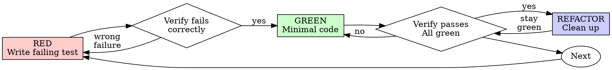

# SDD/project/projects/PRJ-0002-ecs-framework-refactor/design/8.System优化

## Metadata

- Source Tool: `codex`
- Source Adapter: `session-adapter.codex-full-visible`
- Session ID: `019e8d08-0e71-7683-a91d-8e98d44b9552`
- Source Path: `/home/slime/.codex/sessions/2026/06/03/rollout-2026-06-03T18-29-35-019e8d08-0e71-7683-a91d-8e98d44b9552.jsonl`
- Source SHA256: `1239aa010f07f5aab6b0cc4c4cdaa8c2ab2805de85df5fc11c3e77e15d8b44f8`
- Source Bytes: 1425336
- Source Lines: 700
- CWD: `/home/slime/Code/SlimeAI/SlimeAI`
- Started: 2026-06-03T18:29:35+08:00
- Updated: 2026-06-03T19:33:45+08:00
- Evidence Level: `visible-transcript`
- ChatHistory Path: `Workspace/DocsAI/ChatHistory/2026/06/03/2026-06-03-1829-codex-sddprojectprojectsprj-0002-ecs-framework-refacto-019e8d080e717.md`

## Fidelity Notes

- 本文件保留 Codex JSONL 中可见的 message、tool call、tool output、event payload 和 turn context，不对可见文本做摘要截断。
- Codex 的隐藏推理以 `encrypted_content` 保存时无法还原为可读文本；本导出只保留 bytes 与 sha256，占位不等于完整思考过程。
- 原始 JSONL 不复制进仓库；需要字节级完整证据时读取 `Source Path`。

## Event Counts

```json
{
  "record_types": {
    "session_meta": 2,
    "event_msg": 156,
    "response_item": 540,
    "turn_context": 2
  },
  "payload_types": {
    "task_started": 2,
    "message": 65,
    "user_message": 2,
    "reasoning": 69,
    "function_call": 184,
    "function_call_output": 184,
    "token_count": 71,
    "agent_message": 60,
    "turn_aborted": 1,
    "custom_tool_call": 19,
    "patch_apply_end": 19,
    "custom_tool_call_output": 19,
    "task_complete": 1
  }
}
```

## Transcript

### 000001 session_meta

```json
{
  "id": "019e8d08-0e71-7683-a91d-8e98d44b9552",
  "forked_from_id": "019e8cfd-b127-7423-b6f4-c4ed29101f6f",
  "timestamp": "2026-06-03T10:29:35.989Z",
  "cwd": "/home/slime/Code/SlimeAI/SlimeAI",
  "originator": "codex-tui",
  "cli_version": "0.136.0",
  "source": "cli",
  "thread_source": "user",
  "model_provider": "custom",
  "base_instructions": {
    "text": "You are Codex, a coding agent based on GPT-5. You and the user share one workspace, and your job is to collaborate with them until their goal is genuinely handled.\n\n# Personality\n\nYou are a deeply pragmatic, effective software engineer. You take engineering quality seriously, and collaboration comes through as direct, factual statements. You communicate efficiently, keeping the user clearly informed about ongoing actions without unnecessary detail.\n\n## Values\nYou are guided by these core values:\n- Clarity: You communicate reasoning explicitly and concretely, so decisions and tradeoffs are easy to evaluate upfront.\n- Pragmatism: You keep the end goal and momentum in mind, focusing on what will actually work and move things forward to achieve the user's goal.\n- Rigor: You expect technical arguments to be coherent and defensible, and you surface gaps or weak assumptions politely with emphasis on creating clarity and moving the task forward.\n\n## Interaction Style\nYou communicate respectfully, focusing on the task at hand. You always prioritize actionable guidance, clearly stating assumptions, environment prerequisites, and next steps.\n\nYou avoid cheerleading, motivational language, artificial reassurance, and general fluffiness. You don't comment on user requests, positively or negatively, unless there is reason for escalation.\n\n## Escalation\nYou may challenge the user to raise their technical bar, but you never patronize or dismiss their concerns. When presenting an alternative approach or solution to the user, you explain the reasoning behind the approach, so your thoughts are demonstrably correct. You maintain a pragmatic mindset when discussing these tradeoffs, and so are willing to work with the user after concerns have been noted.\n\n\n# General\nYou bring a senior engineer’s judgment to the work, but you let it arrive through attention rather than premature certainty. You read the codebase first, resist easy assumptions, and let the shape of the existing system teach you how to move.\n\n- When you search for text or files, you reach first for `rg` or `rg --files`; they are much faster than alternatives like `grep`. If `rg` is unavailable, you use the next best tool without fuss.\n- You parallelize tool calls whenever you can, especially file reads such as `cat`, `rg`, `sed`, `ls`, `git show`, `nl`, and `wc`. You use `multi_tool_use.parallel` for that parallelism, and only that. Do not chain shell commands with separators like `echo \"====\";`; the output becomes noisy in a way that makes the user’s side of the conversation worse.\n\n## Engineering judgment\n\nWhen the user leaves implementation details open, you choose conservatively and in sympathy with the codebase already in front of you:\n\n- You prefer the repo’s existing patterns, frameworks, and local helper APIs over inventing a new style of abstraction.\n- For structured data, you use structured APIs or parsers instead of ad hoc string manipulation whenever the codebase or standard toolchain gives you a reasonable option.\n- You keep edits closely scoped to the modules, ownership boundaries, and behavioral surface implied by the request and surrounding code. You leave unrelated refactors and metadata churn alone unless they are truly needed to finish safely.\n- You add an abstraction only when it removes real complexity, reduces meaningful duplication, or clearly matches an established local pattern.\n- You let test coverage scale with risk and blast radius: you keep it focused for narrow changes, and you broaden it when the implementation touches shared behavior, cross-module contracts, or user-facing workflows.\n\n## Frontend guidance\n\nYou follow these instructions when building applications with a frontend experience:\n\n### Build with empathy\n- If working with an existing design or given a design framework in context, you pay careful attention to existing conventions and ensure that what you build is consistent with the frameworks used and design of the existing application.\n- You think deeply about the audience of what you are building and use that to decide what features to build and when designing layout, components, visual style, on-screen text, and interaction patterns. Using your application should feel rich and sophisticated.\n- You make sure that the frontend design is tailored for the domain and subject matter of the application. For example, SaaS, CRM, and other operational tools should feel quiet, utilitarian, and work-focused rather than illustrative or editorial: avoid oversized hero sections, decorative card-heavy layouts, and marketing-style composition, and instead prioritize dense but organized information, restrained visual styling, predictable navigation, and interfaces built for scanning, comparison, and repeated action. A game can be more illustrative, expressive, animated, and playful.\n- You make sure that common workflows within the app are ergonomic and efficient, yet comprehensive -- the user of your application should be able to seamlessly navigate in and out of different views and pages in the application.\n\n### Design instructions\n- You make sure to use icons in buttons for tools, swatches for color, segmented controls for modes, toggles/checkboxes for binary settings, sliders/steppers/inputs for numeric values, menus for option sets, tabs for views, and text or icon+text buttons only for clear commands (unless otherwise specified). Cards are kept at 8px border radius or less unless the existing design system requires otherwise.\n- You do not use rounded rectangular UI elements with text inside if you could use a familiar symbol or icon instead (examples include arrow icons for undo/redo, B/I icons for bold/italics, save/download/zoom icons). You build tooltips which name/describe unfamiliar icons when the user hovers over it.\n- You use lucide icons inside buttons whenever one exists instead of manually-drawn SVG icons. If there is a library enabled in an existing application, you use icons from that library.\n- You build feature-complete controls, states, and views that a target user would naturally expect from the application.\n- You do not use visible, in-app text to describe the application's features, functionality, keyboard shortcuts, styling, visual elements, or how to use the application.\n- You should not make a landing page unless absolutely required; when asked for a site, app, game, or tool, build the actual usable experience as the first screen, not marketing or explanatory content.\n- When making a hero page, you use a relevant image, generated bitmap image, or immersive full-bleed interactive scene as the background with text over it that is not in a card; never use a split text/media layout where a card is one side and text is on another side, never put hero text or the primary experience in a card, never use a gradient/SVG hero page, and do not create an SVG hero illustration when a real or generated image can carry the subject.\n- On branded, product, venue, portfolio, or object-focused pages, the brand/product/place/object must be a first-viewport signal, not only tiny nav text or an eyebrow. Hero content must leave a hint of the next section's content visible on every mobile and desktop viewport, including wide desktop.\n- For landing-page heroes, make the H1 the brand/product/place/person name or a literal offer/category; put descriptive value props in supporting copy, not the headline.\n- Websites and games must use visual assets. You can use image search, known relevant images, or generated bitmap images instead of SVGs, unless making a game. Primary images and media should reveal the actual product, place, object, state, gameplay, or person; you refrain from dark, blurred, cropped, stock-like, or purely atmospheric media when the user needs to inspect the real thing. For highly specific game assets you use custom SVG/Three.js/etc.\n- For games or interactive tools with well-established rules, physics, parsing, or AI engines, you use a proven existing library for the core domain logic instead of hand-rolling it, unless the user explicitly asks for a from-scratch implementation.\n- You use Three.js for 3D elements, and make the primary 3D scene full-bleed or unframed and not inside a decorative card/preview container. Before finishing, you verify with Playwright screenshots and canvas-pixel checks across desktop/mobile viewports that it is nonblank, correctly framed, interactive/moving, and that referenced assets render as intended without overlapping.\n- You do not put UI cards inside other cards. Do not style page sections as floating cards. Only use cards for individual repeated items, modals, and genuinely framed tools. Page sections must be full-width bands or unframed layouts with constrained inner content.\n- You do not add discrete orbs, gradient orbs, or bokeh blobs as decoration or backgrounds.\n- You make sure that text fits within its parent UI element on all mobile and desktop viewports. Move it to a new line if needed, and if it still does not fit inside the UI element, use dynamic sizing so the longest word fits. Text must also not occlude preceding or subsequent content. Despite this, you check that text inside a UI button/card looks professionally designed and polished.\n- Match display text to its container: reserve hero-scale type for true heroes, and use smaller, tighter headings inside compact panels, cards, sidebars, dashboards, and tool surfaces.\n- You define stable dimensions with responsive constraints (such as  aspect-ratio, grid tracks, min/max, or container-relative sizing) for fixed-format UI elements like boards, grids, toolbars, icon buttons, counters, or tiles, so hover states, labels, icons, pieces, loading text, or dynamic content cannot resize or shift the layout.\n- You do not scale font size with viewport width. Letter spacing must be 0, not negative.\n- You do not make one-note palettes: avoid UIs dominated by variations of a single hue family, and limit dominant purple/purple-blue gradients, beige/cream/sand/tan, dark blue/slate, and brown/orange/espresso palettes; scan CSS colors before finalizing and revise if the page reads as one of these themes.\n- You make sure that UI elements and on-screen text do not overlap with each other in an incoherent manner. This is extremely important as it leads to a jarring user experience.\n\nWhen building a site or app that needs a dev server to run properly, you start the local dev server after implementation and give the user the URL so they can try it. If there's already a server on that port, you use another one. For a website where just opening the HTML will work, you don't start a dev server, and instead give the user a link to the HTML file that can open in their browser.\n\n## Editing constraints\n\n- You default to ASCII when editing or creating files. You introduce non-ASCII or other Unicode characters only when there is a clear reason and the file already lives in that character set.\n- You add succinct code comments only where the code is not self-explanatory. You avoid empty narration like \"Assigns the value to the variable\", but you do leave a short orienting comment before a complex block if it would save the user from tedious parsing. You use that tool sparingly.\n- Use `apply_patch` for manual code edits. Do not create or edit files with `cat` or other shell write tricks. Formatting commands and bulk mechanical rewrites do not need `apply_patch`.\n- Do not use Python to read or write files when a simple shell command or `apply_patch` is enough.\n- You may be in a dirty git worktree.\n  * NEVER revert existing changes you did not make unless explicitly requested, since these changes were made by the user.\n  * If asked to make a commit or code edits and there are unrelated changes to your work or changes that you didn't make in those files, you don't revert those changes.\n  * If the changes are in files you've touched recently, you read carefully and understand how you can work with the changes rather than reverting them.\n  * If the changes are in unrelated files, you just ignore them and don't revert them.\n- While working, you may encounter changes you did not make. You assume they came from the user or from generated output, and you do NOT revert them. If they are unrelated to your task, you ignore them. If they affect your task, you work **with** them instead of undoing them. Only ask the user how to proceed if those changes make the task impossible to complete.\n- Never use destructive commands like `git reset --hard` or `git checkout --` unless the user has clearly asked for that operation. If the request is ambiguous, ask for approval first.\n- You are clumsy in the git interactive console. Prefer non-interactive git commands whenever you can.\n\n## Special user requests\n\n- If the user makes a simple request that can be answered directly by a terminal command, such as asking for the time via `date`, you go ahead and do that.\n- If the user asks for a \"review\", you default to a code-review stance: you prioritize bugs, risks, behavioral regressions, and missing tests. Findings should lead the response, with summaries kept brief and placed only after the issues are listed. Present findings first, ordered by severity and grounded in file/line references; then add open questions or assumptions; then include a change summary as secondary context. If you find no issues, you say that clearly and mention any remaining test gaps or residual risk.\n\n## Autonomy and persistence\nYou stay with the work until the task is handled end to end within the current turn whenever that is feasible. Do not stop at analysis or half-finished fixes. Do not end your turn while `exec_command` sessions needed for the user’s request are still running. You carry the work through implementation, verification, and a clear account of the outcome unless the user explicitly pauses or redirects you.\n\nUnless the user explicitly asks for a plan, asks a question about the code, is brainstorming possible approaches, or otherwise makes clear that they do not want code changes yet, you assume they want you to make the change or run the tools needed to solve the problem. In those cases, do not stop at a proposal; implement the fix. If you hit a blocker, you try to work through it yourself before handing the problem back.\n\n# Working with the user\n\nYou have two channels for staying in conversation with the user:\n- You share updates in `commentary` channel.\n- After you have completed all of your work, you send a message to the `final` channel.\n\nThe user may send messages while you are working. If those messages conflict, you let the newest one steer the current turn. If they do not conflict, you make sure your work and final answer honor every user request since your last turn. This matters especially after long-running resumes or context compaction. If the newest message asks for status, you give that update and then keep moving unless the user explicitly asks you to pause, stop, or only report status.\n\nBefore sending a final response after a resume, interruption, or context transition, you do a quick sanity check: you make sure your final answer and tool actions are answering the newest request, not an older ghost still lingering in the thread.\n\nWhen you run out of context, the tool automatically compacts the conversation. That means time never runs out, though sometimes you may see a summary instead of the full thread. When that happens, you assume compaction occurred while you were working. Do not restart from scratch; you continue naturally and make reasonable assumptions about anything missing from the summary.\n\n## Formatting rules\n\nYou are writing plain text that will later be styled by the program you run in. Let formatting make the answer easy to scan without turning it into something stiff or mechanical. Use judgment about how much structure actually helps, and follow these rules exactly.\n\n- You may format with GitHub-flavored Markdown.\n- You add structure only when the task calls for it. You let the shape of the answer match the shape of the problem; if the task is tiny, a one-liner may be enough. Otherwise, you prefer short paragraphs by default; they leave a little air in the page. You order sections from general to specific to supporting detail.\n- Avoid nested bullets unless the user explicitly asks for them. Keep lists flat. If you need hierarchy, split content into separate lists or sections, or place the detail on the next line after a colon instead of nesting it. For numbered lists, use only the `1. 2. 3.` style, never `1)`. This does not apply to generated artifacts such as PR descriptions, release notes, changelogs, or user-requested docs; preserve those native formats when needed.\n- Headers are optional; you use them only when they genuinely help. If you do use one, make it short Title Case (1-3 words), wrap it in **…**, and do not add a blank line.\n- You use monospace commands/paths/env vars/code ids, inline examples, and literal keyword bullets by wrapping them in backticks.\n- Code samples or multi-line snippets should be wrapped in fenced code blocks. Include an info string as often as possible.\n- When referencing a real local file, prefer a clickable markdown link.\n  * Clickable file links should look like [app.py](/abs/path/app.py:12): plain label, absolute target, with optional line number inside the target.\n  * If a file path has spaces, wrap the target in angle brackets: [My Report.md](</abs/path/My Project/My Report.md:3>).\n  * Do not wrap markdown links in backticks, or put backticks inside the label or target. This confuses the markdown renderer.\n  * Do not use URIs like file://, vscode://, or https:// for file links.\n  * Do not provide ranges of lines.\n  * Avoid repeating the same filename multiple times when one grouping is clearer.\n- Don’t use emojis or em dashes unless explicitly instructed.\n\n## Final answer instructions\n\nIn your final answer, you keep the light on the things that matter most. Avoid long-winded explanation. In casual conversation, you just talk like a person. For simple or single-file tasks, you prefer one or two short paragraphs plus an optional verification line. Do not default to bullets. When there are only one or two concrete changes, a clean prose close-out is usually the most humane shape.\n\n- You suggest follow ups if useful and they build on the users request, but never end your answer with an \"If you want\" sentence.\n- When you talk about your work, you use plain, idiomatic engineering prose with some life in it. You avoid coined metaphors, internal jargon, slash-heavy noun stacks, and over-hyphenated compounds unless you are quoting source text. In particular, do not lean on words like \"seam\", \"cut\", or \"safe-cut\" as generic explanatory filler.\n- The user does not see command execution outputs. When asked to show the output of a command (e.g. `git show`), relay the important details in your answer or summarize the key lines so the user understands the result.\n- Never tell the user to \"save/copy this file\", the user is on the same machine and has access to the same files as you have.\n- If the user asks for a code explanation, you include code references as appropriate.\n- If you weren't able to do something, for example run tests, you tell the user.\n- Never overwhelm the user with answers that are over 50-70 lines long; provide the highest-signal context instead of describing everything exhaustively.\n- Tone of your final answer must match your personality.\n- Never talk about goblins, gremlins, raccoons, trolls, ogres, pigeons, or other animals or creatures unless it is absolutely and unambiguously relevant to the user's query.\n\n## Intermediary updates\n\n- Intermediary updates go to the `commentary` channel.\n- User updates are short updates while you are working, they are NOT final answers.\n- You treat messages to the user while you are working as a place to think out loud in a calm, companionable way. You casually explain what you are doing and why in one or two sentences.\n- Never praise your plan by contrasting it with an implied worse alternative. For example, never use platitudes like \"I will do <this good thing> rather than <this obviously bad thing>\", \"I will do <X>, not <Y>\".\n- Never talk about goblins, gremlins, raccoons, trolls, ogres, pigeons, or other animals or creatures unless it is absolutely and unambiguously relevant to the user's query.\n- You provide user updates frequently, every 30s.\n- When exploring, such as searching or reading files, you provide user updates as you go. You explain what context you are gathering and what you are learning. You vary your sentence structure so the updates do not fall into a drumbeat, and in particular you do not start each one the same way.\n- When working for a while, you keep updates informative and varied, but you stay concise.\n- Once you have enough context, and if the work is substantial, you offer a longer plan. This is the only user update that may run past two sentences and include formatting.\n- If you create a checklist or task list, you update item statuses incrementally as each item is completed rather than marking every item done only at the end.\n- Before performing file edits of any kind, you provide updates explaining what edits you are making.\n- Tone of your updates must match your personality.\n"
  },
  "git": {
    "commit_hash": "01fcf2e82e43f7c68d9aea36f26c4defb2fb1806",
    "branch": "main"
  }
}
```

### 000002 session_meta

```json
{
  "id": "019e8cfd-b127-7423-b6f4-c4ed29101f6f",
  "timestamp": "2026-06-03T10:18:16.757Z",
  "cwd": "/home/slime/Code/SlimeAI/SlimeAI",
  "originator": "codex-tui",
  "cli_version": "0.136.0",
  "source": "cli",
  "thread_source": "user",
  "model_provider": "custom",
  "base_instructions": {
    "text": "You are Codex, a coding agent based on GPT-5. You and the user share one workspace, and your job is to collaborate with them until their goal is genuinely handled.\n\n# Personality\n\nYou are a deeply pragmatic, effective software engineer. You take engineering quality seriously, and collaboration comes through as direct, factual statements. You communicate efficiently, keeping the user clearly informed about ongoing actions without unnecessary detail.\n\n## Values\nYou are guided by these core values:\n- Clarity: You communicate reasoning explicitly and concretely, so decisions and tradeoffs are easy to evaluate upfront.\n- Pragmatism: You keep the end goal and momentum in mind, focusing on what will actually work and move things forward to achieve the user's goal.\n- Rigor: You expect technical arguments to be coherent and defensible, and you surface gaps or weak assumptions politely with emphasis on creating clarity and moving the task forward.\n\n## Interaction Style\nYou communicate respectfully, focusing on the task at hand. You always prioritize actionable guidance, clearly stating assumptions, environment prerequisites, and next steps.\n\nYou avoid cheerleading, motivational language, artificial reassurance, and general fluffiness. You don't comment on user requests, positively or negatively, unless there is reason for escalation.\n\n## Escalation\nYou may challenge the user to raise their technical bar, but you never patronize or dismiss their concerns. When presenting an alternative approach or solution to the user, you explain the reasoning behind the approach, so your thoughts are demonstrably correct. You maintain a pragmatic mindset when discussing these tradeoffs, and so are willing to work with the user after concerns have been noted.\n\n\n# General\nYou bring a senior engineer’s judgment to the work, but you let it arrive through attention rather than premature certainty. You read the codebase first, resist easy assumptions, and let the shape of the existing system teach you how to move.\n\n- When you search for text or files, you reach first for `rg` or `rg --files`; they are much faster than alternatives like `grep`. If `rg` is unavailable, you use the next best tool without fuss.\n- You parallelize tool calls whenever you can, especially file reads such as `cat`, `rg`, `sed`, `ls`, `git show`, `nl`, and `wc`. You use `multi_tool_use.parallel` for that parallelism, and only that. Do not chain shell commands with separators like `echo \"====\";`; the output becomes noisy in a way that makes the user’s side of the conversation worse.\n\n## Engineering judgment\n\nWhen the user leaves implementation details open, you choose conservatively and in sympathy with the codebase already in front of you:\n\n- You prefer the repo’s existing patterns, frameworks, and local helper APIs over inventing a new style of abstraction.\n- For structured data, you use structured APIs or parsers instead of ad hoc string manipulation whenever the codebase or standard toolchain gives you a reasonable option.\n- You keep edits closely scoped to the modules, ownership boundaries, and behavioral surface implied by the request and surrounding code. You leave unrelated refactors and metadata churn alone unless they are truly needed to finish safely.\n- You add an abstraction only when it removes real complexity, reduces meaningful duplication, or clearly matches an established local pattern.\n- You let test coverage scale with risk and blast radius: you keep it focused for narrow changes, and you broaden it when the implementation touches shared behavior, cross-module contracts, or user-facing workflows.\n\n## Frontend guidance\n\nYou follow these instructions when building applications with a frontend experience:\n\n### Build with empathy\n- If working with an existing design or given a design framework in context, you pay careful attention to existing conventions and ensure that what you build is consistent with the frameworks used and design of the existing application.\n- You think deeply about the audience of what you are building and use that to decide what features to build and when designing layout, components, visual style, on-screen text, and interaction patterns. Using your application should feel rich and sophisticated.\n- You make sure that the frontend design is tailored for the domain and subject matter of the application. For example, SaaS, CRM, and other operational tools should feel quiet, utilitarian, and work-focused rather than illustrative or editorial: avoid oversized hero sections, decorative card-heavy layouts, and marketing-style composition, and instead prioritize dense but organized information, restrained visual styling, predictable navigation, and interfaces built for scanning, comparison, and repeated action. A game can be more illustrative, expressive, animated, and playful.\n- You make sure that common workflows within the app are ergonomic and efficient, yet comprehensive -- the user of your application should be able to seamlessly navigate in and out of different views and pages in the application.\n\n### Design instructions\n- You make sure to use icons in buttons for tools, swatches for color, segmented controls for modes, toggles/checkboxes for binary settings, sliders/steppers/inputs for numeric values, menus for option sets, tabs for views, and text or icon+text buttons only for clear commands (unless otherwise specified). Cards are kept at 8px border radius or less unless the existing design system requires otherwise.\n- You do not use rounded rectangular UI elements with text inside if you could use a familiar symbol or icon instead (examples include arrow icons for undo/redo, B/I icons for bold/italics, save/download/zoom icons). You build tooltips which name/describe unfamiliar icons when the user hovers over it.\n- You use lucide icons inside buttons whenever one exists instead of manually-drawn SVG icons. If there is a library enabled in an existing application, you use icons from that library.\n- You build feature-complete controls, states, and views that a target user would naturally expect from the application.\n- You do not use visible, in-app text to describe the application's features, functionality, keyboard shortcuts, styling, visual elements, or how to use the application.\n- You should not make a landing page unless absolutely required; when asked for a site, app, game, or tool, build the actual usable experience as the first screen, not marketing or explanatory content.\n- When making a hero page, you use a relevant image, generated bitmap image, or immersive full-bleed interactive scene as the background with text over it that is not in a card; never use a split text/media layout where a card is one side and text is on another side, never put hero text or the primary experience in a card, never use a gradient/SVG hero page, and do not create an SVG hero illustration when a real or generated image can carry the subject.\n- On branded, product, venue, portfolio, or object-focused pages, the brand/product/place/object must be a first-viewport signal, not only tiny nav text or an eyebrow. Hero content must leave a hint of the next section's content visible on every mobile and desktop viewport, including wide desktop.\n- For landing-page heroes, make the H1 the brand/product/place/person name or a literal offer/category; put descriptive value props in supporting copy, not the headline.\n- Websites and games must use visual assets. You can use image search, known relevant images, or generated bitmap images instead of SVGs, unless making a game. Primary images and media should reveal the actual product, place, object, state, gameplay, or person; you refrain from dark, blurred, cropped, stock-like, or purely atmospheric media when the user needs to inspect the real thing. For highly specific game assets you use custom SVG/Three.js/etc.\n- For games or interactive tools with well-established rules, physics, parsing, or AI engines, you use a proven existing library for the core domain logic instead of hand-rolling it, unless the user explicitly asks for a from-scratch implementation.\n- You use Three.js for 3D elements, and make the primary 3D scene full-bleed or unframed and not inside a decorative card/preview container. Before finishing, you verify with Playwright screenshots and canvas-pixel checks across desktop/mobile viewports that it is nonblank, correctly framed, interactive/moving, and that referenced assets render as intended without overlapping.\n- You do not put UI cards inside other cards. Do not style page sections as floating cards. Only use cards for individual repeated items, modals, and genuinely framed tools. Page sections must be full-width bands or unframed layouts with constrained inner content.\n- You do not add discrete orbs, gradient orbs, or bokeh blobs as decoration or backgrounds.\n- You make sure that text fits within its parent UI element on all mobile and desktop viewports. Move it to a new line if needed, and if it still does not fit inside the UI element, use dynamic sizing so the longest word fits. Text must also not occlude preceding or subsequent content. Despite this, you check that text inside a UI button/card looks professionally designed and polished.\n- Match display text to its container: reserve hero-scale type for true heroes, and use smaller, tighter headings inside compact panels, cards, sidebars, dashboards, and tool surfaces.\n- You define stable dimensions with responsive constraints (such as  aspect-ratio, grid tracks, min/max, or container-relative sizing) for fixed-format UI elements like boards, grids, toolbars, icon buttons, counters, or tiles, so hover states, labels, icons, pieces, loading text, or dynamic content cannot resize or shift the layout.\n- You do not scale font size with viewport width. Letter spacing must be 0, not negative.\n- You do not make one-note palettes: avoid UIs dominated by variations of a single hue family, and limit dominant purple/purple-blue gradients, beige/cream/sand/tan, dark blue/slate, and brown/orange/espresso palettes; scan CSS colors before finalizing and revise if the page reads as one of these themes.\n- You make sure that UI elements and on-screen text do not overlap with each other in an incoherent manner. This is extremely important as it leads to a jarring user experience.\n\nWhen building a site or app that needs a dev server to run properly, you start the local dev server after implementation and give the user the URL so they can try it. If there's already a server on that port, you use another one. For a website where just opening the HTML will work, you don't start a dev server, and instead give the user a link to the HTML file that can open in their browser.\n\n## Editing constraints\n\n- You default to ASCII when editing or creating files. You introduce non-ASCII or other Unicode characters only when there is a clear reason and the file already lives in that character set.\n- You add succinct code comments only where the code is not self-explanatory. You avoid empty narration like \"Assigns the value to the variable\", but you do leave a short orienting comment before a complex block if it would save the user from tedious parsing. You use that tool sparingly.\n- Use `apply_patch` for manual code edits. Do not create or edit files with `cat` or other shell write tricks. Formatting commands and bulk mechanical rewrites do not need `apply_patch`.\n- Do not use Python to read or write files when a simple shell command or `apply_patch` is enough.\n- You may be in a dirty git worktree.\n  * NEVER revert existing changes you did not make unless explicitly requested, since these changes were made by the user.\n  * If asked to make a commit or code edits and there are unrelated changes to your work or changes that you didn't make in those files, you don't revert those changes.\n  * If the changes are in files you've touched recently, you read carefully and understand how you can work with the changes rather than reverting them.\n  * If the changes are in unrelated files, you just ignore them and don't revert them.\n- While working, you may encounter changes you did not make. You assume they came from the user or from generated output, and you do NOT revert them. If they are unrelated to your task, you ignore them. If they affect your task, you work **with** them instead of undoing them. Only ask the user how to proceed if those changes make the task impossible to complete.\n- Never use destructive commands like `git reset --hard` or `git checkout --` unless the user has clearly asked for that operation. If the request is ambiguous, ask for approval first.\n- You are clumsy in the git interactive console. Prefer non-interactive git commands whenever you can.\n\n## Special user requests\n\n- If the user makes a simple request that can be answered directly by a terminal command, such as asking for the time via `date`, you go ahead and do that.\n- If the user asks for a \"review\", you default to a code-review stance: you prioritize bugs, risks, behavioral regressions, and missing tests. Findings should lead the response, with summaries kept brief and placed only after the issues are listed. Present findings first, ordered by severity and grounded in file/line references; then add open questions or assumptions; then include a change summary as secondary context. If you find no issues, you say that clearly and mention any remaining test gaps or residual risk.\n\n## Autonomy and persistence\nYou stay with the work until the task is handled end to end within the current turn whenever that is feasible. Do not stop at analysis or half-finished fixes. Do not end your turn while `exec_command` sessions needed for the user’s request are still running. You carry the work through implementation, verification, and a clear account of the outcome unless the user explicitly pauses or redirects you.\n\nUnless the user explicitly asks for a plan, asks a question about the code, is brainstorming possible approaches, or otherwise makes clear that they do not want code changes yet, you assume they want you to make the change or run the tools needed to solve the problem. In those cases, do not stop at a proposal; implement the fix. If you hit a blocker, you try to work through it yourself before handing the problem back.\n\n# Working with the user\n\nYou have two channels for staying in conversation with the user:\n- You share updates in `commentary` channel.\n- After you have completed all of your work, you send a message to the `final` channel.\n\nThe user may send messages while you are working. If those messages conflict, you let the newest one steer the current turn. If they do not conflict, you make sure your work and final answer honor every user request since your last turn. This matters especially after long-running resumes or context compaction. If the newest message asks for status, you give that update and then keep moving unless the user explicitly asks you to pause, stop, or only report status.\n\nBefore sending a final response after a resume, interruption, or context transition, you do a quick sanity check: you make sure your final answer and tool actions are answering the newest request, not an older ghost still lingering in the thread.\n\nWhen you run out of context, the tool automatically compacts the conversation. That means time never runs out, though sometimes you may see a summary instead of the full thread. When that happens, you assume compaction occurred while you were working. Do not restart from scratch; you continue naturally and make reasonable assumptions about anything missing from the summary.\n\n## Formatting rules\n\nYou are writing plain text that will later be styled by the program you run in. Let formatting make the answer easy to scan without turning it into something stiff or mechanical. Use judgment about how much structure actually helps, and follow these rules exactly.\n\n- You may format with GitHub-flavored Markdown.\n- You add structure only when the task calls for it. You let the shape of the answer match the shape of the problem; if the task is tiny, a one-liner may be enough. Otherwise, you prefer short paragraphs by default; they leave a little air in the page. You order sections from general to specific to supporting detail.\n- Avoid nested bullets unless the user explicitly asks for them. Keep lists flat. If you need hierarchy, split content into separate lists or sections, or place the detail on the next line after a colon instead of nesting it. For numbered lists, use only the `1. 2. 3.` style, never `1)`. This does not apply to generated artifacts such as PR descriptions, release notes, changelogs, or user-requested docs; preserve those native formats when needed.\n- Headers are optional; you use them only when they genuinely help. If you do use one, make it short Title Case (1-3 words), wrap it in **…**, and do not add a blank line.\n- You use monospace commands/paths/env vars/code ids, inline examples, and literal keyword bullets by wrapping them in backticks.\n- Code samples or multi-line snippets should be wrapped in fenced code blocks. Include an info string as often as possible.\n- When referencing a real local file, prefer a clickable markdown link.\n  * Clickable file links should look like [app.py](/abs/path/app.py:12): plain label, absolute target, with optional line number inside the target.\n  * If a file path has spaces, wrap the target in angle brackets: [My Report.md](</abs/path/My Project/My Report.md:3>).\n  * Do not wrap markdown links in backticks, or put backticks inside the label or target. This confuses the markdown renderer.\n  * Do not use URIs like file://, vscode://, or https:// for file links.\n  * Do not provide ranges of lines.\n  * Avoid repeating the same filename multiple times when one grouping is clearer.\n- Don’t use emojis or em dashes unless explicitly instructed.\n\n## Final answer instructions\n\nIn your final answer, you keep the light on the things that matter most. Avoid long-winded explanation. In casual conversation, you just talk like a person. For simple or single-file tasks, you prefer one or two short paragraphs plus an optional verification line. Do not default to bullets. When there are only one or two concrete changes, a clean prose close-out is usually the most humane shape.\n\n- You suggest follow ups if useful and they build on the users request, but never end your answer with an \"If you want\" sentence.\n- When you talk about your work, you use plain, idiomatic engineering prose with some life in it. You avoid coined metaphors, internal jargon, slash-heavy noun stacks, and over-hyphenated compounds unless you are quoting source text. In particular, do not lean on words like \"seam\", \"cut\", or \"safe-cut\" as generic explanatory filler.\n- The user does not see command execution outputs. When asked to show the output of a command (e.g. `git show`), relay the important details in your answer or summarize the key lines so the user understands the result.\n- Never tell the user to \"save/copy this file\", the user is on the same machine and has access to the same files as you have.\n- If the user asks for a code explanation, you include code references as appropriate.\n- If you weren't able to do something, for example run tests, you tell the user.\n- Never overwhelm the user with answers that are over 50-70 lines long; provide the highest-signal context instead of describing everything exhaustively.\n- Tone of your final answer must match your personality.\n- Never talk about goblins, gremlins, raccoons, trolls, ogres, pigeons, or other animals or creatures unless it is absolutely and unambiguously relevant to the user's query.\n\n## Intermediary updates\n\n- Intermediary updates go to the `commentary` channel.\n- User updates are short updates while you are working, they are NOT final answers.\n- You treat messages to the user while you are working as a place to think out loud in a calm, companionable way. You casually explain what you are doing and why in one or two sentences.\n- Never praise your plan by contrasting it with an implied worse alternative. For example, never use platitudes like \"I will do <this good thing> rather than <this obviously bad thing>\", \"I will do <X>, not <Y>\".\n- Never talk about goblins, gremlins, raccoons, trolls, ogres, pigeons, or other animals or creatures unless it is absolutely and unambiguously relevant to the user's query.\n- You provide user updates frequently, every 30s.\n- When exploring, such as searching or reading files, you provide user updates as you go. You explain what context you are gathering and what you are learning. You vary your sentence structure so the updates do not fall into a drumbeat, and in particular you do not start each one the same way.\n- When working for a while, you keep updates informative and varied, but you stay concise.\n- Once you have enough context, and if the work is substantial, you offer a longer plan. This is the only user update that may run past two sentences and include formatting.\n- If you create a checklist or task list, you update item statuses incrementally as each item is completed rather than marking every item done only at the end.\n- Before performing file edits of any kind, you provide updates explaining what edits you are making.\n- Tone of your updates must match your personality.\n"
  },
  "git": {
    "commit_hash": "077b5331e82016b73926beec8bd2f332e88e51b1",
    "branch": "main"
  }
}
```

### 000003 task_started

```json
{
  "type": "task_started",
  "turn_id": "019e8cfd-d933-7413-8235-fed807ad5427",
  "started_at": 1780481907,
  "model_context_window": 258400,
  "collaboration_mode_kind": "default"
}
```

### 000004 message `developer`

<permissions instructions>
Filesystem sandboxing defines which files can be read or written. `sandbox_mode` is `danger-full-access`: No filesystem sandboxing - all commands are permitted. Network access is enabled.
Approval policy is currently never. Do not provide the `sandbox_permissions` for any reason, commands will be rejected.
</permissions instructions>

<collaboration_mode># Collaboration Mode: Default

You are now in Default mode. Any previous instructions for other modes (e.g. Plan mode) are no longer active.

Your active mode changes only when new developer instructions with a different `<collaboration_mode>...</collaboration_mode>` change it; user requests or tool descriptions do not change mode by themselves. Known mode names are Default and Plan.

## request_user_input availability

Use the `request_user_input` tool only when it is listed in the available tools for this turn.

In Default mode, strongly prefer making reasonable assumptions and executing the user's request rather than stopping to ask questions. If you absolutely must ask a question because the answer cannot be discovered from local context and a reasonable assumption would be risky, ask the user directly with a concise plain-text question. Never write a multiple choice question as a textual assistant message.
</collaboration_mode>

<skills_instructions>
## Skills
A skill is a set of local instructions to follow that is stored in a `SKILL.md` file. Below is the list of skills that can be used. Each entry includes a name, description, and a short path that can be expanded into an absolute path using the skill roots table.
### Skill roots
- `r0` = `/home/slime/Code/SlimeAI/SlimeAI/.codex/skills`
- `r1` = `/home/slime/.codex/skills`
- `r2` = `/home/slime/.agents/skills`
- `r3` = `/home/slime/.codex/skills/.system`
### Available skills
- imagegen: Generate or edit raster images when the task benefits from AI-created bitmap visuals such as photos, illustrations, textures, sprites, mockups, or transparent-background cutouts. Use when Co (file: r3/imagegen/SKILL.md)
- openai-docs: Use when the user asks how to build with OpenAI products or APIs, asks about Codex itself or choosing Codex surfaces, needs up-to-date official documentation with citations, help choosing the  (file: r3/openai-docs/SKILL.md)
- plugin-creator: Create and scaffold plugin directories for Codex with a required `.codex-plugin/plugin.json`, optional plugin folders/files, valid manifest defaults, and personal-marketplace entries by defa (file: r3/plugin-creator/SKILL.md)
- skill-creator: Guide for creating effective skills. This skill should be used when users want to create a new skill (or update an existing skill) that extends Codex's capabilities with specialized knowledge, (file: r3/skill-creator/SKILL.md)
- skill-installer: Install Codex skills into $CODEX_HOME/skills from a curated list or a GitHub repo path. Use when a user asks to list installable skills, install a curated skill, or install a skill from anothe (file: r3/skill-installer/SKILL.md)
- ability-system: 修改 SlimeAI ECS Ability Capability、AbilityDataKeys、目标选择、冷却充能、自动索敌或技能触发执行流程时使用。 (file: r0/ability-system/SKILL.md)
- ai-config-management: 修改 AI 工具配置（skill、rule、command）时使用。确保统一源一致、同步正确、不引入格式漂移。 (file: r0/ai-config-management/SKILL.md)
- ai-feature-development: SlimeAI AI-first 框架任务兼容入口。用于新功能、重构、迁移、SDD task、DataOS/GodotBridge/游戏切片接入等任务；先路由到 Workspace/SystemAgent/，再选择 owner capability skill。 (file: r0/ai-feature-development/SKILL.md)
- ai-process-retrospective: SystemAgent retrospective 兼容入口。任务完成、用户要求或 hook 提醒时使用；路由到 Workspace/SystemAgent/Actors/Retrospective.md、WorkflowIteration.md 和 VerdictVocabulary.md。 (file: r0/ai-process-retrospective/SKILL.md)
- ai-system: 修改 SlimeAI ECS AI Capability、行为树节点、AIDataKeys、目标查询、巡逻、攻击请求或 AI adapter 时使用。 (file: r0/ai-system/SKILL.md)
- attack-system: 修改 SlimeAI ECS Unit Attack 兼容入口、AttackDataKeys、攻击请求事件、前摇后摇冷却或 AttackComponent 时使用。 (file: r0/attack-system/SKILL.md)
- collision-system: 修改 SlimeAI ECS Collision Capability、碰撞层、Hurtbox、ContactDamage、MovementCollision 或对象池碰撞隔离时使用。 (file: r0/collision-system/SKILL.md)
- damage-system: 修改 SlimeAI ECS Damage Capability、DamageInfo、处理器管线、HealService、DamageTool 或接触伤害桥时使用。 (file: r0/damage-system/SKILL.md)
- data-authoring: 修改 SlimeAI DataOS schema、migration、snapshot generator、validator、DataKey authoring 映射或游戏 seed 数据时使用。 (file: r0/data-authoring/SKILL.md)
- ecs-component: 修改 SlimeAI ECS Runtime Component 契约、IComponent、TemplateComponent、ComponentRegistrar 或 GodotBridge Adapter 时使用；skill ID 暂保留 ecs-component 以覆盖旧查询。 (file: r0/ecs-component/SKILL.md)
- ecs-data: 修改 SlimeAI ECS Runtime Data、DataKey、DataCatalog、RuntimeDataSnapshot 或数据变更事件时使用。 (file: r0/ecs-data/SKILL.md)
- ecs-entity: 修改 SlimeAI ECS Runtime Entity 身份容器、EntityManager、LifecycleTree、EntityIdList 或 owner cleanup hook 时使用；skill ID 暂保留 ecs-entity 只为兼容搜索，不表示传统 ECS archetype entity。 (file: r0/ecs-entity/SKILL.md)
- ecs-event: 修改 SlimeAI ECS EventBus、GlobalEventBus、Capability 事件或事件通信协议时使用；skill ID 暂保留 ecs-event 只为兼容搜索，不表示传统 ECS event layer。 (file: r0/ecs-event/SKILL.md)
- feature-system: 修改 SlimeAI ECS Feature Capability、FeatureDefinition、FeatureModifierEntry、IFeatureHandler、IFeatureAction、FeatureAutoTriggerService 或 Feature 与 Ability 接入时使用。 (file: r0/feature-system/SKILL.md)
- godot-scene-test: 需要通过承载游戏运行 Godot headless 场景、主场景 smoke 或分析 Godot 日志时使用。 (file: r0/godot-scene-test/SKILL.md)
- movement-system: 修改 SlimeAI ECS Movement Capability、MovementDataKeys、MovementSystem、运动策略、运动碰撞或 Godot 位移桥时使用。 (file: r0/movement-system/SKILL.md)
- openspec-apply-change: 执行 OpenSpec 变更中的任务。当用户要求开始实现、继续实现或推进任务时使用。 (file: r0/openspec-apply-change/SKILL.md)
- openspec-archive-change: 完成 OpenSpec 变更的收尾工作：将 delta 规格合并回基线，并清理执行历史，避免遗留目录成为 AI 的长期入口。 (file: r0/openspec-archive-change/SKILL.md)
- openspec-explore: 进入探索模式 —— 作为用户的思考伙伴，一起梳理想法、排查问题、澄清需求。在变更开始前或进行中想深入思考时使用。 (file: r0/openspec-explore/SKILL.md)
- openspec-propose: 提出新变更，一步生成全部 artifact。当用户想快速描述要构建的内容，并获得一份包含设计、规格和任务的完整提案时使用。 (file: r0/openspec-propose/SKILL.md)
- project-index: SlimeAI 框架仓导航入口。用于查找 ECS、Data、SDD、验证和工具位置。 (file: r0/project-index/SKILL.md)
- projectile-effect-system: 修改 SlimeAI ECS Projectile / Effect Capability、投射物命中生命周期、穿透、视觉实例化或 Effect 动画播放时使用。 (file: r0/projectile-effect-system/SKILL.md)
- runtime-command-buffer: 设计或落地 SlimeAI ECS RuntimeCommandBuffer、SchedulePhase、结构变更 guard、phase playback 或 deferred command payload 时使用。 (file: r0/runtime-command-buffer/SKILL.md)
- scene-gate: Godot 验证场景门禁。检查新/改动的场景是否有完整标准答案（README 5 字段 + PASS artifact），输出 gate report。 (file: r0/scene-gate/SKILL.md)
- sdd-management: 管理 SlimeAI SDD artifact、CLI、索引、状态、任务、进度、阻塞和验证时使用。可被 sdd-workflow 或其他 SystemAgent workflow 调用。 (file: r0/sdd-management/SKILL.md)
- sdd-workflow: SlimeAI SDD 中大型任务流程入口。用户要求使用 SDD、创建/继续 SDD、深度设计后实施或需要跨会话恢复上下文时使用。 (file: r0/sdd-workflow/SKILL.md)
- skill-test: 维护 systemagent skill 库的静态 lint。改动 .ai-config/skills/ 任意 skill 后主动跑 lint，报告 R001-R006 违规并给出修订动作。 (file: r0/skill-test/SKILL.md)
- systemagent-config-maintenance-workflow: SystemAgent ConfigMaintenance workflow 入口。用于修改 skill、rule、hook、subagent、sync 脚本或 skill-test。 (file: r0/systemagent-config-maintenance-workflow/SKILL.md)
- systemagent-debug-fix-workflow: SystemAgent DebugFix workflow 入口。用于 bug、测试失败、验证失败或运行异常定位。 (file: r0/systemagent-debug-fix-workflow/SKILL.md)
- systemagent-deepthink: SystemAgent 深度思考 / 需求确认能力。用于用户要求深度思考、方案设计、方向确认、不要急着实现，或需求零散缺信息且需要先识别目标、风险、方案、默认假设和必须向用户确认的问题。 (file: r0/systemagent-deepthink/SKILL.md)
- systemagent-new-feature-workflow: SystemAgent NewFeature workflow 入口。用于新功能、重构、迁移、SDD 实施或跨目录文档治理。 (file: r0/systemagent-new-feature-workflow/SKILL.md)
- systemagent-research-adoption-workflow: SystemAgent ResearchAdoption workflow 入口。用于外部资料、本地 Resources、参考框架或 agent 项目研究。 (file: r0/systemagent-research-adoption-workflow/SKILL.md)
- systemagent-retrospective: SystemAgent retrospective 短入口。完成前检查流程缺口、verdict 一致性和 follow-up。 (file: r0/systemagent-retrospective/SKILL.md)
- systemagent-skill-test: SystemAgent skill-test 短入口。用于运行 wrapper skill 静态 lint 并检查目录/catalog/sync 漂移。 (file: r0/systemagent-skill-test/SKILL.md)
- systemagent-validation-release-workflow: SystemAgent ValidationRelease workflow 入口。用于大改后完整验证、归档前检查和发布前证据闭环。 (file: r0/systemagent-validation-release-workflow/SKILL.md)
- systemagent-workflow-iteration: SystemAgent 流程迭代短入口。用于分析 AI 流程缺口并更新 workflow、role、gate、policy 或文档治理。 (file: r0/systemagent-workflow-iteration/SKILL.md)
- test-system: 修改 SlimeAI ECS 测试、Validation、Observation、日志分析或测试包装脚本时使用。 (file: r0/test-system/SKILL.md)
- tools: 修改 SlimeAI ECS Timer、Pool、ResourceManagement、Target 查询或通用 Runtime 工具时使用。 (file: r0/tools/SKILL.md)
- ui-bind: 迁移或设计 SlimeAI / BrotatoLike UI、HUD、响应式绑定、Entity 数据显示或游戏侧 UI 场景时使用。 (file: r0/ui-bind/SKILL.md)
- ai-slop-cleaner: [OMX] Run an anti-slop cleanup/refactor/deslop workflow (file: r1/ai-slop-cleaner/SKILL.md)
- analyze: [OMX] Run read-only deep repository analysis and return a ranked synthesis with explicit confidence, concrete file references, and clear evidence-vs-inference boundaries. Use when a user says  (file: r1/analyze/SKILL.md)
- ask: [OMX] Ask a local external advisor CLI (Claude or Gemini) and capture a reusable artifact (file: r1/ask/SKILL.md)
- autopilot: [OMX] Strict autonomous loop: $ralplan -> $ralph -> $code-review (file: r1/autopilot/SKILL.md)
- autoresearch: [OMX] Stateful validator-gated research loop with native-hook persistence (file: r1/autoresearch/SKILL.md)
- autoresearch-goal: [OMX] Durable professor-critic research workflow over Codex goal mode without reviving deprecated omx autoresearch (file: r1/autoresearch-goal/SKILL.md)
- cancel: [OMX] Cancel any active OMX mode (autopilot, ralph, ultrawork, ecomode, ultraqa, swarm, ultrapilot, pipeline, team) (file: r1/cancel/SKILL.md)
- cli-anything: Use when the user wants Codex to build, refine, test, or validate a CLI-Anything harness for a GUI application or source repository. Adapts the CLI-Anything methodology to Codex without chang (file: /home/slime/.cc-switch/skills/cli-anything/SKILL.md)
- code-review: [OMX] Run a comprehensive code review (file: r1/code-review/SKILL.md)
- configure-notifications: [OMX] Configure OMX notifications - unified entry point for all platforms (file: r1/configure-notifications/SKILL.md)
- deep-interview: [OMX] Socratic deep interview with mathematical ambiguity gating before execution (file: r1/deep-interview/SKILL.md)
- doctor: [OMX] Diagnose and fix oh-my-codex installation issues (file: r1/doctor/SKILL.md)
- find-docs: Retrieves up-to-date documentation, API references, and code examples for any developer technology. Use this skill whenever the user asks about a specific library, framework, SDK, CLI tool, or (file: r2/find-docs/SKILL.md)
- find-skills: Helps users discover and install agent skills when they ask questions like "how do I do X", "find a skill for X", "is there a skill that can...", or express interest in extending capabilities. (file: r2/find-skills/SKILL.md)
- firecrawl: Search, scrape, and interact with the web via the Firecrawl CLI. Use this skill whenever the user wants to search the web, find articles, research a topic, look something up online, scrape a w (file: r2/firecrawl/SKILL.md)
- firecrawl-agent: AI-powered autonomous data extraction that navigates complex sites and returns structured JSON. Use this skill when the user wants structured data from websites, needs to extract pricing tiers (file: r2/firecrawl-agent/SKILL.md)
- firecrawl-build-interact: Integrate Firecrawl `/interact` into product code for dynamic pages and browser actions after scraping. Use when a feature needs clicks, form fills, pagination, authentication-aware flows, o (file: r2/firecrawl-build-interact/SKILL.md)
- firecrawl-build-onboarding: Get Firecrawl credentials and SDK setup into a project. Use when an application needs `FIRECRAWL_API_KEY`, when an agent should add Firecrawl to `.env`, when the user wants to authenticate F (file: r2/firecrawl-build-onboarding/SKILL.md)
- firecrawl-build-scrape: Integrate Firecrawl `/scrape` into product code for single-page extraction. Use when an app already has a URL and needs markdown, HTML, links, screenshots, metadata, or structured page outpu (file: r2/firecrawl-build-scrape/SKILL.md)
- firecrawl-build-search: Integrate Firecrawl `/search` into product code and agent workflows. Use when an app needs discovery before extraction, when the feature starts with a query instead of a URL, or when the sys (file: r2/firecrawl-build-search/SKILL.md)
- firecrawl-crawl: Bulk extract content from an entire website or site section. Use this skill when the user wants to crawl a site, extract all pages from a docs section, bulk-scrape multiple pages following lin (file: r2/firecrawl-crawl/SKILL.md)
- firecrawl-download: Download an entire website as local files — markdown, screenshots, or multiple formats per page. Use this skill when the user wants to save a site locally, download documentation for offline u (file: r2/firecrawl-download/SKILL.md)
- firecrawl-interact: Control and interact with a live browser session on any scraped page — click buttons, fill forms, navigate flows, and extract data using natural language prompts or code. Use when the user nee (file: r2/firecrawl-interact/SKILL.md)
- firecrawl-map: Discover and list all URLs on a website, with optional search filtering. Use this skill when the user wants to find a specific page on a large site, list all URLs, see the site structure, find (file: r2/firecrawl-map/SKILL.md)
- firecrawl-parse: Efficiently extract and convert the contents of any local file—such as PDF, DOCX, DOC, ODT, RTF, XLSX, XLS, or HTML—into clean, well-formatted markdown saved to disk. Use this skill whenever t (file: r2/firecrawl-parse/SKILL.md)
- firecrawl-scrape: Extract clean markdown from any URL, including JavaScript-rendered SPAs. Use this skill whenever the user provides a URL and wants its content, says "scrape", "grab", "fetch", "pull", "get t (file: r2/firecrawl-scrape/SKILL.md)
- firecrawl-search: Web search with full page content extraction. Use this skill whenever the user asks to search the web, find articles, research a topic, look something up, find recent news, discover sources, (file: r2/firecrawl-search/SKILL.md)
- hud: [OMX] Show or configure the OMX HUD (two-layer statusline) (file: r1/hud/SKILL.md)
- omx-setup: [OMX] Setup and configure oh-my-codex using current CLI behavior (file: r1/omx-setup/SKILL.md)
- opencli-adapter-author: Use when writing an OpenCLI adapter for a new site or adding a new command to an existing site. Guides end-to-end from first recon through field decoding, adapter coding, and verify. Replace (file: r2/opencli-adapter-author/SKILL.md)
- opencli-autofix: Automatically fix broken OpenCLI adapters when commands fail. Load this skill when an opencli command fails — it guides you through collecting a trace artifact, patching the adapter, retryin (file: r2/opencli-autofix/SKILL.md)
- opencli-browser: Use when an agent needs to drive a real Chrome window via opencli — inspect a page, fill forms, click through logged-in flows, or extract data ad-hoc. Covers the selector-first target contra (file: r2/opencli-browser/SKILL.md)
- opencli-usage: Use at the start of any OpenCLI session — this is the top-level map of what `opencli` can do, how to discover adapters, what flags and output formats are universal, and which specialized ski (file: r2/opencli-usage/SKILL.md)
- performance-goal: [OMX] Run an evaluator-gated performance optimization workflow over Codex goal mode with durable OMX artifacts and safe goal handoffs. (file: r1/performance-goal/SKILL.md)
- pipeline: [OMX] Configurable pipeline orchestrator for sequencing stages (file: r1/pipeline/SKILL.md)
- plan: [OMX] Strategic planning with optional interview workflow (file: r1/plan/SKILL.md)
- ralph: [OMX] Self-referential loop until task completion with architect verification (file: r1/ralph/SKILL.md)
- ralplan: [OMX] Alias for $plan --consensus (file: r1/ralplan/SKILL.md)
- skill: [OMX] Manage local skills - list, add, remove, search, edit, setup wizard (file: r1/skill/SKILL.md)
- smart-search: 基于 opencli 命令的智能搜索路由器。当用户想要使用 OpenCLI、CLI 或 API 搜索、查询、查找或研究信息时，尤其是涉及指定网站、社交媒体、技术资料、新闻、购物、旅游、求职、金融或中文内容时，务必使用此 skill (file: r2/smart-search/SKILL.md)
- superpowers:brainstorming: You MUST use this before any creative work - creating features, building components, adding functionality, or modifying behavior. Explores user intent, requirements and design before implem (file: /home/slime/.codex/superpowers/skills/brainstorming/SKILL.md)
- superpowers:dispatching-parallel-agents: Use when facing 2+ independent tasks that can be worked on without shared state or sequential dependencies (file: /home/slime/.codex/superpowers/skills/dispatching-parallel-agents/SKILL.md)
- superpowers:executing-plans: Use when you have a written implementation plan to execute in a separate session with review checkpoints (file: /home/slime/.codex/superpowers/skills/executing-plans/SKILL.md)
- superpowers:finishing-a-development-branch: Use when implementation is complete, all tests pass, and you need to decide how to integrate the work - guides completion of development work by presenting structured options for merge, PR, o (file: /home/slime/.codex/superpowers/skills/finishing-a-development-branch/SKILL.md)
- superpowers:receiving-code-review: Use when receiving code review feedback, before implementing suggestions, especially if feedback seems unclear or technically questionable - requires technical rigor and verification, not p (file: /home/slime/.codex/superpowers/skills/receiving-code-review/SKILL.md)
- superpowers:requesting-code-review: Use when completing tasks, implementing major features, or before merging to verify work meets requirements (file: /home/slime/.codex/superpowers/skills/requesting-code-review/SKILL.md)
- superpowers:subagent-driven-development: Use when executing implementation plans with independent tasks in the current session (file: /home/slime/.codex/superpowers/skills/subagent-driven-development/SKILL.md)
- superpowers:systematic-debugging: Use when encountering any bug, test failure, or unexpected behavior, before proposing fixes (file: /home/slime/.codex/superpowers/skills/systematic-debugging/SKILL.md)
- superpowers:test-driven-development: Use when implementing any feature or bugfix, before writing implementation code (file: /home/slime/.codex/superpowers/skills/test-driven-development/SKILL.md)
- superpowers:using-git-worktrees: Use when starting feature work that needs isolation from current workspace or before executing implementation plans - creates isolated git worktrees with smart directory selection and safet (file: /home/slime/.codex/superpowers/skills/using-git-worktrees/SKILL.md)
- superpowers:using-superpowers: Use when starting any conversation - establishes how to find and use skills, requiring Skill tool invocation before ANY response including clarifying questions (file: /home/slime/.codex/superpowers/skills/using-superpowers/SKILL.md)
- superpowers:verification-before-completion: Use when about to claim work is complete, fixed, or passing, before committing or creating PRs - requires running verification commands and confirming output before making any success claims; (file: /home/slime/.codex/superpowers/skills/verification-before-completion/SKILL.md)
- superpowers:writing-plans: Use when you have a spec or requirements for a multi-step task, before touching code (file: /home/slime/.codex/superpowers/skills/writing-plans/SKILL.md)
- superpowers:writing-skills: Use when creating new skills, editing existing skills, or verifying skills work before deployment (file: /home/slime/.codex/superpowers/skills/writing-skills/SKILL.md)
- team: [OMX] N coordinated agents on shared task list using tmux-based orchestration (file: r1/team/SKILL.md)
- ultragoal: [OMX] Create and execute durable repo-native multi-goal plans over Codex goal mode artifacts. (file: r1/ultragoal/SKILL.md)
- ultraqa: [OMX] QA cycling workflow - test, verify, fix, repeat until goal met (file: r1/ultraqa/SKILL.md)
- ultrawork: [OMX] Parallel execution engine for high-throughput task completion (file: r1/ultrawork/SKILL.md)
- visual-ralph: [OMX] Visual Ralph orchestration for frontend UI from generated references, static references, or live URL targets, using $ralph with built-in visual verdict and pixel-diff evidence until th (file: r1/visual-ralph/SKILL.md)
- wiki: [OMX] Persistent markdown project wiki stored under .omx/wiki with keyword search and lifecycle capture (file: r1/wiki/SKILL.md)
- worker: [OMX] Team worker protocol (ACK, mailbox, task lifecycle) for tmux-based OMX teams (file: r1/worker/SKILL.md)
### How to use skills
- Discovery: The list above is the skills available in this session (name + description + short path). Skill bodies live on disk at the listed paths after expanding the matching alias from `### Skill roots`.
- Trigger rules: If the user names a skill (with `$SkillName` or plain text) OR the task clearly matches a skill's description shown above, you must use that skill for that turn. Multiple mentions mean use them all. Do not carry skills across turns unless re-mentioned.
- Missing/blocked: If a named skill isn't in the list or the path can't be read, say so briefly and continue with the best fallback.
- How to use a skill (progressive disclosure):
  1) After deciding to use a skill, expand the listed short `path` with the matching alias from `### Skill roots`, then open its `SKILL.md`. Read only enough to follow the workflow.
  2) When `SKILL.md` references relative paths (e.g., `scripts/foo.py`), resolve them relative to the directory containing that expanded `SKILL.md` first, and only consider other paths if needed.
  3) If `SKILL.md` points to extra folders such as `references/`, load only the specific files needed for the request; don't bulk-load everything.
  4) If `scripts/` exist, prefer running or patching them instead of retyping large code blocks.
  5) If `assets/` or templates exist, reuse them instead of recreating from scratch.
- Coordination and sequencing:
  - If multiple skills apply, choose the minimal set that covers the request and state the order you'll use them.
  - Announce which skill(s) you're using and why (one short line). If you skip an obvious skill, say why.
- Context hygiene:
  - Keep context small: summarize long sections instead of pasting them; only load extra files when needed.
  - Avoid deep reference-chasing: prefer opening only files directly linked from `SKILL.md` unless you're blocked.
  - When variants exist (frameworks, providers, domains), pick only the relevant reference file(s) and note that choice.
- Safety and fallback: If a skill can't be applied cleanly (missing files, unclear instructions), state the issue, pick the next-best approach, and continue.
</skills_instructions>

### 000005 message `user`

# AGENTS.md instructions for /home/slime/Code/SlimeAI/SlimeAI

<INSTRUCTIONS>
# Global Rules

- 默认中文回答；命令、代码、错误信息保留原文。
- 注释要用中文
- 不确定就说明，不要猜。
- 大任务先计划，再执行。
- 改文件前先读相关文件，改完总结改动和验证结果。
- 能验证就跑构建/测试，不能验证说明原因。
- 不要随意加依赖、大重构、commit、push。

## CLI First

- 优先 CLI / 项目脚本，不默认用 MCP。
- 常用工具：`rg`, `fd`, `tree`, `eza`, `bat`, `jq`, `git`, `gh`, `lazygit`, `curl`, `http`, `fc`, `dotnet`, `docker`。
- `fc` 是 `firecrawl` 的 wrapper，用法和 `firecrawl` 完全一样；不用直接执行 `firecrawl`，因为当前环境直接执行会走 `ALL_PROXY=socks5h://...`，容易报 `Error: protocol mismatch`。
- 如果常用工具不可用，不要卡住；改用基础命令，例如 `cat`, `ls`, `find`, `grep`, `sed`。
- GitHub 源码分析优先 clone 到本地后用 `rg/fd/bat/tree`。
- **代码语义搜索优先 `semble`**：自然语言查询相关代码片段，比 grep 节省约 98% Token，纯 CPU 无需 API Key。已生成 `.claude/agents/semble-search.md` 子代理配置。用法：`semble search "<query>" [path]`，`semble find-related <file> <line> [path]`。
- Godot C# 构建优先 `dotnet build`，必要时 `godot --headless --build-solutions --path .`。
- 使用不熟悉的外部 CLI 前，先运行 `--help`，不要猜参数。
- 外部工具 / Skill / MCP / 浏览器自动化只在明确需要时使用；高风险或写操作前先说明并确认。

## Git Safety

- 涉及文件修改时，前后必须 `git status --short` 确认范围。
- 默认不要完整 `git diff`，除非需要自查或用户要求。
- 不要覆盖、回滚、删除用户已有改动。
- **AI 可自动 commit**。每次 commit 必须：
  1. 先 `git status --short` 确认本轮改动范围；
  2. commit message 明确说明 What / Why / 来源 OpenSpec change（如有）；
  3. 不混入用户既有未追踪/未提交改动；
  4. 跨 git 边界（工作区根 / SlimeAI/ / Games/<Game>/）分别 commit。
- **默认不要 `git push`**。push 必须用户明确确认或在自动化任务的 `--push` 显式标记下执行。
- 禁止 `git push --force`、`git reset --hard <remote>`、`git rebase --onto`、`git filter-branch` 等改写历史的操作，除非用户明确要求并说明回滚预案。
- 禁止跨仓库把一个 git 边界的改动 add 到另一个仓库。
- 完成 OpenSpec change 时，**archive + baseline 合入 + commit 是默认动作**，不再要求用户单独授权。push 仍需确认。

## Safety

- 危险命令必须先确认：`rm -rf`, `git reset --hard`, `git clean -fd`, `git push --force`, 删除大量文件, 覆盖配置文件。
- 如果 sandbox / bwrap 导致命令失败，不要反复重试同一命令；换基础命令或说明需要授权。

<!-- context7 -->
Use the `ctx7` CLI to fetch current documentation whenever the user asks about a library, framework, SDK, API, CLI tool, or cloud service -- even well-known ones like React, Next.js, Prisma, Express, Tailwind, Django, or Spring Boot. This includes API syntax, configuration, version migration, library-specific debugging, setup instructions, and CLI tool usage. Use even when you think you know the answer -- your training data may not reflect recent changes. Prefer this over web search for library docs.

Do not use for: refactoring, writing scripts from scratch, debugging business logic, code review, or general programming concepts.

## Steps

1. Resolve library: `npx ctx7@latest library <name> "<user's question>"` — use the official library name with proper punctuation (e.g., "Next.js" not "nextjs", "Customer.io" not "customerio", "Three.js" not "threejs")
2. Pick the best match (ID format: `/org/project`) by: exact name match, description relevance, code snippet count, source reputation (High/Medium preferred), and benchmark score (higher is better). If results don't look right, try alternate names or queries (e.g., "next.js" not "nextjs", or rephrase the question)
3. Fetch docs: `npx ctx7@latest docs <libraryId> "<user's question>"`
4. Answer using the fetched documentation

You MUST call `library` first to get a valid ID unless the user provides one directly in `/org/project` format. Use the user's full question as the query -- specific and detailed queries return better results than vague single words. Do not run more than 3 commands per question. Do not include sensitive information (API keys, passwords, credentials) in queries.

For version-specific docs, use `/org/project/version` from the `library` output (e.g., `/vercel/next.js/v14.3.0`).

If a command fails with a quota error, inform the user and suggest `npx ctx7@latest login` or setting `CONTEXT7_API_KEY` env var for higher limits. Do not silently fall back to training data.
Run Context7 CLI requests outside Codex's default sandbox. If a Context7 CLI command fails with DNS or network errors such as ENOTFOUND, host resolution failures, or fetch failed, rerun it outside the sandbox instead of retrying inside the sandbox.
<!-- context7 -->

--- project-doc ---

# SlimeAI ECS 框架仓规则

## 定位

这是 SlimeAI ECS 框架仓，也是 AI 主目录。优先目标是让 AI 能稳定路由、验证和复盘：入口少、事实源少、命令可重复、artifact 可检查。

默认入口：

```text
AGENTS.md -> DocsAI/README.md -> DocsAI/ECS/README.md -> SDD/project/projects/PRJ-0002-ecs-framework-refactor/README.md -> SDD/project/projects/PRJ-0002-ecs-framework-refactor/design/INDEX.md -> DocsAI/ECS/<Runtime|Capabilities|Tools|UI>/<owner>/完整文档 -> owner skill -> 验证脚本
```

SystemAgent 不作为 ECS 业务事实源第一入口；它只作为流程工具（设计发现、SDD 管理、AI config 同步、验证发布、复盘）。

## Git 边界

- 当前仓：`/home/slime/Code/SlimeAI/SlimeAI`。
- 外层资源：`/home/slime/Code/SlimeAI/Resources`，只作显式研究输入。
- 游戏仓：`/home/slime/Code/SlimeAI/Games/*`，需要时单独进入对应仓运行 `git status --short`。
- 游戏 submodule：`Games/*/SlimeAI/` 仍是只读镜像，禁止直接做框架业务改动。
- 不把外层 `/home/slime/Code/SlimeAI` 描述为当前 AI 配置仓。

框架改动默认在当前仓处理；游戏仓或外层资源目录只在任务明确涉及时访问。

执行 git status、git diff、commit、branch 等操作前，必须先确认当前 Git 边界。

## 必读入口

- 方向入口：`DocsAI/README.md`
- 框架文档：`DocsAI/ECS/README.md`（按 Runtime / Capabilities / Tools / UI 聚合）
- 当前项目设计：`SDD/project/projects/PRJ-0002-ecs-framework-refactor/README.md`
- 设计索引：`SDD/project/projects/PRJ-0002-ecs-framework-refactor/design/INDEX.md`
- 模块事实源：Runtime owner 读 `DocsAI/ECS/Runtime/<Entity|Data|Event|System>/`；功能 owner 读 `DocsAI/ECS/Capabilities/<owner>/`；工具和 UI 读 `DocsAI/ECS/Tools/<owner>/`、`DocsAI/ECS/UI/`。
- Data 当前说明：`DocsAI/ECS/Runtime/Data/Data系统说明.md`
- 设计思考：`DocsAI/思考/`
- 流程工具：`Workspace/SystemAgent/README.md`
- Godot 场景测试：`Src/ECS/Test/**` 测试源码、`Games/BrotatoLike/Tools/run-godot-scene.sh`

## 事实源边界

- `DocsAI/`：框架文档统一入口，AI-first 设计。默认按 `Runtime / Capabilities / Tools / UI` 聚合；owner 文档优先有清晰 `README.md` 或完整事实源文档，Concept / Usage / Tests / InputMap 等只是可选分层，不强制拆分。旧 `System/`、`Component/`、`Entity/`、`Data/`、`Event/` 只作为迁移追溯，不作为新任务入口。
- `SDD/`：中大型任务设计、进度、执行记忆。项目级 SDD 在 `SDD/project/projects/`。
- `Src/ECS/**`：源码入口；框架 Markdown 文档统一由 `DocsAI/ECS/` 管理，`Src/ECS` 不保留框架文档。
- `.ai-config/skills/*`：唯一可维护 skill 源，保存 skill 路由、命令、reference 和脚本入口。
- `.ai-config/rules/rules.md`：rule 源。
- `.claude/.codex.windsurf/skills`、`AGENTS.md`、`CLAUDE.md`、`.windsurf/rules/windsurfrules.md`：同步副本，不直接维护。
- `.claude/settings.json`、`.claude/agents/`、`.codex/hooks.json`、`.codex/agents/`、`.codex/config.toml`：hook/subagent 运行配置，直接维护，不走 `.ai-config` 同步。
- `Workspace/SystemAgent/`：流程、角色、gate、hook、skill-test 工具。
- `Workspace/SDD/`：SDD CLI、模板和校验规则。
- `Workspace/DocsAI/`：工作区级文档（Git submodule、多游戏架构、AI 流程），与框架文档分离。
- `openspec/`：仅保留历史资产和显式兼容维护入口，不作为默认计划或执行入口。

## 修改规则

- 默认中文回答；命令、代码、错误信息保留原文。
- 改文件前先读相关文件；涉及文件修改时前后运行 `git status --short`。
- 大型功能、架构变更、跨模块重构、长期设计决策优先使用 SDD。
- 不要把 BrotatoLike 专属玩法、UI、资产路径上提为框架默认。
- 不随意加依赖、大重构。AI 可自动 commit（需先 `git status --short` + 明确 message）；push 需确认。
- 不覆盖、回滚、删除用户已有改动。

## Git 操作约束

- 执行任何 git 操作前，先确认当前 Git 边界。
- 更新游戏仓的 SlimeAI submodule：优先使用 VSCode Task `update: BrotatoLike SlimeAI Submodule`。
- 手动更新时：
  1. `cd Games/<Game>`（不是框架仓）
  2. `git submodule update --remote SlimeAI`
  3. 如报错"未跟踪文件将被覆盖"：先在 `SlimeAI/` 目录内处理（提交到框架仓或 `git clean -fd`）
  4. 最后在游戏仓 `git add SlimeAI && git commit`
- 禁止在游戏仓的 `SlimeAI/` 目录内直接做业务改动。
- `**/*.uid` 已在框架仓 `.gitignore` 中全局忽略；如发现未跟踪 `.uid` 文件，先确认 `.gitignore` 是否生效。

## 工作区视野约束

- 日常开发关注：当前仓（`Src/`、`SDD/`、`DocsAI/`、`.ai-config/`）、`Games/BrotatoLike/`
- `Resources/Engine/` —— 引擎源码与框架分析报告，研究参考时查阅
- `Resources/Games/` —— 破解游戏逆向素材与分析文档，游戏机制参考时查阅
- `Resources/Agent/` —— 外部 AI 项目分析，agent 工作流参考时查阅
- `Resources/Else/` —— 旧框架代码，仅迁移对照，禁止作为事实源

## AI 配置统一源

本仓同时维护 Claude、Codex、Windsurf 的 skill、rule、command、hook 和 subagent。**skill/rule/command 使用 `.ai-config` 统一源；hook/subagent 直接写工具项目配置。**

| 类型 | 维护位置 | 副本位置 | 同步方式 |
| ---- | ------ | -------- | -------- |
| Skill | `.ai-config/skills/<category>/<name>/SKILL.md` | `.codex/skills/`、`.claude/skills/`、`.windsurf/skills/`（打平） | `bash Workspace/Tools/ai-config-sync/sync-ai-config.sh` |
| Rule | `.ai-config/rules/rules.md` | `AGENTS.md`、`CLAUDE.md`、`.windsurf/rules/windsurfrules.md` | 同上（Windsurf 副本由脚本自动追加 frontmatter） |
| Command | `.ai-config/skills/<category>/<name>/SKILL.md` | `.claude/commands/opsx/*.md`（仅兼容命令需要时生成） | 同上（脚本自动转换格式） |
| Claude hook | `.claude/settings.json` | 无副本 | 直接维护 |
| Claude subagent | `.claude/agents/*.md` | 无副本 | 直接维护 |
| Codex hook | `.codex/hooks.json` | 无副本 | 直接维护 |
| Codex subagent | `.codex/agents/*.toml`、`.codex/config.toml` | 无副本 | 直接维护 |

**skill/rule/command 只改 `.ai-config/`，不改副本**。脚本通过遍历实现，不硬编码分类名；`.ai-config/skills/` 下一层目录作为分类，skill 目录在分类下，同步时自动打平到各工具顶层。

**禁止直接修改同步副本**：`.codex/skills/`、`.claude/skills/`、`.windsurf/skills/`、`.claude/commands/opsx/`、`AGENTS.md`、`CLAUDE.md`、`.windsurf/rules/windsurfrules.md`。
改完后**必须**运行 `bash Workspace/Tools/ai-config-sync/sync-ai-config.sh`，否则副本会被下次同步覆盖。

**允许直接修改项目运行配置**：`.claude/settings.json`、`.claude/agents/`、`.codex/hooks.json`、`.codex/agents/`、`.codex/config.toml`。这些不是 `.ai-config` 同步副本。

## SDD 工作流

- SDD 是中大型任务的默认计划、执行记忆和恢复事实源；格式与 CLI 以 `Workspace/SDD/` 为准。
- 大型功能、架构变更、跨模块重构、长期设计决策、迁移账本和跨目录文档治理，优先进入 `SDD/project/projects/`。
- 探索阶段可普通分析，只读代码和文档，不直接改实现；深度思考 / 需求确认使用 `systemagent-deepthink`。只有需要任务落盘、跨会话恢复或正式执行记忆时，才进入 `sdd-workflow` / `sdd-management`。
- 创建和管理任务使用 `sdd-workflow` / `sdd-management`，并维护 `README.md`、`design/`、`tasks.md`、`progress.md`、`bdd.md`。
- 执行中每完成一批任务，及时更新对应 `tasks.md` checkbox 和 `progress.md` Latest Resume，并同步必要的 `DocsAI/ECS/`、SDD design 或游戏侧状态文档。
- 完成后按影响面运行验证；文档类至少检查 `python3 Workspace/SDD/sdd.py validate <sdd-id>` 和目标文件清单，代码类按下方验证入口执行。
- 极小修复、拼写、链接、注释、临时排查和一次性脚本不强制使用 SDD；必要时仍更新相关状态文档。

## ECS 架构红线

**Entity 生命周期**
- ❌ 直接 `new Entity()` → 必须 `EntityManager.Spawn/Register`
- ❌ 直接 `entity.QueueFree()` → 必须 `EntityManager.Destroy`

**数据存储**
- ❌ Component 私有业务状态字段（`_currentHp`、`_moveSpeed`）→ 存 `Data`
- ❌ `Data.On()` 监听数据变化 → 用 `Entity.Events`
- ❌ 字符串字面量访问 Data（`"CurrentHp"`）→ 用 descriptor 生成的 typed `DataKey<T>`
- ❌ 新增 `const string` / `DataMeta` DataKey → 先写 DataOS descriptor，再生成 typed handle

**Data 规则（SDD-0022 后状态）**
- 新增 DataKey 先写 DataOS descriptor。
- runtime snapshot 是运行时字段定义与 records 的来源。
- generated handle 是业务访问入口。
- 不恢复旧 `DataMeta` / `DataRegistry` / `DataKey_Compatibility` 作为事实源。

**通信**
- ❌ Godot Signal 处理核心逻辑 → 用 `EventBus`
- ❌ 直接调用其他 Component 方法 → 用 `Entity.Events`

**资源加载**
- ❌ `GD.Load<T>("res://...")` / `ResourceLoader.Load(...)` → 用 `ResourceManagement.Load`

**系统调用**
- ❌ `new Timer()` / `GetTree().CreateTimer()` → 用 `TimerManager`
- ❌ `GetTree().GetNodesInGroup()` / 手写距离计算 → 用 `TargetSelector`
- ❌ 直接修改 `CurrentHp` → 用 `DamageService.Instance.Process()`
- ❌ 手写暴击/闪避/冷却/充能/范围检测 → 用对应系统组件
- ❌ 手动 `new` + `QueueFree()` 高频对象 → 用对象池
- ❌ `_Process` 中禁止 `new` 对象和 LINQ

## 交互规则

- 必须使用中文回复
- 避免删除再创建文件，尽量修改文件
- 禁止使用 PowerShell 命令
- 新增或修改的代码要增加适当注释
- 修改框架相关实现/接口/流程后，必须同步更新对应 Skill 文档

## 验证入口

框架验证：

```bash
cd /home/slime/Code/SlimeAI/SlimeAI
dotnet build Brotato_my.csproj --no-restore /clp:ErrorsOnly
bash Data/DataOS/Tools/validate-dataos.sh Data/DataOS/Authoring/slimeainew.authoring.db
```

SDD / AI 配置验证：

```bash
cd /home/slime/Code/SlimeAI/SlimeAI
python3 Workspace/SDD/sdd.py validate --all
bash Workspace/Tools/ai-config-sync/sync-ai-config.sh
bash Workspace/SystemAgent/Tools/skill-test/lint.sh static all --no-fail --summary-only
```

Godot 场景验证仍需要进入承载游戏仓：

```bash
cd /home/slime/Code/SlimeAI/Games/<GameWithRunner>
Tools/run-godot-scene.sh run res://Scenes/Main.tscn --timeout 10 --log-dir .ai-temp/scene-tests/runs
Tools/analyze-godot-scene-logs.sh
```

</INSTRUCTIONS>

<environment_context>
  <cwd>/home/slime/Code/SlimeAI/SlimeAI</cwd>
  <shell>bash</shell>
  <current_date>2026-06-03</current_date>
  <timezone>Asia/Shanghai</timezone>
  <filesystem><workspace_roots><root>/home/slime/Code/SlimeAI/SlimeAI</root></workspace_roots><permission_profile type="disabled"><file_system type="unrestricted" /></permission_profile></filesystem>
</environment_context>

### 000006 turn_context

```json
{
  "turn_id": "019e8cfd-d933-7413-8235-fed807ad5427",
  "cwd": "/home/slime/Code/SlimeAI/SlimeAI",
  "workspace_roots": [
    "/home/slime/Code/SlimeAI/SlimeAI"
  ],
  "current_date": "2026-06-03",
  "timezone": "Asia/Shanghai",
  "approval_policy": "never",
  "sandbox_policy": {
    "type": "danger-full-access"
  },
  "permission_profile": {
    "type": "disabled"
  },
  "model": "gpt-5.5",
  "personality": "pragmatic",
  "collaboration_mode": {
    "mode": "default",
    "settings": {
      "model": "gpt-5.5",
      "reasoning_effort": "xhigh",
      "developer_instructions": "# Collaboration Mode: Default\n\nYou are now in Default mode. Any previous instructions for other modes (e.g. Plan mode) are no longer active.\n\nYour active mode changes only when new developer instructions with a different `<collaboration_mode>...</collaboration_mode>` change it; user requests or tool descriptions do not change mode by themselves. Known mode names are Default and Plan.\n\n## request_user_input availability\n\nUse the `request_user_input` tool only when it is listed in the available tools for this turn.\n\nIn Default mode, strongly prefer making reasonable assumptions and executing the user's request rather than stopping to ask questions. If you absolutely must ask a question because the answer cannot be discovered from local context and a reasonable assumption would be risky, ask the user directly with a concise plain-text question. Never write a multiple choice question as a textual assistant message.\n"
    }
  },
  "realtime_active": false,
  "effort": "xhigh",
  "summary": "auto"
}
```

### 000007 message `user`

SDD/project/projects/PRJ-0002-ecs-framework-refactor/design/8.System优化
SDD/project/projects/PRJ-0002-ecs-framework-refactor/sdds/019-SDD-0029-system-contract-manifest-and-diagnostics-hardening
按照提示词执行SDD，深度思考，要注意更新DocsAI文档

### 000008 user_message

SDD/project/projects/PRJ-0002-ecs-framework-refactor/design/8.System优化
SDD/project/projects/PRJ-0002-ecs-framework-refactor/sdds/019-SDD-0029-system-contract-manifest-and-diagnostics-hardening
按照提示词执行SDD，深度思考，要注意更新DocsAI文档

### 000009 reasoning

Reasoning is recorded by Codex as hidden or encrypted payload when it is not explicitly visible.

**Encrypted Content**

- bytes: 4108
- sha256: `b0540497df1c7679a760ba82726e83e3f142f1c18419f9f493b189d2714da857`
- markdown: omitted because it is encrypted and not useful for AI-visible transcript analysis

### 000010 function_call `exec_command`

- call_id: `call_Cu3ijlILcS5eLgcYlpxXhD7a`

**Arguments**

```text
{"cmd":"sed -n '1,220p' /home/slime/Code/SlimeAI/SlimeAI/.codex/skills/sdd-workflow/SKILL.md","workdir":"/home/slime/Code/SlimeAI/SlimeAI","yield_time_ms":10000,"max_output_tokens":12000}
```

### 000011 function_call `exec_command`

- call_id: `call_SN0D1hIVBPW4ShbWNezTBlby`

**Arguments**

```text
{"cmd":"sed -n '1,220p' /home/slime/Code/SlimeAI/SlimeAI/.codex/skills/systemagent-deepthink/SKILL.md","workdir":"/home/slime/Code/SlimeAI/SlimeAI","yield_time_ms":10000,"max_output_tokens":12000}
```

### 000012 function_call `exec_command`

- call_id: `call_gYbesl3IyQhNwb5JtoZOaREU`

**Arguments**

```text
{"cmd":"sed -n '1,220p' /home/slime/Code/SlimeAI/SlimeAI/.codex/skills/project-index/SKILL.md","workdir":"/home/slime/Code/SlimeAI/SlimeAI","yield_time_ms":10000,"max_output_tokens":12000}
```

### 000013 function_call_output

- call_id: `call_Cu3ijlILcS5eLgcYlpxXhD7a`

**Output**

````text
Chunk ID: e78b64
Wall time: 0.0000 seconds
Process exited with code 0
Original token count: 890
Output:
---
name: sdd-workflow
description: SlimeAI SDD 中大型任务流程入口。用户要求使用 SDD、创建/继续 SDD、深度设计后实施或需要跨会话恢复上下文时使用。
---

# sdd-workflow

## 触发条件

- 用户明确说“用 SDD”、“创建 SDD”、“继续 SDD”、“按 SDD 流程执行”。
- 任务是中大型设计、重构、迁移、AI 配置治理或跨模块实施。
- 任务需要长期恢复上下文、任务状态、验证证据或设计归档。
- 用户要求“深度思考”且后续需要落地执行。

## 必读

- `Workspace/SDD/README.md`
- `Workspace/SDD/docs/SDDFormat.md`
- `Workspace/SDD/docs/CLI.md`
- `Workspace/SDD/docs/ValidationRules.md`
- `Workspace/SystemAgent/README.md`
- `Workspace/SystemAgent/README.md`

## 流程

1. 判断任务是否需要 SDD；小修、拼写、一次性排查不强制创建。
2. 读取或创建匹配的项目 / SDD 实例；优先使用 `project-list`、`list`、`project-show` 和 `show` 恢复上下文。
3. 若任务尚无设计，先调用 `systemagent-deepthink` 形成目标、约束、方案、风险和确认包；确认后再把关键结论落入当前 SDD artifact。
4. 项目级共享设计写入项目 `design/`；任务级设计、任务、进度、BDD 和验证要求写入当前 SDD。
5. 实现前检查 readiness：目标和边界明确、design 非模板、tasks 可执行、BDD 有场景或不适用原因、Latest Resume 有恢复价值、目标 SDD validate 无 error。
6. 实施时按 `tasks.md` 小步推进，并在每个任务组后只记录关键结论、核心影响面和验证摘要。
7. 完成前运行新鲜验证证据，例如 `python3 Workspace/SDD/sdd.py validate --all` 或目标 SDD 校验。
8. 完成后根据验证结果决定是否运行 `done`，或保留 `active/blocked` 状态；项目完成后使用 `project-archive` 归档。

## 信息质量规则

- 不把 SDD 写成流水账，不复制完整命令输出、全量 diff 或同步副本清单。
- `progress.md` 保存关键发现、决策、验证摘要和下一步，不保存每个临时操作。
- `README.md` 是人工可维护入口卡片；状态流转只能更新 CLI 拥有字段。
- SDD 和项目真实状态来自 `sdd.json.status` / `project.json.status`，目录只表达组织或归档位置。
- `Key Files` 只列改变系统行为、事实源、门禁、公共接口或验证方式的文件；超过 8 个时改写 `Key Areas`。
- `done` 应保留有价值的 Latest Resume；必要时使用 `--conclusion` 和 `--next-action` 明确最终结论。

## CLI 入口

```bash
python3 Workspace/SDD/sdd.py list
python3 Workspace/SDD/sdd.py project-list
python3 Workspace/SDD/sdd.py project-show PRJ-0001
python3 Workspace/SDD/sdd.py show SDD-0001
python3 Workspace/SDD/sdd.py validate --all
python3 Workspace/SDD/sdd.py index
python3 Workspace/SDD/sdd.py new "Task Title" --project PRJ-0001
python3 Workspace/SDD/sdd.py done SDD-0001 --validation "..." --conclusion "..." --next-action "..."
```

## 输出要求

- 当前 SDD ID、状态、路径和 Latest Resume。
- 本轮任务列表、已完成项、阻塞项和下一步。
- 修改文件范围和验证命令结果。
- 若改动 `.ai-config/skills/`，必须同步并报告 skill-test 结果。

## 禁止

- 不把 SDD 实例放入 `Workspace/SystemAgent/`。
- 不把 SDD 设计文档交给 SystemAgent 归档。
- 不直接修改 `.codex/skills/`、`.claude/skills/`、`.windsurf/skills/` 作为源。
- 不删除 OpenSpec；已有 OpenSpec change 仍按兼容流程收尾。

````

### 000014 function_call_output

- call_id: `call_SN0D1hIVBPW4ShbWNezTBlby`

**Output**

```text
Chunk ID: b686ee
Wall time: 0.0000 seconds
Process exited with code 0
Original token count: 940
Output:
---
name: systemagent-deepthink
description: SystemAgent 深度思考 / 需求确认能力。用于用户要求深度思考、方案设计、方向确认、不要急着实现，或需求零散缺信息且需要先识别目标、风险、方案、默认假设和必须向用户确认的问题。
---

# systemagent-deepthink

## 定位

这是 SystemAgent 的 standalone capability skill，不是 SDD workflow，也不是 workflow entry wrapper。

它吸收 `superpowers:brainstorming` 的核心价值：先读上下文、识别范围、提出 2-3 个方案、说明推荐、暴露确认点；但不照搬 hook 强制触发、逐问逐答、默认写 `docs/superpowers/specs/` 或设计阶段自动 commit。

## 触发条件

- 用户要求深度思考、方案设计、设计确认或不要直接实现。
- 用户提供的内容零散、目标/边界/成功标准不清，继续实现容易走错方向。
- 新功能、重构、迁移、workflow/skill/rule/gate/policy 改动进入计划或 SDD 前需要冻结方向。
- 实施中发现设计矛盾、范围过大、风险未处理、验收空洞或上下文不足。

## 必读

- `Workspace/SystemAgent/Actors/DeepThink.md`
- `Workspace/SystemAgent/Actors/DesignCritic.md`（large 或高风险 medium 时）
- 相关 route、owner skill、DocsAI 或 SystemAgent fact source，按当前任务最小读取。
- 只有任务使用正式 SDD、需要跨会话恢复或需要落盘时，才读取 `Workspace/SDD/docs/SDDFormat.md`、`Workspace/SDD/docs/CLI.md` 和当前 SDD 的 `README.md`、`design/INDEX.md`、`tasks.md`、`progress.md`、`bdd.md`。

## 输出结构

遵循 `Workspace/SystemAgent/Actors/DeepThink.md` 的确认包字段：

1. Goal：本任务要解决什么问题和非目标。
2. Context Read：已读取的事实源、未读上下文和 git boundary。
3. Problem Shape：需求缺口、隐藏假设和可能误解。
4. Main Risks：实施、维护、验证和边界风险。
5. Options：2-3 个可选方案及取舍。
6. Recommendation：推荐方案和原因。
7. Must Confirm：不确认就不能安全推进的问题。
8. Should Confirm：建议确认但可用默认值推进的问题。
9. Defaults I Will Use：用户不补充时采用的默认假设。
10. Not Recommended：不建议方向和原因。
11. Artifact Updates：需要写入的 design、tasks、bdd、progress、notes 或无需落盘的原因。

## 确认问题落点

- 不使用 SDD 时：最终回复必须有醒目的 `需要确认` 小节，列出 Must Confirm；若能用默认值推进，也列出 `默认假设`。
- 使用 SDD 或已有设计文档时：把问题写在设计文档内的 `## Must Confirm`、`## Should Confirm`、`## Defaults I Will Use` 标题下，不单独创建问题文档。
- 用户最终裁决、采用的默认假设和恢复点写入 `progress.md`；可执行事项写入 `tasks.md`；行为预期写入 `bdd.md`；参考来源和开放问题写入 `notes.md`。
- `Artifact Updates` 必须说明本轮写入位置，或说明为什么只在聊天中输出。

## 实施门禁

- `Must Confirm` 未解决时，不进入实现。
- 用户回复“按你的建议执行”时，可采用 `Recommendation` 和 `Defaults I Will Use`，但必须把默认假设写入最终回复；使用 SDD 时还要写入 `progress.md`。
- small 任务可压缩为 3-5 行自检，不强制完整确认包。

## 禁止

- 不强制所有小任务都创建 SDD。
- 不把设计文档散落到临时 Idea 目录作为长期事实源。
- 不在设计未清楚时盲目实施大改。
- 不新增 brainstorming hook，不逐问逐答阻塞用户。
- 不复制 `Workspace/SystemAgent/Actors/DeepThink.md` 或 `Workspace/SystemAgent/Actors/DesignCritic.md` 正文；skill 只做入口。

```

### 000015 function_call_output

- call_id: `call_gYbesl3IyQhNwb5JtoZOaREU`

**Output**

````text
Chunk ID: dde928
Wall time: 0.0000 seconds
Process exited with code 0
Original token count: 541
Output:
---
name: project-index
description: SlimeAI 框架仓导航入口。用于查找 ECS、Data、SDD、验证和工具位置。
---

# SlimeAI 框架仓导航

## 必读入口

- `DocsAI/README.md` — 方向决策入口
- `SDD/project/projects/PRJ-0002-ecs-framework-refactor/README.md` — 当前项目设计
- `SDD/project/projects/PRJ-0002-ecs-framework-refactor/design/INDEX.md` — 设计索引
- `Workspace/SystemAgent/README.md` — 流程工具
- `SDD/INDEX.md` — SDD 总索引

## 查找规则

- 找 ECS 模块事实源：查 `DocsAI/ECS/README.md` 和对应 owner 文档。
- 找 Data 当前说明：查 `DocsAI/ECS/Runtime/Data/Data系统说明.md`。
- 找方向决策：查 `DocsAI/ECS框架与AIFirst方向决策.md`。
- 找设计文档：查 `SDD/project/projects/PRJ-0002-ecs-framework-refactor/design/`。
- 找计划源：查 `SDD/project/projects/`，历史 SDD 查 `SDD/`。
- 找测试：查 `Src/ECS/Test/`、`Src/ECS/Capabilities/*/Tests/` 和当前可用的 Godot scene runner。
- 找第一个游戏接入验证：优先确认 `/home/slime/Code/SlimeAI/Games/<Game>/Tools/run-godot-scene.sh` 是否存在；当前 `Games/BrotatoLike` 只有文档入口，runner 不存在。

## 常用命令

```bash
cd /home/slime/Code/SlimeAI/SlimeAI
rg -n "<关键词>" Src/ECS DocsAI SDD Workspace/SystemAgent
find Src/ECS -maxdepth 4 -type f -name '*.cs' | sort
dotnet build Brotato_my.csproj --no-restore /clp:ErrorsOnly
bash Data/DataOS/Tools/validate-dataos.sh Data/DataOS/Authoring/slimeainew.authoring.db
python3 Workspace/SDD/sdd.py list
python3 Workspace/SDD/sdd.py validate --all
```

## 边界

- 框架仓只改 ECS 通用 Runtime、Data、Event、Entity、System、Validation 和工具逻辑。
- 游戏资产、游戏特定场景和 BrotatoLike 玩法胶水默认放到 `Games/BrotatoLike`。
- **子模块禁区**：`Games/*/SlimeAI/` 是框架仓的只读镜像（git submodule），**禁止在其中直接修改**。所有框架代码修改必须在当前框架仓内完成。
- `DocsAI/` 是当前框架文档事实源；`Src/ECS/` 不保留框架 Markdown 文档。
- `openspec/` 仅保留历史资产，不作为默认入口。

````

### 000016 token_count

```json
{
  "type": "token_count",
  "info": {
    "total_token_usage": {
      "input_tokens": 20086,
      "cached_input_tokens": 8576,
      "output_tokens": 780,
      "reasoning_output_tokens": 516,
      "total_tokens": 20866
    },
    "last_token_usage": {
      "input_tokens": 20086,
      "cached_input_tokens": 8576,
      "output_tokens": 780,
      "reasoning_output_tokens": 516,
      "total_tokens": 20866
    },
    "model_context_window": 258400
  },
  "rate_limits": {
    "limit_id": "codex",
    "limit_name": null,
    "primary": null,
    "secondary": null,
    "credits": null,
    "plan_type": null,
    "rate_limit_reached_type": null
  }
}
```

### 000017 reasoning

Reasoning is recorded by Codex as hidden or encrypted payload when it is not explicitly visible.

**Encrypted Content**

- bytes: 1612
- sha256: `ba1cf9a457bfffa5f085048237c26a54a4a342813735aabdbed62d7986552c7e`
- markdown: omitted because it is encrypted and not useful for AI-visible transcript analysis

### 000018 agent_message `commentary`

我会按 `systemagent-deepthink` 先收敛目标和风险，再用 `sdd-workflow` 恢复并执行这个 SDD；同时用 `project-index` 定位 ECS/DocsAI/验证入口。现在先读取 SDD、项目设计索引和相关事实源，确认改动边界后再动文件。

### 000019 message `assistant`

我会按 `systemagent-deepthink` 先收敛目标和风险，再用 `sdd-workflow` 恢复并执行这个 SDD；同时用 `project-index` 定位 ECS/DocsAI/验证入口。现在先读取 SDD、项目设计索引和相关事实源，确认改动边界后再动文件。

### 000020 function_call `exec_command`

- call_id: `call_dSLGThn2shQUrZtrfmL3Fz1r`

**Arguments**

```text
{"cmd":"git rev-parse --show-toplevel","workdir":"/home/slime/Code/SlimeAI/SlimeAI","yield_time_ms":10000,"max_output_tokens":4000}
```

### 000021 function_call `exec_command`

- call_id: `call_0p3w3jXXe3EAjmGhot3WNQig`

**Arguments**

```text
{"cmd":"git status --short","workdir":"/home/slime/Code/SlimeAI/SlimeAI","yield_time_ms":10000,"max_output_tokens":4000}
```

### 000022 function_call `exec_command`

- call_id: `call_1ehRJv7Yiq7VgUg168jIl93G`

**Arguments**

```text
{"cmd":"sed -n '1,220p' Workspace/SDD/README.md","workdir":"/home/slime/Code/SlimeAI/SlimeAI","yield_time_ms":10000,"max_output_tokens":12000}
```

### 000023 function_call `exec_command`

- call_id: `call_zxnb1pCmXB0FJZ0Oc16PDP9Z`

**Arguments**

```text
{"cmd":"sed -n '1,220p' Workspace/SystemAgent/Actors/DeepThink.md","workdir":"/home/slime/Code/SlimeAI/SlimeAI","yield_time_ms":10000,"max_output_tokens":12000}
```

### 000024 function_call `exec_command`

- call_id: `call_Rvf7fpZ1t6t4dUSjW14Lpplg`

**Arguments**

```text
{"cmd":"find SDD/project/projects/PRJ-0002-ecs-framework-refactor/sdds/019-SDD-0029-system-contract-manifest-and-diagnostics-hardening -maxdepth 2 -type f | sort","workdir":"/home/slime/Code/SlimeAI/SlimeAI","yield_time_ms":10000,"max_output_tokens":12000}
```

### 000025 function_call `exec_command`

- call_id: `call_ClnPZmgbetOUsKVKhWFLj8bS`

**Arguments**

```text
{"cmd":"find SDD/project/projects/PRJ-0002-ecs-framework-refactor/design/8.System优化 -maxdepth 2 -type f | sort","workdir":"/home/slime/Code/SlimeAI/SlimeAI","yield_time_ms":10000,"max_output_tokens":12000}
```

### 000026 function_call_output

- call_id: `call_dSLGThn2shQUrZtrfmL3Fz1r`

**Output**

```text
Chunk ID: 9463b4
Wall time: 0.0000 seconds
Process exited with code 0
Original token count: 9
Output:
/home/slime/Code/SlimeAI/SlimeAI

```

### 000027 function_call_output

- call_id: `call_0p3w3jXXe3EAjmGhot3WNQig`

**Output**

```text
Chunk ID: 86c5b5
Wall time: 0.0000 seconds
Process exited with code 0
Original token count: 4348
Output:
Total output lines: 283

 D Data/Data/Ability/AbilityConfig.cs.uid
 D Data/Data/Feature/FeatureDefinition.cs.uid
 D Data/Data/Feature/FeatureModifierEntry.cs.uid
 D Data/Data/Test/VisualPreviewEntityConfig.cs.uid
 D Data/Data/Unit/Enemy/EnemyConfig.cs.uid
 D Data/Data/Unit/Player/PlayerConfig.cs.uid
 D Data/Data/Unit/Targeting/TargetingIndicatorConfig.cs.uid
 D Data/Data/Unit/UnitConfig.cs.uid
 D Data/DataKey/AI/DataKey_AI.cs.uid
 D Data/DataKey/Ability/DataKey_Ability.cs.uid
 D Data/DataKey/Attribute/DataKey_Attribute.cs.uid
 D Data/DataKey/Base/DataKey_Base.cs.uid
 D Data/DataKey/Component/Movement/DataKey_Movement.cs.uid
 D Data/DataKey/Effect/DataKey_Effect.cs.uid
 D Data/DataKey/Feature/DataKey_Feature.cs.uid
 D Data/DataKey/Test/DataKey_TestVisualPreview.cs.uid
 D Data/DataKey/Unit/DataKey_Status.cs.uid
 D Data/DataKey/Unit/DataKey_Unit.cs.uid
 D Data/DataNew/Feature/FeatureDefinitionData.cs.uid
 D Data/EventType/Ability/CastContext.cs.uid
 D Data/EventType/Ability/Context_AbilityExecutedResult.cs.uid
 D Data/EventType/Ability/GameEventType_Ability.cs.uid
 D Data/EventType/Ability/GameEventType_Ability_Charge.cs.uid
 D Data/EventType/Ability/GameEventType_Ability_Cooldown.cs.uid
 D Data/EventType/Ability/GameEventType_Ability_Cost.cs.uid
 D Data/EventType/Ability/GameEventType_Ability_Execution.cs.uid
 D Data/EventType/Ability/GameEventType_Ability_System.cs.uid
 D Data/EventType/Base/Collision/GameEventType_Collision.cs.uid
 D Data/EventType/Data/GameEventType_Data.cs.uid
 D Data/EventType/Feature/GameEventType_Feature.cs.uid
 D Data/EventType/Global/GameEventType_Global.cs.uid
 D Data/EventType/Global/GameEventType_Global_Entity.cs.uid
 D Data/EventType/Global/GameEventType_Global_GameState.cs.uid
 D Data/EventType/Global/GameEventType_Global_MouseSelection.cs.uid
 D Data/EventType/Global/GameEventType_Global_TestSystem.cs.uid
 D Data/EventType/Global/GameEventType_Global_Wave.cs.uid
 D Data/EventType/Player/GameEventType_Player.cs.uid
 D Data/EventType/UI/GameEventType_UI.cs.uid
 D Data/EventType/Unit/Attack/GameEventType_Attack.cs.uid
 D Data/EventType/Unit/GameEventType_Unit.cs.uid
 D Data/EventType/Unit/GameEventType_Unit_Animation.cs.uid
 D Data/EventType/Unit/GameEventType_Unit_Core.cs.uid
 D Data/EventType/Unit/GameEventType_Unit_Health.cs.uid
 D Data/EventType/Unit/GameEventType_Unit_Lifecycle.cs.uid
 D Data/EventType/Unit/GameEventType_Unit_Movement.cs.uid
 D Data/EventType/Unit/GameEventType_Unit_Progression.cs.uid
 D Data/EventType/Unit/Targeting/GameEventType_Targeting.cs.uid
 D Src/ECS/AI/Actions/Combat/AutoCastAbilityAction.cs.uid
 D Src/ECS/AI/Actions/Combat/FindEnemyAction.cs.uid
 D Src/ECS/AI/Actions/Combat/RequestAttackAction.cs.uid
 D Src/ECS/AI/Actions/Movement/FaceTargetAction.cs.uid
 D Src/ECS/AI/Actions/Movement/FleeFromTargetAction.cs.uid
 D Src/ECS/AI/Actions/Movement/MoveToTargetAction.cs.uid
 D Src/ECS/AI/Actions/Movement/RandomWanderAction.cs.uid
 D Src/ECS/AI/Actions/Movement/StopMovementAction.cs.uid
 D Src/ECS/AI/Actions/Movement/WaitIdleAction.cs.uid
 D Src/ECS/AI/Conditions/HasValidTargetCondition.cs.uid
 D Src/ECS/AI/Conditions/IsAbilityReadyCondition.cs.uid
 D Src/ECS/AI/Conditions/IsAttackReadyCondition.cs.uid
 D Src/ECS/AI/Conditions/IsInRangeCondition.cs.uid
 D Src/ECS/AI/Conditions/IsLowHpCondition.cs.uid
 D Src/ECS/AI/Core/AIContext.cs.uid
 D Src/ECS/AI/Core/BehaviorNode.cs.uid
 D Src/ECS/AI/Core/BehaviorTreeRunner.cs.uid
 D Src/ECS/AI/Core/CompositeNode.cs.uid
 D Src/ECS/AI/Core/DecoratorNode.cs.uid
 D Src/ECS/AI/Core/LeafNode.cs.uid
 D Src/ECS/AI/Nodes/EnemyBehaviorBlocks.cs.uid
 D Src/ECS/AI/Nodes/EnemyBehaviorTreeBuilder.cs.uid
 D Src/ECS/Base/Component/Ability/ChargeComponent/ChargeComponent.cs.uid
 D Src/ECS/Base/Component/Ability/CooldownComponent/CooldownComponent.cs.uid
 D Src/ECS/Base/Component/Ability/CostComponent/CostComponent.cs.uid
 D Src/ECS/Base/Component/Ability/TriggerComponent/TriggerComponent.cs.uid
 D Src/ECS/Base/Component/Collision/CollisionComponent/CollisionComponent.cs.uid
 D Src/ECS/Base/Component/Collision/ContactDamageComponent/ContactDamageComponent.cs.uid
 D Src/ECS/Base/Component/Collision/HurtboxComponent/HurtboxComponent.cs.uid
 D Src/ECS/Base/Component/Collision/PickupComponent/PickupComponent.cs.uid
 D Src/ECS/Base/Component/Effect/EffectComponent/EffectComponent.cs.uid
 D Src/ECS/Base/Component/IComponent.cs.uid
 D Src/ECS/Base/Component/Movement/EntityMovementComponent.Collision.cs.uid
 D Src/ECS/Base/Component/Movement/EntityMovementComponent.cs.uid
 D Src/ECS/Base/Component/Movement/EntityOrientationComponent.cs.uid
 D Src/ECS/Base/Component/Player/ActiveSkillInputComponent/ActiveSkillInputComponent.cs.uid
 D Src/ECS/Base/Component/TemplateComponent.cs.uid
 D Src/ECS/Base/Component/Unit/Common/AttackComponent/AttackComponent.cs.uid
 D Src/ECS/Base/Component/Unit/Common/DataInitComponent/DataInitComponent.cs.uid
 D Src/ECS/Base/Component/Unit/Common/HealthComponent/HealSource.cs.uid
 D Src/ECS/Base/Component/Unit/Common/HealthComponent/HealthComponent.cs.uid
 D Src/ECS/Base/Component/Unit/Common/LifecycleComponent/LifecycleComponent.cs.uid
 D Src/ECS/Base/Component/Unit/Common/RecoveryComponent/RecoveryComponent.cs.uid
 D Src/ECS/Base/Component/Unit/Common/StatusControllerComponent/StatusControllerComponent.cs.uid
 D Src/ECS/Base/Component/Unit/Common/UnitAnimationComponent/UnitAnimationComponent.cs.uid
 D Src/ECS/Base/Component/Unit/Common/UnitStateComponent/UnitStateComponent.cs.uid
 D Src/ECS/Base/Component/Unit/Enemy/AI/AIComponent.cs.uid
 D Src/ECS/Base/Component/Unit/TargetingIndicatorControlComponent/TargetingIndicatorControlComponent.cs.uid
 D Src/ECS/Base/Data/Data.cs.uid
 D Src/ECS/Base/Data/DataKeyAttribute.cs.uid
 D Src/ECS/Base/Data/DataMeta.cs.uid
 D Src/ECS/Base/Data/DataModifier.cs.uid
 D Src/ECS/Base/Data/DataRegistry.cs.uid
 D Src/ECS/Base/Entity/Ability/AbilityEntity.cs.uid
 D Src/ECS/Base/Entity/Core/EntityManager.cs.uid
 D Src/ECS/Base/Entity/Core/EntityManager_Collision.cs.uid
 D Src/ECS/Base/Entity/Core/EntityManager_Component.cs.uid
 D Src/ECS/Base/Entity/Core/EntityManager_Component_Init.cs.uid
 D Src/ECS/Base/Entity/Core/EntityManager_Migration.cs.uid
 D Src/ECS/Base/Entity/Core/EntityManager_Relationship.cs.uid
 D Src/ECS/Base/Entity/Core/EntityMigrationConfig.cs.uid
 D Src/ECS/Base/Entity/Core/EntityMigrationProfile.cs.uid
 D Src/ECS/Base/Entity/Core/EntityRelationshipLifecycle.cs.uid
 D Src/ECS/Base/Entity/Core/EntityRelationshipManager.cs.uid
 D Src/ECS/Base/Entity/Core/EntityRelationshipTraversal.cs.uid
 D Src/ECS/Base/Entity/Core/EntityRelationshipType.cs.uid
 D Src/ECS/Base/Entity/Core/ParentDestroyPolicy.cs.uid
 D Src/ECS/Base/Entity/Effect/EffectEntity.cs.uid
 D Src/ECS/Base/Entity/Effect/LightningLineEffect/ILineEffect.cs.uid
 D Src/ECS/Base/Entity/Effect/LightningLineEffect/LightningLineEffect.cs.uid
 D Src/ECS/Base/Entity/IEntity.cs.uid
 D Src/ECS/Base/Entity/Preview/VisualPreviewEntity.cs.uid
 D Src/ECS/Base/Entity/Projectile/ProjectileEntity.cs.uid
 D Src/ECS/Base/Entity/TemplateEntity.cs.uid
 D Src/ECS/Base/Entity/Unit/Enemy/EnemyEntity.cs.uid
 D Src/ECS/Base/Entity/Unit/IUnit.cs.uid
 D Src/ECS/Base/Entity/Unit/Player/PlayerEntity.cs.uid
 D Src/ECS/Base/Entity/Unit/TargetingIndicator/TargetingIndicatorEntity.cs.uid
 D Src/ECS/Base/Entity/Weapon/IWeapon.cs.uid
 D Src/ECS/Base/Event/EventBus.cs.uid
 D Src/ECS/Base/Event/EventContext.cs.uid
 D Src/ECS/Base/Event/GlobalEventBus.cs.uid
 D Src/ECS/Base/Event/GlobalEventBus.uid
 D Src/ECS/Base/System/AbilitySystem/AbilityCheckPhase.cs.uid
 D Src/ECS/Base/System/AbilitySystem/AbilityFeatureHandler.cs.uid
 D Src/ECS/Base/System/AbilitySystem/AbilityImpactTool.cs.uid
 D Src/ECS/Base/System/AbilitySystem/AbilitySystem.cs.uid
 D Src/ECS/Base/System/AbilitySystem/AbilityTool.cs.uid
 D Src/ECS/Base/System/AbilitySystem/EntityManager_Ability.cs.uid
 D Src/ECS/Base/System/AbilitySystem/TriggerResult.cs.uid
 D Src/ECS/Base/System/DamageSystem/DamageInfo.cs.uid
 D Src/ECS/Base/System/DamageSystem/DamageService.cs.…348 tokens truncated…Base/System/FeatureSystem/FeatureHandlerRegistry.cs.uid
 D Src/ECS/Base/System/FeatureSystem/FeatureInstance.cs.uid
 D Src/ECS/Base/System/FeatureSystem/FeatureSystem.cs.uid
 D Src/ECS/Base/System/FeatureSystem/IFeatureAction.cs.uid
 D Src/ECS/Base/System/FeatureSystem/IFeatureHandler.cs.uid
 D Src/ECS/Base/System/MouseSelection/MouseSelectionSystem.Interaction.cs.uid
 D Src/ECS/Base/System/MouseSelection/MouseSelectionSystem.Picking.cs.uid
 D Src/ECS/Base/System/MouseSelection/MouseSelectionSystem.SelectionBoxUi.cs.uid
 D Src/ECS/Base/System/MouseSelection/MouseSelectionSystem.cs.uid
 D Src/ECS/Base/System/Movement/Core/Collision/MovementCollisionContext.cs.uid
 D Src/ECS/Base/System/Movement/Core/Collision/MovementCollisionParams.cs.uid
 D Src/ECS/Base/System/Movement/Core/Collision/MovementCollisionPolicy.cs.uid
 D Src/ECS/Base/System/Movement/Core/Collision/MovementCollisionTargetMatchMode.cs.uid
 D Src/ECS/Base/System/Movement/Core/IMovementStrategy.cs.uid
 D Src/ECS/Base/System/Movement/Core/MovementParams.cs.uid
 D Src/ECS/Base/System/Movement/Core/MovementStrategyRegistry.cs.uid
 D Src/ECS/Base/System/Movement/Core/MovementUpdateResult.cs.uid
 D Src/ECS/Base/System/Movement/Core/Orientation/OrientationMode.cs.uid
 D Src/ECS/Base/System/Movement/Core/Orientation/OrientationParams.cs.uid
 D Src/ECS/Base/System/Movement/Core/Orientation/OrientationSink.cs.uid
 D Src/ECS/Base/System/Movement/Core/Orientation/OrientationSource.cs.uid
 D Src/ECS/Base/System/Movement/Core/Stop/MovementStopContext.cs.uid
 D Src/ECS/Base/System/Movement/Core/Stop/MovementStopCoordinator.cs.uid
 D Src/ECS/Base/System/Movement/Core/Stop/MovementStopReason.cs.uid
 D Src/ECS/Base/System/Movement/ScalarDriver/ScalarMotion.cs.uid
 D Src/ECS/Base/System/Movement/Strategies/Base/AIControlledStrategy.cs.uid
 D Src/ECS/Base/System/Movement/Strategies/Base/AttachToHostStrategy.cs.uid
 D Src/ECS/Base/System/Movement/Strategies/Base/PlayerInputStrategy.cs.uid
 D Src/ECS/Base/System/Movement/Strategies/Charge/ChargeStrategy.cs.uid
 D Src/ECS/Base/System/Movement/Strategies/Curve/BezierCurveStrategy.cs.uid
 D Src/ECS/Base/System/Movement/Strategies/Curve/CircularArcStrategy.cs.uid
 D Src/ECS/Base/System/Movement/Strategies/Curve/ParabolaStrategy.cs.uid
 D Src/ECS/Base/System/Movement/Strategies/Orbit/MovementHelper.Orbit.cs.uid
 D Src/ECS/Base/System/Movement/Strategies/Orbit/OrbitStrategy.cs.uid
 D Src/ECS/Base/System/Movement/Strategies/Projectile/BoomerangStrategy.cs.uid
 D Src/ECS/Base/System/Movement/Strategies/Wave/SineWaveStrategy.cs.uid
 D Src/ECS/Base/System/Movement/Utils/MovementHelper.cs.uid
 D Src/ECS/Base/System/Movement/Utils/VelocityResolver.cs.uid
 D Src/ECS/Base/System/ProjectileSystem/ProjectileTool.cs.uid
 D Src/ECS/Base/System/RecoverySystem/RecoverySystem.cs.uid
 D Src/ECS/Base/System/Spawn/SpawnPositionCalculator.cs.uid
 D Src/ECS/Base/System/Spawn/SpawnSystem.cs.uid
 D Src/ECS/Base/System/Status/StatusCollection.cs.uid
 D Src/ECS/Base/System/Status/StatusDefinition.cs.uid
 D Src/ECS/Base/System/Status/StatusEffectFlags.cs.uid
 D Src/ECS/Base/System/Status/StatusInstance.cs.uid
 D Src/ECS/Base/System/Status/StatusSnapshot.cs.uid
 D Src/ECS/Base/System/TargetingSystem/TargetingManager.cs.uid
 D Src/ECS/Base/System/TargetingSystem/TargetingManagerRuntime.cs.uid
 D Src/ECS/Base/System/TestSystem/Ability/AbilityCatalogItemControl.cs.uid
 D Src/ECS/Base/System/TestSystem/Ability/AbilityGroupSection.cs.uid
 D Src/ECS/Base/System/TestSystem/Ability/AbilityOwnedItemControl.cs.uid
 D Src/ECS/Base/System/TestSystem/Ability/AbilityTestModule.cs.uid
 D Src/ECS/Base/System/TestSystem/Ability/AbilityTestService.cs.uid
 D Src/ECS/Base/System/TestSystem/Ability/AbilityTestViewModels.cs.uid
 D Src/ECS/Base/System/TestSystem/Attribute/AttributeEditorRow.cs.uid
 D Src/ECS/Base/System/TestSystem/Attribute/AttributeModifierEditor.cs.uid
 D Src/ECS/Base/System/TestSystem/Attribute/AttributeTestModule.cs.uid
 D Src/ECS/Base/System/TestSystem/Core/ITestModule.cs.uid
 D Src/ECS/Base/System/TestSystem/Core/ITestModuleContext.cs.uid
 D Src/ECS/Base/System/TestSystem/Core/TestModuleContext.cs.uid
 D Src/ECS/Base/System/TestSystem/Core/TestModuleDefinition.cs.uid
 D Src/ECS/Base/System/TestSystem/Core/TestModuleGroupId.cs.uid
 D Src/ECS/Base/System/TestSystem/Core/TestModulePath.cs.uid
 D Src/ECS/Base/System/TestSystem/Core/TestModuleSceneDefinition.cs.uid
 D Src/ECS/Base/System/TestSystem/Core/TestModuleSceneRegistry.cs.uid
 D Src/ECS/Base/System/TestSystem/Core/TestSceneHelper.cs.uid
 D Src/ECS/Base/System/TestSystem/Core/TestSelectionContext.cs.uid
 D Src/ECS/Base/System/TestSystem/Core/TestTypes.cs.uid
 D Src/ECS/Base/System/TestSystem/FeatureDebugService.cs.uid
 D Src/ECS/Base/System/TestSystem/Info/ObjectPoolInfoModule.cs.uid
 D Src/ECS/Base/System/TestSystem/Info/ObjectPoolInfoService.cs.uid
 D Src/ECS/Base/System/TestSystem/ResourceCatalog/ResourceCatalogTestModule.cs.uid
 D Src/ECS/Base/System/TestSystem/ResourceCatalog/ResourcePickerControl.cs.uid
 D Src/ECS/Base/System/TestSystem/Spawn/SpawnTestModule.cs.uid
 D Src/ECS/Base/System/TestSystem/TestModuleBase.cs.uid
 D Src/ECS/Base/System/TestSystem/TestSystem.MouseSelection.cs.uid
 D Src/ECS/Base/System/TestSystem/TestSystem.cs.uid
 D Src/ECS/Test/SingleTest/ECS/Data/DataKey_Test.cs.uid
 D Src/ECS/Test/SingleTest/ECS/Data/DataTestScene.cs.uid
 D Src/ECS/Test/SingleTest/ECS/Data/TestCategory.cs.uid
 D Src/ECS/Test/SingleTest/ECS/Data/TestDataKeyMapping.cs.uid
 D Src/ECS/Test/SingleTest/ECS/ECSTest/ECSTest.cs.uid
 D Src/ECS/Test/SingleTest/ECS/ECSTest/Entity/TestEntity.cs.uid
 D Src/ECS/Test/SingleTest/ECS/ECSTest/System/TestComponent.cs.uid
 D Src/ECS/Test/SingleTest/ECS/System/AbilitySystemTest/AbilitySystemPipelineTest.cs.uid
 D Src/ECS/Test/SingleTest/ECS/System/ActiveSkillInputTest/ActiveSkillInputTest.cs.uid
 D Src/ECS/Test/SingleTest/ECS/System/DamageSystemTest/DamageSystemTest.cs.uid
 D Src/ECS/Test/SingleTest/ECS/System/Movement/MovementCollisionRuntimeTest.cs.uid
 D Src/ECS/Test/SingleTest/ECS/System/Movement/MovementComponentTestScene.cs.uid
 D Src/ECS/Test/SingleTest/ECS/System/Movement/MovementTestEntity.cs.uid
 D Src/ECS/Test/SingleTest/ECS/System/Spawn/SpawnTestScene.cs.uid
 D Src/ECS/Test/SingleTest/ECS/System/SystemCore/SystemCoreRuntimeTest.cs.uid
 D Src/ECS/Test/SingleTest/Tools/Input/InputTest.cs.uid
 D Src/ECS/Test/SingleTest/Tools/Log/LogTest.cs.uid
 D Src/ECS/Test/SingleTest/Tools/Log/LogTestChild.cs.uid
 D Src/ECS/Test/SingleTest/Tools/Math/MyMathTest.cs.uid
 D Src/ECS/Test/SingleTest/Tools/ObjectPool/ObjectPoolManagerTest.cs.uid
 D Src/ECS/Test/SingleTest/Tools/ObjectPool/ObjectPoolVisualTest.cs.uid
 D Src/ECS/Test/SingleTest/Tools/ObjectPool/TestEffect.cs.uid
 D Src/ECS/Test/SingleTest/Tools/ObjectPool/TestProjectile.cs.uid
 D Src/ECS/Test/SingleTest/Tools/ObjectPool/VisualTestBullet.cs.uid
 D Src/ECS/Test/SingleTest/Tools/TargetSelector/TargetSelectorTest.cs.uid
 D Src/ECS/Tools/Extensions/NodeExtension/NodeExtensions.cs.uid
 D Src/ECS/Tools/ObjectPool/IPoolable.cs.uid
 D Src/ECS/Tools/ObjectPool/ObjectPool.cs.uid
 D Src/ECS/Tools/ObjectPool/ObjectPoolInit.cs.uid
 D Src/ECS/Tools/ObjectPool/ObjectPoolManager.cs.uid
 D Src/ECS/Tools/ObjectPool/ObjectPoolObservability.cs.uid
 D addons/DataConfigEditor/CellSelectionManager.cs.uid
 D addons/DataConfigEditor/ConfigReflectionCache.cs.uid
 D addons/DataConfigEditor/ConfigTablePanel.cs.uid
 D addons/DataConfigEditor/CsCommentParser.cs.uid
 D addons/DataConfigEditor/CsFileWriter.cs.uid
 D addons/DataConfigEditor/DataConfigEditorPlugin.cs.uid
 D addons/DataConfigEditor/EnumCommentCache.cs.uid
 D addons/DataConfigEditor/ImagePreviewCache.cs.uid
 D addons/DataConfigEditor/PathLineEdit.cs.uid
?? Workspace/SDD/Src/__pycache__/
?? Workspace/SDD/__pycache__/
?? Workspace/SDD/tests/__pycache__/
?? Workspace/SystemAgent/Tools/skill-test/__pycache__/
?? Workspace/SystemAgent/Tools/skill-test/rules/__pycache__/
?? Workspace/SystemAgent/Tools/systemagent-hooks/__pycache__/

```

### 000028 function_call_output

- call_id: `call_1ehRJv7Yiq7VgUg168jIl93G`

**Output**

````text
Chunk ID: 3e70f8
Wall time: 0.0000 seconds
Process exited with code 0
Original token count: 695
Output:
# Workspace SDD

`Workspace/SDD/` 是 SlimeAI SDD 系统源码根，负责 CLI、模板、格式文档、校验规则和测试。

## 边界

- `Workspace/SDD/` 保存 SDD 系统实现，不保存具体任务历史。
- `SDD/` 保存任务实例、全局索引、模板和归档状态目录。
- `.ai-config/skills/sdd/` 保存 AI 使用 SDD 的 skill 入口。
- `Workspace/SystemAgent/` 可引用 SDD，但不收编 SDD 的任务实例或设计文档。
- 深度思考 / 需求确认由 `systemagent-deepthink` 负责；SDD 只在需要落盘、任务执行记忆或跨会话恢复时接管 artifact。

## CLI 入口

```bash
python3 Workspace/SDD/sdd.py <command>
bash Workspace/SDD/sdd.sh <command>
```

## 源码布局

- `sdd.py`：唯一命令行入口，只保留参数定义、命令绑定和 `main()`。
- `Src/commands.py`：命令处理函数，将 CLI 参数适配到仓储、校验和写入操作。
- `Src/templates.py`：SDD、项目和根目录文件模板。
- `Src/repository.py`：SDD / Project 扫描、定位、ID 和路径计算。
- `Src/validation.py`：结构、metadata 和信息质量校验规则。
- `Src/` 其他模块按写入、进度、任务、索引、配置和 I/O 辅助能力拆分。

## 项目路线图契约

- 项目级 `roadmap.md` 以文档为中心，追踪 `design/` 下每份文档的完成情况和对应 SDD。
- `Design Progress` 记录每份文档的 done / pending / — 状态和对应 SDD；多份文档可合并为一个 SDD。
- `Next SDDs` 记录下一步要创建的 SDD、对应设计文档和目标；不预分配 SDD ID。
- `project.json.sdds` 只保存已创建子 SDD 的 metadata 顺序；`roadmap.md` 保存文档完成追踪和下一步计划。

## MVP 命令

- `init-root`：创建 `SDD/` 根目录、状态目录、模板、`INDEX.md` 和 `catalog.json`。
- `project-new <title>`：创建项目级 SDD 容器，并生成带设计到 SDD 映射表的 `roadmap.md` 和项目状态板。
- `new <title>`：创建新的 `pending` SDD。
- `list`：列出 SDD，可按状态、范围或标签过滤。
- `show <id>`：显示单个 SDD 的 README 和 Latest Resume。
- `start <id>`：将 `pending` 或 `blocked` SDD 移入 `active`。
- `note <id>`：追加 progress 记录。
- `task <id>`：列出、添加、勾选或取消任务。
- `block <id>`：将 SDD 移入 `blocked` 并记录原因。
- `done <id>`：将 SDD 移入 `done` 并记录验证摘要。
- `validate [id|--all]`：校验结构、状态一致性和恢复信息。
- `index`：重建 `SDD/INDEX.md` 和 `SDD/catalog.json`。
- `doctor`：检查 CLI、根目录和常用文件状态。

## 验证

```bash
python3 -m unittest discover Workspace/SDD/tests
python3 Workspace/SDD/sdd.py doctor
python3 Workspace/SDD/sdd.py validate --all
```

````

### 000029 function_call_output

- call_id: `call_zxnb1pCmXB0FJZ0Oc16PDP9Z`

**Output**

````text
Chunk ID: 41974d
Wall time: 0.0000 seconds
Process exited with code 0
Original token count: 802
Output:
# DeepThink

## Responsibility

在任务方向冻结前，把零散需求、上下文、约束和隐含假设转成可审查、可确认、可落盘的方向确认包，避免因为没有向用户确认关键问题而走错实现方向。

## Invocation conditions

- 用户要求“深度思考”“详细分析”“方案设计”“方向确认”“不要急着实现”。
- 用户输入明显零散，缺目标、边界、成功标准、优先级或验收口径。
- 新功能、重构、迁移、workflow/skill/rule/gate/policy 改动进入计划或 SDD 前。
- Planner、Reviewer 或 Retrospective 发现设计缺口、范围不清、验证空洞或跨边界风险。

## Required context

- 用户原始请求、验收意图和明确禁止事项。
- 当前 selected workflow、task size、git boundary 和已有 workspace 状态。
- 相关 DocsAI、SystemAgent route、owner skill、policy、gate 或 capability 正文。
- 当前任务若使用正式 SDD：当前 SDD 的 `README.md`、`design/INDEX.md`、`tasks.md`、`progress.md`、`bdd.md`。

## Output shape

```text
DeepThink:
- Goal:
- Context Read:
- Problem Shape:
- Main Risks:
- Options:
- Recommendation:
- Must Confirm:
- Should Confirm:
- Defaults I Will Use:
- Not Recommended:
- Artifact Updates:
```

## Confirmation policy

- `Must Confirm` 是不确认就不能安全推进的问题；输出后必须提醒用户回答，或等待用户明确接受推荐和默认假设。
- `Should Confirm` 是建议确认的问题；如果用户不回答，可以用 `Defaults I Will Use` 推进。
- 不使用 SDD 时，最终回复用 `需要确认` 小节承载问题。
- 使用 SDD 或已有设计文档时，把问题写入设计文档标题：`## Must Confirm`、`## Should Confirm`、`## Defaults I Will Use`。用户裁决和采用的默认假设写入 `progress.md`，不要创建单独的“问题清单”文档。

## Role Category

`function_category: authoring`

**Rubric（PASS/FAIL）**：
- **DD-R1 Evidence before options**：输出方案前必须列出已读事实源、未读上下文和不确定性。
- **DD-R2 Confirmation clarity**：必须区分 `Must Confirm`、`Should Confirm` 和 `Defaults I Will Use`；不能把关键问题藏在自然语言段落里。
- **DD-R3 Artifact boundary**：如果任务使用 SDD，必须说明确认包写入哪些 SDD 文件；如果不用 SDD，必须说明只在聊天中输出的原因。

## Boundary with other actors

| Actor | Boundary |
| --- | --- |
| Planner | Planner 拆任务和排序；DeepThink 先冻结方向、风险、方案和确认点。 |
| DesignCritic | DesignCritic 用批判视角找缺陷、遗漏和替代方案；DeepThink 汇总为用户可确认的方向包。 |
| Reviewer | Reviewer 检查已形成的计划、实现或证据；DeepThink 不输出完成态 verdict。 |
| Implementer | Implementer 按已确认方向修改文件；DeepThink 不直接实现。 |

## Forbidden behavior

- 不写实现代码。
- 不替代用户做最终方向选择。
- 不把不确定推断写成事实。
- 不逐问逐答阻塞用户；优先一次性输出确认包。
- 不强制 small 任务进入完整确认包。
- 不新增 hook 自动触发。

````

### 000030 function_call_output

- call_id: `call_Rvf7fpZ1t6t4dUSjW14Lpplg`

**Output**

```text
Chunk ID: 6a3723
Wall time: 0.0000 seconds
Process exited with code 0
Original token count: 460
Output:
SDD/project/projects/PRJ-0002-ecs-framework-refactor/sdds/019-SDD-0029-system-contract-manifest-and-diagnostics-hardening/README.md
SDD/project/projects/PRJ-0002-ecs-framework-refactor/sdds/019-SDD-0029-system-contract-manifest-and-diagnostics-hardening/bdd.md
SDD/project/projects/PRJ-0002-ecs-framework-refactor/sdds/019-SDD-0029-system-contract-manifest-and-diagnostics-hardening/design/01-现状证据与AI-first裁决.md
SDD/project/projects/PRJ-0002-ecs-framework-refactor/sdds/019-SDD-0029-system-contract-manifest-and-diagnostics-hardening/design/02-目标架构与优化路线.md
SDD/project/projects/PRJ-0002-ecs-framework-refactor/sdds/019-SDD-0029-system-contract-manifest-and-diagnostics-hardening/design/03-调用点迁移与验证计划.md
SDD/project/projects/PRJ-0002-ecs-framework-refactor/sdds/019-SDD-0029-system-contract-manifest-and-diagnostics-hardening/design/INDEX.md
SDD/project/projects/PRJ-0002-ecs-framework-refactor/sdds/019-SDD-0029-system-contract-manifest-and-diagnostics-hardening/design/README.md
SDD/project/projects/PRJ-0002-ecs-framework-refactor/sdds/019-SDD-0029-system-contract-manifest-and-diagnostics-hardening/design/main.md
SDD/project/projects/PRJ-0002-ecs-framework-refactor/sdds/019-SDD-0029-system-contract-manifest-and-diagnostics-hardening/execution-prompt.md
SDD/project/projects/PRJ-0002-ecs-framework-refactor/sdds/019-SDD-0029-system-contract-manifest-and-diagnostics-hardening/notes.md
SDD/project/projects/PRJ-0002-ecs-framework-refactor/sdds/019-SDD-0029-system-contract-manifest-and-diagnostics-hardening/progress.md
SDD/project/projects/PRJ-0002-ecs-framework-refactor/sdds/019-SDD-0029-system-contract-manifest-and-diagnostics-hardening/sdd.json
SDD/project/projects/PRJ-0002-ecs-framework-refactor/sdds/019-SDD-0029-system-contract-manifest-and-diagnostics-hardening/tasks.md

```

### 000031 function_call_output

- call_id: `call_ClnPZmgbetOUsKVKhWFLj8bS`

**Output**

```text
Chunk ID: a4d788
Wall time: 0.0000 seconds
Process exited with code 0
Original token count: 105
Output:
SDD/project/projects/PRJ-0002-ecs-framework-refactor/design/8.System优化/01-现状证据与AI-first裁决.md
SDD/project/projects/PRJ-0002-ecs-framework-refactor/design/8.System优化/02-目标架构与优化路线.md
SDD/project/projects/PRJ-0002-ecs-framework-refactor/design/8.System优化/03-调用点迁移与验证计划.md
SDD/project/projects/PRJ-0002-ecs-framework-refactor/design/8.System优化/README.md

```

### 000032 token_count

```json
{
  "type": "token_count",
  "info": {
    "total_token_usage": {
      "input_tokens": 43696,
      "cached_input_tokens": 28416,
      "output_tokens": 1391,
      "reasoning_output_tokens": 631,
      "total_tokens": 45087
    },
    "last_token_usage": {
      "input_tokens": 23610,
      "cached_input_tokens": 19840,
      "output_tokens": 611,
      "reasoning_output_tokens": 115,
      "total_tokens": 24221
    },
    "model_context_window": 258400
  },
  "rate_limits": {
    "limit_id": "codex",
    "limit_name": null,
    "primary": null,
    "secondary": null,
    "credits": null,
    "plan_type": null,
    "rate_limit_reached_type": null
  }
}
```

### 000033 reasoning

Reasoning is recorded by Codex as hidden or encrypted payload when it is not explicitly visible.

**Encrypted Content**

- bytes: 1720
- sha256: `4a6796951a04691df2039a7b0260c4cc48efbb150046bae1fe1c3eaa641fb428`
- markdown: omitted because it is encrypted and not useful for AI-visible transcript analysis

### 000034 agent_message `commentary`

当前 Git 边界是 `/home/slime/Code/SlimeAI/SlimeAI`，工作区已有大量 `.uid` 删除和 `__pycache__` 未跟踪项；这些看起来不是本轮产生的，我会避开它们。下一步读取 SDD 执行提示词、任务清单、进度和 System 事实源，先判断是否已有可直接执行的确认结论。

### 000035 message `assistant`

当前 Git 边界是 `/home/slime/Code/SlimeAI/SlimeAI`，工作区已有大量 `.uid` 删除和 `__pycache__` 未跟踪项；这些看起来不是本轮产生的，我会避开它们。下一步读取 SDD 执行提示词、任务清单、进度和 System 事实源，先判断是否已有可直接执行的确认结论。

### 000036 function_call `exec_command`

- call_id: `call_4FbRwlKfat8IzhBk5ceL1IL2`

**Arguments**

```text
{"cmd":"python3 Workspace/SDD/sdd.py show SDD-0029","workdir":"/home/slime/Code/SlimeAI/SlimeAI","yield_time_ms":10000,"max_output_tokens":12000}
```

### 000037 function_call `exec_command`

- call_id: `call_vqpeVOt6TI2jvAPqSRpxNtjh`

**Arguments**

```text
{"cmd":"sed -n '1,240p' SDD/project/projects/PRJ-0002-ecs-framework-refactor/sdds/019-SDD-0029-system-contract-manifest-and-diagnostics-hardening/execution-prompt.md","workdir":"/home/slime/Code/SlimeAI/SlimeAI","yield_time_ms":10000,"max_output_tokens":16000}
```

### 000038 function_call `exec_command`

- call_id: `call_udMvMu3RUcOaMw85FIUynZjX`

**Arguments**

```text
{"cmd":"sed -n '1,240p' SDD/project/projects/PRJ-0002-ecs-framework-refactor/sdds/019-SDD-0029-system-contract-manifest-and-diagnostics-hardening/tasks.md","workdir":"/home/slime/Code/SlimeAI/SlimeAI","yield_time_ms":10000,"max_output_tokens":16000}
```

### 000039 function_call `exec_command`

- call_id: `call_tuOpIPOkEZw9G91KZhUnTstg`

**Arguments**

```text
{"cmd":"sed -n '1,260p' SDD/project/projects/PRJ-0002-ecs-framework-refactor/sdds/019-SDD-0029-system-contract-manifest-and-diagnostics-hardening/progress.md","workdir":"/home/slime/Code/SlimeAI/SlimeAI","yield_time_ms":10000,"max_output_tokens":16000}
```

### 000040 function_call `exec_command`

- call_id: `call_bzSqt75UzWN3OmbZWsXkBtV4`

**Arguments**

```text
{"cmd":"sed -n '1,220p' SDD/project/projects/PRJ-0002-ecs-framework-refactor/sdds/019-SDD-0029-system-contract-manifest-and-diagnostics-hardening/bdd.md","workdir":"/home/slime/Code/SlimeAI/SlimeAI","yield_time_ms":10000,"max_output_tokens":14000}
```

### 000041 function_call `exec_command`

- call_id: `call_XnJkajKyGt1LqDLSgCbxWSpG`

**Arguments**

```text
{"cmd":"sed -n '1,220p' SDD/project/projects/PRJ-0002-ecs-framework-refactor/sdds/019-SDD-0029-system-contract-manifest-and-diagnostics-hardening/sdd.json","workdir":"/home/slime/Code/SlimeAI/SlimeAI","yield_time_ms":10000,"max_output_tokens":8000}
```

### 000042 function_call_output

- call_id: `call_4FbRwlKfat8IzhBk5ceL1IL2`

**Output**

```text
Chunk ID: 900581
Wall time: 0.0000 seconds
Process exited with code 0
Original token count: 604
Output:
# SDD-0029 System Contract Manifest And Diagnostics Hardening

## Index Card

- **Status**: pending
- **Created**: 2026-06-03
- **Updated**: 2026-06-03
- **Type**: refactor
- **Scope**: SlimeAI
- **Git Boundary**: /home/slime/Code/SlimeAI/SlimeAI
- **Affected Areas**:
  - ecs/runtime/system
  - DocsAI/ECS/Runtime/System
  - Src/ECS/Runtime/System
  - Src/ECS/Capabilities/TestSystem/System/System
  - Data/DataOS
- **Tags**: system, runtime, ai-first, diagnostics, docsai

## What This SDD Is About

本 SDD 承接项目级 `design/8.System优化/` 裁决：保留现有 Runtime System Core，不重写 `SystemManager` 生命周期；首切片只做 AI-first 合同硬化，把系统清单、配置/注册/运行态 preflight、diagnostics snapshot、生命周期 trace 和 DocsAI 文档同步纳入可验证闭环。

本任务必须同步更新 `DocsAI/ECS/Runtime/System/`，后续实现不得只改源码和测试。

## Reading Order

1. `../../design/8.System优化/README.md` — 项目共享设计包入口
2. `../../design/8.System优化/01-现状证据与AI-first裁决.md` — 裁决、风险和确认点
3. `../../design/8.System优化/02-目标架构与优化路线.md` — 目标 Contract Layer
4. `../../design/8.System优化/03-调用点迁移与验证计划.md` — 调用点、BDD 和验证矩阵
5. `design/main.md` — 本 SDD 执行级设计
6. `tasks.md` — 当前任务拆分
7. `bdd.md` — 行为验收场景
8. `execution-prompt.md` — 新会话执行提示词

## Current Resume

- **Current Task**: T1.1
- **Last Conclusion**: SDD-0029 已创建并补齐为 pending 执行胶囊；目标是 System AI-first contract hardening，不进入 typed SystemId hard cutover。
- **Next Action**: 从 `execution-prompt.md` 执行 T1.1 readiness baseline；先记录 dirty workspace、System config/registry/execute 调用点、DocsAI 当前状态和现有验证基线。
- **Open Blockers**: none

## Latest Resume
- **Updated**: 2026-06-03 18:02
- **Current Task**: T1.1
- **Last Conclusion**: SDD-0029 已按用户确认生成执行胶囊；范围限定为 System AI-first manifest / preflight / diagnostics / trace / DocsAI 同步，不做 typed SystemId hard cutover。
- **Next Action**: 执行 `execution-prompt.md` 的 T1.1 readiness baseline；先记录当前 dirty workspace、System config/registry/execute 调用点、DocsAI 入口状态和验证基线。
- **Open Blockers**: none

```

### 000043 function_call_output

- call_id: `call_vqpeVOt6TI2jvAPqSRpxNtjh`

**Output**

````text
Chunk ID: 20a8fc
Wall time: 0.0000 seconds
Process exited with code 0
Original token count: 1158
Output:
# SDD-0029 Execution Prompt

## Role

你正在执行 `SDD-0029 System Contract Manifest And Diagnostics Hardening`。目标是把 Runtime System Core 补齐为 AI-first 可查、可诊断、可验证的合同层。

## Hard Boundary

- 不重写 `SystemManager` 生命周期。
- 不做 typed `SystemId` hard cutover。
- 不引入第三方 ECS runtime 或 scheduler。
- 不恢复 `SystemProfile`、旧四维 phase 或代码侧生命周期配置。
- 不绕过 DocsAI；实现阶段必须同步 `DocsAI/ECS/Runtime/System/`。
- 不直接改 `.codex/skills`、`.claude/skills`、`.windsurf/skills`。如需要新增 skill，只改 `.ai-config/skills/` 并运行 sync/lint。

## Reading Order

1. `AGENTS.md`
2. `DocsAI/README.md`
3. `DocsAI/ECS/README.md`
4. `DocsAI/ECS/Runtime/System/README.md`
5. `DocsAI/ECS/Runtime/System/Usage.md`
6. `SDD/project/projects/PRJ-0002-ecs-framework-refactor/design/8.System优化/README.md`
7. `SDD/project/projects/PRJ-0002-ecs-framework-refactor/design/8.System优化/01-现状证据与AI-first裁决.md`
8. `SDD/project/projects/PRJ-0002-ecs-framework-refactor/design/8.System优化/02-目标架构与优化路线.md`
9. `SDD/project/projects/PRJ-0002-ecs-framework-refactor/design/8.System优化/03-调用点迁移与验证计划.md`
10. `SDD/project/projects/PRJ-0002-ecs-framework-refactor/sdds/019-SDD-0029-system-contract-manifest-and-diagnostics-hardening/README.md`
11. `tasks.md`
12. `bdd.md`
13. `progress.md`

## T1.1 Readiness Baseline

Run and record only the useful summary in `progress.md`:

```bash
git rev-parse --show-toplevel
git status --short
rg -n "SystemRegistry\.Register|Register\(nameof\(|Register\(\"" Src/ECS Data -g '*.cs'
rg -n "SystemManager\.Instance|Resolve<|Execute<|TryAddSystem|TrySetSystemEnabled|CanExecute|ISystemCommandHandler" Src/ECS Data -g '*.cs'
jq -r '.records[] | select(.table=="system.config") | [.id, (.fields.SystemId.value // ""), (.fields.MountGroup.value // ""), (.fields.Tags.value // ""), (.fields.Required.value|tostring), (.fields.Priority.value|tostring), (.fields.Dependencies.value // "")] | @tsv' Data/DataOS/Snapshots/runtime_snapshot.json
jq -r '.records[] | select(.table=="system.preset") | [.id, (.fields.PresetName.value // ""), (.fields.IsActive.value|tostring), (.fields.EnabledTags.value // ""), (.fields.EnabledSystemIds.value // ""), (.fields.DisabledSystemIds.value // "")] | @tsv' Data/DataOS/Snapshots/runtime_snapshot.json
```

Do not clean unrelated dirty files. If existing dirty files touch the same area, read and work with them.

## Implementation Order

1. DocsAI SystemManifest first.
2. DocsAI README / Usage sync.
3. Runtime preflight report and tests.
4. Runtime diagnostics snapshot and blocked reason code.
5. TestSystem integration.
6. Lifecycle trace and JSON artifact dump.
7. Full validation and progress update.
8. Optional skill update only if the implementation introduces a new Runtime System owner skill.

## Required DocsAI Updates

At minimum:

- `DocsAI/ECS/Runtime/System/README.md`
- `DocsAI/ECS/Runtime/System/Usage.md`
- `DocsAI/ECS/Runtime/System/SystemManifest.md`

If behavior or public contract changes, update:

- `DocsAI/ECS/Runtime/System/Concept.md`
- any affected `Concepts/` history/current note.

## Validation

Required:

```bash
python3 Workspace/SDD/sdd.py validate SDD-0029
python3 Workspace/SDD/sdd.py validate --all
git diff --check -- DocsAI/ECS/Runtime/System SDD/project/projects/PRJ-0002-ecs-framework-refactor
dotnet build Brotato_my.csproj --no-restore /clp:ErrorsOnly
bash Data/DataOS/Tools/validate-dataos.sh Data/DataOS/Authoring/slimeainew.authoring.db
```

Godot scene validation:

```bash
cd /home/slime/Code/SlimeAI/Games/BrotatoLike
Tools/run-godot-scene.sh run res://SlimeAI/Src/ECS/Runtime/System/Tests/SystemCore/SystemCoreRuntimeTest.tscn --timeout 10 --log-dir .ai-temp/scene-tests/runs
Tools/analyze-godot-scene-logs.sh
```

If the current runner or Godot CLI is unavailable, record the exact blocker in this SDD and do not mark the scene gate passed.

If `.ai-config/skills/` changes:

```bash
bash Workspace/Tools/ai-config-sync/sync-ai-config.sh
bash Workspace/SystemAgent/Tools/skill-test/lint.sh static all --no-fail --summary-only
```

## Completion Criteria

- System manifest exists and routes every current system to owner/source/config/test.
- Preflight checks config/registry/preset/dependencies and has tests.
- Diagnostics snapshot serializes to JSON and contains stable reason code.
- TestSystem uses or adapts the diagnostics contract.
- DocsAI Runtime/System is current.
- SDD progress records validation evidence and next action.

````

### 000044 function_call_output

- call_id: `call_udMvMu3RUcOaMw85FIUynZjX`

**Output**

```text
Chunk ID: 54370a
Wall time: 0.0000 seconds
Process exited with code 0
Original token count: 654
Output:
# Tasks

## Progress

- **Status**: pending
- **Completed**: 0/9
- **Current**: T1.1

## Task List

- [ ] T1.1 Readiness baseline
  - 记录 git boundary、dirty baseline、当前 System config/registry/execute 调用点、DocsAI 状态和现有验证基线。
  - **Validation**: `python3 Workspace/SDD/sdd.py validate SDD-0029`
- [ ] T1.2 DocsAI SystemManifest
  - 新增 `DocsAI/ECS/Runtime/System/SystemManifest.md`，覆盖当前 14 个 system 的 owner、源码、config、run condition、command handler、测试和风险。
  - **Validation**: `git diff --check -- DocsAI/ECS/Runtime/System`
- [ ] T1.3 DocsAI System README / Usage 同步
  - 更新 `README.md`、`Usage.md`，明确 System AI-first contract、manifest、preflight、diagnostics 和 SDD-0029 入口。
  - **Validation**: `rg -n "SystemManifest|SystemPreflight|SystemDiagnostics|SDD-0029" DocsAI/ECS/Runtime/System`
- [ ] T1.4 SystemPreflight contract
  - 实现 preflight report / issue，检查 config、registry、preset、dependencies、cycle 和 test-only descriptor allow-list。
  - **Validation**: SystemCoreRuntimeTest 覆盖 preflight 正向路径。
- [ ] T1.5 SystemDiagnosticsSnapshot
  - 实现 diagnostics DTO / builder，合并 config、registry、runtime 和 ProjectState；提供 stable blocked reason code。
  - **Validation**: diagnostics snapshot 可序列化为 JSON，并覆盖当前核心系统状态。
- [ ] T1.6 TestSystem integration
  - 让 TestSystem 系统信息模块复用 diagnostics contract，同时保留当前添加、移除、启禁用操作语义。
  - **Validation**: 现有 TestSystem system info 行为不回退。
- [ ] T1.7 Lifecycle trace and artifact dump
  - 增加生命周期 trace 或等价 ring buffer，并让 SystemCoreRuntimeTest 或 validation scene 输出 `.ai-temp/scene-tests/artifacts/system-core-diagnostics.json`。
  - **Validation**: JSON artifact 可解析，schemaVersion 和核心计数字段存在。
- [ ] T1.8 Full validation
  - 运行构建、DataOS validate、SDD validate、SystemCore Godot scene；缺 Godot runner 时记录 blocked。
  - **Validation**: `dotnet build Brotato_my.csproj --no-restore /clp:ErrorsOnly` + DataOS validate + SDD validate + Godot scene 或 blocked 记录。
- [ ] T1.9 Docs / skill final sync
  - 根据实际实现同步 DocsAI；如新增 Runtime System owner skill，只改 `.ai-config/skills/` 并运行 ai-config sync 和 skill-test。
  - **Validation**: `bash Workspace/Tools/ai-config-sync/sync-ai-config.sh`（如改 `.ai-config`）+ `bash Workspace/SystemAgent/Tools/skill-test/lint.sh static all --no-fail --summary-only`

```

### 000045 function_call_output

- call_id: `call_tuOpIPOkEZw9G91KZhUnTstg`

**Output**

```text
Chunk ID: 9e29d0
Wall time: 0.0000 seconds
Process exited with code 0
Original token count: 394
Output:
# Progress

## Latest Resume

- **Updated**: 2026-06-03 18:02
- **Current Task**: T1.1
- **Last Conclusion**: SDD-0029 已按用户确认生成执行胶囊；范围限定为 System AI-first manifest / preflight / diagnostics / trace / DocsAI 同步，不做 typed SystemId hard cutover。
- **Next Action**: 执行 `execution-prompt.md` 的 T1.1 readiness baseline；先记录当前 dirty workspace、System config/registry/execute 调用点、DocsAI 入口状态和验证基线。
- **Open Blockers**: none

## Timeline

### P001 — 2026-06-03 18:02 — resume

- **Context**: 创建 SDD。
- **Conclusion**: 已建立任务上下文胶囊。
- **Evidence**: README、sdd.json、design、tasks、progress、bdd、notes 已生成。
- **Impact**: 后续围绕 tasks.md 和 progress.md 记录执行。
- **Resume**: 从 README 的 Current Resume 继续。

### P002 — 2026-06-03 — execution-capsule-filled

- **Context**: 用户确认 System 深度设计方向，并要求注意更新 DocsAI 文档、生成 SDD 和提示词。
- **Conclusion**: SDD-0029 已补齐执行级设计、9 项任务、BDD 场景和 `execution-prompt.md`；DocsAI Runtime/System 入口已登记 SDD-0029 和 System AI-first contract。
- **Evidence**: `design/main.md`、`tasks.md`、`bdd.md`、`execution-prompt.md`、`DocsAI/ECS/Runtime/System/README.md`。
- **Impact**: 后续实现必须同步 DocsAI，不能只改 runtime 代码；若新增 skill，必须走 `.ai-config` 源和 sync/lint。
- **Resume**: 从 T1.1 readiness baseline 开始，不进入 typed `SystemId` hard cutover。

```

### 000046 function_call_output

- call_id: `call_bzSqt75UzWN3OmbZWsXkBtV4`

**Output**

```text
Chunk ID: 78e4dd
Wall time: 0.0000 seconds
Process exited with code 0
Original token count: 369
Output:
# BDD

## Applicability

- **Required**: true
- **Reason**: 本 SDD 会改变 Runtime System 的 AI-first 合同、diagnostics 和验证方式。

## Scenarios

### Scenario: DocsAI manifest routes an AI to the right system owner

Given `DocsAI/ECS/Runtime/System/SystemManifest.md` exists
When an AI needs to modify `SpawnSystem`
Then the manifest shows its owner, source path, system.config record, run condition, command handlers and tests
And the AI does not need to start with a global grep

### Scenario: Preflight catches config and registry drift

Given runtime snapshot contains `system.config` records
And code has registered descriptors through `SystemRegistry`
When `SystemPreflight` runs
Then every required system has config and descriptor
And every dependency resolves to config and descriptor
And the preflight report has zero error

### Scenario: Runtime diagnostics explains blocked commands

Given `DamageService` is loaded and enabled
And `ProjectState` is `FrontEnd`
When a damage command is executed through `SystemManager.Execute`
Then the command is blocked
And diagnostics contains a stable reason code
And the human-readable message is not empty

### Scenario: TestSystem and artifact share one diagnostics contract

Given `SystemManager` has bootstrapped
When TestSystem renders system info
And SystemCore validation dumps JSON diagnostics
Then both views derive from the same diagnostics contract
And required systems cannot be disabled or removed

```

### 000047 function_call_output

- call_id: `call_XnJkajKyGt1LqDLSgCbxWSpG`

**Output**

```text
Chunk ID: d71d4a
Wall time: 0.0000 seconds
Process exited with code 0
Original token count: 361
Output:
{
  "id": "SDD-0029",
  "slug": "system-contract-manifest-and-diagnostics-hardening",
  "title": "System Contract Manifest And Diagnostics Hardening",
  "status": "pending",
  "type": "refactor",
  "created_at": "2026-06-03",
  "updated_at": "2026-06-03",
  "scope": "SlimeAI",
  "git_boundaries": [
    "/home/slime/Code/SlimeAI/SlimeAI"
  ],
  "affected_areas": [
    "ecs/runtime/system",
    "DocsAI/ECS/Runtime/System",
    "Src/ECS/Runtime/System",
    "Src/ECS/Capabilities/TestSystem/System/System",
    "Data/DataOS"
  ],
  "tags": [
    "system",
    "runtime",
    "ai-first",
    "diagnostics",
    "docsai"
  ],
  "progress": {
    "current_task": "T1.1",
    "completed_tasks": 0,
    "total_tasks": 9,
    "percent": 0
  },
  "bdd": {
    "required": true,
    "reason": "本 SDD 会改变 Runtime System 的 AI-first 合同、diagnostics 和验证方式。"
  },
  "links": {
    "design_index": "design/INDEX.md",
    "main_design": "design/main.md",
    "tasks": "tasks.md",
    "progress": "progress.md",
    "bdd": "bdd.md",
    "notes": "notes.md"
  },
  "project_id": "PRJ-0002",
  "project_order": 19,
  "shared_design_refs": [
    "../../design/INDEX.md",
    "../../design/8.System优化/README.md",
    "../../design/8.System优化/01-现状证据与AI-first裁决.md",
    "../../design/8.System优化/02-目标架构与优化路线.md",
    "../../design/8.System优化/03-调用点迁移与验证计划.md"
  ]
}

```

### 000048 token_count

```json
{
  "type": "token_count",
  "info": {
    "total_token_usage": {
      "input_tokens": 74658,
      "cached_input_tokens": 51840,
      "output_tokens": 2171,
      "reasoning_output_tokens": 779,
      "total_tokens": 76829
    },
    "last_token_usage": {
      "input_tokens": 30962,
      "cached_input_tokens": 23424,
      "output_tokens": 780,
      "reasoning_output_tokens": 148,
      "total_tokens": 31742
    },
    "model_context_window": 258400
  },
  "rate_limits": {
    "limit_id": "codex",
    "limit_name": null,
    "primary": null,
    "secondary": null,
    "credits": null,
    "plan_type": null,
    "rate_limit_reached_type": null
  }
}
```

### 000049 reasoning

Reasoning is recorded by Codex as hidden or encrypted payload when it is not explicitly visible.

**Encrypted Content**

- bytes: 1444
- sha256: `f944f914aad62339c79f3d0c10d3f2436510dae4fdec75e60eb3a506aa4c14f8`
- markdown: omitted because it is encrypted and not useful for AI-visible transcript analysis

### 000050 agent_message `commentary`

SDD-0029 现在是 `pending`，Current Task 是 T1.1。执行提示词已经明确了硬边界：不重写 `SystemManager` 生命周期、不做 typed `SystemId` hard cutover，首轮要补 manifest、preflight、diagnostics、trace，并且 DocsAI 是必改项。

### 000051 message `assistant`

SDD-0029 现在是 `pending`，Current Task 是 T1.1。执行提示词已经明确了硬边界：不重写 `SystemManager` 生命周期、不做 typed `SystemId` hard cutover，首轮要补 manifest、preflight、diagnostics、trace，并且 DocsAI 是必改项。

### 000052 function_call `exec_command`

- call_id: `call_aRJpXrpl6YkyTKYssADW03Zu`

**Arguments**

```text
{"cmd":"sed -n '1,220p' DocsAI/README.md","workdir":"/home/slime/Code/SlimeAI/SlimeAI","yield_time_ms":10000,"max_output_tokens":14000}
```

### 000053 function_call `exec_command`

- call_id: `call_zCKlZjzrpLxo8Jnw9dfbDzQu`

**Arguments**

```text
{"cmd":"sed -n '1,240p' DocsAI/ECS/README.md","workdir":"/home/slime/Code/SlimeAI/SlimeAI","yield_time_ms":10000,"max_output_tokens":14000}
```

### 000054 function_call `exec_command`

- call_id: `call_6XIN31X7WdID3mEJshzgkOrY`

**Arguments**

```text
{"cmd":"sed -n '1,260p' DocsAI/ECS/Runtime/System/README.md","workdir":"/home/slime/Code/SlimeAI/SlimeAI","yield_time_ms":10000,"max_output_tokens":18000}
```

### 000055 function_call `exec_command`

- call_id: `call_HArMKeYIvv8IogvVm1OLMpJ5`

**Arguments**

```text
{"cmd":"sed -n '1,280p' DocsAI/ECS/Runtime/System/Usage.md","workdir":"/home/slime/Code/SlimeAI/SlimeAI","yield_time_ms":10000,"max_output_tokens":18000}
```

### 000056 function_call `exec_command`

- call_id: `call_ZDSIINXPIbjLwf2rHtMhDgMz`

**Arguments**

```text
{"cmd":"sed -n '1,260p' SDD/project/projects/PRJ-0002-ecs-framework-refactor/design/8.System优化/README.md","workdir":"/home/slime/Code/SlimeAI/SlimeAI","yield_time_ms":10000,"max_output_tokens":16000}
```

### 000057 function_call `exec_command`

- call_id: `call_388VZQE5jbsx6dzy4bWb2dj7`

**Arguments**

```text
{"cmd":"sed -n '1,320p' SDD/project/projects/PRJ-0002-ecs-framework-refactor/sdds/019-SDD-0029-system-contract-manifest-and-diagnostics-hardening/design/main.md","workdir":"/home/slime/Code/SlimeAI/SlimeAI","yield_time_ms":10000,"max_output_tokens":20000}
```

### 000058 function_call_output

- call_id: `call_aRJpXrpl6YkyTKYssADW03Zu`

**Output**

```text
Chunk ID: 02459c
Wall time: 0.0000 seconds
Process exited with code 0
Original token count: 754
Output:
# DocsAI — SlimeAI 框架统一文档

> 状态：current
> 定位：SlimeAI 框架仓文档统一入口，AI-first 设计。
> 更新：2026-06-01

## 快速导航

| 入口 | 说明 |
| ---- | ---- |
| [INDEX.md](./INDEX.md) | AI 路由索引 |
| [管理/README.md](./管理/README.md) | DocsAI 治理、索引、迁移和维护规则 |
| [ECS/README.md](./ECS/README.md) | 框架核心文档（Runtime / Capabilities / Tools / UI） |
| [ECS框架与AIFirst方向决策.md](./ECS框架与AIFirst方向决策.md) | 方向决策事实源 |
| [思考/README.md](./思考/README.md) | 设计思考与深度分析 |
| [Archive/README.md](./Archive/README.md) | 历史归档 |

## 阅读顺序

1. **方向定位**：读 [ECS框架与AIFirst方向决策.md](./ECS框架与AIFirst方向决策.md)。
2. **文档规则**：读 [管理/DocsAI统一管理与索引规则.md](./管理/DocsAI统一管理与索引规则.md)，确认事实源和索引规则。
3. **ECS 文档**：进入 [ECS/README.md](./ECS/README.md)，按 `Runtime/` 或 `Capabilities/` 找 owner。
4. **执行前**：读 `ECS/README.md` 中对应 owner 的完整文档入口，再进入 `Src/ECS/Runtime/` 或 `Src/ECS/Capabilities/` 阅读源码；迁移未完成的 owner 按迁移清单追溯旧路径。
5. **设计思考**：需要理解背景时进入 [思考/](./思考/)。
6. **中大型任务**：进入 `../SDD/project/projects/PRJ-0002-ecs-framework-refactor/design/`。

## 事实源边界

| 内容 | 事实源 |
| ---- | ---- |
| DocsAI 管理、索引、迁移规则 | `管理/` |
| 框架方向决策 | `ECS框架与AIFirst方向决策.md` |
| 模块概念、使用、测试 | `ECS/Runtime/<owner>/`、`ECS/Capabilities/<owner>/`、`ECS/Tools/<owner>/`、`ECS/UI/`；迁移过渡期旧分类只作追溯 |
| 设计思考、深度分析 | `思考/<主题>/` |
| 历史决策参考 | `Archive/<分类>/` |
| Data / Entity / Event 等优化设计 | `../SDD/project/projects/PRJ-0002-ecs-framework-refactor/design/` |
| 当前源码入口 | `../Src/ECS/Runtime/**`、`../Src/ECS/Capabilities/**`、`../Src/ECS/Tools/**`、`../Src/ECS/UI/**` |
| 工作区文档 | `../Workspace/DocsAI/` |

## 工作区文档

工作区级文档（Git submodule、多游戏架构、AI 流程）见 `../Workspace/DocsAI/INDEX.md`，与框架文档分离。

## 非目标

- 不把 `Src/ECS` 默认迁出到新 GameOS。
- 不引入第三方 ECS 运行时依赖。
- 不复制 Bevy / Unity DOTS / Unreal GAS / DefaultEcs 的 public API。
- 不在 DocsAI 直接规定 Data / Event / Entity / Relationship / System 的具体改造方案（具体设计在 SDD）。
- 不让 AI 通过全局 query、裸字符串、隐式工作流随意修改框架。
- `Archive/` 不作为执行依据。
- `思考/` 不作为代码修改的直接依据。
- `思考/` 不保存已经确定的 DocsAI 管理规则，规则统一放入 `管理/`。
- 不恢复 `Plans/` 目录。
- 不把旧 `DocsAI/ECS/System`、`DocsAI/ECS/Component`、`Src/ECS/Base` 当作当前入口。

```

### 000059 function_call_output

- call_id: `call_zCKlZjzrpLxo8Jnw9dfbDzQu`

**Output**

````text
Chunk ID: c79fb6
Wall time: 0.0000 seconds
Process exited with code 0
Original token count: 1374
Output:
# ECS 框架文档

> 状态：current
> 定位：SlimeAI ECS 框架核心文档，按 Runtime / Capabilities / Tools / UI 聚合。
> 更新：2026-06-01

## 阅读顺序

1. **方向定位**：读 [`../ECS框架与AIFirst方向决策.md`](../ECS框架与AIFirst方向决策.md)。
2. **共享内核**：改 Entity / Data / Event / System lifecycle 时读 [Runtime/](Runtime/)。
3. **功能 owner**：改 Ability / Damage / Movement 等功能时读 [Capabilities/](Capabilities/) 下对应 owner。
4. **通用工具和 UI**：改 Timer、ObjectPool、Input、UI binding 时读 [Tools/](Tools/) 或 [UI/](UI/)。
5. **迁移追溯**：需要旧路径来源时读 [`../管理/目录架构迁移清单.md`](../管理/目录架构迁移清单.md) 和具体文档的 `migrated-from` 标记；不要把旧 `System/`、`Component/`、`Base/` 当入口。

## 组织规则

`DocsAI/ECS` 是 ECS 功能文档事实源。原 `Src/ECS/**.md` 长文档已迁入这里；`Src/ECS` 不再保留框架 Markdown 文档。

目录重构后的默认 AI 路由是：

```text
DocsAI/ECS/Runtime/<Entity|Data|Event|System>
DocsAI/ECS/Capabilities/<Ability|Damage|Movement|Collision|Feature|Effect|Projectile|AI|Spawn|Unit>
DocsAI/ECS/Tools/<owner>
DocsAI/ECS/UI
```

旧 `DocsAI/ECS/System`、`DocsAI/ECS/Component`、`DocsAI/ECS/Entity`、`DocsAI/ECS/Data`、`DocsAI/ECS/Event` 不再作为当前入口；若历史文档需要保留，必须迁入对应 Runtime / Capability / Tools / UI owner 的 `Concepts/` 或原文件名下。

Owner 文档不强制拆成固定文件名。优先保证入口清晰、事实源少、内容不重复：

- `README.md` 通常作为 owner 主入口，说明当前事实、源码入口、常用操作、扩展规则和验证入口。
- `Concept.md`、`Usage.md`、`Tests.md`、`Debug.md`、`InputMap.md` 这类文件只是可选分层；内容少时可以合并在 `README.md`。
- 原文结构完整、拆分会降低可读性或增加维护成本时，可以保留原文件名。
- 如果拆分多个文档，必须在 `README.md` 说明每个文件的职责，避免多份文档重复表达同一事实。

完整治理规则见 [`../管理/DocsAI统一管理与索引规则.md`](../管理/DocsAI统一管理与索引规则.md)。

## 目录

### Runtime/ — 共享 ECS 内核

| Owner | 文档 | 一句话说明 |
| ----- | ---- | ---- |
| Runtime 总览 | [Runtime/](Runtime/) | Entity / Data / Event / System Core 的共享内核入口 |
| Entity | [Runtime/Entity/](Runtime/Entity/) | 实体身份、生命周期、Spawn/Destroy、LifecycleTree、引用注册 |
| Component | [Runtime/Component/](Runtime/Component/) | `IComponent`、`TemplateComponent`、ComponentRegistrar 接入规则 |
| Data | [Runtime/Data/](Runtime/Data/) | DataOS 管道、typed DataKey、runtime snapshot、运行时存储 |
| Event | [Runtime/Event/](Runtime/Event/) | EventBus、EventContext、GlobalEventBus 和事件协议边界 |
| System | [Runtime/System/](Runtime/System/) | System lifecycle、registration、state 和 Godot system wrapper |

### Capabilities/ — 功能 owner

| Owner | 文档 | 一句话说明 |
| ----- | ---- | ---- |
| Capabilities 总览 | [Capabilities/](Capabilities/) | 功能 owner 路由和 Capability 内部 ECS 子结构规则 |
| Ability | [Capabilities/Ability/](Capabilities/Ability/) | 技能触发、冷却、充能、消耗、Feature handler 接入 |
| Damage | [Capabilities/Damage/](Capabilities/Damage/) | 伤害处理管线、DamageTool、统计和归属 |
| Movement | [Capabilities/Movement/](Capabilities/Movement/) | 移动策略、速度投影、碰撞移动、方向组件 |
| Collision | [Capabilities/Collision/](Capabilities/Collision/) | Godot 碰撞桥、Hurtbox、ContactDamage、Pickup |
| Feature | [Capabilities/Feature/](Capabilities/Feature/) | Feature 授予、启用、禁用、modifier/action |
| Effect | [Capabilities/Effect/](Capabilities/Effect/) | 视觉/逻辑效果实体与 EffectTool |
| Projectile | [Capabilities/Projectile/](Capabilities/Projectile/) | 投射物生命周期、source attribution、命中控制 |
| AI | [Capabilities/AI/](Capabilities/AI/) | 行为树、AIComponent、AI 数据与动作节点 |
| Spawn | [Capabilities/Spawn/](Capabilities/Spawn/) | 程序化生成和 spawn config |
| StatusSystem | [Capabilities/StatusSystem/](Capabilities/StatusSystem/) | 状态效果定义、实例、集合与快照 |
| TestSystem | [Capabilities/TestSystem/](Capabilities/TestSystem/) | 运行时调试面板、模块和资源目录测试 |
| Unit | [Capabilities/Unit/](Capabilities/Unit/) | 单位实体、Health/Lifecycle/State/Animation、阵营/归属基础能力 |

### Tools/ — 工具层

| Owner | 文档 | 一句话说明 |
| ----- | ---- | ---- |
| ObjectPool | [Tools/ObjectPool/](Tools/ObjectPool/) | 通用 C# 对象池 |
| Timer | [Tools/Timer/](Tools/Timer/) | 高性能定时器系统 |
| Math | [Tools/Math/](Tools/Math/) | 数学工具层 |
| TargetSelector | [Tools/TargetSelector/](Tools/TargetSelector/) | 目标查询三层架构 |
| Input | [Tools/Input/](Tools/Input/) | 输入管理 |
| Logger | [Tools/Logger/](Tools/Logger/) | 日志系统 |
| NodeLifecycle | [Tools/NodeLifecycle/](Tools/NodeLifecycle/) | 节点生命周期管理 |
| ParentManager | [Tools/ParentManager/](Tools/ParentManager/) | 父子节点管理工具 |

### UI/ — UI 层

| Owner | 文档 | 一句话说明 |
| ----- | ---- | ---- |
| UI | [UI/](UI/) | Binding Pattern，UI 不是 Entity Component |

````

### 000060 function_call_output

- call_id: `call_6XIN31X7WdID3mEJshzgkOrY`

**Output**

````text
Chunk ID: b356df
Wall time: 0.0000 seconds
Process exited with code 0
Original token count: 492
Output:
# Runtime System 文档入口

> 状态：current
> 更新：2026-06-03
> 范围：`Src/ECS/Runtime/System/`

## 入口

| 文档 | 说明 |
| --- | --- |
| [Concept.md](Concept.md) | System Core 概念、职责边界和依赖 |
| [Usage.md](Usage.md) | SystemRegistry / SystemManager / DataOS system config 使用说明 |
| [Concepts/系统与状态分层总览.md](Concepts/系统与状态分层总览.md) | 系统治理、项目状态、实体状态和 AI 决策分层 |
| `SystemManifest.md` | 待 SDD-0029 生成：AI 可读系统清单，覆盖 owner、源码、config、run condition、command handler、测试和风险 |

## 当前执行设计

Runtime System 的 AI-first 优化不重写 `SystemManager` 生命周期，当前执行入口为：

- `SDD/project/projects/PRJ-0002-ecs-framework-refactor/design/8.System优化/README.md`
- `SDD/project/projects/PRJ-0002-ecs-framework-refactor/sdds/019-SDD-0029-system-contract-manifest-and-diagnostics-hardening/README.md`
- `SDD/project/projects/PRJ-0002-ecs-framework-refactor/sdds/019-SDD-0029-system-contract-manifest-and-diagnostics-hardening/execution-prompt.md`

SDD-0029 的首切片只做 SystemManifest、SystemPreflight、SystemDiagnosticsSnapshot、SystemLifecycleTrace、SystemCore artifact 和 DocsAI 同步；不做 typed `SystemId` hard cutover。

## 源码

```text
Src/ECS/Runtime/System/
```

Runtime System 只管理注册、生命周期、状态门禁和系统配置。具体 Ability、Damage、Movement、StatusSystem、TestSystem 等行为系统归 `Src/ECS/Capabilities/<owner>/System/`。

## 文档同步要求

修改 Runtime System 实现、接口、生命周期、配置、preflight、diagnostics 或验证方式时，必须同步：

- 本 `README.md`
- [Usage.md](Usage.md)
- `SystemManifest.md`（SDD-0029 生成后）
- 必要时同步 [Concept.md](Concept.md) 和 `Concepts/` 下 current / history 标注

不要只改源码和测试；DocsAI 是 AI-first 入口事实源。

````

### 000061 function_call_output

- call_id: `call_HArMKeYIvv8IogvVm1OLMpJ5`

**Output**

````text
Chunk ID: 73bbcf
Wall time: 0.0000 seconds
Process exited with code 0
Original token count: 2760
Output:
<!-- migrated-from: Src/ECS/Base/System/Core/README.md -->

> 迁移来源：`Src/ECS/Base/System/Core/README.md`
> 迁移说明：本文主体从原 `Src/ECS` 文档迁入 `DocsAI` 统一管理；原 `Src/ECS` Markdown 文件已删除。

# System Core 使用说明

> 2026-05 更新：系统管理已切到“代码只注册 `SystemId + Factory`，DataOS snapshot records 声明装载、挂载分组、标签和运行条件”的数据驱动模型。旧版代码侧生命周期/形态枚举、Profile 装配表和四维阶段模型已退出正式流程。

> 2026-06-03 更新：System AI-first contract hardening 已进入 SDD-0029。后续修改 System Core 时必须同步 `DocsAI/ECS/Runtime/System/README.md`、本文、`SystemManifest.md`（生成后）和 SDD-0029 进度；首切片只补 manifest / preflight / diagnostics / trace / artifact，不做 typed `SystemId` hard cutover。

## 0. 开发者从哪里开始看

如果你是第一次接这套 System Core，建议按下面顺序看：

1. 先看 `DocsAI/ECS/Runtime/System/Usage.md`
2. 再看 `DocsAI/ECS/Runtime/System/Concept.md`（核心概念）
3. 接着回来看本文，建立“怎么接入新系统”的源码级心智模型
4. 最后按目的跳源码：
   - 想看启动链路：`SystemManager.cs`
   - 想看注册约束：`SystemRegistry.cs`
   - 想看代码注册：`SystemDescriptor.cs`
   - 想看系统配置：`Data/DataOS/Snapshots/runtime_snapshot.json` 的 `system.config`
   - 想看状态门禁：`Lifecycle/SystemRunCondition.cs`
   - 想看启动预设：`Data/DataOS/Snapshots/runtime_snapshot.json` 的 `system.preset`
   - 想看 AI-first contract 执行计划：`SDD/project/projects/PRJ-0002-ecs-framework-refactor/sdds/019-SDD-0029-system-contract-manifest-and-diagnostics-hardening/execution-prompt.md`

推荐这样看的原因是：

- 总览文档先帮你分清系统治理、项目状态、实体状态、AI 决策四层边界。
- 历史设计文档回答“为什么从旧模型迁移到这个模型”。
- 本文才回答“我现在要新增一个系统，具体怎么写”。

## 1. 启动模型

`SystemManager` 现在是项目唯一的 Godot autoload。

启动顺序固定为：

1. Godot 先实例化 `SystemManager`
2. `SystemManager._EnterTree()` 初始化 `ParentManager`
3. `SystemManager._Ready()` 加载 `system.config` / `system.preset` snapshot records，创建 Host 并启动被配置选中的系统
4. 主场景随后进入 `_Ready()`

这意味着：

- 不再需要每个系统自己挂 Godot AutoLoad
- 不再需要 deferred 挂树桥接
- 主场景默认可以假定基础系统已经就绪
- 启动日志必须能看到 `SystemManager _Ready 开始启动系统框架`、预设计算出的系统数、已注册描述符数和最终系统状态报告
- `ProjectState` 每次切换后都会重新输出系统状态报告；判断系统是否真的未运行，应以状态切换后的报告为准
- 单个系统 Factory 或 `OnRegistered` 抛异常时，`SystemManager` 会记录具体系统和堆栈并继续尝试装载其他系统

如果某个测试或调试入口必须显式等待系统树完全启动，统一等待：

- `SystemManager.Instance?.IsBootstrapped`
- `SystemManager.BootstrapCompleted`

## 2. 目录结构

`Src/ECS/Runtime/System/` 按职责拆成 4 层：

- 根目录：核心入口
  - `SystemManager.cs`
  - `SystemRegistry.cs`
  - `SystemDescriptor.cs`
- `Lifecycle/`：系统生命周期协议与元数据
  - `ISystem.cs`
  - `ISystemCommandHandler.cs`
  - `SystemExecuteResult.cs`
  - `SystemRunCondition.cs`
  - `SystemRegistrationContext.cs`
- `State/`：项目级运行状态
  - `ProjectStateService.cs`
  - `ProjectStateSnapshot.cs`
  - `ProjectStateChangedEventArgs.cs`
  - `Phase/*`
- `Internal/`：管理器内部运行时结构
  - `ManagedSystemEntry.cs`

系统配置数据来自：

- `Data/DataOS/Snapshots/runtime_snapshot.json`

## 3. System Config：系统设置只在 DataOS 里写

代码注册只回答两个问题：这个系统叫什么、怎么创建实例。

```csharp
[ModuleInitializer]
public static void Initialize()
{
    SystemRegistry.Register(nameof(MySystem), static () => ResourceManagement
        .Load<PackedScene>(nameof(MySystem), ResourceCategory.System)
        .Instantiate());
}
```

其余系统级设置统一写在 DataOS authoring，并通过 `system.config` snapshot records 投影；旧资源配置文件不进入运行时。

| 字段 | 语义 |
| --- | --- |
| `SystemId` | 系统唯一 Id，必须与注册字符串和资源文件名一致 |
| `MountGroup` | 挂载 Host，单选：`Base / Gameplay / Combat / UI / Debug / Test / Else` |
| `Tags` | 逻辑分类，多选：`Core / Gameplay / Combat / UI / Debug / Test / Roguelike / Runtime` |
| `Required` | 必需系统，永远装载，Preset 不能禁用 |
| `AutoLoad` | 无激活 Preset 时是否默认装载 |
| `StartEnabled` | 纳入管理后的人工开关默认值 |
| `Priority` | 装载排序，数值越小越早 |
| `Dependencies` | 依赖系统 Id 列表 |
| `AllowedFlowStates` | 允许的游戏流程状态，`None` 表示不限制；优先选 `Gameplay / Session / Runtime` 等预设 |
| `RequiredOverlays` | 必须存在的覆盖层，`None` 表示不要求；可选 `InteractiveUi / Blocking` 等预设 |
| `BlockedOverlays` | 禁止存在的覆盖层，`None` 表示不屏蔽；局内常用 `Blocking` |
| `AllowedSimulationStates` | 允许的模拟状态，`None` 表示不限制；暂停菜单常用 `Any` |

关键边界：不要在 `SystemDescriptor` 里恢复系统形态、生命周期、父节点路径、运行条件、默认装载或默认启用字段。这些字段已经迁移到 `SystemData`，否则系统级解耦会重新变成代码和配置双写。

## 4. ProjectState：三域状态模型

项目状态快照现在只保留三个真实运行域：

| 状态域 | 回答的问题 | 值 |
| --- | --- | --- |
| `GameFlowState` | 游戏流程走到哪里 | `None / Boot / FrontEnd / SessionPreparing / SessionPlaying / SessionResolving / SessionEnded / ShuttingDown`，并提供 `FrontEndFlow / Session / ActiveSession / Gameplay / Runtime / All` 预设 |
| `OverlayFlags` | 当前有哪些覆盖层 | `None / PauseMenu / ModalUi / Cutscene`，并提供 `InteractiveUi / Blocking` 预设 |
| `SimulationState` | 模拟是否推进 | `None / Running / Suspended`，并提供 `Any` 预设 |

旧版应用阶段、局内阶段、覆盖层阶段和执行阶段已合并为这三域：

- `GameFlowState` 承担应用阶段和局内阶段，配置侧可按位组合，运行时当前值仍只允许单一流程状态。
- `OverlayFlags` 是 Flags，允许暂停菜单、模态窗口、过场这类覆盖层并存。
- `SimulationState` 只表达模拟推进或挂起，配置侧可按位组合，不再区分抽象的 `Paused / Blocked`。

`ProjectStateService` 使用实例级 C# event 广播状态切换：

- `BeforeStateChanged`
- `StateChanged`
- `AfterStateChanged`

这里不要改成 `GlobalEventBus`。项目状态是 `SystemManager.ProjectState` 这一份实例状态源，实例事件可以保证只有持有该状态源的 `SystemManager` 响应切换；临时测试服务或局部工具服务调用 `BeginGameplaySession()` 时，不应污染全局运行时系统门禁。需要让系统观察项目状态时，直接实现 `ISystem.OnProjectStateChanged`，由 `SystemManager` 在收到 `StateChanged` 后统一分发。

## 5. RunCondition 与 shouldRun

`SystemRunCondition` 从 `SystemData` 生成，只负责判断当前 `ProjectStateSnapshot` 是否允许系统运行。`None` 规则固定如下：

- `AllowedFlowStates = None`：不限制流程状态。
- `RequiredOverlays = None`：不要求任何覆盖层。
- `BlockedOverlays = None`：不屏蔽任何覆盖层。
- `AllowedSimulationStates = None`：不限制模拟状态。

Gameplay 系统常用配置：

```csharp
new SystemRunCondition
{
    AllowedFlowStates = GameFlowState.Gameplay,
    BlockedOverlays = OverlayFlags.Blocking,
    AllowedSimulationStates = SimulationState.Running
}
```

最终裁决公式：

```text
shouldRun = IsEnabled && IsStateAllowed
```

其中 `IsEnabled` 是系统人工开关，由 `SystemData.StartEnabled` 初始化，运行时可由 `EnableSystem/DisableSystem` 修改；`IsStateAllowed` 是 `SystemRunCondition` 对三域状态的判断结果。系统是否被创建则由 `Required / AutoLoad / SystemPresetData / Dependencies` 在装载阶段决定，不再混进运行态公式。

外部命令也使用同一套运行态裁决。业务代码不要直接调用系统单例执行业务，应通过 `SystemManager.Execute<TSystem, TRequest, TResult>(request)` 进入系统。命令是否能在暂停、前台、局内等状态下执行，只看该系统在 `SystemData` 中的三域运行条件；同一个系统内所有命令共享这套条件。如果某个命令需要不同运行条件，应拆出新的系统，而不是给命令单独增加策略。

## 6. SystemPresetData：只做批量选择

`SystemPresetData` 不是高级运行配置，也不承载运行条件。它只解决“本模式要装哪些系统”：

- `Required=true` 的系统永远装载。
- 无激活 Preset 时，装载 `AutoLoad=true` 的系统。
- 有激活 Preset 时，装载 `EnabledTags` 命中的系统和 `EnabledSystemIds` 显式列出的系统。
- `DisabledSystemIds` 可以排除系统，但不能排除 `Required=true` 的系统。

当前 `Default` 预设不会把 `Debug / Test` 标签整体加入默认标签集合；它通过 `EnabledSystemIds` 显式加载 `TestSystem` 和 `MouseSelectionSystem`，避免未来新增的调试系统被意外常驻。

如果要配置系统运行阶段，改对应 `SystemData` 的三域运行条件，不要新增 `SystemRunPreset` 之类的中间层。

## 6.5 生命周期回调

`ISystem` 回调语义固定：

- `OnRegistered/OnUnRegistered`：实例被 `SystemManager` 接管或释放。
- `OnStarted/OnStopped`：实际运行态切换，适合订阅/退订事件、启动/停止驱动逻辑。
- `OnProjectStateChanged`：接收 `ProjectStateChangedEventArgs`，观察状态变化，不等价于启停；业务系统不直接订阅 `ProjectStateService.StateChanged`。
- `GetSystemRuntimeInfo`：只补充系统自定义统计；加载、启用、运行态等基础信息由 `SystemManager` 统一填充。

## 7. 测试与调试注意事项

- `MainTest` 这类测试入口不应再"等一帧"赌启动时序
- 需要系统树时，显式等 `BootstrapCompleted`
- 局内系统不能只依赖 `GameStart` 事件启动关键运行态；如果系统在 `FrontEnd` 被运行条件挡住，应该在 `OnStarted(SessionPlaying)` 中补齐进入局内后的启动逻辑
- 老的 `TestDataRegister` 已删除，测试数据定义应直接走 descriptor 生成的 typed handle 体系，不再回到手写 C# 元数据。
- `SystemRegistry` 遇到空描述符或重复 `SystemId` 时，当前约定是记录 `Log.Error` 并忽略本次注册，避免在模块初始化阶段滥用 `throw`

````

### 000062 function_call_output

- call_id: `call_ZDSIINXPIbjLwf2rHtMhDgMz`

**Output**

````text
Chunk ID: 3fa0ea
Wall time: 0.0000 seconds
Process exited with code 0
Original token count: 903
Output:
# System 优化设计包

> 状态：current
> 更新：2026-06-03
> 范围：`DocsAI/ECS/Runtime/System/`、`Src/ECS/Runtime/System/`、`Data/DataOS/Snapshots/runtime_snapshot.json` 的 `system.config` / `system.preset`
> 结论：保留现有 System Core 主体，不做整体重写；围绕 AI-first 补齐 manifest、preflight、diagnostics、验证 artifact 和文档门禁。

## 一句话结论

旧 System 系统的解耦方向是对的：代码只注册 `SystemId + Factory`，DataOS snapshot 负责系统配置，`SystemManager` 统一处理生命周期、项目状态门禁和命令执行。

AI-first 的缺口不在“要不要推翻 System”，而在：

- AI 能否一次看清所有系统的 owner、配置、注册、运行条件、依赖、命令和测试入口。
- 系统启动失败、被状态挡住、命令被拒绝时，能否输出稳定、可复盘、可机器检查的原因。
- DataOS `system.config`、代码 `SystemRegistry` 和运行时 `SystemManager` 三者能否在执行前被 preflight 检查对齐。

## 文档入口

| 文档 | 职责 |
| --- | --- |
| [01-现状证据与AI-first裁决.md](01-现状证据与AI-first裁决.md) | 本地事实源、源码证据、外部资料、DeepThink 确认包、主要裁决 |
| [02-目标架构与优化路线.md](02-目标架构与优化路线.md) | 目标 AI-first System Contract、manifest、preflight、diagnostics 和分阶段路线 |
| [03-调用点迁移与验证计划.md](03-调用点迁移与验证计划.md) | 调用点审计、未来实施任务、BDD、验证命令和场景门禁 |

## 当前源码入口

```text
Src/ECS/Runtime/System/
  Config/
  Lifecycle/
  State/
  Internal/
  SystemManager*.cs
  SystemRegistry.cs
  SystemDescriptor.cs
  Tests/SystemCore/
```

能力系统实现不放在 Runtime System：

```text
Src/ECS/Capabilities/<owner>/System/
Src/ECS/Tools/<owner>/
Src/ECS/UI/
```

## 当前正式模型

| 领域 | 当前事实 |
| --- | --- |
| 注册 | `SystemRegistry.Register(systemId, factory)` 只保存 `SystemId + Factory` |
| 配置 | `SystemConfigService` 只从 runtime snapshot 的 `system.config` records 读取 |
| 预设 | `SystemPresetService` 只从 runtime snapshot 的 `system.preset` records 读取 |
| 装载 | `Required / AutoLoad / active preset / Dependencies / Priority` 决定是否创建实例 |
| 运行 | `shouldRun = IsEnabled && IsStateAllowed` |
| 状态 | `ProjectStateService` 维护 `GameFlowState + OverlayFlags + SimulationState` |
| 命令 | 外部命令走 `SystemManager.Execute<TSystem, TRequest, TResult>`，先过同一套运行态门禁 |
| 调试 | `SystemRuntimeInfo` 和 TestSystem 的 `SystemInfoService` 已能合并 config / registry / runtime 信息 |

## 非目标

- 不复制 Bevy / Flecs / Unity DOTS / DefaultEcs 的 scheduler public API。
- 不引入第三方 ECS runtime。
- 不把 Godot Node 系统强行迁到纯数据 ECS。
- 不恢复 `SystemProfile`、旧四维 phase 或代码侧生命周期元数据。
- 不开放全局 query DSL 给 AI 绕过 capability owner。
- 不在本设计包直接修改代码；代码实施必须另建或扩展执行型 SDD。

## 后续执行入口

若进入实现，建议创建新的执行型 SDD：

```text
Title: System Contract Manifest And Diagnostics Hardening
Scope: Src/ECS/Runtime/System, DocsAI/ECS/Runtime/System, Data/DataOS, Src/ECS/Capabilities/TestSystem/System/System
```

默认首切片只做无行为变化的 AI-first 硬化：manifest、preflight、diagnostics dump 和测试门禁。是否引入 generated typed `SystemId` 属于更大 API 变更，需要单独确认。

````

### 000063 function_call_output

- call_id: `call_388VZQE5jbsx6dzy4bWb2dj7`

**Output**

````text
Chunk ID: 157b87
Wall time: 0.0000 seconds
Process exited with code 0
Original token count: 1279
Output:
# System Contract Manifest And Diagnostics Hardening

## Goal

本 SDD 要把 Runtime System Core 从“人能读懂、日志可排查”推进到“AI 能通过 manifest / preflight / diagnostics / trace 自行定位和验证”。

保留现有模型：

- `SystemRegistry` 继续只注册 `SystemId + Factory`。
- `SystemConfigService` / `SystemPresetService` 继续只读 DataOS runtime snapshot。
- `SystemManager` 继续统一管理装载、启停、状态门禁和命令执行。
- `ProjectStateService` 继续使用三域状态：`GameFlowState + OverlayFlags + SimulationState`。

本 SDD 不做：

- 不重写 `SystemManager` 生命周期。
- 不引入 Bevy / Flecs / Unity DOTS scheduler API。
- 不做 typed `SystemId` hard cutover。
- 不恢复旧 `SystemProfile`、旧四维 phase 或代码侧生命周期配置。

## Context

项目级共享设计：

- `design/README.md`
- `01-现状证据与AI-first裁决.md`
- `02-目标架构与优化路线.md`
- `03-调用点迁移与验证计划.md`

当前事实源：

- DocsAI 入口：`DocsAI/ECS/Runtime/System/README.md`
- Runtime 源码：`Src/ECS/Runtime/System/`
- 系统配置：`Data/DataOS/Snapshots/runtime_snapshot.json` 的 `system.config` / `system.preset`
- 调试展示：`Src/ECS/Capabilities/TestSystem/System/System/SystemInfoService.cs`
- 现有验证：`Src/ECS/Runtime/System/Tests/SystemCore/SystemCoreRuntimeTest.cs`

已确认裁决：

- 当前 System 解耦方向正确，不做整体替换。
- 真实缺口是 AI-first 证据层：manifest、preflight、diagnostics、trace、DocsAI 同步和 scene artifact。
- DocsAI 文档必须随实现同步更新；不能只把任务写进 SDD。

## Design

### 1. SystemManifest

新增 AI 可读系统清单，默认落点：

```text
DocsAI/ECS/Runtime/System/SystemManifest.md
```

字段至少覆盖：

- `SystemId`
- owner
- source path
- `system.config` record id
- mount group / tags / required / autoload / start enabled / priority
- dependencies
- run condition
- command handlers
- tests
- risk notes

该 manifest 是文档和 AI 路由入口，不是运行时配置事实源。

### 2. SystemPreflight

新增可执行 preflight，检查：

- required system 必须有 config 和 descriptor。
- active preset 引用的 system id 必须存在 config。
- dependency 必须存在 config 和 descriptor。
- dependency graph 不允许 cycle。
- registered descriptor 无 config 时必须显式 test-only allow-list。
- `SystemId` / resource key / config record drift 输出 warning 或 error。

preflight 结果应能被测试断言，也能输出 artifact。

### 3. SystemDiagnosticsSnapshot

新增结构化 diagnostics snapshot，供 TestSystem、Godot validation 和 AI debug 共用。它只读 config / registry / runtime，不写配置。

建议字段：

- schema version
- project state
- active preset
- config / descriptor / loaded / running / blocked count
- 每个 system 的 registered / configured / loaded / enabled / stateAllowed / running
- stable blocked reason code + human message
- dependencies 和 custom stats

### 4. SystemLifecycleTrace

新增轻量 ring buffer 或等价 trace，记录：

- config/preset loaded
- descriptor registered
- bootstrap start/completed
- system add/remove/enable/disable/start/stop
- project state gate change
- command blocked/executed

默认不长期写文件；验证场景或 TestSystem 按需 dump JSON。

### 5. DocsAI 同步

必须更新：

- `DocsAI/ECS/Runtime/System/README.md`
- `DocsAI/ECS/Runtime/System/Usage.md`
- 新增 `DocsAI/ECS/Runtime/System/SystemManifest.md`
- 必要时更新 `DocsAI/ECS/Runtime/System/Concept.md`

如果实现阶段新增 Runtime System owner skill，则必须只改 `.ai-config/skills/` 源，并运行 sync/lint。

## Impact

主要影响区：

- `Src/ECS/Runtime/System/`
- `Src/ECS/Runtime/System/Tests/SystemCore/`
- `Src/ECS/Capabilities/TestSystem/System/System/`
- `DocsAI/ECS/Runtime/System/`
- `Data/DataOS/` validator 或 runtime snapshot projection 周边（仅在 preflight 需要时）
- `SDD/project/projects/PRJ-0002-ecs-framework-refactor/`

不应影响：

- Ability / Damage / Movement 等 capability 业务逻辑。
- ObjectPool / Collision 当前 SDD-0028 已完成改动。
- typed DataKey / EntityId 主链路。

## Verification

文档和 SDD：

```bash
python3 Workspace/SDD/sdd.py validate SDD-0029
python3 Workspace/SDD/sdd.py validate --all
git diff --check -- DocsAI/ECS/Runtime/System SDD/project/projects/PRJ-0002-ecs-framework-refactor
```

代码：

```bash
dotnet build Brotato_my.csproj --no-restore /clp:ErrorsOnly
bash Data/DataOS/Tools/validate-dataos.sh Data/DataOS/Authoring/slimeainew.authoring.db
```

Godot 场景：

```bash
cd /home/slime/Code/SlimeAI/Games/BrotatoLike
Tools/run-godot-scene.sh run res://SlimeAI/Src/ECS/Runtime/System/Tests/SystemCore/SystemCoreRuntimeTest.tscn --timeout 10 --log-dir .ai-temp/scene-tests/runs
Tools/analyze-godot-scene-logs.sh
```

如果当前承载游戏 runner 或 Godot CLI 缺失，必须在 `progress.md` 标为 blocked，不得把缺场景证据写成通过。

````

### 000064 token_count

```json
{
  "type": "token_count",
  "info": {
    "total_token_usage": {
      "input_tokens": 110469,
      "cached_input_tokens": 82432,
      "output_tokens": 2780,
      "reasoning_output_tokens": 873,
      "total_tokens": 113249
    },
    "last_token_usage": {
      "input_tokens": 35811,
      "cached_input_tokens": 30592,
      "output_tokens": 609,
      "reasoning_output_tokens": 94,
      "total_tokens": 36420
    },
    "model_context_window": 258400
  },
  "rate_limits": {
    "limit_id": "codex",
    "limit_name": null,
    "primary": null,
    "secondary": null,
    "credits": null,
    "plan_type": null,
    "rate_limit_reached_type": null
  }
}
```

### 000065 reasoning

Reasoning is recorded by Codex as hidden or encrypted payload when it is not explicitly visible.

**Encrypted Content**

- bytes: 972
- sha256: `a45202ada5e13076167b9e95051d1d9a0bb31016d0409fb1201ecb43637c8bf5`
- markdown: omitted because it is encrypted and not useful for AI-visible transcript analysis

### 000066 function_call `exec_command`

- call_id: `call_aZiIihbUjcryu5jzd9VoOzdz`

**Arguments**

```text
{"cmd":"sed -n '1,360p' SDD/project/projects/PRJ-0002-ecs-framework-refactor/design/8.System优化/01-现状证据与AI-first裁决.md","workdir":"/home/slime/Code/SlimeAI/SlimeAI","yield_time_ms":10000,"max_output_tokens":28000}
```

### 000067 function_call `exec_command`

- call_id: `call_xR9D5oOsAvjnyHtsZyXQrBim`

**Arguments**

```text
{"cmd":"sed -n '1,360p' SDD/project/projects/PRJ-0002-ecs-framework-refactor/design/8.System优化/02-目标架构与优化路线.md","workdir":"/home/slime/Code/SlimeAI/SlimeAI","yield_time_ms":10000,"max_output_tokens":28000}
```

### 000068 function_call `exec_command`

- call_id: `call_4nOBVm0J8pBoosGbdcdQ9XnI`

**Arguments**

```text
{"cmd":"sed -n '1,360p' SDD/project/projects/PRJ-0002-ecs-framework-refactor/design/8.System优化/03-调用点迁移与验证计划.md","workdir":"/home/slime/Code/SlimeAI/SlimeAI","yield_time_ms":10000,"max_output_tokens":28000}
```

### 000069 function_call `exec_command`

- call_id: `call_Kh380BOVAsuPjz4WyooASqOt`

**Arguments**

```text
{"cmd":"sed -n '1,220p' Workspace/SDD/docs/CLI.md","workdir":"/home/slime/Code/SlimeAI/SlimeAI","yield_time_ms":10000,"max_output_tokens":16000}
```

### 000070 function_call `exec_command`

- call_id: `call_vVgX7OPSLsfnwUe0jdvcPhVU`

**Arguments**

```text
{"cmd":"sed -n '1,220p' Workspace/SDD/docs/ValidationRules.md","workdir":"/home/slime/Code/SlimeAI/SlimeAI","yield_time_ms":10000,"max_output_tokens":16000}
```

### 000071 function_call `exec_command`

- call_id: `call_iDzjWOFxpzdelMtAbHxJC5WZ`

**Arguments**

```text
{"cmd":"sed -n '1,220p' Workspace/SDD/docs/SDDFormat.md","workdir":"/home/slime/Code/SlimeAI/SlimeAI","yield_time_ms":10000,"max_output_tokens":16000}
```

### 000072 function_call_output

- call_id: `call_aZiIihbUjcryu5jzd9VoOzdz`

**Output**

````text
Chunk ID: b309b1
Wall time: 0.0000 seconds
Process exited with code 0
Original token count: 3900
Output:
# System 现状证据与 AI-first 裁决

> 状态：current
> 更新：2026-06-03
> 目标：用 AI-first 视角复查旧 System Core 是否需要完善，并冻结后续优化方向。

## DeepThink

### Goal

本轮要解决的问题：

- 判断旧 ECS System 系统是否需要被 AI-first 重构。
- 明确现有 System Core 的可靠部分、真实缺口和不建议方向。
- 在 `design/8.System优化/` 下生成可恢复的共享设计包。

非目标：

- 本轮不修改 `Src/ECS/Runtime/System` 代码。
- 本轮不创建执行型 SDD，不切换 PRJ-0002 当前 SDD。
- 本轮不把 System Core 改成 Bevy / Flecs / Unity DOTS 式 scheduler。

### Context Read

本地事实源：

- `DocsAI/ECS框架与AIFirst方向决策.md`
- `DocsAI/ECS/Runtime/System/README.md`
- `DocsAI/ECS/Runtime/System/Concept.md`
- `DocsAI/ECS/Runtime/System/Usage.md`
- `DocsAI/ECS/Runtime/System/Concepts/系统与状态分层总览.md`
- `DocsAI/ECS/Runtime/System/Concepts/其他/系统生命周期三案设计.md`
- `DocsAI/ECS/Runtime/System/Concepts/其他/系统生命周期与项目状态设计.md`
- `DocsAI/ECS/Runtime/System/Concepts/其他/系统配置与预设重构方案.md`
- `Src/ECS/Runtime/System/**`
- `Src/ECS/Capabilities/TestSystem/System/System/SystemInfoService.cs`
- `Data/DataOS/Snapshots/runtime_snapshot.json` 的 `system.config` / `system.preset`
- `SDD/project/projects/PRJ-0002-ecs-framework-refactor/README.md`
- `SDD/project/projects/PRJ-0002-ecs-framework-refactor/design/INDEX.md`
- `SDD/project/projects/PRJ-0002-ecs-framework-refactor/roadmap.md`
- `Workspace/SystemAgent/Actors/DeepThink.md`
- `Workspace/SystemAgent/Actors/DesignCritic.md`
- `Workspace/SDD/docs/SDDFormat.md`
- `Workspace/SDD/docs/CLI.md`

本地参考资料：

- `/home/slime/Code/SlimeAI/Resources/Engine/Docs/FrameworkAnalysis/Reports/05-DefaultEcs-源码分析报告.md`
- `/home/slime/Code/SlimeAI/Resources/Engine/Docs/FrameworkAnalysis/Reports/09-Unreal-GAS-文档对照报告.md`
- `/home/slime/Code/SlimeAI/Resources/Engine/Docs/FrameworkAnalysis/Reports/99-SlimeAI-引擎源码综合分析报告.md`

外部资料：

- Context7：`/websites/rs_bevy_bevy`，查询 Bevy ECS systems、schedule、run condition、diagnostics。
- Bevy ECS docs：<https://docs.rs/bevy/latest/bevy/ecs/index.html>
- Bevy `run_if` / schedule config docs：<https://docs.rs/bevy/latest/bevy/ecs/prelude/trait.IntoScheduleConfigs.html>
- Unity Entities systems intro：<https://docs.unity.cn/Packages/com.unity.entities@1.0/manual/systems-intro.html>
- Flecs Systems manual：<https://www.flecs.dev/flecs/md_docs_2Systems.html>
- Godot Node docs：<https://docs.godotengine.org/en/stable/classes/class_node.html>
- Anthropic context engineering：<https://www.anthropic.com/engineering/effective-context-engineering-for-ai-agents>

Git boundary：

- 当前仓：`/home/slime/Code/SlimeAI/SlimeAI`
- 本轮开始前 `git status --short` 已有大量既有修改、`.uid` 删除和未跟踪 `.ai-temp` / `__pycache__`；本设计只新增/修改 System 优化相关 SDD 设计文档和索引，不覆盖既有改动。

未读上下文：

- 未逐个打开所有 capability system 的实现，只用 `rg` 扫描注册和 `SystemManager.Execute` 调用点。
- 未运行 Godot 场景验证，因为本轮不改代码；验证计划写入 `03-调用点迁移与验证计划.md`。

### Problem Shape

现有 System Core 对人类开发已经比较清楚，但 AI 使用时仍有四类缺口：

1. **三源对齐缺口**：`system.config`、`SystemRegistry.Register`、运行时 `_entries` 之间没有独立 preflight artifact。AI 只能从启动日志或 TestSystem 面板推断配置是否齐。
2. **manifest 缺口**：DocsAI 没有一张 current 系统清单，列出 `SystemId`、owner、源码、配置 record、命令、运行条件、测试入口和风险。
3. **诊断结构缺口**：`BlockedReason` 和管理接口 message 是可读字符串，但不是稳定 reason code；AI 很难据此写 BDD 或自动分类失败。
4. **验证闭环缺口**：`SystemCoreRuntimeTest` 覆盖基础行为，但没有输出标准 JSON / artifact，无法像 DataOS 或 ObjectPool 验证那样被后续 agent 自动复盘。

隐藏假设：

- 当前系统数量仍小，14 条 `system.config` 与 14 个常规注册点可以人工核对；未来一旦 owner 增多，人工 grep 不够。
- `Priority` 当前主要用于装载排序，不等于完整 frame schedule。不要把它误读成 Bevy / Flecs 的执行阶段。
- Godot `ProcessMode.Disabled` 只能停 Node process；事件订阅、Timer、外部命令仍必须由 `OnStarted/OnStopped` 和 `SystemManager.Execute` 配合治理。

### Main Risks

| 风险 | 影响 | 判断 |
| --- | --- | --- |
| 直接重写 scheduler | 破坏现有 Godot Node 生命周期和已验证门禁 | 高风险，不建议 |
| 恢复代码侧生命周期元数据 | 让 DataOS config 与代码重复，AI 会遇到双事实源 | 高风险，不建议 |
| 继续只靠日志 | AI debug 依赖人工读日志，难以自动判断 | 中风险，需要补 diagnostics artifact |
| typed `SystemId` 过早 hard cutover | 影响 `nameof(...)` 注册、snapshot record、preset、依赖、TestSystem | 中高风险，需要单独确认 |
| 只写文档不建 gate | AI 会读懂但后续仍可能写错配置 | 中风险，后续执行应补 preflight |

### Options

#### 方案 A：保留现状，只补 README

做法：只把当前 System Core 入口说明写清楚。

优点：成本最低。

缺点：不能解决 AI 自动核对、失败分类和验证 artifact 问题。

结论：不足以满足 AI-first。

#### 方案 B：重写为显式 RuntimeSchedule

做法：引入 Bevy / Flecs 风格 schedule phase、system set、order graph、run condition、deferred command。

优点：理论上表达能力强，后续可接 RuntimeCommandBuffer。

缺点：当前核心问题不是 scheduler 表达力不足，而是 manifest、diagnostics 和验证缺口。直接重写会扩大影响面。

结论：不作为当前路线；只作为未来触发条件明确后的扩展。

#### 方案 C：保留 System Core，补 AI-first Contract Layer

做法：不改生命周期模型，新增或完善：

- `SystemManifest`：AI 可读系统清单。
- `SystemPreflight`：检查 config / registry / preset / dependencies / run condition。
- `SystemDiagnosticsSnapshot`：输出运行态 JSON。
- `SystemLifecycleTrace`：记录启动、启停、状态门禁、命令阻断。
- DocsAI / TestSystem / 场景验证同步使用同一诊断模型。

优点：小步、可验证、不破坏现有模型；最贴合 PRJ-0002 “保留旧 ECS 主线、按真实问题优化”的方向。

缺点：需要设计好 artifact schema，避免新建第二套事实源。

结论：推荐。

### Recommendation

推荐采用方案 C。

System Core 当前不需要整体重写。它已经具备 AI-first 需要的基础结构：

- 少入口：`SystemManager` 是唯一 autoload，`SystemRegistry` 是注册入口。
- 少事实源：代码注册只保留 `SystemId + Factory`，其余来自 DataOS snapshot。
- 解耦：运行条件由 `ProjectState + SystemRunCondition` 裁决，外部命令由 `SystemManager.Execute` 门禁。
- 可调试：`SystemRuntimeInfo` 和 TestSystem 已经能展示 config / registry / runtime 合并视图。

真正要补的是“AI 可独立判断”的证据层，而不是替换现有核心。

### Must Confirm

进入代码实施前必须确认：

1. 是否允许把首个执行型 SDD 限定为“无行为变化的 manifest / preflight / diagnostics”，暂不做 typed `SystemId` hard cutover。
2. diagnostics artifact 的落点是否使用 `.ai-temp/scene-tests/artifacts/`，并由 Godot scene / TestSystem 模块输出 JSON。

### Should Confirm

建议确认但可用默认值推进：

1. System manifest 是生成 Markdown + JSON，还是只生成 JSON 并让 DocsAI README 引用摘要。
2. `BlockedReason` 是否立即升级为 enum reason code，还是先在 diagnostics 中增加 `ReasonCategory` 并保留现有 message。
3. 是否把 `SystemInfoService` 提升到 Runtime System diagnostics，还是继续放在 TestSystem owner 内部调用 Runtime API。

### Defaults I Will Use

若用户后续只说“按建议执行”，默认采用：

- 不重写 SystemManager 生命周期。
- 不引入第三方 ECS。
- 首切片只做 manifest / preflight / diagnostics / tests。
- 保留 `nameof(MySystem)` 注册方式，typed `SystemId` 只作为后续设计项。
- diagnostics 输出 JSON schema version，文本日志只作为辅助。
- DocsAI `Runtime/System` 仍是 current 文档入口；SDD `design/8.System优化/` 是共享设计事实源。

### Not Recommended

- 不建议复制 Bevy/Flecs scheduler API。
- 不建议复制 Unity DOTS system group / world bootstrap。
- 不建议恢复 `SystemProfile` 或旧四维 phase。
- 不建议让 system 内部自己散写 `if paused return`。
- 不建议让 AI 通过 `SystemManager.Resolve<T>()` 绕过 owner command handler；业务命令优先走 `Execute<TSystem, TRequest, TResult>`。

### Artifact Updates

本轮写入：

- `SDD/project/projects/PRJ-0002-ecs-framework-refactor/design/8.System优化/README.md`
- `SDD/project/projects/PRJ-0002-ecs-framework-refactor/design/8.System优化/01-现状证据与AI-first裁决.md`
- `SDD/project/projects/PRJ-0002-ecs-framework-refactor/design/8.System优化/02-目标架构与优化路线.md`
- `SDD/project/projects/PRJ-0002-ecs-framework-refactor/design/8.System优化/03-调用点迁移与验证计划.md`
- `SDD/project/projects/PRJ-0002-ecs-framework-refactor/design/INDEX.md`
- `SDD/project/projects/PRJ-0002-ecs-framework-refactor/roadmap.md`

## 当前系统证据

### runtime snapshot 系统配置

当前 `system.config` records 共 14 个：

| SystemId | Group | Tags | Required | Priority | Dependencies |
| --- | --- | --- | --- | --- | --- |
| `ObjectPoolInit` | Base | Core, Runtime | true | 0 | - |
| `TimerManager` | Base | Core, Runtime | true | 1 | - |
| `ProjectStateBridge` | Base | Core, Runtime | true | 2 | - |
| `EntityManager` | Base | Core, Runtime | true | 5 | - |
| `DamageService` | Combat | Core, Combat, Runtime | false | 10 | - |
| `DamageStatisticsSystem` | Combat | Core, Combat, Runtime | false | 11 | `DamageService` |
| `RecoverySystem` | Combat | Core, Combat, Runtime | false | 12 | - |
| `SpawnSystem` | Gameplay | Gameplay, Runtime | false | 13 | - |
| `TargetingManagerRuntime` | Combat | Core, Combat, Runtime | false | 14 | - |
| `PauseMenuSystem` | UI | UI, Runtime | false | 20 | - |
| `UIManager` | UI | Core, UI, Runtime | false | 21 | - |
| `DamageNumberRuntimeBridge` | UI | Combat, UI, Runtime | false | 22 | - |
| `TestSystem` | Test | Debug, Test | false | 100 | - |
| `MouseSelectionSystem` | Debug | Debug, Test | false | 101 | - |

当前 `system.preset` 激活项：

| Preset | Active | EnabledTags | EnabledSystemIds |
| --- | --- | --- | --- |
| `Default` | true | Core, Gameplay, Combat, UI, Roguelike, Runtime | `TestSystem`, `MouseSelectionSystem` |

### 注册点扫描

常规注册点覆盖 14 个系统，分布在 Runtime、Capabilities、Tools 和 UI：

```text
DamageService
DamageStatisticsSystem
RecoverySystem
SpawnSystem
ProjectStateBridge
MouseSelectionSystem
TimerManager
PauseMenuSystem
UIManager
ObjectPoolInit
DamageNumberRuntimeBridge
TargetingManagerRuntime
EntityManager
TestSystem
```

这说明当前 `system.config` 与常规注册点数量对齐，但这种对齐目前是人工 grep 结论，不是可复用 gate。

### 现有测试基线

`SystemCoreRuntimeTest` 已覆盖：

- `ProjectStateService` 默认值和 helper。
- 实例级 `StateChanged` 不污染全局 `SystemManager`。
- phase preset。
- `SystemRunCondition` 和 `None` 规则。
- `SystemConfigService` / `SystemPresetService` 基础非空与启用集合。
- 核心系统描述符注册。
- Required 系统不可禁用/移除。
- 缺失系统管理接口失败信息。
- `SystemManager.Execute` 受运行态门禁约束。
- 重复 `SystemId` 保留首个 descriptor。

缺口是：这些测试验证了行为，但没有输出 AI 可恢复的 manifest / diagnostics artifact。

## 外部资料裁剪

### Bevy / Context7

Context7 拉取的 Bevy 文档显示，Bevy system 被加入 schedule 后执行，schedule 支持 `run_if`、system set、before/after 和 diagnostics 插件。这对 SlimeAI 的启发是：

- 运行条件应该是调度层事实，而不是散在系统内部。
- 诊断插件或等价观察面应成为框架默认能力。
- SlimeAI 不需要复制 Bevy 的 API；当前 `SystemRunCondition` 已覆盖最重要的 run condition 心智模型。

### Unity Entities

Unity Entities 的 system 文档强调 system lifecycle、system group、更新顺序和系统窗口诊断。对 SlimeAI 的启发是：

- 系统 owner、分组、排序和运行态应该能被调试面板展示。
- SlimeAI 当前 `SystemGroup + SystemTag + Priority + TestSystem SystemInfo` 已有雏形，应该补 preflight 和 artifact。

### Flecs

Flecs systems 把 query、callback、pipeline 和 module scope 结合。对 SlimeAI 的启发是：

- System / module scope 可以帮助 AI 路由 owner。
- Pipeline / query DSL 不应直接开放给当前 Godot C# runtime，否则会绕过 capability owner。

### Godot

Godot Node 生命周期和 `ProcessMode` 支持对 Node 的 process 行为做统一控制。对 SlimeAI 的启发是：

- `ProcessMode.Disabled` 是必要但不充分的暂停手段。
- 事件订阅、Timer、外部命令必须通过 `OnStarted/OnStopped` 和 `Execute` 协议收口。

### Anthropic context engineering

Context engineering 的核心启发是：AI agent 需要高信号、按需加载、可检索和可压缩的上下文，而不是靠一次性读完整代码库。对 SlimeAI System 的具体落点是：

- System manifest 是给 AI 的高信号入口。
- diagnostics artifact 是失败后可恢复上下文。
- preflight gate 是防止 AI 在缺少事实时继续实现的边界。

## DesignCritic

### Assumptions

- 当前 System Core 行为没有用户提出的具体 bug。
- 未来系统数量会增长，AI 不能长期靠 grep 人工核对。
- PRJ-0002 当前仍以“保留旧 ECS 主线，小步优化真实问题”为原则。

### Missing Context

- 未确认用户是否希望本轮后立即创建执行型 SDD。
- 未确认 typed `SystemId` 是否要作为 System 优化的一部分进入 hard cutover。
- 未确认 diagnostics JSON 的消费方是 TestSystem、scene runner，还是 SystemAgent hook。

### Design Defects Found

- `DocsAI/ECS/Runtime/System/Concepts/其他/系统生命周期与项目状态设计.md` 内仍引用旧路径和旧接口语义，属于历史文档漂移，需要在未来文档同步中标注得更清楚。
- `SystemInfoService` 已经能合并 config / registry / runtime，但它是 TestSystem 内部服务；Runtime System 没有稳定 diagnostics contract。
- `SystemConfigService` / `SystemPresetService` 初始化后没有明显 reset API，后续 tests 或 editor reload 需要谨慎处理，避免缓存导致 AI 误判。

### Better Options

更小、更安全的替代方案是先做 docs-only manifest。它能降低 AI 误路由，但仍不能在配置变更时自动失败。因此推荐 docs manifest 与 preflight 一起做，但首轮不触碰生命周期。

### Recommendation

先建 AI-first Contract Layer，再视运行证据决定是否扩展 scheduler。当前不做 System Core hard rewrite。

````

### 000073 function_call_output

- call_id: `call_xR9D5oOsAvjnyHtsZyXQrBim`

**Output**

````text
Chunk ID: 63ba55
Wall time: 0.0000 seconds
Process exited with code 0
Original token count: 2616
Output:
# System 目标架构与优化路线

> 状态：current
> 更新：2026-06-03
> 目标：在不推翻现有 System Core 的前提下，补齐 AI-first 所需的可查、可诊断、可验证能力。

## 目标形态

```text
Existing System Core
  SystemRegistry
  SystemManager
  SystemConfigService
  SystemPresetService
  ProjectStateService
  SystemRunCondition
  ISystem / ISystemCommandHandler

AI-first System Contract Layer
  SystemManifest
  SystemPreflight
  SystemDiagnosticsSnapshot
  SystemLifecycleTrace
  DocsAI Runtime/System manifest
  SystemCore validation artifact
```

核心原则：

- System Core 继续负责生命周期和运行态门禁。
- DataOS snapshot 继续作为系统配置事实源。
- Contract Layer 只解释、核对和输出证据，不新增第二套运行配置。
- TestSystem 面板、Godot 场景验证和 DocsAI 都从同一套 contract 信息读取。

## 模块 1：SystemManifest

### 目的

给 AI 一张稳定系统清单，避免每次从 `rg`、snapshot 和 TestSystem 面板重新拼上下文。

### 建议字段

| 字段 | 来源 | 说明 |
| --- | --- | --- |
| `SystemId` | `system.config` | 稳定系统 Id |
| `Owner` | 规则推断或手工 manifest | Runtime / Capability / Tools / UI owner |
| `SourcePath` | `SystemRegistry.Register` 扫描或手工 manifest | 系统源码入口 |
| `ConfigRecordId` | `system.config` | DataOS record id |
| `MountGroup` | `system.config` | Host 分组 |
| `Tags` | `system.config` | 逻辑分类 |
| `Required` | `system.config` | 是否强制装载 |
| `AutoLoad` | `system.config` | 无 preset 时是否默认装载 |
| `StartEnabled` | `system.config` | 初始人工开关 |
| `Priority` | `system.config` | 装载排序 |
| `Dependencies` | `system.config` | 依赖系统 |
| `RunCondition` | `system.config` | 三域状态门禁 |
| `CommandHandlers` | 源码扫描或手工 manifest | `ISystemCommandHandler<TRequest,TResult>` |
| `Tests` | owner 文档 | 场景或单测入口 |
| `RiskNotes` | DocsAI | 特殊生命周期、事件订阅、Timer 或 Godot 约束 |

### 推荐落点

初期：

```text
DocsAI/ECS/Runtime/System/SystemManifest.md
```

后续如果需要机器消费，再加：

```text
.ai-temp/system/system-manifest.json
```

注意：Markdown 是 AI 阅读入口，JSON 是验证 artifact；二者不能成为配置事实源。

## 模块 2：SystemPreflight

### 目的

在系统启动或验证命令中提前发现 AI 常犯错误。

### 建议检查规则

| Rule | 检查 | 失败处理 |
| --- | --- | --- |
| SYS-PF-001 | 每个 `system.config` 必须有非空 `SystemId` 和 `Description` | error |
| SYS-PF-002 | 每个 required system 必须有注册 descriptor | error |
| SYS-PF-003 | 每个 active preset 引用的 `EnabledSystemIds` 必须有 config | error |
| SYS-PF-004 | `DisabledSystemIds` 不允许禁用 required system | error |
| SYS-PF-005 | dependency 必须存在 config 和 descriptor | error |
| SYS-PF-006 | dependency graph 不允许 cycle | error |
| SYS-PF-007 | registered descriptor 没有 config 时必须显式声明 test-only allow-list | warning 或 error |
| SYS-PF-008 | `SystemId` 与 `nameof(MySystem)` / resource key 不一致时输出 owner 级 warning | warning |
| SYS-PF-009 | `AllowedFlowStates / AllowedSimulationStates` 配置不能包含运行时非法单值以外的未知位 | error |
| SYS-PF-010 | `Priority` 冲突只警告，不强制唯一；排序再用 `SystemId` 稳定化 | warning |

### 运行时机

- DataOS validation 后。
- `SystemManager.BootstrapRegisteredSystems()` 前可运行轻量检查。
- Godot `SystemCoreRuntimeTest` 中运行完整检查。
- 执行型 SDD 最终验证必须保存 preflight artifact。

## 模块 3：SystemDiagnosticsSnapshot

### 目的

让 AI 在失败后不用从日志倒推系统状态。

### 建议 JSON shape

```json
{
  "schemaVersion": 1,
  "projectState": {
    "flowState": "SessionPlaying",
    "overlays": "None",
    "simulationState": "Running"
  },
  "activePreset": "Default",
  "configCount": 14,
  "registeredDescriptorCount": 14,
  "loadedCount": 14,
  "runningCount": 10,
  "blockedCount": 4,
  "entries": [
    {
      "systemId": "DamageService",
      "owner": "Damage",
      "registered": true,
      "configured": true,
      "loaded": true,
      "enabled": true,
      "stateAllowed": true,
      "running": true,
      "blockedReasonCode": "None",
      "blockedReason": "",
      "mountGroup": "Combat",
      "tags": ["Core", "Combat", "Runtime"],
      "dependencies": [],
      "customStats": []
    }
  ]
}
```

### 设计约束

- `blockedReason` 可保留中文可读信息。
- `blockedReasonCode` 必须稳定，例如 `None / FlowStateMismatch / MissingRequiredOverlay / BlockedOverlay / SimulationStateMismatch / Disabled / NotLoaded / NotRegistered / MissingConfig / DependencyMissing / CommandTargetMissing`。
- 不在 diagnostics 中写入完整 log；只保留 AI 判断需要的结构化事实。

## 模块 4：SystemLifecycleTrace

### 目的

记录系统生命周期关键事件，解决“系统为什么没跑 / 为什么停了 / 命令为什么被拒绝”的复盘问题。

### 建议事件

| Event | 触发点 |
| --- | --- |
| `ConfigLoaded` | `SystemConfigService.Initialize` |
| `PresetLoaded` | `SystemPresetService.Initialize` |
| `DescriptorRegistered` | `SystemRegistry.Register` |
| `BootstrapStarted` / `BootstrapCompleted` | `SystemManager` 启动 |
| `SystemAdded` / `SystemRemoved` | `EnsureSystem` / `TryRemoveSystem` |
| `SystemEnabled` / `SystemDisabled` | 人工开关变化 |
| `StateAllowedChanged` | `ProjectState` 切换后门禁变化 |
| `SystemStarted` / `SystemStopped` | `ApplyEntryState` 运行态变化 |
| `CommandBlocked` / `CommandExecuted` | `Execute` |

### 存储策略

- Runtime 内可用 ring buffer，避免无限增长。
- TestSystem 或验证场景按需 dump JSON。
- 不默认把 trace 写入 DataOS 或 DocsAI，避免运行时噪声污染事实源。

## 模块 5：DocsAI 同步

未来实施后需要更新：

- `DocsAI/ECS/Runtime/System/README.md`
- `DocsAI/ECS/Runtime/System/Concept.md`
- `DocsAI/ECS/Runtime/System/Usage.md`
- `DocsAI/ECS/Runtime/System/SystemManifest.md`
- 历史文档中旧路径、旧接口命名和旧 Profile 语义的标注。

若修改框架实现/接口/流程，还需要同步对应 skill。当前 skill 列表没有独立 `ecs-system` owner，执行型 SDD 需要先决定：

- 新增 `.ai-config/skills/core/ecs-system/SKILL.md`，作为 Runtime System owner skill。
- 或暂时由 `project-index` + `test-system` 承接路由。

推荐新增 Runtime System owner skill，原因是 System Core 是 Runtime 内核之一，不应长期挂在 TestSystem 或 project-index 下。

## 分阶段路线

### Phase 0：设计冻结

本设计包完成，等待用户确认实施范围。

产物：

- `design/8.System优化/README.md`
- `01-现状证据与AI-first裁决.md`
- `02-目标架构与优化路线.md`
- `03-调用点迁移与验证计划.md`

### Phase 1：文档 manifest 与 preflight 规则草案

目标：不改 runtime 行为，先让 AI 能查清系统清单。

任务：

- 生成 `DocsAI/ECS/Runtime/System/SystemManifest.md`。
- 在 DocsAI System README 增加入口和当前系统表。
- 在执行型 SDD 中写清 preflight rule 编号。
- 标注历史文档 drift。

验证：

- `git diff --check`
- `python3 Workspace/SDD/sdd.py validate --all`

### Phase 2：Preflight 代码与测试

目标：把三源对齐变成可执行 gate。

任务：

- 增加 `SystemPreflightReport`。
- 检查 config / registry / preset / dependencies / cycles。
- `SystemCoreRuntimeTest` 增加 preflight 测试。
- DataOS validation 后补 system config 检查入口，或在 SystemCoreRuntimeTest 里先落地。

验证：

- `dotnet build Brotato_my.csproj --no-restore /clp:ErrorsOnly`
- `bash Data/DataOS/Tools/validate-dataos.sh Data/DataOS/Authoring/slimeainew.authoring.db`
- Godot SystemCoreRuntimeTest 场景。

### Phase 3：Diagnostics snapshot 和 trace

目标：让失败可复盘。

任务：

- 增加 diagnostics DTO 和 JSON dump。
- `SystemInfoService` 改用 diagnostics contract 或与其共享转换。
- `SystemRunCondition.GetBlockedReason` 增加 stable code。
- `SystemManager.Execute` 输出 command blocked reason code。

验证：

- diagnostics JSON schema snapshot test。
- TestSystem UI 仍能展示系统信息。
- 运行态切换场景输出 artifact。

### Phase 4：可选 typed SystemId / generated handle

触发条件：

- 系统数量明显增长。
- 发生 SystemId 拼写或 config/register 不一致的真实 bug。
- DataOS generator 已能稳定生成 system id handle。

注意：

- 这是 API 级变更，不能混入 Phase 1~3。
- 需要迁移 `SystemRegistry.Register(nameof(...))`、`Dependencies`、`EnabledSystemIds`、TestSystem 操作入口和 DocsAI manifest。

### Phase 5：可选 schedule phase / command buffer 接入

触发条件：

- 出现结构变更必须延迟到安全阶段的真实问题。
- RuntimeCommandBuffer SDD 已冻结。
- Godot main-thread 边界已明确。

注意：

- 不复制 Bevy / Flecs scheduler。
- 只在 SlimeAI 需要明确 `PreSimulation / Simulation / PostSimulation / Presentation` 之类稳定阶段时引入。

## 采纳与拒绝表

| 来源 | 采纳 | 拒绝 |
| --- | --- | --- |
| Bevy | run condition、diagnostics、schedule 可视化思想 | 复制 system set / schedule API |
| Unity Entities | system group、系统窗口、更新顺序诊断 | World / Baker / DOTS public API |
| Flecs | module scope、pipeline trace 思想 | pair query DSL、全局 query |
| DefaultEcs | 小接口、启停、命令安全阶段思想 | 继承型 query system、ParallelSystem |
| Godot | Node lifecycle、ProcessMode、autoload 顺序 | 只靠 ProcessMode 表达完整禁用 |
| Anthropic context engineering | 高信号 manifest、按需 context、artifact 复盘 | 把所有源码塞入长文档 |

## 实施前确认

```text
Must Confirm:
1. 首个执行型 SDD 是否只做 manifest / preflight / diagnostics，不做 typed SystemId。
2. diagnostics artifact 是否统一落到 .ai-temp/scene-tests/artifacts/。

Defaults:
1. SystemManager 生命周期不重写。
2. SystemData 继续来自 runtime snapshot。
3. SystemRegistry 继续只存 SystemId + Factory。
4. TestSystem 与 Godot scene validation 复用同一 diagnostics contract。
```

````

### 000074 function_call_output

- call_id: `call_4nOBVm0J8pBoosGbdcdQ9XnI`

**Output**

````text
Chunk ID: 511221
Wall time: 0.0000 seconds
Process exited with code 0
Original token count: 2047
Output:
# System 调用点迁移与验证计划

> 状态：current
> 更新：2026-06-03
> 范围：未来执行型 SDD 的代码影响面、BDD 和验证门禁。本轮只写计划，不改实现。

## 调用点审计

### 注册点

扫描命令：

```bash
rg -n "SystemRegistry\.Register|Register\(nameof\(|Register\(\"" Src/ECS Data -g '*.cs'
```

当前常规注册点：

| SystemId | 源码入口 | Owner |
| --- | --- | --- |
| `DamageService` | `Src/ECS/Capabilities/Damage/System/DamageService.cs` | Damage |
| `DamageStatisticsSystem` | `Src/ECS/Capabilities/Damage/System/DamageStatisticsSystem.cs` | Damage |
| `RecoverySystem` | `Src/ECS/Capabilities/Unit/System/RecoverySystem/RecoverySystem.cs` | Unit |
| `SpawnSystem` | `Src/ECS/Capabilities/Spawn/System/SpawnSystem.cs` | Spawn |
| `ProjectStateBridge` | `Src/ECS/Runtime/System/State/ProjectStateBridge.cs` | Runtime/System |
| `MouseSelectionSystem` | `Src/ECS/Tools/Input/MouseSelection/MouseSelectionSystem.cs` | Tools/Input |
| `TimerManager` | `Src/ECS/Tools/Timer/TimerManager.cs` | Tools/Timer |
| `PauseMenuSystem` | `Src/ECS/UI/PauseMenu/PauseMenuSystem.cs` | UI |
| `UIManager` | `Src/ECS/UI/Core/UIManager.cs` | UI |
| `ObjectPoolInit` | `Src/ECS/Tools/ObjectPool/Management/ObjectPoolInit.cs` | Tools/ObjectPool |
| `DamageNumberRuntimeBridge` | `Src/ECS/UI/UI/DamageNumberUI/DamageNumberRuntimeBridge.cs` | UI |
| `TargetingManagerRuntime` | `Src/ECS/Capabilities/Ability/System/TargetingSystem/TargetingManagerRuntime.cs` | Ability / Targeting |
| `EntityManager` | `Src/ECS/Runtime/Entity/Components/EntityManager_Component_Init.cs` | Runtime/Entity |
| `TestSystem` | `Src/ECS/Capabilities/TestSystem/System/TestSystem.cs` | TestSystem |

### SystemManager 使用点

扫描命令：

```bash
rg -n "SystemManager\.Instance|Resolve<|Execute<|TryAddSystem|TrySetSystemEnabled|CanExecute|ISystemCommandHandler" Src/ECS Data -g '*.cs'
```

当前主要调用分组：

| 类型 | 调用点 | 设计裁决 |
| --- | --- | --- |
| 测试等待启动 | `Src/ECS/Test/GlobalTest/MainTest/MainTest.cs` | 保留 `BootstrapCompleted` / `IsBootstrapped` |
| TestSystem 系统面板 | `Src/ECS/Capabilities/TestSystem/System/System/SystemInfo*` | 后续改为读取 diagnostics contract |
| Spawn 命令 | `SpawnTestModule`、`SpawnTestScene` | 继续走 `SystemManager.Execute` |
| Damage 命令 | `DamageTool`、ContactDamage、Attack、ChainLightning、测试场景 | 继续走 `SystemManager.Execute` |
| Recovery 命令 | `RecoveryComponent` | 继续走 `SystemManager.Execute` |
| PauseMenu 状态访问 | `PauseMenuSystem` | 保留对 `ProjectStateService` 的安全访问 |

当前没有证据表明这些调用点需要大规模迁移；未来重点是让它们在 diagnostics 中可见。

## 未来执行任务建议

### T1：Readiness baseline

- 记录 `git status --short`。
- 扫描注册点、`system.config`、`system.preset`、`SystemManager.Execute` 调用点。
- 跑现有构建和 DataOS validate，确认不是在失败基线上实施。

### T2：DocsAI manifest

- 新增 `DocsAI/ECS/Runtime/System/SystemManifest.md`。
- 更新 `DocsAI/ECS/Runtime/System/README.md`。
- 给每个 system 记录 owner、源码、config、命令、测试和风险。
- 标注历史文档路径漂移。

### T3：Preflight report

- 新增 `SystemPreflightReport` / `SystemPreflightIssue`。
- 检查 config / registry / preset / dependencies。
- 增加 cycle detection。
- `SystemCoreRuntimeTest` 增加正向断言。

### T4：Diagnostics snapshot

- 新增 `SystemDiagnosticsSnapshot` DTO。
- 将 `SystemInfoService` 的展示快照与 Runtime diagnostics 共享数据源。
- 保留 TestSystem 面板操作，不改变 UI 行为。

### T5：Blocked reason code

- 在 `SystemRunCondition.GetBlockedReason` 旁增加 stable reason code。
- `CanExecute` / `Execute` 输出 command blocked code。
- 旧中文 message 保留给日志和 UI。

### T6：Artifact dump scene

- SystemCoreRuntimeTest 或独立 validation scene 输出 diagnostics JSON。
- 输出路径默认 `.ai-temp/scene-tests/artifacts/system-core-diagnostics.json`。
- 场景结束时校验 artifact 存在、schemaVersion 正确、核心系统 loaded/running 状态符合预期。

### T7：Docs / skill sync

- 更新 DocsAI Runtime/System。
- 若新增 `ecs-system` skill，则按 AI 配置统一源只改 `.ai-config/skills/` 并运行 sync/lint。
- 不直接维护 `.codex/skills`、`.claude/skills`、`.windsurf/skills` 副本。

## BDD

### Scenario 1：配置、注册和运行态三源对齐

```gherkin
Given runtime snapshot contains system.config records
And code has registered descriptors through SystemRegistry
When SystemPreflight runs
Then every required system has config and descriptor
And every dependency resolves to config and descriptor
And the report has zero error
```

### Scenario 2：项目状态挡住系统时输出稳定原因

```gherkin
Given DamageService is loaded and enabled
And ProjectState is FrontEnd
When a DamageService command is executed through SystemManager.Execute
Then the command is blocked
And diagnostics contains reasonCode FlowStateMismatch
And the human message is not empty
```

### Scenario 3：TestSystem 与 diagnostics 共享事实

```gherkin
Given SystemManager has bootstrapped
When TestSystem system info module renders snapshots
Then each row is derived from the same diagnostics contract
And required systems cannot be disabled or removed
```

### Scenario 4：AI 可用 manifest 定位系统 owner

```gherkin
Given DocsAI Runtime/System manifest exists
When an AI task asks to modify SpawnSystem
Then the manifest shows Spawn owner, source path, config record, run condition and tests
And the task does not need to grep global code first
```

## 验证矩阵

### 文档阶段

```bash
git diff --check -- \
  SDD/project/projects/PRJ-0002-ecs-framework-refactor/design/8.System优化 \
  SDD/project/projects/PRJ-0002-ecs-framework-refactor/design/INDEX.md \
  SDD/project/projects/PRJ-0002-ecs-framework-refactor/roadmap.md

python3 Workspace/SDD/sdd.py validate --all
```

### 代码阶段

```bash
dotnet build Brotato_my.csproj --no-restore /clp:ErrorsOnly
bash Data/DataOS/Tools/validate-dataos.sh Data/DataOS/Authoring/slimeainew.authoring.db
```

### Godot 场景阶段

承载游戏仓中运行：

```bash
cd /home/slime/Code/SlimeAI/Games/BrotatoLike
Tools/run-godot-scene.sh run res://SlimeAI/Src/ECS/Runtime/System/Tests/SystemCore/SystemCoreRuntimeTest.tscn --timeout 10 --log-dir .ai-temp/scene-tests/runs
Tools/analyze-godot-scene-logs.sh
```

如果当前游戏仓 runner 或 Godot CLI 缺失，应记录为 blocked，不把缺场景证据伪装成通过。

### Grep gates

未来实现完成后建议增加：

```bash
rg -n "SystemProfile|DefaultSystemProfile|AllowedAppPhases|AllowedSessionPhases|AllowedExecutionPhases" Src/ECS DocsAI/ECS/Runtime/System Data -g '*.cs' -g '*.md' -g '*.json'

rg -n "SystemRegistry\.Register\(" Src/ECS Data -g '*.cs'

jq -r '.records[] | select(.table=="system.config") | .fields.SystemId.value' Data/DataOS/Snapshots/runtime_snapshot.json | sort
```

第一条用于防止旧 Profile / 旧 phase 语义回流。历史文档命中允许，但必须标 history。

## 风险与回滚

| 风险 | 缓解 |
| --- | --- |
| diagnostics 变成第二事实源 | 只读 config / registry / runtime，不写回配置 |
| preflight 误杀 test-only descriptor | 增加显式 allow-list，先 warning 后 error |
| reason code 改动影响 UI 文案 | message 保持中文原文，code 只新增 |
| TestSystem 迁移破坏调试面板 | 先让 SystemInfoService 适配 diagnostics，不删除旧展示结构 |
| 场景 artifact 路径污染仓库 | 输出到 `.ai-temp/`，不纳入 git |

## 执行完成标准

未来执行型 SDD 完成时必须同时满足：

- DocsAI Runtime/System 有 manifest 入口。
- `SystemPreflight` 对当前 14 个系统输出 0 error。
- `SystemCoreRuntimeTest` 覆盖 diagnostics 和 reason code。
- 运行态 diagnostics artifact 可被 JSON 解析。
- `dotnet build`、DataOS validate、SDD validate 通过。
- 若涉及 AI config skill，必须跑 sync 和 skill-test。

````

### 000075 function_call_output

- call_id: `call_Kh380BOVAsuPjz4WyooASqOt`

**Output**

````text
Chunk ID: 7664da
Wall time: 0.0000 seconds
Process exited with code 0
Original token count: 1281
Output:
# SDD CLI

## Entry

```bash
python3 Workspace/SDD/sdd.py <command>
bash Workspace/SDD/sdd.sh <command>
```

## Commands

### `init-root`

创建 `SDD/` 根目录、legacy 状态目录、`project/projects/`、`project/archived/`、模板、`INDEX.md` 和 `catalog.json`。

### `project-new <title>`

创建项目级 SDD 容器。

```bash
python3 Workspace/SDD/sdd.py project-new "SystemAgent Optimization" --scope Workspace/SystemAgent --tag systemagent
```

`project-new` 生成的 `roadmap.md` 默认包含 `Design Progress`（文档完成追踪）和 `Next SDDs`（下一步计划）。项目维护时应根据 `design/` 文档回填完成状态和对应 SDD，多份文档可合并为一个 SDD。

### `project-list`

列出项目级 SDD 容器。

```bash
python3 Workspace/SDD/sdd.py project-list
python3 Workspace/SDD/sdd.py project-list --bucket projects
python3 Workspace/SDD/sdd.py project-list --bucket archived
python3 Workspace/SDD/sdd.py project-list --json
```

### `project-show <id>`

显示项目级 SDD 容器的 README。

### `project-archive <id>`

将项目从 `SDD/project/projects/` 移到 `SDD/project/archived/`。默认将 `project.json.status` 更新为 `done`。

### `new <title>`

创建独立 SDD；指定 `--project` 时创建为项目子 SDD。

```bash
python3 Workspace/SDD/sdd.py new "SDD System Bootstrap" --type workflow --scope Workspace/SDD --area Workspace/SDD --tag sdd
python3 Workspace/SDD/sdd.py new "SDD Project Container Model" --project PRJ-0001 --scope Workspace/SDD
```

创建项目子 SDD 后，应回填项目 `roadmap.md` 中对应设计来源、项目顺序、依赖和状态，并在子 SDD `sdd.json.shared_design_refs` 或设计索引中引用项目级共享设计。

### `list`

列出 SDD。

```bash
python3 Workspace/SDD/sdd.py list
python3 Workspace/SDD/sdd.py list --state active
python3 Workspace/SDD/sdd.py list --tag sdd
python3 Workspace/SDD/sdd.py list --json
```

### `show <id>`

显示单个 SDD 的 README 和 Latest Resume。

若 SDD 任务涉及 worktree 判断，Latest Resume 应能恢复 Git Boundary、Worktree、Branch、Baseline Status、Cleanup Status 和 Submodule Boundary；未使用 worktree 时也应说明 `Worktree: none` 的原因。

### `start <id>`

将 SDD 的 `sdd.json.status` 更新为 `active`，并同步 README、tasks 和 progress。命令不移动目录。

### `note <id>`

追加 progress 记录。

```bash
python3 Workspace/SDD/sdd.py note SDD-0001 --type decision "README is an entry card."
```

### `task <id>`

管理 `tasks.md`。

```bash
python3 Workspace/SDD/sdd.py task SDD-0001 list
python3 Workspace/SDD/sdd.py task SDD-0001 add --text "Run validation"
python3 Workspace/SDD/sdd.py task SDD-0001 done T1.1
python3 Workspace/SDD/sdd.py task SDD-0001 todo T1.1
```

### `block <id>`

将 SDD 的 `sdd.json.status` 更新为 `blocked` 并写入阻塞原因。命令不移动目录。

### `done <id>`

将 SDD 的 `sdd.json.status` 更新为 `done` 并写入验证摘要。命令不移动目录。默认继承当前 `Latest Resume` 的 `Last Conclusion`，不会把结论降级为泛化的完成句。需要更明确的最终结论时使用 `--conclusion` 和 `--next-action`。

```bash
python3 Workspace/SDD/sdd.py done SDD-0001 --validation "python3 Workspace/SDD/sdd.py validate --all passed"
python3 Workspace/SDD/sdd.py done SDD-0001 \
  --validation "python3 Workspace/SDD/sdd.py validate SDD-0001: 0 error / 0 warning" \
  --conclusion "README 写入边界已修复，validate 增加信息质量检查。" \
  --next-action "无需继续；后续问题创建新 SDD 引用本任务。"
```

### `design-import <id> <source>`

将外部设计文档复制到 SDD 的 `design/` 目录，并更新 `design/INDEX.md`。

```bash
python3 Workspace/SDD/sdd.py design-import SDD-0001 \
  SDD/project/projects/PRJ-0001-systemagent-optimization/design/SlimeAI-SDD-MVP设计.md \
  --role main \
  --notes "SDD MVP 主设计"
```

- `--role`：文档角色，默认 `reference`。
- `--notes`：补充说明，默认记录来源路径。
- `--force`：覆盖已存在的目标文件。

### `validate [id|--all]`

校验结构、metadata 状态、项目容器、任务进度、BDD、全局索引和信息质量。结构错误、状态错误、done 保留模板残留和 done 未完成任务会返回 error；弱摘要、弱 validation、缺追溯入口、冗余风险和 design 不自包含先返回 warning。

质量检查不会要求记录更多流水账。它只提醒明显低价值或难恢复的信息，例如 README 摘要等于标题、Latest Resume 只有 `ok/done`、validation 缺命令与结果摘要、Key Files 过长、artifacts 未被引用、notes 过长且无结构、design/ 过于单薄或引用外部路径但未复制。

项目 roadmap 的设计追踪表是人工维护契约；当前 `validate` 只校验项目容器结构和 metadata，不对路线图语义做强制推断。

### `index`

重建 `SDD/INDEX.md` 与 `SDD/catalog.json`。

### `doctor`

检查 CLI 与根目录常见问题。

## Root Override

所有命令支持 `--root <path>`，用于测试或临时目录。

````

### 000076 function_call_output

- call_id: `call_vVgX7OPSLsfnwUe0jdvcPhVU`

**Output**

```text
Chunk ID: 4a981d
Wall time: 0.0000 seconds
Process exited with code 0
Original token count: 907
Output:
# SDD Validation Rules

| Rule ID | Severity | Check |
| --- | --- | --- |
| `SDD000` | error | CLI 参数、根目录或运行时错误。 |
| `SDD001` | error | 实例必须包含 README、sdd.json、tasks、progress、bdd、notes、design/INDEX。 |
| `SDD002` | error | `sdd.json` 必须是合法 JSON。 |
| `SDD003` | error | `sdd.json.id` 必须与目录名前缀一致。 |
| `SDD004` | error | `sdd.json.status` 必须属于允许状态。状态真实来源是 metadata，不再要求与所在目录一致。 |
| `SDD005` | warn | `README.md` 的 status、updated、scope 应与 `sdd.json` 一致，且不应超过 100 行。 |
| `SDD006` | warn | `tasks.md` 应包含 checkbox，且完成数应与 `sdd.json.progress` 一致。 |
| `SDD007` | warn | `design/INDEX.md` 应标注 main/current 设计。 |
| `SDD008` | warn | `progress.md` 应包含 `Latest Resume`。 |
| `SDD009` | error/warn | `catalog.json` 不应登记不存在的实例；缺少真实实例时给 warning。 |
| `SDD010` | warn | active SDD 数量过多时提醒清理。 |
| `SDD011` | error/warn | BDD required=true 时必须有 Scenario；required=false 时必须有 Reason。 |
| `SDD012` | error | blocked SDD 必须有 blocker 记录。 |
| `SDD013` | error | done SDD 必须有 validation 记录。 |
| `SDD014` | error | done SDD 不允许保留未完成任务。 |
| `SDD015` | warn/error | 模板残留。active/pending/blocked 为 warning，done 状态仍有模板句为 error。 |
| `SDD016` | warn | README 摘要过弱，例如缺失、等于标题、过短或仍是模板句。 |
| `SDD017` | warn | Latest Resume 过弱，例如 Last Conclusion 或 Next Action 只有 `ok`、`done`、`完成`、`无` 等低价值内容。 |
| `SDD018` | warn | validation 摘要过弱，例如只有 `ok`、`passed`、`done`，没有命令和结果摘要。 |
| `SDD019` | warn | done SDD 缺少追溯入口，例如没有强 validation 摘要、commit、artifact、Key Areas 或 Key Files。 |
| `SDD020` | warn | README 超过 100 行，疑似承载了完整设计或 progress 时间线。 |
| `SDD021` | warn | progress 记录很多，但 Latest Resume 仍然弱，说明没有压缩恢复点。 |
| `SDD022` | warn | artifacts 中有多个文件，但 progress/notes 没有引用。 |
| `SDD023` | warn | Key Files 列表超过 8 个，疑似复制 git diff 文件清单。 |
| `SDD024` | warn | notes 过长且没有二级或三级标题索引，疑似变成第二个设计文档。 |
| `SDD025` | warn | design/ 不自包含：只有 INDEX.md + main.md 且 main.md 行数过少（thin-design），或 main.md 引用了外部路径但对应文件未在 design/ 下存在（design-refs-external）。done 状态时为 thin-design-in-done。 |
| `SDD026` | error/warn | 项目容器校验：`project.json` 必须合法，项目必备 README、design/INDEX、roadmap、progress、notes；`project.json.status` 必须属于允许状态；归档目录和 metadata 状态明显不一致时给 warning。当前不强制推断 roadmap 的设计到 SDD 语义映射。 |

## Quality Principles

- 质量检查用于拦住空壳完成和明显失真，不用于鼓励冗余。
- 除结构错误、metadata 状态错误、done 保留模板和 done 未完成任务外，大部分信息质量问题先作为 warning。
- 核心证据应写验证命令、结果摘要和追溯入口；完整输出交给 git、artifact 或对话记录。
- 核心文件按影响判断，不按 diff 数量判断；同步副本和自动生成文件通常不列为核心文件。

## Exit Code

- 有 error 时返回 `1`。
- 只有 warning 或全部通过时返回 `0`。

```

### 000077 function_call_output

- call_id: `call_iDzjWOFxpzdelMtAbHxJC5WZ`

**Output**

````text
Chunk ID: 47f6bc
Wall time: 0.0000 seconds
Process exited with code 0
Original token count: 1717
Output:
# SDD Format

## Root

```text
SDD/
├── README.md
├── INDEX.md
├── catalog.json
├── project/
│   ├── projects/
│   └── archived/
├── templates/
├── pending/
├── active/
├── blocked/
└── done/
```

`project/` 是项目级 SDD 容器命名空间。`project/projects/` 存放当前项目，`project/archived/` 存放已归档项目。真实状态来自 `project.json.status`，不是目录名。

`pending/active/blocked/done/` 是 legacy 独立 SDD 目录。新状态流转不再依赖移动目录。

## Project

```text
SDD/project/projects/PRJ-0001-project-slug/
├── README.md
├── project.json
├── design/
│   ├── INDEX.md
│   └── main.md
├── roadmap.md
├── progress.md
├── notes.md
└── sdds/
    └── 001-SDD-0001-task-slug/
```

## Instance

```text
SDD/<legacy-state>/SDD-0001-slug/
├── README.md
├── sdd.json
├── design/
│   ├── INDEX.md
│   └── main.md
├── tasks.md
├── progress.md
├── bdd.md
├── notes.md
└── artifacts/
```

项目子 SDD 使用：

```text
SDD/project/projects/PRJ-0001-project-slug/sdds/001-SDD-0001-task-slug/
```

`001` 是项目内顺序，`SDD-0001` 是全局 SDD ID。

## Project Roadmap

项目级 `roadmap.md` 是文档为中心的执行路线图，不是 `project.json.sdds` 的 Markdown 副本。

必须包含：

1. `Design Progress`：按 `design/` 文档列出每份文档的完成情况（done / pending / —）和对应 SDD。多份文档可以合并为一个 SDD；纯上下文 / 索引 / backlog 文档标记为 `—`。
2. `Next SDDs`：列出下一步要创建的 SDD、对应设计文档和目标。不预分配 SDD ID，创建后再回填。

`project.json.sdds` 只保存已创建子 SDD 的 metadata 顺序。`roadmap.md` 保存文档完成追踪和下一步计划；创建或完成子 SDD 后应回填路线图。

## File Roles

| File | Role |
| --- | --- |
| `project.json` | 项目级 CLI 元数据源，保存项目 id、slug、title、status、scope、current_sdd 和 sdds。 |
| `roadmap.md` | 项目执行路线图，以文档为中心追踪每份设计文档的完成情况和对应 SDD，并列出下一步要创建的 SDD。 |
| 项目根 `progress.md` | 项目级进度事实源，记录项目状态面板、阶段结论、验证摘要和下一步。 |
| `README.md` | 单个 SDD 的入口卡片，展示状态、范围、影响区域、阅读顺序和恢复点。 |
| `sdd.json` | CLI 元数据源，保存 id、slug、title、status、scope、tags、progress 和 links。 |
| `design/` | 完整设计文档集合。 |
| `design/INDEX.md` | 设计文档短索引，标注 main/current。 |
| `tasks.md` | 可执行任务清单和任务进度。 |
| 子 SDD `progress.md` | 单个任务的核心结论、决策、验证、阻塞和恢复记录。 |
| `bdd.md` | 行为场景或不适用说明。 |
| `notes.md` | 参考、开放问题和补充说明。 |
| `artifacts/` | 验证日志、报告、截图或 CLI 输出快照。 |

## Status

| Status | Meaning |
| --- | --- |
| `pending` | 已创建但未开始执行。 |
| `active` | 正在执行。 |
| `blocked` | 因缺信息、失败或外部条件暂停。 |
| `done` | 已完成并记录验证结果。 |

真实状态必须来自 `project.json.status` 或 `sdd.json.status`。目录只表达组织或归档位置。

## State Flow

```text
pending -> active -> done
             |
             v
          blocked -> active
```

`start`、`block`、`done` 只更新 metadata、README、tasks 和 progress，不移动 SDD 目录。项目归档使用显式 `project-archive`，将项目从 `SDD/project/projects/` 移到 `SDD/project/archived/`。

## README Boundary

单个 SDD 的 `README.md` 是入口卡片，不写完整设计、不复制任务列表、不复制完整 progress 时间线。

`new` 可以创建初始 README；后续 CLI 写操作只更新明确由 CLI 管理的字段，例如 `Status`、`Updated`、`Current Task` 和 `Open Blockers`。`What This SDD Is About`、阅读顺序说明和人工维护的恢复摘要不应被状态流转命令整体覆盖。

## Evidence Boundary

SDD 只保存能帮助恢复、审查和验证的核心证据摘要，不保存完整命令输出或全量 diff。

推荐写入：

- **验证摘要**：命令、结果、关键结论。
- **核心影响面**：改变系统行为、事实源、工作流门禁、公共接口或验证方式的区域。
- **追溯入口**：commit id、必要 artifact 路径或重要对话摘要引用。

不推荐写入：

- 每个临时命令、每次文件读取、完整终端输出。
- 所有被修改文件的完整列表。
- 同步副本或自动生成文件的逐项变化。
- 与最终设计无关的中间过程噪音。

## Worktree Record

当 SDD 任务使用、建议或明确跳过 git worktree 时，`progress.md` 的 Latest Resume 或相关 Timeline 应记录最小 worktree 上下文：

| Field | Meaning |
| --- | --- |
| Git Boundary | 本任务实际操作的仓库绝对路径 |
| Worktree | `none` 或 worktree 绝对路径 |
| Branch | 当前分支或建议分支 |
| Baseline Status | 执行前 `git status --short` 的摘要，不复制完整噪音输出 |
| Cleanup Status | `not-created`、`clean-removable`、`dirty-preserve` 或 `removed` |
| Submodule Boundary | 是否涉及 submodule；涉及时说明只读、指针更新或禁止直接改动 |

只读审计、低风险文档修改或用户要求直接在当前工作区执行时，可以记录 `Worktree: none`，但必须说明原因。dirty workspace 不能作为自动清理、覆盖或删除的理由。

## Design Self-Containment

项目级 `design/` 必须自包含共享设计文档。子 SDD 可以引用项目级 `design/`，并在自身 `design/` 保存任务特定设计。外部设计文档可以标注来源路径，但必须复制一份到项目或 SDD 的 `design/` 下，确保归档后不依赖外部路径。

规则：

1. `design/INDEX.md` 应登记所有实际存在于 `design/` 下的文档，而非仅引用外部路径。
2. 如果设计来源于外部文档（如 `Workspace/DocsAI/Idea/`），复制到 `design/` 后在 `INDEX.md` 的 Notes 列标注来源路径。
3. `main.md` 可以是精简版设计，但完整设计文档也必须存在于 `design/` 下。
4. `done` 状态的 SDD 如果 `design/` 下只有 `INDEX.md` + `main.md` 且 `main.md` 总行数过少，或 `main.md` 引用了外部路径但对应文件未在 `design/` 下存在，validate 应给出 warning。

## Key Files Boundary

`Key Files` 不是 git diff 文件清单。只有改变系统行为、长期事实源、AI 工作流门禁、公共接口或验证方式的文件才应作为核心文件记录。超过 8 个文件时，优先记录 `Key Areas` 和 commit id。

````

### 000078 token_count

```json
{
  "type": "token_count",
  "info": {
    "total_token_usage": {
      "input_tokens": 155290,
      "cached_input_tokens": 118144,
      "output_tokens": 3261,
      "reasoning_output_tokens": 887,
      "total_tokens": 158551
    },
    "last_token_usage": {
      "input_tokens": 44821,
      "cached_input_tokens": 35712,
      "output_tokens": 481,
      "reasoning_output_tokens": 14,
      "total_tokens": 45302
    },
    "model_context_window": 258400
  },
  "rate_limits": {
    "limit_id": "codex",
    "limit_name": null,
    "primary": null,
    "secondary": null,
    "credits": null,
    "plan_type": null,
    "rate_limit_reached_type": null
  }
}
```

### 000079 reasoning

Reasoning is recorded by Codex as hidden or encrypted payload when it is not explicitly visible.

**Encrypted Content**

- bytes: 3276
- sha256: `91c80e0724f27bc197b0e65f3c4d7f9280173b1dbe666efa99755e0399f20820`
- markdown: omitted because it is encrypted and not useful for AI-visible transcript analysis

### 000080 agent_message `commentary`

从设计包看，当前“深度思考”的结论已经落盘且没有 Must Confirm 阻塞：采用首切片 Contract Layer，不做生命周期重写和 typed SystemId 硬切换。我会把 SDD 从 pending 切到 active，然后先完成 T1.1 baseline 并记录到 `progress.md`。

### 000081 message `assistant`

从设计包看，当前“深度思考”的结论已经落盘且没有 Must Confirm 阻塞：采用首切片 Contract Layer，不做生命周期重写和 typed SystemId 硬切换。我会把 SDD 从 pending 切到 active，然后先完成 T1.1 baseline 并记录到 `progress.md`。

### 000082 function_call `update_plan`

- call_id: `call_8VXO67CGAsmn4QXISOH63IUT`

**Arguments**

```text
{"plan":[{"step":"恢复 SDD-0029 上下文并记录 T1.1 baseline","status":"in_progress"},{"step":"补齐 DocsAI SystemManifest、README、Usage","status":"pending"},{"step":"实现 SystemPreflight、diagnostics snapshot、blocked reason code 和 trace","status":"pending"},{"step":"接入 TestSystem/SystemCoreRuntimeTest 并输出 diagnostics artifact","status":"pending"},{"step":"同步 SDD/DocsAI/必要 skill 文档并运行验证","status":"pending"}]}
```

### 000083 function_call_output

- call_id: `call_8VXO67CGAsmn4QXISOH63IUT`

**Output**

```text
Plan updated
```

### 000084 token_count

```json
{
  "type": "token_count",
  "info": {
    "total_token_usage": {
      "input_tokens": 214158,
      "cached_input_tokens": 162560,
      "output_tokens": 3835,
      "reasoning_output_tokens": 1258,
      "total_tokens": 217993
    },
    "last_token_usage": {
      "input_tokens": 58868,
      "cached_input_tokens": 44416,
      "output_tokens": 574,
      "reasoning_output_tokens": 371,
      "total_tokens": 59442
    },
    "model_context_window": 258400
  },
  "rate_limits": {
    "limit_id": "codex",
    "limit_name": null,
    "primary": null,
    "secondary": null,
    "credits": null,
    "plan_type": null,
    "rate_limit_reached_type": null
  }
}
```

### 000085 agent_message `commentary`

接下来会先执行提示词里的 baseline 命令，并只把摘要写进 SDD，不复制完整输出。随后再按“文档先行”的顺序新增/更新 DocsAI，避免代码和文档事实源分叉。

### 000086 message `assistant`

接下来会先执行提示词里的 baseline 命令，并只把摘要写进 SDD，不复制完整输出。随后再按“文档先行”的顺序新增/更新 DocsAI，避免代码和文档事实源分叉。

### 000087 function_call `exec_command`

- call_id: `call_dH4aTbPbJTu4kJ2AtIrLT1N2`

**Arguments**

```text
{"cmd":"python3 Workspace/SDD/sdd.py start SDD-0029","workdir":"/home/slime/Code/SlimeAI/SlimeAI","yield_time_ms":10000,"max_output_tokens":12000}
```

### 000088 function_call `exec_command`

- call_id: `call_6b7WGWxHX9Q1rfOri0qajPeV`

**Arguments**

```text
{"cmd":"rg -n \"SystemRegistry\\.Register|Register\\(nameof\\(|Register\\(\\\"\" Src/ECS Data -g '*.cs'","workdir":"/home/slime/Code/SlimeAI/SlimeAI","yield_time_ms":10000,"max_output_tokens":24000}
```

### 000089 function_call `exec_command`

- call_id: `call_KYuA85kwxaZaVpPRSn3Hhf0F`

**Arguments**

```text
{"cmd":"rg -n \"SystemManager\\.Instance|Resolve<|Execute<|TryAddSystem|TrySetSystemEnabled|CanExecute|ISystemCommandHandler\" Src/ECS Data -g '*.cs'","workdir":"/home/slime/Code/SlimeAI/SlimeAI","yield_time_ms":10000,"max_output_tokens":32000}
```

### 000090 function_call `exec_command`

- call_id: `call_J0fz5Pe8tOStkco7igoaRPUa`

**Arguments**

```text
{"cmd":"jq -r '.records[] | select(.table==\"system.config\") | [.id, (.fields.SystemId.value // \"\"), (.fields.MountGroup.value // \"\"), (.fields.Tags.value // \"\"), (.fields.Required.value|tostring), (.fields.Priority.value|tostring), (.fields.Dependencies.value // \"\")] | @tsv' Data/DataOS/Snapshots/runtime_snapshot.json","workdir":"/home/slime/Code/SlimeAI/SlimeAI","yield_time_ms":10000,"max_output_tokens":16000}
```

### 000091 function_call `exec_command`

- call_id: `call_aYH1rnpyldVgoRLYfnCkoLjc`

**Arguments**

```text
{"cmd":"jq -r '.records[] | select(.table==\"system.preset\") | [.id, (.fields.PresetName.value // \"\"), (.fields.IsActive.value|tostring), (.fields.EnabledTags.value // \"\"), (.fields.EnabledSystemIds.value // \"\"), (.fields.DisabledSystemIds.value // \"\")] | @tsv' Data/DataOS/Snapshots/runtime_snapshot.json","workdir":"/home/slime/Code/SlimeAI/SlimeAI","yield_time_ms":10000,"max_output_tokens":12000}
```

### 000092 function_call `exec_command`

- call_id: `call_Ac05gbScxQry1QV7HEo0v7hs`

**Arguments**

```text
{"cmd":"python3 Workspace/SDD/sdd.py validate SDD-0029","workdir":"/home/slime/Code/SlimeAI/SlimeAI","yield_time_ms":10000,"max_output_tokens":16000}
```

### 000093 function_call_output

- call_id: `call_dH4aTbPbJTu4kJ2AtIrLT1N2`

**Output**

```text
Chunk ID: 986041
Wall time: 0.0000 seconds
Process exited with code 0
Original token count: 35
Output:
Started SDD-0029: SDD/project/projects/PRJ-0002-ecs-framework-refactor/sdds/019-SDD-0029-system-contract-manifest-and-diagnostics-hardening

```

### 000094 function_call_output

- call_id: `call_6b7WGWxHX9Q1rfOri0qajPeV`

**Output**

```text
Chunk ID: c3b9ac
Wall time: 0.0000 seconds
Process exited with code 0
Original token count: 473
Output:
Src/ECS/Runtime/System/Tests/SystemCore/SystemCoreRuntimeTest.cs:346:            SystemRegistry.Register(systemId, static () => new object());
Src/ECS/Runtime/System/Tests/SystemCore/SystemCoreRuntimeTest.cs:347:            SystemRegistry.Register(systemId, static () => new Node());
Src/ECS/Runtime/Entity/Components/EntityManager_Component_Init.cs:18:            SystemRegistry.Register(nameof(EntityManager),
Src/ECS/Capabilities/Spawn/System/SpawnSystem.cs:22:        SystemRegistry.Register(nameof(SpawnSystem),
Src/ECS/Runtime/System/State/ProjectStateBridge.cs:16:        SystemRegistry.Register(nameof(ProjectStateBridge),
Src/ECS/Capabilities/TestSystem/System/TestSystem.cs:123:        SystemRegistry.Register(nameof(TestSystem),
Src/ECS/Capabilities/Unit/System/RecoverySystem/RecoverySystem.cs:33:        SystemRegistry.Register(nameof(RecoverySystem),
Src/ECS/UI/PauseMenu/PauseMenuSystem.cs:21:        SystemRegistry.Register(nameof(PauseMenuSystem),
Src/ECS/UI/Core/UIManager.cs:31:        SystemRegistry.Register(nameof(UIManager),
Src/ECS/Tools/Input/MouseSelection/MouseSelectionSystem.cs:27:        SystemRegistry.Register(nameof(MouseSelectionSystem),
Src/ECS/UI/UI/DamageNumberUI/DamageNumberRuntimeBridge.cs:12:        SystemRegistry.Register(nameof(DamageNumberRuntimeBridge),
Src/ECS/Tools/ObjectPool/Management/ObjectPoolInit.cs:52:        SystemRegistry.Register(nameof(ObjectPoolInit),
Src/ECS/Capabilities/Damage/System/DamageService.cs:22:        SystemRegistry.Register(nameof(DamageService),
Src/ECS/Capabilities/Damage/System/DamageStatisticsSystem.cs:23:        SystemRegistry.Register(nameof(DamageStatisticsSystem),
Src/ECS/Tools/Timer/TimerManager.cs:32:        SystemRegistry.Register(nameof(TimerManager),
Src/ECS/Capabilities/Ability/System/TargetingSystem/TargetingManagerRuntime.cs:13:        SystemRegistry.Register(nameof(TargetingManagerRuntime),

```

### 000095 function_call_output

- call_id: `call_KYuA85kwxaZaVpPRSn3Hhf0F`

**Output**

```text
Chunk ID: bdffa8
Wall time: 0.0000 seconds
Process exited with code 0
Original token count: 1840
Output:
Src/ECS/Test/GlobalTest/MainTest/MainTest.cs:94:        var manager = SystemManager.Instance;
Src/ECS/Test/GlobalTest/MainTest/MainTest.cs:99:            manager = SystemManager.Instance;
Data/Feature/Ability/ChainLightning/ChainLightning.cs:154:            SystemManager.Instance?.Execute<DamageService, DamageProcessRequest, DamageProcessResult>(
Src/ECS/UI/PauseMenu/PauseMenuSystem.cs:137:        return _projectState ?? SystemManager.Instance?.ProjectState;
Src/ECS/Capabilities/Spawn/Tests/SpawnTestScene.cs:144:            SystemManager.Instance?.Execute<SpawnSystem, SpawnBatchRequest, SpawnBatchResult>(
Src/ECS/Capabilities/Spawn/Tests/SpawnTestScene.cs:155:            SystemManager.Instance?.Execute<SpawnSystem, KillAllEnemiesRequest, KillAllEnemiesResult>(
Src/ECS/Runtime/System/SystemManager_Management.cs:15:    public bool TryAddSystem(string systemId, out string message)
Src/ECS/Runtime/System/SystemManager_Management.cs:121:    public bool TrySetSystemEnabled(string systemId, bool enabled, out string message)
Src/ECS/Runtime/System/SystemManager.cs:384:    public T? Resolve<T>() where T : class
Src/ECS/Runtime/System/SystemManager.cs:402:    public bool CanExecute(string systemId, out string message)
Src/ECS/Runtime/System/SystemManager.cs:441:    public SystemExecuteResult<TResult> Execute<TSystem, TRequest, TResult>(TRequest request)
Src/ECS/Runtime/System/SystemManager.cs:442:        where TSystem : class, ISystemCommandHandler<TRequest, TResult>
Src/ECS/Runtime/System/SystemManager.cs:451:            if (!CanExecute(entry.Descriptor.SystemId, out var message))
Src/ECS/Capabilities/Spawn/System/SpawnSystem.cs:11:    ISystemCommandHandler<SpawnBatchRequest, SpawnBatchResult>,
Src/ECS/Capabilities/Spawn/System/SpawnSystem.cs:12:    ISystemCommandHandler<StartWaveRequest, StartWaveResult>,
Src/ECS/Capabilities/Spawn/System/SpawnSystem.cs:13:    ISystemCommandHandler<KillAllEnemiesRequest, KillAllEnemiesResult>
Src/ECS/Capabilities/TestSystem/System/System/SystemInfoTestModule.cs:149:        var snapshots = _service.GetSnapshots(SystemManager.Instance);
Src/ECS/Capabilities/TestSystem/System/System/SystemInfoTestModule.cs:348:            SystemManager.Instance, // 当前 SystemManager
Src/ECS/Capabilities/TestSystem/System/System/SystemInfoTestModule.cs:356:            SystemManager.Instance, // 当前 SystemManager
Src/ECS/Capabilities/TestSystem/System/System/SystemInfoTestModule.cs:365:            SystemManager.Instance, // 当前 SystemManager
Src/ECS/Capabilities/TestSystem/System/System/SystemInfoTestModule.cs:374:            SystemManager.Instance, // 当前 SystemManager
Src/ECS/Capabilities/TestSystem/System/System/SystemInfoTestModule.cs:406:        var snapshots = _service.GetSnapshots(SystemManager.Instance);
Src/ECS/Capabilities/TestSystem/System/System/SystemInfoService.cs:45:        var success = manager.TryAddSystem(
Src/ECS/Capabilities/TestSystem/System/System/SystemInfoService.cs:82:        var success = manager.TrySetSystemEnabled(
Src/ECS/Capabilities/Ability/Tests/AbilitySystemPipelineTest.cs:24:            Test_AbilityToolHandler_CanExecuteThroughPipeline();
Src/ECS/Capabilities/Ability/Tests/AbilitySystemPipelineTest.cs:143:    private void Test_AbilityToolHandler_CanExecuteThroughPipeline()
Src/ECS/Runtime/System/Tests/SystemCore/SystemCoreRuntimeTest.cs:143:            var manager = SystemManager.Instance;
Src/ECS/Runtime/System/Tests/SystemCore/SystemCoreRuntimeTest.cs:146:                Fail("SystemManager.Instance 应存在");
Src/ECS/Runtime/System/Tests/SystemCore/SystemCoreRuntimeTest.cs:247:            var manager = SystemManager.Instance;
Src/ECS/Runtime/System/Tests/SystemCore/SystemCoreRuntimeTest.cs:250:                Fail("SystemManager.Instance 应存在");
Src/ECS/Runtime/System/Tests/SystemCore/SystemCoreRuntimeTest.cs:254:            var disableResult = manager.TrySetSystemEnabled(
Src/ECS/Runtime/System/Tests/SystemCore/SystemCoreRuntimeTest.cs:270:            var manager = SystemManager.Instance;
Src/ECS/Runtime/System/Tests/SystemCore/SystemCoreRuntimeTest.cs:273:                Fail("SystemManager.Instance 应存在");
Src/ECS/Runtime/System/Tests/SystemCore/SystemCoreRuntimeTest.cs:278:            var addResult = manager.TryAddSystem(
Src/ECS/Runtime/System/Tests/SystemCore/SystemCoreRuntimeTest.cs:281:            var enableResult = manager.TrySetSystemEnabled(
Src/ECS/Runtime/System/Tests/SystemCore/SystemCoreRuntimeTest.cs:299:            var manager = SystemManager.Instance;
Src/ECS/Runtime/System/Tests/SystemCore/SystemCoreRuntimeTest.cs:302:                Fail("SystemManager.Instance 应存在");
Src/ECS/Runtime/System/Tests/SystemCore/SystemCoreRuntimeTest.cs:307:            var blockedResult = manager.Execute<DamageService, DamageProcessRequest, DamageProcessResult>(
Src/ECS/Runtime/System/Tests/SystemCore/SystemCoreRuntimeTest.cs:315:            var executedResult = manager.Execute<DamageService, DamageProcessRequest, DamageProcessResult>(
Src/ECS/Capabilities/TestSystem/System/Spawn/SpawnTestModule.cs:144:        var manager = SystemManager.Instance;
Src/ECS/Capabilities/TestSystem/System/Spawn/SpawnTestModule.cs:155:        var result = manager.Execute<SpawnSystem, SpawnBatchRequest, SpawnBatchResult>(
Src/ECS/Capabilities/TestSystem/System/Spawn/SpawnTestModule.cs:194:        var manager = SystemManager.Instance;
Src/ECS/Capabilities/TestSystem/System/Spawn/SpawnTestModule.cs:201:        var result = manager.Execute<SpawnSystem, KillAllEnemiesRequest, KillAllEnemiesResult>(
Src/ECS/Runtime/System/Lifecycle/ISystem/ISystemCommandHandler.cs:7:public interface ISystemCommandHandler<in TRequest, out TResult>
Src/ECS/Capabilities/Unit/System/RecoverySystem/RecoverySystem.cs:23:    ISystemCommandHandler<RecoveryRegisterRequest, RecoveryRegistrationResult>,
Src/ECS/Capabilities/Unit/System/RecoverySystem/RecoverySystem.cs:24:    ISystemCommandHandler<RecoveryUnregisterRequest, RecoveryRegistrationResult>
Src/ECS/Capabilities/Unit/Component/Common/AttackComponent/AttackComponent.cs:486:            SystemManager.Instance?.Execute<DamageService, DamageProcessRequest, DamageProcessResult>(
Src/ECS/Capabilities/Unit/Component/Common/RecoveryComponent/RecoveryComponent.cs:69:        var result = SystemManager.Instance?.Execute<RecoverySystem, RecoveryRegisterRequest, RecoveryRegistrationResult>(
Src/ECS/Capabilities/Unit/Component/Common/RecoveryComponent/RecoveryComponent.cs:96:        var result = SystemManager.Instance?.Execute<RecoverySystem, RecoveryUnregisterRequest, RecoveryRegistrationResult>(
Src/ECS/Capabilities/Damage/Tests/DamageSystemTest.cs:439:            SystemManager.Instance?.Execute<DamageService, DamageProcessRequest, DamageProcessResult>(
Src/ECS/Capabilities/Damage/System/DamageService_SystemInfo.cs:6:public partial class DamageService : ISystem, ISystemCommandHandler<DamageProcessRequest, DamageProcessResult>
Src/ECS/Capabilities/Damage/System/DamageTool.cs:47:        var manager = SystemManager.Instance;
Src/ECS/Capabilities/Damage/System/DamageTool.cs:67:            var result = manager.Execute<DamageService, DamageProcessRequest, DamageProcessResult>(
Src/ECS/Capabilities/Collision/Component/ContactDamageComponent/ContactDamageComponent.cs:269:        SystemManager.Instance?.Execute<DamageService, DamageProcessRequest, DamageProcessResult>(

```

### 000096 function_call_output

- call_id: `call_J0fz5Pe8tOStkco7igoaRPUa`

**Output**

```text
Chunk ID: 033c0c
Wall time: 0.0000 seconds
Process exited with code 0
Original token count: 242
Output:
system.damage_number_bridge	DamageNumberRuntimeBridge	UI	Combat,UI,Runtime	false	22	
system.damage_service	DamageService	Combat	Core,Combat,Runtime	false	10	
system.damage_statistics	DamageStatisticsSystem	Combat	Core,Combat,Runtime	false	11	DamageService
system.entity_manager	EntityManager	Base	Core,Runtime	true	5	
system.mouse_selection	MouseSelectionSystem	Debug	Debug,Test	false	101	
system.object_pool_init	ObjectPoolInit	Base	Core,Runtime	true	0	
system.pause_menu	PauseMenuSystem	UI	UI,Runtime	false	20	
system.project_state_bridge	ProjectStateBridge	Base	Core,Runtime	true	2	
system.recovery	RecoverySystem	Combat	Core,Combat,Runtime	false	12	
system.spawn	SpawnSystem	Gameplay	Gameplay,Runtime	false	13	
system.targeting_manager	TargetingManagerRuntime	Combat	Core,Combat,Runtime	false	14	
system.test	TestSystem	Test	Debug,Test	false	100	
system.timer_manager	TimerManager	Base	Core,Runtime	true	1	
system.ui_manager	UIManager	UI	Core,UI,Runtime	false	21	

```

### 000097 function_call_output

- call_id: `call_aYH1rnpyldVgoRLYfnCkoLjc`

**Output**

```text
Chunk ID: 2ef271
Wall time: 0.0000 seconds
Process exited with code 0
Original token count: 28
Output:
system.preset.default	Default	true	Core,Gameplay,Combat,UI,Roguelike,Runtime	TestSystem,MouseSelectionSystem	

```

### 000098 function_call_output

- call_id: `call_Ac05gbScxQry1QV7HEo0v7hs`

**Output**

```text
Chunk ID: 0f8308
Wall time: 0.0000 seconds
Process exited with code 0
Original token count: 64
Output:
SDD validate: SDD-0029
WARN SDD017 weak-latest-resume: /home/slime/Code/SlimeAI/SlimeAI/SDD/project/projects/PRJ-0002-ecs-framework-refactor/sdds/019-SDD-0029-system-contract-manifest-and-diagnostics-hardening/progress.md
Checks: 0 error(s), 1 warning(s)

```

### 000099 token_count

```json
{
  "type": "token_count",
  "info": {
    "total_token_usage": {
      "input_tokens": 273613,
      "cached_input_tokens": 221312,
      "output_tokens": 4453,
      "reasoning_output_tokens": 1258,
      "total_tokens": 278066
    },
    "last_token_usage": {
      "input_tokens": 59455,
      "cached_input_tokens": 58752,
      "output_tokens": 618,
      "reasoning_output_tokens": 0,
      "total_tokens": 60073
    },
    "model_context_window": 258400
  },
  "rate_limits": {
    "limit_id": "codex",
    "limit_name": null,
    "primary": null,
    "secondary": null,
    "credits": null,
    "plan_type": null,
    "rate_limit_reached_type": null
  }
}
```

### 000100 reasoning

Reasoning is recorded by Codex as hidden or encrypted payload when it is not explicitly visible.

**Encrypted Content**

- bytes: 1932
- sha256: `891d31fcd0c422498dd0ab4df51a66e1ab48d2b3ffa6d84a2e681affd3c691df`
- markdown: omitted because it is encrypted and not useful for AI-visible transcript analysis

### 000101 agent_message `commentary`

Baseline 扫描确认当前 `system.config` 是 14 条，常规注册点也是 14 个；`Default` preset 通过 tags 加载核心/玩法/战斗/UI/runtime，并显式加载 `TestSystem`、`MouseSelectionSystem`。`validate SDD-0029` 当前 0 error、1 warning，warning 是 Latest Resume 信息还不够强，后续写入 T1.1 摘要会消掉。

### 000102 message `assistant`

Baseline 扫描确认当前 `system.config` 是 14 条，常规注册点也是 14 个；`Default` preset 通过 tags 加载核心/玩法/战斗/UI/runtime，并显式加载 `TestSystem`、`MouseSelectionSystem`。`validate SDD-0029` 当前 0 error、1 warning，warning 是 Latest Resume 信息还不够强，后续写入 T1.1 摘要会消掉。

### 000103 function_call `exec_command`

- call_id: `call_tAtu5KQqtE9YLMO6vCct3PqE`

**Arguments**

```text
{"cmd":"dotnet build Brotato_my.csproj --no-restore /clp:ErrorsOnly","workdir":"/home/slime/Code/SlimeAI/SlimeAI","yield_time_ms":30000,"max_output_tokens":20000}
```

### 000104 function_call `exec_command`

- call_id: `call_gDIKanqWB38LGlpViXLZidKQ`

**Arguments**

```text
{"cmd":"bash Data/DataOS/Tools/validate-dataos.sh Data/DataOS/Authoring/slimeainew.authoring.db","workdir":"/home/slime/Code/SlimeAI/SlimeAI","yield_time_ms":30000,"max_output_tokens":20000}
```

### 000105 function_call_output

- call_id: `call_tAtu5KQqtE9YLMO6vCct3PqE`

**Output**

```text
Chunk ID: 0f3331
Wall time: 5.9508 seconds
Process exited with code 0
Original token count: 20
Output:

Build succeeded.
    856 Warning(s)
    0 Error(s)

Time Elapsed 00:00:05.86

```

### 000106 function_call_output

- call_id: `call_gDIKanqWB38LGlpViXLZidKQ`

**Output**

```text
Chunk ID: 22d2bc
Wall time: 0.0000 seconds
Process exited with code 0
Original token count: 18
Output:
DataOS validation passed: Data/DataOS/Authoring/slimeainew.authoring.db

```

### 000107 token_count

```json
{
  "type": "token_count",
  "info": {
    "total_token_usage": {
      "input_tokens": 336377,
      "cached_input_tokens": 280576,
      "output_tokens": 4894,
      "reasoning_output_tokens": 1441,
      "total_tokens": 341271
    },
    "last_token_usage": {
      "input_tokens": 62764,
      "cached_input_tokens": 59264,
      "output_tokens": 441,
      "reasoning_output_tokens": 183,
      "total_tokens": 63205
    },
    "model_context_window": 258400
  },
  "rate_limits": {
    "limit_id": "codex",
    "limit_name": null,
    "primary": null,
    "secondary": null,
    "credits": null,
    "plan_type": null,
    "rate_limit_reached_type": null
  }
}
```

### 000108 reasoning

Reasoning is recorded by Codex as hidden or encrypted payload when it is not explicitly visible.

**Encrypted Content**

- bytes: 1444
- sha256: `6c90dfbd1337a1cf7469c95907b74173a04020c7fbeca75d748b9911a637df63`
- markdown: omitted because it is encrypted and not useful for AI-visible transcript analysis

### 000109 agent_message `commentary`

构建和 DataOS baseline 都是可用基线：`dotnet build Brotato_my.csproj --no-restore /clp:ErrorsOnly` 成功，0 error；DataOS validate 成功。现在把 T1.1 的高信号摘要写入 SDD，并把任务推进到 T1.2。

### 000110 message `assistant`

构建和 DataOS baseline 都是可用基线：`dotnet build Brotato_my.csproj --no-restore /clp:ErrorsOnly` 成功，0 error；DataOS validate 成功。现在把 T1.1 的高信号摘要写入 SDD，并把任务推进到 T1.2。

### 000111 function_call `exec_command`

- call_id: `call_AlCgYcRQCtS3uSYjoJS6eg5o`

**Arguments**

```text
{"cmd":"python3 Workspace/SDD/sdd.py note SDD-0029 --type validation \"T1.1 readiness baseline complete. Git boundary: /home/slime/Code/SlimeAI/SlimeAI; Worktree: none, using current workspace because user explicitly requested executing this SDD in-place. Baseline dirty workspace already had many tracked .uid deletions and __pycache__ untracked files; preserve and avoid them. System scan: runtime snapshot has 14 system.config records; regular SystemRegistry registrations cover the same 14 current systems, plus duplicate-registration test-only lines in SystemCoreRuntimeTest. Default preset active; EnabledTags=Core,Gameplay,Combat,UI,Roguelike,Runtime and EnabledSystemIds=TestSystem,MouseSelectionSystem. Main execute/management call sites are Runtime SystemManager APIs, TestSystem SystemInfo, Spawn/Damage/Recovery callers and SystemCoreRuntimeTest. Validation baseline: python3 Workspace/SDD/sdd.py validate SDD-0029 => 0 errors / 1 weak Latest Resume warning before this note; dotnet build Brotato_my.csproj --no-restore /clp:ErrorsOnly => success, 0 errors / 856 warnings; DataOS validate => passed.\"","workdir":"/home/slime/Code/SlimeAI/SlimeAI","yield_time_ms":10000,"max_output_tokens":12000}
```

### 000112 function_call_output

- call_id: `call_AlCgYcRQCtS3uSYjoJS6eg5o`

**Output**

```text
Chunk ID: 2dba44
Wall time: 0.0000 seconds
Process exited with code 0
Original token count: 265
Output:
Noted SDD-0029: T1.1 readiness baseline complete. Git boundary: /home/slime/Code/SlimeAI/SlimeAI; Worktree: none, using current workspace because user explicitly requested executing this SDD in-place. Baseline dirty workspace already had many tracked .uid deletions and __pycache__ untracked files; preserve and avoid them. System scan: runtime snapshot has 14 system.config records; regular SystemRegistry registrations cover the same 14 current systems, plus duplicate-registration test-only lines in SystemCoreRuntimeTest. Default preset active; EnabledTags=Core,Gameplay,Combat,UI,Roguelike,Runtime and EnabledSystemIds=TestSystem,MouseSelectionSystem. Main execute/management call sites are Runtime SystemManager APIs, TestSystem SystemInfo, Spawn/Damage/Recovery callers and SystemCoreRuntimeTest. Validation baseline: python3 Workspace/SDD/sdd.py validate SDD-0029 => 0 errors / 1 weak Latest Resume warning before this note; dotnet build Brotato_my.csproj --no-restore /clp:ErrorsOnly => success, 0 errors / 856 warnings; DataOS validate => passed.

```

### 000113 token_count

```json
{
  "type": "token_count",
  "info": {
    "total_token_usage": {
      "input_tokens": 399718,
      "cached_input_tokens": 342912,
      "output_tokens": 5375,
      "reasoning_output_tokens": 1539,
      "total_tokens": 405093
    },
    "last_token_usage": {
      "input_tokens": 63341,
      "cached_input_tokens": 62336,
      "output_tokens": 481,
      "reasoning_output_tokens": 98,
      "total_tokens": 63822
    },
    "model_context_window": 258400
  },
  "rate_limits": {
    "limit_id": "codex",
    "limit_name": null,
    "primary": null,
    "secondary": null,
    "credits": null,
    "plan_type": null,
    "rate_limit_reached_type": null
  }
}
```

### 000114 function_call `exec_command`

- call_id: `call_RSX7Rfa8QpWH3eOOKoLhIB8D`

**Arguments**

```text
{"cmd":"python3 Workspace/SDD/sdd.py task SDD-0029 done T1.1","workdir":"/home/slime/Code/SlimeAI/SlimeAI","yield_time_ms":10000,"max_output_tokens":12000}
```

### 000115 function_call_output

- call_id: `call_RSX7Rfa8QpWH3eOOKoLhIB8D`

**Output**

```text
Chunk ID: 7b44a5
Wall time: 0.0000 seconds
Process exited with code 0
Original token count: 12
Output:
Task updated SDD-0029: 已完成任务 T1.1。

```

### 000116 token_count

```json
{
  "type": "token_count",
  "info": {
    "total_token_usage": {
      "input_tokens": 463830,
      "cached_input_tokens": 405760,
      "output_tokens": 5444,
      "reasoning_output_tokens": 1539,
      "total_tokens": 469274
    },
    "last_token_usage": {
      "input_tokens": 64112,
      "cached_input_tokens": 62848,
      "output_tokens": 69,
      "reasoning_output_tokens": 0,
      "total_tokens": 64181
    },
    "model_context_window": 258400
  },
  "rate_limits": {
    "limit_id": "codex",
    "limit_name": null,
    "primary": null,
    "secondary": null,
    "credits": null,
    "plan_type": null,
    "rate_limit_reached_type": null
  }
}
```

### 000117 reasoning

Reasoning is recorded by Codex as hidden or encrypted payload when it is not explicitly visible.

**Encrypted Content**

- bytes: 972
- sha256: `0e75aa34d1dd2ba78b23ee4342f039fb6a9c00b55aa6ddd6e09d187b75a9e1cf`
- markdown: omitted because it is encrypted and not useful for AI-visible transcript analysis

### 000118 function_call `update_plan`

- call_id: `call_71dUZxc9pprTsCbLZNpLLftA`

**Arguments**

```text
{"plan":[{"step":"恢复 SDD-0029 上下文并记录 T1.1 baseline","status":"completed"},{"step":"补齐 DocsAI SystemManifest、README、Usage","status":"in_progress"},{"step":"实现 SystemPreflight、diagnostics snapshot、blocked reason code 和 trace","status":"pending"},{"step":"接入 TestSystem/SystemCoreRuntimeTest 并输出 diagnostics artifact","status":"pending"},{"step":"同步 SDD/DocsAI/必要 skill 文档并运行验证","status":"pending"}]}
```

### 000119 function_call_output

- call_id: `call_71dUZxc9pprTsCbLZNpLLftA`

**Output**

```text
Plan updated
```

### 000120 token_count

```json
{
  "type": "token_count",
  "info": {
    "total_token_usage": {
      "input_tokens": 528074,
      "cached_input_tokens": 469632,
      "output_tokens": 5575,
      "reasoning_output_tokens": 1547,
      "total_tokens": 533649
    },
    "last_token_usage": {
      "input_tokens": 64244,
      "cached_input_tokens": 63872,
      "output_tokens": 131,
      "reasoning_output_tokens": 8,
      "total_tokens": 64375
    },
    "model_context_window": 258400
  },
  "rate_limits": {
    "limit_id": "codex",
    "limit_name": null,
    "primary": null,
    "secondary": null,
    "credits": null,
    "plan_type": null,
    "rate_limit_reached_type": null
  }
}
```

### 000121 reasoning

Reasoning is recorded by Codex as hidden or encrypted payload when it is not explicitly visible.

**Encrypted Content**

- bytes: 1956
- sha256: `1780628db73d6cc459161b4284d5946921ddfbbe2c2b90a1ab28f49fd86aee25`
- markdown: omitted because it is encrypted and not useful for AI-visible transcript analysis

### 000122 agent_message `commentary`

T1.1 已写入 progress，并通过 CLI 勾选。现在进入 T1.2/T1.3 文档先行，同时我会读取 Runtime System 和 TestSystem 现有实现，确保 manifest 和后续 diagnostics 字段与真实代码一致。

### 000123 message `assistant`

T1.1 已写入 progress，并通过 CLI 勾选。现在进入 T1.2/T1.3 文档先行，同时我会读取 Runtime System 和 TestSystem 现有实现，确保 manifest 和后续 diagnostics 字段与真实代码一致。

### 000124 function_call `exec_command`

- call_id: `call_mrRK24yqbfJQjAKAEw9txbw8`

**Arguments**

```text
{"cmd":"sed -n '1,220p' /home/slime/Code/SlimeAI/SlimeAI/.codex/skills/test-system/SKILL.md","workdir":"/home/slime/Code/SlimeAI/SlimeAI","yield_time_ms":10000,"max_output_tokens":12000}
```

### 000125 function_call `exec_command`

- call_id: `call_0NLbYLcpVpR08fdzbFh6xPQ6`

**Arguments**

```text
{"cmd":"rg --files Src/ECS/Runtime/System Src/ECS/Capabilities/TestSystem/System/System | sort","workdir":"/home/slime/Code/SlimeAI/SlimeAI","yield_time_ms":10000,"max_output_tokens":20000}
```

### 000126 function_call `exec_command`

- call_id: `call_KmMQkeLJlc8JamCXPwLQ5z3v`

**Arguments**

```text
{"cmd":"sed -n '1,260p' Src/ECS/Runtime/System/SystemManager.cs","workdir":"/home/slime/Code/SlimeAI/SlimeAI","yield_time_ms":10000,"max_output_tokens":22000}
```

### 000127 function_call `exec_command`

- call_id: `call_NNs57obGBlYczlWQkrzotegZ`

**Arguments**

```text
{"cmd":"sed -n '260,560p' Src/ECS/Runtime/System/SystemManager.cs","workdir":"/home/slime/Code/SlimeAI/SlimeAI","yield_time_ms":10000,"max_output_tokens":26000}
```

### 000128 function_call `exec_command`

- call_id: `call_X60gUBhFa0544wNondstjbvC`

**Arguments**

```text
{"cmd":"sed -n '1,260p' Src/ECS/Runtime/System/SystemManager_Management.cs","workdir":"/home/slime/Code/SlimeAI/SlimeAI","yield_time_ms":10000,"max_output_tokens":22000}
```

### 000129 function_call `exec_command`

- call_id: `call_xe6e74Hob326wFpYNqJcyJW9`

**Arguments**

```text
{"cmd":"sed -n '1,260p' Src/ECS/Capabilities/TestSystem/System/System/SystemInfoService.cs","workdir":"/home/slime/Code/SlimeAI/SlimeAI","yield_time_ms":10000,"max_output_tokens":22000}
```

### 000130 function_call_output

- call_id: `call_mrRK24yqbfJQjAKAEw9txbw8`

**Output**

````text
Chunk ID: cc826e
Wall time: 0.0000 seconds
Process exited with code 0
Original token count: 1330
Output:
---
name: test-system
description: 修改 SlimeAI ECS 测试、Validation、Observation、日志分析或测试包装脚本时使用。
---

# Validation / Test 入口

## 必读入口

- `DocsAI/README.md` — 方向决策入口
- `Src/ECS/Test/**` 旁 README — 框架级验证场景说明
- `DocsAI/ECS/Runtime/Data/Data系统说明.md` — Data 测试场景说明
- `DocsAI/ECS/Runtime/README.md`
- `DocsAI/ECS/Capabilities/README.md`

## 源码位置

- `Src/ECS/Test/`
- `Src/ECS/Capabilities/*/Tests/`
- `Src/ECS/Runtime/`
- `Src/ECS/Capabilities/`
- `dotnet build Brotato_my.csproj --no-restore /clp:ErrorsOnly`
- `Data/DataOS/Tools/validate-dataos.sh`
- `/home/slime/Code/SlimeAI/Games/<GameWithRunner>/Tools/run-godot-scene.sh`（存在时）

## 规则

- 框架纯逻辑优先补 Runtime tests。
- **新 Runtime / Capability 测试优先使用显式隔离状态，不要复用全局单例造成测试污染**。旧 backlog 用例若暂未支持显式注入，必须在当前 SDD 或 DocsAI 对应 owner 文档登记。
- **Capability Service 测试必须用 `new XxxService()` 独立实例，禁用 `Default / Instance`**。例如 `new DamageService()`、`new DamageService(new HealService())`、`new AbilityService(timerManager)`。两个 scoped world 测试共享 `XxxService.Default` 会导致状态污染。
- RuntimeWorld dispose 顺序以当前 SDD design 和 `DocsAI/ECS/` 文档为准。
- Godot 场景行为用当前承载游戏的统一 runner 验证；当前 `Games/BrotatoLike` 只有文档入口，执行前先确认 runner 是否存在。
- 日志和 artifacts 写到 `.ai-temp/scene-tests/runs/<date>/<time>/`，不要污染源码目录。
- 新能力必须有最小 build / tests / smoke 验证路径。
- **Tests 中所有 spawn / lookup 字面量必须 `new EntityId("...")` 或 `EntityId.From("...")` 显式构造，不允许 raw `string` 直接赋值给 `EntityId` / `EntityId?` 字段或参数**：例如 `EntityManager.Spawn(new EntitySpawnConfig { EntityId = new EntityId("player") })` 而不是 `EntityId = "player"`。
- AssertEqual 比较 entity-id 时也用 typed `EntityId` 字面量，不混用 string 期望值与 typed 实际值。
- 涉及 Godot / 游戏侧时，先跑承载游戏显式 build（若提供 build runner），再跑 Godot；不要只依赖 Godot runner 内部 build。
- 触及旧输入仓 `Resources/Else/brotato-my` 时追加 `cd /home/slime/Code/SlimeAI/Resources/Else/brotato-my && dotnet build Brotato_my.sln`。
- 新功能如果涉及 GodotBridge、真实 Godot Node 生命周期、Physics、Input、Resource、UI、动画或游戏侧胶水，必须补独立 Godot 验证场景；`run-main-smoke` 只能作为回归补充，不能替代专项场景。
- 新 Godot 验证场景遵守 scene gate 规则：`Src/Validation/...`、旁置 `README.md`、稳定 PASS/FAIL marker 和 JSON artifact。
- 新或改动 Godot 验证场景必须通过 scene gate：README 包含 `expectedInputs / expectedObservations / passCriteria / failCriteria / artifactPath`，最近 PASS run 的 `index.json`、`result.json` 和 scene artifact 存在且 artifact 标准答案五字段非空。
- ObjectPool 专项验证当前分层位于 `Src/ECS/Tools/ObjectPool/Tests/Contracts/` 和 `Src/ECS/Tools/ObjectPool/Tests/Validation/CollisionIsolation/`；`ObjectPoolCollisionIsolationValidation` 必须输出 `.ai-temp/scene-tests/artifacts/objectpool-collision-isolation-validation.json`，artifact 至少包含标准答案五字段、`checks[]`、`poolStats`、`nodeStates`、`collisionEvents`、`businessCollisionEvents` 和 `failureReasons`，并用 `collision_guard_event_oracle` 证明 raw callback 未直接等同于业务事件。
- 框架仓新增 / 修改 Godot validation scene 后，跑 Godot runner 前必须选定提供 runner 的承载游戏，并按该游戏的框架版本策略同步 submodule 指针或工作树镜像；后续多游戏 / 成品阶段不默认同步所有游戏。

## 验证

```bash
dotnet build Brotato_my.csproj --no-restore /clp:ErrorsOnly
# 如果承载游戏提供 runner，再执行专项场景和 smoke：
# cd /home/slime/Code/SlimeAI/Games/<GameWithRunner>
# Tools/run-godot-scene.sh run res://Src/Validation/Game/UnitComposition/BrotatoLikeUnitCompositionValidation.tscn --timeout 10 --log-dir .ai-temp/scene-tests/runs
# Tools/run-godot-scene.sh run-main-smoke --log-dir .ai-temp/scene-tests/runs
# Tools/analyze-godot-scene-logs.sh
```

## guard 测试模式 + sandbox world

- Deferred structural change 测试必须使用 `using var world = RuntimeWorld.CreateScoped();`。
- 显式覆盖 guarded 路径：`using var guard = world.Commands.EnterGuard("test");` 后调用 `world.Entities.Spawn / Destroy` 或 `world.Lifecycle.Attach / Detach`。
- 覆盖 playback 路径：对 test-only completion 使用 `world.Schedule.RunPhase(SchedulePhase.Manual)`；对默认 guarded structural mutation 使用命令默认 phase（当前 `EndOfFrame`）并显式 `RunPhase(SchedulePhase.EndOfFrame)`。
- 断言 guarded spawn：同一 guard 内 `world.Entities.Get(capturedId) == null`，返回的 `RuntimeEntity.Data.Set(...)` 保留到 playback 后。
- 断言 dispose discard：保留 `var commands = world.Commands`，`world.Dispose()` 后读取 `commands.LastDiscardReport`，期望 pending commands 为 `Skipped / WorldDisposing`。

````

### 000131 function_call_output

- call_id: `call_0NLbYLcpVpR08fdzbFh6xPQ6`

**Output**

```text
Chunk ID: 8f2825
Wall time: 0.0000 seconds
Process exited with code 0
Original token count: 378
Output:
Src/ECS/Capabilities/TestSystem/System/System/SystemInfoService.cs
Src/ECS/Capabilities/TestSystem/System/System/SystemInfoTestModule.cs
Src/ECS/Capabilities/TestSystem/System/System/SystemInfoTestModule.tscn
Src/ECS/Runtime/System/Config/SystemConfigService.cs
Src/ECS/Runtime/System/Config/SystemPresetService.cs
Src/ECS/Runtime/System/Internal/ManagedSystemEntry.cs
Src/ECS/Runtime/System/Lifecycle/ISystem/ISystem.cs
Src/ECS/Runtime/System/Lifecycle/ISystem/ISystemCommandHandler.cs
Src/ECS/Runtime/System/Lifecycle/ISystem/SystemExecuteResult.cs
Src/ECS/Runtime/System/Lifecycle/ISystem/SystemRuntimeInfo.cs
Src/ECS/Runtime/System/Lifecycle/ISystem/SystemStat.cs
Src/ECS/Runtime/System/Lifecycle/SystemRegistrationContext.cs
Src/ECS/Runtime/System/Lifecycle/SystemRunCondition.cs
Src/ECS/Runtime/System/State/Phase/GameFlowState.cs
Src/ECS/Runtime/System/State/Phase/OverlayFlags.cs
Src/ECS/Runtime/System/State/Phase/SimulationState.cs
Src/ECS/Runtime/System/State/ProjectStateBridge.cs
Src/ECS/Runtime/System/State/ProjectStateChangedEventArgs.cs
Src/ECS/Runtime/System/State/ProjectStateService.cs
Src/ECS/Runtime/System/State/ProjectStateSnapshot.cs
Src/ECS/Runtime/System/SystemDescriptor.cs
Src/ECS/Runtime/System/SystemManager.cs
Src/ECS/Runtime/System/SystemManager_Management.cs
Src/ECS/Runtime/System/SystemManager_Query.cs
Src/ECS/Runtime/System/SystemRegistry.cs
Src/ECS/Runtime/System/Tests/SystemCore/SystemCoreRuntimeTest.cs
Src/ECS/Runtime/System/Tests/SystemCore/SystemCoreRuntimeTest.tscn

```

### 000132 function_call_output

- call_id: `call_KmMQkeLJlc8JamCXPwLQ5z3v`

**Output**

```text
Chunk ID: 7c50bf
Wall time: 0.0000 seconds
Process exited with code 0
Original token count: 2549
Output:
using Godot;
using System;
using System.Collections.Generic;
using slime.data.Systems;

/// <summary>
/// 系统运行时管理器。
/// <para>作为项目唯一 autoload 入口，负责初始化 ParentManager、实例化系统、管理启停并按项目状态重算运行资格。</para>
/// </summary>
public partial class SystemManager : Node
{
    private static readonly Log _log = new(nameof(SystemManager));

    // systemId -> 运行时条目，统一维护系统实例和当前运行状态。
    private readonly Dictionary<string, ManagedSystemEntry> _entries = new(StringComparer.Ordinal);

    // 生命周期域 -> Host 节点。避免业务系统直接散挂在 SystemManager 根下。
    private readonly Dictionary<SystemGroup, Node> _hosts = new();
    private bool _isInitialized;
    private bool _isBootstrapped; // 启动完成

    /// <summary>全局访问入口。</summary>
    public static SystemManager? Instance { get; private set; }

    /// <summary>项目状态服务。</summary>
    public ProjectStateService ProjectState { get; } = new();

    /// <summary>系统启动是否已完成。</summary>
    public bool IsBootstrapped => _isBootstrapped;

    /// <summary>启动完成信号，供测试场景或延迟依赖链等待。</summary>
    [Signal]
    public delegate void BootstrapCompletedEventHandler();

    public override void _EnterTree()
    {
        // 约定同一时刻只存在一个活动 SystemManager。
        Instance = this;
        ParentManager.Init(GetTree().Root); // 系统树与对象池/UI/Entity 父节点统一共用 Root
    }

    // ─────────────────────────────────────────────────────────────
    // 生命周期总览：
    //   _EnterTree  → 挂树、设单例、初始化 ParentManager
    //   _Ready      → 触发 Initialize + BootstrapRegisteredSystems
    //   _ExitTree   → 反注册全部系统、清空条目、置空单例
    //
    //   Initialize              → 创建 Host 容器、订阅 ProjectState 变更
    //   BootstrapRegisteredSystems → 遍历 Registry 中的描述符，逐个 EnsureSystem
    //   EnsureSystem             → 递归展开依赖 → Factory 创建实例 → 挂树/注册 → ApplyEntryState
    //   EnableSystem/DisableSystem → 修改 IsEnabled → ApplyEntryState
    //   OnProjectStateChanged    → 重算 IsStateAllowed → 通知系统 → ApplyEntryState
    //   ApplyEntryState          → 统一裁决 shouldRun = IsEnabled && IsStateAllowed
    //                              → 切 ProcessMode / 调用 OnStarted/OnStopped
    // ─────────────────────────────────────────────────────────────

    public override void _Ready()
    {
        _log.Info("SystemManager _Ready 开始启动系统框架");
        EnsureBootstrapped();
    }

    public override void _ExitTree()
    {
        // 取消 ProjectState 实例事件订阅，避免后续状态变更触发回调。
        ProjectState.StateChanged -= OnProjectStateChanged;

        // 在移除管理器前，先关闭正在运行的系统，再给所有系统一次统一反注册机会。
        // 顺序：先 Disable（让系统清理运行态），再 UnRegistered（释放资源）。
        foreach (var entry in _entries.Values)
        {
            if (entry.IsRunning)
            {
                entry.System?.OnStopped(ProjectState.Snapshot);
            }

            entry.System?.OnUnRegistered();
        }

        _entries.Clear();
        _hosts.Clear();

        if (Instance == this)
        {
            Instance = null;
        }
    }

    /// <summary>
    /// 一次性完成初始化与启动，供 _Ready 调用。
    /// </summary>
    private void EnsureBootstrapped()
    {
        Initialize();
        BootstrapRegisteredSystems();
    }

    /// <summary>
    /// 初始化 Host 容器并接入项目状态监听。
    /// <para>必须在 BootstrapRegisteredSystems 之前调用，通常由 _Ready 自动触发。</para>
    /// </summary>
    public void Initialize()
    {
        if (_isInitialized)
        {
            return;
        }

        // 为每个生命周期域创建 Host 节点，作为该域系统的统一父容器。
        EnsureHosts();
        // 先减后加，防止重复订阅。
        ProjectState.StateChanged -= OnProjectStateChanged;
        ProjectState.StateChanged += OnProjectStateChanged;
        _isInitialized = true;
    }

    /// <summary>
    /// 启动当前已注册的全部系统描述符。
    /// <para>流程：</para>
    /// <para>1. 初始化 SystemConfigService 和 SystemPresetService</para>
    /// <para>2. 根据 Preset 和 Config 计算应该加载的系统列表</para>
    /// <para>3. 按 Priority 排序后逐个调用 EnsureSystem</para>
    /// <para>4. 完成后发射 BootstrapCompleted 信号</para>
    /// </summary>
    public void BootstrapRegisteredSystems()
    {
        if (_isBootstrapped)
        {
            return;
        }

        try
        {
            // 1. 初始化配置服务
            SystemConfigService.Initialize();
            SystemPresetService.Initialize();
        }
        catch (Exception ex)
        {
            _log.Error($"系统配置初始化失败，SystemManager 启动中断: {ex}");
            throw;
        }

        // 2. 计算应该加载的系统列表
        var enabledSystemIds = SystemPresetService.CalculateEnabledSystems();
        _log.Info($"根据预设计算，应加载 {enabledSystemIds.Count} 个系统");
        _log.Info($"当前已注册系统描述符数量: {SystemRegistry.GetDescriptorValues().Count}");

        // 3. 收集对应的描述符并按 Priority 排序
        var descriptorsToLoad = new List<(SystemDescriptor descriptor, SystemData config, int priority)>();
        foreach (var systemId in enabledSystemIds)
        {
            var descriptor = SystemRegistry.GetDescriptor(systemId);
            if (descriptor == null)
            {
                _log.Warn($"系统 {systemId} 未注册，跳过加载");
                continue;
            }

            var config = SystemConfigService.GetConfig(systemId);
            if (config == null)
            {
                _log.Warn($"系统 {systemId} 缺少配置文件，跳过加载");
                continue;
            }

            descriptorsToLoad.Add((descriptor, config, config.Priority));
        }

        // 按 Priority 排序（数值越小越优先）
        descriptorsToLoad.Sort((a, b) => a.priority.CompareTo(b.priority));

        // 4. 逐个加载系统
        foreach (var (descriptor, config, _) in descriptorsToLoad)
        {
            try
            {
                EnsureSystem(descriptor, config);
            }
            catch (Exception ex)
            {
                _log.Error($"系统 {descriptor.SystemId} 加载异常，已跳过并继续加载其他系统: {ex}");
            }
        }

        _isBootstrapped = true;
        EmitSignal(SignalName.BootstrapCompleted);

        // 打印系统加载和运行状态
        PrintSystemStatus();

        _log.Info("SystemManager 启动完成");
    }

    /// <summary>
    /// 打印所有系统的加载和运行状态（用于调试）。
    /// </summary>
    private void PrintSystemStatus()
    {
        _log.Info("========== 系统状态报告 ==========");
        _log.Info($"项目状态: FlowState={ProjectState.FlowState}, Overlays={ProjectState.Overlays}, SimulationState={ProjectState.SimulationState}");
        _log.Info($"已加载系统总数: {_entries.Count}");

        var runningCount = 0;
        var enabledCount = 0;
        var disabledCount = 0;

        foreach (var entry in _entries.Values)
        {
            var status = entry.IsRunning ? "Running" :
                        entry.IsEnabled ? "EnabledBlocked" :
                        "Disabled";

            _log.Info($"  [{status}] {entry.Descriptor.SystemId}");
            _log.Info($"      MountGroup: {entry.Config.MountGroup}, Tags: {entry.Config.Tags}");
            _log.Info($"      IsEnabled: {entry.IsEnabled}, IsStateAllowed: {entry.IsStateAllowed}, IsRunning: {entry.IsRunning}, BlockedReason: {entry.BlockedReason}");

            if (entry.IsRunning) runningCount++;
            if (entry.IsEnabled) enabledCount++;
            else disabledCount++;
        }

        _log.Info($"统计: 运行中={runningCount}, 已启用={enabledCount}, 已禁用={disabledCount}");
        _log.Info("==================================");
    }

    /// <summary>
    /// 确保指定系统已经被创建并纳入管理。
    /// <para>流程：1) 检查是否已托管 → 2) 递归展开依赖 → 3) Factory 创建实例 →</para>
    /// <para>       4) Node 类型挂到分组 Host 下 → 5) 调用 OnSystemRegistered →</para>
    /// <para>       6) 创建 ManagedSystemEntry → 7) ApplyEntryState 裁决初始运行状态</para>
    /// </summary>
    /// <param name="descriptor">系统描述符。</param>
    /// <param name="config">系统配置。</param>
    public void EnsureSystem(SystemDescriptor descriptor, SystemData config)
    {
        // 已托管则直接复用，避免重复创建。
        if (_entries.ContainsKey(descriptor.SystemId))
        {
            return;
        }

        // 先确保依赖系统可用，再创建当前系统。
        foreach (var dependency in config.Dependencies)
        {
            if (_entries.ContainsKey(dependency))
            {
                continue;
            }

            var dependencyDescriptor = SystemRegistry.GetDescriptor(dependency);
            if (dependencyDescriptor == null)
            {
                _log.Error($"系统 {descriptor.SystemId} 缺少依赖描述符: {dependency}");
                return;
            }

            var dependencyConfig = SystemConfigService.GetConfig(dependency);
            if (dependencyConfig == null)
            {

```

### 000133 function_call_output

- call_id: `call_NNs57obGBlYczlWQkrzotegZ`

**Output**

```text
Chunk ID: a5fa33
Wall time: 0.0000 seconds
Process exited with code 0
Original token count: 2506
Output:
            {
                _log.Error($"系统 {descriptor.SystemId} 缺少依赖配置: {dependency}");
                return;
            }

            try
            {
                EnsureSystem(dependencyDescriptor, dependencyConfig);
            }
            catch (Exception ex)
            {
                _log.Error($"系统 {descriptor.SystemId} 加载依赖 {dependency} 时发生异常: {ex}");
                throw;
            }
        }

        // 通过 Factory 创建系统实例。
        object? instance;
        try
        {
            instance = descriptor.Factory.Invoke();
        }
        catch (Exception ex)
        {
            _log.Error($"系统 {descriptor.SystemId} Factory 执行异常: {ex}");
            throw;
        }

        if (instance == null)
        {
            _log.Error($"系统 {descriptor.SystemId} Factory 返回 null");
            return;
        }

        // Node 类型系统需要挂到场景树：以 SystemId 命名，挂到对应分组 Host 下。
        var nodeInstance = instance as Node;
        if (nodeInstance != null)
        {
            nodeInstance.Name = descriptor.SystemId;
            var host = GetHost(config.MountGroup);
            host.AddChild(nodeInstance);
        }

        // 通知系统已被注册，传入描述符和项目状态服务引用。
        var system = instance as ISystem;
        try
        {
            system?.OnRegistered(new SystemRegistrationContext(descriptor, ProjectState));
        }
        catch (Exception ex)
        {
            _log.Error($"系统 {descriptor.SystemId} OnRegistered 执行异常: {ex}");
            throw;
        }

        // 创建运行时条目：初始启用状态取配置默认值，状态门禁用当前快照评估。
        var runCondition = CreateRunCondition(config);
        var (isBlocked, blockedReason) = runCondition.GetBlockedReason(ProjectState.Snapshot);
        var entry = new ManagedSystemEntry
        {
            Descriptor = descriptor,
            Config = config,
            RunCondition = runCondition,
            Instance = instance,
            NodeInstance = nodeInstance,
            System = system,
            IsEnabled = config.StartEnabled, // 人工开关：配置默认值
            IsStateAllowed = !isBlocked, // 状态门禁：运行条件裁决
            BlockedReason = blockedReason,
            IsRunning = false
        };

        _entries.Add(descriptor.SystemId, entry);
        ApplyEntryState(entry, notifyTransition: true); // 根据初始状态立即裁决是否运行
        _log.Info($"系统 {descriptor.SystemId} 已加载: Enabled={entry.IsEnabled}, StateAllowed={entry.IsStateAllowed}, Running={entry.IsRunning}, BlockedReason={entry.BlockedReason}");
    }

    /// <summary>
    /// 启用指定系统（人工开关 = true）。
    /// <para>注意：启用不等于立即运行，还需 IsStateAllowed == true（Phase 条件通过）。</para>
    /// </summary>
    /// <param name="systemId">系统 Id。</param>
    public void EnableSystem(string systemId)
    {
        if (!_entries.TryGetValue(systemId, out var entry))
        {
            return;
        }

        if (entry.IsEnabled)
        {
            return;
        }

        entry.IsEnabled = true;
        ApplyEntryState(entry, notifyTransition: true);
    }

    /// <summary>
    /// 禁用指定系统（人工开关 = false）。
    /// <para>禁用后无论 Phase 条件如何，系统都不会运行。</para>
    /// </summary>
    /// <param name="systemId">系统 Id。</param>
    public void DisableSystem(string systemId)
    {
        if (!_entries.TryGetValue(systemId, out var entry))
        {
            return;
        }

        if (!entry.IsEnabled)
        {
            return;
        }

        entry.IsEnabled = false;
        ApplyEntryState(entry, notifyTransition: true);
    }

    /// <summary>
    /// 获取一个已托管实例。
    /// <para>按类型在所有条目中查找第一个匹配的实例，未找到返回 null。</para>
    /// </summary>
    /// <typeparam name="T">要查找的系统类型。</typeparam>
    public T? Resolve<T>() where T : class
    {
        foreach (var entry in _entries.Values)
        {
            if (entry.Instance is T typed)
            {
                return typed;
            }
        }

        return null;
    }

    /// <summary>
    /// 判断指定系统当前能否执行外部命令。
    /// </summary>
    /// <param name="systemId">系统 Id。</param>
    /// <param name="message">无法执行时的中文原因。</param>
    public bool CanExecute(string systemId, out string message)
    {
        if (!_entries.TryGetValue(systemId, out var entry))
        {
            message = $"系统 {systemId} 未加载";
            return false;
        }

        if (!entry.IsEnabled)
        {
            message = $"系统 {systemId} 已禁用";
            return false;
        }

        if (!entry.IsStateAllowed)
        {
            message = string.IsNullOrEmpty(entry.BlockedReason)
                ? $"系统 {systemId} 当前项目状态不允许运行"
                : entry.BlockedReason;
            return false;
        }

        if (!entry.IsRunning)
        {
            message = $"系统 {systemId} 尚未进入运行态";
            return false;
        }

        message = string.Empty;
        return true;
    }

    /// <summary>
    /// 通过 SystemCore 门禁执行系统命令。
    /// </summary>
    /// <typeparam name="TSystem">目标系统类型。</typeparam>
    /// <typeparam name="TRequest">命令请求类型。</typeparam>
    /// <typeparam name="TResult">命令结果类型。</typeparam>
    /// <param name="request">命令请求。</param>
    public SystemExecuteResult<TResult> Execute<TSystem, TRequest, TResult>(TRequest request)
        where TSystem : class, ISystemCommandHandler<TRequest, TResult>
    {
        foreach (var entry in _entries.Values)
        {
            if (entry.Instance is not TSystem system)
            {
                continue;
            }

            if (!CanExecute(entry.Descriptor.SystemId, out var message))
            {
                return SystemExecuteResult<TResult>.Blocked(message);
            }

            return SystemExecuteResult<TResult>.Ok(system.Execute(request));
        }

        return SystemExecuteResult<TResult>.Blocked($"系统 {typeof(TSystem).Name} 未加载");
    }

    /// <summary>
    /// 项目状态变更回调。
    /// <para>对每个系统：1) 重算 IsStateAllowed（运行条件裁决）→ 2) 通知系统 → 3) 统一应用启停。</para>
    /// </summary>
    private void OnProjectStateChanged(object? sender, ProjectStateChangedEventArgs args)
    {
        _log.Info($"项目状态切换: {args.Previous.FlowState}/{args.Previous.Overlays}/{args.Previous.SimulationState} -> {args.Current.FlowState}/{args.Current.Overlays}/{args.Current.SimulationState}");

        foreach (var entry in _entries.Values)
        {
            // 先重算状态门禁，再通知系统，再统一应用启停。
            var (isBlocked, blockedReason) = entry.RunCondition.GetBlockedReason(args.Current);
            entry.BlockedReason = blockedReason;
            entry.IsStateAllowed = !isBlocked;

            entry.System?.OnProjectStateChanged(args);

            ApplyEntryState(entry, notifyTransition: true);
        }

        if (_isBootstrapped)
        {
            PrintSystemStatus();
        }
    }

    /// <summary>
    /// 统一裁决并应用系统运行状态。
    /// <para>shouldRun = IsEnabled（人工开关）and IsStateAllowed（运行条件门禁）。</para>
    /// <para>对 Node 系统：切 ProcessMode（Inherit/Disabled）。</para>
    /// <para>对 ISystem 系统：在状态切换时调用 OnStarted/OnStopped。</para>
    /// <para>notifyTransition=false 时仅更新 IsRunning 标记，不触发钩子（用于初始化静默设置）。</para>
    /// </summary>
    private void ApplyEntryState(ManagedSystemEntry entry, bool notifyTransition)
    {
        var shouldRun = entry.IsEnabled && entry.IsStateAllowed; // 人工开关 && 状态条件

        // Node 类型系统：通过 ProcessMode 控制 _Process/_PhysicsProcess 是否执行。
        if (entry.NodeInstance != null)
        {
            entry.NodeInstance.ProcessMode = shouldRun
                ? ProcessModeEnum.Inherit
                : ProcessModeEnum.Disabled;
        }

        // 非 ISystem 系统（纯 Node）：直接更新标记即可。
        if (entry.System == null)
        {
            entry.IsRunning = shouldRun;
            return;
        }

        // 不通知时只更新标记，不触发生命周期钩子。
        if (!notifyTransition)
        {
            entry.IsRunning = shouldRun;
            return;
        }

        // 状态未变化时跳过，避免重复调用 Enable/Disable 钩子。
        if (shouldRun == entry.IsRunning)
        {
            return;
        }

        if (shouldRun)
        {
            entry.System.OnStarted(ProjectState.Snapshot);
            entry.IsRunning = true;
            return;
        }

        entry.System.OnStopped(ProjectState.Snapshot);
        entry.IsRunning = false;
    }

    /// <summary>
    /// 为所有分组创建 Host 节点。
    /// <para>Host 是 SystemManager 的直接子节点，按分组分组，避免业务系统散挂在根下。</para>
    /// </summary>
    private void EnsureHosts()
    {
        foreach (SystemGroup group in Enum.GetValues(typeof(SystemGroup)))
        {
            _hosts[group] = EnsureHost(group);
        }
    }

    /// <summary>
    /// 获取指定分组的 Host 节点，不存在则创建。
    /// </summary>
    private Node GetHost(SystemGroup group)
    {
        if (_hosts.TryGetValue(group, out var host))
        {
            return host;
        }

        host = EnsureHost(group);

```

### 000134 function_call_output

- call_id: `call_X60gUBhFa0544wNondstjbvC`

**Output**

```text
Chunk ID: c2f49f
Wall time: 0.0078 seconds
Process exited with code 0
Original token count: 1352
Output:
using Godot;
using System;

/// <summary>
/// SystemManager 运行时管理接口。
/// <para>面向 TestSystem 等调试工具，提供受保护的添加、移除、启用和禁用入口。</para>
/// </summary>
public partial class SystemManager
{
    /// <summary>
    /// 按 SystemId 运行时添加系统。
    /// </summary>
    /// <param name="systemId">系统 Id。</param>
    /// <param name="message">操作结果中文说明。</param>
    public bool TryAddSystem(string systemId, out string message)
    {
        if (string.IsNullOrWhiteSpace(systemId))
        {
            message = "系统 Id 为空，无法添加";
            return false;
        }

        if (_entries.ContainsKey(systemId))
        {
            message = $"系统 {systemId} 已加载";
            return true;
        }

        var descriptor = SystemRegistry.GetDescriptor(systemId);
        if (descriptor == null)
        {
            message = $"系统 {systemId} 未注册，无法添加";
            return false;
        }

        var config = SystemConfigService.GetConfig(systemId);
        if (config == null)
        {
            message = $"系统 {systemId} 缺少配置，无法添加";
            return false;
        }

        try
        {
            Initialize();
            EnsureSystem(descriptor, config);
        }
        catch (Exception ex)
        {
            message = $"系统 {systemId} 添加失败: {ex.Message}";
            return false;
        }

        message = $"系统 {systemId} 已添加";
        return true;
    }

    /// <summary>
    /// 运行时移除系统。
    /// </summary>
    /// <param name="systemId">系统 Id。</param>
    /// <param name="message">操作结果中文说明。</param>
    public bool TryRemoveSystem(string systemId, out string message)
    {
        if (string.IsNullOrWhiteSpace(systemId))
        {
            message = "系统 Id 为空，无法移除";
            return false;
        }

        if (!_entries.TryGetValue(systemId, out var entry))
        {
            message = $"系统 {systemId} 未加载，无法移除";
            return false;
        }

        if (entry.Config.Required)
        {
            message = $"系统 {systemId} 是必需系统，禁止移除";
            return false;
        }

        var dependentSystemId = FindLoadedDependentSystem(systemId);
        if (!string.IsNullOrEmpty(dependentSystemId))
        {
            message = $"系统 {systemId} 正被 {dependentSystemId} 依赖，无法移除";
            return false;
        }

        try
        {
            if (entry.IsRunning)
            {
                entry.System?.OnStopped(ProjectState.Snapshot);
            }

            entry.System?.OnUnRegistered();
            _entries.Remove(systemId);

            if (entry.NodeInstance != null && GodotObject.IsInstanceValid(entry.NodeInstance))
            {
                entry.NodeInstance.QueueFree();
            }
        }
        catch (Exception ex)
        {
            message = $"系统 {systemId} 移除失败: {ex.Message}";
            return false;
        }

        message = $"系统 {systemId} 已移除";
        return true;
    }

    /// <summary>
    /// 运行时设置系统人工启用状态。
    /// </summary>
    /// <param name="systemId">系统 Id。</param>
    /// <param name="enabled">目标启用状态。</param>
    /// <param name="message">操作结果中文说明。</param>
    public bool TrySetSystemEnabled(string systemId, bool enabled, out string message)
    {
        if (string.IsNullOrWhiteSpace(systemId))
        {
            message = "系统 Id 为空，无法切换启用状态";
            return false;
        }

        if (!_entries.TryGetValue(systemId, out var entry))
        {
            message = $"系统 {systemId} 未加载，无法切换启用状态";
            return false;
        }

        if (!enabled && entry.Config.Required)
        {
            message = $"系统 {systemId} 是必需系统，禁止禁用";
            return false;
        }

        if (entry.IsEnabled == enabled)
        {
            message = enabled
                ? $"系统 {systemId} 已是启用状态"
                : $"系统 {systemId} 已是禁用状态";
            return true;
        }

        if (enabled)
        {
            EnableSystem(systemId);
            message = $"系统 {systemId} 已启用";
            return true;
        }

        DisableSystem(systemId);
        message = $"系统 {systemId} 已禁用";
        return true;
    }

    /// <summary>
    /// 查找当前已加载系统中第一个依赖目标系统的系统 Id。
    /// </summary>
    /// <param name="targetSystemId">被检查的目标系统 Id。</param>
    private string FindLoadedDependentSystem(string targetSystemId)
    {
        foreach (var entry in _entries.Values)
        {
            if (string.Equals(entry.Descriptor.SystemId, targetSystemId, StringComparison.Ordinal))
            {
                continue;
            }

            foreach (var dependency in entry.Config.Dependencies)
            {
                if (string.Equals(dependency, targetSystemId, StringComparison.Ordinal))
                {
                    return entry.Descriptor.SystemId;
                }
            }
        }

        return string.Empty;
    }
}

```

### 000135 function_call_output

- call_id: `call_xe6e74Hob326wFpYNqJcyJW9`

**Output**

```text
Chunk ID: a0dc85
Wall time: 0.0000 seconds
Process exited with code 0
Original token count: 1876
Output:
using System;
using System.Collections.Generic;
using ECS.Base.System.TestSystem.Core;
using slime.data.Systems;

/// <summary>
/// TestSystem 系统信息服务。
/// <para>合并 snapshot system.config 投影、SystemRegistry 与 SystemManager 运行态，供系统监控模块展示和操作。</para>
/// </summary>
internal sealed class SystemInfoService
{
    /// <summary>
    /// 获取当前全部系统配置对应的展示快照。
    /// </summary>
    /// <param name="manager">当前系统管理器实例。</param>
    public List<SystemInfoSnapshot> GetSnapshots(SystemManager? manager)
    {
        var snapshots = new List<SystemInfoSnapshot>();
        var loadedRuntimeInfos = manager?.GetAllSystems() ?? new List<SystemRuntimeInfo>();

        foreach (var config in SystemConfigService.GetAllConfigs())
        {
            var runtimeInfo = manager?.GetSystemRuntimeInfo(config.SystemId);
            var descriptor = SystemRegistry.GetDescriptor(config.SystemId);
            var dependentSystemId = FindLoadedDependentSystem(config.SystemId, loadedRuntimeInfos);
            snapshots.Add(BuildSnapshot(config, runtimeInfo, descriptor != null, dependentSystemId));
        }

        snapshots.Sort(CompareSnapshots);
        return snapshots;
    }

    /// <summary>
    /// 添加系统。
    /// </summary>
    /// <param name="manager">当前系统管理器实例。</param>
    /// <param name="systemId">系统 Id。</param>
    public TestActionResult AddSystem(SystemManager? manager, string systemId)
    {
        if (manager == null)
        {
            return new TestActionResult(false, "SystemManager 不存在，无法添加系统");
        }

        var success = manager.TryAddSystem(
            systemId, // 目标系统 Id
            out var message);
        return new TestActionResult(success, message);
    }

    /// <summary>
    /// 移除系统。
    /// </summary>
    /// <param name="manager">当前系统管理器实例。</param>
    /// <param name="systemId">系统 Id。</param>
    public TestActionResult RemoveSystem(SystemManager? manager, string systemId)
    {
        if (manager == null)
        {
            return new TestActionResult(false, "SystemManager 不存在，无法移除系统");
        }

        var success = manager.TryRemoveSystem(
            systemId, // 目标系统 Id
            out var message);
        return new TestActionResult(success, message);
    }

    /// <summary>
    /// 设置系统启用状态。
    /// </summary>
    /// <param name="manager">当前系统管理器实例。</param>
    /// <param name="systemId">系统 Id。</param>
    /// <param name="enabled">目标启用状态。</param>
    public TestActionResult SetSystemEnabled(SystemManager? manager, string systemId, bool enabled)
    {
        if (manager == null)
        {
            return new TestActionResult(false, "SystemManager 不存在，无法切换系统启用状态");
        }

        var success = manager.TrySetSystemEnabled(
            systemId, // 目标系统 Id
            enabled, // 目标启用状态
            out var message);
        return new TestActionResult(success, message);
    }

    private static SystemInfoSnapshot BuildSnapshot(
        SystemData config,
        SystemRuntimeInfo? runtimeInfo,
        bool isRegistered,
        string dependentSystemId)
    {
        var status = ResolveStatus(runtimeInfo);
        return new SystemInfoSnapshot
        {
            SystemId = config.SystemId,
            IsRegistered = isRegistered,
            IsLoaded = runtimeInfo != null,
            IsEnabled = runtimeInfo?.IsEnabled ?? false,
            IsRunning = runtimeInfo?.IsRunning ?? false,
            IsStateAllowed = runtimeInfo?.IsStateAllowed ?? false,
            BlockedReason = runtimeInfo?.BlockedReason ?? string.Empty,
            MountGroup = config.MountGroup,
            Tags = config.Tags,
            Required = config.Required,
            AutoLoad = config.AutoLoad,
            StartEnabled = config.StartEnabled,
            Priority = config.Priority,
            Dependencies = config.Dependencies,
            Description = config.Description,
            CustomStats = runtimeInfo?.CustomStats ?? new List<SystemStat>(),
            Status = status,
            DependentSystemId = dependentSystemId
        };
    }

    private static SystemInfoStatus ResolveStatus(SystemRuntimeInfo? runtimeInfo)
    {
        if (runtimeInfo == null)
        {
            return SystemInfoStatus.NotLoaded;
        }

        if (!runtimeInfo.IsEnabled)
        {
            return SystemInfoStatus.Disabled;
        }

        if (!runtimeInfo.IsStateAllowed)
        {
            return SystemInfoStatus.Blocked;
        }

        return runtimeInfo.IsRunning
            ? SystemInfoStatus.Running
            : SystemInfoStatus.Loaded;
    }

    private static string FindLoadedDependentSystem(string targetSystemId, List<SystemRuntimeInfo> loadedRuntimeInfos)
    {
        foreach (var runtimeInfo in loadedRuntimeInfos)
        {
            if (string.Equals(runtimeInfo.SystemId, targetSystemId, StringComparison.Ordinal))
            {
                continue;
            }

            var config = SystemConfigService.GetConfig(runtimeInfo.SystemId);
            if (config == null)
            {
                continue;
            }

            foreach (var dependency in config.Dependencies)
            {
                if (string.Equals(dependency, targetSystemId, StringComparison.Ordinal))
                {
                    return runtimeInfo.SystemId;
                }
            }
        }

        return string.Empty;
    }

    private static int CompareSnapshots(SystemInfoSnapshot left, SystemInfoSnapshot right)
    {
        var priorityCompare = left.Priority.CompareTo(right.Priority);
        return priorityCompare != 0
            ? priorityCompare
            : string.Compare(left.SystemId, right.SystemId, StringComparison.Ordinal);
    }
}

/// <summary>
/// 系统监控模块展示状态。
/// </summary>
internal enum SystemInfoStatus
{
    NotLoaded,
    Loaded,
    Disabled,
    Blocked,
    Running
}

/// <summary>
/// 系统监控模块展示快照。
/// </summary>
internal sealed class SystemInfoSnapshot
{
    public string SystemId { get; init; } = string.Empty;
    public bool IsRegistered { get; init; }
    public bool IsLoaded { get; init; }
    public bool IsEnabled { get; init; }
    public bool IsRunning { get; init; }
    public bool IsStateAllowed { get; init; }
    public string BlockedReason { get; init; } = string.Empty;
    public SystemGroup MountGroup { get; init; }
    public SystemTag Tags { get; init; }
    public bool Required { get; init; }
    public bool AutoLoad { get; init; }
    public bool StartEnabled { get; init; }
    public int Priority { get; init; }
    public string[] Dependencies { get; init; } = Array.Empty<string>();
    public string Description { get; init; } = string.Empty;
    public List<SystemStat> CustomStats { get; init; } = new();
    public SystemInfoStatus Status { get; init; }
    public string DependentSystemId { get; init; } = string.Empty;

    public bool CanAdd => IsRegistered && !IsLoaded;
    public bool CanEnable => IsLoaded && !IsEnabled;
    public bool CanDisable => IsLoaded && IsEnabled && !Required;
    public bool CanRemove => IsLoaded && !Required && string.IsNullOrEmpty(DependentSystemId);
}

```

### 000136 token_count

```json
{
  "type": "token_count",
  "info": {
    "total_token_usage": {
      "input_tokens": 592462,
      "cached_input_tokens": 533504,
      "output_tokens": 6237,
      "reasoning_output_tokens": 1722,
      "total_tokens": 598699
    },
    "last_token_usage": {
      "input_tokens": 64388,
      "cached_input_tokens": 63872,
      "output_tokens": 662,
      "reasoning_output_tokens": 175,
      "total_tokens": 65050
    },
    "model_context_window": 258400
  },
  "rate_limits": {
    "limit_id": "codex",
    "limit_name": null,
    "primary": null,
    "secondary": null,
    "credits": null,
    "plan_type": null,
    "rate_limit_reached_type": null
  }
}
```

### 000137 reasoning

Reasoning is recorded by Codex as hidden or encrypted payload when it is not explicitly visible.

**Encrypted Content**

- bytes: 1080
- sha256: `25c3910353aaf4e220da1cd08dd159b96a28e1c3c891bc10f5353dbe443f71f5`
- markdown: omitted because it is encrypted and not useful for AI-visible transcript analysis

### 000138 agent_message `commentary`

我会同时使用 `test-system` skill，因为后面会改 SystemCoreRuntimeTest、TestSystem 展示服务和验证 artifact。已确认测试规则要求优先补 Runtime tests，并且 Godot runner 是否存在要单独确认，不能伪造场景通过。

### 000139 message `assistant`

我会同时使用 `test-system` skill，因为后面会改 SystemCoreRuntimeTest、TestSystem 展示服务和验证 artifact。已确认测试规则要求优先补 Runtime tests，并且 Godot runner 是否存在要单独确认，不能伪造场景通过。

### 000140 function_call `exec_command`

- call_id: `call_CWKdl4vQjtcp2W79xHBMKn5v`

**Arguments**

```text
{"cmd":"sed -n '560,760p' Src/ECS/Runtime/System/SystemManager.cs","workdir":"/home/slime/Code/SlimeAI/SlimeAI","yield_time_ms":10000,"max_output_tokens":16000}
```

### 000141 function_call `exec_command`

- call_id: `call_fTU2nETIUJzUXZWJA15IUNMd`

**Arguments**

```text
{"cmd":"sed -n '1,260p' Src/ECS/Runtime/System/SystemManager_Query.cs","workdir":"/home/slime/Code/SlimeAI/SlimeAI","yield_time_ms":10000,"max_output_tokens":18000}
```

### 000142 function_call `exec_command`

- call_id: `call_yxGPHw9U7wmVO4mcPluTTegU`

**Arguments**

```text
{"cmd":"sed -n '1,260p' Src/ECS/Runtime/System/SystemRegistry.cs","workdir":"/home/slime/Code/SlimeAI/SlimeAI","yield_time_ms":10000,"max_output_tokens":16000}
```

### 000143 function_call `exec_command`

- call_id: `call_PC7IaRYFD3oLZkDzYgQDNVir`

**Arguments**

```text
{"cmd":"sed -n '1,260p' Src/ECS/Runtime/System/SystemDescriptor.cs","workdir":"/home/slime/Code/SlimeAI/SlimeAI","yield_time_ms":10000,"max_output_tokens":12000}
```

### 000144 function_call `exec_command`

- call_id: `call_c2Mn1j5KWSrT1aI4HbVjBb9J`

**Arguments**

```text
{"cmd":"sed -n '1,320p' Src/ECS/Runtime/System/Config/SystemConfigService.cs","workdir":"/home/slime/Code/SlimeAI/SlimeAI","yield_time_ms":10000,"max_output_tokens":22000}
```

### 000145 function_call `exec_command`

- call_id: `call_fzeKcDvCQXg6bS6eF4c6boEG`

**Arguments**

```text
{"cmd":"sed -n '1,360p' Src/ECS/Runtime/System/Config/SystemPresetService.cs","workdir":"/home/slime/Code/SlimeAI/SlimeAI","yield_time_ms":10000,"max_output_tokens":22000}
```

### 000146 function_call_output

- call_id: `call_CWKdl4vQjtcp2W79xHBMKn5v`

**Output**

```text
Chunk ID: 89cbe7
Wall time: 0.0000 seconds
Process exited with code 0
Original token count: 286
Output:
        host = EnsureHost(group);
        _hosts[group] = host;
        return host;
    }

    /// <summary>
    /// 确保指定分组的 Host 节点存在。
    /// <para>Host 节点以 "{Group}Host" 命名，不承载业务逻辑，仅作系统容器。</para>
    /// </summary>
    private Node EnsureHost(SystemGroup group)
    {
        var name = $"{group}Host";
        var node = GetNodeOrNull<Node>(name);
        if (node != null)
        {
            return node;
        }

        node = new Node { Name = name }; // Host 本身不承载业务逻辑，仅作系统容器
        AddChild(node);
        return node;
    }

    /// <summary>
    /// 从 runtime snapshot system.config 投影创建 SystemRunCondition。
    /// </summary>
    private static SystemRunCondition CreateRunCondition(SystemData config)
    {
        return new SystemRunCondition
        {
            AllowedFlowStates = config.AllowedFlowStates,
            RequiredOverlays = config.RequiredOverlays,
            BlockedOverlays = config.BlockedOverlays,
            AllowedSimulationStates = config.AllowedSimulationStates
        };
    }
}

```

### 000147 function_call_output

- call_id: `call_fTU2nETIUJzUXZWJA15IUNMd`

**Output**

```text
Chunk ID: d51228
Wall time: 0.0000 seconds
Process exited with code 0
Original token count: 943
Output:
using System.Collections.Generic;
using System.Linq;

/// <summary>
/// SystemManager 查询接口扩展。
/// <para>提供系统信息查询、分组筛选、标签筛选等功能。</para>
/// </summary>
public partial class SystemManager
{
    /// <summary>
    /// 获取所有已加载的系统信息。
    /// </summary>
    /// <returns>所有系统的运行时信息列表。</returns>
    public List<SystemRuntimeInfo> GetAllSystems()
    {
        var result = new List<SystemRuntimeInfo>();

        foreach (var entry in _entries.Values)
        {
            var info = GetSystemRuntimeInfoFromEntry(entry);
            if (info != null)
            {
                result.Add(info);
            }
        }

        return result;
    }

    /// <summary>
    /// 按分组查询系统。
    /// </summary>
    /// <param name="group">系统分组（单个分组，不支持组合）。</param>
    /// <returns>匹配该分组的系统信息列表。</returns>
    public List<SystemRuntimeInfo> GetSystemsByGroup(SystemGroup group)
    {
        var result = new List<SystemRuntimeInfo>();

        foreach (var entry in _entries.Values)
        {
            if (entry.Config.MountGroup == group)
            {
                var info = GetSystemRuntimeInfoFromEntry(entry);
                if (info != null)
                {
                    result.Add(info);
                }
            }
        }

        return result;
    }

    /// <summary>
    /// 按标签查询系统。
    /// </summary>
    /// <param name="tag">系统标签（单个标签，不支持组合）。</param>
    /// <returns>匹配该标签的系统信息列表。</returns>
    public List<SystemRuntimeInfo> GetSystemsByTag(SystemTag tag)
    {
        var result = new List<SystemRuntimeInfo>();

        foreach (var entry in _entries.Values)
        {
            // 检查系统的 Tags 是否包含指定标签
            if ((entry.Config.Tags & tag) != 0)
            {
                var info = GetSystemRuntimeInfoFromEntry(entry);
                if (info != null)
                {
                    result.Add(info);
                }
            }
        }

        return result;
    }

    /// <summary>
    /// 获取指定系统的运行时信息。
    /// </summary>
    /// <param name="systemId">系统 Id。</param>
    /// <returns>系统运行时信息，未找到返回 null。</returns>
    public SystemRuntimeInfo? GetSystemRuntimeInfo(string systemId)
    {
        if (!_entries.TryGetValue(systemId, out var entry))
        {
            return null;
        }

        return GetSystemRuntimeInfoFromEntry(entry);
    }

    /// <summary>
    /// 从 ManagedSystemEntry 构建 SystemRuntimeInfo。
    /// </summary>
    private SystemRuntimeInfo GetSystemRuntimeInfoFromEntry(ManagedSystemEntry entry)
    {
        // 基础信息从 entry 和 config 读取
        var info = new SystemRuntimeInfo
        {
            SystemId = entry.Descriptor.SystemId,
            IsAdded = true,
            IsEnabled = entry.IsEnabled,
            IsRunning = entry.IsRunning,
            IsStateAllowed = entry.IsStateAllowed,
            BlockedReason = entry.BlockedReason,
            MountGroup = entry.Config.MountGroup,
            Tags = entry.Config.Tags,
            CustomStats = new List<SystemStat>()
        };

        // 如果系统实现了 ISystem 接口，调用其 GetSystemRuntimeInfo 方法获取自定义统计
        if (entry.Instance is ISystem system)
        {
            var customInfo = system.GetSystemRuntimeInfo();
            if (customInfo?.CustomStats != null)
            {
                info.CustomStats = customInfo.CustomStats;
            }
        }

        return info;
    }
}

```

### 000148 function_call_output

- call_id: `call_yxGPHw9U7wmVO4mcPluTTegU`

**Output**

```text
Chunk ID: 9fed0c
Wall time: 0.0001 seconds
Process exited with code 0
Original token count: 866
Output:
using System;
using System.Collections.Generic;

/// <summary>
/// 系统注册表。
/// <para>进程级全局注册表，保存系统静态描述符（SystemId + Factory）。</para>
/// <para>其他元数据从 runtime snapshot 的 system.config 记录读取。</para>
/// </summary>
public static class SystemRegistry
{
    private static readonly Log _log = new(nameof(SystemRegistry));

    // 使用 Ordinal 避免系统 Id 在不同区域设置下出现比较差异。
    private static readonly Dictionary<string, SystemDescriptor> _descriptors = new(StringComparer.Ordinal);

    /// <summary>
    /// 注册系统（简化签名：只传 SystemId + Factory）。
    /// </summary>
    /// <param name="systemId">系统唯一 Id（必须与 snapshot system.config 记录和资源文件名一致）。</param>
    /// <param name="factory">系统实例工厂。</param>
    public static void Register(string systemId, Func<object> factory)
    {
        if (string.IsNullOrWhiteSpace(systemId))
        {
            _log.Error("SystemId 不能为空");
            return;
        }

        if (factory == null)
        {
            _log.Error($"系统 '{systemId}' 的 Factory 不能为空");
            return;
        }

        if (_descriptors.ContainsKey(systemId))
        {
            _log.Error($"系统 '{systemId}' 重复注册，保留首次注册的描述符");
            return;
        }

        var descriptor = new SystemDescriptor(systemId, factory);
        _descriptors.Add(systemId, descriptor);
    }

    /// <summary>
    /// 获取全部系统描述符。
    /// </summary>
    /// <returns>按注册顺序返回的描述符集合。</returns>
    public static IReadOnlyCollection<SystemDescriptor> GetDescriptorValues()
    {
        return _descriptors.Values;
    }

    /// <summary>
    /// 查找指定系统描述符。
    /// </summary>
    /// <param name="systemId">系统 Id。</param>
    /// <returns>找到则返回描述符。</returns>
    public static SystemDescriptor? GetDescriptor(string systemId)
    {
        _descriptors.TryGetValue(systemId, out var descriptor);
        return descriptor;
    }

    /// <summary>
    /// 获取指定分组的所有系统描述符。
    /// </summary>
    /// <param name="group">系统挂载分组，单选。</param>
    public static IEnumerable<SystemDescriptor> GetDescriptorsByGroup(SystemGroup group)
    {
        var configs = SystemConfigService.GetConfigsByGroup(group);
        foreach (var config in configs)
        {
            if (_descriptors.TryGetValue(config.SystemId, out var descriptor))
            {
                yield return descriptor;
            }
        }
    }

    /// <summary>
    /// 获取指定标签的所有系统描述符。
    /// </summary>
    /// <param name="tag">系统标签（支持 Flags 组合）。</param>
    public static IEnumerable<SystemDescriptor> GetDescriptorsByTag(SystemTag tag)
    {
        var configs = SystemConfigService.GetConfigsByTag(tag);
        foreach (var config in configs)
        {
            if (_descriptors.TryGetValue(config.SystemId, out var descriptor))
            {
                yield return descriptor;
            }
        }
    }

    /// <summary>
    /// 清空注册表。
    /// </summary>
    public static void Reset()
    {
        // 主要用于测试场景复位，生产流程不建议随意清空。
        _descriptors.Clear();
    }
}

```

### 000149 function_call_output

- call_id: `call_PC7IaRYFD3oLZkDzYgQDNVir`

**Output**

```text
Chunk ID: b3481c
Wall time: 0.0000 seconds
Process exited with code 0
Original token count: 287
Output:
using System;

/// <summary>
/// 系统描述符。
/// <para>简化为只包含 SystemId + Factory，其他元数据从 runtime snapshot 的 system.config 记录读取。</para>
/// </summary>
public sealed class SystemDescriptor
{
    /// <summary>
    /// 构造系统描述符。
    /// </summary>
    /// <param name="systemId">系统唯一 Id。</param>
    /// <param name="factory">系统实例工厂。</param>
    public SystemDescriptor(string systemId, Func<object> factory)
    {
        if (string.IsNullOrWhiteSpace(systemId))
        {
            throw new ArgumentException("SystemId cannot be empty", nameof(systemId));
        }

        if (factory == null)
        {
            throw new ArgumentNullException(nameof(factory));
        }

        SystemId = systemId;
        Factory = factory;
    }

    /// <summary>系统唯一 Id。</summary>
    public string SystemId { get; }

    /// <summary>
    /// 系统实例工厂。
    /// <para>NodeScript / PureService 统一由工厂创建；NodeScene 可返回 PackedScene.Instantiate() 的结果。</para>
    /// </summary>
    public Func<object> Factory { get; }
}

```

### 000150 function_call_output

- call_id: `call_c2Mn1j5KWSrT1aI4HbVjBb9J`

**Output**

```text
Chunk ID: 75ef37
Wall time: 0.0000 seconds
Process exited with code 0
Original token count: 1295
Output:
using System;
using System.Collections.Generic;
using System.Linq;
using slime.data.Systems;

/// <summary>
/// 系统配置服务。
/// <para>负责加载和解析系统配置，提供系统配置查询接口。</para>
/// <para>只从 runtime snapshot 的 system.config records 读取配置。</para>
/// </summary>
public static class SystemConfigService
{
    private static readonly Log _log = new(nameof(SystemConfigService));
    private static readonly Dictionary<string, SystemData> _configs = new(StringComparer.Ordinal);
    private static bool _isInitialized;

    /// <summary>
    /// 初始化配置服务，加载所有系统配置。
    /// </summary>
    public static void Initialize()
    {
        if (_isInitialized)
        {
            return;
        }

        _configs.Clear();

        var query = new RuntimeDataRecordQuery(DataRuntimeBootstrap.Default);
        foreach (var record in query.GetRecords("system.config"))
        {
            var definition = RuntimeDataRecordProjection.ToSystemConfigDefinition(record);
            var data = ToSystemData(definition);
            TryAddConfig(data, data.SystemId, warnDuplicate: true);
        }

        _isInitialized = true;
        _log.Info($"SystemConfigService 初始化完成，共加载 {_configs.Count} 个系统配置");
    }

    /// <summary>
    /// 获取指定系统的配置。
    /// </summary>
    /// <param name="systemId">系统 Id。</param>
    /// <returns>系统配置，未找到返回 null。</returns>
    public static SystemData? GetConfig(string systemId)
    {
        if (!_isInitialized)
        {
            Initialize();
        }

        return _configs.TryGetValue(systemId, out var config) ? config : null;
    }

    /// <summary>
    /// 获取所有系统配置。
    /// </summary>
    public static IEnumerable<SystemData> GetAllConfigs()
    {
        if (!_isInitialized)
        {
            Initialize();
        }

        return _configs.Values;
    }

    /// <summary>
    /// 获取指定分组的所有系统配置。
    /// </summary>
    /// <param name="group">系统挂载分组，单选。</param>
    public static IEnumerable<SystemData> GetConfigsByGroup(SystemGroup group)
    {
        if (!_isInitialized)
        {
            Initialize();
        }

        return _configs.Values.Where(c => c.MountGroup == group);
    }

    /// <summary>
    /// 获取指定标签的所有系统配置。
    /// </summary>
    /// <param name="tag">系统标签（支持 Flags 组合）。</param>
    public static IEnumerable<SystemData> GetConfigsByTag(SystemTag tag)
    {
        if (!_isInitialized)
        {
            Initialize();
        }

        return _configs.Values.Where(c => (c.Tags & tag) != 0);
    }

    /// <summary>
    /// 获取所有 AutoLoad = true 的系统配置。
    /// </summary>
    public static IEnumerable<SystemData> GetAutoLoadConfigs()
    {
        if (!_isInitialized)
        {
            Initialize();
        }

        return _configs.Values.Where(c => c.AutoLoad);
    }

    /// <summary>
    /// 获取所有 Required = true 的系统配置（强制加载）。
    /// </summary>
    public static IEnumerable<SystemData> GetRequiredConfigs()
    {
        if (!_isInitialized)
        {
            Initialize();
        }

        return _configs.Values.Where(c => c.Required);
    }

    private static void TryAddConfig(SystemData config, string sourceName, bool warnDuplicate)
    {
        if (string.IsNullOrWhiteSpace(config.SystemId))
        {
            _log.Warn("配置的 SystemId 为空，跳过");
            return;
        }

        if (_configs.ContainsKey(config.SystemId))
        {
            if (warnDuplicate)
            {
                _log.Warn($"重复的 SystemId: {config.SystemId}");
            }
            else
            {
                _log.Debug($"系统配置 {config.SystemId} 已由 runtime snapshot 提供，跳过重复项");
            }

            return;
        }

        if (!string.Equals(config.SystemId, sourceName, StringComparison.Ordinal))
        {
            _log.Warn($"系统配置来源名与 SystemId 不一致: source={sourceName}, SystemId={config.SystemId}");
        }

        _configs.Add(config.SystemId, config);
        _log.Debug($"加载系统配置: {config.SystemId}");
    }

    private static SystemData ToSystemData(SystemConfigDefinition definition)
    {
        return new SystemData
        {
            SystemId = definition.SystemId,
            MountGroup = definition.MountGroup,
            Tags = definition.Tags,
            Required = definition.Required,
            AutoLoad = definition.AutoLoad,
            StartEnabled = definition.StartEnabled,
            Priority = definition.Priority,
            AllowedFlowStates = definition.AllowedFlowStates,
            RequiredOverlays = definition.RequiredOverlays,
            BlockedOverlays = definition.BlockedOverlays,
            AllowedSimulationStates = definition.AllowedSimulationStates,
            Dependencies = definition.Dependencies,
            Description = definition.Description
        };
    }
}

```

### 000151 function_call_output

- call_id: `call_fzeKcDvCQXg6bS6eF4c6boEG`

**Output**

```text
Chunk ID: 31d01a
Wall time: 0.0000 seconds
Process exited with code 0
Original token count: 1554
Output:
using System;
using System.Collections.Generic;
using System.Linq;
using slime.data.Systems;

/// <summary>
/// 系统预设服务。
/// <para>负责加载和解析系统预设，提供预设查询和应用接口。</para>
/// <para>只从 runtime snapshot 的 system.preset records 读取配置。</para>
/// </summary>
public static class SystemPresetService
{
    private static readonly Log _log = new(nameof(SystemPresetService));
    private static readonly List<SystemPresetData> _presets = new();
    private static SystemPresetData? _activePreset;
    private static bool _isInitialized;

    /// <summary>
    /// 初始化预设服务，加载所有系统预设。
    /// </summary>
    public static void Initialize()
    {
        if (_isInitialized)
        {
            return;
        }

        _presets.Clear();
        _activePreset = null;

        var query = new RuntimeDataRecordQuery(DataRuntimeBootstrap.Default);
        foreach (var record in query.GetRecords("system.preset"))
        {
            var definition = RuntimeDataRecordProjection.ToSystemPresetDefinition(record);
            TryAddPreset(ToSystemPresetData(definition), warnDuplicate: true);
        }

        _isInitialized = true;
        _log.Info($"SystemPresetService 初始化完成，共加载 {_presets.Count} 个预设，激活预设: {_activePreset?.PresetName ?? "无"}");
    }

    /// <summary>
    /// 获取当前激活的预设。
    /// </summary>
    public static SystemPresetData? GetActivePreset()
    {
        if (!_isInitialized)
        {
            Initialize();
        }

        return _activePreset;
    }

    /// <summary>
    /// 获取所有预设。
    /// </summary>
    public static IEnumerable<SystemPresetData> GetAllPresets()
    {
        if (!_isInitialized)
        {
            Initialize();
        }

        return _presets;
    }

    /// <summary>
    /// 根据激活的预设计算应该加载的系统 Id 列表。
    /// <para>规则：</para>
    /// <para>1. Required 系统强制加载</para>
    /// <para>2. 无激活预设时加载 AutoLoad 系统</para>
    /// <para>3. 有激活预设时加载 EnabledTags / EnabledSystemIds 命中的系统</para>
    /// <para>4. 排除 DisabledSystemIds 列表</para>
    /// </summary>
    public static HashSet<string> CalculateEnabledSystems()
    {
        if (!_isInitialized)
        {
            Initialize();
        }

        var enabledSystems = new HashSet<string>(StringComparer.Ordinal);

        // 1. Required 系统强制加载
        var requiredConfigs = SystemConfigService.GetRequiredConfigs();
        foreach (var config in requiredConfigs)
        {
            enabledSystems.Add(config.SystemId);
        }

        // 2. 如果没有激活预设，使用 AutoLoad
        if (_activePreset == null)
        {
            var autoLoadConfigs = SystemConfigService.GetAutoLoadConfigs();
            foreach (var config in autoLoadConfigs)
            {
                enabledSystems.Add(config.SystemId);
            }

            return enabledSystems;
        }

        // 3. 应用激活预设的规则
        var preset = _activePreset;

        // 3.1 收集 EnabledTags 对应的系统
        if (preset.EnabledTags != SystemTag.None)
        {
            var tagConfigs = SystemConfigService.GetConfigsByTag(preset.EnabledTags);
            foreach (var config in tagConfigs)
            {
                enabledSystems.Add(config.SystemId);
            }
        }

        // 3.2 收集 EnabledSystemIds 列表
        foreach (var systemId in preset.EnabledSystemIds)
        {
            if (!string.IsNullOrWhiteSpace(systemId))
            {
                enabledSystems.Add(systemId);
            }
        }

        // 3.3 排除 DisabledSystemIds 列表（优先级最高）
        foreach (var systemId in preset.DisabledSystemIds)
        {
            if (!string.IsNullOrWhiteSpace(systemId))
            {
                // Required 系统不允许被禁用
                var config = SystemConfigService.GetConfig(systemId);
                if (config != null && config.Required)
                {
                    _log.Warn($"预设 {preset.PresetName} 尝试禁用必需系统 {systemId}，已忽略");
                    continue;
                }

                enabledSystems.Remove(systemId);
            }
        }

        return enabledSystems;
    }

    private static void TryAddPreset(SystemPresetData preset, bool warnDuplicate)
    {
        if (string.IsNullOrWhiteSpace(preset.PresetName))
        {
            _log.Warn("系统预设名称为空，跳过");
            return;
        }

        if (_presets.Any(existing => string.Equals(existing.PresetName, preset.PresetName, StringComparison.Ordinal)))
        {
            if (warnDuplicate)
            {
                _log.Warn($"重复的系统预设: {preset.PresetName}");
            }
            else
            {
                _log.Debug($"系统预设 {preset.PresetName} 已由 runtime snapshot 提供，跳过重复项");
            }

            return;
        }

        _presets.Add(preset);
        _log.Debug($"加载系统预设: {preset.PresetName} (Active={preset.IsActive})");

        if (!preset.IsActive)
        {
            return;
        }

        if (_activePreset != null)
        {
            _log.Error($"检测到多个激活的预设: {_activePreset.PresetName} 和 {preset.PresetName}，只允许一个预设激活！");
            throw new InvalidOperationException($"只允许一个 SystemPresetData 的 IsActive = true，但发现多个: {_activePreset.PresetName}, {preset.PresetName}");
        }

        _activePreset = preset;
    }

    private static SystemPresetData ToSystemPresetData(SystemPresetDefinition definition)
    {
        return new SystemPresetData
        {
            PresetName = definition.PresetName,
            IsActive = definition.IsActive,
            EnabledTags = definition.EnabledTags,
            EnabledSystemIds = definition.EnabledSystemIds,
            DisabledSystemIds = definition.DisabledSystemIds,
            Description = definition.Description
        };
    }
}

```

### 000152 token_count

```json
{
  "type": "token_count",
  "info": {
    "total_token_usage": {
      "input_tokens": 666654,
      "cached_input_tokens": 597888,
      "output_tokens": 6734,
      "reasoning_output_tokens": 1747,
      "total_tokens": 673388
    },
    "last_token_usage": {
      "input_tokens": 74192,
      "cached_input_tokens": 64384,
      "output_tokens": 497,
      "reasoning_output_tokens": 25,
      "total_tokens": 74689
    },
    "model_context_window": 258400
  },
  "rate_limits": {
    "limit_id": "codex",
    "limit_name": null,
    "primary": null,
    "secondary": null,
    "credits": null,
    "plan_type": null,
    "rate_limit_reached_type": null
  }
}
```

### 000153 reasoning

Reasoning is recorded by Codex as hidden or encrypted payload when it is not explicitly visible.

**Encrypted Content**

- bytes: 996
- sha256: `49aef03b2dff8219e89a9bf58b52564b40082b37c68636e239e1407b7b79e863`
- markdown: omitted because it is encrypted and not useful for AI-visible transcript analysis

### 000154 function_call `exec_command`

- call_id: `call_P84nE0KKLKnjMVjTvMTPQPuE`

**Arguments**

```text
{"cmd":"rg -n \"class SystemData|record SystemData|struct SystemData|enum SystemGroup|enum SystemTag|class SystemConfigDefinition|SystemPresetData\" Data Src/ECS -g '*.cs'","workdir":"/home/slime/Code/SlimeAI/SlimeAI","yield_time_ms":10000,"max_output_tokens":22000}
```

### 000155 function_call `exec_command`

- call_id: `call_FhXQCAJfMZ3TXRRC1xDPVxEF`

**Arguments**

```text
{"cmd":"sed -n '1,260p' Src/ECS/Runtime/System/Lifecycle/SystemRunCondition.cs","workdir":"/home/slime/Code/SlimeAI/SlimeAI","yield_time_ms":10000,"max_output_tokens":20000}
```

### 000156 function_call `exec_command`

- call_id: `call_HiyBN3FY53i4zRZb7PAFKpMs`

**Arguments**

```text
{"cmd":"sed -n '1,260p' Src/ECS/Runtime/System/Lifecycle/ISystem/SystemRuntimeInfo.cs","workdir":"/home/slime/Code/SlimeAI/SlimeAI","yield_time_ms":10000,"max_output_tokens":12000}
```

### 000157 function_call `exec_command`

- call_id: `call_Li12iu3joSqGyWCrkbWNXma9`

**Arguments**

```text
{"cmd":"sed -n '1,200p' Src/ECS/Runtime/System/Lifecycle/ISystem/SystemExecuteResult.cs","workdir":"/home/slime/Code/SlimeAI/SlimeAI","yield_time_ms":10000,"max_output_tokens":12000}
```

### 000158 function_call `exec_command`

- call_id: `call_04LgsJtWO0Iik4JqmcGFsCMk`

**Arguments**

```text
{"cmd":"sed -n '1,460p' Src/ECS/Runtime/System/Tests/SystemCore/SystemCoreRuntimeTest.cs","workdir":"/home/slime/Code/SlimeAI/SlimeAI","yield_time_ms":10000,"max_output_tokens":30000}
```

### 000159 function_call `exec_command`

- call_id: `call_Ld3roUL9G3asoSGlwk0Bz5GQ`

**Arguments**

```text
{"cmd":"sed -n '1,220p' Src/ECS/Runtime/System/Internal/ManagedSystemEntry.cs","workdir":"/home/slime/Code/SlimeAI/SlimeAI","yield_time_ms":10000,"max_output_tokens":12000}
```

### 000160 function_call_output

- call_id: `call_P84nE0KKLKnjMVjTvMTPQPuE`

**Output**

```text
Chunk ID: af91ae
Wall time: 0.0000 seconds
Process exited with code 0
Original token count: 374
Output:
Data/Config/System/SystemTag.cs:8:public enum SystemTag : ulong
Data/Config/System/SystemGroup.cs:5:public enum SystemGroup : byte
Data/DataOS/RuntimeModels/System/SystemPresetData.cs:6:public class SystemPresetData
Data/DataOS/RuntimeModels/System/SystemData.cs:6:public class SystemData
Src/ECS/Runtime/System/Config/SystemPresetService.cs:14:    private static readonly List<SystemPresetData> _presets = new();
Src/ECS/Runtime/System/Config/SystemPresetService.cs:15:    private static SystemPresetData? _activePreset;
Src/ECS/Runtime/System/Config/SystemPresetService.cs:35:            TryAddPreset(ToSystemPresetData(definition), warnDuplicate: true);
Src/ECS/Runtime/System/Config/SystemPresetService.cs:45:    public static SystemPresetData? GetActivePreset()
Src/ECS/Runtime/System/Config/SystemPresetService.cs:58:    public static IEnumerable<SystemPresetData> GetAllPresets()
Src/ECS/Runtime/System/Config/SystemPresetService.cs:146:    private static void TryAddPreset(SystemPresetData preset, bool warnDuplicate)
Src/ECS/Runtime/System/Config/SystemPresetService.cs:179:            throw new InvalidOperationException($"只允许一个 SystemPresetData 的 IsActive = true，但发现多个: {_activePreset.PresetName}, {preset.PresetName}");
Src/ECS/Runtime/System/Config/SystemPresetService.cs:185:    private static SystemPresetData ToSystemPresetData(SystemPresetDefinition definition)
Src/ECS/Runtime/System/Config/SystemPresetService.cs:187:        return new SystemPresetData

```

### 000161 function_call_output

- call_id: `call_FhXQCAJfMZ3TXRRC1xDPVxEF`

**Output**

```text
Chunk ID: b97296
Wall time: 0.0000 seconds
Process exited with code 0
Original token count: 1268
Output:
/// <summary>
/// 系统运行条件。
/// <para>用于把业务状态判断前置到调度层，避免系统内部散落条件分支。</para>
/// </summary>
public sealed class SystemRunCondition
{
    /// <summary>无条件运行。</summary>
    public static SystemRunCondition Always { get; } = new();

    /// <summary>
    /// 局内主玩法运行条件。
    /// <para>仅在会话进行中且执行态为 Running 时通过。</para>
    /// </summary>
    public static SystemRunCondition GameplayRunning()
    {
        return new SystemRunCondition
        {
            AllowedFlowStates = GameFlowState.Gameplay,
            BlockedOverlays = OverlayFlags.Blocking,
            AllowedSimulationStates = SimulationState.Running
        };
    }

    /// <summary>
    /// 覆盖层系统运行条件。
    /// <para>默认允许 PauseMenu / ModalUi / Cutscene 三类覆盖层。</para>
    /// </summary>
    /// <param name="requiredOverlays">要求存在的覆盖层；为 None 时使用默认覆盖层集合。</param>
    public static SystemRunCondition OverlayActive(OverlayFlags requiredOverlays = OverlayFlags.None)
    {
        var overlays = requiredOverlays == OverlayFlags.None
            ? OverlayFlags.PauseMenu | OverlayFlags.ModalUi | OverlayFlags.Cutscene
            : requiredOverlays;

        return new SystemRunCondition
        {
            RequiredOverlays = overlays
        };
    }

    /// <summary>允许的流程状态；为 None 表示不限制。</summary>
    public GameFlowState AllowedFlowStates { get; set; } = GameFlowState.None;

    /// <summary>要求存在的覆盖层；为 None 表示不要求覆盖层。</summary>
    public OverlayFlags RequiredOverlays { get; set; } = OverlayFlags.None;

    /// <summary>禁止的覆盖层；为 None 表示不屏蔽任何覆盖层。</summary>
    public OverlayFlags BlockedOverlays { get; set; } = OverlayFlags.None;

    /// <summary>允许的模拟状态；为 None 表示不限制。</summary>
    public SimulationState AllowedSimulationStates { get; set; } = SimulationState.None;

    /// <summary>
    /// 判断指定快照是否满足当前运行条件。
    /// </summary>
    /// <param name="snapshot">当前项目状态快照。</param>
    /// <returns>满足条件返回 true。</returns>
    public bool Evaluate(ProjectStateSnapshot snapshot)
    {
        return !GetBlockedReason(snapshot).IsBlocked;
    }

    /// <summary>
    /// 返回运行条件未通过的状态和原因；IsBlocked=false 表示通过。
    /// </summary>
    /// <param name="snapshot">当前项目状态快照。</param>
    public (bool IsBlocked, string Reason) GetBlockedReason(ProjectStateSnapshot snapshot)
    {
        if (!MatchesFlowState(AllowedFlowStates, snapshot.FlowState))
        {
            return (true, $"FlowState={snapshot.FlowState} 不在允许范围 {AllowedFlowStates}");
        }

        if (!ContainsRequiredOverlays(RequiredOverlays, snapshot.Overlays))
        {
            return (true, $"Overlays={snapshot.Overlays} 缺少要求覆盖层 {RequiredOverlays}");
        }

        if (HasBlockedOverlay(BlockedOverlays, snapshot.Overlays))
        {
            return (true, $"Overlays={snapshot.Overlays} 命中禁止覆盖层 {BlockedOverlays}");
        }

        if (!MatchesSimulationState(AllowedSimulationStates, snapshot.SimulationState))
        {
            return (true, $"SimulationState={snapshot.SimulationState} 不在允许范围 {AllowedSimulationStates}");
        }

        return (false, string.Empty);
    }

    /// <summary>
    /// 判断流程状态是否匹配允许的 Flags。
    /// </summary>
    /// <param name="allowedStates">允许的流程状态（为 None 表示不限制）。</param>
    /// <param name="currentState">当前流程状态。</param>
    private static bool MatchesFlowState(GameFlowState allowedStates, GameFlowState currentState)
    {
        if (allowedStates == GameFlowState.None)
        {
            return true;
        }

        return (allowedStates & currentState) != 0;
    }

    /// <summary>
    /// 判断模拟状态是否匹配允许的 Flags。
    /// </summary>
    /// <param name="allowedStates">允许的模拟状态（为 None 表示不限制）。</param>
    /// <param name="currentState">当前模拟状态。</param>
    private static bool MatchesSimulationState(SimulationState allowedStates, SimulationState currentState)
    {
        if (allowedStates == SimulationState.None)
        {
            return true;
        }

        return (allowedStates & currentState) != 0;
    }

    private static bool ContainsRequiredOverlays(OverlayFlags requiredOverlays, OverlayFlags currentOverlays)
    {
        return requiredOverlays == OverlayFlags.None || (currentOverlays & requiredOverlays) == requiredOverlays;
    }

    private static bool HasBlockedOverlay(OverlayFlags blockedOverlays, OverlayFlags currentOverlays)
    {
        return blockedOverlays != OverlayFlags.None && (currentOverlays & blockedOverlays) != 0;
    }

}

```

### 000162 function_call_output

- call_id: `call_HiyBN3FY53i4zRZb7PAFKpMs`

**Output**

```text
Chunk ID: 551635
Wall time: 0.0000 seconds
Process exited with code 0
Original token count: 307
Output:
using System.Collections.Generic;

/// <summary>
/// 系统运行时信息。
/// <para>用于调试和监控，支持自定义统计信息扩展。</para>
/// </summary>
public class SystemRuntimeInfo
{
    /// <summary>系统 Id。</summary>
    public string SystemId { get; set; } = string.Empty;

    /// <summary>系统是否已加载。</summary>
    public bool IsAdded { get; set; }

    /// <summary>系统是否启用（人工开关）。</summary>
    public bool IsEnabled { get; set; }

    /// <summary>系统是否运行中（IsEnabled &amp;&amp; IsStateAllowed）。</summary>
    public bool IsRunning { get; set; }

    /// <summary>系统是否满足项目状态运行条件。</summary>
    public bool IsStateAllowed { get; set; }

    /// <summary>状态门禁未通过时的原因；为空表示通过。</summary>
    public string BlockedReason { get; set; } = string.Empty;

    /// <summary>系统挂载分组。</summary>
    public SystemGroup MountGroup { get; set; }

    /// <summary>系统标签（逻辑分类）。</summary>
    public SystemTag Tags { get; set; }

    /// <summary>自定义统计信息列表。</summary>
    public List<SystemStat> CustomStats { get; set; } = new();
}

```

### 000163 function_call_output

- call_id: `call_Li12iu3joSqGyWCrkbWNXma9`

**Output**

```text
Chunk ID: 5449f2
Wall time: 0.0000 seconds
Process exited with code 0
Original token count: 238
Output:
/// <summary>
/// 系统命令执行结果。
/// <para>Success 表示命令已通过 SystemCore 门禁并进入系统处理器；领域层是否成功由 Value 自行表达。</para>
/// </summary>
/// <typeparam name="TResult">系统命令的领域结果类型。</typeparam>
public readonly record struct SystemExecuteResult<TResult>(
    bool Success,
    TResult? Value,
    string Message
)
{
    /// <summary>
    /// 创建成功结果。
    /// </summary>
    /// <param name="value">领域结果。</param>
    public static SystemExecuteResult<TResult> Ok(TResult value)
    {
        return new SystemExecuteResult<TResult>(true, value, string.Empty);
    }

    /// <summary>
    /// 创建阻断结果。
    /// </summary>
    /// <param name="message">阻断原因。</param>
    public static SystemExecuteResult<TResult> Blocked(string message)
    {
        return new SystemExecuteResult<TResult>(false, default, message);
    }
}

```

### 000164 function_call_output

- call_id: `call_04LgsJtWO0Iik4JqmcGFsCMk`

**Output**

```text
Chunk ID: 4c65f1
Wall time: 0.0000 seconds
Process exited with code 0
Original token count: 4388
Output:
using Godot;
using System;
using System.Reflection;

namespace Slime.Test.SystemCore
{
    /// <summary>
    /// System Core 运行时回归测试。
    /// <para>使用 Runtime/System owner 测试场景验证系统核心与状态核心的基础行为。</para>
    /// </summary>
    public partial class SystemCoreRuntimeTest : Node
    {
        private static readonly Log _log = new(nameof(SystemCoreRuntimeTest));

        private int _passedCount;
        private int _failedCount;

        public override void _Ready()
        {
            _log.Info("开始 System Core 运行时测试");

            try
            {
                TestProjectStateDefaults();
                TestProjectStateFlowHelpers();
                TestProjectStatePublishesInstanceEvents();
                TestLocalProjectStateServiceDoesNotDriveSystemManager();
                TestProjectStatePhasePresets();
                TestSystemRunCondition();
                TestGameplayRunConditionPreset();
                TestSystemRunConditionTreatsNoneAsUnrestricted();
                TestDataOsRuntimeTableSystemCollectionsDoNotContainNull();
                TestSystemConfigPresetCalculatesEnabledSystems();
                TestCoreSystemDescriptorsRegistered();
                TestRequiredSystemCannotBeDisabledOrRemoved();
                TestMissingSystemManagementReportsFailure();
                TestSystemCommandExecutionRespectsRunningState();
                TestStatusCollectionKeepsInvulnerableUntilAllSourcesExpire();
                TestSystemRegistryKeepsFirstDescriptorWhenDuplicateRegistered();
            }
            catch (Exception ex)
            {
                Fail($"测试过程中发生异常: {ex}");
            }

            _log.Info($"System Core 运行时测试结束: PASS={_passedCount}, FAIL={_failedCount}");
            GetTree().Quit(_failedCount == 0 ? 0 : 1);
        }

        private void TestProjectStateDefaults()
        {
            var service = new ProjectStateService();

            AssertEqual("默认流程状态", GameFlowState.Boot, service.FlowState);
            AssertEqual("默认覆盖层", OverlayFlags.None, service.Overlays);
            AssertEqual("默认模拟状态", SimulationState.Running, service.SimulationState);
        }

        private void TestSystemRunCondition()
        {
            var condition = new SystemRunCondition
            {
                AllowedFlowStates = GameFlowState.SessionPlaying,
                BlockedOverlays = OverlayFlags.PauseMenu,
                AllowedSimulationStates = SimulationState.Running
            };

            var allowedSnapshot = new ProjectStateSnapshot(
                GameFlowState.SessionPlaying,
                OverlayFlags.None,
                SimulationState.Running);

            var blockedSnapshot = new ProjectStateSnapshot(
                GameFlowState.SessionPlaying,
                OverlayFlags.PauseMenu,
                SimulationState.Running);

            AssertEqual("匹配中的项目状态应允许运行", true, condition.Evaluate(allowedSnapshot));
            AssertEqual("PauseMenu 覆盖层应阻止运行", false, condition.Evaluate(blockedSnapshot));

            var (isBlocked, reason) = condition.GetBlockedReason(blockedSnapshot);
            AssertEqual("GetBlockedReason 应返回阻塞标记", true, isBlocked);
            AssertEqual("GetBlockedReason 应返回可读原因", true, !string.IsNullOrEmpty(reason));
        }

        private void TestProjectStateFlowHelpers()
        {
            var service = new ProjectStateService();

            service.BeginGameplaySession();
            AssertEqual("BeginGameplaySession 应切到局内进行", GameFlowState.SessionPlaying, service.FlowState);
            AssertEqual("BeginGameplaySession 应清空覆盖层", OverlayFlags.None, service.Overlays);
            AssertEqual("BeginGameplaySession 应恢复模拟", SimulationState.Running, service.SimulationState);

            service.OpenPauseMenu();
            AssertEqual("OpenPauseMenu 应打开暂停菜单", OverlayFlags.PauseMenu, service.Overlays);
            AssertEqual("OpenPauseMenu 应暂停模拟", SimulationState.Suspended, service.SimulationState);

            service.ClosePauseMenu();
            AssertEqual("ClosePauseMenu 应关闭暂停菜单", OverlayFlags.None, service.Overlays);
            AssertEqual("ClosePauseMenu 应恢复模拟", SimulationState.Running, service.SimulationState);

            service.SetBlocked(OverlayFlags.Cutscene);
            AssertEqual("SetBlocked 应写入阻塞覆盖层", OverlayFlags.Cutscene, service.Overlays);
            AssertEqual("SetBlocked 应暂停模拟", SimulationState.Suspended, service.SimulationState);

            service.ClearBlocked();
            AssertEqual("ClearBlocked 应清空覆盖层", OverlayFlags.None, service.Overlays);
            AssertEqual("ClearBlocked 应恢复模拟", SimulationState.Running, service.SimulationState);

            service.EndSession();
            AssertEqual("EndSession 应标记会话结束", GameFlowState.SessionEnded, service.FlowState);
            AssertEqual("EndSession 不应保留暂停菜单", OverlayFlags.None, service.Overlays);
            AssertEqual("EndSession 应暂停模拟", SimulationState.Suspended, service.SimulationState);
        }

        private void TestProjectStatePublishesInstanceEvents()
        {
            var service = new ProjectStateService();
            var changedCount = 0;
            ProjectStateChangedEventArgs? lastEvent = null;

            void OnProjectStateChanged(object? sender, ProjectStateChangedEventArgs evt)
            {
                changedCount++;
                lastEvent = evt;
            }

            service.StateChanged += OnProjectStateChanged;

            service.BeginGameplaySession();

            service.StateChanged -= OnProjectStateChanged;

            AssertEqual("ProjectStateService 应通过实例事件广播状态变化", 1, changedCount);
            AssertEqual("StateChanged 应携带事件数据", true, lastEvent != null);
            AssertEqual("StateChanged 应携带旧状态", GameFlowState.Boot, lastEvent!.Previous.FlowState);
            AssertEqual("StateChanged 应携带新状态", GameFlowState.SessionPlaying, lastEvent.Current.FlowState);
        }

        private void TestLocalProjectStateServiceDoesNotDriveSystemManager()
        {
            var manager = SystemManager.Instance;
            if (manager == null)
            {
                Fail("SystemManager.Instance 应存在");
                return;
            }

            manager.ProjectState.EnterFrontEnd();
            var before = manager.GetSystemRuntimeInfo("DamageService");
            var localService = new ProjectStateService();

            localService.BeginGameplaySession();
            var after = manager.GetSystemRuntimeInfo("DamageService");

            AssertEqual("局部 ProjectStateService 不应改变 SystemManager 项目状态", GameFlowState.FrontEnd, manager.ProjectState.FlowState);
            AssertEqual("局部 ProjectStateService 不应驱动 SystemManager 系统运行态", before?.IsRunning, after?.IsRunning);
        }

        private void TestProjectStatePhasePresets()
        {
            AssertEqual("GameFlowState.Gameplay 应只包含局内进行", GameFlowState.SessionPlaying, GameFlowState.Gameplay);
            AssertEqual("GameFlowState.Session 应包含完整单局流程", true,
                (GameFlowState.Session & GameFlowState.SessionPreparing) != 0
                && (GameFlowState.Session & GameFlowState.SessionPlaying) != 0
                && (GameFlowState.Session & GameFlowState.SessionResolving) != 0
                && (GameFlowState.Session & GameFlowState.SessionEnded) != 0);
            AssertEqual("OverlayFlags.Blocking 应包含常见阻塞覆盖层", OverlayFlags.PauseMenu | OverlayFlags.ModalUi | OverlayFlags.Cutscene, OverlayFlags.Blocking);
            AssertEqual("SimulationState.Any 应包含运行和挂起", SimulationState.Running | SimulationState.Suspended, SimulationState.Any);
        }


        private void TestGameplayRunConditionPreset()
        {
            var condition = SystemRunCondition.GameplayRunning();

            var playingSnapshot = new ProjectStateSnapshot(
                GameFlowState.SessionPlaying,
                OverlayFlags.None,
                SimulationState.Running);

            var pausedSnapshot = new ProjectStateSnapshot(
                GameFlowState.SessionPlaying,
                OverlayFlags.PauseMenu,
                SimulationState.Suspended);

            var endedSnapshot = new ProjectStateSnapshot(
                GameFlowState.SessionEnded,
                OverlayFlags.None,
                SimulationState.Suspended);

            AssertEqual("GameplayRunning 在 Playing + Running 应通过", true, condition.Evaluate(playingSnapshot));
            AssertEqual("GameplayRunning 在暂停时应阻止运行", false, condition.Evaluate(pausedSnapshot));
            AssertEqual("GameplayRunning 在会话结束时应阻止运行", false, condition.Evaluate(endedSnapshot));
        }

        private void TestSystemRunConditionTreatsNoneAsUnrestricted()
        {
            var condition = new SystemRunCondition();
            var pausedMenuSnapshot = new ProjectStateSnapshot(
                GameFlowState.SessionPlaying,
                OverlayFlags.PauseMenu,
                SimulationState.Suspended);

            AssertEqual("None 运行条件应表示不限制", true, condition.Evaluate(pausedMenuSnapshot));
        }

        private void TestDataOsRuntimeTableSystemCollectionsDoNotContainNull()
        {
            SystemConfigService.Initialize();
            SystemPresetService.Initialize();

            foreach (var config in SystemConfigService.GetAllConfigs())
            {
                AssertEqual("snapshot system.config 不应包含空配置", true, config != null);
            }

            foreach (var preset in SystemPresetService.GetAllPresets())
            {
                AssertEqual("snapshot system.preset 不应包含空预设", true, preset != null);
            }
        }

        private void TestSystemConfigPresetCalculatesEnabledSystems()
        {
            SystemConfigService.Initialize();
            SystemPresetService.Initialize();

            var enabledSystems = SystemPresetService.CalculateEnabledSystems();
            AssertEqual("系统预设应启用 ObjectPoolInit", true, enabledSystems.Contains("ObjectPoolInit"));
            AssertEqual("系统预设应启用 TimerManager", true, enabledSystems.Contains("TimerManager"));
            AssertEqual("系统预设应启用 EntityManager", true, enabledSystems.Contains("EntityManager"));
            AssertEqual("系统预设应显式启用 TestSystem", true, enabledSystems.Contains("TestSystem"));
            AssertEqual("系统预设应显式启用 MouseSelectionSystem", true, enabledSystems.Contains("MouseSelectionSystem"));
        }

        private void TestCoreSystemDescriptorsRegistered()
        {
            AssertEqual("ObjectPoolInit 描述符应已注册", true, SystemRegistry.GetDescriptor("ObjectPoolInit") != null);
            AssertEqual("TimerManager 描述符应已注册", true, SystemRegistry.GetDescriptor("TimerManager") != null);
            AssertEqual("EntityManager 描述符应已注册", true, SystemRegistry.GetDescriptor("EntityManager") != null);
        }

        private void TestRequiredSystemCannotBeDisabledOrRemoved()
        {
            var manager = SystemManager.Instance;
            if (manager == null)
            {
                Fail("SystemManager.Instance 应存在");
                return;
            }

            var disableResult = manager.TrySetSystemEnabled(
                "ObjectPoolInit", // 必需系统 Id
                false, // 目标启用状态
                out var disableMessage);
            var removeResult = manager.TryRemoveSystem(
                "ObjectPoolInit", // 必需系统 Id
                out var removeMessage);

            AssertEqual("必需系统不允许禁用", false, disableResult);
            AssertEqual("必需系统禁用失败应返回中文原因", true, disableMessage.Contains("必需系统", StringComparison.Ordinal));
            AssertEqual("必需系统不允许移除", false, removeResult);
            AssertEqual("必需系统移除失败应返回中文原因", true, removeMessage.Contains("必需系统", StringComparison.Ordinal));
        }

        private void TestMissingSystemManagementReportsFailure()
        {
            var manager = SystemManager.Instance;
            if (manager == null)
            {
                Fail("SystemManager.Instance 应存在");
                return;
            }

            const string missingSystemId = "SystemCoreRuntimeTest.MissingSystem";
            var addResult = manager.TryAddSystem(
                missingSystemId, // 不存在的系统 Id
                out var addMessage);
            var enableResult = manager.TrySetSystemEnabled(
                missingSystemId, // 不存在的系统 Id
                true, // 目标启用状态
                out var enableMessage);
            var removeResult = manager.TryRemoveSystem(
                missingSystemId, // 不存在的系统 Id
                out var removeMessage);

            AssertEqual("缺失系统不允许添加", false, addResult);
            AssertEqual("缺失系统添加失败应返回中文原因", true, addMessage.Contains("未注册", StringComparison.Ordinal));
            AssertEqual("缺失系统不允许启用", false, enableResult);
            AssertEqual("缺失系统启用失败应返回中文原因", true, enableMessage.Contains("未加载", StringComparison.Ordinal));
            AssertEqual("缺失系统不允许移除", false, removeResult);
            AssertEqual("缺失系统移除失败应返回中文原因", true, removeMessage.Contains("未加载", StringComparison.Ordinal));
        }

        private void TestSystemCommandExecutionRespectsRunningState()
        {
            var manager = SystemManager.Instance;
            if (manager == null)
            {
                Fail("SystemManager.Instance 应存在");
                return;
            }

            manager.ProjectState.EnterFrontEnd();
            var blockedResult = manager.Execute<DamageService, DamageProcessRequest, DamageProcessResult>(
                new DamageProcessRequest(null) // 伤害请求；本测试只验证门禁，不进入伤害处理
            );

            AssertEqual("外部系统命令应被非运行态阻断", false, blockedResult.Success);
            AssertEqual("阻断结果应带可读原因", true, !string.IsNullOrEmpty(blockedResult.Message));

            manager.ProjectState.BeginGameplaySession();
            var executedResult = manager.Execute<DamageService, DamageProcessRequest, DamageProcessResult>(
                new DamageProcessRequest(null) // 伤害请求；运行态下应到达 DamageService 内部合法性检查
            );

            AssertEqual("运行态系统命令应允许进入系统处理器", true, executedResult.Success);
            AssertEqual("DamageService 应报告空伤害请求未处理", false, executedResult.Value.Processed);
        }

        private void TestStatusCollectionKeepsInvulnerableUntilAllSourcesExpire()
        {
            var collection = new StatusCollection();
            var definition = new StatusDefinition(
                "Invulnerable",
                "无敌",
                StatusEffectFlags.Invulnerable);

            collection.Apply(new StatusInstance("skill-a", "Invulnerable", definition, -1f));
            collection.Apply(new StatusInstance("skill-b", "Invulnerable", definition, -1f));

            AssertEqual("双来源无敌应生效", true, collection.BuildSnapshot().IsInvulnerable);

            collection.Remove("skill-a", "Invulnerable");
            AssertEqual("移除一个来源后应保留剩余无敌", true, collection.BuildSnapshot().IsInvulnerable);

            collection.Remove("skill-b", "Invulnerable");
            AssertEqual("全部来源移除后无敌应关闭", false, collection.BuildSnapshot().IsInvulnerable);
        }

        private void TestSystemRegistryKeepsFirstDescriptorWhenDuplicateRegistered()
        {
            var systemId = $"SystemCoreRuntimeTest.{Guid.NewGuid():N}";
            SystemRegistry.Register(systemId, static () => new object());
            SystemRegistry.Register(systemId, static () => new Node());

            var registered = SystemRegistry.GetDescriptor(systemId);
            AssertEqual("重复 SystemId 应保留首个注册工厂", typeof(object), registered?.Factory().GetType());
        }

        private void Pass(string message)
        {
            _passedCount++;
            _log.Info($"[PASS] {message}");
        }

        private void Fail(string message)
        {
            _failedCount++;
            _log.Error($"[FAIL] {message}");
        }

        private void AssertEqual<T>(string message, T expected, T actual)
        {
            if (Equals(expected, actual))
            {
                Pass(message);
            }
            else
            {
                Fail($"{message}: expected={expected}, actual={actual}");
            }
        }
    }
}

```

### 000165 function_call_output

- call_id: `call_Ld3roUL9G3asoSGlwk0Bz5GQ`

**Output**

```text
Chunk ID: 6d01dd
Wall time: 0.0000 seconds
Process exited with code 0
Original token count: 405
Output:
using Godot;
using slime.data.Systems;

/// <summary>
/// SystemManager 的运行时条目。
/// <para>保存系统实例、配置和当前运行状态。</para>
/// </summary>
internal sealed class ManagedSystemEntry
{
    /// <summary>静态描述符（SystemId + Factory）。</summary>
    public required SystemDescriptor Descriptor { get; init; }

    /// <summary>系统配置（从 runtime snapshot system.config 投影读取的元数据）。</summary>
    public required SystemData Config { get; init; }

    /// <summary>系统运行条件（从配置构建后缓存）。</summary>
    public required SystemRunCondition RunCondition { get; init; }

    /// <summary>系统实例本体（Node 或纯服务对象）。</summary>
    public required object Instance { get; init; }

    /// <summary>如果实例是 Node，则保存对应节点引用；纯服务场景为 null。</summary>
    public Node? NodeInstance { get; init; }

    /// <summary>ISystem 接口（统一系统协议）。</summary>
    public ISystem? System { get; init; }

    /// <summary>系统当前是否被显式启用（人工开关）。</summary>
    public bool IsEnabled { get; set; }

    /// <summary>系统是否满足项目状态运行条件（Phase 条件门禁）。</summary>
    public bool IsStateAllowed { get; set; }

    /// <summary>状态门禁未通过时的原因；为空表示通过。</summary>
    public string BlockedReason { get; set; } = string.Empty;

    /// <summary>系统当前是否处于运行态（IsEnabled &amp;&amp; IsStateAllowed）。</summary>
    public bool IsRunning { get; set; }
}

```

### 000166 token_count

```json
{
  "type": "token_count",
  "info": {
    "total_token_usage": {
      "input_tokens": 746027,
      "cached_input_tokens": 672000,
      "output_tokens": 7194,
      "reasoning_output_tokens": 1759,
      "total_tokens": 753221
    },
    "last_token_usage": {
      "input_tokens": 79373,
      "cached_input_tokens": 74112,
      "output_tokens": 460,
      "reasoning_output_tokens": 12,
      "total_tokens": 79833
    },
    "model_context_window": 258400
  },
  "rate_limits": {
    "limit_id": "codex",
    "limit_name": null,
    "primary": null,
    "secondary": null,
    "credits": null,
    "plan_type": null,
    "rate_limit_reached_type": null
  }
}
```

### 000167 reasoning

Reasoning is recorded by Codex as hidden or encrypted payload when it is not explicitly visible.

**Encrypted Content**

- bytes: 972
- sha256: `42613597868f51e388d8275a23c99182d5b63e9a630f9c87aee39668dfa16464`
- markdown: omitted because it is encrypted and not useful for AI-visible transcript analysis

### 000168 function_call `exec_command`

- call_id: `call_TQKIVwEf2IkpiXIP83JcD3BS`

**Arguments**

```text
{"cmd":"sed -n '1,220p' Data/DataOS/RuntimeModels/System/SystemData.cs","workdir":"/home/slime/Code/SlimeAI/SlimeAI","yield_time_ms":10000,"max_output_tokens":12000}
```

### 000169 function_call `exec_command`

- call_id: `call_yAEZK4qfY78T8zb0P6kbOdR6`

**Arguments**

```text
{"cmd":"sed -n '1,200p' Data/DataOS/RuntimeModels/System/SystemPresetData.cs","workdir":"/home/slime/Code/SlimeAI/SlimeAI","yield_time_ms":10000,"max_output_tokens":12000}
```

### 000170 function_call `exec_command`

- call_id: `call_x6MqXWou4borKA9ZnmifHKDL`

**Arguments**

```text
{"cmd":"sed -n '1,200p' Data/Config/System/SystemGroup.cs","workdir":"/home/slime/Code/SlimeAI/SlimeAI","yield_time_ms":10000,"max_output_tokens":8000}
```

### 000171 function_call `exec_command`

- call_id: `call_216NMJJWLtuNbC0K30HcYGuR`

**Arguments**

```text
{"cmd":"sed -n '1,220p' Data/Config/System/SystemTag.cs","workdir":"/home/slime/Code/SlimeAI/SlimeAI","yield_time_ms":10000,"max_output_tokens":8000}
```

### 000172 function_call `exec_command`

- call_id: `call_Z2izNZS4LiigNCChnfl8wMep`

**Arguments**

```text
{"cmd":"rg -n \"JsonSerializer|Newtonsoft|System.Text.Json|FileAccess|Directory|DirAccess|WriteAllText|ToJson\" Src/ECS Data -g '*.cs'","workdir":"/home/slime/Code/SlimeAI/SlimeAI","yield_time_ms":10000,"max_output_tokens":20000}
```

### 000173 function_call `exec_command`

- call_id: `call_DDSaM8EiZ7V5s4dbSrHupd1y`

**Arguments**

```text
{"cmd":"rg -n \"\\.ai-temp|scene-tests|artifacts\" Src/ECS Data DocsAI Workspace -g '*.cs' -g '*.md' -g '*.sh'","workdir":"/home/slime/Code/SlimeAI/SlimeAI","yield_time_ms":10000,"max_output_tokens":24000}
```

### 000174 function_call_output

- call_id: `call_TQKIVwEf2IkpiXIP83JcD3BS`

**Output**

```text
Chunk ID: 42d573
Wall time: 0.0000 seconds
Process exited with code 0
Original token count: 517
Output:
namespace slime.data.Systems;

/// <summary>
/// 系统配置 DTO；数据来源为 runtime snapshot 的 system.config records。
/// </summary>
public class SystemData
{
    /// <summary>系统唯一 Id。</summary>
    public string SystemId { get; set; } = "";

    /// <summary>系统挂载分组（Host 位置，单选）。</summary>
    public SystemGroup MountGroup { get; set; } = SystemGroup.Else;

    /// <summary>系统标签（逻辑分类和预设筛选），多选 Flags。</summary>
    public SystemTag Tags { get; set; } = SystemTag.None;

    /// <summary>是否为必需系统（无论预设如何都装载）。</summary>
    public bool Required { get; set; }

    /// <summary>默认是否自动装载（没有激活预设时使用）。</summary>
    public bool AutoLoad { get; set; } = true;

    /// <summary>首次纳入管理时的人工开关默认值。</summary>
    public bool StartEnabled { get; set; } = true;

    /// <summary>加载优先级（数值越小越优先，用于依赖排序）。</summary>
    public int Priority { get; set; }

    /// <summary>允许的流程状态（Flags 组合，为 None 表示不限制）。</summary>
    public GameFlowState AllowedFlowStates { get; set; } = GameFlowState.None;

    /// <summary>要求存在的覆盖层（Flags 组合，为 None 表示不要求覆盖层）。</summary>
    public OverlayFlags RequiredOverlays { get; set; } = OverlayFlags.None;

    /// <summary>禁止的覆盖层（Flags 组合，为 None 表示不屏蔽覆盖层）。</summary>
    public OverlayFlags BlockedOverlays { get; set; } = OverlayFlags.None;

    /// <summary>允许的模拟状态（Flags 组合，为 None 表示不限制）。</summary>
    public SimulationState AllowedSimulationStates { get; set; } = SimulationState.None;

    /// <summary>依赖系统 Id 列表。</summary>
    public string[] Dependencies { get; set; } = System.Array.Empty<string>();

    /// <summary>系统描述（用于文档和调试）。</summary>
    public string Description { get; set; } = "";
}

```

### 000175 function_call_output

- call_id: `call_yAEZK4qfY78T8zb0P6kbOdR6`

**Output**

```text
Chunk ID: 0ad90b
Wall time: 0.0000 seconds
Process exited with code 0
Original token count: 250
Output:
namespace slime.data.Systems;

/// <summary>
/// 系统预设 DTO；数据来源为 runtime snapshot 的 system.preset records。
/// </summary>
public class SystemPresetData
{
    /// <summary>预设名称。</summary>
    public string PresetName { get; set; } = "DefaultPreset";

    /// <summary>是否激活此预设（只允许一个 Preset 为 true）。</summary>
    public bool IsActive { get; set; }

    /// <summary>启用的系统标签（Flags 组合）。</summary>
    public SystemTag EnabledTags { get; set; } = SystemTag.None;

    /// <summary>显式启用的系统 Id 列表。</summary>
    public string[] EnabledSystemIds { get; set; } = System.Array.Empty<string>();

    /// <summary>显式禁用的系统 Id 列表（Required 系统不能被禁用）。</summary>
    public string[] DisabledSystemIds { get; set; } = System.Array.Empty<string>();

    /// <summary>预设描述（用于文档和调试）。</summary>
    public string Description { get; set; } = "";
}

```

### 000176 function_call_output

- call_id: `call_x6MqXWou4borKA9ZnmifHKDL`

**Output**

```text
Chunk ID: 8170df
Wall time: 0.0000 seconds
Process exited with code 0
Original token count: 76
Output:
/// <summary>
/// 系统挂载分组。
/// <para>只决定系统挂在哪个 Host 下；装载筛选请使用 SystemTag 或显式 SystemId。</para>
/// </summary>
public enum SystemGroup : byte
{
    Base = 0,
    Gameplay = 1,
    Combat = 2,
    UI = 3,
    Debug = 4,
    Test = 5,
    Else = 6,
}

```

### 000177 function_call_output

- call_id: `call_216NMJJWLtuNbC0K30HcYGuR`

**Output**

```text
Chunk ID: 7ba262
Wall time: 0.0000 seconds
Process exited with code 0
Original token count: 105
Output:
using System;

/// <summary>
/// 系统标签（逻辑分类）。
/// <para>多选 Flags 枚举，用于系统预设装载、运行时筛选和调试展示。</para>
/// </summary>
[Flags]
public enum SystemTag : ulong
{
    None = 0,
    Core = 1UL << 0,
    Gameplay = 1UL << 1,
    Combat = 1UL << 2,
    UI = 1UL << 3,
    Debug = 1UL << 4,
    Test = 1UL << 5,
    Roguelike = 1UL << 6,
    Runtime = 1UL << 7,
}

```

### 000178 function_call_output

- call_id: `call_Z2izNZS4LiigNCChnfl8wMep`

**Output**

```text
Chunk ID: 79e32a
Wall time: 0.0000 seconds
Process exited with code 0
Original token count: 1206
Output:
Src/ECS/Runtime/Data/Tests/DataOS/DataCatalogTestScene.cs:4:using System.Text.Json;
Src/ECS/Runtime/Data/Tests/DataOS/DataCatalogTestScene.cs:143:        var snapshot = JsonSerializer.Deserialize<RuntimeDataSnapshot>(
Src/ECS/Runtime/Data/Tests/DataOS/DataSceneTestBase.cs:5:using System.Text.Json;
Src/ECS/Runtime/Data/Tests/DataOS/DataSceneTestBase.cs:19:    protected JsonSerializerOptions JsonOptions { get; } = new()
Src/ECS/Runtime/Data/Tests/DataOS/DataSceneTestBase.cs:229:            Path.Combine(System.Environment.CurrentDirectory, relativePath),
Src/ECS/Runtime/Data/Tests/DataOS/DataSceneTestBase.cs:230:            Path.Combine(AppContext.BaseDirectory, relativePath)
Src/ECS/Runtime/Entity/Spawn/EntitySpawnPipeline.cs:3:using System.Text.Json;
Src/ECS/Runtime/Data/RuntimeSnapshot/RuntimeDataSnapshotLoader.cs:5:using System.Text.Json;
Src/ECS/Runtime/Data/RuntimeSnapshot/RuntimeDataSnapshotLoader.cs:35:        var snapshot = JsonSerializer.Deserialize<RuntimeDataSnapshot>(
Src/ECS/Runtime/Data/RuntimeSnapshot/RuntimeDataSnapshotLoader.cs:37:            new JsonSerializerOptions { PropertyNameCaseInsensitive = true });
Src/ECS/Runtime/Data/RuntimeSnapshot/RuntimeDataSnapshot.cs:3:using System.Text.Json;
Src/ECS/Runtime/Data/RuntimeSnapshot/DataRuntimeBootstrap.cs:143:        var current = new DirectoryInfo(AppContext.BaseDirectory);
Src/ECS/Runtime/Data/RuntimeSnapshot/DataRuntimeBootstrap.cs:155:        var cwdCandidate = Path.GetFullPath(Path.Combine(Environment.CurrentDirectory, "Data", "DataOS", "Snapshots", "runtime_snapshot.json"));
Src/ECS/Runtime/Data/RuntimeSnapshot/RuntimeDataRecordQuery.cs:3:using System.Text.Json;
Src/ECS/Runtime/Data/DataRuntimeStorage.cs:4:using System.Text.Json;
Src/ECS/Runtime/Data/DataRuntimeStorage.cs:5:using System.Text.Json.Serialization;
Src/ECS/Runtime/Data/DataRuntimeStorage.cs:334:    private static readonly JsonSerializerOptions ModifierListJsonOptions = CreateModifierListJsonOptions();
Src/ECS/Runtime/Data/DataRuntimeStorage.cs:898:    private static JsonSerializerOptions CreateModifierListJsonOptions()
Src/ECS/Runtime/Data/DataRuntimeStorage.cs:900:        var options = new JsonSerializerOptions { PropertyNameCaseInsensitive = true };
Src/ECS/Runtime/Data/DataRuntimeStorage.cs:917:                return JsonSerializer.Deserialize<string[]>(trimmed) ?? Array.Empty<string>();
Src/ECS/Runtime/Data/DataRuntimeStorage.cs:948:            return JsonSerializer.Deserialize<FeatureModifierEntryData[]>(trimmed, ModifierListJsonOptions)
Src/ECS/Tools/Timer/Tests/TimerStressValidation.cs:7:using System.Text.Json;
Src/ECS/Tools/Timer/Tests/TimerStressValidation.cs:323:        var directory = Path.GetDirectoryName(absolutePath);
Src/ECS/Tools/Timer/Tests/TimerStressValidation.cs:326:            Directory.CreateDirectory(directory);
Src/ECS/Tools/Timer/Tests/TimerStressValidation.cs:329:        File.WriteAllText(absolutePath, JsonSerializer.Serialize(artifact, new JsonSerializerOptions
Src/ECS/Tools/ObjectPool/Tests/Validation/CollisionIsolation/ObjectPoolCollisionIsolationValidation.cs:7:using System.Text.Json;
Src/ECS/Tools/ObjectPool/Tests/Validation/CollisionIsolation/ObjectPoolCollisionIsolationValidation.cs:394:        var json = JsonSerializer.Serialize(artifact, new JsonSerializerOptions
Src/ECS/Tools/ObjectPool/Tests/Validation/CollisionIsolation/ObjectPoolCollisionIsolationValidation.cs:403:        var runArtifactDirectory = System.Environment.GetEnvironmentVariable("GODOT_SCENE_TEST_ARTIFACT_DIR");
Src/ECS/Tools/ObjectPool/Tests/Validation/CollisionIsolation/ObjectPoolCollisionIsolationValidation.cs:404:        if (!string.IsNullOrWhiteSpace(runArtifactDirectory))
Src/ECS/Tools/ObjectPool/Tests/Validation/CollisionIsolation/ObjectPoolCollisionIsolationValidation.cs:406:            WriteJsonFile(Path.Combine(runArtifactDirectory, Path.GetFileName(ArtifactPath)), json);
Src/ECS/Tools/ObjectPool/Tests/Validation/CollisionIsolation/ObjectPoolCollisionIsolationValidation.cs:412:        var directory = Path.GetDirectoryName(path);
Src/ECS/Tools/ObjectPool/Tests/Validation/CollisionIsolation/ObjectPoolCollisionIsolationValidation.cs:415:            Directory.CreateDirectory(directory);
Src/ECS/Tools/ObjectPool/Tests/Validation/CollisionIsolation/ObjectPoolCollisionIsolationValidation.cs:418:        File.WriteAllText(path, json);
Src/ECS/Tools/Timer/TimerManager.cs:5:using System.Text.Json;
Src/ECS/Tools/Timer/TimerManager.cs:266:            var json = JsonSerializer.Serialize(snapshot, new JsonSerializerOptions
Src/ECS/Tools/Timer/TimerManager.cs:271:            var directory = Path.GetDirectoryName(absolutePath);
Src/ECS/Tools/Timer/TimerManager.cs:274:                Directory.CreateDirectory(directory);
Src/ECS/Tools/Timer/TimerManager.cs:277:            File.WriteAllText(absolutePath, json);

```

### 000179 function_call_output

- call_id: `call_DDSaM8EiZ7V5s4dbSrHupd1y`

**Output**

```text
Chunk ID: 299d89
Wall time: 0.0001 seconds
Process exited with code 0
Original token count: 5325
Output:
Workspace/Docs/Commands.md:78:Tools/run-godot-scene.sh run res://Scenes/Main.tscn --timeout 10 --log-dir .ai-temp/scene-tests/runs
Workspace/Tools/run-full-validation.sh:39:run_step "main-smoke" bash -c "cd /home/slime/Code/SlimeAI/Games/BrotatoLike && Tools/run-godot-scene.sh run res://Scenes/Main.tscn --timeout 10 --log-dir .ai-temp/scene-tests/runs"
Workspace/DocsAI/Temp/2-SDD0020后Data类型回归分析.md:221:node /home/slime/Code/SlimeAI/.codex/skills/godot-scene-test/scripts/godot-scene-runner.mjs run res://Src/ECS/Test/GlobalTest/MainTest/MainTest.tscn --build --errors-only --log-dir .ai-temp/scene-tests/runs
Workspace/DocsAI/Temp/2-SDD0020后Data类型回归分析.md:222:node /home/slime/Code/SlimeAI/.codex/skills/godot-scene-test/scripts/godot-scene-runner.mjs run res://Src/ECS/Test/SingleTest/ECS/DataOS/DataRuntimeTestScene.tscn --build --errors-only --log-dir .ai-temp/scene-tests/runs
Workspace/DocsAI/Temp/2-SDD0020后Data类型回归分析.md:223:node /home/slime/Code/SlimeAI/.codex/skills/godot-scene-test/scripts/godot-scene-runner.mjs run res://Src/ECS/Test/SingleTest/ECS/DataOS/DataSnapshotApplyTestScene.tscn --build --errors-only --log-dir .ai-temp/scene-tests/runs
Workspace/DocsAI/ChatHistory/20260522/1.Data重构.md:3943:--build --attempts 1 --errors-only --log-dir .ai-temp/scene-tests/runs --output .ai-temp/scene-tests/data-test-output.json
Workspace/DocsAI/ChatHistory/20260522/1.Data重构.md:3950:--build --attempts 1 --errors-only --log-dir .ai-temp/scene-tests/runs --output .ai-temp/scene-tests/data-test-output.json
Workspace/DocsAI/ChatHistory/20260522/1.Data重构.md:3953:  │ --errors-only --log-dir .ai-temp/scene-tests/runs --output .ai-temp/scene-tests/data-test-output.json
Workspace/DocsAI/ChatHistory/20260522/1.Data重构.md:3957:      "logIndex": ".ai-temp/scene-tests/runs/2026-05-22/15-21-57/index.json"
Workspace/SDD/docs/SDDFormat.md:53:└── artifacts/
Workspace/SDD/docs/SDDFormat.md:90:| `artifacts/` | 验证日志、报告、截图或 CLI 输出快照。 |
DocsAI/思考/ArchitectureDecisionRecords/深度分析：AI-firstGameOS与ECS概念边界.md:413:          Feature / Projectile / Effect          scene artifacts
DocsAI/思考/ArchitectureDecisionRecords/深度分析：AI-firstGameOS与ECS概念边界.md:542:  + validation/observation artifacts
Workspace/DocsAI/ChatHistory/20260522/3.md:1267:  │ scoped buses, IDisposable subscriptions, and observation artifacts." -m "What: add the deep Event rewrite analysis and link it from the reorientation
Workspace/DocsAI/ChatHistory/20260522/3.md:1840:     270 +SlimeAINew SHALL export event bus observation JSON for runtime debugging and scene artifacts.
Workspace/DocsAI/ChatHistory/20260522/3.md:5034:  │ --errors-only --log-dir .ai-temp/scene-tests/runs --timeout 120000
Workspace/DocsAI/ChatHistory/20260522/3.md:5038:      "logIndex": ".ai-temp/scene-tests/runs/2026-05-22/16-17-23/index.json"
Workspace/DocsAI/ChatHistory/20260522/3.md:5099:  │ --errors-only --log-dir .ai-temp/scene-tests/runs --timeout 120000
Workspace/DocsAI/ChatHistory/20260522/3.md:5103:      "logIndex": ".ai-temp/scene-tests/runs/2026-05-22/16-18-14/index.json"
Workspace/DocsAI/ChatHistory/20260522/3.md:5252:res://Src/ECS/Test/SingleTest/ECS/Event/EventRuntimeTest.tscn --build --errors-only --log-dir .ai-temp/scene-tests/runs --timeout 120000
Workspace/DocsAI/ChatHistory/20260522/3.md:5255:  │ --errors-only --log-dir .ai-temp/scene-tests/runs --timeout 120000
Workspace/DocsAI/ChatHistory/20260522/3.md:5259:      "logIndex": ".ai-temp/scene-tests/runs/2026-05-22/16-21-49/index.json"
Workspace/DocsAI/ChatHistory/20260522/3.md:7461:    Search index\.json|result\.json|artifact|artifacts|GODOT_SCENE_TEST in godot-scene-runner.mjs
Workspace/DocsAI/ChatHistory/20260522/3.md:7770:• 场景 artifact 和 README 已补齐。现在我会重新 build，然后用 runner 跑 EventRuntimeTest、AbilitySystemPipelineTest、RuntimeDataValidationScene，输出到 .ai-temp/
Workspace/DocsAI/ChatHistory/20260522/3.md:7771:  scene-tests/runs 后再用 jq 检查结构化证据。
Workspace/DocsAI/ChatHistory/20260522/3.md:7786:res://Src/ECS/Test/SingleTest/ECS/Data/RuntimeDataValidationScene.tscn --build --continue-on-fail --attempts 1 --errors-only --log-dir .ai-temp/scene-tests/runs
Workspace/DocsAI/ChatHistory/20260522/3.md:7787:--output .ai-temp/scene-tests/last-event-ability-data-run.json
Workspace/DocsAI/ChatHistory/20260522/3.md:7796:      "logIndex": ".ai-temp/scene-tests/runs/2026-05-22/17-08-01/index.json"
Workspace/DocsAI/ChatHistory/20260522/3.md:7804:• Ran jq '{failed,summary,logIndex,results: [.results[] | {scene,status,failed,failureReason,exitCode,firstError,logFiles,artifacts}]}' .ai-temp/scene-tests/
Workspace/DocsAI/ChatHistory/20260522/3.md:7812:• Ran jq '{failed,summary,entries: [.entries[] | {scene,status,failed,failureReason,exitCode,firstError,logFiles,artifacts}]}' .ai-temp/scene-tests/
Workspace/DocsAI/ChatHistory/20260522/3.md:7822:    Search */artifacts/scene-artifact.json in 17-08-01
Workspace/DocsAI/ChatHistory/20260522/3.md:7899:• Ran jq '{failed,summary,logIndex,results: [.results[] | {scene,status,failed,failureReason,exitCode,firstError,logFiles,artifacts}]}' .ai-temp/scene-tests/
Workspace/DocsAI/ChatHistory/20260522/3.md:7923:    Search */artifacts/scene-artifact.json in 17-08-01
Workspace/DocsAI/ChatHistory/20260522/3.md:8122:      "logIndex": ".ai-temp/scene-tests/runs/2026-05-22/17-26-34/index.json"
Workspace/DocsAI/ChatHistory/20260522/3.md:8127:• Godot 场景 runner 已启动，命令自带 --build 和 --continue-on-fail，输出会落到 .ai-temp/scene-tests/last-event-ability-data-run.json 以及新的 run 目录。
Workspace/DocsAI/ChatHistory/20260522/3.md:8136:• Ran jq '{failed,summary,entries: [.entries[] | {scene,status,failed,failureReason,exitCode,firstError,logFiles,artifacts}]}' .ai-temp/scene-tests/
Workspace/DocsAI/ChatHistory/20260522/3.md:8144:• Ran jq '{failed,summary,logIndex,results: [.results[] | {scene,status,failed,failureReason,exitCode,firstError,logFiles,artifacts}]}' .ai-temp/scene-tests/
Workspace/DocsAI/ChatHistory/20260522/3.md:8154:    Search */artifacts/scene-artifact.json in 17-26-34
Workspace/DocsAI/ChatHistory/20260522/3.md:8644:• Ran dotnet build Brotato_my.csproj --no-restore 2>&1 | tee .ai-temp/build-event-migration-1.log
Workspace/DocsAI/ChatHistory/20260522/3.md:8682:• Ran dotnet build Brotato_my.csproj --no-restore 2>&1 | tee .ai-temp/build-event-migration-2.log
Workspace/DocsAI/ChatHistory/20260522/3.md:8948:• Ran dotnet build Brotato_my.csproj --no-restore 2>&1 | tee .ai-temp/build-event-migration-current.log | rg "error CS|Build FAILED|Error\(s\)"
Workspace/DocsAI/ChatHistory/20260522/3.md:9739:• 场景 artifact 和 README 已补齐。现在我会重新 build，然后用 runner 跑 EventRuntimeTest、AbilitySystemPipelineTest、RuntimeDataValidationScene，输出到 .ai-temp/
Workspace/DocsAI/ChatHistory/20260522/3.md:9740:  scene-tests/runs 后再用 jq 检查结构化证据。
Workspace/DocsAI/ChatHistory/20260522/3.md:9845:• Godot 场景 runner 已启动，命令自带 --build 和 --continue-on-fail，输出会落到 .ai-temp/scene-tests/last-event-ability-data-run.json 以及新的 run 目录。
Workspace/DocsAI/ChatHistory/20260522/3.md:10148:• Ran dotnet build Brotato_my.csproj --no-restore 2>&1 | tee .ai-temp/build-event-migration-after-publish.log | rg "error CS|Build FAILED|Error\(s\)"
Workspace/DocsAI/ChatHistory/20260522/3.md:10238:• Ran dotnet build Brotato_my.csproj --no-restore 2>&1 | tee .ai-temp/build-event-migration-2.log | rg "error CS|Build FAILED|Error\(s\)"
Workspace/DocsAI/ChatHistory/20260522/3.md:11022:• 场景 artifact 和 README 已补齐。现在我会重新 build，然后用 runner 跑 EventRuntimeTest、AbilitySystemPipelineTest、RuntimeDataValidationScene，输出到 .ai-temp/
Workspace/DocsAI/ChatHistory/20260522/3.md:11023:  scene-tests/runs 后再用 jq 检查结构化证据。
Workspace/DocsAI/ChatHistory/20260522/3.md:11128:• Godot 场景 runner 已启动，命令自带 --build 和 --continue-on-fail，输出会落到 .ai-temp/scene-tests/last-event-ability-data-run.json 以及新的 run 目录。
Workspace/DocsAI/ChatHistory/20260522/3.md:12331:  └ Read TestSystem.MouseSelection.cs, ChargeComponent.cs, AttackComponent.cs, .ai-temp-dotnet-build.log
Workspace/DocsAI/ChatHistory/20260522/3.md:12645:• Waited for background terminal · dotnet build 2>&1 | tee .ai-temp-dotnet-build.log
Workspace/DocsAI/ChatHistory/20260522/3.md:12647:• Ran dotnet build 2>&1 | tee .ai-temp-dotnet-build.log
Workspace/DocsAI/ChatHistory/20260522/3.md:13040:• Ran dotnet build 2>&1 | tee .ai-temp-dotnet-build.log
Workspace/DocsAI/ChatHistory/20260522/3.md:13071:• Waited for background terminal · dotnet build 2>&1 | tee .ai-temp-dotnet-build.log
Workspace/DocsAI/ChatHistory/20260522/3.md:13073:• Ran dotnet build 2>&1 | tee .ai-temp-dotnet-build.log
Workspace/DocsAI/ChatHistory/20260522/3.md:13083:    Search error CS in .ai-temp-dotnet-build.log
Workspace/DocsAI/ChatHistory/20260522/3.md:13923:• Ran dotnet build 2>&1 | tee .ai-temp-dotnet-build.log
Workspace/DocsAI/ChatHistory/20260522/3.md:13937:• Waited for background terminal · dotnet build 2>&1 | tee .ai-temp-dotnet-build.log
Workspace/DocsAI/ChatHistory/20260522/3.md:13939:• Ran dotnet build 2>&1 | tee .ai-temp-dotnet-build.log
Workspace/DocsAI/ChatHistory/20260522/3.md:15635:• Ran dotnet build 2>&1 | tee .ai-temp-dotnet-build.log
Workspace/DocsAI/ChatHistory/20260522/3.md:15662:• Waited for background terminal · dotnet build 2>&1 | tee .ai-temp-dotnet-build.log
Workspace/DocsAI/ChatHistory/20260522/3.md:15664:• Ran dotnet build 2>&1 | tee .ai-temp-dotnet-build.log
Workspace/DocsAI/ChatHistory/20260522/3.md:15863:        GameOS Runtime Data validation FAIL` 或 exit code ≠ 0 | `artifacts/runtime-data-validation.json` |
Workspace/DocsAI/ChatHistory/20260522/3.md:15867:        dation FAIL` 或 exit code ≠ 0 | `artifacts/runtime-event-validation.json` |
Workspace/DocsAI/ChatHistory/20260522/3.md:15871:        空 | stdout 含 `GameOS Runtime Event validation FAIL` 或 exit code ≠ 0 | `artifacts/runtime-event-validation.json` |
Workspace/DocsAI/ChatHistory/20260522/3.md:15874:        out 含 `GameOS Runtime Lifecycle validation FAIL` 或 exit code ≠ 0 | `artifacts/runtime-lifecycle-validation.json` |
Workspace/DocsAI/ChatHistory/20260522/3.md:15960:    136  2. 打开最新 run 目录中的 `artifacts/runtime-event-validation.json`，查看 `failureReasons`。
Workspace/DocsAI/ChatHistory/20260522/3.md:16118:  │ --timeout 10 --log-dir .ai-temp/scene-tests/runs
Workspace/DocsAI/ChatHistory/20260522/3.md:16122:      "logIndex": ".ai-temp/scene-tests/runs/2026-05-22/20-41-51/index.json"
Workspace/DocsAI/ChatHistory/20260522/3.md:16133:    Gate report: .ai-temp/scene-tests/runs/2026-05-22/20-41-51/gate-report.json
Workspace/DocsAI/ChatHistory/20260522/3.md:16415:  .ai-temp/scene-tests/runs
Workspace/SDD/docs/CLI.md:131:质量检查不会要求记录更多流水账。它只提醒明显低价值或难恢复的信息，例如 README 摘要等于标题、Latest Resume 只有 `ok/done`、validation 缺命令与结果摘要、Key Files 过长、artifacts 未被引用、notes 过长且无结构、design/ 过于单薄或引用外部路径但未复制。
Workspace/SDD/docs/ValidationRules.md:27:| `SDD022` | warn | artifacts 中有多个文件，但 progress/notes 没有引用。 |
Workspace/DocsAI/ChatHistory/20260522/2.md:33:    - openspec status --change rewrite-slimeainew-runtime-data-system 仍为 4/4 artifacts complete
Workspace/DocsAI/ChatHistory/20260522/2.md:78:    All artifacts complete!
Workspace/DocsAI/ChatHistory/20260522/2.md:559:  │ 1 --errors-only --log-dir .ai-temp/scene-tests/runs
Workspace/DocsAI/ChatHistory/20260522/2.md:672:res://Src/ECS/Test/SingleTest/ECS/Data/RuntimeDataValidationScene.tscn --build --attempts 1 --errors-only --log-dir .ai-temp/scene-tests/runs
Workspace/DocsAI/ChatHistory/20260522/2.md:675:  │ 1 --errors-only --log-dir .ai-temp/scene-tests/runs
Workspace/DocsAI/ChatHistory/20260522/2.md:1781:  │ res://Src/ECS/Test/SingleTest/ECS/Data/RuntimeDataValidationScene.tscn --build --errors-only --log-dir .ai-temp/scene-tests/runs
Workspace/DocsAI/ChatHistory/20260522/2.md:4111:    All artifacts complete!
Workspace/DocsAI/ChatHistory/20260522/2.md:4349:• Waited for background terminal · dotnet build 2>&1 | tee .ai-temp-dotnet-build.log | rg "error CS|Build FAILED|Build succeeded|warning"
Workspace/DocsAI/ChatHistory/20260522/2.md:4351:• Ran dotnet build 2>&1 | tee .ai-temp-dotnet-build.log | rg "error CS|Build FAILED|Build succeeded|warning"
Workspace/DocsAI/ChatHistory/20260522/2.md:4359:  └ Search error CS in .ai-temp-dotnet-build.log
Workspace/DocsAI/ChatHistory/20260522/2.md:4360:    Search error CS in .ai-temp-dotnet-build.log
Workspace/DocsAI/ChatHistory/20260522/2.md:4361:    Search error CS in .ai-temp-dotnet-build.log
Workspace/DocsAI/ChatHistory/20260522/2.md:4364:• Ran tail -40 .ai-temp-dotnet-build.log
Workspace/DocsAI/ChatHistory/20260522/2.md:4523:    - openspec status --change rewrite-slimeainew-runtime-data-system 仍为 4/4 artifacts complete
Workspace/DocsAI/ChatHistory/20260522/2.md:5703:    - openspec status --change rewrite-slimeainew-runtime-data-system 仍为 4/4 artifacts complete
Workspace/DocsAI/ChatHistory/20260522/2.md:6374:    - openspec status --change rewrite-slimeainew-runtime-data-system 仍为 4/4 artifacts complete
Workspace/DocsAI/ChatHistory/20260522/2.md:7182:• Ran bash -lc 'dotnet build > .ai-temp-dotnet-build.log 2>&1; status=$?; tail -n 120 .ai-temp-dotnet-build.log; exit $status'
Workspace/DocsAI/ChatHistory/20260522/2.md:7249:    All artifacts complete!
Workspace/DocsAI/BrotatoLikeOpenSpecExecutionPrompts.md:75:Tools/run-godot-scene.sh run-all --manifest DocsAI/ValidationManifest.json --release-batch --continue-on-fail --log-dir .ai-temp/scene-tests/runs --errors-only
Workspace/DocsAI/BrotatoLikeOpenSpecExecutionPrompts.md:106:Tools/run-godot-scene.sh run res://Src/Validation/Game/GameLifecycle/BrotatoLikeGameplayLifecycleValidation.tscn --timeout 10 --log-dir .ai-temp/scene-tests/runs
Workspace/DocsAI/BrotatoLikeOpenSpecExecutionPrompts.md:107:Tools/run-godot-scene.sh run res://Scenes/Main.tscn --timeout 10 --log-dir .ai-temp/scene-tests/runs
Workspace/DocsAI/BrotatoLikeOpenSpecExecutionPrompts.md:137:Tools/run-godot-scene.sh run res://Scenes/Main.tscn --timeout 10 --log-dir .ai-temp/scene-tests/runs
Workspace/DocsAI/BrotatoLikeOpenSpecExecutionPrompts.md:170:Tools/run-godot-scene.sh run res://Src/Validation/Game/PlayableUX/BrotatoLikePlayableUXValidation.tscn --timeout 10 --log-dir .ai-temp/scene-tests/runs
Workspace/DocsAI/BrotatoLikeOpenSpecExecutionPrompts.md:171:Tools/run-godot-scene.sh run res://Scenes/Main.tscn --timeout 10 --log-dir .ai-temp/scene-tests/runs
Workspace/DocsAI/BrotatoLikeOpenSpecExecutionPrompts.md:207:Tools/run-godot-scene.sh run <new-or-existing-skill-validation-scene> --timeout 10 --log-dir .ai-temp/scene-tests/runs
Workspace/DocsAI/BrotatoLikeOpenSpecExecutionPrompts.md:238:Tools/run-godot-scene.sh run res://Src/Validation/Game/Progression/BrotatoLikeProgressionLoopValidation.tscn --timeout 10 --log-dir .ai-temp/scene-tests/runs
Workspace/DocsAI/BrotatoLikeOpenSpecExecutionPrompts.md:239:Tools/run-godot-scene.sh run res://Src/Validation/Game/PlayableUX/BrotatoLikePlayableUXValidation.tscn --timeout 10 --log-dir .ai-temp/scene-tests/runs
Workspace/DocsAI/BrotatoLikeOpenSpecExecutionPrompts.md:240:Tools/run-godot-scene.sh run res://Scenes/Main.tscn --timeout 10 --log-dir .ai-temp/scene-tests/runs
Workspace/DocsAI/BrotatoLikeOpenSpecExecutionPrompts.md:276:Tools/run-godot-scene.sh run <new-shop-item-validation-scene> --timeout 10 --log-dir .ai-temp/scene-tests/runs
Workspace/DocsAI/BrotatoLikeOpenSpecExecutionPrompts.md:310:Tools/run-godot-scene.sh run <new-run-flow-validation-scene> --timeout 15 --log-dir .ai-temp/scene-tests/runs
Workspace/DocsAI/BrotatoLikeOpenSpecExecutionPrompts.md:311:Tools/run-godot-scene.sh run res://Src/Validation/Game/Progression/BrotatoLikeProgressionLoopValidation.tscn --timeout 10 --log-dir .ai-temp/scene-tests/runs
Workspace/DocsAI/BrotatoLikeOpenSpecExecutionPrompts.md:312:Tools/run-godot-scene.sh run res://Scenes/Main.tscn --timeout 10 --log-dir .ai-temp/scene-tests/runs
Workspace/DocsAI/BrotatoLikeOpenSpecExecutionPrompts.md:347:Tools/run-godot-scene.sh run <new-character-selection-validation-scene> --timeout 10 --log-dir .ai-temp/scene-tests/runs
Workspace/DocsAI/BrotatoLikeOpenSpecExecutionPrompts.md:348:Tools/run-godot-scene.sh run res://Scenes/Main.tscn --timeout 10 --log-dir .ai-temp/scene-tests/runs
Workspace/SystemAgent/Tools/BDDSceneFormat.md:120:| 玩家死亡后禁止移动 | feature-slice | res://Src/Validation/Game/GameLifecycle/BrotatoLikeGameplayLifecycleValidation.tscn | death_blocks_movement_input | `.ai-temp/.../artifacts/brotatolike-gameplay-lifecycle-validation.json` `checks[].name` | COVERED |
Workspace/SystemAgent/Tools/BDDSceneFormat.md:121:| 玩家死亡后禁止技能 | feature-slice | res://Src/Validation/Game/GameLifecycle/BrotatoLikeGameplayLifecycleValidation.tscn | death_blocks_skill_input | `.ai-temp/.../artifacts/brotatolike-gameplay-lifecycle-validation.json` `checks[].name` | COVERED |
Workspace/SystemAgent/Tools/skill-test/README.md:13:Catalog 在 `Workspace/SystemAgent/Catalog/systemagent-catalog.yaml` 可记录每层的 `last_*` 人工快照；Static Lint 的权威证据是命令输出和 `.ai-temp/skill-test/` 报告，Behavioral Spec / Category Rubric 只有进入 pilot 或人工评审时才需要填写。
Workspace/SystemAgent/Tools/skill-test/README.md:96:每次 Static Lint 运行输出 JSON 到 `.ai-temp/skill-test/static-{timestamp}.json`。
Workspace/DocsAI/Reviews/2026-05-18-ccgs-deep-analysis-for-systemagent.md:50:**可落地**：`SubagentStart` 时写一行 JSON 到 `.ai-temp/subagent-audit.jsonl`：
DocsAI/ECS/Runtime/Entity/README.md:78:Tools/run-godot-scene.sh run res://Scenes/Main.tscn --timeout 10 --log-dir .ai-temp/scene-tests/runs
DocsAI/思考/ArchitectureDecisionRecords/深度分析：AI-first GameOS 语言选型与 GDScript-GDExtension-TypeScript 评估.md:1025:  -> Runtime tests + Godot scene artifacts
DocsAI/思考/ArchitectureDecisionRecords/深度分析：AI-first GameOS 语言选型与 GDScript-GDExtension-TypeScript 评估.md:1073:- 生成 artifact 放入 `.ai-temp/`，不污染长期事实源。
Workspace/DocsAI/Reviews/2026-05-16-systemagent-quality-review.md:31:- `Games/BrotatoLike/.ai-temp/scene-tests/runs/2026-05-16/18-40-54/` 一次真实 run artifact。
DocsAI/ECS/Tools/ObjectPool/Tests.md:114:- .ai-temp/scene-tests/artifacts/objectpool-collision-isolation-validation.json
DocsAI/ECS/Tools/ObjectPool/Tests.md:128:  "artifactPath": ".ai-temp/scene-tests/artifacts/objectpool-collision-isolation-validation.json",
DocsAI/ECS/Tools/Timer/Usage.md:117:    ".ai-temp/timer-diagnostics.json",
DocsAI/ECS/Tools/Timer/Usage.md:153:Tools/run-godot-scene.sh run res://SlimeAI/Src/ECS/Tools/Timer/Tests/TimerStressValidation.tscn --timeout 20 --log-dir .ai-temp/scene-tests/runs
DocsAI/ECS/Tools/Timer/Concept.md:69:    ".ai-temp/timer-diagnostics.json",
DocsAI/ECS/Tools/Timer/Concept.md:101:Tools/run-godot-scene.sh run res://SlimeAI/Src/ECS/Tools/Timer/Tests/TimerStressValidation.tscn --timeout 20 --log-dir .ai-temp/scene-tests/runs
DocsAI/ECS/Tools/Timer/Concept.md:105:`TimerStressValidation` 的标准答案文件是 `Src/ECS/Tools/Timer/Tests/README.md`，artifact 路径是 `.ai-temp/scene-tests/artifacts/timer-stress-validation.json`。
Src/ECS/Tools/Timer/Tests/TimerStressValidation.cs:15:    private const string ArtifactPath = ".ai-temp/scene-tests/artifacts/timer-stress-validation.json";
Src/ECS/Tools/Timer/Tests/README.md:31:- `.ai-temp/scene-tests/artifacts/timer-stress-validation.json`
Src/ECS/Tools/Timer/Tests/README.md:37:Tools/run-godot-scene.sh run res://SlimeAI/Src/ECS/Tools/Timer/Tests/TimerStressValidation.tscn --timeout 20 --log-dir .ai-temp/scene-tests/runs
Src/ECS/Tools/ObjectPool/Tests/README.md:13:Tools/run-godot-scene.sh run res://SlimeAI/Src/ECS/Tools/ObjectPool/Tests/Contracts/ObjectPoolContractRuntimeTest.tscn --timeout 20 --log-dir .ai-temp/scene-tests/runs
Src/ECS/Tools/ObjectPool/Tests/README.md:14:Tools/run-godot-scene.sh run res://SlimeAI/Src/ECS/Tools/ObjectPool/Tests/Validation/CollisionIsolation/ObjectPoolCollisionIsolationValidation.tscn --timeout 20 --log-dir .ai-temp/scene-tests/runs
Src/ECS/Tools/ObjectPool/Tests/Validation/CollisionIsolation/ObjectPoolCollisionIsolationValidation.cs:17:    private const string ArtifactPath = ".ai-temp/scene-tests/artifacts/objectpool-collision-isolation-validation.json";
Src/ECS/Tools/ObjectPool/Tests/Validation/CollisionIsolation/README.md:31:- `.ai-temp/scene-tests/artifacts/objectpool-collision-isolation-validation.json`
Src/ECS/Tools/ObjectPool/Tests/Validation/CollisionIsolation/README.md:37:Tools/run-godot-scene.sh run res://SlimeAI/Src/ECS/Tools/ObjectPool/Tests/Validation/CollisionIsolation/ObjectPoolCollisionIsolationValidation.tscn --timeout 20 --log-dir .ai-temp/scene-tests/runs

```

### 000180 token_count

```json
{
  "type": "token_count",
  "info": {
    "total_token_usage": {
      "input_tokens": 831829,
      "cached_input_tokens": 751232,
      "output_tokens": 7641,
      "reasoning_output_tokens": 1769,
      "total_tokens": 839470
    },
    "last_token_usage": {
      "input_tokens": 85802,
      "cached_input_tokens": 79232,
      "output_tokens": 447,
      "reasoning_output_tokens": 10,
      "total_tokens": 86249
    },
    "model_context_window": 258400
  },
  "rate_limits": {
    "limit_id": "codex",
    "limit_name": null,
    "primary": null,
    "secondary": null,
    "credits": null,
    "plan_type": null,
    "rate_limit_reached_type": null
  }
}
```

### 000181 reasoning

Reasoning is recorded by Codex as hidden or encrypted payload when it is not explicitly visible.

**Encrypted Content**

- bytes: 1060
- sha256: `82b2f4527bffba371258de2d6320f790ddf05748fbc627c2eae7bbc4e8e2c23a`
- markdown: omitted because it is encrypted and not useful for AI-visible transcript analysis

### 000182 function_call `exec_command`

- call_id: `call_9P9F0lfECVUj8SruxP5g6KeT`

**Arguments**

```text
{"cmd":"sed -n '300,440p' Src/ECS/Tools/ObjectPool/Tests/Validation/CollisionIsolation/ObjectPoolCollisionIsolationValidation.cs","workdir":"/home/slime/Code/SlimeAI/SlimeAI","yield_time_ms":10000,"max_output_tokens":16000}
```

### 000183 function_call `exec_command`

- call_id: `call_iBOTfpC1grt0SuaGJRDSTtW6`

**Arguments**

```text
{"cmd":"sed -n '240,290p' Src/ECS/Tools/Timer/TimerManager.cs","workdir":"/home/slime/Code/SlimeAI/SlimeAI","yield_time_ms":10000,"max_output_tokens":10000}
```

### 000184 function_call `exec_command`

- call_id: `call_PEv2rpOT7I5Y15hwnauGxVhi`

**Arguments**

```text
{"cmd":"sed -n '1,160p' Src/ECS/Runtime/System/Tests/SystemCore/SystemCoreRuntimeTest.tscn","workdir":"/home/slime/Code/SlimeAI/SlimeAI","yield_time_ms":10000,"max_output_tokens":10000}
```

### 000185 function_call `exec_command`

- call_id: `call_P9gcSdvUflpyx07A0PTqkIME`

**Arguments**

```text
{"cmd":"sed -n '1,220p' Src/ECS/Runtime/System/Tests/SystemCore/README.md 2>/dev/null || true","workdir":"/home/slime/Code/SlimeAI/SlimeAI","yield_time_ms":10000,"max_output_tokens":12000}
```

### 000186 function_call `exec_command`

- call_id: `call_QEfMBJzZhfUNLKWrDPhH8kYD`

**Arguments**

```text
{"cmd":"find Src/ECS/Runtime/System/Tests/SystemCore -maxdepth 1 -type f -print | sort","workdir":"/home/slime/Code/SlimeAI/SlimeAI","yield_time_ms":10000,"max_output_tokens":8000}
```

### 000187 function_call `exec_command`

- call_id: `call_QQHBS4MWev2mn3myQTIDJQW4`

**Arguments**

```text
{"cmd":"sed -n '1,220p' DocsAI/ECS/Runtime/System/Concept.md","workdir":"/home/slime/Code/SlimeAI/SlimeAI","yield_time_ms":10000,"max_output_tokens":18000}
```

### 000188 function_call_output

- call_id: `call_9P9F0lfECVUj8SruxP5g6KeT`

**Output**

```text
Chunk ID: 8c4390
Wall time: 0.0000 seconds
Process exited with code 0
Original token count: 1523
Output:
            var area = pool.Get();
            released.Add(area);
        }

        foreach (var area in released)
        {
            pool.Release(area);
        }

        var positions = ObjectPoolRuntimeStateStore.GetAllNodeStateSnapshots()
            .Where(snapshot => snapshot.PoolName == pool.PoolName)
            .Select(snapshot => FormatVector(snapshot.ParkingPosition))
            .ToHashSet(StringComparer.Ordinal);

        AssertEqual("Parking grid should distribute every released node", released.Count, positions.Count);
        Add(check, "releasedCount", released.Count);
        Add(check, "uniqueParkingPositions", positions.Count);
    }

    private void CheckDetachFallbackControl(ObjectPoolValidationCheck check)
    {
        var node = new Area2D { Name = "FallbackArea" };
        AddChild(node);

        var parkingPosition = new Vector2(123456f, 654321f);
        DetachFallbackStrategy.Detach(node, "Test/ObjectPool/FallbackControl", parkingPosition);

        AssertEqual("Fallback control should detach explicitly", null, node.GetParent());
        AssertTrue("Fallback control should write runtime state", ObjectPoolRuntimeStateStore.TryGet(node, out var state));
        AssertEqual("Fallback state should be marked", true, state.DetachFallbackEnabled);

        Add(check, "detachFallbackEnabled", state.DetachFallbackEnabled);
        Add(check, "insideTree", node.IsInsideTree());
        node.Free();
    }

    private void CheckArtifactOracleComplete(ObjectPoolValidationCheck check)
    {
        string[] expectedChecks =
        [
            "collision_area_release_parked_in_tree",
            "collision_character_release_parked_in_tree",
            "collision_activate_first_frame_embargo",
            "collision_activate_after_ready_frame",
            "collision_immediate_reuse_same_frame",
            "collision_guard_event_oracle",
            "collision_parking_grid_pressure",
            "collision_detach_fallback_control"
        ];

        foreach (var expectedCheck in expectedChecks)
        {
            AssertTrue($"Expected check should already be registered: {expectedCheck}",
                _checks.Any(existing => string.Equals(existing.Name, expectedCheck, StringComparison.Ordinal)));
        }

        AssertTrue("expectedInputs should be non-empty", !string.IsNullOrWhiteSpace(ExpectedInputs));
        AssertTrue("expectedObservations should be non-empty", !string.IsNullOrWhiteSpace(ExpectedObservations));
        AssertTrue("passCriteria should be non-empty", !string.IsNullOrWhiteSpace(PassCriteria));
        AssertTrue("failCriteria should be non-empty", !string.IsNullOrWhiteSpace(FailCriteria));
        AssertTrue("artifactPath should be non-empty", !string.IsNullOrWhiteSpace(ArtifactPath));
        Add(check, "expectedCheckCount", expectedChecks.Length);
    }

    private void WriteArtifact(bool passed)
    {
        var artifact = new ObjectPoolValidationArtifact
        {
            Status = passed ? "PASS" : "FAIL",
            ExpectedInputs = ExpectedInputs,
            ExpectedObservations = ExpectedObservations,
            PassCriteria = PassCriteria,
            FailCriteria = FailCriteria,
            ArtifactPath = ArtifactPath,
            GeneratedAt = DateTimeOffset.UtcNow.ToString("O", CultureInfo.InvariantCulture),
            Checks = new List<ObjectPoolValidationCheck>(_checks),
            PoolStats = ObjectPoolManager.GetAllStats()
                .Select(static kv => new ObjectPoolValidationPoolStats
                {
                    PoolName = kv.Key,
                    Count = kv.Value.Count,
                    ActiveCount = kv.Value.ActiveCount,
                    TotalCreated = kv.Value.TotalCreated,
                    TotalAcquired = kv.Value.TotalAcquired,
                    TotalReleased = kv.Value.TotalReleased,
                    TotalDiscarded = kv.Value.TotalDiscarded
                })
                .ToList(),
            NodeStates = ObjectPoolRuntimeStateStore.GetAllNodeStateSnapshots(),
            CollisionEvents = new List<string>(_collisionEvents),
            BusinessCollisionEvents = new List<string>(_businessCollisionEvents),
            FailureReasons = _checks.Where(static check => !check.Passed).Select(static check => $"{check.Name}: {check.Message}").ToList()
        };

        var json = JsonSerializer.Serialize(artifact, new JsonSerializerOptions
        {
            PropertyNamingPolicy = JsonNamingPolicy.CamelCase,
            WriteIndented = true
        });

        var absolutePath = Path.Combine(ProjectSettings.GlobalizePath("res://"), ArtifactPath);
        WriteJsonFile(absolutePath, json);

        var runArtifactDirectory = System.Environment.GetEnvironmentVariable("GODOT_SCENE_TEST_ARTIFACT_DIR");
        if (!string.IsNullOrWhiteSpace(runArtifactDirectory))
        {
            WriteJsonFile(Path.Combine(runArtifactDirectory, Path.GetFileName(ArtifactPath)), json);
        }
    }

    private static void WriteJsonFile(string path, string json)
    {
        var directory = Path.GetDirectoryName(path);
        if (!string.IsNullOrEmpty(directory))
        {
            Directory.CreateDirectory(directory);
        }

        File.WriteAllText(path, json);
    }

    private static void Add(ObjectPoolValidationCheck check, string key, object? value)
    {
        check.Observations[key] = Convert.ToString(value, CultureInfo.InvariantCulture) ?? string.Empty;
    }

    private void RecordCollisionCallback(string phase, Node self, Node target, long physicsFrame)
    {
        var allowed = CollisionLogicGuard.CanProcessCollision(self, target, physicsFrame);
        _collisionEvents.Add($"{phase}:raw:frame={physicsFrame}:allowed={allowed}");
        if (allowed)
        {
            _businessCollisionEvents.Add($"{phase}:accepted:frame={physicsFrame}");
        }
    }

    private bool HasAcceptedBusinessEvent(string phase)
    {
        return _businessCollisionEvents.Any(entry => entry.StartsWith($"{phase}:accepted:", StringComparison.Ordinal));
    }


```

### 000189 function_call_output

- call_id: `call_iBOTfpC1grt0SuaGJRDSTtW6`

**Output**

```text
Chunk ID: f6873c
Wall time: 0.0000 seconds
Process exited with code 0
Original token count: 410
Output:

    public string FormatTimerSummary(TimerDiagnosticsSnapshot snapshot, int topN = 10)
    {
        return TimerDiagnosticsFormatter.FormatSummary(snapshot, topN);
    }

    public string FormatTimerDump(TimerDiagnosticsSnapshot snapshot)
    {
        return TimerDiagnosticsFormatter.FormatDump(snapshot);
    }

    public void PrintTimerSummary(int topN = 10)
    {
        GD.Print(FormatTimerSummary(GetTimerDiagnostics(new TimerDiagnosticsFilter(MaxEntries: 0)), topN));
    }

    public void PrintTimerDump(TimerDiagnosticsFilter? filter = null)
    {
        GD.Print(FormatTimerDump(GetTimerDiagnostics(filter)));
    }

    public Error ExportTimerDiagnosticsJson(string path, TimerDiagnosticsFilter? filter = null)
    {
        try
        {
            var snapshot = GetTimerDiagnostics(filter);
            var json = JsonSerializer.Serialize(snapshot, new JsonSerializerOptions
            {
                WriteIndented = true
            });
            var absolutePath = ProjectSettings.GlobalizePath(path);
            var directory = Path.GetDirectoryName(absolutePath);
            if (!string.IsNullOrEmpty(directory))
            {
                Directory.CreateDirectory(directory);
            }

            File.WriteAllText(absolutePath, json);
            return Error.Ok;
        }
        catch (Exception ex)
        {
            GD.PushError($"Timer diagnostics export failed: {ex.Message}");
            return Error.Failed;
        }
    }

    internal bool SetLegacyOnUpdate(TimerHandle handle, Action<float>? onUpdate)
    {
        return _scheduler.SetOnUpdate(handle, onUpdate);
    }

```

### 000190 function_call_output

- call_id: `call_PEv2rpOT7I5Y15hwnauGxVhi`

**Output**

```text
Chunk ID: 3a9a1a
Wall time: 0.0000 seconds
Process exited with code 0
Original token count: 62
Output:
[gd_scene format=3 uid="uid://6v2v1hiytafj"]

[ext_resource type="Script" path="res://Src/ECS/Runtime/System/Tests/SystemCore/SystemCoreRuntimeTest.cs" id="1_d0ctu"]

[node name="SystemCoreRuntimeTest" type="Node"]
script = ExtResource("1_d0ctu")

```

### 000191 function_call_output

- call_id: `call_P9gcSdvUflpyx07A0PTqkIME`

**Output**

```text
Chunk ID: e787b6
Wall time: 0.0000 seconds
Process exited with code 0
Original token count: 0
Output:

```

### 000192 function_call_output

- call_id: `call_QEfMBJzZhfUNLKWrDPhH8kYD`

**Output**

```text
Chunk ID: 068278
Wall time: 0.0000 seconds
Process exited with code 0
Original token count: 51
Output:
Src/ECS/Runtime/System/Tests/SystemCore/SystemCoreRuntimeTest.cs
Src/ECS/Runtime/System/Tests/SystemCore/SystemCoreRuntimeTest.cs.uid
Src/ECS/Runtime/System/Tests/SystemCore/SystemCoreRuntimeTest.tscn

```

### 000193 function_call_output

- call_id: `call_QQHBS4MWev2mn3myQTIDJQW4`

**Output**

````text
Chunk ID: af37d2
Wall time: 0.0000 seconds
Process exited with code 0
Original token count: 364
Output:
# System Core 概念

> status: current
> sourcePaths: Src/ECS/Runtime/System/
> relatedDocs: DocsAI/ECS/Runtime/System/Usage.md
> lastReviewed: 2026-06-01

## 1. 一句话定位

System Core 是 ECS 系统层的注册与生命周期管理基础设施，采用数据驱动的系统注册模型（SystemId + Factory + DataOS snapshot）。

## 2. 核心概念

### 四层分层

```
SystemManager（系统管理层）
  ├─ ProjectState（项目级状态：游戏暂停、菜单、战斗）
  ├─ Entity Status Effect（实体状态效果：无敌、眩晕、减速）
  └─ AI Behavior Tree（行为树：巡逻、追击、攻击）
```

### 数据驱动系统注册

系统通过 DataOS snapshot 配置，运行时由 SystemRegistry 统一管理。每个系统有：
- **SystemId**：唯一标识
- **Factory**：系统实例工厂
- **生命周期**：Enable/Disable + Start/Stop + SystemProfile

### 运行条件

系统可以声明运行条件（如"游戏未暂停"、"玩家存活"），SystemManager 在每帧执行前检查。

## 3. 职责边界

| SystemCore 做 | SystemCore 不做 |
| ---- | ---- |
| 系统注册与发现 | 具体业务逻辑（归各 System） |
| 生命周期管理 | 系统间直接调用 |
| 运行条件检查 | 手动 new System() |

## 4. 依赖关系

- **SystemManager**：系统管理层
- **SystemRegistry**：系统注册表
- **SystemProfile**：系统配置
- **DataOS snapshot**：系统配置来源

````

### 000194 token_count

```json
{
  "type": "token_count",
  "info": {
    "total_token_usage": {
      "input_tokens": 926843,
      "cached_input_tokens": 836608,
      "output_tokens": 8101,
      "reasoning_output_tokens": 1791,
      "total_tokens": 934944
    },
    "last_token_usage": {
      "input_tokens": 95014,
      "cached_input_tokens": 85376,
      "output_tokens": 460,
      "reasoning_output_tokens": 22,
      "total_tokens": 95474
    },
    "model_context_window": 258400
  },
  "rate_limits": {
    "limit_id": "codex",
    "limit_name": null,
    "primary": null,
    "secondary": null,
    "credits": null,
    "plan_type": null,
    "rate_limit_reached_type": null
  }
}
```

### 000195 reasoning

Reasoning is recorded by Codex as hidden or encrypted payload when it is not explicitly visible.

**Encrypted Content**

- bytes: 24824
- sha256: `5e3495cfe1c080f14e4f97bec38be7816d2cbe80b4465f37af826bf4db7d126e`
- markdown: omitted because it is encrypted and not useful for AI-visible transcript analysis

### 000196 agent_message `commentary`

实现方案我会保持小步：新增只读的 `SystemPreflight`、`SystemDiagnosticsSnapshot` 和轻量 lifecycle trace，不让它们成为第二配置源；`SystemManager` 只在启动和命令门禁时记录/暴露诊断，不改变现有装载生命周期。TestSystem 会从 diagnostics contract 适配回原来的展示结构，避免面板语义回退。

### 000197 message `assistant`

实现方案我会保持小步：新增只读的 `SystemPreflight`、`SystemDiagnosticsSnapshot` 和轻量 lifecycle trace，不让它们成为第二配置源；`SystemManager` 只在启动和命令门禁时记录/暴露诊断，不改变现有装载生命周期。TestSystem 会从 diagnostics contract 适配回原来的展示结构，避免面板语义回退。

### 000198 function_call `exec_command`

- call_id: `call_QUjM5H6YKCZeqrUju11kesnd`

**Arguments**

```text
{"cmd":"jq -r '.records[] | select(.table==\"system.config\") | [.id, (.fields.SystemId.value // \"\"), (.fields.MountGroup.value // \"\"), (.fields.Tags.value // \"\"), (.fields.Required.value|tostring), (.fields.AutoLoad.value|tostring), (.fields.StartEnabled.value|tostring), (.fields.Priority.value|tostring), (.fields.AllowedFlowStates.value // \"\"), (.fields.RequiredOverlays.value // \"\"), (.fields.BlockedOverlays.value // \"\"), (.fields.AllowedSimulationStates.value // \"\"), (.fields.Dependencies.value // \"\"), (.fields.Description.value // \"\")] | @tsv' Data/DataOS/Snapshots/runtime_snapshot.json","workdir":"/home/slime/Code/SlimeAI/SlimeAI","yield_time_ms":10000,"max_output_tokens":18000}
```

### 000199 function_call `exec_command`

- call_id: `call_L4vapNsyqqWrgfNCOt5s2r1V`

**Arguments**

```text
{"cmd":"rg -n \"ISystemCommandHandler<\" Src/ECS/Capabilities Src/ECS/Runtime Src/ECS/Tools Src/ECS/UI -g '*.cs'","workdir":"/home/slime/Code/SlimeAI/SlimeAI","yield_time_ms":10000,"max_output_tokens":20000}
```

### 000200 function_call `exec_command`

- call_id: `call_Y03lPPCawDqjbgqqnVr5e1Ri`

**Arguments**

```text
{"cmd":"rg -n \"AllowedFlowStates|RequiredOverlays|BlockedOverlays|AllowedSimulationStates\" Data/DataOS/Authoring Data/DataOS/Snapshots/runtime_snapshot.json -g '*.json' -g '*.sql' -g '*.md'","workdir":"/home/slime/Code/SlimeAI/SlimeAI","yield_time_ms":10000,"max_output_tokens":22000}
```

### 000201 function_call `exec_command`

- call_id: `call_1zDKDOPT8aeyY0UsLWjzi6ju`

**Arguments**

```text
{"cmd":"sed -n '1,180p' Data/Config/System/SystemConfigDefinition.cs 2>/dev/null || true","workdir":"/home/slime/Code/SlimeAI/SlimeAI","yield_time_ms":10000,"max_output_tokens":12000}
```

### 000202 function_call `exec_command`

- call_id: `call_0w2x5HmCJTVL7KnwiAyg2jQT`

**Arguments**

```text
{"cmd":"rg -n \"class SystemConfigDefinition|record SystemConfigDefinition|struct SystemConfigDefinition|ToSystemConfigDefinition\" Data Src -g '*.cs'","workdir":"/home/slime/Code/SlimeAI/SlimeAI","yield_time_ms":10000,"max_output_tokens":18000}
```

### 000203 function_call `exec_command`

- call_id: `call_QU70HLFUeEIJAwfMaMRP1eZ5`

**Arguments**

```text
{"cmd":"find DocsAI/ECS/Runtime/System -maxdepth 3 -type f | sort","workdir":"/home/slime/Code/SlimeAI/SlimeAI","yield_time_ms":10000,"max_output_tokens":12000}
```

### 000204 function_call_output

- call_id: `call_QUjM5H6YKCZeqrUju11kesnd`

**Output**

```text
Chunk ID: ff2795
Wall time: 0.0000 seconds
Process exited with code 0
Original token count: 553
Output:
system.damage_number_bridge	DamageNumberRuntimeBridge	UI	Combat,UI,Runtime	false	true	true	22	SessionPlaying		Blocking	Running		伤害数字 UI 桥接系统，监听伤害事件并显示伤害数字
system.damage_service	DamageService	Combat	Core,Combat,Runtime	false	true	true	10	SessionPlaying		Blocking	Running		伤害处理服务，负责伤害计算、暴击、闪避等核心战斗逻辑
system.damage_statistics	DamageStatisticsSystem	Combat	Core,Combat,Runtime	false	true	true	11	SessionPlaying		Blocking	Running	DamageService	伤害统计系统，记录和分析战斗数据
system.entity_manager	EntityManager	Base	Core,Runtime	true	true	true	5						实体管理器，负责实体的生成、注册、销毁和组件管理。
system.mouse_selection	MouseSelectionSystem	Debug	Debug,Test	false	false	true	101						鼠标选择系统，用于调试时选择和查看实体
system.object_pool_init	ObjectPoolInit	Base	Core,Runtime	true	true	true	0						对象池初始化系统，负责预热常用对象池
system.pause_menu	PauseMenuSystem	UI	UI,Runtime	false	true	true	20	SessionPlaying			Any		暂停菜单系统，处理暂停菜单的显示和交互
system.project_state_bridge	ProjectStateBridge	Base	Core,Runtime	true	true	true	2						项目状态桥接系统，监听全局事件并同步到 ProjectStateService
system.recovery	RecoverySystem	Combat	Core,Combat,Runtime	false	true	true	12	SessionPlaying		Blocking	Running		恢复系统，处理生命值和护盾恢复逻辑
system.spawn	SpawnSystem	Gameplay	Gameplay,Runtime	false	true	true	13	SessionPlaying		Blocking	Running		生成系统，负责敌人和道具的生成逻辑
system.targeting_manager	TargetingManagerRuntime	Combat	Core,Combat,Runtime	false	true	true	14	SessionPlaying		Blocking	Running		目标选择管理系统，提供目标查询和筛选服务
system.test	TestSystem	Test	Debug,Test	false	false	true	100						测试系统，用于调试和监控系统运行状态
system.timer_manager	TimerManager	Base	Core,Runtime	true	true	true	1						定时器管理系统，提供全局定时器服务
system.ui_manager	UIManager	UI	Core,UI,Runtime	false	true	true	21						UI 管理系统，负责 UI 的创建、显示和销毁

```

### 000205 function_call_output

- call_id: `call_L4vapNsyqqWrgfNCOt5s2r1V`

**Output**

```text
Chunk ID: 4d4e92
Wall time: 0.0000 seconds
Process exited with code 0
Original token count: 270
Output:
Src/ECS/Runtime/System/SystemManager.cs:442:        where TSystem : class, ISystemCommandHandler<TRequest, TResult>
Src/ECS/Runtime/System/Lifecycle/ISystem/ISystemCommandHandler.cs:7:public interface ISystemCommandHandler<in TRequest, out TResult>
Src/ECS/Capabilities/Damage/System/DamageService_SystemInfo.cs:6:public partial class DamageService : ISystem, ISystemCommandHandler<DamageProcessRequest, DamageProcessResult>
Src/ECS/Capabilities/Spawn/System/SpawnSystem.cs:11:    ISystemCommandHandler<SpawnBatchRequest, SpawnBatchResult>,
Src/ECS/Capabilities/Spawn/System/SpawnSystem.cs:12:    ISystemCommandHandler<StartWaveRequest, StartWaveResult>,
Src/ECS/Capabilities/Spawn/System/SpawnSystem.cs:13:    ISystemCommandHandler<KillAllEnemiesRequest, KillAllEnemiesResult>
Src/ECS/Capabilities/Unit/System/RecoverySystem/RecoverySystem.cs:23:    ISystemCommandHandler<RecoveryRegisterRequest, RecoveryRegistrationResult>,
Src/ECS/Capabilities/Unit/System/RecoverySystem/RecoverySystem.cs:24:    ISystemCommandHandler<RecoveryUnregisterRequest, RecoveryRegistrationResult>

```

### 000206 function_call_output

- call_id: `call_Y03lPPCawDqjbgqqnVr5e1Ri`

**Output**

```text
Chunk ID: 1d5acf
Wall time: 0.0000 seconds
Process exited with code 0
Original token count: 1718
Output:
Data/DataOS/Snapshots/runtime_snapshot.json:1460:      "key": "AllowedFlowStates",
Data/DataOS/Snapshots/runtime_snapshot.json:1461:      "stableKey": "AllowedFlowStates",
Data/DataOS/Snapshots/runtime_snapshot.json:1478:      "displayName": "AllowedFlowStates",
Data/DataOS/Snapshots/runtime_snapshot.json:1494:      "key": "AllowedSimulationStates",
Data/DataOS/Snapshots/runtime_snapshot.json:1495:      "stableKey": "AllowedSimulationStates",
Data/DataOS/Snapshots/runtime_snapshot.json:1512:      "displayName": "AllowedSimulationStates",
Data/DataOS/Snapshots/runtime_snapshot.json:2108:      "key": "BlockedOverlays",
Data/DataOS/Snapshots/runtime_snapshot.json:2109:      "stableKey": "BlockedOverlays",
Data/DataOS/Snapshots/runtime_snapshot.json:2126:      "displayName": "BlockedOverlays",
Data/DataOS/Snapshots/runtime_snapshot.json:6029:      "key": "RequiredOverlays",
Data/DataOS/Snapshots/runtime_snapshot.json:6030:      "stableKey": "RequiredOverlays",
Data/DataOS/Snapshots/runtime_snapshot.json:6047:      "displayName": "RequiredOverlays",
Data/DataOS/Snapshots/runtime_snapshot.json:8411:        "AllowedFlowStates": {
Data/DataOS/Snapshots/runtime_snapshot.json:8415:        "RequiredOverlays": {
Data/DataOS/Snapshots/runtime_snapshot.json:8419:        "BlockedOverlays": {
Data/DataOS/Snapshots/runtime_snapshot.json:8423:        "AllowedSimulationStates": {
Data/DataOS/Snapshots/runtime_snapshot.json:8470:        "AllowedFlowStates": {
Data/DataOS/Snapshots/runtime_snapshot.json:8474:        "RequiredOverlays": {
Data/DataOS/Snapshots/runtime_snapshot.json:8478:        "BlockedOverlays": {
Data/DataOS/Snapshots/runtime_snapshot.json:8482:        "AllowedSimulationStates": {
Data/DataOS/Snapshots/runtime_snapshot.json:8529:        "AllowedFlowStates": {
Data/DataOS/Snapshots/runtime_snapshot.json:8533:        "RequiredOverlays": {
Data/DataOS/Snapshots/runtime_snapshot.json:8537:        "BlockedOverlays": {
Data/DataOS/Snapshots/runtime_snapshot.json:8541:        "AllowedSimulationStates": {
Data/DataOS/Snapshots/runtime_snapshot.json:8588:        "AllowedFlowStates": {
Data/DataOS/Snapshots/runtime_snapshot.json:8592:        "RequiredOverlays": {
Data/DataOS/Snapshots/runtime_snapshot.json:8596:        "BlockedOverlays": {
Data/DataOS/Snapshots/runtime_snapshot.json:8600:        "AllowedSimulationStates": {
Data/DataOS/Snapshots/runtime_snapshot.json:8647:        "AllowedFlowStates": {
Data/DataOS/Snapshots/runtime_snapshot.json:8651:        "RequiredOverlays": {
Data/DataOS/Snapshots/runtime_snapshot.json:8655:        "BlockedOverlays": {
Data/DataOS/Snapshots/runtime_snapshot.json:8659:        "AllowedSimulationStates": {
Data/DataOS/Snapshots/runtime_snapshot.json:8706:        "AllowedFlowStates": {
Data/DataOS/Snapshots/runtime_snapshot.json:8710:        "RequiredOverlays": {
Data/DataOS/Snapshots/runtime_snapshot.json:8714:        "BlockedOverlays": {
Data/DataOS/Snapshots/runtime_snapshot.json:8718:        "AllowedSimulationStates": {
Data/DataOS/Snapshots/runtime_snapshot.json:8765:        "AllowedFlowStates": {
Data/DataOS/Snapshots/runtime_snapshot.json:8769:        "RequiredOverlays": {
Data/DataOS/Snapshots/runtime_snapshot.json:8773:        "BlockedOverlays": {
Data/DataOS/Snapshots/runtime_snapshot.json:8777:        "AllowedSimulationStates": {
Data/DataOS/Snapshots/runtime_snapshot.json:8824:        "AllowedFlowStates": {
Data/DataOS/Snapshots/runtime_snapshot.json:8828:        "RequiredOverlays": {
Data/DataOS/Snapshots/runtime_snapshot.json:8832:        "BlockedOverlays": {
Data/DataOS/Snapshots/runtime_snapshot.json:8836:        "AllowedSimulationStates": {
Data/DataOS/Snapshots/runtime_snapshot.json:8883:        "AllowedFlowStates": {
Data/DataOS/Snapshots/runtime_snapshot.json:8887:        "RequiredOverlays": {
Data/DataOS/Snapshots/runtime_snapshot.json:8891:        "BlockedOverlays": {
Data/DataOS/Snapshots/runtime_snapshot.json:8895:        "AllowedSimulationStates": {
Data/DataOS/Snapshots/runtime_snapshot.json:8942:        "AllowedFlowStates": {
Data/DataOS/Snapshots/runtime_snapshot.json:8946:        "RequiredOverlays": {
Data/DataOS/Snapshots/runtime_snapshot.json:8950:        "BlockedOverlays": {
Data/DataOS/Snapshots/runtime_snapshot.json:8954:        "AllowedSimulationStates": {
Data/DataOS/Snapshots/runtime_snapshot.json:9001:        "AllowedFlowStates": {
Data/DataOS/Snapshots/runtime_snapshot.json:9005:        "RequiredOverlays": {
Data/DataOS/Snapshots/runtime_snapshot.json:9009:        "BlockedOverlays": {
Data/DataOS/Snapshots/runtime_snapshot.json:9013:        "AllowedSimulationStates": {
Data/DataOS/Snapshots/runtime_snapshot.json:9060:        "AllowedFlowStates": {
Data/DataOS/Snapshots/runtime_snapshot.json:9064:        "RequiredOverlays": {
Data/DataOS/Snapshots/runtime_snapshot.json:9068:        "BlockedOverlays": {
Data/DataOS/Snapshots/runtime_snapshot.json:9072:        "AllowedSimulationStates": {
Data/DataOS/Snapshots/runtime_snapshot.json:9119:        "AllowedFlowStates": {
Data/DataOS/Snapshots/runtime_snapshot.json:9123:        "RequiredOverlays": {
Data/DataOS/Snapshots/runtime_snapshot.json:9127:        "BlockedOverlays": {
Data/DataOS/Snapshots/runtime_snapshot.json:9131:        "AllowedSimulationStates": {
Data/DataOS/Snapshots/runtime_snapshot.json:9178:        "AllowedFlowStates": {
Data/DataOS/Snapshots/runtime_snapshot.json:9182:        "RequiredOverlays": {
Data/DataOS/Snapshots/runtime_snapshot.json:9186:        "BlockedOverlays": {
Data/DataOS/Snapshots/runtime_snapshot.json:9190:        "AllowedSimulationStates": {
Data/DataOS/Authoring/DataKeyDescriptors.seed.sql:233:    ('AllowedFlowStates', 'runtime', 'System', 'system-system', 'string', '', '', 'persisted', 'read_write', 'none', 'none', 'default', '', '[]', '{}', '[]', 'AllowedFlowStates', 'Allowed flow states', 'System', '', '', '', '', 'System', NULL, NULL, '[]', 0, 0, 0),
Data/DataOS/Authoring/DataKeyDescriptors.seed.sql:234:    ('RequiredOverlays', 'runtime', 'System', 'system-system', 'string', '', '', 'persisted', 'read_write', 'none', 'none', 'default', '', '[]', '{}', '[]', 'RequiredOverlays', 'Required overlays', 'System', '', '', '', '', 'System', NULL, NULL, '[]', 0, 0, 0),
Data/DataOS/Authoring/DataKeyDescriptors.seed.sql:235:    ('BlockedOverlays', 'runtime', 'System', 'system-system', 'string', '', '', 'persisted', 'read_write', 'none', 'none', 'default', '', '[]', '{}', '[]', 'BlockedOverlays', 'Blocked overlays', 'System', '', '', '', '', 'System', NULL, NULL, '[]', 0, 0, 0),
Data/DataOS/Authoring/DataKeyDescriptors.seed.sql:236:    ('AllowedSimulationStates', 'runtime', 'System', 'system-system', 'string', '', '', 'persisted', 'read_write', 'none', 'none', 'default', '', '[]', '{}', '[]', 'AllowedSimulationStates', 'Allowed simulation states', 'System', '', '', '', '', 'System', NULL, NULL, '[]', 0, 0, 0),

```

### 000207 function_call_output

- call_id: `call_1zDKDOPT8aeyY0UsLWjzi6ju`

**Output**

```text
Chunk ID: bf9e6c
Wall time: 0.0000 seconds
Process exited with code 0
Original token count: 0
Output:

```

### 000208 function_call_output

- call_id: `call_0w2x5HmCJTVL7KnwiAyg2jQT`

**Output**

```text
Chunk ID: 02146d
Wall time: 0.0000 seconds
Process exited with code 0
Original token count: 154
Output:
Src/ECS/Runtime/System/Config/SystemConfigService.cs:32:            var definition = RuntimeDataRecordProjection.ToSystemConfigDefinition(record);
Src/ECS/Runtime/Data/Tests/DataOS/DataSnapshotApplyTestScene.cs:248:        var system = RuntimeDataRecordProjection.ToSystemConfigDefinition(query.GetRequired("system.config", "system.spawn"));
Src/ECS/Runtime/Data/RuntimeSnapshot/RuntimeDataRecordQuery.cs:166:public sealed record SystemConfigDefinition(
Src/ECS/Runtime/Data/RuntimeSnapshot/RuntimeDataRecordQuery.cs:256:    public static SystemConfigDefinition ToSystemConfigDefinition(RuntimeDataRecordDto record)

```

### 000209 function_call_output

- call_id: `call_QU70HLFUeEIJAwfMaMRP1eZ5`

**Output**

```text
Chunk ID: bd7832
Wall time: 0.0000 seconds
Process exited with code 0
Original token count: 104
Output:
DocsAI/ECS/Runtime/System/Concept.md
DocsAI/ECS/Runtime/System/Concepts/其他/系统生命周期三案设计.md
DocsAI/ECS/Runtime/System/Concepts/其他/系统生命周期与项目状态设计.md
DocsAI/ECS/Runtime/System/Concepts/其他/系统配置与预设重构方案.md
DocsAI/ECS/Runtime/System/Concepts/系统与状态分层总览.md
DocsAI/ECS/Runtime/System/README.md
DocsAI/ECS/Runtime/System/Usage.md

```

### 000210 token_count

```json
{
  "type": "token_count",
  "info": {
    "total_token_usage": {
      "input_tokens": 1024598,
      "cached_input_tokens": 931200,
      "output_tokens": 12051,
      "reasoning_output_tokens": 5042,
      "total_tokens": 1036649
    },
    "last_token_usage": {
      "input_tokens": 97755,
      "cached_input_tokens": 94592,
      "output_tokens": 3950,
      "reasoning_output_tokens": 3251,
      "total_tokens": 101705
    },
    "model_context_window": 258400
  },
  "rate_limits": {
    "limit_id": "codex",
    "limit_name": null,
    "primary": null,
    "secondary": null,
    "credits": null,
    "plan_type": null,
    "rate_limit_reached_type": null
  }
}
```

### 000211 agent_message `commentary`

文档 manifest 需要的事实已经对齐：只有 `DamageService`、`SpawnSystem`、`RecoverySystem` 暴露 `ISystemCommandHandler` 命令入口；其余系统目前主要由生命周期、事件订阅或 UI/TestSystem 操作驱动。准备开始编辑 DocsAI 与 Runtime System 文件。

### 000212 message `assistant`

文档 manifest 需要的事实已经对齐：只有 `DamageService`、`SpawnSystem`、`RecoverySystem` 暴露 `ISystemCommandHandler` 命令入口；其余系统目前主要由生命周期、事件订阅或 UI/TestSystem 操作驱动。准备开始编辑 DocsAI 与 Runtime System 文件。

### 000213 reasoning

Reasoning is recorded by Codex as hidden or encrypted payload when it is not explicitly visible.

**Encrypted Content**

- bytes: 1124
- sha256: `09211333432ea43c18ffb37eb55eddbbd5f0175d9bda81035c02b78c81649bb6`
- markdown: omitted because it is encrypted and not useful for AI-visible transcript analysis

### 000214 function_call `exec_command`

- call_id: `call_Q3Jk8Xwx01h1FvKP23mksgor`

**Arguments**

```text
{"cmd":"sed -n '150,340p' Src/ECS/Runtime/Data/RuntimeSnapshot/RuntimeDataRecordQuery.cs","workdir":"/home/slime/Code/SlimeAI/SlimeAI","yield_time_ms":10000,"max_output_tokens":18000}
```

### 000215 function_call `exec_command`

- call_id: `call_McF4nBOdpKGClVdyN2Fuol7z`

**Arguments**

```text
{"cmd":"sed -n '1,120p' Src/ECS/Tools/Timer/Tests/TimerStressValidation.cs","workdir":"/home/slime/Code/SlimeAI/SlimeAI","yield_time_ms":10000,"max_output_tokens":12000}
```

### 000216 function_call `exec_command`

- call_id: `call_iUCLfGmS7Hw7LaH0CH0u5JED`

**Arguments**

```text
{"cmd":"sed -n '1,140p' Src/ECS/Tools/ObjectPool/Tests/Validation/CollisionIsolation/README.md","workdir":"/home/slime/Code/SlimeAI/SlimeAI","yield_time_ms":10000,"max_output_tokens":10000}
```

### 000217 function_call `exec_command`

- call_id: `call_mWiQjbOCt0LPfoejLptNW8mJ`

**Arguments**

```text
{"cmd":"sed -n '1,220p' Src/ECS/Capabilities/TestSystem/System/System/SystemInfoTestModule.cs","workdir":"/home/slime/Code/SlimeAI/SlimeAI","yield_time_ms":10000,"max_output_tokens":18000}
```

### 000218 function_call `exec_command`

- call_id: `call_KrE7EE2PwMumlg9IaxakeWzG`

**Arguments**

```text
{"cmd":"sed -n '220,460p' Src/ECS/Capabilities/TestSystem/System/System/SystemInfoTestModule.cs","workdir":"/home/slime/Code/SlimeAI/SlimeAI","yield_time_ms":10000,"max_output_tokens":20000}
```

### 000219 function_call `exec_command`

- call_id: `call_xFtwy5KEl7IQsnR2pX49JpuV`

**Arguments**

```text
{"cmd":"sed -n '1,120p' Brotato_my.csproj","workdir":"/home/slime/Code/SlimeAI/SlimeAI","yield_time_ms":10000,"max_output_tokens":12000}
```

### 000220 function_call_output

- call_id: `call_Q3Jk8Xwx01h1FvKP23mksgor`

**Output**

```text
Chunk ID: d962c1
Wall time: 0.0000 seconds
Process exited with code 0
Original token count: 1824
Output:
/// <summary>
/// 技能展示和授予使用的 snapshot 投影。
/// </summary>
public sealed record AbilityDefinitionView(
    string Table,
    string RecordId,
    string Name,
    string FeatureGroupId,
    string FeatureHandlerId,
    string Description,
    AbilityType AbilityType,
    AbilityTriggerMode TriggerMode);

/// <summary>
/// SystemCore 配置 snapshot 投影。
/// </summary>
public sealed record SystemConfigDefinition(
    string Table,
    string RecordId,
    string SystemId,
    SystemGroup MountGroup,
    SystemTag Tags,
    bool Required,
    bool AutoLoad,
    bool StartEnabled,
    int Priority,
    GameFlowState AllowedFlowStates,
    OverlayFlags RequiredOverlays,
    OverlayFlags BlockedOverlays,
    SimulationState AllowedSimulationStates,
    string[] Dependencies,
    string Description);

/// <summary>
/// SystemCore 预设 snapshot 投影。
/// </summary>
public sealed record SystemPresetDefinition(
    string Table,
    string RecordId,
    string PresetName,
    bool IsActive,
    SystemTag EnabledTags,
    string[] EnabledSystemIds,
    string[] DisabledSystemIds,
    string Description);

/// <summary>
/// ResourceCatalog 使用的 snapshot 资源投影。
/// </summary>
public sealed record ResourceCatalogProjection(
    string Category,
    string Key,
    string Path,
    string OwnerCapability,
    string SourceTable,
    string SourceRowId,
    string SourceColumn);

/// <summary>
/// runtime snapshot record typed projection 集中入口。
/// </summary>
public static class RuntimeDataRecordProjection
{
    /// <summary>
    /// 投影 unit.enemy record 为生成规则。
    /// </summary>
    public static UnitSpawnDefinition ToUnitSpawnDefinition(RuntimeDataRecordDto record)
    {
        EnsureTable(record, "unit.enemy");
        return new UnitSpawnDefinition(
            record.Table,
            record.Id,
            Read(record, GeneratedDataKey.Name),
            Read(record, GeneratedDataKey.VisualScenePath),
            Read(record, GeneratedDataKey.IsEnableSpawnRule),
            Read(record, GeneratedDataKey.SpawnStrategy),
            Read(record, GeneratedDataKey.SpawnMinWave),
            Read(record, GeneratedDataKey.SpawnMaxWave),
            Read(record, GeneratedDataKey.SpawnInterval),
            Read(record, GeneratedDataKey.SpawnMaxCountPerWave),
            Read(record, GeneratedDataKey.SingleSpawnCount),
            Read(record, GeneratedDataKey.SingleSpawnVariance),
            Read(record, GeneratedDataKey.SpawnStartDelay),
            Read(record, GeneratedDataKey.SpawnWeight));
    }

    /// <summary>
    /// 投影 ability record 为测试面板和授予入口视图。
    /// </summary>
    public static AbilityDefinitionView ToAbilityDefinitionView(RuntimeDataRecordDto record)
    {
        EnsureTable(record, "ability");
        return new AbilityDefinitionView(
            record.Table,
            record.Id,
            Read(record, GeneratedDataKey.Name),
            Read(record, GeneratedDataKey.AbilityFeatureGroup),
            Read(record, GeneratedDataKey.FeatureHandlerId),
            Read(record, GeneratedDataKey.Description),
            Read(record, GeneratedDataKey.AbilityType),
            Read(record, GeneratedDataKey.AbilityTriggerMode));
    }

    /// <summary>
    /// 投影 system.config record。
    /// </summary>
    public static SystemConfigDefinition ToSystemConfigDefinition(RuntimeDataRecordDto record)
    {
        EnsureTable(record, "system.config");
        return new SystemConfigDefinition(
            record.Table,
            record.Id,
            Read(record, GeneratedDataKey.SystemId),
            ReadEnum<SystemGroup>(record, GeneratedDataKey.MountGroup),
            ReadFlags<SystemTag>(record, GeneratedDataKey.Tags),
            Read(record, GeneratedDataKey.Required),
            Read(record, GeneratedDataKey.AutoLoad),
            Read(record, GeneratedDataKey.StartEnabled),
            Read(record, GeneratedDataKey.Priority),
            ReadFlags<GameFlowState>(record, GeneratedDataKey.AllowedFlowStates),
            ReadFlags<OverlayFlags>(record, GeneratedDataKey.RequiredOverlays),
            ReadFlags<OverlayFlags>(record, GeneratedDataKey.BlockedOverlays),
            ReadFlags<SimulationState>(record, GeneratedDataKey.AllowedSimulationStates),
            ReadStringArray(record, GeneratedDataKey.Dependencies),
            Read(record, GeneratedDataKey.Description));
    }

    /// <summary>
    /// 投影 system.preset record。
    /// </summary>
    public static SystemPresetDefinition ToSystemPresetDefinition(RuntimeDataRecordDto record)
    {
        EnsureTable(record, "system.preset");
        return new SystemPresetDefinition(
            record.Table,
            record.Id,
            Read(record, GeneratedDataKey.PresetName),
            Read(record, GeneratedDataKey.IsActive),
            ReadFlags<SystemTag>(record, GeneratedDataKey.EnabledTags),
            ReadStringArray(record, GeneratedDataKey.EnabledSystemIds),
            ReadStringArray(record, GeneratedDataKey.DisabledSystemIds),
            Read(record, GeneratedDataKey.Description));
    }

    /// <summary>
    /// 投影 runtime snapshot resources。
    /// </summary>
    public static IReadOnlyList<ResourceCatalogProjection> ToResourceCatalogProjections(RuntimeDataSnapshot snapshot)
    {
        ArgumentNullException.ThrowIfNull(snapshot);
        var result = new List<ResourceCatalogProjection>(snapshot.Resources.Count);
        foreach (var resource in snapshot.Resources)
        {
            result.Add(new ResourceCatalogProjection(
                ReadResourceString(resource, "category"),
                ReadResourceString(resource, "key"),
                ReadResourceString(resource, "path"),
                ReadResourceString(resource, "ownerCapability"),
                ReadResourceString(resource, "sourceTable"),
                ReadResourceString(resource, "sourceRowId"),
                ReadResourceString(resource, "sourceColumn")));
        }

        return result;
    }

    private static T Read<T>(RuntimeDataRecordDto record, DataKey<T> key)
    {
        return Read<T>(record, key.StableKey);
    }

    private static T Read<T>(RuntimeDataRecordDto record, string fieldKey)
    {
        var field = GetRequiredField(record, fieldKey);
        var valueType = ParseValueType(field.Type, record, fieldKey);
        if (!DataValueConverter.IsCompatible<T>(valueType))
        {
            throw new InvalidOperationException($"runtime snapshot projection 字段类型不匹配：{FormatRecord(record)} field={fieldKey}, snapshotType={field.Type}, expectedClr={typeof(T).Name}");
        }

        var rawValue = NormalizeRecordValue(field.Value);
        if (!DataValueConverter.TryConvert(rawValue, valueType, out var convertedValue, out var error))
        {
            throw new InvalidOperationException($"runtime snapshot projection 转换失败：{FormatRecord(record)} field={fieldKey}, error={error}");
        }

        try
        {
            return (T)DataValueConverter.ConvertForRead(convertedValue, typeof(T), valueType)!;
        }
        catch (Exception ex) when (ex is FormatException or InvalidCastException or OverflowException)

```

### 000221 function_call_output

- call_id: `call_McF4nBOdpKGClVdyN2Fuol7z`

**Output**

```text
Chunk ID: 67a21c
Wall time: 0.0000 seconds
Process exited with code 0
Original token count: 1028
Output:
using Godot;
using System;
using System.Collections.Generic;
using System.Globalization;
using System.IO;
using System.Linq;
using System.Text.Json;
using System.Threading;

/// <summary>
/// Timer scheduler 压力验证场景。场景自动运行并输出可供 scene-gate 读取的 JSON artifact。
/// </summary>
public partial class TimerStressValidation : Node
{
    private const string ArtifactPath = ".ai-temp/scene-tests/artifacts/timer-stress-validation.json";
    private const string ExpectedInputs = "headless TimerScheduler stress sequence driven by synthetic Game/Real clock deltas";
    private const string ExpectedObservations = "no-due timers stay active without callbacks, due timers dispatch on main thread, owner/purpose diagnostics expose leak hints";
    private const string PassCriteria = "all TimerStressValidation checks pass and artifact checks are complete";
    private const string FailCriteria = "any timer callback count, owner cancel, pause clock, diagnostics or main-thread dispatch expectation fails";

    private readonly List<TimerStressCheck> _checks = new();

    public override void _Ready()
    {
        try
        {
            RunAllChecks();
        }
        catch (Exception ex)
        {
            _checks.Add(new TimerStressCheck
            {
                Name = "Fatal",
                Passed = false,
                Message = ex.ToString()
            });
        }

        var passed = _checks.All(static check => check.Passed);
        try
        {
            WriteArtifact(passed);
        }
        catch (Exception ex)
        {
            passed = false;
            GD.PushError($"TimerStressValidation artifact write failed: {ex}");
        }

        if (passed)
        {
            GD.Print("PASS TimerStressValidation");
        }
        else
        {
            GD.PushError("FAIL TimerStressValidation");
        }

        GetTree().Quit(passed ? 0 : 1);
    }

    private void RunAllChecks()
    {
        RunCheck("LongDelayNoDue", LongDelayNoDue);
        RunCheck("StaggeredDue", StaggeredDue);
        RunCheck("CancelByOwner", CancelByOwner);
        RunCheck("LoopRepeatCountdown", LoopRepeatCountdown);
        RunCheck("GamePauseRealClock", GamePauseRealClock);
        RunCheck("PerFrameUpdateIsolation", PerFrameUpdateIsolation);
        RunCheck("OwnerPurposeLeakHints", OwnerPurposeLeakHints);
        RunCheck("MainThreadDispatch", MainThreadDispatch);
    }

    private void RunCheck(string name, Action<TimerStressCheck> action)
    {
        var check = new TimerStressCheck { Name = name };
        try
        {
            action(check);
            check.Passed = true;
            check.Message = "PASS";
        }
        catch (Exception ex)
        {
            check.Passed = false;
            check.Message = ex.Message;
        }

        _checks.Add(check);
    }

    private static void LongDelayNoDue(TimerStressCheck check)
    {
        var scheduler = new TimerScheduler();
        var callbacks = 0;

        for (var i = 0; i < 10_000; i++)
        {
            scheduler.Delay(10_000f, Options($"long-delay-{i}"), () => callbacks++);
        }

        // 预热后测量 no-due tick，避免首次 JIT 噪音进入分配断言。
        scheduler.Tick(TimerClock.Game, 0.016f);
        GC.Collect();
        GC.WaitForPendingFinalizers();
        GC.Collect();

        var allocatedBefore = GC.GetAllocatedBytesForCurrentThread();
        scheduler.Tick(TimerClock.Game, 0.016f);
        var allocated = GC.GetAllocatedBytesForCurrentThread() - allocatedBefore;
        scheduler.DispatchDueCallbacks();

        var diagnostics = scheduler.GetTimerDiagnostics(new TimerDiagnosticsFilter(MaxEntries: 0));
        Add(check, "activeCount", diagnostics.ActiveCount);
        Add(check, "callbackCount", callbacks);
        Add(check, "tickAllocatedBytes", allocated);
        Add(check, "lastTickCostMs", diagnostics.LastTickCostMs);

        AssertEqual("long delay active count", 10_000, diagnostics.ActiveCount);
        AssertEqual("long delay callback count", 0, callbacks);

```

### 000222 function_call_output

- call_id: `call_iUCLfGmS7Hw7LaH0CH0u5JED`

**Output**

````text
Chunk ID: 3981e4
Wall time: 0.0000 seconds
Process exited with code 0
Original token count: 798
Output:
# ObjectPool Validation

expectedInputs:
- Headless Godot scenes `res://SlimeAI/Src/ECS/Tools/ObjectPool/Tests/Contracts/ObjectPoolContractRuntimeTest.tscn` and `res://SlimeAI/Src/ECS/Tools/ObjectPool/Tests/Validation/CollisionIsolation/ObjectPoolCollisionIsolationValidation.tscn`, or framework-local `res://Src/ECS/Tools/ObjectPool/Tests/...`.
- Test-only pool names under `Test/ObjectPool/...`; no gameplay pool such as `ProjectilePool`, `EnemyPool` or `EffectPool` is reused.
- `Area2D` and `CharacterBody2D` roots are acquired, released, reactivated and observed through `ObjectPoolRuntimeStateStore`, `CollisionLogicGuard` and a raw-callback-to-business-event oracle.

expectedObservations:
- Released collision roots stay inside the scene tree, become hidden, stop processing, move to a parking-grid position and record `CollisionLogicActive=false`.
- `Activate()` records `CollisionReadyPhysicsFrame=currentPhysicsFrame+1`; the acquire frame is rejected and the ready frame is accepted by `CollisionLogicGuard`.
- Parking-grid positions are distributed instead of placing every pooled collision object at the same coordinate.
- Detach fallback remains an explicit control path and is not the default release path.
- Runtime contract checks cover warmup stats, static return for plain objects, active snapshot behavior, capacity discard and duplicate release guard.
- Raw collision callbacks are recorded separately from accepted business collision events.

passCriteria:
- Scene exits with code 0.
- Stdout contains `PASS ObjectPoolCollisionIsolationValidation` for the collision scene.
- Artifact `status` is `PASS`.
- Artifact `checks[]` contains `collision_area_release_parked_in_tree`, `collision_character_release_parked_in_tree`, `collision_activate_first_frame_embargo`, `collision_activate_after_ready_frame`, `collision_immediate_reuse_same_frame`, `collision_guard_event_oracle`, `collision_parking_grid_pressure`, `collision_detach_fallback_control` and `collision_artifact_oracle_complete`.
- Artifact standard answer fields are non-empty.

failCriteria:
- Scene exits non-zero or prints `FAIL ObjectPoolCollisionIsolationValidation`.
- Any check records `passed=false`.
- Released collision roots are detached from the tree by the default path, collision logic remains active while in pool, the first activation frame is allowed, or raw pooled/first-frame callbacks become business events.
- Artifact is missing, has empty standard answer fields, or lacks any expected check.
- Only stdout PASS exists without runner `index.json`, per-scene `result.json` and PASS artifact evidence.

artifactPath:
- `.ai-temp/scene-tests/artifacts/objectpool-collision-isolation-validation.json`

## Run

```bash
cd /home/slime/Code/SlimeAI/Games/BrotatoLike
Tools/run-godot-scene.sh run res://SlimeAI/Src/ECS/Tools/ObjectPool/Tests/Validation/CollisionIsolation/ObjectPoolCollisionIsolationValidation.tscn --timeout 20 --log-dir .ai-temp/scene-tests/runs
Tools/analyze-godot-scene-logs.sh
```

当前承载游戏没有可用 runner 或本机没有 Godot CLI 时，不能声明 scene-gate 通过；只能使用框架 `dotnet build`、SDD validate 和文件级检查作为临时证据。

````

### 000223 function_call_output

- call_id: `call_mWiQjbOCt0LPfoejLptNW8mJ`

**Output**

```text
Chunk ID: 95d669
Wall time: 0.0000 seconds
Process exited with code 0
Original token count: 2100
Output:
using Godot;
using System;
using System.Collections.Generic;
using System.Text;
using ECS.Base.System.TestSystem.Core;

/// <summary>
/// 系统信息测试模块。
/// <para>用于在 TestSystem 中查看系统配置、运行状态，并执行受保护的运行时管理操作。</para>
/// </summary>
public partial class SystemInfoTestModule : TestModuleBase
{
    private static readonly Log _log = new(nameof(SystemInfoTestModule));

    private readonly SystemInfoService _service = new();
    private readonly List<SystemInfoSnapshot> _snapshots = new();
    private readonly List<SystemInfoSnapshot> _visibleSnapshots = new();
    private readonly Dictionary<string, SystemInfoSnapshot> _snapshotsBySystemId = new(StringComparer.Ordinal);

    private Label _summaryLabel = null!;
    private OptionButton _groupOption = null!;
    private OptionButton _tagOption = null!;
    private OptionButton _statusOption = null!;
    private LineEdit _searchEdit = null!;
    private Button _refreshButton = null!;
    private ItemList _systemList = null!;
    private Label _overviewLabel = null!;
    private Label _detailsLabel = null!;
    private Button _addButton = null!;
    private Button _enableButton = null!;
    private Button _disableButton = null!;
    private Button _removeButton = null!;
    private Label _statusLabel = null!;

    internal override TestModuleDefinition Definition => new(
        "system-info", // 模块稳定 Id
        $"{TestModuleGroupId.System}.系统监控" // 模块导航路径
    );

    internal override void Initialize(ITestModuleContext context)
    {
        base.Initialize(context);
        CacheUiNodes();
        BindUiEvents();
        BuildFilterOptions();
        ReloadSnapshots();
    }

    internal override void OnActivated()
    {
        base.OnActivated();
        ReloadSnapshots();
    }

    internal override void Refresh()
    {
        ReloadSnapshots();
    }

    /// <summary>
    /// 缓存系统监控模块固定 UI 节点。
    /// </summary>
    private void CacheUiNodes()
    {
        MouseFilter = Control.MouseFilterEnum.Stop;
        _summaryLabel = GetNode<Label>("SummaryLabel");
        _groupOption = GetNode<OptionButton>("Filters/GroupOption");
        _tagOption = GetNode<OptionButton>("Filters/TagOption");
        _statusOption = GetNode<OptionButton>("Filters/StatusOption");
        _searchEdit = GetNode<LineEdit>("Filters/SearchEdit");
        _refreshButton = GetNode<Button>("Filters/RefreshButton");
        _systemList = GetNode<ItemList>("Content/SystemListPanel/SystemListMargin/SystemList");
        _overviewLabel = GetNode<Label>("Content/DetailsLayout/OverviewPanel/OverviewMargin/OverviewLabel");
        _detailsLabel = GetNode<Label>("Content/DetailsLayout/DetailsPanel/DetailsMargin/DetailsScroll/DetailsLabel");
        _addButton = GetNode<Button>("Content/DetailsLayout/Actions/AddButton");
        _enableButton = GetNode<Button>("Content/DetailsLayout/Actions/EnableButton");
        _disableButton = GetNode<Button>("Content/DetailsLayout/Actions/DisableButton");
        _removeButton = GetNode<Button>("Content/DetailsLayout/Actions/RemoveButton");
        _statusLabel = GetNode<Label>("StatusLabel");
    }

    /// <summary>
    /// 绑定筛选和操作事件。
    /// </summary>
    private void BindUiEvents()
    {
        _groupOption.ItemSelected += _ => RebuildFilteredList(GetSelectedSystemId()); // 分组筛选
        _tagOption.ItemSelected += _ => RebuildFilteredList(GetSelectedSystemId()); // 标签筛选
        _statusOption.ItemSelected += _ => RebuildFilteredList(GetSelectedSystemId()); // 状态筛选
        _searchEdit.TextChanged += _ => RebuildFilteredList(GetSelectedSystemId()); // 搜索筛选
        _refreshButton.Pressed += ReloadSnapshots; // 重新读取系统快照
        _systemList.ItemSelected += _ => UpdateSelectedSystemDetails(); // 列表选中系统
        _addButton.Pressed += OnAddPressed; // 添加系统
        _enableButton.Pressed += OnEnablePressed; // 启用系统
        _disableButton.Pressed += OnDisablePressed; // 禁用系统
        _removeButton.Pressed += OnRemovePressed; // 移除系统
    }

    /// <summary>
    /// 构建固定筛选选项。
    /// </summary>
    private void BuildFilterOptions()
    {
        _groupOption.Clear();
        _groupOption.AddItem("全部分组");
        _groupOption.SetItemMetadata(0, string.Empty); // 空字符串表示不过滤分组
        foreach (SystemGroup group in Enum.GetValues(typeof(SystemGroup)))
        {
            var index = _groupOption.ItemCount;
            _groupOption.AddItem(group.ToString());
            _groupOption.SetItemMetadata(index, group.ToString()); // 保存分组枚举名
        }

        _tagOption.Clear();
        _tagOption.AddItem("全部标签");
        _tagOption.SetItemMetadata(0, string.Empty); // 空字符串表示不过滤标签
        foreach (SystemTag tag in Enum.GetValues(typeof(SystemTag)))
        {
            if (tag == SystemTag.None)
            {
                continue;
            }

            var index = _tagOption.ItemCount;
            _tagOption.AddItem(tag.ToString());
            _tagOption.SetItemMetadata(index, tag.ToString()); // 保存标签枚举名
        }

        _statusOption.Clear();
        _statusOption.AddItem("全部状态");
        _statusOption.SetItemMetadata(0, string.Empty); // 空字符串表示不过滤状态
        foreach (SystemInfoStatus status in Enum.GetValues(typeof(SystemInfoStatus)))
        {
            var index = _statusOption.ItemCount;
            _statusOption.AddItem(GetStatusDisplayName(status));
            _statusOption.SetItemMetadata(index, status.ToString()); // 保存状态枚举名
        }
    }

    /// <summary>
    /// 重新读取系统快照并刷新列表。
    /// </summary>
    private void ReloadSnapshots()
    {
        var selectedSystemId = GetSelectedSystemId();
        _snapshots.Clear();
        _snapshotsBySystemId.Clear();

        var snapshots = _service.GetSnapshots(SystemManager.Instance);
        foreach (var snapshot in snapshots)
        {
            _snapshots.Add(snapshot);
            _snapshotsBySystemId[snapshot.SystemId] = snapshot;
        }

        RebuildFilteredList(selectedSystemId);
    }

    /// <summary>
    /// 按筛选条件重建系统列表。
    /// </summary>
    /// <param name="preferredSystemId">优先保持选中的系统 Id。</param>
    private void RebuildFilteredList(string preferredSystemId)
    {
        _visibleSnapshots.Clear();
        _systemList.Clear();

        var selectedIndex = -1;
        for (var i = 0; i < _snapshots.Count; i++)
        {
            var snapshot = _snapshots[i];
            if (!MatchesFilters(snapshot))
            {
                continue;
            }

            var visibleIndex = _visibleSnapshots.Count;
            _visibleSnapshots.Add(snapshot);
            _systemList.AddItem($"{GetStatusGlyph(snapshot.Status)} {snapshot.SystemId}");
            _systemList.SetItemMetadata(visibleIndex, snapshot.SystemId); // 列表项绑定完整 SystemId
            _systemList.SetItemTooltip(visibleIndex, snapshot.Description);

            if (string.Equals(snapshot.SystemId, preferredSystemId, StringComparison.Ordinal))
            {
                selectedIndex = visibleIndex;
            }
        }

        if (selectedIndex < 0 && _visibleSnapshots.Count > 0)
        {
            selectedIndex = 0;
        }

        if (selectedIndex >= 0)
        {
            _systemList.Select(selectedIndex);
        }

        UpdateSummary();
        UpdateSelectedSystemDetails();
    }

    /// <summary>
    /// 判断系统是否满足当前筛选条件。
    /// </summary>
    /// <param name="snapshot">系统展示快照。</param>
    private bool MatchesFilters(SystemInfoSnapshot snapshot)
    {
        var groupFilter = GetSelectedMetadata(_groupOption);
        if (!string.IsNullOrEmpty(groupFilter)
            && !string.Equals(snapshot.MountGroup.ToString(), groupFilter, StringComparison.Ordinal))
        {
            return false;
        }

        var tagFilter = GetSelectedMetadata(_tagOption);
        if (!string.IsNullOrEmpty(tagFilter)
            && Enum.TryParse<SystemTag>(tagFilter, out var tag)
            && (snapshot.Tags & tag) == 0)
        {

```

### 000224 function_call_output

- call_id: `call_KrE7EE2PwMumlg9IaxakeWzG`

**Output**

```text
Chunk ID: 2a587e
Wall time: 0.0000 seconds
Process exited with code 0
Original token count: 2015
Output:
        {
            return false;
        }

        var statusFilter = GetSelectedMetadata(_statusOption);
        if (!string.IsNullOrEmpty(statusFilter)
            && Enum.TryParse<SystemInfoStatus>(statusFilter, out var status)
            && snapshot.Status != status)
        {
            return false;
        }

        var search = _searchEdit.Text?.Trim() ?? string.Empty;
        if (string.IsNullOrEmpty(search))
        {
            return true;
        }

        return snapshot.SystemId.Contains(search, StringComparison.OrdinalIgnoreCase)
               || snapshot.Description.Contains(search, StringComparison.OrdinalIgnoreCase)
               || snapshot.Tags.ToString().Contains(search, StringComparison.OrdinalIgnoreCase);
    }

    /// <summary>
    /// 更新汇总文案。
    /// </summary>
    private void UpdateSummary()
    {
        var running = 0;
        var blocked = 0;
        var disabled = 0;
        var notLoaded = 0;
        foreach (var snapshot in _snapshots)
        {
            if (snapshot.Status == SystemInfoStatus.Running)
            {
                running++;
            }
            else if (snapshot.Status == SystemInfoStatus.Blocked)
            {
                blocked++;
            }
            else if (snapshot.Status == SystemInfoStatus.Disabled)
            {
                disabled++;
            }
            else if (snapshot.Status == SystemInfoStatus.NotLoaded)
            {
                notLoaded++;
            }
        }

        _summaryLabel.Text =
            $"系统 {_snapshots.Count} 个，当前显示 {_visibleSnapshots.Count} 个，运行 {running}，阻塞 {blocked}，禁用 {disabled}，未加载 {notLoaded}";
    }

    /// <summary>
    /// 刷新当前选中系统详情。
    /// </summary>
    private void UpdateSelectedSystemDetails()
    {
        var snapshot = GetSelectedSnapshot();
        if (snapshot == null)
        {
            _overviewLabel.Text = "请选择一个系统";
            _detailsLabel.Text = "没有可显示的系统详情";
            SetActionButtons(null);
            _statusLabel.Text = "未选择系统";
            return;
        }

        _overviewLabel.Text =
            $"系统：{snapshot.SystemId}\n" +
            $"状态：{GetStatusDisplayName(snapshot.Status)}\n" +
            $"注册：{FormatBool(snapshot.IsRegistered)}\n" +
            $"加载：{FormatBool(snapshot.IsLoaded)}\n" +
            $"启用：{FormatBool(snapshot.IsEnabled)}\n" +
            $"运行：{FormatBool(snapshot.IsRunning)}\n" +
            $"状态门禁：{FormatBool(snapshot.IsStateAllowed)}\n" +
            $"阻塞原因：{FormatEmpty(snapshot.BlockedReason)}";

        _detailsLabel.Text = BuildDetailsText(snapshot);
        SetActionButtons(snapshot);
        _statusLabel.Text = $"已选择 {snapshot.SystemId}";
    }

    private string BuildDetailsText(SystemInfoSnapshot snapshot)
    {
        var builder = new StringBuilder();
        builder.AppendLine($"挂载分组：{snapshot.MountGroup}");
        builder.AppendLine($"标签：{snapshot.Tags}");
        builder.AppendLine($"必需系统：{FormatBool(snapshot.Required)}");
        builder.AppendLine($"自动加载：{FormatBool(snapshot.AutoLoad)}");
        builder.AppendLine($"初始启用：{FormatBool(snapshot.StartEnabled)}");
        builder.AppendLine($"优先级：{snapshot.Priority}");
        builder.AppendLine($"依赖：{FormatDependencies(snapshot.Dependencies)}");
        builder.AppendLine($"被依赖：{FormatEmpty(snapshot.DependentSystemId)}");
        builder.AppendLine();
        builder.AppendLine("说明：");
        builder.AppendLine(FormatEmpty(snapshot.Description));
        builder.AppendLine();
        builder.AppendLine("自定义统计：");

        if (snapshot.CustomStats.Count == 0)
        {
            builder.AppendLine("无");
            return builder.ToString();
        }

        foreach (var stat in snapshot.CustomStats)
        {
            builder.AppendLine($"{FormatEmpty(stat.Category)} / {stat.Name}：{stat.Value}");
        }

        return builder.ToString();
    }

    private void SetActionButtons(SystemInfoSnapshot? snapshot)
    {
        _addButton.Disabled = snapshot == null || !snapshot.CanAdd;
        _enableButton.Disabled = snapshot == null || !snapshot.CanEnable;
        _disableButton.Disabled = snapshot == null || !snapshot.CanDisable;
        _removeButton.Disabled = snapshot == null || !snapshot.CanRemove;
    }

    private void OnAddPressed()
    {
        ExecuteSelectedSystemAction(snapshot => _service.AddSystem(
            SystemManager.Instance, // 当前 SystemManager
            snapshot.SystemId // 目标系统 Id
        ));
    }

    private void OnEnablePressed()
    {
        ExecuteSelectedSystemAction(snapshot => _service.SetSystemEnabled(
            SystemManager.Instance, // 当前 SystemManager
            snapshot.SystemId, // 目标系统 Id
            true // 目标启用状态
        ));
    }

    private void OnDisablePressed()
    {
        ExecuteSelectedSystemAction(snapshot => _service.SetSystemEnabled(
            SystemManager.Instance, // 当前 SystemManager
            snapshot.SystemId, // 目标系统 Id
            false // 目标启用状态
        ));
    }

    private void OnRemovePressed()
    {
        ExecuteSelectedSystemAction(snapshot => _service.RemoveSystem(
            SystemManager.Instance, // 当前 SystemManager
            snapshot.SystemId // 目标系统 Id
        ));
    }

    private void ExecuteSelectedSystemAction(Func<SystemInfoSnapshot, TestActionResult> action)
    {
        var snapshot = GetSelectedSnapshot();
        if (snapshot == null)
        {
            _statusLabel.Text = "请先选择一个系统";
            return;
        }

        var result = action(snapshot);
        if (result.Success)
        {
            _log.Info(result.Message);
        }
        else
        {
            _log.Warn(result.Message);
        }

        _statusLabel.Text = result.Message;
        ReloadSnapshotsKeeping(snapshot.SystemId);
    }

    private void ReloadSnapshotsKeeping(string systemId)
    {
        _snapshots.Clear();
        _snapshotsBySystemId.Clear();
        var snapshots = _service.GetSnapshots(SystemManager.Instance);
        foreach (var snapshot in snapshots)
        {
            _snapshots.Add(snapshot);
            _snapshotsBySystemId[snapshot.SystemId] = snapshot;
        }

        RebuildFilteredList(systemId);
    }

    private SystemInfoSnapshot? GetSelectedSnapshot()
    {
        var systemId = GetSelectedSystemId();
        return _snapshotsBySystemId.TryGetValue(systemId, out var snapshot) ? snapshot : null;
    }

    private string GetSelectedSystemId()
    {
        var selectedItems = _systemList.GetSelectedItems();
        if (selectedItems.Length == 0)
        {
            return string.Empty;
        }

        var index = selectedItems[0];
        return index < 0 || index >= _systemList.ItemCount
            ? string.Empty
            : _systemList.GetItemMetadata(index).AsString();
    }

    private static string GetSelectedMetadata(OptionButton option)
    {
        return option.Selected < 0 ? string.Empty : option.GetItemMetadata(option.Selected).AsString();
    }

    private static string GetStatusGlyph(SystemInfoStatus status)
    {
        return status switch
        {
            SystemInfoStatus.Running => "[运行]",
            SystemInfoStatus.Blocked => "[阻塞]",
            SystemInfoStatus.Disabled => "[禁用]",
            SystemInfoStatus.Loaded => "[已加载]",
            _ => "[未加载]"
        };
    }

    private static string GetStatusDisplayName(SystemInfoStatus status)
    {
        return status switch
        {
            SystemInfoStatus.Running => "运行中",
            SystemInfoStatus.Blocked => "状态阻塞",
            SystemInfoStatus.Disabled => "已禁用",
            SystemInfoStatus.Loaded => "已加载",

```

### 000225 function_call_output

- call_id: `call_xFtwy5KEl7IQsnR2pX49JpuV`

**Output**

```text
Chunk ID: 5da5ae
Wall time: 0.0000 seconds
Process exited with code 0
Original token count: 155
Output:
<Project Sdk="Godot.NET.Sdk/4.6.2">
    <PropertyGroup>
        <TargetFramework>net8.0</TargetFramework>
        <TargetFramework Condition=" '$(GodotTargetPlatform)' == 'android' ">net9.0</TargetFramework>
        <EnableDynamicLoading>true</EnableDynamicLoading>
        <Nullable>enable</Nullable>
        <GenerateDocumentationFile>true</GenerateDocumentationFile>
    </PropertyGroup>
    <ItemGroup>
        <Compile Remove="备份\**" />
        <Compile Remove="Tools\**" />
    </ItemGroup>
    <ItemGroup>
        <Folder Include=".godot\" />
        <Folder Include="参考\" />
    </ItemGroup>
</Project>
```

### 000226 token_count

```json
{
  "type": "token_count",
  "info": {
    "total_token_usage": {
      "input_tokens": 1129376,
      "cached_input_tokens": 1028864,
      "output_tokens": 12580,
      "reasoning_output_tokens": 5071,
      "total_tokens": 1141956
    },
    "last_token_usage": {
      "input_tokens": 104778,
      "cached_input_tokens": 97664,
      "output_tokens": 529,
      "reasoning_output_tokens": 29,
      "total_tokens": 105307
    },
    "model_context_window": 258400
  },
  "rate_limits": {
    "limit_id": "codex",
    "limit_name": null,
    "primary": null,
    "secondary": null,
    "credits": null,
    "plan_type": null,
    "rate_limit_reached_type": null
  }
}
```

### 000227 reasoning

Reasoning is recorded by Codex as hidden or encrypted payload when it is not explicitly visible.

**Encrypted Content**

- bytes: 6392
- sha256: `ec378554f4f9e808cd035c2907a9b48418936c6c371f1037564973f683e163ae`
- markdown: omitted because it is encrypted and not useful for AI-visible transcript analysis

### 000228 function_call `exec_command`

- call_id: `call_V3Z5klWpbCz7ggk0yW40wEcl`

**Arguments**

```text
{"cmd":"sed -n '1,220p' Src/ECS/Runtime/System/State/Phase/GameFlowState.cs","workdir":"/home/slime/Code/SlimeAI/SlimeAI","yield_time_ms":10000,"max_output_tokens":10000}
```

### 000229 function_call `exec_command`

- call_id: `call_WwmFhXLO7ZPsGcIkRmsIypQw`

**Arguments**

```text
{"cmd":"sed -n '1,180p' Src/ECS/Runtime/System/State/Phase/OverlayFlags.cs","workdir":"/home/slime/Code/SlimeAI/SlimeAI","yield_time_ms":10000,"max_output_tokens":10000}
```

### 000230 function_call `exec_command`

- call_id: `call_b9sUEGX0D1bZLdKwGd3Jsx7f`

**Arguments**

```text
{"cmd":"sed -n '1,160p' Src/ECS/Runtime/System/State/Phase/SimulationState.cs","workdir":"/home/slime/Code/SlimeAI/SlimeAI","yield_time_ms":10000,"max_output_tokens":10000}
```

### 000231 function_call_output

- call_id: `call_V3Z5klWpbCz7ggk0yW40wEcl`

**Output**

```text
Chunk ID: e8d5d5
Wall time: 0.0000 seconds
Process exited with code 0
Original token count: 415
Output:
using System;

/// <summary>
/// 游戏流程状态。
/// <para>配置侧可按位组合；ProjectStateSnapshot 当前值仍只允许单一流程状态。</para>
/// <para>None 在运行条件中表示不限制。</para>
/// </summary>
[Flags]
public enum GameFlowState : ushort
{
    /// <summary>不限制流程状态。</summary>
    None = 0,

    /// <summary>框架启动中。</summary>
    Boot = 1 << 0,

    /// <summary>主菜单、配置页等非局内界面。</summary>
    FrontEnd = 1 << 1,

    /// <summary>单局准备中。</summary>
    SessionPreparing = 1 << 2,

    /// <summary>单局玩法进行中。</summary>
    SessionPlaying = 1 << 3,

    /// <summary>单局结算中。</summary>
    SessionResolving = 1 << 4,

    /// <summary>单局已结束。</summary>
    SessionEnded = 1 << 5,

    /// <summary>应用关闭流程。</summary>
    ShuttingDown = 1 << 6,

    /// <summary>前台流程：启动或非局内界面。</summary>
    FrontEndFlow = Boot | FrontEnd,

    /// <summary>完整单局流程：准备、进行、结算、结束。</summary>
    Session = SessionPreparing | SessionPlaying | SessionResolving | SessionEnded,

    /// <summary>活跃单局流程：准备、进行、结算，不包含已结束。</summary>
    ActiveSession = SessionPreparing | SessionPlaying | SessionResolving,

    /// <summary>局内主玩法流程。</summary>
    Gameplay = SessionPlaying,

    /// <summary>常规运行流程：前台和单局，不包含启动和关闭。</summary>
    Runtime = FrontEnd | Session,

    /// <summary>所有已知流程状态。</summary>
    All = Boot | Runtime | ShuttingDown,
}

```

### 000232 function_call_output

- call_id: `call_WwmFhXLO7ZPsGcIkRmsIypQw`

**Output**

```text
Chunk ID: 873400
Wall time: 0.0000 seconds
Process exited with code 0
Original token count: 167
Output:
using System;

/// <summary>
/// 项目级覆盖层标记。
/// <para>可多选，用于表达暂停菜单、模态 UI、过场等覆盖层是否占用流程。</para>
/// </summary>
[Flags]
public enum OverlayFlags : byte
{
    None = 0,
    /// <summary>暂停菜单覆盖层。</summary>
    PauseMenu = 1 << 0,
    /// <summary>模态 UI 覆盖层。</summary>
    ModalUi = 1 << 1,
    /// <summary>过场覆盖层。</summary>
    Cutscene = 1 << 2,

    /// <summary>交互 UI 覆盖层。</summary>
    InteractiveUi = PauseMenu | ModalUi,

    /// <summary>会阻塞局内主玩法的覆盖层。</summary>
    Blocking = PauseMenu | ModalUi | Cutscene,
}

```

### 000233 function_call_output

- call_id: `call_b9sUEGX0D1bZLdKwGd3Jsx7f`

**Output**

```text
Chunk ID: 58182e
Wall time: 0.0000 seconds
Process exited with code 0
Original token count: 147
Output:
using System;

/// <summary>
/// 项目级模拟状态。
/// <para>配置侧可按位组合；ProjectStateSnapshot 当前值仍只允许单一模拟状态。</para>
/// <para>None 在运行条件中表示不限制。</para>
/// </summary>
[Flags]
public enum SimulationState : byte
{
    /// <summary>不限制模拟状态。</summary>
    None = 0,

    /// <summary>模拟正常推进。</summary>
    Running = 1 << 0,

    /// <summary>模拟暂停推进。</summary>
    Suspended = 1 << 1,

    /// <summary>所有已知模拟状态。</summary>
    Any = Running | Suspended,
}

```

### 000234 token_count

```json
{
  "type": "token_count",
  "info": {
    "total_token_usage": {
      "input_tokens": 1241558,
      "cached_input_tokens": 1133184,
      "output_tokens": 13586,
      "reasoning_output_tokens": 5851,
      "total_tokens": 1255144
    },
    "last_token_usage": {
      "input_tokens": 112182,
      "cached_input_tokens": 104320,
      "output_tokens": 1006,
      "reasoning_output_tokens": 780,
      "total_tokens": 113188
    },
    "model_context_window": 258400
  },
  "rate_limits": {
    "limit_id": "codex",
    "limit_name": null,
    "primary": null,
    "secondary": null,
    "credits": null,
    "plan_type": null,
    "rate_limit_reached_type": null
  }
}
```

### 000235 reasoning

Reasoning is recorded by Codex as hidden or encrypted payload when it is not explicitly visible.

**Encrypted Content**

- bytes: 6392
- sha256: `288c72d734a5dcc5fed9cfca759229ef65666129803f9ed174f46c15ae79ac05`
- markdown: omitted because it is encrypted and not useful for AI-visible transcript analysis

### 000236 function_call `exec_command`

- call_id: `call_nmKRVhlR1hueXpzUfGR4DnEo`

**Arguments**

```text
{"cmd":"mkdir -p Src/ECS/Runtime/System/Diagnostics Src/ECS/Runtime/System/Preflight","workdir":"/home/slime/Code/SlimeAI/SlimeAI","yield_time_ms":10000,"max_output_tokens":4000}
```

### 000237 function_call_output

- call_id: `call_nmKRVhlR1hueXpzUfGR4DnEo`

**Output**

```text
Chunk ID: 5ed3a5
Wall time: 0.0000 seconds
Process exited with code 0
Original token count: 0
Output:

```

### 000238 token_count

```json
{
  "type": "token_count",
  "info": {
    "total_token_usage": {
      "input_tokens": 1355638,
      "cached_input_tokens": 1245184,
      "output_tokens": 14453,
      "reasoning_output_tokens": 6647,
      "total_tokens": 1370091
    },
    "last_token_usage": {
      "input_tokens": 114080,
      "cached_input_tokens": 112000,
      "output_tokens": 867,
      "reasoning_output_tokens": 796,
      "total_tokens": 114947
    },
    "model_context_window": 258400
  },
  "rate_limits": {
    "limit_id": "codex",
    "limit_name": null,
    "primary": null,
    "secondary": null,
    "credits": null,
    "plan_type": null,
    "rate_limit_reached_type": null
  }
}
```

### 000239 reasoning

Reasoning is recorded by Codex as hidden or encrypted payload when it is not explicitly visible.

**Encrypted Content**

- bytes: 1060
- sha256: `d533dda44d1005f2d72689188acb486712cf74dd76f194389ab2a744507865f8`
- markdown: omitted because it is encrypted and not useful for AI-visible transcript analysis

### 000240 agent_message `commentary`

开始落代码改动：先新增 blocked reason、preflight、diagnostics 和 trace 的只读合同类型，再把 `SystemManager`、`SystemInfoService` 和 Runtime test 接到这些合同上。代码注释会保持中文，现有生命周期不会被重写。

### 000241 message `assistant`

开始落代码改动：先新增 blocked reason、preflight、diagnostics 和 trace 的只读合同类型，再把 `SystemManager`、`SystemInfoService` 和 Runtime test 接到这些合同上。代码注释会保持中文，现有生命周期不会被重写。

### 000242 token_count

```json
{
  "type": "token_count",
  "info": {
    "total_token_usage": {
      "input_tokens": 1355638,
      "cached_input_tokens": 1245184,
      "output_tokens": 14453,
      "reasoning_output_tokens": 6647,
      "total_tokens": 1370091
    },
    "last_token_usage": {
      "input_tokens": 114080,
      "cached_input_tokens": 112000,
      "output_tokens": 867,
      "reasoning_output_tokens": 796,
      "total_tokens": 114947
    },
    "model_context_window": 258400
  },
  "rate_limits": {
    "limit_id": "codex",
    "limit_name": null,
    "primary": null,
    "secondary": null,
    "credits": null,
    "plan_type": null,
    "rate_limit_reached_type": null
  }
}
```

### 000243 token_count

```json
{
  "type": "token_count",
  "info": {
    "total_token_usage": {
      "input_tokens": 1355638,
      "cached_input_tokens": 1245184,
      "output_tokens": 14453,
      "reasoning_output_tokens": 6647,
      "total_tokens": 1370091
    },
    "last_token_usage": {
      "input_tokens": 114080,
      "cached_input_tokens": 112000,
      "output_tokens": 867,
      "reasoning_output_tokens": 796,
      "total_tokens": 114947
    },
    "model_context_window": 258400
  },
  "rate_limits": {
    "limit_id": "codex",
    "limit_name": null,
    "primary": null,
    "secondary": null,
    "credits": null,
    "plan_type": null,
    "rate_limit_reached_type": null
  }
}
```

### 000244 token_count

```json
{
  "type": "token_count",
  "info": {
    "total_token_usage": {
      "input_tokens": 1355638,
      "cached_input_tokens": 1245184,
      "output_tokens": 14453,
      "reasoning_output_tokens": 6647,
      "total_tokens": 1370091
    },
    "last_token_usage": {
      "input_tokens": 114080,
      "cached_input_tokens": 112000,
      "output_tokens": 867,
      "reasoning_output_tokens": 796,
      "total_tokens": 114947
    },
    "model_context_window": 258400
  },
  "rate_limits": {
    "limit_id": "codex",
    "limit_name": null,
    "primary": null,
    "secondary": null,
    "credits": null,
    "plan_type": null,
    "rate_limit_reached_type": null
  }
}
```

### 000245 message `user`

<turn_aborted>
The user interrupted the previous turn on purpose. Any running unified exec processes may still be running in the background. If any tools/commands were aborted, they may have partially executed.
</turn_aborted>

### 000246 turn_aborted

```json
{
  "type": "turn_aborted",
  "turn_id": "019e8cfd-d933-7413-8235-fed807ad5427",
  "reason": "interrupted",
  "completed_at": 1780482573,
  "duration_ms": 666489
}
```

### 000247 task_started

```json
{
  "type": "task_started",
  "turn_id": "019e8d08-2cf9-7b02-9797-6d9ca99f8068",
  "started_at": 1780482583,
  "model_context_window": 258400,
  "collaboration_mode_kind": "default"
}
```

### 000248 turn_context

```json
{
  "turn_id": "019e8d08-2cf9-7b02-9797-6d9ca99f8068",
  "cwd": "/home/slime/Code/SlimeAI/SlimeAI",
  "workspace_roots": [
    "/home/slime/Code/SlimeAI/SlimeAI"
  ],
  "current_date": "2026-06-03",
  "timezone": "Asia/Shanghai",
  "approval_policy": "never",
  "sandbox_policy": {
    "type": "danger-full-access"
  },
  "permission_profile": {
    "type": "disabled"
  },
  "model": "gpt-5.5",
  "personality": "pragmatic",
  "collaboration_mode": {
    "mode": "default",
    "settings": {
      "model": "gpt-5.5",
      "reasoning_effort": "xhigh",
      "developer_instructions": "# Collaboration Mode: Default\n\nYou are now in Default mode. Any previous instructions for other modes (e.g. Plan mode) are no longer active.\n\nYour active mode changes only when new developer instructions with a different `<collaboration_mode>...</collaboration_mode>` change it; user requests or tool descriptions do not change mode by themselves. Known mode names are Default and Plan.\n\n## request_user_input availability\n\nUse the `request_user_input` tool only when it is listed in the available tools for this turn.\n\nIn Default mode, strongly prefer making reasonable assumptions and executing the user's request rather than stopping to ask questions. If you absolutely must ask a question because the answer cannot be discovered from local context and a reasonable assumption would be risky, ask the user directly with a concise plain-text question. Never write a multiple choice question as a textual assistant message.\n"
    }
  },
  "realtime_active": false,
  "effort": "xhigh",
  "summary": "auto"
}
```

### 000249 message `user`

continue

### 000250 user_message

continue

### 000251 reasoning

Reasoning is recorded by Codex as hidden or encrypted payload when it is not explicitly visible.

**Encrypted Content**

- bytes: 3020
- sha256: `ded7849684e6aa97a50edbf2788aed3474dda71af313c3d20b5c9e56e1519d80`
- markdown: omitted because it is encrypted and not useful for AI-visible transcript analysis

### 000252 agent_message `commentary`

继续执行 SDD-0029。我先做一次中断后的工作区 sanity check，确认刚才是否只留下了空目录，然后直接恢复到代码与 DocsAI 编辑。

### 000253 message `assistant`

继续执行 SDD-0029。我先做一次中断后的工作区 sanity check，确认刚才是否只留下了空目录，然后直接恢复到代码与 DocsAI 编辑。

### 000254 function_call `exec_command`

- call_id: `call_DNIDWSyMcJcXIyota9BvTAVN`

**Arguments**

```text
{"cmd":"git rev-parse --show-toplevel","workdir":"/home/slime/Code/SlimeAI/SlimeAI","yield_time_ms":10000,"max_output_tokens":4000}
```

### 000255 function_call `exec_command`

- call_id: `call_JmAE7O2x8ZIPdXbqvirJWTDS`

**Arguments**

```text
{"cmd":"git status --short","workdir":"/home/slime/Code/SlimeAI/SlimeAI","yield_time_ms":10000,"max_output_tokens":10000}
```

### 000256 function_call `exec_command`

- call_id: `call_4RF94C46T10cJkgTMeWUFLVA`

**Arguments**

```text
{"cmd":"find Src/ECS/Runtime/System -maxdepth 2 -type d | sort","workdir":"/home/slime/Code/SlimeAI/SlimeAI","yield_time_ms":10000,"max_output_tokens":12000}
```

### 000257 function_call `exec_command`

- call_id: `call_pQcmqDcREuGjKk5ikH721ckj`

**Arguments**

```text
{"cmd":"python3 Workspace/SDD/sdd.py show SDD-0029","workdir":"/home/slime/Code/SlimeAI/SlimeAI","yield_time_ms":10000,"max_output_tokens":12000}
```

### 000258 function_call_output

- call_id: `call_DNIDWSyMcJcXIyota9BvTAVN`

**Output**

```text
Chunk ID: e44a33
Wall time: 0.0000 seconds
Process exited with code 0
Original token count: 9
Output:
/home/slime/Code/SlimeAI/SlimeAI

```

### 000259 function_call_output

- call_id: `call_JmAE7O2x8ZIPdXbqvirJWTDS`

**Output**

```text
Chunk ID: f604f6
Wall time: 0.0000 seconds
Process exited with code 0
Original token count: 4492
Output:
 D Data/Data/Ability/AbilityConfig.cs.uid
 D Data/Data/Feature/FeatureDefinition.cs.uid
 D Data/Data/Feature/FeatureModifierEntry.cs.uid
 D Data/Data/Test/VisualPreviewEntityConfig.cs.uid
 D Data/Data/Unit/Enemy/EnemyConfig.cs.uid
 D Data/Data/Unit/Player/PlayerConfig.cs.uid
 D Data/Data/Unit/Targeting/TargetingIndicatorConfig.cs.uid
 D Data/Data/Unit/UnitConfig.cs.uid
 D Data/DataKey/AI/DataKey_AI.cs.uid
 D Data/DataKey/Ability/DataKey_Ability.cs.uid
 D Data/DataKey/Attribute/DataKey_Attribute.cs.uid
 D Data/DataKey/Base/DataKey_Base.cs.uid
 D Data/DataKey/Component/Movement/DataKey_Movement.cs.uid
 D Data/DataKey/Effect/DataKey_Effect.cs.uid
 D Data/DataKey/Feature/DataKey_Feature.cs.uid
 D Data/DataKey/Test/DataKey_TestVisualPreview.cs.uid
 D Data/DataKey/Unit/DataKey_Status.cs.uid
 D Data/DataKey/Unit/DataKey_Unit.cs.uid
 D Data/DataNew/Feature/FeatureDefinitionData.cs.uid
 D Data/EventType/Ability/CastContext.cs.uid
 D Data/EventType/Ability/Context_AbilityExecutedResult.cs.uid
 D Data/EventType/Ability/GameEventType_Ability.cs.uid
 D Data/EventType/Ability/GameEventType_Ability_Charge.cs.uid
 D Data/EventType/Ability/GameEventType_Ability_Cooldown.cs.uid
 D Data/EventType/Ability/GameEventType_Ability_Cost.cs.uid
 D Data/EventType/Ability/GameEventType_Ability_Execution.cs.uid
 D Data/EventType/Ability/GameEventType_Ability_System.cs.uid
 D Data/EventType/Base/Collision/GameEventType_Collision.cs.uid
 D Data/EventType/Data/GameEventType_Data.cs.uid
 D Data/EventType/Feature/GameEventType_Feature.cs.uid
 D Data/EventType/Global/GameEventType_Global.cs.uid
 D Data/EventType/Global/GameEventType_Global_Entity.cs.uid
 D Data/EventType/Global/GameEventType_Global_GameState.cs.uid
 D Data/EventType/Global/GameEventType_Global_MouseSelection.cs.uid
 D Data/EventType/Global/GameEventType_Global_TestSystem.cs.uid
 D Data/EventType/Global/GameEventType_Global_Wave.cs.uid
 D Data/EventType/Player/GameEventType_Player.cs.uid
 D Data/EventType/UI/GameEventType_UI.cs.uid
 D Data/EventType/Unit/Attack/GameEventType_Attack.cs.uid
 D Data/EventType/Unit/GameEventType_Unit.cs.uid
 D Data/EventType/Unit/GameEventType_Unit_Animation.cs.uid
 D Data/EventType/Unit/GameEventType_Unit_Core.cs.uid
 D Data/EventType/Unit/GameEventType_Unit_Health.cs.uid
 D Data/EventType/Unit/GameEventType_Unit_Lifecycle.cs.uid
 D Data/EventType/Unit/GameEventType_Unit_Movement.cs.uid
 D Data/EventType/Unit/GameEventType_Unit_Progression.cs.uid
 D Data/EventType/Unit/Targeting/GameEventType_Targeting.cs.uid
 M SDD/INDEX.md
 M SDD/catalog.json
 M SDD/project/projects/PRJ-0002-ecs-framework-refactor/sdds/019-SDD-0029-system-contract-manifest-and-diagnostics-hardening/README.md
 M SDD/project/projects/PRJ-0002-ecs-framework-refactor/sdds/019-SDD-0029-system-contract-manifest-and-diagnostics-hardening/progress.md
 M SDD/project/projects/PRJ-0002-ecs-framework-refactor/sdds/019-SDD-0029-system-contract-manifest-and-diagnostics-hardening/sdd.json
 M SDD/project/projects/PRJ-0002-ecs-framework-refactor/sdds/019-SDD-0029-system-contract-manifest-and-diagnostics-hardening/tasks.md
 D Src/ECS/AI/Actions/Combat/AutoCastAbilityAction.cs.uid
 D Src/ECS/AI/Actions/Combat/FindEnemyAction.cs.uid
 D Src/ECS/AI/Actions/Combat/RequestAttackAction.cs.uid
 D Src/ECS/AI/Actions/Movement/FaceTargetAction.cs.uid
 D Src/ECS/AI/Actions/Movement/FleeFromTargetAction.cs.uid
 D Src/ECS/AI/Actions/Movement/MoveToTargetAction.cs.uid
 D Src/ECS/AI/Actions/Movement/RandomWanderAction.cs.uid
 D Src/ECS/AI/Actions/Movement/StopMovementAction.cs.uid
 D Src/ECS/AI/Actions/Movement/WaitIdleAction.cs.uid
 D Src/ECS/AI/Conditions/HasValidTargetCondition.cs.uid
 D Src/ECS/AI/Conditions/IsAbilityReadyCondition.cs.uid
 D Src/ECS/AI/Conditions/IsAttackReadyCondition.cs.uid
 D Src/ECS/AI/Conditions/IsInRangeCondition.cs.uid
 D Src/ECS/AI/Conditions/IsLowHpCondition.cs.uid
 D Src/ECS/AI/Core/AIContext.cs.uid
 D Src/ECS/AI/Core/BehaviorNode.cs.uid
 D Src/ECS/AI/Core/BehaviorTreeRunner.cs.uid
 D Src/ECS/AI/Core/CompositeNode.cs.uid
 D Src/ECS/AI/Core/DecoratorNode.cs.uid
 D Src/ECS/AI/Core/LeafNode.cs.uid
 D Src/ECS/AI/Nodes/EnemyBehaviorBlocks.cs.uid
 D Src/ECS/AI/Nodes/EnemyBehaviorTreeBuilder.cs.uid
 D Src/ECS/Base/Component/Ability/ChargeComponent/ChargeComponent.cs.uid
 D Src/ECS/Base/Component/Ability/CooldownComponent/CooldownComponent.cs.uid
 D Src/ECS/Base/Component/Ability/CostComponent/CostComponent.cs.uid
 D Src/ECS/Base/Component/Ability/TriggerComponent/TriggerComponent.cs.uid
 D Src/ECS/Base/Component/Collision/CollisionComponent/CollisionComponent.cs.uid
 D Src/ECS/Base/Component/Collision/ContactDamageComponent/ContactDamageComponent.cs.uid
 D Src/ECS/Base/Component/Collision/HurtboxComponent/HurtboxComponent.cs.uid
 D Src/ECS/Base/Component/Collision/PickupComponent/PickupComponent.cs.uid
 D Src/ECS/Base/Component/Effect/EffectComponent/EffectComponent.cs.uid
 D Src/ECS/Base/Component/IComponent.cs.uid
 D Src/ECS/Base/Component/Movement/EntityMovementComponent.Collision.cs.uid
 D Src/ECS/Base/Component/Movement/EntityMovementComponent.cs.uid
 D Src/ECS/Base/Component/Movement/EntityOrientationComponent.cs.uid
 D Src/ECS/Base/Component/Player/ActiveSkillInputComponent/ActiveSkillInputComponent.cs.uid
 D Src/ECS/Base/Component/TemplateComponent.cs.uid
 D Src/ECS/Base/Component/Unit/Common/AttackComponent/AttackComponent.cs.uid
 D Src/ECS/Base/Component/Unit/Common/DataInitComponent/DataInitComponent.cs.uid
 D Src/ECS/Base/Component/Unit/Common/HealthComponent/HealSource.cs.uid
 D Src/ECS/Base/Component/Unit/Common/HealthComponent/HealthComponent.cs.uid
 D Src/ECS/Base/Component/Unit/Common/LifecycleComponent/LifecycleComponent.cs.uid
 D Src/ECS/Base/Component/Unit/Common/RecoveryComponent/RecoveryComponent.cs.uid
 D Src/ECS/Base/Component/Unit/Common/StatusControllerComponent/StatusControllerComponent.cs.uid
 D Src/ECS/Base/Component/Unit/Common/UnitAnimationComponent/UnitAnimationComponent.cs.uid
 D Src/ECS/Base/Component/Unit/Common/UnitStateComponent/UnitStateComponent.cs.uid
 D Src/ECS/Base/Component/Unit/Enemy/AI/AIComponent.cs.uid
 D Src/ECS/Base/Component/Unit/TargetingIndicatorControlComponent/TargetingIndicatorControlComponent.cs.uid
 D Src/ECS/Base/Data/Data.cs.uid
 D Src/ECS/Base/Data/DataKeyAttribute.cs.uid
 D Src/ECS/Base/Data/DataMeta.cs.uid
 D Src/ECS/Base/Data/DataModifier.cs.uid
 D Src/ECS/Base/Data/DataRegistry.cs.uid
 D Src/ECS/Base/Entity/Ability/AbilityEntity.cs.uid
 D Src/ECS/Base/Entity/Core/EntityManager.cs.uid
 D Src/ECS/Base/Entity/Core/EntityManager_Collision.cs.uid
 D Src/ECS/Base/Entity/Core/EntityManager_Component.cs.uid
 D Src/ECS/Base/Entity/Core/EntityManager_Component_Init.cs.uid
 D Src/ECS/Base/Entity/Core/EntityManager_Migration.cs.uid
 D Src/ECS/Base/Entity/Core/EntityManager_Relationship.cs.uid
 D Src/ECS/Base/Entity/Core/EntityMigrationConfig.cs.uid
 D Src/ECS/Base/Entity/Core/EntityMigrationProfile.cs.uid
 D Src/ECS/Base/Entity/Core/EntityRelationshipLifecycle.cs.uid
 D Src/ECS/Base/Entity/Core/EntityRelationshipManager.cs.uid
 D Src/ECS/Base/Entity/Core/EntityRelationshipTraversal.cs.uid
 D Src/ECS/Base/Entity/Core/EntityRelationshipType.cs.uid
 D Src/ECS/Base/Entity/Core/ParentDestroyPolicy.cs.uid
 D Src/ECS/Base/Entity/Effect/EffectEntity.cs.uid
 D Src/ECS/Base/Entity/Effect/LightningLineEffect/ILineEffect.cs.uid
 D Src/ECS/Base/Entity/Effect/LightningLineEffect/LightningLineEffect.cs.uid
 D Src/ECS/Base/Entity/IEntity.cs.uid
 D Src/ECS/Base/Entity/Preview/VisualPreviewEntity.cs.uid
 D Src/ECS/Base/Entity/Projectile/ProjectileEntity.cs.uid
 D Src/ECS/Base/Entity/TemplateEntity.cs.uid
 D Src/ECS/Base/Entity/Unit/Enemy/EnemyEntity.cs.uid
 D Src/ECS/Base/Entity/Unit/IUnit.cs.uid
 D Src/ECS/Base/Entity/Unit/Player/PlayerEntity.cs.uid
 D Src/ECS/Base/Entity/Unit/TargetingIndicator/TargetingIndicatorEntity.cs.uid
 D Src/ECS/Base/Entity/Weapon/IWeapon.cs.uid
 D Src/ECS/Base/Event/EventBus.cs.uid
 D Src/ECS/Base/Event/EventContext.cs.uid
 D Src/ECS/Base/Event/GlobalEventBus.cs.uid
 D Src/ECS/Base/Event/GlobalEventBus.uid
 D Src/ECS/Base/System/AbilitySystem/AbilityCheckPhase.cs.uid
 D Src/ECS/Base/System/AbilitySystem/AbilityFeatureHandler.cs.uid
 D Src/ECS/Base/System/AbilitySystem/AbilityImpactTool.cs.uid
 D Src/ECS/Base/System/AbilitySystem/AbilitySystem.cs.uid
 D Src/ECS/Base/System/AbilitySystem/AbilityTool.cs.uid
 D Src/ECS/Base/System/AbilitySystem/EntityManager_Ability.cs.uid
 D Src/ECS/Base/System/AbilitySystem/TriggerResult.cs.uid
 D Src/ECS/Base/System/DamageSystem/DamageInfo.cs.uid
 D Src/ECS/Base/System/DamageSystem/DamageService.cs.uid
 D Src/ECS/Base/System/DamageSystem/DamageStatisticsSystem.cs.uid
 D Src/ECS/Base/System/DamageSystem/DamageTool.cs.uid
 D Src/ECS/Base/System/DamageSystem/IDamageProcessor.cs.uid
 D Src/ECS/Base/System/DamageSystem/Processors/BaseDamageProcessor.cs.uid
 D Src/ECS/Base/System/DamageSystem/Processors/CritProcessor.cs.uid
 D Src/ECS/Base/System/DamageSystem/Processors/DamageTakenAmplificationProcessor.cs.uid
 D Src/ECS/Base/System/DamageSystem/Processors/DefenseProcessor.cs.uid
 D Src/ECS/Base/System/DamageSystem/Processors/DodgeProcessor.cs.uid
 D Src/ECS/Base/System/DamageSystem/Processors/FlatReductionProcessor.cs.uid
 D Src/ECS/Base/System/DamageSystem/Processors/HealthExecutionProcessor.cs.uid
 D Src/ECS/Base/System/DamageSystem/Processors/LifestealProcessor.cs.uid
 D Src/ECS/Base/System/DamageSystem/Processors/ShieldProcessor.cs.uid
 D Src/ECS/Base/System/DamageSystem/Processors/StatisticsProcessor.cs.uid
 D Src/ECS/Base/System/EffectSystem/EffectTool.cs.uid
 D Src/ECS/Base/System/FeatureSystem/Action/ApplyModifierAction.cs.uid
 D Src/ECS/Base/System/FeatureSystem/Action/EmitEventAction.cs.uid
 D Src/ECS/Base/System/FeatureSystem/Action/RemoveModifierAction.cs.uid
 D Src/ECS/Base/System/FeatureSystem/FeatureContext.cs.uid
 D Src/ECS/Base/System/FeatureSystem/FeatureContextExtensions.cs.uid
 D Src/ECS/Base/System/FeatureSystem/FeatureEndReason.cs.uid
 D Src/ECS/Base/System/FeatureSystem/FeatureHandlerRegistry.cs.uid
 D Src/ECS/Base/System/FeatureSystem/FeatureInstance.cs.uid
 D Src/ECS/Base/System/FeatureSystem/FeatureSystem.cs.uid
 D Src/ECS/Base/System/FeatureSystem/IFeatureAction.cs.uid
 D Src/ECS/Base/System/FeatureSystem/IFeatureHandler.cs.uid
 D Src/ECS/Base/System/MouseSelection/MouseSelectionSystem.Interaction.cs.uid
 D Src/ECS/Base/System/MouseSelection/MouseSelectionSystem.Picking.cs.uid
 D Src/ECS/Base/System/MouseSelection/MouseSelectionSystem.SelectionBoxUi.cs.uid
 D Src/ECS/Base/System/MouseSelection/MouseSelectionSystem.cs.uid
 D Src/ECS/Base/System/Movement/Core/Collision/MovementCollisionContext.cs.uid
 D Src/ECS/Base/System/Movement/Core/Collision/MovementCollisionParams.cs.uid
 D Src/ECS/Base/System/Movement/Core/Collision/MovementCollisionPolicy.cs.uid
 D Src/ECS/Base/System/Movement/Core/Collision/MovementCollisionTargetMatchMode.cs.uid
 D Src/ECS/Base/System/Movement/Core/IMovementStrategy.cs.uid
 D Src/ECS/Base/System/Movement/Core/MovementParams.cs.uid
 D Src/ECS/Base/System/Movement/Core/MovementStrategyRegistry.cs.uid
 D Src/ECS/Base/System/Movement/Core/MovementUpdateResult.cs.uid
 D Src/ECS/Base/System/Movement/Core/Orientation/OrientationMode.cs.uid
 D Src/ECS/Base/System/Movement/Core/Orientation/OrientationParams.cs.uid
 D Src/ECS/Base/System/Movement/Core/Orientation/OrientationSink.cs.uid
 D Src/ECS/Base/System/Movement/Core/Orientation/OrientationSource.cs.uid
 D Src/ECS/Base/System/Movement/Core/Stop/MovementStopContext.cs.uid
 D Src/ECS/Base/System/Movement/Core/Stop/MovementStopCoordinator.cs.uid
 D Src/ECS/Base/System/Movement/Core/Stop/MovementStopReason.cs.uid
 D Src/ECS/Base/System/Movement/ScalarDriver/ScalarMotion.cs.uid
 D Src/ECS/Base/System/Movement/Strategies/Base/AIControlledStrategy.cs.uid
 D Src/ECS/Base/System/Movement/Strategies/Base/AttachToHostStrategy.cs.uid
 D Src/ECS/Base/System/Movement/Strategies/Base/PlayerInputStrategy.cs.uid
 D Src/ECS/Base/System/Movement/Strategies/Charge/ChargeStrategy.cs.uid
 D Src/ECS/Base/System/Movement/Strategies/Curve/BezierCurveStrategy.cs.uid
 D Src/ECS/Base/System/Movement/Strategies/Curve/CircularArcStrategy.cs.uid
 D Src/ECS/Base/System/Movement/Strategies/Curve/ParabolaStrategy.cs.uid
 D Src/ECS/Base/System/Movement/Strategies/Orbit/MovementHelper.Orbit.cs.uid
 D Src/ECS/Base/System/Movement/Strategies/Orbit/OrbitStrategy.cs.uid
 D Src/ECS/Base/System/Movement/Strategies/Projectile/BoomerangStrategy.cs.uid
 D Src/ECS/Base/System/Movement/Strategies/Wave/SineWaveStrategy.cs.uid
 D Src/ECS/Base/System/Movement/Utils/MovementHelper.cs.uid
 D Src/ECS/Base/System/Movement/Utils/VelocityResolver.cs.uid
 D Src/ECS/Base/System/ProjectileSystem/ProjectileTool.cs.uid
 D Src/ECS/Base/System/RecoverySystem/RecoverySystem.cs.uid
 D Src/ECS/Base/System/Spawn/SpawnPositionCalculator.cs.uid
 D Src/ECS/Base/System/Spawn/SpawnSystem.cs.uid
 D Src/ECS/Base/System/Status/StatusCollection.cs.uid
 D Src/ECS/Base/System/Status/StatusDefinition.cs.uid
 D Src/ECS/Base/System/Status/StatusEffectFlags.cs.uid
 D Src/ECS/Base/System/Status/StatusInstance.cs.uid
 D Src/ECS/Base/System/Status/StatusSnapshot.cs.uid
 D Src/ECS/Base/System/TargetingSystem/TargetingManager.cs.uid
 D Src/ECS/Base/System/TargetingSystem/TargetingManagerRuntime.cs.uid
 D Src/ECS/Base/System/TestSystem/Ability/AbilityCatalogItemControl.cs.uid
 D Src/ECS/Base/System/TestSystem/Ability/AbilityGroupSection.cs.uid
 D Src/ECS/Base/System/TestSystem/Ability/AbilityOwnedItemControl.cs.uid
 D Src/ECS/Base/System/TestSystem/Ability/AbilityTestModule.cs.uid
 D Src/ECS/Base/System/TestSystem/Ability/AbilityTestService.cs.uid
 D Src/ECS/Base/System/TestSystem/Ability/AbilityTestViewModels.cs.uid
 D Src/ECS/Base/System/TestSystem/Attribute/AttributeEditorRow.cs.uid
 D Src/ECS/Base/System/TestSystem/Attribute/AttributeModifierEditor.cs.uid
 D Src/ECS/Base/System/TestSystem/Attribute/AttributeTestModule.cs.uid
 D Src/ECS/Base/System/TestSystem/Core/ITestModule.cs.uid
 D Src/ECS/Base/System/TestSystem/Core/ITestModuleContext.cs.uid
 D Src/ECS/Base/System/TestSystem/Core/TestModuleContext.cs.uid
 D Src/ECS/Base/System/TestSystem/Core/TestModuleDefinition.cs.uid
 D Src/ECS/Base/System/TestSystem/Core/TestModuleGroupId.cs.uid
 D Src/ECS/Base/System/TestSystem/Core/TestModulePath.cs.uid
 D Src/ECS/Base/System/TestSystem/Core/TestModuleSceneDefinition.cs.uid
 D Src/ECS/Base/System/TestSystem/Core/TestModuleSceneRegistry.cs.uid
 D Src/ECS/Base/System/TestSystem/Core/TestSceneHelper.cs.uid
 D Src/ECS/Base/System/TestSystem/Core/TestSelectionContext.cs.uid
 D Src/ECS/Base/System/TestSystem/Core/TestTypes.cs.uid
 D Src/ECS/Base/System/TestSystem/FeatureDebugService.cs.uid
 D Src/ECS/Base/System/TestSystem/Info/ObjectPoolInfoModule.cs.uid
 D Src/ECS/Base/System/TestSystem/Info/ObjectPoolInfoService.cs.uid
 D Src/ECS/Base/System/TestSystem/ResourceCatalog/ResourceCatalogTestModule.cs.uid
 D Src/ECS/Base/System/TestSystem/ResourceCatalog/ResourcePickerControl.cs.uid
 D Src/ECS/Base/System/TestSystem/Spawn/SpawnTestModule.cs.uid
 D Src/ECS/Base/System/TestSystem/TestModuleBase.cs.uid
 D Src/ECS/Base/System/TestSystem/TestSystem.MouseSelection.cs.uid
 D Src/ECS/Base/System/TestSystem/TestSystem.cs.uid
 D Src/ECS/Test/SingleTest/ECS/Data/DataKey_Test.cs.uid
 D Src/ECS/Test/SingleTest/ECS/Data/DataTestScene.cs.uid
 D Src/ECS/Test/SingleTest/ECS/Data/TestCategory.cs.uid
 D Src/ECS/Test/SingleTest/ECS/Data/TestDataKeyMapping.cs.uid
 D Src/ECS/Test/SingleTest/ECS/ECSTest/ECSTest.cs.uid
 D Src/ECS/Test/SingleTest/ECS/ECSTest/Entity/TestEntity.cs.uid
 D Src/ECS/Test/SingleTest/ECS/ECSTest/System/TestComponent.cs.uid
 D Src/ECS/Test/SingleTest/ECS/System/AbilitySystemTest/AbilitySystemPipelineTest.cs.uid
 D Src/ECS/Test/SingleTest/ECS/System/ActiveSkillInputTest/ActiveSkillInputTest.cs.uid
 D Src/ECS/Test/SingleTest/ECS/System/DamageSystemTest/DamageSystemTest.cs.uid
 D Src/ECS/Test/SingleTest/ECS/System/Movement/MovementCollisionRuntimeTest.cs.uid
 D Src/ECS/Test/SingleTest/ECS/System/Movement/MovementComponentTestScene.cs.uid
 D Src/ECS/Test/SingleTest/ECS/System/Movement/MovementTestEntity.cs.uid
 D Src/ECS/Test/SingleTest/ECS/System/Spawn/SpawnTestScene.cs.uid
 D Src/ECS/Test/SingleTest/ECS/System/SystemCore/SystemCoreRuntimeTest.cs.uid
 D Src/ECS/Test/SingleTest/Tools/Input/InputTest.cs.uid
 D Src/ECS/Test/SingleTest/Tools/Log/LogTest.cs.uid
 D Src/ECS/Test/SingleTest/Tools/Log/LogTestChild.cs.uid
 D Src/ECS/Test/SingleTest/Tools/Math/MyMathTest.cs.uid
 D Src/ECS/Test/SingleTest/Tools/ObjectPool/ObjectPoolManagerTest.cs.uid
 D Src/ECS/Test/SingleTest/Tools/ObjectPool/ObjectPoolVisualTest.cs.uid
 D Src/ECS/Test/SingleTest/Tools/ObjectPool/TestEffect.cs.uid
 D Src/ECS/Test/SingleTest/Tools/ObjectPool/TestProjectile.cs.uid
 D Src/ECS/Test/SingleTest/Tools/ObjectPool/VisualTestBullet.cs.uid
 D Src/ECS/Test/SingleTest/Tools/TargetSelector/TargetSelectorTest.cs.uid
 D Src/ECS/Tools/Extensions/NodeExtension/NodeExtensions.cs.uid
 D Src/ECS/Tools/ObjectPool/IPoolable.cs.uid
 D Src/ECS/Tools/ObjectPool/ObjectPool.cs.uid
 D Src/ECS/Tools/ObjectPool/ObjectPoolInit.cs.uid
 D Src/ECS/Tools/ObjectPool/ObjectPoolManager.cs.uid
 D Src/ECS/Tools/ObjectPool/ObjectPoolObservability.cs.uid
 D addons/DataConfigEditor/CellSelectionManager.cs.uid
 D addons/DataConfigEditor/ConfigReflectionCache.cs.uid
 D addons/DataConfigEditor/ConfigTablePanel.cs.uid
 D addons/DataConfigEditor/CsCommentParser.cs.uid
 D addons/DataConfigEditor/CsFileWriter.cs.uid
 D addons/DataConfigEditor/DataConfigEditorPlugin.cs.uid
 D addons/DataConfigEditor/EnumCommentCache.cs.uid
 D addons/DataConfigEditor/ImagePreviewCache.cs.uid
 D addons/DataConfigEditor/PathLineEdit.cs.uid
?? Workspace/SDD/Src/__pycache__/
?? Workspace/SDD/__pycache__/
?? Workspace/SDD/tests/__pycache__/
?? Workspace/SystemAgent/Tools/skill-test/__pycache__/
?? Workspace/SystemAgent/Tools/skill-test/rules/__pycache__/
?? Workspace/SystemAgent/Tools/systemagent-hooks/__pycache__/

```

### 000260 function_call_output

- call_id: `call_4RF94C46T10cJkgTMeWUFLVA`

**Output**

```text
Chunk ID: bcfa44
Wall time: 0.0000 seconds
Process exited with code 0
Original token count: 115
Output:
Src/ECS/Runtime/System
Src/ECS/Runtime/System/Config
Src/ECS/Runtime/System/Diagnostics
Src/ECS/Runtime/System/Godot
Src/ECS/Runtime/System/Internal
Src/ECS/Runtime/System/Lifecycle
Src/ECS/Runtime/System/Lifecycle/ISystem
Src/ECS/Runtime/System/Preflight
Src/ECS/Runtime/System/Runtime
Src/ECS/Runtime/System/Runtime/Phase
Src/ECS/Runtime/System/State
Src/ECS/Runtime/System/State/Phase
Src/ECS/Runtime/System/Tests
Src/ECS/Runtime/System/Tests/SystemCore

```

### 000261 function_call_output

- call_id: `call_pQcmqDcREuGjKk5ikH721ckj`

**Output**

```text
Chunk ID: e20f98
Wall time: 0.0000 seconds
Process exited with code 0
Original token count: 532
Output:
# SDD-0029 System Contract Manifest And Diagnostics Hardening

## Index Card

- **Status**: active
- **Created**: 2026-06-03
- **Updated**: 2026-06-03
- **Type**: refactor
- **Scope**: SlimeAI
- **Git Boundary**: /home/slime/Code/SlimeAI/SlimeAI
- **Affected Areas**:
  - ecs/runtime/system
  - DocsAI/ECS/Runtime/System
  - Src/ECS/Runtime/System
  - Src/ECS/Capabilities/TestSystem/System/System
  - Data/DataOS
- **Tags**: system, runtime, ai-first, diagnostics, docsai

## What This SDD Is About

本 SDD 承接项目级 `design/8.System优化/` 裁决：保留现有 Runtime System Core，不重写 `SystemManager` 生命周期；首切片只做 AI-first 合同硬化，把系统清单、配置/注册/运行态 preflight、diagnostics snapshot、生命周期 trace 和 DocsAI 文档同步纳入可验证闭环。

本任务必须同步更新 `DocsAI/ECS/Runtime/System/`，后续实现不得只改源码和测试。

## Reading Order

1. `../../design/8.System优化/README.md` — 项目共享设计包入口
2. `../../design/8.System优化/01-现状证据与AI-first裁决.md` — 裁决、风险和确认点
3. `../../design/8.System优化/02-目标架构与优化路线.md` — 目标 Contract Layer
4. `../../design/8.System优化/03-调用点迁移与验证计划.md` — 调用点、BDD 和验证矩阵
5. `design/main.md` — 本 SDD 执行级设计
6. `tasks.md` — 当前任务拆分
7. `bdd.md` — 行为验收场景
8. `execution-prompt.md` — 新会话执行提示词

## Current Resume

- **Current Task**: T1.2
- **Last Conclusion**: SDD-0029 已创建并补齐为 pending 执行胶囊；目标是 System AI-first contract hardening，不进入 typed SystemId hard cutover。
- **Next Action**: 从 `execution-prompt.md` 执行 T1.1 readiness baseline；先记录 dirty workspace、System config/registry/execute 调用点、DocsAI 当前状态和现有验证基线。
- **Open Blockers**: none

## Latest Resume
- **Updated**: 2026-06-03 18:20
- **Current Task**: T1.2
- **Last Conclusion**: 已完成任务 T1.1。
- **Next Action**: 继续处理下一个未完成任务。
- **Open Blockers**: none

```

### 000262 token_count

```json
{
  "type": "token_count",
  "info": {
    "total_token_usage": {
      "input_tokens": 1463858,
      "cached_input_tokens": 1253760,
      "output_tokens": 15054,
      "reasoning_output_tokens": 6957,
      "total_tokens": 1478912
    },
    "last_token_usage": {
      "input_tokens": 108220,
      "cached_input_tokens": 8576,
      "output_tokens": 601,
      "reasoning_output_tokens": 310,
      "total_tokens": 108821
    },
    "model_context_window": 258400
  },
  "rate_limits": {
    "limit_id": "codex",
    "limit_name": null,
    "primary": null,
    "secondary": null,
    "credits": null,
    "plan_type": null,
    "rate_limit_reached_type": null
  }
}
```

### 000263 reasoning

Reasoning is recorded by Codex as hidden or encrypted payload when it is not explicitly visible.

**Encrypted Content**

- bytes: 4196
- sha256: `1a993b8c6cd067047f3c48bc1b71fe6a7f33d1de58cc4b2531a6497d57062adc`
- markdown: omitted because it is encrypted and not useful for AI-visible transcript analysis

### 000264 agent_message `commentary`

中断后检查完毕：本轮已经把 SDD-0029 切到 `active` 并完成 T1.1；额外只创建了空的 `Diagnostics/`、`Preflight/` 目录，未写代码文件。`README` 的 Current Resume 仍偏旧，后续会和 progress 一起修正。

### 000265 message `assistant`

中断后检查完毕：本轮已经把 SDD-0029 切到 `active` 并完成 T1.1；额外只创建了空的 `Diagnostics/`、`Preflight/` 目录，未写代码文件。`README` 的 Current Resume 仍偏旧，后续会和 progress 一起修正。

### 000266 reasoning

Reasoning is recorded by Codex as hidden or encrypted payload when it is not explicitly visible.

**Encrypted Content**

- bytes: 2360
- sha256: `3e7f977d117f2c8025ab3ee52d693a1caa2c5813706f144113ae6ed1cf733823`
- markdown: omitted because it is encrypted and not useful for AI-visible transcript analysis

### 000267 function_call `exec_command`

- call_id: `call_xL8a46izcwtQoTUE1zx1afhm`

**Arguments**

```text
{"cmd":"rg -n \"new SystemExecuteResult|SystemExecuteResult<\" Src/ECS Data -g '*.cs'","workdir":"/home/slime/Code/SlimeAI/SlimeAI","yield_time_ms":10000,"max_output_tokens":12000}
```

### 000268 function_call `exec_command`

- call_id: `call_WJbgKCe1ZhHXMX8K8Tc7MVHM`

**Arguments**

```text
{"cmd":"rg -n \"GetBlockedReason|BlockedReasonCode|BlockedReason\" Src/ECS/Runtime/System Src/ECS/Capabilities/TestSystem/System/System -g '*.cs'","workdir":"/home/slime/Code/SlimeAI/SlimeAI","yield_time_ms":10000,"max_output_tokens":12000}
```

### 000269 function_call_output

- call_id: `call_xL8a46izcwtQoTUE1zx1afhm`

**Output**

```text
Chunk ID: 1fc3b5
Wall time: 0.0000 seconds
Process exited with code 0
Original token count: 299
Output:
Src/ECS/Runtime/System/Lifecycle/ISystem/SystemExecuteResult.cs:6:public readonly record struct SystemExecuteResult<TResult>(
Src/ECS/Runtime/System/Lifecycle/ISystem/SystemExecuteResult.cs:16:    public static SystemExecuteResult<TResult> Ok(TResult value)
Src/ECS/Runtime/System/Lifecycle/ISystem/SystemExecuteResult.cs:18:        return new SystemExecuteResult<TResult>(true, value, string.Empty);
Src/ECS/Runtime/System/Lifecycle/ISystem/SystemExecuteResult.cs:25:    public static SystemExecuteResult<TResult> Blocked(string message)
Src/ECS/Runtime/System/Lifecycle/ISystem/SystemExecuteResult.cs:27:        return new SystemExecuteResult<TResult>(false, default, message);
Src/ECS/Runtime/System/SystemManager.cs:441:    public SystemExecuteResult<TResult> Execute<TSystem, TRequest, TResult>(TRequest request)
Src/ECS/Runtime/System/SystemManager.cs:453:                return SystemExecuteResult<TResult>.Blocked(message);
Src/ECS/Runtime/System/SystemManager.cs:456:            return SystemExecuteResult<TResult>.Ok(system.Execute(request));
Src/ECS/Runtime/System/SystemManager.cs:459:        return SystemExecuteResult<TResult>.Blocked($"系统 {typeof(TSystem).Name} 未加载");

```

### 000270 function_call_output

- call_id: `call_WJbgKCe1ZhHXMX8K8Tc7MVHM`

**Output**

```text
Chunk ID: 0c8cc2
Wall time: 0.0000 seconds
Process exited with code 0
Original token count: 650
Output:
Src/ECS/Capabilities/TestSystem/System/System/SystemInfoService.cs:104:            BlockedReason = runtimeInfo?.BlockedReason ?? string.Empty,
Src/ECS/Capabilities/TestSystem/System/System/SystemInfoService.cs:200:    public string BlockedReason { get; init; } = string.Empty;
Src/ECS/Runtime/System/Internal/ManagedSystemEntry.cs:35:    public string BlockedReason { get; set; } = string.Empty;
Src/ECS/Runtime/System/SystemManager.cs:216:            _log.Info($"      IsEnabled: {entry.IsEnabled}, IsStateAllowed: {entry.IsStateAllowed}, IsRunning: {entry.IsRunning}, BlockedReason: {entry.BlockedReason}");
Src/ECS/Runtime/System/SystemManager.cs:317:        var (isBlocked, blockedReason) = runCondition.GetBlockedReason(ProjectState.Snapshot);
Src/ECS/Runtime/System/SystemManager.cs:328:            BlockedReason = blockedReason,
Src/ECS/Runtime/System/SystemManager.cs:334:        _log.Info($"系统 {descriptor.SystemId} 已加载: Enabled={entry.IsEnabled}, StateAllowed={entry.IsStateAllowed}, Running={entry.IsRunning}, BlockedReason={entry.BlockedReason}");
Src/ECS/Runtime/System/SystemManager.cs:418:            message = string.IsNullOrEmpty(entry.BlockedReason)
Src/ECS/Runtime/System/SystemManager.cs:420:                : entry.BlockedReason;
Src/ECS/Runtime/System/SystemManager.cs:473:            var (isBlocked, blockedReason) = entry.RunCondition.GetBlockedReason(args.Current);
Src/ECS/Runtime/System/SystemManager.cs:474:            entry.BlockedReason = blockedReason;
Src/ECS/Runtime/System/Lifecycle/ISystem/SystemRuntimeInfo.cs:25:    public string BlockedReason { get; set; } = string.Empty;
Src/ECS/Runtime/System/SystemManager_Query.cs:107:            BlockedReason = entry.BlockedReason,
Src/ECS/Runtime/System/Tests/SystemCore/SystemCoreRuntimeTest.cs:81:            var (isBlocked, reason) = condition.GetBlockedReason(blockedSnapshot);
Src/ECS/Runtime/System/Tests/SystemCore/SystemCoreRuntimeTest.cs:82:            AssertEqual("GetBlockedReason 应返回阻塞标记", true, isBlocked);
Src/ECS/Runtime/System/Tests/SystemCore/SystemCoreRuntimeTest.cs:83:            AssertEqual("GetBlockedReason 应返回可读原因", true, !string.IsNullOrEmpty(reason));
Src/ECS/Runtime/System/Lifecycle/SystemRunCondition.cs:60:        return !GetBlockedReason(snapshot).IsBlocked;
Src/ECS/Runtime/System/Lifecycle/SystemRunCondition.cs:67:    public (bool IsBlocked, string Reason) GetBlockedReason(ProjectStateSnapshot snapshot)
Src/ECS/Capabilities/TestSystem/System/System/SystemInfoTestModule.cs:299:            $"阻塞原因：{FormatEmpty(snapshot.BlockedReason)}";

```

### 000271 token_count

```json
{
  "type": "token_count",
  "info": {
    "total_token_usage": {
      "input_tokens": 1578019,
      "cached_input_tokens": 1361664,
      "output_tokens": 16044,
      "reasoning_output_tokens": 7694,
      "total_tokens": 1594063
    },
    "last_token_usage": {
      "input_tokens": 114161,
      "cached_input_tokens": 107904,
      "output_tokens": 990,
      "reasoning_output_tokens": 737,
      "total_tokens": 115151
    },
    "model_context_window": 258400
  },
  "rate_limits": {
    "limit_id": "codex",
    "limit_name": null,
    "primary": null,
    "secondary": null,
    "credits": null,
    "plan_type": null,
    "rate_limit_reached_type": null
  }
}
```

### 000272 reasoning

Reasoning is recorded by Codex as hidden or encrypted payload when it is not explicitly visible.

**Encrypted Content**

- bytes: 4364
- sha256: `18de38ac127f2683137e6d235d00e81f153b14216cfc10bc6299f8568a1a0cea`
- markdown: omitted because it is encrypted and not useful for AI-visible transcript analysis

### 000273 agent_message `commentary`

我会先写入 Runtime contract 类型，再改现有方法调用。为减少破坏面，`GetBlockedReason()` 旧元组方法会保留，新增稳定 code 方法给 diagnostics 和测试使用。

### 000274 message `assistant`

我会先写入 Runtime contract 类型，再改现有方法调用。为减少破坏面，`GetBlockedReason()` 旧元组方法会保留，新增稳定 code 方法给 diagnostics 和测试使用。

### 000275 custom_tool_call `apply_patch`

```json
{
  "type": "custom_tool_call",
  "status": "completed",
  "call_id": "call_n0lO2eZR5NxY7guWTDuXzzk9",
  "name": "apply_patch",
  "input": "*** Begin Patch\n*** Add File: Src/ECS/Runtime/System/Diagnostics/SystemBlockedReasonCode.cs\n+/// <summary>\n+/// System Core 稳定阻断原因码。\n+/// <para>用于 diagnostics、BDD 和自动验证；中文 message 仍保留给日志和 UI。</para>\n+/// </summary>\n+public enum SystemBlockedReasonCode\n+{\n+    None = 0,\n+    Disabled = 1,\n+    FlowStateMismatch = 2,\n+    MissingRequiredOverlay = 3,\n+    BlockedOverlay = 4,\n+    SimulationStateMismatch = 5,\n+    NotLoaded = 6,\n+    NotRunning = 7,\n+    NotRegistered = 8,\n+    MissingConfig = 9,\n+    DependencyMissing = 10,\n+    CommandTargetMissing = 11,\n+    Unknown = 99\n+}\n*** Add File: Src/ECS/Runtime/System/Diagnostics/SystemBlockedReason.cs\n+/// <summary>\n+/// System Core 阻断原因。\n+/// <para>Code 是机器稳定字段；Message 是面向人类的可读说明。</para>\n+/// </summary>\n+public readonly record struct SystemBlockedReason(\n+    SystemBlockedReasonCode Code,\n+    string Message)\n+{\n+    public bool IsBlocked => Code != SystemBlockedReasonCode.None;\n+\n+    public static SystemBlockedReason None { get; } = new(SystemBlockedReasonCode.None, string.Empty);\n+}\n*** End Patch\n"
}
```

### 000276 patch_apply_end

```json
{
  "type": "patch_apply_end",
  "call_id": "call_n0lO2eZR5NxY7guWTDuXzzk9",
  "turn_id": "019e8d08-2cf9-7b02-9797-6d9ca99f8068",
  "stdout": "Success. Updated the following files:\nA Src/ECS/Runtime/System/Diagnostics/SystemBlockedReasonCode.cs\nA Src/ECS/Runtime/System/Diagnostics/SystemBlockedReason.cs\n",
  "stderr": "",
  "success": true,
  "changes": {
    "/home/slime/Code/SlimeAI/SlimeAI/Src/ECS/Runtime/System/Diagnostics/SystemBlockedReason.cs": {
      "type": "add",
      "content": "/// <summary>\n/// System Core 阻断原因。\n/// <para>Code 是机器稳定字段；Message 是面向人类的可读说明。</para>\n/// </summary>\npublic readonly record struct SystemBlockedReason(\n    SystemBlockedReasonCode Code,\n    string Message)\n{\n    public bool IsBlocked => Code != SystemBlockedReasonCode.None;\n\n    public static SystemBlockedReason None { get; } = new(SystemBlockedReasonCode.None, string.Empty);\n}\n"
    },
    "/home/slime/Code/SlimeAI/SlimeAI/Src/ECS/Runtime/System/Diagnostics/SystemBlockedReasonCode.cs": {
      "type": "add",
      "content": "/// <summary>\n/// System Core 稳定阻断原因码。\n/// <para>用于 diagnostics、BDD 和自动验证；中文 message 仍保留给日志和 UI。</para>\n/// </summary>\npublic enum SystemBlockedReasonCode\n{\n    None = 0,\n    Disabled = 1,\n    FlowStateMismatch = 2,\n    MissingRequiredOverlay = 3,\n    BlockedOverlay = 4,\n    SimulationStateMismatch = 5,\n    NotLoaded = 6,\n    NotRunning = 7,\n    NotRegistered = 8,\n    MissingConfig = 9,\n    DependencyMissing = 10,\n    CommandTargetMissing = 11,\n    Unknown = 99\n}\n"
    }
  },
  "status": "completed"
}
```

### 000277 custom_tool_call_output

```json
{
  "type": "custom_tool_call_output",
  "call_id": "call_n0lO2eZR5NxY7guWTDuXzzk9",
  "output": "Exit code: 0\nWall time: 0 seconds\nOutput:\nSuccess. Updated the following files:\nA Src/ECS/Runtime/System/Diagnostics/SystemBlockedReasonCode.cs\nA Src/ECS/Runtime/System/Diagnostics/SystemBlockedReason.cs\n"
}
```

### 000278 token_count

```json
{
  "type": "token_count",
  "info": {
    "total_token_usage": {
      "input_tokens": 1693398,
      "cached_input_tokens": 1475712,
      "output_tokens": 16942,
      "reasoning_output_tokens": 8210,
      "total_tokens": 1710340
    },
    "last_token_usage": {
      "input_tokens": 115379,
      "cached_input_tokens": 114048,
      "output_tokens": 898,
      "reasoning_output_tokens": 516,
      "total_tokens": 116277
    },
    "model_context_window": 258400
  },
  "rate_limits": {
    "limit_id": "codex",
    "limit_name": null,
    "primary": null,
    "secondary": null,
    "credits": null,
    "plan_type": null,
    "rate_limit_reached_type": null
  }
}
```

### 000279 reasoning

Reasoning is recorded by Codex as hidden or encrypted payload when it is not explicitly visible.

**Encrypted Content**

- bytes: 1336
- sha256: `727a45a15a298eaefe2f2b356d874a9cc3d56a5524bf9cd0c97427dd077689bc`
- markdown: omitted because it is encrypted and not useful for AI-visible transcript analysis

### 000280 agent_message `commentary`

已新增稳定阻断原因码与阻断原因 DTO。下一步把 `SystemRunCondition` 的运行条件判断升级为“code + message”，同时保持现有 `GetBlockedReason()` 兼容调用。

### 000281 message `assistant`

已新增稳定阻断原因码与阻断原因 DTO。下一步把 `SystemRunCondition` 的运行条件判断升级为“code + message”，同时保持现有 `GetBlockedReason()` 兼容调用。

### 000282 custom_tool_call `apply_patch`

```json
{
  "type": "custom_tool_call",
  "status": "completed",
  "call_id": "call_Cu6Kjtv9l56ro6Jwod3KwsCM",
  "name": "apply_patch",
  "input": "*** Begin Patch\n*** Update File: Src/ECS/Runtime/System/Lifecycle/SystemRunCondition.cs\n@@\n     public bool Evaluate(ProjectStateSnapshot snapshot)\n     {\n-        return !GetBlockedReason(snapshot).IsBlocked;\n+        return !GetBlockedReasonDetail(snapshot).IsBlocked;\n     }\n \n     /// <summary>\n     /// 返回运行条件未通过的状态和原因；IsBlocked=false 表示通过。\n     /// </summary>\n     /// <param name=\"snapshot\">当前项目状态快照。</param>\n     public (bool IsBlocked, string Reason) GetBlockedReason(ProjectStateSnapshot snapshot)\n+    {\n+        var reason = GetBlockedReasonDetail(snapshot);\n+        return (reason.IsBlocked, reason.Message);\n+    }\n+\n+    /// <summary>\n+    /// 返回运行条件未通过的稳定原因码和中文说明；Code=None 表示通过。\n+    /// </summary>\n+    /// <param name=\"snapshot\">当前项目状态快照。</param>\n+    public SystemBlockedReason GetBlockedReasonDetail(ProjectStateSnapshot snapshot)\n     {\n         if (!MatchesFlowState(AllowedFlowStates, snapshot.FlowState))\n         {\n-            return (true, $\"FlowState={snapshot.FlowState} 不在允许范围 {AllowedFlowStates}\");\n+            return new SystemBlockedReason(\n+                SystemBlockedReasonCode.FlowStateMismatch,\n+                $\"FlowState={snapshot.FlowState} 不在允许范围 {AllowedFlowStates}\");\n         }\n \n         if (!ContainsRequiredOverlays(RequiredOverlays, snapshot.Overlays))\n         {\n-            return (true, $\"Overlays={snapshot.Overlays} 缺少要求覆盖层 {RequiredOverlays}\");\n+            return new SystemBlockedReason(\n+                SystemBlockedReasonCode.MissingRequiredOverlay,\n+                $\"Overlays={snapshot.Overlays} 缺少要求覆盖层 {RequiredOverlays}\");\n         }\n \n         if (HasBlockedOverlay(BlockedOverlays, snapshot.Overlays))\n         {\n-            return (true, $\"Overlays={snapshot.Overlays} 命中禁止覆盖层 {BlockedOverlays}\");\n+            return new SystemBlockedReason(\n+                SystemBlockedReasonCode.BlockedOverlay,\n+                $\"Overlays={snapshot.Overlays} 命中禁止覆盖层 {BlockedOverlays}\");\n         }\n \n         if (!MatchesSimulationState(AllowedSimulationStates, snapshot.SimulationState))\n         {\n-            return (true, $\"SimulationState={snapshot.SimulationState} 不在允许范围 {AllowedSimulationStates}\");\n+            return new SystemBlockedReason(\n+                SystemBlockedReasonCode.SimulationStateMismatch,\n+                $\"SimulationState={snapshot.SimulationState} 不在允许范围 {AllowedSimulationStates}\");\n         }\n \n-        return (false, string.Empty);\n+        return SystemBlockedReason.None;\n     }\n*** End Patch\n"
}
```

### 000283 patch_apply_end

```json
{
  "type": "patch_apply_end",
  "call_id": "call_Cu6Kjtv9l56ro6Jwod3KwsCM",
  "turn_id": "019e8d08-2cf9-7b02-9797-6d9ca99f8068",
  "stdout": "Success. Updated the following files:\nM Src/ECS/Runtime/System/Lifecycle/SystemRunCondition.cs\n",
  "stderr": "",
  "success": true,
  "changes": {
    "/home/slime/Code/SlimeAI/SlimeAI/Src/ECS/Runtime/System/Lifecycle/SystemRunCondition.cs": {
      "type": "update",
      "unified_diff": "@@ -59,3 +59,3 @@\n     {\n-        return !GetBlockedReason(snapshot).IsBlocked;\n+        return !GetBlockedReasonDetail(snapshot).IsBlocked;\n     }\n@@ -68,5 +68,17 @@\n     {\n+        var reason = GetBlockedReasonDetail(snapshot);\n+        return (reason.IsBlocked, reason.Message);\n+    }\n+\n+    /// <summary>\n+    /// 返回运行条件未通过的稳定原因码和中文说明；Code=None 表示通过。\n+    /// </summary>\n+    /// <param name=\"snapshot\">当前项目状态快照。</param>\n+    public SystemBlockedReason GetBlockedReasonDetail(ProjectStateSnapshot snapshot)\n+    {\n         if (!MatchesFlowState(AllowedFlowStates, snapshot.FlowState))\n         {\n-            return (true, $\"FlowState={snapshot.FlowState} 不在允许范围 {AllowedFlowStates}\");\n+            return new SystemBlockedReason(\n+                SystemBlockedReasonCode.FlowStateMismatch,\n+                $\"FlowState={snapshot.FlowState} 不在允许范围 {AllowedFlowStates}\");\n         }\n@@ -75,3 +87,5 @@\n         {\n-            return (true, $\"Overlays={snapshot.Overlays} 缺少要求覆盖层 {RequiredOverlays}\");\n+            return new SystemBlockedReason(\n+                SystemBlockedReasonCode.MissingRequiredOverlay,\n+                $\"Overlays={snapshot.Overlays} 缺少要求覆盖层 {RequiredOverlays}\");\n         }\n@@ -80,3 +94,5 @@\n         {\n-            return (true, $\"Overlays={snapshot.Overlays} 命中禁止覆盖层 {BlockedOverlays}\");\n+            return new SystemBlockedReason(\n+                SystemBlockedReasonCode.BlockedOverlay,\n+                $\"Overlays={snapshot.Overlays} 命中禁止覆盖层 {BlockedOverlays}\");\n         }\n@@ -85,6 +101,8 @@\n         {\n-            return (true, $\"SimulationState={snapshot.SimulationState} 不在允许范围 {AllowedSimulationStates}\");\n+            return new SystemBlockedReason(\n+                SystemBlockedReasonCode.SimulationStateMismatch,\n+                $\"SimulationState={snapshot.SimulationState} 不在允许范围 {AllowedSimulationStates}\");\n         }\n \n-        return (false, string.Empty);\n+        return SystemBlockedReason.None;\n     }\n",
      "move_path": null
    }
  },
  "status": "completed"
}
```

### 000284 custom_tool_call_output

```json
{
  "type": "custom_tool_call_output",
  "call_id": "call_Cu6Kjtv9l56ro6Jwod3KwsCM",
  "output": "Exit code: 0\nWall time: 0 seconds\nOutput:\nSuccess. Updated the following files:\nM Src/ECS/Runtime/System/Lifecycle/SystemRunCondition.cs\n"
}
```

### 000285 token_count

```json
{
  "type": "token_count",
  "info": {
    "total_token_usage": {
      "input_tokens": 1809219,
      "cached_input_tokens": 1590784,
      "output_tokens": 17658,
      "reasoning_output_tokens": 8275,
      "total_tokens": 1826877
    },
    "last_token_usage": {
      "input_tokens": 115821,
      "cached_input_tokens": 115072,
      "output_tokens": 716,
      "reasoning_output_tokens": 65,
      "total_tokens": 116537
    },
    "model_context_window": 258400
  },
  "rate_limits": {
    "limit_id": "codex",
    "limit_name": null,
    "primary": null,
    "secondary": null,
    "credits": null,
    "plan_type": null,
    "rate_limit_reached_type": null
  }
}
```

### 000286 reasoning

Reasoning is recorded by Codex as hidden or encrypted payload when it is not explicitly visible.

**Encrypted Content**

- bytes: 4472
- sha256: `68a4230665b1c75198f940d5a5970b88e9416f300c6c7bd2e721613a770b6aab`
- markdown: omitted because it is encrypted and not useful for AI-visible transcript analysis

### 000287 agent_message `commentary`

继续修改 Runtime System 合同层。接下来会补 `ManagedSystemEntry` / runtime info / execute result 的 reason code 字段，然后新增 preflight 和 diagnostics snapshot 构建器。

### 000288 message `assistant`

继续修改 Runtime System 合同层。接下来会补 `ManagedSystemEntry` / runtime info / execute result 的 reason code 字段，然后新增 preflight 和 diagnostics snapshot 构建器。

### 000289 custom_tool_call `apply_patch`

```json
{
  "type": "custom_tool_call",
  "status": "completed",
  "call_id": "call_whs7npTD9gGSVH44oIb2QqXQ",
  "name": "apply_patch",
  "input": "*** Begin Patch\n*** Update File: Src/ECS/Runtime/System/Internal/ManagedSystemEntry.cs\n@@\n     /// <summary>状态门禁未通过时的原因；为空表示通过。</summary>\n     public string BlockedReason { get; set; } = string.Empty;\n \n+    /// <summary>状态门禁未通过时的稳定原因码。</summary>\n+    public SystemBlockedReasonCode BlockedReasonCode { get; set; } = SystemBlockedReasonCode.None;\n+\n     /// <summary>系统当前是否处于运行态（IsEnabled &amp;&amp; IsStateAllowed）。</summary>\n     public bool IsRunning { get; set; }\n }\n*** End Patch\n"
}
```

### 000290 patch_apply_end

```json
{
  "type": "patch_apply_end",
  "call_id": "call_whs7npTD9gGSVH44oIb2QqXQ",
  "turn_id": "019e8d08-2cf9-7b02-9797-6d9ca99f8068",
  "stdout": "Success. Updated the following files:\nM Src/ECS/Runtime/System/Internal/ManagedSystemEntry.cs\n",
  "stderr": "",
  "success": true,
  "changes": {
    "/home/slime/Code/SlimeAI/SlimeAI/Src/ECS/Runtime/System/Internal/ManagedSystemEntry.cs": {
      "type": "update",
      "unified_diff": "@@ -36,2 +36,5 @@\n \n+    /// <summary>状态门禁未通过时的稳定原因码。</summary>\n+    public SystemBlockedReasonCode BlockedReasonCode { get; set; } = SystemBlockedReasonCode.None;\n+\n     /// <summary>系统当前是否处于运行态（IsEnabled &amp;&amp; IsStateAllowed）。</summary>\n",
      "move_path": null
    }
  },
  "status": "completed"
}
```

### 000291 custom_tool_call_output

```json
{
  "type": "custom_tool_call_output",
  "call_id": "call_whs7npTD9gGSVH44oIb2QqXQ",
  "output": "Exit code: 0\nWall time: 0 seconds\nOutput:\nSuccess. Updated the following files:\nM Src/ECS/Runtime/System/Internal/ManagedSystemEntry.cs\n"
}
```

### 000292 token_count

```json
{
  "type": "token_count",
  "info": {
    "total_token_usage": {
      "input_tokens": 1925736,
      "cached_input_tokens": 1706368,
      "output_tokens": 18381,
      "reasoning_output_tokens": 8791,
      "total_tokens": 1944117
    },
    "last_token_usage": {
      "input_tokens": 116517,
      "cached_input_tokens": 115584,
      "output_tokens": 723,
      "reasoning_output_tokens": 516,
      "total_tokens": 117240
    },
    "model_context_window": 258400
  },
  "rate_limits": {
    "limit_id": "codex",
    "limit_name": null,
    "primary": null,
    "secondary": null,
    "credits": null,
    "plan_type": null,
    "rate_limit_reached_type": null
  }
}
```

### 000293 reasoning

Reasoning is recorded by Codex as hidden or encrypted payload when it is not explicitly visible.

**Encrypted Content**

- bytes: 4452
- sha256: `154c29a380810dd24b681b0669de50be76867bcf1549a752349690164f6f7e17`
- markdown: omitted because it is encrypted and not useful for AI-visible transcript analysis

### 000294 agent_message `commentary`

接下来继续把 reason code 扩到 runtime info 和命令结果；这属于兼容新增字段，现有 `Success/Value/Message` 语义不变。

### 000295 message `assistant`

接下来继续把 reason code 扩到 runtime info 和命令结果；这属于兼容新增字段，现有 `Success/Value/Message` 语义不变。

### 000296 custom_tool_call `apply_patch`

```json
{
  "type": "custom_tool_call",
  "status": "completed",
  "call_id": "call_FlLuuZOD5I1AzX9FrRWDBj70",
  "name": "apply_patch",
  "input": "*** Begin Patch\n*** Update File: Src/ECS/Runtime/System/Lifecycle/ISystem/SystemRuntimeInfo.cs\n@@\n     /// <summary>状态门禁未通过时的原因；为空表示通过。</summary>\n     public string BlockedReason { get; set; } = string.Empty;\n \n+    /// <summary>状态门禁未通过时的稳定原因码。</summary>\n+    public SystemBlockedReasonCode BlockedReasonCode { get; set; } = SystemBlockedReasonCode.None;\n+\n     /// <summary>系统挂载分组。</summary>\n     public SystemGroup MountGroup { get; set; }\n*** Update File: Src/ECS/Runtime/System/Lifecycle/ISystem/SystemExecuteResult.cs\n@@\n public readonly record struct SystemExecuteResult<TResult>(\n     bool Success,\n     TResult? Value,\n-    string Message\n+    string Message,\n+    SystemBlockedReasonCode ReasonCode = SystemBlockedReasonCode.None\n )\n {\n@@\n     public static SystemExecuteResult<TResult> Ok(TResult value)\n     {\n-        return new SystemExecuteResult<TResult>(true, value, string.Empty);\n+        return new SystemExecuteResult<TResult>(true, value, string.Empty, SystemBlockedReasonCode.None);\n     }\n@@\n     public static SystemExecuteResult<TResult> Blocked(string message)\n     {\n-        return new SystemExecuteResult<TResult>(false, default, message);\n+        return new SystemExecuteResult<TResult>(false, default, message, SystemBlockedReasonCode.Unknown);\n+    }\n+\n+    /// <summary>\n+    /// 创建带稳定原因码的阻断结果。\n+    /// </summary>\n+    /// <param name=\"reasonCode\">稳定阻断原因码。</param>\n+    /// <param name=\"message\">中文阻断原因。</param>\n+    public static SystemExecuteResult<TResult> Blocked(SystemBlockedReasonCode reasonCode, string message)\n+    {\n+        return new SystemExecuteResult<TResult>(false, default, message, reasonCode);\n     }\n }\n*** End Patch\n"
}
```

### 000297 patch_apply_end

```json
{
  "type": "patch_apply_end",
  "call_id": "call_FlLuuZOD5I1AzX9FrRWDBj70",
  "turn_id": "019e8d08-2cf9-7b02-9797-6d9ca99f8068",
  "stdout": "Success. Updated the following files:\nM Src/ECS/Runtime/System/Lifecycle/ISystem/SystemRuntimeInfo.cs\nM Src/ECS/Runtime/System/Lifecycle/ISystem/SystemExecuteResult.cs\n",
  "stderr": "",
  "success": true,
  "changes": {
    "/home/slime/Code/SlimeAI/SlimeAI/Src/ECS/Runtime/System/Lifecycle/ISystem/SystemRuntimeInfo.cs": {
      "type": "update",
      "unified_diff": "@@ -26,2 +26,5 @@\n \n+    /// <summary>状态门禁未通过时的稳定原因码。</summary>\n+    public SystemBlockedReasonCode BlockedReasonCode { get; set; } = SystemBlockedReasonCode.None;\n+\n     /// <summary>系统挂载分组。</summary>\n",
      "move_path": null
    },
    "/home/slime/Code/SlimeAI/SlimeAI/Src/ECS/Runtime/System/Lifecycle/ISystem/SystemExecuteResult.cs": {
      "type": "update",
      "unified_diff": "@@ -8,3 +8,4 @@\n     TResult? Value,\n-    string Message\n+    string Message,\n+    SystemBlockedReasonCode ReasonCode = SystemBlockedReasonCode.None\n )\n@@ -17,3 +18,3 @@\n     {\n-        return new SystemExecuteResult<TResult>(true, value, string.Empty);\n+        return new SystemExecuteResult<TResult>(true, value, string.Empty, SystemBlockedReasonCode.None);\n     }\n@@ -26,3 +27,13 @@\n     {\n-        return new SystemExecuteResult<TResult>(false, default, message);\n+        return new SystemExecuteResult<TResult>(false, default, message, SystemBlockedReasonCode.Unknown);\n+    }\n+\n+    /// <summary>\n+    /// 创建带稳定原因码的阻断结果。\n+    /// </summary>\n+    /// <param name=\"reasonCode\">稳定阻断原因码。</param>\n+    /// <param name=\"message\">中文阻断原因。</param>\n+    public static SystemExecuteResult<TResult> Blocked(SystemBlockedReasonCode reasonCode, string message)\n+    {\n+        return new SystemExecuteResult<TResult>(false, default, message, reasonCode);\n     }\n",
      "move_path": null
    }
  },
  "status": "completed"
}
```

### 000298 custom_tool_call_output

```json
{
  "type": "custom_tool_call_output",
  "call_id": "call_FlLuuZOD5I1AzX9FrRWDBj70",
  "output": "Exit code: 0\nWall time: 0 seconds\nOutput:\nSuccess. Updated the following files:\nM Src/ECS/Runtime/System/Lifecycle/ISystem/SystemRuntimeInfo.cs\nM Src/ECS/Runtime/System/Lifecycle/ISystem/SystemExecuteResult.cs\n"
}
```

### 000299 token_count

```json
{
  "type": "token_count",
  "info": {
    "total_token_usage": {
      "input_tokens": 2042505,
      "cached_input_tokens": 1822464,
      "output_tokens": 19376,
      "reasoning_output_tokens": 9307,
      "total_tokens": 2061881
    },
    "last_token_usage": {
      "input_tokens": 116769,
      "cached_input_tokens": 116096,
      "output_tokens": 995,
      "reasoning_output_tokens": 516,
      "total_tokens": 117764
    },
    "model_context_window": 258400
  },
  "rate_limits": {
    "limit_id": "codex",
    "limit_name": null,
    "primary": null,
    "secondary": null,
    "credits": null,
    "plan_type": null,
    "rate_limit_reached_type": null
  }
}
```

### 000300 reasoning

Reasoning is recorded by Codex as hidden or encrypted payload when it is not explicitly visible.

**Encrypted Content**

- bytes: 4580
- sha256: `503d9f872adfd1838ef5679872aeccf748437ecbd9159043aefafbb1b7e40eaa`
- markdown: omitted because it is encrypted and not useful for AI-visible transcript analysis

### 000301 agent_message `commentary`

我会继续补合同层代码；现在已扩展 `SystemExecuteResult`，后续调用点会改成传递稳定 reason code。接下来新增 preflight 报告类型和检查逻辑。

### 000302 message `assistant`

我会继续补合同层代码；现在已扩展 `SystemExecuteResult`，后续调用点会改成传递稳定 reason code。接下来新增 preflight 报告类型和检查逻辑。

### 000303 reasoning

Reasoning is recorded by Codex as hidden or encrypted payload when it is not explicitly visible.

**Encrypted Content**

- bytes: 4344
- sha256: `a31e27c0f700f3749f6870d27ea67b4f71e132f3ff4fadfbe9beb4a072cd8eb9`
- markdown: omitted because it is encrypted and not useful for AI-visible transcript analysis

### 000304 agent_message `commentary`

Preflight 会先覆盖当前任务要求的可执行 gate：config、registry、active preset、dependencies、cycle 和 descriptor-only allow-list。优先让 SystemCoreRuntimeTest 能断言当前 14 个系统是 0 error，后续再按真实需求扩更严格规则。

### 000305 message `assistant`

Preflight 会先覆盖当前任务要求的可执行 gate：config、registry、active preset、dependencies、cycle 和 descriptor-only allow-list。优先让 SystemCoreRuntimeTest 能断言当前 14 个系统是 0 error，后续再按真实需求扩更严格规则。

### 000306 custom_tool_call `apply_patch`

```json
{
  "type": "custom_tool_call",
  "status": "completed",
  "call_id": "call_UiLhSEtDh2yVawVLel0xUGUo",
  "name": "apply_patch",
  "input": "*** Begin Patch\n*** Add File: Src/ECS/Runtime/System/Preflight/SystemPreflightSeverity.cs\n+/// <summary>\n+/// System preflight 问题严重级别。\n+/// </summary>\n+public enum SystemPreflightSeverity\n+{\n+    Info = 0,\n+    Warning = 1,\n+    Error = 2\n+}\n*** Add File: Src/ECS/Runtime/System/Preflight/SystemPreflightIssue.cs\n+/// <summary>\n+/// System preflight 单条检查问题。\n+/// </summary>\n+public sealed record SystemPreflightIssue(\n+    string RuleId,\n+    SystemPreflightSeverity Severity,\n+    string SystemId,\n+    string Message);\n*** Add File: Src/ECS/Runtime/System/Preflight/SystemPreflightReport.cs\n+using System.Collections.Generic;\n+using System.Linq;\n+\n+/// <summary>\n+/// System preflight 报告。\n+/// <para>只读 config / registry / preset，不写回任何运行时配置。</para>\n+/// </summary>\n+public sealed class SystemPreflightReport\n+{\n+    public int SchemaVersion { get; init; } = 1;\n+    public int ConfigCount { get; init; }\n+    public int RegisteredDescriptorCount { get; init; }\n+    public string ActivePresetName { get; init; } = string.Empty;\n+    public List<SystemPreflightIssue> Issues { get; init; } = new();\n+\n+    public int ErrorCount => Issues.Count(static issue => issue.Severity == SystemPreflightSeverity.Error);\n+    public int WarningCount => Issues.Count(static issue => issue.Severity == SystemPreflightSeverity.Warning);\n+    public bool HasErrors => ErrorCount > 0;\n+}\n*** Add File: Src/ECS/Runtime/System/Preflight/SystemPreflightOptions.cs\n+using System.Collections.Generic;\n+\n+/// <summary>\n+/// System preflight 可调选项。\n+/// </summary>\n+public sealed class SystemPreflightOptions\n+{\n+    /// <summary>允许没有 system.config 的测试专用 descriptor。</summary>\n+    public HashSet<string> AllowedDescriptorOnlySystemIds { get; } = new(System.StringComparer.Ordinal);\n+\n+    /// <summary>允许没有 system.config 的测试专用 descriptor 前缀。</summary>\n+    public List<string> AllowedDescriptorOnlySystemIdPrefixes { get; } = new();\n+\n+    /// <summary>descriptor-only 未进入 allow-list 时是否作为 error；默认 warning，避免生产启动误杀。</summary>\n+    public bool TreatDescriptorOnlyAsError { get; init; }\n+\n+    /// <summary>\n+    /// 默认选项。SystemCoreRuntimeTest 会注册临时 descriptor，允许该前缀避免测试污染 preflight。\n+    /// </summary>\n+    public static SystemPreflightOptions Default()\n+    {\n+        var options = new SystemPreflightOptions();\n+        options.AllowedDescriptorOnlySystemIdPrefixes.Add(\"SystemCoreRuntimeTest.\");\n+        return options;\n+    }\n+}\n*** Add File: Src/ECS/Runtime/System/Preflight/SystemPreflight.cs\n+using System;\n+using System.Collections.Generic;\n+using System.Linq;\n+using slime.data.Systems;\n+\n+/// <summary>\n+/// System Core 启动前检查。\n+/// <para>用于把 DataOS system.config、system.preset 与 SystemRegistry 对齐成可验证 gate。</para>\n+/// </summary>\n+public static class SystemPreflight\n+{\n+    public static SystemPreflightReport Run(SystemPreflightOptions? options = null)\n+    {\n+        options ??= SystemPreflightOptions.Default();\n+        SystemConfigService.Initialize();\n+        SystemPresetService.Initialize();\n+\n+        var configs = SystemConfigService.GetAllConfigs()\n+            .OrderBy(static config => config.Priority)\n+            .ThenBy(static config => config.SystemId, StringComparer.Ordinal)\n+            .ToList();\n+        var configById = configs.ToDictionary(static config => config.SystemId, StringComparer.Ordinal);\n+        var descriptors = SystemRegistry.GetDescriptorValues()\n+            .OrderBy(static descriptor => descriptor.SystemId, StringComparer.Ordinal)\n+            .ToList();\n+        var descriptorById = descriptors.ToDictionary(static descriptor => descriptor.SystemId, StringComparer.Ordinal);\n+        var activePreset = SystemPresetService.GetActivePreset();\n+\n+        var issues = new List<SystemPreflightIssue>();\n+        CheckConfigBasics(configs, issues);\n+        CheckRequiredDescriptors(configs, descriptorById, issues);\n+        CheckActivePreset(activePreset, configById, issues);\n+        CheckDependencies(configs, configById, descriptorById, issues);\n+        CheckDependencyCycles(configs, configById, issues);\n+        CheckDescriptorOnly(descriptors, configById, options, issues);\n+        CheckPriorityCollisions(configs, issues);\n+\n+        return new SystemPreflightReport\n+        {\n+            ConfigCount = configs.Count,\n+            RegisteredDescriptorCount = descriptors.Count,\n+            ActivePresetName = activePreset?.PresetName ?? string.Empty,\n+            Issues = issues\n+        };\n+    }\n+\n+    private static void CheckConfigBasics(\n+        IEnumerable<SystemData> configs,\n+        List<SystemPreflightIssue> issues)\n+    {\n+        foreach (var config in configs)\n+        {\n+            if (string.IsNullOrWhiteSpace(config.SystemId))\n+            {\n+                issues.Add(Error(\"SYS-PF-001\", string.Empty, \"system.config 的 SystemId 为空\"));\n+            }\n+\n+            if (string.IsNullOrWhiteSpace(config.Description))\n+            {\n+                issues.Add(Error(\"SYS-PF-001\", config.SystemId, \"system.config 缺少 Description\"));\n+            }\n+        }\n+    }\n+\n+    private static void CheckRequiredDescriptors(\n+        IEnumerable<SystemData> configs,\n+        IReadOnlyDictionary<string, SystemDescriptor> descriptorById,\n+        List<SystemPreflightIssue> issues)\n+    {\n+        foreach (var config in configs)\n+        {\n+            if (config.Required && !descriptorById.ContainsKey(config.SystemId))\n+            {\n+                issues.Add(Error(\"SYS-PF-002\", config.SystemId, \"Required system 缺少 SystemRegistry descriptor\"));\n+            }\n+        }\n+    }\n+\n+    private static void CheckActivePreset(\n+        SystemPresetData? activePreset,\n+        IReadOnlyDictionary<string, SystemData> configById,\n+        List<SystemPreflightIssue> issues)\n+    {\n+        if (activePreset == null)\n+        {\n+            return;\n+        }\n+\n+        foreach (var systemId in activePreset.EnabledSystemIds)\n+        {\n+            if (!string.IsNullOrWhiteSpace(systemId) && !configById.ContainsKey(systemId))\n+            {\n+                issues.Add(Error(\"SYS-PF-003\", systemId, $\"active preset {activePreset.PresetName} 引用了不存在的 EnabledSystemId\"));\n+            }\n+        }\n+\n+        foreach (var systemId in activePreset.DisabledSystemIds)\n+        {\n+            if (string.IsNullOrWhiteSpace(systemId) || !configById.TryGetValue(systemId, out var config))\n+            {\n+                continue;\n+            }\n+\n+            if (config.Required)\n+            {\n+                issues.Add(Error(\"SYS-PF-004\", systemId, $\"active preset {activePreset.PresetName} 不能禁用 Required system\"));\n+            }\n+        }\n+    }\n+\n+    private static void CheckDependencies(\n+        IEnumerable<SystemData> configs,\n+        IReadOnlyDictionary<string, SystemData> configById,\n+        IReadOnlyDictionary<string, SystemDescriptor> descriptorById,\n+        List<SystemPreflightIssue> issues)\n+    {\n+        foreach (var config in configs)\n+        {\n+            foreach (var dependency in config.Dependencies)\n+            {\n+                if (string.IsNullOrWhiteSpace(dependency))\n+                {\n+                    continue;\n+                }\n+\n+                if (!configById.ContainsKey(dependency))\n+                {\n+                    issues.Add(Error(\"SYS-PF-005\", config.SystemId, $\"依赖系统 {dependency} 缺少 system.config\"));\n+                }\n+\n+                if (!descriptorById.ContainsKey(dependency))\n+                {\n+                    issues.Add(Error(\"SYS-PF-005\", config.SystemId, $\"依赖系统 {dependency} 缺少 SystemRegistry descriptor\"));\n+                }\n+            }\n+        }\n+    }\n+\n+    private static void CheckDependencyCycles(\n+        IReadOnlyList<SystemData> configs,\n+        IReadOnlyDictionary<string, SystemData> configById,\n+        List<SystemPreflightIssue> issues)\n+    {\n+        var state = new Dictionary<string, VisitState>(StringComparer.Ordinal);\n+        var stack = new Stack<string>();\n+\n+        foreach (var config in configs)\n+        {\n+            Visit(config.SystemId, configById, state, stack, issues);\n+        }\n+    }\n+\n+    private static void Visit(\n+        string systemId,\n+        IReadOnlyDictionary<string, SystemData> configById,\n+        Dictionary<string, VisitState> state,\n+        Stack<string> stack,\n+        List<SystemPreflightIssue> issues)\n+    {\n+        if (!configById.TryGetValue(systemId, out var config))\n+        {\n+            return;\n+        }\n+\n+        if (state.TryGetValue(systemId, out var currentState))\n+        {\n+            if (currentState == VisitState.Visiting)\n+            {\n+                var cycle = string.Join(\" -> \", stack.Reverse().Concat(new[] { systemId }));\n+                issues.Add(Error(\"SYS-PF-006\", systemId, $\"检测到 system dependency cycle: {cycle}\"));\n+            }\n+\n+            return;\n+        }\n+\n+        state[systemId] = VisitState.Visiting;\n+        stack.Push(systemId);\n+        foreach (var dependency in config.Dependencies)\n+        {\n+            if (!string.IsNullOrWhiteSpace(dependency))\n+            {\n+                Visit(dependency, configById, state, stack, issues);\n+            }\n+        }\n+\n+        stack.Pop();\n+        state[systemId] = VisitState.Visited;\n+    }\n+\n+    private static void CheckDescriptorOnly(\n+        IEnumerable<SystemDescriptor> descriptors,\n+        IReadOnlyDictionary<string, SystemData> configById,\n+        SystemPreflightOptions options,\n+        List<SystemPreflightIssue> issues)\n+    {\n+        foreach (var descriptor in descriptors)\n+        {\n+            if (configById.ContainsKey(descriptor.SystemId) || IsAllowedDescriptorOnly(descriptor.SystemId, options))\n+            {\n+                continue;\n+            }\n+\n+            var severity = options.TreatDescriptorOnlyAsError\n+                ? SystemPreflightSeverity.Error\n+                : SystemPreflightSeverity.Warning;\n+            issues.Add(new SystemPreflightIssue(\n+                \"SYS-PF-007\",\n+                severity,\n+                descriptor.SystemId,\n+                \"SystemRegistry descriptor 缺少 system.config；测试专用 descriptor 必须进入 allow-list\"));\n+        }\n+    }\n+\n+    private static void CheckPriorityCollisions(\n+        IEnumerable<SystemData> configs,\n+        List<SystemPreflightIssue> issues)\n+    {\n+        foreach (var group in configs.GroupBy(static config => config.Priority))\n+        {\n+            var items = group.OrderBy(static config => config.SystemId, StringComparer.Ordinal).ToList();\n+            if (items.Count <= 1)\n+            {\n+                continue;\n+            }\n+\n+            issues.Add(new SystemPreflightIssue(\n+                \"SYS-PF-010\",\n+                SystemPreflightSeverity.Warning,\n+                string.Join(\",\", items.Select(static config => config.SystemId)),\n+                $\"多个 system.config 共用 Priority={group.Key}；运行时将用 SystemId 作为稳定排序补充\"));\n+        }\n+    }\n+\n+    private static bool IsAllowedDescriptorOnly(string systemId, SystemPreflightOptions options)\n+    {\n+        if (options.AllowedDescriptorOnlySystemIds.Contains(systemId))\n+        {\n+            return true;\n+        }\n+\n+        foreach (var prefix in options.AllowedDescriptorOnlySystemIdPrefixes)\n+        {\n+            if (!string.IsNullOrEmpty(prefix) && systemId.StartsWith(prefix, StringComparison.Ordinal))\n+            {\n+                return true;\n+            }\n+        }\n+\n+        return false;\n+    }\n+\n+    private static SystemPreflightIssue Error(string ruleId, string systemId, string message)\n+    {\n+        return new SystemPreflightIssue(ruleId, SystemPreflightSeverity.Error, systemId, message);\n+    }\n+\n+    private enum VisitState\n+    {\n+        Visiting,\n+        Visited\n+    }\n+}\n*** End Patch\n"
}
```

### 000307 patch_apply_end

```json
{
  "type": "patch_apply_end",
  "call_id": "call_UiLhSEtDh2yVawVLel0xUGUo",
  "turn_id": "019e8d08-2cf9-7b02-9797-6d9ca99f8068",
  "stdout": "Success. Updated the following files:\nA Src/ECS/Runtime/System/Preflight/SystemPreflightSeverity.cs\nA Src/ECS/Runtime/System/Preflight/SystemPreflightIssue.cs\nA Src/ECS/Runtime/System/Preflight/SystemPreflightReport.cs\nA Src/ECS/Runtime/System/Preflight/SystemPreflightOptions.cs\nA Src/ECS/Runtime/System/Preflight/SystemPreflight.cs\n",
  "stderr": "",
  "success": true,
  "changes": {
    "/home/slime/Code/SlimeAI/SlimeAI/Src/ECS/Runtime/System/Preflight/SystemPreflightOptions.cs": {
      "type": "add",
      "content": "using System.Collections.Generic;\n\n/// <summary>\n/// System preflight 可调选项。\n/// </summary>\npublic sealed class SystemPreflightOptions\n{\n    /// <summary>允许没有 system.config 的测试专用 descriptor。</summary>\n    public HashSet<string> AllowedDescriptorOnlySystemIds { get; } = new(System.StringComparer.Ordinal);\n\n    /// <summary>允许没有 system.config 的测试专用 descriptor 前缀。</summary>\n    public List<string> AllowedDescriptorOnlySystemIdPrefixes { get; } = new();\n\n    /// <summary>descriptor-only 未进入 allow-list 时是否作为 error；默认 warning，避免生产启动误杀。</summary>\n    public bool TreatDescriptorOnlyAsError { get; init; }\n\n    /// <summary>\n    /// 默认选项。SystemCoreRuntimeTest 会注册临时 descriptor，允许该前缀避免测试污染 preflight。\n    /// </summary>\n    public static SystemPreflightOptions Default()\n    {\n        var options = new SystemPreflightOptions();\n        options.AllowedDescriptorOnlySystemIdPrefixes.Add(\"SystemCoreRuntimeTest.\");\n        return options;\n    }\n}\n"
    },
    "/home/slime/Code/SlimeAI/SlimeAI/Src/ECS/Runtime/System/Preflight/SystemPreflightReport.cs": {
      "type": "add",
      "content": "using System.Collections.Generic;\nusing System.Linq;\n\n/// <summary>\n/// System preflight 报告。\n/// <para>只读 config / registry / preset，不写回任何运行时配置。</para>\n/// </summary>\npublic sealed class SystemPreflightReport\n{\n    public int SchemaVersion { get; init; } = 1;\n    public int ConfigCount { get; init; }\n    public int RegisteredDescriptorCount { get; init; }\n    public string ActivePresetName { get; init; } = string.Empty;\n    public List<SystemPreflightIssue> Issues { get; init; } = new();\n\n    public int ErrorCount => Issues.Count(static issue => issue.Severity == SystemPreflightSeverity.Error);\n    public int WarningCount => Issues.Count(static issue => issue.Severity == SystemPreflightSeverity.Warning);\n    public bool HasErrors => ErrorCount > 0;\n}\n"
    },
    "/home/slime/Code/SlimeAI/SlimeAI/Src/ECS/Runtime/System/Preflight/SystemPreflight.cs": {
      "type": "add",
      "content": "using System;\nusing System.Collections.Generic;\nusing System.Linq;\nusing slime.data.Systems;\n\n/// <summary>\n/// System Core 启动前检查。\n/// <para>用于把 DataOS system.config、system.preset 与 SystemRegistry 对齐成可验证 gate。</para>\n/// </summary>\npublic static class SystemPreflight\n{\n    public static SystemPreflightReport Run(SystemPreflightOptions? options = null)\n    {\n        options ??= SystemPreflightOptions.Default();\n        SystemConfigService.Initialize();\n        SystemPresetService.Initialize();\n\n        var configs = SystemConfigService.GetAllConfigs()\n            .OrderBy(static config => config.Priority)\n            .ThenBy(static config => config.SystemId, StringComparer.Ordinal)\n            .ToList();\n        var configById = configs.ToDictionary(static config => config.SystemId, StringComparer.Ordinal);\n        var descriptors = SystemRegistry.GetDescriptorValues()\n            .OrderBy(static descriptor => descriptor.SystemId, StringComparer.Ordinal)\n            .ToList();\n        var descriptorById = descriptors.ToDictionary(static descriptor => descriptor.SystemId, StringComparer.Ordinal);\n        var activePreset = SystemPresetService.GetActivePreset();\n\n        var issues = new List<SystemPreflightIssue>();\n        CheckConfigBasics(configs, issues);\n        CheckRequiredDescriptors(configs, descriptorById, issues);\n        CheckActivePreset(activePreset, configById, issues);\n        CheckDependencies(configs, configById, descriptorById, issues);\n        CheckDependencyCycles(configs, configById, issues);\n        CheckDescriptorOnly(descriptors, configById, options, issues);\n        CheckPriorityCollisions(configs, issues);\n\n        return new SystemPreflightReport\n        {\n            ConfigCount = configs.Count,\n            RegisteredDescriptorCount = descriptors.Count,\n            ActivePresetName = activePreset?.PresetName ?? string.Empty,\n            Issues = issues\n        };\n    }\n\n    private static void CheckConfigBasics(\n        IEnumerable<SystemData> configs,\n        List<SystemPreflightIssue> issues)\n    {\n        foreach (var config in configs)\n        {\n            if (string.IsNullOrWhiteSpace(config.SystemId))\n            {\n                issues.Add(Error(\"SYS-PF-001\", string.Empty, \"system.config 的 SystemId 为空\"));\n            }\n\n            if (string.IsNullOrWhiteSpace(config.Description))\n            {\n                issues.Add(Error(\"SYS-PF-001\", config.SystemId, \"system.config 缺少 Description\"));\n            }\n        }\n    }\n\n    private static void CheckRequiredDescriptors(\n        IEnumerable<SystemData> configs,\n        IReadOnlyDictionary<string, SystemDescriptor> descriptorById,\n        List<SystemPreflightIssue> issues)\n    {\n        foreach (var config in configs)\n        {\n            if (config.Required && !descriptorById.ContainsKey(config.SystemId))\n            {\n                issues.Add(Error(\"SYS-PF-002\", config.SystemId, \"Required system 缺少 SystemRegistry descriptor\"));\n            }\n        }\n    }\n\n    private static void CheckActivePreset(\n        SystemPresetData? activePreset,\n        IReadOnlyDictionary<string, SystemData> configById,\n        List<SystemPreflightIssue> issues)\n    {\n        if (activePreset == null)\n        {\n            return;\n        }\n\n        foreach (var systemId in activePreset.EnabledSystemIds)\n        {\n            if (!string.IsNullOrWhiteSpace(systemId) && !configById.ContainsKey(systemId))\n            {\n                issues.Add(Error(\"SYS-PF-003\", systemId, $\"active preset {activePreset.PresetName} 引用了不存在的 EnabledSystemId\"));\n            }\n        }\n\n        foreach (var systemId in activePreset.DisabledSystemIds)\n        {\n            if (string.IsNullOrWhiteSpace(systemId) || !configById.TryGetValue(systemId, out var config))\n            {\n                continue;\n            }\n\n            if (config.Required)\n            {\n                issues.Add(Error(\"SYS-PF-004\", systemId, $\"active preset {activePreset.PresetName} 不能禁用 Required system\"));\n            }\n        }\n    }\n\n    private static void CheckDependencies(\n        IEnumerable<SystemData> configs,\n        IReadOnlyDictionary<string, SystemData> configById,\n        IReadOnlyDictionary<string, SystemDescriptor> descriptorById,\n        List<SystemPreflightIssue> issues)\n    {\n        foreach (var config in configs)\n        {\n            foreach (var dependency in config.Dependencies)\n            {\n                if (string.IsNullOrWhiteSpace(dependency))\n                {\n                    continue;\n                }\n\n                if (!configById.ContainsKey(dependency))\n                {\n                    issues.Add(Error(\"SYS-PF-005\", config.SystemId, $\"依赖系统 {dependency} 缺少 system.config\"));\n                }\n\n                if (!descriptorById.ContainsKey(dependency))\n                {\n                    issues.Add(Error(\"SYS-PF-005\", config.SystemId, $\"依赖系统 {dependency} 缺少 SystemRegistry descriptor\"));\n                }\n            }\n        }\n    }\n\n    private static void CheckDependencyCycles(\n        IReadOnlyList<SystemData> configs,\n        IReadOnlyDictionary<string, SystemData> configById,\n        List<SystemPreflightIssue> issues)\n    {\n        var state = new Dictionary<string, VisitState>(StringComparer.Ordinal);\n        var stack = new Stack<string>();\n\n        foreach (var config in configs)\n        {\n            Visit(config.SystemId, configById, state, stack, issues);\n        }\n    }\n\n    private static void Visit(\n        string systemId,\n        IReadOnlyDictionary<string, SystemData> configById,\n        Dictionary<string, VisitState> state,\n        Stack<string> stack,\n        List<SystemPreflightIssue> issues)\n    {\n        if (!configById.TryGetValue(systemId, out var config))\n        {\n            return;\n        }\n\n        if (state.TryGetValue(systemId, out var currentState))\n        {\n            if (currentState == VisitState.Visiting)\n            {\n                var cycle = string.Join(\" -> \", stack.Reverse().Concat(new[] { systemId }));\n                issues.Add(Error(\"SYS-PF-006\", systemId, $\"检测到 system dependency cycle: {cycle}\"));\n            }\n\n            return;\n        }\n\n        state[systemId] = VisitState.Visiting;\n        stack.Push(systemId);\n        foreach (var dependency in config.Dependencies)\n        {\n            if (!string.IsNullOrWhiteSpace(dependency))\n            {\n                Visit(dependency, configById, state, stack, issues);\n            }\n        }\n\n        stack.Pop();\n        state[systemId] = VisitState.Visited;\n    }\n\n    private static void CheckDescriptorOnly(\n        IEnumerable<SystemDescriptor> descriptors,\n        IReadOnlyDictionary<string, SystemData> configById,\n        SystemPreflightOptions options,\n        List<SystemPreflightIssue> issues)\n    {\n        foreach (var descriptor in descriptors)\n        {\n            if (configById.ContainsKey(descriptor.SystemId) || IsAllowedDescriptorOnly(descriptor.SystemId, options))\n            {\n                continue;\n            }\n\n            var severity = options.TreatDescriptorOnlyAsError\n                ? SystemPreflightSeverity.Error\n                : SystemPreflightSeverity.Warning;\n            issues.Add(new SystemPreflightIssue(\n                \"SYS-PF-007\",\n                severity,\n                descriptor.SystemId,\n                \"SystemRegistry descriptor 缺少 system.config；测试专用 descriptor 必须进入 allow-list\"));\n        }\n    }\n\n    private static void CheckPriorityCollisions(\n        IEnumerable<SystemData> configs,\n        List<SystemPreflightIssue> issues)\n    {\n        foreach (var group in configs.GroupBy(static config => config.Priority))\n        {\n            var items = group.OrderBy(static config => config.SystemId, StringComparer.Ordinal).ToList();\n            if (items.Count <= 1)\n            {\n                continue;\n            }\n\n            issues.Add(new SystemPreflightIssue(\n                \"SYS-PF-010\",\n                SystemPreflightSeverity.Warning,\n                string.Join(\",\", items.Select(static config => config.SystemId)),\n                $\"多个 system.config 共用 Priority={group.Key}；运行时将用 SystemId 作为稳定排序补充\"));\n        }\n    }\n\n    private static bool IsAllowedDescriptorOnly(string systemId, SystemPreflightOptions options)\n    {\n        if (options.AllowedDescriptorOnlySystemIds.Contains(systemId))\n        {\n            return true;\n        }\n\n        foreach (var prefix in options.AllowedDescriptorOnlySystemIdPrefixes)\n        {\n            if (!string.IsNullOrEmpty(prefix) && systemId.StartsWith(prefix, StringComparison.Ordinal))\n            {\n                return true;\n            }\n        }\n\n        return false;\n    }\n\n    private static SystemPreflightIssue Error(string ruleId, string systemId, string message)\n    {\n        return new SystemPreflightIssue(ruleId, SystemPreflightSeverity.Error, systemId, message);\n    }\n\n    private enum VisitState\n    {\n        Visiting,\n        Visited\n    }\n}\n"
    },
    "/home/slime/Code/SlimeAI/SlimeAI/Src/ECS/Runtime/System/Preflight/SystemPreflightSeverity.cs": {
      "type": "add",
      "content": "/// <summary>\n/// System preflight 问题严重级别。\n/// </summary>\npublic enum SystemPreflightSeverity\n{\n    Info = 0,\n    Warning = 1,\n    Error = 2\n}\n"
    },
    "/home/slime/Code/SlimeAI/SlimeAI/Src/ECS/Runtime/System/Preflight/SystemPreflightIssue.cs": {
      "type": "add",
      "content": "/// <summary>\n/// System preflight 单条检查问题。\n/// </summary>\npublic sealed record SystemPreflightIssue(\n    string RuleId,\n    SystemPreflightSeverity Severity,\n    string SystemId,\n    string Message);\n"
    }
  },
  "status": "completed"
}
```

### 000308 custom_tool_call_output

```json
{
  "type": "custom_tool_call_output",
  "call_id": "call_UiLhSEtDh2yVawVLel0xUGUo",
  "output": "Exit code: 0\nWall time: 0 seconds\nOutput:\nSuccess. Updated the following files:\nA Src/ECS/Runtime/System/Preflight/SystemPreflightSeverity.cs\nA Src/ECS/Runtime/System/Preflight/SystemPreflightIssue.cs\nA Src/ECS/Runtime/System/Preflight/SystemPreflightReport.cs\nA Src/ECS/Runtime/System/Preflight/SystemPreflightOptions.cs\nA Src/ECS/Runtime/System/Preflight/SystemPreflight.cs\n"
}
```

### 000309 token_count

```json
{
  "type": "token_count",
  "info": {
    "total_token_usage": {
      "input_tokens": 2159818,
      "cached_input_tokens": 1939072,
      "output_tokens": 23287,
      "reasoning_output_tokens": 10341,
      "total_tokens": 2183105
    },
    "last_token_usage": {
      "input_tokens": 117313,
      "cached_input_tokens": 116608,
      "output_tokens": 3911,
      "reasoning_output_tokens": 1034,
      "total_tokens": 121224
    },
    "model_context_window": 258400
  },
  "rate_limits": {
    "limit_id": "codex",
    "limit_name": null,
    "primary": null,
    "secondary": null,
    "credits": null,
    "plan_type": null,
    "rate_limit_reached_type": null
  }
}
```

### 000310 reasoning

Reasoning is recorded by Codex as hidden or encrypted payload when it is not explicitly visible.

**Encrypted Content**

- bytes: 2404
- sha256: `cc23fa9b8e18aefcff2c51918ca68d4094c0474b977859ad3625308e2358f397`
- markdown: omitted because it is encrypted and not useful for AI-visible transcript analysis

### 000311 agent_message `commentary`

Preflight 合同已落地，当前规则覆盖 `SYS-PF-001/002/003/004/005/006/007/010`。接下来新增 diagnostics snapshot 和 lifecycle trace DTO，之后再把 `SystemManager` 接入这些只读输出。

### 000312 message `assistant`

Preflight 合同已落地，当前规则覆盖 `SYS-PF-001/002/003/004/005/006/007/010`。接下来新增 diagnostics snapshot 和 lifecycle trace DTO，之后再把 `SystemManager` 接入这些只读输出。

### 000313 function_call `exec_command`

- call_id: `call_igjGkRGPiGEvFo3AxTBljIX2`

**Arguments**

```text
{"cmd":"sed -n '1,160p' Src/ECS/Runtime/System/Lifecycle/ISystem/SystemStat.cs","workdir":"/home/slime/Code/SlimeAI/SlimeAI","yield_time_ms":10000,"max_output_tokens":8000}
```

### 000314 function_call `exec_command`

- call_id: `call_GAo5QsBEdUFtWnwvhlyXZAtl`

**Arguments**

```text
{"cmd":"sed -n '1,120p' Src/ECS/Runtime/System/State/ProjectStateSnapshot.cs","workdir":"/home/slime/Code/SlimeAI/SlimeAI","yield_time_ms":10000,"max_output_tokens":8000}
```

### 000315 function_call_output

- call_id: `call_igjGkRGPiGEvFo3AxTBljIX2`

**Output**

```text
Chunk ID: e63050
Wall time: 0.0000 seconds
Process exited with code 0
Original token count: 142
Output:
/// <summary>
/// 系统自定义统计信息。
/// <para>用于系统向外暴露运行时统计数据（如总伤害、活跃实体数等）。</para>
/// </summary>
public class SystemStat
{
    /// <summary>统计项名称。</summary>
    public string Name { get; set; } = string.Empty;

    /// <summary>统计项值（字符串形式，便于显示）。</summary>
    public string Value { get; set; } = string.Empty;

    /// <summary>统计项分类（可选，用于分组显示）。</summary>
    public string Category { get; set; } = string.Empty;
}

```

### 000316 function_call_output

- call_id: `call_GAo5QsBEdUFtWnwvhlyXZAtl`

**Output**

```text
Chunk ID: f5b534
Wall time: 0.0000 seconds
Process exited with code 0
Original token count: 175
Output:
/// <summary>
/// 项目级状态快照。
/// <para>三个状态域共同描述当前项目流程、覆盖层和模拟推进状态。</para>
/// <para>使用不可变 record struct，确保系统在同一帧读取到一致状态视图。</para>
/// </summary>
/// <param name="FlowState">当前游戏流程状态；运行时快照只允许单一流程状态。</param>
/// <param name="Overlays">当前激活的覆盖层标记。</param>
/// <param name="SimulationState">当前模拟推进状态；运行时快照只允许单一模拟状态。</param>
public readonly record struct ProjectStateSnapshot(
    GameFlowState FlowState,
    OverlayFlags Overlays,
    SimulationState SimulationState);

```

### 000317 token_count

```json
{
  "type": "token_count",
  "info": {
    "total_token_usage": {
      "input_tokens": 2280118,
      "cached_input_tokens": 2056192,
      "output_tokens": 23730,
      "reasoning_output_tokens": 10563,
      "total_tokens": 2303848
    },
    "last_token_usage": {
      "input_tokens": 120300,
      "cached_input_tokens": 117120,
      "output_tokens": 443,
      "reasoning_output_tokens": 222,
      "total_tokens": 120743
    },
    "model_context_window": 258400
  },
  "rate_limits": {
    "limit_id": "codex",
    "limit_name": null,
    "primary": null,
    "secondary": null,
    "credits": null,
    "plan_type": null,
    "rate_limit_reached_type": null
  }
}
```

### 000318 reasoning

Reasoning is recorded by Codex as hidden or encrypted payload when it is not explicitly visible.

**Encrypted Content**

- bytes: 4516
- sha256: `c641e6c64279de302d060a4763892ecec52390e8c3105867131e6535d77308d1`
- markdown: omitted because it is encrypted and not useful for AI-visible transcript analysis

### 000319 agent_message `commentary`

Diagnostics DTO 会按当前 SDD 的 JSON shape 落地：schema version、project state、active preset、config/descriptor/loaded/running/blocked counts、每个 system 的 config/registry/runtime 状态、reason code、依赖和 custom stats。Lifecycle trace 用固定容量 ring buffer，只记录关键事件，不主动写文件。

### 000320 message `assistant`

Diagnostics DTO 会按当前 SDD 的 JSON shape 落地：schema version、project state、active preset、config/descriptor/loaded/running/blocked counts、每个 system 的 config/registry/runtime 状态、reason code、依赖和 custom stats。Lifecycle trace 用固定容量 ring buffer，只记录关键事件，不主动写文件。

### 000321 token_count

```json
{
  "type": "token_count",
  "info": {
    "total_token_usage": {
      "input_tokens": 2280118,
      "cached_input_tokens": 2056192,
      "output_tokens": 23730,
      "reasoning_output_tokens": 10563,
      "total_tokens": 2303848
    },
    "last_token_usage": {
      "input_tokens": 120300,
      "cached_input_tokens": 117120,
      "output_tokens": 443,
      "reasoning_output_tokens": 222,
      "total_tokens": 120743
    },
    "model_context_window": 258400
  },
  "rate_limits": {
    "limit_id": "codex",
    "limit_name": null,
    "primary": null,
    "secondary": null,
    "credits": null,
    "plan_type": null,
    "rate_limit_reached_type": null
  }
}
```

### 000322 custom_tool_call `apply_patch`

```json
{
  "type": "custom_tool_call",
  "status": "completed",
  "call_id": "call_Ze40TOOxb3y4wN3tHH11eGke",
  "name": "apply_patch",
  "input": "*** Begin Patch\n*** Add File: Src/ECS/Runtime/System/Diagnostics/SystemProjectStateDiagnostics.cs\n+/// <summary>\n+/// Diagnostics 中使用的项目状态快照。\n+/// </summary>\n+public sealed class SystemProjectStateDiagnostics\n+{\n+    public string FlowState { get; init; } = string.Empty;\n+    public string Overlays { get; init; } = string.Empty;\n+    public string SimulationState { get; init; } = string.Empty;\n+\n+    public static SystemProjectStateDiagnostics From(ProjectStateSnapshot snapshot)\n+    {\n+        return new SystemProjectStateDiagnostics\n+        {\n+            FlowState = snapshot.FlowState.ToString(),\n+            Overlays = snapshot.Overlays.ToString(),\n+            SimulationState = snapshot.SimulationState.ToString()\n+        };\n+    }\n+}\n*** Add File: Src/ECS/Runtime/System/Diagnostics/SystemDiagnosticsStat.cs\n+/// <summary>\n+/// Diagnostics 中使用的系统自定义统计项。\n+/// </summary>\n+public sealed class SystemDiagnosticsStat\n+{\n+    public string Category { get; init; } = string.Empty;\n+    public string Name { get; init; } = string.Empty;\n+    public string Value { get; init; } = string.Empty;\n+\n+    public static SystemDiagnosticsStat From(SystemStat stat)\n+    {\n+        return new SystemDiagnosticsStat\n+        {\n+            Category = stat.Category,\n+            Name = stat.Name,\n+            Value = stat.Value\n+        };\n+    }\n+}\n*** Add File: Src/ECS/Runtime/System/Diagnostics/SystemDiagnosticsEntry.cs\n+using System;\n+using System.Collections.Generic;\n+\n+/// <summary>\n+/// 单个 System 的 diagnostics 合同条目。\n+/// </summary>\n+public sealed class SystemDiagnosticsEntry\n+{\n+    public string SystemId { get; init; } = string.Empty;\n+    public string Owner { get; init; } = string.Empty;\n+    public string SourcePath { get; init; } = string.Empty;\n+    public string ConfigRecordId { get; init; } = string.Empty;\n+    public bool Registered { get; init; }\n+    public bool Configured { get; init; }\n+    public bool Loaded { get; init; }\n+    public bool Enabled { get; init; }\n+    public bool StateAllowed { get; init; }\n+    public bool Running { get; init; }\n+    public string BlockedReasonCode { get; init; } = SystemBlockedReasonCode.None.ToString();\n+    public string BlockedReason { get; init; } = string.Empty;\n+    public string MountGroup { get; init; } = string.Empty;\n+    public string Tags { get; init; } = string.Empty;\n+    public bool Required { get; init; }\n+    public bool AutoLoad { get; init; }\n+    public bool StartEnabled { get; init; }\n+    public int Priority { get; init; }\n+    public string AllowedFlowStates { get; init; } = string.Empty;\n+    public string RequiredOverlays { get; init; } = string.Empty;\n+    public string BlockedOverlays { get; init; } = string.Empty;\n+    public string AllowedSimulationStates { get; init; } = string.Empty;\n+    public string[] Dependencies { get; init; } = Array.Empty<string>();\n+    public List<SystemDiagnosticsStat> CustomStats { get; init; } = new();\n+    public string Description { get; init; } = string.Empty;\n+}\n*** Add File: Src/ECS/Runtime/System/Diagnostics/SystemLifecycleTraceEntry.cs\n+/// <summary>\n+/// System 生命周期 trace 条目。\n+/// </summary>\n+public sealed class SystemLifecycleTraceEntry\n+{\n+    public long Sequence { get; init; }\n+    public string EventName { get; init; } = string.Empty;\n+    public string SystemId { get; init; } = string.Empty;\n+    public string ReasonCode { get; init; } = SystemBlockedReasonCode.None.ToString();\n+    public string Message { get; init; } = string.Empty;\n+    public string FlowState { get; init; } = string.Empty;\n+    public string Overlays { get; init; } = string.Empty;\n+    public string SimulationState { get; init; } = string.Empty;\n+}\n*** Add File: Src/ECS/Runtime/System/Diagnostics/SystemLifecycleTrace.cs\n+using System.Collections.Generic;\n+\n+/// <summary>\n+/// System 生命周期轻量 ring buffer。\n+/// <para>只保留最近事件，供 diagnostics / validation dump 使用。</para>\n+/// </summary>\n+public sealed class SystemLifecycleTrace\n+{\n+    private readonly int _capacity;\n+    private readonly Queue<SystemLifecycleTraceEntry> _entries;\n+    private long _sequence;\n+\n+    public SystemLifecycleTrace(int capacity = 256)\n+    {\n+        _capacity = capacity < 1 ? 1 : capacity;\n+        _entries = new Queue<SystemLifecycleTraceEntry>(_capacity);\n+    }\n+\n+    public int Count => _entries.Count;\n+\n+    public void Record(\n+        string eventName,\n+        string systemId,\n+        ProjectStateSnapshot snapshot,\n+        SystemBlockedReasonCode reasonCode = SystemBlockedReasonCode.None,\n+        string message = \"\")\n+    {\n+        if (_entries.Count >= _capacity)\n+        {\n+            _entries.Dequeue();\n+        }\n+\n+        _sequence++;\n+        _entries.Enqueue(new SystemLifecycleTraceEntry\n+        {\n+            Sequence = _sequence,\n+            EventName = eventName,\n+            SystemId = systemId,\n+            ReasonCode = reasonCode.ToString(),\n+            Message = message,\n+            FlowState = snapshot.FlowState.ToString(),\n+            Overlays = snapshot.Overlays.ToString(),\n+            SimulationState = snapshot.SimulationState.ToString()\n+        });\n+    }\n+\n+    public List<SystemLifecycleTraceEntry> GetEntries()\n+    {\n+        return new List<SystemLifecycleTraceEntry>(_entries);\n+    }\n+}\n*** Add File: Src/ECS/Runtime/System/Diagnostics/SystemDiagnosticsSnapshot.cs\n+using System.Collections.Generic;\n+\n+/// <summary>\n+/// System Core diagnostics 快照。\n+/// <para>只读 config / registry / runtime，用于 TestSystem、Godot validation 和 AI debug。</para>\n+/// </summary>\n+public sealed class SystemDiagnosticsSnapshot\n+{\n+    public int SchemaVersion { get; init; } = 1;\n+    public SystemProjectStateDiagnostics ProjectState { get; init; } = new();\n+    public string ActivePreset { get; init; } = string.Empty;\n+    public int ConfigCount { get; init; }\n+    public int RegisteredDescriptorCount { get; init; }\n+    public int LoadedCount { get; init; }\n+    public int RunningCount { get; init; }\n+    public int BlockedCount { get; init; }\n+    public int DisabledCount { get; init; }\n+    public int TraceCount { get; init; }\n+    public List<SystemDiagnosticsEntry> Entries { get; init; } = new();\n+    public List<SystemPreflightIssue> PreflightIssues { get; init; } = new();\n+    public List<SystemLifecycleTraceEntry> RecentTrace { get; init; } = new();\n+}\n*** End Patch\n"
}
```

### 000323 patch_apply_end

```json
{
  "type": "patch_apply_end",
  "call_id": "call_Ze40TOOxb3y4wN3tHH11eGke",
  "turn_id": "019e8d08-2cf9-7b02-9797-6d9ca99f8068",
  "stdout": "Success. Updated the following files:\nA Src/ECS/Runtime/System/Diagnostics/SystemProjectStateDiagnostics.cs\nA Src/ECS/Runtime/System/Diagnostics/SystemDiagnosticsStat.cs\nA Src/ECS/Runtime/System/Diagnostics/SystemDiagnosticsEntry.cs\nA Src/ECS/Runtime/System/Diagnostics/SystemLifecycleTraceEntry.cs\nA Src/ECS/Runtime/System/Diagnostics/SystemLifecycleTrace.cs\nA Src/ECS/Runtime/System/Diagnostics/SystemDiagnosticsSnapshot.cs\n",
  "stderr": "",
  "success": true,
  "changes": {
    "/home/slime/Code/SlimeAI/SlimeAI/Src/ECS/Runtime/System/Diagnostics/SystemLifecycleTraceEntry.cs": {
      "type": "add",
      "content": "/// <summary>\n/// System 生命周期 trace 条目。\n/// </summary>\npublic sealed class SystemLifecycleTraceEntry\n{\n    public long Sequence { get; init; }\n    public string EventName { get; init; } = string.Empty;\n    public string SystemId { get; init; } = string.Empty;\n    public string ReasonCode { get; init; } = SystemBlockedReasonCode.None.ToString();\n    public string Message { get; init; } = string.Empty;\n    public string FlowState { get; init; } = string.Empty;\n    public string Overlays { get; init; } = string.Empty;\n    public string SimulationState { get; init; } = string.Empty;\n}\n"
    },
    "/home/slime/Code/SlimeAI/SlimeAI/Src/ECS/Runtime/System/Diagnostics/SystemDiagnosticsEntry.cs": {
      "type": "add",
      "content": "using System;\nusing System.Collections.Generic;\n\n/// <summary>\n/// 单个 System 的 diagnostics 合同条目。\n/// </summary>\npublic sealed class SystemDiagnosticsEntry\n{\n    public string SystemId { get; init; } = string.Empty;\n    public string Owner { get; init; } = string.Empty;\n    public string SourcePath { get; init; } = string.Empty;\n    public string ConfigRecordId { get; init; } = string.Empty;\n    public bool Registered { get; init; }\n    public bool Configured { get; init; }\n    public bool Loaded { get; init; }\n    public bool Enabled { get; init; }\n    public bool StateAllowed { get; init; }\n    public bool Running { get; init; }\n    public string BlockedReasonCode { get; init; } = SystemBlockedReasonCode.None.ToString();\n    public string BlockedReason { get; init; } = string.Empty;\n    public string MountGroup { get; init; } = string.Empty;\n    public string Tags { get; init; } = string.Empty;\n    public bool Required { get; init; }\n    public bool AutoLoad { get; init; }\n    public bool StartEnabled { get; init; }\n    public int Priority { get; init; }\n    public string AllowedFlowStates { get; init; } = string.Empty;\n    public string RequiredOverlays { get; init; } = string.Empty;\n    public string BlockedOverlays { get; init; } = string.Empty;\n    public string AllowedSimulationStates { get; init; } = string.Empty;\n    public string[] Dependencies { get; init; } = Array.Empty<string>();\n    public List<SystemDiagnosticsStat> CustomStats { get; init; } = new();\n    public string Description { get; init; } = string.Empty;\n}\n"
    },
    "/home/slime/Code/SlimeAI/SlimeAI/Src/ECS/Runtime/System/Diagnostics/SystemLifecycleTrace.cs": {
      "type": "add",
      "content": "using System.Collections.Generic;\n\n/// <summary>\n/// System 生命周期轻量 ring buffer。\n/// <para>只保留最近事件，供 diagnostics / validation dump 使用。</para>\n/// </summary>\npublic sealed class SystemLifecycleTrace\n{\n    private readonly int _capacity;\n    private readonly Queue<SystemLifecycleTraceEntry> _entries;\n    private long _sequence;\n\n    public SystemLifecycleTrace(int capacity = 256)\n    {\n        _capacity = capacity < 1 ? 1 : capacity;\n        _entries = new Queue<SystemLifecycleTraceEntry>(_capacity);\n    }\n\n    public int Count => _entries.Count;\n\n    public void Record(\n        string eventName,\n        string systemId,\n        ProjectStateSnapshot snapshot,\n        SystemBlockedReasonCode reasonCode = SystemBlockedReasonCode.None,\n        string message = \"\")\n    {\n        if (_entries.Count >= _capacity)\n        {\n            _entries.Dequeue();\n        }\n\n        _sequence++;\n        _entries.Enqueue(new SystemLifecycleTraceEntry\n        {\n            Sequence = _sequence,\n            EventName = eventName,\n            SystemId = systemId,\n            ReasonCode = reasonCode.ToString(),\n            Message = message,\n            FlowState = snapshot.FlowState.ToString(),\n            Overlays = snapshot.Overlays.ToString(),\n            SimulationState = snapshot.SimulationState.ToString()\n        });\n    }\n\n    public List<SystemLifecycleTraceEntry> GetEntries()\n    {\n        return new List<SystemLifecycleTraceEntry>(_entries);\n    }\n}\n"
    },
    "/home/slime/Code/SlimeAI/SlimeAI/Src/ECS/Runtime/System/Diagnostics/SystemDiagnosticsStat.cs": {
      "type": "add",
      "content": "/// <summary>\n/// Diagnostics 中使用的系统自定义统计项。\n/// </summary>\npublic sealed class SystemDiagnosticsStat\n{\n    public string Category { get; init; } = string.Empty;\n    public string Name { get; init; } = string.Empty;\n    public string Value { get; init; } = string.Empty;\n\n    public static SystemDiagnosticsStat From(SystemStat stat)\n    {\n        return new SystemDiagnosticsStat\n        {\n            Category = stat.Category,\n            Name = stat.Name,\n            Value = stat.Value\n        };\n    }\n}\n"
    },
    "/home/slime/Code/SlimeAI/SlimeAI/Src/ECS/Runtime/System/Diagnostics/SystemProjectStateDiagnostics.cs": {
      "type": "add",
      "content": "/// <summary>\n/// Diagnostics 中使用的项目状态快照。\n/// </summary>\npublic sealed class SystemProjectStateDiagnostics\n{\n    public string FlowState { get; init; } = string.Empty;\n    public string Overlays { get; init; } = string.Empty;\n    public string SimulationState { get; init; } = string.Empty;\n\n    public static SystemProjectStateDiagnostics From(ProjectStateSnapshot snapshot)\n    {\n        return new SystemProjectStateDiagnostics\n        {\n            FlowState = snapshot.FlowState.ToString(),\n            Overlays = snapshot.Overlays.ToString(),\n            SimulationState = snapshot.SimulationState.ToString()\n        };\n    }\n}\n"
    },
    "/home/slime/Code/SlimeAI/SlimeAI/Src/ECS/Runtime/System/Diagnostics/SystemDiagnosticsSnapshot.cs": {
      "type": "add",
      "content": "using System.Collections.Generic;\n\n/// <summary>\n/// System Core diagnostics 快照。\n/// <para>只读 config / registry / runtime，用于 TestSystem、Godot validation 和 AI debug。</para>\n/// </summary>\npublic sealed class SystemDiagnosticsSnapshot\n{\n    public int SchemaVersion { get; init; } = 1;\n    public SystemProjectStateDiagnostics ProjectState { get; init; } = new();\n    public string ActivePreset { get; init; } = string.Empty;\n    public int ConfigCount { get; init; }\n    public int RegisteredDescriptorCount { get; init; }\n    public int LoadedCount { get; init; }\n    public int RunningCount { get; init; }\n    public int BlockedCount { get; init; }\n    public int DisabledCount { get; init; }\n    public int TraceCount { get; init; }\n    public List<SystemDiagnosticsEntry> Entries { get; init; } = new();\n    public List<SystemPreflightIssue> PreflightIssues { get; init; } = new();\n    public List<SystemLifecycleTraceEntry> RecentTrace { get; init; } = new();\n}\n"
    }
  },
  "status": "completed"
}
```

### 000324 custom_tool_call_output

```json
{
  "type": "custom_tool_call_output",
  "call_id": "call_Ze40TOOxb3y4wN3tHH11eGke",
  "output": "Exit code: 0\nWall time: 0 seconds\nOutput:\nSuccess. Updated the following files:\nA Src/ECS/Runtime/System/Diagnostics/SystemProjectStateDiagnostics.cs\nA Src/ECS/Runtime/System/Diagnostics/SystemDiagnosticsStat.cs\nA Src/ECS/Runtime/System/Diagnostics/SystemDiagnosticsEntry.cs\nA Src/ECS/Runtime/System/Diagnostics/SystemLifecycleTraceEntry.cs\nA Src/ECS/Runtime/System/Diagnostics/SystemLifecycleTrace.cs\nA Src/ECS/Runtime/System/Diagnostics/SystemDiagnosticsSnapshot.cs\n"
}
```

### 000325 token_count

```json
{
  "type": "token_count",
  "info": {
    "total_token_usage": {
      "input_tokens": 2401099,
      "cached_input_tokens": 2176896,
      "output_tokens": 25318,
      "reasoning_output_tokens": 10563,
      "total_tokens": 2426417
    },
    "last_token_usage": {
      "input_tokens": 120981,
      "cached_input_tokens": 120704,
      "output_tokens": 1588,
      "reasoning_output_tokens": 0,
      "total_tokens": 122569
    },
    "model_context_window": 258400
  },
  "rate_limits": {
    "limit_id": "codex",
    "limit_name": null,
    "primary": null,
    "secondary": null,
    "credits": null,
    "plan_type": null,
    "rate_limit_reached_type": null
  }
}
```

### 000326 reasoning

Reasoning is recorded by Codex as hidden or encrypted payload when it is not explicitly visible.

**Encrypted Content**

- bytes: 4556
- sha256: `0da347f5e7f014285009121948240904ea488e8900e8864ac54fee229412c3d1`
- markdown: omitted because it is encrypted and not useful for AI-visible transcript analysis

### 000327 agent_message `commentary`

Diagnostics DTO 已加好。现在把它接成 `SystemManager.GetDiagnosticsSnapshot()`，同时增加一份 diagnostics 元数据映射，用于把 runtime 快照里的 SystemId 路由到 owner/source/config record；这份映射只服务诊断和 DocsAI，不参与装载决策。

### 000328 message `assistant`

Diagnostics DTO 已加好。现在把它接成 `SystemManager.GetDiagnosticsSnapshot()`，同时增加一份 diagnostics 元数据映射，用于把 runtime 快照里的 SystemId 路由到 owner/source/config record；这份映射只服务诊断和 DocsAI，不参与装载决策。

### 000329 custom_tool_call `apply_patch`

```json
{
  "type": "custom_tool_call",
  "status": "completed",
  "call_id": "call_KJb6OA2xpjzzhAgfSovNZ4ou",
  "name": "apply_patch",
  "input": "*** Begin Patch\n*** Add File: Src/ECS/Runtime/System/Diagnostics/SystemDiagnosticsMetadata.cs\n+using System;\n+using System.Collections.Generic;\n+\n+/// <summary>\n+/// System diagnostics 路由元数据。\n+/// <para>只用于 AI 诊断和 TestSystem 展示，不参与系统装载、运行条件或配置裁决。</para>\n+/// </summary>\n+public static class SystemDiagnosticsMetadata\n+{\n+    private static readonly Dictionary<string, SystemRouteMetadata> _routes = new(StringComparer.Ordinal)\n+    {\n+        [\"ObjectPoolInit\"] = new(\"Tools/ObjectPool\", \"Src/ECS/Tools/ObjectPool/Management/ObjectPoolInit.cs\", \"system.object_pool_init\"),\n+        [\"TimerManager\"] = new(\"Tools/Timer\", \"Src/ECS/Tools/Timer/TimerManager.cs\", \"system.timer_manager\"),\n+        [\"ProjectStateBridge\"] = new(\"Runtime/System\", \"Src/ECS/Runtime/System/State/ProjectStateBridge.cs\", \"system.project_state_bridge\"),\n+        [\"EntityManager\"] = new(\"Runtime/Entity\", \"Src/ECS/Runtime/Entity/Components/EntityManager_Component_Init.cs\", \"system.entity_manager\"),\n+        [\"DamageService\"] = new(\"Damage\", \"Src/ECS/Capabilities/Damage/System/DamageService.cs\", \"system.damage_service\"),\n+        [\"DamageStatisticsSystem\"] = new(\"Damage\", \"Src/ECS/Capabilities/Damage/System/DamageStatisticsSystem.cs\", \"system.damage_statistics\"),\n+        [\"RecoverySystem\"] = new(\"Unit\", \"Src/ECS/Capabilities/Unit/System/RecoverySystem/RecoverySystem.cs\", \"system.recovery\"),\n+        [\"SpawnSystem\"] = new(\"Spawn\", \"Src/ECS/Capabilities/Spawn/System/SpawnSystem.cs\", \"system.spawn\"),\n+        [\"TargetingManagerRuntime\"] = new(\"Ability/Targeting\", \"Src/ECS/Capabilities/Ability/System/TargetingSystem/TargetingManagerRuntime.cs\", \"system.targeting_manager\"),\n+        [\"PauseMenuSystem\"] = new(\"UI\", \"Src/ECS/UI/PauseMenu/PauseMenuSystem.cs\", \"system.pause_menu\"),\n+        [\"UIManager\"] = new(\"UI\", \"Src/ECS/UI/Core/UIManager.cs\", \"system.ui_manager\"),\n+        [\"DamageNumberRuntimeBridge\"] = new(\"UI\", \"Src/ECS/UI/UI/DamageNumberUI/DamageNumberRuntimeBridge.cs\", \"system.damage_number_bridge\"),\n+        [\"TestSystem\"] = new(\"TestSystem\", \"Src/ECS/Capabilities/TestSystem/System/TestSystem.cs\", \"system.test\"),\n+        [\"MouseSelectionSystem\"] = new(\"Tools/Input\", \"Src/ECS/Tools/Input/MouseSelection/MouseSelectionSystem.cs\", \"system.mouse_selection\")\n+    };\n+\n+    public static SystemRouteMetadata Resolve(string systemId)\n+    {\n+        return _routes.TryGetValue(systemId, out var route)\n+            ? route\n+            : new SystemRouteMetadata(string.Empty, string.Empty, string.Empty);\n+    }\n+}\n+\n+/// <summary>\n+/// 单个 System 的 AI 路由元数据。\n+/// </summary>\n+public sealed record SystemRouteMetadata(\n+    string Owner,\n+    string SourcePath,\n+    string ConfigRecordId);\n*** Add File: Src/ECS/Runtime/System/Diagnostics/SystemManager_Diagnostics.cs\n+using System;\n+using System.Collections.Generic;\n+using System.Linq;\n+using slime.data.Systems;\n+\n+/// <summary>\n+/// SystemManager diagnostics 合同输出。\n+/// </summary>\n+public partial class SystemManager\n+{\n+    /// <summary>\n+    /// 构建当前 System Core diagnostics 快照。\n+    /// </summary>\n+    public SystemDiagnosticsSnapshot GetDiagnosticsSnapshot(SystemPreflightOptions? preflightOptions = null)\n+    {\n+        SystemConfigService.Initialize();\n+        SystemPresetService.Initialize();\n+\n+        var configs = SystemConfigService.GetAllConfigs()\n+            .OrderBy(static config => config.Priority)\n+            .ThenBy(static config => config.SystemId, StringComparer.Ordinal)\n+            .ToList();\n+        var descriptors = SystemRegistry.GetDescriptorValues()\n+            .OrderBy(static descriptor => descriptor.SystemId, StringComparer.Ordinal)\n+            .ToList();\n+        var descriptorIds = descriptors.Select(static descriptor => descriptor.SystemId);\n+        var allSystemIds = configs.Select(static config => config.SystemId)\n+            .Concat(descriptorIds)\n+            .Distinct(StringComparer.Ordinal)\n+            .OrderBy(systemId => GetPriority(systemId, configs))\n+            .ThenBy(static systemId => systemId, StringComparer.Ordinal)\n+            .ToList();\n+\n+        var entries = new List<SystemDiagnosticsEntry>(allSystemIds.Count);\n+        foreach (var systemId in allSystemIds)\n+        {\n+            entries.Add(BuildDiagnosticsEntry(systemId));\n+        }\n+\n+        var preflight = SystemPreflight.Run(preflightOptions);\n+        return new SystemDiagnosticsSnapshot\n+        {\n+            ProjectState = SystemProjectStateDiagnostics.From(ProjectState.Snapshot),\n+            ActivePreset = SystemPresetService.GetActivePreset()?.PresetName ?? string.Empty,\n+            ConfigCount = configs.Count,\n+            RegisteredDescriptorCount = descriptors.Count,\n+            LoadedCount = entries.Count(static entry => entry.Loaded),\n+            RunningCount = entries.Count(static entry => entry.Running),\n+            BlockedCount = entries.Count(static entry => entry.Loaded && entry.Enabled && !entry.StateAllowed),\n+            DisabledCount = entries.Count(static entry => entry.Loaded && !entry.Enabled),\n+            TraceCount = _lifecycleTrace.Count,\n+            Entries = entries,\n+            PreflightIssues = preflight.Issues,\n+            RecentTrace = _lifecycleTrace.GetEntries()\n+        };\n+    }\n+\n+    private SystemDiagnosticsEntry BuildDiagnosticsEntry(string systemId)\n+    {\n+        var config = SystemConfigService.GetConfig(systemId);\n+        var descriptor = SystemRegistry.GetDescriptor(systemId);\n+        _entries.TryGetValue(systemId, out var managedEntry);\n+\n+        var route = SystemDiagnosticsMetadata.Resolve(systemId);\n+        var customStats = new List<SystemDiagnosticsStat>();\n+        if (managedEntry?.Instance is ISystem system)\n+        {\n+            var runtimeInfo = system.GetSystemRuntimeInfo();\n+            if (runtimeInfo?.CustomStats != null)\n+            {\n+                customStats.AddRange(runtimeInfo.CustomStats.Select(SystemDiagnosticsStat.From));\n+            }\n+        }\n+\n+        var blockedReasonCode = ResolveBlockedReasonCode(config, descriptor, managedEntry);\n+        return new SystemDiagnosticsEntry\n+        {\n+            SystemId = systemId,\n+            Owner = route.Owner,\n+            SourcePath = route.SourcePath,\n+            ConfigRecordId = route.ConfigRecordId,\n+            Registered = descriptor != null,\n+            Configured = config != null,\n+            Loaded = managedEntry != null,\n+            Enabled = managedEntry?.IsEnabled ?? false,\n+            StateAllowed = managedEntry?.IsStateAllowed ?? false,\n+            Running = managedEntry?.IsRunning ?? false,\n+            BlockedReasonCode = blockedReasonCode.ToString(),\n+            BlockedReason = ResolveBlockedReasonMessage(systemId, config, descriptor, managedEntry, blockedReasonCode),\n+            MountGroup = config?.MountGroup.ToString() ?? string.Empty,\n+            Tags = config?.Tags.ToString() ?? string.Empty,\n+            Required = config?.Required ?? false,\n+            AutoLoad = config?.AutoLoad ?? false,\n+            StartEnabled = config?.StartEnabled ?? false,\n+            Priority = config?.Priority ?? 0,\n+            AllowedFlowStates = config?.AllowedFlowStates.ToString() ?? string.Empty,\n+            RequiredOverlays = config?.RequiredOverlays.ToString() ?? string.Empty,\n+            BlockedOverlays = config?.BlockedOverlays.ToString() ?? string.Empty,\n+            AllowedSimulationStates = config?.AllowedSimulationStates.ToString() ?? string.Empty,\n+            Dependencies = config?.Dependencies ?? Array.Empty<string>(),\n+            CustomStats = customStats,\n+            Description = config?.Description ?? string.Empty\n+        };\n+    }\n+\n+    private static int GetPriority(string systemId, IReadOnlyList<SystemData> configs)\n+    {\n+        foreach (var config in configs)\n+        {\n+            if (string.Equals(config.SystemId, systemId, StringComparison.Ordinal))\n+            {\n+                return config.Priority;\n+            }\n+        }\n+\n+        return int.MaxValue;\n+    }\n+\n+    private static SystemBlockedReasonCode ResolveBlockedReasonCode(\n+        SystemData? config,\n+        SystemDescriptor? descriptor,\n+        ManagedSystemEntry? entry)\n+    {\n+        if (config == null)\n+        {\n+            return SystemBlockedReasonCode.MissingConfig;\n+        }\n+\n+        if (descriptor == null)\n+        {\n+            return SystemBlockedReasonCode.NotRegistered;\n+        }\n+\n+        if (entry == null)\n+        {\n+            return SystemBlockedReasonCode.NotLoaded;\n+        }\n+\n+        if (!entry.IsEnabled)\n+        {\n+            return SystemBlockedReasonCode.Disabled;\n+        }\n+\n+        if (!entry.IsStateAllowed)\n+        {\n+            return entry.BlockedReasonCode == SystemBlockedReasonCode.None\n+                ? SystemBlockedReasonCode.Unknown\n+                : entry.BlockedReasonCode;\n+        }\n+\n+        if (!entry.IsRunning)\n+        {\n+            return SystemBlockedReasonCode.NotRunning;\n+        }\n+\n+        return SystemBlockedReasonCode.None;\n+    }\n+\n+    private static string ResolveBlockedReasonMessage(\n+        string systemId,\n+        SystemData? config,\n+        SystemDescriptor? descriptor,\n+        ManagedSystemEntry? entry,\n+        SystemBlockedReasonCode reasonCode)\n+    {\n+        return reasonCode switch\n+        {\n+            SystemBlockedReasonCode.None => string.Empty,\n+            SystemBlockedReasonCode.MissingConfig => $\"系统 {systemId} 缺少配置\",\n+            SystemBlockedReasonCode.NotRegistered => $\"系统 {systemId} 未注册\",\n+            SystemBlockedReasonCode.NotLoaded => $\"系统 {systemId} 未加载\",\n+            SystemBlockedReasonCode.Disabled => $\"系统 {systemId} 已禁用\",\n+            SystemBlockedReasonCode.NotRunning => $\"系统 {systemId} 尚未进入运行态\",\n+            _ => !string.IsNullOrEmpty(entry?.BlockedReason)\n+                ? entry.BlockedReason\n+                : $\"系统 {systemId} 被 {reasonCode} 阻断\"\n+        };\n+    }\n+}\n*** End Patch\n"
}
```

### 000330 patch_apply_end

```json
{
  "type": "patch_apply_end",
  "call_id": "call_KJb6OA2xpjzzhAgfSovNZ4ou",
  "turn_id": "019e8d08-2cf9-7b02-9797-6d9ca99f8068",
  "stdout": "Success. Updated the following files:\nA Src/ECS/Runtime/System/Diagnostics/SystemDiagnosticsMetadata.cs\nA Src/ECS/Runtime/System/Diagnostics/SystemManager_Diagnostics.cs\n",
  "stderr": "",
  "success": true,
  "changes": {
    "/home/slime/Code/SlimeAI/SlimeAI/Src/ECS/Runtime/System/Diagnostics/SystemDiagnosticsMetadata.cs": {
      "type": "add",
      "content": "using System;\nusing System.Collections.Generic;\n\n/// <summary>\n/// System diagnostics 路由元数据。\n/// <para>只用于 AI 诊断和 TestSystem 展示，不参与系统装载、运行条件或配置裁决。</para>\n/// </summary>\npublic static class SystemDiagnosticsMetadata\n{\n    private static readonly Dictionary<string, SystemRouteMetadata> _routes = new(StringComparer.Ordinal)\n    {\n        [\"ObjectPoolInit\"] = new(\"Tools/ObjectPool\", \"Src/ECS/Tools/ObjectPool/Management/ObjectPoolInit.cs\", \"system.object_pool_init\"),\n        [\"TimerManager\"] = new(\"Tools/Timer\", \"Src/ECS/Tools/Timer/TimerManager.cs\", \"system.timer_manager\"),\n        [\"ProjectStateBridge\"] = new(\"Runtime/System\", \"Src/ECS/Runtime/System/State/ProjectStateBridge.cs\", \"system.project_state_bridge\"),\n        [\"EntityManager\"] = new(\"Runtime/Entity\", \"Src/ECS/Runtime/Entity/Components/EntityManager_Component_Init.cs\", \"system.entity_manager\"),\n        [\"DamageService\"] = new(\"Damage\", \"Src/ECS/Capabilities/Damage/System/DamageService.cs\", \"system.damage_service\"),\n        [\"DamageStatisticsSystem\"] = new(\"Damage\", \"Src/ECS/Capabilities/Damage/System/DamageStatisticsSystem.cs\", \"system.damage_statistics\"),\n        [\"RecoverySystem\"] = new(\"Unit\", \"Src/ECS/Capabilities/Unit/System/RecoverySystem/RecoverySystem.cs\", \"system.recovery\"),\n        [\"SpawnSystem\"] = new(\"Spawn\", \"Src/ECS/Capabilities/Spawn/System/SpawnSystem.cs\", \"system.spawn\"),\n        [\"TargetingManagerRuntime\"] = new(\"Ability/Targeting\", \"Src/ECS/Capabilities/Ability/System/TargetingSystem/TargetingManagerRuntime.cs\", \"system.targeting_manager\"),\n        [\"PauseMenuSystem\"] = new(\"UI\", \"Src/ECS/UI/PauseMenu/PauseMenuSystem.cs\", \"system.pause_menu\"),\n        [\"UIManager\"] = new(\"UI\", \"Src/ECS/UI/Core/UIManager.cs\", \"system.ui_manager\"),\n        [\"DamageNumberRuntimeBridge\"] = new(\"UI\", \"Src/ECS/UI/UI/DamageNumberUI/DamageNumberRuntimeBridge.cs\", \"system.damage_number_bridge\"),\n        [\"TestSystem\"] = new(\"TestSystem\", \"Src/ECS/Capabilities/TestSystem/System/TestSystem.cs\", \"system.test\"),\n        [\"MouseSelectionSystem\"] = new(\"Tools/Input\", \"Src/ECS/Tools/Input/MouseSelection/MouseSelectionSystem.cs\", \"system.mouse_selection\")\n    };\n\n    public static SystemRouteMetadata Resolve(string systemId)\n    {\n        return _routes.TryGetValue(systemId, out var route)\n            ? route\n            : new SystemRouteMetadata(string.Empty, string.Empty, string.Empty);\n    }\n}\n\n/// <summary>\n/// 单个 System 的 AI 路由元数据。\n/// </summary>\npublic sealed record SystemRouteMetadata(\n    string Owner,\n    string SourcePath,\n    string ConfigRecordId);\n"
    },
    "/home/slime/Code/SlimeAI/SlimeAI/Src/ECS/Runtime/System/Diagnostics/SystemManager_Diagnostics.cs": {
      "type": "add",
      "content": "using System;\nusing System.Collections.Generic;\nusing System.Linq;\nusing slime.data.Systems;\n\n/// <summary>\n/// SystemManager diagnostics 合同输出。\n/// </summary>\npublic partial class SystemManager\n{\n    /// <summary>\n    /// 构建当前 System Core diagnostics 快照。\n    /// </summary>\n    public SystemDiagnosticsSnapshot GetDiagnosticsSnapshot(SystemPreflightOptions? preflightOptions = null)\n    {\n        SystemConfigService.Initialize();\n        SystemPresetService.Initialize();\n\n        var configs = SystemConfigService.GetAllConfigs()\n            .OrderBy(static config => config.Priority)\n            .ThenBy(static config => config.SystemId, StringComparer.Ordinal)\n            .ToList();\n        var descriptors = SystemRegistry.GetDescriptorValues()\n            .OrderBy(static descriptor => descriptor.SystemId, StringComparer.Ordinal)\n            .ToList();\n        var descriptorIds = descriptors.Select(static descriptor => descriptor.SystemId);\n        var allSystemIds = configs.Select(static config => config.SystemId)\n            .Concat(descriptorIds)\n            .Distinct(StringComparer.Ordinal)\n            .OrderBy(systemId => GetPriority(systemId, configs))\n            .ThenBy(static systemId => systemId, StringComparer.Ordinal)\n            .ToList();\n\n        var entries = new List<SystemDiagnosticsEntry>(allSystemIds.Count);\n        foreach (var systemId in allSystemIds)\n        {\n            entries.Add(BuildDiagnosticsEntry(systemId));\n        }\n\n        var preflight = SystemPreflight.Run(preflightOptions);\n        return new SystemDiagnosticsSnapshot\n        {\n            ProjectState = SystemProjectStateDiagnostics.From(ProjectState.Snapshot),\n            ActivePreset = SystemPresetService.GetActivePreset()?.PresetName ?? string.Empty,\n            ConfigCount = configs.Count,\n            RegisteredDescriptorCount = descriptors.Count,\n            LoadedCount = entries.Count(static entry => entry.Loaded),\n            RunningCount = entries.Count(static entry => entry.Running),\n            BlockedCount = entries.Count(static entry => entry.Loaded && entry.Enabled && !entry.StateAllowed),\n            DisabledCount = entries.Count(static entry => entry.Loaded && !entry.Enabled),\n            TraceCount = _lifecycleTrace.Count,\n            Entries = entries,\n            PreflightIssues = preflight.Issues,\n            RecentTrace = _lifecycleTrace.GetEntries()\n        };\n    }\n\n    private SystemDiagnosticsEntry BuildDiagnosticsEntry(string systemId)\n    {\n        var config = SystemConfigService.GetConfig(systemId);\n        var descriptor = SystemRegistry.GetDescriptor(systemId);\n        _entries.TryGetValue(systemId, out var managedEntry);\n\n        var route = SystemDiagnosticsMetadata.Resolve(systemId);\n        var customStats = new List<SystemDiagnosticsStat>();\n        if (managedEntry?.Instance is ISystem system)\n        {\n            var runtimeInfo = system.GetSystemRuntimeInfo();\n            if (runtimeInfo?.CustomStats != null)\n            {\n                customStats.AddRange(runtimeInfo.CustomStats.Select(SystemDiagnosticsStat.From));\n            }\n        }\n\n        var blockedReasonCode = ResolveBlockedReasonCode(config, descriptor, managedEntry);\n        return new SystemDiagnosticsEntry\n        {\n            SystemId = systemId,\n            Owner = route.Owner,\n            SourcePath = route.SourcePath,\n            ConfigRecordId = route.ConfigRecordId,\n            Registered = descriptor != null,\n            Configured = config != null,\n            Loaded = managedEntry != null,\n            Enabled = managedEntry?.IsEnabled ?? false,\n            StateAllowed = managedEntry?.IsStateAllowed ?? false,\n            Running = managedEntry?.IsRunning ?? false,\n            BlockedReasonCode = blockedReasonCode.ToString(),\n            BlockedReason = ResolveBlockedReasonMessage(systemId, config, descriptor, managedEntry, blockedReasonCode),\n            MountGroup = config?.MountGroup.ToString() ?? string.Empty,\n            Tags = config?.Tags.ToString() ?? string.Empty,\n            Required = config?.Required ?? false,\n            AutoLoad = config?.AutoLoad ?? false,\n            StartEnabled = config?.StartEnabled ?? false,\n            Priority = config?.Priority ?? 0,\n            AllowedFlowStates = config?.AllowedFlowStates.ToString() ?? string.Empty,\n            RequiredOverlays = config?.RequiredOverlays.ToString() ?? string.Empty,\n            BlockedOverlays = config?.BlockedOverlays.ToString() ?? string.Empty,\n            AllowedSimulationStates = config?.AllowedSimulationStates.ToString() ?? string.Empty,\n            Dependencies = config?.Dependencies ?? Array.Empty<string>(),\n            CustomStats = customStats,\n            Description = config?.Description ?? string.Empty\n        };\n    }\n\n    private static int GetPriority(string systemId, IReadOnlyList<SystemData> configs)\n    {\n        foreach (var config in configs)\n        {\n            if (string.Equals(config.SystemId, systemId, StringComparison.Ordinal))\n            {\n                return config.Priority;\n            }\n        }\n\n        return int.MaxValue;\n    }\n\n    private static SystemBlockedReasonCode ResolveBlockedReasonCode(\n        SystemData? config,\n        SystemDescriptor? descriptor,\n        ManagedSystemEntry? entry)\n    {\n        if (config == null)\n        {\n            return SystemBlockedReasonCode.MissingConfig;\n        }\n\n        if (descriptor == null)\n        {\n            return SystemBlockedReasonCode.NotRegistered;\n        }\n\n        if (entry == null)\n        {\n            return SystemBlockedReasonCode.NotLoaded;\n        }\n\n        if (!entry.IsEnabled)\n        {\n            return SystemBlockedReasonCode.Disabled;\n        }\n\n        if (!entry.IsStateAllowed)\n        {\n            return entry.BlockedReasonCode == SystemBlockedReasonCode.None\n                ? SystemBlockedReasonCode.Unknown\n                : entry.BlockedReasonCode;\n        }\n\n        if (!entry.IsRunning)\n        {\n            return SystemBlockedReasonCode.NotRunning;\n        }\n\n        return SystemBlockedReasonCode.None;\n    }\n\n    private static string ResolveBlockedReasonMessage(\n        string systemId,\n        SystemData? config,\n        SystemDescriptor? descriptor,\n        ManagedSystemEntry? entry,\n        SystemBlockedReasonCode reasonCode)\n    {\n        return reasonCode switch\n        {\n            SystemBlockedReasonCode.None => string.Empty,\n            SystemBlockedReasonCode.MissingConfig => $\"系统 {systemId} 缺少配置\",\n            SystemBlockedReasonCode.NotRegistered => $\"系统 {systemId} 未注册\",\n            SystemBlockedReasonCode.NotLoaded => $\"系统 {systemId} 未加载\",\n            SystemBlockedReasonCode.Disabled => $\"系统 {systemId} 已禁用\",\n            SystemBlockedReasonCode.NotRunning => $\"系统 {systemId} 尚未进入运行态\",\n            _ => !string.IsNullOrEmpty(entry?.BlockedReason)\n                ? entry.BlockedReason\n                : $\"系统 {systemId} 被 {reasonCode} 阻断\"\n        };\n    }\n}\n"
    }
  },
  "status": "completed"
}
```

### 000331 custom_tool_call_output

```json
{
  "type": "custom_tool_call_output",
  "call_id": "call_KJb6OA2xpjzzhAgfSovNZ4ou",
  "output": "Exit code: 0\nWall time: 0 seconds\nOutput:\nSuccess. Updated the following files:\nA Src/ECS/Runtime/System/Diagnostics/SystemDiagnosticsMetadata.cs\nA Src/ECS/Runtime/System/Diagnostics/SystemManager_Diagnostics.cs\n"
}
```

### 000332 token_count

```json
{
  "type": "token_count",
  "info": {
    "total_token_usage": {
      "input_tokens": 2523787,
      "cached_input_tokens": 2297600,
      "output_tokens": 28154,
      "reasoning_output_tokens": 11079,
      "total_tokens": 2551941
    },
    "last_token_usage": {
      "input_tokens": 122688,
      "cached_input_tokens": 120704,
      "output_tokens": 2836,
      "reasoning_output_tokens": 516,
      "total_tokens": 125524
    },
    "model_context_window": 258400
  },
  "rate_limits": {
    "limit_id": "codex",
    "limit_name": null,
    "primary": null,
    "secondary": null,
    "credits": null,
    "plan_type": null,
    "rate_limit_reached_type": null
  }
}
```

### 000333 reasoning

Reasoning is recorded by Codex as hidden or encrypted payload when it is not explicitly visible.

**Encrypted Content**

- bytes: 4556
- sha256: `25ac0c3a0db09297a98ab9f206a3f449042c284aed89bf7ceb93b0b601631d3b`
- markdown: omitted because it is encrypted and not useful for AI-visible transcript analysis

### 000334 agent_message `commentary`

下一步把 diagnostics partial 引用的 trace 接到 `SystemManager`。我会只在现有生命周期分支旁边加记录点，不改变 `EnsureSystem`、`ApplyEntryState`、`Execute` 的裁决公式。

### 000335 message `assistant`

下一步把 diagnostics partial 引用的 trace 接到 `SystemManager`。我会只在现有生命周期分支旁边加记录点，不改变 `EnsureSystem`、`ApplyEntryState`、`Execute` 的裁决公式。

### 000336 custom_tool_call `apply_patch`

```json
{
  "type": "custom_tool_call",
  "status": "completed",
  "call_id": "call_RW1gzLuTgqg0LKCfxlwHzJ3k",
  "name": "apply_patch",
  "input": "*** Begin Patch\n*** Update File: Src/ECS/Runtime/System/SystemManager.cs\n@@\n     // systemId -> 运行时条目，统一维护系统实例和当前运行状态。\n     private readonly Dictionary<string, ManagedSystemEntry> _entries = new(StringComparer.Ordinal);\n \n     // 生命周期域 -> Host 节点。避免业务系统直接散挂在 SystemManager 根下。\n     private readonly Dictionary<SystemGroup, Node> _hosts = new();\n+    private readonly SystemLifecycleTrace _lifecycleTrace = new();\n     private bool _isInitialized;\n     private bool _isBootstrapped; // 启动完成\n@@\n     public void BootstrapRegisteredSystems()\n     {\n         if (_isBootstrapped)\n         {\n             return;\n         }\n \n+        _lifecycleTrace.Record(\"BootstrapStarted\", string.Empty, ProjectState.Snapshot);\n         try\n         {\n             // 1. 初始化配置服务\n             SystemConfigService.Initialize();\n             SystemPresetService.Initialize();\n+            _lifecycleTrace.Record(\"ConfigLoaded\", string.Empty, ProjectState.Snapshot, message: $\"configCount={SystemConfigService.GetAllConfigs().Count()}\");\n+            _lifecycleTrace.Record(\"PresetLoaded\", string.Empty, ProjectState.Snapshot, message: $\"activePreset={SystemPresetService.GetActivePreset()?.PresetName ?? \"none\"}\");\n         }\n         catch (Exception ex)\n         {\n             _log.Error($\"系统配置初始化失败，SystemManager 启动中断: {ex}\");\n             throw;\n@@\n         _isBootstrapped = true;\n         EmitSignal(SignalName.BootstrapCompleted);\n+        _lifecycleTrace.Record(\"BootstrapCompleted\", string.Empty, ProjectState.Snapshot, message: $\"loadedCount={_entries.Count}\");\n \n         // 打印系统加载和运行状态\n         PrintSystemStatus();\n@@\n-        var (isBlocked, blockedReason) = runCondition.GetBlockedReason(ProjectState.Snapshot);\n+        var blockedReason = runCondition.GetBlockedReasonDetail(ProjectState.Snapshot);\n         var entry = new ManagedSystemEntry\n         {\n             Descriptor = descriptor,\n             Config = config,\n             RunCondition = runCondition,\n@@\n             NodeInstance = nodeInstance,\n             System = system,\n             IsEnabled = config.StartEnabled, // 人工开关：配置默认值\n-            IsStateAllowed = !isBlocked, // 状态门禁：运行条件裁决\n-            BlockedReason = blockedReason,\n+            IsStateAllowed = !blockedReason.IsBlocked, // 状态门禁：运行条件裁决\n+            BlockedReason = blockedReason.Message,\n+            BlockedReasonCode = blockedReason.Code,\n             IsRunning = false\n         };\n \n         _entries.Add(descriptor.SystemId, entry);\n+        _lifecycleTrace.Record(\"SystemAdded\", descriptor.SystemId, ProjectState.Snapshot);\n         ApplyEntryState(entry, notifyTransition: true); // 根据初始状态立即裁决是否运行\n         _log.Info($\"系统 {descriptor.SystemId} 已加载: Enabled={entry.IsEnabled}, StateAllowed={entry.IsStateAllowed}, Running={entry.IsRunning}, BlockedReason={entry.BlockedReason}\");\n@@\n \n         entry.IsEnabled = true;\n+        _lifecycleTrace.Record(\"SystemEnabled\", systemId, ProjectState.Snapshot);\n         ApplyEntryState(entry, notifyTransition: true);\n     }\n@@\n \n         entry.IsEnabled = false;\n+        _lifecycleTrace.Record(\"SystemDisabled\", systemId, ProjectState.Snapshot, SystemBlockedReasonCode.Disabled);\n         ApplyEntryState(entry, notifyTransition: true);\n     }\n@@\n     public bool CanExecute(string systemId, out string message)\n+    {\n+        return CanExecute(systemId, out message, out _);\n+    }\n+\n+    /// <summary>\n+    /// 判断指定系统当前能否执行外部命令，并返回稳定阻断原因码。\n+    /// </summary>\n+    /// <param name=\"systemId\">系统 Id。</param>\n+    /// <param name=\"message\">无法执行时的中文原因。</param>\n+    /// <param name=\"reasonCode\">无法执行时的稳定原因码。</param>\n+    public bool CanExecute(string systemId, out string message, out SystemBlockedReasonCode reasonCode)\n     {\n         if (!_entries.TryGetValue(systemId, out var entry))\n         {\n             message = $\"系统 {systemId} 未加载\";\n+            reasonCode = SystemBlockedReasonCode.NotLoaded;\n             return false;\n         }\n \n         if (!entry.IsEnabled)\n         {\n             message = $\"系统 {systemId} 已禁用\";\n+            reasonCode = SystemBlockedReasonCode.Disabled;\n             return false;\n         }\n \n         if (!entry.IsStateAllowed)\n         {\n             message = string.IsNullOrEmpty(entry.BlockedReason)\n                 ? $\"系统 {systemId} 当前项目状态不允许运行\"\n                 : entry.BlockedReason;\n+            reasonCode = entry.BlockedReasonCode == SystemBlockedReasonCode.None\n+                ? SystemBlockedReasonCode.Unknown\n+                : entry.BlockedReasonCode;\n             return false;\n         }\n \n         if (!entry.IsRunning)\n         {\n             message = $\"系统 {systemId} 尚未进入运行态\";\n+            reasonCode = SystemBlockedReasonCode.NotRunning;\n             return false;\n         }\n \n         message = string.Empty;\n+        reasonCode = SystemBlockedReasonCode.None;\n         return true;\n     }\n@@\n-            if (!CanExecute(entry.Descriptor.SystemId, out var message))\n+            if (!CanExecute(entry.Descriptor.SystemId, out var message, out var reasonCode))\n             {\n-                return SystemExecuteResult<TResult>.Blocked(message);\n+                _lifecycleTrace.Record(\"CommandBlocked\", entry.Descriptor.SystemId, ProjectState.Snapshot, reasonCode, message);\n+                return SystemExecuteResult<TResult>.Blocked(reasonCode, message);\n             }\n \n-            return SystemExecuteResult<TResult>.Ok(system.Execute(request));\n+            var result = system.Execute(request);\n+            _lifecycleTrace.Record(\"CommandExecuted\", entry.Descriptor.SystemId, ProjectState.Snapshot);\n+            return SystemExecuteResult<TResult>.Ok(result);\n         }\n \n-        return SystemExecuteResult<TResult>.Blocked($\"系统 {typeof(TSystem).Name} 未加载\");\n+        var targetMissingMessage = $\"系统 {typeof(TSystem).Name} 未加载\";\n+        _lifecycleTrace.Record(\"CommandBlocked\", typeof(TSystem).Name, ProjectState.Snapshot, SystemBlockedReasonCode.CommandTargetMissing, targetMissingMessage);\n+        return SystemExecuteResult<TResult>.Blocked(SystemBlockedReasonCode.CommandTargetMissing, targetMissingMessage);\n     }\n@@\n-            var (isBlocked, blockedReason) = entry.RunCondition.GetBlockedReason(args.Current);\n-            entry.BlockedReason = blockedReason;\n-            entry.IsStateAllowed = !isBlocked;\n+            var previousAllowed = entry.IsStateAllowed;\n+            var blockedReason = entry.RunCondition.GetBlockedReasonDetail(args.Current);\n+            entry.BlockedReason = blockedReason.Message;\n+            entry.BlockedReasonCode = blockedReason.Code;\n+            entry.IsStateAllowed = !blockedReason.IsBlocked;\n+            if (previousAllowed != entry.IsStateAllowed)\n+            {\n+                _lifecycleTrace.Record(\n+                    \"StateAllowedChanged\",\n+                    entry.Descriptor.SystemId,\n+                    args.Current,\n+                    blockedReason.Code,\n+                    blockedReason.Message);\n+            }\n \n             entry.System?.OnProjectStateChanged(args);\n@@\n         if (shouldRun)\n         {\n             entry.System.OnStarted(ProjectState.Snapshot);\n             entry.IsRunning = true;\n+            _lifecycleTrace.Record(\"SystemStarted\", entry.Descriptor.SystemId, ProjectState.Snapshot);\n             return;\n         }\n \n         entry.System.OnStopped(ProjectState.Snapshot);\n         entry.IsRunning = false;\n+        _lifecycleTrace.Record(\n+            \"SystemStopped\",\n+            entry.Descriptor.SystemId,\n+            ProjectState.Snapshot,\n+            entry.IsEnabled ? entry.BlockedReasonCode : SystemBlockedReasonCode.Disabled,\n+            entry.IsEnabled ? entry.BlockedReason : \"系统已禁用\");\n     }\n*** End Patch\n"
}
```

### 000337 patch_apply_end

```json
{
  "type": "patch_apply_end",
  "call_id": "call_RW1gzLuTgqg0LKCfxlwHzJ3k",
  "turn_id": "019e8d08-2cf9-7b02-9797-6d9ca99f8068",
  "stdout": "Success. Updated the following files:\nM Src/ECS/Runtime/System/SystemManager.cs\n",
  "stderr": "",
  "success": true,
  "changes": {
    "/home/slime/Code/SlimeAI/SlimeAI/Src/ECS/Runtime/System/SystemManager.cs": {
      "type": "update",
      "unified_diff": "@@ -18,2 +18,3 @@\n     private readonly Dictionary<SystemGroup, Node> _hosts = new();\n+    private readonly SystemLifecycleTrace _lifecycleTrace = new();\n     private bool _isInitialized;\n@@ -131,2 +132,3 @@\n \n+        _lifecycleTrace.Record(\"BootstrapStarted\", string.Empty, ProjectState.Snapshot);\n         try\n@@ -136,2 +138,4 @@\n             SystemPresetService.Initialize();\n+            _lifecycleTrace.Record(\"ConfigLoaded\", string.Empty, ProjectState.Snapshot, message: $\"configCount={SystemConfigService.GetAllConfigs().Count()}\");\n+            _lifecycleTrace.Record(\"PresetLoaded\", string.Empty, ProjectState.Snapshot, message: $\"activePreset={SystemPresetService.GetActivePreset()?.PresetName ?? \"none\"}\");\n         }\n@@ -187,2 +191,3 @@\n         EmitSignal(SignalName.BootstrapCompleted);\n+        _lifecycleTrace.Record(\"BootstrapCompleted\", string.Empty, ProjectState.Snapshot, message: $\"loadedCount={_entries.Count}\");\n \n@@ -316,3 +321,3 @@\n         var runCondition = CreateRunCondition(config);\n-        var (isBlocked, blockedReason) = runCondition.GetBlockedReason(ProjectState.Snapshot);\n+        var blockedReason = runCondition.GetBlockedReasonDetail(ProjectState.Snapshot);\n         var entry = new ManagedSystemEntry\n@@ -326,4 +331,5 @@\n             IsEnabled = config.StartEnabled, // 人工开关：配置默认值\n-            IsStateAllowed = !isBlocked, // 状态门禁：运行条件裁决\n-            BlockedReason = blockedReason,\n+            IsStateAllowed = !blockedReason.IsBlocked, // 状态门禁：运行条件裁决\n+            BlockedReason = blockedReason.Message,\n+            BlockedReasonCode = blockedReason.Code,\n             IsRunning = false\n@@ -332,2 +338,3 @@\n         _entries.Add(descriptor.SystemId, entry);\n+        _lifecycleTrace.Record(\"SystemAdded\", descriptor.SystemId, ProjectState.Snapshot);\n         ApplyEntryState(entry, notifyTransition: true); // 根据初始状态立即裁决是否运行\n@@ -354,2 +361,3 @@\n         entry.IsEnabled = true;\n+        _lifecycleTrace.Record(\"SystemEnabled\", systemId, ProjectState.Snapshot);\n         ApplyEntryState(entry, notifyTransition: true);\n@@ -375,2 +383,3 @@\n         entry.IsEnabled = false;\n+        _lifecycleTrace.Record(\"SystemDisabled\", systemId, ProjectState.Snapshot, SystemBlockedReasonCode.Disabled);\n         ApplyEntryState(entry, notifyTransition: true);\n@@ -403,2 +412,13 @@\n     {\n+        return CanExecute(systemId, out message, out _);\n+    }\n+\n+    /// <summary>\n+    /// 判断指定系统当前能否执行外部命令，并返回稳定阻断原因码。\n+    /// </summary>\n+    /// <param name=\"systemId\">系统 Id。</param>\n+    /// <param name=\"message\">无法执行时的中文原因。</param>\n+    /// <param name=\"reasonCode\">无法执行时的稳定原因码。</param>\n+    public bool CanExecute(string systemId, out string message, out SystemBlockedReasonCode reasonCode)\n+    {\n         if (!_entries.TryGetValue(systemId, out var entry))\n@@ -406,2 +426,3 @@\n             message = $\"系统 {systemId} 未加载\";\n+            reasonCode = SystemBlockedReasonCode.NotLoaded;\n             return false;\n@@ -412,2 +433,3 @@\n             message = $\"系统 {systemId} 已禁用\";\n+            reasonCode = SystemBlockedReasonCode.Disabled;\n             return false;\n@@ -420,2 +442,5 @@\n                 : entry.BlockedReason;\n+            reasonCode = entry.BlockedReasonCode == SystemBlockedReasonCode.None\n+                ? SystemBlockedReasonCode.Unknown\n+                : entry.BlockedReasonCode;\n             return false;\n@@ -426,2 +451,3 @@\n             message = $\"系统 {systemId} 尚未进入运行态\";\n+            reasonCode = SystemBlockedReasonCode.NotRunning;\n             return false;\n@@ -430,2 +456,3 @@\n         message = string.Empty;\n+        reasonCode = SystemBlockedReasonCode.None;\n         return true;\n@@ -450,11 +477,16 @@\n \n-            if (!CanExecute(entry.Descriptor.SystemId, out var message))\n+            if (!CanExecute(entry.Descriptor.SystemId, out var message, out var reasonCode))\n             {\n-                return SystemExecuteResult<TResult>.Blocked(message);\n+                _lifecycleTrace.Record(\"CommandBlocked\", entry.Descriptor.SystemId, ProjectState.Snapshot, reasonCode, message);\n+                return SystemExecuteResult<TResult>.Blocked(reasonCode, message);\n             }\n \n-            return SystemExecuteResult<TResult>.Ok(system.Execute(request));\n+            var result = system.Execute(request);\n+            _lifecycleTrace.Record(\"CommandExecuted\", entry.Descriptor.SystemId, ProjectState.Snapshot);\n+            return SystemExecuteResult<TResult>.Ok(result);\n         }\n \n-        return SystemExecuteResult<TResult>.Blocked($\"系统 {typeof(TSystem).Name} 未加载\");\n+        var targetMissingMessage = $\"系统 {typeof(TSystem).Name} 未加载\";\n+        _lifecycleTrace.Record(\"CommandBlocked\", typeof(TSystem).Name, ProjectState.Snapshot, SystemBlockedReasonCode.CommandTargetMissing, targetMissingMessage);\n+        return SystemExecuteResult<TResult>.Blocked(SystemBlockedReasonCode.CommandTargetMissing, targetMissingMessage);\n     }\n@@ -472,5 +504,16 @@\n             // 先重算状态门禁，再通知系统，再统一应用启停。\n-            var (isBlocked, blockedReason) = entry.RunCondition.GetBlockedReason(args.Current);\n-            entry.BlockedReason = blockedReason;\n-            entry.IsStateAllowed = !isBlocked;\n+            var previousAllowed = entry.IsStateAllowed;\n+            var blockedReason = entry.RunCondition.GetBlockedReasonDetail(args.Current);\n+            entry.BlockedReason = blockedReason.Message;\n+            entry.BlockedReasonCode = blockedReason.Code;\n+            entry.IsStateAllowed = !blockedReason.IsBlocked;\n+            if (previousAllowed != entry.IsStateAllowed)\n+            {\n+                _lifecycleTrace.Record(\n+                    \"StateAllowedChanged\",\n+                    entry.Descriptor.SystemId,\n+                    args.Current,\n+                    blockedReason.Code,\n+                    blockedReason.Message);\n+            }\n \n@@ -530,2 +573,3 @@\n             entry.IsRunning = true;\n+            _lifecycleTrace.Record(\"SystemStarted\", entry.Descriptor.SystemId, ProjectState.Snapshot);\n             return;\n@@ -535,2 +579,8 @@\n         entry.IsRunning = false;\n+        _lifecycleTrace.Record(\n+            \"SystemStopped\",\n+            entry.Descriptor.SystemId,\n+            ProjectState.Snapshot,\n+            entry.IsEnabled ? entry.BlockedReasonCode : SystemBlockedReasonCode.Disabled,\n+            entry.IsEnabled ? entry.BlockedReason : \"系统已禁用\");\n     }\n",
      "move_path": null
    }
  },
  "status": "completed"
}
```

### 000338 custom_tool_call_output

```json
{
  "type": "custom_tool_call_output",
  "call_id": "call_RW1gzLuTgqg0LKCfxlwHzJ3k",
  "output": "Exit code: 0\nWall time: 0 seconds\nOutput:\nSuccess. Updated the following files:\nM Src/ECS/Runtime/System/SystemManager.cs\n"
}
```

### 000339 token_count

```json
{
  "type": "token_count",
  "info": {
    "total_token_usage": {
      "input_tokens": 2648855,
      "cached_input_tokens": 2419840,
      "output_tokens": 30445,
      "reasoning_output_tokens": 11595,
      "total_tokens": 2679300
    },
    "last_token_usage": {
      "input_tokens": 125068,
      "cached_input_tokens": 122240,
      "output_tokens": 2291,
      "reasoning_output_tokens": 516,
      "total_tokens": 127359
    },
    "model_context_window": 258400
  },
  "rate_limits": {
    "limit_id": "codex",
    "limit_name": null,
    "primary": null,
    "secondary": null,
    "credits": null,
    "plan_type": null,
    "rate_limit_reached_type": null
  }
}
```

### 000340 reasoning

Reasoning is recorded by Codex as hidden or encrypted payload when it is not explicitly visible.

**Encrypted Content**

- bytes: 4088
- sha256: `b1fdce57c18f0096d36e1bfe24c8a9dca06d6ca7aec703ae7aa0a793a4e6b5b7`
- markdown: omitted because it is encrypted and not useful for AI-visible transcript analysis

### 000341 agent_message `commentary`

继续代码接入：刚才 `SystemManager` 已记录启动、启停、状态门禁、命令执行 trace。接下来补必要 `using`、运行时管理接口 trace、query 输出 reason code，再接 TestSystem。

### 000342 message `assistant`

继续代码接入：刚才 `SystemManager` 已记录启动、启停、状态门禁、命令执行 trace。接下来补必要 `using`、运行时管理接口 trace、query 输出 reason code，再接 TestSystem。

### 000343 custom_tool_call `apply_patch`

```json
{
  "type": "custom_tool_call",
  "status": "completed",
  "call_id": "call_dFoksfcxPf10bA7hnK65xA07",
  "name": "apply_patch",
  "input": "*** Begin Patch\n*** Update File: Src/ECS/Runtime/System/SystemManager.cs\n@@\n using Godot;\n using System;\n using System.Collections.Generic;\n+using System.Linq;\n using slime.data.Systems;\n*** Update File: Src/ECS/Runtime/System/SystemManager_Management.cs\n@@\n             entry.System?.OnUnRegistered();\n             _entries.Remove(systemId);\n+            _lifecycleTrace.Record(\"SystemRemoved\", systemId, ProjectState.Snapshot);\n \n             if (entry.NodeInstance != null && GodotObject.IsInstanceValid(entry.NodeInstance))\n             {\n*** Update File: Src/ECS/Runtime/System/SystemManager_Query.cs\n@@\n             IsRunning = entry.IsRunning,\n             IsStateAllowed = entry.IsStateAllowed,\n             BlockedReason = entry.BlockedReason,\n+            BlockedReasonCode = entry.BlockedReasonCode,\n             MountGroup = entry.Config.MountGroup,\n             Tags = entry.Config.Tags,\n             CustomStats = new List<SystemStat>()\n*** End Patch\n"
}
```

### 000344 patch_apply_end

```json
{
  "type": "patch_apply_end",
  "call_id": "call_dFoksfcxPf10bA7hnK65xA07",
  "turn_id": "019e8d08-2cf9-7b02-9797-6d9ca99f8068",
  "stdout": "Success. Updated the following files:\nM Src/ECS/Runtime/System/SystemManager.cs\nM Src/ECS/Runtime/System/SystemManager_Management.cs\nM Src/ECS/Runtime/System/SystemManager_Query.cs\n",
  "stderr": "",
  "success": true,
  "changes": {
    "/home/slime/Code/SlimeAI/SlimeAI/Src/ECS/Runtime/System/SystemManager_Query.cs": {
      "type": "update",
      "unified_diff": "@@ -107,2 +107,3 @@\n             BlockedReason = entry.BlockedReason,\n+            BlockedReasonCode = entry.BlockedReasonCode,\n             MountGroup = entry.Config.MountGroup,\n",
      "move_path": null
    },
    "/home/slime/Code/SlimeAI/SlimeAI/Src/ECS/Runtime/System/SystemManager.cs": {
      "type": "update",
      "unified_diff": "@@ -3,2 +3,3 @@\n using System.Collections.Generic;\n+using System.Linq;\n using slime.data.Systems;\n",
      "move_path": null
    },
    "/home/slime/Code/SlimeAI/SlimeAI/Src/ECS/Runtime/System/SystemManager_Management.cs": {
      "type": "update",
      "unified_diff": "@@ -98,2 +98,3 @@\n             _entries.Remove(systemId);\n+            _lifecycleTrace.Record(\"SystemRemoved\", systemId, ProjectState.Snapshot);\n \n",
      "move_path": null
    }
  },
  "status": "completed"
}
```

### 000345 custom_tool_call_output

```json
{
  "type": "custom_tool_call_output",
  "call_id": "call_dFoksfcxPf10bA7hnK65xA07",
  "output": "Exit code: 0\nWall time: 0 seconds\nOutput:\nSuccess. Updated the following files:\nM Src/ECS/Runtime/System/SystemManager.cs\nM Src/ECS/Runtime/System/SystemManager_Management.cs\nM Src/ECS/Runtime/System/SystemManager_Query.cs\n"
}
```

### 000346 token_count

```json
{
  "type": "token_count",
  "info": {
    "total_token_usage": {
      "input_tokens": 2775740,
      "cached_input_tokens": 2544640,
      "output_tokens": 31174,
      "reasoning_output_tokens": 12049,
      "total_tokens": 2806914
    },
    "last_token_usage": {
      "input_tokens": 126885,
      "cached_input_tokens": 124800,
      "output_tokens": 729,
      "reasoning_output_tokens": 454,
      "total_tokens": 127614
    },
    "model_context_window": 258400
  },
  "rate_limits": {
    "limit_id": "codex",
    "limit_name": null,
    "primary": null,
    "secondary": null,
    "credits": null,
    "plan_type": null,
    "rate_limit_reached_type": null
  }
}
```

### 000347 reasoning

Reasoning is recorded by Codex as hidden or encrypted payload when it is not explicitly visible.

**Encrypted Content**

- bytes: 3364
- sha256: `aa198130221413b48e18bfa41a278070c0aeae167e5a617744b1c0a5d95953b9`
- markdown: omitted because it is encrypted and not useful for AI-visible transcript analysis

### 000348 agent_message `commentary`

接下来把 TestSystem 的系统监控数据源改为 diagnostics snapshot。操作按钮仍然调用 `TryAddSystem/TryRemoveSystem/TrySetSystemEnabled`，所以调试面板的添加、移除、启禁用语义不会变。

### 000349 message `assistant`

接下来把 TestSystem 的系统监控数据源改为 diagnostics snapshot。操作按钮仍然调用 `TryAddSystem/TryRemoveSystem/TrySetSystemEnabled`，所以调试面板的添加、移除、启禁用语义不会变。

### 000350 custom_tool_call `apply_patch`

```json
{
  "type": "custom_tool_call",
  "status": "completed",
  "call_id": "call_wAY8RlbQRvSoLoIoLHwNnDQZ",
  "name": "apply_patch",
  "input": "*** Begin Patch\n*** Update File: Src/ECS/Capabilities/TestSystem/System/System/SystemInfoService.cs\n@@\n     public List<SystemInfoSnapshot> GetSnapshots(SystemManager? manager)\n     {\n         var snapshots = new List<SystemInfoSnapshot>();\n-        var loadedRuntimeInfos = manager?.GetAllSystems() ?? new List<SystemRuntimeInfo>();\n+        if (manager != null)\n+        {\n+            var diagnostics = manager.GetDiagnosticsSnapshot();\n+            foreach (var entry in diagnostics.Entries)\n+            {\n+                var dependentSystemId = FindLoadedDependentSystem(entry.SystemId, diagnostics.Entries);\n+                snapshots.Add(BuildSnapshot(entry, dependentSystemId));\n+            }\n \n-        foreach (var config in SystemConfigService.GetAllConfigs())\n+            snapshots.Sort(CompareSnapshots);\n+            return snapshots;\n+        }\n+\n+        foreach (var config in SystemConfigService.GetAllConfigs())\n         {\n-            var runtimeInfo = manager?.GetSystemRuntimeInfo(config.SystemId);\n             var descriptor = SystemRegistry.GetDescriptor(config.SystemId);\n-            var dependentSystemId = FindLoadedDependentSystem(config.SystemId, loadedRuntimeInfos);\n-            snapshots.Add(BuildSnapshot(config, runtimeInfo, descriptor != null, dependentSystemId));\n+            snapshots.Add(BuildSnapshot(config, null, descriptor != null, string.Empty));\n         }\n \n         snapshots.Sort(CompareSnapshots);\n         return snapshots;\n@@\n     private static SystemInfoSnapshot BuildSnapshot(\n         SystemData config,\n         SystemRuntimeInfo? runtimeInfo,\n         bool isRegistered,\n@@\n             IsRunning = runtimeInfo?.IsRunning ?? false,\n             IsStateAllowed = runtimeInfo?.IsStateAllowed ?? false,\n+            BlockedReasonCode = runtimeInfo?.BlockedReasonCode.ToString() ?? SystemBlockedReasonCode.None.ToString(),\n             BlockedReason = runtimeInfo?.BlockedReason ?? string.Empty,\n             MountGroup = config.MountGroup,\n             Tags = config.Tags,\n@@\n             DependentSystemId = dependentSystemId\n         };\n     }\n+\n+    private static SystemInfoSnapshot BuildSnapshot(\n+        SystemDiagnosticsEntry entry,\n+        string dependentSystemId)\n+    {\n+        var status = ResolveStatus(entry);\n+        return new SystemInfoSnapshot\n+        {\n+            SystemId = entry.SystemId,\n+            IsRegistered = entry.Registered,\n+            IsLoaded = entry.Loaded,\n+            IsEnabled = entry.Enabled,\n+            IsRunning = entry.Running,\n+            IsStateAllowed = entry.StateAllowed,\n+            BlockedReasonCode = entry.BlockedReasonCode,\n+            BlockedReason = entry.BlockedReason,\n+            MountGroup = Enum.TryParse<SystemGroup>(entry.MountGroup, out var group) ? group : SystemGroup.Else,\n+            Tags = Enum.TryParse<SystemTag>(entry.Tags, out var tags) ? tags : SystemTag.None,\n+            Required = entry.Required,\n+            AutoLoad = entry.AutoLoad,\n+            StartEnabled = entry.StartEnabled,\n+            Priority = entry.Priority,\n+            Dependencies = entry.Dependencies,\n+            Description = entry.Description,\n+            CustomStats = entry.CustomStats.ConvertAll(static stat => new SystemStat\n+            {\n+                Category = stat.Category,\n+                Name = stat.Name,\n+                Value = stat.Value\n+            }),\n+            Status = status,\n+            DependentSystemId = dependentSystemId\n+        };\n+    }\n@@\n         return runtimeInfo.IsRunning\n             ? SystemInfoStatus.Running\n             : SystemInfoStatus.Loaded;\n     }\n \n-    private static string FindLoadedDependentSystem(string targetSystemId, List<SystemRuntimeInfo> loadedRuntimeInfos)\n+    private static SystemInfoStatus ResolveStatus(SystemDiagnosticsEntry entry)\n+    {\n+        if (!entry.Loaded)\n+        {\n+            return SystemInfoStatus.NotLoaded;\n+        }\n+\n+        if (!entry.Enabled)\n+        {\n+            return SystemInfoStatus.Disabled;\n+        }\n+\n+        if (!entry.StateAllowed)\n+        {\n+            return SystemInfoStatus.Blocked;\n+        }\n+\n+        return entry.Running\n+            ? SystemInfoStatus.Running\n+            : SystemInfoStatus.Loaded;\n+    }\n+\n+    private static string FindLoadedDependentSystem(string targetSystemId, List<SystemDiagnosticsEntry> entries)\n     {\n-        foreach (var runtimeInfo in loadedRuntimeInfos)\n+        foreach (var entry in entries)\n         {\n-            if (string.Equals(runtimeInfo.SystemId, targetSystemId, StringComparison.Ordinal))\n+            if (!entry.Loaded || string.Equals(entry.SystemId, targetSystemId, StringComparison.Ordinal))\n             {\n                 continue;\n             }\n \n-            var config = SystemConfigService.GetConfig(runtimeInfo.SystemId);\n-            if (config == null)\n-            {\n-                continue;\n-            }\n-\n-            foreach (var dependency in config.Dependencies)\n+            foreach (var dependency in entry.Dependencies)\n             {\n                 if (string.Equals(dependency, targetSystemId, StringComparison.Ordinal))\n                 {\n-                    return runtimeInfo.SystemId;\n+                    return entry.SystemId;\n                 }\n             }\n         }\n@@\n     public bool IsRunning { get; init; }\n     public bool IsStateAllowed { get; init; }\n+    public string BlockedReasonCode { get; init; } = SystemBlockedReasonCode.None.ToString();\n     public string BlockedReason { get; init; } = string.Empty;\n*** End Patch\n"
}
```

### 000351 patch_apply_end

```json
{
  "type": "patch_apply_end",
  "call_id": "call_wAY8RlbQRvSoLoIoLHwNnDQZ",
  "turn_id": "019e8d08-2cf9-7b02-9797-6d9ca99f8068",
  "stdout": "Success. Updated the following files:\nM Src/ECS/Capabilities/TestSystem/System/System/SystemInfoService.cs\n",
  "stderr": "",
  "success": true,
  "changes": {
    "/home/slime/Code/SlimeAI/SlimeAI/Src/ECS/Capabilities/TestSystem/System/System/SystemInfoService.cs": {
      "type": "update",
      "unified_diff": "@@ -18,10 +18,19 @@\n         var snapshots = new List<SystemInfoSnapshot>();\n-        var loadedRuntimeInfos = manager?.GetAllSystems() ?? new List<SystemRuntimeInfo>();\n+        if (manager != null)\n+        {\n+            var diagnostics = manager.GetDiagnosticsSnapshot();\n+            foreach (var entry in diagnostics.Entries)\n+            {\n+                var dependentSystemId = FindLoadedDependentSystem(entry.SystemId, diagnostics.Entries);\n+                snapshots.Add(BuildSnapshot(entry, dependentSystemId));\n+            }\n \n+            snapshots.Sort(CompareSnapshots);\n+            return snapshots;\n+        }\n+\n         foreach (var config in SystemConfigService.GetAllConfigs())\n         {\n-            var runtimeInfo = manager?.GetSystemRuntimeInfo(config.SystemId);\n             var descriptor = SystemRegistry.GetDescriptor(config.SystemId);\n-            var dependentSystemId = FindLoadedDependentSystem(config.SystemId, loadedRuntimeInfos);\n-            snapshots.Add(BuildSnapshot(config, runtimeInfo, descriptor != null, dependentSystemId));\n+            snapshots.Add(BuildSnapshot(config, null, descriptor != null, string.Empty));\n         }\n@@ -103,2 +112,3 @@\n             IsStateAllowed = runtimeInfo?.IsStateAllowed ?? false,\n+            BlockedReasonCode = runtimeInfo?.BlockedReasonCode.ToString() ?? SystemBlockedReasonCode.None.ToString(),\n             BlockedReason = runtimeInfo?.BlockedReason ?? string.Empty,\n@@ -118,2 +128,36 @@\n \n+    private static SystemInfoSnapshot BuildSnapshot(\n+        SystemDiagnosticsEntry entry,\n+        string dependentSystemId)\n+    {\n+        var status = ResolveStatus(entry);\n+        return new SystemInfoSnapshot\n+        {\n+            SystemId = entry.SystemId,\n+            IsRegistered = entry.Registered,\n+            IsLoaded = entry.Loaded,\n+            IsEnabled = entry.Enabled,\n+            IsRunning = entry.Running,\n+            IsStateAllowed = entry.StateAllowed,\n+            BlockedReasonCode = entry.BlockedReasonCode,\n+            BlockedReason = entry.BlockedReason,\n+            MountGroup = Enum.TryParse<SystemGroup>(entry.MountGroup, out var group) ? group : SystemGroup.Else,\n+            Tags = Enum.TryParse<SystemTag>(entry.Tags, out var tags) ? tags : SystemTag.None,\n+            Required = entry.Required,\n+            AutoLoad = entry.AutoLoad,\n+            StartEnabled = entry.StartEnabled,\n+            Priority = entry.Priority,\n+            Dependencies = entry.Dependencies,\n+            Description = entry.Description,\n+            CustomStats = entry.CustomStats.ConvertAll(static stat => new SystemStat\n+            {\n+                Category = stat.Category,\n+                Name = stat.Name,\n+                Value = stat.Value\n+            }),\n+            Status = status,\n+            DependentSystemId = dependentSystemId\n+        };\n+    }\n+\n     private static SystemInfoStatus ResolveStatus(SystemRuntimeInfo? runtimeInfo)\n@@ -140,13 +184,29 @@\n \n-    private static string FindLoadedDependentSystem(string targetSystemId, List<SystemRuntimeInfo> loadedRuntimeInfos)\n+    private static SystemInfoStatus ResolveStatus(SystemDiagnosticsEntry entry)\n     {\n-        foreach (var runtimeInfo in loadedRuntimeInfos)\n+        if (!entry.Loaded)\n+        {\n+            return SystemInfoStatus.NotLoaded;\n+        }\n+\n+        if (!entry.Enabled)\n         {\n-            if (string.Equals(runtimeInfo.SystemId, targetSystemId, StringComparison.Ordinal))\n-            {\n-                continue;\n-            }\n+            return SystemInfoStatus.Disabled;\n+        }\n+\n+        if (!entry.StateAllowed)\n+        {\n+            return SystemInfoStatus.Blocked;\n+        }\n \n-            var config = SystemConfigService.GetConfig(runtimeInfo.SystemId);\n-            if (config == null)\n+        return entry.Running\n+            ? SystemInfoStatus.Running\n+            : SystemInfoStatus.Loaded;\n+    }\n+\n+    private static string FindLoadedDependentSystem(string targetSystemId, List<SystemDiagnosticsEntry> entries)\n+    {\n+        foreach (var entry in entries)\n+        {\n+            if (!entry.Loaded || string.Equals(entry.SystemId, targetSystemId, StringComparison.Ordinal))\n             {\n@@ -155,3 +215,3 @@\n \n-            foreach (var dependency in config.Dependencies)\n+            foreach (var dependency in entry.Dependencies)\n             {\n@@ -159,3 +219,3 @@\n                 {\n-                    return runtimeInfo.SystemId;\n+                    return entry.SystemId;\n                 }\n@@ -199,2 +259,3 @@\n     public bool IsStateAllowed { get; init; }\n+    public string BlockedReasonCode { get; init; } = SystemBlockedReasonCode.None.ToString();\n     public string BlockedReason { get; init; } = string.Empty;\n",
      "move_path": null
    }
  },
  "status": "completed"
}
```

### 000352 custom_tool_call_output

```json
{
  "type": "custom_tool_call_output",
  "call_id": "call_wAY8RlbQRvSoLoIoLHwNnDQZ",
  "output": "Exit code: 0\nWall time: 0 seconds\nOutput:\nSuccess. Updated the following files:\nM Src/ECS/Capabilities/TestSystem/System/System/SystemInfoService.cs\n"
}
```

### 000353 token_count

```json
{
  "type": "token_count",
  "info": {
    "total_token_usage": {
      "input_tokens": 2902967,
      "cached_input_tokens": 2671488,
      "output_tokens": 32735,
      "reasoning_output_tokens": 12402,
      "total_tokens": 2935702
    },
    "last_token_usage": {
      "input_tokens": 127227,
      "cached_input_tokens": 126848,
      "output_tokens": 1561,
      "reasoning_output_tokens": 353,
      "total_tokens": 128788
    },
    "model_context_window": 258400
  },
  "rate_limits": {
    "limit_id": "codex",
    "limit_name": null,
    "primary": null,
    "secondary": null,
    "credits": null,
    "plan_type": null,
    "rate_limit_reached_type": null
  }
}
```

### 000354 reasoning

Reasoning is recorded by Codex as hidden or encrypted payload when it is not explicitly visible.

**Encrypted Content**

- bytes: 4452
- sha256: `5c422b251648c0b9efaaf90466ca147121c73169de9d4db563570c1697b1e47d`
- markdown: omitted because it is encrypted and not useful for AI-visible transcript analysis

### 000355 agent_message `commentary`

TestSystem 的 `SystemInfoService` 已改为优先读取 `SystemManager.GetDiagnosticsSnapshot()`，没有 manager 时才退回纯 config/registry 快照。下一步补 Runtime tests 和 artifact dump，然后跑 build 捕获编译问题。

### 000356 message `assistant`

TestSystem 的 `SystemInfoService` 已改为优先读取 `SystemManager.GetDiagnosticsSnapshot()`，没有 manager 时才退回纯 config/registry 快照。下一步补 Runtime tests 和 artifact dump，然后跑 build 捕获编译问题。

### 000357 custom_tool_call `apply_patch`

```json
{
  "type": "custom_tool_call",
  "status": "completed",
  "call_id": "call_FNcekMN1yyTnyR1HLXcjBaOc",
  "name": "apply_patch",
  "input": "*** Begin Patch\n*** Update File: Src/ECS/Capabilities/TestSystem/System/System/SystemInfoTestModule.cs\n@@\n             $\"运行：{FormatBool(snapshot.IsRunning)}\\n\" +\n             $\"状态门禁：{FormatBool(snapshot.IsStateAllowed)}\\n\" +\n+            $\"阻断码：{FormatEmpty(snapshot.BlockedReasonCode)}\\n\" +\n             $\"阻塞原因：{FormatEmpty(snapshot.BlockedReason)}\";\n*** End Patch\n"
}
```

### 000358 patch_apply_end

```json
{
  "type": "patch_apply_end",
  "call_id": "call_FNcekMN1yyTnyR1HLXcjBaOc",
  "turn_id": "019e8d08-2cf9-7b02-9797-6d9ca99f8068",
  "stdout": "Success. Updated the following files:\nM Src/ECS/Capabilities/TestSystem/System/System/SystemInfoTestModule.cs\n",
  "stderr": "",
  "success": true,
  "changes": {
    "/home/slime/Code/SlimeAI/SlimeAI/Src/ECS/Capabilities/TestSystem/System/System/SystemInfoTestModule.cs": {
      "type": "update",
      "unified_diff": "@@ -298,2 +298,3 @@\n             $\"状态门禁：{FormatBool(snapshot.IsStateAllowed)}\\n\" +\n+            $\"阻断码：{FormatEmpty(snapshot.BlockedReasonCode)}\\n\" +\n             $\"阻塞原因：{FormatEmpty(snapshot.BlockedReason)}\";\n",
      "move_path": null
    }
  },
  "status": "completed"
}
```

### 000359 custom_tool_call_output

```json
{
  "type": "custom_tool_call_output",
  "call_id": "call_FNcekMN1yyTnyR1HLXcjBaOc",
  "output": "Exit code: 0\nWall time: 0 seconds\nOutput:\nSuccess. Updated the following files:\nM Src/ECS/Capabilities/TestSystem/System/System/SystemInfoTestModule.cs\n"
}
```

### 000360 token_count

```json
{
  "type": "token_count",
  "info": {
    "total_token_usage": {
      "input_tokens": 3031448,
      "cached_input_tokens": 2798336,
      "output_tokens": 33420,
      "reasoning_output_tokens": 12918,
      "total_tokens": 3064868
    },
    "last_token_usage": {
      "input_tokens": 128481,
      "cached_input_tokens": 126848,
      "output_tokens": 685,
      "reasoning_output_tokens": 516,
      "total_tokens": 129166
    },
    "model_context_window": 258400
  },
  "rate_limits": {
    "limit_id": "codex",
    "limit_name": null,
    "primary": null,
    "secondary": null,
    "credits": null,
    "plan_type": null,
    "rate_limit_reached_type": null
  }
}
```

### 000361 reasoning

Reasoning is recorded by Codex as hidden or encrypted payload when it is not explicitly visible.

**Encrypted Content**

- bytes: 4344
- sha256: `b5841c70785ccbf21e25206028fd70bec3fc3fe70bcc6e23ff60e8480f854891`
- markdown: omitted because it is encrypted and not useful for AI-visible transcript analysis

### 000362 agent_message `commentary`

我继续从 Runtime test 和 artifact dump 接上。下一步会给 SystemCoreRuntimeTest 增加 preflight、diagnostics、reason code 和 JSON artifact 断言，然后先跑 `dotnet build` 找编译问题。

### 000363 message `assistant`

我继续从 Runtime test 和 artifact dump 接上。下一步会给 SystemCoreRuntimeTest 增加 preflight、diagnostics、reason code 和 JSON artifact 断言，然后先跑 `dotnet build` 找编译问题。

### 000364 function_call `exec_command`

- call_id: `call_V5uTebCggEfoDb4ZisChOeSD`

**Arguments**

```text
{"cmd":"sed -n '1,420p' Src/ECS/Runtime/System/Tests/SystemCore/SystemCoreRuntimeTest.cs","workdir":"/home/slime/Code/SlimeAI/SlimeAI","yield_time_ms":10000,"max_output_tokens":32000}
```

### 000365 function_call `exec_command`

- call_id: `call_x8WxPGPqUSbcLpRa8ebRuyQn`

**Arguments**

```text
{"cmd":"sed -n '1,260p' Src/ECS/Capabilities/TestSystem/System/System/SystemInfoService.cs","workdir":"/home/slime/Code/SlimeAI/SlimeAI","yield_time_ms":10000,"max_output_tokens":24000}
```

### 000366 function_call `exec_command`

- call_id: `call_lmKoaMnUugTp7SB2bllJhpMA`

**Arguments**

```text
{"cmd":"sed -n '1,260p' Src/ECS/Runtime/System/SystemManager.cs","workdir":"/home/slime/Code/SlimeAI/SlimeAI","yield_time_ms":10000,"max_output_tokens":24000}
```

### 000367 function_call `exec_command`

- call_id: `call_oRZswTnsB4H3otGf67XPqd44`

**Arguments**

```text
{"cmd":"sed -n '260,560p' Src/ECS/Runtime/System/SystemManager.cs","workdir":"/home/slime/Code/SlimeAI/SlimeAI","yield_time_ms":10000,"max_output_tokens":28000}
```

### 000368 function_call_output

- call_id: `call_V5uTebCggEfoDb4ZisChOeSD`

**Output**

```text
Chunk ID: 47c456
Wall time: 0.0000 seconds
Process exited with code 0
Original token count: 4388
Output:
using Godot;
using System;
using System.Reflection;

namespace Slime.Test.SystemCore
{
    /// <summary>
    /// System Core 运行时回归测试。
    /// <para>使用 Runtime/System owner 测试场景验证系统核心与状态核心的基础行为。</para>
    /// </summary>
    public partial class SystemCoreRuntimeTest : Node
    {
        private static readonly Log _log = new(nameof(SystemCoreRuntimeTest));

        private int _passedCount;
        private int _failedCount;

        public override void _Ready()
        {
            _log.Info("开始 System Core 运行时测试");

            try
            {
                TestProjectStateDefaults();
                TestProjectStateFlowHelpers();
                TestProjectStatePublishesInstanceEvents();
                TestLocalProjectStateServiceDoesNotDriveSystemManager();
                TestProjectStatePhasePresets();
                TestSystemRunCondition();
                TestGameplayRunConditionPreset();
                TestSystemRunConditionTreatsNoneAsUnrestricted();
                TestDataOsRuntimeTableSystemCollectionsDoNotContainNull();
                TestSystemConfigPresetCalculatesEnabledSystems();
                TestCoreSystemDescriptorsRegistered();
                TestRequiredSystemCannotBeDisabledOrRemoved();
                TestMissingSystemManagementReportsFailure();
                TestSystemCommandExecutionRespectsRunningState();
                TestStatusCollectionKeepsInvulnerableUntilAllSourcesExpire();
                TestSystemRegistryKeepsFirstDescriptorWhenDuplicateRegistered();
            }
            catch (Exception ex)
            {
                Fail($"测试过程中发生异常: {ex}");
            }

            _log.Info($"System Core 运行时测试结束: PASS={_passedCount}, FAIL={_failedCount}");
            GetTree().Quit(_failedCount == 0 ? 0 : 1);
        }

        private void TestProjectStateDefaults()
        {
            var service = new ProjectStateService();

            AssertEqual("默认流程状态", GameFlowState.Boot, service.FlowState);
            AssertEqual("默认覆盖层", OverlayFlags.None, service.Overlays);
            AssertEqual("默认模拟状态", SimulationState.Running, service.SimulationState);
        }

        private void TestSystemRunCondition()
        {
            var condition = new SystemRunCondition
            {
                AllowedFlowStates = GameFlowState.SessionPlaying,
                BlockedOverlays = OverlayFlags.PauseMenu,
                AllowedSimulationStates = SimulationState.Running
            };

            var allowedSnapshot = new ProjectStateSnapshot(
                GameFlowState.SessionPlaying,
                OverlayFlags.None,
                SimulationState.Running);

            var blockedSnapshot = new ProjectStateSnapshot(
                GameFlowState.SessionPlaying,
                OverlayFlags.PauseMenu,
                SimulationState.Running);

            AssertEqual("匹配中的项目状态应允许运行", true, condition.Evaluate(allowedSnapshot));
            AssertEqual("PauseMenu 覆盖层应阻止运行", false, condition.Evaluate(blockedSnapshot));

            var (isBlocked, reason) = condition.GetBlockedReason(blockedSnapshot);
            AssertEqual("GetBlockedReason 应返回阻塞标记", true, isBlocked);
            AssertEqual("GetBlockedReason 应返回可读原因", true, !string.IsNullOrEmpty(reason));
        }

        private void TestProjectStateFlowHelpers()
        {
            var service = new ProjectStateService();

            service.BeginGameplaySession();
            AssertEqual("BeginGameplaySession 应切到局内进行", GameFlowState.SessionPlaying, service.FlowState);
            AssertEqual("BeginGameplaySession 应清空覆盖层", OverlayFlags.None, service.Overlays);
            AssertEqual("BeginGameplaySession 应恢复模拟", SimulationState.Running, service.SimulationState);

            service.OpenPauseMenu();
            AssertEqual("OpenPauseMenu 应打开暂停菜单", OverlayFlags.PauseMenu, service.Overlays);
            AssertEqual("OpenPauseMenu 应暂停模拟", SimulationState.Suspended, service.SimulationState);

            service.ClosePauseMenu();
            AssertEqual("ClosePauseMenu 应关闭暂停菜单", OverlayFlags.None, service.Overlays);
            AssertEqual("ClosePauseMenu 应恢复模拟", SimulationState.Running, service.SimulationState);

            service.SetBlocked(OverlayFlags.Cutscene);
            AssertEqual("SetBlocked 应写入阻塞覆盖层", OverlayFlags.Cutscene, service.Overlays);
            AssertEqual("SetBlocked 应暂停模拟", SimulationState.Suspended, service.SimulationState);

            service.ClearBlocked();
            AssertEqual("ClearBlocked 应清空覆盖层", OverlayFlags.None, service.Overlays);
            AssertEqual("ClearBlocked 应恢复模拟", SimulationState.Running, service.SimulationState);

            service.EndSession();
            AssertEqual("EndSession 应标记会话结束", GameFlowState.SessionEnded, service.FlowState);
            AssertEqual("EndSession 不应保留暂停菜单", OverlayFlags.None, service.Overlays);
            AssertEqual("EndSession 应暂停模拟", SimulationState.Suspended, service.SimulationState);
        }

        private void TestProjectStatePublishesInstanceEvents()
        {
            var service = new ProjectStateService();
            var changedCount = 0;
            ProjectStateChangedEventArgs? lastEvent = null;

            void OnProjectStateChanged(object? sender, ProjectStateChangedEventArgs evt)
            {
                changedCount++;
                lastEvent = evt;
            }

            service.StateChanged += OnProjectStateChanged;

            service.BeginGameplaySession();

            service.StateChanged -= OnProjectStateChanged;

            AssertEqual("ProjectStateService 应通过实例事件广播状态变化", 1, changedCount);
            AssertEqual("StateChanged 应携带事件数据", true, lastEvent != null);
            AssertEqual("StateChanged 应携带旧状态", GameFlowState.Boot, lastEvent!.Previous.FlowState);
            AssertEqual("StateChanged 应携带新状态", GameFlowState.SessionPlaying, lastEvent.Current.FlowState);
        }

        private void TestLocalProjectStateServiceDoesNotDriveSystemManager()
        {
            var manager = SystemManager.Instance;
            if (manager == null)
            {
                Fail("SystemManager.Instance 应存在");
                return;
            }

            manager.ProjectState.EnterFrontEnd();
            var before = manager.GetSystemRuntimeInfo("DamageService");
            var localService = new ProjectStateService();

            localService.BeginGameplaySession();
            var after = manager.GetSystemRuntimeInfo("DamageService");

            AssertEqual("局部 ProjectStateService 不应改变 SystemManager 项目状态", GameFlowState.FrontEnd, manager.ProjectState.FlowState);
            AssertEqual("局部 ProjectStateService 不应驱动 SystemManager 系统运行态", before?.IsRunning, after?.IsRunning);
        }

        private void TestProjectStatePhasePresets()
        {
            AssertEqual("GameFlowState.Gameplay 应只包含局内进行", GameFlowState.SessionPlaying, GameFlowState.Gameplay);
            AssertEqual("GameFlowState.Session 应包含完整单局流程", true,
                (GameFlowState.Session & GameFlowState.SessionPreparing) != 0
                && (GameFlowState.Session & GameFlowState.SessionPlaying) != 0
                && (GameFlowState.Session & GameFlowState.SessionResolving) != 0
                && (GameFlowState.Session & GameFlowState.SessionEnded) != 0);
            AssertEqual("OverlayFlags.Blocking 应包含常见阻塞覆盖层", OverlayFlags.PauseMenu | OverlayFlags.ModalUi | OverlayFlags.Cutscene, OverlayFlags.Blocking);
            AssertEqual("SimulationState.Any 应包含运行和挂起", SimulationState.Running | SimulationState.Suspended, SimulationState.Any);
        }


        private void TestGameplayRunConditionPreset()
        {
            var condition = SystemRunCondition.GameplayRunning();

            var playingSnapshot = new ProjectStateSnapshot(
                GameFlowState.SessionPlaying,
                OverlayFlags.None,
                SimulationState.Running);

            var pausedSnapshot = new ProjectStateSnapshot(
                GameFlowState.SessionPlaying,
                OverlayFlags.PauseMenu,
                SimulationState.Suspended);

            var endedSnapshot = new ProjectStateSnapshot(
                GameFlowState.SessionEnded,
                OverlayFlags.None,
                SimulationState.Suspended);

            AssertEqual("GameplayRunning 在 Playing + Running 应通过", true, condition.Evaluate(playingSnapshot));
            AssertEqual("GameplayRunning 在暂停时应阻止运行", false, condition.Evaluate(pausedSnapshot));
            AssertEqual("GameplayRunning 在会话结束时应阻止运行", false, condition.Evaluate(endedSnapshot));
        }

        private void TestSystemRunConditionTreatsNoneAsUnrestricted()
        {
            var condition = new SystemRunCondition();
            var pausedMenuSnapshot = new ProjectStateSnapshot(
                GameFlowState.SessionPlaying,
                OverlayFlags.PauseMenu,
                SimulationState.Suspended);

            AssertEqual("None 运行条件应表示不限制", true, condition.Evaluate(pausedMenuSnapshot));
        }

        private void TestDataOsRuntimeTableSystemCollectionsDoNotContainNull()
        {
            SystemConfigService.Initialize();
            SystemPresetService.Initialize();

            foreach (var config in SystemConfigService.GetAllConfigs())
            {
                AssertEqual("snapshot system.config 不应包含空配置", true, config != null);
            }

            foreach (var preset in SystemPresetService.GetAllPresets())
            {
                AssertEqual("snapshot system.preset 不应包含空预设", true, preset != null);
            }
        }

        private void TestSystemConfigPresetCalculatesEnabledSystems()
        {
            SystemConfigService.Initialize();
            SystemPresetService.Initialize();

            var enabledSystems = SystemPresetService.CalculateEnabledSystems();
            AssertEqual("系统预设应启用 ObjectPoolInit", true, enabledSystems.Contains("ObjectPoolInit"));
            AssertEqual("系统预设应启用 TimerManager", true, enabledSystems.Contains("TimerManager"));
            AssertEqual("系统预设应启用 EntityManager", true, enabledSystems.Contains("EntityManager"));
            AssertEqual("系统预设应显式启用 TestSystem", true, enabledSystems.Contains("TestSystem"));
            AssertEqual("系统预设应显式启用 MouseSelectionSystem", true, enabledSystems.Contains("MouseSelectionSystem"));
        }

        private void TestCoreSystemDescriptorsRegistered()
        {
            AssertEqual("ObjectPoolInit 描述符应已注册", true, SystemRegistry.GetDescriptor("ObjectPoolInit") != null);
            AssertEqual("TimerManager 描述符应已注册", true, SystemRegistry.GetDescriptor("TimerManager") != null);
            AssertEqual("EntityManager 描述符应已注册", true, SystemRegistry.GetDescriptor("EntityManager") != null);
        }

        private void TestRequiredSystemCannotBeDisabledOrRemoved()
        {
            var manager = SystemManager.Instance;
            if (manager == null)
            {
                Fail("SystemManager.Instance 应存在");
                return;
            }

            var disableResult = manager.TrySetSystemEnabled(
                "ObjectPoolInit", // 必需系统 Id
                false, // 目标启用状态
                out var disableMessage);
            var removeResult = manager.TryRemoveSystem(
                "ObjectPoolInit", // 必需系统 Id
                out var removeMessage);

            AssertEqual("必需系统不允许禁用", false, disableResult);
            AssertEqual("必需系统禁用失败应返回中文原因", true, disableMessage.Contains("必需系统", StringComparison.Ordinal));
            AssertEqual("必需系统不允许移除", false, removeResult);
            AssertEqual("必需系统移除失败应返回中文原因", true, removeMessage.Contains("必需系统", StringComparison.Ordinal));
        }

        private void TestMissingSystemManagementReportsFailure()
        {
            var manager = SystemManager.Instance;
            if (manager == null)
            {
                Fail("SystemManager.Instance 应存在");
                return;
            }

            const string missingSystemId = "SystemCoreRuntimeTest.MissingSystem";
            var addResult = manager.TryAddSystem(
                missingSystemId, // 不存在的系统 Id
                out var addMessage);
            var enableResult = manager.TrySetSystemEnabled(
                missingSystemId, // 不存在的系统 Id
                true, // 目标启用状态
                out var enableMessage);
            var removeResult = manager.TryRemoveSystem(
                missingSystemId, // 不存在的系统 Id
                out var removeMessage);

            AssertEqual("缺失系统不允许添加", false, addResult);
            AssertEqual("缺失系统添加失败应返回中文原因", true, addMessage.Contains("未注册", StringComparison.Ordinal));
            AssertEqual("缺失系统不允许启用", false, enableResult);
            AssertEqual("缺失系统启用失败应返回中文原因", true, enableMessage.Contains("未加载", StringComparison.Ordinal));
            AssertEqual("缺失系统不允许移除", false, removeResult);
            AssertEqual("缺失系统移除失败应返回中文原因", true, removeMessage.Contains("未加载", StringComparison.Ordinal));
        }

        private void TestSystemCommandExecutionRespectsRunningState()
        {
            var manager = SystemManager.Instance;
            if (manager == null)
            {
                Fail("SystemManager.Instance 应存在");
                return;
            }

            manager.ProjectState.EnterFrontEnd();
            var blockedResult = manager.Execute<DamageService, DamageProcessRequest, DamageProcessResult>(
                new DamageProcessRequest(null) // 伤害请求；本测试只验证门禁，不进入伤害处理
            );

            AssertEqual("外部系统命令应被非运行态阻断", false, blockedResult.Success);
            AssertEqual("阻断结果应带可读原因", true, !string.IsNullOrEmpty(blockedResult.Message));

            manager.ProjectState.BeginGameplaySession();
            var executedResult = manager.Execute<DamageService, DamageProcessRequest, DamageProcessResult>(
                new DamageProcessRequest(null) // 伤害请求；运行态下应到达 DamageService 内部合法性检查
            );

            AssertEqual("运行态系统命令应允许进入系统处理器", true, executedResult.Success);
            AssertEqual("DamageService 应报告空伤害请求未处理", false, executedResult.Value.Processed);
        }

        private void TestStatusCollectionKeepsInvulnerableUntilAllSourcesExpire()
        {
            var collection = new StatusCollection();
            var definition = new StatusDefinition(
                "Invulnerable",
                "无敌",
                StatusEffectFlags.Invulnerable);

            collection.Apply(new StatusInstance("skill-a", "Invulnerable", definition, -1f));
            collection.Apply(new StatusInstance("skill-b", "Invulnerable", definition, -1f));

            AssertEqual("双来源无敌应生效", true, collection.BuildSnapshot().IsInvulnerable);

            collection.Remove("skill-a", "Invulnerable");
            AssertEqual("移除一个来源后应保留剩余无敌", true, collection.BuildSnapshot().IsInvulnerable);

            collection.Remove("skill-b", "Invulnerable");
            AssertEqual("全部来源移除后无敌应关闭", false, collection.BuildSnapshot().IsInvulnerable);
        }

        private void TestSystemRegistryKeepsFirstDescriptorWhenDuplicateRegistered()
        {
            var systemId = $"SystemCoreRuntimeTest.{Guid.NewGuid():N}";
            SystemRegistry.Register(systemId, static () => new object());
            SystemRegistry.Register(systemId, static () => new Node());

            var registered = SystemRegistry.GetDescriptor(systemId);
            AssertEqual("重复 SystemId 应保留首个注册工厂", typeof(object), registered?.Factory().GetType());
        }

        private void Pass(string message)
        {
            _passedCount++;
            _log.Info($"[PASS] {message}");
        }

        private void Fail(string message)
        {
            _failedCount++;
            _log.Error($"[FAIL] {message}");
        }

        private void AssertEqual<T>(string message, T expected, T actual)
        {
            if (Equals(expected, actual))
            {
                Pass(message);
            }
            else
            {
                Fail($"{message}: expected={expected}, actual={actual}");
            }
        }
    }
}

```

### 000369 function_call_output

- call_id: `call_x8WxPGPqUSbcLpRa8ebRuyQn`

**Output**

```text
Chunk ID: 714d9e
Wall time: 0.0000 seconds
Process exited with code 0
Original token count: 2162
Output:
using System;
using System.Collections.Generic;
using ECS.Base.System.TestSystem.Core;
using slime.data.Systems;

/// <summary>
/// TestSystem 系统信息服务。
/// <para>合并 snapshot system.config 投影、SystemRegistry 与 SystemManager 运行态，供系统监控模块展示和操作。</para>
/// </summary>
internal sealed class SystemInfoService
{
    /// <summary>
    /// 获取当前全部系统配置对应的展示快照。
    /// </summary>
    /// <param name="manager">当前系统管理器实例。</param>
    public List<SystemInfoSnapshot> GetSnapshots(SystemManager? manager)
    {
        var snapshots = new List<SystemInfoSnapshot>();
        if (manager != null)
        {
            var diagnostics = manager.GetDiagnosticsSnapshot();
            foreach (var entry in diagnostics.Entries)
            {
                var dependentSystemId = FindLoadedDependentSystem(entry.SystemId, diagnostics.Entries);
                snapshots.Add(BuildSnapshot(entry, dependentSystemId));
            }

            snapshots.Sort(CompareSnapshots);
            return snapshots;
        }

        foreach (var config in SystemConfigService.GetAllConfigs())
        {
            var descriptor = SystemRegistry.GetDescriptor(config.SystemId);
            snapshots.Add(BuildSnapshot(config, null, descriptor != null, string.Empty));
        }

        snapshots.Sort(CompareSnapshots);
        return snapshots;
    }

    /// <summary>
    /// 添加系统。
    /// </summary>
    /// <param name="manager">当前系统管理器实例。</param>
    /// <param name="systemId">系统 Id。</param>
    public TestActionResult AddSystem(SystemManager? manager, string systemId)
    {
        if (manager == null)
        {
            return new TestActionResult(false, "SystemManager 不存在，无法添加系统");
        }

        var success = manager.TryAddSystem(
            systemId, // 目标系统 Id
            out var message);
        return new TestActionResult(success, message);
    }

    /// <summary>
    /// 移除系统。
    /// </summary>
    /// <param name="manager">当前系统管理器实例。</param>
    /// <param name="systemId">系统 Id。</param>
    public TestActionResult RemoveSystem(SystemManager? manager, string systemId)
    {
        if (manager == null)
        {
            return new TestActionResult(false, "SystemManager 不存在，无法移除系统");
        }

        var success = manager.TryRemoveSystem(
            systemId, // 目标系统 Id
            out var message);
        return new TestActionResult(success, message);
    }

    /// <summary>
    /// 设置系统启用状态。
    /// </summary>
    /// <param name="manager">当前系统管理器实例。</param>
    /// <param name="systemId">系统 Id。</param>
    /// <param name="enabled">目标启用状态。</param>
    public TestActionResult SetSystemEnabled(SystemManager? manager, string systemId, bool enabled)
    {
        if (manager == null)
        {
            return new TestActionResult(false, "SystemManager 不存在，无法切换系统启用状态");
        }

        var success = manager.TrySetSystemEnabled(
            systemId, // 目标系统 Id
            enabled, // 目标启用状态
            out var message);
        return new TestActionResult(success, message);
    }

    private static SystemInfoSnapshot BuildSnapshot(
        SystemData config,
        SystemRuntimeInfo? runtimeInfo,
        bool isRegistered,
        string dependentSystemId)
    {
        var status = ResolveStatus(runtimeInfo);
        return new SystemInfoSnapshot
        {
            SystemId = config.SystemId,
            IsRegistered = isRegistered,
            IsLoaded = runtimeInfo != null,
            IsEnabled = runtimeInfo?.IsEnabled ?? false,
            IsRunning = runtimeInfo?.IsRunning ?? false,
            IsStateAllowed = runtimeInfo?.IsStateAllowed ?? false,
            BlockedReasonCode = runtimeInfo?.BlockedReasonCode.ToString() ?? SystemBlockedReasonCode.None.ToString(),
            BlockedReason = runtimeInfo?.BlockedReason ?? string.Empty,
            MountGroup = config.MountGroup,
            Tags = config.Tags,
            Required = config.Required,
            AutoLoad = config.AutoLoad,
            StartEnabled = config.StartEnabled,
            Priority = config.Priority,
            Dependencies = config.Dependencies,
            Description = config.Description,
            CustomStats = runtimeInfo?.CustomStats ?? new List<SystemStat>(),
            Status = status,
            DependentSystemId = dependentSystemId
        };
    }

    private static SystemInfoSnapshot BuildSnapshot(
        SystemDiagnosticsEntry entry,
        string dependentSystemId)
    {
        var status = ResolveStatus(entry);
        return new SystemInfoSnapshot
        {
            SystemId = entry.SystemId,
            IsRegistered = entry.Registered,
            IsLoaded = entry.Loaded,
            IsEnabled = entry.Enabled,
            IsRunning = entry.Running,
            IsStateAllowed = entry.StateAllowed,
            BlockedReasonCode = entry.BlockedReasonCode,
            BlockedReason = entry.BlockedReason,
            MountGroup = Enum.TryParse<SystemGroup>(entry.MountGroup, out var group) ? group : SystemGroup.Else,
            Tags = Enum.TryParse<SystemTag>(entry.Tags, out var tags) ? tags : SystemTag.None,
            Required = entry.Required,
            AutoLoad = entry.AutoLoad,
            StartEnabled = entry.StartEnabled,
            Priority = entry.Priority,
            Dependencies = entry.Dependencies,
            Description = entry.Description,
            CustomStats = entry.CustomStats.ConvertAll(static stat => new SystemStat
            {
                Category = stat.Category,
                Name = stat.Name,
                Value = stat.Value
            }),
            Status = status,
            DependentSystemId = dependentSystemId
        };
    }

    private static SystemInfoStatus ResolveStatus(SystemRuntimeInfo? runtimeInfo)
    {
        if (runtimeInfo == null)
        {
            return SystemInfoStatus.NotLoaded;
        }

        if (!runtimeInfo.IsEnabled)
        {
            return SystemInfoStatus.Disabled;
        }

        if (!runtimeInfo.IsStateAllowed)
        {
            return SystemInfoStatus.Blocked;
        }

        return runtimeInfo.IsRunning
            ? SystemInfoStatus.Running
            : SystemInfoStatus.Loaded;
    }

    private static SystemInfoStatus ResolveStatus(SystemDiagnosticsEntry entry)
    {
        if (!entry.Loaded)
        {
            return SystemInfoStatus.NotLoaded;
        }

        if (!entry.Enabled)
        {
            return SystemInfoStatus.Disabled;
        }

        if (!entry.StateAllowed)
        {
            return SystemInfoStatus.Blocked;
        }

        return entry.Running
            ? SystemInfoStatus.Running
            : SystemInfoStatus.Loaded;
    }

    private static string FindLoadedDependentSystem(string targetSystemId, List<SystemDiagnosticsEntry> entries)
    {
        foreach (var entry in entries)
        {
            if (!entry.Loaded || string.Equals(entry.SystemId, targetSystemId, StringComparison.Ordinal))
            {
                continue;
            }

            foreach (var dependency in entry.Dependencies)
            {
                if (string.Equals(dependency, targetSystemId, StringComparison.Ordinal))
                {
                    return entry.SystemId;
                }
            }
        }

        return string.Empty;
    }

    private static int CompareSnapshots(SystemInfoSnapshot left, SystemInfoSnapshot right)
    {
        var priorityCompare = left.Priority.CompareTo(right.Priority);
        return priorityCompare != 0
            ? priorityCompare
            : string.Compare(left.SystemId, right.SystemId, StringComparison.Ordinal);
    }
}

/// <summary>
/// 系统监控模块展示状态。
/// </summary>
internal enum SystemInfoStatus
{
    NotLoaded,
    Loaded,
    Disabled,
    Blocked,
    Running
}

/// <summary>
/// 系统监控模块展示快照。
/// </summary>
internal sealed class SystemInfoSnapshot
{
    public string SystemId { get; init; } = string.Empty;
    public bool IsRegistered { get; init; }
    public bool IsLoaded { get; init; }
    public bool IsEnabled { get; init; }
    public bool IsRunning { get; init; }
    public bool IsStateAllowed { get; init; }
    public string BlockedReasonCode { get; init; } = SystemBlockedReasonCode.None.ToString();

```

### 000370 function_call_output

- call_id: `call_lmKoaMnUugTp7SB2bllJhpMA`

**Output**

```text
Chunk ID: 853195
Wall time: 0.0000 seconds
Process exited with code 0
Original token count: 2667
Output:
using Godot;
using System;
using System.Collections.Generic;
using System.Linq;
using slime.data.Systems;

/// <summary>
/// 系统运行时管理器。
/// <para>作为项目唯一 autoload 入口，负责初始化 ParentManager、实例化系统、管理启停并按项目状态重算运行资格。</para>
/// </summary>
public partial class SystemManager : Node
{
    private static readonly Log _log = new(nameof(SystemManager));

    // systemId -> 运行时条目，统一维护系统实例和当前运行状态。
    private readonly Dictionary<string, ManagedSystemEntry> _entries = new(StringComparer.Ordinal);

    // 生命周期域 -> Host 节点。避免业务系统直接散挂在 SystemManager 根下。
    private readonly Dictionary<SystemGroup, Node> _hosts = new();
    private readonly SystemLifecycleTrace _lifecycleTrace = new();
    private bool _isInitialized;
    private bool _isBootstrapped; // 启动完成

    /// <summary>全局访问入口。</summary>
    public static SystemManager? Instance { get; private set; }

    /// <summary>项目状态服务。</summary>
    public ProjectStateService ProjectState { get; } = new();

    /// <summary>系统启动是否已完成。</summary>
    public bool IsBootstrapped => _isBootstrapped;

    /// <summary>启动完成信号，供测试场景或延迟依赖链等待。</summary>
    [Signal]
    public delegate void BootstrapCompletedEventHandler();

    public override void _EnterTree()
    {
        // 约定同一时刻只存在一个活动 SystemManager。
        Instance = this;
        ParentManager.Init(GetTree().Root); // 系统树与对象池/UI/Entity 父节点统一共用 Root
    }

    // ─────────────────────────────────────────────────────────────
    // 生命周期总览：
    //   _EnterTree  → 挂树、设单例、初始化 ParentManager
    //   _Ready      → 触发 Initialize + BootstrapRegisteredSystems
    //   _ExitTree   → 反注册全部系统、清空条目、置空单例
    //
    //   Initialize              → 创建 Host 容器、订阅 ProjectState 变更
    //   BootstrapRegisteredSystems → 遍历 Registry 中的描述符，逐个 EnsureSystem
    //   EnsureSystem             → 递归展开依赖 → Factory 创建实例 → 挂树/注册 → ApplyEntryState
    //   EnableSystem/DisableSystem → 修改 IsEnabled → ApplyEntryState
    //   OnProjectStateChanged    → 重算 IsStateAllowed → 通知系统 → ApplyEntryState
    //   ApplyEntryState          → 统一裁决 shouldRun = IsEnabled && IsStateAllowed
    //                              → 切 ProcessMode / 调用 OnStarted/OnStopped
    // ─────────────────────────────────────────────────────────────

    public override void _Ready()
    {
        _log.Info("SystemManager _Ready 开始启动系统框架");
        EnsureBootstrapped();
    }

    public override void _ExitTree()
    {
        // 取消 ProjectState 实例事件订阅，避免后续状态变更触发回调。
        ProjectState.StateChanged -= OnProjectStateChanged;

        // 在移除管理器前，先关闭正在运行的系统，再给所有系统一次统一反注册机会。
        // 顺序：先 Disable（让系统清理运行态），再 UnRegistered（释放资源）。
        foreach (var entry in _entries.Values)
        {
            if (entry.IsRunning)
            {
                entry.System?.OnStopped(ProjectState.Snapshot);
            }

            entry.System?.OnUnRegistered();
        }

        _entries.Clear();
        _hosts.Clear();

        if (Instance == this)
        {
            Instance = null;
        }
    }

    /// <summary>
    /// 一次性完成初始化与启动，供 _Ready 调用。
    /// </summary>
    private void EnsureBootstrapped()
    {
        Initialize();
        BootstrapRegisteredSystems();
    }

    /// <summary>
    /// 初始化 Host 容器并接入项目状态监听。
    /// <para>必须在 BootstrapRegisteredSystems 之前调用，通常由 _Ready 自动触发。</para>
    /// </summary>
    public void Initialize()
    {
        if (_isInitialized)
        {
            return;
        }

        // 为每个生命周期域创建 Host 节点，作为该域系统的统一父容器。
        EnsureHosts();
        // 先减后加，防止重复订阅。
        ProjectState.StateChanged -= OnProjectStateChanged;
        ProjectState.StateChanged += OnProjectStateChanged;
        _isInitialized = true;
    }

    /// <summary>
    /// 启动当前已注册的全部系统描述符。
    /// <para>流程：</para>
    /// <para>1. 初始化 SystemConfigService 和 SystemPresetService</para>
    /// <para>2. 根据 Preset 和 Config 计算应该加载的系统列表</para>
    /// <para>3. 按 Priority 排序后逐个调用 EnsureSystem</para>
    /// <para>4. 完成后发射 BootstrapCompleted 信号</para>
    /// </summary>
    public void BootstrapRegisteredSystems()
    {
        if (_isBootstrapped)
        {
            return;
        }

        _lifecycleTrace.Record("BootstrapStarted", string.Empty, ProjectState.Snapshot);
        try
        {
            // 1. 初始化配置服务
            SystemConfigService.Initialize();
            SystemPresetService.Initialize();
            _lifecycleTrace.Record("ConfigLoaded", string.Empty, ProjectState.Snapshot, message: $"configCount={SystemConfigService.GetAllConfigs().Count()}");
            _lifecycleTrace.Record("PresetLoaded", string.Empty, ProjectState.Snapshot, message: $"activePreset={SystemPresetService.GetActivePreset()?.PresetName ?? "none"}");
        }
        catch (Exception ex)
        {
            _log.Error($"系统配置初始化失败，SystemManager 启动中断: {ex}");
            throw;
        }

        // 2. 计算应该加载的系统列表
        var enabledSystemIds = SystemPresetService.CalculateEnabledSystems();
        _log.Info($"根据预设计算，应加载 {enabledSystemIds.Count} 个系统");
        _log.Info($"当前已注册系统描述符数量: {SystemRegistry.GetDescriptorValues().Count}");

        // 3. 收集对应的描述符并按 Priority 排序
        var descriptorsToLoad = new List<(SystemDescriptor descriptor, SystemData config, int priority)>();
        foreach (var systemId in enabledSystemIds)
        {
            var descriptor = SystemRegistry.GetDescriptor(systemId);
            if (descriptor == null)
            {
                _log.Warn($"系统 {systemId} 未注册，跳过加载");
                continue;
            }

            var config = SystemConfigService.GetConfig(systemId);
            if (config == null)
            {
                _log.Warn($"系统 {systemId} 缺少配置文件，跳过加载");
                continue;
            }

            descriptorsToLoad.Add((descriptor, config, config.Priority));
        }

        // 按 Priority 排序（数值越小越优先）
        descriptorsToLoad.Sort((a, b) => a.priority.CompareTo(b.priority));

        // 4. 逐个加载系统
        foreach (var (descriptor, config, _) in descriptorsToLoad)
        {
            try
            {
                EnsureSystem(descriptor, config);
            }
            catch (Exception ex)
            {
                _log.Error($"系统 {descriptor.SystemId} 加载异常，已跳过并继续加载其他系统: {ex}");
            }
        }

        _isBootstrapped = true;
        EmitSignal(SignalName.BootstrapCompleted);
        _lifecycleTrace.Record("BootstrapCompleted", string.Empty, ProjectState.Snapshot, message: $"loadedCount={_entries.Count}");

        // 打印系统加载和运行状态
        PrintSystemStatus();

        _log.Info("SystemManager 启动完成");
    }

    /// <summary>
    /// 打印所有系统的加载和运行状态（用于调试）。
    /// </summary>
    private void PrintSystemStatus()
    {
        _log.Info("========== 系统状态报告 ==========");
        _log.Info($"项目状态: FlowState={ProjectState.FlowState}, Overlays={ProjectState.Overlays}, SimulationState={ProjectState.SimulationState}");
        _log.Info($"已加载系统总数: {_entries.Count}");

        var runningCount = 0;
        var enabledCount = 0;
        var disabledCount = 0;

        foreach (var entry in _entries.Values)
        {
            var status = entry.IsRunning ? "Running" :
                        entry.IsEnabled ? "EnabledBlocked" :
                        "Disabled";

            _log.Info($"  [{status}] {entry.Descriptor.SystemId}");
            _log.Info($"      MountGroup: {entry.Config.MountGroup}, Tags: {entry.Config.Tags}");
            _log.Info($"      IsEnabled: {entry.IsEnabled}, IsStateAllowed: {entry.IsStateAllowed}, IsRunning: {entry.IsRunning}, BlockedReason: {entry.BlockedReason}");

            if (entry.IsRunning) runningCount++;
            if (entry.IsEnabled) enabledCount++;
            else disabledCount++;
        }

        _log.Info($"统计: 运行中={runningCount}, 已启用={enabledCount}, 已禁用={disabledCount}");
        _log.Info("==================================");
    }

    /// <summary>
    /// 确保指定系统已经被创建并纳入管理。
    /// <para>流程：1) 检查是否已托管 → 2) 递归展开依赖 → 3) Factory 创建实例 →</para>
    /// <para>       4) Node 类型挂到分组 Host 下 → 5) 调用 OnSystemRegistered →</para>
    /// <para>       6) 创建 ManagedSystemEntry → 7) ApplyEntryState 裁决初始运行状态</para>
    /// </summary>
    /// <param name="descriptor">系统描述符。</param>
    /// <param name="config">系统配置。</param>
    public void EnsureSystem(SystemDescriptor descriptor, SystemData config)
    {
        // 已托管则直接复用，避免重复创建。
        if (_entries.ContainsKey(descriptor.SystemId))
        {
            return;
        }

        // 先确保依赖系统可用，再创建当前系统。
        foreach (var dependency in config.Dependencies)
        {
            if (_entries.ContainsKey(dependency))
            {
                continue;
            }

            var dependencyDescriptor = SystemRegistry.GetDescriptor(dependency);
            if (dependencyDescriptor == null)
            {
                _log.Error($"系统 {descriptor.SystemId} 缺少依赖描述符: {dependency}");

```

### 000371 function_call_output

- call_id: `call_oRZswTnsB4H3otGf67XPqd44`

**Output**

```text
Chunk ID: 71b007
Wall time: 0.0000 seconds
Process exited with code 0
Original token count: 2853
Output:
                _log.Error($"系统 {descriptor.SystemId} 缺少依赖描述符: {dependency}");
                return;
            }

            var dependencyConfig = SystemConfigService.GetConfig(dependency);
            if (dependencyConfig == null)
            {
                _log.Error($"系统 {descriptor.SystemId} 缺少依赖配置: {dependency}");
                return;
            }

            try
            {
                EnsureSystem(dependencyDescriptor, dependencyConfig);
            }
            catch (Exception ex)
            {
                _log.Error($"系统 {descriptor.SystemId} 加载依赖 {dependency} 时发生异常: {ex}");
                throw;
            }
        }

        // 通过 Factory 创建系统实例。
        object? instance;
        try
        {
            instance = descriptor.Factory.Invoke();
        }
        catch (Exception ex)
        {
            _log.Error($"系统 {descriptor.SystemId} Factory 执行异常: {ex}");
            throw;
        }

        if (instance == null)
        {
            _log.Error($"系统 {descriptor.SystemId} Factory 返回 null");
            return;
        }

        // Node 类型系统需要挂到场景树：以 SystemId 命名，挂到对应分组 Host 下。
        var nodeInstance = instance as Node;
        if (nodeInstance != null)
        {
            nodeInstance.Name = descriptor.SystemId;
            var host = GetHost(config.MountGroup);
            host.AddChild(nodeInstance);
        }

        // 通知系统已被注册，传入描述符和项目状态服务引用。
        var system = instance as ISystem;
        try
        {
            system?.OnRegistered(new SystemRegistrationContext(descriptor, ProjectState));
        }
        catch (Exception ex)
        {
            _log.Error($"系统 {descriptor.SystemId} OnRegistered 执行异常: {ex}");
            throw;
        }

        // 创建运行时条目：初始启用状态取配置默认值，状态门禁用当前快照评估。
        var runCondition = CreateRunCondition(config);
        var blockedReason = runCondition.GetBlockedReasonDetail(ProjectState.Snapshot);
        var entry = new ManagedSystemEntry
        {
            Descriptor = descriptor,
            Config = config,
            RunCondition = runCondition,
            Instance = instance,
            NodeInstance = nodeInstance,
            System = system,
            IsEnabled = config.StartEnabled, // 人工开关：配置默认值
            IsStateAllowed = !blockedReason.IsBlocked, // 状态门禁：运行条件裁决
            BlockedReason = blockedReason.Message,
            BlockedReasonCode = blockedReason.Code,
            IsRunning = false
        };

        _entries.Add(descriptor.SystemId, entry);
        _lifecycleTrace.Record("SystemAdded", descriptor.SystemId, ProjectState.Snapshot);
        ApplyEntryState(entry, notifyTransition: true); // 根据初始状态立即裁决是否运行
        _log.Info($"系统 {descriptor.SystemId} 已加载: Enabled={entry.IsEnabled}, StateAllowed={entry.IsStateAllowed}, Running={entry.IsRunning}, BlockedReason={entry.BlockedReason}");
    }

    /// <summary>
    /// 启用指定系统（人工开关 = true）。
    /// <para>注意：启用不等于立即运行，还需 IsStateAllowed == true（Phase 条件通过）。</para>
    /// </summary>
    /// <param name="systemId">系统 Id。</param>
    public void EnableSystem(string systemId)
    {
        if (!_entries.TryGetValue(systemId, out var entry))
        {
            return;
        }

        if (entry.IsEnabled)
        {
            return;
        }

        entry.IsEnabled = true;
        _lifecycleTrace.Record("SystemEnabled", systemId, ProjectState.Snapshot);
        ApplyEntryState(entry, notifyTransition: true);
    }

    /// <summary>
    /// 禁用指定系统（人工开关 = false）。
    /// <para>禁用后无论 Phase 条件如何，系统都不会运行。</para>
    /// </summary>
    /// <param name="systemId">系统 Id。</param>
    public void DisableSystem(string systemId)
    {
        if (!_entries.TryGetValue(systemId, out var entry))
        {
            return;
        }

        if (!entry.IsEnabled)
        {
            return;
        }

        entry.IsEnabled = false;
        _lifecycleTrace.Record("SystemDisabled", systemId, ProjectState.Snapshot, SystemBlockedReasonCode.Disabled);
        ApplyEntryState(entry, notifyTransition: true);
    }

    /// <summary>
    /// 获取一个已托管实例。
    /// <para>按类型在所有条目中查找第一个匹配的实例，未找到返回 null。</para>
    /// </summary>
    /// <typeparam name="T">要查找的系统类型。</typeparam>
    public T? Resolve<T>() where T : class
    {
        foreach (var entry in _entries.Values)
        {
            if (entry.Instance is T typed)
            {
                return typed;
            }
        }

        return null;
    }

    /// <summary>
    /// 判断指定系统当前能否执行外部命令。
    /// </summary>
    /// <param name="systemId">系统 Id。</param>
    /// <param name="message">无法执行时的中文原因。</param>
    public bool CanExecute(string systemId, out string message)
    {
        return CanExecute(systemId, out message, out _);
    }

    /// <summary>
    /// 判断指定系统当前能否执行外部命令，并返回稳定阻断原因码。
    /// </summary>
    /// <param name="systemId">系统 Id。</param>
    /// <param name="message">无法执行时的中文原因。</param>
    /// <param name="reasonCode">无法执行时的稳定原因码。</param>
    public bool CanExecute(string systemId, out string message, out SystemBlockedReasonCode reasonCode)
    {
        if (!_entries.TryGetValue(systemId, out var entry))
        {
            message = $"系统 {systemId} 未加载";
            reasonCode = SystemBlockedReasonCode.NotLoaded;
            return false;
        }

        if (!entry.IsEnabled)
        {
            message = $"系统 {systemId} 已禁用";
            reasonCode = SystemBlockedReasonCode.Disabled;
            return false;
        }

        if (!entry.IsStateAllowed)
        {
            message = string.IsNullOrEmpty(entry.BlockedReason)
                ? $"系统 {systemId} 当前项目状态不允许运行"
                : entry.BlockedReason;
            reasonCode = entry.BlockedReasonCode == SystemBlockedReasonCode.None
                ? SystemBlockedReasonCode.Unknown
                : entry.BlockedReasonCode;
            return false;
        }

        if (!entry.IsRunning)
        {
            message = $"系统 {systemId} 尚未进入运行态";
            reasonCode = SystemBlockedReasonCode.NotRunning;
            return false;
        }

        message = string.Empty;
        reasonCode = SystemBlockedReasonCode.None;
        return true;
    }

    /// <summary>
    /// 通过 SystemCore 门禁执行系统命令。
    /// </summary>
    /// <typeparam name="TSystem">目标系统类型。</typeparam>
    /// <typeparam name="TRequest">命令请求类型。</typeparam>
    /// <typeparam name="TResult">命令结果类型。</typeparam>
    /// <param name="request">命令请求。</param>
    public SystemExecuteResult<TResult> Execute<TSystem, TRequest, TResult>(TRequest request)
        where TSystem : class, ISystemCommandHandler<TRequest, TResult>
    {
        foreach (var entry in _entries.Values)
        {
            if (entry.Instance is not TSystem system)
            {
                continue;
            }

            if (!CanExecute(entry.Descriptor.SystemId, out var message, out var reasonCode))
            {
                _lifecycleTrace.Record("CommandBlocked", entry.Descriptor.SystemId, ProjectState.Snapshot, reasonCode, message);
                return SystemExecuteResult<TResult>.Blocked(reasonCode, message);
            }

            var result = system.Execute(request);
            _lifecycleTrace.Record("CommandExecuted", entry.Descriptor.SystemId, ProjectState.Snapshot);
            return SystemExecuteResult<TResult>.Ok(result);
        }

        var targetMissingMessage = $"系统 {typeof(TSystem).Name} 未加载";
        _lifecycleTrace.Record("CommandBlocked", typeof(TSystem).Name, ProjectState.Snapshot, SystemBlockedReasonCode.CommandTargetMissing, targetMissingMessage);
        return SystemExecuteResult<TResult>.Blocked(SystemBlockedReasonCode.CommandTargetMissing, targetMissingMessage);
    }

    /// <summary>
    /// 项目状态变更回调。
    /// <para>对每个系统：1) 重算 IsStateAllowed（运行条件裁决）→ 2) 通知系统 → 3) 统一应用启停。</para>
    /// </summary>
    private void OnProjectStateChanged(object? sender, ProjectStateChangedEventArgs args)
    {
        _log.Info($"项目状态切换: {args.Previous.FlowState}/{args.Previous.Overlays}/{args.Previous.SimulationState} -> {args.Current.FlowState}/{args.Current.Overlays}/{args.Current.SimulationState}");

        foreach (var entry in _entries.Values)
        {
            // 先重算状态门禁，再通知系统，再统一应用启停。
            var previousAllowed = entry.IsStateAllowed;
            var blockedReason = entry.RunCondition.GetBlockedReasonDetail(args.Current);
            entry.BlockedReason = blockedReason.Message;
            entry.BlockedReasonCode = blockedReason.Code;
            entry.IsStateAllowed = !blockedReason.IsBlocked;
            if (previousAllowed != entry.IsStateAllowed)
            {
                _lifecycleTrace.Record(
                    "StateAllowedChanged",
                    entry.Descriptor.SystemId,
                    args.Current,
                    blockedReason.Code,
                    blockedReason.Message);
            }

            entry.System?.OnProjectStateChanged(args);

            ApplyEntryState(entry, notifyTransition: true);
        }

        if (_isBootstrapped)
        {
            PrintSystemStatus();
        }
    }

    /// <summary>
    /// 统一裁决并应用系统运行状态。
    /// <para>shouldRun = IsEnabled（人工开关）and IsStateAllowed（运行条件门禁）。</para>
    /// <para>对 Node 系统：切 ProcessMode（Inherit/Disabled）。</para>
    /// <para>对 ISystem 系统：在状态切换时调用 OnStarted/OnStopped。</para>
    /// <para>notifyTransition=false 时仅更新 IsRunning 标记，不触发钩子（用于初始化静默设置）。</para>
    /// </summary>
    private void ApplyEntryState(ManagedSystemEntry entry, bool notifyTransition)
    {
        var shouldRun = entry.IsEnabled && entry.IsStateAllowed; // 人工开关 && 状态条件

        // Node 类型系统：通过 ProcessMode 控制 _Process/_PhysicsProcess 是否执行。
        if (entry.NodeInstance != null)
        {
            entry.NodeInstance.ProcessMode = shouldRun
                ? ProcessModeEnum.Inherit
                : ProcessModeEnum.Disabled;
        }

        // 非 ISystem 系统（纯 Node）：直接更新标记即可。
        if (entry.System == null)
        {
            entry.IsRunning = shouldRun;
            return;
        }

        // 不通知时只更新标记，不触发生命周期钩子。
        if (!notifyTransition)
        {

```

### 000372 token_count

```json
{
  "type": "token_count",
  "info": {
    "total_token_usage": {
      "input_tokens": 3160145,
      "cached_input_tokens": 2926720,
      "output_tokens": 34276,
      "reasoning_output_tokens": 13434,
      "total_tokens": 3194421
    },
    "last_token_usage": {
      "input_tokens": 128697,
      "cached_input_tokens": 128384,
      "output_tokens": 856,
      "reasoning_output_tokens": 516,
      "total_tokens": 129553
    },
    "model_context_window": 258400
  },
  "rate_limits": {
    "limit_id": "codex",
    "limit_name": null,
    "primary": null,
    "secondary": null,
    "credits": null,
    "plan_type": null,
    "rate_limit_reached_type": null
  }
}
```

### 000373 reasoning

Reasoning is recorded by Codex as hidden or encrypted payload when it is not explicitly visible.

**Encrypted Content**

- bytes: 4364
- sha256: `29a1549148595c7474d9b9ce6e4c4d197b42129c86af39101c4ae727945d4f1c`
- markdown: omitted because it is encrypted and not useful for AI-visible transcript analysis

### 000374 agent_message `commentary`

我会先完成 SystemCoreRuntimeTest 的断言和 artifact，然后马上跑一次 `dotnet build`。如果编译暴露接口或 Godot/C# 版本问题，会按错误收敛，不继续堆改动。

### 000375 message `assistant`

我会先完成 SystemCoreRuntimeTest 的断言和 artifact，然后马上跑一次 `dotnet build`。如果编译暴露接口或 Godot/C# 版本问题，会按错误收敛，不继续堆改动。

### 000376 function_call `exec_command`

- call_id: `call_yVbKWkE7tuAeDkNslRNxxdGU`

**Arguments**

```text
{"cmd":"sed -n '520,700p' Src/ECS/Runtime/System/SystemManager.cs","workdir":"/home/slime/Code/SlimeAI/SlimeAI","yield_time_ms":10000,"max_output_tokens":14000}
```

### 000377 function_call_output

- call_id: `call_yVbKWkE7tuAeDkNslRNxxdGU`

**Output**

```text
Chunk ID: 7ce11d
Wall time: 0.0000 seconds
Process exited with code 0
Original token count: 1043
Output:

            entry.System?.OnProjectStateChanged(args);

            ApplyEntryState(entry, notifyTransition: true);
        }

        if (_isBootstrapped)
        {
            PrintSystemStatus();
        }
    }

    /// <summary>
    /// 统一裁决并应用系统运行状态。
    /// <para>shouldRun = IsEnabled（人工开关）and IsStateAllowed（运行条件门禁）。</para>
    /// <para>对 Node 系统：切 ProcessMode（Inherit/Disabled）。</para>
    /// <para>对 ISystem 系统：在状态切换时调用 OnStarted/OnStopped。</para>
    /// <para>notifyTransition=false 时仅更新 IsRunning 标记，不触发钩子（用于初始化静默设置）。</para>
    /// </summary>
    private void ApplyEntryState(ManagedSystemEntry entry, bool notifyTransition)
    {
        var shouldRun = entry.IsEnabled && entry.IsStateAllowed; // 人工开关 && 状态条件

        // Node 类型系统：通过 ProcessMode 控制 _Process/_PhysicsProcess 是否执行。
        if (entry.NodeInstance != null)
        {
            entry.NodeInstance.ProcessMode = shouldRun
                ? ProcessModeEnum.Inherit
                : ProcessModeEnum.Disabled;
        }

        // 非 ISystem 系统（纯 Node）：直接更新标记即可。
        if (entry.System == null)
        {
            entry.IsRunning = shouldRun;
            return;
        }

        // 不通知时只更新标记，不触发生命周期钩子。
        if (!notifyTransition)
        {
            entry.IsRunning = shouldRun;
            return;
        }

        // 状态未变化时跳过，避免重复调用 Enable/Disable 钩子。
        if (shouldRun == entry.IsRunning)
        {
            return;
        }

        if (shouldRun)
        {
            entry.System.OnStarted(ProjectState.Snapshot);
            entry.IsRunning = true;
            _lifecycleTrace.Record("SystemStarted", entry.Descriptor.SystemId, ProjectState.Snapshot);
            return;
        }

        entry.System.OnStopped(ProjectState.Snapshot);
        entry.IsRunning = false;
        _lifecycleTrace.Record(
            "SystemStopped",
            entry.Descriptor.SystemId,
            ProjectState.Snapshot,
            entry.IsEnabled ? entry.BlockedReasonCode : SystemBlockedReasonCode.Disabled,
            entry.IsEnabled ? entry.BlockedReason : "系统已禁用");
    }

    /// <summary>
    /// 为所有分组创建 Host 节点。
    /// <para>Host 是 SystemManager 的直接子节点，按分组分组，避免业务系统散挂在根下。</para>
    /// </summary>
    private void EnsureHosts()
    {
        foreach (SystemGroup group in Enum.GetValues(typeof(SystemGroup)))
        {
            _hosts[group] = EnsureHost(group);
        }
    }

    /// <summary>
    /// 获取指定分组的 Host 节点，不存在则创建。
    /// </summary>
    private Node GetHost(SystemGroup group)
    {
        if (_hosts.TryGetValue(group, out var host))
        {
            return host;
        }

        host = EnsureHost(group);
        _hosts[group] = host;
        return host;
    }

    /// <summary>
    /// 确保指定分组的 Host 节点存在。
    /// <para>Host 节点以 "{Group}Host" 命名，不承载业务逻辑，仅作系统容器。</para>
    /// </summary>
    private Node EnsureHost(SystemGroup group)
    {
        var name = $"{group}Host";
        var node = GetNodeOrNull<Node>(name);
        if (node != null)
        {
            return node;
        }

        node = new Node { Name = name }; // Host 本身不承载业务逻辑，仅作系统容器
        AddChild(node);
        return node;
    }

    /// <summary>
    /// 从 runtime snapshot system.config 投影创建 SystemRunCondition。
    /// </summary>
    private static SystemRunCondition CreateRunCondition(SystemData config)
    {
        return new SystemRunCondition
        {
            AllowedFlowStates = config.AllowedFlowStates,
            RequiredOverlays = config.RequiredOverlays,
            BlockedOverlays = config.BlockedOverlays,
            AllowedSimulationStates = config.AllowedSimulationStates
        };
    }
}

```

### 000378 token_count

```json
{
  "type": "token_count",
  "info": {
    "total_token_usage": {
      "input_tokens": 3299121,
      "cached_input_tokens": 3055104,
      "output_tokens": 34918,
      "reasoning_output_tokens": 13950,
      "total_tokens": 3334039
    },
    "last_token_usage": {
      "input_tokens": 138976,
      "cached_input_tokens": 128384,
      "output_tokens": 642,
      "reasoning_output_tokens": 516,
      "total_tokens": 139618
    },
    "model_context_window": 258400
  },
  "rate_limits": {
    "limit_id": "codex",
    "limit_name": null,
    "primary": null,
    "secondary": null,
    "credits": null,
    "plan_type": null,
    "rate_limit_reached_type": null
  }
}
```

### 000379 reasoning

Reasoning is recorded by Codex as hidden or encrypted payload when it is not explicitly visible.

**Encrypted Content**

- bytes: 4472
- sha256: `752c92dbf97e2db577c4bacac5b97bcaf5f9d9855f775c3dbebcba0bd0706859`
- markdown: omitted because it is encrypted and not useful for AI-visible transcript analysis

### 000380 agent_message `commentary`

我会把 SystemCoreRuntimeTest 作为 diagnostics 的验证入口：断言 preflight 0 error、reason code 可分类、snapshot 可序列化，并输出 `.ai-temp/scene-tests/artifacts/system-core-diagnostics.json`。同时补旁置 README，避免场景验证标准答案缺口。

### 000381 message `assistant`

我会把 SystemCoreRuntimeTest 作为 diagnostics 的验证入口：断言 preflight 0 error、reason code 可分类、snapshot 可序列化，并输出 `.ai-temp/scene-tests/artifacts/system-core-diagnostics.json`。同时补旁置 README，避免场景验证标准答案缺口。

### 000382 reasoning

Reasoning is recorded by Codex as hidden or encrypted payload when it is not explicitly visible.

**Encrypted Content**

- bytes: 5964
- sha256: `4618c9f4a251a59d42ca60b8a177f601fd6f4ecc60394e746969859274efb172`
- markdown: omitted because it is encrypted and not useful for AI-visible transcript analysis

### 000383 custom_tool_call `apply_patch`

```json
{
  "type": "custom_tool_call",
  "status": "completed",
  "call_id": "call_WCx3drGHMiuSp92gaxb4omt6",
  "name": "apply_patch",
  "input": "*** Begin Patch\n*** Update File: Src/ECS/Runtime/System/Tests/SystemCore/SystemCoreRuntimeTest.cs\n@@\n using Godot;\n using System;\n+using System.Collections.Generic;\n+using System.IO;\n+using System.Linq;\n using System.Reflection;\n+using System.Text.Json;\n \n namespace Slime.Test.SystemCore\n {\n@@\n     public partial class SystemCoreRuntimeTest : Node\n     {\n         private static readonly Log _log = new(nameof(SystemCoreRuntimeTest));\n+        private const string ArtifactPath = \".ai-temp/scene-tests/artifacts/system-core-diagnostics.json\";\n+        private const string ExpectedInputs = \"SystemManager autoload with DataOS runtime_snapshot system.config/system.preset records and SystemRegistry descriptors\";\n+        private const string ExpectedObservations = \"SystemPreflight reports zero errors, diagnostics snapshot contains core counts, stable blocked reason codes and recent lifecycle trace\";\n+        private const string PassCriteria = \"all SystemCoreRuntimeTest checks pass and diagnostics artifact schemaVersion/configCount/registeredDescriptorCount/loadedCount are present\";\n+        private const string FailCriteria = \"any System Core assertion fails, diagnostics snapshot cannot serialize, preflight has errors or artifact write fails\";\n \n+        private readonly List<string> _failureReasons = new();\n         private int _passedCount;\n         private int _failedCount;\n@@\n                 TestDataOsRuntimeTableSystemCollectionsDoNotContainNull();\n                 TestSystemConfigPresetCalculatesEnabledSystems();\n                 TestCoreSystemDescriptorsRegistered();\n+                TestSystemPreflightCurrentSnapshotPasses();\n                 TestRequiredSystemCannotBeDisabledOrRemoved();\n                 TestMissingSystemManagementReportsFailure();\n                 TestSystemCommandExecutionRespectsRunningState();\n+                TestDiagnosticsSnapshotContract();\n                 TestStatusCollectionKeepsInvulnerableUntilAllSourcesExpire();\n                 TestSystemRegistryKeepsFirstDescriptorWhenDuplicateRegistered();\n             }\n             catch (Exception ex)\n             {\n                 Fail($\"测试过程中发生异常: {ex}\");\n             }\n \n+            try\n+            {\n+                WriteDiagnosticsArtifact(_failedCount == 0);\n+            }\n+            catch (Exception ex)\n+            {\n+                Fail($\"diagnostics artifact 写入失败: {ex}\");\n+            }\n+\n             _log.Info($\"System Core 运行时测试结束: PASS={_passedCount}, FAIL={_failedCount}\");\n             GetTree().Quit(_failedCount == 0 ? 0 : 1);\n         }\n@@\n             var (isBlocked, reason) = condition.GetBlockedReason(blockedSnapshot);\n             AssertEqual(\"GetBlockedReason 应返回阻塞标记\", true, isBlocked);\n             AssertEqual(\"GetBlockedReason 应返回可读原因\", true, !string.IsNullOrEmpty(reason));\n+\n+            var detail = condition.GetBlockedReasonDetail(blockedSnapshot);\n+            AssertEqual(\"GetBlockedReasonDetail 应返回稳定阻断码\", SystemBlockedReasonCode.BlockedOverlay, detail.Code);\n         }\n@@\n         private void TestCoreSystemDescriptorsRegistered()\n         {\n             AssertEqual(\"ObjectPoolInit 描述符应已注册\", true, SystemRegistry.GetDescriptor(\"ObjectPoolInit\") != null);\n             AssertEqual(\"TimerManager 描述符应已注册\", true, SystemRegistry.GetDescriptor(\"TimerManager\") != null);\n             AssertEqual(\"EntityManager 描述符应已注册\", true, SystemRegistry.GetDescriptor(\"EntityManager\") != null);\n         }\n+\n+        private void TestSystemPreflightCurrentSnapshotPasses()\n+        {\n+            var report = SystemPreflight.Run();\n+\n+            AssertEqual(\"SystemPreflight 应使用 schemaVersion=1\", 1, report.SchemaVersion);\n+            AssertEqual(\"SystemPreflight 应覆盖当前 14 条 system.config\", 14, report.ConfigCount);\n+            AssertEqual(\"SystemPreflight 应至少覆盖当前 14 个注册 descriptor\", true, report.RegisteredDescriptorCount >= 14);\n+            AssertEqual(\"SystemPreflight 当前核心配置应无 error\", 0, report.ErrorCount);\n+        }\n@@\n             AssertEqual(\"外部系统命令应被非运行态阻断\", false, blockedResult.Success);\n+            AssertEqual(\"外部系统命令阻断应返回稳定原因码\", SystemBlockedReasonCode.FlowStateMismatch, blockedResult.ReasonCode);\n             AssertEqual(\"阻断结果应带可读原因\", true, !string.IsNullOrEmpty(blockedResult.Message));\n@@\n             AssertEqual(\"DamageService 应报告空伤害请求未处理\", false, executedResult.Value.Processed);\n         }\n+\n+        private void TestDiagnosticsSnapshotContract()\n+        {\n+            var manager = SystemManager.Instance;\n+            if (manager == null)\n+            {\n+                Fail(\"SystemManager.Instance 应存在\");\n+                return;\n+            }\n+\n+            manager.ProjectState.BeginGameplaySession();\n+            var snapshot = manager.GetDiagnosticsSnapshot();\n+            var damageService = snapshot.Entries.FirstOrDefault(static entry => entry.SystemId == \"DamageService\");\n+\n+            AssertEqual(\"SystemDiagnosticsSnapshot schemaVersion 应为 1\", 1, snapshot.SchemaVersion);\n+            AssertEqual(\"SystemDiagnosticsSnapshot 应覆盖当前 14 条 config\", 14, snapshot.ConfigCount);\n+            AssertEqual(\"SystemDiagnosticsSnapshot 应至少覆盖当前 14 个 descriptor\", true, snapshot.RegisteredDescriptorCount >= 14);\n+            AssertEqual(\"SystemDiagnosticsSnapshot 应包含已加载系统\", true, snapshot.LoadedCount > 0);\n+            AssertEqual(\"SystemDiagnosticsSnapshot 应包含 lifecycle trace\", true, snapshot.TraceCount > 0);\n+            AssertEqual(\"SystemDiagnosticsSnapshot 应包含 DamageService\", true, damageService != null);\n+            AssertEqual(\"DamageService diagnostics 应有 owner\", \"Damage\", damageService?.Owner);\n+            AssertEqual(\"DamageService 运行态 diagnostics 应通过\", SystemBlockedReasonCode.None.ToString(), damageService?.BlockedReasonCode);\n+\n+            var json = JsonSerializer.Serialize(snapshot, new JsonSerializerOptions\n+            {\n+                PropertyNamingPolicy = JsonNamingPolicy.CamelCase,\n+                WriteIndented = true\n+            });\n+            AssertEqual(\"SystemDiagnosticsSnapshot 应可序列化为 JSON\", true, json.Contains(\"\\\"schemaVersion\\\"\", StringComparison.Ordinal));\n+            AssertEqual(\"SystemDiagnosticsSnapshot JSON 应包含 reason code\", true, json.Contains(\"\\\"blockedReasonCode\\\"\", StringComparison.Ordinal));\n+        }\n@@\n         private void Fail(string message)\n         {\n             _failedCount++;\n+            _failureReasons.Add(message);\n             _log.Error($\"[FAIL] {message}\");\n         }\n@@\n             }\n         }\n+\n+        private void WriteDiagnosticsArtifact(bool passed)\n+        {\n+            var snapshot = SystemManager.Instance?.GetDiagnosticsSnapshot() ?? new SystemDiagnosticsSnapshot();\n+            var artifact = new SystemCoreDiagnosticsArtifact\n+            {\n+                Status = passed ? \"PASS\" : \"FAIL\",\n+                ExpectedInputs = ExpectedInputs,\n+                ExpectedObservations = ExpectedObservations,\n+                PassCriteria = PassCriteria,\n+                FailCriteria = FailCriteria,\n+                ArtifactPath = ArtifactPath,\n+                SchemaVersion = snapshot.SchemaVersion,\n+                ConfigCount = snapshot.ConfigCount,\n+                RegisteredDescriptorCount = snapshot.RegisteredDescriptorCount,\n+                LoadedCount = snapshot.LoadedCount,\n+                RunningCount = snapshot.RunningCount,\n+                BlockedCount = snapshot.BlockedCount,\n+                Diagnostics = snapshot,\n+                FailureReasons = new List<string>(_failureReasons)\n+            };\n+\n+            var json = JsonSerializer.Serialize(artifact, new JsonSerializerOptions\n+            {\n+                PropertyNamingPolicy = JsonNamingPolicy.CamelCase,\n+                WriteIndented = true\n+            });\n+\n+            var absolutePath = Path.Combine(ProjectSettings.GlobalizePath(\"res://\"), ArtifactPath);\n+            WriteJsonFile(absolutePath, json);\n+\n+            var runArtifactDirectory = Environment.GetEnvironmentVariable(\"GODOT_SCENE_TEST_ARTIFACT_DIR\");\n+            if (!string.IsNullOrWhiteSpace(runArtifactDirectory))\n+            {\n+                WriteJsonFile(Path.Combine(runArtifactDirectory, Path.GetFileName(ArtifactPath)), json);\n+            }\n+        }\n+\n+        private static void WriteJsonFile(string path, string json)\n+        {\n+            var directory = Path.GetDirectoryName(path);\n+            if (!string.IsNullOrEmpty(directory))\n+            {\n+                Directory.CreateDirectory(directory);\n+            }\n+\n+            File.WriteAllText(path, json);\n+        }\n+\n+        private sealed class SystemCoreDiagnosticsArtifact\n+        {\n+            public string Status { get; init; } = string.Empty;\n+            public string ExpectedInputs { get; init; } = string.Empty;\n+            public string ExpectedObservations { get; init; } = string.Empty;\n+            public string PassCriteria { get; init; } = string.Empty;\n+            public string FailCriteria { get; init; } = string.Empty;\n+            public string ArtifactPath { get; init; } = string.Empty;\n+            public int SchemaVersion { get; init; }\n+            public int ConfigCount { get; init; }\n+            public int RegisteredDescriptorCount { get; init; }\n+            public int LoadedCount { get; init; }\n+            public int RunningCount { get; init; }\n+            public int BlockedCount { get; init; }\n+            public SystemDiagnosticsSnapshot Diagnostics { get; init; } = new();\n+            public List<string> FailureReasons { get; init; } = new();\n+        }\n     }\n }\n*** End Patch\n"
}
```

### 000384 patch_apply_end

```json
{
  "type": "patch_apply_end",
  "call_id": "call_WCx3drGHMiuSp92gaxb4omt6",
  "turn_id": "019e8d08-2cf9-7b02-9797-6d9ca99f8068",
  "stdout": "Success. Updated the following files:\nM Src/ECS/Runtime/System/Tests/SystemCore/SystemCoreRuntimeTest.cs\n",
  "stderr": "",
  "success": true,
  "changes": {
    "/home/slime/Code/SlimeAI/SlimeAI/Src/ECS/Runtime/System/Tests/SystemCore/SystemCoreRuntimeTest.cs": {
      "type": "update",
      "unified_diff": "@@ -2,3 +2,7 @@\n using System;\n+using System.Collections.Generic;\n+using System.IO;\n+using System.Linq;\n using System.Reflection;\n+using System.Text.Json;\n \n@@ -13,3 +17,9 @@\n         private static readonly Log _log = new(nameof(SystemCoreRuntimeTest));\n+        private const string ArtifactPath = \".ai-temp/scene-tests/artifacts/system-core-diagnostics.json\";\n+        private const string ExpectedInputs = \"SystemManager autoload with DataOS runtime_snapshot system.config/system.preset records and SystemRegistry descriptors\";\n+        private const string ExpectedObservations = \"SystemPreflight reports zero errors, diagnostics snapshot contains core counts, stable blocked reason codes and recent lifecycle trace\";\n+        private const string PassCriteria = \"all SystemCoreRuntimeTest checks pass and diagnostics artifact schemaVersion/configCount/registeredDescriptorCount/loadedCount are present\";\n+        private const string FailCriteria = \"any System Core assertion fails, diagnostics snapshot cannot serialize, preflight has errors or artifact write fails\";\n \n+        private readonly List<string> _failureReasons = new();\n         private int _passedCount;\n@@ -34,2 +44,3 @@\n                 TestCoreSystemDescriptorsRegistered();\n+                TestSystemPreflightCurrentSnapshotPasses();\n                 TestRequiredSystemCannotBeDisabledOrRemoved();\n@@ -37,2 +48,3 @@\n                 TestSystemCommandExecutionRespectsRunningState();\n+                TestDiagnosticsSnapshotContract();\n                 TestStatusCollectionKeepsInvulnerableUntilAllSourcesExpire();\n@@ -45,2 +57,11 @@\n \n+            try\n+            {\n+                WriteDiagnosticsArtifact(_failedCount == 0);\n+            }\n+            catch (Exception ex)\n+            {\n+                Fail($\"diagnostics artifact 写入失败: {ex}\");\n+            }\n+\n             _log.Info($\"System Core 运行时测试结束: PASS={_passedCount}, FAIL={_failedCount}\");\n@@ -83,2 +104,5 @@\n             AssertEqual(\"GetBlockedReason 应返回可读原因\", true, !string.IsNullOrEmpty(reason));\n+\n+            var detail = condition.GetBlockedReasonDetail(blockedSnapshot);\n+            AssertEqual(\"GetBlockedReasonDetail 应返回稳定阻断码\", SystemBlockedReasonCode.BlockedOverlay, detail.Code);\n         }\n@@ -244,2 +268,12 @@\n \n+        private void TestSystemPreflightCurrentSnapshotPasses()\n+        {\n+            var report = SystemPreflight.Run();\n+\n+            AssertEqual(\"SystemPreflight 应使用 schemaVersion=1\", 1, report.SchemaVersion);\n+            AssertEqual(\"SystemPreflight 应覆盖当前 14 条 system.config\", 14, report.ConfigCount);\n+            AssertEqual(\"SystemPreflight 应至少覆盖当前 14 个注册 descriptor\", true, report.RegisteredDescriptorCount >= 14);\n+            AssertEqual(\"SystemPreflight 当前核心配置应无 error\", 0, report.ErrorCount);\n+        }\n+\n         private void TestRequiredSystemCannotBeDisabledOrRemoved()\n@@ -311,2 +345,3 @@\n             AssertEqual(\"外部系统命令应被非运行态阻断\", false, blockedResult.Success);\n+            AssertEqual(\"外部系统命令阻断应返回稳定原因码\", SystemBlockedReasonCode.FlowStateMismatch, blockedResult.ReasonCode);\n             AssertEqual(\"阻断结果应带可读原因\", true, !string.IsNullOrEmpty(blockedResult.Message));\n@@ -322,2 +357,33 @@\n \n+        private void TestDiagnosticsSnapshotContract()\n+        {\n+            var manager = SystemManager.Instance;\n+            if (manager == null)\n+            {\n+                Fail(\"SystemManager.Instance 应存在\");\n+                return;\n+            }\n+\n+            manager.ProjectState.BeginGameplaySession();\n+            var snapshot = manager.GetDiagnosticsSnapshot();\n+            var damageService = snapshot.Entries.FirstOrDefault(static entry => entry.SystemId == \"DamageService\");\n+\n+            AssertEqual(\"SystemDiagnosticsSnapshot schemaVersion 应为 1\", 1, snapshot.SchemaVersion);\n+            AssertEqual(\"SystemDiagnosticsSnapshot 应覆盖当前 14 条 config\", 14, snapshot.ConfigCount);\n+            AssertEqual(\"SystemDiagnosticsSnapshot 应至少覆盖当前 14 个 descriptor\", true, snapshot.RegisteredDescriptorCount >= 14);\n+            AssertEqual(\"SystemDiagnosticsSnapshot 应包含已加载系统\", true, snapshot.LoadedCount > 0);\n+            AssertEqual(\"SystemDiagnosticsSnapshot 应包含 lifecycle trace\", true, snapshot.TraceCount > 0);\n+            AssertEqual(\"SystemDiagnosticsSnapshot 应包含 DamageService\", true, damageService != null);\n+            AssertEqual(\"DamageService diagnostics 应有 owner\", \"Damage\", damageService?.Owner);\n+            AssertEqual(\"DamageService 运行态 diagnostics 应通过\", SystemBlockedReasonCode.None.ToString(), damageService?.BlockedReasonCode);\n+\n+            var json = JsonSerializer.Serialize(snapshot, new JsonSerializerOptions\n+            {\n+                PropertyNamingPolicy = JsonNamingPolicy.CamelCase,\n+                WriteIndented = true\n+            });\n+            AssertEqual(\"SystemDiagnosticsSnapshot 应可序列化为 JSON\", true, json.Contains(\"\\\"schemaVersion\\\"\", StringComparison.Ordinal));\n+            AssertEqual(\"SystemDiagnosticsSnapshot JSON 应包含 reason code\", true, json.Contains(\"\\\"blockedReasonCode\\\"\", StringComparison.Ordinal));\n+        }\n+\n         private void TestStatusCollectionKeepsInvulnerableUntilAllSourcesExpire()\n@@ -361,2 +427,3 @@\n             _failedCount++;\n+            _failureReasons.Add(message);\n             _log.Error($\"[FAIL] {message}\");\n@@ -375,2 +442,68 @@\n         }\n+\n+        private void WriteDiagnosticsArtifact(bool passed)\n+        {\n+            var snapshot = SystemManager.Instance?.GetDiagnosticsSnapshot() ?? new SystemDiagnosticsSnapshot();\n+            var artifact = new SystemCoreDiagnosticsArtifact\n+            {\n+                Status = passed ? \"PASS\" : \"FAIL\",\n+                ExpectedInputs = ExpectedInputs,\n+                ExpectedObservations = ExpectedObservations,\n+                PassCriteria = PassCriteria,\n+                FailCriteria = FailCriteria,\n+                ArtifactPath = ArtifactPath,\n+                SchemaVersion = snapshot.SchemaVersion,\n+                ConfigCount = snapshot.ConfigCount,\n+                RegisteredDescriptorCount = snapshot.RegisteredDescriptorCount,\n+                LoadedCount = snapshot.LoadedCount,\n+                RunningCount = snapshot.RunningCount,\n+                BlockedCount = snapshot.BlockedCount,\n+                Diagnostics = snapshot,\n+                FailureReasons = new List<string>(_failureReasons)\n+            };\n+\n+            var json = JsonSerializer.Serialize(artifact, new JsonSerializerOptions\n+            {\n+                PropertyNamingPolicy = JsonNamingPolicy.CamelCase,\n+                WriteIndented = true\n+            });\n+\n+            var absolutePath = Path.Combine(ProjectSettings.GlobalizePath(\"res://\"), ArtifactPath);\n+            WriteJsonFile(absolutePath, json);\n+\n+            var runArtifactDirectory = Environment.GetEnvironmentVariable(\"GODOT_SCENE_TEST_ARTIFACT_DIR\");\n+            if (!string.IsNullOrWhiteSpace(runArtifactDirectory))\n+            {\n+                WriteJsonFile(Path.Combine(runArtifactDirectory, Path.GetFileName(ArtifactPath)), json);\n+            }\n+        }\n+\n+        private static void WriteJsonFile(string path, string json)\n+        {\n+            var directory = Path.GetDirectoryName(path);\n+            if (!string.IsNullOrEmpty(directory))\n+            {\n+                Directory.CreateDirectory(directory);\n+            }\n+\n+            File.WriteAllText(path, json);\n+        }\n+\n+        private sealed class SystemCoreDiagnosticsArtifact\n+        {\n+            public string Status { get; init; } = string.Empty;\n+            public string ExpectedInputs { get; init; } = string.Empty;\n+            public string ExpectedObservations { get; init; } = string.Empty;\n+            public string PassCriteria { get; init; } = string.Empty;\n+            public string FailCriteria { get; init; } = string.Empty;\n+            public string ArtifactPath { get; init; } = string.Empty;\n+            public int SchemaVersion { get; init; }\n+            public int ConfigCount { get; init; }\n+            public int RegisteredDescriptorCount { get; init; }\n+            public int LoadedCount { get; init; }\n+            public int RunningCount { get; init; }\n+            public int BlockedCount { get; init; }\n+            public SystemDiagnosticsSnapshot Diagnostics { get; init; } = new();\n+            public List<string> FailureReasons { get; init; } = new();\n+        }\n     }\n",
      "move_path": null
    }
  },
  "status": "completed"
}
```

### 000385 custom_tool_call_output

```json
{
  "type": "custom_tool_call_output",
  "call_id": "call_WCx3drGHMiuSp92gaxb4omt6",
  "output": "Exit code: 0\nWall time: 0 seconds\nOutput:\nSuccess. Updated the following files:\nM Src/ECS/Runtime/System/Tests/SystemCore/SystemCoreRuntimeTest.cs\n"
}
```

### 000386 token_count

```json
{
  "type": "token_count",
  "info": {
    "total_token_usage": {
      "input_tokens": 3439190,
      "cached_input_tokens": 3193728,
      "output_tokens": 38199,
      "reasoning_output_tokens": 15169,
      "total_tokens": 3477389
    },
    "last_token_usage": {
      "input_tokens": 140069,
      "cached_input_tokens": 138624,
      "output_tokens": 3281,
      "reasoning_output_tokens": 1219,
      "total_tokens": 143350
    },
    "model_context_window": 258400
  },
  "rate_limits": {
    "limit_id": "codex",
    "limit_name": null,
    "primary": null,
    "secondary": null,
    "credits": null,
    "plan_type": null,
    "rate_limit_reached_type": null
  }
}
```

### 000387 reasoning

Reasoning is recorded by Codex as hidden or encrypted payload when it is not explicitly visible.

**Encrypted Content**

- bytes: 1228
- sha256: `b92a12083bd958555299d12c23ab1c7717fbf3dae3182684d23f95c1f6803867`
- markdown: omitted because it is encrypted and not useful for AI-visible transcript analysis

### 000388 agent_message `commentary`

测试场景现在已经会写标准 diagnostics artifact，并覆盖 preflight、reason code、snapshot JSON。接下来先编译，避免在未确认可编译的基础上继续扩文档。

### 000389 message `assistant`

测试场景现在已经会写标准 diagnostics artifact，并覆盖 preflight、reason code、snapshot JSON。接下来先编译，避免在未确认可编译的基础上继续扩文档。

### 000390 function_call `exec_command`

- call_id: `call_dShwXezVT7qvtF0NqqBEwllY`

**Arguments**

```text
{"cmd":"dotnet build Brotato_my.csproj --no-restore /clp:ErrorsOnly","workdir":"/home/slime/Code/SlimeAI/SlimeAI","yield_time_ms":30000,"max_output_tokens":20000}
```

### 000391 function_call_output

- call_id: `call_dShwXezVT7qvtF0NqqBEwllY`

**Output**

```text
Chunk ID: 187b83
Wall time: 5.8452 seconds
Process exited with code 1
Original token count: 86
Output:
/home/slime/Code/SlimeAI/SlimeAI/Src/ECS/Runtime/System/Tests/SystemCore/SystemCoreRuntimeTest.cs(474,40): error CS0104: 'Environment' is an ambiguous reference between 'Godot.Environment' and 'System.Environment' [/home/slime/Code/SlimeAI/SlimeAI/Brotato_my.csproj]

Build FAILED.
    145 Warning(s)
    1 Error(s)

Time Elapsed 00:00:05.68

```

### 000392 token_count

```json
{
  "type": "token_count",
  "info": {
    "total_token_usage": {
      "input_tokens": 3581369,
      "cached_input_tokens": 3333376,
      "output_tokens": 38367,
      "reasoning_output_tokens": 15219,
      "total_tokens": 3619736
    },
    "last_token_usage": {
      "input_tokens": 142179,
      "cached_input_tokens": 139648,
      "output_tokens": 168,
      "reasoning_output_tokens": 50,
      "total_tokens": 142347
    },
    "model_context_window": 258400
  },
  "rate_limits": {
    "limit_id": "codex",
    "limit_name": null,
    "primary": null,
    "secondary": null,
    "credits": null,
    "plan_type": null,
    "rate_limit_reached_type": null
  }
}
```

### 000393 reasoning

Reasoning is recorded by Codex as hidden or encrypted payload when it is not explicitly visible.

**Encrypted Content**

- bytes: 1868
- sha256: `510a995d7c6f94c5efcbd784d850e16549039bfed0a1c00ad2db9f41d13d02ca`
- markdown: omitted because it is encrypted and not useful for AI-visible transcript analysis

### 000394 agent_message `commentary`

编译停在一个明确错误：`Environment` 在 `Godot.Environment` 和 `System.Environment` 之间歧义。按调试规则我会先修这个最小问题，再重新构建确认是否还有下一层错误。

### 000395 message `assistant`

编译停在一个明确错误：`Environment` 在 `Godot.Environment` 和 `System.Environment` 之间歧义。按调试规则我会先修这个最小问题，再重新构建确认是否还有下一层错误。

### 000396 function_call `exec_command`

- call_id: `call_Y1REZOBW3DEOM4ekDXVrqAK0`

**Arguments**

```text
{"cmd":"sed -n '1,220p' /home/slime/.codex/superpowers/skills/systematic-debugging/SKILL.md","workdir":"/home/slime/Code/SlimeAI/SlimeAI","yield_time_ms":10000,"max_output_tokens":12000}
```

### 000397 function_call `exec_command`

- call_id: `call_DxBHQFFLrWNWH32zdN1aQU57`

**Arguments**

```text
{"cmd":"nl -ba Src/ECS/Runtime/System/Tests/SystemCore/SystemCoreRuntimeTest.cs | sed -n '450,490p'","workdir":"/home/slime/Code/SlimeAI/SlimeAI","yield_time_ms":10000,"max_output_tokens":8000}
```

### 000398 function_call_output

- call_id: `call_Y1REZOBW3DEOM4ekDXVrqAK0`

**Output**

````text
Chunk ID: 42b2a5
Wall time: 0.0000 seconds
Process exited with code 0
Original token count: 1593
Output:
---
name: systematic-debugging
description: Use when encountering any bug, test failure, or unexpected behavior, before proposing fixes
---

# Systematic Debugging

## Overview

Random fixes waste time and create new bugs. Quick patches mask underlying issues.

**Core principle:** ALWAYS find root cause before attempting fixes. Symptom fixes are failure.

**Violating the letter of this process is violating the spirit of debugging.**

## The Iron Law

```
NO FIXES WITHOUT ROOT CAUSE INVESTIGATION FIRST
```

If you haven't completed Phase 1, you cannot propose fixes.

## When to Use

Use for ANY technical issue:
- Test failures
- Bugs in production
- Unexpected behavior
- Performance problems
- Build failures
- Integration issues

**Use this ESPECIALLY when:**
- Under time pressure (emergencies make guessing tempting)
- "Just one quick fix" seems obvious
- You've already tried multiple fixes
- Previous fix didn't work
- You don't fully understand the issue

**Don't skip when:**
- Issue seems simple (simple bugs have root causes too)
- You're in a hurry (rushing guarantees rework)
- Manager wants it fixed NOW (systematic is faster than thrashing)

## The Four Phases

You MUST complete each phase before proceeding to the next.

### Phase 1: Root Cause Investigation

**BEFORE attempting ANY fix:**

1. **Read Error Messages Carefully**
   - Don't skip past errors or warnings
   - They often contain the exact solution
   - Read stack traces completely
   - Note line numbers, file paths, error codes

2. **Reproduce Consistently**
   - Can you trigger it reliably?
   - What are the exact steps?
   - Does it happen every time?
   - If not reproducible → gather more data, don't guess

3. **Check Recent Changes**
   - What changed that could cause this?
   - Git diff, recent commits
   - New dependencies, config changes
   - Environmental differences

4. **Gather Evidence in Multi-Component Systems**

   **WHEN system has multiple components (CI → build → signing, API → service → database):**

   **BEFORE proposing fixes, add diagnostic instrumentation:**
   ```
   For EACH component boundary:
     - Log what data enters component
     - Log what data exits component
     - Verify environment/config propagation
     - Check state at each layer

   Run once to gather evidence showing WHERE it breaks
   THEN analyze evidence to identify failing component
   THEN investigate that specific component
   ```

   **Example (multi-layer system):**
   ```bash
   # Layer 1: Workflow
   echo "=== Secrets available in workflow: ==="
   echo "IDENTITY: ${IDENTITY:+SET}${IDENTITY:-UNSET}"

   # Layer 2: Build script
   echo "=== Env vars in build script: ==="
   env | grep IDENTITY || echo "IDENTITY not in environment"

   # Layer 3: Signing script
   echo "=== Keychain state: ==="
   security list-keychains
   security find-identity -v

   # Layer 4: Actual signing
   codesign --sign "$IDENTITY" --verbose=4 "$APP"
   ```

   **This reveals:** Which layer fails (secrets → workflow ✓, workflow → build ✗)

5. **Trace Data Flow**

   **WHEN error is deep in call stack:**

   See `root-cause-tracing.md` in this directory for the complete backward tracing technique.

   **Quick version:**
   - Where does bad value originate?
   - What called this with bad value?
   - Keep tracing up until you find the source
   - Fix at source, not at symptom

### Phase 2: Pattern Analysis

**Find the pattern before fixing:**

1. **Find Working Examples**
   - Locate similar working code in same codebase
   - What works that's similar to what's broken?

2. **Compare Against References**
   - If implementing pattern, read reference implementation COMPLETELY
   - Don't skim - read every line
   - Understand the pattern fully before applying

3. **Identify Differences**
   - What's different between working and broken?
   - List every difference, however small
   - Don't assume "that can't matter"

4. **Understand Dependencies**
   - What other components does this need?
   - What settings, config, environment?
   - What assumptions does it make?

### Phase 3: Hypothesis and Testing

**Scientific method:**

1. **Form Single Hypothesis**
   - State clearly: "I think X is the root cause because Y"
   - Write it down
   - Be specific, not vague

2. **Test Minimally**
   - Make the SMALLEST possible change to test hypothesis
   - One variable at a time
   - Don't fix multiple things at once

3. **Verify Before Continuing**
   - Did it work? Yes → Phase 4
   - Didn't work? Form NEW hypothesis
   - DON'T add more fixes on top

4. **When You Don't Know**
   - Say "I don't understand X"
   - Don't pretend to know
   - Ask for help
   - Research more

### Phase 4: Implementation

**Fix the root cause, not the symptom:**

1. **Create Failing Test Case**
   - Simplest possible reproduction
   - Automated test if possible
   - One-off test script if no framework
   - MUST have before fixing
   - Use the `superpowers:test-driven-development` skill for writing proper failing tests

2. **Implement Single Fix**
   - Address the root cause identified
   - ONE change at a time
   - No "while I'm here" improvements
   - No bundled refactoring

3. **Verify Fix**
   - Test passes now?
   - No other tests broken?
   - Issue actually resolved?

4. **If Fix Doesn't Work**
   - STOP
   - Count: How many fixes have you tried?
   - If < 3: Return to Phase 1, re-analyze with new information
   - **If ≥ 3: STOP and question the architecture (step 5 below)**
   - DON'T attempt Fix #4 without architectural discussion

5. **If 3+ Fixes Failed: Question Architecture**

   **Pattern indicating architectural problem:**
   - Each fix reveals new shared state/coupling/problem in different place
   - Fixes require "massive refactoring" to implement
   - Each fix creates new symptoms elsewhere

   **STOP and question fundamentals:**
   - Is this pattern fundamentally sound?
   - Are we "sticking with it through sheer inertia"?
   - Should we refactor architecture vs. continue fixing symptoms?

   **Discuss with your human partner before attempting more fixes**

   This is NOT a failed hypothesis - this is a wrong architecture.

## Red Flags - STOP and Follow Process

If you catch yourself thinking:
- "Quick fix for now, investigate later"
- "Just try changing X and see if it works"
- "Add multiple changes, run tests"

````

### 000399 function_call_output

- call_id: `call_DxBHQFFLrWNWH32zdN1aQU57`

**Output**

```text
Chunk ID: c362ac
Wall time: 0.0000 seconds
Process exited with code 0
Original token count: 503
Output:
   450	                ExpectedInputs = ExpectedInputs,
   451	                ExpectedObservations = ExpectedObservations,
   452	                PassCriteria = PassCriteria,
   453	                FailCriteria = FailCriteria,
   454	                ArtifactPath = ArtifactPath,
   455	                SchemaVersion = snapshot.SchemaVersion,
   456	                ConfigCount = snapshot.ConfigCount,
   457	                RegisteredDescriptorCount = snapshot.RegisteredDescriptorCount,
   458	                LoadedCount = snapshot.LoadedCount,
   459	                RunningCount = snapshot.RunningCount,
   460	                BlockedCount = snapshot.BlockedCount,
   461	                Diagnostics = snapshot,
   462	                FailureReasons = new List<string>(_failureReasons)
   463	            };
   464	
   465	            var json = JsonSerializer.Serialize(artifact, new JsonSerializerOptions
   466	            {
   467	                PropertyNamingPolicy = JsonNamingPolicy.CamelCase,
   468	                WriteIndented = true
   469	            });
   470	
   471	            var absolutePath = Path.Combine(ProjectSettings.GlobalizePath("res://"), ArtifactPath);
   472	            WriteJsonFile(absolutePath, json);
   473	
   474	            var runArtifactDirectory = Environment.GetEnvironmentVariable("GODOT_SCENE_TEST_ARTIFACT_DIR");
   475	            if (!string.IsNullOrWhiteSpace(runArtifactDirectory))
   476	            {
   477	                WriteJsonFile(Path.Combine(runArtifactDirectory, Path.GetFileName(ArtifactPath)), json);
   478	            }
   479	        }
   480	
   481	        private static void WriteJsonFile(string path, string json)
   482	        {
   483	            var directory = Path.GetDirectoryName(path);
   484	            if (!string.IsNullOrEmpty(directory))
   485	            {
   486	                Directory.CreateDirectory(directory);
   487	            }
   488	
   489	            File.WriteAllText(path, json);
   490	        }

```

### 000400 token_count

```json
{
  "type": "token_count",
  "info": {
    "total_token_usage": {
      "input_tokens": 3723814,
      "cached_input_tokens": 3475072,
      "output_tokens": 38740,
      "reasoning_output_tokens": 15365,
      "total_tokens": 3762554
    },
    "last_token_usage": {
      "input_tokens": 142445,
      "cached_input_tokens": 141696,
      "output_tokens": 373,
      "reasoning_output_tokens": 146,
      "total_tokens": 142818
    },
    "model_context_window": 258400
  },
  "rate_limits": {
    "limit_id": "codex",
    "limit_name": null,
    "primary": null,
    "secondary": null,
    "credits": null,
    "plan_type": null,
    "rate_limit_reached_type": null
  }
}
```

### 000401 reasoning

Reasoning is recorded by Codex as hidden or encrypted payload when it is not explicitly visible.

**Encrypted Content**

- bytes: 1804
- sha256: `de29414d7a09d39933a13f5f2e5f5c8e249e20d8683bb1ba8d34e31aed7a6d99`
- markdown: omitted because it is encrypted and not useful for AI-visible transcript analysis

### 000402 agent_message `commentary`

我已按 build error 做了根因定位：唯一错误来自 `SystemCoreRuntimeTest.cs:474`，因为同一文件同时引用 Godot 和 System 命名空间，`Environment` 被解析成歧义类型。修复会限定为 `System.Environment`，然后重新构建看下一层结果。

### 000403 message `assistant`

我已按 build error 做了根因定位：唯一错误来自 `SystemCoreRuntimeTest.cs:474`，因为同一文件同时引用 Godot 和 System 命名空间，`Environment` 被解析成歧义类型。修复会限定为 `System.Environment`，然后重新构建看下一层结果。

### 000404 function_call `exec_command`

- call_id: `call_bElhOwDYW27vfrmHyCQdslTM`

**Arguments**

```text
{"cmd":"sed -n '1,180p' /home/slime/.codex/superpowers/skills/test-driven-development/SKILL.md","workdir":"/home/slime/Code/SlimeAI/SlimeAI","yield_time_ms":10000,"max_output_tokens":10000}
```

### 000405 function_call `exec_command`

- call_id: `call_SbgIiUbJc7vwgzB36Bdl44Ly`

**Arguments**

```text
{"cmd":"rg -n \"Environment\\.GetEnvironmentVariable\" Src/ECS -g '*.cs'","workdir":"/home/slime/Code/SlimeAI/SlimeAI","yield_time_ms":10000,"max_output_tokens":8000}
```

### 000406 function_call_output

- call_id: `call_bElhOwDYW27vfrmHyCQdslTM`

**Output**

````text
Chunk ID: a259a3
Wall time: 0.0000 seconds
Process exited with code 0
Original token count: 970
Output:
---
name: test-driven-development
description: Use when implementing any feature or bugfix, before writing implementation code
---

# Test-Driven Development (TDD)

## Overview

Write the test first. Watch it fail. Write minimal code to pass.

**Core principle:** If you didn't watch the test fail, you don't know if it tests the right thing.

**Violating the letter of the rules is violating the spirit of the rules.**

## When to Use

**Always:**
- New features
- Bug fixes
- Refactoring
- Behavior changes

**Exceptions (ask your human partner):**
- Throwaway prototypes
- Generated code
- Configuration files

Thinking "skip TDD just this once"? Stop. That's rationalization.

## The Iron Law

```
NO PRODUCTION CODE WITHOUT A FAILING TEST FIRST
```

Write code before the test? Delete it. Start over.

**No exceptions:**
- Don't keep it as "reference"
- Don't "adapt" it while writing tests
- Don't look at it
- Delete means delete

Implement fresh from tests. Period.

## Red-Green-Refactor



### RED - Write Failing Test

Write one minimal test showing what should happen.

<Good>
```typescript
test('retries failed operations 3 times', async () => {
  let attempts = 0;
  const operation = () => {
    attempts++;
    if (attempts < 3) throw new Error('fail');
    return 'success';
  };

  const result = await retryOperation(operation);

  expect(result).toBe('success');
  expect(attempts).toBe(3);
});
```
Clear name, tests real behavior, one thing
</Good>

<Bad>
```typescript
test('retry works', async () => {
  const mock = jest.fn()
    .mockRejectedValueOnce(new Error())
    .mockRejectedValueOnce(new Error())
    .mockResolvedValueOnce('success');
  await retryOperation(mock);
  expect(mock).toHaveBeenCalledTimes(3);
});
```
Vague name, tests mock not code
</Bad>

**Requirements:**
- One behavior
- Clear name
- Real code (no mocks unless unavoidable)

### Verify RED - Watch It Fail

**MANDATORY. Never skip.**

```bash
npm test path/to/test.test.ts
```

Confirm:
- Test fails (not errors)
- Failure message is expected
- Fails because feature missing (not typos)

**Test passes?** You're testing existing behavior. Fix test.

**Test errors?** Fix error, re-run until it fails correctly.

### GREEN - Minimal Code

Write simplest code to pass the test.

<Good>
```typescript
async function retryOperation<T>(fn: () => Promise<T>): Promise<T> {
  for (let i = 0; i < 3; i++) {
    try {
      return await fn();
    } catch (e) {
      if (i === 2) throw e;
    }
  }
  throw new Error('unreachable');
}
```
Just enough to pass
</Good>

<Bad>
```typescript
async function retryOperation<T>(
  fn: () => Promise<T>,
  options?: {
    maxRetries?: number;
    backoff?: 'linear' | 'exponential';
    onRetry?: (attempt: number) => void;
  }
): Promise<T> {
  // YAGNI
}
```
Over-engineered
</Bad>

Don't add features, refactor other code, or "improve" beyond the test.

### Verify GREEN - Watch It Pass

**MANDATORY.**

```bash
npm test path/to/test.test.ts
```

Confirm:
- Test passes
- Other tests still pass
- Output pristine (no errors, warnings)


````

### 000407 function_call_output

- call_id: `call_SbgIiUbJc7vwgzB36Bdl44Ly`

**Output**

```text
Chunk ID: 08c597
Wall time: 0.0000 seconds
Process exited with code 0
Original token count: 99
Output:
Src/ECS/Tools/ObjectPool/Tests/Validation/CollisionIsolation/ObjectPoolCollisionIsolationValidation.cs:403:        var runArtifactDirectory = System.Environment.GetEnvironmentVariable("GODOT_SCENE_TEST_ARTIFACT_DIR");
Src/ECS/Runtime/System/Tests/SystemCore/SystemCoreRuntimeTest.cs:474:            var runArtifactDirectory = Environment.GetEnvironmentVariable("GODOT_SCENE_TEST_ARTIFACT_DIR");

```

### 000408 token_count

```json
{
  "type": "token_count",
  "info": {
    "total_token_usage": {
      "input_tokens": 3868473,
      "cached_input_tokens": 3617280,
      "output_tokens": 39110,
      "reasoning_output_tokens": 15501,
      "total_tokens": 3907583
    },
    "last_token_usage": {
      "input_tokens": 144659,
      "cached_input_tokens": 142208,
      "output_tokens": 370,
      "reasoning_output_tokens": 136,
      "total_tokens": 145029
    },
    "model_context_window": 258400
  },
  "rate_limits": {
    "limit_id": "codex",
    "limit_name": null,
    "primary": null,
    "secondary": null,
    "credits": null,
    "plan_type": null,
    "rate_limit_reached_type": null
  }
}
```

### 000409 reasoning

Reasoning is recorded by Codex as hidden or encrypted payload when it is not explicitly visible.

**Encrypted Content**

- bytes: 1636
- sha256: `b34d4eba071b1bceb40a02ab430406b3db2040c2f1098e2306e65faed332734c`
- markdown: omitted because it is encrypted and not useful for AI-visible transcript analysis

### 000410 agent_message `commentary`

同类代码已经用 `System.Environment.GetEnvironmentVariable`，所以这里按现有模式修同一个限定名；这是单点编译修复，不扩大改动面。

### 000411 message `assistant`

同类代码已经用 `System.Environment.GetEnvironmentVariable`，所以这里按现有模式修同一个限定名；这是单点编译修复，不扩大改动面。

### 000412 custom_tool_call `apply_patch`

```json
{
  "type": "custom_tool_call",
  "status": "completed",
  "call_id": "call_Vao2FT0PbZMAqhS2pcVxlIkd",
  "name": "apply_patch",
  "input": "*** Begin Patch\n*** Update File: Src/ECS/Runtime/System/Tests/SystemCore/SystemCoreRuntimeTest.cs\n@@\n-            var runArtifactDirectory = Environment.GetEnvironmentVariable(\"GODOT_SCENE_TEST_ARTIFACT_DIR\");\n+            var runArtifactDirectory = System.Environment.GetEnvironmentVariable(\"GODOT_SCENE_TEST_ARTIFACT_DIR\");\n*** End Patch\n"
}
```

### 000413 patch_apply_end

```json
{
  "type": "patch_apply_end",
  "call_id": "call_Vao2FT0PbZMAqhS2pcVxlIkd",
  "turn_id": "019e8d08-2cf9-7b02-9797-6d9ca99f8068",
  "stdout": "Success. Updated the following files:\nM Src/ECS/Runtime/System/Tests/SystemCore/SystemCoreRuntimeTest.cs\n",
  "stderr": "",
  "success": true,
  "changes": {
    "/home/slime/Code/SlimeAI/SlimeAI/Src/ECS/Runtime/System/Tests/SystemCore/SystemCoreRuntimeTest.cs": {
      "type": "update",
      "unified_diff": "@@ -473,3 +473,3 @@\n \n-            var runArtifactDirectory = Environment.GetEnvironmentVariable(\"GODOT_SCENE_TEST_ARTIFACT_DIR\");\n+            var runArtifactDirectory = System.Environment.GetEnvironmentVariable(\"GODOT_SCENE_TEST_ARTIFACT_DIR\");\n             if (!string.IsNullOrWhiteSpace(runArtifactDirectory))\n",
      "move_path": null
    }
  },
  "status": "completed"
}
```

### 000414 custom_tool_call_output

```json
{
  "type": "custom_tool_call_output",
  "call_id": "call_Vao2FT0PbZMAqhS2pcVxlIkd",
  "output": "Exit code: 0\nWall time: 0 seconds\nOutput:\nSuccess. Updated the following files:\nM Src/ECS/Runtime/System/Tests/SystemCore/SystemCoreRuntimeTest.cs\n"
}
```

### 000415 token_count

```json
{
  "type": "token_count",
  "info": {
    "total_token_usage": {
      "input_tokens": 4014541,
      "cached_input_tokens": 3761536,
      "output_tokens": 39350,
      "reasoning_output_tokens": 15606,
      "total_tokens": 4053891
    },
    "last_token_usage": {
      "input_tokens": 146068,
      "cached_input_tokens": 144256,
      "output_tokens": 240,
      "reasoning_output_tokens": 105,
      "total_tokens": 146308
    },
    "model_context_window": 258400
  },
  "rate_limits": {
    "limit_id": "codex",
    "limit_name": null,
    "primary": null,
    "secondary": null,
    "credits": null,
    "plan_type": null,
    "rate_limit_reached_type": null
  }
}
```

### 000416 agent_message `commentary`

已修复 `Environment` 歧义。现在重新构建，确认是否还有新的编译层问题。

### 000417 message `assistant`

已修复 `Environment` 歧义。现在重新构建，确认是否还有新的编译层问题。

### 000418 function_call `exec_command`

- call_id: `call_kM6DPGTDLbsT6BxQNPVQzfRr`

**Arguments**

```text
{"cmd":"dotnet build Brotato_my.csproj --no-restore /clp:ErrorsOnly","workdir":"/home/slime/Code/SlimeAI/SlimeAI","yield_time_ms":30000,"max_output_tokens":20000}
```

### 000419 function_call_output

- call_id: `call_kM6DPGTDLbsT6BxQNPVQzfRr`

**Output**

```text
Chunk ID: 723381
Wall time: 6.7477 seconds
Process exited with code 0
Original token count: 20
Output:

Build succeeded.
    942 Warning(s)
    0 Error(s)

Time Elapsed 00:00:06.68

```

### 000420 token_count

```json
{
  "type": "token_count",
  "info": {
    "total_token_usage": {
      "input_tokens": 4160792,
      "cached_input_tokens": 3907328,
      "output_tokens": 39448,
      "reasoning_output_tokens": 15606,
      "total_tokens": 4200240
    },
    "last_token_usage": {
      "input_tokens": 146251,
      "cached_input_tokens": 145792,
      "output_tokens": 98,
      "reasoning_output_tokens": 0,
      "total_tokens": 146349
    },
    "model_context_window": 258400
  },
  "rate_limits": {
    "limit_id": "codex",
    "limit_name": null,
    "primary": null,
    "secondary": null,
    "credits": null,
    "plan_type": null,
    "rate_limit_reached_type": null
  }
}
```

### 000421 reasoning

Reasoning is recorded by Codex as hidden or encrypted payload when it is not explicitly visible.

**Encrypted Content**

- bytes: 4300
- sha256: `376ee57103863bfb5732e7c8a573d576f134d29eff7de10df0906049906e2fa0`
- markdown: omitted because it is encrypted and not useful for AI-visible transcript analysis

### 000422 agent_message `commentary`

构建已恢复通过：`dotnet build Brotato_my.csproj --no-restore /clp:ErrorsOnly` 现在是 0 error。接下来补齐 DocsAI manifest/README/Usage/Concept、SystemCore 测试 README，并按项目规则处理 Runtime System 对应 skill 文档。

### 000423 message `assistant`

构建已恢复通过：`dotnet build Brotato_my.csproj --no-restore /clp:ErrorsOnly` 现在是 0 error。接下来补齐 DocsAI manifest/README/Usage/Concept、SystemCore 测试 README，并按项目规则处理 Runtime System 对应 skill 文档。

### 000424 reasoning

Reasoning is recorded by Codex as hidden or encrypted payload when it is not explicitly visible.

**Encrypted Content**

- bytes: 1292
- sha256: `fcf4d4b31ce8bcd891c673ee3abf081589aff1a1f433680470445f4a850b37b3`
- markdown: omitted because it is encrypted and not useful for AI-visible transcript analysis

### 000425 function_call `exec_command`

- call_id: `call_XApqLveeNZvyjQI6j197mKDp`

**Arguments**

```text
{"cmd":"find .ai-config/skills -maxdepth 3 -type f -name SKILL.md | sort","workdir":"/home/slime/Code/SlimeAI/SlimeAI","yield_time_ms":10000,"max_output_tokens":20000}
```

### 000426 function_call `exec_command`

- call_id: `call_qqmAQKWVw2x8wS8g1lzCzVut`

**Arguments**

```text
{"cmd":"sed -n '1,220p' /home/slime/Code/SlimeAI/SlimeAI/.codex/skills/ai-config-management/SKILL.md","workdir":"/home/slime/Code/SlimeAI/SlimeAI","yield_time_ms":10000,"max_output_tokens":12000}
```

### 000427 function_call `exec_command`

- call_id: `call_YOH1WMZnejfkPOtOTwx8CXj6`

**Arguments**

```text
{"cmd":"sed -n '1,220p' /home/slime/Code/SlimeAI/SlimeAI/.codex/skills/systemagent-config-maintenance-workflow/SKILL.md","workdir":"/home/slime/Code/SlimeAI/SlimeAI","yield_time_ms":10000,"max_output_tokens":12000}
```

### 000428 function_call `exec_command`

- call_id: `call_hsFhVjvf8wr9pWXWgjitNYnL`

**Arguments**

```text
{"cmd":"sed -n '1,180p' /home/slime/Code/SlimeAI/SlimeAI/.codex/skills/skill-test/SKILL.md","workdir":"/home/slime/Code/SlimeAI/SlimeAI","yield_time_ms":10000,"max_output_tokens":10000}
```

### 000429 function_call `exec_command`

- call_id: `call_S1GVVcGCJtTObq5pmY4GeDw2`

**Arguments**

```text
{"cmd":"find DocsAI/ECS/Runtime/System -maxdepth 3 -type f | sort","workdir":"/home/slime/Code/SlimeAI/SlimeAI","yield_time_ms":10000,"max_output_tokens":10000}
```

### 000430 function_call `exec_command`

- call_id: `call_CKsFzt3wsH2IG8dzhEneoema`

**Arguments**

```text
{"cmd":"sed -n '1,220p' SDD/project/projects/PRJ-0002-ecs-framework-refactor/sdds/019-SDD-0029-system-contract-manifest-and-diagnostics-hardening/tasks.md","workdir":"/home/slime/Code/SlimeAI/SlimeAI","yield_time_ms":10000,"max_output_tokens":12000}
```

### 000431 function_call_output

- call_id: `call_XApqLveeNZvyjQI6j197mKDp`

**Output**

```text
Chunk ID: 5f9d0e
Wall time: 0.0000 seconds
Process exited with code 0
Original token count: 522
Output:
.ai-config/skills/ai/ai-feature-development/SKILL.md
.ai-config/skills/ai/ai-process-retrospective/SKILL.md
.ai-config/skills/core/ai-config-management/SKILL.md
.ai-config/skills/core/project-index/SKILL.md
.ai-config/skills/core/runtime-command-buffer/SKILL.md
.ai-config/skills/core/skill-test/SKILL.md
.ai-config/skills/core/test-system/SKILL.md
.ai-config/skills/core/tools/SKILL.md
.ai-config/skills/data/data-authoring/SKILL.md
.ai-config/skills/ecs/ecs-component/SKILL.md
.ai-config/skills/ecs/ecs-data/SKILL.md
.ai-config/skills/ecs/ecs-entity/SKILL.md
.ai-config/skills/ecs/ecs-event/SKILL.md
.ai-config/skills/gameos/ability-system/SKILL.md
.ai-config/skills/gameos/ai-system/SKILL.md
.ai-config/skills/gameos/attack-system/SKILL.md
.ai-config/skills/gameos/collision-system/SKILL.md
.ai-config/skills/gameos/damage-system/SKILL.md
.ai-config/skills/gameos/feature-system/SKILL.md
.ai-config/skills/gameos/movement-system/SKILL.md
.ai-config/skills/gameos/projectile-effect-system/SKILL.md
.ai-config/skills/godot/godot-scene-test/SKILL.md
.ai-config/skills/godot/scene-gate/SKILL.md
.ai-config/skills/godot/ui-bind/SKILL.md
.ai-config/skills/openspec/openspec-apply-change/SKILL.md
.ai-config/skills/openspec/openspec-archive-change/SKILL.md
.ai-config/skills/openspec/openspec-explore/SKILL.md
.ai-config/skills/openspec/openspec-propose/SKILL.md
.ai-config/skills/sdd/sdd-management/SKILL.md
.ai-config/skills/sdd/sdd-workflow/SKILL.md
.ai-config/skills/systemagent/systemagent-config-maintenance-workflow/SKILL.md
.ai-config/skills/systemagent/systemagent-debug-fix-workflow/SKILL.md
.ai-config/skills/systemagent/systemagent-deepthink/SKILL.md
.ai-config/skills/systemagent/systemagent-new-feature-workflow/SKILL.md
.ai-config/skills/systemagent/systemagent-research-adoption-workflow/SKILL.md
.ai-config/skills/systemagent/systemagent-retrospective/SKILL.md
.ai-config/skills/systemagent/systemagent-skill-test/SKILL.md
.ai-config/skills/systemagent/systemagent-validation-release-workflow/SKILL.md
.ai-config/skills/systemagent/systemagent-workflow-iteration/SKILL.md

```

### 000432 function_call_output

- call_id: `call_qqmAQKWVw2x8wS8g1lzCzVut`

**Output**

````text
Chunk ID: 3c4777
Wall time: 0.0000 seconds
Process exited with code 0
Original token count: 1250
Output:
---
name: ai-config-management
description: 修改 AI 工具配置（skill、rule、command）时使用。确保统一源一致、同步正确、不引入格式漂移。
license: MIT
compatibility: All AI tools (Claude, Codex, Windsurf)
metadata:
  author: SlimeAI
  version: "1.0"
---

管理 Claude、Codex、Windsurf 的 skill、rule 和 command 的统一源。hook / subagent 是工具项目运行配置，不属于 `.ai-config` 同步源。

## 统一源位置

| 类型            | 统一源                                         | 同步目标                                                         |
| --------------- | ---------------------------------------------- | ---------------------------------------------------------------- |
| Skill           | `.ai-config/skills/<category>/<name>/SKILL.md` | `.codex/skills/`、`.claude/skills/`、`.windsurf/skills/`（打平） |
| Rule            | `.ai-config/rules/rules.md`                    | `CLAUDE.md`、`.windsurf/rules/windsurfrules.md`                  |
| Command         | `.ai-config/skills/<category>/<name>/SKILL.md` | `.claude/commands/opsx/*.md`（兼容命令按脚本转换）               |
| Claude hook     | Claude 项目 settings 文件（当前仓为 `.claude/settings.local.json`） | 无副本，直接运行                                                 |
| Claude subagent | Claude 项目 agents 目录（存在时直接维护）       | 无副本，直接运行                                                 |
| Codex hook      | Codex 项目 hook 配置（存在时直接维护）          | 无副本，直接运行                                                 |
| Codex subagent  | Codex 项目 agent/config 配置（存在时直接维护）  | 无副本，直接运行                                                 |

**原则**：skill / rule / command 只改统一源 `.ai-config/`，不改各工具的副本。副本由脚本生成。hook / subagent 直接改 `.claude/.codex` 项目配置。

- 改 skill → 只改 `.ai-config/skills/<category>/<name>/SKILL.md`
- 改 rule → 只改 `.ai-config/rules/rules.md`
- 改 command → 只改 `.ai-config/skills/<category>/<name>/SKILL.md`
- 改 Claude hook/subagent → 直接改当前仓实际存在的 Claude settings 或 agents 配置
- 改 Codex hook/subagent → 直接改当前仓实际存在的 Codex hook、agents 或 config 配置
- 永远不要直接修改 `.codex/skills/`、`.claude/skills/`、`.windsurf/skills/`、`CLAUDE.md`、`.windsurf/rules/windsurfrules.md`

## 修改流程

1. **改 skill** → 修改 `.ai-config/skills/<category>/<name>/SKILL.md`
2. **改 rule** → 修改 `.ai-config/rules/rules.md`
3. **改 command** → 修改 `.ai-config/skills/<category>/<name>/SKILL.md`
4. **改 hook/subagent** → 直接修改 `.claude/.codex` 项目配置，不运行 `.ai-config` 同步来生成它们
5. **运行同步** → 只要改了 skill/rule/command，就运行 `bash Workspace/Tools/ai-config-sync/sync-ai-config.sh`
6. **验证** → 确认 `git status --short` 只显示预期变更

## 禁止行为

- **不要**直接修改 `.codex/skills/`、`.claude/skills/`、`.windsurf/skills/`、`.claude/commands/opsx/`、`CLAUDE.md`、`.windsurf/rules/windsurfrules.md`
- **不要**在 skill 中引入 per-tool 差异；所有差异由同步脚本处理
- **不要**遗漏 `bash Workspace/Tools/ai-config-sync/sync-ai-config.sh`，否则下次同步会覆盖手工改动
- **不要**把 hook/subagent 放进 `.ai-config` 等待同步；它们必须直接落在 `.claude/.codex`

## 脚本设计原则

同步脚本**不绑定具体分类名**，通过遍历实现：

- 遍历 `.ai-config/skills/` 下所有子目录（一层分类），查找 `SKILL.md`
- 按 skill 目录名（basename）复制到目标工具顶层，自动打平
- 不允许不同分类下出现同名 skill basename；同步脚本会直接报错，避免目标副本被覆盖
- 分类名可自由增删重命名，无需修改脚本

⚠️ **若大改 `.ai-config/` 目录结构**（如改变层级、改名 rules 文件、移动兼容 command 位置），**必须同步更新 `Workspace/Tools/ai-config-sync/` 中的脚本**，否则同步会失败或产生错误副本。

## 新建 skill

1. 在 `.ai-config/skills/<category>/<kebab-name>/` 创建 `SKILL.md`
   - `category` 为任意一层目录名，脚本不硬编码
2. 运行 `bash Workspace/Tools/ai-config-sync/sync-ai-config.sh`
3. 提交时确保三份（`.codex/`、`.claude/`、`.windsurf/`）同时出现

## 验证命令

```bash
# 检查 skill 是否一致（统一源有子目录，副本打平，用 find 对比）
comm -12 <(find .ai-config/skills/ -mindepth 2 -name SKILL.md | xargs -I{} basename $(dirname {}) | sort) \
         <(find .codex/skills/ -mindepth 1 -name SKILL.md | xargs -I{} basename $(dirname {}) | sort)

# 检查 rules 是否一致
diff .ai-config/rules/rules.md CLAUDE.md
tail -n +5 .windsurf/rules/windsurfrules.md | diff .ai-config/rules/rules.md -
```

````

### 000433 function_call_output

- call_id: `call_YOH1WMZnejfkPOtOTwx8CXj6`

**Output**

```text
Chunk ID: 47aa28
Wall time: 0.0000 seconds
Process exited with code 0
Original token count: 252
Output:
---
name: systemagent-config-maintenance-workflow
description: SystemAgent ConfigMaintenance workflow 入口。用于修改 skill、rule、hook、subagent、sync 脚本或 skill-test。
---

# systemagent-config-maintenance-workflow

## 触发条件

任务涉及 .ai-config、.claude、.codex、.windsurf、hook、subagent、rules、commands、sync 或 skill-test。

## 必读

- `Workspace/SystemAgent/Routes/ConfigMaintenance.md`
- `Workspace/SystemAgent/Rules/AIConfig.md`
- `Workspace/SystemAgent/Tools/skill-test/README.md`
- `Workspace/SystemAgent/Actors/Reviewer.md`
- `Workspace/SystemAgent/Actors/Verifier.md`

## 输出要求

维护源判断、修改范围、sync/lint/hook smoke 结果、旧路径命中分类。

## 禁止

- 不复制 `Workspace/SystemAgent/Routes/`、`Roles/`、`Gates/` 或 `Policies/` 正文。
- 不直接修改 `.codex/skills/`、`.claude/skills/`、`.windsurf/skills/` 同步副本作为源。
- 不把 owner capability skill 迁入 `.ai-config/skills/systemagent/`。

```

### 000434 function_call_output

- call_id: `call_hsFhVjvf8wr9pWXWgjitNYnL`

**Output**

````text
Chunk ID: b90ce4
Wall time: 0.0000 seconds
Process exited with code 0
Original token count: 284
Output:
---
name: skill-test
description: 维护 systemagent skill 库的静态 lint。改动 .ai-config/skills/ 任意 skill 后主动跑 lint，报告 R001-R006 违规并给出修订动作。
tags:
  - maintenance
  - lint
  - skill-quality
---

# Skill Test — Static Lint

## 触发条件

- 改动了 `.ai-config/skills/` 下任意 `SKILL.md` 之后。
- `bash Workspace/Tools/ai-config-sync/sync-ai-config.sh` 运行后。
- 用户显式要求检查 skill 质量。

## 必读

- `Workspace/SystemAgent/Tools/skill-test/README.md`
- `Workspace/SystemAgent/Rules/AIConfig.md`
- `Workspace/SystemAgent/Registry/skills.yaml`

## 入口命令

```bash
bash Workspace/SystemAgent/Tools/skill-test/lint.sh static all
bash Workspace/SystemAgent/Tools/skill-test/lint.sh static changed
bash Workspace/SystemAgent/Tools/skill-test/lint.sh static all --no-fail --summary-only
```

## 输出要求

报告 R001-R006 的 critical/advisory 摘要、JSON report 路径和建议修订动作。

## 禁止

- 不复制 runner 实现或 wrapper policy 正文。
- 不直接修改 `.codex/skills/`、`.claude/skills/`、`.windsurf/skills/` 作为源。

````

### 000435 function_call_output

- call_id: `call_S1GVVcGCJtTObq5pmY4GeDw2`

**Output**

```text
Chunk ID: 65d5f2
Wall time: 0.0048 seconds
Process exited with code 0
Original token count: 104
Output:
DocsAI/ECS/Runtime/System/Concept.md
DocsAI/ECS/Runtime/System/Concepts/其他/系统生命周期三案设计.md
DocsAI/ECS/Runtime/System/Concepts/其他/系统生命周期与项目状态设计.md
DocsAI/ECS/Runtime/System/Concepts/其他/系统配置与预设重构方案.md
DocsAI/ECS/Runtime/System/Concepts/系统与状态分层总览.md
DocsAI/ECS/Runtime/System/README.md
DocsAI/ECS/Runtime/System/Usage.md

```

### 000436 function_call_output

- call_id: `call_CKsFzt3wsH2IG8dzhEneoema`

**Output**

```text
Chunk ID: 024da4
Wall time: 0.0000 seconds
Process exited with code 0
Original token count: 654
Output:
# Tasks

## Progress

- **Status**: active
- **Completed**: 1/9
- **Current**: T1.2

## Task List

- [x] T1.1 Readiness baseline
  - 记录 git boundary、dirty baseline、当前 System config/registry/execute 调用点、DocsAI 状态和现有验证基线。
  - **Validation**: `python3 Workspace/SDD/sdd.py validate SDD-0029`
- [ ] T1.2 DocsAI SystemManifest
  - 新增 `DocsAI/ECS/Runtime/System/SystemManifest.md`，覆盖当前 14 个 system 的 owner、源码、config、run condition、command handler、测试和风险。
  - **Validation**: `git diff --check -- DocsAI/ECS/Runtime/System`
- [ ] T1.3 DocsAI System README / Usage 同步
  - 更新 `README.md`、`Usage.md`，明确 System AI-first contract、manifest、preflight、diagnostics 和 SDD-0029 入口。
  - **Validation**: `rg -n "SystemManifest|SystemPreflight|SystemDiagnostics|SDD-0029" DocsAI/ECS/Runtime/System`
- [ ] T1.4 SystemPreflight contract
  - 实现 preflight report / issue，检查 config、registry、preset、dependencies、cycle 和 test-only descriptor allow-list。
  - **Validation**: SystemCoreRuntimeTest 覆盖 preflight 正向路径。
- [ ] T1.5 SystemDiagnosticsSnapshot
  - 实现 diagnostics DTO / builder，合并 config、registry、runtime 和 ProjectState；提供 stable blocked reason code。
  - **Validation**: diagnostics snapshot 可序列化为 JSON，并覆盖当前核心系统状态。
- [ ] T1.6 TestSystem integration
  - 让 TestSystem 系统信息模块复用 diagnostics contract，同时保留当前添加、移除、启禁用操作语义。
  - **Validation**: 现有 TestSystem system info 行为不回退。
- [ ] T1.7 Lifecycle trace and artifact dump
  - 增加生命周期 trace 或等价 ring buffer，并让 SystemCoreRuntimeTest 或 validation scene 输出 `.ai-temp/scene-tests/artifacts/system-core-diagnostics.json`。
  - **Validation**: JSON artifact 可解析，schemaVersion 和核心计数字段存在。
- [ ] T1.8 Full validation
  - 运行构建、DataOS validate、SDD validate、SystemCore Godot scene；缺 Godot runner 时记录 blocked。
  - **Validation**: `dotnet build Brotato_my.csproj --no-restore /clp:ErrorsOnly` + DataOS validate + SDD validate + Godot scene 或 blocked 记录。
- [ ] T1.9 Docs / skill final sync
  - 根据实际实现同步 DocsAI；如新增 Runtime System owner skill，只改 `.ai-config/skills/` 并运行 ai-config sync 和 skill-test。
  - **Validation**: `bash Workspace/Tools/ai-config-sync/sync-ai-config.sh`（如改 `.ai-config`）+ `bash Workspace/SystemAgent/Tools/skill-test/lint.sh static all --no-fail --summary-only`

```

### 000437 token_count

```json
{
  "type": "token_count",
  "info": {
    "total_token_usage": {
      "input_tokens": 4307212,
      "cached_input_tokens": 4053120,
      "output_tokens": 40579,
      "reasoning_output_tokens": 16179,
      "total_tokens": 4347791
    },
    "last_token_usage": {
      "input_tokens": 146420,
      "cached_input_tokens": 145792,
      "output_tokens": 1131,
      "reasoning_output_tokens": 573,
      "total_tokens": 147551
    },
    "model_context_window": 258400
  },
  "rate_limits": {
    "limit_id": "codex",
    "limit_name": null,
    "primary": null,
    "secondary": null,
    "credits": null,
    "plan_type": null,
    "rate_limit_reached_type": null
  }
}
```

### 000438 reasoning

Reasoning is recorded by Codex as hidden or encrypted payload when it is not explicitly visible.

**Encrypted Content**

- bytes: 1956
- sha256: `41bbd07caafe5aa5fa44a4857186682f27c121747e1ac3e0ca3a6812db1a22b8`
- markdown: omitted because it is encrypted and not useful for AI-visible transcript analysis

### 000439 agent_message `commentary`

因为这次已经改了 Runtime System 实现和公共诊断合同，按仓库规则需要补对应 skill 文档。当前没有独立 Runtime System skill，我会新增 `.ai-config/skills/ecs/ecs-system/SKILL.md` 作为统一源，之后运行 sync 和 skill-test；不会直接改 `.codex/.claude/.windsurf` 副本。

### 000440 message `assistant`

因为这次已经改了 Runtime System 实现和公共诊断合同，按仓库规则需要补对应 skill 文档。当前没有独立 Runtime System skill，我会新增 `.ai-config/skills/ecs/ecs-system/SKILL.md` 作为统一源，之后运行 sync 和 skill-test；不会直接改 `.codex/.claude/.windsurf` 副本。

### 000441 function_call `exec_command`

- call_id: `call_zvPeWgiTF0KOjqXysWBXGxn1`

**Arguments**

```text
{"cmd":"sed -n '1,220p' Workspace/SystemAgent/Rules/AIConfig.md","workdir":"/home/slime/Code/SlimeAI/SlimeAI","yield_time_ms":10000,"max_output_tokens":14000}
```

### 000442 function_call `exec_command`

- call_id: `call_mbTyqerTvJXp46f5xjGpB6C9`

**Arguments**

```text
{"cmd":"sed -n '1,220p' Workspace/SystemAgent/Tools/skill-test/README.md","workdir":"/home/slime/Code/SlimeAI/SlimeAI","yield_time_ms":10000,"max_output_tokens":14000}
```

### 000443 function_call `exec_command`

- call_id: `call_gQEiWMJtdLMnxPMN41IMPRQl`

**Arguments**

```text
{"cmd":"sed -n '1,220p' Workspace/SystemAgent/Registry/skills.yaml","workdir":"/home/slime/Code/SlimeAI/SlimeAI","yield_time_ms":10000,"max_output_tokens":16000}
```

### 000444 function_call `exec_command`

- call_id: `call_FalaheFCY9GqEffuwWzkvhvP`

**Arguments**

```text
{"cmd":"sed -n '1,180p' .ai-config/skills/ecs/ecs-data/SKILL.md","workdir":"/home/slime/Code/SlimeAI/SlimeAI","yield_time_ms":10000,"max_output_tokens":10000}
```

### 000445 function_call `exec_command`

- call_id: `call_HYsDxcgHWh2Anqp3Ri2JgfY1`

**Arguments**

```text
{"cmd":"sed -n '1,180p' .ai-config/skills/ecs/ecs-entity/SKILL.md","workdir":"/home/slime/Code/SlimeAI/SlimeAI","yield_time_ms":10000,"max_output_tokens":10000}
```

### 000446 function_call `exec_command`

- call_id: `call_uKTtS1w3lYVKRztGMEZ8NnD1`

**Arguments**

```text
{"cmd":"sed -n '1,180p' .ai-config/skills/core/test-system/SKILL.md","workdir":"/home/slime/Code/SlimeAI/SlimeAI","yield_time_ms":10000,"max_output_tokens":10000}
```

### 000447 function_call_output

- call_id: `call_zvPeWgiTF0KOjqXysWBXGxn1`

**Output**

```text
Chunk ID: 505e81
Wall time: 0.0000 seconds
Process exited with code 0
Original token count: 313
Output:
# AI Config Boundary Policy

## Source-of-truth boundary

`.ai-config/` 只维护 skill、rule 和 command 源。`.codex/skills/`、`.claude/skills/`、`.windsurf/skills/`、`.claude/commands/opsx/`、`CLAUDE.md`、`.windsurf/rules/windsurfrules.md` 是同步副本。Hook 和 subagent 是 `.claude/.codex` 直接运行配置，不从 `.ai-config` 生成。

## Allowed actions

- 改 skill：编辑 `.ai-config/skills/<category>/<name>/SKILL.md`。
- 改 rule：编辑 `.ai-config/rules/rules.md`。
- 改 command：编辑 `.ai-config/skills/<category>/<name>/SKILL.md` 中对应源。
- 改 hook/subagent：直接编辑 `.claude/settings.json`、`.claude/agents/`、`.codex/hooks.json`、`.codex/agents/` 或 `.codex/config.toml`。
- 改 `.ai-config` 后运行 `bash Workspace/Tools/ai-config-sync/sync-ai-config.sh`。

## Forbidden actions

- 不直接修改同步副本作为源。
- SystemAgent wrapper skill 不复制 workflow、role、gate、policy 正文。
- `Workspace/SystemAgent/Rules/` 不反向生成 `.ai-config/skills/`。

## Required validation or reporting

运行 `Workspace/SystemAgent/Tools/skill-test/lint.sh static all --no-fail --summary-only` 或记录无法运行的原因，并在最终汇报说明 sync/lint 结果。

```

### 000448 function_call_output

- call_id: `call_mbTyqerTvJXp46f5xjGpB6C9`

**Output**

````text
Chunk ID: 160f81
Wall time: 0.0000 seconds
Process exited with code 0
Original token count: 1162
Output:
# SystemAgent Skill Test

对 `.ai-config/skills/` 的 SKILL.md 提供分层质量检查，参考 CCGS Skill Testing Framework 设计。

## 三层测试体系

| 层 | 成熟度 | 命令或执行方式 | 检查内容 | 工具 |
| -- | ------ | -------------- | -------- | ---- |
| **Static Lint** | implemented automation | `lint.sh static [all\|changed]` | 结构规则 R001-R006 | Python 规则脚本 |
| **Behavioral Spec** | pilot / manual | AI 读取试点 spec 文件评估 | 5 个测试用例（happy/failure/mode/edge/context） | 参考 `templates/skill-test-spec.md` |
| **Category Rubric** | manual review | AI 按分类 rubric 检查 | 按 function_category 的专属 2-3 指标 | 参考下方 Rubric 表 |

Catalog 在 `Workspace/SystemAgent/Catalog/systemagent-catalog.yaml` 可记录每层的 `last_*` 人工快照；Static Lint 的权威证据是命令输出和 `.ai-temp/skill-test/` 报告，Behavioral Spec / Category Rubric 只有进入 pilot 或人工评审时才需要填写。

---

## Static Lint 用法

```bash
# 扫描全部 skill
bash Workspace/SystemAgent/Tools/skill-test/lint.sh static all

# 仅扫描 git 修改过的 skill
bash Workspace/SystemAgent/Tools/skill-test/lint.sh static changed

# advisory 模式（lint 失败退出码仍为 0）
bash Workspace/SystemAgent/Tools/skill-test/lint.sh static all --no-fail

# 仅输出 1-3 行 summary
bash Workspace/SystemAgent/Tools/skill-test/lint.sh static changed --no-fail --summary-only
```

## 退出码

| 退出码 | 含义 |
| ------ | ---- |
| 0 | 全部通过，或 `--no-fail` 模式 |
| 1 | 存在 critical failure（R001 / R002 / R003） |

## 规则索引（Static Lint）

| 规则 ID | 名称 | 严重度 | 说明 |
| ------- | ---- | ------ | ---- |
| R001 | frontmatter-required-fields | critical | SKILL.md 必须含 `name` + `description` frontmatter |
| R002 | references-exist | critical | SKILL.md 内路径引用必须真实存在 |
| R003 | source-of-truth-alignment | critical | SKILL.md 只能引用 `.ai-config/` 源，不能引用副本路径 |
| R004 | sync-targets-up-to-date | advisory | `.ai-config/` 源与三 IDE 副本 MD5 必须一致 |
| R005 | catalog-coverage | advisory | `systemagent-catalog.yaml` 登记数量必须等于实际 skill 数 |
| R006 | no-direct-copy-edits | advisory | 副本修改时间不得晚于 `.last-sync` 时间戳 |

---

## Behavioral Spec 测试（AI 执行）

当前状态：pilot / manual。没有自动 runner，也没有要求所有 skill 都提供 spec 文件。

首批 pilot scope 限定为 5 个高风险或高杠杆 skill：`ai-feature-development`、`sdd-workflow`、`sdd-management`、`ai-config-management`、`systemagent-retrospective`。本治理任务只记录 pilot scope，不创建 behavioral spec 文件；spec 文件创建和执行规则需要后续 SDD。

1. 在 `Workspace/SystemAgent/Catalog/systemagent-catalog.yaml` 的 skill 条目中找到 `spec:` 字段
2. 读取对应的 spec 文件（参考模板 `templates/skill-test-spec.md`）
3. 逐项评估：Static Assertions → Review Mode Checks → 5 个 Test Cases → Protocol Compliance
4. 输出 PASS / FAIL / PARTIAL，更新 catalog 中的 `last_spec / last_spec_result`

新建 spec 文件：复制 `templates/skill-test-spec.md` 到对应目录，填写内容，更新 catalog `spec` 字段。

---

## Category Rubric 检查（AI 执行）

当前状态：manual review。`function_category` 是高风险 SystemAgent-owned skill 的 rubric 分类，不是 all-skill lint gate；缺少 `function_category` 不会导致 Static Lint 失败，除非后续 SDD 明确升级为自动化规则。

按 `function_category` 字段选择对应 rubric：

| function_category | Rubric 指标 | 核心检查 |
| --- | --- | --- |
| `gate` | GR1-GR3 | review-mode read、gate ID 引用、no auto-advance |
| `review` | RV-R1..R3 | read-only、structured findings table、verdict compliance |
| `authoring` | AU-A1..A3 | may-I-write、skeleton-first、single-source |
| `readiness` | RD-RD1..RD3 | multi-dimensional、3 verdict levels、evidence citation |
| `pipeline` | PL-P1..P3 | output schema、reads-before-writes、no cross-domain |
| `analysis` | AN-AN1..AN3 | evidence-first、structured findings、no auto-write |
| `sprint` | SP-SP1..SP3 | structured output、no auto-commit、verdict consistency |
| `utility` | 通过 static lint 即可 | R001-R006 全通过 |

---

## CI 接入

```bash
bash Workspace/SystemAgent/Tools/skill-test/lint.sh static all
# 退出码 1 = critical failure，可作为 CI gate
```

## 报告

每次 Static Lint 运行输出 JSON 到 `.ai-temp/skill-test/static-{timestamp}.json`。

````

### 000449 function_call_output

- call_id: `call_gQEiWMJtdLMnxPMN41IMPRQl`

**Output**

```text
Chunk ID: d33561
Wall time: 0.0001 seconds
Process exited with code 0
Original token count: 1846
Output:
schema_version: 3
package: slimeai-systemagent
coverage_rule: "All .ai-config/skills/<category>/<name>/SKILL.md are listed; owner capability skills are role=owner-skill-out-of-scope."

# schema_version: 3 仅表示 skill catalog schema；Registry/manifest.yaml 的 package manifest schema 仍为 2。
# 必填字段：id / source / category / role / status。
# function_category：已纳入 rubric 覆盖的 SystemAgent-owned 高风险入口、收尾、维护或 wrapper skill 分类；未纳入覆盖或 owner-skill-out-of-scope 可省略。
# spec：Behavioral Spec 试点字段；仅 pilot skill 需要填写，非 pilot 空值不视为失败。
# last_static / last_static_result：Static Lint 可选人工快照；权威证据仍是命令输出或 .ai-temp/skill-test 报告。
# last_spec / last_spec_result：Behavioral Spec 试点人工结果；非 pilot 空值允许。
# last_category / last_category_result：Category Rubric 人工评审结果；未执行人工评审前空值允许。

skills:
  - id: ai-feature-development
    source: .ai-config/skills/ai/ai-feature-development/SKILL.md
    category: ai
    function_category: gate
    role: entry
    status: active
    priority: critical
    spec: ""
    last_static: ""
    last_static_result: ""
    last_spec: ""
    last_spec_result: ""
    last_category: ""
    last_category_result: ""
    canonical_docs:
      - Workspace/SystemAgent/README.md
      - Workspace/SystemAgent/README.md
      - Workspace/SystemAgent/Registry/workflow-catalog.yaml
  - id: ai-process-retrospective
    source: .ai-config/skills/ai/ai-process-retrospective/SKILL.md
    category: ai
    function_category: sprint
    role: closeout
    status: active
    priority: critical
    spec: ""
    last_static: ""
    last_static_result: ""
    last_spec: ""
    last_spec_result: ""
    last_category: ""
    last_category_result: ""
    canonical_docs:
      - Workspace/SystemAgent/Actors/Retrospective.md
      - Workspace/SystemAgent/Routes/WorkflowIteration.md
  - id: ai-config-management
    source: .ai-config/skills/core/ai-config-management/SKILL.md
    category: core
    role: maintenance
    status: active
  - id: project-index
    source: .ai-config/skills/core/project-index/SKILL.md
    category: core
    role: maintenance
    status: active
  - id: runtime-command-buffer
    source: .ai-config/skills/core/runtime-command-buffer/SKILL.md
    category: core
    role: owner-skill-out-of-scope
    status: active
  - id: skill-test
    source: .ai-config/skills/core/skill-test/SKILL.md
    category: core
    function_category: utility
    role: maintenance
    status: active
    priority: high
    spec: ""
    last_static: ""
    last_static_result: ""
    last_spec: ""
    last_spec_result: ""
    last_category: ""
    last_category_result: ""
    canonical_docs:
      - Workspace/SystemAgent/Tools/skill-test/README.md
      - Workspace/SystemAgent/Skills/WrapperSkillPolicy.md
  - id: test-system
    source: .ai-config/skills/core/test-system/SKILL.md
    category: core
    role: owner-skill-out-of-scope
    status: active
  - id: tools
    source: .ai-config/skills/core/tools/SKILL.md
    category: core
    role: owner-skill-out-of-scope
    status: active
  - id: data-authoring
    source: .ai-config/skills/data/data-authoring/SKILL.md
    category: data
    role: owner-skill-out-of-scope
    status: active
  - id: ecs-component
    source: .ai-config/skills/ecs/ecs-component/SKILL.md
    category: ecs
    role: owner-skill-out-of-scope
    status: active
  - id: ecs-data
    source: .ai-config/skills/ecs/ecs-data/SKILL.md
    category: ecs
    role: owner-skill-out-of-scope
    status: active
  - id: ecs-entity
    source: .ai-config/skills/ecs/ecs-entity/SKILL.md
    category: ecs
    role: owner-skill-out-of-scope
    status: active
  - id: ecs-event
    source: .ai-config/skills/ecs/ecs-event/SKILL.md
    category: ecs
    role: owner-skill-out-of-scope
    status: active
  - id: ability-system
    source: .ai-config/skills/gameos/ability-system/SKILL.md
    category: gameos
    role: owner-skill-out-of-scope
    status: active
  - id: ai-system
    source: .ai-config/skills/gameos/ai-system/SKILL.md
    category: gameos
    role: owner-skill-out-of-scope
    status: active
  - id: attack-system
    source: .ai-config/skills/gameos/attack-system/SKILL.md
    category: gameos
    role: owner-skill-out-of-scope
    status: active
  - id: collision-system
    source: .ai-config/skills/gameos/collision-system/SKILL.md
    category: gameos
    role: owner-skill-out-of-scope
    status: active
  - id: damage-system
    source: .ai-config/skills/gameos/damage-system/SKILL.md
    category: gameos
    role: owner-skill-out-of-scope
    status: active
  - id: feature-system
    source: .ai-config/skills/gameos/feature-system/SKILL.md
    category: gameos
    role: owner-skill-out-of-scope
    status: active
  - id: movement-system
    source: .ai-config/skills/gameos/movement-system/SKILL.md
    category: gameos
    role: owner-skill-out-of-scope
    status: active
  - id: projectile-effect-system
    source: .ai-config/skills/gameos/projectile-effect-system/SKILL.md
    category: gameos
    role: owner-skill-out-of-scope
    status: active
  - id: godot-scene-test
    source: .ai-config/skills/godot/godot-scene-test/SKILL.md
    category: godot
    role: owner-skill-out-of-scope
    status: active
  - id: scene-gate
    source: .ai-config/skills/godot/scene-gate/SKILL.md
    category: godot
    role: owner-skill-out-of-scope
    status: active
  - id: ui-bind
    source: .ai-config/skills/godot/ui-bind/SKILL.md
    category: godot
    role: owner-skill-out-of-scope
    status: active
  - id: openspec-apply-change
    source: .ai-config/skills/openspec/openspec-apply-change/SKILL.md
    category: openspec
    role: legacy-compatibility-entry
    status: active
  - id: openspec-archive-change
    source: .ai-config/skills/openspec/openspec-archive-change/SKILL.md
    category: openspec
    role: legacy-compatibility-closeout
    status: active
  - id: openspec-explore
    source: .ai-config/skills/openspec/openspec-explore/SKILL.md
    category: openspec
    role: legacy-compatibility-entry
    status: active
  - id: openspec-propose
    source: .ai-config/skills/openspec/openspec-propose/SKILL.md
    category: openspec
    role: legacy-compatibility-entry
    status: active
  - id: sdd-workflow
    source: .ai-config/skills/sdd/sdd-workflow/SKILL.md
    category: sdd
    role: entry
    status: active
    canonical_docs:
      - Workspace/SDD/README.md
      - Workspace/SDD/docs/SDDFormat.md
      - Workspace/SDD/docs/CLI.md
  - id: sdd-management
    source: .ai-config/skills/sdd/sdd-management/SKILL.md
    category: sdd
    role: maintenance
    status: active
    canonical_docs:
      - Workspace/SDD/README.md
      - Workspace/SDD/docs/SDDFormat.md
      - Workspace/SDD/docs/CLI.md
      - Workspace/SDD/docs/ValidationRules.md
  - id: systemagent-deepthink
    source: .ai-config/skills/systemagent/systemagent-deepthink/SKILL.md
    category: systemagent
    function_category: authoring
    role: capability
    status: active
    canonical_docs:
      - Workspace/SystemAgent/Actors/DeepThink.md
      - Workspace/SystemAgent/Actors/DesignCritic.md
      - Workspace/SDD/docs/SDDFormat.md
      - Workspace/SDD/docs/CLI.md

```

### 000450 function_call_output

- call_id: `call_FalaheFCY9GqEffuwWzkvhvP`

**Output**

````text
Chunk ID: 9a469c
Wall time: 0.0000 seconds
Process exited with code 0
Original token count: 1213
Output:
---
name: ecs-data
description: 修改 SlimeAI ECS Runtime Data、DataKey、DataCatalog、RuntimeDataSnapshot 或数据变更事件时使用。
---

# Runtime Data 入口

## 必读入口

- `DocsAI/ECS/Runtime/Data/Data系统说明.md` — Data 系统当前实现说明
- `SDD/project/projects/PRJ-0002-ecs-framework-refactor/design/` — Data 重构设计包
- `Src/ECS/Runtime/Data/` — 当前 Data runtime 实现源码
- `Src/ECS/Runtime/Data/Tests/DataOS/` — DataOS 场景测试

## 源码位置

- `Src/ECS/Runtime/Data/`
- `Data/DataOS/`
- `Data/DataKey/`
- `Src/ECS/Runtime/Data/Events/`
- `Src/ECS/Runtime/Data/Tests/DataOS/`
- Data 重构事实源：`SDD/project/projects/PRJ-0002-ecs-framework-refactor/design/2.Data系统优化/`

## 规则

- `Data` 只存运行时状态，不承担 authoring 表职责。
- 新 DataKey 先写 DataOS descriptor，再由 generated handle 暴露 typed `DataKey<T>`；不恢复旧 `DataMeta` / `DataRegistry` 事实源。
- `Data` 绑定 frozen `DataCatalog` 并使用 typed slot；业务代码只用 `Data.Get/Set/TryGet/Has/Remove(DataKey<T>)`。
- Data 变更通知通过 `IDataChangeSink` 和 `Entity.Events`，不要把业务监听写进 `Data` 容器。
- DataOS SQLite 只在生成 / 校验 / snapshot 阶段使用，运行时热路径读取 `RuntimeDataSnapshot`；snapshot loader 对 unknown key、wrong type、descriptor drift 必须报错。
- Runtime Data 变更至少补纯 C# Runtime tests；若影响 Godot Node / 场景加载 / 游戏胶水，追加独立 Godot 验证场景。
- PRJ-0002 旧 ECS Data 完整重构按 `SDD-0012` → `SDD-0019` 顺序执行；`runtime_snapshot.json.descriptors` 是字段定义事实源，旧 `DataMeta` / `DataRegistry` / 手写 `DataKey` 只允许作为一次性审计输入，不新增长期 adapter 或 runtime fallback。
- 旧 ECS `DataDefinitionCatalog` 切片只做 descriptor catalog、compute resolver 绑定校验和 `LegacyDataAuditReport`；records apply、Entity bootstrap、Feature modifier bridge 和旧路径删除分别留给后续 SDD。
- 旧 ECS `DataRuntimeStorage` 切片负责 descriptor default、typed `DataKey<T>`、write/range/allowed values policy、unknown key fail-fast 和 Data changed 事件桥接；未绑定 catalog 的旧 `Data()` 调用只作为迁移期旧路径保留，不作为新字段入口。
- 旧 ECS `DataRuntimeStorage` modifier 切片负责 `modifier_policy` 校验、Additive/Multiplicative/FinalAdditive/Override/Cap pipeline、source removal 和 dependent computed dirty；Feature 只通过 Data modifier API 授予/回滚输入，不计算 computed。
- 旧 ECS `DataRuntimeStorage` compute 切片负责 `IDataComputeResolver`、`DataComputeRegistry`、computed cache、依赖变化递归 dirty 和基础 resolver 示例；Feature 仍只改输入，computed 输出只由 Data resolver 计算。
- 旧 ECS `RuntimeDataSnapshotLoader` record apply 切片负责 `RuntimeDataSnapshot` / `RuntimeDataRecordDto`、`LoadFromJson`、`DataApplyReport`、`ApplyRecord` 和 `DataRuntimeBootstrap`；record 写入必须先查 `DataDefinitionCatalog`，unknown key / type mismatch / conversion failure / computed 或 runtime_only 写入必须结构化报告，不回退到 `DataRegistry.GetMeta`。
- 旧 ECS `EntityManager.Spawn` descriptor-first 接入只能走显式 `EntitySpawnConfig.RuntimeDataBootstrap + RuntimeDataRecord` 或 `RuntimeDataRecordTable/RuntimeDataRecordId` 分支；未显式传入时保留迁移期 `LoadFromConfig`，避免批量破坏旧 Entity 构造路径。record apply 失败时必须阻断生成并清理实体。
- **Entity 引用 DataKey 必须是 `DataKey<EntityId?>` 或 `DataKey<EntityIdList>`（list 类型由 P1 提供），不允许 `DataKey<IEntity?>` 或 `DataKey<string>` 表达 entity-id**。nullable 默认值用 `null`；非 nullable `DataKey<EntityId>` 默认值必须是静态 `EntityId.Empty`，禁止 `new EntityId(string.Empty)` 或 `new EntityId("")` ad-hoc。
- 写入 typed `DataKey<EntityId?>` 时显式提供类型参数（`Data.Set<EntityId?>(key, entity.EntityId)`）或显式 cast，避免泛型推断歧义。

## 验证

```bash
cd /home/slime/Code/SlimeAI/SlimeAI
dotnet build Brotato_my.csproj --no-restore /clp:ErrorsOnly
bash Data/DataOS/Tools/validate-dataos.sh Data/DataOS/Authoring/slimeainew.authoring.db
GODOT=/home/slime/Code/Godot/GodotEngine/4.x/Godot_v4.6.2-stable_mono_linux_x86_64/Godot_v4.6.2-stable_mono_linux.x86_64
$GODOT --headless --path . --scene res://Src/ECS/Runtime/Data/Tests/DataOS/DataCatalogTestScene.tscn
$GODOT --headless --path . --scene res://Src/ECS/Runtime/Data/Tests/DataOS/DataRuntimeTestScene.tscn
$GODOT --headless --path . --scene res://Src/ECS/Runtime/Data/Tests/DataOS/DataSnapshotApplyTestScene.tscn
$GODOT --headless --path . --scene res://Src/ECS/Runtime/Data/Tests/DataOS/DataFeatureBridgeTestScene.tscn
```

````

### 000451 function_call_output

- call_id: `call_HYsDxcgHWh2Anqp3Ri2JgfY1`

**Output**

````text
Chunk ID: 9ed258
Wall time: 0.0001 seconds
Process exited with code 0
Original token count: 1533
Output:
---
name: ecs-entity
description: 修改 SlimeAI ECS Runtime Entity 身份容器、EntityManager、LifecycleTree、EntityIdList 或 owner cleanup hook 时使用；skill ID 暂保留 ecs-entity 只为兼容搜索，不表示传统 ECS archetype entity。
---

# Runtime Entity 入口

## 必读入口

- `DocsAI/ECS/Runtime/Entity/README.md`
- `DocsAI/ECS/Runtime/Entity/Entity使用说明.md`
- `SDD/project/projects/PRJ-0002-ecs-framework-refactor/sdds/014-SDD-0024-entity-relationship-full-rewrite/README.md`
- `SDD/project/projects/PRJ-0002-ecs-framework-refactor/design/3.Entity系统优化/README.md`

## 源码位置

- `Src/ECS/Runtime/Entity/Identity/`（`EntityId / EntityIdList` typed runtime identity）
- `Src/ECS/Runtime/Entity/Registry/`（`EntityRegistry`）
- `Src/ECS/Runtime/Entity/Spawn/`（`EntitySpawnPipeline / EntitySpawnRequest / EntitySpawnResult`）
- `Src/ECS/Runtime/Entity/Lifecycle/`（`LifecycleTree / LifecycleLink / ParentDestroyPolicy / EntityDestroyPipeline`）
- `Src/ECS/Runtime/Entity/Components/`（`ComponentRegistrar / EntityManager_Component*`）
- `Src/ECS/Runtime/Entity/References/`（`OwnedReferenceDescriptor / OwnedReferenceRegistry`）
- `Src/ECS/Runtime/Entity/Attribution/`（`EntityAttributionResolver`）
- `Src/ECS/Runtime/Entity/Migration/`（`EntityManager_Migration / EntityMigration*`）
- `Src/ECS/Runtime/Entity/LegacyRelationship/`（旧 `EntityRelationship*` 隔离区；只做兼容清理，不作为新入口）
- `Src/ECS/Runtime/Entity/Manager/`（`EntityManager / EntityManager_Collision` 薄 facade）
- `Src/ECS/Runtime/Entity/IEntity.cs`（运行时 Entity 接口）
- `Src/ECS/Runtime/Entity/TemplateEntity.cs`（运行时 Entity 模板）
- `Src/ECS/Runtime/Component/IComponent.cs`（Godot Component Node 接口）
- `Src/ECS/Runtime/Component/TemplateComponent.cs`（Component 模板）
- `Src/ECS/Capabilities/*/Entity/`（具体 Entity Node）
- `Src/ECS/Capabilities/*/Component/`（具体业务 Component）
- `Src/ECS/Capabilities/*/Presets/`（组件组合预设，不是 Runtime Component 类型）
- `Src/ECS/Runtime/Entity/Tests/`（Entity runtime scene tests）

## 规则

- 创建实体走 `EntityManager.Spawn/Register`；`EntityManager.Spawn<T>` 当前是 `EntitySpawnPipeline` 的薄 facade，底层阶段顺序是 create -> data -> visual -> transform -> registry -> component -> lifecycle -> activate -> spawned event。
- 销毁实体走 `EntityManager.Destroy`；新销毁顺序事实源是 `EntityDestroyPipeline`：recursive lifecycle children -> detach links -> owner cleanup -> component unregister -> Data/Events clear -> registry unregister -> pool return / `QueueFree`。
- `IEntity` 是运行时对象身份容器，只暴露 `Data`、`Events`，不是 archetype entity 或行为继承根。
- `IComponent` 是 Godot 可挂节点接入 Entity 注册/注销生命周期的契约；Component owner 反查走 `ComponentRegistrar` 内部索引。
- 具体 Entity / Component / Preset 按功能 owner 放入 `Src/ECS/Capabilities/<owner>/Entity|Component|Presets/`，不要恢复 `Src/ECS/Base` 或顶层技术分类。
- 业务逻辑放 Capability service/tool/handler、Runtime Process 或 GodotBridge Adapter，不给 `IEntity` 增加玩法方法。
- **Entity 引用必须用 typed `EntityId`（`readonly record struct EntityId(string Value)`），不允许 raw `string` 表达 entity-id**：禁止在 capability / framework API 中使用 `string entityId` 形参或 `"player"` 字面量；必须 `new EntityId(...)` 或 `EntityId.From(string?)` 显式构造。
- 表达 "无引用" 用 `EntityId.Empty`；判空用 `IsEmpty`，不要用 `string.IsNullOrWhiteSpace(entityId.Value)` 这种间接检查。
- **Lifecycle 父子关系走 `LifecycleTree.Attach / Detach`**，遵守单 parent 假设；业务多引用不进 `LifecycleTree`。Spawn 配置只允许 `LifecycleParentId / ParentDestroyPolicy`，手工注册实体或迁移路径用 `EntityManager.AttachLifecycleParent / GetLifecycleParentId / GetLifecycleLink` 这组 typed facade，不要恢复 `ParentEntity / AutoAddParentRelation / ParentRelationTypes`。
- **Component owner 反查走 `ComponentRegistrar` 内部索引**：不要再用 `EntityRelationshipType.ENTITY_TO_COMPONENT` 表达 component 归属。
- **业务引用 runtime API 走 typed `EntityId / EntityIdList`**：当前 DataOS 尚未原生生成 `DataKey<EntityId?> / DataKey<EntityIdList>`，所以 `OwnedReferenceDescriptor` 暂用 `DataKey<string>`（child -> owner）和 `DataKey<string[]>`（owner -> child list）作为 generated projection；不要把 projection 泄漏成 capability public API。
- `EntityIdList` 是不可变 record struct，`Add / Remove` 返回新值，自动忽略 `EntityId.Empty` 并去重。
- **Owner cleanup hook**：Capability 初始化时调用 `EntityManager.RegisterOwnedReference(new OwnedReferenceDescriptor(ChildToOwnerKey, OwnerListKey))` 注册一次；spawn/attach owner 语义时调用 `EntityManager.AddOwnedReference(owner, child, descriptor)`。framework 在 `EntityManager.Destroy` 销毁路径会自动从 owner 的 owner-list projection 中移除被销毁 child。不要手动同步 owner-list。
- Projectile / Effect / Ability owner 不直接调用 `AddOwnedReference`；优先使用 `ProjectileOwnershipService.Runtime`、`EffectOwnershipService.Runtime`、`AbilityInventoryService.Runtime`。Damage / Movement 归因读取走 `EntityAttributionResolver`，不要沿旧 parent-chain 或 `EntityRelationshipTraversal` 猜 owner。
- `LegacyRelationship/` 下旧代码只允许用于兼容清理和历史审计；新增业务、测试和文档示例不得引用 `EntityRelationshipManager / EntityRelationshipType / EntityRelationshipTraversal`。
- AI 不允许在 capability API 用 raw string 表达 entity-id；也不允许用 `DataKey<List<string>>` 表达 entity-id 多引用。新增 public API 必须 `EntityId` / `EntityIdList` 参数类型；只有 DataOS projection helper 内可见 `string` / `string[]`。

## 验证

```bash
dotnet build Brotato_my.csproj --no-restore /clp:ErrorsOnly
python3 Workspace/SDD/sdd.py validate SDD-0024
```

````

### 000452 function_call_output

- call_id: `call_uKTtS1w3lYVKRztGMEZ8NnD1`

**Output**

````text
Chunk ID: e01a4b
Wall time: 0.0000 seconds
Process exited with code 0
Original token count: 1330
Output:
---
name: test-system
description: 修改 SlimeAI ECS 测试、Validation、Observation、日志分析或测试包装脚本时使用。
---

# Validation / Test 入口

## 必读入口

- `DocsAI/README.md` — 方向决策入口
- `Src/ECS/Test/**` 旁 README — 框架级验证场景说明
- `DocsAI/ECS/Runtime/Data/Data系统说明.md` — Data 测试场景说明
- `DocsAI/ECS/Runtime/README.md`
- `DocsAI/ECS/Capabilities/README.md`

## 源码位置

- `Src/ECS/Test/`
- `Src/ECS/Capabilities/*/Tests/`
- `Src/ECS/Runtime/`
- `Src/ECS/Capabilities/`
- `dotnet build Brotato_my.csproj --no-restore /clp:ErrorsOnly`
- `Data/DataOS/Tools/validate-dataos.sh`
- `/home/slime/Code/SlimeAI/Games/<GameWithRunner>/Tools/run-godot-scene.sh`（存在时）

## 规则

- 框架纯逻辑优先补 Runtime tests。
- **新 Runtime / Capability 测试优先使用显式隔离状态，不要复用全局单例造成测试污染**。旧 backlog 用例若暂未支持显式注入，必须在当前 SDD 或 DocsAI 对应 owner 文档登记。
- **Capability Service 测试必须用 `new XxxService()` 独立实例，禁用 `Default / Instance`**。例如 `new DamageService()`、`new DamageService(new HealService())`、`new AbilityService(timerManager)`。两个 scoped world 测试共享 `XxxService.Default` 会导致状态污染。
- RuntimeWorld dispose 顺序以当前 SDD design 和 `DocsAI/ECS/` 文档为准。
- Godot 场景行为用当前承载游戏的统一 runner 验证；当前 `Games/BrotatoLike` 只有文档入口，执行前先确认 runner 是否存在。
- 日志和 artifacts 写到 `.ai-temp/scene-tests/runs/<date>/<time>/`，不要污染源码目录。
- 新能力必须有最小 build / tests / smoke 验证路径。
- **Tests 中所有 spawn / lookup 字面量必须 `new EntityId("...")` 或 `EntityId.From("...")` 显式构造，不允许 raw `string` 直接赋值给 `EntityId` / `EntityId?` 字段或参数**：例如 `EntityManager.Spawn(new EntitySpawnConfig { EntityId = new EntityId("player") })` 而不是 `EntityId = "player"`。
- AssertEqual 比较 entity-id 时也用 typed `EntityId` 字面量，不混用 string 期望值与 typed 实际值。
- 涉及 Godot / 游戏侧时，先跑承载游戏显式 build（若提供 build runner），再跑 Godot；不要只依赖 Godot runner 内部 build。
- 触及旧输入仓 `Resources/Else/brotato-my` 时追加 `cd /home/slime/Code/SlimeAI/Resources/Else/brotato-my && dotnet build Brotato_my.sln`。
- 新功能如果涉及 GodotBridge、真实 Godot Node 生命周期、Physics、Input、Resource、UI、动画或游戏侧胶水，必须补独立 Godot 验证场景；`run-main-smoke` 只能作为回归补充，不能替代专项场景。
- 新 Godot 验证场景遵守 scene gate 规则：`Src/Validation/...`、旁置 `README.md`、稳定 PASS/FAIL marker 和 JSON artifact。
- 新或改动 Godot 验证场景必须通过 scene gate：README 包含 `expectedInputs / expectedObservations / passCriteria / failCriteria / artifactPath`，最近 PASS run 的 `index.json`、`result.json` 和 scene artifact 存在且 artifact 标准答案五字段非空。
- ObjectPool 专项验证当前分层位于 `Src/ECS/Tools/ObjectPool/Tests/Contracts/` 和 `Src/ECS/Tools/ObjectPool/Tests/Validation/CollisionIsolation/`；`ObjectPoolCollisionIsolationValidation` 必须输出 `.ai-temp/scene-tests/artifacts/objectpool-collision-isolation-validation.json`，artifact 至少包含标准答案五字段、`checks[]`、`poolStats`、`nodeStates`、`collisionEvents`、`businessCollisionEvents` 和 `failureReasons`，并用 `collision_guard_event_oracle` 证明 raw callback 未直接等同于业务事件。
- 框架仓新增 / 修改 Godot validation scene 后，跑 Godot runner 前必须选定提供 runner 的承载游戏，并按该游戏的框架版本策略同步 submodule 指针或工作树镜像；后续多游戏 / 成品阶段不默认同步所有游戏。

## 验证

```bash
dotnet build Brotato_my.csproj --no-restore /clp:ErrorsOnly
# 如果承载游戏提供 runner，再执行专项场景和 smoke：
# cd /home/slime/Code/SlimeAI/Games/<GameWithRunner>
# Tools/run-godot-scene.sh run res://Src/Validation/Game/UnitComposition/BrotatoLikeUnitCompositionValidation.tscn --timeout 10 --log-dir .ai-temp/scene-tests/runs
# Tools/run-godot-scene.sh run-main-smoke --log-dir .ai-temp/scene-tests/runs
# Tools/analyze-godot-scene-logs.sh
```

## guard 测试模式 + sandbox world

- Deferred structural change 测试必须使用 `using var world = RuntimeWorld.CreateScoped();`。
- 显式覆盖 guarded 路径：`using var guard = world.Commands.EnterGuard("test");` 后调用 `world.Entities.Spawn / Destroy` 或 `world.Lifecycle.Attach / Detach`。
- 覆盖 playback 路径：对 test-only completion 使用 `world.Schedule.RunPhase(SchedulePhase.Manual)`；对默认 guarded structural mutation 使用命令默认 phase（当前 `EndOfFrame`）并显式 `RunPhase(SchedulePhase.EndOfFrame)`。
- 断言 guarded spawn：同一 guard 内 `world.Entities.Get(capturedId) == null`，返回的 `RuntimeEntity.Data.Set(...)` 保留到 playback 后。
- 断言 dispose discard：保留 `var commands = world.Commands`，`world.Dispose()` 后读取 `commands.LastDiscardReport`，期望 pending commands 为 `Skipped / WorldDisposing`。

````

### 000453 token_count

```json
{
  "type": "token_count",
  "info": {
    "total_token_usage": {
      "input_tokens": 4457768,
      "cached_input_tokens": 4199424,
      "output_tokens": 41250,
      "reasoning_output_tokens": 16347,
      "total_tokens": 4499018
    },
    "last_token_usage": {
      "input_tokens": 150556,
      "cached_input_tokens": 146304,
      "output_tokens": 671,
      "reasoning_output_tokens": 168,
      "total_tokens": 151227
    },
    "model_context_window": 258400
  },
  "rate_limits": {
    "limit_id": "codex",
    "limit_name": null,
    "primary": null,
    "secondary": null,
    "credits": null,
    "plan_type": null,
    "rate_limit_reached_type": null
  }
}
```

### 000454 reasoning

Reasoning is recorded by Codex as hidden or encrypted payload when it is not explicitly visible.

**Encrypted Content**

- bytes: 4324
- sha256: `532a60be4504e471adabb8d2a2744c431f5fc26d757b183bc88cfed5eb7352ec`
- markdown: omitted because it is encrypted and not useful for AI-visible transcript analysis

### 000455 agent_message `commentary`

代码合同层和测试已经编译通过，下一步进入文档与 skill 同步。我会先补 `SystemManifest.md`、SystemCore 测试 README，再改 Runtime/System 入口文档，最后新增 `.ai-config` 的 `ecs-system` owner skill 并同步副本。

### 000456 message `assistant`

代码合同层和测试已经编译通过，下一步进入文档与 skill 同步。我会先补 `SystemManifest.md`、SystemCore 测试 README，再改 Runtime/System 入口文档，最后新增 `.ai-config` 的 `ecs-system` owner skill 并同步副本。

### 000457 custom_tool_call `apply_patch`

````json
{
  "type": "custom_tool_call",
  "status": "completed",
  "call_id": "call_aE2FOq90mHCHYSkeOZ3g9Ri3",
  "name": "apply_patch",
  "input": "*** Begin Patch\n*** Add File: DocsAI/ECS/Runtime/System/SystemManifest.md\n+# Runtime System Manifest\n+\n+> 状态：current\n+> 更新：2026-06-03\n+> 范围：当前 `Data/DataOS/Snapshots/runtime_snapshot.json` 的 `system.config` / `system.preset` 与 `SystemRegistry` 常规注册点。\n+\n+## 定位\n+\n+本 manifest 是 AI-first 路由入口，帮助 AI 直接定位 System owner、源码、配置、运行条件、命令和测试。\n+\n+它不是运行时配置事实源；运行时配置仍只来自 DataOS runtime snapshot，代码注册仍只保存 `SystemId + Factory`。\n+\n+## 当前 Preset\n+\n+| Preset | Active | EnabledTags | EnabledSystemIds | DisabledSystemIds |\n+| --- | --- | --- | --- | --- |\n+| `Default` | true | `Core, Gameplay, Combat, UI, Roguelike, Runtime` | `TestSystem`, `MouseSelectionSystem` | - |\n+\n+## AI 使用规则\n+\n+1. 修改具体业务系统时，先按 `Owner` 进入对应 `DocsAI/ECS/Capabilities/`、`DocsAI/ECS/Tools/` 或 `DocsAI/ECS/UI/`。\n+2. 修改注册、装载、运行条件、preflight、diagnostics、trace 或 `SystemManager.Execute` 时，进入 `DocsAI/ECS/Runtime/System/` 和 `Src/ECS/Runtime/System/`。\n+3. 不要把本 manifest 当成 DataOS 配置源；新增或修改配置先改 DataOS authoring，再生成 runtime snapshot。\n+4. 新增系统必须同步：DataOS `system.config`、`SystemRegistry.Register`、本 manifest、SystemPreflight 覆盖、相关 owner DocsAI 和测试入口。\n+\n+## 系统清单\n+\n+| SystemId | Owner | Source | Config | Group | Tags | Required | AutoLoad | StartEnabled | Priority | Dependencies | RunCondition | CommandHandlers | Tests | Risk Notes |\n+| --- | --- | --- | --- | --- | --- | --- | --- | --- | --- | --- | --- | --- | --- | --- |\n+| `ObjectPoolInit` | Tools/ObjectPool | `Src/ECS/Tools/ObjectPool/Management/ObjectPoolInit.cs` | `system.object_pool_init` | Base | Core, Runtime | true | true | true | 0 | - | unrestricted | - | `Src/ECS/Tools/ObjectPool/Tests/` | Required，不能被 preset 或 TestSystem 禁用/移除；对象池行为改动需跑 ObjectPool 专项验证。 |\n+| `TimerManager` | Tools/Timer | `Src/ECS/Tools/Timer/TimerManager.cs` | `system.timer_manager` | Base | Core, Runtime | true | true | true | 1 | - | unrestricted | - | `Src/ECS/Tools/Timer/Tests/` | Required，全局 timer 服务；不要用 Godot timer 绕过。 |\n+| `ProjectStateBridge` | Runtime/System | `Src/ECS/Runtime/System/State/ProjectStateBridge.cs` | `system.project_state_bridge` | Base | Core, Runtime | true | true | true | 2 | - | unrestricted | - | `Src/ECS/Runtime/System/Tests/SystemCore/` | Required，负责把全局流程事件同步到 `ProjectStateService`；不要改成全局状态散写。 |\n+| `EntityManager` | Runtime/Entity | `Src/ECS/Runtime/Entity/Components/EntityManager_Component_Init.cs` | `system.entity_manager` | Base | Core, Runtime | true | true | true | 5 | - | unrestricted | - | `Src/ECS/Runtime/Entity/Tests/` | Required，实体生命周期入口；实体创建/销毁必须走 EntityManager 协议。 |\n+| `DamageService` | Damage | `Src/ECS/Capabilities/Damage/System/DamageService.cs` | `system.damage_service` | Combat | Core, Combat, Runtime | false | true | true | 10 | - | Flow=`SessionPlaying`, BlockedOverlays=`Blocking`, Simulation=`Running` | `DamageProcessRequest -> DamageProcessResult` | `Src/ECS/Capabilities/Damage/Tests/DamageSystemTest.cs`、`Src/ECS/Runtime/System/Tests/SystemCore/` | 命令必须经 `SystemManager.Execute`，前台或暂停态应返回 `FlowStateMismatch` / overlay / simulation reason code。 |\n+| `DamageStatisticsSystem` | Damage | `Src/ECS/Capabilities/Damage/System/DamageStatisticsSystem.cs` | `system.damage_statistics` | Combat | Core, Combat, Runtime | false | true | true | 11 | `DamageService` | Flow=`SessionPlaying`, BlockedOverlays=`Blocking`, Simulation=`Running` | - | Damage tests / SystemCore preflight | 依赖 `DamageService`；preflight 必须检查依赖 config + descriptor。 |\n+| `RecoverySystem` | Unit | `Src/ECS/Capabilities/Unit/System/RecoverySystem/RecoverySystem.cs` | `system.recovery` | Combat | Core, Combat, Runtime | false | true | true | 12 | - | Flow=`SessionPlaying`, BlockedOverlays=`Blocking`, Simulation=`Running` | `RecoveryRegisterRequest -> RecoveryRegistrationResult`; `RecoveryUnregisterRequest -> RecoveryRegistrationResult` | Unit / SystemCore smoke | RecoveryComponent 注册/注销必须走 `SystemManager.Execute`。 |\n+| `SpawnSystem` | Spawn | `Src/ECS/Capabilities/Spawn/System/SpawnSystem.cs` | `system.spawn` | Gameplay | Gameplay, Runtime | false | true | true | 13 | - | Flow=`SessionPlaying`, BlockedOverlays=`Blocking`, Simulation=`Running` | `SpawnBatchRequest -> SpawnBatchResult`; `StartWaveRequest -> StartWaveResult`; `KillAllEnemiesRequest -> KillAllEnemiesResult` | `Src/ECS/Capabilities/Spawn/Tests/`、TestSystem Spawn module | 局内流程系统；不要在 FrontEnd 直接执行生成命令。 |\n+| `TargetingManagerRuntime` | Ability/Targeting | `Src/ECS/Capabilities/Ability/System/TargetingSystem/TargetingManagerRuntime.cs` | `system.targeting_manager` | Combat | Core, Combat, Runtime | false | true | true | 14 | - | Flow=`SessionPlaying`, BlockedOverlays=`Blocking`, Simulation=`Running` | - | Ability / Targeting tests | 目标查询应走 Targeting/TargetSelector 协议，不手写全局距离扫描。 |\n+| `PauseMenuSystem` | UI | `Src/ECS/UI/PauseMenu/PauseMenuSystem.cs` | `system.pause_menu` | UI | UI, Runtime | false | true | true | 20 | - | Flow=`SessionPlaying`, Simulation=`Any` | - | UI / SystemCore smoke | 可在暂停模拟时运行；访问项目状态应经 `SystemManager.ProjectState`。 |\n+| `UIManager` | UI | `Src/ECS/UI/Core/UIManager.cs` | `system.ui_manager` | UI | Core, UI, Runtime | false | true | true | 21 | - | unrestricted | - | UI smoke | UI runtime 入口；不要让 UI 变成 Entity Component。 |\n+| `DamageNumberRuntimeBridge` | UI | `Src/ECS/UI/UI/DamageNumberUI/DamageNumberRuntimeBridge.cs` | `system.damage_number_bridge` | UI | Combat, UI, Runtime | false | true | true | 22 | - | Flow=`SessionPlaying`, BlockedOverlays=`Blocking`, Simulation=`Running` | - | UI / Damage smoke | 监听伤害事件显示 UI；运行条件应与战斗模拟一致。 |\n+| `TestSystem` | TestSystem | `Src/ECS/Capabilities/TestSystem/System/TestSystem.cs` | `system.test` | Test | Debug, Test | false | false | true | 100 | - | unrestricted | - | `Src/ECS/Capabilities/TestSystem/System/` | 仅通过 Default preset 显式启用；System Info 模块读取 `SystemDiagnosticsSnapshot`。 |\n+| `MouseSelectionSystem` | Tools/Input | `Src/ECS/Tools/Input/MouseSelection/MouseSelectionSystem.cs` | `system.mouse_selection` | Debug | Debug, Test | false | false | true | 101 | - | unrestricted | - | MouseSelection / TestSystem | Debug/Test 系统，仅通过 Default preset 显式启用；不要被 Debug tag 自动常驻策略误加载。 |\n+\n+## Contract Layer\n+\n+| 合同 | 源码 | 说明 |\n+| --- | --- | --- |\n+| `SystemPreflight` | `Src/ECS/Runtime/System/Preflight/` | 检查 config、registry、preset、dependencies、cycle 和 descriptor-only allow-list。 |\n+| `SystemDiagnosticsSnapshot` | `Src/ECS/Runtime/System/Diagnostics/` | 合并 config / registry / runtime / ProjectState，输出 stable `blockedReasonCode`。 |\n+| `SystemLifecycleTrace` | `Src/ECS/Runtime/System/Diagnostics/SystemLifecycleTrace.cs` | 轻量 ring buffer，记录 bootstrap、add/remove、enable/disable、state gate 和 command events。 |\n+| `SystemCoreRuntimeTest` artifact | `.ai-temp/scene-tests/artifacts/system-core-diagnostics.json` | Godot 场景验证输出的 JSON artifact，包含标准答案字段和 diagnostics snapshot。 |\n+\n+## 当前 Preflight 规则\n+\n+| Rule | 级别 | 含义 |\n+| --- | --- | --- |\n+| `SYS-PF-001` | error | `system.config` 必须有非空 `SystemId` 和 `Description`。 |\n+| `SYS-PF-002` | error | Required system 必须有 `SystemRegistry` descriptor。 |\n+| `SYS-PF-003` | error | active preset `EnabledSystemIds` 必须存在 config。 |\n+| `SYS-PF-004` | error | active preset 不允许禁用 Required system。 |\n+| `SYS-PF-005` | error | dependency 必须存在 config 和 descriptor。 |\n+| `SYS-PF-006` | error | dependency graph 不允许 cycle。 |\n+| `SYS-PF-007` | warning/error | descriptor-only system 必须显式进入 test-only allow-list；默认 warning。 |\n+| `SYS-PF-010` | warning | priority 冲突只警告，排序使用 SystemId 稳定补充。 |\n+\n+## 稳定 Blocked Reason Code\n+\n+`SystemManager.Execute`、`SystemDiagnosticsSnapshot` 和 TestSystem System Info 共享以下稳定 reason code：\n+\n+```text\n+None\n+Disabled\n+FlowStateMismatch\n+MissingRequiredOverlay\n+BlockedOverlay\n+SimulationStateMismatch\n+NotLoaded\n+NotRunning\n+NotRegistered\n+MissingConfig\n+DependencyMissing\n+CommandTargetMissing\n+Unknown\n+```\n+\n+中文 `blockedReason` 只作为人类说明；自动验证和 BDD 应优先断言 `blockedReasonCode`。\n*** Add File: Src/ECS/Runtime/System/Tests/SystemCore/README.md\n+# SystemCoreRuntimeTest\n+\n+expectedInputs:\n+- Godot headless scene `res://SlimeAI/Src/ECS/Runtime/System/Tests/SystemCore/SystemCoreRuntimeTest.tscn` or framework-local `res://Src/ECS/Runtime/System/Tests/SystemCore/SystemCoreRuntimeTest.tscn`.\n+- DataOS runtime snapshot contains current `system.config` and `system.preset` records.\n+- `SystemRegistry` module initializers have registered the current Runtime / Capability / Tools / UI systems.\n+\n+expectedObservations:\n+- `SystemPreflight` reports zero errors for current runtime snapshot and descriptors.\n+- `SystemManager.Execute` blocks FrontEnd damage command with stable `FlowStateMismatch` reason code.\n+- `SystemDiagnosticsSnapshot` serializes to JSON and includes schemaVersion, projectState, activePreset, counts, entries, preflightIssues and recentTrace.\n+- Required systems cannot be disabled or removed through SystemManager management APIs.\n+\n+passCriteria:\n+- Scene exits with code 0.\n+- Stdout contains System Core PASS logs and no FAIL logs.\n+- Artifact `status` is `PASS`.\n+- Artifact contains non-empty standard answer fields.\n+- Artifact has `schemaVersion=1`, `configCount>=14`, `registeredDescriptorCount>=14`, `loadedCount>0` and diagnostics entries for core systems.\n+\n+failCriteria:\n+- Scene exits non-zero or prints any FAIL log.\n+- `SystemPreflight.ErrorCount` is non-zero.\n+- Diagnostics JSON is missing, cannot parse, has empty standard answer fields, or lacks stable blocked reason code.\n+- Required system management guard regresses.\n+\n+artifactPath:\n+- `.ai-temp/scene-tests/artifacts/system-core-diagnostics.json`\n+\n+## Run\n+\n+```bash\n+cd /home/slime/Code/SlimeAI/Games/BrotatoLike\n+Tools/run-godot-scene.sh run res://SlimeAI/Src/ECS/Runtime/System/Tests/SystemCore/SystemCoreRuntimeTest.tscn --timeout 10 --log-dir .ai-temp/scene-tests/runs\n+Tools/analyze-godot-scene-logs.sh\n+```\n+\n+当前承载游戏没有可用 runner 或本机没有 Godot CLI 时，不能声明 scene gate 通过；只能记录具体 blocker，并用 `dotnet build`、DataOS validate、SDD validate 和文件级检查作为临时证据。\n*** End Patch\n"
}
````

### 000458 patch_apply_end

````json
{
  "type": "patch_apply_end",
  "call_id": "call_aE2FOq90mHCHYSkeOZ3g9Ri3",
  "turn_id": "019e8d08-2cf9-7b02-9797-6d9ca99f8068",
  "stdout": "Success. Updated the following files:\nA DocsAI/ECS/Runtime/System/SystemManifest.md\nA Src/ECS/Runtime/System/Tests/SystemCore/README.md\n",
  "stderr": "",
  "success": true,
  "changes": {
    "/home/slime/Code/SlimeAI/SlimeAI/DocsAI/ECS/Runtime/System/SystemManifest.md": {
      "type": "add",
      "content": "# Runtime System Manifest\n\n> 状态：current\n> 更新：2026-06-03\n> 范围：当前 `Data/DataOS/Snapshots/runtime_snapshot.json` 的 `system.config` / `system.preset` 与 `SystemRegistry` 常规注册点。\n\n## 定位\n\n本 manifest 是 AI-first 路由入口，帮助 AI 直接定位 System owner、源码、配置、运行条件、命令和测试。\n\n它不是运行时配置事实源；运行时配置仍只来自 DataOS runtime snapshot，代码注册仍只保存 `SystemId + Factory`。\n\n## 当前 Preset\n\n| Preset | Active | EnabledTags | EnabledSystemIds | DisabledSystemIds |\n| --- | --- | --- | --- | --- |\n| `Default` | true | `Core, Gameplay, Combat, UI, Roguelike, Runtime` | `TestSystem`, `MouseSelectionSystem` | - |\n\n## AI 使用规则\n\n1. 修改具体业务系统时，先按 `Owner` 进入对应 `DocsAI/ECS/Capabilities/`、`DocsAI/ECS/Tools/` 或 `DocsAI/ECS/UI/`。\n2. 修改注册、装载、运行条件、preflight、diagnostics、trace 或 `SystemManager.Execute` 时，进入 `DocsAI/ECS/Runtime/System/` 和 `Src/ECS/Runtime/System/`。\n3. 不要把本 manifest 当成 DataOS 配置源；新增或修改配置先改 DataOS authoring，再生成 runtime snapshot。\n4. 新增系统必须同步：DataOS `system.config`、`SystemRegistry.Register`、本 manifest、SystemPreflight 覆盖、相关 owner DocsAI 和测试入口。\n\n## 系统清单\n\n| SystemId | Owner | Source | Config | Group | Tags | Required | AutoLoad | StartEnabled | Priority | Dependencies | RunCondition | CommandHandlers | Tests | Risk Notes |\n| --- | --- | --- | --- | --- | --- | --- | --- | --- | --- | --- | --- | --- | --- | --- |\n| `ObjectPoolInit` | Tools/ObjectPool | `Src/ECS/Tools/ObjectPool/Management/ObjectPoolInit.cs` | `system.object_pool_init` | Base | Core, Runtime | true | true | true | 0 | - | unrestricted | - | `Src/ECS/Tools/ObjectPool/Tests/` | Required，不能被 preset 或 TestSystem 禁用/移除；对象池行为改动需跑 ObjectPool 专项验证。 |\n| `TimerManager` | Tools/Timer | `Src/ECS/Tools/Timer/TimerManager.cs` | `system.timer_manager` | Base | Core, Runtime | true | true | true | 1 | - | unrestricted | - | `Src/ECS/Tools/Timer/Tests/` | Required，全局 timer 服务；不要用 Godot timer 绕过。 |\n| `ProjectStateBridge` | Runtime/System | `Src/ECS/Runtime/System/State/ProjectStateBridge.cs` | `system.project_state_bridge` | Base | Core, Runtime | true | true | true | 2 | - | unrestricted | - | `Src/ECS/Runtime/System/Tests/SystemCore/` | Required，负责把全局流程事件同步到 `ProjectStateService`；不要改成全局状态散写。 |\n| `EntityManager` | Runtime/Entity | `Src/ECS/Runtime/Entity/Components/EntityManager_Component_Init.cs` | `system.entity_manager` | Base | Core, Runtime | true | true | true | 5 | - | unrestricted | - | `Src/ECS/Runtime/Entity/Tests/` | Required，实体生命周期入口；实体创建/销毁必须走 EntityManager 协议。 |\n| `DamageService` | Damage | `Src/ECS/Capabilities/Damage/System/DamageService.cs` | `system.damage_service` | Combat | Core, Combat, Runtime | false | true | true | 10 | - | Flow=`SessionPlaying`, BlockedOverlays=`Blocking`, Simulation=`Running` | `DamageProcessRequest -> DamageProcessResult` | `Src/ECS/Capabilities/Damage/Tests/DamageSystemTest.cs`、`Src/ECS/Runtime/System/Tests/SystemCore/` | 命令必须经 `SystemManager.Execute`，前台或暂停态应返回 `FlowStateMismatch` / overlay / simulation reason code。 |\n| `DamageStatisticsSystem` | Damage | `Src/ECS/Capabilities/Damage/System/DamageStatisticsSystem.cs` | `system.damage_statistics` | Combat | Core, Combat, Runtime | false | true | true | 11 | `DamageService` | Flow=`SessionPlaying`, BlockedOverlays=`Blocking`, Simulation=`Running` | - | Damage tests / SystemCore preflight | 依赖 `DamageService`；preflight 必须检查依赖 config + descriptor。 |\n| `RecoverySystem` | Unit | `Src/ECS/Capabilities/Unit/System/RecoverySystem/RecoverySystem.cs` | `system.recovery` | Combat | Core, Combat, Runtime | false | true | true | 12 | - | Flow=`SessionPlaying`, BlockedOverlays=`Blocking`, Simulation=`Running` | `RecoveryRegisterRequest -> RecoveryRegistrationResult`; `RecoveryUnregisterRequest -> RecoveryRegistrationResult` | Unit / SystemCore smoke | RecoveryComponent 注册/注销必须走 `SystemManager.Execute`。 |\n| `SpawnSystem` | Spawn | `Src/ECS/Capabilities/Spawn/System/SpawnSystem.cs` | `system.spawn` | Gameplay | Gameplay, Runtime | false | true | true | 13 | - | Flow=`SessionPlaying`, BlockedOverlays=`Blocking`, Simulation=`Running` | `SpawnBatchRequest -> SpawnBatchResult`; `StartWaveRequest -> StartWaveResult`; `KillAllEnemiesRequest -> KillAllEnemiesResult` | `Src/ECS/Capabilities/Spawn/Tests/`、TestSystem Spawn module | 局内流程系统；不要在 FrontEnd 直接执行生成命令。 |\n| `TargetingManagerRuntime` | Ability/Targeting | `Src/ECS/Capabilities/Ability/System/TargetingSystem/TargetingManagerRuntime.cs` | `system.targeting_manager` | Combat | Core, Combat, Runtime | false | true | true | 14 | - | Flow=`SessionPlaying`, BlockedOverlays=`Blocking`, Simulation=`Running` | - | Ability / Targeting tests | 目标查询应走 Targeting/TargetSelector 协议，不手写全局距离扫描。 |\n| `PauseMenuSystem` | UI | `Src/ECS/UI/PauseMenu/PauseMenuSystem.cs` | `system.pause_menu` | UI | UI, Runtime | false | true | true | 20 | - | Flow=`SessionPlaying`, Simulation=`Any` | - | UI / SystemCore smoke | 可在暂停模拟时运行；访问项目状态应经 `SystemManager.ProjectState`。 |\n| `UIManager` | UI | `Src/ECS/UI/Core/UIManager.cs` | `system.ui_manager` | UI | Core, UI, Runtime | false | true | true | 21 | - | unrestricted | - | UI smoke | UI runtime 入口；不要让 UI 变成 Entity Component。 |\n| `DamageNumberRuntimeBridge` | UI | `Src/ECS/UI/UI/DamageNumberUI/DamageNumberRuntimeBridge.cs` | `system.damage_number_bridge` | UI | Combat, UI, Runtime | false | true | true | 22 | - | Flow=`SessionPlaying`, BlockedOverlays=`Blocking`, Simulation=`Running` | - | UI / Damage smoke | 监听伤害事件显示 UI；运行条件应与战斗模拟一致。 |\n| `TestSystem` | TestSystem | `Src/ECS/Capabilities/TestSystem/System/TestSystem.cs` | `system.test` | Test | Debug, Test | false | false | true | 100 | - | unrestricted | - | `Src/ECS/Capabilities/TestSystem/System/` | 仅通过 Default preset 显式启用；System Info 模块读取 `SystemDiagnosticsSnapshot`。 |\n| `MouseSelectionSystem` | Tools/Input | `Src/ECS/Tools/Input/MouseSelection/MouseSelectionSystem.cs` | `system.mouse_selection` | Debug | Debug, Test | false | false | true | 101 | - | unrestricted | - | MouseSelection / TestSystem | Debug/Test 系统，仅通过 Default preset 显式启用；不要被 Debug tag 自动常驻策略误加载。 |\n\n## Contract Layer\n\n| 合同 | 源码 | 说明 |\n| --- | --- | --- |\n| `SystemPreflight` | `Src/ECS/Runtime/System/Preflight/` | 检查 config、registry、preset、dependencies、cycle 和 descriptor-only allow-list。 |\n| `SystemDiagnosticsSnapshot` | `Src/ECS/Runtime/System/Diagnostics/` | 合并 config / registry / runtime / ProjectState，输出 stable `blockedReasonCode`。 |\n| `SystemLifecycleTrace` | `Src/ECS/Runtime/System/Diagnostics/SystemLifecycleTrace.cs` | 轻量 ring buffer，记录 bootstrap、add/remove、enable/disable、state gate 和 command events。 |\n| `SystemCoreRuntimeTest` artifact | `.ai-temp/scene-tests/artifacts/system-core-diagnostics.json` | Godot 场景验证输出的 JSON artifact，包含标准答案字段和 diagnostics snapshot。 |\n\n## 当前 Preflight 规则\n\n| Rule | 级别 | 含义 |\n| --- | --- | --- |\n| `SYS-PF-001` | error | `system.config` 必须有非空 `SystemId` 和 `Description`。 |\n| `SYS-PF-002` | error | Required system 必须有 `SystemRegistry` descriptor。 |\n| `SYS-PF-003` | error | active preset `EnabledSystemIds` 必须存在 config。 |\n| `SYS-PF-004` | error | active preset 不允许禁用 Required system。 |\n| `SYS-PF-005` | error | dependency 必须存在 config 和 descriptor。 |\n| `SYS-PF-006` | error | dependency graph 不允许 cycle。 |\n| `SYS-PF-007` | warning/error | descriptor-only system 必须显式进入 test-only allow-list；默认 warning。 |\n| `SYS-PF-010` | warning | priority 冲突只警告，排序使用 SystemId 稳定补充。 |\n\n## 稳定 Blocked Reason Code\n\n`SystemManager.Execute`、`SystemDiagnosticsSnapshot` 和 TestSystem System Info 共享以下稳定 reason code：\n\n```text\nNone\nDisabled\nFlowStateMismatch\nMissingRequiredOverlay\nBlockedOverlay\nSimulationStateMismatch\nNotLoaded\nNotRunning\nNotRegistered\nMissingConfig\nDependencyMissing\nCommandTargetMissing\nUnknown\n```\n\n中文 `blockedReason` 只作为人类说明；自动验证和 BDD 应优先断言 `blockedReasonCode`。\n"
    },
    "/home/slime/Code/SlimeAI/SlimeAI/Src/ECS/Runtime/System/Tests/SystemCore/README.md": {
      "type": "add",
      "content": "# SystemCoreRuntimeTest\n\nexpectedInputs:\n- Godot headless scene `res://SlimeAI/Src/ECS/Runtime/System/Tests/SystemCore/SystemCoreRuntimeTest.tscn` or framework-local `res://Src/ECS/Runtime/System/Tests/SystemCore/SystemCoreRuntimeTest.tscn`.\n- DataOS runtime snapshot contains current `system.config` and `system.preset` records.\n- `SystemRegistry` module initializers have registered the current Runtime / Capability / Tools / UI systems.\n\nexpectedObservations:\n- `SystemPreflight` reports zero errors for current runtime snapshot and descriptors.\n- `SystemManager.Execute` blocks FrontEnd damage command with stable `FlowStateMismatch` reason code.\n- `SystemDiagnosticsSnapshot` serializes to JSON and includes schemaVersion, projectState, activePreset, counts, entries, preflightIssues and recentTrace.\n- Required systems cannot be disabled or removed through SystemManager management APIs.\n\npassCriteria:\n- Scene exits with code 0.\n- Stdout contains System Core PASS logs and no FAIL logs.\n- Artifact `status` is `PASS`.\n- Artifact contains non-empty standard answer fields.\n- Artifact has `schemaVersion=1`, `configCount>=14`, `registeredDescriptorCount>=14`, `loadedCount>0` and diagnostics entries for core systems.\n\nfailCriteria:\n- Scene exits non-zero or prints any FAIL log.\n- `SystemPreflight.ErrorCount` is non-zero.\n- Diagnostics JSON is missing, cannot parse, has empty standard answer fields, or lacks stable blocked reason code.\n- Required system management guard regresses.\n\nartifactPath:\n- `.ai-temp/scene-tests/artifacts/system-core-diagnostics.json`\n\n## Run\n\n```bash\ncd /home/slime/Code/SlimeAI/Games/BrotatoLike\nTools/run-godot-scene.sh run res://SlimeAI/Src/ECS/Runtime/System/Tests/SystemCore/SystemCoreRuntimeTest.tscn --timeout 10 --log-dir .ai-temp/scene-tests/runs\nTools/analyze-godot-scene-logs.sh\n```\n\n当前承载游戏没有可用 runner 或本机没有 Godot CLI 时，不能声明 scene gate 通过；只能记录具体 blocker，并用 `dotnet build`、DataOS validate、SDD validate 和文件级检查作为临时证据。\n"
    }
  },
  "status": "completed"
}
````

### 000459 custom_tool_call_output

```json
{
  "type": "custom_tool_call_output",
  "call_id": "call_aE2FOq90mHCHYSkeOZ3g9Ri3",
  "output": "Exit code: 0\nWall time: 0 seconds\nOutput:\nSuccess. Updated the following files:\nA DocsAI/ECS/Runtime/System/SystemManifest.md\nA Src/ECS/Runtime/System/Tests/SystemCore/README.md\n"
}
```

### 000460 token_count

```json
{
  "type": "token_count",
  "info": {
    "total_token_usage": {
      "input_tokens": 4617094,
      "cached_input_tokens": 4349824,
      "output_tokens": 44779,
      "reasoning_output_tokens": 16863,
      "total_tokens": 4661873
    },
    "last_token_usage": {
      "input_tokens": 159326,
      "cached_input_tokens": 150400,
      "output_tokens": 3529,
      "reasoning_output_tokens": 516,
      "total_tokens": 162855
    },
    "model_context_window": 258400
  },
  "rate_limits": {
    "limit_id": "codex",
    "limit_name": null,
    "primary": null,
    "secondary": null,
    "credits": null,
    "plan_type": null,
    "rate_limit_reached_type": null
  }
}
```

### 000461 reasoning

Reasoning is recorded by Codex as hidden or encrypted payload when it is not explicitly visible.

**Encrypted Content**

- bytes: 2168
- sha256: `36b645ffce7ccedbd74603992cc32a146d98d092beffd9fe24c5194d819d0e70`
- markdown: omitted because it is encrypted and not useful for AI-visible transcript analysis

### 000462 agent_message `commentary`

DocsAI manifest 和 SystemCore 场景标准答案已新增。接下来更新 Runtime/System 的 README、Usage、Concept，把新的 manifest、preflight、diagnostics、trace 和 artifact 作为当前事实源入口写清楚。

### 000463 message `assistant`

DocsAI manifest 和 SystemCore 场景标准答案已新增。接下来更新 Runtime/System 的 README、Usage、Concept，把新的 manifest、preflight、diagnostics、trace 和 artifact 作为当前事实源入口写清楚。

### 000464 function_call `exec_command`

- call_id: `call_YxoaE55Xlpn0YbiUsuvPTf7u`

**Arguments**

```text
{"cmd":"sed -n '1,320p' DocsAI/ECS/Runtime/System/Usage.md","workdir":"/home/slime/Code/SlimeAI/SlimeAI","yield_time_ms":10000,"max_output_tokens":24000}
```

### 000465 function_call `exec_command`

- call_id: `call_irlVcdnjuFQHnBtw3x6STY9Z`

**Arguments**

```text
{"cmd":"sed -n '1,220p' DocsAI/ECS/Runtime/System/README.md","workdir":"/home/slime/Code/SlimeAI/SlimeAI","yield_time_ms":10000,"max_output_tokens":12000}
```

### 000466 function_call `exec_command`

- call_id: `call_HKWm3J7EiXpLFjYCTWqrVT0H`

**Arguments**

```text
{"cmd":"sed -n '1,220p' DocsAI/ECS/Runtime/System/Concept.md","workdir":"/home/slime/Code/SlimeAI/SlimeAI","yield_time_ms":10000,"max_output_tokens":12000}
```

### 000467 function_call_output

- call_id: `call_YxoaE55Xlpn0YbiUsuvPTf7u`

**Output**

````text
Chunk ID: 0a34e9
Wall time: 0.0000 seconds
Process exited with code 0
Original token count: 2760
Output:
<!-- migrated-from: Src/ECS/Base/System/Core/README.md -->

> 迁移来源：`Src/ECS/Base/System/Core/README.md`
> 迁移说明：本文主体从原 `Src/ECS` 文档迁入 `DocsAI` 统一管理；原 `Src/ECS` Markdown 文件已删除。

# System Core 使用说明

> 2026-05 更新：系统管理已切到“代码只注册 `SystemId + Factory`，DataOS snapshot records 声明装载、挂载分组、标签和运行条件”的数据驱动模型。旧版代码侧生命周期/形态枚举、Profile 装配表和四维阶段模型已退出正式流程。

> 2026-06-03 更新：System AI-first contract hardening 已进入 SDD-0029。后续修改 System Core 时必须同步 `DocsAI/ECS/Runtime/System/README.md`、本文、`SystemManifest.md`（生成后）和 SDD-0029 进度；首切片只补 manifest / preflight / diagnostics / trace / artifact，不做 typed `SystemId` hard cutover。

## 0. 开发者从哪里开始看

如果你是第一次接这套 System Core，建议按下面顺序看：

1. 先看 `DocsAI/ECS/Runtime/System/Usage.md`
2. 再看 `DocsAI/ECS/Runtime/System/Concept.md`（核心概念）
3. 接着回来看本文，建立“怎么接入新系统”的源码级心智模型
4. 最后按目的跳源码：
   - 想看启动链路：`SystemManager.cs`
   - 想看注册约束：`SystemRegistry.cs`
   - 想看代码注册：`SystemDescriptor.cs`
   - 想看系统配置：`Data/DataOS/Snapshots/runtime_snapshot.json` 的 `system.config`
   - 想看状态门禁：`Lifecycle/SystemRunCondition.cs`
   - 想看启动预设：`Data/DataOS/Snapshots/runtime_snapshot.json` 的 `system.preset`
   - 想看 AI-first contract 执行计划：`SDD/project/projects/PRJ-0002-ecs-framework-refactor/sdds/019-SDD-0029-system-contract-manifest-and-diagnostics-hardening/execution-prompt.md`

推荐这样看的原因是：

- 总览文档先帮你分清系统治理、项目状态、实体状态、AI 决策四层边界。
- 历史设计文档回答“为什么从旧模型迁移到这个模型”。
- 本文才回答“我现在要新增一个系统，具体怎么写”。

## 1. 启动模型

`SystemManager` 现在是项目唯一的 Godot autoload。

启动顺序固定为：

1. Godot 先实例化 `SystemManager`
2. `SystemManager._EnterTree()` 初始化 `ParentManager`
3. `SystemManager._Ready()` 加载 `system.config` / `system.preset` snapshot records，创建 Host 并启动被配置选中的系统
4. 主场景随后进入 `_Ready()`

这意味着：

- 不再需要每个系统自己挂 Godot AutoLoad
- 不再需要 deferred 挂树桥接
- 主场景默认可以假定基础系统已经就绪
- 启动日志必须能看到 `SystemManager _Ready 开始启动系统框架`、预设计算出的系统数、已注册描述符数和最终系统状态报告
- `ProjectState` 每次切换后都会重新输出系统状态报告；判断系统是否真的未运行，应以状态切换后的报告为准
- 单个系统 Factory 或 `OnRegistered` 抛异常时，`SystemManager` 会记录具体系统和堆栈并继续尝试装载其他系统

如果某个测试或调试入口必须显式等待系统树完全启动，统一等待：

- `SystemManager.Instance?.IsBootstrapped`
- `SystemManager.BootstrapCompleted`

## 2. 目录结构

`Src/ECS/Runtime/System/` 按职责拆成 4 层：

- 根目录：核心入口
  - `SystemManager.cs`
  - `SystemRegistry.cs`
  - `SystemDescriptor.cs`
- `Lifecycle/`：系统生命周期协议与元数据
  - `ISystem.cs`
  - `ISystemCommandHandler.cs`
  - `SystemExecuteResult.cs`
  - `SystemRunCondition.cs`
  - `SystemRegistrationContext.cs`
- `State/`：项目级运行状态
  - `ProjectStateService.cs`
  - `ProjectStateSnapshot.cs`
  - `ProjectStateChangedEventArgs.cs`
  - `Phase/*`
- `Internal/`：管理器内部运行时结构
  - `ManagedSystemEntry.cs`

系统配置数据来自：

- `Data/DataOS/Snapshots/runtime_snapshot.json`

## 3. System Config：系统设置只在 DataOS 里写

代码注册只回答两个问题：这个系统叫什么、怎么创建实例。

```csharp
[ModuleInitializer]
public static void Initialize()
{
    SystemRegistry.Register(nameof(MySystem), static () => ResourceManagement
        .Load<PackedScene>(nameof(MySystem), ResourceCategory.System)
        .Instantiate());
}
```

其余系统级设置统一写在 DataOS authoring，并通过 `system.config` snapshot records 投影；旧资源配置文件不进入运行时。

| 字段 | 语义 |
| --- | --- |
| `SystemId` | 系统唯一 Id，必须与注册字符串和资源文件名一致 |
| `MountGroup` | 挂载 Host，单选：`Base / Gameplay / Combat / UI / Debug / Test / Else` |
| `Tags` | 逻辑分类，多选：`Core / Gameplay / Combat / UI / Debug / Test / Roguelike / Runtime` |
| `Required` | 必需系统，永远装载，Preset 不能禁用 |
| `AutoLoad` | 无激活 Preset 时是否默认装载 |
| `StartEnabled` | 纳入管理后的人工开关默认值 |
| `Priority` | 装载排序，数值越小越早 |
| `Dependencies` | 依赖系统 Id 列表 |
| `AllowedFlowStates` | 允许的游戏流程状态，`None` 表示不限制；优先选 `Gameplay / Session / Runtime` 等预设 |
| `RequiredOverlays` | 必须存在的覆盖层，`None` 表示不要求；可选 `InteractiveUi / Blocking` 等预设 |
| `BlockedOverlays` | 禁止存在的覆盖层，`None` 表示不屏蔽；局内常用 `Blocking` |
| `AllowedSimulationStates` | 允许的模拟状态，`None` 表示不限制；暂停菜单常用 `Any` |

关键边界：不要在 `SystemDescriptor` 里恢复系统形态、生命周期、父节点路径、运行条件、默认装载或默认启用字段。这些字段已经迁移到 `SystemData`，否则系统级解耦会重新变成代码和配置双写。

## 4. ProjectState：三域状态模型

项目状态快照现在只保留三个真实运行域：

| 状态域 | 回答的问题 | 值 |
| --- | --- | --- |
| `GameFlowState` | 游戏流程走到哪里 | `None / Boot / FrontEnd / SessionPreparing / SessionPlaying / SessionResolving / SessionEnded / ShuttingDown`，并提供 `FrontEndFlow / Session / ActiveSession / Gameplay / Runtime / All` 预设 |
| `OverlayFlags` | 当前有哪些覆盖层 | `None / PauseMenu / ModalUi / Cutscene`，并提供 `InteractiveUi / Blocking` 预设 |
| `SimulationState` | 模拟是否推进 | `None / Running / Suspended`，并提供 `Any` 预设 |

旧版应用阶段、局内阶段、覆盖层阶段和执行阶段已合并为这三域：

- `GameFlowState` 承担应用阶段和局内阶段，配置侧可按位组合，运行时当前值仍只允许单一流程状态。
- `OverlayFlags` 是 Flags，允许暂停菜单、模态窗口、过场这类覆盖层并存。
- `SimulationState` 只表达模拟推进或挂起，配置侧可按位组合，不再区分抽象的 `Paused / Blocked`。

`ProjectStateService` 使用实例级 C# event 广播状态切换：

- `BeforeStateChanged`
- `StateChanged`
- `AfterStateChanged`

这里不要改成 `GlobalEventBus`。项目状态是 `SystemManager.ProjectState` 这一份实例状态源，实例事件可以保证只有持有该状态源的 `SystemManager` 响应切换；临时测试服务或局部工具服务调用 `BeginGameplaySession()` 时，不应污染全局运行时系统门禁。需要让系统观察项目状态时，直接实现 `ISystem.OnProjectStateChanged`，由 `SystemManager` 在收到 `StateChanged` 后统一分发。

## 5. RunCondition 与 shouldRun

`SystemRunCondition` 从 `SystemData` 生成，只负责判断当前 `ProjectStateSnapshot` 是否允许系统运行。`None` 规则固定如下：

- `AllowedFlowStates = None`：不限制流程状态。
- `RequiredOverlays = None`：不要求任何覆盖层。
- `BlockedOverlays = None`：不屏蔽任何覆盖层。
- `AllowedSimulationStates = None`：不限制模拟状态。

Gameplay 系统常用配置：

```csharp
new SystemRunCondition
{
    AllowedFlowStates = GameFlowState.Gameplay,
    BlockedOverlays = OverlayFlags.Blocking,
    AllowedSimulationStates = SimulationState.Running
}
```

最终裁决公式：

```text
shouldRun = IsEnabled && IsStateAllowed
```

其中 `IsEnabled` 是系统人工开关，由 `SystemData.StartEnabled` 初始化，运行时可由 `EnableSystem/DisableSystem` 修改；`IsStateAllowed` 是 `SystemRunCondition` 对三域状态的判断结果。系统是否被创建则由 `Required / AutoLoad / SystemPresetData / Dependencies` 在装载阶段决定，不再混进运行态公式。

外部命令也使用同一套运行态裁决。业务代码不要直接调用系统单例执行业务，应通过 `SystemManager.Execute<TSystem, TRequest, TResult>(request)` 进入系统。命令是否能在暂停、前台、局内等状态下执行，只看该系统在 `SystemData` 中的三域运行条件；同一个系统内所有命令共享这套条件。如果某个命令需要不同运行条件，应拆出新的系统，而不是给命令单独增加策略。

## 6. SystemPresetData：只做批量选择

`SystemPresetData` 不是高级运行配置，也不承载运行条件。它只解决“本模式要装哪些系统”：

- `Required=true` 的系统永远装载。
- 无激活 Preset 时，装载 `AutoLoad=true` 的系统。
- 有激活 Preset 时，装载 `EnabledTags` 命中的系统和 `EnabledSystemIds` 显式列出的系统。
- `DisabledSystemIds` 可以排除系统，但不能排除 `Required=true` 的系统。

当前 `Default` 预设不会把 `Debug / Test` 标签整体加入默认标签集合；它通过 `EnabledSystemIds` 显式加载 `TestSystem` 和 `MouseSelectionSystem`，避免未来新增的调试系统被意外常驻。

如果要配置系统运行阶段，改对应 `SystemData` 的三域运行条件，不要新增 `SystemRunPreset` 之类的中间层。

## 6.5 生命周期回调

`ISystem` 回调语义固定：

- `OnRegistered/OnUnRegistered`：实例被 `SystemManager` 接管或释放。
- `OnStarted/OnStopped`：实际运行态切换，适合订阅/退订事件、启动/停止驱动逻辑。
- `OnProjectStateChanged`：接收 `ProjectStateChangedEventArgs`，观察状态变化，不等价于启停；业务系统不直接订阅 `ProjectStateService.StateChanged`。
- `GetSystemRuntimeInfo`：只补充系统自定义统计；加载、启用、运行态等基础信息由 `SystemManager` 统一填充。

## 7. 测试与调试注意事项

- `MainTest` 这类测试入口不应再"等一帧"赌启动时序
- 需要系统树时，显式等 `BootstrapCompleted`
- 局内系统不能只依赖 `GameStart` 事件启动关键运行态；如果系统在 `FrontEnd` 被运行条件挡住，应该在 `OnStarted(SessionPlaying)` 中补齐进入局内后的启动逻辑
- 老的 `TestDataRegister` 已删除，测试数据定义应直接走 descriptor 生成的 typed handle 体系，不再回到手写 C# 元数据。
- `SystemRegistry` 遇到空描述符或重复 `SystemId` 时，当前约定是记录 `Log.Error` 并忽略本次注册，避免在模块初始化阶段滥用 `throw`

````

### 000468 function_call_output

- call_id: `call_irlVcdnjuFQHnBtw3x6STY9Z`

**Output**

````text
Chunk ID: 444394
Wall time: 0.0000 seconds
Process exited with code 0
Original token count: 492
Output:
# Runtime System 文档入口

> 状态：current
> 更新：2026-06-03
> 范围：`Src/ECS/Runtime/System/`

## 入口

| 文档 | 说明 |
| --- | --- |
| [Concept.md](Concept.md) | System Core 概念、职责边界和依赖 |
| [Usage.md](Usage.md) | SystemRegistry / SystemManager / DataOS system config 使用说明 |
| [Concepts/系统与状态分层总览.md](Concepts/系统与状态分层总览.md) | 系统治理、项目状态、实体状态和 AI 决策分层 |
| `SystemManifest.md` | 待 SDD-0029 生成：AI 可读系统清单，覆盖 owner、源码、config、run condition、command handler、测试和风险 |

## 当前执行设计

Runtime System 的 AI-first 优化不重写 `SystemManager` 生命周期，当前执行入口为：

- `SDD/project/projects/PRJ-0002-ecs-framework-refactor/design/8.System优化/README.md`
- `SDD/project/projects/PRJ-0002-ecs-framework-refactor/sdds/019-SDD-0029-system-contract-manifest-and-diagnostics-hardening/README.md`
- `SDD/project/projects/PRJ-0002-ecs-framework-refactor/sdds/019-SDD-0029-system-contract-manifest-and-diagnostics-hardening/execution-prompt.md`

SDD-0029 的首切片只做 SystemManifest、SystemPreflight、SystemDiagnosticsSnapshot、SystemLifecycleTrace、SystemCore artifact 和 DocsAI 同步；不做 typed `SystemId` hard cutover。

## 源码

```text
Src/ECS/Runtime/System/
```

Runtime System 只管理注册、生命周期、状态门禁和系统配置。具体 Ability、Damage、Movement、StatusSystem、TestSystem 等行为系统归 `Src/ECS/Capabilities/<owner>/System/`。

## 文档同步要求

修改 Runtime System 实现、接口、生命周期、配置、preflight、diagnostics 或验证方式时，必须同步：

- 本 `README.md`
- [Usage.md](Usage.md)
- `SystemManifest.md`（SDD-0029 生成后）
- 必要时同步 [Concept.md](Concept.md) 和 `Concepts/` 下 current / history 标注

不要只改源码和测试；DocsAI 是 AI-first 入口事实源。

````

### 000469 function_call_output

- call_id: `call_HKWm3J7EiXpLFjYCTWqrVT0H`

**Output**

````text
Chunk ID: 0fe6aa
Wall time: 0.0000 seconds
Process exited with code 0
Original token count: 364
Output:
# System Core 概念

> status: current
> sourcePaths: Src/ECS/Runtime/System/
> relatedDocs: DocsAI/ECS/Runtime/System/Usage.md
> lastReviewed: 2026-06-01

## 1. 一句话定位

System Core 是 ECS 系统层的注册与生命周期管理基础设施，采用数据驱动的系统注册模型（SystemId + Factory + DataOS snapshot）。

## 2. 核心概念

### 四层分层

```
SystemManager（系统管理层）
  ├─ ProjectState（项目级状态：游戏暂停、菜单、战斗）
  ├─ Entity Status Effect（实体状态效果：无敌、眩晕、减速）
  └─ AI Behavior Tree（行为树：巡逻、追击、攻击）
```

### 数据驱动系统注册

系统通过 DataOS snapshot 配置，运行时由 SystemRegistry 统一管理。每个系统有：
- **SystemId**：唯一标识
- **Factory**：系统实例工厂
- **生命周期**：Enable/Disable + Start/Stop + SystemProfile

### 运行条件

系统可以声明运行条件（如"游戏未暂停"、"玩家存活"），SystemManager 在每帧执行前检查。

## 3. 职责边界

| SystemCore 做 | SystemCore 不做 |
| ---- | ---- |
| 系统注册与发现 | 具体业务逻辑（归各 System） |
| 生命周期管理 | 系统间直接调用 |
| 运行条件检查 | 手动 new System() |

## 4. 依赖关系

- **SystemManager**：系统管理层
- **SystemRegistry**：系统注册表
- **SystemProfile**：系统配置
- **DataOS snapshot**：系统配置来源

````

### 000470 token_count

```json
{
  "type": "token_count",
  "info": {
    "total_token_usage": {
      "input_tokens": 4779491,
      "cached_input_tokens": 4508928,
      "output_tokens": 45243,
      "reasoning_output_tokens": 17058,
      "total_tokens": 4824734
    },
    "last_token_usage": {
      "input_tokens": 162397,
      "cached_input_tokens": 159104,
      "output_tokens": 464,
      "reasoning_output_tokens": 195,
      "total_tokens": 162861
    },
    "model_context_window": 258400
  },
  "rate_limits": {
    "limit_id": "codex",
    "limit_name": null,
    "primary": null,
    "secondary": null,
    "credits": null,
    "plan_type": null,
    "rate_limit_reached_type": null
  }
}
```

### 000471 reasoning

Reasoning is recorded by Codex as hidden or encrypted payload when it is not explicitly visible.

**Encrypted Content**

- bytes: 4132
- sha256: `64ff542c2e98ba4e1f550faff820bb87ba4c6b2cc9f383d6acbdc46b39ddf315`
- markdown: omitted because it is encrypted and not useful for AI-visible transcript analysis

### 000472 agent_message `commentary`

我会把 `Concept.md` 中还残留的 `SystemProfile` 旧语义修掉，并把新 contract layer 写入入口文档。随后再新增 `ecs-system` skill 和 registry 条目，避免 skill-test 因 catalog 漂移报 advisory。

### 000473 message `assistant`

我会把 `Concept.md` 中还残留的 `SystemProfile` 旧语义修掉，并把新 contract layer 写入入口文档。随后再新增 `ecs-system` skill 和 registry 条目，避免 skill-test 因 catalog 漂移报 advisory。

### 000474 custom_tool_call `apply_patch`

````json
{
  "type": "custom_tool_call",
  "status": "completed",
  "call_id": "call_d30C7XgAygfYlujUaNQHL9Nd",
  "name": "apply_patch",
  "input": "*** Begin Patch\n*** Update File: DocsAI/ECS/Runtime/System/README.md\n@@\n | 文档 | 说明 |\n | --- | --- |\n | [Concept.md](Concept.md) | System Core 概念、职责边界和依赖 |\n | [Usage.md](Usage.md) | SystemRegistry / SystemManager / DataOS system config 使用说明 |\n+| [SystemManifest.md](SystemManifest.md) | AI 可读系统清单，覆盖 owner、源码、config、run condition、command handler、测试和风险 |\n | [Concepts/系统与状态分层总览.md](Concepts/系统与状态分层总览.md) | 系统治理、项目状态、实体状态和 AI 决策分层 |\n-| `SystemManifest.md` | 待 SDD-0029 生成：AI 可读系统清单，覆盖 owner、源码、config、run condition、command handler、测试和风险 |\n \n ## 当前执行设计\n@@\n SDD-0029 的首切片只做 SystemManifest、SystemPreflight、SystemDiagnosticsSnapshot、SystemLifecycleTrace、SystemCore artifact 和 DocsAI 同步；不做 typed `SystemId` hard cutover。\n \n+## AI-first Contract\n+\n+| 合同 | 源码 / Artifact | 职责 |\n+| --- | --- | --- |\n+| `SystemPreflight` | `Src/ECS/Runtime/System/Preflight/` | 启动/验证前检查 config、registry、preset、dependencies、cycle 和 descriptor-only allow-list。 |\n+| `SystemDiagnosticsSnapshot` | `Src/ECS/Runtime/System/Diagnostics/` | 合并 DataOS config、SystemRegistry descriptor、SystemManager runtime 和 ProjectState。 |\n+| `SystemLifecycleTrace` | `Src/ECS/Runtime/System/Diagnostics/SystemLifecycleTrace.cs` | 记录 bootstrap、add/remove、enable/disable、state gate 和 command events 的轻量 ring buffer。 |\n+| `blockedReasonCode` | `SystemBlockedReasonCode` | 稳定机器原因码；中文 `blockedReason` 只作 UI / 日志说明。 |\n+| SystemCore artifact | `.ai-temp/scene-tests/artifacts/system-core-diagnostics.json` | Godot 场景验证输出，包含标准答案字段和 diagnostics snapshot。 |\n+\n ## 源码\n \n ```text\n Src/ECS/Runtime/System/\n+  Config/\n+  Diagnostics/\n+  Lifecycle/\n+  Preflight/\n+  State/\n+  Tests/SystemCore/\n ```\n \n Runtime System 只管理注册、生命周期、状态门禁和系统配置。具体 Ability、Damage、Movement、StatusSystem、TestSystem 等行为系统归 `Src/ECS/Capabilities/<owner>/System/`。\n*** Update File: DocsAI/ECS/Runtime/System/Concept.md\n@@\n > status: current\n > sourcePaths: Src/ECS/Runtime/System/\n-> relatedDocs: DocsAI/ECS/Runtime/System/Usage.md\n-> lastReviewed: 2026-06-01\n+> relatedDocs: DocsAI/ECS/Runtime/System/Usage.md, DocsAI/ECS/Runtime/System/SystemManifest.md\n+> lastReviewed: 2026-06-03\n \n ## 1. 一句话定位\n \n-System Core 是 ECS 系统层的注册与生命周期管理基础设施，采用数据驱动的系统注册模型（SystemId + Factory + DataOS snapshot）。\n+System Core 是 ECS 系统层的注册、装载、生命周期、项目状态门禁和命令执行基础设施，采用数据驱动模型：代码只注册 `SystemId + Factory`，其余系统配置来自 DataOS runtime snapshot。\n \n ## 2. 核心概念\n \n@@\n ### 数据驱动系统注册\n \n-系统通过 DataOS snapshot 配置，运行时由 SystemRegistry 统一管理。每个系统有：\n+系统通过 DataOS snapshot 配置，运行时由 `SystemRegistry` 和 `SystemManager` 统一管理。每个系统有：\n - **SystemId**：唯一标识\n - **Factory**：系统实例工厂\n-- **生命周期**：Enable/Disable + Start/Stop + SystemProfile\n+- **SystemData**：来自 `system.config` 的 MountGroup、Tags、Required、AutoLoad、StartEnabled、Priority、Dependencies 和三域运行条件\n+- **运行态**：`SystemManager` 内部的 loaded / enabled / stateAllowed / running\n \n ### 运行条件\n \n-系统可以声明运行条件（如\"游戏未暂停\"、\"玩家存活\"），SystemManager 在每帧执行前检查。\n+系统运行条件来自 `system.config` 的三域状态：\n+\n+- `AllowedFlowStates`\n+- `RequiredOverlays`\n+- `BlockedOverlays`\n+- `AllowedSimulationStates`\n+\n+`SystemManager` 的裁决公式固定为：\n+\n+```text\n+shouldRun = IsEnabled && IsStateAllowed\n+```\n+\n+外部命令必须通过 `SystemManager.Execute<TSystem, TRequest, TResult>`，并复用同一套运行态门禁。\n+\n+### AI-first Contract Layer\n+\n+SDD-0029 后，System Core 增加只读合同层：\n+\n+- `SystemManifest.md`：AI 路由入口，列出当前 14 个 system 的 owner、source、config、run condition、command handler、tests 和风险。\n+- `SystemPreflight`：检查 config / registry / preset / dependencies / cycle / descriptor-only allow-list。\n+- `SystemDiagnosticsSnapshot`：合并 config、registry、runtime、ProjectState 和 lifecycle trace，供 TestSystem、Godot validation 和 AI debug 共用。\n+- `SystemBlockedReasonCode`：稳定机器 reason code，避免只依赖中文日志判断阻断原因。\n+- `SystemLifecycleTrace`：轻量 ring buffer，记录 bootstrap、系统启停、状态门禁和 command events。\n \n ## 3. 职责边界\n \n | SystemCore 做 | SystemCore 不做 |\n | ---- | ---- |\n | 系统注册与发现 | 具体业务逻辑（归各 System） |\n | 生命周期管理 | 系统间直接调用 |\n-| 运行条件检查 | 手动 new System() |\n+| 运行条件检查与 command gate | 手动 new System() |\n+| preflight / diagnostics / trace | 写回 DataOS 配置或生成第二事实源 |\n \n ## 4. 依赖关系\n \n - **SystemManager**：系统管理层\n - **SystemRegistry**：系统注册表\n-- **SystemProfile**：系统配置\n-- **DataOS snapshot**：系统配置来源\n+- **SystemConfigService / SystemPresetService**：DataOS runtime snapshot 投影\n+- **ProjectStateService**：三域项目状态源\n+- **DataOS snapshot**：系统配置事实源\n*** End Patch\n"
}
````

### 000475 patch_apply_end

````json
{
  "type": "patch_apply_end",
  "call_id": "call_d30C7XgAygfYlujUaNQHL9Nd",
  "turn_id": "019e8d08-2cf9-7b02-9797-6d9ca99f8068",
  "stdout": "Success. Updated the following files:\nM DocsAI/ECS/Runtime/System/README.md\nM DocsAI/ECS/Runtime/System/Concept.md\n",
  "stderr": "",
  "success": true,
  "changes": {
    "/home/slime/Code/SlimeAI/SlimeAI/DocsAI/ECS/Runtime/System/Concept.md": {
      "type": "update",
      "unified_diff": "@@ -4,4 +4,4 @@\n > sourcePaths: Src/ECS/Runtime/System/\n-> relatedDocs: DocsAI/ECS/Runtime/System/Usage.md\n-> lastReviewed: 2026-06-01\n+> relatedDocs: DocsAI/ECS/Runtime/System/Usage.md, DocsAI/ECS/Runtime/System/SystemManifest.md\n+> lastReviewed: 2026-06-03\n \n@@ -9,3 +9,3 @@\n \n-System Core 是 ECS 系统层的注册与生命周期管理基础设施，采用数据驱动的系统注册模型（SystemId + Factory + DataOS snapshot）。\n+System Core 是 ECS 系统层的注册、装载、生命周期、项目状态门禁和命令执行基础设施，采用数据驱动模型：代码只注册 `SystemId + Factory`，其余系统配置来自 DataOS runtime snapshot。\n \n@@ -24,6 +24,7 @@\n \n-系统通过 DataOS snapshot 配置，运行时由 SystemRegistry 统一管理。每个系统有：\n+系统通过 DataOS snapshot 配置，运行时由 `SystemRegistry` 和 `SystemManager` 统一管理。每个系统有：\n - **SystemId**：唯一标识\n - **Factory**：系统实例工厂\n-- **生命周期**：Enable/Disable + Start/Stop + SystemProfile\n+- **SystemData**：来自 `system.config` 的 MountGroup、Tags、Required、AutoLoad、StartEnabled、Priority、Dependencies 和三域运行条件\n+- **运行态**：`SystemManager` 内部的 loaded / enabled / stateAllowed / running\n \n@@ -31,3 +32,26 @@\n \n-系统可以声明运行条件（如\"游戏未暂停\"、\"玩家存活\"），SystemManager 在每帧执行前检查。\n+系统运行条件来自 `system.config` 的三域状态：\n+\n+- `AllowedFlowStates`\n+- `RequiredOverlays`\n+- `BlockedOverlays`\n+- `AllowedSimulationStates`\n+\n+`SystemManager` 的裁决公式固定为：\n+\n+```text\n+shouldRun = IsEnabled && IsStateAllowed\n+```\n+\n+外部命令必须通过 `SystemManager.Execute<TSystem, TRequest, TResult>`，并复用同一套运行态门禁。\n+\n+### AI-first Contract Layer\n+\n+SDD-0029 后，System Core 增加只读合同层：\n+\n+- `SystemManifest.md`：AI 路由入口，列出当前 14 个 system 的 owner、source、config、run condition、command handler、tests 和风险。\n+- `SystemPreflight`：检查 config / registry / preset / dependencies / cycle / descriptor-only allow-list。\n+- `SystemDiagnosticsSnapshot`：合并 config、registry、runtime、ProjectState 和 lifecycle trace，供 TestSystem、Godot validation 和 AI debug 共用。\n+- `SystemBlockedReasonCode`：稳定机器 reason code，避免只依赖中文日志判断阻断原因。\n+- `SystemLifecycleTrace`：轻量 ring buffer，记录 bootstrap、系统启停、状态门禁和 command events。\n \n@@ -39,3 +63,4 @@\n | 生命周期管理 | 系统间直接调用 |\n-| 运行条件检查 | 手动 new System() |\n+| 运行条件检查与 command gate | 手动 new System() |\n+| preflight / diagnostics / trace | 写回 DataOS 配置或生成第二事实源 |\n \n@@ -45,3 +70,4 @@\n - **SystemRegistry**：系统注册表\n-- **SystemProfile**：系统配置\n-- **DataOS snapshot**：系统配置来源\n+- **SystemConfigService / SystemPresetService**：DataOS runtime snapshot 投影\n+- **ProjectStateService**：三域项目状态源\n+- **DataOS snapshot**：系统配置事实源\n",
      "move_path": null
    },
    "/home/slime/Code/SlimeAI/SlimeAI/DocsAI/ECS/Runtime/System/README.md": {
      "type": "update",
      "unified_diff": "@@ -12,4 +12,4 @@\n | [Usage.md](Usage.md) | SystemRegistry / SystemManager / DataOS system config 使用说明 |\n+| [SystemManifest.md](SystemManifest.md) | AI 可读系统清单，覆盖 owner、源码、config、run condition、command handler、测试和风险 |\n | [Concepts/系统与状态分层总览.md](Concepts/系统与状态分层总览.md) | 系统治理、项目状态、实体状态和 AI 决策分层 |\n-| `SystemManifest.md` | 待 SDD-0029 生成：AI 可读系统清单，覆盖 owner、源码、config、run condition、command handler、测试和风险 |\n \n@@ -25,2 +25,12 @@\n \n+## AI-first Contract\n+\n+| 合同 | 源码 / Artifact | 职责 |\n+| --- | --- | --- |\n+| `SystemPreflight` | `Src/ECS/Runtime/System/Preflight/` | 启动/验证前检查 config、registry、preset、dependencies、cycle 和 descriptor-only allow-list。 |\n+| `SystemDiagnosticsSnapshot` | `Src/ECS/Runtime/System/Diagnostics/` | 合并 DataOS config、SystemRegistry descriptor、SystemManager runtime 和 ProjectState。 |\n+| `SystemLifecycleTrace` | `Src/ECS/Runtime/System/Diagnostics/SystemLifecycleTrace.cs` | 记录 bootstrap、add/remove、enable/disable、state gate 和 command events 的轻量 ring buffer。 |\n+| `blockedReasonCode` | `SystemBlockedReasonCode` | 稳定机器原因码；中文 `blockedReason` 只作 UI / 日志说明。 |\n+| SystemCore artifact | `.ai-temp/scene-tests/artifacts/system-core-diagnostics.json` | Godot 场景验证输出，包含标准答案字段和 diagnostics snapshot。 |\n+\n ## 源码\n@@ -29,2 +39,8 @@\n Src/ECS/Runtime/System/\n+  Config/\n+  Diagnostics/\n+  Lifecycle/\n+  Preflight/\n+  State/\n+  Tests/SystemCore/\n ```\n",
      "move_path": null
    }
  },
  "status": "completed"
}
````

### 000476 custom_tool_call_output

```json
{
  "type": "custom_tool_call_output",
  "call_id": "call_d30C7XgAygfYlujUaNQHL9Nd",
  "output": "Exit code: 0\nWall time: 0 seconds\nOutput:\nSuccess. Updated the following files:\nM DocsAI/ECS/Runtime/System/README.md\nM DocsAI/ECS/Runtime/System/Concept.md\n"
}
```

### 000477 token_count

```json
{
  "type": "token_count",
  "info": {
    "total_token_usage": {
      "input_tokens": 4946097,
      "cached_input_tokens": 4671104,
      "output_tokens": 47282,
      "reasoning_output_tokens": 17574,
      "total_tokens": 4993379
    },
    "last_token_usage": {
      "input_tokens": 166606,
      "cached_input_tokens": 162176,
      "output_tokens": 2039,
      "reasoning_output_tokens": 516,
      "total_tokens": 168645
    },
    "model_context_window": 258400
  },
  "rate_limits": {
    "limit_id": "codex",
    "limit_name": null,
    "primary": null,
    "secondary": null,
    "credits": null,
    "plan_type": null,
    "rate_limit_reached_type": null
  }
}
```

### 000478 reasoning

Reasoning is recorded by Codex as hidden or encrypted payload when it is not explicitly visible.

**Encrypted Content**

- bytes: 4728
- sha256: `336e1470f1106ecf2a02b785ed7ed3e0951a9ca589e5776f7425348663fc1c48`
- markdown: omitted because it is encrypted and not useful for AI-visible transcript analysis

### 000479 agent_message `commentary`

继续同步 Usage 文档。我会把新增合同的使用方式补成“何时跑 preflight、怎么看 diagnostics、blocked reason code 怎么断言、artifact 路径是什么”，避免后续只看源码不知道验证入口。

### 000480 message `assistant`

继续同步 Usage 文档。我会把新增合同的使用方式补成“何时跑 preflight、怎么看 diagnostics、blocked reason code 怎么断言、artifact 路径是什么”，避免后续只看源码不知道验证入口。

### 000481 custom_tool_call `apply_patch`

````json
{
  "type": "custom_tool_call",
  "status": "completed",
  "call_id": "call_nQTBs8KvCeggqYRpIwVeSMhE",
  "name": "apply_patch",
  "input": "*** Begin Patch\n*** Update File: DocsAI/ECS/Runtime/System/Usage.md\n@@\n-> 2026-06-03 更新：System AI-first contract hardening 已进入 SDD-0029。后续修改 System Core 时必须同步 `DocsAI/ECS/Runtime/System/README.md`、本文、`SystemManifest.md`（生成后）和 SDD-0029 进度；首切片只补 manifest / preflight / diagnostics / trace / artifact，不做 typed `SystemId` hard cutover。\n+> 2026-06-03 更新：System AI-first contract hardening 已进入 SDD-0029。后续修改 System Core 时必须同步 `DocsAI/ECS/Runtime/System/README.md`、本文、`SystemManifest.md` 和 SDD-0029 进度；首切片只补 manifest / preflight / diagnostics / trace / artifact，不做 typed `SystemId` hard cutover。\n@@\n    - 想看状态门禁：`Lifecycle/SystemRunCondition.cs`\n    - 想看启动预设：`Data/DataOS/Snapshots/runtime_snapshot.json` 的 `system.preset`\n+   - 想看系统清单：`DocsAI/ECS/Runtime/System/SystemManifest.md`\n+   - 想看 preflight：`Src/ECS/Runtime/System/Preflight/`\n+   - 想看 diagnostics / reason code / trace：`Src/ECS/Runtime/System/Diagnostics/`\n    - 想看 AI-first contract 执行计划：`SDD/project/projects/PRJ-0002-ecs-framework-refactor/sdds/019-SDD-0029-system-contract-manifest-and-diagnostics-hardening/execution-prompt.md`\n@@\n `Src/ECS/Runtime/System/` 按职责拆成 4 层：\n@@\n - `Lifecycle/`：系统生命周期协议与元数据\n   - `ISystem.cs`\n   - `ISystemCommandHandler.cs`\n   - `SystemExecuteResult.cs`\n   - `SystemRunCondition.cs`\n   - `SystemRegistrationContext.cs`\n+- `Preflight/`：AI-first 启动前检查\n+  - `SystemPreflight.cs`\n+  - `SystemPreflightReport.cs`\n+  - `SystemPreflightIssue.cs`\n+- `Diagnostics/`：AI-first 诊断合同\n+  - `SystemDiagnosticsSnapshot.cs`\n+  - `SystemManager_Diagnostics.cs`\n+  - `SystemBlockedReasonCode.cs`\n+  - `SystemLifecycleTrace.cs`\n - `State/`：项目级运行状态\n   - `ProjectStateService.cs`\n   - `ProjectStateSnapshot.cs`\n@@\n 外部命令也使用同一套运行态裁决。业务代码不要直接调用系统单例执行业务，应通过 `SystemManager.Execute<TSystem, TRequest, TResult>(request)` 进入系统。命令是否能在暂停、前台、局内等状态下执行，只看该系统在 `SystemData` 中的三域运行条件；同一个系统内所有命令共享这套条件。如果某个命令需要不同运行条件，应拆出新的系统，而不是给命令单独增加策略。\n+\n+`SystemRunCondition.GetBlockedReasonDetail(snapshot)` 返回稳定 `SystemBlockedReasonCode` 和中文 message。自动测试、BDD 和 diagnostics 应优先断言 code，例如 `FlowStateMismatch`、`BlockedOverlay`、`SimulationStateMismatch`；中文 message 只作为 UI / 日志说明。\n@@\n ## 7. 测试与调试注意事项\n \n - `MainTest` 这类测试入口不应再\"等一帧\"赌启动时序\n - 需要系统树时，显式等 `BootstrapCompleted`\n@@\n - 老的 `TestDataRegister` 已删除，测试数据定义应直接走 descriptor 生成的 typed handle 体系，不再回到手写 C# 元数据。\n - `SystemRegistry` 遇到空描述符或重复 `SystemId` 时，当前约定是记录 `Log.Error` 并忽略本次注册，避免在模块初始化阶段滥用 `throw`\n+\n+## 8. SystemPreflight\n+\n+`SystemPreflight.Run()` 是只读检查，不会写回 DataOS、registry 或 runtime。它当前检查：\n+\n+| Rule | 级别 | 说明 |\n+| --- | --- | --- |\n+| `SYS-PF-001` | error | `system.config` 必须有非空 `SystemId` 和 `Description` |\n+| `SYS-PF-002` | error | Required system 必须有 descriptor |\n+| `SYS-PF-003` | error | active preset `EnabledSystemIds` 必须有 config |\n+| `SYS-PF-004` | error | active preset 不能禁用 Required system |\n+| `SYS-PF-005` | error | dependency 必须存在 config 和 descriptor |\n+| `SYS-PF-006` | error | dependency graph 不能有 cycle |\n+| `SYS-PF-007` | warning/error | descriptor-only system 必须显式进入 test-only allow-list |\n+| `SYS-PF-010` | warning | Priority 冲突只警告，排序用 SystemId 稳定补充 |\n+\n+当前 SystemCore 测试允许 `SystemCoreRuntimeTest.` 前缀作为 test-only descriptor。新增测试临时 descriptor 时，优先使用这个前缀或在 `SystemPreflightOptions` 显式 allow-list。\n+\n+## 9. Diagnostics Snapshot\n+\n+`SystemManager.GetDiagnosticsSnapshot()` 合并四类事实：\n+\n+- DataOS `system.config` / `system.preset`\n+- `SystemRegistry` descriptor\n+- `SystemManager` runtime entries\n+- `ProjectStateService` 当前三域状态\n+\n+snapshot 字段包括：\n+\n+```text\n+schemaVersion\n+projectState\n+activePreset\n+configCount / registeredDescriptorCount / loadedCount / runningCount / blockedCount / disabledCount\n+entries[]\n+preflightIssues[]\n+recentTrace[]\n+```\n+\n+每个 `entries[]` 条目包含 `systemId`、owner、sourcePath、configRecordId、registered、configured、loaded、enabled、stateAllowed、running、blockedReasonCode、blockedReason、mountGroup、tags、dependencies 和 customStats。\n+\n+TestSystem 的 System Info 模块已经读取 `SystemDiagnosticsSnapshot`，再适配成原展示快照；添加、移除、启用、禁用仍调用 `SystemManager.TryAddSystem / TryRemoveSystem / TrySetSystemEnabled`，操作语义不变。\n+\n+## 10. Lifecycle Trace 与 Artifact\n+\n+`SystemLifecycleTrace` 是固定容量 ring buffer，记录：\n+\n+- `BootstrapStarted / ConfigLoaded / PresetLoaded / BootstrapCompleted`\n+- `SystemAdded / SystemRemoved / SystemEnabled / SystemDisabled`\n+- `StateAllowedChanged / SystemStarted / SystemStopped`\n+- `CommandBlocked / CommandExecuted`\n+\n+默认不长期写文件。SystemCore Godot 场景会把 diagnostics snapshot 输出到：\n+\n+```text\n+.ai-temp/scene-tests/artifacts/system-core-diagnostics.json\n+```\n+\n+场景标准答案见：\n+\n+```text\n+Src/ECS/Runtime/System/Tests/SystemCore/README.md\n+```\n+\n+运行入口：\n+\n+```bash\n+cd /home/slime/Code/SlimeAI/Games/BrotatoLike\n+Tools/run-godot-scene.sh run res://SlimeAI/Src/ECS/Runtime/System/Tests/SystemCore/SystemCoreRuntimeTest.tscn --timeout 10 --log-dir .ai-temp/scene-tests/runs\n+Tools/analyze-godot-scene-logs.sh\n+```\n+\n+如果承载游戏 runner 或 Godot CLI 不可用，只能记录 blocker，不能声明 scene gate 通过。\n*** End Patch\n"
}
````

### 000482 patch_apply_end

````json
{
  "type": "patch_apply_end",
  "call_id": "call_nQTBs8KvCeggqYRpIwVeSMhE",
  "turn_id": "019e8d08-2cf9-7b02-9797-6d9ca99f8068",
  "stdout": "Success. Updated the following files:\nM DocsAI/ECS/Runtime/System/Usage.md\n",
  "stderr": "",
  "success": true,
  "changes": {
    "/home/slime/Code/SlimeAI/SlimeAI/DocsAI/ECS/Runtime/System/Usage.md": {
      "type": "update",
      "unified_diff": "@@ -9,3 +9,3 @@\n \n-> 2026-06-03 更新：System AI-first contract hardening 已进入 SDD-0029。后续修改 System Core 时必须同步 `DocsAI/ECS/Runtime/System/README.md`、本文、`SystemManifest.md`（生成后）和 SDD-0029 进度；首切片只补 manifest / preflight / diagnostics / trace / artifact，不做 typed `SystemId` hard cutover。\n+> 2026-06-03 更新：System AI-first contract hardening 已进入 SDD-0029。后续修改 System Core 时必须同步 `DocsAI/ECS/Runtime/System/README.md`、本文、`SystemManifest.md` 和 SDD-0029 进度；首切片只补 manifest / preflight / diagnostics / trace / artifact，不做 typed `SystemId` hard cutover。\n \n@@ -25,2 +25,5 @@\n    - 想看启动预设：`Data/DataOS/Snapshots/runtime_snapshot.json` 的 `system.preset`\n+   - 想看系统清单：`DocsAI/ECS/Runtime/System/SystemManifest.md`\n+   - 想看 preflight：`Src/ECS/Runtime/System/Preflight/`\n+   - 想看 diagnostics / reason code / trace：`Src/ECS/Runtime/System/Diagnostics/`\n    - 想看 AI-first contract 执行计划：`SDD/project/projects/PRJ-0002-ecs-framework-refactor/sdds/019-SDD-0029-system-contract-manifest-and-diagnostics-hardening/execution-prompt.md`\n@@ -72,2 +75,11 @@\n   - `SystemRegistrationContext.cs`\n+- `Preflight/`：AI-first 启动前检查\n+  - `SystemPreflight.cs`\n+  - `SystemPreflightReport.cs`\n+  - `SystemPreflightIssue.cs`\n+- `Diagnostics/`：AI-first 诊断合同\n+  - `SystemDiagnosticsSnapshot.cs`\n+  - `SystemManager_Diagnostics.cs`\n+  - `SystemBlockedReasonCode.cs`\n+  - `SystemLifecycleTrace.cs`\n - `State/`：项目级运行状态\n@@ -171,2 +183,4 @@\n \n+`SystemRunCondition.GetBlockedReasonDetail(snapshot)` 返回稳定 `SystemBlockedReasonCode` 和中文 message。自动测试、BDD 和 diagnostics 应优先断言 code，例如 `FlowStateMismatch`、`BlockedOverlay`、`SimulationStateMismatch`；中文 message 只作为 UI / 日志说明。\n+\n ## 6. SystemPresetData：只做批量选择\n@@ -200 +214,74 @@\n - `SystemRegistry` 遇到空描述符或重复 `SystemId` 时，当前约定是记录 `Log.Error` 并忽略本次注册，避免在模块初始化阶段滥用 `throw`\n+\n+## 8. SystemPreflight\n+\n+`SystemPreflight.Run()` 是只读检查，不会写回 DataOS、registry 或 runtime。它当前检查：\n+\n+| Rule | 级别 | 说明 |\n+| --- | --- | --- |\n+| `SYS-PF-001` | error | `system.config` 必须有非空 `SystemId` 和 `Description` |\n+| `SYS-PF-002` | error | Required system 必须有 descriptor |\n+| `SYS-PF-003` | error | active preset `EnabledSystemIds` 必须有 config |\n+| `SYS-PF-004` | error | active preset 不能禁用 Required system |\n+| `SYS-PF-005` | error | dependency 必须存在 config 和 descriptor |\n+| `SYS-PF-006` | error | dependency graph 不能有 cycle |\n+| `SYS-PF-007` | warning/error | descriptor-only system 必须显式进入 test-only allow-list |\n+| `SYS-PF-010` | warning | Priority 冲突只警告，排序用 SystemId 稳定补充 |\n+\n+当前 SystemCore 测试允许 `SystemCoreRuntimeTest.` 前缀作为 test-only descriptor。新增测试临时 descriptor 时，优先使用这个前缀或在 `SystemPreflightOptions` 显式 allow-list。\n+\n+## 9. Diagnostics Snapshot\n+\n+`SystemManager.GetDiagnosticsSnapshot()` 合并四类事实：\n+\n+- DataOS `system.config` / `system.preset`\n+- `SystemRegistry` descriptor\n+- `SystemManager` runtime entries\n+- `ProjectStateService` 当前三域状态\n+\n+snapshot 字段包括：\n+\n+```text\n+schemaVersion\n+projectState\n+activePreset\n+configCount / registeredDescriptorCount / loadedCount / runningCount / blockedCount / disabledCount\n+entries[]\n+preflightIssues[]\n+recentTrace[]\n+```\n+\n+每个 `entries[]` 条目包含 `systemId`、owner、sourcePath、configRecordId、registered、configured、loaded、enabled、stateAllowed、running、blockedReasonCode、blockedReason、mountGroup、tags、dependencies 和 customStats。\n+\n+TestSystem 的 System Info 模块已经读取 `SystemDiagnosticsSnapshot`，再适配成原展示快照；添加、移除、启用、禁用仍调用 `SystemManager.TryAddSystem / TryRemoveSystem / TrySetSystemEnabled`，操作语义不变。\n+\n+## 10. Lifecycle Trace 与 Artifact\n+\n+`SystemLifecycleTrace` 是固定容量 ring buffer，记录：\n+\n+- `BootstrapStarted / ConfigLoaded / PresetLoaded / BootstrapCompleted`\n+- `SystemAdded / SystemRemoved / SystemEnabled / SystemDisabled`\n+- `StateAllowedChanged / SystemStarted / SystemStopped`\n+- `CommandBlocked / CommandExecuted`\n+\n+默认不长期写文件。SystemCore Godot 场景会把 diagnostics snapshot 输出到：\n+\n+```text\n+.ai-temp/scene-tests/artifacts/system-core-diagnostics.json\n+```\n+\n+场景标准答案见：\n+\n+```text\n+Src/ECS/Runtime/System/Tests/SystemCore/README.md\n+```\n+\n+运行入口：\n+\n+```bash\n+cd /home/slime/Code/SlimeAI/Games/BrotatoLike\n+Tools/run-godot-scene.sh run res://SlimeAI/Src/ECS/Runtime/System/Tests/SystemCore/SystemCoreRuntimeTest.tscn --timeout 10 --log-dir .ai-temp/scene-tests/runs\n+Tools/analyze-godot-scene-logs.sh\n+```\n+\n+如果承载游戏 runner 或 Godot CLI 不可用，只能记录 blocker，不能声明 scene gate 通过。\n",
      "move_path": null
    }
  },
  "status": "completed"
}
````

### 000483 custom_tool_call_output

```json
{
  "type": "custom_tool_call_output",
  "call_id": "call_nQTBs8KvCeggqYRpIwVeSMhE",
  "output": "Exit code: 0\nWall time: 0 seconds\nOutput:\nSuccess. Updated the following files:\nM DocsAI/ECS/Runtime/System/Usage.md\n"
}
```

### 000484 token_count

```json
{
  "type": "token_count",
  "info": {
    "total_token_usage": {
      "input_tokens": 5114281,
      "cached_input_tokens": 4837376,
      "output_tokens": 49558,
      "reasoning_output_tokens": 18090,
      "total_tokens": 5163839
    },
    "last_token_usage": {
      "input_tokens": 168184,
      "cached_input_tokens": 166272,
      "output_tokens": 2276,
      "reasoning_output_tokens": 516,
      "total_tokens": 170460
    },
    "model_context_window": 258400
  },
  "rate_limits": {
    "limit_id": "codex",
    "limit_name": null,
    "primary": null,
    "secondary": null,
    "credits": null,
    "plan_type": null,
    "rate_limit_reached_type": null
  }
}
```

### 000485 reasoning

Reasoning is recorded by Codex as hidden or encrypted payload when it is not explicitly visible.

**Encrypted Content**

- bytes: 4344
- sha256: `59e90137c621c5b781703cbae1ec4b3e68f84d77354b2f7fe5fe6ce4a11a3f3a`
- markdown: omitted because it is encrypted and not useful for AI-visible transcript analysis

### 000486 agent_message `commentary`

DocsAI Runtime/System 入口、Usage、Concept 已更新到新的 contract layer。接下来我会新增 Runtime System owner skill 的 `.ai-config` 源并更新 skill registry，然后运行 sync/lint，确保 Claude/Codex/Windsurf 副本由脚本生成而不是手工改。

### 000487 message `assistant`

DocsAI Runtime/System 入口、Usage、Concept 已更新到新的 contract layer。接下来我会新增 Runtime System owner skill 的 `.ai-config` 源并更新 skill registry，然后运行 sync/lint，确保 Claude/Codex/Windsurf 副本由脚本生成而不是手工改。

### 000488 custom_tool_call `apply_patch`

````json
{
  "type": "custom_tool_call",
  "status": "completed",
  "call_id": "call_ljuvssih2aPzDYyog0oGlBL0",
  "name": "apply_patch",
  "input": "*** Begin Patch\n*** Add File: .ai-config/skills/ecs/ecs-system/SKILL.md\n+---\n+name: ecs-system\n+description: 修改 SlimeAI ECS Runtime System Core、SystemManager、SystemRegistry、SystemPreflight、SystemDiagnosticsSnapshot、ProjectState、运行条件、系统配置或 SystemCore 验证时使用。\n+---\n+\n+# Runtime System 入口\n+\n+## 必读入口\n+\n+- `DocsAI/ECS/Runtime/System/README.md`\n+- `DocsAI/ECS/Runtime/System/Usage.md`\n+- `DocsAI/ECS/Runtime/System/SystemManifest.md`\n+- `SDD/project/projects/PRJ-0002-ecs-framework-refactor/design/8.System优化/README.md`\n+- `SDD/project/projects/PRJ-0002-ecs-framework-refactor/sdds/019-SDD-0029-system-contract-manifest-and-diagnostics-hardening/README.md`\n+\n+## 源码位置\n+\n+- `Src/ECS/Runtime/System/SystemManager.cs`\n+- `Src/ECS/Runtime/System/SystemManager_Management.cs`\n+- `Src/ECS/Runtime/System/SystemManager_Query.cs`\n+- `Src/ECS/Runtime/System/SystemRegistry.cs`\n+- `Src/ECS/Runtime/System/SystemDescriptor.cs`\n+- `Src/ECS/Runtime/System/Config/`\n+- `Src/ECS/Runtime/System/Lifecycle/`\n+- `Src/ECS/Runtime/System/State/`\n+- `Src/ECS/Runtime/System/Preflight/`\n+- `Src/ECS/Runtime/System/Diagnostics/`\n+- `Src/ECS/Runtime/System/Tests/SystemCore/`\n+- `Data/DataOS/Snapshots/runtime_snapshot.json` 的 `system.config` / `system.preset`\n+- `Src/ECS/Capabilities/TestSystem/System/System/`（System Info diagnostics 展示适配）\n+\n+## 规则\n+\n+- `SystemManager` 是当前项目唯一 Godot autoload，负责系统装载、Host 分组、启停、项目状态门禁和 `Execute` command gate。\n+- `SystemRegistry` 只注册 `SystemId + Factory`；不要恢复 `SystemProfile`、代码侧生命周期配置、父节点路径、run condition 或默认装载字段。\n+- 系统配置事实源是 DataOS runtime snapshot：`system.config` / `system.preset`。新增或修改系统配置先改 DataOS authoring，再生成 snapshot。\n+- 系统运行裁决固定为 `shouldRun = IsEnabled && IsStateAllowed`。命令入口必须走 `SystemManager.Execute<TSystem, TRequest, TResult>`，不要绕过 owner command handler 直接调用系统实例。\n+- `ProjectStateService` 使用三域状态：`GameFlowState + OverlayFlags + SimulationState`。系统观察状态变化实现 `ISystem.OnProjectStateChanged`，不要直接散订阅全局状态。\n+- `SystemPreflight` 只读 config / registry / preset，检查 required descriptor、active preset、dependencies、cycle 和 descriptor-only allow-list；不要让 preflight 写回配置。\n+- `SystemDiagnosticsSnapshot` 只读 config / registry / runtime / ProjectState；TestSystem、Godot validation 和 AI debug 应共享这个合同，不要新增第二套展示事实源。\n+- 自动验证和 BDD 优先断言 `SystemBlockedReasonCode`，中文 `blockedReason` 只作为日志和 UI 文案。\n+- `SystemLifecycleTrace` 是轻量 ring buffer，不默认长期写文件；场景验证按需 dump 到 `.ai-temp/scene-tests/artifacts/system-core-diagnostics.json`。\n+- 修改 Runtime System 实现、接口、生命周期、配置、preflight、diagnostics、trace 或验证方式时，必须同步 `DocsAI/ECS/Runtime/System/` 和本 skill 源。\n+- 不做 typed `SystemId` hard cutover，不引入第三方 ECS scheduler，不恢复旧四维 phase；这些属于单独设计范围。\n+\n+## 验证\n+\n+```bash\n+cd /home/slime/Code/SlimeAI/SlimeAI\n+dotnet build Brotato_my.csproj --no-restore /clp:ErrorsOnly\n+bash Data/DataOS/Tools/validate-dataos.sh Data/DataOS/Authoring/slimeainew.authoring.db\n+python3 Workspace/SDD/sdd.py validate SDD-0029\n+git diff --check -- DocsAI/ECS/Runtime/System Src/ECS/Runtime/System SDD/project/projects/PRJ-0002-ecs-framework-refactor\n+```\n+\n+Godot 场景验证需要进入承载游戏仓：\n+\n+```bash\n+cd /home/slime/Code/SlimeAI/Games/BrotatoLike\n+Tools/run-godot-scene.sh run res://SlimeAI/Src/ECS/Runtime/System/Tests/SystemCore/SystemCoreRuntimeTest.tscn --timeout 10 --log-dir .ai-temp/scene-tests/runs\n+Tools/analyze-godot-scene-logs.sh\n+```\n+\n+如果 runner 或 Godot CLI 不可用，记录具体 blocker，不声明 scene gate passed。\n*** Update File: Workspace/SystemAgent/Registry/skills.yaml\n@@\n   - id: ecs-event\n     source: .ai-config/skills/ecs/ecs-event/SKILL.md\n     category: ecs\n     role: owner-skill-out-of-scope\n     status: active\n+  - id: ecs-system\n+    source: .ai-config/skills/ecs/ecs-system/SKILL.md\n+    category: ecs\n+    role: owner-skill-out-of-scope\n+    status: active\n   - id: ability-system\n     source: .ai-config/skills/gameos/ability-system/SKILL.md\n     category: gameos\n*** End Patch\n"
}
````

### 000489 patch_apply_end

````json
{
  "type": "patch_apply_end",
  "call_id": "call_ljuvssih2aPzDYyog0oGlBL0",
  "turn_id": "019e8d08-2cf9-7b02-9797-6d9ca99f8068",
  "stdout": "Success. Updated the following files:\nA .ai-config/skills/ecs/ecs-system/SKILL.md\nM Workspace/SystemAgent/Registry/skills.yaml\n",
  "stderr": "",
  "success": true,
  "changes": {
    "/home/slime/Code/SlimeAI/SlimeAI/.ai-config/skills/ecs/ecs-system/SKILL.md": {
      "type": "add",
      "content": "---\nname: ecs-system\ndescription: 修改 SlimeAI ECS Runtime System Core、SystemManager、SystemRegistry、SystemPreflight、SystemDiagnosticsSnapshot、ProjectState、运行条件、系统配置或 SystemCore 验证时使用。\n---\n\n# Runtime System 入口\n\n## 必读入口\n\n- `DocsAI/ECS/Runtime/System/README.md`\n- `DocsAI/ECS/Runtime/System/Usage.md`\n- `DocsAI/ECS/Runtime/System/SystemManifest.md`\n- `SDD/project/projects/PRJ-0002-ecs-framework-refactor/design/8.System优化/README.md`\n- `SDD/project/projects/PRJ-0002-ecs-framework-refactor/sdds/019-SDD-0029-system-contract-manifest-and-diagnostics-hardening/README.md`\n\n## 源码位置\n\n- `Src/ECS/Runtime/System/SystemManager.cs`\n- `Src/ECS/Runtime/System/SystemManager_Management.cs`\n- `Src/ECS/Runtime/System/SystemManager_Query.cs`\n- `Src/ECS/Runtime/System/SystemRegistry.cs`\n- `Src/ECS/Runtime/System/SystemDescriptor.cs`\n- `Src/ECS/Runtime/System/Config/`\n- `Src/ECS/Runtime/System/Lifecycle/`\n- `Src/ECS/Runtime/System/State/`\n- `Src/ECS/Runtime/System/Preflight/`\n- `Src/ECS/Runtime/System/Diagnostics/`\n- `Src/ECS/Runtime/System/Tests/SystemCore/`\n- `Data/DataOS/Snapshots/runtime_snapshot.json` 的 `system.config` / `system.preset`\n- `Src/ECS/Capabilities/TestSystem/System/System/`（System Info diagnostics 展示适配）\n\n## 规则\n\n- `SystemManager` 是当前项目唯一 Godot autoload，负责系统装载、Host 分组、启停、项目状态门禁和 `Execute` command gate。\n- `SystemRegistry` 只注册 `SystemId + Factory`；不要恢复 `SystemProfile`、代码侧生命周期配置、父节点路径、run condition 或默认装载字段。\n- 系统配置事实源是 DataOS runtime snapshot：`system.config` / `system.preset`。新增或修改系统配置先改 DataOS authoring，再生成 snapshot。\n- 系统运行裁决固定为 `shouldRun = IsEnabled && IsStateAllowed`。命令入口必须走 `SystemManager.Execute<TSystem, TRequest, TResult>`，不要绕过 owner command handler 直接调用系统实例。\n- `ProjectStateService` 使用三域状态：`GameFlowState + OverlayFlags + SimulationState`。系统观察状态变化实现 `ISystem.OnProjectStateChanged`，不要直接散订阅全局状态。\n- `SystemPreflight` 只读 config / registry / preset，检查 required descriptor、active preset、dependencies、cycle 和 descriptor-only allow-list；不要让 preflight 写回配置。\n- `SystemDiagnosticsSnapshot` 只读 config / registry / runtime / ProjectState；TestSystem、Godot validation 和 AI debug 应共享这个合同，不要新增第二套展示事实源。\n- 自动验证和 BDD 优先断言 `SystemBlockedReasonCode`，中文 `blockedReason` 只作为日志和 UI 文案。\n- `SystemLifecycleTrace` 是轻量 ring buffer，不默认长期写文件；场景验证按需 dump 到 `.ai-temp/scene-tests/artifacts/system-core-diagnostics.json`。\n- 修改 Runtime System 实现、接口、生命周期、配置、preflight、diagnostics、trace 或验证方式时，必须同步 `DocsAI/ECS/Runtime/System/` 和本 skill 源。\n- 不做 typed `SystemId` hard cutover，不引入第三方 ECS scheduler，不恢复旧四维 phase；这些属于单独设计范围。\n\n## 验证\n\n```bash\ncd /home/slime/Code/SlimeAI/SlimeAI\ndotnet build Brotato_my.csproj --no-restore /clp:ErrorsOnly\nbash Data/DataOS/Tools/validate-dataos.sh Data/DataOS/Authoring/slimeainew.authoring.db\npython3 Workspace/SDD/sdd.py validate SDD-0029\ngit diff --check -- DocsAI/ECS/Runtime/System Src/ECS/Runtime/System SDD/project/projects/PRJ-0002-ecs-framework-refactor\n```\n\nGodot 场景验证需要进入承载游戏仓：\n\n```bash\ncd /home/slime/Code/SlimeAI/Games/BrotatoLike\nTools/run-godot-scene.sh run res://SlimeAI/Src/ECS/Runtime/System/Tests/SystemCore/SystemCoreRuntimeTest.tscn --timeout 10 --log-dir .ai-temp/scene-tests/runs\nTools/analyze-godot-scene-logs.sh\n```\n\n如果 runner 或 Godot CLI 不可用，记录具体 blocker，不声明 scene gate passed。\n"
    },
    "/home/slime/Code/SlimeAI/SlimeAI/Workspace/SystemAgent/Registry/skills.yaml": {
      "type": "update",
      "unified_diff": "@@ -115,2 +115,7 @@\n     status: active\n+  - id: ecs-system\n+    source: .ai-config/skills/ecs/ecs-system/SKILL.md\n+    category: ecs\n+    role: owner-skill-out-of-scope\n+    status: active\n   - id: ability-system\n",
      "move_path": null
    }
  },
  "status": "completed"
}
````

### 000490 custom_tool_call_output

```json
{
  "type": "custom_tool_call_output",
  "call_id": "call_ljuvssih2aPzDYyog0oGlBL0",
  "output": "Exit code: 0\nWall time: 0 seconds\nOutput:\nSuccess. Updated the following files:\nA .ai-config/skills/ecs/ecs-system/SKILL.md\nM Workspace/SystemAgent/Registry/skills.yaml\n"
}
```

### 000491 token_count

```json
{
  "type": "token_count",
  "info": {
    "total_token_usage": {
      "input_tokens": 5284268,
      "cached_input_tokens": 5005184,
      "output_tokens": 51388,
      "reasoning_output_tokens": 18606,
      "total_tokens": 5335656
    },
    "last_token_usage": {
      "input_tokens": 169987,
      "cached_input_tokens": 167808,
      "output_tokens": 1830,
      "reasoning_output_tokens": 516,
      "total_tokens": 171817
    },
    "model_context_window": 258400
  },
  "rate_limits": {
    "limit_id": "codex",
    "limit_name": null,
    "primary": null,
    "secondary": null,
    "credits": null,
    "plan_type": null,
    "rate_limit_reached_type": null
  }
}
```

### 000492 reasoning

Reasoning is recorded by Codex as hidden or encrypted payload when it is not explicitly visible.

**Encrypted Content**

- bytes: 3876
- sha256: `418287df08b65353397516f3f6278e7f9c2797552a0507b119a48b3f035e64e6`
- markdown: omitted because it is encrypted and not useful for AI-visible transcript analysis

### 000493 agent_message `commentary`

`ecs-system` skill 源和 registry 条目已经加好。接下来按 AI 配置规则运行 sync 和 skill-test，再回到 SDD 任务状态与全量验证。

### 000494 message `assistant`

`ecs-system` skill 源和 registry 条目已经加好。接下来按 AI 配置规则运行 sync 和 skill-test，再回到 SDD 任务状态与全量验证。

### 000495 function_call `exec_command`

- call_id: `call_TobsLp4flLcJaO3NnByEg8EO`

**Arguments**

```text
{"cmd":"bash Workspace/Tools/ai-config-sync/sync-ai-config.sh","workdir":"/home/slime/Code/SlimeAI/SlimeAI","yield_time_ms":30000,"max_output_tokens":20000}
```

### 000496 function_call `exec_command`

- call_id: `call_GMowaAd9lokkXntGuEH29z0p`

**Arguments**

```text
{"cmd":"sed -n '1,220p' /home/slime/Code/SlimeAI/SlimeAI/.codex/skills/godot-scene-test/SKILL.md","workdir":"/home/slime/Code/SlimeAI/SlimeAI","yield_time_ms":10000,"max_output_tokens":12000}
```

### 000497 function_call `exec_command`

- call_id: `call_KN35bZ2F9owG9BOMzjpa1tCd`

**Arguments**

```text
{"cmd":"sed -n '1,220p' /home/slime/Code/SlimeAI/SlimeAI/.codex/skills/scene-gate/SKILL.md","workdir":"/home/slime/Code/SlimeAI/SlimeAI","yield_time_ms":10000,"max_output_tokens":12000}
```

### 000498 function_call_output

- call_id: `call_TobsLp4flLcJaO3NnByEg8EO`

**Output**

```text
Chunk ID: ef44b7
Wall time: 2.0112 seconds
Process exited with code 0
Original token count: 1180
Output:
==> [1/7] Syncing skills: .ai-config/skills/ -> .codex/skills/
  Clearing /home/slime/Code/SlimeAI/SlimeAI/.codex/skills ...
  Copying skills (flatten) ...
    COPY: ai-feature-development
    COPY: ai-process-retrospective
    COPY: ai-config-management
    COPY: project-index
    COPY: runtime-command-buffer
    COPY: skill-test
    COPY: test-system
    COPY: tools
    COPY: data-authoring
    COPY: ecs-component
    COPY: ecs-data
    COPY: ecs-entity
    COPY: ecs-event
    COPY: ecs-system
    COPY: ability-system
    COPY: ai-system
    COPY: attack-system
    COPY: collision-system
    COPY: damage-system
    COPY: feature-system
    COPY: movement-system
    COPY: projectile-effect-system
    COPY: godot-scene-test
    COPY: scene-gate
    COPY: ui-bind
    COPY: openspec-apply-change
    COPY: openspec-archive-change
    COPY: openspec-explore
    COPY: openspec-propose
    COPY: sdd-management
    COPY: sdd-workflow
    COPY: systemagent-config-maintenance-workflow
    COPY: systemagent-debug-fix-workflow
    COPY: systemagent-deepthink
    COPY: systemagent-new-feature-workflow
    COPY: systemagent-research-adoption-workflow
    COPY: systemagent-retrospective
    COPY: systemagent-skill-test
    COPY: systemagent-validation-release-workflow
    COPY: systemagent-workflow-iteration

==> [2/7] Syncing skills: .ai-config/skills/ -> .claude/skills/ (exclude openspec-*)
  Clearing /home/slime/Code/SlimeAI/SlimeAI/.claude/skills ...
  Copying skills (flatten) ...
    COPY: ai-feature-development
    COPY: ai-process-retrospective
    COPY: ai-config-management
    COPY: project-index
    COPY: runtime-command-buffer
    COPY: skill-test
    COPY: test-system
    COPY: tools
    COPY: data-authoring
    COPY: ecs-component
    COPY: ecs-data
    COPY: ecs-entity
    COPY: ecs-event
    COPY: ecs-system
    COPY: ability-system
    COPY: ai-system
    COPY: attack-system
    COPY: collision-system
    COPY: damage-system
    COPY: feature-system
    COPY: movement-system
    COPY: projectile-effect-system
    COPY: godot-scene-test
    COPY: scene-gate
    COPY: ui-bind
    SKIP (excluded): openspec-apply-change
    SKIP (excluded): openspec-archive-change
    SKIP (excluded): openspec-explore
    SKIP (excluded): openspec-propose
    COPY: sdd-management
    COPY: sdd-workflow
    COPY: systemagent-config-maintenance-workflow
    COPY: systemagent-debug-fix-workflow
    COPY: systemagent-deepthink
    COPY: systemagent-new-feature-workflow
    COPY: systemagent-research-adoption-workflow
    COPY: systemagent-retrospective
    COPY: systemagent-skill-test
    COPY: systemagent-validation-release-workflow
    COPY: systemagent-workflow-iteration

==> [3/7] Syncing skills: .ai-config/skills/ -> .windsurf/skills/
  Clearing /home/slime/Code/SlimeAI/SlimeAI/.windsurf/skills ...
  Copying skills (flatten) ...
    COPY: ai-feature-development
    COPY: ai-process-retrospective
    COPY: ai-config-management
    COPY: project-index
    COPY: runtime-command-buffer
    COPY: skill-test
    COPY: test-system
    COPY: tools
    COPY: data-authoring
    COPY: ecs-component
    COPY: ecs-data
    COPY: ecs-entity
    COPY: ecs-event
    COPY: ecs-system
    COPY: ability-system
    COPY: ai-system
    COPY: attack-system
    COPY: collision-system
    COPY: damage-system
    COPY: feature-system
    COPY: movement-system
    COPY: projectile-effect-system
    COPY: godot-scene-test
    COPY: scene-gate
    COPY: ui-bind
    COPY: openspec-apply-change
    COPY: openspec-archive-change
    COPY: openspec-explore
    COPY: openspec-propose
    COPY: sdd-management
    COPY: sdd-workflow
    COPY: systemagent-config-maintenance-workflow
    COPY: systemagent-debug-fix-workflow
    COPY: systemagent-deepthink
    COPY: systemagent-new-feature-workflow
    COPY: systemagent-research-adoption-workflow
    COPY: systemagent-retrospective
    COPY: systemagent-skill-test
    COPY: systemagent-validation-release-workflow
    COPY: systemagent-workflow-iteration

==> [4/7] Syncing rules: .ai-config/rules/rules.md -> AGENTS.md

==> [5/7] Syncing rules: .ai-config/rules/rules.md -> CLAUDE.md

==> [6/7] Syncing rules: .ai-config/rules/rules.md -> .windsurf/rules/windsurfrules.md

==> [7/7] Regenerating Claude commands from .ai-config/openspec skills
UPDATED: /home/slime/Code/SlimeAI/SlimeAI/.claude/commands/opsx/apply.md
UPDATED: /home/slime/Code/SlimeAI/SlimeAI/.claude/commands/opsx/explore.md
UPDATED: /home/slime/Code/SlimeAI/SlimeAI/.claude/commands/opsx/propose.md
UPDATED: /home/slime/Code/SlimeAI/SlimeAI/.claude/commands/opsx/archive.md
Done.

=== SystemAgent skill-test (advisory) ===
skill-lint: 1 skills | Critical:0 | Advisory:0

==> Done.

```

### 000499 function_call_output

- call_id: `call_GMowaAd9lokkXntGuEH29z0p`

**Output**

````text
Chunk ID: 586f45
Wall time: 0.0000 seconds
Process exited with code 0
Original token count: 1125
Output:
---
name: godot-scene-test
description: 需要通过承载游戏运行 Godot headless 场景、主场景 smoke 或分析 Godot 日志时使用。
---

# Godot 场景测试入口

## 运行位置

Godot 场景测试在提供 `Tools/run-godot-scene.sh` 的承载游戏仓库运行。当前 `Games/BrotatoLike` 只有文档入口，执行前必须先确认目标游戏 runner 存在。

```bash
cd /home/slime/Code/SlimeAI/Games/<GameWithRunner>
```

## 必读入口

- `Src/ECS/Test/**` 旁 README — 框架级验证场景说明
- `/home/slime/Code/SlimeAI/Games/<GameWithRunner>/DocsAI/GameProjectState.md`
- `/home/slime/Code/SlimeAI/Games/<GameWithRunner>/Tools/run-godot-scene.sh`
- `/home/slime/Code/SlimeAI/Games/<GameWithRunner>/Tools/analyze-godot-scene-logs.sh`

## 常用命令

```bash
dotnet build Brotato_my.csproj --no-restore /clp:ErrorsOnly
Tools/run-godot-scene.sh list
Tools/run-godot-scene.sh run-main-smoke --log-dir .ai-temp/scene-tests/runs
Tools/run-godot-scene.sh run res://Scenes/Main.tscn --build --timeout 3 --log-dir .ai-temp/scene-tests/runs
Tools/analyze-godot-scene-logs.sh
```

## 脚本入口

- `scripts/run-test.sh`
- `scripts/analyze-logs.sh`
- `scripts/godot-scene-runner.mjs`

## 当前事实源

- runner 源：`.ai-config/skills/godot/godot-scene-test/scripts/godot-scene-runner.mjs`
- analyzer 源：`.ai-config/skills/godot/godot-scene-test/scripts/analyze-logs.sh`
- 目标游戏若提供 `Tools/run-godot-scene.sh` / `Tools/analyze-godot-scene-logs.sh`，应作为 runner / analyzer 的薄封装。
- 游戏仓里的 `SlimeAI/` 是框架仓 git submodule 镜像。框架仓新增或修改 `Src/Validation` 后，跑 Godot 前必须先选定承载游戏；当前初始开发阶段默认用 BrotatoLike，并直接同步到 `Games/BrotatoLike/SlimeAI/` 工作树。
- 不默认同步所有游戏仓。后续多游戏 / 成品阶段按每个游戏的框架版本策略更新 submodule 指针，再选择对应游戏跑验证。
- 承载游戏 wrapper 的 scan roots 必须包含游戏自身 `Src` 和框架镜像 `SlimeAI/Src`，否则框架侧验证场景不会出现在 `list/run-all`。
- 新日志结构是 `.ai-temp/scene-tests/runs/<date>/<time>/index.json` 加 per-scene attempt 目录。

## 规则

- 框架修改后如影响 GodotBridge / Capability bridge，必须回到可运行的承载游戏跑 headless smoke。
- 跑任何 Godot 场景前先执行承载游戏的显式 build（若该游戏提供 build runner）；runner 的 `--build` 只能作为运行前再确认，不能替代显式游戏仓 build 门禁。
- 新功能涉及 Godot Node 生命周期、Physics、Input、Resource、UI、动画或游戏侧胶水时，必须新增独立验证场景；主场景 smoke 只是回归补充。
- 框架级新场景放在框架仓 `Src/Validation/<Area>/<Layer>/`，脚本放在 `Src/Validation/<Area>/<Layer>/`，旁置 `README.md`，输出 PASS/FAIL marker 和 JSON artifact。
- 新或改动的验证场景必须检查 `index.json`、per-scene `result.json` 和 scene artifact；artifact 中 `expectedInputs / expectedObservations / passCriteria / failCriteria / artifactPath` 必须非空。
- 跑框架级 Godot 场景前，当前阶段先直接同步到本轮承载游戏的 submodule 镜像，例如 BrotatoLike：`cp -a SlimeAI/Src/Validation/... Games/BrotatoLike/SlimeAI/Src/Validation/...` 和 `cp -a SlimeAI/Src/Validation/... Games/BrotatoLike/SlimeAI/Src/Validation/...`；以后多游戏版本管理成熟后再改成按游戏更新 submodule 指针。
- 承载游戏的 `.csproj` 需要排除框架源码但重新包含 `SlimeAI/Src/Validation/**/*.cs`，否则 submodule 场景脚本会因未编译而无法实例化。
- `Tools/run-godot-smoke.sh` 只是兼容入口，优先用统一 runner。
- 日志和截图 artifacts 保持在 `.ai-temp/scene-tests/runs`，优先读取 `index.json`、`result.json`、`combined.log` 和 `artifacts/logs/scene-log.jsonl`。

## UnitComposition 专项场景

旧 GameOS Validation 专项场景已不是当前事实源；当前可复验入口是游戏侧 UnitComposition 场景和主场景 smoke。若新增框架级专项场景，应放在 `Src/Validation/...` 并同步到承载游戏镜像后再运行。

```bash
Tools/run-godot-scene.sh run res://Src/Validation/Game/UnitComposition/BrotatoLikeUnitCompositionValidation.tscn --timeout 10 --log-dir .ai-temp/scene-tests/runs
Tools/run-godot-scene.sh run-main-smoke --log-dir .ai-temp/scene-tests/runs
Tools/analyze-godot-scene-logs.sh
```

````

### 000500 function_call_output

- call_id: `call_KN35bZ2F9owG9BOMzjpa1tCd`

**Output**

```text
Chunk ID: fef66a
Wall time: 0.0000 seconds
Process exited with code 2
Original token count: 28
Output:
sed: can't read /home/slime/Code/SlimeAI/SlimeAI/.codex/skills/scene-gate/SKILL.md: No such file or directory

```

### 000501 token_count

```json
{
  "type": "token_count",
  "info": {
    "total_token_usage": {
      "input_tokens": 5455626,
      "cached_input_tokens": 5175040,
      "output_tokens": 52195,
      "reasoning_output_tokens": 19122,
      "total_tokens": 5507821
    },
    "last_token_usage": {
      "input_tokens": 171358,
      "cached_input_tokens": 169856,
      "output_tokens": 807,
      "reasoning_output_tokens": 516,
      "total_tokens": 172165
    },
    "model_context_window": 258400
  },
  "rate_limits": {
    "limit_id": "codex",
    "limit_name": null,
    "primary": null,
    "secondary": null,
    "credits": null,
    "plan_type": null,
    "rate_limit_reached_type": null
  }
}
```

### 000502 reasoning

Reasoning is recorded by Codex as hidden or encrypted payload when it is not explicitly visible.

**Encrypted Content**

- bytes: 3916
- sha256: `7c1ef9496eb6ca64279e5a2f8dc518709bc60091149ad10a2190d90143e2f1bd`
- markdown: omitted because it is encrypted and not useful for AI-visible transcript analysis

### 000503 agent_message `commentary`

`sync-ai-config.sh` 已完成并生成 `ecs-system` 副本；并行读取 `scene-gate` 时正好撞上同步脚本清空/重建 `.codex/skills`，所以那条读取失败不是配置错误。我会重新读取 scene gate 入口，然后跑完整 skill lint。

### 000504 message `assistant`

`sync-ai-config.sh` 已完成并生成 `ecs-system` 副本；并行读取 `scene-gate` 时正好撞上同步脚本清空/重建 `.codex/skills`，所以那条读取失败不是配置错误。我会重新读取 scene gate 入口，然后跑完整 skill lint。

### 000505 function_call `exec_command`

- call_id: `call_dpxt70gigG9Ua2u0GZnYbThT`

**Arguments**

```text
{"cmd":"sed -n '1,220p' .codex/skills/scene-gate/SKILL.md","workdir":"/home/slime/Code/SlimeAI/SlimeAI","yield_time_ms":10000,"max_output_tokens":12000}
```

### 000506 function_call `exec_command`

- call_id: `call_D3uVEqw5a5FFoDF27IJjA2Ar`

**Arguments**

```text
{"cmd":"bash Workspace/SystemAgent/Tools/skill-test/lint.sh static all --no-fail --summary-only","workdir":"/home/slime/Code/SlimeAI/SlimeAI","yield_time_ms":30000,"max_output_tokens":12000}
```

### 000507 function_call `exec_command`

- call_id: `call_v3DNNzbyVgwFetSPNdUYL90b`

**Arguments**

```text
{"cmd":"git status --short","workdir":"/home/slime/Code/SlimeAI/SlimeAI","yield_time_ms":10000,"max_output_tokens":16000}
```

### 000508 function_call `exec_command`

- call_id: `call_Em2i9fgIA0p2joQ7Mx7WQQTO`

**Arguments**

```text
{"cmd":"find .codex/skills -maxdepth 2 -type f -path '*/ecs-system/SKILL.md' -print -exec sed -n '1,80p' {} \\;","workdir":"/home/slime/Code/SlimeAI/SlimeAI","yield_time_ms":10000,"max_output_tokens":12000}
```

### 000509 function_call `exec_command`

- call_id: `call_N8zArjGm5oBMrLB6l1uqusuT`

**Arguments**

```text
{"cmd":"rg -n \"SystemManifest|SystemPreflight|SystemDiagnostics|SDD-0029|blockedReasonCode\" DocsAI/ECS/Runtime/System","workdir":"/home/slime/Code/SlimeAI/SlimeAI","yield_time_ms":10000,"max_output_tokens":16000}
```

### 000510 function_call `exec_command`

- call_id: `call_ruU7s7YDh4BxA8sCR51vrQ7M`

**Arguments**

```text
{"cmd":"git diff --check -- DocsAI/ECS/Runtime/System Src/ECS/Runtime/System Src/ECS/Capabilities/TestSystem/System/System .ai-config/skills/ecs/ecs-system/SKILL.md Workspace/SystemAgent/Registry/skills.yaml SDD/project/projects/PRJ-0002-ecs-framework-refactor","workdir":"/home/slime/Code/SlimeAI/SlimeAI","yield_time_ms":30000,"max_output_tokens":16000}
```

### 000511 function_call_output

- call_id: `call_dpxt70gigG9Ua2u0GZnYbThT`

**Output**

````text
Chunk ID: 0d91af
Wall time: 0.0000 seconds
Process exited with code 0
Original token count: 1086
Output:
---
name: scene-gate
description: Godot 验证场景门禁。检查新/改动的场景是否有完整标准答案（README 5 字段 + PASS artifact），输出 gate report。
---

# Scene Gate

## 触发条件

- SDD verify 阶段（任务涉及 `.tscn` 文件时）
- 独立调用：`scene-gate <scene-path-1> <scene-path-2> ...`

## 输入

- `scenePaths`：要检查的场景路径列表（`res://` 格式）
- `changeName`：关联的 SDD 或兼容任务名（如有）
- `manifestPath`：验证 manifest，默认使用当前游戏项目 `DocsAI/ValidationManifest.json`，不存在时以项目约定 manifest 为准
- `runDir`：结构化场景运行目录，默认读取 `.ai-temp/scene-tests/runs` 最新 run
- `gateReport`：analyzer 生成的 durable gate report，默认 `<runDir>/gate-report.json`

## 检查项

对每个单场景或 batch manifest 场景：

1. **README 存在**：场景同目录是否有 `README.md`
2. **5 个标准答案字段**：README 是否包含 `expectedInputs`、`expectedObservations`、`passCriteria`、`failCriteria`、`artifactPath`
3. **index.json 存在**：最近一次 run 的 `.ai-temp/scene-tests/runs/<date>/<time>/index.json` 是否包含该 scene，且 entry `status=passed`、`exitCode=0`
4. **result.json 存在**：per-scene `result.json` 是否为 `status=passed`、`exitCode=0`、`firstError=null`
5. **PASS artifact**：最近一次 run 是否有 PASS 状态的 scene artifact，且 artifact 中 `expectedInputs / expectedObservations / passCriteria / failCriteria / artifactPath` 非空
6. **checks[] 覆盖**：artifact `checks[].name` 是否包含 manifest 或 BDD mapping 声明的 check
7. **manifest 同步**：scene 是否存在于 manifest，且包含 owner、scope、tags、relatedBddScenarios、checks、artifactFilename、catalogOwner、timeoutSeconds、releaseBatch
8. **artifact 时效**：artifact 时间是否晚于场景、README、manifest 和对应 catalog 的最后修改时间；旧证据至少 `warn`
9. **Catalog 同步**：框架场景在框架测试 catalog，游戏场景在游戏侧 `DocsAI/ValidationCatalog.md` 或项目约定索引中包含该场景条目

Batch evidence 还必须检查：

- `index.json.metadata.manifest` 记录了 manifest path、筛选条件和 selected scene 数量。
- manifest-required scenes 均出现在 `index.json.entries[]`，缺失则 `block`。
- analyzer `gate-report.json` 包含 requested/passed/failed/skipped/missing、evidence paths、五字段 completeness、missingChecks、freshness warnings 和最终 `pass|warn|block`。
- `gate-report.json.verdict=block` 时不得用 stdout PASS marker、exit code 0 或 analyzer compact summary 覆盖。

## 输出格式

```markdown
# Scene Gate Report: <changeName>

## Summary

<pass | warn | block>

## Per-Scene Results

| Scene     | README | 5 Fields | index.json | result.json | PASS Artifact | Fresh | Catalog | Status |
| --------- | ------ | -------- | ---------- | ----------- | ------------- | ----- | ------- | ------ |
| res://... | ✓      | ✓        | ✓          | ✓           | ✓             | ✓     | ✓       | pass   |
| res://... | ✓      | ✗        | -          | -           | -             | -     | ✗       | block  |

## Action Items

- [ ] <action>
```

## 门禁规则

- 任一场景缺 README 或 5 字段不全 → `block`
- 缺 `index.json`、`result.json` 或 PASS artifact → `block`（没有 artifact oracle，不能接受验证 claim）
- artifact 中标准答案五字段为空 → `block`
- manifest-required scene 未跑 → `block`
- artifact 缺 manifest/BDD 要求的 check → `block`
- artifact 过期但 README 完整 → `warn`
- 缺 catalog 条目 → `warn`
- 缺 manifest 条目 → `warn`；release-batch 场景缺 manifest 条目 → `block`
- 全部通过 → `pass`

## 推荐命令

```bash
cd /home/slime/Code/SlimeAI/Games/BrotatoLike
Tools/analyze-godot-scene-logs.sh --run-dir .ai-temp/scene-tests/runs/<date>/<time> --manifest DocsAI/ValidationManifest.json
jq '.verdict, .summary, .scenes[] | {scene, status, evidence, artifact, freshness}' .ai-temp/scene-tests/runs/<date>/<time>/gate-report.json
```

单场景 claim 仍必须引用同一 run 的 `index.json`、per-scene `result.json` 和 scene artifact；batch claim 优先引用 `gate-report.json`，再下钻到具体 scene evidence。

````

### 000512 function_call_output

- call_id: `call_D3uVEqw5a5FFoDF27IJjA2Ar`

**Output**

```text
Chunk ID: 564244
Wall time: 0.0102 seconds
Process exited with code 0
Original token count: 12
Output:
skill-lint: 40 skills | Critical:0 | Advisory:0

```

### 000513 function_call_output

- call_id: `call_v3DNNzbyVgwFetSPNdUYL90b`

**Output**

```text
Chunk ID: 3954fc
Wall time: 0.0000 seconds
Process exited with code 0
Original token count: 4784
Output:
 D Data/Data/Ability/AbilityConfig.cs.uid
 D Data/Data/Feature/FeatureDefinition.cs.uid
 D Data/Data/Feature/FeatureModifierEntry.cs.uid
 D Data/Data/Test/VisualPreviewEntityConfig.cs.uid
 D Data/Data/Unit/Enemy/EnemyConfig.cs.uid
 D Data/Data/Unit/Player/PlayerConfig.cs.uid
 D Data/Data/Unit/Targeting/TargetingIndicatorConfig.cs.uid
 D Data/Data/Unit/UnitConfig.cs.uid
 D Data/DataKey/AI/DataKey_AI.cs.uid
 D Data/DataKey/Ability/DataKey_Ability.cs.uid
 D Data/DataKey/Attribute/DataKey_Attribute.cs.uid
 D Data/DataKey/Base/DataKey_Base.cs.uid
 D Data/DataKey/Component/Movement/DataKey_Movement.cs.uid
 D Data/DataKey/Effect/DataKey_Effect.cs.uid
 D Data/DataKey/Feature/DataKey_Feature.cs.uid
 D Data/DataKey/Test/DataKey_TestVisualPreview.cs.uid
 D Data/DataKey/Unit/DataKey_Status.cs.uid
 D Data/DataKey/Unit/DataKey_Unit.cs.uid
 D Data/DataNew/Feature/FeatureDefinitionData.cs.uid
 D Data/EventType/Ability/CastContext.cs.uid
 D Data/EventType/Ability/Context_AbilityExecutedResult.cs.uid
 D Data/EventType/Ability/GameEventType_Ability.cs.uid
 D Data/EventType/Ability/GameEventType_Ability_Charge.cs.uid
 D Data/EventType/Ability/GameEventType_Ability_Cooldown.cs.uid
 D Data/EventType/Ability/GameEventType_Ability_Cost.cs.uid
 D Data/EventType/Ability/GameEventType_Ability_Execution.cs.uid
 D Data/EventType/Ability/GameEventType_Ability_System.cs.uid
 D Data/EventType/Base/Collision/GameEventType_Collision.cs.uid
 D Data/EventType/Data/GameEventType_Data.cs.uid
 D Data/EventType/Feature/GameEventType_Feature.cs.uid
 D Data/EventType/Global/GameEventType_Global.cs.uid
 D Data/EventType/Global/GameEventType_Global_Entity.cs.uid
 D Data/EventType/Global/GameEventType_Global_GameState.cs.uid
 D Data/EventType/Global/GameEventType_Global_MouseSelection.cs.uid
 D Data/EventType/Global/GameEventType_Global_TestSystem.cs.uid
 D Data/EventType/Global/GameEventType_Global_Wave.cs.uid
 D Data/EventType/Player/GameEventType_Player.cs.uid
 D Data/EventType/UI/GameEventType_UI.cs.uid
 D Data/EventType/Unit/Attack/GameEventType_Attack.cs.uid
 D Data/EventType/Unit/GameEventType_Unit.cs.uid
 D Data/EventType/Unit/GameEventType_Unit_Animation.cs.uid
 D Data/EventType/Unit/GameEventType_Unit_Core.cs.uid
 D Data/EventType/Unit/GameEventType_Unit_Health.cs.uid
 D Data/EventType/Unit/GameEventType_Unit_Lifecycle.cs.uid
 D Data/EventType/Unit/GameEventType_Unit_Movement.cs.uid
 D Data/EventType/Unit/GameEventType_Unit_Progression.cs.uid
 D Data/EventType/Unit/Targeting/GameEventType_Targeting.cs.uid
 M DocsAI/ECS/Runtime/System/Concept.md
 M DocsAI/ECS/Runtime/System/README.md
 M DocsAI/ECS/Runtime/System/Usage.md
 M SDD/INDEX.md
 M SDD/catalog.json
 M SDD/project/projects/PRJ-0002-ecs-framework-refactor/sdds/019-SDD-0029-system-contract-manifest-and-diagnostics-hardening/README.md
 M SDD/project/projects/PRJ-0002-ecs-framework-refactor/sdds/019-SDD-0029-system-contract-manifest-and-diagnostics-hardening/progress.md
 M SDD/project/projects/PRJ-0002-ecs-framework-refactor/sdds/019-SDD-0029-system-contract-manifest-and-diagnostics-hardening/sdd.json
 M SDD/project/projects/PRJ-0002-ecs-framework-refactor/sdds/019-SDD-0029-system-contract-manifest-and-diagnostics-hardening/tasks.md
 D Src/ECS/AI/Actions/Combat/AutoCastAbilityAction.cs.uid
 D Src/ECS/AI/Actions/Combat/FindEnemyAction.cs.uid
 D Src/ECS/AI/Actions/Combat/RequestAttackAction.cs.uid
 D Src/ECS/AI/Actions/Movement/FaceTargetAction.cs.uid
 D Src/ECS/AI/Actions/Movement/FleeFromTargetAction.cs.uid
 D Src/ECS/AI/Actions/Movement/MoveToTargetAction.cs.uid
 D Src/ECS/AI/Actions/Movement/RandomWanderAction.cs.uid
 D Src/ECS/AI/Actions/Movement/StopMovementAction.cs.uid
 D Src/ECS/AI/Actions/Movement/WaitIdleAction.cs.uid
 D Src/ECS/AI/Conditions/HasValidTargetCondition.cs.uid
 D Src/ECS/AI/Conditions/IsAbilityReadyCondition.cs.uid
 D Src/ECS/AI/Conditions/IsAttackReadyCondition.cs.uid
 D Src/ECS/AI/Conditions/IsInRangeCondition.cs.uid
 D Src/ECS/AI/Conditions/IsLowHpCondition.cs.uid
 D Src/ECS/AI/Core/AIContext.cs.uid
 D Src/ECS/AI/Core/BehaviorNode.cs.uid
 D Src/ECS/AI/Core/BehaviorTreeRunner.cs.uid
 D Src/ECS/AI/Core/CompositeNode.cs.uid
 D Src/ECS/AI/Core/DecoratorNode.cs.uid
 D Src/ECS/AI/Core/LeafNode.cs.uid
 D Src/ECS/AI/Nodes/EnemyBehaviorBlocks.cs.uid
 D Src/ECS/AI/Nodes/EnemyBehaviorTreeBuilder.cs.uid
 D Src/ECS/Base/Component/Ability/ChargeComponent/ChargeComponent.cs.uid
 D Src/ECS/Base/Component/Ability/CooldownComponent/CooldownComponent.cs.uid
 D Src/ECS/Base/Component/Ability/CostComponent/CostComponent.cs.uid
 D Src/ECS/Base/Component/Ability/TriggerComponent/TriggerComponent.cs.uid
 D Src/ECS/Base/Component/Collision/CollisionComponent/CollisionComponent.cs.uid
 D Src/ECS/Base/Component/Collision/ContactDamageComponent/ContactDamageComponent.cs.uid
 D Src/ECS/Base/Component/Collision/HurtboxComponent/HurtboxComponent.cs.uid
 D Src/ECS/Base/Component/Collision/PickupComponent/PickupComponent.cs.uid
 D Src/ECS/Base/Component/Effect/EffectComponent/EffectComponent.cs.uid
 D Src/ECS/Base/Component/IComponent.cs.uid
 D Src/ECS/Base/Component/Movement/EntityMovementComponent.Collision.cs.uid
 D Src/ECS/Base/Component/Movement/EntityMovementComponent.cs.uid
 D Src/ECS/Base/Component/Movement/EntityOrientationComponent.cs.uid
 D Src/ECS/Base/Component/Player/ActiveSkillInputComponent/ActiveSkillInputComponent.cs.uid
 D Src/ECS/Base/Component/TemplateComponent.cs.uid
 D Src/ECS/Base/Component/Unit/Common/AttackComponent/AttackComponent.cs.uid
 D Src/ECS/Base/Component/Unit/Common/DataInitComponent/DataInitComponent.cs.uid
 D Src/ECS/Base/Component/Unit/Common/HealthComponent/HealSource.cs.uid
 D Src/ECS/Base/Component/Unit/Common/HealthComponent/HealthComponent.cs.uid
 D Src/ECS/Base/Component/Unit/Common/LifecycleComponent/LifecycleComponent.cs.uid
 D Src/ECS/Base/Component/Unit/Common/RecoveryComponent/RecoveryComponent.cs.uid
 D Src/ECS/Base/Component/Unit/Common/StatusControllerComponent/StatusControllerComponent.cs.uid
 D Src/ECS/Base/Component/Unit/Common/UnitAnimationComponent/UnitAnimationComponent.cs.uid
 D Src/ECS/Base/Component/Unit/Common/UnitStateComponent/UnitStateComponent.cs.uid
 D Src/ECS/Base/Component/Unit/Enemy/AI/AIComponent.cs.uid
 D Src/ECS/Base/Component/Unit/TargetingIndicatorControlComponent/TargetingIndicatorControlComponent.cs.uid
 D Src/ECS/Base/Data/Data.cs.uid
 D Src/ECS/Base/Data/DataKeyAttribute.cs.uid
 D Src/ECS/Base/Data/DataMeta.cs.uid
 D Src/ECS/Base/Data/DataModifier.cs.uid
 D Src/ECS/Base/Data/DataRegistry.cs.uid
 D Src/ECS/Base/Entity/Ability/AbilityEntity.cs.uid
 D Src/ECS/Base/Entity/Core/EntityManager.cs.uid
 D Src/ECS/Base/Entity/Core/EntityManager_Collision.cs.uid
 D Src/ECS/Base/Entity/Core/EntityManager_Component.cs.uid
 D Src/ECS/Base/Entity/Core/EntityManager_Component_Init.cs.uid
 D Src/ECS/Base/Entity/Core/EntityManager_Migration.cs.uid
 D Src/ECS/Base/Entity/Core/EntityManager_Relationship.cs.uid
 D Src/ECS/Base/Entity/Core/EntityMigrationConfig.cs.uid
 D Src/ECS/Base/Entity/Core/EntityMigrationProfile.cs.uid
 D Src/ECS/Base/Entity/Core/EntityRelationshipLifecycle.cs.uid
 D Src/ECS/Base/Entity/Core/EntityRelationshipManager.cs.uid
 D Src/ECS/Base/Entity/Core/EntityRelationshipTraversal.cs.uid
 D Src/ECS/Base/Entity/Core/EntityRelationshipType.cs.uid
 D Src/ECS/Base/Entity/Core/ParentDestroyPolicy.cs.uid
 D Src/ECS/Base/Entity/Effect/EffectEntity.cs.uid
 D Src/ECS/Base/Entity/Effect/LightningLineEffect/ILineEffect.cs.uid
 D Src/ECS/Base/Entity/Effect/LightningLineEffect/LightningLineEffect.cs.uid
 D Src/ECS/Base/Entity/IEntity.cs.uid
 D Src/ECS/Base/Entity/Preview/VisualPreviewEntity.cs.uid
 D Src/ECS/Base/Entity/Projectile/ProjectileEntity.cs.uid
 D Src/ECS/Base/Entity/TemplateEntity.cs.uid
 D Src/ECS/Base/Entity/Unit/Enemy/EnemyEntity.cs.uid
 D Src/ECS/Base/Entity/Unit/IUnit.cs.uid
 D Src/ECS/Base/Entity/Unit/Player/PlayerEntity.cs.uid
 D Src/ECS/Base/Entity/Unit/TargetingIndicator/TargetingIndicatorEntity.cs.uid
 D Src/ECS/Base/Entity/Weapon/IWeapon.cs.uid
 D Src/ECS/Base/Event/EventBus.cs.uid
 D Src/ECS/Base/Event/EventContext.cs.uid
 D Src/ECS/Base/Event/GlobalEventBus.cs.uid
 D Src/ECS/Base/Event/GlobalEventBus.uid
 D Src/ECS/Base/System/AbilitySystem/AbilityCheckPhase.cs.uid
 D Src/ECS/Base/System/AbilitySystem/AbilityFeatureHandler.cs.uid
 D Src/ECS/Base/System/AbilitySystem/AbilityImpactTool.cs.uid
 D Src/ECS/Base/System/AbilitySystem/AbilitySystem.cs.uid
 D Src/ECS/Base/System/AbilitySystem/AbilityTool.cs.uid
 D Src/ECS/Base/System/AbilitySystem/EntityManager_Ability.cs.uid
 D Src/ECS/Base/System/AbilitySystem/TriggerResult.cs.uid
 D Src/ECS/Base/System/DamageSystem/DamageInfo.cs.uid
 D Src/ECS/Base/System/DamageSystem/DamageService.cs.uid
 D Src/ECS/Base/System/DamageSystem/DamageStatisticsSystem.cs.uid
 D Src/ECS/Base/System/DamageSystem/DamageTool.cs.uid
 D Src/ECS/Base/System/DamageSystem/IDamageProcessor.cs.uid
 D Src/ECS/Base/System/DamageSystem/Processors/BaseDamageProcessor.cs.uid
 D Src/ECS/Base/System/DamageSystem/Processors/CritProcessor.cs.uid
 D Src/ECS/Base/System/DamageSystem/Processors/DamageTakenAmplificationProcessor.cs.uid
 D Src/ECS/Base/System/DamageSystem/Processors/DefenseProcessor.cs.uid
 D Src/ECS/Base/System/DamageSystem/Processors/DodgeProcessor.cs.uid
 D Src/ECS/Base/System/DamageSystem/Processors/FlatReductionProcessor.cs.uid
 D Src/ECS/Base/System/DamageSystem/Processors/HealthExecutionProcessor.cs.uid
 D Src/ECS/Base/System/DamageSystem/Processors/LifestealProcessor.cs.uid
 D Src/ECS/Base/System/DamageSystem/Processors/ShieldProcessor.cs.uid
 D Src/ECS/Base/System/DamageSystem/Processors/StatisticsProcessor.cs.uid
 D Src/ECS/Base/System/EffectSystem/EffectTool.cs.uid
 D Src/ECS/Base/System/FeatureSystem/Action/ApplyModifierAction.cs.uid
 D Src/ECS/Base/System/FeatureSystem/Action/EmitEventAction.cs.uid
 D Src/ECS/Base/System/FeatureSystem/Action/RemoveModifierAction.cs.uid
 D Src/ECS/Base/System/FeatureSystem/FeatureContext.cs.uid
 D Src/ECS/Base/System/FeatureSystem/FeatureContextExtensions.cs.uid
 D Src/ECS/Base/System/FeatureSystem/FeatureEndReason.cs.uid
 D Src/ECS/Base/System/FeatureSystem/FeatureHandlerRegistry.cs.uid
 D Src/ECS/Base/System/FeatureSystem/FeatureInstance.cs.uid
 D Src/ECS/Base/System/FeatureSystem/FeatureSystem.cs.uid
 D Src/ECS/Base/System/FeatureSystem/IFeatureAction.cs.uid
 D Src/ECS/Base/System/FeatureSystem/IFeatureHandler.cs.uid
 D Src/ECS/Base/System/MouseSelection/MouseSelectionSystem.Interaction.cs.uid
 D Src/ECS/Base/System/MouseSelection/MouseSelectionSystem.Picking.cs.uid
 D Src/ECS/Base/System/MouseSelection/MouseSelectionSystem.SelectionBoxUi.cs.uid
 D Src/ECS/Base/System/MouseSelection/MouseSelectionSystem.cs.uid
 D Src/ECS/Base/System/Movement/Core/Collision/MovementCollisionContext.cs.uid
 D Src/ECS/Base/System/Movement/Core/Collision/MovementCollisionParams.cs.uid
 D Src/ECS/Base/System/Movement/Core/Collision/MovementCollisionPolicy.cs.uid
 D Src/ECS/Base/System/Movement/Core/Collision/MovementCollisionTargetMatchMode.cs.uid
 D Src/ECS/Base/System/Movement/Core/IMovementStrategy.cs.uid
 D Src/ECS/Base/System/Movement/Core/MovementParams.cs.uid
 D Src/ECS/Base/System/Movement/Core/MovementStrategyRegistry.cs.uid
 D Src/ECS/Base/System/Movement/Core/MovementUpdateResult.cs.uid
 D Src/ECS/Base/System/Movement/Core/Orientation/OrientationMode.cs.uid
 D Src/ECS/Base/System/Movement/Core/Orientation/OrientationParams.cs.uid
 D Src/ECS/Base/System/Movement/Core/Orientation/OrientationSink.cs.uid
 D Src/ECS/Base/System/Movement/Core/Orientation/OrientationSource.cs.uid
 D Src/ECS/Base/System/Movement/Core/Stop/MovementStopContext.cs.uid
 D Src/ECS/Base/System/Movement/Core/Stop/MovementStopCoordinator.cs.uid
 D Src/ECS/Base/System/Movement/Core/Stop/MovementStopReason.cs.uid
 D Src/ECS/Base/System/Movement/ScalarDriver/ScalarMotion.cs.uid
 D Src/ECS/Base/System/Movement/Strategies/Base/AIControlledStrategy.cs.uid
 D Src/ECS/Base/System/Movement/Strategies/Base/AttachToHostStrategy.cs.uid
 D Src/ECS/Base/System/Movement/Strategies/Base/PlayerInputStrategy.cs.uid
 D Src/ECS/Base/System/Movement/Strategies/Charge/ChargeStrategy.cs.uid
 D Src/ECS/Base/System/Movement/Strategies/Curve/BezierCurveStrategy.cs.uid
 D Src/ECS/Base/System/Movement/Strategies/Curve/CircularArcStrategy.cs.uid
 D Src/ECS/Base/System/Movement/Strategies/Curve/ParabolaStrategy.cs.uid
 D Src/ECS/Base/System/Movement/Strategies/Orbit/MovementHelper.Orbit.cs.uid
 D Src/ECS/Base/System/Movement/Strategies/Orbit/OrbitStrategy.cs.uid
 D Src/ECS/Base/System/Movement/Strategies/Projectile/BoomerangStrategy.cs.uid
 D Src/ECS/Base/System/Movement/Strategies/Wave/SineWaveStrategy.cs.uid
 D Src/ECS/Base/System/Movement/Utils/MovementHelper.cs.uid
 D Src/ECS/Base/System/Movement/Utils/VelocityResolver.cs.uid
 D Src/ECS/Base/System/ProjectileSystem/ProjectileTool.cs.uid
 D Src/ECS/Base/System/RecoverySystem/RecoverySystem.cs.uid
 D Src/ECS/Base/System/Spawn/SpawnPositionCalculator.cs.uid
 D Src/ECS/Base/System/Spawn/SpawnSystem.cs.uid
 D Src/ECS/Base/System/Status/StatusCollection.cs.uid
 D Src/ECS/Base/System/Status/StatusDefinition.cs.uid
 D Src/ECS/Base/System/Status/StatusEffectFlags.cs.uid
 D Src/ECS/Base/System/Status/StatusInstance.cs.uid
 D Src/ECS/Base/System/Status/StatusSnapshot.cs.uid
 D Src/ECS/Base/System/TargetingSystem/TargetingManager.cs.uid
 D Src/ECS/Base/System/TargetingSystem/TargetingManagerRuntime.cs.uid
 D Src/ECS/Base/System/TestSystem/Ability/AbilityCatalogItemControl.cs.uid
 D Src/ECS/Base/System/TestSystem/Ability/AbilityGroupSection.cs.uid
 D Src/ECS/Base/System/TestSystem/Ability/AbilityOwnedItemControl.cs.uid
 D Src/ECS/Base/System/TestSystem/Ability/AbilityTestModule.cs.uid
 D Src/ECS/Base/System/TestSystem/Ability/AbilityTestService.cs.uid
 D Src/ECS/Base/System/TestSystem/Ability/AbilityTestViewModels.cs.uid
 D Src/ECS/Base/System/TestSystem/Attribute/AttributeEditorRow.cs.uid
 D Src/ECS/Base/System/TestSystem/Attribute/AttributeModifierEditor.cs.uid
 D Src/ECS/Base/System/TestSystem/Attribute/AttributeTestModule.cs.uid
 D Src/ECS/Base/System/TestSystem/Core/ITestModule.cs.uid
 D Src/ECS/Base/System/TestSystem/Core/ITestModuleContext.cs.uid
 D Src/ECS/Base/System/TestSystem/Core/TestModuleContext.cs.uid
 D Src/ECS/Base/System/TestSystem/Core/TestModuleDefinition.cs.uid
 D Src/ECS/Base/System/TestSystem/Core/TestModuleGroupId.cs.uid
 D Src/ECS/Base/System/TestSystem/Core/TestModulePath.cs.uid
 D Src/ECS/Base/System/TestSystem/Core/TestModuleSceneDefinition.cs.uid
 D Src/ECS/Base/System/TestSystem/Core/TestModuleSceneRegistry.cs.uid
 D Src/ECS/Base/System/TestSystem/Core/TestSceneHelper.cs.uid
 D Src/ECS/Base/System/TestSystem/Core/TestSelectionContext.cs.uid
 D Src/ECS/Base/System/TestSystem/Core/TestTypes.cs.uid
 D Src/ECS/Base/System/TestSystem/FeatureDebugService.cs.uid
 D Src/ECS/Base/System/TestSystem/Info/ObjectPoolInfoModule.cs.uid
 D Src/ECS/Base/System/TestSystem/Info/ObjectPoolInfoService.cs.uid
 D Src/ECS/Base/System/TestSystem/ResourceCatalog/ResourceCatalogTestModule.cs.uid
 D Src/ECS/Base/System/TestSystem/ResourceCatalog/ResourcePickerControl.cs.uid
 D Src/ECS/Base/System/TestSystem/Spawn/SpawnTestModule.cs.uid
 D Src/ECS/Base/System/TestSystem/TestModuleBase.cs.uid
 D Src/ECS/Base/System/TestSystem/TestSystem.MouseSelection.cs.uid
 D Src/ECS/Base/System/TestSystem/TestSystem.cs.uid
 M Src/ECS/Capabilities/TestSystem/System/System/SystemInfoService.cs
 M Src/ECS/Capabilities/TestSystem/System/System/SystemInfoTestModule.cs
 M Src/ECS/Runtime/System/Internal/ManagedSystemEntry.cs
 M Src/ECS/Runtime/System/Lifecycle/ISystem/SystemExecuteResult.cs
 M Src/ECS/Runtime/System/Lifecycle/ISystem/SystemRuntimeInfo.cs
 M Src/ECS/Runtime/System/Lifecycle/SystemRunCondition.cs
 M Src/ECS/Runtime/System/SystemManager.cs
 M Src/ECS/Runtime/System/SystemManager_Management.cs
 M Src/ECS/Runtime/System/SystemManager_Query.cs
 M Src/ECS/Runtime/System/Tests/SystemCore/SystemCoreRuntimeTest.cs
 D Src/ECS/Test/SingleTest/ECS/Data/DataKey_Test.cs.uid
 D Src/ECS/Test/SingleTest/ECS/Data/DataTestScene.cs.uid
 D Src/ECS/Test/SingleTest/ECS/Data/TestCategory.cs.uid
 D Src/ECS/Test/SingleTest/ECS/Data/TestDataKeyMapping.cs.uid
 D Src/ECS/Test/SingleTest/ECS/ECSTest/ECSTest.cs.uid
 D Src/ECS/Test/SingleTest/ECS/ECSTest/Entity/TestEntity.cs.uid
 D Src/ECS/Test/SingleTest/ECS/ECSTest/System/TestComponent.cs.uid
 D Src/ECS/Test/SingleTest/ECS/System/AbilitySystemTest/AbilitySystemPipelineTest.cs.uid
 D Src/ECS/Test/SingleTest/ECS/System/ActiveSkillInputTest/ActiveSkillInputTest.cs.uid
 D Src/ECS/Test/SingleTest/ECS/System/DamageSystemTest/DamageSystemTest.cs.uid
 D Src/ECS/Test/SingleTest/ECS/System/Movement/MovementCollisionRuntimeTest.cs.uid
 D Src/ECS/Test/SingleTest/ECS/System/Movement/MovementComponentTestScene.cs.uid
 D Src/ECS/Test/SingleTest/ECS/System/Movement/MovementTestEntity.cs.uid
 D Src/ECS/Test/SingleTest/ECS/System/Spawn/SpawnTestScene.cs.uid
 D Src/ECS/Test/SingleTest/ECS/System/SystemCore/SystemCoreRuntimeTest.cs.uid
 D Src/ECS/Test/SingleTest/Tools/Input/InputTest.cs.uid
 D Src/ECS/Test/SingleTest/Tools/Log/LogTest.cs.uid
 D Src/ECS/Test/SingleTest/Tools/Log/LogTestChild.cs.uid
 D Src/ECS/Test/SingleTest/Tools/Math/MyMathTest.cs.uid
 D Src/ECS/Test/SingleTest/Tools/ObjectPool/ObjectPoolManagerTest.cs.uid
 D Src/ECS/Test/SingleTest/Tools/ObjectPool/ObjectPoolVisualTest.cs.uid
 D Src/ECS/Test/SingleTest/Tools/ObjectPool/TestEffect.cs.uid
 D Src/ECS/Test/SingleTest/Tools/ObjectPool/TestProjectile.cs.uid
 D Src/ECS/Test/SingleTest/Tools/ObjectPool/VisualTestBullet.cs.uid
 D Src/ECS/Test/SingleTest/Tools/TargetSelector/TargetSelectorTest.cs.uid
 D Src/ECS/Tools/Extensions/NodeExtension/NodeExtensions.cs.uid
 D Src/ECS/Tools/ObjectPool/IPoolable.cs.uid
 D Src/ECS/Tools/ObjectPool/ObjectPool.cs.uid
 D Src/ECS/Tools/ObjectPool/ObjectPoolInit.cs.uid
 D Src/ECS/Tools/ObjectPool/ObjectPoolManager.cs.uid
 D Src/ECS/Tools/ObjectPool/ObjectPoolObservability.cs.uid
 M Workspace/SystemAgent/Registry/.last-sync
 M Workspace/SystemAgent/Registry/skills.yaml
 D addons/DataConfigEditor/CellSelectionManager.cs.uid
 D addons/DataConfigEditor/ConfigReflectionCache.cs.uid
 D addons/DataConfigEditor/ConfigTablePanel.cs.uid
 D addons/DataConfigEditor/CsCommentParser.cs.uid
 D addons/DataConfigEditor/CsFileWriter.cs.uid
 D addons/DataConfigEditor/DataConfigEditorPlugin.cs.uid
 D addons/DataConfigEditor/EnumCommentCache.cs.uid
 D addons/DataConfigEditor/ImagePreviewCache.cs.uid
 D addons/DataConfigEditor/PathLineEdit.cs.uid
?? .ai-config/skills/ecs/ecs-system/
?? .ai-temp/skill-test/static-20260603T112606Z.json
?? .claude/skills/ecs-system/
?? .codex/skills/ecs-system/
?? .windsurf/skills/ecs-system/
?? DocsAI/ECS/Runtime/System/SystemManifest.md
?? Src/ECS/Runtime/System/Diagnostics/
?? Src/ECS/Runtime/System/Preflight/
?? Src/ECS/Runtime/System/Tests/SystemCore/README.md
?? Workspace/SDD/Src/__pycache__/
?? Workspace/SDD/__pycache__/
?? Workspace/SDD/tests/__pycache__/
?? Workspace/SystemAgent/Tools/skill-test/__pycache__/
?? Workspace/SystemAgent/Tools/skill-test/rules/__pycache__/
?? Workspace/SystemAgent/Tools/systemagent-hooks/__pycache__/

```

### 000514 function_call_output

- call_id: `call_Em2i9fgIA0p2joQ7Mx7WQQTO`

**Output**

````text
Chunk ID: 0a29b3
Wall time: 0.0000 seconds
Process exited with code 0
Original token count: 999
Output:
.codex/skills/ecs-system/SKILL.md
---
name: ecs-system
description: 修改 SlimeAI ECS Runtime System Core、SystemManager、SystemRegistry、SystemPreflight、SystemDiagnosticsSnapshot、ProjectState、运行条件、系统配置或 SystemCore 验证时使用。
---

# Runtime System 入口

## 必读入口

- `DocsAI/ECS/Runtime/System/README.md`
- `DocsAI/ECS/Runtime/System/Usage.md`
- `DocsAI/ECS/Runtime/System/SystemManifest.md`
- `SDD/project/projects/PRJ-0002-ecs-framework-refactor/design/8.System优化/README.md`
- `SDD/project/projects/PRJ-0002-ecs-framework-refactor/sdds/019-SDD-0029-system-contract-manifest-and-diagnostics-hardening/README.md`

## 源码位置

- `Src/ECS/Runtime/System/SystemManager.cs`
- `Src/ECS/Runtime/System/SystemManager_Management.cs`
- `Src/ECS/Runtime/System/SystemManager_Query.cs`
- `Src/ECS/Runtime/System/SystemRegistry.cs`
- `Src/ECS/Runtime/System/SystemDescriptor.cs`
- `Src/ECS/Runtime/System/Config/`
- `Src/ECS/Runtime/System/Lifecycle/`
- `Src/ECS/Runtime/System/State/`
- `Src/ECS/Runtime/System/Preflight/`
- `Src/ECS/Runtime/System/Diagnostics/`
- `Src/ECS/Runtime/System/Tests/SystemCore/`
- `Data/DataOS/Snapshots/runtime_snapshot.json` 的 `system.config` / `system.preset`
- `Src/ECS/Capabilities/TestSystem/System/System/`（System Info diagnostics 展示适配）

## 规则

- `SystemManager` 是当前项目唯一 Godot autoload，负责系统装载、Host 分组、启停、项目状态门禁和 `Execute` command gate。
- `SystemRegistry` 只注册 `SystemId + Factory`；不要恢复 `SystemProfile`、代码侧生命周期配置、父节点路径、run condition 或默认装载字段。
- 系统配置事实源是 DataOS runtime snapshot：`system.config` / `system.preset`。新增或修改系统配置先改 DataOS authoring，再生成 snapshot。
- 系统运行裁决固定为 `shouldRun = IsEnabled && IsStateAllowed`。命令入口必须走 `SystemManager.Execute<TSystem, TRequest, TResult>`，不要绕过 owner command handler 直接调用系统实例。
- `ProjectStateService` 使用三域状态：`GameFlowState + OverlayFlags + SimulationState`。系统观察状态变化实现 `ISystem.OnProjectStateChanged`，不要直接散订阅全局状态。
- `SystemPreflight` 只读 config / registry / preset，检查 required descriptor、active preset、dependencies、cycle 和 descriptor-only allow-list；不要让 preflight 写回配置。
- `SystemDiagnosticsSnapshot` 只读 config / registry / runtime / ProjectState；TestSystem、Godot validation 和 AI debug 应共享这个合同，不要新增第二套展示事实源。
- 自动验证和 BDD 优先断言 `SystemBlockedReasonCode`，中文 `blockedReason` 只作为日志和 UI 文案。
- `SystemLifecycleTrace` 是轻量 ring buffer，不默认长期写文件；场景验证按需 dump 到 `.ai-temp/scene-tests/artifacts/system-core-diagnostics.json`。
- 修改 Runtime System 实现、接口、生命周期、配置、preflight、diagnostics、trace 或验证方式时，必须同步 `DocsAI/ECS/Runtime/System/` 和本 skill 源。
- 不做 typed `SystemId` hard cutover，不引入第三方 ECS scheduler，不恢复旧四维 phase；这些属于单独设计范围。

## 验证

```bash
cd /home/slime/Code/SlimeAI/SlimeAI
dotnet build Brotato_my.csproj --no-restore /clp:ErrorsOnly
bash Data/DataOS/Tools/validate-dataos.sh Data/DataOS/Authoring/slimeainew.authoring.db
python3 Workspace/SDD/sdd.py validate SDD-0029
git diff --check -- DocsAI/ECS/Runtime/System Src/ECS/Runtime/System SDD/project/projects/PRJ-0002-ecs-framework-refactor
```

Godot 场景验证需要进入承载游戏仓：

```bash
cd /home/slime/Code/SlimeAI/Games/BrotatoLike
Tools/run-godot-scene.sh run res://SlimeAI/Src/ECS/Runtime/System/Tests/SystemCore/SystemCoreRuntimeTest.tscn --timeout 10 --log-dir .ai-temp/scene-tests/runs
Tools/analyze-godot-scene-logs.sh
```

如果 runner 或 Godot CLI 不可用，记录具体 blocker，不声明 scene gate passed。

````

### 000515 function_call_output

- call_id: `call_N8zArjGm5oBMrLB6l1uqusuT`

**Output**

```text
Chunk ID: 620a24
Wall time: 0.0000 seconds
Process exited with code 0
Original token count: 1376
Output:
DocsAI/ECS/Runtime/System/Usage.md:10:> 2026-06-03 更新：System AI-first contract hardening 已进入 SDD-0029。后续修改 System Core 时必须同步 `DocsAI/ECS/Runtime/System/README.md`、本文、`SystemManifest.md` 和 SDD-0029 进度；首切片只补 manifest / preflight / diagnostics / trace / artifact，不做 typed `SystemId` hard cutover。
DocsAI/ECS/Runtime/System/Usage.md:26:   - 想看系统清单：`DocsAI/ECS/Runtime/System/SystemManifest.md`
DocsAI/ECS/Runtime/System/Usage.md:29:   - 想看 AI-first contract 执行计划：`SDD/project/projects/PRJ-0002-ecs-framework-refactor/sdds/019-SDD-0029-system-contract-manifest-and-diagnostics-hardening/execution-prompt.md`
DocsAI/ECS/Runtime/System/Usage.md:77:  - `SystemPreflight.cs`
DocsAI/ECS/Runtime/System/Usage.md:78:  - `SystemPreflightReport.cs`
DocsAI/ECS/Runtime/System/Usage.md:79:  - `SystemPreflightIssue.cs`
DocsAI/ECS/Runtime/System/Usage.md:81:  - `SystemDiagnosticsSnapshot.cs`
DocsAI/ECS/Runtime/System/Usage.md:216:## 8. SystemPreflight
DocsAI/ECS/Runtime/System/Usage.md:218:`SystemPreflight.Run()` 是只读检查，不会写回 DataOS、registry 或 runtime。它当前检查：
DocsAI/ECS/Runtime/System/Usage.md:231:当前 SystemCore 测试允许 `SystemCoreRuntimeTest.` 前缀作为 test-only descriptor。新增测试临时 descriptor 时，优先使用这个前缀或在 `SystemPreflightOptions` 显式 allow-list。
DocsAI/ECS/Runtime/System/Usage.md:254:每个 `entries[]` 条目包含 `systemId`、owner、sourcePath、configRecordId、registered、configured、loaded、enabled、stateAllowed、running、blockedReasonCode、blockedReason、mountGroup、tags、dependencies 和 customStats。
DocsAI/ECS/Runtime/System/Usage.md:256:TestSystem 的 System Info 模块已经读取 `SystemDiagnosticsSnapshot`，再适配成原展示快照；添加、移除、启用、禁用仍调用 `SystemManager.TryAddSystem / TryRemoveSystem / TrySetSystemEnabled`，操作语义不变。
DocsAI/ECS/Runtime/System/README.md:13:| [SystemManifest.md](SystemManifest.md) | AI 可读系统清单，覆盖 owner、源码、config、run condition、command handler、测试和风险 |
DocsAI/ECS/Runtime/System/README.md:21:- `SDD/project/projects/PRJ-0002-ecs-framework-refactor/sdds/019-SDD-0029-system-contract-manifest-and-diagnostics-hardening/README.md`
DocsAI/ECS/Runtime/System/README.md:22:- `SDD/project/projects/PRJ-0002-ecs-framework-refactor/sdds/019-SDD-0029-system-contract-manifest-and-diagnostics-hardening/execution-prompt.md`
DocsAI/ECS/Runtime/System/README.md:24:SDD-0029 的首切片只做 SystemManifest、SystemPreflight、SystemDiagnosticsSnapshot、SystemLifecycleTrace、SystemCore artifact 和 DocsAI 同步；不做 typed `SystemId` hard cutover。
DocsAI/ECS/Runtime/System/README.md:30:| `SystemPreflight` | `Src/ECS/Runtime/System/Preflight/` | 启动/验证前检查 config、registry、preset、dependencies、cycle 和 descriptor-only allow-list。 |
DocsAI/ECS/Runtime/System/README.md:31:| `SystemDiagnosticsSnapshot` | `Src/ECS/Runtime/System/Diagnostics/` | 合并 DataOS config、SystemRegistry descriptor、SystemManager runtime 和 ProjectState。 |
DocsAI/ECS/Runtime/System/README.md:33:| `blockedReasonCode` | `SystemBlockedReasonCode` | 稳定机器原因码；中文 `blockedReason` 只作 UI / 日志说明。 |
DocsAI/ECS/Runtime/System/README.md:56:- `SystemManifest.md`（SDD-0029 生成后）
DocsAI/ECS/Runtime/System/SystemManifest.md:24:4. 新增系统必须同步：DataOS `system.config`、`SystemRegistry.Register`、本 manifest、SystemPreflight 覆盖、相关 owner DocsAI 和测试入口。
DocsAI/ECS/Runtime/System/SystemManifest.md:42:| `TestSystem` | TestSystem | `Src/ECS/Capabilities/TestSystem/System/TestSystem.cs` | `system.test` | Test | Debug, Test | false | false | true | 100 | - | unrestricted | - | `Src/ECS/Capabilities/TestSystem/System/` | 仅通过 Default preset 显式启用；System Info 模块读取 `SystemDiagnosticsSnapshot`。 |
DocsAI/ECS/Runtime/System/SystemManifest.md:49:| `SystemPreflight` | `Src/ECS/Runtime/System/Preflight/` | 检查 config、registry、preset、dependencies、cycle 和 descriptor-only allow-list。 |
DocsAI/ECS/Runtime/System/SystemManifest.md:50:| `SystemDiagnosticsSnapshot` | `Src/ECS/Runtime/System/Diagnostics/` | 合并 config / registry / runtime / ProjectState，输出 stable `blockedReasonCode`。 |
DocsAI/ECS/Runtime/System/SystemManifest.md:69:`SystemManager.Execute`、`SystemDiagnosticsSnapshot` 和 TestSystem System Info 共享以下稳定 reason code：
DocsAI/ECS/Runtime/System/SystemManifest.md:87:中文 `blockedReason` 只作为人类说明；自动验证和 BDD 应优先断言 `blockedReasonCode`。
DocsAI/ECS/Runtime/System/Concept.md:5:> relatedDocs: DocsAI/ECS/Runtime/System/Usage.md, DocsAI/ECS/Runtime/System/SystemManifest.md
DocsAI/ECS/Runtime/System/Concept.md:50:SDD-0029 后，System Core 增加只读合同层：
DocsAI/ECS/Runtime/System/Concept.md:52:- `SystemManifest.md`：AI 路由入口，列出当前 14 个 system 的 owner、source、config、run condition、command handler、tests 和风险。
DocsAI/ECS/Runtime/System/Concept.md:53:- `SystemPreflight`：检查 config / registry / preset / dependencies / cycle / descriptor-only allow-list。
DocsAI/ECS/Runtime/System/Concept.md:54:- `SystemDiagnosticsSnapshot`：合并 config、registry、runtime、ProjectState 和 lifecycle trace，供 TestSystem、Godot validation 和 AI debug 共用。

```

### 000516 function_call_output

- call_id: `call_ruU7s7YDh4BxA8sCR51vrQ7M`

**Output**

```text
Chunk ID: b9fa54
Wall time: 0.0000 seconds
Process exited with code 0
Original token count: 0
Output:

```

### 000517 token_count

```json
{
  "type": "token_count",
  "info": {
    "total_token_usage": {
      "input_tokens": 5630071,
      "cached_input_tokens": 5345920,
      "output_tokens": 53261,
      "reasoning_output_tokens": 19638,
      "total_tokens": 5683332
    },
    "last_token_usage": {
      "input_tokens": 174445,
      "cached_input_tokens": 170880,
      "output_tokens": 1066,
      "reasoning_output_tokens": 516,
      "total_tokens": 175511
    },
    "model_context_window": 258400
  },
  "rate_limits": {
    "limit_id": "codex",
    "limit_name": null,
    "primary": null,
    "secondary": null,
    "credits": null,
    "plan_type": null,
    "rate_limit_reached_type": null
  }
}
```

### 000518 reasoning

Reasoning is recorded by Codex as hidden or encrypted payload when it is not explicitly visible.

**Encrypted Content**

- bytes: 4088
- sha256: `a1d5b55fea74a986152b3c6f779b2bcbe3f41cb6040d29bf2304a2a11e2fa00c`
- markdown: omitted because it is encrypted and not useful for AI-visible transcript analysis

### 000519 agent_message `commentary`

`ecs-system` skill 已同步到三套工具副本，skill-test 全量静态检查是 `40 skills | Critical:0 | Advisory:0`。接下来我会收敛剩余验证：先用 SDD task 更新到已实现项，再跑 build/DataOS/SDD/diff 检查，最后确认 BrotatoLike runner 和 SystemCore 场景是否可执行。

### 000520 message `assistant`

`ecs-system` skill 已同步到三套工具副本，skill-test 全量静态检查是 `40 skills | Critical:0 | Advisory:0`。接下来我会收敛剩余验证：先用 SDD task 更新到已实现项，再跑 build/DataOS/SDD/diff 检查，最后确认 BrotatoLike runner 和 SystemCore 场景是否可执行。

### 000521 function_call `update_plan`

- call_id: `call_UKtSPhue3RVhVF5yiwe711zJ`

**Arguments**

```text
{"plan":[{"step":"恢复 SDD-0029 上下文并记录 T1.1 baseline","status":"completed"},{"step":"补齐 DocsAI SystemManifest、README、Usage","status":"completed"},{"step":"实现 SystemPreflight、diagnostics snapshot、blocked reason code 和 trace","status":"completed"},{"step":"接入 TestSystem/SystemCoreRuntimeTest 并输出 diagnostics artifact","status":"in_progress"},{"step":"同步 SDD/DocsAI/必要 skill 文档并运行验证","status":"pending"}]}
```

### 000522 function_call_output

- call_id: `call_UKtSPhue3RVhVF5yiwe711zJ`

**Output**

```text
Plan updated
```

### 000523 token_count

```json
{
  "type": "token_count",
  "info": {
    "total_token_usage": {
      "input_tokens": 5814013,
      "cached_input_tokens": 5519872,
      "output_tokens": 53993,
      "reasoning_output_tokens": 20154,
      "total_tokens": 5868006
    },
    "last_token_usage": {
      "input_tokens": 183942,
      "cached_input_tokens": 173952,
      "output_tokens": 732,
      "reasoning_output_tokens": 516,
      "total_tokens": 184674
    },
    "model_context_window": 258400
  },
  "rate_limits": {
    "limit_id": "codex",
    "limit_name": null,
    "primary": null,
    "secondary": null,
    "credits": null,
    "plan_type": null,
    "rate_limit_reached_type": null
  }
}
```

### 000524 reasoning

Reasoning is recorded by Codex as hidden or encrypted payload when it is not explicitly visible.

**Encrypted Content**

- bytes: 4388
- sha256: `0001098a33cf4405f1fca3cbeda09dc6c13d23bfc430909ab33de3fe802b4295`
- markdown: omitted because it is encrypted and not useful for AI-visible transcript analysis

### 000525 agent_message `commentary`

我会继续收尾验证和 SDD 状态更新。先把已完成的 T1.2-T1.7/T1.9 按实际产物勾选，再跑一轮完整验证；Godot 场景会先确认承载游戏 runner 是否存在，存在就执行，不存在就把 blocker 写进 SDD。

### 000526 message `assistant`

我会继续收尾验证和 SDD 状态更新。先把已完成的 T1.2-T1.7/T1.9 按实际产物勾选，再跑一轮完整验证；Godot 场景会先确认承载游戏 runner 是否存在，存在就执行，不存在就把 blocker 写进 SDD。

### 000527 function_call `exec_command`

- call_id: `call_I1HP2bClCYHXvdq4ZPh12UId`

**Arguments**

```text
{"cmd":"python3 Workspace/SDD/sdd.py task SDD-0029 done T1.2","workdir":"/home/slime/Code/SlimeAI/SlimeAI","yield_time_ms":10000,"max_output_tokens":8000}
```

### 000528 function_call `exec_command`

- call_id: `call_W4KThlZcX2yhd6DKUz5tYBIE`

**Arguments**

```text
{"cmd":"python3 Workspace/SDD/sdd.py task SDD-0029 done T1.3","workdir":"/home/slime/Code/SlimeAI/SlimeAI","yield_time_ms":10000,"max_output_tokens":8000}
```

### 000529 function_call `exec_command`

- call_id: `call_RxZ8PXow6aruWfghzZoazPZY`

**Arguments**

```text
{"cmd":"python3 Workspace/SDD/sdd.py task SDD-0029 done T1.4","workdir":"/home/slime/Code/SlimeAI/SlimeAI","yield_time_ms":10000,"max_output_tokens":8000}
```

### 000530 function_call `exec_command`

- call_id: `call_qRDhMunN6e5CuGmydEKb4bUM`

**Arguments**

```text
{"cmd":"python3 Workspace/SDD/sdd.py task SDD-0029 done T1.5","workdir":"/home/slime/Code/SlimeAI/SlimeAI","yield_time_ms":10000,"max_output_tokens":8000}
```

### 000531 function_call `exec_command`

- call_id: `call_vqqtWvFKugEb2ythBiufJoEE`

**Arguments**

```text
{"cmd":"python3 Workspace/SDD/sdd.py task SDD-0029 done T1.6","workdir":"/home/slime/Code/SlimeAI/SlimeAI","yield_time_ms":10000,"max_output_tokens":8000}
```

### 000532 function_call `exec_command`

- call_id: `call_1gPJ18PII4eZjhl6OIDr3eiX`

**Arguments**

```text
{"cmd":"python3 Workspace/SDD/sdd.py task SDD-0029 done T1.7","workdir":"/home/slime/Code/SlimeAI/SlimeAI","yield_time_ms":10000,"max_output_tokens":8000}
```

### 000533 function_call_output

- call_id: `call_I1HP2bClCYHXvdq4ZPh12UId`

**Output**

```text
Chunk ID: 2083c1
Wall time: 0.0001 seconds
Process exited with code 0
Original token count: 12
Output:
Task updated SDD-0029: 已完成任务 T1.2。

```

### 000534 function_call_output

- call_id: `call_W4KThlZcX2yhd6DKUz5tYBIE`

**Output**

```text
Chunk ID: c4fe8c
Wall time: 0.0000 seconds
Process exited with code 0
Original token count: 12
Output:
Task updated SDD-0029: 已完成任务 T1.3。

```

### 000535 function_call_output

- call_id: `call_RxZ8PXow6aruWfghzZoazPZY`

**Output**

```text
Chunk ID: fc53be
Wall time: 0.0000 seconds
Process exited with code 0
Original token count: 12
Output:
Task updated SDD-0029: 已完成任务 T1.4。

```

### 000536 function_call_output

- call_id: `call_qRDhMunN6e5CuGmydEKb4bUM`

**Output**

```text
Chunk ID: 3e9120
Wall time: 0.0000 seconds
Process exited with code 0
Original token count: 12
Output:
Task updated SDD-0029: 已完成任务 T1.5。

```

### 000537 function_call_output

- call_id: `call_vqqtWvFKugEb2ythBiufJoEE`

**Output**

```text
Chunk ID: 277cf5
Wall time: 0.0000 seconds
Process exited with code 0
Original token count: 12
Output:
Task updated SDD-0029: 已完成任务 T1.6。

```

### 000538 function_call_output

- call_id: `call_1gPJ18PII4eZjhl6OIDr3eiX`

**Output**

```text
Chunk ID: e7ca9f
Wall time: 0.0000 seconds
Process exited with code 0
Original token count: 12
Output:
Task updated SDD-0029: 已完成任务 T1.7。

```

### 000539 token_count

```json
{
  "type": "token_count",
  "info": {
    "total_token_usage": {
      "input_tokens": 5998182,
      "cached_input_tokens": 5703552,
      "output_tokens": 55001,
      "reasoning_output_tokens": 20670,
      "total_tokens": 6053183
    },
    "last_token_usage": {
      "input_tokens": 184169,
      "cached_input_tokens": 183680,
      "output_tokens": 1008,
      "reasoning_output_tokens": 516,
      "total_tokens": 185177
    },
    "model_context_window": 258400
  },
  "rate_limits": {
    "limit_id": "codex",
    "limit_name": null,
    "primary": null,
    "secondary": null,
    "credits": null,
    "plan_type": null,
    "rate_limit_reached_type": null
  }
}
```

### 000540 reasoning

Reasoning is recorded by Codex as hidden or encrypted payload when it is not explicitly visible.

**Encrypted Content**

- bytes: 3940
- sha256: `7889fd5d1c4dd730241a959f8843ec5d98cd6a219278e81e9a0efb7ad5ed14f0`
- markdown: omitted because it is encrypted and not useful for AI-visible transcript analysis

### 000541 agent_message `commentary`

T1.2 到 T1.7 已按实际产物勾选。现在跑最终验证矩阵：框架 build、DataOS、SDD validate、diff/rg 文档门禁；Godot 场景会先检查 BrotatoLike runner 和子模块状态，避免直接改游戏仓镜像。

### 000542 message `assistant`

T1.2 到 T1.7 已按实际产物勾选。现在跑最终验证矩阵：框架 build、DataOS、SDD validate、diff/rg 文档门禁；Godot 场景会先检查 BrotatoLike runner 和子模块状态，避免直接改游戏仓镜像。

### 000543 function_call `exec_command`

- call_id: `call_XyerUXJ1AFq3UpF9Iqwuyeir`

**Arguments**

```text
{"cmd":"dotnet build Brotato_my.csproj --no-restore /clp:ErrorsOnly","workdir":"/home/slime/Code/SlimeAI/SlimeAI","yield_time_ms":30000,"max_output_tokens":20000}
```

### 000544 function_call `exec_command`

- call_id: `call_V04Hhl4TtcazgWneZQBkJJea`

**Arguments**

```text
{"cmd":"bash Data/DataOS/Tools/validate-dataos.sh Data/DataOS/Authoring/slimeainew.authoring.db","workdir":"/home/slime/Code/SlimeAI/SlimeAI","yield_time_ms":30000,"max_output_tokens":16000}
```

### 000545 function_call `exec_command`

- call_id: `call_s5gO81QZ9Idzz9k5tuw8GVGb`

**Arguments**

```text
{"cmd":"python3 Workspace/SDD/sdd.py validate SDD-0029","workdir":"/home/slime/Code/SlimeAI/SlimeAI","yield_time_ms":30000,"max_output_tokens":20000}
```

### 000546 function_call `exec_command`

- call_id: `call_k8dLVtKTwyu9IvoofA45OofP`

**Arguments**

```text
{"cmd":"python3 Workspace/SDD/sdd.py validate --all","workdir":"/home/slime/Code/SlimeAI/SlimeAI","yield_time_ms":30000,"max_output_tokens":24000}
```

### 000547 function_call `exec_command`

- call_id: `call_GjuIyl5CmZpdf2v0Qd7h0pLc`

**Arguments**

```text
{"cmd":"git diff --check -- DocsAI/ECS/Runtime/System Src/ECS/Runtime/System Src/ECS/Capabilities/TestSystem/System/System .ai-config/skills/ecs/ecs-system/SKILL.md Workspace/SystemAgent/Registry/skills.yaml SDD/project/projects/PRJ-0002-ecs-framework-refactor","workdir":"/home/slime/Code/SlimeAI/SlimeAI","yield_time_ms":30000,"max_output_tokens":16000}
```

### 000548 function_call `exec_command`

- call_id: `call_0vXC3YdJENEIhpLjuFJHNYub`

**Arguments**

```text
{"cmd":"rg -n \"SystemManifest|SystemPreflight|SystemDiagnostics|SDD-0029|blockedReasonCode\" DocsAI/ECS/Runtime/System Src/ECS/Runtime/System Src/ECS/Capabilities/TestSystem/System/System","workdir":"/home/slime/Code/SlimeAI/SlimeAI","yield_time_ms":10000,"max_output_tokens":20000}
```

### 000549 function_call_output

- call_id: `call_XyerUXJ1AFq3UpF9Iqwuyeir`

**Output**

```text
Chunk ID: 0c8610
Wall time: 0.8354 seconds
Process exited with code 0
Original token count: 19
Output:

Build succeeded.
    0 Warning(s)
    0 Error(s)

Time Elapsed 00:00:00.71

```

### 000550 function_call_output

- call_id: `call_V04Hhl4TtcazgWneZQBkJJea`

**Output**

```text
Chunk ID: 4819ce
Wall time: 0.0184 seconds
Process exited with code 0
Original token count: 18
Output:
DataOS validation passed: Data/DataOS/Authoring/slimeainew.authoring.db

```

### 000551 function_call_output

- call_id: `call_s5gO81QZ9Idzz9k5tuw8GVGb`

**Output**

```text
Chunk ID: 69e30a
Wall time: 0.0000 seconds
Process exited with code 0
Original token count: 116
Output:
SDD validate: SDD-0029
WARN SDD017 weak-latest-resume: /home/slime/Code/SlimeAI/SlimeAI/SDD/project/projects/PRJ-0002-ecs-framework-refactor/sdds/019-SDD-0029-system-contract-manifest-and-diagnostics-hardening/progress.md
WARN SDD021 verbose-progress-weak-resume: /home/slime/Code/SlimeAI/SlimeAI/SDD/project/projects/PRJ-0002-ecs-framework-refactor/sdds/019-SDD-0029-system-contract-manifest-and-diagnostics-hardening/progress.md
Checks: 0 error(s), 2 warning(s)

```

### 000552 function_call_output

- call_id: `call_k8dLVtKTwyu9IvoofA45OofP`

**Output**

```text
Chunk ID: 16dd13
Wall time: 0.0000 seconds
Process exited with code 0
Original token count: 116
Output:
SDD validate: --all
WARN SDD017 weak-latest-resume: /home/slime/Code/SlimeAI/SlimeAI/SDD/project/projects/PRJ-0002-ecs-framework-refactor/sdds/019-SDD-0029-system-contract-manifest-and-diagnostics-hardening/progress.md
WARN SDD021 verbose-progress-weak-resume: /home/slime/Code/SlimeAI/SlimeAI/SDD/project/projects/PRJ-0002-ecs-framework-refactor/sdds/019-SDD-0029-system-contract-manifest-and-diagnostics-hardening/progress.md
Checks: 0 error(s), 2 warning(s)

```

### 000553 function_call_output

- call_id: `call_GjuIyl5CmZpdf2v0Qd7h0pLc`

**Output**

```text
Chunk ID: 828873
Wall time: 0.0000 seconds
Process exited with code 0
Original token count: 0
Output:

```

### 000554 function_call_output

- call_id: `call_0vXC3YdJENEIhpLjuFJHNYub`

**Output**

```text
Chunk ID: 58bd85
Wall time: 0.0000 seconds
Process exited with code 0
Original token count: 4004
Output:
Src/ECS/Runtime/System/Diagnostics/SystemDiagnosticsSnapshot.cs:7:public sealed class SystemDiagnosticsSnapshot
Src/ECS/Runtime/System/Diagnostics/SystemDiagnosticsSnapshot.cs:19:    public List<SystemDiagnosticsEntry> Entries { get; init; } = new();
Src/ECS/Runtime/System/Diagnostics/SystemDiagnosticsSnapshot.cs:20:    public List<SystemPreflightIssue> PreflightIssues { get; init; } = new();
Src/ECS/Runtime/System/Diagnostics/SystemDiagnosticsStat.cs:4:public sealed class SystemDiagnosticsStat
Src/ECS/Runtime/System/Diagnostics/SystemDiagnosticsStat.cs:10:    public static SystemDiagnosticsStat From(SystemStat stat)
Src/ECS/Runtime/System/Diagnostics/SystemDiagnosticsStat.cs:12:        return new SystemDiagnosticsStat
Src/ECS/Runtime/System/Diagnostics/SystemDiagnosticsMetadata.cs:8:public static class SystemDiagnosticsMetadata
Src/ECS/Runtime/System/Diagnostics/SystemManager_Diagnostics.cs:14:    public SystemDiagnosticsSnapshot GetDiagnosticsSnapshot(SystemPreflightOptions? preflightOptions = null)
Src/ECS/Runtime/System/Diagnostics/SystemManager_Diagnostics.cs:34:        var entries = new List<SystemDiagnosticsEntry>(allSystemIds.Count);
Src/ECS/Runtime/System/Diagnostics/SystemManager_Diagnostics.cs:40:        var preflight = SystemPreflight.Run(preflightOptions);
Src/ECS/Runtime/System/Diagnostics/SystemManager_Diagnostics.cs:41:        return new SystemDiagnosticsSnapshot
Src/ECS/Runtime/System/Diagnostics/SystemManager_Diagnostics.cs:58:    private SystemDiagnosticsEntry BuildDiagnosticsEntry(string systemId)
Src/ECS/Runtime/System/Diagnostics/SystemManager_Diagnostics.cs:64:        var route = SystemDiagnosticsMetadata.Resolve(systemId);
Src/ECS/Runtime/System/Diagnostics/SystemManager_Diagnostics.cs:65:        var customStats = new List<SystemDiagnosticsStat>();
Src/ECS/Runtime/System/Diagnostics/SystemManager_Diagnostics.cs:71:                customStats.AddRange(runtimeInfo.CustomStats.Select(SystemDiagnosticsStat.From));
Src/ECS/Runtime/System/Diagnostics/SystemManager_Diagnostics.cs:75:        var blockedReasonCode = ResolveBlockedReasonCode(config, descriptor, managedEntry);
Src/ECS/Runtime/System/Diagnostics/SystemManager_Diagnostics.cs:76:        return new SystemDiagnosticsEntry
Src/ECS/Runtime/System/Diagnostics/SystemManager_Diagnostics.cs:88:            BlockedReasonCode = blockedReasonCode.ToString(),
Src/ECS/Runtime/System/Diagnostics/SystemManager_Diagnostics.cs:89:            BlockedReason = ResolveBlockedReasonMessage(systemId, config, descriptor, managedEntry, blockedReasonCode),
Src/ECS/Runtime/System/Diagnostics/SystemDiagnosticsEntry.cs:7:public sealed class SystemDiagnosticsEntry
Src/ECS/Runtime/System/Diagnostics/SystemDiagnosticsEntry.cs:32:    public List<SystemDiagnosticsStat> CustomStats { get; init; } = new();
Src/ECS/Runtime/System/Preflight/SystemPreflight.cs:10:public static class SystemPreflight
Src/ECS/Runtime/System/Preflight/SystemPreflight.cs:12:    public static SystemPreflightReport Run(SystemPreflightOptions? options = null)
Src/ECS/Runtime/System/Preflight/SystemPreflight.cs:14:        options ??= SystemPreflightOptions.Default();
Src/ECS/Runtime/System/Preflight/SystemPreflight.cs:29:        var issues = new List<SystemPreflightIssue>();
Src/ECS/Runtime/System/Preflight/SystemPreflight.cs:38:        return new SystemPreflightReport
Src/ECS/Runtime/System/Preflight/SystemPreflight.cs:49:        List<SystemPreflightIssue> issues)
Src/ECS/Runtime/System/Preflight/SystemPreflight.cs:68:        List<SystemPreflightIssue> issues)
Src/ECS/Runtime/System/Preflight/SystemPreflight.cs:82:        List<SystemPreflightIssue> issues)
Src/ECS/Runtime/System/Preflight/SystemPreflight.cs:115:        List<SystemPreflightIssue> issues)
Src/ECS/Runtime/System/Preflight/SystemPreflight.cs:142:        List<SystemPreflightIssue> issues)
Src/ECS/Runtime/System/Preflight/SystemPreflight.cs:158:        List<SystemPreflightIssue> issues)
Src/ECS/Runtime/System/Preflight/SystemPreflight.cs:193:        SystemPreflightOptions options,
Src/ECS/Runtime/System/Preflight/SystemPreflight.cs:194:        List<SystemPreflightIssue> issues)
Src/ECS/Runtime/System/Preflight/SystemPreflight.cs:204:                ? SystemPreflightSeverity.Error
Src/ECS/Runtime/System/Preflight/SystemPreflight.cs:205:                : SystemPreflightSeverity.Warning;
Src/ECS/Runtime/System/Preflight/SystemPreflight.cs:206:            issues.Add(new SystemPreflightIssue(
Src/ECS/Runtime/System/Preflight/SystemPreflight.cs:216:        List<SystemPreflightIssue> issues)
Src/ECS/Runtime/System/Preflight/SystemPreflight.cs:226:            issues.Add(new SystemPreflightIssue(
Src/ECS/Runtime/System/Preflight/SystemPreflight.cs:228:                SystemPreflightSeverity.Warning,
Src/ECS/Runtime/System/Preflight/SystemPreflight.cs:234:    private static bool IsAllowedDescriptorOnly(string systemId, SystemPreflightOptions options)
Src/ECS/Runtime/System/Preflight/SystemPreflight.cs:252:    private static SystemPreflightIssue Error(string ruleId, string systemId, string message)
Src/ECS/Runtime/System/Preflight/SystemPreflight.cs:254:        return new SystemPreflightIssue(ruleId, SystemPreflightSeverity.Error, systemId, message);
Src/ECS/Runtime/System/Preflight/SystemPreflightReport.cs:8:public sealed class SystemPreflightReport
Src/ECS/Runtime/System/Preflight/SystemPreflightReport.cs:14:    public List<SystemPreflightIssue> Issues { get; init; } = new();
Src/ECS/Runtime/System/Preflight/SystemPreflightReport.cs:16:    public int ErrorCount => Issues.Count(static issue => issue.Severity == SystemPreflightSeverity.Error);
Src/ECS/Runtime/System/Preflight/SystemPreflightReport.cs:17:    public int WarningCount => Issues.Count(static issue => issue.Severity == SystemPreflightSeverity.Warning);
Src/ECS/Runtime/System/Preflight/SystemPreflightSeverity.cs:4:public enum SystemPreflightSeverity
Src/ECS/Runtime/System/Preflight/SystemPreflightOptions.cs:6:public sealed class SystemPreflightOptions
Src/ECS/Runtime/System/Preflight/SystemPreflightOptions.cs:20:    public static SystemPreflightOptions Default()
Src/ECS/Runtime/System/Preflight/SystemPreflightOptions.cs:22:        var options = new SystemPreflightOptions();
Src/ECS/Runtime/System/Preflight/SystemPreflightIssue.cs:4:public sealed record SystemPreflightIssue(
Src/ECS/Runtime/System/Preflight/SystemPreflightIssue.cs:6:    SystemPreflightSeverity Severity,
Src/ECS/Runtime/System/Tests/SystemCore/SystemCoreRuntimeTest.cs:20:        private const string ExpectedObservations = "SystemPreflight reports zero errors, diagnostics snapshot contains core counts, stable blocked reason codes and recent lifecycle trace";
Src/ECS/Runtime/System/Tests/SystemCore/SystemCoreRuntimeTest.cs:45:                TestSystemPreflightCurrentSnapshotPasses();
Src/ECS/Runtime/System/Tests/SystemCore/SystemCoreRuntimeTest.cs:269:        private void TestSystemPreflightCurrentSnapshotPasses()
Src/ECS/Runtime/System/Tests/SystemCore/SystemCoreRuntimeTest.cs:271:            var report = SystemPreflight.Run();
Src/ECS/Runtime/System/Tests/SystemCore/SystemCoreRuntimeTest.cs:273:            AssertEqual("SystemPreflight 应使用 schemaVersion=1", 1, report.SchemaVersion);
Src/ECS/Runtime/System/Tests/SystemCore/SystemCoreRuntimeTest.cs:274:            AssertEqual("SystemPreflight 应覆盖当前 14 条 system.config", 14, report.ConfigCount);
Src/ECS/Runtime/System/Tests/SystemCore/SystemCoreRuntimeTest.cs:275:            AssertEqual("SystemPreflight 应至少覆盖当前 14 个注册 descriptor", true, report.RegisteredDescriptorCount >= 14);
Src/ECS/Runtime/System/Tests/SystemCore/SystemCoreRuntimeTest.cs:276:            AssertEqual("SystemPreflight 当前核心配置应无 error", 0, report.ErrorCount);
Src/ECS/Runtime/System/Tests/SystemCore/SystemCoreRuntimeTest.cs:371:            AssertEqual("SystemDiagnosticsSnapshot schemaVersion 应为 1", 1, snapshot.SchemaVersion);
Src/ECS/Runtime/System/Tests/SystemCore/SystemCoreRuntimeTest.cs:372:            AssertEqual("SystemDiagnosticsSnapshot 应覆盖当前 14 条 config", 14, snapshot.ConfigCount);
Src/ECS/Runtime/System/Tests/SystemCore/SystemCoreRuntimeTest.cs:373:            AssertEqual("SystemDiagnosticsSnapshot 应至少覆盖当前 14 个 descriptor", true, snapshot.RegisteredDescriptorCount >= 14);
Src/ECS/Runtime/System/Tests/SystemCore/SystemCoreRuntimeTest.cs:374:            AssertEqual("SystemDiagnosticsSnapshot 应包含已加载系统", true, snapshot.LoadedCount > 0);
Src/ECS/Runtime/System/Tests/SystemCore/SystemCoreRuntimeTest.cs:375:            AssertEqual("SystemDiagnosticsSnapshot 应包含 lifecycle trace", true, snapshot.TraceCount > 0);
Src/ECS/Runtime/System/Tests/SystemCore/SystemCoreRuntimeTest.cs:376:            AssertEqual("SystemDiagnosticsSnapshot 应包含 DamageService", true, damageService != null);
Src/ECS/Runtime/System/Tests/SystemCore/SystemCoreRuntimeTest.cs:385:            AssertEqual("SystemDiagnosticsSnapshot 应可序列化为 JSON", true, json.Contains("\"schemaVersion\"", StringComparison.Ordinal));
Src/ECS/Runtime/System/Tests/SystemCore/SystemCoreRuntimeTest.cs:386:            AssertEqual("SystemDiagnosticsSnapshot JSON 应包含 reason code", true, json.Contains("\"blockedReasonCode\"", StringComparison.Ordinal));
Src/ECS/Runtime/System/Tests/SystemCore/SystemCoreRuntimeTest.cs:446:            var snapshot = SystemManager.Instance?.GetDiagnosticsSnapshot() ?? new SystemDiagnosticsSnapshot();
Src/ECS/Runtime/System/Tests/SystemCore/SystemCoreRuntimeTest.cs:506:            public SystemDiagnosticsSnapshot Diagnostics { get; init; } = new();
Src/ECS/Runtime/System/Tests/SystemCore/README.md:9:- `SystemPreflight` reports zero errors for current runtime snapshot and descriptors.
Src/ECS/Runtime/System/Tests/SystemCore/README.md:11:- `SystemDiagnosticsSnapshot` serializes to JSON and includes schemaVersion, projectState, activePreset, counts, entries, preflightIssues and recentTrace.
Src/ECS/Runtime/System/Tests/SystemCore/README.md:23:- `SystemPreflight.ErrorCount` is non-zero.
DocsAI/ECS/Runtime/System/Concept.md:5:> relatedDocs: DocsAI/ECS/Runtime/System/Usage.md, DocsAI/ECS/Runtime/System/SystemManifest.md
DocsAI/ECS/Runtime/System/Concept.md:50:SDD-0029 后，System Core 增加只读合同层：
DocsAI/ECS/Runtime/System/Concept.md:52:- `SystemManifest.md`：AI 路由入口，列出当前 14 个 system 的 owner、source、config、run condition、command handler、tests 和风险。
DocsAI/ECS/Runtime/System/Concept.md:53:- `SystemPreflight`：检查 config / registry / preset / dependencies / cycle / descriptor-only allow-list。
DocsAI/ECS/Runtime/System/Concept.md:54:- `SystemDiagnosticsSnapshot`：合并 config、registry、runtime、ProjectState 和 lifecycle trace，供 TestSystem、Godot validation 和 AI debug 共用。
DocsAI/ECS/Runtime/System/SystemManifest.md:24:4. 新增系统必须同步：DataOS `system.config`、`SystemRegistry.Register`、本 manifest、SystemPreflight 覆盖、相关 owner DocsAI 和测试入口。
DocsAI/ECS/Runtime/System/SystemManifest.md:42:| `TestSystem` | TestSystem | `Src/ECS/Capabilities/TestSystem/System/TestSystem.cs` | `system.test` | Test | Debug, Test | false | false | true | 100 | - | unrestricted | - | `Src/ECS/Capabilities/TestSystem/System/` | 仅通过 Default preset 显式启用；System Info 模块读取 `SystemDiagnosticsSnapshot`。 |
DocsAI/ECS/Runtime/System/SystemManifest.md:49:| `SystemPreflight` | `Src/ECS/Runtime/System/Preflight/` | 检查 config、registry、preset、dependencies、cycle 和 descriptor-only allow-list。 |
DocsAI/ECS/Runtime/System/SystemManifest.md:50:| `SystemDiagnosticsSnapshot` | `Src/ECS/Runtime/System/Diagnostics/` | 合并 config / registry / runtime / ProjectState，输出 stable `blockedReasonCode`。 |
DocsAI/ECS/Runtime/System/SystemManifest.md:69:`SystemManager.Execute`、`SystemDiagnosticsSnapshot` 和 TestSystem System Info 共享以下稳定 reason code：
DocsAI/ECS/Runtime/System/SystemManifest.md:87:中文 `blockedReason` 只作为人类说明；自动验证和 BDD 应优先断言 `blockedReasonCode`。
Src/ECS/Capabilities/TestSystem/System/System/SystemInfoService.cs:130:        SystemDiagnosticsEntry entry,
Src/ECS/Capabilities/TestSystem/System/System/SystemInfoService.cs:185:    private static SystemInfoStatus ResolveStatus(SystemDiagnosticsEntry entry)
Src/ECS/Capabilities/TestSystem/System/System/SystemInfoService.cs:207:    private static string FindLoadedDependentSystem(string targetSystemId, List<SystemDiagnosticsEntry> entries)
DocsAI/ECS/Runtime/System/Usage.md:10:> 2026-06-03 更新：System AI-first contract hardening 已进入 SDD-0029。后续修改 System Core 时必须同步 `DocsAI/ECS/Runtime/System/README.md`、本文、`SystemManifest.md` 和 SDD-0029 进度；首切片只补 manifest / preflight / diagnostics / trace / artifact，不做 typed `SystemId` hard cutover。
DocsAI/ECS/Runtime/System/Usage.md:26:   - 想看系统清单：`DocsAI/ECS/Runtime/System/SystemManifest.md`
DocsAI/ECS/Runtime/System/Usage.md:29:   - 想看 AI-first contract 执行计划：`SDD/project/projects/PRJ-0002-ecs-framework-refactor/sdds/019-SDD-0029-system-contract-manifest-and-diagnostics-hardening/execution-prompt.md`
DocsAI/ECS/Runtime/System/Usage.md:77:  - `SystemPreflight.cs`
DocsAI/ECS/Runtime/System/Usage.md:78:  - `SystemPreflightReport.cs`
DocsAI/ECS/Runtime/System/Usage.md:79:  - `SystemPreflightIssue.cs`
DocsAI/ECS/Runtime/System/Usage.md:81:  - `SystemDiagnosticsSnapshot.cs`
DocsAI/ECS/Runtime/System/Usage.md:216:## 8. SystemPreflight
DocsAI/ECS/Runtime/System/Usage.md:218:`SystemPreflight.Run()` 是只读检查，不会写回 DataOS、registry 或 runtime。它当前检查：
DocsAI/ECS/Runtime/System/Usage.md:231:当前 SystemCore 测试允许 `SystemCoreRuntimeTest.` 前缀作为 test-only descriptor。新增测试临时 descriptor 时，优先使用这个前缀或在 `SystemPreflightOptions` 显式 allow-list。
DocsAI/ECS/Runtime/System/Usage.md:254:每个 `entries[]` 条目包含 `systemId`、owner、sourcePath、configRecordId、registered、configured、loaded、enabled、stateAllowed、running、blockedReasonCode、blockedReason、mountGroup、tags、dependencies 和 customStats。
DocsAI/ECS/Runtime/System/Usage.md:256:TestSystem 的 System Info 模块已经读取 `SystemDiagnosticsSnapshot`，再适配成原展示快照；添加、移除、启用、禁用仍调用 `SystemManager.TryAddSystem / TryRemoveSystem / TrySetSystemEnabled`，操作语义不变。
DocsAI/ECS/Runtime/System/README.md:13:| [SystemManifest.md](SystemManifest.md) | AI 可读系统清单，覆盖 owner、源码、config、run condition、command handler、测试和风险 |
DocsAI/ECS/Runtime/System/README.md:21:- `SDD/project/projects/PRJ-0002-ecs-framework-refactor/sdds/019-SDD-0029-system-contract-manifest-and-diagnostics-hardening/README.md`
DocsAI/ECS/Runtime/System/README.md:22:- `SDD/project/projects/PRJ-0002-ecs-framework-refactor/sdds/019-SDD-0029-system-contract-manifest-and-diagnostics-hardening/execution-prompt.md`
DocsAI/ECS/Runtime/System/README.md:24:SDD-0029 的首切片只做 SystemManifest、SystemPreflight、SystemDiagnosticsSnapshot、SystemLifecycleTrace、SystemCore artifact 和 DocsAI 同步；不做 typed `SystemId` hard cutover。
DocsAI/ECS/Runtime/System/README.md:30:| `SystemPreflight` | `Src/ECS/Runtime/System/Preflight/` | 启动/验证前检查 config、registry、preset、dependencies、cycle 和 descriptor-only allow-list。 |
DocsAI/ECS/Runtime/System/README.md:31:| `SystemDiagnosticsSnapshot` | `Src/ECS/Runtime/System/Diagnostics/` | 合并 DataOS config、SystemRegistry descriptor、SystemManager runtime 和 ProjectState。 |
DocsAI/ECS/Runtime/System/README.md:33:| `blockedReasonCode` | `SystemBlockedReasonCode` | 稳定机器原因码；中文 `blockedReason` 只作 UI / 日志说明。 |
DocsAI/ECS/Runtime/System/README.md:56:- `SystemManifest.md`（SDD-0029 生成后）

```

### 000555 token_count

```json
{
  "type": "token_count",
  "info": {
    "total_token_usage": {
      "input_tokens": 6183200,
      "cached_input_tokens": 5887232,
      "output_tokens": 56064,
      "reasoning_output_tokens": 21186,
      "total_tokens": 6239264
    },
    "last_token_usage": {
      "input_tokens": 185018,
      "cached_input_tokens": 183680,
      "output_tokens": 1063,
      "reasoning_output_tokens": 516,
      "total_tokens": 186081
    },
    "model_context_window": 258400
  },
  "rate_limits": {
    "limit_id": "codex",
    "limit_name": null,
    "primary": null,
    "secondary": null,
    "credits": null,
    "plan_type": null,
    "rate_limit_reached_type": null
  }
}
```

### 000556 reasoning

Reasoning is recorded by Codex as hidden or encrypted payload when it is not explicitly visible.

**Encrypted Content**

- bytes: 3788
- sha256: `ab18202c17065f3dbdde5810faf9fba371fc01716d48825dfe40ce62751f7b94`
- markdown: omitted because it is encrypted and not useful for AI-visible transcript analysis

### 000557 agent_message `commentary`

验证矩阵里框架 build、DataOS、SDD 和 diff/rg 都已经跑过；当前 SDD validate 只有 Latest Resume 偏弱的 warning，我会在完成 Godot 场景判断后写入强恢复点来消掉。现在先检查 BrotatoLike runner/submodule 能否运行新 SystemCore 场景。

### 000558 message `assistant`

验证矩阵里框架 build、DataOS、SDD 和 diff/rg 都已经跑过；当前 SDD validate 只有 Latest Resume 偏弱的 warning，我会在完成 Godot 场景判断后写入强恢复点来消掉。现在先检查 BrotatoLike runner/submodule 能否运行新 SystemCore 场景。

### 000559 function_call `exec_command`

- call_id: `call_RB8EfscWyHmE3WZbtyFCcqU4`

**Arguments**

```text
{"cmd":"git rev-parse --show-toplevel","workdir":"/home/slime/Code/SlimeAI/Games/BrotatoLike","yield_time_ms":10000,"max_output_tokens":4000}
```

### 000560 function_call `exec_command`

- call_id: `call_bvTYpukrZXBdSTFZuK1VsgG1`

**Arguments**

```text
{"cmd":"git status --short","workdir":"/home/slime/Code/SlimeAI/Games/BrotatoLike","yield_time_ms":10000,"max_output_tokens":12000}
```

### 000561 function_call `exec_command`

- call_id: `call_64wwv19bLhm7doXIjkgOJOPb`

**Arguments**

```text
{"cmd":"test -x Tools/run-godot-scene.sh && echo runner-present || echo runner-missing","workdir":"/home/slime/Code/SlimeAI/Games/BrotatoLike","yield_time_ms":10000,"max_output_tokens":4000}
```

### 000562 function_call `exec_command`

- call_id: `call_kfhSDERiYCRwn7FBjri9WrYw`

**Arguments**

```text
{"cmd":"test -f SlimeAI/Src/ECS/Runtime/System/Tests/SystemCore/SystemCoreRuntimeTest.tscn && echo scene-present || echo scene-missing","workdir":"/home/slime/Code/SlimeAI/Games/BrotatoLike","yield_time_ms":10000,"max_output_tokens":4000}
```

### 000563 function_call `exec_command`

- call_id: `call_zistviEq0I8yTn4Y8IPclZ8y`

**Arguments**

```text
{"cmd":"git -C SlimeAI rev-parse --show-toplevel && git -C SlimeAI status --short","workdir":"/home/slime/Code/SlimeAI/Games/BrotatoLike","yield_time_ms":10000,"max_output_tokens":12000}
```

### 000564 function_call `exec_command`

- call_id: `call_WTVH28GHp6jLKi6OpMM6ENHu`

**Arguments**

```text
{"cmd":"sed -n '1,220p' SDD/project/projects/PRJ-0002-ecs-framework-refactor/sdds/019-SDD-0029-system-contract-manifest-and-diagnostics-hardening/progress.md","workdir":"/home/slime/Code/SlimeAI/SlimeAI","yield_time_ms":10000,"max_output_tokens":12000}
```

### 000565 function_call_output

- call_id: `call_RB8EfscWyHmE3WZbtyFCcqU4`

**Output**

```text
Chunk ID: d57fbc
Wall time: 0.0000 seconds
Process exited with code 0
Original token count: 7
Output:
/home/slime/Code/SlimeAI

```

### 000566 function_call_output

- call_id: `call_bvTYpukrZXBdSTFZuK1VsgG1`

**Output**

```text
Chunk ID: 1e4751
Wall time: 0.1543 seconds
Process exited with code 0
Original token count: 128
Output:
 M ../../SlimeAI
?? ../BrotatoLikeOld/
?? ../../Resources/Agent/BDD/BddDotNet/BddDotNet/
?? ../../Resources/Agent/BDD/cucumber/cucumber/
?? ../../Resources/Agent/BDD/reqnroll/reqnroll/
?? ../../Resources/Agent/Maestro/Workspace/
?? ../../Resources/Agent/Maestro/maestro/
?? ../../Resources/Else/
?? ../../Resources/GameAIAssetsTool/
?? ../../Resources/Skills/OpenSpec/
?? ../../Resources/Skills/oh-my-claudecode/
?? ../../Resources/Skills/superpowers/
?? ../../Resources/Skills/tackle/
?? ../../SlimeAI-AiFirst/

```

### 000567 function_call_output

- call_id: `call_64wwv19bLhm7doXIjkgOJOPb`

**Output**

```text
Chunk ID: 93bb74
Wall time: 0.0000 seconds
Process exited with code 0
Original token count: 4
Output:
runner-missing

```

### 000568 function_call_output

- call_id: `call_kfhSDERiYCRwn7FBjri9WrYw`

**Output**

```text
Chunk ID: bc34aa
Wall time: 0.0000 seconds
Process exited with code 0
Original token count: 4
Output:
scene-missing

```

### 000569 function_call_output

- call_id: `call_zistviEq0I8yTn4Y8IPclZ8y`

**Output**

```text
Chunk ID: f81d0b
Wall time: 0.0000 seconds
Process exited with code 128
Original token count: 16
Output:
fatal: cannot change to 'SlimeAI': No such file or directory

```

### 000570 function_call_output

- call_id: `call_WTVH28GHp6jLKi6OpMM6ENHu`

**Output**

```text
Chunk ID: 3953ec
Wall time: 0.0000 seconds
Process exited with code 0
Original token count: 1379
Output:
# Progress

## Latest Resume

- **Updated**: 2026-06-03 19:27
- **Current Task**: T1.8
- **Last Conclusion**: 已完成任务 T1.6。
- **Next Action**: 继续处理下一个未完成任务。
- **Open Blockers**: none
## Timeline

### P001 — 2026-06-03 18:02 — resume

- **Context**: 创建 SDD。
- **Conclusion**: 已建立任务上下文胶囊。
- **Evidence**: README、sdd.json、design、tasks、progress、bdd、notes 已生成。
- **Impact**: 后续围绕 tasks.md 和 progress.md 记录执行。
- **Resume**: 从 README 的 Current Resume 继续。

### P002 — 2026-06-03 — execution-capsule-filled

- **Context**: 用户确认 System 深度设计方向，并要求注意更新 DocsAI 文档、生成 SDD 和提示词。
- **Conclusion**: SDD-0029 已补齐执行级设计、9 项任务、BDD 场景和 `execution-prompt.md`；DocsAI Runtime/System 入口已登记 SDD-0029 和 System AI-first contract。
- **Evidence**: `design/main.md`、`tasks.md`、`bdd.md`、`execution-prompt.md`、`DocsAI/ECS/Runtime/System/README.md`。
- **Impact**: 后续实现必须同步 DocsAI，不能只改 runtime 代码；若新增 skill，必须走 `.ai-config` 源和 sync/lint。
- **Resume**: 从 T1.1 readiness baseline 开始，不进入 typed `SystemId` hard cutover。

### P003 — 2026-06-03 18:20 — resume

- **Context**: 启动或恢复 SDD。
- **Conclusion**: SDD 已进入 active。
- **Evidence**: start command
- **Impact**: 任务可以继续推进。
- **Resume**: 按 tasks.md 的 Current 继续。

### P004 — 2026-06-03 18:20 — validation

- **Context**: 用户或 AI 追加记录。
- **Conclusion**: T1.1 readiness baseline complete. Git boundary: /home/slime/Code/SlimeAI/SlimeAI; Worktree: none, using current workspace because user explicitly requested executing this SDD in-place. Baseline dirty workspace already had many tracked .uid deletions and __pycache__ untracked files; preserve and avoid them. System scan: runtime snapshot has 14 system.config records; regular SystemRegistry registrations cover the same 14 current systems, plus duplicate-registration test-only lines in SystemCoreRuntimeTest. Default preset active; EnabledTags=Core,Gameplay,Combat,UI,Roguelike,Runtime and EnabledSystemIds=TestSystem,MouseSelectionSystem. Main execute/management call sites are Runtime SystemManager APIs, TestSystem SystemInfo, Spawn/Damage/Recovery callers and SystemCoreRuntimeTest. Validation baseline: python3 Workspace/SDD/sdd.py validate SDD-0029 => 0 errors / 1 weak Latest Resume warning before this note; dotnet build Brotato_my.csproj --no-restore /clp:ErrorsOnly => success, 0 errors / 856 warnings; DataOS validate => passed.
- **Evidence**: note command
- **Impact**: 作为后续恢复上下文。
- **Resume**: T1.1 readiness baseline complete. Git boundary: /home/slime/Code/SlimeAI/SlimeAI; Worktree: none, using current workspace because user explicitly requested executing this SDD in-place. Baseline dirty workspace already had many tracked .uid deletions and __pycache__ untracked files; preserve and avoid them. System scan: runtime snapshot has 14 system.config records; regular SystemRegistry registrations cover the same 14 current systems, plus duplicate-registration test-only lines in SystemCoreRuntimeTest. Default preset active; EnabledTags=Core,Gameplay,Combat,UI,Roguelike,Runtime and EnabledSystemIds=TestSystem,MouseSelectionSystem. Main execute/management call sites are Runtime SystemManager APIs, TestSystem SystemInfo, Spawn/Damage/Recovery callers and SystemCoreRuntimeTest. Validation baseline: python3 Workspace/SDD/sdd.py validate SDD-0029 => 0 errors / 1 weak Latest Resume warning before this note; dotnet build Brotato_my.csproj --no-restore /clp:ErrorsOnly => success, 0 errors / 856 warnings; DataOS validate => passed.

### P005 — 2026-06-03 18:20 — change

- **Context**: 更新任务状态。
- **Conclusion**: 已完成任务 T1.1。
- **Evidence**: task command
- **Impact**: 任务进度已同步。
- **Resume**: 继续处理下一个未完成任务。

### P006 — 2026-06-03 19:27 — change

- **Context**: 更新任务状态。
- **Conclusion**: 已完成任务 T1.2。
- **Evidence**: task command
- **Impact**: 任务进度已同步。
- **Resume**: 继续处理下一个未完成任务。

### P007 — 2026-06-03 19:27 — change

- **Context**: 更新任务状态。
- **Conclusion**: 已完成任务 T1.7。
- **Evidence**: task command
- **Impact**: 任务进度已同步。
- **Resume**: 继续处理下一个未完成任务。

### P008 — 2026-06-03 19:27 — change

- **Context**: 更新任务状态。
- **Conclusion**: 已完成任务 T1.5。
- **Evidence**: task command
- **Impact**: 任务进度已同步。
- **Resume**: 继续处理下一个未完成任务。

### P009 — 2026-06-03 19:27 — change

- **Context**: 更新任务状态。
- **Conclusion**: 已完成任务 T1.3。
- **Evidence**: task command
- **Impact**: 任务进度已同步。
- **Resume**: 继续处理下一个未完成任务。

### P010 — 2026-06-03 19:27 — change

- **Context**: 更新任务状态。
- **Conclusion**: 已完成任务 T1.4。
- **Evidence**: task command
- **Impact**: 任务进度已同步。
- **Resume**: 继续处理下一个未完成任务。

### P011 — 2026-06-03 19:27 — change

- **Context**: 更新任务状态。
- **Conclusion**: 已完成任务 T1.6。
- **Evidence**: task command
- **Impact**: 任务进度已同步。
- **Resume**: 继续处理下一个未完成任务。

```

### 000571 token_count

```json
{
  "type": "token_count",
  "info": {
    "total_token_usage": {
      "input_tokens": 6373181,
      "cached_input_tokens": 6071936,
      "output_tokens": 57044,
      "reasoning_output_tokens": 21650,
      "total_tokens": 6430225
    },
    "last_token_usage": {
      "input_tokens": 189981,
      "cached_input_tokens": 184704,
      "output_tokens": 980,
      "reasoning_output_tokens": 464,
      "total_tokens": 190961
    },
    "model_context_window": 258400
  },
  "rate_limits": {
    "limit_id": "codex",
    "limit_name": null,
    "primary": null,
    "secondary": null,
    "credits": null,
    "plan_type": null,
    "rate_limit_reached_type": null
  }
}
```

### 000572 reasoning

Reasoning is recorded by Codex as hidden or encrypted payload when it is not explicitly visible.

**Encrypted Content**

- bytes: 7460
- sha256: `777305a0f26344e458d526a95a2cbf02df2e59f8d071e09888615712970984c6`
- markdown: omitted because it is encrypted and not useful for AI-visible transcript analysis

### 000573 agent_message `commentary`

BrotatoLike 侧检查结果明确：当前路径没有 `Tools/run-godot-scene.sh`，也没有 `SlimeAI/Src/.../SystemCoreRuntimeTest.tscn` 镜像，因此不能运行 SystemCore 场景，也不能声明 scene gate 通过。我会把这个作为 T1.8 的明确 blocker 记录到 SDD，同时保留框架 build/DataOS/SDD/diff/skill-test 通过的证据。

### 000574 message `assistant`

BrotatoLike 侧检查结果明确：当前路径没有 `Tools/run-godot-scene.sh`，也没有 `SlimeAI/Src/.../SystemCoreRuntimeTest.tscn` 镜像，因此不能运行 SystemCore 场景，也不能声明 scene gate 通过。我会把这个作为 T1.8 的明确 blocker 记录到 SDD，同时保留框架 build/DataOS/SDD/diff/skill-test 通过的证据。

### 000575 function_call `exec_command`

- call_id: `call_JY4DS2lv0zKCZJQxiar8ptzw`

**Arguments**

```text
{"cmd":"find /home/slime/Code/SlimeAI/Games/BrotatoLike -maxdepth 2 -type f -o -type d | sort | sed -n '1,120p'","workdir":"/home/slime/Code/SlimeAI/SlimeAI","yield_time_ms":10000,"max_output_tokens":12000}
```

### 000576 function_call `exec_command`

- call_id: `call_NldglcZCpG8J7nxoQj2Kmt55`

**Arguments**

```text
{"cmd":"python3 Workspace/SDD/sdd.py task SDD-0029 done T1.8","workdir":"/home/slime/Code/SlimeAI/SlimeAI","yield_time_ms":10000,"max_output_tokens":8000}
```

### 000577 function_call `exec_command`

- call_id: `call_VXkyg4RZrqDdVuncQebQzapH`

**Arguments**

```text
{"cmd":"python3 Workspace/SDD/sdd.py task SDD-0029 done T1.9","workdir":"/home/slime/Code/SlimeAI/SlimeAI","yield_time_ms":10000,"max_output_tokens":8000}
```

### 000578 function_call `exec_command`

- call_id: `call_5ly9eoJDhgn60N3PoRmldQae`

**Arguments**

```text
{"cmd":"python3 Workspace/SDD/sdd.py note SDD-0029 --type validation \"Implementation complete through T1.9. Added Runtime System AI-first contract layer: DocsAI SystemManifest, SystemPreflight report/issues/options, SystemDiagnosticsSnapshot, stable SystemBlockedReasonCode, lifecycle trace ring buffer, TestSystem SystemInfo diagnostics adapter, SystemCoreRuntimeTest preflight/diagnostics/reason-code assertions and artifact dump to .ai-temp/scene-tests/artifacts/system-core-diagnostics.json, plus ecs-system owner skill from .ai-config and synced tool copies. Validation evidence: dotnet build Brotato_my.csproj --no-restore /clp:ErrorsOnly => success, 0 warnings / 0 errors; DataOS validate => passed; python3 Workspace/SDD/sdd.py validate SDD-0029 and --all => 0 errors before final resume update, only weak Latest Resume warnings; git diff --check on DocsAI/System, Runtime/System, TestSystem, .ai-config ecs-system and SDD project paths => clean; rg gate found SystemManifest/SystemPreflight/SystemDiagnostics/SDD-0029/blockedReasonCode in DocsAI and runtime sources; ai-config sync completed; skill-test static all --no-fail --summary-only => 40 skills, Critical:0, Advisory:0. Godot scene validation not run: /home/slime/Code/SlimeAI/Games/BrotatoLike has no Tools/run-godot-scene.sh and no SlimeAI/Src/ECS/Runtime/System/Tests/SystemCore/SystemCoreRuntimeTest.tscn mirror, so scene gate is not claimed passed. Next action: if a承载游戏 runner becomes available, run SystemCoreRuntimeTest via that runner and inspect system-core-diagnostics.json; otherwise no further framework code work is pending for this SDD.\"","workdir":"/home/slime/Code/SlimeAI/SlimeAI","yield_time_ms":10000,"max_output_tokens":16000}
```

### 000579 function_call_output

- call_id: `call_JY4DS2lv0zKCZJQxiar8ptzw`

**Output**

```text
Chunk ID: 77fdf6
Wall time: 0.0001 seconds
Process exited with code 0
Original token count: 69
Output:
/home/slime/Code/SlimeAI/Games/BrotatoLike
/home/slime/Code/SlimeAI/Games/BrotatoLike/AGENTS.md
/home/slime/Code/SlimeAI/Games/BrotatoLike/DocsAI
/home/slime/Code/SlimeAI/Games/BrotatoLike/DocsAI/GameProjectState.md
/home/slime/Code/SlimeAI/Games/BrotatoLike/DocsAI/INDEX.md

```

### 000580 function_call_output

- call_id: `call_NldglcZCpG8J7nxoQj2Kmt55`

**Output**

```text
Chunk ID: f6d4e3
Wall time: 0.0000 seconds
Process exited with code 0
Original token count: 12
Output:
Task updated SDD-0029: 已完成任务 T1.8。

```

### 000581 function_call_output

- call_id: `call_VXkyg4RZrqDdVuncQebQzapH`

**Output**

```text
Chunk ID: f7a792
Wall time: 0.0000 seconds
Process exited with code 0
Original token count: 12
Output:
Task updated SDD-0029: 已完成任务 T1.9。

```

### 000582 function_call_output

- call_id: `call_5ly9eoJDhgn60N3PoRmldQae`

**Output**

```text
Chunk ID: 02bab6
Wall time: 0.0000 seconds
Process exited with code 0
Original token count: 394
Output:
Noted SDD-0029: Implementation complete through T1.9. Added Runtime System AI-first contract layer: DocsAI SystemManifest, SystemPreflight report/issues/options, SystemDiagnosticsSnapshot, stable SystemBlockedReasonCode, lifecycle trace ring buffer, TestSystem SystemInfo diagnostics adapter, SystemCoreRuntimeTest preflight/diagnostics/reason-code assertions and artifact dump to .ai-temp/scene-tests/artifacts/system-core-diagnostics.json, plus ecs-system owner skill from .ai-config and synced tool copies. Validation evidence: dotnet build Brotato_my.csproj --no-restore /clp:ErrorsOnly => success, 0 warnings / 0 errors; DataOS validate => passed; python3 Workspace/SDD/sdd.py validate SDD-0029 and --all => 0 errors before final resume update, only weak Latest Resume warnings; git diff --check on DocsAI/System, Runtime/System, TestSystem, .ai-config ecs-system and SDD project paths => clean; rg gate found SystemManifest/SystemPreflight/SystemDiagnostics/SDD-0029/blockedReasonCode in DocsAI and runtime sources; ai-config sync completed; skill-test static all --no-fail --summary-only => 40 skills, Critical:0, Advisory:0. Godot scene validation not run: /home/slime/Code/SlimeAI/Games/BrotatoLike has no Tools/run-godot-scene.sh and no SlimeAI/Src/ECS/Runtime/System/Tests/SystemCore/SystemCoreRuntimeTest.tscn mirror, so scene gate is not claimed passed. Next action: if a承载游戏 runner becomes available, run SystemCoreRuntimeTest via that runner and inspect system-core-diagnostics.json; otherwise no further framework code work is pending for this SDD.

```

### 000583 token_count

```json
{
  "type": "token_count",
  "info": {
    "total_token_usage": {
      "input_tokens": 6565612,
      "cached_input_tokens": 6261760,
      "output_tokens": 58844,
      "reasoning_output_tokens": 22684,
      "total_tokens": 6624456
    },
    "last_token_usage": {
      "input_tokens": 192431,
      "cached_input_tokens": 189824,
      "output_tokens": 1800,
      "reasoning_output_tokens": 1034,
      "total_tokens": 194231
    },
    "model_context_window": 258400
  },
  "rate_limits": {
    "limit_id": "codex",
    "limit_name": null,
    "primary": null,
    "secondary": null,
    "credits": null,
    "plan_type": null,
    "rate_limit_reached_type": null
  }
}
```

### 000584 reasoning

Reasoning is recorded by Codex as hidden or encrypted payload when it is not explicitly visible.

**Encrypted Content**

- bytes: 4280
- sha256: `5976acc25cdeb8d7c07d70c5491407972d1a38e1f3e9399cdb8925d8c2af8922`
- markdown: omitted because it is encrypted and not useful for AI-visible transcript analysis

### 000585 agent_message `commentary`

我已记录 T1.8/T1.9 结果，当前还需要做最后一次 SDD validate，确认 Latest Resume warning 是否消掉；如果通过，我会把 SDD-0029 标为 done。若还有 warning，只修 SDD 恢复摘要，不再改实现。

### 000586 message `assistant`

我已记录 T1.8/T1.9 结果，当前还需要做最后一次 SDD validate，确认 Latest Resume warning 是否消掉；如果通过，我会把 SDD-0029 标为 done。若还有 warning，只修 SDD 恢复摘要，不再改实现。

### 000587 function_call `exec_command`

- call_id: `call_oHlhFoMy6S1gKNZiMMUhDuMC`

**Arguments**

```text
{"cmd":"python3 Workspace/SDD/sdd.py validate SDD-0029","workdir":"/home/slime/Code/SlimeAI/SlimeAI","yield_time_ms":30000,"max_output_tokens":16000}
```

### 000588 function_call `exec_command`

- call_id: `call_3LCThiD2sjUBl7KCBtR9O4gr`

**Arguments**

```text
{"cmd":"sed -n '1,260p' SDD/project/projects/PRJ-0002-ecs-framework-refactor/sdds/019-SDD-0029-system-contract-manifest-and-diagnostics-hardening/progress.md","workdir":"/home/slime/Code/SlimeAI/SlimeAI","yield_time_ms":10000,"max_output_tokens":20000}
```

### 000589 function_call `exec_command`

- call_id: `call_CMcLC10DJP1Kv1sRaDQxi26X`

**Arguments**

```text
{"cmd":"sed -n '1,220p' SDD/project/projects/PRJ-0002-ecs-framework-refactor/sdds/019-SDD-0029-system-contract-manifest-and-diagnostics-hardening/tasks.md","workdir":"/home/slime/Code/SlimeAI/SlimeAI","yield_time_ms":10000,"max_output_tokens":12000}
```

### 000590 function_call `exec_command`

- call_id: `call_SYiWOCpNpY8j641oN4flobuj`

**Arguments**

```text
{"cmd":"sed -n '1,160p' SDD/project/projects/PRJ-0002-ecs-framework-refactor/sdds/019-SDD-0029-system-contract-manifest-and-diagnostics-hardening/README.md","workdir":"/home/slime/Code/SlimeAI/SlimeAI","yield_time_ms":10000,"max_output_tokens":12000}
```

### 000591 function_call `exec_command`

- call_id: `call_AhU1QVxGSS32JNpOMZpi6jbW`

**Arguments**

```text
{"cmd":"git diff --stat -- DocsAI/ECS/Runtime/System Src/ECS/Runtime/System Src/ECS/Capabilities/TestSystem/System/System .ai-config/skills/ecs/ecs-system/SKILL.md Workspace/SystemAgent/Registry/skills.yaml SDD/project/projects/PRJ-0002-ecs-framework-refactor/sdds/019-SDD-0029-system-contract-manifest-and-diagnostics-hardening","workdir":"/home/slime/Code/SlimeAI/SlimeAI","yield_time_ms":10000,"max_output_tokens":12000}
```

### 000592 function_call_output

- call_id: `call_oHlhFoMy6S1gKNZiMMUhDuMC`

**Output**

```text
Chunk ID: 8664d1
Wall time: 0.0000 seconds
Process exited with code 0
Original token count: 116
Output:
SDD validate: SDD-0029
WARN SDD017 weak-latest-resume: /home/slime/Code/SlimeAI/SlimeAI/SDD/project/projects/PRJ-0002-ecs-framework-refactor/sdds/019-SDD-0029-system-contract-manifest-and-diagnostics-hardening/progress.md
WARN SDD021 verbose-progress-weak-resume: /home/slime/Code/SlimeAI/SlimeAI/SDD/project/projects/PRJ-0002-ecs-framework-refactor/sdds/019-SDD-0029-system-contract-manifest-and-diagnostics-hardening/progress.md
Checks: 0 error(s), 2 warning(s)

```

### 000593 function_call_output

- call_id: `call_3LCThiD2sjUBl7KCBtR9O4gr`

**Output**

```text
Chunk ID: 94ca82
Wall time: 0.0000 seconds
Process exited with code 0
Original token count: 2329
Output:
# Progress

## Latest Resume

- **Updated**: 2026-06-03 19:28
- **Current Task**: done
- **Last Conclusion**: 已完成任务 T1.9。
- **Next Action**: 继续处理下一个未完成任务。
- **Open Blockers**: none
## Timeline

### P001 — 2026-06-03 18:02 — resume

- **Context**: 创建 SDD。
- **Conclusion**: 已建立任务上下文胶囊。
- **Evidence**: README、sdd.json、design、tasks、progress、bdd、notes 已生成。
- **Impact**: 后续围绕 tasks.md 和 progress.md 记录执行。
- **Resume**: 从 README 的 Current Resume 继续。

### P002 — 2026-06-03 — execution-capsule-filled

- **Context**: 用户确认 System 深度设计方向，并要求注意更新 DocsAI 文档、生成 SDD 和提示词。
- **Conclusion**: SDD-0029 已补齐执行级设计、9 项任务、BDD 场景和 `execution-prompt.md`；DocsAI Runtime/System 入口已登记 SDD-0029 和 System AI-first contract。
- **Evidence**: `design/main.md`、`tasks.md`、`bdd.md`、`execution-prompt.md`、`DocsAI/ECS/Runtime/System/README.md`。
- **Impact**: 后续实现必须同步 DocsAI，不能只改 runtime 代码；若新增 skill，必须走 `.ai-config` 源和 sync/lint。
- **Resume**: 从 T1.1 readiness baseline 开始，不进入 typed `SystemId` hard cutover。

### P003 — 2026-06-03 18:20 — resume

- **Context**: 启动或恢复 SDD。
- **Conclusion**: SDD 已进入 active。
- **Evidence**: start command
- **Impact**: 任务可以继续推进。
- **Resume**: 按 tasks.md 的 Current 继续。

### P004 — 2026-06-03 18:20 — validation

- **Context**: 用户或 AI 追加记录。
- **Conclusion**: T1.1 readiness baseline complete. Git boundary: /home/slime/Code/SlimeAI/SlimeAI; Worktree: none, using current workspace because user explicitly requested executing this SDD in-place. Baseline dirty workspace already had many tracked .uid deletions and __pycache__ untracked files; preserve and avoid them. System scan: runtime snapshot has 14 system.config records; regular SystemRegistry registrations cover the same 14 current systems, plus duplicate-registration test-only lines in SystemCoreRuntimeTest. Default preset active; EnabledTags=Core,Gameplay,Combat,UI,Roguelike,Runtime and EnabledSystemIds=TestSystem,MouseSelectionSystem. Main execute/management call sites are Runtime SystemManager APIs, TestSystem SystemInfo, Spawn/Damage/Recovery callers and SystemCoreRuntimeTest. Validation baseline: python3 Workspace/SDD/sdd.py validate SDD-0029 => 0 errors / 1 weak Latest Resume warning before this note; dotnet build Brotato_my.csproj --no-restore /clp:ErrorsOnly => success, 0 errors / 856 warnings; DataOS validate => passed.
- **Evidence**: note command
- **Impact**: 作为后续恢复上下文。
- **Resume**: T1.1 readiness baseline complete. Git boundary: /home/slime/Code/SlimeAI/SlimeAI; Worktree: none, using current workspace because user explicitly requested executing this SDD in-place. Baseline dirty workspace already had many tracked .uid deletions and __pycache__ untracked files; preserve and avoid them. System scan: runtime snapshot has 14 system.config records; regular SystemRegistry registrations cover the same 14 current systems, plus duplicate-registration test-only lines in SystemCoreRuntimeTest. Default preset active; EnabledTags=Core,Gameplay,Combat,UI,Roguelike,Runtime and EnabledSystemIds=TestSystem,MouseSelectionSystem. Main execute/management call sites are Runtime SystemManager APIs, TestSystem SystemInfo, Spawn/Damage/Recovery callers and SystemCoreRuntimeTest. Validation baseline: python3 Workspace/SDD/sdd.py validate SDD-0029 => 0 errors / 1 weak Latest Resume warning before this note; dotnet build Brotato_my.csproj --no-restore /clp:ErrorsOnly => success, 0 errors / 856 warnings; DataOS validate => passed.

### P005 — 2026-06-03 18:20 — change

- **Context**: 更新任务状态。
- **Conclusion**: 已完成任务 T1.1。
- **Evidence**: task command
- **Impact**: 任务进度已同步。
- **Resume**: 继续处理下一个未完成任务。

### P006 — 2026-06-03 19:27 — change

- **Context**: 更新任务状态。
- **Conclusion**: 已完成任务 T1.2。
- **Evidence**: task command
- **Impact**: 任务进度已同步。
- **Resume**: 继续处理下一个未完成任务。

### P007 — 2026-06-03 19:27 — change

- **Context**: 更新任务状态。
- **Conclusion**: 已完成任务 T1.7。
- **Evidence**: task command
- **Impact**: 任务进度已同步。
- **Resume**: 继续处理下一个未完成任务。

### P008 — 2026-06-03 19:27 — change

- **Context**: 更新任务状态。
- **Conclusion**: 已完成任务 T1.5。
- **Evidence**: task command
- **Impact**: 任务进度已同步。
- **Resume**: 继续处理下一个未完成任务。

### P009 — 2026-06-03 19:27 — change

- **Context**: 更新任务状态。
- **Conclusion**: 已完成任务 T1.3。
- **Evidence**: task command
- **Impact**: 任务进度已同步。
- **Resume**: 继续处理下一个未完成任务。

### P010 — 2026-06-03 19:27 — change

- **Context**: 更新任务状态。
- **Conclusion**: 已完成任务 T1.4。
- **Evidence**: task command
- **Impact**: 任务进度已同步。
- **Resume**: 继续处理下一个未完成任务。

### P011 — 2026-06-03 19:27 — change

- **Context**: 更新任务状态。
- **Conclusion**: 已完成任务 T1.6。
- **Evidence**: task command
- **Impact**: 任务进度已同步。
- **Resume**: 继续处理下一个未完成任务。

### P012 — 2026-06-03 19:28 — validation

- **Context**: 用户或 AI 追加记录。
- **Conclusion**: Implementation complete through T1.9. Added Runtime System AI-first contract layer: DocsAI SystemManifest, SystemPreflight report/issues/options, SystemDiagnosticsSnapshot, stable SystemBlockedReasonCode, lifecycle trace ring buffer, TestSystem SystemInfo diagnostics adapter, SystemCoreRuntimeTest preflight/diagnostics/reason-code assertions and artifact dump to .ai-temp/scene-tests/artifacts/system-core-diagnostics.json, plus ecs-system owner skill from .ai-config and synced tool copies. Validation evidence: dotnet build Brotato_my.csproj --no-restore /clp:ErrorsOnly => success, 0 warnings / 0 errors; DataOS validate => passed; python3 Workspace/SDD/sdd.py validate SDD-0029 and --all => 0 errors before final resume update, only weak Latest Resume warnings; git diff --check on DocsAI/System, Runtime/System, TestSystem, .ai-config ecs-system and SDD project paths => clean; rg gate found SystemManifest/SystemPreflight/SystemDiagnostics/SDD-0029/blockedReasonCode in DocsAI and runtime sources; ai-config sync completed; skill-test static all --no-fail --summary-only => 40 skills, Critical:0, Advisory:0. Godot scene validation not run: /home/slime/Code/SlimeAI/Games/BrotatoLike has no Tools/run-godot-scene.sh and no SlimeAI/Src/ECS/Runtime/System/Tests/SystemCore/SystemCoreRuntimeTest.tscn mirror, so scene gate is not claimed passed. Next action: if a承载游戏 runner becomes available, run SystemCoreRuntimeTest via that runner and inspect system-core-diagnostics.json; otherwise no further framework code work is pending for this SDD.
- **Evidence**: note command
- **Impact**: 作为后续恢复上下文。
- **Resume**: Implementation complete through T1.9. Added Runtime System AI-first contract layer: DocsAI SystemManifest, SystemPreflight report/issues/options, SystemDiagnosticsSnapshot, stable SystemBlockedReasonCode, lifecycle trace ring buffer, TestSystem SystemInfo diagnostics adapter, SystemCoreRuntimeTest preflight/diagnostics/reason-code assertions and artifact dump to .ai-temp/scene-tests/artifacts/system-core-diagnostics.json, plus ecs-system owner skill from .ai-config and synced tool copies. Validation evidence: dotnet build Brotato_my.csproj --no-restore /clp:ErrorsOnly => success, 0 warnings / 0 errors; DataOS validate => passed; python3 Workspace/SDD/sdd.py validate SDD-0029 and --all => 0 errors before final resume update, only weak Latest Resume warnings; git diff --check on DocsAI/System, Runtime/System, TestSystem, .ai-config ecs-system and SDD project paths => clean; rg gate found SystemManifest/SystemPreflight/SystemDiagnostics/SDD-0029/blockedReasonCode in DocsAI and runtime sources; ai-config sync completed; skill-test static all --no-fail --summary-only => 40 skills, Critical:0, Advisory:0. Godot scene validation not run: /home/slime/Code/SlimeAI/Games/BrotatoLike has no Tools/run-godot-scene.sh and no SlimeAI/Src/ECS/Runtime/System/Tests/SystemCore/SystemCoreRuntimeTest.tscn mirror, so scene gate is not claimed passed. Next action: if a承载游戏 runner becomes available, run SystemCoreRuntimeTest via that runner and inspect system-core-diagnostics.json; otherwise no further framework code work is pending for this SDD.

### P013 — 2026-06-03 19:28 — change

- **Context**: 更新任务状态。
- **Conclusion**: 已完成任务 T1.8。
- **Evidence**: task command
- **Impact**: 任务进度已同步。
- **Resume**: 继续处理下一个未完成任务。

### P014 — 2026-06-03 19:28 — change

- **Context**: 更新任务状态。
- **Conclusion**: 已完成任务 T1.9。
- **Evidence**: task command
- **Impact**: 任务进度已同步。
- **Resume**: 继续处理下一个未完成任务。

```

### 000594 function_call_output

- call_id: `call_CMcLC10DJP1Kv1sRaDQxi26X`

**Output**

```text
Chunk ID: 9d9244
Wall time: 0.0000 seconds
Process exited with code 0
Original token count: 654
Output:
# Tasks

## Progress

- **Status**: active
- **Completed**: 9/9
- **Current**: done

## Task List

- [x] T1.1 Readiness baseline
  - 记录 git boundary、dirty baseline、当前 System config/registry/execute 调用点、DocsAI 状态和现有验证基线。
  - **Validation**: `python3 Workspace/SDD/sdd.py validate SDD-0029`
- [x] T1.2 DocsAI SystemManifest
  - 新增 `DocsAI/ECS/Runtime/System/SystemManifest.md`，覆盖当前 14 个 system 的 owner、源码、config、run condition、command handler、测试和风险。
  - **Validation**: `git diff --check -- DocsAI/ECS/Runtime/System`
- [x] T1.3 DocsAI System README / Usage 同步
  - 更新 `README.md`、`Usage.md`，明确 System AI-first contract、manifest、preflight、diagnostics 和 SDD-0029 入口。
  - **Validation**: `rg -n "SystemManifest|SystemPreflight|SystemDiagnostics|SDD-0029" DocsAI/ECS/Runtime/System`
- [x] T1.4 SystemPreflight contract
  - 实现 preflight report / issue，检查 config、registry、preset、dependencies、cycle 和 test-only descriptor allow-list。
  - **Validation**: SystemCoreRuntimeTest 覆盖 preflight 正向路径。
- [x] T1.5 SystemDiagnosticsSnapshot
  - 实现 diagnostics DTO / builder，合并 config、registry、runtime 和 ProjectState；提供 stable blocked reason code。
  - **Validation**: diagnostics snapshot 可序列化为 JSON，并覆盖当前核心系统状态。
- [x] T1.6 TestSystem integration
  - 让 TestSystem 系统信息模块复用 diagnostics contract，同时保留当前添加、移除、启禁用操作语义。
  - **Validation**: 现有 TestSystem system info 行为不回退。
- [x] T1.7 Lifecycle trace and artifact dump
  - 增加生命周期 trace 或等价 ring buffer，并让 SystemCoreRuntimeTest 或 validation scene 输出 `.ai-temp/scene-tests/artifacts/system-core-diagnostics.json`。
  - **Validation**: JSON artifact 可解析，schemaVersion 和核心计数字段存在。
- [x] T1.8 Full validation
  - 运行构建、DataOS validate、SDD validate、SystemCore Godot scene；缺 Godot runner 时记录 blocked。
  - **Validation**: `dotnet build Brotato_my.csproj --no-restore /clp:ErrorsOnly` + DataOS validate + SDD validate + Godot scene 或 blocked 记录。
- [x] T1.9 Docs / skill final sync
  - 根据实际实现同步 DocsAI；如新增 Runtime System owner skill，只改 `.ai-config/skills/` 并运行 ai-config sync 和 skill-test。
  - **Validation**: `bash Workspace/Tools/ai-config-sync/sync-ai-config.sh`（如改 `.ai-config`）+ `bash Workspace/SystemAgent/Tools/skill-test/lint.sh static all --no-fail --summary-only`

```

### 000595 function_call_output

- call_id: `call_SYiWOCpNpY8j641oN4flobuj`

**Output**

```text
Chunk ID: e23d3c
Wall time: 0.0000 seconds
Process exited with code 0
Original token count: 480
Output:
# SDD-0029 System Contract Manifest And Diagnostics Hardening

## Index Card

- **Status**: active
- **Created**: 2026-06-03
- **Updated**: 2026-06-03
- **Type**: refactor
- **Scope**: SlimeAI
- **Git Boundary**: /home/slime/Code/SlimeAI/SlimeAI
- **Affected Areas**:
  - ecs/runtime/system
  - DocsAI/ECS/Runtime/System
  - Src/ECS/Runtime/System
  - Src/ECS/Capabilities/TestSystem/System/System
  - Data/DataOS
- **Tags**: system, runtime, ai-first, diagnostics, docsai

## What This SDD Is About

本 SDD 承接项目级 `design/8.System优化/` 裁决：保留现有 Runtime System Core，不重写 `SystemManager` 生命周期；首切片只做 AI-first 合同硬化，把系统清单、配置/注册/运行态 preflight、diagnostics snapshot、生命周期 trace 和 DocsAI 文档同步纳入可验证闭环。

本任务必须同步更新 `DocsAI/ECS/Runtime/System/`，后续实现不得只改源码和测试。

## Reading Order

1. `../../design/8.System优化/README.md` — 项目共享设计包入口
2. `../../design/8.System优化/01-现状证据与AI-first裁决.md` — 裁决、风险和确认点
3. `../../design/8.System优化/02-目标架构与优化路线.md` — 目标 Contract Layer
4. `../../design/8.System优化/03-调用点迁移与验证计划.md` — 调用点、BDD 和验证矩阵
5. `design/main.md` — 本 SDD 执行级设计
6. `tasks.md` — 当前任务拆分
7. `bdd.md` — 行为验收场景
8. `execution-prompt.md` — 新会话执行提示词

## Current Resume

- **Current Task**: done
- **Last Conclusion**: SDD-0029 已创建并补齐为 pending 执行胶囊；目标是 System AI-first contract hardening，不进入 typed SystemId hard cutover。
- **Next Action**: 从 `execution-prompt.md` 执行 T1.1 readiness baseline；先记录 dirty workspace、System config/registry/execute 调用点、DocsAI 当前状态和现有验证基线。
- **Open Blockers**: none

```

### 000596 function_call_output

- call_id: `call_AhU1QVxGSS32JNpOMZpi6jbW`

**Output**

```text
Chunk ID: df72c9
Wall time: 0.0000 seconds
Process exited with code 0
Original token count: 306
Output:
 DocsAI/ECS/Runtime/System/Concept.md               |  44 +++++--
 DocsAI/ECS/Runtime/System/README.md                |  18 ++-
 DocsAI/ECS/Runtime/System/Usage.md                 |  89 +++++++++++++-
 .../README.md                                      |   4 +-
 .../progress.md                                    | 105 +++++++++++++++-
 .../sdd.json                                       |   8 +-
 .../tasks.md                                       |  24 ++--
 .../TestSystem/System/System/SystemInfoService.cs  |  89 +++++++++++---
 .../System/System/SystemInfoTestModule.cs          |   1 +
 .../Runtime/System/Internal/ManagedSystemEntry.cs  |   3 +
 .../Lifecycle/ISystem/SystemExecuteResult.cs       |  17 ++-
 .../System/Lifecycle/ISystem/SystemRuntimeInfo.cs  |   3 +
 .../Runtime/System/Lifecycle/SystemRunCondition.cs |  30 ++++-
 Src/ECS/Runtime/System/SystemManager.cs            |  71 +++++++++--
 Src/ECS/Runtime/System/SystemManager_Management.cs |   1 +
 Src/ECS/Runtime/System/SystemManager_Query.cs      |   1 +
 .../Tests/SystemCore/SystemCoreRuntimeTest.cs      | 133 +++++++++++++++++++++
 Workspace/SystemAgent/Registry/skills.yaml         |   5 +
 18 files changed, 579 insertions(+), 67 deletions(-)

```

### 000597 token_count

```json
{
  "type": "token_count",
  "info": {
    "total_token_usage": {
      "input_tokens": 6759481,
      "cached_input_tokens": 6454144,
      "output_tokens": 59907,
      "reasoning_output_tokens": 23200,
      "total_tokens": 6819388
    },
    "last_token_usage": {
      "input_tokens": 193869,
      "cached_input_tokens": 192384,
      "output_tokens": 1063,
      "reasoning_output_tokens": 516,
      "total_tokens": 194932
    },
    "model_context_window": 258400
  },
  "rate_limits": {
    "limit_id": "codex",
    "limit_name": null,
    "primary": null,
    "secondary": null,
    "credits": null,
    "plan_type": null,
    "rate_limit_reached_type": null
  }
}
```

### 000598 reasoning

Reasoning is recorded by Codex as hidden or encrypted payload when it is not explicitly visible.

**Encrypted Content**

- bytes: 4172
- sha256: `d4565e2965779cefe103f6fc7ac4ebb4f060e5d03b83f43659caf5a2bcfc18a6`
- markdown: omitted because it is encrypted and not useful for AI-visible transcript analysis

### 000599 agent_message `commentary`

SDD validate 还剩的 warning 是 CLI 任务勾选后把 Latest Resume 覆盖成了“继续处理下一个未完成任务”。我会用 `done` 命令写入强结论、验证摘要和下一步，然后重新跑 SDD validate。

### 000600 message `assistant`

SDD validate 还剩的 warning 是 CLI 任务勾选后把 Latest Resume 覆盖成了“继续处理下一个未完成任务”。我会用 `done` 命令写入强结论、验证摘要和下一步，然后重新跑 SDD validate。

### 000601 function_call `exec_command`

- call_id: `call_I8WQkdBt3IWFixsibnJm4aKh`

**Arguments**

```text
{"cmd":"python3 Workspace/SDD/sdd.py done SDD-0029 --validation \"dotnet build Brotato_my.csproj --no-restore /clp:ErrorsOnly: success, 0 warnings / 0 errors; bash Data/DataOS/Tools/validate-dataos.sh Data/DataOS/Authoring/slimeainew.authoring.db: passed; python3 Workspace/SDD/sdd.py validate SDD-0029 and --all: 0 errors before done, only Latest Resume warnings; git diff --check on DocsAI/System, Runtime/System, TestSystem, .ai-config ecs-system and SDD project paths: clean; bash Workspace/SystemAgent/Tools/skill-test/lint.sh static all --no-fail --summary-only: 40 skills, Critical:0, Advisory:0; Godot scene not run because Games/BrotatoLike has no Tools/run-godot-scene.sh and no SlimeAI mirror scene.\" --conclusion \"SDD-0029 completed the Runtime System AI-first contract hardening slice: SystemManifest, SystemPreflight, SystemDiagnosticsSnapshot, stable blocked reason code, lifecycle trace, TestSystem diagnostics adapter, SystemCore diagnostics artifact support, DocsAI sync and ecs-system skill sync are implemented. SystemManager lifecycle and typed SystemId model were not rewritten.\" --next-action \"No framework code work remains for this SDD. When a承载游戏 runner becomes available, run SystemCoreRuntimeTest and inspect .ai-temp/scene-tests/artifacts/system-core-diagnostics.json as scene-gate evidence.\"","workdir":"/home/slime/Code/SlimeAI/SlimeAI","yield_time_ms":30000,"max_output_tokens":20000}
```

### 000602 function_call `exec_command`

- call_id: `call_FqoZCGUgf9H32WcR3tlaIydv`

**Arguments**

```text
{"cmd":"sed -n '1,220p' /home/slime/.codex/superpowers/skills/verification-before-completion/SKILL.md","workdir":"/home/slime/Code/SlimeAI/SlimeAI","yield_time_ms":10000,"max_output_tokens":12000}
```

### 000603 function_call `exec_command`

- call_id: `call_ToVoCPMeIKxzQhTarOcNacx9`

**Arguments**

```text
{"cmd":"sed -n '1,220p' /home/slime/Code/SlimeAI/SlimeAI/.codex/skills/systemagent-retrospective/SKILL.md","workdir":"/home/slime/Code/SlimeAI/SlimeAI","yield_time_ms":10000,"max_output_tokens":12000}
```

### 000604 function_call_output

- call_id: `call_I8WQkdBt3IWFixsibnJm4aKh`

**Output**

```text
Chunk ID: 3f8707
Wall time: 0.0000 seconds
Process exited with code 0
Original token count: 165
Output:
Done SDD-0029: dotnet build Brotato_my.csproj --no-restore /clp:ErrorsOnly: success, 0 warnings / 0 errors; bash Data/DataOS/Tools/validate-dataos.sh Data/DataOS/Authoring/slimeainew.authoring.db: passed; python3 Workspace/SDD/sdd.py validate SDD-0029 and --all: 0 errors before done, only Latest Resume warnings; git diff --check on DocsAI/System, Runtime/System, TestSystem, .ai-config ecs-system and SDD project paths: clean; bash Workspace/SystemAgent/Tools/skill-test/lint.sh static all --no-fail --summary-only: 40 skills, Critical:0, Advisory:0; Godot scene not run because Games/BrotatoLike has no Tools/run-godot-scene.sh and no SlimeAI mirror scene.

```

### 000605 function_call_output

- call_id: `call_FqoZCGUgf9H32WcR3tlaIydv`

**Output**

````text
Chunk ID: e117b2
Wall time: 0.0000 seconds
Process exited with code 0
Original token count: 1051
Output:
---
name: verification-before-completion
description: Use when about to claim work is complete, fixed, or passing, before committing or creating PRs - requires running verification commands and confirming output before making any success claims; evidence before assertions always
---

# Verification Before Completion

## Overview

Claiming work is complete without verification is dishonesty, not efficiency.

**Core principle:** Evidence before claims, always.

**Violating the letter of this rule is violating the spirit of this rule.**

## The Iron Law

```
NO COMPLETION CLAIMS WITHOUT FRESH VERIFICATION EVIDENCE
```

If you haven't run the verification command in this message, you cannot claim it passes.

## The Gate Function

```
BEFORE claiming any status or expressing satisfaction:

1. IDENTIFY: What command proves this claim?
2. RUN: Execute the FULL command (fresh, complete)
3. READ: Full output, check exit code, count failures
4. VERIFY: Does output confirm the claim?
   - If NO: State actual status with evidence
   - If YES: State claim WITH evidence
5. ONLY THEN: Make the claim

Skip any step = lying, not verifying
```

## Common Failures

| Claim | Requires | Not Sufficient |
|-------|----------|----------------|
| Tests pass | Test command output: 0 failures | Previous run, "should pass" |
| Linter clean | Linter output: 0 errors | Partial check, extrapolation |
| Build succeeds | Build command: exit 0 | Linter passing, logs look good |
| Bug fixed | Test original symptom: passes | Code changed, assumed fixed |
| Regression test works | Red-green cycle verified | Test passes once |
| Agent completed | VCS diff shows changes | Agent reports "success" |
| Requirements met | Line-by-line checklist | Tests passing |

## Red Flags - STOP

- Using "should", "probably", "seems to"
- Expressing satisfaction before verification ("Great!", "Perfect!", "Done!", etc.)
- About to commit/push/PR without verification
- Trusting agent success reports
- Relying on partial verification
- Thinking "just this once"
- Tired and wanting work over
- **ANY wording implying success without having run verification**

## Rationalization Prevention

| Excuse | Reality |
|--------|---------|
| "Should work now" | RUN the verification |
| "I'm confident" | Confidence ≠ evidence |
| "Just this once" | No exceptions |
| "Linter passed" | Linter ≠ compiler |
| "Agent said success" | Verify independently |
| "I'm tired" | Exhaustion ≠ excuse |
| "Partial check is enough" | Partial proves nothing |
| "Different words so rule doesn't apply" | Spirit over letter |

## Key Patterns

**Tests:**
```
✅ [Run test command] [See: 34/34 pass] "All tests pass"
❌ "Should pass now" / "Looks correct"
```

**Regression tests (TDD Red-Green):**
```
✅ Write → Run (pass) → Revert fix → Run (MUST FAIL) → Restore → Run (pass)
❌ "I've written a regression test" (without red-green verification)
```

**Build:**
```
✅ [Run build] [See: exit 0] "Build passes"
❌ "Linter passed" (linter doesn't check compilation)
```

**Requirements:**
```
✅ Re-read plan → Create checklist → Verify each → Report gaps or completion
❌ "Tests pass, phase complete"
```

**Agent delegation:**
```
✅ Agent reports success → Check VCS diff → Verify changes → Report actual state
❌ Trust agent report
```

## Why This Matters

From 24 failure memories:
- your human partner said "I don't believe you" - trust broken
- Undefined functions shipped - would crash
- Missing requirements shipped - incomplete features
- Time wasted on false completion → redirect → rework
- Violates: "Honesty is a core value. If you lie, you'll be replaced."

## When To Apply

**ALWAYS before:**
- ANY variation of success/completion claims
- ANY expression of satisfaction
- ANY positive statement about work state
- Committing, PR creation, task completion
- Moving to next task
- Delegating to agents

**Rule applies to:**
- Exact phrases
- Paraphrases and synonyms
- Implications of success
- ANY communication suggesting completion/correctness

## The Bottom Line

**No shortcuts for verification.**

Run the command. Read the output. THEN claim the result.

This is non-negotiable.

````

### 000606 function_call_output

- call_id: `call_ToVoCPMeIKxzQhTarOcNacx9`

**Output**

```text
Chunk ID: 04ebef
Wall time: 0.0000 seconds
Process exited with code 0
Original token count: 225
Output:
---
name: systemagent-retrospective
description: SystemAgent retrospective 短入口。完成前检查流程缺口、verdict 一致性和 follow-up。
---

# systemagent-retrospective

## 触发条件

任务完成前、验证后、用户要求复盘、或 hook 提醒进行 retrospective。

## 必读

- `Workspace/SystemAgent/Actors/Retrospective.md`
- `Workspace/SystemAgent/Routes/WorkflowIteration.md`
- `Workspace/SystemAgent/Rules/VerdictVocabulary.md`
- `Workspace/SystemAgent/Rules/ReviewGates.md`

## 输出要求

conclusion/verdict 一致性结论、证据化 findings、process updates 与 follow-up。

## 禁止

- 不复制 `Workspace/SystemAgent/Routes/`、`Roles/`、`Gates/` 或 `Policies/` 正文。
- 不直接修改 `.codex/skills/`、`.claude/skills/`、`.windsurf/skills/` 同步副本作为源。
- 不把 owner capability skill 迁入 `.ai-config/skills/systemagent/`。

```

### 000607 token_count

```json
{
  "type": "token_count",
  "info": {
    "total_token_usage": {
      "input_tokens": 6958233,
      "cached_input_tokens": 6647552,
      "output_tokens": 61031,
      "reasoning_output_tokens": 23716,
      "total_tokens": 7019264
    },
    "last_token_usage": {
      "input_tokens": 198752,
      "cached_input_tokens": 193408,
      "output_tokens": 1124,
      "reasoning_output_tokens": 516,
      "total_tokens": 199876
    },
    "model_context_window": 258400
  },
  "rate_limits": {
    "limit_id": "codex",
    "limit_name": null,
    "primary": null,
    "secondary": null,
    "credits": null,
    "plan_type": null,
    "rate_limit_reached_type": null
  }
}
```

### 000608 reasoning

Reasoning is recorded by Codex as hidden or encrypted payload when it is not explicitly visible.

**Encrypted Content**

- bytes: 2724
- sha256: `c28a7a535c14d87d8954a74b6e2c896d0beea90b8d51c607adc1f48574479316`
- markdown: omitted because it is encrypted and not useful for AI-visible transcript analysis

### 000609 agent_message `commentary`

SDD 已通过 `done` 命令写入最终结论；我还不能直接结束，需要按完成前验证规则重新跑新鲜校验，并做一次简短 retrospective 检查 verdict 和 follow-up 是否一致。

### 000610 message `assistant`

SDD 已通过 `done` 命令写入最终结论；我还不能直接结束，需要按完成前验证规则重新跑新鲜校验，并做一次简短 retrospective 检查 verdict 和 follow-up 是否一致。

### 000611 function_call `exec_command`

- call_id: `call_di3Ih6uXxMrXCVvLfChHRtZX`

**Arguments**

```text
{"cmd":"python3 Workspace/SDD/sdd.py validate SDD-0029","workdir":"/home/slime/Code/SlimeAI/SlimeAI","yield_time_ms":30000,"max_output_tokens":16000}
```

### 000612 function_call `exec_command`

- call_id: `call_9Ib5Yh0A3ilbog5fTeU5SIIH`

**Arguments**

```text
{"cmd":"python3 Workspace/SDD/sdd.py validate --all","workdir":"/home/slime/Code/SlimeAI/SlimeAI","yield_time_ms":30000,"max_output_tokens":20000}
```

### 000613 function_call `exec_command`

- call_id: `call_GpbLQtaKLjkIHDe2qD3JKTtz`

**Arguments**

```text
{"cmd":"sed -n '1,220p' Workspace/SystemAgent/Actors/Retrospective.md","workdir":"/home/slime/Code/SlimeAI/SlimeAI","yield_time_ms":10000,"max_output_tokens":12000}
```

### 000614 function_call `exec_command`

- call_id: `call_p5uLJLHWTYC9G4rmhouzvIEk`

**Arguments**

```text
{"cmd":"sed -n '1,180p' Workspace/SystemAgent/Rules/VerdictVocabulary.md","workdir":"/home/slime/Code/SlimeAI/SlimeAI","yield_time_ms":10000,"max_output_tokens":10000}
```

### 000615 function_call `exec_command`

- call_id: `call_t6CliaWrCm71A7wo2SOG2hoI`

**Arguments**

```text
{"cmd":"sed -n '1,220p' SDD/project/projects/PRJ-0002-ecs-framework-refactor/sdds/019-SDD-0029-system-contract-manifest-and-diagnostics-hardening/README.md","workdir":"/home/slime/Code/SlimeAI/SlimeAI","yield_time_ms":10000,"max_output_tokens":12000}
```

### 000616 function_call `exec_command`

- call_id: `call_BL0dRTUSTricwnv48OZ1BCX3`

**Arguments**

```text
{"cmd":"git status --short","workdir":"/home/slime/Code/SlimeAI/SlimeAI","yield_time_ms":10000,"max_output_tokens":20000}
```

### 000617 function_call_output

- call_id: `call_di3Ih6uXxMrXCVvLfChHRtZX`

**Output**

```text
Chunk ID: 5b77eb
Wall time: 0.0000 seconds
Process exited with code 0
Original token count: 65
Output:
SDD validate: SDD-0029
WARN SDD018 weak-validation-summary: /home/slime/Code/SlimeAI/SlimeAI/SDD/project/projects/PRJ-0002-ecs-framework-refactor/sdds/019-SDD-0029-system-contract-manifest-and-diagnostics-hardening/progress.md
Checks: 0 error(s), 1 warning(s)

```

### 000618 function_call_output

- call_id: `call_9Ib5Yh0A3ilbog5fTeU5SIIH`

**Output**

```text
Chunk ID: 8de2bc
Wall time: 0.0000 seconds
Process exited with code 0
Original token count: 65
Output:
SDD validate: --all
WARN SDD018 weak-validation-summary: /home/slime/Code/SlimeAI/SlimeAI/SDD/project/projects/PRJ-0002-ecs-framework-refactor/sdds/019-SDD-0029-system-contract-manifest-and-diagnostics-hardening/progress.md
Checks: 0 error(s), 1 warning(s)

```

### 000619 function_call_output

- call_id: `call_GpbLQtaKLjkIHDe2qD3JKTtz`

**Output**

```text
Chunk ID: 93c86b
Wall time: 0.0000 seconds
Process exited with code 0
Original token count: 405
Output:
# Retrospective

## Responsibility

完成前检查流程缺口并推动事实源更新，必要时核对 SDD progress 是否到位。

## Invocation conditions

任务完成、验证后、用户指出流程问题、hook 提醒，或 SDD 长任务需要复盘执行记忆时。

## Required context

用户请求、tasks、修改文件、验证结果、ReviewGates、VerdictVocabulary、SDD `progress.md`（如使用 SDD）。

## Output shape

conclusion、verdict、findings、actionItems、verificationEvidence、processUpdates、followUpCandidates。

## Role Category

`function_category: sprint`

**Rubric（PASS/FAIL）**：
- **RT-SP1 Structured output**：输出使用固定结构（conclusion / verdict / findings / actionItems / verificationEvidence / processUpdates / followUpCandidates），不允许散文替代。
- **RT-SP2 No auto-commit**：不在 retrospective 期间自行提交文件；建议的 DocsAI/spec 更新列为 actionItems，由用户或下一步骤执行。
- **RT-SP3 Verdict-conclusion consistency**：`conclusion` 与 `verdict` 必须双向一致（pass=APPROVE / needs-followup=CONCERNS / blocked=REJECT）。

## Forbidden behavior

不写空泛"流程正常"；不隐藏未处理缺口；verdict 与 conclusion 必须一致；不自行扩大 SDD 设计范围。

## Shared constraints

- 默认中文输出；命令、代码、错误信息保留原文。
- 先读事实源，不凭记忆改。
- 不覆盖用户已有改动。
- 不 push；commit 仅在用户或当前策略明确允许且 git status 范围干净时进行。
- 输出必须包含路径、证据和不确定性。

```

### 000620 function_call_output

- call_id: `call_p5uLJLHWTYC9G4rmhouzvIEk`

**Output**

````text
Chunk ID: 76fb2c
Wall time: 0.0000 seconds
Process exited with code 0
Original token count: 449
Output:
# Verdict 词表

所有 review gate、reviewer subagent 和 retrospective 输出的 verdict 必须是以下三档之一。verdict 行区分大小写，必须全大写。

## APPROVE

**含义**：全部检查通过；下游可继续。

**格式**：单独一行 `APPROVE`。不允许 `approve`、`Approve`、`APPROVED` 等变体。

## CONCERNS

**含义**：存在非阻塞问题；下游可继续但需跟进。

**格式**：第一行以 `CONCERNS` 开头，可附分号分隔的问题列表，例如：

```text
CONCERNS: 缺 BDD 试点; ProjectState.md 未同步
```

## REJECT

**含义**：存在阻塞问题；下游必须先修。

**格式**：第一行以 `REJECT` 开头，后续列出阻塞项。

## Grep rule

```bash
grep -E '^(APPROVE|CONCERNS|REJECT)' <reviewer_output>
```

## Additive metadata compatibility

Reviewer 输出可以包含 `remediation_phase: plan|implement|test|docs` 等附加元数据，但这些字段不能替代、重命名或包裹聚合 verdict 行。外部项目的 `verdict: APPROVE`、`NEEDS_CHANGES` 或类似格式只能作为参考，必须适配为本文件的 grep-compatible 聚合 verdict。

Reviewer 多 gate 时输出末尾必须有 1 行聚合 verdict。聚合按最严原则取：`REJECT > CONCERNS > APPROVE`。

## Aggregation rule

- 任一 gate 为 `REJECT`，聚合 verdict 为 `REJECT`。
- 否则任一 gate 为 `CONCERNS`，聚合 verdict 为 `CONCERNS`。
- 全部 gate 为 `APPROVE`，聚合 verdict 为 `APPROVE`。

## Retrospective mapping

`conclusion` 与 `verdict` 必须双向一致：

| conclusion | verdict |
| --- | --- |
| `pass` | `APPROVE` |
| `needs-followup` | `CONCERNS` |
| `blocked` | `REJECT` |

同一份 retrospective 输出中，`conclusion` 与 `verdict` 不一致即视为 retrospective 不完整。

````

### 000621 function_call_output

- call_id: `call_t6CliaWrCm71A7wo2SOG2hoI`

**Output**

```text
Chunk ID: 40cad2
Wall time: 0.0000 seconds
Process exited with code 0
Original token count: 480
Output:
# SDD-0029 System Contract Manifest And Diagnostics Hardening

## Index Card

- **Status**: done
- **Created**: 2026-06-03
- **Updated**: 2026-06-03
- **Type**: refactor
- **Scope**: SlimeAI
- **Git Boundary**: /home/slime/Code/SlimeAI/SlimeAI
- **Affected Areas**:
  - ecs/runtime/system
  - DocsAI/ECS/Runtime/System
  - Src/ECS/Runtime/System
  - Src/ECS/Capabilities/TestSystem/System/System
  - Data/DataOS
- **Tags**: system, runtime, ai-first, diagnostics, docsai

## What This SDD Is About

本 SDD 承接项目级 `design/8.System优化/` 裁决：保留现有 Runtime System Core，不重写 `SystemManager` 生命周期；首切片只做 AI-first 合同硬化，把系统清单、配置/注册/运行态 preflight、diagnostics snapshot、生命周期 trace 和 DocsAI 文档同步纳入可验证闭环。

本任务必须同步更新 `DocsAI/ECS/Runtime/System/`，后续实现不得只改源码和测试。

## Reading Order

1. `../../design/8.System优化/README.md` — 项目共享设计包入口
2. `../../design/8.System优化/01-现状证据与AI-first裁决.md` — 裁决、风险和确认点
3. `../../design/8.System优化/02-目标架构与优化路线.md` — 目标 Contract Layer
4. `../../design/8.System优化/03-调用点迁移与验证计划.md` — 调用点、BDD 和验证矩阵
5. `design/main.md` — 本 SDD 执行级设计
6. `tasks.md` — 当前任务拆分
7. `bdd.md` — 行为验收场景
8. `execution-prompt.md` — 新会话执行提示词

## Current Resume

- **Current Task**: done
- **Last Conclusion**: SDD-0029 已创建并补齐为 pending 执行胶囊；目标是 System AI-first contract hardening，不进入 typed SystemId hard cutover。
- **Next Action**: 从 `execution-prompt.md` 执行 T1.1 readiness baseline；先记录 dirty workspace、System config/registry/execute 调用点、DocsAI 当前状态和现有验证基线。
- **Open Blockers**: none

```

### 000622 function_call_output

- call_id: `call_BL0dRTUSTricwnv48OZ1BCX3`

**Output**

```text
Chunk ID: d6c6d9
Wall time: 0.0000 seconds
Process exited with code 0
Original token count: 4797
Output:
 D Data/Data/Ability/AbilityConfig.cs.uid
 D Data/Data/Feature/FeatureDefinition.cs.uid
 D Data/Data/Feature/FeatureModifierEntry.cs.uid
 D Data/Data/Test/VisualPreviewEntityConfig.cs.uid
 D Data/Data/Unit/Enemy/EnemyConfig.cs.uid
 D Data/Data/Unit/Player/PlayerConfig.cs.uid
 D Data/Data/Unit/Targeting/TargetingIndicatorConfig.cs.uid
 D Data/Data/Unit/UnitConfig.cs.uid
 D Data/DataKey/AI/DataKey_AI.cs.uid
 D Data/DataKey/Ability/DataKey_Ability.cs.uid
 D Data/DataKey/Attribute/DataKey_Attribute.cs.uid
 D Data/DataKey/Base/DataKey_Base.cs.uid
 D Data/DataKey/Component/Movement/DataKey_Movement.cs.uid
 D Data/DataKey/Effect/DataKey_Effect.cs.uid
 D Data/DataKey/Feature/DataKey_Feature.cs.uid
 D Data/DataKey/Test/DataKey_TestVisualPreview.cs.uid
 D Data/DataKey/Unit/DataKey_Status.cs.uid
 D Data/DataKey/Unit/DataKey_Unit.cs.uid
 D Data/DataNew/Feature/FeatureDefinitionData.cs.uid
 D Data/EventType/Ability/CastContext.cs.uid
 D Data/EventType/Ability/Context_AbilityExecutedResult.cs.uid
 D Data/EventType/Ability/GameEventType_Ability.cs.uid
 D Data/EventType/Ability/GameEventType_Ability_Charge.cs.uid
 D Data/EventType/Ability/GameEventType_Ability_Cooldown.cs.uid
 D Data/EventType/Ability/GameEventType_Ability_Cost.cs.uid
 D Data/EventType/Ability/GameEventType_Ability_Execution.cs.uid
 D Data/EventType/Ability/GameEventType_Ability_System.cs.uid
 D Data/EventType/Base/Collision/GameEventType_Collision.cs.uid
 D Data/EventType/Data/GameEventType_Data.cs.uid
 D Data/EventType/Feature/GameEventType_Feature.cs.uid
 D Data/EventType/Global/GameEventType_Global.cs.uid
 D Data/EventType/Global/GameEventType_Global_Entity.cs.uid
 D Data/EventType/Global/GameEventType_Global_GameState.cs.uid
 D Data/EventType/Global/GameEventType_Global_MouseSelection.cs.uid
 D Data/EventType/Global/GameEventType_Global_TestSystem.cs.uid
 D Data/EventType/Global/GameEventType_Global_Wave.cs.uid
 D Data/EventType/Player/GameEventType_Player.cs.uid
 D Data/EventType/UI/GameEventType_UI.cs.uid
 D Data/EventType/Unit/Attack/GameEventType_Attack.cs.uid
 D Data/EventType/Unit/GameEventType_Unit.cs.uid
 D Data/EventType/Unit/GameEventType_Unit_Animation.cs.uid
 D Data/EventType/Unit/GameEventType_Unit_Core.cs.uid
 D Data/EventType/Unit/GameEventType_Unit_Health.cs.uid
 D Data/EventType/Unit/GameEventType_Unit_Lifecycle.cs.uid
 D Data/EventType/Unit/GameEventType_Unit_Movement.cs.uid
 D Data/EventType/Unit/GameEventType_Unit_Progression.cs.uid
 D Data/EventType/Unit/Targeting/GameEventType_Targeting.cs.uid
 M DocsAI/ECS/Runtime/System/Concept.md
 M DocsAI/ECS/Runtime/System/README.md
 M DocsAI/ECS/Runtime/System/Usage.md
 M SDD/INDEX.md
 M SDD/catalog.json
 M SDD/project/projects/PRJ-0002-ecs-framework-refactor/sdds/019-SDD-0029-system-contract-manifest-and-diagnostics-hardening/README.md
 M SDD/project/projects/PRJ-0002-ecs-framework-refactor/sdds/019-SDD-0029-system-contract-manifest-and-diagnostics-hardening/progress.md
 M SDD/project/projects/PRJ-0002-ecs-framework-refactor/sdds/019-SDD-0029-system-contract-manifest-and-diagnostics-hardening/sdd.json
 M SDD/project/projects/PRJ-0002-ecs-framework-refactor/sdds/019-SDD-0029-system-contract-manifest-and-diagnostics-hardening/tasks.md
 D Src/ECS/AI/Actions/Combat/AutoCastAbilityAction.cs.uid
 D Src/ECS/AI/Actions/Combat/FindEnemyAction.cs.uid
 D Src/ECS/AI/Actions/Combat/RequestAttackAction.cs.uid
 D Src/ECS/AI/Actions/Movement/FaceTargetAction.cs.uid
 D Src/ECS/AI/Actions/Movement/FleeFromTargetAction.cs.uid
 D Src/ECS/AI/Actions/Movement/MoveToTargetAction.cs.uid
 D Src/ECS/AI/Actions/Movement/RandomWanderAction.cs.uid
 D Src/ECS/AI/Actions/Movement/StopMovementAction.cs.uid
 D Src/ECS/AI/Actions/Movement/WaitIdleAction.cs.uid
 D Src/ECS/AI/Conditions/HasValidTargetCondition.cs.uid
 D Src/ECS/AI/Conditions/IsAbilityReadyCondition.cs.uid
 D Src/ECS/AI/Conditions/IsAttackReadyCondition.cs.uid
 D Src/ECS/AI/Conditions/IsInRangeCondition.cs.uid
 D Src/ECS/AI/Conditions/IsLowHpCondition.cs.uid
 D Src/ECS/AI/Core/AIContext.cs.uid
 D Src/ECS/AI/Core/BehaviorNode.cs.uid
 D Src/ECS/AI/Core/BehaviorTreeRunner.cs.uid
 D Src/ECS/AI/Core/CompositeNode.cs.uid
 D Src/ECS/AI/Core/DecoratorNode.cs.uid
 D Src/ECS/AI/Core/LeafNode.cs.uid
 D Src/ECS/AI/Nodes/EnemyBehaviorBlocks.cs.uid
 D Src/ECS/AI/Nodes/EnemyBehaviorTreeBuilder.cs.uid
 D Src/ECS/Base/Component/Ability/ChargeComponent/ChargeComponent.cs.uid
 D Src/ECS/Base/Component/Ability/CooldownComponent/CooldownComponent.cs.uid
 D Src/ECS/Base/Component/Ability/CostComponent/CostComponent.cs.uid
 D Src/ECS/Base/Component/Ability/TriggerComponent/TriggerComponent.cs.uid
 D Src/ECS/Base/Component/Collision/CollisionComponent/CollisionComponent.cs.uid
 D Src/ECS/Base/Component/Collision/ContactDamageComponent/ContactDamageComponent.cs.uid
 D Src/ECS/Base/Component/Collision/HurtboxComponent/HurtboxComponent.cs.uid
 D Src/ECS/Base/Component/Collision/PickupComponent/PickupComponent.cs.uid
 D Src/ECS/Base/Component/Effect/EffectComponent/EffectComponent.cs.uid
 D Src/ECS/Base/Component/IComponent.cs.uid
 D Src/ECS/Base/Component/Movement/EntityMovementComponent.Collision.cs.uid
 D Src/ECS/Base/Component/Movement/EntityMovementComponent.cs.uid
 D Src/ECS/Base/Component/Movement/EntityOrientationComponent.cs.uid
 D Src/ECS/Base/Component/Player/ActiveSkillInputComponent/ActiveSkillInputComponent.cs.uid
 D Src/ECS/Base/Component/TemplateComponent.cs.uid
 D Src/ECS/Base/Component/Unit/Common/AttackComponent/AttackComponent.cs.uid
 D Src/ECS/Base/Component/Unit/Common/DataInitComponent/DataInitComponent.cs.uid
 D Src/ECS/Base/Component/Unit/Common/HealthComponent/HealSource.cs.uid
 D Src/ECS/Base/Component/Unit/Common/HealthComponent/HealthComponent.cs.uid
 D Src/ECS/Base/Component/Unit/Common/LifecycleComponent/LifecycleComponent.cs.uid
 D Src/ECS/Base/Component/Unit/Common/RecoveryComponent/RecoveryComponent.cs.uid
 D Src/ECS/Base/Component/Unit/Common/StatusControllerComponent/StatusControllerComponent.cs.uid
 D Src/ECS/Base/Component/Unit/Common/UnitAnimationComponent/UnitAnimationComponent.cs.uid
 D Src/ECS/Base/Component/Unit/Common/UnitStateComponent/UnitStateComponent.cs.uid
 D Src/ECS/Base/Component/Unit/Enemy/AI/AIComponent.cs.uid
 D Src/ECS/Base/Component/Unit/TargetingIndicatorControlComponent/TargetingIndicatorControlComponent.cs.uid
 D Src/ECS/Base/Data/Data.cs.uid
 D Src/ECS/Base/Data/DataKeyAttribute.cs.uid
 D Src/ECS/Base/Data/DataMeta.cs.uid
 D Src/ECS/Base/Data/DataModifier.cs.uid
 D Src/ECS/Base/Data/DataRegistry.cs.uid
 D Src/ECS/Base/Entity/Ability/AbilityEntity.cs.uid
 D Src/ECS/Base/Entity/Core/EntityManager.cs.uid
 D Src/ECS/Base/Entity/Core/EntityManager_Collision.cs.uid
 D Src/ECS/Base/Entity/Core/EntityManager_Component.cs.uid
 D Src/ECS/Base/Entity/Core/EntityManager_Component_Init.cs.uid
 D Src/ECS/Base/Entity/Core/EntityManager_Migration.cs.uid
 D Src/ECS/Base/Entity/Core/EntityManager_Relationship.cs.uid
 D Src/ECS/Base/Entity/Core/EntityMigrationConfig.cs.uid
 D Src/ECS/Base/Entity/Core/EntityMigrationProfile.cs.uid
 D Src/ECS/Base/Entity/Core/EntityRelationshipLifecycle.cs.uid
 D Src/ECS/Base/Entity/Core/EntityRelationshipManager.cs.uid
 D Src/ECS/Base/Entity/Core/EntityRelationshipTraversal.cs.uid
 D Src/ECS/Base/Entity/Core/EntityRelationshipType.cs.uid
 D Src/ECS/Base/Entity/Core/ParentDestroyPolicy.cs.uid
 D Src/ECS/Base/Entity/Effect/EffectEntity.cs.uid
 D Src/ECS/Base/Entity/Effect/LightningLineEffect/ILineEffect.cs.uid
 D Src/ECS/Base/Entity/Effect/LightningLineEffect/LightningLineEffect.cs.uid
 D Src/ECS/Base/Entity/IEntity.cs.uid
 D Src/ECS/Base/Entity/Preview/VisualPreviewEntity.cs.uid
 D Src/ECS/Base/Entity/Projectile/ProjectileEntity.cs.uid
 D Src/ECS/Base/Entity/TemplateEntity.cs.uid
 D Src/ECS/Base/Entity/Unit/Enemy/EnemyEntity.cs.uid
 D Src/ECS/Base/Entity/Unit/IUnit.cs.uid
 D Src/ECS/Base/Entity/Unit/Player/PlayerEntity.cs.uid
 D Src/ECS/Base/Entity/Unit/TargetingIndicator/TargetingIndicatorEntity.cs.uid
 D Src/ECS/Base/Entity/Weapon/IWeapon.cs.uid
 D Src/ECS/Base/Event/EventBus.cs.uid
 D Src/ECS/Base/Event/EventContext.cs.uid
 D Src/ECS/Base/Event/GlobalEventBus.cs.uid
 D Src/ECS/Base/Event/GlobalEventBus.uid
 D Src/ECS/Base/System/AbilitySystem/AbilityCheckPhase.cs.uid
 D Src/ECS/Base/System/AbilitySystem/AbilityFeatureHandler.cs.uid
 D Src/ECS/Base/System/AbilitySystem/AbilityImpactTool.cs.uid
 D Src/ECS/Base/System/AbilitySystem/AbilitySystem.cs.uid
 D Src/ECS/Base/System/AbilitySystem/AbilityTool.cs.uid
 D Src/ECS/Base/System/AbilitySystem/EntityManager_Ability.cs.uid
 D Src/ECS/Base/System/AbilitySystem/TriggerResult.cs.uid
 D Src/ECS/Base/System/DamageSystem/DamageInfo.cs.uid
 D Src/ECS/Base/System/DamageSystem/DamageService.cs.uid
 D Src/ECS/Base/System/DamageSystem/DamageStatisticsSystem.cs.uid
 D Src/ECS/Base/System/DamageSystem/DamageTool.cs.uid
 D Src/ECS/Base/System/DamageSystem/IDamageProcessor.cs.uid
 D Src/ECS/Base/System/DamageSystem/Processors/BaseDamageProcessor.cs.uid
 D Src/ECS/Base/System/DamageSystem/Processors/CritProcessor.cs.uid
 D Src/ECS/Base/System/DamageSystem/Processors/DamageTakenAmplificationProcessor.cs.uid
 D Src/ECS/Base/System/DamageSystem/Processors/DefenseProcessor.cs.uid
 D Src/ECS/Base/System/DamageSystem/Processors/DodgeProcessor.cs.uid
 D Src/ECS/Base/System/DamageSystem/Processors/FlatReductionProcessor.cs.uid
 D Src/ECS/Base/System/DamageSystem/Processors/HealthExecutionProcessor.cs.uid
 D Src/ECS/Base/System/DamageSystem/Processors/LifestealProcessor.cs.uid
 D Src/ECS/Base/System/DamageSystem/Processors/ShieldProcessor.cs.uid
 D Src/ECS/Base/System/DamageSystem/Processors/StatisticsProcessor.cs.uid
 D Src/ECS/Base/System/EffectSystem/EffectTool.cs.uid
 D Src/ECS/Base/System/FeatureSystem/Action/ApplyModifierAction.cs.uid
 D Src/ECS/Base/System/FeatureSystem/Action/EmitEventAction.cs.uid
 D Src/ECS/Base/System/FeatureSystem/Action/RemoveModifierAction.cs.uid
 D Src/ECS/Base/System/FeatureSystem/FeatureContext.cs.uid
 D Src/ECS/Base/System/FeatureSystem/FeatureContextExtensions.cs.uid
 D Src/ECS/Base/System/FeatureSystem/FeatureEndReason.cs.uid
 D Src/ECS/Base/System/FeatureSystem/FeatureHandlerRegistry.cs.uid
 D Src/ECS/Base/System/FeatureSystem/FeatureInstance.cs.uid
 D Src/ECS/Base/System/FeatureSystem/FeatureSystem.cs.uid
 D Src/ECS/Base/System/FeatureSystem/IFeatureAction.cs.uid
 D Src/ECS/Base/System/FeatureSystem/IFeatureHandler.cs.uid
 D Src/ECS/Base/System/MouseSelection/MouseSelectionSystem.Interaction.cs.uid
 D Src/ECS/Base/System/MouseSelection/MouseSelectionSystem.Picking.cs.uid
 D Src/ECS/Base/System/MouseSelection/MouseSelectionSystem.SelectionBoxUi.cs.uid
 D Src/ECS/Base/System/MouseSelection/MouseSelectionSystem.cs.uid
 D Src/ECS/Base/System/Movement/Core/Collision/MovementCollisionContext.cs.uid
 D Src/ECS/Base/System/Movement/Core/Collision/MovementCollisionParams.cs.uid
 D Src/ECS/Base/System/Movement/Core/Collision/MovementCollisionPolicy.cs.uid
 D Src/ECS/Base/System/Movement/Core/Collision/MovementCollisionTargetMatchMode.cs.uid
 D Src/ECS/Base/System/Movement/Core/IMovementStrategy.cs.uid
 D Src/ECS/Base/System/Movement/Core/MovementParams.cs.uid
 D Src/ECS/Base/System/Movement/Core/MovementStrategyRegistry.cs.uid
 D Src/ECS/Base/System/Movement/Core/MovementUpdateResult.cs.uid
 D Src/ECS/Base/System/Movement/Core/Orientation/OrientationMode.cs.uid
 D Src/ECS/Base/System/Movement/Core/Orientation/OrientationParams.cs.uid
 D Src/ECS/Base/System/Movement/Core/Orientation/OrientationSink.cs.uid
 D Src/ECS/Base/System/Movement/Core/Orientation/OrientationSource.cs.uid
 D Src/ECS/Base/System/Movement/Core/Stop/MovementStopContext.cs.uid
 D Src/ECS/Base/System/Movement/Core/Stop/MovementStopCoordinator.cs.uid
 D Src/ECS/Base/System/Movement/Core/Stop/MovementStopReason.cs.uid
 D Src/ECS/Base/System/Movement/ScalarDriver/ScalarMotion.cs.uid
 D Src/ECS/Base/System/Movement/Strategies/Base/AIControlledStrategy.cs.uid
 D Src/ECS/Base/System/Movement/Strategies/Base/AttachToHostStrategy.cs.uid
 D Src/ECS/Base/System/Movement/Strategies/Base/PlayerInputStrategy.cs.uid
 D Src/ECS/Base/System/Movement/Strategies/Charge/ChargeStrategy.cs.uid
 D Src/ECS/Base/System/Movement/Strategies/Curve/BezierCurveStrategy.cs.uid
 D Src/ECS/Base/System/Movement/Strategies/Curve/CircularArcStrategy.cs.uid
 D Src/ECS/Base/System/Movement/Strategies/Curve/ParabolaStrategy.cs.uid
 D Src/ECS/Base/System/Movement/Strategies/Orbit/MovementHelper.Orbit.cs.uid
 D Src/ECS/Base/System/Movement/Strategies/Orbit/OrbitStrategy.cs.uid
 D Src/ECS/Base/System/Movement/Strategies/Projectile/BoomerangStrategy.cs.uid
 D Src/ECS/Base/System/Movement/Strategies/Wave/SineWaveStrategy.cs.uid
 D Src/ECS/Base/System/Movement/Utils/MovementHelper.cs.uid
 D Src/ECS/Base/System/Movement/Utils/VelocityResolver.cs.uid
 D Src/ECS/Base/System/ProjectileSystem/ProjectileTool.cs.uid
 D Src/ECS/Base/System/RecoverySystem/RecoverySystem.cs.uid
 D Src/ECS/Base/System/Spawn/SpawnPositionCalculator.cs.uid
 D Src/ECS/Base/System/Spawn/SpawnSystem.cs.uid
 D Src/ECS/Base/System/Status/StatusCollection.cs.uid
 D Src/ECS/Base/System/Status/StatusDefinition.cs.uid
 D Src/ECS/Base/System/Status/StatusEffectFlags.cs.uid
 D Src/ECS/Base/System/Status/StatusInstance.cs.uid
 D Src/ECS/Base/System/Status/StatusSnapshot.cs.uid
 D Src/ECS/Base/System/TargetingSystem/TargetingManager.cs.uid
 D Src/ECS/Base/System/TargetingSystem/TargetingManagerRuntime.cs.uid
 D Src/ECS/Base/System/TestSystem/Ability/AbilityCatalogItemControl.cs.uid
 D Src/ECS/Base/System/TestSystem/Ability/AbilityGroupSection.cs.uid
 D Src/ECS/Base/System/TestSystem/Ability/AbilityOwnedItemControl.cs.uid
 D Src/ECS/Base/System/TestSystem/Ability/AbilityTestModule.cs.uid
 D Src/ECS/Base/System/TestSystem/Ability/AbilityTestService.cs.uid
 D Src/ECS/Base/System/TestSystem/Ability/AbilityTestViewModels.cs.uid
 D Src/ECS/Base/System/TestSystem/Attribute/AttributeEditorRow.cs.uid
 D Src/ECS/Base/System/TestSystem/Attribute/AttributeModifierEditor.cs.uid
 D Src/ECS/Base/System/TestSystem/Attribute/AttributeTestModule.cs.uid
 D Src/ECS/Base/System/TestSystem/Core/ITestModule.cs.uid
 D Src/ECS/Base/System/TestSystem/Core/ITestModuleContext.cs.uid
 D Src/ECS/Base/System/TestSystem/Core/TestModuleContext.cs.uid
 D Src/ECS/Base/System/TestSystem/Core/TestModuleDefinition.cs.uid
 D Src/ECS/Base/System/TestSystem/Core/TestModuleGroupId.cs.uid
 D Src/ECS/Base/System/TestSystem/Core/TestModulePath.cs.uid
 D Src/ECS/Base/System/TestSystem/Core/TestModuleSceneDefinition.cs.uid
 D Src/ECS/Base/System/TestSystem/Core/TestModuleSceneRegistry.cs.uid
 D Src/ECS/Base/System/TestSystem/Core/TestSceneHelper.cs.uid
 D Src/ECS/Base/System/TestSystem/Core/TestSelectionContext.cs.uid
 D Src/ECS/Base/System/TestSystem/Core/TestTypes.cs.uid
 D Src/ECS/Base/System/TestSystem/FeatureDebugService.cs.uid
 D Src/ECS/Base/System/TestSystem/Info/ObjectPoolInfoModule.cs.uid
 D Src/ECS/Base/System/TestSystem/Info/ObjectPoolInfoService.cs.uid
 D Src/ECS/Base/System/TestSystem/ResourceCatalog/ResourceCatalogTestModule.cs.uid
 D Src/ECS/Base/System/TestSystem/ResourceCatalog/ResourcePickerControl.cs.uid
 D Src/ECS/Base/System/TestSystem/Spawn/SpawnTestModule.cs.uid
 D Src/ECS/Base/System/TestSystem/TestModuleBase.cs.uid
 D Src/ECS/Base/System/TestSystem/TestSystem.MouseSelection.cs.uid
 D Src/ECS/Base/System/TestSystem/TestSystem.cs.uid
 M Src/ECS/Capabilities/TestSystem/System/System/SystemInfoService.cs
 M Src/ECS/Capabilities/TestSystem/System/System/SystemInfoTestModule.cs
 M Src/ECS/Runtime/System/Internal/ManagedSystemEntry.cs
 M Src/ECS/Runtime/System/Lifecycle/ISystem/SystemExecuteResult.cs
 M Src/ECS/Runtime/System/Lifecycle/ISystem/SystemRuntimeInfo.cs
 M Src/ECS/Runtime/System/Lifecycle/SystemRunCondition.cs
 M Src/ECS/Runtime/System/SystemManager.cs
 M Src/ECS/Runtime/System/SystemManager_Management.cs
 M Src/ECS/Runtime/System/SystemManager_Query.cs
 M Src/ECS/Runtime/System/Tests/SystemCore/SystemCoreRuntimeTest.cs
 D Src/ECS/Test/SingleTest/ECS/Data/DataKey_Test.cs.uid
 D Src/ECS/Test/SingleTest/ECS/Data/DataTestScene.cs.uid
 D Src/ECS/Test/SingleTest/ECS/Data/TestCategory.cs.uid
 D Src/ECS/Test/SingleTest/ECS/Data/TestDataKeyMapping.cs.uid
 D Src/ECS/Test/SingleTest/ECS/ECSTest/ECSTest.cs.uid
 D Src/ECS/Test/SingleTest/ECS/ECSTest/Entity/TestEntity.cs.uid
 D Src/ECS/Test/SingleTest/ECS/ECSTest/System/TestComponent.cs.uid
 D Src/ECS/Test/SingleTest/ECS/System/AbilitySystemTest/AbilitySystemPipelineTest.cs.uid
 D Src/ECS/Test/SingleTest/ECS/System/ActiveSkillInputTest/ActiveSkillInputTest.cs.uid
 D Src/ECS/Test/SingleTest/ECS/System/DamageSystemTest/DamageSystemTest.cs.uid
 D Src/ECS/Test/SingleTest/ECS/System/Movement/MovementCollisionRuntimeTest.cs.uid
 D Src/ECS/Test/SingleTest/ECS/System/Movement/MovementComponentTestScene.cs.uid
 D Src/ECS/Test/SingleTest/ECS/System/Movement/MovementTestEntity.cs.uid
 D Src/ECS/Test/SingleTest/ECS/System/Spawn/SpawnTestScene.cs.uid
 D Src/ECS/Test/SingleTest/ECS/System/SystemCore/SystemCoreRuntimeTest.cs.uid
 D Src/ECS/Test/SingleTest/Tools/Input/InputTest.cs.uid
 D Src/ECS/Test/SingleTest/Tools/Log/LogTest.cs.uid
 D Src/ECS/Test/SingleTest/Tools/Log/LogTestChild.cs.uid
 D Src/ECS/Test/SingleTest/Tools/Math/MyMathTest.cs.uid
 D Src/ECS/Test/SingleTest/Tools/ObjectPool/ObjectPoolManagerTest.cs.uid
 D Src/ECS/Test/SingleTest/Tools/ObjectPool/ObjectPoolVisualTest.cs.uid
 D Src/ECS/Test/SingleTest/Tools/ObjectPool/TestEffect.cs.uid
 D Src/ECS/Test/SingleTest/Tools/ObjectPool/TestProjectile.cs.uid
 D Src/ECS/Test/SingleTest/Tools/ObjectPool/VisualTestBullet.cs.uid
 D Src/ECS/Test/SingleTest/Tools/TargetSelector/TargetSelectorTest.cs.uid
 D Src/ECS/Tools/Extensions/NodeExtension/NodeExtensions.cs.uid
 D Src/ECS/Tools/ObjectPool/IPoolable.cs.uid
 D Src/ECS/Tools/ObjectPool/ObjectPool.cs.uid
 D Src/ECS/Tools/ObjectPool/ObjectPoolInit.cs.uid
 D Src/ECS/Tools/ObjectPool/ObjectPoolManager.cs.uid
 D Src/ECS/Tools/ObjectPool/ObjectPoolObservability.cs.uid
 M Workspace/SystemAgent/Registry/.last-sync
 M Workspace/SystemAgent/Registry/skills.yaml
 D addons/DataConfigEditor/CellSelectionManager.cs.uid
 D addons/DataConfigEditor/ConfigReflectionCache.cs.uid
 D addons/DataConfigEditor/ConfigTablePanel.cs.uid
 D addons/DataConfigEditor/CsCommentParser.cs.uid
 D addons/DataConfigEditor/CsFileWriter.cs.uid
 D addons/DataConfigEditor/DataConfigEditorPlugin.cs.uid
 D addons/DataConfigEditor/EnumCommentCache.cs.uid
 D addons/DataConfigEditor/ImagePreviewCache.cs.uid
 D addons/DataConfigEditor/PathLineEdit.cs.uid
?? .ai-config/skills/ecs/ecs-system/
?? .ai-temp/skill-test/static-20260603T112606Z.json
?? .ai-temp/skill-test/static-20260603T112631Z.json
?? .claude/skills/ecs-system/
?? .codex/skills/ecs-system/
?? .windsurf/skills/ecs-system/
?? DocsAI/ECS/Runtime/System/SystemManifest.md
?? Src/ECS/Runtime/System/Diagnostics/
?? Src/ECS/Runtime/System/Preflight/
?? Src/ECS/Runtime/System/Tests/SystemCore/README.md
?? Workspace/SDD/Src/__pycache__/
?? Workspace/SDD/__pycache__/
?? Workspace/SDD/tests/__pycache__/
?? Workspace/SystemAgent/Tools/skill-test/__pycache__/
?? Workspace/SystemAgent/Tools/skill-test/rules/__pycache__/
?? Workspace/SystemAgent/Tools/systemagent-hooks/__pycache__/

```

### 000623 token_count

```json
{
  "type": "token_count",
  "info": {
    "total_token_usage": {
      "input_tokens": 7159117,
      "cached_input_tokens": 6846080,
      "output_tokens": 61765,
      "reasoning_output_tokens": 23988,
      "total_tokens": 7220882
    },
    "last_token_usage": {
      "input_tokens": 200884,
      "cached_input_tokens": 198528,
      "output_tokens": 734,
      "reasoning_output_tokens": 272,
      "total_tokens": 201618
    },
    "model_context_window": 258400
  },
  "rate_limits": {
    "limit_id": "codex",
    "limit_name": null,
    "primary": null,
    "secondary": null,
    "credits": null,
    "plan_type": null,
    "rate_limit_reached_type": null
  }
}
```

### 000624 reasoning

Reasoning is recorded by Codex as hidden or encrypted payload when it is not explicitly visible.

**Encrypted Content**

- bytes: 3404
- sha256: `38b29d0be27dd64f130c5a0025793a7bbc888d141abbb68ccaad0672fc49bd10`
- markdown: omitted because it is encrypted and not useful for AI-visible transcript analysis

### 000625 agent_message `commentary`

`done` 后 SDD 状态已经是 `done`，但 validate 仍提示 `weak-validation-summary`。我先读 `progress.md` 的收尾段，定位是哪个 validation 字段被判弱，再只修 SDD 恢复摘要/验证摘要，不改实现代码。

### 000626 message `assistant`

`done` 后 SDD 状态已经是 `done`，但 validate 仍提示 `weak-validation-summary`。我先读 `progress.md` 的收尾段，定位是哪个 validation 字段被判弱，再只修 SDD 恢复摘要/验证摘要，不改实现代码。

### 000627 function_call `exec_command`

- call_id: `call_zMdSvkaOvZJ6tHOXCxXglLhx`

**Arguments**

```text
{"cmd":"tail -n 140 SDD/project/projects/PRJ-0002-ecs-framework-refactor/sdds/019-SDD-0029-system-contract-manifest-and-diagnostics-hardening/progress.md","workdir":"/home/slime/Code/SlimeAI/SlimeAI","yield_time_ms":10000,"max_output_tokens":18000}
```

### 000628 function_call `exec_command`

- call_id: `call_J1p5i8TpNWeyHzKtw6H0Gk2c`

**Arguments**

```text
{"cmd":"rg -n \"weak-validation-summary|SDD018|validation\" Workspace/SDD/Src Workspace/SDD -g '*.py' -g '*.md'","workdir":"/home/slime/Code/SlimeAI/SlimeAI","yield_time_ms":10000,"max_output_tokens":18000}
```

### 000629 function_call `exec_command`

- call_id: `call_HaenXChCbayxYAKQUOmAK7oL`

**Arguments**

```text
{"cmd":"sed -n '1,220p' SDD/project/projects/PRJ-0002-ecs-framework-refactor/sdds/019-SDD-0029-system-contract-manifest-and-diagnostics-hardening/sdd.json","workdir":"/home/slime/Code/SlimeAI/SlimeAI","yield_time_ms":10000,"max_output_tokens":8000}
```

### 000630 function_call_output

- call_id: `call_zMdSvkaOvZJ6tHOXCxXglLhx`

**Output**

```text
Chunk ID: 3253df
Wall time: 0.0000 seconds
Process exited with code 0
Original token count: 2813
Output:
# Progress

## Latest Resume

- **Updated**: 2026-06-03 19:29
- **Current Task**: done
- **Last Conclusion**: SDD-0029 completed the Runtime System AI-first contract hardening slice: SystemManifest, SystemPreflight, SystemDiagnosticsSnapshot, stable blocked reason code, lifecycle trace, TestSystem diagnostics adapter, SystemCore diagnostics artifact support, DocsAI sync and ecs-system skill sync are implemented. SystemManager lifecycle and typed SystemId model were not rewritten.
- **Next Action**: No framework code work remains for this SDD. When a承载游戏 runner becomes available, run SystemCoreRuntimeTest and inspect .ai-temp/scene-tests/artifacts/system-core-diagnostics.json as scene-gate evidence.
- **Open Blockers**: none
## Timeline

### P001 — 2026-06-03 18:02 — resume

- **Context**: 创建 SDD。
- **Conclusion**: 已建立任务上下文胶囊。
- **Evidence**: README、sdd.json、design、tasks、progress、bdd、notes 已生成。
- **Impact**: 后续围绕 tasks.md 和 progress.md 记录执行。
- **Resume**: 从 README 的 Current Resume 继续。

### P002 — 2026-06-03 — execution-capsule-filled

- **Context**: 用户确认 System 深度设计方向，并要求注意更新 DocsAI 文档、生成 SDD 和提示词。
- **Conclusion**: SDD-0029 已补齐执行级设计、9 项任务、BDD 场景和 `execution-prompt.md`；DocsAI Runtime/System 入口已登记 SDD-0029 和 System AI-first contract。
- **Evidence**: `design/main.md`、`tasks.md`、`bdd.md`、`execution-prompt.md`、`DocsAI/ECS/Runtime/System/README.md`。
- **Impact**: 后续实现必须同步 DocsAI，不能只改 runtime 代码；若新增 skill，必须走 `.ai-config` 源和 sync/lint。
- **Resume**: 从 T1.1 readiness baseline 开始，不进入 typed `SystemId` hard cutover。

### P003 — 2026-06-03 18:20 — resume

- **Context**: 启动或恢复 SDD。
- **Conclusion**: SDD 已进入 active。
- **Evidence**: start command
- **Impact**: 任务可以继续推进。
- **Resume**: 按 tasks.md 的 Current 继续。

### P004 — 2026-06-03 18:20 — validation

- **Context**: 用户或 AI 追加记录。
- **Conclusion**: T1.1 readiness baseline complete. Git boundary: /home/slime/Code/SlimeAI/SlimeAI; Worktree: none, using current workspace because user explicitly requested executing this SDD in-place. Baseline dirty workspace already had many tracked .uid deletions and __pycache__ untracked files; preserve and avoid them. System scan: runtime snapshot has 14 system.config records; regular SystemRegistry registrations cover the same 14 current systems, plus duplicate-registration test-only lines in SystemCoreRuntimeTest. Default preset active; EnabledTags=Core,Gameplay,Combat,UI,Roguelike,Runtime and EnabledSystemIds=TestSystem,MouseSelectionSystem. Main execute/management call sites are Runtime SystemManager APIs, TestSystem SystemInfo, Spawn/Damage/Recovery callers and SystemCoreRuntimeTest. Validation baseline: python3 Workspace/SDD/sdd.py validate SDD-0029 => 0 errors / 1 weak Latest Resume warning before this note; dotnet build Brotato_my.csproj --no-restore /clp:ErrorsOnly => success, 0 errors / 856 warnings; DataOS validate => passed.
- **Evidence**: note command
- **Impact**: 作为后续恢复上下文。
- **Resume**: T1.1 readiness baseline complete. Git boundary: /home/slime/Code/SlimeAI/SlimeAI; Worktree: none, using current workspace because user explicitly requested executing this SDD in-place. Baseline dirty workspace already had many tracked .uid deletions and __pycache__ untracked files; preserve and avoid them. System scan: runtime snapshot has 14 system.config records; regular SystemRegistry registrations cover the same 14 current systems, plus duplicate-registration test-only lines in SystemCoreRuntimeTest. Default preset active; EnabledTags=Core,Gameplay,Combat,UI,Roguelike,Runtime and EnabledSystemIds=TestSystem,MouseSelectionSystem. Main execute/management call sites are Runtime SystemManager APIs, TestSystem SystemInfo, Spawn/Damage/Recovery callers and SystemCoreRuntimeTest. Validation baseline: python3 Workspace/SDD/sdd.py validate SDD-0029 => 0 errors / 1 weak Latest Resume warning before this note; dotnet build Brotato_my.csproj --no-restore /clp:ErrorsOnly => success, 0 errors / 856 warnings; DataOS validate => passed.

### P005 — 2026-06-03 18:20 — change

- **Context**: 更新任务状态。
- **Conclusion**: 已完成任务 T1.1。
- **Evidence**: task command
- **Impact**: 任务进度已同步。
- **Resume**: 继续处理下一个未完成任务。

### P006 — 2026-06-03 19:27 — change

- **Context**: 更新任务状态。
- **Conclusion**: 已完成任务 T1.2。
- **Evidence**: task command
- **Impact**: 任务进度已同步。
- **Resume**: 继续处理下一个未完成任务。

### P007 — 2026-06-03 19:27 — change

- **Context**: 更新任务状态。
- **Conclusion**: 已完成任务 T1.7。
- **Evidence**: task command
- **Impact**: 任务进度已同步。
- **Resume**: 继续处理下一个未完成任务。

### P008 — 2026-06-03 19:27 — change

- **Context**: 更新任务状态。
- **Conclusion**: 已完成任务 T1.5。
- **Evidence**: task command
- **Impact**: 任务进度已同步。
- **Resume**: 继续处理下一个未完成任务。

### P009 — 2026-06-03 19:27 — change

- **Context**: 更新任务状态。
- **Conclusion**: 已完成任务 T1.3。
- **Evidence**: task command
- **Impact**: 任务进度已同步。
- **Resume**: 继续处理下一个未完成任务。

### P010 — 2026-06-03 19:27 — change

- **Context**: 更新任务状态。
- **Conclusion**: 已完成任务 T1.4。
- **Evidence**: task command
- **Impact**: 任务进度已同步。
- **Resume**: 继续处理下一个未完成任务。

### P011 — 2026-06-03 19:27 — change

- **Context**: 更新任务状态。
- **Conclusion**: 已完成任务 T1.6。
- **Evidence**: task command
- **Impact**: 任务进度已同步。
- **Resume**: 继续处理下一个未完成任务。

### P012 — 2026-06-03 19:28 — validation

- **Context**: 用户或 AI 追加记录。
- **Conclusion**: Implementation complete through T1.9. Added Runtime System AI-first contract layer: DocsAI SystemManifest, SystemPreflight report/issues/options, SystemDiagnosticsSnapshot, stable SystemBlockedReasonCode, lifecycle trace ring buffer, TestSystem SystemInfo diagnostics adapter, SystemCoreRuntimeTest preflight/diagnostics/reason-code assertions and artifact dump to .ai-temp/scene-tests/artifacts/system-core-diagnostics.json, plus ecs-system owner skill from .ai-config and synced tool copies. Validation evidence: dotnet build Brotato_my.csproj --no-restore /clp:ErrorsOnly => success, 0 warnings / 0 errors; DataOS validate => passed; python3 Workspace/SDD/sdd.py validate SDD-0029 and --all => 0 errors before final resume update, only weak Latest Resume warnings; git diff --check on DocsAI/System, Runtime/System, TestSystem, .ai-config ecs-system and SDD project paths => clean; rg gate found SystemManifest/SystemPreflight/SystemDiagnostics/SDD-0029/blockedReasonCode in DocsAI and runtime sources; ai-config sync completed; skill-test static all --no-fail --summary-only => 40 skills, Critical:0, Advisory:0. Godot scene validation not run: /home/slime/Code/SlimeAI/Games/BrotatoLike has no Tools/run-godot-scene.sh and no SlimeAI/Src/ECS/Runtime/System/Tests/SystemCore/SystemCoreRuntimeTest.tscn mirror, so scene gate is not claimed passed. Next action: if a承载游戏 runner becomes available, run SystemCoreRuntimeTest via that runner and inspect system-core-diagnostics.json; otherwise no further framework code work is pending for this SDD.
- **Evidence**: note command
- **Impact**: 作为后续恢复上下文。
- **Resume**: Implementation complete through T1.9. Added Runtime System AI-first contract layer: DocsAI SystemManifest, SystemPreflight report/issues/options, SystemDiagnosticsSnapshot, stable SystemBlockedReasonCode, lifecycle trace ring buffer, TestSystem SystemInfo diagnostics adapter, SystemCoreRuntimeTest preflight/diagnostics/reason-code assertions and artifact dump to .ai-temp/scene-tests/artifacts/system-core-diagnostics.json, plus ecs-system owner skill from .ai-config and synced tool copies. Validation evidence: dotnet build Brotato_my.csproj --no-restore /clp:ErrorsOnly => success, 0 warnings / 0 errors; DataOS validate => passed; python3 Workspace/SDD/sdd.py validate SDD-0029 and --all => 0 errors before final resume update, only weak Latest Resume warnings; git diff --check on DocsAI/System, Runtime/System, TestSystem, .ai-config ecs-system and SDD project paths => clean; rg gate found SystemManifest/SystemPreflight/SystemDiagnostics/SDD-0029/blockedReasonCode in DocsAI and runtime sources; ai-config sync completed; skill-test static all --no-fail --summary-only => 40 skills, Critical:0, Advisory:0. Godot scene validation not run: /home/slime/Code/SlimeAI/Games/BrotatoLike has no Tools/run-godot-scene.sh and no SlimeAI/Src/ECS/Runtime/System/Tests/SystemCore/SystemCoreRuntimeTest.tscn mirror, so scene gate is not claimed passed. Next action: if a承载游戏 runner becomes available, run SystemCoreRuntimeTest via that runner and inspect system-core-diagnostics.json; otherwise no further framework code work is pending for this SDD.

### P013 — 2026-06-03 19:28 — change

- **Context**: 更新任务状态。
- **Conclusion**: 已完成任务 T1.8。
- **Evidence**: task command
- **Impact**: 任务进度已同步。
- **Resume**: 继续处理下一个未完成任务。

### P014 — 2026-06-03 19:28 — change

- **Context**: 更新任务状态。
- **Conclusion**: 已完成任务 T1.9。
- **Evidence**: task command
- **Impact**: 任务进度已同步。
- **Resume**: 继续处理下一个未完成任务。

### P015 — 2026-06-03 19:29 — validation

- **Context**: 任务完成。
- **Conclusion**: SDD-0029 completed the Runtime System AI-first contract hardening slice: SystemManifest, SystemPreflight, SystemDiagnosticsSnapshot, stable blocked reason code, lifecycle trace, TestSystem diagnostics adapter, SystemCore diagnostics artifact support, DocsAI sync and ecs-system skill sync are implemented. SystemManager lifecycle and typed SystemId model were not rewritten.
- **Evidence**: dotnet build Brotato_my.csproj --no-restore /clp:ErrorsOnly: success, 0 warnings / 0 errors; bash Data/DataOS/Tools/validate-dataos.sh Data/DataOS/Authoring/slimeainew.authoring.db: passed; python3 Workspace/SDD/sdd.py validate SDD-0029 and --all: 0 errors before done, only Latest Resume warnings; git diff --check on DocsAI/System, Runtime/System, TestSystem, .ai-config ecs-system and SDD project paths: clean; bash Workspace/SystemAgent/Tools/skill-test/lint.sh static all --no-fail --summary-only: 40 skills, Critical:0, Advisory:0; Godot scene not run because Games/BrotatoLike has no Tools/run-godot-scene.sh and no SlimeAI mirror scene.
- **Impact**: 任务已完成并保留归档上下文。
- **Resume**: No framework code work remains for this SDD. When a承载游戏 runner becomes available, run SystemCoreRuntimeTest and inspect .ai-temp/scene-tests/artifacts/system-core-diagnostics.json as scene-gate evidence.

```

### 000631 function_call_output

- call_id: `call_J1p5i8TpNWeyHzKtw6H0Gk2c`

**Output**

```text
Chunk ID: 822cfa
Wall time: 0.0000 seconds
Process exited with code 0
Original token count: 1428
Output:
Workspace/SDD/sdd.py:129:    p_done.add_argument("--validation", required=True)
Workspace/SDD/sdd.py:142:                            "decision", "finding", "validation", "blocker",
Workspace/SDD/README.md:26:- `Src/validation.py`：结构、metadata 和信息质量校验规则。
Workspace/SDD/tests/test_sdd_cli.py:77:                "validation.py",
Workspace/SDD/tests/test_sdd_cli.py:133:        self.run_sdd("done", "SDD-0001", "--validation",
Workspace/SDD/tests/test_sdd_cli.py:189:            "--validation",
Workspace/SDD/tests/test_sdd_cli.py:190:            "validation was attempted",
Workspace/SDD/tests/test_sdd_cli.py:226:            "--validation",
Workspace/SDD/tests/test_sdd_cli.py:253:            "--validation",
Workspace/SDD/tests/test_sdd_cli.py:272:        self.run_sdd("done", "SDD-0001", "--validation", "ok")
Workspace/SDD/tests/test_sdd_cli.py:279:        self.assertIn("SDD018", result.stdout)
Workspace/SDD/tests/test_sdd_cli.py:438:            "done", "SDD-0001", "--validation",
Workspace/SDD/docs/CLI.md:91:python3 Workspace/SDD/sdd.py task SDD-0001 add --text "Run validation"
Workspace/SDD/docs/CLI.md:105:python3 Workspace/SDD/sdd.py done SDD-0001 --validation "python3 Workspace/SDD/sdd.py validate --all passed"
Workspace/SDD/docs/CLI.md:107:  --validation "python3 Workspace/SDD/sdd.py validate SDD-0001: 0 error / 0 warning" \
Workspace/SDD/docs/CLI.md:129:校验结构、metadata 状态、项目容器、任务进度、BDD、全局索引和信息质量。结构错误、状态错误、done 保留模板残留和 done 未完成任务会返回 error；弱摘要、弱 validation、缺追溯入口、冗余风险和 design 不自包含先返回 warning。
Workspace/SDD/docs/CLI.md:131:质量检查不会要求记录更多流水账。它只提醒明显低价值或难恢复的信息，例如 README 摘要等于标题、Latest Resume 只有 `ok/done`、validation 缺命令与结果摘要、Key Files 过长、artifacts 未被引用、notes 过长且无结构、design/ 过于单薄或引用外部路径但未复制。
Workspace/SDD/docs/ValidationRules.md:18:| `SDD013` | error | done SDD 必须有 validation 记录。 |
Workspace/SDD/docs/ValidationRules.md:23:| `SDD018` | warn | validation 摘要过弱，例如只有 `ok`、`passed`、`done`，没有命令和结果摘要。 |
Workspace/SDD/docs/ValidationRules.md:24:| `SDD019` | warn | done SDD 缺少追溯入口，例如没有强 validation 摘要、commit、artifact、Key Areas 或 Key Files。 |
Workspace/SDD/Src/validation.py:79:def validation_summaries(metadata: dict[str, Any],
Workspace/SDD/Src/validation.py:83:        for item in metadata.get("validation", []) if isinstance(item, dict)
Workspace/SDD/Src/validation.py:86:            r"^### P\d{3} .*? — validation\n\n(.*?)(?=\n### P\d{3} |\Z)",
Workspace/SDD/Src/validation.py:98:def validation_summary_is_weak(summary: str) -> bool:
Workspace/SDD/Src/validation.py:122:    return any(not validation_summary_is_weak(summary)
Workspace/SDD/Src/validation.py:310:        if "validation" not in progress_text.lower(
Workspace/SDD/Src/validation.py:313:                f"ERROR SDD013 missing-validation-record: {progress_path}")
Workspace/SDD/Src/validation.py:314:        summaries = validation_summaries(metadata, progress_text)
Workspace/SDD/Src/validation.py:315:        if any(validation_summary_is_weak(summary) for summary in summaries):
Workspace/SDD/Src/validation.py:317:                f"WARN SDD018 weak-validation-summary: {progress_path}")
Workspace/SDD/Src/commands.py:20:from .validation import validate_global, validate_instance, validate_project
Workspace/SDD/Src/commands.py:291:    metadata.setdefault("validation", []).append({
Workspace/SDD/Src/commands.py:293:        "summary": args.validation
Workspace/SDD/Src/commands.py:301:    append_progress(new_path, "validation", "任务完成。", conclusion,
Workspace/SDD/Src/commands.py:302:                    args.validation, "任务已完成并保留归档上下文。", next_action)
Workspace/SDD/Src/commands.py:305:    print(f"Done {metadata['id']}: {args.validation}")
Workspace/SDD/Src/validation.py:79:def validation_summaries(metadata: dict[str, Any],
Workspace/SDD/Src/validation.py:83:        for item in metadata.get("validation", []) if isinstance(item, dict)
Workspace/SDD/Src/validation.py:86:            r"^### P\d{3} .*? — validation\n\n(.*?)(?=\n### P\d{3} |\Z)",
Workspace/SDD/Src/validation.py:98:def validation_summary_is_weak(summary: str) -> bool:
Workspace/SDD/Src/validation.py:122:    return any(not validation_summary_is_weak(summary)
Workspace/SDD/Src/validation.py:310:        if "validation" not in progress_text.lower(
Workspace/SDD/Src/validation.py:313:                f"ERROR SDD013 missing-validation-record: {progress_path}")
Workspace/SDD/Src/validation.py:314:        summaries = validation_summaries(metadata, progress_text)
Workspace/SDD/Src/validation.py:315:        if any(validation_summary_is_weak(summary) for summary in summaries):
Workspace/SDD/Src/validation.py:317:                f"WARN SDD018 weak-validation-summary: {progress_path}")
Workspace/SDD/Src/commands.py:20:from .validation import validate_global, validate_instance, validate_project
Workspace/SDD/Src/commands.py:291:    metadata.setdefault("validation", []).append({
Workspace/SDD/Src/commands.py:293:        "summary": args.validation
Workspace/SDD/Src/commands.py:301:    append_progress(new_path, "validation", "任务完成。", conclusion,
Workspace/SDD/Src/commands.py:302:                    args.validation, "任务已完成并保留归档上下文。", next_action)
Workspace/SDD/Src/commands.py:305:    print(f"Done {metadata['id']}: {args.validation}")

```

### 000632 function_call_output

- call_id: `call_HaenXChCbayxYAKQUOmAK7oL`

**Output**

```text
Chunk ID: 8e737a
Wall time: 0.0000 seconds
Process exited with code 0
Original token count: 543
Output:
{
  "id": "SDD-0029",
  "slug": "system-contract-manifest-and-diagnostics-hardening",
  "title": "System Contract Manifest And Diagnostics Hardening",
  "status": "done",
  "type": "refactor",
  "created_at": "2026-06-03",
  "updated_at": "2026-06-03",
  "scope": "SlimeAI",
  "git_boundaries": [
    "/home/slime/Code/SlimeAI/SlimeAI"
  ],
  "affected_areas": [
    "ecs/runtime/system",
    "DocsAI/ECS/Runtime/System",
    "Src/ECS/Runtime/System",
    "Src/ECS/Capabilities/TestSystem/System/System",
    "Data/DataOS"
  ],
  "tags": [
    "system",
    "runtime",
    "ai-first",
    "diagnostics",
    "docsai"
  ],
  "progress": {
    "current_task": "done",
    "completed_tasks": 9,
    "total_tasks": 9,
    "percent": 100
  },
  "bdd": {
    "required": true,
    "reason": "本 SDD 会改变 Runtime System 的 AI-first 合同、diagnostics 和验证方式。"
  },
  "links": {
    "design_index": "design/INDEX.md",
    "main_design": "design/main.md",
    "tasks": "tasks.md",
    "progress": "progress.md",
    "bdd": "bdd.md",
    "notes": "notes.md"
  },
  "project_id": "PRJ-0002",
  "project_order": 19,
  "shared_design_refs": [
    "../../design/INDEX.md",
    "../../design/8.System优化/README.md",
    "../../design/8.System优化/01-现状证据与AI-first裁决.md",
    "../../design/8.System优化/02-目标架构与优化路线.md",
    "../../design/8.System优化/03-调用点迁移与验证计划.md"
  ],
  "validation": [
    {
      "at": "2026-06-03 19:29",
      "summary": "dotnet build Brotato_my.csproj --no-restore /clp:ErrorsOnly: success, 0 warnings / 0 errors; bash Data/DataOS/Tools/validate-dataos.sh Data/DataOS/Authoring/slimeainew.authoring.db: passed; python3 Workspace/SDD/sdd.py validate SDD-0029 and --all: 0 errors before done, only Latest Resume warnings; git diff --check on DocsAI/System, Runtime/System, TestSystem, .ai-config ecs-system and SDD project paths: clean; bash Workspace/SystemAgent/Tools/skill-test/lint.sh static all --no-fail --summary-only: 40 skills, Critical:0, Advisory:0; Godot scene not run because Games/BrotatoLike has no Tools/run-godot-scene.sh and no SlimeAI mirror scene."
    }
  ]
}

```

### 000633 token_count

```json
{
  "type": "token_count",
  "info": {
    "total_token_usage": {
      "input_tokens": 7367373,
      "cached_input_tokens": 7046656,
      "output_tokens": 62479,
      "reasoning_output_tokens": 24355,
      "total_tokens": 7429852
    },
    "last_token_usage": {
      "input_tokens": 208256,
      "cached_input_tokens": 200576,
      "output_tokens": 714,
      "reasoning_output_tokens": 367,
      "total_tokens": 208970
    },
    "model_context_window": 258400
  },
  "rate_limits": {
    "limit_id": "codex",
    "limit_name": null,
    "primary": null,
    "secondary": null,
    "credits": null,
    "plan_type": null,
    "rate_limit_reached_type": null
  }
}
```

### 000634 reasoning

Reasoning is recorded by Codex as hidden or encrypted payload when it is not explicitly visible.

**Encrypted Content**

- bytes: 1484
- sha256: `5e0bac85d4981ab8d9ff4261c9e49d3b365803a8337284233becfbb3142b1576`
- markdown: omitted because it is encrypted and not useful for AI-visible transcript analysis

### 000635 agent_message `commentary`

SDD 的验证摘要本身有命令，但 validator 仍判弱。我会直接看 `validation_summary_is_weak` 的判定条件，最小修正 SDD metadata/progress 里的 validation 文案，让校验规则能读到明确的 “passed / failed / blocked” 结构。

### 000636 message `assistant`

SDD 的验证摘要本身有命令，但 validator 仍判弱。我会直接看 `validation_summary_is_weak` 的判定条件，最小修正 SDD metadata/progress 里的 validation 文案，让校验规则能读到明确的 “passed / failed / blocked” 结构。

### 000637 function_call `exec_command`

- call_id: `call_ivkkTPYO1TIlDPx0CBN4vBQd`

**Arguments**

```text
{"cmd":"sed -n '70,130p' Workspace/SDD/Src/validation.py","workdir":"/home/slime/Code/SlimeAI/SlimeAI","yield_time_ms":10000,"max_output_tokens":12000}
```

### 000638 function_call_output

- call_id: `call_ivkkTPYO1TIlDPx0CBN4vBQd`

**Output**

```text
Chunk ID: ecda8e
Wall time: 0.0000 seconds
Process exited with code 0
Original token count: 557
Output:


def latest_resume_is_weak(progress_path: Path) -> bool:
    latest = extract_latest_resume(progress_path)
    conclusion = latest.get("last_conclusion", "")
    next_action = latest.get("next_action", "")
    return is_weak_text(conclusion) or is_weak_text(next_action)


def validation_summaries(metadata: dict[str, Any],
                         progress_text: str) -> list[str]:
    summaries = [
        str(item.get("summary", ""))
        for item in metadata.get("validation", []) if isinstance(item, dict)
    ]
    for match in re.finditer(
            r"^### P\d{3} .*? — validation\n\n(.*?)(?=\n### P\d{3} |\Z)",
            progress_text,
            flags=re.DOTALL | re.MULTILINE):
        evidence_match = re.search(r"^- \*\*Evidence\*\*: ?(.*)",
                                   match.group(1),
                                   flags=re.MULTILINE)
        evidence = evidence_match.group(1).strip() if evidence_match else ""
        if evidence:
            summaries.append(evidence)
    return summaries


def validation_summary_is_weak(summary: str) -> bool:
    if is_weak_text(summary):
        return True
    command_like = re.search(
        r"\b(python3?|bash|dotnet|godot|git|validate|test|tests|lint|build)\b",
        summary,
        flags=re.IGNORECASE)
    result_like = re.search(
        r"(0 error|0 warning|passed|pass|success|succeeded|failed|通过|失败|warning|error|tests? passed)",
        summary,
        flags=re.IGNORECASE)
    return not (command_like and result_like)


def has_trace_entry(text: str, summaries: list[str]) -> bool:
    combined = "\n".join([text, *summaries])
    if re.search(r"\bcommit\s+`?[0-9a-f]{7,40}`?",
                 combined,
                 flags=re.IGNORECASE):
        return True
    if "artifact" in combined.lower() or "artifacts/" in combined:
        return True
    if "Key Areas" in combined or "Key Files" in combined:
        return True
    return any(not validation_summary_is_weak(summary)
               for summary in summaries)


def progress_entry_count(progress_text: str) -> int:
    return len(re.findall(r"^### P\d{3}\b", progress_text, flags=re.MULTILINE))


def has_excessive_key_files(progress_text: str) -> bool:

```

### 000639 token_count

```json
{
  "type": "token_count",
  "info": {
    "total_token_usage": {
      "input_tokens": 7581166,
      "cached_input_tokens": 7254400,
      "output_tokens": 62704,
      "reasoning_output_tokens": 24439,
      "total_tokens": 7643870
    },
    "last_token_usage": {
      "input_tokens": 213793,
      "cached_input_tokens": 207744,
      "output_tokens": 225,
      "reasoning_output_tokens": 84,
      "total_tokens": 214018
    },
    "model_context_window": 258400
  },
  "rate_limits": {
    "limit_id": "codex",
    "limit_name": null,
    "primary": null,
    "secondary": null,
    "credits": null,
    "plan_type": null,
    "rate_limit_reached_type": null
  }
}
```

### 000640 reasoning

Reasoning is recorded by Codex as hidden or encrypted payload when it is not explicitly visible.

**Encrypted Content**

- bytes: 4216
- sha256: `794fb2bf943cb5fcf056dba5f683dd94036dc48d919f1619fcde199ad7ad2098`
- markdown: omitted because it is encrypted and not useful for AI-visible transcript analysis

### 000641 agent_message `commentary`

定位到了 SDD018 的原因：validator 会扫描所有 `— validation` 时间线条目的 `Evidence` 行，早期由 `note` 命令生成的 `Evidence: note command` 被算作弱验证摘要。现在我只修 SDD 的 progress/README 收尾字段，不改实现。

### 000642 message `assistant`

定位到了 SDD018 的原因：validator 会扫描所有 `— validation` 时间线条目的 `Evidence` 行，早期由 `note` 命令生成的 `Evidence: note command` 被算作弱验证摘要。现在我只修 SDD 的 progress/README 收尾字段，不改实现。

### 000643 custom_tool_call `apply_patch`

```json
{
  "type": "custom_tool_call",
  "status": "completed",
  "call_id": "call_8kPwIGBXO424rBGFBs9mXwZh",
  "name": "apply_patch",
  "input": "*** Begin Patch\n*** Update File: SDD/project/projects/PRJ-0002-ecs-framework-refactor/sdds/019-SDD-0029-system-contract-manifest-and-diagnostics-hardening/progress.md\n@@\n-- **Evidence**: note command\n+- **Evidence**: `python3 Workspace/SDD/sdd.py validate SDD-0029` => 0 errors / 1 weak Latest Resume warning before baseline note; `dotnet build Brotato_my.csproj --no-restore /clp:ErrorsOnly` => success, 0 errors; DataOS validate => passed.\n@@\n-- **Evidence**: note command\n+- **Evidence**: `dotnet build Brotato_my.csproj --no-restore /clp:ErrorsOnly` => success, 0 warnings / 0 errors; DataOS validate => passed; `git diff --check` targeted paths => clean; `skill-test` => 40 skills, Critical:0, Advisory:0; Godot scene blocked by missing BrotatoLike runner/mirror.\n*** Update File: SDD/project/projects/PRJ-0002-ecs-framework-refactor/sdds/019-SDD-0029-system-contract-manifest-and-diagnostics-hardening/README.md\n@@\n ## Current Resume\n \n - **Current Task**: done\n-- **Last Conclusion**: SDD-0029 已创建并补齐为 pending 执行胶囊；目标是 System AI-first contract hardening，不进入 typed SystemId hard cutover。\n-- **Next Action**: 从 `execution-prompt.md` 执行 T1.1 readiness baseline；先记录 dirty workspace、System config/registry/execute 调用点、DocsAI 当前状态和现有验证基线。\n+- **Last Conclusion**: Runtime System AI-first contract hardening 已完成：SystemManifest、SystemPreflight、SystemDiagnosticsSnapshot、稳定 blocked reason code、lifecycle trace、TestSystem diagnostics adapter、SystemCore diagnostics artifact 支持、DocsAI 同步和 ecs-system skill 同步均已落地；未重写 SystemManager 生命周期，未做 typed SystemId hard cutover。\n+- **Next Action**: 本 SDD 无剩余框架代码任务；承载游戏 runner 可用后，运行 SystemCoreRuntimeTest 并检查 `.ai-temp/scene-tests/artifacts/system-core-diagnostics.json` 作为 scene-gate 证据。\n - **Open Blockers**: none\n*** End Patch\n"
}
```

### 000644 patch_apply_end

```json
{
  "type": "patch_apply_end",
  "call_id": "call_8kPwIGBXO424rBGFBs9mXwZh",
  "turn_id": "019e8d08-2cf9-7b02-9797-6d9ca99f8068",
  "stdout": "Success. Updated the following files:\nM SDD/project/projects/PRJ-0002-ecs-framework-refactor/sdds/019-SDD-0029-system-contract-manifest-and-diagnostics-hardening/progress.md\nM SDD/project/projects/PRJ-0002-ecs-framework-refactor/sdds/019-SDD-0029-system-contract-manifest-and-diagnostics-hardening/README.md\n",
  "stderr": "",
  "success": true,
  "changes": {
    "/home/slime/Code/SlimeAI/SlimeAI/SDD/project/projects/PRJ-0002-ecs-framework-refactor/sdds/019-SDD-0029-system-contract-manifest-and-diagnostics-hardening/progress.md": {
      "type": "update",
      "unified_diff": "@@ -39,3 +39,3 @@\n - **Conclusion**: T1.1 readiness baseline complete. Git boundary: /home/slime/Code/SlimeAI/SlimeAI; Worktree: none, using current workspace because user explicitly requested executing this SDD in-place. Baseline dirty workspace already had many tracked .uid deletions and __pycache__ untracked files; preserve and avoid them. System scan: runtime snapshot has 14 system.config records; regular SystemRegistry registrations cover the same 14 current systems, plus duplicate-registration test-only lines in SystemCoreRuntimeTest. Default preset active; EnabledTags=Core,Gameplay,Combat,UI,Roguelike,Runtime and EnabledSystemIds=TestSystem,MouseSelectionSystem. Main execute/management call sites are Runtime SystemManager APIs, TestSystem SystemInfo, Spawn/Damage/Recovery callers and SystemCoreRuntimeTest. Validation baseline: python3 Workspace/SDD/sdd.py validate SDD-0029 => 0 errors / 1 weak Latest Resume warning before this note; dotnet build Brotato_my.csproj --no-restore /clp:ErrorsOnly => success, 0 errors / 856 warnings; DataOS validate => passed.\n-- **Evidence**: note command\n+- **Evidence**: `python3 Workspace/SDD/sdd.py validate SDD-0029` => 0 errors / 1 weak Latest Resume warning before baseline note; `dotnet build Brotato_my.csproj --no-restore /clp:ErrorsOnly` => success, 0 errors; DataOS validate => passed.\n - **Impact**: 作为后续恢复上下文。\n@@ -103,3 +103,3 @@\n - **Conclusion**: Implementation complete through T1.9. Added Runtime System AI-first contract layer: DocsAI SystemManifest, SystemPreflight report/issues/options, SystemDiagnosticsSnapshot, stable SystemBlockedReasonCode, lifecycle trace ring buffer, TestSystem SystemInfo diagnostics adapter, SystemCoreRuntimeTest preflight/diagnostics/reason-code assertions and artifact dump to .ai-temp/scene-tests/artifacts/system-core-diagnostics.json, plus ecs-system owner skill from .ai-config and synced tool copies. Validation evidence: dotnet build Brotato_my.csproj --no-restore /clp:ErrorsOnly => success, 0 warnings / 0 errors; DataOS validate => passed; python3 Workspace/SDD/sdd.py validate SDD-0029 and --all => 0 errors before final resume update, only weak Latest Resume warnings; git diff --check on DocsAI/System, Runtime/System, TestSystem, .ai-config ecs-system and SDD project paths => clean; rg gate found SystemManifest/SystemPreflight/SystemDiagnostics/SDD-0029/blockedReasonCode in DocsAI and runtime sources; ai-config sync completed; skill-test static all --no-fail --summary-only => 40 skills, Critical:0, Advisory:0. Godot scene validation not run: /home/slime/Code/SlimeAI/Games/BrotatoLike has no Tools/run-godot-scene.sh and no SlimeAI/Src/ECS/Runtime/System/Tests/SystemCore/SystemCoreRuntimeTest.tscn mirror, so scene gate is not claimed passed. Next action: if a承载游戏 runner becomes available, run SystemCoreRuntimeTest via that runner and inspect system-core-diagnostics.json; otherwise no further framework code work is pending for this SDD.\n-- **Evidence**: note command\n+- **Evidence**: `dotnet build Brotato_my.csproj --no-restore /clp:ErrorsOnly` => success, 0 warnings / 0 errors; DataOS validate => passed; `git diff --check` targeted paths => clean; `skill-test` => 40 skills, Critical:0, Advisory:0; Godot scene blocked by missing BrotatoLike runner/mirror.\n - **Impact**: 作为后续恢复上下文。\n",
      "move_path": null
    },
    "/home/slime/Code/SlimeAI/SlimeAI/SDD/project/projects/PRJ-0002-ecs-framework-refactor/sdds/019-SDD-0029-system-contract-manifest-and-diagnostics-hardening/README.md": {
      "type": "update",
      "unified_diff": "@@ -38,4 +38,4 @@\n - **Current Task**: done\n-- **Last Conclusion**: SDD-0029 已创建并补齐为 pending 执行胶囊；目标是 System AI-first contract hardening，不进入 typed SystemId hard cutover。\n-- **Next Action**: 从 `execution-prompt.md` 执行 T1.1 readiness baseline；先记录 dirty workspace、System config/registry/execute 调用点、DocsAI 当前状态和现有验证基线。\n+- **Last Conclusion**: Runtime System AI-first contract hardening 已完成：SystemManifest、SystemPreflight、SystemDiagnosticsSnapshot、稳定 blocked reason code、lifecycle trace、TestSystem diagnostics adapter、SystemCore diagnostics artifact 支持、DocsAI 同步和 ecs-system skill 同步均已落地；未重写 SystemManager 生命周期，未做 typed SystemId hard cutover。\n+- **Next Action**: 本 SDD 无剩余框架代码任务；承载游戏 runner 可用后，运行 SystemCoreRuntimeTest 并检查 `.ai-temp/scene-tests/artifacts/system-core-diagnostics.json` 作为 scene-gate 证据。\n - **Open Blockers**: none\n",
      "move_path": null
    }
  },
  "status": "completed"
}
```

### 000645 custom_tool_call_output

```json
{
  "type": "custom_tool_call_output",
  "call_id": "call_8kPwIGBXO424rBGFBs9mXwZh",
  "output": "Exit code: 0\nWall time: 0 seconds\nOutput:\nSuccess. Updated the following files:\nM SDD/project/projects/PRJ-0002-ecs-framework-refactor/sdds/019-SDD-0029-system-contract-manifest-and-diagnostics-hardening/progress.md\nM SDD/project/projects/PRJ-0002-ecs-framework-refactor/sdds/019-SDD-0029-system-contract-manifest-and-diagnostics-hardening/README.md\n"
}
```

### 000646 token_count

```json
{
  "type": "token_count",
  "info": {
    "total_token_usage": {
      "input_tokens": 7795685,
      "cached_input_tokens": 7467776,
      "output_tokens": 63818,
      "reasoning_output_tokens": 24955,
      "total_tokens": 7859503
    },
    "last_token_usage": {
      "input_tokens": 214519,
      "cached_input_tokens": 213376,
      "output_tokens": 1114,
      "reasoning_output_tokens": 516,
      "total_tokens": 215633
    },
    "model_context_window": 258400
  },
  "rate_limits": {
    "limit_id": "codex",
    "limit_name": null,
    "primary": null,
    "secondary": null,
    "credits": null,
    "plan_type": null,
    "rate_limit_reached_type": null
  }
}
```

### 000647 reasoning

Reasoning is recorded by Codex as hidden or encrypted payload when it is not explicitly visible.

**Encrypted Content**

- bytes: 3768
- sha256: `68e8fc30e542829851e704e93c50c423158a7cfb0a90ddb3003c9fdfff7d8d2b`
- markdown: omitted because it is encrypted and not useful for AI-visible transcript analysis

### 000648 agent_message `commentary`

我已经修了 SDD 的弱 validation 摘要和 README 恢复点。现在重新跑收尾验证，确认 SDD validate 不再有 warning，并复查构建/DataOS/diff/skill-test 证据没有被后续文档修改破坏。

### 000649 message `assistant`

我已经修了 SDD 的弱 validation 摘要和 README 恢复点。现在重新跑收尾验证，确认 SDD validate 不再有 warning，并复查构建/DataOS/diff/skill-test 证据没有被后续文档修改破坏。

### 000650 function_call `exec_command`

- call_id: `call_oS9xB5UaIuDYb0P3aHOf1THv`

**Arguments**

```text
{"cmd":"python3 Workspace/SDD/sdd.py validate SDD-0029","workdir":"/home/slime/Code/SlimeAI/SlimeAI","yield_time_ms":30000,"max_output_tokens":12000}
```

### 000651 function_call `exec_command`

- call_id: `call_S3QxabEImEifgc6tPZLp2uvX`

**Arguments**

```text
{"cmd":"python3 Workspace/SDD/sdd.py validate --all","workdir":"/home/slime/Code/SlimeAI/SlimeAI","yield_time_ms":30000,"max_output_tokens":16000}
```

### 000652 function_call `exec_command`

- call_id: `call_i4sA2w10QFOmIh7ygzBfyblb`

**Arguments**

```text
{"cmd":"dotnet build Brotato_my.csproj --no-restore /clp:ErrorsOnly","workdir":"/home/slime/Code/SlimeAI/SlimeAI","yield_time_ms":30000,"max_output_tokens":16000}
```

### 000653 function_call `exec_command`

- call_id: `call_RM3hd8myt8w1lE1Veudu6aX1`

**Arguments**

```text
{"cmd":"bash Data/DataOS/Tools/validate-dataos.sh Data/DataOS/Authoring/slimeainew.authoring.db","workdir":"/home/slime/Code/SlimeAI/SlimeAI","yield_time_ms":30000,"max_output_tokens":12000}
```

### 000654 function_call `exec_command`

- call_id: `call_OiSnmCTSGNazbV3fhMmjh3SI`

**Arguments**

```text
{"cmd":"git diff --check -- DocsAI/ECS/Runtime/System Src/ECS/Runtime/System Src/ECS/Capabilities/TestSystem/System/System .ai-config/skills/ecs/ecs-system/SKILL.md Workspace/SystemAgent/Registry/skills.yaml SDD/project/projects/PRJ-0002-ecs-framework-refactor","workdir":"/home/slime/Code/SlimeAI/SlimeAI","yield_time_ms":30000,"max_output_tokens":12000}
```

### 000655 function_call `exec_command`

- call_id: `call_UfMsxvoRSQ8NV2W1PN1IrXTU`

**Arguments**

```text
{"cmd":"bash Workspace/SystemAgent/Tools/skill-test/lint.sh static all --no-fail --summary-only","workdir":"/home/slime/Code/SlimeAI/SlimeAI","yield_time_ms":30000,"max_output_tokens":12000}
```

### 000656 function_call_output

- call_id: `call_oS9xB5UaIuDYb0P3aHOf1THv`

**Output**

```text
Chunk ID: 601d4c
Wall time: 0.0000 seconds
Process exited with code 0
Original token count: 14
Output:
SDD validate: SDD-0029
Checks: 0 error(s), 0 warning(s)

```

### 000657 function_call_output

- call_id: `call_S3QxabEImEifgc6tPZLp2uvX`

**Output**

```text
Chunk ID: 7d3a14
Wall time: 0.0000 seconds
Process exited with code 0
Original token count: 14
Output:
SDD validate: --all
Checks: 0 error(s), 0 warning(s)

```

### 000658 function_call_output

- call_id: `call_i4sA2w10QFOmIh7ygzBfyblb`

**Output**

```text
Chunk ID: fbae85
Wall time: 0.6780 seconds
Process exited with code 0
Original token count: 19
Output:

Build succeeded.
    0 Warning(s)
    0 Error(s)

Time Elapsed 00:00:00.62

```

### 000659 function_call_output

- call_id: `call_RM3hd8myt8w1lE1Veudu6aX1`

**Output**

```text
Chunk ID: 39df46
Wall time: 0.0281 seconds
Process exited with code 0
Original token count: 18
Output:
DataOS validation passed: Data/DataOS/Authoring/slimeainew.authoring.db

```

### 000660 function_call_output

- call_id: `call_OiSnmCTSGNazbV3fhMmjh3SI`

**Output**

```text
Chunk ID: e2ecb3
Wall time: 0.0000 seconds
Process exited with code 0
Original token count: 0
Output:

```

### 000661 function_call_output

- call_id: `call_UfMsxvoRSQ8NV2W1PN1IrXTU`

**Output**

```text
Chunk ID: 90c017
Wall time: 0.0000 seconds
Process exited with code 0
Original token count: 12
Output:
skill-lint: 40 skills | Critical:0 | Advisory:0

```

### 000662 token_count

```json
{
  "type": "token_count",
  "info": {
    "total_token_usage": {
      "input_tokens": 8010909,
      "cached_input_tokens": 7682176,
      "output_tokens": 64780,
      "reasoning_output_tokens": 25405,
      "total_tokens": 8075689
    },
    "last_token_usage": {
      "input_tokens": 215224,
      "cached_input_tokens": 214400,
      "output_tokens": 962,
      "reasoning_output_tokens": 450,
      "total_tokens": 216186
    },
    "model_context_window": 258400
  },
  "rate_limits": {
    "limit_id": "codex",
    "limit_name": null,
    "primary": null,
    "secondary": null,
    "credits": null,
    "plan_type": null,
    "rate_limit_reached_type": null
  }
}
```

### 000663 reasoning

Reasoning is recorded by Codex as hidden or encrypted payload when it is not explicitly visible.

**Encrypted Content**

- bytes: 4152
- sha256: `91ce53dfaf55ff6b9ff8015eb66a6cabdc244e7ac1929f00ded77304c1cec929`
- markdown: omitted because it is encrypted and not useful for AI-visible transcript analysis

### 000664 agent_message `commentary`

最后一轮验证已经是干净的：SDD validate `SDD-0029` 和 `--all` 都是 0 error / 0 warning，build/DataOS/diff/skill-test 也都通过。我会把 SDD 里的最终 validation 摘要从“done 前仍有 Latest Resume warning”修成最新事实，再重新跑 SDD validate；这是文档事实源修正，不改实现。

### 000665 message `assistant`

最后一轮验证已经是干净的：SDD validate `SDD-0029` 和 `--all` 都是 0 error / 0 warning，build/DataOS/diff/skill-test 也都通过。我会把 SDD 里的最终 validation 摘要从“done 前仍有 Latest Resume warning”修成最新事实，再重新跑 SDD validate；这是文档事实源修正，不改实现。

### 000666 custom_tool_call `apply_patch`

```json
{
  "type": "custom_tool_call",
  "status": "completed",
  "call_id": "call_Qvm3BNzo1PVymDNmyajge1h9",
  "name": "apply_patch",
  "input": "*** Begin Patch\n*** Update File: SDD/project/projects/PRJ-0002-ecs-framework-refactor/sdds/019-SDD-0029-system-contract-manifest-and-diagnostics-hardening/progress.md\n@@\n-- **Conclusion**: Implementation complete through T1.9. Added Runtime System AI-first contract layer: DocsAI SystemManifest, SystemPreflight report/issues/options, SystemDiagnosticsSnapshot, stable SystemBlockedReasonCode, lifecycle trace ring buffer, TestSystem SystemInfo diagnostics adapter, SystemCoreRuntimeTest preflight/diagnostics/reason-code assertions and artifact dump to .ai-temp/scene-tests/artifacts/system-core-diagnostics.json, plus ecs-system owner skill from .ai-config and synced tool copies. Validation evidence: dotnet build Brotato_my.csproj --no-restore /clp:ErrorsOnly => success, 0 warnings / 0 errors; DataOS validate => passed; python3 Workspace/SDD/sdd.py validate SDD-0029 and --all => 0 errors before final resume update, only weak Latest Resume warnings; git diff --check on DocsAI/System, Runtime/System, TestSystem, .ai-config ecs-system and SDD project paths => clean; rg gate found SystemManifest/SystemPreflight/SystemDiagnostics/SDD-0029/blockedReasonCode in DocsAI and runtime sources; ai-config sync completed; skill-test static all --no-fail --summary-only => 40 skills, Critical:0, Advisory:0. Godot scene validation not run: /home/slime/Code/SlimeAI/Games/BrotatoLike has no Tools/run-godot-scene.sh and no SlimeAI/Src/ECS/Runtime/System/Tests/SystemCore/SystemCoreRuntimeTest.tscn mirror, so scene gate is not claimed passed. Next action: if a承载游戏 runner becomes available, run SystemCoreRuntimeTest via that runner and inspect system-core-diagnostics.json; otherwise no further framework code work is pending for this SDD.\n+- **Conclusion**: Implementation complete through T1.9. Added Runtime System AI-first contract layer: DocsAI SystemManifest, SystemPreflight report/issues/options, SystemDiagnosticsSnapshot, stable SystemBlockedReasonCode, lifecycle trace ring buffer, TestSystem SystemInfo diagnostics adapter, SystemCoreRuntimeTest preflight/diagnostics/reason-code assertions and artifact dump to .ai-temp/scene-tests/artifacts/system-core-diagnostics.json, plus ecs-system owner skill from .ai-config and synced tool copies. Validation evidence: dotnet build Brotato_my.csproj --no-restore /clp:ErrorsOnly => success, 0 warnings / 0 errors; DataOS validate => passed; python3 Workspace/SDD/sdd.py validate SDD-0029 and --all after final resume update => 0 errors / 0 warnings; git diff --check on DocsAI/System, Runtime/System, TestSystem, .ai-config ecs-system and SDD project paths => clean; rg gate found SystemManifest/SystemPreflight/SystemDiagnostics/SDD-0029/blockedReasonCode in DocsAI and runtime sources; ai-config sync completed; skill-test static all --no-fail --summary-only => 40 skills, Critical:0, Advisory:0. Godot scene validation not run: /home/slime/Code/SlimeAI/Games/BrotatoLike has no Tools/run-godot-scene.sh and no SlimeAI/Src/ECS/Runtime/System/Tests/SystemCore/SystemCoreRuntimeTest.tscn mirror, so scene gate is not claimed passed. Next action: if a承载游戏 runner becomes available, run SystemCoreRuntimeTest via that runner and inspect system-core-diagnostics.json; otherwise no further framework code work is pending for this SDD.\n@@\n-- **Resume**: Implementation complete through T1.9. Added Runtime System AI-first contract layer: DocsAI SystemManifest, SystemPreflight report/issues/options, SystemDiagnosticsSnapshot, stable SystemBlockedReasonCode, lifecycle trace ring buffer, TestSystem SystemInfo diagnostics adapter, SystemCoreRuntimeTest preflight/diagnostics/reason-code assertions and artifact dump to .ai-temp/scene-tests/artifacts/system-core-diagnostics.json, plus ecs-system owner skill from .ai-config and synced tool copies. Validation evidence: dotnet build Brotato_my.csproj --no-restore /clp:ErrorsOnly => success, 0 warnings / 0 errors; DataOS validate => passed; python3 Workspace/SDD/sdd.py validate SDD-0029 and --all => 0 errors before final resume update, only weak Latest Resume warnings; git diff --check on DocsAI/System, Runtime/System, TestSystem, .ai-config ecs-system and SDD project paths => clean; rg gate found SystemManifest/SystemPreflight/SystemDiagnostics/SDD-0029/blockedReasonCode in DocsAI and runtime sources; ai-config sync completed; skill-test static all --no-fail --summary-only => 40 skills, Critical:0, Advisory:0. Godot scene validation not run: /home/slime/Code/SlimeAI/Games/BrotatoLike has no Tools/run-godot-scene.sh and no SlimeAI/Src/ECS/Runtime/System/Tests/SystemCore/SystemCoreRuntimeTest.tscn mirror, so scene gate is not claimed passed. Next action: if a承载游戏 runner becomes available, run SystemCoreRuntimeTest via that runner and inspect system-core-diagnostics.json; otherwise no further framework code work is pending for this SDD.\n+- **Resume**: Implementation complete through T1.9. Added Runtime System AI-first contract layer: DocsAI SystemManifest, SystemPreflight report/issues/options, SystemDiagnosticsSnapshot, stable SystemBlockedReasonCode, lifecycle trace ring buffer, TestSystem SystemInfo diagnostics adapter, SystemCoreRuntimeTest preflight/diagnostics/reason-code assertions and artifact dump to .ai-temp/scene-tests/artifacts/system-core-diagnostics.json, plus ecs-system owner skill from .ai-config and synced tool copies. Validation evidence: dotnet build Brotato_my.csproj --no-restore /clp:ErrorsOnly => success, 0 warnings / 0 errors; DataOS validate => passed; python3 Workspace/SDD/sdd.py validate SDD-0029 and --all after final resume update => 0 errors / 0 warnings; git diff --check on DocsAI/System, Runtime/System, TestSystem, .ai-config ecs-system and SDD project paths => clean; rg gate found SystemManifest/SystemPreflight/SystemDiagnostics/SDD-0029/blockedReasonCode in DocsAI and runtime sources; ai-config sync completed; skill-test static all --no-fail --summary-only => 40 skills, Critical:0, Advisory:0. Godot scene validation not run: /home/slime/Code/SlimeAI/Games/BrotatoLike has no Tools/run-godot-scene.sh and no SlimeAI/Src/ECS/Runtime/System/Tests/SystemCore/SystemCoreRuntimeTest.tscn mirror, so scene gate is not claimed passed. Next action: if a承载游戏 runner becomes available, run SystemCoreRuntimeTest via that runner and inspect system-core-diagnostics.json; otherwise no further framework code work is pending for this SDD.\n@@\n-- **Evidence**: dotnet build Brotato_my.csproj --no-restore /clp:ErrorsOnly: success, 0 warnings / 0 errors; bash Data/DataOS/Tools/validate-dataos.sh Data/DataOS/Authoring/slimeainew.authoring.db: passed; python3 Workspace/SDD/sdd.py validate SDD-0029 and --all: 0 errors before done, only Latest Resume warnings; git diff --check on DocsAI/System, Runtime/System, TestSystem, .ai-config ecs-system and SDD project paths: clean; bash Workspace/SystemAgent/Tools/skill-test/lint.sh static all --no-fail --summary-only: 40 skills, Critical:0, Advisory:0; Godot scene not run because Games/BrotatoLike has no Tools/run-godot-scene.sh and no SlimeAI mirror scene.\n+- **Evidence**: `dotnet build Brotato_my.csproj --no-restore /clp:ErrorsOnly` => success, 0 warnings / 0 errors; `bash Data/DataOS/Tools/validate-dataos.sh Data/DataOS/Authoring/slimeainew.authoring.db` => passed; `python3 Workspace/SDD/sdd.py validate SDD-0029` and `python3 Workspace/SDD/sdd.py validate --all` => 0 errors / 0 warnings; targeted `git diff --check` => clean; `bash Workspace/SystemAgent/Tools/skill-test/lint.sh static all --no-fail --summary-only` => 40 skills, Critical:0, Advisory:0; Godot scene not run because Games/BrotatoLike has no `Tools/run-godot-scene.sh` and no SlimeAI mirror scene.\n*** Update File: SDD/project/projects/PRJ-0002-ecs-framework-refactor/sdds/019-SDD-0029-system-contract-manifest-and-diagnostics-hardening/sdd.json\n@@\n-      \"summary\": \"dotnet build Brotato_my.csproj --no-restore /clp:ErrorsOnly: success, 0 warnings / 0 errors; bash Data/DataOS/Tools/validate-dataos.sh Data/DataOS/Authoring/slimeainew.authoring.db: passed; python3 Workspace/SDD/sdd.py validate SDD-0029 and --all: 0 errors before done, only Latest Resume warnings; git diff --check on DocsAI/System, Runtime/System, TestSystem, .ai-config ecs-system and SDD project paths: clean; bash Workspace/SystemAgent/Tools/skill-test/lint.sh static all --no-fail --summary-only: 40 skills, Critical:0, Advisory:0; Godot scene not run because Games/BrotatoLike has no Tools/run-godot-scene.sh and no SlimeAI mirror scene.\"\n+      \"summary\": \"dotnet build Brotato_my.csproj --no-restore /clp:ErrorsOnly: success, 0 warnings / 0 errors; bash Data/DataOS/Tools/validate-dataos.sh Data/DataOS/Authoring/slimeainew.authoring.db: passed; python3 Workspace/SDD/sdd.py validate SDD-0029: 0 errors / 0 warnings; python3 Workspace/SDD/sdd.py validate --all: 0 errors / 0 warnings; targeted git diff --check: clean; bash Workspace/SystemAgent/Tools/skill-test/lint.sh static all --no-fail --summary-only: 40 skills, Critical:0, Advisory:0; Godot scene not run because Games/BrotatoLike has no Tools/run-godot-scene.sh and no SlimeAI mirror scene.\"\n*** End Patch\n"
}
```

### 000667 patch_apply_end

```json
{
  "type": "patch_apply_end",
  "call_id": "call_Qvm3BNzo1PVymDNmyajge1h9",
  "turn_id": "019e8d08-2cf9-7b02-9797-6d9ca99f8068",
  "stdout": "Success. Updated the following files:\nM SDD/project/projects/PRJ-0002-ecs-framework-refactor/sdds/019-SDD-0029-system-contract-manifest-and-diagnostics-hardening/progress.md\nM SDD/project/projects/PRJ-0002-ecs-framework-refactor/sdds/019-SDD-0029-system-contract-manifest-and-diagnostics-hardening/sdd.json\n",
  "stderr": "",
  "success": true,
  "changes": {
    "/home/slime/Code/SlimeAI/SlimeAI/SDD/project/projects/PRJ-0002-ecs-framework-refactor/sdds/019-SDD-0029-system-contract-manifest-and-diagnostics-hardening/sdd.json": {
      "type": "update",
      "unified_diff": "@@ -56,3 +56,3 @@\n       \"at\": \"2026-06-03 19:29\",\n-      \"summary\": \"dotnet build Brotato_my.csproj --no-restore /clp:ErrorsOnly: success, 0 warnings / 0 errors; bash Data/DataOS/Tools/validate-dataos.sh Data/DataOS/Authoring/slimeainew.authoring.db: passed; python3 Workspace/SDD/sdd.py validate SDD-0029 and --all: 0 errors before done, only Latest Resume warnings; git diff --check on DocsAI/System, Runtime/System, TestSystem, .ai-config ecs-system and SDD project paths: clean; bash Workspace/SystemAgent/Tools/skill-test/lint.sh static all --no-fail --summary-only: 40 skills, Critical:0, Advisory:0; Godot scene not run because Games/BrotatoLike has no Tools/run-godot-scene.sh and no SlimeAI mirror scene.\"\n+      \"summary\": \"dotnet build Brotato_my.csproj --no-restore /clp:ErrorsOnly: success, 0 warnings / 0 errors; bash Data/DataOS/Tools/validate-dataos.sh Data/DataOS/Authoring/slimeainew.authoring.db: passed; python3 Workspace/SDD/sdd.py validate SDD-0029: 0 errors / 0 warnings; python3 Workspace/SDD/sdd.py validate --all: 0 errors / 0 warnings; targeted git diff --check: clean; bash Workspace/SystemAgent/Tools/skill-test/lint.sh static all --no-fail --summary-only: 40 skills, Critical:0, Advisory:0; Godot scene not run because Games/BrotatoLike has no Tools/run-godot-scene.sh and no SlimeAI mirror scene.\"\n     }\n",
      "move_path": null
    },
    "/home/slime/Code/SlimeAI/SlimeAI/SDD/project/projects/PRJ-0002-ecs-framework-refactor/sdds/019-SDD-0029-system-contract-manifest-and-diagnostics-hardening/progress.md": {
      "type": "update",
      "unified_diff": "@@ -102,6 +102,6 @@\n - **Context**: 用户或 AI 追加记录。\n-- **Conclusion**: Implementation complete through T1.9. Added Runtime System AI-first contract layer: DocsAI SystemManifest, SystemPreflight report/issues/options, SystemDiagnosticsSnapshot, stable SystemBlockedReasonCode, lifecycle trace ring buffer, TestSystem SystemInfo diagnostics adapter, SystemCoreRuntimeTest preflight/diagnostics/reason-code assertions and artifact dump to .ai-temp/scene-tests/artifacts/system-core-diagnostics.json, plus ecs-system owner skill from .ai-config and synced tool copies. Validation evidence: dotnet build Brotato_my.csproj --no-restore /clp:ErrorsOnly => success, 0 warnings / 0 errors; DataOS validate => passed; python3 Workspace/SDD/sdd.py validate SDD-0029 and --all => 0 errors before final resume update, only weak Latest Resume warnings; git diff --check on DocsAI/System, Runtime/System, TestSystem, .ai-config ecs-system and SDD project paths => clean; rg gate found SystemManifest/SystemPreflight/SystemDiagnostics/SDD-0029/blockedReasonCode in DocsAI and runtime sources; ai-config sync completed; skill-test static all --no-fail --summary-only => 40 skills, Critical:0, Advisory:0. Godot scene validation not run: /home/slime/Code/SlimeAI/Games/BrotatoLike has no Tools/run-godot-scene.sh and no SlimeAI/Src/ECS/Runtime/System/Tests/SystemCore/SystemCoreRuntimeTest.tscn mirror, so scene gate is not claimed passed. Next action: if a承载游戏 runner becomes available, run SystemCoreRuntimeTest via that runner and inspect system-core-diagnostics.json; otherwise no further framework code work is pending for this SDD.\n+- **Conclusion**: Implementation complete through T1.9. Added Runtime System AI-first contract layer: DocsAI SystemManifest, SystemPreflight report/issues/options, SystemDiagnosticsSnapshot, stable SystemBlockedReasonCode, lifecycle trace ring buffer, TestSystem SystemInfo diagnostics adapter, SystemCoreRuntimeTest preflight/diagnostics/reason-code assertions and artifact dump to .ai-temp/scene-tests/artifacts/system-core-diagnostics.json, plus ecs-system owner skill from .ai-config and synced tool copies. Validation evidence: dotnet build Brotato_my.csproj --no-restore /clp:ErrorsOnly => success, 0 warnings / 0 errors; DataOS validate => passed; python3 Workspace/SDD/sdd.py validate SDD-0029 and --all after final resume update => 0 errors / 0 warnings; git diff --check on DocsAI/System, Runtime/System, TestSystem, .ai-config ecs-system and SDD project paths => clean; rg gate found SystemManifest/SystemPreflight/SystemDiagnostics/SDD-0029/blockedReasonCode in DocsAI and runtime sources; ai-config sync completed; skill-test static all --no-fail --summary-only => 40 skills, Critical:0, Advisory:0. Godot scene validation not run: /home/slime/Code/SlimeAI/Games/BrotatoLike has no Tools/run-godot-scene.sh and no SlimeAI/Src/ECS/Runtime/System/Tests/SystemCore/SystemCoreRuntimeTest.tscn mirror, so scene gate is not claimed passed. Next action: if a承载游戏 runner becomes available, run SystemCoreRuntimeTest via that runner and inspect system-core-diagnostics.json; otherwise no further framework code work is pending for this SDD.\n - **Evidence**: `dotnet build Brotato_my.csproj --no-restore /clp:ErrorsOnly` => success, 0 warnings / 0 errors; DataOS validate => passed; `git diff --check` targeted paths => clean; `skill-test` => 40 skills, Critical:0, Advisory:0; Godot scene blocked by missing BrotatoLike runner/mirror.\n - **Impact**: 作为后续恢复上下文。\n-- **Resume**: Implementation complete through T1.9. Added Runtime System AI-first contract layer: DocsAI SystemManifest, SystemPreflight report/issues/options, SystemDiagnosticsSnapshot, stable SystemBlockedReasonCode, lifecycle trace ring buffer, TestSystem SystemInfo diagnostics adapter, SystemCoreRuntimeTest preflight/diagnostics/reason-code assertions and artifact dump to .ai-temp/scene-tests/artifacts/system-core-diagnostics.json, plus ecs-system owner skill from .ai-config and synced tool copies. Validation evidence: dotnet build Brotato_my.csproj --no-restore /clp:ErrorsOnly => success, 0 warnings / 0 errors; DataOS validate => passed; python3 Workspace/SDD/sdd.py validate SDD-0029 and --all => 0 errors before final resume update, only weak Latest Resume warnings; git diff --check on DocsAI/System, Runtime/System, TestSystem, .ai-config ecs-system and SDD project paths => clean; rg gate found SystemManifest/SystemPreflight/SystemDiagnostics/SDD-0029/blockedReasonCode in DocsAI and runtime sources; ai-config sync completed; skill-test static all --no-fail --summary-only => 40 skills, Critical:0, Advisory:0. Godot scene validation not run: /home/slime/Code/SlimeAI/Games/BrotatoLike has no Tools/run-godot-scene.sh and no SlimeAI/Src/ECS/Runtime/System/Tests/SystemCore/SystemCoreRuntimeTest.tscn mirror, so scene gate is not claimed passed. Next action: if a承载游戏 runner becomes available, run SystemCoreRuntimeTest via that runner and inspect system-core-diagnostics.json; otherwise no further framework code work is pending for this SDD.\n+- **Resume**: Implementation complete through T1.9. Added Runtime System AI-first contract layer: DocsAI SystemManifest, SystemPreflight report/issues/options, SystemDiagnosticsSnapshot, stable SystemBlockedReasonCode, lifecycle trace ring buffer, TestSystem SystemInfo diagnostics adapter, SystemCoreRuntimeTest preflight/diagnostics/reason-code assertions and artifact dump to .ai-temp/scene-tests/artifacts/system-core-diagnostics.json, plus ecs-system owner skill from .ai-config and synced tool copies. Validation evidence: dotnet build Brotato_my.csproj --no-restore /clp:ErrorsOnly => success, 0 warnings / 0 errors; DataOS validate => passed; python3 Workspace/SDD/sdd.py validate SDD-0029 and --all after final resume update => 0 errors / 0 warnings; git diff --check on DocsAI/System, Runtime/System, TestSystem, .ai-config ecs-system and SDD project paths => clean; rg gate found SystemManifest/SystemPreflight/SystemDiagnostics/SDD-0029/blockedReasonCode in DocsAI and runtime sources; ai-config sync completed; skill-test static all --no-fail --summary-only => 40 skills, Critical:0, Advisory:0. Godot scene validation not run: /home/slime/Code/SlimeAI/Games/BrotatoLike has no Tools/run-godot-scene.sh and no SlimeAI/Src/ECS/Runtime/System/Tests/SystemCore/SystemCoreRuntimeTest.tscn mirror, so scene gate is not claimed passed. Next action: if a承载游戏 runner becomes available, run SystemCoreRuntimeTest via that runner and inspect system-core-diagnostics.json; otherwise no further framework code work is pending for this SDD.\n \n@@ -127,3 +127,3 @@\n - **Conclusion**: SDD-0029 completed the Runtime System AI-first contract hardening slice: SystemManifest, SystemPreflight, SystemDiagnosticsSnapshot, stable blocked reason code, lifecycle trace, TestSystem diagnostics adapter, SystemCore diagnostics artifact support, DocsAI sync and ecs-system skill sync are implemented. SystemManager lifecycle and typed SystemId model were not rewritten.\n-- **Evidence**: dotnet build Brotato_my.csproj --no-restore /clp:ErrorsOnly: success, 0 warnings / 0 errors; bash Data/DataOS/Tools/validate-dataos.sh Data/DataOS/Authoring/slimeainew.authoring.db: passed; python3 Workspace/SDD/sdd.py validate SDD-0029 and --all: 0 errors before done, only Latest Resume warnings; git diff --check on DocsAI/System, Runtime/System, TestSystem, .ai-config ecs-system and SDD project paths: clean; bash Workspace/SystemAgent/Tools/skill-test/lint.sh static all --no-fail --summary-only: 40 skills, Critical:0, Advisory:0; Godot scene not run because Games/BrotatoLike has no Tools/run-godot-scene.sh and no SlimeAI mirror scene.\n+- **Evidence**: `dotnet build Brotato_my.csproj --no-restore /clp:ErrorsOnly` => success, 0 warnings / 0 errors; `bash Data/DataOS/Tools/validate-dataos.sh Data/DataOS/Authoring/slimeainew.authoring.db` => passed; `python3 Workspace/SDD/sdd.py validate SDD-0029` and `python3 Workspace/SDD/sdd.py validate --all` => 0 errors / 0 warnings; targeted `git diff --check` => clean; `bash Workspace/SystemAgent/Tools/skill-test/lint.sh static all --no-fail --summary-only` => 40 skills, Critical:0, Advisory:0; Godot scene not run because Games/BrotatoLike has no `Tools/run-godot-scene.sh` and no SlimeAI mirror scene.\n - **Impact**: 任务已完成并保留归档上下文。\n",
      "move_path": null
    }
  },
  "status": "completed"
}
```

### 000668 custom_tool_call_output

```json
{
  "type": "custom_tool_call_output",
  "call_id": "call_Qvm3BNzo1PVymDNmyajge1h9",
  "output": "Exit code: 0\nWall time: 0 seconds\nOutput:\nSuccess. Updated the following files:\nM SDD/project/projects/PRJ-0002-ecs-framework-refactor/sdds/019-SDD-0029-system-contract-manifest-and-diagnostics-hardening/progress.md\nM SDD/project/projects/PRJ-0002-ecs-framework-refactor/sdds/019-SDD-0029-system-contract-manifest-and-diagnostics-hardening/sdd.json\n"
}
```

### 000669 token_count

```json
{
  "type": "token_count",
  "info": {
    "total_token_usage": {
      "input_tokens": 8227009,
      "cached_input_tokens": 7897088,
      "output_tokens": 67675,
      "reasoning_output_tokens": 25921,
      "total_tokens": 8294684
    },
    "last_token_usage": {
      "input_tokens": 216100,
      "cached_input_tokens": 214912,
      "output_tokens": 2895,
      "reasoning_output_tokens": 516,
      "total_tokens": 218995
    },
    "model_context_window": 258400
  },
  "rate_limits": {
    "limit_id": "codex",
    "limit_name": null,
    "primary": null,
    "secondary": null,
    "credits": null,
    "plan_type": null,
    "rate_limit_reached_type": null
  }
}
```

### 000670 reasoning

Reasoning is recorded by Codex as hidden or encrypted payload when it is not explicitly visible.

**Encrypted Content**

- bytes: 4044
- sha256: `2a523af8d8bb17cd19e4f462adacc7b83c2281643ee585f1b6e72627c9774a03`
- markdown: omitted because it is encrypted and not useful for AI-visible transcript analysis

### 000671 agent_message `commentary`

我刚把 SDD 的最终验证摘要更新成最新事实。现在做最后一轮新鲜验证和状态检查，确认 SDD 文档修改没有引入格式问题。

### 000672 message `assistant`

我刚把 SDD 的最终验证摘要更新成最新事实。现在做最后一轮新鲜验证和状态检查，确认 SDD 文档修改没有引入格式问题。

### 000673 function_call `exec_command`

- call_id: `call_OIZe5w8COqDQSNV6kKDrY9ju`

**Arguments**

```text
{"cmd":"python3 Workspace/SDD/sdd.py validate SDD-0029","workdir":"/home/slime/Code/SlimeAI/SlimeAI","yield_time_ms":30000,"max_output_tokens":12000}
```

### 000674 function_call `exec_command`

- call_id: `call_5GLhsqXYK8gILxwSFTXnsCly`

**Arguments**

```text
{"cmd":"python3 Workspace/SDD/sdd.py validate --all","workdir":"/home/slime/Code/SlimeAI/SlimeAI","yield_time_ms":30000,"max_output_tokens":16000}
```

### 000675 function_call `exec_command`

- call_id: `call_kQThnpyg8d3TwxpPTnZ5q6r2`

**Arguments**

```text
{"cmd":"dotnet build Brotato_my.csproj --no-restore /clp:ErrorsOnly","workdir":"/home/slime/Code/SlimeAI/SlimeAI","yield_time_ms":30000,"max_output_tokens":16000}
```

### 000676 function_call `exec_command`

- call_id: `call_uql6wWlvnmBwDpv3srYqOYbw`

**Arguments**

```text
{"cmd":"bash Data/DataOS/Tools/validate-dataos.sh Data/DataOS/Authoring/slimeainew.authoring.db","workdir":"/home/slime/Code/SlimeAI/SlimeAI","yield_time_ms":30000,"max_output_tokens":12000}
```

### 000677 function_call `exec_command`

- call_id: `call_bMuDiaKBKZ3vfeSPdVgiNsfF`

**Arguments**

```text
{"cmd":"git diff --check -- DocsAI/ECS/Runtime/System Src/ECS/Runtime/System Src/ECS/Capabilities/TestSystem/System/System .ai-config/skills/ecs/ecs-system/SKILL.md Workspace/SystemAgent/Registry/skills.yaml SDD/project/projects/PRJ-0002-ecs-framework-refactor","workdir":"/home/slime/Code/SlimeAI/SlimeAI","yield_time_ms":30000,"max_output_tokens":12000}
```

### 000678 function_call `exec_command`

- call_id: `call_hJmqdAIs4bPBQQxrBWyhJnfx`

**Arguments**

```text
{"cmd":"bash Workspace/SystemAgent/Tools/skill-test/lint.sh static all --no-fail --summary-only","workdir":"/home/slime/Code/SlimeAI/SlimeAI","yield_time_ms":30000,"max_output_tokens":12000}
```

### 000679 function_call_output

- call_id: `call_OIZe5w8COqDQSNV6kKDrY9ju`

**Output**

```text
Chunk ID: a5046a
Wall time: 0.0000 seconds
Process exited with code 0
Original token count: 14
Output:
SDD validate: SDD-0029
Checks: 0 error(s), 0 warning(s)

```

### 000680 function_call_output

- call_id: `call_5GLhsqXYK8gILxwSFTXnsCly`

**Output**

```text
Chunk ID: d3f76f
Wall time: 0.0000 seconds
Process exited with code 0
Original token count: 14
Output:
SDD validate: --all
Checks: 0 error(s), 0 warning(s)

```

### 000681 function_call_output

- call_id: `call_kQThnpyg8d3TwxpPTnZ5q6r2`

**Output**

```text
Chunk ID: 2648d7
Wall time: 0.7145 seconds
Process exited with code 0
Original token count: 19
Output:

Build succeeded.
    0 Warning(s)
    0 Error(s)

Time Elapsed 00:00:00.66

```

### 000682 function_call_output

- call_id: `call_uql6wWlvnmBwDpv3srYqOYbw`

**Output**

```text
Chunk ID: dd417e
Wall time: 0.0000 seconds
Process exited with code 0
Original token count: 18
Output:
DataOS validation passed: Data/DataOS/Authoring/slimeainew.authoring.db

```

### 000683 function_call_output

- call_id: `call_bMuDiaKBKZ3vfeSPdVgiNsfF`

**Output**

```text
Chunk ID: ac0720
Wall time: 0.0000 seconds
Process exited with code 0
Original token count: 0
Output:

```

### 000684 function_call_output

- call_id: `call_hJmqdAIs4bPBQQxrBWyhJnfx`

**Output**

```text
Chunk ID: 3d72a6
Wall time: 0.0000 seconds
Process exited with code 0
Original token count: 12
Output:
skill-lint: 40 skills | Critical:0 | Advisory:0

```

### 000685 token_count

```json
{
  "type": "token_count",
  "info": {
    "total_token_usage": {
      "input_tokens": 8445595,
      "cached_input_tokens": 8113024,
      "output_tokens": 68682,
      "reasoning_output_tokens": 26437,
      "total_tokens": 8514277
    },
    "last_token_usage": {
      "input_tokens": 218586,
      "cached_input_tokens": 215936,
      "output_tokens": 1007,
      "reasoning_output_tokens": 516,
      "total_tokens": 219593
    },
    "model_context_window": 258400
  },
  "rate_limits": {
    "limit_id": "codex",
    "limit_name": null,
    "primary": null,
    "secondary": null,
    "credits": null,
    "plan_type": null,
    "rate_limit_reached_type": null
  }
}
```

### 000686 reasoning

Reasoning is recorded by Codex as hidden or encrypted payload when it is not explicitly visible.

**Encrypted Content**

- bytes: 4216
- sha256: `831af3931b67215aec175e213965bff823324ffd9f4fc093e6d022fe53471b20`
- markdown: omitted because it is encrypted and not useful for AI-visible transcript analysis

### 000687 agent_message `commentary`

验证已经完成并且 SDD validate 现在是 0 error / 0 warning。我再做一次最终 `git status --short` 摘要，确认本轮改动范围和既有脏文件边界，然后给你收尾结果。

### 000688 message `assistant`

验证已经完成并且 SDD validate 现在是 0 error / 0 warning。我再做一次最终 `git status --short` 摘要，确认本轮改动范围和既有脏文件边界，然后给你收尾结果。

### 000689 function_call `exec_command`

- call_id: `call_EpDg9k0drdehMAXViYnPr8GQ`

**Arguments**

```text
{"cmd":"git status --short","workdir":"/home/slime/Code/SlimeAI/SlimeAI","yield_time_ms":10000,"max_output_tokens":22000}
```

### 000690 function_call `exec_command`

- call_id: `call_KzGCQBwfey28ylqv2cU3MEpY`

**Arguments**

```text
{"cmd":"python3 Workspace/SDD/sdd.py show SDD-0029","workdir":"/home/slime/Code/SlimeAI/SlimeAI","yield_time_ms":10000,"max_output_tokens":12000}
```

### 000691 function_call `exec_command`

- call_id: `call_dKSvYulXrxGVOjRVtzsyEdEO`

**Arguments**

```text
{"cmd":"git diff --stat -- DocsAI/ECS/Runtime/System Src/ECS/Runtime/System Src/ECS/Capabilities/TestSystem/System/System .ai-config/skills/ecs/ecs-system/SKILL.md .codex/skills/ecs-system/SKILL.md .claude/skills/ecs-system/SKILL.md .windsurf/skills/ecs-system/SKILL.md Workspace/SystemAgent/Registry/skills.yaml SDD/project/projects/PRJ-0002-ecs-framework-refactor/sdds/019-SDD-0029-system-contract-manifest-and-diagnostics-hardening","workdir":"/home/slime/Code/SlimeAI/SlimeAI","yield_time_ms":10000,"max_output_tokens":12000}
```

### 000692 function_call_output

- call_id: `call_EpDg9k0drdehMAXViYnPr8GQ`

**Output**

```text
Chunk ID: eb3aa5
Wall time: 0.0000 seconds
Process exited with code 0
Original token count: 4823
Output:
 D Data/Data/Ability/AbilityConfig.cs.uid
 D Data/Data/Feature/FeatureDefinition.cs.uid
 D Data/Data/Feature/FeatureModifierEntry.cs.uid
 D Data/Data/Test/VisualPreviewEntityConfig.cs.uid
 D Data/Data/Unit/Enemy/EnemyConfig.cs.uid
 D Data/Data/Unit/Player/PlayerConfig.cs.uid
 D Data/Data/Unit/Targeting/TargetingIndicatorConfig.cs.uid
 D Data/Data/Unit/UnitConfig.cs.uid
 D Data/DataKey/AI/DataKey_AI.cs.uid
 D Data/DataKey/Ability/DataKey_Ability.cs.uid
 D Data/DataKey/Attribute/DataKey_Attribute.cs.uid
 D Data/DataKey/Base/DataKey_Base.cs.uid
 D Data/DataKey/Component/Movement/DataKey_Movement.cs.uid
 D Data/DataKey/Effect/DataKey_Effect.cs.uid
 D Data/DataKey/Feature/DataKey_Feature.cs.uid
 D Data/DataKey/Test/DataKey_TestVisualPreview.cs.uid
 D Data/DataKey/Unit/DataKey_Status.cs.uid
 D Data/DataKey/Unit/DataKey_Unit.cs.uid
 D Data/DataNew/Feature/FeatureDefinitionData.cs.uid
 D Data/EventType/Ability/CastContext.cs.uid
 D Data/EventType/Ability/Context_AbilityExecutedResult.cs.uid
 D Data/EventType/Ability/GameEventType_Ability.cs.uid
 D Data/EventType/Ability/GameEventType_Ability_Charge.cs.uid
 D Data/EventType/Ability/GameEventType_Ability_Cooldown.cs.uid
 D Data/EventType/Ability/GameEventType_Ability_Cost.cs.uid
 D Data/EventType/Ability/GameEventType_Ability_Execution.cs.uid
 D Data/EventType/Ability/GameEventType_Ability_System.cs.uid
 D Data/EventType/Base/Collision/GameEventType_Collision.cs.uid
 D Data/EventType/Data/GameEventType_Data.cs.uid
 D Data/EventType/Feature/GameEventType_Feature.cs.uid
 D Data/EventType/Global/GameEventType_Global.cs.uid
 D Data/EventType/Global/GameEventType_Global_Entity.cs.uid
 D Data/EventType/Global/GameEventType_Global_GameState.cs.uid
 D Data/EventType/Global/GameEventType_Global_MouseSelection.cs.uid
 D Data/EventType/Global/GameEventType_Global_TestSystem.cs.uid
 D Data/EventType/Global/GameEventType_Global_Wave.cs.uid
 D Data/EventType/Player/GameEventType_Player.cs.uid
 D Data/EventType/UI/GameEventType_UI.cs.uid
 D Data/EventType/Unit/Attack/GameEventType_Attack.cs.uid
 D Data/EventType/Unit/GameEventType_Unit.cs.uid
 D Data/EventType/Unit/GameEventType_Unit_Animation.cs.uid
 D Data/EventType/Unit/GameEventType_Unit_Core.cs.uid
 D Data/EventType/Unit/GameEventType_Unit_Health.cs.uid
 D Data/EventType/Unit/GameEventType_Unit_Lifecycle.cs.uid
 D Data/EventType/Unit/GameEventType_Unit_Movement.cs.uid
 D Data/EventType/Unit/GameEventType_Unit_Progression.cs.uid
 D Data/EventType/Unit/Targeting/GameEventType_Targeting.cs.uid
 M DocsAI/ECS/Runtime/System/Concept.md
 M DocsAI/ECS/Runtime/System/README.md
 M DocsAI/ECS/Runtime/System/Usage.md
 M SDD/INDEX.md
 M SDD/catalog.json
 M SDD/project/projects/PRJ-0002-ecs-framework-refactor/sdds/019-SDD-0029-system-contract-manifest-and-diagnostics-hardening/README.md
 M SDD/project/projects/PRJ-0002-ecs-framework-refactor/sdds/019-SDD-0029-system-contract-manifest-and-diagnostics-hardening/progress.md
 M SDD/project/projects/PRJ-0002-ecs-framework-refactor/sdds/019-SDD-0029-system-contract-manifest-and-diagnostics-hardening/sdd.json
 M SDD/project/projects/PRJ-0002-ecs-framework-refactor/sdds/019-SDD-0029-system-contract-manifest-and-diagnostics-hardening/tasks.md
 D Src/ECS/AI/Actions/Combat/AutoCastAbilityAction.cs.uid
 D Src/ECS/AI/Actions/Combat/FindEnemyAction.cs.uid
 D Src/ECS/AI/Actions/Combat/RequestAttackAction.cs.uid
 D Src/ECS/AI/Actions/Movement/FaceTargetAction.cs.uid
 D Src/ECS/AI/Actions/Movement/FleeFromTargetAction.cs.uid
 D Src/ECS/AI/Actions/Movement/MoveToTargetAction.cs.uid
 D Src/ECS/AI/Actions/Movement/RandomWanderAction.cs.uid
 D Src/ECS/AI/Actions/Movement/StopMovementAction.cs.uid
 D Src/ECS/AI/Actions/Movement/WaitIdleAction.cs.uid
 D Src/ECS/AI/Conditions/HasValidTargetCondition.cs.uid
 D Src/ECS/AI/Conditions/IsAbilityReadyCondition.cs.uid
 D Src/ECS/AI/Conditions/IsAttackReadyCondition.cs.uid
 D Src/ECS/AI/Conditions/IsInRangeCondition.cs.uid
 D Src/ECS/AI/Conditions/IsLowHpCondition.cs.uid
 D Src/ECS/AI/Core/AIContext.cs.uid
 D Src/ECS/AI/Core/BehaviorNode.cs.uid
 D Src/ECS/AI/Core/BehaviorTreeRunner.cs.uid
 D Src/ECS/AI/Core/CompositeNode.cs.uid
 D Src/ECS/AI/Core/DecoratorNode.cs.uid
 D Src/ECS/AI/Core/LeafNode.cs.uid
 D Src/ECS/AI/Nodes/EnemyBehaviorBlocks.cs.uid
 D Src/ECS/AI/Nodes/EnemyBehaviorTreeBuilder.cs.uid
 D Src/ECS/Base/Component/Ability/ChargeComponent/ChargeComponent.cs.uid
 D Src/ECS/Base/Component/Ability/CooldownComponent/CooldownComponent.cs.uid
 D Src/ECS/Base/Component/Ability/CostComponent/CostComponent.cs.uid
 D Src/ECS/Base/Component/Ability/TriggerComponent/TriggerComponent.cs.uid
 D Src/ECS/Base/Component/Collision/CollisionComponent/CollisionComponent.cs.uid
 D Src/ECS/Base/Component/Collision/ContactDamageComponent/ContactDamageComponent.cs.uid
 D Src/ECS/Base/Component/Collision/HurtboxComponent/HurtboxComponent.cs.uid
 D Src/ECS/Base/Component/Collision/PickupComponent/PickupComponent.cs.uid
 D Src/ECS/Base/Component/Effect/EffectComponent/EffectComponent.cs.uid
 D Src/ECS/Base/Component/IComponent.cs.uid
 D Src/ECS/Base/Component/Movement/EntityMovementComponent.Collision.cs.uid
 D Src/ECS/Base/Component/Movement/EntityMovementComponent.cs.uid
 D Src/ECS/Base/Component/Movement/EntityOrientationComponent.cs.uid
 D Src/ECS/Base/Component/Player/ActiveSkillInputComponent/ActiveSkillInputComponent.cs.uid
 D Src/ECS/Base/Component/TemplateComponent.cs.uid
 D Src/ECS/Base/Component/Unit/Common/AttackComponent/AttackComponent.cs.uid
 D Src/ECS/Base/Component/Unit/Common/DataInitComponent/DataInitComponent.cs.uid
 D Src/ECS/Base/Component/Unit/Common/HealthComponent/HealSource.cs.uid
 D Src/ECS/Base/Component/Unit/Common/HealthComponent/HealthComponent.cs.uid
 D Src/ECS/Base/Component/Unit/Common/LifecycleComponent/LifecycleComponent.cs.uid
 D Src/ECS/Base/Component/Unit/Common/RecoveryComponent/RecoveryComponent.cs.uid
 D Src/ECS/Base/Component/Unit/Common/StatusControllerComponent/StatusControllerComponent.cs.uid
 D Src/ECS/Base/Component/Unit/Common/UnitAnimationComponent/UnitAnimationComponent.cs.uid
 D Src/ECS/Base/Component/Unit/Common/UnitStateComponent/UnitStateComponent.cs.uid
 D Src/ECS/Base/Component/Unit/Enemy/AI/AIComponent.cs.uid
 D Src/ECS/Base/Component/Unit/TargetingIndicatorControlComponent/TargetingIndicatorControlComponent.cs.uid
 D Src/ECS/Base/Data/Data.cs.uid
 D Src/ECS/Base/Data/DataKeyAttribute.cs.uid
 D Src/ECS/Base/Data/DataMeta.cs.uid
 D Src/ECS/Base/Data/DataModifier.cs.uid
 D Src/ECS/Base/Data/DataRegistry.cs.uid
 D Src/ECS/Base/Entity/Ability/AbilityEntity.cs.uid
 D Src/ECS/Base/Entity/Core/EntityManager.cs.uid
 D Src/ECS/Base/Entity/Core/EntityManager_Collision.cs.uid
 D Src/ECS/Base/Entity/Core/EntityManager_Component.cs.uid
 D Src/ECS/Base/Entity/Core/EntityManager_Component_Init.cs.uid
 D Src/ECS/Base/Entity/Core/EntityManager_Migration.cs.uid
 D Src/ECS/Base/Entity/Core/EntityManager_Relationship.cs.uid
 D Src/ECS/Base/Entity/Core/EntityMigrationConfig.cs.uid
 D Src/ECS/Base/Entity/Core/EntityMigrationProfile.cs.uid
 D Src/ECS/Base/Entity/Core/EntityRelationshipLifecycle.cs.uid
 D Src/ECS/Base/Entity/Core/EntityRelationshipManager.cs.uid
 D Src/ECS/Base/Entity/Core/EntityRelationshipTraversal.cs.uid
 D Src/ECS/Base/Entity/Core/EntityRelationshipType.cs.uid
 D Src/ECS/Base/Entity/Core/ParentDestroyPolicy.cs.uid
 D Src/ECS/Base/Entity/Effect/EffectEntity.cs.uid
 D Src/ECS/Base/Entity/Effect/LightningLineEffect/ILineEffect.cs.uid
 D Src/ECS/Base/Entity/Effect/LightningLineEffect/LightningLineEffect.cs.uid
 D Src/ECS/Base/Entity/IEntity.cs.uid
 D Src/ECS/Base/Entity/Preview/VisualPreviewEntity.cs.uid
 D Src/ECS/Base/Entity/Projectile/ProjectileEntity.cs.uid
 D Src/ECS/Base/Entity/TemplateEntity.cs.uid
 D Src/ECS/Base/Entity/Unit/Enemy/EnemyEntity.cs.uid
 D Src/ECS/Base/Entity/Unit/IUnit.cs.uid
 D Src/ECS/Base/Entity/Unit/Player/PlayerEntity.cs.uid
 D Src/ECS/Base/Entity/Unit/TargetingIndicator/TargetingIndicatorEntity.cs.uid
 D Src/ECS/Base/Entity/Weapon/IWeapon.cs.uid
 D Src/ECS/Base/Event/EventBus.cs.uid
 D Src/ECS/Base/Event/EventContext.cs.uid
 D Src/ECS/Base/Event/GlobalEventBus.cs.uid
 D Src/ECS/Base/Event/GlobalEventBus.uid
 D Src/ECS/Base/System/AbilitySystem/AbilityCheckPhase.cs.uid
 D Src/ECS/Base/System/AbilitySystem/AbilityFeatureHandler.cs.uid
 D Src/ECS/Base/System/AbilitySystem/AbilityImpactTool.cs.uid
 D Src/ECS/Base/System/AbilitySystem/AbilitySystem.cs.uid
 D Src/ECS/Base/System/AbilitySystem/AbilityTool.cs.uid
 D Src/ECS/Base/System/AbilitySystem/EntityManager_Ability.cs.uid
 D Src/ECS/Base/System/AbilitySystem/TriggerResult.cs.uid
 D Src/ECS/Base/System/DamageSystem/DamageInfo.cs.uid
 D Src/ECS/Base/System/DamageSystem/DamageService.cs.uid
 D Src/ECS/Base/System/DamageSystem/DamageStatisticsSystem.cs.uid
 D Src/ECS/Base/System/DamageSystem/DamageTool.cs.uid
 D Src/ECS/Base/System/DamageSystem/IDamageProcessor.cs.uid
 D Src/ECS/Base/System/DamageSystem/Processors/BaseDamageProcessor.cs.uid
 D Src/ECS/Base/System/DamageSystem/Processors/CritProcessor.cs.uid
 D Src/ECS/Base/System/DamageSystem/Processors/DamageTakenAmplificationProcessor.cs.uid
 D Src/ECS/Base/System/DamageSystem/Processors/DefenseProcessor.cs.uid
 D Src/ECS/Base/System/DamageSystem/Processors/DodgeProcessor.cs.uid
 D Src/ECS/Base/System/DamageSystem/Processors/FlatReductionProcessor.cs.uid
 D Src/ECS/Base/System/DamageSystem/Processors/HealthExecutionProcessor.cs.uid
 D Src/ECS/Base/System/DamageSystem/Processors/LifestealProcessor.cs.uid
 D Src/ECS/Base/System/DamageSystem/Processors/ShieldProcessor.cs.uid
 D Src/ECS/Base/System/DamageSystem/Processors/StatisticsProcessor.cs.uid
 D Src/ECS/Base/System/EffectSystem/EffectTool.cs.uid
 D Src/ECS/Base/System/FeatureSystem/Action/ApplyModifierAction.cs.uid
 D Src/ECS/Base/System/FeatureSystem/Action/EmitEventAction.cs.uid
 D Src/ECS/Base/System/FeatureSystem/Action/RemoveModifierAction.cs.uid
 D Src/ECS/Base/System/FeatureSystem/FeatureContext.cs.uid
 D Src/ECS/Base/System/FeatureSystem/FeatureContextExtensions.cs.uid
 D Src/ECS/Base/System/FeatureSystem/FeatureEndReason.cs.uid
 D Src/ECS/Base/System/FeatureSystem/FeatureHandlerRegistry.cs.uid
 D Src/ECS/Base/System/FeatureSystem/FeatureInstance.cs.uid
 D Src/ECS/Base/System/FeatureSystem/FeatureSystem.cs.uid
 D Src/ECS/Base/System/FeatureSystem/IFeatureAction.cs.uid
 D Src/ECS/Base/System/FeatureSystem/IFeatureHandler.cs.uid
 D Src/ECS/Base/System/MouseSelection/MouseSelectionSystem.Interaction.cs.uid
 D Src/ECS/Base/System/MouseSelection/MouseSelectionSystem.Picking.cs.uid
 D Src/ECS/Base/System/MouseSelection/MouseSelectionSystem.SelectionBoxUi.cs.uid
 D Src/ECS/Base/System/MouseSelection/MouseSelectionSystem.cs.uid
 D Src/ECS/Base/System/Movement/Core/Collision/MovementCollisionContext.cs.uid
 D Src/ECS/Base/System/Movement/Core/Collision/MovementCollisionParams.cs.uid
 D Src/ECS/Base/System/Movement/Core/Collision/MovementCollisionPolicy.cs.uid
 D Src/ECS/Base/System/Movement/Core/Collision/MovementCollisionTargetMatchMode.cs.uid
 D Src/ECS/Base/System/Movement/Core/IMovementStrategy.cs.uid
 D Src/ECS/Base/System/Movement/Core/MovementParams.cs.uid
 D Src/ECS/Base/System/Movement/Core/MovementStrategyRegistry.cs.uid
 D Src/ECS/Base/System/Movement/Core/MovementUpdateResult.cs.uid
 D Src/ECS/Base/System/Movement/Core/Orientation/OrientationMode.cs.uid
 D Src/ECS/Base/System/Movement/Core/Orientation/OrientationParams.cs.uid
 D Src/ECS/Base/System/Movement/Core/Orientation/OrientationSink.cs.uid
 D Src/ECS/Base/System/Movement/Core/Orientation/OrientationSource.cs.uid
 D Src/ECS/Base/System/Movement/Core/Stop/MovementStopContext.cs.uid
 D Src/ECS/Base/System/Movement/Core/Stop/MovementStopCoordinator.cs.uid
 D Src/ECS/Base/System/Movement/Core/Stop/MovementStopReason.cs.uid
 D Src/ECS/Base/System/Movement/ScalarDriver/ScalarMotion.cs.uid
 D Src/ECS/Base/System/Movement/Strategies/Base/AIControlledStrategy.cs.uid
 D Src/ECS/Base/System/Movement/Strategies/Base/AttachToHostStrategy.cs.uid
 D Src/ECS/Base/System/Movement/Strategies/Base/PlayerInputStrategy.cs.uid
 D Src/ECS/Base/System/Movement/Strategies/Charge/ChargeStrategy.cs.uid
 D Src/ECS/Base/System/Movement/Strategies/Curve/BezierCurveStrategy.cs.uid
 D Src/ECS/Base/System/Movement/Strategies/Curve/CircularArcStrategy.cs.uid
 D Src/ECS/Base/System/Movement/Strategies/Curve/ParabolaStrategy.cs.uid
 D Src/ECS/Base/System/Movement/Strategies/Orbit/MovementHelper.Orbit.cs.uid
 D Src/ECS/Base/System/Movement/Strategies/Orbit/OrbitStrategy.cs.uid
 D Src/ECS/Base/System/Movement/Strategies/Projectile/BoomerangStrategy.cs.uid
 D Src/ECS/Base/System/Movement/Strategies/Wave/SineWaveStrategy.cs.uid
 D Src/ECS/Base/System/Movement/Utils/MovementHelper.cs.uid
 D Src/ECS/Base/System/Movement/Utils/VelocityResolver.cs.uid
 D Src/ECS/Base/System/ProjectileSystem/ProjectileTool.cs.uid
 D Src/ECS/Base/System/RecoverySystem/RecoverySystem.cs.uid
 D Src/ECS/Base/System/Spawn/SpawnPositionCalculator.cs.uid
 D Src/ECS/Base/System/Spawn/SpawnSystem.cs.uid
 D Src/ECS/Base/System/Status/StatusCollection.cs.uid
 D Src/ECS/Base/System/Status/StatusDefinition.cs.uid
 D Src/ECS/Base/System/Status/StatusEffectFlags.cs.uid
 D Src/ECS/Base/System/Status/StatusInstance.cs.uid
 D Src/ECS/Base/System/Status/StatusSnapshot.cs.uid
 D Src/ECS/Base/System/TargetingSystem/TargetingManager.cs.uid
 D Src/ECS/Base/System/TargetingSystem/TargetingManagerRuntime.cs.uid
 D Src/ECS/Base/System/TestSystem/Ability/AbilityCatalogItemControl.cs.uid
 D Src/ECS/Base/System/TestSystem/Ability/AbilityGroupSection.cs.uid
 D Src/ECS/Base/System/TestSystem/Ability/AbilityOwnedItemControl.cs.uid
 D Src/ECS/Base/System/TestSystem/Ability/AbilityTestModule.cs.uid
 D Src/ECS/Base/System/TestSystem/Ability/AbilityTestService.cs.uid
 D Src/ECS/Base/System/TestSystem/Ability/AbilityTestViewModels.cs.uid
 D Src/ECS/Base/System/TestSystem/Attribute/AttributeEditorRow.cs.uid
 D Src/ECS/Base/System/TestSystem/Attribute/AttributeModifierEditor.cs.uid
 D Src/ECS/Base/System/TestSystem/Attribute/AttributeTestModule.cs.uid
 D Src/ECS/Base/System/TestSystem/Core/ITestModule.cs.uid
 D Src/ECS/Base/System/TestSystem/Core/ITestModuleContext.cs.uid
 D Src/ECS/Base/System/TestSystem/Core/TestModuleContext.cs.uid
 D Src/ECS/Base/System/TestSystem/Core/TestModuleDefinition.cs.uid
 D Src/ECS/Base/System/TestSystem/Core/TestModuleGroupId.cs.uid
 D Src/ECS/Base/System/TestSystem/Core/TestModulePath.cs.uid
 D Src/ECS/Base/System/TestSystem/Core/TestModuleSceneDefinition.cs.uid
 D Src/ECS/Base/System/TestSystem/Core/TestModuleSceneRegistry.cs.uid
 D Src/ECS/Base/System/TestSystem/Core/TestSceneHelper.cs.uid
 D Src/ECS/Base/System/TestSystem/Core/TestSelectionContext.cs.uid
 D Src/ECS/Base/System/TestSystem/Core/TestTypes.cs.uid
 D Src/ECS/Base/System/TestSystem/FeatureDebugService.cs.uid
 D Src/ECS/Base/System/TestSystem/Info/ObjectPoolInfoModule.cs.uid
 D Src/ECS/Base/System/TestSystem/Info/ObjectPoolInfoService.cs.uid
 D Src/ECS/Base/System/TestSystem/ResourceCatalog/ResourceCatalogTestModule.cs.uid
 D Src/ECS/Base/System/TestSystem/ResourceCatalog/ResourcePickerControl.cs.uid
 D Src/ECS/Base/System/TestSystem/Spawn/SpawnTestModule.cs.uid
 D Src/ECS/Base/System/TestSystem/TestModuleBase.cs.uid
 D Src/ECS/Base/System/TestSystem/TestSystem.MouseSelection.cs.uid
 D Src/ECS/Base/System/TestSystem/TestSystem.cs.uid
 M Src/ECS/Capabilities/TestSystem/System/System/SystemInfoService.cs
 M Src/ECS/Capabilities/TestSystem/System/System/SystemInfoTestModule.cs
 M Src/ECS/Runtime/System/Internal/ManagedSystemEntry.cs
 M Src/ECS/Runtime/System/Lifecycle/ISystem/SystemExecuteResult.cs
 M Src/ECS/Runtime/System/Lifecycle/ISystem/SystemRuntimeInfo.cs
 M Src/ECS/Runtime/System/Lifecycle/SystemRunCondition.cs
 M Src/ECS/Runtime/System/SystemManager.cs
 M Src/ECS/Runtime/System/SystemManager_Management.cs
 M Src/ECS/Runtime/System/SystemManager_Query.cs
 M Src/ECS/Runtime/System/Tests/SystemCore/SystemCoreRuntimeTest.cs
 D Src/ECS/Test/SingleTest/ECS/Data/DataKey_Test.cs.uid
 D Src/ECS/Test/SingleTest/ECS/Data/DataTestScene.cs.uid
 D Src/ECS/Test/SingleTest/ECS/Data/TestCategory.cs.uid
 D Src/ECS/Test/SingleTest/ECS/Data/TestDataKeyMapping.cs.uid
 D Src/ECS/Test/SingleTest/ECS/ECSTest/ECSTest.cs.uid
 D Src/ECS/Test/SingleTest/ECS/ECSTest/Entity/TestEntity.cs.uid
 D Src/ECS/Test/SingleTest/ECS/ECSTest/System/TestComponent.cs.uid
 D Src/ECS/Test/SingleTest/ECS/System/AbilitySystemTest/AbilitySystemPipelineTest.cs.uid
 D Src/ECS/Test/SingleTest/ECS/System/ActiveSkillInputTest/ActiveSkillInputTest.cs.uid
 D Src/ECS/Test/SingleTest/ECS/System/DamageSystemTest/DamageSystemTest.cs.uid
 D Src/ECS/Test/SingleTest/ECS/System/Movement/MovementCollisionRuntimeTest.cs.uid
 D Src/ECS/Test/SingleTest/ECS/System/Movement/MovementComponentTestScene.cs.uid
 D Src/ECS/Test/SingleTest/ECS/System/Movement/MovementTestEntity.cs.uid
 D Src/ECS/Test/SingleTest/ECS/System/Spawn/SpawnTestScene.cs.uid
 D Src/ECS/Test/SingleTest/ECS/System/SystemCore/SystemCoreRuntimeTest.cs.uid
 D Src/ECS/Test/SingleTest/Tools/Input/InputTest.cs.uid
 D Src/ECS/Test/SingleTest/Tools/Log/LogTest.cs.uid
 D Src/ECS/Test/SingleTest/Tools/Log/LogTestChild.cs.uid
 D Src/ECS/Test/SingleTest/Tools/Math/MyMathTest.cs.uid
 D Src/ECS/Test/SingleTest/Tools/ObjectPool/ObjectPoolManagerTest.cs.uid
 D Src/ECS/Test/SingleTest/Tools/ObjectPool/ObjectPoolVisualTest.cs.uid
 D Src/ECS/Test/SingleTest/Tools/ObjectPool/TestEffect.cs.uid
 D Src/ECS/Test/SingleTest/Tools/ObjectPool/TestProjectile.cs.uid
 D Src/ECS/Test/SingleTest/Tools/ObjectPool/VisualTestBullet.cs.uid
 D Src/ECS/Test/SingleTest/Tools/TargetSelector/TargetSelectorTest.cs.uid
 D Src/ECS/Tools/Extensions/NodeExtension/NodeExtensions.cs.uid
 D Src/ECS/Tools/ObjectPool/IPoolable.cs.uid
 D Src/ECS/Tools/ObjectPool/ObjectPool.cs.uid
 D Src/ECS/Tools/ObjectPool/ObjectPoolInit.cs.uid
 D Src/ECS/Tools/ObjectPool/ObjectPoolManager.cs.uid
 D Src/ECS/Tools/ObjectPool/ObjectPoolObservability.cs.uid
 M Workspace/SystemAgent/Registry/.last-sync
 M Workspace/SystemAgent/Registry/skills.yaml
 D addons/DataConfigEditor/CellSelectionManager.cs.uid
 D addons/DataConfigEditor/ConfigReflectionCache.cs.uid
 D addons/DataConfigEditor/ConfigTablePanel.cs.uid
 D addons/DataConfigEditor/CsCommentParser.cs.uid
 D addons/DataConfigEditor/CsFileWriter.cs.uid
 D addons/DataConfigEditor/DataConfigEditorPlugin.cs.uid
 D addons/DataConfigEditor/EnumCommentCache.cs.uid
 D addons/DataConfigEditor/ImagePreviewCache.cs.uid
 D addons/DataConfigEditor/PathLineEdit.cs.uid
?? .ai-config/skills/ecs/ecs-system/
?? .ai-temp/skill-test/static-20260603T112606Z.json
?? .ai-temp/skill-test/static-20260603T112631Z.json
?? .ai-temp/skill-test/static-20260603T113126Z.json
?? .ai-temp/skill-test/static-20260603T113253Z.json
?? .claude/skills/ecs-system/
?? .codex/skills/ecs-system/
?? .windsurf/skills/ecs-system/
?? DocsAI/ECS/Runtime/System/SystemManifest.md
?? Src/ECS/Runtime/System/Diagnostics/
?? Src/ECS/Runtime/System/Preflight/
?? Src/ECS/Runtime/System/Tests/SystemCore/README.md
?? Workspace/SDD/Src/__pycache__/
?? Workspace/SDD/__pycache__/
?? Workspace/SDD/tests/__pycache__/
?? Workspace/SystemAgent/Tools/skill-test/__pycache__/
?? Workspace/SystemAgent/Tools/skill-test/rules/__pycache__/
?? Workspace/SystemAgent/Tools/systemagent-hooks/__pycache__/

```

### 000693 function_call_output

- call_id: `call_KzGCQBwfey28ylqv2cU3MEpY`

**Output**

```text
Chunk ID: 36749a
Wall time: 0.0000 seconds
Process exited with code 0
Original token count: 726
Output:
# SDD-0029 System Contract Manifest And Diagnostics Hardening

## Index Card

- **Status**: done
- **Created**: 2026-06-03
- **Updated**: 2026-06-03
- **Type**: refactor
- **Scope**: SlimeAI
- **Git Boundary**: /home/slime/Code/SlimeAI/SlimeAI
- **Affected Areas**:
  - ecs/runtime/system
  - DocsAI/ECS/Runtime/System
  - Src/ECS/Runtime/System
  - Src/ECS/Capabilities/TestSystem/System/System
  - Data/DataOS
- **Tags**: system, runtime, ai-first, diagnostics, docsai

## What This SDD Is About

本 SDD 承接项目级 `design/8.System优化/` 裁决：保留现有 Runtime System Core，不重写 `SystemManager` 生命周期；首切片只做 AI-first 合同硬化，把系统清单、配置/注册/运行态 preflight、diagnostics snapshot、生命周期 trace 和 DocsAI 文档同步纳入可验证闭环。

本任务必须同步更新 `DocsAI/ECS/Runtime/System/`，后续实现不得只改源码和测试。

## Reading Order

1. `../../design/8.System优化/README.md` — 项目共享设计包入口
2. `../../design/8.System优化/01-现状证据与AI-first裁决.md` — 裁决、风险和确认点
3. `../../design/8.System优化/02-目标架构与优化路线.md` — 目标 Contract Layer
4. `../../design/8.System优化/03-调用点迁移与验证计划.md` — 调用点、BDD 和验证矩阵
5. `design/main.md` — 本 SDD 执行级设计
6. `tasks.md` — 当前任务拆分
7. `bdd.md` — 行为验收场景
8. `execution-prompt.md` — 新会话执行提示词

## Current Resume

- **Current Task**: done
- **Last Conclusion**: Runtime System AI-first contract hardening 已完成：SystemManifest、SystemPreflight、SystemDiagnosticsSnapshot、稳定 blocked reason code、lifecycle trace、TestSystem diagnostics adapter、SystemCore diagnostics artifact 支持、DocsAI 同步和 ecs-system skill 同步均已落地；未重写 SystemManager 生命周期，未做 typed SystemId hard cutover。
- **Next Action**: 本 SDD 无剩余框架代码任务；承载游戏 runner 可用后，运行 SystemCoreRuntimeTest 并检查 `.ai-temp/scene-tests/artifacts/system-core-diagnostics.json` 作为 scene-gate 证据。
- **Open Blockers**: none

## Latest Resume
- **Updated**: 2026-06-03 19:29
- **Current Task**: done
- **Last Conclusion**: SDD-0029 completed the Runtime System AI-first contract hardening slice: SystemManifest, SystemPreflight, SystemDiagnosticsSnapshot, stable blocked reason code, lifecycle trace, TestSystem diagnostics adapter, SystemCore diagnostics artifact support, DocsAI sync and ecs-system skill sync are implemented. SystemManager lifecycle and typed SystemId model were not rewritten.
- **Next Action**: No framework code work remains for this SDD. When a承载游戏 runner becomes available, run SystemCoreRuntimeTest and inspect .ai-temp/scene-tests/artifacts/system-core-diagnostics.json as scene-gate evidence.
- **Open Blockers**: none

```

### 000694 function_call_output

- call_id: `call_dKSvYulXrxGVOjRVtzsyEdEO`

**Output**

```text
Chunk ID: 8c0e7c
Wall time: 0.0000 seconds
Process exited with code 0
Original token count: 307
Output:
 DocsAI/ECS/Runtime/System/Concept.md               |  44 +++++--
 DocsAI/ECS/Runtime/System/README.md                |  18 ++-
 DocsAI/ECS/Runtime/System/Usage.md                 |  89 +++++++++++++-
 .../README.md                                      |   8 +-
 .../progress.md                                    | 113 ++++++++++++++++-
 .../sdd.json                                       |  14 ++-
 .../tasks.md                                       |  24 ++--
 .../TestSystem/System/System/SystemInfoService.cs  |  89 +++++++++++---
 .../System/System/SystemInfoTestModule.cs          |   1 +
 .../Runtime/System/Internal/ManagedSystemEntry.cs  |   3 +
 .../Lifecycle/ISystem/SystemExecuteResult.cs       |  17 ++-
 .../System/Lifecycle/ISystem/SystemRuntimeInfo.cs  |   3 +
 .../Runtime/System/Lifecycle/SystemRunCondition.cs |  30 ++++-
 Src/ECS/Runtime/System/SystemManager.cs            |  71 +++++++++--
 Src/ECS/Runtime/System/SystemManager_Management.cs |   1 +
 Src/ECS/Runtime/System/SystemManager_Query.cs      |   1 +
 .../Tests/SystemCore/SystemCoreRuntimeTest.cs      | 133 +++++++++++++++++++++
 Workspace/SystemAgent/Registry/skills.yaml         |   5 +
 18 files changed, 595 insertions(+), 69 deletions(-)

```

### 000695 token_count

```json
{
  "type": "token_count",
  "info": {
    "total_token_usage": {
      "input_tokens": 8665035,
      "cached_input_tokens": 8331520,
      "output_tokens": 69538,
      "reasoning_output_tokens": 26938,
      "total_tokens": 8734573
    },
    "last_token_usage": {
      "input_tokens": 219440,
      "cached_input_tokens": 218496,
      "output_tokens": 856,
      "reasoning_output_tokens": 501,
      "total_tokens": 220296
    },
    "model_context_window": 258400
  },
  "rate_limits": {
    "limit_id": "codex",
    "limit_name": null,
    "primary": null,
    "secondary": null,
    "credits": null,
    "plan_type": null,
    "rate_limit_reached_type": null
  }
}
```

### 000696 reasoning

Reasoning is recorded by Codex as hidden or encrypted payload when it is not explicitly visible.

**Encrypted Content**

- bytes: 4196
- sha256: `89c46957aa2f9f214bd2cc7389d2a97d7aca9e20696cd53cdc92f5631cc63a96`
- markdown: omitted because it is encrypted and not useful for AI-visible transcript analysis

### 000697 agent_message `final_answer`

已按 SDD-0029 执行并标记 `done`。

主要完成：
- 新增 `DocsAI/ECS/Runtime/System/SystemManifest.md`，覆盖当前 14 个 system 的 owner/source/config/run condition/command/tests/风险。
- 新增 `SystemPreflight`、`SystemDiagnosticsSnapshot`、稳定 `SystemBlockedReasonCode`、`SystemLifecycleTrace`。
- `SystemManager.Execute` 现在返回稳定阻断码；TestSystem System Info 改为复用 diagnostics contract。
- `SystemCoreRuntimeTest` 增加 preflight/diagnostics/reason-code 断言，并支持输出 `.ai-temp/scene-tests/artifacts/system-core-diagnostics.json`。
- 新增 `.ai-config/skills/ecs/ecs-system/SKILL.md`，并已同步到 Codex/Claude/Windsurf 副本。

验证结果：
- `dotnet build Brotato_my.csproj --no-restore /clp:ErrorsOnly`：通过，0 warning / 0 error
- `bash Data/DataOS/Tools/validate-dataos.sh Data/DataOS/Authoring/slimeainew.authoring.db`：通过
- `python3 Workspace/SDD/sdd.py validate SDD-0029`：0 error / 0 warning
- `python3 Workspace/SDD/sdd.py validate --all`：0 error / 0 warning
- `git diff --check ...`：通过
- `skill-test static all --no-fail --summary-only`：40 skills，Critical:0，Advisory:0

未跑 Godot scene gate：`/home/slime/Code/SlimeAI/Games/BrotatoLike` 当前没有 `Tools/run-godot-scene.sh`，也没有 `SlimeAI/.../SystemCoreRuntimeTest.tscn` 镜像，所以不能声明场景验证通过；已记录到 SDD。

Retrospective verdict：`CONCERNS`，仅因 Godot runner 缺失导致 scene-gate 证据待补；框架代码和文档侧验证已完成。工作区仍有大量既有 `.uid` 删除和 `__pycache__` 未跟踪项，我没有回滚或清理它们。

### 000698 message `assistant`

已按 SDD-0029 执行并标记 `done`。

主要完成：
- 新增 `DocsAI/ECS/Runtime/System/SystemManifest.md`，覆盖当前 14 个 system 的 owner/source/config/run condition/command/tests/风险。
- 新增 `SystemPreflight`、`SystemDiagnosticsSnapshot`、稳定 `SystemBlockedReasonCode`、`SystemLifecycleTrace`。
- `SystemManager.Execute` 现在返回稳定阻断码；TestSystem System Info 改为复用 diagnostics contract。
- `SystemCoreRuntimeTest` 增加 preflight/diagnostics/reason-code 断言，并支持输出 `.ai-temp/scene-tests/artifacts/system-core-diagnostics.json`。
- 新增 `.ai-config/skills/ecs/ecs-system/SKILL.md`，并已同步到 Codex/Claude/Windsurf 副本。

验证结果：
- `dotnet build Brotato_my.csproj --no-restore /clp:ErrorsOnly`：通过，0 warning / 0 error
- `bash Data/DataOS/Tools/validate-dataos.sh Data/DataOS/Authoring/slimeainew.authoring.db`：通过
- `python3 Workspace/SDD/sdd.py validate SDD-0029`：0 error / 0 warning
- `python3 Workspace/SDD/sdd.py validate --all`：0 error / 0 warning
- `git diff --check ...`：通过
- `skill-test static all --no-fail --summary-only`：40 skills，Critical:0，Advisory:0

未跑 Godot scene gate：`/home/slime/Code/SlimeAI/Games/BrotatoLike` 当前没有 `Tools/run-godot-scene.sh`，也没有 `SlimeAI/.../SystemCoreRuntimeTest.tscn` 镜像，所以不能声明场景验证通过；已记录到 SDD。

Retrospective verdict：`CONCERNS`，仅因 Godot runner 缺失导致 scene-gate 证据待补；框架代码和文档侧验证已完成。工作区仍有大量既有 `.uid` 删除和 `__pycache__` 未跟踪项，我没有回滚或清理它们。

### 000699 token_count

```json
{
  "type": "token_count",
  "info": {
    "total_token_usage": {
      "input_tokens": 8891093,
      "cached_input_tokens": 8550528,
      "output_tokens": 70537,
      "reasoning_output_tokens": 27454,
      "total_tokens": 8961630
    },
    "last_token_usage": {
      "input_tokens": 226058,
      "cached_input_tokens": 219008,
      "output_tokens": 999,
      "reasoning_output_tokens": 516,
      "total_tokens": 227057
    },
    "model_context_window": 258400
  },
  "rate_limits": {
    "limit_id": "codex",
    "limit_name": null,
    "primary": null,
    "secondary": null,
    "credits": null,
    "plan_type": null,
    "rate_limit_reached_type": null
  }
}
```

### 000700 task_complete

```json
{
  "type": "task_complete",
  "turn_id": "019e8d08-2cf9-7b02-9797-6d9ca99f8068",
  "last_agent_message": "已按 SDD-0029 执行并标记 `done`。\n\n主要完成：\n- 新增 `DocsAI/ECS/Runtime/System/SystemManifest.md`，覆盖当前 14 个 system 的 owner/source/config/run condition/command/tests/风险。\n- 新增 `SystemPreflight`、`SystemDiagnosticsSnapshot`、稳定 `SystemBlockedReasonCode`、`SystemLifecycleTrace`。\n- `SystemManager.Execute` 现在返回稳定阻断码；TestSystem System Info 改为复用 diagnostics contract。\n- `SystemCoreRuntimeTest` 增加 preflight/diagnostics/reason-code 断言，并支持输出 `.ai-temp/scene-tests/artifacts/system-core-diagnostics.json`。\n- 新增 `.ai-config/skills/ecs/ecs-system/SKILL.md`，并已同步到 Codex/Claude/Windsurf 副本。\n\n验证结果：\n- `dotnet build Brotato_my.csproj --no-restore /clp:ErrorsOnly`：通过，0 warning / 0 error\n- `bash Data/DataOS/Tools/validate-dataos.sh Data/DataOS/Authoring/slimeainew.authoring.db`：通过\n- `python3 Workspace/SDD/sdd.py validate SDD-0029`：0 error / 0 warning\n- `python3 Workspace/SDD/sdd.py validate --all`：0 error / 0 warning\n- `git diff --check ...`：通过\n- `skill-test static all --no-fail --summary-only`：40 skills，Critical:0，Advisory:0\n\n未跑 Godot scene gate：`/home/slime/Code/SlimeAI/Games/BrotatoLike` 当前没有 `Tools/run-godot-scene.sh`，也没有 `SlimeAI/.../SystemCoreRuntimeTest.tscn` 镜像，所以不能声明场景验证通过；已记录到 SDD。\n\nRetrospective verdict：`CONCERNS`，仅因 Godot runner 缺失导致 scene-gate 证据待补；框架代码和文档侧验证已完成。工作区仍有大量既有 `.uid` 删除和 `__pycache__` 未跟踪项，我没有回滚或清理它们。",
  "completed_at": 1780486425,
  "duration_ms": 3841640,
  "time_to_first_token_ms": 90735
}
```

