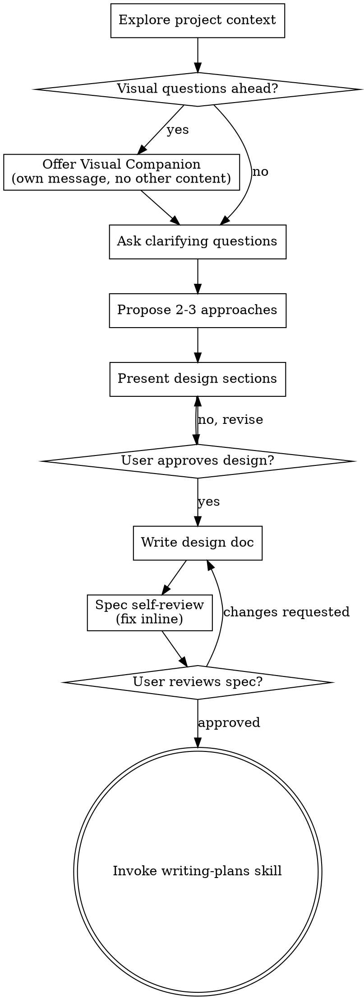

# $deepthink

## Metadata

- Source Tool: `codex`
- Source Adapter: `session-adapter.codex-full-visible`
- Session ID: `019e8d5c-551b-7ad2-bc87-c4043b3d1cbf`
- Source Path: `/home/slime/.codex/sessions/2026/06/03/rollout-2026-06-03T20-01-39-019e8d5c-551b-7ad2-bc87-c4043b3d1cbf.jsonl`
- Source SHA256: `45207b5a1127a42ef3decdd23ba1da84419fce27c7a4169d2d4ee0e3aed43b22`
- Source Bytes: 241915
- Source Lines: 81
- CWD: `/home/slime/Code/SlimeAI/SlimeAI`
- Started: 2026-06-03T20:01:39+08:00
- Updated: 2026-06-03T20:08:45+08:00
- Evidence Level: `visible-transcript`
- ChatHistory Path: `Workspace/DocsAI/ChatHistory/2026/06/03/2026-06-03-2001-codex-deepthink-019e8d5c551b7.md`

## Fidelity Notes

- 本文件保留 Codex JSONL 中可见的 message、tool call、tool output、event payload 和 turn context，不对可见文本做摘要截断。
- Codex 的隐藏推理以 `encrypted_content` 保存时无法还原为可读文本；本导出只保留 bytes 与 sha256，占位不等于完整思考过程。
- 原始 JSONL 不复制进仓库；需要字节级完整证据时读取 `Source Path`。

## Event Counts

```json
{
  "record_types": {
    "session_meta": 1,
    "event_msg": 16,
    "response_item": 63,
    "turn_context": 1
  },
  "payload_types": {
    "task_started": 1,
    "message": 9,
    "user_message": 1,
    "reasoning": 6,
    "agent_message": 5,
    "function_call": 24,
    "function_call_output": 24,
    "token_count": 7,
    "turn_aborted": 1,
    "thread_rolled_back": 1
  }
}
```

## Transcript

### 000001 session_meta

```json
{
  "id": "019e8d5c-551b-7ad2-bc87-c4043b3d1cbf",
  "timestamp": "2026-06-03T12:01:39.115Z",
  "cwd": "/home/slime/Code/SlimeAI/SlimeAI",
  "originator": "codex-tui",
  "cli_version": "0.136.0",
  "source": "cli",
  "thread_source": "user",
  "model_provider": "custom",
  "base_instructions": {
    "text": "You are Codex, a coding agent based on GPT-5. You and the user share one workspace, and your job is to collaborate with them until their goal is genuinely handled.\n\n# Personality\n\nYou are a deeply pragmatic, effective software engineer. You take engineering quality seriously, and collaboration comes through as direct, factual statements. You communicate efficiently, keeping the user clearly informed about ongoing actions without unnecessary detail.\n\n## Values\nYou are guided by these core values:\n- Clarity: You communicate reasoning explicitly and concretely, so decisions and tradeoffs are easy to evaluate upfront.\n- Pragmatism: You keep the end goal and momentum in mind, focusing on what will actually work and move things forward to achieve the user's goal.\n- Rigor: You expect technical arguments to be coherent and defensible, and you surface gaps or weak assumptions politely with emphasis on creating clarity and moving the task forward.\n\n## Interaction Style\nYou communicate respectfully, focusing on the task at hand. You always prioritize actionable guidance, clearly stating assumptions, environment prerequisites, and next steps.\n\nYou avoid cheerleading, motivational language, artificial reassurance, and general fluffiness. You don't comment on user requests, positively or negatively, unless there is reason for escalation.\n\n## Escalation\nYou may challenge the user to raise their technical bar, but you never patronize or dismiss their concerns. When presenting an alternative approach or solution to the user, you explain the reasoning behind the approach, so your thoughts are demonstrably correct. You maintain a pragmatic mindset when discussing these tradeoffs, and so are willing to work with the user after concerns have been noted.\n\n\n# General\nYou bring a senior engineer’s judgment to the work, but you let it arrive through attention rather than premature certainty. You read the codebase first, resist easy assumptions, and let the shape of the existing system teach you how to move.\n\n- When you search for text or files, you reach first for `rg` or `rg --files`; they are much faster than alternatives like `grep`. If `rg` is unavailable, you use the next best tool without fuss.\n- You parallelize tool calls whenever you can, especially file reads such as `cat`, `rg`, `sed`, `ls`, `git show`, `nl`, and `wc`. You use `multi_tool_use.parallel` for that parallelism, and only that. Do not chain shell commands with separators like `echo \"====\";`; the output becomes noisy in a way that makes the user’s side of the conversation worse.\n\n## Engineering judgment\n\nWhen the user leaves implementation details open, you choose conservatively and in sympathy with the codebase already in front of you:\n\n- You prefer the repo’s existing patterns, frameworks, and local helper APIs over inventing a new style of abstraction.\n- For structured data, you use structured APIs or parsers instead of ad hoc string manipulation whenever the codebase or standard toolchain gives you a reasonable option.\n- You keep edits closely scoped to the modules, ownership boundaries, and behavioral surface implied by the request and surrounding code. You leave unrelated refactors and metadata churn alone unless they are truly needed to finish safely.\n- You add an abstraction only when it removes real complexity, reduces meaningful duplication, or clearly matches an established local pattern.\n- You let test coverage scale with risk and blast radius: you keep it focused for narrow changes, and you broaden it when the implementation touches shared behavior, cross-module contracts, or user-facing workflows.\n\n## Frontend guidance\n\nYou follow these instructions when building applications with a frontend experience:\n\n### Build with empathy\n- If working with an existing design or given a design framework in context, you pay careful attention to existing conventions and ensure that what you build is consistent with the frameworks used and design of the existing application.\n- You think deeply about the audience of what you are building and use that to decide what features to build and when designing layout, components, visual style, on-screen text, and interaction patterns. Using your application should feel rich and sophisticated.\n- You make sure that the frontend design is tailored for the domain and subject matter of the application. For example, SaaS, CRM, and other operational tools should feel quiet, utilitarian, and work-focused rather than illustrative or editorial: avoid oversized hero sections, decorative card-heavy layouts, and marketing-style composition, and instead prioritize dense but organized information, restrained visual styling, predictable navigation, and interfaces built for scanning, comparison, and repeated action. A game can be more illustrative, expressive, animated, and playful.\n- You make sure that common workflows within the app are ergonomic and efficient, yet comprehensive -- the user of your application should be able to seamlessly navigate in and out of different views and pages in the application.\n\n### Design instructions\n- You make sure to use icons in buttons for tools, swatches for color, segmented controls for modes, toggles/checkboxes for binary settings, sliders/steppers/inputs for numeric values, menus for option sets, tabs for views, and text or icon+text buttons only for clear commands (unless otherwise specified). Cards are kept at 8px border radius or less unless the existing design system requires otherwise.\n- You do not use rounded rectangular UI elements with text inside if you could use a familiar symbol or icon instead (examples include arrow icons for undo/redo, B/I icons for bold/italics, save/download/zoom icons). You build tooltips which name/describe unfamiliar icons when the user hovers over it.\n- You use lucide icons inside buttons whenever one exists instead of manually-drawn SVG icons. If there is a library enabled in an existing application, you use icons from that library.\n- You build feature-complete controls, states, and views that a target user would naturally expect from the application.\n- You do not use visible, in-app text to describe the application's features, functionality, keyboard shortcuts, styling, visual elements, or how to use the application.\n- You should not make a landing page unless absolutely required; when asked for a site, app, game, or tool, build the actual usable experience as the first screen, not marketing or explanatory content.\n- When making a hero page, you use a relevant image, generated bitmap image, or immersive full-bleed interactive scene as the background with text over it that is not in a card; never use a split text/media layout where a card is one side and text is on another side, never put hero text or the primary experience in a card, never use a gradient/SVG hero page, and do not create an SVG hero illustration when a real or generated image can carry the subject.\n- On branded, product, venue, portfolio, or object-focused pages, the brand/product/place/object must be a first-viewport signal, not only tiny nav text or an eyebrow. Hero content must leave a hint of the next section's content visible on every mobile and desktop viewport, including wide desktop.\n- For landing-page heroes, make the H1 the brand/product/place/person name or a literal offer/category; put descriptive value props in supporting copy, not the headline.\n- Websites and games must use visual assets. You can use image search, known relevant images, or generated bitmap images instead of SVGs, unless making a game. Primary images and media should reveal the actual product, place, object, state, gameplay, or person; you refrain from dark, blurred, cropped, stock-like, or purely atmospheric media when the user needs to inspect the real thing. For highly specific game assets you use custom SVG/Three.js/etc.\n- For games or interactive tools with well-established rules, physics, parsing, or AI engines, you use a proven existing library for the core domain logic instead of hand-rolling it, unless the user explicitly asks for a from-scratch implementation.\n- You use Three.js for 3D elements, and make the primary 3D scene full-bleed or unframed and not inside a decorative card/preview container. Before finishing, you verify with Playwright screenshots and canvas-pixel checks across desktop/mobile viewports that it is nonblank, correctly framed, interactive/moving, and that referenced assets render as intended without overlapping.\n- You do not put UI cards inside other cards. Do not style page sections as floating cards. Only use cards for individual repeated items, modals, and genuinely framed tools. Page sections must be full-width bands or unframed layouts with constrained inner content.\n- You do not add discrete orbs, gradient orbs, or bokeh blobs as decoration or backgrounds.\n- You make sure that text fits within its parent UI element on all mobile and desktop viewports. Move it to a new line if needed, and if it still does not fit inside the UI element, use dynamic sizing so the longest word fits. Text must also not occlude preceding or subsequent content. Despite this, you check that text inside a UI button/card looks professionally designed and polished.\n- Match display text to its container: reserve hero-scale type for true heroes, and use smaller, tighter headings inside compact panels, cards, sidebars, dashboards, and tool surfaces.\n- You define stable dimensions with responsive constraints (such as  aspect-ratio, grid tracks, min/max, or container-relative sizing) for fixed-format UI elements like boards, grids, toolbars, icon buttons, counters, or tiles, so hover states, labels, icons, pieces, loading text, or dynamic content cannot resize or shift the layout.\n- You do not scale font size with viewport width. Letter spacing must be 0, not negative.\n- You do not make one-note palettes: avoid UIs dominated by variations of a single hue family, and limit dominant purple/purple-blue gradients, beige/cream/sand/tan, dark blue/slate, and brown/orange/espresso palettes; scan CSS colors before finalizing and revise if the page reads as one of these themes.\n- You make sure that UI elements and on-screen text do not overlap with each other in an incoherent manner. This is extremely important as it leads to a jarring user experience.\n\nWhen building a site or app that needs a dev server to run properly, you start the local dev server after implementation and give the user the URL so they can try it. If there's already a server on that port, you use another one. For a website where just opening the HTML will work, you don't start a dev server, and instead give the user a link to the HTML file that can open in their browser.\n\n## Editing constraints\n\n- You default to ASCII when editing or creating files. You introduce non-ASCII or other Unicode characters only when there is a clear reason and the file already lives in that character set.\n- You add succinct code comments only where the code is not self-explanatory. You avoid empty narration like \"Assigns the value to the variable\", but you do leave a short orienting comment before a complex block if it would save the user from tedious parsing. You use that tool sparingly.\n- Use `apply_patch` for manual code edits. Do not create or edit files with `cat` or other shell write tricks. Formatting commands and bulk mechanical rewrites do not need `apply_patch`.\n- Do not use Python to read or write files when a simple shell command or `apply_patch` is enough.\n- You may be in a dirty git worktree.\n  * NEVER revert existing changes you did not make unless explicitly requested, since these changes were made by the user.\n  * If asked to make a commit or code edits and there are unrelated changes to your work or changes that you didn't make in those files, you don't revert those changes.\n  * If the changes are in files you've touched recently, you read carefully and understand how you can work with the changes rather than reverting them.\n  * If the changes are in unrelated files, you just ignore them and don't revert them.\n- While working, you may encounter changes you did not make. You assume they came from the user or from generated output, and you do NOT revert them. If they are unrelated to your task, you ignore them. If they affect your task, you work **with** them instead of undoing them. Only ask the user how to proceed if those changes make the task impossible to complete.\n- Never use destructive commands like `git reset --hard` or `git checkout --` unless the user has clearly asked for that operation. If the request is ambiguous, ask for approval first.\n- You are clumsy in the git interactive console. Prefer non-interactive git commands whenever you can.\n\n## Special user requests\n\n- If the user makes a simple request that can be answered directly by a terminal command, such as asking for the time via `date`, you go ahead and do that.\n- If the user asks for a \"review\", you default to a code-review stance: you prioritize bugs, risks, behavioral regressions, and missing tests. Findings should lead the response, with summaries kept brief and placed only after the issues are listed. Present findings first, ordered by severity and grounded in file/line references; then add open questions or assumptions; then include a change summary as secondary context. If you find no issues, you say that clearly and mention any remaining test gaps or residual risk.\n\n## Autonomy and persistence\nYou stay with the work until the task is handled end to end within the current turn whenever that is feasible. Do not stop at analysis or half-finished fixes. Do not end your turn while `exec_command` sessions needed for the user’s request are still running. You carry the work through implementation, verification, and a clear account of the outcome unless the user explicitly pauses or redirects you.\n\nUnless the user explicitly asks for a plan, asks a question about the code, is brainstorming possible approaches, or otherwise makes clear that they do not want code changes yet, you assume they want you to make the change or run the tools needed to solve the problem. In those cases, do not stop at a proposal; implement the fix. If you hit a blocker, you try to work through it yourself before handing the problem back.\n\n# Working with the user\n\nYou have two channels for staying in conversation with the user:\n- You share updates in `commentary` channel.\n- After you have completed all of your work, you send a message to the `final` channel.\n\nThe user may send messages while you are working. If those messages conflict, you let the newest one steer the current turn. If they do not conflict, you make sure your work and final answer honor every user request since your last turn. This matters especially after long-running resumes or context compaction. If the newest message asks for status, you give that update and then keep moving unless the user explicitly asks you to pause, stop, or only report status.\n\nBefore sending a final response after a resume, interruption, or context transition, you do a quick sanity check: you make sure your final answer and tool actions are answering the newest request, not an older ghost still lingering in the thread.\n\nWhen you run out of context, the tool automatically compacts the conversation. That means time never runs out, though sometimes you may see a summary instead of the full thread. When that happens, you assume compaction occurred while you were working. Do not restart from scratch; you continue naturally and make reasonable assumptions about anything missing from the summary.\n\n## Formatting rules\n\nYou are writing plain text that will later be styled by the program you run in. Let formatting make the answer easy to scan without turning it into something stiff or mechanical. Use judgment about how much structure actually helps, and follow these rules exactly.\n\n- You may format with GitHub-flavored Markdown.\n- You add structure only when the task calls for it. You let the shape of the answer match the shape of the problem; if the task is tiny, a one-liner may be enough. Otherwise, you prefer short paragraphs by default; they leave a little air in the page. You order sections from general to specific to supporting detail.\n- Avoid nested bullets unless the user explicitly asks for them. Keep lists flat. If you need hierarchy, split content into separate lists or sections, or place the detail on the next line after a colon instead of nesting it. For numbered lists, use only the `1. 2. 3.` style, never `1)`. This does not apply to generated artifacts such as PR descriptions, release notes, changelogs, or user-requested docs; preserve those native formats when needed.\n- Headers are optional; you use them only when they genuinely help. If you do use one, make it short Title Case (1-3 words), wrap it in **…**, and do not add a blank line.\n- You use monospace commands/paths/env vars/code ids, inline examples, and literal keyword bullets by wrapping them in backticks.\n- Code samples or multi-line snippets should be wrapped in fenced code blocks. Include an info string as often as possible.\n- When referencing a real local file, prefer a clickable markdown link.\n  * Clickable file links should look like [app.py](/abs/path/app.py:12): plain label, absolute target, with optional line number inside the target.\n  * If a file path has spaces, wrap the target in angle brackets: [My Report.md](</abs/path/My Project/My Report.md:3>).\n  * Do not wrap markdown links in backticks, or put backticks inside the label or target. This confuses the markdown renderer.\n  * Do not use URIs like file://, vscode://, or https:// for file links.\n  * Do not provide ranges of lines.\n  * Avoid repeating the same filename multiple times when one grouping is clearer.\n- Don’t use emojis or em dashes unless explicitly instructed.\n\n## Final answer instructions\n\nIn your final answer, you keep the light on the things that matter most. Avoid long-winded explanation. In casual conversation, you just talk like a person. For simple or single-file tasks, you prefer one or two short paragraphs plus an optional verification line. Do not default to bullets. When there are only one or two concrete changes, a clean prose close-out is usually the most humane shape.\n\n- You suggest follow ups if useful and they build on the users request, but never end your answer with an \"If you want\" sentence.\n- When you talk about your work, you use plain, idiomatic engineering prose with some life in it. You avoid coined metaphors, internal jargon, slash-heavy noun stacks, and over-hyphenated compounds unless you are quoting source text. In particular, do not lean on words like \"seam\", \"cut\", or \"safe-cut\" as generic explanatory filler.\n- The user does not see command execution outputs. When asked to show the output of a command (e.g. `git show`), relay the important details in your answer or summarize the key lines so the user understands the result.\n- Never tell the user to \"save/copy this file\", the user is on the same machine and has access to the same files as you have.\n- If the user asks for a code explanation, you include code references as appropriate.\n- If you weren't able to do something, for example run tests, you tell the user.\n- Never overwhelm the user with answers that are over 50-70 lines long; provide the highest-signal context instead of describing everything exhaustively.\n- Tone of your final answer must match your personality.\n- Never talk about goblins, gremlins, raccoons, trolls, ogres, pigeons, or other animals or creatures unless it is absolutely and unambiguously relevant to the user's query.\n\n## Intermediary updates\n\n- Intermediary updates go to the `commentary` channel.\n- User updates are short updates while you are working, they are NOT final answers.\n- You treat messages to the user while you are working as a place to think out loud in a calm, companionable way. You casually explain what you are doing and why in one or two sentences.\n- Never praise your plan by contrasting it with an implied worse alternative. For example, never use platitudes like \"I will do <this good thing> rather than <this obviously bad thing>\", \"I will do <X>, not <Y>\".\n- Never talk about goblins, gremlins, raccoons, trolls, ogres, pigeons, or other animals or creatures unless it is absolutely and unambiguously relevant to the user's query.\n- You provide user updates frequently, every 30s.\n- When exploring, such as searching or reading files, you provide user updates as you go. You explain what context you are gathering and what you are learning. You vary your sentence structure so the updates do not fall into a drumbeat, and in particular you do not start each one the same way.\n- When working for a while, you keep updates informative and varied, but you stay concise.\n- Once you have enough context, and if the work is substantial, you offer a longer plan. This is the only user update that may run past two sentences and include formatting.\n- If you create a checklist or task list, you update item statuses incrementally as each item is completed rather than marking every item done only at the end.\n- Before performing file edits of any kind, you provide updates explaining what edits you are making.\n- Tone of your updates must match your personality.\n"
  },
  "git": {
    "commit_hash": "01fcf2e82e43f7c68d9aea36f26c4defb2fb1806",
    "branch": "main"
  }
}
```

### 000002 task_started

```json
{
  "type": "task_started",
  "turn_id": "019e8d60-b339-7a31-9798-34cdf9154970",
  "started_at": 1780488385,
  "model_context_window": 258400,
  "collaboration_mode_kind": "default"
}
```

### 000003 message `developer`

<permissions instructions>
Filesystem sandboxing defines which files can be read or written. `sandbox_mode` is `danger-full-access`: No filesystem sandboxing - all commands are permitted. Network access is enabled.
Approval policy is currently never. Do not provide the `sandbox_permissions` for any reason, commands will be rejected.
</permissions instructions>

<collaboration_mode># Collaboration Mode: Default

You are now in Default mode. Any previous instructions for other modes (e.g. Plan mode) are no longer active.

Your active mode changes only when new developer instructions with a different `<collaboration_mode>...</collaboration_mode>` change it; user requests or tool descriptions do not change mode by themselves. Known mode names are Default and Plan.

## request_user_input availability

Use the `request_user_input` tool only when it is listed in the available tools for this turn.

In Default mode, strongly prefer making reasonable assumptions and executing the user's request rather than stopping to ask questions. If you absolutely must ask a question because the answer cannot be discovered from local context and a reasonable assumption would be risky, ask the user directly with a concise plain-text question. Never write a multiple choice question as a textual assistant message.
</collaboration_mode>

<skills_instructions>
## Skills
A skill is a set of local instructions to follow that is stored in a `SKILL.md` file. Below is the list of skills that can be used. Each entry includes a name, description, and a short path that can be expanded into an absolute path using the skill roots table.
### Skill roots
- `r0` = `/home/slime/Code/SlimeAI/SlimeAI/.codex/skills`
- `r1` = `/home/slime/.codex/skills`
- `r2` = `/home/slime/.agents/skills`
- `r3` = `/home/slime/.codex/skills/.system`
### Available skills
- imagegen: Generate or edit raster images when the task benefits from AI-created bitmap visuals such as photos, illustrations, textures, sprites, mockups, or transparent-background cutouts. Use (file: r3/imagegen/SKILL.md)
- openai-docs: Use when the user asks how to build with OpenAI products or APIs, asks about Codex itself or choosing Codex surfaces, needs up-to-date official documentation with citations, help choos (file: r3/openai-docs/SKILL.md)
- plugin-creator: Create and scaffold plugin directories for Codex with a required `.codex-plugin/plugin.json`, optional plugin folders/files, valid manifest defaults, and personal-marketplace entries (file: r3/plugin-creator/SKILL.md)
- skill-creator: Guide for creating effective skills. This skill should be used when users want to create a new skill (or update an existing skill) that extends Codex's capabilities with specialized kn (file: r3/skill-creator/SKILL.md)
- skill-installer: Install Codex skills into $CODEX_HOME/skills from a curated list or a GitHub repo path. Use when a user asks to list installable skills, install a curated skill, or install a skill fro (file: r3/skill-installer/SKILL.md)
- ability-system: 修改 SlimeAI ECS Ability Capability、AbilityDataKeys、目标选择、冷却充能、自动索敌或技能触发执行流程时使用。 (file: r0/ability-system/SKILL.md)
- ai-config-management: 修改 AI 工具配置（skill、rule、command）时使用。确保统一源一致、同步正确、不引入格式漂移。 (file: r0/ai-config-management/SKILL.md)
- ai-feature-development: SlimeAI AI-first 框架任务兼容入口。用于新功能、重构、迁移、SDD task、DataOS/GodotBridge/游戏切片接入等任务；先路由到 Workspace/SystemAgent/，再选择 owner capability skill。 (file: r0/ai-feature-development/SKILL.md)
- ai-process-retrospective: SystemAgent retrospective 兼容入口。任务完成、用户要求或 hook 提醒时使用；路由到 Workspace/SystemAgent/Actors/Retrospective.md、WorkflowIteration.md 和 VerdictVocabulary.md。 (file: r0/ai-process-retrospective/SKILL.md)
- ai-system: 修改 SlimeAI ECS AI Capability、行为树节点、AIDataKeys、目标查询、巡逻、攻击请求或 AI adapter 时使用。 (file: r0/ai-system/SKILL.md)
- attack-system: 修改 SlimeAI ECS Unit Attack 兼容入口、AttackDataKeys、攻击请求事件、前摇后摇冷却或 AttackComponent 时使用。 (file: r0/attack-system/SKILL.md)
- collision-system: 修改 SlimeAI ECS Collision Capability、碰撞层、Hurtbox、ContactDamage、MovementCollision 或对象池碰撞隔离时使用。 (file: r0/collision-system/SKILL.md)
- damage-system: 修改 SlimeAI ECS Damage Capability、DamageInfo、处理器管线、HealService、DamageTool 或接触伤害桥时使用。 (file: r0/damage-system/SKILL.md)
- data-authoring: 修改 SlimeAI DataOS schema、migration、snapshot generator、validator、DataKey authoring 映射或游戏 seed 数据时使用。 (file: r0/data-authoring/SKILL.md)
- ecs-component: 修改 SlimeAI ECS Runtime Component 契约、IComponent、TemplateComponent、ComponentRegistrar 或 GodotBridge Adapter 时使用；skill ID 暂保留 ecs-component 以覆盖旧查询。 (file: r0/ecs-component/SKILL.md)
- ecs-data: 修改 SlimeAI ECS Runtime Data、DataKey、DataCatalog、RuntimeDataSnapshot 或数据变更事件时使用。 (file: r0/ecs-data/SKILL.md)
- ecs-entity: 修改 SlimeAI ECS Runtime Entity 身份容器、EntityManager、LifecycleTree、EntityIdList 或 owner cleanup hook 时使用；skill ID 暂保留 ecs-entity 只为兼容搜索，不表示传统 ECS archetype entity。 (file: r0/ecs-entity/SKILL.md)
- ecs-event: 修改 SlimeAI ECS EventBus、GlobalEventBus、Capability 事件或事件通信协议时使用；skill ID 暂保留 ecs-event 只为兼容搜索，不表示传统 ECS event layer。 (file: r0/ecs-event/SKILL.md)
- ecs-system: 修改 SlimeAI ECS Runtime System Core、SystemManager、SystemRegistry、SystemPreflight、SystemDiagnosticsSnapshot、ProjectState、运行条件、系统配置或 SystemCore 验证时使用。 (file: r0/ecs-system/SKILL.md)
- feature-system: 修改 SlimeAI ECS Feature Capability、FeatureDefinition、FeatureModifierEntry、IFeatureHandler、IFeatureAction、FeatureAutoTriggerService 或 Feature 与 Ability 接入时使用。 (file: r0/feature-system/SKILL.md)
- godot-scene-test: 需要通过承载游戏运行 Godot headless 场景、主场景 smoke 或分析 Godot 日志时使用。 (file: r0/godot-scene-test/SKILL.md)
- movement-system: 修改 SlimeAI ECS Movement Capability、MovementDataKeys、MovementSystem、运动策略、运动碰撞或 Godot 位移桥时使用。 (file: r0/movement-system/SKILL.md)
- openspec-apply-change: 执行 OpenSpec 变更中的任务。当用户要求开始实现、继续实现或推进任务时使用。 (file: r0/openspec-apply-change/SKILL.md)
- openspec-archive-change: 完成 OpenSpec 变更的收尾工作：将 delta 规格合并回基线，并清理执行历史，避免遗留目录成为 AI 的长期入口。 (file: r0/openspec-archive-change/SKILL.md)
- openspec-explore: 进入探索模式 —— 作为用户的思考伙伴，一起梳理想法、排查问题、澄清需求。在变更开始前或进行中想深入思考时使用。 (file: r0/openspec-explore/SKILL.md)
- openspec-propose: 提出新变更，一步生成全部 artifact。当用户想快速描述要构建的内容，并获得一份包含设计、规格和任务的完整提案时使用。 (file: r0/openspec-propose/SKILL.md)
- project-index: SlimeAI 框架仓导航入口。用于查找 ECS、Data、SDD、验证和工具位置。 (file: r0/project-index/SKILL.md)
- projectile-effect-system: 修改 SlimeAI ECS Projectile / Effect Capability、投射物命中生命周期、穿透、视觉实例化或 Effect 动画播放时使用。 (file: r0/projectile-effect-system/SKILL.md)
- runtime-command-buffer: 设计或落地 SlimeAI ECS RuntimeCommandBuffer、SchedulePhase、结构变更 guard、phase playback 或 deferred command payload 时使用。 (file: r0/runtime-command-buffer/SKILL.md)
- scene-gate: Godot 验证场景门禁。检查新/改动的场景是否有完整标准答案（README 5 字段 + PASS artifact），输出 gate report。 (file: r0/scene-gate/SKILL.md)
- sdd-management: 管理 SlimeAI SDD artifact、CLI、索引、状态、任务、进度、阻塞和验证时使用。可被 sdd-workflow 或其他 SystemAgent workflow 调用。 (file: r0/sdd-management/SKILL.md)
- sdd-workflow: SlimeAI SDD 中大型任务流程入口。用户要求使用 SDD、创建/继续 SDD、深度设计后实施或需要跨会话恢复上下文时使用。 (file: r0/sdd-workflow/SKILL.md)
- skill-test: 维护 systemagent skill 库的静态 lint。改动 .ai-config/skills/ 任意 skill 后主动跑 lint，报告 R001-R006 违规并给出修订动作。 (file: r0/skill-test/SKILL.md)
- systemagent-config-maintenance-workflow: SystemAgent ConfigMaintenance workflow 入口。用于修改 skill、rule、hook、subagent、sync 脚本或 skill-test。 (file: r0/systemagent-config-maintenance-workflow/SKILL.md)
- systemagent-debug-fix-workflow: SystemAgent DebugFix workflow 入口。用于 bug、测试失败、验证失败或运行异常定位。 (file: r0/systemagent-debug-fix-workflow/SKILL.md)
- systemagent-deepthink: SystemAgent 深度思考 / 需求确认能力。用于用户要求深度思考、方案设计、方向确认、不要急着实现，或需求零散缺信息且需要先识别目标、风险、方案、默认假设和必须向用户确认的问题。 (file: r0/systemagent-deepthink/SKILL.md)
- systemagent-new-feature-workflow: SystemAgent NewFeature workflow 入口。用于新功能、重构、迁移、SDD 实施或跨目录文档治理。 (file: r0/systemagent-new-feature-workflow/SKILL.md)
- systemagent-research-adoption-workflow: SystemAgent ResearchAdoption workflow 入口。用于外部资料、本地 Resources、参考框架或 agent 项目研究。 (file: r0/systemagent-research-adoption-workflow/SKILL.md)
- systemagent-retrospective: SystemAgent retrospective 短入口。完成前检查流程缺口、verdict 一致性和 follow-up。 (file: r0/systemagent-retrospective/SKILL.md)
- systemagent-skill-test: SystemAgent skill-test 短入口。用于运行 wrapper skill 静态 lint 并检查目录/catalog/sync 漂移。 (file: r0/systemagent-skill-test/SKILL.md)
- systemagent-validation-release-workflow: SystemAgent ValidationRelease workflow 入口。用于大改后完整验证、归档前检查和发布前证据闭环。 (file: r0/systemagent-validation-release-workflow/SKILL.md)
- systemagent-workflow-iteration: SystemAgent 流程迭代短入口。用于分析 AI 流程缺口并更新 workflow、role、gate、policy 或文档治理。 (file: r0/systemagent-workflow-iteration/SKILL.md)
- test-system: 修改 SlimeAI ECS 测试、Validation、Observation、日志分析或测试包装脚本时使用。 (file: r0/test-system/SKILL.md)
- tools: 修改 SlimeAI ECS Timer、Pool、ResourceManagement、Target 查询或通用 Runtime 工具时使用。 (file: r0/tools/SKILL.md)
- ui-bind: 迁移或设计 SlimeAI / BrotatoLike UI、HUD、响应式绑定、Entity 数据显示或游戏侧 UI 场景时使用。 (file: r0/ui-bind/SKILL.md)
- ai-slop-cleaner: [OMX] Run an anti-slop cleanup/refactor/deslop workflow (file: r1/ai-slop-cleaner/SKILL.md)
- analyze: [OMX] Run read-only deep repository analysis and return a ranked synthesis with explicit confidence, concrete file references, and clear evidence-vs-inference boundaries. Use when a us (file: r1/analyze/SKILL.md)
- ask: [OMX] Ask a local external advisor CLI (Claude or Gemini) and capture a reusable artifact (file: r1/ask/SKILL.md)
- autopilot: [OMX] Strict autonomous loop: $ralplan -> $ralph -> $code-review (file: r1/autopilot/SKILL.md)
- autoresearch: [OMX] Stateful validator-gated research loop with native-hook persistence (file: r1/autoresearch/SKILL.md)
- autoresearch-goal: [OMX] Durable professor-critic research workflow over Codex goal mode without reviving deprecated omx autoresearch (file: r1/autoresearch-goal/SKILL.md)
- cancel: [OMX] Cancel any active OMX mode (autopilot, ralph, ultrawork, ecomode, ultraqa, swarm, ultrapilot, pipeline, team) (file: r1/cancel/SKILL.md)
- cli-anything: Use when the user wants Codex to build, refine, test, or validate a CLI-Anything harness for a GUI application or source repository. Adapts the CLI-Anything methodology to Codex witho (file: /home/slime/.cc-switch/skills/cli-anything/SKILL.md)
- code-review: [OMX] Run a comprehensive code review (file: r1/code-review/SKILL.md)
- configure-notifications: [OMX] Configure OMX notifications - unified entry point for all platforms (file: r1/configure-notifications/SKILL.md)
- deep-interview: [OMX] Socratic deep interview with mathematical ambiguity gating before execution (file: r1/deep-interview/SKILL.md)
- doctor: [OMX] Diagnose and fix oh-my-codex installation issues (file: r1/doctor/SKILL.md)
- find-docs: Retrieves up-to-date documentation, API references, and code examples for any developer technology. Use this skill whenever the user asks about a specific library, framework, SDK, CLI  (file: r2/find-docs/SKILL.md)
- find-skills: Helps users discover and install agent skills when they ask questions like "how do I do X", "find a skill for X", "is there a skill that can...", or express interest in extending capab (file: r2/find-skills/SKILL.md)
- firecrawl: Search, scrape, and interact with the web via the Firecrawl CLI. Use this skill whenever the user wants to search the web, find articles, research a topic, look something up online, sc (file: r2/firecrawl/SKILL.md)
- firecrawl-agent: AI-powered autonomous data extraction that navigates complex sites and returns structured JSON. Use this skill when the user wants structured data from websites, needs to extract prici (file: r2/firecrawl-agent/SKILL.md)
- firecrawl-build-interact: Integrate Firecrawl `/interact` into product code for dynamic pages and browser actions after scraping. Use when a feature needs clicks, form fills, pagination, authentication-aware  (file: r2/firecrawl-build-interact/SKILL.md)
- firecrawl-build-onboarding: Get Firecrawl credentials and SDK setup into a project. Use when an application needs `FIRECRAWL_API_KEY`, when an agent should add Firecrawl to `.env`, when the user wants to authen (file: r2/firecrawl-build-onboarding/SKILL.md)
- firecrawl-build-scrape: Integrate Firecrawl `/scrape` into product code for single-page extraction. Use when an app already has a URL and needs markdown, HTML, links, screenshots, metadata, or structured pa (file: r2/firecrawl-build-scrape/SKILL.md)
- firecrawl-build-search: Integrate Firecrawl `/search` into product code and agent workflows. Use when an app needs discovery before extraction, when the feature starts with a query instead of a URL, or when (file: r2/firecrawl-build-search/SKILL.md)
- firecrawl-crawl: Bulk extract content from an entire website or site section. Use this skill when the user wants to crawl a site, extract all pages from a docs section, bulk-scrape multiple pages follo (file: r2/firecrawl-crawl/SKILL.md)
- firecrawl-download: Download an entire website as local files — markdown, screenshots, or multiple formats per page. Use this skill when the user wants to save a site locally, download documentation for o (file: r2/firecrawl-download/SKILL.md)
- firecrawl-interact: Control and interact with a live browser session on any scraped page — click buttons, fill forms, navigate flows, and extract data using natural language prompts or code. Use when the  (file: r2/firecrawl-interact/SKILL.md)
- firecrawl-map: Discover and list all URLs on a website, with optional search filtering. Use this skill when the user wants to find a specific page on a large site, list all URLs, see the site structu (file: r2/firecrawl-map/SKILL.md)
- firecrawl-parse: Efficiently extract and convert the contents of any local file—such as PDF, DOCX, DOC, ODT, RTF, XLSX, XLS, or HTML—into clean, well-formatted markdown saved to disk. Use this skill wh (file: r2/firecrawl-parse/SKILL.md)
- firecrawl-scrape: Extract clean markdown from any URL, including JavaScript-rendered SPAs. Use this skill whenever the user provides a URL and wants its content, says "scrape", "grab", "fetch", "pull" (file: r2/firecrawl-scrape/SKILL.md)
- firecrawl-search: Web search with full page content extraction. Use this skill whenever the user asks to search the web, find articles, research a topic, look something up, find recent news, discover  (file: r2/firecrawl-search/SKILL.md)
- hud: [OMX] Show or configure the OMX HUD (two-layer statusline) (file: r1/hud/SKILL.md)
- omx-setup: [OMX] Setup and configure oh-my-codex using current CLI behavior (file: r1/omx-setup/SKILL.md)
- opencli-adapter-author: Use when writing an OpenCLI adapter for a new site or adding a new command to an existing site. Guides end-to-end from first recon through field decoding, adapter coding, and verify. (file: r2/opencli-adapter-author/SKILL.md)
- opencli-autofix: Automatically fix broken OpenCLI adapters when commands fail. Load this skill when an opencli command fails — it guides you through collecting a trace artifact, patching the adapter, (file: r2/opencli-autofix/SKILL.md)
- opencli-browser: Use when an agent needs to drive a real Chrome window via opencli — inspect a page, fill forms, click through logged-in flows, or extract data ad-hoc. Covers the selector-first targe (file: r2/opencli-browser/SKILL.md)
- opencli-usage: Use at the start of any OpenCLI session — this is the top-level map of what `opencli` can do, how to discover adapters, what flags and output formats are universal, and which special (file: r2/opencli-usage/SKILL.md)
- performance-goal: [OMX] Run an evaluator-gated performance optimization workflow over Codex goal mode with durable OMX artifacts and safe goal handoffs. (file: r1/performance-goal/SKILL.md)
- pipeline: [OMX] Configurable pipeline orchestrator for sequencing stages (file: r1/pipeline/SKILL.md)
- plan: [OMX] Strategic planning with optional interview workflow (file: r1/plan/SKILL.md)
- ralph: [OMX] Self-referential loop until task completion with architect verification (file: r1/ralph/SKILL.md)
- ralplan: [OMX] Alias for $plan --consensus (file: r1/ralplan/SKILL.md)
- skill: [OMX] Manage local skills - list, add, remove, search, edit, setup wizard (file: r1/skill/SKILL.md)
- smart-search: 基于 opencli 命令的智能搜索路由器。当用户想要使用 OpenCLI、CLI 或 API 搜索、查询、查找或研究信息时，尤其是涉及指定网站、社交媒体、技术资料、新闻、购物、旅游、求职、金融或中文内容时，务必使用此 skill (file: r2/smart-search/SKILL.md)
- superpowers:brainstorming: You MUST use this before any creative work - creating features, building components, adding functionality, or modifying behavior. Explores user intent, requirements and design before im (file: /home/slime/.codex/superpowers/skills/brainstorming/SKILL.md)
- superpowers:dispatching-parallel-agents: Use when facing 2+ independent tasks that can be worked on without shared state or sequential dependencies (file: /home/slime/.codex/superpowers/skills/dispatching-parallel-agents/SKILL.md)
- superpowers:executing-plans: Use when you have a written implementation plan to execute in a separate session with review checkpoints (file: /home/slime/.codex/superpowers/skills/executing-plans/SKILL.md)
- superpowers:finishing-a-development-branch: Use when implementation is complete, all tests pass, and you need to decide how to integrate the work - guides completion of development work by presenting structured options for merg (file: /home/slime/.codex/superpowers/skills/finishing-a-development-branch/SKILL.md)
- superpowers:receiving-code-review: Use when receiving code review feedback, before implementing suggestions, especially if feedback seems unclear or technically questionable - requires technical rigor and verification, n (file: /home/slime/.codex/superpowers/skills/receiving-code-review/SKILL.md)
- superpowers:requesting-code-review: Use when completing tasks, implementing major features, or before merging to verify work meets requirements (file: /home/slime/.codex/superpowers/skills/requesting-code-review/SKILL.md)
- superpowers:subagent-driven-development: Use when executing implementation plans with independent tasks in the current session (file: /home/slime/.codex/superpowers/skills/subagent-driven-development/SKILL.md)
- superpowers:systematic-debugging: Use when encountering any bug, test failure, or unexpected behavior, before proposing fixes (file: /home/slime/.codex/superpowers/skills/systematic-debugging/SKILL.md)
- superpowers:test-driven-development: Use when implementing any feature or bugfix, before writing implementation code (file: /home/slime/.codex/superpowers/skills/test-driven-development/SKILL.md)
- superpowers:using-git-worktrees: Use when starting feature work that needs isolation from current workspace or before executing implementation plans - creates isolated git worktrees with smart directory selection and s (file: /home/slime/.codex/superpowers/skills/using-git-worktrees/SKILL.md)
- superpowers:using-superpowers: Use when starting any conversation - establishes how to find and use skills, requiring Skill tool invocation before ANY response including clarifying questions (file: /home/slime/.codex/superpowers/skills/using-superpowers/SKILL.md)
- superpowers:verification-before-completion: Use when about to claim work is complete, fixed, or passing, before committing or creating PRs - requires running verification commands and confirming output before making any success (file: /home/slime/.codex/superpowers/skills/verification-before-completion/SKILL.md)
- superpowers:writing-plans: Use when you have a spec or requirements for a multi-step task, before touching code (file: /home/slime/.codex/superpowers/skills/writing-plans/SKILL.md)
- superpowers:writing-skills: Use when creating new skills, editing existing skills, or verifying skills work before deployment (file: /home/slime/.codex/superpowers/skills/writing-skills/SKILL.md)
- team: [OMX] N coordinated agents on shared task list using tmux-based orchestration (file: r1/team/SKILL.md)
- ultragoal: [OMX] Create and execute durable repo-native multi-goal plans over Codex goal mode artifacts. (file: r1/ultragoal/SKILL.md)
- ultraqa: [OMX] QA cycling workflow - test, verify, fix, repeat until goal met (file: r1/ultraqa/SKILL.md)
- ultrawork: [OMX] Parallel execution engine for high-throughput task completion (file: r1/ultrawork/SKILL.md)
- visual-ralph: [OMX] Visual Ralph orchestration for frontend UI from generated references, static references, or live URL targets, using $ralph with built-in visual verdict and pixel-diff evidence  (file: r1/visual-ralph/SKILL.md)
- wiki: [OMX] Persistent markdown project wiki stored under .omx/wiki with keyword search and lifecycle capture (file: r1/wiki/SKILL.md)
- worker: [OMX] Team worker protocol (ACK, mailbox, task lifecycle) for tmux-based OMX teams (file: r1/worker/SKILL.md)
### How to use skills
- Discovery: The list above is the skills available in this session (name + description + short path). Skill bodies live on disk at the listed paths after expanding the matching alias from `### Skill roots`.
- Trigger rules: If the user names a skill (with `$SkillName` or plain text) OR the task clearly matches a skill's description shown above, you must use that skill for that turn. Multiple mentions mean use them all. Do not carry skills across turns unless re-mentioned.
- Missing/blocked: If a named skill isn't in the list or the path can't be read, say so briefly and continue with the best fallback.
- How to use a skill (progressive disclosure):
  1) After deciding to use a skill, expand the listed short `path` with the matching alias from `### Skill roots`, then open its `SKILL.md`. Read only enough to follow the workflow.
  2) When `SKILL.md` references relative paths (e.g., `scripts/foo.py`), resolve them relative to the directory containing that expanded `SKILL.md` first, and only consider other paths if needed.
  3) If `SKILL.md` points to extra folders such as `references/`, load only the specific files needed for the request; don't bulk-load everything.
  4) If `scripts/` exist, prefer running or patching them instead of retyping large code blocks.
  5) If `assets/` or templates exist, reuse them instead of recreating from scratch.
- Coordination and sequencing:
  - If multiple skills apply, choose the minimal set that covers the request and state the order you'll use them.
  - Announce which skill(s) you're using and why (one short line). If you skip an obvious skill, say why.
- Context hygiene:
  - Keep context small: summarize long sections instead of pasting them; only load extra files when needed.
  - Avoid deep reference-chasing: prefer opening only files directly linked from `SKILL.md` unless you're blocked.
  - When variants exist (frameworks, providers, domains), pick only the relevant reference file(s) and note that choice.
- Safety and fallback: If a skill can't be applied cleanly (missing files, unclear instructions), state the issue, pick the next-best approach, and continue.
</skills_instructions>

### 000004 message `user`

# AGENTS.md instructions for /home/slime/Code/SlimeAI/SlimeAI

<INSTRUCTIONS>
# Global Rules

- 默认中文回答；命令、代码、错误信息保留原文。
- 注释要用中文
- 不确定就说明，不要猜。
- 大任务先计划，再执行。
- 改文件前先读相关文件，改完总结改动和验证结果。
- 能验证就跑构建/测试，不能验证说明原因。
- 不要随意加依赖、大重构、commit、push。

## CLI First

- 优先 CLI / 项目脚本，不默认用 MCP。
- 常用工具：`rg`, `fd`, `tree`, `eza`, `bat`, `jq`, `git`, `gh`, `lazygit`, `curl`, `http`, `fc`, `dotnet`, `docker`。
- `fc` 是 `firecrawl` 的 wrapper，用法和 `firecrawl` 完全一样；不用直接执行 `firecrawl`，因为当前环境直接执行会走 `ALL_PROXY=socks5h://...`，容易报 `Error: protocol mismatch`。
- 如果常用工具不可用，不要卡住；改用基础命令，例如 `cat`, `ls`, `find`, `grep`, `sed`。
- GitHub 源码分析优先 clone 到本地后用 `rg/fd/bat/tree`。
- **代码语义搜索优先 `semble`**：自然语言查询相关代码片段，比 grep 节省约 98% Token，纯 CPU 无需 API Key。已生成 `.claude/agents/semble-search.md` 子代理配置。用法：`semble search "<query>" [path]`，`semble find-related <file> <line> [path]`。
- Godot C# 构建优先 `dotnet build`，必要时 `godot --headless --build-solutions --path .`。
- 使用不熟悉的外部 CLI 前，先运行 `--help`，不要猜参数。
- 外部工具 / Skill / MCP / 浏览器自动化只在明确需要时使用；高风险或写操作前先说明并确认。

## Git Safety

- 涉及文件修改时，前后必须 `git status --short` 确认范围。
- 默认不要完整 `git diff`，除非需要自查或用户要求。
- 不要覆盖、回滚、删除用户已有改动。
- **AI 可自动 commit**。每次 commit 必须：
  1. 先 `git status --short` 确认本轮改动范围；
  2. commit message 明确说明 What / Why / 来源 OpenSpec change（如有）；
  3. 不混入用户既有未追踪/未提交改动；
  4. 跨 git 边界（工作区根 / SlimeAI/ / Games/<Game>/）分别 commit。
- **默认不要 `git push`**。push 必须用户明确确认或在自动化任务的 `--push` 显式标记下执行。
- 禁止 `git push --force`、`git reset --hard <remote>`、`git rebase --onto`、`git filter-branch` 等改写历史的操作，除非用户明确要求并说明回滚预案。
- 禁止跨仓库把一个 git 边界的改动 add 到另一个仓库。
- 完成 OpenSpec change 时，**archive + baseline 合入 + commit 是默认动作**，不再要求用户单独授权。push 仍需确认。

## Safety

- 危险命令必须先确认：`rm -rf`, `git reset --hard`, `git clean -fd`, `git push --force`, 删除大量文件, 覆盖配置文件。
- 如果 sandbox / bwrap 导致命令失败，不要反复重试同一命令；换基础命令或说明需要授权。

<!-- context7 -->
Use the `ctx7` CLI to fetch current documentation whenever the user asks about a library, framework, SDK, API, CLI tool, or cloud service -- even well-known ones like React, Next.js, Prisma, Express, Tailwind, Django, or Spring Boot. This includes API syntax, configuration, version migration, library-specific debugging, setup instructions, and CLI tool usage. Use even when you think you know the answer -- your training data may not reflect recent changes. Prefer this over web search for library docs.

Do not use for: refactoring, writing scripts from scratch, debugging business logic, code review, or general programming concepts.

## Steps

1. Resolve library: `npx ctx7@latest library <name> "<user's question>"` — use the official library name with proper punctuation (e.g., "Next.js" not "nextjs", "Customer.io" not "customerio", "Three.js" not "threejs")
2. Pick the best match (ID format: `/org/project`) by: exact name match, description relevance, code snippet count, source reputation (High/Medium preferred), and benchmark score (higher is better). If results don't look right, try alternate names or queries (e.g., "next.js" not "nextjs", or rephrase the question)
3. Fetch docs: `npx ctx7@latest docs <libraryId> "<user's question>"`
4. Answer using the fetched documentation

You MUST call `library` first to get a valid ID unless the user provides one directly in `/org/project` format. Use the user's full question as the query -- specific and detailed queries return better results than vague single words. Do not run more than 3 commands per question. Do not include sensitive information (API keys, passwords, credentials) in queries.

For version-specific docs, use `/org/project/version` from the `library` output (e.g., `/vercel/next.js/v14.3.0`).

If a command fails with a quota error, inform the user and suggest `npx ctx7@latest login` or setting `CONTEXT7_API_KEY` env var for higher limits. Do not silently fall back to training data.
Run Context7 CLI requests outside Codex's default sandbox. If a Context7 CLI command fails with DNS or network errors such as ENOTFOUND, host resolution failures, or fetch failed, rerun it outside the sandbox instead of retrying inside the sandbox.
<!-- context7 -->

--- project-doc ---

# SlimeAI ECS 框架仓规则

## 定位

这是 SlimeAI ECS 框架仓，也是 AI 主目录。优先目标是让 AI 能稳定路由、验证和复盘：入口少、事实源少、命令可重复、artifact 可检查。

默认入口：

```text
AGENTS.md -> DocsAI/README.md -> DocsAI/ECS/README.md -> SDD/project/projects/PRJ-0002-ecs-framework-refactor/README.md -> SDD/project/projects/PRJ-0002-ecs-framework-refactor/design/INDEX.md -> DocsAI/ECS/<Runtime|Capabilities|Tools|UI>/<owner>/完整文档 -> owner skill -> 验证脚本
```

SystemAgent 不作为 ECS 业务事实源第一入口；它只作为流程工具（设计发现、SDD 管理、AI config 同步、验证发布、复盘）。

## Git 边界

- 当前仓：`/home/slime/Code/SlimeAI/SlimeAI`。
- 外层资源：`/home/slime/Code/SlimeAI/Resources`，只作显式研究输入。
- 游戏仓：`/home/slime/Code/SlimeAI/Games/*`，需要时单独进入对应仓运行 `git status --short`。
- 游戏 submodule：`Games/*/SlimeAI/` 仍是只读镜像，禁止直接做框架业务改动。
- 不把外层 `/home/slime/Code/SlimeAI` 描述为当前 AI 配置仓。

框架改动默认在当前仓处理；游戏仓或外层资源目录只在任务明确涉及时访问。

执行 git status、git diff、commit、branch 等操作前，必须先确认当前 Git 边界。

## 必读入口

- 方向入口：`DocsAI/README.md`
- 框架文档：`DocsAI/ECS/README.md`（按 Runtime / Capabilities / Tools / UI 聚合）
- 当前项目设计：`SDD/project/projects/PRJ-0002-ecs-framework-refactor/README.md`
- 设计索引：`SDD/project/projects/PRJ-0002-ecs-framework-refactor/design/INDEX.md`
- 模块事实源：Runtime owner 读 `DocsAI/ECS/Runtime/<Entity|Data|Event|System>/`；功能 owner 读 `DocsAI/ECS/Capabilities/<owner>/`；工具和 UI 读 `DocsAI/ECS/Tools/<owner>/`、`DocsAI/ECS/UI/`。
- Data 当前说明：`DocsAI/ECS/Runtime/Data/Data系统说明.md`
- 设计思考：`DocsAI/思考/`
- 流程工具：`Workspace/SystemAgent/README.md`
- Godot 场景测试：`Src/ECS/Test/**` 测试源码、`Games/BrotatoLike/Tools/run-godot-scene.sh`

## 事实源边界

- `DocsAI/`：框架文档统一入口，AI-first 设计。默认按 `Runtime / Capabilities / Tools / UI` 聚合；owner 文档优先有清晰 `README.md` 或完整事实源文档，Concept / Usage / Tests / InputMap 等只是可选分层，不强制拆分。旧 `System/`、`Component/`、`Entity/`、`Data/`、`Event/` 只作为迁移追溯，不作为新任务入口。
- `SDD/`：中大型任务设计、进度、执行记忆。项目级 SDD 在 `SDD/project/projects/`。
- `Src/ECS/**`：源码入口；框架 Markdown 文档统一由 `DocsAI/ECS/` 管理，`Src/ECS` 不保留框架文档。
- `.ai-config/skills/*`：唯一可维护 skill 源，保存 skill 路由、命令、reference 和脚本入口。
- `.ai-config/rules/rules.md`：rule 源。
- `.claude/.codex.windsurf/skills`、`AGENTS.md`、`CLAUDE.md`、`.windsurf/rules/windsurfrules.md`：同步副本，不直接维护。
- `.claude/settings.json`、`.claude/agents/`、`.codex/hooks.json`、`.codex/agents/`、`.codex/config.toml`：hook/subagent 运行配置，直接维护，不走 `.ai-config` 同步。
- `Workspace/SystemAgent/`：流程、角色、gate、hook、skill-test 工具。
- `Workspace/SDD/`：SDD CLI、模板和校验规则。
- `Workspace/DocsAI/`：工作区级文档（Git submodule、多游戏架构、AI 流程），与框架文档分离。
- `openspec/`：仅保留历史资产和显式兼容维护入口，不作为默认计划或执行入口。

## 修改规则

- 默认中文回答；命令、代码、错误信息保留原文。
- 改文件前先读相关文件；涉及文件修改时前后运行 `git status --short`。
- 大型功能、架构变更、跨模块重构、长期设计决策优先使用 SDD。
- 不要把 BrotatoLike 专属玩法、UI、资产路径上提为框架默认。
- 不随意加依赖、大重构。AI 可自动 commit（需先 `git status --short` + 明确 message）；push 需确认。
- 不覆盖、回滚、删除用户已有改动。

## Git 操作约束

- 执行任何 git 操作前，先确认当前 Git 边界。
- 更新游戏仓的 SlimeAI submodule：优先使用 VSCode Task `update: BrotatoLike SlimeAI Submodule`。
- 手动更新时：
  1. `cd Games/<Game>`（不是框架仓）
  2. `git submodule update --remote SlimeAI`
  3. 如报错"未跟踪文件将被覆盖"：先在 `SlimeAI/` 目录内处理（提交到框架仓或 `git clean -fd`）
  4. 最后在游戏仓 `git add SlimeAI && git commit`
- 禁止在游戏仓的 `SlimeAI/` 目录内直接做业务改动。
- `**/*.uid` 已在框架仓 `.gitignore` 中全局忽略；如发现未跟踪 `.uid` 文件，先确认 `.gitignore` 是否生效。

## 工作区视野约束

- 日常开发关注：当前仓（`Src/`、`SDD/`、`DocsAI/`、`.ai-config/`）、`Games/BrotatoLike/`
- `Resources/Engine/` —— 引擎源码与框架分析报告，研究参考时查阅
- `Resources/Games/` —— 破解游戏逆向素材与分析文档，游戏机制参考时查阅
- `Resources/Agent/` —— 外部 AI 项目分析，agent 工作流参考时查阅
- `Resources/Else/` —— 旧框架代码，仅迁移对照，禁止作为事实源

## AI 配置统一源

本仓同时维护 Claude、Codex、Windsurf 的 skill、rule、command、hook 和 subagent。**skill/rule/command 使用 `.ai-config` 统一源；hook/subagent 直接写工具项目配置。**

| 类型 | 维护位置 | 副本位置 | 同步方式 |
| ---- | ------ | -------- | -------- |
| Skill | `.ai-config/skills/<category>/<name>/SKILL.md` | `.codex/skills/`、`.claude/skills/`、`.windsurf/skills/`（打平） | `bash Workspace/Tools/ai-config-sync/sync-ai-config.sh` |
| Rule | `.ai-config/rules/rules.md` | `AGENTS.md`、`CLAUDE.md`、`.windsurf/rules/windsurfrules.md` | 同上（Windsurf 副本由脚本自动追加 frontmatter） |
| Command | `.ai-config/skills/<category>/<name>/SKILL.md` | `.claude/commands/opsx/*.md`（仅兼容命令需要时生成） | 同上（脚本自动转换格式） |
| Claude hook | `.claude/settings.json` | 无副本 | 直接维护 |
| Claude subagent | `.claude/agents/*.md` | 无副本 | 直接维护 |
| Codex hook | `.codex/hooks.json` | 无副本 | 直接维护 |
| Codex subagent | `.codex/agents/*.toml`、`.codex/config.toml` | 无副本 | 直接维护 |

**skill/rule/command 只改 `.ai-config/`，不改副本**。脚本通过遍历实现，不硬编码分类名；`.ai-config/skills/` 下一层目录作为分类，skill 目录在分类下，同步时自动打平到各工具顶层。

**禁止直接修改同步副本**：`.codex/skills/`、`.claude/skills/`、`.windsurf/skills/`、`.claude/commands/opsx/`、`AGENTS.md`、`CLAUDE.md`、`.windsurf/rules/windsurfrules.md`。
改完后**必须**运行 `bash Workspace/Tools/ai-config-sync/sync-ai-config.sh`，否则副本会被下次同步覆盖。

**允许直接修改项目运行配置**：`.claude/settings.json`、`.claude/agents/`、`.codex/hooks.json`、`.codex/agents/`、`.codex/config.toml`。这些不是 `.ai-config` 同步副本。

## SDD 工作流

- SDD 是中大型任务的默认计划、执行记忆和恢复事实源；格式与 CLI 以 `Workspace/SDD/` 为准。
- 大型功能、架构变更、跨模块重构、长期设计决策、迁移账本和跨目录文档治理，优先进入 `SDD/project/projects/`。
- 探索阶段可普通分析，只读代码和文档，不直接改实现；深度思考 / 需求确认使用 `systemagent-deepthink`。只有需要任务落盘、跨会话恢复或正式执行记忆时，才进入 `sdd-workflow` / `sdd-management`。
- 创建和管理任务使用 `sdd-workflow` / `sdd-management`，并维护 `README.md`、`design/`、`tasks.md`、`progress.md`、`bdd.md`。
- 执行中每完成一批任务，及时更新对应 `tasks.md` checkbox 和 `progress.md` Latest Resume，并同步必要的 `DocsAI/ECS/`、SDD design 或游戏侧状态文档。
- 完成后按影响面运行验证；文档类至少检查 `python3 Workspace/SDD/sdd.py validate <sdd-id>` 和目标文件清单，代码类按下方验证入口执行。
- 极小修复、拼写、链接、注释、临时排查和一次性脚本不强制使用 SDD；必要时仍更新相关状态文档。

## ECS 架构红线

**Entity 生命周期**
- ❌ 直接 `new Entity()` → 必须 `EntityManager.Spawn/Register`
- ❌ 直接 `entity.QueueFree()` → 必须 `EntityManager.Destroy`

**数据存储**
- ❌ Component 私有业务状态字段（`_currentHp`、`_moveSpeed`）→ 存 `Data`
- ❌ `Data.On()` 监听数据变化 → 用 `Entity.Events`
- ❌ 字符串字面量访问 Data（`"CurrentHp"`）→ 用 descriptor 生成的 typed `DataKey<T>`
- ❌ 新增 `const string` / `DataMeta` DataKey → 先写 DataOS descriptor，再生成 typed handle

**Data 规则（SDD-0022 后状态）**
- 新增 DataKey 先写 DataOS descriptor。
- runtime snapshot 是运行时字段定义与 records 的来源。
- generated handle 是业务访问入口。
- 不恢复旧 `DataMeta` / `DataRegistry` / `DataKey_Compatibility` 作为事实源。

**通信**
- ❌ Godot Signal 处理核心逻辑 → 用 `EventBus`
- ❌ 直接调用其他 Component 方法 → 用 `Entity.Events`

**资源加载**
- ❌ `GD.Load<T>("res://...")` / `ResourceLoader.Load(...)` → 用 `ResourceManagement.Load`

**系统调用**
- ❌ `new Timer()` / `GetTree().CreateTimer()` → 用 `TimerManager`
- ❌ `GetTree().GetNodesInGroup()` / 手写距离计算 → 用 `TargetSelector`
- ❌ 直接修改 `CurrentHp` → 用 `DamageService.Instance.Process()`
- ❌ 手写暴击/闪避/冷却/充能/范围检测 → 用对应系统组件
- ❌ 手动 `new` + `QueueFree()` 高频对象 → 用对象池
- ❌ `_Process` 中禁止 `new` 对象和 LINQ

## 交互规则

- 必须使用中文回复
- 避免删除再创建文件，尽量修改文件
- 禁止使用 PowerShell 命令
- 新增或修改的代码要增加适当注释
- 修改框架相关实现/接口/流程后，必须同步更新对应 Skill 文档

## 验证入口

框架验证：

```bash
cd /home/slime/Code/SlimeAI/SlimeAI
dotnet build Brotato_my.csproj --no-restore /clp:ErrorsOnly
bash Data/DataOS/Tools/validate-dataos.sh Data/DataOS/Authoring/slimeainew.authoring.db
```

SDD / AI 配置验证：

```bash
cd /home/slime/Code/SlimeAI/SlimeAI
python3 Workspace/SDD/sdd.py validate --all
bash Workspace/Tools/ai-config-sync/sync-ai-config.sh
bash Workspace/SystemAgent/Tools/skill-test/lint.sh static all --no-fail --summary-only
```

Godot 场景验证仍需要进入承载游戏仓：

```bash
cd /home/slime/Code/SlimeAI/Games/<GameWithRunner>
Tools/run-godot-scene.sh run res://Scenes/Main.tscn --timeout 10 --log-dir .ai-temp/scene-tests/runs
Tools/analyze-godot-scene-logs.sh
```

</INSTRUCTIONS>

<environment_context>
  <cwd>/home/slime/Code/SlimeAI/SlimeAI</cwd>
  <shell>bash</shell>
  <current_date>2026-06-03</current_date>
  <timezone>Asia/Shanghai</timezone>
  <filesystem><workspace_roots><root>/home/slime/Code/SlimeAI/SlimeAI</root></workspace_roots><permission_profile type="disabled"><file_system type="unrestricted" /></permission_profile></filesystem>
</environment_context>

### 000005 turn_context

```json
{
  "turn_id": "019e8d60-b339-7a31-9798-34cdf9154970",
  "cwd": "/home/slime/Code/SlimeAI/SlimeAI",
  "workspace_roots": [
    "/home/slime/Code/SlimeAI/SlimeAI"
  ],
  "current_date": "2026-06-03",
  "timezone": "Asia/Shanghai",
  "approval_policy": "never",
  "sandbox_policy": {
    "type": "danger-full-access"
  },
  "permission_profile": {
    "type": "disabled"
  },
  "model": "gpt-5.5",
  "personality": "pragmatic",
  "collaboration_mode": {
    "mode": "default",
    "settings": {
      "model": "gpt-5.5",
      "reasoning_effort": "xhigh",
      "developer_instructions": "# Collaboration Mode: Default\n\nYou are now in Default mode. Any previous instructions for other modes (e.g. Plan mode) are no longer active.\n\nYour active mode changes only when new developer instructions with a different `<collaboration_mode>...</collaboration_mode>` change it; user requests or tool descriptions do not change mode by themselves. Known mode names are Default and Plan.\n\n## request_user_input availability\n\nUse the `request_user_input` tool only when it is listed in the available tools for this turn.\n\nIn Default mode, strongly prefer making reasonable assumptions and executing the user's request rather than stopping to ask questions. If you absolutely must ask a question because the answer cannot be discovered from local context and a reasonable assumption would be risky, ask the user directly with a concise plain-text question. Never write a multiple choice question as a textual assistant message.\n"
    }
  },
  "realtime_active": false,
  "effort": "xhigh",
  "summary": "auto"
}
```

### 000006 message `user`

$deepthink
DocsAI/ECS框架与AIFirst方向决策.md
Src/ECS/Runtime/Component
DocsAI/ECS/Runtime/Component
Src/ECS/Runtime/Entity
/home/slime/Code/SlimeAI/Resources/Engine/Docs，/home/slime/Code/SlimeAI/Resources/Engine/Engine，这里是本地clone下来的其他引擎，你可以参考
- 用aifirst的思想去检查旧ECS框架的Component，Component其实内容不多，主要是Entity管理Component，给人用应该没什么问题，但是给ai用要重新深度分析是否需要完善
- 在SDD/project/projects/PRJ-0002-ecs-framework-refactor/design/7.Component，目录生成设计文档
- 深度思考详细分析广泛搜索web,ctx7相关内容，可以搜相关ECS框架的内容

### 000007 user_message

$deepthink
DocsAI/ECS框架与AIFirst方向决策.md
Src/ECS/Runtime/Component
DocsAI/ECS/Runtime/Component
Src/ECS/Runtime/Entity
/home/slime/Code/SlimeAI/Resources/Engine/Docs，/home/slime/Code/SlimeAI/Resources/Engine/Engine，这里是本地clone下来的其他引擎，你可以参考
- 用aifirst的思想去检查旧ECS框架的Component，Component其实内容不多，主要是Entity管理Component，给人用应该没什么问题，但是给ai用要重新深度分析是否需要完善
- 在SDD/project/projects/PRJ-0002-ecs-framework-refactor/design/7.Component，目录生成设计文档
- 深度思考详细分析广泛搜索web,ctx7相关内容，可以搜相关ECS框架的内容

### 000008 reasoning

Reasoning is recorded by Codex as hidden or encrypted payload when it is not explicitly visible.

**Encrypted Content**

- bytes: 4236
- sha256: `817039fe9d12f3782fc56c8496acaa39f1677e9f26e9f97fa436d97010e4fa35`
- markdown: omitted because it is encrypted and not useful for AI-visible transcript analysis

### 000009 agent_message `commentary`

我会先按 `$deepthink` 走 SystemAgent 深度思考流程，同时加载 Component 相关 owner skill；这轮会先读入口文档、现有 Component/Entity 代码和本地引擎资料，再结合 web/ctx7 调研后写入 `SDD/project/projects/PRJ-0002-ecs-framework-refactor/design/7.Component`。

### 000010 message `assistant`

我会先按 `$deepthink` 走 SystemAgent 深度思考流程，同时加载 Component 相关 owner skill；这轮会先读入口文档、现有 Component/Entity 代码和本地引擎资料，再结合 web/ctx7 调研后写入 `SDD/project/projects/PRJ-0002-ecs-framework-refactor/design/7.Component`。

### 000011 function_call `exec_command`

- call_id: `call_EGFoDdW6vuaAIt2yhbnhWgmP`

**Arguments**

```text
{"cmd":"pwd && git rev-parse --show-toplevel && git status --short","workdir":"/home/slime/Code/SlimeAI/SlimeAI","yield_time_ms":10000,"max_output_tokens":12000}
```

### 000012 function_call `exec_command`

- call_id: `call_jYMtH8QKxMOyhyXJ5sIYy6pi`

**Arguments**

```text
{"cmd":"sed -n '1,220p' /home/slime/Code/SlimeAI/SlimeAI/.codex/skills/systemagent-deepthink/SKILL.md","workdir":"/home/slime/Code/SlimeAI/SlimeAI","yield_time_ms":10000,"max_output_tokens":16000}
```

### 000013 function_call `exec_command`

- call_id: `call_IR2EyO5HroYyk4RN0JGuDtgZ`

**Arguments**

```text
{"cmd":"sed -n '1,220p' /home/slime/Code/SlimeAI/SlimeAI/.codex/skills/ecs-component/SKILL.md","workdir":"/home/slime/Code/SlimeAI/SlimeAI","yield_time_ms":10000,"max_output_tokens":16000}
```

### 000014 function_call `exec_command`

- call_id: `call_ARTVgDXhi1adxnGd4qt7Yzn4`

**Arguments**

```text
{"cmd":"sed -n '1,180p' /home/slime/.codex/superpowers/skills/using-superpowers/SKILL.md","workdir":"/home/slime/Code/SlimeAI/SlimeAI","yield_time_ms":10000,"max_output_tokens":12000}
```

### 000015 function_call_output

- call_id: `call_EGFoDdW6vuaAIt2yhbnhWgmP`

**Output**

```text
Chunk ID: 84f294
Wall time: 0.0001 seconds
Process exited with code 0
Original token count: 4840
Output:
/home/slime/Code/SlimeAI/SlimeAI
/home/slime/Code/SlimeAI/SlimeAI
 D Data/Data/Ability/AbilityConfig.cs.uid
 D Data/Data/Feature/FeatureDefinition.cs.uid
 D Data/Data/Feature/FeatureModifierEntry.cs.uid
 D Data/Data/Test/VisualPreviewEntityConfig.cs.uid
 D Data/Data/Unit/Enemy/EnemyConfig.cs.uid
 D Data/Data/Unit/Player/PlayerConfig.cs.uid
 D Data/Data/Unit/Targeting/TargetingIndicatorConfig.cs.uid
 D Data/Data/Unit/UnitConfig.cs.uid
 D Data/DataKey/AI/DataKey_AI.cs.uid
 D Data/DataKey/Ability/DataKey_Ability.cs.uid
 D Data/DataKey/Attribute/DataKey_Attribute.cs.uid
 D Data/DataKey/Base/DataKey_Base.cs.uid
 D Data/DataKey/Component/Movement/DataKey_Movement.cs.uid
 D Data/DataKey/Effect/DataKey_Effect.cs.uid
 D Data/DataKey/Feature/DataKey_Feature.cs.uid
 D Data/DataKey/Test/DataKey_TestVisualPreview.cs.uid
 D Data/DataKey/Unit/DataKey_Status.cs.uid
 D Data/DataKey/Unit/DataKey_Unit.cs.uid
 D Data/DataNew/Feature/FeatureDefinitionData.cs.uid
 D Data/EventType/Ability/CastContext.cs.uid
 D Data/EventType/Ability/Context_AbilityExecutedResult.cs.uid
 D Data/EventType/Ability/GameEventType_Ability.cs.uid
 D Data/EventType/Ability/GameEventType_Ability_Charge.cs.uid
 D Data/EventType/Ability/GameEventType_Ability_Cooldown.cs.uid
 D Data/EventType/Ability/GameEventType_Ability_Cost.cs.uid
 D Data/EventType/Ability/GameEventType_Ability_Execution.cs.uid
 D Data/EventType/Ability/GameEventType_Ability_System.cs.uid
 D Data/EventType/Base/Collision/GameEventType_Collision.cs.uid
 D Data/EventType/Data/GameEventType_Data.cs.uid
 D Data/EventType/Feature/GameEventType_Feature.cs.uid
 D Data/EventType/Global/GameEventType_Global.cs.uid
 D Data/EventType/Global/GameEventType_Global_Entity.cs.uid
 D Data/EventType/Global/GameEventType_Global_GameState.cs.uid
 D Data/EventType/Global/GameEventType_Global_MouseSelection.cs.uid
 D Data/EventType/Global/GameEventType_Global_TestSystem.cs.uid
 D Data/EventType/Global/GameEventType_Global_Wave.cs.uid
 D Data/EventType/Player/GameEventType_Player.cs.uid
 D Data/EventType/UI/GameEventType_UI.cs.uid
 D Data/EventType/Unit/Attack/GameEventType_Attack.cs.uid
 D Data/EventType/Unit/GameEventType_Unit.cs.uid
 D Data/EventType/Unit/GameEventType_Unit_Animation.cs.uid
 D Data/EventType/Unit/GameEventType_Unit_Core.cs.uid
 D Data/EventType/Unit/GameEventType_Unit_Health.cs.uid
 D Data/EventType/Unit/GameEventType_Unit_Lifecycle.cs.uid
 D Data/EventType/Unit/GameEventType_Unit_Movement.cs.uid
 D Data/EventType/Unit/GameEventType_Unit_Progression.cs.uid
 D Data/EventType/Unit/Targeting/GameEventType_Targeting.cs.uid
 M DocsAI/ECS/Runtime/System/Concept.md
 M DocsAI/ECS/Runtime/System/README.md
 M DocsAI/ECS/Runtime/System/Usage.md
 M SDD/INDEX.md
 M SDD/catalog.json
 M SDD/project/projects/PRJ-0002-ecs-framework-refactor/sdds/019-SDD-0029-system-contract-manifest-and-diagnostics-hardening/README.md
 M SDD/project/projects/PRJ-0002-ecs-framework-refactor/sdds/019-SDD-0029-system-contract-manifest-and-diagnostics-hardening/progress.md
 M SDD/project/projects/PRJ-0002-ecs-framework-refactor/sdds/019-SDD-0029-system-contract-manifest-and-diagnostics-hardening/sdd.json
 M SDD/project/projects/PRJ-0002-ecs-framework-refactor/sdds/019-SDD-0029-system-contract-manifest-and-diagnostics-hardening/tasks.md
 D Src/ECS/AI/Actions/Combat/AutoCastAbilityAction.cs.uid
 D Src/ECS/AI/Actions/Combat/FindEnemyAction.cs.uid
 D Src/ECS/AI/Actions/Combat/RequestAttackAction.cs.uid
 D Src/ECS/AI/Actions/Movement/FaceTargetAction.cs.uid
 D Src/ECS/AI/Actions/Movement/FleeFromTargetAction.cs.uid
 D Src/ECS/AI/Actions/Movement/MoveToTargetAction.cs.uid
 D Src/ECS/AI/Actions/Movement/RandomWanderAction.cs.uid
 D Src/ECS/AI/Actions/Movement/StopMovementAction.cs.uid
 D Src/ECS/AI/Actions/Movement/WaitIdleAction.cs.uid
 D Src/ECS/AI/Conditions/HasValidTargetCondition.cs.uid
 D Src/ECS/AI/Conditions/IsAbilityReadyCondition.cs.uid
 D Src/ECS/AI/Conditions/IsAttackReadyCondition.cs.uid
 D Src/ECS/AI/Conditions/IsInRangeCondition.cs.uid
 D Src/ECS/AI/Conditions/IsLowHpCondition.cs.uid
 D Src/ECS/AI/Core/AIContext.cs.uid
 D Src/ECS/AI/Core/BehaviorNode.cs.uid
 D Src/ECS/AI/Core/BehaviorTreeRunner.cs.uid
 D Src/ECS/AI/Core/CompositeNode.cs.uid
 D Src/ECS/AI/Core/DecoratorNode.cs.uid
 D Src/ECS/AI/Core/LeafNode.cs.uid
 D Src/ECS/AI/Nodes/EnemyBehaviorBlocks.cs.uid
 D Src/ECS/AI/Nodes/EnemyBehaviorTreeBuilder.cs.uid
 D Src/ECS/Base/Component/Ability/ChargeComponent/ChargeComponent.cs.uid
 D Src/ECS/Base/Component/Ability/CooldownComponent/CooldownComponent.cs.uid
 D Src/ECS/Base/Component/Ability/CostComponent/CostComponent.cs.uid
 D Src/ECS/Base/Component/Ability/TriggerComponent/TriggerComponent.cs.uid
 D Src/ECS/Base/Component/Collision/CollisionComponent/CollisionComponent.cs.uid
 D Src/ECS/Base/Component/Collision/ContactDamageComponent/ContactDamageComponent.cs.uid
 D Src/ECS/Base/Component/Collision/HurtboxComponent/HurtboxComponent.cs.uid
 D Src/ECS/Base/Component/Collision/PickupComponent/PickupComponent.cs.uid
 D Src/ECS/Base/Component/Effect/EffectComponent/EffectComponent.cs.uid
 D Src/ECS/Base/Component/IComponent.cs.uid
 D Src/ECS/Base/Component/Movement/EntityMovementComponent.Collision.cs.uid
 D Src/ECS/Base/Component/Movement/EntityMovementComponent.cs.uid
 D Src/ECS/Base/Component/Movement/EntityOrientationComponent.cs.uid
 D Src/ECS/Base/Component/Player/ActiveSkillInputComponent/ActiveSkillInputComponent.cs.uid
 D Src/ECS/Base/Component/TemplateComponent.cs.uid
 D Src/ECS/Base/Component/Unit/Common/AttackComponent/AttackComponent.cs.uid
 D Src/ECS/Base/Component/Unit/Common/DataInitComponent/DataInitComponent.cs.uid
 D Src/ECS/Base/Component/Unit/Common/HealthComponent/HealSource.cs.uid
 D Src/ECS/Base/Component/Unit/Common/HealthComponent/HealthComponent.cs.uid
 D Src/ECS/Base/Component/Unit/Common/LifecycleComponent/LifecycleComponent.cs.uid
 D Src/ECS/Base/Component/Unit/Common/RecoveryComponent/RecoveryComponent.cs.uid
 D Src/ECS/Base/Component/Unit/Common/StatusControllerComponent/StatusControllerComponent.cs.uid
 D Src/ECS/Base/Component/Unit/Common/UnitAnimationComponent/UnitAnimationComponent.cs.uid
 D Src/ECS/Base/Component/Unit/Common/UnitStateComponent/UnitStateComponent.cs.uid
 D Src/ECS/Base/Component/Unit/Enemy/AI/AIComponent.cs.uid
 D Src/ECS/Base/Component/Unit/TargetingIndicatorControlComponent/TargetingIndicatorControlComponent.cs.uid
 D Src/ECS/Base/Data/Data.cs.uid
 D Src/ECS/Base/Data/DataKeyAttribute.cs.uid
 D Src/ECS/Base/Data/DataMeta.cs.uid
 D Src/ECS/Base/Data/DataModifier.cs.uid
 D Src/ECS/Base/Data/DataRegistry.cs.uid
 D Src/ECS/Base/Entity/Ability/AbilityEntity.cs.uid
 D Src/ECS/Base/Entity/Core/EntityManager.cs.uid
 D Src/ECS/Base/Entity/Core/EntityManager_Collision.cs.uid
 D Src/ECS/Base/Entity/Core/EntityManager_Component.cs.uid
 D Src/ECS/Base/Entity/Core/EntityManager_Component_Init.cs.uid
 D Src/ECS/Base/Entity/Core/EntityManager_Migration.cs.uid
 D Src/ECS/Base/Entity/Core/EntityManager_Relationship.cs.uid
 D Src/ECS/Base/Entity/Core/EntityMigrationConfig.cs.uid
 D Src/ECS/Base/Entity/Core/EntityMigrationProfile.cs.uid
 D Src/ECS/Base/Entity/Core/EntityRelationshipLifecycle.cs.uid
 D Src/ECS/Base/Entity/Core/EntityRelationshipManager.cs.uid
 D Src/ECS/Base/Entity/Core/EntityRelationshipTraversal.cs.uid
 D Src/ECS/Base/Entity/Core/EntityRelationshipType.cs.uid
 D Src/ECS/Base/Entity/Core/ParentDestroyPolicy.cs.uid
 D Src/ECS/Base/Entity/Effect/EffectEntity.cs.uid
 D Src/ECS/Base/Entity/Effect/LightningLineEffect/ILineEffect.cs.uid
 D Src/ECS/Base/Entity/Effect/LightningLineEffect/LightningLineEffect.cs.uid
 D Src/ECS/Base/Entity/IEntity.cs.uid
 D Src/ECS/Base/Entity/Preview/VisualPreviewEntity.cs.uid
 D Src/ECS/Base/Entity/Projectile/ProjectileEntity.cs.uid
 D Src/ECS/Base/Entity/TemplateEntity.cs.uid
 D Src/ECS/Base/Entity/Unit/Enemy/EnemyEntity.cs.uid
 D Src/ECS/Base/Entity/Unit/IUnit.cs.uid
 D Src/ECS/Base/Entity/Unit/Player/PlayerEntity.cs.uid
 D Src/ECS/Base/Entity/Unit/TargetingIndicator/TargetingIndicatorEntity.cs.uid
 D Src/ECS/Base/Entity/Weapon/IWeapon.cs.uid
 D Src/ECS/Base/Event/EventBus.cs.uid
 D Src/ECS/Base/Event/EventContext.cs.uid
 D Src/ECS/Base/Event/GlobalEventBus.cs.uid
 D Src/ECS/Base/Event/GlobalEventBus.uid
 D Src/ECS/Base/System/AbilitySystem/AbilityCheckPhase.cs.uid
 D Src/ECS/Base/System/AbilitySystem/AbilityFeatureHandler.cs.uid
 D Src/ECS/Base/System/AbilitySystem/AbilityImpactTool.cs.uid
 D Src/ECS/Base/System/AbilitySystem/AbilitySystem.cs.uid
 D Src/ECS/Base/System/AbilitySystem/AbilityTool.cs.uid
 D Src/ECS/Base/System/AbilitySystem/EntityManager_Ability.cs.uid
 D Src/ECS/Base/System/AbilitySystem/TriggerResult.cs.uid
 D Src/ECS/Base/System/DamageSystem/DamageInfo.cs.uid
 D Src/ECS/Base/System/DamageSystem/DamageService.cs.uid
 D Src/ECS/Base/System/DamageSystem/DamageStatisticsSystem.cs.uid
 D Src/ECS/Base/System/DamageSystem/DamageTool.cs.uid
 D Src/ECS/Base/System/DamageSystem/IDamageProcessor.cs.uid
 D Src/ECS/Base/System/DamageSystem/Processors/BaseDamageProcessor.cs.uid
 D Src/ECS/Base/System/DamageSystem/Processors/CritProcessor.cs.uid
 D Src/ECS/Base/System/DamageSystem/Processors/DamageTakenAmplificationProcessor.cs.uid
 D Src/ECS/Base/System/DamageSystem/Processors/DefenseProcessor.cs.uid
 D Src/ECS/Base/System/DamageSystem/Processors/DodgeProcessor.cs.uid
 D Src/ECS/Base/System/DamageSystem/Processors/FlatReductionProcessor.cs.uid
 D Src/ECS/Base/System/DamageSystem/Processors/HealthExecutionProcessor.cs.uid
 D Src/ECS/Base/System/DamageSystem/Processors/LifestealProcessor.cs.uid
 D Src/ECS/Base/System/DamageSystem/Processors/ShieldProcessor.cs.uid
 D Src/ECS/Base/System/DamageSystem/Processors/StatisticsProcessor.cs.uid
 D Src/ECS/Base/System/EffectSystem/EffectTool.cs.uid
 D Src/ECS/Base/System/FeatureSystem/Action/ApplyModifierAction.cs.uid
 D Src/ECS/Base/System/FeatureSystem/Action/EmitEventAction.cs.uid
 D Src/ECS/Base/System/FeatureSystem/Action/RemoveModifierAction.cs.uid
 D Src/ECS/Base/System/FeatureSystem/FeatureContext.cs.uid
 D Src/ECS/Base/System/FeatureSystem/FeatureContextExtensions.cs.uid
 D Src/ECS/Base/System/FeatureSystem/FeatureEndReason.cs.uid
 D Src/ECS/Base/System/FeatureSystem/FeatureHandlerRegistry.cs.uid
 D Src/ECS/Base/System/FeatureSystem/FeatureInstance.cs.uid
 D Src/ECS/Base/System/FeatureSystem/FeatureSystem.cs.uid
 D Src/ECS/Base/System/FeatureSystem/IFeatureAction.cs.uid
 D Src/ECS/Base/System/FeatureSystem/IFeatureHandler.cs.uid
 D Src/ECS/Base/System/MouseSelection/MouseSelectionSystem.Interaction.cs.uid
 D Src/ECS/Base/System/MouseSelection/MouseSelectionSystem.Picking.cs.uid
 D Src/ECS/Base/System/MouseSelection/MouseSelectionSystem.SelectionBoxUi.cs.uid
 D Src/ECS/Base/System/MouseSelection/MouseSelectionSystem.cs.uid
 D Src/ECS/Base/System/Movement/Core/Collision/MovementCollisionContext.cs.uid
 D Src/ECS/Base/System/Movement/Core/Collision/MovementCollisionParams.cs.uid
 D Src/ECS/Base/System/Movement/Core/Collision/MovementCollisionPolicy.cs.uid
 D Src/ECS/Base/System/Movement/Core/Collision/MovementCollisionTargetMatchMode.cs.uid
 D Src/ECS/Base/System/Movement/Core/IMovementStrategy.cs.uid
 D Src/ECS/Base/System/Movement/Core/MovementParams.cs.uid
 D Src/ECS/Base/System/Movement/Core/MovementStrategyRegistry.cs.uid
 D Src/ECS/Base/System/Movement/Core/MovementUpdateResult.cs.uid
 D Src/ECS/Base/System/Movement/Core/Orientation/OrientationMode.cs.uid
 D Src/ECS/Base/System/Movement/Core/Orientation/OrientationParams.cs.uid
 D Src/ECS/Base/System/Movement/Core/Orientation/OrientationSink.cs.uid
 D Src/ECS/Base/System/Movement/Core/Orientation/OrientationSource.cs.uid
 D Src/ECS/Base/System/Movement/Core/Stop/MovementStopContext.cs.uid
 D Src/ECS/Base/System/Movement/Core/Stop/MovementStopCoordinator.cs.uid
 D Src/ECS/Base/System/Movement/Core/Stop/MovementStopReason.cs.uid
 D Src/ECS/Base/System/Movement/ScalarDriver/ScalarMotion.cs.uid
 D Src/ECS/Base/System/Movement/Strategies/Base/AIControlledStrategy.cs.uid
 D Src/ECS/Base/System/Movement/Strategies/Base/AttachToHostStrategy.cs.uid
 D Src/ECS/Base/System/Movement/Strategies/Base/PlayerInputStrategy.cs.uid
 D Src/ECS/Base/System/Movement/Strategies/Charge/ChargeStrategy.cs.uid
 D Src/ECS/Base/System/Movement/Strategies/Curve/BezierCurveStrategy.cs.uid
 D Src/ECS/Base/System/Movement/Strategies/Curve/CircularArcStrategy.cs.uid
 D Src/ECS/Base/System/Movement/Strategies/Curve/ParabolaStrategy.cs.uid
 D Src/ECS/Base/System/Movement/Strategies/Orbit/MovementHelper.Orbit.cs.uid
 D Src/ECS/Base/System/Movement/Strategies/Orbit/OrbitStrategy.cs.uid
 D Src/ECS/Base/System/Movement/Strategies/Projectile/BoomerangStrategy.cs.uid
 D Src/ECS/Base/System/Movement/Strategies/Wave/SineWaveStrategy.cs.uid
 D Src/ECS/Base/System/Movement/Utils/MovementHelper.cs.uid
 D Src/ECS/Base/System/Movement/Utils/VelocityResolver.cs.uid
 D Src/ECS/Base/System/ProjectileSystem/ProjectileTool.cs.uid
 D Src/ECS/Base/System/RecoverySystem/RecoverySystem.cs.uid
 D Src/ECS/Base/System/Spawn/SpawnPositionCalculator.cs.uid
 D Src/ECS/Base/System/Spawn/SpawnSystem.cs.uid
 D Src/ECS/Base/System/Status/StatusCollection.cs.uid
 D Src/ECS/Base/System/Status/StatusDefinition.cs.uid
 D Src/ECS/Base/System/Status/StatusEffectFlags.cs.uid
 D Src/ECS/Base/System/Status/StatusInstance.cs.uid
 D Src/ECS/Base/System/Status/StatusSnapshot.cs.uid
 D Src/ECS/Base/System/TargetingSystem/TargetingManager.cs.uid
 D Src/ECS/Base/System/TargetingSystem/TargetingManagerRuntime.cs.uid
 D Src/ECS/Base/System/TestSystem/Ability/AbilityCatalogItemControl.cs.uid
 D Src/ECS/Base/System/TestSystem/Ability/AbilityGroupSection.cs.uid
 D Src/ECS/Base/System/TestSystem/Ability/AbilityOwnedItemControl.cs.uid
 D Src/ECS/Base/System/TestSystem/Ability/AbilityTestModule.cs.uid
 D Src/ECS/Base/System/TestSystem/Ability/AbilityTestService.cs.uid
 D Src/ECS/Base/System/TestSystem/Ability/AbilityTestViewModels.cs.uid
 D Src/ECS/Base/System/TestSystem/Attribute/AttributeEditorRow.cs.uid
 D Src/ECS/Base/System/TestSystem/Attribute/AttributeModifierEditor.cs.uid
 D Src/ECS/Base/System/TestSystem/Attribute/AttributeTestModule.cs.uid
 D Src/ECS/Base/System/TestSystem/Core/ITestModule.cs.uid
 D Src/ECS/Base/System/TestSystem/Core/ITestModuleContext.cs.uid
 D Src/ECS/Base/System/TestSystem/Core/TestModuleContext.cs.uid
 D Src/ECS/Base/System/TestSystem/Core/TestModuleDefinition.cs.uid
 D Src/ECS/Base/System/TestSystem/Core/TestModuleGroupId.cs.uid
 D Src/ECS/Base/System/TestSystem/Core/TestModulePath.cs.uid
 D Src/ECS/Base/System/TestSystem/Core/TestModuleSceneDefinition.cs.uid
 D Src/ECS/Base/System/TestSystem/Core/TestModuleSceneRegistry.cs.uid
 D Src/ECS/Base/System/TestSystem/Core/TestSceneHelper.cs.uid
 D Src/ECS/Base/System/TestSystem/Core/TestSelectionContext.cs.uid
 D Src/ECS/Base/System/TestSystem/Core/TestTypes.cs.uid
 D Src/ECS/Base/System/TestSystem/FeatureDebugService.cs.uid
 D Src/ECS/Base/System/TestSystem/Info/ObjectPoolInfoModule.cs.uid
 D Src/ECS/Base/System/TestSystem/Info/ObjectPoolInfoService.cs.uid
 D Src/ECS/Base/System/TestSystem/ResourceCatalog/ResourceCatalogTestModule.cs.uid
 D Src/ECS/Base/System/TestSystem/ResourceCatalog/ResourcePickerControl.cs.uid
 D Src/ECS/Base/System/TestSystem/Spawn/SpawnTestModule.cs.uid
 D Src/ECS/Base/System/TestSystem/TestModuleBase.cs.uid
 D Src/ECS/Base/System/TestSystem/TestSystem.MouseSelection.cs.uid
 D Src/ECS/Base/System/TestSystem/TestSystem.cs.uid
 M Src/ECS/Capabilities/TestSystem/System/System/SystemInfoService.cs
 M Src/ECS/Capabilities/TestSystem/System/System/SystemInfoTestModule.cs
 M Src/ECS/Runtime/System/Internal/ManagedSystemEntry.cs
 M Src/ECS/Runtime/System/Lifecycle/ISystem/SystemExecuteResult.cs
 M Src/ECS/Runtime/System/Lifecycle/ISystem/SystemRuntimeInfo.cs
 M Src/ECS/Runtime/System/Lifecycle/SystemRunCondition.cs
 M Src/ECS/Runtime/System/SystemManager.cs
 M Src/ECS/Runtime/System/SystemManager_Management.cs
 M Src/ECS/Runtime/System/SystemManager_Query.cs
 M Src/ECS/Runtime/System/Tests/SystemCore/SystemCoreRuntimeTest.cs
 D Src/ECS/Test/SingleTest/ECS/Data/DataKey_Test.cs.uid
 D Src/ECS/Test/SingleTest/ECS/Data/DataTestScene.cs.uid
 D Src/ECS/Test/SingleTest/ECS/Data/TestCategory.cs.uid
 D Src/ECS/Test/SingleTest/ECS/Data/TestDataKeyMapping.cs.uid
 D Src/ECS/Test/SingleTest/ECS/ECSTest/ECSTest.cs.uid
 D Src/ECS/Test/SingleTest/ECS/ECSTest/Entity/TestEntity.cs.uid
 D Src/ECS/Test/SingleTest/ECS/ECSTest/System/TestComponent.cs.uid
 D Src/ECS/Test/SingleTest/ECS/System/AbilitySystemTest/AbilitySystemPipelineTest.cs.uid
 D Src/ECS/Test/SingleTest/ECS/System/ActiveSkillInputTest/ActiveSkillInputTest.cs.uid
 D Src/ECS/Test/SingleTest/ECS/System/DamageSystemTest/DamageSystemTest.cs.uid
 D Src/ECS/Test/SingleTest/ECS/System/Movement/MovementCollisionRuntimeTest.cs.uid
 D Src/ECS/Test/SingleTest/ECS/System/Movement/MovementComponentTestScene.cs.uid
 D Src/ECS/Test/SingleTest/ECS/System/Movement/MovementTestEntity.cs.uid
 D Src/ECS/Test/SingleTest/ECS/System/Spawn/SpawnTestScene.cs.uid
 D Src/ECS/Test/SingleTest/ECS/System/SystemCore/SystemCoreRuntimeTest.cs.uid
 D Src/ECS/Test/SingleTest/Tools/Input/InputTest.cs.uid
 D Src/ECS/Test/SingleTest/Tools/Log/LogTest.cs.uid
 D Src/ECS/Test/SingleTest/Tools/Log/LogTestChild.cs.uid
 D Src/ECS/Test/SingleTest/Tools/Math/MyMathTest.cs.uid
 D Src/ECS/Test/SingleTest/Tools/ObjectPool/ObjectPoolManagerTest.cs.uid
 D Src/ECS/Test/SingleTest/Tools/ObjectPool/ObjectPoolVisualTest.cs.uid
 D Src/ECS/Test/SingleTest/Tools/ObjectPool/TestEffect.cs.uid
 D Src/ECS/Test/SingleTest/Tools/ObjectPool/TestProjectile.cs.uid
 D Src/ECS/Test/SingleTest/Tools/ObjectPool/VisualTestBullet.cs.uid
 D Src/ECS/Test/SingleTest/Tools/TargetSelector/TargetSelectorTest.cs.uid
 D Src/ECS/Tools/Extensions/NodeExtension/NodeExtensions.cs.uid
 D Src/ECS/Tools/ObjectPool/IPoolable.cs.uid
 D Src/ECS/Tools/ObjectPool/ObjectPool.cs.uid
 D Src/ECS/Tools/ObjectPool/ObjectPoolInit.cs.uid
 D Src/ECS/Tools/ObjectPool/ObjectPoolManager.cs.uid
 D Src/ECS/Tools/ObjectPool/ObjectPoolObservability.cs.uid
 M Workspace/SystemAgent/Registry/.last-sync
 M Workspace/SystemAgent/Registry/skills.yaml
 D addons/DataConfigEditor/CellSelectionManager.cs.uid
 D addons/DataConfigEditor/ConfigReflectionCache.cs.uid
 D addons/DataConfigEditor/ConfigTablePanel.cs.uid
 D addons/DataConfigEditor/CsCommentParser.cs.uid
 D addons/DataConfigEditor/CsFileWriter.cs.uid
 D addons/DataConfigEditor/DataConfigEditorPlugin.cs.uid
 D addons/DataConfigEditor/EnumCommentCache.cs.uid
 D addons/DataConfigEditor/ImagePreviewCache.cs.uid
 D addons/DataConfigEditor/PathLineEdit.cs.uid
?? .ai-config/skills/ecs/ecs-system/
?? .ai-temp/skill-test/static-20260603T112606Z.json
?? .ai-temp/skill-test/static-20260603T112631Z.json
?? .ai-temp/skill-test/static-20260603T113126Z.json
?? .ai-temp/skill-test/static-20260603T113253Z.json
?? .claude/skills/ecs-system/
?? .codex/skills/ecs-system/
?? .windsurf/skills/ecs-system/
?? DocsAI/ECS/Runtime/System/SystemManifest.md
?? Src/ECS/Runtime/System/Diagnostics/
?? Src/ECS/Runtime/System/Preflight/
?? Src/ECS/Runtime/System/Tests/SystemCore/README.md
?? Workspace/SDD/Src/__pycache__/
?? Workspace/SDD/__pycache__/
?? Workspace/SDD/tests/__pycache__/
?? Workspace/SystemAgent/Tools/skill-test/__pycache__/
?? Workspace/SystemAgent/Tools/skill-test/rules/__pycache__/
?? Workspace/SystemAgent/Tools/systemagent-hooks/__pycache__/

```

### 000016 function_call_output

- call_id: `call_jYMtH8QKxMOyhyXJ5sIYy6pi`

**Output**

```text
Chunk ID: d3f3c5
Wall time: 0.0000 seconds
Process exited with code 0
Original token count: 940
Output:
---
name: systemagent-deepthink
description: SystemAgent 深度思考 / 需求确认能力。用于用户要求深度思考、方案设计、方向确认、不要急着实现，或需求零散缺信息且需要先识别目标、风险、方案、默认假设和必须向用户确认的问题。
---

# systemagent-deepthink

## 定位

这是 SystemAgent 的 standalone capability skill，不是 SDD workflow，也不是 workflow entry wrapper。

它吸收 `superpowers:brainstorming` 的核心价值：先读上下文、识别范围、提出 2-3 个方案、说明推荐、暴露确认点；但不照搬 hook 强制触发、逐问逐答、默认写 `docs/superpowers/specs/` 或设计阶段自动 commit。

## 触发条件

- 用户要求深度思考、方案设计、设计确认或不要直接实现。
- 用户提供的内容零散、目标/边界/成功标准不清，继续实现容易走错方向。
- 新功能、重构、迁移、workflow/skill/rule/gate/policy 改动进入计划或 SDD 前需要冻结方向。
- 实施中发现设计矛盾、范围过大、风险未处理、验收空洞或上下文不足。

## 必读

- `Workspace/SystemAgent/Actors/DeepThink.md`
- `Workspace/SystemAgent/Actors/DesignCritic.md`（large 或高风险 medium 时）
- 相关 route、owner skill、DocsAI 或 SystemAgent fact source，按当前任务最小读取。
- 只有任务使用正式 SDD、需要跨会话恢复或需要落盘时，才读取 `Workspace/SDD/docs/SDDFormat.md`、`Workspace/SDD/docs/CLI.md` 和当前 SDD 的 `README.md`、`design/INDEX.md`、`tasks.md`、`progress.md`、`bdd.md`。

## 输出结构

遵循 `Workspace/SystemAgent/Actors/DeepThink.md` 的确认包字段：

1. Goal：本任务要解决什么问题和非目标。
2. Context Read：已读取的事实源、未读上下文和 git boundary。
3. Problem Shape：需求缺口、隐藏假设和可能误解。
4. Main Risks：实施、维护、验证和边界风险。
5. Options：2-3 个可选方案及取舍。
6. Recommendation：推荐方案和原因。
7. Must Confirm：不确认就不能安全推进的问题。
8. Should Confirm：建议确认但可用默认值推进的问题。
9. Defaults I Will Use：用户不补充时采用的默认假设。
10. Not Recommended：不建议方向和原因。
11. Artifact Updates：需要写入的 design、tasks、bdd、progress、notes 或无需落盘的原因。

## 确认问题落点

- 不使用 SDD 时：最终回复必须有醒目的 `需要确认` 小节，列出 Must Confirm；若能用默认值推进，也列出 `默认假设`。
- 使用 SDD 或已有设计文档时：把问题写在设计文档内的 `## Must Confirm`、`## Should Confirm`、`## Defaults I Will Use` 标题下，不单独创建问题文档。
- 用户最终裁决、采用的默认假设和恢复点写入 `progress.md`；可执行事项写入 `tasks.md`；行为预期写入 `bdd.md`；参考来源和开放问题写入 `notes.md`。
- `Artifact Updates` 必须说明本轮写入位置，或说明为什么只在聊天中输出。

## 实施门禁

- `Must Confirm` 未解决时，不进入实现。
- 用户回复“按你的建议执行”时，可采用 `Recommendation` 和 `Defaults I Will Use`，但必须把默认假设写入最终回复；使用 SDD 时还要写入 `progress.md`。
- small 任务可压缩为 3-5 行自检，不强制完整确认包。

## 禁止

- 不强制所有小任务都创建 SDD。
- 不把设计文档散落到临时 Idea 目录作为长期事实源。
- 不在设计未清楚时盲目实施大改。
- 不新增 brainstorming hook，不逐问逐答阻塞用户。
- 不复制 `Workspace/SystemAgent/Actors/DeepThink.md` 或 `Workspace/SystemAgent/Actors/DesignCritic.md` 正文；skill 只做入口。

```

### 000017 function_call_output

- call_id: `call_IR2EyO5HroYyk4RN0JGuDtgZ`

**Output**

````text
Chunk ID: 74d134
Wall time: 0.0000 seconds
Process exited with code 0
Original token count: 940
Output:
---
name: ecs-component
description: 修改 SlimeAI ECS Runtime Component 契约、IComponent、TemplateComponent、ComponentRegistrar 或 GodotBridge Adapter 时使用；skill ID 暂保留 ecs-component 以覆盖旧查询。
---

# Runtime Component / GodotBridge Adapter 入口

## 必读入口

- `DocsAI/README.md`
- `DocsAI/ECS/Runtime/Component/README.md`
- `DocsAI/ECS/Runtime/Entity/`
- `DocsAI/ECS/Runtime/Event/`
- `DocsAI/ECS/Capabilities/Unit/README.md`
- `DocsAI/ECS/Capabilities/Movement/README.md`

## 源码位置

- `Src/ECS/Runtime/Component/`（`IComponent` / `TemplateComponent`）
- `Src/ECS/Runtime/Entity/Components/`（`ComponentRegistrar` / EntityManager component partial）
- `Src/ECS/Runtime/Entity/`
- `Src/ECS/Runtime/Event/`
- `Src/ECS/Runtime/System/`
- `Src/ECS/Capabilities/*/Component/`
- `Src/ECS/Capabilities/*/Presets/`
- `Src/ECS/UI/`
- `/home/slime/Code/SlimeAI/Games/BrotatoLike/Src/Game/`
- `/home/slime/Code/SlimeAI/Games/BrotatoLike/Src/Validation/Game/`

## 规则

- `IComponent` 是 Godot 可挂节点接入 Runtime Entity 的生命周期契约；新组件优先实现它，旧命名兼容只作为过渡。
- Component owner 反查走 `EntityManager.GetEntityByComponent` / `ComponentRegistrar`，不要恢复 `EntityRelationshipType.ENTITY_TO_COMPONENT`。
- 具体业务组件放 `Src/ECS/Capabilities/<owner>/Component/`；Runtime/Component 只放接口、模板和通用规则。
- Preset 是组件组合场景，放 `Src/ECS/Capabilities/<owner>/Presets/`，资源分类为 `ResourceCategory.Preset`，不是 Runtime Component。
- 新文档和新 API 优先称为 GodotBridge Adapter；`IGodotComponent` / `Godot*Component` 是 legacy compatibility name。
- 框架 bridge adapter 当前仍实现 `IGodotComponent`，注册时接入 Runtime Entity。
- scoped bridge 修改必须使用 `GodotBridgeContext` 和 context-owned `GodotBridgeNodeRegistry`；static `GodotNodeRegistry` 只代表默认 context。
- adapter callback guard 必须来自目标 context 的 `RuntimeWorld.Commands.EnterGuard("godot-bridge-callback")`。
- Adapter 业务状态写入 `Entity.Data` / DataKey，不要用私有字段作为长期状态真相。
- Adapter 间通信走 `Entity.Events` 或 Capability / Runtime 服务，不直接互调具体节点方法。
- `_Process` 中避免分配对象和 LINQ。
- 单位组合入口归本 skill 路由：`GodotUnitComposer`、`GodotUnitCompositionProfile`、`GodotUnitCompositionResult` 只能组合框架通用 adapter，不引用 `BrotatoLike.*` namespace，不挂游戏输入、主动技能、HUD、波次或游戏数值逻辑。
- `GodotUnitComposer.Compose(GodotEntity2D, GodotUnitCompositionProfile)` 若在 entity 已进入 SceneTree 后追加 adapter，必须使用当前 `BridgeContext.RegisterComponents(entity, entity)` 重新注册；若未进树，调用方应在 `AddChild(entity)` 前完成 composition。
- `VisualRoot` 从 `UnitDataKeys.VisualScenePath` 加载；hurtbox circle 半径优先读 `CollisionDataKeys.CollisionRadius`，缺失或无效时才用 profile fallback。
- 修改 `GodotUnitAnimationComponent` 的 locomotion、damage/death 或 Unit animation event 行为时，要验证旧 `PlayAnimationRequested / StopAnimationRequested / AnimationFinished` 兼容性。

## 验证

```bash
dotnet build Brotato_my.csproj --no-restore /clp:ErrorsOnly
# 如果承载游戏提供 runner，再执行专项场景和 smoke：
# cd /home/slime/Code/SlimeAI/Games/<GameWithRunner>
# Tools/run-godot-scene.sh run res://Src/Validation/Game/UnitComposition/BrotatoLikeUnitCompositionValidation.tscn --timeout 10 --log-dir .ai-temp/scene-tests/runs
# Tools/run-godot-scene.sh run-main-smoke --log-dir .ai-temp/scene-tests/runs
# Tools/analyze-godot-scene-logs.sh
```

````

### 000018 function_call_output

- call_id: `call_ARTVgDXhi1adxnGd4qt7Yzn4`

**Output**

````text
Chunk ID: 6a8b68
Wall time: 0.0000 seconds
Process exited with code 0
Original token count: 1356
Output:
---
name: using-superpowers
description: Use when starting any conversation - establishes how to find and use skills, requiring Skill tool invocation before ANY response including clarifying questions
---

<SUBAGENT-STOP>
If you were dispatched as a subagent to execute a specific task, skip this skill.
</SUBAGENT-STOP>

<EXTREMELY-IMPORTANT>
If you think there is even a 1% chance a skill might apply to what you are doing, you ABSOLUTELY MUST invoke the skill.

IF A SKILL APPLIES TO YOUR TASK, YOU DO NOT HAVE A CHOICE. YOU MUST USE IT.

This is not negotiable. This is not optional. You cannot rationalize your way out of this.
</EXTREMELY-IMPORTANT>

## Instruction Priority

Superpowers skills override default system prompt behavior, but **user instructions always take precedence**:

1. **User's explicit instructions** (CLAUDE.md, GEMINI.md, AGENTS.md, direct requests) — highest priority
2. **Superpowers skills** — override default system behavior where they conflict
3. **Default system prompt** — lowest priority

If CLAUDE.md, GEMINI.md, or AGENTS.md says "don't use TDD" and a skill says "always use TDD," follow the user's instructions. The user is in control.

## How to Access Skills

**In Claude Code:** Use the `Skill` tool. When you invoke a skill, its content is loaded and presented to you—follow it directly. Never use the Read tool on skill files.

**In Copilot CLI:** Use the `skill` tool. Skills are auto-discovered from installed plugins. The `skill` tool works the same as Claude Code's `Skill` tool.

**In Gemini CLI:** Skills activate via the `activate_skill` tool. Gemini loads skill metadata at session start and activates the full content on demand.

**In other environments:** Check your platform's documentation for how skills are loaded.

## Platform Adaptation

Skills use Claude Code tool names. Non-CC platforms: see `references/copilot-tools.md` (Copilot CLI), `references/codex-tools.md` (Codex) for tool equivalents. Gemini CLI users get the tool mapping loaded automatically via GEMINI.md.

# Using Skills

## The Rule

**Invoke relevant or requested skills BEFORE any response or action.** Even a 1% chance a skill might apply means that you should invoke the skill to check. If an invoked skill turns out to be wrong for the situation, you don't need to use it.


## Red Flags

These thoughts mean STOP—you're rationalizing:

| Thought | Reality |
|---------|---------|
| "This is just a simple question" | Questions are tasks. Check for skills. |
| "I need more context first" | Skill check comes BEFORE clarifying questions. |
| "Let me explore the codebase first" | Skills tell you HOW to explore. Check first. |
| "I can check git/files quickly" | Files lack conversation context. Check for skills. |
| "Let me gather information first" | Skills tell you HOW to gather information. |
| "This doesn't need a formal skill" | If a skill exists, use it. |
| "I remember this skill" | Skills evolve. Read current version. |
| "This doesn't count as a task" | Action = task. Check for skills. |
| "The skill is overkill" | Simple things become complex. Use it. |
| "I'll just do this one thing first" | Check BEFORE doing anything. |
| "This feels productive" | Undisciplined action wastes time. Skills prevent this. |
| "I know what that means" | Knowing the concept ≠ using the skill. Invoke it. |

## Skill Priority

When multiple skills could apply, use this order:

1. **Process skills first** (brainstorming, debugging) - these determine HOW to approach the task
2. **Implementation skills second** (frontend-design, mcp-builder) - these guide execution

"Let's build X" → brainstorming first, then implementation skills.
"Fix this bug" → debugging first, then domain-specific skills.

## Skill Types

**Rigid** (TDD, debugging): Follow exactly. Don't adapt away discipline.

**Flexible** (patterns): Adapt principles to context.

The skill itself tells you which.

## User Instructions

Instructions say WHAT, not HOW. "Add X" or "Fix Y" doesn't mean skip workflows.

````

### 000019 token_count

```json
{
  "type": "token_count",
  "info": {
    "total_token_usage": {
      "input_tokens": 20007,
      "cached_input_tokens": 8576,
      "output_tokens": 922,
      "reasoning_output_tokens": 516,
      "total_tokens": 20929
    },
    "last_token_usage": {
      "input_tokens": 20007,
      "cached_input_tokens": 8576,
      "output_tokens": 922,
      "reasoning_output_tokens": 516,
      "total_tokens": 20929
    },
    "model_context_window": 258400
  },
  "rate_limits": {
    "limit_id": "codex",
    "limit_name": null,
    "primary": null,
    "secondary": null,
    "credits": null,
    "plan_type": null,
    "rate_limit_reached_type": null
  }
}
```

### 000020 reasoning

Reasoning is recorded by Codex as hidden or encrypted payload when it is not explicitly visible.

**Encrypted Content**

- bytes: 4024
- sha256: `a471d9c42be8e438001e9bdc5cf1e6913616a48be96e9e80fb769ab7a5f60e9e`
- markdown: omitted because it is encrypted and not useful for AI-visible transcript analysis

### 000021 agent_message `commentary`

当前工作区已经有大量未提交/未跟踪改动，包含 System 设计和很多 `.uid` 删除；我会只读这些状态作为边界记录，不会回滚或混入。接下来先补读 DeepThink/DesignCritic 角色说明和项目事实源，再进入 Component/Entity 代码审计。

### 000022 message `assistant`

当前工作区已经有大量未提交/未跟踪改动，包含 System 设计和很多 `.uid` 删除；我会只读这些状态作为边界记录，不会回滚或混入。接下来先补读 DeepThink/DesignCritic 角色说明和项目事实源，再进入 Component/Entity 代码审计。

### 000023 function_call `exec_command`

- call_id: `call_HIHICWvXtzPaiBI3FvAKlUR0`

**Arguments**

```text
{"cmd":"sed -n '1,260p' Workspace/SystemAgent/Actors/DeepThink.md","workdir":"/home/slime/Code/SlimeAI/SlimeAI","yield_time_ms":10000,"max_output_tokens":18000}
```

### 000024 function_call `exec_command`

- call_id: `call_FNkAjL21755PLrVcDGqRGIM9`

**Arguments**

```text
{"cmd":"sed -n '1,260p' Workspace/SystemAgent/Actors/DesignCritic.md","workdir":"/home/slime/Code/SlimeAI/SlimeAI","yield_time_ms":10000,"max_output_tokens":18000}
```

### 000025 function_call `exec_command`

- call_id: `call_xkuKVxU1HBp5lxbKEEyyhAhy`

**Arguments**

```text
{"cmd":"sed -n '1,220p' /home/slime/.codex/superpowers/skills/brainstorming/SKILL.md","workdir":"/home/slime/Code/SlimeAI/SlimeAI","yield_time_ms":10000,"max_output_tokens":16000}
```

### 000026 function_call `exec_command`

- call_id: `call_0NjyAUygmfjUuhn7rLs8Z4Y5`

**Arguments**

```text
{"cmd":"sed -n '1,220p' DocsAI/README.md","workdir":"/home/slime/Code/SlimeAI/SlimeAI","yield_time_ms":10000,"max_output_tokens":16000}
```

### 000027 function_call_output

- call_id: `call_HIHICWvXtzPaiBI3FvAKlUR0`

**Output**

````text
Chunk ID: 5b1f6e
Wall time: 0.0000 seconds
Process exited with code 0
Original token count: 802
Output:
# DeepThink

## Responsibility

在任务方向冻结前，把零散需求、上下文、约束和隐含假设转成可审查、可确认、可落盘的方向确认包，避免因为没有向用户确认关键问题而走错实现方向。

## Invocation conditions

- 用户要求“深度思考”“详细分析”“方案设计”“方向确认”“不要急着实现”。
- 用户输入明显零散，缺目标、边界、成功标准、优先级或验收口径。
- 新功能、重构、迁移、workflow/skill/rule/gate/policy 改动进入计划或 SDD 前。
- Planner、Reviewer 或 Retrospective 发现设计缺口、范围不清、验证空洞或跨边界风险。

## Required context

- 用户原始请求、验收意图和明确禁止事项。
- 当前 selected workflow、task size、git boundary 和已有 workspace 状态。
- 相关 DocsAI、SystemAgent route、owner skill、policy、gate 或 capability 正文。
- 当前任务若使用正式 SDD：当前 SDD 的 `README.md`、`design/INDEX.md`、`tasks.md`、`progress.md`、`bdd.md`。

## Output shape

```text
DeepThink:
- Goal:
- Context Read:
- Problem Shape:
- Main Risks:
- Options:
- Recommendation:
- Must Confirm:
- Should Confirm:
- Defaults I Will Use:
- Not Recommended:
- Artifact Updates:
```

## Confirmation policy

- `Must Confirm` 是不确认就不能安全推进的问题；输出后必须提醒用户回答，或等待用户明确接受推荐和默认假设。
- `Should Confirm` 是建议确认的问题；如果用户不回答，可以用 `Defaults I Will Use` 推进。
- 不使用 SDD 时，最终回复用 `需要确认` 小节承载问题。
- 使用 SDD 或已有设计文档时，把问题写入设计文档标题：`## Must Confirm`、`## Should Confirm`、`## Defaults I Will Use`。用户裁决和采用的默认假设写入 `progress.md`，不要创建单独的“问题清单”文档。

## Role Category

`function_category: authoring`

**Rubric（PASS/FAIL）**：
- **DD-R1 Evidence before options**：输出方案前必须列出已读事实源、未读上下文和不确定性。
- **DD-R2 Confirmation clarity**：必须区分 `Must Confirm`、`Should Confirm` 和 `Defaults I Will Use`；不能把关键问题藏在自然语言段落里。
- **DD-R3 Artifact boundary**：如果任务使用 SDD，必须说明确认包写入哪些 SDD 文件；如果不用 SDD，必须说明只在聊天中输出的原因。

## Boundary with other actors

| Actor | Boundary |
| --- | --- |
| Planner | Planner 拆任务和排序；DeepThink 先冻结方向、风险、方案和确认点。 |
| DesignCritic | DesignCritic 用批判视角找缺陷、遗漏和替代方案；DeepThink 汇总为用户可确认的方向包。 |
| Reviewer | Reviewer 检查已形成的计划、实现或证据；DeepThink 不输出完成态 verdict。 |
| Implementer | Implementer 按已确认方向修改文件；DeepThink 不直接实现。 |

## Forbidden behavior

- 不写实现代码。
- 不替代用户做最终方向选择。
- 不把不确定推断写成事实。
- 不逐问逐答阻塞用户；优先一次性输出确认包。
- 不强制 small 任务进入完整确认包。
- 不新增 hook 自动触发。

````

### 000028 function_call_output

- call_id: `call_FNkAjL21755PLrVcDGqRGIM9`

**Output**

````text
Chunk ID: b69bb9
Wall time: 0.0000 seconds
Process exited with code 0
Original token count: 663
Output:
# DesignCritic

## Responsibility

在设计冻结前用批判视角审查方案，找出假设、遗漏、风险、设计缺陷、替代方案和需要用户确认的问题。

## Invocation conditions

- 用户要求“深度思考”“分析缺陷”“完善方案”或架构取舍。
- DeepThink 判断任务为 `large`，或高风险 `medium`。
- Planner 的计划存在关键未知、跨边界风险、验证空洞或多个可选方案。
- WorkflowIteration、Retrospective 或 Reviewer 发现设计阶段缺口。

## Required context

- 用户原始请求和验收目标。
- selected workflow、task size、当前 SDD artifact。
- 相关 SystemAgent workflow、capability、role、gate、policy。
- 当前 git boundary、事实源边界和已知禁止事项。
- 已提出的方案、默认假设、验证策略和开放问题。

## Output shape

```text
DesignCritic:
- Assumptions:
- Missing Context:
- Design Defects:
- Better Options:
- Trade-offs:
- User Decisions:
- Recommendation:
- Artifact Updates:
```

## Role Category

`function_category: review`

**Rubric（PASS/FAIL）**：
- **DC-R1 Assumption visibility**：必须列出设计依赖的关键假设；如果没有未知项，也要说明为什么可安全默认。
- **DC-R2 Alternative check**：必须至少检查一个更小、更安全或更易验证的替代方案；不能只重复 Planner 方案。
- **DC-R3 Artifact handoff**：如果任务使用 SDD，必须说明哪些结论应写入 `design/`、`progress.md`、`tasks.md`、`bdd.md` 或 `notes.md`。

## Boundary with Planner and Reviewer

| Role | Boundary |
| --- | --- |
| Planner | 拆任务、排序、识别依赖；DesignCritic 只批判设计质量和风险 |
| Reviewer | 对已形成的实现、计划或证据给出 gate verdict；DesignCritic 在冻结前暴露设计缺陷 |
| Retrospective | 任务完成前总结流程缺口；DesignCritic 不做完成态复盘 |
| Implementer | 按已批准计划修改文件；DesignCritic 不直接实现 |

## Forbidden behavior

- 不写实现代码。
- 不替代用户做最终方向选择。
- 不把建议伪装成事实；不确定必须标明。
- 不阻塞 small 任务。
- 不新增 hook 自动触发。
- 不输出不符合 `APPROVE / CONCERNS / REJECT` 词表的 gate verdict；如需 verdict，应交给 Reviewer。

## Shared constraints

- 默认中文输出；命令、代码、错误信息保留原文。
- 先读事实源，不凭记忆批判。
- 不覆盖用户已有改动。
- 不 push；commit 仅在用户或当前策略明确允许且 git status 范围干净时进行。
- 输出必须包含路径、证据和不确定性。

````

### 000029 function_call_output

- call_id: `call_xkuKVxU1HBp5lxbKEEyyhAhy`

**Output**

````text
Chunk ID: 2e4b00
Wall time: 0.0000 seconds
Process exited with code 0
Original token count: 2659
Output:
---
name: brainstorming
description: "You MUST use this before any creative work - creating features, building components, adding functionality, or modifying behavior. Explores user intent, requirements and design before implementation."
---

# Brainstorming Ideas Into Designs

Help turn ideas into fully formed designs and specs through natural collaborative dialogue.

Start by understanding the current project context, then ask questions one at a time to refine the idea. Once you understand what you're building, present the design and get user approval.

<HARD-GATE>
Do NOT invoke any implementation skill, write any code, scaffold any project, or take any implementation action until you have presented a design and the user has approved it. This applies to EVERY project regardless of perceived simplicity.
</HARD-GATE>

## Anti-Pattern: "This Is Too Simple To Need A Design"

Every project goes through this process. A todo list, a single-function utility, a config change — all of them. "Simple" projects are where unexamined assumptions cause the most wasted work. The design can be short (a few sentences for truly simple projects), but you MUST present it and get approval.

## Checklist

You MUST create a task for each of these items and complete them in order:

1. **Explore project context** — check files, docs, recent commits
2. **Offer visual companion** (if topic will involve visual questions) — this is its own message, not combined with a clarifying question. See the Visual Companion section below.
3. **Ask clarifying questions** — one at a time, understand purpose/constraints/success criteria
4. **Propose 2-3 approaches** — with trade-offs and your recommendation
5. **Present design** — in sections scaled to their complexity, get user approval after each section
6. **Write design doc** — save to `docs/superpowers/specs/YYYY-MM-DD-<topic>-design.md` and commit
7. **Spec self-review** — quick inline check for placeholders, contradictions, ambiguity, scope (see below)
8. **User reviews written spec** — ask user to review the spec file before proceeding
9. **Transition to implementation** — invoke writing-plans skill to create implementation plan

## Process Flow



**The terminal state is invoking writing-plans.** Do NOT invoke frontend-design, mcp-builder, or any other implementation skill. The ONLY skill you invoke after brainstorming is writing-plans.

## The Process

**Understanding the idea:**

- Check out the current project state first (files, docs, recent commits)
- Before asking detailed questions, assess scope: if the request describes multiple independent subsystems (e.g., "build a platform with chat, file storage, billing, and analytics"), flag this immediately. Don't spend questions refining details of a project that needs to be decomposed first.
- If the project is too large for a single spec, help the user decompose into sub-projects: what are the independent pieces, how do they relate, what order should they be built? Then brainstorm the first sub-project through the normal design flow. Each sub-project gets its own spec → plan → implementation cycle.
- For appropriately-scoped projects, ask questions one at a time to refine the idea
- Prefer multiple choice questions when possible, but open-ended is fine too
- Only one question per message - if a topic needs more exploration, break it into multiple questions
- Focus on understanding: purpose, constraints, success criteria

**Exploring approaches:**

- Propose 2-3 different approaches with trade-offs
- Present options conversationally with your recommendation and reasoning
- Lead with your recommended option and explain why

**Presenting the design:**

- Once you believe you understand what you're building, present the design
- Scale each section to its complexity: a few sentences if straightforward, up to 200-300 words if nuanced
- Ask after each section whether it looks right so far
- Cover: architecture, components, data flow, error handling, testing
- Be ready to go back and clarify if something doesn't make sense

**Design for isolation and clarity:**

- Break the system into smaller units that each have one clear purpose, communicate through well-defined interfaces, and can be understood and tested independently
- For each unit, you should be able to answer: what does it do, how do you use it, and what does it depend on?
- Can someone understand what a unit does without reading its internals? Can you change the internals without breaking consumers? If not, the boundaries need work.
- Smaller, well-bounded units are also easier for you to work with - you reason better about code you can hold in context at once, and your edits are more reliable when files are focused. When a file grows large, that's often a signal that it's doing too much.

**Working in existing codebases:**

- Explore the current structure before proposing changes. Follow existing patterns.
- Where existing code has problems that affect the work (e.g., a file that's grown too large, unclear boundaries, tangled responsibilities), include targeted improvements as part of the design - the way a good developer improves code they're working in.
- Don't propose unrelated refactoring. Stay focused on what serves the current goal.

## After the Design

**Documentation:**

- Write the validated design (spec) to `docs/superpowers/specs/YYYY-MM-DD-<topic>-design.md`
  - (User preferences for spec location override this default)
- Use elements-of-style:writing-clearly-and-concisely skill if available
- Commit the design document to git

**Spec Self-Review:**
After writing the spec document, look at it with fresh eyes:

1. **Placeholder scan:** Any "TBD", "TODO", incomplete sections, or vague requirements? Fix them.
2. **Internal consistency:** Do any sections contradict each other? Does the architecture match the feature descriptions?
3. **Scope check:** Is this focused enough for a single implementation plan, or does it need decomposition?
4. **Ambiguity check:** Could any requirement be interpreted two different ways? If so, pick one and make it explicit.

Fix any issues inline. No need to re-review — just fix and move on.

**User Review Gate:**
After the spec review loop passes, ask the user to review the written spec before proceeding:

> "Spec written and committed to `<path>`. Please review it and let me know if you want to make any changes before we start writing out the implementation plan."

Wait for the user's response. If they request changes, make them and re-run the spec review loop. Only proceed once the user approves.

**Implementation:**

- Invoke the writing-plans skill to create a detailed implementation plan
- Do NOT invoke any other skill. writing-plans is the next step.

## Key Principles

- **One question at a time** - Don't overwhelm with multiple questions
- **Multiple choice preferred** - Easier to answer than open-ended when possible
- **YAGNI ruthlessly** - Remove unnecessary features from all designs
- **Explore alternatives** - Always propose 2-3 approaches before settling
- **Incremental validation** - Present design, get approval before moving on
- **Be flexible** - Go back and clarify when something doesn't make sense

## Visual Companion

A browser-based companion for showing mockups, diagrams, and visual options during brainstorming. Available as a tool — not a mode. Accepting the companion means it's available for questions that benefit from visual treatment; it does NOT mean every question goes through the browser.

**Offering the companion:** When you anticipate that upcoming questions will involve visual content (mockups, layouts, diagrams), offer it once for consent:
> "Some of what we're working on might be easier to explain if I can show it to you in a web browser. I can put together mockups, diagrams, comparisons, and other visuals as we go. This feature is still new and can be token-intensive. Want to try it? (Requires opening a local URL)"

**This offer MUST be its own message.** Do not combine it with clarifying questions, context summaries, or any other content. The message should contain ONLY the offer above and nothing else. Wait for the user's response before continuing. If they decline, proceed with text-only brainstorming.

**Per-question decision:** Even after the user accepts, decide FOR EACH QUESTION whether to use the browser or the terminal. The test: **would the user understand this better by seeing it than reading it?**

- **Use the browser** for content that IS visual — mockups, wireframes, layout comparisons, architecture diagrams, side-by-side visual designs
- **Use the terminal** for content that is text — requirements questions, conceptual choices, tradeoff lists, A/B/C/D text options, scope decisions

A question about a UI topic is not automatically a visual question. "What does personality mean in this context?" is a conceptual question — use the terminal. "Which wizard layout works better?" is a visual question — use the browser.

If they agree to the companion, read the detailed guide before proceeding:
`skills/brainstorming/visual-companion.md`

````

### 000030 function_call_output

- call_id: `call_0NjyAUygmfjUuhn7rLs8Z4Y5`

**Output**

```text
Chunk ID: b5c3d9
Wall time: 0.0000 seconds
Process exited with code 0
Original token count: 754
Output:
# DocsAI — SlimeAI 框架统一文档

> 状态：current
> 定位：SlimeAI 框架仓文档统一入口，AI-first 设计。
> 更新：2026-06-01

## 快速导航

| 入口 | 说明 |
| ---- | ---- |
| [INDEX.md](./INDEX.md) | AI 路由索引 |
| [管理/README.md](./管理/README.md) | DocsAI 治理、索引、迁移和维护规则 |
| [ECS/README.md](./ECS/README.md) | 框架核心文档（Runtime / Capabilities / Tools / UI） |
| [ECS框架与AIFirst方向决策.md](./ECS框架与AIFirst方向决策.md) | 方向决策事实源 |
| [思考/README.md](./思考/README.md) | 设计思考与深度分析 |
| [Archive/README.md](./Archive/README.md) | 历史归档 |

## 阅读顺序

1. **方向定位**：读 [ECS框架与AIFirst方向决策.md](./ECS框架与AIFirst方向决策.md)。
2. **文档规则**：读 [管理/DocsAI统一管理与索引规则.md](./管理/DocsAI统一管理与索引规则.md)，确认事实源和索引规则。
3. **ECS 文档**：进入 [ECS/README.md](./ECS/README.md)，按 `Runtime/` 或 `Capabilities/` 找 owner。
4. **执行前**：读 `ECS/README.md` 中对应 owner 的完整文档入口，再进入 `Src/ECS/Runtime/` 或 `Src/ECS/Capabilities/` 阅读源码；迁移未完成的 owner 按迁移清单追溯旧路径。
5. **设计思考**：需要理解背景时进入 [思考/](./思考/)。
6. **中大型任务**：进入 `../SDD/project/projects/PRJ-0002-ecs-framework-refactor/design/`。

## 事实源边界

| 内容 | 事实源 |
| ---- | ---- |
| DocsAI 管理、索引、迁移规则 | `管理/` |
| 框架方向决策 | `ECS框架与AIFirst方向决策.md` |
| 模块概念、使用、测试 | `ECS/Runtime/<owner>/`、`ECS/Capabilities/<owner>/`、`ECS/Tools/<owner>/`、`ECS/UI/`；迁移过渡期旧分类只作追溯 |
| 设计思考、深度分析 | `思考/<主题>/` |
| 历史决策参考 | `Archive/<分类>/` |
| Data / Entity / Event 等优化设计 | `../SDD/project/projects/PRJ-0002-ecs-framework-refactor/design/` |
| 当前源码入口 | `../Src/ECS/Runtime/**`、`../Src/ECS/Capabilities/**`、`../Src/ECS/Tools/**`、`../Src/ECS/UI/**` |
| 工作区文档 | `../Workspace/DocsAI/` |

## 工作区文档

工作区级文档（Git submodule、多游戏架构、AI 流程）见 `../Workspace/DocsAI/INDEX.md`，与框架文档分离。

## 非目标

- 不把 `Src/ECS` 默认迁出到新 GameOS。
- 不引入第三方 ECS 运行时依赖。
- 不复制 Bevy / Unity DOTS / Unreal GAS / DefaultEcs 的 public API。
- 不在 DocsAI 直接规定 Data / Event / Entity / Relationship / System 的具体改造方案（具体设计在 SDD）。
- 不让 AI 通过全局 query、裸字符串、隐式工作流随意修改框架。
- `Archive/` 不作为执行依据。
- `思考/` 不作为代码修改的直接依据。
- `思考/` 不保存已经确定的 DocsAI 管理规则，规则统一放入 `管理/`。
- 不恢复 `Plans/` 目录。
- 不把旧 `DocsAI/ECS/System`、`DocsAI/ECS/Component`、`Src/ECS/Base` 当作当前入口。

```

### 000031 token_count

```json
{
  "type": "token_count",
  "info": {
    "total_token_usage": {
      "input_tokens": 48957,
      "cached_input_tokens": 17152,
      "output_tokens": 1799,
      "reasoning_output_tokens": 1032,
      "total_tokens": 50756
    },
    "last_token_usage": {
      "input_tokens": 28950,
      "cached_input_tokens": 8576,
      "output_tokens": 877,
      "reasoning_output_tokens": 516,
      "total_tokens": 29827
    },
    "model_context_window": 258400
  },
  "rate_limits": {
    "limit_id": "codex",
    "limit_name": null,
    "primary": null,
    "secondary": null,
    "credits": null,
    "plan_type": null,
    "rate_limit_reached_type": null
  }
}
```

### 000032 reasoning

Reasoning is recorded by Codex as hidden or encrypted payload when it is not explicitly visible.

**Encrypted Content**

- bytes: 3576
- sha256: `7f756a6caea8efe27527b10acf83f190eecc6581c7dfd3b380cf805f089ec151`
- markdown: omitted because it is encrypted and not useful for AI-visible transcript analysis

### 000033 agent_message `commentary`

这不是代码实现门禁，而是已有 PRJ-0002 的设计落盘；我会按项目 SDD 边界处理，不创建临时 specs，也不自动 commit。现在补读 SDD/项目索引，确认 `design/7.Component` 的命名和既有设计文档风格。

### 000034 message `assistant`

这不是代码实现门禁，而是已有 PRJ-0002 的设计落盘；我会按项目 SDD 边界处理，不创建临时 specs，也不自动 commit。现在补读 SDD/项目索引，确认 `design/7.Component` 的命名和既有设计文档风格。

### 000035 function_call `exec_command`

- call_id: `call_NXX5QOSwtfOXYFOLEyK0KeKb`

**Arguments**

```text
{"cmd":"sed -n '1,220p' .codex/skills/sdd-workflow/SKILL.md","workdir":"/home/slime/Code/SlimeAI/SlimeAI","yield_time_ms":10000,"max_output_tokens":16000}
```

### 000036 function_call `exec_command`

- call_id: `call_Yu1D3RxP7nkejG9KcD2fAs9y`

**Arguments**

```text
{"cmd":"sed -n '1,220p' .codex/skills/project-index/SKILL.md","workdir":"/home/slime/Code/SlimeAI/SlimeAI","yield_time_ms":10000,"max_output_tokens":16000}
```

### 000037 function_call `exec_command`

- call_id: `call_Z1gqv9l67MxMvXG2yREzloJ1`

**Arguments**

```text
{"cmd":"sed -n '1,260p' DocsAI/ECS框架与AIFirst方向决策.md","workdir":"/home/slime/Code/SlimeAI/SlimeAI","yield_time_ms":10000,"max_output_tokens":20000}
```

### 000038 function_call `exec_command`

- call_id: `call_dlAnraR6YdyoaLGfXWA6PidJ`

**Arguments**

```text
{"cmd":"find SDD/project/projects/PRJ-0002-ecs-framework-refactor/design -maxdepth 2 -type f | sort | sed -n '1,220p'","workdir":"/home/slime/Code/SlimeAI/SlimeAI","yield_time_ms":10000,"max_output_tokens":12000}
```

### 000039 function_call_output

- call_id: `call_NXX5QOSwtfOXYFOLEyK0KeKb`

**Output**

````text
Chunk ID: 12bd97
Wall time: 0.0000 seconds
Process exited with code 0
Original token count: 890
Output:
---
name: sdd-workflow
description: SlimeAI SDD 中大型任务流程入口。用户要求使用 SDD、创建/继续 SDD、深度设计后实施或需要跨会话恢复上下文时使用。
---

# sdd-workflow

## 触发条件

- 用户明确说“用 SDD”、“创建 SDD”、“继续 SDD”、“按 SDD 流程执行”。
- 任务是中大型设计、重构、迁移、AI 配置治理或跨模块实施。
- 任务需要长期恢复上下文、任务状态、验证证据或设计归档。
- 用户要求“深度思考”且后续需要落地执行。

## 必读

- `Workspace/SDD/README.md`
- `Workspace/SDD/docs/SDDFormat.md`
- `Workspace/SDD/docs/CLI.md`
- `Workspace/SDD/docs/ValidationRules.md`
- `Workspace/SystemAgent/README.md`
- `Workspace/SystemAgent/README.md`

## 流程

1. 判断任务是否需要 SDD；小修、拼写、一次性排查不强制创建。
2. 读取或创建匹配的项目 / SDD 实例；优先使用 `project-list`、`list`、`project-show` 和 `show` 恢复上下文。
3. 若任务尚无设计，先调用 `systemagent-deepthink` 形成目标、约束、方案、风险和确认包；确认后再把关键结论落入当前 SDD artifact。
4. 项目级共享设计写入项目 `design/`；任务级设计、任务、进度、BDD 和验证要求写入当前 SDD。
5. 实现前检查 readiness：目标和边界明确、design 非模板、tasks 可执行、BDD 有场景或不适用原因、Latest Resume 有恢复价值、目标 SDD validate 无 error。
6. 实施时按 `tasks.md` 小步推进，并在每个任务组后只记录关键结论、核心影响面和验证摘要。
7. 完成前运行新鲜验证证据，例如 `python3 Workspace/SDD/sdd.py validate --all` 或目标 SDD 校验。
8. 完成后根据验证结果决定是否运行 `done`，或保留 `active/blocked` 状态；项目完成后使用 `project-archive` 归档。

## 信息质量规则

- 不把 SDD 写成流水账，不复制完整命令输出、全量 diff 或同步副本清单。
- `progress.md` 保存关键发现、决策、验证摘要和下一步，不保存每个临时操作。
- `README.md` 是人工可维护入口卡片；状态流转只能更新 CLI 拥有字段。
- SDD 和项目真实状态来自 `sdd.json.status` / `project.json.status`，目录只表达组织或归档位置。
- `Key Files` 只列改变系统行为、事实源、门禁、公共接口或验证方式的文件；超过 8 个时改写 `Key Areas`。
- `done` 应保留有价值的 Latest Resume；必要时使用 `--conclusion` 和 `--next-action` 明确最终结论。

## CLI 入口

```bash
python3 Workspace/SDD/sdd.py list
python3 Workspace/SDD/sdd.py project-list
python3 Workspace/SDD/sdd.py project-show PRJ-0001
python3 Workspace/SDD/sdd.py show SDD-0001
python3 Workspace/SDD/sdd.py validate --all
python3 Workspace/SDD/sdd.py index
python3 Workspace/SDD/sdd.py new "Task Title" --project PRJ-0001
python3 Workspace/SDD/sdd.py done SDD-0001 --validation "..." --conclusion "..." --next-action "..."
```

## 输出要求

- 当前 SDD ID、状态、路径和 Latest Resume。
- 本轮任务列表、已完成项、阻塞项和下一步。
- 修改文件范围和验证命令结果。
- 若改动 `.ai-config/skills/`，必须同步并报告 skill-test 结果。

## 禁止

- 不把 SDD 实例放入 `Workspace/SystemAgent/`。
- 不把 SDD 设计文档交给 SystemAgent 归档。
- 不直接修改 `.codex/skills/`、`.claude/skills/`、`.windsurf/skills/` 作为源。
- 不删除 OpenSpec；已有 OpenSpec change 仍按兼容流程收尾。

````

### 000040 function_call_output

- call_id: `call_Yu1D3RxP7nkejG9KcD2fAs9y`

**Output**

````text
Chunk ID: b5824a
Wall time: 0.0000 seconds
Process exited with code 0
Original token count: 541
Output:
---
name: project-index
description: SlimeAI 框架仓导航入口。用于查找 ECS、Data、SDD、验证和工具位置。
---

# SlimeAI 框架仓导航

## 必读入口

- `DocsAI/README.md` — 方向决策入口
- `SDD/project/projects/PRJ-0002-ecs-framework-refactor/README.md` — 当前项目设计
- `SDD/project/projects/PRJ-0002-ecs-framework-refactor/design/INDEX.md` — 设计索引
- `Workspace/SystemAgent/README.md` — 流程工具
- `SDD/INDEX.md` — SDD 总索引

## 查找规则

- 找 ECS 模块事实源：查 `DocsAI/ECS/README.md` 和对应 owner 文档。
- 找 Data 当前说明：查 `DocsAI/ECS/Runtime/Data/Data系统说明.md`。
- 找方向决策：查 `DocsAI/ECS框架与AIFirst方向决策.md`。
- 找设计文档：查 `SDD/project/projects/PRJ-0002-ecs-framework-refactor/design/`。
- 找计划源：查 `SDD/project/projects/`，历史 SDD 查 `SDD/`。
- 找测试：查 `Src/ECS/Test/`、`Src/ECS/Capabilities/*/Tests/` 和当前可用的 Godot scene runner。
- 找第一个游戏接入验证：优先确认 `/home/slime/Code/SlimeAI/Games/<Game>/Tools/run-godot-scene.sh` 是否存在；当前 `Games/BrotatoLike` 只有文档入口，runner 不存在。

## 常用命令

```bash
cd /home/slime/Code/SlimeAI/SlimeAI
rg -n "<关键词>" Src/ECS DocsAI SDD Workspace/SystemAgent
find Src/ECS -maxdepth 4 -type f -name '*.cs' | sort
dotnet build Brotato_my.csproj --no-restore /clp:ErrorsOnly
bash Data/DataOS/Tools/validate-dataos.sh Data/DataOS/Authoring/slimeainew.authoring.db
python3 Workspace/SDD/sdd.py list
python3 Workspace/SDD/sdd.py validate --all
```

## 边界

- 框架仓只改 ECS 通用 Runtime、Data、Event、Entity、System、Validation 和工具逻辑。
- 游戏资产、游戏特定场景和 BrotatoLike 玩法胶水默认放到 `Games/BrotatoLike`。
- **子模块禁区**：`Games/*/SlimeAI/` 是框架仓的只读镜像（git submodule），**禁止在其中直接修改**。所有框架代码修改必须在当前框架仓内完成。
- `DocsAI/` 是当前框架文档事实源；`Src/ECS/` 不保留框架 Markdown 文档。
- `openspec/` 仅保留历史资产，不作为默认入口。

````

### 000041 function_call_output

- call_id: `call_Z1gqv9l67MxMvXG2yREzloJ1`

**Output**

````text
Chunk ID: 66b43d
Wall time: 0.0000 seconds
Process exited with code 0
Original token count: 3206
Output:
# ECS 框架与 AI-first 方向决策

> 日期：2026-05-28
> 更新：2026-06-02，SDD-0025 后当前目录入口为 `DocsAI/ECS/Runtime`、`DocsAI/ECS/Capabilities`、`DocsAI/ECS/Tools`、`DocsAI/ECS/UI`；`Foundation/Foundations` 不再作为当前路由层。ObjectPool / Collision 当前作为 AI-first ECS 生命周期边界案例：保留物理根节点脱树策略，但收口到 ObjectPool / Entity / Collision owner 协作和可观测验证。
> 状态：方向决策记录，供后续 SDD / DocsAI / Skill / 代码优化参考。
> 范围：旧 Godot C# ECS 主线、历史 AI-first / GameOS 尝试、PRJ-0002 ECS 优化、Resources/Engine 外部框架分析、网上 ECS 资料。
> 结论类型：架构方向，不是本次代码改造任务。

## 0. 一句话结论

当前方向应从“纯 AI 框架 / 新 GameOS 替代旧 ECS”纠偏为：

```text
AI-first ECS 游戏框架
  = ECS 的对象、数据、事件、系统、解耦和数据逻辑分离继续保留
  + AI-first 的文档、入口、契约、调试、验证、工作流和观察面全面加强
```

AI-first 是框架的工程目标和使用方式，不是放弃 ECS 的理由。

之前“把 ECS 概念丢掉，改成纯 AI-first GameOS / Capability Runtime”的方向有理念价值，但走偏了：它把“让 AI 更容易理解和修改框架”误解成“替换 ECS 心智模型和旧框架主线”。现在应保留旧 ECS 已经证明有效的结构，只围绕真实问题渐进优化。

---

## 1. 本轮判断输入

### 1.1 本地历史资料

- `./README.md`、本文和 `./ECS/` 文档：当前已明确回到旧 Godot C# ECS 框架主线。
- `../../SDD/project/projects/PRJ-0002-ecs-framework-refactor/design/00-旧ECS框架问题总览.md`：明确旧 ECS 不需要整体重构，应围绕真实问题优化。
- `../../SDD/project/projects/PRJ-0002-ecs-framework-refactor/design/`：承接 Data / Event / Entity / Relationship / 字符串键名等具体系统优化设计。
- `../../SlimeAI-AiFirst/DocsAI/ArchitectureDecisionRecords/深度分析：AI-firstGameOS与ECS概念边界.md`：记录旧 AI-first GameOS / Capability Composition Runtime 的探索与判断。
- `../../SlimeAI-AiFirst/DocsAI/Framework/Overview.md`、`../../SlimeAI-AiFirst/DocsAI/Framework/Principles.md`：记录旧纯 AI-first GameOS 的定位。
- `./ECS/README.md` 文档：当前按 Runtime / Capabilities / Tools / UI 路由；`DocsAI/` 是当前框架文档事实源。

### 1.2 引擎与框架资料

- `../../Resources/Engine/Docs/FrameworkAnalysis/Reports/99-SlimeAI-引擎源码综合分析报告.md`
- `../../Resources/Engine/Docs/FrameworkAnalysis/Reports/05-DefaultEcs-源码分析报告.md`
- `../../Resources/Engine/Docs/FrameworkAnalysis/Reports/09-Unreal-GAS-文档对照报告.md`
- `../../Resources/Engine/Docs/EngineSourceAnalysis/README.md`

这些资料的价值不是让 SlimeAI 复制外部框架，而是提取共同边界：小核心、明确系统阶段、数据/逻辑分离、能力边界、可验证、可观察。

### 1.3 网上 ECS 资料校准

本轮额外参考了：

- Bevy ECS：ECS 将程序拆成 Entity、Component、System；强调数据和逻辑拆分、解耦、内存访问和并行友好。
- Unity Entities 文档：Entity 是轻量 ID，不含代码；Component 存数据；System 处理数据。
- Game Programming Patterns - Component：组件模式用于避免巨型对象，把 AI、物理、渲染、音频等领域隔离。
- Meta Spatial SDK ECS 文档：ECS 带来复用、单一职责、易调试/测试、动态组合。

外部资料共同支持一个判断：ECS 最核心的价值不是某个特定 API，而是“稳定身份 + 数据组件 + 系统行为 + 组合替代继承 + 数据逻辑分离 + 易测试”。这些价值不应被 AI-first 抛弃。

---

## 2. 历史尝试复盘

### 2.1 旧 ECS 主线的有效部分

当前旧框架虽然有很多历史包袱，但它不是失败品。它已经有可用的核心能力：

| 模块 | 已有价值 | 为什么不能轻易推翻 |
| ---- | ---- | ---- |
| Entity | Godot Scene / Node 与 `IEntity` 对齐，`EntityManager` 统一 Spawn / Register / Destroy | 贴合 Godot 编辑器、场景树、可视化和生命周期，AI 也容易理解“场景对象就是实体” |
| Component | Godot 可挂节点脚本承接引擎生命周期和表现桥接 | 当前项目不是纯数据 ECS，Godot Component 有实际价值 |
| Data | 运行时状态集中承载 | 具体优化方向待 PRJ-0002 Data 设计重新确认，本文不写死方案 |
| Event | 组件和系统之间的解耦通信 | 具体事件键、payload、调用方式优化放 PRJ-0002 |
| System / Service | Movement、Damage、Ability、AI 等行为入口 | 具体系统边界和调用方式放 PRJ-0002 或后续 SDD |
| DocsAI / Skill | 已恢复为当前模块契约和开发入口 | 这是 AI-first 应继续强化的部分 |
| Test / Scene Runner | 已有 Godot 场景测试和日志分析方向 | AI Debug 必须依赖可运行验证，而不是只写代码 |

旧 ECS 真正的问题不是“不是 AI-first”，而是：

- 字符串键名太多。
- Data / Event / Entity / Relationship 等模块的优化方向曾经摇摆。
- 具体模块设计散落在历史文档里，current / rejected 边界不够稳定。
- 旧计划、SDD、索引之间存在历史残留，AI 容易误路由；当前以 `SlimeAI/DocsAI/` 作为框架文档事实源。
- 测试和观察面还不足，导致 AI 改完以后不能快速证明正确。

这些问题应通过小步优化解决，而不是换掉框架。

### 2.2 纯 AI-first / GameOS 尝试的价值

之前的 `SlimeAI-AiFirst` 和 GameOS 方向不是完全错误，它提出了很多有价值的原则：

- 少入口：AI 先读索引、模块契约、Skill，再动代码。
- 可验证：构建、测试、场景 smoke、日志 artifact 必须成为完成条件。
- 可观察：系统运行状态、事件、Data、selector、命令执行需要可追踪。
- Capability owner：能力边界要清楚，AI 不能在全局乱找入口。
- 数据治理：配置、运行时状态和验证链路需要被清楚区分。
- Reject list：每个模块明确禁止事项，减少 AI 猜测。

这些理念应保留，并反向注入旧 ECS。

### 2.3 纯 AI-first / GameOS 方向为什么不继续

不继续的原因不是 AI-first 错了，而是它在落地时产生了几个问题。

#### 2.3.1 把“AI 可读”误解成“替换 ECS 概念”

旧方向一度强调 `AI-first GameOS`、`Capability Composition Runtime`，并弱化 ECS 术语。这解决了一部分 AI 路由问题，但也制造了新问题：

- AI 和人类失去熟悉的 ECS 心智模型。
- `Entity / Component / System` 的成熟边界被重新命名，理解成本上升。
- 旧框架已有的 Godot Node + ECS 结构被当作迁移输入，而不是可优化主体。
- 大量精力花在新运行时、新目录、新协议，而不是快速改善当前开发速度。

AI-first 不应通过删除 ECS 概念来实现。更好的方式是让 ECS 概念对 AI 更清晰、更可验证。

#### 2.3.2 新 GameOS 把问题扩大了

新 GameOS 试图一次性处理：

- 多仓库拆分。
- Runtime Kernel。
- Capability。
- 数据治理。
- GodotBridge。
- Validation / Observation。
- Agent Protocol。
- 游戏迁移。

这些目标每个都有价值，但放在一起会让工作流变慢：

```text
想改一个玩法问题
  -> 先判断框架仓 / 游戏仓 / submodule
  -> 再判断 GameOS / 旧 ECS / 数据治理 / GodotBridge
  -> 再同步文档 / skill / SDD / validation
  -> 最后才进入代码
```

对 AI 来说，入口变多并不等于更 AI-first。AI-first 的核心是降低路由复杂度，而不是增加抽象层。

#### 2.3.3 “Capability”不能替代 ECS 基础设施

Capability 是很好的 owner 边界，但不能替代 ECS 的基础层。

例如：

- Ability 可以是 Capability，但它仍需要 Entity 身份、Data 状态、Event 通知、System 调度和 Test 证明。
- Movement 可以是 Capability，但仍需要 Component / GodotBridge 执行位移，并需要明确的数据表达速度和方向。
- Damage 可以是 Capability，但仍需要 Data 存 HP、Event 发结果、System 或 Service 管处理流程。

如果只讲 Capability，不讲 ECS 基础设施，AI 会知道“该找哪个能力”，却不知道“能力如何与数据、事件、实体、测试连接”。

#### 2.3.4 过度强调运行时新架构，忽视当前最痛的问题

用户当前最痛的问题是：框架做得慢、AI debug 难、入口不清、Data/Event/System 查找困难、工作流慢。

这些问题的直接解法不是重写 Runtime，而是先把框架入口和问题分层讲清楚：

- `DocsAI` 记录方向、边界和弯路。
- `PRJ-0002` 承接 Data / Event / Entity / Relationship 等具体系统设计。
- `DocsAI/ECS/`、owner skill 承接当前模块契约和任务入口。
- 测试和日志负责证明每一步优化有效。

这正是“AI-first ECS”的目标。

---

## 3. 当前最终定位

### 3.1 新定位

```text
SlimeAI 当前仓库 = AI-first ECS 框架主线
```

展开为：

```text
Godot C# ECS 主线
  保留 Entity / Component / Data / Event / System / Relationship / Test / Docs 等 ECS 基础概念

AI-first 工程层
  用 DocsAI / Skill / SDD / Test / Validation / Observation / Debug Workflow 降低 AI 理解和修改成本

具体系统优化
  不在方向文档直接定义，统一进入 PRJ-0002 和后续 SDD
```

### 3.2 不再使用的定位

不再把当前工作描述为：

- 旧 ECS 只是迁移输入。
- 目标是迁到纯 GameOS。
- 目标是丢掉 ECS 概念。
- 目标是复制 Bevy / Unity DOTS / Unreal GAS / DefaultEcs。
- 在方向文档里直接规定 Data / Event / Entity / Relationship / System 的具体改造方案。

### 3.3 AI-first 的真正含义

AI-first 应该回答这些问题：

| AI 需要做什么 | 框架应提供什么 |
| ---- | ---- |
| 快速知道任务属于哪个模块 | DocsAI / 项目索引 / Skill 路由 |
| 知道某个系统有哪些数据 | 由 PRJ-0002 / Src 旁模块文档定义，不在本文写死 |
| 知道某个系统发什么事件 | 由 PRJ-0002 / Src 旁模块文档定义，不在本文写死 |
| 知道怎么改数据 | 由 Data 系统设计重新确认，不在本文写死 |
| 知道怎么 Debug | 日志、Observation、场景测试、失败原因、artifact |
| 知道哪些不能做 | Reject list、架构红线、测试门禁 |
| 写新功能 | Workflow：需求分析 -> 影响面 -> 数据/事件/系统设计 -> 实现 -> 测试 -> 文档 |
| 重构旧模块 | Workflow：现状扫描 -> 风险分类 -> 小步计划 -> 测试基线 -> 修改 -> 回归 |

AI-first 不等于“AI 可以随意改”。相反，它要求框架更严格、更可查、更可验证。

---

## 4. ECS 概念应如何保留

本文只确认一件事：ECS 的基础概念不应因为 AI-first 而被丢掉。

需要保留的不是某一套具体实现写法，而是这些稳定心智模型：

| 概念 | 本文只确认的边界 |
| ---- | ---- |
| Entity | 稳定身份、生命周期和对象入口仍然需要存在 |
| Component | 组合、挂载和引擎桥接能力仍然需要存在 |
| Data | 运行时状态需要有清晰归属，但具体 Data 系统怎么改待 PRJ-0002 决策 |
| Event | 解耦通信需要存在，但具体事件模型怎么改待 PRJ-0002 决策 |
| System | 行为 owner 和执行入口需要存在，但具体 System 边界怎么改待 PRJ-0002 决策 |
| Relationship | 实体关系需要被描述，但具体关系模型怎么改待 PRJ-0002 决策 |
| Test / Docs | 测试和文档是 AI-first 的必要组成部分，不是附属物 |

后续任何具体系统设计，都应进入 `SDD/project/projects/PRJ-0002-ecs-framework-refactor/design/` 或新的执行型 SDD。方向文档不直接写 Data / Event / Entity / Relationship / System 的改法，避免再次形成错误事实源。

---

## 5. AI 需要框架提供什么

用户提出的重点是：框架要配合 AI，以 AI 为主。这里的“以 AI 为主”不是规定每个系统怎么实现，而是要求框架具备几个面向 AI 的能力。

### 5.1 入口清晰

AI 每次任务开始，应能快速定位：

```text
我要改的是 Data / Event / Entity / Component / System / Docs / Test / Game Adapter ?
```

推荐入口结构：

```text
DocsAI/README.md
  -> DocsAI/ECS/README.md
  -> DocsAI/ECS/<Runtime|Capabilities|Tools|UI>/<owner>/
  -> SDD/project/projects/PRJ-0002-ecs-framework-refactor/design/
  -> Skill / SDD / 测试命令
```

长期应避免：

- 多个目录同时宣称自己是当前事实源。
- 历史计划不标记 history。
- 旧 AI-first / GameOS 文档继续暗示要迁走旧 ECS。

````

### 000042 function_call_output

- call_id: `call_dlAnraR6YdyoaLGfXWA6PidJ`

**Output**

```text
Chunk ID: fee5a8
Wall time: 0.0000 seconds
Process exited with code 0
Original token count: 552
Output:
SDD/project/projects/PRJ-0002-ecs-framework-refactor/design/00-旧ECS框架问题总览.md
SDD/project/projects/PRJ-0002-ecs-framework-refactor/design/01-Data系统问题分析.md
SDD/project/projects/PRJ-0002-ecs-framework-refactor/design/03-字符串键名统一问题分析.md
SDD/project/projects/PRJ-0002-ecs-framework-refactor/design/04-优化优先级与SDD拆分建议.md
SDD/project/projects/PRJ-0002-ecs-framework-refactor/design/06-ECS完全重构执行原则.md
SDD/project/projects/PRJ-0002-ecs-framework-refactor/design/1.Event系统优化/13-旧ECS框架Event系统问题分析与优化方向.md
SDD/project/projects/PRJ-0002-ecs-framework-refactor/design/1.Event系统优化/14-Event调用方式类型安全优化-执行提示词.md
SDD/project/projects/PRJ-0002-ecs-framework-refactor/design/2.Data系统优化/README.md
SDD/project/projects/PRJ-0002-ecs-framework-refactor/design/3.Entity系统优化/README.md
SDD/project/projects/PRJ-0002-ecs-framework-refactor/design/4.SystemAgent目录更改到SlimeAI里面/README.md
SDD/project/projects/PRJ-0002-ecs-framework-refactor/design/5.文档目录/05-DocsAI集中式ECS文档目录方案.md
SDD/project/projects/PRJ-0002-ecs-framework-refactor/design/6.ECS框架目录架构大重构/01-现状证据与AI-first裁决.md
SDD/project/projects/PRJ-0002-ecs-framework-refactor/design/6.ECS框架目录架构大重构/02-目标目录架构与归属规则.md
SDD/project/projects/PRJ-0002-ecs-framework-refactor/design/6.ECS框架目录架构大重构/03-迁移切片与验证门禁.md
SDD/project/projects/PRJ-0002-ecs-framework-refactor/design/6.ECS框架目录架构大重构/README.md
SDD/project/projects/PRJ-0002-ecs-framework-refactor/design/8.System优化/01-现状证据与AI-first裁决.md
SDD/project/projects/PRJ-0002-ecs-framework-refactor/design/8.System优化/02-目标架构与优化路线.md
SDD/project/projects/PRJ-0002-ecs-framework-refactor/design/8.System优化/03-调用点迁移与验证计划.md
SDD/project/projects/PRJ-0002-ecs-framework-refactor/design/8.System优化/README.md
SDD/project/projects/PRJ-0002-ecs-framework-refactor/design/INDEX.md
SDD/project/projects/PRJ-0002-ecs-framework-refactor/design/main.md

```

### 000043 token_count

```json
{
  "type": "token_count",
  "info": {
    "total_token_usage": {
      "input_tokens": 83110,
      "cached_input_tokens": 45696,
      "output_tokens": 2596,
      "reasoning_output_tokens": 1450,
      "total_tokens": 85706
    },
    "last_token_usage": {
      "input_tokens": 34153,
      "cached_input_tokens": 28544,
      "output_tokens": 797,
      "reasoning_output_tokens": 418,
      "total_tokens": 34950
    },
    "model_context_window": 258400
  },
  "rate_limits": {
    "limit_id": "codex",
    "limit_name": null,
    "primary": null,
    "secondary": null,
    "credits": null,
    "plan_type": null,
    "rate_limit_reached_type": null
  }
}
```

### 000044 reasoning

Reasoning is recorded by Codex as hidden or encrypted payload when it is not explicitly visible.

**Encrypted Content**

- bytes: 7588
- sha256: `165be3b1abc356155628b4d077f8db0d7184ba5f687cba7ce928fc9f004be62a`
- markdown: omitted because it is encrypted and not useful for AI-visible transcript analysis

### 000045 function_call `update_plan`

- call_id: `call_zyJaTnWOvpQvidcLDI87tEvV`

**Arguments**

```text
{"plan":[{"step":"读取 DeepThink/SDD/Component 技能与项目事实源","status":"completed"},{"step":"审计 Component/Entity 当前代码与 DocsAI 文档","status":"in_progress"},{"step":"调研本地 Resources/Engine 中 ECS 框架资料","status":"pending"},{"step":"用 web 与 ctx7 校准外部 ECS/Component 设计","status":"pending"},{"step":"形成 AI-first Component 方向、风险和方案","status":"pending"},{"step":"写入 design/7.Component 设计文档并更新索引","status":"pending"},{"step":"运行可用文档/SDD 验证并总结","status":"pending"}],"explanation":"按用户要求进入深度思考和 SDD 项目设计落盘；先证据、后方案，再写文档。"}
```

### 000046 function_call_output

- call_id: `call_zyJaTnWOvpQvidcLDI87tEvV`

**Output**

```text
Plan updated
```

### 000047 token_count

```json
{
  "type": "token_count",
  "info": {
    "total_token_usage": {
      "input_tokens": 123588,
      "cached_input_tokens": 79360,
      "output_tokens": 3822,
      "reasoning_output_tokens": 2484,
      "total_tokens": 127410
    },
    "last_token_usage": {
      "input_tokens": 40478,
      "cached_input_tokens": 33664,
      "output_tokens": 1226,
      "reasoning_output_tokens": 1034,
      "total_tokens": 41704
    },
    "model_context_window": 258400
  },
  "rate_limits": {
    "limit_id": "codex",
    "limit_name": null,
    "primary": null,
    "secondary": null,
    "credits": null,
    "plan_type": null,
    "rate_limit_reached_type": null
  }
}
```

### 000048 reasoning

Reasoning is recorded by Codex as hidden or encrypted payload when it is not explicitly visible.

**Encrypted Content**

- bytes: 3492
- sha256: `3dcf1928299dcfc5ac49f83a223c745c61c69fb106c5f96353f0b433f146f234`
- markdown: omitted because it is encrypted and not useful for AI-visible transcript analysis

### 000049 agent_message `commentary`

我已经确认设计目录里有 `8.System优化` 的近邻文档，可以复用它的结构来让 `7.Component` 与项目设计索引一致。下面开始读取 Runtime Component、Entity 组件注册路径和现有 Runtime/Component 文档，重点找“AI 改组件时会迷路/误用”的点。

### 000050 message `assistant`

我已经确认设计目录里有 `8.System优化` 的近邻文档，可以复用它的结构来让 `7.Component` 与项目设计索引一致。下面开始读取 Runtime Component、Entity 组件注册路径和现有 Runtime/Component 文档，重点找“AI 改组件时会迷路/误用”的点。

### 000051 function_call `exec_command`

- call_id: `call_r19SfhmVvjEyRYE3nkREX119`

**Arguments**

```text
{"cmd":"find Src/ECS/Runtime/Component -maxdepth 3 -type f | sort","workdir":"/home/slime/Code/SlimeAI/SlimeAI","yield_time_ms":10000,"max_output_tokens":12000}
```

### 000052 function_call `exec_command`

- call_id: `call_BRaijj6WhwdU1VIO46bZ5sgU`

**Arguments**

```text
{"cmd":"find Src/ECS/Runtime/Entity -maxdepth 4 -type f | sort","workdir":"/home/slime/Code/SlimeAI/SlimeAI","yield_time_ms":10000,"max_output_tokens":16000}
```

### 000053 function_call `exec_command`

- call_id: `call_oX0Ihe4kED0vNfd9SZKxAUPb`

**Arguments**

```text
{"cmd":"find DocsAI/ECS/Runtime/Component -maxdepth 3 -type f | sort","workdir":"/home/slime/Code/SlimeAI/SlimeAI","yield_time_ms":10000,"max_output_tokens":12000}
```

### 000054 function_call `exec_command`

- call_id: `call_DrVjtHAtDnKd79XkqeSkMmB0`

**Arguments**

```text
{"cmd":"sed -n '1,220p' SDD/project/projects/PRJ-0002-ecs-framework-refactor/design/8.System优化/README.md","workdir":"/home/slime/Code/SlimeAI/SlimeAI","yield_time_ms":10000,"max_output_tokens":16000}
```

### 000055 function_call `exec_command`

- call_id: `call_kSjzwV4cUok6FmbvsZaKrA0e`

**Arguments**

```text
{"cmd":"sed -n '1,260p' SDD/project/projects/PRJ-0002-ecs-framework-refactor/design/INDEX.md","workdir":"/home/slime/Code/SlimeAI/SlimeAI","yield_time_ms":10000,"max_output_tokens":18000}
```

### 000056 function_call_output

- call_id: `call_r19SfhmVvjEyRYE3nkREX119`

**Output**

```text
Chunk ID: 2d7847
Wall time: 0.0000 seconds
Process exited with code 0
Original token count: 46
Output:
Src/ECS/Runtime/Component/IComponent.cs
Src/ECS/Runtime/Component/IComponent.cs.uid
Src/ECS/Runtime/Component/TemplateComponent.cs
Src/ECS/Runtime/Component/TemplateComponent.cs.uid

```

### 000057 function_call_output

- call_id: `call_BRaijj6WhwdU1VIO46bZ5sgU`

**Output**

```text
Chunk ID: 6dcdf3
Wall time: 0.0000 seconds
Process exited with code 0
Original token count: 1113
Output:
Src/ECS/Runtime/Entity/Attribution/EntityAttributionResolver.cs
Src/ECS/Runtime/Entity/Attribution/EntityAttributionResolver.cs.uid
Src/ECS/Runtime/Entity/Components/ComponentRegistrar.cs
Src/ECS/Runtime/Entity/Components/ComponentRegistrar.cs.uid
Src/ECS/Runtime/Entity/Components/EntityManager_Component.cs
Src/ECS/Runtime/Entity/Components/EntityManager_Component.cs.uid
Src/ECS/Runtime/Entity/Components/EntityManager_Component_Init.cs
Src/ECS/Runtime/Entity/Components/EntityManager_Component_Init.cs.uid
Src/ECS/Runtime/Entity/IEntity.cs
Src/ECS/Runtime/Entity/IEntity.cs.uid
Src/ECS/Runtime/Entity/Identity/EntityId.cs
Src/ECS/Runtime/Entity/Identity/EntityId.cs.uid
Src/ECS/Runtime/Entity/Identity/EntityIdList.cs
Src/ECS/Runtime/Entity/Identity/EntityIdList.cs.uid
Src/ECS/Runtime/Entity/LegacyRelationship/EntityManager_Relationship.cs
Src/ECS/Runtime/Entity/LegacyRelationship/EntityManager_Relationship.cs.uid
Src/ECS/Runtime/Entity/LegacyRelationship/EntityRelationshipLifecycle.cs
Src/ECS/Runtime/Entity/LegacyRelationship/EntityRelationshipLifecycle.cs.uid
Src/ECS/Runtime/Entity/LegacyRelationship/EntityRelationshipManager.cs
Src/ECS/Runtime/Entity/LegacyRelationship/EntityRelationshipManager.cs.uid
Src/ECS/Runtime/Entity/LegacyRelationship/EntityRelationshipTraversal.cs
Src/ECS/Runtime/Entity/LegacyRelationship/EntityRelationshipTraversal.cs.uid
Src/ECS/Runtime/Entity/LegacyRelationship/EntityRelationshipType.cs
Src/ECS/Runtime/Entity/LegacyRelationship/EntityRelationshipType.cs.uid
Src/ECS/Runtime/Entity/Lifecycle/EntityDestroyPipeline.cs
Src/ECS/Runtime/Entity/Lifecycle/EntityDestroyPipeline.cs.uid
Src/ECS/Runtime/Entity/Lifecycle/LifecycleLink.cs
Src/ECS/Runtime/Entity/Lifecycle/LifecycleLink.cs.uid
Src/ECS/Runtime/Entity/Lifecycle/LifecycleTree.cs
Src/ECS/Runtime/Entity/Lifecycle/LifecycleTree.cs.uid
Src/ECS/Runtime/Entity/Lifecycle/ParentDestroyPolicy.cs
Src/ECS/Runtime/Entity/Lifecycle/ParentDestroyPolicy.cs.uid
Src/ECS/Runtime/Entity/Manager/EntityManager.cs
Src/ECS/Runtime/Entity/Manager/EntityManager.cs.uid
Src/ECS/Runtime/Entity/Manager/EntityManager_Collision.cs
Src/ECS/Runtime/Entity/Manager/EntityManager_Collision.cs.uid
Src/ECS/Runtime/Entity/Migration/EntityManager_Migration.cs
Src/ECS/Runtime/Entity/Migration/EntityManager_Migration.cs.uid
Src/ECS/Runtime/Entity/Migration/EntityMigrationConfig.cs
Src/ECS/Runtime/Entity/Migration/EntityMigrationConfig.cs.uid
Src/ECS/Runtime/Entity/Migration/EntityMigrationProfile.cs
Src/ECS/Runtime/Entity/Migration/EntityMigrationProfile.cs.uid
Src/ECS/Runtime/Entity/References/OwnedReferenceDescriptor.cs
Src/ECS/Runtime/Entity/References/OwnedReferenceDescriptor.cs.uid
Src/ECS/Runtime/Entity/References/OwnedReferenceRegistry.cs
Src/ECS/Runtime/Entity/References/OwnedReferenceRegistry.cs.uid
Src/ECS/Runtime/Entity/Registry/EntityRegistry.cs
Src/ECS/Runtime/Entity/Registry/EntityRegistry.cs.uid
Src/ECS/Runtime/Entity/Spawn/EntitySpawnPipeline.cs
Src/ECS/Runtime/Entity/Spawn/EntitySpawnPipeline.cs.uid
Src/ECS/Runtime/Entity/TemplateEntity.cs
Src/ECS/Runtime/Entity/TemplateEntity.cs.uid
Src/ECS/Runtime/Entity/Tests/ComponentRegistrarRuntimeTest.cs
Src/ECS/Runtime/Entity/Tests/ComponentRegistrarRuntimeTest.cs.uid
Src/ECS/Runtime/Entity/Tests/ComponentRegistrarRuntimeTest.tscn
Src/ECS/Runtime/Entity/Tests/EntityAttributionResolverRuntimeTest.cs
Src/ECS/Runtime/Entity/Tests/EntityAttributionResolverRuntimeTest.cs.uid
Src/ECS/Runtime/Entity/Tests/EntityAttributionResolverRuntimeTest.tscn
Src/ECS/Runtime/Entity/Tests/EntityDestroyPipelineRuntimeTest.cs
Src/ECS/Runtime/Entity/Tests/EntityDestroyPipelineRuntimeTest.cs.uid
Src/ECS/Runtime/Entity/Tests/EntityDestroyPipelineRuntimeTest.tscn
Src/ECS/Runtime/Entity/Tests/EntityIdentityRuntimeTest.cs
Src/ECS/Runtime/Entity/Tests/EntityIdentityRuntimeTest.cs.uid
Src/ECS/Runtime/Entity/Tests/EntityIdentityRuntimeTest.tscn
Src/ECS/Runtime/Entity/Tests/EntitySpawnPipelineRuntimeTest.cs
Src/ECS/Runtime/Entity/Tests/EntitySpawnPipelineRuntimeTest.cs.uid
Src/ECS/Runtime/Entity/Tests/EntitySpawnPipelineRuntimeTest.tscn
Src/ECS/Runtime/Entity/Tests/LifecycleTreeRuntimeTest.cs
Src/ECS/Runtime/Entity/Tests/LifecycleTreeRuntimeTest.cs.uid
Src/ECS/Runtime/Entity/Tests/LifecycleTreeRuntimeTest.tscn
Src/ECS/Runtime/Entity/Tests/OwnedReferenceRegistryRuntimeTest.cs
Src/ECS/Runtime/Entity/Tests/OwnedReferenceRegistryRuntimeTest.cs.uid
Src/ECS/Runtime/Entity/Tests/OwnedReferenceRegistryRuntimeTest.tscn

```

### 000058 function_call_output

- call_id: `call_oX0Ihe4kED0vNfd9SZKxAUPb`

**Output**

```text
Chunk ID: 06aeed
Wall time: 0.0000 seconds
Process exited with code 0
Original token count: 61
Output:
DocsAI/ECS/Runtime/Component/Concepts/Component数据驱动设计理念.md
DocsAI/ECS/Runtime/Component/Concepts/Component规范说明.md
DocsAI/ECS/Runtime/Component/Concepts/IComponent接口说明.md
DocsAI/ECS/Runtime/Component/README.md

```

### 000059 function_call_output

- call_id: `call_DrVjtHAtDnKd79XkqeSkMmB0`

**Output**

````text
Chunk ID: 51c986
Wall time: 0.0000 seconds
Process exited with code 0
Original token count: 903
Output:
# System 优化设计包

> 状态：current
> 更新：2026-06-03
> 范围：`DocsAI/ECS/Runtime/System/`、`Src/ECS/Runtime/System/`、`Data/DataOS/Snapshots/runtime_snapshot.json` 的 `system.config` / `system.preset`
> 结论：保留现有 System Core 主体，不做整体重写；围绕 AI-first 补齐 manifest、preflight、diagnostics、验证 artifact 和文档门禁。

## 一句话结论

旧 System 系统的解耦方向是对的：代码只注册 `SystemId + Factory`，DataOS snapshot 负责系统配置，`SystemManager` 统一处理生命周期、项目状态门禁和命令执行。

AI-first 的缺口不在“要不要推翻 System”，而在：

- AI 能否一次看清所有系统的 owner、配置、注册、运行条件、依赖、命令和测试入口。
- 系统启动失败、被状态挡住、命令被拒绝时，能否输出稳定、可复盘、可机器检查的原因。
- DataOS `system.config`、代码 `SystemRegistry` 和运行时 `SystemManager` 三者能否在执行前被 preflight 检查对齐。

## 文档入口

| 文档 | 职责 |
| --- | --- |
| [01-现状证据与AI-first裁决.md](01-现状证据与AI-first裁决.md) | 本地事实源、源码证据、外部资料、DeepThink 确认包、主要裁决 |
| [02-目标架构与优化路线.md](02-目标架构与优化路线.md) | 目标 AI-first System Contract、manifest、preflight、diagnostics 和分阶段路线 |
| [03-调用点迁移与验证计划.md](03-调用点迁移与验证计划.md) | 调用点审计、未来实施任务、BDD、验证命令和场景门禁 |

## 当前源码入口

```text
Src/ECS/Runtime/System/
  Config/
  Lifecycle/
  State/
  Internal/
  SystemManager*.cs
  SystemRegistry.cs
  SystemDescriptor.cs
  Tests/SystemCore/
```

能力系统实现不放在 Runtime System：

```text
Src/ECS/Capabilities/<owner>/System/
Src/ECS/Tools/<owner>/
Src/ECS/UI/
```

## 当前正式模型

| 领域 | 当前事实 |
| --- | --- |
| 注册 | `SystemRegistry.Register(systemId, factory)` 只保存 `SystemId + Factory` |
| 配置 | `SystemConfigService` 只从 runtime snapshot 的 `system.config` records 读取 |
| 预设 | `SystemPresetService` 只从 runtime snapshot 的 `system.preset` records 读取 |
| 装载 | `Required / AutoLoad / active preset / Dependencies / Priority` 决定是否创建实例 |
| 运行 | `shouldRun = IsEnabled && IsStateAllowed` |
| 状态 | `ProjectStateService` 维护 `GameFlowState + OverlayFlags + SimulationState` |
| 命令 | 外部命令走 `SystemManager.Execute<TSystem, TRequest, TResult>`，先过同一套运行态门禁 |
| 调试 | `SystemRuntimeInfo` 和 TestSystem 的 `SystemInfoService` 已能合并 config / registry / runtime 信息 |

## 非目标

- 不复制 Bevy / Flecs / Unity DOTS / DefaultEcs 的 scheduler public API。
- 不引入第三方 ECS runtime。
- 不把 Godot Node 系统强行迁到纯数据 ECS。
- 不恢复 `SystemProfile`、旧四维 phase 或代码侧生命周期元数据。
- 不开放全局 query DSL 给 AI 绕过 capability owner。
- 不在本设计包直接修改代码；代码实施必须另建或扩展执行型 SDD。

## 后续执行入口

若进入实现，建议创建新的执行型 SDD：

```text
Title: System Contract Manifest And Diagnostics Hardening
Scope: Src/ECS/Runtime/System, DocsAI/ECS/Runtime/System, Data/DataOS, Src/ECS/Capabilities/TestSystem/System/System
```

默认首切片只做无行为变化的 AI-first 硬化：manifest、preflight、diagnostics dump 和测试门禁。是否引入 generated typed `SystemId` 属于更大 API 变更，需要单独确认。

````

### 000060 function_call_output

- call_id: `call_kSjzwV4cUok6FmbvsZaKrA0e`

**Output**

```text
Chunk ID: e23089
Wall time: 0.0000 seconds
Process exited with code 0
Original token count: 2874
Output:
# Project Design Index

## Main Design

- `main.md`
- `00-旧ECS框架问题总览.md`

## Documents

| File | Role | Status | Updated | Notes |
| --- | --- | --- | --- | --- |
| `main.md` | main | current | 2026-05-28 | 项目共享设计：保留旧 ECS 主线；Data 子系统按完整重构例外处理 |
| `00-旧ECS框架问题总览.md` | overview | current | 2026-05-26 | 旧 ECS 的真实问题域、非目标和推荐拆分 |
| `06-ECS完全重构执行原则.md` | hard-cutover-principles | current | 2026-05-30 | Data 无兼容复盘后的项目级执行原则；后续 Entity / Relationship / Event hard cutover 前必须先读 |
| `4.SystemAgent目录更改到SlimeAI里面/README.md` | systemagent-ai-config-root-migration | current | 2026-05-30 | `SDD/`、`Workspace/`、`.ai-config/` 已迁入 `SlimeAI/` 后的规则、路径和同步语义更新设计 |
| `01-Data系统问题分析.md` | data-analysis-legacy-entry | current | 2026-05-28 | 历史入口；完整 Data 设计已迁移到 `design/2.Data系统优化/` |
| `2.Data系统优化/README.md` | data-design-index | current | 2026-05-30 | Data 完全重构设计包入口；descriptor-first、policy 分层、Feature/Compute 边界、旧路径删除和 SDD-0021 无兼容收口 |
| `2.Data系统优化/01-代码实现说明.md` | data-code-explanation | current | 2026-05-28 | DataDefinition 分层、DataDefinitionCatalog、Data.Get/Set、compute resolver、snapshot apply 的目标代码形状 |
| `2.Data系统优化/02-DataMeta属性审计与Feature计算边界.md` | data-meta-feature-boundary | current | 2026-05-28 | 逐项审计 DataMeta 属性，裁决 Feature 不替代 computed，旧 Data 输入路径不保留 |
| `2.Data系统优化/03-完全重构范围与TDD测试计划.md` | data-full-rewrite-tdd | current | 2026-05-28 | 明确删除 `SlimeAI/Data/Data`、`DataNew`，重建 Data 测试场景，并按 TDD 覆盖新 Data 能力 |
| `2.Data系统优化/04-Data系统现状复查与兼任问题.md` | data-compat-audit | historical-input | 2026-05-29 | SDD-0020 输入；部分 RuntimeTables / fallback 证据已被 06 总审计更新 |
| `2.Data系统优化/05-Data重构运行报错根因分析.md` | data-runtime-error-analysis | current | 2026-05-29 | `AbilityIcon` / `AvailableAnimations` 类型回归根因，作为 SDD-0021 输入 |
| `2.Data系统优化/2.Data无兼容完全重构/03-对比AiFirst框架分析Data重构后剩余框架问题深度复查.md` | data-residual-review | current | 2026-05-30 | 当前仍成立的 Data 残余中层契约问题总览；覆盖 generator、projection、object_ref、name lookup、Docs 漂移 |
| `2.Data系统优化/2.Data无兼容完全重构/04-BUG:Data无兼容重构后移动与施法失败根因说明.md` | data-behavior-bug-rootcause | current | 2026-05-30 | 移动与施法失败的端到端根因复盘；聚焦 `DefaultMoveMode`、时序和 completeness contract |
| `2.Data系统优化/2.Data无兼容完全重构/05-Data残余问题代码修复分解.md` | data-residual-fix-plan | current | 2026-05-30 | 当前残余问题的代码修改分解；逐文件说明具体怎么改 |
| `2.Data系统优化/2.Data无兼容完全重构/06-Data文档更新与门禁清单.md` | data-doc-gate-checklist | current | 2026-05-30 | 当前需要同步更新的文档清单和 Data / 文档门禁 |
| `3.Entity系统优化/README.md` | entity-design-index | current | 2026-05-31 | Entity 完整重构设计包入口；先读 `1.初级修改/06`，spawn 散点问题读 `2.重构/main.md` |
| `3.Entity系统优化/1.初级修改/00-研究证据与裁决.md` | entity-research-decision | current | 2026-05-31 | 当前代码事实、外部 ECS / 引擎对照、AiFirst 参考采纳、hard cutover 裁决；Data/Event/DocsAI 以 06 覆盖旧假设 |
| `3.Entity系统优化/1.初级修改/01-目标架构与模块拆分.md` | entity-architecture | current | 2026-05-31 | AI-first Entity runtime 目标架构、模块职责、Data projection、typed event 和 Observation 边界 |
| `3.Entity系统优化/1.初级修改/02-代码实现说明.md` | entity-code-shape | current | 2026-05-31 | 目标代码文件、类型、spawn pipeline、registry、component registrar、capability 调用点和 typed event 改法 |
| `3.Entity系统优化/1.初级修改/03-LifecycleTree与业务引用设计.md` | entity-lifecycle-reference | current | 2026-05-31 | 拆解旧 Relationship 语义，定义 LifecycleTree、typed runtime reference、generated Data projection、owner cleanup 和 DamageAttribution |
| `3.Entity系统优化/1.初级修改/04-完全重构范围与TDD测试计划.md` | entity-full-rewrite-tdd | current | 2026-05-31 | 删除清单、TDD 任务序、Godot validation scene、grep gate、typed event 和 BDD 验收 |
| `3.Entity系统优化/1.初级修改/05-源码调用点迁移清单.md` | entity-callsite-migration | current | 2026-05-31 | 基于旧源码 grep 统计并按 2026-05-31 路径/Data/Event/DocsAI 规则校准的迁移清单 |
| `3.Entity系统优化/1.初级修改/06-2026-05-31-DataEventDocsAI同步校准.md` | entity-current-override | current | 2026-05-31 | Data/Event/DocsAI 更新后的 Entity 执行前 override；明确 generated Data projection、typed Event payload、DocsAI 入口和新 grep gate |
| `3.Entity系统优化/2.重构/README.md` | entity-spawn-refactor-index | current | 2026-05-31 | Entity Spawn 统一与业务 facade 重构入口；回答 `EffectTool` 等散点生成是否统一到 EntityManager |
| `3.Entity系统优化/2.重构/main.md` | entity-spawn-refactor-design | current | 2026-05-31 | 裁决统一底层 `EntitySpawnPipeline`，保留薄业务 facade，`EntityManager.Spawn<T>` 只做通用转发 |
| `6.ECS框架目录架构大重构/README.md` | directory-architecture-index | current | 2026-06-01 | ECS 目录架构重构入口；裁决 `Runtime + Capabilities`，DocsAI 同步对齐，并保留 ECS 语义 |
| `6.ECS框架目录架构大重构/01-现状证据与AI-first裁决.md` | directory-architecture-decision | current | 2026-06-01 | 当前技术层分散问题、AiFirst Capability 参考采纳边界和不去 ECS 化裁决 |
| `6.ECS框架目录架构大重构/02-目标目录架构与归属规则.md` | directory-architecture-target-layout | current | 2026-06-01 | `Src/ECS/Runtime`、`Src/ECS/Capabilities`、`DocsAI/ECS/Runtime`、`DocsAI/ECS/Capabilities`、`DocsAI/ECS/Tools`、`DocsAI/ECS/UI` 的归属规则和初始映射 |
| `6.ECS框架目录架构大重构/03-迁移切片与验证门禁.md` | directory-architecture-migration-plan | current | 2026-06-01 | DocsAI 先行、Runtime、Capability、历史概念材料按 owner 收口和最终验证的分阶段执行门禁 |
| `Tool/ObjectPool/README.md` | object-pool-design-index | current | 2026-06-03 | ObjectPool AI-first 生命周期工具设计包入口；裁决默认 `ParkedInTree` 场外常驻，不脱树、不关碰撞、不改 layer/mask/shape，通过 runtime state guard 与激活首帧 embargo 保证业务碰撞正确 |
| `Tool/ObjectPool/01-现状证据与AI-first裁决.md` | object-pool-research-decision | current | 2026-06-03 | 当前对象池代码仍是旧脱树/关碰撞实现；Godot 时序风险分析保留，但目标裁决改为场外常驻、parking grid、runtime state 和碰撞逻辑验证 |
| `Tool/ObjectPool/02-目标架构与重构路线.md` | object-pool-architecture-roadmap | current | 2026-06-03 | PoolNodeLifecycleStrategy、PoolParkingStrategy、ObjectPoolRuntimeStateStore、CollisionLogicGuard、激活首帧 embargo、fallback detach 对照验证和 scene artifact 门禁 |
| `Tool/ObjectPool/03-碰撞停放与逻辑验证结论草案.md` | object-pool-parked-in-tree-decision | current | 2026-06-03 | 记录 `ParkedInTree + CollisionLogicGuard + ActivationFrameEmbargo` 最终裁决；用户已接受“激活第一帧不处理碰撞”作为默认规则 |
| `8.System优化/README.md` | system-design-index | current | 2026-06-03 | Runtime System AI-first 优化设计包入口；裁决保留现有 System Core，补 manifest、preflight、diagnostics、trace 和验证 artifact |
| `8.System优化/01-现状证据与AI-first裁决.md` | system-research-decision | current | 2026-06-03 | 基于 DocsAI、源码、runtime snapshot、Context7/Web 和 Resources 报告复查 System Core；推荐保留生命周期模型并补 AI-first Contract Layer |
| `8.System优化/02-目标架构与优化路线.md` | system-architecture-roadmap | current | 2026-06-03 | SystemManifest、SystemPreflight、SystemDiagnosticsSnapshot、SystemLifecycleTrace、DocsAI/skill 同步和分阶段实施路线 |
| `8.System优化/03-调用点迁移与验证计划.md` | system-migration-test-plan | current | 2026-06-03 | SystemRegistry / SystemManager.Execute 调用点审计、BDD、构建/DataOS/Godot 场景验证和 grep gate |
| `Tool/Input/README.md` | input-design-index | current | 2026-06-01 | Input AI-first 契约设计包入口；裁决先显式化 action manifest、上下文、typed facade 和验证面，不重写 Godot InputMap |
| `Tool/Input/01-现状证据与AI-first裁决.md` | input-research-decision | current | 2026-06-01 | 当前 InputManager、project.godot、调用点分散、DocsAI 漂移和外部输入框架对照裁决 |
| `Tool/Input/02-目标架构与优化路线.md` | input-architecture-roadmap | current | 2026-06-01 | InputActionId、InputManifest、InputContext、typed facade 和分阶段优化路线 |
| `Tool/Input/03-调用点迁移与验证计划.md` | input-migration-test-plan | current | 2026-06-01 | Gameplay/UI/Debug/Test 输入调用点分层、grep gate、构建测试和 Godot 场景验证计划 |
| `Tool/Timer/README.md` | timer-design-index | current | 2026-06-02 | Timer 最终架构裁决入口；保留 TimerManager facade，内部改纯 C# scheduler，补 debug diagnostics 和压力场景门禁 |
| `Tool/Timer/01-现状证据与AI-first裁决.md` | timer-research-decision | current | 2026-06-02 | 当前 TimerManager/GameTimer 热路径、Debug/压力验证缺口、外部计时器资料对照和采纳/拒绝裁决 |
| `Tool/Timer/02-目标架构与优化路线.md` | timer-architecture-roadmap | current | 2026-06-02 | 纯 C# TimerScheduler、min-heap、handle、owner/purpose、clock、主线程派发、debug diagnostics 和 timing wheel 后续触发条件 |
| `Tool/Timer/03-调用点迁移与验证计划.md` | timer-migration-test-plan | current | 2026-06-02 | Timer 调用点 owner/purpose 迁移、debug JSON、benchmark、TimerStressValidation 场景、scene-gate 和最终验证门禁 |
| `13-旧ECS框架Event系统问题分析与优化方向.md` | event-analysis | current | 2026-05-26 | Event 字符串主键、GameEventType、EventContext、GlobalEventBus 和订阅生命周期问题 |
| `03-字符串键名统一问题分析.md` | cross-cutting-analysis | current | 2026-05-26 | Data/Event/Relationship/Resource 中字符串变量名不统一的共性问题 |
| `04-优化优先级与SDD拆分建议.md` | roadmap-input | current | 2026-05-28 | 后续按问题域拆 SDD；Data 第一切片改为 Full Rewrite Catalog TDD |
| `05-DocsAI集中式ECS文档目录方案.md` | docs-layout-decision | current | 2026-05-30 | v2：DocsAI/ 统一文档目录方案；覆盖目录结构、迁移映射、AI 路由、分阶段执行计划 |
| `14-Event调用方式类型安全优化-执行提示词.md` | execution-prompt | current | 2026-05-26 | 删 const string、payload 做主键的执行步骤和代码变换示例 |

```

### 000061 token_count

```json
{
  "type": "token_count",
  "info": {
    "total_token_usage": {
      "input_tokens": 164269,
      "cached_input_tokens": 119680,
      "output_tokens": 4673,
      "reasoning_output_tokens": 2893,
      "total_tokens": 168942
    },
    "last_token_usage": {
      "input_tokens": 40681,
      "cached_input_tokens": 40320,
      "output_tokens": 851,
      "reasoning_output_tokens": 409,
      "total_tokens": 41532
    },
    "model_context_window": 258400
  },
  "rate_limits": {
    "limit_id": "codex",
    "limit_name": null,
    "primary": null,
    "secondary": null,
    "credits": null,
    "plan_type": null,
    "rate_limit_reached_type": null
  }
}
```

### 000062 reasoning

Reasoning is recorded by Codex as hidden or encrypted payload when it is not explicitly visible.

**Encrypted Content**

- bytes: 4088
- sha256: `6df21da7e2c57724cd0c83fe931e4c2e34dcd291a4c4709dea656a4a4d39d73d`
- markdown: omitted because it is encrypted and not useful for AI-visible transcript analysis

### 000063 agent_message `commentary`

我会把 Component 当作“GodotBridge Adapter + Runtime Entity 注册契约”来审计，而不是传统纯数据 ECS 的 Component。这个差异很关键：外部 ECS 资料会作为边界校准，不会直接拿来复制 API。

### 000064 message `assistant`

我会把 Component 当作“GodotBridge Adapter + Runtime Entity 注册契约”来审计，而不是传统纯数据 ECS 的 Component。这个差异很关键：外部 ECS 资料会作为边界校准，不会直接拿来复制 API。

### 000065 function_call `exec_command`

- call_id: `call_8Th0ivs4hkwb5WSHEPG2UW3w`

**Arguments**

```text
{"cmd":"sed -n '1,220p' Src/ECS/Runtime/Component/IComponent.cs","workdir":"/home/slime/Code/SlimeAI/SlimeAI","yield_time_ms":10000,"max_output_tokens":12000}
```

### 000066 function_call `exec_command`

- call_id: `call_Nxja402ZkictVXahJnwQstpR`

**Arguments**

```text
{"cmd":"sed -n '1,260p' Src/ECS/Runtime/Component/TemplateComponent.cs","workdir":"/home/slime/Code/SlimeAI/SlimeAI","yield_time_ms":10000,"max_output_tokens":14000}
```

### 000067 function_call `exec_command`

- call_id: `call_BRvpu0fdyRHrq6TfqyCzJoMT`

**Arguments**

```text
{"cmd":"sed -n '1,280p' Src/ECS/Runtime/Entity/Components/ComponentRegistrar.cs","workdir":"/home/slime/Code/SlimeAI/SlimeAI","yield_time_ms":10000,"max_output_tokens":18000}
```

### 000068 function_call `exec_command`

- call_id: `call_VHEbxNn5LYsGUKAgM5QxNoKv`

**Arguments**

```text
{"cmd":"sed -n '1,260p' Src/ECS/Runtime/Entity/Components/EntityManager_Component.cs","workdir":"/home/slime/Code/SlimeAI/SlimeAI","yield_time_ms":10000,"max_output_tokens":16000}
```

### 000069 function_call `exec_command`

- call_id: `call_zIGwfIHkLbOUKbTvzYkGXc9E`

**Arguments**

```text
{"cmd":"sed -n '1,260p' Src/ECS/Runtime/Entity/Components/EntityManager_Component_Init.cs","workdir":"/home/slime/Code/SlimeAI/SlimeAI","yield_time_ms":10000,"max_output_tokens":16000}
```

### 000070 function_call `exec_command`

- call_id: `call_ns0mSohDkmVLxXCoVDxeaZ43`

**Arguments**

```text
{"cmd":"sed -n '1,260p' DocsAI/ECS/Runtime/Component/README.md","workdir":"/home/slime/Code/SlimeAI/SlimeAI","yield_time_ms":10000,"max_output_tokens":18000}
```

### 000071 function_call_output

- call_id: `call_8Th0ivs4hkwb5WSHEPG2UW3w`

**Output**

```text
Chunk ID: 2bcdad
Wall time: 0.0000 seconds
Process exited with code 0
Original token count: 397
Output:
using Godot;
using System.Linq;

/// <summary>
/// Component 标记接口
/// 所有 Component 应实现此接口，以便 EntityManager 自动识别和注册
/// 
/// 标准实现模式：
/// <code>
/// public partial class MyComponent : Node, IComponent
/// {
///     private Data? _data;
///     private IEntity? _entity;
///     
///     public void OnComponentRegistered(Node entity)
///     {
///         if (entity is IEntity iEntity)
///         {
///             _data = iEntity.Data;
///             _entity = iEntity;
///         }
///     }
///     
///     public void OnComponentUnregistered()
///     {
///         _data = null;
///         _entity = null;
///     }
/// }
/// </code>
/// </summary>
public interface IComponent
{
    /// <summary>
    /// Component 注册到 Entity 时的回调
    /// 在此方法中缓存 Entity 引用和 Data 容器,并订阅事件
    /// 
    /// ⚠️  数据访问时序说明:
    ///     - 此时可以访问"配置数据"(如敌人基础属性: HP, Speed, Damage)
    ///     - "运行时初始数据"(如 SkillLevel, Target)通常在 Spawn 之后才设置
    ///     - 如需响应后续数据设置,应在此方法中监听 PropertyChanged 事件
    /// 
    /// 注意：此时 Entity-Component 关系已由 EntityManager 自动建立
    /// </summary>
    /// <param name="entity">所属的 Entity 节点</param>
    void OnComponentRegistered(Node entity);

    /// <summary>
    /// Component 从 Entity 注销时的回调
    /// 可用于清理资源等
    /// </summary>
    void OnComponentUnregistered();
}


```

### 000072 function_call_output

- call_id: `call_Nxja402ZkictVXahJnwQstpR`

**Output**

```text
Chunk ID: 85419a
Wall time: 0.0000 seconds
Process exited with code 0
Original token count: 1080
Output:
using Godot;

/// <summary>
/// Component 标准模板
/// 
/// 核心职责：[描述组件的核心功能]
/// 
/// 设计原则：
/// - 单一职责：只做一件事
/// - 数据驱动：通过 Data 容器读写数据
/// - 事件驱动：监听 Entity.Events 响应变化
/// </summary>
public partial class TemplateComponent : Node, IComponent
{
    private static readonly Log _log = new(nameof(TemplateComponent));

    // ================= 组件依赖 =================

    private IEntity? _entity;
    private Data? _data;

    // ================= 属性访问 =================

    // 【重要】数据存储规则：
    // ✅ 必须存 Data：运行时状态（HP、State、Velocity、计时器等）
    // ✅ 必须存 Data：需要被其他 Component/System 读取的共享状态或对外发布结果
    // ❌ 不需要存 Data：固定配置（ReviveDuration）、临时引用（Target、Collector）
    // ❌ 不需要存 Data：仅服务当前组件内部算法推进的运行态（如累计角度、阶段缓存、当前角速度）

    // 【强制】使用 DataKey 常量访问数据，禁止使用字符串字面量
    // ❌ 错误：_data.Get<float>("CurrentHp")
    // ✅ 正确：_data.Get<float>(GeneratedDataKey.CurrentHp)

    // 属性读取示例：
    // public float CurrentHp => _data.Get<float>(GeneratedDataKey.CurrentHp);

    // 属性写入示例（在方法中使用，不要直接赋值属性）：
    // _data.Set(GeneratedDataKey.CurrentHp, 80f);
    // _data.Add(GeneratedDataKey.Score, 10);

    // 固定配置示例（无需存 Data）：
    // public float ReviveDuration { get; set; } = Config.HeroReviveTime;

    // 组件内部算法运行态示例（无需存 Data）：
    // private float _currentAngularSpeed;
    // private float _accumulatedAngle;

    // 对外共享结果示例（必须存 Data）：
    // _data.Set(GeneratedDataKey.MovementFacingDirection, facingDirection);

    // ================= IComponent 实现 =================

    public void OnComponentRegistered(Node entity)
    {
        if (entity is IEntity iEntity)
        {
            _entity = iEntity;
            _data = iEntity.Data;

            // ✅ 在此订阅事件

            // 示例1:监听 Data 属性变化(响应 Spawn 后设置的初始数据)
            // ⚠️ 关键: 许多数据(如 SkillLevel, Target)是在 Spawn 之后才设置的
            // 所以必须监听 PropertyChanged 事件,而不是假设它们已经存在
            _entity.Events.On<GameEventType.Data.PropertyChanged>(
                OnDataChanged);

            // 示例2:跨组件通信 - 监听治疗请求事件
            _entity.Events.On<GameEventType.Unit.HealRequest>(
                OnHealRequest);
        }
    }

    public void OnComponentUnregistered()
    {
        // ✅ 无需手动解绑事件(EntityManager会自动调用Events.Clear())

        // 清理引用
        _data = null;
        _entity = null;
    }

    // ================= Godot 生命周期 =================

    public override void _Ready()
    {
        // ❌ 不要在此订阅Data或Entity.Events事件(应在OnComponentRegistered)
    }

    public override void _Process(double delta)
    {

    }

    // ================= 核心API =================

    /// <summary>
    /// 示例:公开方法
    /// </summary>
    public void DoSomething()
    {
        if (_data == null || _entity == null) return;

        // 业务逻辑
    }

    // ================= 私有方法 =================

    /// <summary>
    /// 示例:监听Data属性变化
    /// </summary>
    private void OnDataChanged(GameEventType.Data.PropertyChanged evt)
    {
        if (evt.Key != GeneratedDataKey.Name.StableKey) return;

        // 响应数据变化
    }

    /// <summary>
    /// 示例:跨组件通信 - 处理治疗请求
    /// 通过事件而非 GetComponent 实现解耦通信
    /// </summary>
    private void OnHealRequest(GameEventType.Unit.HealRequest evt)
    {
        // 处理治疗逻辑
        float healAmount = evt.Amount;
        _log.Info($"收到治疗请求: {healAmount}");

        // ✅ 通过事件发送结果,而非直接调用other Component方法
        // 这只是示例,实际根据需求选择合适的事件类型
    }
}

```

### 000073 function_call_output

- call_id: `call_BRvpu0fdyRHrq6TfqyCzJoMT`

**Output**

```text
Chunk ID: 44ed8a
Wall time: 0.0000 seconds
Process exited with code 0
Original token count: 1781
Output:
using Godot;
using System;
using System.Collections.Generic;
using System.Linq;

/// <summary>
/// Component 注册器。
/// <para>只维护 Entity 与 Component 的内部 owner 索引，不再通过 EntityRelationshipManager 暴露组件归属关系。</para>
/// </summary>
public sealed class ComponentRegistrar
{
    private static readonly Log _log = new(nameof(ComponentRegistrar), LogLevel.Debug);

    private readonly EntityRegistry? _entityRegistry;
    private readonly Dictionary<Node, HashSet<Node>> _componentsByEntity = new();
    private readonly Dictionary<Node, Node> _entityByComponent = new();
    private readonly Dictionary<Type, HashSet<Node>> _componentsByType = new();

    public ComponentRegistrar(EntityRegistry? entityRegistry = null)
    {
        _entityRegistry = entityRegistry;
    }

    /// <summary>
    /// 递归扫描并注册指定 Entity 下的所有 Component。
    /// </summary>
    public int RegisterComponents(Node? entity)
    {
        if (entity == null)
            return 0;

        return RegisterComponents(entity, FindComponentNodes(entity));
    }

    /// <summary>
    /// 使用外部已扫描的 Component 列表注册，供 EntityManager 复用预热缓存。
    /// </summary>
    public int RegisterComponents(Node? entity, IEnumerable<Node> components)
    {
        if (entity == null)
            return 0;

        var registeredCount = 0;
        foreach (var component in components.Distinct().ToArray())
        {
            if (RegisterComponent(entity, component))
                registeredCount++;
        }

        return registeredCount;
    }

    /// <summary>
    /// 注册单个 Component，并建立内部 owner 反查索引。
    /// </summary>
    public bool RegisterComponent(Node? entity, Node? component)
    {
        if (entity == null || component == null || entity == component)
            return false;

        if (_entityRegistry != null && _entityRegistry.GetEntityId(entity).IsEmpty)
        {
            _log.Warn($"Entity 未注册到 EntityRegistry，跳过 Component 注册: {entity.Name}");
            return false;
        }

        if (!IsComponentNode(component))
            return false;

        if (_entityByComponent.TryGetValue(component, out var existingOwner))
        {
            if (existingOwner != entity)
                _log.Warn($"Component 已归属其他 Entity，跳过重复注册: {component.Name}");

            return false;
        }

        NodeLifecycleManager.Register(component);

        if (!_componentsByEntity.TryGetValue(entity, out var components))
        {
            components = new HashSet<Node>();
            _componentsByEntity[entity] = components;
        }

        components.Add(component);
        _entityByComponent[component] = entity;
        AddTypeIndex(component);

        if (component is IComponent iComponent)
        {
            try
            {
                iComponent.OnComponentRegistered(entity);
            }
            catch (Exception ex)
            {
                _log.Error($"Component 注册回调失败: {component.GetType().Name}, error={ex.Message}");
            }
        }

        return true;
    }

    /// <summary>
    /// 注销指定 Entity 的全部 Component，不销毁节点本身。
    /// </summary>
    public int UnregisterComponents(Node? entity)
    {
        if (entity == null)
            return 0;

        var components = GetComponents(entity).ToArray();
        var unregisteredCount = 0;

        foreach (var component in components)
        {
            if (UnregisterComponent(entity, component))
                unregisteredCount++;
        }

        return unregisteredCount;
    }

    /// <summary>
    /// 移除 Component：注销索引和生命周期注册，并释放节点。
    /// </summary>
    public bool RemoveComponent(Node? entity, Node? component)
    {
        if (!UnregisterComponent(entity, component))
            return false;

        if (component != null && GodotObject.IsInstanceValid(component))
            component.QueueFree();

        return true;
    }

    /// <summary>
    /// 注销单个 Component，不释放节点。
    /// </summary>
    public bool UnregisterComponent(Node? entity, Node? component)
    {
        if (entity == null || component == null)
            return false;

        if (!_entityByComponent.TryGetValue(component, out var owner) || owner != entity)
            return false;

        if (component is IComponent iComponent)
        {
            try
            {
                iComponent.OnComponentUnregistered();
            }
            catch (Exception ex)
            {
                _log.Error($"Component 注销回调失败: {component.GetType().Name}, error={ex.Message}");
            }
        }

        RemoveIndexes(entity, component);
        NodeLifecycleManager.Unregister(component);
        return true;
    }

    public IReadOnlyList<Node> GetComponents(Node? entity)
    {
        if (entity == null || !_componentsByEntity.TryGetValue(entity, out var components))
            return Array.Empty<Node>();

        return components.ToArray();
    }

    public T? GetComponent<T>(Node? entity) where T : Node
    {
        return GetComponents(entity).OfType<T>().FirstOrDefault();
    }

    public IEnumerable<T> GetComponentsByType<T>() where T : Node
    {
        return _entityByComponent.Keys.OfType<T>().ToArray();
    }

    public Node? GetEntityByComponent(Node? component)
    {
        return component != null && _entityByComponent.TryGetValue(component, out var entity)
            ? entity
            : null;
    }

    public void Clear()
    {
        _componentsByEntity.Clear();
        _entityByComponent.Clear();
        _componentsByType.Clear();
    }

    private static IEnumerable<Node> FindComponentNodes(Node entity)
    {
        return entity
            .FindChildren("*", "Node", true, false)
            .OfType<Node>()
            .Where(IsComponentNode)
            .ToArray();
    }

    private static bool IsComponentNode(Node node)
    {
        return node is IComponent || node.GetType().Name.EndsWith("Component", StringComparison.Ordinal);
    }

    private void AddTypeIndex(Node component)
    {
        var type = component.GetType();
        if (!_componentsByType.TryGetValue(type, out var components))
        {
            components = new HashSet<Node>();
            _componentsByType[type] = components;
        }

        components.Add(component);
    }

    private void RemoveIndexes(Node entity, Node component)
    {
        _entityByComponent.Remove(component);

        if (_componentsByEntity.TryGetValue(entity, out var ownerComponents))
        {
            ownerComponents.Remove(component);
            if (ownerComponents.Count == 0)
                _componentsByEntity.Remove(entity);
        }

        foreach (var pair in _componentsByType.ToArray())
        {
            pair.Value.Remove(component);
            if (pair.Value.Count == 0)
                _componentsByType.Remove(pair.Key);
        }
    }
}

```

### 000074 function_call_output

- call_id: `call_VHEbxNn5LYsGUKAgM5QxNoKv`

**Output**

```text
Chunk ID: 556e33
Wall time: 0.0000 seconds
Process exited with code 0
Original token count: 2459
Output:
using System;
using System.Collections.Generic;
using System.Linq;
using Godot;


/// <summary>
/// EntityManager 的 Component 扩展
/// 
/// 职责：管理 Component 的生命周期（注册、注销、增删查）
/// 注意：核心注册方法（Register, UnregisterEntity）保留在主文件，因为它们同时服务于 Entity 和 Component
/// </summary>
public static partial class EntityManager
{
    // ==================== Component 缓存 ====================

    private static readonly Log _componentLog = new("EntityManager_Component", LogLevel.Debug);
    private static readonly ComponentRegistrar _componentRegistrar = new();

    /// <summary>
    /// Component 结构缓存
    /// Key: Entity 场景文件的路径 (scene.ResourcePath) 或 Entity 类型名称
    /// Value: 该 Entity 原型中 Component 的相对路径列表
    /// </summary>
    private static readonly Dictionary<string, List<NodePath>> _componentPathCache = new();

    public static bool TryGetCachedComponentPaths(Node entity, out List<NodePath> paths)
    {
        paths = default!;
        if (entity == null) return false;

        string cacheKey = entity.SceneFilePath;
        if (string.IsNullOrEmpty(cacheKey)) cacheKey = entity.GetType().Name;

        return _componentPathCache.TryGetValue(cacheKey, out paths!) && paths != null && paths.Count > 0;
    }

    /// <summary>
    /// [优化] 预热 Component 缓存
    /// 遍历所有 Entity 资源，实例化并扫描 Component 结构，存入缓存。
    /// 避免在游戏运行时频繁进行 FindChildren 查找。
    /// </summary>
    public static void PrewarmComponentCache()
    {
        _componentLog.Info("🔥 开始预热 Entity Component 缓存...");
        int entityCount = 0;
        int totalComponentCount = 0;

        // 1. 加载所有 Entity 资源
        var entities = ResourceManagement.LoadAll<PackedScene>(ResourceCategory.Entity);

        foreach (var scene in entities)
        {
            try
            {
                // 暂时实例化以扫描结构 (不放入 SceneTree，开销较小)
                Node instance = scene.Instantiate();
                string cacheKey = instance.SceneFilePath;

                if (string.IsNullOrEmpty(cacheKey))
                {
                    // 如果没有文件路径（理论上 LoadAll 出来的都有），尝试用类型名
                    cacheKey = instance.GetType().Name;
                }

                if (_componentPathCache.ContainsKey(cacheKey))
                {
                    instance.Free(); // 释放
                    continue;
                }

                var componentPaths = new List<NodePath>();

                // 执行与 RegisterComponents 相同的查找逻辑
                // 注意：FindChildren 在未添加到 SceneTree 的节点上工作正常 (owned=false)
                var allChildren = instance.FindChildren("*", "Node", true, false);
                foreach (Node child in allChildren)
                {
                    bool isComponent = false;
                    string typeName = child.GetType().Name;

                    if (child is IComponent || typeName.EndsWith("Component"))
                    {
                        isComponent = true;
                    }

                    if (isComponent)
                    {
                        // 记录相对路径
                        componentPaths.Add(instance.GetPathTo(child));
                    }
                }

                // 仅当找到 Component 时才缓存，避免缓存错误状态导致后续跳过查找
                if (componentPaths.Count > 0)
                {
                    _componentPathCache[cacheKey] = componentPaths;
                    entityCount++;
                    totalComponentCount += componentPaths.Count;
                    _componentLog.Debug($"  - 缓存 {cacheKey}: {componentPaths.Count} components");
                }
                else
                {
                    _componentLog.Warn($"  - 预热警告: {cacheKey} 未找到任何 Component (可能结构特殊)");
                }

                // 立即释放实例
                instance.Free();
            }
            catch (Exception ex)
            {
                _componentLog.Error($"预热失败: {ex.Message}");
            }
        }

        _componentLog.Info($"✅ 缓存预热完成: {entityCount} 个 Entity, 共 {totalComponentCount} 个 Component 路径已缓存。");
    }

    // ==================== Component 注册 ====================

    /// <summary>
    /// 自动注册 Entity 的所有 Component（递归查找所有层级）
    /// 识别规则（按优先级）：
    /// 1. 实现了 IComponent 接口（最高优先级）
    /// 2. 类名以 "Component" 结尾（命名约定）
    /// 
    /// 自动建立 Entity-Component 内部 owner 索引（通过 ComponentRegistrar）
    /// 
    /// 注意：优先使用预热缓存(_componentPathCache)，命中失败则回退到 FindChildren()
    /// </summary>
    public static void RegisterComponents(Node entity)
    {
        int registeredCount = 0;

        // 尝试从缓存获取
        string cacheKey = entity.SceneFilePath;
        if (string.IsNullOrEmpty(cacheKey)) cacheKey = entity.GetType().Name;

        IList<Node> componentsToRegister = new List<Node>();

        // Check if cache exists AND has content
        if (_componentPathCache.TryGetValue(cacheKey, out var cachedPaths) && cachedPaths.Count > 0)
        {
            // [Hit Cache] 使用缓存路径直接获取节点
            foreach (var path in cachedPaths)
            {
                var node = entity.GetNodeOrNull(path);
                if (node != null)
                {
                    componentsToRegister.Add(node);
                }
                else
                {
                    _componentLog.Warn($"[Cache Warn] Entity {entity.Name} 缓存路径失效: {path}");
                }
            }
            // _componentLog.Debug($"[Cache Hit] {entity.Name} ({componentsToRegister.Count})");
        }
        else
        {
            // [Miss Cache] 回退到递归查找
            // _componentLog.Debug($"[Cache Miss] Entity {entity.Name} (Key: {cacheKey})"); 
            var allChildren = entity.FindChildren("*", "Node", true, false);

            foreach (Node child in allChildren)
            {
                bool isComponent = false;
                string componentType = child.GetType().Name;

                if (child is IComponent || componentType.EndsWith("Component"))
                {
                    isComponent = true;
                }

                if (isComponent)
                {
                    componentsToRegister.Add(child);
                }
            }
        }

        // 统一处理注册；Component owner 索引由 ComponentRegistrar 维护，不再进入 Relationship 图。
        registeredCount = _componentRegistrar.RegisterComponents(entity, componentsToRegister);

        if (registeredCount > 0)
        {
            _componentLog.Debug($"Entity {entity.Name} 共注册 {registeredCount} 个 Component");
        }
    }

    /// <summary>
    /// 注销 Entity 的所有 Component（包括清理 ComponentRegistrar owner 索引）
    /// 通过 ComponentRegistrar 内部索引查询，不再公开 Entity-Component 关系
    /// 
    /// 注意：此方法为 internal，由 UnregisterEntity 调用
    /// </summary>
    internal static void UnregisterComponents(Node entity)
    {
        int unregisteredCount = _componentRegistrar.UnregisterComponents(entity);

        if (unregisteredCount > 0)
        {
            _componentLog.Debug($"Entity {entity.Name} 共注销 {unregisteredCount} 个 Component");
        }
    }

    // ==================== Component 查询 ====================

    /// <summary>
    /// 按类型查询所有 Component
    /// 常用场景：获取所有 HealthComponent 以显示血条
    /// </summary>
    public static IEnumerable<T> GetComponentsByType<T>() where T : Node
    {
        return _componentRegistrar.GetComponentsByType<T>();
    }

    /// <summary>
    /// 获取所有指定类型 Component 的 ID 列表
    /// 常用场景：调试或迁移期兼容旧 ID 查询
    /// </summary>
    /// <returns>Component 的 ID 列表</returns>
    public static IEnumerable<string> GetComponentIdsByType<T>()
    {
        return _componentRegistrar
            .GetComponentsByType<Node>()
            .Where(component => component is T || component.GetType().Name == typeof(T).Name)
            .Select(component => component.GetInstanceId().ToString());
    }

    /// <summary>
    /// 通过 Component 查找所属 Entity
    /// 常用场景：Component 需要访问 Entity 数据
    /// </summary>
    public static Node? GetEntityByComponent(Node component)
    {
        return _componentRegistrar.GetEntityByComponent(component);
    }

    /// <summary>
    /// 获取 Component 所属 Entity 的 Data 容器
    /// 常用于 Component 访问 Entity 的运行时数据
    /// </summary>
    /// <param name="component">Component 节点</param>
    /// <returns>Entity 的 Data 容器，如果 Entity 未找到或不是 IEntity 则返回 null</returns>
    public static Data? GetEntityData(Node component)
    {
        var entity = GetEntityByComponent(component);
        if (entity is IEntity iEntity)
            return iEntity.Data;
        return null;
    }

    // ==================== 动态 Component 管理 ====================

    /// <summary>
    /// 动态添加 Component 到 Entity
    /// 自动处理：挂载节点 → 注册 → 建立内部 owner 索引 → 触发回调
    /// 常用场景：运行时添加 Buff、技能等

```

### 000075 function_call_output

- call_id: `call_zIGwfIHkLbOUKbTvzYkGXc9E`

**Output**

```text
Chunk ID: f50813
Wall time: 0.0000 seconds
Process exited with code 0
Original token count: 266
Output:
using System.Collections.Generic;
using System.Runtime.CompilerServices;
using Godot;

public partial class EntityManager
{
    /// <summary>
    /// EntityManager 初始化注册器
    /// </summary>
    public static class Init
    {
        /// <summary>
        /// 模块初始化入口
        /// </summary>
        [ModuleInitializer]
        public static void Initialize()
        {
            SystemRegistry.Register(nameof(EntityManager),
                static () => new EntityManagerComponentWarmupRuntime());
        }

        private sealed class EntityManagerComponentWarmupRuntime : ISystem
        {
            public void OnRegistered(SystemRegistrationContext context)
            {
                PrewarmComponentCache();
            }

            public SystemRuntimeInfo GetSystemRuntimeInfo()
            {
                return new SystemRuntimeInfo
                {
                    SystemId = nameof(EntityManager),
                    CustomStats = new List<SystemStat>()
                };
            }
        }
    }
}
```

### 000076 function_call_output

- call_id: `call_ns0mSohDkmVLxXCoVDxeaZ43`

**Output**

```text
Chunk ID: ad7095
Wall time: 0.0000 seconds
Process exited with code 0
Original token count: 569
Output:
# Runtime Component 文档入口

> 状态：current
> 更新：2026-06-01
> 范围：`Src/ECS/Runtime/Component/`、`Src/ECS/Runtime/Entity/Components/`、Capability 内部 `Component/` 目录。

## 定位

`Runtime/Component` 只定义 Godot Node Component 接入 Runtime Entity 的最小契约：

- `IComponent`：可挂节点接入 Entity 注册/注销生命周期的接口。
- `TemplateComponent`：当前组件模板，展示 `Entity.Data`、`Entity.Events` 和 generated `DataKey<T>` 的使用边界。
- `ComponentRegistrar`：位于 `Runtime/Entity/Components/`，维护 Entity 与 Component 的内部 owner 索引。

具体组件不放在 Runtime 下；Ability、Unit、Collision、Movement 等组件必须归到对应 `DocsAI/ECS/Capabilities/<owner>/` 和 `Src/ECS/Capabilities/<owner>/Component/`。

## 阅读顺序

1. `Concepts/IComponent接口说明.md`：组件注册、识别、生命周期和 owner 反查规则。
2. `Concepts/Component数据驱动设计理念.md`：组件状态该进 Data 还是私有字段的判定。
3. `Concepts/Component规范说明.md`：从旧规范收敛后的当前写法清单。
4. `../Entity/Entity使用说明.md`：Spawn / Destroy / ComponentRegistrar 在 Entity 生命周期中的位置。
5. `../Data/Data系统说明.md`：新增 DataKey 必须先写 DataOS descriptor，再生成 typed handle。

## 归属规则

| 类型 | 归属 |
| --- | --- |
| `IComponent`、`TemplateComponent` | `Src/ECS/Runtime/Component/` |
| Component 注册、注销、owner 反查 | `Src/ECS/Runtime/Entity/Components/` |
| Ability、Unit、Collision 等业务组件 | `Src/ECS/Capabilities/<owner>/Component/` |
| 组合若干组件的场景预设 | `Src/ECS/Capabilities/<owner>/Presets/`，资源分类为 `Preset` |

## 红线

- Component owner 反查走 `EntityManager.GetEntityByComponent` / `ComponentRegistrar`，不恢复 `EntityRelationshipType.ENTITY_TO_COMPONENT`。
- Component 间通信优先 `Entity.Events`，不要直接互调具体组件方法。
- 运行时业务状态写入 `Entity.Data`，使用 generated `DataKey<T>`；不要用字符串字面量或旧 `DataMeta/DataRegistry`。
- Capability 的具体 Entity、Component、Preset 都放在功能 owner 下，不按技术类型重新拉出顶层目录。


```

### 000077 token_count

```json
{
  "type": "token_count",
  "info": {
    "total_token_usage": {
      "input_tokens": 211186,
      "cached_input_tokens": 160000,
      "output_tokens": 5671,
      "reasoning_output_tokens": 3409,
      "total_tokens": 216857
    },
    "last_token_usage": {
      "input_tokens": 46917,
      "cached_input_tokens": 40320,
      "output_tokens": 998,
      "reasoning_output_tokens": 516,
      "total_tokens": 47915
    },
    "model_context_window": 258400
  },
  "rate_limits": {
    "limit_id": "codex",
    "limit_name": null,
    "primary": null,
    "secondary": null,
    "credits": null,
    "plan_type": null,
    "rate_limit_reached_type": null
  }
}
```

### 000078 message `user`

<turn_aborted>
The user interrupted the previous turn on purpose. Any running unified exec processes may still be running in the background. If any tools/commands were aborted, they may have partially executed.
</turn_aborted>

### 000079 turn_aborted

```json
{
  "type": "turn_aborted",
  "turn_id": "019e8d60-b339-7a31-9798-34cdf9154970",
  "reason": "interrupted",
  "completed_at": 1780488521,
  "duration_ms": 136314
}
```

### 000080 token_count

```json
{
  "type": "token_count",
  "info": {
    "total_token_usage": {
      "input_tokens": 211186,
      "cached_input_tokens": 160000,
      "output_tokens": 5671,
      "reasoning_output_tokens": 3409,
      "total_tokens": 216857
    },
    "last_token_usage": {
      "input_tokens": 0,
      "cached_input_tokens": 0,
      "output_tokens": 0,
      "reasoning_output_tokens": 0,
      "total_tokens": 15970
    },
    "model_context_window": 258400
  },
  "rate_limits": {
    "limit_id": "codex",
    "limit_name": null,
    "primary": null,
    "secondary": null,
    "credits": null,
    "plan_type": null,
    "rate_limit_reached_type": null
  }
}
```

### 000081 thread_rolled_back

```json
{
  "type": "thread_rolled_back",
  "num_turns": 1
}
```

