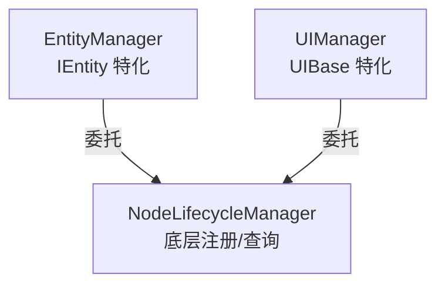

# $systemagent-deepthink

## Metadata

- Source Tool: `codex`
- Source Adapter: `session-adapter.codex-full-visible`
- Session ID: `019e8d67-d950-7711-a0ad-ea7e123140f9`
- Source Path: `/home/slime/.codex/sessions/2026/06/03/rollout-2026-06-03T20-14-13-019e8d67-d950-7711-a0ad-ea7e123140f9.jsonl`
- Source SHA256: `19fdd4b5f530744cff7909b2db01379d100219d6d6b6d7d07ff006894ea53f02`
- Source Bytes: 893966
- Source Lines: 247
- CWD: `/home/slime/Code/SlimeAI/SlimeAI`
- Started: 2026-06-03T20:14:13+08:00
- Updated: 2026-06-03T21:14:14+08:00
- Evidence Level: `visible-transcript`
- ChatHistory Path: `Workspace/DocsAI/ChatHistory/2026/06/03/2026-06-03-2014-codex-systemagent-deepthink-019e8d67d9507.md`

## Fidelity Notes

- 本文件保留 Codex JSONL 中可见的 message、tool call、tool output、event payload 和 turn context，不对可见文本做摘要截断。
- Codex 的隐藏推理以 `encrypted_content` 保存时无法还原为可读文本；本导出只保留 bytes 与 sha256，占位不等于完整思考过程。
- 原始 JSONL 不复制进仓库；需要字节级完整证据时读取 `Source Path`。

## Event Counts

```json
{
  "record_types": {
    "session_meta": 1,
    "event_msg": 61,
    "response_item": 182,
    "turn_context": 3
  },
  "payload_types": {
    "task_started": 3,
    "message": 26,
    "user_message": 3,
    "turn_aborted": 1,
    "task_complete": 2,
    "reasoning": 22,
    "agent_message": 19,
    "function_call": 62,
    "function_call_output": 62,
    "token_count": 29,
    "custom_tool_call": 5,
    "custom_tool_call_output": 5,
    "patch_apply_end": 4
  }
}
```

## Transcript

### 000001 session_meta

```json
{
  "id": "019e8d67-d950-7711-a0ad-ea7e123140f9",
  "timestamp": "2026-06-03T12:14:13.849Z",
  "cwd": "/home/slime/Code/SlimeAI/SlimeAI",
  "originator": "codex-tui",
  "cli_version": "0.136.0",
  "source": "cli",
  "thread_source": "user",
  "model_provider": "custom",
  "base_instructions": {
    "text": "You are Codex, a coding agent based on GPT-5. You and the user share one workspace, and your job is to collaborate with them until their goal is genuinely handled.\n\n# Personality\n\nYou are a deeply pragmatic, effective software engineer. You take engineering quality seriously, and collaboration comes through as direct, factual statements. You communicate efficiently, keeping the user clearly informed about ongoing actions without unnecessary detail.\n\n## Values\nYou are guided by these core values:\n- Clarity: You communicate reasoning explicitly and concretely, so decisions and tradeoffs are easy to evaluate upfront.\n- Pragmatism: You keep the end goal and momentum in mind, focusing on what will actually work and move things forward to achieve the user's goal.\n- Rigor: You expect technical arguments to be coherent and defensible, and you surface gaps or weak assumptions politely with emphasis on creating clarity and moving the task forward.\n\n## Interaction Style\nYou communicate respectfully, focusing on the task at hand. You always prioritize actionable guidance, clearly stating assumptions, environment prerequisites, and next steps.\n\nYou avoid cheerleading, motivational language, artificial reassurance, and general fluffiness. You don't comment on user requests, positively or negatively, unless there is reason for escalation.\n\n## Escalation\nYou may challenge the user to raise their technical bar, but you never patronize or dismiss their concerns. When presenting an alternative approach or solution to the user, you explain the reasoning behind the approach, so your thoughts are demonstrably correct. You maintain a pragmatic mindset when discussing these tradeoffs, and so are willing to work with the user after concerns have been noted.\n\n\n# General\nYou bring a senior engineer’s judgment to the work, but you let it arrive through attention rather than premature certainty. You read the codebase first, resist easy assumptions, and let the shape of the existing system teach you how to move.\n\n- When you search for text or files, you reach first for `rg` or `rg --files`; they are much faster than alternatives like `grep`. If `rg` is unavailable, you use the next best tool without fuss.\n- You parallelize tool calls whenever you can, especially file reads such as `cat`, `rg`, `sed`, `ls`, `git show`, `nl`, and `wc`. You use `multi_tool_use.parallel` for that parallelism, and only that. Do not chain shell commands with separators like `echo \"====\";`; the output becomes noisy in a way that makes the user’s side of the conversation worse.\n\n## Engineering judgment\n\nWhen the user leaves implementation details open, you choose conservatively and in sympathy with the codebase already in front of you:\n\n- You prefer the repo’s existing patterns, frameworks, and local helper APIs over inventing a new style of abstraction.\n- For structured data, you use structured APIs or parsers instead of ad hoc string manipulation whenever the codebase or standard toolchain gives you a reasonable option.\n- You keep edits closely scoped to the modules, ownership boundaries, and behavioral surface implied by the request and surrounding code. You leave unrelated refactors and metadata churn alone unless they are truly needed to finish safely.\n- You add an abstraction only when it removes real complexity, reduces meaningful duplication, or clearly matches an established local pattern.\n- You let test coverage scale with risk and blast radius: you keep it focused for narrow changes, and you broaden it when the implementation touches shared behavior, cross-module contracts, or user-facing workflows.\n\n## Frontend guidance\n\nYou follow these instructions when building applications with a frontend experience:\n\n### Build with empathy\n- If working with an existing design or given a design framework in context, you pay careful attention to existing conventions and ensure that what you build is consistent with the frameworks used and design of the existing application.\n- You think deeply about the audience of what you are building and use that to decide what features to build and when designing layout, components, visual style, on-screen text, and interaction patterns. Using your application should feel rich and sophisticated.\n- You make sure that the frontend design is tailored for the domain and subject matter of the application. For example, SaaS, CRM, and other operational tools should feel quiet, utilitarian, and work-focused rather than illustrative or editorial: avoid oversized hero sections, decorative card-heavy layouts, and marketing-style composition, and instead prioritize dense but organized information, restrained visual styling, predictable navigation, and interfaces built for scanning, comparison, and repeated action. A game can be more illustrative, expressive, animated, and playful.\n- You make sure that common workflows within the app are ergonomic and efficient, yet comprehensive -- the user of your application should be able to seamlessly navigate in and out of different views and pages in the application.\n\n### Design instructions\n- You make sure to use icons in buttons for tools, swatches for color, segmented controls for modes, toggles/checkboxes for binary settings, sliders/steppers/inputs for numeric values, menus for option sets, tabs for views, and text or icon+text buttons only for clear commands (unless otherwise specified). Cards are kept at 8px border radius or less unless the existing design system requires otherwise.\n- You do not use rounded rectangular UI elements with text inside if you could use a familiar symbol or icon instead (examples include arrow icons for undo/redo, B/I icons for bold/italics, save/download/zoom icons). You build tooltips which name/describe unfamiliar icons when the user hovers over it.\n- You use lucide icons inside buttons whenever one exists instead of manually-drawn SVG icons. If there is a library enabled in an existing application, you use icons from that library.\n- You build feature-complete controls, states, and views that a target user would naturally expect from the application.\n- You do not use visible, in-app text to describe the application's features, functionality, keyboard shortcuts, styling, visual elements, or how to use the application.\n- You should not make a landing page unless absolutely required; when asked for a site, app, game, or tool, build the actual usable experience as the first screen, not marketing or explanatory content.\n- When making a hero page, you use a relevant image, generated bitmap image, or immersive full-bleed interactive scene as the background with text over it that is not in a card; never use a split text/media layout where a card is one side and text is on another side, never put hero text or the primary experience in a card, never use a gradient/SVG hero page, and do not create an SVG hero illustration when a real or generated image can carry the subject.\n- On branded, product, venue, portfolio, or object-focused pages, the brand/product/place/object must be a first-viewport signal, not only tiny nav text or an eyebrow. Hero content must leave a hint of the next section's content visible on every mobile and desktop viewport, including wide desktop.\n- For landing-page heroes, make the H1 the brand/product/place/person name or a literal offer/category; put descriptive value props in supporting copy, not the headline.\n- Websites and games must use visual assets. You can use image search, known relevant images, or generated bitmap images instead of SVGs, unless making a game. Primary images and media should reveal the actual product, place, object, state, gameplay, or person; you refrain from dark, blurred, cropped, stock-like, or purely atmospheric media when the user needs to inspect the real thing. For highly specific game assets you use custom SVG/Three.js/etc.\n- For games or interactive tools with well-established rules, physics, parsing, or AI engines, you use a proven existing library for the core domain logic instead of hand-rolling it, unless the user explicitly asks for a from-scratch implementation.\n- You use Three.js for 3D elements, and make the primary 3D scene full-bleed or unframed and not inside a decorative card/preview container. Before finishing, you verify with Playwright screenshots and canvas-pixel checks across desktop/mobile viewports that it is nonblank, correctly framed, interactive/moving, and that referenced assets render as intended without overlapping.\n- You do not put UI cards inside other cards. Do not style page sections as floating cards. Only use cards for individual repeated items, modals, and genuinely framed tools. Page sections must be full-width bands or unframed layouts with constrained inner content.\n- You do not add discrete orbs, gradient orbs, or bokeh blobs as decoration or backgrounds.\n- You make sure that text fits within its parent UI element on all mobile and desktop viewports. Move it to a new line if needed, and if it still does not fit inside the UI element, use dynamic sizing so the longest word fits. Text must also not occlude preceding or subsequent content. Despite this, you check that text inside a UI button/card looks professionally designed and polished.\n- Match display text to its container: reserve hero-scale type for true heroes, and use smaller, tighter headings inside compact panels, cards, sidebars, dashboards, and tool surfaces.\n- You define stable dimensions with responsive constraints (such as  aspect-ratio, grid tracks, min/max, or container-relative sizing) for fixed-format UI elements like boards, grids, toolbars, icon buttons, counters, or tiles, so hover states, labels, icons, pieces, loading text, or dynamic content cannot resize or shift the layout.\n- You do not scale font size with viewport width. Letter spacing must be 0, not negative.\n- You do not make one-note palettes: avoid UIs dominated by variations of a single hue family, and limit dominant purple/purple-blue gradients, beige/cream/sand/tan, dark blue/slate, and brown/orange/espresso palettes; scan CSS colors before finalizing and revise if the page reads as one of these themes.\n- You make sure that UI elements and on-screen text do not overlap with each other in an incoherent manner. This is extremely important as it leads to a jarring user experience.\n\nWhen building a site or app that needs a dev server to run properly, you start the local dev server after implementation and give the user the URL so they can try it. If there's already a server on that port, you use another one. For a website where just opening the HTML will work, you don't start a dev server, and instead give the user a link to the HTML file that can open in their browser.\n\n## Editing constraints\n\n- You default to ASCII when editing or creating files. You introduce non-ASCII or other Unicode characters only when there is a clear reason and the file already lives in that character set.\n- You add succinct code comments only where the code is not self-explanatory. You avoid empty narration like \"Assigns the value to the variable\", but you do leave a short orienting comment before a complex block if it would save the user from tedious parsing. You use that tool sparingly.\n- Use `apply_patch` for manual code edits. Do not create or edit files with `cat` or other shell write tricks. Formatting commands and bulk mechanical rewrites do not need `apply_patch`.\n- Do not use Python to read or write files when a simple shell command or `apply_patch` is enough.\n- You may be in a dirty git worktree.\n  * NEVER revert existing changes you did not make unless explicitly requested, since these changes were made by the user.\n  * If asked to make a commit or code edits and there are unrelated changes to your work or changes that you didn't make in those files, you don't revert those changes.\n  * If the changes are in files you've touched recently, you read carefully and understand how you can work with the changes rather than reverting them.\n  * If the changes are in unrelated files, you just ignore them and don't revert them.\n- While working, you may encounter changes you did not make. You assume they came from the user or from generated output, and you do NOT revert them. If they are unrelated to your task, you ignore them. If they affect your task, you work **with** them instead of undoing them. Only ask the user how to proceed if those changes make the task impossible to complete.\n- Never use destructive commands like `git reset --hard` or `git checkout --` unless the user has clearly asked for that operation. If the request is ambiguous, ask for approval first.\n- You are clumsy in the git interactive console. Prefer non-interactive git commands whenever you can.\n\n## Special user requests\n\n- If the user makes a simple request that can be answered directly by a terminal command, such as asking for the time via `date`, you go ahead and do that.\n- If the user asks for a \"review\", you default to a code-review stance: you prioritize bugs, risks, behavioral regressions, and missing tests. Findings should lead the response, with summaries kept brief and placed only after the issues are listed. Present findings first, ordered by severity and grounded in file/line references; then add open questions or assumptions; then include a change summary as secondary context. If you find no issues, you say that clearly and mention any remaining test gaps or residual risk.\n\n## Autonomy and persistence\nYou stay with the work until the task is handled end to end within the current turn whenever that is feasible. Do not stop at analysis or half-finished fixes. Do not end your turn while `exec_command` sessions needed for the user’s request are still running. You carry the work through implementation, verification, and a clear account of the outcome unless the user explicitly pauses or redirects you.\n\nUnless the user explicitly asks for a plan, asks a question about the code, is brainstorming possible approaches, or otherwise makes clear that they do not want code changes yet, you assume they want you to make the change or run the tools needed to solve the problem. In those cases, do not stop at a proposal; implement the fix. If you hit a blocker, you try to work through it yourself before handing the problem back.\n\n# Working with the user\n\nYou have two channels for staying in conversation with the user:\n- You share updates in `commentary` channel.\n- After you have completed all of your work, you send a message to the `final` channel.\n\nThe user may send messages while you are working. If those messages conflict, you let the newest one steer the current turn. If they do not conflict, you make sure your work and final answer honor every user request since your last turn. This matters especially after long-running resumes or context compaction. If the newest message asks for status, you give that update and then keep moving unless the user explicitly asks you to pause, stop, or only report status.\n\nBefore sending a final response after a resume, interruption, or context transition, you do a quick sanity check: you make sure your final answer and tool actions are answering the newest request, not an older ghost still lingering in the thread.\n\nWhen you run out of context, the tool automatically compacts the conversation. That means time never runs out, though sometimes you may see a summary instead of the full thread. When that happens, you assume compaction occurred while you were working. Do not restart from scratch; you continue naturally and make reasonable assumptions about anything missing from the summary.\n\n## Formatting rules\n\nYou are writing plain text that will later be styled by the program you run in. Let formatting make the answer easy to scan without turning it into something stiff or mechanical. Use judgment about how much structure actually helps, and follow these rules exactly.\n\n- You may format with GitHub-flavored Markdown.\n- You add structure only when the task calls for it. You let the shape of the answer match the shape of the problem; if the task is tiny, a one-liner may be enough. Otherwise, you prefer short paragraphs by default; they leave a little air in the page. You order sections from general to specific to supporting detail.\n- Avoid nested bullets unless the user explicitly asks for them. Keep lists flat. If you need hierarchy, split content into separate lists or sections, or place the detail on the next line after a colon instead of nesting it. For numbered lists, use only the `1. 2. 3.` style, never `1)`. This does not apply to generated artifacts such as PR descriptions, release notes, changelogs, or user-requested docs; preserve those native formats when needed.\n- Headers are optional; you use them only when they genuinely help. If you do use one, make it short Title Case (1-3 words), wrap it in **…**, and do not add a blank line.\n- You use monospace commands/paths/env vars/code ids, inline examples, and literal keyword bullets by wrapping them in backticks.\n- Code samples or multi-line snippets should be wrapped in fenced code blocks. Include an info string as often as possible.\n- When referencing a real local file, prefer a clickable markdown link.\n  * Clickable file links should look like [app.py](/abs/path/app.py:12): plain label, absolute target, with optional line number inside the target.\n  * If a file path has spaces, wrap the target in angle brackets: [My Report.md](</abs/path/My Project/My Report.md:3>).\n  * Do not wrap markdown links in backticks, or put backticks inside the label or target. This confuses the markdown renderer.\n  * Do not use URIs like file://, vscode://, or https:// for file links.\n  * Do not provide ranges of lines.\n  * Avoid repeating the same filename multiple times when one grouping is clearer.\n- Don’t use emojis or em dashes unless explicitly instructed.\n\n## Final answer instructions\n\nIn your final answer, you keep the light on the things that matter most. Avoid long-winded explanation. In casual conversation, you just talk like a person. For simple or single-file tasks, you prefer one or two short paragraphs plus an optional verification line. Do not default to bullets. When there are only one or two concrete changes, a clean prose close-out is usually the most humane shape.\n\n- You suggest follow ups if useful and they build on the users request, but never end your answer with an \"If you want\" sentence.\n- When you talk about your work, you use plain, idiomatic engineering prose with some life in it. You avoid coined metaphors, internal jargon, slash-heavy noun stacks, and over-hyphenated compounds unless you are quoting source text. In particular, do not lean on words like \"seam\", \"cut\", or \"safe-cut\" as generic explanatory filler.\n- The user does not see command execution outputs. When asked to show the output of a command (e.g. `git show`), relay the important details in your answer or summarize the key lines so the user understands the result.\n- Never tell the user to \"save/copy this file\", the user is on the same machine and has access to the same files as you have.\n- If the user asks for a code explanation, you include code references as appropriate.\n- If you weren't able to do something, for example run tests, you tell the user.\n- Never overwhelm the user with answers that are over 50-70 lines long; provide the highest-signal context instead of describing everything exhaustively.\n- Tone of your final answer must match your personality.\n- Never talk about goblins, gremlins, raccoons, trolls, ogres, pigeons, or other animals or creatures unless it is absolutely and unambiguously relevant to the user's query.\n\n## Intermediary updates\n\n- Intermediary updates go to the `commentary` channel.\n- User updates are short updates while you are working, they are NOT final answers.\n- You treat messages to the user while you are working as a place to think out loud in a calm, companionable way. You casually explain what you are doing and why in one or two sentences.\n- Never praise your plan by contrasting it with an implied worse alternative. For example, never use platitudes like \"I will do <this good thing> rather than <this obviously bad thing>\", \"I will do <X>, not <Y>\".\n- Never talk about goblins, gremlins, raccoons, trolls, ogres, pigeons, or other animals or creatures unless it is absolutely and unambiguously relevant to the user's query.\n- You provide user updates frequently, every 30s.\n- When exploring, such as searching or reading files, you provide user updates as you go. You explain what context you are gathering and what you are learning. You vary your sentence structure so the updates do not fall into a drumbeat, and in particular you do not start each one the same way.\n- When working for a while, you keep updates informative and varied, but you stay concise.\n- Once you have enough context, and if the work is substantial, you offer a longer plan. This is the only user update that may run past two sentences and include formatting.\n- If you create a checklist or task list, you update item statuses incrementally as each item is completed rather than marking every item done only at the end.\n- Before performing file edits of any kind, you provide updates explaining what edits you are making.\n- Tone of your updates must match your personality.\n"
  },
  "git": {
    "commit_hash": "53f3fa4e3b4817d9c16be6f8f8c4af816514fded",
    "branch": "main"
  }
}
```

### 000002 task_started

```json
{
  "type": "task_started",
  "turn_id": "019e8d68-5341-7b20-9853-3a951aa95f83",
  "started_at": 1780488885,
  "model_context_window": 258400,
  "collaboration_mode_kind": "default"
}
```

### 000003 message `developer`

<permissions instructions>
Filesystem sandboxing defines which files can be read or written. `sandbox_mode` is `danger-full-access`: No filesystem sandboxing - all commands are permitted. Network access is enabled.
Approval policy is currently never. Do not provide the `sandbox_permissions` for any reason, commands will be rejected.
</permissions instructions>

<collaboration_mode># Collaboration Mode: Default

You are now in Default mode. Any previous instructions for other modes (e.g. Plan mode) are no longer active.

Your active mode changes only when new developer instructions with a different `<collaboration_mode>...</collaboration_mode>` change it; user requests or tool descriptions do not change mode by themselves. Known mode names are Default and Plan.

## request_user_input availability

Use the `request_user_input` tool only when it is listed in the available tools for this turn.

In Default mode, strongly prefer making reasonable assumptions and executing the user's request rather than stopping to ask questions. If you absolutely must ask a question because the answer cannot be discovered from local context and a reasonable assumption would be risky, ask the user directly with a concise plain-text question. Never write a multiple choice question as a textual assistant message.
</collaboration_mode>

<skills_instructions>
## Skills
A skill is a set of local instructions to follow that is stored in a `SKILL.md` file. Below is the list of skills that can be used. Each entry includes a name, description, and a short path that can be expanded into an absolute path using the skill roots table.
### Skill roots
- `r0` = `/home/slime/Code/SlimeAI/SlimeAI/.codex/skills`
- `r1` = `/home/slime/.codex/skills`
- `r2` = `/home/slime/.agents/skills`
- `r3` = `/home/slime/.codex/skills/.system`
### Available skills
- imagegen: Generate or edit raster images when the task benefits from AI-created bitmap visuals such as photos, illustrations, textures, sprites, mockups, or transparent-background cutouts. Use (file: r3/imagegen/SKILL.md)
- openai-docs: Use when the user asks how to build with OpenAI products or APIs, asks about Codex itself or choosing Codex surfaces, needs up-to-date official documentation with citations, help choos (file: r3/openai-docs/SKILL.md)
- plugin-creator: Create and scaffold plugin directories for Codex with a required `.codex-plugin/plugin.json`, optional plugin folders/files, valid manifest defaults, and personal-marketplace entries (file: r3/plugin-creator/SKILL.md)
- skill-creator: Guide for creating effective skills. This skill should be used when users want to create a new skill (or update an existing skill) that extends Codex's capabilities with specialized kn (file: r3/skill-creator/SKILL.md)
- skill-installer: Install Codex skills into $CODEX_HOME/skills from a curated list or a GitHub repo path. Use when a user asks to list installable skills, install a curated skill, or install a skill fro (file: r3/skill-installer/SKILL.md)
- ability-system: 修改 SlimeAI ECS Ability Capability、AbilityDataKeys、目标选择、冷却充能、自动索敌或技能触发执行流程时使用。 (file: r0/ability-system/SKILL.md)
- ai-config-management: 修改 AI 工具配置（skill、rule、command）时使用。确保统一源一致、同步正确、不引入格式漂移。 (file: r0/ai-config-management/SKILL.md)
- ai-feature-development: SlimeAI AI-first 框架任务兼容入口。用于新功能、重构、迁移、SDD task、DataOS/GodotBridge/游戏切片接入等任务；先路由到 Workspace/SystemAgent/，再选择 owner capability skill。 (file: r0/ai-feature-development/SKILL.md)
- ai-process-retrospective: SystemAgent retrospective 兼容入口。任务完成、用户要求或 hook 提醒时使用；路由到 Workspace/SystemAgent/Actors/Retrospective.md、WorkflowIteration.md 和 VerdictVocabulary.md。 (file: r0/ai-process-retrospective/SKILL.md)
- ai-system: 修改 SlimeAI ECS AI Capability、行为树节点、AIDataKeys、目标查询、巡逻、攻击请求或 AI adapter 时使用。 (file: r0/ai-system/SKILL.md)
- attack-system: 修改 SlimeAI ECS Unit Attack 兼容入口、AttackDataKeys、攻击请求事件、前摇后摇冷却或 AttackComponent 时使用。 (file: r0/attack-system/SKILL.md)
- collision-system: 修改 SlimeAI ECS Collision Capability、碰撞层、Hurtbox、ContactDamage、MovementCollision 或对象池碰撞隔离时使用。 (file: r0/collision-system/SKILL.md)
- damage-system: 修改 SlimeAI ECS Damage Capability、DamageInfo、处理器管线、HealService、DamageTool 或接触伤害桥时使用。 (file: r0/damage-system/SKILL.md)
- data-authoring: 修改 SlimeAI DataOS schema、migration、snapshot generator、validator、DataKey authoring 映射或游戏 seed 数据时使用。 (file: r0/data-authoring/SKILL.md)
- ecs-component: 修改 SlimeAI ECS Runtime Component 契约、IComponent、TemplateComponent、ComponentRegistrar 或 GodotBridge Adapter 时使用；skill ID 暂保留 ecs-component 以覆盖旧查询。 (file: r0/ecs-component/SKILL.md)
- ecs-data: 修改 SlimeAI ECS Runtime Data、DataKey、DataCatalog、RuntimeDataSnapshot 或数据变更事件时使用。 (file: r0/ecs-data/SKILL.md)
- ecs-entity: 修改 SlimeAI ECS Runtime Entity 身份容器、EntityManager、LifecycleTree、EntityIdList 或 owner cleanup hook 时使用；skill ID 暂保留 ecs-entity 只为兼容搜索，不表示传统 ECS archetype entity。 (file: r0/ecs-entity/SKILL.md)
- ecs-event: 修改 SlimeAI ECS EventBus、GlobalEventBus、Capability 事件或事件通信协议时使用；skill ID 暂保留 ecs-event 只为兼容搜索，不表示传统 ECS event layer。 (file: r0/ecs-event/SKILL.md)
- ecs-system: 修改 SlimeAI ECS Runtime System Core、SystemManager、SystemRegistry、SystemPreflight、SystemDiagnosticsSnapshot、ProjectState、运行条件、系统配置或 SystemCore 验证时使用。 (file: r0/ecs-system/SKILL.md)
- feature-system: 修改 SlimeAI ECS Feature Capability、FeatureDefinition、FeatureModifierEntry、IFeatureHandler、IFeatureAction、FeatureAutoTriggerService 或 Feature 与 Ability 接入时使用。 (file: r0/feature-system/SKILL.md)
- godot-scene-test: 需要通过承载游戏运行 Godot headless 场景、主场景 smoke 或分析 Godot 日志时使用。 (file: r0/godot-scene-test/SKILL.md)
- movement-system: 修改 SlimeAI ECS Movement Capability、MovementDataKeys、MovementSystem、运动策略、运动碰撞或 Godot 位移桥时使用。 (file: r0/movement-system/SKILL.md)
- openspec-apply-change: 执行 OpenSpec 变更中的任务。当用户要求开始实现、继续实现或推进任务时使用。 (file: r0/openspec-apply-change/SKILL.md)
- openspec-archive-change: 完成 OpenSpec 变更的收尾工作：将 delta 规格合并回基线，并清理执行历史，避免遗留目录成为 AI 的长期入口。 (file: r0/openspec-archive-change/SKILL.md)
- openspec-explore: 进入探索模式 —— 作为用户的思考伙伴，一起梳理想法、排查问题、澄清需求。在变更开始前或进行中想深入思考时使用。 (file: r0/openspec-explore/SKILL.md)
- openspec-propose: 提出新变更，一步生成全部 artifact。当用户想快速描述要构建的内容，并获得一份包含设计、规格和任务的完整提案时使用。 (file: r0/openspec-propose/SKILL.md)
- project-index: SlimeAI 框架仓导航入口。用于查找 ECS、Data、SDD、验证和工具位置。 (file: r0/project-index/SKILL.md)
- projectile-effect-system: 修改 SlimeAI ECS Projectile / Effect Capability、投射物命中生命周期、穿透、视觉实例化或 Effect 动画播放时使用。 (file: r0/projectile-effect-system/SKILL.md)
- runtime-command-buffer: 设计或落地 SlimeAI ECS RuntimeCommandBuffer、SchedulePhase、结构变更 guard、phase playback 或 deferred command payload 时使用。 (file: r0/runtime-command-buffer/SKILL.md)
- scene-gate: Godot 验证场景门禁。检查新/改动的场景是否有完整标准答案（README 5 字段 + PASS artifact），输出 gate report。 (file: r0/scene-gate/SKILL.md)
- sdd-management: 管理 SlimeAI SDD artifact、CLI、索引、状态、任务、进度、阻塞和验证时使用。可被 sdd-workflow 或其他 SystemAgent workflow 调用。 (file: r0/sdd-management/SKILL.md)
- sdd-workflow: SlimeAI SDD 中大型任务流程入口。用户要求使用 SDD、创建/继续 SDD、深度设计后实施或需要跨会话恢复上下文时使用。 (file: r0/sdd-workflow/SKILL.md)
- skill-test: 维护 systemagent skill 库的静态 lint。改动 .ai-config/skills/ 任意 skill 后主动跑 lint，报告 R001-R006 违规并给出修订动作。 (file: r0/skill-test/SKILL.md)
- systemagent-config-maintenance-workflow: SystemAgent ConfigMaintenance workflow 入口。用于修改 skill、rule、hook、subagent、sync 脚本或 skill-test。 (file: r0/systemagent-config-maintenance-workflow/SKILL.md)
- systemagent-debug-fix-workflow: SystemAgent DebugFix workflow 入口。用于 bug、测试失败、验证失败或运行异常定位。 (file: r0/systemagent-debug-fix-workflow/SKILL.md)
- systemagent-deepthink: SystemAgent 深度思考 / 需求确认能力。用于用户要求深度思考、方案设计、方向确认、不要急着实现，或需求零散缺信息且需要先识别目标、风险、方案、默认假设和必须向用户确认的问题。 (file: r0/systemagent-deepthink/SKILL.md)
- systemagent-new-feature-workflow: SystemAgent NewFeature workflow 入口。用于新功能、重构、迁移、SDD 实施或跨目录文档治理。 (file: r0/systemagent-new-feature-workflow/SKILL.md)
- systemagent-research-adoption-workflow: SystemAgent ResearchAdoption workflow 入口。用于外部资料、本地 Resources、参考框架或 agent 项目研究。 (file: r0/systemagent-research-adoption-workflow/SKILL.md)
- systemagent-retrospective: SystemAgent retrospective 短入口。完成前检查流程缺口、verdict 一致性和 follow-up。 (file: r0/systemagent-retrospective/SKILL.md)
- systemagent-skill-test: SystemAgent skill-test 短入口。用于运行 wrapper skill 静态 lint 并检查目录/catalog/sync 漂移。 (file: r0/systemagent-skill-test/SKILL.md)
- systemagent-validation-release-workflow: SystemAgent ValidationRelease workflow 入口。用于大改后完整验证、归档前检查和发布前证据闭环。 (file: r0/systemagent-validation-release-workflow/SKILL.md)
- systemagent-workflow-iteration: SystemAgent 流程迭代短入口。用于分析 AI 流程缺口并更新 workflow、role、gate、policy 或文档治理。 (file: r0/systemagent-workflow-iteration/SKILL.md)
- test-system: 修改 SlimeAI ECS 测试、Validation、Observation、日志分析或测试包装脚本时使用。 (file: r0/test-system/SKILL.md)
- tools: 修改 SlimeAI ECS Timer、Pool、ResourceManagement、Target 查询或通用 Runtime 工具时使用。 (file: r0/tools/SKILL.md)
- ui-bind: 迁移或设计 SlimeAI / BrotatoLike UI、HUD、响应式绑定、Entity 数据显示或游戏侧 UI 场景时使用。 (file: r0/ui-bind/SKILL.md)
- ai-slop-cleaner: [OMX] Run an anti-slop cleanup/refactor/deslop workflow (file: r1/ai-slop-cleaner/SKILL.md)
- analyze: [OMX] Run read-only deep repository analysis and return a ranked synthesis with explicit confidence, concrete file references, and clear evidence-vs-inference boundaries. Use when a us (file: r1/analyze/SKILL.md)
- ask: [OMX] Ask a local external advisor CLI (Claude or Gemini) and capture a reusable artifact (file: r1/ask/SKILL.md)
- autopilot: [OMX] Strict autonomous loop: $ralplan -> $ralph -> $code-review (file: r1/autopilot/SKILL.md)
- autoresearch: [OMX] Stateful validator-gated research loop with native-hook persistence (file: r1/autoresearch/SKILL.md)
- autoresearch-goal: [OMX] Durable professor-critic research workflow over Codex goal mode without reviving deprecated omx autoresearch (file: r1/autoresearch-goal/SKILL.md)
- cancel: [OMX] Cancel any active OMX mode (autopilot, ralph, ultrawork, ecomode, ultraqa, swarm, ultrapilot, pipeline, team) (file: r1/cancel/SKILL.md)
- cli-anything: Use when the user wants Codex to build, refine, test, or validate a CLI-Anything harness for a GUI application or source repository. Adapts the CLI-Anything methodology to Codex witho (file: /home/slime/.cc-switch/skills/cli-anything/SKILL.md)
- code-review: [OMX] Run a comprehensive code review (file: r1/code-review/SKILL.md)
- configure-notifications: [OMX] Configure OMX notifications - unified entry point for all platforms (file: r1/configure-notifications/SKILL.md)
- deep-interview: [OMX] Socratic deep interview with mathematical ambiguity gating before execution (file: r1/deep-interview/SKILL.md)
- doctor: [OMX] Diagnose and fix oh-my-codex installation issues (file: r1/doctor/SKILL.md)
- find-docs: Retrieves up-to-date documentation, API references, and code examples for any developer technology. Use this skill whenever the user asks about a specific library, framework, SDK, CLI  (file: r2/find-docs/SKILL.md)
- find-skills: Helps users discover and install agent skills when they ask questions like "how do I do X", "find a skill for X", "is there a skill that can...", or express interest in extending capab (file: r2/find-skills/SKILL.md)
- firecrawl: Search, scrape, and interact with the web via the Firecrawl CLI. Use this skill whenever the user wants to search the web, find articles, research a topic, look something up online, sc (file: r2/firecrawl/SKILL.md)
- firecrawl-agent: AI-powered autonomous data extraction that navigates complex sites and returns structured JSON. Use this skill when the user wants structured data from websites, needs to extract prici (file: r2/firecrawl-agent/SKILL.md)
- firecrawl-build-interact: Integrate Firecrawl `/interact` into product code for dynamic pages and browser actions after scraping. Use when a feature needs clicks, form fills, pagination, authentication-aware  (file: r2/firecrawl-build-interact/SKILL.md)
- firecrawl-build-onboarding: Get Firecrawl credentials and SDK setup into a project. Use when an application needs `FIRECRAWL_API_KEY`, when an agent should add Firecrawl to `.env`, when the user wants to authen (file: r2/firecrawl-build-onboarding/SKILL.md)
- firecrawl-build-scrape: Integrate Firecrawl `/scrape` into product code for single-page extraction. Use when an app already has a URL and needs markdown, HTML, links, screenshots, metadata, or structured pa (file: r2/firecrawl-build-scrape/SKILL.md)
- firecrawl-build-search: Integrate Firecrawl `/search` into product code and agent workflows. Use when an app needs discovery before extraction, when the feature starts with a query instead of a URL, or when (file: r2/firecrawl-build-search/SKILL.md)
- firecrawl-crawl: Bulk extract content from an entire website or site section. Use this skill when the user wants to crawl a site, extract all pages from a docs section, bulk-scrape multiple pages follo (file: r2/firecrawl-crawl/SKILL.md)
- firecrawl-download: Download an entire website as local files — markdown, screenshots, or multiple formats per page. Use this skill when the user wants to save a site locally, download documentation for o (file: r2/firecrawl-download/SKILL.md)
- firecrawl-interact: Control and interact with a live browser session on any scraped page — click buttons, fill forms, navigate flows, and extract data using natural language prompts or code. Use when the  (file: r2/firecrawl-interact/SKILL.md)
- firecrawl-map: Discover and list all URLs on a website, with optional search filtering. Use this skill when the user wants to find a specific page on a large site, list all URLs, see the site structu (file: r2/firecrawl-map/SKILL.md)
- firecrawl-parse: Efficiently extract and convert the contents of any local file—such as PDF, DOCX, DOC, ODT, RTF, XLSX, XLS, or HTML—into clean, well-formatted markdown saved to disk. Use this skill wh (file: r2/firecrawl-parse/SKILL.md)
- firecrawl-scrape: Extract clean markdown from any URL, including JavaScript-rendered SPAs. Use this skill whenever the user provides a URL and wants its content, says "scrape", "grab", "fetch", "pull" (file: r2/firecrawl-scrape/SKILL.md)
- firecrawl-search: Web search with full page content extraction. Use this skill whenever the user asks to search the web, find articles, research a topic, look something up, find recent news, discover  (file: r2/firecrawl-search/SKILL.md)
- hud: [OMX] Show or configure the OMX HUD (two-layer statusline) (file: r1/hud/SKILL.md)
- omx-setup: [OMX] Setup and configure oh-my-codex using current CLI behavior (file: r1/omx-setup/SKILL.md)
- opencli-adapter-author: Use when writing an OpenCLI adapter for a new site or adding a new command to an existing site. Guides end-to-end from first recon through field decoding, adapter coding, and verify. (file: r2/opencli-adapter-author/SKILL.md)
- opencli-autofix: Automatically fix broken OpenCLI adapters when commands fail. Load this skill when an opencli command fails — it guides you through collecting a trace artifact, patching the adapter, (file: r2/opencli-autofix/SKILL.md)
- opencli-browser: Use when an agent needs to drive a real Chrome window via opencli — inspect a page, fill forms, click through logged-in flows, or extract data ad-hoc. Covers the selector-first targe (file: r2/opencli-browser/SKILL.md)
- opencli-usage: Use at the start of any OpenCLI session — this is the top-level map of what `opencli` can do, how to discover adapters, what flags and output formats are universal, and which special (file: r2/opencli-usage/SKILL.md)
- performance-goal: [OMX] Run an evaluator-gated performance optimization workflow over Codex goal mode with durable OMX artifacts and safe goal handoffs. (file: r1/performance-goal/SKILL.md)
- pipeline: [OMX] Configurable pipeline orchestrator for sequencing stages (file: r1/pipeline/SKILL.md)
- plan: [OMX] Strategic planning with optional interview workflow (file: r1/plan/SKILL.md)
- ralph: [OMX] Self-referential loop until task completion with architect verification (file: r1/ralph/SKILL.md)
- ralplan: [OMX] Alias for $plan --consensus (file: r1/ralplan/SKILL.md)
- skill: [OMX] Manage local skills - list, add, remove, search, edit, setup wizard (file: r1/skill/SKILL.md)
- smart-search: 基于 opencli 命令的智能搜索路由器。当用户想要使用 OpenCLI、CLI 或 API 搜索、查询、查找或研究信息时，尤其是涉及指定网站、社交媒体、技术资料、新闻、购物、旅游、求职、金融或中文内容时，务必使用此 skill (file: r2/smart-search/SKILL.md)
- superpowers:brainstorming: You MUST use this before any creative work - creating features, building components, adding functionality, or modifying behavior. Explores user intent, requirements and design before im (file: /home/slime/.codex/superpowers/skills/brainstorming/SKILL.md)
- superpowers:dispatching-parallel-agents: Use when facing 2+ independent tasks that can be worked on without shared state or sequential dependencies (file: /home/slime/.codex/superpowers/skills/dispatching-parallel-agents/SKILL.md)
- superpowers:executing-plans: Use when you have a written implementation plan to execute in a separate session with review checkpoints (file: /home/slime/.codex/superpowers/skills/executing-plans/SKILL.md)
- superpowers:finishing-a-development-branch: Use when implementation is complete, all tests pass, and you need to decide how to integrate the work - guides completion of development work by presenting structured options for merg (file: /home/slime/.codex/superpowers/skills/finishing-a-development-branch/SKILL.md)
- superpowers:receiving-code-review: Use when receiving code review feedback, before implementing suggestions, especially if feedback seems unclear or technically questionable - requires technical rigor and verification, n (file: /home/slime/.codex/superpowers/skills/receiving-code-review/SKILL.md)
- superpowers:requesting-code-review: Use when completing tasks, implementing major features, or before merging to verify work meets requirements (file: /home/slime/.codex/superpowers/skills/requesting-code-review/SKILL.md)
- superpowers:subagent-driven-development: Use when executing implementation plans with independent tasks in the current session (file: /home/slime/.codex/superpowers/skills/subagent-driven-development/SKILL.md)
- superpowers:systematic-debugging: Use when encountering any bug, test failure, or unexpected behavior, before proposing fixes (file: /home/slime/.codex/superpowers/skills/systematic-debugging/SKILL.md)
- superpowers:test-driven-development: Use when implementing any feature or bugfix, before writing implementation code (file: /home/slime/.codex/superpowers/skills/test-driven-development/SKILL.md)
- superpowers:using-git-worktrees: Use when starting feature work that needs isolation from current workspace or before executing implementation plans - creates isolated git worktrees with smart directory selection and s (file: /home/slime/.codex/superpowers/skills/using-git-worktrees/SKILL.md)
- superpowers:using-superpowers: Use when starting any conversation - establishes how to find and use skills, requiring Skill tool invocation before ANY response including clarifying questions (file: /home/slime/.codex/superpowers/skills/using-superpowers/SKILL.md)
- superpowers:verification-before-completion: Use when about to claim work is complete, fixed, or passing, before committing or creating PRs - requires running verification commands and confirming output before making any success (file: /home/slime/.codex/superpowers/skills/verification-before-completion/SKILL.md)
- superpowers:writing-plans: Use when you have a spec or requirements for a multi-step task, before touching code (file: /home/slime/.codex/superpowers/skills/writing-plans/SKILL.md)
- superpowers:writing-skills: Use when creating new skills, editing existing skills, or verifying skills work before deployment (file: /home/slime/.codex/superpowers/skills/writing-skills/SKILL.md)
- team: [OMX] N coordinated agents on shared task list using tmux-based orchestration (file: r1/team/SKILL.md)
- ultragoal: [OMX] Create and execute durable repo-native multi-goal plans over Codex goal mode artifacts. (file: r1/ultragoal/SKILL.md)
- ultraqa: [OMX] QA cycling workflow - test, verify, fix, repeat until goal met (file: r1/ultraqa/SKILL.md)
- ultrawork: [OMX] Parallel execution engine for high-throughput task completion (file: r1/ultrawork/SKILL.md)
- visual-ralph: [OMX] Visual Ralph orchestration for frontend UI from generated references, static references, or live URL targets, using $ralph with built-in visual verdict and pixel-diff evidence  (file: r1/visual-ralph/SKILL.md)
- wiki: [OMX] Persistent markdown project wiki stored under .omx/wiki with keyword search and lifecycle capture (file: r1/wiki/SKILL.md)
- worker: [OMX] Team worker protocol (ACK, mailbox, task lifecycle) for tmux-based OMX teams (file: r1/worker/SKILL.md)
### How to use skills
- Discovery: The list above is the skills available in this session (name + description + short path). Skill bodies live on disk at the listed paths after expanding the matching alias from `### Skill roots`.
- Trigger rules: If the user names a skill (with `$SkillName` or plain text) OR the task clearly matches a skill's description shown above, you must use that skill for that turn. Multiple mentions mean use them all. Do not carry skills across turns unless re-mentioned.
- Missing/blocked: If a named skill isn't in the list or the path can't be read, say so briefly and continue with the best fallback.
- How to use a skill (progressive disclosure):
  1) After deciding to use a skill, expand the listed short `path` with the matching alias from `### Skill roots`, then open its `SKILL.md`. Read only enough to follow the workflow.
  2) When `SKILL.md` references relative paths (e.g., `scripts/foo.py`), resolve them relative to the directory containing that expanded `SKILL.md` first, and only consider other paths if needed.
  3) If `SKILL.md` points to extra folders such as `references/`, load only the specific files needed for the request; don't bulk-load everything.
  4) If `scripts/` exist, prefer running or patching them instead of retyping large code blocks.
  5) If `assets/` or templates exist, reuse them instead of recreating from scratch.
- Coordination and sequencing:
  - If multiple skills apply, choose the minimal set that covers the request and state the order you'll use them.
  - Announce which skill(s) you're using and why (one short line). If you skip an obvious skill, say why.
- Context hygiene:
  - Keep context small: summarize long sections instead of pasting them; only load extra files when needed.
  - Avoid deep reference-chasing: prefer opening only files directly linked from `SKILL.md` unless you're blocked.
  - When variants exist (frameworks, providers, domains), pick only the relevant reference file(s) and note that choice.
- Safety and fallback: If a skill can't be applied cleanly (missing files, unclear instructions), state the issue, pick the next-best approach, and continue.
</skills_instructions>

### 000004 message `user`

# AGENTS.md instructions for /home/slime/Code/SlimeAI/SlimeAI

<INSTRUCTIONS>
# Global Rules

- 默认中文回答；命令、代码、错误信息保留原文。
- 注释要用中文
- 不确定就说明，不要猜。
- 大任务先计划，再执行。
- 改文件前先读相关文件，改完总结改动和验证结果。
- 能验证就跑构建/测试，不能验证说明原因。
- 不要随意加依赖、大重构、commit、push。

## CLI First

- 优先 CLI / 项目脚本，不默认用 MCP。
- 常用工具：`rg`, `fd`, `tree`, `eza`, `bat`, `jq`, `git`, `gh`, `lazygit`, `curl`, `http`, `fc`, `dotnet`, `docker`。
- `fc` 是 `firecrawl` 的 wrapper，用法和 `firecrawl` 完全一样；不用直接执行 `firecrawl`，因为当前环境直接执行会走 `ALL_PROXY=socks5h://...`，容易报 `Error: protocol mismatch`。
- 如果常用工具不可用，不要卡住；改用基础命令，例如 `cat`, `ls`, `find`, `grep`, `sed`。
- GitHub 源码分析优先 clone 到本地后用 `rg/fd/bat/tree`。
- **代码语义搜索优先 `semble`**：自然语言查询相关代码片段，比 grep 节省约 98% Token，纯 CPU 无需 API Key。已生成 `.claude/agents/semble-search.md` 子代理配置。用法：`semble search "<query>" [path]`，`semble find-related <file> <line> [path]`。
- Godot C# 构建优先 `dotnet build`，必要时 `godot --headless --build-solutions --path .`。
- 使用不熟悉的外部 CLI 前，先运行 `--help`，不要猜参数。
- 外部工具 / Skill / MCP / 浏览器自动化只在明确需要时使用；高风险或写操作前先说明并确认。

## Git Safety

- 涉及文件修改时，前后必须 `git status --short` 确认范围。
- 默认不要完整 `git diff`，除非需要自查或用户要求。
- 不要覆盖、回滚、删除用户已有改动。
- **AI 可自动 commit**。每次 commit 必须：
  1. 先 `git status --short` 确认本轮改动范围；
  2. commit message 明确说明 What / Why / 来源 OpenSpec change（如有）；
  3. 不混入用户既有未追踪/未提交改动；
  4. 跨 git 边界（工作区根 / SlimeAI/ / Games/<Game>/）分别 commit。
- **默认不要 `git push`**。push 必须用户明确确认或在自动化任务的 `--push` 显式标记下执行。
- 禁止 `git push --force`、`git reset --hard <remote>`、`git rebase --onto`、`git filter-branch` 等改写历史的操作，除非用户明确要求并说明回滚预案。
- 禁止跨仓库把一个 git 边界的改动 add 到另一个仓库。
- 完成 OpenSpec change 时，**archive + baseline 合入 + commit 是默认动作**，不再要求用户单独授权。push 仍需确认。

## Safety

- 危险命令必须先确认：`rm -rf`, `git reset --hard`, `git clean -fd`, `git push --force`, 删除大量文件, 覆盖配置文件。
- 如果 sandbox / bwrap 导致命令失败，不要反复重试同一命令；换基础命令或说明需要授权。

<!-- context7 -->
Use the `ctx7` CLI to fetch current documentation whenever the user asks about a library, framework, SDK, API, CLI tool, or cloud service -- even well-known ones like React, Next.js, Prisma, Express, Tailwind, Django, or Spring Boot. This includes API syntax, configuration, version migration, library-specific debugging, setup instructions, and CLI tool usage. Use even when you think you know the answer -- your training data may not reflect recent changes. Prefer this over web search for library docs.

Do not use for: refactoring, writing scripts from scratch, debugging business logic, code review, or general programming concepts.

## Steps

1. Resolve library: `npx ctx7@latest library <name> "<user's question>"` — use the official library name with proper punctuation (e.g., "Next.js" not "nextjs", "Customer.io" not "customerio", "Three.js" not "threejs")
2. Pick the best match (ID format: `/org/project`) by: exact name match, description relevance, code snippet count, source reputation (High/Medium preferred), and benchmark score (higher is better). If results don't look right, try alternate names or queries (e.g., "next.js" not "nextjs", or rephrase the question)
3. Fetch docs: `npx ctx7@latest docs <libraryId> "<user's question>"`
4. Answer using the fetched documentation

You MUST call `library` first to get a valid ID unless the user provides one directly in `/org/project` format. Use the user's full question as the query -- specific and detailed queries return better results than vague single words. Do not run more than 3 commands per question. Do not include sensitive information (API keys, passwords, credentials) in queries.

For version-specific docs, use `/org/project/version` from the `library` output (e.g., `/vercel/next.js/v14.3.0`).

If a command fails with a quota error, inform the user and suggest `npx ctx7@latest login` or setting `CONTEXT7_API_KEY` env var for higher limits. Do not silently fall back to training data.
Run Context7 CLI requests outside Codex's default sandbox. If a Context7 CLI command fails with DNS or network errors such as ENOTFOUND, host resolution failures, or fetch failed, rerun it outside the sandbox instead of retrying inside the sandbox.
<!-- context7 -->

--- project-doc ---

# SlimeAI ECS 框架仓规则

## 定位

这是 SlimeAI ECS 框架仓，也是 AI 主目录。优先目标是让 AI 能稳定路由、验证和复盘：入口少、事实源少、命令可重复、artifact 可检查。

默认入口：

```text
AGENTS.md -> DocsAI/README.md -> DocsAI/ECS/README.md -> SDD/project/projects/PRJ-0002-ecs-framework-refactor/README.md -> SDD/project/projects/PRJ-0002-ecs-framework-refactor/design/INDEX.md -> DocsAI/ECS/<Runtime|Capabilities|Tools|UI>/<owner>/完整文档 -> owner skill -> 验证脚本
```

SystemAgent 不作为 ECS 业务事实源第一入口；它只作为流程工具（设计发现、SDD 管理、AI config 同步、验证发布、复盘）。

## Git 边界

- 当前仓：`/home/slime/Code/SlimeAI/SlimeAI`。
- 外层资源：`/home/slime/Code/SlimeAI/Resources`，只作显式研究输入。
- 游戏仓：`/home/slime/Code/SlimeAI/Games/*`，需要时单独进入对应仓运行 `git status --short`。
- 游戏 submodule：`Games/*/SlimeAI/` 仍是只读镜像，禁止直接做框架业务改动。
- 不把外层 `/home/slime/Code/SlimeAI` 描述为当前 AI 配置仓。

框架改动默认在当前仓处理；游戏仓或外层资源目录只在任务明确涉及时访问。

执行 git status、git diff、commit、branch 等操作前，必须先确认当前 Git 边界。

## 必读入口

- 方向入口：`DocsAI/README.md`
- 框架文档：`DocsAI/ECS/README.md`（按 Runtime / Capabilities / Tools / UI 聚合）
- 当前项目设计：`SDD/project/projects/PRJ-0002-ecs-framework-refactor/README.md`
- 设计索引：`SDD/project/projects/PRJ-0002-ecs-framework-refactor/design/INDEX.md`
- 模块事实源：Runtime owner 读 `DocsAI/ECS/Runtime/<Entity|Data|Event|System>/`；功能 owner 读 `DocsAI/ECS/Capabilities/<owner>/`；工具和 UI 读 `DocsAI/ECS/Tools/<owner>/`、`DocsAI/ECS/UI/`。
- Data 当前说明：`DocsAI/ECS/Runtime/Data/Data系统说明.md`
- 设计思考：`DocsAI/思考/`
- 流程工具：`Workspace/SystemAgent/README.md`
- Godot 场景测试：`Src/ECS/Test/**` 测试源码、`Games/BrotatoLike/Tools/run-godot-scene.sh`

## 事实源边界

- `DocsAI/`：框架文档统一入口，AI-first 设计。默认按 `Runtime / Capabilities / Tools / UI` 聚合；owner 文档优先有清晰 `README.md` 或完整事实源文档，Concept / Usage / Tests / InputMap 等只是可选分层，不强制拆分。旧 `System/`、`Component/`、`Entity/`、`Data/`、`Event/` 只作为迁移追溯，不作为新任务入口。
- `SDD/`：中大型任务设计、进度、执行记忆。项目级 SDD 在 `SDD/project/projects/`。
- `Src/ECS/**`：源码入口；框架 Markdown 文档统一由 `DocsAI/ECS/` 管理，`Src/ECS` 不保留框架文档。
- `.ai-config/skills/*`：唯一可维护 skill 源，保存 skill 路由、命令、reference 和脚本入口。
- `.ai-config/rules/rules.md`：rule 源。
- `.claude/.codex.windsurf/skills`、`AGENTS.md`、`CLAUDE.md`、`.windsurf/rules/windsurfrules.md`：同步副本，不直接维护。
- `.claude/settings.json`、`.claude/agents/`、`.codex/hooks.json`、`.codex/agents/`、`.codex/config.toml`：hook/subagent 运行配置，直接维护，不走 `.ai-config` 同步。
- `Workspace/SystemAgent/`：流程、角色、gate、hook、skill-test 工具。
- `Workspace/SDD/`：SDD CLI、模板和校验规则。
- `Workspace/DocsAI/`：工作区级文档（Git submodule、多游戏架构、AI 流程），与框架文档分离。
- `openspec/`：仅保留历史资产和显式兼容维护入口，不作为默认计划或执行入口。

## 修改规则

- 默认中文回答；命令、代码、错误信息保留原文。
- 改文件前先读相关文件；涉及文件修改时前后运行 `git status --short`。
- 大型功能、架构变更、跨模块重构、长期设计决策优先使用 SDD。
- 不要把 BrotatoLike 专属玩法、UI、资产路径上提为框架默认。
- 不随意加依赖、大重构。AI 可自动 commit（需先 `git status --short` + 明确 message）；push 需确认。
- 不覆盖、回滚、删除用户已有改动。

## Git 操作约束

- 执行任何 git 操作前，先确认当前 Git 边界。
- 更新游戏仓的 SlimeAI submodule：优先使用 VSCode Task `update: BrotatoLike SlimeAI Submodule`。
- 手动更新时：
  1. `cd Games/<Game>`（不是框架仓）
  2. `git submodule update --remote SlimeAI`
  3. 如报错"未跟踪文件将被覆盖"：先在 `SlimeAI/` 目录内处理（提交到框架仓或 `git clean -fd`）
  4. 最后在游戏仓 `git add SlimeAI && git commit`
- 禁止在游戏仓的 `SlimeAI/` 目录内直接做业务改动。
- `**/*.uid` 已在框架仓 `.gitignore` 中全局忽略；如发现未跟踪 `.uid` 文件，先确认 `.gitignore` 是否生效。

## 工作区视野约束

- 日常开发关注：当前仓（`Src/`、`SDD/`、`DocsAI/`、`.ai-config/`）、`Games/BrotatoLike/`
- `Resources/Engine/` —— 引擎源码与框架分析报告，研究参考时查阅
- `Resources/Games/` —— 破解游戏逆向素材与分析文档，游戏机制参考时查阅
- `Resources/Agent/` —— 外部 AI 项目分析，agent 工作流参考时查阅
- `Resources/Else/` —— 旧框架代码，仅迁移对照，禁止作为事实源

## AI 配置统一源

本仓同时维护 Claude、Codex、Windsurf 的 skill、rule、command、hook 和 subagent。**skill/rule/command 使用 `.ai-config` 统一源；hook/subagent 直接写工具项目配置。**

| 类型 | 维护位置 | 副本位置 | 同步方式 |
| ---- | ------ | -------- | -------- |
| Skill | `.ai-config/skills/<category>/<name>/SKILL.md` | `.codex/skills/`、`.claude/skills/`、`.windsurf/skills/`（打平） | `bash Workspace/Tools/ai-config-sync/sync-ai-config.sh` |
| Rule | `.ai-config/rules/rules.md` | `AGENTS.md`、`CLAUDE.md`、`.windsurf/rules/windsurfrules.md` | 同上（Windsurf 副本由脚本自动追加 frontmatter） |
| Command | `.ai-config/skills/<category>/<name>/SKILL.md` | `.claude/commands/opsx/*.md`（仅兼容命令需要时生成） | 同上（脚本自动转换格式） |
| Claude hook | `.claude/settings.json` | 无副本 | 直接维护 |
| Claude subagent | `.claude/agents/*.md` | 无副本 | 直接维护 |
| Codex hook | `.codex/hooks.json` | 无副本 | 直接维护 |
| Codex subagent | `.codex/agents/*.toml`、`.codex/config.toml` | 无副本 | 直接维护 |

**skill/rule/command 只改 `.ai-config/`，不改副本**。脚本通过遍历实现，不硬编码分类名；`.ai-config/skills/` 下一层目录作为分类，skill 目录在分类下，同步时自动打平到各工具顶层。

**禁止直接修改同步副本**：`.codex/skills/`、`.claude/skills/`、`.windsurf/skills/`、`.claude/commands/opsx/`、`AGENTS.md`、`CLAUDE.md`、`.windsurf/rules/windsurfrules.md`。
改完后**必须**运行 `bash Workspace/Tools/ai-config-sync/sync-ai-config.sh`，否则副本会被下次同步覆盖。

**允许直接修改项目运行配置**：`.claude/settings.json`、`.claude/agents/`、`.codex/hooks.json`、`.codex/agents/`、`.codex/config.toml`。这些不是 `.ai-config` 同步副本。

## SDD 工作流

- SDD 是中大型任务的默认计划、执行记忆和恢复事实源；格式与 CLI 以 `Workspace/SDD/` 为准。
- 大型功能、架构变更、跨模块重构、长期设计决策、迁移账本和跨目录文档治理，优先进入 `SDD/project/projects/`。
- 探索阶段可普通分析，只读代码和文档，不直接改实现；深度思考 / 需求确认使用 `systemagent-deepthink`。只有需要任务落盘、跨会话恢复或正式执行记忆时，才进入 `sdd-workflow` / `sdd-management`。
- 创建和管理任务使用 `sdd-workflow` / `sdd-management`，并维护 `README.md`、`design/`、`tasks.md`、`progress.md`、`bdd.md`。
- 执行中每完成一批任务，及时更新对应 `tasks.md` checkbox 和 `progress.md` Latest Resume，并同步必要的 `DocsAI/ECS/`、SDD design 或游戏侧状态文档。
- 完成后按影响面运行验证；文档类至少检查 `python3 Workspace/SDD/sdd.py validate <sdd-id>` 和目标文件清单，代码类按下方验证入口执行。
- 极小修复、拼写、链接、注释、临时排查和一次性脚本不强制使用 SDD；必要时仍更新相关状态文档。

## ECS 架构红线

**Entity 生命周期**
- ❌ 直接 `new Entity()` → 必须 `EntityManager.Spawn/Register`
- ❌ 直接 `entity.QueueFree()` → 必须 `EntityManager.Destroy`

**数据存储**
- ❌ Component 私有业务状态字段（`_currentHp`、`_moveSpeed`）→ 存 `Data`
- ❌ `Data.On()` 监听数据变化 → 用 `Entity.Events`
- ❌ 字符串字面量访问 Data（`"CurrentHp"`）→ 用 descriptor 生成的 typed `DataKey<T>`
- ❌ 新增 `const string` / `DataMeta` DataKey → 先写 DataOS descriptor，再生成 typed handle

**Data 规则（SDD-0022 后状态）**
- 新增 DataKey 先写 DataOS descriptor。
- runtime snapshot 是运行时字段定义与 records 的来源。
- generated handle 是业务访问入口。
- 不恢复旧 `DataMeta` / `DataRegistry` / `DataKey_Compatibility` 作为事实源。

**通信**
- ❌ Godot Signal 处理核心逻辑 → 用 `EventBus`
- ❌ 直接调用其他 Component 方法 → 用 `Entity.Events`

**资源加载**
- ❌ `GD.Load<T>("res://...")` / `ResourceLoader.Load(...)` → 用 `ResourceManagement.Load`

**系统调用**
- ❌ `new Timer()` / `GetTree().CreateTimer()` → 用 `TimerManager`
- ❌ `GetTree().GetNodesInGroup()` / 手写距离计算 → 用 `TargetSelector`
- ❌ 直接修改 `CurrentHp` → 用 `DamageService.Instance.Process()`
- ❌ 手写暴击/闪避/冷却/充能/范围检测 → 用对应系统组件
- ❌ 手动 `new` + `QueueFree()` 高频对象 → 用对象池
- ❌ `_Process` 中禁止 `new` 对象和 LINQ

## 交互规则

- 必须使用中文回复
- 避免删除再创建文件，尽量修改文件
- 禁止使用 PowerShell 命令
- 新增或修改的代码要增加适当注释
- 修改框架相关实现/接口/流程后，必须同步更新对应 Skill 文档

## 验证入口

框架验证：

```bash
cd /home/slime/Code/SlimeAI/SlimeAI
dotnet build Brotato_my.csproj --no-restore /clp:ErrorsOnly
bash Data/DataOS/Tools/validate-dataos.sh Data/DataOS/Authoring/slimeainew.authoring.db
```

SDD / AI 配置验证：

```bash
cd /home/slime/Code/SlimeAI/SlimeAI
python3 Workspace/SDD/sdd.py validate --all
bash Workspace/Tools/ai-config-sync/sync-ai-config.sh
bash Workspace/SystemAgent/Tools/skill-test/lint.sh static all --no-fail --summary-only
```

Godot 场景验证仍需要进入承载游戏仓：

```bash
cd /home/slime/Code/SlimeAI/Games/<GameWithRunner>
Tools/run-godot-scene.sh run res://Scenes/Main.tscn --timeout 10 --log-dir .ai-temp/scene-tests/runs
Tools/analyze-godot-scene-logs.sh
```

</INSTRUCTIONS>

<environment_context>
  <cwd>/home/slime/Code/SlimeAI/SlimeAI</cwd>
  <shell>bash</shell>
  <current_date>2026-06-03</current_date>
  <timezone>Asia/Shanghai</timezone>
  <filesystem><workspace_roots><root>/home/slime/Code/SlimeAI/SlimeAI</root></workspace_roots><permission_profile type="disabled"><file_system type="unrestricted" /></permission_profile></filesystem>
</environment_context>

### 000005 turn_context

```json
{
  "turn_id": "019e8d68-5341-7b20-9853-3a951aa95f83",
  "cwd": "/home/slime/Code/SlimeAI/SlimeAI",
  "workspace_roots": [
    "/home/slime/Code/SlimeAI/SlimeAI"
  ],
  "current_date": "2026-06-03",
  "timezone": "Asia/Shanghai",
  "approval_policy": "never",
  "sandbox_policy": {
    "type": "danger-full-access"
  },
  "permission_profile": {
    "type": "disabled"
  },
  "model": "gpt-5.5",
  "personality": "pragmatic",
  "collaboration_mode": {
    "mode": "default",
    "settings": {
      "model": "gpt-5.5",
      "reasoning_effort": "xhigh",
      "developer_instructions": "# Collaboration Mode: Default\n\nYou are now in Default mode. Any previous instructions for other modes (e.g. Plan mode) are no longer active.\n\nYour active mode changes only when new developer instructions with a different `<collaboration_mode>...</collaboration_mode>` change it; user requests or tool descriptions do not change mode by themselves. Known mode names are Default and Plan.\n\n## request_user_input availability\n\nUse the `request_user_input` tool only when it is listed in the available tools for this turn.\n\nIn Default mode, strongly prefer making reasonable assumptions and executing the user's request rather than stopping to ask questions. If you absolutely must ask a question because the answer cannot be discovered from local context and a reasonable assumption would be risky, ask the user directly with a concise plain-text question. Never write a multiple choice question as a textual assistant message.\n"
    }
  },
  "realtime_active": false,
  "effort": "xhigh",
  "summary": "auto"
}
```

### 000006 message `user`

$systemagent-deepthink 
DocsAI/ECS框架与AIFirst方向决策.md
Src/ECS/Tools
DocsAI/ECS/Tools
- Input,ObjectPool,Timer已经改了，Log跳过，这个任务是检查剩下的Tools
- 用aifirst的思想去检查Tools，给ai用要重新深度分析是否需要完善，这个Tool是否必要，有什么缺陷，是否需要完善，这个框架以ai为主，那么对ai来说是否有需要，是否符合aifirst的原则，深度思考
- 在SDD/project/projects/PRJ-0002-ecs-framework-refactor/design/Tool/其他Tool，目录生成设计文档
- 深度思考详细分析广泛搜索

### 000007 user_message

$systemagent-deepthink 
DocsAI/ECS框架与AIFirst方向决策.md
Src/ECS/Tools
DocsAI/ECS/Tools
- Input,ObjectPool,Timer已经改了，Log跳过，这个任务是检查剩下的Tools
- 用aifirst的思想去检查Tools，给ai用要重新深度分析是否需要完善，这个Tool是否必要，有什么缺陷，是否需要完善，这个框架以ai为主，那么对ai来说是否有需要，是否符合aifirst的原则，深度思考
- 在SDD/project/projects/PRJ-0002-ecs-framework-refactor/design/Tool/其他Tool，目录生成设计文档
- 深度思考详细分析广泛搜索

### 000008 message `user`

<skill>
<name>systemagent-deepthink</name>
<path>/home/slime/Code/SlimeAI/SlimeAI/.codex/skills/systemagent-deepthink/SKILL.md</path>
---
name: systemagent-deepthink
description: SystemAgent 深度思考 / 需求确认能力。用于用户要求深度思考、方案设计、方向确认、不要急着实现，或需求零散缺信息且需要先识别目标、风险、方案、默认假设和必须向用户确认的问题。
---

# systemagent-deepthink

## 定位

这是 SystemAgent 的 standalone capability skill，不是 SDD workflow，也不是 workflow entry wrapper。

它吸收 `superpowers:brainstorming` 的核心价值：先读上下文、识别范围、提出 2-3 个方案、说明推荐、暴露确认点；但不照搬 hook 强制触发、逐问逐答、默认写 `docs/superpowers/specs/` 或设计阶段自动 commit。

## 触发条件

- 用户要求深度思考、方案设计、设计确认或不要直接实现。
- 用户提供的内容零散、目标/边界/成功标准不清，继续实现容易走错方向。
- 新功能、重构、迁移、workflow/skill/rule/gate/policy 改动进入计划或 SDD 前需要冻结方向。
- 实施中发现设计矛盾、范围过大、风险未处理、验收空洞或上下文不足。

## 必读

- `Workspace/SystemAgent/Actors/DeepThink.md`
- `Workspace/SystemAgent/Actors/DesignCritic.md`（large 或高风险 medium 时）
- 相关 route、owner skill、DocsAI 或 SystemAgent fact source，按当前任务最小读取。
- 只有任务使用正式 SDD、需要跨会话恢复或需要落盘时，才读取 `Workspace/SDD/docs/SDDFormat.md`、`Workspace/SDD/docs/CLI.md` 和当前 SDD 的 `README.md`、`design/INDEX.md`、`tasks.md`、`progress.md`、`bdd.md`。

## 输出结构

遵循 `Workspace/SystemAgent/Actors/DeepThink.md` 的确认包字段：

1. Goal：本任务要解决什么问题和非目标。
2. Context Read：已读取的事实源、未读上下文和 git boundary。
3. Problem Shape：需求缺口、隐藏假设和可能误解。
4. Main Risks：实施、维护、验证和边界风险。
5. Options：2-3 个可选方案及取舍。
6. Recommendation：推荐方案和原因。
7. Must Confirm：不确认就不能安全推进的问题。
8. Should Confirm：建议确认但可用默认值推进的问题。
9. Defaults I Will Use：用户不补充时采用的默认假设。
10. Not Recommended：不建议方向和原因。
11. Artifact Updates：需要写入的 design、tasks、bdd、progress、notes 或无需落盘的原因。

## 确认问题落点

- 不使用 SDD 时：最终回复必须有醒目的 `需要确认` 小节，列出 Must Confirm；若能用默认值推进，也列出 `默认假设`。
- 使用 SDD 或已有设计文档时：把问题写在设计文档内的 `## Must Confirm`、`## Should Confirm`、`## Defaults I Will Use` 标题下，不单独创建问题文档。
- 用户最终裁决、采用的默认假设和恢复点写入 `progress.md`；可执行事项写入 `tasks.md`；行为预期写入 `bdd.md`；参考来源和开放问题写入 `notes.md`。
- `Artifact Updates` 必须说明本轮写入位置，或说明为什么只在聊天中输出。

## 实施门禁

- `Must Confirm` 未解决时，不进入实现。
- 用户回复“按你的建议执行”时，可采用 `Recommendation` 和 `Defaults I Will Use`，但必须把默认假设写入最终回复；使用 SDD 时还要写入 `progress.md`。
- small 任务可压缩为 3-5 行自检，不强制完整确认包。

## 禁止

- 不强制所有小任务都创建 SDD。
- 不把设计文档散落到临时 Idea 目录作为长期事实源。
- 不在设计未清楚时盲目实施大改。
- 不新增 brainstorming hook，不逐问逐答阻塞用户。
- 不复制 `Workspace/SystemAgent/Actors/DeepThink.md` 或 `Workspace/SystemAgent/Actors/DesignCritic.md` 正文；skill 只做入口。

</skill>

### 000009 message `user`

<turn_aborted>
The user interrupted the previous turn on purpose. Any running unified exec processes may still be running in the background. If any tools/commands were aborted, they may have partially executed.
</turn_aborted>

### 000010 turn_aborted

```json
{
  "type": "turn_aborted",
  "turn_id": "019e8d68-5341-7b20-9853-3a951aa95f83",
  "reason": "interrupted",
  "completed_at": 1780489165,
  "duration_ms": 279775
}
```

### 000011 task_started

```json
{
  "type": "task_started",
  "turn_id": "019e8d6c-a579-7580-983c-13ee62d14c0b",
  "started_at": 1780489168,
  "model_context_window": 258400,
  "collaboration_mode_kind": "default"
}
```

### 000012 turn_context

```json
{
  "turn_id": "019e8d6c-a579-7580-983c-13ee62d14c0b",
  "cwd": "/home/slime/Code/SlimeAI/SlimeAI",
  "workspace_roots": [
    "/home/slime/Code/SlimeAI/SlimeAI"
  ],
  "current_date": "2026-06-03",
  "timezone": "Asia/Shanghai",
  "approval_policy": "never",
  "sandbox_policy": {
    "type": "danger-full-access"
  },
  "permission_profile": {
    "type": "disabled"
  },
  "model": "gpt-5.5",
  "personality": "pragmatic",
  "collaboration_mode": {
    "mode": "default",
    "settings": {
      "model": "gpt-5.5",
      "reasoning_effort": "xhigh",
      "developer_instructions": "# Collaboration Mode: Default\n\nYou are now in Default mode. Any previous instructions for other modes (e.g. Plan mode) are no longer active.\n\nYour active mode changes only when new developer instructions with a different `<collaboration_mode>...</collaboration_mode>` change it; user requests or tool descriptions do not change mode by themselves. Known mode names are Default and Plan.\n\n## request_user_input availability\n\nUse the `request_user_input` tool only when it is listed in the available tools for this turn.\n\nIn Default mode, strongly prefer making reasonable assumptions and executing the user's request rather than stopping to ask questions. If you absolutely must ask a question because the answer cannot be discovered from local context and a reasonable assumption would be risky, ask the user directly with a concise plain-text question. Never write a multiple choice question as a textual assistant message.\n"
    }
  },
  "realtime_active": false,
  "effort": "xhigh",
  "summary": "auto"
}
```

### 000013 message `user`

continue

### 000014 user_message

continue

### 000015 task_complete

```json
{
  "type": "task_complete",
  "turn_id": "019e8d6c-a579-7580-983c-13ee62d14c0b",
  "last_agent_message": null,
  "completed_at": 1780489769,
  "duration_ms": 601002
}
```

### 000016 task_started

```json
{
  "type": "task_started",
  "turn_id": "019e8d84-1812-7e82-8b61-b9b3dcb6c523",
  "started_at": 1780490704,
  "model_context_window": 258400,
  "collaboration_mode_kind": "default"
}
```

### 000017 turn_context

```json
{
  "turn_id": "019e8d84-1812-7e82-8b61-b9b3dcb6c523",
  "cwd": "/home/slime/Code/SlimeAI/SlimeAI",
  "workspace_roots": [
    "/home/slime/Code/SlimeAI/SlimeAI"
  ],
  "current_date": "2026-06-03",
  "timezone": "Asia/Shanghai",
  "approval_policy": "never",
  "sandbox_policy": {
    "type": "danger-full-access"
  },
  "permission_profile": {
    "type": "disabled"
  },
  "model": "gpt-5.5",
  "personality": "pragmatic",
  "collaboration_mode": {
    "mode": "default",
    "settings": {
      "model": "gpt-5.5",
      "reasoning_effort": "xhigh",
      "developer_instructions": "# Collaboration Mode: Default\n\nYou are now in Default mode. Any previous instructions for other modes (e.g. Plan mode) are no longer active.\n\nYour active mode changes only when new developer instructions with a different `<collaboration_mode>...</collaboration_mode>` change it; user requests or tool descriptions do not change mode by themselves. Known mode names are Default and Plan.\n\n## request_user_input availability\n\nUse the `request_user_input` tool only when it is listed in the available tools for this turn.\n\nIn Default mode, strongly prefer making reasonable assumptions and executing the user's request rather than stopping to ask questions. If you absolutely must ask a question because the answer cannot be discovered from local context and a reasonable assumption would be risky, ask the user directly with a concise plain-text question. Never write a multiple choice question as a textual assistant message.\n"
    }
  },
  "realtime_active": false,
  "effort": "xhigh",
  "summary": "auto"
}
```

### 000018 message `user`

continue

### 000019 user_message

continue

### 000020 reasoning

Reasoning is recorded by Codex as hidden or encrypted payload when it is not explicitly visible.

**Encrypted Content**

- bytes: 4172
- sha256: `bc41137e2289f87ea129ddca5ec8a640b0ad981d6707648d30f11049efad335a`
- markdown: omitted because it is encrypted and not useful for AI-visible transcript analysis

### 000021 agent_message `commentary`

我会继续按 `systemagent-deepthink` 做只读分析到设计落盘：先确认当前 git 边界和已有改动，再读 DeepThink/DesignCritic、AIFirst 决策、Tools 源码与文档，避免覆盖前一轮可能已写入的内容。

### 000022 message `assistant`

我会继续按 `systemagent-deepthink` 做只读分析到设计落盘：先确认当前 git 边界和已有改动，再读 DeepThink/DesignCritic、AIFirst 决策、Tools 源码与文档，避免覆盖前一轮可能已写入的内容。

### 000023 function_call `exec_command`

- call_id: `call_KZdin80q302ghXFsCOvhztaR`

**Arguments**

```text
{"cmd":"pwd && git rev-parse --show-toplevel && git status --short","workdir":"/home/slime/Code/SlimeAI/SlimeAI","yield_time_ms":10000,"max_output_tokens":20000}
```

### 000024 function_call `exec_command`

- call_id: `call_ADQgEmP6kedT2tbPWw8T1c3d`

**Arguments**

```text
{"cmd":"sed -n '1,220p' Workspace/SystemAgent/Actors/DeepThink.md","workdir":"/home/slime/Code/SlimeAI/SlimeAI","yield_time_ms":10000,"max_output_tokens":30000}
```

### 000025 function_call `exec_command`

- call_id: `call_HRjXu79RrGgL8F273T5gOoVG`

**Arguments**

```text
{"cmd":"sed -n '1,240p' Workspace/SystemAgent/Actors/DesignCritic.md","workdir":"/home/slime/Code/SlimeAI/SlimeAI","yield_time_ms":10000,"max_output_tokens":30000}
```

### 000026 function_call `exec_command`

- call_id: `call_Gvx8g14GRATRasrv4gHvAf0Q`

**Arguments**

```text
{"cmd":"find SDD/project/projects/PRJ-0002-ecs-framework-refactor/design/Tool -maxdepth 3 -type f | sort","workdir":"/home/slime/Code/SlimeAI/SlimeAI","yield_time_ms":10000,"max_output_tokens":20000}
```

### 000027 function_call_output

- call_id: `call_KZdin80q302ghXFsCOvhztaR`

**Output**

```text
Chunk ID: 0f0d42
Wall time: 0.0000 seconds
Process exited with code 0
Original token count: 4384
Output:
/home/slime/Code/SlimeAI/SlimeAI
/home/slime/Code/SlimeAI/SlimeAI
 D Data/Data/Ability/AbilityConfig.cs.uid
 D Data/Data/Feature/FeatureDefinition.cs.uid
 D Data/Data/Feature/FeatureModifierEntry.cs.uid
 D Data/Data/Test/VisualPreviewEntityConfig.cs.uid
 D Data/Data/Unit/Enemy/EnemyConfig.cs.uid
 D Data/Data/Unit/Player/PlayerConfig.cs.uid
 D Data/Data/Unit/Targeting/TargetingIndicatorConfig.cs.uid
 D Data/Data/Unit/UnitConfig.cs.uid
 D Data/DataKey/AI/DataKey_AI.cs.uid
 D Data/DataKey/Ability/DataKey_Ability.cs.uid
 D Data/DataKey/Attribute/DataKey_Attribute.cs.uid
 D Data/DataKey/Base/DataKey_Base.cs.uid
 D Data/DataKey/Component/Movement/DataKey_Movement.cs.uid
 D Data/DataKey/Effect/DataKey_Effect.cs.uid
 D Data/DataKey/Feature/DataKey_Feature.cs.uid
 D Data/DataKey/Test/DataKey_TestVisualPreview.cs.uid
 D Data/DataKey/Unit/DataKey_Status.cs.uid
 D Data/DataKey/Unit/DataKey_Unit.cs.uid
 D Data/DataNew/Feature/FeatureDefinitionData.cs.uid
 D Data/EventType/Ability/CastContext.cs.uid
 D Data/EventType/Ability/Context_AbilityExecutedResult.cs.uid
 D Data/EventType/Ability/GameEventType_Ability.cs.uid
 D Data/EventType/Ability/GameEventType_Ability_Charge.cs.uid
 D Data/EventType/Ability/GameEventType_Ability_Cooldown.cs.uid
 D Data/EventType/Ability/GameEventType_Ability_Cost.cs.uid
 D Data/EventType/Ability/GameEventType_Ability_Execution.cs.uid
 D Data/EventType/Ability/GameEventType_Ability_System.cs.uid
 D Data/EventType/Base/Collision/GameEventType_Collision.cs.uid
 D Data/EventType/Data/GameEventType_Data.cs.uid
 D Data/EventType/Feature/GameEventType_Feature.cs.uid
 D Data/EventType/Global/GameEventType_Global.cs.uid
 D Data/EventType/Global/GameEventType_Global_Entity.cs.uid
 D Data/EventType/Global/GameEventType_Global_GameState.cs.uid
 D Data/EventType/Global/GameEventType_Global_MouseSelection.cs.uid
 D Data/EventType/Global/GameEventType_Global_TestSystem.cs.uid
 D Data/EventType/Global/GameEventType_Global_Wave.cs.uid
 D Data/EventType/Player/GameEventType_Player.cs.uid
 D Data/EventType/UI/GameEventType_UI.cs.uid
 D Data/EventType/Unit/Attack/GameEventType_Attack.cs.uid
 D Data/EventType/Unit/GameEventType_Unit.cs.uid
 D Data/EventType/Unit/GameEventType_Unit_Animation.cs.uid
 D Data/EventType/Unit/GameEventType_Unit_Core.cs.uid
 D Data/EventType/Unit/GameEventType_Unit_Health.cs.uid
 D Data/EventType/Unit/GameEventType_Unit_Lifecycle.cs.uid
 D Data/EventType/Unit/GameEventType_Unit_Movement.cs.uid
 D Data/EventType/Unit/GameEventType_Unit_Progression.cs.uid
 D Data/EventType/Unit/Targeting/GameEventType_Targeting.cs.uid
 D Src/ECS/AI/Actions/Combat/AutoCastAbilityAction.cs.uid
 D Src/ECS/AI/Actions/Combat/FindEnemyAction.cs.uid
 D Src/ECS/AI/Actions/Combat/RequestAttackAction.cs.uid
 D Src/ECS/AI/Actions/Movement/FaceTargetAction.cs.uid
 D Src/ECS/AI/Actions/Movement/FleeFromTargetAction.cs.uid
 D Src/ECS/AI/Actions/Movement/MoveToTargetAction.cs.uid
 D Src/ECS/AI/Actions/Movement/RandomWanderAction.cs.uid
 D Src/ECS/AI/Actions/Movement/StopMovementAction.cs.uid
 D Src/ECS/AI/Actions/Movement/WaitIdleAction.cs.uid
 D Src/ECS/AI/Conditions/HasValidTargetCondition.cs.uid
 D Src/ECS/AI/Conditions/IsAbilityReadyCondition.cs.uid
 D Src/ECS/AI/Conditions/IsAttackReadyCondition.cs.uid
 D Src/ECS/AI/Conditions/IsInRangeCondition.cs.uid
 D Src/ECS/AI/Conditions/IsLowHpCondition.cs.uid
 D Src/ECS/AI/Core/AIContext.cs.uid
 D Src/ECS/AI/Core/BehaviorNode.cs.uid
 D Src/ECS/AI/Core/BehaviorTreeRunner.cs.uid
 D Src/ECS/AI/Core/CompositeNode.cs.uid
 D Src/ECS/AI/Core/DecoratorNode.cs.uid
 D Src/ECS/AI/Core/LeafNode.cs.uid
 D Src/ECS/AI/Nodes/EnemyBehaviorBlocks.cs.uid
 D Src/ECS/AI/Nodes/EnemyBehaviorTreeBuilder.cs.uid
 D Src/ECS/Base/Component/Ability/ChargeComponent/ChargeComponent.cs.uid
 D Src/ECS/Base/Component/Ability/CooldownComponent/CooldownComponent.cs.uid
 D Src/ECS/Base/Component/Ability/CostComponent/CostComponent.cs.uid
 D Src/ECS/Base/Component/Ability/TriggerComponent/TriggerComponent.cs.uid
 D Src/ECS/Base/Component/Collision/CollisionComponent/CollisionComponent.cs.uid
 D Src/ECS/Base/Component/Collision/ContactDamageComponent/ContactDamageComponent.cs.uid
 D Src/ECS/Base/Component/Collision/HurtboxComponent/HurtboxComponent.cs.uid
 D Src/ECS/Base/Component/Collision/PickupComponent/PickupComponent.cs.uid
 D Src/ECS/Base/Component/Effect/EffectComponent/EffectComponent.cs.uid
 D Src/ECS/Base/Component/IComponent.cs.uid
 D Src/ECS/Base/Component/Movement/EntityMovementComponent.Collision.cs.uid
 D Src/ECS/Base/Component/Movement/EntityMovementComponent.cs.uid
 D Src/ECS/Base/Component/Movement/EntityOrientationComponent.cs.uid
 D Src/ECS/Base/Component/Player/ActiveSkillInputComponent/ActiveSkillInputComponent.cs.uid
 D Src/ECS/Base/Component/TemplateComponent.cs.uid
 D Src/ECS/Base/Component/Unit/Common/AttackComponent/AttackComponent.cs.uid
 D Src/ECS/Base/Component/Unit/Common/DataInitComponent/DataInitComponent.cs.uid
 D Src/ECS/Base/Component/Unit/Common/HealthComponent/HealSource.cs.uid
 D Src/ECS/Base/Component/Unit/Common/HealthComponent/HealthComponent.cs.uid
 D Src/ECS/Base/Component/Unit/Common/LifecycleComponent/LifecycleComponent.cs.uid
 D Src/ECS/Base/Component/Unit/Common/RecoveryComponent/RecoveryComponent.cs.uid
 D Src/ECS/Base/Component/Unit/Common/StatusControllerComponent/StatusControllerComponent.cs.uid
 D Src/ECS/Base/Component/Unit/Common/UnitAnimationComponent/UnitAnimationComponent.cs.uid
 D Src/ECS/Base/Component/Unit/Common/UnitStateComponent/UnitStateComponent.cs.uid
 D Src/ECS/Base/Component/Unit/Enemy/AI/AIComponent.cs.uid
 D Src/ECS/Base/Component/Unit/TargetingIndicatorControlComponent/TargetingIndicatorControlComponent.cs.uid
 D Src/ECS/Base/Data/Data.cs.uid
 D Src/ECS/Base/Data/DataKeyAttribute.cs.uid
 D Src/ECS/Base/Data/DataMeta.cs.uid
 D Src/ECS/Base/Data/DataModifier.cs.uid
 D Src/ECS/Base/Data/DataRegistry.cs.uid
 D Src/ECS/Base/Entity/Ability/AbilityEntity.cs.uid
 D Src/ECS/Base/Entity/Core/EntityManager.cs.uid
 D Src/ECS/Base/Entity/Core/EntityManager_Collision.cs.uid
 D Src/ECS/Base/Entity/Core/EntityManager_Component.cs.uid
 D Src/ECS/Base/Entity/Core/EntityManager_Component_Init.cs.uid
 D Src/ECS/Base/Entity/Core/EntityManager_Migration.cs.uid
 D Src/ECS/Base/Entity/Core/EntityManager_Relationship.cs.uid
 D Src/ECS/Base/Entity/Core/EntityMigrationConfig.cs.uid
 D Src/ECS/Base/Entity/Core/EntityMigrationProfile.cs.uid
 D Src/ECS/Base/Entity/Core/EntityRelationshipLifecycle.cs.uid
 D Src/ECS/Base/Entity/Core/EntityRelationshipManager.cs.uid
 D Src/ECS/Base/Entity/Core/EntityRelationshipTraversal.cs.uid
 D Src/ECS/Base/Entity/Core/EntityRelationshipType.cs.uid
 D Src/ECS/Base/Entity/Core/ParentDestroyPolicy.cs.uid
 D Src/ECS/Base/Entity/Effect/EffectEntity.cs.uid
 D Src/ECS/Base/Entity/Effect/LightningLineEffect/ILineEffect.cs.uid
 D Src/ECS/Base/Entity/Effect/LightningLineEffect/LightningLineEffect.cs.uid
 D Src/ECS/Base/Entity/IEntity.cs.uid
 D Src/ECS/Base/Entity/Preview/VisualPreviewEntity.cs.uid
 D Src/ECS/Base/Entity/Projectile/ProjectileEntity.cs.uid
 D Src/ECS/Base/Entity/TemplateEntity.cs.uid
 D Src/ECS/Base/Entity/Unit/Enemy/EnemyEntity.cs.uid
 D Src/ECS/Base/Entity/Unit/IUnit.cs.uid
 D Src/ECS/Base/Entity/Unit/Player/PlayerEntity.cs.uid
 D Src/ECS/Base/Entity/Unit/TargetingIndicator/TargetingIndicatorEntity.cs.uid
 D Src/ECS/Base/Entity/Weapon/IWeapon.cs.uid
 D Src/ECS/Base/Event/EventBus.cs.uid
 D Src/ECS/Base/Event/EventContext.cs.uid
 D Src/ECS/Base/Event/GlobalEventBus.cs.uid
 D Src/ECS/Base/Event/GlobalEventBus.uid
 D Src/ECS/Base/System/AbilitySystem/AbilityCheckPhase.cs.uid
 D Src/ECS/Base/System/AbilitySystem/AbilityFeatureHandler.cs.uid
 D Src/ECS/Base/System/AbilitySystem/AbilityImpactTool.cs.uid
 D Src/ECS/Base/System/AbilitySystem/AbilitySystem.cs.uid
 D Src/ECS/Base/System/AbilitySystem/AbilityTool.cs.uid
 D Src/ECS/Base/System/AbilitySystem/EntityManager_Ability.cs.uid
 D Src/ECS/Base/System/AbilitySystem/TriggerResult.cs.uid
 D Src/ECS/Base/System/DamageSystem/DamageInfo.cs.uid
 D Src/ECS/Base/System/DamageSystem/DamageService.cs.uid
 D Src/ECS/Base/System/DamageSystem/DamageStatisticsSystem.cs.uid
 D Src/ECS/Base/System/DamageSystem/DamageTool.cs.uid
 D Src/ECS/Base/System/DamageSystem/IDamageProcessor.cs.uid
 D Src/ECS/Base/System/DamageSystem/Processors/BaseDamageProcessor.cs.uid
 D Src/ECS/Base/System/DamageSystem/Processors/CritProcessor.cs.uid
 D Src/ECS/Base/System/DamageSystem/Processors/DamageTakenAmplificationProcessor.cs.uid
 D Src/ECS/Base/System/DamageSystem/Processors/DefenseProcessor.cs.uid
 D Src/ECS/Base/System/DamageSystem/Processors/DodgeProcessor.cs.uid
 D Src/ECS/Base/System/DamageSystem/Processors/FlatReductionProcessor.cs.uid
 D Src/ECS/Base/System/DamageSystem/Processors/HealthExecutionProcessor.cs.uid
 D Src/ECS/Base/System/DamageSystem/Processors/LifestealProcessor.cs.uid
 D Src/ECS/Base/System/DamageSystem/Processors/ShieldProcessor.cs.uid
 D Src/ECS/Base/System/DamageSystem/Processors/StatisticsProcessor.cs.uid
 D Src/ECS/Base/System/EffectSystem/EffectTool.cs.uid
 D Src/ECS/Base/System/FeatureSystem/Action/ApplyModifierAction.cs.uid
 D Src/ECS/Base/System/FeatureSystem/Action/EmitEventAction.cs.uid
 D Src/ECS/Base/System/FeatureSystem/Action/RemoveModifierAction.cs.uid
 D Src/ECS/Base/System/FeatureSystem/FeatureContext.cs.uid
 D Src/ECS/Base/System/FeatureSystem/FeatureContextExtensions.cs.uid
 D Src/ECS/Base/System/FeatureSystem/FeatureEndReason.cs.uid
 D Src/ECS/Base/System/FeatureSystem/FeatureHandlerRegistry.cs.uid
 D Src/ECS/Base/System/FeatureSystem/FeatureInstance.cs.uid
 D Src/ECS/Base/System/FeatureSystem/FeatureSystem.cs.uid
 D Src/ECS/Base/System/FeatureSystem/IFeatureAction.cs.uid
 D Src/ECS/Base/System/FeatureSystem/IFeatureHandler.cs.uid
 D Src/ECS/Base/System/MouseSelection/MouseSelectionSystem.Interaction.cs.uid
 D Src/ECS/Base/System/MouseSelection/MouseSelectionSystem.Picking.cs.uid
 D Src/ECS/Base/System/MouseSelection/MouseSelectionSystem.SelectionBoxUi.cs.uid
 D Src/ECS/Base/System/MouseSelection/MouseSelectionSystem.cs.uid
 D Src/ECS/Base/System/Movement/Core/Collision/MovementCollisionContext.cs.uid
 D Src/ECS/Base/System/Movement/Core/Collision/MovementCollisionParams.cs.uid
 D Src/ECS/Base/System/Movement/Core/Collision/MovementCollisionPolicy.cs.uid
 D Src/ECS/Base/System/Movement/Core/Collision/MovementCollisionTargetMatchMode.cs.uid
 D Src/ECS/Base/System/Movement/Core/IMovementStrategy.cs.uid
 D Src/ECS/Base/System/Movement/Core/MovementParams.cs.uid
 D Src/ECS/Base/System/Movement/Core/MovementStrategyRegistry.cs.uid
 D Src/ECS/Base/System/Movement/Core/MovementUpdateResult.cs.uid
 D Src/ECS/Base/System/Movement/Core/Orientation/OrientationMode.cs.uid
 D Src/ECS/Base/System/Movement/Core/Orientation/OrientationParams.cs.uid
 D Src/ECS/Base/System/Movement/Core/Orientation/OrientationSink.cs.uid
 D Src/ECS/Base/System/Movement/Core/Orientation/OrientationSource.cs.uid
 D Src/ECS/Base/System/Movement/Core/Stop/MovementStopContext.cs.uid
 D Src/ECS/Base/System/Movement/Core/Stop/MovementStopCoordinator.cs.uid
 D Src/ECS/Base/System/Movement/Core/Stop/MovementStopReason.cs.uid
 D Src/ECS/Base/System/Movement/ScalarDriver/ScalarMotion.cs.uid
 D Src/ECS/Base/System/Movement/Strategies/Base/AIControlledStrategy.cs.uid
 D Src/ECS/Base/System/Movement/Strategies/Base/AttachToHostStrategy.cs.uid
 D Src/ECS/Base/System/Movement/Strategies/Base/PlayerInputStrategy.cs.uid
 D Src/ECS/Base/System/Movement/Strategies/Charge/ChargeStrategy.cs.uid
 D Src/ECS/Base/System/Movement/Strategies/Curve/BezierCurveStrategy.cs.uid
 D Src/ECS/Base/System/Movement/Strategies/Curve/CircularArcStrategy.cs.uid
 D Src/ECS/Base/System/Movement/Strategies/Curve/ParabolaStrategy.cs.uid
 D Src/ECS/Base/System/Movement/Strategies/Orbit/MovementHelper.Orbit.cs.uid
 D Src/ECS/Base/System/Movement/Strategies/Orbit/OrbitStrategy.cs.uid
 D Src/ECS/Base/System/Movement/Strategies/Projectile/BoomerangStrategy.cs.uid
 D Src/ECS/Base/System/Movement/Strategies/Wave/SineWaveStrategy.cs.uid
 D Src/ECS/Base/System/Movement/Utils/MovementHelper.cs.uid
 D Src/ECS/Base/System/Movement/Utils/VelocityResolver.cs.uid
 D Src/ECS/Base/System/ProjectileSystem/ProjectileTool.cs.uid
 D Src/ECS/Base/System/RecoverySystem/RecoverySystem.cs.uid
 D Src/ECS/Base/System/Spawn/SpawnPositionCalculator.cs.uid
 D Src/ECS/Base/System/Spawn/SpawnSystem.cs.uid
 D Src/ECS/Base/System/Status/StatusCollection.cs.uid
 D Src/ECS/Base/System/Status/StatusDefinition.cs.uid
 D Src/ECS/Base/System/Status/StatusEffectFlags.cs.uid
 D Src/ECS/Base/System/Status/StatusInstance.cs.uid
 D Src/ECS/Base/System/Status/StatusSnapshot.cs.uid
 D Src/ECS/Base/System/TargetingSystem/TargetingManager.cs.uid
 D Src/ECS/Base/System/TargetingSystem/TargetingManagerRuntime.cs.uid
 D Src/ECS/Base/System/TestSystem/Ability/AbilityCatalogItemControl.cs.uid
 D Src/ECS/Base/System/TestSystem/Ability/AbilityGroupSection.cs.uid
 D Src/ECS/Base/System/TestSystem/Ability/AbilityOwnedItemControl.cs.uid
 D Src/ECS/Base/System/TestSystem/Ability/AbilityTestModule.cs.uid
 D Src/ECS/Base/System/TestSystem/Ability/AbilityTestService.cs.uid
 D Src/ECS/Base/System/TestSystem/Ability/AbilityTestViewModels.cs.uid
 D Src/ECS/Base/System/TestSystem/Attribute/AttributeEditorRow.cs.uid
 D Src/ECS/Base/System/TestSystem/Attribute/AttributeModifierEditor.cs.uid
 D Src/ECS/Base/System/TestSystem/Attribute/AttributeTestModule.cs.uid
 D Src/ECS/Base/System/TestSystem/Core/ITestModule.cs.uid
 D Src/ECS/Base/System/TestSystem/Core/ITestModuleContext.cs.uid
 D Src/ECS/Base/System/TestSystem/Core/TestModuleContext.cs.uid
 D Src/ECS/Base/System/TestSystem/Core/TestModuleDefinition.cs.uid
 D Src/ECS/Base/System/TestSystem/Core/TestModuleGroupId.cs.uid
 D Src/ECS/Base/System/TestSystem/Core/TestModulePath.cs.uid
 D Src/ECS/Base/System/TestSystem/Core/TestModuleSceneDefinition.cs.uid
 D Src/ECS/Base/System/TestSystem/Core/TestModuleSceneRegistry.cs.uid
 D Src/ECS/Base/System/TestSystem/Core/TestSceneHelper.cs.uid
 D Src/ECS/Base/System/TestSystem/Core/TestSelectionContext.cs.uid
 D Src/ECS/Base/System/TestSystem/Core/TestTypes.cs.uid
 D Src/ECS/Base/System/TestSystem/FeatureDebugService.cs.uid
 D Src/ECS/Base/System/TestSystem/Info/ObjectPoolInfoModule.cs.uid
 D Src/ECS/Base/System/TestSystem/Info/ObjectPoolInfoService.cs.uid
 D Src/ECS/Base/System/TestSystem/ResourceCatalog/ResourceCatalogTestModule.cs.uid
 D Src/ECS/Base/System/TestSystem/ResourceCatalog/ResourcePickerControl.cs.uid
 D Src/ECS/Base/System/TestSystem/Spawn/SpawnTestModule.cs.uid
 D Src/ECS/Base/System/TestSystem/TestModuleBase.cs.uid
 D Src/ECS/Base/System/TestSystem/TestSystem.MouseSelection.cs.uid
 D Src/ECS/Base/System/TestSystem/TestSystem.cs.uid
 D Src/ECS/Test/SingleTest/ECS/Data/DataKey_Test.cs.uid
 D Src/ECS/Test/SingleTest/ECS/Data/DataTestScene.cs.uid
 D Src/ECS/Test/SingleTest/ECS/Data/TestCategory.cs.uid
 D Src/ECS/Test/SingleTest/ECS/Data/TestDataKeyMapping.cs.uid
 D Src/ECS/Test/SingleTest/ECS/ECSTest/ECSTest.cs.uid
 D Src/ECS/Test/SingleTest/ECS/ECSTest/Entity/TestEntity.cs.uid
 D Src/ECS/Test/SingleTest/ECS/ECSTest/System/TestComponent.cs.uid
 D Src/ECS/Test/SingleTest/ECS/System/AbilitySystemTest/AbilitySystemPipelineTest.cs.uid
 D Src/ECS/Test/SingleTest/ECS/System/ActiveSkillInputTest/ActiveSkillInputTest.cs.uid
 D Src/ECS/Test/SingleTest/ECS/System/DamageSystemTest/DamageSystemTest.cs.uid
 D Src/ECS/Test/SingleTest/ECS/System/Movement/MovementCollisionRuntimeTest.cs.uid
 D Src/ECS/Test/SingleTest/ECS/System/Movement/MovementComponentTestScene.cs.uid
 D Src/ECS/Test/SingleTest/ECS/System/Movement/MovementTestEntity.cs.uid
 D Src/ECS/Test/SingleTest/ECS/System/Spawn/SpawnTestScene.cs.uid
 D Src/ECS/Test/SingleTest/ECS/System/SystemCore/SystemCoreRuntimeTest.cs.uid
 D Src/ECS/Test/SingleTest/Tools/Input/InputTest.cs.uid
 D Src/ECS/Test/SingleTest/Tools/Log/LogTest.cs.uid
 D Src/ECS/Test/SingleTest/Tools/Log/LogTestChild.cs.uid
 D Src/ECS/Test/SingleTest/Tools/Math/MyMathTest.cs.uid
 D Src/ECS/Test/SingleTest/Tools/ObjectPool/ObjectPoolManagerTest.cs.uid
 D Src/ECS/Test/SingleTest/Tools/ObjectPool/ObjectPoolVisualTest.cs.uid
 D Src/ECS/Test/SingleTest/Tools/ObjectPool/TestEffect.cs.uid
 D Src/ECS/Test/SingleTest/Tools/ObjectPool/TestProjectile.cs.uid
 D Src/ECS/Test/SingleTest/Tools/ObjectPool/VisualTestBullet.cs.uid
 D Src/ECS/Test/SingleTest/Tools/TargetSelector/TargetSelectorTest.cs.uid
 D Src/ECS/Tools/Extensions/NodeExtension/NodeExtensions.cs.uid
 D Src/ECS/Tools/ObjectPool/IPoolable.cs.uid
 D Src/ECS/Tools/ObjectPool/ObjectPool.cs.uid
 D Src/ECS/Tools/ObjectPool/ObjectPoolInit.cs.uid
 D Src/ECS/Tools/ObjectPool/ObjectPoolManager.cs.uid
 D Src/ECS/Tools/ObjectPool/ObjectPoolObservability.cs.uid
 D addons/DataConfigEditor/CellSelectionManager.cs.uid
 D addons/DataConfigEditor/ConfigReflectionCache.cs.uid
 D addons/DataConfigEditor/ConfigTablePanel.cs.uid
 D addons/DataConfigEditor/CsCommentParser.cs.uid
 D addons/DataConfigEditor/CsFileWriter.cs.uid
 D addons/DataConfigEditor/DataConfigEditorPlugin.cs.uid
 D addons/DataConfigEditor/EnumCommentCache.cs.uid
 D addons/DataConfigEditor/ImagePreviewCache.cs.uid
 D addons/DataConfigEditor/PathLineEdit.cs.uid
?? Src/ECS/Runtime/System/Diagnostics/
?? Src/ECS/Runtime/System/Preflight/
?? Workspace/SDD/Src/__pycache__/
?? Workspace/SDD/__pycache__/
?? Workspace/SDD/tests/__pycache__/
?? Workspace/SystemAgent/Tools/skill-test/__pycache__/
?? Workspace/SystemAgent/Tools/skill-test/rules/__pycache__/
?? Workspace/SystemAgent/Tools/systemagent-hooks/__pycache__/

```

### 000028 function_call_output

- call_id: `call_ADQgEmP6kedT2tbPWw8T1c3d`

**Output**

````text
Chunk ID: f2e87f
Wall time: 0.0000 seconds
Process exited with code 0
Original token count: 802
Output:
# DeepThink

## Responsibility

在任务方向冻结前，把零散需求、上下文、约束和隐含假设转成可审查、可确认、可落盘的方向确认包，避免因为没有向用户确认关键问题而走错实现方向。

## Invocation conditions

- 用户要求“深度思考”“详细分析”“方案设计”“方向确认”“不要急着实现”。
- 用户输入明显零散，缺目标、边界、成功标准、优先级或验收口径。
- 新功能、重构、迁移、workflow/skill/rule/gate/policy 改动进入计划或 SDD 前。
- Planner、Reviewer 或 Retrospective 发现设计缺口、范围不清、验证空洞或跨边界风险。

## Required context

- 用户原始请求、验收意图和明确禁止事项。
- 当前 selected workflow、task size、git boundary 和已有 workspace 状态。
- 相关 DocsAI、SystemAgent route、owner skill、policy、gate 或 capability 正文。
- 当前任务若使用正式 SDD：当前 SDD 的 `README.md`、`design/INDEX.md`、`tasks.md`、`progress.md`、`bdd.md`。

## Output shape

```text
DeepThink:
- Goal:
- Context Read:
- Problem Shape:
- Main Risks:
- Options:
- Recommendation:
- Must Confirm:
- Should Confirm:
- Defaults I Will Use:
- Not Recommended:
- Artifact Updates:
```

## Confirmation policy

- `Must Confirm` 是不确认就不能安全推进的问题；输出后必须提醒用户回答，或等待用户明确接受推荐和默认假设。
- `Should Confirm` 是建议确认的问题；如果用户不回答，可以用 `Defaults I Will Use` 推进。
- 不使用 SDD 时，最终回复用 `需要确认` 小节承载问题。
- 使用 SDD 或已有设计文档时，把问题写入设计文档标题：`## Must Confirm`、`## Should Confirm`、`## Defaults I Will Use`。用户裁决和采用的默认假设写入 `progress.md`，不要创建单独的“问题清单”文档。

## Role Category

`function_category: authoring`

**Rubric（PASS/FAIL）**：
- **DD-R1 Evidence before options**：输出方案前必须列出已读事实源、未读上下文和不确定性。
- **DD-R2 Confirmation clarity**：必须区分 `Must Confirm`、`Should Confirm` 和 `Defaults I Will Use`；不能把关键问题藏在自然语言段落里。
- **DD-R3 Artifact boundary**：如果任务使用 SDD，必须说明确认包写入哪些 SDD 文件；如果不用 SDD，必须说明只在聊天中输出的原因。

## Boundary with other actors

| Actor | Boundary |
| --- | --- |
| Planner | Planner 拆任务和排序；DeepThink 先冻结方向、风险、方案和确认点。 |
| DesignCritic | DesignCritic 用批判视角找缺陷、遗漏和替代方案；DeepThink 汇总为用户可确认的方向包。 |
| Reviewer | Reviewer 检查已形成的计划、实现或证据；DeepThink 不输出完成态 verdict。 |
| Implementer | Implementer 按已确认方向修改文件；DeepThink 不直接实现。 |

## Forbidden behavior

- 不写实现代码。
- 不替代用户做最终方向选择。
- 不把不确定推断写成事实。
- 不逐问逐答阻塞用户；优先一次性输出确认包。
- 不强制 small 任务进入完整确认包。
- 不新增 hook 自动触发。

````

### 000029 function_call_output

- call_id: `call_HRjXu79RrGgL8F273T5gOoVG`

**Output**

````text
Chunk ID: eea000
Wall time: 0.0000 seconds
Process exited with code 0
Original token count: 663
Output:
# DesignCritic

## Responsibility

在设计冻结前用批判视角审查方案，找出假设、遗漏、风险、设计缺陷、替代方案和需要用户确认的问题。

## Invocation conditions

- 用户要求“深度思考”“分析缺陷”“完善方案”或架构取舍。
- DeepThink 判断任务为 `large`，或高风险 `medium`。
- Planner 的计划存在关键未知、跨边界风险、验证空洞或多个可选方案。
- WorkflowIteration、Retrospective 或 Reviewer 发现设计阶段缺口。

## Required context

- 用户原始请求和验收目标。
- selected workflow、task size、当前 SDD artifact。
- 相关 SystemAgent workflow、capability、role、gate、policy。
- 当前 git boundary、事实源边界和已知禁止事项。
- 已提出的方案、默认假设、验证策略和开放问题。

## Output shape

```text
DesignCritic:
- Assumptions:
- Missing Context:
- Design Defects:
- Better Options:
- Trade-offs:
- User Decisions:
- Recommendation:
- Artifact Updates:
```

## Role Category

`function_category: review`

**Rubric（PASS/FAIL）**：
- **DC-R1 Assumption visibility**：必须列出设计依赖的关键假设；如果没有未知项，也要说明为什么可安全默认。
- **DC-R2 Alternative check**：必须至少检查一个更小、更安全或更易验证的替代方案；不能只重复 Planner 方案。
- **DC-R3 Artifact handoff**：如果任务使用 SDD，必须说明哪些结论应写入 `design/`、`progress.md`、`tasks.md`、`bdd.md` 或 `notes.md`。

## Boundary with Planner and Reviewer

| Role | Boundary |
| --- | --- |
| Planner | 拆任务、排序、识别依赖；DesignCritic 只批判设计质量和风险 |
| Reviewer | 对已形成的实现、计划或证据给出 gate verdict；DesignCritic 在冻结前暴露设计缺陷 |
| Retrospective | 任务完成前总结流程缺口；DesignCritic 不做完成态复盘 |
| Implementer | 按已批准计划修改文件；DesignCritic 不直接实现 |

## Forbidden behavior

- 不写实现代码。
- 不替代用户做最终方向选择。
- 不把建议伪装成事实；不确定必须标明。
- 不阻塞 small 任务。
- 不新增 hook 自动触发。
- 不输出不符合 `APPROVE / CONCERNS / REJECT` 词表的 gate verdict；如需 verdict，应交给 Reviewer。

## Shared constraints

- 默认中文输出；命令、代码、错误信息保留原文。
- 先读事实源，不凭记忆批判。
- 不覆盖用户已有改动。
- 不 push；commit 仅在用户或当前策略明确允许且 git status 范围干净时进行。
- 输出必须包含路径、证据和不确定性。

````

### 000030 function_call_output

- call_id: `call_Gvx8g14GRATRasrv4gHvAf0Q`

**Output**

```text
Chunk ID: ee2277
Wall time: 0.0000 seconds
Process exited with code 0
Original token count: 567
Output:
SDD/project/projects/PRJ-0002-ecs-framework-refactor/design/Tool/10.Log,放到最后跟测试一起改，因为改动很大，要完全重构/01-现状分析与AI-first裁决.md
SDD/project/projects/PRJ-0002-ecs-framework-refactor/design/Tool/10.Log,放到最后跟测试一起改，因为改动很大，要完全重构/02-目标架构与数据契约.md
SDD/project/projects/PRJ-0002-ecs-framework-refactor/design/Tool/10.Log,放到最后跟测试一起改，因为改动很大，要完全重构/03-控制面与CLI设计.md
SDD/project/projects/PRJ-0002-ecs-framework-refactor/design/Tool/10.Log,放到最后跟测试一起改，因为改动很大，要完全重构/04-测试统一与Observation接入.md
SDD/project/projects/PRJ-0002-ecs-framework-refactor/design/Tool/10.Log,放到最后跟测试一起改，因为改动很大，要完全重构/05-调用点迁移与验证计划.md
SDD/project/projects/PRJ-0002-ecs-framework-refactor/design/Tool/10.Log,放到最后跟测试一起改，因为改动很大，要完全重构/README.md
SDD/project/projects/PRJ-0002-ecs-framework-refactor/design/Tool/Input/01-现状证据与AI-first裁决.md
SDD/project/projects/PRJ-0002-ecs-framework-refactor/design/Tool/Input/02-目标架构与优化路线.md
SDD/project/projects/PRJ-0002-ecs-framework-refactor/design/Tool/Input/03-调用点迁移与验证计划.md
SDD/project/projects/PRJ-0002-ecs-framework-refactor/design/Tool/Input/README.md
SDD/project/projects/PRJ-0002-ecs-framework-refactor/design/Tool/ObjectPool/01-现状证据与AI-first裁决.md
SDD/project/projects/PRJ-0002-ecs-framework-refactor/design/Tool/ObjectPool/02-目标架构与重构路线.md
SDD/project/projects/PRJ-0002-ecs-framework-refactor/design/Tool/ObjectPool/03-碰撞停放与逻辑验证结论草案.md
SDD/project/projects/PRJ-0002-ecs-framework-refactor/design/Tool/ObjectPool/README.md
SDD/project/projects/PRJ-0002-ecs-framework-refactor/design/Tool/Timer/01-现状证据与AI-first裁决.md
SDD/project/projects/PRJ-0002-ecs-framework-refactor/design/Tool/Timer/02-目标架构与优化路线.md
SDD/project/projects/PRJ-0002-ecs-framework-refactor/design/Tool/Timer/03-调用点迁移与验证计划.md
SDD/project/projects/PRJ-0002-ecs-framework-refactor/design/Tool/Timer/README.md

```

### 000031 token_count

```json
{
  "type": "token_count",
  "info": {
    "total_token_usage": {
      "input_tokens": 21274,
      "cached_input_tokens": 8576,
      "output_tokens": 873,
      "reasoning_output_tokens": 516,
      "total_tokens": 22147
    },
    "last_token_usage": {
      "input_tokens": 21274,
      "cached_input_tokens": 8576,
      "output_tokens": 873,
      "reasoning_output_tokens": 516,
      "total_tokens": 22147
    },
    "model_context_window": 258400
  },
  "rate_limits": {
    "limit_id": "codex",
    "limit_name": null,
    "primary": null,
    "secondary": null,
    "credits": null,
    "plan_type": null,
    "rate_limit_reached_type": null
  }
}
```

### 000032 reasoning

Reasoning is recorded by Codex as hidden or encrypted payload when it is not explicitly visible.

**Encrypted Content**

- bytes: 1420
- sha256: `bcebda75e7eb893ba764c44f256600b80ef33e315578bf1f4e9e697017c8af86`
- markdown: omitted because it is encrypted and not useful for AI-visible transcript analysis

### 000033 agent_message `commentary`

当前仓库边界是 `/home/slime/Code/SlimeAI/SlimeAI`。工作区已有大量 `.uid` 删除和少量未跟踪缓存目录，这些不是我本轮要处理的范围；我会只新增/修改目标设计文档，避免碰这些状态。

### 000034 message `assistant`

当前仓库边界是 `/home/slime/Code/SlimeAI/SlimeAI`。工作区已有大量 `.uid` 删除和少量未跟踪缓存目录，这些不是我本轮要处理的范围；我会只新增/修改目标设计文档，避免碰这些状态。

### 000035 function_call `exec_command`

- call_id: `call_0y1RMN29ltHQ0SZSFsrpb0sm`

**Arguments**

```text
{"cmd":"sed -n '1,260p' DocsAI/ECS框架与AIFirst方向决策.md","workdir":"/home/slime/Code/SlimeAI/SlimeAI","yield_time_ms":10000,"max_output_tokens":40000}
```

### 000036 function_call `exec_command`

- call_id: `call_fpKjj6os2s0SuGjORf43nTxd`

**Arguments**

```text
{"cmd":"find Src/ECS/Tools -maxdepth 4 -type f | sort","workdir":"/home/slime/Code/SlimeAI/SlimeAI","yield_time_ms":10000,"max_output_tokens":40000}
```

### 000037 function_call `exec_command`

- call_id: `call_2EFMyejJ4TYx3bvt4uG4qoig`

**Arguments**

```text
{"cmd":"find DocsAI/ECS/Tools -maxdepth 4 -type f | sort","workdir":"/home/slime/Code/SlimeAI/SlimeAI","yield_time_ms":10000,"max_output_tokens":40000}
```

### 000038 function_call `exec_command`

- call_id: `call_X33pKs6XZQOUDeT6EJciUMzL`

**Arguments**

```text
{"cmd":"sed -n '1,220p' SDD/project/projects/PRJ-0002-ecs-framework-refactor/README.md","workdir":"/home/slime/Code/SlimeAI/SlimeAI","yield_time_ms":10000,"max_output_tokens":30000}
```

### 000039 function_call `exec_command`

- call_id: `call_AcrwzUwguOUWPiUBMyPPHJcQ`

**Arguments**

```text
{"cmd":"sed -n '1,220p' SDD/project/projects/PRJ-0002-ecs-framework-refactor/design/INDEX.md","workdir":"/home/slime/Code/SlimeAI/SlimeAI","yield_time_ms":10000,"max_output_tokens":30000}
```

### 000040 function_call_output

- call_id: `call_0y1RMN29ltHQ0SZSFsrpb0sm`

**Output**

````text
Chunk ID: 219fb0
Wall time: 0.0000 seconds
Process exited with code 0
Original token count: 3206
Output:
# ECS 框架与 AI-first 方向决策

> 日期：2026-05-28
> 更新：2026-06-02，SDD-0025 后当前目录入口为 `DocsAI/ECS/Runtime`、`DocsAI/ECS/Capabilities`、`DocsAI/ECS/Tools`、`DocsAI/ECS/UI`；`Foundation/Foundations` 不再作为当前路由层。ObjectPool / Collision 当前作为 AI-first ECS 生命周期边界案例：保留物理根节点脱树策略，但收口到 ObjectPool / Entity / Collision owner 协作和可观测验证。
> 状态：方向决策记录，供后续 SDD / DocsAI / Skill / 代码优化参考。
> 范围：旧 Godot C# ECS 主线、历史 AI-first / GameOS 尝试、PRJ-0002 ECS 优化、Resources/Engine 外部框架分析、网上 ECS 资料。
> 结论类型：架构方向，不是本次代码改造任务。

## 0. 一句话结论

当前方向应从“纯 AI 框架 / 新 GameOS 替代旧 ECS”纠偏为：

```text
AI-first ECS 游戏框架
  = ECS 的对象、数据、事件、系统、解耦和数据逻辑分离继续保留
  + AI-first 的文档、入口、契约、调试、验证、工作流和观察面全面加强
```

AI-first 是框架的工程目标和使用方式，不是放弃 ECS 的理由。

之前“把 ECS 概念丢掉，改成纯 AI-first GameOS / Capability Runtime”的方向有理念价值，但走偏了：它把“让 AI 更容易理解和修改框架”误解成“替换 ECS 心智模型和旧框架主线”。现在应保留旧 ECS 已经证明有效的结构，只围绕真实问题渐进优化。

---

## 1. 本轮判断输入

### 1.1 本地历史资料

- `./README.md`、本文和 `./ECS/` 文档：当前已明确回到旧 Godot C# ECS 框架主线。
- `../../SDD/project/projects/PRJ-0002-ecs-framework-refactor/design/00-旧ECS框架问题总览.md`：明确旧 ECS 不需要整体重构，应围绕真实问题优化。
- `../../SDD/project/projects/PRJ-0002-ecs-framework-refactor/design/`：承接 Data / Event / Entity / Relationship / 字符串键名等具体系统优化设计。
- `../../SlimeAI-AiFirst/DocsAI/ArchitectureDecisionRecords/深度分析：AI-firstGameOS与ECS概念边界.md`：记录旧 AI-first GameOS / Capability Composition Runtime 的探索与判断。
- `../../SlimeAI-AiFirst/DocsAI/Framework/Overview.md`、`../../SlimeAI-AiFirst/DocsAI/Framework/Principles.md`：记录旧纯 AI-first GameOS 的定位。
- `./ECS/README.md` 文档：当前按 Runtime / Capabilities / Tools / UI 路由；`DocsAI/` 是当前框架文档事实源。

### 1.2 引擎与框架资料

- `../../Resources/Engine/Docs/FrameworkAnalysis/Reports/99-SlimeAI-引擎源码综合分析报告.md`
- `../../Resources/Engine/Docs/FrameworkAnalysis/Reports/05-DefaultEcs-源码分析报告.md`
- `../../Resources/Engine/Docs/FrameworkAnalysis/Reports/09-Unreal-GAS-文档对照报告.md`
- `../../Resources/Engine/Docs/EngineSourceAnalysis/README.md`

这些资料的价值不是让 SlimeAI 复制外部框架，而是提取共同边界：小核心、明确系统阶段、数据/逻辑分离、能力边界、可验证、可观察。

### 1.3 网上 ECS 资料校准

本轮额外参考了：

- Bevy ECS：ECS 将程序拆成 Entity、Component、System；强调数据和逻辑拆分、解耦、内存访问和并行友好。
- Unity Entities 文档：Entity 是轻量 ID，不含代码；Component 存数据；System 处理数据。
- Game Programming Patterns - Component：组件模式用于避免巨型对象，把 AI、物理、渲染、音频等领域隔离。
- Meta Spatial SDK ECS 文档：ECS 带来复用、单一职责、易调试/测试、动态组合。

外部资料共同支持一个判断：ECS 最核心的价值不是某个特定 API，而是“稳定身份 + 数据组件 + 系统行为 + 组合替代继承 + 数据逻辑分离 + 易测试”。这些价值不应被 AI-first 抛弃。

---

## 2. 历史尝试复盘

### 2.1 旧 ECS 主线的有效部分

当前旧框架虽然有很多历史包袱，但它不是失败品。它已经有可用的核心能力：

| 模块 | 已有价值 | 为什么不能轻易推翻 |
| ---- | ---- | ---- |
| Entity | Godot Scene / Node 与 `IEntity` 对齐，`EntityManager` 统一 Spawn / Register / Destroy | 贴合 Godot 编辑器、场景树、可视化和生命周期，AI 也容易理解“场景对象就是实体” |
| Component | Godot 可挂节点脚本承接引擎生命周期和表现桥接 | 当前项目不是纯数据 ECS，Godot Component 有实际价值 |
| Data | 运行时状态集中承载 | 具体优化方向待 PRJ-0002 Data 设计重新确认，本文不写死方案 |
| Event | 组件和系统之间的解耦通信 | 具体事件键、payload、调用方式优化放 PRJ-0002 |
| System / Service | Movement、Damage、Ability、AI 等行为入口 | 具体系统边界和调用方式放 PRJ-0002 或后续 SDD |
| DocsAI / Skill | 已恢复为当前模块契约和开发入口 | 这是 AI-first 应继续强化的部分 |
| Test / Scene Runner | 已有 Godot 场景测试和日志分析方向 | AI Debug 必须依赖可运行验证，而不是只写代码 |

旧 ECS 真正的问题不是“不是 AI-first”，而是：

- 字符串键名太多。
- Data / Event / Entity / Relationship 等模块的优化方向曾经摇摆。
- 具体模块设计散落在历史文档里，current / rejected 边界不够稳定。
- 旧计划、SDD、索引之间存在历史残留，AI 容易误路由；当前以 `SlimeAI/DocsAI/` 作为框架文档事实源。
- 测试和观察面还不足，导致 AI 改完以后不能快速证明正确。

这些问题应通过小步优化解决，而不是换掉框架。

### 2.2 纯 AI-first / GameOS 尝试的价值

之前的 `SlimeAI-AiFirst` 和 GameOS 方向不是完全错误，它提出了很多有价值的原则：

- 少入口：AI 先读索引、模块契约、Skill，再动代码。
- 可验证：构建、测试、场景 smoke、日志 artifact 必须成为完成条件。
- 可观察：系统运行状态、事件、Data、selector、命令执行需要可追踪。
- Capability owner：能力边界要清楚，AI 不能在全局乱找入口。
- 数据治理：配置、运行时状态和验证链路需要被清楚区分。
- Reject list：每个模块明确禁止事项，减少 AI 猜测。

这些理念应保留，并反向注入旧 ECS。

### 2.3 纯 AI-first / GameOS 方向为什么不继续

不继续的原因不是 AI-first 错了，而是它在落地时产生了几个问题。

#### 2.3.1 把“AI 可读”误解成“替换 ECS 概念”

旧方向一度强调 `AI-first GameOS`、`Capability Composition Runtime`，并弱化 ECS 术语。这解决了一部分 AI 路由问题，但也制造了新问题：

- AI 和人类失去熟悉的 ECS 心智模型。
- `Entity / Component / System` 的成熟边界被重新命名，理解成本上升。
- 旧框架已有的 Godot Node + ECS 结构被当作迁移输入，而不是可优化主体。
- 大量精力花在新运行时、新目录、新协议，而不是快速改善当前开发速度。

AI-first 不应通过删除 ECS 概念来实现。更好的方式是让 ECS 概念对 AI 更清晰、更可验证。

#### 2.3.2 新 GameOS 把问题扩大了

新 GameOS 试图一次性处理：

- 多仓库拆分。
- Runtime Kernel。
- Capability。
- 数据治理。
- GodotBridge。
- Validation / Observation。
- Agent Protocol。
- 游戏迁移。

这些目标每个都有价值，但放在一起会让工作流变慢：

```text
想改一个玩法问题
  -> 先判断框架仓 / 游戏仓 / submodule
  -> 再判断 GameOS / 旧 ECS / 数据治理 / GodotBridge
  -> 再同步文档 / skill / SDD / validation
  -> 最后才进入代码
```

对 AI 来说，入口变多并不等于更 AI-first。AI-first 的核心是降低路由复杂度，而不是增加抽象层。

#### 2.3.3 “Capability”不能替代 ECS 基础设施

Capability 是很好的 owner 边界，但不能替代 ECS 的基础层。

例如：

- Ability 可以是 Capability，但它仍需要 Entity 身份、Data 状态、Event 通知、System 调度和 Test 证明。
- Movement 可以是 Capability，但仍需要 Component / GodotBridge 执行位移，并需要明确的数据表达速度和方向。
- Damage 可以是 Capability，但仍需要 Data 存 HP、Event 发结果、System 或 Service 管处理流程。

如果只讲 Capability，不讲 ECS 基础设施，AI 会知道“该找哪个能力”，却不知道“能力如何与数据、事件、实体、测试连接”。

#### 2.3.4 过度强调运行时新架构，忽视当前最痛的问题

用户当前最痛的问题是：框架做得慢、AI debug 难、入口不清、Data/Event/System 查找困难、工作流慢。

这些问题的直接解法不是重写 Runtime，而是先把框架入口和问题分层讲清楚：

- `DocsAI` 记录方向、边界和弯路。
- `PRJ-0002` 承接 Data / Event / Entity / Relationship 等具体系统设计。
- `DocsAI/ECS/`、owner skill 承接当前模块契约和任务入口。
- 测试和日志负责证明每一步优化有效。

这正是“AI-first ECS”的目标。

---

## 3. 当前最终定位

### 3.1 新定位

```text
SlimeAI 当前仓库 = AI-first ECS 框架主线
```

展开为：

```text
Godot C# ECS 主线
  保留 Entity / Component / Data / Event / System / Relationship / Test / Docs 等 ECS 基础概念

AI-first 工程层
  用 DocsAI / Skill / SDD / Test / Validation / Observation / Debug Workflow 降低 AI 理解和修改成本

具体系统优化
  不在方向文档直接定义，统一进入 PRJ-0002 和后续 SDD
```

### 3.2 不再使用的定位

不再把当前工作描述为：

- 旧 ECS 只是迁移输入。
- 目标是迁到纯 GameOS。
- 目标是丢掉 ECS 概念。
- 目标是复制 Bevy / Unity DOTS / Unreal GAS / DefaultEcs。
- 在方向文档里直接规定 Data / Event / Entity / Relationship / System 的具体改造方案。

### 3.3 AI-first 的真正含义

AI-first 应该回答这些问题：

| AI 需要做什么 | 框架应提供什么 |
| ---- | ---- |
| 快速知道任务属于哪个模块 | DocsAI / 项目索引 / Skill 路由 |
| 知道某个系统有哪些数据 | 由 PRJ-0002 / Src 旁模块文档定义，不在本文写死 |
| 知道某个系统发什么事件 | 由 PRJ-0002 / Src 旁模块文档定义，不在本文写死 |
| 知道怎么改数据 | 由 Data 系统设计重新确认，不在本文写死 |
| 知道怎么 Debug | 日志、Observation、场景测试、失败原因、artifact |
| 知道哪些不能做 | Reject list、架构红线、测试门禁 |
| 写新功能 | Workflow：需求分析 -> 影响面 -> 数据/事件/系统设计 -> 实现 -> 测试 -> 文档 |
| 重构旧模块 | Workflow：现状扫描 -> 风险分类 -> 小步计划 -> 测试基线 -> 修改 -> 回归 |

AI-first 不等于“AI 可以随意改”。相反，它要求框架更严格、更可查、更可验证。

---

## 4. ECS 概念应如何保留

本文只确认一件事：ECS 的基础概念不应因为 AI-first 而被丢掉。

需要保留的不是某一套具体实现写法，而是这些稳定心智模型：

| 概念 | 本文只确认的边界 |
| ---- | ---- |
| Entity | 稳定身份、生命周期和对象入口仍然需要存在 |
| Component | 组合、挂载和引擎桥接能力仍然需要存在 |
| Data | 运行时状态需要有清晰归属，但具体 Data 系统怎么改待 PRJ-0002 决策 |
| Event | 解耦通信需要存在，但具体事件模型怎么改待 PRJ-0002 决策 |
| System | 行为 owner 和执行入口需要存在，但具体 System 边界怎么改待 PRJ-0002 决策 |
| Relationship | 实体关系需要被描述，但具体关系模型怎么改待 PRJ-0002 决策 |
| Test / Docs | 测试和文档是 AI-first 的必要组成部分，不是附属物 |

后续任何具体系统设计，都应进入 `SDD/project/projects/PRJ-0002-ecs-framework-refactor/design/` 或新的执行型 SDD。方向文档不直接写 Data / Event / Entity / Relationship / System 的改法，避免再次形成错误事实源。

---

## 5. AI 需要框架提供什么

用户提出的重点是：框架要配合 AI，以 AI 为主。这里的“以 AI 为主”不是规定每个系统怎么实现，而是要求框架具备几个面向 AI 的能力。

### 5.1 入口清晰

AI 每次任务开始，应能快速定位：

```text
我要改的是 Data / Event / Entity / Component / System / Docs / Test / Game Adapter ?
```

推荐入口结构：

```text
DocsAI/README.md
  -> DocsAI/ECS/README.md
  -> DocsAI/ECS/<Runtime|Capabilities|Tools|UI>/<owner>/
  -> SDD/project/projects/PRJ-0002-ecs-framework-refactor/design/
  -> Skill / SDD / 测试命令
```

长期应避免：

- 多个目录同时宣称自己是当前事实源。
- 历史计划不标记 history。
- 旧 AI-first / GameOS 文档继续暗示要迁走旧 ECS。

````

### 000041 function_call_output

- call_id: `call_fpKjj6os2s0SuGjORf43nTxd`

**Output**

```text
Chunk ID: 28d5a3
Wall time: 0.0000 seconds
Process exited with code 0
Original token count: 1699
Output:
Src/ECS/Tools/CommonTool.cs
Src/ECS/Tools/CommonTool.cs.uid
Src/ECS/Tools/Input/InputManager.cs
Src/ECS/Tools/Input/InputManager.cs.uid
Src/ECS/Tools/Input/InputManager.uid
Src/ECS/Tools/Input/MouseSelection/MouseSelectionSystem.Interaction.cs
Src/ECS/Tools/Input/MouseSelection/MouseSelectionSystem.Interaction.cs.uid
Src/ECS/Tools/Input/MouseSelection/MouseSelectionSystem.Picking.cs
Src/ECS/Tools/Input/MouseSelection/MouseSelectionSystem.Picking.cs.uid
Src/ECS/Tools/Input/MouseSelection/MouseSelectionSystem.SelectionBoxUi.cs
Src/ECS/Tools/Input/MouseSelection/MouseSelectionSystem.SelectionBoxUi.cs.uid
Src/ECS/Tools/Input/MouseSelection/MouseSelectionSystem.cs
Src/ECS/Tools/Input/MouseSelection/MouseSelectionSystem.cs.uid
Src/ECS/Tools/Input/MouseSelection/MouseSelectionSystem.tscn
Src/ECS/Tools/Input/Tests/InputTest.cs
Src/ECS/Tools/Input/Tests/InputTest.cs.uid
Src/ECS/Tools/Input/Tests/InputTest.tscn
Src/ECS/Tools/Logger/Log.cs
Src/ECS/Tools/Logger/Log.cs.uid
Src/ECS/Tools/Logger/Tests/LogTest.cs
Src/ECS/Tools/Logger/Tests/LogTest.cs.uid
Src/ECS/Tools/Logger/Tests/LogTest.tscn
Src/ECS/Tools/Logger/Tests/LogTestChild.cs
Src/ECS/Tools/Logger/Tests/LogTestChild.cs.uid
Src/ECS/Tools/Math/Bezier/BezierCurve.cs
Src/ECS/Tools/Math/Bezier/BezierCurve.cs.uid
Src/ECS/Tools/Math/Bezier/BezierCurveTemplate.cs
Src/ECS/Tools/Math/Bezier/BezierCurveTemplate.cs.uid
Src/ECS/Tools/Math/Bezier/BezierPatternType.cs
Src/ECS/Tools/Math/Bezier/BezierPatternType.cs.uid
Src/ECS/Tools/Math/Bezier/BezierTemplateBuilder.cs
Src/ECS/Tools/Math/Bezier/BezierTemplateBuilder.cs.uid
Src/ECS/Tools/Math/Curves/CircularArc2D.cs
Src/ECS/Tools/Math/Curves/CircularArc2D.cs.uid
Src/ECS/Tools/Math/Curves/EllipseArc2D.cs
Src/ECS/Tools/Math/Curves/EllipseArc2D.cs.uid
Src/ECS/Tools/Math/Curves/Parabola2D.cs
Src/ECS/Tools/Math/Curves/Parabola2D.cs.uid
Src/ECS/Tools/Math/Geometry/Geometry2D.cs
Src/ECS/Tools/Math/Geometry/Geometry2D.cs.uid
Src/ECS/Tools/Math/MyMath.cs
Src/ECS/Tools/Math/MyMath.cs.uid
Src/ECS/Tools/Math/Tests/MyMathTest.cs
Src/ECS/Tools/Math/Tests/MyMathTest.cs.uid
Src/ECS/Tools/Math/Tests/MyMathTest.tscn
Src/ECS/Tools/Math/WaveMath.cs
Src/ECS/Tools/Math/WaveMath.cs.uid
Src/ECS/Tools/NodeLifecycle/NodeLifecycleManager.cs
Src/ECS/Tools/NodeLifecycle/NodeLifecycleManager.cs.uid
Src/ECS/Tools/ObjectPool/Core/IPoolable.cs
Src/ECS/Tools/ObjectPool/Core/IPoolable.cs.uid
Src/ECS/Tools/ObjectPool/Core/ObjectPool.cs
Src/ECS/Tools/ObjectPool/Core/ObjectPool.cs.uid
Src/ECS/Tools/ObjectPool/Lifecycle/DetachFallbackStrategy.cs
Src/ECS/Tools/ObjectPool/Lifecycle/DetachFallbackStrategy.cs.uid
Src/ECS/Tools/ObjectPool/Lifecycle/PoolLifecycleContext.cs
Src/ECS/Tools/ObjectPool/Lifecycle/PoolLifecycleContext.cs.uid
Src/ECS/Tools/ObjectPool/Lifecycle/PoolNodeLifecycleStrategy.cs
Src/ECS/Tools/ObjectPool/Lifecycle/PoolNodeLifecycleStrategy.cs.uid
Src/ECS/Tools/ObjectPool/Lifecycle/PoolParkingStrategy.cs
Src/ECS/Tools/ObjectPool/Lifecycle/PoolParkingStrategy.cs.uid
Src/ECS/Tools/ObjectPool/Management/ObjectPoolInit.cs
Src/ECS/Tools/ObjectPool/Management/ObjectPoolInit.cs.uid
Src/ECS/Tools/ObjectPool/Management/ObjectPoolInit.tscn
Src/ECS/Tools/ObjectPool/Management/ObjectPoolManager.cs
Src/ECS/Tools/ObjectPool/Management/ObjectPoolManager.cs.uid
Src/ECS/Tools/ObjectPool/Observability/ObjectPoolObservability.cs
Src/ECS/Tools/ObjectPool/Observability/ObjectPoolObservability.cs.uid
Src/ECS/Tools/ObjectPool/RuntimeState/CollisionLogicGuard.cs
Src/ECS/Tools/ObjectPool/RuntimeState/CollisionLogicGuard.cs.uid
Src/ECS/Tools/ObjectPool/RuntimeState/ObjectPoolRuntimeStateStore.cs
Src/ECS/Tools/ObjectPool/RuntimeState/ObjectPoolRuntimeStateStore.cs.uid
Src/ECS/Tools/ObjectPool/RuntimeState/PoolRuntimeState.cs
Src/ECS/Tools/ObjectPool/RuntimeState/PoolRuntimeState.cs.uid
Src/ECS/Tools/ObjectPool/Tests/Contracts/ObjectPoolContractRuntimeTest.cs
Src/ECS/Tools/ObjectPool/Tests/Contracts/ObjectPoolContractRuntimeTest.cs.uid
Src/ECS/Tools/ObjectPool/Tests/Contracts/ObjectPoolContractRuntimeTest.tscn
Src/ECS/Tools/ObjectPool/Tests/README.md
Src/ECS/Tools/ParentManager/ParentManager.cs
Src/ECS/Tools/ParentManager/ParentManager.cs.uid
Src/ECS/Tools/ParentManager/ParentNames.cs
Src/ECS/Tools/ParentManager/ParentNames.cs.uid
Src/ECS/Tools/TargetSelector/EntityTargetSelector.cs
Src/ECS/Tools/TargetSelector/EntityTargetSelector.cs.uid
Src/ECS/Tools/TargetSelector/GeometryCalculator.cs
Src/ECS/Tools/TargetSelector/GeometryCalculator.cs.uid
Src/ECS/Tools/TargetSelector/GeometryType.cs
Src/ECS/Tools/TargetSelector/GeometryType.cs.uid
Src/ECS/Tools/TargetSelector/PositionTargetSelector.cs
Src/ECS/Tools/TargetSelector/PositionTargetSelector.cs.uid
Src/ECS/Tools/TargetSelector/TargetSelectorQuery.cs
Src/ECS/Tools/TargetSelector/TargetSelectorQuery.cs.uid
Src/ECS/Tools/TargetSelector/TargetSorting.cs
Src/ECS/Tools/TargetSelector/TargetSorting.cs.uid
Src/ECS/Tools/TargetSelector/Tests/TargetSelectorTest.cs
Src/ECS/Tools/TargetSelector/Tests/TargetSelectorTest.cs.uid
Src/ECS/Tools/TargetSelector/Tests/TargetSelectorTest.tscn
Src/ECS/Tools/Timer/Core/TimerCancelReason.cs
Src/ECS/Tools/Timer/Core/TimerCancelReason.cs.uid
Src/ECS/Tools/Timer/Core/TimerClock.cs
Src/ECS/Tools/Timer/Core/TimerClock.cs.uid
Src/ECS/Tools/Timer/Core/TimerDiagnosticsFilter.cs
Src/ECS/Tools/Timer/Core/TimerDiagnosticsFilter.cs.uid
Src/ECS/Tools/Timer/Core/TimerDiagnosticsFormatter.cs
Src/ECS/Tools/Timer/Core/TimerDiagnosticsFormatter.cs.uid
Src/ECS/Tools/Timer/Core/TimerDiagnosticsSnapshot.cs
Src/ECS/Tools/Timer/Core/TimerDiagnosticsSnapshot.cs.uid
Src/ECS/Tools/Timer/Core/TimerHandle.cs
Src/ECS/Tools/Timer/Core/TimerHandle.cs.uid
Src/ECS/Tools/Timer/Core/TimerMode.cs
Src/ECS/Tools/Timer/Core/TimerMode.cs.uid
Src/ECS/Tools/Timer/Core/TimerObservation.cs
Src/ECS/Tools/Timer/Core/TimerObservation.cs.uid
Src/ECS/Tools/Timer/Core/TimerOptions.cs
Src/ECS/Tools/Timer/Core/TimerOptions.cs.uid
Src/ECS/Tools/Timer/Core/TimerOwner.cs
Src/ECS/Tools/Timer/Core/TimerOwner.cs.uid
Src/ECS/Tools/Timer/Core/TimerOwnerCount.cs
Src/ECS/Tools/Timer/Core/TimerOwnerCount.cs.uid
Src/ECS/Tools/Timer/Core/TimerOwnerType.cs
Src/ECS/Tools/Timer/Core/TimerOwnerType.cs.uid
Src/ECS/Tools/Timer/Core/TimerPauseMask.cs
Src/ECS/Tools/Timer/Core/TimerPauseMask.cs.uid
Src/ECS/Tools/Timer/Core/TimerPurpose.cs
Src/ECS/Tools/Timer/Core/TimerPurpose.cs.uid
Src/ECS/Tools/Timer/Core/TimerScheduler.cs
Src/ECS/Tools/Timer/Core/TimerScheduler.cs.uid
Src/ECS/Tools/Timer/GameTimer.cs
Src/ECS/Tools/Timer/GameTimer.cs.uid
Src/ECS/Tools/Timer/Tests/README.md
Src/ECS/Tools/Timer/Tests/TimerStressValidation.cs
Src/ECS/Tools/Timer/Tests/TimerStressValidation.cs.uid
Src/ECS/Tools/Timer/Tests/TimerStressValidation.tscn
Src/ECS/Tools/Timer/TimerManager.cs
Src/ECS/Tools/Timer/TimerManager.cs.uid
Src/ECS/Tools/Timer/TimerManager.tscn

```

### 000042 function_call_output

- call_id: `call_2EFMyejJ4TYx3bvt4uG4qoig`

**Output**

```text
Chunk ID: a978bf
Wall time: 0.0000 seconds
Process exited with code 0
Original token count: 248
Output:
DocsAI/ECS/Tools/Input/Concept.md
DocsAI/ECS/Tools/Input/InputMap.md
DocsAI/ECS/Tools/Input/MouseSelection/Concept.md
DocsAI/ECS/Tools/Input/MouseSelection/Usage.md
DocsAI/ECS/Tools/Input/README.md
DocsAI/ECS/Tools/Input/Usage.md
DocsAI/ECS/Tools/Logger/Concept.md
DocsAI/ECS/Tools/Logger/Concepts/logger.md
DocsAI/ECS/Tools/Logger/Usage.md
DocsAI/ECS/Tools/Math/Concept.md
DocsAI/ECS/Tools/Math/Concepts/通用数学工具重构执行方案.md
DocsAI/ECS/Tools/Math/Usage.md
DocsAI/ECS/Tools/NodeLifecycle/Concept.md
DocsAI/ECS/Tools/NodeLifecycle/Usage.md
DocsAI/ECS/Tools/ObjectPool/Concept.md
DocsAI/ECS/Tools/ObjectPool/Concepts/对象池.md
DocsAI/ECS/Tools/ObjectPool/README.md
DocsAI/ECS/Tools/ObjectPool/Tests.md
DocsAI/ECS/Tools/ObjectPool/Usage.md
DocsAI/ECS/Tools/ParentManager/Concept.md
DocsAI/ECS/Tools/ParentManager/Usage.md
DocsAI/ECS/Tools/TargetSelector/Concept.md
DocsAI/ECS/Tools/TargetSelector/Usage.md
DocsAI/ECS/Tools/Timer/Concept.md
DocsAI/ECS/Tools/Timer/Usage.md

```

### 000043 function_call_output

- call_id: `call_X33pKs6XZQOUDeT6EJciUMzL`

**Output**

```text
Chunk ID: 0aa11f
Wall time: 0.0000 seconds
Process exited with code 0
Original token count: 1085
Output:
# PRJ-0002 ECS Framework Optimization

## Index Card

- **Status**: active
- **Created**: 2026-05-25
- **Updated**: 2026-06-03
- **Scope**: SlimeAI
- **Current SDD**: SDD-0029
- **Tags**: ecs, optimization, data, event, entity, relationship, directory-architecture, capability, docsai, tools, timer, objectpool, collision, system

## What This Project Is About

本项目用于重新梳理 `Src/ECS` 旧 ECS 框架的真实问题，并形成“保留旧 ECS 主线、按问题域优化完善”的设计事实源。当前框架仓和 SDD 均位于 `/home/slime/Code/SlimeAI/SlimeAI`；外层 `/home/slime/Code/SlimeAI` 只作为包含游戏仓、Resources 和框架仓的父目录。

当前方向已经纠偏：不再把旧 ECS 作为迁移输入，不再以整体替换或复制外部参考结构为目标。旧框架整体可保留；Data 子系统已按 SDD-0012 至 SDD-0022 完成 descriptor-first / snapshot-first / no-compat / residual contract hardening 收口。Entity / Relationship 已按 SDD-0024 完成 hard cutover。SDD-0025 已把 ECS 物理目录和 DocsAI 路由重构为 `Runtime + Capabilities + Tools + UI`，同时保留 ECS 语义；SDD-0026 已完成 Input Contract 业务语义 facade、调用点迁移和验证闭环。SDD-0027 Timer 重构已完成可执行代码/文档主链路但被当前 BrotatoLike runner/Godot CLI 缺失阻塞在场景验证。SDD-0028 负责 ObjectPool / Collision `ParkedInTree`、pool runtime state guard、激活首帧 embargo 和结构化验证。当前新增 SDD-0029，目标是在保留现有 Runtime System Core 的前提下补齐 manifest / preflight / diagnostics / trace，并同步 DocsAI Runtime/System 文档。

## Reading Order

1. `design/INDEX.md` — 项目共享设计索引
2. `design/06-ECS完全重构执行原则.md` — Data 无兼容复盘后的 hard cutover 项目级原则
3. `design/2.Data系统优化/README.md` — Data 完整重构设计包入口
4. `design/3.Entity系统优化/README.md` — Entity 完整重构设计包入口
5. `design/6.ECS框架目录架构大重构/README.md` — 当前目录架构重构设计包入口
6. `sdds/015-SDD-0025-ecs-framework-directory-architecture-restructure/README.md` — 当前执行型 SDD 胶囊
7. `directory-architecture-restructure-execution-prompt.md` — 目录架构重构总执行提示词
8. `design/3.Entity系统优化/06-2026-05-31-DataEventDocsAI同步校准.md` — Data/Event/DocsAI 更新后的 Entity 执行前 override
9. `sdds/014-SDD-0024-entity-relationship-full-rewrite/README.md` — Entity / Relationship hard cutover 已完成执行记录
10. `entity-rewrite-execution-prompt.md` — Entity / Relationship hard cutover 总执行提示词
11. `DocsAI/ECS/Runtime/Entity/README.md` — Entity current 文档入口
12. `design/4.SystemAgent目录更改到SlimeAI里面/README.md` — SDD-0023 输入：AI 配置与 SystemAgent 根迁移后的规则同步设计
13. `sdds/013-SDD-0023-systemagent-root-migration-rule-sync/README.md` — SDD-0023 执行记录
14. `sdds/012-SDD-0022-data-projection-diagnostics-contract-hardening/progress.md` — Data residual contract hardening 已完成记录
15. `roadmap.md` — 设计文档到 SDD 的映射、执行顺序、依赖和状态
16. `progress.md` — 项目级关键结论和恢复点
17. `design/Tool/Timer/README.md` — Timer 当前共享设计包入口
18. `sdds/017-SDD-0027-timer-scheduler-full-rewrite/README.md` — Timer 执行型 SDD 胶囊
19. `sdds/017-SDD-0027-timer-scheduler-full-rewrite/execution-prompt.md` — Timer 新会话执行提示词
20. `design/Tool/ObjectPool/README.md` — ObjectPool 当前共享设计包入口
21. `sdds/018-SDD-0028-objectpool-collision-parkedintree-cutover/README.md` — ObjectPool / Collision 执行型 SDD 胶囊
22. `sdds/018-SDD-0028-objectpool-collision-parkedintree-cutover/execution-prompt.md` — ObjectPool / Collision 新会话执行提示词
23. `design/8.System优化/README.md` — Runtime System AI-first 优化共享设计包入口
24. `sdds/019-SDD-0029-system-contract-manifest-and-diagnostics-hardening/README.md` — System contract 执行型 SDD 胶囊
25. `sdds/019-SDD-0029-system-contract-manifest-and-diagnostics-hardening/execution-prompt.md` — System contract 新会话执行提示词
26. `sdds/` — 项目内有序 SDD
27. `notes.md` — 参考与开放问题

```

### 000044 function_call_output

- call_id: `call_AcrwzUwguOUWPiUBMyPPHJcQ`

**Output**

```text
Chunk ID: a5facc
Wall time: 0.0000 seconds
Process exited with code 0
Original token count: 2874
Output:
# Project Design Index

## Main Design

- `main.md`
- `00-旧ECS框架问题总览.md`

## Documents

| File | Role | Status | Updated | Notes |
| --- | --- | --- | --- | --- |
| `main.md` | main | current | 2026-05-28 | 项目共享设计：保留旧 ECS 主线；Data 子系统按完整重构例外处理 |
| `00-旧ECS框架问题总览.md` | overview | current | 2026-05-26 | 旧 ECS 的真实问题域、非目标和推荐拆分 |
| `06-ECS完全重构执行原则.md` | hard-cutover-principles | current | 2026-05-30 | Data 无兼容复盘后的项目级执行原则；后续 Entity / Relationship / Event hard cutover 前必须先读 |
| `4.SystemAgent目录更改到SlimeAI里面/README.md` | systemagent-ai-config-root-migration | current | 2026-05-30 | `SDD/`、`Workspace/`、`.ai-config/` 已迁入 `SlimeAI/` 后的规则、路径和同步语义更新设计 |
| `01-Data系统问题分析.md` | data-analysis-legacy-entry | current | 2026-05-28 | 历史入口；完整 Data 设计已迁移到 `design/2.Data系统优化/` |
| `2.Data系统优化/README.md` | data-design-index | current | 2026-05-30 | Data 完全重构设计包入口；descriptor-first、policy 分层、Feature/Compute 边界、旧路径删除和 SDD-0021 无兼容收口 |
| `2.Data系统优化/01-代码实现说明.md` | data-code-explanation | current | 2026-05-28 | DataDefinition 分层、DataDefinitionCatalog、Data.Get/Set、compute resolver、snapshot apply 的目标代码形状 |
| `2.Data系统优化/02-DataMeta属性审计与Feature计算边界.md` | data-meta-feature-boundary | current | 2026-05-28 | 逐项审计 DataMeta 属性，裁决 Feature 不替代 computed，旧 Data 输入路径不保留 |
| `2.Data系统优化/03-完全重构范围与TDD测试计划.md` | data-full-rewrite-tdd | current | 2026-05-28 | 明确删除 `SlimeAI/Data/Data`、`DataNew`，重建 Data 测试场景，并按 TDD 覆盖新 Data 能力 |
| `2.Data系统优化/04-Data系统现状复查与兼任问题.md` | data-compat-audit | historical-input | 2026-05-29 | SDD-0020 输入；部分 RuntimeTables / fallback 证据已被 06 总审计更新 |
| `2.Data系统优化/05-Data重构运行报错根因分析.md` | data-runtime-error-analysis | current | 2026-05-29 | `AbilityIcon` / `AvailableAnimations` 类型回归根因，作为 SDD-0021 输入 |
| `2.Data系统优化/2.Data无兼容完全重构/03-对比AiFirst框架分析Data重构后剩余框架问题深度复查.md` | data-residual-review | current | 2026-05-30 | 当前仍成立的 Data 残余中层契约问题总览；覆盖 generator、projection、object_ref、name lookup、Docs 漂移 |
| `2.Data系统优化/2.Data无兼容完全重构/04-BUG:Data无兼容重构后移动与施法失败根因说明.md` | data-behavior-bug-rootcause | current | 2026-05-30 | 移动与施法失败的端到端根因复盘；聚焦 `DefaultMoveMode`、时序和 completeness contract |
| `2.Data系统优化/2.Data无兼容完全重构/05-Data残余问题代码修复分解.md` | data-residual-fix-plan | current | 2026-05-30 | 当前残余问题的代码修改分解；逐文件说明具体怎么改 |
| `2.Data系统优化/2.Data无兼容完全重构/06-Data文档更新与门禁清单.md` | data-doc-gate-checklist | current | 2026-05-30 | 当前需要同步更新的文档清单和 Data / 文档门禁 |
| `3.Entity系统优化/README.md` | entity-design-index | current | 2026-05-31 | Entity 完整重构设计包入口；先读 `1.初级修改/06`，spawn 散点问题读 `2.重构/main.md` |
| `3.Entity系统优化/1.初级修改/00-研究证据与裁决.md` | entity-research-decision | current | 2026-05-31 | 当前代码事实、外部 ECS / 引擎对照、AiFirst 参考采纳、hard cutover 裁决；Data/Event/DocsAI 以 06 覆盖旧假设 |
| `3.Entity系统优化/1.初级修改/01-目标架构与模块拆分.md` | entity-architecture | current | 2026-05-31 | AI-first Entity runtime 目标架构、模块职责、Data projection、typed event 和 Observation 边界 |
| `3.Entity系统优化/1.初级修改/02-代码实现说明.md` | entity-code-shape | current | 2026-05-31 | 目标代码文件、类型、spawn pipeline、registry、component registrar、capability 调用点和 typed event 改法 |
| `3.Entity系统优化/1.初级修改/03-LifecycleTree与业务引用设计.md` | entity-lifecycle-reference | current | 2026-05-31 | 拆解旧 Relationship 语义，定义 LifecycleTree、typed runtime reference、generated Data projection、owner cleanup 和 DamageAttribution |
| `3.Entity系统优化/1.初级修改/04-完全重构范围与TDD测试计划.md` | entity-full-rewrite-tdd | current | 2026-05-31 | 删除清单、TDD 任务序、Godot validation scene、grep gate、typed event 和 BDD 验收 |
| `3.Entity系统优化/1.初级修改/05-源码调用点迁移清单.md` | entity-callsite-migration | current | 2026-05-31 | 基于旧源码 grep 统计并按 2026-05-31 路径/Data/Event/DocsAI 规则校准的迁移清单 |
| `3.Entity系统优化/1.初级修改/06-2026-05-31-DataEventDocsAI同步校准.md` | entity-current-override | current | 2026-05-31 | Data/Event/DocsAI 更新后的 Entity 执行前 override；明确 generated Data projection、typed Event payload、DocsAI 入口和新 grep gate |
| `3.Entity系统优化/2.重构/README.md` | entity-spawn-refactor-index | current | 2026-05-31 | Entity Spawn 统一与业务 facade 重构入口；回答 `EffectTool` 等散点生成是否统一到 EntityManager |
| `3.Entity系统优化/2.重构/main.md` | entity-spawn-refactor-design | current | 2026-05-31 | 裁决统一底层 `EntitySpawnPipeline`，保留薄业务 facade，`EntityManager.Spawn<T>` 只做通用转发 |
| `6.ECS框架目录架构大重构/README.md` | directory-architecture-index | current | 2026-06-01 | ECS 目录架构重构入口；裁决 `Runtime + Capabilities`，DocsAI 同步对齐，并保留 ECS 语义 |
| `6.ECS框架目录架构大重构/01-现状证据与AI-first裁决.md` | directory-architecture-decision | current | 2026-06-01 | 当前技术层分散问题、AiFirst Capability 参考采纳边界和不去 ECS 化裁决 |
| `6.ECS框架目录架构大重构/02-目标目录架构与归属规则.md` | directory-architecture-target-layout | current | 2026-06-01 | `Src/ECS/Runtime`、`Src/ECS/Capabilities`、`DocsAI/ECS/Runtime`、`DocsAI/ECS/Capabilities`、`DocsAI/ECS/Tools`、`DocsAI/ECS/UI` 的归属规则和初始映射 |
| `6.ECS框架目录架构大重构/03-迁移切片与验证门禁.md` | directory-architecture-migration-plan | current | 2026-06-01 | DocsAI 先行、Runtime、Capability、历史概念材料按 owner 收口和最终验证的分阶段执行门禁 |
| `Tool/ObjectPool/README.md` | object-pool-design-index | current | 2026-06-03 | ObjectPool AI-first 生命周期工具设计包入口；裁决默认 `ParkedInTree` 场外常驻，不脱树、不关碰撞、不改 layer/mask/shape，通过 runtime state guard 与激活首帧 embargo 保证业务碰撞正确 |
| `Tool/ObjectPool/01-现状证据与AI-first裁决.md` | object-pool-research-decision | current | 2026-06-03 | 当前对象池代码仍是旧脱树/关碰撞实现；Godot 时序风险分析保留，但目标裁决改为场外常驻、parking grid、runtime state 和碰撞逻辑验证 |
| `Tool/ObjectPool/02-目标架构与重构路线.md` | object-pool-architecture-roadmap | current | 2026-06-03 | PoolNodeLifecycleStrategy、PoolParkingStrategy、ObjectPoolRuntimeStateStore、CollisionLogicGuard、激活首帧 embargo、fallback detach 对照验证和 scene artifact 门禁 |
| `Tool/ObjectPool/03-碰撞停放与逻辑验证结论草案.md` | object-pool-parked-in-tree-decision | current | 2026-06-03 | 记录 `ParkedInTree + CollisionLogicGuard + ActivationFrameEmbargo` 最终裁决；用户已接受“激活第一帧不处理碰撞”作为默认规则 |
| `8.System优化/README.md` | system-design-index | current | 2026-06-03 | Runtime System AI-first 优化设计包入口；裁决保留现有 System Core，补 manifest、preflight、diagnostics、trace 和验证 artifact |
| `8.System优化/01-现状证据与AI-first裁决.md` | system-research-decision | current | 2026-06-03 | 基于 DocsAI、源码、runtime snapshot、Context7/Web 和 Resources 报告复查 System Core；推荐保留生命周期模型并补 AI-first Contract Layer |
| `8.System优化/02-目标架构与优化路线.md` | system-architecture-roadmap | current | 2026-06-03 | SystemManifest、SystemPreflight、SystemDiagnosticsSnapshot、SystemLifecycleTrace、DocsAI/skill 同步和分阶段实施路线 |
| `8.System优化/03-调用点迁移与验证计划.md` | system-migration-test-plan | current | 2026-06-03 | SystemRegistry / SystemManager.Execute 调用点审计、BDD、构建/DataOS/Godot 场景验证和 grep gate |
| `Tool/Input/README.md` | input-design-index | current | 2026-06-01 | Input AI-first 契约设计包入口；裁决先显式化 action manifest、上下文、typed facade 和验证面，不重写 Godot InputMap |
| `Tool/Input/01-现状证据与AI-first裁决.md` | input-research-decision | current | 2026-06-01 | 当前 InputManager、project.godot、调用点分散、DocsAI 漂移和外部输入框架对照裁决 |
| `Tool/Input/02-目标架构与优化路线.md` | input-architecture-roadmap | current | 2026-06-01 | InputActionId、InputManifest、InputContext、typed facade 和分阶段优化路线 |
| `Tool/Input/03-调用点迁移与验证计划.md` | input-migration-test-plan | current | 2026-06-01 | Gameplay/UI/Debug/Test 输入调用点分层、grep gate、构建测试和 Godot 场景验证计划 |
| `Tool/Timer/README.md` | timer-design-index | current | 2026-06-02 | Timer 最终架构裁决入口；保留 TimerManager facade，内部改纯 C# scheduler，补 debug diagnostics 和压力场景门禁 |
| `Tool/Timer/01-现状证据与AI-first裁决.md` | timer-research-decision | current | 2026-06-02 | 当前 TimerManager/GameTimer 热路径、Debug/压力验证缺口、外部计时器资料对照和采纳/拒绝裁决 |
| `Tool/Timer/02-目标架构与优化路线.md` | timer-architecture-roadmap | current | 2026-06-02 | 纯 C# TimerScheduler、min-heap、handle、owner/purpose、clock、主线程派发、debug diagnostics 和 timing wheel 后续触发条件 |
| `Tool/Timer/03-调用点迁移与验证计划.md` | timer-migration-test-plan | current | 2026-06-02 | Timer 调用点 owner/purpose 迁移、debug JSON、benchmark、TimerStressValidation 场景、scene-gate 和最终验证门禁 |
| `13-旧ECS框架Event系统问题分析与优化方向.md` | event-analysis | current | 2026-05-26 | Event 字符串主键、GameEventType、EventContext、GlobalEventBus 和订阅生命周期问题 |
| `03-字符串键名统一问题分析.md` | cross-cutting-analysis | current | 2026-05-26 | Data/Event/Relationship/Resource 中字符串变量名不统一的共性问题 |
| `04-优化优先级与SDD拆分建议.md` | roadmap-input | current | 2026-05-28 | 后续按问题域拆 SDD；Data 第一切片改为 Full Rewrite Catalog TDD |
| `05-DocsAI集中式ECS文档目录方案.md` | docs-layout-decision | current | 2026-05-30 | v2：DocsAI/ 统一文档目录方案；覆盖目录结构、迁移映射、AI 路由、分阶段执行计划 |
| `14-Event调用方式类型安全优化-执行提示词.md` | execution-prompt | current | 2026-05-26 | 删 const string、payload 做主键的执行步骤和代码变换示例 |

```

### 000045 token_count

```json
{
  "type": "token_count",
  "info": {
    "total_token_usage": {
      "input_tokens": 50289,
      "cached_input_tokens": 29440,
      "output_tokens": 1390,
      "reasoning_output_tokens": 603,
      "total_tokens": 51679
    },
    "last_token_usage": {
      "input_tokens": 29015,
      "cached_input_tokens": 20864,
      "output_tokens": 517,
      "reasoning_output_tokens": 87,
      "total_tokens": 29532
    },
    "model_context_window": 258400
  },
  "rate_limits": {
    "limit_id": "codex",
    "limit_name": null,
    "primary": null,
    "secondary": null,
    "credits": null,
    "plan_type": null,
    "rate_limit_reached_type": null
  }
}
```

### 000046 reasoning

Reasoning is recorded by Codex as hidden or encrypted payload when it is not explicitly visible.

**Encrypted Content**

- bytes: 2596
- sha256: `91e78c04d4d2a34eef4840bb4f1f6f2fe8c68d739336ec1f0c7e6a9985f972e6`
- markdown: omitted because it is encrypted and not useful for AI-visible transcript analysis

### 000047 agent_message `commentary`

我把“剩下的 Tools”先限定为 `CommonTool`、`Math`、`NodeLifecycle`、`ParentManager`、`TargetSelector`；`Input` 下含 MouseSelection、`ObjectPool`、`Timer`、`Logger/Log` 按你的要求不进入本轮裁决。接下来会读这些模块源码、DocsAI 文档和调用点证据。

### 000048 message `assistant`

我把“剩下的 Tools”先限定为 `CommonTool`、`Math`、`NodeLifecycle`、`ParentManager`、`TargetSelector`；`Input` 下含 MouseSelection、`ObjectPool`、`Timer`、`Logger/Log` 按你的要求不进入本轮裁决。接下来会读这些模块源码、DocsAI 文档和调用点证据。

### 000049 function_call `exec_command`

- call_id: `call_ny7SznPiDXDxEUCIHkKXsZ0h`

**Arguments**

```text
{"cmd":"sed -n '1,220p' Src/ECS/Tools/CommonTool.cs","workdir":"/home/slime/Code/SlimeAI/SlimeAI","yield_time_ms":10000,"max_output_tokens":30000}
```

### 000050 function_call `exec_command`

- call_id: `call_iEKglSr53CaOx7H40ux4Plig`

**Arguments**

```text
{"cmd":"sed -n '1,260p' Src/ECS/Tools/NodeLifecycle/NodeLifecycleManager.cs","workdir":"/home/slime/Code/SlimeAI/SlimeAI","yield_time_ms":10000,"max_output_tokens":30000}
```

### 000051 function_call `exec_command`

- call_id: `call_yFANpWGpdRxGd2x6B2Lj8pHA`

**Arguments**

```text
{"cmd":"sed -n '1,260p' Src/ECS/Tools/ParentManager/ParentManager.cs && sed -n '1,160p' Src/ECS/Tools/ParentManager/ParentNames.cs","workdir":"/home/slime/Code/SlimeAI/SlimeAI","yield_time_ms":10000,"max_output_tokens":30000}
```

### 000052 function_call `exec_command`

- call_id: `call_yhseDi7lPKqA7DaxoRbeMLpg`

**Arguments**

```text
{"cmd":"sed -n '1,260p' DocsAI/ECS/Tools/NodeLifecycle/Concept.md && sed -n '1,220p' DocsAI/ECS/Tools/NodeLifecycle/Usage.md && sed -n '1,240p' DocsAI/ECS/Tools/ParentManager/Concept.md && sed -n '1,220p' DocsAI/ECS/Tools/ParentManager/Usage.md","workdir":"/home/slime/Code/SlimeAI/SlimeAI","yield_time_ms":10000,"max_output_tokens":50000}
```

### 000053 function_call `exec_command`

- call_id: `call_r8UjsYs8YsFdVFmBDmq3mOrR`

**Arguments**

```text
{"cmd":"sed -n '1,180p' SDD/project/projects/PRJ-0002-ecs-framework-refactor/design/Tool/Timer/README.md && sed -n '1,200p' SDD/project/projects/PRJ-0002-ecs-framework-refactor/design/Tool/Timer/01-现状证据与AI-first裁决.md","workdir":"/home/slime/Code/SlimeAI/SlimeAI","yield_time_ms":10000,"max_output_tokens":40000}
```

### 000054 function_call_output

- call_id: `call_ny7SznPiDXDxEUCIHkKXsZ0h`

**Output**

```text
Chunk ID: 1f22e5
Wall time: 0.0000 seconds
Process exited with code 0
Original token count: 232
Output:
using Godot;

/// <summary>
/// 通用杂项工具（先集中放置不便归类的通用函数）。
/// </summary>
public static class CommonTool
{
    private static readonly Log _log = new(nameof(CommonTool));

    /// <summary>
    /// 按 res:// 路径加载 PackedScene。
    /// <para>运行时 Data 只保存路径字符串，最终实例化点再调用此方法加载。</para>
    /// </summary>
    public static PackedScene? LoadPackedScene(
        string path, // res:// 场景路径
        string usageName) // 日志中展示的用途名称
    {
        if (string.IsNullOrWhiteSpace(path))
        {
            _log.Warn($"{usageName} 场景路径为空");
            return null;
        }

        var scene = ResourceManagement.LoadPath<PackedScene>(path);
        if (scene == null)
        {
            _log.Error($"{usageName} 场景加载失败: {path}");
        }

        return scene;
    }
}

```

### 000055 function_call_output

- call_id: `call_iEKglSr53CaOx7H40ux4Plig`

**Output**

```text
Chunk ID: b1ba44
Wall time: 0.0000 seconds
Process exited with code 0
Original token count: 1510
Output:
using Godot;
using System.Collections.Generic;
using System.Linq;

/// <summary>
/// 通用 Node 生命周期管理器
/// 
/// 职责：提供底层的 Node 注册、查询、注销功能
/// 
/// 设计理念：
/// - EntityManager（管理 IEntity）和 UIManager（管理 UIBase）都基于此类构建
/// - 本类只负责"注册表"管理，不涉及具体业务逻辑
/// - 关系管理由 EntityRelationshipManager 负责
/// 
/// 使用示例：
/// <code>
/// 注册
/// NodeLifecycleManager.Register(node);
/// 
/// 查询
/// var node = NodeLifecycleManager.GetNodeById(id);
/// var enemies = NodeLifecycleManager.GetNodesByType<Enemy>();
/// 
/// 注销
/// NodeLifecycleManager.Unregister(node);
/// </code>
/// </summary>
public static class NodeLifecycleManager
{
    private static readonly Log _log = new("NodeLifecycleManager", LogLevel.Warning);

    // ==================== 核心数据结构 ====================

    /// <summary>
    /// 全局节点注册表：InstanceId -> Node
    /// </summary>
    private static readonly Dictionary<string, Node> _nodes = new();

    /// <summary>
    /// 分类索引：NodeType -> HashSet<Node>;
    /// </summary>
    private static readonly Dictionary<string, HashSet<Node>> _nodesByType = new();

    // ==================== 注册 ====================

    /// <summary>
    /// 注册 Node 到管理器
    /// </summary>
    /// <param name="node">要注册的节点</param>
    /// <returns>是否成功注册（false 表示已存在）</returns>
    public static bool Register(Node node)
    {
        string id = node.GetInstanceId().ToString();
        string nodeType = node.GetType().Name;

        // 防止重复注册
        if (_nodes.ContainsKey(id))
        {
            _log.Warn($"Node {id} ({nodeType}) 已注册，跳过");
            return false;
        }

        _nodes[id] = node;

        // 更新类型索引
        if (!_nodesByType.ContainsKey(nodeType))
            _nodesByType[nodeType] = new HashSet<Node>();
        _nodesByType[nodeType].Add(node);

        _log.Debug($"已注册 Node: {nodeType} (ID: {id})");
        return true;
    }

    /// <summary>
    /// 检查 Node 是否已注册
    /// </summary>
    public static bool IsRegistered(string nodeId)
    {
        return _nodes.ContainsKey(nodeId);
    }

    /// <summary>
    /// 检查 Node 是否已注册
    /// </summary>
    public static bool IsRegistered(Node node)
    {
        return IsRegistered(node.GetInstanceId().ToString());
    }

    // ==================== 注销 ====================

    /// <summary>
    /// 从管理器注销 Node
    /// </summary>
    /// <param name="node">要注销的节点</param>
    /// <returns>是否成功注销（false 表示不存在）</returns>
    public static bool Unregister(Node node)
    {
        return Unregister(node.GetInstanceId().ToString());
    }

    /// <summary>
    /// 从管理器注销 Node（通过 ID）
    /// </summary>
    /// <param name="nodeId">节点 ID</param>
    /// <returns>是否成功注销</returns>
    public static bool Unregister(string nodeId)
    {
        if (!_nodes.TryGetValue(nodeId, out var node))
        {
            _log.Warn($"Node {nodeId} 未注册，无法注销");
            return false;
        }

        _nodes.Remove(nodeId);

        // 从类型索引中移除
        foreach (var set in _nodesByType.Values)
        {
            set.Remove(node);
        }

        // 清理空集合
        var emptyTypes = _nodesByType.Where(kvp => kvp.Value.Count == 0).Select(kvp => kvp.Key).ToList();
        foreach (var type in emptyTypes)
        {
            _nodesByType.Remove(type);
        }

        _log.Debug($"已注销 Node: {nodeId}");
        return true;
    }

    // ==================== 查询 ====================

    /// <summary>
    /// 根据 ID 获取 Node
    /// </summary>
    public static Node? GetNodeById(string nodeId)
    {
        return _nodes.GetValueOrDefault(nodeId);
    }

    /// <summary>
    /// 按类型查询所有 Node
    /// </summary>
    /// <typeparam name="T">Node 类型</typeparam>
    /// <returns>匹配的节点集合</returns>
    public static IEnumerable<T> GetNodesByType<T>() where T : Node
    {
        if (!_nodesByType.TryGetValue(typeof(T).Name, out var set))
            return Enumerable.Empty<T>();
        return set.OfType<T>();
    }

    /// <summary>
    /// 获取所有已注册的 Node
    /// </summary>
    public static IEnumerable<Node> GetAllNodes()
    {
        return _nodes.Values;
    }

    /// <summary>
    /// 获取所有实现指定接口/基类的 Node
    /// </summary>
    /// <typeparam name="T">接口或基类类型</typeparam>
    public static IEnumerable<T> GetNodesByInterface<T>() where T : class
    {
        return _nodes.Values.OfType<T>();
    }

    // ==================== 统计与清理 ====================

    /// <summary>
    /// 获取统计信息
    /// </summary>
    public static (int TotalNodes, int TypeCount) GetStats()
    {
        return (_nodes.Count, _nodesByType.Count);
    }

    /// <summary>
    /// 清理所有注册
    /// </summary>
    public static void Clear()
    {
        int count = _nodes.Count;
        _nodes.Clear();
        _nodesByType.Clear();
        _log.Info($"NodeLifecycleManager 已清空，共清理 {count} 个 Node");
    }

    // ==================== 调试方法 ====================

    /// <summary>
    /// 获取调试信息
    /// </summary>
    public static string GetDebugInfo()
    {
        var sb = new System.Text.StringBuilder();
        sb.AppendLine("=== NodeLifecycleManager 统计信息 ===");
        sb.AppendLine($"总节点数: {_nodes.Count}");
        sb.AppendLine($"类型数: {_nodesByType.Count}");
        sb.AppendLine();

        sb.AppendLine("=== 按类型统计 ===");
        foreach (var kvp in _nodesByType)
        {
            sb.AppendLine($"{kvp.Key}: {kvp.Value.Count} 个");
        }

        return sb.ToString();
    }
}

```

### 000056 function_call_output

- call_id: `call_yFANpWGpdRxGd2x6B2Lj8pHA`

**Output**

```text
Chunk ID: 1ad168
Wall time: 0.0000 seconds
Process exited with code 0
Original token count: 1698
Output:
using Godot;
using System;
using System.Collections.Generic;

/// <summary>
/// 通用父节点管理器 (静态工具类)
/// <para>负责管理命名父节点的注册与查询，实现自动化的层级结构创建。</para>
/// <para>适用场景：对象池、Entity容器、UI层级等任何需要统一父节点管理的场景。</para>
/// <para>通常由 SystemManager 在启动阶段初始化，提供全局静态访问。</para>
/// </summary>
public static class ParentManager
{
    private static readonly Log _log = new Log("ParentManager");

    /// <summary> 存储命名父节点的映射表 </summary>
    private static readonly Dictionary<string, Node> _parents = new();

    /// <summary> 场景根节点引用（通常是 Main 场景或全局根节点） </summary>
    private static Node? _root;

    /// <summary> 
    /// 缓存本帧内创建的 Root 子节点。
    /// <para>由于 Root 节点的子节点是通过 CallDeferred 异步添加的，在同一帧内无法通过 GetNode 查找到新创建的节点。</para>
    /// <para>此缓存用于防止因异步延迟导致的重复创建问题。</para>
    /// </summary>
    private static readonly Dictionary<string, Node> _pendingRootNodes = new();

    /// <summary>
    /// 初始化管理器
    /// </summary>
    /// <param name="root">用于挂载所有父节点层级的根节点</param>
    public static void Init(Node root)
    {
        _root = root;
        _parents.Clear();
        _pendingRootNodes.Clear();
        _log.Info("ParentManager 已初始化");
    }

    /// <summary>
    /// 获取指定名称对应的父节点
    /// </summary>
    /// <param name="name">父节点的唯一标识名称</param>
    /// <returns>返回有效的节点引用，如果不存在或已销毁则返回 null</returns>
    public static Node? GetParent(string name)
    {
        var node = _parents.GetValueOrDefault(name);
        return IsInstanceValid(node) ? node : null;
    }

    /// <summary>
    /// 注册命名父节点路径
    /// <para>自动在 Root 节点下按路径创建层级，确保节点在场景中位置明确且易于调试。</para>
    /// </summary>
    /// <param name="name">父节点名称（用于后续查询）</param>
    /// <param name="path">相对路径，例如 "Pools/Bullets" 或 "ECS/Unit"</param>
    public static void Register(string name, string path)
    {
        if (_root == null)
        {
            _log.Error($"无法为 {name} 注册路径 {path}: ParentManager 尚未初始化 (Root 为空)。");
            return;
        }

        // 确保路径中的所有节点都已创建并获取末端节点
        Node targetNode = EnsurePath(_root, path);
        _parents[name] = targetNode;
        _log.Debug($"已注册父节点: {name} -> {path}");
    }

    /// <summary>
    /// 获取或注册父节点（便捷方法）
    /// <para>如果已注册则直接返回，否则先注册再返回</para>
    /// </summary>
    /// <param name="name">父节点名称</param>
    /// <param name="path">相对路径</param>
    /// <returns>父节点引用</returns>
    public static Node GetOrRegister(string name, string path)
    {
        var existing = GetParent(name);
        if (existing != null) return existing;

        Register(name, path);
        return GetParent(name) ?? throw new InvalidOperationException($"注册父节点失败: {name}");
    }

    /// <summary>
    /// 确保指定路径的节点链存在（通用层级创建工具）
    /// </summary>
    /// <param name="ancestor">起始祖先节点</param>
    /// <param name="relativePath">相对路径 (例如 "Zone/Unit")</param>
    /// <returns>返回路径末端的节点</returns>
    public static Node EnsurePath(Node ancestor, string relativePath)
    {
        if (string.IsNullOrEmpty(relativePath)) return ancestor;

        var segments = relativePath.Split('/', StringSplitOptions.RemoveEmptyEntries);
        Node current = ancestor;

        foreach (var segment in segments)
        {
            // 尝试查找现有节点
            Node? next = current.GetNodeOrNull(segment);

            // 特殊逻辑：如果是挂载到全局 Root 的第一级节点，需要检查待创建缓存
            if (next == null && current == _root)
            {
                next = _pendingRootNodes.GetValueOrDefault(segment);
            }

            // 如果节点不存在，则创建它
            if (next == null)
            {
                next = new Node { Name = segment };

                // 核心逻辑：如果是挂载到 Root，必须使用 CallDeferred
                // 因为 Root 子节点在某些启动阶段可能处于“锁定”状态（正在加载子节点）
                if (current == _root)
                {
                    current.CallDeferred(Node.MethodName.AddChild, next);
                    // 立即记录到缓存，确保同一帧内后续的 EnsurePath 调用能识别到该节点已在创建队列中
                    _pendingRootNodes[segment] = next;
                }
                else
                {
                    // 普通节点可以直接同步添加
                    current.AddChild(next);
                }
            }
            current = next;
        }

        return current;
    }

    /// <summary>
    /// 检查节点是否有效（未销毁且未在删除队列中）
    /// </summary>
    private static bool IsInstanceValid(Node? node)
    {
        return node != null && GodotObject.IsInstanceValid(node) && !node.IsQueuedForDeletion();
    }
}
/// <summary>
/// 预定义的父节点名称常量
/// <para>与 ObjectPoolNames 类似，统一管理避免魔法字符串</para>
/// </summary>
public static class ParentNames
{
    // === 对象池容器 ===
    /// <summary>敌人对象池容器</summary>
    public const string EnemyPool = "EnemyPool";
    /// <summary>子弹对象池容器</summary>
    public const string BulletPool = "BulletPool";
    /// <summary>技能对象池容器</summary>
    public const string AbilityPool = "AbilityPool";
    /// <summary>血条UI对象池容器</summary>
    public const string HealthBarPool = "HealthBarPool";

    // === Entity 容器 ===
    /// <summary>Unit类型实体容器</summary>
    public const string UnitContainer = "UnitContainer";
    /// <summary>玩家实体容器</summary>
    public const string PlayerContainer = "PlayerContainer";
    /// <summary>技能实体容器</summary>
    public const string AbilityContainer = "AbilityContainer";

    // === UI 容器 ===
    /// <summary>UI根容器</summary>
    public const string UIContainer = "UIContainer";
    /// <summary>HUD容器</summary>
    public const string HUDContainer = "HUDContainer";
}

```

### 000057 function_call_output

- call_id: `call_yhseDi7lPKqA7DaxoRbeMLpg`

**Output**

````text
Chunk ID: 815113
Wall time: 0.0000 seconds
Process exited with code 0
Original token count: 1570
Output:
# NodeLifecycle 概念

> status: current
> sourcePaths: Src/ECS/Tools/NodeLifecycle/
> relatedDocs: DocsAI/ECS/Tools/NodeLifecycle/Usage.md
> lastReviewed: 2026-05-30

## 1. 一句话定位

通用节点生命周期管理（注册/查询/注销），是 EntityManager 和 UIManager 的基础。单一职责，关系管理委托给其他模块。

## 2. 核心概念

### 核心 API

```csharp
NodeLifecycleManager.Register(node);
NodeLifecycleManager.Unregister(node);
NodeLifecycleManager.GetNode(id);
NodeLifecycleManager.GetNodesByType(type);
```

### 设计原则

- **单一职责**：只管理节点注册/查询/注销
- **关系管理委托**：Entity 生命周期父子关系由 `LifecycleTree` 管理，Component owner 反查由 `ComponentRegistrar` 管理，业务 owner 由各 capability service 管理
- **是 EntityManager 的基础**：EntityManager 在其之上构建 Entity 特化逻辑

## 3. 职责边界

| NodeLifecycle 做 | NodeLifecycle 不做 |
| ---- | ---- |
| 节点注册/查询/注销 | Entity 特化逻辑（归 EntityManager） |
| 类型索引 | 关系管理（归 `LifecycleTree` / `ComponentRegistrar` / capability service） |
| 基础生命周期 | 对象池管理 |
<!-- migrated-from: Src/ECS/Tools/NodeLifecycle/NodeLifecycleManager.md -->

> 迁移来源：`Src/ECS/Tools/NodeLifecycle/NodeLifecycleManager.md`
> 迁移说明：本文主体从原 `Src/ECS` 文档迁入 `DocsAI` 统一管理；原 `Src/ECS` Markdown 文件已删除。

# NodeLifecycleManager - 使用指南

**文档类型**：API 文档 + 使用指南  
**目标受众**：开发者  
**最后更新**：2026-01-22

---

## 概述

`NodeLifecycleManager` 是一个通用的 Node 生命周期管理工具，提供底层的注册、查询、注销功能。

**设计理念**：
- **底层抽象**：`EntityManager` 和 `UIManager` 都基于此类构建
- **职责单一**：只负责"注册表"管理，不涉及具体业务逻辑
- **关系分离**：Entity 生命周期父子关系由 `LifecycleTree` 负责，Component owner 反查由 `ComponentRegistrar` 负责，业务 owner 由各 capability service 负责

---

## 快速开始

### 注册 Node

```csharp
// 注册节点
NodeLifecycleManager.Register(node, "Enemy");

// 检查是否已注册
bool exists = NodeLifecycleManager.IsRegistered(nodeId);
```

### 查询 Node

```csharp
// 按 ID 查询
Node? node = NodeLifecycleManager.GetNodeById(nodeId);

// 按类型查询
var enemies = NodeLifecycleManager.GetNodesByType<Enemy>("Enemy");

// 按接口查询
var entities = NodeLifecycleManager.GetNodesByInterface<IEntity>();

// 获取所有节点
var allNodes = NodeLifecycleManager.GetAllNodes();
```

### 注销 Node

```csharp
// 通过实例注销
NodeLifecycleManager.Unregister(node);

// 通过 ID 注销
NodeLifecycleManager.Unregister(nodeId);
```

---

## API 参考

### Register

```csharp
bool Register(Node node, string nodeType)
```

注册 Node 到管理器。

**参数**：
- `node`：要注册的节点
- `nodeType`：节点类型名称（如 "Enemy", "HealthBarUI"）

**返回**：是否成功注册（false 表示已存在）

---

### IsRegistered

```csharp
bool IsRegistered(string nodeId)
bool IsRegistered(Node node)
```

检查 Node 是否已注册。

---

### Unregister

```csharp
bool Unregister(Node node)
bool Unregister(string nodeId)
```

从管理器注销 Node。

**返回**：是否成功注销（false 表示不存在）

---

### GetNodeById

```csharp
Node? GetNodeById(string nodeId)
```

根据 ID 获取 Node。

---

### GetNodesByType

```csharp
IEnumerable<T> GetNodesByType<T>(string nodeType) where T : Node
```

按类型名称查询所有匹配的 Node。

---

### GetNodesByInterface

```csharp
IEnumerable<T> GetNodesByInterface<T>() where T : class
```

获取所有实现指定接口/基类的 Node。

---

### GetAllNodes

```csharp
IEnumerable<Node> GetAllNodes()
```

获取所有已注册的 Node。

---

### Clear

```csharp
void Clear()
```

清理所有注册（场景切换时调用）。

---

## 与 EntityManager/UIManager 的关系



- **EntityManager**：在 `NodeLifecycleManager` 基础上添加 `IEntity` 特化逻辑（Data、Events、Component、LifecycleTree）
- **UIManager**：在 `NodeLifecycleManager` 基础上添加 `UIBase` 特化逻辑（绑定、关系）

---

## 相关文档

- [EntityManager 文档](../../Entity/EntityManager.md)
- [Entity 使用说明](../../Entity/Entity使用说明.md)
# ParentManager 概念

> 状态：current
> sourcePaths: `Src/ECS/Tools/ParentManager/`
> relatedDocs: [Usage.md](./Usage.md)
> lastReviewed: 2026-05-31

## 一句话定位

`ParentManager` 管理运行时节点挂载层级，为对象池、生成物和持久挂载点提供统一父节点解析。

## 职责边界

| ParentManager 做 | ParentManager 不做 |
| ---- | ---- |
| 保持运行时节点层级整洁 | Entity 生命周期管理 |
| 按路径解析或创建父节点 | 对象池对象创建与回收 |
| 支持对象池 `ParentPath` 挂载 | 场景业务逻辑 |

## 使用入口

核心职责和对象池协作方式见 [Usage.md](./Usage.md)。
<!-- migrated-from: Src/ECS/Tools/ParentManager/README.md -->

> 迁移来源：`Src/ECS/Tools/ParentManager/README.md`
> 迁移说明：本文主体从原 `Src/ECS` 文档迁入 `DocsAI` 统一管理；原 `Src/ECS` Markdown 文件已删除。

# ParentManager 层级管理器

## 概述

**路径**: `Src/Tools/ParentManager/ParentManager.cs`

负责管理游戏运行时的节点层级结构，特别是对象池生成的对象挂载点。

## 核心职责

1. **保持场景整洁**：防止生成的数百个子弹、敌人直接堆积在根节点或某个特定节点下。
2. **场景切换保护**：确保对象池根节点挂载在 `/root` 下，避免随当前场景切换而被销毁（如果支持持久化对象）。
3. **层级查找**：提供统一的接口获取特定类型的父节点。

## 配合对象池使用

在 `ObjectPool` 中，如果配置了 `ParentPath`，`ParentManager` 会负责解析路径并确保父节点存在。

````

### 000058 function_call_output

- call_id: `call_r8UjsYs8YsFdVFmBDmq3mOrR`

**Output**

````text
Chunk ID: 12a711
Wall time: 0.0000 seconds
Process exited with code 0
Original token count: 4520
Output:
# Timer 工具设计包

> 更新：2026-06-02
> 状态：current architecture decision
> 入口：`README.md`
> 裁决：Timer 要做到通用框架级质量，不能停留在当前 `Node._Process + ObjectPool.ForEachActive()` 的便利实现。最终方案是 **纯 C# TimerScheduler 核心 + TimerManager 兼容 facade/driver + 主线程派发 + handle/owner/purpose/observation 完整契约**。

## 0. 本设计包回答什么

这份设计包一次性回答 Timer 的关键架构问题：

- 当前每帧更新所有 timer 性能会不会有问题。
- Godot `Timer` / `SceneTreeTimer` 是否应该作为框架 gameplay Timer 默认实现。
- `.NET System.Threading.Timer` / `System.Timers.Timer` / `PeriodicTimer` 是否更适合作为底层 Timer。
- 计时器是否应该多线程。
- 成熟引擎和框架的 Timer 是否也是统一管理。
- SlimeAI 要做到通用框架级质量，Timer 应该改到什么最终形态。

结论先写清楚：

```text
保留 TimerManager 作为统一入口和 Godot 生命周期适配层；
重做内部 Timer 调度核心为纯 C# TimerScheduler；
默认 gameplay 回调只在主线程执行；
第一实现采用 min-heap by dueTime；
大规模压力出现后再引入 hierarchical timing wheel；
不使用 Godot Timer / SceneTreeTimer 作为 gameplay 默认；
不使用 .NET ThreadPool Timer 直接执行 gameplay 回调；
不把“每帧扫描所有 timer + 每帧 ToList 快照”作为最终架构。
```

## 1. 总裁决

采用 **AI-first Main-thread Timer Scheduler**：

```text
TimerManager
  -> 仍是外部统一 API、Godot Node 生命周期和 delta 输入 adapter

TimerScheduler
  -> 纯 C# 调度核心；不继承 Node；不调用 Godot API；可单测、可 benchmark

TimerHandle
  -> id + generation；调用方持有 handle，不长期依赖池化对象身份

TimerOwner / TimerPurpose
  -> 每个 gameplay timer 必须说明归属和用途

TimerClock
  -> Game/Scaled、Real/Unscaled、Fixed 明确分离

TimerObservation
  -> 可按 owner、purpose、clock、pause、dueTime、remaining 输出结构化状态

Main-thread Dispatch
  -> 到期回调进入主线程稳定派发点；不在 ThreadPool 直接改 Entity/Data/Event/Godot
```

旧 `GameTimer` 可以短期保留为兼容对象或 builder，但不能继续作为长期身份和调度核心。

## 2. 对用户问题的直接回答

### 2.1 当前性能会不会有问题

会有问题，而且问题不是“用了 Godot API 所以一定慢”这么简单。

当前真正的热路径问题是：

- `TimerManager._Process(delta)` 每帧调用 `ProcessTimers(delta)`。
- `ProcessTimers` 调 `_timerPool.ForEachActive(...)`。
- `ObjectPool.ForEachActive()` 内部调用 `GetActiveSnapshot()`。
- `GetActiveSnapshot()` 用 `_activeItems.ToList()`，这会每帧分配一个活跃 timer 快照列表。
- 所有 active timer 每帧都被扫描，即使它们距离到期还有很久。
- `Cancel/CancelByTag/SetAllTimerPausedByTag/ApplyProjectPauseState` 也依赖 active 全量遍历。

所以当前 Timer 与“零 GC”目标矛盾：Timer 对象本身池化了，但每帧遍历产生快照分配。

### 2.2 `_Process` 每帧驱动是不是错

不是。游戏 Timer 必须跟随游戏主循环、暂停、timeScale、fixed/update schedule。成熟框架普遍有统一的 tick / schedule / timer manager。

真正不够好的是：

```text
每帧入口存在：合理
每帧扫描所有 timer：只适合小规模简单实现
每帧分配 ToList 快照：不应出现在框架热路径
Timer 状态依附 Godot Node 管理：不利于纯逻辑测试和跨宿主复用
```

因此最终设计不是取消帧驱动，而是让帧驱动只喂 delta 给纯 C# 调度器，由调度器只处理 due timer 和显式要求 per-frame update 的 timer。

### 2.3 用纯 C# 会不会更好

会。Timer 核心应该是纯 C#，原因是：

- 可单元测试，不需要 Godot SceneTree。
- 可 benchmark，不依赖场景运行。
- 可复用于 Godot、headless server、测试 runner。
- 数据结构可控，可以使用 min-heap / timing wheel / handle generation / owner index。
- 不把 Timer 的正确性绑到 Godot signal、Node、SceneTree 生命周期上。

但纯 C# 不等于用 `.NET Timer` 直接跑 gameplay 回调。SlimeAI 要的是纯 C# **调度数据结构**，不是 ThreadPool callback。

### 2.4 要不要用 C# / .NET 底层 Timer

不要把 `.NET Timer` 作为 gameplay Timer 默认实现。

`.NET System.Threading.Timer`、`System.Timers.Timer`、`PeriodicTimer` 解决的是后台定时唤醒、服务心跳、异步等待循环等问题；它们不解决游戏框架最关键的问题：

- 回调默认不在 Godot 主线程。
- 不知道 SlimeAI `SimulationState.Suspended`。
- 不知道 scaled/unscaled/fixed 游戏时间。
- 不知道 Entity/Component/System owner。
- 不知道 RuntimeCommandBuffer phase。
- 不知道 Data/Event/Godot API 的主线程约束。
- 周期任务可能与上一轮执行重叠或跨帧乱序。

`.NET Timer` 可作为工具层或后台 IO 的唤醒源，但到期后必须投递回主线程队列，不能直接执行 gameplay callback。

### 2.5 要不要多线程

gameplay Timer 默认不要多线程。

多线程 Timer 的直觉来自“底层线程睡眠更省 CPU”。但游戏逻辑的瓶颈和正确性不在这里。成熟游戏框架通常要求 gameplay 状态在可控主线程或明确 schedule 中更新，否则需要大量锁、同步上下文、主线程回投和生命周期校验。

SlimeAI 当前 Entity/Data/Event/Godot 调用都按主线程模型设计。让 Timer 回调在线程池直接执行，会把简单计时问题变成数据竞争、顺序不确定、Godot API 非线程安全和调试困难的问题。

可采纳的多线程边界：

- 后台 IO、联网、工具、编辑器服务可以使用后台 timer。
- 后台 timer 到期后只投递 `RuntimeCommand` / main-thread queue。
- gameplay callback 仍在主线程 schedule phase 执行。

## 3. 成熟框架对照结论

| 来源 | 证据摘要 | SlimeAI 采纳 |
| --- | --- | --- |
| Godot `SceneTreeTimer` | `SceneTree::process_timers` 在 scene tree 中遍历 timer list，按 delta/ignore_time_scale 扣时间；`create_timer` 创建 one-shot 并 push 到统一 list。 | 证明引擎也是统一处理 timer；但 Godot one-shot 缺 owner/purpose/handle observation，不作为 gameplay 默认。 |
| Godot thread-safe docs | 活动 SceneTree 交互不是线程安全，跨线程要 defer 到主线程。 | Timer 回调必须主线程派发，不能从 ThreadPool 直接改 Godot/Entity。 |
| Bevy | `Timer::tick(delta)` 必须显式调用；`Time<Real>`、`Time<Virtual>`、`Time<Fixed>` 分离。 | 采纳显式 clock 和 tick 语义；不复制 Bevy ECS schedule。 |
| Unreal Gameplay Timers | `GetWorldTimerManager().SetTimer(...)` 返回 `FTimerHandle`，通过 world timer manager 统一 set/clear/query。 | 采纳 unified manager + handle + elapsed/remaining query。 |
| Unity UIElements Scheduler | 调度项挂在 scheduler，由 panel update 调用 `UpdateScheduledEvents`，不是任意线程直接改 UI。 | 采纳主循环调度和 owner attachment 思想。 |
| .NET Timers | `System.Threading.Timer` 适合 timed background service；文档明确存在不等待上一次执行完成等限制。 | 拒绝作为 gameplay 默认；可用于后台服务唤醒。 |
| ET Framework | 明确指出每个 timer 一个线程/Sleep 会频繁线程切换、效率低；游戏逻辑通常设计单线程 timer。 | 强采纳：异步不是多线程，Timer 回调应回到主逻辑线程。 |
| IFramework | `TimerModule : UpdateModule`，`OnUpdate` 计算 delta 并更新 timer entity。 | 证明成熟工具框架也有统一 update timer module。 |
| QFramework ActionKit | `DelayAction.OnExecute(float dt)` 累加 dt，完成后回调，并使用对象池。 | 采纳对象池和显式执行；但 SlimeAI 要补 owner/handle/observation。 |
| Netty HashedWheelTimer | time wheel 用于大量 scheduled timeout/cancel，适合 IO timeout 场景。 | Timing wheel 作为后续高规模优化，不作为第一实现复杂化入口。 |

## 4. 文件结构

| File | Role | 说明 |
| --- | --- | --- |
| `README.md` | design-index | 本文件。给出总裁决、边界、成熟框架结论和完成定义。 |
| `01-现状证据与AI-first裁决.md` | research-decision | 当前代码热路径、性能问题、外部框架证据、Evidence/Inference/Adopt/Reject。 |
| `02-目标架构与优化路线.md` | architecture-roadmap | 纯 C# `TimerScheduler`、min-heap、handle、owner/purpose、clock、threading、debug diagnostics、observation 的目标设计。 |
| `03-调用点迁移与验证计划.md` | migration-test-plan | 调用点迁移、兼容策略、benchmark、Timer 压力场景、grep gate、构建和 Godot 场景验证。 |

## 5. 目标边界

| 模块 | 目标职责 | 禁止职责 |
| --- | --- | --- |
| `TimerManager` | 对外 API、Godot 生命周期、delta 输入、兼容 facade、系统注册 | 不承载调度数据结构核心；不直接遍历对象池快照作为最终方案。 |
| `TimerScheduler` | 纯 C# 创建、取消、暂停、dueTime 调度、主线程派发、索引和 observation | 不调用 Godot API；不直接写业务状态。 |
| `TimerHandle` | 稳定身份、generation 校验、取消/暂停/查询入口 | 不暴露池化对象引用作为长期身份。 |
| `TimerOwner` | Entity/Component/System/Ability/Feature/Tool 归属 | 不替代 Entity lifecycle，只提供取消和观测索引。 |
| `TimerPurpose` | Cooldown、DoT、SpawnWave、AIWait 等用途 | 不让自由字符串 tag 承担唯一语义。 |
| `TimerClock` | Game/Scaled、Real/Unscaled、Fixed clock | 不混用 Godot `Engine.TimeScale`、project pause 和真实时间语义。 |
| `TimerObservation` | 结构化 dump、统计、泄漏线索、source | 不参与业务决策，不在 release 热路径收集重 source。 |
| `TimerDiagnostics` | debug snapshot、summary、dump、JSON artifact、压力场景指标 | 不在每帧自动打印；不把人工日志当作唯一验证证据。 |

## 6. 完成定义

Timer 优化完成不是“还能延迟回调”，而是同时满足：

- Timer core 为纯 C#，可以脱离 Godot 单测和 benchmark。
- `TimerManager` 仍是统一入口，但只做 facade/driver，不是调度核心。
- gameplay 默认不用 Godot `Timer` / `SceneTreeTimer`。
- gameplay 默认不用 `.NET ThreadPool Timer` 直接执行回调。
- 到期回调在主线程稳定 phase 派发。
# 现状证据与 AI-first 裁决

> 更新：2026-06-02
> 状态：current research decision
> 裁决：当前 Timer 的问题不是“不能用”，而是达不到通用框架级底层工具质量。必须从 `Node._Process + active snapshot scan` 升级为纯 C# `TimerScheduler`，并保留主线程一致性。

## 1. Goal

本设计要解决：

- Timer 作为 SlimeAI 通用框架工具的最终方向。
- 当前每帧更新所有 timer 的真实性能风险。
- Godot API Timer、纯 C# scheduler、.NET Timer、多线程 Timer 的取舍。
- 成熟引擎和框架的证据对照。
- 后续实现必须一次性补齐的架构契约。

非目标：

- 不在本文直接写实现代码。
- 不把 Cooldown、DoT、SpawnWave、AIWait 等业务规则塞进 Timer。
- 不把 Timer 重构成某个游戏专属玩法工具。
- 不复制外部框架源码或 API。

## 2. Context Read

### 2.1 SlimeAI 当前事实源

- `Src/ECS/Tools/Timer/TimerManager.cs`
- `Src/ECS/Tools/Timer/GameTimer.cs`
- `Src/ECS/Tools/ObjectPool/ObjectPool.cs`
- `DocsAI/ECS/Tools/Timer/Concept.md`
- `DocsAI/ECS/Tools/Timer/Usage.md`
- `SDD/project/projects/PRJ-0002-ecs-framework-refactor/design/Tool/Timer/*`

### 2.2 外部和本地 Resources

- Godot 4.6.2 source：`Resources/Engine/Engine/godot-4.6.2-stable/scene/main/scene_tree.cpp`
- Godot docs via Context7：`/godotengine/godot-docs`
- Bevy source：`Resources/Engine/Engine/bevy/crates/bevy_time/src/timer.rs`、`time.rs`
- Bevy docs via Context7：`/websites/rs_bevy`
- Unreal docs via Context7：`/websites/dev_epicgames_en-us_unreal-engine`
- Microsoft Learn via Context7：`/websites/learn_microsoft_en-us`
- UnityCsReference：`Resources/Engine/Engine/UnityCsReference/Modules/UIElements/Core/Scheduler.cs`
- Unity docs via Context7：`/websites/unity_en-us`
- ET Framework book：`Resources/Engine/Engine/ET-Framework/Book/2.3单线程异步.md`
- IFramework source：`Resources/Engine/Engine/IFramework/.../TimerModule.cs`
- QFramework source：`Resources/Engine/Engine/QFramework/.../DeprecateActionKit.cs`
- Netty docs via Context7：`/netty/netty`

### 2.3 Git boundary

当前仓库边界：`/home/slime/Code/SlimeAI/SlimeAI`。

本轮只应修改 Timer SDD 设计文档。工作区已有大量与 Timer 无关的未提交改动，不能回滚、覆盖或混入。

## 3. 当前实现证据

### 3.1 TimerManager 当前形态

当前 `TimerManager` 是 Godot `Node`：

```text
TimerManager : Node, ISystem
  _EnterTree()
    Instance = this
    _timerPool = ObjectPoolManager.GetPool<GameTimer>(TimerPool)
    GetTree().Connect(ProcessFrame, OnProcessFrame)

  _Process(double delta)
    ProcessTimers(delta)

  ProcessTimers(delta)
    _timerPool.ForEachActive(timer => timer.Update(dt))
```

当前工厂 API：

- `Delay(float duration, bool useUnscaledTime = false)`
- `Loop(float interval, bool useUnscaledTime = false)`
- `Repeat(float interval, int count, bool immediate = false, bool useUnscaledTime = false)`
- `Countdown(float duration, float interval, bool immediate = false, bool useUnscaledTime = false)`

当前批量 API：

- `Cancel(string id)`
- `CancelByTag(string tag)`
- `SetAllTimerPaused(bool paused)`
- `SetAllTimerPausedByTag(string tag, bool paused)`

当前 observation：

- `GetActiveTimerCount()`
- `GetStats()`
- `GetSystemRuntimeInfo()` 只输出活跃数、池容量、unscaled delta。

### 3.2 GameTimer 当前形态

`GameTimer` 是池化纯 C# 对象，包含：

- `Id` string。
- `Duration/Elapsed/Remaining/Progress`。
- `IsLoop/RepeatCount/TotalDuration/TotalElapsed`。
- `UseUnscaledTime`。
- 手动暂停 `_manualPaused` 与系统暂停 `SystemPaused`。
- `Tag` string。
- `OnComplete/OnLoop/OnRepeat/OnCountdown/OnUpdate` 回调。
- `Cancel/Complete/Update`。

优点：

- 单个 timer 状态基本清楚。
- 回调 API 对人方便。
- 对象池减少 timer 对象分配。
- scaled/unscaled 和 project suspended 语义已有雏形。

缺口：

- 没有 owner。
- 没有 purpose。
- 没有 handle generation。
- `Id` 是 string GUID，创建成本高，不适合高频底层身份。
- 池化对象本身被调用方长期持有，存在 stale 引用风险。
- `OnUpdate` 每帧执行，与普通 due timer 混在同一调度路径。

### 3.3 ObjectPool 热路径证据

`ObjectPool<T>` 当前维护 `_activeItems = new HashSet<T>()`。

关键问题：

```text
GetActiveSnapshot()
  -> return _activeItems.ToList()

ForEachActive(action)
  -> var snapshot = GetActiveSnapshot()
  -> foreach snapshot action(item)
```

这意味着 Timer 每帧调用 `ForEachActive` 时，都会分配一个 `List<GameTimer>` 快照。

所以当前“对象池集成、零 GC”只覆盖 `GameTimer` 对象本身，没有覆盖每帧 active 遍历。Timer 是典型热路径，这个分配不能保留为最终架构。

### 3.4 Debug 和压力验证缺口

当前 Timer 只有 `GetActiveTimerCount()`、`GetStats()`、`GetSystemRuntimeInfo()` 的轻量摘要，无法打印或导出完整资源数据：

- 无法按 owner/purpose/clock/state 过滤活跃 timer。
- 无法看到 heap/dispatch/per-frame update 的结构化指标。
- 无法看到 dueTime、remaining、pauseMask、cancelReason、source。
- 无法输出 JSON artifact 给 Godot scene runner 或 CI 判断。
- 无法自动识别无 owner、无 purpose、invalid owner、长生命周期 loop timer。

当前也没有 `Src/ECS/Tools/Timer/Tests/` 下的 Timer 专属压力验证场景。纯 C# scheduler 单测和 benchmark 必须有，但它们不能替代 Godot 场景，因为它们覆盖不了 `_Process` driver、project pause、Real/Game clock、主线程 callback 和 scene-gate artifact。

结论：debug diagnostics 和 Timer stress scene 不是附加功能，而是 Timer 重构完成定义的一部分。

## 4. 当前性能问题重新定义

### 4.1 不是 Godot API 本身慢

当前每帧用到的 Godot API 主要是：

- `_Process(double delta)` 作为帧入口。
- `Time.GetTicksMsec()` 计算 unscaled delta。
- `SceneTree.ProcessFrame` 信号辅助更新真实时间戳。

这些不是当前主要问题。真正的问题在 C# 层：

- 每帧 `ToList()` 分配。
- 每帧 O(N active timers) 扫描。
- 委托回调混在遍历中执行。
- 完成 timer 延迟回收依赖下一帧扫描。
- 批量操作按 tag 全量扫描。
- 无 owner/purpose 索引导致 observation 和 cleanup 只能扫全量。

### 4.2 每帧扫描所有 timer 的上限

线性扫描在小项目里可以接受，但通用框架不能以“小规模暂时够用”为最终设计。

问题规模示例：

| 场景 | 当前线性扫描影响 |
| --- | --- |
| 100 个 timer | 通常没问题，但每帧 `ToList()` 仍违背热路径零分配。 |
| 1000 个 timer | 每帧扫描和分配开始可见，尤其在移动端和 GC 敏感场景。 |
| 10000 个 timer | 即使每帧只到期很少，仍全量扫描；普通 delay 也持续占帧成本。 |
| 大量远期 timer | 最糟糕：几乎没有 timer 到期，但每帧仍扫全部。 |
| 大量 per-frame progress timer | 必须 O(M) 更新，但应显式分类，不拖累普通 timer。 |

结论：当前结构可以保留为旧实现证据，但不能作为“一次性做到最好”的目标。

### 4.3 正确优化目标

优化目标不是“把回调丢给底层线程”，而是：

```text
Schedule: O(log N) 插入到 dueTime heap
Tick: O(K log N) 处理本帧到期 K 个 timer
Cancel: O(1) 标记失效，heap pop 时 lazy skip

````

### 000059 token_count

```json
{
  "type": "token_count",
  "info": {
    "total_token_usage": {
      "input_tokens": 90433,
      "cached_input_tokens": 57984,
      "output_tokens": 2251,
      "reasoning_output_tokens": 880,
      "total_tokens": 92684
    },
    "last_token_usage": {
      "input_tokens": 40144,
      "cached_input_tokens": 28544,
      "output_tokens": 861,
      "reasoning_output_tokens": 277,
      "total_tokens": 41005
    },
    "model_context_window": 258400
  },
  "rate_limits": {
    "limit_id": "codex",
    "limit_name": null,
    "primary": null,
    "secondary": null,
    "credits": null,
    "plan_type": null,
    "rate_limit_reached_type": null
  }
}
```

### 000060 reasoning

Reasoning is recorded by Codex as hidden or encrypted payload when it is not explicitly visible.

**Encrypted Content**

- bytes: 1100
- sha256: `2e66bf3517ff2ab1689397ca139de2338d5cb3c63e8e34fb241a70d0aab9188f`
- markdown: omitted because it is encrypted and not useful for AI-visible transcript analysis

### 000061 agent_message `commentary`

目前看 `NodeLifecycle` 文档和源码已经出现明显漂移：文档示例仍写 `Register(node, "Enemy")`、`GetNodesByType<T>("Enemy")`，源码只有无类型字符串重载。`ParentManager` 也保留了全局静态注册和 deferred root 创建语义，这需要放入 AI-first 风险分析。

### 000062 message `assistant`

目前看 `NodeLifecycle` 文档和源码已经出现明显漂移：文档示例仍写 `Register(node, "Enemy")`、`GetNodesByType<T>("Enemy")`，源码只有无类型字符串重载。`ParentManager` 也保留了全局静态注册和 deferred root 创建语义，这需要放入 AI-first 风险分析。

### 000063 function_call `exec_command`

- call_id: `call_09FmoZSqZXDpCiv87SrXRa0s`

**Arguments**

```text
{"cmd":"sed -n '1,280p' Src/ECS/Tools/Math/MyMath.cs && sed -n '1,240p' Src/ECS/Tools/Math/WaveMath.cs && sed -n '1,240p' Src/ECS/Tools/Math/Geometry/Geometry2D.cs","workdir":"/home/slime/Code/SlimeAI/SlimeAI","yield_time_ms":10000,"max_output_tokens":50000}
```

### 000064 function_call `exec_command`

- call_id: `call_KMpEhNtvVzp1qzyMxVILXbxu`

**Arguments**

```text
{"cmd":"sed -n '1,240p' Src/ECS/Tools/Math/Curves/CircularArc2D.cs && sed -n '1,260p' Src/ECS/Tools/Math/Curves/EllipseArc2D.cs && sed -n '1,260p' Src/ECS/Tools/Math/Curves/Parabola2D.cs","workdir":"/home/slime/Code/SlimeAI/SlimeAI","yield_time_ms":10000,"max_output_tokens":50000}
```

### 000065 function_call `exec_command`

- call_id: `call_YsQlz7wQJf2VBavnPzJfxOfc`

**Arguments**

```text
{"cmd":"sed -n '1,260p' Src/ECS/Tools/Math/Bezier/BezierCurve.cs && sed -n '1,260p' Src/ECS/Tools/Math/Bezier/BezierCurveTemplate.cs && sed -n '1,240p' Src/ECS/Tools/Math/Bezier/BezierTemplateBuilder.cs && sed -n '1,140p' Src/ECS/Tools/Math/Bezier/BezierPatternType.cs","workdir":"/home/slime/Code/SlimeAI/SlimeAI","yield_time_ms":10000,"max_output_tokens":60000}
```

### 000066 function_call `exec_command`

- call_id: `call_ZjWNcysoL57wsJ54uQFPBwB5`

**Arguments**

```text
{"cmd":"sed -n '1,260p' DocsAI/ECS/Tools/Math/Concept.md && sed -n '1,260p' DocsAI/ECS/Tools/Math/Usage.md && sed -n '1,260p' DocsAI/ECS/Tools/Math/Concepts/通用数学工具重构执行方案.md","workdir":"/home/slime/Code/SlimeAI/SlimeAI","yield_time_ms":10000,"max_output_tokens":60000}
```

### 000067 function_call `exec_command`

- call_id: `call_Rg89OKlCT1tuDT1BCZsqzp59`

**Arguments**

```text
{"cmd":"sed -n '1,260p' Src/ECS/Tools/Math/Tests/MyMathTest.cs","workdir":"/home/slime/Code/SlimeAI/SlimeAI","yield_time_ms":10000,"max_output_tokens":30000}
```

### 000068 function_call_output

- call_id: `call_09FmoZSqZXDpCiv87SrXRa0s`

**Output**

```text
Chunk ID: 51d8ec
Wall time: 0.0001 seconds
Process exited with code 0
Original token count: 4953
Output:


using Godot;
using System;

public static class MyMath
{
    /// <summary>
    /// 属性加成计算 finalValue = baseVal * (1 + rate / 100)
    /// </summary>
    /// <param name="baseVal">基础值</param>
    /// <param name="rate">加成比例</param>
    /// <returns>计算结果</returns>
    public static float AttributeBonusCalculation(float baseVal, float rate)
    {
        return baseVal * (1 + rate / 100);
    }

    /// <summary>
    /// 计算最终冷却时间（应用缩减）
    /// FinalTime = BaseTime * (1 - reduction / 100)
    /// </summary>
    /// <param name="baseTime">基础时间</param>
    /// <param name="reduction">缩减百分比 (0-100)</param>
    /// <returns>计算后的最终时间</returns>
    public static float CalculateFinalCooldownTime(float baseTime, float reduction)
    {
        return baseTime * (1f - reduction / 100f);
    }

    /// <summary>
    /// 护甲/魔抗减伤计算
    /// 返回的是受到伤害的倍率 (1.0 = 100% 伤害, 0.5 = 50% 伤害)
    /// <param name="armor">护甲值</param>
    /// <returns>伤害倍率: 1.5 = 150% 伤害, 0.5 = 50% 伤害</returns>
    /// </summary>
    public static float CalculateArmorDamageMultiplier(float armor)
    {
        if (armor >= 0)
        {
            // 护甲减伤公式：Damage Reduction % = Armor / (Armor + Config.ArmorCoefficient)
            float reductionRate = armor / (armor + GlobalConfig.ArmorCoefficient);
            // 限制最大减伤
            reductionRate = Mathf.Clamp(reductionRate, 0f, GlobalConfig.MaxArmorReduction / 100f);
            return 1.0f - reductionRate;
        }
        else
        {
            // === 负护甲：线性增伤 (无上限) ===
            // 逻辑：每 coefficient 点负护甲，额外增加 100% 的基础伤害。
            // 公式：Multiplier = 1 + (|Armor| / coefficient)
            // 原逻辑：rate = 1 + Abs(armor)/30; Final *= 1 + rate;
            // 这意味着 Multiplier = 1 + (1 + |armor|/30) = 2 + |armor|/30.
            float coefficient = 30f;
            float rate = 1 + Mathf.Abs(armor) / coefficient;
            return 1.0f + rate;

            // 备选方案
            // 负护甲增伤公式：Damage Increase % = damage * (2 - (1 / (1 + abs(armor)/15)))
            // float rate = 2 - 1 / (1 + Mathf.Abs(armor) / Config.ArmorCoefficient);
            // return rate;
        }
    }

    /// <summary>
    /// 检查概率是否触发
    /// </summary>
    /// <param name="chance">触发概率 (0-100)</param>
    /// <returns>是否触发</returns>
    public static bool CheckProbability(float chance)
    {
        return GD.Randf() * 100f < chance;
    }
}using Godot;

/// <summary>
/// 波形数学工具。
/// <para>用于封装带明确语义的周期波动计算，避免将运动/波形公式散落在各个策略内部。</para>
/// <para>当前优先提供正弦波相关 API，统一遵循项目角度约定：对外相位输入使用“度”，内部再转换为弧度参与三角函数计算。</para>
/// </summary>
public static class WaveMath
{
    /// <summary>
    /// 计算标准正弦波在指定时刻的采样值。
    /// <para>标准公式：y = A × sin(2π × f × t + φ)</para>
    /// <para>其中：</para>
    /// <list type="bullet">
    /// <item><description>A：振幅 amplitude，表示最大偏移量</description></item>
    /// <item><description>f：频率 frequency，单位为“周期/秒”</description></item>
    /// <item><description>t：时间 time，单位为秒</description></item>
    /// <item><description>φ：初相位 phaseDegrees，对外使用“度”输入</description></item>
    /// </list>
    /// <para>适用场景：蛇形移动、波浪弹道、上下浮动、周期性 UI/特效位移等。</para>
    /// </summary>
    /// <param name="amplitude">振幅，决定最大偏移距离</param>
    /// <param name="frequency">频率，单位为周期/秒</param>
    /// <param name="time">采样时刻，单位为秒</param>
    /// <param name="phaseDegrees">初相位，单位为度</param>
    /// <returns>该时刻的正弦采样值</returns>
    public static float EvaluateSine(float amplitude, float frequency, float time, float phaseDegrees = 0f)
    {
        float phaseRadians = Mathf.DegToRad(phaseDegrees);
        return amplitude * Mathf.Sin(Mathf.Tau * frequency * time + phaseRadians);
    }

    /// <summary>
    /// 计算标准正弦波在指定时刻的一阶导数。
    /// <para>若 <c>y = A × sin(2π × f × t + φ)</c>，则：</para>
    /// <para><c>dy/dt = A × 2π × f × cos(2π × f × t + φ)</c></para>
    /// <para>返回值表示“横向偏移”随时间变化的瞬时速度，常用于求轨迹切线方向。</para>
    /// </summary>
    /// <param name="amplitude">振幅，决定横向偏移上限</param>
    /// <param name="frequency">频率，单位为周期/秒</param>
    /// <param name="time">采样时刻，单位为秒</param>
    /// <param name="phaseDegrees">初相位，单位为度</param>
    /// <returns>该时刻的正弦导数值（单位与 amplitude 对时间的一阶导一致）</returns>
    public static float EvaluateSineDerivative(float amplitude, float frequency, float time, float phaseDegrees = 0f)
    {
        float phaseRadians = Mathf.DegToRad(phaseDegrees);
        float angularSpeed = FrequencyToAngularSpeed(frequency);
        return amplitude * angularSpeed * Mathf.Cos(angularSpeed * time + phaseRadians);
    }

    /// <summary>
    /// 计算正弦波在两个时刻之间的偏移增量，用于SineWaveStrategy.cs。
    /// <para>等价于：EvaluateSine(toTime) - EvaluateSine(fromTime)</para>
    /// <para>适用于移动系统按“偏移差分”换算本帧横向位移的场景，可避免手动在策略里重复书写正弦公式。</para>
    /// </summary>
    /// <param name="amplitude">振幅，决定最大偏移距离</param>
    /// <param name="frequency">频率，单位为周期/秒</param>
    /// <param name="fromTime">起始时刻，单位为秒</param>
    /// <param name="toTime">结束时刻，单位为秒</param>
    /// <param name="phaseDegrees">初相位，单位为度</param>
    /// <returns>两个时刻的正弦偏移差值</returns>
    public static float EvaluateSineDelta(float amplitude, float frequency, float fromTime, float toTime, float phaseDegrees = 0f)
    {
        return EvaluateSine(amplitude, frequency, toTime, phaseDegrees)
             - EvaluateSine(amplitude, frequency, fromTime, phaseDegrees);
    }

    /// <summary>
    /// 计算正弦波轨迹在指定时刻的瞬时速度向量。
    /// <para>轨迹模型：</para>
    /// <para><c>position(t) = forward × forwardSpeed × t + side × sine(t)</c></para>
    /// <para>因此切线速度为：</para>
    /// <para><c>velocity(t) = forward × forwardSpeed + side × sine'(t)</c></para>
    /// </summary>
    /// <param name="baseDirection">基准前进方向</param>
    /// <param name="forwardSpeed">沿基准方向的前进速度（像素/秒）</param>
    /// <param name="amplitude">横向振幅</param>
    /// <param name="frequency">波形频率（周期/秒）</param>
    /// <param name="time">采样时刻（秒）</param>
    /// <param name="phaseDegrees">初相位（度）</param>
    /// <returns>该时刻的切线速度向量</returns>
    public static Vector2 EvaluateSineVelocity(
        Vector2 baseDirection,
        float forwardSpeed,
        float amplitude,
        float frequency,
        float time,
        float phaseDegrees = 0f)
    {
        if (baseDirection.LengthSquared() < 0.001f) return Vector2.Zero;

        Vector2 forward = baseDirection.Normalized();
        Vector2 side = new Vector2(-forward.Y, forward.X);
        float lateralSpeed = EvaluateSineDerivative(amplitude, frequency, time, phaseDegrees);
        return forward * forwardSpeed + side * lateralSpeed;
    }

    /// <summary>
    /// 计算正弦波轨迹在指定时刻的单位切线方向。
    /// <para>优先返回归一化后的切线速度；若瞬时速度过小，则回退到基准前进方向。</para>
    /// </summary>
    /// <param name="baseDirection">基准前进方向</param>
    /// <param name="forwardSpeed">沿基准方向的前进速度（像素/秒）</param>
    /// <param name="amplitude">横向振幅</param>
    /// <param name="frequency">波形频率（周期/秒）</param>
    /// <param name="time">采样时刻（秒）</param>
    /// <param name="phaseDegrees">初相位（度）</param>
    /// <returns>该时刻的单位切线方向</returns>
    public static Vector2 EvaluateSineTangent(
        Vector2 baseDirection,
        float forwardSpeed,
        float amplitude,
        float frequency,
        float time,
        float phaseDegrees = 0f)
    {
        Vector2 velocity = EvaluateSineVelocity(baseDirection, forwardSpeed, amplitude, frequency, time, phaseDegrees);
        if (velocity.LengthSquared() >= 0.001f) return velocity.Normalized();
        return baseDirection.LengthSquared() >= 0.001f ? baseDirection.Normalized() : Vector2.Zero;
    }

    /// <summary>
    /// 将频率（周期/秒）转换为角频率（弧度/秒）。
    /// <para>公式：ω = 2πf</para>
    /// <para>当你需要手动推导导数、角速度或与其它物理公式联动时可直接使用。</para>
    /// </summary>
    /// <param name="frequency">频率，单位为周期/秒</param>
    /// <returns>角频率，单位为弧度/秒</returns>
    public static float FrequencyToAngularSpeed(float frequency)
    {
        return Mathf.Tau * frequency;
    }
}
using Godot;

/// <summary>
/// 通用二维几何工具。
/// <para>
/// 只负责纯几何判定、距离计算与随机采样，不包含目标选择、实体过滤或业务语义。
/// </para>
/// </summary>
public static class Geometry2D
{
    /// <summary>
    /// 判定点是否在圆内。
    /// </summary>
    /// <param name="point">目标点。</param>
    /// <param name="origin">圆心。</param>
    /// <param name="range">半径。</param>
    /// <returns>在圆内返回 true。</returns>
    public static bool IsPointInCircle(Vector2 point, Vector2 origin, float range)
    {
        return point.DistanceTo(origin) <= range;
    }

    /// <summary>
    /// 判定点是否在圆环内。
    /// </summary>
    /// <param name="innerRange">内半径。</param>
    /// <param name="outerRange">外半径。</param>
    public static bool IsPointInRing(Vector2 point, Vector2 origin, float innerRange, float outerRange)
    {
        float distance = point.DistanceTo(origin);
        return distance >= innerRange && distance <= outerRange;
    }

    /// <summary>
    /// 判定点是否在矩形盒体内（支持旋转）。
    /// </summary>
    /// <param name="origin">矩形起始底边中心点。</param>
    /// <param name="forward">矩形延伸方向（长度轴）。</param>
    /// <param name="width">矩形宽度（侧向）。</param>
    /// <param name="length">矩形长度（前向）。</param>
    public static bool IsPointInBox(Vector2 point, Vector2 origin, Vector2 forward, float width, float length)
    {
        forward = forward.Normalized();
        // 得到垂直于前向的右向量
        Vector2 right = new Vector2(-forward.Y, forward.X);
        Vector2 localPosition = point - origin;

        // 通过投影计算点在局部坐标系下的偏移
        float forwardDistance = localPosition.Dot(forward);
        float rightDistance = localPosition.Dot(right);
        
        // 判定投影是否在范围内（长度 [0, length]，宽度 [-width/2, width/2]）
        return forwardDistance >= 0f && forwardDistance <= length && Mathf.Abs(rightDistance) <= width * 0.5f;
    }

    /// <summary>
    /// 判定点是否在胶囊体（线段扩张）内。
    /// </summary>
    /// <param name="origin">起点。</param>
    /// <param name="forward">朝向。</param>
    /// <param name="length">线段长度。</param>
    /// <param name="width">胶囊体宽度（直径）。</param>
    public static bool IsPointInCapsule(Vector2 point, Vector2 origin, Vector2 forward, float length, float width)
    {
        forward = forward.Normalized();
        Vector2 endPoint = origin + forward * length;
        // 计算点到线段的距离，并与半径（宽度的一半）比较
        return PointToSegmentDistance(point, origin, endPoint) <= width * 0.5f;
    }

    /// <summary>
    /// 计算点到线段的最短距离。
    /// </summary>
    public static float PointToSegmentDistance(Vector2 point, Vector2 lineStart, Vector2 lineEnd)
    {
        Vector2 line = lineEnd - lineStart;
        float lineLengthSquared = line.LengthSquared();
        // 如果线段长度极短，视为点到起点的距离
        if (lineLengthSquared < 0.000001f) return point.DistanceTo(lineStart);

        // 计算点在无限长直线上的投影参数 t
        float t = Mathf.Clamp((point - lineStart).Dot(line) / lineLengthSquared, 0f, 1f);
        // 限制在 [0, 1] 范围内即为线段上的投影点
        Vector2 projection = lineStart + line * t;
        return point.DistanceTo(projection);
    }

    /// <summary>
    /// 判定点是否在扇形（椎体）内。
    /// </summary>
    /// <param name="origin">顶点。</param>
    /// <param name="forward">中心朝向。</param>
    /// <param name="range">半径。</param>
    /// <param name="angle">扇形总夹角（度）。</param>
    public static bool IsPointInCone(Vector2 point, Vector2 origin, Vector2 forward, float range, float angle)
    {
        Vector2 toTarget = point - origin;
        // 距离检查
        if (toTarget.Length() > range) return false;

        forward = forward.Normalized();
        float halfAngleRad = Mathf.DegToRad(angle * 0.5f);
        // 计算目标方向与中心方向的夹角
        float angleToTarget = forward.AngleTo(toTarget);
        return Mathf.Abs(angleToTarget) <= halfAngleRad;
    }

    /// <summary>
    /// 获取圆内随机点（均匀分布）。
    /// </summary>
    public static Vector2 GetRandomPointInCircle(Vector2 center, float radius, RandomNumberGenerator? rng = null)
    {
        return GetRandomPointInRing(center, 0f, radius, rng);
    }

    /// <summary>
    /// 获取圆环内随机点（均匀分布）。
    /// </summary>
    public static Vector2 GetRandomPointInRing(Vector2 center, float innerRadius, float outerRadius, RandomNumberGenerator? rng = null)
    {
        float randomAngle = (rng?.Randf() ?? GD.Randf()) * Mathf.Tau;
        float radiusRandom = rng?.Randf() ?? GD.Randf();

        float innerSquared = innerRadius * innerRadius;
        float outerSquared = outerRadius * outerRadius;
        // 为了保证在极坐标下均匀分布，需要对随机值开方进行半径采样
        // 面积 A ∝ r^2，所以样本 r ∝ sqrt(u)
        float distance = Mathf.Sqrt(radiusRandom * (outerSquared - innerSquared) + innerSquared);

        return center + new Vector2(Mathf.Cos(randomAngle), Mathf.Sin(randomAngle)) * distance;
    }

    /// <summary>
    /// 获取圆周上的随机点。
    /// </summary>
    public static Vector2 GetRandomPointOnPerimeter(Vector2 center, float radius, RandomNumberGenerator? rng = null)
    {
        float angle = (rng?.Randf() ?? GD.Randf()) * Mathf.Tau;
        return center + new Vector2(Mathf.Cos(angle), Mathf.Sin(angle)) * radius;
    }

    /// <summary>
    /// 获取矩形盒体内的随机点（均匀分布）。
    /// </summary>
    /// <param name="center">矩形中心点。</param>
    public static Vector2 GetRandomPointInBox(Vector2 center, Vector2 forward, float width, float length, RandomNumberGenerator? rng = null)
    {
        forward = forward.Normalized();
        Vector2 right = new Vector2(-forward.Y, forward.X);

        float randomLength = Mathf.Lerp(-length * 0.5f, length * 0.5f, rng?.Randf() ?? GD.Randf());
        float randomWidth = Mathf.Lerp(-width * 0.5f, width * 0.5f, rng?.Randf() ?? GD.Randf());

        return center + forward * randomLength + right * randomWidth;
    }

    /// <summary>
    /// 获取扇形（椎体）内的随机点（均匀分布）。
    /// </summary>
    public static Vector2 GetRandomPointInCone(Vector2 origin, Vector2 forward, float range, float angle, RandomNumberGenerator? rng = null)
    {
        float randomAngle = rng?.Randf() ?? GD.Randf();
        float radiusRandom = rng?.Randf() ?? GD.Randf();

        float startAngle = forward.Angle() - Mathf.DegToRad(angle * 0.5f);
        float sampleAngle = startAngle + randomAngle * Mathf.DegToRad(angle);
        // 使用开方确保均匀分布
        float distance = Mathf.Sqrt(radiusRandom) * range;

        return origin + new Vector2(Mathf.Cos(sampleAngle), Mathf.Sin(sampleAngle)) * distance;
    }

    /// <summary>
    /// 获取轴向对齐包围盒 (AABB) 内的随机点。
    /// </summary>
    public static Vector2 GetRandomPointInAABB(Rect2 rect, RandomNumberGenerator? rng = null)
    {
        return new Vector2(
            Mathf.Lerp(rect.Position.X, rect.End.X, rng?.Randf() ?? GD.Randf()),
            Mathf.Lerp(rect.Position.Y, rect.End.Y, rng?.Randf() ?? GD.Randf()));
    }

    /// <summary>
    /// 在“挖空矩形”区域（外盒减去内盒）内获取随机点。
    /// <para>常用于在视野边缘外（但仍在波次限制内）生成敌人。</para>
    /// </summary>
    public static Vector2 GetRandomPointInHollowBox(Rect2 outerBox, Rect2 innerBox, RandomNumberGenerator? rng = null)
    {
        // 确保边界正确
        float outerLeft = Mathf.Min(outerBox.Position.X, innerBox.Position.X);
        float outerRight = Mathf.Max(outerBox.End.X, innerBox.End.X);
        float outerTop = Mathf.Min(outerBox.Position.Y, innerBox.Position.Y);
        float outerBottom = Mathf.Max(outerBox.End.Y, innerBox.End.Y);

        float innerLeft = innerBox.Position.X;
        float innerRight = innerBox.End.X;
        float innerTop = innerBox.Position.Y;
        float innerBottom = innerBox.End.Y;

        // 将中空区域划分为四个矩形：上、下、左、右
        float areaTop = Mathf.Max(0f, (outerRight - outerLeft) * (innerTop - outerTop));
        float areaBottom = Mathf.Max(0f, (outerRight - outerLeft) * (outerBottom - innerBottom));
        float areaLeft = Mathf.Max(0f, (innerLeft - outerLeft) * (innerBottom - innerTop));
        float areaRight = Mathf.Max(0f, (outerRight - innerRight) * (innerBottom - innerTop));
        float totalArea = areaTop + areaBottom + areaLeft + areaRight;

        // 如果总面积太小，回退到圆周采样
        if (totalArea <= 0.001f)
        {
            return GetRandomPointOnPerimeter(innerBox.GetCenter(), innerBox.Size.X * 0.5f + 50f, rng);
        }

        // 按面积权重随机选择一个子区域
        float regionPick = (rng?.Randf() ?? GD.Randf()) * totalArea;
        float rand1 = rng?.Randf() ?? GD.Randf();
        float rand2 = rng?.Randf() ?? GD.Randf();

        if (regionPick < areaTop)
        {
            return new Vector2(Mathf.Lerp(outerLeft, outerRight, rand1), Mathf.Lerp(outerTop, innerTop, rand2));
        }

        if (regionPick < areaTop + areaBottom)
        {
            return new Vector2(Mathf.Lerp(outerLeft, outerRight, rand1), Mathf.Lerp(innerBottom, outerBottom, rand2));
        }

        if (regionPick < areaTop + areaBottom + areaLeft)
        {
            return new Vector2(Mathf.Lerp(outerLeft, innerLeft, rand1), Mathf.Lerp(innerTop, innerBottom, rand2));
        }

        return new Vector2(Mathf.Lerp(innerRight, outerRight, rand1), Mathf.Lerp(innerTop, innerBottom, rand2));
    }
}

```

### 000069 function_call_output

- call_id: `call_KMpEhNtvVzp1qzyMxVILXbxu`

**Output**

```text
Chunk ID: 7df77f
Wall time: 0.0000 seconds
Process exited with code 0
Original token count: 3742
Output:
using Godot;
using System;

/// <summary>
/// 由起点、终点、半径和方向定义的二维圆弧。
/// </summary>
public readonly struct CircularArc2D
{
    /// <summary>起点。</summary>
    public Vector2 Start { get; }
    /// <summary>终点。</summary>
    public Vector2 End { get; }
    /// <summary>圆心。</summary>
    public Vector2 Center { get; }
    /// <summary>半径。</summary>
    public float Radius { get; }
    /// <summary>起始点相对于圆心的角度（弧度）。</summary>
    public float StartAngle { get; }
    /// <summary>从起点到终点的扫掠角度（弧度，[-Pi, Pi]）。</summary>
    public float SweepAngle { get; }
    /// <summary>圆弧配置是否有效。</summary>
    public bool IsValid { get; }

    private CircularArc2D(
        Vector2 start,
        Vector2 end,
        Vector2 center,
        float radius,
        float startAngle,
        float sweepAngle,
        bool isValid)
    {
        Start = start;
        End = end;
        Center = center;
        Radius = radius;
        StartAngle = startAngle;
        SweepAngle = sweepAngle;
        IsValid = isValid;
    }

    /// <summary>
    /// 根据起点、终点和半径创建一段圆弧。
    /// </summary>
    /// <param name="start">起点。</param>
    /// <param name="end">终点。</param>
    /// <param name="radius">半径（必须大于等于半弦长）。</param>
    /// <param name="clockwise">相对于弦线的前进方向，圆弧是否向顺时针侧弯曲。</param>
    public static CircularArc2D Create(Vector2 start, Vector2 end, float radius, bool clockwise)
    {
        radius = Mathf.Abs(radius);
        Vector2 chord = end - start;
        float chordLength = chord.Length();
        if (radius <= 0.001f || chordLength <= 0.001f)
        {
            return default;
        }

        float halfChord = chordLength * 0.5f;
        // 半径不能小于弦长的一半
        if (radius < halfChord)
        {
            return default;
        }

        Vector2 forward = chord / chordLength;
        // bowSide 指向圆弧鼓起的方向（根据顺逆时针决定）
        Vector2 bowSide = new Vector2(-forward.Y, forward.X) * (clockwise ? 1f : -1f);
        // 根据勾股定理计算圆心到弦中点的距离（偏移量）
        float centerOffset = Mathf.Sqrt(Mathf.Max(0f, radius * radius - halfChord * halfChord));
        // 圆心位于弦中点的反方向
        Vector2 center = (start + end) * 0.5f - bowSide * centerOffset;

        Vector2 startOffset = start - center;
        Vector2 endOffset = end - center;
        float startAngle = startOffset.Angle();
        float endAngle = endOffset.Angle();
        // 计算扫掠角度，并处理跨越 -Pi/Pi 边界的情况
        float sweepAngle = Mathf.Wrap(endAngle - startAngle, -Mathf.Pi, Mathf.Pi);

        return new CircularArc2D(start, end, center, radius, startAngle, sweepAngle, true);
    }

    /// <summary>
    /// 根据起点、终点和半径创建一段“尽量朝屏幕上方弯曲”的圆弧。
    /// <para>
    /// 该方法会同时尝试顺时针与逆时针两条候选弧，并比较中点的世界坐标 Y。
    /// 在 Godot 2D 中，Y 越小表示越靠上，因此会优先选择中点 Y 更小的那条弧。
    /// 若两条弧等高，则回退到 <paramref name="preferClockwise"/> 指定的默认方向。
    /// </para>
    /// </summary>
    public static CircularArc2D CreateWorldUp(Vector2 start, Vector2 end, float radius, bool preferClockwise)
    {
        var clockwiseCurve = Create(start, end, radius, true);
        var counterClockwiseCurve = Create(start, end, radius, false);

        if (!clockwiseCurve.IsValid) return counterClockwiseCurve;
        if (!counterClockwiseCurve.IsValid) return clockwiseCurve;

        float clockwiseMidY = clockwiseCurve.Evaluate(0.5f).Y;
        float counterClockwiseMidY = counterClockwiseCurve.Evaluate(0.5f).Y;
        if (!Mathf.IsEqualApprox(clockwiseMidY, counterClockwiseMidY))
        {
            return clockwiseMidY < counterClockwiseMidY ? clockwiseCurve : counterClockwiseCurve;
        }

        return preferClockwise ? clockwiseCurve : counterClockwiseCurve;
    }

    /// <summary>
    /// 按参数 t 采样点，t ∈ [0, 1]。
    /// </summary>
    public Vector2 Evaluate(float t)
    {
        if (!IsValid) return Start;

        t = Mathf.Clamp(t, 0f, 1f);
        float angle = StartAngle + SweepAngle * t;
        // 标准极坐标旋转点：Center + [cos(A), sin(A)] * R
        return Center + Vector2.Right.Rotated(angle) * Radius;
    }

    /// <summary>
    /// 按参数 t 采样切线方向。
    /// </summary>
    public Vector2 EvaluateTangent(float t)
    {
        if (!IsValid) return Vector2.Right;

        t = Mathf.Clamp(t, 0f, 1f);
        float angle = StartAngle + SweepAngle * t;
        // 切线方向垂直于矢径向量 [-sin(A), cos(A)]
        Vector2 tangent = new Vector2(-Mathf.Sin(angle), Mathf.Cos(angle)) * Mathf.Sign(SweepAngle);
        return tangent.LengthSquared() > 0.001f ? tangent.Normalized() : Vector2.Right;
    }

    /// <summary>
    /// 计算圆弧总弧长。
    /// <para>公式：L = |SweepAngle| * Radius</para>
    /// </summary>
    public float ApproximateLength()
    {
        if (!IsValid) return 0f;
        return Mathf.Abs(SweepAngle) * Radius;
    }
}
using Godot;
using System;

/// <summary>
/// 由起点、终点、弧高和侧偏方向定义的二维弧线。
/// 用途：专门为回旋镖技能设计，轨迹更自然
/// <para>
/// 该实现保持当前回旋镖轨迹语义：
/// - X 轴沿弦线线性推进
/// - Y 轴按半周期正弦鼓起
/// </para>
/// <para>
/// 虽然命名为 EllipseArc2D，但这里更强调“椭圆感弧线”的稳定游戏语义，
/// 而不是严格的解析几何椭圆参数方程。
/// </para>
/// </summary>
public readonly struct EllipseArc2D
{
    /// <summary>起点。</summary>
    public Vector2 Start { get; }
    /// <summary>终点。</summary>
    public Vector2 End { get; }
    /// <summary>弦线中心点。</summary>
    public Vector2 Center { get; }
    /// <summary>沿弦线的单位方向向量。</summary>
    public Vector2 Forward { get; }
    /// <summary>垂直于弦线的单位方向向量（弧线鼓起方向）。</summary>
    public Vector2 Side { get; }
    /// <summary>半弦长。</summary>
    public float HalfChord { get; }
    /// <summary>弧线最高点相对于弦线的高度。</summary>
    public float ArcHeight { get; }
    /// <summary>配置是否有效。</summary>
    public bool IsValid { get; }

    /// <summary>
    /// 初始化椭圆感弧线。
    /// </summary>
    /// <param name="start">起点。</param>
    /// <param name="end">终点。</param>
    /// <param name="center">弦线中心点。</param>
    /// <param name="forward">沿弦线的单位方向向量。</param>
    /// <param name="side">垂直于弦线的单位方向向量（弧线鼓起方向）。</param>
    /// <param name="halfChord">半弦长。</param>
    /// <param name="arcHeight">弧线最高点相对于弦线的高度。</param>
    /// <param name="isValid">配置是否有效。</param>
    private EllipseArc2D(
        Vector2 start,
        Vector2 end,
        Vector2 center,
        Vector2 forward,
        Vector2 side,
        float halfChord,
        float arcHeight,
        bool isValid)
    {
        Start = start;
        End = end;
        Center = center;
        Forward = forward;
        Side = side;
        HalfChord = halfChord;
        ArcHeight = arcHeight;
        IsValid = isValid;
    }

    /// <summary>
    /// 创建一条椭圆感弧线。
    /// </summary>
    /// <param name="start">起点。</param>
    /// <param name="end">终点。</param>
    /// <param name="height">垂直高度。</param>
    /// <param name="clockwise">相对于弦线的前进方向，是否顺时针弯曲。</param>
    public static EllipseArc2D Create(Vector2 start, Vector2 end, float height, bool clockwise)
    {
        Vector2 chord = end - start;    // 弦向量
        float chordLength = chord.Length();
        if (chordLength <= 0.001f)
        {
            return default;
        }

        Vector2 forward = chord / chordLength;
        // clockwise 决定 side 向量相对于 forward 是向左还是向右
        float sideSign = clockwise ? 1f : -1f;
        Vector2 side = new Vector2(-forward.Y, forward.X) * sideSign;

        return new EllipseArc2D(
            start,                  // 起点
            end,                    // 终点
            (start + end) * 0.5f,   // 弦线中心点
            forward,                // 沿弦线的单位方向向量
            side,                   // 垂直于弦线的单位方向向量（弧线鼓起方向）
            chordLength * 0.5f,     // 半弦长
            Mathf.Abs(height),      // 弧线最高点相对于弦线的高度
            true);                  // 配置是否有效
    }

    /// <summary>
    /// 按参数 t 采样点，t ∈ [0,1]。
    /// <para>公式：弦向线性插值，侧向 Sin(t * Pi) 采样。</para>
    /// </summary>
    public Vector2 Evaluate(float t)
    {
        if (!IsValid) return Start;

        t = Mathf.Clamp(t, 0f, 1f);
        // 沿弦线线性推进
        float localX = Mathf.Lerp(-HalfChord, HalfChord, t);
        // 侧向量高度按正弦波鼓起 (t=0.5 时 Sin(0.5Pi)=1 为顶点)
        float localY = Mathf.Sin(t * Mathf.Pi) * ArcHeight;
        return Center + Forward * localX + Side * localY;
    }

    /// <summary>
    /// 按参数 t 采样切线方向。
    /// </summary>
    public Vector2 EvaluateTangent(float t)
    {
        if (!IsValid) return Vector2.Right;

        t = Mathf.Clamp(t, 0f, 1f);
        // 求导：
        // dx/dt = 弦长
        // dy/dt = Height * Pi * Cos(t * Pi)
        float dx = HalfChord * 2f;
        float dy = Mathf.Pi * ArcHeight * Mathf.Cos(t * Mathf.Pi);
        Vector2 tangent = Forward * dx + Side * dy;
        return tangent.LengthSquared() > 0.001f ? tangent.Normalized() : Forward;
    }

    /// <summary>
    /// 近似计算椭圆弧总弧长。
    /// <para>内部使用椭圆周长的 Ramanujan 级数近似算法。</para>
    /// </summary>
    public float ApproximateLength()
    {
        if (!IsValid) return 0f;
        if (ArcHeight <= 0.001f) return HalfChord * 2f;

        // 计算一个完整椭圆的周长 (Ramanujan 近似公式 1)
        // a = HalfChord, b = ArcHeight
        float fullPerimeter = Mathf.Pi *
            (3f * (HalfChord + ArcHeight) - Mathf.Sqrt((3f * HalfChord + ArcHeight) * (HalfChord + 3f * ArcHeight)));
        // 由于我们的 y 轴只用了 Sin 半周，近似弧长为半周长
        return fullPerimeter * 0.5f;
    }
}
using Godot;
using System;

/// <summary>
/// 由起点、终点和顶高定义的二维抛物线。
/// <para>
/// 使用沿弦线线性推进 + 横向抬高的形式，局部方程为：
/// <c>y = 4h * t * (1 - t)</c>
/// </para>
/// </summary>
public readonly struct Parabola2D
{
    /// <summary>起点。</summary>
    public Vector2 Start { get; }
    /// <summary>终点。</summary>
    public Vector2 End { get; }
    /// <summary>弦线中心点。</summary>
    public Vector2 Center { get; }
    /// <summary>沿弦线的单位方向向量。</summary>
    public Vector2 Forward { get; }
    /// <summary>垂直于弦线的单位方向向量（指向顶点方向）。</summary>
    public Vector2 Side { get; }
    /// <summary>半弦长。</summary>
    public float HalfChord { get; }
    /// <summary>顶点相对于弦线的高度。</summary>
    public float ApexHeight { get; }
    /// <summary>抛物线配置是否有效。</summary>
    public bool IsValid { get; }

    private Parabola2D(
        Vector2 start,
        Vector2 end,
        Vector2 center,
        Vector2 forward,
        Vector2 side,
        float halfChord,
        float apexHeight,
        bool isValid)
    {
        Start = start;
        End = end;
        Center = center;
        Forward = forward;
        Side = side;
        HalfChord = halfChord;
        ApexHeight = apexHeight;
        IsValid = isValid;
    }

    /// <summary>
    /// 创建一条抛物线。
    /// </summary>
    /// <param name="start">起点。</param>
    /// <param name="end">终点。</param>
    /// <param name="apexHeight">顶点相对于弦线的高度（可正可负，决定弯曲方向）。</param>
    public static Parabola2D Create(Vector2 start, Vector2 end, float apexHeight)
    {
        Vector2 chord = end - start;
        float chordLength = chord.Length();
        if (chordLength <= 0.001f)
        {
            return default;
        }

        Vector2 forward = chord / chordLength;
        // 默认向上（左手法则）
        Vector2 side = new Vector2(-forward.Y, forward.X);
        if (apexHeight < 0f)
        {
            side = -side;
        }

        return new Parabola2D(
            start,
            end,
            (start + end) * 0.5f,
            forward,
            side,
            chordLength * 0.5f,
            Mathf.Abs(apexHeight),
            true);
    }

    /// <summary>
    /// 按参数 t 采样点，t ∈ [0, 1]。
    /// <para>公式：P(t) = Center + Forward * lerp(-HalfChord, HalfChord, t) + Side * (4 * h * t * (1-t))</para>
    /// </summary>
    public Vector2 Evaluate(float t)
    {
        if (!IsValid) return Start;

        t = Mathf.Clamp(t, 0f, 1f);
        // localX: 沿弦线从 -HalfChord 到 HalfChord
        float localX = Mathf.Lerp(-HalfChord, HalfChord, t);
        // localY: 满足抛物线方程，t=0.5 时达到 ApexHeight
        float localY = 4f * ApexHeight * t * (1f - t);
        return Center + Forward * localX + Side * localY;
    }

    /// <summary>
    /// 按参数 t 采样切线方向。
    /// </summary>
    public Vector2 EvaluateTangent(float t)
    {
        if (!IsValid) return Vector2.Right;

        t = Mathf.Clamp(t, 0f, 1f);
        // 对 Evaluate 公式求导：
        // dx/dt = 2 * HalfChord (即弦长)
        // dy/dt = 4 * ApexHeight * (1 - 2t)
        float dx = HalfChord * 2f;
        float dy = 4f * ApexHeight * (1f - 2f * t);
        Vector2 tangent = Forward * dx + Side * dy;
        return tangent.LengthSquared() > 0.001f ? tangent.Normalized() : Forward;
    }

    /// <summary>
    /// 近似计算曲线总弧长。
    /// </summary>
    public float ApproximateLength()
    {
        if (!IsValid) return 0f;

        float chordLength = HalfChord * 2f;
        if (ApexHeight <= 0.001f) return chordLength;

        float dx = chordLength;
        float dy = ApexHeight * 4f;
        float sqrt = Mathf.Sqrt(dx * dx + dy * dy);
        float ratio = dy / dx;
        return 0.5f * sqrt + (dx * dx / (2f * dy)) * MathF.Asinh(ratio);
    }
}

```

### 000070 function_call_output

- call_id: `call_YsQlz7wQJf2VBavnPzJfxOfc`

**Output**

```text
Chunk ID: 73fa24
Wall time: 0.0000 seconds
Process exited with code 0
Original token count: 5252
Output:
using Godot;
using System;

/// <summary>
/// 通用 N 阶贝塞尔曲线工具（纯静态，无 GC，适合 _Process 高频调用）
/// <para>
/// 核心算法：De Casteljau 递归线性插值
/// - 数值稳定：不需要计算 C(n,k)·t^k·(1-t)^(n-k)，避免高阶溢出
/// - 天然支持曲线分割（Split）
/// - 任意阶：控制点数量 = 阶数 + 1（2点=线性，3点=二次，4点=三阶…）
/// </para>
/// </summary>
public static class BezierCurve
{
    // ======================== 核心求值 ========================

    /// <summary>
    /// De Casteljau 求值：计算任意阶贝塞尔曲线在 t 处的点
    /// <para>时间复杂度 O(n²)，n = 控制点数量 - 1（阶数）</para>
    /// </summary>
    /// <param name="points">控制点数组（至少 2 个点）</param>
    /// <param name="t">参数 [0, 1]</param>
    /// <returns>曲线上的点</returns>
    public static Vector2 Evaluate(ReadOnlySpan<Vector2> points, float t)
    {
        int n = points.Length;
        if (n == 0) return Vector2.Zero;
        if (n == 1) return points[0];

        // 特化：二次（3点）和三阶（4点）走手写公式，避免 stackalloc 开销
        if (n == 3) return EvaluateQuadratic(points[0], points[1], points[2], t);
        if (n == 4) return EvaluateCubic(points[0], points[1], points[2], points[3], t);

        // 通用 De Casteljau
        Span<Vector2> buf = n <= 16 ? stackalloc Vector2[n] : new Vector2[n];
        points.CopyTo(buf);

        for (int level = n - 1; level > 0; level--)
        {
            for (int i = 0; i < level; i++)
            {
                buf[i] = buf[i].Lerp(buf[i + 1], t);
            }
        }
        return buf[0];
    }

    /// <summary>
    /// 二次贝塞尔（3 个控制点）特化求值
    /// B(t) = (1-t)²·P0 + 2(1-t)t·P1 + t²·P2
    /// </summary>
    public static Vector2 EvaluateQuadratic(Vector2 p0, Vector2 p1, Vector2 p2, float t)
    {
        float u = 1f - t;
        return u * u * p0 + 2f * u * t * p1 + t * t * p2;
    }

    /// <summary>
    /// 三阶贝塞尔（4 个控制点）特化求值
    /// B(t) = (1-t)³·P0 + 3(1-t)²t·P1 + 3(1-t)t²·P2 + t³·P3
    /// </summary>
    public static Vector2 EvaluateCubic(Vector2 p0, Vector2 p1, Vector2 p2, Vector2 p3, float t)
    {
        float u = 1f - t;
        float uu = u * u;
        float tt = t * t;
        return u * uu * p0 + 3f * uu * t * p1 + 3f * u * tt * p2 + t * tt * p3;
    }

    // ======================== 导数 / 切线 ========================

    /// <summary>
    /// 计算贝塞尔曲线在 t 处的一阶导数（切线向量，未归一化）
    /// <para>
    /// 原理：n 阶贝塞尔的导数 = n 倍的 (n-1) 阶贝塞尔，控制点为相邻差分向量
    /// B'(t) = n · Σ C(n-1,i) · (1-t)^(n-1-i) · t^i · (P_{i+1} - P_i)
    /// </para>
    /// </summary>
    /// <param name="points">控制点数组（至少 2 个点）</param>
    /// <param name="t">参数 [0, 1]</param>
    /// <returns>切线向量（长度反映曲线在该点的参数速度）</returns>
    public static Vector2 EvaluateDerivative(ReadOnlySpan<Vector2> points, float t)
    {
        int n = points.Length;
        if (n < 2) return Vector2.Zero;

        // 构建差分控制点：dP_i = P_{i+1} - P_i
        int degree = n - 1;
        Span<Vector2> diffs = degree <= 16 ? stackalloc Vector2[degree] : new Vector2[degree];
        for (int i = 0; i < degree; i++)
        {
            diffs[i] = points[i + 1] - points[i];
        }

        // 导数 = degree * Evaluate(差分控制点, t)
        return degree * Evaluate(diffs, t);
    }

    /// <summary>
    /// 计算贝塞尔曲线在 t 处的归一化切线方向
    /// </summary>
    /// <param name="points">控制点数组</param>
    /// <param name="t">参数 [0, 1]</param>
    /// <returns>单位切线向量；若导数为零向量则返回 Vector2.Right</returns>
    public static Vector2 EvaluateTangent(ReadOnlySpan<Vector2> points, float t)
    {
        Vector2 d = EvaluateDerivative(points, t);
        float len = d.Length();
        return len > 1e-6f ? d / len : Vector2.Right;
    }

    /// <summary>
    /// 计算贝塞尔曲线在 t 处的二阶导数（加速度 / 曲率方向）
    /// <para>B''(t) = n(n-1) · Σ 的二次差分控制点的 (n-2) 阶贝塞尔</para>
    /// </summary>
    public static Vector2 EvaluateSecondDerivative(ReadOnlySpan<Vector2> points, float t)
    {
        int n = points.Length;
        if (n < 3) return Vector2.Zero;

        int degree = n - 1;

        // 一阶差分
        Span<Vector2> d1 = degree <= 16 ? stackalloc Vector2[degree] : new Vector2[degree];
        for (int i = 0; i < degree; i++)
            d1[i] = points[i + 1] - points[i];

        // 二阶差分
        int d2Count = degree - 1;
        Span<Vector2> d2 = d2Count <= 16 ? stackalloc Vector2[d2Count] : new Vector2[d2Count];
        for (int i = 0; i < d2Count; i++)
            d2[i] = d1[i + 1] - d1[i];

        return degree * (degree - 1) * Evaluate(d2, t);
    }

    /// <summary>
    /// 计算贝塞尔曲线在 t 处的曲率（有符号，正 = 左转，负 = 右转）
    /// <para>κ = (x'·y'' - y'·x'') / |v|³</para>
    /// </summary>
    public static float EvaluateCurvature(ReadOnlySpan<Vector2> points, float t)
    {
        Vector2 d1 = EvaluateDerivative(points, t);
        Vector2 d2 = EvaluateSecondDerivative(points, t);
        float cross = d1.X * d2.Y - d1.Y * d2.X;
        float speed = d1.Length();
        if (speed < 1e-6f) return 0f;
        return cross / (speed * speed * speed);
    }

    // ======================== 曲线分割 ========================

    /// <summary>
    /// 在参数 t 处将贝塞尔曲线分割为两条子曲线（De Casteljau 的天然副产品）
    /// <para>
    /// 左半段控制点 = De Casteljau 三角形的左边缘
    /// 右半段控制点 = De Casteljau 三角形的右边缘（逆序）
    /// </para>
    /// </summary>
    /// <param name="points">原始控制点</param>
    /// <param name="t">分割参数</param>
    /// <param name="left">输出：左半段控制点（长度同 points）</param>
    /// <param name="right">输出：右半段控制点（长度同 points）</param>
    public static void Split(ReadOnlySpan<Vector2> points, float t, Span<Vector2> left, Span<Vector2> right)
    {
        int n = points.Length;
        if (n == 0) return;

        // 工作缓冲区
        Span<Vector2> buf = n <= 16 ? stackalloc Vector2[n] : new Vector2[n];
        points.CopyTo(buf);

        // 左边缘第一个点 = P0，右边缘最后一个点 = Pn
        left[0] = buf[0];
        right[n - 1] = buf[n - 1];

        for (int level = n - 1; level > 0; level--)
        {
            for (int i = 0; i < level; i++)
            {
                buf[i] = buf[i].Lerp(buf[i + 1], t);
            }
            // 每一层的第一个值 → 左半段
            left[n - 1 - level + 1] = buf[0];
            // 每一层的最后一个值 → 右半段（逆序填充）
            right[level - 1] = buf[level - 1];
        }
    }

    // ======================== 实用工具 - 弧长估算 ========================

    /// <summary>
    /// 用分段线性近似估算曲线总弧长
    /// </summary>
    /// <param name="points">控制点数组</param>
    /// <param name="segments">分段数（越大越精确，默认 32；3-5 阶曲线误差 &lt; 0.1%，64 段是 overkill）</param>
    /// <returns>近似弧长（像素）</returns>
    public static float ApproximateLength(ReadOnlySpan<Vector2> points, int segments = 32)
    {
        if (points.Length < 2) return 0f;

        float totalLength = 0f;
        Vector2 prev = Evaluate(points, 0f);

        for (int i = 1; i <= segments; i++)
        {
            float t = (float)i / segments;
            Vector2 curr = Evaluate(points, t);
            totalLength += prev.DistanceTo(curr);
            prev = curr;
        }
        return totalLength;
    }

    // ======================== 实用工具 ========================

    /// <summary>
    /// 计算曲线的近似包围盒
    /// </summary>
    /// <param name="points">控制点数组</param>
    /// <param name="segments">采样段数</param>
    /// <returns>Rect2 包围盒</returns>
    public static Rect2 ApproximateBounds(ReadOnlySpan<Vector2> points, int segments = 32)
    {
        if (points.Length == 0) return new Rect2();

        Vector2 min = Evaluate(points, 0f);
        Vector2 max = min;

        for (int i = 1; i <= segments; i++)
        {
            float t = (float)i / segments;
            Vector2 p = Evaluate(points, t);
            min = new Vector2(Mathf.Min(min.X, p.X), Mathf.Min(min.Y, p.Y));
            max = new Vector2(Mathf.Max(max.X, p.X), Mathf.Max(max.Y, p.Y));
        }

        return new Rect2(min, max - min);
    }

    /// <summary>
    /// 找到曲线上距目标点最近的参数 t（暴力采样 + 局部细化）
    /// </summary>
    /// <param name="points">控制点数组</param>
    /// <param name="target">目标点</param>
    /// <param name="coarseSamples">粗采样数（默认 32）</param>
    /// <param name="refinements">细化迭代次数（默认 4）</param>
    /// <returns>最近点对应的参数 t</returns>
    public static float FindClosestT(ReadOnlySpan<Vector2> points, Vector2 target, int coarseSamples = 32, int refinements = 4)
    {
        if (points.Length < 2) return 0f;

        // 粗采样
        float bestT = 0f;
        float bestDist = float.MaxValue;

        for (int i = 0; i <= coarseSamples; i++)
        {
            float t = (float)i / coarseSamples;
            float dist = Evaluate(points, t).DistanceSquaredTo(target);
using System;

/// <summary>
/// 贝塞尔模板中的单个相对控制点。
/// <para>
/// <c>ForwardRatio</c> 表示沿起点→终点主轴推进比例；
/// <c>LateralRatio</c> 表示沿主轴垂线偏移比例。
/// </para>
/// </summary>
public readonly struct BezierRelativeControlPoint
{
    public BezierRelativeControlPoint(float forwardRatio, float lateralRatio)
    {
        ForwardRatio = forwardRatio;
        LateralRatio = lateralRatio;
    }

    public float ForwardRatio { get; }

    public float LateralRatio { get; }
}

/// <summary>
/// 贝塞尔曲线模板。
/// <para>
/// 模板不存世界坐标，而存相对描述，供技能生成初始控制点，
/// 或供追踪模式按“当前剩余段”稳定重建曲线。
/// </para>
/// </summary>
public readonly struct BezierCurveTemplate
{
    public BezierCurveTemplate(
        int degree,
        BezierPatternType pattern,
        BezierRelativeControlPoint[] controlPoints,
        int variantIndex = 0)
    {
        Degree = degree;
        Pattern = pattern;
        ControlPoints = controlPoints ?? Array.Empty<BezierRelativeControlPoint>();
        VariantIndex = variantIndex;
    }

    /// <summary>
    /// 贝塞尔阶数。3 = 三阶，4 = 四阶，5 = 五阶。
    /// </summary>
    public int Degree { get; }

    /// <summary>
    /// 模板样式。
    /// </summary>
    public BezierPatternType Pattern { get; }

    /// <summary>
    /// 相对控制点数组，不含起点和终点。
    /// </summary>
    public BezierRelativeControlPoint[] ControlPoints { get; }

    /// <summary>
    /// 多发模式中的当前序号，仅用于调试与复现。
    /// </summary>
    public int VariantIndex { get; }

    /// <summary>
    /// 模板是否有效。
    /// </summary>
    public bool IsValid => Degree >= 3 && Degree <= 5 && ControlPoints.Length == Degree - 1;

    /// <summary>
    /// 完整点数量 = 阶数 + 1。
    /// </summary>
    public int PointCount => Degree + 1;

    /// <summary>
    /// 克隆模板，避免共享数组被外部误修改。
    /// </summary>
    public BezierCurveTemplate Copy()
    {
        return new BezierCurveTemplate
        (
            Degree,
            Pattern,
            (BezierRelativeControlPoint[])ControlPoints.Clone(),
            VariantIndex
        );
    }
}
using Godot;
using System;

/// <summary>
/// 贝塞尔模板生成器。
/// <para>
/// 负责两类事情：
/// 1. 根据“模式 + 阶数 + 多发序号”生成 3~5 阶模板；
/// 2. 把模板解析为世界坐标控制点，供技能和追踪策略复用。
/// </para>
/// </summary>
internal static class BezierTemplateBuilder
{
    private const float ForwardMinGap = 0.06f;
    private const float MaxLateralBasisDistance = 320f;

    /// <summary>
    /// 创建预设模板。
    /// </summary>
    public static BezierCurveTemplate CreatePattern(
        int degree,
        BezierPatternType pattern,
        int variantIndex = 0,
        int variantCount = 1,
        int randomSeed = 0,
        float randomStrength = 0.12f)
    {
        int clampedDegree = Mathf.Clamp(degree, 3, 5); // 当前只维护 3~5 阶模板
        var controlPoints = CreateBasePattern(clampedDegree, pattern);

        float lane = ResolveLane(variantIndex, variantCount); // 多发时的左右分布
        float sideSign = ResolveSideSign(variantIndex, lane); // 左右手性
        float laneScale = variantCount <= 1 ? 1f : 0.72f + 0.28f * Mathf.Abs(lane); // 越靠边越张开

        ApplyVariantOffsets(
            controlPoints,
            lane,
            sideSign,
            laneScale,
            randomSeed,
            randomStrength,
            pattern,
            variantIndex
        );
        NormalizeForwardRatios(controlPoints);

        return new BezierCurveTemplate
        (
            clampedDegree,
            pattern,
            controlPoints,
            variantIndex
        );
    }

    /// <summary>
    /// 从现有世界坐标控制点反推出相对模板。
    /// <para>
    /// 主要用于兼容旧的 <c>BezierPoints</c> 输入，让追踪模式也能转成模板语义。
    /// </para>
    /// </summary>
    public static bool TryCreateTemplateFromPoints(
        ReadOnlySpan<Vector2> points,
        Vector2 startPos,
        Vector2 endPos,
        out BezierCurveTemplate template)
    {
        int degree = points.Length - 1;
        if (degree < 3 || degree > 5)
        {
            template = default;
            return false;
        }

        float distance = startPos.DistanceTo(endPos);
        if (distance <= 0.001f)
        {
            template = default;
            return false;
        }

        Vector2 forward = (endPos - startPos) / distance;
        Vector2 side = new Vector2(-forward.Y, forward.X);
        var controlPoints = new BezierRelativeControlPoint[degree - 1];

        for (int i = 0; i < controlPoints.Length; i++)
        {
            Vector2 offset = points[i + 1] - startPos;
            float forwardRatio = offset.Dot(forward) / distance;
            float lateralRatio = offset.Dot(side) / distance;
            controlPoints[i] = new BezierRelativeControlPoint(forwardRatio, lateralRatio);
        }

        template = new BezierCurveTemplate(
            degree,
            BezierPatternType.RearWrap, // 兼容模板不强依赖样式枚举，此值仅作调试标签
            controlPoints,
            0);
        return true;
    }

    /// <summary>
    /// 直接创建世界坐标控制点，供技能发射阶段使用。
    /// </summary>
    public static Vector2[] CreatePatternPoints(
        Vector2 startPos,
        Vector2 endPos,
        int degree,
        BezierPatternType pattern,
        int variantIndex = 0,
        int variantCount = 1,
        int randomSeed = 0,
        float randomStrength = 0.12f)
    {
        var template = CreatePattern(degree, pattern, variantIndex, variantCount, randomSeed, randomStrength);
        var points = new Vector2[template.PointCount];
        ResolvePoints(template, startPos, endPos, points);
        return points;
    }

    /// <summary>
    /// 将模板解析为世界坐标控制点。
    /// </summary>
    public static int ResolvePoints(
        in BezierCurveTemplate template,
        Vector2 startPos,
        Vector2 endPos,
        Span<Vector2> destination)
    {
        return ResolvePoints(template, startPos, endPos, destination, 1f);
    }

    /// <summary>
    /// 将模板解析为世界坐标控制点。
    /// <para>
    /// <paramref name="shapeWeight"/> 用于收束模板幅度：
    /// - 1 表示完整保留模板形态；
    /// - 0 表示退化为朝终点收束的直线控制点。
    /// 追踪剩余段会传入递减权重，避免每帧都重新做一次完整绕行。
    /// </para>
    /// </summary>
    public static int ResolvePoints(
        in BezierCurveTemplate template,
        Vector2 startPos,
        Vector2 endPos,
        Span<Vector2> destination,
        float shapeWeight)
    {
        if (!template.IsValid || destination.Length < template.PointCount)
        {
            return 0;
        }

        destination[0] = startPos;
        destination[template.PointCount - 1] = endPos;

        Vector2 chord = endPos - startPos;
        float distance = chord.Length();
        Vector2 forward = distance > 0.001f ? chord / distance : Vector2.Right;
        Vector2 side = new Vector2(-forward.Y, forward.X);
        float clampedShapeWeight = Mathf.Clamp(shapeWeight, 0f, 1f);
        float forwardBasisDistance = Mathf.Max(distance, 1f); // 目标贴脸时仍保持稳定基底，避免除零
        float lateralBasisDistance = Mathf.Min(forwardBasisDistance, MaxLateralBasisDistance); // 长距离不再无限放大侧偏

        for (int i = 0; i < template.ControlPoints.Length; i++)
        {
            var point = template.ControlPoints[i];
            float forwardRatio = point.ForwardRatio;
            if (forwardRatio < 0f)
            {
                forwardRatio *= clampedShapeWeight; // 绕后段随剩余路程收束，避免追踪时反复大回拉
            }

            float lateralRatio = point.LateralRatio * clampedShapeWeight; // 侧偏同样按剩余段收束，避免飞出屏幕
            destination[i + 1] = startPos
                + forward * (forwardBasisDistance * forwardRatio)
                + side * (lateralBasisDistance * lateralRatio);
        }

        return template.PointCount;
    }

    private static BezierRelativeControlPoint[] CreateBasePattern(int degree, BezierPatternType pattern)
    {
        return pattern switch
        {
            BezierPatternType.RearWrap => CreateRearWrap(degree),
            BezierPatternType.SideSweep => CreateSideSweep(degree),
            BezierPatternType.SWeave => CreateSWeave(degree),
            BezierPatternType.Converge => CreateConverge(degree),
            _ => CreateRearWrap(degree)
        };
    }

    private static BezierRelativeControlPoint[] CreateRearWrap(int degree)
    {
        return degree switch
        {
            3 => new[]
            {
                new BezierRelativeControlPoint(-0.18f, 0.60f),
                new BezierRelativeControlPoint(0.36f, 0.24f)
            },
            4 => new[]
            {
                new BezierRelativeControlPoint(-0.22f, 0.72f),
                new BezierRelativeControlPoint(-0.02f, 0.52f),
                new BezierRelativeControlPoint(0.46f, 0.18f)
            },
            _ => new[]
            {
                new BezierRelativeControlPoint(-0.24f, 0.80f),
                new BezierRelativeControlPoint(-0.08f, 0.64f),
                new BezierRelativeControlPoint(0.22f, 0.42f),
                new BezierRelativeControlPoint(0.58f, 0.16f)
            }
        };
    }

    private static BezierRelativeControlPoint[] CreateSideSweep(int degree)
    {
        return degree switch
        {
            3 => new[]
            {
                new BezierRelativeControlPoint(0.12f, 0.48f),
                new BezierRelativeControlPoint(0.56f, 0.26f)
            },
            4 => new[]
            {
                new BezierRelativeControlPoint(0.10f, 0.42f),
                new BezierRelativeControlPoint(0.34f, 0.56f),
                new BezierRelativeControlPoint(0.72f, 0.18f)
            },
            _ => new[]
            {
                new BezierRelativeControlPoint(0.08f, 0.34f),
                new BezierRelativeControlPoint(0.24f, 0.52f),
                new BezierRelativeControlPoint(0.50f, 0.48f),
                new BezierRelativeControlPoint(0.76f, 0.14f)
/// <summary>
/// 贝塞尔模板样式。
/// </summary>
public enum BezierPatternType
{
    /// <summary>
    /// 先向目标背后绕，再回打目标。
    /// </summary>
    RearWrap = 0,

    /// <summary>
    /// 单侧切入，再压回目标。
    /// </summary>
    SideSweep = 1,

    /// <summary>
    /// 左右换边，形成单次 S 形。
    /// </summary>
    SWeave = 2,

    /// <summary>
    /// 先散开，再向目标收束。
    /// </summary>
    Converge = 3
}

```

### 000071 function_call_output

- call_id: `call_ZjWNcysoL57wsJ54uQFPBwB5`

**Output**

```text
Chunk ID: 837f95
Wall time: 0.0000 seconds
Process exited with code 0
Original token count: 1285
Output:
# Math 概念

> status: current
> sourcePaths: Src/ECS/Tools/Math/
> relatedDocs: DocsAI/ECS/Tools/Math/Usage.md, DocsAI/ECS/Tools/Math/Concepts/通用数学工具重构执行方案.md
> lastReviewed: 2026-06-01

## 1. 一句话定位

数学工具层，包含 MyMath（统计公式）、WaveMath（正弦波）、BezierCurve、Curves（椭圆弧/抛物线/圆弧）、Geometry2D 等。

## 2. 核心概念

### 工具分类

- **MyMath**：游戏数值公式（伤害计算、属性缩放）
- **WaveMath**：正弦波运动参数
- **BezierCurve**：贝塞尔曲线采样
- **Curves**：EllipseArc2D、Parabola2D、CircularArc2D（点采样、切线采样、弧长近似）
- **Geometry2D**：几何计算（距离、角度、相交）

### 设计原则

基础向量/矩阵使用 .NET 和 Godot 内置工具，游戏特定轨迹数学自建。

## 3. 职责边界

| Math 做 | Math 不做 |
| ---- | ---- |
| 数学公式和曲线计算 | 物理引擎调用 |
| 几何计算 | AI 路径规划 |
<!-- migrated-from: Src/ECS/Tools/Math/README.md -->

> 迁移来源：`Src/ECS/Tools/Math/README.md`
> 迁移说明：本文主体从原 `Src/ECS` 文档迁入 `DocsAI` 统一管理；原 `Src/ECS` Markdown 文件已删除。

# Math 数学工具层

## 定位

路径：`Src/ECS/Tools/Math/`

这一层只放可复用的纯数学能力，不处理 ECS 生命周期、事件或业务规则。当前已经明确分成三类：

- `MyMath.cs`
  - 属性倍率、冷却缩减、护甲减伤、概率判定等数值公式
- `WaveMath.cs`
  - 正弦波采样与周期运动相关公式
- `Bezier/BezierCurve.cs`
  - 通用贝塞尔曲线求值、切线、曲率、分裂与弧长参数化

## 本轮新增

### `Curves/`

- `EllipseArc2D.cs`
  - 由起点、终点、弧高、侧偏方向定义的二维弧线
  - 目前用于 `BoomerangStrategy`
- `Parabola2D.cs`
  - 由起点、终点、顶高定义的二维抛物线
- `CircularArc2D.cs`
  - 由起点、终点、半径、方向定义的二维圆弧

### `Geometry/`

- `Geometry2D.cs`
  - 统一提供 Circle/Ring/Box/Capsule/Cone 判定
  - 提供点到线段距离与随机采样

## 设计边界

- 数学层负责：点采样、切线采样、长度近似、弧长映射、几何判定、随机采样。
- 数学层不负责：`MovementParams`、`GeneratedDataKey.Velocity`、实体过滤、目标排序、策略阶段机。
- 运行时仍统一使用 Godot `Vector2`，不引入新的运行时数学库抽象。

## 使用建议

### 曲线运动

每帧直接调用 `Evaluate(t)` / `EvaluateTangent(t)` 采样，进度由 `speed * delta / ApproximateLength()` 驱动，游戏精度范围内已足够。

### 几何查询

- 纯算法请优先调 `Geometry2D`
- 兼容旧调用可继续使用 `GeometryCalculator`
- `TargetSelectorQuery`、`GeometryType` 仍属于 `TargetSelector` 领域层，不下沉到数学层

## 当前接入情况

- `BoomerangStrategy` 已切到 `EllipseArc2D`
- 新增移动模式：`MoveMode.Parabola`、`MoveMode.CircularArc`
- `TargetSelector` 相关几何算法已下沉到 `Geometry2D`
- `GeometryCalculator` 保留为兼容门面
# 通用数学工具重构执行方案

> 状态：已完成第一轮落地
> 更新时间：2026-03-30

## 已完成

### 1. 曲线数学层

已新增：

- `Src/ECS/Tools/Math/Curves/EllipseArc2D.cs`
- `Src/ECS/Tools/Math/Curves/Parabola2D.cs`
- `Src/ECS/Tools/Math/Curves/CircularArc2D.cs`

已形成统一能力：

- 曲线点采样
- 切线采样
- 弧长近似（`ApproximateLength()`）

### 2. Boomerang 业务层收敛

`BoomerangStrategy` 已改为：

- 只保留去程 / 停顿 / 返程阶段机
- 曲线采样改为调用 `EllipseArc2D`
- 保留返程跟随宿主、返程倍率、回旋方向和停顿语义

### 3. 几何层通用化

已新增：

- `Src/ECS/Tools/Math/Geometry/Geometry2D.cs`

已完成兼容迁移：

- `GeometryCalculator` 保留为兼容门面
- `SpawnPositionCalculator` 已直接转调 `Geometry2D`
- `TargetSelector` 旧调用不需要一次性重写

### 4. 运动模式扩展

已新增：

- `MoveMode.Parabola`
- `MoveMode.CircularArc`
- `ParabolaStrategy`
- `CircularArcStrategy`

已新增参数：

- `MovementParams.ParabolaApexHeight`
- `MovementParams.CircularArcRadius`
- `MovementParams.CircularArcClockwise`

## 本轮验证

已完成：

- `dotnet build Brotato_my.sln`
- 新增数学测试：`Src/ECS/Tools/Math/Tests/MyMathTest.cs`
- 扩展运动场景测试：`Src/ECS/Capabilities/Movement/Tests/MovementComponentTestScene.cs`

说明：

- 当前仓库仍有大量既有 XML 注释警告和空引用警告，不属于本轮引入
- 本轮编译结果为 0 error

## 当前边界

- 运行时数学类型继续使用 Godot `Vector2`
- 不引入新的运行时第三方数学库
- `TargetSelectorQuery`、`GeometryType` 仍属于领域层，不下沉到数学层
- `GeometryCalculator` 暂不删除，继续作为过渡兼容层

## 暂缓项

以下内容不进入本轮：

- Godot `Curve2D / Path2D / Tween` 运行时接入
- 更大的曲线接口抽象体系
- 全量迁移到 `System.Numerics`
- 更多样条曲线类型（如 Catmull-Rom、Hermite）

```

### 000072 function_call_output

- call_id: `call_Rg89OKlCT1tuDT1BCZsqzp59`

**Output**

```text
Chunk ID: e0b192
Wall time: 0.0000 seconds
Process exited with code 0
Original token count: 1872
Output:
using Godot;
using System;

public partial class MyMathTest : Node
{
    private static readonly Log _log = new Log("MyMathTest");

    public override void _Ready()
    {
        Run();
        GetTree().Quit();
    }

    public void Run()
    {
        _log.Info("开始测试 Math 工具...");

        TestCheckProbability();
        TestEllipseArc2D();
        TestParabola2D();
        TestCircularArc2D();
        TestCircularArcWorldUp();
        TestBezierTemplate_LongDistanceOffsetIsCapped();
        TestBezierTemplate_TrackingWeightReducesCurveSwing();

        _log.Info("Math 工具测试完成");
    }

    private void TestCheckProbability()
    {
        bool result0 = MyMath.CheckProbability(0);
        AssertFalse(result0, "0% 概率不应触发");

        bool result100 = MyMath.CheckProbability(100);
        AssertTrue(result100, "100% 概率应触发");

        bool result150 = MyMath.CheckProbability(150);
        AssertTrue(result150, "超过 100% 概率应触发");

        bool resultNeg = MyMath.CheckProbability(-10);
        AssertFalse(resultNeg, "负概率不应触发");

        int successCount = 0;
        int totalTests = 10000;
        for (int i = 0; i < totalTests; i++)
        {
            if (MyMath.CheckProbability(50))
            {
                successCount++;
            }
        }

        float rate = (float)successCount / totalTests;
        bool isReasonable = rate > 0.45f && rate < 0.55f;
        AssertTrue(isReasonable, $"50% 概率统计测试结果: {rate:P2}");
    }

    private void TestEllipseArc2D()
    {
        var curve = EllipseArc2D.Create(Vector2.Zero, new Vector2(100f, 0f), 40f, true);

        Vector2 start = curve.Evaluate(0f);
        Vector2 end = curve.Evaluate(1f);
        Vector2 mid = curve.Evaluate(0.5f);
        Vector2 tangent = curve.EvaluateTangent(0.5f);

        AssertNear(start, Vector2.Zero, 0.01f, "EllipseArc2D t=0 返回起点");
        AssertNear(end, new Vector2(100f, 0f), 0.01f, "EllipseArc2D t=1 返回终点");
        AssertTrue(mid.Y > 0f, "EllipseArc2D 顺时针侧偏时中点应落在弦线下方");
        AssertTrue(tangent.LengthSquared() > 0.1f, "EllipseArc2D 中点切线应有效");

        var mirroredCurve = EllipseArc2D.Create(Vector2.Zero, new Vector2(100f, 0f), 40f, false);
        Vector2 mirroredMid = mirroredCurve.Evaluate(0.5f);
        AssertTrue(mid.Y > 0f && mirroredMid.Y < 0f, "EllipseArc2D 顺逆时针侧偏结果应相反");
    }

    private void TestParabola2D()
    {
        var curve = Parabola2D.Create(Vector2.Zero, new Vector2(100f, 0f), 30f);

        Vector2 start = curve.Evaluate(0f);
        Vector2 end = curve.Evaluate(1f);
        Vector2 mid = curve.Evaluate(0.5f);

        AssertNear(start, Vector2.Zero, 0.01f, "Parabola2D t=0 返回起点");
        AssertNear(end, new Vector2(100f, 0f), 0.01f, "Parabola2D t=1 返回终点");
        AssertTrue(mid.Y > 25f, "Parabola2D 中段高度应接近顶高");

        var linearCurve = Parabola2D.Create(Vector2.Zero, new Vector2(100f, 0f), 0f);
        Vector2 linearMid = linearCurve.Evaluate(0.5f);
        AssertNear(linearMid, new Vector2(50f, 0f), 0.01f, "Parabola2D 顶高为 0 时应退化为直线");
    }

    private void TestCircularArc2D()
    {
        var curve = CircularArc2D.Create(Vector2.Zero, new Vector2(100f, 0f), 80f, true);

        Vector2 start = curve.Evaluate(0f);
        Vector2 end = curve.Evaluate(1f);
        Vector2 mid = curve.Evaluate(0.5f);

        AssertNear(start, Vector2.Zero, 0.01f, "CircularArc2D t=0 返回起点");
        AssertNear(end, new Vector2(100f, 0f), 0.01f, "CircularArc2D t=1 返回终点");
        AssertTrue(mid.Y > 0f, "CircularArc2D 顺时针侧偏时中点应落在弦线下方");

        var invalidCurve = CircularArc2D.Create(Vector2.Zero, new Vector2(100f, 0f), 40f, true);
        AssertFalse(invalidCurve.IsValid, "CircularArc2D 半径不足时应构建失败");
    }

    private void TestCircularArcWorldUp()
    {
        Vector2 downwardTarget = new Vector2(100f, 100f);
        var downwardCurve = CircularArc2D.CreateWorldUp(Vector2.Zero, downwardTarget, 180f, true);
        Vector2 downwardMid = downwardCurve.Evaluate(0.5f);
        AssertTrue(downwardCurve.IsValid, "CircularArc2D.CreateWorldUp 向下目标应构建成功");
        AssertTrue(downwardMid.Y < 50f, "CircularArc2D.CreateWorldUp 向下目标时中点也应朝屏幕上方弯曲");

        Vector2 downwardLeftTarget = new Vector2(-100f, 100f);
        var downwardLeftCurve = CircularArc2D.CreateWorldUp(Vector2.Zero, downwardLeftTarget, 180f, false);
        Vector2 downwardLeftMid = downwardLeftCurve.Evaluate(0.5f);
        AssertTrue(downwardLeftCurve.IsValid, "CircularArc2D.CreateWorldUp 向左下目标应构建成功");
        AssertTrue(downwardLeftMid.Y < 50f, "CircularArc2D.CreateWorldUp 向左下目标时中点也应朝屏幕上方弯曲");
    }

    private void TestBezierTemplate_LongDistanceOffsetIsCapped()
    {
        var template = BezierTemplateBuilder.CreatePattern(
            5,
            BezierPatternType.RearWrap,
            variantIndex: 2,
            variantCount: 5,
            randomSeed: 20260419);
        Vector2[] points = new Vector2[template.PointCount];
        BezierTemplateBuilder.ResolvePoints(template, Vector2.Zero, new Vector2(1200f, 0f), points);

        float maxLateralOffset = 0f;
        for (int i = 1; i < points.Length - 1; i++)
        {
            maxLateralOffset = Mathf.Max(maxLateralOffset, Mathf.Abs(points[i].Y));
        }

        AssertTrue(maxLateralOffset <= 320f, $"BezierTemplate 长距离侧偏应受控，actual={maxLateralOffset:F1}");
    }

    private void TestBezierTemplate_TrackingWeightReducesCurveSwing()
    {
        var template = BezierTemplateBuilder.CreatePattern(
            5,
            BezierPatternType.RearWrap,
            variantIndex: 0,
            variantCount: 1,
            randomSeed: 20260419);
        Vector2[] fullWeightPoints = new Vector2[template.PointCount];
        Vector2[] lowWeightPoints = new Vector2[template.PointCount];

        BezierTemplateBuilder.ResolvePoints(template, Vector2.Zero, new Vector2(500f, 0f), fullWeightPoints, 1f);
        BezierTemplateBuilder.ResolvePoints(template, Vector2.Zero, new Vector2(500f, 0f), lowWeightPoints, 0.25f);

        float fullWeightOffset = 0f;
        float lowWeightOffset = 0f;
        for (int i = 1; i < template.PointCount - 1; i++)
        {
            fullWeightOffset = Mathf.Max(fullWeightOffset, Mathf.Abs(fullWeightPoints[i].Y));
            lowWeightOffset = Mathf.Max(lowWeightOffset, Mathf.Abs(lowWeightPoints[i].Y));
        }

        AssertTrue(lowWeightOffset < fullWeightOffset, $"BezierTemplate 剩余段权重降低后应减少飘移，full={fullWeightOffset:F1}, low={lowWeightOffset:F1}");
    }

    private void AssertNear(Vector2 actual, Vector2 expected, float tolerance, string message)
    {
        bool isNear = actual.DistanceTo(expected) <= tolerance;
        AssertTrue(isNear, $"{message}，actual={actual} expected={expected}");
    }

    private void AssertTrue(bool condition, string message)
    {
        if (condition)
        {
            _log.Info($"[通过] {message}");
        }
        else
        {
            _log.Error($"[失败] {message}");
        }
    }

    private void AssertFalse(bool condition, string message)
    {
        AssertTrue(!condition, message);
    }
}

```

### 000073 token_count

```json
{
  "type": "token_count",
  "info": {
    "total_token_usage": {
      "input_tokens": 141363,
      "cached_input_tokens": 97792,
      "output_tokens": 2944,
      "reasoning_output_tokens": 908,
      "total_tokens": 144307
    },
    "last_token_usage": {
      "input_tokens": 50930,
      "cached_input_tokens": 39808,
      "output_tokens": 693,
      "reasoning_output_tokens": 28,
      "total_tokens": 51623
    },
    "model_context_window": 258400
  },
  "rate_limits": {
    "limit_id": "codex",
    "limit_name": null,
    "primary": null,
    "secondary": null,
    "credits": null,
    "plan_type": null,
    "rate_limit_reached_type": null
  }
}
```

### 000074 reasoning

Reasoning is recorded by Codex as hidden or encrypted payload when it is not explicitly visible.

**Encrypted Content**

- bytes: 1100
- sha256: `9af28a61fa82e12ba7bf7a3a486b91b732caa0200f5be4625302b9fe8037b38a`
- markdown: omitted because it is encrypted and not useful for AI-visible transcript analysis

### 000075 agent_message `commentary`

`Math` 是本轮里最成熟的工具：已有纯函数拆分、曲线/几何边界和测试场景。但它仍混有业务公式、随机源、兼容门面和内部 builder 可见性等 AI 可读性问题，后续文档要区分“保留并补契约”而不是重写。

### 000076 message `assistant`

`Math` 是本轮里最成熟的工具：已有纯函数拆分、曲线/几何边界和测试场景。但它仍混有业务公式、随机源、兼容门面和内部 builder 可见性等 AI 可读性问题，后续文档要区分“保留并补契约”而不是重写。

### 000077 function_call `exec_command`

- call_id: `call_4eKsLuuuuTgsQQPRaJaewHij`

**Arguments**

```text
{"cmd":"sed -n '1,280p' Src/ECS/Tools/TargetSelector/TargetSelectorQuery.cs && sed -n '1,180p' Src/ECS/Tools/TargetSelector/GeometryType.cs && sed -n '1,180p' Src/ECS/Tools/TargetSelector/TargetSorting.cs","workdir":"/home/slime/Code/SlimeAI/SlimeAI","yield_time_ms":10000,"max_output_tokens":40000}
```

### 000078 function_call `exec_command`

- call_id: `call_8Q96BxYvUItYhmVb7zOjEsPi`

**Arguments**

```text
{"cmd":"sed -n '1,300p' Src/ECS/Tools/TargetSelector/EntityTargetSelector.cs && sed -n '1,260p' Src/ECS/Tools/TargetSelector/PositionTargetSelector.cs","workdir":"/home/slime/Code/SlimeAI/SlimeAI","yield_time_ms":10000,"max_output_tokens":60000}
```

### 000079 function_call `exec_command`

- call_id: `call_3NFyOtimwoD2lxrzJPNqWzHs`

**Arguments**

```text
{"cmd":"sed -n '1,300p' Src/ECS/Tools/TargetSelector/GeometryCalculator.cs","workdir":"/home/slime/Code/SlimeAI/SlimeAI","yield_time_ms":10000,"max_output_tokens":40000}
```

### 000080 function_call `exec_command`

- call_id: `call_iFtin8C1qmDtgjUdTok8HuzA`

**Arguments**

```text
{"cmd":"sed -n '1,260p' DocsAI/ECS/Tools/TargetSelector/Concept.md && sed -n '1,280p' DocsAI/ECS/Tools/TargetSelector/Usage.md","workdir":"/home/slime/Code/SlimeAI/SlimeAI","yield_time_ms":10000,"max_output_tokens":50000}
```

### 000081 function_call `exec_command`

- call_id: `call_0FoWV2CM1GF2QFlcjUSQkvcX`

**Arguments**

```text
{"cmd":"sed -n '1,280p' Src/ECS/Tools/TargetSelector/Tests/TargetSelectorTest.cs","workdir":"/home/slime/Code/SlimeAI/SlimeAI","yield_time_ms":10000,"max_output_tokens":40000}
```

### 000082 function_call_output

- call_id: `call_4eKsLuuuuTgsQQPRaJaewHij`

**Output**

```text
Chunk ID: 6c5959
Wall time: 0.0000 seconds
Process exited with code 0
Original token count: 1211
Output:
using Godot;
using System;

/// <summary>
/// TargetSelector 查询参数载体。
/// 统一描述几何范围、过滤、排序和数量限制，可被 EntityTargetSelector 与 PositionTargetSelector 复用。
/// </summary>
public readonly record struct TargetSelectorQuery
{
    /// <summary>
    /// 初始化 TargetSelectorQuery，设置默认不限目标数。
    /// </summary>
    public TargetSelectorQuery()
    {
    }

    // ==================== 几何参数 ====================

    /// <summary>
    /// 几何形状类型（必填）。
    /// 常见值：Circle / Ring / Box / Line / Cone / Chain / Global / Single。
    /// </summary>
    public required GeometryType Geometry { get; init; }

    /// <summary>
    /// 查询原点（必填）。
    /// 所有几何计算都基于该点。
    /// </summary>
    public required Vector2 Origin { get; init; }

    /// <summary>
    /// 查询原点提供器（可选）。
    /// 非 null 时优先使用，用于光环/持续范围等需要实时跟随的场景。
    /// </summary>
    public Func<Vector2>? OriginProvider { get; init; }

    /// <summary>
    /// 方向向量（可选）。
    /// Box / Line / Cone 需要朝向，不传时通常默认使用 Vector2.Right。
    /// </summary>
    public Vector2? Forward { get; init; }

    /// <summary>
    /// 半径或最大距离（可选）。
    /// Circle / Ring / Cone 等几何会使用该值。
    /// </summary>
    public float Range { get; init; }

    /// <summary>
    /// 圆环内半径（可选，默认 0）。
    /// 仅 Ring 使用。
    /// </summary>
    public float InnerRange { get; init; }

    /// <summary>
    /// 宽度（可选）。
    /// Box / Line 使用。
    /// </summary>
    public float Width { get; init; }

    /// <summary>
    /// 长度（可选）。
    /// Box / Line 使用。
    /// </summary>
    public float Length { get; init; }

    /// <summary>
    /// 扇形角度（可选，单位：度）。
    /// 仅 Cone 使用。
    /// </summary>
    public float Angle { get; init; }

// ==================== 过滤参数 ====================

    /// <summary>
    /// 阵营过滤器（可选）。
    /// 支持 Friendly / Enemy / Neutral / Self 组合。
    /// </summary>
    public TeamFilter TeamFilter { get; init; }

    /// <summary>
    /// 类型过滤器（可选）。
    /// 通过 EntityType 位掩码筛选目标类型。
    /// </summary>
    public EntityType TypeFilter { get; init; }

    /// <summary>
    /// 阵营过滤参照实体（可选）。
    /// 判断 Self / Friendly / Enemy 时需要。
    /// </summary>
    public IEntity? CenterEntity { get; init; }

// ==================== 排序与限制 ====================

    /// <summary>
    /// 排序规则（可选）。
    /// 如 Nearest / Farthest / LowestHealth / Random。
    /// </summary>
    public TargetSorting Sorting { get; init; }

    /// <summary>
    /// 最大目标数量（可选）。
    /// -1 表示不限。
    /// </summary>
    public int MaxTargets { get; init; } = -1;

    /// <summary>
    /// 解析本次查询应使用的原点。
    /// </summary>
    public Vector2 ResolveOrigin() => OriginProvider?.Invoke() ?? Origin;
}/// <summary>
/// 目标几何形状 - 决定影响范围形状（纯空间概念）
/// </summary>
public enum GeometryType
{
    /// <summary>单体</summary>
    Single = 0,
    /// <summary>圆形 (需要 Range)</summary>
    Circle = 1,
    /// <summary>圆环 (需要 InnerRange, Range)：排除内圆、保留外圆范围内的目标</summary>
    Ring = 2,
    /// <summary>矩形 (需要 Width, Length)</summary>
    Box = 3,
    /// <summary>线性 (需要 Width, Length)</summary>
    Line = 4,
    /// <summary>扇形 (需要 Range, Angle)</summary>
    Cone = 5,
    /// <summary>全屏</summary>
    Global = 6,
}
/// <summary>
/// 目标排序方式。
/// </summary>
public enum TargetSorting
{
    /// <summary>
    /// 不排序，保持查询结果原始顺序。
    /// </summary>
    None = 0,
    /// <summary>
    /// 优先最近目标。
    /// </summary>
    Nearest = 1,
    /// <summary>
    /// 优先最远目标。
    /// </summary>
    Farthest = 2,
    /// <summary>
    /// 优先血量最低的目标。
    /// </summary>
    LowestHealth = 3,
    /// <summary>
    /// 优先血量最高的目标。
    /// </summary>
    HighestHealth = 4,
    /// <summary>
    /// 优先血量百分比最高的目标。
    /// </summary>
    HighestHealthPercent = 5,
    /// <summary>
    /// 优先血量百分比最低的目标。
    /// </summary>
    LowestHealthPercent = 6,
    /// <summary>
    /// 随机排序。
    /// </summary>
    Random = 7,
    /// <summary>
    /// 优先威胁值最高的目标。
    /// </summary>
    HighestThreat = 8,
}

```

### 000083 function_call_output

- call_id: `call_8Q96BxYvUItYhmVb7zOjEsPi`

**Output**

```text
Chunk ID: 98ac68
Wall time: 0.0000 seconds
Process exited with code 0
Original token count: 2288
Output:
using Godot;
using System;
using System.Collections.Generic;
using System.Linq;

/// <summary>
/// 实体目标选择器。
/// 负责从已注册实体中筛出满足几何范围、阵营/类型过滤、排序与数量限制的目标集合。
///
/// 执行顺序：
/// 1) 几何候选收集（或 Chain 路径生成）；
/// 2) 阵营与类型过滤；
/// 3) 排序（Chain 保留路径顺序不排序）；
/// 4) MaxTargets 截断。
/// </summary>
public static class EntityTargetSelector
{
    private static readonly Log _log = new(nameof(EntityTargetSelector));

    /// <summary>
    /// 查询并返回符合条件的实体列表。
    /// 支持常规几何范围扫描（Circle/Ring/Box/Line/Cone/Global）。
    /// </summary>
    /// <param name="query">查询配置参数</param>
    /// <returns>符合条件的 List&lt;IEntity&gt;</returns>
    public static List<IEntity> Query(TargetSelectorQuery query)
    {
        var candidates = new List<IEntity>();

        if (query.Geometry == GeometryType.Single)
        {
            // Single 模式通常需要外部预选目标
            candidates = new List<IEntity>();
        }
        else
        {
            // 遍历全量 Node2D 实体并执行几何命中判定。
            foreach (var entity in GetAllNode2DEntities())
            {
                if (entity is Node2D node2D)
                {
                    if (GeometryCalculator.IsPointInGeometry(node2D.GlobalPosition, query))
                    {
                        candidates.Add(entity);
                    }
                }
            }

            candidates = FilterTargets(candidates, query.CenterEntity, query.TeamFilter, query.TypeFilter);
        }

        if (candidates.Count > 1)
        {
            SortTargets(candidates, query.Origin, query.Sorting);
        }

        if (query.MaxTargets > 0 && candidates.Count > query.MaxTargets)
        {
            candidates = candidates.GetRange(0, query.MaxTargets);
        }

        return candidates;
    }

    /// <summary>
    /// 对候选目标执行通用过滤：阵营、类型、生命周期状态。
    /// 会过滤 Dead / Reviving 实体，避免选中无效目标。
    /// </summary>
    private static List<IEntity> FilterTargets(List<IEntity> targets,
        IEntity? centerEntity,
        TeamFilter teamFilter,
        EntityType typeFilter)
    {
        var filtered = new List<IEntity>();
        foreach (var target in targets)
        {
            if (!PassTeamFilter(target, centerEntity, teamFilter)) continue;
            if (!PassTypeFilter(target, typeFilter)) continue;
            if (target.Data.Has(GeneratedDataKey.LifecycleState))
            {
                var state = target.Data.Get<LifecycleState>(GeneratedDataKey.LifecycleState);
                if (state == LifecycleState.Dead || state == LifecycleState.Reviving) continue;
            }

            filtered.Add(target);
        }

        return filtered;
    }

    /// <summary>
    /// 阵营过滤判定。
    /// 若 filter 为 None 或 All 则直接放行；
    /// 若目标为自身则仅由 Self 标志决定；
    /// 其余按 center 与 target 阵营关系判定 Friendly / Enemy / Neutral。
    /// </summary>
    private static bool PassTeamFilter(IEntity target, IEntity? center, TeamFilter filter)
    {
        if (filter == TeamFilter.None || filter == TeamFilter.All) return true;
        bool isSelf = IsSameEntity(target, center);
        if (isSelf) return filter.HasFlag(TeamFilter.Self);
        Team targetTeam = target.Data.Get<Team>(GeneratedDataKey.Team);
        if (targetTeam == Team.Neutral) return filter.HasFlag(TeamFilter.Neutral);
        if (center == null) return false;
        Team centerTeam = center.Data.Get<Team>(GeneratedDataKey.Team);
        bool isSameTeam = centerTeam == targetTeam;
        if (isSameTeam) return filter.HasFlag(TeamFilter.Friendly);
        return filter.HasFlag(TeamFilter.Enemy);
    }

    /// <summary>
    /// 类型过滤判定。
    /// 当 filter 为 EntityType.None 时视为不过滤；否则需要目标存在 EntityType 且命中位掩码。
    /// </summary>
    private static bool PassTypeFilter(IEntity target, EntityType filter)
    {
        if (filter == EntityType.None) return true;
        if (!target.Data.Has(GeneratedDataKey.EntityType)) return false;
        EntityType entityType = target.Data.Get<EntityType>(GeneratedDataKey.EntityType);
        return filter.HasFlag(entityType);
    }

    /// <summary>
    /// 对目标集合执行排序。
    /// 排序仅改变顺序，不改变元素集合；随机排序使用 Fisher-Yates 洗牌。
    /// </summary>
    private static void SortTargets(List<IEntity> targets, Vector2 origin, TargetSorting sorting)
    {
        switch (sorting)
        {
            case TargetSorting.None: break;
            case TargetSorting.Nearest:
                targets.Sort((a, b) =>
                    GetEntityPosition(a).DistanceTo(origin).CompareTo(GetEntityPosition(b).DistanceTo(origin)));
                break;
            case TargetSorting.Farthest:
                targets.Sort((a, b) =>
                    GetEntityPosition(b).DistanceTo(origin).CompareTo(GetEntityPosition(a).DistanceTo(origin)));
                break;
            case TargetSorting.LowestHealth:
                targets.Sort((a, b) =>
                    a.Data.Get<float>(GeneratedDataKey.CurrentHp).CompareTo(b.Data.Get<float>(GeneratedDataKey.CurrentHp)));
                break;
            case TargetSorting.HighestHealth:
                targets.Sort((a, b) =>
                    b.Data.Get<float>(GeneratedDataKey.CurrentHp).CompareTo(a.Data.Get<float>(GeneratedDataKey.CurrentHp)));
                break;
            case TargetSorting.HighestHealthPercent:
                targets.Sort((a, b) =>
                    b.Data.Get<float>(GeneratedDataKey.HpPercent).CompareTo(a.Data.Get<float>(GeneratedDataKey.HpPercent)));
                break;
            case TargetSorting.LowestHealthPercent:
                targets.Sort((a, b) =>
                    a.Data.Get<float>(GeneratedDataKey.HpPercent).CompareTo(b.Data.Get<float>(GeneratedDataKey.HpPercent)));
                break;
            case TargetSorting.Random:
                Random rng = new Random();
                for (int i = targets.Count - 1; i > 0; i--)
                {
                    int j = rng.Next(i + 1);
                    (targets[i], targets[j]) = (targets[j], targets[i]);
                }

                break;
            case TargetSorting.HighestThreat:
                targets.Sort((a, b) =>
                    (b.Data.Has(GeneratedDataKey.Threat) ? b.Data.Get<float>(GeneratedDataKey.Threat) : 0).CompareTo(
                        a.Data.Has(GeneratedDataKey.Threat) ? a.Data.Get<float>(GeneratedDataKey.Threat) : 0));
                break;
        }
    }

    /// <summary>
    /// 判断两个 IEntity 是否引用同一实体。
    /// 优先使用引用比较；若均为 Node，则进一步按 Godot 节点实例比较。
    /// </summary>
    private static bool IsSameEntity(IEntity? a, IEntity? b)
    {
        if (a == b) return true;
        if (a is Node n1 && b is Node n2) return n1 == n2;
        return false;
    }

    /// <summary>
    /// 获取当前生命周期管理器中的全部 Node2D 且实现 IEntity 的节点。
    /// </summary>
    private static IEnumerable<IEntity> GetAllNode2DEntities()
    {
        return NodeLifecycleManager.GetNodesByInterface<Node2D>().OfType<IEntity>();
    }

    /// <summary>
    /// 读取实体世界坐标。
    /// 非 Node2D 实体返回 Vector2.Zero（理论上不应在 TargetSelector 中出现）。
    /// </summary>
    private static Vector2 GetEntityPosition(IEntity entity)
    {
        if (entity is Node2D node2D) return node2D.GlobalPosition;
        return Vector2.Zero;
    }
}using Godot;
using System.Collections.Generic;

/// <summary>
/// 空间位置生成工具
/// 利用 Geometry2D/GeometryCalculator 进行形状采样，生成指定数量的随机坐标点
/// </summary>
public static class PositionTargetSelector
{
    private static readonly Log _log = new(nameof(PositionTargetSelector));

    /// <summary>
    /// 根据查询配置在指定的几何形状内生成随机目标位置点
    /// </summary>
    /// <param name="query">查询参数（几何类型、原点、范围、数量等）。</param>
    /// <returns>随机生成的位置列表，长度至少为 1。</returns>
    public static List<Vector2> Query(TargetSelectorQuery query)
    {
        var results = new List<Vector2>();
        int count = query.MaxTargets > 0 ? query.MaxTargets : 1;

        // 使用当前毫秒时间作为种子，确保同一帧外的调用具备足够随机性。
        var rng = new RandomNumberGenerator();
        rng.Seed = (ulong)Time.GetTicksMsec();

        for (int i = 0; i < count; i++)
        {
            Vector2 point = GeometryCalculator.GetRandomPointInGeometry(query, rng);
            results.Add(point);
        }

        return results;
    }
}

```

### 000084 function_call_output

- call_id: `call_3NFyOtimwoD2lxrzJPNqWzHs`

**Output**

```text
Chunk ID: bee3dc
Wall time: 0.0000 seconds
Process exited with code 0
Original token count: 1532
Output:
using Godot;

/// <summary>
/// TargetSelector 几何计算兼容门面。
/// <para>
/// 纯几何算法已下沉到 <see cref="Geometry2D"/>，本类保留旧入口，避免一次性打断
/// TargetSelector、SpawnSystem 与测试代码。
/// </para>
/// </summary>
public static class GeometryCalculator
{
    /// <summary>
    /// 判定点是否在给定的查询几何体内。
    /// </summary>
    /// <param name="point">待判定点。</param>
    /// <param name="query">包含几何类型、原点、朝向及尺寸参数的查询对象。</param>
    /// <returns>在几何体内返回 true。</returns>
    public static bool IsPointInGeometry(Vector2 point, TargetSelectorQuery query)
    {
        return query.Geometry switch
        {
            // 圆形判定
            GeometryType.Circle => Geometry2D.IsPointInCircle(point, query.Origin, query.Range),
            // 圆环判定：使用 InnerRange 作为内半径，Range 作为外半径
            GeometryType.Ring => Geometry2D.IsPointInRing(point, query.Origin, query.InnerRange, query.Range),
            // 矩形判定：通过投影实现
            GeometryType.Box => Geometry2D.IsPointInBox(point, query.Origin, query.Forward ?? Vector2.Right, query.Width, query.Length),
            // 线段（胶囊体）判定
            GeometryType.Line => Geometry2D.IsPointInCapsule(point, query.Origin, query.Forward ?? Vector2.Right, query.Length, query.Width),
            // 扇形（椎体）判定
            GeometryType.Cone => Geometry2D.IsPointInCone(point, query.Origin, query.Forward ?? Vector2.Right, query.Range, query.Angle),
            // 全局判定：始终返回 true
            GeometryType.Global => true,
            _ => false
        };
    }

    /// <summary>判定点是否在圆内。</summary>
    public static bool IsPointInCircle(Vector2 point, Vector2 origin, float range)
        => Geometry2D.IsPointInCircle(point, origin, range);

    /// <summary>判定点是否在圆环内。</summary>
    public static bool IsPointInRing(Vector2 point, Vector2 origin, float innerRange, float outerRange)
        => Geometry2D.IsPointInRing(point, origin, innerRange, outerRange);

    /// <summary>判定点是否在矩形盒体内。</summary>
    public static bool IsPointInBox(Vector2 point, Vector2 origin, Vector2 forward, float width, float length)
        => Geometry2D.IsPointInBox(point, origin, forward, width, length);

    /// <summary>判定点是否在胶囊体内。</summary>
    public static bool IsPointInCapsule(Vector2 point, Vector2 origin, Vector2 forward, float length, float width)
        => Geometry2D.IsPointInCapsule(point, origin, forward, length, width);

    /// <summary>判定点是否在扇形内。</summary>
    public static bool IsPointInCone(Vector2 point, Vector2 origin, Vector2 forward, float range, float angle)
        => Geometry2D.IsPointInCone(point, origin, forward, range, angle);

    /// <summary>
    /// 在给定的查询几何体内随机采样一个点。
    /// </summary>
    /// <param name="query">几何查询参数。</param>
    /// <param name="rng">随机数生成器（可选）。</param>
    /// <returns>采样出的世界坐标点。</returns>
    public static Vector2 GetRandomPointInGeometry(TargetSelectorQuery query, RandomNumberGenerator? rng = null)
    {
        return query.Geometry switch
        {
            GeometryType.Circle => Geometry2D.GetRandomPointInRing(query.Origin, 0f, query.Range, rng),
            GeometryType.Ring => Geometry2D.GetRandomPointInRing(query.Origin, query.InnerRange, query.Range, rng),
            GeometryType.Box => Geometry2D.GetRandomPointInBox(
                // 注意：Geometry2D.GetRandomPointInBox 需要中心点，而 query.Origin 通常是矩形底边中心
                // 因此需要偏移半个长度到中心位置
                query.Origin + (query.Forward ?? Vector2.Right) * (query.Length * 0.5f),
                query.Forward ?? Vector2.Right,
                query.Width,
                query.Length,
                rng),
            GeometryType.Line => Geometry2D.GetRandomPointInBox(
                query.Origin + (query.Forward ?? Vector2.Right) * (query.Length * 0.5f),
                query.Forward ?? Vector2.Right,
                query.Width,
                query.Length,
                rng),
            GeometryType.Cone => Geometry2D.GetRandomPointInCone(query.Origin, query.Forward ?? Vector2.Right, query.Range, query.Angle, rng),
            _ => query.Origin
        };
    }

    /// <summary>获取圆内随机均匀分布点。</summary>
    public static Vector2 GetRandomPointInCircle(Vector2 center, float radius, RandomNumberGenerator? rng = null)
        => Geometry2D.GetRandomPointInCircle(center, radius, rng);

    /// <summary>获取圆环内随机均匀分布点。</summary>
    public static Vector2 GetRandomPointInRing(Vector2 center, float innerRadius, float outerRadius, RandomNumberGenerator? rng = null)
        => Geometry2D.GetRandomPointInRing(center, innerRadius, outerRadius, rng);

    /// <summary>获取圆周上的随机点。</summary>
    public static Vector2 GetRandomPointOnPerimeter(Vector2 center, float radius, RandomNumberGenerator? rng = null)
        => Geometry2D.GetRandomPointOnPerimeter(center, radius, rng);

    /// <summary>获取矩形区域内的随机点。</summary>
    public static Vector2 GetRandomPointInBox(Vector2 center, Vector2 forward, float width, float length, RandomNumberGenerator? rng = null)
        => Geometry2D.GetRandomPointInBox(center, forward, width, length, rng);

    /// <summary>获取 AABB 矩形内的随机点。</summary>
    public static Vector2 GetRandomPointInAABB(Rect2 rect, RandomNumberGenerator? rng = null)
        => Geometry2D.GetRandomPointInAABB(rect, rng);

    /// <summary>在两个 AABB 构成的中空矩形区域内随机采样点。</summary>
    public static Vector2 GetRandomPointInHollowBox(Rect2 outerBox, Rect2 innerBox, RandomNumberGenerator? rng = null)
        => Geometry2D.GetRandomPointInHollowBox(outerBox, innerBox, rng);
}

```

### 000085 function_call_output

- call_id: `call_iFtin8C1qmDtgjUdTok8HuzA`

**Output**

````text
Chunk ID: d1e944
Wall time: 0.0000 seconds
Process exited with code 0
Original token count: 843
Output:
# TargetSelector 概念

> status: current
> sourcePaths: Src/ECS/Tools/TargetSelector/
> relatedDocs: DocsAI/ECS/Tools/TargetSelector/Usage.md
> lastReviewed: 2026-05-30

## 1. 一句话定位

目标查询三层架构：Geometry2D（底层几何）→ GeometryCalculator（计算器）→ EntityTargetSelector / PositionTargetSelector（业务查询）。

## 2. 核心概念

### 三层架构

```
Geometry2D（底层几何计算）
  └─ 距离、角度、相交、范围判断

GeometryCalculator（计算器层）
  └─ 扇形、圆形、矩形范围计算

EntityTargetSelector / PositionTargetSelector（业务查询层）
  ├─ EntityTargetSelector：查询范围内 Entity
  └─ PositionTargetSelector：随机位置采样
```

## 3. 职责边界

| TargetSelector 做 | TargetSelector 不做 |
| ---- | ---- |
| 范围内 Entity 查询 | 目标选择 UI（归 TargetingSystem） |
| 随机位置采样 | AI 决策（归 AI System） |
| 几何计算 | 物理碰撞检测 |
<!-- migrated-from: Src/ECS/Tools/TargetSelector/README.md -->

> 迁移来源：`Src/ECS/Tools/TargetSelector/README.md`
> 迁移说明：本文主体从原 `Src/ECS` 文档迁入 `DocsAI` 统一管理；原 `Src/ECS` Markdown 文件已删除。

# TargetSelector 目标选择工具

## 模块定位

`TargetSelector` 负责统一“范围查询”和“随机落点”逻辑，避免业务层反复手写距离遍历、角度判断与随机采样。

当前结构分为三层：

1. `Geometry2D`
   - 通用二维几何算法层
   - 提供形状判定、距离计算、随机采样
2. `GeometryCalculator`
   - 兼容门面
   - 保留旧 API，内部转调 `Geometry2D`
3. `EntityTargetSelector` / `PositionTargetSelector`
   - 目标选择领域层
   - 负责实体过滤、排序、数量裁剪或位置批量生成

## 典型入口

### 查询实体

```csharp
var targets = EntityTargetSelector.Query(new TargetSelectorQuery
{
    Geometry = GeometryType.Circle,
    Origin = caster.GlobalPosition,
    Range = 250f,
    CenterEntity = caster,
    TeamFilter = AbilityTargetTeamFilter.Enemy,
    Sorting = TargetSorting.Nearest,
    MaxTargets = 5,
});
```

### 生成位置

```csharp
var points = PositionTargetSelector.Query(new TargetSelectorQuery
{
    Geometry = GeometryType.Ring,
    Origin = caster.GlobalPosition,
    InnerRange = 120f,
    Range = 280f,
    MaxTargets = 3,
});
```

### 直接使用几何层

```csharp
bool inCone = Geometry2D.IsPointInCone(targetPos, casterPos, facing, 300f, 60f);
Vector2 random = Geometry2D.GetRandomPointInCircle(casterPos, 150f);
```

兼容旧代码时也可以继续使用：

```csharp
bool inCone = GeometryCalculator.IsPointInCone(targetPos, casterPos, facing, 300f, 60f);
```

## 边界说明

- `Geometry2D` 只做纯算法，不依赖 `IEntity`
- `GeometryType`、`TargetSelectorQuery` 仍留在 `TargetSelector` 域
- `GeometryCalculator` 现阶段不删除，避免一次性打断旧调用

## 当前支持的几何语义

- `Circle`
- `Ring`
- `Box`
- `Line`（胶囊）
- `Cone`
- `Global`
- `Single`（通常由外部显式指定目标）

## 约束

1. 不要在业务里直接 `GetTree().GetNodesInGroup(...)` 再手写几何判断。
2. 只需要纯几何能力时，优先调用 `Geometry2D`。
3. 只需要目标选择语义时，继续使用 `EntityTargetSelector` 或 `PositionTargetSelector`。

````

### 000086 function_call_output

- call_id: `call_0FoWV2CM1GF2QFlcjUSQkvcX`

**Output**

```text
Chunk ID: 033d66
Wall time: 0.0000 seconds
Process exited with code 0
Original token count: 2172
Output:
using Godot;
using System.Collections.Generic;
using System.Linq;

public partial class TargetSelectorTest : Node
{
    private static readonly Log _log = new Log("TargetSelectorTest");

    /// <summary>
    /// 轻量测试实体。
    /// - 继承 Node2D，便于直接参与空间距离计算；
    /// - 实现 IEntity，便于走 EntityTargetSelector 全流程过滤。
    /// </summary>
    public partial class MockEntity : Node2D, IEntity
    {
        public Data Data { get; } = new Data();
        public EventBus Events { get; } = new EventBus();

        public MockEntity(string name, Vector2 pos, Team team = Team.Enemy, EntityType type = EntityType.Unit)
        {
            Name = name;
            GlobalPosition = pos;
            Data.Set(GeneratedDataKey.Team, team);
            Data.Set(GeneratedDataKey.EntityType, type);
            Data.Set(GeneratedDataKey.Id, GetInstanceId().ToString());
        }
    }

    public override void _Ready()
    {
        Run();
        GetTree().Quit();
    }

    public void Run()
    {
        _log.Info("开始测试 TargetSelector...");

        TestEntityQuery_FilterAndSort();
        TestPositionQuery_Ring();
        TestGeometryCalculator_Circle();
        TestGeometryCalculator_OtherShapes();

        _log.Info("TargetSelector 测试完成");
    }

    /// <summary>
    /// 验证普通几何查询的完整流程：
    /// Circle 命中 -> TeamFilter 过滤 -> Sorting.Nearest 排序 -> MaxTargets 截断。
    /// </summary>
    private void TestEntityQuery_FilterAndSort()
    {
        _log.Info("测试实体查询 (过滤 + 排序 + 截断)...");

        var center = new MockEntity("Center", new Vector2(0, 0), Team.Player, EntityType.Unit);
        var enemyNear = new MockEntity("EnemyNear", new Vector2(40, 0), Team.Enemy, EntityType.Unit);
        var enemyFar = new MockEntity("EnemyFar", new Vector2(80, 0), Team.Enemy, EntityType.Unit);
        var friendly = new MockEntity("Friendly", new Vector2(20, 0), Team.Player, EntityType.Unit);

        EntityManager.Register(center);
        EntityManager.Register(enemyNear);
        EntityManager.Register(enemyFar);
        EntityManager.Register(friendly);

        try
        {
            var query = new TargetSelectorQuery
            {
                Geometry = GeometryType.Circle,
                Origin = center.GlobalPosition,
                Range = 100f,
                CenterEntity = center,
                TeamFilter = TeamFilter.Enemy,
                TypeFilter = EntityType.Unit,
                Sorting = TargetSorting.Nearest,
                MaxTargets = 2
            };

            var results = EntityTargetSelector.Query(query);
            var resultNames = string.Join(", ", results.Select(r => (r as Node)?.Name ?? "null"));
            _log.Info($"查询结果: [{resultNames}]");

            AssertTrue(results.Count == 2, $"应只保留 2 个目标 (实际: {results.Count})");
            if (results.Count >= 2)
            {
                AssertTrue(results[0] == enemyNear, $"第 1 个应为 EnemyNear, 实际: {(results[0] as Node)?.Name}");
                AssertTrue(results[1] == enemyFar, $"第 2 个应为 EnemyFar, 实际: {(results[1] as Node)?.Name}");
            }

            AssertTrue(!results.Contains(friendly), "友军不应被 Enemy 过滤器选中");
            AssertTrue(!results.Contains(center), "自身不应被 Enemy 过滤器选中");
        }
        finally
        {
            CleanupEntities(center, enemyNear, enemyFar, friendly);
        }
    }

    private void TestPositionQuery_Ring()
    {
        _log.Info("测试 PositionTargetSelector (Ring 圆环)...");

        var query = new TargetSelectorQuery
        {
            Geometry = GeometryType.Ring,
            Origin = new Vector2(100, 100),
            InnerRange = 50f,
            Range = 150f,
            MaxTargets = 10
        };

        var results = PositionTargetSelector.Query(query);

        AssertTrue(results.Count == 10, $"应生成 10 个随机点 (实际: {results.Count})");

        int validCount = 0;
        foreach (var p in results)
        {
            float dist = p.DistanceTo(query.Origin);
            if (dist >= query.InnerRange - 0.1f && dist <= query.Range + 0.1f)
            {
                validCount++;
            }
        }

        AssertTrue(validCount == 10, $"所有点都应在 [50, 150] 距离内 (有效: {validCount}/10)");
    }

    private void TestGeometryCalculator_Circle()
    {
        _log.Info("测试 GeometryCalculator (Circle 圆形)...");

        Vector2 center = new Vector2(0, 0);
        float radius = 100f;

        Vector2 p1 = new Vector2(50, 50); // Inside, dist ~70.7
        Vector2 p2 = new Vector2(100, 0); // On edge
        Vector2 p3 = new Vector2(101, 0); // Outside

        AssertTrue(GeometryCalculator.IsPointInCircle(p1, center, radius), "p1(50,50) 应在 Circle(100) 内");
        AssertTrue(GeometryCalculator.IsPointInCircle(p2, center, radius), "p2(100,0) 应在边缘");
        AssertTrue(!GeometryCalculator.IsPointInCircle(p3, center, radius), "p3(101,0) 应在外部");

        // Test random point generator bounds
        var randPoint = GeometryCalculator.GetRandomPointInCircle(center, radius);
        AssertTrue(GeometryCalculator.IsPointInCircle(randPoint, center, radius), $"随机生成的点 {randPoint} 必须在圆内");
    }

    private void TestGeometryCalculator_OtherShapes()
    {
        _log.Info("测试 GeometryCalculator (Box, Line, Cone)...");

        Vector2 origin = new Vector2(0, 0);
        Vector2 forward = Vector2.Right; // (1, 0)

        // --- Box Test ---
        float boxWidth = 20f; // Y-range: -10 to 10
        float boxLength = 50f; // X-range: 0 to 50
        AssertTrue(GeometryCalculator.IsPointInBox(new Vector2(25, 0), origin, forward, boxWidth, boxLength), "Box内");
        AssertTrue(GeometryCalculator.IsPointInBox(new Vector2(0, 10), origin, forward, boxWidth, boxLength), "Box边缘");
        AssertTrue(!GeometryCalculator.IsPointInBox(new Vector2(-1, 0), origin, forward, boxWidth, boxLength), "Box后方");
        AssertTrue(!GeometryCalculator.IsPointInBox(new Vector2(25, 11), origin, forward, boxWidth, boxLength),
            "Box外部(宽)");
        AssertTrue(!GeometryCalculator.IsPointInBox(new Vector2(51, 0), origin, forward, boxWidth, boxLength),
            "Box外部(长)");

        // --- Line (Capsule) Test ---
        float lineWidth = 20f; // R = 10
        float lineLength = 50f; // X 0->50
        AssertTrue(GeometryCalculator.IsPointInCapsule(new Vector2(25, 0), origin, forward, lineLength, lineWidth),
            "Line内");
        AssertTrue(GeometryCalculator.IsPointInCapsule(new Vector2(-5, 5), origin, forward, lineLength, lineWidth),
            "Line起点半圆内");
        AssertTrue(GeometryCalculator.IsPointInCapsule(new Vector2(55, 5), origin, forward, lineLength, lineWidth),
            "Line终点半圆内");
        AssertTrue(!GeometryCalculator.IsPointInCapsule(new Vector2(25, 11), origin, forward, lineLength, lineWidth),
            "Line外部");

        // --- Cone Test ---
        float coneRange = 50f;
        float coneAngle = 90f; // +/- 45 度
        AssertTrue(GeometryCalculator.IsPointInCone(new Vector2(25, 0), origin, forward, coneRange, coneAngle),
            "Cone内");
        AssertTrue(GeometryCalculator.IsPointInCone(new Vector2(25, 25), origin, forward, coneRange, coneAngle),
            "Cone边缘(45度)");
        AssertTrue(!GeometryCalculator.IsPointInCone(new Vector2(25, 26), origin, forward, coneRange, coneAngle),
            "Cone外部(角度)");
        AssertTrue(!GeometryCalculator.IsPointInCone(new Vector2(51, 0), origin, forward, coneRange, coneAngle),
            "Cone外部(距离)");
        AssertTrue(!GeometryCalculator.IsPointInCone(new Vector2(-10, 0), origin, forward, coneRange, coneAngle),
            "Cone后方");
    }

    private void AssertTrue(bool condition, string message)
    {
        if (condition)
        {
            _log.Info($"[通过] {message}");
        }
        else
        {
            _log.Error($"[失败] {message}");
        }
    }

    /// <summary>
    /// 统一清理测试实体。
    /// 遵循项目实体生命周期规范：
    /// 禁止直接 QueueFree，统一通过 EntityManager.Destroy 回收。
    /// </summary>
    private void CleanupEntities(params Node[] entities)
    {
        foreach (var entity in entities)
        {
            if (GodotObject.IsInstanceValid(entity))
            {
                EntityManager.Destroy(entity);
            }
        }
    }
}
```

### 000087 token_count

```json
{
  "type": "token_count",
  "info": {
    "total_token_usage": {
      "input_tokens": 211957,
      "cached_input_tokens": 148352,
      "output_tokens": 3505,
      "reasoning_output_tokens": 939,
      "total_tokens": 215462
    },
    "last_token_usage": {
      "input_tokens": 70594,
      "cached_input_tokens": 50560,
      "output_tokens": 561,
      "reasoning_output_tokens": 31,
      "total_tokens": 71155
    },
    "model_context_window": 258400
  },
  "rate_limits": {
    "limit_id": "codex",
    "limit_name": null,
    "primary": null,
    "secondary": null,
    "credits": null,
    "plan_type": null,
    "rate_limit_reached_type": null
  }
}
```

### 000088 reasoning

Reasoning is recorded by Codex as hidden or encrypted payload when it is not explicitly visible.

**Encrypted Content**

- bytes: 1400
- sha256: `f8eb85e467ecd8d48960f990ab183ddbc97275e78954b312917b2b090a188e56`
- markdown: omitted because it is encrypted and not useful for AI-visible transcript analysis

### 000089 agent_message `commentary`

`TargetSelector` 现在是 AI 会频繁依赖的“查询入口”，但实现仍是全量 `NodeLifecycleManager.GetNodesByInterface<Node2D>()` 扫描、排序中直接读 DataKey、随机源不可注入。它必要性很强，不过需要补查询契约、诊断和规模边界，而不是把它当成普通数学工具。

### 000090 message `assistant`

`TargetSelector` 现在是 AI 会频繁依赖的“查询入口”，但实现仍是全量 `NodeLifecycleManager.GetNodesByInterface<Node2D>()` 扫描、排序中直接读 DataKey、随机源不可注入。它必要性很强，不过需要补查询契约、诊断和规模边界，而不是把它当成普通数学工具。

### 000091 function_call `exec_command`

- call_id: `call_3l2814zStk1C4u1AH5cprJbQ`

**Arguments**

```text
{"cmd":"rg -n \"\\b(CommonTool|LoadPackedScene)\\b\" Src Data DocsAI SDD Games 2>/dev/null || true","workdir":"/home/slime/Code/SlimeAI/SlimeAI","yield_time_ms":10000,"max_output_tokens":40000}
```

### 000092 function_call `exec_command`

- call_id: `call_mkI9g63juQQn2UV0Wr1e4idK`

**Arguments**

```text
{"cmd":"rg -n \"\\b(MyMath|WaveMath|BezierCurve|BezierTemplateBuilder|EllipseArc2D|Parabola2D|CircularArc2D|Geometry2D|GeometryCalculator)\\b\" Src Data DocsAI/ECS SDD/project/projects/PRJ-0002-ecs-framework-refactor 2>/dev/null || true","workdir":"/home/slime/Code/SlimeAI/SlimeAI","yield_time_ms":10000,"max_output_tokens":60000}
```

### 000093 function_call `exec_command`

- call_id: `call_GtrBhtYhMLWfIXwS2FAvSrz7`

**Arguments**

```text
{"cmd":"rg -n \"\\b(NodeLifecycleManager)\\b|GetNodesByInterface|GetNodesByType|Register\\(.*NodeLifecycle|Unregister\\(.*NodeLifecycle\" Src Data DocsAI/ECS SDD/project/projects/PRJ-0002-ecs-framework-refactor 2>/dev/null || true","workdir":"/home/slime/Code/SlimeAI/SlimeAI","yield_time_ms":10000,"max_output_tokens":60000}
```

### 000094 function_call `exec_command`

- call_id: `call_ShH7xgTpb4Oon9kj8HRMOzO5`

**Arguments**

```text
{"cmd":"rg -n \"\\b(ParentManager|ParentNames)\\b|GetOrRegister|EnsurePath\\(\" Src Data DocsAI/ECS SDD/project/projects/PRJ-0002-ecs-framework-refactor 2>/dev/null || true","workdir":"/home/slime/Code/SlimeAI/SlimeAI","yield_time_ms":10000,"max_output_tokens":60000}
```

### 000095 function_call `exec_command`

- call_id: `call_xTfYdFCZyDKPrlwqVTIrPEnx`

**Arguments**

```text
{"cmd":"rg -n \"\\b(EntityTargetSelector|PositionTargetSelector|TargetSelectorQuery|TargetSorting|GeometryType|TeamFilter)\\b\" Src Data DocsAI/ECS SDD/project/projects/PRJ-0002-ecs-framework-refactor 2>/dev/null || true","workdir":"/home/slime/Code/SlimeAI/SlimeAI","yield_time_ms":10000,"max_output_tokens":70000}
```

### 000096 function_call_output

- call_id: `call_3l2814zStk1C4u1AH5cprJbQ`

**Output**

```text
Chunk ID: 95bb86
Wall time: 0.0000 seconds
Process exited with code 0
Original token count: 269
Output:
SDD/project/projects/PRJ-0002-ecs-framework-refactor/design/2.Data系统优化/2.Data无兼容完全重构/05-Data残余问题代码修复分解.md:91:    scene = CommonTool.LoadPackedScene(recordPath, $"{entity.Name} 视觉");
SDD/project/projects/PRJ-0002-ecs-framework-refactor/sdds/012-SDD-0022-data-projection-diagnostics-contract-hardening/design/05-Data残余问题代码修复分解.md:91:    scene = CommonTool.LoadPackedScene(recordPath, $"{entity.Name} 视觉");
Data/Feature/Ability/ChainLightning/ChainLightning.cs:163:                var lineScene = CommonTool.LoadPackedScene(
Src/ECS/Runtime/Entity/Spawn/EntitySpawnPipeline.cs:194:            scene = CommonTool.LoadPackedScene(recordPath, $"{entity.Name} 视觉");
Src/ECS/Tools/CommonTool.cs:6:public static class CommonTool
Src/ECS/Tools/CommonTool.cs:8:    private static readonly Log _log = new(nameof(CommonTool));
Src/ECS/Tools/CommonTool.cs:14:    public static PackedScene? LoadPackedScene(
Src/ECS/Capabilities/Effect/System/EffectTool.cs:277:        var visualScene = CommonTool.LoadPackedScene(

```

### 000097 function_call_output

- call_id: `call_mkI9g63juQQn2UV0Wr1e4idK`

**Output**

```text
Chunk ID: e12cc0
Wall time: 0.0000 seconds
Process exited with code 0
Original token count: 7334
Output:
Data/DataKey/Component/Movement/MovementEnums.cs:49:    BezierCurve = 4,
Data/Feature/Ability/Movement/ParabolaShot/ParabolaShot.cs:109:        return GeometryCalculator.GetRandomPointInCircle(
Data/Feature/Ability/Movement/BezierShot/BezierShot.cs:5:/// 贝塞尔曲线弹技能执行器 - 验证 BezierCurve 运动模式
Data/Feature/Ability/Movement/BezierShot/BezierShot.cs:60:            BezierCurveTemplate template = BezierTemplateBuilder.CreatePattern(
Data/Feature/Ability/Movement/BezierShot/BezierShot.cs:66:            Vector2[] initialPoints = BezierTemplateBuilder.CreatePatternPoints(
Data/Feature/Ability/Movement/BezierShot/BezierShot.cs:93:                    MoveMode.BezierCurve, // 移动模式：贝塞尔曲线
Data/Feature/Ability/Movement/BezierShot/BezierShot.cs:96:                        Mode = MoveMode.BezierCurve, // 移动模式
Data/DataOS/Snapshots/runtime_snapshot.json:7598:          "value": "发射沿二次贝塞尔曲线飞行的弓形弹（验证 BezierCurve 模式）"
DocsAI/ECS/Capabilities/Movement/Concepts/移动系统设计说明.md:65:| BezierCurve | BezierCurveStrategy | 贝塞尔曲线运动 | `BezierPoints`, `MaxDuration`（业务层显式驱动时长） |
DocsAI/ECS/Capabilities/Movement/System/Strategies.md:70:- 静态模式每帧直接调用 `BezierCurve.Evaluate(t)` / `EvaluateTangent(t)` 采样
DocsAI/ECS/Capabilities/Movement/System/Strategies.md:73:- 模板生成统一放在 `Src/ECS/Tools/Math/Bezier/BezierTemplateBuilder.cs`，支持 `RearWrap / SideSweep / SWeave / Converge`
DocsAI/ECS/Capabilities/Movement/System/Strategies.md:187:| 复杂路径 | BezierCurve | BezierPoints, MaxDuration（必须 > 0） |
DocsAI/ECS/Capabilities/Movement/System/数学与物理概念详解.md:38:float sineOffset = WaveMath.EvaluateSine(
DocsAI/ECS/Capabilities/Movement/System/数学与物理概念详解.md:48:- `WaveMath.EvaluateSine(...)`：计算某个时刻的正弦偏移值
DocsAI/ECS/Capabilities/Movement/System/数学与物理概念详解.md:49:- `WaveMath.EvaluateSineDelta(...)`：计算两个时刻之间的正弦偏移差值
DocsAI/ECS/Capabilities/Movement/System/数学与物理概念详解.md:62:float sineDelta = WaveMath.EvaluateSineDelta(
DocsAI/ECS/Capabilities/Movement/System/数学与物理概念详解.md:79:Vector2 tangentDirection = WaveMath.EvaluateSineTangent(
DocsAI/ECS/Capabilities/Movement/System/数学与物理概念详解.md:98:float sineValue = WaveMath.EvaluateSine(amplitude, frequency, time, phaseDegrees);
DocsAI/ECS/Capabilities/Movement/System/数学与物理概念详解.md:101:这里仍然遵循项目统一约定：外部输入角度一律使用“度”，仅在 `WaveMath` 内部做 `DegToRad` 转换。
DocsAI/ECS/Capabilities/Movement/System/Usage.md:39:| `BezierCurve` | BezierCurveStrategy | 曲线弹道 | `BezierPoints`, `ActionSpeed` 或 `MaxDuration` |
DocsAI/ECS/Capabilities/Movement/Component/EntityMovementComponent说明.md:201:## 10. BezierCurve 语义
DocsAI/ECS/Capabilities/Movement/Component/EntityMovementComponent说明.md:203:`BezierCurve` 现在有两套输入方式：
DocsAI/ECS/Tools/TargetSelector/Usage.md:14:1. `Geometry2D`
DocsAI/ECS/Tools/TargetSelector/Usage.md:17:2. `GeometryCalculator`
DocsAI/ECS/Tools/TargetSelector/Usage.md:19:   - 保留旧 API，内部转调 `Geometry2D`
DocsAI/ECS/Tools/TargetSelector/Usage.md:57:bool inCone = Geometry2D.IsPointInCone(targetPos, casterPos, facing, 300f, 60f);
DocsAI/ECS/Tools/TargetSelector/Usage.md:58:Vector2 random = Geometry2D.GetRandomPointInCircle(casterPos, 150f);
DocsAI/ECS/Tools/TargetSelector/Usage.md:64:bool inCone = GeometryCalculator.IsPointInCone(targetPos, casterPos, facing, 300f, 60f);
DocsAI/ECS/Tools/TargetSelector/Usage.md:69:- `Geometry2D` 只做纯算法，不依赖 `IEntity`
DocsAI/ECS/Tools/TargetSelector/Usage.md:71:- `GeometryCalculator` 现阶段不删除，避免一次性打断旧调用
DocsAI/ECS/Tools/TargetSelector/Usage.md:86:2. 只需要纯几何能力时，优先调用 `Geometry2D`。
DocsAI/ECS/Tools/TargetSelector/Concept.md:10:目标查询三层架构：Geometry2D（底层几何）→ GeometryCalculator（计算器）→ EntityTargetSelector / PositionTargetSelector（业务查询）。
DocsAI/ECS/Tools/TargetSelector/Concept.md:17:Geometry2D（底层几何计算）
DocsAI/ECS/Tools/TargetSelector/Concept.md:20:GeometryCalculator（计算器层）
DocsAI/ECS/Tools/Math/Concepts/通用数学工具重构执行方案.md:12:- `Src/ECS/Tools/Math/Curves/EllipseArc2D.cs`
DocsAI/ECS/Tools/Math/Concepts/通用数学工具重构执行方案.md:13:- `Src/ECS/Tools/Math/Curves/Parabola2D.cs`
DocsAI/ECS/Tools/Math/Concepts/通用数学工具重构执行方案.md:14:- `Src/ECS/Tools/Math/Curves/CircularArc2D.cs`
DocsAI/ECS/Tools/Math/Concepts/通用数学工具重构执行方案.md:27:- 曲线采样改为调用 `EllipseArc2D`
DocsAI/ECS/Tools/Math/Concepts/通用数学工具重构执行方案.md:34:- `Src/ECS/Tools/Math/Geometry/Geometry2D.cs`
DocsAI/ECS/Tools/Math/Concepts/通用数学工具重构执行方案.md:38:- `GeometryCalculator` 保留为兼容门面
DocsAI/ECS/Tools/Math/Concepts/通用数学工具重构执行方案.md:39:- `SpawnPositionCalculator` 已直接转调 `Geometry2D`
DocsAI/ECS/Tools/Math/Concepts/通用数学工具重构执行方案.md:75:- `GeometryCalculator` 暂不删除，继续作为过渡兼容层
DocsAI/ECS/Tools/Math/Usage.md:14:- `MyMath.cs`
DocsAI/ECS/Tools/Math/Usage.md:16:- `WaveMath.cs`
DocsAI/ECS/Tools/Math/Usage.md:18:- `Bezier/BezierCurve.cs`
DocsAI/ECS/Tools/Math/Usage.md:25:- `EllipseArc2D.cs`
DocsAI/ECS/Tools/Math/Usage.md:28:- `Parabola2D.cs`
DocsAI/ECS/Tools/Math/Usage.md:30:- `CircularArc2D.cs`
DocsAI/ECS/Tools/Math/Usage.md:35:- `Geometry2D.cs`
DocsAI/ECS/Tools/Math/Usage.md:53:- 纯算法请优先调 `Geometry2D`
DocsAI/ECS/Tools/Math/Usage.md:54:- 兼容旧调用可继续使用 `GeometryCalculator`
DocsAI/ECS/Tools/Math/Usage.md:59:- `BoomerangStrategy` 已切到 `EllipseArc2D`
DocsAI/ECS/Tools/Math/Usage.md:61:- `TargetSelector` 相关几何算法已下沉到 `Geometry2D`
DocsAI/ECS/Tools/Math/Usage.md:62:- `GeometryCalculator` 保留为兼容门面
DocsAI/ECS/Tools/Math/Concept.md:10:数学工具层，包含 MyMath（统计公式）、WaveMath（正弦波）、BezierCurve、Curves（椭圆弧/抛物线/圆弧）、Geometry2D 等。
DocsAI/ECS/Tools/Math/Concept.md:16:- **MyMath**：游戏数值公式（伤害计算、属性缩放）
DocsAI/ECS/Tools/Math/Concept.md:17:- **WaveMath**：正弦波运动参数
DocsAI/ECS/Tools/Math/Concept.md:18:- **BezierCurve**：贝塞尔曲线采样
DocsAI/ECS/Tools/Math/Concept.md:19:- **Curves**：EllipseArc2D、Parabola2D、CircularArc2D（点采样、切线采样、弧长近似）
DocsAI/ECS/Tools/Math/Concept.md:20:- **Geometry2D**：几何计算（距离、角度、相交）
DocsAI/ECS/Capabilities/Damage/System/Usage.md:28:| 5 | [DefenseProcessor](../../../../../Src/ECS/Capabilities/Damage/System/Processors/DefenseProcessor.cs) | 500 | **受击减免** | 计算护甲减伤<br>公式：`multiplier = MyMath.CalculateArmorDamageMultiplier(Armor)` |
DocsAI/ECS/Capabilities/Damage/System/Usage.md:202:*   **逻辑**: 读取 `Victim` 的 `Armor`，调用 `MyMath.CalculateArmorDamageMultiplier(armor)`。
DocsAI/ECS/Capabilities/Damage/System/Usage.md:204:*   **公式**: 参考 Brotato 经典公式（具体实现见 `MyMath` 工具类）。
Data/DataOS/Authoring/SlimeAINew.seed.sql:95:    ('ability.bezier_shot', '贝塞尔射击', '技能.投射物', '技能.投射物.贝塞尔射击', '发射沿二次贝塞尔曲线飞行的弓形弹（验证 BezierCurve 模式）', 'res://icon.svg',
SDD/project/projects/PRJ-0002-ecs-framework-refactor/design/2.Data系统优化/1.Data系统重构/01-代码实现说明.md:558:        return MyMath.AttributeBonusCalculation(baseValue, bonusValue);
Src/ECS/Capabilities/Ability/Tests/AbilitySystemPipelineTest.cs:330:                GeometryCalculator.IsPointInCircle(targetPoint, caster.GlobalPosition, 120f) //实际判定
Src/ECS/Capabilities/Ability/Component/ChargeComponent/ChargeComponent.cs:151:        float chargeTime = MyMath.CalculateFinalCooldownTime(baseChargeTime, reduction);
Src/ECS/Capabilities/Movement/Tests/MovementComponentTestScene.cs:14:            BezierCurve,
Src/ECS/Capabilities/Movement/Tests/MovementComponentTestScene.cs:207:            AddDemo(DemoId.BezierCurve, "贝塞尔曲线", new Vector2(-680f, 120f), Colors.DeepSkyBlue, new DemoSettings { Duration = 3.4f, TrackTarget = true });
Src/ECS/Capabilities/Movement/Tests/MovementComponentTestScene.cs:431:                case DemoId.BezierCurve:
Src/ECS/Capabilities/Movement/Tests/MovementComponentTestScene.cs:434:                        Mode = MoveMode.BezierCurve,
Src/ECS/Capabilities/Movement/Tests/MovementComponentTestScene.cs:440:                        BezierTemplate = BezierTemplateBuilder.CreatePattern(
Src/ECS/Capabilities/Movement/Tests/MovementComponentTestScene.cs:516:                case DemoId.BezierCurve: return MoveMode.BezierCurve;
Src/ECS/Capabilities/Movement/System/Strategies/Curve/ParabolaStrategy.cs:47:    private Parabola2D _cachedCurve;
Src/ECS/Capabilities/Movement/System/Strategies/Curve/ParabolaStrategy.cs:124:        Parabola2D curve = useCachedCurve
Src/ECS/Capabilities/Movement/System/Strategies/Curve/ParabolaStrategy.cs:126:            : Parabola2D.Create(_startPoint, targetPoint, ResolveEffectiveApexHeight(_startPoint, targetPoint, @params));
Src/ECS/Capabilities/Movement/System/Strategies/Curve/ParabolaStrategy.cs:188:        _cachedCurve = Parabola2D.Create(_startPoint, _lockedTargetPoint, ResolveEffectiveApexHeight(_startPoint, _lockedTargetPoint, @params));
Src/ECS/Capabilities/Movement/System/Strategies/Curve/BezierCurveStrategy.cs:44:        MovementStrategyRegistry.Register(MoveMode.BezierCurve, () => new BezierCurveStrategy());
Src/ECS/Capabilities/Movement/System/Strategies/Curve/BezierCurveStrategy.cs:90:            if (BezierTemplateBuilder.TryCreateTemplateFromPoints(_finalPoints, startPos, initialEnd, out BezierCurveTemplate template))
Src/ECS/Capabilities/Movement/System/Strategies/Curve/BezierCurveStrategy.cs:159:        BezierTemplateBuilder.ResolvePoints(
Src/ECS/Capabilities/Movement/System/Strategies/Curve/BezierCurveStrategy.cs:177:        Vector2 newPos = BezierCurve.Evaluate(points, t);
Src/ECS/Capabilities/Movement/System/Strategies/Curve/BezierCurveStrategy.cs:178:        Vector2 facingDirection = BezierCurve.EvaluateTangent(points, t);
Src/ECS/Capabilities/Movement/System/Strategies/Curve/BezierCurveStrategy.cs:205:        BezierTemplateBuilder.ResolvePoints(_template.Value, startPos, endPos, _finalPoints);
Src/ECS/Capabilities/Movement/System/Strategies/Curve/CircularArcStrategy.cs:47:    private CircularArc2D _cachedCurve;
Src/ECS/Capabilities/Movement/System/Strategies/Curve/CircularArcStrategy.cs:82:    ///   使用归一化进度 [0, 1] 在 <see cref="CircularArc2D"/> 上进行采样。
Src/ECS/Capabilities/Movement/System/Strategies/Curve/CircularArcStrategy.cs:120:        CircularArc2D curve = useCachedCurve
Src/ECS/Capabilities/Movement/System/Strategies/Curve/CircularArcStrategy.cs:169:    /// 策略会在初始化或目标锁定后提前生成 <see cref="CircularArc2D"/> 对象并缓存其近似长度。
Src/ECS/Capabilities/Movement/System/Strategies/Curve/CircularArcStrategy.cs:253:    private static CircularArc2D CreateCurve(Vector2 start, Vector2 target, in MovementParams @params)
Src/ECS/Capabilities/Movement/System/Strategies/Curve/CircularArcStrategy.cs:256:            ? CircularArc2D.CreateWorldUp(start, target, @params.CircularArcRadius, @params.CircularArcClockwise)
Src/ECS/Capabilities/Movement/System/Strategies/Curve/CircularArcStrategy.cs:257:            : CircularArc2D.Create(start, target, @params.CircularArcRadius, @params.CircularArcClockwise);
Src/ECS/Capabilities/Movement/System/Strategies/Projectile/BoomerangStrategy.cs:67:    private EllipseArc2D _cachedPhaseCurve;
Src/ECS/Capabilities/Movement/System/Strategies/Projectile/BoomerangStrategy.cs:157:        EllipseArc2D curve = useCachedCurve
Src/ECS/Capabilities/Movement/System/Strategies/Projectile/BoomerangStrategy.cs:159:            : EllipseArc2D.Create(_phaseStartPoint, phaseEndPoint, arcHeight, clockwise);
Src/ECS/Capabilities/Movement/System/Strategies/Projectile/BoomerangStrategy.cs:169:            : curve.ApproximateLength(); // 虽然是实时构建，但 EllipseArc2D.ApproximateLength 求值极快
Src/ECS/Capabilities/Movement/System/Strategies/Projectile/BoomerangStrategy.cs:377:        _cachedPhaseCurve = EllipseArc2D.Create(_phaseStartPoint, _outboundTargetPoint, arcHeight, @params.BoomerangIsClockwise);
Src/ECS/Capabilities/Movement/System/Strategies/Wave/SineWaveStrategy.cs:132:        float sineDelta = WaveMath.EvaluateSineDelta(
Src/ECS/Capabilities/Movement/System/Strategies/Wave/SineWaveStrategy.cs:152:        Vector2 tangentDirection = WaveMath.EvaluateSineTangent(
Src/ECS/Capabilities/Movement/System/Core/MovementParams.cs:87:    /// TargetPoint（目的地）/ Dash（OnEnter 采样方向）/ Boomerang（去程目标）/ BezierCurve（兼容模式终点）
Src/ECS/Capabilities/Movement/System/Core/MovementParams.cs:92:    /// 是否实时追踪 <c>TargetNode</c>（Charge / BezierCurve 模式生效）。
Src/ECS/Capabilities/Movement/System/Core/MovementParams.cs:100:    /// Charge（追踪目标）用于重复、BezierCurve、BezierCurve追踪终点、AttachToHost等
Src/ECS/Capabilities/Movement/System/Core/MovementParams.cs:182:    /// 完整控制点数组（含起点和终点，BezierCurve 模式）。
Src/ECS/Capabilities/Movement/System/Core/MovementParams.cs:189:    /// 贝塞尔模板（BezierCurve 模式）。
Src/ECS/Tools/TargetSelector/Tests/TargetSelectorTest.cs:131:        _log.Info("测试 GeometryCalculator (Circle 圆形)...");
Src/ECS/Tools/TargetSelector/Tests/TargetSelectorTest.cs:140:        AssertTrue(GeometryCalculator.IsPointInCircle(p1, center, radius), "p1(50,50) 应在 Circle(100) 内");
Src/ECS/Tools/TargetSelector/Tests/TargetSelectorTest.cs:141:        AssertTrue(GeometryCalculator.IsPointInCircle(p2, center, radius), "p2(100,0) 应在边缘");
Src/ECS/Tools/TargetSelector/Tests/TargetSelectorTest.cs:142:        AssertTrue(!GeometryCalculator.IsPointInCircle(p3, center, radius), "p3(101,0) 应在外部");
Src/ECS/Tools/TargetSelector/Tests/TargetSelectorTest.cs:145:        var randPoint = GeometryCalculator.GetRandomPointInCircle(center, radius);
Src/ECS/Tools/TargetSelector/Tests/TargetSelectorTest.cs:146:        AssertTrue(GeometryCalculator.IsPointInCircle(randPoint, center, radius), $"随机生成的点 {randPoint} 必须在圆内");
Src/ECS/Tools/TargetSelector/Tests/TargetSelectorTest.cs:151:        _log.Info("测试 GeometryCalculator (Box, Line, Cone)...");
Src/ECS/Tools/TargetSelector/Tests/TargetSelectorTest.cs:159:        AssertTrue(GeometryCalculator.IsPointInBox(new Vector2(25, 0), origin, forward, boxWidth, boxLength), "Box内");
Src/ECS/Tools/TargetSelector/Tests/TargetSelectorTest.cs:160:        AssertTrue(GeometryCalculator.IsPointInBox(new Vector2(0, 10), origin, forward, boxWidth, boxLength), "Box边缘");
Src/ECS/Tools/TargetSelector/Tests/TargetSelectorTest.cs:161:        AssertTrue(!GeometryCalculator.IsPointInBox(new Vector2(-1, 0), origin, forward, boxWidth, boxLength), "Box后方");
Src/ECS/Tools/TargetSelector/Tests/TargetSelectorTest.cs:162:        AssertTrue(!GeometryCalculator.IsPointInBox(new Vector2(25, 11), origin, forward, boxWidth, boxLength),
Src/ECS/Tools/TargetSelector/Tests/TargetSelectorTest.cs:164:        AssertTrue(!GeometryCalculator.IsPointInBox(new Vector2(51, 0), origin, forward, boxWidth, boxLength),
Src/ECS/Tools/TargetSelector/Tests/TargetSelectorTest.cs:170:        AssertTrue(GeometryCalculator.IsPointInCapsule(new Vector2(25, 0), origin, forward, lineLength, lineWidth),
Src/ECS/Tools/TargetSelector/Tests/TargetSelectorTest.cs:172:        AssertTrue(GeometryCalculator.IsPointInCapsule(new Vector2(-5, 5), origin, forward, lineLength, lineWidth),
Src/ECS/Tools/TargetSelector/Tests/TargetSelectorTest.cs:174:        AssertTrue(GeometryCalculator.IsPointInCapsule(new Vector2(55, 5), origin, forward, lineLength, lineWidth),
Src/ECS/Tools/TargetSelector/Tests/TargetSelectorTest.cs:176:        AssertTrue(!GeometryCalculator.IsPointInCapsule(new Vector2(25, 11), origin, forward, lineLength, lineWidth),
Src/ECS/Tools/TargetSelector/Tests/TargetSelectorTest.cs:182:        AssertTrue(GeometryCalculator.IsPointInCone(new Vector2(25, 0), origin, forward, coneRange, coneAngle),
Src/ECS/Tools/TargetSelector/Tests/TargetSelectorTest.cs:184:        AssertTrue(GeometryCalculator.IsPointInCone(new Vector2(25, 25), origin, forward, coneRange, coneAngle),
Src/ECS/Tools/TargetSelector/Tests/TargetSelectorTest.cs:186:        AssertTrue(!GeometryCalculator.IsPointInCone(new Vector2(25, 26), origin, forward, coneRange, coneAngle),
Src/ECS/Tools/TargetSelector/Tests/TargetSelectorTest.cs:188:        AssertTrue(!GeometryCalculator.IsPointInCone(new Vector2(51, 0), origin, forward, coneRange, coneAngle),
Src/ECS/Tools/TargetSelector/Tests/TargetSelectorTest.cs:190:        AssertTrue(!GeometryCalculator.IsPointInCone(new Vector2(-10, 0), origin, forward, coneRange, coneAngle),
Src/ECS/Tools/TargetSelector/PositionTargetSelector.cs:6:/// 利用 Geometry2D/GeometryCalculator 进行形状采样，生成指定数量的随机坐标点
Src/ECS/Tools/TargetSelector/PositionTargetSelector.cs:28:            Vector2 point = GeometryCalculator.GetRandomPointInGeometry(query, rng);
Src/ECS/Tools/TargetSelector/EntityTargetSelector.cs:42:                    if (GeometryCalculator.IsPointInGeometry(node2D.GlobalPosition, query))
Src/ECS/Tools/TargetSelector/GeometryCalculator.cs:6:/// 纯几何算法已下沉到 <see cref="Geometry2D"/>，本类保留旧入口，避免一次性打断
Src/ECS/Tools/TargetSelector/GeometryCalculator.cs:10:public static class GeometryCalculator
Src/ECS/Tools/TargetSelector/GeometryCalculator.cs:23:            GeometryType.Circle => Geometry2D.IsPointInCircle(point, query.Origin, query.Range),
Src/ECS/Tools/TargetSelector/GeometryCalculator.cs:25:            GeometryType.Ring => Geometry2D.IsPointInRing(point, query.Origin, query.InnerRange, query.Range),
Src/ECS/Tools/TargetSelector/GeometryCalculator.cs:27:            GeometryType.Box => Geometry2D.IsPointInBox(point, query.Origin, query.Forward ?? Vector2.Right, query.Width, query.Length),
Src/ECS/Tools/TargetSelector/GeometryCalculator.cs:29:            GeometryType.Line => Geometry2D.IsPointInCapsule(point, query.Origin, query.Forward ?? Vector2.Right, query.Length, query.Width),
Src/ECS/Tools/TargetSelector/GeometryCalculator.cs:31:            GeometryType.Cone => Geometry2D.IsPointInCone(point, query.Origin, query.Forward ?? Vector2.Right, query.Range, query.Angle),
Src/ECS/Tools/TargetSelector/GeometryCalculator.cs:40:        => Geometry2D.IsPointInCircle(point, origin, range);
Src/ECS/Tools/TargetSelector/GeometryCalculator.cs:44:        => Geometry2D.IsPointInRing(point, origin, innerRange, outerRange);
Src/ECS/Tools/TargetSelector/GeometryCalculator.cs:48:        => Geometry2D.IsPointInBox(point, origin, forward, width, length);
Src/ECS/Tools/TargetSelector/GeometryCalculator.cs:52:        => Geometry2D.IsPointInCapsule(point, origin, forward, length, width);
Src/ECS/Tools/TargetSelector/GeometryCalculator.cs:56:        => Geometry2D.IsPointInCone(point, origin, forward, range, angle);
Src/ECS/Tools/TargetSelector/GeometryCalculator.cs:68:            GeometryType.Circle => Geometry2D.GetRandomPointInRing(query.Origin, 0f, query.Range, rng),
Src/ECS/Tools/TargetSelector/GeometryCalculator.cs:69:            GeometryType.Ring => Geometry2D.GetRandomPointInRing(query.Origin, query.InnerRange, query.Range, rng),
Src/ECS/Tools/TargetSelector/GeometryCalculator.cs:70:            GeometryType.Box => Geometry2D.GetRandomPointInBox(
Src/ECS/Tools/TargetSelector/GeometryCalculator.cs:71:                // 注意：Geometry2D.GetRandomPointInBox 需要中心点，而 query.Origin 通常是矩形底边中心
Src/ECS/Tools/TargetSelector/GeometryCalculator.cs:78:            GeometryType.Line => Geometry2D.GetRandomPointInBox(
Src/ECS/Tools/TargetSelector/GeometryCalculator.cs:84:            GeometryType.Cone => Geometry2D.GetRandomPointInCone(query.Origin, query.Forward ?? Vector2.Right, query.Range, query.Angle, rng),
Src/ECS/Tools/TargetSelector/GeometryCalculator.cs:91:        => Geometry2D.GetRandomPointInCircle(center, radius, rng);
Src/ECS/Tools/TargetSelector/GeometryCalculator.cs:95:        => Geometry2D.GetRandomPointInRing(center, innerRadius, outerRadius, rng);
Src/ECS/Tools/TargetSelector/GeometryCalculator.cs:99:        => Geometry2D.GetRandomPointOnPerimeter(center, radius, rng);
Src/ECS/Tools/TargetSelector/GeometryCalculator.cs:103:        => Geometry2D.GetRandomPointInBox(center, forward, width, length, rng);
Src/ECS/Tools/TargetSelector/GeometryCalculator.cs:107:        => Geometry2D.GetRandomPointInAABB(rect, rng);
Src/ECS/Tools/TargetSelector/GeometryCalculator.cs:111:        => Geometry2D.GetRandomPointInHollowBox(outerBox, innerBox, rng);
Src/ECS/Capabilities/Damage/System/Processors/CritProcessor.cs:32:        if (MyMath.CheckProbability(critChance))
Src/ECS/Capabilities/Damage/System/Processors/LifestealProcessor.cs:34:        if (MyMath.CheckProbability(lifestealChance))
Src/ECS/Capabilities/Damage/System/Processors/DodgeProcessor.cs:24:        if (MyMath.CheckProbability(dodgeChance))
Src/ECS/Capabilities/Damage/System/Processors/DefenseProcessor.cs:18:        info.FinalDamage *= MyMath.CalculateArmorDamageMultiplier(armor);
Src/ECS/Capabilities/Damage/System/Processors/DefenseProcessor.cs:19:        _log.Debug($"[DefenseProcessor] armor={armor}, multiplier={MyMath.CalculateArmorDamageMultiplier(armor):F4}, FinalDamage: {originalDamage} -> {info.FinalDamage}");
Src/ECS/Capabilities/Ability/Component/TriggerComponent/TriggerComponent.cs:215:        if (!MyMath.CheckProbability(chance))
Src/ECS/Capabilities/Ability/Component/CooldownComponent/CooldownComponent.cs:156:        // 使用 MyMath 统一公式
Src/ECS/Capabilities/Ability/Component/CooldownComponent/CooldownComponent.cs:157:        return MyMath.CalculateFinalCooldownTime(BaseCooldown, CooldownReduction);
Src/ECS/Tools/Math/Tests/MyMathTest.cs:31:        bool result0 = MyMath.CheckProbability(0);
Src/ECS/Tools/Math/Tests/MyMathTest.cs:34:        bool result100 = MyMath.CheckProbability(100);
Src/ECS/Tools/Math/Tests/MyMathTest.cs:37:        bool result150 = MyMath.CheckProbability(150);
Src/ECS/Tools/Math/Tests/MyMathTest.cs:40:        bool resultNeg = MyMath.CheckProbability(-10);
Src/ECS/Tools/Math/Tests/MyMathTest.cs:47:            if (MyMath.CheckProbability(50))
Src/ECS/Tools/Math/Tests/MyMathTest.cs:60:        var curve = EllipseArc2D.Create(Vector2.Zero, new Vector2(100f, 0f), 40f, true);
Src/ECS/Tools/Math/Tests/MyMathTest.cs:67:        AssertNear(start, Vector2.Zero, 0.01f, "EllipseArc2D t=0 返回起点");
Src/ECS/Tools/Math/Tests/MyMathTest.cs:68:        AssertNear(end, new Vector2(100f, 0f), 0.01f, "EllipseArc2D t=1 返回终点");
Src/ECS/Tools/Math/Tests/MyMathTest.cs:69:        AssertTrue(mid.Y > 0f, "EllipseArc2D 顺时针侧偏时中点应落在弦线下方");
Src/ECS/Tools/Math/Tests/MyMathTest.cs:70:        AssertTrue(tangent.LengthSquared() > 0.1f, "EllipseArc2D 中点切线应有效");
Src/ECS/Tools/Math/Tests/MyMathTest.cs:72:        var mirroredCurve = EllipseArc2D.Create(Vector2.Zero, new Vector2(100f, 0f), 40f, false);
Src/ECS/Tools/Math/Tests/MyMathTest.cs:74:        AssertTrue(mid.Y > 0f && mirroredMid.Y < 0f, "EllipseArc2D 顺逆时针侧偏结果应相反");
Src/ECS/Tools/Math/Tests/MyMathTest.cs:79:        var curve = Parabola2D.Create(Vector2.Zero, new Vector2(100f, 0f), 30f);
Src/ECS/Tools/Math/Tests/MyMathTest.cs:85:        AssertNear(start, Vector2.Zero, 0.01f, "Parabola2D t=0 返回起点");
Src/ECS/Tools/Math/Tests/MyMathTest.cs:86:        AssertNear(end, new Vector2(100f, 0f), 0.01f, "Parabola2D t=1 返回终点");
Src/ECS/Tools/Math/Tests/MyMathTest.cs:87:        AssertTrue(mid.Y > 25f, "Parabola2D 中段高度应接近顶高");
Src/ECS/Tools/Math/Tests/MyMathTest.cs:89:        var linearCurve = Parabola2D.Create(Vector2.Zero, new Vector2(100f, 0f), 0f);
Src/ECS/Tools/Math/Tests/MyMathTest.cs:91:        AssertNear(linearMid, new Vector2(50f, 0f), 0.01f, "Parabola2D 顶高为 0 时应退化为直线");
Src/ECS/Tools/Math/Tests/MyMathTest.cs:96:        var curve = CircularArc2D.Create(Vector2.Zero, new Vector2(100f, 0f), 80f, true);
Src/ECS/Tools/Math/Tests/MyMathTest.cs:102:        AssertNear(start, Vector2.Zero, 0.01f, "CircularArc2D t=0 返回起点");
Src/ECS/Tools/Math/Tests/MyMathTest.cs:103:        AssertNear(end, new Vector2(100f, 0f), 0.01f, "CircularArc2D t=1 返回终点");
Src/ECS/Tools/Math/Tests/MyMathTest.cs:104:        AssertTrue(mid.Y > 0f, "CircularArc2D 顺时针侧偏时中点应落在弦线下方");
Src/ECS/Tools/Math/Tests/MyMathTest.cs:106:        var invalidCurve = CircularArc2D.Create(Vector2.Zero, new Vector2(100f, 0f), 40f, true);
Src/ECS/Tools/Math/Tests/MyMathTest.cs:107:        AssertFalse(invalidCurve.IsValid, "CircularArc2D 半径不足时应构建失败");
Src/ECS/Tools/Math/Tests/MyMathTest.cs:113:        var downwardCurve = CircularArc2D.CreateWorldUp(Vector2.Zero, downwardTarget, 180f, true);
Src/ECS/Tools/Math/Tests/MyMathTest.cs:115:        AssertTrue(downwardCurve.IsValid, "CircularArc2D.CreateWorldUp 向下目标应构建成功");
Src/ECS/Tools/Math/Tests/MyMathTest.cs:116:        AssertTrue(downwardMid.Y < 50f, "CircularArc2D.CreateWorldUp 向下目标时中点也应朝屏幕上方弯曲");
Src/ECS/Tools/Math/Tests/MyMathTest.cs:119:        var downwardLeftCurve = CircularArc2D.CreateWorldUp(Vector2.Zero, downwardLeftTarget, 180f, false);
Src/ECS/Tools/Math/Tests/MyMathTest.cs:121:        AssertTrue(downwardLeftCurve.IsValid, "CircularArc2D.CreateWorldUp 向左下目标应构建成功");
Src/ECS/Tools/Math/Tests/MyMathTest.cs:122:        AssertTrue(downwardLeftMid.Y < 50f, "CircularArc2D.CreateWorldUp 向左下目标时中点也应朝屏幕上方弯曲");
Src/ECS/Tools/Math/Tests/MyMathTest.cs:127:        var template = BezierTemplateBuilder.CreatePattern(
Src/ECS/Tools/Math/Tests/MyMathTest.cs:134:        BezierTemplateBuilder.ResolvePoints(template, Vector2.Zero, new Vector2(1200f, 0f), points);
Src/ECS/Tools/Math/Tests/MyMathTest.cs:147:        var template = BezierTemplateBuilder.CreatePattern(
Src/ECS/Tools/Math/Tests/MyMathTest.cs:156:        BezierTemplateBuilder.ResolvePoints(template, Vector2.Zero, new Vector2(500f, 0f), fullWeightPoints, 1f);
Src/ECS/Tools/Math/Tests/MyMathTest.cs:157:        BezierTemplateBuilder.ResolvePoints(template, Vector2.Zero, new Vector2(500f, 0f), lowWeightPoints, 0.25f);
Src/ECS/Capabilities/Spawn/System/SpawnPositionCalculator.cs:166:        return Geometry2D.GetRandomPointInAABB(rect);
Src/ECS/Capabilities/Spawn/System/SpawnPositionCalculator.cs:174:        return Geometry2D.GetRandomPointInCircle(p.Center, p.Radius);
Src/ECS/Capabilities/Spawn/System/SpawnPositionCalculator.cs:182:        return Geometry2D.GetRandomPointOnPerimeter(p.Center, p.Radius);
Src/ECS/Capabilities/Spawn/System/SpawnPositionCalculator.cs:210:        return Geometry2D.GetRandomPointInHollowBox(outerRect, innerRect);
Src/ECS/Tools/Math/Bezier/BezierTemplateBuilder.cs:12:internal static class BezierTemplateBuilder
Src/ECS/Tools/Math/Bezier/BezierCurve.cs:13:public static class BezierCurve
Src/ECS/Tools/Math/Geometry/Geometry2D.cs:9:public static class Geometry2D
Src/ECS/Tools/Math/MyMath.cs:6:public static class MyMath
Src/ECS/Tools/Math/Curves/CircularArc2D.cs:7:public readonly struct CircularArc2D
Src/ECS/Tools/Math/Curves/CircularArc2D.cs:24:    private CircularArc2D(
Src/ECS/Tools/Math/Curves/CircularArc2D.cs:49:    public static CircularArc2D Create(Vector2 start, Vector2 end, float radius, bool clockwise)
Src/ECS/Tools/Math/Curves/CircularArc2D.cs:81:        return new CircularArc2D(start, end, center, radius, startAngle, sweepAngle, true);
Src/ECS/Tools/Math/Curves/CircularArc2D.cs:92:    public static CircularArc2D CreateWorldUp(Vector2 start, Vector2 end, float radius, bool preferClockwise)
Src/ECS/Tools/Math/WaveMath.cs:8:public static class WaveMath
Src/ECS/Tools/Math/Curves/EllipseArc2D.cs:13:/// 虽然命名为 EllipseArc2D，但这里更强调“椭圆感弧线”的稳定游戏语义，
Src/ECS/Tools/Math/Curves/EllipseArc2D.cs:17:public readonly struct EllipseArc2D
Src/ECS/Tools/Math/Curves/EllipseArc2D.cs:47:    private EllipseArc2D(
Src/ECS/Tools/Math/Curves/EllipseArc2D.cs:74:    public static EllipseArc2D Create(Vector2 start, Vector2 end, float height, bool clockwise)
Src/ECS/Tools/Math/Curves/EllipseArc2D.cs:88:        return new EllipseArc2D(
Src/ECS/Tools/Math/Curves/Parabola2D.cs:11:public readonly struct Parabola2D
Src/ECS/Tools/Math/Curves/Parabola2D.cs:30:    private Parabola2D(
Src/ECS/Tools/Math/Curves/Parabola2D.cs:56:    public static Parabola2D Create(Vector2 start, Vector2 end, float apexHeight)
Src/ECS/Tools/Math/Curves/Parabola2D.cs:73:        return new Parabola2D(

```

### 000098 function_call_output

- call_id: `call_GtrBhtYhMLWfIXwS2FAvSrz7`

**Output**

```text
Chunk ID: 556946
Wall time: 0.0000 seconds
Process exited with code 0
Original token count: 2630
Output:
DocsAI/ECS/Tools/NodeLifecycle/Usage.md:1:<!-- migrated-from: Src/ECS/Tools/NodeLifecycle/NodeLifecycleManager.md -->
DocsAI/ECS/Tools/NodeLifecycle/Usage.md:3:> 迁移来源：`Src/ECS/Tools/NodeLifecycle/NodeLifecycleManager.md`
DocsAI/ECS/Tools/NodeLifecycle/Usage.md:6:# NodeLifecycleManager - 使用指南
DocsAI/ECS/Tools/NodeLifecycle/Usage.md:16:`NodeLifecycleManager` 是一个通用的 Node 生命周期管理工具，提供底层的注册、查询、注销功能。
DocsAI/ECS/Tools/NodeLifecycle/Usage.md:31:NodeLifecycleManager.Register(node, "Enemy");
DocsAI/ECS/Tools/NodeLifecycle/Usage.md:34:bool exists = NodeLifecycleManager.IsRegistered(nodeId);
DocsAI/ECS/Tools/NodeLifecycle/Usage.md:41:Node? node = NodeLifecycleManager.GetNodeById(nodeId);
DocsAI/ECS/Tools/NodeLifecycle/Usage.md:44:var enemies = NodeLifecycleManager.GetNodesByType<Enemy>("Enemy");
DocsAI/ECS/Tools/NodeLifecycle/Usage.md:47:var entities = NodeLifecycleManager.GetNodesByInterface<IEntity>();
DocsAI/ECS/Tools/NodeLifecycle/Usage.md:50:var allNodes = NodeLifecycleManager.GetAllNodes();
DocsAI/ECS/Tools/NodeLifecycle/Usage.md:57:NodeLifecycleManager.Unregister(node);
DocsAI/ECS/Tools/NodeLifecycle/Usage.md:60:NodeLifecycleManager.Unregister(nodeId);
DocsAI/ECS/Tools/NodeLifecycle/Usage.md:117:### GetNodesByType
DocsAI/ECS/Tools/NodeLifecycle/Usage.md:120:IEnumerable<T> GetNodesByType<T>(string nodeType) where T : Node
DocsAI/ECS/Tools/NodeLifecycle/Usage.md:127:### GetNodesByInterface
DocsAI/ECS/Tools/NodeLifecycle/Usage.md:130:IEnumerable<T> GetNodesByInterface<T>() where T : class
DocsAI/ECS/Tools/NodeLifecycle/Usage.md:161:    NLM[NodeLifecycleManager<br>底层注册/查询]
DocsAI/ECS/Tools/NodeLifecycle/Usage.md:169:- **EntityManager**：在 `NodeLifecycleManager` 基础上添加 `IEntity` 特化逻辑（Data、Events、Component、LifecycleTree）
DocsAI/ECS/Tools/NodeLifecycle/Usage.md:170:- **UIManager**：在 `NodeLifecycleManager` 基础上添加 `UIBase` 特化逻辑（绑定、关系）
DocsAI/ECS/Tools/NodeLifecycle/Concept.md:17:NodeLifecycleManager.Register(node);
DocsAI/ECS/Tools/NodeLifecycle/Concept.md:18:NodeLifecycleManager.Unregister(node);
DocsAI/ECS/Tools/NodeLifecycle/Concept.md:19:NodeLifecycleManager.GetNode(id);
DocsAI/ECS/Tools/NodeLifecycle/Concept.md:20:NodeLifecycleManager.GetNodesByType(type);
Src/ECS/UI/Core/UIManager.cs:17:/// - 底层使用 NodeLifecycleManager 进行注册/查询
Src/ECS/UI/Core/UIManager.cs:59:        NodeLifecycleManager.Register(ui);
Src/ECS/UI/Core/UIManager.cs:67:        NodeLifecycleManager.Unregister(ui);
Src/ECS/UI/Core/UIManager.cs:125:        // 2. 注册到 NodeLifecycleManager
Src/ECS/UI/Core/UIManager.cs:126:        NodeLifecycleManager.Register(ui);
Src/ECS/UI/Core/UIManager.cs:172:        NodeLifecycleManager.Unregister(ui);
Src/ECS/UI/Core/UIManager.cs:225:            var uiNode = NodeLifecycleManager.GetNodeById(uiId);
Src/ECS/UI/Core/UIManager.cs:246:        return NodeLifecycleManager.GetNodesByType<T>();
Src/ECS/UI/Core/UIManager.cs:258:        var allUI = NodeLifecycleManager.GetNodesByInterface<UIBase>().ToList();
Src/ECS/UI/Core/UIManager.cs:263:            NodeLifecycleManager.Unregister(ui);
SDD/project/projects/PRJ-0002-ecs-framework-refactor/design/3.Entity系统优化/1.初级修改/01-目标架构与模块拆分.md:91:当前 `EntityManager` 把注册、查询、销毁、对象池归还、关系清理、事件广播、Data 清空都放在一起。`NodeLifecycleManager` 也在底层维护注册状态，但上层 API 仍是 raw string。
SDD/project/projects/PRJ-0002-ecs-framework-refactor/design/3.Entity系统优化/1.初级修改/01-目标架构与模块拆分.md:123:| `NodeLifecycleManager.Register(node)` | `EntityRegistry.Register(entityId, node)` |
SDD/project/projects/PRJ-0002-ecs-framework-refactor/design/3.Entity系统优化/1.初级修改/01-目标架构与模块拆分.md:124:| `NodeLifecycleManager.GetNodeById(string)` | `EntityRegistry.Get(EntityId)` |
SDD/project/projects/PRJ-0002-ecs-framework-refactor/design/3.Entity系统优化/1.初级修改/05-源码调用点迁移清单.md:99:NodeLifecycleManager.Register(entity);
SDD/project/projects/PRJ-0002-ecs-framework-refactor/design/3.Entity系统优化/1.初级修改/00-研究证据与裁决.md:470:| `EntityRegistry` / `NodeLifecycleRegistry` | typed `EntityId` 注册、反查、快照查询 | `NodeLifecycleManager` + `EntityManager.Register/Get` |
SDD/project/projects/PRJ-0002-ecs-framework-refactor/design/5.文档目录/05-DocsAI集中式ECS文档目录方案.md:112:| Tools/NodeLifecycle/NodeLifecycleManager.md | 172 | NodeLifecycle |
SDD/project/projects/PRJ-0002-ecs-framework-refactor/design/5.文档目录/05-DocsAI集中式ECS文档目录方案.md:249:        Concept.md                        # 节点生命周期概念（来源：NodeLifecycleManager.md）
Src/ECS/Runtime/Entity/Components/ComponentRegistrar.cs:78:        NodeLifecycleManager.Register(component);
Src/ECS/Runtime/Entity/Components/ComponentRegistrar.cs:163:        NodeLifecycleManager.Unregister(component);
Src/ECS/Runtime/Entity/Migration/EntityManager_Migration.cs:45:        if (sourceEntityId.IsEmpty || !NodeLifecycleManager.IsRegistered(sourceEntityId.Value))
Src/ECS/Runtime/Entity/Spawn/EntitySpawnPipeline.cs:116:            NodeLifecycleManager.Register(entity);
Src/ECS/Runtime/Entity/Spawn/EntitySpawnPipeline.cs:248:            NodeLifecycleManager.Unregister(entity);
Src/ECS/Runtime/Entity/Manager/EntityManager.cs:217:        // 委托给 NodeLifecycleManager
Src/ECS/Runtime/Entity/Manager/EntityManager.cs:218:        NodeLifecycleManager.Register(node);
Src/ECS/Runtime/Entity/Manager/EntityManager.cs:220:        // 新 Entity runtime 的 typed registry 与旧 NodeLifecycleManager 并行维护。
Src/ECS/Runtime/Entity/Manager/EntityManager.cs:234:        if (!NodeLifecycleManager.IsRegistered(id))
Src/ECS/Runtime/Entity/Manager/EntityManager.cs:254:        // 3. 从 NodeLifecycleManager 注销
Src/ECS/Runtime/Entity/Manager/EntityManager.cs:255:        NodeLifecycleManager.Unregister(entity);
Src/ECS/Runtime/Entity/Manager/EntityManager.cs:269:        // 委托给 NodeLifecycleManager
Src/ECS/Runtime/Entity/Manager/EntityManager.cs:270:        return NodeLifecycleManager.GetNodeById(id);
Src/ECS/Runtime/Entity/Manager/EntityManager.cs:328:        // 委托给 NodeLifecycleManager
Src/ECS/Runtime/Entity/Manager/EntityManager.cs:329:        return NodeLifecycleManager.GetNodesByType<T>();
Src/ECS/Runtime/Entity/Manager/EntityManager.cs:342:        // 委托给 NodeLifecycleManager，过滤出 IEntity
Src/ECS/Runtime/Entity/Manager/EntityManager.cs:343:        return NodeLifecycleManager.GetNodesByInterface<IEntity>();
Src/ECS/Runtime/Entity/Manager/EntityManager.cs:519:        // 从 NodeLifecycleManager 获取该类型所有节点
Src/ECS/Runtime/Entity/Manager/EntityManager.cs:520:        var entities = NodeLifecycleManager.GetNodesByType<T>().ToList();
Src/ECS/Runtime/Entity/Manager/EntityManager.cs:539:        // 从 NodeLifecycleManager 获取所有节点
Src/ECS/Runtime/Entity/Manager/EntityManager.cs:540:        var allNodes = NodeLifecycleManager.GetAllNodes().ToList();
Src/ECS/Capabilities/Effect/System/EffectTool.cs:111:        if (!NodeLifecycleManager.IsRegistered(effectId))
SDD/project/projects/PRJ-0002-ecs-framework-refactor/design/2.Data系统优化/2.Data无兼容完全重构/04-BUG:Data无兼容重构后移动与施法失败根因说明.md:88:if (!NodeLifecycleManager.IsRegistered(id))
SDD/project/projects/PRJ-0002-ecs-framework-refactor/sdds/012-SDD-0022-data-projection-diagnostics-contract-hardening/design/04-BUG:Data无兼容重构后移动与施法失败根因说明.md:88:if (!NodeLifecycleManager.IsRegistered(id))
Src/ECS/Capabilities/Movement/Tests/MovementCollisionRuntimeTest.cs:443:            AssertEqual("级联销毁后父实体应注销", false, NodeLifecycleManager.IsRegistered(ownerId));
Src/ECS/Capabilities/Movement/Tests/MovementCollisionRuntimeTest.cs:444:            AssertEqual("级联销毁后子实体应一并注销", false, NodeLifecycleManager.IsRegistered(projectileId));
Src/ECS/Capabilities/Movement/Tests/MovementCollisionRuntimeTest.cs:475:            bool projectileStillRegistered = NodeLifecycleManager.IsRegistered(projectileId);
Src/ECS/Capabilities/Movement/Tests/MovementCollisionRuntimeTest.cs:476:            bool ownerStillRegistered = NodeLifecycleManager.IsRegistered(ownerId);
Src/ECS/Capabilities/Movement/Tests/MovementCollisionRuntimeTest.cs:528:                AssertEqual("迁移后源实体应被注销", false, NodeLifecycleManager.IsRegistered(sourceId));
Src/ECS/Capabilities/Movement/Tests/MovementCollisionRuntimeTest.cs:601:                AssertEqual("迁移后仍应销毁源实体", false, NodeLifecycleManager.IsRegistered(sourceId));
Src/ECS/Tools/TargetSelector/EntityTargetSelector.cs:189:        return NodeLifecycleManager.GetNodesByInterface<Node2D>().OfType<IEntity>();
Src/ECS/Tools/NodeLifecycle/NodeLifecycleManager.cs:18:/// NodeLifecycleManager.Register(node);
Src/ECS/Tools/NodeLifecycle/NodeLifecycleManager.cs:21:/// var node = NodeLifecycleManager.GetNodeById(id);
Src/ECS/Tools/NodeLifecycle/NodeLifecycleManager.cs:22:/// var enemies = NodeLifecycleManager.GetNodesByType<Enemy>();
Src/ECS/Tools/NodeLifecycle/NodeLifecycleManager.cs:25:/// NodeLifecycleManager.Unregister(node);
Src/ECS/Tools/NodeLifecycle/NodeLifecycleManager.cs:28:public static class NodeLifecycleManager
Src/ECS/Tools/NodeLifecycle/NodeLifecycleManager.cs:30:    private static readonly Log _log = new("NodeLifecycleManager", LogLevel.Warning);
Src/ECS/Tools/NodeLifecycle/NodeLifecycleManager.cs:149:    public static IEnumerable<T> GetNodesByType<T>() where T : Node
Src/ECS/Tools/NodeLifecycle/NodeLifecycleManager.cs:168:    public static IEnumerable<T> GetNodesByInterface<T>() where T : class
Src/ECS/Tools/NodeLifecycle/NodeLifecycleManager.cs:191:        _log.Info($"NodeLifecycleManager 已清空，共清理 {count} 个 Node");
Src/ECS/Tools/NodeLifecycle/NodeLifecycleManager.cs:202:        sb.AppendLine("=== NodeLifecycleManager 统计信息 ===");
Src/ECS/Capabilities/Ability/Tests/ActiveSkillInputTest/ActiveSkillInputTest.cs:48:            // 使用节点实例ID作为 GeneratedDataKey.Id，与 NodeLifecycleManager 一致
Src/ECS/Capabilities/Ability/Tests/ActiveSkillInputTest/ActiveSkillInputTest.cs:149:            // 生成唯一ID - 使用节点实例ID确保与 NodeLifecycleManager 一致

```

### 000099 function_call_output

- call_id: `call_ShH7xgTpb4Oon9kj8HRMOzO5`

**Output**

```text
Chunk ID: f68baf
Wall time: 0.0000 seconds
Process exited with code 0
Original token count: 1030
Output:
DocsAI/ECS/Runtime/System/Concepts/其他/系统生命周期与项目状态设计.md:300:1. 初始化 `ParentManager`
DocsAI/ECS/Runtime/System/Usage.md:44:2. `SystemManager._EnterTree()` 初始化 `ParentManager`
DocsAI/ECS/README.md:81:| ParentManager | [Tools/ParentManager/](Tools/ParentManager/) | 父子节点管理工具 |
SDD/project/projects/PRJ-0002-ecs-framework-refactor/design/3.Entity系统优化/1.初级修改/02-代码实现说明.md:251:- 添加到 `ParentManager.GetOrRegister(...)`
SDD/project/projects/PRJ-0002-ecs-framework-refactor/design/5.文档目录/05-DocsAI集中式ECS文档目录方案.md:133:| Tools/ParentManager/README.md | 17 | 短说明 |
SDD/project/projects/PRJ-0002-ecs-framework-refactor/design/5.文档目录/05-DocsAI集中式ECS文档目录方案.md:523:- ParentManager/README.md (17)
Src/ECS/Runtime/System/SystemManager.cs:9:/// <para>作为项目唯一 autoload 入口，负责初始化 ParentManager、实例化系统、管理启停并按项目状态重算运行资格。</para>
Src/ECS/Runtime/System/SystemManager.cs:41:        ParentManager.Init(GetTree().Root); // 系统树与对象池/UI/Entity 父节点统一共用 Root
Src/ECS/Runtime/System/SystemManager.cs:46:    //   _EnterTree  → 挂树、设单例、初始化 ParentManager
DocsAI/ECS/Tools/ObjectPool/Usage.md:37:- `DocsAI/ECS/Tools/ParentManager/`: 父级挂载工具 owner，负责池化节点的父级路径解析。
DocsAI/ECS/Tools/ObjectPool/Usage.md:246:### 3. 节点层级管理 (ParentManager)
DocsAI/ECS/Tools/ObjectPool/Usage.md:248:为了保持场景树整洁并防止场景切换时对象池被销毁，`ParentManager` 默认将对象池挂载在 `/root` 下：
DocsAI/ECS/Tools/ParentManager/Usage.md:1:<!-- migrated-from: Src/ECS/Tools/ParentManager/README.md -->
DocsAI/ECS/Tools/ParentManager/Usage.md:3:> 迁移来源：`Src/ECS/Tools/ParentManager/README.md`
DocsAI/ECS/Tools/ParentManager/Usage.md:6:# ParentManager 层级管理器
DocsAI/ECS/Tools/ParentManager/Usage.md:10:**路径**: `Src/Tools/ParentManager/ParentManager.cs`
DocsAI/ECS/Tools/ParentManager/Usage.md:22:在 `ObjectPool` 中，如果配置了 `ParentPath`，`ParentManager` 会负责解析路径并确保父节点存在。
DocsAI/ECS/Tools/ParentManager/Concept.md:1:# ParentManager 概念
DocsAI/ECS/Tools/ParentManager/Concept.md:4:> sourcePaths: `Src/ECS/Tools/ParentManager/`
DocsAI/ECS/Tools/ParentManager/Concept.md:10:`ParentManager` 管理运行时节点挂载层级，为对象池、生成物和持久挂载点提供统一父节点解析。
DocsAI/ECS/Tools/ParentManager/Concept.md:14:| ParentManager 做 | ParentManager 不做 |
Src/ECS/Runtime/Entity/Manager/EntityManager.cs:203:        var parent = ParentManager.GetOrRegister(typeName, path);
Src/ECS/Tools/ObjectPool/Tests/Contracts/ObjectPoolContractRuntimeTest.cs:35:            ParentManager.Init(this);
Src/ECS/Tools/ObjectPool/Tests/Validation/CollisionIsolation/ObjectPoolCollisionIsolationValidation.cs:34:            ParentManager.Init(this);
Src/ECS/Tools/ObjectPool/Lifecycle/PoolNodeLifecycleStrategy.cs:29:        var parent = ParentManager.GetParent(poolName);
Src/ECS/Tools/ObjectPool/Core/ObjectPool.cs:148:            ParentManager.Register(_config.Name, _config.ParentPath);
Src/ECS/Tools/ParentManager/ParentNames.cs:5:public static class ParentNames
Src/ECS/Tools/ParentManager/ParentManager.cs:11:public static class ParentManager
Src/ECS/Tools/ParentManager/ParentManager.cs:13:    private static readonly Log _log = new Log("ParentManager");
Src/ECS/Tools/ParentManager/ParentManager.cs:37:        _log.Info("ParentManager 已初始化");
Src/ECS/Tools/ParentManager/ParentManager.cs:61:            _log.Error($"无法为 {name} 注册路径 {path}: ParentManager 尚未初始化 (Root 为空)。");
Src/ECS/Tools/ParentManager/ParentManager.cs:66:        Node targetNode = EnsurePath(_root, path);
Src/ECS/Tools/ParentManager/ParentManager.cs:78:    public static Node GetOrRegister(string name, string path)
Src/ECS/Tools/ParentManager/ParentManager.cs:93:    public static Node EnsurePath(Node ancestor, string relativePath)

```

### 000100 function_call_output

- call_id: `call_xTfYdFCZyDKPrlwqVTIrPEnx`

**Output**

```text
Chunk ID: 623b6d
Wall time: 0.0000 seconds
Process exited with code 0
Original token count: 5841
Output:
Data/DataKey/Base/BaseEnums.cs:23:public enum TeamFilter
Data/DataKey/Generated/DataKey_Generated.cs:177:    public static readonly DataKey<GeometryType> AbilityTargetGeometry = new("AbilityTargetGeometry");
Data/DataKey/Generated/DataKey_Generated.cs:187:    public static readonly DataKey<TeamFilter> AbilityTargetTeamFilter = new("AbilityTargetTeamFilter");
Data/DataKey/Generated/DataKey_Generated.cs:1005:    /// TargetSorting
Data/DataKey/Generated/DataKey_Generated.cs:1007:    public static readonly DataKey<TargetSorting> TargetSorting = new("TargetSorting");
Data/Feature/Ability/ChainLightning/ChainLightning.cs:13:    TeamFilter TeamFilter,
Data/Feature/Ability/ChainLightning/ChainLightning.cs:14:    TargetSorting Sorting,
Data/Feature/Ability/ChainLightning/ChainLightning.cs:73:            TeamFilter = TeamFilter.Enemy, // 技能链式目标阵营
Data/Feature/Ability/ChainLightning/ChainLightning.cs:74:            Sorting = TargetSorting.Nearest, // 技能链式目标排序
Data/Feature/Ability/ChainLightning/ChainLightning.cs:101:        var targets = EntityTargetSelector.Query(new TargetSelectorQuery
Data/Feature/Ability/ChainLightning/ChainLightning.cs:103:            Geometry = GeometryType.Circle, //查询形状
Data/Feature/Ability/ChainLightning/ChainLightning.cs:107:            TeamFilter = TeamFilter.Enemy, //阵营过滤
Data/Feature/Ability/ChainLightning/ChainLightning.cs:108:            Sorting = TargetSorting.Nearest, //排序方式
Data/Feature/Ability/ChainLightning/ChainLightning.cs:243:        var query = new TargetSelectorQuery
Data/Feature/Ability/ChainLightning/ChainLightning.cs:245:            Geometry = GeometryType.Circle,
Data/Feature/Ability/ChainLightning/ChainLightning.cs:249:            TeamFilter = context.TeamFilter,
Data/Feature/Ability/ChainLightning/ChainLightning.cs:255:        var candidates = EntityTargetSelector.Query(query);
Data/Feature/Ability/ChainLightning/ChainLightning.cs:257:            $"[TargetQuery] 在 {searchOrigin} 半径 {context.Range} 内搜到 {candidates.Count} 个候选者, TeamFilter={context.TeamFilter}");
Data/Feature/Ability/Movement/ParabolaShot/ParabolaShot.cs:131:            Query = new TargetSelectorQuery
Data/Feature/Ability/Movement/ParabolaShot/ParabolaShot.cs:133:                Geometry = GeometryType.Circle, // 查询形状
Data/Feature/Ability/Movement/ParabolaShot/ParabolaShot.cs:137:                TeamFilter = TeamFilter.Enemy, // 阵营过滤
Data/Feature/Ability/Movement/ArcShot/ArcShot.cs:85:        var targets = EntityTargetSelector.Query(new TargetSelectorQuery
Data/Feature/Ability/Movement/ArcShot/ArcShot.cs:87:            Geometry = GeometryType.Circle, //查询形状
Data/Feature/Ability/Movement/ArcShot/ArcShot.cs:91:            TeamFilter = TeamFilter.Enemy, //阵营过滤
Data/Feature/Ability/Movement/ArcShot/ArcShot.cs:92:            Sorting = TargetSorting.HighestThreat, //排序方式
Data/Feature/Ability/Movement/ArcShot/ArcShot.cs:112:        if (!AbilityTool.MatchesTeamFilter(caster, targetEntity, TeamFilter.Enemy)) return;
Data/Feature/Ability/Movement/SineWaveShot/SineWaveShot.cs:65:                        TeamFilter = TeamFilter.Enemy, // 阵营过滤：只接受敌方
Data/Feature/Ability/Movement/SineWaveShot/SineWaveShot.cs:86:        var points = PositionTargetSelector.Query(new TargetSelectorQuery
Data/Feature/Ability/Movement/SineWaveShot/SineWaveShot.cs:88:            Geometry = GeometryType.Ring, // 查询形状
Data/Feature/Ability/Movement/SineWaveShot/SineWaveShot.cs:114:        if (!AbilityTool.MatchesTeamFilter(caster, targetEntity, TeamFilter.Enemy)) return;
Data/Feature/Ability/Slam/Slam.cs:40:        var pointQuery = new TargetSelectorQuery
Data/Feature/Ability/Slam/Slam.cs:42:            Geometry = GeometryType.Circle, // 形状：圆形
Data/Feature/Ability/Slam/Slam.cs:47:        var randomPoint = PositionTargetSelector.Query(pointQuery)[0];
Data/Feature/Ability/Slam/Slam.cs:55:            Query = new TargetSelectorQuery
Data/Feature/Ability/Slam/Slam.cs:57:                Geometry = GeometryType.Circle, // 圆形范围
Data/Feature/Ability/Slam/Slam.cs:61:                TeamFilter = TeamFilter.Enemy, // 只打敌人
Data/Feature/Ability/Slam/Slam.cs:62:                Sorting = TargetSorting.HighestThreat, // 优先威胁最高的目标
Data/Feature/Ability/CircleDamage/CircleDamage.cs:38:            Query = new TargetSelectorQuery
Data/Feature/Ability/CircleDamage/CircleDamage.cs:40:                Geometry = GeometryType.Circle, // 圆形范围，以施法者为圆心
Data/Feature/Ability/CircleDamage/CircleDamage.cs:45:                TeamFilter = TeamFilter.Enemy, // 阵营过滤
DocsAI/ECS/Capabilities/Ability/Concepts/技能系统架构设计理念.md:74:| **Entity** (单位目标) | **同步** | Handler 在 `ExecuteAbility` 中调用 `EntityTargetSelector.Query`；无目标时自行打空或降级 | `Success` / `Failed` |
DocsAI/ECS/Capabilities/Ability/System/Usage.md:107:当前实现已删除 `AbilityTargetSelectionComponent`。实体目标查询直接写在具体 Handler 内部，使用 `EntityTargetSelector.Query(...)`。
Src/ECS/Tools/TargetSelector/Tests/TargetSelectorTest.cs:12:    /// - 实现 IEntity，便于走 EntityTargetSelector 全流程过滤。
Src/ECS/Tools/TargetSelector/Tests/TargetSelectorTest.cs:49:    /// Circle 命中 -> TeamFilter 过滤 -> Sorting.Nearest 排序 -> MaxTargets 截断。
Src/ECS/Tools/TargetSelector/Tests/TargetSelectorTest.cs:67:            var query = new TargetSelectorQuery
Src/ECS/Tools/TargetSelector/Tests/TargetSelectorTest.cs:69:                Geometry = GeometryType.Circle,
Src/ECS/Tools/TargetSelector/Tests/TargetSelectorTest.cs:73:                TeamFilter = TeamFilter.Enemy,
Src/ECS/Tools/TargetSelector/Tests/TargetSelectorTest.cs:75:                Sorting = TargetSorting.Nearest,
Src/ECS/Tools/TargetSelector/Tests/TargetSelectorTest.cs:79:            var results = EntityTargetSelector.Query(query);
Src/ECS/Tools/TargetSelector/Tests/TargetSelectorTest.cs:101:        _log.Info("测试 PositionTargetSelector (Ring 圆环)...");
Src/ECS/Tools/TargetSelector/Tests/TargetSelectorTest.cs:103:        var query = new TargetSelectorQuery
Src/ECS/Tools/TargetSelector/Tests/TargetSelectorTest.cs:105:            Geometry = GeometryType.Ring,
Src/ECS/Tools/TargetSelector/Tests/TargetSelectorTest.cs:112:        var results = PositionTargetSelector.Query(query);
Src/ECS/Tools/TargetSelector/GeometryType.cs:4:public enum GeometryType
Src/ECS/Tools/TargetSelector/PositionTargetSelector.cs:8:public static class PositionTargetSelector
Src/ECS/Tools/TargetSelector/PositionTargetSelector.cs:10:    private static readonly Log _log = new(nameof(PositionTargetSelector));
Src/ECS/Tools/TargetSelector/PositionTargetSelector.cs:17:    public static List<Vector2> Query(TargetSelectorQuery query)
Src/ECS/Tools/TargetSelector/TargetSelectorQuery.cs:6:/// 统一描述几何范围、过滤、排序和数量限制，可被 EntityTargetSelector 与 PositionTargetSelector 复用。
Src/ECS/Tools/TargetSelector/TargetSelectorQuery.cs:8:public readonly record struct TargetSelectorQuery
Src/ECS/Tools/TargetSelector/TargetSelectorQuery.cs:11:    /// 初始化 TargetSelectorQuery，设置默认不限目标数。
Src/ECS/Tools/TargetSelector/TargetSelectorQuery.cs:13:    public TargetSelectorQuery()
Src/ECS/Tools/TargetSelector/TargetSelectorQuery.cs:23:    public required GeometryType Geometry { get; init; }
Src/ECS/Tools/TargetSelector/TargetSelectorQuery.cs:79:    public TeamFilter TeamFilter { get; init; }
Src/ECS/Tools/TargetSelector/TargetSelectorQuery.cs:99:    public TargetSorting Sorting { get; init; }
Src/ECS/Tools/TargetSelector/TargetSorting.cs:4:public enum TargetSorting
Src/ECS/Tools/TargetSelector/EntityTargetSelector.cs:16:public static class EntityTargetSelector
Src/ECS/Tools/TargetSelector/EntityTargetSelector.cs:18:    private static readonly Log _log = new(nameof(EntityTargetSelector));
Src/ECS/Tools/TargetSelector/EntityTargetSelector.cs:26:    public static List<IEntity> Query(TargetSelectorQuery query)
Src/ECS/Tools/TargetSelector/EntityTargetSelector.cs:30:        if (query.Geometry == GeometryType.Single)
Src/ECS/Tools/TargetSelector/EntityTargetSelector.cs:49:            candidates = FilterTargets(candidates, query.CenterEntity, query.TeamFilter, query.TypeFilter);
Src/ECS/Tools/TargetSelector/EntityTargetSelector.cs:71:        TeamFilter teamFilter,
Src/ECS/Tools/TargetSelector/EntityTargetSelector.cs:97:    private static bool PassTeamFilter(IEntity target, IEntity? center, TeamFilter filter)
Src/ECS/Tools/TargetSelector/EntityTargetSelector.cs:99:        if (filter == TeamFilter.None || filter == TeamFilter.All) return true;
Src/ECS/Tools/TargetSelector/EntityTargetSelector.cs:101:        if (isSelf) return filter.HasFlag(TeamFilter.Self);
Src/ECS/Tools/TargetSelector/EntityTargetSelector.cs:103:        if (targetTeam == Team.Neutral) return filter.HasFlag(TeamFilter.Neutral);
Src/ECS/Tools/TargetSelector/EntityTargetSelector.cs:107:        if (isSameTeam) return filter.HasFlag(TeamFilter.Friendly);
Src/ECS/Tools/TargetSelector/EntityTargetSelector.cs:108:        return filter.HasFlag(TeamFilter.Enemy);
Src/ECS/Tools/TargetSelector/EntityTargetSelector.cs:127:    private static void SortTargets(List<IEntity> targets, Vector2 origin, TargetSorting sorting)
Src/ECS/Tools/TargetSelector/EntityTargetSelector.cs:131:            case TargetSorting.None: break;
Src/ECS/Tools/TargetSelector/EntityTargetSelector.cs:132:            case TargetSorting.Nearest:
Src/ECS/Tools/TargetSelector/EntityTargetSelector.cs:136:            case TargetSorting.Farthest:
Src/ECS/Tools/TargetSelector/EntityTargetSelector.cs:140:            case TargetSorting.LowestHealth:
Src/ECS/Tools/TargetSelector/EntityTargetSelector.cs:144:            case TargetSorting.HighestHealth:
Src/ECS/Tools/TargetSelector/EntityTargetSelector.cs:148:            case TargetSorting.HighestHealthPercent:
Src/ECS/Tools/TargetSelector/EntityTargetSelector.cs:152:            case TargetSorting.LowestHealthPercent:
Src/ECS/Tools/TargetSelector/EntityTargetSelector.cs:156:            case TargetSorting.Random:
Src/ECS/Tools/TargetSelector/EntityTargetSelector.cs:165:            case TargetSorting.HighestThreat:
Data/Feature/Ability/Movement/OrbitSkill/OrbitSkill.cs:62:                            TeamFilter = TeamFilter.Enemy, //阵营过滤
Data/Feature/Ability/Movement/OrbitSkill/OrbitSkill.cs:85:        if (!AbilityTool.MatchesTeamFilter(caster, targetEntity, TeamFilter.Enemy)) return;
Data/DataOS/Snapshots/runtime_snapshot.json:1161:      "runtimeTypeId": "GeometryType",
Data/DataOS/Snapshots/runtime_snapshot.json:1229:      "runtimeTypeId": "TeamFilter",
Data/DataOS/Snapshots/runtime_snapshot.json:6845:      "key": "TargetSorting",
Data/DataOS/Snapshots/runtime_snapshot.json:6846:      "stableKey": "TargetSorting",
Data/DataOS/Snapshots/runtime_snapshot.json:6852:      "runtimeTypeId": "TargetSorting",
DocsAI/ECS/Capabilities/Collision/Concepts/History/碰撞系统说明.md:97:    TeamFilter = TeamFilter.Enemy,
DocsAI/ECS/Capabilities/Collision/System/Collision使用说明.md:62:    TeamFilter = TeamFilter.Enemy,
Data/DataOS/Authoring/DataKeyDescriptors.seed.sql:49:    ('AbilityTargetGeometry', 'runtime', 'Ability', 'ability-system', 'enum', 'GeometryType', 'Single', 'persisted', 'read_write', 'none', 'none', 'default', '', '[]', '{}', '[]', '目标几何形状', '', 'Ability', '', '', '', '', 'Ability', NULL, NULL, '[]', 0, 0, 0),
Data/DataOS/Authoring/DataKeyDescriptors.seed.sql:51:    ('AbilityTargetTeamFilter', 'runtime', 'Ability', 'ability-system', 'enum', 'TeamFilter', 'None', 'persisted', 'read_write', 'none', 'none', 'default', '', '[]', '{}', '[]', '阵营过滤', '', 'Ability', '', '', '', '', 'Ability', NULL, NULL, '[]', 0, 0, 0),
Data/DataOS/Authoring/DataKeyDescriptors.seed.sql:191:    ('TargetSorting', 'runtime', 'Ability', 'ability-system', 'enum', 'TargetSorting', 'None', 'persisted', 'read_write', 'none', 'none', 'default', '', '[]', '{}', '[]', '目标排序', '', 'Ability', '', '', '', '', 'Ability', NULL, NULL, '[]', 0, 0, 0),
DocsAI/ECS/Capabilities/Feature/Concepts/FeatureSystem.md:198:- 具体 Ability Handler 在 `ExecuteAbility` 中负责目标决策，实体查询直接调用 `EntityTargetSelector.Query`
Data/Feature/Ability/Movement/BoomerangThrow/BoomerangThrow.cs:58:                        TeamFilter = TeamFilter.Enemy, //阵营过滤
Data/Feature/Ability/Movement/BoomerangThrow/BoomerangThrow.cs:87:        var targets = PositionTargetSelector.Query(new TargetSelectorQuery
Data/Feature/Ability/Movement/BoomerangThrow/BoomerangThrow.cs:89:            Geometry = GeometryType.Ring, //圆环
Data/Feature/Ability/Movement/BoomerangThrow/BoomerangThrow.cs:107:        if (!AbilityTool.MatchesTeamFilter(caster, targetEntity, TeamFilter.Enemy)) return;
Data/Feature/Ability/Movement/BezierShot/BezierShot.cs:133:        var targets = EntityTargetSelector.Query(new TargetSelectorQuery
Data/Feature/Ability/Movement/BezierShot/BezierShot.cs:135:            Geometry = GeometryType.Circle, // 查询形状
Data/Feature/Ability/Movement/BezierShot/BezierShot.cs:139:            TeamFilter = TeamFilter.Enemy, // 阵营过滤
Data/Feature/Ability/Movement/BezierShot/BezierShot.cs:140:            Sorting = TargetSorting.Nearest, // 排序方式：最近敌人
Data/Feature/Ability/Movement/BezierShot/BezierShot.cs:164:        if (!AbilityTool.MatchesTeamFilter(caster, targetEntity, TeamFilter.Enemy)) return;
DocsAI/ECS/Capabilities/Movement/Concepts/移动系统设计说明.md:188:    TeamFilter = TeamFilter.Enemy,
DocsAI/ECS/Capabilities/Movement/Concepts/移动系统设计说明.md:268:- `Collision.TeamFilter = Enemy`
DocsAI/ECS/Capabilities/Movement/Concepts/移动系统设计说明.md:298:- `Collision.TeamFilter = Enemy`
Src/ECS/Tools/TargetSelector/GeometryCalculator.cs:18:    public static bool IsPointInGeometry(Vector2 point, TargetSelectorQuery query)
Src/ECS/Tools/TargetSelector/GeometryCalculator.cs:23:            GeometryType.Circle => Geometry2D.IsPointInCircle(point, query.Origin, query.Range),
Src/ECS/Tools/TargetSelector/GeometryCalculator.cs:25:            GeometryType.Ring => Geometry2D.IsPointInRing(point, query.Origin, query.InnerRange, query.Range),
Src/ECS/Tools/TargetSelector/GeometryCalculator.cs:27:            GeometryType.Box => Geometry2D.IsPointInBox(point, query.Origin, query.Forward ?? Vector2.Right, query.Width, query.Length),
Src/ECS/Tools/TargetSelector/GeometryCalculator.cs:29:            GeometryType.Line => Geometry2D.IsPointInCapsule(point, query.Origin, query.Forward ?? Vector2.Right, query.Length, query.Width),
Src/ECS/Tools/TargetSelector/GeometryCalculator.cs:31:            GeometryType.Cone => Geometry2D.IsPointInCone(point, query.Origin, query.Forward ?? Vector2.Right, query.Range, query.Angle),
Src/ECS/Tools/TargetSelector/GeometryCalculator.cs:33:            GeometryType.Global => true,
Src/ECS/Tools/TargetSelector/GeometryCalculator.cs:64:    public static Vector2 GetRandomPointInGeometry(TargetSelectorQuery query, RandomNumberGenerator? rng = null)
Src/ECS/Tools/TargetSelector/GeometryCalculator.cs:68:            GeometryType.Circle => Geometry2D.GetRandomPointInRing(query.Origin, 0f, query.Range, rng),
Src/ECS/Tools/TargetSelector/GeometryCalculator.cs:69:            GeometryType.Ring => Geometry2D.GetRandomPointInRing(query.Origin, query.InnerRange, query.Range, rng),
Src/ECS/Tools/TargetSelector/GeometryCalculator.cs:70:            GeometryType.Box => Geometry2D.GetRandomPointInBox(
Src/ECS/Tools/TargetSelector/GeometryCalculator.cs:78:            GeometryType.Line => Geometry2D.GetRandomPointInBox(
Src/ECS/Tools/TargetSelector/GeometryCalculator.cs:84:            GeometryType.Cone => Geometry2D.GetRandomPointInCone(query.Origin, query.Forward ?? Vector2.Right, query.Range, query.Angle, rng),
Data/Feature/Ability/Movement/Dash/Dash.cs:132:            Query = new TargetSelectorQuery
Data/Feature/Ability/Movement/Dash/Dash.cs:134:                Geometry = GeometryType.Circle, // 圆形范围
Data/Feature/Ability/Movement/Dash/Dash.cs:138:                TeamFilter = TeamFilter.Enemy, // 仅筛选敌方单位
Data/Feature/Ability/Movement/Dash/Dash.cs:139:                Sorting = TargetSorting.Nearest, // 优先最近目标
DocsAI/ECS/Capabilities/Movement/Concepts/移动碰撞语义重构与ArcShot修正方案.md:70:  - TeamFilter
DocsAI/ECS/Capabilities/Movement/Concepts/移动碰撞语义重构与ArcShot修正方案.md:166:    Collision.TeamFilter=Enemy，StopAfterCollisionCount=1，DestroyOnStop=true。
DocsAI/ECS/Capabilities/Movement/Concepts/移动碰撞语义重构与ArcShot修正方案.md:168:    Collision.TeamFilter=Enemy，StopAfterCollisionCount=N，DestroyOnStop=true。
DocsAI/ECS/Capabilities/Movement/Concepts/移动碰撞语义重构与ArcShot修正方案.md:170:    Collision.TeamFilter=Enemy，StopAfterCollisionCount=-1，只使用 OnCollision 或 MovementCollision。
DocsAI/ECS/Capabilities/Movement/Concepts/移动碰撞语义重构与ArcShot修正方案.md:236:  - 子弹碰到友军/自身/中立时，按 TeamFilter 正确过滤，不计数、不停止。
DocsAI/ECS/Capabilities/Movement/System/Usage.md:102:    TeamFilter = TeamFilter.Enemy, // 阵营过滤
DocsAI/ECS/Capabilities/Movement/System/Usage.md:162:                TeamFilter = TeamFilter.Enemy,
DocsAI/ECS/Tools/TargetSelector/Usage.md:20:3. `EntityTargetSelector` / `PositionTargetSelector`
DocsAI/ECS/Tools/TargetSelector/Usage.md:29:var targets = EntityTargetSelector.Query(new TargetSelectorQuery
DocsAI/ECS/Tools/TargetSelector/Usage.md:31:    Geometry = GeometryType.Circle,
DocsAI/ECS/Tools/TargetSelector/Usage.md:35:    TeamFilter = AbilityTargetTeamFilter.Enemy,
DocsAI/ECS/Tools/TargetSelector/Usage.md:36:    Sorting = TargetSorting.Nearest,
DocsAI/ECS/Tools/TargetSelector/Usage.md:44:var points = PositionTargetSelector.Query(new TargetSelectorQuery
DocsAI/ECS/Tools/TargetSelector/Usage.md:46:    Geometry = GeometryType.Ring,
DocsAI/ECS/Tools/TargetSelector/Usage.md:70:- `GeometryType`、`TargetSelectorQuery` 仍留在 `TargetSelector` 域
DocsAI/ECS/Tools/TargetSelector/Usage.md:87:3. 只需要目标选择语义时，继续使用 `EntityTargetSelector` 或 `PositionTargetSelector`。
DocsAI/ECS/Tools/TargetSelector/Concept.md:10:目标查询三层架构：Geometry2D（底层几何）→ GeometryCalculator（计算器）→ EntityTargetSelector / PositionTargetSelector（业务查询）。
DocsAI/ECS/Tools/TargetSelector/Concept.md:23:EntityTargetSelector / PositionTargetSelector（业务查询层）
DocsAI/ECS/Tools/TargetSelector/Concept.md:24:  ├─ EntityTargetSelector：查询范围内 Entity
DocsAI/ECS/Tools/TargetSelector/Concept.md:25:  └─ PositionTargetSelector：随机位置采样
DocsAI/ECS/Capabilities/Movement/Component/EntityMovementComponent说明.md:170:- 阵营过滤：`TeamFilter`
DocsAI/ECS/Tools/Math/Concepts/通用数学工具重构执行方案.md:74:- `TargetSelectorQuery`、`GeometryType` 仍属于领域层，不下沉到数学层
DocsAI/ECS/Tools/Math/Usage.md:55:- `TargetSelectorQuery`、`GeometryType` 仍属于 `TargetSelector` 领域层，不下沉到数学层
Src/ECS/Capabilities/AI/System/Actions/Combat/FindEnemyAction.cs:52:        var targets = EntityTargetSelector.Query(new TargetSelectorQuery
Src/ECS/Capabilities/AI/System/Actions/Combat/FindEnemyAction.cs:54:            Geometry = GeometryType.Circle,
Src/ECS/Capabilities/AI/System/Actions/Combat/FindEnemyAction.cs:58:            TeamFilter = TeamFilter.Enemy,
Src/ECS/Capabilities/AI/System/Actions/Combat/FindEnemyAction.cs:59:            Sorting = TargetSorting.HighestThreat,
Src/ECS/Capabilities/AI/System/Actions/Movement/RandomWanderAction.cs:83:        var results = PositionTargetSelector.Query(new TargetSelectorQuery
Src/ECS/Capabilities/AI/System/Actions/Movement/RandomWanderAction.cs:85:            Geometry = GeometryType.Ring,
Src/ECS/Capabilities/Ability/System/AbilityImpactTool.cs:10:    public TargetSelectorQuery? Query { get; init; }
Src/ECS/Capabilities/Ability/System/AbilityImpactTool.cs:28:/// 各步骤均为可选，职责分别委托给 EntityTargetSelector、EffectTool 和 DamageTool。
Src/ECS/Capabilities/Ability/System/AbilityImpactTool.cs:47:            targets = EntityTargetSelector.Query(query.Value);
Src/ECS/Capabilities/Ability/System/AbilityImpactTool.cs:100:                    return EntityTargetSelector.Query(tickQuery.Value);
Src/ECS/Capabilities/Ability/System/AbilityImpactTool.cs:115:    private static TargetSelectorQuery? ResolveQuery(TargetSelectorQuery? query)
Src/ECS/Capabilities/Ability/System/AbilityImpactTool.cs:125:    private static EffectSpawnOptions ResolveEffectOptions(IEntity caster, EffectSpawnOptions effect, TargetSelectorQuery? query)
Src/ECS/Capabilities/Ability/System/AbilityTool.cs:15:        TeamFilter filter)
Src/ECS/Capabilities/Ability/System/AbilityTool.cs:17:        if (filter == TeamFilter.None || filter == TeamFilter.All)
Src/ECS/Capabilities/Ability/System/AbilityTool.cs:24:            return filter.HasFlag(TeamFilter.Self);
Src/ECS/Capabilities/Ability/System/AbilityTool.cs:31:            return filter.HasFlag(TeamFilter.Self);
Src/ECS/Capabilities/Ability/System/AbilityTool.cs:38:            return filter.HasFlag(TeamFilter.Neutral);
Src/ECS/Capabilities/Ability/System/AbilityTool.cs:43:            return filter.HasFlag(TeamFilter.Friendly);
Src/ECS/Capabilities/Ability/System/AbilityTool.cs:46:        return filter.HasFlag(TeamFilter.Enemy);
Src/ECS/Capabilities/Movement/Tests/MovementCollisionRuntimeTest.cs:92:            AssertEqual("默认 TeamFilter", TeamFilter.All, collision.TeamFilter);
Src/ECS/Capabilities/Movement/Tests/MovementCollisionRuntimeTest.cs:163:                    TeamFilter = TeamFilter.Enemy, //只接受敌方
Src/ECS/Capabilities/Movement/Tests/MovementCollisionRuntimeTest.cs:313:                    TeamFilter = TeamFilter.Enemy, //只接受敌方
Src/ECS/Capabilities/Movement/Tests/MovementCollisionRuntimeTest.cs:642:                        TeamFilter = TeamFilter.Enemy, // 只接受敌方
Src/ECS/Capabilities/Movement/Tests/MovementCollisionRuntimeTest.cs:676:                    TeamFilter = TeamFilter.Enemy, //只接受敌方
Src/ECS/Capabilities/Movement/Tests/MovementCollisionRuntimeTest.cs:712:                    TeamFilter = TeamFilter.Enemy,
Src/ECS/Capabilities/Movement/Tests/MovementCollisionRuntimeTest.cs:747:                    TeamFilter = TeamFilter.Enemy,
Src/ECS/Capabilities/Movement/System/Core/Collision/MovementCollisionParams.cs:21:    public TeamFilter TeamFilter { get; init; } = TeamFilter.All;
Src/ECS/Capabilities/Movement/System/Core/Collision/MovementCollisionPolicy.cs:102:        if (!PassTeamFilter(sourceEntity, targetEntity, config.TeamFilter))
Src/ECS/Capabilities/Movement/System/Core/Collision/MovementCollisionPolicy.cs:116:    private static bool PassTeamFilter(IEntity sourceEntity, IEntity? targetEntity, TeamFilter filter)
Src/ECS/Capabilities/Movement/System/Core/Collision/MovementCollisionPolicy.cs:118:        if (filter == TeamFilter.All || filter == TeamFilter.None)
DocsAI/ECS/Capabilities/Movement/System/Concept.md:45:- TeamFilter（阵营过滤）

```

### 000101 token_count

```json
{
  "type": "token_count",
  "info": {
    "total_token_usage": {
      "input_tokens": 291172,
      "cached_input_tokens": 218880,
      "output_tokens": 4197,
      "reasoning_output_tokens": 1016,
      "total_tokens": 295369
    },
    "last_token_usage": {
      "input_tokens": 79215,
      "cached_input_tokens": 70528,
      "output_tokens": 692,
      "reasoning_output_tokens": 77,
      "total_tokens": 79907
    },
    "model_context_window": 258400
  },
  "rate_limits": {
    "limit_id": "codex",
    "limit_name": null,
    "primary": null,
    "secondary": null,
    "credits": null,
    "plan_type": null,
    "rate_limit_reached_type": null
  }
}
```

### 000102 reasoning

Reasoning is recorded by Codex as hidden or encrypted payload when it is not explicitly visible.

**Encrypted Content**

- bytes: 6264
- sha256: `95b537306a9ba978521ba1d110dc78fcd36ffcca05bfc1e77808ae3d004670bd`
- markdown: omitted because it is encrypted and not useful for AI-visible transcript analysis

### 000103 agent_message `commentary`

我还会补读项目级 `tasks/progress/bdd`，因为这次要把结论落在 PRJ-0002 的 SDD 设计目录里。后续如果只生成设计包，通常不需要改执行任务状态；但是否需要更新索引要看目标目录里新增了哪些入口。

### 000104 message `assistant`

我还会补读项目级 `tasks/progress/bdd`，因为这次要把结论落在 PRJ-0002 的 SDD 设计目录里。后续如果只生成设计包，通常不需要改执行任务状态；但是否需要更新索引要看目标目录里新增了哪些入口。

### 000105 function_call `exec_command`

- call_id: `call_9PC6dsxaGNBxuDfTG6byQNzs`

**Arguments**

```text
{"cmd":"ls -la SDD/project/projects/PRJ-0002-ecs-framework-refactor && sed -n '1,240p' SDD/project/projects/PRJ-0002-ecs-framework-refactor/progress.md","workdir":"/home/slime/Code/SlimeAI/SlimeAI","yield_time_ms":10000,"max_output_tokens":40000}
```

### 000106 function_call `exec_command`

- call_id: `call_cLuNYdM7rPIgOclHVCg9ToG0`

**Arguments**

```text
{"cmd":"sed -n '1,240p' SDD/project/projects/PRJ-0002-ecs-framework-refactor/tasks.md","workdir":"/home/slime/Code/SlimeAI/SlimeAI","yield_time_ms":10000,"max_output_tokens":40000}
```

### 000107 function_call `exec_command`

- call_id: `call_bR0fj6SrV6M5zQEAWAEKzGNp`

**Arguments**

```text
{"cmd":"sed -n '1,220p' SDD/project/projects/PRJ-0002-ecs-framework-refactor/bdd.md","workdir":"/home/slime/Code/SlimeAI/SlimeAI","yield_time_ms":10000,"max_output_tokens":40000}
```

### 000108 function_call `exec_command`

- call_id: `call_q7n3eTHTguYBmAjzwQre8epv`

**Arguments**

```text
{"cmd":"sed -n '1,160p' DocsAI/ECS/README.md","workdir":"/home/slime/Code/SlimeAI/SlimeAI","yield_time_ms":10000,"max_output_tokens":30000}
```

### 000109 function_call `exec_command`

- call_id: `call_e2SUBNVoutHrQUYB2WykBiPb`

**Arguments**

```text
{"cmd":"npx ctx7@latest library Godot \"AI-first ECS Tools analysis Node lifecycle ParentManager TargetSelector Math Resource loading RandomNumberGenerator SceneTree\"","workdir":"/home/slime/Code/SlimeAI/SlimeAI","yield_time_ms":30000,"max_output_tokens":30000}
```

### 000110 function_call_output

- call_id: `call_9PC6dsxaGNBxuDfTG6byQNzs`

**Output**

```text
Chunk ID: cca02d
Wall time: 0.0000 seconds
Process exited with code 0
Original token count: 8086
Output:
total 120
drwxrwxr-x  4 slime slime  4096 Jun  1 22:07 .
drwxrwxr-x  4 slime slime  4096 May 25 21:31 ..
-rw-rw-r--  1 slime slime  4340 Jun  3 18:08 README.md
-rw-rw-r--  1 slime slime  9589 Jun  1 22:07 data-rewrite-execution-prompt.md
drwxrwxr-x 11 slime slime  4096 Jun  3 20:04 design
-rw-rw-r--  1 slime slime  3710 Jun  1 22:07 directory-architecture-restructure-execution-prompt.md
-rw-rw-r--  1 slime slime 14124 Jun  1 22:07 entity-rewrite-execution-prompt.md
-rw-rw-r--  1 slime slime    62 Jun  1 22:07 notes.md
-rw-rw-r--  1 slime slime 40848 Jun  3 18:09 progress.md
-rw-rw-r--  1 slime slime  4413 Jun  3 18:08 project.json
-rw-rw-r--  1 slime slime  9938 Jun  3 18:08 roadmap.md
drwxrwxr-x 21 slime slime  4096 Jun  3 18:02 sdds
# Project Progress

## Purpose

本文件是 `PRJ-0002` 的项目级进度事实源，用于记录项目状态、设计覆盖、阶段结论、验证证据和下一步。项目级设计资料放在 `design/`；子 SDD 执行细节放在各自 `sdds/<order>-SDD-xxxx/progress.md`。

## Latest Resume

- **Updated**: 2026-06-03
- **Current SDD**: SDD-0029
- **Last Conclusion**: 已创建并补齐 SDD-0029 `System Contract Manifest And Diagnostics Hardening`，用于在保留 Runtime System Core 的前提下补齐 manifest、preflight、diagnostics、trace、DocsAI Runtime/System 同步和 SystemCore artifact；不进入 typed SystemId hard cutover。
- **Next Action**: 从 `sdds/019-SDD-0029-system-contract-manifest-and-diagnostics-hardening/execution-prompt.md` 执行 T1.1 readiness baseline；先记录当前 dirty workspace、System config/registry/execute 调用点、DocsAI 入口状态和验证基线。
- **Open Blockers**: none

## Project Status Board

| SDD | Status | Design Docs | Current Result |
| --- | --- | --- | --- |
| SDD-0011 | done | `design/2.Data系统优化/` historical | 已完成 C#-first DataKey/SnapshotLoader 编译修复；已被 2026-05-28 descriptor-first 完整重构裁决取代为历史基线 |
| SDD-0012 | done | `design/2.Data系统优化/` | 已完成 Catalog TDD、DataDefinitionCatalog、BuildCatalog、DataComputeRegistry 和 LegacyDataAuditReport；旧 Data 运行时路径未接入新 catalog |
| SDD-0013 | done | `design/2.Data系统优化/` | 已完成 DataOS descriptor-first schema、generator/validator、snapshot descriptor 契约、capability trimming、record consistency 和最小 fixture |
| SDD-0014 | done | `design/2.Data系统优化/` | 已完成 DataSlot、DataValueConverter、descriptor default、write/range/allowed values、typed handle、catalog-bound Data runtime 和 changed event bridge |
| SDD-0015 | done | `design/2.Data系统优化/` | 已完成 modifier runtime、source rollback、Feature.Modifiers authoring_blob bridge 和 Feature modifier 授予/回滚边界 |
| SDD-0016 | done | `design/2.Data系统优化/` | 已完成 DataComputeRegistry / IDataComputeResolver、依赖图、cache、transitive dirty、computed readonly 和基础 resolver 示例 |
| SDD-0017 | done | `design/2.Data系统优化/` | 已完成 RuntimeDataSnapshot DTO、LoadFromJson、DataApplyReport、ApplyRecord、DataRuntimeBootstrap 和显式 Entity bootstrap 分支 |
| SDD-0018 | done | `design/2.Data系统优化/` | 已完成业务字段 descriptor 迁移、generated typed DataKey thin handle、运行时/业务调用点迁移 |
| SDD-0019 | done | `design/2.Data系统优化/` | 已完成旧 Data/Data、DataNew、旧 Data 测试场景删除，重建 DataOS Godot smoke，Docs/Skill sync |
| SDD-0020 | done | `design/2.Data系统优化/04-Data系统现状复查与兼任问题.md` | 已完成 Data snapshot-first usage 主链路：取用点切到 runtime snapshot / query / projection；但 06 审计发现类型契约和兼容入口仍未硬收口 |
| SDD-0021 | done | `design/2.Data系统优化/06-无兼容完全重构总审计/README.md` | 已完成 Data no-compat hard cutover：record type 来自 descriptor，validator 检查最终 snapshot，非标量 generated handle typed 化，DataKey 隐式 string 和 alias 删除，业务调用点、RuntimeModels、旧 Resource authoring 和文档事实源收口 |
| SDD-0022 | done | `design/2.Data系统优化/2.Data无兼容完全重构/03-*`、`04-*`、`05-*`、`06-*` | 已完成 Data residual contract hardening：record completeness、Movement/Ability 行为启动契约、projection 单一事实源、write diagnostics、object_ref 语义、spawn boundary、catalog freeze、display name query 和 docs gate |
| SDD-0023 | done | `design/4.SystemAgent目录更改到SlimeAI里面/README.md` | `SDD/`、`Workspace/`、`.ai-config` 迁入 `SlimeAI/` 后的 rules、skill、DocsAI、SDD template 和验证门禁语义收口已完成 |
| SDD-0024 | done | `design/3.Entity系统优化/` | Entity Relationship Full Rewrite 已完成：typed EntityId、LifecycleTree、typed references、spawn/destroy pipeline、DamageAttribution 和旧 Relationship runtime 删除已收口 |
| SDD-0025 | done | `design/6.ECS框架目录架构大重构/` | 已完成：`Src/ECS/Runtime + Src/ECS/Capabilities` 成为源码主入口；DocsAI 当前入口为 `Runtime + Capabilities + Tools + UI`；`Foundation/Foundations` 已从当前路由删除 |
| SDD-0026 | done | `design/Tool/Input/` | Input Contract Manifest And Facade Hardening 已完成；Input DocsAI 主入口改为 README，Concept/Usage/InputMap 降为可选辅助分层 |
| SDD-0027 | blocked | `design/Tool/Timer/` | Timer scheduler core、TimerManager adapter、owner/purpose callsite migration、diagnostics、benchmark、TimerStressValidation 文件、DocsAI Timer 文档和 tools skill 同步已完成；当前 blocked 于缺 current BrotatoLike runner/Godot CLI，无法产出 scene artifact / scene-gate / smoke 证据 |
| SDD-0028 | pending | `design/Tool/ObjectPool/` | ObjectPool Collision ParkedInTree Cutover 已创建执行胶囊；等待按提示词执行 runtime state、parking grid、CollisionLogicGuard、ContactDamage stale attacker cleanup、contract tests、Godot collision validation 和 DocsAI/skill sync |
| SDD-0029 | pending | `design/8.System优化/` | System Contract Manifest And Diagnostics Hardening 已创建执行胶囊；等待按提示词执行 SystemManifest、SystemPreflight、SystemDiagnosticsSnapshot、LifecycleTrace、DocsAI Runtime/System 同步和 SystemCore artifact |
| TBD | proposed | `design/13-旧ECS框架Event系统问题分析与优化方向.md` | P1：保留 EventBus，优化事件主键、事件定义和请求-响应边界 |

## Timeline

### P001 — 2026-05-25 18:25 — project-created

- **Context**: 创建项目级 SDD 容器。
- **Conclusion**: 已建立项目级设计、路线图、进度和子 SDD 目录。
- **Evidence**: README、project.json、design、roadmap、progress、notes、sdds 已生成。
- **Impact**: 后续子 SDD 可共享项目级设计。
- **Resume**: 从 README 的 Reading Order 继续。

### P005 — 2026-05-26 18:06 — direction-reset

- **Context**: 用户明确说明 `SlimeAI/Src` ECS 框架已完全回退，当前目标是重写 `design/` 文档，只提炼旧 ECS 真实问题。
- **Conclusion**: 项目方向重置为“旧 ECS 优化完善”。新的设计包按 Data、Event、Entity/Relationship、字符串键名统一组织。
- **Evidence**: `design/INDEX.md`、`design/main.md`、`design/00-旧ECS框架问题总览.md`、`design/01-Data系统问题分析.md`、`design/13-旧ECS框架Event系统问题分析与优化方向.md`、`design/3.Entity系统优化/00-研究证据与裁决.md`、`design/03-字符串键名统一问题分析.md`、`design/04-优化优先级与SDD拆分建议.md`。
- **Impact**: 后续不再恢复旧执行路线；需要重新创建优化型 SDD。
- **Resume**: 从 `design/04-优化优先级与SDD拆分建议.md` 开始，优先创建 Data SDD。

### P006 — 2026-05-27 12:15 — data-design-refactor

- **Context**: 用户要求将 `design/01-Data系统问题分析.md` 重构到 `design/2.Data系统优化/`，并补充问题、解决方案和代码说明。
- **Conclusion**: Data 设计结论从“强化 C# DataKey”升级为“DataOS snapshot descriptor 单一字段定义事实源”。
- **Evidence**: `design/2.Data系统优化/README.md`、`01-代码实现说明.md`、`02-DataMeta属性审计与Feature计算边界.md`、兼容入口 `design/01-Data系统问题分析.md`。
- **Impact**: 后续 Data 执行型 SDD 应围绕 descriptor-first 与审计报告，而不是继续新增手写 DataKey。
- **Resume**: 从 `design/2.Data系统优化/` 创建执行型 SDD。

### P007 — 2026-05-28 19:28 — data-full-rewrite-sdd-split

- **Context**: 用户要求详读所有 Data 重构文档，并按文档要求拆分成一个或多个 SDD。
- **Conclusion**: 已将 Data 完整重构拆成 8 个顺序切片：Catalog TDD、DataOS schema、Data runtime policy、Modifier/Feature bridge、Compute runtime、Snapshot apply/bootstrap、Descriptor migration/generated handles、Legacy path removal/test scene/docs sync。
- **Evidence**: SDD-0012~SDD-0019 的 README、sdd.json、design/main.md、tasks.md、bdd.md、progress.md、notes.md；project.json、roadmap.md、README.md 同步到 SDD-0012 当前。
- **Impact**: Data 完整重构有可恢复、可验证、可逐步执行的路线，不再让旧 SDD-0011 的 C#-first 修复误导后续实现。
- **Resume**: 从 SDD-0012 T1.1 开始执行；完成每个切片后更新本项目状态板。

### P008 — 2026-05-28 20:41 — data-rewrite-execution-prompt

- **Context**: 用户要求生成 Data 系统重构总提示词，并澄清这些任务不应 8 个 SDD 并行改源码。
- **Conclusion**: 已新增 `data-rewrite-execution-prompt.md`，总提示词明确 Data 完整重构裁决、主会话顺序执行策略、subagent 使用边界、SDD-0012~SDD-0019 阶段目标、固定 TDD 执行循环和最终验收标准。
- **Evidence**: `data-rewrite-execution-prompt.md` 已写入项目根；`README.md` Reading Order 已登记该入口。
- **Impact**: 后续新会话可先读总提示词，再进入当前 SDD 的 `execution-prompt.md`，降低跨会话执行策略漂移风险。
- **Resume**: 从 `data-rewrite-execution-prompt.md` 的“下一步”进入 SDD-0012。

### P009 — 2026-05-28 21:18 — sdd-0012-done

- **Context**: 完成 Data Full Rewrite 第一个执行切片 SDD-0012。
- **Conclusion**: Catalog TDD Slice 已完成，建立 `Tools/DataCatalogTdd` 纯 C# 测试入口，并落地 descriptor-first catalog 最小实现与一次性旧定义审计报告。
- **Evidence**: `dotnet run --project Tools/DataCatalogTdd/DataCatalogTdd.csproj --no-restore` 通过 18/18；`dotnet build Brotato_my.csproj --no-restore` 通过；`bash Workspace/SystemAgent/Tools/skill-test/lint.sh static all --no-fail --summary-only` 输出 39 skills Critical 0 / Advisory 0。
- **Impact**: SDD-0012 不接入旧 `Data.cs` runtime，也不做 records apply、Entity bootstrap、Feature bridge 或旧路径删除；这些边界留给 SDD-0013~SDD-0019。
- **Resume**: 当前 SDD 切到 SDD-0013，下一步补齐 DataOS descriptor authoring schema、generator、validator 和 snapshot descriptor 契约。

### P010 — 2026-05-28 21:49 — sdd-0013-done

- **Context**: 完成 Data Full Rewrite 第二个执行切片 SDD-0013。
- **Conclusion**: DataOS authoring schema、validator、generator 和 snapshot fixture 已进入 descriptor-first 形态；仓库 `runtime_snapshot.json` 可被 `RuntimeDataSnapshotLoader.BuildCatalog` 消费。
- **Evidence**: `dotnet run --project Tools/DataCatalogTdd/DataCatalogTdd.csproj --no-restore` 通过 22/22；`bash Data/DataOS/Tools/validate-dataos.sh /tmp/sdd0013-final-generate.db` 通过；`bash Workspace/Tools/ai-config-sync/sync-ai-config.sh` 完成且 advisory skill-lint Critical 0 / Advisory 0。
- **Impact**: SDD-0014 可以开始实现 runtime slot 与 policy enforcement；SDD-0017 可依赖 record/descriptor consistency 和 descriptor DTO shape。
- **Resume**: 当前 SDD 切到 SDD-0014。

### P011 — 2026-05-28 22:12 — sdd-0014-done

- **Context**: 完成 Data Full Rewrite 第三个执行切片 SDD-0014。
- **Conclusion**: Data runtime slot 与 policy model 已接入旧 ECS Data：绑定 `DataDefinitionCatalog` 的 `Data` 会走 `DataRuntimeStorage`，执行 descriptor default、unknown key fail-fast、strict conversion、write policy、range policy、allowed values、remove/clear fallback 和 Data changed 事件桥接。
- **Evidence**: `dotnet run --project Tools/DataCatalogTdd/DataCatalogTdd.csproj --no-restore` 通过 31/31；`dotnet build Brotato_my.csproj --no-restore` 通过；`bash Workspace/SystemAgent/Tools/skill-test/lint.sh static all --no-fail --summary-only` 输出 39 skills Critical 0 / Advisory 0；`git diff --check` 通过。
- **Impact**: SDD-0015 可在新 runtime storage 上实现 modifier pipeline；computed resolver、snapshot records apply、Entity bootstrap、generated handles、旧路径删除仍留给 SDD-0016~SDD-0019。
- **Resume**: 当前 SDD 切到 SDD-0015。

### P012 — 2026-05-29 06:21 — sdd-0016-done

- **Context**: 完成 Data Full Rewrite 第五个执行切片 SDD-0016。
- **Conclusion**: Data computed runtime 已完成，Feature 仍只改输入/授予 modifier，computed 输出由 Data resolver 独立负责。
- **Evidence**: `dotnet run --project Tools/DataCatalogTdd/DataCatalogTdd.csproj --no-restore` 通过 42/42，新增覆盖 resolver dependencies、compute_params、cache、transitive dirty、computed readonly 和 AttributeBonus/Percent/AttackInterval 示例。
- **Impact**: SDD-0017 可基于 descriptor catalog + runtime storage + modifier + compute 实现 snapshot records apply 和 Entity/Data bootstrap。
- **Resume**: 当前 SDD 切到 SDD-0017。

### P013 — 2026-05-29 07:14 — sdd-0017-done

- **Context**: 完成 Data Full Rewrite 第六个执行切片 SDD-0017。
- **Conclusion**: Runtime snapshot records apply 和显式 Entity/Data bootstrap 路径已完成；新 snapshot apply 链路以 `DataDefinitionCatalog` 为事实源，不回退 `DataRegistry.GetMeta`。
- **Evidence**: `dotnet run --project Tools/DataCatalogTdd/DataCatalogTdd.csproj --no-restore` 通过 48/48；`dotnet build Brotato_my.csproj --no-restore /clp:ErrorsOnly` 通过（保留既有 CA2255 warning）；`python3 Workspace/SDD/sdd.py validate --all` 0/0。
- **Impact**: SDD-0018 可开始迁移业务 descriptors 与 generated typed handles；未显式传入 bootstrap 的 Entity 仍保留旧 `LoadFromConfig` 迁移路径，留待 SDD-0019 删除。
- **Resume**: 当前 SDD 切到 SDD-0018。

### P014 — 2026-05-29 08:35 — sdd-0018-done

- **Context**: 完成 Data Full Rewrite 第七个执行切片 SDD-0018。
- **Conclusion**: 旧 DataKey/DataMeta 字段能力已迁移到 DataOS `data_key_descriptor` authoring 事实源；runtime snapshot descriptors 不再由 records 反推；`GeneratedDataKey` typed thin handle 由 snapshot 生成，且不携带默认值、范围、computed 或 modifier 策略。
- **Evidence**: DataOS build/validate/generate 通过，`runtime_snapshot.json` descriptorCount=212；`dotnet run --project Tools/DataCatalogTdd/DataCatalogTdd.csproj --no-restore` 50/50 通过；`dotnet build Brotato_my.csproj --no-restore /clp:ErrorsOnly` 通过（保留既有 warnings）。
- **Impact**: Runtime/business Data 调用点已迁移到 `GeneratedDataKey.*`；旧 `DataKey.*` 迁移期残留仅限 TestSystem Attribute DataMeta UI 等旧元数据编辑入口，留给 SDD-0019 删除旧路径时收口。
- **Resume**: 当前 SDD 切到 SDD-0019。

### P015 — 2026-05-29 08:50 — entity-relationship-design-expanded

- **Context**: 用户要求基于当前 Entity core、DocsNew、AiFirst 参考实现、Resources/Engine 和外部 ECS 资料，深度分析 EntityManager 与 Relationship 是否应继续保留。
- **Conclusion**: `EntityManager` 应重构为兼容 facade + spawn/lifecycle pipeline；Relationship 概念保留但只作为 typed `LifecycleTree`，业务归属、统计归因、UI/Component 绑定迁出通用字符串关系图，改用 typed `EntityId` / `DataKey` / capability-owned index。
- **Evidence**: `design/3.Entity系统优化/00-研究证据与裁决.md` 已扩展为 12 节，覆盖当前代码事实、Bevy/Flecs/Unity/Friflo/EnTT 对照、AiFirst 采纳点、伤害归因建模、分阶段迁移和验证策略；`design/INDEX.md` 已更新摘要。
- **Impact**: 后续 Entity/Relationship 执行型 SDD 应优先做 ID 统一、`LifecycleTree` 并行引入、业务 reference 迁移和 `EntityManager` facade 化，不建议继续新增 `EntityRelationshipType` 字符串常量。
- **Resume**: 当前执行主线仍是 SDD-0019；Entity/Relationship 后续从 `design/3.Entity系统优化/README.md` 进入。

### P016 — 2026-05-29 08:35 — sdd-0019-done

- **Context**: 完成 Data Full Rewrite 第八个执行切片 SDD-0019。
- **Conclusion**: Data Legacy Path Removal and Test Scene Rebuild 已完成，Data 子系统的旧输入路径和旧 Data 单场景测试入口已收口到 descriptor-first DataOS 路径。
- **Evidence**: legacy Data grep gate 无命中；`dotnet run --project Tools/DataCatalogTdd/DataCatalogTdd.csproj --no-restore` 50/50 通过；`dotnet build Brotato_my.csproj --no-restore /clp:ErrorsOnly` 通过（839 warnings / 0 errors）；四个 SlimeAI headless DataOS scenes exit=0 且 15 PASS；`bash Workspace/Tools/ai-config-sync/sync-ai-config.sh` 完成且 advisory skill-test Critical 0 / Advisory 0；`bash Workspace/SystemAgent/Tools/skill-test/lint.sh static all --no-fail --summary-only` 输出 39 skills Critical 0 / Advisory 0；`python3 Workspace/SDD/sdd.py validate SDD-0019` 0/0。
- **Impact**: SDD-0012~SDD-0019 的 Data Full Rewrite 序列完成；项目下一阶段可从 Event 或 Entity/Relationship 优化 SDD 开始。
- **Resume**: 若继续 PRJ-0002，优先从 `design/3.Entity系统优化/` 创建 Entity 完整重构执行型 SDD，或从 `design/13-旧ECS框架Event系统问题分析与优化方向.md` 创建 Event SDD。

### P017 — 2026-05-29 09:05 — entity-relationship-hard-cutover-decision

- **Context**: 用户明确要求 Entity/Relationship “不做任何兼任，完全重构”，否定兼容 facade、双写、legacy fallback 和旧入口长期保留。
- **Conclusion**: `design/3.Entity系统优化/00-研究证据与裁决.md` 已更新为 hard cutover 裁决：`EntityManager` 不继续兼任业务 manager，不保留 static 兼容 facade；旧 `EntityRelationshipManager / EntityRelationshipType / ParentRelationTypes / BindParentRelationships(params string[]) / EntityManager_Ability` 等作为删除目标；统计归因以 `DamageAttribution` 为唯一事实源。
- **Evidence**: `design/3.Entity系统优化/00-研究证据与裁决.md` 的结论、`EntityManager` 重构目标、执行路线、风险缓解、默认假设和后续 SDD 拆分均已改为完整重构；`design/INDEX.md` 已同步摘要。
- **Impact**: 后续 Entity/Relationship 执行型 SDD 不应拆成长期兼容迁移链，也不应保留 legacy adapter；应创建单个 `entity-relationship-full-rewrite` SDD，内部按 ID -> LifecycleTree -> typed references -> spawn pipeline 顺序完成 hard cutover。
- **Resume**: 从 `design/3.Entity系统优化/README.md` 创建完整重构 SDD。

### P018 — 2026-05-29 09:25 — entity-full-rewrite-design-package

- **Context**: 用户进一步指出 Entity 重构是大任务，需要对每个部分用 AI-first 思想深度思考，并允许拆成多文件、补充代码说明。
- **Conclusion**: 已新增 `design/3.Entity系统优化/` 设计包，承接 Entity 完整重构主事实源；原根目录 Entity 分析文档已迁入本目录作为 `00-研究证据与裁决.md`。
- **Evidence**: 新增 `3.Entity系统优化/README.md`、`01-目标架构与模块拆分.md`、`02-代码实现说明.md`、`03-LifecycleTree与业务引用设计.md`、`04-完全重构范围与TDD测试计划.md`；`design/INDEX.md` 已登记所有新文档。
- **Impact**: 后续执行型 SDD 应从 `3.Entity系统优化/README.md` 进入，按 hard cutover 完成 typed EntityId、EntityRegistry、SpawnPipeline、LifecycleTree、ComponentRegistrar、OwnedReferenceRegistry、DamageAttribution 和 Observation，且最终用 grep gate 证明旧 Relationship runtime 删除。
- **Resume**: 创建 `entity-relationship-full-rewrite` SDD 时，先读 `3.Entity系统优化/04-完全重构范围与TDD测试计划.md` 的 T1~T10 任务序和最终 grep gate。

### P019 — 2026-05-29 10:05 — entity-callsite-migration-and-execution-prompt

- **Context**: 用户强调 Entity 重构范围大，需要每个部分都详细说明，并可拆多文件、补充代码怎么改。
- **Conclusion**: 已把 Entity hard cutover 从架构设计补强到执行层：新增当前源码调用点迁移清单，按 Entity core、Component、Ability、Projectile、Effect、Damage、Movement、UI/Test 分桶说明旧入口、替代 owner、新 API、测试重写和最终 grep gate；新增 Entity 总执行提示词，固定新执行会话的读取顺序、TDD 任务序、禁止兼容项和验证命令。
- **Evidence**: `design/3.Entity系统优化/05-源码调用点迁移清单.md`、`entity-rewrite-execution-prompt.md`；`roadmap.md` 已把 Entity hard cutover 标为 P0 下一步；`design/04-优化优先级与SDD拆分建议.md` 已标注旧 `SDD-C/D` 被完整重构 SDD 替换。
- **Research Adoption**: externalResources enabled=`engine-framework`，scope=`Resources/Engine/Docs/FrameworkAnalysis/Reports/*` 中 Bevy/Flecs/DefaultEcs/Arch/Friflo/Unity/EnTT 相关 relationship/entity 片段 + 官方 Bevy/Flecs/Unity/Friflo/EnTT 文档；reason=校准 ECS relationship/hierarchy 是否应作为 SlimeAI runtime hot path；expires=current-task；copiedCodeOrAssets=none。
- **Impact**: 后续实现者不需要从旧问题分析里自行猜调用点，可直接从调用点清单和执行提示词创建 `Entity Relationship Full Rewrite` SDD。
- **Resume**: 下一步运行 `python3 Workspace/SDD/sdd.py new "Entity Relationship Full Rewrite" --project PRJ-0002 --type refactor --scope SlimeAI --area ecs/entity --tag entity --tag relationship --tag hard-cutover`，然后按 `entity-rewrite-execution-prompt.md` 执行。

### P020 — 2026-05-29 10:25 — entity-docs-consolidated

- **Context**: 用户要求 Entity 文档最终都改到 `design/3.Entity系统优化/`。
- **Conclusion**: 已将根目录旧 Entity 分析文档迁入 `design/3.Entity系统优化/00-研究证据与裁决.md`，Entity 设计事实源集中到 `3.Entity系统优化/`。
- **Evidence**: `design/3.Entity系统优化/00-研究证据与裁决.md`、`design/3.Entity系统优化/README.md`、`design/INDEX.md`、`roadmap.md`、`entity-rewrite-execution-prompt.md` 已同步引用新路径。
- **Impact**: 后续不再从根 `design/02-*` 进入 Entity；执行型 SDD 只读 `design/3.Entity系统优化/README.md` 及本目录子文档。
- **Resume**: 创建 Entity 执行 SDD 前，先确认根 `design/` 下没有独立 Entity 分析入口残留。

### P021 — 2026-05-29 10:40 — data-snapshot-first-usage-sdd-created

- **Context**: 用户指出 Data 要改的地方很多，所有取用都要改成最新 Data 系统形式，并要求生成 SDD 任务和深度分析。
- **Conclusion**: 已创建 SDD-0020 `Data Snapshot-First Usage Cutover`。本任务判定 SDD-0019 后仍存在 Data 兼任残留，后续先完成 Data 使用层 hard cutover，再继续 Entity/Event 大改。
- **Evidence**: `sdds/010-SDD-0020-data-snapshot-first-usage-cutover/README.md`、`design/main.md`、`tasks.md`、`bdd.md`、`progress.md`、`notes.md`；项目 `roadmap.md`、`project.json` 和本 `progress.md` 已登记 SDD-0020。
- **Impact**: PRJ-0002 当前 SDD 切到 SDD-0020；Entity hard cutover 不取消，但顺序后移，避免旧 Data 取用方式继续污染后续 Entity/Relationship 改造。
- **Resume**: 从 SDD-0020 T1.1 readiness gate 开始。

### P022 — 2026-05-29 19:25 — sdd-0020-done

- **Context**: 完成 Data snapshot-first usage hard cutover。
- **Conclusion**: Data 使用层已从旧 RuntimeTables / DataTable / config object 推断 / DataRegistry fallback 切到 `runtime_snapshot.json`、`DataRuntimeBootstrap`、`RuntimeDataRecordQuery`、typed projection 和 catalog-bound `Data`。旧 DataConfigEditor 与旧文档推荐路线已清理。
- **Evidence**: `dotnet build Brotato_my.csproj --no-restore /clp:ErrorsOnly` 通过；`bash Data/DataOS/Tools/validate-dataos.sh Data/DataOS/Authoring/slimeainew.authoring.db` 通过；四个 DataOS Godot scenes 均 `status=passed` / `firstError=null`；最终 grep gates 对旧入口无命中。`Tools/DataCatalogTdd/DataCatalogTdd.csproj` 当前不存在，已作为提示词/仓库路径漂移记录在 SDD-0020。
- **Impact**: Data 不再阻塞 Entity / Relationship hard cutover；后续 Entity spawn 可要求显式 snapshot record handle，不需要兼容旧 config 推断。
- **Resume**: 下一步创建 `Entity Relationship Full Rewrite` SDD。

### P023 — 2026-05-30 — sdd-0021-created

- **Context**: SDD-0020 后运行报错和无兼容总审计指出 Data 主链路仍有类型契约和兼容入口残留。
- **Conclusion**: 已创建 SDD-0021 `Data No-Compatibility Hard Cutover`，把 `AbilityIcon` / `AvailableAnimations` 报错上升为 generator、validator、generated handle、Data API、非标量类型、旧 authoring 和文档事实源的系统性收口任务。
- **Evidence**: `sdds/011-SDD-0021-data-no-compatibility-hard-cutover/README.md`、`design/main.md`、`tasks.md`、`bdd.md`、`execution-prompt.md`；项目 `roadmap.md`、`project.json`、`README.md` 和本 `progress.md` 已切到 SDD-0021。
- **Impact**: Entity / Relationship hard cutover 继续后移；Data 先完成 no-compat hard cutover，避免旧兼容入口继续污染后续 Entity 改造。
- **Resume**: 从 SDD-0021 T1.1 readiness baseline 开始。

### P024 — 2026-05-30 — sdd-0021-done

- **Context**: 完成 Data No-Compatibility Hard Cutover。
- **Conclusion**: Data 主链路已完成无兼容收口：final snapshot record type 来自 descriptor，validator 校验最终 `runtime_snapshot.json`，`string_array/object_ref/modifier_list` 生成真实 CLR typed handle，`DataKey<T> -> string` 和 generated alias 删除，Data string-key API 内化，未绑定 Data 运行时窗口退出，DataMeta/DataRegistry/Legacy audit runtime 编译面删除，RuntimeTables 迁到 RuntimeModels，System/Feature Resource authoring 当前入口删除。
- **Evidence**: `bash Data/DataOS/Tools/validate-dataos.sh Data/DataOS/Authoring/slimeainew.authoring.db` 通过；snapshot jq mismatch 无输出；`dotnet build Brotato_my.csproj --no-restore /clp:ErrorsOnly` 通过；最终 grep gates 无非历史命中；Godot DataOS scenes `DataCatalogTestScene`、`DataRuntimeTestScene`、`DataSnapshotApplyTestScene`、`DataFeatureBridgeTestScene` 在 `.ai-temp/scene-tests/runs/2026-05-30/08-15-52/index.json` 全部 passed。
- **Impact**: Data 不再作为 Entity / Relationship hard cutover 的兼容残留阻塞项；后续 Entity 设计可要求 typed ID、显式 record、descriptor-first Data 和无 legacy fallback。
- **Resume**: 下一步创建 `Entity Relationship Full Rewrite` SDD，并从 `design/3.Entity系统优化/README.md` 与 `entity-rewrite-execution-prompt.md` 执行。

### P025 — 2026-05-30 — sdd-0022-created

- **Context**: 用户新增 4 份 Data residual 文档，指出 SDD-0021 后仍有 projection、diagnostics、record completeness、spawn boundary 和 docs gate 残余问题。
- **Conclusion**: 已创建 SDD-0022 `Data Projection Diagnostics Contract Hardening`，并把 4 份来源文档导入子 SDD `design/`，生成执行级 tasks、BDD 和 `execution-prompt.md`。
- **Evidence**: `sdds/012-SDD-0022-data-projection-diagnostics-contract-hardening/README.md`、`design/main.md`、`design/03-*`、`design/04-*`、`design/05-*`、`design/06-*`、`tasks.md`、`bdd.md`、`progress.md`、`execution-prompt.md`；项目 `roadmap.md`、`project.json`、`README.md` 和本 `progress.md` 已切到 SDD-0022。
- **Impact**: Entity / Relationship hard cutover 继续后移；Data 先完成中层契约硬化，避免把 record completeness、初始化时序和 projection 软契约带入 Entity 重构。
- **Resume**: 从 SDD-0022 T1.1 readiness baseline 开始。

### P026 — 2026-05-30 — sdd-0022-done

- **Context**: 完成 Data Projection Diagnostics Contract Hardening。
- **Conclusion**: SDD-0022 已完成：DataOS final snapshot completeness、descriptor-first projection、runtime write diagnostics、typed runtime projection、`object_ref` / `string_array` / `modifier_list` 类型契约、spawn boundary、catalog freeze、display name query 和 current docs gate 已收口。验证中额外修正 `AbilityDamageBonus` 默认值语义，避免 ability 缺字段时默认伤害翻倍。
- **Evidence**: DataOS generate/validate 通过；snapshot descriptor/record mismatch `jq` gate 0 行；player/enemy `DefaultMoveMode` 为 `AIControlled` / `PlayerInput`；`AbilityDamageBonus` authoring DB 与 snapshot 默认值为 `0`；`dotnet build Brotato_my.csproj --no-restore /clp:ErrorsOnly` 通过；runtime/docs grep gate 均 0 命中；Godot headless `DataRuntimeTestScene`、`DataCatalogTestScene`、`DataSnapshotApplyTestScene`、`MovementComponentTestScene -- --sdd-smoke`、`AbilitySystemPipelineTest` 全部 exit 0，Ability pipeline `PASS=16, FAIL=0`；`python3 Workspace/SDD/sdd.py validate SDD-0022` 0 error / 0 warning。
- **Impact**: PRJ-0002 当前没有 active 子 SDD；Data 不再阻塞 Entity / Relationship hard cutover。
- **Resume**: 下一步创建 `Entity Relationship Full Rewrite` SDD，从 `design/3.Entity系统优化/README.md` 与 `entity-rewrite-execution-prompt.md` 开始。

### P027 — 2026-05-31 — entity-data-event-docsai-sync

- **Context**: Data、Event 和 DocsAI 已更新为 current：Data 走 descriptor / generated handle / catalog-bound runtime，Event 走 typed payload key，DocsAI 成为框架统一文档入口。用户要求检查并更新 2026-05-29 的 Entity 重构设计包。
- **Conclusion**: Entity hard cutover 方向不变，但执行入口已校准：新增 `06-2026-05-31-DataEventDocsAI同步校准.md`，明确 `GeneratedDataKey.Id` 只作为 EntityId 字符串投影、业务引用默认使用 typed runtime API + generated Data projection、Entity lifecycle event 必须用 typed payload、DocsAI 是 current 文档同步目标。
- **Evidence**: `design/3.Entity系统优化/README.md`、`00~05`、`06-2026-05-31-DataEventDocsAI同步校准.md`、`entity-rewrite-execution-prompt.md`、`design/INDEX.md`、`roadmap.md` 已同步。
- **Impact**: 后续 Entity Relationship Full Rewrite SDD 不应再从 `DocsNew`、`SlimeAI/Src` 路径、旧 `DataKey.Id` 或旧 Event 字符串主键恢复上下文。
- **Resume**: 创建执行 SDD 时先跑 `cd /home/slime/Code/SlimeAI/SlimeAI && rg -n "EntityRelationshipManager|EntityRelationshipType|ParentRelationTypes|BindParentRelationships|EntityRelationshipTraversal|AutoAddParentRelation|ParentEntity|EntityManager\\.(AddAbility|GetAbilities|RemoveAbility)|GetAncestorChain|FindAncestorOfType<IUnit>|DataKey\\.Id|GetInstanceId\\(\\)\\.ToString\\(\\)" Src/ECS/Base Src/ECS/Test DocsAI/ECS`，再按 T1~T10 执行。

### P028 — 2026-05-31 — entity-docsai-current-entry

- **Context**: `DocsAI/` 已作为 SlimeAI 框架统一文档入口，Entity owner 文档仍有从 `Src/ECS` 迁入的旧示例，包含旧 `DataKey.*`、`XxxEventData`、`EntityRelationshipManager` 和 `GetInstanceId().ToString()` 写法。
- **Conclusion**: 已补齐 `DocsAI/ECS/Entity/README.md` current 入口，重写 `Entity使用说明.md` 和 `EntityManager.md` 为当前 Data/Event/Relationship 边界说明，并把 `Entity规范.md` 标为 legacy-migrated 且修正危险示例。
- **Evidence**: `DocsAI/ECS/Entity/README.md`、`Entity使用说明.md`、`EntityManager.md`、`Entity规范.md`；`python3 Workspace/SDD/sdd.py validate --all` 0 error / 0 warning；`find Src/ECS -type f -name '*.md' | sort` 无输出。
- **Impact**: current DocsAI 不再把旧 Entity/Data/Event/Relationship 示例作为可复制入口；旧长文档只保留迁移追溯语义。

```

### 000111 function_call_output

- call_id: `call_cLuNYdM7rPIgOclHVCg9ToG0`

**Output**

```text
Chunk ID: 7d8a0e
Wall time: 0.0000 seconds
Process exited with code 2
Original token count: 27
Output:
sed: can't read SDD/project/projects/PRJ-0002-ecs-framework-refactor/tasks.md: No such file or directory

```

### 000112 function_call_output

- call_id: `call_bR0fj6SrV6M5zQEAWAEKzGNp`

**Output**

```text
Chunk ID: 6800ef
Wall time: 0.0000 seconds
Process exited with code 2
Original token count: 26
Output:
sed: can't read SDD/project/projects/PRJ-0002-ecs-framework-refactor/bdd.md: No such file or directory

```

### 000113 function_call_output

- call_id: `call_q7n3eTHTguYBmAjzwQre8epv`

**Output**

````text
Chunk ID: b8ee31
Wall time: 0.0000 seconds
Process exited with code 0
Original token count: 1374
Output:
# ECS 框架文档

> 状态：current
> 定位：SlimeAI ECS 框架核心文档，按 Runtime / Capabilities / Tools / UI 聚合。
> 更新：2026-06-01

## 阅读顺序

1. **方向定位**：读 [`../ECS框架与AIFirst方向决策.md`](../ECS框架与AIFirst方向决策.md)。
2. **共享内核**：改 Entity / Data / Event / System lifecycle 时读 [Runtime/](Runtime/)。
3. **功能 owner**：改 Ability / Damage / Movement 等功能时读 [Capabilities/](Capabilities/) 下对应 owner。
4. **通用工具和 UI**：改 Timer、ObjectPool、Input、UI binding 时读 [Tools/](Tools/) 或 [UI/](UI/)。
5. **迁移追溯**：需要旧路径来源时读 [`../管理/目录架构迁移清单.md`](../管理/目录架构迁移清单.md) 和具体文档的 `migrated-from` 标记；不要把旧 `System/`、`Component/`、`Base/` 当入口。

## 组织规则

`DocsAI/ECS` 是 ECS 功能文档事实源。原 `Src/ECS/**.md` 长文档已迁入这里；`Src/ECS` 不再保留框架 Markdown 文档。

目录重构后的默认 AI 路由是：

```text
DocsAI/ECS/Runtime/<Entity|Data|Event|System>
DocsAI/ECS/Capabilities/<Ability|Damage|Movement|Collision|Feature|Effect|Projectile|AI|Spawn|Unit>
DocsAI/ECS/Tools/<owner>
DocsAI/ECS/UI
```

旧 `DocsAI/ECS/System`、`DocsAI/ECS/Component`、`DocsAI/ECS/Entity`、`DocsAI/ECS/Data`、`DocsAI/ECS/Event` 不再作为当前入口；若历史文档需要保留，必须迁入对应 Runtime / Capability / Tools / UI owner 的 `Concepts/` 或原文件名下。

Owner 文档不强制拆成固定文件名。优先保证入口清晰、事实源少、内容不重复：

- `README.md` 通常作为 owner 主入口，说明当前事实、源码入口、常用操作、扩展规则和验证入口。
- `Concept.md`、`Usage.md`、`Tests.md`、`Debug.md`、`InputMap.md` 这类文件只是可选分层；内容少时可以合并在 `README.md`。
- 原文结构完整、拆分会降低可读性或增加维护成本时，可以保留原文件名。
- 如果拆分多个文档，必须在 `README.md` 说明每个文件的职责，避免多份文档重复表达同一事实。

完整治理规则见 [`../管理/DocsAI统一管理与索引规则.md`](../管理/DocsAI统一管理与索引规则.md)。

## 目录

### Runtime/ — 共享 ECS 内核

| Owner | 文档 | 一句话说明 |
| ----- | ---- | ---- |
| Runtime 总览 | [Runtime/](Runtime/) | Entity / Data / Event / System Core 的共享内核入口 |
| Entity | [Runtime/Entity/](Runtime/Entity/) | 实体身份、生命周期、Spawn/Destroy、LifecycleTree、引用注册 |
| Component | [Runtime/Component/](Runtime/Component/) | `IComponent`、`TemplateComponent`、ComponentRegistrar 接入规则 |
| Data | [Runtime/Data/](Runtime/Data/) | DataOS 管道、typed DataKey、runtime snapshot、运行时存储 |
| Event | [Runtime/Event/](Runtime/Event/) | EventBus、EventContext、GlobalEventBus 和事件协议边界 |
| System | [Runtime/System/](Runtime/System/) | System lifecycle、registration、state 和 Godot system wrapper |

### Capabilities/ — 功能 owner

| Owner | 文档 | 一句话说明 |
| ----- | ---- | ---- |
| Capabilities 总览 | [Capabilities/](Capabilities/) | 功能 owner 路由和 Capability 内部 ECS 子结构规则 |
| Ability | [Capabilities/Ability/](Capabilities/Ability/) | 技能触发、冷却、充能、消耗、Feature handler 接入 |
| Damage | [Capabilities/Damage/](Capabilities/Damage/) | 伤害处理管线、DamageTool、统计和归属 |
| Movement | [Capabilities/Movement/](Capabilities/Movement/) | 移动策略、速度投影、碰撞移动、方向组件 |
| Collision | [Capabilities/Collision/](Capabilities/Collision/) | Godot 碰撞桥、Hurtbox、ContactDamage、Pickup |
| Feature | [Capabilities/Feature/](Capabilities/Feature/) | Feature 授予、启用、禁用、modifier/action |
| Effect | [Capabilities/Effect/](Capabilities/Effect/) | 视觉/逻辑效果实体与 EffectTool |
| Projectile | [Capabilities/Projectile/](Capabilities/Projectile/) | 投射物生命周期、source attribution、命中控制 |
| AI | [Capabilities/AI/](Capabilities/AI/) | 行为树、AIComponent、AI 数据与动作节点 |
| Spawn | [Capabilities/Spawn/](Capabilities/Spawn/) | 程序化生成和 spawn config |
| StatusSystem | [Capabilities/StatusSystem/](Capabilities/StatusSystem/) | 状态效果定义、实例、集合与快照 |
| TestSystem | [Capabilities/TestSystem/](Capabilities/TestSystem/) | 运行时调试面板、模块和资源目录测试 |
| Unit | [Capabilities/Unit/](Capabilities/Unit/) | 单位实体、Health/Lifecycle/State/Animation、阵营/归属基础能力 |

### Tools/ — 工具层

| Owner | 文档 | 一句话说明 |
| ----- | ---- | ---- |
| ObjectPool | [Tools/ObjectPool/](Tools/ObjectPool/) | 通用 C# 对象池 |
| Timer | [Tools/Timer/](Tools/Timer/) | 高性能定时器系统 |
| Math | [Tools/Math/](Tools/Math/) | 数学工具层 |
| TargetSelector | [Tools/TargetSelector/](Tools/TargetSelector/) | 目标查询三层架构 |
| Input | [Tools/Input/](Tools/Input/) | 输入管理 |
| Logger | [Tools/Logger/](Tools/Logger/) | 日志系统 |
| NodeLifecycle | [Tools/NodeLifecycle/](Tools/NodeLifecycle/) | 节点生命周期管理 |
| ParentManager | [Tools/ParentManager/](Tools/ParentManager/) | 父子节点管理工具 |

### UI/ — UI 层

| Owner | 文档 | 一句话说明 |
| ----- | ---- | ---- |
| UI | [UI/](UI/) | Binding Pattern，UI 不是 Entity Component |

````

### 000114 function_call_output

- call_id: `call_e2SUBNVoutHrQUYB2WykBiPb`

**Output**

```text
Chunk ID: c02122
Wall time: 3.9406 seconds
Process exited with code 0
Original token count: 452
Output:

1. Title: Godot Engine
   Context7-compatible library ID: /websites/godotengine_en_4_6
   Description: Godot Engine is a free and open-source, all-inclusive game engine that provides a comprehensive set of tools for developing 2D and 3D games across multiple platforms.
   Code Snippets: 169180
   Source Reputation: High
   Benchmark Score: 58.3

2. Title: Godot Engine
   Context7-compatible library ID: /godotengine/godot-docs
   Description: This repository contains the source files for the Godot Engine's documentation, written in reStructuredText and built with Sphinx.
   Code Snippets: 33423
   Source Reputation: High
   Benchmark Score: 75
   Versions: __branch__4.5

3. Title: Godot Engine
   Context7-compatible library ID: /godotengine/godot
   Description: Godot Engine is a feature-packed, cross-platform game engine for creating 2D and 3D games from a unified interface, offering a comprehensive toolset and one-click export to multiple platforms.
   Code Snippets: 522
   Source Reputation: High
   Benchmark Score: 12.7
   Versions: 4.3-stable, 4.4.1-stable, 4_5_stable, 4.6-stable

4. Title: Godot MCP
   Context7-compatible library ID: /coding-solo/godot-mcp
   Description: Godot MCP is a Model Context Protocol (MCP) server that enables AI assistants to interact with the Godot game engine, allowing them to launch, run, control, and analyze Godot projects.
   Code Snippets: 87
   Source Reputation: High

5. Title: Godot RandUtils
   Context7-compatible library ID: /julienvanelian/godot-rand-utils
   Description: A collection of Random Number Generator (RNG) utilities for the Godot Engine, offering features like random string generation, boolean with probability, normalized vectors, random colors, and random items from arrays.
   Code Snippets: 14
   Source Reputation: High


```

### 000115 token_count

```json
{
  "type": "token_count",
  "info": {
    "total_token_usage": {
      "input_tokens": 389591,
      "cached_input_tokens": 297600,
      "output_tokens": 5480,
      "reasoning_output_tokens": 1831,
      "total_tokens": 395071
    },
    "last_token_usage": {
      "input_tokens": 98419,
      "cached_input_tokens": 78720,
      "output_tokens": 1283,
      "reasoning_output_tokens": 815,
      "total_tokens": 99702
    },
    "model_context_window": 258400
  },
  "rate_limits": {
    "limit_id": "codex",
    "limit_name": null,
    "primary": null,
    "secondary": null,
    "credits": null,
    "plan_type": null,
    "rate_limit_reached_type": null
  }
}
```

### 000116 reasoning

Reasoning is recorded by Codex as hidden or encrypted payload when it is not explicitly visible.

**Encrypted Content**

- bytes: 1228
- sha256: `b874faace9f6dd6a332a631338b7d298674f25c7b662429c26dd54528be86509`
- markdown: omitted because it is encrypted and not useful for AI-visible transcript analysis

### 000117 agent_message `commentary`

项目级 `tasks.md/bdd.md` 不存在，PRJ-0002 只有项目 `progress.md` 和各子 SDD 的任务文档；因此本轮落盘会集中在 `design/Tool/其他Tool/`，必要时同步 `design/INDEX.md` 和项目 README 阅读顺序，不会伪造项目级任务文件。

### 000118 message `assistant`

项目级 `tasks.md/bdd.md` 不存在，PRJ-0002 只有项目 `progress.md` 和各子 SDD 的任务文档；因此本轮落盘会集中在 `design/Tool/其他Tool/`，必要时同步 `design/INDEX.md` 和项目 README 阅读顺序，不会伪造项目级任务文件。

### 000119 function_call `exec_command`

- call_id: `call_2JbKimqVGhXowNegAQHwopZq`

**Arguments**

```text
{"cmd":"npx ctx7@latest docs /godotengine/godot-docs \"Godot 4 Node lifecycle SceneTree AddChild CallDeferred groups RandomNumberGenerator ResourceLoader PackedScene C# thread safety docs for ECS tools analysis\"","workdir":"/home/slime/Code/SlimeAI/SlimeAI","yield_time_ms":30000,"max_output_tokens":50000}
```

### 000120 function_call_output

- call_id: `call_2JbKimqVGhXowNegAQHwopZq`

**Output**

````text
Chunk ID: 3d4590
Wall time: 3.5947 seconds
Process exited with code 0
Original token count: 1168
Output:
### Safe deferred node operations in GDScript and C#

Source: https://github.com/godotengine/godot-docs/blob/master/tutorials/performance/thread_safe_apis.md

Demonstrates thread-safe methods for adding child nodes from threads using call_deferred and CallDeferred. Direct scene tree modifications from threads are unsafe and require deferred calls to ensure thread-safety.

```gdscript
# Unsafe:
node.add_child(child_node)
# Safe:
node.add_child.call_deferred(child_node)
```

```csharp
// Unsafe:
node.AddChild(childNode);
// Safe:
node.CallDeferred(Node.MethodName.AddChild, childNode);
```

--------------------------------

### Add Node to Group in GDScript and C#

Source: https://github.com/godotengine/godot-docs/blob/master/tutorials/scripting/groups.md

Adds the current node to a group during scene initialization using the _Ready() lifecycle method. This demonstrates the basic group membership assignment in both GDScript and C#. The node becomes part of the specified group and can be accessed via SceneTree queries.

```gdscript
func _ready():
    add_to_group("guards")
```

```csharp
public override void _Ready()
{
    base._Ready();

    AddToGroup("guards");
}
```

--------------------------------

### Instantiate a PackedScene in Godot (GDScript, C#)

Source: https://github.com/godotengine/godot-docs/blob/master/tutorials/scripting/resources.md

This snippet demonstrates how to load a `PackedScene` resource and instantiate it into the current scene hierarchy. It uses `preload()` in GDScript or `GD.Load<PackedScene>()` in C# to get the scene resource, and then calls `instantiate()` to create a new instance of the scene's root node, which is subsequently added as a child to the current node. This approach allows for efficient creation of multiple instances of the same scene.

```gdscript
func _on_shoot():
        var bullet = preload("res://bullet.tscn").instantiate()
        add_child(bullet)
```

```csharp
private PackedScene _bulletScene = GD.Load<PackedScene>("res://Bullet.tscn");

private void OnShoot()
{
    Node bullet = _bulletScene.Instantiate();
    AddChild(bullet);
}
```

--------------------------------

### Loading Godot Resources in C# and C++

Source: https://github.com/godotengine/godot-docs/blob/master/tutorials/best_practices/logic_preferences.md

These snippets illustrate how to load Godot resources in C# and C++. Both languages use `ResourceLoader.Load` (C#) or `ResourceLoader::get_singleton()->load` (C++) to load `PackedScene` resources, either as read-only fields or dynamically in the `_Ready()` method. Unlike GDScript's `preload`, these languages handle resource loading dynamically, as they do not have a direct 'preloading' concept.

```csharp
using Godot;

// C# and other languages have no concept of "preloading".
public partial class MyBuildings : Node
{
    //This is a read-only field, it can only be assigned when it's declared or during a constructor.
    public readonly PackedScene Building = ResourceLoader.Load<PackedScene>("res://building.tscn");

    public PackedScene ABuilding;

    public override void _Ready()
    {
        // Can assign the value during initialization.
        ABuilding = GD.Load<PackedScene>("res://Office.tscn");
    }
}
```

```cpp
using namespace godot;

class MyBuildings : public Node {
    GDCLASS(MyBuildings, Node)

public:
    const Ref<PackedScene> building = ResourceLoader::get_singleton()->load("res://building.tscn");
    Ref<PackedScene> a_building;

    virtual void _ready() override {
        // Can assign the value during initialization.
        a_building = ResourceLoader::get_singleton()->load("res://office.tscn");
    }
};
```

--------------------------------

### Load and Instantiate a PackedScene in Godot

Source: https://github.com/godotengine/godot-docs/blob/master/classes/class_packedscene.md

This snippet demonstrates how to load a `PackedScene` resource from a file path and instantiate it into the current scene tree. It covers both GDScript, using `preload()` for compile-time known paths or `load()` for dynamic paths, and C#, which always uses `ResourceLoader.Load<PackedScene>()` due to the absence of a `preload` equivalent.

```gdscript
# Use load() instead of preload() if the path isn't known at compile-time.
var scene = preload("res://scene.tscn").instantiate()
# Add the node as a child of the node the script is attached to.
add_child(scene)
```

```csharp
// C# has no preload, so you have to always use ResourceLoader.Load<PackedScene>().
var scene = ResourceLoader.Load<PackedScene>("res://scene.tscn").Instantiate();
// Add the node as a child of the node the script is attached to.
AddChild(scene);
```

````

### 000121 token_count

```json
{
  "type": "token_count",
  "info": {
    "total_token_usage": {
      "input_tokens": 500552,
      "cached_input_tokens": 395776,
      "output_tokens": 5723,
      "reasoning_output_tokens": 1892,
      "total_tokens": 506275
    },
    "last_token_usage": {
      "input_tokens": 110961,
      "cached_input_tokens": 98176,
      "output_tokens": 243,
      "reasoning_output_tokens": 61,
      "total_tokens": 111204
    },
    "model_context_window": 258400
  },
  "rate_limits": {
    "limit_id": "codex",
    "limit_name": null,
    "primary": null,
    "secondary": null,
    "credits": null,
    "plan_type": null,
    "rate_limit_reached_type": null
  }
}
```

### 000122 reasoning

Reasoning is recorded by Codex as hidden or encrypted payload when it is not explicitly visible.

**Encrypted Content**

- bytes: 4708
- sha256: `0c0a6c38203c7587ce7d91d4b710b2726a5cd504ccc8534390e48e67710511f2`
- markdown: omitted because it is encrypted and not useful for AI-visible transcript analysis

### 000123 agent_message `commentary`

本轮涉及 `TargetSelector` 和通用 Tools 设计边界，我会补用 `tools` owner skill 读取工具层规则；仍然只做设计文档，不碰实现代码。

### 000124 message `assistant`

本轮涉及 `TargetSelector` 和通用 Tools 设计边界，我会补用 `tools` owner skill 读取工具层规则；仍然只做设计文档，不碰实现代码。

### 000125 function_call `exec_command`

- call_id: `call_bY8Kg7mLleO9xxO3TPlZXl7E`

**Arguments**

```text
{"cmd":"sed -n '1,260p' .codex/skills/tools/SKILL.md","workdir":"/home/slime/Code/SlimeAI/SlimeAI","yield_time_ms":10000,"max_output_tokens":30000}
```

### 000126 function_call_output

- call_id: `call_bY8Kg7mLleO9xxO3TPlZXl7E`

**Output**

````text
Chunk ID: 0e929a
Wall time: 0.0000 seconds
Process exited with code 0
Original token count: 1104
Output:
---
name: tools
description: 修改 SlimeAI ECS Timer、Pool、ResourceManagement、Target 查询或通用 Runtime 工具时使用。
---

# Runtime Tools 入口

## 必读入口

- `DocsAI/README.md`
- `DocsAI/ECS/Tools/Timer/`
- `DocsAI/ECS/Tools/ObjectPool/`
- `DocsAI/ECS/Tools/TargetSelector/`
- `DocsAI/ECS/Tools/Input/`
- `DocsAI/ECS/Runtime/Data/Data系统说明.md`

## 源码位置

- `Src/ECS/Tools/Timer/`
- `Src/ECS/Tools/ObjectPool/`
- `Data/ResourceManagement/`
- `Src/ECS/Tools/TargetSelector/`
- `Src/ECS/Tools/Input/`
- `Src/ECS/Capabilities/Ability/Component/ActiveSkillInputComponent/`
- `Src/ECS/Capabilities/Unit/Component/TargetingIndicatorControlComponent/`
- `Src/ECS/Capabilities/Movement/System/Strategies/Base/PlayerInputStrategy.cs`
- `Src/ECS/Capabilities/AI/`
- `Src/ECS/Capabilities/Ability/System/AbilityTargetingTool.cs`

## 规则

- 计时统一用 `TimerManager`，由外部 Tick 驱动；`TimerManager` 只是 Godot 生命周期 adapter，调度核心是纯 C# `TimerScheduler`。
- 新 gameplay timer 必须优先使用 `TimerHandle + TimerOptions`，显式声明 `TimerOwner`、`TimerPurpose`、`TimerClock` 和 cancel point；旧 `GameTimer` 链式 API 只作为兼容 facade。
- Timer owner/purpose 不能由 tag 替代；loop、countdown、DoT、AI wait、attack validation 等长生命周期 timer 必须能按 handle 或 owner/purpose 取消。
- Timer core 不依赖 Godot API，不直接调用 `GD.Print`、`SceneTree`、`Node` 或 Godot 时间 API；callback 由 `TimerManager` 主线程 dispatch。
- Gameplay 禁止直接使用 Godot `Timer` / `GetTree().CreateTimer(...)` / `.NET Timer` / `PeriodicTimer` / `Task.Delay` 执行业务 callback。
- Timer 变更后同步 `DocsAI/ECS/Tools/Timer/Concept.md`、`Usage.md`；新增或修改 Godot validation scene 时补 README 五字段和 PASS artifact。
- ObjectPool 变更后同步 `DocsAI/ECS/Tools/ObjectPool/README.md`、`Concept.md`、`Usage.md`、`Tests.md`。
- Godot `CollisionObject2D` 池化默认 `ParkedInTree`：不脱树、不关碰撞、不改 layer/mask/shape；回池隐藏、停处理、移动到 parking grid，并写 `ObjectPoolRuntimeStateStore`。
- `Activate()` 后第一 physics frame 默认不处理业务碰撞；`Detach` / `disable_mode=REMOVE` 只作为 fallback / control check。
- ObjectPool runtime state 入口是 `Src/ECS/Tools/ObjectPool/RuntimeState/ObjectPoolRuntimeStateStore.cs`、`CollisionLogicGuard.cs`、`Lifecycle/PoolParkingStrategy.cs`、`Lifecycle/DetachFallbackStrategy.cs`；不要把 pool state 写入 `Entity.Data`。
- ObjectPool 自动验证入口包括 `Src/ECS/Tools/ObjectPool/Tests/Contracts/ObjectPoolContractRuntimeTest.tscn` 和 `Src/ECS/Tools/ObjectPool/Tests/Validation/CollisionIsolation/ObjectPoolCollisionIsolationValidation.tscn`；Godot scene claim 必须有 README 五字段、runner `index.json`、per-scene `result.json` 和 PASS artifact。
- 资源加载统一通过 `ResourceManagement` / `ResourceCatalog`，不要在 Capability 中直接 `GD.Load`。
- 目标查询优先复用 AI / Ability targeting 工具，不在热路径手写全局扫描。
- Input 物理绑定事实源是 `project.godot` `[input]`；AI 先读 `DocsAI/ECS/Tools/Input/README.md`，manifest 表可以在 README 或可选 `InputMap.md` 中，不强制固定文件名。
- Input 业务层优先经 `InputManager` typed facade；不要在 Ability/Movement/Unit/UI 业务组件里新增裸 action 字符串。
- Ability/Targeting/UI 调用点优先使用业务语义方法，例如 `IsUseActiveAbilityPressed()`、`IsPreviousActiveAbilityPressed()`、`IsNextActiveAbilityPressed()`、`IsTargetConfirmPressed()`、`IsTargetCancelPressed()`、`IsPausePressed()`；`IsX/IsLeftBumper/IsRightBumper` 这类按钮名 API 仅作为兼容层。
- `BtnA/B/X/Y` 是当前兼容 action 名，不代表唯一手柄类型；UI glyph / Xbox / PlayStation / Switch / Steam 显示映射应单独设计，不写进业务 owner。

## 验证

```bash
dotnet build Brotato_my.csproj --no-restore /clp:ErrorsOnly
dotnet run --project Tools/TimerSchedulerTdd/TimerSchedulerTdd.csproj
```

Timer Godot 场景验证（承载游戏具备 runner 时）：

```bash
cd /home/slime/Code/SlimeAI/Games/BrotatoLike
Tools/run-godot-scene.sh run res://SlimeAI/Src/ECS/Tools/Timer/Tests/TimerStressValidation.tscn --timeout 20 --log-dir .ai-temp/scene-tests/runs
Tools/analyze-godot-scene-logs.sh
```

````

### 000127 token_count

```json
{
  "type": "token_count",
  "info": {
    "total_token_usage": {
      "input_tokens": 612877,
      "cached_input_tokens": 506240,
      "output_tokens": 6393,
      "reasoning_output_tokens": 2443,
      "total_tokens": 619270
    },
    "last_token_usage": {
      "input_tokens": 112325,
      "cached_input_tokens": 110464,
      "output_tokens": 670,
      "reasoning_output_tokens": 551,
      "total_tokens": 112995
    },
    "model_context_window": 258400
  },
  "rate_limits": {
    "limit_id": "codex",
    "limit_name": null,
    "primary": null,
    "secondary": null,
    "credits": null,
    "plan_type": null,
    "rate_limit_reached_type": null
  }
}
```

### 000128 reasoning

Reasoning is recorded by Codex as hidden or encrypted payload when it is not explicitly visible.

**Encrypted Content**

- bytes: 1036
- sha256: `d19e6e5afc2a3ee24c5fec8938a700a584fbaa5c1fe9d1fe28eec34fab2e9e62`
- markdown: omitted because it is encrypted and not useful for AI-visible transcript analysis

### 000129 function_call `exec_command`

- call_id: `call_AsqNmbILK3Ua7uHjTzp0ryfB`

**Arguments**

```text
{"cmd":"sed -n '1,180p' DocsAI/README.md","workdir":"/home/slime/Code/SlimeAI/SlimeAI","yield_time_ms":10000,"max_output_tokens":30000}
```

### 000130 function_call `exec_command`

- call_id: `call_mOhuWluYQoROhQG4UIF5iETb`

**Arguments**

```text
{"cmd":"sed -n '1,220p' DocsAI/ECS/Runtime/Data/Data系统说明.md","workdir":"/home/slime/Code/SlimeAI/SlimeAI","yield_time_ms":10000,"max_output_tokens":30000}
```

### 000131 function_call `exec_command`

- call_id: `call_hJapkkwRx0fGZtfxhmetQcIw`

**Arguments**

```text
{"cmd":"sed -n '1,220p' DocsAI/ECS/Tools/Timer/Usage.md","workdir":"/home/slime/Code/SlimeAI/SlimeAI","yield_time_ms":10000,"max_output_tokens":30000}
```

### 000132 function_call `exec_command`

- call_id: `call_uxSNUlpe5y6LWVKuvcMEZXfG`

**Arguments**

```text
{"cmd":"sed -n '1,220p' DocsAI/ECS/Tools/ObjectPool/README.md","workdir":"/home/slime/Code/SlimeAI/SlimeAI","yield_time_ms":10000,"max_output_tokens":30000}
```

### 000133 function_call `exec_command`

- call_id: `call_vCZusoqBPpi5brNnOqnbDXDH`

**Arguments**

```text
{"cmd":"sed -n '1,220p' DocsAI/ECS/Tools/Input/README.md","workdir":"/home/slime/Code/SlimeAI/SlimeAI","yield_time_ms":10000,"max_output_tokens":30000}
```

### 000134 function_call_output

- call_id: `call_AsqNmbILK3Ua7uHjTzp0ryfB`

**Output**

```text
Chunk ID: 9131f5
Wall time: 0.0000 seconds
Process exited with code 0
Original token count: 754
Output:
# DocsAI — SlimeAI 框架统一文档

> 状态：current
> 定位：SlimeAI 框架仓文档统一入口，AI-first 设计。
> 更新：2026-06-01

## 快速导航

| 入口 | 说明 |
| ---- | ---- |
| [INDEX.md](./INDEX.md) | AI 路由索引 |
| [管理/README.md](./管理/README.md) | DocsAI 治理、索引、迁移和维护规则 |
| [ECS/README.md](./ECS/README.md) | 框架核心文档（Runtime / Capabilities / Tools / UI） |
| [ECS框架与AIFirst方向决策.md](./ECS框架与AIFirst方向决策.md) | 方向决策事实源 |
| [思考/README.md](./思考/README.md) | 设计思考与深度分析 |
| [Archive/README.md](./Archive/README.md) | 历史归档 |

## 阅读顺序

1. **方向定位**：读 [ECS框架与AIFirst方向决策.md](./ECS框架与AIFirst方向决策.md)。
2. **文档规则**：读 [管理/DocsAI统一管理与索引规则.md](./管理/DocsAI统一管理与索引规则.md)，确认事实源和索引规则。
3. **ECS 文档**：进入 [ECS/README.md](./ECS/README.md)，按 `Runtime/` 或 `Capabilities/` 找 owner。
4. **执行前**：读 `ECS/README.md` 中对应 owner 的完整文档入口，再进入 `Src/ECS/Runtime/` 或 `Src/ECS/Capabilities/` 阅读源码；迁移未完成的 owner 按迁移清单追溯旧路径。
5. **设计思考**：需要理解背景时进入 [思考/](./思考/)。
6. **中大型任务**：进入 `../SDD/project/projects/PRJ-0002-ecs-framework-refactor/design/`。

## 事实源边界

| 内容 | 事实源 |
| ---- | ---- |
| DocsAI 管理、索引、迁移规则 | `管理/` |
| 框架方向决策 | `ECS框架与AIFirst方向决策.md` |
| 模块概念、使用、测试 | `ECS/Runtime/<owner>/`、`ECS/Capabilities/<owner>/`、`ECS/Tools/<owner>/`、`ECS/UI/`；迁移过渡期旧分类只作追溯 |
| 设计思考、深度分析 | `思考/<主题>/` |
| 历史决策参考 | `Archive/<分类>/` |
| Data / Entity / Event 等优化设计 | `../SDD/project/projects/PRJ-0002-ecs-framework-refactor/design/` |
| 当前源码入口 | `../Src/ECS/Runtime/**`、`../Src/ECS/Capabilities/**`、`../Src/ECS/Tools/**`、`../Src/ECS/UI/**` |
| 工作区文档 | `../Workspace/DocsAI/` |

## 工作区文档

工作区级文档（Git submodule、多游戏架构、AI 流程）见 `../Workspace/DocsAI/INDEX.md`，与框架文档分离。

## 非目标

- 不把 `Src/ECS` 默认迁出到新 GameOS。
- 不引入第三方 ECS 运行时依赖。
- 不复制 Bevy / Unity DOTS / Unreal GAS / DefaultEcs 的 public API。
- 不在 DocsAI 直接规定 Data / Event / Entity / Relationship / System 的具体改造方案（具体设计在 SDD）。
- 不让 AI 通过全局 query、裸字符串、隐式工作流随意修改框架。
- `Archive/` 不作为执行依据。
- `思考/` 不作为代码修改的直接依据。
- `思考/` 不保存已经确定的 DocsAI 管理规则，规则统一放入 `管理/`。
- 不恢复 `Plans/` 目录。
- 不把旧 `DocsAI/ECS/System`、`DocsAI/ECS/Component`、`Src/ECS/Base` 当作当前入口。

```

### 000135 function_call_output

- call_id: `call_mOhuWluYQoROhQG4UIF5iETb`

**Output**

````text
Chunk ID: 26bee6
Wall time: 0.0000 seconds
Process exited with code 0
Original token count: 2481
Output:
# Data 系统说明

> 状态：当前实现说明；SDD-0022 已把 DataOS snapshot -> generated typed handle -> catalog-bound Data 主链路继续硬化到 projection、diagnostics、catalog freeze 和 runtime record completeness。
> 范围：`Src/ECS/Runtime/Data/`、`Data/DataOS/`、`Data/DataKey/Generated/`、`Src/ECS/Capabilities/*/Events/`、`Src/ECS/Runtime/Event/Global/`、`Src/ECS/Runtime/Data/Events/`、`Data/Config/`、`Data/ResourceManagement/`、`Src/ECS/Runtime/Data/Tests/DataOS/`。
> 设计事实源：`../../../../SDD/project/projects/PRJ-0002-ecs-framework-refactor/design/2.Data系统优化/`。
> 更新：2026-06-01

## 1. 一句话定位

Data 是旧 Godot C# ECS 主线的运行时数据容器。字段定义事实源来自 DataOS descriptor，运行时按下面的链路消费生成结果：

```text
DataOS SQLite authoring
  -> Data/DataOS/Snapshots/runtime_snapshot.json
     -> descriptors  字段定义事实源
     -> records      实体/配置初始值事实源
  -> DataDefinitionCatalog
  -> DataRuntimeBootstrap / RuntimeDataSnapshotLoader
  -> Data.Get / Data.Set / Modifier / Computed / Entity.Events
```

核心原则是：字段定义给 DataOS 和 snapshot 管，运行时只消费生成结果；C# 业务代码通过 typed handle 读写稳定 key。

如果你正在排查当前仍成立的 residual 问题，先读：

- `SDD/project/projects/PRJ-0002-ecs-framework-refactor/sdds/012-SDD-0022-data-projection-diagnostics-contract-hardening/design/main.md`
- `SDD/project/projects/PRJ-0002-ecs-framework-refactor/sdds/012-SDD-0022-data-projection-diagnostics-contract-hardening/tasks.md`

## 2. 核心概念

### 2.1 Stable Key

Stable key 是字段的长期名字，例如 `BaseHp`、`FinalAttack`、`Feature.Modifiers`。它来自 DataOS descriptor，不应在业务代码里重新手写裸字符串。

新代码优先使用：

```csharp
var hp = entity.Data.Get<float>(GeneratedDataKey.FinalHp);
entity.Data.Set(GeneratedDataKey.BaseHp, 100f);
```

旧 `DataKey` 别名和 `DataKey<T> -> string` 隐式转换已经删除；新代码只写唯一 generated handle。

### 2.2 Descriptor

Descriptor 是字段定义，运行时 DTO 是 `RuntimeDataDescriptorDto`，catalog 实体是 `DataDefinition`。它描述：

| 类别 | 典型字段 |
| ---- | ---- |
| 核心定义 | `stableKey`、`valueType`、`defaultValue` |
| 归属 | `ownerDomain`、`ownerCapability`、`ownerSkill` |
| 写入/存储策略 | `storagePolicy`、`writePolicy`、`migrationPolicy` |
| 运行时约束 | `rangePolicy`、`minValue`、`maxValue`、`allowedValues`、`modifierPolicy` |
| computed | `computeId`、`dependencies`、`computeParams` |
| 展示信息 | `displayName`、`description`、`uiGroup`、`unit`、`format` |

Descriptor 是字段定义事实源。不要再新增 C# metadata 注册作为长期入口。

### 2.3 Catalog

`DataDefinitionCatalog` 是运行时索引。它在启动时注册全部 `DataDefinition`，建立 computed 反向依赖索引，并在 `ValidateAndBuildIndexes()` 成功后冻结注册入口。

它会 fail fast：

- stable key 为空或重复。
- `valueType` / policy 字符串非法。
- computed 没有 `computeId`。
- computed 依赖不存在。
- computed 依赖形成环。
- 绑定了 `DataComputeRegistry` 时找不到 resolver。

### 2.4 DataKey<T>

`DataKey<T>` 是 C# 调用侧的 typed handle：

```csharp
public readonly record struct DataKey<T>(string StableKey)
{
}
```

它只提供类型和 stable key，不承载默认值、范围、modifier、computed 等定义。生成文件是 `Data/DataKey/Generated/DataKey_Generated.cs`。

### 2.5 DataRuntimeStorage 与 DataSlot

`Data` 绑定 catalog 后，实际读写走 `DataRuntimeStorage`：

- 每个字段按需创建 `DataSlot`。
- 未写入时读取 descriptor default。
- 写入时执行 `writePolicy`、类型转换、`allowedValues` 和 `rangePolicy`。
- modifier 存在 slot 内，并按 Additive / Multiplicative / FinalAdditive / Override / Cap 管线计算有效值。
- base value 或 modifier 变化会标脏依赖它的 computed 字段。

默认构造的 `Data` 会绑定 `DataRuntimeBootstrap.Default.Catalog`；需要测试隔离时通过测试基类或显式 catalog-bound helper 创建。运行时 Data 必须始终绑定 `DataDefinitionCatalog`。

### 2.6 Computed Resolver

数据库不保存 C# lambda。Computed 字段只在 descriptor 中声明 `computeId` 和依赖，运行时通过 `DataComputeRegistry` 绑定 resolver。

示例：

```text
FinalAttack
  computeId: AttributeBonus
  dependencies: BaseAttack, AttackBonus
```

`AttributeBonusComputeResolver` 负责读取依赖并返回计算结果。Feature 不直接负责 computed；Feature 只通过 modifier 改变输入字段。

### 2.7 Runtime Snapshot Record

`runtime_snapshot.json.records` 保存实体、系统、技能、Feature 等初始值。`RuntimeDataSnapshotLoader.ApplyRecord` 应用记录时会：

1. 查 catalog，unknown key 进入结构化错误。
2. 校验 record field type 和 descriptor value type。
3. 执行严格转换。
4. 拒绝写入 `computed` / `runtime_only` 字段。
5. 通过 `Data.SetUntyped(..., DataWriteSource.Loader)` 写入。

失败会保留结构化错误，不做旧路径 fallback。

### 2.8 数据目录和协议边界

`Src/ECS/Runtime/Data/` 负责运行时容器行为，`Data/` 负责数据协议和配置输入。不要把两者混成一个入口：

| 目录 | 角色 |
| ---- | ---- |
| `Data/DataOS/` | SQLite authoring、schema、seed、generator 和 `runtime_snapshot.json`，是字段定义和数据输入事实源。 |
| `Data/DataOS/RuntimeModels/` | snapshot projection DTO；不提供查询 facade，不作为 authoring 或 runtime 数据事实源。 |
| `Data/DataKey/Generated/` | descriptor 生成的 typed handle，只保存 stable key 和 C# 类型。 |
| `Src/ECS/Capabilities/*/Events/`、`Src/ECS/Runtime/Event/Global/`、`Src/ECS/Runtime/Data/Events/` | `Entity.Events` / `GlobalEventBus` 的事件名和事件载荷协议。 |
| `Data/Config/` | 系统级配置结构，不等同于 Entity 运行时状态。 |
| `Data/ResourceManagement/` | 资源路径、资源目录和加载入口，不存业务运行时状态。 |

共享业务状态应放进 `Entity.Data`，不要藏在 Component 私有字段里；跨系统命令和流程仍走事件或系统 API，不用 Data 替代 EventBus。

## 3. 怎么改字段

先判断要改的是哪类数据：

- Entity 运行时状态：写 DataOS descriptor，生成 `GeneratedDataKey`，通过 `DataRuntimeBootstrap` / snapshot record 注入。
- 系统级规则或全局配置：优先进入 DataOS 业务表并投影为 `system.config` / `system.preset` snapshot records；不是 Entity 状态时不要强行定义 DataKey。
- 事件协议：放对应 Capability 的 `Events/` 目录或 `Src/ECS/Runtime/Event/Global/`，事件载荷优先保持稳定结构。
- 资源路径或资源目录：放 `Data/ResourceManagement/` / `ResourcePaths` / `ResourceCatalog`；DataOS 和 Data 中保存 `res://` 字符串路径、稳定 id 或关系，不保存 `PackedScene`、Node、Resource 等运行时对象。
- 复杂结构：优先建清晰业务表或关系表，不把稳定结构塞进未约束 JSON；只有 `Feature.Modifiers` 这类明确校验的输入才用 `authoring_blob`。

新增或修改普通 Entity.Data 字段时，按这个顺序：

1. 改 DataOS descriptor authoring：`Data/DataOS/Authoring/DataKeyDescriptors.seed.sql` 或相关 schema / seed。
2. 重新生成 `Data/DataOS/Snapshots/runtime_snapshot.json`。
3. 运行 `Data/DataOS/Tools/generate-data-key-handles.py`，更新 `Data/DataKey/Generated/DataKey_Generated.cs`。
4. 改 Component / System 调用点，使用唯一 generated handle 或 snapshot projection。
5. 补或更新 `Src/ECS/Runtime/Data/Tests/DataOS/` 下的场景测试。

数据约定：

- snapshot records 的稳定 id 必须明确；不要通过名称推断或 fallback 作为新入口。
- 数值型“无限制”哨兵值统一用 `-1`，除非该域已有更具体 enum / flags 约定。
- 概率 authoring 统一使用 `0-100`，计算时再换算成 `0-1`。
- DataOS 数据只存标量、enum 文本、资源路径、稳定 id 和关系表。

不要做：

- 只新增 `const string`。
- 手写 C# 元数据作为新字段定义。
- 在 `DataKey<T>` 上放默认值、范围或 computed 规则。
- 让运行时热路径直接查 SQLite。

## 4. 怎么在代码里用

### 4.1 创建 catalog-bound Data

```csharp
var bootstrap = DataRuntimeBootstrap.Default;
var enemyRecord = bootstrap.FindRecord("unit.enemy", "enemy.yuren");
var data = bootstrap.CreateData(enemyRecord);
data.Set(GeneratedDataKey.BaseHp, 100f);
var finalHp = data.Get<float>(GeneratedDataKey.FinalHp);
```

### 4.2 从 snapshot record 初始化

```csharp
var bootstrap = DataRuntimeBootstrap.Default;
var enemyRecord = bootstrap.FindRecord("unit.enemy", "enemy.yuren");
var data = bootstrap.CreateData(enemyRecord);
```

已有 `Data` 容器可绑定 catalog 并应用 record：

```csharp
var report = bootstrap.ApplyToData(entity.Data, enemyRecord);
if (report.HasErrors)
{
    throw new InvalidOperationException(report.ToSummary());
}
```

### 4.3 读写策略

普通运行时写入使用 `DataWriteSource.Runtime`。Snapshot/loader 写入用 `DataWriteSource.Loader`。系统内部强制写入用 `System`，调试工具用 `Debug`。

`Data.Set(...)` 返回 `false` 通常代表策略拒绝、类型错误、范围错误或值未变化。需要查详细原因时优先看场景测试和 `DataValueConverter`。

### 4.4 Modifier

字段只有 `modifierPolicy` 允许时才能加 modifier：

```csharp
data.TryAddModifier(
    GeneratedDataKey.BaseAttack,
    new DataModifier(ModifierType.Additive, 20f, id: "buff.attack", source: featureInstance));
```

按来源回滚：

```csharp
data.RemoveModifiersBySource(featureInstance);
```


````

### 000136 function_call_output

- call_id: `call_hJapkkwRx0fGZtfxhmetQcIw`

**Output**

````text
Chunk ID: 18e964
Wall time: 0.0000 seconds
Process exited with code 0
Original token count: 1269
Output:
# Timer 使用说明

> sourcePaths: Src/ECS/Tools/Timer/
> relatedDocs: DocsAI/ECS/Tools/Timer/Concept.md
> lastReviewed: 2026-06-03

## 新 gameplay timer

新业务代码优先使用 `TimerOptions` 和 `TimerHandle`。owner、purpose、clock 和 cancel point 必须在创建 timer 时一起设计。

```csharp
private TimerHandle _cooldownTimer;

private void StartCooldown(string abilityId, float seconds)
{
    var owner = new TimerOwner(TimerOwnerType.Ability, abilityId);
    var options = new TimerOptions(
        owner,
        TimerPurpose.Cooldown,
        TimerClock.Game,
        Source: nameof(StartCooldown));

    _cooldownTimer = TimerManager.Instance.Delay(seconds, options, () =>
    {
        _cooldownTimer = default;
        MarkCooldownReady();
    });
}

private void CancelCooldown(string abilityId)
{
    var owner = new TimerOwner(TimerOwnerType.Ability, abilityId);
    TimerManager.Instance.CancelByOwnerAndPurpose(
        owner,
        TimerPurpose.Cooldown,
        TimerCancelReason.AbilityCancelled);
}
```

## Delay / Loop / Repeat / Countdown

```csharp
var owner = new TimerOwner(TimerOwnerType.Component, $"{Entity.Id}:regen");
var options = new TimerOptions(owner, TimerPurpose.Recovery, TimerClock.Game);

TimerHandle delay = TimerManager.Instance.Delay(1.0f, options, OnDelayComplete);

TimerHandle loop = TimerManager.Instance.Loop(1.0f, options, RecoverOnce);

TimerHandle repeat = TimerManager.Instance.Repeat(
    0.2f,
    count: 3,
    options,
    remaining => EmitBurst(remaining),
    onComplete: FinishBurst);

TimerHandle countdown = TimerManager.Instance.Countdown(
    duration: 3.0f,
    interval: 0.1f,
    options with { OnUpdate = progress => progressBar.Value = progress },
    onTick: (elapsed, progress) => UpdateCastBar(elapsed, progress),
    onComplete: CompleteCast);
```

循环 timer 必须有 cancel point：

```csharp
public override void _ExitTree()
{
    TimerManager.Instance.Cancel(_recoveryTimer, TimerCancelReason.ComponentUnregistered);
    _recoveryTimer = default;
}
```

## Clock 选择

```csharp
// 战斗逻辑：受项目暂停影响。
var gameplay = new TimerOptions(owner, TimerPurpose.AttackRecovery, TimerClock.Game);

// UI overlay：项目暂停时仍继续。
var overlay = new TimerOptions(owner, TimerPurpose.Debug, TimerClock.Real);
```

`TimerClock.Game` 适合 cooldown、charge、attack、contact damage、DoT、spawn、AI wait、recovery。`TimerClock.Real` 只给暂停菜单、overlay、debug UI 等真实时间逻辑使用。

## 取消和查询

```csharp
TimerManager.Instance.Cancel(handle, TimerCancelReason.Manual);
TimerManager.Instance.CancelByOwner(owner, TimerCancelReason.OwnerDestroyed);
TimerManager.Instance.CancelByOwnerAndPurpose(owner, TimerPurpose.DoT, TimerCancelReason.TargetInvalid);

if (TimerManager.Instance.TryGetRemaining(handle, out var remaining))
{
    label.Text = $"{remaining:F1}s";
}

if (TimerManager.Instance.TryGetProgress(handle, out var progress))
{
    progressBar.Value = progress;
}
```

不要把 tag 当作生命周期语义。tag 只能作为兼容或调试分类；业务 cleanup 以 owner/purpose/handle 为准。

## Diagnostics

```csharp
var snapshot = TimerManager.Instance.GetTimerDiagnostics(
    new TimerDiagnosticsFilter(Owner: owner, MaxEntries: 20));

GD.Print(TimerManager.Instance.FormatTimerSummary(snapshot, topN: 5));
GD.Print(TimerManager.Instance.FormatTimerDump(snapshot));

TimerManager.Instance.ExportTimerDiagnosticsJson(
    ".ai-temp/timer-diagnostics.json",
    new TimerDiagnosticsFilter(Purpose: TimerPurpose.DoT, MaxEntries: 100));
```

诊断 dump 是显式工具，不允许每帧无上限打印。

## Legacy facade

旧 `GameTimer` 链式调用仍保留，用于旧测试、demo 或迁移过渡：

```csharp
GameTimer legacy = TimerManager.Instance.Delay(0.5f)
    .OnComplete(OnLegacyComplete);
```

新增 gameplay 不使用 legacy facade 作为默认入口。需要迁移旧代码时，按 owner/purpose/clock 设计 `TimerOptions`，并保留清晰 cancel point。

## 禁止项

- 不在 gameplay 中直接使用 `GetTree().CreateTimer(...)` 或 Godot `Timer` 节点。
- 不用 `.NET` timer、`PeriodicTimer` 或 `Task.Delay` 执行业务 callback。
- 不在 Timer core 内调用 Godot API。
- 不通过后台线程调用 `EntityManager.Spawn/Destroy`、`Data.Set`、`EventBus.Emit`、`Node.AddChild` 或 `QueueFree`。
- 不恢复每帧扫描全部 active timer 的主循环。

## 验证

```bash
dotnet run --project Tools/TimerSchedulerTdd/TimerSchedulerTdd.csproj
dotnet build Brotato_my.csproj --no-restore /clp:ErrorsOnly
```

Godot 场景验证需要承载游戏提供 runner：

```bash
cd /home/slime/Code/SlimeAI/Games/BrotatoLike
Tools/run-godot-scene.sh run res://SlimeAI/Src/ECS/Tools/Timer/Tests/TimerStressValidation.tscn --timeout 20 --log-dir .ai-temp/scene-tests/runs
Tools/analyze-godot-scene-logs.sh
```

不能只用 stdout 或 exit code 声明场景通过；必须同时有 README 五字段、runner `index.json`、per-scene `result.json` 和 PASS artifact。

````

### 000137 function_call_output

- call_id: `call_uxSNUlpe5y6LWVKuvcMEZXfG`

**Output**

````text
Chunk ID: 4e5129
Wall time: 0.0000 seconds
Process exited with code 0
Original token count: 1580
Output:
# ObjectPool 工具入口

> 状态：current
> 定位：对象复用、池容量、Node 出入池基础生命周期和 Godot 物理根节点隔离策略入口。
> 更新：2026-06-03

## 一句话裁决

ObjectPool 保留。根节点为 `CollisionObject2D` 的池化对象默认改为 `ParkedInTree` 场外常驻策略：回池后仍在 `SceneTree` 中，仍保留碰撞体，不 `RemoveChild`，不关闭碰撞，不改 layer/mask/shape，只隐藏、停处理、移动到分散 parking grid，并由统一碰撞逻辑 guard 拦截回池对象和激活首帧事件。

ObjectPool 需要重构，但重构目标是把隐藏在 `ObjectPool<T>` 内部的 Node lifecycle、parking grid、runtime state 和 fallback detach 策略显式化，不是取消对象池，也不是把 ObjectPool 升级成 EntityManager。

2026-06-03 重新校准后补充：这不应被简单写成“Godot 有 bug，所以脱树”。Godot 4.6 官方文档和社区 issue 共同指向的是 physics step、deferred 属性、broadphase pair 与 Area query flush 的时序约束。SlimeAI 现在的默认做法是不主动切碰撞属性、不脱树，改用显式 pool runtime state、激活第一 physics frame 不处理碰撞，以及 Godot validation artifact 证明旧事件不会进入业务。

## 阅读顺序

| 文档 | 用途 |
| ---- | ---- |
| [Concept.md](Concept.md) | 当前概念、职责边界、AI-first 裁决 |
| [Usage.md](Usage.md) | API、初始化、两阶段激活、常见用法 |
| [Tests.md](Tests.md) | `Src/ECS/Tools/ObjectPool/Tests` 当前问题、重构裁决、scene gate 与 artifact 设计 |
| [Concepts/对象池.md](Concepts/对象池.md) | 历史对象池架构说明，保留作追溯 |
| [../../Capabilities/Collision/Concepts/Godot物理时序与对象池碰撞.md](../../Capabilities/Collision/Concepts/Godot物理时序与对象池碰撞.md) | Godot 物理时序、场外常驻策略、碰撞逻辑 guard 和 fallback 边界 |
| [../../../../SDD/project/projects/PRJ-0002-ecs-framework-refactor/design/Tool/ObjectPool/README.md](../../../../SDD/project/projects/PRJ-0002-ecs-framework-refactor/design/Tool/ObjectPool/README.md) | ObjectPool AI-first 生命周期工具设计包 |

## 当前源码入口

```text
Src/ECS/Tools/ObjectPool/Core/ObjectPool.cs
Src/ECS/Tools/ObjectPool/Core/IPoolable.cs
Src/ECS/Tools/ObjectPool/Management/ObjectPoolManager.cs
Src/ECS/Tools/ObjectPool/Management/ObjectPoolInit.cs
Src/ECS/Tools/ObjectPool/Lifecycle/
Src/ECS/Tools/ObjectPool/RuntimeState/
Src/ECS/Tools/ObjectPool/Observability/ObjectPoolObservability.cs
Src/ECS/Tools/ObjectPool/Tests/Contracts/
Src/ECS/Tools/ObjectPool/Tests/Validation/CollisionIsolation/
Src/ECS/Runtime/Entity/Spawn/EntitySpawnPipeline.cs
Src/ECS/Runtime/Entity/Manager/EntityManager.cs
```

## Owner 边界

| Owner | 负责 | 不负责 |
| ---- | ---- | ---- |
| ObjectPool | `Get/Release/Activate`、容量、统计、池归属、Node 基础停用/启用、parking grid、pool runtime state、fallback detach | Data 初始化、Entity 注册、owner/source/target、阵营、伤害、命中语义 |
| Entity Runtime | `Get(false)` 后的 Data / Visual / Transform / Component / Registry / Lifecycle 编排，完成后调用 `pool.Activate()` | Godot 物理 pair 细节 |
| Collision Capability | `Area2D` 信号桥接、组件退场、事件过滤、pool runtime state guard、layer/mask 约定、场景结构门禁 | 对象复用、池容量、节点创建 |
| Damage / Movement | 伤害结算、有效碰撞解释、移动停止/销毁策略 | 池化节点物理退场 |

## 设计原则

- 根节点是 `CollisionObject2D` 的池化对象默认 `ParkedInTree`，不脱树、不关碰撞、不改 layer/mask/shape。
- `Get(false)` 仍只获取对象，不触发业务生命周期；Entity 初始化完成后才 `Activate()`。
- `Activate()` 默认设置 `CollisionReadyPhysicsFrame = currentPhysicsFrame + 1`；激活第一帧不处理业务碰撞。
- parking grid 是降低停车区 pair 压力的手段，不是业务正确性的唯一证明。
- 业务事件必须二次过滤：实体仍有效、未在池中、已过 ready frame、目标仍有效、team / owner / lifecycle 仍匹配。
- ObjectPool 观测应从池级统计扩展到节点级状态：是否在池中、`CollisionLogicActive`、`CollisionReadyPhysicsFrame`、parking position、上次 acquire/release 帧和位置。
- `Detach` / `disable_mode=REMOVE` 保持 fallback / control check：只在 validation 证明需要时显式启用，不再作为根 `CollisionObject2D` 默认路径。

## 不推荐

- 回到默认脱树 / 默认关碰撞；这会让 `ParkedInTree` 方案失去意义。
- 只靠 `Monitoring`、`Monitorable`、`CollisionShape2D.Disabled`、`CollisionLayer=0` 或 `ProcessMode.Disabled` 当默认策略。
- 给所有 Node 一律脱树，导致 UI、纯数据对象、Timer 和非物理节点承担不必要的场景树副作用。
- 让 ObjectPool 写 Data、注册 Component、判断伤害、改阵营或发业务命中事件。
- 把 pool runtime state 写进 `Entity.Data` 的不清空分区。

## Tests / Validation 入口

当前 `Src/ECS/Tools/ObjectPool/Tests` 只保留两个自动验证入口：

- `Tests/Contracts/ObjectPoolContractRuntimeTest.tscn`
- `Tests/Validation/CollisionIsolation/ObjectPoolCollisionIsolationValidation.tscn`

验证拆两层：

| 层级 | 目标 | 门禁 |
| --- | --- | --- |
| Runtime contract | `Tests/Contracts/` 验证 `Get/Release/Activate`、统计、容量、重复归还、manager mapping、隔离池名 | 可自动运行的 contract checks，不依赖 UI。 |
| Godot collision validation | `Tests/Validation/CollisionIsolation/` 验证 `Area2D` / `CharacterBody2D` 根节点回池场外常驻、激活首帧不进业务、raw callback 到 business event oracle、parking grid 压力和 fallback detach 对照 | scene README 五字段 + PASS artifact + `checks[]`。 |

历史 UI demo 和 demo fixture 已删除，不再作为当前事实源。

详细测试设计见 [Tests.md](Tests.md)。

## 验证入口

文档阶段：

```bash
python3 Workspace/SDD/sdd.py validate --all
git diff --check
```

代码阶段：

```bash
dotnet build Brotato_my.csproj --no-restore /clp:ErrorsOnly
```

涉及 Godot 物理行为时，还需要在承载游戏仓补 scene smoke 和日志分析。

````

### 000138 function_call_output

- call_id: `call_vCZusoqBPpi5brNnOqnbDXDH`

**Output**

````text
Chunk ID: 5414df
Wall time: 0.0000 seconds
Process exited with code 0
Original token count: 2021
Output:
# Input

> status: current
> sourcePaths: `Src/ECS/Tools/Input/`
> bindingSource: `project.godot` `[input]`
> currentShape: Godot InputMap + `InputManager` semantic facade
> lastReviewed: 2026-06-02

## 1. 当前结论

Input 现在不是完整的输入框架，也不是重绑定系统。当前真实形态是：

```text
project.godot [input]
  -> Godot action 与键盘/手柄/摇杆绑定

Src/ECS/Tools/Input/InputManager.cs
  -> 对 Godot.Input 的静态 facade
  -> 少量业务语义方法，避免 Ability / Targeting / UI 直接猜 BtnX / BtnB / BtnStart

业务 consumer
  -> Movement / Ability / Targeting / PauseMenu 等 owner 调用 InputManager
```

上一轮 SDD-0026 只是把旧按钮名 API 上补了业务语义 facade，并迁移了关键调用点；它没有实现运行时 `InputContext`、可重绑定 UI、本地多人设备隔离、输入录制或 controller glyph 系统。

## 2. 文件怎么读

本目录不强制拆成 `Concept.md / Usage.md / InputMap.md`。这三个文件只是当前 Input owner 的辅助分层：

| 文件 | 当前用途 |
| --- | --- |
| `README.md` | 主入口。说明当前事实、按键功能、使用规则和扩展路线。 |
| `InputMap.md` | manifest 表。只查 action、默认绑定、业务语义、consumer 时读它。 |
| `Usage.md` | 调用示例和改键流程。内容较少时可合并回 README。 |
| `Concept.md` | 背景和职责边界。内容较少时可合并回 README。 |
| `MouseSelection/` | 鼠标选择系统，和键盘/手柄 action 契约分开维护。 |

DocsAI owner 可以按内容大小灵活组织：短 owner 用一个 `README.md` 就够；复杂 owner 可以拆 `Usage.md`、`Concept.md`、`Tests.md`、manifest 或原文件名。不要为了模板强行拆文件。

## 3. 当前按键功能表

`project.godot` 是物理绑定事实源；下表是 AI 可读业务语义。

| 业务功能 | Context | Godot action | 默认键盘 | 默认手柄 | 入口方法 | Consumer |
| --- | --- | --- | --- | --- | --- | --- |
| 玩家移动左 | Gameplay | `MoveLeft` | A / Left | Left Stick Left / DPad Left | `GetMoveInput()` | `PlayerInputStrategy` |
| 玩家移动右 | Gameplay | `MoveRight` | D / Right | Left Stick Right / DPad Right | `GetMoveInput()` | `PlayerInputStrategy` |
| 玩家移动上 | Gameplay | `MoveUp` | W / Up | Left Stick Up / DPad Up | `GetMoveInput()` | `PlayerInputStrategy` |
| 玩家移动下 | Gameplay | `MoveDown` | S / Down | Left Stick Down / DPad Down | `GetMoveInput()` | `PlayerInputStrategy` |
| 点选瞄准移动 | Targeting | `StickRightLeft/Right/Up/Down` | - | Right Stick | `GetAimInput()` | `TargetingIndicatorControlComponent` |
| 释放当前主动技能 | Gameplay | `BtnX` | J | Face Button West / Xbox X | `IsUseActiveAbilityPressed()` | `ActiveSkillInputComponent` |
| 确认点选目标 | Targeting | `BtnX` | J | Face Button West / Xbox X | `IsTargetConfirmPressed()` | `TargetingIndicatorControlComponent` |
| 上一个主动技能 | Gameplay | `BtnLB` | Q | Left Bumper | `IsPreviousActiveAbilityPressed()` | `ActiveSkillInputComponent` |
| 下一个主动技能 | Gameplay | `BtnRB` | E | Right Bumper | `IsNextActiveAbilityPressed()` | `ActiveSkillInputComponent` |
| 取消点选 | Targeting | `BtnB` | Esc | Face Button East / Xbox B | `IsTargetCancelPressed()` | `TargetingIndicatorControlComponent` |
| UI 确认 | UI/System | `BtnA` | Space / Enter | Face Button South / Xbox A | `IsConfirm()` | UI / future consumers |
| 暂停/继续 | UI/System | `BtnStart` | Esc | Start | `IsPausePressed()` | `PauseMenuSystem` |
| 选择 | UI/System | `BtnSelect` | - | Back/Select | `IsSelect()` | future consumers |
| Home | System | `BtnHome` | - | Guide/Home | `IsHome()` | future consumers |
| 左扳机 | Gameplay/Targeting | `BtnLT` | - | Left Trigger | `IsLeftTrigger()` / `GetLeftTriggerStrength()` | future consumers |
| 右扳机 | Gameplay/Targeting | `BtnRT` | - | Right Trigger | `IsRightTrigger()` / `GetRightTriggerStrength()` | future consumers |

注意：

- `BtnX` 当前同时承担 `UseActiveAbility` 和 `ConfirmTarget`，靠调用上下文区分。
- `BtnB` 和 `BtnStart` 当前都绑定了 Esc，因此暂停和取消点选会共享键盘 Esc。改这里必须先确认目标模式和 UI 行为。
- `BtnHome` 与 `BtnSelect` 当前同为 Joypad Button 4，这是现状记录，不是推荐长期设计。
- `BtnA/B/X/Y` 是当前兼容 action 名，接近 Xbox 命名；业务层不要把它当成唯一手柄类型。

## 4. 业务代码怎么用

业务 owner 只调用语义方法，不直接调用 `Godot.Input.IsAction*("...")`。

```csharp
// 主动技能
if (InputManager.IsPreviousActiveAbilityPressed()) CycleActiveAbility(-1);
if (InputManager.IsNextActiveAbilityPressed()) CycleActiveAbility(1);
if (InputManager.IsUseActiveAbilityPressed()) TryUseCurrentActiveAbility();

// 点选瞄准
var aimInput = InputManager.GetAimInput();
if (InputManager.IsTargetConfirmPressed()) ConfirmTarget();
if (InputManager.IsTargetCancelPressed()) CancelTargeting();

// 暂停
if (InputManager.IsPausePressed()) TogglePauseMenu();
```

Debug/Test 场景可以直调 `Godot.Input` 或 `InputManager.IsActionJustPressed(string)`，但这只是测试便利，不是框架业务契约。

## 5. 改键怎么做

### 只改默认键位

1. 改 `project.godot` 的 `[input]` action events。
2. 同步 `README.md` 和 `InputMap.md` 中对应 action 的默认绑定。
3. 不改业务组件。
4. 运行：

```bash
dotnet build Brotato_my.csproj --no-restore /clp:ErrorsOnly
rg -n "BtnX|BtnY|BtnLB|BtnRB|MoveLeft|StickRight" project.godot DocsAI/ECS/Tools/Input
```

### 改业务语义

例如把“释放主动技能”从 `BtnX` 独立成 `UseActiveAbility`：

1. 在 `project.godot` 新增或改名 action。
2. 在 `InputManager.cs` 增加或修改语义方法，方法名表达业务含义。
3. 更新 `README.md` / `InputMap.md` 的 action 表。
4. 更新 consumer 调用点。
5. 跑构建和 grep gate。

### 新增输入

1. 先在文档表里写清：业务功能、context、Godot action、默认键盘/手柄、value type、consumer。
2. 再改 `project.godot`。
3. 再补 `InputManager` 语义方法。
4. 最后接入具体 owner。

不要先在组件里写自由字符串输入，再回头补文档。

## 6. 后续真正扩展怎么改

当前 facade 足够支撑小规模输入。如果要继续做成 AI-first Input Contract，按下面顺序推进，不要一次性重写：

1. **业务 action 命名收口**：把 `BtnX/BtnB/BtnStart` 这类物理兼容名逐步迁到 `UseActiveAbility/TargetConfirm/Pause` 等业务 action，或保留物理名但生成 typed action id。
2. **manifest 自动校验**：写脚本检查 `project.godot` action 是否都在文档 manifest 中，文档 action 是否真实存在。
3. **InputContext**：引入轻量运行时上下文，明确 `Gameplay / Targeting / UI / Debug / Test` 的输入屏蔽规则。
4. **ControllerGlyphProfile**：UI 显示层按 Xbox / PlayStation / Nintendo Switch / Steam / Generic SDL 显示正确按钮图标，业务组件只传业务 action。
5. **重绑定 UI / 本地多人 / 输入录制**：只有真实需求出现时再单独设计，不作为当前 Input 默认能力。

## 7. 验证门禁

常规文档或 facade 改动：

```bash
dotnet build Brotato_my.csproj --no-restore /clp:ErrorsOnly
python3 Workspace/SDD/sdd.py validate --all
```

Input 专项 grep：

```bash
rg -n "Input\\.IsAction|Input\\.GetAction|Input\\.GetVector|InputManager\\.IsAction" Src/ECS
rg -n "InputManager\\.Is(LeftBumper|RightBumper|X|Cancel|Pause)\\(" Src/ECS/Capabilities Src/ECS/UI Src/ECS/Runtime
rg -n "BtnX|BtnY|BtnLB|BtnRB|MoveLeft|StickRight" project.godot DocsAI/ECS/Tools/Input
```

判定：

- `Src/ECS/Tools/Input/InputManager.cs` 命中 `Godot.Input` 允许。
- `Src/ECS/**/Tests/**` 和 `Src/ECS/Test/**` 的直调输入允许，但要视为 Debug/Test 例外。
- `Capabilities / Runtime / UI` 业务层不应新增裸 action 字符串。
- 旧按钮名 API 在业务层不应回流；优先使用语义方法。

````

### 000139 token_count

```json
{
  "type": "token_count",
  "info": {
    "total_token_usage": {
      "input_tokens": 727135,
      "cached_input_tokens": 618240,
      "output_tokens": 6755,
      "reasoning_output_tokens": 2465,
      "total_tokens": 733890
    },
    "last_token_usage": {
      "input_tokens": 114258,
      "cached_input_tokens": 112000,
      "output_tokens": 362,
      "reasoning_output_tokens": 22,
      "total_tokens": 114620
    },
    "model_context_window": 258400
  },
  "rate_limits": {
    "limit_id": "codex",
    "limit_name": null,
    "primary": null,
    "secondary": null,
    "credits": null,
    "plan_type": null,
    "rate_limit_reached_type": null
  }
}
```

### 000140 token_count

```json
{
  "type": "token_count",
  "info": {
    "total_token_usage": {
      "input_tokens": 727135,
      "cached_input_tokens": 618240,
      "output_tokens": 6755,
      "reasoning_output_tokens": 2465,
      "total_tokens": 733890
    },
    "last_token_usage": {
      "input_tokens": 114258,
      "cached_input_tokens": 112000,
      "output_tokens": 362,
      "reasoning_output_tokens": 22,
      "total_tokens": 114620
    },
    "model_context_window": 258400
  },
  "rate_limits": {
    "limit_id": "codex",
    "limit_name": null,
    "primary": null,
    "secondary": null,
    "credits": null,
    "plan_type": null,
    "rate_limit_reached_type": null
  }
}
```

### 000141 reasoning

Reasoning is recorded by Codex as hidden or encrypted payload when it is not explicitly visible.

**Encrypted Content**

- bytes: 1228
- sha256: `580d4b5c2f00883687ac738b5d242c0fd701fea4cb0fd06a0026895d0e17b9ba`
- markdown: omitted because it is encrypted and not useful for AI-visible transcript analysis

### 000142 agent_message `commentary`

`tools` skill补充了两条本轮必须贯彻的规则：资源加载统一过 `ResourceManagement/ResourceCatalog`，目标查询不要在热路径手写全局扫描。`CommonTool` 和 `TargetSelector` 的设计结论会围绕这两点展开。

### 000143 message `assistant`

`tools` skill补充了两条本轮必须贯彻的规则：资源加载统一过 `ResourceManagement/ResourceCatalog`，目标查询不要在热路径手写全局扫描。`CommonTool` 和 `TargetSelector` 的设计结论会围绕这两点展开。

### 000144 function_call `exec_command`

- call_id: `call_G3Cd1q0l06HLmAAQa4jxkmXD`

**Arguments**

```text
{"cmd":"find Data/ResourceManagement Src/ECS -path '*ResourceManagement*' -o -path '*ResourceCatalog*' | sort","workdir":"/home/slime/Code/SlimeAI/SlimeAI","yield_time_ms":10000,"max_output_tokens":30000}
```

### 000145 function_call `exec_command`

- call_id: `call_0gIk8tfEwvc4GxNaexv3tSql`

**Arguments**

```text
{"cmd":"rg -n \"class ResourceManagement|static class ResourceManagement|LoadPath|ResourceCatalog|Load<|LoadPath<\" Data/ResourceManagement Src/ECS DocsAI/ECS 2>/dev/null || true","workdir":"/home/slime/Code/SlimeAI/SlimeAI","yield_time_ms":10000,"max_output_tokens":50000}
```

### 000146 function_call `exec_command`

- call_id: `call_Do36Yp9ohhBAsXk0zTiNBM6d`

**Arguments**

```text
{"cmd":"sed -n '1,260p' Src/ECS/Runtime/System/SystemManager.cs","workdir":"/home/slime/Code/SlimeAI/SlimeAI","yield_time_ms":10000,"max_output_tokens":40000}
```

### 000147 function_call `exec_command`

- call_id: `call_vV6lXrcYf4eLPjL8XgNtHHp6`

**Arguments**

```text
{"cmd":"sed -n '180,360p' Src/ECS/Runtime/Entity/Manager/EntityManager.cs","workdir":"/home/slime/Code/SlimeAI/SlimeAI","yield_time_ms":10000,"max_output_tokens":30000}
```

### 000148 function_call `exec_command`

- call_id: `call_7aa6ex3LFpCYvA2PVCtYStWO`

**Arguments**

```text
{"cmd":"sed -n '1,320p' Src/ECS/UI/Core/UIManager.cs","workdir":"/home/slime/Code/SlimeAI/SlimeAI","yield_time_ms":10000,"max_output_tokens":40000}
```

### 000149 function_call_output

- call_id: `call_G3Cd1q0l06HLmAAQa4jxkmXD`

**Output**

```text
Chunk ID: dcba69
Wall time: 0.0000 seconds
Process exited with code 0
Original token count: 246
Output:
Data/ResourceManagement
Data/ResourceManagement/README.md
Data/ResourceManagement/ResourceCatalog.cs
Data/ResourceManagement/ResourceCatalog.cs.uid
Data/ResourceManagement/ResourceCategory.cs
Data/ResourceManagement/ResourceCategory.cs.uid
Data/ResourceManagement/ResourceManagement.cs
Data/ResourceManagement/ResourceManagement.cs.uid
Data/ResourceManagement/ResourcePaths.cs
Data/ResourceManagement/ResourcePaths.cs.uid
Src/ECS/Capabilities/TestSystem/System/ResourceCatalog
Src/ECS/Capabilities/TestSystem/System/ResourceCatalog/ResourceCatalogTestModule.cs
Src/ECS/Capabilities/TestSystem/System/ResourceCatalog/ResourceCatalogTestModule.cs.uid
Src/ECS/Capabilities/TestSystem/System/ResourceCatalog/ResourceCatalogTestModule.tscn
Src/ECS/Capabilities/TestSystem/System/ResourceCatalog/ResourcePickerControl.cs
Src/ECS/Capabilities/TestSystem/System/ResourceCatalog/ResourcePickerControl.cs.uid
Src/ECS/Capabilities/TestSystem/System/ResourceCatalog/ResourcePickerControl.tscn

```

### 000150 function_call_output

- call_id: `call_0gIk8tfEwvc4GxNaexv3tSql`

**Output**

```text
Chunk ID: c490f8
Wall time: 0.0000 seconds
Process exited with code 0
Original token count: 5192
Output:
DocsAI/ECS/Runtime/System/Usage.md:106:        .Load<PackedScene>(nameof(MySystem), ResourceCategory.System)
DocsAI/ECS/Capabilities/TestSystem/优化/TestSystem新增对象池信息与单位Asset视觉预览.md:8:- 复用并扩展现有 TestSystem + ResourceCatalog + ObjectPool 体系，不新开独立测试场景，不做编辑器插件。
DocsAI/ECS/Capabilities/TestSystem/优化/TestSystem新增对象池信息与单位Asset视觉预览.md:28:- ResourceCatalog：
DocsAI/ECS/Capabilities/TestSystem/优化/TestSystem新增对象池信息与单位Asset视觉预览.md:56:- 扩展 ResourceCatalog 输出分类范围，但不修改现有调用方式；仍由 GetEntries() / GetGroups() 提供分类结果。
DocsAI/ECS/Capabilities/TestSystem/优化/TestSystem新增对象池信息与单位Asset视觉预览.md:86:    - ResourceCatalog 出现 AssetUnit.Enemy、AssetUnit.Player
DocsAI/ECS/Capabilities/TestSystem/优化/TestSystem新增对象池信息与单位Asset视觉预览.md:94:    - ResourceCatalogTestModule 原有配置资源分类继续正常
DocsAI/ECS/Capabilities/Effect/Concepts/特效系统使用指南.md:22:var scene = ResourceManagement.Load<PackedScene>(ResourcePaths.Asset_Effect_020, ResourceCategory.Asset);
DocsAI/ECS/Capabilities/Effect/Concepts/特效系统使用指南.md:34:var scene = ResourceManagement.Load<PackedScene>(ResourcePaths.Asset_Effect_004龙卷风, ResourceCategory.Asset);
DocsAI/ECS/Capabilities/Effect/Concepts/特效系统使用指南.md:95:    var effectScene = ResourceManagement.Load<PackedScene>(
DocsAI/ECS/Capabilities/Effect/Concepts/特效系统使用指南.md:156:- ❌ `GD.Load<PackedScene>("res://...")` 加载特效场景 → 用 `ResourceManagement.Load`
Src/ECS/Test/GlobalTest/MainTest/MainTest.cs:118:        var uiScene = ResourceManagement.Load<PackedScene>(nameof(ActiveSkillBarUI), ResourceCategory.UI);
Data/ResourceManagement/README.md:11:3. **类型安全**: 优先使用 `ResourceManagement.Load<T>` 进行加载。
Data/ResourceManagement/README.md:12:4. **目录选择**: UI / 编辑器需要“列出可选资源”时，优先使用 `ResourceCatalog`，不要在运行时全盘扫描 `res://`。
Data/ResourceManagement/README.md:20:var scene = ResourceManagement.Load<PackedScene>(typeof(PlayerEntity).Name, ResourceCategory.Entity);
Data/ResourceManagement/README.md:25:var uiScene = ResourceManagement.Load<PackedScene>("HealthBarUI", ResourceCategory.UI);
Data/ResourceManagement/README.md:30:`ResourceCatalog` 从 runtime snapshot records 生成数据目录条目，并从 `ResourcePaths.Resources` 生成场景、特效和单位视觉 Asset 条目：
Data/ResourceManagement/README.md:44:var enemyEntries = ResourceCatalog.GetEntries("Unit.Enemy");
Data/ResourceManagement/README.md:45:var allGroups = ResourceCatalog.GetGroups(
Data/ResourceManagement/README.md:53:目录服务只负责发现与展示分组；真正加载仍通过 `ResourceManagement.Load<T>(entry.ResourceKey, entry.Category)` 完成。独立视觉预览场景位于 `Src/ECS/Test/GlobalTest/VisualPreview/`，它直接基于 `ResourcePaths.Resources` 收集全部 `Asset*` 分类并批量生成可选中的预览 Entity。
DocsAI/ECS/Capabilities/TestSystem/System/Usage.md:10:`Src/ECS/Capabilities/TestSystem/System/` 用来承载项目的运行时测试系统源码，属性测试模块位于 `Attribute/` 子目录，技能测试模块位于 `Ability/` 子目录，系统监控模块位于 `System/` 子目录，对象池信息模块位于 `Info/` 子目录，资源目录模块位于 `ResourceCatalog/` 子目录，敌人生成测试模块位于 `Spawn/` 子目录。视觉预览已迁出 TestSystem，独立入口位于 `Src/ECS/Test/GlobalTest/VisualPreview/`。
DocsAI/ECS/Capabilities/TestSystem/System/Usage.md:55:| `ResourceCatalog/ResourcePickerControl.cs` | 通用资源选择控件，基于 `ResourceCatalog` 提供分组、搜索和条目选择 |
DocsAI/ECS/Capabilities/TestSystem/System/Usage.md:56:| `ResourceCatalog/ResourcePickerControl.tscn` | 资源选择控件场景骨架 |
DocsAI/ECS/Capabilities/TestSystem/System/Usage.md:57:| `ResourceCatalog/ResourceCatalogTestModule.cs` | 资源目录测试模块，通过分类下拉框展示 `ResourceCatalog.GetGroups()` 返回的分类，选择分类后自动显示该分类资源 |
DocsAI/ECS/Capabilities/TestSystem/System/Usage.md:58:| `ResourceCatalog/ResourceCatalogTestModule.tscn` | 资源目录测试模块固定布局骨架，提供分类选择、分类资源列表和详情展示 |
DocsAI/ECS/Capabilities/TestSystem/System/Usage.md:309:- 从 `ResourceCatalog.GetEntries("Unit.Enemy")` 选择 snapshot 敌人条目
DocsAI/ECS/Capabilities/TestSystem/System/Usage.md:320:- `ResourceCatalog.GetEntries("Unit.Enemy")`
DocsAI/ECS/Capabilities/TestSystem/System/Usage.md:334:资源目录测试模块用于验证 `ResourceCatalog` 当前能拿到的**全部分类**，并按分类查看资源明细。
DocsAI/ECS/Capabilities/TestSystem/System/Usage.md:338:- 调用 `ResourceCatalog.GetGroups()` 展示所有分类
DocsAI/ECS/Capabilities/TestSystem/System/Usage.md:550:- `Data/ResourceManagement/ResourceCatalog.cs`
DocsAI/ECS/Capabilities/TestSystem/System/Usage.md:551:- `ResourceCatalog/ResourcePickerControl.cs`
DocsAI/ECS/Capabilities/TestSystem/System/Usage.md:564:- 独立视觉预览场景不走 `ResourceCatalog` 前缀过滤，而是直接收集 `ResourcePaths.Resources` 中全部 `Asset*` 分类
Data/ResourceManagement/ResourcePaths.cs:120:    public const string System_ResourceCatalogTestModule = "ResourceCatalogTestModule";
Data/ResourceManagement/ResourcePaths.cs:284:                { System_ResourceCatalogTestModule, new ResourceData(ResourceCategory.System, "res://Src/ECS/Capabilities/TestSystem/System/ResourceCatalog/ResourceCatalogTestModule.tscn") },
Data/ResourceManagement/ResourcePaths.cs:285:                { System_ResourcePickerControl, new ResourceData(ResourceCategory.System, "res://Src/ECS/Capabilities/TestSystem/System/ResourceCatalog/ResourcePickerControl.tscn") },
DocsAI/ECS/Capabilities/TestSystem/System/Concept.md:22:  ├─ ResourceCatalog（资源目录）
Data/ResourceManagement/ResourceManagement.cs:12:public static class ResourceManagement
Data/ResourceManagement/ResourceManagement.cs:31:    public static T? Load<T>(string name, ResourceCategory category) where T : class
Data/ResourceManagement/ResourceManagement.cs:36:            return Godot.GD.Load<T>(data.Path);
Data/ResourceManagement/ResourceManagement.cs:47:                return Godot.GD.Load<T>(kvp.Value.Path);
Data/ResourceManagement/ResourceManagement.cs:62:    public static T? LoadPath<T>(string path) where T : class
Data/ResourceManagement/ResourceManagement.cs:70:        var resource = Godot.GD.Load<T>(path);
Data/ResourceManagement/ResourceManagement.cs:99:            var resource = Godot.GD.Load<T>(kvp.Value.Path);
Data/ResourceManagement/ResourceCatalog.cs:15:public readonly record struct ResourceCatalogEntry(
Data/ResourceManagement/ResourceCatalog.cs:29:public readonly record struct ResourceCatalogGroup(
Data/ResourceManagement/ResourceCatalog.cs:31:    IReadOnlyList<ResourceCatalogEntry> Items
Data/ResourceManagement/ResourceCatalog.cs:40:public static class ResourceCatalog
Data/ResourceManagement/ResourceCatalog.cs:53:    private static List<ResourceCatalogEntry>? _cachedEntries;
Data/ResourceManagement/ResourceCatalog.cs:59:    public static IReadOnlyList<ResourceCatalogEntry> GetEntries(params string[] catalogPathPrefixes)
Data/ResourceManagement/ResourceCatalog.cs:79:    public static IReadOnlyList<ResourceCatalogGroup> GetGroups(params string[] catalogPathPrefixes)
Data/ResourceManagement/ResourceCatalog.cs:85:            .Select(group => new ResourceCatalogGroup(
Data/ResourceManagement/ResourceCatalog.cs:98:    public static bool TryGetEntry(string resourceKey, string catalogPathPrefix, out ResourceCatalogEntry entry)
Data/ResourceManagement/ResourceCatalog.cs:136:    private static IReadOnlyList<ResourceCatalogEntry> EnsureEntries()
Data/ResourceManagement/ResourceCatalog.cs:153:    private static List<ResourceCatalogEntry> BuildEntries()
Data/ResourceManagement/ResourceCatalog.cs:155:        var entries = new List<ResourceCatalogEntry>();
Data/ResourceManagement/ResourceCatalog.cs:189:    private static bool TryCreateEntry(string resourceKey, ResourceData data, out ResourceCatalogEntry entry)
Data/ResourceManagement/ResourceCatalog.cs:209:    private static void AddDataOsSnapshotEntries(List<ResourceCatalogEntry> entries)
Data/ResourceManagement/ResourceCatalog.cs:222:            entries.Add(new ResourceCatalogEntry(
Data/ResourceManagement/ResourceCatalog.cs:234:        List<ResourceCatalogEntry> entries,
Data/ResourceManagement/ResourceCatalog.cs:246:            entries.Add(new ResourceCatalogEntry(
Data/ResourceManagement/ResourceCatalog.cs:263:    private static bool TryCreateEffectEntry(string resourceKey, ResourceData data, out ResourceCatalogEntry entry)
Data/ResourceManagement/ResourceCatalog.cs:273:        entry = new ResourceCatalogEntry(
Data/ResourceManagement/ResourceCatalog.cs:290:    private static bool TryCreateAssetUnitEntry(string resourceKey, ResourceData data, out ResourceCatalogEntry entry)
Data/ResourceManagement/ResourceCatalog.cs:316:        entry = new ResourceCatalogEntry(
Src/ECS/Capabilities/Ability/Tests/ActiveSkillInputTest/ActiveSkillInputTest.cs:178:            var uiScene = ResourceManagement.Load<PackedScene>(nameof(ActiveSkillSlotUI), ResourceCategory.UI);
Src/ECS/Runtime/Tests/ECSTest/ECSTest.cs:75:            _testEntityScene = ResourceManagement.Load<PackedScene>(nameof(TestEntity), ResourceCategory.Entity);
Src/ECS/Capabilities/TestSystem/System/ResourceCatalog/ResourceCatalogTestModule.cs:8:/// 用于在 TestSystem 里直接检查 ResourceCatalog 当前能解析出的全部资源分类与资源条目。
Src/ECS/Capabilities/TestSystem/System/ResourceCatalog/ResourceCatalogTestModule.cs:11:public partial class ResourceCatalogTestModule : TestModuleBase
Src/ECS/Capabilities/TestSystem/System/ResourceCatalog/ResourceCatalogTestModule.cs:13:    private readonly Dictionary<string, ResourceCatalogEntry> _entriesByTreeKey = new(StringComparer.Ordinal);
Src/ECS/Capabilities/TestSystem/System/ResourceCatalog/ResourceCatalogTestModule.cs:14:    private readonly Dictionary<string, ResourceCatalogGroup> _groupsByCatalogPath = new(StringComparer.Ordinal);
Src/ECS/Capabilities/TestSystem/System/ResourceCatalog/ResourceCatalogTestModule.cs:38:        ReloadCatalog(); // 切回模块时刷新视图，保持和 ResourceCatalog 缓存一致
Src/ECS/Capabilities/TestSystem/System/ResourceCatalog/ResourceCatalogTestModule.cs:70:    /// 重新加载 ResourceCatalog 当前的分类，并显示当前分类资源。
Src/ECS/Capabilities/TestSystem/System/ResourceCatalog/ResourceCatalogTestModule.cs:77:        var groups = ResourceCatalog.GetGroups();
Src/ECS/Capabilities/TestSystem/System/ResourceCatalog/ResourceCatalogTestModule.cs:158:    /// <param name="catalogPath">ResourceCatalog 推导出的点分分类路径。</param>
Src/ECS/Capabilities/TestSystem/System/ResourceCatalog/ResourceCatalogTestModule.cs:168:    private static string BuildResourceTreeKey(ResourceCatalogEntry entry)
Src/ECS/Capabilities/TestSystem/System/ResourceCatalog/ResourceCatalogTestModule.cs:242:    private void ShowEntryDetails(ResourceCatalogEntry entry)
Src/ECS/Capabilities/TestSystem/System/ResourceCatalog/ResourceCatalogTestModule.cs:258:    private void ShowGroupDetails(ResourceCatalogGroup group)
Src/ECS/Capabilities/TestSystem/System/ResourceCatalog/ResourcePickerControl.cs:8:/// 负责展示 ResourceCatalog 条目，并提供目录前缀过滤、分组过滤和文本搜索。
Src/ECS/Capabilities/TestSystem/System/ResourceCatalog/ResourcePickerControl.cs:21:    private readonly List<ResourceCatalogEntry> _allEntries = new();
Src/ECS/Capabilities/TestSystem/System/ResourceCatalog/ResourcePickerControl.cs:22:    private readonly List<ResourceCatalogEntry> _visibleEntries = new();
Src/ECS/Capabilities/TestSystem/System/ResourceCatalog/ResourcePickerControl.cs:63:        _allEntries.AddRange(ResourceCatalog.GetEntries(_catalogPathPrefixes)); // 从通用目录服务读取资源条目
Src/ECS/Capabilities/TestSystem/System/ResourceCatalog/ResourcePickerControl.cs:72:    public bool TryGetSelectedEntry(out ResourceCatalogEntry entry)
Src/ECS/Capabilities/TestSystem/System/ResourceCatalog/ResourcePickerControl.cs:211:    private static bool MatchesSearch(ResourceCatalogEntry entry, string searchText)
Src/ECS/Capabilities/TestSystem/System/ResourceCatalog/ResourcePickerControl.tscn:3:[ext_resource type="Script" path="res://Src/ECS/Capabilities/TestSystem/System/ResourceCatalog/ResourcePickerControl.cs" id="1_resource_picker_script"]
Src/ECS/Capabilities/TestSystem/System/TestSystem.cs:124:            static () => ResourceManagement.Load<PackedScene>(nameof(TestSystem), ResourceCategory.System).Instantiate());
Src/ECS/Capabilities/TestSystem/System/TestSystem.cs:435:            var scene = ResourceManagement.Load<PackedScene>(moduleScene.SceneResourceKey, ResourceCategory.System);
Src/ECS/Capabilities/TestSystem/System/ResourceCatalog/ResourceCatalogTestModule.tscn:3:[ext_resource type="Script" path="res://Src/ECS/Capabilities/TestSystem/System/ResourceCatalog/ResourceCatalogTestModule.cs" id="1_resource_catalog_test_script"]
Src/ECS/Capabilities/TestSystem/System/ResourceCatalog/ResourceCatalogTestModule.tscn:5:[node name="ResourceCatalogTestModule" type="VBoxContainer"]
Src/ECS/Capabilities/TestSystem/System/ResourceCatalog/ResourceCatalogTestModule.tscn:12:text = "从 ResourceCatalog 读取资源分类，选择分类后自动显示该分类资源"
Src/ECS/Capabilities/TestSystem/System/Spawn/SpawnTestModule.cs:174:    private static bool TryResolveEnemyConfig(ResourceCatalogEntry entry, out UnitSpawnDefinition definition, out string error)
Src/ECS/Capabilities/TestSystem/System/Spawn/SpawnTestModule.cs:210:        ResourceCatalog.ClearCache();
Src/ECS/Capabilities/TestSystem/System/Spawn/SpawnTestModule.tscn:4:[ext_resource type="PackedScene" path="res://Src/ECS/Capabilities/TestSystem/System/ResourceCatalog/ResourcePickerControl.tscn" id="2_resource_picker"]
DocsAI/ECS/Runtime/Data/Data系统说明.md:144:- 资源路径或资源目录：放 `Data/ResourceManagement/` / `ResourcePaths` / `ResourceCatalog`；DataOS 和 Data 中保存 `res://` 字符串路径、稳定 id 或关系，不保存 `PackedScene`、Node、Resource 等运行时对象。
DocsAI/ECS/Capabilities/TestSystem/TestSystem.md:35:- `Src/ECS/Capabilities/TestSystem/System/ResourceCatalog/ResourcePickerControl.cs`
DocsAI/ECS/Capabilities/TestSystem/TestSystem.md:36:- `Src/ECS/Capabilities/TestSystem/System/ResourceCatalog/ResourceCatalogTestModule.cs`
DocsAI/ECS/Capabilities/TestSystem/TestSystem.md:42:- `Data/ResourceManagement/ResourceCatalog.cs`
DocsAI/ECS/Capabilities/TestSystem/TestSystem.md:82:- `ResourceCatalog` 将单位、技能、特效和单位 Asset 的选择目录收口到 `ResourcePaths.Resources`，并按路径自动推导分类，敌人生成测试等模块可以复用正式资源索引而不运行时扫目录
DocsAI/ECS/Capabilities/TestSystem/TestSystem.md:83:- `ResourceCatalogTestModule` 通过分类下拉框展示 `ResourceCatalog.GetGroups()` 的分类和资源总数，选择分类后自动显示该分类资源明细，可用于运行时确认当前索引是否覆盖所有分类与资源
DocsAI/ECS/Capabilities/TestSystem/TestSystem.md:158:- `Data/ResourceManagement/ResourceCatalog.cs` 负责从 `ResourcePaths.Resources` 构建单位配置、技能配置、特效目录和单位 Asset 目录，分类来自资源路径，路径中的 `Resource` 目录会被跳过
DocsAI/ECS/Capabilities/TestSystem/TestSystem.md:159:- `ResourceCatalog/ResourcePickerControl.cs` 负责 TestSystem 内的分组、搜索与选择 UI
DocsAI/ECS/Capabilities/TestSystem/TestSystem.md:160:- `ResourceCatalog/ResourceCatalogTestModule.cs` 负责在 TestSystem 中展示完整资源分类，并在分类选择变化时自动刷新对应资源列表，用于验证资源索引覆盖情况
DocsAI/ECS/Capabilities/TestSystem/TestSystem.md:332:│   ├── ResourceCatalog/
Src/ECS/Tools/Input/MouseSelection/MouseSelectionSystem.cs:28:            static () => ResourceManagement.Load<PackedScene>(nameof(MouseSelectionSystem), ResourceCategory.System).Instantiate());
Src/ECS/Runtime/Data/RuntimeSnapshot/RuntimeDataRecordQuery.cs:197:/// ResourceCatalog 使用的 snapshot 资源投影。
Src/ECS/Runtime/Data/RuntimeSnapshot/RuntimeDataRecordQuery.cs:199:public sealed record ResourceCatalogProjection(
Src/ECS/Runtime/Data/RuntimeSnapshot/RuntimeDataRecordQuery.cs:297:    public static IReadOnlyList<ResourceCatalogProjection> ToResourceCatalogProjections(RuntimeDataSnapshot snapshot)
Src/ECS/Runtime/Data/RuntimeSnapshot/RuntimeDataRecordQuery.cs:300:        var result = new List<ResourceCatalogProjection>(snapshot.Resources.Count);
Src/ECS/Runtime/Data/RuntimeSnapshot/RuntimeDataRecordQuery.cs:303:            result.Add(new ResourceCatalogProjection(
Src/ECS/Capabilities/TestSystem/System/Core/TestModuleSceneRegistry.cs:25:            ResourcePaths.System_ResourceCatalogTestModule)
Src/ECS/Capabilities/Unit/System/RecoverySystem/RecoverySystem.cs:34:            static () => ResourceManagement.Load<PackedScene>(nameof(RecoverySystem), ResourceCategory.System).Instantiate());
Src/ECS/Tools/ObjectPool/Management/ObjectPoolInit.cs:73:            () => (EnemyEntity)ResourceManagement.Load<PackedScene>(typeof(EnemyEntity).Name, ResourceCategory.Entity)
Src/ECS/Tools/ObjectPool/Management/ObjectPoolInit.cs:88:                .Load<PackedScene>(typeof(AbilityEntity).Name, ResourceCategory.Entity).Instantiate(),
Src/ECS/Tools/ObjectPool/Management/ObjectPoolInit.cs:100:            () => (EffectEntity)ResourceManagement.Load<PackedScene>(typeof(EffectEntity).Name, ResourceCategory.Entity)
Src/ECS/Tools/ObjectPool/Management/ObjectPoolInit.cs:113:            () => (HealthBarUI)ResourceManagement.Load<PackedScene>(typeof(HealthBarUI).Name, ResourceCategory.UI)
Src/ECS/Tools/ObjectPool/Management/ObjectPoolInit.cs:126:            () => (DamageNumberUI)ResourceManagement.Load<PackedScene>(typeof(DamageNumberUI).Name, ResourceCategory.UI)
Src/ECS/Tools/ObjectPool/Management/ObjectPoolInit.cs:140:                .Load<PackedScene>(typeof(ProjectileEntity).Name, ResourceCategory.Entity).Instantiate(),
Src/ECS/Tools/ObjectPool/Management/ObjectPoolInit.cs:153:                .Load<PackedScene>(ResourcePaths.Entity_LightningLineEffect, ResourceCategory.Entity).Instantiate(),
Src/ECS/Tools/Timer/TimerManager.cs:33:            static () => ResourceManagement.Load<PackedScene>(nameof(TimerManager), ResourceCategory.Tools)
Src/ECS/Tools/CommonTool.cs:24:        var scene = ResourceManagement.LoadPath<PackedScene>(path);
Src/ECS/UI/PauseMenu/PauseMenuSystem.cs:22:            static () => ResourceManagement.Load<PackedScene>(nameof(PauseMenuSystem), ResourceCategory.System)
Src/ECS/UI/Core/UIManager.cs:32:            static () => ResourceManagement.Load<PackedScene>(nameof(UIManager), ResourceCategory.UI).Instantiate());
Src/ECS/UI/Core/UIManager.cs:110:            var scene = ResourceManagement.Load<PackedScene>(typeof(T).Name, ResourceCategory.UI);
Src/ECS/UI/UI/SkillUI/ActiveSkillSlotUI.cs:137:            ? ResourceManagement.LoadPath<Texture2D>(iconRef.Path)
Src/ECS/UI/UI/SkillUI/ActiveSkillSlotUI.cs:140:        _skillIcon.Texture = iconTexture ?? ResourceManagement.LoadPath<Texture2D>(DEFAULT_SKILL_ICON);
Src/ECS/UI/UI/SkillUI/ActiveSkillSlotUI.cs:299:            ? ResourceManagement.LoadPath<Texture2D>(iconRef.Path)
Src/ECS/UI/UI/SkillUI/ActiveSkillSlotUI.cs:302:        _skillIcon.Texture = iconTexture ?? ResourceManagement.LoadPath<Texture2D>("res://icon.svg");
Src/ECS/Runtime/Entity/Manager/EntityManager.cs:182:        var scene = ResourceManagement.Load<PackedScene>(typeof(T).Name, ResourceCategory.Entity);
DocsAI/ECS/Runtime/Component/Concepts/Component数据驱动设计理念.md:19:| 可观察 | TestSystem、ResourceCatalog、日志和后续 observation 可以统一读取 Data。 |
Src/ECS/Capabilities/Damage/System/DamageService.cs:23:            static () => ResourceManagement.Load<PackedScene>(nameof(DamageService), ResourceCategory.System).Instantiate());
Src/ECS/Capabilities/Damage/System/DamageStatisticsSystem.cs:24:            static () => ResourceManagement.Load<PackedScene>(nameof(DamageStatisticsSystem), ResourceCategory.System)
Src/ECS/Capabilities/Spawn/System/SpawnSystem.cs:23:            static () => ResourceManagement.Load<PackedScene>(nameof(SpawnSystem), ResourceCategory.System)

```

### 000151 function_call_output

- call_id: `call_Do36Yp9ohhBAsXk0zTiNBM6d`

**Output**

```text
Chunk ID: 58d334
Wall time: 0.0000 seconds
Process exited with code 0
Original token count: 2667
Output:
using Godot;
using System;
using System.Collections.Generic;
using System.Linq;
using slime.data.Systems;

/// <summary>
/// 系统运行时管理器。
/// <para>作为项目唯一 autoload 入口，负责初始化 ParentManager、实例化系统、管理启停并按项目状态重算运行资格。</para>
/// </summary>
public partial class SystemManager : Node
{
    private static readonly Log _log = new(nameof(SystemManager));

    // systemId -> 运行时条目，统一维护系统实例和当前运行状态。
    private readonly Dictionary<string, ManagedSystemEntry> _entries = new(StringComparer.Ordinal);

    // 生命周期域 -> Host 节点。避免业务系统直接散挂在 SystemManager 根下。
    private readonly Dictionary<SystemGroup, Node> _hosts = new();
    private readonly SystemLifecycleTrace _lifecycleTrace = new();
    private bool _isInitialized;
    private bool _isBootstrapped; // 启动完成

    /// <summary>全局访问入口。</summary>
    public static SystemManager? Instance { get; private set; }

    /// <summary>项目状态服务。</summary>
    public ProjectStateService ProjectState { get; } = new();

    /// <summary>系统启动是否已完成。</summary>
    public bool IsBootstrapped => _isBootstrapped;

    /// <summary>启动完成信号，供测试场景或延迟依赖链等待。</summary>
    [Signal]
    public delegate void BootstrapCompletedEventHandler();

    public override void _EnterTree()
    {
        // 约定同一时刻只存在一个活动 SystemManager。
        Instance = this;
        ParentManager.Init(GetTree().Root); // 系统树与对象池/UI/Entity 父节点统一共用 Root
    }

    // ─────────────────────────────────────────────────────────────
    // 生命周期总览：
    //   _EnterTree  → 挂树、设单例、初始化 ParentManager
    //   _Ready      → 触发 Initialize + BootstrapRegisteredSystems
    //   _ExitTree   → 反注册全部系统、清空条目、置空单例
    //
    //   Initialize              → 创建 Host 容器、订阅 ProjectState 变更
    //   BootstrapRegisteredSystems → 遍历 Registry 中的描述符，逐个 EnsureSystem
    //   EnsureSystem             → 递归展开依赖 → Factory 创建实例 → 挂树/注册 → ApplyEntryState
    //   EnableSystem/DisableSystem → 修改 IsEnabled → ApplyEntryState
    //   OnProjectStateChanged    → 重算 IsStateAllowed → 通知系统 → ApplyEntryState
    //   ApplyEntryState          → 统一裁决 shouldRun = IsEnabled && IsStateAllowed
    //                              → 切 ProcessMode / 调用 OnStarted/OnStopped
    // ─────────────────────────────────────────────────────────────

    public override void _Ready()
    {
        _log.Info("SystemManager _Ready 开始启动系统框架");
        EnsureBootstrapped();
    }

    public override void _ExitTree()
    {
        // 取消 ProjectState 实例事件订阅，避免后续状态变更触发回调。
        ProjectState.StateChanged -= OnProjectStateChanged;

        // 在移除管理器前，先关闭正在运行的系统，再给所有系统一次统一反注册机会。
        // 顺序：先 Disable（让系统清理运行态），再 UnRegistered（释放资源）。
        foreach (var entry in _entries.Values)
        {
            if (entry.IsRunning)
            {
                entry.System?.OnStopped(ProjectState.Snapshot);
            }

            entry.System?.OnUnRegistered();
        }

        _entries.Clear();
        _hosts.Clear();

        if (Instance == this)
        {
            Instance = null;
        }
    }

    /// <summary>
    /// 一次性完成初始化与启动，供 _Ready 调用。
    /// </summary>
    private void EnsureBootstrapped()
    {
        Initialize();
        BootstrapRegisteredSystems();
    }

    /// <summary>
    /// 初始化 Host 容器并接入项目状态监听。
    /// <para>必须在 BootstrapRegisteredSystems 之前调用，通常由 _Ready 自动触发。</para>
    /// </summary>
    public void Initialize()
    {
        if (_isInitialized)
        {
            return;
        }

        // 为每个生命周期域创建 Host 节点，作为该域系统的统一父容器。
        EnsureHosts();
        // 先减后加，防止重复订阅。
        ProjectState.StateChanged -= OnProjectStateChanged;
        ProjectState.StateChanged += OnProjectStateChanged;
        _isInitialized = true;
    }

    /// <summary>
    /// 启动当前已注册的全部系统描述符。
    /// <para>流程：</para>
    /// <para>1. 初始化 SystemConfigService 和 SystemPresetService</para>
    /// <para>2. 根据 Preset 和 Config 计算应该加载的系统列表</para>
    /// <para>3. 按 Priority 排序后逐个调用 EnsureSystem</para>
    /// <para>4. 完成后发射 BootstrapCompleted 信号</para>
    /// </summary>
    public void BootstrapRegisteredSystems()
    {
        if (_isBootstrapped)
        {
            return;
        }

        _lifecycleTrace.Record("BootstrapStarted", string.Empty, ProjectState.Snapshot);
        try
        {
            // 1. 初始化配置服务
            SystemConfigService.Initialize();
            SystemPresetService.Initialize();
            _lifecycleTrace.Record("ConfigLoaded", string.Empty, ProjectState.Snapshot, message: $"configCount={SystemConfigService.GetAllConfigs().Count()}");
            _lifecycleTrace.Record("PresetLoaded", string.Empty, ProjectState.Snapshot, message: $"activePreset={SystemPresetService.GetActivePreset()?.PresetName ?? "none"}");
        }
        catch (Exception ex)
        {
            _log.Error($"系统配置初始化失败，SystemManager 启动中断: {ex}");
            throw;
        }

        // 2. 计算应该加载的系统列表
        var enabledSystemIds = SystemPresetService.CalculateEnabledSystems();
        _log.Info($"根据预设计算，应加载 {enabledSystemIds.Count} 个系统");
        _log.Info($"当前已注册系统描述符数量: {SystemRegistry.GetDescriptorValues().Count}");

        // 3. 收集对应的描述符并按 Priority 排序
        var descriptorsToLoad = new List<(SystemDescriptor descriptor, SystemData config, int priority)>();
        foreach (var systemId in enabledSystemIds)
        {
            var descriptor = SystemRegistry.GetDescriptor(systemId);
            if (descriptor == null)
            {
                _log.Warn($"系统 {systemId} 未注册，跳过加载");
                continue;
            }

            var config = SystemConfigService.GetConfig(systemId);
            if (config == null)
            {
                _log.Warn($"系统 {systemId} 缺少配置文件，跳过加载");
                continue;
            }

            descriptorsToLoad.Add((descriptor, config, config.Priority));
        }

        // 按 Priority 排序（数值越小越优先）
        descriptorsToLoad.Sort((a, b) => a.priority.CompareTo(b.priority));

        // 4. 逐个加载系统
        foreach (var (descriptor, config, _) in descriptorsToLoad)
        {
            try
            {
                EnsureSystem(descriptor, config);
            }
            catch (Exception ex)
            {
                _log.Error($"系统 {descriptor.SystemId} 加载异常，已跳过并继续加载其他系统: {ex}");
            }
        }

        _isBootstrapped = true;
        EmitSignal(SignalName.BootstrapCompleted);
        _lifecycleTrace.Record("BootstrapCompleted", string.Empty, ProjectState.Snapshot, message: $"loadedCount={_entries.Count}");

        // 打印系统加载和运行状态
        PrintSystemStatus();

        _log.Info("SystemManager 启动完成");
    }

    /// <summary>
    /// 打印所有系统的加载和运行状态（用于调试）。
    /// </summary>
    private void PrintSystemStatus()
    {
        _log.Info("========== 系统状态报告 ==========");
        _log.Info($"项目状态: FlowState={ProjectState.FlowState}, Overlays={ProjectState.Overlays}, SimulationState={ProjectState.SimulationState}");
        _log.Info($"已加载系统总数: {_entries.Count}");

        var runningCount = 0;
        var enabledCount = 0;
        var disabledCount = 0;

        foreach (var entry in _entries.Values)
        {
            var status = entry.IsRunning ? "Running" :
                        entry.IsEnabled ? "EnabledBlocked" :
                        "Disabled";

            _log.Info($"  [{status}] {entry.Descriptor.SystemId}");
            _log.Info($"      MountGroup: {entry.Config.MountGroup}, Tags: {entry.Config.Tags}");
            _log.Info($"      IsEnabled: {entry.IsEnabled}, IsStateAllowed: {entry.IsStateAllowed}, IsRunning: {entry.IsRunning}, BlockedReason: {entry.BlockedReason}");

            if (entry.IsRunning) runningCount++;
            if (entry.IsEnabled) enabledCount++;
            else disabledCount++;
        }

        _log.Info($"统计: 运行中={runningCount}, 已启用={enabledCount}, 已禁用={disabledCount}");
        _log.Info("==================================");
    }

    /// <summary>
    /// 确保指定系统已经被创建并纳入管理。
    /// <para>流程：1) 检查是否已托管 → 2) 递归展开依赖 → 3) Factory 创建实例 →</para>
    /// <para>       4) Node 类型挂到分组 Host 下 → 5) 调用 OnSystemRegistered →</para>
    /// <para>       6) 创建 ManagedSystemEntry → 7) ApplyEntryState 裁决初始运行状态</para>
    /// </summary>
    /// <param name="descriptor">系统描述符。</param>
    /// <param name="config">系统配置。</param>
    public void EnsureSystem(SystemDescriptor descriptor, SystemData config)
    {
        // 已托管则直接复用，避免重复创建。
        if (_entries.ContainsKey(descriptor.SystemId))
        {
            return;
        }

        // 先确保依赖系统可用，再创建当前系统。
        foreach (var dependency in config.Dependencies)
        {
            if (_entries.ContainsKey(dependency))
            {
                continue;
            }

            var dependencyDescriptor = SystemRegistry.GetDescriptor(dependency);
            if (dependencyDescriptor == null)
            {
                _log.Error($"系统 {descriptor.SystemId} 缺少依赖描述符: {dependency}");

```

### 000152 function_call_output

- call_id: `call_vV6lXrcYf4eLPjL8XgNtHHp6`

**Output**

```text
Chunk ID: 4c64d6
Wall time: 0.0000 seconds
Process exited with code 0
Original token count: 1517
Output:
        }

        var scene = ResourceManagement.Load<PackedScene>(typeof(T).Name, ResourceCategory.Entity);
        if (scene == null)
        {
            _log.Error($"场景加载失败: {typeof(T).Name} (请检查 ResourceGenerator 是否运行)");
            return null;
        }

        var entity = scene.Instantiate<T>();
        _log.Debug($"从场景实例化 Entity: {typeof(T).Name}");
        return entity;
    }

    /// <summary>
    /// 将 Entity 添加到场景树（非对象池模式）
    /// </summary>
    private static void AddToSceneTree<T>(T entity) where T : Node, IEntity
    {
        if (entity.GetParent() != null) return;

        string typeName = typeof(T).Name;
        string path = $"ECS/Entity/{typeName}";
        var parent = ParentManager.GetOrRegister(typeName, path);

        parent.AddChild(entity);
        _log.Debug($"已将 Entity 添加到场景树: {typeName} -> {path}");
    }

    // ==================== 注册与注销 ====================

    /// <summary>
    /// 注册 Entity/Component 到 EntityManager
    /// </summary>
    /// <param name="node">要注册的节点（Entity 或 Component）</param>
    public static void Register(Node node)
    {
        // 委托给 NodeLifecycleManager
        NodeLifecycleManager.Register(node);

        // 新 Entity runtime 的 typed registry 与旧 NodeLifecycleManager 并行维护。
        // 未完成 hard cutover 前，直接 Register 的测试/系统也需要能被 LifecycleTree 查询到。
        _entityRegistry.Register(ResolveRuntimeEntityId(node), node);
    }

    /// <summary>
    /// 注销 Entity（Entity._ExitTree 时调用）
    /// 同时注销其所有 Component 并清理关系
    /// </summary>
    public static void UnregisterEntity(Node entity)
    {
        string id = entity.GetInstanceId().ToString();

        // 检查是否已注册
        if (!NodeLifecycleManager.IsRegistered(id))
        {
            _log.Warn($"Entity {id} 未注册，无法注销");
            return;
        }

        // 1. 清理业务 owner 引用，再注销所有 Component。
        // 必须先于 Data/Events 清理，以便 cleanup / Component 仍能访问 Entity 数据。
        _ownedReferenceRegistry.CleanupDestroyedChild(ResolveRuntimeEntityId(entity));
        UnregisterComponents(entity);

        // 2. 统一清理 IEntity 资源
        if (entity is IEntity iEntity)
        {
            // 清空事件
            iEntity.Events.Clear();
            // 清空数据
            iEntity.Data.Clear();
        }

        // 3. 从 NodeLifecycleManager 注销
        NodeLifecycleManager.Unregister(entity);
        _entityRegistry.Unregister(entity);

        // 4. 清理 Entity 自身的所有关系（作为父或子）
        EntityRelationshipManager.RemoveAllRelationships(id);
    }

    /// <summary>
    /// 根据 ID 获取 Entity/Component
    /// <param name="id">Entity/Component 的 节点ID</param>
    /// <returns>Entity/Component 的节点</returns>
    /// </summary>
    public static Node? GetEntityById(string id)
    {
        // 委托给 NodeLifecycleManager
        return NodeLifecycleManager.GetNodeById(id);
    }

    /// <summary>
    /// 通过 typed EntityId 查询 runtime entity node。
    /// </summary>
    public static Node? ResolveEntityNode(EntityId id)
    {
        return _entityRegistry.GetNode(id);
    }

    /// <summary>
    /// 建立生命周期父子关系。
    /// <para>新生成实体优先通过 EntitySpawnConfig.LifecycleParentId 进入；该入口用于手工注册实体、迁移和旧路径收敛。</para>
    /// </summary>
    public static bool AttachLifecycleParent(
        IEntity? parent,
        IEntity? child,
        ParentDestroyPolicy parentDestroyPolicy = ParentDestroyPolicy.DestroyRecursively)
    {
        if (parent is not Node parentNode || child is not Node childNode)
            return false;

        return _lifecycleTree.Attach(
            ResolveRuntimeEntityId(parentNode),
            ResolveRuntimeEntityId(childNode),
            parentDestroyPolicy);
    }

    /// <summary>
    /// 读取实体在 LifecycleTree 中的直接生命周期父级 Id。
    /// </summary>
    public static EntityId GetLifecycleParentId(Node? child)
    {
        if (child == null)
            return EntityId.Empty;

        return _lifecycleTree.GetParent(ResolveRuntimeEntityId(child));
    }

    /// <summary>
    /// 读取实体在 LifecycleTree 中的直接生命周期链接。
    /// </summary>
    public static LifecycleLink? GetLifecycleLink(Node? child)
    {
        if (child == null)
            return null;

        return _lifecycleTree.GetLink(ResolveRuntimeEntityId(child));
    }

    // ==================== 查询接口 ====================

    /// <summary>
    /// 按类型查询所有 Entity
    /// </summary>
    public static IEnumerable<T> GetEntitiesByType<T>() where T : Node
    {
        // 委托给 NodeLifecycleManager
        return NodeLifecycleManager.GetNodesByType<T>();
    }


    // ==================== 全局查询 ====================

    /// <summary>
    /// 获取所有已注册的 Entity（不含 Component）
    /// 常用场景：TargetSelector 的全局查询
    /// </summary>
    /// <returns>所有实现 IEntity 接口的节点</returns>
    public static IEnumerable<IEntity> GetAllEntities()
    {
        // 委托给 NodeLifecycleManager，过滤出 IEntity
        return NodeLifecycleManager.GetNodesByInterface<IEntity>();
    }

    // ==================== 生命周期管理 ====================

    /// <summary>
    /// 销毁 Entity（兼容对象池和非对象池）
    /// - 对象池 Entity：归还到对象池
    /// - 非对象池 Entity：调用 QueueFree 销毁
    /// </summary>
    public static void Destroy(Node entity)
    {
        Destroy(entity, new HashSet<string>());
    }

    /// <summary>
    /// 销毁 Entity（内部递归版本）。
    /// <para>使用 visited 防止异常关系链导致无限递归。</para>

```

### 000153 function_call_output

- call_id: `call_7aa6ex3LFpCYvA2PVCtYStWO`

**Output**

```text
Chunk ID: 0fe748
Wall time: 0.0000 seconds
Process exited with code 0
Original token count: 1980
Output:
using Godot;
using System.Collections.Generic;
using System.Linq;
using System.Runtime.CompilerServices;


/// <summary>
/// UI 管理器
/// 
/// 职责：
/// 1. 管理 UIBase 的生命周期（注册、注销）
/// 2. 管理 Entity-UI 绑定关系
/// 3. 提供 Entity-UI 查询接口
/// 
/// 设计理念：
/// - 底层使用 NodeLifecycleManager 进行注册/查询
/// - 使用 EntityRelationshipManager 管理 Entity-UI 关系
/// - 具体 UI 类型的监听逻辑（如血条）移到独立的 System
/// </summary>
public partial class UIManager : Node
{
    private static readonly Log _log = new Log("UIManager");

    /// <summary>
    /// 模块初始化：向统一系统注册表注册
    /// </summary>
    [ModuleInitializer]
    public static void Initialize()
    {
        SystemRegistry.Register(nameof(UIManager),
            static () => ResourceManagement.Load<PackedScene>(nameof(UIManager), ResourceCategory.UI).Instantiate());
    }

    // ============================================================
    // Godot 生命周期
    // ============================================================

    public override void _EnterTree()
    {
        _log.Success("UIManager 初始化完成");
    }

    public override void _ExitTree()
    {
        // 清理所有 UI
        ClearAllUI();
    }

    // ============================================================
    // UI 注册
    // ============================================================

    /// <summary>
    /// 注册 UI 到管理器（不绑定 Entity）
    /// </summary>
    public static void Register(UIBase ui)
    {
        NodeLifecycleManager.Register(ui);
    }

    /// <summary>
    /// 注销 UI
    /// </summary>
    public static void Unregister(UIBase ui)
    {
        NodeLifecycleManager.Unregister(ui);
    }

    // ============================================================
    // Entity-UI 绑定
    // ============================================================

    /// <summary>
    /// 为 Entity 绑定 UI（核心方法）
    /// 
    /// 自动处理：从对象池获取/实例化 → 注册 → 绑定 → 建立关系
    /// </summary>
    /// <typeparam name="T">UI 类型（必须继承 UIBase）</typeparam>
    /// <param name="entity">要绑定的 Entity</param>
    /// <param name="poolName">对象池名称（可选，不提供则实例化新 UI）</param>
    /// <returns>绑定成功的 UI 实例</returns>
    public static T? BindUI<T>(IEntity entity, string? poolName = null) where T : UIBase
    {
        if (entity == null)
        {
            _log.Error("无法绑定 UI：Entity 为空");
            return null;
        }

        T? ui;

        // 1. 获取或创建 UI
        if (!string.IsNullOrEmpty(poolName))
        {
            // 从对象池获取
            var pool = ObjectPoolManager.GetPool<T>(poolName);
            if (pool == null)
            {
                _log.Error($"对象池不存在: {poolName}");
                return null;
            }
            ui = pool.Get();
        }
        else
        {
            // 从 ResourceManagement 实例化
            // 使用 ResourceManagement.Load 直接加载 PackedScene，避免手动 GetPath + Load
            // 使用 typeof(T).Name 作为资源名称，确保类型和资源名一致
            var scene = ResourceManagement.Load<PackedScene>(typeof(T).Name, ResourceCategory.UI);
            if (scene == null)
            {
                _log.Error($"UI场景加载失败: {typeof(T).Name} (请检查 ResourcePaths)");
                return null;
            }
            ui = scene.Instantiate<T>();
        }

        if (ui == null)
        {
            _log.Error($"UI 创建失败: {typeof(T).Name}");
            return null;
        }

        // 2. 注册到 NodeLifecycleManager
        NodeLifecycleManager.Register(ui);

        // 3. 调用绑定
        ui.Bind(entity);

        // 4. 建立关系
        var entityId = entity.Data.Get<string>(GeneratedDataKey.Id);
        if (!string.IsNullOrEmpty(entityId))
        {
            EntityRelationshipManager.AddRelationship(
                entityId,
                ui.GetInstanceId().ToString(),
                EntityRelationshipType.ENTITY_TO_UI
            );
        }

        _log.Debug($"已绑定 UI: {typeof(T).Name} -> Entity {entityId}");
        return ui;
    }

    /// <summary>
    /// 解绑单个 UI
    /// </summary>
    public static void UnbindUI(UIBase ui)
    {
        if (ui == null) return;

        // 移除关系
        var entity = ui.GetBoundEntity();
        if (entity != null)
        {
            var entityId = entity.Data.Get<string>(GeneratedDataKey.Id);
            if (!string.IsNullOrEmpty(entityId))
            {
                EntityRelationshipManager.RemoveRelationship(
                    entityId,
                    ui.GetInstanceId().ToString(),
                    EntityRelationshipType.ENTITY_TO_UI
                );
            }
        }

        // 解绑
        ui.Unbind();

        // 注销
        NodeLifecycleManager.Unregister(ui);

        // 归还对象池或销毁
        if (ui is IPoolable)
        {
            ObjectPoolManager.ReturnToPool(ui);
        }
        else
        {
            ui.QueueFree();
        }
    }

    /// <summary>
    /// 解绑并销毁 Entity 的所有 UI
    /// </summary>
    public static void UnbindAllUI(IEntity entity)
    {
        if (entity == null) return;

        var uis = GetUIForEntity(entity).ToList();

        foreach (var ui in uis)
        {
            UnbindUI(ui);
        }

        if (uis.Count > 0)
        {
            var entityId = entity.Data.Get<string>(GeneratedDataKey.Id);
            _log.Debug($"已解绑 Entity {entityId} 的所有 UI，共 {uis.Count} 个");
        }
    }

    // ============================================================
    // 查询接口
    // ============================================================

    /// <summary>
    /// 获取 Entity 绑定的所有 UI
    /// </summary>
    public static IEnumerable<UIBase> GetUIForEntity(IEntity entity)
    {
        if (entity == null) yield break;

        var entityId = entity.Data.Get<string>(GeneratedDataKey.Id);
        if (string.IsNullOrEmpty(entityId)) yield break;

        var uiIds = EntityRelationshipManager
            .GetChildEntitiesByParentAndType(entityId, EntityRelationshipType.ENTITY_TO_UI);

        foreach (var uiId in uiIds)
        {
            var uiNode = NodeLifecycleManager.GetNodeById(uiId);
            if (uiNode is UIBase ui)
            {
                yield return ui;
            }
        }
    }

    /// <summary>
    /// 获取 Entity 绑定的指定类型 UI
    /// </summary>
    public static T? GetUI<T>(IEntity entity) where T : UIBase
    {
        return GetUIForEntity(entity).OfType<T>().FirstOrDefault();
    }

    /// <summary>
    /// 获取所有已注册的指定类型 UI
    /// </summary>
    public static IEnumerable<T> GetAllUI<T>() where T : UIBase
    {
        return NodeLifecycleManager.GetNodesByType<T>();
    }

    // ============================================================
    // 清理
    // ============================================================

    /// <summary>
    /// 清理所有 UI（场景切换时调用）
    /// </summary>
    public static void ClearAllUI()
    {
        var allUI = NodeLifecycleManager.GetNodesByInterface<UIBase>().ToList();

        foreach (var ui in allUI)
        {
            ui.Unbind();
            NodeLifecycleManager.Unregister(ui);

            if (ui is IPoolable)
            {
                ObjectPoolManager.ReturnToPool(ui);
            }
            else
            {
                ui.QueueFree();
            }
        }

        _log.Info($"UIManager 已清空，共清理 {allUI.Count} 个 UI");
    }
}

```

### 000154 token_count

```json
{
  "type": "token_count",
  "info": {
    "total_token_usage": {
      "input_tokens": 850717,
      "cached_input_tokens": 741504,
      "output_tokens": 7241,
      "reasoning_output_tokens": 2509,
      "total_tokens": 857958
    },
    "last_token_usage": {
      "input_tokens": 123582,
      "cached_input_tokens": 123264,
      "output_tokens": 486,
      "reasoning_output_tokens": 44,
      "total_tokens": 124068
    },
    "model_context_window": 258400
  },
  "rate_limits": {
    "limit_id": "codex",
    "limit_name": null,
    "primary": null,
    "secondary": null,
    "credits": null,
    "plan_type": null,
    "rate_limit_reached_type": null
  }
}
```

### 000155 reasoning

Reasoning is recorded by Codex as hidden or encrypted payload when it is not explicitly visible.

**Encrypted Content**

- bytes: 1016
- sha256: `987826207577a1f839fdbdb7141d752925c4f070b80a54c211e583dec4c8cdbf`
- markdown: omitted because it is encrypted and not useful for AI-visible transcript analysis

### 000156 function_call `exec_command`

- call_id: `call_FIeBOipbRLeTkq67v9Ey4Aiv`

**Arguments**

```text
{"cmd":"sed -n '1,220p' Data/ResourceManagement/README.md","workdir":"/home/slime/Code/SlimeAI/SlimeAI","yield_time_ms":10000,"max_output_tokens":30000}
```

### 000157 function_call `exec_command`

- call_id: `call_SNdxI9qjDSSTWU7meVucMAQd`

**Arguments**

```text
{"cmd":"sed -n '1,180p' Data/ResourceManagement/ResourceManagement.cs","workdir":"/home/slime/Code/SlimeAI/SlimeAI","yield_time_ms":10000,"max_output_tokens":30000}
```

### 000158 function_call `exec_command`

- call_id: `call_I4oehGgFuE8HQ9e8HnQAj2zi`

**Arguments**

```text
{"cmd":"sed -n '1,360p' Data/ResourceManagement/ResourceCatalog.cs","workdir":"/home/slime/Code/SlimeAI/SlimeAI","yield_time_ms":10000,"max_output_tokens":50000}
```

### 000159 function_call `exec_command`

- call_id: `call_qt7I7h9dEcQ27S7Z4a280jCw`

**Arguments**

```text
{"cmd":"sed -n '1,160p' Data/ResourceManagement/ResourceCategory.cs && sed -n '1,180p' Data/ResourceManagement/ResourcePaths.cs","workdir":"/home/slime/Code/SlimeAI/SlimeAI","yield_time_ms":10000,"max_output_tokens":40000}
```

### 000160 function_call_output

- call_id: `call_FIeBOipbRLeTkq67v9Ey4Aiv`

**Output**

````text
Chunk ID: 967f76
Wall time: 0.0000 seconds
Process exited with code 0
Original token count: 1023
Output:
# ResourceManagement - 资源管理系统

## 概述
`ResourceManagement` 是项目的统一资源加载入口。它通过 `ResourcePaths.cs`（由 `ResourceGenerator` 自动生成）获取资源路径，并提供统一加载方法。

AI-first 目标：让 AI 和运行时从同一个 manifest 查资源，不在业务代码、测试 UI 或预览工具里散落 `res://` 字符串。

## 核心原则
1. **禁止硬编码**: 严禁在业务代码中使用 `res://` 开头的字符串路径。统一管理有利于路径变更时的重构。
2. **统一分类**: 资源必须属于 `ResourceCategory` 中的某一分类；Preset 是独立分类，不等同于 Component。
3. **类型安全**: 优先使用 `ResourceManagement.Load<T>` 进行加载。
4. **目录选择**: UI / 编辑器需要“列出可选资源”时，优先使用 `ResourceCatalog`，不要在运行时全盘扫描 `res://`。

## 使用方法

### 1. 加载场景 (PackedScene)
推荐使用 `typeof(T).Name` 进行类型安全的加载，确保代码重构（如类更名）时能自动保持同步。
```csharp
// 自动匹配类型名作为资源名
var scene = ResourceManagement.Load<PackedScene>(typeof(PlayerEntity).Name, ResourceCategory.Entity);
```

### 2. 加载 UI
```csharp
var uiScene = ResourceManagement.Load<PackedScene>("HealthBarUI", ResourceCategory.UI);
```

### 3. 构建资源选择列表

`ResourceCatalog` 从 runtime snapshot records 生成数据目录条目，并从 `ResourcePaths.Resources` 生成场景、特效和单位视觉 Asset 条目：

- `unit.enemy` snapshot record => `Unit.Enemy`
- `unit.player` snapshot record => `Unit.Player`
- `ability` snapshot record + `AbilityFeatureGroup` => `Ability.*`
- `assets/Effect/Explosion/Explosion.tscn` => `Effect.Explosion`
- `assets/Unit/Enemy/chailangren/AnimatedSprite2D/chailangren.tscn` => `AssetUnit.Enemy`
- `assets/Unit/Player/deluyi/AnimatedSprite2D/deluyi.tscn` => `AssetUnit.Player`

Data 目录条目的加载对象是 snapshot record id，不是 `.tres` 配置资源。

示例：

```csharp
var enemyEntries = ResourceCatalog.GetEntries("Unit.Enemy");
var allGroups = ResourceCatalog.GetGroups(
    "Unit", // 全部单位
    "Ability", // 全部技能配置
    "Effect", // 全部特效资源
    "AssetUnit" // 全部单位视觉 Asset
);
```

目录服务只负责发现与展示分组；真正加载仍通过 `ResourceManagement.Load<T>(entry.ResourceKey, entry.Category)` 完成。独立视觉预览场景位于 `Src/ECS/Test/GlobalTest/VisualPreview/`，它直接基于 `ResourcePaths.Resources` 收集全部 `Asset*` 分类并批量生成可选中的预览 Entity。

## 最佳实践

### 文件命名与分类规范
项目采用以下资源分类约定：

- **Entity**: 游戏实体预制体 (如 `PlayerEntity.tscn`)
- **Component**: 组件预制体 (如 `HealthComponent.tscn`)
- **Preset**: 组件组合预设 (如 `UnitCorePreset.tscn`、`AbilityPreset.tscn`)
- **System**: 需要通过 `SystemRegistry` 加载或管理的系统场景
- **UI**: 界面预制体 (如 `HealthBarUI.tscn`)
- **Asset**: 纯视觉资源场景 (如 `豺狼人.tscn` - 仅包含动画/解构视图)
- **DataOS snapshot**: 单位、技能、系统配置等运行时数据来自 `Data/DataOS/Snapshots/runtime_snapshot.json`。

## 资源生成
本项目使用 `Tools/ResourceGenerator` 自动扫描目录并生成 `ResourcePaths.cs`。

> [!IMPORTANT]
> **什么时候需要运行生成器？**
> 当你 **添加、重命名、移动或删除** 了任何 `.tscn` 或 `.tres` 文件时，必须运行生成器更新索引，否则 `ResourceManagement.Load` 将无法找到资源。
> 
> ```bash
> dotnet run --project Tools/ResourceGenerator/ResourceGenerator.csproj
> ```

生成器当前扫描：

- `assets/**` 视觉资源
- `Src/ECS/Runtime/**` 共享 Runtime 资源
- `Src/ECS/Capabilities/**` 功能 owner 内部 `Entity / Component / System / Tests / Presets`
- `Src/ECS/Tools/**`
- `Src/ECS/UI/**`
- `Src/ECS/Test/**`

不要把 `Src/ECS/Capabilities` 整体理解成 `Component` 分类；分类由 owner 内部目录层决定。

````

### 000161 function_call_output

- call_id: `call_SNdxI9qjDSSTWU7meVucMAQd`

**Output**

```text
Chunk ID: 815d6b
Wall time: 0.0000 seconds
Process exited with code 0
Original token count: 1221
Output:
using System;
using System.Collections.Generic;
using System.Linq;
/// <summary>
/// 资源管理器 - 统一管理项目中所有 **资产 (Assets)** 和 **配置 (Configs)** 的加载
/// 
/// 【说明】
/// - 这是一个静态工具类，封装了 Godot 的加载逻辑。
/// - 强制使用 ResourceCategory 分类管理，禁止硬编码 res:// 路径。
/// - 数据源来自自动生成的 <see cref="ResourcePaths"/> 类。
/// </summary>
public static class ResourceManagement
{
    private static readonly Log _log = new(nameof(ResourceManagement));

    static ResourceManagement()
    {
    }

    // ========================================
    // 静态快捷 API
    // ========================================

    /// <summary>
    /// 从指定分类加载资源，能够获取.tscn,.tres
    /// </summary>
    /// <typeparam name="T">资源类型</typeparam>
    /// <param name="name">资源名称</param>
    /// <param name="category">资源分类</param>
    /// <returns>加载的资源，失败返回 null</returns>
    public static T? Load<T>(string name, ResourceCategory category) where T : class
    {
        var dict = GetDictionaryByCategory(category);
        if (dict.TryGetValue(name, out var data))
        {
            return Godot.GD.Load<T>(data.Path);
        }

        // Fallback: 兼容基于类名的自动加载（如 nameof(System) 或 typeof(Entity).Name）
        foreach (var kvp in dict)
        {
            // 检查字典里的 Key 是否包含该名称
            // 在同一分类下，基本上不需要担心重名问题
            if (kvp.Key.Contains(name, StringComparison.OrdinalIgnoreCase))
            {
                // 匹配成功，直接返回该资源的路径
                return Godot.GD.Load<T>(kvp.Value.Path);
            }
        }

        _log.Error($"未找到资源: {category}/{name}");
        return null;
    }

    /// <summary>
    /// 按 Godot 资源路径加载资源。
    /// <para>DataOS snapshot/resources 使用 res:// 路径保存场景/贴图引用时，通过此入口统一加载。</para>
    /// </summary>
    /// <typeparam name="T">资源类型。</typeparam>
    /// <param name="path">Godot 资源路径，例如 res://assets/Effect/xxx.tscn。</param>
    /// <returns>加载的资源，失败返回 null。</returns>
    public static T? LoadPath<T>(string path) where T : class
    {
        if (string.IsNullOrWhiteSpace(path))
        {
            _log.Error("资源路径为空");
            return null;
        }

        var resource = Godot.GD.Load<T>(path);
        if (resource == null)
        {
            _log.Error($"资源路径加载失败: {path}");
        }

        return resource;
    }


    /// <summary>
    /// 加载指定分类下的所有资源
    /// </summary>
    /// <typeparam name="T">资源类型</typeparam>
    /// <param name="category">资源分类</param>
    /// <param name="pathFilter">路径过滤（可选，如 "Unit/Enemy"）</param>
    /// <returns>资源列表</returns>
    public static List<T> LoadAll<T>(ResourceCategory category, string pathFilter = "") where T : class
    {
        var dict = GetDictionaryByCategory(category);
        var results = new List<T>();

        foreach (var kvp in dict)
        {
            // 如果指定了路径过滤，检查路径是否包含过滤字符串
            if (!string.IsNullOrEmpty(pathFilter) && !kvp.Value.Path.Contains(pathFilter, StringComparison.OrdinalIgnoreCase))
                continue;

            var resource = Godot.GD.Load<T>(kvp.Value.Path);
            if (resource != null)
                results.Add(resource);
            else if (string.IsNullOrEmpty(pathFilter)) // 只有在没过滤的情况下才报 Warn，防止过滤导致的正常加载失败也报警告
                _log.Warn($"加载失败: {category}/{kvp.Key} ({kvp.Value.Path})");
        }

        return results;
    }

    /// <summary>
    /// 获取分类下所有资源名称
    /// </summary>
    public static List<string> GetNames(ResourceCategory category, string pathFilter = "")
    {
        var dict = GetDictionaryByCategory(category);
        if (string.IsNullOrEmpty(pathFilter))
            return dict.Keys.ToList();

        return dict.Where(kvp => kvp.Value.Path.Contains(pathFilter, StringComparison.OrdinalIgnoreCase))
                   .Select(kvp => kvp.Key)
                   .ToList();
    }

    /// <summary>
    /// 根据分类获取对应的字典
    /// </summary>
    private static Dictionary<string, ResourceData> GetDictionaryByCategory(ResourceCategory category)
    {
        if (ResourcePaths.Resources.TryGetValue(category, out var dict))
        {
            return dict;
        }
        _log.Error($"未找到分类字典: {category}");
        return new Dictionary<string, ResourceData>();
    }
}

```

### 000162 function_call_output

- call_id: `call_I4oehGgFuE8HQ9e8HnQAj2zi`

**Output**

```text
Chunk ID: 0e90be
Wall time: 0.0000 seconds
Process exited with code 0
Original token count: 3416
Output:
using Godot;
using System;
using System.Collections.Generic;
using System.Linq;

/// <summary>
/// 可供 UI / 编辑器选择的资源目录条目。
/// </summary>
/// <param name="ResourceKey">ResourcePaths 中的资源键。</param>
/// <param name="Category">ResourceManagement 加载所需的资源分类。</param>
/// <param name="Path">资源的 res:// 路径。</param>
/// <param name="DisplayName">用户可读名称。</param>
/// <param name="CatalogPath">由资源目录推导出的点分分类路径。</param>
/// <param name="ResourceType">推荐加载类型。</param>
public readonly record struct ResourceCatalogEntry(
    string ResourceKey,
    ResourceCategory Category,
    string Path,
    string DisplayName,
    string CatalogPath,
    Type ResourceType
);

/// <summary>
/// 同一资源分组下的目录条目集合。
/// </summary>
/// <param name="CatalogPath">点分分类路径。</param>
/// <param name="Items">该分组下的目录条目。</param>
public readonly record struct ResourceCatalogGroup(
    string CatalogPath,
    IReadOnlyList<ResourceCatalogEntry> Items
);

/// <summary>
/// 通用资源目录服务。
/// <para>
/// runtime snapshot records 直接构建数据目录条目；场景、特效等资产仍从 ResourcePaths 生成索引构建。
/// </para>
/// </summary>
public static class ResourceCatalog
{
    // 目录推导只处理资产资源；运行时数据目录由 runtime snapshot records 提供。
    private const string EffectRoot = "assets/Effect";
    private const string AssetUnitEnemyRoot = "assets/Unit/Enemy";
    private const string AssetUnitPlayerRoot = "assets/Unit/Player";
    // 资源目录里的 Resource 只是存放目录，不参与分类名。
    private const string ResourceFolderName = "Resource";
    // 极端情况下用于兜底显示，避免空分类进入 UI。
    private const string UnknownCatalogPath = "未分类";

    // 目录内容会在一次加载后缓存，避免选择器每次刷新都重复遍历整张资源表。
    private static readonly object CacheLock = new();
    private static List<ResourceCatalogEntry>? _cachedEntries;

    /// <summary>
    /// 获取指定目录前缀下的资源目录条目。
    /// </summary>
    /// <param name="catalogPathPrefixes">目录前缀过滤；为空时返回全部支持目录。</param>
    public static IReadOnlyList<ResourceCatalogEntry> GetEntries(params string[] catalogPathPrefixes)
    {
        var entries = EnsureEntries();
        var prefixes = NormalizeCatalogPrefixes(catalogPathPrefixes);
        if (prefixes.Count == 0)
        {
            return entries.ToArray();
        }

        return entries
            .Where(entry => MatchesCatalogPrefixes(entry.CatalogPath, prefixes))
            .OrderBy(entry => entry.CatalogPath, StringComparer.Ordinal)
            .ThenBy(entry => entry.DisplayName, StringComparer.Ordinal)
            .ToArray();
    }

    /// <summary>
    /// 获取按 CatalogPath 分组后的目录条目。
    /// </summary>
    /// <param name="catalogPathPrefixes">目录前缀过滤；为空时返回全部支持目录。</param>
    public static IReadOnlyList<ResourceCatalogGroup> GetGroups(params string[] catalogPathPrefixes)
    {
        var entries = GetEntries(catalogPathPrefixes);
        return entries
            .GroupBy(entry => entry.CatalogPath, StringComparer.Ordinal)
            .OrderBy(group => group.Key, StringComparer.Ordinal)
            .Select(group => new ResourceCatalogGroup(
                group.Key, // 目录分类路径
                group.OrderBy(entry => entry.DisplayName, StringComparer.Ordinal).ToArray() // 分组条目
            ))
            .ToArray();
    }

    /// <summary>
    /// 按资源键和目录前缀查找目录条目。
    /// </summary>
    /// <param name="resourceKey">ResourcePaths 中的资源键。</param>
    /// <param name="catalogPathPrefix">目录前缀；为空时只按资源键查找。</param>
    /// <param name="entry">查找到的资源目录条目。</param>
    public static bool TryGetEntry(string resourceKey, string catalogPathPrefix, out ResourceCatalogEntry entry)
    {
        var normalizedPrefix = NormalizeCatalogPath(catalogPathPrefix);
        foreach (var candidate in EnsureEntries())
        {
            if (!string.Equals(candidate.ResourceKey, resourceKey, StringComparison.Ordinal))
            {
                continue;
            }

            if (!string.IsNullOrWhiteSpace(normalizedPrefix)
                && !MatchesCatalogPrefix(candidate.CatalogPath, normalizedPrefix))
            {
                continue;
            }

            entry = candidate;
            return true;
        }

        entry = default;
        return false;
    }

    /// <summary>
    /// 清理目录缓存，供资源生成器运行后或测试场景手动刷新时使用。
    /// </summary>
    public static void ClearCache()
    {
        lock (CacheLock)
        {
            _cachedEntries = null;
        }
    }

    /// <summary>
    /// 获取缓存目录；首次访问时构建并缓存。
    /// </summary>
    private static IReadOnlyList<ResourceCatalogEntry> EnsureEntries()
    {
        if (_cachedEntries != null)
        {
            return _cachedEntries;
        }

        lock (CacheLock)
        {
            _cachedEntries ??= BuildEntries();
            return _cachedEntries;
        }
    }

    /// <summary>
    /// 从 <see cref="ResourcePaths"/> 扫描结果构建完整目录列表。
    /// </summary>
    private static List<ResourceCatalogEntry> BuildEntries()
    {
        var entries = new List<ResourceCatalogEntry>();

        AddDataOsSnapshotEntries(entries);

        // 资产资源仍直接从 ResourcePaths.Resources 构建目录，不额外扫描 res://。
        foreach (var (_, resources) in ResourcePaths.Resources)
        {
            foreach (var (resourceKey, data) in resources)
            {
                if (TryCreateEntry(resourceKey, data, out var entry))
                {
                    entries.Add(entry);
                }
            }
        }

        entries.Sort((left, right) =>
        {
            // 先按目录，再按显示名，保证选择器和分组输出稳定。
            var groupCompare = string.Compare(left.CatalogPath, right.CatalogPath, StringComparison.Ordinal);
            return groupCompare != 0
                ? groupCompare
                : string.Compare(left.DisplayName, right.DisplayName, StringComparison.Ordinal);
        });

        return entries;
    }

    /// <summary>
    /// 尝试把单个资源转换成目录条目。
    /// </summary>
    /// <param name="resourceKey">ResourcePaths 中的资源键。</param>
    /// <param name="data">资源元数据。</param>
    /// <param name="entry">转换后的目录条目。</param>
    private static bool TryCreateEntry(string resourceKey, ResourceData data, out ResourceCatalogEntry entry)
    {
        if (TryCreateEffectEntry(resourceKey, data, out entry))
        {
            return true;
        }

        if (TryCreateAssetUnitEntry(resourceKey, data, out entry))
        {
            return true;
        }

        entry = default;
        return false;
    }

    /// <summary>
    /// 从 runtime snapshot records 构建目录条目。
    /// </summary>
    /// <param name="entries">待写入的目录条目列表。</param>
    private static void AddDataOsSnapshotEntries(List<ResourceCatalogEntry> entries)
    {
        var query = new RuntimeDataRecordQuery(DataRuntimeBootstrap.Default);
        AddSnapshotRecordEntries(entries, query.GetRecords("unit.enemy"), ResourceCategory.DataUnit, "Unit.Enemy");
        AddSnapshotRecordEntries(entries, query.GetRecords("unit.player"), ResourceCategory.DataUnit, "Unit.Player");
        AddSnapshotRecordEntries(entries, query.GetRecords("unit.targeting_indicator"), ResourceCategory.DataUnit, "Unit.Targeting");

        foreach (var record in query.GetRecords("ability"))
        {
            var ability = RuntimeDataRecordProjection.ToAbilityDefinitionView(record);
            var group = string.IsNullOrWhiteSpace(ability.FeatureGroupId)
                ? "Ability"
                : $"Ability.{NormalizeCatalogPath(ability.FeatureGroupId) ?? "未分类"}";
            entries.Add(new ResourceCatalogEntry(
                record.Id, // snapshot record id
                ResourceCategory.DataAbility, // snapshot 技能目录
                "Data/DataOS/Snapshots/runtime_snapshot.json", // 源 snapshot
                ability.Name, // UI 显示名
                group, // 目录分类路径
                typeof(RuntimeDataRecordDto) // 推荐数据类型
            ));
        }
    }

    private static void AddSnapshotRecordEntries(
        List<ResourceCatalogEntry> entries,
        IReadOnlyList<RuntimeDataRecordDto> records,
        ResourceCategory category,
        string catalogPath)
    {
        foreach (var record in records)
        {
            if (string.IsNullOrWhiteSpace(record.Name))
            {
                continue;
            }

            entries.Add(new ResourceCatalogEntry(
                record.Id, // snapshot record id
                category, // snapshot 数据目录
                "Data/DataOS/Snapshots/runtime_snapshot.json", // 源 snapshot
                record.Name, // UI 显示名
                catalogPath, // 目录分类路径
                typeof(RuntimeDataRecordDto) // 推荐数据类型
            ));
        }
    }

    /// <summary>
    /// 尝试从特效资源构建目录条目。
    /// </summary>
    /// <param name="resourceKey">ResourcePaths 中的资源键。</param>
    /// <param name="data">资源元数据。</param>
    /// <param name="entry">转换后的目录条目。</param>
    private static bool TryCreateEffectEntry(string resourceKey, ResourceData data, out ResourceCatalogEntry entry)
    {
        // 特效资源使用 assets/Effect 下的子目录作为分类名。
        var catalogPath = ResolveCatalogPath(data.Path, EffectRoot, "Effect");
        if (string.IsNullOrWhiteSpace(catalogPath))
        {
            entry = default;
            return false;
        }

        entry = new ResourceCatalogEntry(
            resourceKey, // ResourcePaths 资源键
            data.Category, // ResourceManagement 分类
            data.Path, // res:// 路径
            resourceKey, // UI 显示名
            catalogPath, // 路径推导分类
            typeof(PackedScene) // 特效场景推荐加载类型
        );
        return true;
    }

    /// <summary>
    /// 尝试从单位 Asset 场景构建目录条目。
    /// </summary>
    /// <param name="resourceKey">ResourcePaths 中的资源键。</param>
    /// <param name="data">资源元数据。</param>
    /// <param name="entry">转换后的目录条目。</param>
    private static bool TryCreateAssetUnitEntry(string resourceKey, ResourceData data, out ResourceCatalogEntry entry)
    {
        string rootPath;
        string rootCatalogName;
        switch (data.Category)
        {
            case ResourceCategory.AssetUnitEnemy:
                rootPath = AssetUnitEnemyRoot;
                rootCatalogName = "AssetUnit.Enemy";
                break;
            case ResourceCategory.AssetUnitPlayer:
                rootPath = AssetUnitPlayerRoot;
                rootCatalogName = "AssetUnit.Player";
                break;
            default:
                entry = default;
                return false;
        }

        var catalogPath = ResolveCatalogPath(data.Path, rootPath, rootCatalogName);
        if (string.IsNullOrWhiteSpace(catalogPath))
        {
            entry = default;
            return false;
        }

        entry = new ResourceCatalogEntry(
            resourceKey, // ResourcePaths 资源键
            data.Category, // ResourceManagement 分类
            data.Path, // res:// 路径
            ResolveAssetDisplayName(data.Path), // UI 显示名
            catalogPath, // 点分分类路径
            typeof(PackedScene) // 单位 Asset 使用 PackedScene 加载
        );
        return true;
    }

    /// <summary>
    /// 解析 Asset 资源在选择器里显示的名称。
    /// </summary>
    /// <param name="path">完整资源路径。</param>
    private static string ResolveAssetDisplayName(string path)
    {
        var relativePath = ToRelativePath(path);
        var parts = relativePath.Split('/', StringSplitOptions.RemoveEmptyEntries);
        return parts.Length == 0
            ? path
            : RemoveExtension(parts[^1]);
    }

    /// <summary>
    /// 从资源路径推导点分分类路径。
    /// </summary>
    /// <param name="path">完整资源路径。</param>
    /// <param name="rootPath">用于分类的根目录。</param>
    /// <param name="rootCatalogName">可选的根分类名，用于把根目录名并入分类层级。</param>
    private static string ResolveCatalogPath(string path, string rootPath, string? rootCatalogName = null)
    {
        var relativePath = ToRelativePath(path);
        var normalizedRoot = rootPath.Trim('/').Replace('\\', '/');
        if (!relativePath.StartsWith(normalizedRoot + "/", StringComparison.OrdinalIgnoreCase))
        {
            return string.Empty;
        }

        var tail = relativePath[(normalizedRoot.Length + 1)..];
        var parts = tail.Split('/', StringSplitOptions.RemoveEmptyEntries).ToList();
        if (parts.Count == 0)
        {
            return NormalizeCatalogPath(rootCatalogName);
        }

```

### 000163 function_call_output

- call_id: `call_qt7I7h9dEcQ27S7Z4a280jCw`

**Output**

```text
Chunk ID: 0e7e84
Wall time: 0.0000 seconds
Process exited with code 0
Original token count: 3164
Output:

/// <summary>
/// 资源分类枚举 - 用于对资源进行分组管理
/// </summary>
public enum ResourceCategory
{
    /// <summary>Entity</summary>
    Entity,
    /// <summary>Component</summary>
    Component,
    /// <summary>Preset 场景预设（组合若干组件或 owner 默认结构，不是运行时 Component 类型）</summary>
    Preset,
    /// <summary>UI</summary>
    UI,
    /// <summary>Asset 资源（未匹配子分类时的兜底）</summary>
    Asset,
    /// <summary>AssetEffect 特效动画资源（assets/Effect/）</summary>
    AssetEffect,
    /// <summary>AssetUnit 单位动画资源（assets/Unit/）</summary>
    AssetUnit,
    /// <summary>AssetUnitEnemy 敌人动画资源（assets/Unit/Enemy/）</summary>
    AssetUnitEnemy,
    /// <summary>AssetUnitPlayer 玩家动画资源（assets/Unit/Player/）</summary>
    AssetUnitPlayer,
    /// <summary>AssetProjectile 弹道动画资源（assets/Projectile/）</summary>
    AssetProjectile,

    /// <summary>System 系统 (如 SpawnSystem)</summary>
    System,
    /// <summary>Manager 管理器 (如 TimerManager)</summary>
    Tools,

    /// <summary>DataOS snapshot 数据目录兜底</summary>
    Data,
    /// <summary>DataOS snapshot 技能数据目录</summary>
    DataAbility,
    /// <summary>DataOS snapshot 单位数据目录</summary>
    DataUnit,
    /// <summary>Test 测试资源</summary>
    Test,

    /// <summary>Other 其他</summary>
    Other,
}
//------------------------------------------------------------------------------
//* <ResourceGenerator>
//*     ResourceGenerator 资源路径生成器工具
//*
//*     不要修改本文件，因为每次运行ResourceGenerator都会覆盖本文件。
//* </ResourceGenerator>
//------------------------------------------------------------------------------

using System.Collections.Generic;

public struct ResourceData
{
    public string Path;
    public ResourceCategory Category;
    public ResourceData(ResourceCategory category, string path)
    {
        Category = category;
        Path = path;
    }
}

public static class ResourcePaths
{
    // --- Entity ---
    public const string Entity_AbilityEntity = "AbilityEntity";
    public const string Entity_ComponentRegistrarRuntimeTest = "ComponentRegistrarRuntimeTest";
    public const string Entity_EffectEntity = "EffectEntity";
    public const string Entity_EnemyEntity = "EnemyEntity";
    public const string Entity_EntityAttributionResolverRuntimeTest = "EntityAttributionResolverRuntimeTest";
    public const string Entity_EntityDestroyPipelineRuntimeTest = "EntityDestroyPipelineRuntimeTest";
    public const string Entity_EntityIdentityRuntimeTest = "EntityIdentityRuntimeTest";
    public const string Entity_EntitySpawnPipelineRuntimeTest = "EntitySpawnPipelineRuntimeTest";
    public const string Entity_LifecycleTreeRuntimeTest = "LifecycleTreeRuntimeTest";
    public const string Entity_LightningLineEffect = "LightningLineEffect";
    public const string Entity_OwnedReferenceRegistryRuntimeTest = "OwnedReferenceRegistryRuntimeTest";
    public const string Entity_PlayerEntity = "PlayerEntity";
    public const string Entity_ProjectileEntity = "ProjectileEntity";
    public const string Entity_TargetingIndicatorEntity = "TargetingIndicatorEntity";
    public const string Entity_VisualPreviewEntity = "VisualPreviewEntity";

    // --- Component ---
    public const string Component_ActiveSkillInputComponent = "ActiveSkillInputComponent";
    public const string Component_AIComponent = "AIComponent";
    public const string Component_AttackComponent = "AttackComponent";
    public const string Component_ChargeComponent = "ChargeComponent";
    public const string Component_CollisionComponent = "CollisionComponent";
    public const string Component_ContactDamageComponent = "ContactDamageComponent";
    public const string Component_CooldownComponent = "CooldownComponent";
    public const string Component_CostComponent = "CostComponent";
    public const string Component_DataInitComponent = "DataInitComponent";
    public const string Component_EffectComponent = "EffectComponent";
    public const string Component_EntityMovementComponent = "EntityMovementComponent";
    public const string Component_EntityOrientationComponent = "EntityOrientationComponent";
    public const string Component_HealthComponent = "HealthComponent";
    public const string Component_HurtboxComponent = "HurtboxComponent";
    public const string Component_LifecycleComponent = "LifecycleComponent";
    public const string Component_PickupComponent = "PickupComponent";
    public const string Component_RecoveryComponent = "RecoveryComponent";
    public const string Component_TargetingIndicatorControlComponent = "TargetingIndicatorControlComponent";
    public const string Component_TriggerComponent = "TriggerComponent";
    public const string Component_UnitAnimationComponent = "UnitAnimationComponent";
    public const string Component_UnitStateComponent = "UnitStateComponent";

    // --- Preset ---
    public const string Preset_AbilityPreset = "AbilityPreset";
    public const string Preset_EnemyPreset = "EnemyPreset";
    public const string Preset_PlayerPreset = "PlayerPreset";
    public const string Preset_UnitCorePreset = "UnitCorePreset";

    // --- UI ---
    public const string UI_ActiveSkillBarUI = "ActiveSkillBarUI";
    public const string UI_ActiveSkillSlotUI = "ActiveSkillSlotUI";
    public const string UI_DamageNumberUI = "DamageNumberUI";
    public const string UI_HealthBarUI = "HealthBarUI";
    public const string UI_UIManager = "UIManager";

    // --- Asset ---

    // --- AssetEffect ---
    public const string AssetEffect_003 = "003";
    public const string AssetEffect_004龙卷风 = "004龙卷风";
    public const string AssetEffect_020 = "020";
    public const string AssetEffect_lrsc3 = "lrsc3";

    // --- AssetUnit ---

    // --- AssetUnitEnemy ---
    public const string AssetUnitEnemy_chailangren = "chailangren";
    public const string AssetUnitEnemy_yuren = "yuren";

    // --- AssetUnitPlayer ---
    public const string AssetUnitPlayer_bubing = "bubing";
    public const string AssetUnitPlayer_deluyi = "deluyi";
    public const string AssetUnitPlayer_guangfa = "guangfa";

    // --- AssetProjectile ---
    public const string AssetProjectile_ArrowNeedle = "ArrowNeedle";
    public const string AssetProjectile_BoomerangChevron = "BoomerangChevron";
    public const string AssetProjectile_BulletDiamond = "BulletDiamond";
    public const string AssetProjectile_LaserBolt = "LaserBolt";

    // --- System ---
    public const string System_AbilityCatalogItem = "AbilityCatalogItem";
    public const string System_AbilityGroupSection = "AbilityGroupSection";
    public const string System_AbilityOwnedItem = "AbilityOwnedItem";
    public const string System_AbilityTestModule = "AbilityTestModule";
    public const string System_AttributeCheckEditor = "AttributeCheckEditor";
    public const string System_AttributeEditorRow = "AttributeEditorRow";
    public const string System_AttributeModifierEditor = "AttributeModifierEditor";
    public const string System_AttributeNumericEditor = "AttributeNumericEditor";
    public const string System_AttributeOptionEditor = "AttributeOptionEditor";
    public const string System_AttributeTestModule = "AttributeTestModule";
    public const string System_AttributeTextEditor = "AttributeTextEditor";
    public const string System_DamageService = "DamageService";
    public const string System_DamageStatisticsSystem = "DamageStatisticsSystem";
    public const string System_MouseSelectionSystem = "MouseSelectionSystem";
    public const string System_ObjectPoolInfoModule = "ObjectPoolInfoModule";
    public const string System_PauseMenuSystem = "PauseMenuSystem";
    public const string System_RecoverySystem = "RecoverySystem";
    public const string System_ResourceCatalogTestModule = "ResourceCatalogTestModule";
    public const string System_ResourcePickerControl = "ResourcePickerControl";
    public const string System_SpawnSystem = "SpawnSystem";
    public const string System_SpawnTestModule = "SpawnTestModule";
    public const string System_SystemCoreRuntimeTest = "SystemCoreRuntimeTest";
    public const string System_SystemInfoTestModule = "SystemInfoTestModule";
    public const string System_TestSystem = "TestSystem";

    // --- Tools ---
    public const string Tools_InputTest = "InputTest";
    public const string Tools_LogTest = "LogTest";
    public const string Tools_MyMathTest = "MyMathTest";
    public const string Tools_ObjectPoolCollisionIsolationValidation = "ObjectPoolCollisionIsolationValidation";
    public const string Tools_ObjectPoolContractRuntimeTest = "ObjectPoolContractRuntimeTest";
    public const string Tools_ObjectPoolInit = "ObjectPoolInit";
    public const string Tools_TargetSelectorTest = "TargetSelectorTest";
    public const string Tools_TimerManager = "TimerManager";
    public const string Tools_TimerStressValidation = "TimerStressValidation";

    // --- Data ---

    // --- DataAbility ---

    // --- DataUnit ---

    // --- Test ---
    public const string Test_AbilityInventoryServiceRuntimeTest = "AbilityInventoryServiceRuntimeTest";
    public const string Test_AbilitySystemPipelineTest = "AbilitySystemPipelineTest";
    public const string Test_ActiveSkillInputTest = "ActiveSkillInputTest";
    public const string Test_DamageSystemTest = "DamageSystemTest";
    public const string Test_MainTest = "MainTest";
    public const string Test_MovementCollisionRuntimeTest = "MovementCollisionRuntimeTest";
    public const string Test_MovementComponentTestScene = "MovementComponentTestScene";
    public const string Test_MovementTestEntity = "MovementTestEntity";
    public const string Test_SpawnTestScene = "SpawnTestScene";
    public const string Test_VisualPreviewScene = "VisualPreviewScene";

    // --- Other ---
    public const string Other_DataCatalogTestScene = "DataCatalogTestScene";
    public const string Other_DataFeatureBridgeTestScene = "DataFeatureBridgeTestScene";
    public const string Other_DataRuntimeTestScene = "DataRuntimeTestScene";
    public const string Other_DataSnapshotApplyTestScene = "DataSnapshotApplyTestScene";
    public const string Other_ECSTestScene = "ECSTestScene";
    public const string Other_TestEntity = "TestEntity";

    public static readonly Dictionary<ResourceCategory, Dictionary<string, ResourceData>> Resources = new()
    {
        { ResourceCategory.Entity, new Dictionary<string, ResourceData>
            {
                { Entity_AbilityEntity, new ResourceData(ResourceCategory.Entity, "res://Src/ECS/Capabilities/Ability/Entity/AbilityEntity.tscn") },
                { Entity_ComponentRegistrarRuntimeTest, new ResourceData(ResourceCategory.Entity, "res://Src/ECS/Runtime/Entity/Tests/ComponentRegistrarRuntimeTest.tscn") },
                { Entity_EffectEntity, new ResourceData(ResourceCategory.Entity, "res://Src/ECS/Capabilities/Effect/Entity/EffectEntity.tscn") },
                { Entity_EnemyEntity, new ResourceData(ResourceCategory.Entity, "res://Src/ECS/Capabilities/Unit/Entity/Enemy/EnemyEntity.tscn") },
                { Entity_EntityAttributionResolverRuntimeTest, new ResourceData(ResourceCategory.Entity, "res://Src/ECS/Runtime/Entity/Tests/EntityAttributionResolverRuntimeTest.tscn") },
                { Entity_EntityDestroyPipelineRuntimeTest, new ResourceData(ResourceCategory.Entity, "res://Src/ECS/Runtime/Entity/Tests/EntityDestroyPipelineRuntimeTest.tscn") },
                { Entity_EntityIdentityRuntimeTest, new ResourceData(ResourceCategory.Entity, "res://Src/ECS/Runtime/Entity/Tests/EntityIdentityRuntimeTest.tscn") },
                { Entity_EntitySpawnPipelineRuntimeTest, new ResourceData(ResourceCategory.Entity, "res://Src/ECS/Runtime/Entity/Tests/EntitySpawnPipelineRuntimeTest.tscn") },
                { Entity_LifecycleTreeRuntimeTest, new ResourceData(ResourceCategory.Entity, "res://Src/ECS/Runtime/Entity/Tests/LifecycleTreeRuntimeTest.tscn") },
                { Entity_LightningLineEffect, new ResourceData(ResourceCategory.Entity, "res://Src/ECS/Capabilities/Effect/Entity/LightningLineEffect/LightningLineEffect.tscn") },
                { Entity_OwnedReferenceRegistryRuntimeTest, new ResourceData(ResourceCategory.Entity, "res://Src/ECS/Runtime/Entity/Tests/OwnedReferenceRegistryRuntimeTest.tscn") },
                { Entity_PlayerEntity, new ResourceData(ResourceCategory.Entity, "res://Src/ECS/Capabilities/Unit/Entity/Player/PlayerEntity.tscn") },

```

### 000164 token_count

```json
{
  "type": "token_count",
  "info": {
    "total_token_usage": {
      "input_tokens": 985309,
      "cached_input_tokens": 864768,
      "output_tokens": 7543,
      "reasoning_output_tokens": 2524,
      "total_tokens": 992852
    },
    "last_token_usage": {
      "input_tokens": 134592,
      "cached_input_tokens": 123264,
      "output_tokens": 302,
      "reasoning_output_tokens": 15,
      "total_tokens": 134894
    },
    "model_context_window": 258400
  },
  "rate_limits": {
    "limit_id": "codex",
    "limit_name": null,
    "primary": null,
    "secondary": null,
    "credits": null,
    "plan_type": null,
    "rate_limit_reached_type": null
  }
}
```

### 000165 reasoning

Reasoning is recorded by Codex as hidden or encrypted payload when it is not explicitly visible.

**Encrypted Content**

- bytes: 17292
- sha256: `eb84a8738c2e117c0e50b2de99126e705cdb30bbdfc580bb777749429298af07`
- markdown: omitted because it is encrypted and not useful for AI-visible transcript analysis

### 000166 agent_message `commentary`

我已经有足够上下文，可以落设计包。接下来会新增 `design/Tool/其他Tool/` 下的多文件设计文档，并只同步项目设计索引和 README 入口；不会改源码，也不会处理现有 `.uid` 删除。

### 000167 message `assistant`

我已经有足够上下文，可以落设计包。接下来会新增 `design/Tool/其他Tool/` 下的多文件设计文档，并只同步项目设计索引和 README 入口；不会改源码，也不会处理现有 `.uid` 删除。

### 000168 function_call `exec_command`

- call_id: `call_2rg8aj7XM8uqoGBp7iMcbPbw`

**Arguments**

```text
{"cmd":"git status --short && mkdir -p \"SDD/project/projects/PRJ-0002-ecs-framework-refactor/design/Tool/其他Tool\"","workdir":"/home/slime/Code/SlimeAI/SlimeAI","yield_time_ms":10000,"max_output_tokens":30000}
```

### 000169 function_call_output

- call_id: `call_2rg8aj7XM8uqoGBp7iMcbPbw`

**Output**

```text
Chunk ID: ce552a
Wall time: 0.0000 seconds
Process exited with code 0
Original token count: 4367
Output:
 D Data/Data/Ability/AbilityConfig.cs.uid
 D Data/Data/Feature/FeatureDefinition.cs.uid
 D Data/Data/Feature/FeatureModifierEntry.cs.uid
 D Data/Data/Test/VisualPreviewEntityConfig.cs.uid
 D Data/Data/Unit/Enemy/EnemyConfig.cs.uid
 D Data/Data/Unit/Player/PlayerConfig.cs.uid
 D Data/Data/Unit/Targeting/TargetingIndicatorConfig.cs.uid
 D Data/Data/Unit/UnitConfig.cs.uid
 D Data/DataKey/AI/DataKey_AI.cs.uid
 D Data/DataKey/Ability/DataKey_Ability.cs.uid
 D Data/DataKey/Attribute/DataKey_Attribute.cs.uid
 D Data/DataKey/Base/DataKey_Base.cs.uid
 D Data/DataKey/Component/Movement/DataKey_Movement.cs.uid
 D Data/DataKey/Effect/DataKey_Effect.cs.uid
 D Data/DataKey/Feature/DataKey_Feature.cs.uid
 D Data/DataKey/Test/DataKey_TestVisualPreview.cs.uid
 D Data/DataKey/Unit/DataKey_Status.cs.uid
 D Data/DataKey/Unit/DataKey_Unit.cs.uid
 D Data/DataNew/Feature/FeatureDefinitionData.cs.uid
 D Data/EventType/Ability/CastContext.cs.uid
 D Data/EventType/Ability/Context_AbilityExecutedResult.cs.uid
 D Data/EventType/Ability/GameEventType_Ability.cs.uid
 D Data/EventType/Ability/GameEventType_Ability_Charge.cs.uid
 D Data/EventType/Ability/GameEventType_Ability_Cooldown.cs.uid
 D Data/EventType/Ability/GameEventType_Ability_Cost.cs.uid
 D Data/EventType/Ability/GameEventType_Ability_Execution.cs.uid
 D Data/EventType/Ability/GameEventType_Ability_System.cs.uid
 D Data/EventType/Base/Collision/GameEventType_Collision.cs.uid
 D Data/EventType/Data/GameEventType_Data.cs.uid
 D Data/EventType/Feature/GameEventType_Feature.cs.uid
 D Data/EventType/Global/GameEventType_Global.cs.uid
 D Data/EventType/Global/GameEventType_Global_Entity.cs.uid
 D Data/EventType/Global/GameEventType_Global_GameState.cs.uid
 D Data/EventType/Global/GameEventType_Global_MouseSelection.cs.uid
 D Data/EventType/Global/GameEventType_Global_TestSystem.cs.uid
 D Data/EventType/Global/GameEventType_Global_Wave.cs.uid
 D Data/EventType/Player/GameEventType_Player.cs.uid
 D Data/EventType/UI/GameEventType_UI.cs.uid
 D Data/EventType/Unit/Attack/GameEventType_Attack.cs.uid
 D Data/EventType/Unit/GameEventType_Unit.cs.uid
 D Data/EventType/Unit/GameEventType_Unit_Animation.cs.uid
 D Data/EventType/Unit/GameEventType_Unit_Core.cs.uid
 D Data/EventType/Unit/GameEventType_Unit_Health.cs.uid
 D Data/EventType/Unit/GameEventType_Unit_Lifecycle.cs.uid
 D Data/EventType/Unit/GameEventType_Unit_Movement.cs.uid
 D Data/EventType/Unit/GameEventType_Unit_Progression.cs.uid
 D Data/EventType/Unit/Targeting/GameEventType_Targeting.cs.uid
 D Src/ECS/AI/Actions/Combat/AutoCastAbilityAction.cs.uid
 D Src/ECS/AI/Actions/Combat/FindEnemyAction.cs.uid
 D Src/ECS/AI/Actions/Combat/RequestAttackAction.cs.uid
 D Src/ECS/AI/Actions/Movement/FaceTargetAction.cs.uid
 D Src/ECS/AI/Actions/Movement/FleeFromTargetAction.cs.uid
 D Src/ECS/AI/Actions/Movement/MoveToTargetAction.cs.uid
 D Src/ECS/AI/Actions/Movement/RandomWanderAction.cs.uid
 D Src/ECS/AI/Actions/Movement/StopMovementAction.cs.uid
 D Src/ECS/AI/Actions/Movement/WaitIdleAction.cs.uid
 D Src/ECS/AI/Conditions/HasValidTargetCondition.cs.uid
 D Src/ECS/AI/Conditions/IsAbilityReadyCondition.cs.uid
 D Src/ECS/AI/Conditions/IsAttackReadyCondition.cs.uid
 D Src/ECS/AI/Conditions/IsInRangeCondition.cs.uid
 D Src/ECS/AI/Conditions/IsLowHpCondition.cs.uid
 D Src/ECS/AI/Core/AIContext.cs.uid
 D Src/ECS/AI/Core/BehaviorNode.cs.uid
 D Src/ECS/AI/Core/BehaviorTreeRunner.cs.uid
 D Src/ECS/AI/Core/CompositeNode.cs.uid
 D Src/ECS/AI/Core/DecoratorNode.cs.uid
 D Src/ECS/AI/Core/LeafNode.cs.uid
 D Src/ECS/AI/Nodes/EnemyBehaviorBlocks.cs.uid
 D Src/ECS/AI/Nodes/EnemyBehaviorTreeBuilder.cs.uid
 D Src/ECS/Base/Component/Ability/ChargeComponent/ChargeComponent.cs.uid
 D Src/ECS/Base/Component/Ability/CooldownComponent/CooldownComponent.cs.uid
 D Src/ECS/Base/Component/Ability/CostComponent/CostComponent.cs.uid
 D Src/ECS/Base/Component/Ability/TriggerComponent/TriggerComponent.cs.uid
 D Src/ECS/Base/Component/Collision/CollisionComponent/CollisionComponent.cs.uid
 D Src/ECS/Base/Component/Collision/ContactDamageComponent/ContactDamageComponent.cs.uid
 D Src/ECS/Base/Component/Collision/HurtboxComponent/HurtboxComponent.cs.uid
 D Src/ECS/Base/Component/Collision/PickupComponent/PickupComponent.cs.uid
 D Src/ECS/Base/Component/Effect/EffectComponent/EffectComponent.cs.uid
 D Src/ECS/Base/Component/IComponent.cs.uid
 D Src/ECS/Base/Component/Movement/EntityMovementComponent.Collision.cs.uid
 D Src/ECS/Base/Component/Movement/EntityMovementComponent.cs.uid
 D Src/ECS/Base/Component/Movement/EntityOrientationComponent.cs.uid
 D Src/ECS/Base/Component/Player/ActiveSkillInputComponent/ActiveSkillInputComponent.cs.uid
 D Src/ECS/Base/Component/TemplateComponent.cs.uid
 D Src/ECS/Base/Component/Unit/Common/AttackComponent/AttackComponent.cs.uid
 D Src/ECS/Base/Component/Unit/Common/DataInitComponent/DataInitComponent.cs.uid
 D Src/ECS/Base/Component/Unit/Common/HealthComponent/HealSource.cs.uid
 D Src/ECS/Base/Component/Unit/Common/HealthComponent/HealthComponent.cs.uid
 D Src/ECS/Base/Component/Unit/Common/LifecycleComponent/LifecycleComponent.cs.uid
 D Src/ECS/Base/Component/Unit/Common/RecoveryComponent/RecoveryComponent.cs.uid
 D Src/ECS/Base/Component/Unit/Common/StatusControllerComponent/StatusControllerComponent.cs.uid
 D Src/ECS/Base/Component/Unit/Common/UnitAnimationComponent/UnitAnimationComponent.cs.uid
 D Src/ECS/Base/Component/Unit/Common/UnitStateComponent/UnitStateComponent.cs.uid
 D Src/ECS/Base/Component/Unit/Enemy/AI/AIComponent.cs.uid
 D Src/ECS/Base/Component/Unit/TargetingIndicatorControlComponent/TargetingIndicatorControlComponent.cs.uid
 D Src/ECS/Base/Data/Data.cs.uid
 D Src/ECS/Base/Data/DataKeyAttribute.cs.uid
 D Src/ECS/Base/Data/DataMeta.cs.uid
 D Src/ECS/Base/Data/DataModifier.cs.uid
 D Src/ECS/Base/Data/DataRegistry.cs.uid
 D Src/ECS/Base/Entity/Ability/AbilityEntity.cs.uid
 D Src/ECS/Base/Entity/Core/EntityManager.cs.uid
 D Src/ECS/Base/Entity/Core/EntityManager_Collision.cs.uid
 D Src/ECS/Base/Entity/Core/EntityManager_Component.cs.uid
 D Src/ECS/Base/Entity/Core/EntityManager_Component_Init.cs.uid
 D Src/ECS/Base/Entity/Core/EntityManager_Migration.cs.uid
 D Src/ECS/Base/Entity/Core/EntityManager_Relationship.cs.uid
 D Src/ECS/Base/Entity/Core/EntityMigrationConfig.cs.uid
 D Src/ECS/Base/Entity/Core/EntityMigrationProfile.cs.uid
 D Src/ECS/Base/Entity/Core/EntityRelationshipLifecycle.cs.uid
 D Src/ECS/Base/Entity/Core/EntityRelationshipManager.cs.uid
 D Src/ECS/Base/Entity/Core/EntityRelationshipTraversal.cs.uid
 D Src/ECS/Base/Entity/Core/EntityRelationshipType.cs.uid
 D Src/ECS/Base/Entity/Core/ParentDestroyPolicy.cs.uid
 D Src/ECS/Base/Entity/Effect/EffectEntity.cs.uid
 D Src/ECS/Base/Entity/Effect/LightningLineEffect/ILineEffect.cs.uid
 D Src/ECS/Base/Entity/Effect/LightningLineEffect/LightningLineEffect.cs.uid
 D Src/ECS/Base/Entity/IEntity.cs.uid
 D Src/ECS/Base/Entity/Preview/VisualPreviewEntity.cs.uid
 D Src/ECS/Base/Entity/Projectile/ProjectileEntity.cs.uid
 D Src/ECS/Base/Entity/TemplateEntity.cs.uid
 D Src/ECS/Base/Entity/Unit/Enemy/EnemyEntity.cs.uid
 D Src/ECS/Base/Entity/Unit/IUnit.cs.uid
 D Src/ECS/Base/Entity/Unit/Player/PlayerEntity.cs.uid
 D Src/ECS/Base/Entity/Unit/TargetingIndicator/TargetingIndicatorEntity.cs.uid
 D Src/ECS/Base/Entity/Weapon/IWeapon.cs.uid
 D Src/ECS/Base/Event/EventBus.cs.uid
 D Src/ECS/Base/Event/EventContext.cs.uid
 D Src/ECS/Base/Event/GlobalEventBus.cs.uid
 D Src/ECS/Base/Event/GlobalEventBus.uid
 D Src/ECS/Base/System/AbilitySystem/AbilityCheckPhase.cs.uid
 D Src/ECS/Base/System/AbilitySystem/AbilityFeatureHandler.cs.uid
 D Src/ECS/Base/System/AbilitySystem/AbilityImpactTool.cs.uid
 D Src/ECS/Base/System/AbilitySystem/AbilitySystem.cs.uid
 D Src/ECS/Base/System/AbilitySystem/AbilityTool.cs.uid
 D Src/ECS/Base/System/AbilitySystem/EntityManager_Ability.cs.uid
 D Src/ECS/Base/System/AbilitySystem/TriggerResult.cs.uid
 D Src/ECS/Base/System/DamageSystem/DamageInfo.cs.uid
 D Src/ECS/Base/System/DamageSystem/DamageService.cs.uid
 D Src/ECS/Base/System/DamageSystem/DamageStatisticsSystem.cs.uid
 D Src/ECS/Base/System/DamageSystem/DamageTool.cs.uid
 D Src/ECS/Base/System/DamageSystem/IDamageProcessor.cs.uid
 D Src/ECS/Base/System/DamageSystem/Processors/BaseDamageProcessor.cs.uid
 D Src/ECS/Base/System/DamageSystem/Processors/CritProcessor.cs.uid
 D Src/ECS/Base/System/DamageSystem/Processors/DamageTakenAmplificationProcessor.cs.uid
 D Src/ECS/Base/System/DamageSystem/Processors/DefenseProcessor.cs.uid
 D Src/ECS/Base/System/DamageSystem/Processors/DodgeProcessor.cs.uid
 D Src/ECS/Base/System/DamageSystem/Processors/FlatReductionProcessor.cs.uid
 D Src/ECS/Base/System/DamageSystem/Processors/HealthExecutionProcessor.cs.uid
 D Src/ECS/Base/System/DamageSystem/Processors/LifestealProcessor.cs.uid
 D Src/ECS/Base/System/DamageSystem/Processors/ShieldProcessor.cs.uid
 D Src/ECS/Base/System/DamageSystem/Processors/StatisticsProcessor.cs.uid
 D Src/ECS/Base/System/EffectSystem/EffectTool.cs.uid
 D Src/ECS/Base/System/FeatureSystem/Action/ApplyModifierAction.cs.uid
 D Src/ECS/Base/System/FeatureSystem/Action/EmitEventAction.cs.uid
 D Src/ECS/Base/System/FeatureSystem/Action/RemoveModifierAction.cs.uid
 D Src/ECS/Base/System/FeatureSystem/FeatureContext.cs.uid
 D Src/ECS/Base/System/FeatureSystem/FeatureContextExtensions.cs.uid
 D Src/ECS/Base/System/FeatureSystem/FeatureEndReason.cs.uid
 D Src/ECS/Base/System/FeatureSystem/FeatureHandlerRegistry.cs.uid
 D Src/ECS/Base/System/FeatureSystem/FeatureInstance.cs.uid
 D Src/ECS/Base/System/FeatureSystem/FeatureSystem.cs.uid
 D Src/ECS/Base/System/FeatureSystem/IFeatureAction.cs.uid
 D Src/ECS/Base/System/FeatureSystem/IFeatureHandler.cs.uid
 D Src/ECS/Base/System/MouseSelection/MouseSelectionSystem.Interaction.cs.uid
 D Src/ECS/Base/System/MouseSelection/MouseSelectionSystem.Picking.cs.uid
 D Src/ECS/Base/System/MouseSelection/MouseSelectionSystem.SelectionBoxUi.cs.uid
 D Src/ECS/Base/System/MouseSelection/MouseSelectionSystem.cs.uid
 D Src/ECS/Base/System/Movement/Core/Collision/MovementCollisionContext.cs.uid
 D Src/ECS/Base/System/Movement/Core/Collision/MovementCollisionParams.cs.uid
 D Src/ECS/Base/System/Movement/Core/Collision/MovementCollisionPolicy.cs.uid
 D Src/ECS/Base/System/Movement/Core/Collision/MovementCollisionTargetMatchMode.cs.uid
 D Src/ECS/Base/System/Movement/Core/IMovementStrategy.cs.uid
 D Src/ECS/Base/System/Movement/Core/MovementParams.cs.uid
 D Src/ECS/Base/System/Movement/Core/MovementStrategyRegistry.cs.uid
 D Src/ECS/Base/System/Movement/Core/MovementUpdateResult.cs.uid
 D Src/ECS/Base/System/Movement/Core/Orientation/OrientationMode.cs.uid
 D Src/ECS/Base/System/Movement/Core/Orientation/OrientationParams.cs.uid
 D Src/ECS/Base/System/Movement/Core/Orientation/OrientationSink.cs.uid
 D Src/ECS/Base/System/Movement/Core/Orientation/OrientationSource.cs.uid
 D Src/ECS/Base/System/Movement/Core/Stop/MovementStopContext.cs.uid
 D Src/ECS/Base/System/Movement/Core/Stop/MovementStopCoordinator.cs.uid
 D Src/ECS/Base/System/Movement/Core/Stop/MovementStopReason.cs.uid
 D Src/ECS/Base/System/Movement/ScalarDriver/ScalarMotion.cs.uid
 D Src/ECS/Base/System/Movement/Strategies/Base/AIControlledStrategy.cs.uid
 D Src/ECS/Base/System/Movement/Strategies/Base/AttachToHostStrategy.cs.uid
 D Src/ECS/Base/System/Movement/Strategies/Base/PlayerInputStrategy.cs.uid
 D Src/ECS/Base/System/Movement/Strategies/Charge/ChargeStrategy.cs.uid
 D Src/ECS/Base/System/Movement/Strategies/Curve/BezierCurveStrategy.cs.uid
 D Src/ECS/Base/System/Movement/Strategies/Curve/CircularArcStrategy.cs.uid
 D Src/ECS/Base/System/Movement/Strategies/Curve/ParabolaStrategy.cs.uid
 D Src/ECS/Base/System/Movement/Strategies/Orbit/MovementHelper.Orbit.cs.uid
 D Src/ECS/Base/System/Movement/Strategies/Orbit/OrbitStrategy.cs.uid
 D Src/ECS/Base/System/Movement/Strategies/Projectile/BoomerangStrategy.cs.uid
 D Src/ECS/Base/System/Movement/Strategies/Wave/SineWaveStrategy.cs.uid
 D Src/ECS/Base/System/Movement/Utils/MovementHelper.cs.uid
 D Src/ECS/Base/System/Movement/Utils/VelocityResolver.cs.uid
 D Src/ECS/Base/System/ProjectileSystem/ProjectileTool.cs.uid
 D Src/ECS/Base/System/RecoverySystem/RecoverySystem.cs.uid
 D Src/ECS/Base/System/Spawn/SpawnPositionCalculator.cs.uid
 D Src/ECS/Base/System/Spawn/SpawnSystem.cs.uid
 D Src/ECS/Base/System/Status/StatusCollection.cs.uid
 D Src/ECS/Base/System/Status/StatusDefinition.cs.uid
 D Src/ECS/Base/System/Status/StatusEffectFlags.cs.uid
 D Src/ECS/Base/System/Status/StatusInstance.cs.uid
 D Src/ECS/Base/System/Status/StatusSnapshot.cs.uid
 D Src/ECS/Base/System/TargetingSystem/TargetingManager.cs.uid
 D Src/ECS/Base/System/TargetingSystem/TargetingManagerRuntime.cs.uid
 D Src/ECS/Base/System/TestSystem/Ability/AbilityCatalogItemControl.cs.uid
 D Src/ECS/Base/System/TestSystem/Ability/AbilityGroupSection.cs.uid
 D Src/ECS/Base/System/TestSystem/Ability/AbilityOwnedItemControl.cs.uid
 D Src/ECS/Base/System/TestSystem/Ability/AbilityTestModule.cs.uid
 D Src/ECS/Base/System/TestSystem/Ability/AbilityTestService.cs.uid
 D Src/ECS/Base/System/TestSystem/Ability/AbilityTestViewModels.cs.uid
 D Src/ECS/Base/System/TestSystem/Attribute/AttributeEditorRow.cs.uid
 D Src/ECS/Base/System/TestSystem/Attribute/AttributeModifierEditor.cs.uid
 D Src/ECS/Base/System/TestSystem/Attribute/AttributeTestModule.cs.uid
 D Src/ECS/Base/System/TestSystem/Core/ITestModule.cs.uid
 D Src/ECS/Base/System/TestSystem/Core/ITestModuleContext.cs.uid
 D Src/ECS/Base/System/TestSystem/Core/TestModuleContext.cs.uid
 D Src/ECS/Base/System/TestSystem/Core/TestModuleDefinition.cs.uid
 D Src/ECS/Base/System/TestSystem/Core/TestModuleGroupId.cs.uid
 D Src/ECS/Base/System/TestSystem/Core/TestModulePath.cs.uid
 D Src/ECS/Base/System/TestSystem/Core/TestModuleSceneDefinition.cs.uid
 D Src/ECS/Base/System/TestSystem/Core/TestModuleSceneRegistry.cs.uid
 D Src/ECS/Base/System/TestSystem/Core/TestSceneHelper.cs.uid
 D Src/ECS/Base/System/TestSystem/Core/TestSelectionContext.cs.uid
 D Src/ECS/Base/System/TestSystem/Core/TestTypes.cs.uid
 D Src/ECS/Base/System/TestSystem/FeatureDebugService.cs.uid
 D Src/ECS/Base/System/TestSystem/Info/ObjectPoolInfoModule.cs.uid
 D Src/ECS/Base/System/TestSystem/Info/ObjectPoolInfoService.cs.uid
 D Src/ECS/Base/System/TestSystem/ResourceCatalog/ResourceCatalogTestModule.cs.uid
 D Src/ECS/Base/System/TestSystem/ResourceCatalog/ResourcePickerControl.cs.uid
 D Src/ECS/Base/System/TestSystem/Spawn/SpawnTestModule.cs.uid
 D Src/ECS/Base/System/TestSystem/TestModuleBase.cs.uid
 D Src/ECS/Base/System/TestSystem/TestSystem.MouseSelection.cs.uid
 D Src/ECS/Base/System/TestSystem/TestSystem.cs.uid
 D Src/ECS/Test/SingleTest/ECS/Data/DataKey_Test.cs.uid
 D Src/ECS/Test/SingleTest/ECS/Data/DataTestScene.cs.uid
 D Src/ECS/Test/SingleTest/ECS/Data/TestCategory.cs.uid
 D Src/ECS/Test/SingleTest/ECS/Data/TestDataKeyMapping.cs.uid
 D Src/ECS/Test/SingleTest/ECS/ECSTest/ECSTest.cs.uid
 D Src/ECS/Test/SingleTest/ECS/ECSTest/Entity/TestEntity.cs.uid
 D Src/ECS/Test/SingleTest/ECS/ECSTest/System/TestComponent.cs.uid
 D Src/ECS/Test/SingleTest/ECS/System/AbilitySystemTest/AbilitySystemPipelineTest.cs.uid
 D Src/ECS/Test/SingleTest/ECS/System/ActiveSkillInputTest/ActiveSkillInputTest.cs.uid
 D Src/ECS/Test/SingleTest/ECS/System/DamageSystemTest/DamageSystemTest.cs.uid
 D Src/ECS/Test/SingleTest/ECS/System/Movement/MovementCollisionRuntimeTest.cs.uid
 D Src/ECS/Test/SingleTest/ECS/System/Movement/MovementComponentTestScene.cs.uid
 D Src/ECS/Test/SingleTest/ECS/System/Movement/MovementTestEntity.cs.uid
 D Src/ECS/Test/SingleTest/ECS/System/Spawn/SpawnTestScene.cs.uid
 D Src/ECS/Test/SingleTest/ECS/System/SystemCore/SystemCoreRuntimeTest.cs.uid
 D Src/ECS/Test/SingleTest/Tools/Input/InputTest.cs.uid
 D Src/ECS/Test/SingleTest/Tools/Log/LogTest.cs.uid
 D Src/ECS/Test/SingleTest/Tools/Log/LogTestChild.cs.uid
 D Src/ECS/Test/SingleTest/Tools/Math/MyMathTest.cs.uid
 D Src/ECS/Test/SingleTest/Tools/ObjectPool/ObjectPoolManagerTest.cs.uid
 D Src/ECS/Test/SingleTest/Tools/ObjectPool/ObjectPoolVisualTest.cs.uid
 D Src/ECS/Test/SingleTest/Tools/ObjectPool/TestEffect.cs.uid
 D Src/ECS/Test/SingleTest/Tools/ObjectPool/TestProjectile.cs.uid
 D Src/ECS/Test/SingleTest/Tools/ObjectPool/VisualTestBullet.cs.uid
 D Src/ECS/Test/SingleTest/Tools/TargetSelector/TargetSelectorTest.cs.uid
 D Src/ECS/Tools/Extensions/NodeExtension/NodeExtensions.cs.uid
 D Src/ECS/Tools/ObjectPool/IPoolable.cs.uid
 D Src/ECS/Tools/ObjectPool/ObjectPool.cs.uid
 D Src/ECS/Tools/ObjectPool/ObjectPoolInit.cs.uid
 D Src/ECS/Tools/ObjectPool/ObjectPoolManager.cs.uid
 D Src/ECS/Tools/ObjectPool/ObjectPoolObservability.cs.uid
 D addons/DataConfigEditor/CellSelectionManager.cs.uid
 D addons/DataConfigEditor/ConfigReflectionCache.cs.uid
 D addons/DataConfigEditor/ConfigTablePanel.cs.uid
 D addons/DataConfigEditor/CsCommentParser.cs.uid
 D addons/DataConfigEditor/CsFileWriter.cs.uid
 D addons/DataConfigEditor/DataConfigEditorPlugin.cs.uid
 D addons/DataConfigEditor/EnumCommentCache.cs.uid
 D addons/DataConfigEditor/ImagePreviewCache.cs.uid
 D addons/DataConfigEditor/PathLineEdit.cs.uid
?? Src/ECS/Runtime/System/Diagnostics/
?? Src/ECS/Runtime/System/Preflight/
?? Workspace/SDD/Src/__pycache__/
?? Workspace/SDD/__pycache__/
?? Workspace/SDD/tests/__pycache__/
?? Workspace/SystemAgent/Tools/skill-test/__pycache__/
?? Workspace/SystemAgent/Tools/skill-test/rules/__pycache__/
?? Workspace/SystemAgent/Tools/systemagent-hooks/__pycache__/

```

### 000170 token_count

```json
{
  "type": "token_count",
  "info": {
    "total_token_usage": {
      "input_tokens": 1128136,
      "cached_input_tokens": 999296,
      "output_tokens": 10075,
      "reasoning_output_tokens": 4910,
      "total_tokens": 1138211
    },
    "last_token_usage": {
      "input_tokens": 142827,
      "cached_input_tokens": 134528,
      "output_tokens": 2532,
      "reasoning_output_tokens": 2386,
      "total_tokens": 145359
    },
    "model_context_window": 258400
  },
  "rate_limits": {
    "limit_id": "codex",
    "limit_name": null,
    "primary": null,
    "secondary": null,
    "credits": null,
    "plan_type": null,
    "rate_limit_reached_type": null
  }
}
```

### 000171 token_count

```json
{
  "type": "token_count",
  "info": {
    "total_token_usage": {
      "input_tokens": 1128136,
      "cached_input_tokens": 999296,
      "output_tokens": 10075,
      "reasoning_output_tokens": 4910,
      "total_tokens": 1138211
    },
    "last_token_usage": {
      "input_tokens": 142827,
      "cached_input_tokens": 134528,
      "output_tokens": 2532,
      "reasoning_output_tokens": 2386,
      "total_tokens": 145359
    },
    "model_context_window": 258400
  },
  "rate_limits": {
    "limit_id": "codex",
    "limit_name": null,
    "primary": null,
    "secondary": null,
    "credits": null,
    "plan_type": null,
    "rate_limit_reached_type": null
  }
}
```

### 000172 reasoning

Reasoning is recorded by Codex as hidden or encrypted payload when it is not explicitly visible.

**Encrypted Content**

- bytes: 7480
- sha256: `7a36a7819f61e738d52b1893cb25be7f44570fe6c88417387d7746229c118ece`
- markdown: omitted because it is encrypted and not useful for AI-visible transcript analysis

### 000173 agent_message `commentary`

我开始写入设计包。文档会把“必要性、缺陷、AI-first 目标、推荐路线、验证门禁”分开写，避免把所有工具混成一个泛泛的 TODO。

### 000174 message `assistant`

我开始写入设计包。文档会把“必要性、缺陷、AI-first 目标、推荐路线、验证门禁”分开写，避免把所有工具混成一个泛泛的 TODO。

### 000175 token_count

```json
{
  "type": "token_count",
  "info": {
    "total_token_usage": {
      "input_tokens": 1128136,
      "cached_input_tokens": 999296,
      "output_tokens": 10075,
      "reasoning_output_tokens": 4910,
      "total_tokens": 1138211
    },
    "last_token_usage": {
      "input_tokens": 142827,
      "cached_input_tokens": 134528,
      "output_tokens": 2532,
      "reasoning_output_tokens": 2386,
      "total_tokens": 145359
    },
    "model_context_window": 258400
  },
  "rate_limits": {
    "limit_id": "codex",
    "limit_name": null,
    "primary": null,
    "secondary": null,
    "credits": null,
    "plan_type": null,
    "rate_limit_reached_type": null
  }
}
```

### 000176 token_count

```json
{
  "type": "token_count",
  "info": {
    "total_token_usage": {
      "input_tokens": 1128136,
      "cached_input_tokens": 999296,
      "output_tokens": 10075,
      "reasoning_output_tokens": 4910,
      "total_tokens": 1138211
    },
    "last_token_usage": {
      "input_tokens": 142827,
      "cached_input_tokens": 134528,
      "output_tokens": 2532,
      "reasoning_output_tokens": 2386,
      "total_tokens": 145359
    },
    "model_context_window": 258400
  },
  "rate_limits": {
    "limit_id": "codex",
    "limit_name": null,
    "primary": null,
    "secondary": null,
    "credits": null,
    "plan_type": null,
    "rate_limit_reached_type": null
  }
}
```

### 000177 custom_tool_call `apply_patch`

````json
{
  "type": "custom_tool_call",
  "status": "completed",
  "call_id": "call_8Now33V6aEvYlrKEfyYCW1Nw",
  "name": "apply_patch",
  "input": "*** Begin Patch\n*** Add File: SDD/project/projects/PRJ-0002-ecs-framework-refactor/design/Tool/其他Tool/README.md\n+# 其他 Tool 设计包\n+\n+> 更新：2026-06-03\n+> 状态：current research decision\n+> 范围：`CommonTool` / `ResourceManagement` 接入、`Math`、`NodeLifecycle`、`ParentManager`、`TargetSelector`\n+> 排除：`Input`、`ObjectPool`、`Timer` 已有独立设计；`Logger/Log` 按用户要求跳过。\n+\n+## 0. 本设计包回答什么\n+\n+这份设计包用于检查 Tools 中剩余工具是否还需要保留、是否符合 AI-first ECS 原则、当前缺陷是什么，以及后续应如何完善。\n+\n+结论先写清楚：\n+\n+```text\n+TargetSelector 必须保留，并应优先做 AI-first 查询契约硬化。\n+Math 必须保留，但要区分纯数学、游戏公式、概率和目标选择几何 ownership。\n+NodeLifecycle 必须保留为底层过渡注册表，但不应继续作为业务查询公共入口。\n+ParentManager 必须保留为运行时挂载点管理，但应升级为 manifest 化的 RuntimeMountRegistry 语义。\n+CommonTool 不应继续扩展为杂项工具；现有 LoadPackedScene 应收口到 ResourceManagement/ResourceLoading 契约。\n+```\n+\n+## 1. 工具裁决总览\n+\n+| Tool | 是否必要 | AI-first 裁决 | 优先级 |\n+| --- | --- | --- | --- |\n+| `TargetSelector` | 必要 | 从静态全局扫描工具升级为可诊断、可复现、可替换候选源的目标查询引擎；第一阶段先补 query validation、origin/provider、RNG、diagnostics。 | P0 |\n+| `Math` | 必要 | 保留轻量数学层；拆清纯几何/曲线、游戏公式、概率随机和 TargetSelector 领域边界，不引入第三方数学运行时。 | P1 |\n+| `NodeLifecycle` | 必要但降级 | 只作为 Node 注册表和 transitional bridge；Entity/UI/Component/TargetSelector 不应把它当最终业务查询事实源。 | P1 |\n+| `ParentManager` | 必要但改名语义 | 保留统一挂载点能力；后续演进为 manifest 化 mount registry，避免自由字符串和隐式 root 生命周期。 | P1 |\n+| `CommonTool` | 不作为独立 owner 必要 | 冻结为临时兼容 facade；禁止继续往里塞杂项；资源加载契约归 `ResourceManagement`。 | P2 |\n+| `ResourceManagement` | 必要 | 作为资源 manifest 与加载入口继续保留；补 strict lookup、load diagnostics、path-source policy 和 catalog validation。 | P2 |\n+\n+## 2. 阅读顺序\n+\n+| 文档 | 用途 |\n+| --- | --- |\n+| [01-现状证据与AI-first裁决.md](01-现状证据与AI-first裁决.md) | DeepThink 确认包、整体问题形态、风险、方案和总裁决 |\n+| [02-CommonTool与ResourceManagement裁决.md](02-CommonTool与ResourceManagement裁决.md) | 杂项工具与资源加载边界 |\n+| [03-Math目标架构与验证.md](03-Math目标架构与验证.md) | 数学工具层、曲线、几何、概率和公式边界 |\n+| [04-NodeLifecycle与ParentManager边界.md](04-NodeLifecycle与ParentManager边界.md) | Node 注册、运行时挂载点和场景树生命周期边界 |\n+| [05-TargetSelector查询契约.md](05-TargetSelector查询契约.md) | 目标查询引擎、候选源、过滤、排序、随机和 diagnostics |\n+| [06-实施路线与验证门禁.md](06-实施路线与验证门禁.md) | 后续 SDD 拆分、调用点迁移、BDD 和验证命令 |\n+\n+## 3. 当前事实源\n+\n+- 方向：`DocsAI/ECS框架与AIFirst方向决策.md`\n+- Tools 文档：`DocsAI/ECS/Tools/`\n+- 源码：`Src/ECS/Tools/`\n+- 资源加载：`Data/ResourceManagement/`\n+- Data 资源路径约束：`DocsAI/ECS/Runtime/Data/Data系统说明.md`\n+- System 初始化挂载：`Src/ECS/Runtime/System/SystemManager.cs`\n+- 当前设计索引：`SDD/project/projects/PRJ-0002-ecs-framework-refactor/design/INDEX.md`\n+\n+## 4. 完成定义\n+\n+本设计包完成后，不代表开始改源码。后续进入实现型 SDD 时至少要满足：\n+\n+- 每个 Tool 有明确 owner、使用入口、禁止项和验证入口。\n+- `TargetSelector` 能输出结构化 query diagnostics，AI 不需要读日志猜为什么选不到目标。\n+- `Math` 测试能稳定复现概率、曲线、几何边界，不依赖不可控随机。\n+- `NodeLifecycle` 只在底层 manager 使用，业务查询默认走 Entity/UI/TargetSelector 的 typed facade。\n+- `ParentManager` 的挂载点来自 manifest，不靠散落字符串。\n+- `CommonTool` 不再作为新增杂项入口。\n+- 资源加载能说明加载来源、分类、key/path、失败原因和 catalog 覆盖情况。\n*** Add File: SDD/project/projects/PRJ-0002-ecs-framework-refactor/design/Tool/其他Tool/01-现状证据与AI-first裁决.md\n+# 现状证据与 AI-first 裁决\n+\n+> 更新：2026-06-03\n+> 状态：current research decision\n+> 裁决：剩余 Tools 不需要整体推翻；真正问题是 owner 边界、文档漂移、查询/加载/随机缺少结构化 diagnostics，以及部分工具仍以自由字符串和静态全局状态作为事实源。\n+\n+## 1. Goal\n+\n+本轮要解决：\n+\n+- `Input`、`ObjectPool`、`Timer` 已改，`Log` 跳过后，剩余 Tools 是否需要保留。\n+- 每个 Tool 对 AI 是否必要，是否符合 AI-first ECS 原则。\n+- 当前缺陷、隐藏风险和推荐完善路线。\n+- 在 PRJ-0002 的 `design/Tool/其他Tool/` 中生成可恢复的设计事实源。\n+\n+非目标：\n+\n+- 不直接修改源码。\n+- 不创建新的执行型 SDD。\n+- 不处理 `Input`、`ObjectPool`、`Timer` 和 `Logger/Log`。\n+- 不把 BrotatoLike 专属玩法上提成框架默认。\n+- 不引入新依赖或第三方 ECS/数学/查询库。\n+\n+## 2. Context Read\n+\n+### 2.1 本地事实源\n+\n+- `Workspace/SystemAgent/Actors/DeepThink.md`\n+- `Workspace/SystemAgent/Actors/DesignCritic.md`\n+- `.codex/skills/tools/SKILL.md`\n+- `DocsAI/README.md`\n+- `DocsAI/ECS/README.md`\n+- `DocsAI/ECS框架与AIFirst方向决策.md`\n+- `DocsAI/ECS/Runtime/Data/Data系统说明.md`\n+- `DocsAI/ECS/Tools/Math/*`\n+- `DocsAI/ECS/Tools/TargetSelector/*`\n+- `DocsAI/ECS/Tools/NodeLifecycle/*`\n+- `DocsAI/ECS/Tools/ParentManager/*`\n+- `Data/ResourceManagement/*`\n+- `Src/ECS/Tools/CommonTool.cs`\n+- `Src/ECS/Tools/Math/**`\n+- `Src/ECS/Tools/TargetSelector/**`\n+- `Src/ECS/Tools/NodeLifecycle/NodeLifecycleManager.cs`\n+- `Src/ECS/Tools/ParentManager/**`\n+- `Src/ECS/Runtime/System/SystemManager.cs`\n+- `Src/ECS/Runtime/Entity/Manager/EntityManager.cs`\n+- `Src/ECS/UI/Core/UIManager.cs`\n+- 项目 SDD：`SDD/project/projects/PRJ-0002-ecs-framework-refactor/README.md`、`design/INDEX.md`、`progress.md`\n+\n+### 2.2 广泛搜索范围\n+\n+本轮使用 `find` / `rg` 搜索了：\n+\n+- `Src/ECS/Tools` 当前文件清单。\n+- `DocsAI/ECS/Tools` 当前文档清单。\n+- `CommonTool`、`LoadPackedScene` 调用点。\n+- `MyMath`、`WaveMath`、`BezierCurve`、`BezierTemplateBuilder`、`Geometry2D`、`GeometryCalculator` 调用点。\n+- `NodeLifecycleManager`、`GetNodesByInterface`、`GetNodesByType` 调用点。\n+- `ParentManager`、`ParentNames`、`GetOrRegister`、`EnsurePath` 调用点。\n+- `EntityTargetSelector`、`PositionTargetSelector`、`TargetSelectorQuery`、`GeometryType`、`TargetSorting`、`TeamFilter` 调用点。\n+- `ResourceManagement`、`ResourceCatalog`、`LoadPath` 调用点。\n+\n+### 2.3 外部校准\n+\n+通过 Context7 读取 Godot 官方文档片段：\n+\n+- Godot thread-safe APIs：跨线程或不安全时机修改 SceneTree 应使用 `CallDeferred(Node.MethodName.AddChild, childNode)`。\n+- Godot groups：节点可以加入 group 并由 SceneTree 查询，但 group 只是引擎级集合，不提供 SlimeAI 的 Entity/Data/owner/purpose 语义。\n+- Godot resources / PackedScene：C# 侧使用 `ResourceLoader.Load<PackedScene>()` / `GD.Load<PackedScene>()` 后实例化；SlimeAI 应继续用 `ResourceManagement` 包装加载入口。\n+\n+### 2.4 Git boundary\n+\n+当前仓库边界：`/home/slime/Code/SlimeAI/SlimeAI`。\n+\n+工作区已有大量 `.uid` 删除和若干未跟踪缓存目录，不属于本轮范围。本轮只新增 PRJ-0002 设计文档，并同步项目设计索引入口。\n+\n+## 3. Problem Shape\n+\n+剩余 Tools 的共性问题不是“工具太多”，而是：\n+\n+- **owner 语义不稳定**：`CommonTool` 这种名字会诱导 AI 把杂项继续塞进去；`NodeLifecycle` 和 `ParentManager` 又容易被误当成 Entity/Relationship/System owner。\n+- **文档与源码漂移**：`NodeLifecycle` 文档示例仍写 `Register(node, \"Enemy\")` 和 `GetNodesByType<T>(\"Enemy\")`，源码已经没有这些签名。\n+- **全局静态状态太多**：`NodeLifecycleManager`、`ParentManager`、`ResourceCatalog`、`EntityTargetSelector` 都是静态入口，缺少 reset/diagnostics/scope 说明时，AI 很难判断场景切换、测试隔离和生命周期边界。\n+- **自由字符串仍存在**：资源 key、parent name、catalog prefix、usageName、entity id string 都还在若干工具里承担语义。\n+- **查询与随机不可复现**：`TargetSelector` 和 `Math.CheckProbability` / `PositionTargetSelector` 依赖全局或即时随机源，测试和 AI debug 难稳定复现。\n+- **可观察性不足**：选不到目标、加载失败、节点泄漏、挂载点创建延迟、概率边界异常等问题没有结构化 artifact。\n+\n+## 4. Main Risks\n+\n+| 风险 | 说明 | 后果 |\n+| --- | --- | --- |\n+| TargetSelector 继续全局扫描 | 当前从 `NodeLifecycleManager.GetNodesByInterface<Node2D>()` 拿全部 Node2D，再几何过滤。 | 敌人规模上升后热路径成本和 GC/排序成本不可控。 |\n+| `OriginProvider` 被忽略 | `TargetSelectorQuery.ResolveOrigin()` 存在，但几何和排序仍传 `query.Origin`。 | 光环/持续范围/跟随目标查询会出现“文档说跟随，实际不跟随”的隐性 bug。 |\n+| NodeLifecycle 成为业务事实源 | Entity/UI/Component 都委托它，TargetSelector 也直接扫它。 | AI 容易绕过 EntityRegistry / LifecycleTree / UI owner，重新制造旧全局查询问题。 |\n+| ParentManager 挂载点隐式创建 | `EnsurePath` 在 root 下用 deferred add，并立即返回 pending node。 | 同帧访问、场景切换、重复 Init、Root scope 不清时难诊断。 |\n+| ResourceManagement fallback 太宽 | `Load<T>` 找不到精确 key 时用 `Contains` 匹配。 | 重名或近似名时可能加载错误资源，AI 无法从日志知道是否走了 fallback。 |\n+| Math 混合业务公式和纯数学 | `MyMath` 同时有冷却、护甲、概率，且使用 `GlobalConfig` 和 `GD.Randf()`。 | 公式 owner 不清，概率测试不稳定，跨能力复用边界模糊。 |\n+\n+## 5. Options\n+\n+### Option A：只补文档，不动后续实现\n+\n+优点：\n+\n+- 成本最低。\n+- 不影响当前 SDD-0029 和已有 dirty workspace。\n+\n+缺点：\n+\n+- 只能降低误路由，不能解决 TargetSelector 查询、Resource fallback、随机复现和 diagnostics 缺口。\n+- AI 未来实现时仍会踩同样的源码问题。\n+\n+适合：当前只需要设计包，不急着进入实现。\n+\n+### Option B：按工具风险做增量 hardening\n+\n+优点：\n+\n+- 保留现有 ECS/Godot 主线。\n+- 优先修 `TargetSelector`、`NodeLifecycle`、`ParentManager` 的 AI debug 痛点。\n+- 不需要重写 Tools 目录，也不引入新依赖。\n+\n+缺点：\n+\n+- 需要拆后续执行型 SDD。\n+- 部分旧 API 会经历迁移和文档同步。\n+\n+适合：推荐方案。\n+\n+### Option C：Tools 整体重构为新 Runtime Tool Kernel\n+\n+优点：\n+\n+- 可一次性统一 ToolId、manifest、diagnostics、scope。\n+\n+缺点：\n+\n+- 把问题扩大，和当前 AI-first ECS 纠偏方向冲突。\n+- 会把 `Math`、`ResourceManagement`、`TargetSelector`、`NodeLifecycle` 等不同性质工具强行塞进同一抽象。\n+\n+适合：不推荐。\n+\n+## 6. Recommendation\n+\n+采用 **Option B：按风险增量 hardening**。\n+\n+推荐顺序：\n+\n+1. `TargetSelector` 先做查询契约硬化，因为它被 Ability、AI、AbilityImpact、Data feature handler 频繁调用，且直接影响 gameplay 正确性。\n+2. `NodeLifecycle` 与 `ParentManager` 做边界收口，先补文档和 diagnostics，再决定是否改名或 facade 化。\n+3. `Math` 补 deterministic RNG、公式 owner、几何 ownership 和测试边界，不做大重写。\n+4. `CommonTool` 冻结，不再扩展；资源加载问题进入 `ResourceManagement` strict loading / diagnostics。\n+\n+## 7. Must Confirm\n+\n+这些问题不阻塞本轮设计文档，但进入实现型 SDD 前必须确认：\n+\n+- 是否接受 `CommonTool` 不再新增方法，并在后续迁移中把 `LoadPackedScene` 收口到 `ResourceManagement` 或 `ResourceLoadingTool`。\n+- 是否接受 `TargetSelector` 作为下一轮 Tools 实现优先级最高的切片。\n+- 是否接受 `NodeLifecycle` 不再作为业务模块可随意调用的公共查询入口，后续新业务默认走 Entity/UI/TargetSelector typed facade。\n+- 是否接受 `ParentManager` 后续可能改名或 facade 化为 `RuntimeMountRegistry` / `SceneMountRegistry`，但第一阶段保留兼容 API。\n+\n+## 8. Should Confirm\n+\n+- `Math.MyMath` 中护甲、冷却、概率公式是否继续归 Math，还是后续按 Damage/Ability/Random 分 owner。\n+- `TargetSelector` 是否需要在第一阶段加入空间索引，还是先只做 query validation、diagnostics 和 RNG/source hardening。\n+- 资源 `LoadPath` 是否只允许 DataOS snapshot/resource ref 和明确 `ResourceLoadSource`，业务代码继续禁止直接 `res://`。\n+\n+## 9. Defaults I Will Use\n+\n+如果用户不补充，后续设计默认采用：\n+\n+- 第一阶段不做任何工具改名 hard cutover，只补契约、diagnostics、测试和文档。\n+- `TargetSelector` 先不引入空间索引；当目标数量、查询次数或 profiling artifact 证明全局扫描成为瓶颈时再加。\n+- `Math` 不引入第三方库，不迁到 `System.Numerics`，继续使用 Godot `Vector2`。\n+- `CommonTool` 只作为现有兼容入口保留，不再新增杂项方法。\n+- `ParentManager` 继续由 `SystemManager._EnterTree()` 初始化，但后续 mount path 需要 manifest 化。\n+\n+## 10. Not Recommended\n+\n+- 不建议把剩余 Tools 全部塞进一个大 `ToolManager`。\n+- 不建议删除 `TargetSelector`，让 Ability/AI 回到手写距离扫描。\n+- 不建议把 `NodeLifecycleManager` 当作 Entity hard cutover 后的最终 Entity 查询系统。\n+- 不建议让 `ParentManager` 管 Entity 生命周期、对象池状态或业务关系。\n+- 不建议把 `CommonTool` 扩成“任何模块都能放一点”的杂项仓库。\n+- 不建议为了 AI-first 去掉 ECS / Godot 的成熟心智模型。\n+\n+## 11. DesignCritic\n+\n+### Assumptions\n+\n+- 当前 `Src/ECS/Tools` 剩余 owner 就是本轮范围，`Input/ObjectPool/Timer/Log` 不再展开。\n+- 当前工作只落设计，不进入代码实现。\n+- 现有 dirty workspace 中 `.uid` 删除和未跟踪缓存目录不是本轮改动。\n+\n+### Missing Context\n+\n+- 未运行 Godot 场景验证，原因是本轮不改运行时代码。\n+- 未检查 BrotatoLike 当前 runner 状态，原因是本轮只写框架设计文档。\n+- 未读取所有外部引擎源码，只用本地源码、DocsAI/SDD 和 Godot 官方文档校准关键边界。\n+\n+### Design Defects Found\n+\n+- `TargetSelectorQuery.ResolveOrigin()` 没有被当前 selector 主路径使用。\n+- `NodeLifecycle` DocsAI 文档和源码 API 不一致。\n+- `CommonTool` 名称与 AI-first owner 边界冲突。\n+- `ResourceManagement.Load<T>` 的 contains fallback 对 AI debug 不透明。\n+- `ParentManager` 返回 pending root child，缺少 mount diagnostics。\n+\n+### Better Options Checked\n+\n+更小方案是只更新 DocsAI/Tools 文档。这能降低误路由，但不能给未来实现者足够的代码级风险清单。因此本轮选择项目级设计包，后续再决定是否拆执行型 SDD。\n+\n+## 12. Artifact Updates\n+\n+本轮写入：\n+\n+- `design/Tool/其他Tool/README.md`\n+- `design/Tool/其他Tool/01-现状证据与AI-first裁决.md`\n+- `design/Tool/其他Tool/02-CommonTool与ResourceManagement裁决.md`\n+- `design/Tool/其他Tool/03-Math目标架构与验证.md`\n+- `design/Tool/其他Tool/04-NodeLifecycle与ParentManager边界.md`\n+- `design/Tool/其他Tool/05-TargetSelector查询契约.md`\n+- `design/Tool/其他Tool/06-实施路线与验证门禁.md`\n+- `design/INDEX.md`\n+- `README.md`\n*** Add File: SDD/project/projects/PRJ-0002-ecs-framework-refactor/design/Tool/其他Tool/02-CommonTool与ResourceManagement裁决.md\n+# CommonTool 与 ResourceManagement 裁决\n+\n+> 更新：2026-06-03\n+> 状态：current design input\n+> 裁决：`CommonTool` 不应继续作为杂项扩展点；现有资源路径加载需求应回归 `ResourceManagement` 的 AI-first 加载契约。\n+\n+## 1. 当前证据\n+\n+### 1.1 CommonTool 当前形态\n+\n+`Src/ECS/Tools/CommonTool.cs` 只有一个方法：\n+\n+```text\n+LoadPackedScene(string path, string usageName)\n+  -> 空路径 warn\n+  -> ResourceManagement.LoadPath<PackedScene>(path)\n+  -> null 时 error\n+```\n+\n+调用点：\n+\n+- `Src/ECS/Runtime/Entity/Spawn/EntitySpawnPipeline.cs`\n+- `Src/ECS/Capabilities/Effect/System/EffectTool.cs`\n+- `Data/Feature/Ability/ChainLightning/ChainLightning.cs`\n+- Data residual 设计文档中的历史示例\n+\n+这说明它实际承担的是“DataOS / runtime record 中保存 res:// path，最终实例化点统一加载 PackedScene”的便利封装，不是通用杂项工具。\n+\n+### 1.2 ResourceManagement 当前形态\n+\n+`Data/ResourceManagement/ResourceManagement.cs` 提供：\n+\n+- `Load<T>(string name, ResourceCategory category)`\n+- `LoadPath<T>(string path)`\n+- `LoadAll<T>(ResourceCategory category, string pathFilter = \"\")`\n+- `GetNames(ResourceCategory category, string pathFilter = \"\")`\n+\n+`Data/ResourceManagement/README.md` 已明确：\n+\n+- 资源加载统一入口是 `ResourceManagement`。\n+- 业务代码不应硬编码 `res://`。\n+- UI / 编辑器列资源用 `ResourceCatalog`。\n+- `ResourcePaths.cs` 由 `Tools/ResourceGenerator` 生成。\n+\n+### 1.3 ResourceCatalog 当前形态\n+\n+`Data/ResourceManagement/ResourceCatalog.cs` 从两类来源构建目录：\n+\n+- `DataRuntimeBootstrap.Default` 的 runtime snapshot records。\n+- `ResourcePaths.Resources` 中的 asset entries。\n+\n+它对 TestSystem/ResourcePicker 有价值，但当前仍缺少“目录覆盖验证”和“加载失败结构化结果”。\n+\n+## 2. 是否必要\n+\n+### CommonTool\n+\n+作为独立 Tool owner 不必要。\n+\n+它的名字过宽，会鼓励 AI 把“暂时不知道放哪”的方法继续塞进去。AI-first 框架最怕这种入口，因为它没有 owner、没有验证门禁、没有禁用列表。\n+\n+保留现有方法可以作为短期兼容，但必须冻结：\n+\n+- 不新增新方法。\n+- 不作为 DocsAI/ECS/Tools 的正式 owner。\n+- 后续迁移到更明确的 `ResourceManagement.LoadPackedScenePath(...)` 或 `ResourceLoadingTool.LoadPackedScene(...)`。\n+\n+### ResourceManagement\n+\n+必要。\n+\n+原因：\n+\n+- AI 需要从统一 manifest 查资源，而不是全局搜索 `res://`。\n+- DataOS snapshot 只应保存路径、stable id 或关系，不保存 `PackedScene` / `Node` / `Resource` 运行时对象。\n+- ResourceCatalog 是 TestSystem、资源选择器、视觉预览和调试面板的共同基础。\n+\n+## 3. 当前缺陷\n+\n+| 缺陷 | 证据 | AI-first 影响 |\n+| --- | --- | --- |\n+| `CommonTool` 名字过宽 | `CommonTool.cs` 注释写“通用杂项工具”。 | AI 会把无 owner 的工具继续堆进去。 |\n+| `Load<T>` fallback 使用 contains 匹配 | 找不到精确 key 后遍历 `kvp.Key.Contains(name)`。 | 重名或相近名时可能静默加载错误资源。 |\n+| `LoadPath<T>` 缺 source policy | 任意 path 都能传入。 | 难区分 DataOS 合法资源引用和业务裸 `res://`。 |\n+| 加载结果只有 `T?` | 失败只写 log。 | AI 和测试无法拿到结构化失败原因。 |\n+| ResourceCatalog cache 缺 artifact | `ClearCache()` 存在，但没有目录覆盖报告。 | 资源生成后是否同步，AI 只能靠人工看 UI。 |\n+| ResourceGenerator gate 未挂到工具文档 | README 提醒运行，但没有 grep/validate gate。 | 添加/移动资源后容易忘记生成。 |\n+\n+## 4. 目标架构\n+\n+### 4.1 ResourceManagement 仍是唯一加载入口\n+\n+目标边界：\n+\n+| API | 目标职责 | 不做 |\n+| --- | --- | --- |\n+| `Load<T>(key, category)` | 严格按 `ResourcePaths` key/category 加载 | 不继续隐式 contains fallback 作为默认路径 |\n+| `LoadPath<T>(path, source)` | 只给 DataOS resource ref、runtime snapshot、debug/test 明确来源使用 | 不让业务随意传裸 `res://` |\n+| `TryLoad<T>(request, out result)` | 输出结构化加载结果 | 不只靠 log 说明失败 |\n+| `ResourceCatalog` | 提供选择目录、分组、搜索、snapshot/data asset 投影 | 不直接实例化业务对象 |\n+| `ResourceCatalogDiagnostics` | 输出目录覆盖、重复 key、missing path、stale generated source | 不参与 gameplay 热路径 |\n+\n+### 4.2 建议契约\n+\n+后续实现可引入轻量 DTO：\n+\n+```text\n+ResourceLoadRequest\n+  Key\n+  Category\n+  Path\n+  Source: GeneratedKey | DataSnapshot | Debug | Test | LegacyPath\n+  UsageName\n+  Owner\n+\n+ResourceLoadResult\n+  Success\n+  ResourceType\n+  ResolvedPath\n+  MatchedBy: ExactKey | Path | LegacyContainsFallback\n+  ErrorCode\n+  Message\n+```\n+\n+第一阶段不需要改所有调用点，只要先能让失败时输出结构化信息，并把 fallback 标出来。\n+\n+### 4.3 CommonTool 收口\n+\n+迁移目标：\n+\n+```text\n+CommonTool.LoadPackedScene(path, usageName)\n+  -> ResourceManagement.LoadPackedScenePath(path, source: DataSnapshot, usageName)\n+```\n+\n+保留策略：\n+\n+- 旧方法短期保留并标为 compatibility facade。\n+- 任何新增资源加载逻辑必须放 `ResourceManagement` 或对应 capability owner，不放 `CommonTool`。\n+- DocsAI 不为 `CommonTool` 单独建 owner；本设计包就是它的裁决记录。\n+\n+## 5. 调用点建议\n+\n+### EntitySpawnPipeline\n+\n+`EntitySpawnPipeline` 从 record path 加载视觉场景是合理的，但应携带：\n+\n+- record id\n+- entity id\n+- stable key 或 field name\n+- usage name\n+- source = `DataSnapshot`\n+\n+这样 AI 看到失败 artifact 时能知道是哪个 snapshot record 缺资源。\n+\n+### EffectTool / ChainLightning\n+\n+Effect/Ability 通过 DataOS 或 feature data 加载视觉资源时，应继续允许 `LoadPath`，但要区分：\n+\n+- 静态 generated key 资源：优先 `Load<T>(key, category)`。\n+- DataOS resource ref：允许 `LoadPath<T>`，但 source 必须说明来自哪条 record/field。\n+\n+### UI / System / ObjectPool\n+\n+这些大多已经使用 `ResourceManagement.Load<T>(nameof(...), category)`，应继续保留。但 `contains fallback` 一旦触发，应在 diagnostics 中暴露，避免类名近似导致错误加载。\n+\n+## 6. Not Recommended\n+\n+- 不建议继续新增 `CommonTool.SomeHelper()`。\n+- 不建议在 capability 里直接 `GD.Load<T>(\"res://...\")`。\n+- 不建议让 Data 保存 `PackedScene` 或 `Resource` 对象。\n+- 不建议让 `ResourceCatalog` 在 gameplay 热路径全量刷新。\n+- 不建议删除 `LoadPath`，因为 DataOS snapshot 中保存资源路径是当前明确边界；要做的是 source policy 和 diagnostics。\n+\n+## 7. 验证门禁\n+\n+文档/设计阶段：\n+\n+```bash\n+rg -n \"CommonTool\\\\.|GD\\\\.Load|ResourceLoader\\\\.Load|res://\" Src/ECS Data DocsAI/ECS\n+python3 Workspace/SDD/sdd.py validate --all\n+```\n+\n+实现阶段：\n+\n+```bash\n+dotnet build Brotato_my.csproj --no-restore /clp:ErrorsOnly\n+dotnet run --project Tools/ResourceGenerator/ResourceGenerator.csproj\n+```\n+\n+建议新增 diagnostics gate：\n+\n+```text\n+ResourceCatalogDiagnostics\n+  - duplicate keys = 0\n+  - missing file paths = 0\n+  - legacy contains fallback count = 0 in new code\n+  - DataOS resource refs loadable = true for selected smoke records\n+```\n*** Add File: SDD/project/projects/PRJ-0002-ecs-framework-refactor/design/Tool/其他Tool/03-Math目标架构与验证.md\n+# Math 目标架构与验证\n+\n+> 更新：2026-06-03\n+> 状态：current design input\n+> 裁决：Math 工具必要且整体方向正确；后续重点不是重写，而是拆清 owner 边界、随机源、公式归属和 deterministic validation。\n+\n+## 1. 当前证据\n+\n+源码入口：\n+\n+```text\n+Src/ECS/Tools/Math/MyMath.cs\n+Src/ECS/Tools/Math/WaveMath.cs\n+Src/ECS/Tools/Math/Bezier/\n+Src/ECS/Tools/Math/Curves/\n+Src/ECS/Tools/Math/Geometry/Geometry2D.cs\n+Src/ECS/Tools/Math/Tests/MyMathTest.cs\n+```\n+\n+DocsAI 入口：\n+\n+```text\n+DocsAI/ECS/Tools/Math/Concept.md\n+DocsAI/ECS/Tools/Math/Usage.md\n+DocsAI/ECS/Tools/Math/Concepts/通用数学工具重构执行方案.md\n+```\n+\n+主要调用点：\n+\n+- Damage：护甲、暴击、闪避、吸血概率。\n+- Ability：触发概率、冷却/充能缩减、抛物线/贝塞尔技能。\n+- Movement：Bezier、Parabola、CircularArc、Boomerang、SineWave 策略。\n+- Spawn：`Geometry2D` 随机采样。\n+- TargetSelector：`GeometryCalculator` 兼容门面转调 `Geometry2D`。\n+\n+## 2. 是否必要\n+\n+必要。\n+\n+AI-first ECS 仍需要一个可复用数学层，原因是：\n+\n+- 能避免 Movement、Ability、Spawn、TargetSelector 反复手写几何和曲线公式。\n+- 曲线、切线、弧长、范围判定是纯算法，适合集中测试。\n+- AI 修改 gameplay 时需要稳定公式事实源，而不是在每个 handler 里搜索散落数学。\n+\n+但 Math 不是所有“算点东西”的 owner。它只负责可复用公式，不负责目标选择、AI 决策、伤害流程、Data 初始化或物理碰撞。\n+\n+## 3. 当前优点\n+\n+- `WaveMath` 已把正弦波采样、导数、速度和切线封装为语义 API。\n+- `BezierCurve` 有 Evaluate、Derivative、Tangent、Curvature、Split、ApproximateLength、FindClosestT 等通用能力。\n+- `Curves` 已有 `EllipseArc2D`、`Parabola2D`、`CircularArc2D`，Movement 策略可以直接采样。\n+- `Geometry2D` 已把 Circle/Ring/Box/Capsule/Cone 判定与随机采样下沉到纯几何层。\n+- `MyMathTest` 已覆盖概率、曲线端点、方向、无效半径、Bezier 模板侧偏上限等关键边界。\n+\n+## 4. 当前缺陷\n+\n+| 缺陷 | 证据 | 风险 |\n+| --- | --- | --- |\n+| `MyMath` 混合公式类型 | 属性倍率、冷却缩减、护甲减伤、概率都在同一类。 | Damage/Ability/Random owner 不清。 |\n+| 概率使用 `GD.Randf()` | `CheckProbability(float chance)` 无 RNG 参数。 | 测试和 replay 难复现。 |\n+| 护甲公式依赖 `GlobalConfig` | `CalculateArmorDamageMultiplier` 内部读取全局配置。 | Math 不再纯粹，公式变更来源不清。 |\n+| 负护甲注释显示旧逻辑残留 | 注释保留“原逻辑”和备选方案。 | AI 可能复制错误公式或误判裁决。 |\n+| `Geometry2D` ownership 文档有重叠 | Math 文档和 TargetSelector 文档都提 Geometry2D。 | AI 可能不知道几何算法归 Math，查询语义归 TargetSelector。 |\n+| `BezierTemplateBuilder` 有玩法语义 | `RearWrap`、`SideSweep`、`SWeave`、`Converge` 偏技能模板。 | 它是运动/技能模板，不是通用贝塞尔数学核心。 |\n+| 统计概率测试有随机波动 | 10000 次 50% 概率测试用不可注入随机源。 | 极低概率但仍可能 flaky。 |\n+\n+## 5. 目标边界\n+\n+### 5.1 推荐分层\n+\n+| 子域 | 目标 owner | 说明 |\n+| --- | --- | --- |\n+| `Geometry2D` | Math | 纯空间几何和随机采样算法，不接触 `IEntity`。 |\n+| `BezierCurve` | Math | 通用贝塞尔评估、导数、分割、弧长。 |\n+| `BezierTemplateBuilder` | Movement/Ability shared helper 或 Math.Bezier.Template | 带玩法语义的模板生成器，文档必须说明不是通用数学核心。 |\n+| `WaveMath` | Math | 周期波、正弦轨迹和切线。 |\n+| `Curves` | Math | 轻量曲线结构和采样。 |\n+| `FormulaMath` | 待确认 | 冷却、属性、护甲公式可保留在 Math，但必须标明 Data/Config 输入来源。 |\n+| `Probability` | 待确认 | 概率判定需要可注入 RNG，可能单独成 helper。 |\n+\n+### 5.2 Geometry ownership\n+\n+裁决：\n+\n+```text\n+Geometry2D 属于 Math。\n+GeometryType / TargetSelectorQuery / EntityTargetSelector 属于 TargetSelector。\n+GeometryCalculator 只是 TargetSelector 的兼容门面。\n+```\n+\n+因此后续文档应避免说“TargetSelector 拥有底层几何算法”。更准确说法是：TargetSelector 使用 Math/Geometry2D，并保留 GeometryCalculator 兼容入口。\n+\n+### 5.3 RNG policy\n+\n+后续概率和随机采样统一遵循：\n+\n+- Gameplay 随机默认可由 caller 传入 `RandomNumberGenerator` 或框架 RNG service。\n+- Debug/Test 必须能传 seed。\n+- `GD.Randf()` 只能作为显式 fallback，不作为验证测试默认路径。\n+- Position/Target random sorting 不在每次 query 内部新建不可控 `Random()`。\n+\n+## 6. 推荐路线\n+\n+### Phase 1：文档和测试 hardening\n+\n+- 更新 DocsAI/Math，明确 Geometry2D ownership。\n+- 在测试里使用固定 seed 或可注入 RNG。\n+- 给 `CheckProbability` 增加 deterministic overload。\n+- 给护甲/冷却/属性公式补边界表：输入、输出、单位、范围、来源。\n+\n+### Phase 2：公式 owner 收口\n+\n+- 判断 `MyMath` 是否拆为：\n+  - `AttributeFormula`\n+  - `CooldownFormula`\n+  - `DamageFormula`\n+  - `ProbabilityTool`\n+- 如果不拆，也必须在 `MyMath` 文档中说明每个公式的 capability owner 和验证入口。\n+\n+### Phase 3：Bezier 模板语义收口\n+\n+- 保留 `BezierCurve` 作为纯数学核心。\n+- 将 `BezierTemplateBuilder` 文档标注为 Movement/Ability 曲线弹模板 helper。\n+- 如果后续有更多技能模板，考虑移动到 `Capabilities/Movement/System/Strategies/Curve` 或 `Capabilities/Ability` shared helper。\n+\n+## 7. Not Recommended\n+\n+- 不建议引入第三方数学库替代 Godot `Vector2`。\n+- 不建议把 `GeometryType` 和 `TargetSelectorQuery` 下沉到 Math。\n+- 不建议让 Math 直接读取 Entity.Data。\n+- 不建议让 Math 调用 EventBus、EntityManager、ObjectPool 或 Godot SceneTree。\n+- 不建议继续在测试里依赖不可控随机统计。\n+\n+## 8. 验证门禁\n+\n+实现阶段建议：\n+\n+```bash\n+dotnet build Brotato_my.csproj --no-restore /clp:ErrorsOnly\n+```\n+\n+Godot 场景验证：\n+\n+```bash\n+cd /home/slime/Code/SlimeAI/Games/BrotatoLike\n+Tools/run-godot-scene.sh run res://SlimeAI/Src/ECS/Tools/Math/Tests/MyMathTest.tscn --timeout 10 --log-dir .ai-temp/scene-tests/runs\n+Tools/analyze-godot-scene-logs.sh\n+```\n+\n+Grep gate：\n+\n+```bash\n+rg -n \"GD\\\\.Randf\\\\(|new Random\\\\(|RandomNumberGenerator\" Src/ECS/Tools/Math Src/ECS/Tools/TargetSelector Src/ECS/Capabilities\n+rg -n \"Geometry2D|GeometryCalculator|TargetSelectorQuery|GeometryType\" DocsAI/ECS/Tools/Math DocsAI/ECS/Tools/TargetSelector\n+```\n+\n+BDD 预期：\n+\n+- 0%、100%、负概率、超过 100% 概率行为稳定。\n+- 固定 seed 下随机采样可复现。\n+- Circle/Ring/Box/Line/Cone 边界点测试稳定。\n+- Bezier/Parabola/CircularArc/EllipseArc 的端点、切线和无效参数行为稳定。\n*** Add File: SDD/project/projects/PRJ-0002-ecs-framework-refactor/design/Tool/其他Tool/04-NodeLifecycle与ParentManager边界.md\n+# NodeLifecycle 与 ParentManager 边界\n+\n+> 更新：2026-06-03\n+> 状态：current design input\n+> 裁决：两者都需要保留，但都应降级为底层工具，不再承担业务 owner 语义。`NodeLifecycle` 管注册表，`ParentManager` 管挂载点；Entity 生命周期、UI 绑定、对象池状态和业务关系不归它们。\n+\n+## 1. 当前证据\n+\n+### 1.1 NodeLifecycle 当前形态\n+\n+`Src/ECS/Tools/NodeLifecycle/NodeLifecycleManager.cs`：\n+\n+- `_nodes: Dictionary<string, Node>`，key 为 `GetInstanceId().ToString()`。\n+- `_nodesByType: Dictionary<string, HashSet<Node>>`，key 为 `node.GetType().Name`。\n+- 提供 `Register`、`Unregister`、`GetNodeById`、`GetNodesByType<T>`、`GetNodesByInterface<T>`、`GetAllNodes`、`GetStats`、`Clear`、`GetDebugInfo`。\n+\n+主要调用点：\n+\n+- `EntityManager.Register/Unregister/GetAllEntities/GetEntitiesByType`\n+- `ComponentRegistrar.Register/Unregister`\n+- `UIManager.Register/Unregister/GetAllUI/ClearAllUI`\n+- `EntityTargetSelector.GetAllNode2DEntities`\n+- `EffectTool` 注册检查\n+- 多个 Runtime/Movement 测试断言注册状态\n+\n+### 1.2 NodeLifecycle 文档漂移\n+\n+`DocsAI/ECS/Tools/NodeLifecycle/Usage.md` 仍写：\n+\n+```csharp\n+NodeLifecycleManager.Register(node, \"Enemy\");\n+NodeLifecycleManager.GetNodesByType<Enemy>(\"Enemy\");\n+```\n+\n+但源码只有：\n+\n+```csharp\n+Register(Node node)\n+GetNodesByType<T>() where T : Node\n+```\n+\n+这是典型 AI-first 缺陷：文档示例会误导 AI 写不存在的 API。\n+\n+### 1.3 ParentManager 当前形态\n+\n+`Src/ECS/Tools/ParentManager/ParentManager.cs`：\n+\n+- `_root: Node?`\n+- `_parents: Dictionary<string, Node>`\n+- `_pendingRootNodes: Dictionary<string, Node>`\n+- `Init(root)` 清空状态。\n+- `Register(name, path)` 确保路径存在并登记。\n+- `GetOrRegister(name, path)` 返回父节点。\n+- `EnsurePath(ancestor, relativePath)` 创建路径节点；如果 current 是 `_root`，使用 `CallDeferred(AddChild)` 并缓存 pending root node。\n+\n+主要调用点：\n+\n+- `SystemManager._EnterTree()` 调 `ParentManager.Init(GetTree().Root)`。\n+- `EntityManager.AddToSceneTree` 用 `GetOrRegister(typeName, $\"ECS/Entity/{typeName}\")`。\n+- `ObjectPool` 注册和 lifecycle strategy 查询 parent。\n+- ObjectPool validation/test 场景手动 `ParentManager.Init(this)`。\n+\n+## 2. 是否必要\n+\n+### NodeLifecycle\n+\n+必要，但不是最终业务查询事实源。\n+\n+它现在是 Entity/UI/Component 的底层注册桥，短期不能删除。尤其在 Entity hard cutover 尚未完全清掉旧路径时，它仍承担兼容注册和测试断言。\n+\n+但 AI-first 的目标不是让所有业务继续扫 `NodeLifecycleManager`，而是：\n+\n+```text\n+Entity 查询 -> Entity runtime / TargetSelector\n+UI 查询     -> UIManager\n+Component   -> ComponentRegistrar\n+底层 Node   -> NodeLifecycleManager\n+```\n+\n+### ParentManager\n+\n+必要。\n+\n+运行时需要统一挂载点，否则 Entity、ObjectPool、System、UI 会散挂到任意节点下，AI debug 和场景树观察都困难。\n+\n+但 ParentManager 不应管理：\n+\n+- Entity 生命周期。\n+- Entity/Component 关系。\n+- ObjectPool runtime state。\n+- UI 绑定。\n+- 业务 owner。\n+\n+## 3. 当前缺陷\n+\n+| Tool | 缺陷 | 风险 |\n+| --- | --- | --- |\n+| NodeLifecycle | string instance id 作为 key | 无 typed id，和 EntityId / UI id / Component id 边界混乱。 |\n+| NodeLifecycle | type index 用 `GetType().Name` | 重名类型或继承层查询不稳定。 |\n+| NodeLifecycle | 返回 live enumerable | 调用方遍历期间注册/注销可能带来不稳定行为。 |\n+| NodeLifecycle | 无 invalid node cleanup | 节点销毁但未注销时可能残留。 |\n+| NodeLifecycle | 无 owner/source metadata | AI 无法判断节点由 Entity、UI、Component 还是测试注册。 |\n+| NodeLifecycle | DocsAI 示例错误 | AI 会复制不存在 API。 |\n+| ParentManager | 自由字符串 name/path | 挂载点不是 manifest，调用点可随意新增。 |\n+| ParentManager | root 下 deferred add 后立即返回 pending node | 节点尚未进 tree 时同帧行为难解释。 |\n+| ParentManager | pending cache 不暴露状态 | AI 无法确认 mount 是否已实际进入 SceneTree。 |\n+| ParentManager | `ParentNames` 常量混合对象池、Entity、UI | 易误解为业务关系事实源。 |\n+| ParentManager | Init 可由测试重复调用 | 测试隔离有用，但正式运行 scope 需明确。 |\n+\n+## 4. Godot 边界校准\n+\n+Godot 官方文档说明，在不安全时机或跨线程修改 SceneTree 时，应使用 deferred add child。ParentManager 在 root 第一层使用 `CallDeferred(Node.MethodName.AddChild, next)` 有合理依据。\n+\n+但对 SlimeAI AI-first 来说，仅“用了 CallDeferred”还不够。还需要：\n+\n+- 记录 pending mount。\n+- 说明何时可认为 mount 已进入 tree。\n+- 给测试和 diagnostics 查询。\n+- 不让业务逻辑依赖 pending node 的 `_Ready` 或 tree 内状态。\n+\n+Godot group 可以作为引擎级分类集合，但它不能替代 SlimeAI 的 Entity/Data/owner/lifecycle 语义；因此本设计不建议简单改成 `GetTree().GetNodesInGroup()`。\n+\n+## 5. 目标架构\n+\n+### 5.1 NodeLifecycle 目标\n+\n+保留底层 API，但补显式契约：\n+\n+```text\n+NodeLifecycleManager\n+  -> low-level Node registry\n+  -> owner/source metadata\n+  -> snapshot diagnostics\n+  -> invalid cleanup\n+  -> no direct business query by default\n+```\n+\n+建议新增数据形状：\n+\n+```text\n+NodeLifecycleRegistration\n+  NodeId\n+  NodeType\n+  OwnerKind: Entity | Component | UI | System | Tool | Test\n+  OwnerId\n+  RegisteredFrame\n+  Source\n+\n+NodeLifecycleSnapshot\n+  Total\n+  ByOwnerKind\n+  ByType\n+  InvalidCount\n+  DuplicateTypeNameWarnings\n+```\n+\n+第一阶段不必删除旧 `Register(Node)`，但新 manager 调用点应尽量传 owner/source。\n+\n+### 5.2 ParentManager 目标\n+\n+演进为 manifest 化 mount registry：\n+\n+```text\n+RuntimeMountRegistry\n+  MountId\n+  Path\n+  Scope: Root | CurrentScene | SystemHost | PoolParking | Test\n+  Owner\n+  CreationMode: Immediate | DeferredRoot\n+  Status: Pending | InTree | Invalid\n+```\n+\n+兼容 facade：\n+\n+```text\n+ParentManager.GetOrRegister(name, path)\n+  -> RuntimeMountRegistry.GetOrCreate(new MountId(name), path)\n+```\n+\n+第一阶段可保留 `ParentManager` 名称，先补 diagnostics 和 manifest 文档。\n+\n+## 6. 调用点迁移策略\n+\n+### EntityManager\n+\n+- 继续通过 ParentManager 挂载非对象池 Entity。\n+- 后续挂载点不应直接用 `typeof(T).Name` 作为唯一 mount id，应由 Entity mount manifest 定义。\n+- Entity 查询不应直接暴露 NodeLifecycle，目标是走 EntityRegistry / TargetSelector。\n+\n+### UIManager\n+\n+- UI 注册可以继续委托 NodeLifecycle。\n+- UI 查询对外只暴露 UIManager API。\n+- UI 绑定关系后续应从旧 `EntityRelationshipManager` 迁移到 UI owner registry，不能由 NodeLifecycle 承担。\n+\n+### TargetSelector\n+\n+- 第一阶段仍可从 NodeLifecycle/EntityManager 获取候选。\n+- 但 TargetSelector 必须封装 candidate source，后续替换成 EntityRegistry 或 spatial index 时不影响 Ability/AI 调用点。\n+\n+### ObjectPool\n+\n+- ParentManager 只给 pool parent。\n+- pool state、parking position、collision ready frame 继续归 ObjectPool runtime state，不写到 ParentManager。\n+\n+## 7. Not Recommended\n+\n+- 不建议删除 NodeLifecycle 后让所有模块直接维护自己的 Godot node list。\n+- 不建议业务代码新增 `NodeLifecycleManager.GetAllNodes()` 全局扫描。\n+- 不建议用 Godot group 替代 Entity registry。\n+- 不建议 ParentManager 参与 Destroy、Release、Damage、Collision 或 UI Bind。\n+- 不建议把 `ParentNames` 扩成业务关系常量表。\n+\n+## 8. 验证门禁\n+\n+文档/设计阶段：\n+\n+```bash\n+rg -n \"NodeLifecycleManager\\\\.Register\\\\(|NodeLifecycleManager\\\\.GetAllNodes|NodeLifecycleManager\\\\.GetNodesByInterface|ParentManager\\\\.GetOrRegister|ParentManager\\\\.Register|ParentNames\" Src/ECS DocsAI/ECS\n+python3 Workspace/SDD/sdd.py validate --all\n+```\n+\n+实现阶段：\n+\n+```bash\n+dotnet build Brotato_my.csproj --no-restore /clp:ErrorsOnly\n+```\n+\n+建议新增 diagnostics 验收：\n+\n+- NodeLifecycle snapshot 中 invalid node count 为 0。\n+- Entity/UI/Component/Test 注册来源可区分。\n+- Parent mount snapshot 能显示 pending / in-tree 数量。\n+- 同一 mount id 重复注册不会创建重复 root child。\n+- DocsAI 示例签名与源码一致。\n*** Add File: SDD/project/projects/PRJ-0002-ecs-framework-refactor/design/Tool/其他Tool/05-TargetSelector查询契约.md\n+# TargetSelector 查询契约\n+\n+> 更新：2026-06-03\n+> 状态：current design input\n+> 裁决：TargetSelector 是剩余 Tools 中最需要优先完善的工具。它不是普通几何 helper，而是 Ability、AI、Feature、Movement 等 owner 共用的目标查询契约。\n+\n+## 1. 当前证据\n+\n+源码入口：\n+\n+```text\n+Src/ECS/Tools/TargetSelector/TargetSelectorQuery.cs\n+Src/ECS/Tools/TargetSelector/EntityTargetSelector.cs\n+Src/ECS/Tools/TargetSelector/PositionTargetSelector.cs\n+Src/ECS/Tools/TargetSelector/GeometryCalculator.cs\n+Src/ECS/Tools/TargetSelector/GeometryType.cs\n+Src/ECS/Tools/TargetSelector/TargetSorting.cs\n+Src/ECS/Tools/TargetSelector/Tests/TargetSelectorTest.cs\n+```\n+\n+DocsAI 入口：\n+\n+```text\n+DocsAI/ECS/Tools/TargetSelector/Concept.md\n+DocsAI/ECS/Tools/TargetSelector/Usage.md\n+```\n+\n+主要调用点：\n+\n+- `Src/ECS/Capabilities/Ability/System/AbilityImpactTool.cs`\n+- `Src/ECS/Capabilities/AI/System/Actions/Combat/FindEnemyAction.cs`\n+- `Src/ECS/Capabilities/AI/System/Actions/Movement/RandomWanderAction.cs`\n+- 多个 `Data/Feature/Ability/*` handler\n+- `Src/ECS/Capabilities/Ability/Tests/AbilitySystemPipelineTest.cs`\n+\n+这说明 TargetSelector 已经是框架级能力，不是某个技能的局部工具。\n+\n+## 2. 当前执行流程\n+\n+`EntityTargetSelector.Query(query)` 当前流程：\n+\n+```text\n+Geometry != Single\n+  -> GetAllNode2DEntities()\n+     -> NodeLifecycleManager.GetNodesByInterface<Node2D>().OfType<IEntity>()\n+  -> GeometryCalculator.IsPointInGeometry(node.GlobalPosition, query)\n+  -> FilterTargets(team/type/lifecycle)\n+  -> SortTargets(origin, sorting)\n+  -> MaxTargets 截断\n+```\n+\n+`PositionTargetSelector.Query(query)` 当前流程：\n+\n+```text\n+count = MaxTargets > 0 ? MaxTargets : 1\n+RandomNumberGenerator.Seed = Time.GetTicksMsec()\n+loop count:\n+  GeometryCalculator.GetRandomPointInGeometry(query, rng)\n+```\n+\n+## 3. 是否必要\n+\n+必要，且应优先完善。\n+\n+AI-first ECS 需要 TargetSelector，因为：\n+\n+- Ability/AI 不应在业务 handler 里手写距离、角度、阵营和排序。\n+- TargetSelector 是从 DataOS ability fields 到 runtime query 的自然落点。\n+- AI debug 需要回答“为什么这个技能没有目标”。\n+- 后续如果加入空间索引、视线、障碍、黑名单、威胁权重，必须有统一入口。\n+\n+## 4. 当前缺陷\n+\n+| 缺陷 | 证据 | 影响 |\n+| --- | --- | --- |\n+| `OriginProvider` 未实际用于几何/排序 | `TargetSelectorQuery.ResolveOrigin()` 存在，但 `EntityTargetSelector` 和 `GeometryCalculator` 使用 `query.Origin`。 | 跟随型范围查询会失真。 |\n+| 全局扫描 NodeLifecycle | `GetAllNode2DEntities()` 扫 `NodeLifecycleManager.GetNodesByInterface<Node2D>()`。 | 热路径规模不可控，也绕过 EntityRegistry。 |\n+| 查询没有 diagnostics | 返回 `List<IEntity>`，没有候选数、过滤原因、排序结果、失败原因。 | AI 只能靠日志猜。 |\n+| `Single` 返回空 | `GeometryType.Single` 分支直接空列表。 | 单体目标语义不完整。 |\n+| Sorting 直接读 Data | Lowest/Highest HP 直接 `Data.Get<float>`。 | 缺字段时可能失败，且无过滤原因。 |\n+| 随机不可控 | `new Random()`、`Time.GetTicksMsec()`。 | 重复调用可能同 seed，测试和 replay 不可复现。 |\n+| TeamFilter 逻辑重复 | AbilityTool、MovementCollisionPolicy、EntityTargetSelector 各自实现。 | 阵营语义漂移风险。 |\n+| Query validation 缺失 | Range/Width/Length/Angle/Forward 缺少 shape-specific 校验。 | AI 不知道参数无效导致空结果还是逻辑无目标。 |\n+| 无 candidate source 抽象 | 候选来源写死 NodeLifecycle。 | 后续空间索引或 EntityRegistry 替换成本高。 |\n+\n+## 5. 目标架构\n+\n+### 5.1 TargetQueryEngine\n+\n+推荐目标：\n+\n+```text\n+TargetQueryEngine\n+  -> Validate query\n+  -> Resolve origin/forward/context\n+  -> Collect candidates from ITargetCandidateSource\n+  -> Geometry filter\n+  -> Team/type/lifecycle filter\n+  -> Optional custom predicate\n+  -> Sort\n+  -> Limit\n+  -> Return TargetQueryResult with diagnostics\n+```\n+\n+目标数据形状：\n+\n+```text\n+TargetQueryRequest\n+  Geometry\n+  OriginProvider / Origin\n+  ForwardProvider / Forward\n+  Range / InnerRange / Width / Length / Angle\n+  CenterEntity\n+  TeamFilter\n+  TypeFilter\n+  Sorting\n+  MaxTargets\n+  ExplicitCandidates\n+  ExplicitTarget\n+  RandomSource\n+  Source\n+\n+TargetQueryResult\n+  Targets\n+  ResolvedOrigin\n+  CandidateCount\n+  GeometryHitCount\n+  FilteredByTeamCount\n+  FilteredByTypeCount\n+  FilteredByLifecycleCount\n+  SortApplied\n+  LimitApplied\n+  Warnings\n+  Errors\n+```\n+\n+第一阶段可不引入新名字，只要现有 `TargetSelectorQuery` 能被增强，并提供 `QueryWithDiagnostics`。\n+\n+### 5.2 Candidate source\n+\n+建议封装候选来源：\n+\n+```text\n+ITargetCandidateSource\n+  IEnumerable<IEntity> GetCandidates(TargetQueryContext context)\n+\n+NodeLifecycleCandidateSource\n+EntityRegistryCandidateSource\n+SpatialIndexCandidateSource\n+ExplicitCandidateSource\n+```\n+\n+默认第一阶段：\n+\n+- 仍使用 NodeLifecycle/EntityManager 作为 candidate source。\n+- 但调用点只依赖 TargetSelector，不直接知道候选来源。\n+\n+后续触发条件：\n+\n+- 单帧 query 次数和实体数量超过阈值。\n+- Godot scene artifact 显示 TargetSelector 成为瓶颈。\n+- AI/Ability 开始出现大范围高频查询。\n+\n+满足任一条件再引入空间索引。\n+\n+### 5.3 RNG policy\n+\n+目标：\n+\n+- `TargetSorting.Random` 使用 caller/context 提供的 RNG。\n+- `PositionTargetSelector` 可传 seed 或 RNG。\n+- 测试默认固定 seed。\n+- gameplay 默认 RNG source 由后续系统统一，不在 query 内部用当前毫秒重复播种。\n+\n+### 5.4 TeamFilter policy\n+\n+阵营过滤应收口为共享策略，避免三个模块各写一份：\n+\n+```text\n+TeamFilterPolicy.Pass(source, target, filter)\n+```\n+\n+TargetSelector、AbilityTool、MovementCollisionPolicy 可以共享或至少复用同一测试 fixture。\n+\n+## 6. 分阶段路线\n+\n+### Phase 1：低风险 hardening\n+\n+- 修复 `ResolveOrigin()` 使用：几何、排序、位置采样全部用 resolved origin。\n+- 增加 query validation：按 GeometryType 检查必填参数。\n+- 增加 `QueryWithDiagnostics`，保留 `Query` 返回 list facade。\n+- 增加 RNG 注入或 seed overload。\n+- HP/Threat sorting 改为安全读取，缺字段进入 warnings 或降级。\n+- `Single` 支持 `ExplicitTarget` 或 `ExplicitCandidates`。\n+- 更新 DocsAI/TargetSelector。\n+\n+### Phase 2：candidate source 抽象\n+\n+- 引入 `ITargetCandidateSource`。\n+- 默认 source 仍接 NodeLifecycle/EntityManager。\n+- TargetSelector tests 覆盖 explicit source 和 NodeLifecycle source。\n+\n+### Phase 3：性能和 spatial index\n+\n+只有在 profiling 或场景 artifact 证明需要时再做：\n+\n+- 按 Team/EntityType/LifecycleState 的 entity index。\n+- 位置空间索引。\n+- query result buffer 复用。\n+- no-allocation 热路径。\n+\n+## 7. Not Recommended\n+\n+- 不建议让 Ability/AI handler 重新手写 `GetTree().GetNodesInGroup()` 和距离判断。\n+- 不建议第一阶段直接上复杂空间索引。\n+- 不建议把 TargetSelector 合并进 Math。\n+- 不建议让 `NodeLifecycleManager.GetNodesByInterface<Node2D>()` 成为长期热路径事实源。\n+- 不建议查询失败只打印日志，不返回结构化原因。\n+\n+## 8. 验证门禁\n+\n+文档/设计阶段：\n+\n+```bash\n+rg -n \"EntityTargetSelector|PositionTargetSelector|TargetSelectorQuery|GeometryType|TargetSorting|TeamFilter\" Src/ECS Data DocsAI/ECS\n+python3 Workspace/SDD/sdd.py validate --all\n+```\n+\n+实现阶段：\n+\n+```bash\n+dotnet build Brotato_my.csproj --no-restore /clp:ErrorsOnly\n+```\n+\n+Godot 场景验证：\n+\n+```bash\n+cd /home/slime/Code/SlimeAI/Games/BrotatoLike\n+Tools/run-godot-scene.sh run res://SlimeAI/Src/ECS/Tools/TargetSelector/Tests/TargetSelectorTest.tscn --timeout 10 --log-dir .ai-temp/scene-tests/runs\n+Tools/analyze-godot-scene-logs.sh\n+```\n+\n+建议新增 BDD：\n+\n+- `OriginProvider` 动态变化后，同一个 query 使用新 origin。\n+- Circle/Ring/Box/Line/Cone 参数非法时 diagnostics 输出错误。\n+- TeamFilter / TypeFilter / Lifecycle 过滤计数正确。\n+- Random sorting 固定 seed 可复现。\n+- `Single` query 能返回显式目标。\n+- 缺少 HP/Threat 数据时排序不崩溃，并输出 warning。\n*** Add File: SDD/project/projects/PRJ-0002-ecs-framework-refactor/design/Tool/其他Tool/06-实施路线与验证门禁.md\n+# 实施路线与验证门禁\n+\n+> 更新：2026-06-03\n+> 状态：planning input\n+> 裁决：本设计包不直接执行实现。后续应拆成一个或多个执行型 SDD，优先 `TargetSelector`，再处理 NodeLifecycle/ParentManager/Math/ResourceManagement。\n+\n+## 1. 推荐执行顺序\n+\n+| 阶段 | 范围 | 目标 | 建议 SDD |\n+| --- | --- | --- | --- |\n+| T1 | TargetSelector | query validation、ResolveOrigin、RNG、diagnostics、safe sorting、Single explicit target | `target-selector-contract-hardening` |\n+| T2 | NodeLifecycle + ParentManager | 文档漂移修复、registration source、snapshot diagnostics、mount manifest 草案 | `node-lifecycle-mount-diagnostics-hardening` |\n+| T3 | Math | deterministic RNG、formula owner、Geometry2D ownership 文档、测试稳定化 | 可并入 T1/T2 或独立 small SDD |\n+| T4 | ResourceManagement + CommonTool | strict lookup、fallback diagnostics、LoadPath source policy、CommonTool freeze/migration | `resource-loading-diagnostics-hardening` |\n+\n+如果只允许做一个切片，优先 T1。\n+\n+## 2. 调用点迁移清单\n+\n+### TargetSelector\n+\n+重点调用点：\n+\n+```text\n+Src/ECS/Capabilities/Ability/System/AbilityImpactTool.cs\n+Src/ECS/Capabilities/AI/System/Actions/Combat/FindEnemyAction.cs\n+Src/ECS/Capabilities/AI/System/Actions/Movement/RandomWanderAction.cs\n+Data/Feature/Ability/**\n+Src/ECS/Tools/TargetSelector/Tests/TargetSelectorTest.cs\n+```\n+\n+迁移原则：\n+\n+- 保留 `EntityTargetSelector.Query(query)` list facade。\n+- 新增 diagnostics API，测试和 debug 使用 diagnostics。\n+- 业务 handler 不直接知道 candidate source。\n+\n+### NodeLifecycle\n+\n+重点调用点：\n+\n+```text\n+Src/ECS/Runtime/Entity/Manager/EntityManager.cs\n+Src/ECS/Runtime/Entity/Components/ComponentRegistrar.cs\n+Src/ECS/UI/Core/UIManager.cs\n+Src/ECS/Tools/TargetSelector/EntityTargetSelector.cs\n+```\n+\n+迁移原则：\n+\n+- 新业务不直接调用 `NodeLifecycleManager.GetAllNodes()`。\n+- Entity/UI/Component 对外查询走各自 manager。\n+- TargetSelector 对 NodeLifecycle 的依赖封装到 candidate source。\n+\n+### ParentManager\n+\n+重点调用点：\n+\n+```text\n+Src/ECS/Runtime/System/SystemManager.cs\n+Src/ECS/Runtime/Entity/Manager/EntityManager.cs\n+Src/ECS/Tools/ObjectPool/Core/ObjectPool.cs\n+Src/ECS/Tools/ObjectPool/Lifecycle/PoolNodeLifecycleStrategy.cs\n+```\n+\n+迁移原则：\n+\n+- 第一阶段不破坏 `GetOrRegister`。\n+- 新增 mount diagnostics 和 manifest 文档。\n+- ObjectPool parking state 不进入 ParentManager。\n+\n+### Math\n+\n+重点调用点：\n+\n+```text\n+Src/ECS/Capabilities/Damage/System/Processors/*\n+Src/ECS/Capabilities/Ability/Component/*\n+Src/ECS/Capabilities/Movement/System/Strategies/**\n+Src/ECS/Capabilities/Spawn/System/SpawnPositionCalculator.cs\n+Src/ECS/Tools/TargetSelector/GeometryCalculator.cs\n+```\n+\n+迁移原则：\n+\n+- 纯几何留 Math。\n+- 查询语义留 TargetSelector。\n+- 概率和随机优先可注入 seed/RNG。\n+\n+### ResourceManagement / CommonTool\n+\n+重点调用点：\n+\n+```text\n+Src/ECS/Tools/CommonTool.cs\n+Src/ECS/Runtime/Entity/Spawn/EntitySpawnPipeline.cs\n+Src/ECS/Capabilities/Effect/System/EffectTool.cs\n+Data/Feature/Ability/ChainLightning/ChainLightning.cs\n+Data/ResourceManagement/*\n+```\n+\n+迁移原则：\n+\n+- 不新增 `CommonTool` 方法。\n+- `LoadPath` 保留，但必须能说明 source。\n+- `Load<T>` fallback 触发要被 diagnostics 记录。\n+\n+## 3. BDD 验收草案\n+\n+### TargetSelector\n+\n+```gherkin\n+Scenario: TargetSelector uses dynamic origin provider\n+  Given a query has OriginProvider following a moving entity\n+  When the entity moves before the query executes\n+  Then geometry filtering and sorting use the latest resolved origin\n+\n+Scenario: TargetSelector explains empty result\n+  Given enemies exist but all are filtered by team or lifecycle\n+  When QueryWithDiagnostics runs\n+  Then the result includes candidate count and filter counts\n+\n+Scenario: Random target order is reproducible\n+  Given a fixed random seed\n+  When random sorting runs twice with the same candidates\n+  Then both result orders are identical\n+```\n+\n+### NodeLifecycle / ParentManager\n+\n+```gherkin\n+Scenario: NodeLifecycle diagnostics identify stale nodes\n+  Given a node was registered and then became invalid without unregister\n+  When diagnostics snapshot is requested\n+  Then invalid node count is reported\n+\n+Scenario: ParentManager exposes deferred mount status\n+  Given a root-level mount is created through deferred add\n+  When diagnostics snapshot is requested in the same frame\n+  Then the mount status is Pending rather than silently treated as fully in tree\n+```\n+\n+### Math\n+\n+```gherkin\n+Scenario: Probability is deterministic under fixed seed\n+  Given a probability helper receives a seeded RNG\n+  When the same sequence is evaluated twice\n+  Then the outcomes are identical\n+```\n+\n+### ResourceManagement\n+\n+```gherkin\n+Scenario: Resource loading exposes fallback\n+  Given an exact resource key is missing but a contains fallback matches\n+  When the resource is loaded\n+  Then diagnostics report MatchedBy=LegacyContainsFallback\n+```\n+\n+## 4. 验证命令\n+\n+设计/文档阶段：\n+\n+```bash\n+python3 Workspace/SDD/sdd.py validate --all\n+git diff --check\n+```\n+\n+代码阶段：\n+\n+```bash\n+dotnet build Brotato_my.csproj --no-restore /clp:ErrorsOnly\n+bash Data/DataOS/Tools/validate-dataos.sh Data/DataOS/Authoring/slimeainew.authoring.db\n+```\n+\n+Tools 专项 grep：\n+\n+```bash\n+rg -n \"CommonTool\\\\.|GD\\\\.Load|ResourceLoader\\\\.Load|res://\" Src/ECS Data DocsAI/ECS\n+rg -n \"NodeLifecycleManager\\\\.GetAllNodes|NodeLifecycleManager\\\\.GetNodesByInterface|ParentManager\\\\.GetOrRegister|ParentNames\" Src/ECS DocsAI/ECS\n+rg -n \"new Random\\\\(|GD\\\\.Randf\\\\(|Time\\\\.GetTicksMsec\\\\(\\\\)\" Src/ECS/Tools Src/ECS/Capabilities Data/Feature\n+rg -n \"EntityTargetSelector|PositionTargetSelector|TargetSelectorQuery|TargetSorting\" Src/ECS Data DocsAI/ECS\n+```\n+\n+Godot 场景验证需要承载游戏 runner：\n+\n+```bash\n+cd /home/slime/Code/SlimeAI/Games/BrotatoLike\n+Tools/run-godot-scene.sh run res://SlimeAI/Src/ECS/Tools/TargetSelector/Tests/TargetSelectorTest.tscn --timeout 10 --log-dir .ai-temp/scene-tests/runs\n+Tools/run-godot-scene.sh run res://SlimeAI/Src/ECS/Tools/Math/Tests/MyMathTest.tscn --timeout 10 --log-dir .ai-temp/scene-tests/runs\n+Tools/analyze-godot-scene-logs.sh\n+```\n+\n+## 5. 文档同步要求\n+\n+后续实现任一工具变更时必须同步：\n+\n+- `DocsAI/ECS/Tools/Math/`\n+- `DocsAI/ECS/Tools/TargetSelector/`\n+- `DocsAI/ECS/Tools/NodeLifecycle/`\n+- `DocsAI/ECS/Tools/ParentManager/`\n+- `Data/ResourceManagement/README.md`\n+- `.ai-config/skills/...` 中相关 owner skill，如变更工具规则。\n+\n+如果修改 `.ai-config`，必须运行：\n+\n+```bash\n+bash Workspace/Tools/ai-config-sync/sync-ai-config.sh\n+bash Workspace/SystemAgent/Tools/skill-test/lint.sh static all --no-fail --summary-only\n+```\n+\n+## 6. 本轮不做\n+\n+- 不修复源码。\n+- 不更新 `.ai-config` skill。\n+- 不运行 Godot 场景。\n+- 不改当前 SDD-0029 状态。\n+- 不处理已有 `.uid` 删除。\n*** Update File: SDD/project/projects/PRJ-0002-ecs-framework-refactor/design/INDEX.md\n@@\n | `Tool/Timer/02-目标架构与优化路线.md` | timer-architecture-roadmap | current | 2026-06-02 | 纯 C# `TimerScheduler`、min-heap、handle、owner/purpose、clock、threading、debug diagnostics、observation 的目标设计。 |\n | `Tool/Timer/03-调用点迁移与验证计划.md` | timer-migration-test-plan | current | 2026-06-02 | Timer 调用点 owner/purpose 迁移、debug JSON、benchmark、Timer 压力场景、grep gate、构建和 Godot 场景验证。 |\n+| `Tool/其他Tool/README.md` | other-tools-design-index | current | 2026-06-03 | Input/ObjectPool/Timer 已有设计且 Log 跳过后的剩余 Tools 设计包入口；覆盖 CommonTool/ResourceManagement、Math、NodeLifecycle、ParentManager、TargetSelector。 |\n+| `Tool/其他Tool/01-现状证据与AI-first裁决.md` | other-tools-research-decision | current | 2026-06-03 | 基于 DocsAI、源码、调用点搜索和 Godot 官方文档校准剩余 Tools 必要性、问题形态、风险、方案、推荐路线和确认点。 |\n+| `Tool/其他Tool/02-CommonTool与ResourceManagement裁决.md` | common-resource-loading-decision | current | 2026-06-03 | 裁决 CommonTool 不再作为杂项 owner 扩展，资源路径加载回归 ResourceManagement strict loading、source policy 和 diagnostics。 |\n+| `Tool/其他Tool/03-Math目标架构与验证.md` | math-tool-architecture-validation | current | 2026-06-03 | 裁决 Math 保留并补纯几何/曲线、游戏公式、概率随机和 TargetSelector 几何 ownership 边界与 deterministic validation。 |\n+| `Tool/其他Tool/04-NodeLifecycle与ParentManager边界.md` | node-lifecycle-parent-manager-boundary | current | 2026-06-03 | 裁决 NodeLifecycle 保留为底层注册表、ParentManager 保留为运行时挂载点，后续补 source metadata、snapshot diagnostics 和 mount manifest。 |\n+| `Tool/其他Tool/05-TargetSelector查询契约.md` | target-selector-query-contract | current | 2026-06-03 | 裁决 TargetSelector 是剩余 Tools 的 P0 优先项，应补 query validation、ResolveOrigin、RNG、candidate source、safe sorting 和 diagnostics。 |\n+| `Tool/其他Tool/06-实施路线与验证门禁.md` | other-tools-roadmap-validation | current | 2026-06-03 | 给出后续执行型 SDD 拆分、调用点迁移、BDD、grep gate、构建和 Godot 场景验证建议。 |\n | `13-旧ECS框架Event系统问题分析与优化方向.md` | event-analysis | current | 2026-05-26 | Event 字符串主键、GameEventType、EventContext、GlobalEventBus 和订阅生命周期问题 |\n | `03-字符串键名统一问题分析.md` | cross-cutting-analysis | current | 2026-05-26 | Data/Event/Relationship/Resource 中字符串变量名不统一的共性问题 |\n | `04-优化优先级与SDD拆分建议.md` | roadmap-input | current | 2026-05-28 | 后续按问题域拆 SDD；Data 第一切片改为 Full Rewrite Catalog TDD |\n*** Update File: SDD/project/projects/PRJ-0002-ecs-framework-refactor/README.md\n@@\n 20. `design/Tool/ObjectPool/README.md` — ObjectPool 当前共享设计包入口\n 21. `sdds/018-SDD-0028-objectpool-collision-parkedintree-cutover/README.md` — ObjectPool / Collision 执行型 SDD 胶囊\n 22. `sdds/018-SDD-0028-objectpool-collision-parkedintree-cutover/execution-prompt.md` — ObjectPool / Collision 新会话执行提示词\n-23. `design/8.System优化/README.md` — Runtime System AI-first 优化共享设计包入口\n-24. `sdds/019-SDD-0029-system-contract-manifest-and-diagnostics-hardening/README.md` — System contract 执行型 SDD 胶囊\n-25. `sdds/019-SDD-0029-system-contract-manifest-and-diagnostics-hardening/execution-prompt.md` — System contract 新会话执行提示词\n-26. `sdds/` — 项目内有序 SDD\n-27. `notes.md` — 参考与开放问题\n+23. `design/Tool/其他Tool/README.md` — Input/ObjectPool/Timer 已改且 Log 跳过后的剩余 Tools AI-first 设计包入口\n+24. `design/8.System优化/README.md` — Runtime System AI-first 优化共享设计包入口\n+25. `sdds/019-SDD-0029-system-contract-manifest-and-diagnostics-hardening/README.md` — System contract 执行型 SDD 胶囊\n+26. `sdds/019-SDD-0029-system-contract-manifest-and-diagnostics-hardening/execution-prompt.md` — System contract 新会话执行提示词\n+27. `sdds/` — 项目内有序 SDD\n+28. `notes.md` — 参考与开放问题\n*** End Patch\n"
}
````

### 000178 custom_tool_call_output

```json
{
  "type": "custom_tool_call_output",
  "call_id": "call_8Now33V6aEvYlrKEfyYCW1Nw",
  "output": "apply_patch verification failed: Failed to find expected lines in /home/slime/Code/SlimeAI/SlimeAI/SDD/project/projects/PRJ-0002-ecs-framework-refactor/design/INDEX.md:\n| `Tool/Timer/02-目标架构与优化路线.md` | timer-architecture-roadmap | current | 2026-06-02 | 纯 C# `TimerScheduler`、min-heap、handle、owner/purpose、clock、threading、debug diagnostics、observation 的目标设计。 |\n| `Tool/Timer/03-调用点迁移与验证计划.md` | timer-migration-test-plan | current | 2026-06-02 | Timer 调用点 owner/purpose 迁移、debug JSON、benchmark、Timer 压力场景、grep gate、构建和 Godot 场景验证。 |\n| `13-旧ECS框架Event系统问题分析与优化方向.md` | event-analysis | current | 2026-05-26 | Event 字符串主键、GameEventType、EventContext、GlobalEventBus 和订阅生命周期问题 |\n| `03-字符串键名统一问题分析.md` | cross-cutting-analysis | current | 2026-05-26 | Data/Event/Relationship/Resource 中字符串变量名不统一的共性问题 |\n| `04-优化优先级与SDD拆分建议.md` | roadmap-input | current | 2026-05-28 | 后续按问题域拆 SDD；Data 第一切片改为 Full Rewrite Catalog TDD |"
}
```

### 000179 token_count

```json
{
  "type": "token_count",
  "info": {
    "total_token_usage": {
      "input_tokens": 1278900,
      "cached_input_tokens": 1148672,
      "output_tokens": 26643,
      "reasoning_output_tokens": 4910,
      "total_tokens": 1305543
    },
    "last_token_usage": {
      "input_tokens": 150764,
      "cached_input_tokens": 149376,
      "output_tokens": 16568,
      "reasoning_output_tokens": 0,
      "total_tokens": 167332
    },
    "model_context_window": 258400
  },
  "rate_limits": {
    "limit_id": "codex",
    "limit_name": null,
    "primary": null,
    "secondary": null,
    "credits": null,
    "plan_type": null,
    "rate_limit_reached_type": null
  }
}
```

### 000180 token_count

```json
{
  "type": "token_count",
  "info": {
    "total_token_usage": {
      "input_tokens": 1278900,
      "cached_input_tokens": 1148672,
      "output_tokens": 26643,
      "reasoning_output_tokens": 4910,
      "total_tokens": 1305543
    },
    "last_token_usage": {
      "input_tokens": 150764,
      "cached_input_tokens": 149376,
      "output_tokens": 16568,
      "reasoning_output_tokens": 0,
      "total_tokens": 167332
    },
    "model_context_window": 258400
  },
  "rate_limits": {
    "limit_id": "codex",
    "limit_name": null,
    "primary": null,
    "secondary": null,
    "credits": null,
    "plan_type": null,
    "rate_limit_reached_type": null
  }
}
```

### 000181 reasoning

Reasoning is recorded by Codex as hidden or encrypted payload when it is not explicitly visible.

**Encrypted Content**

- bytes: 1080
- sha256: `2d8fe450a75341757a88e6e92fbe02d0116b6cbf70a731ee62d51a0f9c5fee71`
- markdown: omitted because it is encrypted and not useful for AI-visible transcript analysis

### 000182 function_call `exec_command`

- call_id: `call_rY96Rc8auh39X72do69eo5rG`

**Arguments**

```text
{"cmd":"find SDD/project/projects/PRJ-0002-ecs-framework-refactor/design/Tool/其他Tool -maxdepth 1 -type f -print | sort","workdir":"/home/slime/Code/SlimeAI/SlimeAI","yield_time_ms":10000,"max_output_tokens":10000}
```

### 000183 function_call `exec_command`

- call_id: `call_5lR9IVSzxH5XwOGaE8Yjw8Ck`

**Arguments**

```text
{"cmd":"rg -n \"Tool/Timer/0|13-旧ECS|Tool/ObjectPool|Tool/Input\" SDD/project/projects/PRJ-0002-ecs-framework-refactor/design/INDEX.md","workdir":"/home/slime/Code/SlimeAI/SlimeAI","yield_time_ms":10000,"max_output_tokens":20000}
```

### 000184 function_call `exec_command`

- call_id: `call_ZjiiHy8rsLlKsIvPW1339KBE`

**Arguments**

```text
{"cmd":"sed -n '35,80p' SDD/project/projects/PRJ-0002-ecs-framework-refactor/README.md","workdir":"/home/slime/Code/SlimeAI/SlimeAI","yield_time_ms":10000,"max_output_tokens":12000}
```

### 000185 function_call_output

- call_id: `call_rY96Rc8auh39X72do69eo5rG`

**Output**

```text
Chunk ID: 855469
Wall time: 0.0000 seconds
Process exited with code 0
Original token count: 0
Output:

```

### 000186 function_call_output

- call_id: `call_5lR9IVSzxH5XwOGaE8Yjw8Ck`

**Output**

```text
Chunk ID: d50a4c
Wall time: 0.0000 seconds
Process exited with code 0
Original token count: 736
Output:
41:| `Tool/ObjectPool/README.md` | object-pool-design-index | current | 2026-06-03 | ObjectPool AI-first 生命周期工具设计包入口；裁决默认 `ParkedInTree` 场外常驻，不脱树、不关碰撞、不改 layer/mask/shape，通过 runtime state guard 与激活首帧 embargo 保证业务碰撞正确 |
42:| `Tool/ObjectPool/01-现状证据与AI-first裁决.md` | object-pool-research-decision | current | 2026-06-03 | 当前对象池代码仍是旧脱树/关碰撞实现；Godot 时序风险分析保留，但目标裁决改为场外常驻、parking grid、runtime state 和碰撞逻辑验证 |
43:| `Tool/ObjectPool/02-目标架构与重构路线.md` | object-pool-architecture-roadmap | current | 2026-06-03 | PoolNodeLifecycleStrategy、PoolParkingStrategy、ObjectPoolRuntimeStateStore、CollisionLogicGuard、激活首帧 embargo、fallback detach 对照验证和 scene artifact 门禁 |
44:| `Tool/ObjectPool/03-碰撞停放与逻辑验证结论草案.md` | object-pool-parked-in-tree-decision | current | 2026-06-03 | 记录 `ParkedInTree + CollisionLogicGuard + ActivationFrameEmbargo` 最终裁决；用户已接受“激活第一帧不处理碰撞”作为默认规则 |
49:| `Tool/Input/README.md` | input-design-index | current | 2026-06-01 | Input AI-first 契约设计包入口；裁决先显式化 action manifest、上下文、typed facade 和验证面，不重写 Godot InputMap |
50:| `Tool/Input/01-现状证据与AI-first裁决.md` | input-research-decision | current | 2026-06-01 | 当前 InputManager、project.godot、调用点分散、DocsAI 漂移和外部输入框架对照裁决 |
51:| `Tool/Input/02-目标架构与优化路线.md` | input-architecture-roadmap | current | 2026-06-01 | InputActionId、InputManifest、InputContext、typed facade 和分阶段优化路线 |
52:| `Tool/Input/03-调用点迁移与验证计划.md` | input-migration-test-plan | current | 2026-06-01 | Gameplay/UI/Debug/Test 输入调用点分层、grep gate、构建测试和 Godot 场景验证计划 |
54:| `Tool/Timer/01-现状证据与AI-first裁决.md` | timer-research-decision | current | 2026-06-02 | 当前 TimerManager/GameTimer 热路径、Debug/压力验证缺口、外部计时器资料对照和采纳/拒绝裁决 |
55:| `Tool/Timer/02-目标架构与优化路线.md` | timer-architecture-roadmap | current | 2026-06-02 | 纯 C# TimerScheduler、min-heap、handle、owner/purpose、clock、主线程派发、debug diagnostics 和 timing wheel 后续触发条件 |
56:| `Tool/Timer/03-调用点迁移与验证计划.md` | timer-migration-test-plan | current | 2026-06-02 | Timer 调用点 owner/purpose 迁移、debug JSON、benchmark、TimerStressValidation 场景、scene-gate 和最终验证门禁 |
57:| `13-旧ECS框架Event系统问题分析与优化方向.md` | event-analysis | current | 2026-05-26 | Event 字符串主键、GameEventType、EventContext、GlobalEventBus 和订阅生命周期问题 |

```

### 000187 function_call_output

- call_id: `call_ZjiiHy8rsLlKsIvPW1339KBE`

**Output**

```text
Chunk ID: 945339
Wall time: 0.0000 seconds
Process exited with code 0
Original token count: 278
Output:
16. `progress.md` — 项目级关键结论和恢复点
17. `design/Tool/Timer/README.md` — Timer 当前共享设计包入口
18. `sdds/017-SDD-0027-timer-scheduler-full-rewrite/README.md` — Timer 执行型 SDD 胶囊
19. `sdds/017-SDD-0027-timer-scheduler-full-rewrite/execution-prompt.md` — Timer 新会话执行提示词
20. `design/Tool/ObjectPool/README.md` — ObjectPool 当前共享设计包入口
21. `sdds/018-SDD-0028-objectpool-collision-parkedintree-cutover/README.md` — ObjectPool / Collision 执行型 SDD 胶囊
22. `sdds/018-SDD-0028-objectpool-collision-parkedintree-cutover/execution-prompt.md` — ObjectPool / Collision 新会话执行提示词
23. `design/8.System优化/README.md` — Runtime System AI-first 优化共享设计包入口
24. `sdds/019-SDD-0029-system-contract-manifest-and-diagnostics-hardening/README.md` — System contract 执行型 SDD 胶囊
25. `sdds/019-SDD-0029-system-contract-manifest-and-diagnostics-hardening/execution-prompt.md` — System contract 新会话执行提示词
26. `sdds/` — 项目内有序 SDD
27. `notes.md` — 参考与开放问题

```

### 000188 token_count

```json
{
  "type": "token_count",
  "info": {
    "total_token_usage": {
      "input_tokens": 1446578,
      "cached_input_tokens": 1315968,
      "output_tokens": 26929,
      "reasoning_output_tokens": 4936,
      "total_tokens": 1473507
    },
    "last_token_usage": {
      "input_tokens": 167678,
      "cached_input_tokens": 167296,
      "output_tokens": 286,
      "reasoning_output_tokens": 26,
      "total_tokens": 167964
    },
    "model_context_window": 258400
  },
  "rate_limits": {
    "limit_id": "codex",
    "limit_name": null,
    "primary": null,
    "secondary": null,
    "credits": null,
    "plan_type": null,
    "rate_limit_reached_type": null
  }
}
```

### 000189 reasoning

Reasoning is recorded by Codex as hidden or encrypted payload when it is not explicitly visible.

**Encrypted Content**

- bytes: 1316
- sha256: `e372a870f2ff0f1702a09354df504689557c23e3580864131f641ab9a093f7cd`
- markdown: omitted because it is encrypted and not useful for AI-visible transcript analysis

### 000190 agent_message `commentary`

上一次补丁因为 `design/INDEX.md` 中 Timer 行内容和我匹配的文本不完全一致而没有写入任何文件。我会分两步重试：先新增设计包文件，再用当前索引里的实际行做小范围更新。

### 000191 message `assistant`

上一次补丁因为 `design/INDEX.md` 中 Timer 行内容和我匹配的文本不完全一致而没有写入任何文件。我会分两步重试：先新增设计包文件，再用当前索引里的实际行做小范围更新。

### 000192 custom_tool_call `apply_patch`

````json
{
  "type": "custom_tool_call",
  "status": "completed",
  "call_id": "call_jCK02xL7RMNJs41T4ehAVsRq",
  "name": "apply_patch",
  "input": "*** Begin Patch\n*** Add File: SDD/project/projects/PRJ-0002-ecs-framework-refactor/design/Tool/其他Tool/README.md\n+# 其他 Tool 设计包\n+\n+> 更新：2026-06-03\n+> 状态：current research decision\n+> 范围：`CommonTool` / `ResourceManagement` 接入、`Math`、`NodeLifecycle`、`ParentManager`、`TargetSelector`\n+> 排除：`Input`、`ObjectPool`、`Timer` 已有独立设计；`Logger/Log` 按用户要求跳过。\n+\n+## 0. 本设计包回答什么\n+\n+这份设计包用于检查 Tools 中剩余工具是否还需要保留、是否符合 AI-first ECS 原则、当前缺陷是什么，以及后续应如何完善。\n+\n+结论先写清楚：\n+\n+```text\n+TargetSelector 必须保留，并应优先做 AI-first 查询契约硬化。\n+Math 必须保留，但要区分纯数学、游戏公式、概率和目标选择几何 ownership。\n+NodeLifecycle 必须保留为底层过渡注册表，但不应继续作为业务查询公共入口。\n+ParentManager 必须保留为运行时挂载点管理，但应升级为 manifest 化的 RuntimeMountRegistry 语义。\n+CommonTool 不应继续扩展为杂项工具；现有 LoadPackedScene 应收口到 ResourceManagement/ResourceLoading 契约。\n+```\n+\n+## 1. 工具裁决总览\n+\n+| Tool | 是否必要 | AI-first 裁决 | 优先级 |\n+| --- | --- | --- | --- |\n+| `TargetSelector` | 必要 | 从静态全局扫描工具升级为可诊断、可复现、可替换候选源的目标查询引擎；第一阶段先补 query validation、origin/provider、RNG、diagnostics。 | P0 |\n+| `Math` | 必要 | 保留轻量数学层；拆清纯几何/曲线、游戏公式、概率随机和 TargetSelector 领域边界，不引入第三方数学运行时。 | P1 |\n+| `NodeLifecycle` | 必要但降级 | 只作为 Node 注册表和 transitional bridge；Entity/UI/Component/TargetSelector 不应把它当最终业务查询事实源。 | P1 |\n+| `ParentManager` | 必要但改名语义 | 保留统一挂载点能力；后续演进为 manifest 化 mount registry，避免自由字符串和隐式 root 生命周期。 | P1 |\n+| `CommonTool` | 不作为独立 owner 必要 | 冻结为临时兼容 facade；禁止继续往里塞杂项；资源加载契约归 `ResourceManagement`。 | P2 |\n+| `ResourceManagement` | 必要 | 作为资源 manifest 与加载入口继续保留；补 strict lookup、load diagnostics、path-source policy 和 catalog validation。 | P2 |\n+\n+## 2. 阅读顺序\n+\n+| 文档 | 用途 |\n+| --- | --- |\n+| [01-现状证据与AI-first裁决.md](01-现状证据与AI-first裁决.md) | DeepThink 确认包、整体问题形态、风险、方案和总裁决 |\n+| [02-CommonTool与ResourceManagement裁决.md](02-CommonTool与ResourceManagement裁决.md) | 杂项工具与资源加载边界 |\n+| [03-Math目标架构与验证.md](03-Math目标架构与验证.md) | 数学工具层、曲线、几何、概率和公式边界 |\n+| [04-NodeLifecycle与ParentManager边界.md](04-NodeLifecycle与ParentManager边界.md) | Node 注册、运行时挂载点和场景树生命周期边界 |\n+| [05-TargetSelector查询契约.md](05-TargetSelector查询契约.md) | 目标查询引擎、候选源、过滤、排序、随机和 diagnostics |\n+| [06-实施路线与验证门禁.md](06-实施路线与验证门禁.md) | 后续 SDD 拆分、调用点迁移、BDD 和验证命令 |\n+\n+## 3. 当前事实源\n+\n+- 方向：`DocsAI/ECS框架与AIFirst方向决策.md`\n+- Tools 文档：`DocsAI/ECS/Tools/`\n+- 源码：`Src/ECS/Tools/`\n+- 资源加载：`Data/ResourceManagement/`\n+- Data 资源路径约束：`DocsAI/ECS/Runtime/Data/Data系统说明.md`\n+- System 初始化挂载：`Src/ECS/Runtime/System/SystemManager.cs`\n+- 当前设计索引：`SDD/project/projects/PRJ-0002-ecs-framework-refactor/design/INDEX.md`\n+\n+## 4. 完成定义\n+\n+本设计包完成后，不代表开始改源码。后续进入实现型 SDD 时至少要满足：\n+\n+- 每个 Tool 有明确 owner、使用入口、禁止项和验证入口。\n+- `TargetSelector` 能输出结构化 query diagnostics，AI 不需要读日志猜为什么选不到目标。\n+- `Math` 测试能稳定复现概率、曲线、几何边界，不依赖不可控随机。\n+- `NodeLifecycle` 只在底层 manager 使用，业务查询默认走 Entity/UI/TargetSelector 的 typed facade。\n+- `ParentManager` 的挂载点来自 manifest，不靠散落字符串。\n+- `CommonTool` 不再作为新增杂项入口。\n+- 资源加载能说明加载来源、分类、key/path、失败原因和 catalog 覆盖情况。\n*** Add File: SDD/project/projects/PRJ-0002-ecs-framework-refactor/design/Tool/其他Tool/01-现状证据与AI-first裁决.md\n+# 现状证据与 AI-first 裁决\n+\n+> 更新：2026-06-03\n+> 状态：current research decision\n+> 裁决：剩余 Tools 不需要整体推翻；真正问题是 owner 边界、文档漂移、查询/加载/随机缺少结构化 diagnostics，以及部分工具仍以自由字符串和静态全局状态作为事实源。\n+\n+## 1. Goal\n+\n+本轮要解决：\n+\n+- `Input`、`ObjectPool`、`Timer` 已改，`Log` 跳过后，剩余 Tools 是否需要保留。\n+- 每个 Tool 对 AI 是否必要，是否符合 AI-first ECS 原则。\n+- 当前缺陷、隐藏风险和推荐完善路线。\n+- 在 PRJ-0002 的 `design/Tool/其他Tool/` 中生成可恢复的设计事实源。\n+\n+非目标：\n+\n+- 不直接修改源码。\n+- 不创建新的执行型 SDD。\n+- 不处理 `Input`、`ObjectPool`、`Timer` 和 `Logger/Log`。\n+- 不把 BrotatoLike 专属玩法上提成框架默认。\n+- 不引入新依赖或第三方 ECS/数学/查询库。\n+\n+## 2. Context Read\n+\n+### 2.1 本地事实源\n+\n+- `Workspace/SystemAgent/Actors/DeepThink.md`\n+- `Workspace/SystemAgent/Actors/DesignCritic.md`\n+- `.codex/skills/tools/SKILL.md`\n+- `DocsAI/README.md`\n+- `DocsAI/ECS/README.md`\n+- `DocsAI/ECS框架与AIFirst方向决策.md`\n+- `DocsAI/ECS/Runtime/Data/Data系统说明.md`\n+- `DocsAI/ECS/Tools/Math/*`\n+- `DocsAI/ECS/Tools/TargetSelector/*`\n+- `DocsAI/ECS/Tools/NodeLifecycle/*`\n+- `DocsAI/ECS/Tools/ParentManager/*`\n+- `Data/ResourceManagement/*`\n+- `Src/ECS/Tools/CommonTool.cs`\n+- `Src/ECS/Tools/Math/**`\n+- `Src/ECS/Tools/TargetSelector/**`\n+- `Src/ECS/Tools/NodeLifecycle/NodeLifecycleManager.cs`\n+- `Src/ECS/Tools/ParentManager/**`\n+- `Src/ECS/Runtime/System/SystemManager.cs`\n+- `Src/ECS/Runtime/Entity/Manager/EntityManager.cs`\n+- `Src/ECS/UI/Core/UIManager.cs`\n+- 项目 SDD：`SDD/project/projects/PRJ-0002-ecs-framework-refactor/README.md`、`design/INDEX.md`、`progress.md`\n+\n+### 2.2 广泛搜索范围\n+\n+本轮使用 `find` / `rg` 搜索了：\n+\n+- `Src/ECS/Tools` 当前文件清单。\n+- `DocsAI/ECS/Tools` 当前文档清单。\n+- `CommonTool`、`LoadPackedScene` 调用点。\n+- `MyMath`、`WaveMath`、`BezierCurve`、`BezierTemplateBuilder`、`Geometry2D`、`GeometryCalculator` 调用点。\n+- `NodeLifecycleManager`、`GetNodesByInterface`、`GetNodesByType` 调用点。\n+- `ParentManager`、`ParentNames`、`GetOrRegister`、`EnsurePath` 调用点。\n+- `EntityTargetSelector`、`PositionTargetSelector`、`TargetSelectorQuery`、`GeometryType`、`TargetSorting`、`TeamFilter` 调用点。\n+- `ResourceManagement`、`ResourceCatalog`、`LoadPath` 调用点。\n+\n+### 2.3 外部校准\n+\n+通过 Context7 读取 Godot 官方文档片段：\n+\n+- Godot thread-safe APIs：跨线程或不安全时机修改 SceneTree 应使用 `CallDeferred(Node.MethodName.AddChild, childNode)`。\n+- Godot groups：节点可以加入 group 并由 SceneTree 查询，但 group 只是引擎级集合，不提供 SlimeAI 的 Entity/Data/owner/purpose 语义。\n+- Godot resources / PackedScene：C# 侧使用 `ResourceLoader.Load<PackedScene>()` / `GD.Load<PackedScene>()` 后实例化；SlimeAI 应继续用 `ResourceManagement` 包装加载入口。\n+\n+### 2.4 Git boundary\n+\n+当前仓库边界：`/home/slime/Code/SlimeAI/SlimeAI`。\n+\n+工作区已有大量 `.uid` 删除和若干未跟踪缓存目录，不属于本轮范围。本轮只新增 PRJ-0002 设计文档，并同步项目设计索引入口。\n+\n+## 3. Problem Shape\n+\n+剩余 Tools 的共性问题不是“工具太多”，而是：\n+\n+- **owner 语义不稳定**：`CommonTool` 这种名字会诱导 AI 把杂项继续塞进去；`NodeLifecycle` 和 `ParentManager` 又容易被误当成 Entity/Relationship/System owner。\n+- **文档与源码漂移**：`NodeLifecycle` 文档示例仍写 `Register(node, \"Enemy\")` 和 `GetNodesByType<T>(\"Enemy\")`，源码已经没有这些签名。\n+- **全局静态状态太多**：`NodeLifecycleManager`、`ParentManager`、`ResourceCatalog`、`EntityTargetSelector` 都是静态入口，缺少 reset/diagnostics/scope 说明时，AI 很难判断场景切换、测试隔离和生命周期边界。\n+- **自由字符串仍存在**：资源 key、parent name、catalog prefix、usageName、entity id string 都还在若干工具里承担语义。\n+- **查询与随机不可复现**：`TargetSelector` 和 `Math.CheckProbability` / `PositionTargetSelector` 依赖全局或即时随机源，测试和 AI debug 难稳定复现。\n+- **可观察性不足**：选不到目标、加载失败、节点泄漏、挂载点创建延迟、概率边界异常等问题没有结构化 artifact。\n+\n+## 4. Main Risks\n+\n+| 风险 | 说明 | 后果 |\n+| --- | --- | --- |\n+| TargetSelector 继续全局扫描 | 当前从 `NodeLifecycleManager.GetNodesByInterface<Node2D>()` 拿全部 Node2D，再几何过滤。 | 敌人规模上升后热路径成本和 GC/排序成本不可控。 |\n+| `OriginProvider` 被忽略 | `TargetSelectorQuery.ResolveOrigin()` 存在，但几何和排序仍传 `query.Origin`。 | 光环/持续范围/跟随目标查询会出现“文档说跟随，实际不跟随”的隐性 bug。 |\n+| NodeLifecycle 成为业务事实源 | Entity/UI/Component 都委托它，TargetSelector 也直接扫它。 | AI 容易绕过 EntityRegistry / LifecycleTree / UI owner，重新制造旧全局查询问题。 |\n+| ParentManager 挂载点隐式创建 | `EnsurePath` 在 root 下用 deferred add，并立即返回 pending node。 | 同帧访问、场景切换、重复 Init、Root scope 不清时难诊断。 |\n+| ResourceManagement fallback 太宽 | `Load<T>` 找不到精确 key 时用 `Contains` 匹配。 | 重名或近似名时可能加载错误资源，AI 无法从日志知道是否走了 fallback。 |\n+| Math 混合业务公式和纯数学 | `MyMath` 同时有冷却、护甲、概率，且使用 `GlobalConfig` 和 `GD.Randf()`。 | 公式 owner 不清，概率测试不稳定，跨能力复用边界模糊。 |\n+\n+## 5. Options\n+\n+### Option A：只补文档，不动后续实现\n+\n+优点：\n+\n+- 成本最低。\n+- 不影响当前 SDD-0029 和已有 dirty workspace。\n+\n+缺点：\n+\n+- 只能降低误路由，不能解决 TargetSelector 查询、Resource fallback、随机复现和 diagnostics 缺口。\n+- AI 未来实现时仍会踩同样的源码问题。\n+\n+适合：当前只需要设计包，不急着进入实现。\n+\n+### Option B：按工具风险做增量 hardening\n+\n+优点：\n+\n+- 保留现有 ECS/Godot 主线。\n+- 优先修 `TargetSelector`、`NodeLifecycle`、`ParentManager` 的 AI debug 痛点。\n+- 不需要重写 Tools 目录，也不引入新依赖。\n+\n+缺点：\n+\n+- 需要拆后续执行型 SDD。\n+- 部分旧 API 会经历迁移和文档同步。\n+\n+适合：推荐方案。\n+\n+### Option C：Tools 整体重构为新 Runtime Tool Kernel\n+\n+优点：\n+\n+- 可一次性统一 ToolId、manifest、diagnostics、scope。\n+\n+缺点：\n+\n+- 把问题扩大，和当前 AI-first ECS 纠偏方向冲突。\n+- 会把 `Math`、`ResourceManagement`、`TargetSelector`、`NodeLifecycle` 等不同性质工具强行塞进同一抽象。\n+\n+适合：不推荐。\n+\n+## 6. Recommendation\n+\n+采用 **Option B：按风险增量 hardening**。\n+\n+推荐顺序：\n+\n+1. `TargetSelector` 先做查询契约硬化，因为它被 Ability、AI、AbilityImpact、Data feature handler 频繁调用，且直接影响 gameplay 正确性。\n+2. `NodeLifecycle` 与 `ParentManager` 做边界收口，先补文档和 diagnostics，再决定是否改名或 facade 化。\n+3. `Math` 补 deterministic RNG、公式 owner、几何 ownership 和测试边界，不做大重写。\n+4. `CommonTool` 冻结，不再扩展；资源加载问题进入 `ResourceManagement` strict loading / diagnostics。\n+\n+## 7. Must Confirm\n+\n+这些问题不阻塞本轮设计文档，但进入实现型 SDD 前必须确认：\n+\n+- 是否接受 `CommonTool` 不再新增方法，并在后续迁移中把 `LoadPackedScene` 收口到 `ResourceManagement` 或 `ResourceLoadingTool`。\n+- 是否接受 `TargetSelector` 作为下一轮 Tools 实现优先级最高的切片。\n+- 是否接受 `NodeLifecycle` 不再作为业务模块可随意调用的公共查询入口，后续新业务默认走 Entity/UI/TargetSelector typed facade。\n+- 是否接受 `ParentManager` 后续可能改名或 facade 化为 `RuntimeMountRegistry` / `SceneMountRegistry`，但第一阶段保留兼容 API。\n+\n+## 8. Should Confirm\n+\n+- `Math.MyMath` 中护甲、冷却、概率公式是否继续归 Math，还是后续按 Damage/Ability/Random 分 owner。\n+- `TargetSelector` 是否需要在第一阶段加入空间索引，还是先只做 query validation、diagnostics 和 RNG/source hardening。\n+- 资源 `LoadPath` 是否只允许 DataOS snapshot/resource ref 和明确 `ResourceLoadSource`，业务代码继续禁止直接 `res://`。\n+\n+## 9. Defaults I Will Use\n+\n+如果用户不补充，后续设计默认采用：\n+\n+- 第一阶段不做任何工具改名 hard cutover，只补契约、diagnostics、测试和文档。\n+- `TargetSelector` 先不引入空间索引；当目标数量、查询次数或 profiling artifact 证明全局扫描成为瓶颈时再加。\n+- `Math` 不引入第三方库，不迁到 `System.Numerics`，继续使用 Godot `Vector2`。\n+- `CommonTool` 只作为现有兼容入口保留，不再新增杂项方法。\n+- `ParentManager` 继续由 `SystemManager._EnterTree()` 初始化，但后续 mount path 需要 manifest 化。\n+\n+## 10. Not Recommended\n+\n+- 不建议把剩余 Tools 全部塞进一个大 `ToolManager`。\n+- 不建议删除 `TargetSelector`，让 Ability/AI 回到手写距离扫描。\n+- 不建议把 `NodeLifecycleManager` 当作 Entity hard cutover 后的最终 Entity 查询系统。\n+- 不建议让 `ParentManager` 管 Entity 生命周期、对象池状态或业务关系。\n+- 不建议把 `CommonTool` 扩成“任何模块都能放一点”的杂项仓库。\n+- 不建议为了 AI-first 去掉 ECS / Godot 的成熟心智模型。\n+\n+## 11. DesignCritic\n+\n+### Assumptions\n+\n+- 当前 `Src/ECS/Tools` 剩余 owner 就是本轮范围，`Input/ObjectPool/Timer/Log` 不再展开。\n+- 当前工作只落设计，不进入代码实现。\n+- 现有 dirty workspace 中 `.uid` 删除和未跟踪缓存目录不是本轮改动。\n+\n+### Missing Context\n+\n+- 未运行 Godot 场景验证，原因是本轮不改运行时代码。\n+- 未检查 BrotatoLike 当前 runner 状态，原因是本轮只写框架设计文档。\n+- 未读取所有外部引擎源码，只用本地源码、DocsAI/SDD 和 Godot 官方文档校准关键边界。\n+\n+### Design Defects Found\n+\n+- `TargetSelectorQuery.ResolveOrigin()` 没有被当前 selector 主路径使用。\n+- `NodeLifecycle` DocsAI 文档和源码 API 不一致。\n+- `CommonTool` 名称与 AI-first owner 边界冲突。\n+- `ResourceManagement.Load<T>` 的 contains fallback 对 AI debug 不透明。\n+- `ParentManager` 返回 pending root child，缺少 mount diagnostics。\n+\n+### Better Options Checked\n+\n+更小方案是只更新 DocsAI/Tools 文档。这能降低误路由，但不能给未来实现者足够的代码级风险清单。因此本轮选择项目级设计包，后续再决定是否拆执行型 SDD。\n+\n+## 12. Artifact Updates\n+\n+本轮写入：\n+\n+- `design/Tool/其他Tool/README.md`\n+- `design/Tool/其他Tool/01-现状证据与AI-first裁决.md`\n+- `design/Tool/其他Tool/02-CommonTool与ResourceManagement裁决.md`\n+- `design/Tool/其他Tool/03-Math目标架构与验证.md`\n+- `design/Tool/其他Tool/04-NodeLifecycle与ParentManager边界.md`\n+- `design/Tool/其他Tool/05-TargetSelector查询契约.md`\n+- `design/Tool/其他Tool/06-实施路线与验证门禁.md`\n+- `design/INDEX.md`\n+- `README.md`\n*** End Patch\n"
}
````

### 000193 patch_apply_end

````json
{
  "type": "patch_apply_end",
  "call_id": "call_jCK02xL7RMNJs41T4ehAVsRq",
  "turn_id": "019e8d84-1812-7e82-8b61-b9b3dcb6c523",
  "stdout": "Success. Updated the following files:\nA SDD/project/projects/PRJ-0002-ecs-framework-refactor/design/Tool/其他Tool/README.md\nA SDD/project/projects/PRJ-0002-ecs-framework-refactor/design/Tool/其他Tool/01-现状证据与AI-first裁决.md\n",
  "stderr": "",
  "success": true,
  "changes": {
    "/home/slime/Code/SlimeAI/SlimeAI/SDD/project/projects/PRJ-0002-ecs-framework-refactor/design/Tool/其他Tool/README.md": {
      "type": "add",
      "content": "# 其他 Tool 设计包\n\n> 更新：2026-06-03\n> 状态：current research decision\n> 范围：`CommonTool` / `ResourceManagement` 接入、`Math`、`NodeLifecycle`、`ParentManager`、`TargetSelector`\n> 排除：`Input`、`ObjectPool`、`Timer` 已有独立设计；`Logger/Log` 按用户要求跳过。\n\n## 0. 本设计包回答什么\n\n这份设计包用于检查 Tools 中剩余工具是否还需要保留、是否符合 AI-first ECS 原则、当前缺陷是什么，以及后续应如何完善。\n\n结论先写清楚：\n\n```text\nTargetSelector 必须保留，并应优先做 AI-first 查询契约硬化。\nMath 必须保留，但要区分纯数学、游戏公式、概率和目标选择几何 ownership。\nNodeLifecycle 必须保留为底层过渡注册表，但不应继续作为业务查询公共入口。\nParentManager 必须保留为运行时挂载点管理，但应升级为 manifest 化的 RuntimeMountRegistry 语义。\nCommonTool 不应继续扩展为杂项工具；现有 LoadPackedScene 应收口到 ResourceManagement/ResourceLoading 契约。\n```\n\n## 1. 工具裁决总览\n\n| Tool | 是否必要 | AI-first 裁决 | 优先级 |\n| --- | --- | --- | --- |\n| `TargetSelector` | 必要 | 从静态全局扫描工具升级为可诊断、可复现、可替换候选源的目标查询引擎；第一阶段先补 query validation、origin/provider、RNG、diagnostics。 | P0 |\n| `Math` | 必要 | 保留轻量数学层；拆清纯几何/曲线、游戏公式、概率随机和 TargetSelector 领域边界，不引入第三方数学运行时。 | P1 |\n| `NodeLifecycle` | 必要但降级 | 只作为 Node 注册表和 transitional bridge；Entity/UI/Component/TargetSelector 不应把它当最终业务查询事实源。 | P1 |\n| `ParentManager` | 必要但改名语义 | 保留统一挂载点能力；后续演进为 manifest 化 mount registry，避免自由字符串和隐式 root 生命周期。 | P1 |\n| `CommonTool` | 不作为独立 owner 必要 | 冻结为临时兼容 facade；禁止继续往里塞杂项；资源加载契约归 `ResourceManagement`。 | P2 |\n| `ResourceManagement` | 必要 | 作为资源 manifest 与加载入口继续保留；补 strict lookup、load diagnostics、path-source policy 和 catalog validation。 | P2 |\n\n## 2. 阅读顺序\n\n| 文档 | 用途 |\n| --- | --- |\n| [01-现状证据与AI-first裁决.md](01-现状证据与AI-first裁决.md) | DeepThink 确认包、整体问题形态、风险、方案和总裁决 |\n| [02-CommonTool与ResourceManagement裁决.md](02-CommonTool与ResourceManagement裁决.md) | 杂项工具与资源加载边界 |\n| [03-Math目标架构与验证.md](03-Math目标架构与验证.md) | 数学工具层、曲线、几何、概率和公式边界 |\n| [04-NodeLifecycle与ParentManager边界.md](04-NodeLifecycle与ParentManager边界.md) | Node 注册、运行时挂载点和场景树生命周期边界 |\n| [05-TargetSelector查询契约.md](05-TargetSelector查询契约.md) | 目标查询引擎、候选源、过滤、排序、随机和 diagnostics |\n| [06-实施路线与验证门禁.md](06-实施路线与验证门禁.md) | 后续 SDD 拆分、调用点迁移、BDD 和验证命令 |\n\n## 3. 当前事实源\n\n- 方向：`DocsAI/ECS框架与AIFirst方向决策.md`\n- Tools 文档：`DocsAI/ECS/Tools/`\n- 源码：`Src/ECS/Tools/`\n- 资源加载：`Data/ResourceManagement/`\n- Data 资源路径约束：`DocsAI/ECS/Runtime/Data/Data系统说明.md`\n- System 初始化挂载：`Src/ECS/Runtime/System/SystemManager.cs`\n- 当前设计索引：`SDD/project/projects/PRJ-0002-ecs-framework-refactor/design/INDEX.md`\n\n## 4. 完成定义\n\n本设计包完成后，不代表开始改源码。后续进入实现型 SDD 时至少要满足：\n\n- 每个 Tool 有明确 owner、使用入口、禁止项和验证入口。\n- `TargetSelector` 能输出结构化 query diagnostics，AI 不需要读日志猜为什么选不到目标。\n- `Math` 测试能稳定复现概率、曲线、几何边界，不依赖不可控随机。\n- `NodeLifecycle` 只在底层 manager 使用，业务查询默认走 Entity/UI/TargetSelector 的 typed facade。\n- `ParentManager` 的挂载点来自 manifest，不靠散落字符串。\n- `CommonTool` 不再作为新增杂项入口。\n- 资源加载能说明加载来源、分类、key/path、失败原因和 catalog 覆盖情况。\n"
    },
    "/home/slime/Code/SlimeAI/SlimeAI/SDD/project/projects/PRJ-0002-ecs-framework-refactor/design/Tool/其他Tool/01-现状证据与AI-first裁决.md": {
      "type": "add",
      "content": "# 现状证据与 AI-first 裁决\n\n> 更新：2026-06-03\n> 状态：current research decision\n> 裁决：剩余 Tools 不需要整体推翻；真正问题是 owner 边界、文档漂移、查询/加载/随机缺少结构化 diagnostics，以及部分工具仍以自由字符串和静态全局状态作为事实源。\n\n## 1. Goal\n\n本轮要解决：\n\n- `Input`、`ObjectPool`、`Timer` 已改，`Log` 跳过后，剩余 Tools 是否需要保留。\n- 每个 Tool 对 AI 是否必要，是否符合 AI-first ECS 原则。\n- 当前缺陷、隐藏风险和推荐完善路线。\n- 在 PRJ-0002 的 `design/Tool/其他Tool/` 中生成可恢复的设计事实源。\n\n非目标：\n\n- 不直接修改源码。\n- 不创建新的执行型 SDD。\n- 不处理 `Input`、`ObjectPool`、`Timer` 和 `Logger/Log`。\n- 不把 BrotatoLike 专属玩法上提成框架默认。\n- 不引入新依赖或第三方 ECS/数学/查询库。\n\n## 2. Context Read\n\n### 2.1 本地事实源\n\n- `Workspace/SystemAgent/Actors/DeepThink.md`\n- `Workspace/SystemAgent/Actors/DesignCritic.md`\n- `.codex/skills/tools/SKILL.md`\n- `DocsAI/README.md`\n- `DocsAI/ECS/README.md`\n- `DocsAI/ECS框架与AIFirst方向决策.md`\n- `DocsAI/ECS/Runtime/Data/Data系统说明.md`\n- `DocsAI/ECS/Tools/Math/*`\n- `DocsAI/ECS/Tools/TargetSelector/*`\n- `DocsAI/ECS/Tools/NodeLifecycle/*`\n- `DocsAI/ECS/Tools/ParentManager/*`\n- `Data/ResourceManagement/*`\n- `Src/ECS/Tools/CommonTool.cs`\n- `Src/ECS/Tools/Math/**`\n- `Src/ECS/Tools/TargetSelector/**`\n- `Src/ECS/Tools/NodeLifecycle/NodeLifecycleManager.cs`\n- `Src/ECS/Tools/ParentManager/**`\n- `Src/ECS/Runtime/System/SystemManager.cs`\n- `Src/ECS/Runtime/Entity/Manager/EntityManager.cs`\n- `Src/ECS/UI/Core/UIManager.cs`\n- 项目 SDD：`SDD/project/projects/PRJ-0002-ecs-framework-refactor/README.md`、`design/INDEX.md`、`progress.md`\n\n### 2.2 广泛搜索范围\n\n本轮使用 `find` / `rg` 搜索了：\n\n- `Src/ECS/Tools` 当前文件清单。\n- `DocsAI/ECS/Tools` 当前文档清单。\n- `CommonTool`、`LoadPackedScene` 调用点。\n- `MyMath`、`WaveMath`、`BezierCurve`、`BezierTemplateBuilder`、`Geometry2D`、`GeometryCalculator` 调用点。\n- `NodeLifecycleManager`、`GetNodesByInterface`、`GetNodesByType` 调用点。\n- `ParentManager`、`ParentNames`、`GetOrRegister`、`EnsurePath` 调用点。\n- `EntityTargetSelector`、`PositionTargetSelector`、`TargetSelectorQuery`、`GeometryType`、`TargetSorting`、`TeamFilter` 调用点。\n- `ResourceManagement`、`ResourceCatalog`、`LoadPath` 调用点。\n\n### 2.3 外部校准\n\n通过 Context7 读取 Godot 官方文档片段：\n\n- Godot thread-safe APIs：跨线程或不安全时机修改 SceneTree 应使用 `CallDeferred(Node.MethodName.AddChild, childNode)`。\n- Godot groups：节点可以加入 group 并由 SceneTree 查询，但 group 只是引擎级集合，不提供 SlimeAI 的 Entity/Data/owner/purpose 语义。\n- Godot resources / PackedScene：C# 侧使用 `ResourceLoader.Load<PackedScene>()` / `GD.Load<PackedScene>()` 后实例化；SlimeAI 应继续用 `ResourceManagement` 包装加载入口。\n\n### 2.4 Git boundary\n\n当前仓库边界：`/home/slime/Code/SlimeAI/SlimeAI`。\n\n工作区已有大量 `.uid` 删除和若干未跟踪缓存目录，不属于本轮范围。本轮只新增 PRJ-0002 设计文档，并同步项目设计索引入口。\n\n## 3. Problem Shape\n\n剩余 Tools 的共性问题不是“工具太多”，而是：\n\n- **owner 语义不稳定**：`CommonTool` 这种名字会诱导 AI 把杂项继续塞进去；`NodeLifecycle` 和 `ParentManager` 又容易被误当成 Entity/Relationship/System owner。\n- **文档与源码漂移**：`NodeLifecycle` 文档示例仍写 `Register(node, \"Enemy\")` 和 `GetNodesByType<T>(\"Enemy\")`，源码已经没有这些签名。\n- **全局静态状态太多**：`NodeLifecycleManager`、`ParentManager`、`ResourceCatalog`、`EntityTargetSelector` 都是静态入口，缺少 reset/diagnostics/scope 说明时，AI 很难判断场景切换、测试隔离和生命周期边界。\n- **自由字符串仍存在**：资源 key、parent name、catalog prefix、usageName、entity id string 都还在若干工具里承担语义。\n- **查询与随机不可复现**：`TargetSelector` 和 `Math.CheckProbability` / `PositionTargetSelector` 依赖全局或即时随机源，测试和 AI debug 难稳定复现。\n- **可观察性不足**：选不到目标、加载失败、节点泄漏、挂载点创建延迟、概率边界异常等问题没有结构化 artifact。\n\n## 4. Main Risks\n\n| 风险 | 说明 | 后果 |\n| --- | --- | --- |\n| TargetSelector 继续全局扫描 | 当前从 `NodeLifecycleManager.GetNodesByInterface<Node2D>()` 拿全部 Node2D，再几何过滤。 | 敌人规模上升后热路径成本和 GC/排序成本不可控。 |\n| `OriginProvider` 被忽略 | `TargetSelectorQuery.ResolveOrigin()` 存在，但几何和排序仍传 `query.Origin`。 | 光环/持续范围/跟随目标查询会出现“文档说跟随，实际不跟随”的隐性 bug。 |\n| NodeLifecycle 成为业务事实源 | Entity/UI/Component 都委托它，TargetSelector 也直接扫它。 | AI 容易绕过 EntityRegistry / LifecycleTree / UI owner，重新制造旧全局查询问题。 |\n| ParentManager 挂载点隐式创建 | `EnsurePath` 在 root 下用 deferred add，并立即返回 pending node。 | 同帧访问、场景切换、重复 Init、Root scope 不清时难诊断。 |\n| ResourceManagement fallback 太宽 | `Load<T>` 找不到精确 key 时用 `Contains` 匹配。 | 重名或近似名时可能加载错误资源，AI 无法从日志知道是否走了 fallback。 |\n| Math 混合业务公式和纯数学 | `MyMath` 同时有冷却、护甲、概率，且使用 `GlobalConfig` 和 `GD.Randf()`。 | 公式 owner 不清，概率测试不稳定，跨能力复用边界模糊。 |\n\n## 5. Options\n\n### Option A：只补文档，不动后续实现\n\n优点：\n\n- 成本最低。\n- 不影响当前 SDD-0029 和已有 dirty workspace。\n\n缺点：\n\n- 只能降低误路由，不能解决 TargetSelector 查询、Resource fallback、随机复现和 diagnostics 缺口。\n- AI 未来实现时仍会踩同样的源码问题。\n\n适合：当前只需要设计包，不急着进入实现。\n\n### Option B：按工具风险做增量 hardening\n\n优点：\n\n- 保留现有 ECS/Godot 主线。\n- 优先修 `TargetSelector`、`NodeLifecycle`、`ParentManager` 的 AI debug 痛点。\n- 不需要重写 Tools 目录，也不引入新依赖。\n\n缺点：\n\n- 需要拆后续执行型 SDD。\n- 部分旧 API 会经历迁移和文档同步。\n\n适合：推荐方案。\n\n### Option C：Tools 整体重构为新 Runtime Tool Kernel\n\n优点：\n\n- 可一次性统一 ToolId、manifest、diagnostics、scope。\n\n缺点：\n\n- 把问题扩大，和当前 AI-first ECS 纠偏方向冲突。\n- 会把 `Math`、`ResourceManagement`、`TargetSelector`、`NodeLifecycle` 等不同性质工具强行塞进同一抽象。\n\n适合：不推荐。\n\n## 6. Recommendation\n\n采用 **Option B：按风险增量 hardening**。\n\n推荐顺序：\n\n1. `TargetSelector` 先做查询契约硬化，因为它被 Ability、AI、AbilityImpact、Data feature handler 频繁调用，且直接影响 gameplay 正确性。\n2. `NodeLifecycle` 与 `ParentManager` 做边界收口，先补文档和 diagnostics，再决定是否改名或 facade 化。\n3. `Math` 补 deterministic RNG、公式 owner、几何 ownership 和测试边界，不做大重写。\n4. `CommonTool` 冻结，不再扩展；资源加载问题进入 `ResourceManagement` strict loading / diagnostics。\n\n## 7. Must Confirm\n\n这些问题不阻塞本轮设计文档，但进入实现型 SDD 前必须确认：\n\n- 是否接受 `CommonTool` 不再新增方法，并在后续迁移中把 `LoadPackedScene` 收口到 `ResourceManagement` 或 `ResourceLoadingTool`。\n- 是否接受 `TargetSelector` 作为下一轮 Tools 实现优先级最高的切片。\n- 是否接受 `NodeLifecycle` 不再作为业务模块可随意调用的公共查询入口，后续新业务默认走 Entity/UI/TargetSelector typed facade。\n- 是否接受 `ParentManager` 后续可能改名或 facade 化为 `RuntimeMountRegistry` / `SceneMountRegistry`，但第一阶段保留兼容 API。\n\n## 8. Should Confirm\n\n- `Math.MyMath` 中护甲、冷却、概率公式是否继续归 Math，还是后续按 Damage/Ability/Random 分 owner。\n- `TargetSelector` 是否需要在第一阶段加入空间索引，还是先只做 query validation、diagnostics 和 RNG/source hardening。\n- 资源 `LoadPath` 是否只允许 DataOS snapshot/resource ref 和明确 `ResourceLoadSource`，业务代码继续禁止直接 `res://`。\n\n## 9. Defaults I Will Use\n\n如果用户不补充，后续设计默认采用：\n\n- 第一阶段不做任何工具改名 hard cutover，只补契约、diagnostics、测试和文档。\n- `TargetSelector` 先不引入空间索引；当目标数量、查询次数或 profiling artifact 证明全局扫描成为瓶颈时再加。\n- `Math` 不引入第三方库，不迁到 `System.Numerics`，继续使用 Godot `Vector2`。\n- `CommonTool` 只作为现有兼容入口保留，不再新增杂项方法。\n- `ParentManager` 继续由 `SystemManager._EnterTree()` 初始化，但后续 mount path 需要 manifest 化。\n\n## 10. Not Recommended\n\n- 不建议把剩余 Tools 全部塞进一个大 `ToolManager`。\n- 不建议删除 `TargetSelector`，让 Ability/AI 回到手写距离扫描。\n- 不建议把 `NodeLifecycleManager` 当作 Entity hard cutover 后的最终 Entity 查询系统。\n- 不建议让 `ParentManager` 管 Entity 生命周期、对象池状态或业务关系。\n- 不建议把 `CommonTool` 扩成“任何模块都能放一点”的杂项仓库。\n- 不建议为了 AI-first 去掉 ECS / Godot 的成熟心智模型。\n\n## 11. DesignCritic\n\n### Assumptions\n\n- 当前 `Src/ECS/Tools` 剩余 owner 就是本轮范围，`Input/ObjectPool/Timer/Log` 不再展开。\n- 当前工作只落设计，不进入代码实现。\n- 现有 dirty workspace 中 `.uid` 删除和未跟踪缓存目录不是本轮改动。\n\n### Missing Context\n\n- 未运行 Godot 场景验证，原因是本轮不改运行时代码。\n- 未检查 BrotatoLike 当前 runner 状态，原因是本轮只写框架设计文档。\n- 未读取所有外部引擎源码，只用本地源码、DocsAI/SDD 和 Godot 官方文档校准关键边界。\n\n### Design Defects Found\n\n- `TargetSelectorQuery.ResolveOrigin()` 没有被当前 selector 主路径使用。\n- `NodeLifecycle` DocsAI 文档和源码 API 不一致。\n- `CommonTool` 名称与 AI-first owner 边界冲突。\n- `ResourceManagement.Load<T>` 的 contains fallback 对 AI debug 不透明。\n- `ParentManager` 返回 pending root child，缺少 mount diagnostics。\n\n### Better Options Checked\n\n更小方案是只更新 DocsAI/Tools 文档。这能降低误路由，但不能给未来实现者足够的代码级风险清单。因此本轮选择项目级设计包，后续再决定是否拆执行型 SDD。\n\n## 12. Artifact Updates\n\n本轮写入：\n\n- `design/Tool/其他Tool/README.md`\n- `design/Tool/其他Tool/01-现状证据与AI-first裁决.md`\n- `design/Tool/其他Tool/02-CommonTool与ResourceManagement裁决.md`\n- `design/Tool/其他Tool/03-Math目标架构与验证.md`\n- `design/Tool/其他Tool/04-NodeLifecycle与ParentManager边界.md`\n- `design/Tool/其他Tool/05-TargetSelector查询契约.md`\n- `design/Tool/其他Tool/06-实施路线与验证门禁.md`\n- `design/INDEX.md`\n- `README.md`\n"
    }
  },
  "status": "completed"
}
````

### 000194 custom_tool_call_output

```json
{
  "type": "custom_tool_call_output",
  "call_id": "call_jCK02xL7RMNJs41T4ehAVsRq",
  "output": "Exit code: 0\nWall time: 0 seconds\nOutput:\nSuccess. Updated the following files:\nA SDD/project/projects/PRJ-0002-ecs-framework-refactor/design/Tool/其他Tool/README.md\nA SDD/project/projects/PRJ-0002-ecs-framework-refactor/design/Tool/其他Tool/01-现状证据与AI-first裁决.md\n"
}
```

### 000195 token_count

```json
{
  "type": "token_count",
  "info": {
    "total_token_usage": {
      "input_tokens": 1615849,
      "cached_input_tokens": 1483264,
      "output_tokens": 31585,
      "reasoning_output_tokens": 5000,
      "total_tokens": 1647434
    },
    "last_token_usage": {
      "input_tokens": 169271,
      "cached_input_tokens": 167296,
      "output_tokens": 4656,
      "reasoning_output_tokens": 64,
      "total_tokens": 173927
    },
    "model_context_window": 258400
  },
  "rate_limits": {
    "limit_id": "codex",
    "limit_name": null,
    "primary": null,
    "secondary": null,
    "credits": null,
    "plan_type": null,
    "rate_limit_reached_type": null
  }
}
```

### 000196 reasoning

Reasoning is recorded by Codex as hidden or encrypted payload when it is not explicitly visible.

**Encrypted Content**

- bytes: 972
- sha256: `c4a0cfe4ef06417881705419a780228b96bef15fc660d72d1f4b60f2ea90784d`
- markdown: omitted because it is encrypted and not useful for AI-visible transcript analysis

### 000197 custom_tool_call `apply_patch`

````json
{
  "type": "custom_tool_call",
  "status": "completed",
  "call_id": "call_NMVgAIFgt6XJ3BHmPGkRf7cw",
  "name": "apply_patch",
  "input": "*** Begin Patch\n*** Add File: SDD/project/projects/PRJ-0002-ecs-framework-refactor/design/Tool/其他Tool/02-CommonTool与ResourceManagement裁决.md\n+# CommonTool 与 ResourceManagement 裁决\n+\n+> 更新：2026-06-03\n+> 状态：current design input\n+> 裁决：`CommonTool` 不应继续作为杂项扩展点；现有资源路径加载需求应回归 `ResourceManagement` 的 AI-first 加载契约。\n+\n+## 1. 当前证据\n+\n+### 1.1 CommonTool 当前形态\n+\n+`Src/ECS/Tools/CommonTool.cs` 只有一个方法：\n+\n+```text\n+LoadPackedScene(string path, string usageName)\n+  -> 空路径 warn\n+  -> ResourceManagement.LoadPath<PackedScene>(path)\n+  -> null 时 error\n+```\n+\n+调用点：\n+\n+- `Src/ECS/Runtime/Entity/Spawn/EntitySpawnPipeline.cs`\n+- `Src/ECS/Capabilities/Effect/System/EffectTool.cs`\n+- `Data/Feature/Ability/ChainLightning/ChainLightning.cs`\n+- Data residual 设计文档中的历史示例\n+\n+这说明它实际承担的是“DataOS / runtime record 中保存 res:// path，最终实例化点统一加载 PackedScene”的便利封装，不是通用杂项工具。\n+\n+### 1.2 ResourceManagement 当前形态\n+\n+`Data/ResourceManagement/ResourceManagement.cs` 提供：\n+\n+- `Load<T>(string name, ResourceCategory category)`\n+- `LoadPath<T>(string path)`\n+- `LoadAll<T>(ResourceCategory category, string pathFilter = \"\")`\n+- `GetNames(ResourceCategory category, string pathFilter = \"\")`\n+\n+`Data/ResourceManagement/README.md` 已明确：\n+\n+- 资源加载统一入口是 `ResourceManagement`。\n+- 业务代码不应硬编码 `res://`。\n+- UI / 编辑器列资源用 `ResourceCatalog`。\n+- `ResourcePaths.cs` 由 `Tools/ResourceGenerator` 生成。\n+\n+### 1.3 ResourceCatalog 当前形态\n+\n+`Data/ResourceManagement/ResourceCatalog.cs` 从两类来源构建目录：\n+\n+- `DataRuntimeBootstrap.Default` 的 runtime snapshot records。\n+- `ResourcePaths.Resources` 中的 asset entries。\n+\n+它对 TestSystem/ResourcePicker 有价值，但当前仍缺少“目录覆盖验证”和“加载失败结构化结果”。\n+\n+## 2. 是否必要\n+\n+### CommonTool\n+\n+作为独立 Tool owner 不必要。\n+\n+它的名字过宽，会鼓励 AI 把“暂时不知道放哪”的方法继续塞进去。AI-first 框架最怕这种入口，因为它没有 owner、没有验证门禁、没有禁用列表。\n+\n+保留现有方法可以作为短期兼容，但必须冻结：\n+\n+- 不新增新方法。\n+- 不作为 DocsAI/ECS/Tools 的正式 owner。\n+- 后续迁移到更明确的 `ResourceManagement.LoadPackedScenePath(...)` 或 `ResourceLoadingTool.LoadPackedScene(...)`。\n+\n+### ResourceManagement\n+\n+必要。\n+\n+原因：\n+\n+- AI 需要从统一 manifest 查资源，而不是全局搜索 `res://`。\n+- DataOS snapshot 只应保存路径、stable id 或关系，不保存 `PackedScene` / `Node` / `Resource` 运行时对象。\n+- ResourceCatalog 是 TestSystem、资源选择器、视觉预览和调试面板的共同基础。\n+\n+## 3. 当前缺陷\n+\n+| 缺陷 | 证据 | AI-first 影响 |\n+| --- | --- | --- |\n+| `CommonTool` 名字过宽 | `CommonTool.cs` 注释写“通用杂项工具”。 | AI 会把无 owner 的工具继续堆进去。 |\n+| `Load<T>` fallback 使用 contains 匹配 | 找不到精确 key 后遍历 `kvp.Key.Contains(name)`。 | 重名或相近名时可能静默加载错误资源。 |\n+| `LoadPath<T>` 缺 source policy | 任意 path 都能传入。 | 难区分 DataOS 合法资源引用和业务裸 `res://`。 |\n+| 加载结果只有 `T?` | 失败只写 log。 | AI 和测试无法拿到结构化失败原因。 |\n+| ResourceCatalog cache 缺 artifact | `ClearCache()` 存在，但没有目录覆盖报告。 | 资源生成后是否同步，AI 只能靠人工看 UI。 |\n+| ResourceGenerator gate 未挂到工具文档 | README 提醒运行，但没有 grep/validate gate。 | 添加/移动资源后容易忘记生成。 |\n+\n+## 4. 目标架构\n+\n+### 4.1 ResourceManagement 仍是唯一加载入口\n+\n+目标边界：\n+\n+| API | 目标职责 | 不做 |\n+| --- | --- | --- |\n+| `Load<T>(key, category)` | 严格按 `ResourcePaths` key/category 加载 | 不继续隐式 contains fallback 作为默认路径 |\n+| `LoadPath<T>(path, source)` | 只给 DataOS resource ref、runtime snapshot、debug/test 明确来源使用 | 不让业务随意传裸 `res://` |\n+| `TryLoad<T>(request, out result)` | 输出结构化加载结果 | 不只靠 log 说明失败 |\n+| `ResourceCatalog` | 提供选择目录、分组、搜索、snapshot/data asset 投影 | 不直接实例化业务对象 |\n+| `ResourceCatalogDiagnostics` | 输出目录覆盖、重复 key、missing path、stale generated source | 不参与 gameplay 热路径 |\n+\n+### 4.2 建议契约\n+\n+后续实现可引入轻量 DTO：\n+\n+```text\n+ResourceLoadRequest\n+  Key\n+  Category\n+  Path\n+  Source: GeneratedKey | DataSnapshot | Debug | Test | LegacyPath\n+  UsageName\n+  Owner\n+\n+ResourceLoadResult\n+  Success\n+  ResourceType\n+  ResolvedPath\n+  MatchedBy: ExactKey | Path | LegacyContainsFallback\n+  ErrorCode\n+  Message\n+```\n+\n+第一阶段不需要改所有调用点，只要先能让失败时输出结构化信息，并把 fallback 标出来。\n+\n+### 4.3 CommonTool 收口\n+\n+迁移目标：\n+\n+```text\n+CommonTool.LoadPackedScene(path, usageName)\n+  -> ResourceManagement.LoadPackedScenePath(path, source: DataSnapshot, usageName)\n+```\n+\n+保留策略：\n+\n+- 旧方法短期保留并标为 compatibility facade。\n+- 任何新增资源加载逻辑必须放 `ResourceManagement` 或对应 capability owner，不放 `CommonTool`。\n+- DocsAI 不为 `CommonTool` 单独建 owner；本设计包就是它的裁决记录。\n+\n+## 5. 调用点建议\n+\n+### EntitySpawnPipeline\n+\n+`EntitySpawnPipeline` 从 record path 加载视觉场景是合理的，但应携带：\n+\n+- record id\n+- entity id\n+- stable key 或 field name\n+- usage name\n+- source = `DataSnapshot`\n+\n+这样 AI 看到失败 artifact 时能知道是哪个 snapshot record 缺资源。\n+\n+### EffectTool / ChainLightning\n+\n+Effect/Ability 通过 DataOS 或 feature data 加载视觉资源时，应继续允许 `LoadPath`，但要区分：\n+\n+- 静态 generated key 资源：优先 `Load<T>(key, category)`。\n+- DataOS resource ref：允许 `LoadPath<T>`，但 source 必须说明来自哪条 record/field。\n+\n+### UI / System / ObjectPool\n+\n+这些大多已经使用 `ResourceManagement.Load<T>(nameof(...), category)`，应继续保留。但 `contains fallback` 一旦触发，应在 diagnostics 中暴露，避免类名近似导致错误加载。\n+\n+## 6. Not Recommended\n+\n+- 不建议继续新增 `CommonTool.SomeHelper()`。\n+- 不建议在 capability 里直接 `GD.Load<T>(\"res://...\")`。\n+- 不建议让 Data 保存 `PackedScene` 或 `Resource` 对象。\n+- 不建议让 `ResourceCatalog` 在 gameplay 热路径全量刷新。\n+- 不建议删除 `LoadPath`，因为 DataOS snapshot 中保存资源路径是当前明确边界；要做的是 source policy 和 diagnostics。\n+\n+## 7. 验证门禁\n+\n+文档/设计阶段：\n+\n+```bash\n+rg -n \"CommonTool\\\\.|GD\\\\.Load|ResourceLoader\\\\.Load|res://\" Src/ECS Data DocsAI/ECS\n+python3 Workspace/SDD/sdd.py validate --all\n+```\n+\n+实现阶段：\n+\n+```bash\n+dotnet build Brotato_my.csproj --no-restore /clp:ErrorsOnly\n+dotnet run --project Tools/ResourceGenerator/ResourceGenerator.csproj\n+```\n+\n+建议新增 diagnostics gate：\n+\n+```text\n+ResourceCatalogDiagnostics\n+  - duplicate keys = 0\n+  - missing file paths = 0\n+  - legacy contains fallback count = 0 in new code\n+  - DataOS resource refs loadable = true for selected smoke records\n+```\n*** Add File: SDD/project/projects/PRJ-0002-ecs-framework-refactor/design/Tool/其他Tool/03-Math目标架构与验证.md\n+# Math 目标架构与验证\n+\n+> 更新：2026-06-03\n+> 状态：current design input\n+> 裁决：Math 工具必要且整体方向正确；后续重点不是重写，而是拆清 owner 边界、随机源、公式归属和 deterministic validation。\n+\n+## 1. 当前证据\n+\n+源码入口：\n+\n+```text\n+Src/ECS/Tools/Math/MyMath.cs\n+Src/ECS/Tools/Math/WaveMath.cs\n+Src/ECS/Tools/Math/Bezier/\n+Src/ECS/Tools/Math/Curves/\n+Src/ECS/Tools/Math/Geometry/Geometry2D.cs\n+Src/ECS/Tools/Math/Tests/MyMathTest.cs\n+```\n+\n+DocsAI 入口：\n+\n+```text\n+DocsAI/ECS/Tools/Math/Concept.md\n+DocsAI/ECS/Tools/Math/Usage.md\n+DocsAI/ECS/Tools/Math/Concepts/通用数学工具重构执行方案.md\n+```\n+\n+主要调用点：\n+\n+- Damage：护甲、暴击、闪避、吸血概率。\n+- Ability：触发概率、冷却/充能缩减、抛物线/贝塞尔技能。\n+- Movement：Bezier、Parabola、CircularArc、Boomerang、SineWave 策略。\n+- Spawn：`Geometry2D` 随机采样。\n+- TargetSelector：`GeometryCalculator` 兼容门面转调 `Geometry2D`。\n+\n+## 2. 是否必要\n+\n+必要。\n+\n+AI-first ECS 仍需要一个可复用数学层，原因是：\n+\n+- 能避免 Movement、Ability、Spawn、TargetSelector 反复手写几何和曲线公式。\n+- 曲线、切线、弧长、范围判定是纯算法，适合集中测试。\n+- AI 修改 gameplay 时需要稳定公式事实源，而不是在每个 handler 里搜索散落数学。\n+\n+但 Math 不是所有“算点东西”的 owner。它只负责可复用公式，不负责目标选择、AI 决策、伤害流程、Data 初始化或物理碰撞。\n+\n+## 3. 当前优点\n+\n+- `WaveMath` 已把正弦波采样、导数、速度和切线封装为语义 API。\n+- `BezierCurve` 有 Evaluate、Derivative、Tangent、Curvature、Split、ApproximateLength、FindClosestT 等通用能力。\n+- `Curves` 已有 `EllipseArc2D`、`Parabola2D`、`CircularArc2D`，Movement 策略可以直接采样。\n+- `Geometry2D` 已把 Circle/Ring/Box/Capsule/Cone 判定与随机采样下沉到纯几何层。\n+- `MyMathTest` 已覆盖概率、曲线端点、方向、无效半径、Bezier 模板侧偏上限等关键边界。\n+\n+## 4. 当前缺陷\n+\n+| 缺陷 | 证据 | 风险 |\n+| --- | --- | --- |\n+| `MyMath` 混合公式类型 | 属性倍率、冷却缩减、护甲减伤、概率都在同一类。 | Damage/Ability/Random owner 不清。 |\n+| 概率使用 `GD.Randf()` | `CheckProbability(float chance)` 无 RNG 参数。 | 测试和 replay 难复现。 |\n+| 护甲公式依赖 `GlobalConfig` | `CalculateArmorDamageMultiplier` 内部读取全局配置。 | Math 不再纯粹，公式变更来源不清。 |\n+| 负护甲注释显示旧逻辑残留 | 注释保留“原逻辑”和备选方案。 | AI 可能复制错误公式或误判裁决。 |\n+| `Geometry2D` ownership 文档有重叠 | Math 文档和 TargetSelector 文档都提 Geometry2D。 | AI 可能不知道几何算法归 Math，查询语义归 TargetSelector。 |\n+| `BezierTemplateBuilder` 有玩法语义 | `RearWrap`、`SideSweep`、`SWeave`、`Converge` 偏技能模板。 | 它是运动/技能模板，不是通用贝塞尔数学核心。 |\n+| 统计概率测试有随机波动 | 10000 次 50% 概率测试用不可注入随机源。 | 极低概率但仍可能 flaky。 |\n+\n+## 5. 目标边界\n+\n+### 5.1 推荐分层\n+\n+| 子域 | 目标 owner | 说明 |\n+| --- | --- | --- |\n+| `Geometry2D` | Math | 纯空间几何和随机采样算法，不接触 `IEntity`。 |\n+| `BezierCurve` | Math | 通用贝塞尔评估、导数、分割、弧长。 |\n+| `BezierTemplateBuilder` | Movement/Ability shared helper 或 Math.Bezier.Template | 带玩法语义的模板生成器，文档必须说明不是通用数学核心。 |\n+| `WaveMath` | Math | 周期波、正弦轨迹和切线。 |\n+| `Curves` | Math | 轻量曲线结构和采样。 |\n+| `FormulaMath` | 待确认 | 冷却、属性、护甲公式可保留在 Math，但必须标明 Data/Config 输入来源。 |\n+| `Probability` | 待确认 | 概率判定需要可注入 RNG，可能单独成 helper。 |\n+\n+### 5.2 Geometry ownership\n+\n+裁决：\n+\n+```text\n+Geometry2D 属于 Math。\n+GeometryType / TargetSelectorQuery / EntityTargetSelector 属于 TargetSelector。\n+GeometryCalculator 只是 TargetSelector 的兼容门面。\n+```\n+\n+因此后续文档应避免说“TargetSelector 拥有底层几何算法”。更准确说法是：TargetSelector 使用 Math/Geometry2D，并保留 GeometryCalculator 兼容入口。\n+\n+### 5.3 RNG policy\n+\n+后续概率和随机采样统一遵循：\n+\n+- Gameplay 随机默认可由 caller 传入 `RandomNumberGenerator` 或框架 RNG service。\n+- Debug/Test 必须能传 seed。\n+- `GD.Randf()` 只能作为显式 fallback，不作为验证测试默认路径。\n+- Position/Target random sorting 不在每次 query 内部新建不可控 `Random()`。\n+\n+## 6. 推荐路线\n+\n+### Phase 1：文档和测试 hardening\n+\n+- 更新 DocsAI/Math，明确 Geometry2D ownership。\n+- 在测试里使用固定 seed 或可注入 RNG。\n+- 给 `CheckProbability` 增加 deterministic overload。\n+- 给护甲/冷却/属性公式补边界表：输入、输出、单位、范围、来源。\n+\n+### Phase 2：公式 owner 收口\n+\n+- 判断 `MyMath` 是否拆为：\n+  - `AttributeFormula`\n+  - `CooldownFormula`\n+  - `DamageFormula`\n+  - `ProbabilityTool`\n+- 如果不拆，也必须在 `MyMath` 文档中说明每个公式的 capability owner 和验证入口。\n+\n+### Phase 3：Bezier 模板语义收口\n+\n+- 保留 `BezierCurve` 作为纯数学核心。\n+- 将 `BezierTemplateBuilder` 文档标注为 Movement/Ability 曲线弹模板 helper。\n+- 如果后续有更多技能模板，考虑移动到 `Capabilities/Movement/System/Strategies/Curve` 或 `Capabilities/Ability` shared helper。\n+\n+## 7. Not Recommended\n+\n+- 不建议引入第三方数学库替代 Godot `Vector2`。\n+- 不建议把 `GeometryType` 和 `TargetSelectorQuery` 下沉到 Math。\n+- 不建议让 Math 直接读取 Entity.Data。\n+- 不建议让 Math 调用 EventBus、EntityManager、ObjectPool 或 Godot SceneTree。\n+- 不建议继续在测试里依赖不可控随机统计。\n+\n+## 8. 验证门禁\n+\n+实现阶段建议：\n+\n+```bash\n+dotnet build Brotato_my.csproj --no-restore /clp:ErrorsOnly\n+```\n+\n+Godot 场景验证：\n+\n+```bash\n+cd /home/slime/Code/SlimeAI/Games/BrotatoLike\n+Tools/run-godot-scene.sh run res://SlimeAI/Src/ECS/Tools/Math/Tests/MyMathTest.tscn --timeout 10 --log-dir .ai-temp/scene-tests/runs\n+Tools/analyze-godot-scene-logs.sh\n+```\n+\n+Grep gate：\n+\n+```bash\n+rg -n \"GD\\\\.Randf\\\\(|new Random\\\\(|RandomNumberGenerator\" Src/ECS/Tools/Math Src/ECS/Tools/TargetSelector Src/ECS/Capabilities\n+rg -n \"Geometry2D|GeometryCalculator|TargetSelectorQuery|GeometryType\" DocsAI/ECS/Tools/Math DocsAI/ECS/Tools/TargetSelector\n+```\n+\n+BDD 预期：\n+\n+- 0%、100%、负概率、超过 100% 概率行为稳定。\n+- 固定 seed 下随机采样可复现。\n+- Circle/Ring/Box/Line/Cone 边界点测试稳定。\n+- Bezier/Parabola/CircularArc/EllipseArc 的端点、切线和无效参数行为稳定。\n*** End Patch\n"
}
````

### 000198 patch_apply_end

````json
{
  "type": "patch_apply_end",
  "call_id": "call_NMVgAIFgt6XJ3BHmPGkRf7cw",
  "turn_id": "019e8d84-1812-7e82-8b61-b9b3dcb6c523",
  "stdout": "Success. Updated the following files:\nA SDD/project/projects/PRJ-0002-ecs-framework-refactor/design/Tool/其他Tool/02-CommonTool与ResourceManagement裁决.md\nA SDD/project/projects/PRJ-0002-ecs-framework-refactor/design/Tool/其他Tool/03-Math目标架构与验证.md\n",
  "stderr": "",
  "success": true,
  "changes": {
    "/home/slime/Code/SlimeAI/SlimeAI/SDD/project/projects/PRJ-0002-ecs-framework-refactor/design/Tool/其他Tool/02-CommonTool与ResourceManagement裁决.md": {
      "type": "add",
      "content": "# CommonTool 与 ResourceManagement 裁决\n\n> 更新：2026-06-03\n> 状态：current design input\n> 裁决：`CommonTool` 不应继续作为杂项扩展点；现有资源路径加载需求应回归 `ResourceManagement` 的 AI-first 加载契约。\n\n## 1. 当前证据\n\n### 1.1 CommonTool 当前形态\n\n`Src/ECS/Tools/CommonTool.cs` 只有一个方法：\n\n```text\nLoadPackedScene(string path, string usageName)\n  -> 空路径 warn\n  -> ResourceManagement.LoadPath<PackedScene>(path)\n  -> null 时 error\n```\n\n调用点：\n\n- `Src/ECS/Runtime/Entity/Spawn/EntitySpawnPipeline.cs`\n- `Src/ECS/Capabilities/Effect/System/EffectTool.cs`\n- `Data/Feature/Ability/ChainLightning/ChainLightning.cs`\n- Data residual 设计文档中的历史示例\n\n这说明它实际承担的是“DataOS / runtime record 中保存 res:// path，最终实例化点统一加载 PackedScene”的便利封装，不是通用杂项工具。\n\n### 1.2 ResourceManagement 当前形态\n\n`Data/ResourceManagement/ResourceManagement.cs` 提供：\n\n- `Load<T>(string name, ResourceCategory category)`\n- `LoadPath<T>(string path)`\n- `LoadAll<T>(ResourceCategory category, string pathFilter = \"\")`\n- `GetNames(ResourceCategory category, string pathFilter = \"\")`\n\n`Data/ResourceManagement/README.md` 已明确：\n\n- 资源加载统一入口是 `ResourceManagement`。\n- 业务代码不应硬编码 `res://`。\n- UI / 编辑器列资源用 `ResourceCatalog`。\n- `ResourcePaths.cs` 由 `Tools/ResourceGenerator` 生成。\n\n### 1.3 ResourceCatalog 当前形态\n\n`Data/ResourceManagement/ResourceCatalog.cs` 从两类来源构建目录：\n\n- `DataRuntimeBootstrap.Default` 的 runtime snapshot records。\n- `ResourcePaths.Resources` 中的 asset entries。\n\n它对 TestSystem/ResourcePicker 有价值，但当前仍缺少“目录覆盖验证”和“加载失败结构化结果”。\n\n## 2. 是否必要\n\n### CommonTool\n\n作为独立 Tool owner 不必要。\n\n它的名字过宽，会鼓励 AI 把“暂时不知道放哪”的方法继续塞进去。AI-first 框架最怕这种入口，因为它没有 owner、没有验证门禁、没有禁用列表。\n\n保留现有方法可以作为短期兼容，但必须冻结：\n\n- 不新增新方法。\n- 不作为 DocsAI/ECS/Tools 的正式 owner。\n- 后续迁移到更明确的 `ResourceManagement.LoadPackedScenePath(...)` 或 `ResourceLoadingTool.LoadPackedScene(...)`。\n\n### ResourceManagement\n\n必要。\n\n原因：\n\n- AI 需要从统一 manifest 查资源，而不是全局搜索 `res://`。\n- DataOS snapshot 只应保存路径、stable id 或关系，不保存 `PackedScene` / `Node` / `Resource` 运行时对象。\n- ResourceCatalog 是 TestSystem、资源选择器、视觉预览和调试面板的共同基础。\n\n## 3. 当前缺陷\n\n| 缺陷 | 证据 | AI-first 影响 |\n| --- | --- | --- |\n| `CommonTool` 名字过宽 | `CommonTool.cs` 注释写“通用杂项工具”。 | AI 会把无 owner 的工具继续堆进去。 |\n| `Load<T>` fallback 使用 contains 匹配 | 找不到精确 key 后遍历 `kvp.Key.Contains(name)`。 | 重名或相近名时可能静默加载错误资源。 |\n| `LoadPath<T>` 缺 source policy | 任意 path 都能传入。 | 难区分 DataOS 合法资源引用和业务裸 `res://`。 |\n| 加载结果只有 `T?` | 失败只写 log。 | AI 和测试无法拿到结构化失败原因。 |\n| ResourceCatalog cache 缺 artifact | `ClearCache()` 存在，但没有目录覆盖报告。 | 资源生成后是否同步，AI 只能靠人工看 UI。 |\n| ResourceGenerator gate 未挂到工具文档 | README 提醒运行，但没有 grep/validate gate。 | 添加/移动资源后容易忘记生成。 |\n\n## 4. 目标架构\n\n### 4.1 ResourceManagement 仍是唯一加载入口\n\n目标边界：\n\n| API | 目标职责 | 不做 |\n| --- | --- | --- |\n| `Load<T>(key, category)` | 严格按 `ResourcePaths` key/category 加载 | 不继续隐式 contains fallback 作为默认路径 |\n| `LoadPath<T>(path, source)` | 只给 DataOS resource ref、runtime snapshot、debug/test 明确来源使用 | 不让业务随意传裸 `res://` |\n| `TryLoad<T>(request, out result)` | 输出结构化加载结果 | 不只靠 log 说明失败 |\n| `ResourceCatalog` | 提供选择目录、分组、搜索、snapshot/data asset 投影 | 不直接实例化业务对象 |\n| `ResourceCatalogDiagnostics` | 输出目录覆盖、重复 key、missing path、stale generated source | 不参与 gameplay 热路径 |\n\n### 4.2 建议契约\n\n后续实现可引入轻量 DTO：\n\n```text\nResourceLoadRequest\n  Key\n  Category\n  Path\n  Source: GeneratedKey | DataSnapshot | Debug | Test | LegacyPath\n  UsageName\n  Owner\n\nResourceLoadResult\n  Success\n  ResourceType\n  ResolvedPath\n  MatchedBy: ExactKey | Path | LegacyContainsFallback\n  ErrorCode\n  Message\n```\n\n第一阶段不需要改所有调用点，只要先能让失败时输出结构化信息，并把 fallback 标出来。\n\n### 4.3 CommonTool 收口\n\n迁移目标：\n\n```text\nCommonTool.LoadPackedScene(path, usageName)\n  -> ResourceManagement.LoadPackedScenePath(path, source: DataSnapshot, usageName)\n```\n\n保留策略：\n\n- 旧方法短期保留并标为 compatibility facade。\n- 任何新增资源加载逻辑必须放 `ResourceManagement` 或对应 capability owner，不放 `CommonTool`。\n- DocsAI 不为 `CommonTool` 单独建 owner；本设计包就是它的裁决记录。\n\n## 5. 调用点建议\n\n### EntitySpawnPipeline\n\n`EntitySpawnPipeline` 从 record path 加载视觉场景是合理的，但应携带：\n\n- record id\n- entity id\n- stable key 或 field name\n- usage name\n- source = `DataSnapshot`\n\n这样 AI 看到失败 artifact 时能知道是哪个 snapshot record 缺资源。\n\n### EffectTool / ChainLightning\n\nEffect/Ability 通过 DataOS 或 feature data 加载视觉资源时，应继续允许 `LoadPath`，但要区分：\n\n- 静态 generated key 资源：优先 `Load<T>(key, category)`。\n- DataOS resource ref：允许 `LoadPath<T>`，但 source 必须说明来自哪条 record/field。\n\n### UI / System / ObjectPool\n\n这些大多已经使用 `ResourceManagement.Load<T>(nameof(...), category)`，应继续保留。但 `contains fallback` 一旦触发，应在 diagnostics 中暴露，避免类名近似导致错误加载。\n\n## 6. Not Recommended\n\n- 不建议继续新增 `CommonTool.SomeHelper()`。\n- 不建议在 capability 里直接 `GD.Load<T>(\"res://...\")`。\n- 不建议让 Data 保存 `PackedScene` 或 `Resource` 对象。\n- 不建议让 `ResourceCatalog` 在 gameplay 热路径全量刷新。\n- 不建议删除 `LoadPath`，因为 DataOS snapshot 中保存资源路径是当前明确边界；要做的是 source policy 和 diagnostics。\n\n## 7. 验证门禁\n\n文档/设计阶段：\n\n```bash\nrg -n \"CommonTool\\\\.|GD\\\\.Load|ResourceLoader\\\\.Load|res://\" Src/ECS Data DocsAI/ECS\npython3 Workspace/SDD/sdd.py validate --all\n```\n\n实现阶段：\n\n```bash\ndotnet build Brotato_my.csproj --no-restore /clp:ErrorsOnly\ndotnet run --project Tools/ResourceGenerator/ResourceGenerator.csproj\n```\n\n建议新增 diagnostics gate：\n\n```text\nResourceCatalogDiagnostics\n  - duplicate keys = 0\n  - missing file paths = 0\n  - legacy contains fallback count = 0 in new code\n  - DataOS resource refs loadable = true for selected smoke records\n```\n"
    },
    "/home/slime/Code/SlimeAI/SlimeAI/SDD/project/projects/PRJ-0002-ecs-framework-refactor/design/Tool/其他Tool/03-Math目标架构与验证.md": {
      "type": "add",
      "content": "# Math 目标架构与验证\n\n> 更新：2026-06-03\n> 状态：current design input\n> 裁决：Math 工具必要且整体方向正确；后续重点不是重写，而是拆清 owner 边界、随机源、公式归属和 deterministic validation。\n\n## 1. 当前证据\n\n源码入口：\n\n```text\nSrc/ECS/Tools/Math/MyMath.cs\nSrc/ECS/Tools/Math/WaveMath.cs\nSrc/ECS/Tools/Math/Bezier/\nSrc/ECS/Tools/Math/Curves/\nSrc/ECS/Tools/Math/Geometry/Geometry2D.cs\nSrc/ECS/Tools/Math/Tests/MyMathTest.cs\n```\n\nDocsAI 入口：\n\n```text\nDocsAI/ECS/Tools/Math/Concept.md\nDocsAI/ECS/Tools/Math/Usage.md\nDocsAI/ECS/Tools/Math/Concepts/通用数学工具重构执行方案.md\n```\n\n主要调用点：\n\n- Damage：护甲、暴击、闪避、吸血概率。\n- Ability：触发概率、冷却/充能缩减、抛物线/贝塞尔技能。\n- Movement：Bezier、Parabola、CircularArc、Boomerang、SineWave 策略。\n- Spawn：`Geometry2D` 随机采样。\n- TargetSelector：`GeometryCalculator` 兼容门面转调 `Geometry2D`。\n\n## 2. 是否必要\n\n必要。\n\nAI-first ECS 仍需要一个可复用数学层，原因是：\n\n- 能避免 Movement、Ability、Spawn、TargetSelector 反复手写几何和曲线公式。\n- 曲线、切线、弧长、范围判定是纯算法，适合集中测试。\n- AI 修改 gameplay 时需要稳定公式事实源，而不是在每个 handler 里搜索散落数学。\n\n但 Math 不是所有“算点东西”的 owner。它只负责可复用公式，不负责目标选择、AI 决策、伤害流程、Data 初始化或物理碰撞。\n\n## 3. 当前优点\n\n- `WaveMath` 已把正弦波采样、导数、速度和切线封装为语义 API。\n- `BezierCurve` 有 Evaluate、Derivative、Tangent、Curvature、Split、ApproximateLength、FindClosestT 等通用能力。\n- `Curves` 已有 `EllipseArc2D`、`Parabola2D`、`CircularArc2D`，Movement 策略可以直接采样。\n- `Geometry2D` 已把 Circle/Ring/Box/Capsule/Cone 判定与随机采样下沉到纯几何层。\n- `MyMathTest` 已覆盖概率、曲线端点、方向、无效半径、Bezier 模板侧偏上限等关键边界。\n\n## 4. 当前缺陷\n\n| 缺陷 | 证据 | 风险 |\n| --- | --- | --- |\n| `MyMath` 混合公式类型 | 属性倍率、冷却缩减、护甲减伤、概率都在同一类。 | Damage/Ability/Random owner 不清。 |\n| 概率使用 `GD.Randf()` | `CheckProbability(float chance)` 无 RNG 参数。 | 测试和 replay 难复现。 |\n| 护甲公式依赖 `GlobalConfig` | `CalculateArmorDamageMultiplier` 内部读取全局配置。 | Math 不再纯粹，公式变更来源不清。 |\n| 负护甲注释显示旧逻辑残留 | 注释保留“原逻辑”和备选方案。 | AI 可能复制错误公式或误判裁决。 |\n| `Geometry2D` ownership 文档有重叠 | Math 文档和 TargetSelector 文档都提 Geometry2D。 | AI 可能不知道几何算法归 Math，查询语义归 TargetSelector。 |\n| `BezierTemplateBuilder` 有玩法语义 | `RearWrap`、`SideSweep`、`SWeave`、`Converge` 偏技能模板。 | 它是运动/技能模板，不是通用贝塞尔数学核心。 |\n| 统计概率测试有随机波动 | 10000 次 50% 概率测试用不可注入随机源。 | 极低概率但仍可能 flaky。 |\n\n## 5. 目标边界\n\n### 5.1 推荐分层\n\n| 子域 | 目标 owner | 说明 |\n| --- | --- | --- |\n| `Geometry2D` | Math | 纯空间几何和随机采样算法，不接触 `IEntity`。 |\n| `BezierCurve` | Math | 通用贝塞尔评估、导数、分割、弧长。 |\n| `BezierTemplateBuilder` | Movement/Ability shared helper 或 Math.Bezier.Template | 带玩法语义的模板生成器，文档必须说明不是通用数学核心。 |\n| `WaveMath` | Math | 周期波、正弦轨迹和切线。 |\n| `Curves` | Math | 轻量曲线结构和采样。 |\n| `FormulaMath` | 待确认 | 冷却、属性、护甲公式可保留在 Math，但必须标明 Data/Config 输入来源。 |\n| `Probability` | 待确认 | 概率判定需要可注入 RNG，可能单独成 helper。 |\n\n### 5.2 Geometry ownership\n\n裁决：\n\n```text\nGeometry2D 属于 Math。\nGeometryType / TargetSelectorQuery / EntityTargetSelector 属于 TargetSelector。\nGeometryCalculator 只是 TargetSelector 的兼容门面。\n```\n\n因此后续文档应避免说“TargetSelector 拥有底层几何算法”。更准确说法是：TargetSelector 使用 Math/Geometry2D，并保留 GeometryCalculator 兼容入口。\n\n### 5.3 RNG policy\n\n后续概率和随机采样统一遵循：\n\n- Gameplay 随机默认可由 caller 传入 `RandomNumberGenerator` 或框架 RNG service。\n- Debug/Test 必须能传 seed。\n- `GD.Randf()` 只能作为显式 fallback，不作为验证测试默认路径。\n- Position/Target random sorting 不在每次 query 内部新建不可控 `Random()`。\n\n## 6. 推荐路线\n\n### Phase 1：文档和测试 hardening\n\n- 更新 DocsAI/Math，明确 Geometry2D ownership。\n- 在测试里使用固定 seed 或可注入 RNG。\n- 给 `CheckProbability` 增加 deterministic overload。\n- 给护甲/冷却/属性公式补边界表：输入、输出、单位、范围、来源。\n\n### Phase 2：公式 owner 收口\n\n- 判断 `MyMath` 是否拆为：\n  - `AttributeFormula`\n  - `CooldownFormula`\n  - `DamageFormula`\n  - `ProbabilityTool`\n- 如果不拆，也必须在 `MyMath` 文档中说明每个公式的 capability owner 和验证入口。\n\n### Phase 3：Bezier 模板语义收口\n\n- 保留 `BezierCurve` 作为纯数学核心。\n- 将 `BezierTemplateBuilder` 文档标注为 Movement/Ability 曲线弹模板 helper。\n- 如果后续有更多技能模板，考虑移动到 `Capabilities/Movement/System/Strategies/Curve` 或 `Capabilities/Ability` shared helper。\n\n## 7. Not Recommended\n\n- 不建议引入第三方数学库替代 Godot `Vector2`。\n- 不建议把 `GeometryType` 和 `TargetSelectorQuery` 下沉到 Math。\n- 不建议让 Math 直接读取 Entity.Data。\n- 不建议让 Math 调用 EventBus、EntityManager、ObjectPool 或 Godot SceneTree。\n- 不建议继续在测试里依赖不可控随机统计。\n\n## 8. 验证门禁\n\n实现阶段建议：\n\n```bash\ndotnet build Brotato_my.csproj --no-restore /clp:ErrorsOnly\n```\n\nGodot 场景验证：\n\n```bash\ncd /home/slime/Code/SlimeAI/Games/BrotatoLike\nTools/run-godot-scene.sh run res://SlimeAI/Src/ECS/Tools/Math/Tests/MyMathTest.tscn --timeout 10 --log-dir .ai-temp/scene-tests/runs\nTools/analyze-godot-scene-logs.sh\n```\n\nGrep gate：\n\n```bash\nrg -n \"GD\\\\.Randf\\\\(|new Random\\\\(|RandomNumberGenerator\" Src/ECS/Tools/Math Src/ECS/Tools/TargetSelector Src/ECS/Capabilities\nrg -n \"Geometry2D|GeometryCalculator|TargetSelectorQuery|GeometryType\" DocsAI/ECS/Tools/Math DocsAI/ECS/Tools/TargetSelector\n```\n\nBDD 预期：\n\n- 0%、100%、负概率、超过 100% 概率行为稳定。\n- 固定 seed 下随机采样可复现。\n- Circle/Ring/Box/Line/Cone 边界点测试稳定。\n- Bezier/Parabola/CircularArc/EllipseArc 的端点、切线和无效参数行为稳定。\n"
    }
  },
  "status": "completed"
}
````

### 000199 custom_tool_call_output

```json
{
  "type": "custom_tool_call_output",
  "call_id": "call_NMVgAIFgt6XJ3BHmPGkRf7cw",
  "output": "Exit code: 0\nWall time: 0 seconds\nOutput:\nSuccess. Updated the following files:\nA SDD/project/projects/PRJ-0002-ecs-framework-refactor/design/Tool/其他Tool/02-CommonTool与ResourceManagement裁决.md\nA SDD/project/projects/PRJ-0002-ecs-framework-refactor/design/Tool/其他Tool/03-Math目标架构与验证.md\n"
}
```

### 000200 token_count

```json
{
  "type": "token_count",
  "info": {
    "total_token_usage": {
      "input_tokens": 1789871,
      "cached_input_tokens": 1652096,
      "output_tokens": 35793,
      "reasoning_output_tokens": 5008,
      "total_tokens": 1825664
    },
    "last_token_usage": {
      "input_tokens": 174022,
      "cached_input_tokens": 168832,
      "output_tokens": 4208,
      "reasoning_output_tokens": 8,
      "total_tokens": 178230
    },
    "model_context_window": 258400
  },
  "rate_limits": {
    "limit_id": "codex",
    "limit_name": null,
    "primary": null,
    "secondary": null,
    "credits": null,
    "plan_type": null,
    "rate_limit_reached_type": null
  }
}
```

### 000201 agent_message `commentary`

设计包前半部分已经写入，包含整体裁决、CommonTool/ResourceManagement 和 Math。下一步写入 NodeLifecycle/ParentManager、TargetSelector 和后续实施门禁，然后再更新索引。

### 000202 message `assistant`

设计包前半部分已经写入，包含整体裁决、CommonTool/ResourceManagement 和 Math。下一步写入 NodeLifecycle/ParentManager、TargetSelector 和后续实施门禁，然后再更新索引。

### 000203 custom_tool_call `apply_patch`

````json
{
  "type": "custom_tool_call",
  "status": "completed",
  "call_id": "call_FyfheGp4rLTVgi9CrSfMJaM7",
  "name": "apply_patch",
  "input": "*** Begin Patch\n*** Add File: SDD/project/projects/PRJ-0002-ecs-framework-refactor/design/Tool/其他Tool/04-NodeLifecycle与ParentManager边界.md\n+# NodeLifecycle 与 ParentManager 边界\n+\n+> 更新：2026-06-03\n+> 状态：current design input\n+> 裁决：两者都需要保留，但都应降级为底层工具，不再承担业务 owner 语义。`NodeLifecycle` 管注册表，`ParentManager` 管挂载点；Entity 生命周期、UI 绑定、对象池状态和业务关系不归它们。\n+\n+## 1. 当前证据\n+\n+### 1.1 NodeLifecycle 当前形态\n+\n+`Src/ECS/Tools/NodeLifecycle/NodeLifecycleManager.cs`：\n+\n+- `_nodes: Dictionary<string, Node>`，key 为 `GetInstanceId().ToString()`。\n+- `_nodesByType: Dictionary<string, HashSet<Node>>`，key 为 `node.GetType().Name`。\n+- 提供 `Register`、`Unregister`、`GetNodeById`、`GetNodesByType<T>`、`GetNodesByInterface<T>`、`GetAllNodes`、`GetStats`、`Clear`、`GetDebugInfo`。\n+\n+主要调用点：\n+\n+- `EntityManager.Register/Unregister/GetAllEntities/GetEntitiesByType`\n+- `ComponentRegistrar.Register/Unregister`\n+- `UIManager.Register/Unregister/GetAllUI/ClearAllUI`\n+- `EntityTargetSelector.GetAllNode2DEntities`\n+- `EffectTool` 注册检查\n+- 多个 Runtime/Movement 测试断言注册状态\n+\n+### 1.2 NodeLifecycle 文档漂移\n+\n+`DocsAI/ECS/Tools/NodeLifecycle/Usage.md` 仍写：\n+\n+```csharp\n+NodeLifecycleManager.Register(node, \"Enemy\");\n+NodeLifecycleManager.GetNodesByType<Enemy>(\"Enemy\");\n+```\n+\n+但源码只有：\n+\n+```csharp\n+Register(Node node)\n+GetNodesByType<T>() where T : Node\n+```\n+\n+这是典型 AI-first 缺陷：文档示例会误导 AI 写不存在的 API。\n+\n+### 1.3 ParentManager 当前形态\n+\n+`Src/ECS/Tools/ParentManager/ParentManager.cs`：\n+\n+- `_root: Node?`\n+- `_parents: Dictionary<string, Node>`\n+- `_pendingRootNodes: Dictionary<string, Node>`\n+- `Init(root)` 清空状态。\n+- `Register(name, path)` 确保路径存在并登记。\n+- `GetOrRegister(name, path)` 返回父节点。\n+- `EnsurePath(ancestor, relativePath)` 创建路径节点；如果 current 是 `_root`，使用 `CallDeferred(AddChild)` 并缓存 pending root node。\n+\n+主要调用点：\n+\n+- `SystemManager._EnterTree()` 调 `ParentManager.Init(GetTree().Root)`。\n+- `EntityManager.AddToSceneTree` 用 `GetOrRegister(typeName, $\"ECS/Entity/{typeName}\")`。\n+- `ObjectPool` 注册和 lifecycle strategy 查询 parent。\n+- ObjectPool validation/test 场景手动 `ParentManager.Init(this)`。\n+\n+## 2. 是否必要\n+\n+### NodeLifecycle\n+\n+必要，但不是最终业务查询事实源。\n+\n+它现在是 Entity/UI/Component 的底层注册桥，短期不能删除。尤其在 Entity hard cutover 尚未完全清掉旧路径时，它仍承担兼容注册和测试断言。\n+\n+但 AI-first 的目标不是让所有业务继续扫 `NodeLifecycleManager`，而是：\n+\n+```text\n+Entity 查询 -> Entity runtime / TargetSelector\n+UI 查询     -> UIManager\n+Component   -> ComponentRegistrar\n+底层 Node   -> NodeLifecycleManager\n+```\n+\n+### ParentManager\n+\n+必要。\n+\n+运行时需要统一挂载点，否则 Entity、ObjectPool、System、UI 会散挂到任意节点下，AI debug 和场景树观察都困难。\n+\n+但 ParentManager 不应管理：\n+\n+- Entity 生命周期。\n+- Entity/Component 关系。\n+- ObjectPool runtime state。\n+- UI 绑定。\n+- 业务 owner。\n+\n+## 3. 当前缺陷\n+\n+| Tool | 缺陷 | 风险 |\n+| --- | --- | --- |\n+| NodeLifecycle | string instance id 作为 key | 无 typed id，和 EntityId / UI id / Component id 边界混乱。 |\n+| NodeLifecycle | type index 用 `GetType().Name` | 重名类型或继承层查询不稳定。 |\n+| NodeLifecycle | 返回 live enumerable | 调用方遍历期间注册/注销可能带来不稳定行为。 |\n+| NodeLifecycle | 无 invalid node cleanup | 节点销毁但未注销时可能残留。 |\n+| NodeLifecycle | 无 owner/source metadata | AI 无法判断节点由 Entity、UI、Component 还是测试注册。 |\n+| NodeLifecycle | DocsAI 示例错误 | AI 会复制不存在 API。 |\n+| ParentManager | 自由字符串 name/path | 挂载点不是 manifest，调用点可随意新增。 |\n+| ParentManager | root 下 deferred add 后立即返回 pending node | 节点尚未进 tree 时同帧行为难解释。 |\n+| ParentManager | pending cache 不暴露状态 | AI 无法确认 mount 是否已实际进入 SceneTree。 |\n+| ParentManager | `ParentNames` 常量混合对象池、Entity、UI | 易误解为业务关系事实源。 |\n+| ParentManager | Init 可由测试重复调用 | 测试隔离有用，但正式运行 scope 需明确。 |\n+\n+## 4. Godot 边界校准\n+\n+Godot 官方文档说明，在不安全时机或跨线程修改 SceneTree 时，应使用 deferred add child。ParentManager 在 root 第一层使用 `CallDeferred(Node.MethodName.AddChild, next)` 有合理依据。\n+\n+但对 SlimeAI AI-first 来说，仅“用了 CallDeferred”还不够。还需要：\n+\n+- 记录 pending mount。\n+- 说明何时可认为 mount 已进入 tree。\n+- 给测试和 diagnostics 查询。\n+- 不让业务逻辑依赖 pending node 的 `_Ready` 或 tree 内状态。\n+\n+Godot group 可以作为引擎级分类集合，但它不能替代 SlimeAI 的 Entity/Data/owner/lifecycle 语义；因此本设计不建议简单改成 `GetTree().GetNodesInGroup()`。\n+\n+## 5. 目标架构\n+\n+### 5.1 NodeLifecycle 目标\n+\n+保留底层 API，但补显式契约：\n+\n+```text\n+NodeLifecycleManager\n+  -> low-level Node registry\n+  -> owner/source metadata\n+  -> snapshot diagnostics\n+  -> invalid cleanup\n+  -> no direct business query by default\n+```\n+\n+建议新增数据形状：\n+\n+```text\n+NodeLifecycleRegistration\n+  NodeId\n+  NodeType\n+  OwnerKind: Entity | Component | UI | System | Tool | Test\n+  OwnerId\n+  RegisteredFrame\n+  Source\n+\n+NodeLifecycleSnapshot\n+  Total\n+  ByOwnerKind\n+  ByType\n+  InvalidCount\n+  DuplicateTypeNameWarnings\n+```\n+\n+第一阶段不必删除旧 `Register(Node)`，但新 manager 调用点应尽量传 owner/source。\n+\n+### 5.2 ParentManager 目标\n+\n+演进为 manifest 化 mount registry：\n+\n+```text\n+RuntimeMountRegistry\n+  MountId\n+  Path\n+  Scope: Root | CurrentScene | SystemHost | PoolParking | Test\n+  Owner\n+  CreationMode: Immediate | DeferredRoot\n+  Status: Pending | InTree | Invalid\n+```\n+\n+兼容 facade：\n+\n+```text\n+ParentManager.GetOrRegister(name, path)\n+  -> RuntimeMountRegistry.GetOrCreate(new MountId(name), path)\n+```\n+\n+第一阶段可保留 `ParentManager` 名称，先补 diagnostics 和 manifest 文档。\n+\n+## 6. 调用点迁移策略\n+\n+### EntityManager\n+\n+- 继续通过 ParentManager 挂载非对象池 Entity。\n+- 后续挂载点不应直接用 `typeof(T).Name` 作为唯一 mount id，应由 Entity mount manifest 定义。\n+- Entity 查询不应直接暴露 NodeLifecycle，目标是走 EntityRegistry / TargetSelector。\n+\n+### UIManager\n+\n+- UI 注册可以继续委托 NodeLifecycle。\n+- UI 查询对外只暴露 UIManager API。\n+- UI 绑定关系后续应从旧 `EntityRelationshipManager` 迁移到 UI owner registry，不能由 NodeLifecycle 承担。\n+\n+### TargetSelector\n+\n+- 第一阶段仍可从 NodeLifecycle/EntityManager 获取候选。\n+- 但 TargetSelector 必须封装 candidate source，后续替换成 EntityRegistry 或 spatial index 时不影响 Ability/AI 调用点。\n+\n+### ObjectPool\n+\n+- ParentManager 只给 pool parent。\n+- pool state、parking position、collision ready frame 继续归 ObjectPool runtime state，不写到 ParentManager。\n+\n+## 7. Not Recommended\n+\n+- 不建议删除 NodeLifecycle 后让所有模块直接维护自己的 Godot node list。\n+- 不建议业务代码新增 `NodeLifecycleManager.GetAllNodes()` 全局扫描。\n+- 不建议用 Godot group 替代 Entity registry。\n+- 不建议 ParentManager 参与 Destroy、Release、Damage、Collision 或 UI Bind。\n+- 不建议把 `ParentNames` 扩成业务关系常量表。\n+\n+## 8. 验证门禁\n+\n+文档/设计阶段：\n+\n+```bash\n+rg -n \"NodeLifecycleManager\\\\.Register\\\\(|NodeLifecycleManager\\\\.GetAllNodes|NodeLifecycleManager\\\\.GetNodesByInterface|ParentManager\\\\.GetOrRegister|ParentManager\\\\.Register|ParentNames\" Src/ECS DocsAI/ECS\n+python3 Workspace/SDD/sdd.py validate --all\n+```\n+\n+实现阶段：\n+\n+```bash\n+dotnet build Brotato_my.csproj --no-restore /clp:ErrorsOnly\n+```\n+\n+建议新增 diagnostics 验收：\n+\n+- NodeLifecycle snapshot 中 invalid node count 为 0。\n+- Entity/UI/Component/Test 注册来源可区分。\n+- Parent mount snapshot 能显示 pending / in-tree 数量。\n+- 同一 mount id 重复注册不会创建重复 root child。\n+- DocsAI 示例签名与源码一致。\n*** Add File: SDD/project/projects/PRJ-0002-ecs-framework-refactor/design/Tool/其他Tool/05-TargetSelector查询契约.md\n+# TargetSelector 查询契约\n+\n+> 更新：2026-06-03\n+> 状态：current design input\n+> 裁决：TargetSelector 是剩余 Tools 中最需要优先完善的工具。它不是普通几何 helper，而是 Ability、AI、Feature、Movement 等 owner 共用的目标查询契约。\n+\n+## 1. 当前证据\n+\n+源码入口：\n+\n+```text\n+Src/ECS/Tools/TargetSelector/TargetSelectorQuery.cs\n+Src/ECS/Tools/TargetSelector/EntityTargetSelector.cs\n+Src/ECS/Tools/TargetSelector/PositionTargetSelector.cs\n+Src/ECS/Tools/TargetSelector/GeometryCalculator.cs\n+Src/ECS/Tools/TargetSelector/GeometryType.cs\n+Src/ECS/Tools/TargetSelector/TargetSorting.cs\n+Src/ECS/Tools/TargetSelector/Tests/TargetSelectorTest.cs\n+```\n+\n+DocsAI 入口：\n+\n+```text\n+DocsAI/ECS/Tools/TargetSelector/Concept.md\n+DocsAI/ECS/Tools/TargetSelector/Usage.md\n+```\n+\n+主要调用点：\n+\n+- `Src/ECS/Capabilities/Ability/System/AbilityImpactTool.cs`\n+- `Src/ECS/Capabilities/AI/System/Actions/Combat/FindEnemyAction.cs`\n+- `Src/ECS/Capabilities/AI/System/Actions/Movement/RandomWanderAction.cs`\n+- 多个 `Data/Feature/Ability/*` handler\n+- `Src/ECS/Capabilities/Ability/Tests/AbilitySystemPipelineTest.cs`\n+\n+这说明 TargetSelector 已经是框架级能力，不是某个技能的局部工具。\n+\n+## 2. 当前执行流程\n+\n+`EntityTargetSelector.Query(query)` 当前流程：\n+\n+```text\n+Geometry != Single\n+  -> GetAllNode2DEntities()\n+     -> NodeLifecycleManager.GetNodesByInterface<Node2D>().OfType<IEntity>()\n+  -> GeometryCalculator.IsPointInGeometry(node.GlobalPosition, query)\n+  -> FilterTargets(team/type/lifecycle)\n+  -> SortTargets(origin, sorting)\n+  -> MaxTargets 截断\n+```\n+\n+`PositionTargetSelector.Query(query)` 当前流程：\n+\n+```text\n+count = MaxTargets > 0 ? MaxTargets : 1\n+RandomNumberGenerator.Seed = Time.GetTicksMsec()\n+loop count:\n+  GeometryCalculator.GetRandomPointInGeometry(query, rng)\n+```\n+\n+## 3. 是否必要\n+\n+必要，且应优先完善。\n+\n+AI-first ECS 需要 TargetSelector，因为：\n+\n+- Ability/AI 不应在业务 handler 里手写距离、角度、阵营和排序。\n+- TargetSelector 是从 DataOS ability fields 到 runtime query 的自然落点。\n+- AI debug 需要回答“为什么这个技能没有目标”。\n+- 后续如果加入空间索引、视线、障碍、黑名单、威胁权重，必须有统一入口。\n+\n+## 4. 当前缺陷\n+\n+| 缺陷 | 证据 | 影响 |\n+| --- | --- | --- |\n+| `OriginProvider` 未实际用于几何/排序 | `TargetSelectorQuery.ResolveOrigin()` 存在，但 `EntityTargetSelector` 和 `GeometryCalculator` 使用 `query.Origin`。 | 跟随型范围查询会失真。 |\n+| 全局扫描 NodeLifecycle | `GetAllNode2DEntities()` 扫 `NodeLifecycleManager.GetNodesByInterface<Node2D>()`。 | 热路径规模不可控，也绕过 EntityRegistry。 |\n+| 查询没有 diagnostics | 返回 `List<IEntity>`，没有候选数、过滤原因、排序结果、失败原因。 | AI 只能靠日志猜。 |\n+| `Single` 返回空 | `GeometryType.Single` 分支直接空列表。 | 单体目标语义不完整。 |\n+| Sorting 直接读 Data | Lowest/Highest HP 直接 `Data.Get<float>`。 | 缺字段时可能失败，且无过滤原因。 |\n+| 随机不可控 | `new Random()`、`Time.GetTicksMsec()`。 | 重复调用可能同 seed，测试和 replay 不可复现。 |\n+| TeamFilter 逻辑重复 | AbilityTool、MovementCollisionPolicy、EntityTargetSelector 各自实现。 | 阵营语义漂移风险。 |\n+| Query validation 缺失 | Range/Width/Length/Angle/Forward 缺少 shape-specific 校验。 | AI 不知道参数无效导致空结果还是逻辑无目标。 |\n+| 无 candidate source 抽象 | 候选来源写死 NodeLifecycle。 | 后续空间索引或 EntityRegistry 替换成本高。 |\n+\n+## 5. 目标架构\n+\n+### 5.1 TargetQueryEngine\n+\n+推荐目标：\n+\n+```text\n+TargetQueryEngine\n+  -> Validate query\n+  -> Resolve origin/forward/context\n+  -> Collect candidates from ITargetCandidateSource\n+  -> Geometry filter\n+  -> Team/type/lifecycle filter\n+  -> Optional custom predicate\n+  -> Sort\n+  -> Limit\n+  -> Return TargetQueryResult with diagnostics\n+```\n+\n+目标数据形状：\n+\n+```text\n+TargetQueryRequest\n+  Geometry\n+  OriginProvider / Origin\n+  ForwardProvider / Forward\n+  Range / InnerRange / Width / Length / Angle\n+  CenterEntity\n+  TeamFilter\n+  TypeFilter\n+  Sorting\n+  MaxTargets\n+  ExplicitCandidates\n+  ExplicitTarget\n+  RandomSource\n+  Source\n+\n+TargetQueryResult\n+  Targets\n+  ResolvedOrigin\n+  CandidateCount\n+  GeometryHitCount\n+  FilteredByTeamCount\n+  FilteredByTypeCount\n+  FilteredByLifecycleCount\n+  SortApplied\n+  LimitApplied\n+  Warnings\n+  Errors\n+```\n+\n+第一阶段可不引入新名字，只要现有 `TargetSelectorQuery` 能被增强，并提供 `QueryWithDiagnostics`。\n+\n+### 5.2 Candidate source\n+\n+建议封装候选来源：\n+\n+```text\n+ITargetCandidateSource\n+  IEnumerable<IEntity> GetCandidates(TargetQueryContext context)\n+\n+NodeLifecycleCandidateSource\n+EntityRegistryCandidateSource\n+SpatialIndexCandidateSource\n+ExplicitCandidateSource\n+```\n+\n+默认第一阶段：\n+\n+- 仍使用 NodeLifecycle/EntityManager 作为 candidate source。\n+- 但调用点只依赖 TargetSelector，不直接知道候选来源。\n+\n+后续触发条件：\n+\n+- 单帧 query 次数和实体数量超过阈值。\n+- Godot scene artifact 显示 TargetSelector 成为瓶颈。\n+- AI/Ability 开始出现大范围高频查询。\n+\n+满足任一条件再引入空间索引。\n+\n+### 5.3 RNG policy\n+\n+目标：\n+\n+- `TargetSorting.Random` 使用 caller/context 提供的 RNG。\n+- `PositionTargetSelector` 可传 seed 或 RNG。\n+- 测试默认固定 seed。\n+- gameplay 默认 RNG source 由后续系统统一，不在 query 内部用当前毫秒重复播种。\n+\n+### 5.4 TeamFilter policy\n+\n+阵营过滤应收口为共享策略，避免三个模块各写一份：\n+\n+```text\n+TeamFilterPolicy.Pass(source, target, filter)\n+```\n+\n+TargetSelector、AbilityTool、MovementCollisionPolicy 可以共享或至少复用同一测试 fixture。\n+\n+## 6. 分阶段路线\n+\n+### Phase 1：低风险 hardening\n+\n+- 修复 `ResolveOrigin()` 使用：几何、排序、位置采样全部用 resolved origin。\n+- 增加 query validation：按 GeometryType 检查必填参数。\n+- 增加 `QueryWithDiagnostics`，保留 `Query` 返回 list facade。\n+- 增加 RNG 注入或 seed overload。\n+- HP/Threat sorting 改为安全读取，缺字段进入 warnings 或降级。\n+- `Single` 支持 `ExplicitTarget` 或 `ExplicitCandidates`。\n+- 更新 DocsAI/TargetSelector。\n+\n+### Phase 2：candidate source 抽象\n+\n+- 引入 `ITargetCandidateSource`。\n+- 默认 source 仍接 NodeLifecycle/EntityManager。\n+- TargetSelector tests 覆盖 explicit source 和 NodeLifecycle source。\n+\n+### Phase 3：性能和 spatial index\n+\n+只有在 profiling 或场景 artifact 证明需要时再做：\n+\n+- 按 Team/EntityType/LifecycleState 的 entity index。\n+- 位置空间索引。\n+- query result buffer 复用。\n+- no-allocation 热路径。\n+\n+## 7. Not Recommended\n+\n+- 不建议让 Ability/AI handler 重新手写 `GetTree().GetNodesInGroup()` 和距离判断。\n+- 不建议第一阶段直接上复杂空间索引。\n+- 不建议把 TargetSelector 合并进 Math。\n+- 不建议让 `NodeLifecycleManager.GetNodesByInterface<Node2D>()` 成为长期热路径事实源。\n+- 不建议查询失败只打印日志，不返回结构化原因。\n+\n+## 8. 验证门禁\n+\n+文档/设计阶段：\n+\n+```bash\n+rg -n \"EntityTargetSelector|PositionTargetSelector|TargetSelectorQuery|GeometryType|TargetSorting|TeamFilter\" Src/ECS Data DocsAI/ECS\n+python3 Workspace/SDD/sdd.py validate --all\n+```\n+\n+实现阶段：\n+\n+```bash\n+dotnet build Brotato_my.csproj --no-restore /clp:ErrorsOnly\n+```\n+\n+Godot 场景验证：\n+\n+```bash\n+cd /home/slime/Code/SlimeAI/Games/BrotatoLike\n+Tools/run-godot-scene.sh run res://SlimeAI/Src/ECS/Tools/TargetSelector/Tests/TargetSelectorTest.tscn --timeout 10 --log-dir .ai-temp/scene-tests/runs\n+Tools/analyze-godot-scene-logs.sh\n+```\n+\n+建议新增 BDD：\n+\n+- `OriginProvider` 动态变化后，同一个 query 使用新 origin。\n+- Circle/Ring/Box/Line/Cone 参数非法时 diagnostics 输出错误。\n+- TeamFilter / TypeFilter / Lifecycle 过滤计数正确。\n+- Random sorting 固定 seed 可复现。\n+- `Single` query 能返回显式目标。\n+- 缺少 HP/Threat 数据时排序不崩溃，并输出 warning。\n*** Add File: SDD/project/projects/PRJ-0002-ecs-framework-refactor/design/Tool/其他Tool/06-实施路线与验证门禁.md\n+# 实施路线与验证门禁\n+\n+> 更新：2026-06-03\n+> 状态：planning input\n+> 裁决：本设计包不直接执行实现。后续应拆成一个或多个执行型 SDD，优先 `TargetSelector`，再处理 NodeLifecycle/ParentManager/Math/ResourceManagement。\n+\n+## 1. 推荐执行顺序\n+\n+| 阶段 | 范围 | 目标 | 建议 SDD |\n+| --- | --- | --- | --- |\n+| T1 | TargetSelector | query validation、ResolveOrigin、RNG、diagnostics、safe sorting、Single explicit target | `target-selector-contract-hardening` |\n+| T2 | NodeLifecycle + ParentManager | 文档漂移修复、registration source、snapshot diagnostics、mount manifest 草案 | `node-lifecycle-mount-diagnostics-hardening` |\n+| T3 | Math | deterministic RNG、formula owner、Geometry2D ownership 文档、测试稳定化 | 可并入 T1/T2 或独立 small SDD |\n+| T4 | ResourceManagement + CommonTool | strict lookup、fallback diagnostics、LoadPath source policy、CommonTool freeze/migration | `resource-loading-diagnostics-hardening` |\n+\n+如果只允许做一个切片，优先 T1。\n+\n+## 2. 调用点迁移清单\n+\n+### TargetSelector\n+\n+重点调用点：\n+\n+```text\n+Src/ECS/Capabilities/Ability/System/AbilityImpactTool.cs\n+Src/ECS/Capabilities/AI/System/Actions/Combat/FindEnemyAction.cs\n+Src/ECS/Capabilities/AI/System/Actions/Movement/RandomWanderAction.cs\n+Data/Feature/Ability/**\n+Src/ECS/Tools/TargetSelector/Tests/TargetSelectorTest.cs\n+```\n+\n+迁移原则：\n+\n+- 保留 `EntityTargetSelector.Query(query)` list facade。\n+- 新增 diagnostics API，测试和 debug 使用 diagnostics。\n+- 业务 handler 不直接知道 candidate source。\n+\n+### NodeLifecycle\n+\n+重点调用点：\n+\n+```text\n+Src/ECS/Runtime/Entity/Manager/EntityManager.cs\n+Src/ECS/Runtime/Entity/Components/ComponentRegistrar.cs\n+Src/ECS/UI/Core/UIManager.cs\n+Src/ECS/Tools/TargetSelector/EntityTargetSelector.cs\n+```\n+\n+迁移原则：\n+\n+- 新业务不直接调用 `NodeLifecycleManager.GetAllNodes()`。\n+- Entity/UI/Component 对外查询走各自 manager。\n+- TargetSelector 对 NodeLifecycle 的依赖封装到 candidate source。\n+\n+### ParentManager\n+\n+重点调用点：\n+\n+```text\n+Src/ECS/Runtime/System/SystemManager.cs\n+Src/ECS/Runtime/Entity/Manager/EntityManager.cs\n+Src/ECS/Tools/ObjectPool/Core/ObjectPool.cs\n+Src/ECS/Tools/ObjectPool/Lifecycle/PoolNodeLifecycleStrategy.cs\n+```\n+\n+迁移原则：\n+\n+- 第一阶段不破坏 `GetOrRegister`。\n+- 新增 mount diagnostics 和 manifest 文档。\n+- ObjectPool parking state 不进入 ParentManager。\n+\n+### Math\n+\n+重点调用点：\n+\n+```text\n+Src/ECS/Capabilities/Damage/System/Processors/*\n+Src/ECS/Capabilities/Ability/Component/*\n+Src/ECS/Capabilities/Movement/System/Strategies/**\n+Src/ECS/Capabilities/Spawn/System/SpawnPositionCalculator.cs\n+Src/ECS/Tools/TargetSelector/GeometryCalculator.cs\n+```\n+\n+迁移原则：\n+\n+- 纯几何留 Math。\n+- 查询语义留 TargetSelector。\n+- 概率和随机优先可注入 seed/RNG。\n+\n+### ResourceManagement / CommonTool\n+\n+重点调用点：\n+\n+```text\n+Src/ECS/Tools/CommonTool.cs\n+Src/ECS/Runtime/Entity/Spawn/EntitySpawnPipeline.cs\n+Src/ECS/Capabilities/Effect/System/EffectTool.cs\n+Data/Feature/Ability/ChainLightning/ChainLightning.cs\n+Data/ResourceManagement/*\n+```\n+\n+迁移原则：\n+\n+- 不新增 `CommonTool` 方法。\n+- `LoadPath` 保留，但必须能说明 source。\n+- `Load<T>` fallback 触发要被 diagnostics 记录。\n+\n+## 3. BDD 验收草案\n+\n+### TargetSelector\n+\n+```gherkin\n+Scenario: TargetSelector uses dynamic origin provider\n+  Given a query has OriginProvider following a moving entity\n+  When the entity moves before the query executes\n+  Then geometry filtering and sorting use the latest resolved origin\n+\n+Scenario: TargetSelector explains empty result\n+  Given enemies exist but all are filtered by team or lifecycle\n+  When QueryWithDiagnostics runs\n+  Then the result includes candidate count and filter counts\n+\n+Scenario: Random target order is reproducible\n+  Given a fixed random seed\n+  When random sorting runs twice with the same candidates\n+  Then both result orders are identical\n+```\n+\n+### NodeLifecycle / ParentManager\n+\n+```gherkin\n+Scenario: NodeLifecycle diagnostics identify stale nodes\n+  Given a node was registered and then became invalid without unregister\n+  When diagnostics snapshot is requested\n+  Then invalid node count is reported\n+\n+Scenario: ParentManager exposes deferred mount status\n+  Given a root-level mount is created through deferred add\n+  When diagnostics snapshot is requested in the same frame\n+  Then the mount status is Pending rather than silently treated as fully in tree\n+```\n+\n+### Math\n+\n+```gherkin\n+Scenario: Probability is deterministic under fixed seed\n+  Given a probability helper receives a seeded RNG\n+  When the same sequence is evaluated twice\n+  Then the outcomes are identical\n+```\n+\n+### ResourceManagement\n+\n+```gherkin\n+Scenario: Resource loading exposes fallback\n+  Given an exact resource key is missing but a contains fallback matches\n+  When the resource is loaded\n+  Then diagnostics report MatchedBy=LegacyContainsFallback\n+```\n+\n+## 4. 验证命令\n+\n+设计/文档阶段：\n+\n+```bash\n+python3 Workspace/SDD/sdd.py validate --all\n+git diff --check\n+```\n+\n+代码阶段：\n+\n+```bash\n+dotnet build Brotato_my.csproj --no-restore /clp:ErrorsOnly\n+bash Data/DataOS/Tools/validate-dataos.sh Data/DataOS/Authoring/slimeainew.authoring.db\n+```\n+\n+Tools 专项 grep：\n+\n+```bash\n+rg -n \"CommonTool\\\\.|GD\\\\.Load|ResourceLoader\\\\.Load|res://\" Src/ECS Data DocsAI/ECS\n+rg -n \"NodeLifecycleManager\\\\.GetAllNodes|NodeLifecycleManager\\\\.GetNodesByInterface|ParentManager\\\\.GetOrRegister|ParentNames\" Src/ECS DocsAI/ECS\n+rg -n \"new Random\\\\(|GD\\\\.Randf\\\\(|Time\\\\.GetTicksMsec\\\\(\\\\)\" Src/ECS/Tools Src/ECS/Capabilities Data/Feature\n+rg -n \"EntityTargetSelector|PositionTargetSelector|TargetSelectorQuery|TargetSorting\" Src/ECS Data DocsAI/ECS\n+```\n+\n+Godot 场景验证需要承载游戏 runner：\n+\n+```bash\n+cd /home/slime/Code/SlimeAI/Games/BrotatoLike\n+Tools/run-godot-scene.sh run res://SlimeAI/Src/ECS/Tools/TargetSelector/Tests/TargetSelectorTest.tscn --timeout 10 --log-dir .ai-temp/scene-tests/runs\n+Tools/run-godot-scene.sh run res://SlimeAI/Src/ECS/Tools/Math/Tests/MyMathTest.tscn --timeout 10 --log-dir .ai-temp/scene-tests/runs\n+Tools/analyze-godot-scene-logs.sh\n+```\n+\n+## 5. 文档同步要求\n+\n+后续实现任一工具变更时必须同步：\n+\n+- `DocsAI/ECS/Tools/Math/`\n+- `DocsAI/ECS/Tools/TargetSelector/`\n+- `DocsAI/ECS/Tools/NodeLifecycle/`\n+- `DocsAI/ECS/Tools/ParentManager/`\n+- `Data/ResourceManagement/README.md`\n+- `.ai-config/skills/...` 中相关 owner skill，如变更工具规则。\n+\n+如果修改 `.ai-config`，必须运行：\n+\n+```bash\n+bash Workspace/Tools/ai-config-sync/sync-ai-config.sh\n+bash Workspace/SystemAgent/Tools/skill-test/lint.sh static all --no-fail --summary-only\n+```\n+\n+## 6. 本轮不做\n+\n+- 不修复源码。\n+- 不更新 `.ai-config` skill。\n+- 不运行 Godot 场景。\n+- 不改当前 SDD-0029 状态。\n+- 不处理已有 `.uid` 删除。\n*** End Patch\n"
}
````

### 000204 patch_apply_end

````json
{
  "type": "patch_apply_end",
  "call_id": "call_FyfheGp4rLTVgi9CrSfMJaM7",
  "turn_id": "019e8d84-1812-7e82-8b61-b9b3dcb6c523",
  "stdout": "Success. Updated the following files:\nA SDD/project/projects/PRJ-0002-ecs-framework-refactor/design/Tool/其他Tool/04-NodeLifecycle与ParentManager边界.md\nA SDD/project/projects/PRJ-0002-ecs-framework-refactor/design/Tool/其他Tool/05-TargetSelector查询契约.md\nA SDD/project/projects/PRJ-0002-ecs-framework-refactor/design/Tool/其他Tool/06-实施路线与验证门禁.md\n",
  "stderr": "",
  "success": true,
  "changes": {
    "/home/slime/Code/SlimeAI/SlimeAI/SDD/project/projects/PRJ-0002-ecs-framework-refactor/design/Tool/其他Tool/06-实施路线与验证门禁.md": {
      "type": "add",
      "content": "# 实施路线与验证门禁\n\n> 更新：2026-06-03\n> 状态：planning input\n> 裁决：本设计包不直接执行实现。后续应拆成一个或多个执行型 SDD，优先 `TargetSelector`，再处理 NodeLifecycle/ParentManager/Math/ResourceManagement。\n\n## 1. 推荐执行顺序\n\n| 阶段 | 范围 | 目标 | 建议 SDD |\n| --- | --- | --- | --- |\n| T1 | TargetSelector | query validation、ResolveOrigin、RNG、diagnostics、safe sorting、Single explicit target | `target-selector-contract-hardening` |\n| T2 | NodeLifecycle + ParentManager | 文档漂移修复、registration source、snapshot diagnostics、mount manifest 草案 | `node-lifecycle-mount-diagnostics-hardening` |\n| T3 | Math | deterministic RNG、formula owner、Geometry2D ownership 文档、测试稳定化 | 可并入 T1/T2 或独立 small SDD |\n| T4 | ResourceManagement + CommonTool | strict lookup、fallback diagnostics、LoadPath source policy、CommonTool freeze/migration | `resource-loading-diagnostics-hardening` |\n\n如果只允许做一个切片，优先 T1。\n\n## 2. 调用点迁移清单\n\n### TargetSelector\n\n重点调用点：\n\n```text\nSrc/ECS/Capabilities/Ability/System/AbilityImpactTool.cs\nSrc/ECS/Capabilities/AI/System/Actions/Combat/FindEnemyAction.cs\nSrc/ECS/Capabilities/AI/System/Actions/Movement/RandomWanderAction.cs\nData/Feature/Ability/**\nSrc/ECS/Tools/TargetSelector/Tests/TargetSelectorTest.cs\n```\n\n迁移原则：\n\n- 保留 `EntityTargetSelector.Query(query)` list facade。\n- 新增 diagnostics API，测试和 debug 使用 diagnostics。\n- 业务 handler 不直接知道 candidate source。\n\n### NodeLifecycle\n\n重点调用点：\n\n```text\nSrc/ECS/Runtime/Entity/Manager/EntityManager.cs\nSrc/ECS/Runtime/Entity/Components/ComponentRegistrar.cs\nSrc/ECS/UI/Core/UIManager.cs\nSrc/ECS/Tools/TargetSelector/EntityTargetSelector.cs\n```\n\n迁移原则：\n\n- 新业务不直接调用 `NodeLifecycleManager.GetAllNodes()`。\n- Entity/UI/Component 对外查询走各自 manager。\n- TargetSelector 对 NodeLifecycle 的依赖封装到 candidate source。\n\n### ParentManager\n\n重点调用点：\n\n```text\nSrc/ECS/Runtime/System/SystemManager.cs\nSrc/ECS/Runtime/Entity/Manager/EntityManager.cs\nSrc/ECS/Tools/ObjectPool/Core/ObjectPool.cs\nSrc/ECS/Tools/ObjectPool/Lifecycle/PoolNodeLifecycleStrategy.cs\n```\n\n迁移原则：\n\n- 第一阶段不破坏 `GetOrRegister`。\n- 新增 mount diagnostics 和 manifest 文档。\n- ObjectPool parking state 不进入 ParentManager。\n\n### Math\n\n重点调用点：\n\n```text\nSrc/ECS/Capabilities/Damage/System/Processors/*\nSrc/ECS/Capabilities/Ability/Component/*\nSrc/ECS/Capabilities/Movement/System/Strategies/**\nSrc/ECS/Capabilities/Spawn/System/SpawnPositionCalculator.cs\nSrc/ECS/Tools/TargetSelector/GeometryCalculator.cs\n```\n\n迁移原则：\n\n- 纯几何留 Math。\n- 查询语义留 TargetSelector。\n- 概率和随机优先可注入 seed/RNG。\n\n### ResourceManagement / CommonTool\n\n重点调用点：\n\n```text\nSrc/ECS/Tools/CommonTool.cs\nSrc/ECS/Runtime/Entity/Spawn/EntitySpawnPipeline.cs\nSrc/ECS/Capabilities/Effect/System/EffectTool.cs\nData/Feature/Ability/ChainLightning/ChainLightning.cs\nData/ResourceManagement/*\n```\n\n迁移原则：\n\n- 不新增 `CommonTool` 方法。\n- `LoadPath` 保留，但必须能说明 source。\n- `Load<T>` fallback 触发要被 diagnostics 记录。\n\n## 3. BDD 验收草案\n\n### TargetSelector\n\n```gherkin\nScenario: TargetSelector uses dynamic origin provider\n  Given a query has OriginProvider following a moving entity\n  When the entity moves before the query executes\n  Then geometry filtering and sorting use the latest resolved origin\n\nScenario: TargetSelector explains empty result\n  Given enemies exist but all are filtered by team or lifecycle\n  When QueryWithDiagnostics runs\n  Then the result includes candidate count and filter counts\n\nScenario: Random target order is reproducible\n  Given a fixed random seed\n  When random sorting runs twice with the same candidates\n  Then both result orders are identical\n```\n\n### NodeLifecycle / ParentManager\n\n```gherkin\nScenario: NodeLifecycle diagnostics identify stale nodes\n  Given a node was registered and then became invalid without unregister\n  When diagnostics snapshot is requested\n  Then invalid node count is reported\n\nScenario: ParentManager exposes deferred mount status\n  Given a root-level mount is created through deferred add\n  When diagnostics snapshot is requested in the same frame\n  Then the mount status is Pending rather than silently treated as fully in tree\n```\n\n### Math\n\n```gherkin\nScenario: Probability is deterministic under fixed seed\n  Given a probability helper receives a seeded RNG\n  When the same sequence is evaluated twice\n  Then the outcomes are identical\n```\n\n### ResourceManagement\n\n```gherkin\nScenario: Resource loading exposes fallback\n  Given an exact resource key is missing but a contains fallback matches\n  When the resource is loaded\n  Then diagnostics report MatchedBy=LegacyContainsFallback\n```\n\n## 4. 验证命令\n\n设计/文档阶段：\n\n```bash\npython3 Workspace/SDD/sdd.py validate --all\ngit diff --check\n```\n\n代码阶段：\n\n```bash\ndotnet build Brotato_my.csproj --no-restore /clp:ErrorsOnly\nbash Data/DataOS/Tools/validate-dataos.sh Data/DataOS/Authoring/slimeainew.authoring.db\n```\n\nTools 专项 grep：\n\n```bash\nrg -n \"CommonTool\\\\.|GD\\\\.Load|ResourceLoader\\\\.Load|res://\" Src/ECS Data DocsAI/ECS\nrg -n \"NodeLifecycleManager\\\\.GetAllNodes|NodeLifecycleManager\\\\.GetNodesByInterface|ParentManager\\\\.GetOrRegister|ParentNames\" Src/ECS DocsAI/ECS\nrg -n \"new Random\\\\(|GD\\\\.Randf\\\\(|Time\\\\.GetTicksMsec\\\\(\\\\)\" Src/ECS/Tools Src/ECS/Capabilities Data/Feature\nrg -n \"EntityTargetSelector|PositionTargetSelector|TargetSelectorQuery|TargetSorting\" Src/ECS Data DocsAI/ECS\n```\n\nGodot 场景验证需要承载游戏 runner：\n\n```bash\ncd /home/slime/Code/SlimeAI/Games/BrotatoLike\nTools/run-godot-scene.sh run res://SlimeAI/Src/ECS/Tools/TargetSelector/Tests/TargetSelectorTest.tscn --timeout 10 --log-dir .ai-temp/scene-tests/runs\nTools/run-godot-scene.sh run res://SlimeAI/Src/ECS/Tools/Math/Tests/MyMathTest.tscn --timeout 10 --log-dir .ai-temp/scene-tests/runs\nTools/analyze-godot-scene-logs.sh\n```\n\n## 5. 文档同步要求\n\n后续实现任一工具变更时必须同步：\n\n- `DocsAI/ECS/Tools/Math/`\n- `DocsAI/ECS/Tools/TargetSelector/`\n- `DocsAI/ECS/Tools/NodeLifecycle/`\n- `DocsAI/ECS/Tools/ParentManager/`\n- `Data/ResourceManagement/README.md`\n- `.ai-config/skills/...` 中相关 owner skill，如变更工具规则。\n\n如果修改 `.ai-config`，必须运行：\n\n```bash\nbash Workspace/Tools/ai-config-sync/sync-ai-config.sh\nbash Workspace/SystemAgent/Tools/skill-test/lint.sh static all --no-fail --summary-only\n```\n\n## 6. 本轮不做\n\n- 不修复源码。\n- 不更新 `.ai-config` skill。\n- 不运行 Godot 场景。\n- 不改当前 SDD-0029 状态。\n- 不处理已有 `.uid` 删除。\n"
    },
    "/home/slime/Code/SlimeAI/SlimeAI/SDD/project/projects/PRJ-0002-ecs-framework-refactor/design/Tool/其他Tool/05-TargetSelector查询契约.md": {
      "type": "add",
      "content": "# TargetSelector 查询契约\n\n> 更新：2026-06-03\n> 状态：current design input\n> 裁决：TargetSelector 是剩余 Tools 中最需要优先完善的工具。它不是普通几何 helper，而是 Ability、AI、Feature、Movement 等 owner 共用的目标查询契约。\n\n## 1. 当前证据\n\n源码入口：\n\n```text\nSrc/ECS/Tools/TargetSelector/TargetSelectorQuery.cs\nSrc/ECS/Tools/TargetSelector/EntityTargetSelector.cs\nSrc/ECS/Tools/TargetSelector/PositionTargetSelector.cs\nSrc/ECS/Tools/TargetSelector/GeometryCalculator.cs\nSrc/ECS/Tools/TargetSelector/GeometryType.cs\nSrc/ECS/Tools/TargetSelector/TargetSorting.cs\nSrc/ECS/Tools/TargetSelector/Tests/TargetSelectorTest.cs\n```\n\nDocsAI 入口：\n\n```text\nDocsAI/ECS/Tools/TargetSelector/Concept.md\nDocsAI/ECS/Tools/TargetSelector/Usage.md\n```\n\n主要调用点：\n\n- `Src/ECS/Capabilities/Ability/System/AbilityImpactTool.cs`\n- `Src/ECS/Capabilities/AI/System/Actions/Combat/FindEnemyAction.cs`\n- `Src/ECS/Capabilities/AI/System/Actions/Movement/RandomWanderAction.cs`\n- 多个 `Data/Feature/Ability/*` handler\n- `Src/ECS/Capabilities/Ability/Tests/AbilitySystemPipelineTest.cs`\n\n这说明 TargetSelector 已经是框架级能力，不是某个技能的局部工具。\n\n## 2. 当前执行流程\n\n`EntityTargetSelector.Query(query)` 当前流程：\n\n```text\nGeometry != Single\n  -> GetAllNode2DEntities()\n     -> NodeLifecycleManager.GetNodesByInterface<Node2D>().OfType<IEntity>()\n  -> GeometryCalculator.IsPointInGeometry(node.GlobalPosition, query)\n  -> FilterTargets(team/type/lifecycle)\n  -> SortTargets(origin, sorting)\n  -> MaxTargets 截断\n```\n\n`PositionTargetSelector.Query(query)` 当前流程：\n\n```text\ncount = MaxTargets > 0 ? MaxTargets : 1\nRandomNumberGenerator.Seed = Time.GetTicksMsec()\nloop count:\n  GeometryCalculator.GetRandomPointInGeometry(query, rng)\n```\n\n## 3. 是否必要\n\n必要，且应优先完善。\n\nAI-first ECS 需要 TargetSelector，因为：\n\n- Ability/AI 不应在业务 handler 里手写距离、角度、阵营和排序。\n- TargetSelector 是从 DataOS ability fields 到 runtime query 的自然落点。\n- AI debug 需要回答“为什么这个技能没有目标”。\n- 后续如果加入空间索引、视线、障碍、黑名单、威胁权重，必须有统一入口。\n\n## 4. 当前缺陷\n\n| 缺陷 | 证据 | 影响 |\n| --- | --- | --- |\n| `OriginProvider` 未实际用于几何/排序 | `TargetSelectorQuery.ResolveOrigin()` 存在，但 `EntityTargetSelector` 和 `GeometryCalculator` 使用 `query.Origin`。 | 跟随型范围查询会失真。 |\n| 全局扫描 NodeLifecycle | `GetAllNode2DEntities()` 扫 `NodeLifecycleManager.GetNodesByInterface<Node2D>()`。 | 热路径规模不可控，也绕过 EntityRegistry。 |\n| 查询没有 diagnostics | 返回 `List<IEntity>`，没有候选数、过滤原因、排序结果、失败原因。 | AI 只能靠日志猜。 |\n| `Single` 返回空 | `GeometryType.Single` 分支直接空列表。 | 单体目标语义不完整。 |\n| Sorting 直接读 Data | Lowest/Highest HP 直接 `Data.Get<float>`。 | 缺字段时可能失败，且无过滤原因。 |\n| 随机不可控 | `new Random()`、`Time.GetTicksMsec()`。 | 重复调用可能同 seed，测试和 replay 不可复现。 |\n| TeamFilter 逻辑重复 | AbilityTool、MovementCollisionPolicy、EntityTargetSelector 各自实现。 | 阵营语义漂移风险。 |\n| Query validation 缺失 | Range/Width/Length/Angle/Forward 缺少 shape-specific 校验。 | AI 不知道参数无效导致空结果还是逻辑无目标。 |\n| 无 candidate source 抽象 | 候选来源写死 NodeLifecycle。 | 后续空间索引或 EntityRegistry 替换成本高。 |\n\n## 5. 目标架构\n\n### 5.1 TargetQueryEngine\n\n推荐目标：\n\n```text\nTargetQueryEngine\n  -> Validate query\n  -> Resolve origin/forward/context\n  -> Collect candidates from ITargetCandidateSource\n  -> Geometry filter\n  -> Team/type/lifecycle filter\n  -> Optional custom predicate\n  -> Sort\n  -> Limit\n  -> Return TargetQueryResult with diagnostics\n```\n\n目标数据形状：\n\n```text\nTargetQueryRequest\n  Geometry\n  OriginProvider / Origin\n  ForwardProvider / Forward\n  Range / InnerRange / Width / Length / Angle\n  CenterEntity\n  TeamFilter\n  TypeFilter\n  Sorting\n  MaxTargets\n  ExplicitCandidates\n  ExplicitTarget\n  RandomSource\n  Source\n\nTargetQueryResult\n  Targets\n  ResolvedOrigin\n  CandidateCount\n  GeometryHitCount\n  FilteredByTeamCount\n  FilteredByTypeCount\n  FilteredByLifecycleCount\n  SortApplied\n  LimitApplied\n  Warnings\n  Errors\n```\n\n第一阶段可不引入新名字，只要现有 `TargetSelectorQuery` 能被增强，并提供 `QueryWithDiagnostics`。\n\n### 5.2 Candidate source\n\n建议封装候选来源：\n\n```text\nITargetCandidateSource\n  IEnumerable<IEntity> GetCandidates(TargetQueryContext context)\n\nNodeLifecycleCandidateSource\nEntityRegistryCandidateSource\nSpatialIndexCandidateSource\nExplicitCandidateSource\n```\n\n默认第一阶段：\n\n- 仍使用 NodeLifecycle/EntityManager 作为 candidate source。\n- 但调用点只依赖 TargetSelector，不直接知道候选来源。\n\n后续触发条件：\n\n- 单帧 query 次数和实体数量超过阈值。\n- Godot scene artifact 显示 TargetSelector 成为瓶颈。\n- AI/Ability 开始出现大范围高频查询。\n\n满足任一条件再引入空间索引。\n\n### 5.3 RNG policy\n\n目标：\n\n- `TargetSorting.Random` 使用 caller/context 提供的 RNG。\n- `PositionTargetSelector` 可传 seed 或 RNG。\n- 测试默认固定 seed。\n- gameplay 默认 RNG source 由后续系统统一，不在 query 内部用当前毫秒重复播种。\n\n### 5.4 TeamFilter policy\n\n阵营过滤应收口为共享策略，避免三个模块各写一份：\n\n```text\nTeamFilterPolicy.Pass(source, target, filter)\n```\n\nTargetSelector、AbilityTool、MovementCollisionPolicy 可以共享或至少复用同一测试 fixture。\n\n## 6. 分阶段路线\n\n### Phase 1：低风险 hardening\n\n- 修复 `ResolveOrigin()` 使用：几何、排序、位置采样全部用 resolved origin。\n- 增加 query validation：按 GeometryType 检查必填参数。\n- 增加 `QueryWithDiagnostics`，保留 `Query` 返回 list facade。\n- 增加 RNG 注入或 seed overload。\n- HP/Threat sorting 改为安全读取，缺字段进入 warnings 或降级。\n- `Single` 支持 `ExplicitTarget` 或 `ExplicitCandidates`。\n- 更新 DocsAI/TargetSelector。\n\n### Phase 2：candidate source 抽象\n\n- 引入 `ITargetCandidateSource`。\n- 默认 source 仍接 NodeLifecycle/EntityManager。\n- TargetSelector tests 覆盖 explicit source 和 NodeLifecycle source。\n\n### Phase 3：性能和 spatial index\n\n只有在 profiling 或场景 artifact 证明需要时再做：\n\n- 按 Team/EntityType/LifecycleState 的 entity index。\n- 位置空间索引。\n- query result buffer 复用。\n- no-allocation 热路径。\n\n## 7. Not Recommended\n\n- 不建议让 Ability/AI handler 重新手写 `GetTree().GetNodesInGroup()` 和距离判断。\n- 不建议第一阶段直接上复杂空间索引。\n- 不建议把 TargetSelector 合并进 Math。\n- 不建议让 `NodeLifecycleManager.GetNodesByInterface<Node2D>()` 成为长期热路径事实源。\n- 不建议查询失败只打印日志，不返回结构化原因。\n\n## 8. 验证门禁\n\n文档/设计阶段：\n\n```bash\nrg -n \"EntityTargetSelector|PositionTargetSelector|TargetSelectorQuery|GeometryType|TargetSorting|TeamFilter\" Src/ECS Data DocsAI/ECS\npython3 Workspace/SDD/sdd.py validate --all\n```\n\n实现阶段：\n\n```bash\ndotnet build Brotato_my.csproj --no-restore /clp:ErrorsOnly\n```\n\nGodot 场景验证：\n\n```bash\ncd /home/slime/Code/SlimeAI/Games/BrotatoLike\nTools/run-godot-scene.sh run res://SlimeAI/Src/ECS/Tools/TargetSelector/Tests/TargetSelectorTest.tscn --timeout 10 --log-dir .ai-temp/scene-tests/runs\nTools/analyze-godot-scene-logs.sh\n```\n\n建议新增 BDD：\n\n- `OriginProvider` 动态变化后，同一个 query 使用新 origin。\n- Circle/Ring/Box/Line/Cone 参数非法时 diagnostics 输出错误。\n- TeamFilter / TypeFilter / Lifecycle 过滤计数正确。\n- Random sorting 固定 seed 可复现。\n- `Single` query 能返回显式目标。\n- 缺少 HP/Threat 数据时排序不崩溃，并输出 warning。\n"
    },
    "/home/slime/Code/SlimeAI/SlimeAI/SDD/project/projects/PRJ-0002-ecs-framework-refactor/design/Tool/其他Tool/04-NodeLifecycle与ParentManager边界.md": {
      "type": "add",
      "content": "# NodeLifecycle 与 ParentManager 边界\n\n> 更新：2026-06-03\n> 状态：current design input\n> 裁决：两者都需要保留，但都应降级为底层工具，不再承担业务 owner 语义。`NodeLifecycle` 管注册表，`ParentManager` 管挂载点；Entity 生命周期、UI 绑定、对象池状态和业务关系不归它们。\n\n## 1. 当前证据\n\n### 1.1 NodeLifecycle 当前形态\n\n`Src/ECS/Tools/NodeLifecycle/NodeLifecycleManager.cs`：\n\n- `_nodes: Dictionary<string, Node>`，key 为 `GetInstanceId().ToString()`。\n- `_nodesByType: Dictionary<string, HashSet<Node>>`，key 为 `node.GetType().Name`。\n- 提供 `Register`、`Unregister`、`GetNodeById`、`GetNodesByType<T>`、`GetNodesByInterface<T>`、`GetAllNodes`、`GetStats`、`Clear`、`GetDebugInfo`。\n\n主要调用点：\n\n- `EntityManager.Register/Unregister/GetAllEntities/GetEntitiesByType`\n- `ComponentRegistrar.Register/Unregister`\n- `UIManager.Register/Unregister/GetAllUI/ClearAllUI`\n- `EntityTargetSelector.GetAllNode2DEntities`\n- `EffectTool` 注册检查\n- 多个 Runtime/Movement 测试断言注册状态\n\n### 1.2 NodeLifecycle 文档漂移\n\n`DocsAI/ECS/Tools/NodeLifecycle/Usage.md` 仍写：\n\n```csharp\nNodeLifecycleManager.Register(node, \"Enemy\");\nNodeLifecycleManager.GetNodesByType<Enemy>(\"Enemy\");\n```\n\n但源码只有：\n\n```csharp\nRegister(Node node)\nGetNodesByType<T>() where T : Node\n```\n\n这是典型 AI-first 缺陷：文档示例会误导 AI 写不存在的 API。\n\n### 1.3 ParentManager 当前形态\n\n`Src/ECS/Tools/ParentManager/ParentManager.cs`：\n\n- `_root: Node?`\n- `_parents: Dictionary<string, Node>`\n- `_pendingRootNodes: Dictionary<string, Node>`\n- `Init(root)` 清空状态。\n- `Register(name, path)` 确保路径存在并登记。\n- `GetOrRegister(name, path)` 返回父节点。\n- `EnsurePath(ancestor, relativePath)` 创建路径节点；如果 current 是 `_root`，使用 `CallDeferred(AddChild)` 并缓存 pending root node。\n\n主要调用点：\n\n- `SystemManager._EnterTree()` 调 `ParentManager.Init(GetTree().Root)`。\n- `EntityManager.AddToSceneTree` 用 `GetOrRegister(typeName, $\"ECS/Entity/{typeName}\")`。\n- `ObjectPool` 注册和 lifecycle strategy 查询 parent。\n- ObjectPool validation/test 场景手动 `ParentManager.Init(this)`。\n\n## 2. 是否必要\n\n### NodeLifecycle\n\n必要，但不是最终业务查询事实源。\n\n它现在是 Entity/UI/Component 的底层注册桥，短期不能删除。尤其在 Entity hard cutover 尚未完全清掉旧路径时，它仍承担兼容注册和测试断言。\n\n但 AI-first 的目标不是让所有业务继续扫 `NodeLifecycleManager`，而是：\n\n```text\nEntity 查询 -> Entity runtime / TargetSelector\nUI 查询     -> UIManager\nComponent   -> ComponentRegistrar\n底层 Node   -> NodeLifecycleManager\n```\n\n### ParentManager\n\n必要。\n\n运行时需要统一挂载点，否则 Entity、ObjectPool、System、UI 会散挂到任意节点下，AI debug 和场景树观察都困难。\n\n但 ParentManager 不应管理：\n\n- Entity 生命周期。\n- Entity/Component 关系。\n- ObjectPool runtime state。\n- UI 绑定。\n- 业务 owner。\n\n## 3. 当前缺陷\n\n| Tool | 缺陷 | 风险 |\n| --- | --- | --- |\n| NodeLifecycle | string instance id 作为 key | 无 typed id，和 EntityId / UI id / Component id 边界混乱。 |\n| NodeLifecycle | type index 用 `GetType().Name` | 重名类型或继承层查询不稳定。 |\n| NodeLifecycle | 返回 live enumerable | 调用方遍历期间注册/注销可能带来不稳定行为。 |\n| NodeLifecycle | 无 invalid node cleanup | 节点销毁但未注销时可能残留。 |\n| NodeLifecycle | 无 owner/source metadata | AI 无法判断节点由 Entity、UI、Component 还是测试注册。 |\n| NodeLifecycle | DocsAI 示例错误 | AI 会复制不存在 API。 |\n| ParentManager | 自由字符串 name/path | 挂载点不是 manifest，调用点可随意新增。 |\n| ParentManager | root 下 deferred add 后立即返回 pending node | 节点尚未进 tree 时同帧行为难解释。 |\n| ParentManager | pending cache 不暴露状态 | AI 无法确认 mount 是否已实际进入 SceneTree。 |\n| ParentManager | `ParentNames` 常量混合对象池、Entity、UI | 易误解为业务关系事实源。 |\n| ParentManager | Init 可由测试重复调用 | 测试隔离有用，但正式运行 scope 需明确。 |\n\n## 4. Godot 边界校准\n\nGodot 官方文档说明，在不安全时机或跨线程修改 SceneTree 时，应使用 deferred add child。ParentManager 在 root 第一层使用 `CallDeferred(Node.MethodName.AddChild, next)` 有合理依据。\n\n但对 SlimeAI AI-first 来说，仅“用了 CallDeferred”还不够。还需要：\n\n- 记录 pending mount。\n- 说明何时可认为 mount 已进入 tree。\n- 给测试和 diagnostics 查询。\n- 不让业务逻辑依赖 pending node 的 `_Ready` 或 tree 内状态。\n\nGodot group 可以作为引擎级分类集合，但它不能替代 SlimeAI 的 Entity/Data/owner/lifecycle 语义；因此本设计不建议简单改成 `GetTree().GetNodesInGroup()`。\n\n## 5. 目标架构\n\n### 5.1 NodeLifecycle 目标\n\n保留底层 API，但补显式契约：\n\n```text\nNodeLifecycleManager\n  -> low-level Node registry\n  -> owner/source metadata\n  -> snapshot diagnostics\n  -> invalid cleanup\n  -> no direct business query by default\n```\n\n建议新增数据形状：\n\n```text\nNodeLifecycleRegistration\n  NodeId\n  NodeType\n  OwnerKind: Entity | Component | UI | System | Tool | Test\n  OwnerId\n  RegisteredFrame\n  Source\n\nNodeLifecycleSnapshot\n  Total\n  ByOwnerKind\n  ByType\n  InvalidCount\n  DuplicateTypeNameWarnings\n```\n\n第一阶段不必删除旧 `Register(Node)`，但新 manager 调用点应尽量传 owner/source。\n\n### 5.2 ParentManager 目标\n\n演进为 manifest 化 mount registry：\n\n```text\nRuntimeMountRegistry\n  MountId\n  Path\n  Scope: Root | CurrentScene | SystemHost | PoolParking | Test\n  Owner\n  CreationMode: Immediate | DeferredRoot\n  Status: Pending | InTree | Invalid\n```\n\n兼容 facade：\n\n```text\nParentManager.GetOrRegister(name, path)\n  -> RuntimeMountRegistry.GetOrCreate(new MountId(name), path)\n```\n\n第一阶段可保留 `ParentManager` 名称，先补 diagnostics 和 manifest 文档。\n\n## 6. 调用点迁移策略\n\n### EntityManager\n\n- 继续通过 ParentManager 挂载非对象池 Entity。\n- 后续挂载点不应直接用 `typeof(T).Name` 作为唯一 mount id，应由 Entity mount manifest 定义。\n- Entity 查询不应直接暴露 NodeLifecycle，目标是走 EntityRegistry / TargetSelector。\n\n### UIManager\n\n- UI 注册可以继续委托 NodeLifecycle。\n- UI 查询对外只暴露 UIManager API。\n- UI 绑定关系后续应从旧 `EntityRelationshipManager` 迁移到 UI owner registry，不能由 NodeLifecycle 承担。\n\n### TargetSelector\n\n- 第一阶段仍可从 NodeLifecycle/EntityManager 获取候选。\n- 但 TargetSelector 必须封装 candidate source，后续替换成 EntityRegistry 或 spatial index 时不影响 Ability/AI 调用点。\n\n### ObjectPool\n\n- ParentManager 只给 pool parent。\n- pool state、parking position、collision ready frame 继续归 ObjectPool runtime state，不写到 ParentManager。\n\n## 7. Not Recommended\n\n- 不建议删除 NodeLifecycle 后让所有模块直接维护自己的 Godot node list。\n- 不建议业务代码新增 `NodeLifecycleManager.GetAllNodes()` 全局扫描。\n- 不建议用 Godot group 替代 Entity registry。\n- 不建议 ParentManager 参与 Destroy、Release、Damage、Collision 或 UI Bind。\n- 不建议把 `ParentNames` 扩成业务关系常量表。\n\n## 8. 验证门禁\n\n文档/设计阶段：\n\n```bash\nrg -n \"NodeLifecycleManager\\\\.Register\\\\(|NodeLifecycleManager\\\\.GetAllNodes|NodeLifecycleManager\\\\.GetNodesByInterface|ParentManager\\\\.GetOrRegister|ParentManager\\\\.Register|ParentNames\" Src/ECS DocsAI/ECS\npython3 Workspace/SDD/sdd.py validate --all\n```\n\n实现阶段：\n\n```bash\ndotnet build Brotato_my.csproj --no-restore /clp:ErrorsOnly\n```\n\n建议新增 diagnostics 验收：\n\n- NodeLifecycle snapshot 中 invalid node count 为 0。\n- Entity/UI/Component/Test 注册来源可区分。\n- Parent mount snapshot 能显示 pending / in-tree 数量。\n- 同一 mount id 重复注册不会创建重复 root child。\n- DocsAI 示例签名与源码一致。\n"
    }
  },
  "status": "completed"
}
````

### 000205 custom_tool_call_output

```json
{
  "type": "custom_tool_call_output",
  "call_id": "call_FyfheGp4rLTVgi9CrSfMJaM7",
  "output": "Exit code: 0\nWall time: 0 seconds\nOutput:\nSuccess. Updated the following files:\nA SDD/project/projects/PRJ-0002-ecs-framework-refactor/design/Tool/其他Tool/04-NodeLifecycle与ParentManager边界.md\nA SDD/project/projects/PRJ-0002-ecs-framework-refactor/design/Tool/其他Tool/05-TargetSelector查询契约.md\nA SDD/project/projects/PRJ-0002-ecs-framework-refactor/design/Tool/其他Tool/06-实施路线与验证门禁.md\n"
}
```

### 000206 token_count

```json
{
  "type": "token_count",
  "info": {
    "total_token_usage": {
      "input_tokens": 1968201,
      "cached_input_tokens": 1826048,
      "output_tokens": 42477,
      "reasoning_output_tokens": 5008,
      "total_tokens": 2010678
    },
    "last_token_usage": {
      "input_tokens": 178330,
      "cached_input_tokens": 173952,
      "output_tokens": 6684,
      "reasoning_output_tokens": 0,
      "total_tokens": 185014
    },
    "model_context_window": 258400
  },
  "rate_limits": {
    "limit_id": "codex",
    "limit_name": null,
    "primary": null,
    "secondary": null,
    "credits": null,
    "plan_type": null,
    "rate_limit_reached_type": null
  }
}
```

### 000207 reasoning

Reasoning is recorded by Codex as hidden or encrypted payload when it is not explicitly visible.

**Encrypted Content**

- bytes: 1036
- sha256: `95f2aff1c61edc021e84e77bcf7fd7bfcc1677a8c19b0fbace7f593ee2014b08`
- markdown: omitted because it is encrypted and not useful for AI-visible transcript analysis

### 000208 agent_message `commentary`

剩余三份设计文档也已经写入。现在我会用当前文件里的实际文本更新 `design/INDEX.md` 和 PRJ README 阅读顺序。

### 000209 message `assistant`

剩余三份设计文档也已经写入。现在我会用当前文件里的实际文本更新 `design/INDEX.md` 和 PRJ README 阅读顺序。

### 000210 token_count

```json
{
  "type": "token_count",
  "info": {
    "total_token_usage": {
      "input_tokens": 1968201,
      "cached_input_tokens": 1826048,
      "output_tokens": 42477,
      "reasoning_output_tokens": 5008,
      "total_tokens": 2010678
    },
    "last_token_usage": {
      "input_tokens": 178330,
      "cached_input_tokens": 173952,
      "output_tokens": 6684,
      "reasoning_output_tokens": 0,
      "total_tokens": 185014
    },
    "model_context_window": 258400
  },
  "rate_limits": {
    "limit_id": "codex",
    "limit_name": null,
    "primary": null,
    "secondary": null,
    "credits": null,
    "plan_type": null,
    "rate_limit_reached_type": null
  }
}
```

### 000211 custom_tool_call `apply_patch`

```json
{
  "type": "custom_tool_call",
  "status": "completed",
  "call_id": "call_8fs6Qhi3YApQ6kd2eiQzEiWI",
  "name": "apply_patch",
  "input": "*** Begin Patch\n*** Update File: SDD/project/projects/PRJ-0002-ecs-framework-refactor/design/INDEX.md\n@@\n | `Tool/Timer/01-现状证据与AI-first裁决.md` | timer-research-decision | current | 2026-06-02 | 当前 TimerManager/GameTimer 热路径、Debug/压力验证缺口、外部计时器资料对照和采纳/拒绝裁决 |\n | `Tool/Timer/02-目标架构与优化路线.md` | timer-architecture-roadmap | current | 2026-06-02 | 纯 C# TimerScheduler、min-heap、handle、owner/purpose、clock、主线程派发、debug diagnostics 和 timing wheel 后续触发条件 |\n | `Tool/Timer/03-调用点迁移与验证计划.md` | timer-migration-test-plan | current | 2026-06-02 | Timer 调用点 owner/purpose 迁移、debug JSON、benchmark、TimerStressValidation 场景、scene-gate 和最终验证门禁 |\n+| `Tool/其他Tool/README.md` | other-tools-design-index | current | 2026-06-03 | Input/ObjectPool/Timer 已有设计且 Log 跳过后的剩余 Tools 设计包入口；覆盖 CommonTool/ResourceManagement、Math、NodeLifecycle、ParentManager、TargetSelector。 |\n+| `Tool/其他Tool/01-现状证据与AI-first裁决.md` | other-tools-research-decision | current | 2026-06-03 | 基于 DocsAI、源码、调用点搜索和 Godot 官方文档校准剩余 Tools 必要性、问题形态、风险、方案、推荐路线和确认点。 |\n+| `Tool/其他Tool/02-CommonTool与ResourceManagement裁决.md` | common-resource-loading-decision | current | 2026-06-03 | 裁决 CommonTool 不再作为杂项 owner 扩展，资源路径加载回归 ResourceManagement strict loading、source policy 和 diagnostics。 |\n+| `Tool/其他Tool/03-Math目标架构与验证.md` | math-tool-architecture-validation | current | 2026-06-03 | 裁决 Math 保留并补纯几何/曲线、游戏公式、概率随机和 TargetSelector 几何 ownership 边界与 deterministic validation。 |\n+| `Tool/其他Tool/04-NodeLifecycle与ParentManager边界.md` | node-lifecycle-parent-manager-boundary | current | 2026-06-03 | 裁决 NodeLifecycle 保留为底层注册表、ParentManager 保留为运行时挂载点，后续补 source metadata、snapshot diagnostics 和 mount manifest。 |\n+| `Tool/其他Tool/05-TargetSelector查询契约.md` | target-selector-query-contract | current | 2026-06-03 | 裁决 TargetSelector 是剩余 Tools 的 P0 优先项，应补 query validation、ResolveOrigin、RNG、candidate source、safe sorting 和 diagnostics。 |\n+| `Tool/其他Tool/06-实施路线与验证门禁.md` | other-tools-roadmap-validation | current | 2026-06-03 | 给出后续执行型 SDD 拆分、调用点迁移、BDD、grep gate、构建和 Godot 场景验证建议。 |\n | `13-旧ECS框架Event系统问题分析与优化方向.md` | event-analysis | current | 2026-05-26 | Event 字符串主键、GameEventType、EventContext、GlobalEventBus 和订阅生命周期问题 |\n | `03-字符串键名统一问题分析.md` | cross-cutting-analysis | current | 2026-05-26 | Data/Event/Relationship/Resource 中字符串变量名不统一的共性问题 |\n | `04-优化优先级与SDD拆分建议.md` | roadmap-input | current | 2026-05-28 | 后续按问题域拆 SDD；Data 第一切片改为 Full Rewrite Catalog TDD |\n*** Update File: SDD/project/projects/PRJ-0002-ecs-framework-refactor/README.md\n@@\n 20. `design/Tool/ObjectPool/README.md` — ObjectPool 当前共享设计包入口\n 21. `sdds/018-SDD-0028-objectpool-collision-parkedintree-cutover/README.md` — ObjectPool / Collision 执行型 SDD 胶囊\n 22. `sdds/018-SDD-0028-objectpool-collision-parkedintree-cutover/execution-prompt.md` — ObjectPool / Collision 新会话执行提示词\n-23. `design/8.System优化/README.md` — Runtime System AI-first 优化共享设计包入口\n-24. `sdds/019-SDD-0029-system-contract-manifest-and-diagnostics-hardening/README.md` — System contract 执行型 SDD 胶囊\n-25. `sdds/019-SDD-0029-system-contract-manifest-and-diagnostics-hardening/execution-prompt.md` — System contract 新会话执行提示词\n-26. `sdds/` — 项目内有序 SDD\n-27. `notes.md` — 参考与开放问题\n+23. `design/Tool/其他Tool/README.md` — Input/ObjectPool/Timer 已改且 Log 跳过后的剩余 Tools AI-first 设计包入口\n+24. `design/8.System优化/README.md` — Runtime System AI-first 优化共享设计包入口\n+25. `sdds/019-SDD-0029-system-contract-manifest-and-diagnostics-hardening/README.md` — System contract 执行型 SDD 胶囊\n+26. `sdds/019-SDD-0029-system-contract-manifest-and-diagnostics-hardening/execution-prompt.md` — System contract 新会话执行提示词\n+27. `sdds/` — 项目内有序 SDD\n+28. `notes.md` — 参考与开放问题\n*** End Patch\n"
}
```

### 000212 patch_apply_end

```json
{
  "type": "patch_apply_end",
  "call_id": "call_8fs6Qhi3YApQ6kd2eiQzEiWI",
  "turn_id": "019e8d84-1812-7e82-8b61-b9b3dcb6c523",
  "stdout": "Success. Updated the following files:\nM SDD/project/projects/PRJ-0002-ecs-framework-refactor/design/INDEX.md\nM SDD/project/projects/PRJ-0002-ecs-framework-refactor/README.md\n",
  "stderr": "",
  "success": true,
  "changes": {
    "/home/slime/Code/SlimeAI/SlimeAI/SDD/project/projects/PRJ-0002-ecs-framework-refactor/design/INDEX.md": {
      "type": "update",
      "unified_diff": "@@ -56,2 +56,9 @@\n | `Tool/Timer/03-调用点迁移与验证计划.md` | timer-migration-test-plan | current | 2026-06-02 | Timer 调用点 owner/purpose 迁移、debug JSON、benchmark、TimerStressValidation 场景、scene-gate 和最终验证门禁 |\n+| `Tool/其他Tool/README.md` | other-tools-design-index | current | 2026-06-03 | Input/ObjectPool/Timer 已有设计且 Log 跳过后的剩余 Tools 设计包入口；覆盖 CommonTool/ResourceManagement、Math、NodeLifecycle、ParentManager、TargetSelector。 |\n+| `Tool/其他Tool/01-现状证据与AI-first裁决.md` | other-tools-research-decision | current | 2026-06-03 | 基于 DocsAI、源码、调用点搜索和 Godot 官方文档校准剩余 Tools 必要性、问题形态、风险、方案、推荐路线和确认点。 |\n+| `Tool/其他Tool/02-CommonTool与ResourceManagement裁决.md` | common-resource-loading-decision | current | 2026-06-03 | 裁决 CommonTool 不再作为杂项 owner 扩展，资源路径加载回归 ResourceManagement strict loading、source policy 和 diagnostics。 |\n+| `Tool/其他Tool/03-Math目标架构与验证.md` | math-tool-architecture-validation | current | 2026-06-03 | 裁决 Math 保留并补纯几何/曲线、游戏公式、概率随机和 TargetSelector 几何 ownership 边界与 deterministic validation。 |\n+| `Tool/其他Tool/04-NodeLifecycle与ParentManager边界.md` | node-lifecycle-parent-manager-boundary | current | 2026-06-03 | 裁决 NodeLifecycle 保留为底层注册表、ParentManager 保留为运行时挂载点，后续补 source metadata、snapshot diagnostics 和 mount manifest。 |\n+| `Tool/其他Tool/05-TargetSelector查询契约.md` | target-selector-query-contract | current | 2026-06-03 | 裁决 TargetSelector 是剩余 Tools 的 P0 优先项，应补 query validation、ResolveOrigin、RNG、candidate source、safe sorting 和 diagnostics。 |\n+| `Tool/其他Tool/06-实施路线与验证门禁.md` | other-tools-roadmap-validation | current | 2026-06-03 | 给出后续执行型 SDD 拆分、调用点迁移、BDD、grep gate、构建和 Godot 场景验证建议。 |\n | `13-旧ECS框架Event系统问题分析与优化方向.md` | event-analysis | current | 2026-05-26 | Event 字符串主键、GameEventType、EventContext、GlobalEventBus 和订阅生命周期问题 |\n",
      "move_path": null
    },
    "/home/slime/Code/SlimeAI/SlimeAI/SDD/project/projects/PRJ-0002-ecs-framework-refactor/README.md": {
      "type": "update",
      "unified_diff": "@@ -41,6 +41,7 @@\n 22. `sdds/018-SDD-0028-objectpool-collision-parkedintree-cutover/execution-prompt.md` — ObjectPool / Collision 新会话执行提示词\n-23. `design/8.System优化/README.md` — Runtime System AI-first 优化共享设计包入口\n-24. `sdds/019-SDD-0029-system-contract-manifest-and-diagnostics-hardening/README.md` — System contract 执行型 SDD 胶囊\n-25. `sdds/019-SDD-0029-system-contract-manifest-and-diagnostics-hardening/execution-prompt.md` — System contract 新会话执行提示词\n-26. `sdds/` — 项目内有序 SDD\n-27. `notes.md` — 参考与开放问题\n+23. `design/Tool/其他Tool/README.md` — Input/ObjectPool/Timer 已改且 Log 跳过后的剩余 Tools AI-first 设计包入口\n+24. `design/8.System优化/README.md` — Runtime System AI-first 优化共享设计包入口\n+25. `sdds/019-SDD-0029-system-contract-manifest-and-diagnostics-hardening/README.md` — System contract 执行型 SDD 胶囊\n+26. `sdds/019-SDD-0029-system-contract-manifest-and-diagnostics-hardening/execution-prompt.md` — System contract 新会话执行提示词\n+27. `sdds/` — 项目内有序 SDD\n+28. `notes.md` — 参考与开放问题\n",
      "move_path": null
    }
  },
  "status": "completed"
}
```

### 000213 custom_tool_call_output

```json
{
  "type": "custom_tool_call_output",
  "call_id": "call_8fs6Qhi3YApQ6kd2eiQzEiWI",
  "output": "Exit code: 0\nWall time: 0 seconds\nOutput:\nSuccess. Updated the following files:\nM SDD/project/projects/PRJ-0002-ecs-framework-refactor/design/INDEX.md\nM SDD/project/projects/PRJ-0002-ecs-framework-refactor/README.md\n"
}
```

### 000214 token_count

```json
{
  "type": "token_count",
  "info": {
    "total_token_usage": {
      "input_tokens": 2153411,
      "cached_input_tokens": 2010752,
      "output_tokens": 43810,
      "reasoning_output_tokens": 5008,
      "total_tokens": 2197221
    },
    "last_token_usage": {
      "input_tokens": 185210,
      "cached_input_tokens": 184704,
      "output_tokens": 1333,
      "reasoning_output_tokens": 0,
      "total_tokens": 186543
    },
    "model_context_window": 258400
  },
  "rate_limits": {
    "limit_id": "codex",
    "limit_name": null,
    "primary": null,
    "secondary": null,
    "credits": null,
    "plan_type": null,
    "rate_limit_reached_type": null
  }
}
```

### 000215 reasoning

Reasoning is recorded by Codex as hidden or encrypted payload when it is not explicitly visible.

**Encrypted Content**

- bytes: 1572
- sha256: `3d8047fcc8e7f0149b71a05b87fcb25cd0cba84271f3086f38a3efc92c4cee1e`
- markdown: omitted because it is encrypted and not useful for AI-visible transcript analysis

### 000216 agent_message `commentary`

索引和项目 README 已同步。接下来跑文档级验证：`sdd.py validate --all` 和 `git diff --check`，确认新增设计文档没有格式/空白问题。

### 000217 message `assistant`

索引和项目 README 已同步。接下来跑文档级验证：`sdd.py validate --all` 和 `git diff --check`，确认新增设计文档没有格式/空白问题。

### 000218 function_call `exec_command`

- call_id: `call_73NJIJ05zQOXEJNm2tkiGbf9`

**Arguments**

```text
{"cmd":"python3 Workspace/SDD/sdd.py validate --all","workdir":"/home/slime/Code/SlimeAI/SlimeAI","yield_time_ms":30000,"max_output_tokens":50000}
```

### 000219 function_call `exec_command`

- call_id: `call_nZTnhe0agCRJLVo5XViMgg4u`

**Arguments**

```text
{"cmd":"git diff --check","workdir":"/home/slime/Code/SlimeAI/SlimeAI","yield_time_ms":30000,"max_output_tokens":50000}
```

### 000220 function_call `exec_command`

- call_id: `call_J72ijXFovhUzJJiuSKhXHVP3`

**Arguments**

```text
{"cmd":"find SDD/project/projects/PRJ-0002-ecs-framework-refactor/design/Tool/其他Tool -maxdepth 1 -type f | sort","workdir":"/home/slime/Code/SlimeAI/SlimeAI","yield_time_ms":10000,"max_output_tokens":20000}
```

### 000221 function_call `exec_command`

- call_id: `call_nJ15Udej30SjktvAUr7RQRc6`

**Arguments**

```text
{"cmd":"git status --short SDD/project/projects/PRJ-0002-ecs-framework-refactor/README.md SDD/project/projects/PRJ-0002-ecs-framework-refactor/design/INDEX.md SDD/project/projects/PRJ-0002-ecs-framework-refactor/design/Tool/其他Tool","workdir":"/home/slime/Code/SlimeAI/SlimeAI","yield_time_ms":10000,"max_output_tokens":20000}
```

### 000222 function_call_output

- call_id: `call_73NJIJ05zQOXEJNm2tkiGbf9`

**Output**

```text
Chunk ID: 8693a7
Wall time: 0.0025 seconds
Process exited with code 0
Original token count: 14
Output:
SDD validate: --all
Checks: 0 error(s), 0 warning(s)

```

### 000223 function_call_output

- call_id: `call_nZTnhe0agCRJLVo5XViMgg4u`

**Output**

```text
Chunk ID: 13d4cd
Wall time: 0.0000 seconds
Process exited with code 0
Original token count: 0
Output:

```

### 000224 function_call_output

- call_id: `call_J72ijXFovhUzJJiuSKhXHVP3`

**Output**

```text
Chunk ID: 350d3a
Wall time: 0.0000 seconds
Process exited with code 0
Original token count: 191
Output:
SDD/project/projects/PRJ-0002-ecs-framework-refactor/design/Tool/其他Tool/01-现状证据与AI-first裁决.md
SDD/project/projects/PRJ-0002-ecs-framework-refactor/design/Tool/其他Tool/02-CommonTool与ResourceManagement裁决.md
SDD/project/projects/PRJ-0002-ecs-framework-refactor/design/Tool/其他Tool/03-Math目标架构与验证.md
SDD/project/projects/PRJ-0002-ecs-framework-refactor/design/Tool/其他Tool/04-NodeLifecycle与ParentManager边界.md
SDD/project/projects/PRJ-0002-ecs-framework-refactor/design/Tool/其他Tool/05-TargetSelector查询契约.md
SDD/project/projects/PRJ-0002-ecs-framework-refactor/design/Tool/其他Tool/06-实施路线与验证门禁.md
SDD/project/projects/PRJ-0002-ecs-framework-refactor/design/Tool/其他Tool/README.md

```

### 000225 function_call_output

- call_id: `call_nJ15Udej30SjktvAUr7RQRc6`

**Output**

```text
Chunk ID: a04acc
Wall time: 0.0000 seconds
Process exited with code 0
Original token count: 60
Output:
 M SDD/project/projects/PRJ-0002-ecs-framework-refactor/README.md
 M SDD/project/projects/PRJ-0002-ecs-framework-refactor/design/INDEX.md
?? "SDD/project/projects/PRJ-0002-ecs-framework-refactor/design/Tool/\345\205\266\344\273\226Tool/"

```

### 000226 token_count

```json
{
  "type": "token_count",
  "info": {
    "total_token_usage": {
      "input_tokens": 2340028,
      "cached_input_tokens": 2195456,
      "output_tokens": 44286,
      "reasoning_output_tokens": 5121,
      "total_tokens": 2384314
    },
    "last_token_usage": {
      "input_tokens": 186617,
      "cached_input_tokens": 184704,
      "output_tokens": 476,
      "reasoning_output_tokens": 113,
      "total_tokens": 187093
    },
    "model_context_window": 258400
  },
  "rate_limits": {
    "limit_id": "codex",
    "limit_name": null,
    "primary": null,
    "secondary": null,
    "credits": null,
    "plan_type": null,
    "rate_limit_reached_type": null
  }
}
```

### 000227 reasoning

Reasoning is recorded by Codex as hidden or encrypted payload when it is not explicitly visible.

**Encrypted Content**

- bytes: 1636
- sha256: `4cb5479bdec59295799f668e43e13831685385c21875fd4f6ed11505b9bab912`
- markdown: omitted because it is encrypted and not useful for AI-visible transcript analysis

### 000228 agent_message `commentary`

验证通过：`python3 Workspace/SDD/sdd.py validate --all` 是 0 error / 0 warning，`git diff --check` 无输出。现在我做最后范围检查，确认本轮只碰了 PRJ-0002 设计文档。

### 000229 message `assistant`

验证通过：`python3 Workspace/SDD/sdd.py validate --all` 是 0 error / 0 warning，`git diff --check` 无输出。现在我做最后范围检查，确认本轮只碰了 PRJ-0002 设计文档。

### 000230 function_call `exec_command`

- call_id: `call_I8NdFRj7tzRtfCSRfPRbw1l5`

**Arguments**

```text
{"cmd":"git diff --stat -- SDD/project/projects/PRJ-0002-ecs-framework-refactor/README.md SDD/project/projects/PRJ-0002-ecs-framework-refactor/design/INDEX.md SDD/project/projects/PRJ-0002-ecs-framework-refactor/design/Tool/其他Tool","workdir":"/home/slime/Code/SlimeAI/SlimeAI","yield_time_ms":10000,"max_output_tokens":20000}
```

### 000231 function_call `exec_command`

- call_id: `call_V5rwKCb2MZz62KIzLuA6vQsU`

**Arguments**

```text
{"cmd":"wc -l SDD/project/projects/PRJ-0002-ecs-framework-refactor/design/Tool/其他Tool/*.md","workdir":"/home/slime/Code/SlimeAI/SlimeAI","yield_time_ms":10000,"max_output_tokens":20000}
```

### 000232 function_call `exec_command`

- call_id: `call_nmvdpvofvfHoCu6Y49PcDMQC`

**Arguments**

```text
{"cmd":"git status --short | rg \"SDD/project/projects/PRJ-0002-ecs-framework-refactor/(README.md|design/INDEX.md|design/Tool/其他Tool)|^\"","workdir":"/home/slime/Code/SlimeAI/SlimeAI","yield_time_ms":10000,"max_output_tokens":30000}
```

### 000233 function_call_output

- call_id: `call_I8NdFRj7tzRtfCSRfPRbw1l5`

**Output**

```text
Chunk ID: 66788b
Wall time: 0.0000 seconds
Process exited with code 0
Original token count: 52
Output:
 .../projects/PRJ-0002-ecs-framework-refactor/README.md        | 11 ++++++-----
 .../projects/PRJ-0002-ecs-framework-refactor/design/INDEX.md  |  7 +++++++
 2 files changed, 13 insertions(+), 5 deletions(-)

```

### 000234 function_call_output

- call_id: `call_V5rwKCb2MZz62KIzLuA6vQsU`

**Output**

```text
Chunk ID: 20ba67
Wall time: 0.0000 seconds
Process exited with code 0
Original token count: 205
Output:
  226 SDD/project/projects/PRJ-0002-ecs-framework-refactor/design/Tool/其他Tool/01-现状证据与AI-first裁决.md
  199 SDD/project/projects/PRJ-0002-ecs-framework-refactor/design/Tool/其他Tool/02-CommonTool与ResourceManagement裁决.md
  163 SDD/project/projects/PRJ-0002-ecs-framework-refactor/design/Tool/其他Tool/03-Math目标架构与验证.md
  235 SDD/project/projects/PRJ-0002-ecs-framework-refactor/design/Tool/其他Tool/04-NodeLifecycle与ParentManager边界.md
  250 SDD/project/projects/PRJ-0002-ecs-framework-refactor/design/Tool/其他Tool/05-TargetSelector查询契约.md
  219 SDD/project/projects/PRJ-0002-ecs-framework-refactor/design/Tool/其他Tool/06-实施路线与验证门禁.md
   64 SDD/project/projects/PRJ-0002-ecs-framework-refactor/design/Tool/其他Tool/README.md
 1356 total

```

### 000235 function_call_output

- call_id: `call_nmvdpvofvfHoCu6Y49PcDMQC`

**Output**

```text
Chunk ID: 1300c4
Wall time: 0.0000 seconds
Process exited with code 0
Original token count: 4427
Output:
 D Data/Data/Ability/AbilityConfig.cs.uid
 D Data/Data/Feature/FeatureDefinition.cs.uid
 D Data/Data/Feature/FeatureModifierEntry.cs.uid
 D Data/Data/Test/VisualPreviewEntityConfig.cs.uid
 D Data/Data/Unit/Enemy/EnemyConfig.cs.uid
 D Data/Data/Unit/Player/PlayerConfig.cs.uid
 D Data/Data/Unit/Targeting/TargetingIndicatorConfig.cs.uid
 D Data/Data/Unit/UnitConfig.cs.uid
 D Data/DataKey/AI/DataKey_AI.cs.uid
 D Data/DataKey/Ability/DataKey_Ability.cs.uid
 D Data/DataKey/Attribute/DataKey_Attribute.cs.uid
 D Data/DataKey/Base/DataKey_Base.cs.uid
 D Data/DataKey/Component/Movement/DataKey_Movement.cs.uid
 D Data/DataKey/Effect/DataKey_Effect.cs.uid
 D Data/DataKey/Feature/DataKey_Feature.cs.uid
 D Data/DataKey/Test/DataKey_TestVisualPreview.cs.uid
 D Data/DataKey/Unit/DataKey_Status.cs.uid
 D Data/DataKey/Unit/DataKey_Unit.cs.uid
 D Data/DataNew/Feature/FeatureDefinitionData.cs.uid
 D Data/EventType/Ability/CastContext.cs.uid
 D Data/EventType/Ability/Context_AbilityExecutedResult.cs.uid
 D Data/EventType/Ability/GameEventType_Ability.cs.uid
 D Data/EventType/Ability/GameEventType_Ability_Charge.cs.uid
 D Data/EventType/Ability/GameEventType_Ability_Cooldown.cs.uid
 D Data/EventType/Ability/GameEventType_Ability_Cost.cs.uid
 D Data/EventType/Ability/GameEventType_Ability_Execution.cs.uid
 D Data/EventType/Ability/GameEventType_Ability_System.cs.uid
 D Data/EventType/Base/Collision/GameEventType_Collision.cs.uid
 D Data/EventType/Data/GameEventType_Data.cs.uid
 D Data/EventType/Feature/GameEventType_Feature.cs.uid
 D Data/EventType/Global/GameEventType_Global.cs.uid
 D Data/EventType/Global/GameEventType_Global_Entity.cs.uid
 D Data/EventType/Global/GameEventType_Global_GameState.cs.uid
 D Data/EventType/Global/GameEventType_Global_MouseSelection.cs.uid
 D Data/EventType/Global/GameEventType_Global_TestSystem.cs.uid
 D Data/EventType/Global/GameEventType_Global_Wave.cs.uid
 D Data/EventType/Player/GameEventType_Player.cs.uid
 D Data/EventType/UI/GameEventType_UI.cs.uid
 D Data/EventType/Unit/Attack/GameEventType_Attack.cs.uid
 D Data/EventType/Unit/GameEventType_Unit.cs.uid
 D Data/EventType/Unit/GameEventType_Unit_Animation.cs.uid
 D Data/EventType/Unit/GameEventType_Unit_Core.cs.uid
 D Data/EventType/Unit/GameEventType_Unit_Health.cs.uid
 D Data/EventType/Unit/GameEventType_Unit_Lifecycle.cs.uid
 D Data/EventType/Unit/GameEventType_Unit_Movement.cs.uid
 D Data/EventType/Unit/GameEventType_Unit_Progression.cs.uid
 D Data/EventType/Unit/Targeting/GameEventType_Targeting.cs.uid
 M SDD/project/projects/PRJ-0002-ecs-framework-refactor/README.md
 M SDD/project/projects/PRJ-0002-ecs-framework-refactor/design/INDEX.md
 D Src/ECS/AI/Actions/Combat/AutoCastAbilityAction.cs.uid
 D Src/ECS/AI/Actions/Combat/FindEnemyAction.cs.uid
 D Src/ECS/AI/Actions/Combat/RequestAttackAction.cs.uid
 D Src/ECS/AI/Actions/Movement/FaceTargetAction.cs.uid
 D Src/ECS/AI/Actions/Movement/FleeFromTargetAction.cs.uid
 D Src/ECS/AI/Actions/Movement/MoveToTargetAction.cs.uid
 D Src/ECS/AI/Actions/Movement/RandomWanderAction.cs.uid
 D Src/ECS/AI/Actions/Movement/StopMovementAction.cs.uid
 D Src/ECS/AI/Actions/Movement/WaitIdleAction.cs.uid
 D Src/ECS/AI/Conditions/HasValidTargetCondition.cs.uid
 D Src/ECS/AI/Conditions/IsAbilityReadyCondition.cs.uid
 D Src/ECS/AI/Conditions/IsAttackReadyCondition.cs.uid
 D Src/ECS/AI/Conditions/IsInRangeCondition.cs.uid
 D Src/ECS/AI/Conditions/IsLowHpCondition.cs.uid
 D Src/ECS/AI/Core/AIContext.cs.uid
 D Src/ECS/AI/Core/BehaviorNode.cs.uid
 D Src/ECS/AI/Core/BehaviorTreeRunner.cs.uid
 D Src/ECS/AI/Core/CompositeNode.cs.uid
 D Src/ECS/AI/Core/DecoratorNode.cs.uid
 D Src/ECS/AI/Core/LeafNode.cs.uid
 D Src/ECS/AI/Nodes/EnemyBehaviorBlocks.cs.uid
 D Src/ECS/AI/Nodes/EnemyBehaviorTreeBuilder.cs.uid
 D Src/ECS/Base/Component/Ability/ChargeComponent/ChargeComponent.cs.uid
 D Src/ECS/Base/Component/Ability/CooldownComponent/CooldownComponent.cs.uid
 D Src/ECS/Base/Component/Ability/CostComponent/CostComponent.cs.uid
 D Src/ECS/Base/Component/Ability/TriggerComponent/TriggerComponent.cs.uid
 D Src/ECS/Base/Component/Collision/CollisionComponent/CollisionComponent.cs.uid
 D Src/ECS/Base/Component/Collision/ContactDamageComponent/ContactDamageComponent.cs.uid
 D Src/ECS/Base/Component/Collision/HurtboxComponent/HurtboxComponent.cs.uid
 D Src/ECS/Base/Component/Collision/PickupComponent/PickupComponent.cs.uid
 D Src/ECS/Base/Component/Effect/EffectComponent/EffectComponent.cs.uid
 D Src/ECS/Base/Component/IComponent.cs.uid
 D Src/ECS/Base/Component/Movement/EntityMovementComponent.Collision.cs.uid
 D Src/ECS/Base/Component/Movement/EntityMovementComponent.cs.uid
 D Src/ECS/Base/Component/Movement/EntityOrientationComponent.cs.uid
 D Src/ECS/Base/Component/Player/ActiveSkillInputComponent/ActiveSkillInputComponent.cs.uid
 D Src/ECS/Base/Component/TemplateComponent.cs.uid
 D Src/ECS/Base/Component/Unit/Common/AttackComponent/AttackComponent.cs.uid
 D Src/ECS/Base/Component/Unit/Common/DataInitComponent/DataInitComponent.cs.uid
 D Src/ECS/Base/Component/Unit/Common/HealthComponent/HealSource.cs.uid
 D Src/ECS/Base/Component/Unit/Common/HealthComponent/HealthComponent.cs.uid
 D Src/ECS/Base/Component/Unit/Common/LifecycleComponent/LifecycleComponent.cs.uid
 D Src/ECS/Base/Component/Unit/Common/RecoveryComponent/RecoveryComponent.cs.uid
 D Src/ECS/Base/Component/Unit/Common/StatusControllerComponent/StatusControllerComponent.cs.uid
 D Src/ECS/Base/Component/Unit/Common/UnitAnimationComponent/UnitAnimationComponent.cs.uid
 D Src/ECS/Base/Component/Unit/Common/UnitStateComponent/UnitStateComponent.cs.uid
 D Src/ECS/Base/Component/Unit/Enemy/AI/AIComponent.cs.uid
 D Src/ECS/Base/Component/Unit/TargetingIndicatorControlComponent/TargetingIndicatorControlComponent.cs.uid
 D Src/ECS/Base/Data/Data.cs.uid
 D Src/ECS/Base/Data/DataKeyAttribute.cs.uid
 D Src/ECS/Base/Data/DataMeta.cs.uid
 D Src/ECS/Base/Data/DataModifier.cs.uid
 D Src/ECS/Base/Data/DataRegistry.cs.uid
 D Src/ECS/Base/Entity/Ability/AbilityEntity.cs.uid
 D Src/ECS/Base/Entity/Core/EntityManager.cs.uid
 D Src/ECS/Base/Entity/Core/EntityManager_Collision.cs.uid
 D Src/ECS/Base/Entity/Core/EntityManager_Component.cs.uid
 D Src/ECS/Base/Entity/Core/EntityManager_Component_Init.cs.uid
 D Src/ECS/Base/Entity/Core/EntityManager_Migration.cs.uid
 D Src/ECS/Base/Entity/Core/EntityManager_Relationship.cs.uid
 D Src/ECS/Base/Entity/Core/EntityMigrationConfig.cs.uid
 D Src/ECS/Base/Entity/Core/EntityMigrationProfile.cs.uid
 D Src/ECS/Base/Entity/Core/EntityRelationshipLifecycle.cs.uid
 D Src/ECS/Base/Entity/Core/EntityRelationshipManager.cs.uid
 D Src/ECS/Base/Entity/Core/EntityRelationshipTraversal.cs.uid
 D Src/ECS/Base/Entity/Core/EntityRelationshipType.cs.uid
 D Src/ECS/Base/Entity/Core/ParentDestroyPolicy.cs.uid
 D Src/ECS/Base/Entity/Effect/EffectEntity.cs.uid
 D Src/ECS/Base/Entity/Effect/LightningLineEffect/ILineEffect.cs.uid
 D Src/ECS/Base/Entity/Effect/LightningLineEffect/LightningLineEffect.cs.uid
 D Src/ECS/Base/Entity/IEntity.cs.uid
 D Src/ECS/Base/Entity/Preview/VisualPreviewEntity.cs.uid
 D Src/ECS/Base/Entity/Projectile/ProjectileEntity.cs.uid
 D Src/ECS/Base/Entity/TemplateEntity.cs.uid
 D Src/ECS/Base/Entity/Unit/Enemy/EnemyEntity.cs.uid
 D Src/ECS/Base/Entity/Unit/IUnit.cs.uid
 D Src/ECS/Base/Entity/Unit/Player/PlayerEntity.cs.uid
 D Src/ECS/Base/Entity/Unit/TargetingIndicator/TargetingIndicatorEntity.cs.uid
 D Src/ECS/Base/Entity/Weapon/IWeapon.cs.uid
 D Src/ECS/Base/Event/EventBus.cs.uid
 D Src/ECS/Base/Event/EventContext.cs.uid
 D Src/ECS/Base/Event/GlobalEventBus.cs.uid
 D Src/ECS/Base/Event/GlobalEventBus.uid
 D Src/ECS/Base/System/AbilitySystem/AbilityCheckPhase.cs.uid
 D Src/ECS/Base/System/AbilitySystem/AbilityFeatureHandler.cs.uid
 D Src/ECS/Base/System/AbilitySystem/AbilityImpactTool.cs.uid
 D Src/ECS/Base/System/AbilitySystem/AbilitySystem.cs.uid
 D Src/ECS/Base/System/AbilitySystem/AbilityTool.cs.uid
 D Src/ECS/Base/System/AbilitySystem/EntityManager_Ability.cs.uid
 D Src/ECS/Base/System/AbilitySystem/TriggerResult.cs.uid
 D Src/ECS/Base/System/DamageSystem/DamageInfo.cs.uid
 D Src/ECS/Base/System/DamageSystem/DamageService.cs.uid
 D Src/ECS/Base/System/DamageSystem/DamageStatisticsSystem.cs.uid
 D Src/ECS/Base/System/DamageSystem/DamageTool.cs.uid
 D Src/ECS/Base/System/DamageSystem/IDamageProcessor.cs.uid
 D Src/ECS/Base/System/DamageSystem/Processors/BaseDamageProcessor.cs.uid
 D Src/ECS/Base/System/DamageSystem/Processors/CritProcessor.cs.uid
 D Src/ECS/Base/System/DamageSystem/Processors/DamageTakenAmplificationProcessor.cs.uid
 D Src/ECS/Base/System/DamageSystem/Processors/DefenseProcessor.cs.uid
 D Src/ECS/Base/System/DamageSystem/Processors/DodgeProcessor.cs.uid
 D Src/ECS/Base/System/DamageSystem/Processors/FlatReductionProcessor.cs.uid
 D Src/ECS/Base/System/DamageSystem/Processors/HealthExecutionProcessor.cs.uid
 D Src/ECS/Base/System/DamageSystem/Processors/LifestealProcessor.cs.uid
 D Src/ECS/Base/System/DamageSystem/Processors/ShieldProcessor.cs.uid
 D Src/ECS/Base/System/DamageSystem/Processors/StatisticsProcessor.cs.uid
 D Src/ECS/Base/System/EffectSystem/EffectTool.cs.uid
 D Src/ECS/Base/System/FeatureSystem/Action/ApplyModifierAction.cs.uid
 D Src/ECS/Base/System/FeatureSystem/Action/EmitEventAction.cs.uid
 D Src/ECS/Base/System/FeatureSystem/Action/RemoveModifierAction.cs.uid
 D Src/ECS/Base/System/FeatureSystem/FeatureContext.cs.uid
 D Src/ECS/Base/System/FeatureSystem/FeatureContextExtensions.cs.uid
 D Src/ECS/Base/System/FeatureSystem/FeatureEndReason.cs.uid
 D Src/ECS/Base/System/FeatureSystem/FeatureHandlerRegistry.cs.uid
 D Src/ECS/Base/System/FeatureSystem/FeatureInstance.cs.uid
 D Src/ECS/Base/System/FeatureSystem/FeatureSystem.cs.uid
 D Src/ECS/Base/System/FeatureSystem/IFeatureAction.cs.uid
 D Src/ECS/Base/System/FeatureSystem/IFeatureHandler.cs.uid
 D Src/ECS/Base/System/MouseSelection/MouseSelectionSystem.Interaction.cs.uid
 D Src/ECS/Base/System/MouseSelection/MouseSelectionSystem.Picking.cs.uid
 D Src/ECS/Base/System/MouseSelection/MouseSelectionSystem.SelectionBoxUi.cs.uid
 D Src/ECS/Base/System/MouseSelection/MouseSelectionSystem.cs.uid
 D Src/ECS/Base/System/Movement/Core/Collision/MovementCollisionContext.cs.uid
 D Src/ECS/Base/System/Movement/Core/Collision/MovementCollisionParams.cs.uid
 D Src/ECS/Base/System/Movement/Core/Collision/MovementCollisionPolicy.cs.uid
 D Src/ECS/Base/System/Movement/Core/Collision/MovementCollisionTargetMatchMode.cs.uid
 D Src/ECS/Base/System/Movement/Core/IMovementStrategy.cs.uid
 D Src/ECS/Base/System/Movement/Core/MovementParams.cs.uid
 D Src/ECS/Base/System/Movement/Core/MovementStrategyRegistry.cs.uid
 D Src/ECS/Base/System/Movement/Core/MovementUpdateResult.cs.uid
 D Src/ECS/Base/System/Movement/Core/Orientation/OrientationMode.cs.uid
 D Src/ECS/Base/System/Movement/Core/Orientation/OrientationParams.cs.uid
 D Src/ECS/Base/System/Movement/Core/Orientation/OrientationSink.cs.uid
 D Src/ECS/Base/System/Movement/Core/Orientation/OrientationSource.cs.uid
 D Src/ECS/Base/System/Movement/Core/Stop/MovementStopContext.cs.uid
 D Src/ECS/Base/System/Movement/Core/Stop/MovementStopCoordinator.cs.uid
 D Src/ECS/Base/System/Movement/Core/Stop/MovementStopReason.cs.uid
 D Src/ECS/Base/System/Movement/ScalarDriver/ScalarMotion.cs.uid
 D Src/ECS/Base/System/Movement/Strategies/Base/AIControlledStrategy.cs.uid
 D Src/ECS/Base/System/Movement/Strategies/Base/AttachToHostStrategy.cs.uid
 D Src/ECS/Base/System/Movement/Strategies/Base/PlayerInputStrategy.cs.uid
 D Src/ECS/Base/System/Movement/Strategies/Charge/ChargeStrategy.cs.uid
 D Src/ECS/Base/System/Movement/Strategies/Curve/BezierCurveStrategy.cs.uid
 D Src/ECS/Base/System/Movement/Strategies/Curve/CircularArcStrategy.cs.uid
 D Src/ECS/Base/System/Movement/Strategies/Curve/ParabolaStrategy.cs.uid
 D Src/ECS/Base/System/Movement/Strategies/Orbit/MovementHelper.Orbit.cs.uid
 D Src/ECS/Base/System/Movement/Strategies/Orbit/OrbitStrategy.cs.uid
 D Src/ECS/Base/System/Movement/Strategies/Projectile/BoomerangStrategy.cs.uid
 D Src/ECS/Base/System/Movement/Strategies/Wave/SineWaveStrategy.cs.uid
 D Src/ECS/Base/System/Movement/Utils/MovementHelper.cs.uid
 D Src/ECS/Base/System/Movement/Utils/VelocityResolver.cs.uid
 D Src/ECS/Base/System/ProjectileSystem/ProjectileTool.cs.uid
 D Src/ECS/Base/System/RecoverySystem/RecoverySystem.cs.uid
 D Src/ECS/Base/System/Spawn/SpawnPositionCalculator.cs.uid
 D Src/ECS/Base/System/Spawn/SpawnSystem.cs.uid
 D Src/ECS/Base/System/Status/StatusCollection.cs.uid
 D Src/ECS/Base/System/Status/StatusDefinition.cs.uid
 D Src/ECS/Base/System/Status/StatusEffectFlags.cs.uid
 D Src/ECS/Base/System/Status/StatusInstance.cs.uid
 D Src/ECS/Base/System/Status/StatusSnapshot.cs.uid
 D Src/ECS/Base/System/TargetingSystem/TargetingManager.cs.uid
 D Src/ECS/Base/System/TargetingSystem/TargetingManagerRuntime.cs.uid
 D Src/ECS/Base/System/TestSystem/Ability/AbilityCatalogItemControl.cs.uid
 D Src/ECS/Base/System/TestSystem/Ability/AbilityGroupSection.cs.uid
 D Src/ECS/Base/System/TestSystem/Ability/AbilityOwnedItemControl.cs.uid
 D Src/ECS/Base/System/TestSystem/Ability/AbilityTestModule.cs.uid
 D Src/ECS/Base/System/TestSystem/Ability/AbilityTestService.cs.uid
 D Src/ECS/Base/System/TestSystem/Ability/AbilityTestViewModels.cs.uid
 D Src/ECS/Base/System/TestSystem/Attribute/AttributeEditorRow.cs.uid
 D Src/ECS/Base/System/TestSystem/Attribute/AttributeModifierEditor.cs.uid
 D Src/ECS/Base/System/TestSystem/Attribute/AttributeTestModule.cs.uid
 D Src/ECS/Base/System/TestSystem/Core/ITestModule.cs.uid
 D Src/ECS/Base/System/TestSystem/Core/ITestModuleContext.cs.uid
 D Src/ECS/Base/System/TestSystem/Core/TestModuleContext.cs.uid
 D Src/ECS/Base/System/TestSystem/Core/TestModuleDefinition.cs.uid
 D Src/ECS/Base/System/TestSystem/Core/TestModuleGroupId.cs.uid
 D Src/ECS/Base/System/TestSystem/Core/TestModulePath.cs.uid
 D Src/ECS/Base/System/TestSystem/Core/TestModuleSceneDefinition.cs.uid
 D Src/ECS/Base/System/TestSystem/Core/TestModuleSceneRegistry.cs.uid
 D Src/ECS/Base/System/TestSystem/Core/TestSceneHelper.cs.uid
 D Src/ECS/Base/System/TestSystem/Core/TestSelectionContext.cs.uid
 D Src/ECS/Base/System/TestSystem/Core/TestTypes.cs.uid
 D Src/ECS/Base/System/TestSystem/FeatureDebugService.cs.uid
 D Src/ECS/Base/System/TestSystem/Info/ObjectPoolInfoModule.cs.uid
 D Src/ECS/Base/System/TestSystem/Info/ObjectPoolInfoService.cs.uid
 D Src/ECS/Base/System/TestSystem/ResourceCatalog/ResourceCatalogTestModule.cs.uid
 D Src/ECS/Base/System/TestSystem/ResourceCatalog/ResourcePickerControl.cs.uid
 D Src/ECS/Base/System/TestSystem/Spawn/SpawnTestModule.cs.uid
 D Src/ECS/Base/System/TestSystem/TestModuleBase.cs.uid
 D Src/ECS/Base/System/TestSystem/TestSystem.MouseSelection.cs.uid
 D Src/ECS/Base/System/TestSystem/TestSystem.cs.uid
 D Src/ECS/Test/SingleTest/ECS/Data/DataKey_Test.cs.uid
 D Src/ECS/Test/SingleTest/ECS/Data/DataTestScene.cs.uid
 D Src/ECS/Test/SingleTest/ECS/Data/TestCategory.cs.uid
 D Src/ECS/Test/SingleTest/ECS/Data/TestDataKeyMapping.cs.uid
 D Src/ECS/Test/SingleTest/ECS/ECSTest/ECSTest.cs.uid
 D Src/ECS/Test/SingleTest/ECS/ECSTest/Entity/TestEntity.cs.uid
 D Src/ECS/Test/SingleTest/ECS/ECSTest/System/TestComponent.cs.uid
 D Src/ECS/Test/SingleTest/ECS/System/AbilitySystemTest/AbilitySystemPipelineTest.cs.uid
 D Src/ECS/Test/SingleTest/ECS/System/ActiveSkillInputTest/ActiveSkillInputTest.cs.uid
 D Src/ECS/Test/SingleTest/ECS/System/DamageSystemTest/DamageSystemTest.cs.uid
 D Src/ECS/Test/SingleTest/ECS/System/Movement/MovementCollisionRuntimeTest.cs.uid
 D Src/ECS/Test/SingleTest/ECS/System/Movement/MovementComponentTestScene.cs.uid
 D Src/ECS/Test/SingleTest/ECS/System/Movement/MovementTestEntity.cs.uid
 D Src/ECS/Test/SingleTest/ECS/System/Spawn/SpawnTestScene.cs.uid
 D Src/ECS/Test/SingleTest/ECS/System/SystemCore/SystemCoreRuntimeTest.cs.uid
 D Src/ECS/Test/SingleTest/Tools/Input/InputTest.cs.uid
 D Src/ECS/Test/SingleTest/Tools/Log/LogTest.cs.uid
 D Src/ECS/Test/SingleTest/Tools/Log/LogTestChild.cs.uid
 D Src/ECS/Test/SingleTest/Tools/Math/MyMathTest.cs.uid
 D Src/ECS/Test/SingleTest/Tools/ObjectPool/ObjectPoolManagerTest.cs.uid
 D Src/ECS/Test/SingleTest/Tools/ObjectPool/ObjectPoolVisualTest.cs.uid
 D Src/ECS/Test/SingleTest/Tools/ObjectPool/TestEffect.cs.uid
 D Src/ECS/Test/SingleTest/Tools/ObjectPool/TestProjectile.cs.uid
 D Src/ECS/Test/SingleTest/Tools/ObjectPool/VisualTestBullet.cs.uid
 D Src/ECS/Test/SingleTest/Tools/TargetSelector/TargetSelectorTest.cs.uid
 D Src/ECS/Tools/Extensions/NodeExtension/NodeExtensions.cs.uid
 D Src/ECS/Tools/ObjectPool/IPoolable.cs.uid
 D Src/ECS/Tools/ObjectPool/ObjectPool.cs.uid
 D Src/ECS/Tools/ObjectPool/ObjectPoolInit.cs.uid
 D Src/ECS/Tools/ObjectPool/ObjectPoolManager.cs.uid
 D Src/ECS/Tools/ObjectPool/ObjectPoolObservability.cs.uid
 D addons/DataConfigEditor/CellSelectionManager.cs.uid
 D addons/DataConfigEditor/ConfigReflectionCache.cs.uid
 D addons/DataConfigEditor/ConfigTablePanel.cs.uid
 D addons/DataConfigEditor/CsCommentParser.cs.uid
 D addons/DataConfigEditor/CsFileWriter.cs.uid
 D addons/DataConfigEditor/DataConfigEditorPlugin.cs.uid
 D addons/DataConfigEditor/EnumCommentCache.cs.uid
 D addons/DataConfigEditor/ImagePreviewCache.cs.uid
 D addons/DataConfigEditor/PathLineEdit.cs.uid
?? "SDD/project/projects/PRJ-0002-ecs-framework-refactor/design/Tool/\345\205\266\344\273\226Tool/"
?? Src/ECS/Runtime/System/Diagnostics/
?? Src/ECS/Runtime/System/Preflight/
?? Workspace/SDD/Src/__pycache__/
?? Workspace/SDD/__pycache__/
?? Workspace/SDD/tests/__pycache__/
?? Workspace/SystemAgent/Tools/skill-test/__pycache__/
?? Workspace/SystemAgent/Tools/skill-test/rules/__pycache__/
?? Workspace/SystemAgent/Tools/systemagent-hooks/__pycache__/

```

### 000236 token_count

```json
{
  "type": "token_count",
  "info": {
    "total_token_usage": {
      "input_tokens": 2527612,
      "cached_input_tokens": 2381696,
      "output_tokens": 44764,
      "reasoning_output_tokens": 5248,
      "total_tokens": 2572376
    },
    "last_token_usage": {
      "input_tokens": 187584,
      "cached_input_tokens": 186240,
      "output_tokens": 478,
      "reasoning_output_tokens": 127,
      "total_tokens": 188062
    },
    "model_context_window": 258400
  },
  "rate_limits": {
    "limit_id": "codex",
    "limit_name": null,
    "primary": null,
    "secondary": null,
    "credits": null,
    "plan_type": null,
    "rate_limit_reached_type": null
  }
}
```

### 000237 reasoning

Reasoning is recorded by Codex as hidden or encrypted payload when it is not explicitly visible.

**Encrypted Content**

- bytes: 1932
- sha256: `26436172e07419acac177ddb8d54febb765f21f168961aa425d340e2a602eec9`
- markdown: omitted because it is encrypted and not useful for AI-visible transcript analysis

### 000238 agent_message `commentary`

最后范围检查确认：本轮新增 7 个 `其他Tool` 设计文档，并修改 PRJ README 与 `design/INDEX.md`。工作区里原有大量 `.uid` 删除和缓存/系统目录未跟踪仍存在，我没有处理它们。

### 000239 message `assistant`

最后范围检查确认：本轮新增 7 个 `其他Tool` 设计文档，并修改 PRJ README 与 `design/INDEX.md`。工作区里原有大量 `.uid` 删除和缓存/系统目录未跟踪仍存在，我没有处理它们。

### 000240 function_call `exec_command`

- call_id: `call_D7Jq5MgNCWNL1BX7N8mNQgbt`

**Arguments**

```text
{"cmd":"git status --short -- SDD/project/projects/PRJ-0002-ecs-framework-refactor/README.md SDD/project/projects/PRJ-0002-ecs-framework-refactor/design/INDEX.md SDD/project/projects/PRJ-0002-ecs-framework-refactor/design/Tool/其他Tool","workdir":"/home/slime/Code/SlimeAI/SlimeAI","yield_time_ms":10000,"max_output_tokens":20000}
```

### 000241 function_call_output

- call_id: `call_D7Jq5MgNCWNL1BX7N8mNQgbt`

**Output**

```text
Chunk ID: 4b166a
Wall time: 0.0000 seconds
Process exited with code 0
Original token count: 60
Output:
 M SDD/project/projects/PRJ-0002-ecs-framework-refactor/README.md
 M SDD/project/projects/PRJ-0002-ecs-framework-refactor/design/INDEX.md
?? "SDD/project/projects/PRJ-0002-ecs-framework-refactor/design/Tool/\345\205\266\344\273\226Tool/"

```

### 000242 token_count

```json
{
  "type": "token_count",
  "info": {
    "total_token_usage": {
      "input_tokens": 2720755,
      "cached_input_tokens": 2568960,
      "output_tokens": 45121,
      "reasoning_output_tokens": 5426,
      "total_tokens": 2765876
    },
    "last_token_usage": {
      "input_tokens": 193143,
      "cached_input_tokens": 187264,
      "output_tokens": 357,
      "reasoning_output_tokens": 178,
      "total_tokens": 193500
    },
    "model_context_window": 258400
  },
  "rate_limits": {
    "limit_id": "codex",
    "limit_name": null,
    "primary": null,
    "secondary": null,
    "credits": null,
    "plan_type": null,
    "rate_limit_reached_type": null
  }
}
```

### 000243 reasoning

Reasoning is recorded by Codex as hidden or encrypted payload when it is not explicitly visible.

**Encrypted Content**

- bytes: 2872
- sha256: `b1055de01f0fdc6d833805b49cb2e291715481a4d648d1268653b5f0aee2d575`
- markdown: omitted because it is encrypted and not useful for AI-visible transcript analysis

### 000244 agent_message `final_answer`

已完成。按 `systemagent-deepthink` 和 `tools` 规则，新增了剩余 Tools 的 AI-first 设计包：

[其他Tool README](/home/slime/Code/SlimeAI/SlimeAI/SDD/project/projects/PRJ-0002-ecs-framework-refactor/design/Tool/其他Tool/README.md)

包含 7 份文档，覆盖：
- `CommonTool` / `ResourceManagement`
- `Math`
- `NodeLifecycle`
- `ParentManager`
- `TargetSelector`
- 后续实施路线与验证门禁

同步更新了：
- [design/INDEX.md](/home/slime/Code/SlimeAI/SlimeAI/SDD/project/projects/PRJ-0002-ecs-framework-refactor/design/INDEX.md)
- [PRJ-0002 README.md](/home/slime/Code/SlimeAI/SlimeAI/SDD/project/projects/PRJ-0002-ecs-framework-refactor/README.md)

核心结论：`TargetSelector` 是剩余 Tools 的 P0 优先项；`Math` 保留但需补随机/公式/几何 ownership；`NodeLifecycle` 和 `ParentManager` 保留为底层工具但要降级边界；`CommonTool` 不应继续扩展为杂项入口。

验证已通过：
- `python3 Workspace/SDD/sdd.py validate --all`：0 error / 0 warning
- `git diff --check`：无输出

本轮未改源码，未处理工作区里已有的 `.uid` 删除和缓存目录。

### 000245 message `assistant`

已完成。按 `systemagent-deepthink` 和 `tools` 规则，新增了剩余 Tools 的 AI-first 设计包：

[其他Tool README](/home/slime/Code/SlimeAI/SlimeAI/SDD/project/projects/PRJ-0002-ecs-framework-refactor/design/Tool/其他Tool/README.md)

包含 7 份文档，覆盖：
- `CommonTool` / `ResourceManagement`
- `Math`
- `NodeLifecycle`
- `ParentManager`
- `TargetSelector`
- 后续实施路线与验证门禁

同步更新了：
- [design/INDEX.md](/home/slime/Code/SlimeAI/SlimeAI/SDD/project/projects/PRJ-0002-ecs-framework-refactor/design/INDEX.md)
- [PRJ-0002 README.md](/home/slime/Code/SlimeAI/SlimeAI/SDD/project/projects/PRJ-0002-ecs-framework-refactor/README.md)

核心结论：`TargetSelector` 是剩余 Tools 的 P0 优先项；`Math` 保留但需补随机/公式/几何 ownership；`NodeLifecycle` 和 `ParentManager` 保留为底层工具但要降级边界；`CommonTool` 不应继续扩展为杂项入口。

验证已通过：
- `python3 Workspace/SDD/sdd.py validate --all`：0 error / 0 warning
- `git diff --check`：无输出

本轮未改源码，未处理工作区里已有的 `.uid` 删除和缓存目录。

### 000246 token_count

```json
{
  "type": "token_count",
  "info": {
    "total_token_usage": {
      "input_tokens": 2914376,
      "cached_input_tokens": 2761856,
      "output_tokens": 45817,
      "reasoning_output_tokens": 5772,
      "total_tokens": 2960193
    },
    "last_token_usage": {
      "input_tokens": 193621,
      "cached_input_tokens": 192896,
      "output_tokens": 696,
      "reasoning_output_tokens": 346,
      "total_tokens": 194317
    },
    "model_context_window": 258400
  },
  "rate_limits": {
    "limit_id": "codex",
    "limit_name": null,
    "primary": null,
    "secondary": null,
    "credits": null,
    "plan_type": null,
    "rate_limit_reached_type": null
  }
}
```

### 000247 task_complete

```json
{
  "type": "task_complete",
  "turn_id": "019e8d84-1812-7e82-8b61-b9b3dcb6c523",
  "last_agent_message": "已完成。按 `systemagent-deepthink` 和 `tools` 规则，新增了剩余 Tools 的 AI-first 设计包：\n\n[其他Tool README](/home/slime/Code/SlimeAI/SlimeAI/SDD/project/projects/PRJ-0002-ecs-framework-refactor/design/Tool/其他Tool/README.md)\n\n包含 7 份文档，覆盖：\n- `CommonTool` / `ResourceManagement`\n- `Math`\n- `NodeLifecycle`\n- `ParentManager`\n- `TargetSelector`\n- 后续实施路线与验证门禁\n\n同步更新了：\n- [design/INDEX.md](/home/slime/Code/SlimeAI/SlimeAI/SDD/project/projects/PRJ-0002-ecs-framework-refactor/design/INDEX.md)\n- [PRJ-0002 README.md](/home/slime/Code/SlimeAI/SlimeAI/SDD/project/projects/PRJ-0002-ecs-framework-refactor/README.md)\n\n核心结论：`TargetSelector` 是剩余 Tools 的 P0 优先项；`Math` 保留但需补随机/公式/几何 ownership；`NodeLifecycle` 和 `ParentManager` 保留为底层工具但要降级边界；`CommonTool` 不应继续扩展为杂项入口。\n\n验证已通过：\n- `python3 Workspace/SDD/sdd.py validate --all`：0 error / 0 warning\n- `git diff --check`：无输出\n\n本轮未改源码，未处理工作区里已有的 `.uid` 删除和缓存目录。",
  "completed_at": 1780492454,
  "duration_ms": 1749844,
  "time_to_first_token_ms": 18797
}
```

